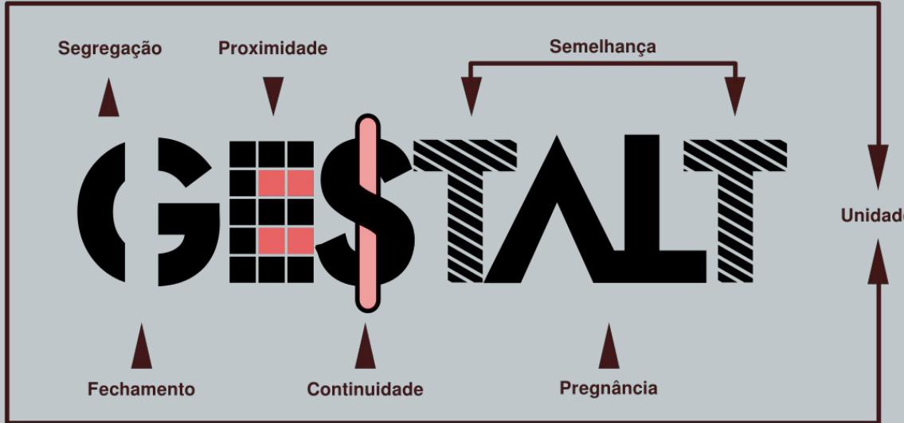
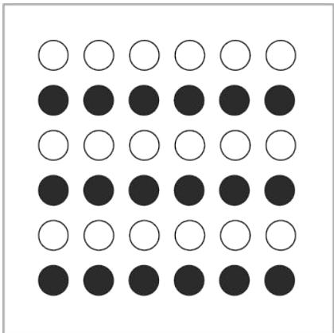
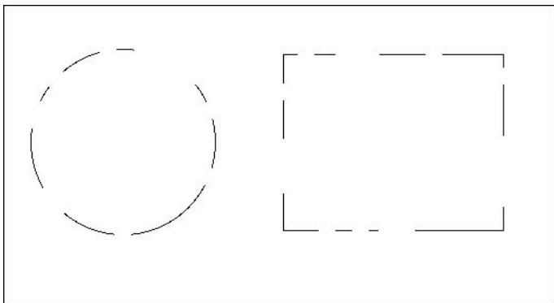
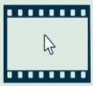
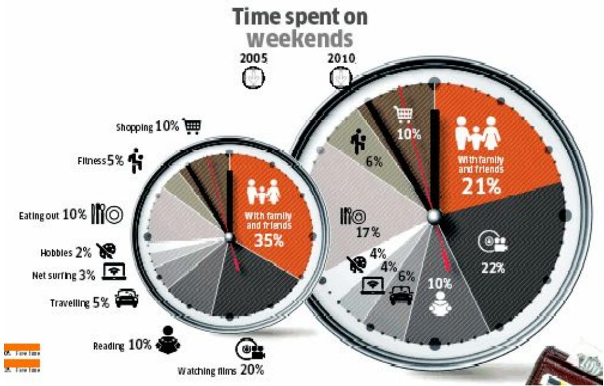
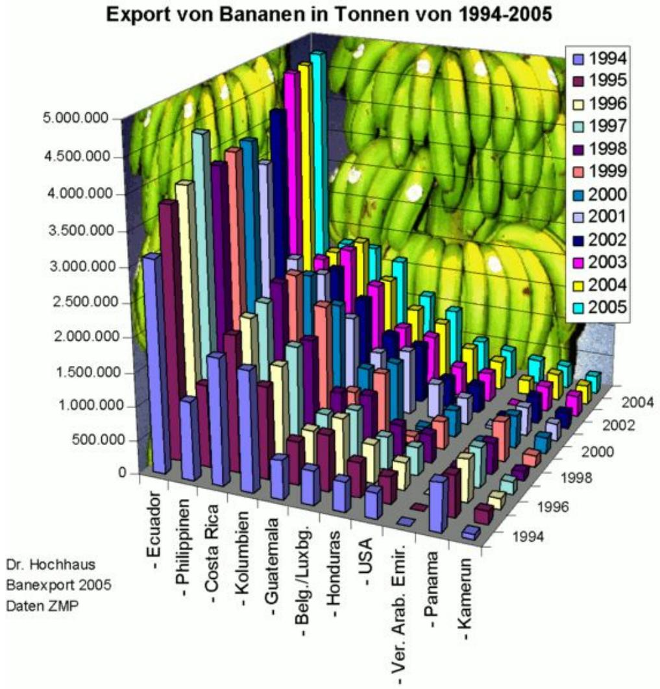

> **AI Description:**
> **Source:** `assets/_page_0_Figure_0.jpg`
> 
> **Generated:** 2026-04-29 21:42:13
> 
> ---
> 
> The image is a diagram illustrating the principles of Gestalt psychology. It features the word "GESTALT" in center, with arrows pointing to various Gestalt principles: Segregation, Proximidade, Semelhança, Unidad, Fechamento, Continuidade, and Pregnância. These principles are visually represented by arrows pointing towards the word "GESTALT," indicating their influence on the overall concept. The diagram is designed to show how these Gestalt principles work together to create a perception of a unified whole.

## Data Fechamento Presentation

## Gestalt Principles of Visual Perception

Gestalt psychology was conceived in the Berlin School of Experimental Psychology, and tries to understand the laws of our ability to acquire and maintain meaningful perceptions.

(German: Gestalt [gə'Jtalt] "shape, form")

Key principle: when the human mind perceives a form, the whole has a reality of its own, independent of the parts.

This allowed the development of 8 Gestalt Laws of Grouping. Here we are highlighting only the most relevant 5 for data presentation. You can read more details about them on Wikipedia: https://en.wikipedia.org/wiki/Gestalt\_psychology

## Gestalt Principles of Visual Perception

Proximity. We tend to see objects that are visually close together as belonging to part of a group.

Similarity. Objects thataresimilarinshape andcoloras belonging to part of a group.

> **AI Description:**
> **Source:** `assets/_page_2_Figure_0.jpg`
> 
> **Generated:** 2026-04-29 21:43:04
> 
> ---
> 
> The image contains a grid of circles, alternating between black and white. There are 10 circles in each row, and 6 rows in total. The circles are arranged in a pattern where each row alternates between black and white circles. There are no labels or text annotations present in the image.

# US SPACETRAVELA TIMELINE OF MANNED NASA FLIGHTS

OnJuly212011thelastSpaceSutlefightlandedending50yearsofmannedNASAflghtsTheUsace programbeganin1961andresultedin166nearlycontinuousmissions,costinganestimated\$7billionper yearSpaceetionisddiitst whatisnextforAmericanspaceexploration.

## MERCURY

atone4 Libety Bll2)，uly24,1961uryAttasFndp2)FMrcuryAt7uo7y241962rouryAtias8Sigma7)，Ootob 1062

## GEMIN

GeminiIVJe3-7165   
GeminiVAugt21-29.1965   
GeminiVil，December4-18,1965   
GeminVe665   
GeminVillroh161966   
GemmiXJune3-6.1966   
GeiniXJuy811966   
GeiXl56   
miniXil,No 1-15.1966

## APOLLO

Apollo9.March3-13.1969   
Apolip10ay18-26.1969   
Apollo11.Jly16-24.1969   
Apoll12Nvember14-24.1969   
Apo13.Apl11-17.1970   
Apolio14Jry31-Fry919   
Apolo15.July25-August71971   
Apollo16.Aprl16-27,1972   
Apoiip-17, embnr7-19.1972

SKYLAB Orbitd the Earthfrom1973to1979 Sylab2May25-June221973 Skylab3,July28-Suptomer25.1973 Skylab4,Novembr 16.1973-Fob

## APOLLO/SOYUZTESTPROJECT

## SPACE SHUTTLE

1981:STS-1.STS-2/1982 STS-3,STS-4.STS-6/19B3:STS-6.STS-7.STS-8.STS-0/1984 STS-41B.STS-41C,STS-41D.STS-41G,STS-51A/1985.TS-51C.STS-5ID.ST5-51B. STS-51G.STS-51F.STS-51L.STS-51J.STS.61ASTS-61B/1986:STS-61C.STS-51U/1988 STS-26.STS-27/1989:STS-29.STS-30,STS-28.STS-34,STS.33/1990:STS-32,STS.36 STS-31.STS-41.STS-38.STS-35/1991:STS-37,STS-39.STS-40.STS-43.STS-48 STS-44/1992:ST5-42,STS-45,STS-49,STS-50,STS-46.STS-47.STS-52.STS-63/1993 STS-54.STS-56,STS-55.STS-57.STS-51.STS-58.STS-61/1994:STS-60.STS62 STS-59.STS-65.STS-64.STS-68.STS-66/1995:STS-63,STS-67.STS/71,STS70,STS-69 STS-23.STS-74/1998:STS-72.STS/75.STS-76.STS-77,STS-78.STS-79.STS-80/1997: STS-81.STS-82.STS-83.STS-84.STS-94.STS-85.STS-88,STS-87/1998:ST8.89 STS-90.STS-91.STS-95.STS-88/1989:STS-96.STS-93.ST8-103/2000:STS-99. STS-101.STS106.STS-92.STS-97/2001:STS-9BS8-102,STS-100.STS-104SS-105 STS-108/2002:STS-109,STS-110.STS-111,STS-112,STS-113/2003:STS-107/2005: STS114/200S12-115S-116007SS-117SS11S STS-122.STS-123,STS-124,STS-126/2009:STS-119.STS-125.STS-127.STS-128 STS-129/2010:STS-130.ST8-131.STS-132/2011:STS-133,STS-134,ST5-135

### Full Page Description (Page 5)

**Source:** `assets/_page_5_Asset_0.jpg`

**Generated:** 2026-04-29 21:43:28

---

The image is a detailed infographic chart titled "SPACE RACE" spanning the years 1957 to 1975. It visually represents the progress and achievements of the space race between the United States and the Soviet Union, using a United States and Soviet Union flags to denote their respective missions. The chart includes various milestones such as lunar landings, space stations, and manned missions, with corresponding years and achievements marked on the timeline. Key features include the launch of Sputnik, the Apollo-Soyuz mission, and the Skylab space station. The chart uses a United States flag in blue and the Soviet Union flag in red to differentiate between the two countries' space programs.

SIsTlio 1414144

eee

sepeesues

（yoeadsNn)

# Gestalt Principles of Visual Perception

Closure. We tend to perceive objects such as shapes, letters, pictures, etc.,as being whole when they are not complete. Specifically,when parts of a whole picture are missing, our perception fils in the visual gap.

> **AI Description:**
> **Source:** `assets/_page_7_Figure_0.jpg`
> 
> **Generated:** 2026-04-29 21:41:57
> 
> ---
> 
> The image contains a simple line drawing consisting of a circle and a outline of a rectangle. The circle is on the left side, and the rectangle is on the right side. The rectangle has a same same shape as a circle.

Continuity.Elementsofobjectstendtobegrouped together,and therefore integrated into perceptual wholes if they are aligned within an object.In cases where there is an intersection between objects,individuals tend to perceive the two objects as two single uninterrupted entities.

CrteguaespslelpeRoe181 L186g

L iie CieeurdeocdeCryacolle pp LWdc

.y.

## Tracking the West Nile Virus

Height is Based on Numberof Confirmed HumanCases

Shortest prism=0   
Tallest prism=661

Approximate Distance fromtheMississippi River(miles)

0-375

375-750

750-1125

1125-1500

## Gestalt Principles of Visual Perception

## Law of good Gestalt. Elements of objects tend to be

perceptually grouped together if they form a pattern that is regular, simple,and orderly.This law implies that as individuals perceive the world,they eliminate complexity and unfamiliarity so they can observe a reality in its most simplistic form. Eliminating extraneous stimuli helps the mind create meaning.

This meaning created by perception implies a global regularity, which is often mentally prioritized over spatial relations.The law of good gestalt focuses on the idea of conciseness,which is what all of gestalt theory is based on.

### Full Page Description (Page 11)

**Source:** `assets/_page_11_Asset_2.jpg`

**Generated:** 2026-04-29 21:42:58

---

The image contains a pie chart with three segments. The largest segment represents 75% of the total, the second largest represents 21%, and the smallest represents 4%. The chart is titled "People Who Start Their Own Business Are Highly Valued." The segments are color-coded, with the largest segment in a lightest shade, the second largest in next shade, and the smallest in darkest shade. The percentages are clearly labeled on the outer edge of the pie chart.

### Full Page Description (Page 11)

**Source:** `assets/_page_11_Asset_0.jpg`

**Generated:** 2026-04-29 21:42:33

---

The image is a pie chart with a dark background. It is divided into three segments, each representing a a portion of the whole. The largest segment, occupying 85% of the chart, is labeled "Innovation and Creativity Are Highly Valued." The other two segments, each representing 12% and 3% respectively, are not labeled with specific information. The chart visually represents the distribution of emphasis on innovation and creativity within a a context of the whole.

### Full Page Description (Page 11)

**Source:** `assets/_page_11_Asset_1.jpg`

**Generated:** 2026-04-29 21:42:38

---

The image is a pie chart with a central text stating "It's Easy for People to Start a Business." The chart is divided into three segments with the following percentages: 2%, 29%, and 69%. The 69% segment is the largest, the 29% segment is the second largest, and the 2% segment is the smallest. The chart uses a color gradient from light blue to dark blue to differentiate the segments.

## CAPITALANDPOLICY

## STRENGTHSANDWEAKNESSES

Strengths

Large young and growing middle-income population

Valuations more attactive than in other major Asian countries

## ASIAINDONESIA

## ENTREPRENEURSHIPANDINNOVATION

## Weaknesses

Inadequate infrastructure in some areas

Large companiestend tobe family-or state-owned

## ADVANCED SCIENCE COURSE

at a glance

70.000

425 egl istered 105 participants countries

> **AI Description:**
> **Source:** `assets/_page_12_Figure_1.jpg`
> 
> **Generated:** 2026-04-29 21:41:05
> 
> ---
> 
> The image depicts a simple icon of a film strip with a cursor arrow pointing towards the center. The icon is likely used to represent a concept of a internet browser or a idea of a video or media player. The design is minimalistic and does not contain any text or additional visual elements.

2.000

goal

TRAINTHENEXTGENERATION OFCTBTEXPERTS.

> **AI Description:**
> **Source:** `assets/_page_13_Figure_0.jpg`
> 
> **Generated:** 2026-04-29 21:41:23
> 
> ---
> 
> The image contains two pie charts, one for 2005 and one for 2010, showing the time spent on weekends by various activities. The activities are represented by different sections of the pie charts, with percentages indicating the proportion of time spent on each activity. Key activities include "With family and friends," "Shopping," "Eating out," "Fitness," "Hobbies," "Net surfing," "Travelling," "Reading," and "Watching films." The chart highlights a the significant increase in time spent with family and friends from 35% in 2005 to 21% in following year, while other activities like "Shopping" and "Eating out" show a same proportion of time spent.

> **AI Description:**
> **Source:** `assets/_page_14_Figure_0.jpg`
> 
> **Generated:** 2026-04-29 21:41:51
> 
> ---
> 
> The image contains a 3D bar chart with a focus on the export of bananas in tons from 1994 to 2005. The chart is color-coded by year, with each year represented by a different color. The x-axis lists various countries and regions exporting bananas, including Ecuador, the Philippines, Costa Rica, Colombia, Guatemala, Belgium/Luxembourg, Honduras, the USA, the United Arab Emirates, Panama, and Cameroon. The y-axis represents the quantity of bananas exported in tons, ranging from 0 to 5,000,000. The chart provides a total export volume for each country or region for each year, allowing for a comparison of banana export trends over the given period.
