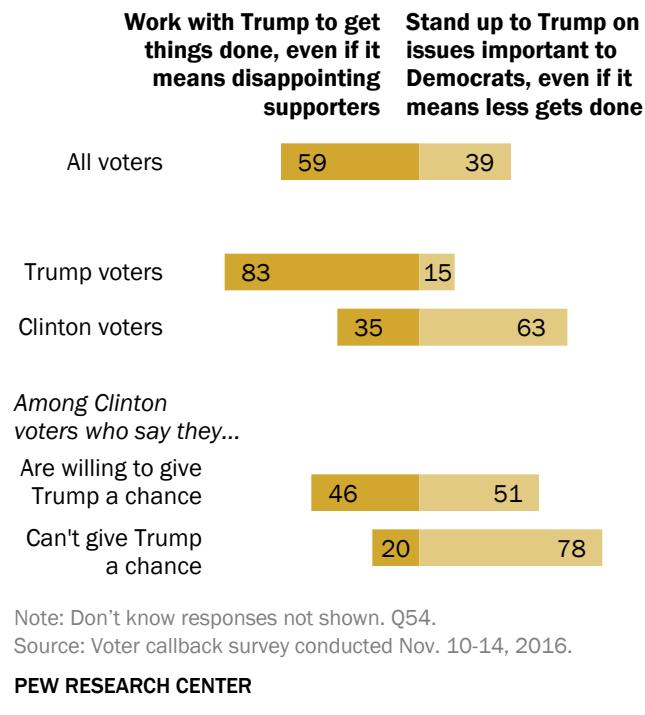

FOR RELEASE NOVEMBER 21, 2016

# Low Marks for Major Players in 2o16 Election - Including the Winner

Halfofvoters are happy Trump won; Democrats take a hard line

FOR MEDIA OR OTHER INQUIRIES:

Carroll Doherty, Director of Political Research Jocelyn Kiley, Associate Director, Research Bridget Johnson, Communications Associate

202.419.4372

www.pewresearch.org

## About Pew Research Center

Pew Research Center is a nonpartisan fact tank that informs the public about the issues, attitudes and trends shaping America and the world. It does not take policy positions. It conducts public opinion polling, demographic research, content analysis and other data-driven social science research. The Center studies U.S. politics and policy; journalism and media; internet, science and technology; religion and public life; Hispanic trends; global attitudes and trends; and U.S. social and demographic trends. All of the Center’s reports are available at www.pewresearch.org. Pew Research Center is a subsidiary of The Pew Charitable Trusts, its primary funder.

© Pew Research Center 2017

### Full Page Description (Page 2)

**Source:** `assets/_page_2_Asset_0.jpg`

**Generated:** 2026-04-29 21:52:04

---

The image is a line graph showing the percentage of the popular vote received by the winning and losing candidates in year of the presidential election in United States. The graph spans from years 1988 to 2016. The winning candidate's percentage is represented by a darker line, while the losing candidate's percentage is represented by the lighter line. Key data points include the highest winning candidate's percentage in year 2008 at 75%, and the lowest winning candidate's percentage in year 2016 at 30%. The losing candidate's percentage is highest in 1992 at 64% and lowest in 2016 at 30%. The graph highlights the fluctuating trends in the popular vote percentages for winning and losing candidates over the years.

# Low Marks for Major Players in 2o16 Election - Including the Winner

Halfof voters are happy Trump won; Democrats take a hard line

For most voters, the 2016 presidential campaign was one to forget. Post-election evaluations of the way that the winning candidate, the parties, the press and the pollsters conducted themselves during the campaign are all far more negative than after any election dating back to 1988.

The quadrennial postelection survey by Pew Research Center, conducted November 10-14 among 1,254 voters who were originally interviewed before the election, finds that half are happy that Trump won the election, while nearly as many (48%) are unhappy. That is little different from initial reactions to the election result four years ago, when 52% were happy that Barack Obama won.

But voters’ “grades” for the way Trump conducted himself during the campaign are the lowest for any victorious candidate in 28 years. Just 30% of voters give Trump an A or B, 19% grade

Voters give Trump worse grades than they have for any winning candidate in recent decades

% of voters who give each candidate a grade of “A” or “B” for the way they conducted themselves over the course of the campaign

Notes: Percent of “A” or “B” grades on an A, B, C, D, F scale. \*In 2000, Bush is labeled as winning candidate, Gore as losing candidate, though at the time of the survey the results of the election had not been declared. Source: Voter callback survey conducted Nov. 10-14, 2016.

PEW RESEARCH CENTER

him at C, 15% D, while about a third (35%) give Trump a failing grade. Four years ago, most voters (57%) gave Obama an A or B, and after his 2008 election, 75% gave him an A or B.

For the first time in Pew Research Center postelection surveys, voters give the losing candidate higher grades than the winner. About four-in-ten (43%) give Clinton an A or B, which is comparable to the share giving Mitt Romney top letter grades in 2012 (44%) and 13 percentage points higher than Trump’s (30%).

After a bitter and contentious campaign, voters are deeply polarized in their reactions to Trump’s victory and expectations for his presidency. Among all voters, 56% expect Trump to have a successful first term, which is lower than the share saying that about Obama’s first term eight years ago (67%), but on par with expectations for Obama’s second term in November 2012 (also 56%).

Virtually all of Trump’s supporters (97%) say they expect Trump’s first term to be successful; a smaller, but still overwhelming majority of Clinton supporters (76%) say Trump will be unsuccessful.

Trump voters have a high degree of confidence in – and high expectations for – the presidentelect. Fully 88% say they are confident in the

## Large share of Trump voters are confident in kind of president he’ll be

% of Trump voters who say …

Have serious concerns Confident about the about what kind of  kind of president president Trump will be Trump will be

## How Clinton voters feel about ‘giving Trump a chance’

% of Clinton voters who say …

Can't see myself giving Willing to give Trump a chance because Trump a chance to of kind of person he has see how he shown himself to be governs

kind of president Trump will be, while 90% or more express at least a fair amount of confidence in his ability to deal with key issues such as the economy, illegal immigration and health care.

By contrast, Clinton voters express little or no confidence in Trump to deal with major issues. And while a majority of Clinton voters (58%) say they are “willing to give Trump a chance and see how he governs as president,” nearly four-in-ten (39%) say they can’t see themselves giving Trump a chance “because of the kind of person he has shown himself to be.”

Equally important, most Democrats would like to see their party’s leaders stand up to Trump rather than work with him. In fact, Democratic support for cooperation with the president-elect today is substantially less than GOP support

Nearly two-thirds of Democratic and Democratic-leaning voters (65%) say “Democratic leaders should stand up to Donald Trump on issues that are important to Democratic supporters, even if means less gets done in Washington.” Just 32% want the party’s leaders to work with Trump if it means disappointing Democrats.

In November 2008 – a time when voters generally felt much better about the election and its outcome – Republicans and Republican leaners were more favorably disposed to their party’s leaders working with Obama. Nearly six-in-ten (59%) said GOP leaders should work with Obama, while 36% wanted them to “stand up” to the new president.

And Democratic voters are now far more supportive of the party moving in a more liberal direction than they were after either the 2012 or 2008 elections. About half of all Democratic and Democratic-leaning voters (49%) say Democratic leaders in Washington should move in a more liberal direction, while nearly as many (47%) favor a more moderate % of voters saying Democratic leaders should …

approach. Following Obama’s victories, majorities favored the party’s leaders moving in a more moderate direction (57% in both 2012 and 2008).

### Full Page Description (Page 5)

**Source:** `assets/_page_5_Asset_1.jpg`

**Generated:** 2026-04-29 21:58:32

---

The image contains a bar chart with three categories: "All voters," "Obama voters," and "McCain voters." Each category has three bars representing different percentages: "60," "52," and "69" for "All voters"; "4," "5," and "2" for "Obama voters"; and "35," "41," and "27" for "McCain voters." The chart visually compares the distribution of percentages across the three categories, highlighting the differences in percentages for each group.

### Full Page Description (Page 5)

**Source:** `assets/_page_5_Asset_0.jpg`

**Generated:** 2026-04-29 21:58:25

---

The image is a bar chart with a title "November 2016" and three categories: "All voters," "Trump voters," and "Clinton voters." Each category has three subcategories represented by different shades of gold: "Should," "Should not," and "Doesn't matter." The percentages for each subcategory are displayed within the bars. For example, "All voters" shows 55% for "Should," 10% for "Should not," and 33% for "Doesn't matter." The chart visually represents the opinions of different voter groups regarding a specific topic.

For their part, more than half of Republican a should work with Democratic leaders in Congress, who are in the minority in both the House and Senate, while 39% say he should stand up to Democratic leaders.

However, few Trump voters have a positive view of Trump reaching across partisan lines for appointments to his administration.

Only about a quarter (26%) of Trump voters say the president-elect should appoint Democrats to serve in his administration. Twice as many (52%) say it does not matter, while 21% say Trump should not name Democrats to his cabinet.

In 2008, after Obama’s first victory, 52% of voters who supported him said he should appoint Republicans to his cabinet, double the share of Trump backers who favor Democrats in his cabinet today.

## Relatively few Trump backers want him to appoint Democrats to key positions

% of voters saying Donald Trump appoint Democrats to serve in important positions in his administration.

## PEW RESEARCH CENTER

### Full Page Description (Page 6)

**Source:** `assets/_page_6_Asset_0.jpg`

**Generated:** 2026-04-29 21:55:50

---

The image is a line graph with two lines representing different trends over time. The x-axis represents years, ranging from 92 to 16, and the y-axis represents numerical values. The graph has two lines: one labeled "More mudslinging" and the other labeled "Less mudslinging." The "More mudslinging" line shows an increasing trend, starting at 68 in 92 and reaching 92 in 16. The "Less mudslinging" line shows a a decreasing trend, starting at 16 in 92 and reaching 4 in 16. The graph includes data points with specific values at certain years, such as 49 in 96, 34 in 00, and 14 in 04.

## Grading the 2o16 election

Donald Trump receives low grades for how he conducted himself over the course of the campaign, but voters grade other campaign actors just as harshly and in some cases even more harshly. Only about a quarter give an A or B to the Republican Party (22%) and the Democratic Party (26%). About three-in-ten give the parties an F (30% for Republican Party, 28% Democratic Party), by far the highest share giving the parties failing grades since this series of surveys began in 1988.

Election report card: Barely passing grades

Voters also give abysmal grades to the press and pollsters, whose pre-election surveys were widely criticized. Just 22% give the press a grade of an A or B, while 38% give it a failing grade. Similarly, fewer voters award pollsters grades of A or B (21%) than a grade of F (30%).

Note: Based on voters. Q24. Source: Voter callback survey conducted Nov. 10-14, 2016.

And voters do not spare themselves from criticism. Just 40% give “the voters” a grade of A or B – the lowest percentage after any election since 1996.

PEW RESEARCH CENTER

## As our surveys found throughout the

campaign, voters view the 2016 contest as extraordinarily negative. Fully 92% say there was more “mudslinging” or negative campaigning than in past elections – which is 20 percentage points higher than the previous high (72% after the 2004 election).

And while a large majority of voters (81%) feel they learned enough about the candidates to make an informed choice, a record 73% say that there was less discussion of issues compared with past presidential campaigns.

Record share of voters say there was more campaign ‘mudslinging’

% of voters who say there was than in past elections

### Full Page Description (Page 7)

**Source:** `assets/_page_7_Asset_0.jpg`

**Generated:** 2026-04-29 21:52:41

---

The image contains a horizontal bar chart with the following key information:

1. The chart presents data from a Voter callback survey conducted from November 10-14, 2016.
2. It lists six emotional states: Hopeful, Proud, Uneasy, Sad, Scared, and Angry.
3. Each emotional state is represented by a bar with a corresponding percentage value above it.
4. The percentages are as follows: Hopeful (51%), Proud (36%), Uneasy (53%), Sad (41%), Scared (41%), and Angry (31%).
5. The chart visually compares the prevalence of each emotional state among the survey respondents.

## Election reactions: Nearly all Trump supporters feel hopeful'

Trump’s upset victory came as a surprise to most voters. Nearly three-quarters (73%) 0f all voters – including 87% of Clinton supporters and 60% of Trump backers – say they were surprised by Trump’s victory.

About half of voters (53%) say his election makes them feel “uneasy,” while nearly as many (51%) say it makes them feel “hopeful.” Smaller shares say his election triumph makes them feel “scared”, “sad” (41% each), “proud” (36%) or “angry” (31%).

Among Trump voters, 96% say his election made them feel hopeful, while 74% said they feel proud. Substantial majorities of Clinton voters say they feel uneasy (90%), sad (77%) and scared (76%) about Trump’s victory. Very few Clinton voters say they feel hopeful (7%) or proud (only 1%).

Top reactions to Trump’s victory – ‘uneasy,’ ‘hopeful’

% of voters who say the election of Donald Trump makes them feel …

## PEW RESEARCH CENTER

When voters are asked to summarize their feelings about Trump’s victory in a word, the unexpected nature of the result is reflected. Among Trump supporters, “happy” is mentioned most often, while many point to their surprise or shock at the election.

For Clinton voters, “shocked” is the most frequent response, followed by “disappointed” and “disgusted.” Other Clinton voters noted their surprise or disbelief about Trump’s victory.

## Trump’s victory in a word

What one word best describes your reaction to Donald Trump winning the presidential election this year? (Number mentioning each word; not percentages)

Notes: Based on voters. Figures show actual number of respondents who offered each response; these numbers are not percentages. Responses shown for seven or more mentions. Q7. Source: Voter callback survey conducted Nov. 10-14, 2016.

## PEW RESEARCH CENTER

### Full Page Description (Page 9)

**Source:** `assets/_page_9_Asset_0.jpg`

**Generated:** 2026-04-29 21:56:42

---

The image is a bar chart with a title "% of voters who say ...". It presents data on the percentage of voters who say "Yes" and "No" across different groups: All voters, Men, Women, Trump voters, and Clinton voters. The chart uses two colors to represent "No" (light yellow) and "Yes" (dark yellow). The percentages for "Yes" range from 78% to 81%, while the percentages for "No" are consistently around 17%. The chart highlights that a majority of voters across all groups say "Yes" to the question being asked.

## Other important findings

Voters pessimistic on how Trump will impact race relations. Nearly half of voters (46%) say Trump’s election will lead to worse race relations, while only about half as many (25%) expect race relations to improve; 26% say his election won’t make a difference. Among Clinton voters, 84% expect race relations to worsen under Trump. Among Trump supporters, half expect improvement, while 38% say his election won’t make a difference.

Post-victory, most Trump backers confident in an accurate vote count. In August, just 38% of registered voters who supported Trump were very confident that their vote would be counted accurately. But in the aftermath of Trump’s accurately. But in the aftermath of Trump's

victory, 75% expressed confidence that their votes were counted accurately. The views of Clinton supporters showed no change: After the election 67% were confident that their votes were counted accurately.

Most expect woman president, eventually. Following Clinton’s defeat, a sizable majority of voters (79%) still expect there will be a female president “in their lifetime.” There are no significant differences in these opinions among men and women, or Clinton supporters and Trump backers.

Will the country elect a female president in your lifetime?

## Voters say press has too much influence.

Voters grade the press very negatively, and most (57%) say it had too much influence on the outcome of the election. Just 27% say the

Note: Don’t know responses not shown. Q46bb. Source: Voter callback survey conducted Nov. 10-14, 2016. PEW RESEARCH CENTER

press had the right amount of influence on the election, while 13% say it had too little influence. About six-in-ten Trump voters (62%) say the press had too much influence, as do 50% of Clinton voters.

### Full Page Description (Page 10)

**Source:** `assets/_page_10_Asset_1.jpg`

**Generated:** 2026-04-29 21:53:14

---

The image is a bar chart with two categories: "Not surprised" and "Surprised," divided into three groups: "All voters," "Trump voters," and "Clinton voters." The chart uses two shades of gold to represent the two categories. The "All voters" group shows 27% not surprised and 73% surprised. The "Trump voters" group shows 40% not surprised and 60% surprised. The "Clinton voters" group shows 12% not surprised and 87% surprised. The chart visually represents the proportion of people in each group who were not surprised or surprised by something, likely related to the election results.

# 1. Presidential election reactions and expectations

Half of voters say they are happy Donald Trump was elected president, while about as many (48%) say that they are unhappy. Reactions are similar to 2012 (when 52% said they were happy Obama was reelected), but they are less positive than after Obama’s first presidential campaign in 2008, when 58% said they were happy he was elected.

Not surprisingly, 97% of Trump voters say they are happy he won, while 93% of Clinton voters say they are unhappy. While wide majorities of voters for the losing presidential candidate are always broadly dissatisfied with the election outcome, this phenomenon was less pronounced eight years ago; in 2008, 77% of McCain supporters said they were unhappy Obama won and 13% said they were happy.

One reaction to the election outcome that most Trump and Clinton supporters share is surprise. Overall, 73% of all voters say they are surprised that Trump won the election, including 87% of Clinton voters. A somewhat smaller 60%-majority of Trump voters express surprise at the outcome, though 40% say they are not surprised he won.

Half say they are happy Trump was elected president

% of voters who say they are happy that was elected president …

## PEW RESEARCH CENTER

### Full Page Description (Page 11)

**Source:** `assets/_page_11_Asset_0.jpg`

**Generated:** 2026-04-29 21:55:18

---

The image contains a horizontal bar chart with six categories: Hopeful, Proud, Uneasy, Sad, Scared, and Angry. Each bar represents a percentage value, with the following percentages: Hopeful at 51%, Proud at 36%, Uneasy at 53%, Sad at 41%, Scared at 41%, and Angry at 31%. The chart visually compares the frequency or intensity of these emotions or feelings associated with each category.

## Emotional reactions to Trump's election

Voters express a mix of emotional reactions to the election of Donald Trump. On the positive side,

51% say that Trump’s election makes them feel hopeful; somewhat fewer say it makes them feel proud (36%).

On the negative side, 53% say Trump’s election makes them feel uneasy. About four-in-ten say his election makes them feel sad (41%) or scared (41%), and 31% say the election of Trump makes them feel angry.

Eight years ago, voters’ emotional reactions to Obama’s election were somewhat more positive. In response to a slightly differently worded question that asked about how Obama made them feel – as opposed to how the election of Obama made them feel – fully 69% of voters said he made them feel hopeful, while just 35% said that he made them feel uneasy.

Many voters say they feel ‘uneasy’ about the election of Trump

% of voters who say the election of Donald Trump makes them feel …

### Full Page Description (Page 12)

**Source:** `assets/_page_12_Asset_0.jpg`

**Generated:** 2026-04-29 21:59:29

---

The image is a horizontal bar chart with two sets of bars representing the responses of Trump voters and Clinton voters to six emotional states: Hopeful, Proud, Uneasy, Sad, Scared, and Angry. The chart is sourced from a voter callback survey conducted by the Pew Research Center from November 10-14, 2016. The data shows that Trump voters were more likely to feel hopeful (96%) and proud (74%) compared to Clinton voters, who were more likely to feel uneasy (90%), sad (77%), scared (76%), and angry (62%). The chart uses red bars for Trump voters and blue bars for Clinton voters, with percentages displayed above each bar.

Nearly all Trump supporters (96%) say that his election makes them feel hopeful. A somewhat smaller – but still wide – majority of Trump supporters say that his election makes them feel proud (74%).

Among Clinton supporters, the most widespread reaction to Trump’s victory is unease: 90% say the election of Trump makes them feel uneasy. About three-quarters say his election makes them feel sad (77%) or scared (76%). While less widespread than other negative reactions, most Clinton supporters (62%) also say Trump’s election makes them feel angry.

Though majorities of Clinton supporters across demographic groups express unease, sadness, fear and anger about the election of Trump, Clinton voters with college degrees are more likely than those with less education to express anger and sadness. About seven-in-ten Clinton voters with a bachelor’s degree or higher (69%) say Trump’s election makes them feel angry; a narrower 56% majority of Clinton voters with less education say this.

Trump voters overwhelmingly feel ‘hopeful’ about his election

% of Trump/Clinton voters who say the election of Trump makes them feel …

And while 70% of Clinton voters who have not graduated from college say Trump’s election makes them feel sad, fully 85% who have college degrees say that it does.

### Full Page Description (Page 13)

**Source:** `assets/_page_13_Asset_0.jpg`

**Generated:** 2026-04-29 21:53:40

---

The image contains a simple bar chart comparing the outcomes of two presidential elections: Trump 2016 and Obama 2008. The chart is divided into two categories: "Unsuccessful" and "Successful." For Trump 2016, there were 39 unsuccessful outcomes and 56 successful outcomes. For Obama 2008, there were 22 unsuccessful outcomes and 67 successful outcomes. The chart uses brown and gold colors to differentiate between the two categories and the two elections.

## Will Trump have a successful first term?

On balance, voters are optimistic about Trump’s first term: 56% say it’s more likely that Trump will have a successful first term, while 39% say it’s more likely that he’ll have an unsuccessful first term. Overall views on this question are about the same as they were four years ago, after Barack Obama’s reelection, but are less positive than in 2008. Following Obama’s victory over John McCain eight years ago, 67% of voters expected Obama would have a successful first term.

An overwhelming 97% of Trump voters expect him to have a successful first term; this is comparable to the 92% of Obama voters who said this about their candidate in 2008.

Views of Trump’s first term among Clinton voters are broadly negative and they are more negative than expectations were for Obama’s first term among John McCain’s supporters in 2008. Overall, just 15% of Clinton supporters think Trump’s first term will be successful, while 76% think it will be unsuccessful. In 2008, nearly four-in-ten McCain supporters (39%) thought Obama would have a successful first term.

## More expect Trump’s first term to be successful than unsuccessful

% of voters who say will have a successful first term …

## Less optimism for first term among losing candidates’ voters in ’16 than ’08

% of voters who say Trump/Obama will have a successful first term …

## PEW RESEARCH CENTER

### Full Page Description (Page 14)

**Source:** `assets/_page_14_Asset_1.jpg`

**Generated:** 2026-04-29 21:56:32

---

The image contains a simple bar chart with two categories: "Have serious concerns about what kind of president Trump will be" and "Confident about the kind of president Trump will be." The chart shows numerical data with the following percentages: 10% for the first category and 88% for the second category. The chart uses a color scheme with a first category in a darker shade of yellow and the second category in lighter shade of yellow.

### Full Page Description (Page 14)

**Source:** `assets/_page_14_Asset_0.jpg`

**Generated:** 2026-04-29 21:56:18

---

The image contains a simple bar chart with two categories. The chart compares two sentiments regarding Trump. The left bar, labeled "Can't see myself giving Trump a chance because of kind of person he has shown himself to be," has a value of 39. The right bar, labeled "Willing to give Trump a chance to see how he governs," has a value of 58. The chart visually represents a survey or poll result, showing that a larger percentage of respondents are willing to give Trump a chance compared to those who cannot see themselves giving him a chance.

## Can Clinton voters give Trump a chance?

While expectations for Trump’s administration among Clinton voters are low, 58% say they’re “willing to give Trump a chance and see how he governs.” But nearly four-in-ten Clinton voters (39%) say “I can’t see myself giving Trump a chance because of the kind of person he has shown himself to be.” Clinton supporters expressed highly negative evaluations of Trump throughout the campaign. For example, in October registered voters who supported Clinton said Trump lacked respect for a wide range of groups, including women, blacks, Hispanics, immigrants and Muslims.

Most Clinton supporters willing to give Trump a chance -- but many are not

% of Clinton voters who say …

Clinton voters under the ages of 18-49 are somewhat less likely to say they are willing to give Trump a chance (52%) than are Clinton supporters age 50 and older (64%). There are only modest differences across other demographic groups among Clinton supporters.

In the wake of Trump’s election, there is little sign of concern among his voters about the type of president he will be. Overall, 88% of Trump voters say they are confident about the kind of president he will be, while just 10% say they have serious concerns about the kind of president he will be.

Trump voters confident in the type of president he will be

% of Trump voters who say …

PEW RESEARCH CENTER

### Full Page Description (Page 15)

**Source:** `assets/_page_15_Asset_0.jpg`

**Generated:** 2026-04-29 21:51:41

---

The image is a chart with three horizontal bars, each representing different groups of voters: "All voters," "Trump voters," and "Clinton voters." The bars are divided into two segments, indicating different percentages for each group. The percentages are as follows:

- For "All voters," the left segment is 46% and the right segment is 51%.
- For "Trump voters," the left segment is 16% and the right segment is 84%.
- For "Clinton voters," the left segment is 75% and the right segment is 20%.

The chart visually compares the distribution of percentages across the three groups, highlighting the differences in proportions within each category.

## Voters split on whether Trump will favor the needs of his supporters

After a heated general election campaign, voters are divided over whether they think Trump will put the needs of those who supported him in the election ahead of the needs of other Americans. Overall, 51% say that Trump will give equal priority to all Americans, including those who did not support him; 46% say Trump will give greater priority to the needs of those who supported him in the election.

However, these views largely divide along lines of support: Trump voters overwhelmingly say that he will give equal priority to the needs of all Americans (84%). By contrast, 75% of Clinton voters think he will give greater priority to the needs of his supporters.

Will Donald Trump prioritize needs of all Americans or those of his supporters?

% of voters who say that as president, Trump will …

Give greater Give equal priority to priority to the the needs of all needs of his Americans, even those supporters who did not support him

## PEW RESEARCH CENTER

### Full Page Description (Page 16)

**Source:** `assets/_page_16_Asset_0.jpg`

**Generated:** 2026-04-29 21:55:10

---

The image contains a bar chart with three categories: "For worse," "Won't change much," and "For better." The chart is divided into three sections: "All voters," "Trump voters," and "Clinton voters." The percentages for each category are as follows:

- For "All voters": 25% for "For worse," 25% for "Won't change much," and 48% for "For better."
- For "Trump voters": 9% for "For worse," 89% for "Won't change much," and 9% for "For better."
- For "Clinton voters": 48% for "For worse," 39% for "Won't change much," and 9% for "For better."

The chart visually represents the distribution of opinions among different voter groups regarding a particular issue or scenario. The main trend is that a majority of Trump voters believe the situation won't change much, while a Clinton voters are more divided, with a significant portion believing it will get worse.

## Views of how Trump will change Washington

About half of voters (48%) say they think Trump will change the way things work in Washington for the better, 25% think he will change things for the worse and 25% do not think he will change things much either way.

Overwhelmingly, Trump voters expect their candidate to bring positive change to Washington: 89% think he will change the way things work for the better, while just 9% don’t think he’ll change things much either way and 1% say he’ll change things for the worse.

Clinton voters are split in their views: 48% think Trump will change the way things work in Washington for the worse, while 39% don’t expect him to change things much either way and just 9% think he will change Washington for the better.

More say Trump will change things in Washington for better than worse

% of voters who say Donald Trump will change the way things work in Washington …

## PEW RESEARCH CENTER

### Full Page Description (Page 17)

**Source:** `assets/_page_17_Asset_0.jpg`

**Generated:** 2026-04-29 21:57:30

---

The image is a bar chart with two categories of voters: "All voters," "Trump voters," and "Clinton voters." It compares two statements: "His goals are not very clear" and "Good idea where he wants to lead the country." The chart shows percentages for each category and statement combination. For "All voters," 49% agree with the first statement and 49% agree with the second statement. For "Trump voters," 12% agree with the first statement and 87% agree with the second statement. For "Clinton voters," 84% agree with the first statement and 14% agree with the second statement. The chart visually represents the distribution of opinions among different voter groups.

## Many voters not clear on Trump's goals and vision for country

While most voters say that Trump will change Washington – either for the better or for the worse – many say they do not have a good idea of Trump’s vision for the country. As many voters say they have a good idea of where Trump wants to lead the country (49%) as say his goals are not very clear (49%).

By 87%-12%, Trump voters say they have a good idea of where Trump wants to lead the country. Opinion is the reverse among Clinton voters. Fully 84% of her supporters say Trump’s goals are not very clear, while just 14% say they have a good idea of where he wants to take the country.

Most Clinton voters do not have clear sense of Trump’s goals and vision % of voters who say …

PEW RESEARCH CENTER

## Health care tops list of priorities voters suggest Trump tackle first

Voters offer a mix of ideas for what Trump’s first priority should be as president. In an open-ended

question, 20% of voters suggest health care as Trump’s first priority – the most of any other issue area voters named. Roughly one-in-ten name the economy (12%), immigration (10%), unifying the country (8%) and jobs and unemployment (8%) as the top priority issues Trump should address as president.

Another 6% of voters think Trump’s first priority should be to change his personal behavior and address divisions stoked during his campaign.

Fewer mention environmental issues and climate change, as well as foreign policy, as Trump’s first priority as president (3% each).

Nearly three-in-ten (29%) Trump voters name health care as Trump’s first priority as president, compared with fewer Clinton voters (12%) who say the same (note that while most voters who mentioned health care did not

## What should Trump’s first priority be as president?

% of voters saying Trump’s first issue priority should be...

Notes: Open-ended question. Responses offered by at least 3% shown here. See topline for full set of responses. Total exceeds 100% because of multiple responses. Q43a. Source: Voter callback survey conducted Nov. 10-14, 2016.

mention what they’d like to see done, among those who did mention what they’d like to see done, Trump voters were more likely to mention repealing the Affordable Care Act, while Clinton voters were more likely to mention maintaining it, or fixing it). Trump voters also were slightly more likely than Clinton voters to name the economy (15% vs. 9%) and immigration (15% vs. 6%). Trump and Clinton voters were about equally likely to say that jobs (10% vs. 7%) should be the main priority of the president-elect.

Among Clinton voters, about a quarter (23%) offer as their top priority for Trump suggestions about healing divisions: 12% say that Trump should prioritize unifying the country, while 11% want to see him change his personal behavior and address divisions he created during his campaign.

## Mixed views of confidence in Trump on major issues

When asked how much confidence they have in Trump to “do the right thing” dealing with five

major issues, Trump performs best when it comes to dealing with the economy: 62% of voters have a great deal or a fair amount of confidence in him in this area, including 36% who express a great deal of confidence in Trump, while 37% say they have little or no confidence in him. And 56% have at least a fair amount of confidence in Trump to do the right thing regarding the threat of terrorism, while 44% say they have little or no confidence in him on this issue.

In three other areas: dealing with health care, illegal immigration and foreign policy, voters’ views are more divided, with roughly half of voters expressing little or no confidence in Trump on these issues and about half expressing at least a fair amount of confidence.

Voters most confident in Trump doing right thing on economy and terrorism

% of voters who say they have confidence in Donald Trump to do the right thing when dealing with …

Note: Don’t know responses not shown. Q46. Source: Voter callback survey conducted Nov. 10-14, 2016.

PEW RESEARCH CENTER

### Full Page Description (Page 20)

**Source:** `assets/_page_20_Asset_0.jpg`

**Generated:** 2026-04-29 21:59:03

---

The image contains a bar chart comparing the priorities of Trump and Clinton voters across five policy areas: Economy, Threat of terrorism, Health care, Illegal immigration, and Foreign policy. The chart uses a color gradient to represent different percentages for each category, with darker shades indicating higher percentages. The data is presented in two sections, one for Trump voters and one for Clinton voters, showing how their priorities differ. The chart highlights the significant differences in policy focus between the two groups, with Trump voters placing greater emphasis on the economy and foreign policy, while Clinton voters prioritize health care and the threat of terrorism more.

At least nine-in-ten Trump voters say they have at least a fair amount of confidence in him on each At least nine-in-ten Trump voters say they have of these five issues. However, the share of these five issues.However, the share

expressing a great deal of confidence in Trump varies by issue. Seven-in-ten of his voters have a great deal of confidence that he will do the right thing on the economy (70%), and nearly as many (64%) say this about the threat of terrorism. Yet fewer express a great deal of confidence that he will do the right thing when it comes to health care (58%) or illegal immigration (55%), and only about half (47%) of Trump voters express a great deal of confidence in him on foreign policy.

Conversely, most Clinton voters say they have not too much or no confidence at all that Trump will do the right thing on all of these issues. On four of five issues, over 80% of Clinton supporters say they have not too much or no confidence. Nearly two-thirds of Clinton supporters say they have no confidence at all in Trump to do the right thing when it comes to illegal immigration (64%) or foreign policy (63%). However, just 40% say they have no confidence in Trump when it comes to dealing with the economy.

Trump voters confident he will do right thing on issues; Clinton voters are not

% of voters who say they have confidence in Donald Trump to do the right thing when dealing with …

A great deal A fair amount Not too much None at all Among Trump voters

## Despite the vast gulf in confidence between

Clinton and Trump voters, both sides tend to give Trump relatively better – or worse – ratings on the same issues. For example, both give Trump his best marks on the economy – where the largest share (27%) of Clinton supporters say they have at least a fair amount of confidence and 99% of Trump supporters say the same. Similarly, confidence in Trump is weaker on foreign policy among both his supporters and Clinton’s.

### Full Page Description (Page 21)

**Source:** `assets/_page_21_Asset_0.jpg`

**Generated:** 2026-04-29 21:53:50

---

The image contains a bar chart comparing public opinion on the performance of two presidents, Trump and Obama, in year after their respective elections. The chart categorizes responses into three groups: "Better," "No difference," and "Worse." For Trump in 2016, 25% of respondents felt the situation was better, 26% saw no difference, and 46% felt it was worse. For Obama in 2008, 52% felt the situation was better, 36% saw no difference, and 9% felt it was worse. The chart uses color coding to distinguish between the three categories.

## Few voters expect Trump's election to lead to improved race relations

Voters are skeptical that Trump’s election as president will lead to better race relations in the United States: Just a quarter (25%) think this is the case. By contrast, 46% of voters say race relations will get worse after Trump’s election, and 26% say his election will make no difference.

Voters were much more optimistic that Obama would have a positive impact on race relations in the days following his 2008 election: 52% said his election would lead to improving race relations, while just 9% said they would worsen (36% expected little change).

There are stark differences by vote choice in opinion on progress for race relations after Trump’s election. Half of Trump voters (50%) expect race relations to get better, and 38% think his election will make no difference; just 9% think race relations will get worse.

On the other hand, an overwhelming majority of Clinton voters (84%) think Trump’s election will lead to worse race relations in the country. Few Clinton voters think his election will make no difference (13%) or lead to better race relations (2%). In 2008, Obama voters were

More voters expect race relations to worsen than say they will improve

% of voters who say election of (Trump/Obama) will lead to race relations

more optimistic than McCain’s that race relations would improve (69% vs. 34%); still, just 17% of McCain’s voters expected relations would worsen (a 45% plurality said Obama’s election would not make a difference).

### Full Page Description (Page 22)

**Source:** `assets/_page_22_Asset_0.jpg`

**Generated:** 2026-04-29 21:53:26

---

The image is a bar chart with data from 2016, presenting the opinions of voters on how their situation is expected to change. The chart categorizes responses into three groups: "Get better," "Stay about the same same," and "Get worse." The data is broken down by the overall voter population and then further segmented by those who voted for Trump and Clinton. The percentages for the overall population are 27% for "Get better," 45% for "Stay about the same same same," and 27% for "Get worse." For those who voted for Trump, 47% expect to "Get better," 43% expect to "Stay about the same same," and 9% expect to "Get worse." For those who voted for Clinton, 10% expect to "Get better," 46% expect to "Stay about the the same," and 43% expect to "Get worse." The chart uses color coding to distinguish between the three categories.

# 2. Prospects for bipartisan cooperation, ideological direction of the parties

## In a major survey of opinions about

government last year, 79% of Americans said the country is more politically divided than in the past. In the wake of Trump’s election, few expect partisan relations in Washington to improve.

Today, about a quarter of voters (27%) think that relations between the two parties will improve in the coming year, while as many (27%) say they will worsen; 45% expect they will stay about the same.

Trump voters are much more optimistic in their feelings about the prospect of a better relationship. Nearly half of Trump voters (47%) feel that partisan relations will improve compared with only 9% who say they will get worse (43% expect little change).

Among Clinton voters, 46% say relations will be little changed in the next year, while 43% say they will worsen; just 10% say they will get better.

Will relations between Republicans and Democrats improve?

% of voters saying Republican and Democratic relations in Washington will ...

There was somewhat more optimism about improved partisan relations eight years ago, after Obama’s first victory. At that time, 37% expected relations between Republicans and Democrats to get better, while just 18% said they would get worse; 42% expected little change.

Trump’s supporters are slightly less optimistic about improvements in partisan relations than Obama voters were eight years ago (47% of Trump voters expect improvements, 55% of Obama voters did in 2008). And Clinton voters are more likely than McCain voters were in 2008 to say relations will get worse (43% of her voters say this today, 31% of McCain’s said this in 2008).

## Should Trump and Democratic leadership work together?

Almost three quarters (73%) of all voters – including 55% of his own supporters and fully 90% of Clinton’s – say that Donald Trump should try as best he can to work with Democratic leaders in

Washington to accomplish things, even if it means disappointing some groups of Republican supporters.

About four-in-ten Trump voters (37%) say that he should stand up to the Democrats – who are in the minority in both the House and Senate – on issues that are important to Republican supporters, even if it means less gets done in Washington.

In 2012, the pattern of opinion was very similar: 56% of Obama voters and 90% of Romney backers wanted to see Obama work with Republicans, who controlled the House at the time.

## Most voters say Trump should try as best he can to work with Democrats

% of voters who say Donald Trump should…

Work with Democrats to  Stand up to Democrats   
get things done, even if it on issues important to means disappointing Republicans, even if it supporters means less gets done

But the partisan divide between voters who

supported the winning candidate and voters who supported the losing candidate is larger this year than in 2008 on a similar question asked about whether Democratic leaders should work with Republicans.

In 2008, as Barack Obama was first preparing to enter office, nearly eight-in-ten (78%) of Obama’s voters said that Democratic leaders in Washington should work with Republicans even at the risk of disappointing their supporters, and a similar proportion of McCain’s voters (76%) said the same.

While a large majority wants Trump to work with Democrats, somewhat fewer say the reverse:

59% of voters say Democratic leaders should try to work with Trump even if it means disappointing some Democrats. Nearly fourin-ten (39%) want Democrats to “stand up” to Trump, even if it means less is accomplished.

More than eight-in-ten Trump voters (83%) say Democratic leaders should work with Trump to get things done even if it means disappointing their supporters, but that view is held by just 35% of Clinton voters. Nearly twothirds (63%) of Clinton voters say that Democrats should stand up to Trump on issues that are important to Democrats even if it means less gets done in Washington.

This contrasts with the feelings among those who voted for the losing candidate in 2008, when 58% of McCain voters said Republican leaders should try their best to work with Obama.

% of voters who say Democratic leaders should…

> **AI Description:**
> **Source:** `assets/_page_24_Figure_0.jpg`
> 
> **Generated:** 2026-04-29 21:52:30
> 
> ---
> 
> The image contains a bar chart with data from a voter callback survey conducted by the Pew Research Center in November 2016. The chart compares the opinions of all general voter population, Trump voters, and Clinton voters regarding two options: "Work with Trump to get things done, even if it means disappointing supporters" and "Stand up to Trump on issues important to Democrats, even if it means less gets done." The chart also shows a a percentage of respondents who favor each option. For example, 83% of Trump voters support working with Trump, while only 15% stand up to him. The chart also breaks down the responses of Clinton voters into those who are willing to give Trump a chance (46%) and those who cannot (20%). The data is presented in a form of stacked bars, with the left portion representing the "Work with Trump" option and the right portion representing the "Stand up to Trump" option.

Among the majority of Clinton voters (58%) who say they are “willing to give Trump a chance and see how he governs,” about half (51%) still want Democratic leaders to stand up to Trump. Among the 39% of Clinton backers who say they can’t see themselves giving Trump a chance, 78% say the same.

### Full Page Description (Page 25)

**Source:** `assets/_page_25_Asset_1.jpg`

**Generated:** 2026-04-29 21:57:20

---

The image is a horizontal bar chart with two categories: "More moderate" and "More liberal." The chart shows data for November of the years 2008, 2010, 2012, 2014, and 2016. The percentages for each category are displayed within the bars. The "More moderate" category has higher percentages than the "More liberal" category for all years shown. The percentages for the "More moderate" category range from 47% in highest in 2016 to 57% in 2012 and 2008. The "More liberal" category consistently has lower percentages, ranging from 33% in 2012, 2010, and 2008 to 49% in 2016.

### Full Page Description (Page 25)

**Source:** `assets/_page_25_Asset_0.jpg`

**Generated:** 2026-04-29 21:56:53

---

The image is a bar chart with a horizontal orientation, displaying data for two categories: "More moderate" and "More conservative" over five years: November 2008, 2010, 2012, 2014, and 2016. The chart uses a color gradient to represent the percentages for each category. The "More moderate" category is shown in a lighter shade, while the "More conservative" category is in a darker shade. The percentages for the "More moderate" category are consistently around 35%, while the "More conservative" category shows a percentages of 60%, 60%, 57%, 59%, and 60% for the respective years. The chart effectively illustrates the distribution of these two categories over time, with a "More conservative" category maintaining a highest percentage throughout the period.

## Growing share of Democrats want to see the party move to the left

By a wide margin, Republican and Republican-leaning voters continue to want to see the GOP head in a more conservative, rather than moderate, direction. Today, 60% say they want to see the party move in a conservative direction, while 36% say they’d like to see more moderation. This is little changed from recent years.

Democrats are more divided over whether their party’s future should be more liberal (49%) or more moderate (47%). The share of Democratic voters who would like to see a more liberal stance is up significantly from recent years. Two years ago, in the week after the midterm election, just 38% wanted to see the party move to the left. And following both of Obama’s presidential victories, only a third of Democratic voters said this.

Most Republicans continue to say GOP should be more conservative

% of Republican/Rep-leaning voters who would like to see their party move in a direction ...

## PEW RESEARCH CENTER

### Full Page Description (Page 26)

**Source:** `assets/_page_26_Asset_0.jpg`

**Generated:** 2026-04-29 21:56:26

---

The image contains a bar chart with two horizontal bars for each category, representing the percentage of voters who are "Unhappy" or "Happy" with their political stance. The categories are "All voters," "Trump voters," and "Clinton voters." The percentages are as follows: "All voters" have 45% unhappy and 52% happy; "Trump voters" have 3% unhappy and 94% happy; and "Clinton voters" have 87% unhappy and 10% happy. The chart uses a color scheme with yellow for "Unhappy" and orange for "Happy."

## Divided reaction to the GOP maintaining congressional control

Voters have mixed reactions to the results of congressional elections. About half (52%) of voters say they are happy that the Republican Party maintained control of the U.S. Congress, while 45% say they are unhappy.

These feelings predictably align by support for the top of the ticket. Trump voters overwhelmingly say they are happy (94%) the GOP retained congressional control, while the vast majority of Clinton supporters (87%) are unhappy.

## Voters have mixed reactions to GOP retaining congressional majority

% of voters who are that the Republican Party maintained control of the U.S. Congress

## PEW RESEARCH CENTER

### Full Page Description (Page 27)

**Source:** `assets/_page_27_Asset_0.jpg`

**Generated:** 2026-04-29 21:51:32

---

The image contains a horizontal bar chart with data categorized into five groups: Trump, Clinton, Republican Party, Democratic Party, Press, Pollsters, and Voters. Each group is further divided into five segments labeled A or B, C, D, and F. The segments are color-coded, with A or B in green, C in gray, D in orange, and F in brown. The percentages for each segment are displayed above the corresponding colored segments. The chart appears to represent some form of distribution or allocation of percentages across these groups and their segments.

## 3. Voters’ evaluations of the campaign

When voters are asked to grade the candidates, parties and press on how they conducted themselves during the

presidential campaign, they award the lowest grades for nearly all involved since the quadrennial post-election surveys began in 1988.

Just 30% of voters give Donald Trump a grade of A or B, 19% give him C, while half grade his conduct at either D (15%) or F (35%). Trump receives a C- grade on average.

Hillary Clinton’s grades are better than Trump’s, which marks the first time a losing candidate has received more positive grades than the winner. Clinton receives an A or B from 43% of voters; 20% award Clinton a C, while

## Voters grade the parties, press and pollsters quite negatively

% of voters who give each a grade of \_\_\_ for the way they conducted themselves in the campaign

nearly four-in-ten give Clinton a D (16%) or F (21%). Clinton’s average grade is a C.

Few voters give high ratings to the political parties. Only about a quarter overall give the Republican Party (22%) and Democratic Party (26%) an A or B; roughly three-in-ten give each of the parties an F (30% for the Republican Party, 28% for the Democratic Party). On average, the GOP receives a D+, while the Democratic Party gets a C-.

The press and pollsters also are viewed negatively for their performance during the campaign. Only 22% give the press an A or B grade; 38% give them a failing grade. For pollsters, just 21% give them an A or B, while three-in-ten (30%) give them an F.

### Full Page Description (Page 28)

**Source:** `assets/_page_28_Asset_1.jpg`

**Generated:** 2026-04-29 21:54:13

---

The image is a stacked bar chart showing the distribution of grades (A or B, C, D, and F) for various political candidates in different election years. The x-axis represents the election years (1988, 1992, 1996, 2000, 2004, 2008, 2012, and 2016), and the y-axis represents the number of grades. The chart uses different shades of brown and green to represent different grade categories. Notable trends include a general increase in the number of A or B grades over time, with a highest concentration in 2000 under Gore and the lowest in 1992 under Bush.

### Full Page Description (Page 28)

**Source:** `assets/_page_28_Asset_0.jpg`

**Generated:** 2026-04-29 21:54:25

---

The image is a stacked bar chart showing the percentage of grades given by presidents Bush and Obama, as well as the percentage of grades given by President Trump. The chart is divided into four categories: A or B, C, D, and F. The data is presented for the years 1988, 1992, 1996, 2000, 2004, 2008, 2012, and 2016. The chart shows a percentage of grades given by each president in each category for each year. The main trend is that the percentage of A or B grades given by the presidents has increased over time, while the percentage of F grades has decreased.

Voters also are not particularly positive about their own conduct in the campaign. Just 40% say “the voters” deserve a grade of A or B, 29% give them C, 15% D and 13% F. Still, on average, voters give themselves C, which is higher than grades they give other campaign actors aside from Clinton.

## Campaign grades 1988-2016

Trump receives historically low grades overall (30% A or B), in part because his own supporters are not all that positive about his campaign conduct. While a majority (58%) of Trump voters give Trump an A or B for his conduct during the campaign, just 17% give him an A.

Barack Obama’s supporters were much more positive about his campaign conduct in 2008 and 2012. In 2008, virtually all Obama voters (97%) gave him a grade of A or B, with 71% giving him an A. In 2012, 91% of Obama voters gave Obama top grades, including 46% who gave him an A.

Trump also gets the lowest grades from supporters of the losing candidate among election winners dating to 1988. Nearly two-thirds of Clinton voters (65%) give Trump a failing grade, by far the highest percentage among

Trump campaign grades at historic low, Clinton’s grades comparable to losing candidates in the past

% of voters who give each a grade of \_\_\_ for the way they conducted themselves in the campaign

## PEW RESEARCH CENTER

### Full Page Description (Page 29)

**Source:** `assets/_page_29_Asset_0.jpg`

**Generated:** 2026-04-29 21:58:16

---

The image is a stacked bar chart showing the distribution of grades (A or B, C, D, F) over time from 1988 to 2016. The chart is divided into four segments representing each grade category, with the height of each segment corresponding to the percentage of students falling into that grade category. The data is color-coded: green for A or B, gray for C, orange for D, and brown for F. The percentages for each grade category are labeled on top of each segment. The chart illustrates a general trend of decreasing performance over time, with the percentage of students receiving A or B grades decreasing and the percentage of students receiving F grades increasing.

### Full Page Description (Page 29)

**Source:** `assets/_page_29_Asset_1.jpg`

**Generated:** 2026-04-29 21:58:40

---

The image is a stacked bar chart showing the distribution of grades (A or B, C, D, and F) over time from years 1988 to 2016. The chart breaks down the percentage of students receiving each grade in each year. The main trend is a general increase in percentage of students receiving grades A or B, while the percentage of students receiving grades D and F shows a a most significant decrease. The percentage of students receiving grade C remains relatively stable over the years.

the losing candidate’s supporters over this period.

Looking at Obama’s two campaigns, only 12% of McCain voters gave him a failing grade in 2008, while 37% of Romney voters gave Obama an F four years ago. And just 22% of John Kerry’s voters in 2004 gave George W. Bush a failing grade.

Clinton’s overall grades are comparable to Romney’s in 2012 and only slightly worse than McCain’s in 2008. Today, 38% of Trump voters give Clinton a failing grade, similar to the share of Obama supporters who “failed” Romney in 2012 (32%), though just 15% of Obama voters gave McCain an F in 2008.

Both political parties receive their lowest grades ever for their conduct during the campaign. In the past, the party that won the White House was graded more positively than the losing party, but that is not the case this year. (In 2000, the grades for the two parties immediately following the election were nearly identical in the post-election survey conducted several weeks before the outcome was certified.)

Overall, just 26% grade the Democratic Party at A or B, while 22% give the same grade to the GOP; nearly identical shares also “fail” both parties (30% Republican, 28% Democratic).

## Both parties receive poor grades for their performance in the campaign

% of voters who give each a grade of \_\_\_ for the way they conducted themselves in the campaign

Although the Republican Party won the White House and retained control of the House and Senate, Trump voters are less positive about the performance of the GOP than Romney’s supporters were four years ago. Just 38% of Trump voters give the GOP an A or B for its campaign

### Full Page Description (Page 30)

**Source:** `assets/_page_30_Asset_1.jpg`

**Generated:** 2026-04-29 21:57:40

---

The image is a bar chart titled "The pollsters." It presents data on pollster performance across different grades (A or B, C, D, F) from 1988 to 2016. The chart uses four distinct colors to represent each grade: dark green for A or B, gray for C, orange for D, and brown for F. Each bar is divided into segments corresponding to the percentage of pollsters falling into each grade category for a respective year. The data shows fluctuations in performance over time, with the percentage of pollsters receiving an F grade generally increasing from 1988 to 2016.

### Full Page Description (Page 30)

**Source:** `assets/_page_30_Asset_0.jpg`

**Generated:** 2026-04-29 21:58:06

---

The image is a stacked bar chart titled "The press." It displays the distribution of grades (A or B, C, D, F) over time from 1988 to 2016. The chart shows that the proportion of students receiving grades A or B has generally decreased, while the proportion receiving grades C, D, and F has increased over the years. The highest proportion of students receiving grades A or B was in 1992 (36%), and the lowest was in 2016 (22%). Conversely, the highest proportion of students receiving grades F was in 2016 (38%), and the lowest was in 1992 (15%).

conduct. That is much lower than the 58% of Romney voters who gave the party an A or B in 2012, though about the same as the share of McCain voters who did so four years earlier (43%).

About half of Clinton voters (46%) give the Democratic Party an A or B, which is much lower than the share of Obama voters who did so after his victories (81% in 2012, 90% in 2008).

Both parties receive higher failing grades than in past campaigns. This is largely because both Trump and Clinton voters grade the opposing party harshly: 49% of Clinton voters give a failing grade to the GOP, while 46% of Trump voters “fail” the Democratic Party. In 2012, just 32% of Romney voters gave the Democratic Party an F, while 23% of Obama supporters gave a failing grade to the Republican Party.

Negative assessments of the way the press and pollsters conducted themselves in the campaign also are higher than in previous elections.

Overall, 38% of voters give the press a failing grade – including 60% of Trump supporters. Voters who back Republican candidates have long been highly critical of the press, but this

Record low grades for the media and pollsters in 2016

% of voters who give each a grade of \_\_\_ for the way they conducted themselves in the campaign

marks the first time a majority of any presidential candidate’s supporters has “failed” the press for its campaign conduct. In 2008, 44% of McCain voters gave the press a grade of F, as did 45% of Romney voters four years ago.

Clinton supporters grade the press much more positively. Nearly four-in-ten (38%) give the press an A or B, 26% grade it at C, 20% at D and just 15% give it a failing grade. Still, fewer Clinton

supporters give the press an A or B when compared with Obama supporters in 2008 (53% A or B) and 2012 (48%).

And voters offer very negative evaluations of the pollsters. Only 21% of voters give the pollsters a grade of A or B, while 30% give the pollsters an F for their performance. That is the highest percentage giving the pollsters a failing grade in any election dating to 1988.

These low marks for pollsters are shared by Clinton and Trump voters. Only 17% of Trump supporters and 24% of Clinton supporters give pollsters an A or B grade, while about a third (36%) of Trump supporters offer an F, as do 26% of Clinton voters.

As is almost always the case, “the voters” receive lower grades from supporters of the losing candidate than from those who back the winning candidate. Just 27% of Clinton supporters give the voters a grade of A or B; by contrast, a majority of Trump backers (55%) give top grades to the voters.

However, Trump supporters are not as positive about the performance of the voters as Obama supporters were in 2008 (83% A or B) or 2012 (70%). For their part, Clinton voters give the voters lower grades than McCain voters did in 2008 (43% A or B), and about the same grades as Romney supporters gave to the voters in 2012 (29%).

### Full Page Description (Page 32)

**Source:** `assets/_page_32_Asset_1.jpg`

**Generated:** 2026-04-29 21:51:49

---

The image is a line graph with two lines representing data for two different groups: those who voted for the winning candidate and those who voted for the losing candidate. The x-axis represents the percentage of respondents, and the y-axis represents the number of respondents. The graph shows fluctuations in percentages for both two groups, with the winning candidate's group generally having higher percentages than the losing candidate's group. The highest percentage for the winning candidate's group is 95%, while the lowest is 65%. The highest percentage for the losing candidate's group is 63%, and the lowest is 25%.

### Full Page Description (Page 32)

**Source:** `assets/_page_32_Asset_0.jpg`

**Generated:** 2026-04-29 21:52:14

---

The image is a line graph with two lines representing different satisfaction levels over time. The x-axis represents years from 1988 to 2016, and the y-axis shows percentages of people who are "Very/Fairly satisfied" and "Not very/Not at all satisfied." The graph illustrates fluctuations in satisfaction levels over the years, with the "Very/Fairly satisfied" line generally trending upwards, peaking at 70% in 2012, while the "Not very/Not at all satisfied" line shows more variability, with a lowest point at 27% in 2000 and the highest at 62% in 1988.

## Low satisfaction with voting choices

Voters’ satisfaction with the choice of presidential candidates is at its lowest point for any of the last eight presidential elections. And for the first time in this period, a majority of voters (55%) say

that ultimately they were not satisfied with their choices for president. Just 44% expressed satisfaction with their options.

In each of the four elections going back to 2000, two-thirds or more of voters expressed satisfaction with the candidates. In 2012, 70% of voters said they were satisfied with their choices; just 28% were not very or not at all satisfied.

This perspective may have set in early with 2016 voters. In June, registered voters expressed comparably sour views on their choices. Just 40% said they were satisfied with the candidates in the race.

Among those who voted for Trump, 65% said they were satisfied with the field of candidates, which marks a low point for voters who backed the winning candidate in any recent election. Eight years ago, 95% of Obama supporters said they were satisfied with their vote choices, and 87% of Obama voters did so in 2012.

Supporters of losing presidential contenders consistently express less positive views of the field after elections, but Clinton voters are particularly dissatisfied. Only 25% express satisfaction with their options for president this year. Not since Bob Dole lost to Bill Clinton in 1996 have the supporters of a losing candidate expressed so little satisfaction with their choices. Then, just 31% of Dole’s voters

For the first time in eight elections, most are dissatisfied with vote choices

% of voters who say they were with the choice of presidential candidates

Note: \*In 2000, Bush is labeled as winning candidate, Gore as losing candidate, though at the time of the survey the results of the election had not been declared. Q15. Source: Voter callback survey conducted Nov. 10-14, 2016.

## PEW RESEARCH CENTER

### Full Page Description (Page 33)

**Source:** `assets/_page_33_Asset_0.jpg`

**Generated:** 2026-04-29 21:56:00

---

The image is a line graph with two lines representing "More mudslinging than usual" and "Less mudslinging than usual." The x-axis represents years from 92 to 16, and the y-axis represents the percentage of mudslinging. The graph shows fluctuations in percentage of mudslinging over the years, with peaks and troughs. The highest percentage of "More mudslinging than usual" is 92%, and the lowest is 14%. The highest percentage of "Less mudslinging than usual" is 68%, and the lowest is 4%.

### Full Page Description (Page 33)

**Source:** `assets/_page_33_Asset_1.jpg`

**Generated:** 2026-04-29 21:56:09

---

The image is a line graph with two lines representing "Less than usual" and "More than usual" data points over time, from 92 to 16. The graph shows fluctuations in the data points, with peaks and troughs. The "Less than usual" line starts at 59, dips to 25, rises to 65, and then fluctuates between 34 and 57. The "More than usual" line starts at 34, rises to 46, dips to 25, and then fluctuates between 36 and 51. The graph includes data points at each time interval, with the highest point being 73 for "Less than usual" and 59 for "More than usual."

said they were ultimately satisfied with the candidates running.

## Campaign viewed as heavy on negative campaigning, light on issues

Voters in 2016 found this presidential campaign to be far more negative than past elections and to include far less discussion of issues than usual.

More see ‘mud-slinging,’ less focus on issues

Almost across the board, voters saw this campaign as more negative than past elections. About nine-in-ten (92%) say there was more mudslinging or negative campaigning compared with previous contests, up from 68% who said that in 2012, up 38 points from 2008 (54% more negative) and 20 points higher than the previous high of 72% in 2004.

% of voters who say there was ...

Trump voters and Clinton voters overwhelmingly agree it was a more negative campaign than previous elections (90% and 95%, respectively).

On issues, about three-quarters of voters (73%) say there was less discussion of issues than in past elections, while just 23% say there was more talk of issues. Not since the 1996 election have so many voters said there was less discussion than in typical campaigns.

Large majorities of both Trump and Clinton voters say there was less discussion of issues than usual, though Clinton voters are more likely to say this (81% vs. 65%).

## PEW RESEARCH CENTER

### Full Page Description (Page 34)

**Source:** `assets/_page_34_Asset_1.jpg`

**Generated:** 2026-04-29 21:54:34

---

The image is a line graph with two data series, "Very/somewhat helpful" and "Not too/Not at all helpful," plotted over time from the years 88 to 16. The graph shows fluctuations in the percentages of respondents who found something helpful or not helpful. The "Very/somewhat helpful" series generally shows higher percentages, peaking at 70 in 92 and then lowest at 41 in 96. The "Not too/Not at all helpful" series shows lower percentages, with a peak at 62 in 00 and the lowest at 30 in 04. The graph illustrates a general trend of increasing helpfulness over time, with some fluctuations.

### Full Page Description (Page 34)

**Source:** `assets/_page_34_Asset_0.jpg`

**Generated:** 2026-04-29 21:54:01

---

The image contains a line graph with two separate lines, each representing different categories of responses to a question about learning outcomes. The x-axis represents years from 88 to 16, and the y-axis represents percentages. The top line, labeled "Learned enough," shows a a percentage of respondents who felt they had learned enough over the years, with values ranging from 59 to 87. The bottom line, labeled "Did not learn enough," shows the percentage of respondents who felt they did not learn enough, with values ranging from 39 to 18. The graph indicates a general upward trend in percentage of respondents who felt they learned enough, while the percentage of those who felt they did not learn enough shows a a downward trend.

While most say there was far less discussion of issues, the vast majority of voters (81%) say that they learned enough about the candidates and issues to make an informed choice. The percentage who feels they learned enough to choose a candidate fell slightly from 2012 (87%) but is on par with other recent elections.

About six-in-ten voters (63%) said the presidential debates were very or somewhat helpful in deciding which candidate to vote for. This is similar to voters’ assessments of the debates usefulness in recent elections.

Learning about the candidates and issues

% of voters who say they \_ to make an informed choice

## PEW RESEARCH CENTER

### Full Page Description (Page 35)

**Source:** `assets/_page_35_Asset_0.jpg`

**Generated:** 2026-04-29 21:58:50

---

The image is a stacked bar chart showing the opinions of people regarding the amount of government spending on social services in the United States from 1992 to 2016. The chart is divided into three categories: "Too little," "About the right amount," and "Too much." Each year is represented by a height of the stacked bars, with the percentages for each category labeled on the bars. The percentages for "Too little" and "Too much" are decreasing, while the percentage for "About the right amount" is increasing over the years.

## Most voters feel news media had too much influence on election outcome

A 57% majority of voters say news organizations had too much influence on the outcome of this year’s presidential election, while 13% say the press had too little influence and 27% say the press had the right amount of influence. The share saying news organizations had too much influence on

the outcome of the presidential election is the highest it has been since 2000, while the share of those saying the press had about the right amount of influence is the lowest in Pew Research Center polling going back to 1992.

About half of those who voted for Clinton (50%) say news organizations had too much influence on the outcome of the election. This is nearly twice the share of Obama voters who said that the press had too much influence on the outcome in 2012 (29%) or in 2008 (18%), and higher than the 41% of Kerry voters who said this in 2004.

About six-in-ten Trump voters (62%) say news organizations had too much influence on the outcome of the election. Larger shares of Romney (69%) and McCain (77%) voters said the press had too much influence following their election losses. But in 2004, in the days

More say press had ‘too much’ influence on outcome of the election

% of voters saying news organizations had influence on the outcome of the presidential election

after George W. Bush’s reelection, just 45% of Bush voters said news organizations had had too much influence.

Fewer Trump voters (20%) than Clinton voters (34%) say news organizations had about the right amount of influence on the outcome of the election, while similarly small shares of each candidate’s voters said the press had too little influence (14% of Clinton voters, 13% of Trump voters).

### Full Page Description (Page 36)

**Source:** `assets/_page_36_Asset_0.jpg`

**Generated:** 2026-04-29 21:55:39

---

The image contains a bar chart comparing the views of Donald Trump and Hillary Clinton voters on the difficulty of the 2016 U.S. presidential election. The chart categorizes responses into three groups: "Too easy," "Fair," and "Too tough." For Donald Trump, 27% found the election too easy, 32% considered it fair, and 39% thought it was too tough. Among Trump voters, 74% found the election too tough, 20% considered it fair, and 4% found it too easy. Clinton voters had a different distribution, with 49% finding the election too easy, 44% considering it fair, and 6% finding it too tough. For Hillary Clinton, 45% found the election too easy, 33% considered it fair, and 21% thought it was too tough. Among Clinton voters, 78% found the election too easy, 15% considered it fair, and 5% found it too tough. The chart highlights significant differences in perception between Trump and Clinton voters regarding the difficulty of the 2016 election.

## Voters are critical of how the press treated the candidates

About four-in-ten voters (39%) say the press was too tough in the way it covered Trump’s campaign, while 32% say it was fair and 27% say it was too easy. Overall, voters were more likely to say the press was too easy on Clinton: 45% say this, while 21% say it was too tough on her and 33% say it was fair.

That the press is viewed by voters as having been easier on Clinton and harder on Trump is largely the result of higher levels of press criticism among Trump voters than Clinton voters: About three-quarters of Trump voters say both that the press was too tough on him (74%) and too easy on her (78%). By contrast, Clinton voters are roughly as likely to say the press treated Trump fairly as they are to say it was too easy on him (49% vs. 44%). And while 37% of Clinton voters say the press was too tough on their candidate, half (50%) say she was treated fairly.

Most Trump voters say press was ‘too tough’ on Trump, ‘too easy’ on Clinton

% of voters saying the press was in the way it covered each presidential candidate

## PEW RESEARCH CENTER

### Full Page Description (Page 37)

**Source:** `assets/_page_37_Asset_0.jpg`

**Generated:** 2026-04-29 21:53:05

---

The image is a horizontal bar chart with a title "Their vote was accurately counted." It presents data on the percentage of people who felt their vote was accurately counted in year after the U 2004, 2008, 2012, and 2016 elections. The chart uses four color-coded bars for each year to represent responses: "Very" (dark yellow), "Somewhat" (light yellow), "Not too" (pale yellow), and "Not at all" (very pale yellow). The percentages for "Very" are 71% in 2016, 68% in 2012, 73% in 2008, and 68% in 2004. The percentages for "Not at all" are 19% in 2016, 22% in 2012 and 2008, and 24% in 2004. The chart shows that the highest percentage of people felt their vote was accurately counted in 2008, and the lowest in 2004.

### Full Page Description (Page 37)

**Source:** `assets/_page_37_Asset_1.jpg`

**Generated:** 2026-04-29 21:52:51

---

The image is a bar chart showing the percentage of people who felt that votes across the country were accurately counted in the years 2004, 2008, 2012, and 2016. The chart uses different shades of yellow to represent the levels of agreement: "Very" (dark yellow), "Somewhat" (light yellow), "Not too" (very light yellow), and "Not at all" (white). The percentages for each category are provided for each year. The chart indicates that in 2016, 45% felt the votes were very accurately counted, while in 2012, only 31% felt the same way. The highest percentage of people feeling the votes were very accurately counted was in 2004 at 48%.

## 4. The voting process

A majority of voters say they are confident their own vote was accurately counted in the election, though fewer are confident in the accurate counting of votes across the country. This pattern is little changed from recent presidential elections.

Overall, 90% of voters say they are at least somewhat confident their own vote was accurately counted, including fully 71% who are very confident. Few (9%) are not too or not at all confident their vote was counted.

There are no differences in confidence between voters who cast their ballot on Election Day and those who voted early.

Voters are slightly less likely to be at least somewhat confident votes across the country were accurately counted (82%), and fewer than half of voters (45%) say they are very confident about this.

Most voters are confident own vote, national votes counted accurately

% of voters who say they are confident that …

The share very confident in the counting of votes across the country is on par with 2004 and 2008, but is higher than it was four years ago, when confidence was lower than it had been in recent years: In 2012, only about three-in-ten (31%) voters were very confident that votes across the country were accurately counted.

### Full Page Description (Page 38)

**Source:** `assets/_page_38_Asset_0.jpg`

**Generated:** 2026-04-29 21:54:58

---

The image is a bar chart showing the voting preferences for Republican and Democratic candidates in the United States presidential elections from 2004 to 2016. The chart uses two colors: red for Republican candidates and blue for Democratic candidates. The x-axis represents the years of the elections, and the y-axis represents the percentage of votes for each party. The chart includes annotations indicating the net party advantage (e.g., R+54 for 2004, D+27 for 2008, etc.). The data shows a a Republican party consistently leading in votes, with the Democratic party gaining ground in later later elections.

Those who voted for Donald Trump and Hillary Clinton are about equally likely to say they are very confident that votes across the country were accurately counted (47% vs. 44%). This stands in stark contrast to recent cycles, when those who voted for the winning candidate expressed significantly more confidence in the national vote count than those who voted for the losing candidate.

Four years ago, about twice as many Obama voters (42%) as Romney voters (21%) said they were very confident that votes across the country had been accurately counted. And in 2008, 56% of Obama voters were very confident that votes across the country were counted accurately, compared with just 29% of McCain voters.

In 2004, fully 72% of Bush voters were very confident in the national vote count; just 18% of Kerry voters said the same.

Similar shares of Trump, Clinton voters very confident in national vote count

Among those who \_, % who say they are very confident that votes across the country were accurately counted

PEW RESEARCH CENTER

### Full Page Description (Page 39)

**Source:** `assets/_page_39_Asset_1.jpg`

**Generated:** 2026-04-29 21:57:00

---

The image contains a bar chart with two vertical bars, each divided into segments with numerical labels. The left bar represents data for August 2016, and the right bar represents data for November 2016. The segments within each bar are color-coded, with the bottom segment in a lighter shade and the top segment in darker shade. The numbers within each segment appear to represent counts or values for different categories or groups. The chart seems to compare some metric across the two time periods, with the darker segments in November 2016 showing higher values than the corresponding segments in previous month.

### Full Page Description (Page 39)

**Source:** `assets/_page_39_Asset_5.jpg`

**Generated:** 2026-04-29 21:59:16

---

The image is a bar chart with two vertical bars, each divided into two sections. The chart is titled "Clinton voters" and compares data from August 2016 and November 2016. The left bar represents August 2016, with the bottom section labeled "67" and the top section labeled "25." The right bar represents November 2016, with the bottom section labeled "67" and the top section labeled "18." The chart uses a color yellow for the top sections and brown for the bottom sections of each bar.

### Full Page Description (Page 39)

**Source:** `assets/_page_39_Asset_4.jpg`

**Generated:** 2026-04-29 21:59:09

---

The image is a bar chart with two vertical bars, each divided into four segments, representing data for "Trump voters" in August 2016 and November 2016. The chart uses different shades of brown to differentiate between the two time periods. The numbers within each segment represent percentages, with the top segment in each bar showing the highest percentage for each time period. The chart visually compares the distribution of Trump voters' percentages in two months apart, highlighting changes in voter distribution over the period.

### Full Page Description (Page 39)

**Source:** `assets/_page_39_Asset_0.jpg`

**Generated:** 2026-04-29 21:57:09

---

The image contains a bar chart with two vertical bars, each divided into four segments, representing data for two time periods: August 2016 and November 2016. The segments are color-coded in shades of yellow and orange, with numerical values labeled on each segment. The chart appears to be comparing some metric across the two time periods, with the August 2016 bar having a following values from top to bottom: 15, 21, 34, and 28, and the November 2016 bar having the following values: 6, 11, 37, and 45. The chart uses a color gradient to differentiate between the two time periods, with August 2016 in lighter shade and November 2016 the darker shade.

### Full Page Description (Page 39)

**Source:** `assets/_page_39_Asset_3.jpg`

**Generated:** 2026-04-29 21:57:56

---

The image contains a stacked bar chart comparing data from August 2016 and November 2016. The chart is divided into two main sections, each representing the months in question. The bars are divided into four segments, each labeled with a number: 10, 12, 29, 49 for August 2016, and 5, 4, 19, 71 for November 2016. The segments appear to represent different categories or subcategories of data, with the numbers indicating the magnitude of each category. The chart visually compares the distribution of these categories between the two months, showing a relative proportions of each category within the total data for each month.

### Full Page Description (Page 39)

**Source:** `assets/_page_39_Asset_2.jpg`

**Generated:** 2026-04-29 21:57:48

---

The image contains a bar chart with two vertical bars, each divided into four segments with numerical values. The chart compares data for two time periods: August 2016 and November 2016. The segments are color-coded, with lighter shades representing smaller values and darker shades representing larger values. The numerical values within each segment are as follows: 8 and 11 for the lighter segments, 12 and 12 for the second lighter segments, 30 and 32 for the third darker segments, and 49 and 44 for the darkest segments. The chart appears to be comparing some metric across the two time periods, with the darker segments indicating higher values in second time period.

Voters express more confidence about the vote count now than they did earlier in the campaign cycle. In August, about six-in-ten registered voters were very (28%) or somewhat (34%) confident that votes across the country   
would be accurately counted;

This difference is attributable to Trump voters’ increased confidence in the count’s accuracy. Fully 51% of registered voters who supported Trump in August were not too or not at all confident in an accurate national vote count, while 37% were somewhat confident and just 11% were very confident. Today, just 11% of Trump voters say they are not too or not at all confident votes were accurately counted.

The views of Clinton voters on this question are little different than they were in the summer: In August, 79% of Clinton supporters were very or somewhat confident votes across the country would be counted accurately, including about half (49%) who were very confident.

In August, Trump supporters voiced low confidence in accurate count; far more Trump voters confident now

% who say they are confident that …

Very Somewhat Not too Not at all Votes across the country will be/were accurately counted All voters Trump voters Clinton voters

Today, 76% of Clinton voters are at least somewhat confident votes across the country were accurately counted, including 44% who are very confident.

The same pattern exists in confidence that one’s own vote was accurately counted: 75% of Trump voters now say they are “very” confident their own vote was counted accurately, double the share of Trump supporters who said in August that they were very confident their vote would be counted accurately in the November election. By comparison, the 67% of Clinton voters who now say they are very confident their vote was counted accurately is identical to the share of Clinton supporters who expected that their votes would be counted accurately in August.

### Full Page Description (Page 41)

**Source:** `assets/_page_41_Asset_0.jpg`

**Generated:** 2026-04-29 21:54:47

---

The image is a bar chart with a title "All in-person voters" and subcategories "Voted early" and "Voted Election Day." It categorizes responses into three groups: "Did not wait," "Waited <30 min," and "Waited 30+ min." The data is presented as percentages for each category. The main trends show that the majority of voters did not wait for in-person voting, with the highest percentage being 65% for those who voted on Election Day and did not wait. The smallest percentage is for those who waited 30+ minutes, with 13% for those who voted on Election Day. The chart visually represents the distribution of waiting times for in-person voting across different voting methods.

## Voters experience at the polls

About six-in-ten voters say they cast their ballot on Election Day (59%), while 41% say they voted early. The share of voters casting a ballot before Election Day has risen steadily in recent years. In 2004, just 20% of those who voted said they did so before Election Day. In the current survey, Trump and Clinton voters are about equally likely to say they voted early (39% and 42%, respectively).

Among all in-person voters, 39% reported having to wait in line to vote, while a majority (61%) did not have to wait. Nearly a quarter of all voters (23%) waited less than 30 minutes, while 15% waited longer.

Overall, those who cast a ballot early were more likely to experience wait time than those who voted on Election Day. This was also the case in 2012 and 2008. Overall, 48% of inperson voters who cast a ballot before Election Day had to wait in line, and roughly half of those voters had to wait longer than 30 minutes (22% of all early in-person voters). By contrast, just about a third (35%) of those who voted on Election Day had to wait, including just 13% who waited longer than 30 minutes.

About half of early in-person voters say they had to wait in line to vote

% of in-person voters who …

## PEW RESEARCH CENTER

## Most voters knew who they were voting for before the debates

Voters’ reports of when they made their decision between the candidates vary little between Trump and Clinton voters and are similar to past elections without an incumbent president.

Overall, 20% of voters say they made up their minds about who they were voting for before 2016. About half of voters say they decided early in the year (22%), or during and just after the party conventions (32%); 15% say they definitely decided to vote for their candidate during or just after the debates and 7% decided within a week of Election Day.

## Most voters decided their vote choice by the end of the summer

% of voters who say they definitely decided to vote for their candidate …

Note: Figures may not add to 100% because of rounding. Q10F1.   
Source: Voter callback survey conducted Nov. 10-14, 2016.

PEW RESEARCH CENTER

## Methodology

The analysis in this report is based on telephone interviews conducted November 10-14, 2016   
among a national sample of 1,254 voters (“Voters” are those who said they voted in the 2016   
election). The interviews were conducted among registered voters, 18 years of age or older   
previously interviewed in one of two Pew Research survey conducted of 1,567 registered voters in   
August 9-16, 2016 and 2,120 registered voters in October 20-25, 2016 (for more on the   
methodologies of the original surveys, see here and here). The survey was conducted by   
interviewers at Princeton Data Source under the direction of Princeton Survey Research Associates   
International. Interviews were conducted on both landline telephones and cell phones (312   
respondents for this survey were interviewed on a landline telephone, and 942 were interviewed   
on a cell phone). Interviews were conducted in English and Spanish. Interviewers asked to speak   
with the respondent from the previous interview by first name, if it was available, or by age and   
gender. For detailed information about our survey methodology, see   
http://www.pewresearch.org/methodology/u-s-survey-research/

Weighting was performed in two stages. The weight from the original sample datasets was used as a first-stage weight for this project. This first-stage weight corrects for different probabilities of selection and differential non-response associated with the original interview. The sample of all registered voters contacted for this survey was then raked - by form - to match parameters for sex by age, sex by education, age by education, region, race/ethnicity, population density, phone use. The non-Hispanic, white subgroup was also raked to age, education and region. These parameters came from the weighted demographics of registered voters interviewed from the original surveys from which sample was drawn. In addition, a parameter was added to the weighting so that the vote results reported in the survey match the actual popular vote results. Sampling errors and statistical tests of significance take into account the effect of weighting.

The following table shows the unweighted sample sizes and the error attributable to sampling that would be expected at the 95% level of confidence for different groups in the survey:

Sample sizes and sampling errors for other subgroups are available upon request.

In addition to sampling error, one should bear in mind that question wording and practical difficulties in conducting surveys can introduce error or bias into the findings of opinion polls.

Pew Research Center undertakes all polling activity, including calls to mobile telephone numbers, in compliance with the Telephone Consumer Protection Act and other applicable laws.

Pew Research Center is a nonprofit, tax-exempt 501(c)(3) organization and a subsidiary of The Pew Charitable Trusts, its primary funder.