<span id="page-0-0"></span>
# End-to-End Object Detection with Transformers

Nicolas Carion?, Francisco Massa?, Gabriel Synnaeve, Nicolas Usunier, Alexander Kirillov, and Sergey Zagoruyko

Facebook AI

Abstract. We present a new method that views object detection as a direct set prediction problem. Our approach streamlines the detection pipeline, effectively removing the need for many hand-designed components like a non-maximum suppression procedure or anchor generation that explicitly encode our prior knowledge about the task. The main ingredients of the new framework, called DEtection TRansformer or DETR, are a set-based global loss that forces unique predictions via bipartite matching, and a transformer encoder-decoder architecture. Given a fixed small set of learned object queries, DETR reasons about the relations of the objects and the global image context to directly output the final set of predictions in parallel. The new model is conceptually simple and does not require a specialized library, unlike many other modern detectors. DETR demonstrates accuracy and run-time performance on par with the well-established and highly-optimized Faster R-CNN baseline on the challenging COCO object detection dataset. Moreover, DETR can be easily generalized to produce panoptic segmentation in a unified manner. We show that it significantly outperforms competitive baselines. Training code and pretrained models are available at https://github.com/facebookresearch/detr.

## 1 Introduction

The goal of object detection is to predict a set of bounding boxes and category labels for each object of interest. Modern detectors address this set prediction task in an indirect way, by defining surrogate regression and classification problems on a large set of proposals [37,5], anchors [23], or window centers [53,46]. Their performances are significantly influenced by postprocessing steps to collapse near-duplicate predictions, by the design of the anchor sets and by the heuristics that assign target boxes to anchors [52]. To simplify these pipelines, we propose a direct set prediction approach to bypass the surrogate tasks. This end-to-end philosophy has led to significant advances in complex structured prediction tasks such as machine translation or speech recognition, but not yet in object detection: previous attempts [43,16,4,39] either add other forms of prior knowledge, or have not proven to be competitive with strong baselines on challenging benchmarks. This paper aims to bridge this gap.

<span id="page-1-0"></span>
Fig. 1: DETR directly predicts (in parallel) the final set of detections by combining a common CNN with a transformer architecture. During training, bipartite matching uniquely assigns predictions with ground truth boxes. Prediction with no match should yield a “no object” (∅) class prediction.
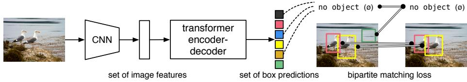

> **AI Description:**
> **Source:** `assets/_page_1_Figure_0.jpg`
> 
> **Generated:** 2026-04-29 22:16:14
> 
> ---
> 
> The image is a diagram illustrating a process for object detection and localization using a transformer encoder-decoder model. It shows a a convolutional neural network (CNN) processes an image to extract features, which are then fed into a transformer encoder-decoder architecture. The output of the transformer model is a set of box predictions, which are matched to the ground truth boxes using a bipartite matching loss function. The diagram highlights the flow of information from the input image to the output predictions, with visual representations of the image, the extracted features, and the predicted boxes.


We streamline the training pipeline by viewing object detection as a direct set prediction problem. We adopt an encoder-decoder architecture based on transformers [47], a popular architecture for sequence prediction. The self-attention mechanisms of transformers, which explicitly model all pairwise interactions between elements in a sequence, make these architectures particularly suitable for specific constraints of set prediction such as removing duplicate predictions.

Our DEtection TRansformer (DETR, see Figure 1) predicts all objects at once, and is trained end-to-end with a set loss function which performs bipartite matching between predicted and ground-truth objects. DETR simplifies the detection pipeline by dropping multiple hand-designed components that encode prior knowledge, like spatial anchors or non-maximal suppression. Unlike most existing detection methods, DETR doesn’t require any customized layers, and thus can be reproduced easily in any framework that contains standard CNN and transformer classes.1.

Compared to most previous work on direct set prediction, the main features of DETR are the conjunction of the bipartite matching loss and transformers with (non-autoregressive) parallel decoding [29,12,10,8]. In contrast, previous work focused on autoregressive decoding with RNNs [43,41,30,36,42]. Our matching loss function uniquely assigns a prediction to a ground truth object, and is invariant to a permutation of predicted objects, so we can emit them in parallel.

We evaluate DETR on one of the most popular object detection datasets, COCO [24], against a very competitive Faster R-CNN baseline [37]. Faster R-CNN has undergone many design iterations and its performance was greatly improved since the original publication. Our experiments show that our new model achieves comparable performances. More precisely, DETR demonstrates significantly better performance on large objects, a result likely enabled by the non-local computations of the transformer. It obtains, however, lower performances on small objects. We expect that future work will improve this aspect in the same way the development of FPN [22] did for Faster R-CNN.

Training settings for DETR differ from standard object detectors in multiple ways. The new model requires extra-long training schedule and benefits from auxiliary decoding losses in the transformer. We thoroughly explore what components are crucial for the demonstrated performance.

<span id="page-2-0"></span>
The design ethos of DETR easily extend to more complex tasks. In our experiments, we show that a simple segmentation head trained on top of a pretrained DETR outperfoms competitive baselines on Panoptic Segmentation [19], a challenging pixel-level recognition task that has recently gained popularity.

## 2 Related work

Our work build on prior work in several domains: bipartite matching losses for set prediction, encoder-decoder architectures based on the transformer, parallel decoding, and object detection methods.

## 2.1 Set Prediction

There is no canonical deep learning model to directly predict sets. The basic set prediction task is multilabel classification (see e.g., [40,33] for references in the context of computer vision) for which the baseline approach, one-vs-rest, does not apply to problems such as detection where there is an underlying structure between elements (i.e., near-identical boxes). The first difficulty in these tasks is to avoid near-duplicates. Most current detectors use postprocessings such as non-maximal suppression to address this issue, but direct set prediction are postprocessing-free. They need global inference schemes that model interactions between all predicted elements to avoid redundancy. For constant-size set prediction, dense fully connected networks [9] are sufficient but costly. A general approach is to use auto-regressive sequence models such as recurrent neural networks [48]. In all cases, the loss function should be invariant by a permutation of the predictions. The usual solution is to design a loss based on the Hungarian algorithm [20], to find a bipartite matching between ground-truth and prediction. This enforces permutation-invariance, and guarantees that each target element has a unique match. We follow the bipartite matching loss approach. In contrast to most prior work however, we step away from autoregressive models and use transformers with parallel decoding, which we describe below.

## 2.2 Transformers and Parallel Decoding

Transformers were introduced by Vaswani et al. [47] as a new attention-based building block for machine translation. Attention mechanisms [2] are neural network layers that aggregate information from the entire input sequence. Transformers introduced self-attention layers, which, similarly to Non-Local Neural Networks [49], scan through each element of a sequence and update it by aggregating information from the whole sequence. One of the main advantages of attention-based models is their global computations and perfect memory, which makes them more suitable than RNNs on long sequences. Transformers are now replacing RNNs in many problems in natural language processing, speech processing and computer vision [8,27,45,34,31].

<span id="page-3-0"></span>
Transformers were first used in auto-regressive models, following early sequenceto-sequence models [44], generating output tokens one by one. However, the prohibitive inference cost (proportional to output length, and hard to batch) lead to the development of parallel sequence generation, in the domains of audio [29], machine translation [12,10], word representation learning [8], and more recently speech recognition [6]. We also combine transformers and parallel decoding for their suitable trade-off between computational cost and the ability to perform the global computations required for set prediction.

## 2.3 Object detection

Most modern object detection methods make predictions relative to some initial guesses. Two-stage detectors [37,5] predict boxes w.r.t. proposals, whereas single-stage methods make predictions w.r.t. anchors [23] or a grid of possible object centers [53,46]. Recent work [52] demonstrate that the final performance of these systems heavily depends on the exact way these initial guesses are set. In our model we are able to remove this hand-crafted process and streamline the detection process by directly predicting the set of detections with absolute box prediction w.r.t. the input image rather than an anchor.

Set-based loss. Several object detectors [9,25,35] used the bipartite matching loss. However, in these early deep learning models, the relation between different prediction was modeled with convolutional or fully-connected layers only and a hand-designed NMS post-processing can improve their performance. More recent detectors [37,23,53] use non-unique assignment rules between ground truth and predictions together with an NMS.

Learnable NMS methods [16,4] and relation networks [17] explicitly model relations between different predictions with attention. Using direct set losses, they do not require any post-processing steps. However, these methods employ additional hand-crafted context features like proposal box coordinates to model relations between detections efficiently, while we look for solutions that reduce the prior knowledge encoded in the model.

Recurrent detectors. Closest to our approach are end-to-end set predictions for object detection [43] and instance segmentation [41,30,36,42]. Similarly to us, they use bipartite-matching losses with encoder-decoder architectures based on CNN activations to directly produce a set of bounding boxes. These approaches, however, were only evaluated on small datasets and not against modern baselines. In particular, they are based on autoregressive models (more precisely RNNs), so they do not leverage the recent transformers with parallel decoding.

## 3 The DETR model

Two ingredients are essential for direct set predictions in detection: (1) a set prediction loss that forces unique matching between predicted and ground truth

<span id="page-4-0"></span>
boxes; (2) an architecture that predicts (in a single pass) a set of objects and models their relation. We describe our architecture in detail in Figure 2.

## 3.1 Object detection set prediction loss

DETR infers a fixed-size set of N predictions, in a single pass through the decoder, where N is set to be significantly larger than the typical number of objects in an image. One of the main difficulties of training is to score predicted objects (class, position, size) with respect to the ground truth. Our loss produces an optimal bipartite matching between predicted and ground truth objects, and then optimize object-specific (bounding box) losses.

Let us denote by y the ground truth set of objects, and $\hat { y } ~ = ~ \{ \hat { y } _ { i } \} _ { i = 1 } ^ { N }$ the set of N predictions. Assuming N is larger than the number of objects in the image, we consider $y$ also as a set of size N padded with $\mathcal { D }$ (no object). To find a bipartite matching between these two sets we search for a permutation of N elements $\sigma \in { \mathfrak { S } } _ { N }$ with the lowest cost:

$$
\hat { \sigma } = \underset { \sigma \in \mathfrak { S } _ { N } } { \arg \operatorname* { m i n } } \sum _ { i } ^ { N } \mathcal { L } _ { \mathrm { m a t c h } } \big ( y _ { i } , \hat { y } _ { \sigma ( i ) } \big ) ,\tag{1}
$$

where $\mathcal { L } _ { \mathrm { m a t c h } } \big ( y _ { i } , \hat { y } _ { \sigma ( i ) } \big )$ is a pair-wise matching cost between ground truth $y _ { i }$ and a prediction with index $\sigma ( i )$ . This optimal assignment is computed efficiently with the Hungarian algorithm, following prior work (e.g. [43]).

The matching cost takes into account both the class prediction and the similarity of predicted and ground truth boxes. Each element i of the ground truth set can be seen as a $y _ { i } ~ = ~ ( c _ { i } , b _ { i } )$ where $c _ { i }$ is the target class label (which may be $\varnothing )$ and $b _ { i } ~ \in ~ [ 0 , 1 ] ^ { 4 }$ is a vector that defines ground truth box center coordinates and its height and width relative to the image size. For the prediction with index $\sigma ( i )$ we define probability of class $c _ { i }$ as $\hat { p } _ { \sigma ( i ) } ( \boldsymbol { c } _ { i } )$ and the predicted box as $\hat { b } _ { \sigma ( i ) }$ . With these notations we define $\mathcal { L } _ { \mathrm { m a t c h } } \big ( y _ { i } , \hat { y } _ { \sigma ( i ) } \big )$ as $- \mathbb { 1 } _ { \{ c _ { i } \neq \emptyset \} } \hat { p } _ { \sigma ( i ) } ( c _ { i } ) + \mathbb { 1 } _ { \{ c _ { i } \neq \emptyset \} } \mathcal { L } _ { \mathrm { b o x } } \big ( b _ { i } , \hat { b } _ { \sigma ( i ) } \big )$

This procedure of finding matching plays the same role as the heuristic assignment rules used to match proposal [37] or anchors [22] to ground truth objects in modern detectors. The main difference is that we need to find one-to-one matching for direct set prediction without duplicates.

The second step is to compute the loss function, the Hungarian loss for all pairs matched in the previous step. We define the loss similarly to the losses of common object detectors, i.e. a linear combination of a negative log-likelihood for class prediction and a box loss defined later:

$$
\mathcal { L } _ { \mathrm { H u n g a r i a n } } ( y , \hat { y } ) = \sum _ { i = 1 } ^ { N } \left[ - \log \hat { p } _ { \hat { \sigma } ( i ) } ( c _ { i } ) + \mathbb { 1 } _ { \{ c _ { i } \neq \varnothing \} } \mathcal { L } _ { \mathrm { b o x } } \big ( b _ { i } , \hat { b } _ { \hat { \sigma } } ( i ) \big ) \right] ,\tag{2}
$$

where $\hat { \sigma }$ is the optimal assignment computed in the first step (1). In practice, we down-weight the log-probability term when $c _ { i } = \emptyset$ by a factor 10 to account for class imbalance. This is analogous to how Faster R-CNN training procedure balances positive/negative proposals by subsampling [37]. Notice that the matching cost between an object and $\mathcal { D }$ doesn’t depend on the prediction, which means that in that case the cost is a constant. In the matching cost we use probabilities $\hat { p } _ { \hat { \sigma } ( i ) } ( c _ { i } )$ instead of log-probabilities. This makes the class prediction term commensurable to $\mathcal { L } _ { \mathrm { b o x } } ( \cdot , \cdot )$ (described below), and we observed better empirical performances.

<span id="page-5-0"></span>
Bounding box loss. The second part of the matching cost and the Hungarian loss is $\mathcal { L } _ { \mathrm { b o x } } ( \cdot )$ that scores the bounding boxes. Unlike many detectors that do box predictions as a $\varDelta$ w.r.t. some initial guesses, we make box predictions directly. While such approach simplify the implementation it poses an issue with relative scaling of the loss. The most commonly-used $\ell _ { 1 }$ loss will have different scales for small and large boxes even if their relative errors are similar. To mitigate this issue we use a linear combination of the $\ell _ { 1 }$ loss and the generalized IoU loss [38] $\mathcal { L } _ { \mathrm { i o u } } ( \cdot , \cdot )$ that is scale-invariant. Overall, our box loss is $\mathcal { L } _ { \mathrm { b o x } } ( b _ { i } , \hat { b } _ { \sigma ( i ) } )$ defined as $\lambda _ { \mathrm { i o u } } \mathcal { L } _ { \mathrm { i o u } } ( b _ { i } , \hat { b } _ { \sigma ( i ) } ) + \lambda _ { \mathrm { L 1 } } | | b _ { i } - \hat { b } _ { \sigma ( i ) } | | _ { 1 }$ where $\lambda _ { \mathrm { i o u } } , \lambda _ { \mathrm { L 1 } } \in \mathbb { R }$ are hyperparameters. These two losses are normalized by the number of objects inside the batch.

## 3.2 DETR architecture

The overall DETR architecture is surprisingly simple and depicted in Figure 2. It contains three main components, which we describe below: a CNN backbone to extract a compact feature representation, an encoder-decoder transformer, and a simple feed forward network (FFN) that makes the final detection prediction.

Unlike many modern detectors, DETR can be implemented in any deep learning framework that provides a common CNN backbone and a transformer architecture implementation with just a few hundred lines. Inference code for DETR can be implemented in less than 50 lines in PyTorch [32]. We hope that the simplicity of our method will attract new researchers to the detection community.

Backbone. Starting from the initial image $x _ { \mathrm { i m g } } ~ \in ~ \mathbb { R } ^ { 3 \times H _ { 0 } \times W _ { 0 } }$ (with 3 color channels2), a conventional CNN backbone generates a lower-resolution activation map $f \in \dot { \mathbb { R } } ^ { C \times H \times W }$ . Typical values we use are $C = 2 0 4 8$ and H, $\begin{array} { r } { W = \frac { H _ { 0 } } { 3 2 } , \frac { W _ { 0 } } { 3 2 } } \end{array}$

Transformer encoder. First, a 1x1 convolution reduces the channel dimension of the high-level activation map f from C to a smaller dimension $d .$ creating a new feature map ${ \boldsymbol { z } } _ { 0 } \in \mathbb { R } ^ { d \times H \times W }$ . The encoder expects a sequence as input, hence we collapse the spatial dimensions of $z _ { \mathrm { 0 } }$ into one dimension, resulting in a $d { \times } H W$ feature map. Each encoder layer has a standard architecture and consists of a multi-head self-attention module and a feed forward network (FFN). Since the transformer architecture is permutation-invariant, we supplement it with fixed positional encodings [31,3] that are added to the input of each attention layer. We defer to the supplementary material the detailed definition of the architecture, which follows the one described in [47].

<span id="page-6-0"></span>
Fig. 2: DETR uses a conventional CNN backbone to learn a 2D representation of an input image. The model flattens it and supplements it with a positional encoding before passing it into a transformer encoder. A transformer decoder then takes as input a small fixed number of learned positional embeddings, which we call object queries, and additionally attends to the encoder output. We pass each output embedding of the decoder to a shared feed forward network (FFN) that predicts either a detection (class and bounding box) or a “no object” class.
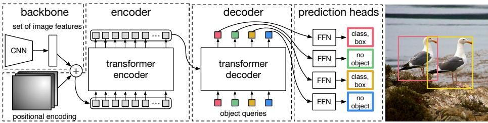

> **AI Description:**
> **Source:** `assets/_page_6_Figure_0.jpg`
> 
> **Generated:** 2026-04-29 22:16:23
> 
> ---
> 
> The image is a technical illustration of a transformer-based object detection model. It includes a backbone CNN that extracts image features, which are then fed into a a transformer encoder. The encoder processes these features, and the output is passed to a transformer decoder. The decoder uses object queries to generate predictions, which are then processed through multiple feed-forward neural networks (FFNs) to predict object classes, bounding boxes, and whether an object is present or not. The rightmost part of the image shows an example of object detection in an image, with bounding boxes and labels indicating the presence and type of objects.


Transformer decoder. The decoder follows the standard architecture of the transformer, transforming N embeddings of size d using multi-headed self- and encoder-decoder attention mechanisms. The difference with the original transformer is that our model decodes the N objects in parallel at each decoder layer, while Vaswani et al. [47] use an autoregressive model that predicts the output sequence one element at a time. We refer the reader unfamiliar with the concepts to the supplementary material. Since the decoder is also permutation-invariant, the N input embeddings must be different to produce different results. These input embeddings are learnt positional encodings that we refer to as object queries, and similarly to the encoder, we add them to the input of each attention layer. The N object queries are transformed into an output embedding by the decoder. They are then independently decoded into box coordinates and class labels by a feed forward network (described in the next subsection), resulting N final predictions. Using self- and encoder-decoder attention over these embeddings, the model globally reasons about all objects together using pair-wise relations between them, while being able to use the whole image as context.

Prediction feed-forward networks (FFNs). The final prediction is computed by a 3-layer perceptron with ReLU activation function and hidden dimension d, and a linear projection layer. The FFN predicts the normalized center coordinates, height and width of the box w.r.t. the input image, and the linear layer predicts the class label using a softmax function. Since we predict a fixed-size set of N bounding boxes, where N is usually much larger than the actual number of objects of interest in an image, an additional special class label ∅ is used to represent that no object is detected within a slot. This class plays a similar role to the “background” class in the standard object detection approaches.

Auxiliary decoding losses. We found helpful to use auxiliary losses [1] in decoder during training, especially to help the model output the correct number of objects of each class. We add prediction FFNs and Hungarian loss after each decoder layer. All predictions FFNs share their parameters. We use an additional shared layer-norm to normalize the input to the prediction FFNs from different decoder layers.

<span id="page-7-0"></span>
## 4 Experiments

We show that DETR achieves competitive results compared to Faster R-CNN in quantitative evaluation on COCO. Then, we provide a detailed ablation study of the architecture and loss, with insights and qualitative results. Finally, to show that DETR is a versatile and extensible model, we present results on panoptic segmentation, training only a small extension on a fixed DETR model. We provide code and pretrained models to reproduce our experiments at https://github.com/facebookresearch/detr.

Dataset. We perform experiments on COCO 2017 detection and panoptic segmentation datasets [24,18], containing 118k training images and 5k validation images. Each image is annotated with bounding boxes and panoptic segmentation. There are 7 instances per image on average, up to 63 instances in a single image in training set, ranging from small to large on the same images. If not specified, we report AP as bbox AP, the integral metric over multiple thresholds. For comparison with Faster R-CNN we report validation AP at the last training epoch, for ablations we report median over validation results from the last 10 epochs.

Technical details. We train DETR with AdamW [26] setting the initial transformer’s learning rate to $1 0 ^ { - 4 }$ , the backbone’s to $1 0 ^ { - 5 }$ , and weight decay to $1 0 ^ { - 4 }$ All transformer weights are initialized with Xavier init [11], and the backbone is with ImageNet-pretrained ResNet model [15] from torchvision with frozen batchnorm layers. We report results with two different backbones: a ResNet-50 and a ResNet-101. The corresponding models are called respectively DETR and DETR-R101. Following [21], we also increase the feature resolution by adding a dilation to the last stage of the backbone and removing a stride from the first convolution of this stage. The corresponding models are called respectively DETR-DC5 and DETR-DC5-R101 (dilated C5 stage). This modification increases the resolution by a factor of two, thus improving performance for small objects, at the cost of a 16x higher cost in the self-attentions of the encoder, leading to an overall 2x increase in computational cost. A full comparison of FLOPs of these models and Faster R-CNN is given in Table 1.

We use scale augmentation, resizing the input images such that the shortest side is at least 480 and at most 800 pixels while the longest at most 1333 [50]. To help learning global relationships through the self-attention of the encoder, we also apply random crop augmentations during training, improving the performance by approximately 1 AP. Specifically, a train image is cropped with probability 0.5 to a random rectangular patch which is then resized again to 800-1333. The transformer is trained with default dropout of 0.1. At inference time, some slots predict empty class. To optimize for AP, we override the prediction of these slots with the second highest scoring class, using the corresponding confidence. This improves AP by 2 points compared to filtering out empty slots. Other training hyperparameters can be found in section A.4. For our ablation experiments we use training schedule of 300 epochs with a learning rate drop by a factor of 10 after 200 epochs, where a single epoch is a pass over all training images once. Training the baseline model for 300 epochs on 16 V100 GPUs takes 3 days, with 4 images per GPU (hence a total batch size of 64). For the longer schedule used to compare with Faster R-CNN we train for 500 epochs with learning rate drop after 400 epochs. This schedule adds 1.5 AP compared to the shorter schedule.

<span id="page-8-0"></span>
Table 1: Comparison with Faster R-CNN with a ResNet-50 and ResNet-101 backbones on the COCO validation set. The top section shows results for Faster R-CNN models in Detectron2 [50], the middle section shows results for Faster R-CNN models with GIoU [38], random crops train-time augmentation, and the long 9x training schedule. DETR models achieve comparable results to heavily tuned Faster R-CNN baselines, having lower $\mathrm { A P _ { S } }$ but greatly improved $\mathrm { A P _ { L } }$ . We use torchscript Faster R-CNN and DETR models to measure FLOPS and FPS. Results without R101 in the name correspond to ResNet-50.
<table><tr><td>Model GFLOPS/FPS #params AP  $\mathrm { A P _ { 5 0 } }$   $\mathrm { A P _ { 7 5 } }$   $\mathrm { A P _ { S } }$   $\mathrm { A P _ { M } }$   $\mathrm { A P _ { L } }$ </td></tr><tr><td>Faster RCNN-DC5 320/16 166M 39.0 60.5</td></tr><tr><td>42.3 21.4 43.5 Faster RCNN-FPN 180/26 42M 40.2 61.0 43.8 24.2 43.5</td></tr><tr><td>Faster :RCNN-R101-FPN 246/20 60M 42.0 62.5 45.9 25.2 45.6</td></tr><tr><td>Faster RCNN-DC5+ 320/16 166M 41.1 61.4 44.3 22.9 45.9 55.0</td></tr><tr><td>Faster RCNN-FPN+ 180/26 42M 42.0 62.1 45.5 26.6 45.4 53.4</td></tr><tr><td>Faster RCNN-R101-FPN+ 246/20 60M 44.0 63.9 47.8 27.2 48.1 56.0</td></tr><tr><td>DETR 86/28 41M 42.0 62.4 44.2 20.5 45.8 61.1</td></tr><tr><td>DETR-DC5 187/12 41M 43.3 63.1 45.9 22.5 47.3 61.1</td></tr><tr><td>DETR-R101 152/20 60M 43.5 63.8 46.4 21.9 48.0 61.8</td></tr><tr><td>DETR-DC5-R101 253/10 60M 44.9 64.7 47.7 23.7 49.5 62.3</td></tr></table>

## 4.1 Comparison with Faster R-CNN

Transformers are typically trained with Adam or Adagrad optimizers with very long training schedules and dropout, and this is true for DETR as well. Faster R-CNN, however, is trained with SGD with minimal data augmentation and we are not aware of successful applications of Adam or dropout. Despite these differences we attempt to make a Faster R-CNN baseline stronger. To align it with DETR, we add generalized IoU [38] to the box loss, the same random crop augmentation and long training known to improve results [13]. Results are presented in Table 1. In the top section we show Faster R-CNN results from Detectron2 Model Zoo [50] for models trained with the 3x schedule. In the middle section we show results (with a “+”) for the same models but trained with the 9x schedule (109 epochs) and the described enhancements, which in total adds 1-2 AP. In the last section of Table 1 we show the results for multiple DETR models. To be comparable in the number of parameters we choose a model with 6 transformer and 6 decoder layers of width 256 with 8 attention heads. Like Faster R-CNN with FPN this model has 41.3M parameters, out of which 23.5M are in ResNet-50, and 17.8M are in the transformer. Even though both Faster R-CNN and DETR are still likely to further improve with longer training, we can conclude that DETR can be competitive with Faster R-CNN with the same number of parameters, achieving 42 AP on the COCO val subset. The way DETR achieves this is by improving $\mathrm { A P _ { L } }$ (+7.8), however note that the model is still lagging behind in $\mathrm { A P _ { S } }$ (-5.5). DETR-DC5 with the same number of parameters and similar FLOP count has higher AP, but is still significantly behind in $\mathrm { A P _ { S } }$ too. Faster R-CNN and DETR with ResNet-101 backbone show comparable results as well.

<span id="page-9-0"></span>
Table 2: Effect of encoder size. Each row corresponds to a model with varied number of encoder layers and fixed number of decoder layers. Performance gradually improves with more encoder layers.


## 4.2 Ablations

Attention mechanisms in the transformer decoder are the key components which model relations between feature representations of different detections. In our ablation analysis, we explore how other components of our architecture and loss influence the final performance. For the study we choose ResNet-50-based DETR model with 6 encoder, 6 decoder layers and width 256. The model has 41.3M parameters, achieves 40.6 and 42.0 AP on short and long schedules respectively, and runs at 28 FPS, similarly to Faster R-CNN-FPN with the same backbone.

Number of encoder layers. We evaluate the importance of global imagelevel self-attention by changing the number of encoder layers (Table 2). Without encoder layers, overall AP drops by 3.9 points, with a more significant drop of 6.0 AP on large objects. We hypothesize that, by using global scene reasoning, the encoder is important for disentangling objects. In Figure 3, we visualize the attention maps of the last encoder layer of a trained model, focusing on a few points in the image. The encoder seems to separate instances already, which likely simplifies object extraction and localization for the decoder.

Number of decoder layers. We apply auxiliary losses after each decoding layer (see Section 3.2), hence, the prediction FFNs are trained by design to predict objects out of the outputs of every decoder layer. We analyze the importance of each decoder layer by evaluating the objects that would be predicted at each stage of the decoding (Fig. 4). Both AP and $\mathrm { A P _ { 5 0 } }$ improve after every layer, totalling into a very significant +8.2/9.5 AP improvement between the first and the last layer. With its set-based loss, DETR does not need NMS by design. To verify this we run a standard NMS procedure with default parameters [50] for the outputs after each decoder. NMS improves performance for the predictions from the first decoder. This can be explained by the fact that a single decoding layer of the transformer is not able to compute any cross-correlations between the output elements, and thus it is prone to making multiple predictions for the same object. In the second and subsequent layers, the self-attention mechanism over the activations allows the model to inhibit duplicate predictions. We observe that the improvement brought by NMS diminishes as depth increases. At the last layers, we observe a small loss in AP as NMS incorrectly removes true positive predictions.

<span id="page-10-0"></span>
Fig. 3: Encoder self-attention for a set of reference points. The encoder is able to separate individual instances. Predictions are made with baseline DETR model on a validation set image.
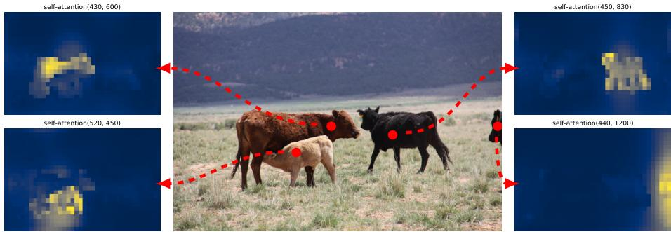

> **AI Description:**
> **Source:** `assets/_page_10_Figure_0.jpg`
> 
> **Generated:** 2026-04-29 22:17:34
> 
> ---
> 
> The image contains a photograph of a rural landscape with three cows standing in a grassy field. Overlaid on the image are four smaller images labeled "self-attention" with coordinates (430, 600), (450, 830), (520, 450), and (440, 1200). These smaller images appear to be heatmaps or attention maps, indicating areas of focus or importance within the larger image. The red dashed lines and circles highlight specific areas on the photograph, suggesting a regions of interest for the self-attention maps. The overall image seems to be demonstrating the application of self-attention mechanisms in image analysis or computer vision tasks.


Similarly to visualizing encoder attention, we visualize decoder attentions in Fig. 6, coloring attention maps for each predicted object in different colors. We observe that decoder attention is fairly local, meaning that it mostly attends to object extremities such as heads or legs. We hypothesise that after the encoder has separated instances via global attention, the decoder only needs to attend to the extremities to extract the class and object boundaries.

Importance of FFN. FFN inside tranformers can be seen as 1 × 1 convolutional layers, making encoder similar to attention augmented convolutional networks [3]. We attempt to remove it completely leaving only attention in the transformer layers. By reducing the number of network parameters from 41.3M to 28.7M, leaving only 10.8M in the transformer, performance drops by 2.3 AP, we thus conclude that FFN are important for achieving good results.

Importance of positional encodings. There are two kinds of positional encodings in our model: spatial positional encodings and output positional encodings (object queries). We experiment with various combinations of fixed and learned encodings, results can be found in table 3. Output positional encodings are required and cannot be removed, so we experiment with either passing them once at decoder input or adding to queries at every decoder attention layer. In the first experiment we completely remove spatial positional encodings and pass output positional encodings at input and, interestingly, the model still achieves more than 32 AP, losing 7.8 AP to the baseline. Then, we pass fixed sine spatial positional encodings and the output encodings at input once, as in the original transformer [47], and find that this leads to 1.4 AP drop compared to passing the positional encodings directly in attention. Learned spatial encodings passed to the attentions give similar results. Surprisingly, we find that not passing any spatial encodings in the encoder only leads to a minor AP drop of 1.3 AP. When we pass the encodings to the attentions, they are shared across all layers, and the output encodings (object queries) are always learned.

<span id="page-11-0"></span>

### Full Page Description (Page 11)

**Source:** `assets/_page_11_Asset_0.jpg`

**Generated:** 2026-04-29 22:17:16

---

The image is a line graph with two y-axes. The x-axis represents the "decoder layer," ranging from 1 to 6. The left y-axis is labeled "AP" and ranges from 34 to 42, while the right y-axis is labeled "AP50" and ranges from 54 to 62. The graph contains four lines, each representing a AP and AP50 metrics with and without Non-Maximum Suppression (NMS) at a threshold of 0.7. The lines are color-coded and labeled as follows: blue for AP No NMS, blue dashed for AP NMS=0.7, orange for AP50 No NMS, and orange dashed for AP50 NMS=0.7. The graph shows an increasing trend for all metrics as the decoder layer increases, with the AP50 metrics generally higher than the AP metrics.

Fig. 4: AP and AP50 performance after each decoder layer. A single long schedule baseline model is evaluated. DETR does not need NMS by design, which is validated by this figure. NMS lowers $\mathrm { A P }$ in the final layers, removing TP predictions, but improves AP in the first decoder layers, removing double predictions, as there is no communication in the first layer, and slightly improves $\mathrm { A P _ { 5 0 } }$
Fig. 5: Out of distribution generalization for rare classes. Even though no image in the training set has more than 13 giraffes, DETR has no difficulty generalizing to 24 and more instances of the same class.
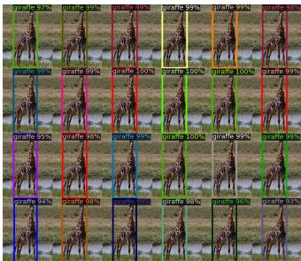

> **AI Description:**
> **Source:** `assets/_page_11_Figure_0.jpg`
> 
> **Generated:** 2026-04-29 22:17:23
> 
> ---
> 
> The image contains a series of photographs of giraffes in a wild, each labeled with a confidence score ranging from 95% to 100%. The photographs are arranged in a grid format, with each image having a colored border and a text label indicating the confidence level of the image classification. The confidence scores suggest that the images are part of a Giraffe Dataset, which is used for evaluating the performance of image classification models. The main trend is the increasing confidence in the classification of giraffe images as the scores increase from 95% to 100%.


Given these ablations, we conclude that transformer components: the global self-attention in encoder, FFN, multiple decoder layers, and positional encodings, all significantly contribute to the final object detection performance.

Loss ablations. To evaluate the importance of different components of the matching cost and the loss, we train several models turning them on and off. There are three components to the loss: classification loss, $\ell _ { 1 }$ bounding box distance loss, and GIoU [38] loss. The classification loss is essential for training and cannot be turned off, so we train a model without bounding box distance loss, and a model without the GIoU loss, and compare with baseline, trained with all three losses. Results are presented in table 4. GIoU loss on its own accounts for most of the model performance, losing only 0.7 AP to the baseline with combined losses. Using $\ell _ { 1 }$ without GIoU shows poor results. We only studied simple ablations of different losses (using the same weighting every time), but other means of combining them may achieve different results.

<span id="page-12-0"></span>
Fig. 6: Visualizing decoder attention for every predicted object (images from COCO val set). Predictions are made with DETR-DC5 model. Attention scores are coded with different colors for different objects. Decoder typically attends to object extremities, such as legs and heads. Best viewed in color.
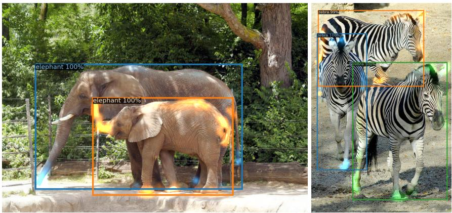

> **AI Description:**
> **Source:** `assets/_page_12_Figure_0.jpg`
> 
> **Generated:** 2026-04-29 22:16:00
> 
> ---
> 
> The image contains two photographs of animals. On the left, there is a image of an adult elephant and a calf, both labeled with "elephant 100%". On the right, there are two zebras, also one on the left labeled "zebra 99%" and the one on the right labeled "zebra 100%". The images appear to be examples of object detection, where bounding boxes and confidence scores are used to identify and locate the animals within the images.


Table 3: Results for different positional encodings compared to the baseline (last row), which has fixed sine pos. encodings passed at every attention layer in both the encoder and the decoder. Learned embeddings are shared between all layers. Not using spatial positional encodings leads to a significant drop in AP. Interestingly, passing them in decoder only leads to a minor AP drop. All these models use learned output positional encodings.


Table 4: Effect of loss components on AP. We train two models turning off $\ell _ { 1 }$ loss, and GIoU loss, and observe that $\ell _ { 1 }$ gives poor results on its own, but when combined with GIoU improves $\mathrm { A P _ { M } }$ and $\mathrm { A P _ { L } }$ . Our baseline (last row) combines both losses.


<span id="page-13-0"></span>
Fig. 7: Visualization of all box predictions on all images from COCO 2017 val set for 20 out of total N = 100 prediction slots in DETR decoder. Each box prediction is represented as a point with the coordinates of its center in the 1-by-1 square normalized by each image size. The points are color-coded so that green color corresponds to small boxes, red to large horizontal boxes and blue to large vertical boxes. We observe that each slot learns to specialize on certain areas and box sizes with several operating modes. We note that almost all slots have a mode of predicting large image-wide boxes that are common in COCO dataset.
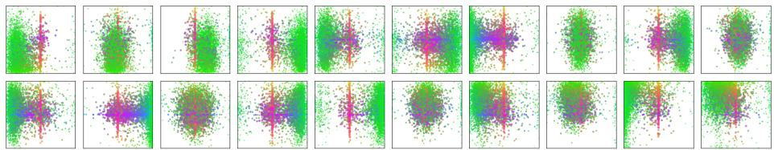

> **AI Description:**
> **Source:** `assets/_page_13_Figure_0.jpg`
> 
> **Generated:** 2026-04-29 22:16:47
> 
> ---
> 
> The image contains a series of scatter plots arranged in a grid format. Each plot appears to represent data points in a two-dimensional space, with different colors indicating different categories or groups within the data. The plots seem to be visualizing some form of clustering or classification of data points, as the points are grouped in distinct regions. The plots are labeled with different colors, which likely correspond to different classes or groups, and there are no additional annotations or text that provide specific information about the data or the context of the visualization. The plots are evenly spaced and organized, suggesting a image is part of a comparative analysis or a results of a same algorithm applied to different datasets.


## 4.3 Analysis

Decoder output slot analysis In Fig. 7 we visualize the boxes predicted by different slots for all images in COCO 2017 val set. DETR learns different specialization for each query slot. We observe that each slot has several modes of operation focusing on different areas and box sizes. In particular, all slots have the mode for predicting image-wide boxes (visible as the red dots aligned in the middle of the plot). We hypothesize that this is related to the distribution of objects in COCO.

Generalization to unseen numbers of instances. Some classes in COCO are not well represented with many instances of the same class in the same image. For example, there is no image with more than 13 giraffes in the training set. We create a synthetic image3 to verify the generalization ability of DETR (see Figure 5). Our model is able to find all 24 giraffes on the image which is clearly out of distribution. This experiment confirms that there is no strong class-specialization in each object query.

## 4.4 DETR for panoptic segmentation

Panoptic segmentation [19] has recently attracted a lot of attention from the computer vision community. Similarly to the extension of Faster R-CNN [37] to Mask R-CNN [14], DETR can be naturally extended by adding a mask head on top of the decoder outputs. In this section we demonstrate that such a head can be used to produce panoptic segmentation [19] by treating stuff and thing classes in a unified way. We perform our experiments on the panoptic annotations of the COCO dataset that has 53 stuff categories in addition to 80 things categories.

<span id="page-14-0"></span>
Fig. 8: Illustration of the panoptic head. A binary mask is generated in parallel for each detected object, then the masks are merged using pixel-wise argmax.
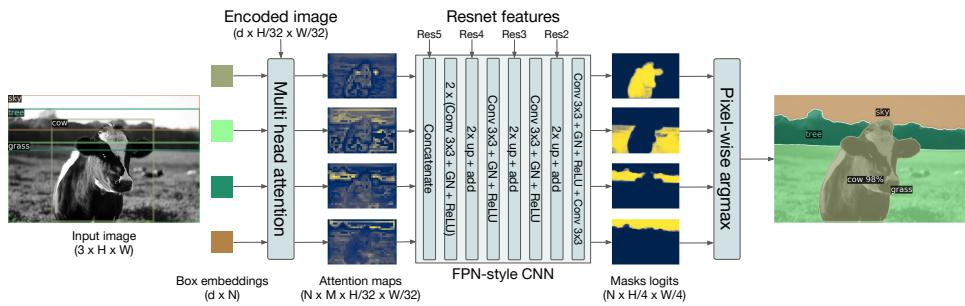

> **AI Description:**
> **Source:** `assets/_page_14_Figure_0.jpg`
> 
> **Generated:** 2026-04-29 22:16:56
> 
> ---
> 
> The image is a technical illustration of a computer vision pipeline for object detection and segmentation. It shows the flow of an input image through various processing stages, including multi-head attention, ResNet features, FPN-style CNN, and pixel-wise argmax. The image includes labeled components such as "Encoded image," "Resnet features," "FPN-style CNN," and "Masks logits." It also highlights the use of attention maps and box embeddings, demonstrating how these model processes the input image to generate segmentation masks and object detection results.


Fig. 9: Qualitative results for panoptic segmentation generated by DETR-R101. DETR produces aligned mask predictions in a unified manner for things and stuff.
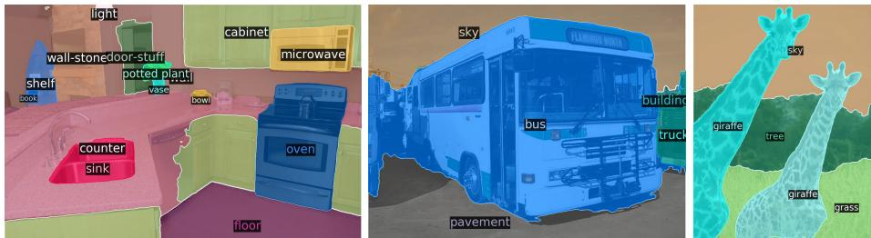

> **AI Description:**
> **Source:** `assets/_page_14_Figure_1.jpg`
> 
> **Generated:** 2026-04-29 22:16:38
> 
> ---
> 
> The image contains three separate visualizations, each depicting a different scene with labeled objects. The first image shows a a kitchen scene with various labeled objects such as a a a microwave, oven, sink, and cabinet. The second image displays a bus on a pavement with labels for the bus and pavement. The third image features two giraffeses in a natural setting with labels for the giraffes, trees, and grass. The images appear to be part of a dataset or a visualization tool for object detection and labeling in different environments.


We train DETR to predict boxes around both stuff and things classes on COCO, using the same recipe. Predicting boxes is required for the training to be possible, since the Hungarian matching is computed using distances between boxes. We also add a mask head which predicts a binary mask for each of the predicted boxes, see Figure 8. It takes as input the output of transformer decoder for each object and computes multi-head (with M heads) attention scores of this embedding over the output of the encoder, generating M attention heatmaps per object in a small resolution. To make the final prediction and increase the resolution, an FPN-like architecture is used. We describe the architecture in more details in the supplement. The final resolution of the masks has stride 4 and each mask is supervised independently using the DICE/F-1 loss [28] and Focal loss [23].

The mask head can be trained either jointly, or in a two steps process, where we train DETR for boxes only, then freeze all the weights and train only the mask head for 25 epochs. Experimentally, these two approaches give similar results, we report results using the latter method since it results in a shorter total wall-clock time training.

<span id="page-15-0"></span>
Table 5: Comparison with the state-of-the-art methods UPSNet [51] and Panoptic FPN [18] on the COCO val dataset We retrained PanopticFPN with the same dataaugmentation as DETR, on a 18x schedule for fair comparison. UPSNet uses the 1x schedule, UPSNet-M is the version with multiscale test-time augmentations.


To predict the final panoptic segmentation we simply use an argmax over the mask scores at each pixel, and assign the corresponding categories to the resulting masks. This procedure guarantees that the final masks have no overlaps and, therefore, DETR does not require a heuristic [19] that is often used to align different masks.

Training details. We train DETR, DETR-DC5 and DETR-R101 models following the recipe for bounding box detection to predict boxes around stuff and things classes in COCO dataset. The new mask head is trained for 25 epochs (see supplementary for details). During inference we first filter out the detection with a confidence below 85%, then compute the per-pixel argmax to determine in which mask each pixel belongs. We then collapse different mask predictions of the same stuff category in one, and filter the empty ones (less than 4 pixels).

Main results. Qualitative results are shown in Figure 9. In table 5 we compare our unified panoptic segmenation approach with several established methods that treat things and stuff differently. We report the Panoptic Quality $( \mathrm { P Q } )$ and the break-down on things $\left( \mathrm { P Q } ^ { \mathrm { t h } } \right)$ and stuff $( \mathrm { P Q } ^ { \mathrm { s t } } )$ . We also report the mask AP (computed on the things classes), before any panoptic post-treatment (in our case, before taking the pixel-wise argmax). We show that DETR outperforms published results on COCO-val 2017, as well as our strong PanopticFPN baseline (trained with same data-augmentation as DETR, for fair comparison). The result break-down shows that DETR is especially dominant on stuff classes, and we hypothesize that the global reasoning allowed by the encoder attention is the key element to this result. For things class, despite a severe deficit of up to 8 mAP compared to the baselines on the mask AP computation, DETR obtains competitive $\mathrm { P Q } ^ { \mathrm { t h } }$ . We also evaluated our method on the test set of the COCO dataset, and obtained 46 PQ. We hope that our approach will inspire the exploration of fully unified models for panoptic segmentation in future work.

<span id="page-16-0"></span>
## 5 Conclusion

We presented DETR, a new design for object detection systems based on transformers and bipartite matching loss for direct set prediction. The approach achieves comparable results to an optimized Faster R-CNN baseline on the challenging COCO dataset. DETR is straightforward to implement and has a flexible architecture that is easily extensible to panoptic segmentation, with competitive results. In addition, it achieves significantly better performance on large objects than Faster R-CNN, likely thanks to the processing of global information performed by the self-attention.

This new design for detectors also comes with new challenges, in particular regarding training, optimization and performances on small objects. Current detectors required several years of improvements to cope with similar issues, and we expect future work to successfully address them for DETR.

## 6 Acknowledgements

We thank Sainbayar Sukhbaatar, Piotr Bojanowski, Natalia Neverova, David Lopez-Paz, Guillaume Lample, Danielle Rothermel, Kaiming He, Ross Girshick, Xinlei Chen and the whole Facebook AI Research Paris team for discussions and advices without which this work would not be possible.

## References

- 1. Al-Rfou, R., Choe, D., Constant, N., Guo, M., Jones, L.: Character-level language modeling with deeper self-attention. In: AAAI Conference on Artificial Intelligence (2019)
- 2. Bahdanau, D., Cho, K., Bengio, Y.: Neural machine translation by jointly learning to align and translate. In: ICLR (2015)
- 3. Bello, I., Zoph, B., Vaswani, A., Shlens, J., Le, Q.V.: Attention augmented convolutional networks. In: ICCV (2019)
- 4. Bodla, N., Singh, B., Chellappa, R., Davis, L.S.: Soft-NMS improving object detection with one line of code. In: ICCV (2017)
- 5. Cai, Z., Vasconcelos, N.: Cascade R-CNN: High quality object detection and instance segmentation. PAMI (2019)
- 6. Chan, W., Saharia, C., Hinton, G., Norouzi, M., Jaitly, N.: Imputer: Sequence modelling via imputation and dynamic programming. arXiv:2002.08926 (2020)
- 7. Cordonnier, J.B., Loukas, A., Jaggi, M.: On the relationship between self-attention and convolutional layers. In: ICLR (2020)
- 8. Devlin, J., Chang, M.W., Lee, K., Toutanova, K.: BERT: Pre-training of deep bidirectional transformers for language understanding. In: NAACL-HLT (2019)
- 9. Erhan, D., Szegedy, C., Toshev, A., Anguelov, D.: Scalable object detection using deep neural networks. In: CVPR (2014)
- 10. Ghazvininejad, M., Levy, O., Liu, Y., Zettlemoyer, L.: Mask-predict: Parallel decoding of conditional masked language models. arXiv:1904.09324 (2019)
- 11. Glorot, X., Bengio, Y.: Understanding the difficulty of training deep feedforward neural networks. In: AISTATS (2010)

<span id="page-17-0"></span>
- 12. Gu, J., Bradbury, J., Xiong, C., Li, V.O., Socher, R.: Non-autoregressive neural machine translation. In: ICLR (2018)
- 13. He, K., Girshick, R., Doll´ar, P.: Rethinking imagenet pre-training. In: ICCV (2019)
- 14. He, K., Gkioxari, G., Doll´ar, P., Girshick, R.B.: Mask R-CNN. In: ICCV (2017)
- 15. He, K., Zhang, X., Ren, S., Sun, J.: Deep residual learning for image recognition. In: CVPR (2016)
- 16. Hosang, J.H., Benenson, R., Schiele, B.: Learning non-maximum suppression. In: CVPR (2017)
- 17. Hu, H., Gu, J., Zhang, Z., Dai, J., Wei, Y.: Relation networks for object detection. In: CVPR (2018)
- 18. Kirillov, A., Girshick, R., He, K., Doll´ar, P.: Panoptic feature pyramid networks. In: CVPR (2019)
- 19. Kirillov, A., He, K., Girshick, R., Rother, C., Dollar, P.: Panoptic segmentation. In: CVPR (2019)
- 20. Kuhn, H.W.: The hungarian method for the assignment problem (1955)
- 21. Li, Y., Qi, H., Dai, J., Ji, X., Wei, Y.: Fully convolutional instance-aware semantic segmentation. In: CVPR (2017)
- 22. Lin, T.Y., Doll´ar, P., Girshick, R., He, K., Hariharan, B., Belongie, S.: Feature pyramid networks for object detection. In: CVPR (2017)
- 23. Lin, T.Y., Goyal, P., Girshick, R.B., He, K., Doll´ar, P.: Focal loss for dense object detection. In: ICCV (2017)
- 24. Lin, T.Y., Maire, M., Belongie, S., Hays, J., Perona, P., Ramanan, D., Doll´ar, P., Zitnick, C.L.: Microsoft COCO: Common objects in context. In: ECCV (2014)
- 25. Liu, W., Anguelov, D., Erhan, D., Szegedy, C., Reed, S.E., Fu, C.Y., Berg, A.C.: Ssd: Single shot multibox detector. In: ECCV (2016)
- 26. Loshchilov, I., Hutter, F.: Decoupled weight decay regularization. In: ICLR (2017)
- 27. L¨uscher, C., Beck, E., Irie, K., Kitza, M., Michel, W., Zeyer, A., Schl¨uter, R., Ney, H.: Rwth asr systems for librispeech: Hybrid vs attention - w/o data augmentation. arXiv:1905.03072 (2019)
- 28. Milletari, F., Navab, N., Ahmadi, S.A.: V-net: Fully convolutional neural networks for volumetric medical image segmentation. In: 3DV (2016)
- 29. Oord, A.v.d., Li, Y., Babuschkin, I., Simonyan, K., Vinyals, O., Kavukcuoglu, K., Driessche, G.v.d., Lockhart, E., Cobo, L.C., Stimberg, F., et al.: Parallel wavenet: Fast high-fidelity speech synthesis. arXiv:1711.10433 (2017)
- 30. Park, E., Berg, A.C.: Learning to decompose for object detection and instance segmentation. arXiv:1511.06449 (2015)
- 31. Parmar, N., Vaswani, A., Uszkoreit, J., Kaiser, L., Shazeer, N., Ku, A., Tran, D.: Image transformer. In: ICML (2018)
- 32. Paszke, A., Gross, S., Massa, F., Lerer, A., Bradbury, J., Chanan, G., Killeen, T., Lin, Z., Gimelshein, N., Antiga, L., Desmaison, A., Kopf, A., Yang, E., DeVito, Z., Raison, M., Tejani, A., Chilamkurthy, S., Steiner, B., Fang, L., Bai, J., Chintala, S.: Pytorch: An imperative style, high-performance deep learning library. In: NeurIPS (2019)
- 33. Pineda, L., Salvador, A., Drozdzal, M., Romero, A.: Elucidating image-to-set prediction: An analysis of models, losses and datasets. arXiv:1904.05709 (2019)
- 34. Radford, A., Wu, J., Child, R., Luan, D., Amodei, D., Sutskever, I.: Language models are unsupervised multitask learners (2019)
- 35. Redmon, J., Divvala, S., Girshick, R., Farhadi, A.: You only look once: Unified, real-time object detection. In: CVPR (2016)
- 36. Ren, M., Zemel, R.S.: End-to-end instance segmentation with recurrent attention. In: CVPR (2017)

<span id="page-18-0"></span>
- 37. Ren, S., He, K., Girshick, R.B., Sun, J.: Faster R-CNN: Towards real-time object detection with region proposal networks. PAMI (2015)
- 38. Rezatofighi, H., Tsoi, N., Gwak, J., Sadeghian, A., Reid, I., Savarese, S.: Generalized intersection over union. In: CVPR (2019)
- 39. Rezatofighi, S.H., Kaskman, R., Motlagh, F.T., Shi, Q., Cremers, D., Leal-Taix´e, L., Reid, I.: Deep perm-set net: Learn to predict sets with unknown permutation and cardinality using deep neural networks. arXiv:1805.00613 (2018)
- 40. Rezatofighi, S.H., Milan, A., Abbasnejad, E., Dick, A., Reid, I., Kaskman, R., Cremers, D., Leal-Taix, l.: Deepsetnet: Predicting sets with deep neural networks. In: ICCV (2017)
- 41. Romera-Paredes, B., Torr, P.H.S.: Recurrent instance segmentation. In: ECCV (2015)
- 42. Salvador, A., Bellver, M., Baradad, M., Marqu´es, F., Torres, J., Gir´o, X.: Recurrent neural networks for semantic instance segmentation. arXiv:1712.00617 (2017)
- 43. Stewart, R.J., Andriluka, M., Ng, A.Y.: End-to-end people detection in crowded scenes. In: CVPR (2015)
- 44. Sutskever, I., Vinyals, O., Le, Q.V.: Sequence to sequence learning with neural networks. In: NeurIPS (2014)
- 45. Synnaeve, G., Xu, Q., Kahn, J., Grave, E., Likhomanenko, T., Pratap, V., Sriram, A., Liptchinsky, V., Collobert, R.: End-to-end ASR: from supervised to semisupervised learning with modern architectures. arXiv:1911.08460 (2019)
- 46. Tian, Z., Shen, C., Chen, H., He, T.: FCOS: Fully convolutional one-stage object detection. In: ICCV (2019)
- 47. Vaswani, A., Shazeer, N., Parmar, N., Uszkoreit, J., Jones, L., Gomez, A.N., Kaiser, L., Polosukhin, I.: Attention is all you need. In: NeurIPS (2017)
- 48. Vinyals, O., Bengio, S., Kudlur, M.: Order matters: Sequence to sequence for sets. In: ICLR (2016)
- 49. Wang, X., Girshick, R.B., Gupta, A., He, K.: Non-local neural networks. In: CVPR (2018)
- 50. Wu, Y., Kirillov, A., Massa, F., Lo, W.Y., Girshick, R.: Detectron2. https:// github.com/facebookresearch/detectron2 (2019)
- 51. Xiong, Y., Liao, R., Zhao, H., Hu, R., Bai, M., Yumer, E., Urtasun, R.: Upsnet: A unified panoptic segmentation network. In: CVPR (2019)
- 52. Zhang, S., Chi, C., Yao, Y., Lei, Z., Li, S.Z.: Bridging the gap between anchor-based and anchor-free detection via adaptive training sample selection. arXiv:1912.02424 (2019)
- 53. Zhou, X., Wang, D., Kr¨ahenb¨uhl, P.: Objects as points. arXiv:1904.07850 (2019)

<span id="page-19-0"></span>
## A Appendix

## A.1 Preliminaries: Multi-head attention layers

Since our model is based on the Transformer architecture, we remind here the general form of attention mechanisms we use for exhaustivity. The attention mechanism follows [47], except for the details of positional encodings (see Equation 8) that follows [7].

Multi-head The general form of multi-head attention with M heads of dimension d is a function with the following signature (using $\begin{array} { r } { d ^ { \prime } = \frac { d } { M } } \end{array}$ , and giving matrix/tensors sizes in underbrace)

$$
\operatorname* { m h - a t t n } \colon \underbrace { X _ { \mathrm { q } } } _ { d \times N _ { \mathrm { q } } } , \underbrace { X _ { \mathrm { k v } } } _ { d \times N _ { \mathrm { k v } } } , \underbrace { T } _ { M \times 3 \times d ^ { \prime } \times d } , \underbrace { L } _ { d \times d } \mapsto \underbrace { \tilde { X } _ { \mathrm { q } } } _ { d \times N _ { \mathrm { q } } }\tag{3}
$$

where $X _ { \mathrm { q } }$ is the query sequence of length $N _ { \mathrm { q } } , X _ { \mathrm { k v } }$ is the key-value sequence of length $N _ { \mathrm { k v } }$ (with the same number of channels d for simplicity of exposition), $T$ is the weight tensor to compute the so-called query, key and value embeddings, and L is a projection matrix. The output is the same size as the query sequence. To fix the vocabulary before giving details, multi-head self-attention (mh-s-attn) is the special case $X _ { \mathrm { q } } = X _ { \mathrm { k v } }$ , i.e.

$$
\mathrm { m h - s - a t t n } ( X , T , L ) = \mathrm { m h - a t t n } ( X , X , T , L ) .\tag{4}
$$

The multi-head attention is simply the concatenation of M single attention heads followed by a projection with L. The common practice [47] is to use residual connections, dropout and layer normalization. In other words, denoting $\tilde { X } _ { \mathrm { q } } =$ mh-attn $( X _ { \mathrm { q } } , X _ { \mathrm { k v } } , T , L )$ and $\bar { \bar { X } } ^ { ( q ) }$ the concatenation of attention heads, we have

$$
X _ { \mathrm { q } } ^ { \prime } = [ \mathrm { a t t n } ( X _ { \mathrm { q } } , X _ { \mathrm { k v } } , T _ { 1 } ) ; . . . ; \mathrm { a t t n } ( X _ { \mathrm { q } } , X _ { \mathrm { k v } } , T _ { M } ) ]\tag{5}
$$

$$
\tilde { X } _ { \mathrm { q } } = \mathrm { l a y e r n o r m } \big ( X _ { \mathrm { q } } + \mathrm { d r o p o u t } ( L X _ { \mathrm { q } } ^ { \prime } ) \big ) ,\tag{6}
$$

where [;] denotes concatenation on the channel axis.

Single head An attention head with weight tensor $T ^ { \prime } \in \mathbb { R } ^ { 3 \times d ^ { \prime } \times d }$ , denoted by attn $( X _ { \mathrm { q } } , X _ { \mathrm { k v } } , T ^ { \prime } )$ , depends on additional positional encoding $P _ { \mathrm { q } } \in \mathbb { R } ^ { d \times N _ { \mathrm { q } } }$ and $P _ { \mathrm { k v } } \in \bar { \mathbb R ^ { d \times N _ { \mathrm { k v } } } }$ . It starts by computing so-called query, key and value embeddings after adding the query and key positional encodings [7]:

$$
[ Q ; K ; V ] = [ T _ { 1 } ^ { \prime } ( X _ { \mathrm { q } } + P _ { \mathrm { q } } ) ; T _ { 2 } ^ { \prime } ( X _ { \mathrm { k v } } + P _ { \mathrm { k v } } ) ; T _ { 3 } ^ { \prime } X _ { \mathrm { k v } } ]\tag{7}
$$

where $T ^ { \prime }$ is the concatenation of $T _ { 1 } ^ { \prime } , T _ { 2 } ^ { \prime } , T _ { 3 } ^ { \prime }$ . The attention weights α are then computed based on the softmax of dot products between queries and keys, so that each element of the query sequence attends to all elements of the key-value sequence (i is a query index and j a key-value index):

$$
\alpha _ { i , j } = \frac { e ^ { \frac { 1 } { \sqrt { d ^ { \prime } } } Q _ { i } ^ { T } K _ { j } } } { Z _ { i } } \mathrm { ~ w h e r e ~ } Z _ { i } = \sum _ { j = 1 } ^ { N _ { \mathrm { k v } } } e ^ { \frac { 1 } { \sqrt { d ^ { \prime } } } Q _ { i } ^ { T } K _ { j } } .\tag{8}
$$

<span id="page-20-0"></span>
In our case, the positional encodings may be learnt or fixed, but are shared across all attention layers for a given query/key-value sequence, so we do not explicitly write them as parameters of the attention. We give more details on their exact value when describing the encoder and the decoder. The final output is the aggregation of values weighted by attention weights: The i-th row is given by at $\begin{array} { r } { \mathrm { { { n } } } _ { i } ( X _ { \mathrm { { q } } } , X _ { \mathrm { { k v } } } , T ^ { \prime } ) = \sum _ { j = 1 } ^ { N _ { \mathrm { { k v } } } } \bar { \alpha } _ { i , j } V _ { j } } \end{array}$

Feed-forward network (FFN) layers The original transformer alternates multi-head attention and so-called FFN layers [47], which are effectively multilayer 1x1 convolutions, which have M d input and output channels in our case. The FFN we consider is composed of two-layers of 1x1 convolutions with ReLU activations. There is also a residual connection/dropout/layernorm after the two layers, similarly to equation 6.

## A.2 Losses

For completeness, we present in detail the losses used in our approach. All losses are normalized by the number of objects inside the batch. Extra care must be taken for distributed training: since each GPU receives a sub-batch, it is not sufficient to normalize by the number of objects in the local batch, since in general the sub-batches are not balanced across GPUs. Instead, it is important to normalize by the total number of objects in all sub-batches.

Box loss Similarly to [41,36], we use a soft version of Intersection over Union in our loss, together with a $\ell _ { 1 }$ loss on $\hat { b } { : }$

$$
\begin{array} { r } { \mathcal { L } _ { \mathrm { b o x } } ( b _ { \sigma ( i ) } , \widehat { b } _ { i } ) = \lambda _ { \mathrm { i o u } } \mathcal { L } _ { \mathrm { i o u } } ( b _ { \sigma ( i ) } , \widehat { b } _ { i } ) + \lambda _ { \mathrm { L 1 } } | | b _ { \sigma ( i ) } - \widehat { b } _ { i } | | _ { 1 } , } \end{array}\tag{9}
$$

where $\lambda _ { \mathrm { i o u } } , \lambda _ { \mathrm { L 1 } } \in \mathbb { R }$ are hyperparameters and $\mathcal { L } _ { \mathrm { i o u } } ( \cdot )$ is the generalized IoU [38]:

$$
\mathcal { L } _ { \mathrm { i o u } } ( b _ { \sigma ( i ) } , \hat { b } _ { i } ) = 1 - \left( \frac { \left| b _ { \sigma ( i ) } \cap \hat { b } _ { i } \right| } { \left| b _ { \sigma ( i ) } \cup \hat { b } _ { i } \right| } - \frac { \left| B ( b _ { \sigma ( i ) } , \hat { b } _ { i } ) \setminus b _ { \sigma ( i ) } \cup \hat { b } _ { i } \right| } { \left| B ( b _ { \sigma ( i ) } , \hat { b } _ { i } ) \right| } \right) .\tag{10}
$$

|.| means “area”, and the union and intersection of box coordinates are used as shorthands for the boxes themselves. The areas of unions or intersections are computed by min / max of the linear functions of $b _ { \sigma ( i ) }$ and $\hat { b } _ { i }$ , which makes the loss sufficiently well-behaved for stochastic gradients. $B ( b _ { \sigma ( i ) } , \hat { b } _ { i } )$ means the largest box containing $b _ { \sigma ( i ) } , \hat { b } _ { i }$ (the areas involving B are also computed based on min / max of linear functions of the box coordinates).

DICE/F-1 loss [28] The DICE coefficient is closely related to the Intersection over Union. If we denote by ˆm the raw mask logits prediction of the model, and m the binary target mask, the loss is defined as:

$$
\mathcal { L } _ { \mathrm { D I C E } } ( m , \hat { m } ) = 1 - \frac { 2 m \sigma ( \hat { m } ) + 1 } { \sigma ( \hat { m } ) + m + 1 }\tag{11}
$$

where $\sigma$ is the sigmoid function. This loss is normalized by the number of objects.

<span id="page-21-0"></span>
## A.3 Detailed architecture

The detailed description of the transformer used in DETR, with positional encodings passed at every attention layer, is given in Fig. 10. Image features from the CNN backbone are passed through the transformer encoder, together with spatial positional encoding that are added to queries and keys at every multihead self-attention layer. Then, the decoder receives queries (initially set to zero), output positional encoding (object queries), and encoder memory, and produces the final set of predicted class labels and bounding boxes through multiple multihead self-attention and decoder-encoder attention. The first self-attention layer in the first decoder layer can be skipped.

Fig. 10: Architecture of DETR’s transformer. Please, see Section A.3 for details.
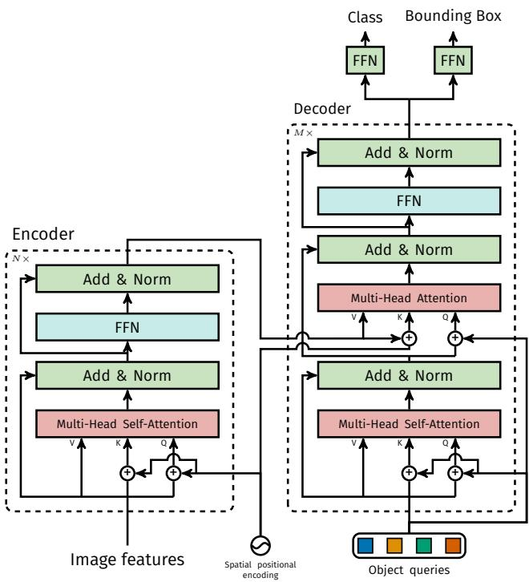

> **AI Description:**
> **Source:** `assets/_page_21_Figure_0.jpg`
> 
> **Generated:** 2026-04-29 22:17:46
> 
> ---
> 
> The image is a technical diagram illustrating the architecture of a transformer-based model, likely used for object detection tasks. It shows the flow of information through an encoder and a corresponding decoder. The encoder processes image features using multi-head self-attention and feed-forward networks (FFNs), while the decoder processes object queries with similar components. The diagram includes labels for various components such as "Add & Norm," "FFN," "Multi-Head Self-Attention," and "Multi-Head Attention." The image also includes arrows and connections to indicate the flow of data between these encoder and decoder, as well as the input of image features and the output of class and bounding box predictions.


Computational complexity Every self-attention in the encoder has complexity $\mathcal { O } ( d ^ { 2 } H W + d ( H W ) ^ { 2 } ) \colon \mathcal { O } ( d ^ { \prime } d )$ is the cost of computing a single query/key/value embeddings (and $M d ^ { \prime } = d )$ , while $\mathcal { O } ( d ^ { \prime } ( H W ) ^ { 2 } )$ is the cost of computing the attention weights for one head. Other computations are negligible. In the decoder, each self-attention is in $\mathcal { O } ( d ^ { 2 } N + d N ^ { 2 } )$ , and cross-attention between encoder and decoder is in $\mathcal { O } ( d ^ { 2 } ( N + H W ) + d N H W )$ , which is much lower than the encoder since $N \ll H W$ in practice.

<span id="page-22-0"></span>
FLOPS computation Given that the FLOPS for Faster R-CNN depends on the number of proposals in the image, we report the average number of FLOPS for the first 100 images in the COCO 2017 validation set. We compute the FLOPS with the tool flop count operators from Detectron2 [50]. We use it without modifications for Detectron2 models, and extend it to take batch matrix multiply (bmm) into account for DETR models.

## A.4 Training hyperparameters

We train DETR using AdamW [26] with improved weight decay handling, set to $1 0 ^ { - 4 }$ . We also apply gradient clipping, with a maximal gradient norm of 0.1. The backbone and the transformers are treated slightly differently, we now discuss the details for both.

Backbone ImageNet pretrained backbone ResNet-50 is imported from Torchvision, discarding the last classification layer. Backbone batch normalization weights and statistics are frozen during training, following widely adopted practice in object detection. We fine-tune the backbone using learning rate of $1 0 ^ { - 5 }$ . We observe that having the backbone learning rate roughly an order of magnitude smaller than the rest of the network is important to stabilize training, especially in the first few epochs.

Transformer We train the transformer with a learning rate of $1 0 ^ { - 4 }$ . Additive dropout of 0.1 is applied after every multi-head attention and FFN before layer normalization. The weights are randomly initialized with Xavier initialization.

Losses We use linear combination of $\ell _ { 1 }$ and GIoU losses for bounding box regression with $\lambda _ { \mathrm { L 1 } } = 5$ and $\lambda _ { \mathrm { i o u } } = 2$ weights respectively. All models were trained with $N = 1 0 0$ decoder query slots.

Baseline Our enhanced Faster-RCNN+ baselines use GIoU [38] loss along with the standard $\ell _ { 1 }$ loss for bounding box regression. We performed a grid search to find the best weights for the losses and the final models use only GIoU loss with weights 20 and 1 for box and proposal regression tasks respectively. For the baselines we adopt the same data augmentation as used in DETR and train it with 9× schedule (approximately 109 epochs). All other settings are identical to the same models in the Detectron2 model zoo [50].

Spatial positional encoding Encoder activations are associated with corresponding spatial positions of image features. In our model we use a fixed absolute encoding to represent these spatial positions. We adopt a generalization of the original Transformer [47] encoding to the 2D case [31]. Specifically, for both spatial coordinates of each embedding we independently use $\begin{array} { l } { { \frac { d } { 2 } } } \end{array}$ sine and cosine functions with different frequencies. We then concatenate them to get the final d channel positional encoding.

## A.5 Additional results

Some extra qualitative results for the panoptic prediction of the DETR-R101 model are shown in Fig.11.

<span id="page-23-0"></span>
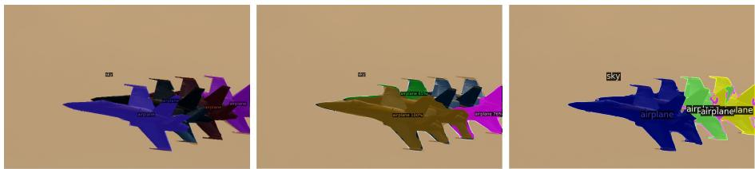

> **AI Description:**
> **Source:** `assets/_page_23_Figure_0.jpg`
> 
> **Generated:** 2026-04-29 22:16:30
> 
> ---
> 
> The image contains a sequence of three diagrams, each depicting a group of aircraft with various colors and labels. The aircraft are arranged in a same orientation, and each diagram includes text labels such as "airplane" and "airplanelane." The labels are positioned near the aircraft, indicating different parts or features of the aircraft. The diagrams appear to be part of a same visual representation of a same concept across different color variations.


(a) Failure case with overlapping objects. PanopticFPN misses one plane entirely, while DETR fails to accurately segment 3 of them.
(b) Things masks are predicted at full resolution, which allows sharper boundaries than PanopticFPN
Fig. 11: Comparison of panoptic predictions. From left to right: Ground truth, PanopticFPN with ResNet 101, DETR with ResNet 101
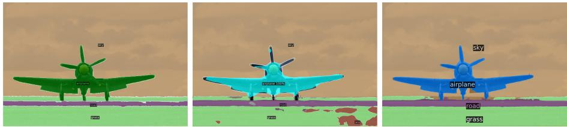

> **AI Description:**
> **Source:** `assets/_page_23_Figure_1.jpg`
> 
> **Generated:** 2026-04-29 22:16:07
> 
> ---
> 
> The image contains a series of three panels, each depicting a stylized airplane with different color schemes and labels. The airplane is shown in three different colors: green, blue, and cyan. Each panel includes labels for the airplane, the sky, the road, and the grass, indicating the different elements in airplane is interacting with. The panels appear to be part of a same scene but with varying color schemes, possibly to demonstrate different visual representations or color coding in a context of the airplane's environment.


Increasing the number of instances By design, DETR cannot predict more objects than it has query slots, i.e. 100 in our experiments. In this section, we analyze the behavior of DETR when approaching this limit. We select a canonical square image of a given class, repeat it on a 10 × 10 grid, and compute the percentage of instances that are missed by the model. To test the model with less than 100 instances, we randomly mask some of the cells. This ensures that the absolute size of the objects is the same no matter how many are visible. To account for the randomness in the masking, we repeat the experiment 100 times with different masks. The results are shown in Fig.12. The behavior is similar across classes, and while the model detects all instances when up to 50 are visible, it then starts saturating and misses more and more instances. Notably, when the image contains all 100 instances, the model only detects 30 on average, which is less than if the image contains only 50 instances that are all detected. The counter-intuitive behavior of the model is likely because the images and the detections are far from the training distribution.

Note that this test is a test of generalization out-of-distribution by design, since there are very few example images with a lot of instances of a single class. It is difficult to disentangle, from the experiment, two types of out-of-domain generalization: the image itself vs the number of object per class. But since few to no COCO images contain only a lot of objects of the same class, this type of experiment represents our best effort to understand whether query objects overfit the label and position distribution of the dataset. Overall, the experiments suggests that the model does not overfit on these distributions since it yields near-perfect detections up to 50 objects.

<span id="page-24-0"></span>

### Full Page Description (Page 24)

**Source:** `assets/_page_24_Asset_0.jpg`

**Generated:** 2026-04-29 22:17:06

---

The image is a line graph with three distinct lines representing different categories: "dog," "person," and "apple." The x-axis is labeled "Number of visible instances" and ranges from 0 to 100, while the y-axis is labeled "% of missed instances" and ranges from 0 to 70. The graph shows the percentage of missed instances for each category as the number of visible instances increases. The lines for "dog" and "person" start at a bottom left and rise sharply as the number of visible instances increases, while the line for "apple" starts at a lower point and rises more gradually. The graph includes a legend in top left corner and the title is not visible.

## A.6 PyTorch inference code

To demonstrate the simplicity of the approach, we include inference code with PyTorch and Torchvision libraries in Listing 1. The code runs with Python 3.6+, PyTorch 1.4 and Torchvision 0.5. Note that it does not support batching, hence it is suitable only for inference or training with DistributedDataParallel with one image per GPU. Also note that for clarity, this code uses learnt positional encodings in the encoder instead of fixed, and positional encodings are added to the input only instead of at each transformer layer. Making these changes requires going beyond PyTorch implementation of transformers, which hampers readability. The entire code to reproduce the experiments will be made available before the conference.

<span id="page-25-0"></span>
Listing 1: DETR PyTorch inference code. For clarity it uses learnt positional encodings in the encoder instead of fixed, and positional encodings are added to the input only instead of at each transformer layer. Making these changes requires going beyond PyTorch implementation of transformers, which hampers readability. The entire code to reproduce the experiments will be made available before the conference.
```
```python
1 import torch
2 from torch import nn
3 from torchvision.models import resnet50
4
5 class DETR(nn.Module):
6
7 def __init__(self, num_classes, hidden_dim, nheads,
8 num_encoder_layers, num_decoder_layers):
9 super().__init__()
10 # We take only convolutional layers from ResNet-50 model
11 self.backbone = nn.Sequential(*list(resnet50(pretrained=True).children())[:-2])
12 self.conv = nn.Conv2d(2048, hidden_dim, 1)
13 self.transformer = nn.Transformer(hidden_dim, nheads,
14 num_encoder_layers, num_decoder_layers)
15 self.linear_class = nn.Linear(hidden_dim, num_classes + 1)
16 self.linear_bbox = nn.Linear(hidden_dim, 4)
17 self.query_pos = nn.Parameter(torch.rand(100, hidden_dim))
18 self.row_embed = nn.Parameter(torch.rand(50, hidden_dim // 2))
19 self.col_embed = nn.Parameter(torch.rand(50, hidden_dim // 2))
20
21 def forward(self, inputs):
22 x = self.backbone(inputs)
23 h = self.conv(x)
24 H, W = h.shape[-2:]
25 pos = torch.cat([
26 self.col_embed[:W].unsqueeze(0).repeat(H, 1, 1),
27 self.row_embed[:H].unsqueeze(1).repeat(1, W, 1),
28 ], dim=-1).flatten(0, 1).unsqueeze(1)
29 h = self.transformer(pos + h.flatten(2).permute(2, 0, 1),
30 self.query_pos.unsqueeze(1))
31 return self.linear_class(h), self.linear_bbox(h).sigmoid()
32
33 detr = DETR(num_classes=91, hidden_dim=256, nheads=8, num_encoder_layers=6, num_decoder_layers=6)
34 detr.eval()
35 inputs = torch.randn(1, 3, 800, 1200)
36 logits, bboxes = detr(inputs)
```
```