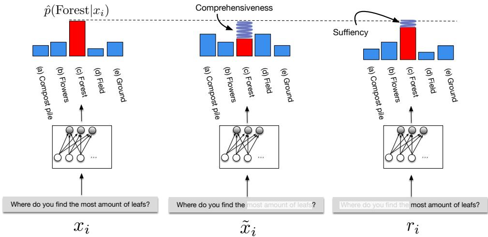

# ERASER : A Benchmark to Evaluate Rationalized NLP Models

Jay DeYoung⋆Ψ, Sarthak Jain⋆Ψ, Nazneen Fatema Rajani⋆Φ, Eric LehmanΨ, Caiming XiongΦ, Richard SocherΦ, and Byron C. WallaceΨ

⋆Equal contribution.

ΨKhoury College of Computer Sciences, Northeastern University ΦSalesforce Research, Palo Alto, CA, 94301

## Abstract

State-of-the-art models in NLP are now predominantly based on deep neural networks that are opaque in terms of how they come to make predictions. This limitation has increased interest in designing more interpretable deep models for NLP that reveal the ‘reasoning’ behind model outputs. But work in this direction has been conducted on different datasets and tasks with correspondingly unique aims and metrics; this makes it difficult to track progress. We propose the Evaluating Rationales And Simple English Reasoning (ERASER ) benchmark to advance research on interpretable models in NLP. This benchmark comprises multiple datasets and tasks for which human annotations of “rationales” (supporting evidence) have been collected. We propose several metrics that aim to capture how well the rationales provided by models align with human rationales, and also how faithful these rationales are (i.e., the degree to which provided rationales influenced the corresponding predictions). Our hope is that releasing this benchmark facilitates progress on designing more interpretable NLP systems. The benchmark, code, and documentation are available at https://www.eraserbenchmark.com/

## 1 Introduction

Interest has recently grown in designing NLP systems that can reveal why models make specific predictions. But work in this direction has been conducted on different datasets and using different metrics to quantify performance; this has made it difficult to compare methods and track progress. We aim to address this issue by releasing a standardized benchmark of datasets — repurposed and augmented from pre-existing corpora, spanning a range of NLP tasks — and associated metrics for measuring different properties of rationales. We refer to this as the Evaluating Rationales And Simple English Reasoning (ERASER ) benchmark.

(a) Sig. decreased (b) No sig. difference (c) Sig. increased
Figure 1: Examples of instances, labels, and rationales illustrative of four (out of seven) datasets included in ERASER. The ‘erased’ snippets are rationales.

In curating and releasing ERASER we take inspiration from the stickiness of the GLUE (Wang et al., 2019b) and SuperGLUE (Wang et al., 2019a) benchmarks for evaluating progress in natural language understanding tasks, which have driven rapid progress on models for general language representation learning. We believe the still somewhat nascent subfield of interpretable NLP stands to benefit similarly from an analogous collection of standardized datasets and tasks; we hope these will aid the design of standardized metrics to measure different properties of ‘interpretability’, and we propose a set of such metrics as a starting point.

Interpretability is a broad topic with many possible realizations (Doshi-Velez and Kim, 2017; Lipton, 2016). In ERASER we focus specifically on rationales, i.e., snippets that support outputs. All datasets in ERASER include such rationales, explicitly marked by human annotators. By definition, rationales should be sufficient to make predictions, but they may not be comprehensive. Therefore, for some datasets, we have also collected comprehensive rationales (in which all evidence supporting an output has been marked) on test instances.

The ‘quality’ of extracted rationales will depend on their intended use. Therefore, we propose an initial set of metrics to evaluate rationales that are meant to measure different varieties of ‘interpretability’. Broadly, this includes measures of agreement with human-provided rationales, and assessments of faithfulness. The latter aim to capture the extent to which rationales provided by a model in fact informed its predictions. We believe these provide a reasonable start, but view the problem of designing metrics for evaluating rationales — especially for measuring faithfulness — as a topic for further research that ERASER can facilitate. And while we will provide a ‘leaderboard’, this is better viewed as a ‘results board’; we do not privilege any one metric. Instead, ERASER permits comparison between models that provide rationales with respect to different criteria of interest.

We implement baseline models and report their performance across the corpora in ERASER. We find that no single ‘off-the-shelf’ architecture is readily adaptable to datasets with very different instance lengths and associated rationale snippets (Section 3). This highlights a need for new models that can consume potentially lengthy inputs and adaptively provide rationales at a task-appropriate level of granularity. ERASER provides a resource to develop such models.

In sum, we introduce the ERASER benchmark (www.eraserbenchmark.com), a unified set of diverse NLP datasets (these are repurposed and augmented from existing corpora,1 including sentiment analysis, Natural Language Inference, and QA tasks, among others) in a standardized format featuring human rationales for decisions, along with starter code and tools, baseline models, and standardized (initial) metrics for rationales.

## 2 Related Work

Interpretability in NLP is a large, fast-growing area; we do not attempt to provide a comprehensive overview here. Instead we focus on directions particularly relevant to ERASER, i.e., prior work on models that provide rationales for their predictions. Learning to explain. In ERASER we assume that rationales (marked by humans) are provided during training. However, such direct supervision will not always be available, motivating work on methods that can explain (or “rationalize”) model predictions using only instance-level supervision.

In the context of modern neural models for text classification, one might use variants of attention (Bahdanau et al., 2015) to extract rationales. Attention mechanisms learn to assign soft weights to (usually contextualized) token representations, and so one can extract highly weighted tokens as rationales. However, attention weights do not in general provide faithful explanations for predictions (Jain and Wallace, 2019; Serrano and Smith, 2019; Wiegreffe and Pinter, 2019; Zhong et al., 2019; Pruthi et al., 2020; Brunner et al., 2020; Moradi et al., 2019; Vashishth et al., 2019). This likely owes to encoders entangling inputs, complicating the interpretation of attention weights on inputs over contextualized representations of the same.

By contrast, hard attention mechanisms discretely extract snippets from the input to pass to the classifier, by construction providing faithful explanations. Recent work has proposed hard attention mechanisms as a means of providing explanations. Lei et al. (2016) proposed instantiating two models with their own parameters; one to extract rationales, and one that consumes these to make a prediction. They trained these models jointly via REINFORCE (Williams, 1992) style optimization.

Recently, Jain et al. (2020) proposed a variant of this two-model setup that uses heuristic feature scores to derive pseudo-labels on tokens comprising rationales; one model can then be used to perform hard extraction in this way, while a second (independent) model can make predictions on the basis of these. Elsewhere, Chang et al. (2019) introduced the notion of classwise rationales that explains support for different output classes using a game theoretic framework. Finally, other recent work has proposed using a differentiable binary mask over inputs, which also avoids recourse to REINFORCE (Bastings et al., 2019).

Post-hoc explanation. Another strand of interpretability work considers post-hoc explanation methods, which seek to explain why a model made a specific prediction for a given input. Commonly these take the form of token-level importance scores. Gradient-based explanations are a standard example (Sundararajan et al., 2017; Smilkov et al., 2017). These enjoy a clear semantics (describing how perturbing inputs locally affects outputs), but may nonetheless exhibit counterintuitive behaviors (Feng et al., 2018).

Gradients of course assume model differentiability. Other methods do not require any model properties. Examples include LIME (Ribeiro et al., 2016) and Alvarez-Melis and Jaakkola (2017); these methods approximate model behavior locally by having it repeatedly make predictions over perturbed inputs and fitting a simple, explainable model over the outputs.

Acquiring rationales. Aside from interpretability considerations, collecting rationales from annotators may afford greater efficiency in terms of model performance realized given a fixed amount of annotator effort (Zaidan and Eisner, 2008). In particular, recent work by McDonnell et al. (2017, 2016) has observed that at least for some tasks, asking annotators to provide rationales justifying their categorizations does not impose much additional effort. Combining rationale annotation with active learning (Settles, 2012) is another promising direction (Wallace et al., 2010; Sharma et al., 2015).

Learning from rationales. Work on learning from rationales marked by annotators for text classification dates back over a decade (Zaidan et al., 2007). Earlier efforts proposed extending standard discriminative models like Support Vector Machines (SVMs) with regularization terms that penalized parameter estimates which disagreed with provided rationales (Zaidan et al., 2007; Small et al., 2011). Other efforts have attempted to specify generative models of rationales (Zaidan and Eisner, 2008).

More recent work has aimed to exploit rationales in training neural text classifiers. Zhang et al. (2016) proposed a rationale-augmented Convolutional Neural Network (CNN) for text classification, explicitly trained to identify sentences supporting categorizations. Strout et al. (2019) showed that providing this model with rationales during training yields predicted rationales that are preferred by humans (compared to rationales produced without explicit supervision). Other work has proposed ‘pipeline’ approaches in which independent models are trained to perform rationale extraction and classification on the basis of these, respectively (Lehman et al., 2019; Chen et al., 2019), assuming explicit training data is available for the former.

Table 1: Overview of datasets in the ERASER benchmark. Tokens is the average number of tokens in each document. Comprehensive rationales mean that all supporting evidence is marked; !denotes cases where this is (more or less) true by default; ◇, ◆ are datasets for which we have collected comprehensive rationales for either a subset or all of the test datasets, respectively. Additional information can be found in Appendix A.

Rajani et al. (2019) fine-tuned a Transformerbased language model (Radford et al., 2018) on free-text rationales provided by humans, with an objective of generating open-ended explanations to improve performance on downstream tasks.

Evaluating rationales. Work on evaluating rationales has often compared these to human judgments (Strout et al., 2019; Doshi-Velez and Kim, 2017), or elicited other human evaluations of explanations (Ribeiro et al., 2016; Lundberg and Lee, 2017; Nguyen, 2018). There has also been work on visual evaluations of saliency maps (Li et al., 2016; Ding et al., 2017; Sundararajan et al., 2017).

Measuring agreement between extracted and human rationales (or collecting subjective assessments of them) assesses the plausibility of rationales, but such approaches do not establish whether the model actually relied on these particular rationales to make a prediction. We refer to rationales that correspond to the inputs most relied upon to come to a disposition as faithful.

Most automatic evaluations of faithfulness measure the impact of perturbing or erasing words or tokens identified as important on model output (Arras et al., 2017; Montavon et al., 2017; Serrano and Smith, 2019; Samek et al., 2016; Jain and Wallace, 2019). We build upon these methods in Section 4. Finally, we note that a recent article urges the community to evaluate faithfulness on a continuous scale of acceptability, rather than viewing this as a binary proposition (Jacovi and Goldberg, 2020).

## 3 Datasets in ERASER

For all datasets in ERASER we distribute both reference labels and rationales marked by humans as supporting these in a standardized format. We delineate train, validation, and test splits for all corpora (see Appendix A for processing details). We ensure that these splits comprise disjoint sets of source documents to avoid contamination.3 We have made the decision to distribute the test sets publicly,4 in part because we do not view the ‘correct’ metrics to use as settled. We plan to acquire additional human annotations on held-out portions of some of the included corpora so as to offer hidden test set evaluation opportunities in the future.

Evidence inference (Lehman et al., 2019). A dataset of full-text articles describing randomized controlled trials (RCTs). The task is to infer whether a given intervention is reported to either significantly increase, significantly decrease, or have no significant effect on a specified outcome, as compared to a comparator of interest. Rationales have been marked as supporting these inferences. As the original annotations are not necessarily exhaustive, we collected exhaustive rationale annotations on a subset of the validation and test data.5

BoolQ (Clark et al., 2019). This corpus consists of passages selected from Wikipedia, and yes/no questions generated from these passages. As the original Wikipedia article versions used were not maintained, we have made a best-effort attempt to recover these, and then find within them the passages answering the corresponding questions. For public release, we acquired comprehensive annotations on a subset of documents in our test set.5

Movie Reviews (Zaidan and Eisner, 2008). Includes positive/negative sentiment labels on movie reviews. Original rationale annotations were not necessarily comprehensive; we thus collected comprehensive rationales on the final two folds of the original dataset (Pang and Lee, 2004).5 In contrast to most other datasets, the rationale annotations here are span level as opposed to sentence level.

FEVER (Thorne et al., 2018). Short for Fact Extraction and VERification; entails verifying claims from textual sources. Specifically, each claim is to be classified as supported, refuted or not enough information with reference to a collection of source texts. We take a subset of this dataset, including only supported and refuted claims.

MultiRC (Khashabi et al., 2018). A reading comprehension dataset composed of questions with multiple correct answers that by construction depend on information from multiple sentences. Here each rationale is associated with a question, while answers are independent of one another. We convert each rationale/question/answer triplet into an instance within our dataset. Each answer candidate then has a label of True or False.

Commonsense Explanations (CoS-E) (Rajani et al., 2019). This corpus comprises multiplechoice questions and answers from (Talmor et al., 2019) along with supporting rationales. The rationales in this case come in the form both of highlighted (extracted) supporting snippets and freetext, open-ended descriptions of reasoning. Given our focus on extractive rationales, ERASER includes only the former for now. Following Talmor et al. (2019), we repartition the training and validation sets to provide a canonical test split.

e-SNLI (Camburu et al., 2018). This dataset augments the SNLI corpus (Bowman et al., 2015) with rationales marked in the premise and/or hypothesis (and natural language explanations, which we do not use). For entailment pairs, annotators were required to highlight at least one word in the premise. For contradiction pairs, annotators had to highlight at least one word in both the premise and the hypothesis; for neutral pairs, they were only allowed to highlight words in the hypothesis.

Human Agreement We report human agreement over extracted rationales for multiple annotators and documents in Table 2. All datasets have a high Cohen κ (Cohen, 1960); with substantial or better agreement.

## 4 Metrics

In ERASER models are evaluated both for their predictive performance and with respect to the rationales that they extract. For the former, we rely on the established metrics for the respective tasks. Here we describe the metrics we propose to evaluate the quality of extracted rationales. We do not claim that these are necessarily the best metrics for evaluating rationales, however. Indeed, we hope the release of ERASER will spur additional research into how best to measure the quality of model explanations in the context of NLP.

Table 2: Human agreement with respect to rationales. For Movie Reviews and BoolQ we calculate the mean agreement of individual annotators with the majority vote per token, over the two-three annotators we hired via Upwork and Amazon Turk, respectively. The e-SNLI dataset already comprised three annotators; for this we calculate mean agreement between individuals and the majority. For CoS-E, MultiRC, and FEVER, members of our team annotated a subset to use a comparison to the (majority of, where appropriate) existing rationales. We collected comprehensive rationales for Evidence Inference from Medical Doctors; as they have a high amount of expertise, we would expect agreement to be high, but have not collected redundant comprehensive annotations.

## 4.1 Agreement with human rationales

The simplest means of evaluating extracted rationales is to measure how well they agree with those marked by humans. We consider two classes of metrics, appropriate for models that perform discrete and ‘soft’ selection, respectively.

For the discrete case, measuring exact matches between predicted and reference rationales is likely too harsh.6 We thus consider more relaxed measures. These include Intersection-Over-Union (IOU), borrowed from computer vision (Everingham et al., 2010), which permits credit assignment for partial matches. We define IOU on a token level: for two spans, it is the size of the overlap of the tokens they cover divided by the size of their union. We count a prediction as a match if it overlaps with any of the ground truth rationales by more than some threshold (here, 0.5). We use these partial matches to calculate an F1 score. We also measure token-level precision and recall, and use these to derive token-level F1 scores.

Metrics for continuous or soft token scoring models consider token rankings, rewarding models for assigning higher scores to marked tokens. In particular, we take the Area Under the Precision-Recall curve (AUPRC) constructed by sweeping a threshold over token scores. We define additional metrics for soft scoring models below.

In general, the rationales we have for tasks are sufficient to make judgments, but not necessarily comprehensive. However, for some datasets we have explicitly collected comprehensive rationales for at least a subset of the test set. Therefore, on these datasets recall evaluates comprehensiveness directly (it does so only noisily on other datasets).

We highlight which corpora contain comprehensive rationales in the test set in Table 3.

## 4.2 Measuring faithfulness

As discussed above, a model may provide rationales that are plausible (agreeable to humans) but that it did not rely on for its output. In many settings one may want rationales that actually explain model predictions, i.e., rationales extracted for an instance in this case ought to have meaningfully influenced its prediction for the same. We call these faithful rationales. How best to measure rationale faithfulness is an open question. In this first version of ERASER we propose simple metrics motivated by prior work (Zaidan et al., 2007; Yu et al., 2019). In particular, following Yu et al. (2019) we define metrics intended to measure the comprehensiveness (were all features needed to make a prediction selected?) and sufficiency (do the extracted rationales contain enough signal to come to a disposition?) of rationales, respectively.

Comprehensiveness. To calculate rationale comprehensiveness we create contrast examples (Zaidan et al., 2007): We construct a contrast example for $x _ { i } , \tilde { x } _ { i }$ , which is $x _ { i }$ with the predicted rationales $r _ { i }$ removed. Assuming a classification setting, let $m ( x _ { i } ) _ { j }$ be the original prediction provided by a model m for the predicted class $j .$ Then we consider the predicted probability from the model for the same class once the supporting rationales are stripped. Intuitively, the model ought to be less confident in its prediction once rationales are removed from $x _ { i }$ . We can measure this as:

$$
{ \mathrm { c o m p r e h e n s i v e n e s s } } = m ( x _ { i } ) _ { j } - m ( x _ { i } \backslash r _ { i } ) _ { j }\tag{1}
$$

A high score here implies that the rationales were indeed influential in the prediction, while a low score suggests that they were not. A negative value here means that the model became more confident in its prediction after the rationales were removed; this would seem counter-intuitive if the rationales were indeed the reason for its prediction.

Figure 2: Illustration of faithfulness scoring metrics, comprehensiveness and sufficiency, on the Commonsense Explanations (CoS-E) dataset. For the former, erasing the tokens comprising the provided rationale (x˜i) ought to decrease model confidence in the output ‘Forest’. For the latter, the model should be able to come to a similar disposition regarding ‘Forest’ using only the rationales $r _ { i }$

> **AI Description:**
> **Source:** `assets/_page_5_Figure_0.jpg`
> 
> **Generated:** 2026-04-29 22:53:33
> 
> ---
> 
> The image contains a series of bar charts and a neural network diagram, illustrating concepts related to comprehensiveness and sufficiency in a context of a forest. The bar charts compare the probability of different elements (compost pile, flowers, forest, field, and ground) given a specific input \(x_i\). The neural network diagram at the bottom represents the model's architecture, with nodes and connections indicating the flow of information. The text annotations at the bottom of each chart ask about the location of the most amount of leaves, suggesting a image is part of a explanation or demonstration of a model's performance in a context of leaf distribution.

Sufficiency. This captures the degree to which the snippets within the extracted rationales are adequate for a model to make a prediction.

$$
\mathrm { s u f f i c i e n c y } = m ( x _ { i } ) _ { j } - m ( r _ { i } ) _ { j }\tag{2}
$$

These metrics are illustrated in Figure 2.

As defined, the above measures have assumed discrete rationales $r _ { i }$ . We would also like to evaluate the faithfulness of continuous importance scores assigned to tokens by models. Here we adopt a simple approach for this. We convert soft scores over features $s _ { i }$ provided by a model into discrete rationales $r _ { i }$ by taking the $\mathrm { t o p } { - } k _ { d }$ values, where $k _ { d }$ is a threshold for dataset d. We set $k _ { d }$ to the average rationale length provided by humans for dataset d (see Table 4). Intuitively, this says: How much does the model prediction change if we remove a number of tokens equal to what humans use (on average for this dataset) in order of the importance scores assigned to these by the model. Once we have discretized the soft scores into rationales in this way, we compute the faithfulness scores as per Equations 1 and 2.

This approach is conceptually simple. It is also computationally cheap to evaluate, in contrast to measures that require per-token measurements, e.g., importance score correlations with ‘leave-one-out’ scores (Jain and Wallace, 2019), or counting how many ‘important’ tokens need to be erased before a prediction flips (Serrano and Smith, 2019). However, the necessity of discretizing continuous scores forces us to pick a particular threshold k.

We can also consider the behavior of these measures as a function of k, inspired by the measurements proposed in Samek et al. (2016) in the context of evaluating saliency maps for image classification. They suggested ranking pixel regions by importance and then measuring the change in output as they are removed in rank order. Our datasets comprise documents and rationales with quite different lengths; to make this measure comparable across datasets, we construct bins designating the number of tokens to be deleted. Denoting the tokens up to and including bin k for instance i by $r _ { i k } .$ we define an aggregate comprehensiveness measure:

$$
\frac { 1 } { | \mathcal { B } | + 1 } ( \sum _ { k = 0 } ^ { | \mathcal { B } | } m ( x _ { i } ) _ { j } - m ( x _ { i } \backslash r _ { i k } ) _ { j } )\tag{3}
$$

This is defined for sufficiency analogously. Here we group tokens into k = 5 bins by grouping them into the top 1%, 5%, 10%, 20% and 50% of tokens, with respect to the corresponding importance score. We refer to these metrics as “Area Over the Perturbation Curve” (AOPC).7

These AOPC sufficiency and comprehensiveness measures score a particular token ordering under a model. As a point of reference, we also report these when random scores are assigned to tokens.

## 5 Baseline Models

Our focus in this work is primarily on the ERASER benchmark itself, rather than on any particular model(s). But to establish a starting point for future work, we evaluate several baseline models across the corpora in ERASER.8 We broadly classify these into models that assign ‘soft’ (continuous) scores to tokens, and those that perform a ‘hard’ (discrete) selection over inputs. We additionally consider models specifically designed to select individual tokens (and very short sequences) as rationales, as compared to longer snippets. All of our implementations are in PyTorch (Paszke et al., 2019) and are available in the ERASER repository.

All datasets in ERASER comprise inputs, rationales, and labels. But they differ considerably in document and rationale lengths (Table A). This motivated use of different models for datasets, appropriate to their sizes and rationale granularities. We hope that this benchmark motivates design of models that provide rationales that can flexibly adapt to varying input lengths and expected rationale granularities. Indeed, only with such models can we perform comparisons across all datasets.

## 5.1 Hard selection

Models that perform hard selection may be viewed as comprising two independent modules: an encoder which is responsible for extracting snippets of inputs, and a decoder that makes a prediction based only on the text provided by the encoder. We consider two variants of such models.

Lei et al. (2016). In this model, an encoder induces a binary mask over inputs x, z. The decoder accepts the tokens in x unmasked by z to make a prediction yˆ. These modules are trained jointly via REINFORCE (Williams, 1992) style estimation, minimizing the loss over expected binary vectors z yielded from the encoder. One of the advantages of this approach is that it need not have access to marked rationales; it can learn to rationalize on the basis of instance labels alone. However, given that we do have rationales in the training data, we experiment with a variant in which we train the encoder explicitly using rationale-level annotations.

In our implementation of Lei et al. (2016), we drop in two independent BERT (Devlin et al., 2019) or GloVe (Pennington et al., 2014) base modules with bidirectional LSTMs (Hochreiter and Schmidhuber, 1997) on top to induce contextualized representations of tokens for the encoder and decoder, respectively. The encoder generates a scalar (denoting the probability of selecting that token) for each LSTM hidden state using a feedfoward layer and sigmoid. In the variant using human rationales during training, we minimize cross entropy loss over rationale predictions. The final loss is then a composite of classification loss, regularizers on rationales (Lei et al., 2016), and loss over rationale predictions, when available.

Pipeline models. These are simple models in which we first train the encoder to extract rationales, and then train the decoder to perform prediction using only rationales. No parameters are shared between the two models.

Here we first consider a simple pipeline that first segments inputs into sentences. It passes these, one at a time, through a Gated Recurrent Unit (GRU) (Cho et al., 2014), to yield hidden representations that we compose via an attentive decoding layer (Bahdanau et al., 2015). This aggregate representation is then passed to a classification module which predicts whether the corresponding sentence is a rationale (or not). A second model, using effectively the same architecture but parameterized independently, consumes the outputs (rationales) from the first to make predictions. This simple model is described at length in prior work (Lehman et al., 2019). We further consider a ‘BERT-to-BERT’ pipeline, where we replace each stage with a BERT module for prediction (Devlin et al., 2019).

In pipeline models, we train each stage independently. The rationale identification stage is trained using approximate sentence boundaries from our source annotations, with randomly sampled negative examples at each epoch. The classification stage uses the same positive rationales as the identification stage, a type of teacher forcing (Williams and Zipser, 1989) (details in Appendix C).

## 5.2 Soft selection

We consider a model that passes tokens through BERT (Devlin et al., 2019) to induce contextualized representations that are then passed to a bidirectional LSTM (Hochreiter and Schmidhuber, 1997). The hidden representations from the LSTM are collapsed into a single vector using additive attention (Bahdanau et al., 2015). The LSTM layer allows us to bypass the 512 word limit imposed by

Table 3: Performance of models that perform hard rationale selection. All models are supervised at the rationale level except for those marked with (u), which learn only from instance-level supervision; † denotes cases in which rationale training degenerated due to the REIN-FORCE style training. Perf. is accuracy (CoS-E) or macro-averaged F1 (others). Bert-To-Bert for CoS-E and e-SNLI uses a token classification objective. Bert-To-Bert CoS-E uses the highest scoring answer.

BERT; when we exceed this, we effectively start encoding a ‘new’ sequence (setting the positional index to 0) via BERT. The hope is that the LSTM learns to compensate for this. Evidence Inference and BoolQ comprise very long (>1000 token) inputs; we were unable to run BERT over these. We instead resorted to swapping GloVe 300d embeddings (Pennington et al., 2014) in place of BERT representations for tokens. spans.

To soft score features we consider: Simple gradients, attention induced over contextualized representations, and LIME (Ribeiro et al., 2016).

Table 4: Metrics for ‘soft’ scoring models. Perf. is accuracy (CoS-E) or F1 (others). Comprehensiveness and sufficiency are in terms of AOPC (Eq. 3). ‘Random’ assigns random scores to tokens to induce orderings; these are averages over 10 runs.

## 6 Evaluation

Here we present initial results for the baseline models discussed in Section 5, with respect to the metrics proposed in Section 4. We present results in two parts, reflecting the two classes of rationales discussed above: ‘Hard’ approaches that perform discrete selection of snippets, and ‘soft’ methods that assign continuous importance scores to tokens.

In Table 3 we evaluate models that perform discrete selection of rationales. We view these as inherently faithful, because by construction we know which snippets the decoder used to make a prediction.10 Therefore, for these methods we report only metrics that measure agreement with human annotations.

Due to computational constraints, we were unable to run our BERT-based implementation of Lei et al. (2016) over larger corpora. Conversely, the simple pipeline of Lehman et al. (2019) assumes a setting in which rationale are sentences, and so is not appropriate for datasets in which rationales tend to comprise only very short spans. Again, in our view this highlights the need for models that can rationalize at varying levels of granularity, depending on what is appropriate.

We observe that for the “rationalizing” model of Lei et al. (2016), exploiting rationale-level supervision often (though not always) improves agreement with human-provided rationales, as in prior work (Zhang et al., 2016; Strout et al., 2019). Interestingly, this does not seem strongly correlated with predictive performance.

Lei et al. (2016) outperforms the simple pipeline model when using a BERT encoder. Further, Lei et al. (2016) outperforms the ‘BERT-to-BERT’ pipeline on the comparable datasets for the final prediction tasks. This may be an artifact of the amount of text each model can select: ‘BERT-to-BERT’ is limited to sentences, while Lei et al. (2016) can select any subset of the text. Designing extraction models that learn to adaptively select contiguous rationales of appropriate length for a given task seems a potentially promising direction.

In Table 4 we report metrics for models that assign continuous importance scores to individual tokens. For these models we again measure downstream (task) performance (macro F1 or accuracy). Here the models are actually the same, and so downstream performance is equivalent. To assess the quality of token scores with respect to human annotations, we report the Area Under the Precision Recall Curve (AUPRC).

These scoring functions assign only soft scores to inputs (and may still use all inputs to come to a particular prediction), so we report the metrics intended to measure faithfulness defined above: comprehensiveness and sufficiency, averaged over ‘bins’ of tokens ordered by importance scores. To provide a point of reference for these metrics — which depend on the underlying model — we report results when rationales are randomly selected (averaged over 10 runs).

Both simple gradient and LIME-based scoring yield more comprehensive rationales than attention weights, consistent with prior work (Jain and Wallace, 2019; Serrano and Smith, 2019). Attention fares better in terms of AUPRC — suggesting better agreement with human rationales — which is also in line with prior findings that it may provide plausible, but not faithful, explanation (Zhong et al., 2019). Interestingly, LIME does particularly well across these tasks in terms of faithfulness.

From the ‘Random’ results that we conclude models with overall poor performance on their final tasks tend to have an overall poor ordering, with marginal differences in comprehensiveness and sufficiency between them. For models that with high sufficiency scores: Movies, FEVER, CoS-E, and e-SNLI, we find that random removal is particularly damaging to performance, indicating poor absolute ranking; whereas those with high comprehensiveness are sensitive to rationale length.

## 7 Conclusions and Future Directions

We have introduced a new publicly available resource: the Evaluating Rationales And Simple English Reasoning (ERASER) benchmark. This comprises seven datasets, all of which include both instance level labels and corresponding supporting snippets (‘rationales’) marked by human annotators. We have augmented many of these datasets with additional annotations, and converted them into a standard format comprising inputs, rationales, and outputs. ERASER is intended to facilitate progress on explainable models for NLP.

We proposed several metrics intended to measure the quality of rationales extracted by models, both in terms of agreement with human annotations, and in terms of ‘faithfulness’. We believe these metrics provide reasonable means of comparison of specific aspects of interpretability, but we view the problem of measuring faithfulness, in particular, a topic ripe for additional research (which ERASER can facilitate).

Our hope is that ERASER enables future work on designing more interpretable NLP models, and comparing their relative strengths across a variety of tasks, datasets, and desired criteria. It also serves as an ideal starting point for several future directions such as better evaluation metrics for interpretability, causal analysis of NLP models and datasets of rationales in other languages.

## 8 Acknowledgements

We thank the anonymous ACL reviewers.

This work was supported in part by the NSF (CA-REER award 1750978), and by the Army Research Office (W911NF1810328).

## References

- David Alvarez-Melis and Tommi Jaakkola. 2017. A causal framework for explaining the predictions of black-box sequence-to-sequence models. In Proceedings of the 2017 Conference on Empirical Methods in Natural Language Processing, pages 412– 421.
- Leila Arras, Franziska Horn, Gregoire Montavon, ´ Klaus-Robert Muller, and Wojciech Samek. 2017. ¨ ”what is relevant in a text document?”: An interpretable machine learning approach. In PloS one.
- Dzmitry Bahdanau, Kyunghyun Cho, and Yoshua Bengio. 2015. Neural machine translation by jointly learning to align and translate. In 3rd International Conference on Learning Representations, ICLR 2015, San Diego, CA, USA, May 7-9, 2015, Conference Track Proceedings.
- Joost Bastings, Wilker Aziz, and Ivan Titov. 2019. Interpretable neural predictions with differentiable binary variables. In Proceedings of the 57th Annual Meeting of the Association for Computational Linguistics, pages 2963–2977, Florence, Italy. Association for Computational Linguistics.
- Iz Beltagy, Kyle Lo, and Arman Cohan. 2019. Scibert: Pretrained language model for scientific text. In EMNLP.
- Samuel R. Bowman, Gabor Angeli, Christopher Potts, and Christopher D. Manning. 2015. A large annotated corpus for learning natural language inference. In Proceedings of the 2015 Conference on Empirical Methods in Natural Language Processing (EMNLP). Association for Computational Linguistics.
- Gino Brunner, Yang Liu, Damian Pascual, Oliver Richter, Massimiliano Ciaramita, and Roger Wattenhofer. 2020. On identifiability in transformers. In International Conference on Learning Representations.
- Oana-Maria Camburu, Tim Rocktaschel, Thomas¨ Lukasiewicz, and Phil Blunsom. 2018. e-snli: Natural language inference with natural language explanations. In Advances in Neural Information Processing Systems, pages 9539–9549.
- Shiyu Chang, Yang Zhang, Mo Yu, and Tommi Jaakkola. 2019. A game theoretic approach to classwise selective rationalization. In Advances in Neural Information Processing Systems, pages 10055– 10065.
- Sihao Chen, Daniel Khashabi, Wenpeng Yin, Chris Callison-Burch, and Dan Roth. 2019. Seeing things from a different angle: Discovering diverse perspectives about claims. In Proceedings of the Conference of the North American Chapter of the Association for Computational Linguistics (NAACL), pages 542– 557, Minneapolis, Minnesota.
- Kyunghyun Cho, Bart van Merrienboer, Caglar Gul- ¨ cehre, Dzmitry Bahdanau, Fethi Bougares, Holger Schwenk, and Yoshua Bengio. 2014. Learning phrase representations using RNN encoder–decoder for statistical machine translation. In Proceedings of the 2014 Conference on Empirical Methods in Natural Language Processing (EMNLP), pages 1724– 1734, Doha, Qatar. Association for Computational Linguistics.
- Christopher Clark, Kenton Lee, Ming-Wei Chang, Tom Kwiatkowski, Michael Collins, and Kristina Toutanova. 2019. Boolq: Exploring the surprising difficulty of natural yes/no questions. In NAACL.
- Jacob Cohen. 1960. A coefficient of agreement for nominal scales. Educational and Psychological Measurement, 20(1):37–46.
- Jacob Devlin, Ming-Wei Chang, Kenton Lee, and Kristina Toutanova. 2019. BERT: Pre-training of deep bidirectional transformers for language understanding. In Proceedings of the 2019 Conference of the North American Chapter of the Association for Computational Linguistics: Human Language Technologies, Volume 1 (Long and Short Papers), pages 4171–4186, Minneapolis, Minnesota. Association for Computational Linguistics.
- Yanzhuo Ding, Yang Liu, Huanbo Luan, and Maosong Sun. 2017. Visualizing and understanding neural machine translation. In Proceedings of the 55th Annual Meeting of the Association for Computational Linguistics (Volume 1: Long Papers), Vancouver, Canada. Association for Computational Linguistics.
- Finale Doshi-Velez and Been Kim. 2017. Towards a rigorous science of interpretable machine learning. arXiv preprint arXiv:1702.08608.
- Mark Everingham, Luc Van Gool, Christopher K. I. Williams, John Winn, and Andrew Zisserman. 2010. The pascal visual object classes (voc) challenge. International Journal of Computer Vision, 88(2):303– 338.
- Shi Feng, Eric Wallace, Alvin Grissom, Mohit Iyyer, Pedro Rodriguez, and Jordan L. Boyd-Graber. 2018. Pathologies of neural models make interpretation difficult. In EMNLP.
- Matt Gardner, Joel Grus, Mark Neumann, Oyvind Tafjord, Pradeep Dasigi, Nelson F. Liu, Matthew Peters, Michael Schmitz, and Luke Zettlemoyer. 2018. AllenNLP: A deep semantic natural language processing platform. In Proceedings of Workshop for NLP Open Source Software (NLP-OSS), pages 1– 6, Melbourne, Australia. Association for Computational Linguistics.
- Sepp Hochreiter and Jurgen Schmidhuber. 1997. ¨ Long short-term memory. Neural computation, 9(8):1735–1780.

- Sara Hooker, Dumitru Erhan, Pieter-Jan Kindermans, and Been Kim. 2019. A benchmark for interpretability methods in deep neural networks. In H. Wallach, H. Larochelle, A. Beygelzimer, F. d'Alche-Buc, ´ E. Fox, and R. Garnett, editors, Advances in Neural Information Processing Systems 32, pages 9737– 9748. Curran Associates, Inc.
- Alon Jacovi and Yoav Goldberg. 2020. Towards faithfully interpretable nlp systems: How should we define and evaluate faithfulness? arXiv preprint arXiv:2004.03685.
- Sarthak Jain and Byron C. Wallace. 2019. Attention is not Explanation. In Proceedings of the 2019 Conference of the North American Chapter of the Association for Computational Linguistics: Human Language Technologies, Volume 1 (Long and Short Papers), pages 3543–3556, Minneapolis, Minnesota. Association for Computational Linguistics.
- Sarthak Jain, Sarah Wiegreffe, Yuval Pinter, and Byron C. Wallace. 2020. Learning to Faithfully Rationalize by Construction. In Proceedings of the Conference of the Association for Computational Linguistics (ACL).
- Daniel Khashabi, Snigdha Chaturvedi, Michael Roth, Shyam Upadhyay, and Dan Roth. 2018. Looking Beyond the Surface: A Challenge Set for Reading Comprehension over Multiple Sentences. In Proc. of the Annual Conference of the North American Chapter of the Association for Computational Linguistics (NAACL).
- Diederik Kingma and Jimmy Ba. 2014. Adam: A method for stochastic optimization. International Conference on Learning Representations.
- Eric Lehman, Jay DeYoung, Regina Barzilay, and Byron C Wallace. 2019. Inferring which medical treatments work from reports of clinical trials. In Proceedings of the North American Chapter of the Association for Computational Linguistics (NAACL), pages 3705–3717.
- Tao Lei, Regina Barzilay, and Tommi Jaakkola. 2016. Rationalizing neural predictions. In Proceedings of the 2016 Conference on Empirical Methods in Natural Language Processing, pages 107–117.
- Jiwei Li, Xinlei Chen, Eduard Hovy, and Dan Jurafsky. 2016. Visualizing and understanding neural models in NLP. In Proceedings of the 2016 Conference of the North American Chapter of the Association for Computational Linguistics: Human Language Technologies, pages 681–691, San Diego, California. Association for Computational Linguistics.
- Zachary C Lipton. 2016. The mythos of model interpretability. arXiv preprint arXiv:1606.03490.
- Scott M Lundberg and Su-In Lee. 2017. A unified approach to interpreting model predictions. In Advances in Neural Information Processing Systems, pages 4765–4774.
- Tyler McDonnell, Mucahid Kutlu, Tamer Elsayed, and Matthew Lease. 2017. The many benefits of annotator rationales for relevance judgments. In IJCAI, pages 4909–4913.
- Tyler McDonnell, Matthew Lease, Mucahid Kutlu, and Tamer Elsayed. 2016. Why is that relevant? collecting annotator rationales for relevance judgments. In Fourth AAAI Conference on Human Computation and Crowdsourcing.
- Gregoire Montavon, Sebastian Lapuschkin, Alexander ´ Binder, Wojciech Samek, and Klaus-Robert Muller. ¨ 2017. Explaining nonlinear classification decisions with deep taylor decomposition. Pattern Recognition, 65:211–222.
- Pooya Moradi, Nishant Kambhatla, and Anoop Sarkar. 2019. Interrogating the explanatory power of attention in neural machine translation. In Proceedings of the 3rd Workshop on Neural Generation and Translation, pages 221–230, Hong Kong. Association for Computational Linguistics.
- Mark Neumann, Daniel King, Iz Beltagy, and Waleed Ammar. 2019. Scispacy: Fast and robust models for biomedical natural language processing. CoRR, abs/1902.07669.
- Dong Nguyen. 2018. Comparing automatic and human evaluation of local explanations for text classification. In Proceedings of the 2018 Conference of the North American Chapter of the Association for Computational Linguistics: Human Language Technologies, Volume 1 (Long Papers), pages 1069–1078.
- Bo Pang and Lillian Lee. 2004. A sentimental education: Sentiment analysis using subjectivity summarization based on minimum cuts. In Proceedings of the 42nd Annual Meeting of the Association for Computational Linguistics (ACL-04), pages 271– 278, Barcelona, Spain.
- Adam Paszke, Sam Gross, Francisco Massa, Adam Lerer, James Bradbury, Gregory Chanan, Trevor Killeen, Zeming Lin, Natalia Gimelshein, Luca Antiga, et al. 2019. Pytorch: An imperative style, high-performance deep learning library. In Advances in Neural Information Processing Systems, pages 8024–8035.
- David J Pearce. 2005. An improved algorithm for finding the strongly connected components of a directed graph. Technical report, Victoria University, NZ.
- Jeffrey Pennington, Richard Socher, and Christopher Manning. 2014. Glove: Global vectors for word representation. In Proceedings of the 2014 Conference on Empirical Methods in Natural Language Processing (EMNLP), pages 1532–1543, Doha, Qatar. Association for Computational Linguistics.
- Danish Pruthi, Mansi Gupta, Bhuwan Dhingra, Graham Neubig, and Zachary C. Lipton. 2020. Learning to deceive with attention-based explanations. In Annual Conference of the Association for Computational Linguistics (ACL).

- Sampo Pyysalo, F Ginter, Hans Moen, T Salakoski, and Sophia Ananiadou. 2013. Distributional semantics resources for biomedical text processing. Proceedings of Languages in Biology and Medicine.
- Alec Radford, Karthik Narasimhan, Tim Salimans, and Ilya Sutskever. 2018. Improving language understanding by generative pre-training.
- Nazneen Fatema Rajani, Bryan McCann, Caiming Xiong, and Richard Socher. 2019. Explain yourself! leveraging language models for commonsense reasoning. Proceedings of the Association for Computational Linguistics (ACL).
- Marco Ribeiro, Sameer Singh, and Carlos Guestrin. 2016. why should i trust you?: Explaining the predictions of any classifier. In Proceedings of the 2016 Conference of the North American Chapter of the Association for Computational Linguistics: Demonstrations, pages 97–101.
- Wojciech Samek, Alexander Binder, Gregoire Mon- ´ tavon, Sebastian Lapuschkin, and Klaus-Robert Muller. 2016. Evaluating the visualization of what¨ a deep neural network has learned. IEEE transactions on neural networks and learning systems, 28(11):2660–2673.
- Tal Schuster, Darsh J Shah, Yun Jie Serene Yeo, Daniel Filizzola, Enrico Santus, and Regina Barzilay. 2019. Towards debiasing fact verification models. In Proceedings of the 2019 Conference on Empirical Methods in Natural Language Processing (EMNLP). Association for Computational Linguistics.
- Sofia Serrano and Noah A. Smith. 2019. Is attention interpretable? In Proceedings of the 57th Annual Meeting of the Association for Computational Linguistics, pages 2931–2951, Florence, Italy. Association for Computational Linguistics.
- Burr Settles. 2012. Active learning. Synthesis Lectures on Artificial Intelligence and Machine Learning, 6(1):1–114.
- Manali Sharma, Di Zhuang, and Mustafa Bilgic. 2015. Active learning with rationales for text classification. In Proceedings of the 2015 Conference of the North American Chapter of the Association for Computational Linguistics: Human Language Technologies, pages 441–451.
- Kevin Small, Byron C Wallace, Carla E Brodley, and Thomas A Trikalinos. 2011. The constrained weight space svm: learning with ranked features. In Proceedings of the International Conference on International Conference on Machine Learning (ICML), pages 865–872.
- D. Smilkov, N. Thorat, B. Kim, F. Viegas, and M. Wat- ´ tenberg. 2017. SmoothGrad: removing noise by adding noise. ICML workshop on visualization for deep learning.
- Robyn Speer. 2019. ftfy. Zenodo. Version 5.5.
- Nitish Srivastava, Geoffrey Hinton, Alex Krizhevsky, Ilya Sutskever, and Ruslan Salakhutdinov. 2014. Dropout: A simple way to prevent neural networks from overfitting. Journal of Machine Learning Research, 15:1929–1958.
- Julia Strout, Ye Zhang, and Raymond Mooney. 2019. Do human rationales improve machine explanations? In Proceedings of the 2019 ACL Workshop BlackboxNLP: Analyzing and Interpreting Neural Networks for NLP, pages 56–62, Florence, Italy. Association for Computational Linguistics.
- Mukund Sundararajan, Ankur Taly, and Qiqi Yan. 2017. Axiomatic attribution for deep networks. In Proceedings of the 34th International Conference on Machine Learning-Volume 70, pages 3319–3328. JMLR. org.
- Alon Talmor, Jonathan Herzig, Nicholas Lourie, and Jonathan Berant. 2019. CommonsenseQA: A question answering challenge targeting commonsense knowledge. In Proceedings of the 2019 Conference of the North American Chapter of the Association for Computational Linguistics: Human Language Technologies, Volume 1 (Long and Short Papers), pages 4149–4158, Minneapolis, Minnesota. Association for Computational Linguistics.
- James Thorne, Andreas Vlachos, Christos Christodoulopoulos, and Arpit Mittal. 2018. FEVER: a Large-scale Dataset for Fact Extraction and VERification. In Proceedings of the North American Chapter of the Association for Computational Linguistics (NAACL), pages 809–819.
- Shikhar Vashishth, Shyam Upadhyay, Gaurav Singh Tomar, and Manaal Faruqui. 2019. Attention interpretability across nlp tasks. arXiv preprint arXiv:1909.11218.
- Byron C Wallace, Kevin Small, Carla E Brodley, and Thomas A Trikalinos. 2010. Active learning for biomedical citation screening. In Proceedings of the 16th ACM SIGKDD international conference on Knowledge discovery and data mining, pages 173– 182. ACM.
- Alex Wang, Yada Pruksachatkun, Nikita Nangia, Amanpreet Singh, Julian Michael, Felix Hill, Omer Levy, and Samuel Bowman. 2019a. Superglue: A stickier benchmark for general-purpose language understanding systems. In H. Wallach, H. Larochelle, A. Beygelzimer, F. d'Alche-Buc, E. Fox, and R. Gar-´ nett, editors, Advances in Neural Information Processing Systems 32, pages 3266–3280. Curran Associates, Inc.
- Alex Wang, Amanpreet Singh, Julian Michael, Felix Hill, Omer Levy, and Samuel R. Bowman. 2019b. GLUE: A multi-task benchmark and analysis platform for natural language understanding. In International Conference on Learning Representations.

- Sarah Wiegreffe and Yuval Pinter. 2019. Attention is not not explanation. In Proceedings of the 2019 Conference on Empirical Methods in Natural Language Processing and the 9th International Joint Conference on Natural Language Processing (EMNLP-IJCNLP), pages 11–20, Hong Kong, China. Association for Computational Linguistics.
- Ronald J Williams. 1992. Simple statistical gradientfollowing algorithms for connectionist reinforcement learning. Machine learning, 8(3-4):229–256.
- Ronald J Williams and David Zipser. 1989. A learning algorithm for continually running fully recurrent neural networks. Neural computation, 1(2):270– 280.
- Thomas Wolf, Lysandre Debut, Victor Sanh, Julien Chaumond, Clement Delangue, Anthony Moi, Pierric Cistac, Tim Rault, R’emi Louf, Morgan Funtowicz, and Jamie Brew. 2019. Huggingface’s transformers: State-of-the-art natural language processing. ArXiv, abs/1910.03771.
- Mo Yu, Shiyu Chang, Yang Zhang, and Tommi Jaakkola. 2019. Rethinking cooperative rationalization: Introspective extraction and complement control. In Proceedings of the 2019 Conference on Empirical Methods in Natural Language Processing and the 9th International Joint Conference on Natural Language Processing (EMNLP-IJCNLP), pages 4094–4103, Hong Kong, China. Association for Computational Linguistics.
- Omar Zaidan, Jason Eisner, and Christine Piatko. 2007. Using annotator rationales to improve machine learning for text categorization. In Proceedings of the conference of the North American chapter of the Association for Computational Linguistics (NAACL), pages 260–267.
- Omar F Zaidan and Jason Eisner. 2008. Modeling annotators: A generative approach to learning from annotator rationales. In Proceedings of the Conference on Empirical Methods in Natural Language Processing (EMNLP), pages 31–40.
- Ye Zhang, Iain Marshall, and Byron C Wallace. 2016. Rationale-augmented convolutional neural networks for text classification. In Proceedings of the Conference on Empirical Methods in Natural Language Processing (EMNLP), volume 2016, page 795. NIH Public Access.
- Ruiqi Zhong, Steven Shao, and Kathleen McKeown. 2019. Fine-grained sentiment analysis with faithful attention. arXiv preprint arXiv:1908.06870.

## Appendix

## A Dataset Preprocessing

We describe what, if any, additional processing we perform on a per-dataset basis. All datasets were converted to a unified format.

MultiRC (Khashabi et al., 2018) We perform minimal processing. We use the validation set as the testing set for public release.

Evidence Inference (Lehman et al., 2019) We perform minimal processing. As not all of the provided evidence spans come with offsets, we delete any prompts that had no grounded evidence spans.

Movie reviews (Zaidan and Eisner, 2008) We perform minimal processing. We use the ninth fold as the validation set, and collect annotations on the tenth fold for comprehensive evaluation.

FEVER (Thorne et al., 2018) We perform substantial processing for FEVER - we delete the ”Not Enough Info” claim class, delete any claims with support in more than one document, and repartition the validation set into a validation and a test set for this benchmark (using the test set would compromise the information retrieval portion of the original FEVER task). We ensure that there is no document overlap between train, validation, and test sets (we use Pearce (2005) to ensure this, as conceptually a claim may be supported by facts in more than one document). We ensure that the validation set contains the documents used to create the FEVER symmetric dataset (Schuster et al., 2019) (unfortunately, the documents used to create the validation and test sets overlap so we cannot provide this partitioning). Additionally, we clean up some encoding errors in the dataset via Speer (2019).

BoolQ (Clark et al., 2019) The BoolQ dataset required substantial processing. The original dataset did not retain source Wikipedia articles or collection dates. In order to identify the source paragraphs, we download the 12/20/18 Wikipedia archive, and use FuzzyWuzzy https://github. com/seatgeek/fuzzywuzzy to identify the source paragraph span that best matches the original release. If the Levenshtein distance ratio does not reach a score of at least 90, the corresponding instance is removed. For public release, we use the official validation set for testing, and repartition train into a training and validation set.

e-SNLI (Camburu et al., 2018) We perform minimal processing. We separate the premise and hypothesis statements into separate documents.

Commonsense Explanations (CoS-E) (Rajani et al., 2019) We perform minimal processing, primarily deletion of any questions without a rationale or questions with rationales that were not possible to automatically map back to the underlying text. As recommended by the authors of Talmor et al. (2019) we repartition the train and validation sets into a train, validation, and test set for this benchmark. We encode the entire question and answers as a prompt and convert the problem into a five-class prediction. We also convert the “Sanity” datasets for user convenience.

Table 5: Detailed breakdowns for each dataset - the number of documents, instances, evidence statements, and lengths. Additionally we include the percentage of each relevant document that is considered a rationale. For test sets, counts are for all instances including documents with non comprehensive rationales.

Table 6: General dataset statistics: number of labels, instances, unique documents, and average numbers of sentences and tokens in documents, across the publicly released train/validation/test splits in ERASER. For CoS-E and e-SNLI, the sentence counts are not meaningful as the partitioning of question/sentence/answer formatting is an arbitrary choice in this framework.

All datasets in ERASER were tokenized using spaCy11 library (with SciSpacy (Neumann et al., 2019) for Evidence Inference). In addition, we also split all datasets except e-SNLI and CoS-E into sentences using the same library.

## B Annotation details

We collected comprehensive rationales for a subset of some test sets to accurately evaluate model recall of rationales.

1. Movies. We used the Upwork Platform12 to hire two fluent english speakers to annotate each of the 200 documents in our test set. Workers were paid at rate of USD 8.5 per hour and on average, it took them 5 min to annotate a document. Each annotator was asked to annotate a set of 6 documents and compared against in-house annotations (by authors).

2. Evidence Inference. We again used Upwork to hire 4 medical professionals fluent in english and having passed a pilot of 3 documents. 125 documents were annotated (only once by one of the annotators, which we felt was appropriate given their high-level of expertise) with an average cost of USD 13 per document. Average time spent of single document was 31 min.

3. BoolQ. We used Amazon Mechanical Turk (MTurk) to collect reference comprehensive rationales from randomly selected 199 documents from our test set (ranging in 800 to 1500 tokens in length). Only workers from AU, NZ, CA, US, GB with more than 10K approved HITs and an approval rate of greater than 98% were eligible. For every document, 3 annotations were collected and workers were paid USD 1.50 per HIT. The average work time (obtained through MTurk interface) was 21 min. We did not anticipate the task taking so long (on average); the effective low pay rate was unintended.

## C Hyperparameter and training details

## C.1 (Lei et al., 2016) models

For these models, we set the sparsity rate at 0.01 and we set the contiguity loss weight to 2 times sparsity rate (following the original paper). We used bert-base-uncased (Wolf et al., 2019) as token embedder (for all datasets except BoolQ, Evidence Inference and FEVER) and Bidirectional LSTM with 128 dimensional hidden state in each direction. A dropout (Srivastava et al., 2014) rate of 0.2 was used before feeding the hidden representations to attention layer in decoder and linear layer in encoder. One layer MLP with 128 dimensional hidden state and ReLU activation was used to compute the decoder output distribution.

For three datasets mentioned above, we use GloVe embeddings (http://nlp.stanford.edu/ data/glove.840B.300d.zip).

A learning rate of 2e-5 with Adam (Kingma and Ba, 2014) optimizer was used for all models and we only fine-tuned top two layers of BERT encoder. Th models were trained for 20 epochs and early stopping with patience of 5 epochs was used. The best model was selected on validation set using the final task performance metric.

The input for the above model was encoded in form of [CLS] document [SEP] query [SEP].

This model was implemented using the AllenNLP library (Gardner et al., 2018).

## C.2 BERT-LSTM/GloVe-LSTM

This model is essentially the same as the decoder in previous section. The BERT-LSTM uses the same hyperparameters, and GloVe-LSTM is trained with a learning rate of 1e-2.

## C.3 Lehman et al. (2019) models

With the exception of the Evidence Inference dataset, these models were trained using the GLoVe (Pennington et al., 2014) 200 dimension word vectors, and Evidence Inference using the (Pyysalo et al., 2013) PubMed word vectors. We use Adam (Kingma and Ba, 2014) with a learning rate of 1e-3, Dropout (Srivastava et al., 2014) of 0.05 at each layer (embedding, GRU, attention layer) of the model, for 50 epochs with a patience of 10. We monitor validation loss, and keep the best model on the validation set.

## C.4 BERT-to-BERT model

We primarily used the ‘bert-base-uncased‘ model for both components of the identification and classification pipeline, with the sole exception being Evidence Inference with SciBERT (Beltagy et al., 2019). We trained with the standard BERT parameters of a learning rate of 1e-5, Adam (Kingma and Ba, 2014), for 10 epochs. We monitor validation loss, and keep the best model on the validation set.