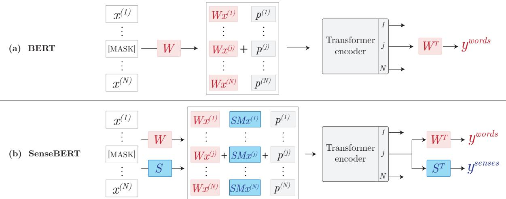

# SenseBERT: Driving Some Sense into BERT

Yoav Levine Barak Lenz Or Dagan Ori Ram Dan Padnos Or Sharir Shai Shalev-Shwartz Amnon Shashua Yoav Shoham

AI21 Labs, Tel Aviv, Israel

{yoavl,barakl,ord,orir,...}@ai21.com

## Abstract

The ability to learn from large unlabeled corpora has allowed neural language models to advance the frontier in natural language understanding. However, existing self-supervision techniques operate at the word form level, which serves as a surrogate for the underlying semantic content. This paper proposes a method to employ weak-supervision directly at the word sense level. Our model, named SenseBERT, is pre-trained to predict not only the masked words but also their WordNet supersenses. Accordingly, we attain a lexicalsemantic level language model, without the use of human annotation. SenseBERT achieves significantly improved lexical understanding, as we demonstrate by experimenting on SemEval Word Sense Disambiguation, and by attaining a state of the art result on the ‘Word in Context’ task.

## 1 Introduction

Neural language models have recently undergone a qualitative leap forward, pushing the state of the art on various NLP tasks. Together with advances in network architecture (Vaswani et al., 2017), the use of self-supervision has proven to be central to these achievements, as it allows the network to learn from massive amounts of unannotated text.

The self-supervision strategy employed in BERT (Devlin et al., 2019) involves masking some of the words in an input sentence, and then training the model to predict them given their context. Other proposed approaches for self-supervised objectives, including unidirectional (Radford et al., 2019), permutational (Yang et al., 2019), or word insertionbased (Chan et al., 2019) methods, operate similarly, over words. However, since a given word form can possess multiple meanings (e.g., the word ‘bass’ can refer to a fish, a guitar, a type of singer, etc.), the word itself is merely a surrogate of its actual meaning in a given context, referred to as its sense. Indeed, the word-form level is viewed as a surface level which often introduces challenging ambiguity (Navigli, 2009).

In this paper, we bring forth a novel methodology for applying weak-supervision directly on the level of a word’s meaning. By infusing wordsense information into BERT’s pre-training signal, we explicitely expose the model to lexical semantics when learning from a large unannotated corpus. We call the resultant sense-informed model SenseBERT. Specifically, we add a maskedword sense prediction task as an auxiliary task in BERT’s pre-training. Thereby, jointly with the standard word-form level language model, we train a semantic-level language model that predicts the missing word’s meaning. Our method does not require sense-annotated data; self-supervised learning from unannotated text is facilitated by using WordNet (Miller, 1998), an expert constructed inventory of word senses, as weak supervision.

We focus on a coarse-grained variant of a word’s sense, referred to as its WordNet supersense, in order to mitigate an identified brittleness of finegrained word-sense systems, caused by arbitrary sense granularity, blurriness, and general subjectiveness (Kilgarriff, 1997; Schneider, 2014). Word-Net lexicographers organize all word senses into 45 supersense categories, 26 of which are for nouns, 15 for verbs, 3 for adjectives and 1 for adverbs (see full supersense table in the supplementary materials). Disambiguating a word’s supersense has been widely studied as a fundamental lexical categorization task (Ciaramita and Johnson, 2003; Basile, 2012; Schneider and Smith, 2015).

We employ the masked word’s allowed supersenses list from WordNet as a set of possible labels for the sense prediction task. The labeling of words with a single supersense (e.g., ‘sword’ has only the supersense noun.artifact) is straightforward: We train the network to predict this supersense given the masked word’s context. As for words with multiple supersenses $( e . g . , \ \cdot \mathrm { b a s s } ^ { , }$ can be: noun.food, noun.animal, noun.artifact, noun.person, etc.), we train the model to predict any of these senses, leading to a simple yet effective soft-labeling scheme.

We show that $\mathrm { S e n s e B E R T _ { B A S E } }$ outscores both $\mathbf { B E R T _ { B A S E } }$ and $\mathbf { B E R T } _ { \mathrm { L A R G E } }$ by a large margin on a supersense variant of the SemEval Word Sense Disambiguation (WSD) data set standardized in Raganato et al. (2017). Notably, SenseBERT receives competitive results on this task without funetuning, $i . e .$ , when training a linear classifier over the pretrained embeddings, which serves as a testament for its self-acquisition of lexical semantics. Furthermore, we show that $\mathrm { S e n s e B E R T _ { B A S E } }$ surpasses $\mathbf { B E R T _ { L A R G E } }$ in the Word in Context (WiC) task (Pilehvar and Camacho-Collados, 2019) from the SuperGLUE benchmark (Wang et al., 2019), which directly depends on word-supersense awareness. A single $\mathrm { S e n s e B E R T _ { L A R G E } }$ model achieves state of the art performance on WiC with a score of 72.14, improving the score of $\mathbf { B E R T _ { L A R G E } }$ by 2.5 points.

## 2 Related Work

Neural network based word embeddings first appeared as a static mapping (non-contextualized), where every word is represented by a constant pretrained embedding (Mikolov et al., 2013; Pennington et al., 2014). Such embeddings were shown to contain some amount of word-sense information (Iacobacci et al., 2016; Yuan et al., 2016; Arora et al., 2018; Le et al., 2018). Additionally, sense embeddings computed for each word sense in the word-sense inventory (e.g. WordNet) have been employed, relying on hypernymity relations (Rothe and Schutze ¨ , 2015) or the gloss for each sense (Chen et al., 2014). These approaches rely on static word embeddings and require a large amount of annotated data per word sense.

The introduction of contextualized word embeddings (Peters et al., 2018), for which a given word’s embedding is context-dependent rather than precomputed, has brought forth a promising prospect for sense-aware word embeddings. Indeed, visualizations in Reif et al. (2019) show that sense sensitive clusters form in BERT’s word embedding space. Nevertheless, we identify a clear gap in this abilty. We show that a vanilla BERT model trained with the current word-level self-supervision, burdened with the implicit task of disambiguating word meanings, often fails to grasp lexical semantics, exhibiting high supersense misclassification rates. Our suggested weakly-supervised word-sense signal allows SenseBERT to significantly bridge this gap.

Moreover, SenseBERT exhibits an improvement in lexical semantics ability (reflected by the Word in Context task score) even when compared to models with WordNet infused linguistic knowledge. Specifically we compare to Peters et al. (2019) who re-contextualize word embeddings via a wordto-entity attention mechanism (where entities are WordNet lemmas and synsets), and to Loureiro and Jorge (2019) which construct sense embeddings from BERT’s word embeddings and use the Word-Net graph to enhance coverage (see quantitative comparison in table 3).

## 3 Incorporating Word-Supersense Information in Pre-training

In this section, we present our proposed method for integrating word sense-information within Sense-BERT’s pre-training. We start by describing the vanilla BERT architecture in subsection 3.1. We conceptually divide it into an internal transformer encoder and an external mapping W which translates the observed vocabulary space into and out of the transformer encoder space [see illustration in figure 1(a)].

In the subsequent subsections, we frame our contribution to the vanilla BERT architecture as an addition of a parallel external mapping to the words supersenses space, denoted S [see illustration in figure 1(b)]. Specifically, in section 3.2 we describe the loss function used for learning S in parallel to W , effectively implementing word-form and wordsense multi-task learning in the pre-training stage. Then, in section 3.3 we describe our methodology for adding supersense information in S to the initial Transformer embedding, in parallel to word-level information added by W . In section 3.4 we address the issue of supersense prediction for out-ofvocabulary words, and in section 3.5 we describe our modification of BERT’s masking strategy, prioritizing single-supersensed words which carry a clearer semantic signal.

## 3.1 Background

The input to BERT is a sequence of words $\{ x ^ { ( j ) } \in$ $\{ 0 , 1 \} ^ { { \hat { D } } _ { W } } \} _ { j = 1 } ^ { N }$ where 15% of the words are replaced by a [MASK] token (see treatment of subword tokanization in section 3.4). Here N is the input sentence length, $D _ { W }$ is the word vocabulary size, and $x ^ { ( j ) }$ is a 1-hot vector corresponding to the $j ^ { \mathrm { t h } }$ input word. For every masked word, the output of the pretraining task is a word-score vector $y ^ { \mathrm { w o r d s } } \in \mathbb { R } ^ { D _ { W } }$ containing the per-word score. BERT’s architecture can be decomposed to (1) an internal Transformer encoder architecture (Vaswani et al., 2017) wrapped by (2) an external mapping to the word vocabulary space, denoted by W .1

Figure 1: SenseBERT includes a masked-word supersense prediction task, pre-trained jointly with BERT’s original masked-word prediction task (Devlin et al., 2019) (see section 3.2). As in the original BERT, the mapping from the Transformer dimension to the external dimension is the same both at input and at output (W for words and S for supersenses), where M denotes a fixed mapping between word-forms and their allowed WordNet supersenses (see section 3.3). The vectors $p ^ { ( j ) }$ denote positional embeddings. For clarity, we omit a reference to a sentence-level Next Sentence Prediction task trained jointly with the above.

> **AI Description:**
> **Source:** `assets/_page_2_Figure_0.jpg`
> 
> **Generated:** 2026-05-15 14:11:55
> 
> ---
> 
> The image contains a comparison between two models: BERT and SenseBERT. It is a diagram illustrating the architecture of these models, specifically focusing on the input and output components. The diagram includes:
> 
> 1. **Input Representation**: Both models take in a sequence of tokens represented as \( x^{(1)} \) to \( x^{(N)} \), with a special token "[MASK]" included. SenseBERT also includes a separate input \( S \) for sense information.
> 
> 2. **Transformation**: The input tokens are transformed using a weight matrix \( W \) and a sense matrix \( S \). The transformed representations are denoted as \( Wx^{(j)} \) and \( SMx^{(j)} \) for BERT and SenseBERT, respectively.
> 
> 3. **Model Output**: Both models pass the transformed inputs through a Transformer encoder. The output from BERT is denoted as \( y^{words} \), while SenseBERT produces two outputs: \( y^{words} \) and \( y^{senses} \), where \( y^{senses} \) is the output for sense information.
> 
> The diagram highlights the differences in the input representations and the resulting outputs, emphasizing the integration of sense information in SenseBERT.

The Transformer encoder operates over a sequence of word embeddings $v _ { \mathrm { i n p u t } } ^ { ( j ) } \in \mathbb { R } ^ { d }$ , where d is the Transformer encoder’s hidden dimension. These are passed through multiple attention-based Transformer layers, producing a new sequence of contextualized embeddings at each layer. The Transformer encoder output is the final sequence of contextualized word embeddings $v _ { \mathrm { o u t p u t } } ^ { ( j ) } \in \mathbb { R } ^ { d }$

The external mapping $W \in \mathbb { R } ^ { d \times D _ { W } }$ is effectively a translation between the external word vocabulary dimension and the internal Transformer dimension. Original words in the input sentence are translated into the Transformer block by applying this mapping (and adding positional encoding vectors $p ^ { ( j ) } \in \mathbb { R } ^ { d } )$

$$
v _ { \mathrm { i n p u t } } ^ { ( j ) } = W x ^ { ( j ) } + p ^ { ( j ) }\tag{1}
$$

The word-score vector for a masked word at position $j$ is extracted from the Transformer encoder output by applying the transpose: $y ^ { \mathrm { w o r d s } } =$ $W ^ { \top } v _ { \mathrm { o u t p u t } } ^ { ( j ) }$ [see illustration in figure 1(a)]. The use of the same matrix W as the mapping in and out of the transformer encoder space is referred to as weight tying (Inan et al., 2017; Press and Wolf, 2017).

Given a masked word in position j, BERT’s original masked-word prediction pre-training task is to have the softmax of the word-score vector $\boldsymbol { y } ^ { \mathrm { w o r d s } } = \boldsymbol { W } ^ { \top } \boldsymbol { v } _ { \mathrm { o u t p u t } } ^ { ( j ) }$ get as close as possible to a 1-hot vector corresponding to the masked word. This is done by minimizing the cross-entropy loss between the softmax of the word-score vector and a 1-hot vector corresponding to the masked word:

$$
\begin{array} { r } { \mathcal { L } _ { \mathrm { L M } } = - \log p ( w | \mathrm { c o n t e x t } ) , } \end{array}\tag{2}
$$

where w is the masked word, the context is composed of the rest of the input sequence, and the probability is computed by:

$$
p ( w | c o n t e x t ) = \frac { \exp { \left( y _ { w } ^ { \mathrm { w o r d s } } \right) } } { \sum _ { w ^ { \prime } } \exp { \left( y _ { w ^ { \prime } } ^ { \mathrm { w o r d s } } \right) } } ,\tag{3}
$$

where $y _ { w } ^ { \mathrm { w o r d s } }$ denotes the $w ^ { \mathrm { t h } }$ entry of the wordscore vector.

## 3.2 Weakly-Supervised Supersense Prediction Task

Jointly with the above procedure for training the word-level language model of SenseBERT, we train the model to predict the supersense of every masked word, thereby training a semantic-level language model. This is done by adding a parallel external mapping to the words supersenses space, denoted $S \in \mathbb { R } ^ { d \times D _ { S } }$ [see illustration in figure 1(b)], where $D _ { S } = 4 5$ is the size of supersenses vocabulary. Ideally, the objective is to have the softmax of the sense-score vector $y ^ { \mathrm { s e n s e s } } \in \mathbb { R } ^ { D _ { S } } : = S ^ { \top } v _ { \mathrm { o u t p u t } } ^ { ( j ) }$ get as close as possible to a 1-hot vector corresponding to the word’s supersense in the given context.

For each word w in our vocabulary, we employ the WordNet word-sense inventory for constructing $A ( w )$ , the set of its “allowed” supersenses. Specifically, we apply a WordNet Lemmatizer on $w ,$ extract the different synsets that are mapped to the lemmatized word in WordNet, and define A(w) as the union of supersenses coupled to each of these synsets. As exceptions, we set $A ( w ) = \emptyset$ for the following: (i) short words (up to 3 characters), since they are often treated as abbreviations, (ii) stop words, as WordNet does not contain their main synset (e.g. ‘he’ is either the element helium or the hebrew language according to WordNet), and (iii) tokens that represent part-of-word (see section 3.4 for further discussion on these tokens).

Given the above construction, we employ a combination of two loss terms for the supersense-level language model. The following allowed-senses term maximizes the probability that the predicted sense is in the set of allowed supersenses of the masked word w:

$$
\begin{array} { r } { \mathcal { L } _ { \mathrm { S L M } } ^ { \mathrm { a l l o w e d } } = - \log p \left( s \in A ( w ) | \mathrm { c o n t e x t } \right) } \\ { = - \log \displaystyle \sum _ { s \in A ( w ) } p ( s | \mathrm { c o n t e x t } ) , } \end{array}\tag{4}
$$

where the probability for a supersense s is given by:

$$
p ( s | \mathrm { c o n t e x t } ) = \frac { \exp ( y _ { s } ^ { \mathrm { s e n s e s } } ) } { \sum _ { s ^ { \prime } } \exp ( y _ { s ^ { \prime } } ^ { \mathrm { s e n s e s } } ) } .\tag{5}
$$

The soft-labeling scheme given above, which treats all the allowed supersenses of the masked word equally, introduces noise to the supersense labels. We expect that encountering many contexts in a sufficiently large corpus will reinforce the correct labels whereas the signal of incorrect labels will diminish. To illustrate this, consider the following examples for the food context:

1. “This bass is delicious” (supersenses: noun.food, noun.artifact, etc.)

2. “This chocolate is delicious” (supersenses: noun.food, noun.attribute, etc.)

3. “This pickle is delicious” (supersenses: noun.food, noun.state, etc.)

Masking the marked word in each of the examples results in three identical input sequences, each with a different sets of labels. The ground truth label, noun.food, appears in all cases, so that its probability in contexts indicating food is increased whereas the signals supporting other labels cancel out.

While $\mathcal { L } _ { \mathrm { S L M } } ^ { \mathrm { a l l o w e d } }$ pushes the network in the right direction, minimizing this loss could result in the network becoming overconfident in predicting a strict subset of the allowed senses for a given word, i.e., a collapse of the prediction distribution. This is especially acute in the early stages of the training procedure, when the network could converge to the noisy signal of the soft-labeling scheme.

To mitigate this issue, the following regularization term is added to the loss, which encourages a uniform prediction distribution over the allowed supersenses:

$$
\mathcal { L } _ { \mathrm { S L M } } ^ { \mathrm { r e g } } = - \sum _ { s \in A ( w ) } \frac { 1 } { | A ( w ) | } \log p ( s | \mathrm { c o n t e x t } ) ,\tag{6}
$$

i.e., a cross-entropy loss with a uniform distribution over the allowed supersenses.

Overall, jointly with the regular word level language model trained with the loss in eq. 2, we train the semantic level language model with a combined loss of the form:

$$
\mathcal { L } _ { \mathrm { S L M } } = \mathcal { L } _ { \mathrm { S L M } } ^ { \mathrm { a l l o w e d } } + \mathcal { L } _ { \mathrm { S L M } } ^ { \mathrm { r e g } } \quad .\tag{7}
$$

## 3.3 Supersense Aware Input Embeddings

Though in principle two different matrices could have been used for converting in and out of the Tranformer encoder, the BERT architecture employs the same mapping W . This approach, referred to as weight tying, was shown to yield theoretical and pracrical benefits (Inan et al., 2017; Press and Wolf, 2017). Intuitively, constructing the Transformer encoder’s input embeddings from the same mapping with which the scores are computed improves their quality as it makes the input more sensitive to the training signal.

### Full Page Description (Page 4)

**Source:** `assets/_page_4_Asset_0.jpg`

**Generated:** 2026-05-15 14:11:20

---

The image is a scatter plot with three distinct clusters of data points. The title at the top reads "(a) All Supersenses." The plot is divided into three categories of supersenses: Verb Supersenses (gray dots), Noun Supersenses (yellow dots), and Other (adv./adj.) (cyan dots). The data points are spread across the plot, with the Verb Supersenses and Noun Supersenses forming larger clusters on the left side, while the Other category is represented by a smaller cluster on the right side. The plot appears to be used to visualize the distribution of different types of supersenses in a dataset.

### Full Page Description (Page 4)

**Source:** `assets/_page_4_Asset_1.jpg`

**Generated:** 2026-05-15 14:11:10

---

The image is a scatter plot titled "Noun Supersenses." It categorizes nouns into three groups: Abstract (red), Concrete (green), and Concrete - Entities (blue). The x-axis and y-axis are not labeled, but the plot appears to represent some form of semantic or conceptual space where nouns are distributed based on their type. The plot shows a clear distinction between the three categories, with abstract nouns clustering towards the left, concrete nouns towards the right, and concrete-entities nouns in the middle. The labels for each category are color-coded, with red for abstract, green for concrete, and blue for concrete-entities.

We follow this approach, and insert our newly proposed semantic-level language model matrix S in the input in addition to W [as depicted in figure 1(b)], such that the input vector to the Transformer encoder (eq. 1) is modified to obey:

$$
v _ { \mathrm { i n p u t } } ^ { ( j ) } = ( W + S M ) x ^ { ( j ) } + p ^ { ( j ) } ,\tag{8}
$$

where $p ^ { ( j ) }$ are the regular positional embeddings as used in BERT, and $\mathbf { \bar { \boldsymbol { M } } } \in \mathbf { \bar { \mathbb { R } } } ^ { D _ { S } \times D _ { W } }$ is a static 0/1 matrix converting between words and their allowed WordNet supersenses A(w) (see construction details above).

The above strategy for constructing $v _ { \mathrm { i n p u t } } ^ { ( j ) }$ allows for the semantic level vectors in S to come into play and shape the input embeddings even for words which are rarely observed in the training corpus. For such a word, the corresponding row in W is potentially less informative, since due to the low word frequency the model did not have sufficient chance to adequately learn it. However, since the model learns a representation of its supersense, the corresponding row in S is informative of the semantic category of the word. Therefore, the input embedding in eq. 8 can potentially help the model to elicit meaningful information even when the masked word is rare, allowing for better exploitation of the training corpus.

## 3.4 Rare Words Supersense Prediction

At the pre-processing stage, when an out-ofvocabulary (OOV) word is encountered in the corpus, it is divided into several in-vocabulary subword tokens. For the self-supervised word prediction task (eq. 2) masked sub-word tokens are straightforwardly predicted as described in section 3.1. In contrast, word-sense supervision is only meaningful at the word level. We compare two alternatives for dealing with tokenized OOV words for the supersense prediction task (eq. 7).

In the first alternative, called 60K vocabulary, we augment BERT’s original 30K-token vocabulary (which roughly contained the most frequent words) with additional 30K new words, chosen according to their frequency in Wikipedia. This vocabulary increase allows us to see more of the corpus as whole words for which supersense prediction is a meaningful operation. Additionally, in accordance with the discussion in the previous subsection, our sense-aware input embedding mechanism can help the model extract more information from lowerfrequency words. For the cases where a sub-word token is chosen for masking, we only propagate the regular word level loss and do not train the supersense prediction task.

The above addition to the vocabulary results in an increase of approximately 23M parameters over the 110M parameters of $\mathbf { B E R T _ { B A S E } }$ and an increase of approximately 30M parameters over the 340M parameters of $\mathbf { B E R T _ { L A R G E } }$ (due to different embedding dimensions $d = 7 6 8$ and $d = 1 0 2 4$ , respectively). It is worth noting that similar vocabulary sizes in leading models have not resulted in increased sense awareness, as reflected for example in the WiC task results (Liu et al., 2019).

As a second alternative, referred to as average embedding, we employ BERT’s regular 30K-token vocabulary and employ a whole-word-masking strategy. Accordingly, all of the tokens of a tokenized OOV word are masked together. In this case, we train the supersense prediction task to predict the WordNet supersenses of this word from the average of the output embeddings at the location of the masked sub-words tokens.

Figure 3: (a) A demonstration of supersense probabilities assigned to a masked position within context, as given by SenseBERT’s word-supersense level semantic language model (capped at 5%). Example words corresponding to each supersense are presented in parentheses. (b) Examples of SenseBERT’s prediction on raw text, when the unmasked input sentence is given to the model. This beyond word-form abstraction ability facilitates a more natural elicitation of semantic content at pre-training.

## 3.5 Single-Supersensed Word Masking

Words that have a single supersense are good anchors for obtaining an unambiguous semantic signal. These words teach the model to accurately map contexts to supersenses, such that it is then able to make correct context-based predictions even when a masked word has several supersenses. We therefore favor such words in the masking strategy, choosing 50% of the single-supersensed words in each input sequence to be masked. We stop if 40% of the overall 15% masking budget is filled with single-supersensed words (this rarly happens), and in any case we randomize the choice of the remaining words to complete this budget. As in the original BERT, 1 out of 10 words chosen for masking is shown to the model as itself rather than replaced with [MASK].

## 4 Semantic Language Model Visualization

A SenseBERT pretrained as described in section 3 (with training hyperparameters as in Devlin et al. (2019)), has an immediate non-trivial bi-product. The pre-trained mapping to the supersenses space, denoted S, acts as an additional head predicting a word’s supersense given context [see figure 1(b)]. We thereby effectively attain a semantic-level language model that predicts the missing word’s meaning jointly with the standard word-form level language model.

Table 1: Testing variants for predicting supersenses of rare words during SenseBERT’s pretraining, as described in section 5.1. Results are reported on the SemEval-SS task (see section 5.2). 30K/60K stand for vocabulary size, and no/average OOV stand for not predicting senses for OOV words or predicting senses from the average of the sub-word token embeddings, respectively.

We illustrate the resultant mapping in figure 2, showing a UMAP dimensionality reduction (McInnes et al., 2018) of the rows of S, which corresponds to the different supersenses. A clear clustering according to the supersense partof-speech is apparent in figure 2(a). We further identify finer-grained semantic clusters, as shown for example in figure 2(b) and given in more detail in the supplementary materials.

SenseBERT’s semantic language model allows predicting a distribution over supersenses rather than over words in a masked position. Figure 3(a) shows the supersense probabilities assigned by SenseBERT in several contexts, demonstrating the model’s ability to assign semantically meaningful categories to the masked position.

Finally, we demonstrate that SenseBERT enjoys an ability to view raw text at a lexical semantic level. Figure 3(b) shows example sentences and their supersense prediction by the pretrained model. Where a vanilla BERT would see only the words of the sentence “Dan cooked a bass on the grill”, SenseBERT would also have access to the supersense abstraction: “[Person] [created] [food] on the [artifact]”. This sense-level perspective can help the model extract more knowledge from every training example, and to generalize semantically similar notions which do not share the same phrasing.

Figure 4: Example entries of (a) the SemEval-SS task, where a model is to predict the supersense of the marked word, and (b) the Word in Context (WiC) task where a model must determine whether the underlined word is used in the same/different supersense within sentences A and B. In all displayed examples, taken from the corresponding development sets, SenseBERT predicted the correct label while BERT failed to do so. A quantitative comparison between models is presented in table 2.
<table><tr><td rowspan="2">(a) SemEval-SS</td><td colspan="2">The team used a battery of the newly developed “gene probes&quot;</td><td>BERT noun.artifact</td><td>SenseBERT noun.group</td></tr><tr><td colspan="2">Ten shirt-sleeved ringers stand in a circle,one foot ahead of the other in a prize-fighter&#x27;s stance</td><td>noun.quantity</td><td>noun.body</td></tr><tr><td>(b)</td><td>Sent. A:</td><td>Sent.B:</td><td></td><td></td></tr><tr><td>WiC</td><td>The kick must be synchronized with the arm movements.</td><td>A sidecar is a smooth drink but it has a powerful kick.</td><td>Same</td><td>Different</td></tr><tr><td></td><td>Sent.A:</td><td>Sent.B: Plant a spy in Moscow.</td><td>Different</td><td></td></tr><tr><td></td><td>Plant bugs in the dissident&#x27;s apartment.</td><td></td><td></td><td>Same</td></tr></table>

## 5 Lexical Semantics Experiments

In this section, we present quantitative evaluations of SenseBERT, pre-trained as described in section 3. We test the model’s performance on a supersense-based variant of the SemEval WSD test sets standardized in Raganato et al. (2017), and on the Word in Context (WiC) task (Pilehvar and Camacho-Collados, 2019) (included in the recently introduced SuperGLUE benchmark (Wang et al., 2019)), both directly relying on the network’s ability to perform lexical semantic categorization.

## 5.1 Comparing Rare Words Supersense Prediction Methods

We first report a comparison of the two methods described in section 3.4 for predicting the supersenses of rare words which do not appear in BERT’s original vocabulary. The first 60K vocabulary method enriches the vocabulary and the second average embedding method predicts a supersense from the average embeddings of the sub-word tokens comprising an OOV word. During fine-tuning, when encountering an OOV word we predict the supersenses from the rightmost sub-word token in the 60K vocabulary method and from the average of the sub-word tokens in the average embedding method.

As shown in table 1, both methods perform comparably on the SemEval supersense disambiguation task (see following subsection), yielding an improvement over the baseline of learning supersense information only for whole words in BERT’s original 30K-token vocabulary. We continue with the 60K-token vocabulary for the rest of the experiments, but note the average embedding option as a viable competitor for predicting word-level semantics.

## 5.2 SemEval-SS: Supersense Disambiguation

We test SenseBERT on a Word Supersense Disambiguation task, a coarse grained variant of the common WSD task. We use SemCor (Miller et al., 1993) as our training dataset (226, 036 annotated examples), and the SenseEval (Edmonds and Cotton, 2001; Snyder and Palmer, 2004) / SemEval (Pradhan et al., 2007; Navigli et al., 2013; Moro and Navigli, 2015) suite for evaluation (overall 7253 annotated examples), following Raganato et al. (2017). For each word in both training and test sets, we change its fine-grained sense label to its corresponding WordNet supersense, and therefore train the network to predict a given word’s supersense. We name this Supersense disambiguation task SemEval-SS. See figure 4(a) for an example from this modified data set.

Table 2: Results on a supersense variant of the SemEval WSD test set standardized in Raganato et al. (2017), which we denote SemEval-SS, and on the Word in Context (WiC) dataset (Pilehvar and Camacho-Collados, 2019) included in the recently introduced SuperGLUE benchmark (Wang et al., 2019). These tasks require a high level of lexical semantic understanding, as can be seen in the examples in figure 4. For both tasks, SenseBERT demonstrates a clear improvement over BERT in the regular fine-tuning setup, where network weights are modified during training on the task. Notably, $\mathrm { S e n s e B E R T _ { L A R G E } }$ achieves state of the art performance on the WiC task. In the SemEval-SS Frozen setting, we train a linear classifier over pretrained embeddings, without changing the network weights. The results show that SenseBERT introduces a dramatic improvement in this setting, implying that its word-sense aware pre-training (section 3) yields embeddings that carries lexical semantic information which is easily extractable for the benefits of downstream tasks. Results for BERT on the SemEval-SS task are attained by employing the published pre-trained BERT models, and the $\mathbf { B E R T } _ { \mathrm { L A R G E } }$ result on WiC is taken from the baseline scores published on the SuperGLUE benchmark (Wang et al., 2019) (no result has been published for $\mathrm { B E R T _ { B A S E } ) }$

<table><tr><td>Word in Context</td></tr><tr><td>ELMot 57.7</td></tr><tr><td>BERT sense embeddings tt 67.7</td></tr><tr><td> $\mathrm { B E R T _ { L A R G E } } ^ { \ddagger }$  69.6</td></tr><tr><td> $\mathrm { R o B E R T a ^ { \ddagger \ddagger } }$  69.9</td></tr><tr><td> $\mathrm { K n o w B E R T - W + W ^ { \circ } }$  70.9 SenseBERT</td></tr><tr><td>72.1</td></tr></table>
Table 3: Test set results for the WiC dataset.
†Pilehvar and Camacho-Collados (2019)
††Loureiro and Jorge (2019)
‡Wang et al. (2019)
‡‡Liu et al. (2019)
Peters et al. (2019)

We show results on the SemEval-SS task for two different training schemes. In the first, we trained a linear classifier over the ‘frozen’ output embeddings of the examined model – we do not change the the trained SenseBERT’s parameters in this scheme. This Frozen setting is a test for the amount of basic lexical semantics readily present in the pre-trained model, easily extricable by further downstream tasks (reminiscent of the semantic probes employed in Hewitt and Manning (2019); Reif et al. (2019).

In the second training scheme we fine-tuned the examined model on the task, allowing its parameters to change during training (see full training details in the supplementary materials). Results attained by employing this training method reflect the model’s potential to acquire word-supersense information given its pre-training.

Table 2 shows a comparison between vanilla BERT and SenseBERT on the supersense disambiguation task. Our semantic level pretraining signal clearly yields embeddings with enhanced word-meaning awareness, relative to embeddings trained with BERT’s vanilla wordlevel signal. SenseBERTBASE improves the score of $\mathbf { B E R T _ { B A S E } }$ in the Frozen setting by over 10 points and Sense $\mathbf { \Delta B E R T _ { L A R G E } }$ improves that of $\mathbf { B E R T _ { L A R G E } }$ by over 12 points, demonstrating competitive results even without fine-tuning. In the setting of model fine-tuning, we see a clear demonstration of the model’s ability to learn word-level semantics, as $\mathrm { S e n s e B E R T _ { B A S E } }$ surpasses the score of $\mathbf { B E R T _ { L A R G E } }$ by 2 points.

## 5.3 Word in Context (WiC) Task

We test our model on the recently introduced WiC binary classification task. Each instance in WiC has a target word w for which two contexts are provided, each invoking a specific meaning of w. The task is to determine whether the occurrences of w in the two contexts share the same meaning or not, clearly requiring an ability to identify the word’s semantic category. The WiC task is defined over supersenses (Pilehvar and Camacho-Collados, 2019) – the negative examples include a word used in two different supersenses and the positive ones include a word used in the same supersense. See figure 4(b) for an example from this data set.

Table 4: Results on the GLUE benchmark test set.

Results on the WiC task comparing Sense-BERT to vanilla BERT are shown in table 2. $\mathrm { S e n s e B E R T _ { B A S E } }$ surpasses a larger vanilla model, $\mathbf { B E R T } _ { \mathrm { L A R G E } } .$ As shown in table 3, a single $\mathrm { S e n s e B E R T _ { L A R G E } }$ model achieves the state of the art score in this task, demonstrating unprecedented lexical semantic awareness.

## 5.4 GLUE

The General Language Understanding Evaluation (GLUE; Wang et al. (2018)) benchmark is a popular testbed for language understanding models. It consists of 9 different NLP tasks, covering different linguistic phenomena. We evaluate our model on GLUE, in order to verify that SenseBERT gains its lexical semantic knowledge without compromising performance on other downstream tasks. Due to slight differences in the data used for pretraining BERT and SenseBERT (BookCorpus is not publicly available), we trained a $\mathrm { B E R T _ { B A S E } }$ model with the same data used for our models. $\mathbf { B E R T _ { B A S E } }$ and $\mathrm { S e n s e B E R T _ { B A S E } }$ were both finetuned using the exact same procedures and hyperparameters. The results are presented in table 4. Indeed, Sense-BERT performs on par with BERT, achieving an overall score of 77.9, compared to 77.5 achieved by $\mathbf { B E R T _ { B A S E } }$

## 6 Conclusion

We introduce lexical semantic information into a neural language model’s pre-training objective. This results in a boosted word-level semantic awareness of the resultant model, named SenseBERT, which considerably outperforms a vanilla BERT on a SemEval based Supersense Disambiguation task and achieves state of the art results on the Word in Context task. This improvement was obtained without human annotation, but rather by harnessing an external linguistic knowledge source. Our work indicates that semantic signals extending beyond the lexical level can be similarly introduced at the pre-training stage, allowing the network to elicit further insight without human supervision.

## Acknowledgments

We acknowledge useful comments and assistance from our colleagues at AI21 Labs. We would also like to thank the anonymous reviewers for their valuable feedback.

## References

- Sanjeev Arora, Yuanzhi Li, Yingyu Liang, Tengyu Ma, and Andrej Risteski. 2018. Linear algebraic structure of word senses, with applications to polysemy. Transactions of the Association for Computational Linguistics, 6:483–495.
- Pierpaolo Basile. 2012. Super-sense tagging using support vector machines and distributional features. In International Workshop on Evaluation of Natural Language and Speech Tool for Italian, pages 176– 185. Springer.
- William Chan, Nikita Kitaev, Kelvin Guu, Mitchell Stern, and Jakob Uszkoreit. 2019. KERMIT: Generative insertion-based modeling for sequences. arXiv preprint arXiv:1906.01604.
- Xinxiong Chen, Zhiyuan Liu, and Maosong Sun. 2014. A unified model for word sense representation and disambiguation. In Proceedings of the 2014 Conference on Empirical Methods in Natural Language Processing (EMNLP), pages 1025–1035, Doha, Qatar. Association for Computational Linguistics.
- Massimiliano Ciaramita and Mark Johnson. 2003. Supersense tagging of unknown nouns in WordNet. In Proceedings of the 2003 Conference on Empirical Methods in Natural Language Processing, pages 168– 175.
- Jacob Devlin, Ming-Wei Chang, Kenton Lee, and Kristina Toutanova. 2019. BERT: Pre-training of deep bidirectional transformers for language understanding. In Proceedings of the 2019 Conference of the North American Chapter of the Association for Computational Linguistics: Human Language Technologies, Volume 1 (Long and Short Papers), pages 4171–4186, Minneapolis, Minnesota. Association for Computational Linguistics.
- Philip Edmonds and Scott Cotton. 2001. SENSEVAL-2: Overview. In Proceedings of SENSEVAL-2 Second International Workshop on Evaluating Word Sense Disambiguation Systems, pages 1–5, Toulouse, France. Association for Computational Linguistics.

- John Hewitt and Christopher D. Manning. 2019. A structural probe for finding syntax in word representations. In Proceedings of the 2019 Conference of the North American Chapter of the Association for Computational Linguistics: Human Language Technologies, Volume 1 (Long and Short Papers), pages 4129–4138, Minneapolis, Minnesota. Association for Computational Linguistics.
- Ignacio Iacobacci, Mohammad Taher Pilehvar, and Roberto Navigli. 2016. Embeddings for word sense disambiguation: An evaluation study. In Proceedings of the 54th Annual Meeting of the Association for Computational Linguistics (Volume 1: Long Papers), pages 897–907, Berlin, Germany. Association for Computational Linguistics.
- Hakan Inan, Khashayar Khosravi, and Richard Socher. 2017. Tying word vectors and word classifiers: A loss framework for language modeling. In ICLR.
- Adam Kilgarriff. 1997. I don’t believe in word senses. Computers and the Humanities, 31(2):91–113.
- Minh Le, Marten Postma, Jacopo Urbani, and Piek Vossen. 2018. A deep dive into word sense disambiguation with LSTM. In Proceedings of the 27th International Conference on Computational Linguistics, pages 354–365, Santa Fe, New Mexico, USA. Association for Computational Linguistics.
- Yinhan Liu, Myle Ott, Naman Goyal, Jingfei Du, Mandar Joshi, Danqi Chen, Omer Levy, Mike Lewis, Luke Zettlemoyer, and Veselin Stoyanov. 2019. RoBERTa: A robustly optimized bert pretraining approach. arXiv preprint arXiv:1907.11692.
- Daniel Loureiro and Al´ıpio Jorge. 2019. Language modelling makes sense: Propagating representations through WordNet for full-coverage word sense disambiguation. In Proceedings of the 57th Annual Meeting of the Association for Computational Linguistics, pages 5682–5691, Florence, Italy. Association for Computational Linguistics.
- Leland McInnes, John Healy, and James Melville. 2018. UMAP: Uniform manifold approximation and projection for dimension reduction. arXiv preprint arXiv:1802.03426.
- Tomas Mikolov, Ilya Sutskever, Kai Chen, Greg S Corrado, and Jeff Dean. 2013. Distributed representations of words and phrases and their compositionality. In Advances in Neural Information Processing Systems 26, pages 3111–3119. Curran Associates, Inc.
- George A Miller. 1998. WordNet: An electronic lexical database. MIT press.
- George A. Miller, Claudia Leacock, Randee Tengi, and Ross T. Bunker. 1993. A semantic concordance. In Human Language Technology: Proceedings of a Workshop Held at Plainsboro, New Jersey, March 21-24, 1993.
- Andrea Moro and Roberto Navigli. 2015. SemEval-2015 task 13: Multilingual all-words sense disambiguation and entity linking. In Proceedings of the 9th International Workshop on Semantic Evaluation (SemEval 2015), pages 288–297, Denver, Colorado. Association for Computational Linguistics.
- Roberto Navigli. 2009. Word sense disambiguation: A survey. ACM Comput. Surv., 41(2).
- Roberto Navigli, David Jurgens, and Daniele Vannella. 2013. SemEval-2013 task 12: Multilingual word sense disambiguation. In Second Joint Conference on Lexical and Computational Semantics (\*SEM), Volume 2: Proceedings of the Seventh International Workshop on Semantic Evaluation (SemEval 2013), pages 222–231, Atlanta, Georgia, USA. Association for Computational Linguistics.
- Jeffrey Pennington, Richard Socher, and Christopher Manning. 2014. Glove: Global vectors for word representation. In Proceedings of the 2014 Conference on Empirical Methods in Natural Language Processing (EMNLP), pages 1532–1543, Doha, Qatar. Association for Computational Linguistics.
- Matthew Peters, Mark Neumann, Mohit Iyyer, Matt Gardner, Christopher Clark, Kenton Lee, and Luke Zettlemoyer. 2018. Deep contextualized word representations. In Proceedings of the 2018 Conference of the North American Chapter of the Association for Computational Linguistics: Human Language Technologies, Volume 1 (Long Papers), pages 2227–2237, New Orleans, Louisiana. Association for Computational Linguistics.
- Matthew E. Peters, Mark Neumann, Robert Logan, Roy Schwartz, Vidur Joshi, Sameer Singh, and Noah A. Smith. 2019. Knowledge enhanced contextual word representations. In Proceedings of the 2019 Conference on Empirical Methods in Natural Language Processing and the 9th International Joint Conference on Natural Language Processing (EMNLP-IJCNLP), pages 43–54, Hong Kong, China. Association for Computational Linguistics.
- Mohammad Taher Pilehvar and Jose Camacho-Collados. 2019. WiC: the word-in-context dataset for evaluating context-sensitive meaning representations. In Proceedings of the 2019 Conference of the North American Chapter of the Association for Computational Linguistics: Human Language Technologies, Volume 1 (Long and Short Papers), pages 1267–1273, Minneapolis, Minnesota. Association for Computational Linguistics.
- Sameer Pradhan, Edward Loper, Dmitriy Dligach, and Martha Palmer. 2007. SemEval-2007 task-17: English lexical sample, SRL and all words. In Proceedings of the Fourth International Workshop on Semantic Evaluations (SemEval-2007), pages 87–92, Prague, Czech Republic. Association for Computational Linguistics.
- Ofir Press and Lior Wolf. 2017. Using the output embedding to improve language models. In Proceedings

- of the 15th Conference of the European Chapter of the Association for Computational Linguistics: Volume 2, Short Papers, pages 157–163, Valencia, Spain. Association for Computational Linguistics.
- Alec Radford, Jeffrey Wu, Rewon Child, David Luan, Dario Amodei, and Ilya Sutskever. 2019. Language models are unsupervised multitask learners.
- Alessandro Raganato, Jose Camacho-Collados, and Roberto Navigli. 2017. Word sense disambiguation: A unified evaluation framework and empirical comparison. In Proceedings of the 15th Conference of the European Chapter of the Association for Computational Linguistics: Volume 1, Long Papers, pages 99–110, Valencia, Spain. Association for Computational Linguistics.
- Emily Reif, Ann Yuan, Martin Wattenberg, Fernanda B Viegas, Andy Coenen, Adam Pearce, and Been Kim. 2019. Visualizing and measuring the geometry of BERT. In Advances in Neural Information Processing Systems 32, pages 8594–8603. Curran Associates, Inc.
- Sascha Rothe and Hinrich Schutze. 2015.¨ AutoExtend: Extending word embeddings to embeddings for synsets and lexemes. In Proceedings of the 53rd Annual Meeting of the Association for Computational Linguistics and the 7th International Joint Conference on Natural Language Processing (Volume 1: Long Papers), pages 1793–1803, Beijing, China. Association for Computational Linguistics.
- Nathan Schneider. 2014. Lexical semantic analysis in natural language text. Unpublished Doctoral Dissertation, Carnegie Mellon University.
- Nathan Schneider and Noah A. Smith. 2015. A corpus and model integrating multiword expressions and supersenses. In Proceedings of the 2015 Conference of the North American Chapter of the Association for Computational Linguistics: Human Language Technologies, pages 1537–1547, Denver, Colorado. Association for Computational Linguistics.
- Benjamin Snyder and Martha Palmer. 2004. The English all-words task. In Proceedings of SENSEVAL-3, the Third International Workshop on the Evaluation of Systems for the Semantic Analysis of Text, pages 41–43, Barcelona, Spain. Association for Computational Linguistics.
- Ashish Vaswani, Noam Shazeer, Niki Parmar, Jakob Uszkoreit, Llion Jones, Aidan N Gomez, Ł ukasz Kaiser, and Illia Polosukhin. 2017. Attention is all you need. In Advances in Neural Information Processing Systems 30, pages 5998–6008. Curran Associates, Inc.
- Alex Wang, Yada Pruksachatkun, Nikita Nangia, Amanpreet Singh, Julian Michael, Felix Hill, Omer Levy, and Samuel Bowman. 2019. SuperGLUE: A stickier benchmark for general-purpose language understanding systems. In Advances in Neural Information
- Processing Systems 32, pages 3266–3280. Curran Associates, Inc.
- Alex Wang, Amanpreet Singh, Julian Michael, Felix Hill, Omer Levy, and Samuel Bowman. 2018. GLUE: A multi-task benchmark and analysis platform for natural language understanding. In Proceedings of the 2018 EMNLP Workshop BlackboxNLP: Analyzing and Interpreting Neural Networks for NLP, pages 353–355, Brussels, Belgium. Association for Computational Linguistics.
- Zhilin Yang, Zihang Dai, Yiming Yang, Jaime Carbonell, Russ R Salakhutdinov, and Quoc V Le. 2019. XLNet: Generalized autoregressive pretraining for language understanding. In Advances in Neural Information Processing Systems 32, pages 5753–5763. Curran Associates, Inc.
- Dayu Yuan, Julian Richardson, Ryan Doherty, Colin Evans, and Eric Altendorf. 2016. Semi-supervised word sense disambiguation with neural models. In Proceedings of COLING 2016, the 26th International Conference on Computational Linguistics: Technical Papers, pages 1374–1385, Osaka, Japan. The COL-ING 2016 Organizing Committee.

## A Supersenses and Their Representation in SenseBERT

We present in table 5 a comprehensive list of Word-Net supersenses, as they appear in the WordNet documentation. In fig. 5 we present a Dendrogram of an Agglomerative hierarchical clustering over the supersense embedding vectors learned by SenseBERT in pre-training. The clustering shows a clear separation between Noun senses and Verb senses. Furthermore, we can observe that semantically related supersenses are clustered together (i.e, noun.animal and noun.plant).

## B Training Details

As hyperparameters for the fine-tuning, we used max seq length = 128, chose learning rates from {5e − 6, 1e − 5, 2e − 5, 3e − 5, 5e − 5}, batch sizes from {16, 32}, and fine-tuned up to 10 epochs for all the datasets.

### Full Page Description (Page 11)

**Source:** `assets/_page_11_Asset_0.jpg`

**Generated:** 2026-05-15 14:11:32

---

The image is a hierarchical tree diagram that categorizes words into nouns and verbs. The nouns are further divided into subcategories such as "noun.attribute," "noun.communication," and "noun.food," among others. The verbs are similarly categorized into subgroups like "verb.contact," "verb.competition," and "verb.communication." The diagram uses a color-coded system to distinguish between nouns and verbs, with nouns in black and verbs in red. The structure of the tree shows a hierarchical relationship, with broader categories at the top and more specific subcategories branching out.

Figure 5: Dendrogram visualization of an Agglomerative hierarchical clustering over the supersense vectors (rows of the classifier S) learned by SenseBERT.
Table 5: A list of supersense categories from WordNet lexicographer.
<table><tr><td rowspan=1 colspan=1>Name</td><td rowspan=1 colspan=1>Content</td><td rowspan=1 colspan=1>Name</td><td rowspan=1 colspan=1>Content</td></tr><tr><td rowspan=1 colspan=1>adj.all</td><td rowspan=1 colspan=1>All adjective clusters</td><td rowspan=1 colspan=1>noun.quantity</td><td rowspan=1 colspan=1>Nouns denoting quantities and units of measure</td></tr><tr><td rowspan=1 colspan=1>adj.pert</td><td rowspan=1 colspan=1>Relational adjectives (pertainyms)</td><td rowspan=1 colspan=1>noun.relation</td><td rowspan=1 colspan=1>Nouns denoting relations betweenpeople or things or ideas</td></tr><tr><td rowspan=1 colspan=1>adv.all</td><td rowspan=1 colspan=1>All adverbs</td><td rowspan=1 colspan=1>noun.shape</td><td rowspan=1 colspan=1>Nouns denoting two and threedimensional shapes</td></tr><tr><td rowspan=1 colspan=1>noun.Tops</td><td rowspan=1 colspan=1>Unique beginner for nouns</td><td rowspan=1 colspan=1>noun.state</td><td rowspan=1 colspan=1>Nouns denoting stable states of affairs</td></tr><tr><td rowspan=1 colspan=1>noun.act</td><td rowspan=1 colspan=1>Nouns denotingacts or actions</td><td rowspan=1 colspan=1>noun.substance</td><td rowspan=1 colspan=1>Nouns denoting substances</td></tr><tr><td rowspan=1 colspan=1>noun.animal</td><td rowspan=1 colspan=1>Nouns denoting animals</td><td rowspan=1 colspan=1>noun.time</td><td rowspan=1 colspan=1>Nouns denoting time and temporalrelations</td></tr><tr><td rowspan=1 colspan=1>noun.artifact</td><td rowspan=1 colspan=1>Nouns denoting man-made objects</td><td rowspan=1 colspan=1>verb.body</td><td rowspan=1 colspan=1>Verbs of grooming, dressingand bodily care</td></tr><tr><td rowspan=1 colspan=1>noun.attribute</td><td rowspan=1 colspan=1>Nouns denoting attributes of peopleand objects</td><td rowspan=1 colspan=1>verb.change</td><td rowspan=1 colspan=1>Verbs of size, temperature change,intensifying,etc.</td></tr><tr><td rowspan=1 colspan=1>noun.body</td><td rowspan=1 colspan=1>Nouns denoting body parts</td><td rowspan=1 colspan=1>verb.cognition</td><td rowspan=1 colspan=1>Verbs of thinking, judging,analyzing,doubting</td></tr><tr><td rowspan=1 colspan=1>noun.cognition</td><td rowspan=1 colspan=1>Nouns denoting cognitiveprocesses and contents</td><td rowspan=1 colspan=1>verb.communication</td><td rowspan=1 colspan=1>Verbs of telling,asking, ordering,singing</td></tr><tr><td rowspan=1 colspan=1>noun.communication</td><td rowspan=1 colspan=1>Nouns denoting communicativeprocesses and contents</td><td rowspan=1 colspan=1>verb.competition</td><td rowspan=1 colspan=1>Verbsof fighting,athletic activities</td></tr><tr><td rowspan=1 colspan=1>noun.event</td><td rowspan=1 colspan=1>Nouns denoting natural events</td><td rowspan=1 colspan=1>verb.consumption</td><td rowspan=1 colspan=1>Verbs of eating and drinking</td></tr><tr><td rowspan=1 colspan=1>noun.feeling</td><td rowspan=1 colspan=1>Nouns denoting feelingsand emotions</td><td rowspan=1 colspan=1>verb.contact</td><td rowspan=1 colspan=1>Verbs of touching,hitting, tying,digging</td></tr><tr><td rowspan=1 colspan=1>noun.food</td><td rowspan=1 colspan=1>Nouns denoting foods and drinks</td><td rowspan=1 colspan=1>verb.creation</td><td rowspan=1 colspan=1>Verbs of sewing,baking, painting,performing</td></tr><tr><td rowspan=1 colspan=1>noun.group</td><td rowspan=1 colspan=1>Nouns denoting groupings of peopleor objects</td><td rowspan=1 colspan=1>verb.emotion</td><td rowspan=1 colspan=1>Verbs of feeling</td></tr><tr><td rowspan=1 colspan=1>noun.location</td><td rowspan=1 colspan=1>Nouns denoting spatial position</td><td rowspan=1 colspan=1>verb.motion</td><td rowspan=1 colspan=1>Verbs of walking,flying,swimming</td></tr><tr><td rowspan=1 colspan=1>noun.motive</td><td rowspan=1 colspan=1>Nouns denoting goals</td><td rowspan=1 colspan=1>verb.perception</td><td rowspan=1 colspan=1>Verbs of seeing, hearing, feeling</td></tr><tr><td rowspan=1 colspan=1>noun.object</td><td rowspan=1 colspan=1>Nouns denoting natural objects(not man-made)</td><td rowspan=1 colspan=1>verb.possession</td><td rowspan=1 colspan=1>Verbs of buying, selling,owning</td></tr><tr><td rowspan=1 colspan=1>noun.person</td><td rowspan=1 colspan=1>Nouns denoting people</td><td rowspan=1 colspan=1>verb.social</td><td rowspan=1 colspan=1>Verbsof political and socialactivities and events</td></tr><tr><td rowspan=1 colspan=1>noun.phenomenon</td><td rowspan=1 colspan=1>Nouns denoting natural phenomena</td><td rowspan=1 colspan=1>verb.stative</td><td rowspan=1 colspan=1>Verbs of being,having,spatial relations</td></tr><tr><td rowspan=1 colspan=1>noun.plant</td><td rowspan=1 colspan=1>Nouns denoting plants</td><td rowspan=1 colspan=1>verb.weather</td><td rowspan=1 colspan=1>Verbs of raining,snowing,thawing,thundering</td></tr><tr><td rowspan=1 colspan=1>noun.possession</td><td rowspan=1 colspan=1>Nouns denoting possessionand transfer of possession</td><td rowspan=1 colspan=1>adj.ppl</td><td rowspan=1 colspan=1>Participial adjectives</td></tr><tr><td rowspan=1 colspan=1>noun.process</td><td rowspan=1 colspan=1>Nouns denoting natural processes</td><td rowspan=1 colspan=1></td><td rowspan=1 colspan=1></td></tr></table>