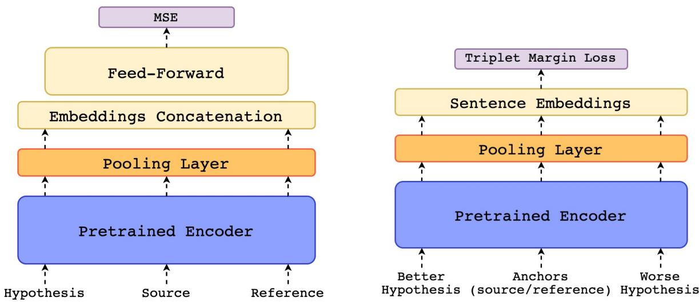

# COMET: A Neural Framework for MT Evaluation

Ricardo Rei Craig Stewart Ana C Farinha Alon Lavie

Unbabel AI

{ricardo.rei, craig.stewart, catarina.farinha, alon.lavie}@unbabel.com

## Abstract

We present COMET, a neural framework for training multilingual machine translation evaluation models which obtains new state-of-theart levels of correlation with human judgements. Our framework leverages recent breakthroughs in cross-lingual pretrained language modeling resulting in highly multilingual and adaptable MT evaluation models that exploit information from both the source input and a target-language reference translation in order to more accurately predict MT quality. To showcase our framework, we train three models with different types of human judgements: Direct Assessments, Human-mediated Translation Edit Rate and Multidimensional Quality Metrics. Our models achieve new state-ofthe-art performance on the WMT 2019 Metrics shared task and demonstrate robustness to high-performing systems.

## 1 Introduction

Historically, metrics for evaluating the quality of machine translation (MT) have relied on assessing the similarity between an MT-generated hypothesis and a human-generated reference translation in the target language. Traditional metrics have focused on basic, lexical-level features such as counting the number of matching n-grams between the MT hypothesis and the reference translation. Metrics such as BLEU (Papineni et al., 2002) and METEOR (Lavie and Denkowski, 2009) remain popular as a means of evaluating MT systems due to their light-weight and fast computation.

Modern neural approaches to MT result in much higher quality of translation that often deviates from monotonic lexical transfer between languages. For this reason, it has become increasingly evident that we can no longer rely on metrics such as BLEU to provide an accurate estimate of the quality of MT (Barrault et al., 2019).

While an increased research interest in neural methods for training MT models and systems has resulted in a recent, dramatic improvement in MT quality, MT evaluation has fallen behind. The MT research community still relies largely on outdated metrics and no new, widely-adopted standard has emerged. In 2019, the WMT News Translation Shared Task received a total of 153 MT system submissions (Barrault et al., 2019). The Metrics Shared Task of the same year saw only 24 submissions, almost half of which were entrants to the Quality Estimation Shared Task, adapted as metrics (Ma et al., 2019).

The findings of the above-mentioned task highlight two major challenges to MT evaluation which we seek to address herein (Ma et al., 2019). Namely, that current metrics struggle to accurately correlate with human judgement at segment level and fail to adequately differentiate the highest performing MT systems.

In this paper, we present COMET1, a PyTorchbased framework for training highly multilingual and adaptable MT evaluation models that can function as metrics. Our framework takes advantage of recent breakthroughs in cross-lingual language modeling (Artetxe and Schwenk, 2019; Devlin et al., 2019; Conneau and Lample, 2019; Conneau et al., 2019) to generate prediction estimates of human judgments such as Direct Assessments (DA) (Graham et al., 2013), Human-mediated Translation Edit Rate (HTER) (Snover et al., 2006) and metrics compliant with the Multidimensional Quality Metric framework (Lommel et al., 2014).

Inspired by recent work on Quality Estimation (QE) that demonstrated that it is possible to achieve high levels of correlation with human judgements even without a reference translation (Fonseca et al., 2019), we propose a novel approach for incorporating the source-language input into our MT evaluation models. Traditionally only QE models have made use of the source input, whereas MT evaluation metrics rely instead on the reference translation. As in (Takahashi et al., 2020), we show that using a multilingual embedding space allows us to leverage information from all three inputs and demonstrate the value added by the source as input to our MT evaluation models.

To illustrate the effectiveness and flexibility of the COMET framework, we train three models that estimate different types of human judgements and show promising progress towards both better correlation at segment level and robustness to highquality MT.

We will release both the COMET framework and the trained MT evaluation models described in this paper to the research community upon publication.

## 2 Model Architectures

Human judgements of MT quality usually come in the form of segment-level scores, such as DA, MQM and HTER. For DA, it is common practice to convert scores into relative rankings (DARR) when the number of annotations per segment is limited (Bojar et al., 2017b; Ma et al., 2018, 2019). This means that, for two MT hypotheses $h _ { i }$ and $h _ { j }$ of the same source s, if the DA score assigned to $h _ { i }$ is higher than the score assigned to $h _ { j }$ ， $h _ { i }$ is regarded as a “better” hypothesis.2 To encompass these differences, our framework supports two distinct architectures: The Estimator model and the Translation Ranking model. The fundamental difference between them is the training objective. While the Estimator is trained to regress directly on a quality score, the Translation Ranking model is trained to minimize the distance between a “better” hypothesis and both its corresponding reference and its original source. Both models are composed of a cross-lingual encoder and a pooling layer.

## 2.1 Cross-lingual Encoder

The primary building block of all the models in our framework is a pretrained, cross-lingual model such as multilingual BERT (Devlin et al., 2019), XLM (Conneau and Lample, 2019) or XLM-RoBERTa (Conneau et al., 2019). These models contain several transformer encoder layers that are trained to reconstruct masked tokens by uncovering the relationship between those tokens and the surrounding ones. When trained with data from multiple languages this pretrained objective has been found to be highly effective in cross-lingual tasks such as document classification and natural language inference (Conneau et al., 2019), generalizing well to unseen languages and scripts (Pires et al., 2019). For the experiments in this paper, we rely on XLM-RoBERTa (base) as our encoder model.

Given an input sequence $x = [ x _ { 0 } , x _ { 1 } , . . . , x _ { n } ] $ the encoder produces an embedding $e _ { j } ^ { ( \ell ) }$ for each token $x _ { j }$ and each layer $\ell \in \{ 0 , 1 , . . . , \check { k } \}$ . In our framework, we apply this process to the source, MT hypothesis, and reference in order to map them into a shared feature space.

## 2.2 Pooling Layer

The embeddings generated by the last layer of the pretrained encoders are usually used for fine-tuning models to new tasks. However, (Tenney et al., 2019) showed that different layers within the network can capture linguistic information that is relevant for different downstream tasks. In the case of MT evaluation, (Zhang et al., 2020) showed that different layers can achieve different levels of correlation and that utilizing only the last layer often results in inferior performance. In this work, we used the approach described in Peters et al. (2018) and pool information from the most important encoder layers into a single embedding for each token, $e _ { j }$ , by using a layer-wise attention mechanism. This embedding is then computed as:

$$
e _ { x _ { j } } = \mu E _ { x _ { j } } ^ { \top } \pmb { \alpha }\tag{1}
$$

where $\mu$ is a trainable weight coefficient, $E _ { j } =$ $[ e _ { j } ^ { ( 0 ) } , e _ { j } ^ { ( 1 ) } , \dots e _ { j } ^ { ( k ) } ]$ corresponds to the vector of layer embeddings for token $x _ { j }$ , and $\alpha \quad =$ softmax $( [ \alpha ^ { ( 1 ) } , \alpha ^ { \top } , \dots , \alpha ^ { ( k ) } ] )$ is a vector corresponding to the layer-wise trainable weights. In order to avoid overfitting to the information contained in any single layer, we used layer dropout (Kondratyuk and Straka, 2019), in which with a probability $p$ the weight $\boldsymbol { \alpha } ^ { ( i ) }$ is set $\mathrm { t o } - \infty$

Finally, as in (Reimers and Gurevych, 2019), we apply average pooling to the resulting word embeddings to derive a sentence embedding for each segment.

Figure 1: Estimator model architecture. The source, hypothesis and reference are independently encoded using a pretrained cross-lingual encoder. The resulting word embeddings are then passed through a pooling layer to create a sentence embedding for each segment. Finally, the resulting sentence embeddings are combined and concatenated into one single vector that is passed to a feed-forward regressor. The entire model is trained by minimizing the Mean Squared Error (MSE).

> **AI Description:**
> **Source:** `assets/_page_2_Figure_0.jpg`
> 
> **Generated:** 2026-05-15 15:34:20
> 
> ---
> 
> The image contains a flowchart-style diagram illustrating the architecture of two different models for sentence similarity tasks. The left side of the diagram shows a model with three main components: a Pretrained Encoder, a Pooling Layer, an Embeddings Concatenation layer, and a Feed-Forward layer. The right side of the diagram represents a model using Sentence Embeddings, a Pooling Layer, and a Triplet Margin Loss function. The flowchart includes labels such as "Hypothesis," "Source," "Reference," "Better Hypothesis," "Anchors," and "Worse Hypothesis," indicating the types of inputs and outputs for each model. The diagram uses different colors to distinguish between the different layers and components of the models.

## 2.3 Estimator Model

Given a d-dimensional sentence embedding for the source, the hypothesis, and the reference, we adopt the approach proposed in RUSE (Shimanaka et al., 2018) and extract the following combined features:

• Element-wise source product: $h \odot s$

• Element-wise reference product: $h \odot r$

• Absolute element-wise source difference: $| h - s |$

• Absolute element-wise reference difference: $| h - r |$

These combined features are then concatenated to the reference embedding r and hypothesis embedding h into a single vector $\textbf { \em x } = ~ [ h ; r ; h \odot$ $s ; h \odot r ; | h - s | ; | h - r | ]$ that serves as input to a feed-forward regressor. The strength of these features is in highlighting the differences between embeddings in the semantic feature space.

The model is then trained to minimize the mean squared error between the predicted scores and quality assessments (DA, HTER or MQM). Figure 1 illustrates the proposed architecture.

Figure 2: Translation Ranking model architecture. This architecture receives 4 segments: the source, the reference, a “better” hypothesis, and a “worse” one. These segments are independently encoded using a pretrained cross-lingual encoder and a pooling layer on top. Finally, using the triplet margin loss (Schroff et al., 2015) we optimize the resulting embedding space to minimize the distance between the “better” hypothesis and the “anchors” (source and reference).

Note that we chose not to include the raw source embedding (s) in our concatenated input. Early experimentation revealed that the value added by the source embedding as extra input features to our regressor was negligible at best. A variation on our HTER estimator model trained with the vector $\pmb { x } = [ h ; s ; r ; h \odot s ; h \odot r ; | h - s | ; | h - r | ]$ as input to the feed-forward only succeed in boosting segment-level performance in 8 of the 18 language pairs outlined in section 5 below and the average improvement in Kendall’s Tau in those settings was +0.0009. As noted in Zhao et al. (2020), while cross-lingual pretrained models are adaptive to multiple languages, the feature space between languages is poorly aligned. On this basis we decided in favor of excluding the source embedding on the intuition that the most important information comes from the reference embedding and reducing the feature space would allow the model to focus more on relevant information. This does not however negate the general value of the source to our model; where we include combination features such as h  s and $| h - s |$ we do note gains in correlation as explored further in section 5.5 below.

## 2.4 Translation Ranking Model

Our Translation Ranking model (Figure 2) receives as input a tuple ${ \chi = ( s , h ^ { + } , h ^ { - } , r ) }$ where $h ^ { + }$ denotes an hypothesis that was ranked higher than another hypothesis $h ^ { - }$ . We then pass χ through our cross-lingual encoder and pooling layer to obtain a sentence embedding for each segment in the $\chi .$ Finally, using the embeddings $\{ s , h ^ { + } , h ^ { - } , r \}$ ， we compute the triplet margin loss (Schroff et al., 2015) in relation to the source and reference:

$$
L ( \chi ) = L ( s , h ^ { + } , h ^ { - } ) + L ( r , h ^ { + } , h ^ { - } )\tag{2}
$$

where:

$$
\begin{array} { c } { { L ( s , h ^ { + } , h ^ { - } ) = } } \\ { { { } } } \\ { { \operatorname* { m a x } \{ 0 , d ( s , h ^ { + } ) ~ - d ( s , h ^ { - } ) + \epsilon \} } } \end{array}\tag{3}
$$

$$
\begin{array} { c } { { L ( r , h ^ { + } , h ^ { - } ) = } } \\ { { \operatorname* { m a x } \{ 0 , d ( r , h ^ { + } ) ~ - d ( r , h ^ { - } ) + \epsilon \} } } \end{array}\tag{4}
$$

$d ( { \pmb u } , { \pmb v } )$ denotes the euclidean distance between u and v and  is a margin. Thus, during training the model optimizes the embedding space so the distance between the anchors (s and r) and the “worse” hypothesis $h ^ { - }$ is greater by at least  than the distance between the anchors and “better” hypothesis $h ^ { + }$

During inference, the described model receives a triplet $( s , \hat { h } , r )$ with only one hypothesis. The quality score assigned to hˆ is the harmonic mean between the distance to the source $d ( s , \hat { h } )$ and the distance to the reference $d ( \boldsymbol { r } , \hat { \boldsymbol { h } } )$ :

$$
f ( s , \hat { h } , r ) = \frac { 2 \times d ( r , \hat { h } ) \times d ( s , \hat { h } ) } { d ( r , \hat { h } ) + d ( s , \hat { h } ) }\tag{5}
$$

Finally, we convert the resulting distance into a similarity score bounded between 0 and 1 as follows:

$$
{ \hat { f } } ( s , { \hat { h } } , r ) = { \frac { 1 } { 1 + f ( s , { \hat { h } } , r ) } }\tag{6}
$$

## 3 Corpora

To demonstrate the effectiveness of our described model architectures (section 2), we train three MT evaluation models where each model targets a different type of human judgment. To train these models, we use data from three different corpora: the QT21 corpus, the DARR from the WMT Metrics shared task (2017 to 2019) and a proprietary MQM annotated corpus.

## 3.1 The QT21 corpus

The QT21 corpus is a publicly available3 dataset containing industry generated sentences from either an information technology or life sciences domains (Specia et al., 2017). This corpus contains a total of 173K tuples with source sentence, respective human-generated reference, MT hypothesis (either from a phrase-based statistical MT or from a neural MT), and post-edited MT (PE). The language pairs represented in this corpus are: English to German (en-de), Latvian (en-lt) and Czech (en-cs), and German to English (de-en).

The HTER score is obtained by computing the translation edit rate (TER) (Snover et al., 2006) between the MT hypothesis and the corresponding PE. Finally, after computing the HTER for each MT, we built a training dataset $D = \{ s _ { i } , h _ { i } , r _ { i } , y _ { i } \} _ { n = 1 } ^ { N } .$ where $s _ { i }$ denotes the source text, $h _ { i }$ denotes the MT hypothesis, $r _ { i }$ the reference translation, and $y _ { i }$ the HTER score for the hypothesis $h _ { i }$ . In this manner we seek to learn a regression $f ( s , h , r ) \to y$ that predicts the human-effort required to correct the hypothesis by looking at the source, hypothesis, and reference (but not the post-edited hypothesis).

## 3.2 The WMT DARR corpus

Since 2017, the organizers of the WMT News Translation Shared Task (Barrault et al., 2019) have collected human judgements in the form of adequacy DAs (Graham et al., 2013, 2014, 2017). These DAs are then mapped into relative rankings (DARR) (Ma et al., 2019). The resulting data for each year (2017-19) form a dataset $D =$ $\{ s _ { i } , h _ { i } ^ { + } , h _ { i } ^ { - } , r _ { i } \} _ { n = 1 } ^ { N }$ where $h _ { i } ^ { + }$ denotes a “better” hypothesis and $\mathfrak { h } _ { i } ^ { - }$ denotes a “worse” one. Here we seek to learn a function $r ( s , h , r )$ such that the score assigned to $h _ { i } ^ { + }$ is strictly higher than the score assigned to $h _ { i } ^ { - } ( r ( s _ { i } , h _ { i } ^ { + } , r _ { i } ) { } ~ > { } ~ r ( s _ { i } , h _ { i } ^ { - } , r _ { i } ) )$ This data4 contains a total of 24 high and lowresource language pairs such as Chinese to English (zh-en) and English to Gujarati (en-gu).

## 3.3 The MQM corpus

The MQM corpus is a proprietary internal database of MT-generated translations of customer support chat messages that were annotated according to the guidelines set out in Burchardt and Lommel (2014). This data contains a total of 12K tuples, covering 12 language pairs from English to: German (en-de), Spanish (en-es), Latin-American Spanish (en-es-latam), French (en-fr), Italian (en-it), Japanese (en-ja), Dutch (en-nl), Portuguese (en-pt), Brazilian Portuguese (en-pt-br), Russian (en-ru), Swedish (en-sv), and Turkish (en-tr). Note that in this corpus English is always seen as the source language, but never as the target language. Each tuple consists of a source sentence, a human-generated reference, a MT hypothesis, and its MQM score, derived from error annotations by one (or more) trained annotators. The MQM metric referred to throughout this paper is an internal metric defined in accordance with the MQM framework (Lommel et al., 2014) (MQM). Errors are annotated under an internal typology defined under three main error types; ‘Style’, ‘Fluency’ and ‘Accuracy’. Our MQM scores range from −∞ to 100 and are defined as:

$$
\mathrm { M Q M } = 1 0 0 - { \frac { I _ { \mathrm { M i n o r } } + 5 \times I _ { \mathrm { M a j o r } } + 1 0 \times I _ { \mathrm { C r i t . } } } { \mathrm { S e n t e n c e L e n g t h } \times 1 0 0 } }\tag{7}
$$

where $I _ { \mathrm { M i n o r } }$ denotes the number of minor errors, $I _ { \mathrm { M a j o r } }$ the number of major errors and $I _ { \mathrm { C r i t } }$ the number of critical errors.

Our MQM metric takes into account the severity of the errors identified in the MT hypothesis, leading to a more fine-grained metric than HTER or DA. When used in our experiments, these values were divided by 100 and truncated at 0. As in section 3.1, we constructed a training dataset $\begin{array} { r } {  { \boldsymbol { D } } ~ = ~ \{ s _ { i } , h _ { i } , r _ { i } , y _ { i } \} _ { n = 1 } ^ { N } } \end{array}$ , where $s _ { i }$ denotes the source text, $h _ { i }$ denotes the MT hypothesis, $r _ { i }$ the reference translation, and $y _ { i }$ the MQM score for the hypothesis $h _ { i }$

## 4 Experiments

We train two versions of the Estimator model described in section 2.3: one that regresses on HTER (COMET-HTER) trained with the QT21 corpus, and another that regresses on our proprietary implementation of MQM (COMET-MQM) trained with our internal MQM corpus. For the Translation Ranking model, described in section 2.4, we train with the WMT DARR corpus from 2017 and 2018 (COMET-RANK). In this section, we introduce the training setup for these models and corresponding evaluation setup.

## 4.1 Training Setup

The two versions of the Estimators (COMET-HTER/MQM) share the same training setup and hyper-parameters (details are included in the Appendices). For training, we load the pretrained encoder and initialize both the pooling layer and the feed-forward regressor. Whereas the layer-wise scalars α from the pooling layer are initially set to zero, the weights from the feed-forward are initialized randomly. During training, we divide the model parameters into two groups: the encoder parameters, that include the encoder model and the scalars from α; and the regressor parameters, that include the parameters from the top feed-forward network. We apply gradual unfreezing and discriminative learning rates (Howard and Ruder, 2018), meaning that the encoder model is frozen for one epoch while the feed-forward is optimized with a learning rate of 3e−5. After the first epoch, the entire model is fine-tuned but the learning rate for the encoder parameters is set to 1e−5 in order to avoid catastrophic forgetting.

In contrast with the two Estimators, for the COMET-RANK model we fine-tune from the outset. Furthermore, since this model does not add any new parameters on top of XLM-RoBERTa (base) other than the layer scalars α, we use one single learning rate of 1e−5 for the entire model.

## 4.2 Evaluation Setup

We use the test data and setup of the WMT 2019 Metrics Shared Task (Ma et al., 2019) in order to compare the COMET models with the top performing submissions of the shared task and other recent state-of-the-art metrics such as BERTSCORE and BLEURT.5 The evaluation method used is the official Kendall’s Tau-like formulation, τ , from the WMT 2019 Metrics Shared Task (Ma et al., 2019) defined as:

$$
\tau = { \frac { C o n c o r d a n t - D i s c o r d a n t } { C o n c o r d a n t + D i s c o r d a n t } }\tag{8}
$$

where Concordant is the number of times a metric assigns a higher score to the “better” hypothesis $h ^ { + }$ and Discordant is the number of times a metric assigns a higher score to the “worse” hypothesis $h ^ { - }$ or the scores assigned to both hypotheses is the same.

Table 1: Kendall’s Tau (τ ) correlations on language pairs with English as source for the WMT19 Metrics DARR corpus. For BERTSCORE we report results with the default encoder model for a complete comparison, but also with XLM-RoBERTa (base) for fairness with our models. The values reported for YiSi-1 are taken directly from the shared task paper (Ma et al., 2019).

As mentioned in the findings of (Ma et al., 2019), segment-level correlations of all submitted metrics were frustratingly low. Furthermore, all submitted metrics exhibited a dramatic lack of ability to correctly rank strong MT systems. To evaluate whether our new MT evaluation models better address this issue, we followed the described evaluation setup used in the analysis presented in (Ma et al., 2019), where correlation levels are examined for portions of the DARR data that include only the top 10, 8, 6 and 4 MT systems.

## 5 Results

## 5.1 From English into X

Table 1 shows results for all eight language pairs with English as source. We contrast our three COMET models against baseline metrics such as BLEU and CHRF, the 2019 task winning metric YISI-1, as well as the more recent BERTSCORE. We observe that across the board our three models trained with the COMET framework outperform, often by significant margins, all other metrics. Our DARR Ranker model outperforms the two Estimators in seven out of eight language pairs. Also, even though the MQM Estimator is trained on only 12K annotated segments, it performs roughly on par with the HTER Estimator for most language-pairs, and outperforms all the other metrics in en-ru.

## 5.2 From X into English

Table 2 shows results for the seven to-English language pairs. Again, we contrast our three COMET models against baseline metrics such as BLEU and CHRF, the 2019 task winning metric YISI-1, as well as the recently published metrics BERTSCORE and BLEURT. As in Table 1 the DARR model shows strong correlations with human judgements outperforming the recently proposed English-specific BLEURT metric in five out of seven language pairs. Again, the MQM Estimator shows surprising strong results despite the fact that this model was trained with data that did not include English as a target. Although the encoder used in our trained models is highly multilingual, we hypothesise that this powerful “zero-shot” result is due to the inclusion of the source in our models.

## 5.3 Language pairs not involving English

All three of our COMET models were trained on data involving English (either as a source or as a target). Nevertheless, to demonstrate that our metrics generalize well we test them on the three WMT 2019 language pairs that do not include English in either source or target. As can be seen in Table 3, our results are consistent with observations in Tables 1 and 2.

## 5.4 Robustness to High-Quality MT

For analysis, we use the DARR corpus from the 2019 Shared Task and evaluate on the subset of the data from the top performing MT systems for each language pair. We included language pairs for which we could retrieve data for at least ten different MT systems (i.e. all but kk-en and gu-en). We contrast against the strong recently proposed BERTSCORE and BLEURT, with BLEU as a baseline. Results are presented in Figure 3. For language pairs where English is the target, our three models are either better or competitive with all others; where English is the source we note that in general our metrics exceed the performance of others. Even the MQM Estimator, trained with only 12K segments, is competitive, which highlights the power of our proposed framework.

### Full Page Description (Page 6)

**Source:** `assets/_page_6_Asset_0.jpg`

**Generated:** 2026-05-15 15:33:35

---

The image contains a line graph with multiple data series. The x-axis represents "Top models from X to English," and the y-axis represents "Kendall Tau (τ)." The graph includes five different data series, each represented by a distinct line and marker combination: COMET-RANK (cyan with 'x' markers), BLEU (red with 'x' markers), COMET-MQM (blue with 'x' markers), BERTSCORE (orange with 'x' markers), and COMET-HTER (blue with 'x' markers). The graph shows the Kendall Tau values for these models across different top model counts from 10 to 4. The main trend is a general decrease in Kendall Tau values as the number of top models decreases, with BLEU showing the steepest decline.

### Full Page Description (Page 6)

**Source:** `assets/_page_6_Asset_1.jpg`

**Generated:** 2026-05-15 15:33:24

---

The image is a line graph with the title "Kendall Tau (τ)". The x-axis is labeled "Top models from English to X" and the y-axis is labeled "Kendall Tau (τ)". The graph displays multiple lines representing different datasets or models, with each line corresponding to a different number of top models from English to X, ranging from "All" to "4". The lines show a general downward trend as the number of top models decreases, indicating a decrease in Kendall Tau values. The graph includes data points for each number of top models, with the lines connecting these points to form a visual representation of the trend.

Table 2: Kendall’s Tau (τ ) correlations on language pairs with English as a target for the WMT19 Metrics DARR corpus. As for BERTSCORE, for BLEURT we report results for two models: the base model, which is comparable in size with the encoder we used and the large model that is twice the size.

Table 3: Kendall’s Tau (τ ) correlations on language pairs not involving English for the WMT19 Metrics DARR corpus.

## 5.5 The Importance of the Source

To shed some light on the actual value and contribution of the source language input in our models’ ability to learn accurate predictions, we trained two versions of our DARR Ranker model: one that uses only the reference, and another that uses both reference and source. Both models were trained using the WMT 2017 corpus that only includes language pairs from English (en-de, en-cs, en-fi, en-tr). In other words, while English was never observed as a target language during training for both variants of the model, the training of the second variant includes English source embeddings. We then tested these two model variants on the WMT 2018 corpus for these language pairs and for the reversed directions (with the exception of en-cs because cs-en does not exist for WMT 2018). The results in Table

4 clearly show that for the translation ranking architecture, including the source improves the overall correlation with human judgments. Furthermore, the inclusion of the source exposed the second variant of the model to English embeddings which is reflected in a higher $\Delta \tau$ for the language pairs with English as a target.

Table 4: Comparison between COMET-RANK (section 2.4) and a reference-only version thereof on WMT18 data. Both models were trained with WMT17 which means that the reference-only model is never exposed to English during training.

## 6 Reproducibility

We will release both the code-base of the COMET framework and the trained MT evaluation models described in this paper to the research community upon publication, along with the detailed scripts required in order to run all reported baselines.6 All the models reported in this paper were trained on a single Tesla T4 (16GB) GPU. Moreover, our framework builds on top of PyTorch Lightning (Falcon, 2019), a lightweight PyTorch wrapper, that was created for maximal flexibility and reproducibility.

## 7 Related Work

Classic MT evaluation metrics are commonly characterized as n-gram matching metrics because, using hand-crafted features, they estimate MT quality by counting the number and fraction of ngrams that appear simultaneous in a candidate translation hypothesis and one or more humanreferences. Metrics such as BLEU (Papineni et al., 2002), METEOR (Lavie and Denkowski, 2009), and CHRF (Popovic´, 2015) have been widely studied and improved (Koehn et al., 2007; Popovic´, 2017; Denkowski and Lavie, 2011; Guo and Hu, 2019), but, by design, they usually fail to recognize and capture semantic similarity beyond the lexical level.

In recent years, word embeddings (Mikolov et al., 2013; Pennington et al., 2014; Peters et al., 2018; Devlin et al., 2019) have emerged as a commonly used alternative to n-gram matching for capturing word semantics similarity. Embeddingbased metrics like METEOR-VECTOR (Servan et al., 2016), BLEU2VEC (Tattar and Fishel ¨ , 2017), YISI-1 (Lo, 2019), MOVERSCORE (Zhao et al., 2019), and BERTSCORE (Zhang et al., 2020) create soft-alignments between reference and hypothesis in an embedding space and then compute a score that reflects the semantic similarity between those segments. However, human judgements such as DA and MQM, capture much more than just semantic similarity, resulting in a correlation upperbound between human judgements and the scores produced by such metrics.

Learnable metrics (Shimanaka et al., 2018; Mathur et al., 2019; Shimanaka et al., 2019) attempt to directly optimize the correlation with human judgments, and have recently shown promising results. BLEURT (Sellam et al., 2020), a learnable metric based on BERT (Devlin et al., 2019), claims state-of-the-art performance for the last 3 years of the WMT Metrics Shared task. Because BLEURT builds on top of English-BERT (Devlin et al., 2019), it can only be used when English is the target language which limits its applicability. Also, to the best of our knowledge, all the previously proposed learnable metrics have focused on optimizing DA which, due to a scarcity of annotators, can prove inherently noisy (Ma et al., 2019).

Reference-less MT evaluation, also known as Quality Estimation (QE), has historically often regressed on HTER for segment-level evaluation (Bojar et al., 2013, 2014, 2015, 2016, 2017a). More recently, MQM has been used for document-level evaluation (Specia et al., 2018; Fonseca et al., 2019). By leveraging highly multilingual pretrained encoders such as multilingual BERT (Devlin et al., 2019) and XLM (Conneau and Lample, 2019), QE systems have been showing auspicious correlations with human judgements (Kepler et al., 2019a). Concurrently, the OpenKiwi framework (Kepler et al., 2019b) has made it easier for researchers to push the field forward and build stronger QE models.

## 8 Conclusions and Future Work

In this paper we present COMET, a novel neural framework for training MT evaluation models that can serve as automatic metrics and easily be adapted and optimized to different types of human judgements of MT quality.

To showcase the effectiveness of our framework, we sought to address the challenges reported in the 2019 WMT Metrics Shared Task (Ma et al., 2019). We trained three distinct models which achieve new state-of-the-art results for segment-level correlation with human judgments, and show promising ability to better differentiate high-performing systems.

One of the challenges of leveraging the power of pretrained models is the burdensome weight of parameters and inference time. A primary avenue for future work on COMET will look at the impact of more compact solutions such as DistilBERT (Sanh et al., 2019).

Additionally, whilst we outline the potential importance of the source text above, we note that our COMET-RANK model weighs source and reference differently during inference but equally in its training loss function. Future work will investigate the optimality of this formulation and further examine the interdependence of the different inputs.

## Acknowledgments

We are grateful to Andre Martins, Austin Matthews, ´ Fabio Kepler, Daan Van Stigt, Miguel Vera, and the reviewers, for their valuable feedback and discussions. This work was supported in part by the P2020 Program through projects MAIA and Unbabel4EU, supervised by ANI under contract numbers 045909 and 042671, respectively.

## References

- Mikel Artetxe and Holger Schwenk. 2019. Massively multilingual sentence embeddings for zeroshot cross-lingual transfer and beyond. Transactions of the Association for Computational Linguistics, 7:597–610.
- Lo¨ıc Barrault, Ondˇrej Bojar, Marta R. Costa-jussa,\` Christian Federmann, Mark Fishel, Yvette Graham, Barry Haddow, Matthias Huck, Philipp Koehn, Shervin Malmasi, Christof Monz, Mathias Muller, ¨ Santanu Pal, Matt Post, and Marcos Zampieri. 2019. Findings of the 2019 conference on machine translation (WMT19). In Proceedings of the Fourth Conference on Machine Translation (Volume 2: Shared Task Papers, Day 1), pages 1–61, Florence, Italy. Association for Computational Linguistics.
- Ondˇrej Bojar, Christian Buck, Chris Callison-Burch, Christian Federmann, Barry Haddow, Philipp Koehn, Christof Monz, Matt Post, Radu Soricut, and
- Lucia Specia. 2013. Findings of the 2013 Workshop on Statistical Machine Translation. In Proceedings of the Eighth Workshop on Statistical Machine Translation, pages 1–44, Sofia, Bulgaria. Association for Computational Linguistics.
- Ondˇrej Bojar, Christian Buck, Christian Federmann, Barry Haddow, Philipp Koehn, Johannes Leveling, Christof Monz, Pavel Pecina, Matt Post, Herve Saint-Amand, Radu Soricut, Lucia Specia, and Alesˇ Tamchyna. 2014. Findings of the 2014 workshop on statistical machine translation. In Proceedings of the Ninth Workshop on Statistical Machine Translation, pages 12–58, Baltimore, Maryland, USA. Association for Computational Linguistics.
- Ondˇrej Bojar, Rajen Chatterjee, Christian Federmann, Yvette Graham, Barry Haddow, Shujian Huang, Matthias Huck, Philipp Koehn, Qun Liu, Varvara Logacheva, Christof Monz, Matteo Negri, Matt Post, Raphael Rubino, Lucia Specia, and Marco Turchi. 2017a. Findings of the 2017 conference on machine translation (WMT17). In Proceedings of the Second Conference on Machine Translation, pages 169– 214, Copenhagen, Denmark. Association for Computational Linguistics.
- Ondˇrej Bojar, Rajen Chatterjee, Christian Federmann, Yvette Graham, Barry Haddow, Matthias Huck, Antonio Jimeno Yepes, Philipp Koehn, Varvara Logacheva, Christof Monz, Matteo Negri, Aurelie ´ Nev´ eol, Mariana Neves, Martin Popel, Matt Post, ´ Raphael Rubino, Carolina Scarton, Lucia Specia, Marco Turchi, Karin Verspoor, and Marcos Zampieri. 2016. Findings of the 2016 conference on machine translation. In Proceedings of the First Conference on Machine Translation: Volume 2, Shared Task Papers, pages 131–198, Berlin, Germany. Association for Computational Linguistics.
- Ondˇrej Bojar, Rajen Chatterjee, Christian Federmann, Barry Haddow, Matthias Huck, Chris Hokamp, Philipp Koehn, Varvara Logacheva, Christof Monz, Matteo Negri, Matt Post, Carolina Scarton, Lucia Specia, and Marco Turchi. 2015. Findings of the 2015 workshop on statistical machine translation. In Proceedings of the Tenth Workshop on Statistical Machine Translation, pages 1–46, Lisbon, Portugal. Association for Computational Linguistics.
- Ondˇrej Bojar, Yvette Graham, and Amir Kamran. 2017b. Results of the WMT17 metrics shared task. In Proceedings of the Second Conference on Machine Translation, pages 489–513, Copenhagen, Denmark. Association for Computational Linguistics.
- Aljoscha Burchardt and Arle Lommel. 2014. Practical Guidelines for the Use of MQM in Scientific Research on Translation quality. (access date: 2020- 05-26).
- Alexis Conneau, Kartikay Khandelwal, Naman Goyal, Vishrav Chaudhary, Guillaume Wenzek, Francisco

- Guzman, Edouard Grave, Myle Ott, Luke Zettle-´ moyer, and Veselin Stoyanov. 2019. Unsupervised cross-lingual representation learning at scale. arXiv preprint arXiv:1911.02116.
- Alexis Conneau and Guillaume Lample. 2019. Crosslingual language model pretraining. In H. Wallach, H. Larochelle, A. Beygelzimer, F. d‘Alche Buc, ´ E. Fox, and R. Garnett, editors, Advances in Neural Information Processing Systems 32, pages 7059– 7069. Curran Associates, Inc.
- Michael Denkowski and Alon Lavie. 2011. Meteor 1.3: Automatic metric for reliable optimization and evaluation of machine translation systems. In Proceedings of the Sixth Workshop on Statistical Machine Translation, pages 85–91, Edinburgh, Scotland. Association for Computational Linguistics.
- Jacob Devlin, Ming-Wei Chang, Kenton Lee, and Kristina Toutanova. 2019. BERT: Pre-training of deep bidirectional transformers for language understanding. In Proceedings of the 2019 Conference of the North American Chapter of the Association for Computational Linguistics: Human Language Technologies, Volume 1 (Long and Short Papers), pages 4171–4186, Minneapolis, Minnesota. Association for Computational Linguistics.
- WA Falcon. 2019. PyTorch Lightning: The lightweight PyTorch wrapper for high-performance AI research. GitHub.
- Erick Fonseca, Lisa Yankovskaya, Andre F. T. Martins, ´ Mark Fishel, and Christian Federmann. 2019. Findings of the WMT 2019 shared tasks on quality estimation. In Proceedings of the Fourth Conference on Machine Translation (Volume 3: Shared Task Papers, Day 2), pages 1–10, Florence, Italy. Association for Computational Linguistics.
- Yvette Graham, Timothy Baldwin, Alistair Moffat, and Justin Zobel. 2013. Continuous measurement scales in human evaluation of machine translation. In Proceedings of the 7th Linguistic Annotation Workshop and Interoperability with Discourse, pages 33–41, Sofia, Bulgaria. Association for Computational Linguistics.
- Yvette Graham, Timothy Baldwin, Alistair Moffat, and Justin Zobel. 2014. Is machine translation getting better over time? In Proceedings of the 14th Conference of the European Chapter of the Association for Computational Linguistics, pages 443–451, Gothenburg, Sweden. Association for Computational Linguistics.
- Yvette Graham, Timothy Baldwin, Alistair Moffat, and Justin Zobel. 2017. Can machine translation systems be evaluated by the crowd alone. Natural Language Engineering, 23(1):330.
- Yinuo Guo and Junfeng Hu. 2019. Meteor++ 2.0: Adopt syntactic level paraphrase knowledge into machine translation evaluation. In Proceedings of the
- Fourth Conference on Machine Translation (Volume 2: Shared Task Papers, Day 1), pages 501–506, Florence, Italy. Association for Computational Linguistics.
- Jeremy Howard and Sebastian Ruder. 2018. Universal language model fine-tuning for text classification. In Proceedings of the 56th Annual Meeting of the Association for Computational Linguistics (Volume 1: Long Papers), pages 328–339, Melbourne, Australia. Association for Computational Linguistics.
- Fabio Kepler, Jonay Trenous, Marcos Treviso, Miguel´ Vera, Antonio G´ ois, M. Amin Farajian, Ant´ onio V.´ Lopes, and Andre F. T. Martins. 2019a.´ Unbabel’s participation in the WMT19 translation quality estimation shared task. In Proceedings of the Fourth Conference on Machine Translation (Volume 3: Shared Task Papers, Day 2), pages 78–84, Florence, Italy. Association for Computational Linguistics.
- Fabio Kepler, Jonay Trenous, Marcos Treviso, Miguel ´ Vera, and Andre F. T. Martins. 2019b. ´ OpenKiwi: An open source framework for quality estimation. In Proceedings of the 57th Annual Meeting of the Association for Computational Linguistics: System Demonstrations, pages 117–122, Florence, Italy. Association for Computational Linguistics.
- Philipp Koehn, Hieu Hoang, Alexandra Birch, Chris Callison-Burch, Marcello Federico, Nicola Bertoldi, Brooke Cowan, Wade Shen, Christine Moran, Richard Zens, Chris Dyer, Ondˇrej Bojar, Alexandra Constantin, and Evan Herbst. 2007. Moses: Open source toolkit for statistical machine translation. In Proceedings of the 45th Annual Meeting of the Association for Computational Linguistics Companion Volume Proceedings of the Demo and Poster Sessions, pages 177–180, Prague, Czech Republic. Association for Computational Linguistics.
- Dan Kondratyuk and Milan Straka. 2019. 75 languages, 1 model: Parsing universal dependencies universally. In Proceedings of the 2019 Conference on Empirical Methods in Natural Language Processing and the 9th International Joint Conference on Natural Language Processing (EMNLP-IJCNLP), pages 2779–2795, Hong Kong, China. Association for Computational Linguistics.
- Alon Lavie and Michael Denkowski. 2009. The meteor metric for automatic evaluation of machine translation. Machine Translation, 23:105–115.
- Chi-kiu Lo. 2019. YiSi - a unified semantic MT quality evaluation and estimation metric for languages with different levels of available resources. In Proceedings of the Fourth Conference on Machine Translation (Volume 2: Shared Task Papers, Day 1), pages 507–513, Florence, Italy. Association for Computational Linguistics.
- Arle Lommel, Aljoscha Burchardt, and Hans Uszkoreit. 2014. Multidimensional quality metrics (MQM): A

- framework for declaring and describing translation quality metrics. Tradumtica: tecnologies de la traducci, 0:455–463.
- Qingsong Ma, Ondˇrej Bojar, and Yvette Graham. 2018. Results of the WMT18 metrics shared task: Both characters and embeddings achieve good performance. In Proceedings of the Third Conference on Machine Translation: Shared Task Papers, pages 671–688, Belgium, Brussels. Association for Computational Linguistics.
- Qingsong Ma, Johnny Wei, Ondˇrej Bojar, and Yvette Graham. 2019. Results of the WMT19 metrics shared task: Segment-level and strong MT systems pose big challenges. In Proceedings of the Fourth Conference on Machine Translation (Volume 2: Shared Task Papers, Day 1), pages 62–90, Florence, Italy. Association for Computational Linguistics.
- Nitika Mathur, Timothy Baldwin, and Trevor Cohn. 2019. Putting evaluation in context: Contextual embeddings improve machine translation evaluation. In Proceedings of the 57th Annual Meeting of the Association for Computational Linguistics, pages 2799–2808, Florence, Italy. Association for Computational Linguistics.
- Tomas Mikolov, Ilya Sutskever, Kai Chen, Greg S Corrado, and Jeff Dean. 2013. Distributed representations of words and phrases and their compositionality. In Advances in Neural Information Processing Systems 26, pages 3111–3119. Curran Associates, Inc.
- Kishore Papineni, Salim Roukos, Todd Ward, and Wei-Jing Zhu. 2002. Bleu: a method for automatic evaluation of machine translation. In Proceedings of the 40th Annual Meeting of the Association for Computational Linguistics, pages 311–318, Philadelphia, Pennsylvania, USA. Association for Computational Linguistics.
- Jeffrey Pennington, Richard Socher, and Christopher Manning. 2014. Glove: Global vectors for word representation. In Proceedings of the 2014 Conference on Empirical Methods in Natural Language Processing (EMNLP), pages 1532–1543, Doha, Qatar. Association for Computational Linguistics.
- Matthew Peters, Mark Neumann, Mohit Iyyer, Matt Gardner, Christopher Clark, Kenton Lee, and Luke Zettlemoyer. 2018. Deep contextualized word representations. In Proceedings of the 2018 Conference of the North American Chapter of the Association for Computational Linguistics: Human Language Technologies, Volume 1 (Long Papers), pages 2227–2237, New Orleans, Louisiana. Association for Computational Linguistics.
- Telmo Pires, Eva Schlinger, and Dan Garrette. 2019. How multilingual is multilingual BERT? In Proceedings of the 57th Annual Meeting of the Association for Computational Linguistics, pages 4996–
- 5001, Florence, Italy. Association for Computational Linguistics.
- Maja Popovic. 2015. ´ chrF: character n-gram f-score for automatic MT evaluation. In Proceedings of the Tenth Workshop on Statistical Machine Translation, pages 392–395, Lisbon, Portugal. Association for Computational Linguistics.
- Maja Popovic. 2017. ´ chrF++: words helping character n-grams. In Proceedings of the Second Conference on Machine Translation, pages 612–618, Copenhagen, Denmark. Association for Computational Linguistics.
- Nils Reimers and Iryna Gurevych. 2019. Sentence-BERT: Sentence embeddings using Siamese BERTnetworks. In Proceedings of the 2019 Conference on Empirical Methods in Natural Language Processing and the 9th International Joint Conference on Natural Language Processing (EMNLP-IJCNLP), pages 3982–3992, Hong Kong, China. Association for Computational Linguistics.
- Victor Sanh, Lysandre Debut, Julien Chaumond, and Thomas Wolf. 2019. Distilbert, a distilled version of BERT: smaller, faster, cheaper and lighter. arXiv preprint arXiv:1910.01108.
- F. Schroff, D. Kalenichenko, and J. Philbin. 2015. Facenet: A unified embedding for face recognition and clustering. In 2015 IEEE Conference on Computer Vision and Pattern Recognition (CVPR), pages 815–823.
- Thibault Sellam, Dipanjan Das, and Ankur Parikh. 2020. BLEURT: Learning robust metrics for text generation. In Proceedings of the 58th Annual Meeting of the Association for Computational Linguistics, pages 7881–7892, Online. Association for Computational Linguistics.
- Christophe Servan, Alexandre Berard, Zied Elloumi, ´ Herve Blanchon, and Laurent Besacier. 2016. ´ Word2Vec vs DBnary: Augmenting METEOR using vector representations or lexical resources? In Proceedings of COLING 2016, the 26th International Conference on Computational Linguistics: Technical Papers, pages 1159–1168, Osaka, Japan. The COLING 2016 Organizing Committee.
- Hiroki Shimanaka, Tomoyuki Kajiwara, and Mamoru Komachi. 2018. RUSE: Regressor using sentence embeddings for automatic machine translation evaluation. In Proceedings of the Third Conference on Machine Translation: Shared Task Papers, pages 751–758, Belgium, Brussels. Association for Computational Linguistics.
- Hiroki Shimanaka, Tomoyuki Kajiwara, and Mamoru Komachi. 2019. Machine Translation Evaluation with BERT Regressor. arXiv preprint arXiv:1907.12679.

- Matthew Snover, Bonnie Dorr, Richard Schwartz, Linnea Micciulla, and John Makhoul. 2006. A study of translation edit rate with targeted human annotation. In In Proceedings of Association for Machine Translation in the Americas, pages 223–231.
- Lucia Specia, Fred´ eric Blain, Varvara Logacheva, ´ Ramon Astudillo, and Andr ´ e F. T. Martins. 2018. ´ Findings of the WMT 2018 shared task on quality estimation. In Proceedings of the Third Conference on Machine Translation: Shared Task Papers, pages 689–709, Belgium, Brussels. Association for Computational Linguistics.
- Lucia Specia, Kim Harris, Fred´ eric Blain, Aljoscha ´ Burchardt, Viviven Macketanz, Inguna Skadina, Matteo Negri, , and Marco Turchi. 2017. Translation quality and productivity: A study on rich morphology languages. In Machine Translation Summit XVI, pages 55–71, Nagoya, Japan.
- Kosuke Takahashi, Katsuhito Sudoh, and Satoshi Nakamura. 2020. Automatic machine translation evaluation using source language inputs and cross-lingual language model. In Proceedings of the 58th Annual Meeting of the Association for Computational Linguistics, pages 3553–3558, Online. Association for Computational Linguistics.
- Andre Tattar and Mark Fishel. 2017. ¨ bleu2vec: the painfully familiar metric on continuous vector space steroids. In Proceedings of the Second Conference on Machine Translation, pages 619–622, Copenhagen, Denmark. Association for Computational Linguistics.
- Ian Tenney, Dipanjan Das, and Ellie Pavlick. 2019. BERT rediscovers the classical NLP pipeline. In Proceedings of the 57th Annual Meeting of the Association for Computational Linguistics, pages 4593– 4601, Florence, Italy. Association for Computational Linguistics.
- Tianyi Zhang, Varsha Kishore, Felix Wu, Kilian Q. Weinberger, and Yoav Artzi. 2020. Bertscore: Evaluating text generation with bert. In International Conference on Learning Representations.
- Wei Zhao, Goran Glavas, Maxime Peyrard, Yang Gao, ˇ Robert West, and Steffen Eger. 2020. On the limitations of cross-lingual encoders as exposed by reference-free machine translation evaluation. In Proceedings of the 58th Annual Meeting of the Association for Computational Linguistics, pages 1656– 1671, Online. Association for Computational Linguistics.
- Wei Zhao, Maxime Peyrard, Fei Liu, Yang Gao, Christian M. Meyer, and Steffen Eger. 2019. MoverScore: Text generation evaluating with contextualized embeddings and earth mover distance. In Proceedings of the 2019 Conference on Empirical Methods in Natural Language Processing and the 9th International Joint Conference on Natural Language Processing (EMNLP-IJCNLP), pages 563–578, Hong
- Kong, China. Association for Computational Linguistics.

## A Appendices

In Table 5 we list the hyper-parameters used to train our models. Before initializing these models a random seed was set to 3 in all libraries that perform “random” operations (torch, numpy, random and cuda).

Table 5: Hyper-parameters used in our COMET framework to train the presented models.

Table 6: Statistics for the QT21 corpus.

Table 7: Statistics for the WMT 2017 DARR corpus.

ics for the WMT 2019DARR from-English and no-Englishl
tistics for the WMT 2019 DARR into-English lan

0: MQM corpus (section 3.3) st

Statistics for the WMT 2018DARR langu

