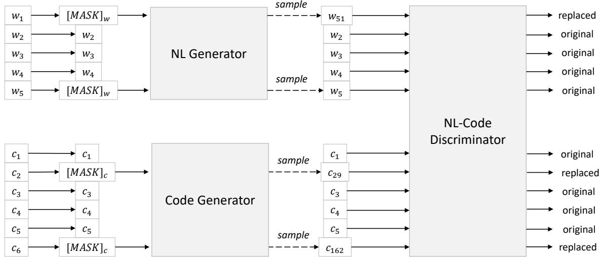
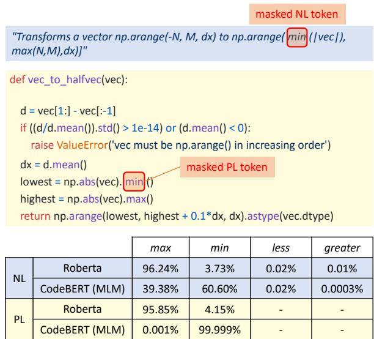
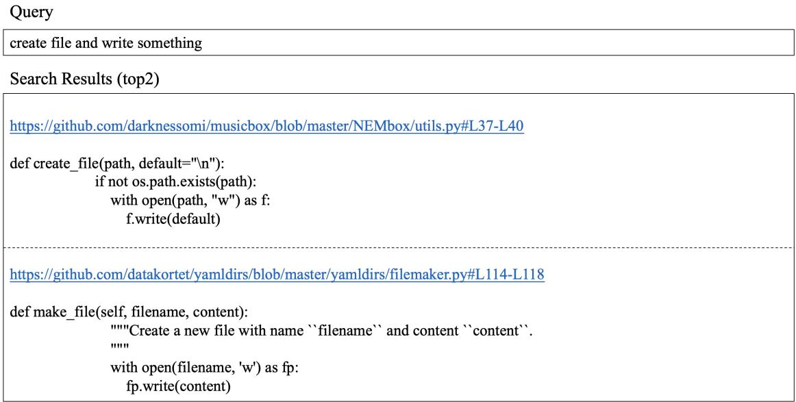
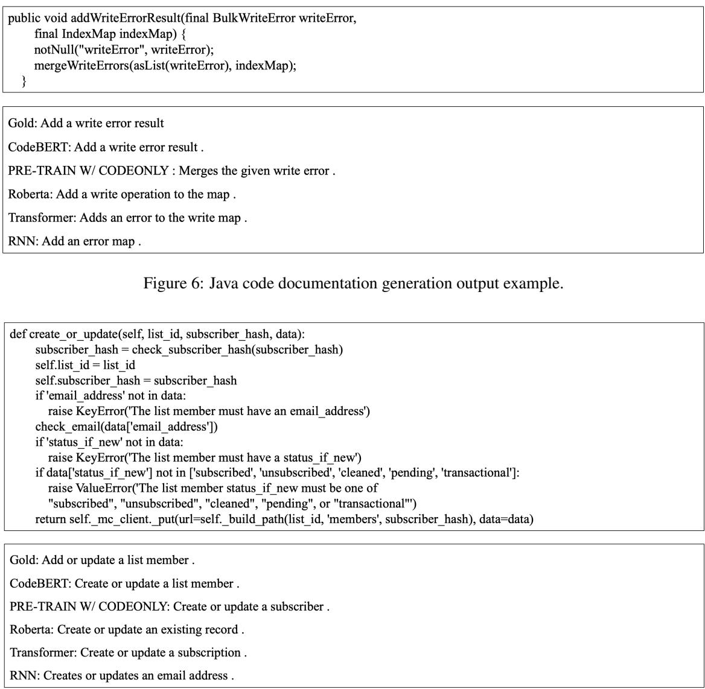

<span id="page-0-0"></span>
# CodeBERT: A Pre-Trained Model for Programming and Natural Languages

Zhangyin Feng1∗, Daya Guo2∗, Duyu Tang3, Nan Duan3, Xiaocheng Feng1   
Ming Gong4, Linjun Shou4, Bing Qin1, Ting Liu1, Daxin Jiang4, Ming Zhou3

1 Research Center for Social Computing and Information Retrieval, Harbin Institute of Technology, China

2 The School of Data and Computer Science, Sun Yat-sen University, China 3 Microsoft Research Asia, Beijing, China

4 Microsoft Search Technology Center Asia, Beijing, China {zyfeng,xcfeng,qinb,tliu}@ir.hit.edu.cn guody5@mail2.sysu.edu.cn

{dutang,nanduan,migon,lisho,djiang,mingzhou}@microsoft.com

## Abstract

We present CodeBERT, a bimodal pre-trained model for programming language (PL) and natural language (NL). CodeBERT learns general-purpose representations that support downstream NL-PL applications such as natural language code search, code documentation generation, etc. We develop Code-BERT with Transformer-based neural architecture, and train it with a hybrid objective function that incorporates the pre-training task of replaced token detection, which is to detect plausible alternatives sampled from generators. This enables us to utilize both “bimodal” data of NL-PL pairs and “unimodal” data, where the former provides input tokens for model training while the latter helps to learn better generators. We evaluate CodeBERT on two NL-PL applications by fine-tuning model parameters. Results show that CodeBERT achieves state-of-the-art performance on both natural language code search and code documentation generation. Furthermore, to investigate what type of knowledge is learned in CodeBERT, we construct a dataset for NL-PL probing, and evaluate in a zero-shot setting where parameters of pre-trained models are fixed. Results show that CodeBERT performs better than previous pre-trained models on NL-PL probing.

## 1 Introduction

Large pre-trained models such as ELMo (Peters et al., 2018), GPT (Radford et al., 2018), BERT (Devlin et al., 2018), XLNet (Yang et al., 2019)

and RoBERTa (Liu et al., 2019) have dramatically improved the state-of-the-art on a variety of natural language processing (NLP) tasks. These pre-trained models learn effective contextual representations from massive unlabeled text optimized by self-supervised objectives, such as masked language modeling, which predicts the original masked word from an artificially masked input sequence. The success of pre-trained models in NLP also drives a surge of multi-modal pre-trained models, such as ViLBERT (Lu et al., 2019) for language-image and VideoBERT (Sun et al., 2019) for language-video, which are learned from bimodal data such as language-image pairs with bimodal self-supervised objectives.

In this work, we present CodeBERT, a bimodal pre-trained model for natural language (NL) and programming language (PL) like Python, Java, JavaScript, etc. CodeBERT captures the semantic connection between natural language and programming language, and produces general-purpose representations that can broadly support NL-PL understanding tasks (e.g. natural language code search) and generation tasks (e.g. code documentation generation). It is developed with the multilayer Transformer (Vaswani et al., 2017), which is adopted in a majority of large pre-trained models. In order to make use of both bimodal instances of NL-PL pairs and large amount of available unimodal codes, we train CodeBERT with a hybrid objective function, including standard masked language modeling (Devlin et al., 2018) and replaced token detection (Clark et al., 2020), where unimodal codes help to learn better generators for producing better alternative tokens for the latter objective.

We train CodeBERT from Github code repositories in 6 programming languages, where bimodal datapoints are codes that pair with function-level natural language documentations (Husain et al., 2019). Training is conducted in a setting similar to that of multilingual BERT (Pires et al., 2019), in which case one pre-trained model is learned for 6 programming languages with no explicit markers used to denote the input programming language. We evaluate CodeBERT on two downstream NL-PL tasks, including natural language code search and code documentation generation. Results show that fine-tuning the parameters of CodeBERT achieves state-of-the-art performance on both tasks. To further investigate what type of knowledge is learned in CodeBERT, we construct a dataset for NL-PL probing, and test CodeBERT in a zero-shot scenario, i.e. without fine-tuning the parameters of CodeBERT. We find that CodeBERT consistently outperforms RoBERTa, a purely natural language-based pre-trained model. The contributions of this work are as follows:

<span id="page-1-0"></span>
• CodeBERT is the first large NL-PL pretrained model for multiple programming languages.

• Empirical results show that CodeBERT is effective in both code search and code-to-text generation tasks.

• We further created a dataset which is the first one to investigate the probing ability of the code-based pre-trained models.

## 2 Background

## 2.1 Pre-Trained Models in NLP

Large pre-trained models (Peters et al., 2018; Radford et al., 2018; Devlin et al., 2018; Yang et al., 2019; Liu et al., 2019; Raffel et al., 2019) have brought dramatic empirical improvements on almost every NLP task in the past few years. Successful approaches train deep neural networks on large-scale plain texts with self-supervised learning objectives. One of the most representative neural architectures is the Transformer (Vaswani et al., 2017), which is also the one used in this work. It contains multiple self-attention layers, and can be conventionally learned with gradient decent in an end-to-end manner as every component is differentiable. The terminology “self-supervised” means that supervisions used for pre-training are automatically collected from raw data without manual annotation. Dominant learning objectives are language modeling and its variations. For example, in GPT (Radford et al., 2018), the learning objective is language modeling, namely predicting the next word $w _ { k }$ given the preceding context words $\{ w _ { 1 } , w _ { 2 } , . . . , w _ { k - 1 } \}$ . As the ultimate goal of pretraining is not to train a good language model, it is desirable to consider both preceding and following contexts to learn better general-purpose contextual representations. This leads us to the masked language modeling objective used in BERT (Devlin et al., 2018), which learns to predict the masked words of a randomly masked word sequence given surrounding contexts. Masked language modeling is also used as one of the two learning objectives for training CodeBERT.

## 2.2 Multi-Modal Pre-Trained Models

The remarkable success of the pre-trained model in NLP has driven the development of multi-modal pre-trained model that learns implicit alignment between inputs of different modalities. These models are typically learned from bimodal data, such as pairs of language-image or pairs of languagevideo. For example, ViLBERT (Lu et al., 2019) learns from image caption data, where the model learns by reconstructing categories of masked image region or masked words given the observed inputs, and meanwhile predicting whether the caption describes the image content or not. Similarly, VideoBERT (Sun et al., 2019) learns from language-video data and is trained by video and text masked token prediction. Our work belongs to this line of research as we regard NL and PL as different modalities. Our method differs from previous works in that the fuels for model training include not only bimodal data of NL-PL pairs, but larger amounts of unimodal data such as codes without paired documentations.

A concurrent work (Kanade et al., 2019) uses masked language modeling and next sentence prediction as the objective to train a BERT model on Python source codes, where a sentence is a logical code line as defined by the Python standard. In terms of the pre-training process, CodeBERT differs from their work in that (1) CodeBERT is trained in a cross-modal style and leverages both bimodal NL-PL data and unimodal PL/NL data, (2) CodeBERT is pre-trained over six programming languages, and (3) CodeBERT is trained with a new learning objective based on replaced token

<span id="page-2-0"></span>
detection.

## 3 CodeBERT

We describe the details about CodeBERT in this section, including the model architecture, the input and output representations, the objectives and data used for training CodeBERT, and how to fine-tune CodeBERT when it is applied to downstream tasks.

## 3.1 Model Architecture

We follow BERT (Devlin et al., 2018) and RoBERTa (Liu et al., 2019), and use multi-layer bidirectional Transformer (Vaswani et al., 2017) as the model architecture of CodeBERT. We will not review the ubiquitous Transformer architecture in detail. We develop CodeBERT by using exactly the same model architecture as RoBERTa-base. The total number of model parameters is 125M.

## 3.2 Input/Output Representations

In the pre-training phase, we set the input as the concatenation of two segments with a special separator token, namely $[ C L S ] , w _ { 1 } , w _ { 2 } , . . w _ { n } , [ S E P ]$ $c _ { 1 } , c _ { 2 } , . . . , c _ { m } , [ E O S ]$ . One segment is natural language text, and another is code from a certain programming language. [CLS] is a special token in front of the two segments, whose final hidden representation is considered as the aggregated sequence representation for classification or ranking. Following the standard way of processing text in Transformer, we regard a natural language text as a sequence of words, and split it as WordPiece (Wu et al., 2016). We regard a piece of code as a sequence of tokens.

The output of CodeBERT includes (1) contextual vector representation of each token, for both natural language and code, and (2) the representation of [CLS], which works as the aggregated sequence representation.

## 3.3 Pre-Training Data

We train CodeBERT with both bimodal data, which refers to parallel data of natural language-code pairs, and unimodal data, which stands for codes without paired natural language texts and natural language without paired codes.

We use datapoints from Github repositories, where each bimodal datapoint is an individual function with paired documentation, and each unimodal code is a function without paired documentation. Specifically, we use a recent large dataset provided by Husain et al. (2019), which includes 2.1M bimodal datapoints and 6.4M unimodal codes across six programming languages (Python, Java, JavaScript, PHP, Ruby, and Go). Data statistics is shown in Table 1.2

Table 1: Statistics of the dataset used for training Code-BERT.


The data comes from publicly available opensource non-fork GitHub repositories and are filtered with a set of constraints and rules. For example, (1) each project should be used by at least one other project, (2) each documentation is truncated to the first paragraph, (3) documentations shorter than three tokens are removed, (4) functions shorter than three lines are removed, and (5) function names with substring “test” are removed. An example of the data is given in Figure 1 3.

Figure 1: An example of the NL-PL pair, where NL is the first paragraph (filled in red) from the documentation (dashed line in black) of a function.
```
Parse a memory string in the format supported by Java (e.g.1g， 200m) andi   
return the value in MiB   
>>\_parse\_memory("256m")   
2048   
""   
if s[-1].lower(）not in units:
```

## 3.4 Pre-Training CodeBERT

We describe the two objectives used for training CodeBERT here. The first objective is masked language modeling (MLM), which has proven effective in literature (Devlin et al., 2018; Liu et al.,

<span id="page-3-0"></span>
Figure 2: An illustration about the replaced token detection objective. Both NL and code generators are language models, which generate plausible tokens for masked positions based on surrounding contexts. NL-Code discriminator is the targeted pre-trained model, which is trained via detecting plausible alternatives tokens sampled from NL and PL generators. NL-Code discriminator is used for producing general-purpose representations in the finetuning step. Both NL and code generators are thrown out in the fine-tuning step.


> **AI Description:**
> **Source:** `assets/_page_3_Figure_0.jpg`
> 
> **Generated:** 2026-05-15 15:50:49
> 
> ---
> 
> The image is a flowchart illustrating a generative adversarial network (GAN) architecture for natural language (NL) and code generation tasks. It consists of two main components: the NL Generator and the Code Generator, each connected to a discriminator. The NL Generator takes masked word embeddings as input and outputs samples, which are then fed into the NL-Code Discriminator. Similarly, the Code Generator takes masked code embeddings as input and outputs samples, which are also fed into the same discriminator. The flowchart highlights the process of generating and distinguishing between original and replaced samples in both NL and code domains.


2019; Sun et al., 2019). We apply masked language modeling on bimodal data of NL-PL pairs. The second objective is replaced token detection (RTD), which further uses a large amount of unimodal data, such as codes without paired natural language texts. Detailed hyper-parameters for model pre-training are given in Appendix B.1.

Objective #1: Masked Language Modeling (MLM) Given a datapoint of NL-PL pair $( { \pmb x } =$ $\{ w , c \} )$ as input, where w is a sequence of NL words and c is a sequence of PL tokens, we first select a random set of positions for both NL and PL to mask out (i.e. mw and $m ^ { c }$ , respectively), and then replace the selected positions with a special $[ M A S K ]$ token. Following Devlin et al. (2018), 15% of the tokens from x are masked out.

$$
m _ { i } ^ { w } \sim \mathrm { u n i f } \{ 1 , | w | \} \mathrm { f o r } i = 1 \mathrm { t o } | w |\tag{1}
$$

$$
m _ { i } ^ { c } \sim \mathrm { u n i f } \{ 1 , | c | \} \mathrm { f o r } i = 1 \mathrm { t o } | c |\tag{2}
$$

$$
\pmb { w } ^ { \mathrm { m a s k e d } } = \mathrm { R E P L A C E } ( \pmb { w } , \pmb { m } ^ { w } , [ M A S K ] )\tag{3}
$$

$$
c ^ { \mathrm { m a s k e d } } = \mathrm { R E P L A C E } ( c , m ^ { c } , [ M A S K ] )\tag{4}
$$

$$
{ \pmb x } = { \pmb w } + { \pmb c }\tag{5}
$$

The MLM objective is to predict the original tokens which are masked out, formulated as follows, where $p ^ { D _ { 1 } }$ is the discriminator which predicts a token from a large vocabulary.

$$
\mathcal { L } _ { \mathrm { M L M } } ( \theta ) = \sum _ { i \in m ^ { w } \cup m ^ { c } } - \log p ^ { D _ { 1 } } ( x _ { i } | \pmb { w } ^ { \mathrm { m a s k e d } } , \pmb { c } ^ { \mathrm { m a s k e d } } )\tag{6}
$$

Objective #2: Replaced Token Detection (RTD) In the MLM objective, only bimodal data (i.e. datapoints of NL-PL pairs) is used for training. Here we present the objective of replaced token detection. The RTD objective (Clark et al., 2020) is originally developed for efficiently learning pre-trained model for natural language. We adapt it in our scenario, with the advantage of using both bimodal and unimodal data for training. Specifically, there are two data generators here, an NL generator $p ^ { G _ { w } }$ and a PL generator $p ^ { G _ { c } }$ , both for generating plausible alternatives for the set of randomly masked positions.

$$
\hat { w } _ { i } \sim p ^ { G _ { w } } ( w _ { i } | { \pmb w } ^ { \mathrm { m a s k e d } } ) \mathrm { f o r } i \in { \pmb m } ^ { w }\tag{7}
$$

$$
\hat { c } _ { i } \sim p ^ { G _ { c } } ( c _ { i } | c ^ { \mathrm { m a s k e d } } ) \mathrm { f o r } i \in m ^ { c }\tag{8}
$$

$$
\pmb { w } ^ { \mathrm { c o r r u p t } } = \mathrm { R E P L A C E } ( \pmb { w } , \pmb { m } ^ { w } , \hat { \pmb { w } } )\tag{9}
$$

$$
c ^ { \mathrm { c o r r u p t } } = \mathrm { R E P L A C E } ( c , m ^ { c } , \hat { c } )\tag{10}
$$

$$
\pmb { x } ^ { \mathrm { c o r r u p t } } = \pmb { w } ^ { \mathrm { c o r r u p t } } + c ^ { \mathrm { c o r r u p t } }\tag{11}
$$

The discriminator is trained to determine whether a word is the original one or not, which is a binary classification problem. It is worth noting that the RTD objective is applied to every position in the input, and it differs from GAN (generative adversarial network) in that if a generator happens to produce the correct token, the label of that token is “real” instead of “fake” (Clark et al., 2020). The loss function of RTD with regard to the discriminator parameterized by θ is given below, where $\delta ( i )$ is an indicator function and $p ^ { D _ { 2 } }$ is the discriminator that predicts the probability of the i-th word being original.

<span id="page-4-0"></span>
$$
\begin{array} { l } { { \displaystyle { \mathcal { L } } _ { \mathrm { R T D } } ( \theta ) = \sum _ { i = 1 } ^ { | \pm | c | } \left( \delta ( i ) \mathrm { l o g } p ^ { D _ { 2 } } ( x ^ { \mathrm { c o r r u p t } } , i ) + \right. } } \\ { { \displaystyle \left. \left( 1 - \delta ( i ) \right) \left( 1 - \mathrm { l o g } p ^ { D _ { 2 } } ( x ^ { \mathrm { c o r r u p t } } , i ) \right) \right) } } \end{array}\tag{12}
$$

$$
\delta ( i ) = { \left\{ \begin{array} { l l } { 1 , } & { { \mathrm { i f ~ } } x _ { i } ^ { \mathrm { c o r r u p t } } = x _ { i } . } \\ { 0 , } & { { \mathrm { o t h e r w i s e } } . } \end{array} \right. }\tag{13}
$$

There are many different ways to implement the generators. In this work, we implement two efficient n-gram language models (Jurafsky, 2000) with bidirectional contexts, one for NL and one for PL, and learn them from corresponding unimodel datapoints, respectively. The approach is easily generalized to learn bimodal generators or use more complicated generators like Transformerbased neural architecture learned in a joint manner. We leave these to future work. The PL training data is the unimodal codes as shown in Table 1, and the NL training data comes from the documentations from bimodal data. One could easily extend these two training datasets to larger amount. The final loss function are given below.

$$
\operatorname* { m i n } _ { \theta } \mathcal { L } _ { \mathrm { M L M } } ( \theta ) + \mathcal { L } _ { \mathrm { R T D } } ( \theta )\tag{14}
$$

## 3.5 Fine-Tuning CodeBERT

We have different settings to use CodeBERT in downstream NL-PL tasks. For example, in natural language code search, we feed the input as the same way as the pre-training phase and use the representation of [CLS] to measure the semantic relevance between code and natural language query, while in code-to-text generation, we use an encoderdecoder framework and initialize the encoder of a generative model with CodeBERT. Details are given in the experiment section.

## 4 Experiment

We present empirical results in this section to verify the effectiveness of CodeBERT. We first describe the use of CodeBERT in natural language code search (§4.1), in a way that model parameters of CodeBERT are fine-tuned. After that, we present the NL-PL probing task (§4.2), and evaluate Code-BERT in a zero-shot setting where the parameters of CodeBERT are fixed. Finally, we evaluate Code-BERT on a generation problem, i.e. code documentation generation (§4.3), and further evaluate on a programming language which is never seen in the training phase (§4.4).

## 4.1 Natural Language Code Search

Given a natural language as the input, the objective of code search is to find the most semantically related code from a collection of codes. We conduct experiments on the CodeSearchNet corpus (Husain et al., 2019) 4. We follow the official evaluation metric to calculate the Mean Reciprocal Rank (MRR) for each pair of test data (c, w) over a fixed set of 999 distractor codes. We further calculate the macro-average MRR for all languages as an overall evaluation metric. It is helpful to note that this metric differs from the AVG metric in the original paper, where the answer is retrieved from candidates from all six languages. We fine-tune a languagespecific model for each programming language5. We train each model with a binary classification loss function, where a sof tmax layer is connected to the representation of [CLS]. Both training and validation datasets are created in a way that positive and negative samples are balanced. Negative samples consist of balanced number of instances with randomly replaced NL (i.e. (c, wˆ)) and PL (i.e. (cˆ, w)). Detailed hyper-parameters for model fine-tuning are given in Appendix B.2.

Model Comparisons Table 2 shows the results of different approaches on the CodeSearchNet corpus. The first four rows are reported by Husain et al. (2019), which are joint embeddings of NL and PL (Gu et al., 2018; Mitra et al., 2018). NBOW represents neural bag-of-words. CNN, BIRNN and SELFATT stand for 1D convolultional neural network (Kim, 2014), bidirectional GRU-based recurrent neural network (Cho et al., 2014), and multi-head attention (Vaswani et al., 2017), respectively.

We report the remaining numbers in Table 2. We train all these pre-trained models by regarding codes as a sequence of tokens. We also continuously train RoBERTa only on codes from Code-SearchNet with masked language modeling. Results show that CodeBERT consistently performs better than RoBERTa and the model pre-trained with code only. CodeBERT (MLM) learned from scratch performs better than RoBERTa. Unsurprisingly, initializing CodeBERT with RoBERTa improves the performance 6

<span id="page-5-0"></span>
Table 2: Results on natural language code retrieval. Baselines include four joint embeddings (first group) of NL and PL, RoBERTa, and RoBERTa which is continuously trained with masked language modeling on codes only (second group). PT stands for pre-training. We train CodeBERT (third group) with different settings, including using different initialization (from scratch (INIT=S) or initialized with the parameters of RoBERTa (INIT=R)) and using different learning objectives (MLM, RTD, or the combination of both).


## 4.2 NL-PL Probing

In the previous subsection, we show the empirical effectiveness of CodeBERT in a setting that the parameters of CodeBERT are fine-tuned in downstream tasks. In this subsection, we further investigate what type of knowledge is learned in Code-BERT without modifying the parameters.

Task Formulation and Data Construction Following the probing experiments in NLP (Petroni et al., 2019; Talmor et al., 2019), we study NL-PL probing here. Since there is no existing work towards this goal, we formulate the problem of NL-PL probing and create the dataset by ourselves. Given an NL-PL pair (c, w), the goal of NL-PL probing is to test model’s ability to correctly predict/recover the masked token of interest (either a code token ci or word token wj) among distractors. There are two major types of distractors: one is the whole target vocabulary used for the masked language modeling objective (Petroni et al., 2019), and another one has fewer candidates which are filter or curated based on experts’ understanding about the ability to be tested (Talmor et al., 2019). We follow the second direction and formulate NL-PL probing as a multi-choice question answering task, where the question is cloze-style in which a certain token is replaced by [MASK] and distractor candidate answers are curated based on our expertise.

Specifically, we evaluate on the NL side and PL side, respectively. To ease the effort of data collection, we collect data automatically from NL-PL pairs in both validation and testing sets of Code-SearchNet, both of which are unseen in the pretraining phase. To evaluate on the NL side, we select NL-PL pairs whose NL documentations include one of the six keywords (max, maximize, min, minimize, less, greater), and group them to four candidates by merging first two keywords and the middle two keywords. The task is to ask pre-trained models to select the correct one instead of three other distractors. That is to say, the input in this setting includes the complete code and a masked NL documentation. The goal is to select the correct answer from four candidates. For the PL side, we select codes containing keywords max and min, and formulate the task as a two-choice answer selection problem. Here, the input includes complete NL documentation and a masked PL code, and the goal is to select the correct answer from two candidates. Since code completion is an important scenario, we would like to test model’s ability in predicting the correct token merely based on preceding PL contexts. Therefore, we add an additional setting for PL side, where the input includes the complete NL documentation and preceding PL codes. Data statistics is given in the top two rows in Table 3.

Model Comparisons Results are given in Table 3. We report accuracy, namely the number of correctly predicted instances over the number of all instances, for each programming language. Since datasets in different programming languages are extremely unbalanced, we report the accumulated metric with the same way. We use CodeBERT (MLM) here because its output layer naturally fits for probing. Results show that CodeBERT performs better than baselines on almost all languages on both NL and PL probing. The numbers with only preceding contexts are lower than that with bidirectional contexts, which suggests that code completion is challenging. We leave it as a future work.

<span id="page-6-0"></span>
Table 3: Statistics of the data for NL-PL probing and the performance of different pre-trained models. Accuracies (%) are reported. Best results in each group are in bold.


We further give a case study on PL-NL probing. We mask NL token and PL token separately, and report the predicted probabilities of RoBERTa and CodeBERT. Figure 3 illustrates the example of a python code7. We can see that RoBERTa fails in both cases, whereas CodeBERT makes the correct prediction in both NL and PL settings.

## 4.3 Code Documentation Generation

Although the pre-training objective of Code-BERT does not include generation-based objectives (Lewis et al., 2019), we would like to investigate to what extent does CodeBERT perform on generation tasks. Specifically, we study code-to-NL generation, and report results for the documentation generation task on CodeSearchNet Corpus in six programming languages. Since the generated documentations are short and higher order n-grams may not overlap, we remedy this problem by using smoothed BLEU score (Lin and Och, 2004).



> **AI Description:**
> **Source:** `assets/_page_6_Figure_0.jpg`
> 
> **Generated:** 2026-05-15 15:49:13
> 
> ---
> 
> The image contains a combination of text and a table. The text describes a function called `vec_to_halfvec` which transforms a vector into a half-vector. It includes a code snippet implementing this function and a check to ensure the vector is in increasing order. The table compares the performance of two models, Roberta and CodeBERT (MLM), on two types of data: Natural Language (NL) and Programming Language (PL). The table shows the percentage of correct predictions for different conditions: max, min, less, and greater. The CodeBERT model performs significantly better than Roberta, especially for the PL data, where it achieves near-perfect accuracy.


Figure 3: Case study on python language. Masked tokens in NL (in blue) and PL (in yellow) are separately applied. Predicted probabilities of RoBERTa and Code-BERT are given.


Model Comparisons We compare our model with several baselines, including a RNN-based model with attention mechanism (Sutskever et al., 2014), the Transformer (Vaswani et al., 2017), RoBERTa and the model pre-trained on code only. To demonstrate the effectiveness of CodeBERT on code-to-NL generation tasks, we adopt various pre-trained models as encoders and keep the hyperparameters consistent. Detailed hyper-parameters are given in Appendix B.3.

Table 4 shows the results with different models for the code-to-documentation generation task. As we can see, models pre-trained on programming language outperform RoBERTa, which illustrates that pre-trainning models on programming language could improve code-to-NL generation. Besides, results in the Table 4 show that CodeBERT pre-trained with RTD and MLM objectives brings a gain of 1.3 BLEU score over RoBERTa overall and achieve the state-of-the-art performance8.

<span id="page-7-0"></span>
Table 4: Results on Code-to-Documentation generation, evaluated with smoothed BLEU-4 score.


## 4.4 Generalization to Programming Languages NOT in Pre-training

We would like to evaluate CodeBERT on the programming language which is never seen in the pretraining step. To this end, we study the task of generating a natural language summary of a C# code snippet. We conduct experiments on the dataset of CodeNN (Iyer et al., 2016)9, which consists of 66,015 pairs of questions and answers automatically collected from StackOverflow. This dataset is challenging since the scale of dataset is orders of magnitude smaller than CodeSearchNet Corpus. We evaluate models using smoothed BLEU-4 score and use the same evaluation scripts as Iyer et al. (2016).

Table 5: Code-to-NL generation on C# language.


Model Comparisons Table 5 shows that our model with MLM and RTD pre-training objectives achieves 22.36 BLEU score and improves by 2.55 points over RoBERTa, which illustrates CodeBERT could generalize better to other programming language which is never seen in the pre-training step. However, our model achieve slightly lower results than code2seq (Alon et al., 2019). The main reason could be that code2seq makes use of compositional paths in its abstract syntax tree (AST) while Code-BERT only takes original code as the input. We have trained a version of CodeBERT by traversing the tree structure of AST following a certain order, but applying that model does not bring improvements on generation tasks. This shows a potential direction to improve CodeBERT by incorporating AST.

## 5 Conclusion

In this paper, we present CodeBERT, which to the best of our knowledge is the first large bimodal pre-trained model for natural language and programming language. We train CodeBERT on both bimodal and unimodal data, and show that finetuning CodeBERT achieves state-of-the-art performance on downstream tasks including natural language code search and code-to-documentation generation. To further investigate the knowledge embodied in pre-trained models, we formulate the task of NL-PL probing and create a dataset for probing. We regard the probing task as a cloze-style answer selection problem, and curate distractors for both NL and PL parts. Results show that, with model parameters fixed, CodeBERT performs better than RoBERTa and a continuously trained model using codes only.

There are many potential directions for further research on this field. First, one could learn better generators with bimodal evidence or more complicated neural architecture to improve the replaced token detection objective. Second, the loss functions of CodeBERT mainly target on NL-PL understanding tasks. Although CodeBERT achieves strong BLEU scores on code-to-documentation generation, the CodeBERT itself could be further improved by generation-related learning objectives.

<span id="page-8-0"></span>
How to successfully incorporate AST into the pretraining step is also an attractive direction. Third, we plan to apply CodeBERT to more NL-PL related tasks, and extend it to more programming languages. Flexible and powerful domain/language adaptation methods are necessary to generalize well.

## Acknowledgments

Xiaocheng Feng is the corresponding author of this work. We thank the anonymous reviewers for their insightful comments. Zhangyin Feng, Xiaocheng Feng, Bing Qin and Ting Liu are supported by the National Key R&D Program of China via grant 2018YFB1005103 and National Natural Science Foundation of China (NSFC) via grant 61632011 and 61772156.

## References

- Uri Alon, Shaked Brody, Omer Levy, and Eran Yahav. 2019. code2seq: Generating sequences from structured representations of code. International Conferenceon Learning Representations.
- Kyunghyun Cho, Bart Van Merrienboer, Caglar Gul- ¨ cehre, Dzmitry Bahdanau, Fethi Bougares, Holger Schwenk, and Yoshua Bengio. 2014. Learning phrase representations using rnn encoder-decoder for statistical machine translation. arXiv preprint arXiv:1406.1078.
- Kevin Clark, Minh-Thang Luong, Quoc V. Le, and Christopher D. Manning. 2020. {ELECTRA}: Pretraining text encoders as discriminators rather than generators. In International Conference on Learning Representations.
- Jacob Devlin, Ming-Wei Chang, Kenton Lee, and Kristina Toutanova. 2018. Bert: Pre-training of deep bidirectional transformers for language understanding. arXiv preprint arXiv:1810.04805.
- Xiaodong Gu, Hongyu Zhang, and Sunghun Kim. 2018. Deep code search. In 2018 IEEE/ACM 40th International Conference on Software Engineering (ICSE), pages 933–944. IEEE.
- Hamel Husain, Ho-Hsiang Wu, Tiferet Gazit, Miltiadis Allamanis, and Marc Brockschmidt. 2019. Codesearchnet challenge: Evaluating the state of semantic code search. arXiv preprint arXiv:1909.09436.
- Srinivasan Iyer, Ioannis Konstas, Alvin Cheung, and Luke Zettlemoyer. 2016. Summarizing source code using a neural attention model. In Proceedings of the 54th Annual Meeting of the Association for Computational Linguistics (Volume 1: Long Papers), pages 2073–2083.
- Dan Jurafsky. 2000. Speech & language processing. Pearson Education India.
- Aditya Kanade, Petros Maniatis, Gogul Balakrishnan, and Kensen Shi. 2019. Pre-trained contextual embedding of source code. arXiv preprint arXiv:2001.00059.
- Yoon Kim. 2014. Convolutional neural networks for sentence classification. arXiv preprint arXiv:1408.5882.
- Philipp Koehn, Hieu Hoang, Alexandra Birch, Chris Callison-Burch, Marcello Federico, Nicola Bertoldi, Brooke Cowan, Wade Shen, Christine Moran, Richard Zens, et al. 2007. Moses: Open source toolkit for statistical machine translation. In Proceedings of the 45th annual meeting of the association for computational linguistics companion volume proceedings of the demo and poster sessions, pages 177–180.
- Mike Lewis, Yinhan Liu, Naman Goyal, Marjan Ghazvininejad, Abdelrahman Mohamed, Omer Levy, Ves Stoyanov, and Luke Zettlemoyer. 2019. Bart: Denoising sequence-to-sequence pre-training for natural language generation, translation, and comprehension. arXiv preprint arXiv:1910.13461.
- Chin-Yew Lin and Franz Josef Och. 2004. Orange: a method for evaluating automatic evaluation metrics for machine translation. In Proceedings of the 20th international conference on Computational Linguistics, page 501. Association for Computational Linguistics.
- Yinhan Liu, Myle Ott, Naman Goyal, Jingfei Du, Mandar Joshi, Danqi Chen, Omer Levy, Mike Lewis, Luke Zettlemoyer, and Veselin Stoyanov. 2019. Roberta: A robustly optimized bert pretraining approach. arXiv preprint arXiv:1907.11692.
- Jiasen Lu, Dhruv Batra, Devi Parikh, and Stefan Lee. 2019. Vilbert: Pretraining task-agnostic visiolinguistic representations for vision-and-language tasks. In Advances in Neural Information Processing Systems, pages 13–23.
- Bhaskar Mitra, Nick Craswell, et al. 2018. An introduction to neural information retrieval. Foundations and Trends® in Information Retrieval, 13(1):1–126.
- Matthew E Peters, Mark Neumann, Mohit Iyyer, Matt Gardner, Christopher Clark, Kenton Lee, and Luke Zettlemoyer. 2018. Deep contextualized word representations. arXiv preprint arXiv:1802.05365.
- Fabio Petroni, Tim Rocktaschel, Patrick Lewis, Anton ¨ Bakhtin, Yuxiang Wu, Alexander H Miller, and Sebastian Riedel. 2019. Language models as knowledge bases? arXiv preprint arXiv:1909.01066.
- Telmo Pires, Eva Schlinger, and Dan Garrette. 2019. How multilingual is multilingual bert? arXiv preprint arXiv:1906.01502.

<span id="page-9-0"></span>
- Alec Radford, Karthik Narasimhan, Tim Salimans, and Ilya Sutskever. 2018. Improving language understanding by generative pre-training. URL https://s3-us-west-2. amazonaws. com/openaiassets/researchcovers/languageunsupervised/language understanding paper. pdf.
- Colin Raffel, Noam Shazeer, Adam Roberts, Katherine Lee, Sharan Narang, Michael Matena, Yanqi Zhou, Wei Li, and Peter J Liu. 2019. Exploring the limits of transfer learning with a unified text-to-text transformer. arXiv preprint arXiv:1910.10683.
- Alexander M Rush, Sumit Chopra, and Jason Weston. 2015. A neural attention model for abstractive sentence summarization. arXiv preprint arXiv:1509.00685.
- Chen Sun, Austin Myers, Carl Vondrick, Kevin Murphy, and Cordelia Schmid. 2019. Videobert: A joint model for video and language representation learning. arXiv preprint arXiv:1904.01766.
- Ilya Sutskever, Oriol Vinyals, and Quoc V Le. 2014. Sequence to sequence learning with neural networks. In Advances in neural information processing systems, pages 3104–3112.
- Kai Sheng Tai, Richard Socher, and Christopher D Manning. 2015. Improved semantic representations from tree-structured long short-term memory networks. arXiv preprint arXiv:1503.00075.
- Alon Talmor, Yanai Elazar, Yoav Goldberg, and Jonathan Berant. 2019. olmpics–on what language model pre-training captures. arXiv preprint arXiv:1912.13283.
- Ashish Vaswani, Noam Shazeer, Niki Parmar, Jakob Uszkoreit, Llion Jones, Aidan N Gomez, Łukasz Kaiser, and Illia Polosukhin. 2017. Attention is all you need. In Advances in neural information processing systems, pages 5998–6008.
- Yonghui Wu, Mike Schuster, Zhifeng Chen, Quoc V Le, Mohammad Norouzi, Wolfgang Macherey, Maxim Krikun, Yuan Cao, Qin Gao, Klaus Macherey, et al. 2016. Google’s neural machine translation system: Bridging the gap between human and machine translation. arXiv preprint arXiv:1609.08144.
- Zhilin Yang, Zihang Dai, Yiming Yang, Jaime Carbonell, Ruslan Salakhutdinov, and Quoc V Le. 2019. Xlnet: Generalized autoregressive pretraining for language understanding. arXiv preprint arXiv:1906.08237.

## A Data Statistic

Data statistics of the training/validation/testing data splits for six programming languages are given in Table 6.

Table 6: Data statistics about the CodeSearchNet Corpus for natural language code search.


## B Train Details

## B.1 Pre-training

We train CodeBERT on one NVIDIA DGX-2 machine using FP16. It combines 16 interconnected NVIDIA Tesla V100 with 32GB memory. We use the following set of hyper-parameters to train models: batchsize is 2,048 and learning rate is 5e-4. We use Adam to update the parameters and set the number of warmup steps as 10K. We set the max length as 512 and the max training step is 100K. Training 1,000 batches of data costs 600 minutes with MLM objective, 120 minutes with RTD objective.

## B.2 CodeSearch

In the fine-turning step, we set the learning rate as 1e-5, the batch size as 64, the max sequence length as 200 and the max fine-tuning epoch as 8. As the same with pre-training, We use Adam to update the parameters. We choose the model performed best on the development set, and use that to evaluate on the test set.

## B.3 Code Summarization on Six Programming Languages

We use Transformer with 6 layers, 768 dimensional hidden states and 12 attention heads as our decoder in all settings. We set the max length of input and inference as 256 and 64, respectively. We use the Adam optimizer to update model parameters. The learning rate and the batch size are 5e-5 and 64, respectively. We tune hyperparameters and perform early stopping on the development set.

## B.4 Code Summarization on C#

Since state-of-the-art methods use RNN as their decoder, we choose a 2-layer GRU with an attention mechanism as our decoder for a comparison. We fine-tune models using a grid search with the following set of hyper-parameters: batchsize is in {32, 64} and learning rate is in {2e-5, 5e-5}. We report the number when models achieve best performance on the development set.

<span id="page-10-0"></span>

### Full Page Description (Page 10)

**Source:** `assets/_page_10_Asset_1.jpg`

**Generated:** 2026-05-15 15:49:23

---

The image is a line graph with three distinct lines representing different models: Roberta, CodeBERT, and Pre-train w/ code only. The x-axis represents the number of epochs, ranging from 1 to 8, while the y-axis shows the development accuracy of Java, ranging from approximately 79.5 to 83.0. The graph illustrates the performance of these models over multiple epochs. Roberta shows a decreasing trend, starting at around 80.0 and ending at approximately 80.0 after 8 epochs. CodeBERT shows a slight upward trend initially, peaking around 82.5 at 2 epochs, then gradually declining to around 81.5 at 8 epochs. The Pre-train w/ code only model also shows a slight upward trend, starting at around 80.0 and reaching a peak around 81.0 at 3 epochs, before gradually declining to around 80.5 at 8 epochs.


### Full Page Description (Page 10)

**Source:** `assets/_page_10_Asset_0.jpg`

**Generated:** 2026-05-15 15:49:31

---

The image is a line graph with three distinct lines representing different models: Roberta, CodeBERT, and Pre-train w/ code only. The x-axis represents the number of epochs, ranging from 1 to 8, while the y-axis represents the development accuracy of the portion, ranging from 84.5 to 88.5. The graph shows the performance of these models over multiple epochs. The Roberta model consistently performs the worst, with the lowest accuracy throughout the epochs. CodeBERT shows a slight upward trend initially but then decreases slightly. Pre-train w/ code only starts with the highest accuracy and shows a downward trend, ending with the lowest accuracy among the three models.

## C Learning Curve of CodeSearch

From Figure 4, we can see that CodeBERT performs better at the early stage, which reflects that CodeBERT provides good initialization for learning downstream tasks.

## D Late Fusion

In section §4.1 , we show that CodeBERT performs well in the setting where natural languages and codes have early interactions. Here, we investigate whether CodeBERT is good at working as a unified encoder. We apply CodeBERT for natural language code search in a later fusion setting, where CodeBERT first encodes NL and PL separately, and then calculates the similarity by dotproduct. In this way, code search is equivalent to find the nearest codes in the shared vector space. This scenario also facilitates the use of CodeBERT in an online system, where the representations of codes are calculated in advance. In the runtime, a system only needs to compute the representation of NL and vector-based dot-product.

We fine-tune CodeBERT with the following objective, which maximizes the dot-product of the ground truth while minimizing the dot-product of distractors.

$$
- \frac { 1 } { N } \sum _ { i } \log \left( \frac { \exp \bigl ( E n c ( c _ { i } ) ^ { \intercal } E n c ( w _ { i } ) \bigr ) } { \sum _ { j } \exp \bigl ( E n c ( c _ { j } ) ^ { \intercal } E n c ( w _ { i } ) \bigr ) } \right)\tag{15}
$$

Results are given in Table 7. We just do this setting on two languages with a relatively small amount of data.

We can see that CodeBERT performs better than RoBERTa and the model pre-trained with codes only. And late fusion performs comparable with the standard way. What’s more, late fusion is more efficient and this setting could be used in an online system.

Table 7: Results on natural language code search by late fusion.


## E Case Study

To qualitatively analyze the effectiveness of Code-BERT, we give some cases for code search and code documentation generation tasks.

Considering the limited space, we only give the top2 results of the query for python programming language. As show in Figure 5, search results are very relevant with query.

Figure 6 and Figure 7 show the outputs with different models for the code documentation generation task. As we can see, CodeBERT performs better than all baselines.

<span id="page-11-0"></span>
Figure 5: Python CodeSearch example. The results are searched from 1,156,085 python code data. We only give the top2 results because space is limited.


> **AI Description:**
> **Source:** `assets/_page_11_Figure_0.jpg`
> 
> **Generated:** 2026-05-15 15:50:32
> 
> ---
> 
> The image contains a query and search results for creating a file and writing something. The search results display code snippets from two different GitHub repositories. The first snippet is titled "create_file" and the second is titled "make_file." Both snippets demonstrate how to create a file and write content to it using Python. The first snippet uses the `os.path.exists` function to check if the file exists before writing to it, while the second snippet is a method within a class. The image is primarily text-based with hyperlinks to the GitHub repositories.


Figure 7: Python code documentation generation output example.


> **AI Description:**
> **Source:** `assets/_page_11_Figure_1.jpg`
> 
> **Generated:** 2026-05-15 15:50:13
> 
> ---
> 
> The image contains text-based content with examples of Java code documentation generation output. It includes a code snippet with method definitions and annotations, along with corresponding descriptions from different models (Gold, CodeBERT, PRE-TRAIN W/ CODEONLY, Roberta, Transformer, and RNN). The text describes the purpose or action associated with the code, such as adding a write error result or creating or updating a list member. The image also includes a figure caption that labels the content as "Java code documentation generation output example."
