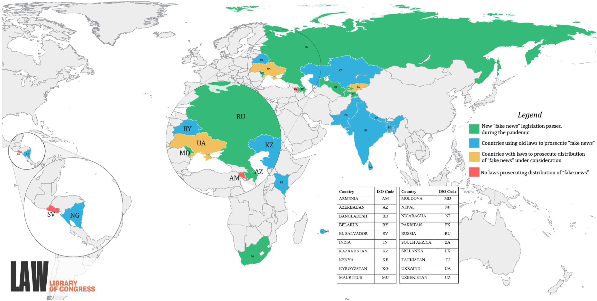

# Freedom of Expression during COVID-19

Armenia • Azerbaijan • Bangladesh • Belarus

El Salvador • India • Kazakhstan • Kenya

Kyrgyzstan • Mauritius • Moldova • Nepal

Nicaragua • Pakistan • Russian Federation

South Africa • Sri Lanka • Tajikistan

Ukraine • Uzbekistan

September 2020

LL File No. 2020-019277   
LRA-D-PUB-002382

This report is provided for reference purposes only.   
It does not constitute legal advice and does not represent the official   
opinion of the United States Government. The information provided reflects research undertaken as of the date of writing. It has not been updated.

## Contents

Comparative Summary   
Map: Legal Acts on 'Fake News' in Selected Jurisdictions . . 4   
Azerbaijan .. 5   
Bangladesh .. .. 9   
El Salvador .. . 12   
India .. . 15   
Kenya .. .. 19   
Mauritius . .. 22   
Nepal .... ... 24   
Nicaragua .... .... 28   
Pakistan .. ... 35   
Post-Soviet States.. ... 38   
Armenia .. .. 39   
Belarus ... .... 40   
Kazakhstan . ... 40   
Kyrgyzstan.. ... 41   
Moldova... ... 43   
Russian Federation . .... 44   
Tajikistan .. .... 47   
Ukraine .. ... 48   
Uzbekistan .. ... 50   
South Africa .. .. 52   
Sri Lanka ... ... 56

# Comparative Summary

Peter Roudik Director of Legal Research

This report, prepared by the research staff of the Law Library of Congress, surveys legal acts regulating mass media and their ability to distribute information freely during the Covid-19 pandemic. The report focuses on recently introduced amendments to national legislation aimed at establishing different control measures over the media outlets, internet resources, and journalists in 20 selected countries around the world where adoption of such laws has been identified, namely: Armenia, Azerbaijan, Bangladesh, Belarus, El Salvador, India, Kazakhstan, Kenya, Kyrgyzstan, Mauritius, Moldova, Nepal, Nicaragua, Pakistan, Russia, South Africa, Sri Lanka, Tajikistan, Ukraine, and Uzbekistan.

While the laws of other Central American and Eurasian countries were assessed, no legislation that would address the exercise of freedom of expression in the Covid-19 context has been identified in Costa Rica, Georgia, Guatemala, and Turkmenistan. Costa Rica and Georgia are democracies with protected freedom of speech, while Guatemala and Turkmenistan are known for having an environment hostile to journalists and the media.1 This has not changed during the pandemic; however, no additional legislation imposing restrictions on the media and journalists during the pandemic has been passed in these countries. In Honduras, the President issued a decree restricting several constitutional rights, including freedom of expression, but this decree had a very short validity because six days later, after general complaints and international pressure, the government issued another decree reestablishing the restricted constitutional guarantee to free expression without censorship.2

The list of countries selected for this survey does not include all the jurisdictions in the world where laws prosecuting the publication of so-called “fake news” related to the Covid-19 pandemic were passed in 2020.

The constitutions of all the countries surveyed protect freedom of expression and of publication; however, as soon as these countries introduced emergency regimes to fight the Covid-19 pandemic, media rights were restricted by their governments. Even though the Salvadoran emergency declaration emphasizes that it does not apply to media freedoms, the persecution of journalists and restrictions on their movements were reported. Similarly, all quarantine restrictions, requirements to work from home, and bans on travel were extended to journalists in Kyrgyzstan.

Claiming the need to protect the public from panic and keep people informed with correct data, some countries adopted new laws or added provisions to their criminal statutes penalizing the distribution of false news. The actions of these surveyed countries demonstrate that their newly added norms were focused on punishing “the dissemination of false information about the spread of infections subject to quarantine and other infections dangerous to humans” (Uzbekistan), or addressed the dissemination of false information about the pandemic specifically (South Africa, Tajikistan), or were broader and prosecuted the spread of any “false information that may pose a threat to the life and safety of citizens” (Russia).

Other countries preferred to rely on older laws for prosecuting the spread of misinformation, although they started to enforce these laws more vigorously. In Nepal, for example, police warned people that they would face up to one year of imprisonment for spreading fake news concerning COVID-19 on social media, and in Pakistan, the Minster for the Interior promised “strict and immediate” action against those who spread COVID-19 misinformation. In Ukraine, the pandemic coincided with ongoing public debates concerning legislative initiatives related to media and fake news. No provision in Indian or Belarusian law specifically deals with “fake news.” However, as described in the report on India, a “number of offenses under various laws criminalize certain forms of speech that may constitute ’fake news‘ and have been applied to cases involving the spread of false news regarding COVID-19.” Similarly, in Belarus, dispersing false information is prosecuted under a Criminal Code article, which punishes the “discrediting” of the Republic of Belarus or its government authorities. In view of the absence of special provisions on false news in Pakistan, the Government formed a committee led by the Minister for the Interior to create a legislative framework for preventing the spread of “disinformation and fake news” about the COVID-19 pandemic on social media. In the meantime, existing legislation criminalizing “statements conducive to public mischief” is used.

Punishments for these crimes and violations vary from nominal fines, community service, and short-term detention to lengthy periods of imprisonment. The most severe punishment for publishing fake news online was found in Bangladesh, where the monetary fine can reach an amount equal to almost US\$120,000, and imprisonment can be 14 years long.

In addition to amending norms criminalizing the distribution of fake news, the governments of the countries surveyed amended laws regulating mass media and internet resources. In Azerbaijan, owners and users of “information-telecommunication networks” were banned from placing, or allowing the placement of, prohibited content. Publication, broadcast, or electronic transmission of information that is false or not trustworthy is in many countries a reason for terminating the registration of a media outlet or blocking an internet resource following the warning issued by a responsible government agency (Belarus, India, Kyrgyzstan, and Russia). Stricter procedures for media monitoring were introduced in several countries (Azerbaijan, Bangladesh, Belarus, and Uzbekistan).

It is typical for the government in the majority of the countries reviewed to control quarantine and health-related information distributed by mass and social media. In Nicaragua, the government has denied independent and international media participation in Ministry of Health briefings regarding the pandemic. The information related to the pandemic is not open. In Nepal and Russia, government regulators issued special instructions for journalists and bloggers on how to cover COVID-19-related developments obligating them to “ensure the maximum accuracy and complete correctness of the information” and avoid blaming or accusing anyone. Armenia established that only government-provided information on Covid-19 can be delivered by the media, and some Indian states required the confirmation of information by government health authorities. In Moldova, the television and radio regulatory body prohibited journalists from expressing their own opinions on topics related to the COVID-19 pandemic, both in the domestic and external context.

In almost all the countries included in this survey, the public, journalists, civil society, and the international community criticized recently introduced restrictive measures; however, in only a few of them did activists succeed in forcing the government to repeal or change these acts. These were: Honduras, where restrictions established under an emergency declaration were softened; Armenia, where the government allowed the media to get information from multiple sources by the end of the first month of the emergency situation; and Kyrgyzstan, where the President vetoed the contradictory Law on Manipulating Information. In El Salvador, the protection of journalists became a matter of parliamentary control, and the Legislative Assembly created a special commission to investigate digital attacks against journalists. However, the constitutionality of anti-media policies was not challenged in the courts. It appears that South Africa was the only country among all jurisdictions researched where regulations implementing the Disaster Management Act were the subject of judicial review. Even though the Court found various parts of the regulations unconstitutional, the ruling did not apply to provisions that criminalize misinformation relating to the COVID-19 pandemic. In 2018, provisions penalizing the distribution of false news were challenged in the High Court of Kenya, but no contradiction between them and constitutionally protected freedom of speech has been found.

It is difficult to draw direct connections between the pandemic crisis and the worsening media climate. However, in some countries, pandemic-related restrictions on the media and the fight against fake news coincided with adoption of other legal acts, which make the work of journalists more difficult. In Armenia, new rules allow the government to withhold environmental information and limit the broadcast of foreign TV channels; in Moldova, the length of the period when government authorities are required to respond to public information requests became three times longer than before the pandemic; and in Kazakhstan, a newly passed law restricts the work of court reporters and limits the tools journalists may use while working in courts.

Enforcement practices were reviewed in all the countries surveyed, and select examples can be found in all the individual country reports.

## Legal Acts on ‘Fake News’ in Selected Jurisdictions

> **AI Description:**
> **Source:** `assets/_page_6_Figure_0.jpg`
> 
> **Generated:** 2026-05-15 18:12:32
> 
> ---
> 
> The image is a world map with various countries color-coded to represent different categories related to "fake news" legislation. The map includes a legend explaining the color coding: green for countries with new "fake news" legislation passed during the pandemic, blue for countries using old laws to prosecute "fake news," yellow for countries with laws to prosecute the distribution of "fake news" under consideration, and red for countries with no laws prosecuting the distribution of "fake news." The map also includes a zoomed-in view of a specific region and a table listing countries with their ISO codes. The map is attributed to the Library of Congress.

<table><tr><td rowspan=1 colspan=1>Country</td><td rowspan=1 colspan=1>ISO Code</td><td></td><td rowspan=1 colspan=1>Country</td><td rowspan=1 colspan=1>ISO Code</td></tr><tr><td rowspan=1 colspan=1>ARMENIA</td><td rowspan=1 colspan=1>AM</td><td></td><td rowspan=1 colspan=1>MOLDOVA</td><td rowspan=1 colspan=1>MD</td></tr><tr><td rowspan=1 colspan=1>AZERBAIJAN</td><td rowspan=1 colspan=1>AZ</td><td></td><td rowspan=1 colspan=1>NEPAL</td><td rowspan=1 colspan=1>NP</td></tr><tr><td rowspan=1 colspan=1>BANGLADESH</td><td rowspan=1 colspan=1>BD</td><td></td><td rowspan=1 colspan=1>NICARAGUA</td><td rowspan=1 colspan=1>NI</td></tr><tr><td rowspan=1 colspan=1>BELARUS</td><td rowspan=1 colspan=1>BY</td><td></td><td rowspan=1 colspan=1>PAKISTAN</td><td rowspan=1 colspan=1>PK</td></tr><tr><td rowspan=1 colspan=1>EL SALVADOR</td><td rowspan=1 colspan=1>sv</td><td></td><td rowspan=1 colspan=1>RUSSIA</td><td rowspan=1 colspan=1>RU</td></tr><tr><td rowspan=1 colspan=1>INDIA</td><td rowspan=1 colspan=1>IN</td><td></td><td rowspan=1 colspan=1>SOUTH AFRICA</td><td rowspan=1 colspan=1>ZA</td></tr><tr><td rowspan=1 colspan=1>KAZAKHSTAN</td><td rowspan=1 colspan=1>KZ</td><td></td><td rowspan=1 colspan=1>SRI LANKA</td><td rowspan=1 colspan=1>LK</td></tr><tr><td rowspan=1 colspan=1>KENYA</td><td rowspan=1 colspan=1>KE</td><td></td><td rowspan=1 colspan=1>TAJIKISTAN</td><td rowspan=1 colspan=1>TJ</td></tr><tr><td rowspan=1 colspan=1>KYRGYZSTAN</td><td rowspan=1 colspan=1>KG</td><td></td><td rowspan=1 colspan=1>UKRAINE</td><td rowspan=1 colspan=1>UA</td></tr><tr><td rowspan=1 colspan=1>MAURITIUS</td><td rowspan=1 colspan=1>MU</td><td></td><td rowspan=1 colspan=1>UZBEKISTAN</td><td rowspan=1 colspan=1>UZ</td></tr></table>
Source: Susan Taylor, Law Library of Congress. Map reflects results for the 20 jurisdictions included in this report.

## Azerbaijan

Kayahan Cantekin Foreign Law Specialist

## SUMMARY

In March 2020, three new laws were passed by the national parliament of Azerbaijan addressing the publication of “false information” by users of “informationtelecommunication networks,” which, in light of media reports of practice, also applies to the placement of content on social media by users. Since the passage of the laws, the representative of the Organization for Security and Co-operation in Europe has expressed concerns regarding the new laws, and reports from certain international organizations have stated that politicians and journalists have been processed under the new rules.

## I. New COVID-19 Related Restrictions on Dissemination of “False Information”

On March 17, 2020, the President of Azerbaijan signed three bills into law (Laws Nos. 27-VIQD, 28-VIQD, and 30-VIQD) that the national parliament of Azerbaijan had passed addressing the placement of “false information” on “information-telecommunication networks” by users and adding a criminal offense to the Criminal Code regarding the violation of epidemicrelated measures.1

## A. Amendments to the Information Law

Law No. 30-VIQD amends article 13-2 of the Law on Information, Informatization, and Protection of Information (Information Law).2 Article 13-2 of the Information Law prohibits the owners of “internet information resources, domain names associated with these, and users of “informationtelecommunication networks” from placing, or allowing the placement of, certain prohibited content on an internet information resource or information-telecommunication network; the prohibited content is provided as a list that includes items such as content relating to the propaganda or financing of terrorism, pornography, unlawful disclosure of state secrets, content that is defamatory, infringing of private life, or infringing intellectual property rights, or content whose dissemination is prohibited by other laws.3 The owner of the internet information resource and/or the domain name is required to remove the prohibited content if discovered by the owner itself or through notification from others.4 Likewise, once being informed of the prohibited content, the internet host provider must take immediate measures to ensure that the prohibited content is removed by the owner of the internet information resource.5

Article 13-3 of the Information Law provides that if a relevant executive authority discovers the placement of prohibited content by itself or through reporting by private parties or government entities, it must notify the owner of the internet information resource and/or domain name and the host provider of the fact. If the content is not removed within eight hours of the notification, the executive authority must apply to a district court to obtain an order to restrict access to the internet information resource.6 In urgent cases where the legally protected interests of the state and society are threatened or a substantive threat to the life and health of individuals is found to exist, the executive authority may ex officio temporarily restrict access to the internet information resource; in such cases, the authority must apply to the court, which in turn must decide within 5 days whether to uphold the restricting order.7 Internet information resources to which access is restricted by means of a temporary order of the executive authority or a court decision is recorded in the ”register of information resources in which prohibited information is placed”; host providers and internet service providers must restrict access to information resources placed in this register and notify the owner.8

Law No. 30-VIQD broadened the scope of article 13-2 of the Information Law to include users of information networks to the list of persons responsible for not placing or not allowing the placement of prohibited content online. Furthermore, Law No. 30-VIQD added an additional item to the list of proscribed content, prohibiting the placement on the internet of “[f]alse information [yalan məlumatlar] that might cause threats to harm human life and health, significant property damage, mass violation of public safety, disruption of life support facilities, financial, transport, communications, industrial, energy and social infrastructure facilities or other socially dangerous consequences.”9 In light of the above, it appears that users who place COVID-19-related content on the internet that falls under the new prohibited content rule will be in violation of article 13-2 as a result of the amendments.

## B. Amendments to the Code of Administrative Offenses

Law No. 27-VIQD amends article 388-1 of the Code of Administrative Offenses (CAO).10 Article 388-1 of the CAO now imposes sanctions on real or legal person owners of internet information resources and associated domain names as well as on users of information-telecommunication networks for the placement, or the violation of provisions of the Information Law aiming at preventing the placement, of prohibited information on such internet information resources.

The amendment introduced by Law No. 27-VIQD added “users of informationtelecommunication network” to the list of persons that can be sanctioned under article 388-1.11 With the abovementioned amendments in the Information Law, users of informationtelecommunication networks who place content on these networks that fall under the new class of prohibited content termed as “false information” may be sanctioned for this act under article 388-1 of the CAO. Law No. 27-VIQD also amended the penalty set for the violation of article 388- 1 by adding administrative detention for up to one month as an option.12 Currently, the penalty for the offense is a fine between 500 and 1000 manats (about US\$294–\$588) for real persons and 1000 to 1500 manats for officials, with an option of up to one month of administrative detention for both classes of persons depending on the circumstances and the identity of the offender.13

## C. Amendments to the Criminal Code

Law No. 28-VIQD amends the Criminal Code (CC) by adding article 139-1, which criminalizes “[a] violation of the anti-epidemic, sanitary-hygienic, and quarantine regimes that causes, or creates a substantial threat of, the spread of disease.”14 Offenders face a criminal fine of 2,500 to 5,000 manats (US\$1470–\$2940) or alternatively, restriction of liberty, or imprisonment, for a term of up to three years. If the same acts cause death or other serious consequences due to negligence, the penalty is set at a term of three to five years in prison.15

## II. Responses and Developments Related to the New Laws

On March 25, 2020, Harlem Désir, the Representative on the Freedom of the Media of the Organization for Security and Co-operation in Europe (OSCE), expressed concern regarding the amendments of March 17, noting that the new laws ought not to impede journalists’ ability to report on the pandemic, recalling a joint statement his office published with David Kaye, the UN Special Rapporteur on the promotion and protection of the right to freedom of opinion and expression, and Edison Lanza, Inter-American Commission on Human Rights Special Rapporteur for Freedom of Expression, that emphasized the importance of access to accurate information in the protection of public health and the crucial function of journalism in the governance of public health emergencies through its role in informing the public and monitoring government activity.16

On April 16, 2020, a Human Rights Watch statement claimed that at least two politicians who were members of opposition movements were arrested for their posts on social media, one being sentenced by a court to 10 days in jail for disseminating false information about the epidemic.17 On April 22, 2020, Reporters Without Borders called for the release of an Azerbaijani freelance reporter who the organization claimed was arrested by Azerbaijani authorities over coronavirusrelated reporting, although according to the news report, the journalist was arrested and detained based on other provisions of the CAO concerning the violation of lockdowns rather than the new information-related provisions.18

At least two reports of persons processed for violations of the law in connection with their COVID-19-related social media posts have appeared in Azerbaijani media following passage of the amending laws on March 17.19 One of the persons concerned was jailed for violating article 388-1 of the CAO.20 Before March 17, the founder of a news portal was reported to have been officially warned by a prosecutor’s office in relation to certain articles published on the news portal for a violation of article 10 of the Law on Mass Media, which prohibits the use of mass media outlets in order to publish “false and spiteful writings,” among other things,.21

# Bangladesh

Tariq Ahmad Foreign Law Specialist

## SUMMARY

In October 2018, Bangladesh adopted a controversial law called the Digital Security Act, which is the main law the government now uses to deal with fake news through the web and social media. The Bangladesh Ministry of Information issued a circular establishing a unit to monitor social media and private television channels for “rumours” about COVID-19 cases. Human Rights Watch has reported that since mid-March 2020 there have been a wave of arrests in Bangladesh, including of journalists, doctors, opposition activists, and students, for comments about coronavirus, most of them carried out under the Digital Security Act.

## I. Legal Framework to Deal with Fake News

Article 39(2) of Bangladesh’s Constitution guarantees “freedom of speech and expression” and “freedom of the press,” “[s]ubject to any reasonable restrictions imposed by law in the interests of the security of the State, friendly relations with foreign states, public order, decency or morality, or in relation to contempt of court, defamation or incitement to an offence.”1

Article 57 of the Information and Communication Technology Act 2006 (ICT Act) criminalized “publishing fake, obscene or defaming information in electronic form,” which is “punishable with imprisonment for a term which may extend to ten years and with fine which may extend to Taka one crore [approx. US\$117,997].”2 Under a 2013 amendment the term of imprisonment may now extend to 14 years and provisions for bail may be disregarded.3 Since taking power in January 2009, the Awami League has been criticized for harassing and silencing journalists and “critical media voices”; and article 57 has been used heavily to “to harass journalists.”4 The ICT Act is also known to grant “broad powers to the Government to restrict online expression, including through vague and excessive content-based restrictions.”5

In October 2018, Bangladesh adopted a controversial law called the Digital Security Act,6 which is the main law the government now uses to deal with fake news on the web and social media. It repealed certain provisions of the ICT Act, including article 57. Section 25 of the Digital Security Act stipulates as follows:

25) Publishing, sending of offensive, false or fear inducing data-information, etc.:-

(1) If any person in any website or through any digital medium-

a. Intentionally or knowingly sends such information which is offensive or fear inducing, or which despite knowing it as false is sent, published or propagated with the intention to annoy, insult, humiliate or denigrate a person or

b. Publishes or propagates or assists in publishing or propagating any information with the intention of tarnishing the image of the nation or spread confusion or despite knowing it as false, publishes or propagates or assists in publishing or propagates information in its full or in a distorted form for the same intentions , Then, the activity of that person will be an offense under the Act.

(2) If any person commits any offense mentioned within sub section (1), the person will be penalized with imprisonment for a term not exceeding 3(three) years of or [sic] fine not exceeding 3(three) lacs taka [approx. US\$3,542] or with both.

(3) If any person commits the offense mentioned in sub-section (1) for the second time or recurrently commits it then, he will be punished with imprisonment for a term not exceeding 5(five) years or with fine not exceeding 10 (ten) lacs taka [approx. US\$11,807] or with both.7

## II. Government’s Response to COVID-19 and Fake News

The Bangladesh Ministry of Information has established a unit to monitor social media and private television channels for “rumours” about COVID-19 cases.8 On March 25, 2020, the government issued a circular that assigned “15 officials to monitor each television channel for ‘rumors’ and ‘propaganda’ regarding COVID-19.” The move drew enormous criticism from the “journalist community and social media users, with many demanding withdrawal of the circular.”9 The next day, the order was canceled and an official from the Ministry of Information explained that the circular was being expanded: “In fact, the officials will not only monitor the private television channels, but also all other media, including the social media.”10

## III. Enforcement

Human Rights Watch has reported that since mid-March 2020 there have been a wave of arrests of “at least a dozen people, including a doctor, opposition activists, and students, for their comments about coronavirus, most of them under the draconian Digital Security Act.” On July 23, 2020, the Committee to Protect Journalists reported that journalists are facing physical attacks and arrests amid the COVID-19 pandemic and “between March 10, 2020, and May 21, 2020, authorities detained at least six journalists in Bangladesh and opened investigations into at least nine more under the country’s Digital Security Act.”11

According to the Bangladeshi independent newspaper the Daily Star, the Sampadak Parishad (Editors’ Council), an organization of newspaper editors, issued a statement in late June “condemning the recent spate of cases and arrests of editors, journalists, writers, [and] university teachers under the Digital Security Act (DSA) for expressing critical views about mismanagement in dealing with COVID-19.”12 The editors’ statement said that “[i]n the last few months, close to 40 journalists have been charged under the Digital Security Act (DSA) out of whom 37 have been arrested. These arrests have created an atmosphere of fear and intimidation making normal journalistic work extremely risky if not nearly impossible,” the Daily Star reported.13

## El Salvador

Norma C. Gutiérrez Senior Foreign Law Specialist

## SUMMARY

Freedom of speech and of the press are protected by article 38 of El Salvador’s Constitution. In March 2020, the Legislative Assembly declared a State of Emergency in all the national territory due to the Covid-19 pandemic and passed a law restricting some constitutional rights, among them the right to freedom of movement applicable to the areas affected by the pandemic. The law specifically does not restrict the freedom of expression and dissemination of thoughts. Both legislative enactments were in force for a month. However, according to news reports, the Government of El Salvador is among those governments that, when declaring a state of emergency to combat the pandemic, have imposed restrictions on the movements of journalists. There have been claims that government attacks against the media have worsened during the pandemic. The Legislative Assembly has created a special commission to investigate digital attacks against journalists.

## I. Legislation Regulating Freedom of Speech

Freedom of speech and of the press are constitutionally protected guarantees in El Salvador. Specifically, the Constitution provides that

Everyone can freely express and disseminate their thoughts as long as they do not subvert public order, or harm the morals, honor, or private life of others. The exercise of this right will not be subject to prior examination, censorship or surety; but those who, by making use of it, violate the Laws, will be liable for the crime they commit.1

The press is similarly protected. The Constitution states that

In no case may the printing press, its accessories or any other means for the dissemination of thought be sequestered as instruments of crime.

Companies that engage in written, broadcast or televised communications, and other publishing companies may not be subject to confiscation [estatización] or nationalization, either by expropriation or any other procedure. This prohibition is applicable to the stocks or shares [cuotas sociales] of their owners.

The aforementioned companies may not establish different rates or make any other type of discrimination due to the political or religious nature of what is published.

The right to respond is recognized as a protection of the fundamental rights and guarantees of the person.

Public shows [espectáculos públicos] may be subject to censorship in accordance with the Law. 2

El Salvador promulgated its Law on Access to Public Information in 2011. This Law grants everyone the right to request and receive information generated, managed or held by public institutions and other obligated entities in a timely and truthful manner, without any bias or motivation.3

The Printing Law, promulgated in 1950, in harmony with the Constitution’s provisions says that the inhabitants of El Salvador have the right to print and publish their thoughts in the press, without prior examination, censorship or surety; but they will be held accountable to a jury for a common crime that they commit when exercising this right.4

## II. Censorship During the Covid-19 Pandemic

By Decree No. 593, the Legislative Assembly declared the State of Emergency throughout the national territory due to the Covid-19 pandemic, for a period of 30 days, which entered into force on the day of its official publication, March 14, 2020.5

The Legislative Assembly by Decree No. 611 decreed the Law of Temporary Restriction of Concrete Constitutional Rights to Address the Covid-19 Pandemic, which entered into force on the date of its official publication, March 29, 2020. Its validity expired on April 13. The decree stated that restriction of the right to freedom of movement would apply in specific cases and with specific reference to the areas affected by the pandemic.6 The Decree also restricted the right to assemble peacefully and without arms for any lawful object in response to the pandemic.7

## Decree No. 611 specifically provided that

[I]t does not restrict freedom of expression, freedom of dissemination of thought, the right of association, the inviolability of correspondence, nor does it authorize the interference or intervention in telecommunications, as well as any other right or fundamental freedom not contemplated in these provisions, or other categories established in international Human Rights instruments not related to the care and control of the COVID-19 pandemic.8

However, in a resolution on the Covid-19 pandemic, the Inter-American Press Society (IAPA) included El Salvador among the governments that, when “declaring states of exception to combat the spread of the pandemic, have imposed restrictions on the movements of journalists contravening constitutional principles on freedom of the press.”9

According to a news report dated August 7, 2020, the IAPA issued a statement denouncing “the increase in government attacks, the tension with the Presidency, the selective blocking of public information and the use of pro-government net-centers to denigrate the critical and independent press.” The IAPA said the attacks on the media have worsened in the midst of the Covid-19 pandemic.10

A statement issued by the Association of Journalists of El Salvador (APES), dated August 17, 2020, declared that Salvadoran journalism faces a critical situation in which the rights to conduct journalism, freedom of expression, and access to information have been affected. According to APES’s monitoring center, 65 violations were reported from March 17 to July 30, 2020, most of them concerning restrictions on journalism and access to public information and a considerable increase in digital attacks focused on female journalists.11

APES’s statement also observed that the Legislative Assembly created a special commission to investigate digital attacks against journalists.12 Such digital attacks have been denounced by numerous organizations and entities, including journalist unions, the Office of the Attorney for the Defense of Human Rights, the Inter-American Commission on Human Rights’s Office of the Special Rapporteur for Freedom of Expression, the International Federation of Journalists, and others.13 APES welcomed the creation of this legislative commission, and urged it to resume the study of draft legislation known as the Law for the Comprehensive Protection of Journalists, Communicators and Information Workers.14

## India

## Tariq Ahmad Foreign Law Specialist

## SUMMARY

Freedom of expression is protected under article 19(1)(a) of India’s Constitution. No provision in Indian law specifically deals with “fake news.” However, a number of offenses under various laws criminalize certain forms of speech that may constitute “fake news” and have been applied to cases involving the spread of false news regarding COVID-19, including sections of the Penal Code and section 54 of the Disaster Management Act, 2005.

## I. Legal Framework Applicable to “Fake News” and COVID-19

Freedom of expression is mentioned in the preamble of India’s Constitution and is protected as one of several fundamental rights under Part III, article 19(1)(a), which states that “[a]ll citizens shall have the right . . . to freedom of speech and expression.”1 This right is not absolute and is subject to “reasonable restrictions . . . in the interests of the sovereignty and integrity of India, the security of the State, friendly relations with foreign States, public order, decency or morality, or in relation to contempt of court, defamation or incitement to an offence.”2 Article 358 of the Constitution relates to the suspension of rights under article 19 during a declared emergency, and article 359 provides the procedure for suspending enforcement of the fundamental rights conferred by Part III “during emergencies.”3

No provision in Indian law specifically deals with “fake news.” However, a number of offenses under various laws criminalize certain forms of speech that may constitute “fake news” and have been applied to cases involving the spread of false news regarding COVID-19. In particular, section 505 of India’s Penal Code4 prohibits “statements conducing to public mischief” and subjects to a prison or fine “[w]hoever makes, publishes or circulates any statement, rumour or report . . . with intent to cause, or which is likely to cause, fear or alarm to the public, or to any section of the public whereby any person may be induced to commit an offence against the State or against the public tranquility.”5

Initially, in February 2020, the Union (or central) government was advising “relevant agencies” of the states and union territories to take appropriate action to “[a]void [the] spread of fake news, advisories, rumors and unnecessary information through proper media management.”6

Governments at the Union and state level have utilized and invoked the Epidemic Diseases Act of 1897 and the Disaster Management Act, 2005 to deal with the COVID-19 epidemic. Section 54 of the Disaster Management Act, 2005,7 stipulates that “[w]hoever makes or circulates a false alarm or warning as to disaster or its severity or magnitude, leading to panic, shall on conviction, be punishable with imprisonment which may extend to one year or with [a] fine.”89 The 21-day national lockdown order issued by the Union government makes reference to this section.10 In late March, the Union Minister of Interior announced that “[r]umours are being spread about COVID-19 in the country leading to misinformation. FIR [First Information Reports or police complaints] will be registered against those involved in spreading of these rumours and strict action will be taken under provisions of the Disaster Management Act.”11

State governments have also issued regulations to deal with COVID-19 under the Epidemic Diseases Act of 189712 that include provisions or guidelines on spreading false news. For example, The Maharashtra government issued the Maharashtra COVID-19 Regulations, 2020,13 which “prohibit[] organizations or individuals from publicizing information about the coronavirus without ascertaining prior clearance from relevant government health authorities, in order to avoid [the] spread of misinformation.”14 Section 3 of the 1897 Act stipulates that “[a]ny person disobeying any regulation or order made under this Act shall be deemed to have committed an offence punishable under section 188 (‘disobedience to order duly promulgated by public servant’) of the Indian Penal Code.”15 If the disobedience “causes or tends to cause danger to human life, health or safety, or causes or tends to cause a riot or affray, [the perpetrator] shall be punished with imprisonment of either description for a term which may extend to six months, or with fine which may extend to one thousand rupees, or with both.”16 Notably, several other laws and subsidiary rules, including Section 69A of the Information Technology Act17 and the Indian

Telegraph Act, 1885,18 have been used in the past to block internet content and implement internet shutdowns to deal with fake news.19

## II. Enforcement

In late April 2020, news reports indicated that “around 640 cases have been lodged across the country for allegedly spreading rumours and fake news via social media” on the COVID-19 pandemic “since the government enforced nationwide restrictions.”20 A Rights and Risks Analysis Group (RRAG) report issued in June 2020 stated as follows:

[A]bout 55 journalists faced arrest, registration of FIRs, summons or show causes notices, physical assaults, alleged destruction of properties and threats for reportage on COVID-19 or exercising freedom of opinion and expression during the national lockdown from 25 March to 31 May 2020. The highest number of attacks in the media persons was reported from Uttar Pradesh (11 journalists), followed by Jammu & Kashmir (6 journalists), Himachal Pradesh (5), four each in Tamil Nadu, West Bengal, Odisha, Maharashtra, two each in Punjab, Delhi, Madhya Pradesh & Kerala and one each in Andaman & Nicobar Islands, Arunachal Pradesh, Assam, Bihar, Chhattisgarh, Gujarat, Karnataka, Nagaland and Telangana.21

Free speech activists complained that these nationwide arrests were made under the Epidemic Diseases Act, 1897, several sections of the Indian Penal Code, and the Disaster Management Act, 2005, “to curb criticism against authorities in the name of the health care emergency.”22 Apar Gupta, a lawyer and internet freedom activist was quoted in the news report as saying

[s]ometimes criticism of lack of preparedness or of certain local issues has also resulted in people being booked. Some of these social media posts fall within the permissible limit of freedom of speech under the Constitution. However, state governments are using a high degree of power that goes beyond public health issues to serve the government’s political objective. This is a matter of grave concern.23

## According to the International Center for Not-for-Profit Law’s COVID-19 Civic Freedom Tracker,

[t]he Government of Assam filed charges against a Bengali daily published from Silchar, for carrying a false news report about the state’s first COVID-19 patient. The case was brought against the reporter who filed the story and the publisher of the newspaper under Section 188 of [the Indian Penal Code] and provisions of Assam COVID-19 Regulation, 2020. Additionally, Assam DIPR has formed a five-member committee for monitoring and checking fake news in all forms of media. The committee includes officials from the information, health, police and disaster management departments. The committee surveilled social media accounts and created WhatsApp numbers for the purpose of tracking information circulating on Whatsapp. As of April 8, 52 cases had been registered for spreading rumours/uploading objectionable comments on social media and a total of 25 people had been arrested, while eight were detained and then released.24

# Kenya

## SUMMARY

Although Kenya has enacted a number of directives, policies, and laws to deal with various aspects of the fallout from the COVID-19 pandemic, it has opted to use an existing law to curb falsehoods and misinformation surrounding the pandemic. The Computer Misuse and Cyber Crimes Act of 2018, which includes clauses criminalizing “false information” and “publication of false information,” is reportedly being used to make arrests and charge persons allegedly engaged in such acts. A petition challenging the constitutionality of the law before the Constitutional and Human Rights Division of the High Court of Kenya at Nairobi was quashed in February 2020, right before the arrival of the pandemic in Kenya.

## I. Introduction

As of August 20, 2020, Kenya had recorded 30,636 confirmed COVID-19 cases and 487 deaths.1 Since the first COVID-19 case was reported in the country on March 13, 2020, Kenya has issued a number of directives, policies, and laws aimed at tackling the pandemic and minimizing its impact.2 However, it is also relying on existing laws to deal with some challenges related to COVID-19.This includes the use of the 2018 Computer Misuse and Cyber Crimes Act to address the spread of misinformation and falsehoods about the pandemic.

## II. The Constitution and the Computer Misuse and Cyber Crimes Act

The Constitution of Kenya accords every person the right to freedom of expression, including “freedom to seek, receive or impart information or ideas, . . . freedom of artistic creativity, . . . and . . . academic freedom and freedom of scientific research.”3 These freedoms do not “extend to . . . propaganda for war . . . , incitement to violence . . . , hate speech . . . , or advocacy of hatred . . . ”4 The Constitution places another caveat on such rights, stating that “[i]n the exercise of the right to freedom of expression, every person shall respect the rights and reputation of others.”5 In addition, section 24 of the Constitution permits the imposition of limitations on such rights in certain circumstances if those limitations meet a specific set of tests.6

Enacted in May 2018, the Computer Misuse and Cyber Crimes Act includes a provision criminalizing “false publication,” which states as follows:

(1) A person who intentionally publishes false, misleading or fictitious data or misinforms with intent that the data shall be considered or acted upon as authentic, with or without any financial gain, commits an offence and shall, on conviction, be liable to a fine not exceeding five million shillings [about US\$46,285] or to imprisonment for a term not exceeding two years, or to both.

(2) Pursuant to Article 24 of the Constitution, the freedom of expression under Article 33 of the Constitution shall be limited in respect of the intentional publication of false, misleading or fictitious data or misinformation that —

(a) is likely to —

i. propagate war; or

ii. incite persons to violence;

(b) constitutes hate speech;

(c) advocates hatred that —

i. constitutes ethnic incitement, vilification of others or incitement to cause harm; or

ii. is based on any ground of discrimination specified or contemplated in Article 27(4) of the Constitution; or

(d) negatively affects the rights or reputations of others.7

The Act also criminalizes the “publication of false information,” the elements of and punishment for which are as follows:

A person who knowingly publishes information that is false in print, broadcast, data or over a computer system, that is calculated or results in panic, chaos, or violence among citizens of the Republic, or which is likely to discredit the reputation of a person commits an offence and shall on conviction, be liable to a fine not exceeding five million shillings or to imprisonment for a term not exceeding ten years, or to both.8

Upon the enactment of the Act, the Bloggers Association of Kenya (BAKE) swiftly filed a petition before the Constitutional and Human Rights Division of the High Court of Kenya at Nairobi challenging the constitutionality of various provisions of the Act, including the “false publication” and “publication of false information” clauses.9 One of the issues before the court was whether a number of provisions of the Act, including these two clauses, were inconsistent with section 24 (the limitations of rights and fundamental freedoms clause) of the Constitution of

Kenya.10 In a decision issued on February 20, 2020, the Court found both clauses to be constitutional, holding that “[h]aving considered the rival submissions I find no basis that the correct position is that the truth is not a necessary condition to the freedom of expression.”11

## III. Curbing False Information Relating to COVID-19

It appears that Kenya is relying on the Computer Misuse and Cyber Crimes Act to curb the spread of misinformation relating to the COVID-19 pandemic. While it is difficult to locate statistical information relating to the prevalence of such acts and the level of enforcement of the Act by the government, news reports indicate that Kenyan police have arrested individuals allegedly engaged in the spread of false information about the pandemic. For instance, according to a news report dated March 16, 2020, the Directorate of Criminal Investigations of the National Police Service arrested a 23 year old man for publishing misleading and alarming information relating to the pandemic.12 The same source also noted that the person would be charged under the “publication of false information” clause of the Computer Misuse and Cyber Crimes Act.13 Another news report, dated April 24, 2020, noted that a 41 year old man was arrested and faced prosecution under the same Act for a tweet claiming “that he’d heard there was an outbreak in Mombasa, the strategically vital port for east Africa.”14

# Mauritius

## I. Introduction

As of August 21, 2020, Mauritius had recorded 346 confirmed COVID-19 cases and 10 deaths.1 It appears that Mauritius is relying on existing law, specifically the Information and Communication Technologies Act of 2001, to deal with the spread of misinformation and falsehoods relating to the COVID-19 pandemic.

## II. Freedom of Expression

The Mauritius Constitution guarantees freedom of expression, stating that “[e]xcept with his own consent, no person shall be hindered in the enjoyment of his freedom of expression, that is to say, freedom to hold opinions and to receive and impart ideas and information without interference, and freedom from interference with his correspondence.”2 The same provision, using broad language, allows for the restriction of the right to freedom of expression, including in the interest of public health and safety, stating that

[n]othing contained in or done under the authority of any law shall be held to be inconsistent with or in contravention of this section to the extent that the law in question makes provision

a. in the interests of defence, public safety, public order, public morality or public health;

b. for the purpose of protecting the reputations, rights and freedoms of other persons or the private lives of persons concerned in legal proceedings, preventing the disclosure of information received in confidence, maintaining the authority and independence of the courts, or regulating the technical administration or the technical operation of telephony, telegraphy, posts, wireless broadcasting, television, public exhibitions or public entertainments; or

c. for the imposition of restrictions upon public officers, except so far as that provision or, as the case may be, the thing done under its authority is shown not to be reasonably justifiable in a democratic society.3

## III. Information and Communication Technologies Act

As noted above, it appears that Mauritius is relying on the 2001 Information and Communications Technologies Act to deal with the spread of misinformation about COVID-19. The offenses section of the Act provides that “anyone who . . . knowingly provides information which is false

or fabricated . . . shall commit an offence.”4 A person convicted under this provision is liable to a fine not exceeding 1 million Mauritius Rupees (around US\$25,205) and a penal servitude not exceeding ten years.5

According to a news report dated May 11, 2020, a man was arrested for violation of this Act for allegedly falsely claiming “that riots had erupted after the prime minister announced the closure of supermarkets and shops.”6

## Nepal

## Tariq Ahmad Foreign Law Specialist

## SUMMARY

The Constitution of Nepal guarantees freedom of expression and the right to communication, which protects against media censorship. Fake or false news is mainly dealt with through the Criminal (Code) Act, 2074, which prohibits the spread of false rumors. In the past journalists have also been arrested for posting certain news items on social media under section 47 (“Publication of illegal materials in electronic form”) of the Electronic Transactions Act, 2063. On March 21, 2020, Nepal Police headquarters urged the public not to spread fake news concerning COVID-19 on social media and warned that violators would face punishment under the Criminal Code. In late March 2020, the Central Cyber Bureau of the Nepal Police arrested a 20-year-old individual for circulating an audio clip on Facebook about people testing positive for COVID-19 at a private hospital.

On March 23, 2020, the Press Council Nepal issued News Transmission Directive 2076 for journalists and media regarding the responsibilities, precautions, and privacy obligations regarding patients when publishing news content concerning the COVID-19 pandemic.

## I. Free Expression

The Constitution of Nepal guarantees freedom of expression under article 17(2)(a),1 subject to the following restrictions:

(1) Nothing in sub-clause (a) shall be deemed to prevent the making of an Act to impose reasonable restrictions on any act which may undermine the sovereignty, territorial integrity, nationality and independence of Nepal or the harmonious relations between the Federal Units or the people of various castes, tribes, religions or communities or incite castebased discrimination or untouchability or on any act of disrespect of labour, defamation, contempt of court, incitement to an offence or on any act which may be contrary to public decency or morality.2

Article 19 protects the “right to communication” and states that “[n]o publication and broadcasting or dissemination or printing of any news item, editorial, feature article or other reading, audio and audio-visual material through any means whatsoever including electronic publication, broadcasting and printing shall be censored.”3 This right is subject to similar restrictions.

In Nepal fake or false news is mainly dealt with through the National Penal (Code) Act, 2017,4 which prohibits the spread of false rumors:

70. Not to spread rumor: (1) No person shall, with intent to breach public tranquility, commit rioting or undermine or jeopardize the sovereignty, geographical or territorial integrity of Nepal or harmonious relation between different races, castes or communities, spread or propagate rumors or hold a procession with slogans, in a manner to provoke any one.

(2) Any person who commits, or causes to be committed, the offence referred to in sub-section (1) shall be liable to a sentence of imprisonment for a term not exceeding one year or a fine not exceeding ten thousand rupees or both the sentences.

In the past journalists have been arrested for posting certain news items on social media5 under section 47 of the Electronic Transactions Act, 2063:

47. Publication of illegal materials in electronic form: (1) If any person publishes or displays any material in the electronic media including computer, internet which are prohibited to publish or display by the prevailing law or which may be contrary to the public morality or decent behavior or any types of materials which may spread hate or jealousy against anyone or which may jeopardize the harmonious relations subsisting among the peoples of various castes, tribes and communities shall be liable to the punishment with the fine not exceeding One Hundred Thousand Rupees or with the imprisonment not exceeding five years or with both.

(2) If any person commit an offence referred to in Sub-section (1) time to time he/she shall be liable to the punishment for each time with one and one half percent of the punishment of the previous punishment.6

Notably, the government of Nepal has introduced the Information Technology Bill, 2075 in Parliament to replace the Electronic Transactions Act, 2063. The Bill includes provisions that would require the registration of social media networks, provide powers to remove certain content on social media, and create new crimes involving electronic and social media activities.7

## II. Government’s Response to COVID-19 and Fake News

On March 21, 2020, Nepal Police headquarters urged the public “not to spread fake news on social media on COVID-19” and “that anyone who is involved in such activities will face stringent action as per the existing law.”8 On its Facebook page, Nepal Police headquarters made reference to the false rumors provision in the Criminal (Code) Act, 2074 and “informed that culprits shall be sent to prison for a year or fined Rs 10,000 [about US\$85] or both. Additional punishment will also be given if such fake messages are spread via electronic medium.”9

On March 23, 2020, the Press Council Nepal, a statutory body set up by the government to “promote the standards of a free press,” issued News Transmission Directive 2076,10 “for Journalists and media regarding the precaution and responsibility of publishing news content regarding the outbreak of Nobel [sic] Corona Virus” and maintaining “secrecy while publishing or broadcasting news about Corona suspects or infected.”11 The Directive, issued pursuant to article 7(b) of the Press Council Act, 2048,12 calls on journalists and the media to assume the following responsibilities when disseminating news about the COVID-19 pandemic:

(1) Dissemination of factual news verified by the authentic sources: (1) Journalists and media should disseminate the news about corona virus outbreak ensuring that they are based on facts and verified by the authentic source or subject specialists. (2) The news, article, notice and information that the journalist or media disseminate through social media must be decent, factual and authentic. (3) While re-publishing the news, information or article/contents posted by other social media users through sharing, liking and retweeting, the journalist or media should disseminate it considering the authenticity that equals their own publication.

(2) Pay attention to the individual secrecy: Journalist and media should pay attention to the individual secrecy of the suspicious or suspected of the infection or infected victims. The identity of the person who is suspected to have coronavirus should be concealed. Moreover, no such contents should be produced, published, broadcasted and distributed that can have adverse effects upon the infected person. Without the consent of the infected and permission from the concerned authority, the identity of the confirmed case also should not be disclosed.

(3) Should not blame or accuse: Journalist and media, while disseminating news content about corona outbreak, should not connect it with any country, region or community and blame them for the spread of the virus. Likewise, news should not be disseminated in such way that it blames or personally accuse the infected person. Such news content capable of creating discrimination or hatred based on any caste, sex, religion, area, language, political inclination, race or physical, mental status should not be produced, published, broadcasted or distributed.

(4) Should not give space for false, exaggerated and unauthorized information or rumors that spread fear, panic and sensation: While disseminating the news content about corona virus outbreak, the journalist and media should not give space for the unauthorized, false and exaggerated information and rumors that are not verified by the concerned authority of Nepal Government. Sensibility and alertness should always be adopted so that the readers, listeners and viewers are not disappointed or excited.

(5) Should not mention the name of a person not related to the incident: (1) Journalist and media should not produce, distribute or publish-broadcast any such news, photo or visuals that discloses the name, address or identity of the relative or someone close to the person having corona virus infection.

(6) Should not publish or broadcast the scene or photo: Journalist and media should not disseminate the scene and photos of the person whose life has been claimed by the infection.

(7) Readiness to Rectify Errors: Upon receiving any fault or mistake on the news content regarding the corona outbreak that are disseminated, the journalist and media should rectify them as soon as possible, and inform publicly about it from the same media. Moreover, Press Council’s directions for rectifying the errors should be followed immediately.

(8) Press Council will monitor and take action: Press Council Nepal can monitor whether the journalists and media have followed this directive and take necessary action in accordance with Press Council Act, 2048 and Journalist Code of Conduct, 2073 (Amendment- 2076).13

## III. Enforcement

In late March 2020, the Central Cyber Bureau of the Nepal Police arrested a 20-year-old individual for circulating an audio clip on Facebook about six people testing positive for COVID-19 at a private hospital in Kathmandu; the clip “had been circulated widely through various social media platforms and instant messaging apps like WhatsApp and Viber.”14

# Nicaragua

Norma C. Gutiérrez Senior Foreign Law Specialist

## SUMMARY

Although the Nicaraguan Constitution guarantees freedom of expression and information, news sources indicate that these fundamental rights have been in decline since 2007 when the current administration began. Violations of freedom of expression and information have become “acute” since a political crisis broke out in April 2018. The censorship challenges have remained during the COVID-19 pandemic. In addition, the government has denied independent and international media participation in Ministry of Health briefings regarding the pandemic. The data related to the pandemic is centralized and kept in secrecy. Health professionals who demanded transparency from the government with respect to pandemic-related information were fired from public hospitals by the Ministry of Health. The independent COVID-19 Nicaraguan Citizen’s Observatory monitoring the pandemic publishes weekly data that radically contrasts with the data provided by the government. International institutions including the Pan American Health Organization have repeatedly asked the government of Nicaragua to be more transparent with information related to the pandemic.

## I. Legislation Regulating Freedom of Speech

Freedom of speech is a constitutionally protected right in Nicaragua. Specifically, the Constitution provides that “Nicaraguans have the right to freely express their thoughts in public and in private, individually or collectively, orally, in writing or by any other means.”1 Similarly, freedom of information without censorship is a fundamental constitutional right of every citizen. Under the Constitution,

Nicaraguans have the right to truthful information. This right includes the freedom to seek, receive, and disseminate information and ideas, whether orally, in writing, graphically, or by any other procedure of their choice.2

The right to inform is a social responsibility and it is exercised with strict respect for the principles established in the Constitution. This right cannot be subject to censorship, but to subsequent responsibilities established by law.3

The media, within their social function, must contribute to the development of the nation.

Nicaraguans have the right of access to the media and the right of reply when their rights and guarantees are affected.

The State will ensure that the media are not subject to foreign interests or to the economic monopoly of any group. The law will regulate this matter.

The importation of paper, machinery, and equipment and spare parts for written, radio, and television social media, as well as the importation, circulation, and sale of books, brochures, magazines, school and scientific teaching materials, newspapers, and other periodicals, will be exempt from all kinds of municipal, regional, and fiscal taxes. The tax laws will regulate the matter.

Public, corporate, and private media may not be subject to prior censorship. In no case may the printing press or its accessories, or any other means or equipment intended for the dissemination of thought, be confiscated as an instrument or corpus delicti.4

Nicaragua promulgated its Law on Access to Public Information in 2007. The purpose of this Law is to regulate, guarantee, and promote the exercise of the right of access to public information existing in the documents, files, and databases of public entities or institutions; private companies doing business with the state and those subsidized by the state; and private entities that administer, manage, or receive public resources, tax benefits, or other benefits, concessions or advantages.5 Under this Law, everyone has the right to request and receive data, records, and all kinds of public information in a complete, adequate, and timely manner from all entities subject to the Law, except for the exceptions provided,6 such as for personal information.7

As mandated by article 52 of the Law on Access to Public Information, the Personal Data Protection Law was promulgated in 2012. The object of this Law is to protect individuals and legal entities against the processing of their personal data, whether automated or not and whether they stored in public or private data files, in order to guarantee the right to personal and family privacy and to informed self-determination.8

The Penal Code imposes penalties on anyone who, through violence or intimidation, prevents the exercise of freedom of expression; the right to inform and to be informed; or the free circulation of books, magazines, newspapers, voice or image-reproducing tapes, or any other means of broadcasting and dissemination of thought. The penalty for those who violate this provision is three to five years’ imprisonment and disqualification from the exercise of the perpetrator’s profession or trade related to the criminal activity for the period of imprisonment.9

## II. Restrictions on Freedom of Speech and Information

Although the Constitution guarantees freedom of speech as a fundamental right, there are abundant reports that freedom of the press has declined considerably since 2007 when the current administration began. The press has been the subject of political and judicial harassment, threats, arrests, and physical attacks.10

The US Department of State’s 2019 Country Report on Human Rights Practices: Nicaragua included the following in a list of the Nicaraguan government’s violations of freedom of expression and the press:

Although the law provides that the right to information may not be subjected to censorship, the government and actors under its control retaliated against the press and radio and television stations by blocking transmissions, impeding the import of ink and paper, and violence against journalists. Some independent media outlets also reported they were victims of cyberattacks. . . . Independent media outlets experienced vandalism, seizure of broadcast equipment, arrest, and fear of criminal defamation charges. The government repeatedly denied broadcasting licenses and other permits for independent media. Further attempts to intimidate came through continued financial audits performed by the Directorate General of Revenue, which resulted in referral of cases to the Customs and Administrative Tax Court. . . . Journalists were subject to government violence, harassment, and death threats. Renowned journalist Carlos Fernando Chamorro went into exile in January after receiving harassment and death threats. On November 25, he returned, along with five other journalists.11

Many journalists have left the country, and printed newspapers have almost gone out of business due to “government-orchestrated shortages of newsprint, rubber and other essential supplies.”12

The Inter-American Press Society (IAPA), during its 75th General Assembly held in Florida on October 4-7, 2019, adopted a resolution stating that in Nicaragua “the written media are in a critical situation and in imminent danger of disappearing due to the customs blockade to obtain their supplies.”13 The IAPA also said the Nicaraguan government “maintains its communicational hegemony through an oligopoly on television, aggravated by the closure of 100% Noticias television and all opinion programs on Channel 12, as well as the closure of Confidencial,” a daily.14

Since the political crisis that broke out in 2018 after authorities announced social security reforms,

[r]epression of journalists has become acute . . . . The state ordered television companies and mobile phone service providers to stop transmitting several independent news channels through their systems. Numerous outlets have been raided and closed. In December 2018, police raided and confiscated equipment from the facilities of the digital news platform Confidencial and the television program Esta Semana, and closed the news station 100% Noticias. In September 2019, the government announced that it would not return 100% Noticias to its owners until it had completed its investigations of station director Miguel Mora, and news director Lucía Pineda. Both had been charged with terrorism and detained in 2018, though they were released in June 2019.15

The 2019 edition of the World Press Freedom Index by Reporters Without Borders (RSF) reported that Nicaragua, which had been in the 90th position in 2018, fell 24 positions lower, ranking 114th out of a total of 180 countries evaluated“one of the most significant declines in 2019.”16

## III. Censorship During the COVID-19 Pandemic

During the current COVID-19 pandemic, Nicaragua has continued to impose the same restrictions on journalists’ mobility and coverage as in normal times,17 but the government maintains a “wall of disinformation” about COVID-19 to prevent panic in the population.18 Independent media journalists have been restricted from access to public health information and blocked from participation in Ministry of Health press briefings.19 The international press are also blocked from these briefings. Only the official media and those belonging to the private consortium of the presidential family may attend.20

Despite government control over the media and public information, independent media cover information about the pandemic remotely. For instance, two independent newspapers, Confidencial and Esta Semana, have been reporting remotely, disclosing their information via the internet and through the social media networks YouTube and Facebook, because their editorial offices have been illegally occupied by the police since December 14, 2018.21

The Office of the United Nations High Commissioner for Human Rights (OHCHR) has expressed its concern over the lack of transparency of the government of Nicaragua when publicly providing official information on the country’s response to COVID-19 and the lack of access to information on infections and deaths. According to its report, the Nicaraguan authorities “have been using unclear language” and “vague terminology” to refer to coronavirus infections. For instance, the government has attributed the death of some persons to underlying health conditions, such as diabetes, high blood pressure, heart disease, or atypical pneumonia, instead of the virus.22

The government has minimized the pandemic by insisting that the country’s health system has COVID-19 under control. There is a prevailing secrecy surrounding the pandemic and a lack of widespread testing to determine the actual progress of the virus. Hospitals are overcrowded with people who have COVID-19-related symptoms, reflecting a reality that is different from what the government claims. This leads doctors, such as pulmonologist Jorge Iván Miranda, who has treated almost a hundred patients suspected of contagion, to conclude that the Ortega government ”hides” cases of COVID-19.23 During the first weeks of the pandemic, the Ministry of Health (Ministerio de Salud, MINSA) restricted the use of protective equipment by health professionals because, according to MINSA, “it was alarming and created panic” among the population.24

In a public statement issued on May 18, 2020, 716 public-sector health professionals demanded government transparency with regard to data on the pandemic, the declaration of a community transmission phase of the pandemic, implementation of the mitigation standards recommended by the World Health Organization, an end to the persecution and harassment of health professionals, and the provision of protective equipment for health personnel in public hospitals, among other demands. According to the statement, ”the government strategy has been to keep the diagnostic tests for COVID-19 centralizedand difficult to accessso the number of tests (and their results) carried out by the Ministry of Health is unknown, making it impossible to know the real dimension of the pandemic.“25 The statement added that “the deliberate concealment and manipulation of the actual number of people affected does not allow the application of appropriate epidemiological measures of containment and mitigation.”26

Within weeks of publication of the above statement the health professionals who signed the statement were fired by MINSA officials without following the standard legal procedures for dismissal. Among those fired was Dr. Carlos Quant, an infectious-disease specialist and a member of the independent Scientific Multidisciplinary Committee created to respond to the pandemic, who has 25 years of service in a public hospital. In Quant’s opinion, he was fired by the Ministry of Health “as reprisal for criticizing the government’s response to the pandemic.”27 Dr. Quant was quoted by the Spanish daily El País as saying that “[w]hen we send a sample of a patient to the MINSA for the test, they don’t give us the result. Only verbally do they communicate the diagnosis, but we do not have access to a document, detailing the laboratory analysis.”28 He added that “[m]ost of the results are now declared undetermined. It is the way to maintain concealment.”29

The government’s reported numbers of coronavirus cases radically contrast with those presented by a network of experts and volunteers who, because of the lack of credibility of the government’s reports, keep a parallel count of coronavirus cases in the country.30 The COVID-19 Nicaraguan Citizen’s Observatory (Observatorio Ciudadano COVID-19 Nicaragua) is an independent monitoring group that collects information from civil organizations, social networks, and individual citizens who wish to contribute to filling the information gap on the situation of COVID-19 in the country. Their team is made up of volunteers, medical professionals (including epidemiologists), communications experts, researchers, computer science experts, and students. The Citizen’s Observatory receives numerous reports, but only publishes information that has been verified by their own sources, which include networks of recognized community leaders. It also reports suspected cases of COVID-19 where persons present associated or presumptive symptoms of COVID-19 and have a travel history, or have been in contact with a person confirmed by the heath authorities as having COVID-19.31

Although research methodologies and protocols may differ, the contrast between the data published by the government and that of the Citizen’s Observatory is nonetheless striking. The Citizen’s Observatory reported as the following figures for July 23–29, 2020:

• Suspected COVID-19 cases reported by the Citizen’s Observatory: 9,044

• Pneumonia and suspected COVID-19 deaths reported by the Citizen’s Observatory: 2,537

COVID-19 cases confirmed by MINSA: 3,672

COVID-19 deaths reported by MINSA: 11632

The Pan American Health Organization (PAHO) has reiterated to the Nicaraguan government the need for transparency in information related to the pandemic. The director of PAHO’s Department of Communicable Diseases, Marcos Espinal, recently told Voice of America (VOA) that “[w]hat PAHO has asked is that the numbers of infections, the places of the outbreaks, [and] the ages of the victims be made known. . . . But there are no details, there has not been an answer.”33

## Pakistan

## Tariq Ahmad Foreign Law Specialist

## SUMMARY

Article 19 of Pakistan’s Constitution protects freedom of speech, expression, and the press but these rights are subject to certain limitations. On July 9, 2020, the National Command and Operation Centre (NCOC), a national coordinating and decisionmaking center to deal with COVID-19, formed a committee led by the Minister of Interior to prevent the spread of disinformation and fake news about the COVID-19 pandemic on social media. Since February 2020, there have been news reports of a few arrests being made under sections of the Pakistan Panel Code and the Telegraph Act for spreading fake news over social media.

## I. Legal Framework

Article 19 of Pakistan’s Constitution protects freedom of speech and expression, stipulating that

[e]very citizen shall have the right to freedom of speech and expression, and there shall be freedom of the press, subject to any reasonable restrictions imposed by law in the interest of the glory of Islam or the integrity, security or defence of Pakistan or any part thereof, friendly relations with foreign States, public order, decency or morality, or in relation to contempt of court, commission of or incitement to an offence.1

Pakistan does not appear to have a “fake news” criminal provision or one specifically tailored to COVID-19. However, section 505 of the Penal Code criminalizes “statements conducing to public mischief”:

(1) Whoever makes, publishes, or circulates any statement, rumour or report-

(a) with intent to cause or incite, or which is likely to cause or incite, any officer, soldier, sailor, or airman in the Army, Navy or Air Force of Pakistan to mutiny, offence or otherwise disregard or fail in his duty as such; or

(b) with intent to cause, or which is likely to cause, fear or alarm to the public or to any section of the public whereby any person may be induced to commit an offence against the State or against the public tranquillity; or

(c) with intent to incite, or which is likely to incite, any class or community of persons to commit any offence against any other class or community,

shall be punished with imprisonment for a term which may extend to seven years and with fine.2

Causing annoyance or intimidation through a telephone is also punishable under section 25D of the Telegraph Act.3 Under section 29 of the Act, transmitting “by telegraph a message which [a person] knows or has reason to believe to be false and fabricated” is punishable with imprisonment for a term which may extend to three years, or with fine, or with both.”4

Electronic Media in Pakistan is regulated by the Pakistan Electronic Media Regulatory Authority (PEMRA), “an independent federal institution responsible for regulating the issuance of broadcasting licenses and distribution of privately owned print and electronic media channels (including those for radio, television, and satellite broadcasting).”5 It was established and is regulated by the Pakistan Electronic Media Regulatory Authority Ordinance, 2002 and its subsidiary rules and regulations.

Telecommunications is regulated and maintained by the Pakistan Telecommunication Authority (PTA), which was established by the Pakistan Telecommunication (Re-organization) Act, 1996.6 The Act contains “strong power given to the Federal Government in the name of national security to set limitations on free expression and the privacy of communications” and power to terminate services.7 Section 31(d) states that it is a criminal offense when a person “(d) unauthorisedly transmits through a telecommunication system or telecommunication service any intelligence which he knows or has reason to believe to be false, fabricated, indecent or obscene” or “(h) commits mischief.”8

## II. Response to COVID-19 and Fake News

On July 9, 2020, Pakistan’s National Command and Operation Centre (NCOC), a national coordinating and decision-making center to deal with COVID-19, formed a committee led by the Minister of Interior to prevent the spread on social media of “disinformation and fake news” about the COVID-19 pandemic.9 The committee will reportedly prepare a “legal framework to prevent and counter dis-information and suggest action against those involved in spreading false information about the pandemic.”10 A week later, the Minister for Interior, Ijaz Ahmad Shah “presided over the meeting on COVID-19 Disinformation Prevention Mechanism at the Ministry of Interior”11 and “directed authorities to take “strict and immediate” action against those involved in spreading coronavirus misinformation,” according to the Arab News.12 The Minister further stated that “[t]he primary purpose of this committee is to ensure that correct and credible information goes to our people” and directed PEMRA’s director general “to ensure that no fake news is flashed on electronic media,” a government press release said.13

On the provincial level, the Punjab government has reportedly directed officials of public sector hospitals and institutions in the province, which come under Punjab’s Specialised Healthcare and Medical Education Department, to not “give any statement or interview to the print or electronic media about the pandemic without prior approval from the competent authority.”14

## III. Enforcement

In mid-February 2020, a district court in Chitral ordered the arrest of a local leader of the ruling Pakistan Tehreek-e-Insaf (PTI) for spreading fake news through Facebook, according to a news report:

A Chinese national was working in a power project in the Drash town of the Lower Chitral district was hospitalised after he complained of abdominal pain. The PTI office-bearer allegedly spread a rumour through his facebook account and claimed that the ailing Chinese citizen was suffering from coronavirus which created fears among the people. The Chitral Police registered a case against the accused under Section 505 of the Pakistan Panel Code and Section 25 of the Telegraph Act.15

In March 2020 the Sindh government sent a letter to the Ministry of Interior seeking intervention “from the Federal Investigation Agency (FIA) to trace those who are spreading ‘fake and unsubstantial news’ through social media about ‘scores’ of positive cases of the virus in Karachi, triggering panic and fear in the people.”16

Also in March the police arrested a man in the major city of Lahore “for allegedly spreading fake news through social media about the novel coronavirus and creating panic among the masses.”17 A news channel reported that “the suspect was peddling fake news through social media citing that a family of his area has contracted coronavirus.”18

# Post-Soviet States

Iana Fremer Legal Research Analyst

## SUMMARY

Due to the global pandemic caused by COVID-19, every former Soviet country included in this survey has introduced restrictive measures, often including stricter regulation of the media. Many used this opportunity to address longstanding questions surrounding online media regulations. Measures introduced by individual governments aimed to install new regulatory systems and varied from establishing new regulators to amending existing criminal and administrative laws. Almost all of these measures were met with fierce criticism from local, regional, and international media watchdogs. Authorities of all the countries researched justified their efforts to restrict media freedoms and impose more censorship on COVID-19-related news coverage by the need to counter the so-called “fake news” problem. The newly adopted legislation typically fails to provide accurate definitions of the many terms related to electronic media activities or determine what exactly constitutes “fake news.” In many instances, media observers have criticized legislative changes, citing the danger of eroding freedom of speech. While governments of the majority of the countries reviewed were successful in adopting new regulations, some had to retract proposed draft laws, and some are still at the public debate stage with final decisions expected later in 2020. Georgia and Turkmenistan are not included in this survey because no media-related legislation has been considered in these countries since the pandemic began. A report on Azerbaijan is provided separately.

## I. Introduction

New regulations on the media, especially electronic media, in the countries of the former Soviet Union that were adopted after the COVID-19 pandemic began are characterized by overregulation and attempts by the governments of these countries to curb free speech on the grounds of fighting “fake news” during the pandemic, subduing critical voices coming from the opposition or civil society.1 These regulatory activities have introduced amendments to existing laws on the media and to administrative and criminal codes. In some instances, these activities were linked to the introduction of a states of emergency and declarations that measures taken were “temporary.” Several amendments introduced a new vocabulary and definitions of terms, though in many instances these definitions were considered vague. Among them are such terms as “fake news,” “online media owner,” and “an authorized state body for media regulations.” Observers have emphasized that such terms as “social media,” “individual bloggers,” and “registration requirements” were not clearly defined and their legal status remains uncertain in many instances. Independent media experts, journalists, media owners, and other civil society representatives have criticized the regulatory changes and advocated with mixed success against them.

Details of each country’s experience with these issues are provided below.

## II. Armenia

On March 16, 2020, the Prime Minister of the Republic of Armenia declared a state of emergency to respond to the novel coronavirus.2 The decree provided for the suspension of certain constitutional rights and freedoms, including freedom of movement and freedom of peaceful assembly; prohibited public gatherings of more than 20 persons; and stated that any dissemination of information, including online, that refers to the coronavirus or activities carried out by health authorities may only refer to information provided by a special emergency office under the Prime Minister of Armenia. It emphasized that all COVID-19-related information published in the Armenian media must not contradict official information and must reproduce officially distributed information.3 Any reporting in violation of these rules should be deleted and removed by the publisher.4 Radio Liberty reported that, threatened by fines in an amount equal to US\$1,600, media outlets were forced to remove or edit their stories. Reportedly, these stories covered the spread of the coronavirus in Russia and in Armenian prisons.5 These requirements were cancelled within about a month even though the state of emergency was extended. The Minister of Justice issued a statement saying that these restrictions may be restored based on the results of media monitoring conducted by the government.6

On April 2, 2020, the Cabinet of Ministers of Armenia recommended that the National Assembly (legislature) approve amendments to the Law on Freedom of Information that would allow the government to withhold environmental information if publication of this information would have a negative impact on the environment. If adopted, the amendments would allow the government to reject environmental information requests from journalists and civil society organizations if the government decides that the release of this information may “negatively impact the environment.”7

On August 5, 2020, the Law on Audiovisual Media was signed by the President. Among other things, the Law restricts the broadcast of foreign TV channels and programs, making them the subject of international treaties.8

## III. Belarus

During the coronavirus pandemic, the government of Belarus has monitored COVID-19-related media publications as prescribed by the country’s Media Law. The 2008 Media Law of Belarus states that the publication, broadcast, or electronic transmission of information, which is false or not trustworthy, is the reason for terminating the registration of a media outlet or blocking the Internet resource following the warning issued by the Ministry of Information.9 In April 2020, the Ministry of Information issued a warning to an online media portal for inaccurately reporting on coronavirus cases in the country. The Ministry characterized a publication about the death of a hospital patient as fake news and threatened to close the portal under the Law of the Republic of Belarus on Mass Media.10

Social organizations have reported on numerous cases of government attempts to withhold information from the public and intimidate independent media outlets, especially when reporting on the health care system and its handling of Covid-19 cases.11 The Criminal Code of Belarus provides for a two-year imprisonment for dispersing of false information that would “discredit” the Republic of Belarus or its government authorities.12

## IV. Kazakhstan

On June 26, 2020, the President of Kazakhstan signed into law amendments to the country’s Criminal Code and Code of Administrative Violations.13 These amendments decriminalized the offense of slander, introducing penalties in the form of a fine in the amount of approximately US\$1,200 to US\$3,800 or administrative arrest for a period of 20 to 25 days for a person who has committed slander in public or with the use of media or telecommunication networks. The Law also amended article 174 of the Criminal Code of the Republic of Kazakhstan, which criminalized the incitement of social, national, clan, racial, class, or religious discord. The word “incitement” in this article was replaced with the word “propagating.” An offense under article 174 of the Criminal Code of the Republic of Kazakhstan is now additionally punishable by a fine in an amount equivalent to about US\$4,500, restriction of freedom, or imprisonment.14

Another law passed in June 2020 restricted the work of court reporters and limited the tools journalists may use while working in courts.15 The law allows journalists to only use approved technical means and states that a ‘’[f]ailure to comply with the procedure for using technical means, established by this Code, excludes the possibility of using the data obtained and is the basis for bringing the guilty person to justice.”16 Audio, video, film recording, and photography during a trial should be carried out according to the prescribed rules of part 7 of article 19 (“Publicity of the trial”) of the Code, and in case of violation, such recordings and photographs will be prohibited for use and distribution in the future. This is the basis for holding the guilty person accountable for disrespecting the court.17

According to press publications, during the COVID -19 pandemic in Kazakhstan there have been cases of persecution and prosecution of activists, citizens, bloggers, medical workers, and journalists who have exercised their right to expression.18 There were reports about short-term administrative arrests of journalists who covered the government introduced quarantine measures.19

According to the Adil Soz, the International Foundation for Protection of Freedom of Speech (a Kazakstani media watchdog), in June 2020 alone seven criminal charges and nine civil claims were filed in connection with the exercise of the right to freedom of expression. In most of these cases, journalists and bloggers were accused of violating the honor, dignity, and business reputation of others.20

## V. Kyrgyzstan

As a part of anti-pandemic measures, on March 21, 2020, the Kyrgyz Security Council announced the beginning of a one-month emergency regime starting March 22, 2020.21 The government extended all quarantine restrictions to journalists, prohibiting their travel and requiring them to work from home. Only a limited number of state TV crews were allowed to report from the field, and the government has become the only source of news on the pandemic. Journalists have been told to follow the government’s daily online briefings and submit questions online or via social media.22

On June 25, 2020, the Supreme Council (Joğorku Keñeş, the legislature) adopted the Law on Manipulating Information, which has since been discredited. This Law was passed, along with other legislative acts proposed by the government since March, as an anti-pandemic measure.23 The government justified the adoption of this Law by citing similar actions taken by European countries.24

The Law on Manipulating Information obligated the owner of a website or webpage to do the following when placing and using online information:

• not to disseminate false or inaccurate information;

• immediately restrict or prohibit access to information, the dissemination of which is restricted or prohibited in the Kyrgyz Republic;

ensure that the information meets the requirements established by the legislation of the Kyrgyz Republic; and

• moderate the site or page of the site in order to prevent violations established by Kyrgyz laws.25

The Law required that the surname, initials, and email address of the owner of an internet site be placed on the internet page for the purpose of sending “legally significant messages” to the webpage owner.26 It is unclear whether this requirement extended to personal profiles on social media. The Law also gave “authorized state bodies” the right to restrict pretrial access to information:

The authorized state bodies take measures to prevent the dissemination of false or inaccurate information on the internet. If false or inaccurate information is revealed, the authorized state body that monitors compliance with the legislation governing matters related to the use of the internet, in relation to the provider or the owner of the site, or the owner of the site’s page, makes a decision on pretrial restriction of access to information that has signs of being false or unreliable.27

Civic activists, journalists, and local and international nongovernmental organizations expressed their concerns about this Law, underscoring that it did not make clear who was considered “the owners of the website,” what corresponds to false or inaccurate information, or who is an “authorized state body,” and generally assessing the Law as unnecessary and risky for freedom of speech.28

As a consequence of the pushback, on August 3, 2020, President Sooronbai Jeenbekov signed an Objection to the Law and returned it to Parliament, requesting further legislative work on the document to make it compatible with constitutionally protected personal rights.29

## VI. Moldova

A state of emergency was declared by the Moldovan Parliament on March 17, 2020, in response to the country’s epidemiological situation and COVID-19 infections. The Emergency Declaration provided for the coordination of the activities of mass media related to the crisis and the introduction of “special rules” for telecommunications during the crisis, among other things. It noted the necessity of informing the population about the causes and proportions of the situation, and about the measures taken to prevent danger, mitigate consequences, and protect the population, as well as the need to familiarize the population with applicable rules of behavior during this exceptional situation.30

In line with the state of emergency, the Audiovisual Council of the Republic of Moldova (a government TV and radio regulatory body) issued Provision No. 2, signed by the Council’s president.31 The Provision stated that all media outlets are obliged

to ensure the maximum accuracy and complete correctness of the information, due to the essential character of the fact that the narrative must come from reliable sources [and be] sufficiently documented from a factual point of view, with a credible and impartial approach to events, avoiding sensationalism and infodemia characterized by an overabundance of information that can be confusing, combating the contamination of the public with fake news appearing on social networks.32

Articles 5 and 6 of the document require presenters, moderators, and editors to avoid expressing their personal opinions during the state of emergency and to avoid forming arbitrary opinions while covering topics related to the COVID-19 pandemic, both in the national and external context. The Council emphasized the need to use only reliable, truthful, impartial, and balanced sources of information provided by Moldovan officials and foreign public authorities.33 At the same time, the length of the period when government authorities are required to respond to public information requests was extended threefold to 45 days.34 Also, talk show hosts are prohibited from interviewing “anyone other than the officials responsible for managing the country during the state of emergency.”35 Journalists’ requests to allow free online Q&A sessions during government coronavirus briefings have remained unanswered.36 No information on prosecution of journalists has been identified.

## VII. Russian Federation

## A. New Legislation

The Russian Federation established rules and standards for defining misinformation and preventing its spread in March 2020. The spread of inaccurate or false information was addressed through amendments to the Criminal Code of the Russian Federation; the Code of Administrative Offenses; and the Federal Law on Information, Information Technologies, and the Protection of Information. The legislation imposed penalties and prison sentences for spreading “false information” about the coronavirus.37

The Federal Law of April 1, 2020, amended articles 31 and 151 of the Criminal Procedure Code of the Russian Federation and added a new article 207.1 to the Criminal Code.38 According to these provisions, the public dissemination of intentionally false information that may pose a threat to the life and safety of citizens and the nonintentional dissemination of false information without aggravating circumstances are punishable by a fine of approximately US\$4,100 to US\$9,500; a fine equaling the amount of the wage, salary, or any other income of the convicted person for a period of one year to 18 months; compulsory labor for a term of up to 360 hours; up to a year of community service; or restriction of freedom for up to three years.39

Another newly added Criminal Code article 207.2 provides for a much harsher punishment, including heavier fines, correctional labor, or imprisonment for up to three years, when “dissemination of knowingly false information leads to grave consequences, which, through negligence, caused harm to an individual’s health.”40 If the spread of the false information results in the individual’s death or other grave consequences, the prescribed mandatory penalty is a fine in the amount of 1.5 million to 2 million rubles (approximately US\$19,170 to US\$25,520); a fine equal to the amount of the wage, salary, or any other income of the convicted person for a period of 18 months to three years; correctional labor for a term of up to two years; compulsory (community) labor for a term of up to five years; or imprisonment for the same five-year period.41

On the same day, the President of the Russian Federation signed amendments to the Code of Administrative Offenses of the Russian Federation, which address the dissemination of false or inaccurate information by legal entities that are using mass media or the internet.42 If found guilty, depending on the circumstances and consequences, violators may face fines up to the equivalent of US\$127,800 and confiscation of their equipment.43

Government Regulation No. 358 of March 27, 2020, ordered the creation of a special Communication Center under the Government’s Coordination Council to Combat the Spread of Coronavirus Infection. One of the Center’s main tasks is “to identify and refute false information about the coronavirus infection, the dissemination of which can pose a threat to human life and health, lead to an increase of tension in society, and destabilize the socio-economic and political situation in the country.”44

On March 18, 2020, Roskomnadzor (the Federal Service for Supervision of Communications, Information Technology, and Mass Media) also issued a statement on its website warning mass media outlets and all informational resources on the internet that on the basis of the Federal Law on Information, “[t]he most stringent measures, up to complete and immediate restriction of access to the information resources in question, and revocation of licenses“ can be applied for publishing false information.45

## B. Application and Enforcement of New Laws

Even before the new legislation was passed, the government utilized existing legislation to control the spread of COVID-19-related information. On March 23, 2020, the Investigative Committee of the Russian Federation published a press release reporting ongoing investigations into the “dissemination of false information on the number of patients infected with coronavirus in Moscow.”46 According to the press release, the investigations were being conducted in line with articles 237 (distortion of information about events, facts, or phenomena endangering human life or health) and 281.1 (defamation) of the Criminal Code of the Russian Federation.47

The Russian Ministry of Internal Affairs (federal police) also issued a statement reminding persons about potential liability for the dissemination of false information. The Ministry explained that it will be using article 213 of the Criminal Code (on hooliganism) to hold those who disseminate false information criminally responsible.48

During the first three months of the pandemic, Russian authorities reportedly initiated nearly 200 prosecutions for “fake news.”49 From the middle of March to June 10, 2020, 38 cases of criminal prosecution under article 207.1 of the Criminal Code were initiated in 21 regions of Russia. The highest number of prosecutions was recorded in Moscow and Saint Petersburg.50 Roskomnadzor reported in mid-April 2020 the deletion or removal of 172 internet pages or websites under the Law on Fake News. Thirty-six of the internet resources were removed based on the orders of the Prosecutor General’s Office. The Russian news agency TASS officially stated that Russian officials are “restricting access to unreliable socially significant information disseminated under the guise of reliable messages.”51

Roskomnadzor applies administrative measures to the editorial offices, authors, managers, and founders of media outlets. In actions that became notorious, Roskomnadzor filed administrative cases against Novaya Gazeta and its editor-in-chief Dmitry Muratov for two publications that allegedly contained “unreliable socially significant information disseminated under the guise of reliable messages, which poses a threat of harm to the life and health of citizens [and] property, a threatens massive disruption of public order or public safety.” Reportedly, judicial records show that four administrative charges were filed, two against Novaya Gazeta and two against Muratov himself.52

On April 12, 2020, the Prosecutor General’s Office of the Russian Federation demanded that Roskomnadzor block a Novaya Gazeta article on the coronavirus situation in Chechnya. The article stated that doctors do not have enough personal protective equipment and that local authorities are conducting mass arrests for violations of self-isolation orders. The article was removed from the newspaper’s website due to the Prosecutor General’s demand before any action was taken.53

Another subject of Roskomnadzor complaints is the Echo of Moscow (Ekho Moskvy) radio station. On June 22, 2020, a court fined the radio station 260,000 rubles (approximately US\$3,516) for “knowingly spreading false news that posed a threat to human health.”54 The editor of the station’s website was also fined 60,000 rubles (approximately US\$811). The accusations stemmed from a March 16, 2020, interview in which a program’s guest cast doubt on the reliability of the Russian government’s official statistics on COVID-19. A transcript of the interview was published on the Ekho Moskvy website after it had been broadcast. According to court documents, the fines were issued for “knowingly spreading false news” and “creating a threat to the life and (or) health of persons.”55 The Ekho Moskvy’s online editors were ordered to delete the interview from the website by Roskomnadzor. The radio station’s editor-in-chief confirmed the fine and vowed to appeal.56

Acts of pressuring journalists and filing charges against them for publishing information critical of the government’s response to the coronavirus pandemic have been reported in other regions of Russia as well.57 Even bloggers who published jokes about the coronavirus on their social network pages have been investigated by the police, according to news reports.58

## VIII. Tajikistan

On June 10, 2020, the National Assembly (legislature) of the Republic of Tajikistan unanimously approved amendments to the country’s Code of Administrative Offenses making it illegal to “use media, internet and social networks for distributing false information.”59 On July 4, 2020,

President Emomali Rakhmon signed the amendments and they were published in the official gazette.60

These amendments established administrative liability (in the form of fines and detention) for disseminating false information about the pandemic in the media and online. Individuals convicted under the adopted measures must be fined from 580 to 1.160 somoni (approximately US\$56 to US\$112), and legal entities (such as news outlets) must be fined from 8.700 to 11.600 somoni (approximately US\$844 to US\$1,124). For Tajikistan, where the average salary does not exceed US\$150 per month, these are large amounts. Those convicted can also face up to 15 days in administrative detention.61

This measure continues the current government practice of limiting information that it deems false. KVTJ.info, a website that collects and reports data on the death rate from COVID-19, is blocked in Tajikistan.62 The numbers shown on this website exceed official statistics. In June 2020, media reported that the Prosecutor General of Tajikistan has promised to take all necessary legal measures against those journalists who sow panic.63 This government pressure “enhances the self-censorship both on the part of the journalists themselves and their editors. Several journalists say they are constantly being threatened by telephone and on social networks.”64

## IX. Ukraine

Two legislative initiatives related to media and fake news overlapped with the COVID-19 pandemic in Ukrainea proposed law on disinformation that would create a special office of Information Commissioner and a proposed law on the media that would require media outlets to register with the government.

## A. Draft Law on Disinformation

On November 8, 2019, President Volodymyr Zelensky issued Decree No. 837-2019, on Urgent Measures to Reform and Strengthen the State, which instructed the Ministry of Culture, Youth and Information Politics to prepare legislation to regulate media standards, counter the spread of disinformation, and introduce accountability for violations of the new regulations.65 In response the Ministry on January 20, 2020, presented the Draft Law on Disinformation, which aims to create regulations to fight the spread of disinformation and envisages the creation of a special office of Information Commissioner, to be appointed by the government, whose responsibility would be to identify “fake news” and punish those who disseminate it.66

The Commissioner would have the power to fine media outlets and individual journalists, bring criminal charges against them, remove published materials, and ask the courts to close media outlets. Under the provisions of the draft Law, all media, including online and social media, would be obliged to publish personal information about journalists, including their names and email addresses. Also, the draft law would give the Commissioner authority to create an electronic “trust index” for all media outlets and information providers, thus ensuring government cooperation with “trusted media” only.67

The draft Law also provides norms regulating the journalism profession in Ukraine. It stipulates the creation of an Association of Professional Journalists; only members of the Association would be able to obtain accreditation with governmental agencies and have access to public information events.68

The draft Law intends to regulate online media as well. Information platforms and messenger services would be required to collect data on users and owners and turn it over to the Information Commissioner. All organizations and users of social networks would be held responsible for the accuracy of the information they disseminate.69

Additionally, the draft Law would criminalize the dissemination of “fake news.” Journalists deemed to be deliberately spreading disinformation would face a minimum fine of 4.7 million UAH (approximately US\$195,000) and would acquire a criminal record. Those deemed to be repeatedly spreading “fake news” would be subject to imprisonment for up to five years.70

## B. Draft Law on the Media

On December 27, 2019, the Verkhovna Rada (Parliament of Ukraine) registered Draft Law No. 2693 on the Media.71 The draft Law introduces the definition of “online media.” Features of online media include “[t]he regular dissemination of information, use of a separate site or page in social networks for dissemination with an individualized title and editorial control.” The draft Law envisages further fine-tuning the definition through collaboration between the National Council for TV and Radio and representatives of media outlets.72

Under the draft Law, all media outlets would be subject to obligatory registration, including online media platforms. The benefits of registration would include eligibility to obtain government contracts, accreditation, and participation in discussions on further legislation and regulations related to the media.73

Against the backdrop of Russian aggression against Ukraine, article 119 would introduce a temporary ban on information distributed by Russian media outlets.74

Both draft laws are currently under public debate; hearings in the Verkhovna Rada of Ukraine are planned for Autumn 2020.

## X. Uzbekistan

On March 26, 2020, the Law of the Republic of Uzbekistan on Amendments and Additions to the Criminal Code, Criminal Procedure Code, and Code of the Republic of Uzbekistan on Administrative Responsibility was signed by the President. 75

Amendments introduced a new section to article 244.5 of the Criminal Code that punishes the dissemination of false information about the spread of infections subject to quarantine and other infections dangerous to humans. The amendments also increased the punishment for violating medical and quarantine procedures and established criminal liability for distributing false information related to quarantines or infectious diseases. The amended article provides for severe penalties for sharing such information in the media and on the internet. The spread of fake news in the press, on the internet, or through other media is punishable by a fine of up to the equivalent of US\$10,000, compulsory community service from 300 to 360 hours, correctional labor from two to three years, restriction of freedom for up to three years, or imprisonment for up to three years.76 The amendments also envisage administrative fines for the failure to use medical masks in public places while under quarantine.77

Even before the distribution of false news was formally criminalized, on March 17, 2020, the Ministry of Internal Affairs of the Republic of Uzbekistan, along with the Prosecutor General’s Office and other responsible bodies, had created a working group to identify cases of disseminating false information about the coronavirus. The working group identified 33 accounts on social networks “[t]hat incorrectly interpret the situation in the country, disseminate false information, sow panic among the population, disrupt the peaceful life of citizens, and destabilize the situation. Of these, 25 accounts belonged to users abroad, and 8 to citizens of Uzbekistan.”78

In August 2020 the UK-based Foreign Policy Centre reported that restricting freedom of expression and freedom of the media, interrogations, investigations for reporting on pandemicrelated issues, and the intimidation of journalists and bloggers are becoming the norm for Uzbekistani authorities. “The government’s attempts at controlling thoughts and sanitizing opinions through blocking, filtering and restricting social media platforms is costing the nation US\$1,559,500 a day, and US\$2,339,250 for throttling Facebook, Twitter and Instagram,” the report said.79

# South Africa

Hanibal Goitom

Chief, FCIL I

## SUMMARY

Following the March 15, 2020, declaration of a national state of disaster due to the COVID-19 pandemic, the South African Minister of Cooperative Governance and Traditional Affairs issued regulations criminalizing false claims relating to ones’ own or another person’s COVID-19 infection status and the publication of false information relating to COVID-19. Although statistical information about the permeation of this problem and the rate of arrests and prosecutions is limited, news reports indicate that the country’s police have made arrests for alleged violations of the regulations.

## I. Introduction

As of August 16, 2020, South Africa had conducted 3.4 million tests and recorded 587,345 confirmed COVID-19 cases and 11,839 deaths.1 A country of around 56.4 million people, it has the fifth highest number of COVID-19 infections in the world, behind the United States, Brazil, India, and Russia.2

In an attempt to contain the spread of COVID-19 and mitigate damage from the pandemic, South Africa has taken a number of measures in the last few months. On March 15, 2020, the country declared a national state of disaster under the 2002 Disaster Management Act (DMA).3 During a state of disaster, the DMA allows the government to issue regulations relating to, inter alia, “the movement of persons and goods to, from or within the disaster-stricken or threatened area,” “the dissemination of information required for dealing with the disaster,” and “other steps that may be necessary to prevent an escalation of the disaster, or to alleviate, contain and minimise the effects of the disaster.”4

Accordingly, the Minister of Cooperative Governance and Traditional Affairs issued regulations under the DMA.5 Among other things, the regulations criminalize misinformation relating to the COVID-19 pandemic.

## II. Freedom of Expression and Limitations

Freedom of expression is guaranteed in the Bill of Rights chapter of the South African Constitution. The relevant provision states that “[e]veryone has the right to freedom of expression, which includes . . . freedom of the press and other media; . . . freedom to receive or impart information or ideas; . . . freedom of artistic creativity; and . . . academic freedom and freedom from scientific research.”6 However, the freedom of expression clause does not protect “propaganda for war; . . . incitement of imminent violence; or . . . advocacy of hatred that is based on race, ethnicity, gender or religion, and that constitutes incitement to cause harm.”7

The above rights are not absolute; they may be limited by law in accordance with the Constitution. The limitations of rights clause of the Constitution provides as follows:

1. The rights in the Bill of Rights may be limited only in terms of law of general application to the extent that the limitation is reasonable and justifiable in an open and democratic society based on human dignity, equality and freedom, taking into account all relevant factors, including

a. the nature of the right;

b.the importance of the purpose of the limitation;

c. the nature and extent of the limitation;

d.the relation between the limitation and its purpose; and

e. less restrictive means to achieve the purpose.

2. Except as provided in subsection (1) or in any other provision of the Constitution, no law may limit any right entrenched in the Bill of Rights.8

In a 2000 decision, the Constitutional Court put in context the list under the limitations clause of the Constitution, stating that

[i]t should be noted that the five factors expressly itemised in section 36 are not presented as an exhaustive list. They are included in the section as key factors that have to be considered in an overall assessment as to whether or not the limitation is reasonable and justifiable in an open and democratic society. In essence, the Court must engage in a balancing exercise and arrive at a global judgment on proportionality and not adhere mechanically to a sequential check-list.9

Whenever a limitation of a right by the government is challenged before it, the South African Constitutional Court engages in a two-stage analysis: whether the law being challenged infringes on the rights accorded under the Bill of Rights, and if so, whether such infringement is justifiable. In a 2002 decision, the Constitutional Court noted as follows:

This is essentially a two-stage exercise. First, there is the threshold enquiry aimed at determining whether or not the enactment in question constitutes a limitation on one or other guaranteed right. This entails examining (a) the content and scope of the relevant protected right(s) and (b) the meaning and effect of the impugned enactment to see whether there is any limitation of (a) by (b). Subsections (1) and (2) of section 39 of the Constitution [the interpretation of Bill of rights clause] give guidance as to the interpretation of both the rights and the enactment, essentially requiring them to be interpreted so as to promote the value system of an open and democratic society based on human dignity, equality and freedom. If upon such analysis no limitation is found, that is the end of the matter. The constitutional challenge is dismissed there and then… If there is indeed a limitation, however, the second stage ensues. This is ordinarily called the limitations exercise. In essence this requires a weighing-up of the nature and importance of the right(s) that are limited together with the extent of the limitation as against the importance and purpose of the limiting enactment. Section 36(1) of the Constitution spells out these factors that have to be put into the scales in making a proportional evaluation of all the counterpoised rights and interests involved.10

According to the Constitutional Court, “[a]s a general rule, the more serious the impact of the measure on the right, the more persuasive or compelling the justification must be.11

## III. False Information Relating to COVID-19

The abovementioned regulations issued under the Disaster Management Act criminalize false claims relating to a person’s COVID-19 infection status, stating that

[a]ny person who intentionally misrepresents that he, she or any other person is infected with COVID-19 is guilty of an offence and on conviction liable to a fine or to imprisonment for a period not exceeding six months or to both such fine and imprisonment.12

The publication of false information relating to COVID-19 is also criminalized. The regulations state that

[a]ny person who publishes any statement, through any medium, including social media, with the intention to deceive any other person about—

(a) COVID-19;

(b) COVID-19 infection status of any person; or

(c) any measure taken by the Government to address COVID-19, commits an offence and is liable on conviction to a fine or imprisonment for a period not exceeding six months, or both such fine and imprisonment.13

In a June 2, 2020, decision, the High Court of South Africa at Pretoria declared various parts of the regulations unconstitutional.14 However, the decision does not appear to be applicable to the above provisions.

The South African Police Service (SAPS) has reportedly opened close to 230,000 cases relating to possible violations of lockdown regulations since late March 2020.15 However, aside from news reporting of individual cases, it has not been possible to discern arrests and prosecutions for misrepresentations and publishing false information relating to the pandemic. For instance, an April 7 news report noted the arrest of a 55 year old man in Cape Town for publishing a social media message encouraging the public to refuse COVID-19 tests, claiming, without any evidence, that the cotton swabs being used by the government for testing were infected with CODID-19.16 Another report on the same day indicated that SAPS arrested eight people (including the person mentioned above) for dissemination of false information.17

## Sri Lanka

Tariq Ahmad Foreign Law Specialist

## SUMMARY

Article 14(l)(a) of Sri Lanka’s Constitution protects freedom of expression, including publication, subject to certain limitations. Sri Lanka has general provisions in its Penal Code that deal with certain forms of false “statements” and “rumors.” Also, the Computer Crime Act, No. 24 of 2007, details certain computer crimes including use of a computerized device that results in danger to the national security, economy, and public order. On April 1, 2020, Sri Lanka’s Acting Inspector General of Police announced that he would arrest those who disseminate false or disparaging statements about government officials combating the spread of Covid-19. There were news reports of arrests throughout the months of March and April for allegedly spreading fake news and disinformation on the Covid-19 pandemic.

## I. Freedom of Expression, Censorship, and Fake News

Article 14(l)(a) of Sri Lanka’s Constitution stipulates that “[e]very citizen is entitled to . . . the freedom of speech and expression including publication”1 subject to certain limitations imposed by Article 15(2) “as may be prescribed by law in the interests of racial and religious harmony or in relation to parliamentary privilege, contempt of court, defamation or incitement to an offence.”2

Sri Lanka has general provisions in its Penal Code that deal with certain forms of false “statements” and “rumors,” including the following:

465. Whoever knowingly causes to be transmitted by telegraph or tenders to any public officer employed in the Posts or Telecommunications Department for transmission any false message with intent to defraud, injure, or annoy any person, or to spread any false rumor, which may be detrimental to the Government or the interests of the public shall be punished with imprisonment of either description for a term which may extend to one year, or with fine, or with both.

485. Whoever circulates or publishes any statement, rumor, or report which he knows to be false, with intent to cause any officer, soldier, sailor, or airman in the Army, Navy, or Air Force of the Republic to mutiny, or with intent to cause fear or alarm to the public, and thereby to induce any person to commit an offence against the Republic or against the public tranquility, shall be punished with imprisonment of either description for a term which may extend to two years, or with fine, or with both.3

In early June 2019, the Sri Lankan Cabinet approved amendments to the country’s Penal Code and Criminal Procedure Code,4 which are intended to take action against people spreading fake news on social media, “including statements that impact national security and incite violence between communities.” Under the proposed amendments, “those caught spreading fake news and hate speech on social media could face a five-year jail term and a fine of up to Sri Lankan Rs 10 lakh (about 4 lakh Indian rupees [about US\$5,500]).”5

The Computer Crime Act, No. 24 of 2007,6 contains certain computer crimes, including section 6(1) offenses committed against national security, economy, and public order:

6. (1) Any person who intentionally causes a computer to perform any function, knowing or having reason to believe that such function will result in danger or imminent danger to—

(a) national security,

(b) the national economy, or

(c) public order,

shall be guilty of an offence and shall on conviction be punishable with imprisonment of either description for a term not exceeding five years.7

Government blocking, filtering, and removal of online content is regulated by the Sri Lanka Telecommunications Act. The main regulatory authority is the Telecommunications Regulatory Commission of Sri Lanka, which was established under the 1996 Amendment to the Act.8

## II. Government’s Response to Covid-19 and Fake News

In an April 1, 2020, announcement,9 Sri Lanka’s Acting Inspector General of Police, Chandana D. Wickramaratne, stated that he would “arrest those who disseminate false or disparaging statements about government officials combating the spread of the Covid-19 virus.”10 Human Rights Watch reported:

According to the order, issued on April 1, officials “are doing their utmost with much dedication to stop the spread of COVID 19,” but “those officials’ duties are being criticized, minor issues are being pointed out,” and messages are being posted that “scold” officials, thus “severely hindering” their duties.11

Wickramaratne “threatened to arrest anyone who allegedly criticizes or highlights ’minor shortcomings‘ of officials involved in the coronavirus response or who shares ’fake‘ or ’malicious‘ messages.”12

On April 2, 2020, the police announced the “arrest of several persons for allegedly spreading disinformation on the Covid-19 virus. Among them was a university student who allegedly spread a rumour that a special quarantine centre had been built for VIPs.”13 It was reported that “five persons were arrested on charges of posting false and misleading content about COVID-19 on social media.”14 There were news reports of arrests throughout March and April including that a “43 year-old man was arrested in Polgahawela “on charges of creating panic among the public by claiming that there were patients infected with COVID-19 admitted to the Polgahawela Hospital.”15 In another incident, a woman was arrested under section 6 of the Computer Crimes Act for “allegedly spreading a false rumour that President Gotabaya Rajapaksa had contracted the virus.“16

On April 25, 2020, the Human Rights Commission of Sri Lanka “wrote a letter to the police informing them that any arrest for the mere criticism of public officials or policies would be unconstitutional.”17

On June 3, 2020, UN High Commissioner for Human Rights Michelle Bachelet “expressed alarm at the clampdown on freedom of expression in parts of the Asia-Pacific during the COVID-19 crisis,” including Sri Lanka, “saying any actions taken to stop the spread of false information must be proportionate.”18