
## Apple Solutions 2021 Product Catalog

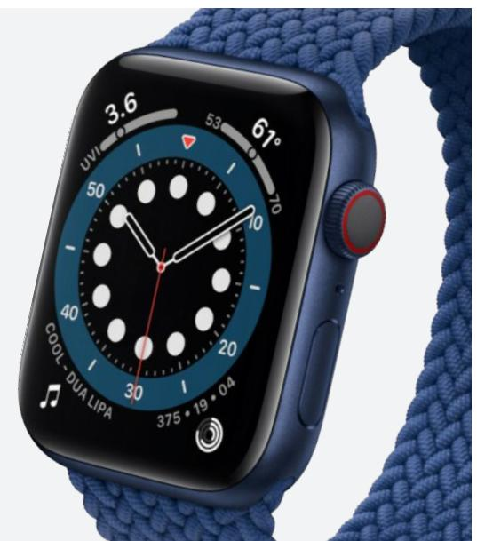

> **AI Description:**
> **Source:** `assets/_page_0_Figure_0.jpg`
> 
> **Generated:** 2026-05-15 21:00:17
> 
> ---
> 
> The image contains a close-up view of an Apple Watch with a blue woven band. The watch face displays a clock face with white dots and a red second hand. The watch also shows a weather widget with a temperature of 61°F and a UV index of 3.6. The time displayed is 10:10. The watch face also includes a music widget with the text "COOL - DUA LIPA" and a date of "375 19 04". The watch has a digital crown with a red accent.

> **AI Description:**
> **Source:** `assets/_page_0_Figure_1.jpg`
> 
> **Generated:** 2026-05-15 20:59:23
> 
> ---
> 
> The image shows a close-up view of a MacBook Air laptop screen. The screen displays a vibrant wallpaper featuring flowing, abstract orange and yellow fabric-like patterns against a light peach background. The laptop itself has a gold-colored body, and the screen bezels are black. There are no charts, graphs, or other visual elements beyond the wallpaper and the laptop's frame.

## Contents

InVue Overview....... ............................................................................................................................... iii   
OneKEY ecosystem .................................................................................................................................... iv   
InVue and Brands.... .................................................................................................................................. v   
iPhone & iPad Solutions ............................................................................................................................... 1   
iPad + Keyboard Solutions....................................................................................................................................10   
MacBook Solutions....... ............................................................................................................................. 13   
Apple Watch Solutions............................................................................................................................... 18   
HomePod Solutions ..........   
Apple Accessory Solutions... .............................................................................................. 31   
Other InVue Solutions for Apple Merchandise..   
OneKEY™ ecosystem.......... .................................................................................................... 36   
Ordering Instructions . .. ........................................................................................................................ 38   
InVue Customer Service Centers. .............................................................................................................. 48

# An intelligent, connected, security and merchandising technology platform that promotes and secures all merchandise at retail.

> **AI Description:**
> **Source:** `assets/_page_2_Figure_0.jpg`
> 
> **Generated:** 2026-05-15 21:10:02
> 
> ---
> 
> The image shows a modern building with a large glass facade and brick exterior walls. The central part of the building features a prominent sign with the text "InVue" in a clean, sans-serif font. The architecture includes large windows, allowing for ample natural light. The entrance area is landscaped with a small garden and a paved walkway leading up to the entrance. The overall design suggests a professional office or corporate setting.

InVue is a global technology company that provides retailers and brands with innovative merchandising, software and security solutions. Our products seamlessly promote and secure retail merchandise, enhancing the in-store experience to improve our customers’ profits.

We back our commitment with a 90,000 square foot innovation, quality, design and service center in Charlotte, NC. Our quality control facilities in Charlotte and China, use custom designed testing equipment to simulate actual, daily in-store use of our products.

# The synergy gained from aligning brand displays with existing retailer technology results in increased profits.

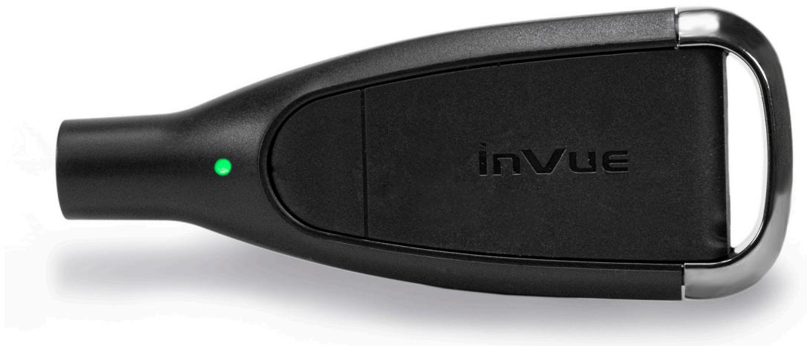

> **AI Description:**
> **Source:** `assets/_page_3_Figure_0.jpg`
> 
> **Generated:** 2026-05-15 21:13:58
> 
> ---
> 
> The image shows a black device with a sleek, ergonomic design. The brand name "inVue" is prominently displayed on the top surface. The device has a green indicator light on the left side, suggesting it may be a status or power indicator. The overall design appears to be compact and portable, likely intended for a specific purpose related to its branding.

## BEST-IN-CLASS SECURITY

Assign a unique code per store, 12 hour time-out feature for greater protection, and ability to create zones and audit employee use.

## IN-STORE VISIBILITY

Monitor, understand and manage associate interactions through software analytics. Know who did what, where and when.

# Enabling an Authentic Brand Experience

## TECHNOLOGY

› Investing over 7%+ yearly in research and development. Custom designed testing equipment to simulate actual in-store use.

› 90,000 sq. ft innovation, quality, design and service center in Charlotte, NC

## EXPERTISE

› Leveraging extensive retail experience and investments to bring innovative solutions to market.

› Broad merchandising and security portfolio alongside data and analytics that give insight into customer behavior and interactions

## FOCUS

› A history working with brands at the Headquarter, Regional and Retail level to maintain a comprehensive understanding of the brands ecosystem.

Offering products that balance the desire for high experience with the need for security.

## GLOBAL PRESENCE

› Global presence and local support in 90+ countries.

› Innovative concepts that are informed by a global retail landscape.

› Dedicated white-glove service for brands at the HQ, Regional and Local levels.

## iPhone & iPad Solutions

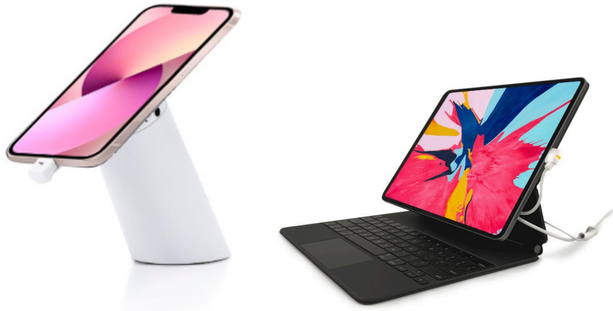

> **AI Description:**
> **Source:** `assets/_page_5_Figure_0.jpg`
> 
> **Generated:** 2026-05-15 21:10:56
> 
> ---
> 
> The image contains two distinct visual elements: a smartphone and a tablet. The smartphone is positioned on a stand with a colorful screen displaying a gradient of pink and purple hues. The tablet is placed on a keyboard with a colorful screen showing a vibrant abstract design with splashes of pink, blue, yellow, and other colors. Both devices are connected to a white charging cable. The image appears to showcase the compatibility and charging solutions for Apple devices.

## COMPATIBILITY

> **AI Description:**
> **Source:** `assets/_page_5_Figure_1.jpg`
> 
> **Generated:** 2026-05-15 21:07:23
> 
> ---
> 
> The image depicts a simple illustration of a smartphone with a blank screen. The phone is shown in a side profile view, with a black outline and a white background. The screen is uniformly white, and there are no additional visual elements, text, or annotations present. The image is a basic representation of a mobile device.

iPhone SE

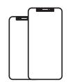

> **AI Description:**
> **Source:** `assets/_page_5_Figure_2.jpg`
> 
> **Generated:** 2026-05-15 21:05:23
> 
> ---
> 
> The image contains a simple diagram of two smartphones. The diagram is a basic line drawing with no additional labels or annotations. The phones are depicted side by side, with the one on the right appearing slightly larger than the one on the left. The drawing is minimalistic and does not include any text or other visual elements beyond the outlines of the phones.

> **AI Description:**
> **Source:** `assets/_page_5_Figure_4.jpg`
> 
> **Generated:** 2026-05-15 21:11:13
> 
> ---
> 
> The image contains a simple line drawing of two smartphones. The phones are depicted in a minimalist style with rounded edges and a blank screen. The drawing is monochromatic, using only black lines on a white background. There are no additional labels, text, or other visual elements present.

> **AI Description:**
> **Source:** `assets/_page_5_Figure_5.jpg`
> 
> **Generated:** 2026-05-15 21:12:19
> 
> ---
> 
> The image contains two black silhouettes of smartphones, one larger than the other, positioned side by side. The silhouettes are simple and lack any detailed features or colors, focusing solely on the outline of the devices. There are no labels, text, or additional visual elements present in the image.

iPhone 13
iPhone 13 Pro

> **AI Description:**
> **Source:** `assets/_page_5_Figure_8.jpg`
> 
> **Generated:** 2026-05-15 20:54:59
> 
> ---
> 
> The image shows a simplified representation of a tablet device. It is a black silhouette with a white screen and a small black button at the bottom, resembling a home button. There are no charts, graphs, or other visual elements present. The image is a simple illustration of a tablet, likely used for design or conceptual purposes.

> **AI Description:**
> **Source:** `assets/_page_5_Figure_9.jpg`
> 
> **Generated:** 2026-05-15 20:56:44
> 
> ---
> 
> The image depicts a simplified representation of a tablet device. It features a rectangular shape with rounded corners, a black border, and a white screen. The screen has a black border around it, and there is a small black circle at the bottom center, which likely represents a home button or similar feature. The image is minimalistic and does not contain any text or additional visual elements.

## iPhone & iPad Solutions

> **AI Description:**
> **Source:** `assets/_page_6_Figure_0.jpg`
> 
> **Generated:** 2026-05-15 20:55:36
> 
> ---
> 
> The image contains two visual elements: a smartphone and a tablet. The smartphone is placed on a white stand, and the tablet is connected to a keyboard and has a colorful screen. The tablet is also on a stand. Both devices have a modern design and are likely showcasing their use cases or features.

## COMPATIBILITY

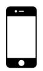

> **AI Description:**
> **Source:** `assets/_page_6_Figure_1.jpg`
> 
> **Generated:** 2026-05-15 20:56:32
> 
> ---
> 
> The image shows a simple line drawing of a smartphone. It is a basic representation with a rectangular shape, rounded corners, and a small circular button at the bottom, likely representing a home button. The drawing is minimalistic and does not include any text or additional details.

iPhone SE

> **AI Description:**
> **Source:** `assets/_page_6_Figure_2.jpg`
> 
> **Generated:** 2026-05-15 20:54:43
> 
> ---
> 
> The image contains a simple diagram of two smartphones. The diagram is a basic line drawing with no additional visual elements or text annotations. The phones are shown in a side-by-side comparison, with one slightly larger than the other. The image is minimalistic and does not provide any specific data or trends.

> **AI Description:**
> **Source:** `assets/_page_6_Figure_3.jpg`
> 
> **Generated:** 2026-05-15 18:31:25
> 
> ---
> 
> The image contains a simple illustration of a smartphone with a blank screen. The phone is depicted in a side profile view, showing the front of the device with a black border and a white background. There are no charts, graphs, or other visual elements present in the image. The focus is solely on the outline of the phone, which is a basic representation with no additional text or annotations.

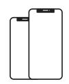

> **AI Description:**
> **Source:** `assets/_page_6_Figure_4.jpg`
> 
> **Generated:** 2026-05-15 20:58:07
> 
> ---
> 
> The image contains a simple line drawing of two smartphones. The phones are depicted in a minimalist style, with rounded edges and a blank screen. The drawing is monochromatic and lacks any additional text or labels. The phones are positioned side by side, with the one on the left slightly overlapping the one on the right.

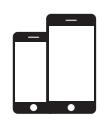

> **AI Description:**
> **Source:** `assets/_page_6_Figure_5.jpg`
> 
> **Generated:** 2026-05-15 20:57:01
> 
> ---
> 
> The image contains two black silhouettes of smartphones, one larger than the other, placed against a white background. The phones are depicted in a simple, minimalist style, with no additional text or annotations. The image appears to be a visual representation of mobile devices, possibly used for comparison or to illustrate the concept of mobile technology.

iPhone 13
iPhone 13 Pro

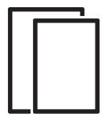

> **AI Description:**
> **Source:** `assets/_page_6_Figure_6.jpg`
> 
> **Generated:** 2026-05-15 20:59:00
> 
> ---
> 
> The image contains a simple line drawing of two overlapping rectangles. The rectangles are outlined in black and appear to be stacked on top of each other. There are no labels, text, or additional elements within the rectangles. The image is a basic diagram with no specific data or information conveyed beyond the visual representation of the shapes.

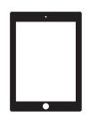

> **AI Description:**
> **Source:** `assets/_page_6_Figure_8.jpg`
> 
> **Generated:** 2026-05-15 21:10:15
> 
> ---
> 
> The image depicts a simplified representation of a tablet device. It features a rectangular screen with rounded corners, a black border, and a small circular button at the bottom, likely representing a home button. The design is minimalistic, focusing on the outline of the device without any additional details or text.

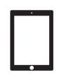

> **AI Description:**
> **Source:** `assets/_page_6_Figure_9.jpg`
> 
> **Generated:** 2026-05-15 21:07:36
> 
> ---
> 
> The image depicts a simplified illustration of a tablet device. It features a rectangular shape with rounded corners, a black border, and a white screen. The screen is blank, and there is a small black circle at the bottom center, which likely represents a home button or a similar feature. The image is minimalistic and does not contain any text or additional visual elements.

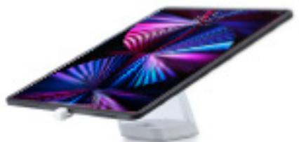

> **AI Description:**
> **Source:** `assets/_page_7_Figure_0.jpg`
> 
> **Generated:** 2026-05-15 21:00:04
> 
> ---
> 
> The image shows a tablet device with a colorful, abstract wallpaper displayed on its screen. The tablet is positioned at an angle, resting on a stand. The wallpaper features vibrant, swirling patterns in shades of purple, pink, and blue. The tablet appears to be modern and sleek, with a black bezel. The stand is white and provides a stable base for the tablet.

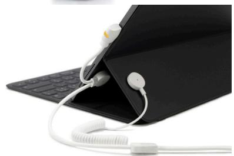

> **AI Description:**
> **Source:** `assets/_page_7_Figure_1.jpg`
> 
> **Generated:** 2026-05-15 20:59:39
> 
> ---
> 
> The image shows a close-up of a tablet with a keyboard dock attached. A white earphone cable is connected to the tablet, with a small yellow and white connector at the end of the cable. The image highlights the integration of a keyboard dock with a tablet, emphasizing the connectivity and functionality of the setup.

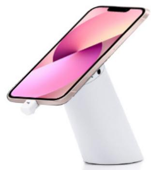

> **AI Description:**
> **Source:** `assets/_page_7_Figure_2.jpg`
> 
> **Generated:** 2026-05-15 20:57:24
> 
> ---
> 
> The image shows a smartphone placed on a stand. The phone is positioned in a way that the screen is facing forward, displaying a colorful wallpaper. The stand appears to be a simple, white, cylindrical design with a small protrusion at the bottom, possibly for stability or to hold the phone in place. There are no additional labels or text annotations in the image.

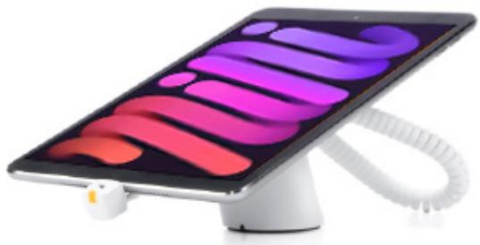

> **AI Description:**
> **Source:** `assets/_page_7_Figure_3.jpg`
> 
> **Generated:** 2026-05-15 20:57:48
> 
> ---
> 
> The image shows a tablet device placed on a flexible, coiled stand. The tablet screen displays a colorful, abstract pattern with shades of purple, pink, and orange. The stand appears to be designed for adjusting the angle and position of the tablet, likely for ergonomic use. The overall design suggests a modern and functional accessory for tablet users.

## Series 2865

› Flexible, multi-position system with quick disconnect sensor

› Smart voltage regulation compensates for voltage loss between the Power Box and device

› Ultra Low Profile sensor makes the product the hero and delivers a great customer experience

## OnePOD

› Above counter POD with internal recoiler

› Compatible with InVue’s software suite for data analytics

› Scalable security with consistent look and feel

## Series 960

› Above counter POD with exposed cable

› Allows for cross-merchandising of accessories

› Compatible with InVue’s software suite for data analytics

## Series 2865

Series 2865 is a flexible, multi-position security system that allows retailers to secure multiple electronics and accessories on a single fixture or display. Designed for single applications, mixed use tables and branded ecosystems, the S2865 is a modular, smart voltage regulation system with multi-voltage power boxes and a full portfolio of sensors that can be configured to accommodate different needs. The Ultra Low Profile sensors and low pull recoiler deliver a great consumer experience in a clean, modern design ensuring the product is the hero.

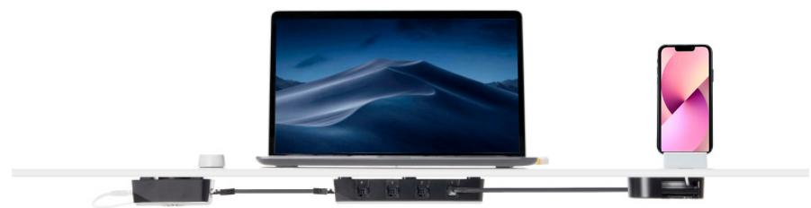

> **AI Description:**
> **Source:** `assets/_page_8_Figure_0.jpg`
> 
> **Generated:** 2026-05-15 21:04:54
> 
> ---
> 
> The image contains a diagram illustrating a setup involving a laptop and a smartphone. The laptop is connected to a power strip via a cable, which also powers a smartphone dock. The laptop screen displays a desktop wallpaper with a mountainous landscape. The smartphone is docked on the right side of the image, with its screen showing a colorful wallpaper. The setup appears to be demonstrating a multi-device charging and connectivity solution.

Series 2865 split-counter view of Macbook and iPhone display

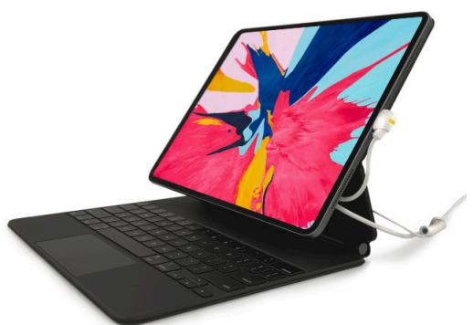

> **AI Description:**
> **Source:** `assets/_page_8_Figure_1.jpg`
> 
> **Generated:** 2026-05-15 21:05:00
> 
> ---
> 
> The image shows a tablet device with a colorful screen displaying a vibrant abstract design. The tablet is connected to a keyboard case, which is open and placed in front of the tablet. A cable is visible, likely connecting the tablet to the keyboard or another device. The overall setup suggests a portable computing device, possibly for productivity or creative work.

iPad Pro and Magic Keyboard with custom dual sensor

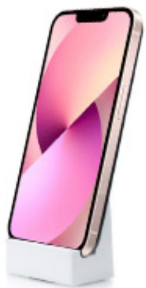

> **AI Description:**
> **Source:** `assets/_page_8_Figure_2.jpg`
> 
> **Generated:** 2026-05-15 21:05:12
> 
> ---
> 
> The image shows a smartphone with a modern design, featuring a large display screen that occupies most of the front. The phone is placed on a stand, and the screen displays a gradient wallpaper with shades of pink and purple. The phone appears to be a model with a notch at the top of the display, which is characteristic of certain smartphone designs. The overall aesthetic suggests a focus on sleekness and modern technology.

## At a glance:

## FEATURES AND BENEFITS

› Designed for branded ecosystems, mixed-use displays and category specific displays

iPhone Xs on a Series 2865 Vertical Display

› Quick disconnect feature for customer interaction and easy nightly removal

› Ultra Low Profile sensor makes the product the hero and delivers a great customer experience

› Smart voltage regulation compensates for voltage loss between the Power Box and device

› Up to 24 powered and 24 alarming positions or 48 alarming only positions

## COMPATIBILITY

› Under counter components are future-proof and easily remerchandised for the addition of new products

> **AI Description:**
> **Source:** `assets/_page_8_Figure_3.jpg`
> 
> **Generated:** 2026-05-15 21:05:06
> 
> ---
> 
> The image depicts a simple line drawing of a smartphone. The drawing is minimalistic, showing the outline of the phone with a screen, a home button at the bottom, and a speaker grille at the top. There are no additional visual elements, text, or annotations present in the image.

> **AI Description:**
> **Source:** `assets/_page_8_Figure_4.jpg`
> 
> **Generated:** 2026-05-15 21:04:24
> 
> ---
> 
> The image contains a simple diagram of two smartphone devices. The diagram is a basic line drawing with no additional text or labels. The phones are depicted in a side-by-side manner, with one phone slightly overlapping the other. The design is minimalistic and does not include any charts, graphs, or other visual elements.

iPhone SE

> **AI Description:**
> **Source:** `assets/_page_8_Figure_5.jpg`
> 
> **Generated:** 2026-05-15 21:04:20
> 
> ---
> 
> The image shows a smartphone with a black frame and a white background. The phone appears to be a modern model with a large screen and a notch at the top of the display. There are no visible texts, charts, or other visual elements within the image.

> **AI Description:**
> **Source:** `assets/_page_8_Figure_6.jpg`
> 
> **Generated:** 2026-05-15 21:03:59
> 
> ---
> 
> The image contains a simple line drawing of two smartphone devices. The drawing is minimalistic, with each phone depicted in a side profile view. The phones are shown in a vertical orientation, with one slightly larger than the other. The lines are clean and uncluttered, focusing solely on the outline of the phones without any additional details or labels.

> **AI Description:**
> **Source:** `assets/_page_8_Figure_8.jpg`
> 
> **Generated:** 2026-05-15 21:02:56
> 
> ---
> 
> The image contains two smartphone illustrations. The larger phone is positioned above the smaller one. Both phones have a black frame and a white screen, with the larger phone appearing to be a modern smartphone model, possibly an iPhone, and the smaller one resembling an older model. The image is likely used for comparison or to illustrate the evolution of smartphone designs.

iPhone 13

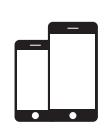

> **AI Description:**
> **Source:** `assets/_page_8_Figure_9.jpg`
> 
> **Generated:** 2026-05-15 21:02:52
> 
> ---
> 
> The image contains two black silhouettes of smartphones, one larger than the other. The larger phone is positioned above the smaller one, both oriented vertically. The image does not include any text or additional visual elements beyond the two phone silhouettes.

iPhone 13 Pro

> **AI Description:**
> **Source:** `assets/_page_8_Figure_10.jpg`
> 
> **Generated:** 2026-05-15 21:10:12
> 
> ---
> 
> The image contains a simple line drawing of two overlapping rectangles. The rectangles are outlined in black and appear to be stacked on top of each other. There are no labels, text, or additional elements within the rectangles. The image is a basic representation of two shapes, possibly meant to symbolize layers or sections.

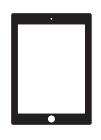

> **AI Description:**
> **Source:** `assets/_page_8_Figure_12.jpg`
> 
> **Generated:** 2026-05-15 21:05:29
> 
> ---
> 
> The image shows a simple illustration of a tablet device with a blank screen. The tablet has a black frame and a white background, with a single small dot at the top center of the screen, possibly representing a camera or sensor. There are no charts, graphs, or other visual elements present. The image is a straightforward representation of a tablet device.

> **AI Description:**
> **Source:** `assets/_page_8_Figure_13.jpg`
> 
> **Generated:** 2026-05-15 21:07:10
> 
> ---
> 
> The image depicts a simple illustration of a tablet device. It is a flat, rectangular shape with rounded corners and a small circular button at the bottom center, which is characteristic of a home button. The image is minimalistic and lacks any text, labels, or additional visual elements.

For ordering instructions see p. 37

## OnePOD

We’ve redesigned PODs from the inside out, and the result is a platform that elevates the customer experience, improves operational efficiency and has a consistent look across all stands. And with advanced data and analytics, OnePOD enables you to maximize every sales opportunity, at every store, and every display — every day. That’s the Power of OnePOD.

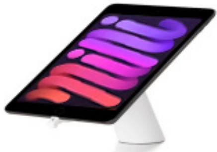

> **AI Description:**
> **Source:** `assets/_page_9_Figure_0.jpg`
> 
> **Generated:** 2026-05-15 21:04:14
> 
> ---
> 
> The image shows a tablet device placed on a stand. The tablet has a colorful design on its screen with a gradient of purple, pink, and orange hues. The stand is white and appears to be designed for supporting the tablet at an angle. The tablet is connected to a charging cable, which is visible at the bottom of the image. The overall image is clean and focused on the tablet and its stand.

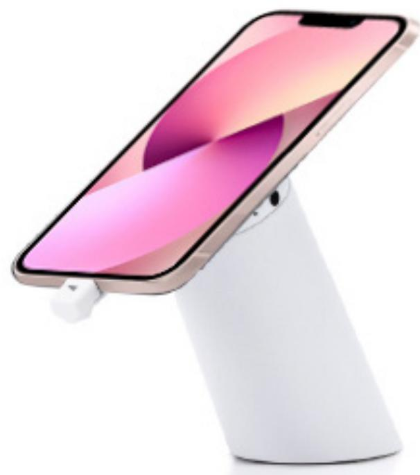

> **AI Description:**
> **Source:** `assets/_page_9_Figure_1.jpg`
> 
> **Generated:** 2026-05-15 21:03:55
> 
> ---
> 
> The image shows a smartphone placed on a stand, which appears to be a wireless charging dock. The phone is positioned at an angle, with its screen facing upwards. The background of the phone's screen displays a gradient of colors, transitioning from pink to purple. The stand is white and has a sleek, modern design. The image does not contain any text or additional labels.

## At a glance:

## FEATURES AND BENEFITS

› Minimal design aesthetic allows merchandise to be the hero

› Elevated customer experience

› Advanced analytic capabilities

› Scalable security allows devices to be lifted or locked down depending on retail environment

› 2 or 4-way unibody steel security arms available/optional

## COMPATIBILITY

> **AI Description:**
> **Source:** `assets/_page_9_Figure_2.jpg`
> 
> **Generated:** 2026-05-15 21:04:17
> 
> ---
> 
> The image depicts a simple, minimalist representation of a smartphone. It is a black and white illustration showing the outline of a phone with a rectangular screen and rounded corners. The phone is oriented in a portrait position, and there are no additional details or text within the image.

> **AI Description:**
> **Source:** `assets/_page_9_Figure_3.jpg`
> 
> **Generated:** 2026-05-15 21:04:27
> 
> ---
> 
> The image contains a simple line drawing of two smartphones. The drawing is minimalistic, with no additional text or annotations. The phones are depicted in a side-by-side arrangement, with the one on the right slightly larger than the one on the left. The design is clean and focuses solely on the outline of the phones, without any internal components or additional details.

iPhone SE

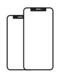

> **AI Description:**
> **Source:** `assets/_page_9_Figure_5.jpg`
> 
> **Generated:** 2026-05-15 21:05:15
> 
> ---
> 
> The image contains a simple line drawing of two smartphones. The phones are depicted in a side-by-side arrangement, with the one on the right appearing slightly larger and more detailed, suggesting a comparison or a size difference between the two devices. The drawing is minimalistic, with no additional text or annotations.

> **AI Description:**
> **Source:** `assets/_page_9_Figure_7.jpg`
> 
> **Generated:** 2026-05-15 21:04:48
> 
> ---
> 
> The image contains two black silhouettes of smartphones, one larger and one smaller, placed side by side. The larger phone is positioned above the smaller one, and both phones have a rectangular shape with rounded corners. The image appears to be a simple illustration or diagram, possibly used to represent a comparison or relationship between two different sizes of smartphones.

iPhone 13

> **AI Description:**
> **Source:** `assets/_page_9_Figure_8.jpg`
> 
> **Generated:** 2026-05-15 21:01:20
> 
> ---
> 
> The image contains two black silhouettes of smartphones. The larger phone is positioned above the smaller one, both facing the same direction. The phones are simple, without any detailed features or icons, and there are no labels, text, or additional visual elements present. The image appears to be a minimalist representation of two smartphones.

iPhone 13 Pro

For ordering instructions see p. 39

> **AI Description:**
> **Source:** `assets/_page_9_Figure_11.jpg`
> 
> **Generated:** 2026-05-15 21:00:24
> 
> ---
> 
> The image shows a simplified representation of a tablet device with a blank screen. The device is depicted in a side profile view, featuring a black border and a home button at the bottom. The screen is white, indicating that it is turned on and displaying no content. The image is a simple illustration and does not contain any text or additional visual elements.

> **AI Description:**
> **Source:** `assets/_page_9_Figure_12.jpg`
> 
> **Generated:** 2026-05-15 20:58:01
> 
> ---
> 
> The image shows a simplified representation of a tablet device. The image is a white background with a black outline of a tablet, including the screen, edges, and a small button at the bottom center. There are no additional visual elements, charts, or text annotations present in the image.

<table><tr><td></td><td></td><td></td><td></td></tr><tr><td></td><td>One55</td><td>One65</td><td>One60</td></tr><tr><td>Internal Recoiler</td><td>√</td><td>√</td><td>&lt;</td></tr><tr><td>Lift Length</td><td>32 inches</td><td>32 inches</td><td>15 inches</td></tr><tr><td>Standard Security</td><td>√</td><td>√</td><td>√</td></tr><tr><td>Enhanced Security</td><td></td><td>√</td><td>√</td></tr><tr><td>High Security</td><td></td><td></td><td>√</td></tr><tr><td>Cross-Merchandising Port</td><td></td><td>√</td><td></td></tr><tr><td>Data Analytics</td><td></td><td>√</td><td>←</td></tr><tr><td>Quick Release</td><td>√</td><td>√</td><td>√</td></tr><tr><td>Split-Level Recoiler Option</td><td>√</td><td>√</td><td></td></tr><tr><td>Brackets</td><td>Optional</td><td>Optional</td><td>Recommended</td></tr></table>

## Don’t let thieves design your customer experience.

## ONE DESIGN

For consistent visual merchandising.

## ONE EXPERIENCE

Delivering an inviting and meaningful customer experience even in a high security environment. Enabling you to engage customers with high value accessory cross-merchandising.

## ONE PLATFORM

One common platform that allows you to control where and how much security is needed.

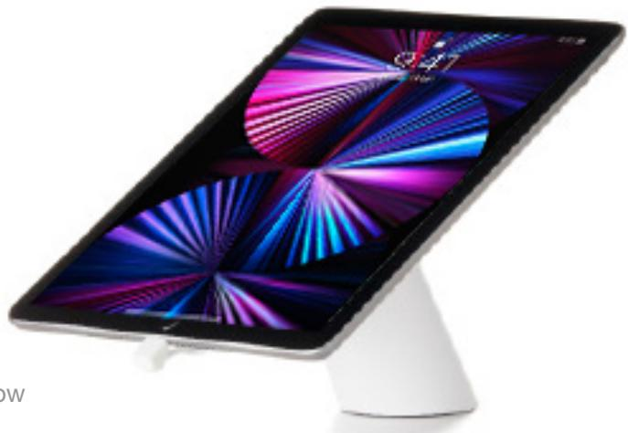

> **AI Description:**
> **Source:** `assets/_page_10_Figure_0.jpg`
> 
> **Generated:** 2026-05-15 21:11:06
> 
> ---
> 
> The image shows a tablet device with a colorful, abstract wallpaper displayed on its screen. The tablet is positioned at an angle, with a stand supporting it from below. The screen displays vibrant colors, including shades of purple, blue, and pink, arranged in a dynamic, radial pattern. The tablet appears to be in a modern, sleek design, with a black bezel and a silver or metallic stand. The image does not contain any text or additional annotations beyond the visual representation of the tablet and its screen.

## Series 960

The Series 960 POD features an optimal combination of contemporary design and high consumer experi It’s completely scalable to meet your security ne along with compatible software, can provide criti data and analytics… all at a very compelling pric

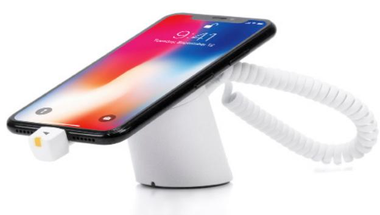

> **AI Description:**
> **Source:** `assets/_page_11_Figure_0.jpg`
> 
> **Generated:** 2026-05-15 21:07:04
> 
> ---
> 
> The image shows a smartphone placed on a white, flexible stand. The phone is connected to a charging cable, which is coiled and extends to the right side of the image. The screen of the phone displays a colorful wallpaper with the time "9:41" and the date "Tuesday, December 12" visible. The phone appears to be an iPhone, identifiable by its design and the presence of the home button. The stand is designed to hold the phone securely while allowing it to be charged.

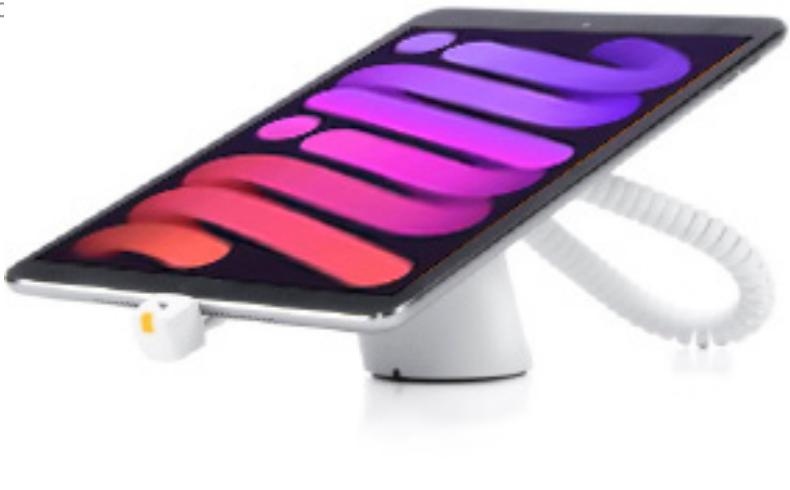

> **AI Description:**
> **Source:** `assets/_page_11_Figure_1.jpg`
> 
> **Generated:** 2026-05-15 21:05:41
> 
> ---
> 
> The image shows a tablet device placed on a stand with a coiled arm. The tablet screen displays a colorful abstract design with overlapping purple and pink wave-like patterns. The stand appears to be adjustable, with a flexible arm that can be bent to hold the tablet at different angles. The tablet is connected to a small white charging cable, which is plugged into the device.

## At a glance:

## FEATURES AND BENEFITS

› Above counter POD simplifies installation

› Minimal contemporary design

› High consumer experience

› Ability to layer bracket arms

› Allows for cross-merchandising of accessories

› Compatible with InVue’s software suite for data analytics

## COMPATIBILITY

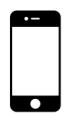

> **AI Description:**
> **Source:** `assets/_page_11_Figure_2.jpg`
> 
> **Generated:** 2026-05-15 21:07:57
> 
> ---
> 
> The image depicts a simple illustration of a smartphone with a blank screen. The phone is outlined in black, with a white background. There are no additional visual elements, text, or annotations present in the image.

iPhone SE

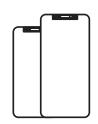

> **AI Description:**
> **Source:** `assets/_page_11_Figure_3.jpg`
> 
> **Generated:** 2026-05-15 21:09:25
> 
> ---
> 
> The image contains a simple diagram of two smartphones. The diagram is a basic line drawing with no additional visual elements such as charts, graphs, or photographs. The two phones are depicted side by side, with the phone on the right appearing slightly larger than the one on the left. There are no labels or text annotations present in the image.

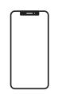

> **AI Description:**
> **Source:** `assets/_page_11_Figure_4.jpg`
> 
> **Generated:** 2026-05-15 21:13:28
> 
> ---
> 
> The image depicts a smartphone with a black frame and a white background. The phone appears to be a modern model, possibly an iPhone, given the design and the notch at the top of the screen. There are no visible text annotations or additional visual elements within the image. The focus is solely on the outline of the phone, which is centered in the image.

> **AI Description:**
> **Source:** `assets/_page_11_Figure_5.jpg`
> 
> **Generated:** 2026-05-15 21:14:16
> 
> ---
> 
> The image contains a simple line drawing of two smartphones. The drawing is minimalistic, with no additional labels, text, or background elements. The phones are depicted in a side-by-side manner, with the one on the right appearing slightly larger than the one on the left. The drawing style is clean and does not provide any specific information about the phones' features or specifications.

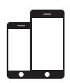

> **AI Description:**
> **Source:** `assets/_page_11_Figure_7.jpg`
> 
> **Generated:** 2026-05-15 21:11:30
> 
> ---
> 
> The image contains a simple illustration of two smartphones. The larger phone is positioned above the smaller one, both with blank screens. The phones are depicted in a minimalist style with black outlines and white backgrounds. There are no labels, text, or additional visual elements present.

iPhone 13
For ordering instructions see p. 39

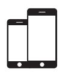

> **AI Description:**
> **Source:** `assets/_page_11_Figure_8.jpg`
> 
> **Generated:** 2026-05-15 18:31:31
> 
> ---
> 
> The image contains two smartphone icons, one larger and one smaller, both with blank screens. The larger phone is positioned above the smaller one, and both are depicted in a simple, minimalist style. There are no additional visual elements, text, or annotations present in the image.

iPhone 13 Pro

> **AI Description:**
> **Source:** `assets/_page_11_Figure_11.jpg`
> 
> **Generated:** 2026-05-15 20:56:29
> 
> ---
> 
> The image depicts a simplified representation of a tablet device, showing the front view with a blank screen and a home button at the bottom. The device is outlined in black, and the screen is white, indicating a clean and minimalistic design. There are no additional visual elements or text annotations present.

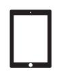

> **AI Description:**
> **Source:** `assets/_page_11_Figure_12.jpg`
> 
> **Generated:** 2026-05-15 20:54:46
> 
> ---
> 
> The image depicts a simplified illustration of a tablet device. The tablet is shown in a side profile view, with a blank screen and a home button at the bottom. The design is minimalistic, focusing on the outline of the device without any additional details or text.

## One60 Tethered

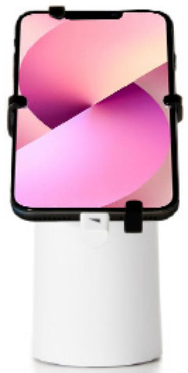

> **AI Description:**
> **Source:** `assets/_page_12_Figure_0.jpg`
> 
> **Generated:** 2026-05-15 18:40:10
> 
> ---
> 
> The image shows a smartphone mounted on a cylindrical stand. The phone screen displays a gradient wallpaper with shades of pink and purple. The stand appears to be a simple, white, cylindrical device with a black clamp holding the phone in place. The phone is positioned upright, and the stand is likely designed for stability and convenience, possibly for use in a home or office setting.

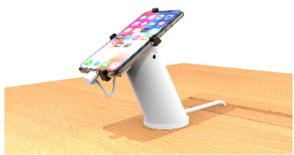

> **AI Description:**
> **Source:** `assets/_page_12_Figure_1.jpg`
> 
> **Generated:** 2026-05-15 20:54:31
> 
> ---
> 
> The image shows a smartphone mounted on a stand, likely for charging or display purposes. The phone is securely held in place by a bracket, and a cable is connected to the phone, suggesting it is being charged. The stand appears to be designed for stability and ease of use, with a simple, modern design. The background is a plain, light-colored surface, which helps to focus attention on the phone and stand.

## At a glance:

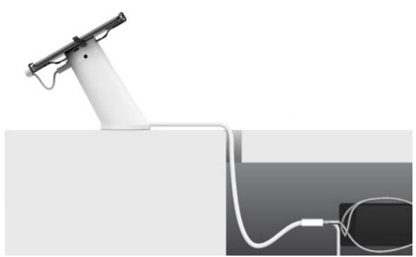

> **AI Description:**
> **Source:** `assets/_page_12_Figure_2.jpg`
> 
> **Generated:** 2026-05-15 20:56:11
> 
> ---
> 
> The image is a technical illustration showing a robotic arm connected to a power source. The robotic arm is white and has a jointed structure, suggesting it is capable of movement. The arm is connected to a cable that runs off the edge of the image, leading to a power adapter and a power outlet. The image is likely used to demonstrate the setup or functionality of a robotic arm in a controlled environment.

## FEATURES AND BENEFITS

› Industry leading mechanical security with power and alarm

› 4-way unibody steel security arms; adjustable arms adapt to all iPhone and iPad models

› Steel anchor cable tethers display to fixture for ultimate security

› Adhesive mounted with no required holes in table

› All above counter recoiler with steel cable and 15” pull length — visible steel cable resists 250+lbs pull force

## COMPATIBILITY

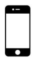

> **AI Description:**
> **Source:** `assets/_page_12_Figure_3.jpg`
> 
> **Generated:** 2026-05-15 20:56:04
> 
> ---
> 
> The image shows a simple line drawing of a smartphone. The drawing is minimalistic, featuring a rectangular shape with rounded corners, a screen, and a home button at the bottom. There are no additional visual elements, text, or annotations present in the image.

> **AI Description:**
> **Source:** `assets/_page_12_Figure_4.jpg`
> 
> **Generated:** 2026-05-15 20:59:56
> 
> ---
> 
> The image contains a simple line drawing of two smartphones. The drawing is minimalistic, with one phone slightly larger than the other. Both phones have a rectangular shape with rounded corners and appear to have a notch at the top of the screen, suggesting they are modern models. The image is likely used to represent mobile devices or to compare the sizes of two different phone models.

iPhone SE

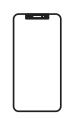

> **AI Description:**
> **Source:** `assets/_page_12_Figure_5.jpg`
> 
> **Generated:** 2026-05-15 20:59:52
> 
> ---
> 
> The image is a simple line drawing of a smartphone. It features a rectangular shape with rounded corners, a black outline, and a small rectangular cutout at the top, likely representing a screen or camera cutout. The drawing is minimalistic and does not include any text or additional details.

> **AI Description:**
> **Source:** `assets/_page_12_Figure_6.jpg`
> 
> **Generated:** 2026-05-15 20:57:35
> 
> ---
> 
> The image contains a simple line drawing of two smartphone devices. The drawing is minimalistic, with the phones depicted in a side-by-side arrangement. The phones appear to be of similar design, possibly representing a comparison or a side view of two models. There are no additional labels, text, or other visual elements present in the image.

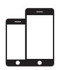

> **AI Description:**
> **Source:** `assets/_page_12_Figure_8.jpg`
> 
> **Generated:** 2026-05-15 21:05:56
> 
> ---
> 
> The image contains two smartphone illustrations, one larger and one smaller, both with a black outline and a white background. The phones are positioned side by side, with the larger phone on the left and the smaller one on the right. The image is a simple, clean illustration with no additional text or labels.

iPhone 13

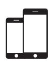

> **AI Description:**
> **Source:** `assets/_page_12_Figure_9.jpg`
> 
> **Generated:** 2026-05-15 21:05:52
> 
> ---
> 
> The image contains two black silhouettes of smartphones. The phones are positioned one above the other, with the top phone slightly smaller and overlapping the bottom one. The image is a simple illustration with no additional text or labels. The visual elements suggest a comparison or relationship between the two devices, possibly indicating a size difference or a layered effect.

iPhone 13 Pro

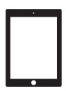

> **AI Description:**
> **Source:** `assets/_page_12_Figure_12.jpg`
> 
> **Generated:** 2026-05-15 21:00:40
> 
> ---
> 
> The image depicts a simplified representation of a tablet or tablet-like device. It is a rectangular shape with rounded corners, featuring a black border and a white screen area. There is a small black dot near the top center of the screen, which could represent a camera or sensor, and a small black circle at the bottom center, which might be a home button or a similar feature. The image is minimalistic and does not contain any text or additional visual elements.

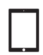

> **AI Description:**
> **Source:** `assets/_page_12_Figure_13.jpg`
> 
> **Generated:** 2026-05-15 20:58:56
> 
> ---
> 
> The image depicts a simple illustration of a tablet device with a blank screen. The tablet is shown in a side profile, with a black border and a white screen. There are no additional visual elements, charts, or annotations present in the image.

## One90QR

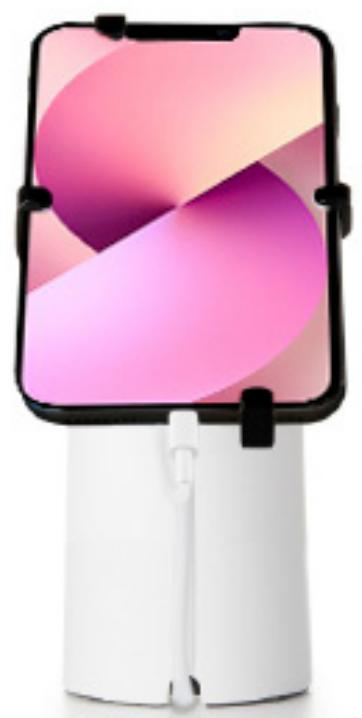

> **AI Description:**
> **Source:** `assets/_page_13_Figure_0.jpg`
> 
> **Generated:** 2026-05-15 20:57:57
> 
> ---
> 
> The image shows a smartphone mounted on a stand. The phone screen displays a gradient wallpaper with shades of pink and purple. The stand appears to be a cylindrical, white device with a black clamp holding the phone in place. The phone is positioned upright, and the stand is designed to hold the phone securely.

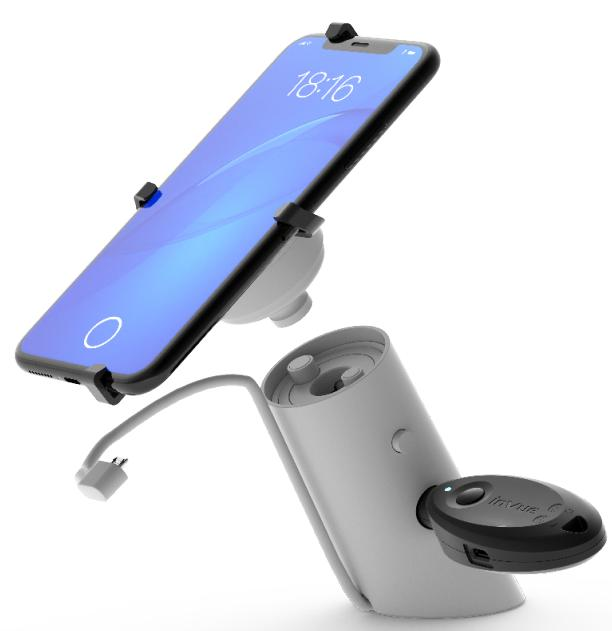

> **AI Description:**
> **Source:** `assets/_page_13_Figure_1.jpg`
> 
> **Generated:** 2026-05-15 20:57:16
> 
> ---
> 
> The image contains a photograph of a smartphone mounted on a stand. The phone is displaying the time as 18:16 on a blue screen. The stand appears to be a charging dock with a cable connected to it, suggesting it is designed for wireless charging. The stand has a cylindrical base and a circular component at the bottom, which likely houses the charging technology. The overall design is modern and functional, indicating it is likely a product image for a tech accessory.

## At a glance:

## FEATURES AND BENEFITS

› Industry leading mechanical security

› Solid steel construction; full time lockdown with 400 lbs resistance

› Quick release at sensor for nightly removal with OneKEY

› 4-way unibody steel security arms

› OEM feed through power

› Access Manager compatible

## COMPATIBILITY

> **AI Description:**
> **Source:** `assets/_page_13_Figure_2.jpg`
> 
> **Generated:** 2026-05-15 20:59:13
> 
> ---
> 
> The image shows a simple line drawing of a smartphone. The drawing is minimalistic, featuring a rectangular shape with rounded corners and a small circular button at the bottom, representing the home button. The screen is blank, with no additional graphics or text displayed.

iPhone SE

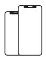

> **AI Description:**
> **Source:** `assets/_page_13_Figure_3.jpg`
> 
> **Generated:** 2026-05-15 21:00:20
> 
> ---
> 
> The image contains a simple line drawing of two smartphones. The phones are depicted in a minimalist style, with one phone slightly overlapping the other. The drawing is monochromatic and lacks any additional text or annotations. The image does not provide any specific data or information beyond the visual representation of the two smartphones.

> **AI Description:**
> **Source:** `assets/_page_13_Figure_4.jpg`
> 
> **Generated:** 2026-05-15 20:55:42
> 
> ---
> 
> The image shows a smartphone with a blank screen. The phone is positioned vertically, and the screen is completely white, indicating that it is turned on but displaying no content. The phone's design includes a black frame and a top bezel with what appears to be a speaker grille. The image is a simple representation of a smartphone, likely used for design or illustrative purposes.

> **AI Description:**
> **Source:** `assets/_page_13_Figure_5.jpg`
> 
> **Generated:** 2026-05-15 20:56:25
> 
> ---
> 
> The image contains a simple line drawing of two smartphone screens. The screens are depicted side by side, with the one on the right appearing larger and more detailed, suggesting a comparison or size difference between the two devices. The drawing is minimalistic, with no additional text or annotations.

> **AI Description:**
> **Source:** `assets/_page_13_Figure_7.jpg`
> 
> **Generated:** 2026-05-15 18:31:28
> 
> ---
> 
> The image contains two smartphone illustrations. The larger phone is positioned above the smaller one. Both phones have a black bezel and a white screen. The image appears to be a simple representation of two smartphone models, possibly for comparison or design purposes.

iPhone 13

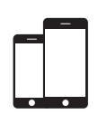

> **AI Description:**
> **Source:** `assets/_page_13_Figure_8.jpg`
> 
> **Generated:** 2026-05-15 21:11:26
> 
> ---
> 
> The image contains two simple, black silhouettes of smartphones. The phones are depicted in a side-by-side arrangement, with the one on the right slightly larger than the one on the left. The silhouettes are minimalistic and do not include any detailed features or text. The image is likely used to represent mobile devices or a comparison between two different phone models.

iPhone 13 Pro

> **AI Description:**
> **Source:** `assets/_page_13_Figure_11.jpg`
> 
> **Generated:** 2026-05-15 21:05:19
> 
> ---
> 
> The image depicts a simplified representation of a tablet device with a blank screen. The tablet has a black border and a white screen, with a small black button at the bottom, resembling a home button. There are no additional visual elements or text annotations present in the image.

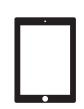

> **AI Description:**
> **Source:** `assets/_page_13_Figure_12.jpg`
> 
> **Generated:** 2026-05-15 21:07:20
> 
> ---
> 
> The image contains a visual representation of a tablet device. The tablet is shown in a side profile, with the screen facing forward. The device appears to be a modern tablet, possibly a model similar to the iPad, given its shape and design. The image is a simple illustration or diagram, with no additional text or annotations.

# iPad Digital Display

# Bracketed pedestal for utilizing iPads as digital displays on Apple Fixtures

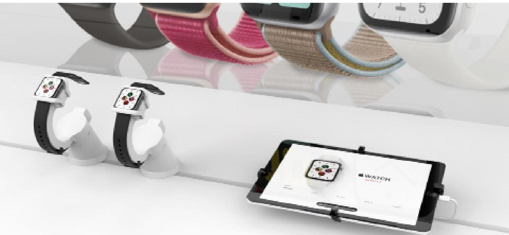

> **AI Description:**
> **Source:** `assets/_page_14_Figure_0.jpg`
> 
> **Generated:** 2026-05-15 20:58:52
> 
> ---
> 
> The image contains a photograph of a display setup featuring smartwatches. Two smartwatches are shown on white stands, each with a black strap and a screen displaying a colorful interface. In the background, there are additional smartwatch straps in various colors and materials. The image also includes a tablet with a smartwatch app displayed on its screen, showing a watch face and a wrist strap. The overall setting suggests a product showcase or demonstration of smartwatch accessories and their compatibility with a mobile device.

## FEATURES AND BENEFITS

1 Optional steel bracket arms depending on security requirements

2 Wedge display pedestal for angle and height, no lift

3 OEM power cable passed through for integrated charging. Installed separately through tether underpass

4 Optional screw mount kit available for addon when possible with fixtures

5 InVue steel core tether cable

6 iPad can be mounted in portrait or landscape mode for display

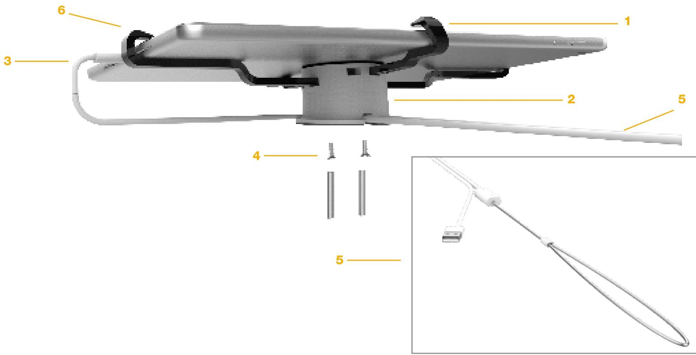

> **AI Description:**
> **Source:** `assets/_page_15_Figure_0.jpg`
> 
> **Generated:** 2026-05-15 18:32:08
> 
> ---
> 
> The image is a technical illustration of a device, likely a medical or scientific instrument. It includes labeled components with numbers (1 through 6) pointing to various parts of the device. The illustration is detailed, showing a cross-sectional view of the device, including a handle, a central body, and an extended arm with a cable. The inset image provides a closer view of the cable and connector, emphasizing the USB interface. The labels and cross-sectional view suggest the image is used for assembly or instructional purposes.

## iPad + Keyboard Solutions

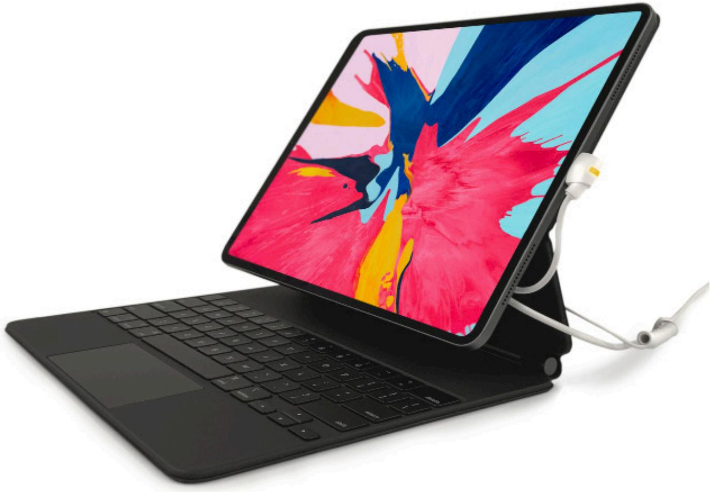

> **AI Description:**
> **Source:** `assets/_page_16_Figure_0.jpg`
> 
> **Generated:** 2026-05-15 21:06:39
> 
> ---
> 
> The image shows a tablet device with a colorful abstract wallpaper on its screen. The tablet is connected to a keyboard case, which is placed on a stand. The keyboard case appears to be a slim, black design with a compact layout. There is a cable connected to the tablet, likely for charging or data transfer. The overall setup suggests a portable computing device, possibly used for work or entertainment.

COMPATIBILITY

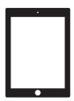

> **AI Description:**
> **Source:** `assets/_page_16_Figure_3.jpg`
> 
> **Generated:** 2026-05-15 21:08:41
> 
> ---
> 
> The image shows a simplified representation of a tablet device with a black border and a white screen. There are no charts, graphs, or other visual elements present. The image is a basic outline of a tablet, likely used for illustrative purposes.

# iPad Pro + Keyboards Standard Solution Secure iPad Pro, Magic Keyboard, Smart Keyboard and Apple Pencil with a seamless solution.

## FEATURES AND BENEFITS

Security and power are provided to iPad and Smart Keyboard and Magic Keyboard by a single cable secured to the device with minimal aesthetic impact

2 Protects Apple Pencil while allowing full customer interaction

3 Allows Apple Pencil to be mounted on iPad for charging and display

4 Magic Keyboard and Smart Keyboard Folio sensor works in conjunction with iPad sensor and allows keyboard to be removed from iPad. Alternative mounting option for sensor on Magic Keyboard available, enables power via keyboard to iPad for demonstration methods

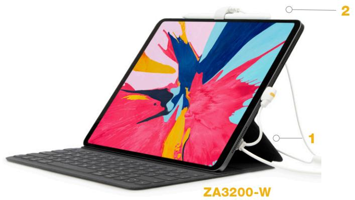

> **AI Description:**
> **Source:** `assets/_page_17_Figure_0.jpg`
> 
> **Generated:** 2026-05-15 21:11:22
> 
> ---
> 
> The image contains a diagram of a tablet with a keyboard attached. The tablet is shown in a landscape orientation with a colorful abstract wallpaper. The diagram includes two labeled parts: a white cable labeled as "1" and a stand or hinge mechanism labeled as "2". The model number "ZA3200-W" is displayed at the bottom of the image. The image is a technical illustration, likely used for product documentation or educational purposes.

> **AI Description:**
> **Source:** `assets/_page_17_Figure_1.jpg`
> 
> **Generated:** 2026-05-15 21:12:10
> 
> ---
> 
> The image contains a photograph of a hand holding a stylus pen, which appears to be a digital pen or stylus used for writing or drawing on a tablet or similar device. The stylus is white and has a cord attached to it. The text "ZA2720-W" is visible at the bottom of the image, likely indicating a model number or product code. The image is circular in shape and focuses on the stylus and the hand holding it, suggesting it might be part of a product advertisement or documentation.

> **AI Description:**
> **Source:** `assets/_page_17_Figure_3.jpg`
> 
> **Generated:** 2026-05-15 21:13:02
> 
> ---
> 
> The image contains a close-up photograph of a coiled cable connected to a laptop. The cable is white and has a coiled design, with a white connector at the end. The laptop is partially visible, showing a portion of the keyboard and a black screen. The image is labeled with the number "4" in the top left corner and the text "ZA3200-W" at the bottom. The image appears to be part of a technical or instructional guide, possibly related to cable management or device connectivity.

## iPad Pro + Keyboards High Security Solution

## FEATURES AND BENEFITS

1 Threaded connection to the power cable

2 Magic and Smart Folio keyboards fully captured in all directions of movement, with the hinge allowing for various display placements of $1 1 ^ { 3 3 } \& 1 2 . 9 ^ { 3 3 }$ iPad Pro

3 Configured with Type C cable

> **AI Description:**
> **Source:** `assets/_page_18_Figure_0.jpg`
> 
> **Generated:** 2026-05-15 21:03:43
> 
> ---
> 
> The image shows a close-up of a tablet or laptop with a stand attached. The stand is white and has two adjustable legs labeled as "1" and "2" in the image. The stand is designed to elevate the tablet or laptop, likely for ergonomic use. The device appears to be a Surface Pro or similar tablet, given the design and the presence of a keyboard underneath. The image is a technical illustration, likely used for instructional purposes to demonstrate how to adjust the stand.

4 Adhesive in addition to mechanical mounting

5 Bracket arms capture iPad Pro, vertical dislodge direction is prevented by Type C connector

6 Steel core cable is co-molded, connected under-table to OneKEY Padlock for added strength

> **AI Description:**
> **Source:** `assets/_page_18_Figure_1.jpg`
> 
> **Generated:** 2026-05-15 21:03:31
> 
> ---
> 
> The image shows a tablet device with a colorful abstract painting displayed on its screen. The tablet is connected to a keyboard and has two white cables plugged into it, likely for charging or data transfer. The tablet is positioned at an angle, and the screen is the focal point of the image. The number "5" is prominently displayed at the top of the image, possibly indicating a step or a ranking in a sequence.

> **AI Description:**
> **Source:** `assets/_page_18_Figure_2.jpg`
> 
> **Generated:** 2026-05-15 21:02:36
> 
> ---
> 
> The image is a technical illustration of a device, likely a laptop or tablet, with various components labeled. The illustration shows a close-up view of the bottom part of the device, highlighting a power cable connected to a charging port. The image includes two numbered labels: "3" pointing to a hinge or stand mechanism, and "4" pointing to the bottom edge of the device, which appears to have a protective cover or bumper. The illustration is designed to provide a clear view of the device's components and their placement.

> **AI Description:**
> **Source:** `assets/_page_18_Figure_3.jpg`
> 
> **Generated:** 2026-05-15 21:03:15
> 
> ---
> 
> The image contains a technical illustration of a security device. It shows a black rectangular component with a small circular hole on the left side, which appears to be a mounting bracket. Attached to this bracket is a metallic carabiner loop, which is secured with a coiled metal cable. Below the carabiner, there is a cylindrical object with a circular lens and the text "InVue" on it, indicating it is a camera. The number "6" is prominently displayed in the top left corner, possibly indicating a step or part number in a sequence.

## MacBook Solutions

> **AI Description:**
> **Source:** `assets/_page_19_Figure_0.jpg`
> 
> **Generated:** 2026-05-15 21:02:11
> 
> ---
> 
> The image shows a MacBook Pro laptop with a silver body and a black keyboard. The screen displays a desktop wallpaper featuring a mountainous landscape under a blue sky. The laptop is connected to a white power cable, which is partially visible on the right side of the image. The overall design suggests a modern and sleek computer, likely used for personal or professional computing tasks.

## COMPATIBILITY

> **AI Description:**
> **Source:** `assets/_page_19_Figure_1.jpg`
> 
> **Generated:** 2026-05-15 21:02:14
> 
> ---
> 
> The image contains a simple line drawing of a laptop. The drawing is minimalistic, showing the outline of the laptop with a blank screen. There are no additional visual elements, charts, or text annotations present in the image.

MacBook

> **AI Description:**
> **Source:** `assets/_page_19_Figure_2.jpg`
> 
> **Generated:** 2026-05-15 21:01:26
> 
> ---
> 
> The image contains a simple line drawing of a laptop. The drawing is minimalistic, showing the outline of the laptop with a blank screen. There are no additional labels, text, or other elements present in the image.

MacBook Air

> **AI Description:**
> **Source:** `assets/_page_19_Figure_3.jpg`
> 
> **Generated:** 2026-05-15 21:01:23
> 
> ---
> 
> The image contains a simple line drawing of a laptop. The drawing is minimalistic, featuring only the outline of the laptop with a blank screen. There are no additional details, text, or annotations present.

MacBook Pro

# MacBook Standard Security Alarm and Injected Solution

> **AI Description:**
> **Source:** `assets/_page_20_Figure_0.jpg`
> 
> **Generated:** 2026-05-15 21:07:54
> 
> ---
> 
> The image shows a close-up of a laptop connected to a white device labeled "alarm" via a cable. The laptop is partially visible, displaying part of the keyboard and the edge of the screen. The device appears to be a portable alarm or similar accessory, connected to the laptop's USB port. The image focuses on the connection between the laptop and the alarm device.

> **AI Description:**
> **Source:** `assets/_page_20_Figure_1.jpg`
> 
> **Generated:** 2026-05-15 21:09:34
> 
> ---
> 
> The image shows a close-up of a white cable with a connector in the center. The connector appears to be a USB-C type, commonly used for charging and data transfer. The cable is neatly coiled and the background is plain white, emphasizing the cable and connector. There are no labels or text annotations in the image.

## At a glance:

## FEATURES AND BENEFITS

› Power and alarm provided by single cable with minimal aesthetic impact

› Power injection delivers optimum current and voltage to power hungry Macbooks

## COMPATIBILITY

> **AI Description:**
> **Source:** `assets/_page_20_Figure_2.jpg`
> 
> **Generated:** 2026-05-15 21:07:06
> 
> ---
> 
> The image contains a simple line drawing of a laptop. The drawing is minimalistic, showing the outline of the laptop with a blank screen. There are no additional visual elements, charts, or annotations present in the image.

MacBook

> **AI Description:**
> **Source:** `assets/_page_20_Figure_3.jpg`
> 
> **Generated:** 2026-05-15 21:05:33
> 
> ---
> 
> The image contains a simple line drawing of a laptop. The drawing is minimalistic, with a rectangular screen and a keyboard base. There are no additional labels, text, or other elements present in the image. The drawing is black and white, with no colors or shading.

MacBook Air

> **AI Description:**
> **Source:** `assets/_page_20_Figure_4.jpg`
> 
> **Generated:** 2026-05-15 21:12:03
> 
> ---
> 
> The image contains a simple line drawing of a laptop. The drawing is minimalistic, showing only the outline of the laptop with a screen and keyboard. There are no additional visual elements, charts, or annotations present in the image.

MacBook Pro

# MacBook High Security Solution

## FEATURES AND BENEFITS

1 Rigid anchor design on rear of MacBook

2 Steel cable co-molded for added strength, secured to table with OneKEY Padlock

3 Bracket bar arms and custom form factor to capture and prevent lateral movement

4 Ability to power/alarm MacBook with USB-C Port

> **AI Description:**
> **Source:** `assets/_page_21_Figure_0.jpg`
> 
> **Generated:** 2026-05-15 21:14:06
> 
> ---
> 
> The image shows a photograph of a laptop with a gold-colored body and a black keyboard. The laptop is open, displaying a colorful abstract wallpaper on the screen. The laptop is positioned at an angle, with a white stand supporting it, allowing it to rest on a flat surface. The overall design suggests a modern and sleek appearance.

5 Metal tabs with rubber pads prevents closing of MacBook for added security and accidental damage during installation

6 Stable, molded feet prevent rocking and protect fixture table

> **AI Description:**
> **Source:** `assets/_page_21_Figure_1.jpg`
> 
> **Generated:** 2026-05-15 21:13:45
> 
> ---
> 
> The image shows a close-up of a laptop's USB-C port with a white cable plugged in. The cable is secured with a white plastic clip. The laptop's keyboard is partially visible, with keys such as "esc," "tab," "caps lock," and "shift" clearly shown. The image includes a number "5" with an arrow pointing to the cable and clip, likely indicating a step or feature in a sequence or guide. The overall focus is on the cable and its secure attachment to the laptop.

> **AI Description:**
> **Source:** `assets/_page_21_Figure_2.jpg`
> 
> **Generated:** 2026-05-15 21:11:45
> 
> ---
> 
> The image is a technical illustration of a mechanical component, likely part of a larger machine or device. It features a metallic plate with several labeled parts, indicated by numbers (1, 3, 6) pointing to specific areas on the plate. The red components appear to be latches or fasteners. The illustration is labeled with numbers to identify different parts of the component, suggesting it is a schematic or exploded view diagram used for assembly or repair instructions.

> **AI Description:**
> **Source:** `assets/_page_21_Figure_3.jpg`
> 
> **Generated:** 2026-05-15 21:11:54
> 
> ---
> 
> The image shows a security device that appears to be a camera or sensor mounted on a wall. It is secured with a metal loop and cable, suggesting it is designed to prevent theft or unauthorized access. The device has a label that reads "invue," which is likely the brand name. The camera lens is visible, indicating it is meant for surveillance or monitoring purposes. The overall design suggests it is a modern security solution, possibly for home or business use.

## COMPATIBILITY

> **AI Description:**
> **Source:** `assets/_page_21_Figure_4.jpg`
> 
> **Generated:** 2026-05-15 21:05:48
> 
> ---
> 
> The image contains a simple line drawing of a laptop. The drawing is minimalistic, showing only the outline of the laptop with a blank screen. There are no additional visual elements, text, or annotations present in the image.

> **AI Description:**
> **Source:** `assets/_page_21_Figure_5.jpg`
> 
> **Generated:** 2026-05-15 21:05:59
> 
> ---
> 
> The image contains a simple line drawing of a laptop. The drawing is minimalistic, showing the outline of the laptop with a screen and a keyboard. There are no additional visual elements, text, or annotations present in the image.

MacBook

> **AI Description:**
> **Source:** `assets/_page_21_Figure_6.jpg`
> 
> **Generated:** 2026-05-15 21:08:38
> 
> ---
> 
> The image is a simple line drawing of a laptop. It features a rectangular screen and a keyboard, with a focus on the outline of the laptop. There are no additional visual elements, charts, or annotations within the image.

MacBook Air
MacBook Pro
For ordering instructions see p. 41

## Laptop AOP

The easy-to-use Laptop Alarm On Product (AOP) is beautifully designed to provide enhanced security, an optimal customer experience and a lower cost of operation. Laptop AOP is simple to install and to remerchandise. The IR port is easily accessible for daily operation, no tools are necessary to install, and there are flexible mounting options to accommodate different furniture styles.

> **AI Description:**
> **Source:** `assets/_page_22_Figure_0.jpg`
> 
> **Generated:** 2026-05-15 20:59:35
> 
> ---
> 
> The image shows a laptop with a small, circular device attached to its back, connected by a white cable. The device appears to be a sensor or a security lock, possibly for securing the laptop. The laptop is positioned at an angle, with the keyboard visible on the left side. The background is plain white, emphasizing the laptop and the attached device.

## At a glance:

## FEATURES AND BENEFITS

› Enhanced laptop security with alarm-onproduct to deter theft

› Cut resistant steel cable with $2 4 ^ { \mathfrak { s } }$ lift capability and 45lb pull force

> **AI Description:**
> **Source:** `assets/_page_22_Figure_1.jpg`
> 
> **Generated:** 2026-05-15 21:00:07
> 
> ---
> 
> The image contains a simple line drawing of a laptop. The drawing is minimalistic, showing the outline of the laptop with a flat screen and a keyboard. There are no additional elements or text annotations present in the image.

## COMPATIBILITY

> **AI Description:**
> **Source:** `assets/_page_22_Figure_2.jpg`
> 
> **Generated:** 2026-05-15 20:57:51
> 
> ---
> 
> The image contains a simple line drawing of a laptop. The drawing is minimalistic, showing the outline of the laptop with a screen and a keyboard. There are no additional labels, text, or other elements present in the image.

MacBook Air
MacBook

› Can be mounted above or below counter

> **AI Description:**
> **Source:** `assets/_page_22_Figure_3.jpg`
> 
> **Generated:** 2026-05-15 20:57:19
> 
> ---
> 
> The image depicts a simple line drawing of a laptop. The drawing is minimalistic, showing only the outline of the laptop with a blank screen. There are no additional details or labels present in the image.

“Anti-grip” design that mounts to flat and curved surfaces

MacBook Pro

› Compatible with InVue’s software suite for data analytics

## K-Lock

K-Lock, one of the Zips for Laptops solutions, is the ideal merchandising and enhanced security solutions for MacBooks. Available in both alarm and non-alarming options, the modern design both cleanly displays produts and elevates the customer experience. Featuring a high security, cut resistant steel cable and plate, this solution balances the demand for maximum security with a highly interactive in-store customer experience. Minimize theft, upgrade the interaction experience and boost sales of high value consumer electronics.

> **AI Description:**
> **Source:** `assets/_page_23_Figure_0.jpg`
> 
> **Generated:** 2026-05-15 20:56:56
> 
> ---
> 
> The image contains a photograph of a person using a tool to clean the charging port of a laptop. The tool appears to be a handheld device with a handle and a nozzle that is inserted into the laptop's charging port. The laptop is open, and the person is holding the tool, suggesting the process of cleaning the port. The image demonstrates a practical use of a cleaning tool for electronic devices.

## At a glance:

## FEATURES AND BENEFITS

› High security, cut resistant steel cable

› 200 lbs of pull force security

› Sleek, modern design to complement laptops

› Simple installation, no tools required

› Alarming option compatible with Zips

› Non-alarming, mechanical option available

## COMPATIBILITY

> **AI Description:**
> **Source:** `assets/_page_23_Figure_1.jpg`
> 
> **Generated:** 2026-05-15 20:54:56
> 
> ---
> 
> The image contains a simple line drawing of a laptop. The drawing is minimalistic, with a black outline of the laptop body and screen. There are no additional visual elements, text, or annotations present in the image.

MacBook

> **AI Description:**
> **Source:** `assets/_page_23_Figure_2.jpg`
> 
> **Generated:** 2026-05-15 18:31:18
> 
> ---
> 
> The image contains a simple line drawing of a laptop. The drawing is minimalistic, showing the outline of the laptop with a screen and a keyboard. There are no additional elements, text, or annotations present in the image.

MacBook Air

> **AI Description:**
> **Source:** `assets/_page_23_Figure_3.jpg`
> 
> **Generated:** 2026-05-15 20:54:53
> 
> ---
> 
> The image contains a simple line drawing of a laptop. The drawing is minimalistic, showing only the outline of the laptop with a blank screen. There are no additional details, text, or other elements present in the image.

MacBook Pro

## Apple Watch Solutions

> **AI Description:**
> **Source:** `assets/_page_24_Figure_0.jpg`
> 
> **Generated:** 2026-05-15 20:56:39
> 
> ---
> 
> The image shows a close-up of an Apple Watch on a stand. The watch has a black band and a black face with a digital display showing various watch faces and icons. The stand is cylindrical and white, with a small circular button or sensor on its side. The watch is positioned in a way that highlights its screen and band, suggesting it is being used to showcase the device or its charging or display functionality.

COMPATIBILITY

> **AI Description:**
> **Source:** `assets/_page_24_Figure_1.jpg`
> 
> **Generated:** 2026-05-15 20:55:02
> 
> ---
> 
> The image depicts a simple line drawing of a smartwatch. The drawing is minimalistic, showing the outline of the watch face and the band. There are no additional details or labels within the image.

> **AI Description:**
> **Source:** `assets/_page_24_Figure_2.jpg`
> 
> **Generated:** 2026-05-15 18:31:20
> 
> ---
> 
> The image depicts a simple line drawing of a smartwatch. The watch face is blank, and the watch band is visible. The design is minimalistic, with no additional details or text annotations.

> **AI Description:**
> **Source:** `assets/_page_24_Figure_3.jpg`
> 
> **Generated:** 2026-05-15 20:54:50
> 
> ---
> 
> The image depicts a simple line drawing of a smartwatch. The watch face is blank, with a black border and a white center. The watch band is visible at the top and bottom, with a black strap and a silver buckle. There are no additional visual elements or text annotations present.

> **AI Description:**
> **Source:** `assets/_page_24_Figure_4.jpg`
> 
> **Generated:** 2026-05-15 20:57:05
> 
> ---
> 
> The image depicts a digital watch face with a black and white geometric pattern. The watch face is rectangular with rounded corners and a black bezel. The pattern consists of repeating black and white chevron shapes. There are no visible hands or digital displays on the watch face, and the image is a simple illustration or graphic representation of a watch face design.

> **AI Description:**
> **Source:** `assets/_page_24_Figure_5.jpg`
> 
> **Generated:** 2026-05-15 20:58:04
> 
> ---
> 
> The image depicts a simple line drawing of a smartwatch. The drawing is minimalistic, showing the watch face with a black border and a white background. There are no additional details or text annotations present in the image.

Series SE

> **AI Description:**
> **Source:** `assets/_page_24_Figure_6.jpg`
> 
> **Generated:** 2026-05-15 21:00:34
> 
> ---
> 
> The image depicts a simple line drawing of a smartwatch. It features a rectangular screen with rounded corners, a black bezel, and a black strap. The drawing is minimalistic and lacks any additional details or text annotations.

Apple Watch Series 7

# The only all-in-one display security solution for Apple Watch

> **AI Description:**
> **Source:** `assets/_page_25_Figure_0.jpg`
> 
> **Generated:** 2026-05-15 20:59:46
> 
> ---
> 
> The image shows a close-up of an Apple Watch on a charging stand. The watch face displays a fitness app with various metrics, including heart rate and steps taken. The charging stand is cylindrical and white, with a small circular button on its side. The watch has a black band and a silver case. The image is a photograph with no text or additional annotations.

## At a glance:

## FEATURES AND BENEFITS

› Universal, self-service solution allows customers to try on product without store staff assistance

› Magnets on both the cradle and band clamp attract for perfect placement

› Anti-slip pad on cradle ensures device stability while on display

› Easy-to-install flex sensors protect both Apple Watch head and band, minimizing false alarms

› Integrated Apple charging and OEM charging available

## COMPATIBILITY

> **AI Description:**
> **Source:** `assets/_page_25_Figure_1.jpg`
> 
> **Generated:** 2026-05-15 20:59:59
> 
> ---
> 
> The image contains a simple line drawing of a smartwatch. The drawing is minimalistic, showing the outline of the watch face and band. There are no additional details or labels present in the image.

> **AI Description:**
> **Source:** `assets/_page_25_Figure_2.jpg`
> 
> **Generated:** 2026-05-15 20:57:43
> 
> ---
> 
> The image depicts a simple line drawing of a smartwatch. The watch face is blank, with no visible display or text. The watch band is shown in a solid black color, and the watch case is outlined in white. There are no additional visual elements or annotations present in the image.

> **AI Description:**
> **Source:** `assets/_page_25_Figure_3.jpg`
> 
> **Generated:** 2026-05-15 20:57:31
> 
> ---
> 
> The image depicts a simple line drawing of a smartwatch. The watch has a rectangular face with rounded corners and a black bezel. The watch face is outlined in white, and the watch band is also black. There are no additional details or text annotations present in the image.

> **AI Description:**
> **Source:** `assets/_page_25_Figure_4.jpg`
> 
> **Generated:** 2026-05-15 20:54:37
> 
> ---
> 
> The image shows a close-up of a smartwatch with a black and white patterned band. The watch face is blank, indicating that it is not displaying any time or information at the moment. The watch has a rectangular screen and a black case with a silver edge.

> **AI Description:**
> **Source:** `assets/_page_25_Figure_5.jpg`
> 
> **Generated:** 2026-05-15 18:37:08
> 
> ---
> 
> The image is a simple line drawing of a smartwatch. It features a rectangular screen with rounded corners, a black bezel, and a thin strap. The design is minimalistic and does not include any text or additional elements.

Series SE

> **AI Description:**
> **Source:** `assets/_page_25_Figure_6.jpg`
> 
> **Generated:** 2026-05-15 20:55:52
> 
> ---
> 
> The image shows a simple line drawing of a smartwatch. The watch has a rectangular face with rounded corners and a black band. The watch face is outlined with a white border, and the band is depicted in black, indicating the watch's design and structure. There are no additional visual elements or text annotations present in the image.

Apple Watch Series 7
For ordering instructions see p. 43

# Power and alarming security for Apple Watch on display.

> **AI Description:**
> **Source:** `assets/_page_26_Figure_0.jpg`
> 
> **Generated:** 2026-05-15 21:14:12
> 
> ---
> 
> The image shows a close-up of an Apple Watch on a stand. The watch has a black band and a black face with a digital clock display and various app icons. The stand is white and cylindrical, designed to hold the watch upright. The watch appears to be in a charging or resting position on the stand.

WS2 Recoiler

> **AI Description:**
> **Source:** `assets/_page_26_Figure_1.jpg`
> 
> **Generated:** 2026-05-15 21:13:34
> 
> ---
> 
> The image shows a close-up of an Apple Watch on a stand. The watch has a black band and a black face displaying a watch face with various icons and a circular design. The stand is white and has a flexible arm that holds the watch in place. The watch appears to be charging or connected to the stand, as indicated by the charging cable partially visible on the right side of the image.

WS2 Exposed Cord

## At a glance:

## FEATURES AND BENEFITS

› Available in exposed cord or recoiler displays

› Magnets on both cradle and band clamp attract for perfect placement

› Anti-slip pad on cradle ensures device stability while on display

› Easy-to-install flex sensors protect both Apple Watch head and band, and minimize false alarms

› Compatible with new Zips platform

› Integrated Apple charging and OEM charging available

## COMPATIBILITY

> **AI Description:**
> **Source:** `assets/_page_26_Figure_2.jpg`
> 
> **Generated:** 2026-05-15 21:11:33
> 
> ---
> 
> The image depicts a simple line drawing of a smartwatch. The drawing is minimalistic, showing the outline of the watch face and the band. There are no additional labels, text, or other visual elements present. The image serves as a generic representation of a smartwatch.

> **AI Description:**
> **Source:** `assets/_page_26_Figure_3.jpg`
> 
> **Generated:** 2026-05-15 21:11:57
> 
> ---
> 
> The image depicts a simple line drawing of a smartwatch. The watch face is blank, with no visible display or text. The watch band is shown in a dark color, contrasting with the lighter color of the watch face. The design is minimalistic and does not contain any additional visual elements or text annotations.

> **AI Description:**
> **Source:** `assets/_page_26_Figure_4.jpg`
> 
> **Generated:** 2026-05-15 21:05:44
> 
> ---
> 
> The image depicts a simple line drawing of a smartwatch. The watch has a rectangular screen and a black band. There are no additional visual elements, text, or annotations present in the image.

> **AI Description:**
> **Source:** `assets/_page_26_Figure_5.jpg`
> 
> **Generated:** 2026-05-15 21:06:56
> 
> ---
> 
> The image shows a digital watch face with a black and white geometric pattern. The watch face is rectangular with rounded corners and a black bezel. The pattern consists of alternating black and white chevron shapes. There are no visible numbers or hands on the watch face, suggesting it may be a smartwatch or a digital watch designed for aesthetic purposes.

> **AI Description:**
> **Source:** `assets/_page_26_Figure_6.jpg`
> 
> **Generated:** 2026-05-15 21:08:44
> 
> ---
> 
> The image is a simple line drawing of a smartwatch. It features a rectangular screen with rounded corners, a black bezel, and a black strap. The design is minimalistic and does not include any text, icons, or additional details.

> **AI Description:**
> **Source:** `assets/_page_26_Figure_7.jpg`
> 
> **Generated:** 2026-05-15 21:08:00
> 
> ---
> 
> The image depicts a simple line drawing of a smartwatch. The watch has a rectangular screen with rounded corners, a black bezel, and a black strap. The design is minimalistic and does not include any text, buttons, or additional features.

Series SE
Apple Watch Series 7
For ordering instructions see p. 43

# OnePOD Wearable

> **AI Description:**
> **Source:** `assets/_page_27_Figure_0.jpg`
> 
> **Generated:** 2026-05-15 21:07:30
> 
> ---
> 
> The image shows a close-up of a smartwatch with a black band and a white face, placed on a white cylindrical stand. The watch appears to be an Apple Watch, given the design and display style. The stand is designed to hold the watch securely, likely for charging or display purposes. The image focuses on the watch and the stand, with no additional text or annotations present.

> **AI Description:**
> **Source:** `assets/_page_27_Figure_1.jpg`
> 
> **Generated:** 2026-05-15 21:10:21
> 
> ---
> 
> The image shows a smartwatch resting on a stand. The watch has a black strap and a silver case with a digital display. The stand is white and has a cylindrical shape with a curved base to securely hold the watch. The watch appears to be in a charging or display position, with the screen facing forward.

## At a glance:

## FEATURES AND BENEFITS

› OnePOD platform design allows merchandise to be the hero. Clean aesthetics create appealing and consistent storewide visual merchandising

› Harness bands secure Apple Watch to sensor for enhanced security

› Open hoop sensor design encourages customer interaction

› Compatible with One55, One60, One65 and One40 standard and split-level stands

› Compatible with OneKEY ecosystem and Access Manager

› OEM charging compatibility for Apple Watch models

## COMPATIBILITY

> **AI Description:**
> **Source:** `assets/_page_27_Figure_2.jpg`
> 
> **Generated:** 2026-05-15 21:07:13
> 
> ---
> 
> The image contains a simple line drawing of a smartwatch. The drawing is minimalistic, showing the outline of the watch face and the band. There are no additional labels, text, or other visual elements present. The image is a basic representation of a smartwatch, likely used for illustrative purposes.

> **AI Description:**
> **Source:** `assets/_page_27_Figure_3.jpg`
> 
> **Generated:** 2026-05-15 21:05:25
> 
> ---
> 
> The image depicts a simple line drawing of a smartwatch. The watch face is rectangular with rounded corners, and the watch band is visible at the bottom. The design is minimalistic, with no additional details or text present.

> **AI Description:**
> **Source:** `assets/_page_27_Figure_4.jpg`
> 
> **Generated:** 2026-05-15 21:12:23
> 
> ---
> 
> The image depicts a simple line drawing of a smartwatch. The watch has a rectangular face with rounded corners and a black border, suggesting a modern design. The watch face is blank, with no visible dials, hands, or additional markings. The watch band is not shown, and the image focuses solely on the watch face and part of the band.

> **AI Description:**
> **Source:** `assets/_page_27_Figure_5.jpg`
> 
> **Generated:** 2026-05-15 21:11:09
> 
> ---
> 
> The image shows a digital watch face with a geometric pattern. The watch face is rectangular with rounded corners and has a black and white chevron pattern. The watch has a black strap with a silver buckle. There are no visible numbers or time indicators on the watch face.

> **AI Description:**
> **Source:** `assets/_page_27_Figure_6.jpg`
> 
> **Generated:** 2026-05-15 21:12:46
> 
> ---
> 
> The image shows a simplified representation of a smartwatch. It features a rectangular screen with rounded corners, enclosed within a black band. The design is minimalistic and does not include any text, icons, or additional visual elements.

Series SE

> **AI Description:**
> **Source:** `assets/_page_27_Figure_7.jpg`
> 
> **Generated:** 2026-05-15 21:14:30
> 
> ---
> 
> The image contains a simple line drawing of a smartwatch. The drawing is minimalistic, showing the watch face with a black border and a white background. There are no additional visual elements, text, or annotations present in the image.

Apple Watch Series 7
For ordering instructions see p. 42

# High Security One60 Wearable

> **AI Description:**
> **Source:** `assets/_page_28_Figure_0.jpg`
> 
> **Generated:** 2026-05-15 21:01:43
> 
> ---
> 
> The image shows a white Apple Watch with a black band, placed on a white stand. The watch is positioned in a way that the screen is facing forward, displaying the watch face with various icons. The stand appears to be a docking station or holder designed to securely hold the watch in place. The overall design suggests a focus on functionality and ease of use, likely for charging or display purposes.

## FEATURES AND BENEFITS

› OnePOD platform design allows merchandise to be the hero. Clean aesthetics create appealing and consistent storewide visual merchandising

› Harness bands secure Apple Watch to sensor for enhanced security

› Secured with screw mount or adhesive with steel thether

› Compatible with OneKEY ecosystem and Access Manager

› OEM charging compatibility for Apple Watch Series 4, 5, 6 & SE

## COMPATIBILITY

> **AI Description:**
> **Source:** `assets/_page_28_Figure_1.jpg`
> 
> **Generated:** 2026-05-15 21:01:12
> 
> ---
> 
> The image depicts a simple line drawing of a smartwatch. The drawing is minimalistic, showing the watch face and part of the band. There are no additional visual elements or annotations present in the image.

> **AI Description:**
> **Source:** `assets/_page_28_Figure_2.jpg`
> 
> **Generated:** 2026-05-15 21:01:45
> 
> ---
> 
> The image depicts a simple line drawing of a smartwatch. The watch has a rectangular face with rounded corners and a black band. There are no additional visual elements, text, or annotations present in the image.

> **AI Description:**
> **Source:** `assets/_page_28_Figure_3.jpg`
> 
> **Generated:** 2026-05-15 21:02:22
> 
> ---
> 
> The image depicts a simple line drawing of a smartwatch. The watch face is blank, with a black bezel and a white face. The watch band is black, and the watch appears to be in a resting position, with the back of the watch facing upwards. There are no additional labels, text, or other visual elements present in the image.

> **AI Description:**
> **Source:** `assets/_page_28_Figure_4.jpg`
> 
> **Generated:** 2026-05-15 21:03:22
> 
> ---
> 
> The image shows a close-up view of a smartwatch with a black and white patterned strap. The watch face is not visible, and the focus is on the strap and the side of the watch. The design of the strap features a repeating geometric pattern.

> **AI Description:**
> **Source:** `assets/_page_28_Figure_5.jpg`
> 
> **Generated:** 2026-05-15 21:03:46
> 
> ---
> 
> The image depicts a simplified icon of a smartwatch. The icon shows a rectangular screen with rounded corners, representing the display of the watch, and a black band surrounding the screen, indicating the watch's strap. The design is minimalistic and does not include any text or additional details.

Series SE

> **AI Description:**
> **Source:** `assets/_page_28_Figure_6.jpg`
> 
> **Generated:** 2026-05-15 21:03:19
> 
> ---
> 
> The image shows a simple line drawing of a smartwatch. The drawing is minimalistic, depicting the watch face with a rectangular display and a black band. There are no additional labels, text, or other elements present in the image. The watch face is outlined in white, and the band is represented by a black line.

Apple Watch Series 7

## High Security One60 Wearable

## FEATURES AND BENEFITS

1 OnePOD platform design allows merchandise to be the hero

2 Harness bands secure wearable to sensor for enhanced security

3 Open hoop sensor design encourages customer interaction

4 Clean aesthetics create appealing and consistent storewide visual merchandising

> **AI Description:**
> **Source:** `assets/_page_29_Figure_0.jpg`
> 
> **Generated:** 2026-05-15 21:02:49
> 
> ---
> 
> The image is a technical illustration of an Apple Watch, showcasing its design and components. It highlights the watch face, the watch band, and the charging dock. The watch face displays a watch face with various icons, and the watch band is shown in black with a white clasp. The charging dock is white and is shown in a partially assembled state. The image includes numbered annotations pointing to specific parts of the watch and dock, such as the watch face (9), the watch band (3), and the charging dock (8).

5 Compatible with OneKEY ecosystem and Access Manager software

6 Integrated OEM charging compatibility for Apple Apple Watch Series 4, 5, 6 & SE

7 Secured with screw mount or adhesive with steel thether

8 Alarming Sensor

9 Hoop Tray

> **AI Description:**
> **Source:** `assets/_page_29_Figure_1.jpg`
> 
> **Generated:** 2026-05-15 21:03:05
> 
> ---
> 
> The image contains a diagram of an Apple Watch, specifically highlighting the watch face and band. The watch face displays various app icons, including Phone, Messages, Music, and a heart rate monitor. The band is black and appears to be made of a silicone or rubber material. The diagram is labeled with the number "2" pointing to the watch face, indicating a specific feature or component of the watch.

## High Security One60 Wearable

Short tethered stand with optional stud mount kit included (2 mounting options)

Option #1: Stud mount kit for Apple tables or fixtures with holes

Option #2: Adhesive with steel tether for Apple tables or fixtures without holes

Option #1

> **AI Description:**
> **Source:** `assets/_page_30_Figure_0.jpg`
> 
> **Generated:** 2026-05-15 21:00:31
> 
> ---
> 
> The image is a technical illustration showing a device mounted on a wall with a cable extending downward. The device appears to be a sensor or a similar electronic component, possibly used for monitoring or control purposes. The cable is connected to a power source or another device, as indicated by the plug at the end of the cable. The illustration is likely used for instructional or explanatory purposes, such as in a product manual or a technical guide.

Option #2

> **AI Description:**
> **Source:** `assets/_page_30_Figure_1.jpg`
> 
> **Generated:** 2026-05-15 20:59:08
> 
> ---
> 
> The image is a technical illustration showing a device connected to a cable. The device appears to be a small, cylindrical object with a clip or mount at one end, suggesting it might be a sensor or a similar device. The cable is white and extends from the device, curving downward and then to the right, where it connects to a black rectangular object, possibly a power source or another device. The illustration is simple and lacks any additional labels or text annotations.

# HSW100 - Powerful High Security for Apple Watch

> **AI Description:**
> **Source:** `assets/_page_31_Figure_0.jpg`
> 
> **Generated:** 2026-05-15 20:56:01
> 
> ---
> 
> The image shows a technical illustration of a device mounted on a metal bracket. The device appears to be a white rectangular unit with a black cable extending from it. The bracket is secured with a bolt and nut, and there is a black strap or cord attached to the top of the device. The image likely represents a component or part of a larger system, possibly related to electrical or mechanical equipment. The focus is on the device and its mounting, suggesting it is part of a larger assembly or installation.

## At a glance:

## FEATURES AND BENEFITS

› Heavy-duty, all-metal construction delivers a truly secure display solution

› Clean, minimal, low-profile stand complements environment and engages customers, while reducing leverage points and theft access › Three (3) fit-for-purpose harness bands for both large and small Apple Watches

## COMPATIBILITY

› Two (2) mounting stud sizes for scalability and   
enhanced security   
› Four (4) simple screws, inaccessible from   
tabletop, secure watch frame to stand   
› Undercounter hardware that protects fixtures   
and countertops

> **AI Description:**
> **Source:** `assets/_page_31_Figure_1.jpg`
> 
> **Generated:** 2026-05-15 20:56:15
> 
> ---
> 
> The image depicts a simple line drawing of a smartwatch. The drawing is minimalistic, showing the outline of the watch face and the band. There are no additional details or text annotations within the image. The watch appears to be a standard design with a rectangular face and a wristband.

› Integrated OEM power capability for Apple Watch Series 4, 5, 6 & SE

> **AI Description:**
> **Source:** `assets/_page_31_Figure_2.jpg`
> 
> **Generated:** 2026-05-15 20:54:34
> 
> ---
> 
> The image depicts a simple line drawing of a smartwatch. The watch face is blank, with no visible text or icons. The watch band is black, and the watch face is white. There are no additional visual elements or annotations present.

> **AI Description:**
> **Source:** `assets/_page_31_Figure_3.jpg`
> 
> **Generated:** 2026-05-15 18:35:01
> 
> ---
> 
> The image depicts a simple line drawing of a smartwatch. The watch face is blank, and the watch band is visible, with a black strap and a silver or metallic case. There are no additional visual elements, text, or annotations present in the image.

> **AI Description:**
> **Source:** `assets/_page_31_Figure_4.jpg`
> 
> **Generated:** 2026-05-15 20:57:39
> 
> ---
> 
> The image depicts a stylized representation of a smartwatch with a black and white patterned band. The watch face is blank, suggesting it is a placeholder or template. The design is minimalistic, focusing on the outline of the watch and its band.

> **AI Description:**
> **Source:** `assets/_page_31_Figure_5.jpg`
> 
> **Generated:** 2026-05-15 20:57:28
> 
> ---
> 
> The image depicts a simple line drawing of a smartwatch. The watch has a rectangular face with rounded corners, a black bezel, and a white face. There are no visible buttons or dials on the watch face, and the watch band is not shown. The drawing is minimalistic and lacks any additional text or annotations.

> **AI Description:**
> **Source:** `assets/_page_31_Figure_6.jpg`
> 
> **Generated:** 2026-05-15 20:59:49
> 
> ---
> 
> The image depicts a simplified illustration of a smartwatch. The watch face is white with a black border, and the watch band is black. There are no additional visual elements or text annotations present in the image.

Series SE
Apple Watch Series 7

# HSW100 protects the Apple Watch from aggressive theft attempts

## FEATURES AND BENEFITS

1 Heavy-duty, all-metal construction delivers a truly secure display solution

2 Clean, minimal, low-profile stand complements environment and engages customers, while reducing leverage points and theft access

3 One (1) fit-for-purpose harness band for square Apple Watch faces (38-44mm)

4 Two (2) mounting stud sizes for scalability and enhanced security

5 Four (4) simple screws, inaccessible from tabletop, secure watch frame to stand

6 Undercounter hardware that protects fixtures and countertops

7 Integrated OEM power capability for Apple Watch

> **AI Description:**
> **Source:** `assets/_page_32_Figure_0.jpg`
> 
> **Generated:** 2026-05-15 21:09:21
> 
> ---
> 
> The image contains a technical illustration of a smartwatch charging dock. It includes multiple labeled parts of the dock, such as the charging area (1), the wristband (2), the watch face (3), and the charging ports (4). The image also shows a foldable stand (5) and a close-up of the charging port (7). The illustration is designed to provide a detailed view of the product's components and their arrangement.

## HomePod Solutions

> **AI Description:**
> **Source:** `assets/_page_33_Figure_0.jpg`
> 
> **Generated:** 2026-05-15 21:12:43
> 
> ---
> 
> The image shows a cylindrical black speaker with a textured surface. A cable is plugged into the speaker, extending from the left side. The speaker appears to be a modern, possibly smart speaker, designed for audio output. The cable suggests it is connected to a power source or another device. The overall design is sleek and compact, suitable for indoor use.

# Standard Solution: Clean and inviting solution for HomePod.

> **AI Description:**
> **Source:** `assets/_page_34_Figure_0.jpg`
> 
> **Generated:** 2026-05-15 21:13:24
> 
> ---
> 
> The image shows a cylindrical, black speaker with a textured surface, likely a smart speaker or home audio device. It has a cord extending from the bottom, which appears to be a power or charging cable. The design suggests it is a modern, possibly wireless speaker with a focus on aesthetics and functionality.

## At a glance:

## FEATURES AND BENEFITS

› Part of the Zips for Connected Home platform

› Ultra-thin flex sensor protects HomePod while maintaining intended sound quality and acoustic experience

› Sensor is discreetly secured and can be easily replaced with the quick disconnect cable

› Alarming sensor attaches to multiple InVue USB alarming systems

# Fixed Display Solution: Optimized experience with a secure composition.

> **AI Description:**
> **Source:** `assets/_page_35_Figure_0.jpg`
> 
> **Generated:** 2026-05-15 21:08:35
> 
> ---
> 
> The image shows a cylindrical black speaker with a textured surface, placed on a white circular stand. The speaker is connected to a cable that extends out of the frame to the left. The stand appears to be designed for stability and possibly for charging or docking the speaker. The overall design suggests a modern and sleek aesthetic, likely intended for use as a smart speaker or home audio device.

## At a glance:

## FEATURES AND BENEFITS

› Delivers a meaningful experience with lock-down capabilities

› Allows customer to evaluate full acoustic experience

› Mechanical security powered through OEM charger

› Metal enclosure and reinforced structural base

› Hard mounts to multiple fixture designs with stud mount kit

# Universal display platform for all connected home devices.

Zips Connected Home display solution is the first and only universal and cost-effective platform to curate, display, and protect Internet of Things (IoT) and connected home devices. The platform provides a clean and consistent display solution that accommodates a wide range of devices in varying shapes and sizes to meet any retailer’s unique merchandising and security needs.

> **AI Description:**
> **Source:** `assets/_page_36_Figure_0.jpg`
> 
> **Generated:** 2026-05-15 20:55:48
> 
> ---
> 
> The image shows a white, modern-looking device with a stand. The device appears to be a wireless charging pad or stand, featuring a flat, rectangular base with a circular charging area in the center. The stand is designed to hold a smartphone or similar device upright for charging. The device is connected to a cable, suggesting it is powered externally. The overall design is sleek and minimalistic, with clean lines and a monochromatic color scheme.

Vertical display mount shown without merchandise

> **AI Description:**
> **Source:** `assets/_page_36_Figure_1.jpg`
> 
> **Generated:** 2026-05-15 20:56:22
> 
> ---
> 
> The image shows a close-up of a hand using a black tool to interact with a white device that appears to be a power strip or surge protector. The device has multiple outlets and a power button. The hand is inserting or removing a white plug into one of the outlets. The image is a photograph with a focus on the interaction between the hand, the tool, and the device.

Connected Home device plugged into Zips Multiport

## At a glance:

## FEATURES AND BENEFITS

› Universal, modular design complements the device and provides versatility

› Compact design is ideal when space is limited

› Powered option allows user interaction with the device

› When used with Zips, you can power up to 4 positions

› Alarm units can be mounted under counter for a clean display (not shown)

Apple Accessory Solutions

> **AI Description:**
> **Source:** `assets/_page_37_Figure_0.jpg`
> 
> **Generated:** 2026-05-15 21:01:10
> 
> ---
> 
> The image contains a photograph of a set of headphones and a portable speaker. The headphones are white with silver accents and are shown with a coiled cable. The portable speaker is black with a textured surface and has a circular power button and input/output ports on the top. The speaker is connected to a small white device via a cable. The overall image appears to be a product display or advertisement for these audio devices.

Versatile and scalable, Zips features alarm, power and high security options.

> **AI Description:**
> **Source:** `assets/_page_38_Figure_0.jpg`
> 
> **Generated:** 2026-05-15 21:04:44
> 
> ---
> 
> The image contains a photograph of a white Apple Magic Mouse and a white Apple Magic Keyboard. The mouse is positioned to the left, with its cable extending upwards and then to the right. The keyboard is in the center, with a cable extending to the right and ending in a circular connector. The keyboard has a standard QWERTY layout and is connected to the circular connector via a white cable. The overall design is minimalist and modern, with a focus on simplicity and functionality.

Zips provides secure protection for a wide range of merchandise and consumer electronic devices on display. As the only complete solution for powered and non-powered accessories or consumer electronics, Zips offers multiple

attachment and power sensors for both standard and high security applications. With Zips, create dynamic displays with minimal operational investment to increase sales.

## Solutions for 1st Generation Apple Pencil

## POWERED APPLE PENCIL SENSOR

› Protects and powers Apple Pencil while allowing full customer interaction

› Smart sensor detects and charges Pencil when in resting position. Allows instant connection to iPad and iPad Pro when in use

› Protect and power up to four Apple Pencils at a time using Zips Power Multiport

## ALARM ONLY APPLE PENCIL SENSOR

› Protects Apple Pencil while allowing full customer interaction

› Detachable sensor for easy daily removal or periodic charging of Apple Pencil

› Protect up to four Apple Pencils at a time using Zips Power Multiport

› Compatible with all USB auxiliary port alarm units

## Solution for 2nd Generation Apple Pencil

> **AI Description:**
> **Source:** `assets/_page_39_Figure_0.jpg`
> 
> **Generated:** 2026-05-15 21:04:08
> 
> ---
> 
> The image shows a close-up of a hand holding a stylus, which is connected to a tablet via a cable. The tablet is positioned on a stand, and the stylus is being used to interact with the screen. The stand appears to be a specialized holder designed to elevate the tablet for better viewing or drawing angles. The image is a photograph of a device setup, likely used for digital drawing or writing.

## ALARM ONLY GEN 2 APPLE PENCIL SENSOR

› Mechanical alarming sensor protects Apple Pencil while allowing full customer interaction

› Allows Apple Pencil to be mounted on iPad for charging and display

› Compatible with all InVue auxiliary ports

› Protect and power up to four Apple Pencils at a time using Zips Power Multiport

# Optimal customer experience & security for wireless headphones.

Zips Headphone Recoiler is the only interactive merchandising solution on the market that provides both security and audio transmission through a recoiler for wireless headphones. Featuring an integrated audio cable inside the recoiler, this costeffective solutions ensures that audio always passes through to headphones, creating a stimulating shopping experience. Retailers can now openly and securely display wireless headphones for optimal customer engagement and increased sales.

> **AI Description:**
> **Source:** `assets/_page_40_Figure_0.jpg`
> 
> **Generated:** 2026-05-15 18:32:20
> 
> ---
> 
> The image shows a pair of white Beats headphones with a coiled cable. The headphones have a sleek design with a silver and white color scheme. The cable is neatly coiled and extends down to a small, circular white connector at the end. The image focuses on the headphones and the cable, with no additional text or annotations present.

## At a glance:

## FEATURES AND BENEFITS

› Fully integrated audio cable for playback in the headphones, promoting an optimal customer experience

› Reliable security to openly and safely display wireless headphones

› Supports multiple audio barrel sizes: 2.5mm and 3.5mm

› Integration with Zips platform

# Zips Display Case

A universal case to display and protect product.

> **AI Description:**
> **Source:** `assets/_page_41_Figure_0.jpg`
> 
> **Generated:** 2026-05-15 20:58:17
> 
> ---
> 
> The image shows a white cylindrical device with a circular base and a dome-like top. Inside the dome, there is a small white container holding a pair of earbuds. The device appears to be a charging dock for wireless earbuds. The design is sleek and modern, with a minimalist aesthetic.

## At a glance:

## FEATURES AND BENEFITS

› Clear visual case protects the product and promotes engagement

› Compact design ideal for showing smaller items with limited space

› Choose from a variety of sensor options for power and alarm

› Cover fits Zips universal display platform to quickly refresh the shopping experience

› Compatible with OneKEY. Option to combine Zips Alarm Unit with Access Manager to track display position

## OVERVIEW

OneKEY is the most secure and convenient key system that enables associates to assist customers quickly and easily. Each interaction from OneKEY instantly transfers to Access Manager, where you can assign access zones, deauthorize keys, as well as understand who interacted with what, and when. Operating on InVue LIVE, OneKEY allows you to monitor and manage all key interactions real time.

> **AI Description:**
> **Source:** `assets/_page_42_Figure_1.jpg`
> 
> **Generated:** 2026-05-15 21:12:15
> 
> ---
> 
> The image shows a black device with the brand name "invue" prominently displayed on its surface. The device has a green indicator light, which is illuminated, suggesting it is powered on or in a ready state. The design of the device appears to be ergonomic, with a slightly curved shape and a textured grip area. The overall appearance suggests it may be a remote control or a similar electronic device.

> **AI Description:**
> **Source:** `assets/_page_42_Figure_2.jpg`
> 
> **Generated:** 2026-05-15 21:14:25
> 
> ---
> 
> The image contains a photograph of various electronic devices and packaging. Key items include a smartphone with a colorful display, a Plantronics Voyager Legend headset, and a Bose SoundTrue earbud box. The packaging for the Plantronics headset and the Bose earbuds are prominently displayed, with the Plantronics box showing the product name and the Bose box highlighting the "SoundTrue" feature. The image serves as a visual representation of audio and communication technology products.

SECURITY & MERCHANDISE

> **AI Description:**
> **Source:** `assets/_page_42_Figure_3.jpg`
> 
> **Generated:** 2026-05-15 21:12:54
> 
> ---
> 
> The image contains a desktop computer, a tablet, and a smartphone displaying a user interface for a software application. The interface includes various charts and graphs, such as bar charts and line graphs, which appear to represent data related to compliance and average lifespans per hour. The charts are color-coded, with orange bars indicating percentages and other data points. The interface also includes text labels such as "% Compliant" and "Average Lifes per hour," along with other metrics and navigation elements. The overall design suggests a focus on data analysis and reporting.

ANALYTICS

> **AI Description:**
> **Source:** `assets/_page_42_Figure_4.jpg`
> 
> **Generated:** 2026-05-15 21:10:08
> 
> ---
> 
> The image contains two photographs. The first photograph shows a person's hands using a key to unlock a metal gate. The second photograph displays a close-up of a lock mechanism on a white and red vehicle, which appears to be a bus, as indicated by the logo and text "beds ep" on the side. The key is inserted into the lock, and the mechanism is shown in detail, highlighting the interaction between the key and the lock.

ACCESS CONTROL

## Advanced Technology & Software

Using unique infrared technology, OneKEY transfers power and data to a complete ecosystem of merchandise and mobile point-of-sale solutions, providing industry-leading protection to your high-theft products and essential operating systems.

> **AI Description:**
> **Source:** `assets/_page_42_Figure_5.jpg`
> 
> **Generated:** 2026-05-15 21:07:45
> 
> ---
> 
> The image contains a series of product photographs. The products include a tablet with a stand, a Plantronics Voyager Legend headset, a Dyson Pure Cool purifier, a MyVue security camera, a black cylindrical device, and another tablet with a stand. Each product is displayed with its packaging or in a way that highlights its design and features. The packaging for the Dyson Pure Cool purifier includes text describing its function of intelligently purifying and cooling. The MyVue security camera is shown with its lens and mounting bracket. The tablets are displayed in a way that showcases their screen and stand.

# The synergy gained from aligning brand displays with existing retailer technology results in increased profits.

> **AI Description:**
> **Source:** `assets/_page_43_Figure_0.jpg`
> 
> **Generated:** 2026-05-15 21:06:52
> 
> ---
> 
> The image shows a close-up of a device with a sleek, black design. The device has a keychain-like loop on the right side and a textured grip on the left. The brand name "inVue" is prominently displayed on the device. There is a small green indicator light near the top left of the device. The overall design suggests it is a portable electronic device, possibly a remote control or a similar gadget.

## BEST-IN-CLASS SECURITY

Assign a unique code per store, 12 hour time-out feature for greater protection, and ability to create zones and audit employee use.

## IN-STORE VISIBILITY

Monitor, understand and manage associate interactions through software analytics. Know who did what, where and when.

## OneKEY

## Series 2865 Product Ordering for iPhone

iPhone 7, iPhone 8, iPhone Xs and iPhone Xr, iPhone 11, iPhone 11 Pro, iPhone SE, iPhone 13 & iPhone 13 Pro

Stand

DKHS100-W S2865 HH STAND GOLD LED -WHITE

Sensor

S2865 HH LIGHTNING SENSOR W/ARM SLOT - WHITE

Brackets

DKHC200-B

S2800 LP HH EXPOSED TYPE C 1.5 WHITE

## TO CONFIGURE A DISPLAY

› To complete a display, select one stand and sensor.

› All display positions requires S2865 below counter components for recoiler, alarm unit and power boxes.

› Brackets optional.

## Series 2865 Product Ordering for iPad

## iPad, iPad mini, iPad Air and iPad Pro (without Keyboard)

DKTS100-W S2865 TABLET STAND GOLD LED -WHITE

DKTR201-W S2865 PD TABLET SENSOR USB TYPE C W/ARM SLOT-WHITE (IPAD PRO ONLY)

DKTR202-W S2865 TABLET LIGHTNING SENSOR W/ARM SLOT - WHITE

DKTC200-B S2865 TABLET BRACKETS - NARROW (115MM -154MM)

DKTC201-B S2865 TABLET BRACKETS - WIDE (141MM -180MM)

## TO CONFIGURE A DISPLAY

› To complete a display, select one stand and sensor.

› All display positions requires S2865 below counter components for recoiler, alarm unit and power boxes.

› Brackets optional.

## OnePOD Product Ordering for iPhone

## iPhone 7, iPhone 8, iPhone Xs and iPhone Xr, iPhone 11, iPhone 11 Pro, iPhone SE, iPhone 13 & iPhone 13 Pro

## TO CONFIGURE A DISPLAY:

› All display positions requires power supply below counter.

› To complete a display, select one stand, sensor, compatible power connector and brackets (as needed).

## OnePOD Product Ordering for iPad

## iPad, iPad mini, iPad Air and iPad Pro (without keyboard)

## TO CONFIGURE A DISPLAY:

› All display positions requires power supply below counter.

› To complete a display, select one stand, sensor, compatible power connector and brackets (as needed).

## Series 960 Product Ordering for iPhone

## iPhone 7, iPhone 8, iPhone Xs and iPhone Xr, iPhone 11, iPhone 11 Pro, iPhone SE, iPhone 13 & iPhone 13 Pro

## TO CONFIGURE A DISPLAY

› All display positions requires power supply below counter.

› To complete a display, select one stand, sensor and brackets (as needed).

## iPad Digital Display

## Series 960 Product Ordering for iPad

## iPad, iPad mini, iPad Air and iPad Pro (without keyboard)

Stand

DGD100-W

S960 TALL ANGLED STAND WHITE

Sensor

DGT202-W

S960 TABLET SENSOR LIGHTNING - WHITE

DGT208-W

S960 TABLET USB TYPE C SENSOR - WHITE

Bracket

DGT204-W

S960 TABLET ARM BRACKETS & MOUNTING PLATE -WHITE

## iPad Pro, Magic Keyboard, Smart Keyboard & Gen 2 Pencil (optional)

## iPad Pro + Keyboard Sensors

DNL203W

S2800 LAPTOP/TABLET POWER INJECTED TYPE C SENSOR WHITE

ZA3200-W

IPAD PRO INJECTED TYPE C DUAL WITH Q/C WHITE

Gen 2 Pencil Sensor

ZA2720-W

CUSTOM ALARM ONLY APPLE PENCIL SENSOR WHITE

iPad Pro Keyboard Adhesives & Replacements

ADH2306

REPLACEMENT PSA ZA2860/ZA2720/ZA2908/ZA2909 1 PK

ADH2332

ADHESIVE KIT ZA3200/ZA3300 IPAD PRO 3 PK

## TO CONFIGURE A DISPLAY

› To complete a display without

Pencil, select either:

› DNL203W or

› ZA3200-W

› To complete a display with Pencil, add ZA2720-W to your selected sensor configuration.

## High Security iPad Pro, Magic Keyboard + Smart Folio Keyboard & Gen 2 Pencil (optional)

Cable

ZA2885-W

NEW ZIPS HS IPAD TYPE C CABLE WITH ANCHOR - WHITE

Brackets

AF7575

NEW ZIPS IPAD PRO 11 KEYBOARD HS BRACKET

AF7576

NEW ZIPS IPAD PRO 12.9 KEYBOARD HS BRACKET

Padlock Kit

PL690

KIT BUILD PADLOCK AND ANCHOR PLATE APPLE FIXTURES

Adhesive Pack

ADH2364

SERVICE ADHESIVES PACK IPAD HIGH SECURITY - 2 PACK

## Laptop AOP Product Ordering for MacBook

## MacBook, MacBook Air & MacBook Pro

Sensor

ZL1000-W

LAPTOP - ALARM ON PRODUCT SECURITY - WHITE

› All display positions requires power supply below counter.

## K-Lock Product Ordering for MacBook

## MacBook, MacBook Air & MacBook Pro

Sensor

ZB2010-W

ZIPS 3.0 K-LOCK SENSOR - WHITE

## TO CONFIGURE A DISPLAY

Alarm

ZB1000-W

NEW ZIPS SINGLE PORT ALARM UNIT - WHITE

Medallion

ZT2001

ZIPS K-LOCK MEDALLION 1-PACK

Optional Alarm Counter Bracket Kit

ZB3002

NEW ZIPS SINGLE PORT AU HIGH SECURITY PLATE W/NUTS

## TO CONFIGURE A DISPLAY

› All display positions requires power supply below counter.

› To complete a display, select one sensor, alarm and medallion. Bracket Kit optional.

## Type C Product Ordering for MacBook

## MacBook, MacBook Air & MacBook Pro

Sensor

DNL203-W

S2800 LAPTOP/TABLET POWER INJECTED TYPE C SENSOR-W

Alarm

ZB1000-W

NEW ZIPS SINGLE PORT ALARM UNIT - WHITE

## TO CONFIGURE A DISPLAY

› All display positions requires OEM power supply.

› To complete a display, select one sensor and alarm.

## High Security Ordering for MacBook

CABLE

ZA2750-W

NEW ZIPS HS TYPE C CABLE WITH ANCHOR WHITE

## BRACKET FRAMES

AF7561

NEW ZIPS MAC AIR/PRO-13 HS BRACKET FRAME - 2020 MODELS

AF7562

NEW ZIPS MAC PRO-16 HS BRACKET FRAME - 2020 MODELS

## PADLOCK KIT

PL690

KIT BUILD PADLOCK AND ANCHOR PLATE APPLE FIXTURES

Adhesive Pack

ADH2370

SERVICE ADHESIVES PACK MACBOOK HIGH SECURITY - 2 PACK

## OnePOD Wearable Product Ordering for Apple Watch

## Apple Watch 4, 5, 6, & 7

Stand

DBD910-W

OnePOD ANGLED STAND TETHERED

DBD600-W

OnePOD SHORT ANGLED SPLIT-LEVEL STAND

Tray Sensor

DBD212-W

OnePOD WEARABLE SENSOR TRAY

Harness Bands

DBD214-W

OnePOD WEARABLE HARNESS BANDS 40MM

DBD215-W

OnePOD WEARABLE HARNESS BANDS 44MM

Recoiler (Split-Level Display Only)

DBD305

OnePOD RECOILER FOR OnePOD SPLIT-LEVEL DISPLAY

## High Security One60 Wearable

## Apple Watch 4, 5, 6, & 7

Stand

DBD650-W

OnePOD ANGLED STAND TETHERED, NO LIFT, OEM INTEGRATED (STUD MOUNT KIT INCLUDED)

Hoop and Tray Sensor

DBD210-W

OnePOD ALARMING SENSOR

DBD212-W

OnePOD WEARABLE HOOP TRAY

Harness Bands

DBD214-W

OnePOD WEARABLE HARNESS BANDS 40MM

DBD215-W

OnePOD WEARABLE HARNESS BANDS 44MM

## High Security HSW100 Wearables Product Ordering

## Apple Watch 4, 5, 6, & 7

Stand

AC271-W

HSW100 LOW-PROFILE ANGLED STAND

Harness Band

AC274-W

HSW100 HARNESS BANDS, SQUARE (38-44MM)

## W2000 Wearables Product Ordering for Apple Watch

## Apple Watch 3, 4, 5, 6, & 7, Apple Watch Nike and Apple Watch Hermes

Stand

ZW2000

W2000 ALL ABOVE TABLE WEARABLE STAND

Tray Sensor

## Apple Watch 3

ZW1014 WS2/W2000 APPLE TRAY SENSOR - 38MM SENSOR WHITE

ZW1012 WS2/W2000 APPLE TRAY SENSOR - 42MM SENSOR WHITE

## Apple Watch 4, 5, 6 & 7

ZW1011

WS2/W2000 APPLE TRAY SENSOR- 40MM

ZW1013

WS2/W2000 APPLE TRAY SENSOR - 44MM

## Charging Cradle & OEM Trim Kit

ZW1005

WS2/W2000 APPLE CHARGE CRADLE

ZW1017

WS2/W2000 APPLE OEM KIT

Power Supply

PS515

5V USB-A POWER SUPPLY › To complete a display, select one stand, sensor, charging cradle, OEM trim kit and power supply.w

## WS2 Wearables Product Ordering

## Apple Watch 3, 4, 5, 6, & 7, Apple Watch Nike and Apple Watch Hermes

Stand

ZW1001

WS2 RECOILER STAND

ZW1002

WS2 EXPOSED CORD STAND

Tray Sensor

## Apple Watch 3

ZW1014 WS2/W2000 APPLE TRAY SENSOR - 38MM SENSOR WHITE

ZW1012 WS2/W2000 APPLE TRAY SENSOR - 42MM SENSOR WHITE

## Apple Watch 4, 5, 6 & 7

ZW1011

WS2/W2000 APPLE TRAY SENSOR- 40MM

## TO CONFIGURE A DISPLAY:

ZW1013

WS2/W2000 APPLE TRAY SENSOR - 44MM

## Charging Cradle & OEM Trim Kit

ZW1005

WS2/W2000 APPLE CHARGE CRADLE

ZW1017

WS2/W2000 APPLE OEM KIT

## TO CONFIGURE A DISPLAY:

› To complete a display, select one stand, sensor, charging cradle and OEM trim kit. A Zips Power Alarm Unit and Power Supply are required.

› Cradle has integrated Apple charger.

## HomePod Product Ordering

## TO CONFIGURE A DISPLAY:

› ZA2875-W requires an alarm unit and OEM power.

## Apple Accessory Product Ordering

Gen 1 Pencil

## TO CONFIGURE A DISPLAY

› All alarming sensors require an alarm unit connection under counter.

› To complete a display, please select one sensor and alarm unit.

Gen 2 Pencil

## Magic Mouse

## Apple Accessory Product Ordering

Beats Headphones

## TO CONFIGURE A DISPLAY

› All alarming sensors require an alarm unit connection under counter.

› To complete a display, please select one sensor or recoiler and alarm unit.

## Magic Keyboard & Smart Keyboard

## Airpods & Smart Tags

## NORTH AMERICA

9201 Baybrook Lane Charlotte, NC 28277 United States

Phone: +1.888.55.INVUE +1.514.612.1555 (Quebec)

Fax: +1.704.919.3060

## LATIN AMERICA

Phone: +52 55.1168.9635

## EUROPE, MIDDLE EAST & AFRICA

Saturnusstraat 17d 2132 HB Hoofddorp The Netherlands

EMEA Office Phone: +31 (0)23 8900150

Phone: +31 23.8900150 (Netherlands) +49 (0)30.30807935 (Germany) +44 800.028.8230 (UK)

Fax: +31.23.8900151

## HONG KONG

Unit 1910, 19/F Skyline Tower 39 Wang Kwong Road,   
Kowloon Bay,   
Hong Kong SAR.

Phone: +852.3127.6811

## SOUTH KOREA

Room 402, 4th Floor, Building 1010   
Gwonseon-dong   
Gwonseon-gu Suwon-si, Gyeonggi-do   
South Korea

Phone: +82 31.222.6513 / 6523