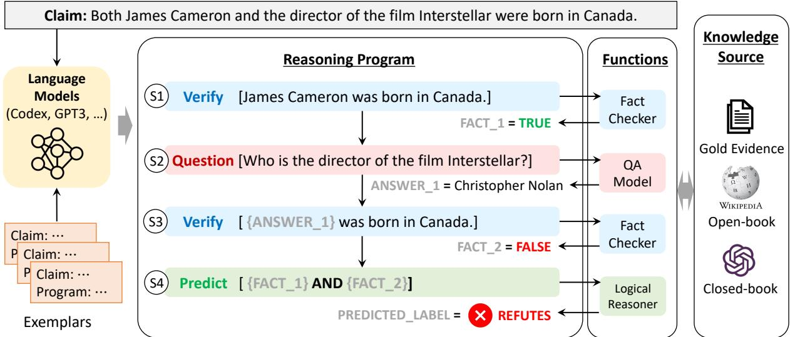
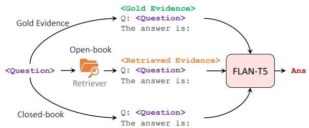

<span id="page-0-0"></span>
# Fact-Checking Complex Claims with Program-Guided Reasoning

Liangming Pan1,2 Xiaobao Wu3 Xinyuan Lu4 Anh Tuan Luu3 William Yang Wang1 Min-Yen Kan4 Preslav Nakov2

1 University of California, Santa Barbara 2 MBZUAI

3 Nanyang Technological University 4 National University of Singapore

kanmy@comp.nus.edu.sg preslav.nakov@mbzuai.ac.ae

## Abstract

Fact-checking real-world claims often requires collecting multiple pieces of evidence and applying complex multi-step reasoning. In this paper, we present Program-Guided Fact-Checking (PROGRAMFC), a novel factchecking model that decomposes complex claims into simpler sub-tasks that can be solved using a shared library of specialized functions. We first leverage the in-context learning ability of large language models to generate reasoning programs to guide the verification process. Afterward, we execute the program by delegating each sub-task to the corresponding sub-task handler. This process makes our model both explanatory and data-efficient, providing clear explanations of its reasoning process and requiring minimal training data. We evaluate PRO-GRAMFC on two challenging fact-checking datasets and show that it outperforms seven fact-checking baselines across different settings of evidence availability, with explicit output programs that benefit human debugging.1

## 1 Introduction

The proliferation of disinformation, e.g., in social media, has made automated fact-checking a crucial application of natural language processing (NLP). Given a claim, the goal is to find evidence and then to make a verdict about the claim’s veracity based on that evidence (Thorne and Vlachos, 2018; Glockner et al., 2022; Guo et al., 2022).

Evaluating the veracity of real-world claims often involves collecting multiple pieces of evidence and applying complex reasoning (Jiang et al., 2020; Nguyen et al., 2020; Aly and Vlachos, 2022; Chen et al., 2022a). For instance, consider the claim “Both James Cameron and the director of the film Interstellar were born in Canada”. It may be challenging to find direct evidence on the web that refutes or supports this claim.

Instead, a human fact-checker needs to decompose the claim, gather multiple pieces of evidence, and perform step-by-step reasoning (Nakov et al., 2021a), as illustrated in Figure 1. This makes verifying complex claims much more challenging than the typical setting explored in previous work, where information from a single article is sufficient to support/refute the claim (Thorne et al., 2018; Saakyan et al., 2021; Schuster et al., 2021; Pan et al., 2021; Wadden et al., 2022a; Krishna et al., 2022).

Besides multi-step reasoning, we still need to consider two key aspects for developing a reliable fact-checking system: (i) Explanability: The model should not only predict the veracity of the claim, but it should also provide a clear explanation of its reasoning process to help users understand and trust the results. (ii) Data efficiency: Human annotation is often time-consuming, costly, and potentially biased, making it difficult to collect sufficient highquality labeled data for model training, particularly for complex claims. Therefore, it is desirable to build a model that can perform well with minimal or no training data. Despite a few models (Zhou et al., 2019; Zhong et al., 2020; Aly and Vlachos, 2022) being proposed to facilitate multi-step reasoning in fact-checking, they either lack explainability in their reasoning process or require a large number of task-specific training examples.

In this paper, we present Program-Guided Fact-Checking (PROGRAMFC), a novel fact-checking framework that is both explanatory and dataefficient. Figure 1 illustrates our approach. To verify complex claims, PROGRAMFC decomposes them into simpler sub-tasks that can be solved using a shared library of specialized sub-task functions. To be specific, PROGRAMFC begins by generating a reasoning program for the input claim, which is a sequence of sub-tasks (e.g., S1-S4 in Figure 1) in the form of ACTION[ARGUMENT], where ACTION and ARGUMENT define the type and the content of the sub-task, respectively.

<span id="page-1-0"></span>
Figure 1: Overview of our PROGRAMFC model, which consists of two modules: (i) Program Generation generates a reasoning program for the input claim using Codex with in-context learning, and then (ii) Program Execution sequentially interprets the program by delegating each step to the corresponding sub-task function.


> **AI Description:**
> **Source:** `assets/_page_1_Figure_0.jpg`
> 
> **Generated:** 2026-05-15 22:07:34
> 
> ---
> 
> The image is a flowchart illustrating a reasoning process for evaluating a claim. It includes a claim about James Cameron and the director of the film "Interstellar" being born in Canada. The flowchart outlines the steps of a reasoning program, which involves verifying facts, asking questions, and predicting the outcome. Key components include:
> 
> 1. **Claim**: Both James Cameron and the director of the film Interstellar were born in Canada.
> 2. **Reasoning Program Steps**:
>    - **S1**: Verify James Cameron was born in Canada (Fact 1 = TRUE).
>    - **S2**: Question: Who is the director of the film Interstellar? (Answer 1 = Christopher Nolan).
>    - **S3**: Verify Christopher Nolan was born in Canada (Fact 2 = FALSE).
>    - **S4**: Predict: {Fact 1} AND {Fact 2} (Predicted Label = REFUTES).
> 
> The flowchart also references functions such as a Fact Checker, QA Model, Logical Reasoner, and Knowledge Source (Gold Evidence, Wikipedia, Open-book, Closed-book). The image uses color coding to differentiate between steps, facts, and predictions, making the flow of the reasoning process clear and easy to follow.


The generated reasoning program serves as a step-by-step guide for verifying the claim. We then execute the program by sequentially delegating each sub-task to the corresponding sub-task handler, as shown in the functions columns in Figure 1. These sub-tasks may include answering questions, verifying simple claims, or conducting logical reasoning.

PROGRAMFC combines explainability with data efficiency. It uses reasoning programs to provide clear explanations of its reasoning process. For data efficiency, Large Language Models (LLMs) can solve various tasks given only a few examples as prompts, e.g., in-context learning (Brown et al., 2020). We leverage this ability of LLMs to generate reasoning programs for a given claim by showing the model just a few dozen of (claim, program) pairs as demonstrations. PROGRAMFC is also flexible as it allows for easy swapping of subtask function implementations to work under different settings of fact-checking, without affecting the rest of the system. We can allow the functions to retrieve information from external sources (in an open-book setting) or we can ask them to generate answers based solely on the LLM’s internal parametric knowledge (in a closed-book setting).

We evaluate PROGRAMFC on two challenging datasets designed for fact-checking complex claims: HOVER (Jiang et al., 2020) and FEVER-OUS (Aly et al., 2021), and we show that it outperforms seven few-shot fact-checking baselines on both datasets (§ 4.1).

The strategy of program-guided reasoning becomes increasingly effective as the required reasoning depth increases (§ 4.1). In the open-domain setting, we find that reasoning programs can enhance the retrieval of relevant evidence from knowledge sources (§ 4.2). Moreover, PROGRAMFC is robust even when we use weak models as sub-task solvers (§ 4.2). We also evaluate the interpretability of the reasoning programs through human evaluation and error analysis (§ 4.3).

## 2 Related Work

Fact-Checking. Automated fact-checking has gained significant attention in the NLP research community in recent years as a means of combating misinformation and disinformation. Various datasets have been proposed that enable the development and the evaluation of systems for automatic fact-checking, the most popular ones being based on human-crafted claims from Wikipedia content (Thorne et al., 2018; Sathe et al., 2020; Schuster et al., 2021) and naturally occurring claims in the political or in the scientific domain (Wang, 2017; Nakov et al., 2021b, 2022; Augenstein et al., 2019; Saakyan et al., 2021; Gupta and Srikumar, 2021; Wadden et al., 2020, 2022a). Notably, most of these datasets are constructed in a way that the evidence to support or to refute a claim can be found in a single document. For example, in FEVER (Thorne et al., 2018), more than 87% of the claims only require information from a single Wikipedia article (Jiang et al., 2020).

<span id="page-2-0"></span>
To bridge this gap, datasets have been proposed to study fact-checking complex claims that require multi-step reasoning (Jiang et al., 2020; Aly et al., 2021). Graph-based models (Zhou et al., 2019; Liu et al., 2020; Zhong et al., 2020; Nguyen et al., 2020; Barnabò et al., 2022, 2023) are used to facilitate the reasoning over multiple pieces of evidence. Although such models achieve sizable performance gains, they lack explanability and thet rely on large amounts of training data. To address the above problems, we propose an explainable, flexible, and data-efficient model that generates reasoning graphs as explanations and utilizes incontext learning to enable few-shot learning.

Explanation Generation. Facing the complexities of real-world claims, simply giving a final veracity to a claim often fails to be persuasive (Guo et al., 2022). Previous research has proposed various approaches to provide post-hoc explanations for model predictions, such as using attention weights to highlight relevant parts of the evidence (Popat et al., 2017; Cui et al., 2019; Yang et al., 2019; Lu and Li, 2020), generating justifications with logic-based systems based on knowledge graphs (Gad-Elrab et al., 2019; Ahmadi et al., 2019), and generating a summary of the retrieved relevant evidence (Atanasova et al., 2020; Kotonya and Toni, 2020; Jolly et al., 2022). In contrast, we propose to use reasoning programs to provide explanations that consist of sub-tasks described in a program-like natural language. This offers several advantages: it allows for explanations that are not confined to the evidence, like attention weights, it is more flexible than logic-based explanations, and it is more concise than free-form summarization.

Chain-of-Thought Reasoning. Moreover, unlike previous work that generates post-hoc explanations, we also use reasoning programs as guidance for predicting the veracity of the claim. This is motivated by the recent success of chain-of-thought prompting (CoT) (Wei et al., 2022; Kojima et al., 2022; Wang et al., 2022), which generates step-bystep natural language reasoning steps to guide the model in answering complex questions. We adopt this idea to fact-checking complex claims. Unlike the original CoT, which uses a single LLM for both decomposition and question answering, we use the language model only to generate reasoning programs as the blueprint for problem-solving, and we delegate each sub-task to specialized functions.

This approach reduces the burden on the language model and allows for more flexibility in incorporating necessary components for factchecking such as an evidence retriever. The strategy of program-guided reasoning is also in line with the recent trend of tool-augmented language models (Mialon et al., 2023; Schick et al., 2023), i.e., augmenting language models with access to external tools and resources.

## 3 PROGRAMFC

We first formulate the problem of fact-checking and then we introduce our proposed model for Program-Guided Fact-Checking (PROGRAMFC).

## 3.1 Problem Formulation

Given a claim C, a fact-checking model  aims to predict a label Y to evaluate the claim as TRUE or FALSE, based on a knowledge source . The model is also required to output an explanation E to justify the predicted veracity label. We summarize three different settings of fact-checking depending on the type of knowledge source .

Gold evidence: For each claim, is the set of gold evidence documents that can support or refute the claim. This setting is also called claim verification (Pan et al., 2021; Wright et al., 2022). Open-book setting:  is a large textual corpus such as Wikipedia. The model first retrieves relevant evidence from the corpus and then predicts the veracity label based on the evidence (Jiang et al., 2021; Wadden et al., 2022b).

Closed-book setting: The model does not have access to any external knowledge source ( = ). It needs to leverage the knowledge stored in its parameters (acquired during pre-training and finetuning) to verify the claim. This setting was explored in work that applies large language models for fact-checking (Lee et al., 2020, 2021).

## 3.2 Program-Guided Reasoning

Our goal is to fact-check a complex claim C that requires multi-step reasoning. We focus on the fewshot setting, where only a small set of in-domain examples are available to teach the model. To solve this, PROGRAMFC follows a program generationand-execution paradigm, as shown in Figure 1.

Program Generation. At this stage, given the input claim C, a planner P generates a reasoning program $P = [ S _ { 1 } , \cdots , S _ { n } ]$ for it, which consists of n sequentially ordered reasoning steps $S _ { i }$

<span id="page-3-0"></span>
Each reasoning step $S _ { i } ~ \in ~ P$ is an instruction in controlled natural language that directs $S _ { i }$ to a function in an auxiliary set of sub-task functions $\mathcal { F }$ available to the system. To be specific, we define ${ \cal S } _ { i } \ : = \ : ( f _ { i } , { \cal A } _ { i } , V _ { i } )$ , where $f _ { i }$ specifies the sub-task function $f _ { i } \in \mathcal { F } , A _ { i }$ is the argument passed to the function $f _ { i } ,$ and $V _ { i }$ is the variable that stores the returned result from the function call $f _ { i } ( A _ { i } )$ . For a valid reasoning program, the return value of the last reasoning step must be a Boolean value indicating the veracity label of the claim $C$ $i . e . , V _ { n } \in \{ \mathrm { T R U E } , \mathrm { F A L S E } \}$ ·

Program Execution. In the execution stage, the reasoning program $P$ is run by an interpreter to derive the veracity label of the claim $C .$ The interpreter sequentially parses the reasoning steps in $P .$ For each step $S _ { i } = ( f _ { i } , A _ { i } , V _ { i } )$ , it calls the corresponding off-the-shelf sub-task function $f _ { i }$ and passes the argument $A _ { i }$ to it. The argument $A _ { i }$ is either a logical expression or a natural language sentence, e.g., a question or a simple claim. The result of the function call is then stored in the variable $V _ { i }$ $\mathbf { A } \mathbf { s }$ it is common for a subsequent step to depend on the results from previous steps, we allow the argument $A _ { i }$ to refer to variables $V _ { 1 } , \cdots , V _ { i - 1 }$ in previous steps. For example, in Figure 1, the argument in $S _ { 3 } \mathrm { i s } \ ^ { \mathrm { * } } \langle A N S W E R \_ I \ - I \ -$ was born in Canada.”, which refers to the return variable {ANSWER\_1} from $S _ { 2 }$ . When executing $S _ { 3 }$ , the variable is replaced by its actual value, and the argument becomes “Christopher Nolan was born in Canada”. After executing the last step, the return value is the predicted veracity of the claim C.

Aggregating Reasoning Paths. Note that there might be multiple reasoning paths that can reach the final veracity label. Therefore, we generate a diverse set of N candidate reasoning programs $\mathcal { P } = \{ P _ { 1 } , \cdots , P _ { N } \}$ for the input claim. After executing all programs in $\mathcal { P }$ , we take the majority vote over all N predicted labels as the final label. This approach is similar to how humans rely on multiple methods of validation to increase their confidence in fact-checking. It also makes the model less susceptible to errors in individual reasoning programs.

## 3.3 Reasoning Program Generation

We base our program generator on Codex (Chen et al., 2021), a code-pretrained LLM, which can parse natural language into symbolic representations such as SQL (Cheng et al., 2022) or Python programs (Gao et al., 2022; Chen et al., 2022b).

However, the grammar of a reasoning program is different from the grammar of a programming language. We take advantage of Codex’s few-shot generalization ability and we find that it can learn effectively from only a small number of in-context examples $\mathcal { D } = \{ d _ { 1 } , \cdots , d _ { | D | } \}$ . Each example $d _ { i }$ consists of a claim and a program. The program has a Python-like grammar, where each reasoning step is written in the format $V _ { i } = f _ { i } ( A _ { i } )$ . At inference time, we prompt Codex with an instruction of the task, K in-context examples, and the input claim C. Codex then attempts to complete the following texts, and thereby generates a program for C. The prompt template is shown in Figure 2. We use $K = 2 0$ to maintain a tradeoff between the diversity of reasoning types and the model’s maximum input capacity. We use sampling-based decoding (temperature of 0.7) to generate different reasoning programs for multiple runs.

## 3.4 Sub-Task Functions

We implement three sub-task functions for the model to call during the program execution.

• QUESTION: This sub-task function is a questionanswering module that takes a question $Q$ as the input argument and returns the answer A to the question. We use FLAN-T5 (Chung et al., 2022), an improved T5 model (Raffel et al., 2020) pretrained on more than 1.8K tasks with instruction tuning, which has achieved state-of-the-art zero/few-shot performance on many QA benchmarks. As shown in Figure 3, we prompt the model differently depending on the settings defined in Section 3.1. For the closed-book setting, the input prompt is

Q: QUESTION ? The answer is:

For the other two settings, the input prompt is

```
EVIDENCE Q: QUESTION ?   
The answer is:
```

• VERIFY: This is a fact verification module that takes a claim C as the input argument and returns a label of either TRUE or FALSE. We also use FLAN-T5 for this module, by prompting the model with the following question-answering format.

```
EVIDENCE   
Q: Is it true that CLAIM ?   
True or False? The answer is:
```

• PREDICT: This module takes as input a logical expression that performs AND, OR, NOT operations over the variables in the previous steps. Its output is returned as the predicted veracity label.

<span id="page-4-0"></span>
Figure 2: The Codex prompt template used to generate reasoning programs, consisting of a task instruction, in-context examples, and a prompt for the <input\_claim>. The full templates are given in Appendix D.
```
```python
''' Generate a python - like program that describes the reasoning steps
required to verify the claim step -by - step . You can call three functions
in the program : 1. Question () to answer a question ; 2. Verify () to
verify a simple claim ; 3. Predict () to predict the veracity label . '
# The claim is that Both James Cameron and the director of the film
Interstellar were born in Canada .
def program () :
fact_1 = Verify (" James Cameron was born in Canada .")
Answer_1 = Question (" Who is the director of the film Interstellar ?")
fact_2 = Verify ("{ Answer_1 } was born in Canada .")
label = Predict ( fact_1 and fact_2 )
(· · · more in-context examples here · · ·)
# The claim is that <input_claim>
def program () :
```
```

Figure 3: Implementation of the question-answering sub-task function for three different settings.


> **AI Description:**
> **Source:** `assets/_page_4_Figure_0.jpg`
> 
> **Generated:** 2026-05-15 22:08:22
> 
> ---
> 
> The image is a flowchart depicting a process involving a question-answering system. It includes three main components: a retriever, a FLAN-T5 model, and two types of evidence - "Gold Evidence" and "Retrieved Evidence." The flowchart shows the interaction between these components as follows:
> 
> 1. The retriever takes a question as input and retrieves evidence from a database.
> 2. The retrieved evidence is then fed into the FLAN-T5 model.
> 3. The FLAN-T5 model processes the retrieved evidence and generates an answer.
> 4. The process is shown in two scenarios: "Open-book" where the retriever has access to the database, and "Closed-book" where it does not.
> 
> The flowchart uses arrows to represent the flow of information and decision points, with labels such as "Gold Evidence," "Retrieved Evidence," "Question," and "Answer" to clarify the steps and inputs involved in the process.


## 4 Experiments

Datasets. Most fact-checking datasets consist primarily of simple claims that can be substantiated through a single piece of evidence. However, here we focus on complex claims that need multi-step reasoning. Given this context, we opt to evaluate our model on the only two datasets that, to the best of our knowledge, fulfill these criteria: HOVER (Jiang et al., 2020) and FEVEROUS (Aly et al., 2021). We use the validation sets for evaluation since the test sets are not publicly released. HOVER contains claims that require integration and reasoning over multiple Wikipedia articles. We divide its validation set into three subsets based on the number of “hops” required to verify the claim: 1,126 two-hop claims, 1,835 three-hop claims, and 1,039 four-hop claims. FEVEROUS focuses on fact-checking complex claims over unstructured and structured data, where each claim is annotated with evidence in the form of sentences and/or cells from tables in Wikipedia. Since we focus on textual fact-checking, we only selected claims that require exclusively sentence evidence, constituting 2,962 claims. We call this subset FEVEROUS-S.

For evaluation in the open-book setting, we use the corresponding Wikipedia corpus constructed for these two datasets as the knowledge sources. HOVER uses the October 2017 Wikipedia dump processed by Yang et al. (2018), consisting of the introductory sections of 5.2 million Wikipedia pages. FEVEROUS uses the December 2020 dump, including 5.4 million full Wikipedia articles.

Baselines. We compare PROGRAMFC to seven baselines, categorized into three groups. (i) Pretrained models: BERT-FC (Soleimani et al., 2020) and LisT5 (Jiang et al., 2021) are two models that leverage BERT and T5 for fact verification, respectively. (ii) FC/NLI fine-tuned models: we choose three pretrained models that are fine-tuned on other fact-checking datasets or natural language inference (NLI) datasets. RoBERTa-NLI (Nie et al., 2020) uses fine-tuned RoBERTa-large on four NLI datasets; DeBERTaV3-NLI (He et al., 2021) finetunes the DeBERTaV3 model on 885,242 (claim, evidence, label) annotations from FEVER and four NLI datasets. MULTIVERS (Wadden et al., 2022b) is a LongFormer (Beltagy et al., 2020) model finetuned on FEVER. (iii) In-context learning models: one baseline is that we directly use the FLAN-T5 model in our VERIFY module for fact-checking. The other baseline uses the in-context learning of Codex for few-shot fact-checking. The implementation details are given in Appendix A.

Few-Shot Learning. We study few-shot learning where only a few in-domain examples are available. Therefore, for a fair comparison, we restrict all models to have access to only 20 examples from HOVER or FEVEROUS-S.

<span id="page-5-0"></span>
Table 1: Macro-F1 scores of PROGRAMFC (IV) and baselines (I-III) on the evaluation set of HOVER and FEVEROUS-S for few-shot fact-checking. Gold and Open represent the gold evidence setting and the open book setting, respectively. I: pretrained Transformers; II: FC/NLI fine-tuned models; III: in-context learning models.


We use these examples either for fine-tuning pre-trained models (BERT-FC and LisT5), for continuous fine-tuning the FC/NLI fine-tuned models, or as in-context examples for FLAN-T5 and Codex. For PROGRAMFC, we use them as in-context examples for reasoning program generation.

We evaluate both the gold evidence setting and the open-book setting. The baseline models are the same for both settings. However, during testing in the open-book setting, the models are given the retrieved evidence rather than the ground-truth evidence. We use BM25 (Robertson and Zaragoza, 2009) implemented with the Pyserini toolkit (Lin et al., 2021) as the retriever for both PROGRAMFC and the baselines. We use as evidence the top-10 paragraphs retrieved from the knowledge corpus.

## 4.1 Main Results

We report the overall results for PROGRAMFC and for the baselines for few-shot fact-checking in Table 1. PROGRAMFC achieves the best performance on 7 out of 8 evaluations, demonstrating its effectiveness. We have three more specific observations.

## ProgramFC is more effective on deeper claims.

On the HOVER dataset, ProgramFC (N=5) outperforms the baselines on average by 10.38%, 11.37%, and 14.77% on two-hop, three-hop, and four-hop claims, respectively. This suggests that ProgramFC becomes increasingly effective as the required reasoning depth increases. Among the baselines, DeBERTaV3-NLI performs comparably to ProgramFC on two-hop claims, indicating that large-scale pre-training on simpler claims can help the model generalize to more complex claims.

However, this generalization becomes more challenging as the complexity of the claims increases. On HOVER, the F1 score of DeBERTaV3-NLI drops from 77.22 for 2-hop claims to 60.49 for 4-hop claims, which is a decrease of 21.7%. In contrast, the performance drop for ProgramFC, which uses the strategy of program-guided reasoning, is much smaller: just 11.7%.

Decomposition is more effective than one-step prediction. The ProgramFC model, which uses the same FLAN-T5 model as the sub-task functions, outperforms the baseline of directly verifying claims with FLAN-T5 on all four datasets. On average, there is a 6.0% improvement in the gold evidence setting and a 4.5% improvement in the open-book setting. This suggests that decomposing a complex claim into simpler steps with a program can facilitate more accurate reasoning. This is especially evident when the required reasoning is complex: there is a 14.9% improvement in the gold evidence setting and a 6.7% improvement in the open-book setting for 4-hop claims.

## Aggregating reasoning programs is helpful.

We find that aggregating the predictions of N = 5 reasoning programs improves the performance over using a single program by an average of 1.5%. This aligns with the findings of Wang et al. (2022), where the idea was applied for question answering: if multiple different ways of thinking lead to the same answer, we can have greater confidence that the final answer is correct. This intuition also applies to fact-checking, as each program represents a unique reasoning chain to verify the claim.

<span id="page-6-0"></span>

### Full Page Description (Page 6)

**Source:** `assets/_page_6_Asset_2.jpg`

**Generated:** 2026-05-15 22:07:43

---

The image is a line graph comparing the performance of two models, FLAN-T5 and ProgramFC, across different model sizes (80M, 250M, 780M, 3B, and 11B) on the HOVER (4-hop) task. The x-axis represents the model sizes in millions, while the y-axis represents the performance score. The graph shows that ProgramFC consistently outperforms FLAN-T5 across all model sizes. The highest performance for ProgramFC is around 68.37 at the 250M model size, and for FLAN-T5, it is around 63.39 at the 11B model size. The graph includes data points with corresponding performance scores for each model size.


### Full Page Description (Page 6)

**Source:** `assets/_page_6_Asset_3.jpg`

**Generated:** 2026-05-15 22:07:52

---

The image is a bar chart comparing the performance of two methods, "One-step Retrieval" and "ProgramFC," across three datasets: HOVER (2-hop), HOVER (3-hop), HOVER (4-hop), and FEVEROUS-S. The y-axis represents the performance metric, and the x-axis lists the datasets. The chart shows that ProgramFC generally outperforms One-step Retrieval across all datasets, with the largest difference observed in the FEVEROUS-S dataset, where ProgramFC achieves a score of 85.65 compared to One-step Retrieval's 76.25.


### Full Page Description (Page 6)

**Source:** `assets/_page_6_Asset_0.jpg`

**Generated:** 2026-05-15 22:08:11

---

The image is a line graph comparing the performance of two models, FLAN-T5 and ProgramFC, across different model sizes in millions (80M, 250M, 780M, 3B, 11B). The x-axis represents the model size in millions, and the y-axis represents the performance metric, which is not explicitly defined but appears to be a score. The graph shows that ProgramFC consistently outperforms FLAN-T5 across all model sizes. The performance scores for ProgramFC range from 64.35 to 77.62, while FLAN-T5 scores range from 47.75 to 77.07. The graph also includes a label "HOVER (2-hop)" at the top right corner, suggesting that the performance metric might be related to a 2-hop task.


### Full Page Description (Page 6)

**Source:** `assets/_page_6_Asset_1.jpg`

**Generated:** 2026-05-15 22:08:01

---

The image is a line graph comparing the performance of two models, FLAN-T5 and ProgramFC, across different model sizes (80M, 250M, 780M, 3B, and 11B). The y-axis represents a metric, likely accuracy or performance, ranging from 40 to 80. The x-axis represents the model size in millions. The graph shows that ProgramFC consistently outperforms FLAN-T5 across all model sizes, with the gap between the two models widening as the model size increases. The highest performance for ProgramFC is around 69.56, while the highest for FLAN-T5 is around 66.89. The graph includes a label "HOVER (3-hop)" in the top right corner, which might indicate the context or application of the models.

## 4.2 How Does the Reasoning Program Help?

To further understand how reasoning programs facilitate fact-checking, we compare the performance of PROGRAMFC with FLAN-T5 using different language model sizes: small, base, large, XL, and XXL. The results are shown in Figure 4 and indicate that program-guided reasoning is particularly effective when the model size is small. As smaller models have less capacity for complex reasoning, the performance of the end-to-end FLAN-T5 model decreases significantly with decreasing model size. However, this trend is less notable for PROGRAMFC. The high-level reasoning plan offered by reasoning programs substantially alleviates the demands on the subsequent subtask solvers. Our results show that the programguided model using FLAN-T5-small (80M parameters) as sub-task solvers can achieve comparable performance to the 137x larger FLAN-T5-XXL (11B) model with end-to-end reasoning for 4-hop claims.

In the open-domain setting, we find that reasoning programs can enhance the retrieval of relevant evidence from the knowledge source. Figure 5 compares the retrieval performance of the one-step BM25 retriever used in the baselines to the iterative step-by-step BM25 retriever in PROGRAMFC.

We measure the recall of the gold paragraphs for the top-10 retrieved paragraphs (recall@10). For PROGRAMFC, we combine the retrieved paragraphs of all steps and we consider the top-10 results. We can see in Figure 5 that PROGRAMFC outperforms one-step retrieval on all datasets, with the largest improvement of 37.1% on HOVER 4- hop. This is because some information may not be present in the original claim, but is only revealed during the reasoning process (e.g., “Christopher Nolan” in Figure 1). Thus, iterative retrieval guided by the reasoning program yields better results.

## 4.3 Interpretability of Reasoning Programs

An advantage of PROGRAMFC is that it improves the interpretability of fact-checking compared to end-to-end models, as the explicit program can aid human understanding and debugging. Examples of generated reasoning programs can be found in Figure 7 of Appendix B. To assess the quality of the generated reasoning programs, we sampled 300 claims where PROGRAMFC incorrectly predicted the final veracity labels from the HOVER 2-hop, 3-hop, and 4-hop datasets, with 100 examples per dataset. We asked human annotators to analyze the error types and we classified the results into three categories: (i) Syntactic errors, where the program does not conform to the defined grammar and cannot be parsed, (ii) Semantic errors, which include incorrect or missing arguments/variables (Token), incorrect program structure (Structure), and incorrect sub-task calls (Subtask), and (iii) Incorrect execution, where the program is correct, but where the incorrect prediction is a result of its execution.

We show the error analysis in Table 2. First, no syntax errors were found in our samples, indicating that Codex effectively generates executable programs through few-shot in-context learning.

<span id="page-7-0"></span>
Figure 6: An error case from the HOVER 4-hop dataset where the generated reasoning program has an incorrect program structure. The incorrect segment(s) are marked in red, and the correct revisions are marked in green.
```
Claim:   
Emery, located in the same state as Edison Local School District, is a ghost town. It is near the   
city that lies close to the Ohio Turnpike, a 241.26 mi highway.   
Predicted Program:   
answer\_1 = Question("Which state is Emery located in?")   
answer\_2 = Question("Which state is Edison Local School District located in?")   
fact\_1 = Verify("{answer\_1} and {answer\_2} are the same state.")   
fact\_2 = Verify("Emery is a ghost town.")   
answer\_3 = Question("Which city is near Emery?")   
answer\_4 = Question("Which city lies close to the Ohio Turnpike, a 241.26 mi highway?")   
fact\_3 = Verify("{answer\_3} is near {answer\_4}.") fact\_3 = Verify(“Emery is near {answer\_4}.”)   
label = Predict(fact\_1 and fact\_2 and fact\_3)
```

Table 2: Reasoning program evaluation for incorrectlypredicted examples from each hop length in HOVER.


Second, for 2-hop claims, we find that 71% of the programs are correct. The majority of the errors are the result of incorrect program execution, where the question answering or the fact-checking modules failed to return the correct answer.

Third, as the complexity of the claims increases, the proportion of semantic errors in the programs also increases, with structural errors becoming particularly prevalent. This highlights the difficulty of generating the appropriate step-by-step reasoning strategies for claims that require long-chain reasoning. An example structural error is shown in Figure 6, where the model fails to parse the second sentence of the claim into correct program instructions. Additional error examples can be found in Appendix C.

## 4.4 Closed-Book Fact-Checking

Finally, we evaluate the closed-book setting, where the model does not have access to any knowledge source and needs to rely on its parametric knowledge only. The baseline models from groups I and II in Table 1 are trained with (evidence, claim) pairs and thus are not applicable in this setting. We compare our method to the baselines that use large language models for in-context learning, including Codex (code-davinci-002) and FLAN-T5 from Table 1.

Table 3: Closed-book setting: macro-F1 scores for PRO-GRAMFC and for the baselines.


We also include the 175B-parameter Instruct-GPT (text-davinci-002) (Ouyang et al., 2022) with four different prompts: (i) direct prompting with the claim, (ii) CoT (Wei et al., 2022) or chain-of-thought prompting with demonstrations, (iii) ZS-CoT (Kojima et al., 2022) or zero-shot chain-of-thought with the prompt “let’s think step by step”, and (iv) Self-Ask (Press et al., 2022), which is a variant of CoT that guides the model reasoning by asking a series of questions. The detailed prompting templates are given in Appendix E.

Our results, presented in Table 3, show that most models achieve a Macro-F1 score only slightly above random guessing on the HOVER dataset, indicating the difficulty of solely relying on parametric knowledge of large language models for fact-checking complex claims. Similar to the observations in Section 4.1, we see a trend of improved performance as the number of the required reasoning hops increases. Chain-of-thought prompting scores an average 2.7 points higher than direct prompting, highlighting the importance of stepby-step reasoning for complex fact-checking. It outperforms our PROGRAMFC on HOVER 2-hop and FEVEROUS but performs worse on HOVER

<span id="page-8-0"></span>
3-hop and 4-hop.

This can be due to CoT generating free-form explanations, which can lead to unpredictable errors in long reasoning chains. In contrast, our program generation-and-execution strategy is more stable for longer reasoning chains.

## 5 Conclusion and Future Work

We proposed PROGRAMFC, a few-shot neurosymbolic model for fact-checking that learns to map input claims to a reasoning program consisting of a sequence of sub-task function calls for answering a question, for fact-checking a simple claim, and for computing a logical expression. Then factchecking is performed by executing that program. PROGRAMFC combines the advantages of symbolic programs, such as explainability, with the flexibility of end-to-end neural models. Using Codex as the program generator, PROGRAMFC demonstrates promising performance on HOVER and FEVEROUS with only a small number of incontext demonstrations and no additional training. We also investigated the impact of model size and the benefits of programs for retrieval, and we analyzed the errors. The results indicated that PRO-GRAMFC effectively balances model capability, learning efficiency, and interpretability.

In future work, we want to adapt PROGRAMFC to more real-world fact-checking scenarios, such as fake news detection and multi-modal fact-checking, with advanced reasoning program design and subtask functionalities.

## Limitations

We identify two main limitations of PROGRAMFC. First, despite being complex in their surface form, the claims in the HOVER and FEVEROUS datasets mostly require only explicit multi-step reasoning, i.e., the decomposition can be derived from the claim’s syntactic structure or how the claim is framed. This lowers the difficulty of generating reasoning programs. However, for many real-world complex claims, the reasoning is often implicit. For example, for the claim “Aristotle couldn’t have used a laptop”, the reasoning program is:

answer\_1 = Question(“When did Aristotle live?”); answer\_2 = Question(“When was the laptop invented?”);

fact\_1 = Verify(“answer\_1 is before answer\_2.”); label = Predict(fact\_1)

Generating reasoning programs for such implicit complex claims requires a deeper understanding of the claim and also access to world and commonsense knowledge. We conducted preliminary experiments on these types of claims, but we found that our Codex-based generator struggled to produce a correct reasoning program. This highlights the gap in applying our PROGRAMFC to fact-check real-world claims. Addressing these challenges is an important direction for future work.

Second, PROGRAMFC incurs a higher computational cost than baseline end-to-end fact-checking models. It requires calling large language models for program generation and further calling multiple sub-task models. This results in the actual computational time that is 4–5 higher than for an endto-end FLAN-T5 model. Developing more efficient methods for program generation and execution is an important direction for future work.

## Ethics Statement

Biases. We note that there might be some biases in the data used to train the LLMs, as well as in factuality judgments. Both are beyond our control.

Intended Use and Misuse Potential. Our models can be of interest to the general public and could also save a lot of time to human fact-checkers. However, they could also be misused by malicious actors. We ask researchers to exercise caution.

Environmental Impact. The use of large language models requires a significant amount of energy for computation for training, which contributes to global warming. Our work performs fewshot in-context learning instead of training models from scratch, so the energy footprint of our work is less. The large language model (Codex) whose API we use for inference consumes significant energy.

## Acknowledgements

This work was supported in part by the National Science Foundation award #2048122 and by Singapore’s Ministry of Education Tier 3 grant “Digital Information Resilience: Restoring Trust and Nudging Behaviours in Digitalisation”. The views expressed are those of the authors and do not reflect the official policy or position of the US government. We thank Alex Mei, Xinyi Wang, Danqing Wang, Sharon Levy, Gyuwan Kim, and other members of the UCSB NLP group for their valuable feedback.

<span id="page-9-0"></span>
## References

- Naser Ahmadi, Joohyung Lee, Paolo Papotti, and Mohammed Saeed. 2019. Explainable fact checking with probabilistic answer set programming. In Proceedings of the Truth and Trust Online Conference (TTO), London, UK.
- Rami Aly, Zhijiang Guo, Michael Sejr Schlichtkrull, James Thorne, Andreas Vlachos, Christos Christodoulopoulos, Oana Cocarascu, and Arpit Mittal. 2021. FEVEROUS: Fact Extraction and VERification Over Unstructured and Structured information. In Proceedings of the Neural Information Processing Systems (NeurIPS) Track on Datasets and Benchmarks, Online.
- Rami Aly and Andreas Vlachos. 2022. Natural logicguided autoregressive multi-hop document retrieval for fact verification. In Proceedings of the 2022 Conference on Empirical Methods in Natural Language Processing (EMNLP), pages 6123–6135, Abu Dhabi, United Arab Emirates.
- Pepa Atanasova, Jakob Grue Simonsen, Christina Lioma, and Isabelle Augenstein. 2020. Generating fact checking explanations. In Proceedings of the 58th Annual Meeting of the Association for Computational Linguistics (ACL), pages 7352–7364, Online.
- Isabelle Augenstein, Christina Lioma, Dongsheng Wang, Lucas Chaves Lima, Casper Hansen, Christian Hansen, and Jakob Grue Simonsen. 2019. MultiFC: A real-world multi-domain dataset for evidencebased fact checking of claims. In Proceedings of the 2019 Conference on Empirical Methods in Natural Language Processing and the 9th International Joint Conference on Natural Language Processing (EMNLP-IJCNLP), pages 4685–4697, Hong Kong, China.
- Giorgio Barnabò, Federico Siciliano, Carlos Castillo, Stefano Leonardi, Preslav Nakov, Giovanni Da San Martino, and Fabrizio Silvestri. 2022. FbMultiLingMisinfo: Challenging large-scale multilingual benchmark for misinformation detection. In Proceedings of the 2022 International Joint Conference on Neural Networks (IJCNN), pages 1–8, Padova, Italy.
- Giorgio Barnabò, Federico Siciliano, Carlos Castillo, Stefano Leonardi, Preslav Nakov, Giovanni Da San Martino, and Fabrizio Silvestri. 2023. Deep active learning for misinformation detection using geometric deep learning. Online Social Networks and Media, 33:100244.
- Iz Beltagy, Matthew E. Peters, and Arman Cohan. 2020. Longformer: The long-document transformer. ArXiv preprint, abs/2004.05150.
- Samuel R. Bowman, Gabor Angeli, Christopher Potts, and Christopher D. Manning. 2015. A large annotated corpus for learning natural language inference. In Proceedings of the 2015 Conference on Empirical
- Methods in Natural Language Processing (EMNLP), pages 632–642, Lisbon, Portugal.
- Tom B. Brown, Benjamin Mann, Nick Ryder, Melanie Subbiah, Jared Kaplan, Prafulla Dhariwal, Arvind Neelakantan, Pranav Shyam, Girish Sastry, Amanda Askell, Sandhini Agarwal, Ariel Herbert-Voss, Gretchen Krueger, Tom Henighan, Rewon Child, Aditya Ramesh, Daniel M. Ziegler, Jeffrey Wu, Clemens Winter, Christopher Hesse, Mark Chen, Eric Sigler, Mateusz Litwin, Scott Gray, Benjamin Chess, Jack Clark, Christopher Berner, Sam McCandlish, Alec Radford, Ilya Sutskever, and Dario Amodei. 2020. Language models are few-shot learners. In Proceedings of the Annual Conference on Neural Information Processing Systems (NeurIPS), Online.
- Jifan Chen, Aniruddh Sriram, Eunsol Choi, and Greg Durrett. 2022a. Generating literal and implied subquestions to fact-check complex claims. In Proceedings of the 2022 Conference on Empirical Methods in Natural Language Processing (EMNLP), pages 3495–3516, Abu Dhabi, United Arab Emirates.
- Mark Chen, Jerry Tworek, Heewoo Jun, Qiming Yuan, Henrique Ponde de Oliveira Pinto, Jared Kaplan, Harrison Edwards, Yuri Burda, Nicholas Joseph, Greg Brockman, Alex Ray, Raul Puri, Gretchen Krueger, Michael Petrov, Heidy Khlaaf, Girish Sastry, Pamela Mishkin, Brooke Chan, Scott Gray, Nick Ryder, Mikhail Pavlov, Alethea Power, Lukasz Kaiser, Mohammad Bavarian, Clemens Winter, Philippe Tillet, Felipe Petroski Such, Dave Cummings, Matthias Plappert, Fotios Chantzis, Elizabeth Barnes, Ariel Herbert-Voss, William Hebgen Guss, Alex Nichol, Alex Paino, Nikolas Tezak, Jie Tang, Igor Babuschkin, Suchir Balaji, Shantanu Jain, William Saunders, Christopher Hesse, Andrew N. Carr, Jan Leike, Joshua Achiam, Vedant Misra, Evan Morikawa, Alec Radford, Matthew Knight, Miles Brundage, Mira Murati, Katie Mayer, Peter Welinder, Bob McGrew, Dario Amodei, Sam McCandlish, Ilya Sutskever, and Wojciech Zaremba. 2021. Evaluating large language models trained on code. ArXiv preprint, abs/2107.03374.
- Wenhu Chen, Xueguang Ma, Xinyi Wang, and William W. Cohen. 2022b. Program of thoughts prompting: Disentangling computation from reasoning for numerical reasoning tasks. CoRR, abs/2211.12588.
- Zhoujun Cheng, Tianbao Xie, Peng Shi, Chengzu Li, Rahul Nadkarni, Yushi Hu, Caiming Xiong, Dragomir Radev, Mari Ostendorf, Luke Zettlemoyer, Noah A. Smith, and Tao Yu. 2022. Binding language models in symbolic languages. CoRR, abs/2210.02875.
- Hyung Won Chung, Le Hou, Shayne Longpre, Barret Zoph, Yi Tay, William Fedus, Eric Li, Xuezhi Wang, Mostafa Dehghani, Siddhartha Brahma, Albert Webson, Shixiang Shane Gu, Zhuyun Dai, Mirac Suzgun, Xinyun Chen, Aakanksha Chowdhery, Sharan Narang, Gaurav Mishra, Adams Yu, Vincent Y. Zhao,

<span id="page-10-0"></span>
- Yanping Huang, Andrew M. Dai, Hongkun Yu, Slav Petrov, Ed H. Chi, Jeff Dean, Jacob Devlin, Adam Roberts, Denny Zhou, Quoc V. Le, and Jason Wei. 2022. Scaling instruction-finetuned language models. CoRR, abs/2210.11416.
- Limeng Cui, Kai Shu, Suhang Wang, Dongwon Lee, and Huan Liu. 2019. dEFEND: A system for explainable fake news detection. In Proceedings of the 28th ACM International Conference on Information and Knowledge Management (CIKM), pages 2961–2964, Beijing, China.
- Jacob Devlin, Ming-Wei Chang, Kenton Lee, and Kristina Toutanova. 2019. BERT: Pre-training of deep bidirectional transformers for language understanding. In Proceedings of the 2019 Conference of the North American Chapter of the Association for Computational Linguistics: Human Language Technologies (NAACL-HLT), pages 4171–4186, Minneapolis, Minnesota, USA.
- Mohamed H. Gad-Elrab, Daria Stepanova, Jacopo Urbani, and Gerhard Weikum. 2019. Exfakt: A framework for explaining facts over knowledge graphs and text. In Proceedings of the Twelfth ACM International Conference on Web Search and Data Mining (WSDM), pages 87–95, Melbourne, Australia.
- Luyu Gao, Aman Madaan, Shuyan Zhou, Uri Alon, Pengfei Liu, Yiming Yang, Jamie Callan, and Graham Neubig. 2022. PAL: program-aided language models. CoRR, abs/2211.10435.
- Max Glockner, Yufang Hou, and Iryna Gurevych. 2022. Missing counter-evidence renders NLP fact-checking unrealistic for misinformation. In Proceedings of the 2022 Conference on Empirical Methods in Natural Language Processing (EMNLP), pages 5916–5936, Abu Dhabi, United Arab Emirates.
- Zhijiang Guo, Michael Schlichtkrull, and Andreas Vlachos. 2022. A survey on automated fact-checking. Transactions of the Association for Computational Linguistics, 10:178–206.
- Ashim Gupta and Vivek Srikumar. 2021. X-Fact: A new benchmark dataset for multilingual fact checking. In Proceedings of the 59th Annual Meeting of the Association for Computational Linguistics and the 11th International Joint Conference on Natural Language Processing (ACL-IJCNLP), pages 675–682, Online.
- Pengcheng He, Jianfeng Gao, and Weizhu Chen. 2021. DeBERTaV3: Improving DeBERTa using ELECTRA-style pre-training with gradientdisentangled embedding sharing. ArXiv preprint, abs/2111.09543.
- Kelvin Jiang, Ronak Pradeep, and Jimmy Lin. 2021. Exploring listwise evidence reasoning with T5 for fact verification. In Proceedings of the 59th Annual Meeting of the Association for Computational Linguistics and the 11th International Joint Conference on Natural Language Processing (ACL-IJCNLP), pages 402–410, Online.
- Yichen Jiang, Shikha Bordia, Zheng Zhong, Charles Dognin, Maneesh Singh, and Mohit Bansal. 2020. HoVer: A dataset for many-hop fact extraction and claim verification. In Findings of the Association for Computational Linguistics: EMNLP 2020, pages 3441–3460, Online.
- Shailza Jolly, Pepa Atanasova, and Isabelle Augenstein. 2022. Generating fluent fact checking explanations with unsupervised post-editing. Information, 13(10):500.
- Takeshi Kojima, Shixiang Shane Gu, Machel Reid, Yutaka Matsuo, and Yusuke Iwasawa. 2022. Large language models are zero-shot reasoners. CoRR, abs/2205.11916.
- Neema Kotonya and Francesca Toni. 2020. Explainable automated fact-checking for public health claims. In Proceedings of the 2020 Conference on Empirical Methods in Natural Language Processing (EMNLP), pages 7740–7754, Online.
- Amrith Krishna, Sebastian Riedel, and Andreas Vlachos. 2022. ProoFVer: Natural logic theorem proving for fact verification. Transactions of the Association for Computational Linguistics (TACL), 10:1013–1030.
- Nayeon Lee, Yejin Bang, Andrea Madotto, and Pascale Fung. 2021. Towards few-shot fact-checking via perplexity. In Proceedings of the 2021 Conference of the North American Chapter of the Association for Computational Linguistics: Human Language Technologies (NAACL-HLT), pages 1971–1981, Online.
- Nayeon Lee, Belinda Z. Li, Sinong Wang, Wen-tau Yih, Hao Ma, and Madian Khabsa. 2020. Language models as fact checkers? In Proceedings of the Third Workshop on Fact Extraction and VERification (FEVER), pages 36–41, Online.
- Jimmy Lin, Xueguang Ma, Sheng-Chieh Lin, Jheng-Hong Yang, Ronak Pradeep, and Rodrigo Nogueira. 2021. Pyserini: A Python toolkit for reproducible information retrieval research with sparse and dense representations. In Proceedings of the 44th International ACM SIGIR Conference on Research and Development in Information Retrieval (SIGIR), pages 2356–2362, Online.
- Alisa Liu, Swabha Swayamdipta, Noah A. Smith, and Yejin Choi. 2022. WANLI: Worker and AI collaboration for natural language inference dataset creation. In Findings of the Association for Computational Linguistics: EMNLP 2022, pages 6826–6847, Abu Dhabi, United Arab Emirates.
- Yinhan Liu, Myle Ott, Naman Goyal, Jingfei Du, Mandar Joshi, Danqi Chen, Omer Levy, Mike Lewis, Luke Zettlemoyer, and Veselin Stoyanov. 2019. RoBERTa: A robustly optimized BERT pretraining approach. ArXiv preprint, abs/1907.11692.
- Zhenghao Liu, Chenyan Xiong, Maosong Sun, and Zhiyuan Liu. 2020. Fine-grained fact verification with kernel graph attention network. In Proceedings

<span id="page-11-0"></span>
- of the 58th Annual Meeting of the Association for Computational Linguistics (ACL), pages 7342–7351, Online.
- Yi-Ju Lu and Cheng-Te Li. 2020. GCAN: Graph-aware co-attention networks for explainable fake news detection on social media. In Proceedings of the 58th Annual Meeting of the Association for Computational Linguistics (ACL), pages 505–514, Online.
- Grégoire Mialon, Roberto Dessì, Maria Lomeli, Christoforos Nalmpantis, Ramakanth Pasunuru, Roberta Raileanu, Baptiste Rozière, Timo Schick, Jane Dwivedi-Yu, Asli Celikyilmaz, Edouard Grave, Yann LeCun, and Thomas Scialom. 2023. Augmented language models: a survey. CoRR, abs/2302.07842.
- Preslav Nakov, Alberto Barrón-Cedeño, Giovanni Da San Martino, Firoj Alam, Julia Maria Struß, Thomas Mandl, Rubén Míguez, Tommaso Caselli, Mucahid Kutlu, Wajdi Zaghouani, Chengkai Li, Shaden Shaar, Gautam Kishore Shahi, Hamdy Mubarak, Alex Nikolov, Nikolay Babulkov, Yavuz Selim Kartal, and Javier Beltrán. 2022. The CLEF-2022 CheckThat! lab on fighting the COVID-19 infodemic and fake news detection. In Proceedings of the 44th European Conference on IR Research: Advances in Information Retrieval (ECIR), pages 416–428, Berlin, Heidelberg.
- Preslav Nakov, David Corney, Maram Hasanain, Firoj Alam, Tamer Elsayed, Alberto Barrón-Cedeño, Paolo Papotti, Shaden Shaar, and Giovanni Da San Martino. 2021a. Automated fact-checking for assisting human fact-checkers. In Proceedings of the Joint Conference on Artificial Intelligence (IJCAI), pages 4551–4558, Online.
- Preslav Nakov, Giovanni Da San Martino, Tamer Elsayed, Alberto Barrón-Cedeño, Rubén Míguez, Shaden Shaar, Firoj Alam, Fatima Haouari, Maram Hasanain, Nikolay Babulkov, Alex Nikolov, Gautam Kishore Shahi, Julia Maria Struß, and Thomas Mandl. 2021b. The CLEF-2021 CheckThat! lab on detecting check-worthy claims, previously factchecked claims, and fake news. In Proceedings of the 43rd European Conference on Information Retrieval (ECIR), pages 639–649, Lucca, Italy.
- Van-Hoang Nguyen, Kazunari Sugiyama, Preslav Nakov, and Min-Yen Kan. 2020. FANG: leveraging social context for fake news detection using graph representation. In Proceedings of the 29th ACM International Conference on Information and Knowledge Management (CIKM), pages 1165–1174.
- Yixin Nie, Haonan Chen, and Mohit Bansal. 2019. Combining fact extraction and verification with neural semantic matching networks. In Proceedings of the 33rd AAAI Conference on Artificial Intelligence (AAAI), pages 6859–6866, Honolulu, Hawaii, USA.
- Yixin Nie, Adina Williams, Emily Dinan, Mohit Bansal, Jason Weston, and Douwe Kiela. 2020. Adversarial
- NLI: A new benchmark for natural language understanding. In Proceedings of the 58th Annual Meeting of the Association for Computational Linguistics (ACL), pages 4885–4901, Online.
- Long Ouyang, Jeff Wu, Xu Jiang, Diogo Almeida, Carroll L. Wainwright, Pamela Mishkin, Chong Zhang, Sandhini Agarwal, Katarina Slama, Alex Ray, John Schulman, Jacob Hilton, Fraser Kelton, Luke Miller, Maddie Simens, Amanda Askell, Peter Welinder, Paul F. Christiano, Jan Leike, and Ryan Lowe. 2022. Training language models to follow instructions with human feedback. CoRR, abs/2203.02155.
- Liangming Pan, Wenhu Chen, Wenhan Xiong, Min-Yen Kan, and William Yang Wang. 2021. Zero-shot fact verification by claim generation. In Proceedings of the 59th Annual Meeting of the Association for Computational Linguistics and the 11th International Joint Conference on Natural Language Processing (ACL-IJCNLP), pages 476–483, Online.
- Alicia Parrish, William Huang, Omar Agha, Soo-Hwan Lee, Nikita Nangia, Alexia Warstadt, Karmanya Aggarwal, Emily Allaway, Tal Linzen, and Samuel R. Bowman. 2021. Does putting a linguist in the loop improve NLU data collection? In Findings of the Association for Computational Linguistics: EMNLP 2021, pages 4886–4901, Punta Cana, Dominican Republic.
- Kashyap Popat, Subhabrata Mukherjee, Jannik Strötgen, and Gerhard Weikum. 2017. Where the truth lies: Explaining the credibility of emerging claims on the web and social media. In Proceedngs of the International World Wide Web Conference (WWW), pages 1003–1012.
- Ofir Press, Muru Zhang, Sewon Min, Ludwig Schmidt, Noah A. Smith, and Mike Lewis. 2022. Measuring and narrowing the compositionality gap in language models. CoRR, abs/2210.03350.
- Colin Raffel, Noam Shazeer, Adam Roberts, Katherine Lee, Sharan Narang, Michael Matena, Yanqi Zhou, Wei Li, and Peter J. Liu. 2020. Exploring the limits of transfer learning with a unified text-to-text transformer. J. Mach. Learn. Res., 21:140:1–140:67.
- Stephen E. Robertson and Hugo Zaragoza. 2009. The probabilistic relevance framework: BM25 and beyond. Foundations and Trends in Information Retrieval, 3(4):333–389.
- Arkadiy Saakyan, Tuhin Chakrabarty, and Smaranda Muresan. 2021. COVID-fact: Fact extraction and verification of real-world claims on COVID-19 pandemic. In Proceedings of the 59th Annual Meeting of the Association for Computational Linguistics and the 11th International Joint Conference on Natural Language Processing (ACL-IJCNLP), pages 2116– 2129, Online.
- Aalok Sathe, Salar Ather, Tuan Manh Le, Nathan Perry, and Joonsuk Park. 2020. Automated fact-checking

<span id="page-12-0"></span>
- of claims from Wikipedia. In Proceedings of the Twelfth Language Resources and Evaluation Conference (LREC), pages 6874–6882, Marseille, France.
- Timo Schick, Jane Dwivedi-Yu, Roberto Dessì, Roberta Raileanu, Maria Lomeli, Luke Zettlemoyer, Nicola Cancedda, and Thomas Scialom. 2023. Toolformer: Language models can teach themselves to use tools. CoRR, abs/2302.04761.
- Tal Schuster, Adam Fisch, and Regina Barzilay. 2021. Get your vitamin C! robust fact verification with contrastive evidence. In Proceedings of the 2021 Conference of the North American Chapter of the Association for Computational Linguistics: Human Language Technologies (NAACL-HLT), pages 624– 643, Online.
- Amir Soleimani, Christof Monz, and Marcel Worring. 2020. BERT for evidence retrieval and claim verification. In Advances in Information Retrieval (ECIR), volume 12036, pages 359–366.
- James Thorne and Andreas Vlachos. 2018. Automated fact checking: Task formulations, methods and future directions. In Proceedings of the 27th International Conference on Computational Linguistics (COLING), pages 3346–3359, Santa Fe, New Mexico, USA.
- James Thorne, Andreas Vlachos, Christos Christodoulopoulos, and Arpit Mittal. 2018. FEVER: a large-scale dataset for fact extraction and VERification. In Proceedings of the 2018 Conference of the North American Chapter of the Association for Computational Linguistics: Human Language Technologies (NAACL-HLT), pages 809–819, New Orleans, Louisiana.
- Ashish Vaswani, Noam Shazeer, Niki Parmar, Jakob Uszkoreit, Llion Jones, Aidan N. Gomez, Lukasz Kaiser, and Illia Polosukhin. 2017. Attention is all you need. In Advances in Neural Information Processing Systems 30: Annual Conference on Neural Information Processing Systems (NeurIPS), pages 5998–6008, Long Beach, California, USA.
- David Wadden, Shanchuan Lin, Kyle Lo, Lucy Lu Wang, Madeleine van Zuylen, Arman Cohan, and Hannaneh Hajishirzi. 2020. Fact or fiction: Verifying scientific claims. In Proceedings of the 2020 Conference on Empirical Methods in Natural Language Processing (EMNLP), pages 7534–7550, Online.
- David Wadden, Kyle Lo, Bailey Kuehl, Arman Cohan, Iz Beltagy, Lucy Lu Wang, and Hannaneh Hajishirzi. 2022a. SciFact-open: Towards open-domain scientific claim verification. In Findings of the Association for Computational Linguistics: EMNLP 2022, pages 4719–4734, Abu Dhabi, United Arab Emirates.
- David Wadden, Kyle Lo, Lucy Wang, Arman Cohan, Iz Beltagy, and Hannaneh Hajishirzi. 2022b. MultiVerS: Improving scientific claim verification with weak supervision and full-document context. In Findings of the Association for Computational Linguistics: NAACL 2022, pages 61–76, Seattle, Washington, USA.
- William Yang Wang. 2017. “Liar, liar pants on fire”: A new benchmark dataset for fake news detection. In Proceedings of the 55th Annual Meeting of the Association for Computational Linguistics (ACL), pages 422–426, Vancouver, Canada.
- Xuezhi Wang, Jason Wei, Dale Schuurmans, Quoc V. Le, Ed H. Chi, and Denny Zhou. 2022. Selfconsistency improves chain of thought reasoning in language models. CoRR, abs/2203.11171.
- Jason Wei, Xuezhi Wang, Dale Schuurmans, Maarten Bosma, Ed H. Chi, Quoc Le, and Denny Zhou. 2022. Chain of thought prompting elicits reasoning in large language models. ArXiv preprint, abs/2201.11903.
- Adina Williams, Nikita Nangia, and Samuel Bowman. 2018. A broad-coverage challenge corpus for sentence understanding through inference. In Proceedings of the 2018 Conference of the North American Chapter of the Association for Computational Linguistics: Human Language Technologies (NAACL-HLT), pages 1112–1122, New Orleans, Louisiana, USA.
- Dustin Wright, David Wadden, Kyle Lo, Bailey Kuehl, Arman Cohan, Isabelle Augenstein, and Lucy Wang. 2022. Generating scientific claims for zero-shot scientific fact checking. In Proceedings of the 60th Annual Meeting of the Association for Computational Linguistics (ACL), pages 2448–2460, Dublin, Ireland.
- Fan Yang, Shiva K. Pentyala, Sina Mohseni, Mengnan Du, Hao Yuan, Rhema Linder, Eric D. Ragan, Shuiwang Ji, and Xia (Ben) Hu. 2019. XFake: Explainable fake news detector with visualizations. In Proceedings of the The World Wide Web Conference (WWW), pages 3600–3604, San Francisco, California, USA.
- Zhilin Yang, Peng Qi, Saizheng Zhang, Yoshua Bengio, William Cohen, Ruslan Salakhutdinov, and Christopher D. Manning. 2018. HotpotQA: A dataset for diverse, explainable multi-hop question answering. In Proceedings of the 2018 Conference on Empirical Methods in Natural Language Processing (EMNLP), pages 2369–2380, Brussels, Belgium.
- Wanjun Zhong, Jingjing Xu, Duyu Tang, Zenan Xu, Nan Duan, Ming Zhou, Jiahai Wang, and Jian Yin. 2020. Reasoning over semantic-level graph for fact checking. In Proceedings of the 58th Annual Meeting of the Association for Computational Linguistics (ACL), pages 6170–6180, Online.
- Jie Zhou, Xu Han, Cheng Yang, Zhiyuan Liu, Lifeng Wang, Changcheng Li, and Maosong Sun. 2019. GEAR: Graph-based evidence aggregating and reasoning for fact verification. In Proceedings of the 57th Annual Meeting of the Association for Computational Linguistics (ACL), pages 892–901, Florence, Italy.

<span id="page-13-0"></span>
## A Implementation Details about the Baselines

In this section, we give the implementation details for the seven baselines we used in our work. Typical ways to perform few-shot fact-checking using large language models are fine-tuning and incontext learning. Thus, we categorize the baselines into three categories.

## A.1 Pre-trained Models

Pre-trained models use pretrained Transformers (Vaswani et al., 2017) such as BERT (Devlin et al., 2019) and T5 (Raffel et al., 2020) for factchecking. For few-shot learning, we fine-tune them using 20 randomly sampled training examples from HOVER or FEVEROUS. We ran the training 10 times with different random seeds and report the average performance on the validation set. We chose two models:

• BERT-FC (Soleimani et al., 2020): It uses BERT for claim verification. The claim and the evidence are concatenated ([CLS] claim [SEP] evidence) and used as input for a binary classification task to predict the veracity label of the claim. We use the bert-large-uncased (345M parameters) model provided in HuggingFace.2

• LisT5 (Jiang et al., 2021): This is a factchecking framework built with a pretrained sequence-to-sequence transformer, namely T5 (Raffel et al., 2020), as its backbone. We adopt the “listwise concatenation” proposed in the paper for label prediction, which concatenates all candidate evidence sentences into a single input and we train the t5-large model to directly classify the claim as Supported or Refuted. We use the original implementation of this model.3

## A.2 FC/NLI Fine-Tuned Models

These models are pretrained Transformer models that have been specifically fine-tuned on singlehop fact-checking datasets (e.g., FEVER) or natural language inference (NLI) datasets. This additional training allows these models to excel at fact-checking simple claims, and thus they can generalize better to complex claims that require multihop reasoning during further few-shot fine-tuning.

In this category, we selected the following three fine-tuned models:

• RoBERTa-NLI (Nie et al., 2020) fine-tunes RoBERTa-large (Liu et al., 2019) on a combination of four well-known NLI datasets: SNLI (Bowman et al., 2015), MNLI (Williams et al., 2018), FEVER-NLI (Nie et al., 2019), ANLI (R1, R2, R3) (Nie et al., 2020). We used the public model checkpoint available at HuggingFace4 and we further fine-tuned it with 20 random examples from HOVER/FEVER-OUS.

• DeBERTaV3-NLI (He et al., 2021) finetunes the DeBERTaV3-large model on 885,242 NLI hypothesis–premise pairs from FEVER and on four NLI datasets: MNLI, ANLI, LingNLI (Parrish et al., 2021), and WANLI (Liu et al., 2022). This is the bestperforming NLI model on HuggingFace as of 06/06/2022.5

• MULTIVERS (Wadden et al., 2022b), formerly known as LongChecker, uses the Long-Former (Beltagy et al., 2020) for claim verification to address the long input evidence problem. We use a model checkpoint finetuned on FEVER.6

## A.3 In-Context Learning Models

These models have recently shown strong few-shot learning ability in various NLP tasks. By prompting a large language model with a few in-context examples, the model can quickly learn a task from demonstrations. To make a fair comparison to our model, we choose two in-context learning baselines as follows.

• Codex (Chen et al., 2021) is used in our model to generate reasoning programs. One straightforward baseline directly uses it for fact-checking. To this end, we prompt Codex (code-davinci-002) as follows: “<Evidence> Based on the above information, is it true that <Claim>? True or False? The answer is:”. We prefix the same 20 in-context examples for our model before the prompt as demonstrations.

<span id="page-14-0"></span>
• FLAN-T5 (Chung et al., 2022) is an improved version of T5, which is fine-tuned on 1.8K tasks phrased as instructions, with and without exemplars, i.e., zero-shot and few-shot. The model has shown strong performance in various in-context few-shot learning NLP tasks, such as reasoning, and question-answering. We prompt the model with the same format as we used in Section 3.4: “<Evidence> Q: <Claim> Is it true that <Claim>? True or False? The answer is:”, prefixing with the same 20 in-context examples. We also use the same model size (FLAN-T5-XXL 3B) with our model for fair comparison.

## B Examples of Generated Reasoning Programs

Figure 7 shows six examples of generated reasoning programs by PROGRAMFC that cover diverse reasoning chains.

## C Error Analysis for Reasoning Programs

Figure 8 shows five examples of erroneous cases where the generated reasoning programs are incorrect. We provide explanations for each of the error cases below:

Example 1 It generates a wrong logical reasoning operator for the final step. The correct logic should be “not (fact\_1 and fact\_2)” instead of “fact\_1 and fact\_2”.

Example 2 It fails to perform co-reference resolution for the arguments in the third and the fourth reasoning steps. “This album” should be replaced with “The bluegrass” to make the sub-task contextindependent. “This musical” should be replaced with the variable “answer\_1” from the first step.

Example 3 It fails to create a meaningful problem decomposition for the claim. It generates a trivial program that simply repeats the original claim.

Example 4 It fails to generate a fine-grained reasoning structure for the input claim. It also generates a trivial program that simply separates the claim into sentences.

Example 5 It generates a redundant reasoning step “Question("When was the musician born?")”, which does not add any new information to the reasoning chain.

## D Program Generation Prompts

Our manually written prompts for the HOVER and the FEVEROUS-S datasets are given in Listings 1 and 2, respectively.

## E Prompts for Closed-Book Fact-Checking

Below we show the templates for the four prompting methods used for InstructGPT for the closedbook fact-checking setting in Section 4.4.

## Direct Prompting

```
```markdown
# Answer the following true / false questions :
Is it true that The woman the story behind Girl Crazy
is credited to is older than Ted Kotcheff ?
The answer is: False
(· · · more in-context examples here · · ·)
Is it true that <input_claim>?
The answer is:
```
```

## ZS-CoT Prompting

```
# Answer the following true / false question :   
Is it true that <input\_claim>? True or False ?   
Let us think step - by - step . The answer is:
```

## CoT Prompting

```
Answer the following true / false questions :   
Is it true that The woman the story behind Girl Crazy   
is credited to is older than Ted Kotcheff ?   
Let 's think step by step .   
Girl Crazy 's story is credited to Hampton Del Ruth .   
Hampton Del Ruth was born on September 7 , 1879.   
Ted Kotcheff was born on April 7 , 1931.   
Therefore , the answer is: False .   
(· · · more in-context examples here · · ·)   
Is it true that <input\_claim>?   
Let 's think step by step .
```

## Self-Ask Prompting

```
# Answer the following true / false questions :   
Is it true that The woman the story behind Girl Crazy   
is credited to is older than Ted Kotcheff ?   
Q : The story behind Girl Crazy is credited to whom ?   
A : Hampton Del Ruth   
Q : Is Hampton Del Ruth older than Ted Kotcheff ?   
A : N o   
So the final answer is: False .   
( more in-context examples here )   
Is it true that <input\_claim>?
```

<span id="page-15-0"></span>
Figure 7: Examples of generated reasoning programs by PROGRAMFC.

<span id="page-16-0"></span>
Figure 8: Example error cases where the generated reasoning programs are incorrect. The incorrect segment(s) are marked in red, and the correct revisions are marked in green.
```
Semantic Error — Token: incorrect or missing arguments/variables   
Example 1:   
Bitter Jester and The Future of Food are not both documentaries about food.   
Predicted Program:   
fact\_1 = Verify("Bitter Jester is a documentary about food.")   
fact\_2 = Verify("The Future of Food is a documentary about food.")   
label = Predict(fact\_1 and fact\_2) label = Predict(not (fact\_1 and fact\_2))   
Example 2:   
The record producer that produced the bluegrass album was born on 22 June, 1944. This album   
inspired a Tony award winning musical. This musical had a character that was originated by Carmen   
Cusack.   
Predicted Program:   
answer\_1 = Question("Which record producer produced the bluegrass album?")   
fact\_1 = Verify("{answer\_1} was born on 22 June, 1944.")   
fact\_2 = Verify("This album inspired a Tony award winning musical.")   
fact\_3 = Verify("This musical had a character that was originated by Carmen Cusack.")   
label = Predict(fact\_1 and fact\_2 and fact\_3)   
→   
answer\_1 = Question("Which record producer produced the bluegrass album?")   
fact\_1 = Verify("{answer\_1} was born on 22 June, 1944.")   
fact\_2 = Verify("The bluegrass album inspired a Tony award winning musical.")   
fact\_3 = Verify("{answer\_1} had a character that was originated by Carmen Cusack.")   
label = Predict(fact\_1 and fact\_2 and fact\_3)   
Semantic Error — Structure: incorrect program structure   
Example 3:   
Richard Strauss, German composer of Die Nacht, composed another well-established opera called Der   
Rosenkavalier.   
Predicted Program:   
fact\_1 = Verify("Richard Strauss, German composer of Die Nacht, composed another well-established   
opera called Der Rosenkavalier.")   
label = Predict(fact\_1)   
fact\_1 = Verify("Richard Strauss is a German composer of Die Nacht.”)   
fact\_2 = Verify("Richard Strauss composed a well-established opera called Der Rosenkavalier.")   
label = Predict(fact\_1 and fact\_2)   
Example 4:   
The film Deanna Oliver produced in 1999 grossed \$36.8 million domestically. The musical film   
based on coach Herman Boone, did not.   
Predicted Program:   
fact\_1 = Verify("The film Deanna Oliver produced in 1999 grossed \$36.8 million domestically.")   
fact\_2 = Verify("The musical film based on coach Herman Boone, did not.")   
label = Predict(fact\_1 and fact\_2)   
→   
answer\_1 = Question("What film did Deanna Oliver produce in 1999?")   
fact\_1 = Verify("{answer\_1} grossed \$36.8 million domestically.")   
answer\_2 = Question("What musical film was based on coach Herman Boone?")   
fact\_2 = Verify("{answer\_2} grossed less than \$36.8 million domestically.")   
label = Predict(fact\_1 and fact\_2)   
Semantic Error — Subtask: missing / redundant / incorrect sub-task calls   
Example 5:   
The musician, who founded Morningwood with Max Green, is older than Max Green.   
Predicted Program:   
answer\_1 = Question("Who founded Morningwood with Max Green?")   
answer\_2 = Question("When was Max Green born?")   
answer\_3 = Question("When was the musician born?")   
fact\_1 = Verify("{answer\_3} is older than {answer\_2}.") {answer\_1} is older than {answer\_2}.   
label = Verify(fact\_1)
```

<span id="page-17-0"></span>
```
```python
''' Generate a python - like program that describes the reasoning steps required to
verify the claim step -by - step . You can call three functions in the program : 1.
Question () to answer a question ; 2. Verify () to verify a simple claim ; 3.
Predict () to predict the veracity label . '''
# The claim is that Howard University Hospital and Providence Hospital are both
located in Washington , D.C.
def program () :
fact_1 = Verify (" Howard University Hospital is located in Washington , D.C.")
fact_2 = Verify (" Providence Hospital is located in Washington , D.C.")
label = Predict ( fact_1 and fact_2 )
# The claim is that WWE Super Tuesday took place at an arena that currently goes by
the name TD Garden .
def program () :
answer_1 = Question (" Which arena the WWE Super Tuesday took place ?")
fact_1 = Verify ( f"{ answer_1 } currently goes by the name TD Garden .")
label = Predict ( fact_1 )
# The claim is that Talking Heads , an American rock band that was "one of the most
critically acclaimed bands of the 80's" is featured in KSPN 's AAA format .
def program () :
fact_1 = Verify (" Talking Heads is an American rock band that was 'one of the
most critically acclaimed bands of the 80's '.")
fact_2 = Verify (" Talking Heads is featured in KSPN 's AAA format .")
label = Predict ( fact_1 and fact_2 )
# The claim is that An IndyCar race driver drove a Formula 1 car designed by Peter
McCool during the 2007 Formula One season .
def program () :
answer_1 = Question (" Which Formula 1 car was designed by Peter McCool during the
2007 Formula One season ?")
fact_1 = Verify ( f"An IndyCar race driver drove the car { answer_1 }.")
label = Predict ( fact_1 )
# The claim is that Gina Bramhill was born in a village . The 2011 population of the
area that includes this village was 167 ,446.
def program () :
answer_1 = Question (" Which village was Gina Bramhill born in?")
fact_1 = Verify ( f" The 2011 population of the area that includes { answer_1 } was
167 ,446. ")
label = Predict ( fact_1 )
# The claim is that Don Ashley Turlington graduated from Saint Joseph 's College , a
private Catholic liberal arts college in Standish .
def program () :
fact_1 = Verify (" Saint Joseph 's College is a private Catholic liberal arts
college is located in Standish .")
fact_2 = Verify ( f" Don Ashley Turlington graduated from Saint Joseph 's College .")
label = Predict ( fact_1 and fact_2 )
# The claim is that Gael and Fitness are not published in the same country .
def program () :
answer_1 = Question (" Which country was Gael published in?")
answer_2 = Question (" Which country was Fitness published in?")
fact_1 = Verify ( f"{ answer_1 } and { answer_2 } are not the same country .")
label = Predict ( fact_1 )
# The claim is that Blackstar is the name of the album released by David Bowie that
was recorded in secret .
def program () :
fact_1 = Verify (" David Bowie released an album called Blackstar .")
fact_2 = Verify (" David Bowie recorded an album in secret .")
label = Predict ( fact_1 and fact_2 )
# The claim is that In the 2004 Hockey film produced by a former major league
baseball pitcher Kurt Russell played the USA coach .
def program () :
answer_1 = Question (" Which 2004 Hockey film was produced a former major league
```
```

<span id="page-18-0"></span>
```
baseball pitcher ?")   
fact\_1 = Verify (" Kurt Russell played the USA coach in the film { answer\_1 }.")   
label = Predict ( fact\_1 )   
# The claim is that Along with the New York Islanders and the New York Rangers , the   
New Jersey Devils NFL franchise is popular in the New York metropolitan area .   
def program () :   
fact\_1 = Verify ("The New York Islanders and the New York Rangers are popular in   
the New York metropolitan area .")   
fact\_2 = Verify ("The New Jersey Devils NFL franchise is popular in the New York   
metropolitan area .")   
label = Predict ( fact\_1 and fact\_2 )   
# The claim is that Jack McFarland is the best known role of the host of the 64 th   
Annual Tony Awards .   
def program () :   
answer\_1 = Question (" Who is the host of the 64 th Annual Tony Awards ?")   
fact\_1 = Verify ( f \" Jack McFarland is the best known role of { answer\_1 }.")   
label = Predict ( fact\_1 )   
# The claim is that The song recorded by Fergie that was produced by Polow da Don   
and was followed by Life Goes On was M.I.L.F.\$.   
def program () :   
fact\_1 = Verify ("M.I.L.F.\$ was recorded by Fergie that was produced by Polow da   
Don .")   
fact\_2 = Verify ("M.I.L.F.\$ was was followed by Life Goes On.")   
label = Predict ( fact\_1 and fact\_2 )   
# The claim is that Eatza Pizza and Your Pie were not founded in the same state .   
def program () :   
answer\_1 = Question (" Which state was Eatza Pizza founded in?")   
answer\_2 = Question (" Which state was Your Pie founded in?")   
fact\_1 = Verify ( f"{ answer\_1 } and { answer\_2 } are not the same state .")   
label = Predict ( fact\_1 )   
# The claim is that Gregg Rolie and Rob Tyner , are not a keyboardist .   
def program () :   
fact\_1 = Verify (" Gregg Rolie is not a keyboardist .")   
fact\_2 = Verify ("Rob Tyner is not a keyboardist .")   
label = Predict ( fact\_1 and fact\_2 )   
# The claim is that Maria Esther Andion Bueno , not Jimmy Connors , is the player that   
is from Brazil .   
def program () :   
fact\_1 = Verify (" Maria Esther Andion Bueno is from Brazil .")   
fact\_2 = Verify (" Jimmy Connors is not from Brazil .")   
label = Predict ( fact\_1 and fact\_2 )   
# The claim is that Vladimir Igorevich Arnold died after Georg Cantor .   
def program () :   
answer\_1 = Question (" When did Vladimir Igorevich Arnold die ?")   
answer\_2 = Question (" When did Georg Cantor die?")   
fact\_1 = Verify ( f"{ answer\_1 } is after { answer\_2 }.")   
label = Predict ( fact\_1 )   
# The claim is that Barton Mine was halted by a natural disaster not Camlaren Mine .   
def program () :   
fact\_1 = Verify (" Barton Mine was halted by a natural disaster .")   
fact\_2 = Verify (" Camlaren Mine was not halted by a natural disaster .")   
label = Predict ( fact\_1 and fact\_2 )   
# The claim is that John O'Hara and Rabindranath Tagore are not the same nationality   
def program () :   
answer\_1 = Question (" What is the nationality of John O'Hara ?")   
answer\_2 = Question (" What is the nationality of Rabindranath Tagore ?")   
fact\_1 = Verify ( f"{ answer\_1 } and { answer\_2 } are not the same nationality .")   
label = Predict ( fact\_1 )
```

<span id="page-19-0"></span>
Listing 1: The prompt used for Program Generation for HOVER.
```
# The claim is that Thomas Loren Friedman has won more Pulitzer Prizes than Colson   
Whitehead .   
def program () :   
answer\_1 = Question ("How many Pulitzer Prizes has Thomas Loren Friedman won?")   
answer\_2 = Question (" How many Pulitzer Prizes has Colson Whitehead won?")   
fact\_1 = Verify ( f"{ answer\_1 } is more than { answer\_2 }.")   
label = Predict ( fact\_1 )   
# The claim is that The model of car Trevor Bayne drives was introduced for model   
year 2006. The Rookie of The Year in the 1997 CART season drives it in the   
NASCAR Sprint Cup .   
def program () :   
answer\_1 = Question (" Which model of car is drived by Trevor Bayne ?")   
fact\_1 = Verify ( f"{ answer\_1 } was introduced for model year 2006. ")   
answer\_2 = Question (" Who is the Rookie of The Year in the 1997 CART season ?")   
fact\_2 = Verify ( f"{ answer\_2 } drives the model of car Trevor Bayne drives in the   
NASCAR Sprint Cup .")   
label = predict ( fact\_1 and fact\_2 )   
# The claim is that <input\_claim>   
def program () :
```

<span id="page-20-0"></span>
```
' Generate a python - like program that describes the reasoning steps required to   
verify the claim step -by - step . You can call three functions in the program : 1.   
Question () to answer a question ; 2. Verify () to verify a simple claim ; 3.   
Predict () to predict the veracity label . '''   
# The claim is that In 1959 , former Chilean boxer Alfredo Cornejo Cuevas ( born June   
6 , 1933) won the gold medal in the welterweight division at the Pan American   
Games ( held in Chicago , United States , from August 27 to September 7) in Chicago   
United States , and the world amateur welterweight title in Mexico City .   
def program () :   
fact\_1 = Verify (" Alfredo Cornejo Cuevas was born in June 6 , 1933. ")   
fact\_2 = Verify (" Alfredo Cornejo Cuevas won the gold medal in the welterweight   
division at the Pan American Games in 1959. ")   
fact\_3 = Verify ("The Pan American Games in 1959 was held in Chicago , United   
States , from August 27 to September 7.")   
fact\_4 = Verify (" Alfredo Cornejo Cuevas won the world amateur welterweight title   
in Mexico City .")   
label = Predict ( fact\_1 and fact\_2 and fact\_3 and fact\_4 )   
# The claim is that The Footwork FA12 , which was intended to start the season ,   
finally debuted at the San Marino Grand Prix , a Formula One motor race held at   
Imola on 28 April 1991.   
def program () :   
fact\_1 = Verify ("The Footwork FA12 , which was intended to start the season .")   
fact\_2 = Verify ("The Footwork FA12 finally debuted at the San Marino Grand Prix .   
" )   
fact\_3 = Verify ("The San Marino Grand Prix was a Formula One motor race held at   
Imola on 28 April 1991. ")   
label = Predict ( fact\_1 and fact\_2 and fact\_3 )   
# The claim is that SkyHigh Mount Dandenong ( formerly Mount Dandenong Observatory )   
is a restaurant located on top of Mount Dandenong , Victoria , Australia .   
def program () :   
fact\_1 = Verify (" SkyHigh Mount Dandenong is a restaurant located on top of Mount   
Dandenong , Victoria , Australia .")   
fact\_2 = Verify (" SkyHigh Mount Dandenong is formerly known as Mount Dandenong   
Observatory .")   
label = Predict ( fact\_1 and fact\_2 )   
# The claim is that Before the first Europeans arrived or copra companies leased it ,   
Maupihaa was home to Inca 's in ancient times .   
def program () :   
fact\_1 = Verify (" Maupihaa was home to Inca 's in ancient times .")   
fact\_2 = Verify (" Maupihaa was home to Inca 's before the first Europeans arrived   
or copra companies leased it.")   
label = Predict ( fact\_1 and fact\_2 )   
# The claim is that Shulin , a 33.1288 km (12.7911 sq mi) land located in New Taipei   
City , China , a country in East Asia , has a total population of 183 ,946 in   
December 2018.   
def program () :   
fact\_1 = Verify (" Shulin is a 33.1288 km (12.7911 sq mi) land located in New   
Taipei City , China .")   
fact\_2 = Verify (" Shulin has a total population of 183 ,946 in December 2018. ")   
label = Predict ( fact\_1 and fact\_2 )   
# The claim is that Sumo wrestler Toyozakura Toshiaki committed match - fixing , ending   
his career in 2011 that started in 1989.   
def program () :   
fact\_1 = Verify (" Toyozakura Toshiaki ended his career in 2011 that started in   
1989. ")   
fact\_2 = Verify (" Toyozakura Toshiaki is a Sumo wrestler .")   
fact\_3 = Verify (" Toyozakura Toshiaki committed match - fixing .")   
label = Predict ( fact\_1 and fact\_2 and fact\_3 )   
# The claim is that In 1959 , former Chilean boxer Alfredo Cornejo Cuevas ( born June   
6 , 1933) won the gold medal in the welterweight division at the Pan American   
Games ( held in Chicago , United States , from August 27 to September 7) in Chicago
```

<span id="page-21-0"></span>
Listing 2: The prompt used for Program Generation for FEVEROUS-S.
```
United States , and the world amateur welterweight title in Mexico City .   
def program () :   
fact\_1 = Verify (" Alfredo Cornejo Cuevas is a former Chilean boxer .")   
fact\_2 = Verify (" Alfredo Cornejo won the gold medal in the welterweight division   
at the Pan American Games .")   
fact\_3 = Verify ("The Pan American Games was held in Chicago , United States , from   
August 27 to September 7.")   
fact\_4 = Verify (" Alfredo Cornejo won the world amateur welterweight title in   
Mexico City .")   
label = Predict ( fact\_1 and fact\_2 and fact\_3 and fact\_4 )   
# The claim is that Adductor hiatus is associated with nine structures , seven of   
which enter and leave through hiatus .   
def program () :   
fact\_1 = Verify (" Adductor hiatus is associated with nine structures .")   
fact\_2 = Verify (" Seven of the nine structures associated with Adductor hiatus   
enter and leave through hiatus .")   
label = Predict ( fact\_1 and fact\_2 )   
# The claim is that Ifor Bowen Lloyd was educated at Winchester (an independent   
boarding school for boys in the British public school tradition ) and Exeter   
College , Oxford where he was a member of the Library Committee of the Oxford   
Union Society , as well as , received a BA in Modern History in 1924.   
def program () :   
fact\_1 = Verify (" Ifor Bowen Lloyd was educated at Winchester and Exeter College ,   
Oxford .")   
fact\_2 = Verify (" Winchester is an independent boarding school for boys in the   
British public school tradition .")   
fact\_3 = Verify (" While at Oxford , Ifor Bowen Lloyd was a member of the Library   
Committee of the Oxford Union Society .")   
fact\_4 = Verify (" Ifor Bowen Lloyd received a BA in Modern History in 1924 at   
Oxford .")   
label = Predict ( fact\_1 and fact\_2 and fact\_3 and fact\_4 )   
# The claim is that In the 2001 Stanley Cup playoffs Eastern Conference Semifinals   
Devils ' Elias scored and Maple Leafs ' left Devils player Scott Neidermayer hurt .   
def program () :   
fact\_1 = Verify ("In the 2001 Stanley Cup playoffs Eastern Conference Semifinals   
Devils ' Elias scored .")   
fact\_2 = Verify (" Maple Leafs ' left Devils player Scott Neidermayer hurt .")   
label = Predict ( fact\_1 and fact\_2 )   
# The claim is that Teldenia helena is a moth first described in 1967 by Wilkinson .   
def program () :   
fact\_1 = Verify (" Teldenia helena is a moth .")   
fact\_2 = Verify (" Teldenia helena was first described by Wilkinson in 1967. ")   
label = Predict ( fact\_1 and fact\_2 )   
# The claim is that Born December 30 , 1974 , William Frick was a dark horse candidate   
in the Maryland House of Delegates appointment process .   
def program () :   
fact\_1 = Verify (" William Frick was born in December 30 , 1974. ")   
fact\_2 = Verify (" William Frick was a dark horse candidate in the Maryland House   
of Delegates appointment process .")   
label = Predict ( fact\_1 and fact\_2 )   
# The claim is that <input\_claim>   
def program () :
```

<span id="page-22-0"></span>
A For every submission: ✓ A1. Did you describe the limitations of your work? Line 587 - 620

✓ A2. Did you discuss any potential risks of your work? Line 626 - 630

✓ A3. Do the abstract and introduction summarize the paper’s main claims? Line 67 - 86

✗ A4. Have you used AI writing assistants when working on this paper? Left blank.

B ✓ Did you use or create scientific artifacts? Line 327 - 352

✓ B1. Did you cite the creators of artifacts you used? Line 328 - 329

 B2. Did you discuss the license or terms for use and / or distribution of any artifacts? Not applicable. The datasets used in this paper are publicly available datasets from existing works.

✓ B3. Did you discuss if your use of existing artifact(s) was consistent with their intended use, provided that it was specified? For the artifacts you create, do you specify intended use and whether that is compatible with the original access conditions (in particular, derivatives of data accessed for research purposes should not be used outside of research contexts)? Line 327 - 344

 B4. Did you discuss the steps taken to check whether the data that was collected / used contains any information that names or uniquely identifies individual people or offensive content, and the steps taken to protect / anonymize it? Not applicable. Left blank.

 B5. Did you provide documentation of the artifacts, e.g., coverage of domains, languages, and linguistic phenomena, demographic groups represented, etc.? Not applicable. Left blank.

✓ B6. Did you report relevant statistics like the number of examples, details of train / test / dev splits, etc. for the data that you used / created? Even for commonly-used benchmark datasets, include the number of examples in train / validation / test splits, as these provide necessary context for a reader to understand experimental results. For example, small differences in accuracy on large test sets may be significant, while on small test sets they may not be. Line 327 - 344

## C ✓ Did you run computational experiments?

Section 4

✓ C1. Did you report the number of parameters in the models used, the total computational budget (e.g., GPU hours), and computing infrastructure used? Figure 4; Appendix A

<span id="page-23-0"></span>
- ✓ C2. Did you discuss the experimental setup, including hyperparameter search and best-found hyperparameter values? Appendix A
- ✓ C3. Did you report descriptive statistics about your results (e.g., error bars around results, summary statistics from sets of experiments), and is it transparent whether you are reporting the max, mean, etc. or just a single run? Appendix A
-  C4. If you used existing packages (e.g., for preprocessing, for normalization, or for evaluation), did you report the implementation, model, and parameter settings used (e.g., NLTK, Spacy, ROUGE, etc.)? Not applicable. Left blank.

D ✗ Did you use human annotators (e.g., crowdworkers) or research with human participants? Left blank.

 D1. Did you report the full text of instructions given to participants, including e.g., screenshots, disclaimers of any risks to participants or annotators, etc.? Not applicable. Left blank.

 D2. Did you report information about how you recruited (e.g., crowdsourcing platform, students) and paid participants, and discuss if such payment is adequate given the participants’ demographic (e.g., country of residence)? Not applicable. Left blank.

 D3. Did you discuss whether and how consent was obtained from people whose data you’re using/curating? For example, if you collected data via crowdsourcing, did your instructions to crowdworkers explain how the data would be used? Not applicable. Left blank.

-  D4. Was the data collection protocol approved (or determined exempt) by an ethics review board? Not applicable. Left blank.
-  D5. Did you report the basic demographic and geographic characteristics of the annotator population that is the source of the data? Not applicable. Left blank.