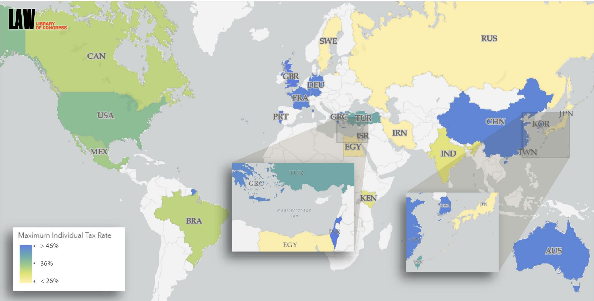
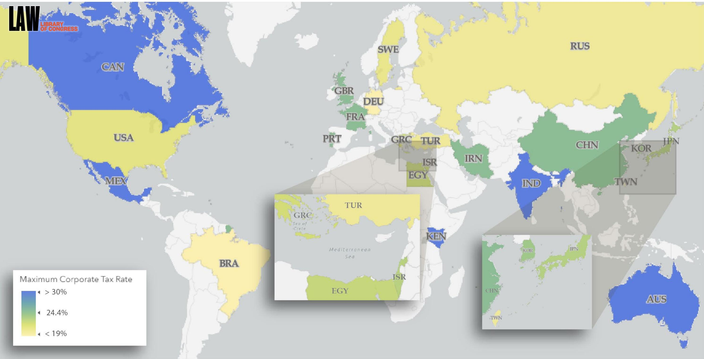

<span id="page-0-0"></span>
# Investment Incentives

Australia • Brazil • Canada • China • Egypt • France

Germany • Greece • India • Iran • Israel • Japan

Kenya • Mexico • Portugal • Russian Federation

South Korea • Sweden • Taiwan • Turkey

United Kingdom • United States

August 2023

LL File No. 2023-022392   
LRA-D-PUB-002629

The Law Library of Congress, Global Legal Research Directorate (202) 707-5080 • law@loc.gov • http://www.law.gov

<span id="page-1-0"></span>
This report is provided for reference purposes only.   
It does not constitute legal advice and does not represent the official   
opinion of the United States Government. The information provided reflects research undertaken as of the date of writing. It has not been updated.

<span id="page-2-0"></span>
## Contents

Comparative Summary ....   
Maps:   
Maximum Individual Tax Rates by Jurisdiction... 6   
Maximum Corporate Tax Rates by Jurisdiction.. . 7   
Australia .. ... 8   
Brazil .... .... 16   
Canada ........ ...... 39   
China .... ..... 46   
Egypt... .. 53   
France.. ... 59   
Germany.... .. 78   
Greece . ..... 83   
India ... .. 90   
Iran .... ..... 97   
Israel.. .. 106   
Japan ... ... 114   
Kenya .... ... 119   
Mexico....... ..... 124   
Portugal .... .... 128   
Russian Federation.... .... 140   
South Korea... ... 153   
Sweden ... . 161   
Taiwan .. . 167   
Turkey..... . 171   
United Kingdom . ... 180   
United States .... ... 193   
Table:   
Table of Primary Sources .. .. 198

<span id="page-4-0"></span>
# Comparative Summary

Louis Myers

Legal Reference Librarian

## I. Introduction

This report explores various investment incentives and the tax treatment of investments in the following jurisdictions: Australia, Brazil, Canada, China, Germany, Egypt, France, Greece, Israel, India, Iran, Japan, Kenya, South Korea, Mexico, Portugal, Russia, Sweden, Turkey, Taiwan, the United Kingdom, and the United States. Jurisdictions have been chosen based on the size of their economies, and the report addresses the primary incentives for making equity investments to corporations, from both a corporate and individual investor perspective.

Individual report components contain sections explaining the income tax and capital gains tax for each jurisdiction. There are also sections explaining special provisions for real estate and value added tax (VAT). Other incentives are also identified when available, which include industry specific investments and employee-employer related incentives. Finally, the reports end with an overview of any foreign investment incentives and the identification of tax treaties and international agreements.

## II. Tax Rates

Most of the jurisdictions surveyed subject individuals to a progressive tax rate based on income. Corporate tax rates are generally flat, but conditions apply in some jurisdictions. Progressive individual tax rates range from 0% of income and approach 50% of income in some jurisdictions. The applicable laws in the United Kingdom, Israel, and Portugal all contain provisions for tax rates up to 47%-48%. Other jurisdictions levy further individual income taxes in certain situations. In Iran, when there is a major year-over-year change in income for a person, there is a one-time additional percentage tax of up to 5%. In Germany, there is an additional 25% tax on investment income.

Individual Income Tax Rates


<span id="page-5-0"></span>
A map on page 6 visually depicts maximum individual income tax rates in the jurisdictions covered in this report.


Corporate tax rates in the surveyed jurisdictions are generally flat or fixed, ranging from 9.9% in South Korea, to 38% in Canada. The majority of the surveyed jurisdictions fall somewhere in the 20%-30% rate. Some jurisdictions have special conditions for corporate tax rates. In Kenya, the tax rate is 30% for resident companies and 37.5% for nonresident companies. Likewise, in Portugal, the tax rate is 21% for resident companies and 25% for nonresident companies. In Australia, certain companies are subject to a 25% tax rate while others are subject to a 35% tax rate. In Turkey, the corporate tax rate was reduced from 23% in 2022 to 20% in 2023.

Corporate Tax Rates


<span id="page-6-0"></span>
A map on page 7 depicts maximum corporate tax rates in these jurisdictions.


## III. Capital Gains

Capital gains are a special tax attributed to the realization of profits when trading securities and, sometimes, real estate. The majority of the jurisdictions surveyed have a capital gains tax regime, and the jurisdictions that do not have a capital gains tax typically still have special rules for taxing investment income.

## A. Jurisdictions with Capital Gains Tax Regimes

Of the surveyed jurisdictions, Australia, Brazil, Canada, Egypt, France, Greece, Israel, India, Iran, Japan, Kenya, South Korea, Portugal, Russia, Sweden, the United States, Turkey, and the United Kingdom have a capital gains tax regime. The rates range from 0% to 30%, with many special conditions, other exemptions, and incentives available. Many jurisdictions levy taxes based on the length of time an asset is held, generally referred to as a short-term or long-term gain. Long-term gains are frequently given a preferential tax treatment, while in some jurisdictions a short-term gain is taxed at the regular marginal individual income tax rate. In Canada, India, Russia, the United States, and Turkey, there are differences for long-term and short-term gains.

Some jurisdictions have special rules based on the nature of the company or the nature of the investor. In Australia, there is a discount for equity investments. In Canada, qualified smallbusinesses have a capital gains deduction. In Egypt, a tax of 5% applies to companies listed on the Egyptian Stock Exchange, and 10% is levied on dividends from stocks in unlisted (over the counter, or OTC) companies. Similarly, in Iran, a 10% rebate on capital gains for listed companies (both foreign and domestic) is available, while there is a 5% deduction for OTC companies. In Portugal, there is a 28% tax for resident business issued stock, and 35% for non-resident business issued stock. Relatedly, in Kenya, the tax rates are different based on whether the investor is a resident (including residents of an East African Community Partner State) or non-resident.

<span id="page-7-0"></span>
## B. Jurisdictions without Capital Gains Tax Regimes

Jurisdictions surveyed without an explicit capital gains tax are China, Mexico, Portugal, and Taiwan. However, in some of these jurisdictions, there are investment vehicles that receive preferential treatment. In Portugal, there is a limited capital gains tax for corporate entities. In Australia, there are special tax discounts on long-term assets available to individuals and small businesses. In Mexico, all income is subject to ordinary income tax but some securities are subject to a 10% tax.

## C. Real Estate Gains

Some jurisdictions have special tax rates or incentives for real estate transactions. Real estate incentives are identified in Brazil, Iran, Kenya, South Korea, Portugal, Sweden, the United States, Turkey, the United Kingdom, and France. In Sweden, there are provisions to delay taxation on real estate transfers. Similarly, in the United States, there are provisions for like-kind exchanges of real estate. In Turkey, a real estate transaction is a taxable event unless the property has been held for over five years. In Iran, there is a 25% deduction in tax on both rental income and property transfers. Similarly, in France, there is an exemption on rental income less than € 15,000 (approx. US\$16,433) and for certain sales of property.

## IV. Other Incentives

A wide spectrum of other incentives is identified in the surveyed jurisdictions, including tax abatements or tax holidays, reduced rates or complete exemptions for investment in targeted industries or in targeted initiatives, and other incentives for different classes of businesses and investors. Some of the more unique incentives identified include a reduced rate of taxation on investments of persons aged 60 years or older in Israel; a tax exemption for increasing the workforce in Iran; an exemption from import duties on foreign companies when the final product will be exported in Mexico; and a full exemption available when re-investing within a company in the United Kingdom. In Egypt, Iran, and Russia, there are also incentives related to the value added tax (VAT) identified.

## A. Special Industries

Many jurisdictions incentivize investment in certain industries or classifications of company. Frequently, investments in the agricultural, technological, and environmental spheres receive preferential treatment. In China, Taiwan, Portugal, Iran, Greece, Israel, and Germany, there are incentives for different sectors. In Australia, there are investment incentives available for newer companies. In Russia, there are exemptions for corporate property and for investment in certain companies related to the government. In Taiwan and France, there are incentives for investment in small companies. In Sweden, there is an incentive for investment in new companies, and similarly in Turkey, there is an incentive for investing in a company that just issued its stock publicly (IPO).

<span id="page-8-0"></span>
## B. Employee Share Plans

Many of the surveyed jurisdictions provide incentives for investments made through an employee share plan, whether that be through stock options or retirement funds. Jurisdictions surveyed that have identified incentives in this area are Australia, Brazil, Germany, India, Iran, Portugal, the United States, the United Kingdom, France, and Canada. In India and the United States, deferral of capital gains tax is the primary incentive. In France and the United Kingdom, there are tax incentives for both employees and employers. In Germany, there are incentives available for employees only.

## V. Foreign Investments and Tax Treaties

International cooperation with treaties on tax evasion and double taxation on income are a common theme among the surveyed nations. In some instances, incentives and provisions related to foreign investment, both foreign direct investment (FDI) and domestic offshore investment, are identified. Several of the surveyed jurisdictions also have special incentives and tax rules related to free trade zones (FTZs).

## A. Foreign Direct Investment

There are differing conditions related to foreign direct investment and offshore investment identified in several of the jurisdictions surveyed. In Israel, Iran, Russia, Taiwan, China, Turkey, Brazil, Canada, and Egypt, there are provisions identified discussing this kind of investment, including incentives in certain circumstances. In jurisdictions such as Israel, there are no restrictions on foreign investment unless it is deemed a national security interest. In Russia, there is a list of unfriendly jurisdictions. In Taiwan and Brazil, there are no rules per se, but transactions must be registered with the central authority or bank. In China, there are strict controls on outbound investing.

## B. Tax Treaties

The primary tax treaties identified in the surveys deal with double taxation and tax evasion.   
Mutual investment treaties are also identified in several jurisdictions.

## C. Free Trade Zones

FTZs are special economic zones that feature different tax and trade regulations from the rest of the jurisdiction. They go by different names depending on the jurisdiction. In this survey, Brazil, Egypt, Israel, Iran, Kenya, South Korea, Mexico, Portugal, Russia, Taiwan, France, and China had at least one FTZ identified. In jurisdictions like Iran and Mexico, there are exemptions for 0% VAT. Some jurisdictions, like Portugal (Madeira) and Israel (Eilat, on the Red Sea), have one specific FTZ. Other jurisdictions, like Russia and Brazil, have many identified FTZs. Each of the FTZs identified in the surveys contains somewhat unique provisions, further explained in the individual report components.

<span id="page-9-0"></span>
Maximum Individual Tax Rates by Jurisdiction


> **AI Description:**
> **Source:** `assets/_page_9_Figure_0.jpg`
> 
> **Generated:** 2026-05-16 00:56:19
> 
> ---
> 
> The image is a world map with a color-coded legend indicating the maximum individual tax rate across different countries. The legend uses a gradient from yellow to blue, representing tax rates of less than 26%, 36%, and greater than 46%, respectively. The map highlights various countries with their respective tax rate categories, providing a visual representation of tax policies globally. Notable features include the zoomed-in sections of Turkey and Japan, which offer a closer view of the tax rate distribution in those regions.


<span id="page-10-0"></span>
## Maximum Corporate Tax Rates by Jurisdiction



> **AI Description:**
> **Source:** `assets/_page_10_Figure_0.jpg`
> 
> **Generated:** 2026-05-16 00:57:20
> 
> ---
> 
> The image is a world map with a color-coded representation of the maximum corporate tax rates across different countries. The color gradient ranges from yellow (indicating a tax rate of less than 19%) to blue (indicating a tax rate greater than 30%). The map includes country abbreviations and labels for major countries. The map provides a visual comparison of corporate tax rates globally, highlighting the variation in tax policies across different nations.


<span id="page-11-0"></span>
# Australia

Kelly Buchanan Chief, Foreign, Comparative, and International Law Division II

## SUMMARY

Under the Australian tax system, net capital gains are taxed as ordinary income; no separate rate applies. For individuals, a capital gains tax (CGT) discount of 50% applies to assets held for at least 12 months prior to the relevant CGT event. The discount is not available to companies or non-resident taxpayers. Additional investment incentives for individuals include a carry-forward tax offset and modified CGT treatment for qualifying investments in an “early stage innovation company” (also available to corporate investors); special tax treatment for employee share programs; and incentives for investments made through superannuation programs. For businesses, four CGT concessions are available to small businesses, provided various conditions are met. In addition, the Venture Capital Limited Partnership and Early Stage Venture Capital Limited Partnership programs “are designed to increase venture capital investment in Australia by providing beneficial tax treatment to eligible local and foreign investors.” Other incentives, including grants and special tax treatment, may be available from the federal or state governments depending on the project or sector involved.

## I. Introduction

Generally, Australian residents for tax purposes1 are taxed on their worldwide income.2 The country does not have a separate capital gains tax (CGT) rate.3 Instead, net capital gains are assessed as ordinary income,4 with capital gains and losses to be reported on annual income tax returns following a “CGT event.”5 The tax rate that applies is therefore an individual’s marginal income tax rate, or a company’s tax rate.

In terms of shares, the Australian Taxation Office (ATO) explains that a CGT event occurs when there is a capital payment for shares.6 The timing of the event is when the company pays a nonassessable amount, with the capital gain being the payment less the cost base of the shares.7 The ATO notes that selling shares or units is the most common CGT event with respect to such assets.8

<span id="page-12-0"></span>
Rules related to taxation, including CGT and tax incentives for investments, are contained in the Income Tax Assessment Act 1997 (Cth) (ITAA 1997) and the Income Tax Assessment Act 1936 (Cth) (ITAA 1936).

## II. Tax Rates

The current individual income tax rates for residents are as follows9:


The company tax rate is 25% for “base rate entities.”10 For all other companies the rate is 30%.11

## III. Individual Incentives

## A. CGT Discount

Australia provides a capital gains tax (CGT) discount of 50% that is available where an Australian resident taxpayer has owned an asset for 12 months or more before the CGT event occurs.12

The discount is not available to companies, but is available to partnerships and trusts, in addition to individuals.13 It is also not available to foreign residents for assets acquired after May 8, 2012.14

<span id="page-13-0"></span>
The discount is available for gains from foreign assets held by Australian residents. However, technical rules apply to claiming a tax credit for tax paid on the gains resulting from a CGT event in another country.

In 2019, the Full Federal Court of Australia held that where an Australian tax resident owns a capital asset in the US, and is eligible for the Australian CGT discount, they may not be able to claim all of the US tax paid as a credit under Australia’s foreign income tax offset (FITO) rules and the Australia-US double tax treaty.15 A commentator explains the technical reasons as follows:

In essence a FITO under section 770-10 of the ITAA 1997 is strictly confined to foreign income that is subject to foreign tax. Under the Discount regime in Division 115 and under section 102-5 of the ITAA 1997 only the net capital gain after applying the Discount, which is 50% in the case of a resident individual, is included in assessable income. It follows that a component of a capital gain taxed as a foreign capital gain is not taxed in Australia where the capital gain is a discount capital gain under Division 115. That is a Discount capital gain to an Australian resident individual taxable on their worldwide income that arises from a capital gain made in the US is made up of:

50% that is taxed in the US which is included in Australia assessable income as net capital gain; and

50% that is taxed in the US but which is not included in assessable income in Australia viz. it is exempt from tax in Australia.

The Full Federal Court confirmed that a FITO is only available in relation to the first of these 50% categories.16

Essentially, “Australian taxpayers, to whom the 50% capital gains tax (CGT) discount applies are only entitled to a foreign income tax offset (FITO) in respect of half of the US tax paid in respect of [the] gain.”17

## B. Tax Incentives for Early Stage Investors

Tax incentives are available for early-stage investors as follows:

From 1 July 2016, if you invest in a qualifying early stage innovation company (ESIC), you may be eligible for the tax incentives for early stage investors (sometimes referred to as ‘angel investors’) contained in Division 360 of the Income Tax Assessment Act 1997.

<span id="page-14-0"></span>
The tax incentives provide eligible investors who purchase new shares in an ESIC with a:

 non-refundable carry forward tax offset equal to 20% of the amount paid for their eligible investments. This is capped at a maximum tax offset amount of \$200,000 for the investor and their affiliates combined in each income year

 modified capital gains tax (CGT) treatment, under which capital gains on qualifying shares that are continuously held for at least 12 months and less than 10 years may be disregarded. Capital losses on shares held less than 10 years must be disregarded.

The maximum tax offset cap of \$200,000 doesn’t limit the shares that qualify for the modified CGT treatment.

Investors who don’t meet the ‘sophisticated investor’ test under the Corporations Act 2001 won’t be eligible for any tax incentives if their total investment in qualifying ESICs in an income year is more than \$50,000.18

## C. Special Tax Treatment for Employee Share Schemes

The ATO states that, in most cases, employees who obtain benefits through an employee share scheme (ESS) “will be eligible for special tax treatment (known as tax concessions).”19 In order for the concessions to apply, the employee and employer must have followed special tax rules, including that the ESS interests are provided at a discounted price. If the ESS tax rules do not apply, the CGT rules still apply.20

For an employee, the difference between the market value of the ESS interests and the amount the person paid to acquire those interests forms part of their assessable income and needs to be included in their tax return.21 The IBFD tax research platform explains that

[c]oncessional taxation is available in certain cases, in the form of an annual exemption of AUD 1,000, or in some circumstances in the form of a deferral of taxation for up to 15 years. The availability of the concessional treatment depends on the type of ESS and other factors, such as income of the employee. Under new rules effective from 1 July 2015, employees of start-up companies may be eligible for a tax-free treatment of the discount.22

## D. Superannuation

There are several tax incentives for investments made through superannuation (i.e., retirement savings) programs, including

<span id="page-15-0"></span>
• A tax rate of 15% on employer super contributions and salary sacrifice contributions, if they’re below the \$27,500 cap.

• A maximum tax rate of 15% on investment earnings in super and 10% for capital gains.

• No tax on withdrawals from super for most people over age 60.

Tax-free investment earnings when you start a super pension.23

## IV. Business/Corporate Incentives

## A. Small Business CGT Concessions

Division 152 of the ITAA 1997 contains four CGT concessions that allow small businesses “to reduce, disregard or defer some or all of a capital gain from an active asset used in a small business.”24 The small business CGT concessions include

small business 15-year exemption,

small business 50% active asset reduction,

small business retirement exemption, and

small business roll-over.25

Assets must meet the “active asset test,”26 among other conditions. Generally, shares in companies are not considered active assets, unless they meet the “80% test,” and shares in widely held entities are also not considered active assets “unless held by a CGT concession stakeholder in the widely held entity.”27 Furthermore, there are “[e]xtra eligibility conditions for the small business CGT concessions if the asset is a share or interest in a trust.”28

## The ATO explains that

[i]f you have more than one capital gain for the year, you can apply as many of the small business CGT concessions as you are eligible for until each capital gain is reduced to zero. Each active asset’s attributable capital gain is assessed for CGT concession eligibility individually.

The small business 50% active asset reduction applies automatically if the basic conditions are met and you have not specifically chosen for it not to apply.

<span id="page-16-0"></span>
However, you must choose whether to apply the small business 15-year exemption, small business retirement exemption and small business roll-over.

You need to choose by the day you lodge your income tax return for the income year in which the relevant CGT event happened unless we allow you to make the choice later.

Lodging and preparing your income tax return is generally enough proof of the choice you’ve made. However, for the small business retirement exemption, you must keep a written record of the amount you choose to disregard.29

## B. Tax Incentives for Early Stage Investors

The non-refundable carry forward tax offset and modified CGT treatment for investors in ESICs, outlined above, are available to corporate investors.30

## C. Venture Capital and Early Stage Venture Capital Limited Partnerships

The Venture Capital Limited Partnership (VCLP) and Early Stage Venture Capital Limited Partnership (ESVCLP) programs “are designed to increase venture capital investment in Australia by providing beneficial tax treatment to eligible local and foreign investors.”31 The ATO jointly administers the programs with AusIndustry.

The ATO explains the benefits of the programs as follows:

VCLP tax incentives and concessions include:

 flow-through tax treatment for a VCLP

 an exemption for eligible foreign venture capital limited partners from income tax on capital and revenue profits from the disposal of eligible venture capital investments by the VCLP

 that fund managers are taxed on their carried interest in the partnership on capital account, rather than as income.

## ESVCLP tax incentives and concessions include:

 flow-through tax treatment for ESVCLP

 an exemption for Australian and foreign venture capital partners from income tax on capital and revenue profits from the disposal of eligible venture capital investments made by the ESVCLP and any other income earned on these investments

 that fund managers are taxed on their carried interest in the partnership on capital account, rather than as income.

From 1 July 2016, if you invest or have already invested in an ESVCLP you may be eligible for further tax incentives, including a non-refundable carried forward tax offset of up to

<span id="page-17-0"></span>
10% of your contributions made to an ESVCLP that became unconditionally registered on or after 7 December 2015.32

In terms of foreign limited partners,

[g]ains and losses made on the disposal by the VCLP of eligible venture capital investments are not assessable or deductible and are disregarded for capital gains tax purposes if all the following apply:

 The VCLP had owned the investment for at least 12 months.

 You are a limited partner in the VCLP and you are a foreign resident.

 You are either exempt from tax in your country of residence or if you are not exempt you have provided less than 10% of the VCLP’s committed capital.33

With respect to general partners,

[t]he carried interest of a general partner is the partner’s entitlement to a distribution from the VCLP, normally contingent on profits attained for the limited partners in the VCLP. Carried interest does not include a management or similar fee that the partner is entitled to or a distribution attributable to an equity investment by the partner.

If you are a general partner of a VCLP, your entitlement to a payment of carried interest will be taxed as a capital gain rather than as income. If you qualify for the CGT discount, it applies to carried interest if you became a general partner at least 12 months before the CGT event happened.34

## D. Other Incentives

The IBFD tax research platform states that

[t]he government considers specific incentives for strategic investment projects in limited and special circumstances; for example, where the project will generate significant net economic and employment benefits for Australia, in particular projects associated with locating the headquarters in Australia. Further assistance, including streamlined immigration procedures and assistance with obtaining information, may also be provided.

AUSTRADE provides grants for Australian businesses for export promotion activities. Grants may also be available under the Commercial Ready Program in relation to some early-stage commercial activities.

Specific incentives may be available in the pharmaceutical sector and under the Invest Australia Supported Skills Program. Exporter manufacturers may benefit from the “Manufacturing in Bond” scheme.

<span id="page-18-0"></span>
State governments offer specific incentives for projects located in the relevant state or territory, including state taxation investments.35

There are no free economic zones in Australia.36

<span id="page-19-0"></span>
## Brazil

## Eduardo Soares Senior Foreign Law Specialist

## SUMMARY

Taxes in Brazil can be imposed by the federal, state, and municipal governments. Tax incentives are available at all three levels of administration. Individuals and businesses must pay income tax on capital gains at rates ranging from 15% to 22.5%. However, a few exceptions are available to avoid such payments. Individuals must pay annual income tax at rates ranging from 7.5% to 27.5%. The corporate income tax rate is 15%.

Employee share options are not regulated, and taxation requires a case-by-case analysis. Income and capital gains earned in real estate investment funds are subject to a tax rate of 20%. Foreign investment transactions in the country are free, but the Central Bank of Brazil mut be provided with information regarding foreign credit and direct foreign investment operations.

Brazil has four types of free trade zones, which have tax, administrative, and currency exchange incentives. Currently, Brazil has signed tax treaties with 37 countries to avoid double taxation and prevent tax evasion.

## I. Introduction

The most widespread conception of tributos (taxes)—and the one which the Federal Supreme Court apparently has currently adopted—distinguishes five tax types, that is, five different ways for the state to compulsorily demand a pecuniary contribution from citizens. They are the following:

impostos (taxes),

taxas (fees),

contribuições de melhoria (improvement contributions),

contribuições especiais (special contributions), and

empréstimos compulsórios (compulsory loans).1

According to the Tribunal de Contas da União (Tribunal of Accounts of the Union), which provides the external control of the bodies and managers of the government, the Brazilian tax system is known worldwide for being one of the most complex, confusing, and difficult to interpret in the world. Since the enactment of the Federal Constitution of 1988, an average of 37 tax rules have been issued per day. In Brazil, all entities—5,570 municipalities, 26 states, the Federal District, and the Union—are empowered to set up their respective taxes.2

<span id="page-20-0"></span>
Taxes finance the activities of the government and are divided into federal, state, and municipal taxes.

## Federal taxes include

Imposto de Renda da Pessoa Física (Individual Income Tax, IRPF),

• Imposto de Renda da Pessoa Jurídica (Corporate Income Tax, IRPJ),

• Imposto sobre Operações Financeiras (Tax on Financial Operations, IOF),

• Imposto sobre Produtos Industrializados (Tax on Industrialized Products, IPI), and

Imposto sobre Importação (Tax on Imports, II).

## State taxes include

• Imposto de Circulação de Mercadorias e Serviços (Tax on the Circulation of Goods and Services, ICMS),

• Imposto sobre a Propriedade de Veículos Automotores (Motor Vehicle Ownership Tax, IPVA), and

• Imposto de Transmissão Causa Mortis e Doação (Tax on Gifts in Contemplation of Death and Donations, ITCMD).

## Municipal taxes include

Imposto Sobre Serviços (Services Tax, ISS),

• Imposto Predial Territorial Urbano (Urban Property Tax, IPTU), and

• Impostos de Transmissão de Bens Imóveis (Real Estate Transfer Tax, ITBI).3

Foreign companies interested in investing in Brazil are favored with several tax incentives granted by the Brazilian government at the municipal, state, and federal levels. Most incentives

<span id="page-21-0"></span>
are granted upon submission of a project indicating the minimum amount invested and containing information on job creation and other relevant matters.4

## II. Individual Taxation

## A. Capital Gains

1. Law No. 8,981 of January 20, 1995

Under article 21 of Law No. 8,981 of January 20, 1995, the capital gain realized by an individual as a result of the sale of assets and rights of any nature is subject to income tax at the following rates:

I - 15% on the portion of earnings that does not exceed [Brazil Real] BRL5.000.000,00 (about US\$1,041,776.00);

II - 17.5% on the portion of earnings that exceeds BRL5.000.000,00 and does not exceed BRL10.000.000,00 (about US\$2,083,552.00);

III - 20% on the portion of earnings that exceeds BRL10.000.000,00 and does not exceed BRL30.000.000,00 (about US\$6,250,656.00); and

IV - 22.5% on the portion of the earnings that exceeds BRL30.000.000,00.5

The income tax must be paid by the last working day of the month following the month in which the earnings are received.6 The earnings must be determined and taxed separately and will not be part of the income tax calculation basis in the annual adjustment declaration, and the tax paid cannot be deducted from what is due in the declaration.7

In the event of sale of parts of the same asset or right, from the second transaction, provided that it is carried out by the end of the calendar year following the first transaction, the capital gain must be added to the gains earned in previous transactions, for purposes of calculating the tax in the form established in article 21 of Law No. 8,981, deducting the amount of tax paid in previous transactions.8 For the purposes of the provisions of article 21 of Law No. 8,981, the set of shares or quotas of the same legal entity is considered to be part of the same asset or right.9

<span id="page-22-0"></span>
## 2. Decree No. 9,580 of November 22, 2018

Decree No. 9,580 of November 22, 2018, regulates taxation, inspection, collection, and administration of income tax and earnings from any source.10 According to article 35(V)(m), capital gains earned by an individual on the alienação (sale) of shares carried out on the mercados à vista (stock exchange markets) until December 31, 2023, that have been issued by companies that meet the conditions established by articles 16 and 17 of Law No. 13,043 of November 13, 2014, are exempt from taxation.11

The sale of assets and rights under the terms and conditions established in sections 2 and 3 of article 133 of Decree No. 9,580, are also exempt from capital gains tax if the unit sale price, in the month in which it is carried out, is equal to or less than

1. BRL20.000,00 (about US\$4,167.00), in the event of sale of shares traded on the over-thecounter market; and

2. BRL35.000,00 (about US\$7,292.00), in all other cases.12

Capital gain will be determined by the increase between the acquisition cost and the sale value, calculated under the terms established in articles 134 to 147 of Law No. 9,580.13 In the event of permuta (exchange) with receipt of cash, the capital gain will be determined as follows:

I - the value of the return will be added to the cost of the property given in exchange;

II - the division of the value of the return will be made by the value calculated in the manner established in item I and the result obtained will be multiplied by one hundred; and

III - the capital gain will be obtained by applying the percentage found, observing the provisions of item II, on the value of the return and observing other provisions related to the capital gain.14

## 3. Law No. 13,043 of November 13, 2014

Article 16 of Law No. 13,043 of November 13, 2014, states that the capital gain earned by an individual on the sale of shares carried out on the stock exchange markets until December 31, 2023, is exempt from income tax where the shares were issued by companies that, cumulatively:

I - Have their shares admitted to trading in a special segment, established by the stock exchange, which ensures, through a contractual bond between the exchange and the issuer, differentiated practices of corporate governance, contemplating, at least, the obligation to comply with the following rules:

<span id="page-23-0"></span>
a) Carrying out a public offer for the acquisition of shares, when required by the stock exchange, at the economic value established in an appraisal report, in case of withdrawal of the company from the special segment;

b) Resolution of corporate conflicts through arbitration;

c) Carrying out a public offer for the acquisition of all shares in the event of transfer of control of the company, for the same amount and under the same conditions offered to the controlling shareholder (tag along); It is

d) Express provision in the company’s bylaws that its capital stock be divided exclusively into common shares;

II - Have a market value of less than BRL700.000.000,00 (about US\$146,868.00):

a) On the date of the initial public offering of the company’s shares;

b) On July 10, 2014, for shares of companies that had already carried out an initial public offering of shares before that date; or

c) On the date of subsequent public offerings of shares, for companies already included in the cases referred to in items a and b;

III - Have annual gross revenue of less than BRL500.000.000,00 (about US\$104,906.00), determined in the consolidated balance sheet for the fiscal year:

a) Immediately prior to the date of the initial public offering of the company’s shares;

b) 2013, for shares of companies that had already carried out an initial public offering of shares before July 10, 2014;

c) Immediately prior to the date of subsequent public offerings of shares, for companies already included in the cases referred to in items a and b; and

IV - In which there is a primary distribution corresponding to at least sixty-seven percent of the total volume of shares issued by the company:

a) In the initial public offering of the company’s shares;

b) On July 10, 2014, for shares of companies that had already carried out an initial public offering of shares before that date; or

c) If any, on the date of the subsequent public offering of shares, for companies already covered by the cases referred to in items a and b.15

For the purposes of article 16(II) of Law No. 13,043, the company’s market value is considered to be

<span id="page-24-0"></span>
I - For the hypothesis provided for in article 16(II)(a), the value determined at the end of the price formation process (book building or auction on the stock exchange) in the initial public offering of shares;

II - For the hypothesis provided for in article 16(II)(b), the value determined by the average closing price of the shares, measured by the volume traded, in the thirty trading sessions immediately prior to July 10, 2014; or

III - For the hypothesis provided for in article 16(II)(c), the value determined by the average closing price of the shares, measured by the volume traded, in the thirty trading sessions immediately prior to the date of request for registration of the subsequent public offering.16

For the purposes of the income tax exemption mentioned in article 16 of Law No. 13,043, the referred companies are obliged to calculate income tax based on actual profit.17 The Comissão de Valores Mobiliários (Securities and Exchange Commission) will make available, on its website, a list of offers of shares benefited by Section IV of Law No. 13,043 (articles 16–19), together with the amount of each issuance.18 The company that meets the requirements set forth in article 16 of Law No. 13,043 must highlight this fact, on the occasion of the public issuance of shares, on the first page of the prospectus, or equivalent document, and of the Announcement of Start of Distribution.19

The companies referred to in article 16 of Law No. 13,043 are obliged to make available to the Secretaria da Receita Federal do Brasil (Internal Revenue Service), in the form established by the service, their shareholding based on

the day before the entry into force of the benefit; and

the last day of validity of the benefit.20

According to article 17 of Law No. 13,043, in order to enjoy the income tax exemption referred to in article 16, the shares must be acquired from July 10, 2014,

I - On the occasion of the initial public offering and subsequent public offerings of shares;

II - On stock exchanges, including for shares of companies that had already carried out an initial public offering of shares before July 10, 2014, in compliance with the conditions established in Section IV of Law No. 13,043;

<span id="page-25-0"></span>
III - In the exercise of the shareholder’s preemptive right, as provided for in Law No. 6,404, of December 15, 1976; or

IV - Through bonus shares distributed until December 31, 2023.21

The maintenance of the income tax exemption depends on the permanence of the shares in central depositories of shares, under the terms of the legislation in force.22 Until December 31, 2023, compensation for losses or damages incurred on the sale of shares under the terms of article 17 of Law No. 13,043 is prohibited.23

Until December 31, 2023, the sale value of the shares referred to in article 17 will not be computed for the purpose of calculating the limit referred to in article 3(I) of Law No. 11,033 of December 21, 2004.24

The loan of the shares referred to in article 17 of Law No. 13,043 does not remove the maintenance of the right to exemption by the individual lender.25 In relation to the investor who had already acquired the shares referred to in article 17(II) until July 10, 2014, the cost of acquisition of these shares will be adjusted, for the purpose of calculating the income tax calculation basis, at the highest value between the acquisition cost actually paid and the average closing price, measured by the traded volume, in the last 30 trading sessions prior to July 10, 2014.26

Shares acquired and not sold by December 31, 2023, will have their acquisition costs adjusted, for the purpose of calculating the income tax calculation basis, to the higher value between the acquisition cost effectively paid and the average price closing date, measured by the volume traded in the last 30 trading sessions prior to December 31, 2023.27

The entities responsible for the centralized deposit must make available to the Internal Revenue Service, in relation to the companies referred to in article 16 of Law No. 13,043, the value corresponding to the average closing price of the shares issued by it, measured by the traded volume, in the last 30 trading sessions before

• July 10, 2014, and

• December 31, 2023.28

<span id="page-26-0"></span>
## B. Income Tax

The annual income tax rate for individuals for calendar year 2023 is as follows:

• from BRL24.511,93 (about US\$5,108.57) to BRL33.919,80 (about US\$7,069.28) = 7.5%

• from BRL33.919,81 (about US\$7,069.28) to BRL45.012,60 (about US\$9,381.14) = 15.0%

• from BRL45.012,61 (about US\$9,381.14) to BRL55.976,16 (about US\$11,666.07) = 22.5%

over BRL55.976,16 (about US\$11,666.07)

```
= 27.5%29
```

The annual deduction per dependent is BRL2.275,08 (about US\$474.15), the annual tuition expense limit is BRL3.561,50 (about US\$742.26), and the simplified annual discount limit is BRL16.754,34 (about US\$3,491.80).30

The 2023 income tax rate for capital income derived from long-term funds and fixed-income investments in general is

• for a period of up to 180 days = 22.5%

for a period of 180 and 360 days = 20.0%

for a period of 361 and 720 days = 17.5%

for a period of more than 720 days = 15.0%31

For short-term funds

• For a period of up to 180 days = 22.5%

• For a period over 180 days = 20.0%32

For stock funds

For variable income investments = 0.005%34

For profit sharing

• from BRL7.407,12 (about US\$979.71) to BRL9.922,28 (about US\$2,067.36) 7.5%

• from BRL9.922,29 (about US\$2,067.36) to BRL13.167,00 (about US\$2,743.41) = 15.0%

<span id="page-27-0"></span>
• from BRL13.167,01 (about US\$2,743.41) to BRL16.380,38 (about US\$2,787,.87) = 22.5%

Over BRL16.3 = 27.5%35

Remittances abroad

• earnings from work, retirement, pension for death or disability and those from the provision of services, paid, credited, delivered, employed or sent to nonresidents = 25%

other income from sources located in Brazil = 15%36

## Other income

cash prizes and sweepstakes = 30.0%

prizes and sweepstakes in the form of goods and services = 20.0%

• advertising services and remuneration for professional services = 1.5%37

## III. Business Taxation

## A. Capital Gains

The capital gain realized by a legal entity as a result of the sale of goods and rights of ativos nãocirculantes (non-current assets) is subject to the levy of income tax, with the application of the rates provided for in article 21 of Law No. 8,981 of January 20, 1995, and the provisions of sections 1, 3 and 4 (discussed in Part II.A.I.a), except for legal entities taxed based on actual, presumed or arbitrated profit.38

## B. Income Tax

## 1. Law No. 9,249 of December 26, 1995

Article 1 of Law No. 9,249 of December 26, 1995, determines that the calculation basis and the amount of federal taxes and contributions will be expressed in Brazil Reals.39 The corporate income tax and social contribution on net income will be determined according to the rules of the legislation in force, with the amendments of Law No. 9,249.40

<span id="page-28-0"></span>
The corporate income tax rate is 15%.41 The portion of actual profit, presumed or arbitrated, that exceeds the value resulting from the multiplication of BRL20.000,00 by the number of months of the respective calculation period, is subject to additional income tax at the rate of 10%.42 This provision applies even in cases of incorporação (acquisition), merger or spin-off and extinção (dissolution) of the company by the end of the liquidation.43 The provisions of this article also apply to the legal entity that explores rural activity referred to in Law No. 8,023, of April 12, 1990.44 The amount of the surcharge will be paid in full, with no deductions allowed.45

According to article 15, in each month, the tax calculation basis will be determined by applying the percentage of 8% on the gross revenue earned monthly, observing the provisions of article 12 of Decree-Law No. 1,598, of December 26, 1977, deducted from returns, canceled sales, and unconditional discounts granted, without prejudice to the provisions of articles 30 (deduction of monthly gross income tax paid or withheld by legal entities that explore real estate activities), 32 (revoked), 34 (tax deductions related to labor activities), and 35 (excess tax payment) of Law No. 8,981 of January 20 from 1995.46

## 2. Decree-Law No. 1,598, of December 26, 1977

Article 12 of Decree-Law No. 1,598, of December 26, 1977, defines gross revenue as

I – the proceeds from the sale of goods in own account operations;

II - the price of providing services in general;

III - the result obtained in the operations of third-party accounts; and

IV – the income from the main activity or object of the legal entity not included in items I to III.47

Net income is defined as the gross income minus:

I - returns and canceled sales;

II - discounts granted unconditionally;

III - taxes levied on it; and

<span id="page-29-0"></span>
IV - amounts arising from the adjustment to present value, dealt with in article 183 section VIII of Law No. 6,404, of December 15, 1976, on operations linked to gross revenue.48

## 3. Law No. 6,404, of December 15, 1976

Article 183 (VIII) of Law No. 6,404, of December 15, 1976, states that, in the balance sheet, asset elements resulting from long-term operations will be adjusted to present value, with the other assets being adjusted when there is a relevant effect.49

## 4. Law No. 9,430 of December 27, 1996

Article 1 of Law No. 9,430 of December 27, 1996, determines that from calendar year 1997 onward, corporate income tax will be determined based on actual, presumed, or arbitrated profit, for quarterly calculation periods, ending on March 31, June 30, September 30, and December 31 of each calendar year, subject to current legislation, as amended by Law No. 9,430.50

According to article 2, a legal entity subject to taxation based on actual profit may choose to pay the tax monthly, determined on an estimated calculation basis, by applying the percentages referred to in article 15 of Law No. 9,249 of December 26, 1995, on the gross revenue, earned monthly, and defined by article 12 of Decree-Law No. 1,598, of December 26, 1977, deducted from returns, canceled sales, and unconditional discounts granted, subject to the provisions of sections 1 and 2 of article 29 (revoked) and articles 30, 32, 34, and 35 of Law No. 8,981, of January 20, 1995.51

The monthly tax due under article 2 will be determined by applying, on the calculation basis, the rate of 15%.52 The portion of the calculation basis, calculated monthly, that exceeds BRL20,000,00 will be subject to the incidence of additional income tax at the rate of 10%.53 The legal entity that chooses to pay the monthly tax must calculate the actual profit on December 31 of each year, except in the cases dealt with in sections 1 and 2 of article 2 that deal with merger, acquisition, spin-off, and dissolution of companies.54

For the purpose of determining the balance of the tax to be paid or offset, the legal entity may deduct from the tax due the amount of

I - tax incentives for tax deduction, subject to the limits and deadlines established in current legislation, as well as the provisions of section 4 of article 3 of Law No. 9,249 of December 26, 1995 (which determines that the amount of surcharge must be paid in full and does not allow deductions);

<span id="page-30-0"></span>
II - tax incentives for tax reduction and exemption, calculated based on operating profit;

III - income tax paid or withheld at source, levied on revenue computed in the determination of taxable income;

IV - the income tax paid pursuant to article 2 of Law No. 9,430.55

## C. Employee-Owned Share Plans, Stock Options Taxation

Section 3 of article 168 of Law No. 6,404 of December 15, 1976, states that the bylaws may provide that a company, within the authorized capital limit, and in accordance with a plan approved by the general meeting, grant stock options to its managers or employees, or to persons who provide services to the company or society under their control.56

The general meeting will set the global or individual amount of the managers’ remuneration, including benefits of any nature and representation allowances, taking into account their responsibilities, the time dedicated to their functions, their competence and professional reputation and the value of their services on the market.57

There are no laws governing the grant of employee share options.58 Furthermore, it seems that there are no specific legal provisions governing the tax and social security treatment of share option plans and other share-based payments. Whether a plan is subject to taxation requires a case-by-case analysis of whether the plan has a commercial nature or is part of the participant’s compensation.59

As for income tax, the employer company must withhold income tax at progressive rates of up to 27.5% on the difference between the exercise price and the fair market value of the shares on the exercise date.60

## D. Taxation Regime for Investments in Real Property

Law No. 8,668 of June 25, 1993, provides for the creation and the tax regime of real estate investment funds.61 The shares of real estate investment funds constitute securities subject to the regime of Law No. 6,385, of December 7, 1976.62

<span id="page-31-0"></span>
Income and capital gains earned, determined on a regime de caixa (cash basis), when distributed by real estate investment funds to any beneficiary, including exempt legal entities, are subject to income tax withholding at the rate of 20%.63

## IV. Incentives

According to the Brazilian Agency for the Promotion of Exports and Investments, there are several government incentives for foreign investments, including, but not limited to the areas of technological development of the semiconductor industry,64 technological development of the digital TV equipment industry,65 development of infrastructure,66 and modernization and expansion of the port structure.67

## A. Foreign Direct Investment

Resolution BCB No. 278 of December 31, 2022, of the Brazilian Central Bank regulates Law No. 14,286, of December 29, 2021, in relation to foreign capital in the country, foreign credit transactions, and foreign direct investment transactions, as well as the provision of information to the Central Bank of Brazil.68

Foreign direct investment is defined as the direct participation of a nonresident in the share capital of a company in the country, or other economic right of a nonresident in the country derived from an act or contract whenever the return on this investment depends on the results of the business.69 Foreign direct investment transactions in the country are free, as well as their financial transfers and associated transactions, subject to the provisions of specific legislation and the economic basis of the transaction.70

<span id="page-32-0"></span>
The Central Bank of Brazil must be provided with information regarding foreign credit and direct foreign investment operations under the terms of Resolution BCB No. 278.71 In the case of direct foreign investment, the recipient is responsible for providing the information.72

In the financial transfers of foreign credit or foreign direct investment transactions subject to the provision of information, according to the enforceability criteria of this rule, the information of the exchange operation must include, among other things, the foreign direct investment code for foreign direct investment in financial transfers in amounts equal to or greater than US\$100,000.00 or its equivalent in other currencies.73

The foreign direct investment code is a unique identifier of the recipient-nonresident investor pair, automatically generated by the information provision system after identifying the recipient and the nonresident investor.74 The information provision system is a computerized system made available by the Central Bank of Brazil to provide information on foreign credit operations and direct foreign investment.75 A recipient is any entity created or organized in the country in accordance with the applicable Brazilian legislation, with or without profit, with or without legal personality, including any corporation, society, partnership, sole proprietorship, consortium, and partnership.76

According to article 32 of Resolution BCB No 278, the provision of foreign direct investment information must be carried out by the person in charge when

I - there is a financial transfer related to a nonresident investor in an amount equal to or greater than US\$100,000.00 or its equivalent in other currencies;

II - movement occurs, in the cases provided for in article 36 of Resolution BCB No. 278, with a value equal to or greater than US\$100,000.00 or its equivalent in other currencies; or

III - the base date of the periodic declarations provided for in articles 38–40, for recipients subject to such declarations.77

The situations provided for in items I and II of article 36 of Resolution BCB No. 278 do not apply to financial transfers and transactions involving securities traded on an organized market and to operations with such securities carried out outside an organized market in the cases provided for in the regulations of the Conselho Monetário Nacional (National Monetary Council) and the Securities and Exchange Commission.78

<span id="page-33-0"></span>
The provision of foreign direct investment information must include

the identification of the receiver,

• details of foreign direct investments in the recipient, when required,

quarterly statements, when required,

the annual declarations, when required, and

• five-year declarations, when required.79

The details of direct foreign investment in the recipient must include:

identification of the nonresident investor,

• financial transfers and movements resulting from direct foreign investment, as provided for in arts. 35 and 36, and

the foreign direct investment code.80

The foreign direct investment code is automatically generated by the information provision system after identifying the recipient and the non-resident investor, who must be informed prior to the first financial transfer of the investment, as provided for in item I of article 32 of Resolution BCB No. 278; the first movement, as provided for in item II of article 32; or the first quarterly or annual periodic statement.81

Financial transfers resulting from foreign direct investment are automatically captured by the information provision system, based on the information available in the exchange system, in the cases of:

• inflow of currency; and

• remittance abroad of profits and dividends, interest on own capital and return on capital.82

Article 36 of Resolution BCB No. 278 states that movement resulting from direct foreign investment must be informed within 30 days of its occurrence, in the cases of

I - capitalization through tangible or intangible assets;

II - conversion into investment of rights remissible abroad not reported as foreign credit;

III - assignment, exchange and conference of quotas or shares between resident and nonresident investors, or between non-resident investors;

IV - international conference of quotas or shares;

<span id="page-34-0"></span>
V - corporate reorganization;

VI - distribution of profits and dividends, payment of interest on own capital, disposal of participation, restitution of capital and net assets resulting from liquidation, when made directly abroad or in national currency in the country;

VII - payments and receipts in national currency in accounts of non-residents; or

VIII - reinvestment.83

In quarterly, annual, and five-year periodic statements, information must be provided regarding the following:

• the corporate structure and the identification of nonresident investors,

• the receiver’s accounting and economic value,

the receiver’s operating and nonoperating profit, and

the recipient’s complementary accounting data.84

In the annual and five-year declarations, data regarding economic information may be required to map the activities of multinational companies in Brazil and its regions, such as sector of activity, employment, revenue, technology, and international trade.85

The quarterly declaration must be provided by the foreign direct investment recipient who, on the base date of the reference quarterly declaration, has total assets equal to or greater than BRL300.000.000,00 (about US\$62,526,053.00).86 The quarterly reference base dates are March 31, June 30, and September 30 of each year.87

The annual declaration must be provided by the recipient of direct foreign investment that, on the base date of December 31 of the previous year, has total assets equal to or greater than BRL100.000.000,00 (about US\$20,842,018).88

The five-year declaration, whose base date is December 31 of the calendar year ending in zero or five, must be provided by the foreign direct investment recipient who, on the base date of December 31 of

<span id="page-35-0"></span>
the previous year, has total assets equal to or greater than BRL100.000,00 (about US\$20,842.00).89   
There will be no annual declaration in the years in which there is a five-year declaration.90

The deadlines for providing periodic statements are

I - quarterly statements:

a) March 31 base date: from April 1 to June 30;

b) June 30 base date: from July 1 to September 30; and

c) September 30 base date: from October 1 to December 31;

II – annual and five-year statements: from January 1st to March 31st of the following year.91

The deadline for providing the quarterly statement with the base date of September 30, 2023, is from November 1 to December 31, 2023.92

## B. Free Trade Zones

Brazil has four versions of zonas de livre comércio (free trade zones), which can be defined as geographical areas that have tax, administrative, and currency exchange incentives with the objective of improving economic activities in its territory.93

## 1. Free Economic Zone of Manaus

The Zona Franca de Manaus (Free Economic Zone of Manaus, ZFM) is located in the city of Manaus, which is the capital of the state of Amazonas that is situated in the northern part of the country. It was created by Law No. 3,173 of June 6, 1957, and it was initially designed for storage or deposit, custody, conservation, processing, and removal of goods, articles, and products of any nature, coming from abroad and destined for internal consumption in the Amazon, as well as interested countries bordering Brazil or countries that contain tributary waters of the Amazon river.94

Decree No. 47,757 of February 3, 1960, regulated Law No. 3,173,95 and determined that the ZFM was a delegated state service of the federal government, with administrative autonomy and its own legal capacity, without prejudice to its legal subordination to the various ministerial bodies and the competencies of each of them.96 Within its organic and legal structure, the ZFM was meant to give full and objective execution, in the Brazilian Amazon, to the economic and fiscal policy of the federal government, in the sense of establishing, through the appropriate legal processes, greater and better exchange of commercial business and reciprocal franchising between Brazil and other countries interested in the economic recovery of the Amazonian areas of their respective territories.97

<span id="page-36-0"></span>
Decree-Law No. 288 of February 28, 1967, revoked Law No. 3,173 and Decree No. 47,757,98 and it redefined the ZFM as a free trade area of import, export, and special tax incentives, established with the purpose of creating an industrial, commercial, and agricultural center within the Amazon, endowed with economic conditions that allowed its development, in face of the local factors and the great distance at which the consumer centers of their products were located.99

The decree-law stated that the ZFM would have an area of 10,000 km2 (about 3,900 square miles) and defined its geographical position.100 In addition, it created the Superintendência da Zona Franca de Manaus (Superintendence of the Free Economic Zone of Manaus, SUFRAMA), which is an autonomous entity, with personalidade jurídica (legal capacity), its own assets, administrative and financial autonomy, and headquarters and forum in the city of Manaus, to administer the facilities and services of the ZFM.101

According to article 3 of Decree-Law No. 288, the entry of foreign goods into the ZFM that are intended for internal consumption, industrialization to any degree (including processing), agriculture, fishing, installation and operation of industries and services of any nature, and storage for re-export, will be exempt from imposto de importação (import tax) and imposto sobre produtos industrializados (tax on industrialized products, IPI).102 Paragraph 1 of article 3 states that the following goods are exempt from the mentioned taxes: weapons and ammunition, tobacco, alcoholic beverages, passenger cars, and perfumery or toiletry products and preparações cosméticas (cosmetic preparations), except if the products are destined exclusively for internal consumption in the ZFM or when produced using raw materials from the regional fauna and flora, in accordance with a basic production process.103

For the purpose of curbing illegal or uneconomic practices, and by a justified proposal of the SUFRAMA that must be approved by the Ministries of Interior, Finance, and Planning, the list of goods in paragraph 1 of article 3 can be changed by decree.104

<span id="page-37-0"></span>
The goods entered in the ZFM under the terms of article 3 may later be destined for export abroad, even if used, with the maintenance of exemption from taxes levied on imports.105 This provision applies to an identical procedure that has been previously adopted.106

The export of goods of national origin for consumption or industrialization in the ZFM, or reexport abroad, will be, for all tax purposes, contained in the legislation in force, equivalent to a Brazilian export abroad.107 The exportation of goods from the ZFM abroad, whatever their origin, is exempt from export tax.108

When goods of foreign origin stored in the ZFM leave the ZFM for commercialization in any point of the national territory, they are subject to the payment of all taxes of an importation from abroad, except in the cases of exemption provided for in specific legislation.109

Decree No. 61,244 of August 28, 1967, which regulates Decree-Law No. 288, provides further details regarding, among other things, the application and control of tax incentives.110

## 2. Western Amazon

According to article 1 of Decree-Law No. 356 of August 15, 1968, the tax incentives granted by Decree-Law No. 288 and its regulation are extended to pioneer areas, border zones, and other locations in the Amazônia Ocidental (Western Amazon), to goods and merchandise received, originating, processed, or manufactured in the ZFM for use and internal consumption in those areas.111 The Western Amazon comprises the area covered by the states of Amazonas, Acre, Rondonia, and Roraima, as established in article 1(§ 4) of Decree-Law No. 291 of February 28, 1967.112

## 3. Free Trade Areas

The Areas de Livre Comércio (Free Trade Areas, ALCs) were created to promote the development of cities with international borders located in the Western Amazon and in the city of Macapá and the municipality of Santana, with the aim of integrating them with the rest of the country, offering tax benefits similar to those of the ZFM in the commercial aspect, such as incentives from the IPI and from the Imposto sobre Circulação de Mercadorias e Prestação de Serviços (tax on circulation of goods and provision of services, ICMS).113 The main objectives of the ALCs are to improve the inspection of the entry and exit of goods, the strengthening of the commercial sector, the opening of new companies, and the generation of jobs.114

<span id="page-38-0"></span>
In the ALCs, good business options are based on investments in local raw materials using tax incentives similar to those of the ZFM or even the installation of wholesale trades of imported products to meet the needs of the local and adjacent populations.115

Currently, the ALCs included in the perimeter of the ZFM model are Tabatinga, in the state of Amazonas; Guajará-Mirim, in the state of Rondônia; Boa Vista and Bonfim, in the state of Roraima; Macapá and Santana, in the state of Amapá and Brasiléia, with extension to Epitaciolândia, and Cruzeiro do Sul, in the state of Acre.116

## 4. Export Processing Zones

The zonas de processamento de exportação (Export Processing Zones, ZPEs) are characterized as areas of free trade with foreign countries, intended for the installation of companies focused on the production of goods to be traded abroad, being considered primary zones for the purpose of customs control. Companies that settle in ZPEs have access to specific tax, currency exchange, and administrative treatments.117 For Brazil, in addition to the expected positive impact on the balance of payments resulting from the export of goods and the attraction of foreign direct investment, there are benefits such as technological diffusion, job creation, and economic and social development.118

The special customs regime for ZPEs was established in the country by Decree-Law No. 2,452 of July 29, 1988.119 At the time, this legal instrument authorized the executive branch to create a ZPE by issuing a presidential decree.120 The decree-law created the Conselho Nacional das Zonas de Processamento de Exportação (National Council of Export Processing Zones, CZPE) to, among other activities, outline the orientation of the ZPE policy, establish requirements, and analyze proposals.121

Law No. 11,508 of July 20, 2007, revoked Decree-Law No. 2,452.122 However, the competence of the CZPE was maintained, and the executive continued to be authorized to create ZPEs in less developed regions and subject to the legal regime established by Law No. 11,508, with the purpose of developing the export culture, strengthening the balance of payments and promoting technological diffusion, reducing regional imbalances, and improving the economic and social development of the country. It also improved the definition of ZPEs, which are characterized as areas of free trade with foreign countries, intended for the installation of companies aimed at the production of goods to be marketed abroad, the provision of services linked to the industrialization of the goods to be exported, or the provision of services to be marketed or destined exclusively abroad, and which are considered primary zones for the purpose of customs control.

<span id="page-39-0"></span>
According to the Ministry of Economy, there are currently the following 14 authorized ZPEs in the country:

• ZPE do Acre (Acre),

• ZPE do Açú (Rio de Janeiro),

• ZPE de Araguaína (Tocantins),

• ZPE de Bataguassú (Mato Grosso do Sul),

ZPE de Boa Vista (Roraima),

• ZPE de Cáceres (Mato Frosso),

ZPE de Ilhéus (Bahia),

ZPE de Imbituba (Santa Catarina),

• ZPE de Macaíba (Rio Grande do Norte),

ZPE de Parnaíba (Piauí),

• ZPE de Pecém (Ceará),

• ZPE de Suape (Pernambuco),

• ZPE de Teófilo Otoni (Minas Gerais), and

• ZPE de Uberaba (Minas Gerais).123

Law No. 11,508 is regulated by Decree No. 6,814 of April 6, 2009, which requires, among other things, that a proposal to create a ZPE be presented, by the states or municipalities jointly or individually, or by a private entity to the CZPE, which, after its analysis, will submit it for decision by the president of the Republic.124

<span id="page-40-0"></span>
## V. Tax Treaties

Brazil has signed tax treaties to avoid double taxation and prevent tax evasion with the following countries:

• Argentina,

Austria,

• Belgium,

• Canada,

Chile,

China,

• Czech Republic,

• Denmark,

• Ecuador,

Finland,

. France,

• Germany,

• Hungary,

• India,

Israel,

• Italy,

• Japan,

• Luxembourg,

• Mexico,

• Netherlands,

• Norway,

• Peru,

• Philippines,

• Portugal,

• Russia,

• Singapore,

• Slovakia,

• South Africa,

<span id="page-41-0"></span>
South Korea,

Spain,

Sweden,

• Switzerland,

Trinidad and Tobago,

• Turkey,

United Arab Emirates,

Ukraine, and

Venezuela.125

<span id="page-42-0"></span>
## Canada

## Tariq Ahmad Foreign Law Specialist

## SUMMARY

Canada is a federal system where taxation is a shared jurisdiction between the federal Parliament and the provinces. Canada’s tax system is mainly regulated by the federal Income Tax Act and its subsidiary regulations with income tax imposed on individuals and corporations. Capital gains tax is also imposed on individuals and corporations. In Canada, 50% of short-term capital gains on the sale of stock is taxable at the marginal tax rates. Dispositions of qualified small business corporation shares qualify for a capital gains deduction.

## I. Introduction

Canada is a federal system where taxation is a shared jurisdiction between the federal Parliament and the provinces.1 However, the Constitution Act, 18672 grants Parliament “unlimited taxing powers”3 including direct and indirect taxation4 while the provinces are restricted to “mainly direct taxation (taxes on income and property, rather than on activities such as trade).”5

Canada’s tax system is mainly regulated by the federal Income Tax Act6 and its subsidiary regulations “as well by the sales tax, corporate tax and other laws of the provinces and territories.”7 Income tax is paid by individuals8 and corporations at federal and provincial/territorial rates. Corporation tax rates on corporate profits are federal and provincial/territorial.9

Capital gains tax is also determined by the Income Tax Act and section 39(1) defines “a taxpayer’s capital gain for a taxation year from the disposition of any property is the taxpayer’s gain for the year . . . .”10

<span id="page-43-0"></span>
## II. Individual Tax Incentives

## A. Capital Gains on the Sale of Shares

## 1. Tax Rate

The sale of shares for a price greater than the purchase price that results in a gain is considered a taxable capital gain. According to tax summaries by PricewaterhouseCoopers (PWC), “[h]alf of a capital gain constitutes a taxable capital gain, which is included in the individual's income and taxed at ordinary rates.”11 Therefore, 50% of short-term capital gains on the sale of stock is taxable at the marginal tax rates.12 The federal tax rates are the following:


• In general, shares in a corporation that are listed on a stock exchange if, at any time in the preceding 60 months:

• 25% or more of the shares of the corporation are owned by the taxpayer or persons related to the taxpayer, and

more than 50% of the fair market value of the shares is derived from real property situated in Canada, Canadian resource properties, and timber resource properties.

In general, shares in a corporation that are not listed on a stock exchange if, at any time in the preceding 60 months, more than 50% of the fair market value of the shares is derived directly or indirectly from property similar to that described above for shares of a public corporation.13

## 2. Long-Term Tax Rate

In Canada, there is no tax distinction between short-term and long-term capital gains. According to Swan Wealth Management, “[w]hether the capital gain happened in the short or long term is not relevant in Canada.”14

<span id="page-44-0"></span>
## 3. Deductions

Dispositions of qualified small business corporation shares qualify for a capital gains deduction or the lifetime capital gains exemption (LCGE).15 According to the government of Canada, “[f]or 2022, if you disposed of qualified small business corporation shares (QSBCS), you may be eligible for the \$913,630 LCGE.”16 A share is considered to be a qualified small business corporation share if all the following conditions are met:

at the time of sale, it was a share of the capital stock of a small business corporation and it was owned by you, your spouse or common-law partner, or a partnership of which you were a member

throughout that part of the 24 months immediately before the share was disposed of, while the share was owned by you, a partnership of which you were a member, or a person related to you, it was a share of a Canadian-controlled private corporation and more than 50% of the fair market value of the assets of the corporation were:

o used mainly in an active business carried on primarily in Canada by the Canadiancontrolled private corporation, or by a related corporation

o certain shares or debts of connected corporations

o a combination of these two types of assets

throughout the 24 months immediately before the share was disposed of, no one owned the share other than you, a partnership of which you were a member or person related to you.17

## B. Capital Gains on the Sale of Shares in Mutual Funds

According to the Canada Revenue Agency, “[w]hen you sell or redeem your mutual fund units or shares, you may have a capital gain or a capital loss. Generally, half of your capital gain or capital loss becomes the taxable capital gain or allowable capital loss.”18 To calculate your capital gain you have to subtract the total of the adjusted cost base (ACB) of your units or shares, and “any outlays and expenses you incurred to sell it, from the proceeds of disposition.”19

## C. Tax on Dividend Income

Dividend income is taxable by both federal and provincial taxes. The tax rate depends on whether the dividend is considered eligible, non-eligible, or foreign. An eligible dividend is a “taxable dividend that is paid by a Canadian corporation to an individual that is also Canadian that the corporation designated as eligible under section 89(14) of the income tax act” and is taxed at 15.0198%. Non-eligible dividends generally come from private corporations that are taxed at 9.031%.20

<span id="page-45-0"></span>
Dividend income can qualify for a federal or provincial tax credit.21 According to Spring Financial,

[e]ssentially, the dividend tax credit is given to Canadian shareholders to apply against their tax liability on the grossed up part of their dividends. How it works is it applies along with provincial tax credits to any dividends received. The amounts depend on whether you have eligible dividends, non-eligible dividends or a combination of both. The reason that the dividend tax credit is issued is to avoid double taxation since the Canadian corporation that issued the dividend already paid taxes on the income that they received. The rates given to eligible and non-eligible tax credits [are] based on what the corporation would have paid in tax.22

## D. Tax on Foreign or Offshore Income

Section 94.1 of the Income Tax Act has the offshore investment fund property rules (OIFP Rules). The OIFP Rules are “anti-avoidance rules intended to discourage taxpayers from investing in investment funds situated outside of Canada in order to reduce or defer their liabilities for Canadian tax.” In summary form the OIFP Rules apply where

1. a taxpayer acquires an interest (“Offshore Property“) in a foreign entity (other than a “controlled foreign affiliate”),

2. the investment can reasonably be considered to derive its value, directly or indirectly, principally from certain “portfolio investments” of the foreign entity (or any other nonresident person) (the “Portfolio Test“), and

3. it may reasonable be concluded that one of the main reasons for the taxpayer investing in the Offshore Property was to derive a benefit from portfolio investments in such a manner that the taxes, if any, on the income, profits and gains from such portfolio investments for any particular year are significantly less than the tax that would have been payable under Part I of the Tax Act if the income, profit and gains had been earned directly by the taxpayer (the “Motive Test“).23

## According to PWC,

[t]he offshore investment fund rules affect Canadian residents that have an interest as a beneficiary in these funds. If the rules apply, the taxpayer will be required to include in its income an amount generally determined as the taxpayer’s cost of the investment multiplied by a prescribed income percentage (i.e. the prescribed rate of interest plus 2%) less any income received from the investment.24

The Foreign Accrual Property Income (FAPI) regime is a set of rules aimed at curtailing earning property income (i.e.: rents, royalties, interest, and dividends) or passive income “in a foreign jurisdiction where a Canadian resident taxpayer controls the foreign entity earning the income.”25 According to PWC,

<span id="page-46-0"></span>
[a] grossed-up deduction is available for foreign income or profits taxes and WHTs paid in respect of the income. A foreign corporation is considered to be a foreign affiliate of a Canadian individual if the Canadian individual owns, directly or indirectly, at least 1% of any class of the outstanding shares of the foreign corporation and the Canadian individual, alone or together with related persons, owns, directly or indirectly, at least 10% of any class of the outstanding shares of that foreign corporation. The foreign affiliate will be a controlled foreign affiliate if certain conditions are met (e.g. more than 50% of the voting shares are owned, directly or indirectly, by a combination of the Canadian individual, persons dealing at non-arm’s length with the Canadian individual, a limited number of Canadian resident shareholders, and persons dealing at non-arm’s length with such Canadian resident shareholders).26

## E. Tax on Employee Stock Options

According to the Canadian Revenue Agency, “[w]hen a corporation agrees to sell or issue its shares to an employee, or when a mutual fund trust grants options to an employee to acquire trust units, the employee may receive a taxable benefit.”27

However, the employee can claim a deduction under section 110(1)(d) of the Income Tax Act and it is “available where the shares are prescribed shares and the value of the shares when the stock option was granted was not more than the exercise price.”28 All of the following conditions must be met:

A qualifying person agreed to sell or issue to the employee shares of its capital stock or the capital stock of another corporation that it does not deal with at arm's length, or agreed to sell or issue units of a mutual fund trust

The employee dealt at arm's length with these qualifying persons right after the agreement was made

If the security is a share, it is a prescribed share (as defined in the Income Tax Regulations) and if it is a unit, it is a unit of a mutual fund trust

The price of the share or unit is not less than its fair market value (FMV) when the agreement was made

There are additional conditions where an employee receives cash instead of acquiring securities (see Cash-outs), and where the security options are granted on or after July 1, 2021 (see Annual vesting limit).29

<span id="page-47-0"></span>
The deduction the employee can claim is “one-half of the amount of the resulting taxable benefit in the year.”30

If a stock option plan pertains to shares of a Canadian-controlled private corporation (CCPC),

the amount of the benefit is normally taxable as employment income in the year of disposal of the shares. In such a situation, the employee is entitled to the above-mentioned deductions provided the shares are kept for at least two years, even if the price paid for the shares is less than their FMV at the date the stock option is granted.31

There is also a maximum deduction for shares of a large corporation, as follows:

[t]he preferential tax treatment applicable to stock options granted after June 30, 2021 is subject to a limit. This limit does not apply to options granted by a CCPC or an employer whose gross annual income (on a consolidated basis) is \$500M or less. Under these rules, the stock option deduction can only be claimed with respect to an annual vested amount of \$200,000 per employee, determined on the basis of the value of the underlying shares at the time the options are granted. Any stock option benefit from exercising an option in excess of this limit is fully taxable for the employee, with no possibility of claiming the deduction in this respect.

## III. Corporate/Business Tax Incentives

## A. Capital Gains on the Sale of Shares

According to PWC, “[h]alf of a capital gain constitutes a taxable capital gain, which is included in the corporation's income and taxed at ordinary rates.”32 The rates that apply to capital gains are one-half of the rates applied to investment income earned by a corporation.33

## B. Dividend Income of a Corporation

Corporations in Canada are subject to tax on their income. Profits and earnings of corporations are taxed on dividends it pays to shareholders and also subsequently also taxed on shareholders’ income (which can qualify for tax credits to deal with the problem of double taxation). Dividends paid by corporations are taxed as what is called a Part IV tax, which is a special refundable tax, and provincial tax rates that vary,

[d]ividends received by private corporations (or public corporations controlled by one or more individuals) from Canadian corporations are subject to a special refundable tax of 38⅓%. The tax is not imposed if the recipient is connected to the payer (i.e. the recipient owns more than a 10% interest in the payer) unless the payer was entitled to a refund of tax in respect of the dividend. When the recipient pays dividends to its shareholders, the tax is refundable at a rate of 38⅓% of taxable dividends paid.34

<span id="page-49-0"></span>
## China

## Laney Zhang Foreign Law Specialist

## SUMMARY

As a general rule established under China’s Enterprise Income Tax Law, income received by enterprises from equity transfers are taxed at the same 25% enterprise income tax (EIT) rate as other ordinary enterprise income, while the law grants a 20% preferential tax rate to qualified small and low-profit enterprises and a 15% rate to qualified high-tech enterprises. Dividends and profit distribution generated from equity investment among qualified resident enterprises are tax exempt income. Among other things, income from investment and operation of public infrastructure projects under key state support and income from engaging in eligible environmental protection projects may also qualify for deductions or exemptions.

Income received by individuals from transfer of equity is subject to a 20% tax as a general rule, while most other individual income is subject to tax rates ranging from 3% to 45%. Under the current tax policy, most individual gains generated from trading in stock markets appear to be exempted from individual income tax.

In 2017, the central government regulators issued opinions guiding the direction of outbound investment. The encouraged overseas investments set forth in the opinions, such as infrastructure related to the construction of the Belt and Road Initiative, will receive better access to preferential tax treatment and foreign exchange, among other things.

The Hainan Free Trade Port (Hainan FTP) offers a number of incentives to encourage trade and investment. For enterprises established in the Hainan FTP in the tourism, modern service, and high-tech sectors in the encouraged industries, the income derived from their newly increased overseas direct investment is exempted from EIT.

## I. Introduction

This report examines Chinese laws concerning incentives provided for domestic and foreign investments given to national corporations and individuals. It aims to compare these provisions with the capital gain allowances in other countries that tax profits generated from the transfer of corporate stock at a lower rate than ordinary income.

China has two distinct income tax codes that are applicable to corporations and individuals, respectively: the Enterprise Income Tax Law (EIT Law)1 and the Individual Income Tax Law (IIT Law). 2 The State Council, China’s cabinet, has the authority to formulate administrative regulations, which include the implementing regulations of the two income tax laws and regulations on foreign exchange controls.

<span id="page-50-0"></span>
The central government regulators, in particular the Ministry of Finance (MOF), State Administration of Taxation (SAT), and the National Development and Reform Commission (NDRC), have also issued administrative rules and policies granting preferential tax treatment as well as regulating Chinese investors’ overseas investments. The preferential tax regime promoting trade and investment in the newly established Hainan Free Trade Port (Hainan FTP), which covers the entire Hainan Island, will also be reviewed in this report.

## II. Income Tax Incentives

## A. Enterprise Income Tax

## 1. Transfer of Equity

Under the EIT Law, the standard tax rate is 25%.3 Taxable income under this law refers to income in monetary and nonmonetary forms received by enterprises from various sources, including

income from the sales of goods,

income from provision of services,

income from transfer of property,

• income from equity investment, such as dividends and profit distribution,

interest income,

rental income,

income from royalties,

income from gifts and donations, and

other income.4

“Transfer of property” under the EIT Law includes transfer of equity. The implementing regulations of the EIT Law defines income from transfer of property as income received from the transfer of “fixed assets, biologic assets, intangible assets, equity, creditor’s right, or other property.”5 Therefore, as a general rule, income received by enterprises from equity transfer is subject to the same 25% EIT rate applying to income from transfer of real property as well as to other ordinary enterprise income.

<span id="page-51-0"></span>
## 2. Dividend and Profit Distribution

Under the EIT Law, dividend and profit distribution generated from equity investment among qualified resident enterprises are tax exempted.6 Such dividend and profit distributions refer to returns of direct investment made by one resident enterprise in another resident enterprise.7

## 3. Other Preferential Tax Treatment

The EIT Law provides that certain income received by enterprises may qualify for deductions or exemptions, which includes

• income from engaging in agriculture, forestry, animal husbandry, and fisheries,

• income from investment and operation of public infrastructure projects under key state support, and

• income from engaging in eligible projects of environmental protection and energy and water conservation.8

The EIT Law also grants a 20% preferential tax rate to qualified small and low-profit enterprises, and 15% to qualified high-tech enterprises.9 It further stipulates that industries and projects that are given key support and encouraged to develop by the state may be given preferential EIT treatment. 10 Qualified high-tech enterprises newly established in special zones that are designated by the state for the purpose of international economic cooperation and technology exchange may be eligible for transitional preferential tax treatment.11

There are also numerous policies providing tax incentives based on an enterprise’s sector (industry), size, or locations.12 Such policies include one granting enterprises in western regions of China that engage in encouraged industries a preferential EIT rate of 15%, which is set to remain effective through 2030. 13 According to the current policies for small and low-profit enterprises, in addition to the reduced 20% EIT rate, only 25% of qualified small and low-profit enterprises’ annual income (up to 3 million Chinese yuan, about US\$139,544) is considered their taxable income, which effectively reduces their actual tax burden to 5%.14

<span id="page-52-0"></span>
## B. Individual Income Tax

## 1. General Rule

As a general rule established under the IIT Law, income from transfer of property, as well as gains from interest, dividends, profit distribution, royalties, rental income of real property, and gains realized from the sale of real property are subject to a flat 20% tax. Income from individuals’ business operations is subject to IIT rates ranging from 5% to 35%, while other ordinary income is subject to rates from 3% to 45%.15

The implementing regulations of the IIT Law stipulate that income from transfer of property includes transfer of equity and other property such as negotiable securities, asset share in a partnership, and real property.16

## 2. Temporary Exemptions on Gains from Trading in Stock Markets

Under a policy jointly issued by the MOF, SAT, and the China Securities Regulatory Commission that appears to be currently effective, gains from transferring ordinary stocks (excluding specified “restricted stocks”) in the domestic stock exchanges are exempted from IIT, although other taxes, such as the stamp tax, may still apply.17

Gains received by individuals from dividends and profit distribution generated from stocks of listed companies also appear to be currently exempted from IIT, as long as the stocks have been held by the individual for more than one year. For such stocks held for more than one month and less than a year, 50% of the gains will be considered taxable income; for those held for one month or shorter, 100% of the gains are taxable income.18

<span id="page-53-0"></span>
## III. Investment Outside China

## A. Outbound Investment Regime

Chinese investors intending to invest outside China must go through the approval and filing process prescribed by relevant administrative measures issued by the regulators, in particular the NDRC and Ministry of Commerce (MOFCOM). The primary measures concerning outbound investment include

• MOFCOM, Administrative Measures for Outbound Investment,19

• NDRC, Administrative Measures for the Outbound Investment of Enterprises,20 and

• MOFCOM et al., Interim Measures for the Reporting of Outbound Investments Subject to Record-Filing or Approval.21

Overseas investment flowing from mainland China is also subject to strict foreign exchange controls. According to the Administrative Regulations on Foreign Exchange, any domestic organization or individual that seeks to make a direct investment overseas or engage in the issuance or trading of negotiable securities or derivatives overseas must make the appropriate registrations in accordance with the provisions of the State Council foreign exchange administrative department, i.e., the State Administration of Foreign Exchange.22

## B. Guiding Opinions on Direction of Outbound Investment

In 2017, the central government regulators issued opinions on guiding and regulating the “direction of outbound investment.” The opinions categorize foreign investment into three groups of “encourage,” “limited,” and “prohibited,” respectively.23

Encouraged investment set forth in the opinions include

<span id="page-54-0"></span>
• infrastructure related to the construction of the Belt and Road Initiative,

• investment that promotes export of advanced production capacity, high-quality equipment, and technical standards,

cooperation with overseas enterprises that specialize in high and new technologies and advanced manufacturing and establishment of research and development centers abroad,

• exploration and development of overseas oil and gas, minerals, and other energy resources based on prudent assessment of economic benefits,

• mutually beneficial agriculture, forestry, animal husbandry and fishery, and

commerce, trade, culture, logistics, and other service areas; qualified financial institutions will be supported to set up branches and build up the service network abroad.24

The opinions state that the encouraged overseas investment will receive better access to preferential tax treatment, foreign exchange, insurance, customs, and information services.25

## IV. Hainan FTP

## A. Hainan FTP Law and Regulations

The Hainan FTP offers a number of incentives to encourage trade and investment.26 In 2021, the national legislature enacted a special law governing the establishment of the Hainan FTP, the Law on Hainan Free Trade Port. The law governs trade, investment, fiscal and taxation systems, eco-environmental protection, industrial development, and talent support in the Hainan FTP.27

The Hainan FTP Law grants Hainan’s provincial legislature the authority to enact Hainan FTP regulations in light of the actual conditions and needs of the Hainan FTP. Such regulations may adapt national laws and administrative regulations, as long as China’s Constitution and the basic principles of laws and administrative regulations are followed.28 The Hainan FTP regulations may concern trade, investment, and related administrative activities, according to the law.29

<span id="page-55-0"></span>
## B. Reduced Income Taxes

Under the Hainan FTP Law, qualified enterprises set up in the FTP may enjoy preferential EIT treatment; qualified individuals in the FTP may also enjoy preferential IIT treatment.30

Under the current policy, for enterprises registered in the Hainan FTP engaging in encouraged industries, a reduced 15% EIT rate apply.31 The encouraged industries are set forth in the central government’s guiding catalog of industrial restructuring and catalog of encouraged industries for foreign investment, as well as Hainan FTP’s own catalog of encouraged industries.32

There is also a maximum 15% IIT rate for qualified “high-end and urgently-needed talents.”33 Income eligible for such exemption includes income sourced from the Hainan FTP including wages and salaries, remuneration for labor services, author’s remuneration, royalties, and income from business operations as well as income from talent subsidies recognized by Hainan Province.34

These preferential income tax policies became effective on January 1, 2020, and will continue through December 31, 2024.35

## C. Exemption for Outbound Investment

Regarding direct outbound investment, the current policy grants an EIT exemption to enterprises established in the Hainan FTP in the tourism, modern service, and high-tech sectors in the encouraged industries of the Hainan FTP.36

For those qualified enterprises, the income derived from their newly increased overseas direct investment is exempted from EIT.37 The overseas income is the operational revenue of newly established overseas branches or dividend income corresponding to the new direct investment generated from the overseas subsidiaries with a 20% or more equity held by the parent company. To qualify for this exemption, the statutory EIT rate of the invested country or region must be no less than 5%.38

<span id="page-56-0"></span>
## Egypt

## George Sadek Foreign Law Specialist

## SUMMARY

Law No. 91 of 2005, as amended on income tax regulates tax rates for both corporations and individuals. Apparently, Law No. 92 of 2005 on Income Tax does not offer any tax incentives to investors whether they are individuals or corporations.

Law No. 67 of 2016 imposes a standard Value Added Tax (VAT) rate of 14% as of the financial year 2017/18 on all goods and services. The law also provides a tax incentive by reducing the VAT rate to 5%.

Law No. 72 of 2017 on Investment is the main legal instrument regulating government incentives offered to investors (be they individuals or corporations). The law imposes requirements on investment incentives. It also grants investor exemptions from financial and procedural fees, as well as tax exemption and tax rate discounts. Finally, the law grants special incentives to investors, such as protection from nationalization, the right to import and export without registration with the government authorities, and the right to hire foreign workers. The law does not provide any incentives to investors who invest outside Egypt.

Pursuant to Law No. 83 of 2002, the Free Economic Zones shall have a special system for tax management. An entity called the “Supreme Taxation Committee” supervises the implementation of the taxation system of the economic zones.

Law No. 199 of 2020 imposes a tax withholding of 10% on dividend stocks distributions made by unlisted companies in the Egyptian stock market while imposing a 5% tax withholding on listed companies.

Egypt and the United States entered into a tax treaty on the avoidance of double taxation and the prevention of fiscal evasion with respect to income tax.

## I. Income Tax

Law No. 91 of 2005 on income tax, as amended, regulates tax rates for both corporations and individuals. Individual income tax is imposed on the total net income of resident individuals for their income that was received in Egypt or abroad.1

Law No. 26 of 2020, amending Law No. 91 of 2005, identifies income tax rates for individuals and corporations. It exempts individuals who have an income tax less than 15,000 Egyptian pounds

<span id="page-57-0"></span>
(approximately US\$487) from paying any taxes while imposing a 25% tax on individuals who have earned more than 400,000 Egyptian pounds (approximately US\$12,987) as an income.2


Concerning corporate income tax, according to the Egyptian General Authority for Investment, all types of corporations have a corporate income tax rate of 22.5% on their net profit.3 Additionally, Law No. 92 of 2005 imposed a 2.5% transfer tax on the sales of built real estate or land.4 Apparently, Law No. 92 of 2005 on Income Tax does not offer any tax incentives to investors whether they are individuals or corporations.

## II. Value Added Tax (VAT)

Law No. 67 of 2016 imposes a standard value added tax (VAT) rate of 14% as of the financial year 2017/18 on all goods and services. The law provides a tax incentive by reducing the VAT rate to 5% on machinery and equipment that are necessary for producing goods or providing services.5 Moreover, Law No. 3 of 2022, amending Law No. 67 of 2016, provides another tax incentive on goods and services exported and imported by investment projects operating in the economic free zones. The Law imposes a VAT rate of 0% on those goods and services.6

## III. Government Incentives Offered to Investors

Law No. 72 of 2017 on Investment is the main legal instrument regulating government incentives offered to investors in Egypt. Those investors could be corporations or individuals. The law offers investors, whether they are individuals or corporations, an array of incentives, including tax exemptions and discounts rates.7

<span id="page-58-0"></span>
## A. Incentive Requirements

Law No. 72 of 2017 requires that the investment incentives must not exceed 80% of the paid-up capital of the investment project. The period of discount tax rates must not exceed seven years from the beginning of the investment project.8

## B. Financial Incentives

## 1. Exemption from Financial and Procedural Fees

The Egyptian government, via Law No. 72 of 2017, pledges that there will be no financial or procedural encumbrances pertaining to the establishment or the operation of an investment project.9

## 2. Tax Exemptions and Rate Discounts

Investors are exempt from the stamp tax, as well as notarization fees for a period of five years. Additionally, no tax and fees will be imposed on contracts of registration of the land where the investment project will be built. Investors must pay just 2% unified tax of the value of all the imported machinery, equipment, and devices required to establish the investment project.10 Moreover, investors receive an investment incentive in the form of a discount off of the taxable net profits. Those discount rates include the following:

• a 50% discount of the taxable net profit for investment projects established in underdeveloped geographical locations in Egypt;

• a 30% discount of the taxable net profit of investment projects established anywhere else on Egyptian soil.11

## C. Special Incentives

## 1. Protection from Nationalization

One of the main guarantees offered by the Egyptian government to investors is the nonnationalization clause. Law No. 72 of 2017 stipulates that investment projects may not be nationalized. The same Law continues by adding that investment projects may not be sequestrated, confiscated, or seized through administrative procedures, except under an irrevocable court judgment.12

<span id="page-59-0"></span>
## 2. Right to Import and Export Without Registration

Investors have the right to import raw materials, production supplies, machinery, spare parts, and transportation that suit the nature of their investment project without being registered with the Egyptian government authorities that regulate imports. The same case applies to material exported by investors.13

## 3. Right to Hire Foreign Workers

Investors have the right to appoint foreign workers in the amount of a maximum of 10% of the total number of workers in an investment project. This rate may be increased to a maximum of 20% of the total number of workers in an investment project if there are no Egyptian workers qualified to do the job.14

## 4. Incentives for Investing Outside the Country

Apparently, Law No. 72 of 2017 does not provide any incentives to investors who invest outside Egypt. However, the government grants investors the right to establish, expand, and fund the investment project from outside of Egypt with no restrictions and with any foreign currency. Additionally, investors are entitled to own, manage, use, and dispose of investment projects in Egypt and transfer the profits of investment projects outside of Egypt.15

## IV. Tax System in Free Economic Zones

Pursuant to Law No. 83 of 2002, the Free Economic Zones have a special system for tax management.16 To illustrate, an entity called the “Supreme Taxation Committee” supervises the implementation of the taxation system of the economic zones. The committee’s work is under the supervision of the Special Economic Zones Authority.17 Contesting decisions of the Supreme Taxation Committee takes place at the competent reconciliation panel of the Dispute Settlement Center in each economic zone.18

The following are the income tax rates applicable in all economic zones:

<span id="page-60-0"></span>
10% tax on the profits of capital companies,

10% unified tax on the income of individuals, and

• 10% tax on revenues derived from land and nonresidential buildings.19

Profits resulting from a merger, division, or change in the legal form of companies operating in the economic zones is exempt from taxes.20 Likewise, equipment, tools, apparatus, raw materials, supplies, spare parts, and any other material or components imported from overseas by the companies operating in the economic zones are exempted from taxes.21

Some media reports criticize the tax credit and incentives systems of the economic zones. For instance, in January 2017, the Al Youm 7 newspaper issued a report, entitled “Egypt Loses One Billion Dollars Annually Because of the Free Economic Zones.” The report claims that, instead of locating their corporate headquarters in Cairo, investors create corporations in the economic zones to evade paying tax. According to the report, in fiscal year 2015-2016, the Egyptian Investment Authority received fees from economic zone investors equal to US\$119 million. However, the estimated tax loss due to the tax incentives and credit system offered to establishments operating in the economic zones was US\$432 million. The report concludes that the Egyptian economy lost US\$313 million that fiscal year as a result. Finally, the report alleges that, due to the tax exemption of profits resulting from the merger, division, or change in the legal form of companies operating in the economic zones, Egypt loses US\$1 billion annually.22

## V. Tax on Dividend

Law No. 199 of 2020 imposes a tax withholding of 10% on dividend distributions made by unlisted companies on the Egyptian stock market. The tax rate on dividend distributions made by companies listed on the Egyptian stock market is 5%.23

## VI. Tax Treaties with the United States

Egypt and the United States entered into a tax treaty, entitled “A Convention Between the Government of the United States of America and the Government of the Arab Republic of Egypt for the Avoidance of Double Taxation and the Prevention of Fiscal Evasion with Respect to Taxes on Income.” The treaty was signed in Cairo, Egypt on August 24, 1980, and entered into force on December 31, 1981.24

<span id="page-61-0"></span>
The treaty focuses on the avoidance of double taxation and the prevention of fiscal evasion with respect to income tax. Per this treaty, both countries agreed that business profits of a resident of one country may be taxed by the other country only if such profits are attributable to a permanent establishment in this country. Both countries also agreed that the same principle applies to individual income tax.25

Taxes covered by the convention are the following:

(a) In the case of the United States, the federal income taxes imposed by the Internal Revenue Code but excluding the accumulated earnings tax and the personal holding company tax, and

(b) In the case of Egypt:

(i) Tax on income derived from immovable property (including the land

tax, the building tax, and the ghaffir tax);

(ii) Tax on income from movable capital;

(iii) Tax on commercial and industrial profits;

(iv) Tax on wages, salaries, indemnities, and pensions;

(v) Tax on profits from liberal professions and all other noncommercial

(vi) General income tax;

(vii) Defense tax;

(viii) National security tax;

(ix) War tax; and

(x) Supplementary taxes imposed as a percentage of taxes mentioned above.26

Finally, the above-mentioned treaty will remain in force indefinitely unless Egypt or the United States decides to terminate it. Both countries have the right to terminate this treaty at any time after five years from the date on which it enters into force.27

<span id="page-62-0"></span>
## France

## Laure Le Gall Foreign Law Consultant

## SUMMARY

Income tax in France is a progressive tax payable by individuals. Capital gains realized by private individuals on the sale of movable property, as part of the management of their private assets, are in principle subject to a specified income tax rate, plus social security contributions. However, certain capital gains are subject to specific rules, especially gains on the sale of securities and corporate rights.

Gains on securities subject to capital gains tax on the sale of securities and corporate shares are automatically subject to the single flat-rate withholding tax. However, taxpayers may opt to be taxed according to the progressive income tax scale, which enables them, where applicable, to benefit from proportional allowances for length of ownership. In addition, certain funds enable individual subscribers to benefit, under certain conditions, from an income tax exemption on income and capital gains realized within the fund, as well as on capital gains realized on the sale or redemption of fund shares. There are also income tax exemptions for beneficiaries of employee share plans that meet certain requirements.

In terms of corporate incentives, companies subject to corporate income tax cannot, as a general rule, deduct dividends from their income. However, when the special parent company regime applies, dividends received from the subsidiary during the year by the parent company may be deducted from the parent company’s total net income, after deduction of a share of costs and expenses equal to 5%. Most capital gains and losses realized by companies are treated as ordinary income tax. Only capital gains realized on certain securities in the portfolio are covered by the long-term regime. Companies that employ fewer than 250 people, generate annual sales of less than €50 million (approx. US\$54.9 million), and are located in Guadeloupe, French Guiana, Mayotte, Martinique or La Réunion, are eligible for a tax deduction scheme. SMEs meeting certain conditions may qualify for the status of Young Innovative Company, which gives entitlement to tax benefits. Certain industrial, commercial, craft, or agricultural companies that incur research or innovation expenses are eligible for a tax credit.

A tax treaty between the US and France was executed in 1994, and amended in 2004, and again in 2009.

## I. Introduction

The French tax system relies on compulsory levies that include taxes (impôts), fees for services rendered (redevances), customs duties (droits de douane), and social security contributions (cotisations sociales). 1

<span id="page-63-0"></span>
Taxes are pecuniary benefits payable by individuals and businesses according to their ability to pay, without any fixed consideration, in order to cover public expenditure and achieve economic and social objectives set by the public authorities.2 Fees for services rendered are payable for the use of certain public services or in return for the right to use them.3 Customs duties have an economic nature and aim to protect the internal market.4 Finally, social security contributions are not taxes insofar as they are levied for a specific purpose - social protection - and the payment of benefits is the counterpart.5

The necessity of taxes is affirmed by article 13 of the Declaration of the Rights of Man and of the Citizen of August 26, 1789.6 The same article establishes the principle of equal contribution of all citizens according to their means.7 Citizens shall have the right to determine, by themselves or through their representatives, the necessity of public contribution, to consent to it freely, to monitor its use, and to determine its amount, basis, collection and duration.8 Unlike other compulsory levies, taxes can only be established and collected by virtue of an act of the legislative power.9 Adopted laws are consolidated in the General Tax Code (Code Général des Impôts or CGI).10

Two taxes are levied on profits or income: corporate income tax and income tax. As a general rule, a 25% (or 15%) corporate income tax applies to all taxable profits or income earned in France by corporations and other legal entities.11 Income tax, on the other hand, applies only to individuals.

## II. Individual Incentives

## A. Capital Gains Tax vs. Ordinary Income Tax Rates

## 1. Income Tax

Income tax is a progressive tax payable by individuals. Income tax may apply to the profits of certain legal entities, but in this case, it is assessed in the name of their members and not of the company itself.12 This system applies to partnerships and similar entities, whose individual partners are personally liable for income tax on the share of corporate profits, even undistributed profits, corresponding to their rights in the company.13

<span id="page-64-0"></span>
The tax base is, in principle, the taxpayer’s overall net annual income.14 It is obtained by first determining the net income of the various categories according to the rules specific to each, and then subtracting from the total the deficits, expenses and allowances to be deducted from overall income.15 In addition, the amount of tax payable may be reduced by the application of tax reductions or credits, granted to offset certain expenses or investments made by taxpayers.16 Finally, the family quotient (quotient familial) system divides each taxpayer’s taxable income into a number of shares, depending on their marital status (single, married or civil union, separated or divorced, widowed) and the number of people considered as dependents for tax purposes.17

The following income tax rates applied to 2022 incomes18:


## 2. Capital Gains Tax

Capital gains realized by private individuals on the sale of movable property, as part of the management of their private assets, are in principle subject to income tax at the rate of 19%, plus social security contributions.19 However, certain capital gains are subject to specific rules, especially gains on the sale of securities and corporate rights.

Gains on securities subject to capital gains tax on the sale of securities and corporate shares are automatically subject to the single flat-rate withholding tax (prélèvement forfaitaire unique or PFU).20 PFU is a flat tax rate of 12.8%.21 In addition, 17.2% of social security contributions must be added.22

<span id="page-65-0"></span>
However, taxpayers may opt to be taxed according to the progressive income tax scale, which enables them, where applicable, to benefit from proportional allowances for length of ownership.23 In this situation, gains and distributions are reduced by an allowance when they relate to securities held for at least two years and acquired or subscribed to before January 1, 2018. The allowance applied is equal to

• 50% of the amount of net gains or distributions when the securities or share rights have been held for at least two years and less than eight years at the date of sale or distribution,24

• 65% when the securities or rights have been held for at least eight years.25

Capital gains on the sale of shares in small and medium-sized enterprises (SMEs) established less than 10 years ago are eligible, under certain conditions, for an enhanced proportional allowance. The company issuing the securities or rights sold must meet the following conditions:

• be an SME within the meaning of European Union law,26

• have been in existence for less than ten years and not be the result of a merger, restructuring, expansion or takeover of pre-existing businesses,27

grant subscribers only the rights resulting from their status as associates or shareholders, to the exclusion of any other benefit or capital guarantee,28

• be subject to corporate income tax or an equivalent tax,29

• have its registered office in a member state of the European Economic Area,30 and

• be engaged in a commercial, industrial, craft, liberal or agricultural activity.31

If the above conditions are met, the enhanced allowance, applied to the amount of the net gain, is equal to

• 50% when the securities or rights have been held for at least one year and less than four years at the date of sale,32

<span id="page-66-0"></span>
• 65% when the securities or rights have been held for at least four years and less than eight years,33

• 85% when the securities or rights have been held for at least eight years.34

## B. Realization Requirement

The French tax authorities consider that the taxable event is the transfer of ownership for payment of the securities, corporate rights, or similar rights. However, there are exceptions, and the taxpayer may, under certain conditions, defer taxation.35

## C. Wealth Tax

The tax on real estate wealth (impôt sur la fortune immobilière or IFI) is payable by individuals whose real estate assets, assessed globally at the level of the various persons subject to a joint declaration, exceed a certain threshold on January 1.36 This threshold is currently set at €1,300,000 (approx. US\$1,426,490).37 This tax only applies to individuals.38

All property and real estate rights belonging to the taxpayer and members of his or her tax household fall within the scope of the IFI. This includes

• built property, regardless of its use (primary or secondary residence, residential or professional use),39

non-built property (land, woods, and forests),40

• rights in rem in real estate (usufruct, right of use, right of the lessee of a construction lease, etc.),41 and

• buildings under construction.42

<span id="page-67-0"></span>
Shares in companies are, in principle, taxable up to the fraction of their value representing real estate assets or rights held directly or indirectly by the company.43 However, certain assets are not included in the taxable base, such as real estate assets or rights held directly by the company or by a subsidiary and used by the company that holds them for its own operating activities.44

Certain expenses are eligible for deduction, for example,

expenditure on the acquisition of property or real estate rights,45

repair and maintenance expenses actually incurred by the owner, including those paid by the owner on behalf of the tenant and for which reimbursement has not been obtained by December 31 of the year of the tenant's departure,46

improvement, construction, reconstruction, or extension expenses.47

When the net asset value exceeds the threshold, it is taxed in accordance with the following scale48:


## D. “Carried Interest” Exemptions for Hedge-Funds

FCPRs (fonds communs de placement à risques) and FPCIs (fonds professionnels de capital investissement) are private equity funds whose main purpose is to invest in unlisted companies.49 Certain funds whose portfolios meet specific criteria enable their individual subscribers to benefit, under certain conditions, from an income tax exemption on income and capital gains realized within the fund, as well as on capital gains realized on the sale or redemption of fund shares.50

<span id="page-68-0"></span>
Carried interest shares allocated to managers or members of the management team of FCPRs and FPCIs do not benefit from any income tax exemptions. Under certain conditions, they are taxed as capital gains or as wages and salaries. To benefit from the capital gains tax regime for individuals, employees or managers working in the companies or funds concerned must receive normal remuneration, and must have subscribed to or acquired the shares at a price corresponding to their value.51

Carried-interest shares must be identified as such, constitute a long-term investment, and represent

• at least 1% of the total amount of subscriptions in the entity that is less than or equal to one billion euros,52 and

• at least 0.5% of the total amount of subscriptions in the entity exceeding one billion euros.53

## E. Employee-Owned Share Plans and Stock Options Taxation

## 1. Employee-Owned Share Plans

Employee savings plans are optional collective savings schemes that enable employees, with the help of the company, to build up a portfolio of securities.54 They may take the form of a company savings plan (plan d’épargne d’entreprise or PEE).

The PEE is financed by voluntary contributions from the member, plus a matching contribution from the company.55 Under certain conditions, companies may also make unilateral payments for the acquisition of shares or investment certificates issued by the company or by a company included in the same scope of consolidation or combination of accounts.56 Lastly, the company may also make payments under the capital gainsharing scheme.57

Amounts paid by companies that have set up a PEE are deductible from taxable profits provided that they meet the following requirements58:

payments corresponding to the employer’s contribution are limited, per beneficiary and per year, to 8% of the annual social security ceiling (plafond annuel de la Sécurité sociale, or PASS - €43,992 (approx. US\$48,272) in 202359) without exceeding three times the beneficiary’s contribution,60

<span id="page-69-0"></span>
unilateral payments for the acquisition of shares or investment certificates are capped at 2% of the annual social security ceiling, and are taken into account when assessing compliance with the above-mentioned contribution ceiling.61

payments made under the employee profit-sharing contract may not exceed 30% of the annual social security ceiling per beneficiary per year, and are not taken into account when determining compliance with the contribution ceiling.62

Within the same limits, these sums are also exempt from income tax for the beneficiary, provided that they remain in the savings plan for at least five years, subject to authorized exceptions.63

## 2. Stock Options

With regard to the discount, there is an income tax exemption on the fraction of the discount that does not exceed 5% of the value of the shares.64 The excess rebate, which exceeds this 5% threshold, constitutes additional remuneration taxable as salary and wages for the year in which the option is exercised.65

With regard to the acquisition gain, there are several tax regimes depending on the date on which the options and shares were granted, as follows:

• for shares granted between April 24, 2000, and September 28, 2012, a four-year lock-up period runs from the date the shares are granted. Gains from the exercise of options are taxed at a rate of 30% for the fraction below 152,500 euros (approx. US\$167,338) and 41% for the fraction above.66 If the beneficiary holds the option for an additional two years, the tax rates are reduced to 18% for the portion up to 152,500 euros, and 30% for the higher portion.67 If the vesting period is not respected, the gain is taxed as a salary at the progressive income tax rate,68

<span id="page-70-0"></span>
• for shares granted on or after September 28, 2012, the gain on exercise of the option is taxed at the progressive income tax rate, in the same way as wages and salaries.69

Lastly, the capital gain arising from the transaction is taxable in principle at the PFU set at a rate of 12.8%, plus social security contribution.70

For beneficiaries domiciled outside France for tax purposes, gains arising from the exercise of options are subject to withholding tax when the corresponding securities are sold to persons who are not domiciled in France for tax purposes in the year of sale.71 Excess rebates granted to persons who are not French tax residents in respect of the year in which the options are exercised are also subject to withholding tax.72

F. Distinction Between Taxation Regime for Investments in Real Property and Other Investments (i.e., Stocks)

1. Taxes on Real Property Investments

a. Applicable Taxes

As a general rule, all owners of built or unbuilt real estate assets located in France are subject to property tax.73 The tax is payable by the owner on January 1 of the tax year, even if he or she disposes of the property during the year.74 The amount of the tax on built-up properties is the cadastral rental value less a flat-rate allowance for expenses of 50%.75 For non-built properties, the amount of the tax is the cadastral rental value less a flat-rate allowance for expenses of 20%.76

Taxpayers whose property income is less than €15,000 (approx. US\$16,460) are automatically subject to a simplified tax regime, known as micro-foncier.77 In this case, net taxable income is calculated by applying a 30% allowance to declared income, to reflect all property expenses.78 As a result, only 70% of property income is taxed.

When it exceeds €15,000, property income is one of the categories of income subject to income tax. Once its amount has been determined in accordance with the applicable rules, it is added together with the taxpayer's other income to form the overall income that will be subject to tax under the conditions indicated above.79 Property income is essentially income from the rental of built or unbuilt properties.80 This income may be earned directly by the taxpayer through a company whose purpose is to manage and rent out real estate assets, or through a real estate investment trust.81

<span id="page-71-0"></span>
Capital gains realized by individuals on the sale of real estate or rights to real estate are subject to income tax at a rate of 19%.82 However, many capital gains are exempt from taxation by law. For example, capital gains arising from the sale of a principal residence or a property worth less than €15,000 are exempt.83

## b. Tax Reductions or Credit

In certain cases, expenses or investments may give entitlement to a tax reduction or credit, provided that the corresponding expenses have not already been taken into account in determining net income.

For instance, individuals investing in older housing benefit from a tax reduction known as Denormandie ancien.84 The tax reduction is available to individuals domiciled in France for tax purposes. Homes acquired between January 1, 2019, and December 31, 2023, that are or have been the subject of improvement work, as well as premises used for purposes other than housing that the taxpayer acquires between January 1, 2019, and December 31, 2023, and that are or have been the subject of work to convert them into housing, are eligible for the tax reduction.85 The amount of renovation work must represent at least 25% of the total cost of the operation.86 The tax reduction is spread equally over six or nine years, depending on the case, and can be as high as 18%.87

## c. Special Rules

Subject to international agreements, occasional capital gains realized by taxpayers domiciled outside France on the sale of real estate or shares in companies with a preponderance of real estate assets are subject to a specific levy of 19% or 25%.88 The levy applies to

<span id="page-72-0"></span>
individuals domiciled outside France for tax purposes,89

• legal entities or organizations whose registered office is located abroad, regardless of their form or the place of residence of their associates,90 and

• French partnerships and similar companies or groupings, and real estate investment trusts (FPI) in proportion to the shares held by non-residents.91

An exemption is provided for individuals who have transferred their tax domicile outside France and are selling their former principal residence in France.92 The exemption is subject to compliance with the following conditions:

the seller must have transferred his or her residence to a member state of the European Union, or to a state or territory that has signed an administrative assistance agreement with France to combat tax fraud and evasion, and a mutual assistance agreement on tax collection,93

• the sale must be completed no later than December 31 of the year following the year in which the seller transfers his or her tax domicile outside France,94 and

• the expatriate's former principal residence must not have been made available to a third party, whether free of charge or against payment, between the departure from France and the sale.95

A further exemption is provided for non-resident individuals who are nationals of a State of the European Economic Area, or of another State if they can invoke the benefit of a nondiscrimination clause, and who sell a home located in France.96 This exemption applies to a maximum of one residence per taxpayer, provided that

• the seller has been domiciled in France for tax purposes for at least two years at any time prior to the sale,97

the transfer takes place no later than December 31 of the tenth year following the year in which the transferor transfers his or her tax domicile outside France, or relates to a property that the transferor has had free disposal of at least since January 1 of the year preceding that of the transfer.98

<span id="page-73-0"></span>
The exemption is limited to the fraction of the net taxable capital gain that does not exceed €150,000 (approx. US\$164,595), the surplus being taxable.99

The levy rate is set at 19% for individuals, and individual members of partnerships, regardless of their place of residence, and for legal entities resident in a European Economic Area country for transactions that would benefit from this rate if carried out by a legal entity resident in France.100 In all other cases, the rate is 25%.101

## 2. Taxes on Other Investments (Stocks)

Taxpayers who invest in companies may, under certain conditions, benefit from a tax reduction.

For example, the Madelin scheme grants a tax reduction to individuals who make cash subscriptions to the initial capital or capital increases of certain unlisted companies.102 When subscriptions are made directly, the company receiving the payments must meet the following conditions:

complies with the European definition of an SME,103

is not involved in any bankruptcy proceedings,104

• has its registered office in a member state of the European Union, Norway, Iceland or Liechtenstein,105

• is not listed on a French or foreign regulated market or multilateral trading facility, except in the case of a multilateral facility where the majority of traded instruments are issued by SMEs,106

• engages exclusively in industrial, commercial, craft, agricultural, or professional activities,

is subject to corporate income tax,107 and

• has at least two employees at the end of the financial year following subscription, or one employee if the company is required to register with the Chamber of Trades and Crafts.108

<span id="page-74-0"></span>
The tax reduction is equal to 18% of the amount of payments made in respect of all eligible subscriptions.109 However, the tax reduction rate is raised to 25% for payments made from August 10, 2020, to December 31, 2020, for payments made from May 9, 2021, to December 31, 2021, for payments made from March 18, 2022, to December 31, 2022, and for payments made from March 12, 2023, to December 31, 2023.110

## III. Corporate Incentives

## A. Tax Treatment of Equities Investment Under Corporate Tax System

## 1. Tax Reductions or Credits

Income from securities of foreign origin may give rise to a tax credit against the profit or loss of the company which receives it when it comes from a country linked to France by an international convention.111

## 2. Capital Gains

Most capital gains and losses realized by companies are treated as ordinary income. Only capital gains realized on certain securities in the portfolio are covered by the long-term regime.

The long-term regime applies to the sale of equity securities and securities that are taxed as such when they have been held for at least two years.112 Capital gains on the sale of these securities are tax exempt, subject to taxation at the common rate of corporation tax of a share of costs and charges.113

Capital gains on the sale of securities of listed companies with a preponderance of real estate which have been held for at least two years are taxable at a reduced rate of 19%.114

Finally, sums allocated by venture capital mutual funds (FCPR) or professional private equity and dividends distributed by venture capital companies (SCR), as well as capital gains realized by companies on the sale of these shares, when they have been held for at least five years, are taxed at a reduced rate of 15%.115

<span id="page-75-0"></span>
## B. Employee-Owned Share Plans, Stock Options Incentives Under Corporate Tax System

## 1. Employee-Owned Share Plans

Employee savings plans are optional collective savings schemes that enable employees, with the help of the company, to build up a portfolio of securities.116 They may take the form of a company savings plan (PEE).

The PEE is financed by voluntary contributions from the member, plus a matching contribution from the company.117 Under certain conditions, companies may also make unilateral payments for the acquisition of shares or investment certificates issued by the company or by a company included in the same scope of consolidation or combination of accounts.118 Lastly, the company may also make payments under the capital gainsharing scheme.119

Amounts paid by companies that have set up a PEE are deductible from taxable profits provided that they meet the following requirements120:

payments corresponding to the employer’s contribution are limited, per beneficiary and per year, to 8% of the annual social security ceiling (PASS121) without exceeding three times the beneficiary's contribution,122

unilateral payments for the acquisition of shares or investment certificates are capped at 2% of the annual social security ceiling, and are taken into account when assessing compliance with the above-mentioned contribution ceiling.123

payments made under the employee profit-sharing contract may not exceed 30% of the annual social security ceiling per beneficiary per year, and are not taken into account when determining compliance with the contribution ceiling.124

## 2. Stock Options

The company issuing the shares may deduct from its taxable income the expenses and capital losses incurred by the exercise of the options.125

<span id="page-76-0"></span>
## C. Distinction Between Taxation Regime for Investments in Real Property and Other Investments (i.e., Stocks) Under Corporate Tax System

1. Real Property Investments Taxation Regime

## a. Applicable Taxes

As discussed above, property tax is applicable to legal entities.

In addition, companies and entrepreneurs exercising their professional activity on a regular basis on French territory must pay the business property contribution (contribution foncière des entreprises or CFE), even if this activity is carried out at home or in customers’ homes.126 There are many cases of exemption such as, for example, for farmers or educational establishments.127

If the company does not own a building and rents premises, the CFE will be calculated on the basis of its profits.128 If the company owns a building, the CFE is calculated on the rental value of the real estate subject to property tax that the company has used for its professional activity during the penultimate year.129 Deductions may apply. For example, airports benefit from a 33% reduction.130 In 2024, the maximum amount of the CFE will be €7,349 (approx. US\$8,064).131

In addition, if the company will have to pay the Tax on Added Value of Companies (Cotisation sur la valeur ajoutée des entreprises or CVAE) if it generates more than €500,000 (approx. US\$548,650) in annual revenue excluding tax.132 The same exemptions as those applicable to the CFE apply to CVAE.133 The tax rate is a maximum of 0.375% of the annual revenue, excluding taxes.134

## b. Depreciation

Buildings in the company’s assets may be depreciated on a straight-line basis.135 This depreciation may, subject to conditions, be deducted from the taxable profit of the company.136

<span id="page-77-0"></span>
## c. Capital Gains

Most capital gains and losses realized by companies are treated as ordinary income tax. Only capital gains realized on certain securities in the portfolio are covered by the long-term regime.

Capital gains and losses on the sale of assets by companies subject to corporation tax are, with some exceptions, excluded from the long-term regime, regardless of the holding period of the transferred assets.137 The result of the sale falls within the regime of capital gains or losses in the short term. Capital gains are therefore included in the ordinary profit or loss for the current year at the time of their realization, which is taxed at the normal rate or, in SMEs, at the reduced tax rate of 15%.138 Losses are imputed to operating income or contribute to the formation of a deficit.139

## 2. Taxes on Other Investments (Stocks)

Companies subject to corporate income tax cannot, as a general rule, deduct dividends from their income. However, when the special parent company regime applies, dividends received from the subsidiary during the year by the parent company may be deducted from the parent company's total net income, after deduction of a share of costs and expenses equal to 5%.140

The special parent company regime applies when the following conditions are met:

• the holding company and its subsidiaries are subject to corporate income tax,141

• the holding company must directly or indirectly hold at least 95% of the capital of each subsidiary,142

• the holding company must not be more than 95% owned by another company established in France and subject to corporate income tax,143 and

• the financial year of the holding company must coincide with that of its subsidiaries.144

## D. Free Trade Zones (FTZ)

Companies that employ fewer than 250 people, generate annual sales of less than €50 million (approx. US\$54.9 million), and are located in Guadeloupe, French Guiana, Mayotte, Martinique or La Réunion, are eligible for a tax deduction scheme.145 This mechanism is called zones franches d'activité nouvelle génération.146

<span id="page-78-0"></span>
The standard rate of tax relief is 50%.147 A higher rate of 80% is available for profits generated either by businesses located in French Guiana or Mayotte, regardless of their activity, or by businesses located in Guadeloupe, Martinique, or Reunion Island whose activity falls within certain priority sectors.148 For a financial year or a twelve-month tax period, the amount of taxexempt profit is capped at €150,000 (approx. US\$164,595) under the standard system, and at €300,000 (approx. US\$329,190) when it qualifies for the increased deduction.149

Various tax incentives also exist to encourage companies to locate in certain geographical areas. To name two of many, there are the Zones d'aide à finalité régionale and Zones d'aide à l'investissement des petites et moyennes entreprises.150 These zones are linked to the implementation of European regulations on state aid. These mechanisms grant, under certain conditions, a total tax exemption for two years, followed by a partial exemption.151

## E. Other Incentives

## 1. Young Innovative Company

SMEs meeting certain conditions may qualify for the status of Young Innovative Company (jeune entreprise innovante or JEI), which gives entitlement to tax benefits.152 Eligible companies are those that have existed for less than 11 years or, for those created on or after January 1, 2023, for less than eight years.153 At least 50% of their capital must be held either directly or indirectly by individuals, or by certain companies in the venture capital sector, or by associations or foundations recognized as being of public scientific interest, or by public research and teaching establishments and their subsidiaries, or by companies that themselves qualify as JEIs.154

During each financial year, they must incur research and development expenditure representing at least 15% of their tax-deductible expenses, with the exception of foreign exchange losses and net expenses on disposals of marketable securities.155

<span id="page-79-0"></span>
JEIs can benefit from a period of total tax exemption followed by a period of 50% tax relief, each lasting 12 months.156 These benefits apply to profitable financial years, which need not be consecutive.157

## 2. Tax Credit for Innovation Expenses

Certain industrial, commercial, craft, or agricultural companies that incur research or innovation expenses are eligible for a tax credit (crédit d’impôt recherche).158 The same applies to commercial companies engaged in non-commercial activities, and associations subject to corporate income tax that carry out industrial, commercial, or agricultural activities.159

Research activities include fundamental research, applied research, and experimental development (including the design of prototypes or pilot plants).160 These three types of activity must satisfy each of the following five criteria: involve an element of novelty, creativity, and uncertainty, be systematic, and be transferable and/or replicable.161

Research expenses eligible for the tax credit are listed exhaustively by law. They include, for example,

• tax-deductible depreciation allowances for fixed assets, created or acquired as new and allocated directly to the performance of research operations,162

• depreciation of patents and plant breeders' rights acquired for research purposes,163

• personnel expenses,164 and

outsourced expenses incurred in carrying out research operations entrusted to research organizations (public or private) approved by the Ministry of Research, or to experts.165

Innovation expenses incurred for the design of prototypes of new products or pilot installations of the same kind, other than prototypes and pilot installations in the research phase, including when these operations are outsourced to approved companies or design offices, are also eligible for tax credit.166 A new product is considered to be a tangible or intangible asset that has not yet been made available on the market and differs from existing or previous products in terms of superior technical, eco-design, ergonomic, or functional performance.167

<span id="page-80-0"></span>
The tax credit amounts to 30% of research expenditure up to €100 million (approx. US\$110 million), and 5% above this threshold.168 For innovation expenditure, the tax credit is equal to 30% of eligible expenditure (20% if incurred before January 1, 2023), up to an overall limit of €400,000 (approx. US\$438,920) per year.169

## IV. US-France Tax Treaty

The tax treaty between the US and France was executed in 1994, and amended in 2004, and again in 2009.170

Dividends are subject to withholding tax at a limit rate of 15%, reduced to 5% if the beneficiary is a legal person and holds a 10% stake at least.171 However, since 2009, where the beneficiary is a corporation that holds, directly or indirectly, a participation of at least 80% of the capital or voting rights of the distributing corporation, depending on whether the corporation is French or American, the dividends will be tax exempt in the State where the distributing company is located.172 This level of participation must have been maintained for the 12 months preceding the date of the vote awarding the dividends.173

<span id="page-81-0"></span>
## Germany

## Jenny Gesley Foreign Law Specialist

## SUMMARY

All individuals resident in Germany and companies based in Germany are subject to income tax on their worldwide income. The income tax rate for individuals is progressive, whereas companies are charged a flat rate of 15%. In addition, the government levies a separate flat rate tax of 25% on individual investment income. Companies are also charged a trade tax that varies depending on where the company is located in Germany.

In general, Germany does not offer tax incentives for individual taxpayers or companies, with a couple of limited exceptions. Equity awards that employees receive in their companies for free or at a discounted price in addition to their regular salary are tax exempt up to a certain amount. Furthermore, equity awards given to employees in start-ups are tax-deferred for up to 12 years if certain conditions are met. A proposed amendment to the Income Tax Act would make certain changes to the tax-exempt amount and the definition of start-ups.

Companies that conduct fundamental research, industrial research, or experimental development activities in certain enumerated categories are granted a tax-free subsidy of 25% of salaries and wages.

## I. Introduction

All individuals resident in Germany are subject to income tax on their worldwide earned income.1 Taxable income consists of income from the following categories:

• Agriculture and forestry;

Trade or business;

• Self-employment;

Employment;

Capital investment;

Rents and lease; and

• Other income as defined in section 22 of the Income Tax Act.2

<span id="page-82-0"></span>
A separate flat-rate tax is levied on investment income.3

Companies that have their registered office or management board in Germany are subject to tax on their worldwide income and a trade tax.4 Companies that are not based in Germany and do not have a management board in Germany are taxed only on corporate income generated inside Germany.5

A solidarity surcharge must be paid by both individual taxpayers and companies.6

## II. Tax Rates

Earned income tax rates are progressive and range from zero to 45%. The current rates for the 2023 tax year are as follows:7


In addition, the German government levies a 5.5% solidarity surcharge tax on all individual income over 35,086 euros (about US\$39,383).8 Lastly, if taxable persons are members of certain recognized churches, they must pay church tax.9 The rate varies between the German states and ranges from 8% to 9% of a person’s income tax.10

<span id="page-83-0"></span>
The capital gains tax is a proportional tax rate of 25% payable on all profits above 1,000 euros (about US\$1,122) per year.11 The abovementioned solidarity surcharge of 5.5.% and church tax, if applicable, are added.

Corporate income is taxed at a flat rate of 15%.12 As with earned income, a solidarity surcharge of 5.5% of the corporate income tax is added, making the total taxable rate 15.8%.13 The trade tax is levied by the municipalities and therefore varies.14

## III. Tax Incentives

In general, Germany does not offer tax incentives for individual taxpayers or companies, with a couple of limited exceptions, due to the principle of equal treatment of all taxpayers.15 The German Federal Constitutional Court (Bundesverfassungsgericht, BVerfG) has held that the “principle of equality regulated by Article 3.1 of the Basic Law (Grundgesetz – GG) requires for fiscal law that fiscal statutes should impose equal burdens on taxpayers.”16

## A. Tax Exemptions for Employee Participation Plans

## 1. Current Situation

In 2021, the German legislator amended the Income Tax Act to make employee participation plans in companies, in particular in start-ups, more attractive, which in turn “reinforces Germany as a location for funds.”17 Equity awards that employees receive in their companies for free or at a discounted price in addition to their regular salary are tax exempt if the value does not exceed 1,140 euros (about US\$1,278) in a calendar year.18 Qualifying equity awards are company shares, loan claims, interests in a cooperative, participation rights, participation certificates, participating bonds, shares in a limited liability company, registered bonds, silent participations, and convertible bonds.19

<span id="page-84-0"></span>
In addition, equity awards given to employees in start-ups20 are tax-deferred if certain conditions are met.21 The same rules apply when the equity in the start-up is indirectly held by the employee via a partnership.22 The new startup rule applies to equity transferred after June 30, 2021.23

Deferred taxation takes place upon sale or free transfer of the equity, 12 years after the transfer of the equity, or upon termination of the employment relationship.24 The income tax is calculated on the basis of the fair market value of the equity at the time of the transfer.25 If, however, the equity has decreased in value, the decreased value will be taxed.26 Any increase in value is subject to the 25% flat rate tax.

## 2. Proposed Amendments

On April 12, 2023, the German government published a draft for a Future Financing Act (Zukunftsfinanzierungsgesetz, ZuFinG), which would include, among other things, amendments to the employee participation plans in companies. According to the draft, the tax-free amount would be raised to 5,000 euros (about US\$5,605) and expand the possibilities to take advantage of the tax deferral in start-ups.27 The definition of start-ups would be revised to include companies that employ fewer than 500 persons, have an annual turnover not exceeding 100 million euros (about US\$112 million) and/or an annual balance sheet total not exceeding 86 million euros (about US\$96 million), and were established no more than 20 years ago at the time the equity award was transferred to the employee.28

An additional proposal to incentivize stock purchases in general by making profits from the sale of shares tax-exempt up to a certain amount was not included in the published draft Future Financing Act.29

<span id="page-85-0"></span>
## B. Research and Development Subsidies for Companies

Companies based in Germany that conduct fundamental research, industrial research, or experimental development activities in certain enumerated categories are granted a tax-free subsidy of 25% of salaries and wages.30 The annual limit for the assessment basis is 2 million euros (about US\$2.2 million) per company.31 However, for activities performed between July 1, 2020, and June 30, 2026, it is increased to 4 million euros (about US\$4.5 million).32

<span id="page-86-0"></span>
## Greece

Kayahan Cantekin Foreign Law Specialist

## SUMMARY

The Greek Income Tax Code establishes the personal and corporate income tax that applies to certain types of income earned by natural and legal person business entities, respectively. Income deriving from investments in equity interests in companies and partnerships, equity and debt securities, and real estate, and income arising from the alienation of such interests are subject to the income tax. Generally, the Income Tax Code provides for flat-rate withholdings for the taxation of interest income, rental income, and realization income arising from the alienation of real estate and securities. Income arising from such investments are generally not taxed as net business activity profits, which are taxed in accordance with the progressive tax bracket system for natural persons and at the corporate income tax rate of 22% for legal entities, making the special flat-rate taxes for investment income generally more favorable. Special laws provide additional tax incentives for investments classified as high-value or strategic. Incentives include stabilization of, or exemptions from, corporate income tax.

## I. Introduction

According to statistics from the Organisation for Economic Co-operation and Development (OECD), the main tax categories that contributed to total Greek tax revenue in 2020 (excluding social security contributions) were the personal income tax (6.3% of Gross Domestic Product (GDP)), value-added tax (7.8%), and excise taxes on specific goods and services (3.8%).1 The contribution of corporate income tax to the total tax revenue appears to be relatively low (1.2% of GDP), and behind, for example, recurrent taxes on immovable property (1.9%).2

The main substantive legislation of the Greek tax system that establishes the major tax headings is the Greek Income Tax Code (ITC), which establishes personal and corporate income taxes on various types of income, including income from business activities, income from capital, and income from the realization of the increase in the value of certain investments (capital gains).3 The ITC also provides withholding rules that apply to certain taxable events subject to income tax. Other laws establish the value added tax,4 a unified property tax,5 and taxes for inheritance, gifts, and lottery winnings.6 Rules of tax procedure are provided in the Code of Tax Procedure.7 The main governmental agency responsible for tax administration is the Independent Authority for Public Revenue (Ανεξάρτητη Αρχή Δημοσίων Εσόδων (ΑΑΔΕ)).

<span id="page-87-0"></span>
This report covers the tax treatment of income deriving from investments made in equity interests in capital companies and partnerships, equity and debt securities, real estate, and the tax treatment of certain activities incidental to such investments. As the relevant types of income are mainly taxed under the income tax framework, the report will focus on the relevant provisions of the ITC and special laws that provide incentives related to income tax applicable to qualified investments.

For income tax purposes, the ITC makes a distinction between tax residents and non-tax residents. A natural person who has his permanent, principal, or habitual residence in Greece, or whose center of financial interest is Greece, is considered a tax resident in Greece.8 Additionally, persons who are physically present in Greece for a cumulative period exceeding 183 days within 12 months are also considered tax residents in Greece (with exceptions for persons visiting exclusively for tourism or medical purposes).9 A legal entity that is established or incorporated in accordance with Greek law, has its registered office in Greece, or has its “place of effective administration” in Greece, is considered a tax resident in Greece.10

As a general rule, a natural or legal person who is a tax resident in Greece is subject to income tax on the his/its worldwide income earned in a given tax year, whereas a non-tax resident is responsible for income tax only on the income arising in Greece in a certain tax year.11

## II. Taxation of Income from Capital and Income from Realization of Capital Gains

## A. Taxation of Income from Capital and Capital Gains for Natural Persons

## 1. Definition of Taxable Income and Progressive Taxation of Employment, Pension, and Business Income

The ITC subjects natural persons to personal income tax to be paid on their taxable income as defined in the Code.12 The ITC defines income under four main headings: (i) employment and pensions income; (ii) business activity income; (iii) income from capital; and (iv) realized capital gains income. Employment and pension income of natural person taxpayers, and net business income of natural persons and sole proprietorships are taxed in accordance with the following progressive tax rate brackets, subject to the applicable deductions and exemptions provided by law13:

<span id="page-88-0"></span>


Income from capital, and capital gain realization income arising from the alienation of property and equity interests and capital markets instruments are taxed at different rates outside of the regular tax brackets, as will be explained below. The ITC defines “income from capital” as income earned by a natural person and arising in cash or kind in the form of dividends, interest, royalties, and income from immovable property.14

The ITC classifies income deriving from the realization by alienation of the increase in value of immovable property, equity and debt securities (including derivative financial products), equity shares in companies listed or not listed on a stock exchange, and equity shares in partnership as “realized capital gains income.”15

## 2. Taxation of Income from Capital: Rental Income. Dividends and Interest

The general tax rate for dividend income 5%, and 15% for interest income.16

Rental income from immovable property is subject to a scaled rate as follows:


The ITC defines interest income as income arising from all kinds of secured or unsecured debt, including from deposits accounts, government securities, bonds, and any other kind of loan relationship.17 The general rule requires the 15% tax to be withheld at the source by the payor of interest, provided that the payor is not exempted from withholding the tax by law.18 Interest income earned from Greek government bonds and treasury bills are exempt from income tax for natural persons and non-tax resident legal person business entities.19 Interest income paid on corporate bonds that are listed on a financial instruments market subject to EU Markets in Financial Instruments Directive 2014 (“MiFID II”)20 or a regulated market outside of the EU that is supervised by an authority accredited by the International Organization of Securities Commissions (IOSCO) is exempt from income tax when earned by non-tax residents.21

<span id="page-89-0"></span>
The ITC defines dividend income as income arising from shareholder equity or other rights to participate in profits which are not claims on debts, as well as income from other types of corporate rights that gives rise to distributions of profits to the taxpayer by any type of legal entity.22 The 5% tax for dividend income is similarly subject to withholding by the payor at the source under the general rule.23

## 3. Taxation of Realized Capital Gains

## a. Income Arising from the Alienation of Equity and Debt Securities

Income arising from the alienation of securities, including shares in a company not listed on a stock exchange, shares and other securities listed on a stock exchange, shares in partnerships, government bonds, treasury bills, or corporate bonds, and derivative financial products, are subject to a general flat-rate capital gains tax of 15%.24 Income arising from the sale of equity securities listed on a stock exchange, however, is taxable only if the taxpayer holds at least 0.5% of the share capital of the company whose shares are being transferred.25

## b. Special Income Tax Regime for Stock Options

The income derived from the alienation of stock deriving from exercised stock options acquired by the employees, partners, or shareholders of a company is taxed as capital gains at the rate of 15% (and 0% if the transferor’s share in the company is less than 0.5%) if the stocks have been alienated after 24 months from the acquisition of the stock options. Where the stocks are alienated before the 24-month holding period, the proceeds are taxed as employment income in accordance with the progressive income tax brackets. In any case, the taxable income is the difference between the value of the shares at the exercise of the option and the gain from alienation.

There exists an exception to this regime for unlisted and newly created small or micro- enterprises (i.e. start-ups): if the stock options are granted within five years of the incorporation of the company, provided that the company has not been formed as a result of a merger, and if the shares are alienated after 36 months from the acquisition of the options, the applicable capital gains tax rate is 5% (and 0% if the transferor’s share in the company is less than 0.5%).

<span id="page-90-0"></span>
## c. Income Arising from Transfer of Immovable Property, Temporary Suspension of Taxation

The ITC subjects income arising from the alienation for value of interests in immovable property to income tax at the general capital gains rate of 15% of the realized amount.26 The realized amount is the difference between the sale price and the acquisition price adjusted in accordance to a housing price index published by the Bank of Greece, or in cases where the property is acquired through gift, devise, or descent, the amount on which inheritance tax was assessed, which is then reduced by a depreciation factor.27 If the immovable property is held for at least five years before alienation, up to EUR 25,000 (approx. US\$27,335) may be deducted from the tax.28 The 15% tax is withheld by the public notary who authenticates the transfer of immovable property.29

The Greek government has suspended the taxation of the capital gains arising from alienation of immovable property until December 31, 2024.30

## B. Taxation of Business Associations

## 1. Generally

All capital companies and partnerships that are tax residents of Greece are subject to corporate income tax levied on profits made in the course of their operations worldwide.31 Non-resident companies and partnerships are subject to corporate income tax on profits attributed to activities carried out in Greek territory.32 Profits of taxable business entities are considered to be business activity income, as defined with regards to personal income tax.33 Business entities are moreover subject to the same flat-rate income taxes established under the ITC for income from capital and realization of capital gains, at the same rates generally applicable to natural persons.

The general corporate income tax rate is 22% for business activity income for the tax year 2021 and thereafter.34 Credit institutions that have opted into a statutory scheme that allows them to convert deferred tax assets into final and liquidated claims on the Greek State are subject to a higher rate of 29%.35

<span id="page-91-0"></span>
2. Exemption of Intra-Group Dividends under the EU Parent-Subsidiary Directive, and Exemption of Capital Gains Derived from Transfer of Equity Interest in Companies Resident in the European Union

In accordance with the EU Parent-Subsidiary Directive of 2011,36 dividends received by taxpayer business entities from companies that are tax residents solely in the EU and are of the type of entities listed in Annex I, Part A of that directive and subject to taxes listed in Annex I, Part B of that directive, are exempted from corporate income tax, provided that the taxpayer has held a minimum of 10% of the capital share or voting rights in the entity paying the dividend for a period of at least 24 months.37

Furthermore, the ITC exempts income arising from a business entity taxpayer’s alienation of equity interest it holds in a company fulfilling the criteria stated above with relation to the intragroup dividend exemption from corporate income tax applicable to capital gains, provided again that the taxpayer has held a minimum of 10% share in the entity for at least 24 months.38

## 3. EU Rules and Tax Incentives for Mergers and Corporate Reorganizations

In addition to the ITC’s provisions transposing the EU Merger Directive39 that establishes a common system regarding taxation applicable to corporate mergers, divisions, transfer of assets, and exchanges of shares with regards to companies domiciled in EU member states, the Greek tax system incorporates several incentive frameworks that enable tax-neutral corporate reorganizations in Greece.40

## 4. Capital Concentration Tax

Capital companies and business partnerships are subject to a 0.5% capital accumulation tax assessed on any kind of assets transferred to such entities at formation or for purposes of an increase in capital.41 Capitalization of profit and reserves are exempted from the tax.42 There are also exemptions available for companies operating in certain sectors of the economy, such as agriculture, shipping, public transport, and utilities.43

<span id="page-92-0"></span>
## III. Special Investment Incentive Laws

Law 4399/2016 provides tax incentives for investments with relation to a number of sectors and particular activities as provided in the law, for the purposes of, inter alia, improving competitiveness in high value-added and knowledge-intensive sectors, attracting foreign direct investment, and fostering regional development.44 Tax incentives provided in the law include stabilization of the income tax rate and exemption from corporate income tax on nondistributed profits.45

Law 4864/2021 provides tax incentives for certain investments that are defined as high-value strategic investments based on the investment’s gross budget, relevance to certain strategic sectors, and employment creation.46 The available incentives include the stabilization of the corporate income tax rate for a period of twelve years following the completion of the investment plan (with reductions in the rate being applicable), exemption of non-distributed profits from corporate income tax, and the acceleration of depreciation of fixed assets.47

## IV. Tax Treaties with the United States

Greece has signed multiple tax treaties and agreements with the United States, the most relevant being the double taxation treaty signed in 1950 related to income taxes.48 The treaty applies only to US federal income tax, including surtaxes, and Greek income taxes.49 The treaty includes provisions regarding reciprocal exemptions from taxation of various types of income depending on the source, and allowances for foreign taxes paid.50

<span id="page-93-0"></span>
## India

## Tariq Ahmad Foreign Law Specialist

## SUMMARY

India applies capital gains tax on the sale of shares by both individuals and corporations. The rate depends on whether it is considered a short-term or long-term capital gain. Chapter VII of the Finance (No. 2) Act, 2004, established a Securities Transaction Tax. It is a direct tax on every purchase and sale of securities that are listed on the recognized stock exchanges in India.

## I. Introduction

Indian income tax law is governed largely by the Income Tax Act, 1961, and it contains provisions on capital gains tax for individuals.1 The applicable tax is prescribed by the annual Finance Act.2 Chapter XII (“Determination of Tax in Certain Special Cases”) includes taxes on capital gains. Taxes on capital gains also apply to corporations.

## II. Individual Tax Incentives

## A. Short-Term Capital Gain

In India, capital gains from the sale of shares can be subject to capital gains tax. Capital gains are taxable if following conditions are satisfied:

a) There should be a capital asset. In other words, the asset transferred should be a capital asset on the date of transfer;

b) It should be transferred by the taxpayer during the previous year;

c) There should be profits or gain as a result of transfer.3

The tax rate depends on whether a gain is considered a short-term capital gain (STCG) or a longterm capital gain (LTCG). STCGs are gains arising from the sale of a capital asset held for less than 36 months.4 However, the period is only 12 months for

• shares (equity or preference) listed on a recognized stock exchange in India (the listing of shares is not mandatory if the transfer of such shares took place on or before July 10, 2014),

• units of equity listed on a recognized stock exchange in India (the listing of shares is not mandatory if the transfer of such shares took place on or before July 10, 2014),

<span id="page-94-0"></span>
units of equity-oriented mutual funds,

listed securities like debentures and government securities, and

units of Unit Trust of India and zero coupon bonds.

If shares on a recognized stock exchange are sold within one year of acquisition, the gains are considered STCG and are taxed at a rate of 15% (“plus surcharge and cess [an added levy by the central government for specific purposes]5 as applicable”)6 under section 111A of the Income Tax Act.7

## B. Securities Transaction Tax

Chapter VII of the Finance (No. 2) Act, 2004,8 established a Securities Transaction Tax (STT), which is a direct tax on every purchase and sale of securities that are listed on the recognized stock exchanges in India. According to PricewaterhouseCoopers LLP (PwC),

STT is applicable to transactions involving purchase/sale of equity shares, derivatives, units of equity-oriented funds through a recognised stock exchange, or purchase/sale of a unit of an equity-oriented fund to any mutual fund. The STT leviable for such transactions varies for each kind of instrument, whether delivery based or non-delivery based.9

The rate for the tax “varies for each kind of instrument, whether delivery based or non-delivery based”10 and can be found under section 98 of the 2004 Act.

## C. Long-Term Capital Gain

Long-term capital gains (LTCGs)11 are gains arising from the sale of a capital asset held for more than 36 months. However, the period is only 12 months for shares listed on a recognized stock exchange in India and other items as listed above.

No tax is levied for LTCGs of up to 1 Indian Rupee lakh (about US\$1,219. If the LTCG exceeds INR 1 lakh, it is taxed at a rate of 10%.

Before the introduction of Budget 2018, the long-term capital gain made on the sale of equity shares or equity-oriented units of mutual funds was exempt from tax, i.e. no tax was payable on gains from the sale of long-term equity investments.

<span id="page-95-0"></span>
The Financial Budget of 2018 took away this exemption. Henceforth, if a seller makes a long-term capital gain of more than Rs.1 lakh on the sale of equity shares or equity-oriented units of a mutual fund, the gain made will attract a long-term capital gains tax of 10% (plus applicable cess). Also, the benefit of indexation will not be available to the seller. These provisions will apply to transfers made on or after 1 April 2018.12

## D. Mutual Funds

The tax liability on mutual funds depends on a number of factors including fund type, e.g., whether it is an equity- or debt-oriented fund. The taxation rate of the sale of shares in an equityoriented mutual fund are taxed as capital gains as follows:

Equity funds are those mutual funds where more than 65% of it [sic] total fund amount is invested in equity shares of companies. As mentioned above, you realise short-term capital gains if you redeeming [sic] your equity fund units within a one year. These gains are taxed at a flat rate of 15%, irrespective of your income tax bracket.

You make long-term capital gains on selling your equity fund units after holding them for over one year. These capital gains of up to Rs 1 lakh a year are tax-exempt. Any long-term capital gains exceeding this limit attracts [sic] LTCG tax at 10%, without indexation benefit.13

## E. Employee Shares

An employee stock option plan (ESOP) can be taxed at the time of exercising an option as part of the person’s income and sale of shares as part of capital gains.14 According to PwC, the exercise is “taxable as perquisite in the hands of the employee” and the “valuation for this purpose is to be done on the basis of the FMV [fair market value] of the specified security or sweat equity share on the date when the option is exercised (i.e. allotment) by the employee as reduced by the amount recovered from the employee.”15

If employees sell their shares, “[t]he difference between the sale price and FMV on the exercise date is taxed as capital gains.” 16 PwC notes that there is a deferral of tax on shares of eligible start-ups.

Effective 1 April 2020, taxation of any specified security or sweat equity shares that is [sic] taxable as perquisite in the hands of employees of eligible start-ups has been deferred. The tax is now required to be deducted/paid within 14 days from the earliest of the following events:

<span id="page-96-0"></span>
• Expiry of five years from the end of the tax year in which such security is allotted.

• Date of sale of specified securities.

• Date when employee ceases to be in employment with the start-up.

This relaxation has been provided to ease the burden of cash outflow on employees of such start-ups arising at the time of exercise of such securities.17

## F. Dividend Income

Since April 1, 2020, under the Finance Act, 2020,18 dividend income is taxable to the investor or shareholder and not the company.19 Prior to March 2020, dividends received by shareholders were exempt from tax because the company already paid a dividend distribution tax (DDT) on it.20 Since April 1, 2020, the DTT on companies and mutual funds has been abolished.21

According to PwC,

[p]reviously, dividend income received from an Indian company was not taxable in the hands of the shareholder if dividend distribution tax (DDT) had been paid on the same by the company. This was applicable to resident as well as NR [nonresident] shareholders.

However, dividend income in excess of INR 1 million was chargeable to tax in the case of an individual, HUF [Hindu Undivided Family], or a firm that is a resident in India at the rate of 10%. Also, dividend income received from an SEBI- [Securities and Exchange Board of India] registered Indian mutual fund was not taxable in the hands of recipient. This applied to resident as well as NR shareholders.

Effective 1 April 2020, dividend will now be taxed in the hands of the shareholders or unit holders at the applicable rates, and, correspondingly, the domestic company or mutual fund will not be required to pay any tax on distribution of income.22

The Finance Act, 2020, also established the Tax Deducted at Source on dividend income and a tax deduction on expenses from dividend income.23

<span id="page-97-0"></span>
The income tax rates for individuals (other than senior, i.e., at least 60 years old, and super senior, i.e., at least 80 years old, citizens) are as follows:

Individuals
(Other than senior and super senior citizen)

Source: Income Tax Dep’t, Department of Revenue, https://perma.cc/V6XD-KPN5.

## III. Corporate/Business Tax Incentives

## A. Capital Gains for the Sale of Shares

Corporations are also liable for capital gains on the “transfer of a capital asset,” including the “sale, exchange, relinquishment, or extinguishment of rights in an asset.”24 As with individuals’ capital gains discussed in Part II, above, the holding of capital assets can be either short term or long term. Long-term capital gains “are eligible for a concessional rate of tax and indexation of cost of purchase and cost of improvement.”25

Short-term capital assets are “capital assets held for a period of not more than 36 months. In case of listed shares, listed securities, or units of specified mutual funds or zero-coupon bonds, the short-term holding period is not more than 12 months, and in case of unlisted shares is not more than 24 months.”26

According to PwC, capital gains are taxed as follows:

Long-term capital gains on the transfer of equity shares in a company acquired on or after 1 October 2004 will be exempted only if STT was paid at the time of acquisition.

<span id="page-98-0"></span>
This exemption stands withdrawn from 1 April 2018. Post such withdrawal, the longterm capital gains exceeding INR 100,000 will be taxed at the rate of 10% (plus surcharge and health and education cess). The said amendment will be applicable to units of equity-oriented funds as well. The benefit of adjustment of cost of inflation index will not be available. In addition, the benefit of computation of long-term capital gains in foreign currency in the case of a non-resident will not be allowed.

Other long-term capital gains are subject to taxation at 20% (plus the surcharge and health and education cess). However, long-term capital gains arising from the transfer of listed securities, units, or zero-coupon bonds on which STT is not paid are taxed at 10% (without adjusting the cost for inflation) or at 20% (after adjusting the cost for inflation), whichever is more beneficial to the taxpayer. These rates exclude surcharge and health and education cess.

Long-term capital gains arising to a non-resident (not being a company) or a foreign company from transfer of unlisted securities, shares, debentures, etc. are taxable at 10% (plus surcharge and health and education cess) without any indexation benefit.27

Short-term capital gains on the transfer of listed shares in a company or units of an equity-oriented fund that are subject to STT are taxed at 15% (plus surcharge and health and education cess).

Other short-term capital gains are subject to taxation at the normal rates.

The indexation benefit is available on cost of acquisition and cost of improvement for assets classified as long-term while computing capital gains. The taxpayer will have the option to consider the fair market value of the asset on 1 April 2001 as the cost of acquisition where date of acquisition is before 1 April 2001. This is effective from the tax year 2018/19.28

## B. Corporate Buyback of Shares

Section 115QA of the Income Tax Act regulates tax on the buyback of shares by a company from the shareholder. 29 Any domestic company that buys back its own shares is liable to pay an “additional income tax on the distributed income at an effective tax rate of 23.296% of distributed income.”30

## Buyback of shares

An additional tax is payable on transactions involving buyback of shares by Indian companies from its shareholders. A tax at 20% (plus surcharge at 12% and health and education cess at 4%) is payable by the company on the difference of consideration paid on buyback and the issue price of shares. The Revenue Department has prescribed the methodology for determination of amount received for issue of shares under 12 different situations, being a subject matter of tax on buyback. The buyback consideration received will be tax exempt in the hands of the receiver. No tax credit will be allowed in case of such taxes paid either to the company or to the shareholder.31

<span id="page-99-0"></span>
The income tax rates for domestic companies are the following:


Source: Income Tax Dep’t, Dep’t of Revenue, https://perma.cc/V6XD-KPN5; see the source for surcharges, health & educational cess, minimum alternative tax, special tax rates for domestic companies, and rates for foreign companies.

<span id="page-100-0"></span>
## Iran

Shadi Karimi Foreign Law Consultant

## SUMMARY

Iranian tax legislation provides for a set of investment incentives to legal and natural persons equally applicable to domestic and foreign investors. The existing progressive tax rate allows applying lower rates or tax exemptions depending on income and the sector of the economy in which investments are made. The duration of tax incentives also varies. Rebates are used to incentivize investments in securities traded on the Iranian stock exchange. Separate rules apply to investments in real estate and infrastructure. A special tax regime is introduced for free trade zones. Investments abroad and foreign investments are protected and regulated under bilateral international agreements.

## I. Introduction

Iranian tax law incentivizes investment, particularly in manufacturing, mining, and industrial sectors, by offering low tax rates, exemptions, and additional incentives for foreign investments by providing equal taxation treatment under the law, and residential permits for foreign investors and their families. The Tax Administration serves as the official tax authority in Iran, overseeing direct and most indirect taxes.1 Direct taxes include property taxes (such as inheritance taxes and stamp duties),2 and income taxes (such as property, agricultural, salary, self-employment, and corporate income taxes). Indirect taxes encompass Value Added Tax (VAT) and import taxes.3 The core legislation governing direct taxation is the Direct Taxes Act, adopted in 1987 and last amended in 2015, which is aimed at supporting production and investment promotion in line with the country’s economic development, particularly for newly established manufacturing and mineral units and investment promotion.4 The Value Added Tax Act (VATA), approved in 2008, and revised in 2021,5 plays a crucial role in the indirect tax framework. The Foreign Investment Promotion and Protection Act (FIPPA), passed in 2002,6 provides government-backed investment insurance for foreign investors and an equal investment tax and incentives for Iranian nationals. Individuals and entities subject to taxation in Iran are (1) owners, both real and legal persons, in relation to their personal and real estate in Iran; (2) Iranian individuals residing in Iran, on all their income earned in Iran or abroad; (3) Iranian individuals residing abroad, on all their income derived in Iran; (4) Iranian legal persons (companies, organizations, etc.) on all their profits earned in Iran or abroad; and (5) non-Iranian individuals and entities on income or profits derived from activities in Iran, including licensing, rights provision, training, technical assistance, and the transfer of cinematographic films.7

<span id="page-101-0"></span>
## II. Individual Incentives

When comparing capital gains tax rates with ordinary income tax rates in Iran, there are several key differences to consider. Regarding ordinary income, the Direct Taxes Act stipulates that income derived from services rendered in Iran is subject to tax on salary income.8 The individual tax rates vary, depending on taxable income, with a progressive system in place. Taxable income up to 500 million rials (about US\$1,132)9 is subject to a 15% tax rate, while income between 500 million rials and 1 billion rials is taxed at 20%. Taxable income exceeding 1 billion rials is subject to a 25% tax rate. Additionally, individuals experiencing a 10% increase in income compared to the previous year may be eligible for a one-percentage-point reduction in their tax rate, up to a maximum of five percentage points, applicable in the following tax year.10 Notably, article 81 of the act exempts income derived from various agricultural activities from taxes. This includes farming, animal rearing, stockbreeding, fish farming, beekeeping, poultry husbandry, hunting and fishing, sericulture, pasture and forest revival, horticulture, and palm tree cultivation. The regulations for individual income taxes are covered in articles 83 to 92 of the Direct Taxes Act, providing further guidance on taxable salary income, exemptions, appraisal of noncash income, tax rates, obligations of salary payers, refund provisions, and specific exemptions for certain categories of salary income.11

<span id="page-102-0"></span>
Regarding capital gains tax rates, article 143 of the Direct Taxes Act introduces rebates and tax rates for companies listed on stock exchanges and over-the-counter (OTC) markets. A 10% rebate on the tax on income is granted for selling commodities in commodity stocks and for tax on profits for companies listed on domestic or foreign stock exchanges, and a 5% rebate is granted to companies listed for OTC transactions. This rebate is applicable from enlistment until delisting, with the rebates doubled for companies having at least 20% free-floating shares. Additionally, a flat tax rate of 4% is collected on the transfer of shares, partners’ shares, and preemptive rights. Furthermore, article 143 (bis) introduces a flat tax of 0.5%, collected by brokers during each transfer, on the sale value of shares and preemptive rights. The accompanying notes provide additional details, including exemptions for certain income derived from investment funds and securities, acceptance of profits and fees as expenses for taxable income assessment, exemptions for sales on foreign exchanges, restrictions on investment funds’ activities, and exemptions for fixed taxes on securities portfolios and licenses. The provisions of articles 143 and 143 (bis) of the Direct Taxes Act apply to all natural and legal persons (i.e., individuals and businesses). Accordingly, these exemptions and regulations include exemptions from both income tax and VAT for certain incomes derived from these sources.12

Additionally, it is worth noting that articles 52 to 80 of the Direct Taxes Act provide regulations for the taxation of real estate income, including rental income and property transfers. The taxable income from leased real estate is determined on the basis of the total rent minus a deduction of 25% for expenses, depreciation, and owner commitments, with special rules applying to certain types of leases.13 Real estate transfers must be registered and are taxed on the basis of the taxable value, with exemptions and special provisions for specific cases.14

In summary, the capital gains tax rates and ordinary income tax rates in Iran differ. Ordinary income tax rates follow a progressive system based on taxable income, ranging from 15% to 25%, with potential reductions for income increases. Capital gains tax rates involve rebates, flat tax rates, and specific provisions for transfers of shares and preemptive rights. It is important to note that these rates and provisions are subject to the Direct Taxes Act, providing detailed regulations for individual income taxes and capital gains taxes in Iran.15

## III. Business and Corporate Incentives

## A. Tax Rates

Article 105 of the Direct Taxes Act establishes that companies and legal persons are subject to a flat tax rate of 25% on their aggregate profits from various sources, both in Iran and abroad, after deducting losses and exemptions. This rate also applies to foreign companies operating in Iran and receiving income from their activities or investments. Foreign companies are taxed at the same rate of 25% on their taxable income derived from operations in Iran or activities conducted through branches or representative offices. The tax assessment for legal entities is outlined in article 106, while article 107 addresses the taxable income of foreign natural and legal persons related to Iran. Specific regulations and computation methods for taxable income are determined by the Ministry of Economic Affairs and Finance.16

<span id="page-103-0"></span>
Tax exemptions play a crucial role in incentivizing business activities in Iran. Several articles of the Direct Taxes Act provide exemptions for different sectors and entities. Article 132 grants tax exemptions for income derived from manufacturing and nonmanufacturing plants, mineral mining legal entities, hospital services, hotels, and tourist centers. The duration of tax exemptions depends on the respective exploitation license and can range from five to six years. Article 133 extends tax exemptions to cooperative companies and their unions involved in agriculture, rural areas, and educational institutions. Other exemptions are included in article 138, which exempts interest paid to funders of manufacturing projects from taxation, and article 139, which provides tax exemptions for religious sanctuaries, charitable organizations, educational institutions, and foundations.17

Various tax incentives are also available for businesses on the basis of specific criteria and regulations. Employment increase incentives, outlined in article 132, allow manufacturing and service units to qualify for tax exemptions if they increase their workforce by at least 50% annually. Regional incentives provide a zero-tax rate for entities located in industrial or special economic zones for a period of two to three years. Foreign investment participation incentives grant tax exemptions for foreign companies with local manufacturing units in Iran that export at least 20% of their products. Additionally, specific provisions and criteria determine tax incentives for businesses in various sectors and regions.18

Lastly, acceptable tax expenses can be deducted from the taxable income of businesses. These expenses include costs related to goods and materials used, personnel costs, rent, machinery and equipment rentals, fuel and utilities, insurance expenses, research and development, marketing and advertising, and various other business-related expenditures. Article 148 provides a detailed list of acceptable expenses that meet specific conditions. Overall, the Iranian legislation on business and corporate incentives prescribes tax rates of 25% for corporate profits, specific exemptions, deductions, and rebates to encourage domestic and foreign investment and participation in various economic sectors.19

## B. Employee-Owned Share Plans, Stock Options

The aggregate income of companies, as well as the income from the profit-making activities of other legal persons, derived from different sources in Iran or abroad, less the losses resulting from nonexempt sources and minus the prescribed exemptions, is taxed at the flat rate of 25%, except

<span id="page-104-0"></span>
in cases for which separate rates are provided under the Direct Taxes Act.20 Persons, whether natural or legal, are not be taxable for the stocks or the dividends of their shares in other capital corporations.21

## C. Long-Term Rates vs. Short-Term Rates

## 1. Realization Requirement

Rules for long-term and short-term tax rates and incentives for capital gains in Iran are different. For instance, the realization requirement applies to residential properties, necessitating the calculation of property or sale taxes only upon the asset’s sale. This grants taxpayers the discretion to select the taxable date of the asset. In contrast, investment properties under the law are subject to an annual wealth tax, the amount of which would depend on whether the real estate investment is vacant or rented; the size, location, and price of the property; or the amount, usage, or price of other assets, unless they are otherwise exempted under specific legislation.22 Furthermore, financial institutions offer incentives for investments, as long-term savings typically yield higher interest rates compared to short-term savings or checking accounts.

## 2. Wealth Tax

Individuals can capitalize on the increased value of an asset through loans or mortgages; however, they may also bear the responsibility of property taxes if the asset in question is considered an investment under the law and does not pertain to residential or ordinary usage and is not exempted by other means. There are currently no taxes on financial investments such as bank savings.

## 3. Carried Interest

The Direct Taxes Act regulates various types of funds, including private equity funds, venture capital funds, real estate investment funds, Islamic financial funds and construction projects, and commodities and futures funds, for which the legislator has considered different types, durations, and percentages of exemptions.

## 4. Taxation Regimes for Investment in Real Property

Investment incentives and taxation regimes differ between real estate and stocks in Iran. The Law for the Ownership of Immovable Property by Foreign Nationals restricts foreign investors from owning land directly; however, it allows ownership through an Iranian company established as a result of foreign investment. In contrast, there are no restrictions on foreign ownership of stocks or corporate shares, with 100% foreign capital allowed for foreign companies.23

<span id="page-105-0"></span>
Specific articles within the Direct Taxes Act outline various aspects of real estate taxation. Article 53 provides the calculation of taxable income from leased real estate, which is the total rent minus a deduction of 25% for expenses, depreciation, and owner commitments. Special rules apply to different lease types, and article 54 establishes that the tax criteria for formal or regular rental income are to be used. If there is no contract or the offered rent is below 80% of the determined amount, the tax is based on the value set by the national Tax Administration. Transfers of real estate are addressed in article 59, which requires registration and taxation based on the taxable value. If a transfer is not registered, the taxable value of the nearest similar property is used, with the tax liability falling on the transferee. The determination of real estate property trading values is covered in article 64, according to which the Real Estate Property Commission considers factors such as location, type, and use. Exemptions from the final transfer tax are outlined in article 68 for real estate transferred to the government under certain laws or to public entities. Article 70 provides an exemption from the final transfer tax for the first-time transfer of low- and mediumpriced residential units built within specified criteria. Additionally, income from the manufacture and sale of buildings is subject to income tax, with the first transfer of these buildings being subject to a specific tax rate according to article 77.24

In summary, real estate investment in Iran is subject to specific tax regulations outlined in the Direct Taxes Act, and foreign investors have restrictions on direct land ownership. On the other hand, investment in stocks offers more freedom for foreign investors with no restrictions on shareholding percentage and the ability to register companies with 100% foreign capital, which can open the door to real estate ownership as well, in the same scope that is allowed for private Iranian nationals.

## IV. Other Incentives

## A. Foreign Direct Investment (FDI)

Iran can pursue FDI in other countries, according to the specific conditions in each of its bilateral investment treaties (BITs) with about 70 countries, and double taxation treaties (DTTs) with about 42 countries.25

Aside from the details of each of these treaties, the Foreign Investment Promotion and Protection Act (FIPPA) encourages FDI of other countries in Iran by providing the following foreign investment incentives:

<span id="page-106-0"></span>
• FIPPA emphasizes that the same rules are accorded to domestic and foreign investors.26

• Import of foreign capital, being cash or noncash (in kind), is subject only to the investment license and does not require any other license.

• The volume of foreign investment in each individual case is not subject to any limitation.

• Foreign capital is guaranteed against nationalization and expropriation, and in such cases the foreign investor is entitled to receive compensation.

Transfer of the principal capital, profit, and capital gains derived from utilization of capital is to be effected in the form of foreign currency or, as the case may be, in the form of goods, as set out in the investment license.

The freedom to export goods produced by the investee firm is guaranteed, and in the event of any prohibition on the export, the goods produced may be sold in the domestic market, and proceeds of sale are to be transferable abroad in the form of foreign currency through the country’s official monetary network.

• Investment may be made in all areas where private sector activity is permitted .

• There is no restriction on the percentage of foreign shareholding.

• A renewable three-year residence permit may be issued to foreign investors, directors, experts, and their immediate family members.27

## B. Free-Trade Zones (FTZs)

According to the Direct Taxes Act and other relevant Iranian laws, investment facilities and incentives in free-trade and industrial zones are as follows:

20 years’ tax exemption for all economic activities.

• No visa requirement for the entrance of foreigners.

• No limitation on transferring foreign currency.

Flexible monetary and banking services.

• Exemption of raw materials and industrial machinery of producing units from customs duty.

• Easy registration of companies, industrial and cultural institutions, and intellectual property ownership.

• Economic activities conducted in free-trade and industrial zones are exempt from VAT.

Easy circumstances for reexport and transit of commodities.

<span id="page-107-0"></span>
• Easy regulations for the import of commodities allowed by law.

• The possibility of exporting products to the mainland (the non-FTZ areas) within the framework of the added value regime.

• Sale or lease of the land for natural or legal Iranian persons and long-term leases for non-Iranians.

Suitable rates for energy consumption.28

## C. Regulatory Concessions

## 1. Grants and Loans

Iran offers investment incentives and regulatory concessions to promote foreign investment. FIPPA provides a legal framework that prescribes equal benefits and privileges for foreign investors and protection against discriminatory treatment. Tax incentives, including reduced rates, exemptions, or credits, are outlined in the Direct Taxes Act and other tax regulations. Land allocation at discounted rates or through grants is facilitated by government policies. Special economic zones (SEZs), such as the Kish Free Zone, Qeshm Free Zone, and Chabahar Free Trade-Industrial Zone, each have their own set of laws governing specific incentives and concessions. The Law on Public-Private Partnerships defines the rights, obligations, and incentives for publicprivate partnerships, while sector-specific incentives exist for priority industries, such as manufacturing, mining, tourism, agriculture, and technology.

## 2. Tax Holidays

In Iran, tax holidays are available for various sectors and activities, providing exemptions from income and corporate taxes for specified durations. For industry, mining, and services, including hospitals and hotels, the tax holiday duration is five years. If these activities are located in industrial parks or special economic zones, the exemption period extends to seven years. In lessdeveloped areas, the tax holiday can be as long as 10 years, and if these areas are located within industrial parks or special economic zones, the exemption period is extended to 13 years. In freetrade zones, all economic activities enjoy a tax holiday for 20 years. Income derived from agricultural activities is perpetually exempt from income tax at a rate of 100%. Additionally, 100% of income derived from the export of services, non-oil goods, and agricultural products, as well as 20% of income derived from the export of nonprocessed goods, is also exempt from income tax. Companies with more than 50 employees can benefit from an additional one-year exemption if they increase their employment volume by 50% compared to the previous year. Foreign companies with reliable brands can enjoy a reduced tax rate of 12.5% (instead of the standard 25%) on income derived from sales of products if they produce goods using the production capacity of Iranian companies and export at least 20% of the total production.29

<span id="page-108-0"></span>
## 3. Subsidies

Iranian law includes provisions on incentivizing and subsidizing investments, including in infrastructure, by offering subsidized interest rates on loans taken for development projects and reducing the cost of borrowing;30 providing tax credits or exemptions to businesses or individuals, especially for investing in religious projects; and public-private partnerships for developmental projects, with subsidies or guarantees to attract private investments.31

## V. Tax Treaties

To facilitate business collaboration between Iranian and foreign nationals and to boost trade and economic exchanges with foreign countries, the Iranian government has signed mutual agreements to avoid double taxation. These consist of bilateral investment treaties (BITs) with 70 countries and treaties on avoidance of dual taxation concluded with 42 countries.32

<span id="page-109-0"></span>
## Israel

## Ruth Levush Senior Foreign Law Specialist

## SUMMARY

Israeli law provides a variety of benefits in the form of grants and tax incentives to investors for approved projects that contribute to the development of Israel’s production capacity, to the improvement of the business sector’s ability to cope with competitive conditions in international markets, and to the creation of infrastructure for new and sustainable jobs.

Capital investments in agriculture may qualify for grants and for special tax benefits such as accelerated depreciation deductions and reduced corporate and dividend tax. Capital-intensive companies may enjoy reduced tax rates on qualifying income from qualifying activities or from realizing a qualifying investment, as well as on dividend income derived from qualifying investments. Capital gain from the sale of a share in a capital-intensive foreign resident company will be exempt from tax if the seller was a foreign resident at the time of purchasing the share; if the share was inherited, the exemption will apply if the testator was a foreign resident at the time of the purchase of the share.

Israel has one free trade zone, the Red Sea port city of Eilat. Business conducted in the free trade zone may entitle employers to reduced employers’ tax and enjoyment of taxation benefits such as tax exemptions and tax credits.

In accordance with the bilateral tax treaty between Israel and the United States, Israeli residents may be exempt from US tax on gains from the sale, exchange, or other disposition of capital assets under conditions enumerated in the treaty. Incentives for Israeli investors seeking to invest abroad have not been identified.

## I. Introduction

Israel imposes progressive income tax requirements on the taxable income of individuals as well as companies. These rates apply to income received by individual taxpayers at the yearly rates of 31% for any income exceeding 238,800 Israeli Shekel (ILS) (about US\$64,476), 35% from ILS238,801 to ILS496,920 NIS (about US\$134,168), and 47% for any additional amount. Reduced rates apply to individuals at the age of 60 years or older under specified conditions.1

The rate on income that has been derived by a group of persons is generally subject to a corporate tax at the rate of 23%.2 The tax rate on capital income received by an individual is 25%. Income deriving from dividends and from capital gains is subject to income tax at the rate of 25%, or 30% for substantial shareholders as defined by the law.3

<span id="page-110-0"></span>
Investors may, however, enjoy extensive benefits in the form of grants and reduced tax rates under legislation designed to encourage capital investments in specific sectors.4 Capital investments may qualify for such benefits when they are in tourism, biotechnology and nanotechnology enterprises,5 agriculture,6 or ventures undertaken by capital-intensive companies,7 as described below.

## II. Tax Incentives and Grants for Innovation and Activity in Developing Areas

## A. Objectives

The Capital Investments Law states that its objectives are to encourage

. . . capital investment and economic initiative, . . . to prioritize innovation and activity in [government designated] development areas, for . . .

(1) Development of the production capacity of the state economy;

(2) Improving the ability of the business sector to compete in . . . international markets;

(3) Creating infrastructure for new and sustainable workplaces.8

In order to meet these objectives, the law authorizes the provision of grants, exemptions, discounts, concessions, and permits, whether generally or on the basis of a plan for one or several of the following:

the construction or expansion of a factory or part of a factory,

the construction, expansion or acquisition of property that is a “rental building” or an “institutional rental building,” as defined by the law, and

investment by an industrial enterprise in areas specified by the law based on their low socioeconomic status, according to tracks determined by the ministers of the treasury with the ministry of economy and industry or with the minister of tourism, as relevant.9

<span id="page-111-0"></span>
## B. Implementing Agencies

The Investment and Development of Industry and Economy Administration was established under the law to implement its objectives,10 as was the Tourism Investment Administration.11 Both administrative bodies may, among other actions,

(1) initiate and organize activities to encourage capital investment in Israel;

(2) give approval to the plans . . . ;

(3) maintain contact between investors and government ministries and other relevant authorities, to provide information on capital investments in Israel and to disseminate them, and to assist investors in realizing their plans;

(4) recommend to any competent authority that it shall grant within the scope of the legislations within its jurisdiction or which it is in charge of executing, an exemption, discount, easement or license to an enterprise, property, investment or loan which may assist in achieving the purpose of this Act . . . .12

The administration bodies may, at their discretion and within their yearly appropriated budget, approve a plan or part of a plan with respect to industrial enterprises or tourism lodging facilities, as relevant.13 To qualify, the industrial enterprise must be one whose main activity is in the field of biotechnology or nanotechnology, as confirmed by the National Authority for Technological Innovation; or one in which yearly income from the sales of the enterprise in a particular market does not exceed 75% of its total income in that tax year. An industrial enterprise may also qualify if 25% or more of its total income in the tax year derives from the sales of the enterprise in a particular market with at least 14 million residents.14

Plans for tourism lodging facilities may be approved if they contribute to the economic independence of the state economy and constitute a competitive enterprise that contributes to the gross domestic product. To be considered, at least 25% of all overnight stays in the facility in each tax year, or according to the calculation of the average in the tax year and in the two preceding tax years, are overnight stays by nonresidents.15

## C. Grants

The law authorizes the provision of an investment grant to qualified corporations and partnerships that own an enterprise that is an industrial enterprise, equipment rental factory, industrial building or renovated industrial building, or an approved tourist enterprise. The law

<span id="page-112-0"></span>
specifies the conditions and the rates of investment grants that may be awarded to qualified enterprises.16

## D. Tax Benefits

## 1. Tax Benefits for Approved Tourist Enterprises

Approved tourist enterprises of lodging and attractions may enjoy accelerated depreciation for machinery, equipment, and buildings, a deduction of depreciation in case of unusual wear and tear, and an exemption from income tax for land development grants.17

A taxable income from an approved investment received by an individual is taxed at a rate not exceeding 25% of that income. Taxable income received by a company that derived from an approved investment is similarly capped at the 25% rate and is exempt from any other tax on it.18

The law provides variable reduced rates of corporate tax for income deriving from an approved enterprise, depending on the date of approval of the enterprise and the percentage of foreign investment made.19 A foreign resident who receives a dividend in foreign currency paid from a company’ s taxable income, after deducting the applicable corporate tax, will be exempt from any tax.20

## 2. Tax Benefits for Preferred Enterprises

A preferred company enjoys a lower corporate tax on its preferred income of 7.5% or 16%, depending on whether it is located in an area determined as preferred development area or is operating a “special preferred technological enterprise” as defined by the law, as compared with a 23% corporate tax rate that would otherwise apply under the Income Tax Ordinance.21 Such a company may also enjoy an accelerated depreciation for production assets used to generate the income.22 Dividends deriving from preferred taxable income are similarly subject to a lower rate of 20% as compared with 25% to 30% rate under the ordinance. 23 The law provides detailed definitions of what constitutes preferred status for the purpose of eligibility for tax benefits.

Reduced corporate, dividend, and capital tax may further apply to special preferred technological income that derives from research and development of technological products in Israel. The tax rate on capital gains of a preferred company with a preferred technological enterprise in the sale of a beneficiary intangible asset to a foreign resident related company is also reduced to 12%, provided that the asset was purchased from a foreign resident company at a price of ILS200 million or more (about US\$53.82 million); or 6%, provided that either the company is the first owner of the property or it purchased the property from a foreign resident company. For the purpose of the reduced rates the law defines ”capital gains“ as “capital gains deriving from research and development in Israel, all in accordance with instructions to be determined by the Minister of Finance, with the approval of the Knesset Finance Committee, which meet international standards regarding the tax regime.”24

<span id="page-113-0"></span>
## III. Tax Benefits and Grants for Capital Investments in Agriculture

The Encouragement of Capital Investments in Agriculture Law, 5741-1980, established the Agency for Investments in Agriculture.25 The law authorizes the agency to approve the provision of “grants, exemptions, discounts and concessions” for agricultural projects that contribute to implementation of the following objectives:

(1) Improving the State’s balance of payments by developing agricultural exports and developing clear import substitutes as determined by the Minister of Finance and the Minister of Agriculture with the approval of the Knesset Finance Committee;

(2) Efficient utilization of natural conditions, economic ability, technical knowledge and professional experience inherent in the agricultural sector, to the extent that is beneficial to the state economy;

(3) Encouraging the agricultural sector as a pioneering, security and social factor.26

Depending on the location of the enterprise, grants may be given at the rates of 10% or 20% of the original price of an approved agricultural enterprise, excluding expenses for the purchase of land.27

Approved projects may enjoy special tax benefits such as accelerated depreciation deductions.28 Taxable income obtained by a company that owns an approved agricultural enterprise is subject to a corporate tax at a rate not exceeding 25% of that income, and it is exempt from any other tax. A dividend received by an individual from a taxable income after the deduction of the corporate rate is taxed at a reduced rate of 20%.29

<span id="page-114-0"></span>
A company that is eligible to receive a grant due to a factory it owns may choose an “alternative benefits track” and be exempt from tax on its taxable income obtained from an approved enterprise for a period of five years from the beginning of the benefits period. Such an exemption will apply in lieu of all other tax benefits to which it is entitled and in lieu of all the grants to which it is entitled, provided that the company has requested it in writing at the time of submitting the application for approval of the enterprise.30

## IV. Tax Incentives for Investments by Capital-Intensive Companies

A capital-intensive company and its shareholders may qualify for benefits under the Encouragement of Investments (Capital Intensive Companies) Law, 5750-1990.31 The law defines a “capital intensive company“ as a company in respect of which all of the following have been fulfilled:

(a) its outstanding share capital is at least \$30 million of the United States of America, at least 75% of which is used in qualifying activities or invested in qualifying investments;

(b) in the Company’s founding documents, and in the prospectus or prospectus or other similar document approved by a competent authority and in which shares of the company were offered to the public, it is stated that only non-residents may purchase shares in the Company;

(c) its objectives are to engage in qualifying activities in Israel or to invest in Israeli resident companies whose main activity is qualifying activities;

(d) the company has been approved as a capital-intensive company . . . [by December 31, 1992 by the minister of the treasury under terms as determined by the minister].32

The law considers the income of a capital-intensive company from the sale of shares allocated to it as part of a qualifying investment as a capital gain.33 A qualifying investment applies to the establishment or expansion of factories in Israel as well as research and development in the areas of industry, agriculture, tourism, transportation, construction, water, energy, physical infrastructure for the transfer of information, or computerization.34 The tax rate that a capitalintensive company will owe on its qualifying income from qualifying activities or from realizing a qualifying investment will not exceed 25%, and for dividend income derived from qualifying investment will not exceed 15%.35

<span id="page-115-0"></span>
Capital gain from the sale of a share in a capital-intensive foreign resident company will be exempt from tax if the seller was a foreign resident at the time of the purchase of the share; if the share was inherited, the exemption will apply if the testator was a foreign resident at the time of the purchase of the share.36

The law authorizes the minister of Finance, with the approval of the Knesset Finance Committee, to determine additional types of activities and investments that will be deemed to be qualifying activities and investments, generally either with respect to types of companies or with respect to a particular company.37

## V. Free Trade Zones

Israel has one free trade zone, the Red Sea port city of Eilat.38 In accordance with the Eilat Free Trade Zone Law (Tax Exemptions and Rebates), 5745-1985, transactions between dealers outside Eilat and dealers inside Eilat are exempt from value-added tax. 39 The law further exempts an employer who is a resident of the city of Eilat from employers’ tax, which applies to the income paid for work performed within the city of Eilat.40

The law further provides a credit at the rate of 10% of the personal earned income for an individual taxpayer who has been a resident of Eilat during the entire tax year, up to the sum of ILS227,640 (about US\$62,419), for income which was accumulated or produced in the Eilat area.41 An employer resident of the city of Eilat who pays an employee income for work performed within the city of Eilat is entitled to a reduction in personal earned income taxes as prescribed by the law.42

## VI. Tax Treaties

According to a 2021 report by the US Department of State,

Israel has bilateral investment treaties in force with Japan, Myanmar, Ukraine, Azerbaijan, Guatemala, China, Ethiopia, Serbia, Montenegro, Uruguay, Mongolia, Thailand, Belarus, Romania, Croatia, El Salvador, Armenia, Slovakia, South Korea, Cyprus, Slovenia, Czech Republic, Moldova, Turkey, Argentina, Kazakhstan, Albania, Georgia, Turkmenistan, Uzbekistan, Bulgaria, Lithuania, Estonia, Latvia, and Poland.

<span id="page-116-0"></span>
Israel has signed bilateral investment treaties with the United Arab Emirates, South Africa, and Germany that are not yet in force.

Israel has free trade agreements with the European Union (EU), European Free Trade Association (a regional trade organization and free trade area consisting of Iceland, Liechtenstein, Norway, and Switzerland), Turkey, Mexico, Canada, Jordan, Egypt, Panama, Ukraine, Colombia, the United Kingdom, and Mercosur (an economic and political bloc comprising Argentina, Brazil, Paraguay, and Uruguay).

The United States and Israel signed a free trade agreement in 1985.

Israel has a bilateral tax treaty with United States. Israel signed its Income Tax Treaty with the United States in 1975.43

In accordance with the bilateral tax treaty between Israel and the United States, a resident of either contracting state is exempt from tax by the other contracting state on gains from the sale, exchange, or other disposition of capital assets unless the gain is from income deriving from real property within the other contracting state, from royalties, from business profits, or “from industrial or commercial profits attributable to a permanent establishment which the resident has in such other Contracting State under conditions enumerated.”44

## VII. Investments Outside Israel

No special incentives or restrictions were identified for Israeli investors seeking to invest abroad. Investing outside of Israel may be restricted, however, “on national security grounds or in certain countries or sectors where the Israeli government deems such investment is not in the national interest.”45

<span id="page-117-0"></span>
# Japan

## Sayuri Umeda Senior Foreign Law Specialist

## SUMMARY

Capital gains from equity investments of individuals are taxed separately from other sources of income at a flat rate of 20.315%. Capital gains from real estate transfers are also taxed separately from general income, but different rules apply. For corporations, capital gains from equity investment become a part of the general income, and general corporate tax rates apply.

Japan has an individual saving account system that exempts capital gains tax under certain conditions for certain periods. The system will be expanded starting in 2024.

## I. Overview

Major national tax revenue comes from income tax, corporate tax, and consumption tax in Japan. The resident tax is income and corporate taxes at prefectural and municipal levels. Real estate property tax is imposed at the municipal level.1 Both the national government and the local governments administer various taxes.

The national income tax rates are as follows:


Tax rates apply to each part of the total income. For example, if a person’s taxable income is 3,300,000 yen, the total income tax is 5% of 1,950,000 plus 10% of 1,350,000. 2

<span id="page-118-0"></span>
## II. Capital Gains Tax for Equity Investments by Individuals

Capital gains means income arising from a transfer of assets.3 The amount of capital gains is aggregated after deductions for necessary expenses.4 Instead of finding capital gains provisions within the Income Tax Act, the Act on Special Measures Concerning Taxation (Special Measures Act) applies to capital gains income arising from the transfer of securities. 5

Capital gains from sales of certain securities (including shares and equity interest in corporations and warrant bonds) are taxed separately from other sources of income at a flat rate of 20.315%: 15% under the Special Measures Act,6 0.315% under the Reconstruction Special Measures Act7 and 5% under the Local Tax Act.8 Capital gains from listed shares and unlisted shares are separately calculated. Listed shares are shares listed on the Japanese or foreign stock exchanges and government bonds, among others. Unlisted shares are shares other than listed shares. Capital gains or losses arising from the sale of listed shares cannot be used to offset capital losses or gains arising from the sale of unlisted shares.9

Gains from foreign stock transfers are taxed in the same way as gains from domestic stock transfers. In many cases, gains on the sale of foreign stocks are not taxed in foreign countries under tax treaties.10 Japan has tax treaties with 81 countries.11 If there is no tax treaty with a specific country, the foreign tax credit applies to sales of foreign stocks. When a resident pays foreign income taxes, the amount of those foreign income taxes is allowed as a credit against Japan’s income taxes for the year.12

Capital gains from sales of real property are also separately taxed from general capital gains income under the Special Measures Act, but different rules apply.13 Gains on property that has been held for over five years as of January 1 of the year when the transfer is made are considered long-term capital gains.14 The tax rate is the same as the one that applies to capital gains income from securities transfers: 20.315%.15 Gains on property that is held for five years or less as of January 1 of the year when the transfer is made are classified as short-term capital gains and are taxed at a rate of 39.63%: 30% under the Special Measures Act,16 0.63% under the Reconstruction Special Measures Act,17 and 9% under the Local Tax Act.18 The Special Measures Act provides special deductions that apply in specified cases. For example, if an individual’s real estate is forcibly expropriated, the person may deduct 50 million yen (approx. US\$345,850) from capital gains for the expropriation.19

<span id="page-119-0"></span>
## III. Capital Gains Tax for Equity Investments by Corporations

Capital gains from the sale of land and securities, among other assets, are subject to normal corporate income taxes in the same manner as ordinary business income.20 The corporate income tax rate is 23.20%.21 With other national and local taxes, the effective tax rate is 29.74%.22 When a Japanese corporation has income from foreign stock transactions and the foreign government taxes the income, it is allowed to claim credits for foreign corporation tax.23

## IV. Incentives for Security Investments by Individuals

## A. No Obligation to Report Side Income Up to 200,000 Yen (approx. US\$1,383)

Though this is not specifically for capital gains from security investments, this rule applies. Most salary earners do not need to file a final tax return because the salary payers determine the actual amount of income tax at the end of the tax year and adjust it to reflect in employees’ salaries.24 However, some salary earners must file a final tax return if they are in specified situations. Two such situations are: persons whose annual salary income exceeds 20 million yen (approx. US\$138,340); and persons who receive salary from one place and whose total amount of income beyond employment income and retirement income exceeds 200,000 yen.25 Therefore, if a person is employed by one employer and his or her salary is up to 20 million yen; he or she earns up to 200,000 yen by security investments; and there is no other income, his or her capital gains do not have to be reported and there is no penalty for not paying tax on the capital gains.26

<span id="page-120-0"></span>
## B. NISA: Nippon (Japan) Individual Savings Account

NISA is a tax exemption program for small investments. NISA exempts dividends earned from investing in stocks and mutual funds, as well as gains from trading stocks, from income taxes. Currently, NISA’s enrollment period ends on December 31, 2023. 27

## 1. Current NISA

## a. General NISA

A general NISA allows eligible persons to invest, through a licensed financial instruments business operator, up to 1.2 million yen (approx. US\$8,300) a year tax-free for capital gains and dividends for five years. The total investment permitted is up to 6 million yen (approx. US\$41,502). Eligible investments are stocks and mutual funds. Eligible persons are residents and non-residents with permanent establishment (PE) who are at least 18 years old as of January 1 of the year when the account is opened.28

## b. Tsumitate (Periodic Contribution) NISA

This is also for residents and non-residents with PE who are 18 years or older as of January 1 of the year when the account is opened. Eligible persons can invest up to 400,000 yen (approx. US\$2,767) a year through a licensed financial instruments business operator and are granted a tax-free period of 20 years on the investment. The total investment limit is 8 million yen (approx. US\$55,336). Eligible investments are mutual funds suitable for long-term investment.29

An eligible person can only have either a general NISA account or a tsumitate NISA account though they can switch from one to the other yearly.30

<span id="page-121-0"></span>
## c. Junior NISA

A junior NISA is similar to a general NISA. Eligible persons are those who have not yet reached the age to be eligible for a general NISA. The investment limit is 800,000 yen (approx. US\$5,534) a year. The tax-free period is five years. Eligible investments are stocks and mutual funds.31

The major difference between a junior NISA and a general NISA is the restriction on withdrawals. The invested money can be moved to a junior NISA holder’s savings account via the same financial instruments business operator. The money moved to the savings account can be reinvested in a NISA, but cannot be withdrawn. If a junior NISA accountholder withdraws money from the saving account, any profits are taxed.32

## 2. New NISA (2024-)

The new NISA will expand the current system and eliminate the time limit for the tax-exempt period. New NISA accounts will include both general NISA and tsumitate NISA type investments. They will be renamed “growth quota” and “tsumitate quota.” The annual investment limit will be expanded: 2.4 million yen (approx. US\$16,601) per year for growth quota and 1.2 million yen (approx. US\$8,300) per year for tsumitate quota. The total investment limit per year will be increased to 3.6 million yen (approx. US\$24,901). The tax-exempt holding limit will be 18 million yen (approx. US\$124,506) in total, in which the maximum growth quota investment will be capped at 12 million yen (approx. US\$83,004).33

<span id="page-122-0"></span>
# Kenya

Hanibal Goitom Chief, Foreign, Comparative and International Law Division I

## SUMMARY

Under the Kenyan tax regime, capital gains that arise from the sale of property are taxed at a 15% rate. While dividends paid to non-residents are taxed at a 15% rate, residents and nonresidents who are citizens of East African Community Partner states pay 5%. Dividends paid to nonresidents by special economic zone enterprises are exempt from taxes. Export processing zone enterprises are accorded a 10-year corporate tax holiday and payments, including dividends, that such enterprises make to nonresidents within this period are tax exempt.

## I. Introduction

The Constitution accords the national government the authority to impose income tax, value added tax, customs duties and other duties on import and export goods, excise tax, and any other tax or duty authorized by an act of Parliament.1 County governments may impose property rates, entertainment taxes, and any tother tax authorized to impose by an act of Parliament.2

In addition to the Constitution, various tax laws and tax administration laws that the national government administers anchor the tax legal and regulatory regime. These include: the Public Finance Act of 2012, the Income Tax Act of 1973, the Value Added Tax Act of 2013, the Excise Duty Act of 2015, the Tax Procedures Act of 2015, the East African Community Customs Management Act of 2004, the Miscellaneous Fees and Levies Act of 2016, the Tax Appeals Tribunal Act of 2013, and the Kenya Revenue Authority Act of 1995.3

There are different categories of taxes: direct taxes (taxes on income), indirect taxes (taxes on consumption), and customs duties (taxes on import and export).4

Income tax is an annual tax collected from income of a person accrued or derived in Kenya regardless of whether the person is a resident of Kenya.5 In this context, the following are considered income:

<span id="page-123-0"></span>
• gains or profits from any business, any employment or services rendered, or rental income;

dividends or interest;

• pension income;

• income from internet-based business, including a digital marketplace;

income from natural resources;

• leases;

capital gains; or

income deemed relevant.6

Income is classified into two broad categories: individual income and corporate income. While personal income tax is collected on “wages, salaries, dividends, interest, and other income earned by a person in gainful employment,” companies (including those registered outside of Kenya but that operate there), trusts, and co-operatives pay corporate income tax.7

## II. Tax Rates

## A. Income

Kenya collects progressive tax on individual income at the following rate:8


There are personal deductions available to residents. Resident income taxpayers are eligible for a K SH. 28,800 (USD \$204) annually.9 A resident taxpayer is also eligible for an insurance deduction of 15% of the premium rate with a K SH. 60,000 (about USD \$424) annual cap.10 In addition, a resident taxpayer is entitled to affordable housing deduction of 15% of the employee’s contribution with a K SH 108,000 (USD \$765) annual cap.11 Nonresidents are not eligible for any of the deductions.

<span id="page-124-0"></span>
Resident companies are taxed at a rate of 30%, whereas the rate for nonresident companies is set at 37.5%.12

## B. Capital Gains

Capital gains tax applies to gains that arise from the sale of property located in Kenya. The law provides that this tax be charged at a 15% rate of the net gains minus the cost of acquisition and other costs.13

Some expenses can be deducted. Allowable expenses include: mortgage interest payments, cost of marketing the property, appraisal costs, legal fees and improvement costs.14 In addition, the following are exempt from capital gains tax:

Income that is taxed elsewhere as in the case of property dealers

Issuance by a company of its own shares and debentures

• Transfer of property for the purpose only of securing a debt or a loan

Transfer by a creditor for the purpose only of returning property used as security for a debt or a loan

Transfer by a personal representative of any property to a person as beneficiary in the course of the administration of the estate of a deceased person.

Transfer of assets between spouses;

Transfer of assets between former spouses as part of a divorce settlement or a bona fide separation agreement;

Transfer of assets to immediate family;

• To a company where spouses or a spouse and immediate family hold 100% shareholding;

A private residence if the individual owner has occupied the residence continuously for the three-year period immediately prior to the transfer concerned.15

If a firm, having been certified to do so by the Nairobi International Financial Centre Authority, invests K Sh. five billion (about USD \$ 35,410,764) and transfers the investment after five years, the applicable rate is the one that prevailed at the time the investment was made.16

## C. Dividend

The Income Tax Act defines the term dividend as

any distribution (whether in cash or property, and whether made before or during a winding up) by a company to its shareholders with respect to their equity interest in the company, other than distributions made in complete liquidation of the company of capital

<span id="page-125-0"></span>
which was originally paid directly into the company in connection with the issuance of equity interests.17

Dividends paid to nonresidents are taxed at a rate of 15% of the amount payable.18 Dividends paid to residents and nonresidents who are citizens of East African Community Partner States are taxed at 5% of the gross amount payable.19

Dividend received by a resident company from its local or foreign subsidiary is tax exempt if it has 12.5% or more voting power of the company paying the dividend.20

Dividends paid to nonresidents by a company engaged in the manufacturing of human vaccines is exempt from tax.21

## III. Incentives

## A. Special Economic Zones

Dividends paid to nonresidents by special economic zone enterprises are exempt from taxes.22

## B. Export Processing Zone Enterprises

An export processing zone enterprise,

which does not engage in any commercial activities shall be exempted from paying any corporation tax for a period of ten years commencing with the year in which production, sales or receipts relating to the activities for which that enterprise has been licensed as an export processing zone enterprise commence.23

Payments, including dividends, made by an export processing zone enterprise to nonresidents during this period are exempt from corporate tax.24

<span id="page-126-0"></span>
## C. Newly Listed Companies

Preferential tax treatment that had been available to newly listed companies was eliminated in 2020.25

<span id="page-127-0"></span>
# Mexico

Gustavo Guerra Senior Foreign Law Specialist

## SUMMARY

Under Mexican law, capital gains obtained by legal entities and individuals are subject to income tax. A preferential tax rate of 10% is applicable on capital gains obtained from the sale of certain securities, including shares issued by Mexican or foreign entities in Mexico’s stock exchange and those issued by Mexican companies in stock exchanges or derivatives markets located in a foreign country with which Mexico has a tax treaty to avoid double taxation. There are a number of investment incentives available in Mexico, including Special Economic Zones and a Manufacturing and Export Services Industries Program, which is a foreign trade facilitation instrument through which authorized companies are exempted from paying import duties and preferential fixed customs processing fees.

## I. Introduction

Mexico’s Income Tax Law provides that legal entities and individuals are required to pay income tax on all their income, including income received in cash, in kind, in services and in credit, regardless of the location of its source.1 Accordingly, capital gains obtained by legal entities and individuals are subject to income tax.2 The term “legal entities” includes corporations, limited liability companies, partnerships, banking companies, associations, and joint ventures.3

With respect to income obtained and taxed abroad, Mexico uses a credit method to address international double taxation.4 Specifically, Mexico’s Income Tax Law provides that Mexican corporations and individuals may get a credit for Mexican income tax purposes for income tax paid abroad in connection with foreign source income.5

The tax credit is available if the full amount of income from a non-Mexican source is considered taxable in Mexico.6 Furthermore, and as a general rule, the credit is applicable to foreign income taxes withheld from income obtained abroad or paid with a tax return filed in a foreign country by a Mexican resident or by a foreign branch of a Mexican corporation.7

<span id="page-128-0"></span>
## II. Tax Rates

## A. Income Tax Rates for Individuals8


## B. Income Tax Rate for Corporations

Corporate income tax is assessed at a rate of 30%.9

## III. Capital Gains Tax for Individuals

A tax rate of 10% is applicable to capital gains obtained from the sale of certain securities, including shares issued by Mexican or foreign entities in Mexico’s stock exchange and those issued by Mexican companies in stock exchanges or derivatives markets located in a foreign country with which Mexico has a tax treaty to avoid double taxation.10

Taxpayers may subtract from the sale price the average cost of shares updated for inflation and commissions or brokerage services in the calculation of the gain.11

<span id="page-129-0"></span>
Intermediaries or brokers involved in share sales transactions must calculate the gain and provide this information to the seller, and must also issue records of the intermediation contract and all the relevant information necessary to comply with applicable tax obligations. Taxpayers who carry out share sales through intermediation contracts with nonresident financial institutions must calculate the gains and the corresponding tax and keep records with such information.12

## IV. Other Incentives

There are a number of investment incentives options available in Mexico, the most salient of which are summarized below.

## A. Special Economic Zones (SEZ)

Mexico’s Federal Law on Special Economic Zones governs the establishment and operation of such zones, which are defined as designated geographic areas in which the Mexican government makes available certain incentives in order to promote business activities, attract investments, and generate employment opportunities in underdeveloped regions of the country.13

Specific incentives are determined by presidential order and individualized to the particular project established in a SEZ, depending on the level of development that the government aims to achieve in that zone. They may include the following:

• Temporary exemption from or reduction of income tax.

• 0% rate of value-added tax when acquiring goods for use in the SEZ.

• 0% rate of value-added tax on services rendered to investors.

• Treatment of goods imported to Mexico as non-imports when they are intended for exclusive use in the SEZs.14

## B. IMMEX Program

IMMEX is the Spanish acronym for the Manufacturing, Maquila and Export Services Industries Program, which is a foreign-trade facilitation instrument created by the Mexican government that allows authorized companies to import raw materials, machinery, and equipment into Mexico temporarily for use in the production of final products destined for export.15 The main benefits of the IMMEX program are that authorized companies are exempted from paying import duties and preferential fixed customs processing fees.16

<span id="page-130-0"></span>
## C. Incentives for Investments in Movie and Theater Production and High-Performance Sports Infrastructure

A legal commentator has summarized incentives for investments in movie and theater production and high-performance sports infrastructure as follows:

A tax credit is available for the amount assigned to investment projects for the film industry. The credit may be applied against the monthly income tax advance payments and the annual income tax due in the tax year in which such a tax credit originates. However, the tax credit may not exceed 10% of the income tax triggered in the immediate previous tax year.

Companies are also entitled to a tax credit equal to the amount of the investments made in national theatre productions, i.e. investments made within Mexican territory in the staging of dramatic plays, the edition and publication of national literary works, visual arts, dance and music. This tax credit is subject to compliance with a number of requirements and may not exceed 10% of the corporate income tax generated in the year immediately preceding its application. This credit is not taxable income for income tax purposes.

Taxpayers investing in infrastructure projects of high-performance sports, as well as in programs designed for the development, training and competition of Mexican highperformance athletes, may credit the contributions made to those projects against the annual income tax. The tax credit may not exceed 10% of the income tax triggered during the relevant tax year.17

<span id="page-131-0"></span>
# Portugal

Eduardo Soares Senior Foreign Law Specialist

## SUMMARY

In Portugal, individuals and corporations are subject to income tax at variable rates, which include capital gains accrued on stock transactions. Real estate investment funds are taxed corporate income tax. To promote competitiveness and investment, the government offers tax incentives for productive investments. A specific tax regime is available to entities licensed in the only free trade zone in the autonomous region of Madeira. Portugal has signed treaties with many countries to avoid double taxation and tax evasion.

## I. Introduction

Article 101 of the Portuguese Constitution states that the financial system must be structured by law in such a way as to guarantee the accumulation, deposit, and security of savings, as well as the application of the financial resources needed for economic and social development.1 Taxes are created by laws, which must lay down their applicability and rate, fiscal benefits, and the guarantees accorded to taxpayers.2 Only the central government and municipalities are authorized to create taxes in the country.3 Personal income tax, corporate income tax, and state tax (derrama estadual) affect income in Portugal.

## II. Individual Taxation

## A. Capital Gains

Article 10(1)(b)(5) of the Código do Imposto sobre o Rendimento das Pessoas Singulares, or CIRS (Personal Income Tax Code) defines capital gains, among other things, as gains obtained which, not being considered business and professional income, capital or real estate, result from the sale (alienação onerosa) of shareholdings and other securities, including the redemption of units in investment funds and the liquidation of these funds.4 Gains are deemed to have been obtained at the time of carrying out the acts provided for in article 10(1).5 Gains subject to individual income tax are comprised of the difference between the realization value and the acquisition value.6

<span id="page-132-0"></span>
According to article 72(1)(c) of the CIRS, the positive balance between capital gains and capital losses, resulting from the operations provided for in article 10(1), (b), (c), (e), (f), (g), (h), and (k) are taxed at an autonomous rate of 28%.7

The positive balance between capital gains and capital losses, resulting from the transactions provided for in article 10(1)(b)(4) and (5) of the CIRS, is taxed at an autonomous rate of 35% when the balance relates to securities issued by a non-resident entity without a permanent establishment in Portuguese territory, which is domiciled in a country, territory, or region subject to a clearly more favorable tax regime, and included in the list approved by decree of the member of the government responsible for the area of finance.8

Article 81(1) of the CIRS states that holders of income of different categories obtained abroad, including those provided for in article 72 of the CIRS, are entitled to a tax credit for international legal double taxation, deductible up to the limit of applicable special rates and, in cases of aggregation, up to the concurrence of the part of the collection proportional to these net incomes, considered under the terms of article 22(6), which corresponds to the smallest of the following amounts:

a) income tax paid abroad;

b) the fraction of the collection of the personal income tax, calculated before the deduction, corresponding to the income that may be taxed in the country in question, net of the specific deductions provided for in the CIRS.9

When there is an agreement to eliminate double taxation entered into by Portugal, the deduction to be made under the terms of article 81(1) of the CIRS cannot exceed the tax paid abroad under the terms provided for by the agreement.10

## B. Income Tax

Article 2 of the CIRS defines income category A for tax purposes. It is considered income from dependent work with all remuneration paid or made available to its holder from

a) work on behalf of others provided under an individual employment contract or another legally equivalent contract;

b) work provided under a contract for the acquisition of services or something of an identical nature, under the authority and direction of the person or entity occupying the position of active subject in the resulting legal relationship;

c) exercising a public function, service, or position;

d) situations of pre-retirement (pré-reforma, pré-aposentação) or reserve, with or without work, as well as benefits granted, no matter what title, before verifying the requirements demanded in the mandatory social security regimes applicable for the transition to retirement, or, even if the employment contract does not last, benefits subject to the condition that they are due until such requirements are met, even if, in any of the cases previously provided for, they are due by pension funds or other entities, to replace the original debtor entity.11

<span id="page-133-0"></span>
The remuneration mentioned above includes, namely: wages, salaries, bonuses, percentages, commissions, participations, subsidies or bonuses, attendance fees, emoluments, participation in fines and other accessory remuneration, even if periodic, fixed or variable, of a contractual nature or not.12

Income is considered to be obtained in Portuguese territory, in cases when, among other things, the income is from dependent work arising from activities carried out therein, or when such income is owed by entities that have residence, headquarters, effective management, or permanent establishment therein.13

Article 68 defines the income tax rates as follows:


The amount of taxable income, when greater than €7,479, is divided into two parts, in the following terms: one, equal to the limit of the largest of the brackets that fit therein, to which the rate in column B corresponding to that bracket applies; and the second, equal to the surplus, to which the rate in column A for the next higher step applies.15

Without prejudice to the provisions of article 68 of the CIRC, the amount of taxable income greater than €80,000 (approx. US\$87,625) is subject to an additional solidarity tax set out as follows:

<span id="page-134-0"></span>


The amount of the part of the taxable income that exceeds €80,000, when greater than €250,000, is divided into two parts: one, equal to €170,000 (approx. US\$186,204), to which the rate of 2.5% is applied; and the second, equal to the taxable income that exceeds €250,000, to which the rate of 5.0% applies.17 In the case of joint taxation, this procedure applies to half of the taxable income, the collection being obtained by multiplying the result of this operation by two.18

## III. Business Taxation

## A. Capital Gains

According to article 46(1) of the Código do Imposto sobre o Rendimento das Pessoas Coletivas, CIRC (Corporate Income Tax Code), realized capital gains or losses are considered to be gains obtained or losses incurred through transfer, whatever the title under which it is operated, as well as those resulting from claims or those resulting from permanent assignment to specific purposes unrelated to the activity carried out, regarding

a) Tangible fixed assets, intangible assets, non-consumable biological assets and investment properties, even if any of these assets have been reclassified as non-current assets held for sale;

b) Financial instruments, with the exception of those recognized at fair value pursuant to article 18(9)(a)(b) of the CIRC.19

Article 18(9) of the CIRC states that the adjustments arising from the application of fair value do not contribute to the formation of taxable profit, being imputed as income or expenses in the tax period in which the elements or rights that gave rise to them are disposed of, exercised, extinguished, or liquidated, except when

a) . . . in the case of equity instruments, they have a price formed in a regulated market and the taxable person does not hold, directly or indirectly, a share in the capital equal to or greater than 5% of the respective share capital; or

b) It is expressly provided for in the CIRC.20

<span id="page-135-0"></span>
## B. Income Tax

According to article 2(1) of the CIRC, the following entities (sujeitos passivos) are subject to corporate income tax:

a) Commercial or civil companies in commercial form, cooperatives, public companies and other legal persons governed by public or private law, with headquarters or effective management in Portuguese territory;

b) Entities devoid of legal capacity (personalidade jurídica), with headquarters or effective management in Portuguese territory, whose income is not taxable in personal income tax or in corporate income tax directly owned by natural persons or companies (pessoas singulares ou colectivas);

c) Entities, with or without legal capacity, that do not have headquarters or effective management in Portuguese territory and whose income obtained there is not subject to personal income tax.21

For the purposes of the CIRC, companies and other entities that have their headquarters or effective management in Portuguese territory are considered residents.22

Article 3(1) of the CIRC states that corporate income tax is levied on

a) The profit of commercial or civil companies in commercial form, cooperatives and public companies, and other legal entities referred to in article 2(1)(a)(b) of the CIRC that carry out, as their main purpose, an activity of a commercial, industrial or agricultural nature;

b) The global income, corresponding to the algebraic sum of the income of the different categories considered for personal income tax purposes, as well as the equity increments obtained free of charge, of the legal persons or entities referred to in article 2(1)(a)(b) of the CIRC who do not carry out, as their main activity, a commercial, industrial or agricultural activity;

c) Profit subject to a permanent establishment located in Portuguese territory of entities referred to in article 2(1)(c) of the CIRC;

d) Income from the different categories, considered for the purposes of the personal income tax, as well as the equity increments obtained free of charge by entities mentioned in article 2(1)(c) of the CIRC that do not have a permanent establishment or that, possessing it, are not subject to it.23

For the purposes of article 3(1) of the CIRC, the profit consists of the difference between the values of net assets at the end and at the beginning of the tax period, with the corrections established in the CIRC.24

<span id="page-136-0"></span>
For the purposes of article 2(1)(c) of the CIRC, components of the profit subject to the permanent establishment are income of any nature obtained through it, as well as the following income owned by the entities referred to therein:

a) Income derived from the sale to persons or entities with residence, headquarters or effective management in Portuguese territory of goods or merchandise identical or similar to those sold through that permanent establishment;

b) Other income obtained in Portuguese territory, from activities identical or similar to those carried out through that permanent establishment.25

For the purposes of the provisions of the CIRC, commercial, industrial, or agricultural activities are all considered to be activities that consist of carrying out economic operations of a business nature, including the provision of services.26

The taxable profit of the companies and other entities mentioned in article 3(1)(a) of the CIRC is created by the algebraic sum of the net profit for the period and the positive and negative changes in equity verified in the same period and not reflected in that result, determined based on accounting and eventually corrected under the terms of the CIRC.27

## 1. Corporate Income Tax Rates

Article 87(1) of the CIRC determines that the corporate income tax rate is 21%, except in the following instances28:

4 — In the case of income from entities that do not have their headquarters or effective management in Portuguese territory and do not have a permanent establishment there to which they are subject to (imputáveis), the IRC rate is 25%, except in relation to the following income:

h) Income from capital whenever paid or made available in accounts opened in the name of one or more holders but on behalf of unidentified third parties, in which the rate is 35%, except when the beneficial owner is identified, terms in that general rules apply;

i) Capital income, as defined in article 5 of the CIRS, obtained by entities not resident in Portuguese territory, which are domiciled in a country, territory or region subject to a clearly more favorable tax regime, included in an approved list by order of the Minister of Finance, in which the rate is 35%.29

<span id="page-137-0"></span>
5 — Regarding the global income of entities with headquarters or effective management in Portuguese territory that do not carry out, as their main activity, activities of a commercial, industrial or agricultural nature, the rate is 21%.30

Article 5(1) of the CIRS, which provides for income category E, defines capital income as the fruits and other economic advantages, whatever their nature or denomination, whether pecuniary or in kind, arising, directly or indirectly, from equity elements, assets, rights, or legal situations, of a movable nature, as well as the respective modification, transmission, or termination, with the exception of gains and other income taxed in other categories.31

## 2. State Income Tax Rates

Article 87-A(1) of the CIRC determines that on the part of the taxable profit exceeding €1.5 million (approx. US\$1.64 million) subject and not exempt from corporate income tax, calculated by entities resident in Portuguese territory who carry out, as their main activity, a commercial, industrial or agricultural enterprise and by non-residents with a permanent establishment in Portuguese territory, the additional state tax (derrama estadual) described below is applicable:


For the amount of the part of the taxable income that exceeds €1,500,000,

a) When greater than €7,500,000 and up to €35,000,000, it is divided into two parts: one, equal to €6,000,000 [approx. US\$6.6 million], to which a rate of 3% applies; the other, equal to taxable income exceeding €7,500,000, to which a rate of 5% applies;

b) When greater than €35,000,000, it is divided into three parts: one, equal to €6,000,000, to which a rate of 3% applies; the second, equal to €27,500,000 [approx. US\$30.12 million], to which a rate of 5% applies, and the third, equal to taxable income exceeding €35,000,000, to which a rate of 9% applies.33

## C. Employee-Owned Share Plans, Stock Options Taxation

Personal income tax is levied on the annual income of, among others, income category A.34 Article 2 of the CIRS defines income category A for tax purposes.35 According to article 2(7), it is considered income subject to taxation, gains derived from option, subscription, attribution, or other plans of equivalent effect, on securities or similar rights, even if ideal in nature, created for the benefit of employees or members of corporate bodies, including those resulting from the sale or financial liquidation of the options or rights or waiver of their exercise, in favor of the employer or third parties, and, as well, those resulting from the repurchase by that entity, but, in any case, only insofar as it is of a remunerative nature, of securities or equivalent rights, even if the gains only materialize after the termination of the employment relationship or social mandate.36

<span id="page-138-0"></span>
Furthermore, according to article 2(8) of the CIRS, it is considered income subject to taxation, income, in cash or in kind, paid or made available as a right to income inherent in securities or equivalent rights, even if these are of an ideal nature, and, as well as, as an asset valuation of those values or rights, regardless of the index used for the respective determination, derived from subscription plans, attribution plans, or others with equivalent effect, created for the benefit of employees or members of governing bodies, even if payment or making available only occurs after the termination of the employment relationship or social mandate.37

## D. Taxation Regime for Investments in Real Property

According to article 22(1) of the Estatuto dos Benefícios Fiscais or EBF (Statute of Tax Benefits), securities investment funds, real estate investment funds, securities investment companies, and real estate investment companies that are incorporated and operate in accordance with national legislation are taxed corporate income tax.38 The entities referred to in article 22(1) are exempt from municipal and state taxes (derrama municipal e estadual).39

Article 22-A of the EBF provides for income paid by collective investment undertakings to their participants that are subject to personal income tax or corporate income tax. Without prejudice to the provisions of article 22-A(3) of the EBF (exceptions), income from participation units or shareholdings in entities to which the regime provided for in article 22 applies, is taxed with personal income tax or corporate income tax, under, among other things, the following terms:

a) In the case of income distributed to holders who are resident in Portuguese territory, or that is subject to a permanent establishment located in Portugal, by withholding tax:

i) At the rate provided for in article 71(1) of the CIRS (28%), when the holders are persons, with the withholding tax being definitive when the income is obtained outside the scope of a commercial, industrial activity or agricultural;

ii) At the rate provided for in article 94(4) of the CIRC (25%), when the holders are liable to this tax, except when the holder benefits from exemption from corporate income tax that excludes income from capital, in which case it is definitive.40

<span id="page-139-0"></span>
## IV. Incentives

According to the Portuguese Incentive Portal, within the scope of their activity, and with a view to promoting competitiveness and investment, companies can benefit from tax incentives for productive investment. These tax benefit regimes, characterized in general by the reduction or exemption from the payment of taxes, as well as by the reduction of corporate income tax, were reinforced, in particular with regard to investments that provide creation or maintenance of jobs and are located in less favored regions.41

## A. Foreign Direct Investment

Decree-Law No. 162 of October 31, 201442 updated the Código Fiscal do Investimento or CFI (Investment Tax Code) and revised investment tax regimes, bringing together the most relevant tax instruments in terms of investment support and promotion. The benefit package provided for in this law comprises the contractual tax benefits regime for productive investment; investment support tax regime; tax incentives system for research and business development II; and the deduction regime for retained and reinvested profits (discontinued in 2022).43

## 1. Contractual Tax Benefits Regime for Productive Investment

Article 2(1) of the CFI, which provides for the contractual tax benefits regime for productive investment (regime de benefícios fiscais contratuais ao investimento produtivo), determines that until December 31, 2027, tax benefits may be granted, under a contractual regime, with a period of validity of up to 10 years from the completion of the investment project, to investment projects, as characterized in Chapter II of the Annex of the CFI, whose relevant investments are equal to or greater than €3 million (approx. US\$3.3 million).44

According to article 2(2), the investment projects referred to in article 2(1) must have their object comprised, namely, in the following economic activities, respecting the sectoral scope of application of the guidelines on regional aid for the period 2022-2027:

a) Extractive industry and manufacturing industry;

b) Tourism, including activities of interest to tourism;

c) IT and related activities and services;

d) Agricultural, aquaculture, fish, farming and forestry activities;

e) Research and development and high technological intensity activities;

<span id="page-140-0"></span>
f) Information technologies and audiovisual and multimedia production;

g) Defense, environment, energy and telecommunications;

h) Activities of shared service centers.45

Article 8 of the CFI provides for the tax benefits, which include, but are not limited to, a tax credit, which is determined based on the application of a percentage, comprised between 10% and 25% of the relevant investments of the investment project actually carried out, to be deducted from the amount of the corporate income tax collected under the terms of article 90(1)(a) of the CIRC (periodic declaration of income).46

## 2. Investment Support Tax Regime

The investment support tax regime (regime fiscal de apoio ao investimento, RFAI) is applicable to entities subject to corporate tax income who carry out an activity in the sectors specifically provided for in article 2(2) of the CFI.47 Article 23 of the Annex of the CFI lists all tax benefits the RFAI provides to companies.48

## 3. Tax Incentives System for Research and Business Development II

Article 35 of the CFI states that the tax incentives system for research and business development (sistema de incentivos fiscais em investigação e desenvolvimento empresarial, SIFIDE II), in force for the tax periods from 2014 to 2025, is carried out under the terms of articles 36 to 41 of the Annex of the CFI.49

According to article 36, for the purposes of the provisions of SIFIDE II, research expenses are considered those incurred by the entities subject to corporate tax income with a view to acquiring new scientific or technical knowledge50 and development expenses, those incurred by entities subject to corporate tax income through the exploitation of the results of research works or other scientific or technical knowledge with a view to the discovery or substantial improvement of raw materials, products, services, or manufacturing processes.51 Article 37 of the CFI defines the categories of expenses considered deductible, provided they refer to research and development activities, as defined in article 36.52

<span id="page-141-0"></span>
Articles 38 et seq. of the CFI provide for the scope of the deductions,53 conditions,54 accessory obligations,55 accounting obligations,56 benefit exclusivity,57 and maximum limits applicable to state aid with regional purposes.58

## B. Free Trade Zones

Portugal currently has only one free trade zone in the autonomous region of Madeira, which was created by Decree-Law No. 500 of October 20, 1980.59

Article 36-A of the EBF provides for the regime applicable to entities licensed in the Zona Franca da Madeira (Free Trade Zone of Madeira),60 which states that the income of entities licensed to operate in the Free Trade Zone of Madeira from January 1, 2015 and until December 31, 2023 is taxed on corporate income tax, until December 31, 2027, at the rate of 5%, according to the terms of article 36-A of the EBF:61

## V. Tax Treaties

According to the Autoridade Tributária e Aduaneira or AT (Tax and Customs Authority), Portugal has entered into 91 treaties (conventions and protocols) to avoid double taxation and

<span id="page-142-0"></span>
prevent fraud and tax evasion with different countries,62 which include, just to name a few, Brazil,63 China,64 Germany,65 India,66 and the United States.67

<span id="page-143-0"></span>
# Russian Federation

Iana Fremer

Legal Research Analyst

Peter Roudik

Director of Legal Research

## SUMMARY

Tax incentives are established and regulated by the federal Tax Code, sectoral laws addressing specific type of investments, government regulations, and numerous provincial laws providing for regional and local tax benefits granted to legal persons and individuals participating in investment projects of regional significance. Rules for the application of tax benefits are determined by the federal government, the Ministry of Finance, and the Federal Tax Service. Most of the benefits allow for exemption from payment or lower rates for VAT and corporate profit tax and are applicable to officially registered participants of investment projects designated as such by federal or provincial governments. All benefits are granted for a specific period of time not exceeding 10 years. Eligibility for tax benefits often depends on the territory where the tax paying corporation is registered and the area of its business activity. Special taxation regimes are established for businesses operating in special economic zones, territories recognized as zones of advanced social and economic development, and clusters for research and innovative technologies. Other forms of benefits are investment tax credits, varied deductions for capital gain and interest earned through investing in bonds, deductions for calculating lower payments for land, and property, and use of mineral resources taxes. Russia has concluded agreements on avoidance of dual taxation with 65 foreign countries, and this appears to be the only incentive offered to Russian companies and individuals who invest in projects outside of the country. Scholars have assessed the Russian system of tax incentives as pinpointed to specific taxes and companies and have stated that current tax legislation does not encourage long-term investments.

## I. Introduction

General principles of taxation as well as their types, rates, rules for calculating the tax base, grounds for establishment and amendment of taxes, rights and obligations of the taxpayer, forms of taxation control, and responsibility for tax violations are defined by the Tax Code of the Russian Federation, a comprehensive legal act, which serves as a governing law in the field of taxation.1 The Code provides for a three-tier proportional tax system consisting of 14 federal, three regional, and three local tax tiers.2 Federal taxes include the value added tax, excises, varied duties and mandatory insurance payments, individual income tax, corporate profit tax, and a set of taxes related to specific forms of business activity.3 Tax on the property of organizations and transportation tax are major regional taxes, while land tax and individual property tax are collected locally.4

<span id="page-144-0"></span>
Corporate profit tax and individual income tax are based on a flat rate basis and are taxed at 20% and 13% respectively. VAT is between 10-20% depending on the type of goods or services. While 20% is a standard VAT rate, the 10% tax rate applies to food, children’s goods, medicines, and medical equipment. In some cases, the VAT rate can be lowered to 0% as an investment incentive. Rates for other taxes depend on the type of production, the business activity, and the nature of the business property.

The Ministry of Finance and the Federal Tax Service are the two major government institutions regulating the field of taxation.

Currently, Russian scholars assess the legal regime of tax incentives as underdeveloped and not systemic. In their opinion, this complicates the social and economic development of the country. They recommend a simplification of the process and the elimination of outdated requirements and taxpayers’ obligations.5

## II. Investment Legislation

According to Russian scholars, current investment legislation is “chaotic and not systemic” and is in need of reform.6 The main law in this field is the Law of 1999 on Capital Investments and Securities.7 The Law recognizes all “objects of civil rights as forms of investment, i.e., currency, securities, corporate assets, property, and property rights invested in objects of entrepreneurial or other activity with the purpose of gaining profit or other useful effect.”8 Investment activity is distinguished from ordinary investing, which can be a one-time action and be performed by lay persons. In addition to the Tax Code, special tax regimes providing for incentives and privileges to those who are involved in investment activities are also established by laws addressing specific areas of investment or particular investment instruments. These are, among others, the Law on Securities Market,9 the Law on Mortgages,10 the Law on Production Sharing Agreements,11 and the Law on Personal Retirement Investments.12 All these laws provide for a specialized tax regime for investments in the field they are regulating. The related Tax Code amendments reflect tax privileges established by these laws.

<span id="page-145-0"></span>
Another category of investment legislation that provides a set of incentives is the laws aimed at attracting investments in particular territories. Most of the time, these are federal laws establishing special or free economic zones in Russian regions or laws of individual constituent components of the Russian Federation offering tax incentives to local businesses if they are involved in a specific investment activity regionally.13

Russian legislation provides for numerous tax incentives and privileges, which are not unified and differ by details of regulation. Existing tax preferences can be used by all investors regardless of the legal form of their business. The number of tax preferences is constantly increasing, which contributes to the complexity of the tax system; however, the preferences most often used are direct taxes, corporate profit tax, and property tax.14 Summarizing existing tax incentives for investment activities, Russian scholars recommend the following classification:

Exemption of Investment Costs from Taxation:

✓ Exemption of specific goods and services from payment of VAT,

✓ Exemption from taxation of the reinvested part of profits,

✓ Exemption from taxation of businesses in Special Economic Zones.

• Tax Deductions:

✓ Lower tax rates,

✓ Exemption from payment of specific taxes,

✓ Amortization premium.

. • Tax Credits:

✓ Postponement of tax payments,

✓ Investment tax credit,

✓ Tax holidays.15

These tax privileges are not used uniformly. Some of them are applicable to all categories of investors and others can only be used by investors involved in particular types of activities.

<span id="page-146-0"></span>
## III. Individual Incentives

## A. Corporate Property Tax Benefits

Corporate property tax benefits in the form of eliminating payment of this tax or lowering the tax rate to somewhere between 2-5% for a specific period of time depending on the business location are among the most popular and, reportedly, the share of this type of tax incentive is growing faster than all others.16 These incentives can be offered by federal and regional authorities. Most often they are used by investors under production sharing agreements in regard to property used for implementation of the agreement. Other tax payers eligible for investment tax benefits in relation to corporate property are

organizations registered in special economic zones during a 10-year period from registration of their property in the special economic zone;

• managing companies in special economic zones in regard to property created for the development of the SEZ within a 10-year period from registration of this property;

• organizations in regard to buildings with high power efficiency within a three-year period from registration of this property;

• the property of state owned research centers; and

• organizations designated as official participants in specifically identified research and innovation centers.17

## B. VAT Exemptions

The following investors’ operations are exempt from VAT taxation:

• research and development work funded by federal appropriated funds;

• research and development work related to the creation of new technologies or products based on new technologies;

residential construction for military personnel;

• works aimed at the preservation or restoration of cultural or historic heritage; and

• the provision of insurance services.18

Shares in the founding capital of a corporation, securities, and other financial instruments are exempt from paying VAT as well.19

<span id="page-147-0"></span>
## C. Special Investment Contracts

The Federal Law on Industrial Policy in the Russian Federation, adopted in 2014, provides tax privileges for investments conducted under a special investment contract (SIC) concluded between the investor on one side and on the other side, jointly, the Russian Federation, a constituent entity of the Russian Federation, and a municipal entity if local legislation has been adopted. Under the contract, the investor agrees to invest in establishing a new production facility or upgrading existing production facilities to achieve a certain production volume with a specific level of localization. Investors may use their own or attracted funds to implement a manufacturing project aimed at introducing technology which would enable the creation of industrial products competitive at the global level.20 Food processing businesses are excluded from special investment contracts. The deadline for concluding a special investment contract is December 31, 2030. Contracts are concluded based on the results of an open or closed competitive selection process. Production must be conducted on Russian territory, on the continental shelf, or in the exclusive economic zone of the Russian Federation.21

In exchange for a commitment to produce competitive industrial products, an investor acquires tax preferences and other measures of state support.

In line with regional and local legislation, tax incentives for SIC include the reduction of corporate profit tax rate from 20% to 0% at the federal level and the part of the tax that goes to the regional budget can go down to 0%, depending on SIC conditions. Tax preferences may be in effect for a period of up to 10 years after the investor makes profit. The reduced tax rate applies from the tax period in which the first profit from the sale of goods produced within the framework of the SIC is received until the reporting period in which the organization’s status of a SIC participant is terminated. The amount of the tax benefit cannot exceed 50% of the volume of capital investments in the project as defined by SIC.22

Assurances of stability for given tax privileges depend on contracts’ content and time of their conclusion. Contracts concluded after September 2, 2019 are subject to a moratorium on tax increase or cancellation of lowered tax rates and other preferences.23

## D. Taxation of Investments in Securities

In 2015, Russian tax legislation was amended with new provisions to lower the tax base when making securities transactions. The goal is to make the purchase of securities more attractive in the long term.24 These are investment tax deductions related to the opening of an individual investment account and investment tax relief in the form of long-term capital gains exemption.25

<span id="page-148-0"></span>
Capital gains in the amount of up to the equivalent to US\$30,000 can be deducted from the amount of taxable income during the three-year period following the purchase of securities.

If an individual opens an investment account through a broker or financial advisor, an investor is eligible for one of two deductions: a return of 13% of the investment amount not exceeding the equivalent of approximately US\$2,000 annually during the first three years of investment or a deduction of the amount of investments not exceeding the equivalent of US\$2,000.26 The first option requires freezing of investment in specific securities for at least three years, while the second option freezes funds within an account. In this case, the way of investing is not restricted, and the investor can purchase cash, make bank deposits, or acquire derivative financial instruments.

A new concept of the investment tax deduction directly related to bonds emerged in 2015. It has been interpreted as the taxpayer’s right for reduction of the tax base on individual income tax in cases of transactions with securities and under certain conditions.27 Interest earned from federal government bonds, bonds of companies in the high technology sector, and some bonds issued by the Ministry of Finance is taxed at lower rates within limits established by the Central Bank of Russia annually. Bond interest is counted as a separate income and is taxed at the rate of 35%. Deductions depending on the length of owning may also apply.28

## E. Investment Tax Credits

Tax credits in the form of payment deadline extensions or phasing out the payment of taxes by lowering the amount of required payment for the corporate profit tax can be offered to a company involved in investment activities. Eligible companies are those that carry out research or development work, modernize their own technological processes, increase the number of workplaces for disabled individuals, improve energy efficiency, or protect the environment from industrial waste pollution.29

<span id="page-149-0"></span>
## IV. Other Incentives

## A. Special Economic Zones

Companies registered as residents of special economic zones (SEZ) receive a number of tax preferences. SEZs are regulated by the Federal Law on Special Economic Zones of 2005.30 According to this law, special economic zones of four types can be created for 49 years. The law divides SEZs in the following categories:

industrial production zones,

• technical research and innovation development zones,

• tourism and recreation zones, and

• ports and zones for port logistics.

There are currently 45 Special Economic Zones in Russia, of which 26 are industrial and production, seven are technical and innovative, 10 are tourist and recreational, and two are ports.31

The status of an SEZ resident may be obtained by a profit-making organization, except for a unitary enterprise. An individual entrepreneur registered in the territory of the municipal district where the respective SEZ is located can enter into an agreement on conducting activities in the SEZ with the managing entities. However, the work of individual entrepreneurs is allowed in technical research and innovation development, and tourism and recreation SEZs. A resident of the SEZ is entitled to engage only in the activities prescribed for the respective type of SEZ. In order to enter into an agreement with regional and local authorities, which may grant tax privileges, a resident investor must submit an application together with the business plan specifying a volume of investments to be made within a certain period, in an amount not less than provided for by the Federal Law on SEZs.32

Russian residents of SEZs are entitled to the following tax incentives: reduced corporate profit tax rates, tax holidays, and exemptions from certain taxes. Businesses are exempt from paying import and export customs duties and excise taxes with respect to the goods imported into the ports of SEZs. They may apply lower VAT rates with respect to the sale of goods placed under the free customs procedure, provided that certain requirements are met, and have full VAT exemption for port activities.33

Regional laws can establish lower rates for corporate profit tax and decrease them to 13.5% for the part that goes to regional budgets. For residents of technical research and innovation development and tourism and recreational zones, the rate may go down to 0%.34 The same 0% rate for the part of the tax that goes to the federal budget is established for residents of the Magadan (the most Eastern province of Russia) Special Economic Zone. For businesses operating in other special economic zones, the profit tax rate for the part that goes to the federal budget is 2%, compared to the regular 20%.35 A lower tax rate is foreseen for tax on the extraction of mineral resources.36 The Tax Code provides for full exemption of SEZ resident companies from paying property tax and land tax on land located within the special economic zones.37 Lower insurance rates and fees paid toward social purposes are established for individual entrepreneurs and businesses that pay salaries to employees and are located in technical research and innovation development and tourism and recreational SEZs.38

<span id="page-150-0"></span>
## B. Zones of Advanced Economic and Social Development

Zones for advanced economic and social development are parts of Russia’s constituent component’s territory designated by a federal government decision to have a special legal regime for business and other activities “in order to create favorable conditions for rising investments, socio-economic development and support of population.”39 These zones are created for 70 years with a possibility of extension.40

Residents of these zones are individual entrepreneurs or commercial organizations, except for the state and municipal enterprises, who entered into the agreement for performing activities in the zone for advanced economic and social development (“agreement for performing activities”) and are included in the zone’s resident registry. The management company is a joint stock company established by the federal government, where 100% of shares are owned by the Russian Federation. These companies are paying 0% profit tax for the federal part, and regions can establish lower rates for the parts of the tax that go to their budget. Lower rates on tax for using mineral resources and lower insurance fees are established for managing companies and residents.41

While zones for advanced economic and social development are regulated by the federal government, tax preferences for their residents are not established by the Tax Code but can be found in regional laws. For example, the Law of Ulyanovsk province of September 2, 2015 on Property Tax Paid by Organizations Registered in the Ulyanovsk Province, states that the rate for property tax is 0% for five years from the time a company is registered as a resident of the advanced economic and social development zone. As a rule, residents are exempt from paying land and property taxes.42

<span id="page-151-0"></span>
## C. Research and Innovative Technology Projects

Incentives are offered to organizations recognized as participants of formally designated projects on research or technological development.43 These could be research and high-tech companies as well as those organizations and individuals who ensure proper functioning of Innovative Science and Technology Centers.44 Tax incentives extend to the elimination of taxpayer obligations in regard to VAT, corporate profit tax, and property tax in regard to property recorded on the company’s balance sheet for ten years.45

In February 2023, the Ministry of Finance of Russia clarified the application of tax incentives in the form of reduced corporate income tax rates and social security contributions in the IT sector. If a company in the Russian IT industry earns at least 70% of its total revenue from specific IT activities, it can enjoy a corporate income tax rate of 0%, and a social security contribution rate of 7.6%. Companies can qualify for these benefits if they provide services using their own computer programs and databases, which are included in the unified register of Russian computer programs and databases.46

## V. Regional and Local Incentives

## A. Corporate Profit Tax Deductions

The investment tax deduction from corporate profit tax is applicable only to taxpayers located in regions that have adopted the relevant laws. The current corporate tax is set at 20%, with 17% transferred to the federal budget and 3% paid to the regional budget. Each region is allowed to establish its own reduced rate for the part of the corporate profit tax that goes to the regional budget. The maximum amount of the deduction is determined based on the amount of expenses specified in the Tax Code.47

<span id="page-152-0"></span>
Investment tax deduction is offered by the Tax Code to all investors. However, it cannot be used by taxpayers participating in special investment contracts, research and development projects, organizations engaged in activities related to the extraction of hydrocarbons, and residents of special economic zones. These categories of taxpayers receive other specific tax preferences.48

## B. Incentives for Participants of Regional Investment Projects

Except for a few specific instances, incentives of this type are not supported by federal legislation but can have lower rates through regional and local laws. Usually, this is done in the form of providing lower rates for property tax or exemption from taxation of property acquired within the framework of regional investment projects.49

Constituent components of the Russian Federation can establish tax preferences and decrease rates in regard to regional taxes, including for taxes on business profits and individual income tax. The part of the business profit tax that goes to the regional budget can be decreased to 13.5% and a business can be exempt from paying property tax if the investor participates in specially designated regional projects aimed at reindustrializing the region or if the investor concluded a special investment agreement with the regional administration.50

As a rule, regional authorities offer a lowering of the tax rate depending on the amount of investments for a period of two to five years. The duration of tax benefits may also depend on the amount of investments. Some regions offer property tax deductions and exemptions depending on the type of goods produced by a business. Usually, these are enterprises involved in innovative work with new technologies, and areas of local significance, e.g., the production of glass and tires in the West Siberian province of Omsk.51

One of a few exceptions from this rule is the Federal Law on Amendments to the Tax Code of the Russian Federation in Part of Stimulating the Implementation of Regional Investment Projects in the Territories of the Far Eastern Federal District, adopted in 2013 and amended in 2022.52 The Law established qualifying criteria for tax benefit eligibility due to participation in regional investment projects. The requirements are: the production of goods specified by an agreement with regional authorities, capital investment in the amount of no less than Rubles 50 million

<span id="page-153-0"></span>
(approximately US\$554,000) in a three-year period, or investment in the amount of Rubles 500   
million (approximately US\$5.5 million) in a five-year period.53

Companies meeting these requirements are eligible for a corporate profit tax rate reduction from 20% to 0% for the first five years after the resident starts making profit, and 10% for the next five years if they are working in one of the Siberian or Far East regions. In other regions, the reduced 10% profit tax rate applies starting from the year in which the resident makes profit until the year in which the total amount of received tax incentives equals the amount of capital investments. The effective rate of the mineral extraction tax is calculated with a lowering coefficient ranging from 0 to 0.8, depending on the period in which this coefficient is applied. In order to enjoy these tax benefits, more than 90% of revenue must be derived from Regional Investment Projects.54

More tax incentives for bigger capitals invested in regional investment projects, regardless of their territorial location, will be offered as of January 1, 2029.55

## VI. Tax Treaties and Protection of Foreign Investors

Foreign investors are allowed to conduct business in Russia as provided by a bilateral agreement on the protection of capital investments concluded between the Russian Federation and the investor’s country of origin or in some multilateral international treaties, such as the Treaty on Eurasian Economic Union concluded in 2014. The Treaty includes Protocol No. 16 on conducting investments. Article 70 of the Protocol states that each member state accepts the obligation to provide investors of other member states with treatment no less attractive than that offered to investors from a third state.56 These treaties define basic principles of a legal regime established for foreign investments. The Government Commission for Foreign Investments Supervision is the federal agency in charge of monitoring investment activities of foreign companies and individuals.57 In 2017, the Supreme Court of the Russian Federation ruled that federal tax and regional executive authorities cannot differentiate between Russian and foreign investors and confirmed the eligibility of foreign investors for all tax benefits offered to Russian companies.58

<span id="page-154-0"></span>
Russia has 65 bilateral agreements on avoidance of dual taxation.59 No information on tax benefits granted to Russian companies and individuals who invest in projects outside of the Russian Federation has been found.

In February 2022, restrictive measures against citizens and companies from so-called “unfriendly nations” were introduced by the Russian Government as an attempt to counter sanctions imposed on Russia after it attacked Ukraine.60 The list of unfriendly states includes Australia, Canada, Japan, the United Kingdom, the United States, the states of the European Union, and a number of other countries.61 A decree by Russia’s president established a new procedure for real estate transactions with the participation of individuals and companies from these countries. Under the new rules, all operations related to land and immovable property, including purchase, gifting, exchange, testing, etc., as well as purchase of any type of securities in Russia, require approval from the Government Commission for Foreign Investments Supervision upon submission of a special application. The decree grants the commission the authority to impose special conditions and requirements for such transactions.62 The Ministry of Finance has since allowed some transactions, e.g., participation in shared construction projects and sale of residential real estate by individuals, and it has clarified the registration requirements for such transactions.63

## VII. Impact of Tax Incentives on Investment Activities of Russian Corporations

According to a Russian scholar, there are more than 3,500 tax benefits and incentives established at federal and regional levels and offered to varied categories of taxpayers. The benefits equal up to one-fifth of the entire amount of taxes collected.64 It appears that there is no single plan that would establish tax incentives stimulating those who invest in areas of national importance. Lawyers and academics note that new incentives are introduced in such a way that they address specific taxes and a limited circle of companies and individuals and do not encourage investments in the long term.65

<span id="page-155-0"></span>
A research paper published in 2017 analyzed the impact of tax benefits related to investment activities of Russian corporations. For the purposes of this research, business data of more than 200 corporations registered in the Leningrad province and the Far East administrative district were analyzed. Researchers found similarities in using tax incentives and conducting business operations in all these companies regardless of the region of registration. Based on the types of incentives used and following investment results, these companies were divided in three groups.

The largest group included companies, which demonstrated increase of assets, increased capitals and reserves, and major investments in their company’s development. Most of them were operating in the field of transportation which is a focused area of investment in both regions. In other business areas, no significant impact of tax privileges on the increase of investment expenditures was observed.

Another smaller group of companies was not focused on a specific business area. They showed an increase of assets and savings through decreased payments of profit tax. Approximately 1 ruble of tax savings resulted in spending an additional 0.6 ruble for investment purposes.

The smallest group, which represented 6% of the companies researched, showed that companies actively used tax benefits given to them through other ways and these incentives were not related to investment activities.66

<span id="page-156-0"></span>
# South Korea

Sayuri Umeda Senior Foreign Law Specialist

## SUMMARY

South Korea has a complicated capital gains tax system. Currently, only majority shareholders pay capital gains taxes when shares of listed companies are transferred on a security market. This will change in 2025. In addition to capital gains tax, there is a securities transaction tax that applies to all shareholders. South Korea has many investment incentives, including tax exemptions and tax cuts.

## I. Overview of Korean Taxation

Korea has national and local taxes. National taxes and local taxes include earmarked taxes. Three national taxes, namely income tax, corporate tax, and value-added tax, make up the bulk of Korean tax revenue. Local taxes include acquisition tax, registration license tax, and property tax. There are earmarked taxes, such as the transportation-energy-environment tax, education tax, and special tax for rural development.1

Residents and nonresident individuals who have income from domestic sources are liable to pay income tax.2 A resident individual’s income is composed of global income, retirement income, and capital gains.3 Individual global income is taxed at a progressive marginal tax rate,4 starting at 6.6%, including local income tax, to 384.06 million won (about US\$303,340) plus 45% of the amount exceeding KRW1 billion (about US\$790,000) and 10% of local tax where the tax base is more than KRWI billion.5 The corporate income tax rates start at 9.9% of tax base to KRW62.58 billion (about US\$49.43 million) plus 24% of the amount exceeding KRW300 billion (about US\$237 million) and 10% of local tax where the tax base is more than KRW300 billion.6

<span id="page-157-0"></span>
## II. Securities Transaction Tax

Securities transaction tax refers to a tax imposed on the transfer value of shares where the ownership of shares is transferred for value due to a contract or legal causes.7 This tax applies to individuals and corporations.

Persons who transfer shares are liable to pay security transaction taxes. However, when shares are traded on a securities market through a financial investment business, that entity pays the tax.8 A tax base is the transfer value of shares.9 The tax return for transfer of unlisted stocks must be filed within two months from the last day of the half year in which the transfer day falls.10

The rate of the securities transaction tax varies depending on where the shares are transferred. When a transaction occurs at the Korea Composite Stock Price Index (KOSPI), the tax rates are 0.05% during 2023 and will be 0.03% during 2024 and zero on or after January 1, 2025. When a transaction takes place at the Korea New Exchange (KONEX), the tax rate is 0.1%. When a transaction occurs at the Korea Securities Dealers Association (KOSDAQ), the tax rate is 0.20% during 2023 and will be 0.18% during 2024 and 0.15 on or after January 1, 2025. In a case of unlisted shares, the tax rate is 0.35%.11

Where shares listed on a foreign securities market are transferred, no securities transaction tax is levied.12

## III. Individual: Capital Gains Tax for Transfer of Shares

Under the Income Tax Act, when two or more capital gains tax rates apply to capital gains, the larger of the calculated tax amounts is the tax amount.13

The following Income Tax provisions also apply to nonprofit domestic corporations.14

<span id="page-158-0"></span>
## A. Shares of Corporations and Tax Rate

The Income Tax Act imposes tax on income generated from transferring shares in the following cases:

1. any of the following shares of a listed corporation:

a. shares held by a majority stockholder of a listed corporation,15 who owns stocks worth more than KRW1 billion in a single company and whose stake exceeds 1% of total shares listed on Kospi or 2% of total shares listed on Kosdaq,16

b. shares transferred without trading them on the securities market,17

2. shares of an unlisted corporation, except for unlisted shares of small- or medium-sized cooperatives transferred by a minority shareholder over the counter, and

3. shares issued by a foreign corporation or listed on a market in a foreign country as prescribed by a presidential decree.18

Thus, in cases of transactions of listed shares on securities markets, only majority shareholders are liable for capital gains tax.

When a majority shareholder transfers shares of a listed corporation specified by a presidential decree that is not a small- or medium-sized enterprise, and the shareholder has held them for less than one year, the tax rate is 30% of the tax base of capital gains. The local tax is 3% of the tax base.19

In other cases of scenario 1 above where shares are transferred by majority stockholders, the tax rates are as follows:20


<span id="page-159-0"></span>
When a minority shareholder transfers domestic shares, if the shares are of small- or mediumsized corporations, the income tax rate is 10%, and the local tax rate is 1%. If the shares are not of small- or medium-sized corporations, the income tax rate is 20%, and the local tax rate is 2%.22

In case of transfer of listed shares on a foreign market, if the shares are of a small- or mediumsized entity, the tax rate is 10%. Otherwise, the tax rate is 20%.23

## B. Shares of Corporations with High Value of Real Estate Assets and Tax Rate

When the value of real estate and the related rights of a corporation comprises at least 50% of its total assets, and at least 50% of the shares of the corporation is transferred to other persons by a specified oligopolistic shareholder,24 a capital gains tax is imposed. The value of real estate and the related rights includes not only what the corporation holds directly but also that which is owned by another corporation in which it directly or indirectly holds shares.25 In addition, when the value of real estate and the rights of shares of a corporation engaging in a business specified by a presidential decree comprises at least 80% of its total assets, whether or not a shareholder is an oligopolistic shareholder, the gains from transfer of the shares are subject to capital gains tax.26

In such cases, the tax rate in the table below (the same rate that applies to global income) applies.27 (Capital gains income is calculated separately from the tax base of global income.28)


<span id="page-160-0"></span>
In addition, a local income tax that is 10% of the national income tax is imposed.30


## C. Calculation of Taxable Income

The taxable income is the amount calculated by deducting necessary expenses from the capital gain.31 If a resident has capital gains, KRW2.5 million per year is deducted from each capital gain in the tables in Part III.A and B, above.32

For capital gains from real estate transactions, if the real estate has been held for three years or more, a deduction on taxable income applies depending on the length of time that the asset had been owned.33 However, for capital gains from the transfer of shares, no such deduction exists.

## D. Tax Filing

Residents must file preliminary capital gains tax returns and final returns.

In the case of A above, excluding capital gains from the transfer of shares on a foreign market, a capital gains tax return must be filed within two months from the end of the half-year in which the resident transfers the asset.34 In the case of B above, a resident must file a preliminary tax return two months from the last day of the month in which an asset is transferred.35 When a resident files a preliminary return, he or she must pay the tax amount to a competent local tax office or other designated office.36

A resident with capital gains in the relevant taxable period must file a return on the tax base of the capital gains with the head of the local tax office during the period from May 1 to 31 of the year following that taxable period.37

<span id="page-161-0"></span>
## E. Tax Treaties

Korea’s National Tax Service list about 100 jurisdictions with which it has tax treaties.38 Under the treaties, residents’ capital gains from the transfer of shares are only taxable in Korea.39

## IV. Corporate Tax

The Corporate Tax Act does not treat income from share transactions differently from other income.40 The tax rates are as follows:41


In addition, a local tax that is 10% of the national corporate tax is imposed.42 Capital gains on transfers of land are separately taxed.43

## V. Recent Changes

The South Korean administration then in power announced in 2020 that

a new capital gains tax would be levied on stock investments from Jan. 1, 2023. All investors who trade listed shares with annual capital gains exceeding 50 million won (\$37,252) will be subject to a tax rate of 20 percent. Investors that hold more than 300 million won would be levied a 25 percent tax rate. Instead, stock transactions tax would be lowered and the revision would exempt retail investors with annual capital gains below 20 million won.44

<span id="page-162-0"></span>
A news article reported that the Ministry of Economy and Finance stated the change was “aimed at improving fairness of taxation by reducing tax exemptions on financial products.”45 The ministry also stated that South Korea had some 6 million individual investors as of 2019, and “about 5 percent of retail investors, or some 300,000 people, would be taxed.”46

However, in July 2022, a new administration proposed to delay the change by two years.47 It expressed concern that the change would result in “an additional fall of the unstable stock market, as more investors are forecast to engage in a selling spree to evade the taxes.”48 The Ministry of Economy and Finance’s press release lists the following as major points of the revision of the capital gains tax on gains from share transfers:

1) Postpone the introduction of income tax on financial investment by 2 years until 2025, considering the recent stock market situations and the progress of the investor protection system

2) Relax the standards for the majority shareholder for capital gains tax in the listed companies in Korea

\- Increase the majority shareholder’s stockholding limit to 10 billion won per stocks

3) Reduce securities transaction taxes for shares listed on the KOSPI and KOSDAQ to 0.20%

from the current 0.23% in 202349

Though a major opposition party opposed, near the end of 2022 the ruling and opposition parties agreed to postpone the implementation of the change. 50 The revised Income Tax Act was promulgated on December 31, 2022.

## VI. Investment Promotion

There are numerous investment incentives. The following are examples.

## A. Foreign Investment Promotion Act

Under the Foreign Investment Promotion Act, taxes may be reduced or exempted for foreign investments, as prescribed by the Restriction of Special Taxation Act and the Restriction of Special Local Taxation Act.51 The head of a national or local agency or public institution can lend land or other property that the head manages to a foreign-invested company or allow a foreign-invested company or the operator of establishments that were established to improve a foreign-investment environment to use or profit from land, factories, or other property owned by the agency or institution, notwithstanding restrictions imposed by other laws.52 Cash grants are permitted by the government for factory construction, facility investment, employment and training.53 The Foreign Investment Promotion Act also allows the designation of foreign investment zones by municipalities and local governments as corporate tax havens.54

<span id="page-163-0"></span>
## B. Act on Restriction on Special Cases Concerning Taxation

The Act on Restriction on Special Cases Concerning Taxation provides tax reductions and exemptions for small- or medium-sized enterprises, research and human resources development, international capital transactions, and investment promotion, among other matters, under various conditions. 55 The act also includes special taxation of foreigners’ investments. For example, foreign investment for operating one of the specified businesses is eligible for a reduction of, or exemption from, corporate tax, income tax, acquisition tax, and property tax if the investment meets the conditions. Such businesses include a business that requires a technology essential for the new growth engine industry, a business eligible for operation in regional special zones, or a business operated by a foreign-capital-invested company that occupies a free economic zone.56

<span id="page-164-0"></span>
## Sweden

## Elin Hofverberg Foreign Law Specialist

## SUMMARY

Sweden taxes three different types of income: income derived from work or hobbies (“earned income”), income derived from business activity, and income derived from capital. Earned income is taxed by the state when it exceeds the threshold of 598,500 Swedish krona (SEK) (about US\$57,550). The state tax rate on earned income is 20%. Income from business is taxed at 20.6%, and income from capital is taxed at 30%. Income from capital and business activity, unlike earned income, is not taxed by the municipalities or the regions.

Sweden has implemented incentives for individuals to invest in corporations. For example, the investment deduction incentive allows individuals to deduct up to SEK 650,000 (about US\$62,500) for investments they make in new businesses. The business must be a limited company and operate in Sweden, though it need not be Swedishowned if it is headquartered in the European Economic Area (EEA) or in a country with which Sweden has a tax treaty that allows for information exchange. In addition, individuals may hold stock in investment savings accounts, on which profits are taxed using a standard deduction based on the amount held and not the actual profits made. Losses are not deductible under this scheme.

Sweden also has special rules for the taxation of “few owner companies” whereby part of their dividend is taxed as capital and part as earned income.

## I. Introduction

Income tax is regulated in the Swedish Income Tax Act.1 Swedish law distinguishes between physical persons, legal persons, estates, and foundations.

## A. Unlimited versus Limited Tax Liability

Under Swedish law a person may be subject to unlimited tax liability (obegränsat skattskyldig) or to limited tax liability (begränsat skattskyldig).2 A person that is obegränsat skattskyldig pays taxes on all income derived worldwide, whereas a person that is begränsat skattskyldig pays taxes only on income that has a connection to Sweden.3 A physical person who resides in, habitually stays in (stadigvarande vistas), or has considerable connection to (väsentlig anknytning) and has previously lived in Sweden is subject to unlimited tax liability in Sweden.4

<span id="page-165-0"></span>
## B. Types of Taxable Income

The Income Tax Act defines what constitutes taxable income. For example, it specifically provides that acquisitions from inheritance, gifts, or wealth are tax-free in Sweden.5 Most income derived from competition winnings are also free of tax.6

There are three types of taxable income under the Income Tax Act: income derived from work or hobbies (earned income) (inkomst från tjänst) (chapters 10–12), business activity (näringsverksamhet) (chapters 13–40), and capital (kapital) (chapters 41–43).7 Capital gains and capital losses are regulated in chapters 44–55.

Capital gains and losses are defined in chapter 41, section 1 as income or expenses that stem from the holding of assets and debts, such as capital gains and capital losses, and that do not belong to the income from a business activity.8

## II. Tax Rates

## A. Municipal Tax and Region Tax (Kommunalskatt odch regionskatt)

Each of the 290 municipalities in the country set a local municipal tax that pays for the local government and local public services. The 21 larger regions (made up of several municipalities) also set taxes that, among other things, pay for the regional health care system.9 Persons who no longer reside in Sweden but are unlimitedly liable for taxes pay the municipal tax and region tax in the municipality and region to which they have the closest connection (e.g., where they own property or where their immediate family resides).10 Persons who have only limited tax liability pay a 25% municipal tax.11

<span id="page-166-0"></span>
## B. State Income Tax (Statlig inkomstskatt)

The state income tax rate is 20% on any amount that exceeds a set threshold value. For the income year of 2019, the threshold was 490,700 SEK (about US\$47,115).12 For 2023, the threshold value for paying state income tax is SEK 598,500 (about US\$57,550), meaning one pays state income tax on any amount that exceeds this amount.13 The taxable income is subject to a standard deduction of SEK 15,400 (about US\$1,480) for persons under 66 and SEK 84,700 (about US\$8,145) for persons over 66. In practice, this means that persons 66 and older pay 20% state tax on any income that exceeds SEK 683,200 (about US\$65,690), and persons younger than 66 pay state income tax on any income in excess of SEK 613,900 (about US\$59,025).14

## C. Capital Gains Tax for Physical Persons

The state tax rate for income derived from capital gains is 30%15 There is no municipal or region tax on capital gains.

## D. Corporate Tax Rate

The corporate tax rate in Sweden, which applies to legal entities, is 20.6%.16 Corporate entities do not pay municipal tax.

## III. Individual Incentives

## A. Special Investment Deduction for Physical Persons

In 2013, the Swedish government introduced a tax incentive for risk capital investment, known as investeraravdrag (literally, “investment deduction”), with the intent of incentivizing taxpayer investment in new corporations.17 The investment deduction is reserved for physical persons and estates only.18 The person making the deduction must be liable for tax on capital gains in Sweden, and the capital gain must not be exempted from tax liability because of a tax treaty.19 Thus, the right to make a deduction applies both to persons who are subject to unlimited tax liability and to persons subject to limited tax liability.20 Only certain investments qualify, however. Chapter 43, section 2 of the Income Tax Act defines companies that may be invested in as follows:

<span id="page-167-0"></span>
1. a Swedish limited company [akitebolag],

2. a Swedish Economic Association [ekonomisk förening], [or]

3. a foreign company that is equivalent to a Swedish limited liability company or a Swedish Economic Association and that has a permanent place of operation in Sweden, if it belongs to a state within the European Economic Area or to a state with which Sweden has a tax treaty that includes informational exchange.

A company is not:

1. an investment company,

2. an economic association or a limited company whose business consists in whole or in part of providing the members or co-owners with housing, garages or any other device intended for their personal account in a building owned by the association or the company,

3. a cooperative society, or

4. such an economic association which is the central organization for cooperative associations.21

In addition, companies that are active in shipbuilding, coal, or steel industries are not eligible for the investment deduction.22 The company must predominantly be active in business (bedriver rörelse), meaning it cannot solely hold cash, stock, or similar assets.23 Deductions apply only to investments that have been made in cash, or that were acquired at the formation of the company or through issuance of new shares, financial contribution in the form of a membership contribution (medlemsinsats), or capital contribution by a nonmember (förlagsinsats).24 In addition, the person or estate making the deduction must hold the share at the end of the payment year.25

The investment deduction may not exceed SEK 650,000 (about US\$62,500) per tax year, which corresponds to acquisition of shares worth SEK 1.3 million (about US\$125,000).26 If the shares are liquidated within five years, the investment deduction must be repaid.27

The investment deduction is considered state support under EU rules on risk capital investments and is therefore subject to approval by the European Commission.28

<span id="page-168-0"></span>
According to guidance from the Swedish Tax Authority, the deduction can also be made when the investment is held in an investment savings account (investerarsparkonto).29

## B. Investment Saving Accounts

Individuals may invest in investment saving accounts.30 The taxation of the investment savings account is regulated in chapter 42, section 35 of the Income Tax Act.31 For investment savings accounts, taxes are not levied on the basis of the capital gains the taxpayer makes, but capital held in investment savings accounts is taxed using standard deductions (shabloner) on the basis of the average amount held during the year, calculated by adding the amount held during the end of each quarter as well as any deposits made during the year and dividing it by four.32 This average is known as the capital base amount. A standard profit is calculated by multiplying the base amount by 1.25%.33 That amount is then taxed as capital gains.34 Losses on investments held in a savings accounts are not eligible for capital deductions.35 Investment saving accounts are taxed as capital at 30%.36

## C. Delayed Income Tax on Real Property Gains

Capital profits derived from the sale of real property within Sweden or the EEA are subject to delayed taxation if the real property is a private property and the profits were used to purchase another private property within the EEA either the year preceding the sale, the year of the sale, or the year following the sale of the original property.37 There is no similar delayed taxation for commercial property.

## IV. Corporate Incentives

## A. Companies with Fewer than Four Majority Share Holders (3:12 Rules)

Special tax rules apply to fåmansföretag (few owner companies), meaning corporations that have four or fewer owners holding more than 50% of the votes in the company and that are not traded on a regulated market.38 Persons who work in small corporations may be subject both to capital gains tax and to earned income tax on their dividend.39 Capital gains below an annually set threshold value (price base amount) are taxed at two-thirds of the total value as capital at 20% state income tax, whereas the remaining one-third and anything that exceeds the threshold value are taxed as earned income, with both state, municipal, and region tax liabilities.40 For 2021, the threshold value was SEK 187,550 (about US\$18,035) (2.75 times the income base amount for 2021).41 This means that a sole owner could make capital gains of SEK 187,550 and pay 20% taxes on two-thirds of the amount, which is typically lower than the rate for earned income.42 Because the base amount is divided by the number of owners, two owners could each earn a dividend of SEK 93,775 (about US\$9,015) and count two-thirds as capital gains and the rest as earned income.43 If the base amount is not used, it can be saved for future years and may, at the latest, be realized at the time of sale of the company.44 At the time of sale the amount that may be taxed at the higher earned income rate is capped; for 2022 it was capped at SEK 7.1 million (about US\$682,675) (100 price base amounts).45

<span id="page-169-0"></span>
## B. Other Incentives

Sweden does not offer free-trade zones or tax holidays.

<span id="page-170-0"></span>
## Taiwan

## Laney Zhang\* Foreign Law Specialist

## SUMMARY

While the Taiwanese Income Tax Act applies special taxes to transactions of real property, gains from selling other properties are commonly included in the general tax base and subject to the same rate as ordinary income, unless specifically exempted or otherwise regulated by law. The rate of corporation income tax is 20%, whereas individual income is subject to progressive rates ranging from 5% to 40%. Notably, dividends or earnings received by a company from its investment in other domestic companies are excluded from taxable income.

Taiwan has laws that offer research and development credits to qualified enterprises for their research and development expenses. Other laws offer tax incentives to specific businesses or industries that are promoted by the government, including those involved in public infrastructure projects, biotechnology, pharmaceuticals, and tourism. Moreover, investors may benefit from tax incentives if they choose to operate within certain areas like free-trade zones.

## I. Introduction

In Taiwan, the corporation income tax (“profit-seeking enterprise income tax”) and the individual income tax (“consolidated income tax”) are both governed by the Income Tax Act, which was most recently amended in April 2021.1 The law does not impose a separate capital gains tax. While the Income Tax Act applies special taxes to transactions of real property,2 gains from selling other properties are commonly included in the general tax base and subject to the same rate as ordinary income, unless specifically exempted or otherwise regulated by law.

## A. Profit-Seeking Enterprise Income Tax

Any profit-seeking enterprise operating within the territory of Taiwan is subject to the profitseeking enterprise income tax, which is in general imposed at the rate of 20%.3

Under the Income Tax Law, annual corporate income of 120,000 Taiwanese dollars (NT\$, about US\$3,829) or less is exempted from the profit-seeking enterprise income tax, whereas income of more than NT\$120,000 is taxed at a flat rate of 20%, and the income tax payable cannot exceed one-half of the portion of taxable income that is more than NT\$120,000.4

<span id="page-171-0"></span>
Where the total taxable income of a profit-seeking enterprise is more than NT\$120,000 but not more than NT\$500,000 (about US\$15,956), the income tax rate is in accordance with the following provisions, and the income tax payable cannot exceed one-half of the portion of taxable income that is more than NT\$120,000:

(1) The income tax rate for taxable year 2018 is 18%.

(2) The income tax rate for taxable year 2019 is 19%.5

According to the Income Tax Act, the dividends or earnings received by a company from its investment in another domestic company are excluded from taxable income.6

## B. Consolidated Income Tax

The annual consolidated income is the aggregate of various categories of income, including business income; income from professional practice; salaries and wages; interest income; income from leases and royalties; income from self-undertakings in farming, fishing, animal husbandry, forestry, and mining; and income from property transactions.7

Among these categories, business income includes dividends received by each shareholder of a company and profit distribution received from other business entities. Income from property transactions includes any income derived from transactions of property and rights. 8 The consolidated income is subject to progressive rates ranging from 5% to 40%.9

Only half of the income of an individual derived from transactions in registered stocks or registered corporate bonds issued by a company limited by shares is calculated into the consolidated income tax, as long as the individual has held such stocks or bonds for a year or longer. The other half is exempted from income tax.10

<span id="page-172-0"></span>
## II. Tax Incentives

## A. Incentives for Industrial Innovation and Small and Medium Enterprises

To promote industrial innovation, the Statute for Industrial Innovation offers research and development (R & D) credits for qualified research and development expenses incurred, with the maximum amount of tax credit capped at 30% of the tax payable for the year in which the expenses were incurred. Qualified enterprises may elect one of the following methods to calculate the R & D credits:

• Up to 15% of qualified R & D expenses for the current year, with credits limited to the same year, or

• Up to 10% of qualified R & D expenses for the current year, which can be carried forward for two years following the current year.11

Qualified small and medium enterprises may also apply for such R & D credits in accordance with the Act for Development of Small and Medium Enterprises.12

Moreover, the Statute for Industrial Innovation provides incentives for individuals who invest at least NT\$1 million (about US\$31,912) in newly established domestic companies that are identified by the central authority as high-risk innovative startups. Once the individual holds the shares for two years, up to 50% of the investment will be excluded from the individual’s consolidated income for the year in which the second anniversary of the shareholding falls. The aggregate amount excludable from an individual’s consolidated income each year in accordance with this provision is capped at NT\$3 million (about US\$95,735).13

## B. Other Incentives

There are other Taiwanese laws that offer tax incentives to specific businesses or industries that are promoted by the government, including

• public infrastructure projects,14

• transportation infrastructure projects,15

<span id="page-173-0"></span>
the biotech and pharmaceutical industries,16

the tourism industry,17

• development of new towns,18 and

• urban renewal projects.19

## III. Free-Trade Zones

Investors may benefit from tax incentives if they choose to operate within certain areas such as free-trade zones. According to the International Airport Park Development Act and the Act for the Establishment and Management of Free Trade Zones, companies that perform solely preparatory or ancillary activities within Taiwan and engage in or appoint a free-trade zone entity to engage in procurement, importation, storage, or delivery activities within a free-trade zone can apply for income tax exemption on the income from sales of goods.20

This profit-seeking enterprise income tax exemption is set to remain effective through 2042.21

## IV. Overseas Investment

No special incentives were identified for Taiwanese corporations and individuals investing overseas. According to the Statute for Industrial Innovation, Taiwanese companies seeking to invest overseas are generally required to apply for approval from the central competent authority before making the investment, whereas overseas investments of NT\$1.5 billion (about US\$48 million) or less may be reported to the central competent authority after the investment has been made.22

<span id="page-174-0"></span>
## Turkey

Kayahan Cantekin Foreign Law Specialist

## SUMMARY

Turkish laws establishing income and corporate taxes incorporate various provisions that provide advantageous tax treatment for dividend and profit distributions under certain circumstances and for certain types of capital gains. These include income deriving from investments made in equity securities quoted on Turkish exchanges, certain debt securities, and the long-term holding of securities and real estate for certain natural and legal person taxpayers. Among other means, advantageous treatment is granted through full or partial exemptions, the use of flat-rate withholdings at realization, and preferential rates, such as the special rate that applies to securities traded on the Istanbul Stock Exchange. This report provides an overview of selected provisions of the Law on Income Tax and the Law on Corporate Tax that provide for such tax advantages.

## I. Introduction

## A. Brief Overview of the Turkish Tax System and Scope of Report

According to Organisation for Economic Co-operation and Development (OECD) statistics, the main tax categories that contributed to total Turkish tax revenue in 2020 (excluding social security contributions) were the individual income tax (3.1% of Gross Domestic Product (GDP)), corporate tax (2.1%), value-added tax (4.6%), and excise taxes on specific goods and services (5.3%).1

Reflecting these categories, the main substantive legislation of the Turkish tax system that establishes the major tax headings are the Law on Income Tax (LIT), the Law on Corporate Tax (LCT), the Law on Value-Added Tax (LVAT), and other laws that establish excise taxes, the main ones being the Law on Special Consumption Tax (LSCT) and the Law on Outlay Taxes (LOT).2 Furthermore, the three main types of wealth taxes in the Turkish tax system are established by the Law on Property Tax (LPT), the Law on Motor Vehicles Tax (LMVT), and the Law on Inheritance and Gift Tax (LIGT).3

<span id="page-175-0"></span>
The Tax Procedure Code (TPC) provides rules concerning the administration of the tax system, including tax declarations, valuations, assessments, audits, disputes, and sanctions.4

This report is limited to an overview of the treatment of income derived from investments in capital stock, equity and debt securities, and real estate under the LIT and the LCT (i.e., with regard to income and corporate tax), with a focus on tax rules that make income arising from these types of investments more advantageous from a tax perspective compared to other types of income. Although advantageous rules incentivizing investments in specific activities or specific sectors of the economy can be found throughout the tax system, general exemptions and tax preferences incorporated in the LIT and LCT appear to constitute the main instruments of tax policy regarding investment in capital markets and incentivization of corporate activity. Part II is an overview of advantageous tax treatments available to natural person taxpayers under the LIT. Part III summarizes such treatment of legal entities subject to corporate taxation under the LCT.

## B. The LIT and the LCT

The LIT provides the definitions of various types of taxable income, establishes the tax to be paid by natural person taxpayers on their taxable income, and sets forth various exemptions. Income tax is mainly assessed on the basis of a declaration; however, the LIT provides for withholding at the source for certain types of income under various circumstances. Income tax rates are progressive. They are assessed in five tax brackets (15%, 20%, 27%, 35%, and 40%), with a broader thus more advantageous 27% bracket for middle-income taxpayers whose main income is employment income.5

## Table: Income Tax Brackets


<span id="page-176-0"></span>
The LIT makes a distinction between “taxpayers subject to full taxation” and “taxpayers subject to limited taxation” (i.e., resident taxpayers versus nonresident taxpayers) on the basis of domicile, the general rule being that taxpayers domiciled in Turkey pay income tax on all income, while those who are not domiciled in Turkey pay tax only on income earned in Turkey.6

The LCT establishes a corporate tax for legal business entities (“corporate taxpayers”). The LCT uses the income definitions on the LIT; however, it states that all types of income for corporate tax purposes must be calculated using the methods provided for commercial income in the LIT and the TPC.7 The LCT sets forth various corporate tax exemptions with regard to income generated in diverse areas of corporate activity. The general corporate tax rate is 20% for 2023 (23% for 2022), with certain exceptions, such as a less advantageous rate of 25% for some financial institutions, and a bonus discount up to 2% from the general rate to be determined by the government for companies that have made an initial public offering in the Istanbul Stock Exchange within the tax year, according to their area of business activity.8 The LCT also distinguishes between taxpayers subject to full taxation and taxpayers subject to limited taxation on the basis of domicile, with taxpayers incorporated in Turkey or whose headquarters are located in Turkey being considered domiciled in Turkey.9

## II. Advantageous Tax Treatment Available for Individual Taxpayers with Regard to Income Derived from Equity Investments and Investments in Equity and Debt Securities and Real Estate Under the LIT

## A. Income Derived from Securities and Other Equity Interests

## 1. Exemption from Income Tax of Income Earned from Sale of Securities Held More Than Two Years

The LIT subjects the increase in the value of securities to income tax only at realization. The increase in value subject to taxation is calculated by subtracting the cost of acquisition of the relevant interest (the tax basis) and sales expenses from the proceeds arising from the realization event.10 For the purposes of realization, the tax basis is indexed for inflation if the domestic producer price index has moved more than 10% between the date of acquisition and the month preceding the month of sale.11 The sale, trade, assignment for value, condemnation, nationalization, or contribution as capital in a business association of a security, capital market instrument, or other equity interest is recognized as a realization event.12

<span id="page-177-0"></span>
The income tax code generally classifies income arising from the realization of the increase in value of equity securities and other capital markets instruments as taxable “appreciation” income, provided that the instruments are acquired for value and held less than two years.13 Income arising from a sale occurring at least two years after acquisition is not considered taxable income for income tax purposes.14 However, for taxpayers who are in the business of dealing in securities in their own name, the same income is classified as commercial income and is taxable for income tax purposes regardless of the holding period.15

2. Advantageous Flat Tax Rate for Income Arising from the Sale of Certain Equity Securities Traded on Turkish Exchanges

Provisional article 67 of the ITC provides a special rule for income derived from the sale of shares of companies subject to full taxation that are traded on the Istanbul Stock Exchange and shares of investment funds in which more than 51% of the portfolio consists of securities that trade on the Istanbul Stock Exchange. Realized income derived from the sale of such securities is not taxable after a holding period of one year, rather than two per the general rule.16

Income derived from the sale of certain securities is subject to a special withholding tax at an advantageous rate and not otherwise required to be declared as income. Specifically, income derived from the sale or lending of securities or other capital market instruments that are issued in Turkey and either registered with the Capital Markets Board or traded on securities and futures and options exchanges established in Turkey are subject to a flat rate withholding tax, which is currently set at 0%.17

## B. Income Derived from Debt Securities

The realization of the increase in value of all kinds of debt securities issued by the Treasury or other public legal entities and interest income earned from these instruments are also subject to withholding tax in accordance with provisional article 67 of the ITC, and they are otherwise not required to be declared as income. Currently, the withholding tax rate is set at 10% for government debt instruments issued after January 1, 2026, 0% for domestic debt securities based on gold, and 0% for debt instruments issued between December 22, 2021, and June 30, 2023 (inclusive).18

<span id="page-178-0"></span>
Income derived from the realization of the appreciation in value of private debt securities and interest income that these instruments yield are subject to withholding tax under article 67 of the ITC, and are not required to be declared as income. The withholding rate for these securities range between 15% to 0% according to the class of issuer and maturity date.19

## C. Dividends and Other Distributions Derived from Equity Interests

All kinds of dividends and profit distributions paid to holders of equity interests in business entities, including those represented by equity securities of joint-stock companies, or membership or partnership interests in limited liability companies or partnerships, are considered taxable income. Taxpayers must declare such income if it surpasses a certain threshold in a calendar year (TL70,000 for the year 2022, approx. US\$ 2,675).20 The LIT provides an exemption that exempts 50% of such income from income tax.21 Entities making the distribution are required to make a 10% withholding at payment, to be later credited in tax filings made by the taxpayer.22

## D. Income Derived from Sale of Real Property

Income derived from the realization of the increase in the value of real estate acquired for value is taxable as “appreciation income” if the real estate is sold within five years of its acquisition.23 The taxable gain is calculated by subtracting from the sale price of the real estate the tax base (cost of acquisition) reduced by claimed depreciation deductions.24 As is the case for securities, the tax basis is indexed for inflation at realization if the domestic producer price index has moved more than 10% between the date of acquisition and the month preceding the month of sale.25

Income arising from a sale occurring at least five years after acquisition is not considered taxable income and, therefore, it is not subject to income or corporate tax. However, for taxpayers who are in the construction business or deal in real property, the same income is classified as commercial income and is taxable regardless of the holding period.26

<span id="page-179-0"></span>
## E. Single-Premium (Lump-Sum) Deferred Annuities Exemption

The ITC fully exempts annuity payment income from single-premium deferred annuities with an annuitization period of at least 10 years or life from income tax.27 Income arising from termination of an annuity before a surrender period of at least 10 years has elapsed is subject to income tax and withholding.28

## III. Advantageous Tax Treatment for Certain Investments Available for Corporate Taxpayers Under the LCT

## A. Advantageous Tax Treatment of Income Derived from Certain Equity Investments as a Result of Profit Distributions or Sale

The following forms of income are exempt from corporate tax under the LCT:29

• Gains derived by a corporate taxpayer from its equity in another company subject to full taxation.

• Profit distributions made to a corporate taxpayer by another company subject to full taxation on the basis of its articles of association or dividend certificates held by the taxpayer.

Income from equity shares of venture capital investment funds and venture capital investment partnerships that are subject to full taxation, and income arising from the return of shares to the fund or partnership.

Profit distributions or dividends arising from taxpayer’s equity shares in other investment funds subject to full taxation and income arising from the return of shares to the fund (excluding income from equity held in investment funds that hold foreign currency denominated assets, gold, and other precious metals or instruments based on these in their portfolio).

Income derived from the realization of the increase in the value of equity in venture capital investment funds or partnerships and other investment funds arising from the subject special tax base valuation rules that the Tax Procedure Code provides for investment funds in which shares of companies registered in Turkey comprise at least 51% of the portfolios.30

A corporate taxpayer may benefit from the exemptions for income derived from equity interests described above with relation to equity that the taxpayer holds in foreign companies, under the following circumstances:

<span id="page-180-0"></span>
• the company in which the taxpayer holds equity is a joint-stock company, limited liability company, or equivalent,

• the company is not incorporated or headquartered in Turkey,

• at least 10% of the company’s paid-in capital is contributed by the taxpayer,

• the equity in the company is continuously held for at least a year at the time the income from equity is derived,

• the income from equity is subject to an aggregate tax burden of at least 15% under the tax laws of the jurisdiction in which the company operates (including the taxation of the corporate gains that create the basis of the income from equity); or if the company’s main area of operation is the provision of financing or insurance services, or investment in securities, the income is subject to an aggregate tax burden that is at least equivalent to the applicable corporate tax rate in Turkey, and

• the income from equity is transferred to Turkey before the latest date on which the corporate tax declaration must be filed for the accounting period in which the income is earned.31

Furthermore, gains made by joint-stock companies from the sale of equity interests in foreign companies are exempt from corporate tax under the following circumstances:

• the company in which the taxpayer holds equity is a joint-stock company, limited liability company, or equivalent,

• foreign equity stock has comprised at least 75% of the aggregate assets of the taxpayer continuously for at least a year by the date of the sale of the equity, and the taxpayer has held at least 10% equity in each of its foreign affiliates,

• the taxpayer has held the equity stock that is sold in its asset account for at least 730 days at the date of sale.32

## B. Advantageous Tax Treatment of Income Derived from Sale of Equity Securities and Real Estate Held Long-Term

Under certain conditions, income arising from the sale of real property and equity securities is exempt for corporate taxpayers that do not deal in real property or securities. The exemption is available for both full taxpayers and limited taxpayers, if qualified. Accordingly, taxpayers may exempt from corporate tax 75% of the income derived from the sale of equity stock, dividend interests, and investment fund participation stock that they have held in their assets account for at least two years and 50% of the income derived from the sale of real estate that was held in the asset account for the same time period.

<span id="page-181-0"></span>
The exemption is subject to the following conditions:

• the taxpayer is not in the business of dealing in real estate or securities,

• the real property and equity interest in question is held in the assets account of the taxpayer for at least 730 days,

• the part of the proceeds of the sale of the assets that benefit from the exemption must be held in a special account for five years following the sale. If, within the five-year period, proceeds are transferred to another account except for addition to capital, withdrawn from the enterprise, or transferred abroad by a taxpayer subject to limited taxation, or if the taxpayer enters into liquidation, the exemption will be canceled, the amount will be taxed with penalty, and interest will be charged.33

## C. Advantageous Tax Treatment of Income Derived from Trade in Securities Available to Investment Companies

While taxation of proceeds from the trade in securities is generally subject to taxation through withholdings,34 investment funds and investment partnerships that are established in Turkey can benefit from exemptions from further corporate taxation of such proceeds and of income arising from their provision of asset management services.

Accordingly, the following types of income are exempt from corporate tax for these taxpayers (but not exempt from other applicable withholdings):

• income from portfolio management services earned by securities investment funds and partnerships established in Turkey,

income from portfolio management services earned by investment funds and partnerships established in Turkey whose portfolios consist mainly of gold and other precious metals that are traded on exchanges established in Turkey,

• income earned by venture capital investment funds or partnerships,

• income earned by real estate investment funds or partnerships,

income earned by retirement investment funds, and

income earned by residential and asset financing funds.35

<span id="page-182-0"></span>
## IV. Tax Treaty with the United States

Turkey entered into an income tax treaty with the United States (US) in 1996.36 The treaty applies, on the Turkish side, to the income tax, corporate tax, and levies imposed on the income and corporate taxes, and on the US side, to federal income taxes imposed by the Internal Revenue Code (but excluding the accumulated earnings tax, the personal holding company tax, and social security taxes), and the excise taxes imposed with respect to private foundations.37

The treaty provides maximum rates for certain types of income, protections from double taxation, anti-abuse rules, rules regarding exchange of information with regard to fiscal evasion, and rules limiting benefits to persons engaged in treaty shopping.38 The treaty sets a maximum rate of 20% for the taxation of dividends at the source country, with an exception that the maximum rate will be 10% if the dividends are paid to a corporation that owns at least 10% of the payor.39 Furthermore, the treaty provides that the general maximum rate is 15% for taxation of interest in the source country, with the exception of loans made by financial institutions, which will be taxed at a maximum rate of 10%.40 The Letter of Submittal includes the following note regarding the taxation of capital gains under the treaty:

The taxation of capital gains under the Agreement is essentially the same as under most recent U.S. tax treaties. In general, except for real property and business property, the country of the seller’s residence is given the exclusive right to tax capital gains. A limited exception to this general rule relates to the alienation of corporate shares. Under the exemption, one Contracting State may, in accordance with its law, tax a resident of the other State on the gain from the alienation of shares issued by a corporation that is a resident of the first Contracting State if (i) the shares are not quoted on a stock exchange in the first Contracting State; (ii) the shares are alienated to a resident of that State; and (iii) the seller held the securities for one year or less. (Current U.S. law does not impose tax on a foreign person on the disposal of shares in a U.S. corporation.)

<span id="page-183-0"></span>
# United Kingdom

Clare Feikert-Ahalt Senior Foreign Law Specialist

## SUMMARY

Individuals resident and domiciled in the United Kingdom (UK) are taxed on their worldwide income and gains, subject to the provisions of any applicable tax treaty. The UK has different tax brackets for both income tax and capital gains tax that are based on an individual’s annual income. The UK does not impose a net worth tax on individuals or companies.

The UK has introduced a number of plans providing relief from capital gains tax to encourage investment in small, start-up companies, particularly those that are knowledge intensive. There are a number of criteria that must be met by both the investor and company in order to qualify for the plan, and investments must be held for a certain period of time, otherwise the tax relief will not apply. The UK also has a number of provisions affording tax relief to employees who exercise stock options and for businesses that apply on the disposal of all or part of their assets.

## I. Introduction

Individuals resident and domiciled in the United Kingdom (UK) are taxed on their worldwide income and gains in the UK,1 subject to the provisions of any tax treaties, and thus any foreign source capital gains are fully taxable in the UK.2 The UK does not impose a net worth tax on individuals or companies.3 The UK has a number of plans that provide tax relief for investors designed to make “the UK the best place to start, finance and expand a business in Europe.”4 It has four venture capital plans: the Enterprise Investment Scheme (EIS); the Seed Enterprise Investment Scheme (SEIS); the Social Investment Tax Relief (SITR); and the Venture Capital Trust (VCT) that apply to companies not listed on a recognized stock exchange.5 The plans are designed to encourage “investment in early–stage companies that have the intention to grow and develop in the longer term”6 by “offer[ing] tax reliefs to individuals who buy and hold new shares, bonds or assets for a specific period of time.”7

<span id="page-184-0"></span>
## II. Tax Rates

## A. Income Tax Rates

There is a personal allowance for earnings from all sources of less than 12,570 pounds (approximately US\$16,133), which has a zero percent tax rate. Earnings from all sources between £12,570 to less than £50,270 (approximately US\$16,133 to US\$64,520) are charged at the basic rate of tax, which is currently 20%. Earnings from £50,270 to less than £125,139 (approximately US\$64,520 to US\$160,612) are charged at the high-rate of tax, which is currently 40%, and all earnings over £125,140 (approximately US\$160,613) are charged at the additional rate of tax, which is currently 45%.8 The income rate brackets for Scotland differ slightly from England, Wales, and Northern Ireland. In Scotland, the starter rate for tax is 19% on income over £12,571 to £14,732 (US\$16,134 to \$18,908); the Scottish basic rate is 20% for income over £14,733 to £25,688 (approximately US\$18,909 to US\$32,969); the intermediate rate is 21% for income over £25,689 to £43,662 (approximately US\$32,971 to US\$56,039); the higher rate is 42% for income over £43,663 to £125,140 (approximately US\$56,040 to US\$160,614), and the top rate is 47% for income over £125,140 (approximately US\$160,614).9

## B. Capital Gains Tax Rates

Capital gains tax is charged to individuals who are normally resident in the UK on any chargeable gains that have accrued in a tax year (April 6 to April 5) due to the disposal of assets after deducting any allowable losses.10 All forms of property are considered to be assets for the purposes of the act, including those situated outside the UK.11 Thus, capital gains tax is charged on the disposal of all shares, foreign and domestic, that result in a gain, as determined on the date of the contract of sale.

The amount of capital gains individuals are liable for depends upon the tax bracket they are in and the type of asset being disposed of.12 Individuals in a higher rate (currently 40%) income tax bracket or above are charged a 20% capital gains tax.13 The amount of capital gains chargeable to a basic rate tax payer (currently 20%) depends upon the size of the gain. The rate for capital gains taxed was substantially reduced in April 2016 from 18% to 10% for basic rate tax payers and from 28% to 20% for higher rate tax payers.14

<span id="page-185-0"></span>
When determining the gain, a capital gains tax free allowance for the year 2022-23 is £12,300 (approximately US\$15,786).15 This will be reduced to £6,000 (approximately US\$7,700) for the year 2023-24 and to £3,000 (approximately US\$3,850) for the year 2024-25.16 This amount may be subtracted from the gain, and any gain within the basic rate of tax is chargeable at 10%, while any gain over this amount is chargeable at 20%.17 The amount of capital gains tax due is calculated on the gain made upon the sale of the asset, which is the date the contract to sell was entered into or, in the case of a conditional contract, the date the conditions were met.18

The capital gains chargeable to the profits of the sale of residential property are taxed differently from the sale of shares. Capital gains tax on residential property is chargeable at 18% for those charged the basic rate of tax (earnings less than £50,270, approximately US\$64,520) and 28% for those charged at the higher rate or tax or above (earnings over £50,270, approximately US\$64,520).19

## III. Tax Relief for Investors

Investors may receive capital gains tax relief, where the gains on the sale of the asset are exempt from capital gains tax or deferral relief of capital gains tax and income tax relief for investments that qualify for certain plans. Deferral relief is available when the investor uses the gains from the sale of another asset to invest in a company that qualifies for two of the government’s venture capital tax relief plans, EIS and SITR. The sale must have occurred one year before, or three years after, the investment in EIS and SITR.20 The tax becomes payable when the investment is disposed of, canceled, redeemed or repaid, the investor becomes nonresident in the UK or the company the investment is in stops meeting the conditions of the plan.21

Both the company and the investor must qualify for the relief in these plans. For companies to qualify they must have a permanent establishment in the UK,22 carry out a qualifying trade that they intend to spend the investment on,23 not be controlled by any other company, and not be listed on a recognized stock exchange.24

<span id="page-186-0"></span>
In order to be eligible to receive investment under these plans, the companies must make an “advance assurance request,”25 which shows potential investors that an investment in the company may qualify for one of the tax relief plans. In 2021-22, 73% of applications for advance assurance were approved under the EIS, 72% were approved under the SEIS, and 50% were approved under the SITR.26

Knowledge intensive companies are eligible for more funding through the EIS and VCT than regular companies. A company may apply as a knowledge intensive company if

• the first commercial sale or the first annual turnover of over £200,000 (approximately US\$256,695) was less than 10 years ago,

• the proposed investment amount is over the limits of the plan the company wishes to apply for,

• the company meets the conditions of the EIS, and

• the company qualifies as a knowledge intensive company.

To be a knowledge intensive company means that the company and any qualifying subsidiaries must have fewer than 500 full-time, or equivalent, employees when the shares are issued and either

• conduct work to create intellectual property with the expectation that the majority of the business of the company will come from this within a 10-year period, or

• have 20% of employees, who hold a master’s degree or higher, conducting research for at least three years from the date of investment.

At least 10% of the overall operating costs of the business must be spent on research, development or innovation over three years, or 15% in one of three years, either preceding or following the investment.27

<span id="page-187-0"></span>
## A. Enterprise Investment Scheme

In order to promote the investment in small trading companies, the EIS provides for capital gains deferral relief and EIS disposal relief.28 Capital gains deferral relief means that 100% of the capital gains tax (CGT) will be deferred if the gain from a sale of any asset is used to invest in a company that qualifies for AIS.29 EIS disposal relief means that no capital gains will be charged on the disposal of EIS shares, provided they are held by a qualifying investor for a minimum period of three years and have received income tax relief.30 Income tax relief of 30% of the amount invested up to a maximum of £1 million (approximately US\$1.28 million), or £2 million (approximately US\$2.57 million) if £1 million of the investment is in knowledge intensive companies, must be claimed in order to receive the CGT relief upon the sale of shares.31

For the investor to qualify for EIS, they must not have

• a connection with the company, meaning they cannot be an employee, partner or director,

• a substantial interest in the issuing company,

linked loans or related investment arrangements,

made the investment for tax avoidance purposes, or

more than a 30% stake in the company.

Relief is available for any losses.32

Tax relief for investors in a company under the EIS will be withheld or withdrawn if the company fails to comply with the rules of the plan, summarized below, for at least three years after the investment has been made.33

In order to be a qualifying company for the EIS, the company must carry on one or more trades on a commercial basis with the intention of making a profit and must not include an excluded activity,34 such as dealing in land, shares, securities, or other financial instruments.35 The company must have no more than £15 million (approximately US\$19.25 million) in gross assets and have fewer than 250 employees. Additionally, its first commercial sale must be less than seven years ago, although this period is longer if the company is a knowledge intensive company.36

<span id="page-188-0"></span>
The investment must be used for a qualifying trade, research and development that is expected to lead to a qualifying trade, or preparation to carry out a qualifying trade, which must occur within two years of the first investment,37 or the date the company starts trading if this is later. It must be used to develop the business and cannot be used to purchase another business, either in part or in whole. The investment must also “pose a risk of loss to capital for the investor.”38

There are lifetime limits on the amount of investment using EIS a qualifying company can receive. It is currently £20 million (approximately US\$25.67 million) for knowledge intensive companies, which are those that undertake research, development or innovation and must have received their first risk investment within either 10 years of their first commercial sale or their first turnover of £200,000 (approximately US\$256,470). The lifetime limit for all other companies is £12 million (approximately US\$15.2 million), up to a maximum of £5 million (approximately US\$6.4 million) in one year, and the first risk investment must be received within the first seven years of their first commercial sale for all other companies,39 with the first risk investment occurring within seven years of their first commercial sale.40

In the financial year 2021-22, 4,480 companies raised £2.3 million (approximately US\$2.95 million) of funds under this plan, the highest number since it was introduced.41 Companies in the information and communication sector raised £785 million (approximately US\$1 billion) of these funds, accounting for 34% of EIS investment during this time period.42

## B. Seed Enterprise Investment Scheme

SEIS is available for investments in qualifying companies from individuals who

are not company employees,

• do not have a substantial interest in the company,

• hold the shares for a minimum period of three years,

• pay up front in cash for their shares,

<span id="page-189-0"></span>
• do not make the investment for tax avoidance purposes, and

• do not have any linked loans or related investment arrangements.43

SEIS has two different types of CGT relief. The first provides for reinvestment relief, which applies where an investor gets SEIS income tax relief and uses all the gains on a disposed investment in a non-SEIS company to invest in an SEIS company.44 In these cases, a 50% CGT relief is available on the investment, up to a maximum of £100,000 (approximately US\$128,300).45 Capital gains relief is also available for any gains made from the sale of the SEIS investment, meaning no CGT is payable on gains of up to £200,000 (approximately US\$256,750), provided the investment is held for a minimum period of three years and the investor has “received SEIS Income Tax relief in full on the whole of your subscription for the SEIS shares and none of the Income Tax relief must have been withdrawn.”46

If the SEIS investment is sold at a loss, loss relief is available. The loss must be offset against the chargeable gains, taking into account any income tax relief that has been given and not withdrawn.47 Income tax relief is available for investments, with 50% relief available up to a maximum of £200,000 (approximately US\$256,750).48

In the financial year 2021-22, the government reported that 2,270 companies raised £205 million (approximately US\$256 million) of funds under this plan, the highest number since it was introduced. Companies in the information and communication sector raised £83 million (approximately US\$107 million) of these funds, accounting for 40% of SEIS investment during this time period.49

In order to qualify for SEIS, the company or group of companies must be less than two years old and, at the time of investment, have £350,000 (approximately US\$449 million) or less in gross assets and fewer than 25 employees. In addition, it must not have carried out a different trade on a previous occasion.50 Companies who have received investments through EIS or a VCT are not eligible for this plan.51

<span id="page-190-0"></span>
## C. Social Investment Tax Relief

SITR was available for investments up to April 6, 2023.52 Under this plan, CGT could be deferred (deferral relief) for 50% of the initial investment, up to a maximum of £100,000 (approximately US\$128,300) if the investor used the gain from the sale of another asset to invest in the SITR. Any gains made from the sale of the shares was exempt from CGT if the investor received income tax relief.53 Investors could claim income tax relief up to a maximum income tax relief of £1 million (approximately US\$1.28 million) for SITR on 30% of the investment.54

In the financial year 2021-22, 40 social enterprises raised £5.4 million (approximately US\$6.93   
million) in funds under this plan.55

## D. Venture Capital Trust

A VCT is a company that has been approved by His Majesty’s Revenue and Customs to invest in, or lend money to, unlisted companies.56 VCTs must be listed on a recognized stock exchange and, at the time the shares are issued, have fewer than 250 full time equivalent employees (500 for knowledge intensive companies). Before the investment, they must have gross assets of less than £15 million (about US\$19.2 million).57 The first risk finance investment must have occurred within seven years of the first commercial sale, or within 10 years for knowledge intensive companies. Companies that qualify under the plan can raise up to £5 million (about US\$6.4 million) in a 12- month period, £10 million (about US\$12.8 million) for knowledge intensive companies, up to a lifetime limit of £12 million (about US\$15.36 million), or £20 million (about US\$25.6 million) for knowledge intensive companies.58 Any gains made on the sale of these shares is exempt from CGT.59 Investors may also claim income tax relief of up to £200,000 (approximately US\$256,750) annually on 30% of a VCT investment.60

## E. Investor’s Relief

Investors’ relief is available to individuals in certain circumstances and reduces the amount of CGT to 10%, regardless of the tax bracket the individual is in.61 Investors’ relief only applies on the disposal of ordinary shares that are subscribed for and paid for in cash and were issued on, or after, March 17, 2016, in a company not listed on a stock exchange, or an unlisted company “in the holding company of a trading group.”62 In addition to this, to qualify for relief, the shares must also have been

<span id="page-191-0"></span>
owned for a minimum period of three years,

• acquired for genuine commercial reasons and not for the purpose of tax evasion,63

paid for in full in cash at the time they were issued, and

• held by the investor for a minimum period of three years.64

Employees, and those connected to employees, of the company issuing the shares cannot claim this relief.65 Claims for investors’ relief must be made in writing “by the first anniversary of the 31 January following the end of the tax year in which the qualifying disposal takes place.”66 The relief is subject to a lifetime limit of £10 million.67

## F. Individual Savings Account

The following are the four types of tax-advantaged individual savings accounts (ISAs):

• a cash ISA,

• a stocks and shares ISA,

an innovative finance ISA, and

a lifetime ISA.68

These accounts are open to individuals resident in the UK over the age of 18, with the exception of cash ISAs, which have a minimum age of 16, and lifetime ISAs, where the individual must be over the age of 18 but under 40 at the time the account was opened. Individuals can invest up to £20,000 (approximately US\$25,630) annually in an ISA, or up to £4,000 (approximately US\$5,130) annually in a lifetime ISA.69 The government adds a 25% bonus for funds added in the lifetime

<span id="page-192-0"></span>
ISA.70 Gains arising from investments held in an ISA are not chargeable to capital gains, and losses are not permitted to be offset.71

## IV. Stock Options

There are a number of plans under which employees may receive, or purchase, shares of the company they are working for and receive tax advantages.

## A. Share Incentive Plan

Employees who receive or purchase shares through the Share Incentive Plan (SIP) are not liable for income tax or national insurance on the value of the shares, provided they keep the shares in the plan for a minimum period of five years.72 When determining the amount of chargeable gains, “the employee is treated for CGT as having acquired the shares for a consideration equal to the market value at the time they exit the [plan].”73

Employees who receive shares from their employer through a Share Incentive Plan and holds the shares in the plan for five years are exempt from CGT. Employees may receive up to 3,600 of shares from their employer in each tax year; the employee may purchase up to £1,800 (approximately US\$2,311) of shares, or shares to the value of 10% of the employee’s income, whichever is lower, each year; employers may provide up to two matching shares for each share purchases; and if the plan allows, any dividends paid out from the shares from the above sources may be used to purchase more shares.74

The government announced during the 2023 budget that it intends to launch a call for evidence on this plan and will review options to simplify and clarify it.75

## B. Enterprise Management Incentives

Enterprise Management Incentives (EMIs) are available to employees of small, high risk, companies that have assets of £30 million (approximately US\$39 million) or less.76 Employees who do not have a material interest in the company (i.e., are beneficial owners or have control of more than 30% of the shares in the company) and who work at least 25 hours a week, or if less, whose work for the company in question comprises 75% of their working time, may be granted stock options for shares up to a maximum of £250,000 (approximately US\$320,250) over a threeyear period. Any shares provided to an employee under a company share option plan (CSOP) are taken into account when determining whether the employee has reached the individual limit. Companies may provide options under the EMI plan up to a maximum of £3 million (approximately US\$3.85 million). Any shares issued in excess of this amount are not afforded beneficial tax treatment.77

<span id="page-193-0"></span>
When an option for an EMI is granted, no income tax or national insurance contributions are charged. There do not appear to be any exemptions for CGT.78

Companies operating in certain areas are excluded from participating in EMI, and these include farming, banking, property development, legal services, and shipbuilding.79

## V. Business/Corporate Incentives

There is no net worth tax on businesses in the UK.80 The disposal of capital gains of a company are subject to corporation tax, which is chargeable at the main rate of 25% for companies with profits over £250,000 (approximately US\$320,930) and the small profits rate of 19% for companies with profits under £50,000 (approximately US\$64,190).81 Relief is provided for trading companies, or companies within a trading group, that dispose of at least 10% of a shareholding in a qualifying company that has been held for a 12-month period. Any gains on the disposal of these assets are exempt from corporation tax.82

## A. Business Asset Disposal Relief

Business Asset Disposal Relief (formerly Entrepreneurs’ Relief) applies to individuals who make “qualifying business disposals” of companies they own.83 Such disposals are the “material disposal of business assets, a disposal of trust business assets or the disposal associated with a relevant material disposal.”84 This can be any part or whole of a business that has been owned by the individual as a sole trader or business partner claiming the relief for a minimum period of two years prior to the disposal. The disposal of shares of a “personal company” also falls into this relief.85 A personal company is considered to be a trading company, or holding company of a trading group, where an individual is an officer or employee and is beneficially entitled to, or holds, at least 5% of the ordinary share capital of the company and has at least 5% of voting rights, or is beneficially entitled to 5% of the ordinary share capital of the company upon its disposal.86 Any gains that fall within business asset disposal relief are subject to a 10% rate. There is a £1 million (approximately US\$1.28 million) limit to this relief and any gains over this amount are charged 20%.87

<span id="page-194-0"></span>
The disposal of an individual’s personal assets that have been used in their trade or business may also give rise to business asset disposal relief “if the disposal is associated with a partial or full withdrawal by the individual from that trade or business.” This is known as the “associated disposal rule.”88 The withdrawal must be a minimum of 5% of the individual’s shareholding in the company.89

## B. Business Asset Rollover Relief

If a business disposes of an asset it used in its business and uses all, or part, of the proceeds from the sale to purchase a new asset, which will also be used in its business, it may be able to delay the charge to capital gains until the sale of the new asset.90 In order to qualify for deferral, the purchase of new assets must have occurred 12 months before, or within three years after, the disposal date of the old one.91

## C. Incorporation Relief

Sole traders or business partnerships that transfer their business and all the assets in return for shares in the company may qualify for incorporation relief.92 This relief means that CGT will be deferred until the individuals dispose of the shares.93

<span id="page-195-0"></span>
## D. Gift Hold-Over Relief

Sole traders, business partners, or individuals with a minimum of 5% of voting rights in a company (known as a personal company) that have used assets in the business or company and gift them may be eligible for gift hold-over relief.94 This means that the individual gifting the assets does not have to pay CGT,95 and those in receipt of the gift will only have to pay CGT upon the disposal of the assets.96

The gifting of shares only qualifies for gift hold-over relief if the company’s main activity is trading, e.g., the provision of goods and services, and the shares are not listed on a recognized stock exchange or from a personal company.97

## VI. Tax Treaties

Foreign tax exemptions for nonresident investors are handled in certain tax treaties to ensure that tax exemptions granted in some countries are not rendered useless by the taxes in the other country to the treaty. Some tax treaties the UK has include provisions that

grant a fixed foreign tax credit on certain categories of foreign income, even if such income is exempt from foreign tax or subject only to a low level of taxation under the law of the source country. Section 20 of the Taxation (International and Other Provisions) Act 2010 provides that foreign tax includes any tax that would have been payable but for a relief given under the law of the foreign territory with a view to promoting industrial, commercial, scientific, educational or other development in a territory outside the United Kingdom, and about which provision is made in a double tax treaty.98

<span id="page-196-0"></span>
# United States

Jason Zarin Senior Legal Reference Librarian

## SUMMARY

Under the Internal Revenue Code, income received by individuals from capital gains is taxed at a lower marginal tax rate than that for “ordinary” income. In addition, under the federal income tax system, capital gains are not subject to taxation until “realized,”—that is, until the taxpayer has sold the capital asset. If the capital asset has increased in value, this gain is not subject to tax until realized. The realization requirement allows taxpayers not only to have some control over the timing of the assets’ income taxation but also to receive the benefit of the assets’ built-in gain without triggering a taxable event. With regard to corporations, although capital gains are not taxed at a preferential rate compared to a corporation’s ordinary income, there are other tax advantages for holding capital assets, including the funding of certain types of employee stock-option retirement plans.

## I. Individual Income Tax

## A. Preferential Rates on Capital Gains

In general, gain or loss reflected in the value of an asset is not recognized for income tax purposes until a taxpayer disposes of the asset. On the sale or exchange of a capital asset, any gain generally is included in income. This “realization requirement” gives the taxpayer some control over the time when the capital gains will be subject to tax.

This is in contrast to a “mark to market” system, in which unrealized capital gains are taxed annually, and then that gain is added to the assets’ basis for computing future gain.1

## B. Net Capital Gains Subject to Income Tax

Capital losses are generally deductible in full against capital gains. In addition, individual taxpayers may deduct capital losses against up to \$3,000 of ordinary income each year.2 Any remaining unused capital losses may be carried forward indefinitely to another taxable year.

<span id="page-197-0"></span>
## C. Capital Gains Compared to Ordinary Income Rates

Ordinary income marginal tax rates are as follows for single individuals.3 These rates also apply to capital gains from the sale of capital assets held less than one year (i.e., “short-term capital gains”).


The following are net capital gain rates for 2023 for single individuals, which apply to capital gains from assets held for more than one year (i.e., “long-term capital gains”):


Certain high-income taxpayers with incomes over a threshold (\$200,000 for individuals) are required to pay an additional 3.8% net investment income tax.4 Thus, for these individuals, the net capital gain rate may be as high as 23.8%.

As noted above, net capital gain tax rates are significantly lower than the corresponding ordinary income marginal tax rates for a similar level of taxable income.

## D. Special Rules for Certain Capital Gains

There are special rules for particular types of capital gains.5

• Gains from depreciation of assets are subject to ordinary rates, but gains arising from depreciation of real property are subject to a 25% ceiling.

Gains on collectibles are taxed at 28%.

• Gains from a primary-residence home sale have an exclusion of \$500,000 for a married couple and \$250,000 for an individual.

<span id="page-198-0"></span>
• In like-kind exchanges6 the taxpayer can exchange one asset (generally real estate) for another parcel of real estate without triggering a realization event.

## E. Enjoyment of Gains Without Paying Tax

A taxpayer can enjoy the capital gains without realizing the gains for tax purposes by using the asset’s appreciation as collateral for a loan. Borrowing is not a taxable event, and money received from a personal loan is not income, so long as there is an obligation to repay.7

## F. Carried Interest

Hedge fund managers typically receive two types of compensation for managing a hedge fund: a management fee equal to 2% of the invested assets plus a 20% share of the profits as “carried interest.”8

With this compensation schedule, only the 2% management fee is considered to be ordinary income under the Internal Revenue Code, and the 20% carried interest profit share is treated as capital gains.9 The Tax Cuts and Jobs Act of 2017 (Public Law 115-97) lengthened from one to three years the period for which an investment fund is required to hold assets for the carried interest to be taxed as a long-term capital gain.10

## II. Corporate Taxation

## A. Capital Gains Taxation for Corporations

Unlike individuals who have a graduated tax rate structure, corporations have a flat income tax, currently set at 21%.11 In addition, corporations do not have a separate rate structure for capital gains, and cannot deduct the amount of capital losses in excess of capital gains for any taxable year.12

As with all other taxpayers, a corporation’s capital gains are not taxed until realized.

<span id="page-199-0"></span>
## B. Funding Retirement Plans with the Corporation’s Stock

The tax code provides some incentives for a corporation to provide its employees with an employee stock option plan (ESOP) as part of its deferred compensation package.13

Certain benefits are available to ESOPs that are not available to other types of qualified retirement plans that hold employer stock. Under an exception to the prohibited transaction rules, an employer maintaining an ESOP may lend money to the ESOP, or the employer may guarantee a loan made by a third-party lender to the ESOP, to finance the ESOP’s purchase of employer securities.14 An ESOP that borrows funds to acquire employer securities is generally called a leveraged ESOP. In the case of an ESOP maintained by a C corporation,15 payments of principal on the ESOP loan are deductible to the extent permitted under the general deduction limits for contributions to qualified retirement plans (which generally limit the deduction for contribution to a defined contribution plan for a year to 25% of the participant’s compensation), and interest payments are deductible without regard to the limitation.16 In addition, a C corporation may deduct dividends paid on employer stock held by an ESOP if the dividends are used to repay a loan, if they are distributed to plan participants, or if the plan gives participants the opportunity to elect either to receive the dividends or to have them reinvested in employer stock under the ESOP, and the dividends are reinvested at the participants’ election.17 This deduction is also allowed without regard to the general deduction limits on contributions to qualified plans. Moreover, subject to certain requirements, a taxpayer may elect to defer the recognition of longterm capital gain on the sale of qualified securities to an ESOP maintained by a C corporation.18

## C. Real Estate Like-Kind Exchanges

There is an important tax distinction between real property and other forms of investments: an ability to trade it for a similar property via a tax-free like-kind exchange.19

Like-kind exchanges, which are exchanges of real property used for business or held as an investment solely for other business or investment property that is the same type or “like-kind,” have long been permitted under the Internal Revenue Code.20 Generally, if a taxpayer makes a like-kind exchange, they are not required to recognize a gain or loss. If, as part of the exchange, the taxpayer also receives other (not like-kind) property or money, they must recognize a gain from the other property and money received. The taxpayer cannot recognize a loss incurred from a like-kind exchange.

<span id="page-200-0"></span>
Section 1031 of the code applies only to exchanges of real property and not to exchanges of personal or intangible property. An exchange of real property held primarily for sale does not qualify as a like-kind exchange.

<span id="page-201-0"></span>
## Table of Primary Sources


