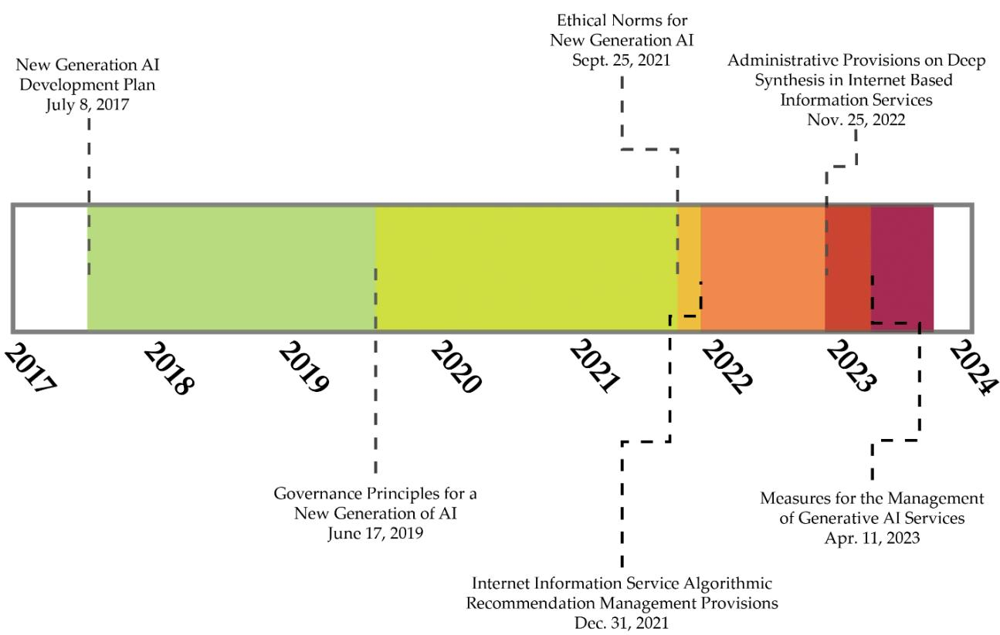

# China: Regulation of Artificial Intelligence

June 2023

LL File No. 2023-022300   
LRA-D-PUB-002640

This report is provided for reference purposes only.   
It does not constitute legal advice and does not represent the official   
opinion of the United States Government. The information provided reflects research undertaken as of the date of writing. It has not been updated.

## Contents

I. Introduction ..   
Figure 1: Timeline of China's AI Governance Initiatives . 3   
II. AI Rules and Governance Principles .. 3   
A. Algorithmic Recommendation Provisions .. 3   
B. Deep Synthesis Provisions . 4   
C. Draft Generative AI Measures . 5   
D. AI Governance Principles .. 6   
III. Cybersecurity and Data Privacy Laws .. 7   
A. Cybersecurity Law . 7   
B. Data Security Law .. . 8   
C. Personal Information Protection Law .. 9   
D. Measures on Security Assessment for Cross-Border Data Transfer... . 10

# China: Regulation of Artificial Intelligence

Laney Zhang Foreign Law Specialist

## SUMMARY

China has not enacted a comprehensive artificial intelligence (AI) law or state regulation, while three major laws governing cybersecurity, data security, and data privacy have been passed in recent years. Joined by other authorities, the Cyberspace Administration of China (CAC) has issued administrative rules regulating AI-related technologies and proposed draft measures regulating generative AI. The country plans to complete building the AI legal, ethical, and policy systems by 2030.

The CAC rules require recommendation algorithms “with public opinion attributes or social mobilization capabilities” to complete a filing with the CAC by providing information including the algorithm type and an algorithm self-assessment report. The CAC rules also set out comprehensive responsibilities for deep synthesis service providers concerning data security and personal information protection, transparency, and technical security.

The draft generative AI measures require service providers using generative AI products to undergo a security assessment before providing services to the public. Providers of generative AI services would be responsible for the legitimacy of the source of any pre-training data or optimization training data used for their generative AI product.

The Cybersecurity Law prohibits various activities endangering cybersecurity, including invading networks, disrupting the normal functioning of networks, or stealing network data. The Data Security Law provides that the state is to establish a data security review system and conduct national security reviews for data handling activities that affect or may affect national security. Transferring important data or personal information abroad that was collected or produced through operations in China is subject to the security assessment measures on outbound data transfers.

## I. Introduction

This report provides a general overview of the current legal system of the People’s Republic of China (PRC or China) regulating artificial intelligence (AI), and addresses the measures ensuring the security of AI systems. In April 2023, the Cyberspace Administration of China (CAC), China’s primary cybersecurity authority, released draft measures to regulate the provision of generative AI services, for example, ChatGPT, to solicit comments from the public on the proposed measures. The measures state that China’s regulatory objective concerning generative AI is to promote its healthy development while ensuring its regulated application.1

Joined by several other authorities, the CAC had previously issued two sets of administrative rules regulating deep-synthesis technology and algorithm recommendation technology (discussed below in Part II). The AI Governance Expert Committee established in the Ministry of Science and Technology has issued the AI governance principles for developing responsible AI.2 It has also promulgated ethical norms for AI activities in China.3 A nonmandatory national standard on the security framework for AI computing platforms is being formulated.4 Local governments, particularly the Shenzhen and Shanghai municipalities, have started issuing their own regulations and policies aimed at promoting the development of the AI industry within their jurisdictions.5

While three major laws governing cybersecurity, data security, and data privacy have been passed in recent years (discussed below in Section III), until now, China has not enacted a comprehensive AI law or state regulation. According to the Next Generation Artificial Intelligence Development Plan, which was issued by the State Council in 2017 and sets forth the country’s long-term strategic goals for AI development, China seeks to become the world’s primary AI innovation center by 2030, when it will complete building the AI legal, ethical, and policy systems.6

The AI development plan states that China is to strengthen research on legal, ethical, and social issues related to AI. It is also to establish regulatory and ethical frameworks to ensure the healthy development of AI. Specifically, China is to conduct research on legal issues related to AI applications, including confirmation of civil and criminal responsibility, protection of privacy and property, and information security utilization. The plan also addresses tax incentives for AI enterprises, formulation of technical standards concerning network security and privacy protection, protection of intellectual property, and construction of the AI security supervision and evaluation system.7

Figure 1: Timeline of China's AI Governance Initiatives

> **AI Description:**
> **Source:** `assets/_page_5_Figure_0.jpg`
> 
> **Generated:** 2026-05-16 01:30:23
> 
> ---
> 
> The image is a timeline chart showing the development and implementation phases of various AI-related policies and regulations from 2017 to 2024. It includes key milestones such as the "New Generation AI Development Plan" (July 8, 2017), "Ethical Norms for New Generation AI" (September 25, 2021), and "Administrative Provisions on Deep Synthesis in Internet-Based Information Services" (November 25, 2022). The timeline is color-coded to distinguish different phases or categories of policy development, with each phase represented by a different color. The chart highlights the progression of AI policy development over the years, with specific dates marked for key policy documents and regulations.

## II. AI Rules and Governance Principles

## A. Algorithmic Recommendation Provisions

In December 2021, the CAC and the Ministry of Industry and Information Technology (MIIT), Ministry of Public Security (MPS), and the State Administration for Market Regulation (SAMR) jointly issued the Internet Information Service Algorithmic Recommendation Management Provisions (Algorithmic Recommendation Provisions). 8 The provisions apply to the use of algorithmic recommendation technology to provide internet information services within the territory of mainland China, unless otherwise stipulated by laws or regulations.9

“Use of algorithmic recommendation technology” refers to “use of generative or synthetic–type, personalized recommendation–type, ranking and selection–type, search filter–type, dispatching and decision-making–type, and other such algorithmic technologies to provide information to users.”10

Among other things, the Algorithmic Recommendation Provisions require providers of algorithm recommendation services “with public opinion attributes or social mobilization capabilities” to complete a filing with the CAC by providing information including the service provider’s name, form of service, application field, algorithm type, algorithm self-assessment report, and content to be publicized.11

## B. Deep Synthesis Provisions

In November 2022, the CAC, MIIT, and MPS jointly issued the Administrative Provisions on Deep Synthesis in Internet-Based Information Services (Deep Synthesis Provisions), which govern “deep synthesis technologies” that are “technologies that use generative sequencing algorithms, such as deep learning and virtual reality, to create text, images, audio, video, virtual scenes, or other information.”12

The Deep Synthesis Provisions set out comprehensive responsibilities for deep synthesis service (DSS) providers and DSS technical supporters concerning data security and personal information protection, transparency, and technical security. For example, DSS providers and DSS technical supporters that provide a function that edits face, voice, or other biometric information must prompt the users of their deep synthesis services to inform the individual whose information is to be edited and obtain the individual’s specific consent in accordance with the law.13

The Deep Synthesis Provisions further require DSS providers and DSS technical supporters to enhance technical management and to regularly review, evaluate, and validate the mechanism and logic of their generative or synthetic algorithms. If they provide any model, template, or other tool with the functions of generating or editing face, voice, other biometric information, or any special object, scene, or other non-biometric information that may involve national security, national image, national interests, or social and public interests, the DSS providers and DSS technical supporters must by law perform a security assessment or have one performed by a professional institution.14

## C. Draft Generative AI Measures

The Deep Synthesis Provisions took effect in January 2023. In April 2023, the CAC published the Measures for the Management of Generative Artificial Intelligence Services, which aim to regulate the provision of generative AI services to the public of mainland China.15 “Generative AI” under the draft measures refers to “technologies generating text, image, audio, video, code, or other such content based on algorithms, models, or rules.”16

According to the draft generative AI measures, before providing services to the public using generative AI products, the providers would be required to apply to the CAC for a security assessment. The requirements of algorithm filing under the Algorithmic Recommendation Provisions would also apply.17

Under the measures, providers of generative AI services would be responsible for the legitimacy of the source of any pretraining data or optimization training data used for their generative AI product. Any pretraining or optimization training data used for a generative AI product would be required to meet all of the following requirements:

1. Conforming to the requirements of the Cybersecurity Law of the People’s Republic of China and other such laws and regulations;

2. Not containing content infringing intellectual property rights;

3. Where data includes personal information, the consent of the personal information subject shall be obtained, or other procedures conforming with the provisions of laws and administrative regulations followed;

4. Be able to ensure the data’s veracity, accuracy, objectivity, and diversity;

5. Other supervision requirements of the state cybersecurity and informatization department concerning generative AI functions and services.18

Furthermore, when providing generative AI services, providers would be required to ask users to register their real identities in accordance with the Cybersecurity Law. 19 Under the Cybersecurity Law, the service providers are prohibited from providing services to any users who do not perform the identity authentication steps.20

In the process of providing services, providers would be obligated to protect users’ input information and usage records. It would be prohibited to unlawfully retain input information that could be used to deduce a user’s identity, profile users based on their input information and usage, or provide users’ input information to others.21

Violation of the measures would be punished in accordance with the Cybersecurity Law, Data Security Law, and Personal Information Protection Law.22 The CAC and other relevant competent authorities would also be able to impose administrative penalties, including a fine ranging from 10,000 yuan to 100,000 yuan (CNY) (about US\$1,392 to US\$13,920).23 If the violation constitutes a violation of public security administration, punishment would be imposed in accordance with that law; if it constitutes a criminal offense, the offender could also be criminally prosecuted.24

## D. AI Governance Principles

The following eight standards comprise China’s AI governance principles:

• harmony and friendliness,

• fairness and justice,

inclusiveness and sharing,

• respect for privacy,

security and controllability,

• shared responsibility,

open cooperation, and

agile governance.25

Regarding security and controllability, the principles state,

AI systems should continuously improve transparency, explainability, reliability, and controllability, and gradually achieve auditability, supervisability, traceability, and trustworthiness. Pay close attention to the safety/security of AI systems, improve the robustness and tamper-resistance of AI, and form AI security assessment and management capabilities.26

Regarding data privacy, the principles state that AI development should respect and protect personal privacy and protect individuals’ right to know and right to choose. Standards should be established for the collection, storage, processing, and use of personal information. Mechanisms to revoke authorized access to personal information should be improved. The theft of, tampering with, illegal disclosure of, and any other illegal collection or use of personal information should be opposed.27

## III. Cybersecurity and Data Privacy Laws

## A. Cybersecurity Law

The PRC Cybersecurity Law was passed in November 2016 and entered into effect on June 1, 2017.28 The purposes of this law include ensuring cybersecurity and safeguarding cyberspace sovereignty and national security. 29 According to the law, the state takes measures for monitoring, preventing, and handling cybersecurity risks and threats arising inside and outside the PRC territory and protects critical information infrastructure against attacks, intrusions, interference, and destruction.30

The Cybersecurity Law prohibits various activities endangering cybersecurity, including invading networks, disrupting the normal functioning of networks, or stealing network data.31 Network operators are required by the law to provide technical support and assistance to the public security organs and the national security organs in the authorities’ activities of protecting national security and investigating crimes.32 “Network operators” under the law include owners and administrators of a network and network service providers.33

For activities endangering cybersecurity that are not serious enough to constitute crimes, the Cybersecurity Law sets out administrative penalties, including confiscation of illegal gains, administrative detention for up to 15 days, and fines.34 A violation of the Cybersecurity Law that is serious enough to constitute a crime is criminally punishable in accordance with the PRC Criminal Law, China’s penal code that has national application.35

The Cybersecurity Law sets out general rules requiring data protection by network operators. Network operators are obligated by the law to establish network information security complaint and reporting systems, publicly disclose information such as the methods for making complaints or reports, and promptly accept and handle complaints and reports relevant to network information security. 36 The law requires network operators to cooperate in supervision and inspections conducted by the internet information authority and other relevant authorities in accordance with the law.37

Network operators are also obliged to monitor the content disseminated by their users. Once a network operator discovers any information that is prohibited by laws or regulations from being published or transmitted, it must immediately stop the transmission of such information, delete the information, take measures to prevent the information from proliferating, keep relevant records, and report to the competent government authorities.38

Network operators and their responsible persons will face fines for failing to authenticate users’ identities, refusing to provide the technical support and assistance to the public security, or rejecting or obstructing the supervision and inspections conducted by the authorities.39 The fine imposed on network operators is from CNY50,000 to CNY500,000 (about US\$7,186 to US\$71,863). The fine imposed on persons directly in charge and other persons who are directly liable is from CNY10,000 to CNY100,000 (about US\$1,437 to \$14,373).40

Where network operators fail to comply with such content monitoring obligations, the competent authorities may order them to rectify the wrongdoing, suspend relevant services, and shut down their websites. The authorities may also revoke relevant licenses and impose a fine on the network operators and their responsible persons.41

## B. Data Security Law

The PRC Data Security Law was passed in June 2021 and entered into effect on September 1, 2021.42 The purposes of the law include ensuring data security, promoting data development and use, protecting the rights and interests of individuals, and “safeguarding national sovereignty, security, and development interests.”43

The Data Security Law provides that the state is to establish a data security review system and conduct national security reviews for data handling activities that affect or may affect national security. According to the law, security review decisions made under it are final decisions.44

Under the Data Security Law, where public security organs and national security organs need to obtain data necessary to safeguard national security or investigate crimes in accordance with law, relevant entities and individuals must cooperate.45 The law provides fines to be imposed on the entities and their responsible persons for refusing to cooperate with the authorities in their obtaining of data.46

## C. Personal Information Protection Law

The PRC Personal Information Protection Law (PIPL) was passed in August 2021 and entered into effect on November 1, 2021.47 The law is formulated to protect personal information rights and interests, standardize personal information processing activities, and promote the rational use of personal information.48

The PIPL applies to the activities of handling the personal information within the territory of mainland China. It may, however, also apply to activities of processing personal information of any individual within China that are carried out outside China, as long as one of the following circumstances is present:

1. Where the purpose is to provide products or services to natural persons inside the borders;

2. Where analyzing or assessing activities of natural persons inside the borders;

3. Other circumstances provided in laws or administrative regulations.49

According to the PIPL, personal information processors must follow the principles of openness and transparency when processing personal information. They must disclose the rules, purpose, method, and scope of processing of personal information.50 Unless laws or regulations stipulate otherwise, they can only retain personal information for the minimum period necessary for achieving the purpose of processing.51 Personal information processors are responsible for their activities of processing of personal information and must take necessary measures to ensure the security of the personal information processed.52

The PIPL allows installment of facial recognition equipment in public spaces that are necessary to maintain public security. The law states that such equipment must be accompanied with a prominent sign indicating the equipment. 53 Any personal image or personal identification information that has been collected can only be used for the purpose of maintaining public security, except where individuals’ separate consent is obtained.54

## D. Measures on Security Assessment for Cross-Border Data Transfer

Transferring important data or personal information abroad that was collected or produced through operations in China is subject to the security assessment measures on outbound data transfers, which were issued by the CAC in July 2022.55 The measures aim to “regulate outbound data transfer activities,” “protect personal information rights and interests,” and “safeguard national security and the social public interest.”56 The measures provide detailed guidance on the security assessment for cross-border data transfer, which supplements the requirements under the Cybersecurity Law, Data Security Law, and PIPL.57

The security assessment is a combination of a self-assessment of security and a mandatory CAC security assessment. 58 The CAC assessment is required in the following three specific circumstances and in a catch-all situation:

1. Where the data handler provides important data abroad;

2. Critical information infrastructure operators and data handlers handling the personal information of over 1 million people providing personal information abroad;

3. Data handlers providing abroad the personal information of more than 100,000 people or the sensitive personal information of more than 10,000 people since January 1 of the previous year;

4. Other circumstances where the State cybersecurity and informatization department provides data export security assessment must be applied for.59