
## Undergraduate Prospectus

2 TOP 10 REASONS WHY NTU SMART CAMPUS IS FOR YOU   
4 BE AMONG THE TOP RANKED   
6 NURTURING TALENT FOR THE GOOD   
8 A TRANSFORMATIVE LEARNING JOURNEY   
10 PREMIER SCHOLARS PROGRAMMES 10 Renaissance Engineering Programme (REP) 11 NTU-University Scholars Programme (NTU-USP) 12 CN Yang Scholars Programme (CNYSP) 13 NTU-NIE Teaching Scholars Programme (TSP)   
14 OTHER PROGRAMMES 14 Undergraduate Research Experience On Campus (URECA) 15 Minor Programmes   
COLLEGE OF ENGINEERING   
18 School of Computer Science and Engineering   
18 School of Electrical and Electronic Engineering   
18 School of Civil and Environmental Engineering   
19 School of Mechanical and Aerospace Engineering   
19 School of Chemistry, Chemical Engineering and Biotechnology   
19 School of Materials Science and Engineering   
COLLEGES OF HUMANITIES, ARTS   
AND SOCIAL SCIENCES   
22 School of Art, Design and Media   
22 School of Humanities   
23 School of Social Sciences   
23 Wee Kim Wee School of Communication and Information   
24 COLLEGES OF SCIENCE 26 Asian School of the Environment 26 School of Biological Sciences 27 School of Chemistry, Chemical Engineering and Biotechnology 27 School of Physical and Mathematical Sciences   
28 LEE KONG CHIAN SCHOOL OF MEDICINE   
30 NANYANG BUSINESS SCHOOL   
32 NATIONAL INSTITUTE OF EDUCATION   
34 BE CAREER SAVVY   
36 WIDEN YOUR WORLDVIEW   
38 LIFE @ NTU SMART CAMPUS 39 Feel at Home at NTU 42 Student Support   
44 BE AN NTU SCHOLAR!   
46 APPLYING TO NTU   
48 FINANCING YOUR STUDY IN NTU

REASONS WHY NTU SMART CAMPUS IS FOR YOU

Industry-ready   
Take advantage of work-study programmes that integrate classroom learning with on-thejob training.

> **AI Description:**
> **Source:** `assets/_page_2_Figure_0.jpg`
> 
> **Generated:** 2026-05-16 02:34:48
> 
> ---
> 
> The image contains a photograph of a person sitting at a table, holding a small object that appears to be a toy or a model. The background shows shelves with various items, possibly tools or equipment, and a vacuum cleaner. The person is wearing a light-colored sweater and is smiling. The setting suggests a casual or home environment.

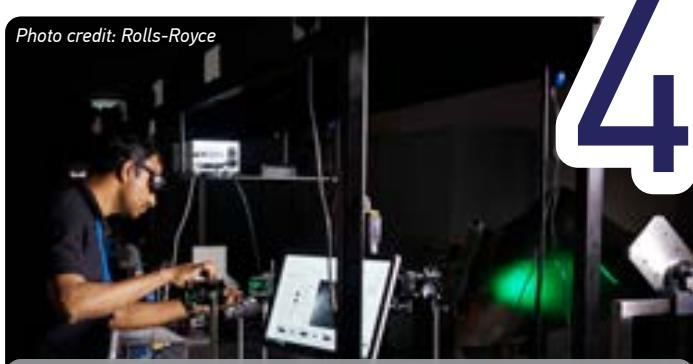

> **AI Description:**
> **Source:** `assets/_page_2_Figure_1.jpg`
> 
> **Generated:** 2026-05-16 02:33:17
> 
> ---
> 
> The image contains a photograph of a person working in a laboratory or workshop setting. The individual appears to be operating or observing equipment, possibly related to aerospace or engineering, given the context of Rolls-Royce. The environment includes various pieces of equipment, cables, and what looks like a computer monitor or control panel. The lighting is dim, with some green light visible, suggesting the use of specialized equipment or machinery. The photo credit is attributed to Rolls-Royce, indicating the image is likely related to their work or research.

Immersion in Research Realise your passion for research with over 200 industry collaborators including those with labs on campus such as Delta Electronics, Saab and Rolls-Royce.
Interdisciplinary Learning Learn across disciplines, acquire multiple skills and develop versatility for new career demands.

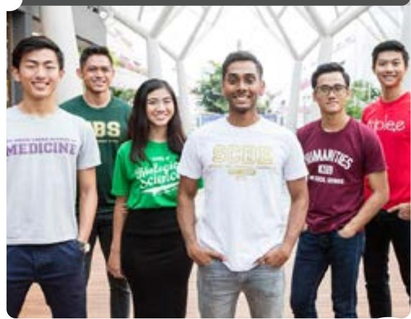

> **AI Description:**
> **Source:** `assets/_page_2_Figure_2.jpg`
> 
> **Generated:** 2026-05-16 02:29:25
> 
> ---
> 
> The image contains a photograph of six individuals standing outdoors. They are dressed casually and appear to be smiling. The individuals are wearing t-shirts with various text printed on them, such as "MEDICINE," "HUMANITIES," and "SCIENCE." The background shows a modern architectural structure with large windows and a glass ceiling. The image conveys a sense of camaraderie and possibly represents a group of students or professionals.

Space to Innovate Explore, experiment and exchange ideas in multidisciplinary teams and make amazing new discoveries.

> **AI Description:**
> **Source:** `assets/_page_2_Figure_3.jpg`
> 
> **Generated:** 2026-05-16 02:32:52
> 
> ---
> 
> The image contains a photograph of a group of people working together in an office environment. They are gathered around a table with laptops, suggesting a collaborative work session. The individuals appear engaged and focused, indicating a professional setting. The office has large windows allowing natural light to enter, and there is a screen in the background displaying some content, possibly related to the work they are doing. The overall atmosphere seems productive and collaborative.

## 5AMDD

Internship   
Opportunities   
Experience real-world work   
environments and get a head start in your career. 9 in 10 NTU graduates land a job within six months of graduation. Global Exposure   
Spread your wings and go places through overseas exchange, internships, field trips, competitions and more.

> **AI Description:**
> **Source:** `assets/_page_2_Figure_4.jpg`
> 
> **Generated:** 2026-05-16 02:37:29
> 
> ---
> 
> The image is a photograph of a person standing outdoors in a snowy landscape. The person is wearing a black leather jacket, a red scarf, and blue jeans. In the background, there are snow-covered buildings and a body of water, possibly a river or lake, with mountains visible in the distance. The setting appears to be a historic or urban area, given the architectural style of the buildings. The overall scene suggests a cold, winter day in a scenic location.

> **AI Description:**
> **Source:** `assets/_page_2_Figure_6.jpg`
> 
> **Generated:** 2026-05-16 02:41:10
> 
> ---
> 
> The image contains a photograph of three individuals walking together outdoors. The setting appears to be a campus or institutional building with white walls and large windows. The individuals are dressed in casual and semi-formal attire, with one person carrying a backpack and another holding a book. The number "7" is prominently displayed in the top right corner of the image. The image conveys a sense of movement and social interaction, possibly related to education or student life.

Be Among the Top Ranked Discover your strengths at a university placed among the best in the world.

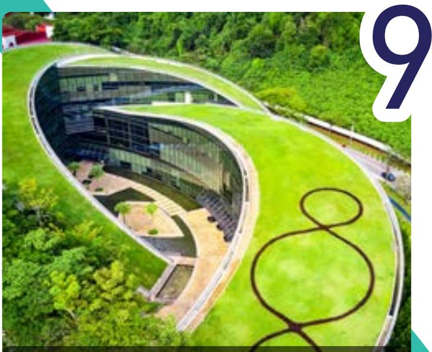

> **AI Description:**
> **Source:** `assets/_page_2_Figure_7.jpg`
> 
> **Generated:** 2026-05-16 02:40:06
> 
> ---
> 
> The image is a photograph of a modern building with a unique architectural design. The building has a curved, multi-level structure with a green roof, blending seamlessly with the surrounding lush greenery. The design appears to be eco-friendly, as indicated by the extensive use of green space and the integration of the building into the natural environment. The image also includes a large number "9" in the top right corner, which might be a label or a marker for the image.

Most Beautiful Campus The University’s main campus is frequently listed among the Top 15 most beautiful university campuses in the world.

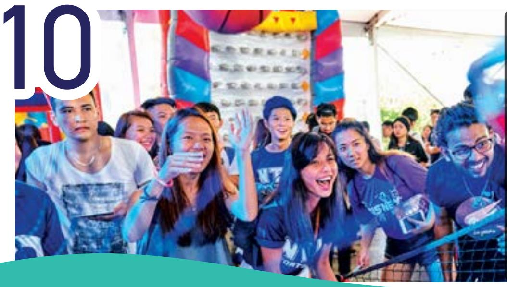

> **AI Description:**
> **Source:** `assets/_page_2_Figure_8.jpg`
> 
> **Generated:** 2026-05-16 02:11:29
> 
> ---
> 
> The image contains a photograph of a group of people, likely at a social or community event. The individuals are smiling and appear to be engaged in a lively interaction. The background features colorful banners and decorations, suggesting a festive or celebratory atmosphere. The image also includes the number "10" in the top left corner, which could indicate a ranking or a part of a sequence. The overall scene conveys a sense of community and enjoyment.

Vibrant Campus Life Choose from a variety of accommodation options, discover new passions and interests, pick from over 200 student organisations, and enjoy numerous sports and recreational facilities.

## BE AMONG THETOP RANKED

## 26th

QS WORLD UNIVERSITY RANKINGS

## 1st

TIMES HIGHER   
EDUCATION YOUNG   
UNIVERSITY   
RANKINGS

> **AI Description:**
> **Source:** `assets/_page_3_Figure_0.jpg`
> 
> **Generated:** 2026-05-16 02:40:44
> 
> ---
> 
> The image contains a simple icon with a blue background. The icon features a white gear with a molecular structure inside it, suggesting a connection between mechanical and chemical or biological processes. The icon is likely used to represent a concept related to technology, engineering, or a combination of mechanical and biological systems.

MATERIALS SCIENCE

U.S. NEWS WORLD & ASIA 1st

QS WORLD UNIVERSITY RANKINGS BY SUBJECT ASIA 1st

SHANGHAIRANKING ASIA 3rd

> **AI Description:**
> **Source:** `assets/_page_3_Figure_1.jpg`
> 
> **Generated:** 2026-05-16 02:40:53
> 
> ---
> 
> The image contains a simple icon of a network or molecular structure. It features a blue square with a white border, inside which there are interconnected nodes or atoms represented by circles connected by lines. The design suggests a concept related to chemistry, biology, or network theory.

NANOSCIENCE & NANOTECHNOLOGY

U.S. NEWS WORLD & ASIA 1st

SHANGHAIRANKING WORLD & ASIA 3rd

> **AI Description:**
> **Source:** `assets/_page_3_Figure_2.jpg`
> 
> **Generated:** 2026-05-16 02:39:13
> 
> ---
> 
> The image contains a simple icon with two laboratory test tubes, one larger and one smaller, placed side by side. The background is blue, and the test tubes are white with black outlines. This icon is commonly used to represent laboratory equipment or scientific experiments.

CHEMISTRY

U.S. NEWS WORLD ASIA3rd 2nd

QS WORLD UNIVERSITY RANKINGS BY SUBJECT ASIA 2nd

> **AI Description:**
> **Source:** `assets/_page_3_Figure_3.jpg`
> 
> **Generated:** 2026-05-16 02:39:04
> 
> ---
> 
> The image is a simple icon of a battery with a leaf symbol inside it. The icon is blue with a white background. The leaf symbol suggests that the battery is environmentally friendly or rechargeable. There are no charts, graphs, or other visual elements present in the image.

ENERGY & FUELS U.S. NEWS WORLD & ASIA 1st

> **AI Description:**
> **Source:** `assets/_page_3_Figure_4.jpg`
> 
> **Generated:** 2026-05-16 02:30:03
> 
> ---
> 
> The image contains a simple icon representing a calculator with a bag next to it. The icon is blue and white, with a clear depiction of a calculator on the left and a bag on the right. This icon likely symbolizes a financial or accounting concept, such as calculating expenses or managing finances.

ACCOUNTING & FINANCE

QS WORLD UNIVERSITY RANKINGS BY SUBJECT ASIA 3rd

> **AI Description:**
> **Source:** `assets/_page_3_Figure_5.jpg`
> 
> **Generated:** 2026-05-16 02:29:45
> 
> ---
> 
> The image contains a simple icon of a building with a clock tower on top, set against a blue square background. The icon is likely meant to represent a school or educational institution, given the clock tower which is commonly associated with time and learning. There are no charts, graphs, or other visual elements present in the image.

## POLITICS

QS WORLD UNIVERSITY RANKINGS BY SUBJECT ASIA 2nd

> **AI Description:**
> **Source:** `assets/_page_3_Figure_6.jpg`
> 
> **Generated:** 2026-05-16 02:34:01
> 
> ---
> 
> The image contains a simple icon of a computer screen with a circuit board design on it. The icon is blue with white elements. It represents a computer or software-related concept, possibly indicating a technical or digital theme.

COMPUTER SCIENCE

U.S. NEWS ASIA 2nd

QS WORLD UNIVERSITY RANKINGS BY SUBJECT ASIA 2nd

SHANGHAIRANKING ASIA 2nd

> **AI Description:**
> **Source:** `assets/_page_3_Figure_7.jpg`
> 
> **Generated:** 2026-05-16 02:34:29
> 
> ---
> 
> The image contains a simple diagram of a neural network or a similar network structure. It features a central node connected to several other nodes, which are interconnected in a pattern that resembles the architecture of a neural network. This type of diagram is commonly used to represent data flow or computational processes in fields such as artificial intelligence and machine learning.

CONDENSED MATTER PHYSICS

U.S. NEWS WORLD & ASIA 1st

> **AI Description:**
> **Source:** `assets/_page_3_Figure_8.jpg`
> 
> **Generated:** 2026-05-16 02:17:52
> 
> ---
> 
> The image contains a simple icon of a hand holding a beaker, which is commonly associated with laboratory or scientific work. The icon is blue with a white background, and there is no text or additional visual elements present. The icon is likely used to represent a laboratory setting or scientific research in a broader context.

PHYSICAL CHEMISTRY

U.S. NEWS WORLD & ASIA 1st

> **AI Description:**
> **Source:** `assets/_page_3_Figure_9.jpg`
> 
> **Generated:** 2026-05-16 02:17:40
> 
> ---
> 
> The image contains a simple icon with a blue background. At the center of the icon is a white circuit board with the letters "AI" written in black. The icon represents artificial intelligence.

DATA SCIENCE &ARTIFICIALINTELLIGENCE

U.S. NEWS WORLD & ASIA 2nd

QS WORLD UNIVERSITY RANKINGS BY SUBJECT ASIA 2nd

> **AI Description:**
> **Source:** `assets/_page_3_Figure_10.jpg`
> 
> **Generated:** 2026-05-16 02:21:45
> 
> ---
> 
> The image is a simple icon depicting a computer monitor with two speech bubbles and a folder icon. The icon suggests communication or collaboration, possibly related to email or messaging within a digital environment.

## MARKETING

QS WORLD UNIVERSITY RANKINGS BY SUBJECT ASIA 2nd

> **AI Description:**
> **Source:** `assets/_page_3_Figure_11.jpg`
> 
> **Generated:** 2026-05-16 02:20:51
> 
> ---
> 
> The image contains a simple icon of a brain. The icon is a white brain shape on a blue background. There are no charts, graphs, or other visual elements present. The image is purely a graphic symbol representing the human brain.

PSYCHOLOGY

QS WORLD UNIVERSITY RANKINGS BY SUBJECT ASIA 2nd

AUTOMATION & CONTROL

SHANGHAIRANKING ASIA 2nd

> **AI Description:**
> **Source:** `assets/_page_3_Figure_13.jpg`
> 
> **Generated:** 2026-05-16 02:23:52
> 
> ---
> 
> The image contains a simple icon with a blue square background. Inside the square, there is a white speech bubble with a message icon on the left, and to the right of the speech bubble, there is a gear icon. This icon typically represents settings or configuration options in various applications.

BUSINESS & MANAGEMENT STUDIES

QS WORLD UNIVERSITY RANKINGS BY SUBJECT ASIA 2nd

> **AI Description:**
> **Source:** `assets/_page_3_Figure_14.jpg`
> 
> **Generated:** 2026-05-16 02:25:03
> 
> ---
> 
> The image contains a simple icon with a blue background and a white border. Inside the icon is a gear symbol, which is commonly associated with settings, configuration, or technical adjustments. There is no text or additional visual content within the icon.

CHEMICAL ENGINEERING

QS WORLD UNIVERSITY RANKINGS BY SUBJECT ASIA 2nd

> **AI Description:**
> **Source:** `assets/_page_3_Figure_15.jpg`
> 
> **Generated:** 2026-05-16 02:25:06
> 
> ---
> 
> The image contains a simple icon with a blue background and white text. The icon depicts three stacked cubes, which are commonly used to represent data or storage in a digital context. The icon is likely used to symbolize a concept related to data management, storage, or cloud computing.

CIVIL & STRUCTURAL

QS WORLD UNIVERSITY RANKINGS BY SUBJECT ASIA 3rd

> **AI Description:**
> **Source:** `assets/_page_3_Figure_16.jpg`
> 
> **Generated:** 2026-05-16 02:24:53
> 
> ---
> 
> The image contains a blue square with a white speech bubble icon inside it. The speech bubble icon has two speech bubbles within it, one larger and one smaller, suggesting a conversation or dialogue. There is no text or additional visual content beyond the icon itself.

## COMMUNICATION

QS WORLD UNIVERSITY RANKINGS BY SUBJECT WORLD 4th ASIA 1st

SHANGHAIRANKING ASIA 1st

EDUCATION

QS WORLD UNIVERSITY RANKINGS BY SUBJECT ASIA 2nd

STATISTIC & OPERATIONAL RESEARCH

QS WORLD UNIVERSITY RANKINGS BY SUBJECT ASIA 3rd

> **AI Description:**
> **Source:** `assets/_page_3_Figure_19.jpg`
> 
> **Generated:** 2026-05-16 02:25:34
> 
> ---
> 
> The image contains a single icon of a gear with a lightning bolt inside it, set against a blue background. The gear represents a settings or configuration icon, and the lightning bolt symbolizes power, energy, or a dynamic process. This icon is commonly used to represent settings or options related to power, energy, or system configuration.

ELECTRICAL & ELECTRONIC ENGINEERING

U.S. NEWS WORLD & ASIA 2nd

QS WORLD UNIVERSITY RANKINGS BY SUBJECT ASIA 2nd

SHANGHAIRANKING ASIA 2nd

ENGINEERING & TECHNOLOGY

U.S. NEWS WORLD & ASIA 2nd

QS WORLD UNIVERSITY RANKINGS BY SUBJECT ASIA 3rd

TIMES HIGHER EDUCATION ASIA 2nd

ENVIRONMENTAL SCIENCE

QS WORLD UNIVERSITY RANKINGS BY SUBJECT ASIA 3rd

> **AI Description:**
> **Source:** `assets/_page_3_Figure_22.jpg`
> 
> **Generated:** 2026-05-16 02:28:25
> 
> ---
> 
> The image contains a simple icon of a computer monitor with a magnifying glass and a bar graph. The icon suggests the theme of data analysis or search functionality related to computer data.

LIBRARY & INFORMATION MANAGEMENT

QS WORLD UNIVERSITY RANKINGS BY SUBJECT ASIA 1st

> **AI Description:**
> **Source:** `assets/_page_3_Figure_23.jpg`
> 
> **Generated:** 2026-05-16 02:28:29
> 
> ---
> 
> The image contains a simple diagram of a crane lifting a load. The crane is depicted with a hook and arm, and the load is shown as a rectangular shape. The diagram is minimalistic and does not include any text or additional labels. The focus is on the crane and the load it is lifting, suggesting a representation of lifting or construction equipment.

MECHANICAL, AERONAUTICAL & MANUFACTURING

QS WORLD UNIVERSITY RANKINGS BY SUBJECT ASIA 2nd

SHANGHAIRANKING WORLD & ASIA 2nd

> **AI Description:**
> **Source:** `assets/_page_4_Figure_0.jpg`
> 
> **Generated:** 2026-05-16 02:40:35
> 
> ---
> 
> The image contains a photograph of a sports scene. It shows three individuals playing a game on a grassy field. One player in a dark uniform is holding a ball and appears to be running with it, while two other players, one in an orange tank top and the other in a dark uniform, are in pursuit. The image has a white curved shape in the foreground with the word "NURTURING" written in bold, dark letters. The photograph captures a dynamic moment of action and competition.

# NURTURING TALENT FOR THE GOOD

NTU fosters an environment that promotes learning and empowers you to nurture your skills in the service of making the world a better place. As part of your holistic education, you will learn to:

STAND OUT and be selfpossessed individuals who seek excellence in every endeavour

have a strong sense of purpose and utilise your talents to STAND UP for worthy causes

develop a positive attitude and a STANDPOINT that seeks to build, unite and heal

To support students who display a strong set of skills in the arts, sports and community-building, NTU offers these programmes:

## NTU TALENT SCHOLARSHIP (TS)

Designed to aid you in developing your non-academic strengths

• Expands the definition of success beyond grades

• Provides opportunities to realise your potential

• Full coverage of subsidised tuition fees

## BENEFITS

• Living allowance of S\$6,500 per academic year

Accommodation allowance of up to S\$2,000 per academic year (on-campus)

• One-off computer allowance of S\$1,750

## NTU STUDENT TALENT DEVELOPMENT PROGRAMME (STDP)

S\$5,000 grant to participate in competitions or to create social initiatives for the community

Empowers you to hone your skills to make a difference

Offers curated programmes to develop competencies relevant to your advocacies

Familiarises you with industries/institutions related to the paths you wish to pursue

## WHICH NTU UNDERGRADUATE ARE YOU?

## Forge the path to your future

Learn how disruptive technologies and innovations such as artificial intelligence (AI), data analytics, FinTech and cloud computing can digitally transform industries, improve organisations, and enhance the quality of life in communities.

> **AI Description:**
> **Source:** `assets/_page_4_Figure_2.jpg`
> 
> **Generated:** 2026-05-16 02:39:24
> 
> ---
> 
> The image contains a combination of text and visual elements. It features a person sitting at a desk with a laptop, suggesting a work or study environment. The person is wearing a green shirt and has a beard. There is a globe icon with a checkmark next to it, indicating approval or success. Additionally, there is a bar graph icon and the word "CHAMPION" with a globe icon, suggesting a theme of global achievement or success. The overall image conveys a sense of accomplishment and global connectivity.

Turn research innovations into great business ideas or your very own start-up, and uncover opportunities that can solve pressing challenges that organisations, societies and countries face today.

## ECO CHAMPION

Leverage your education to combat climate change, poverty, and inequality, and advocate for the UN’s Sustainable Development Goals. Be at the forefront of green technologies such as clean energy, renewable energy, food tech and green financing.

## WELLBEING & HEALTHCARE ADVOCATE

> **AI Description:**
> **Source:** `assets/_page_4_Figure_4.jpg`
> 
> **Generated:** 2026-05-16 02:31:24
> 
> ---
> 
> The image contains a visual representation of a scientist or researcher holding a clipboard and presenting a slide. The slide includes a DNA double helix diagram, a bar graph, and a circular graph with dots. The scientist is wearing a lab coat and appears to be explaining or discussing the content of the slide, which likely pertains to genetic or biological data.

Build skills and knowledge to help people improve their physical and psychological wellbeing, as well as enhance their mental fitness and address the challenges of ageing.

Understand what makes societies tick, how people connect through culture and customs, the intricacies of laws and belief systems, and the ways communities use the arts to express themselves.

# A TRANSFORMATIVE LEARNING JOURNEY YOUR 4 YEARS AT NTU

At NTU, the possibilities are endless when it comes to your pursuit of becoming the best version of yourself. Being in one of the world’s highly-recognised, research-intensive, diversity-embracing universities, you will:

> **AI Description:**
> **Source:** `assets/_page_5_Figure_0.jpg`
> 
> **Generated:** 2026-05-16 02:34:57
> 
> ---
> 
> The image contains a simple icon of a person holding a flag. The icon is a flat, two-dimensional representation with no additional visual elements or text. The person is depicted as a basic outline, and the flag is a small rectangle with a diagonal line, suggesting a flagpole. There are no charts, graphs, or other visual elements present.

BE INSPIRED TO BE A TRAILBLAZER

> **AI Description:**
> **Source:** `assets/_page_5_Figure_1.jpg`
> 
> **Generated:** 2026-05-16 02:33:03
> 
> ---
> 
> The image contains a simple diagram of a circular puzzle piece. The puzzle piece is divided into four equal sections, each with a small gap between them, forming a complete circle. There are no labels or text annotations within the image. The diagram is likely used to represent concepts such as teamwork, collaboration, or the completion of a task.

MASTER FUTURE-READY SKILLS

DISCOVER THE LEADER IN YOU

> **AI Description:**
> **Source:** `assets/_page_5_Figure_2.jpg`
> 
> **Generated:** 2026-05-16 02:29:15
> 
> ---
> 
> The image contains a simple icon of two people standing side by side, facing forward. The icon is a flat, two-dimensional representation with no additional text or labels. It appears to symbolize a pair of individuals, possibly representing a team, partnership, or collaboration. The icon is uniform in color and style, with no gradients or shading, and is likely used in a digital interface or as part of a larger infographic or presentation.

> **AI Description:**
> **Source:** `assets/_page_5_Figure_3.jpg`
> 
> **Generated:** 2026-05-16 02:32:57
> 
> ---
> 
> The image contains a simple icon that represents a globe with an arrow pointing towards it. The globe is depicted with a blue outline and the arrow is also blue, suggesting a direction or movement towards the globe. This icon is commonly used to represent global communication, internet connectivity, or global navigation.

BUILD LIFELONG FRIENDSHIPS

GAIN A GLOBAL PERSPECTIVE

CULTIVATE A DIVERSE NETWORK

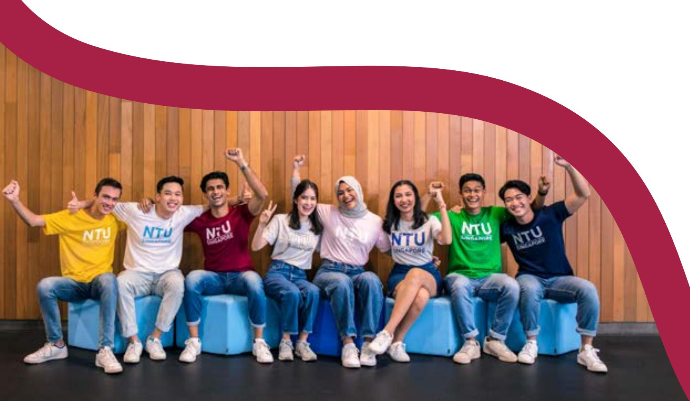

> **AI Description:**
> **Source:** `assets/_page_5_Figure_4.jpg`
> 
> **Generated:** 2026-05-16 02:35:58
> 
> ---
> 
> The image contains a group of individuals sitting on blue stools in front of a wooden panel background. They are wearing t-shirts with "NTU Singapore" printed on them. The group appears to be posing for a photo, with some members raising their hands in a celebratory gesture. The image is framed with a red curved design on the top and right side.

NTU offers plenty of opportunities to enrich your learning journey as a student, as a professional, and as a person. Here’s an overview of how you can make the most of your 4 years of holistic education:

## YEAR 1

Start your NTU learning journey with the Transition and Orientation Programme

Complement your studies with different CCAs and Volunteer Programmes

Gain interdisciplinary knowledge and skills with NTU Interdisciplinary Collaborative Core Courses

Hone your leadership skills through the Student Leadership Development Programme - Foundational Leadership

Meet your career coach Identify your career goals, personal strengths and skills

Attend company visits and job shadowing programmes Understand more about the industry

Discover your future with GEM Discoverer short-term summer or winter programmes

## YEAR 2

Attend career & employability skills workshop Equipped yourself with career-savvy skills

Learn beyond your classroom with GEM Explorer – Semester Global Exchange

Develop research capabilities with university-wide Undergraduate Research Experience on Campus (URECA) Programme

Participate in hackathons and industry projects Develop industry skills and networks

Discover your future with GEM Discoverer short-term summer or winter programmes

## YEAR 3

Embark on credit bearing/global internship

Participate in mentorship programmes Be mentored by alumni and industry professionals

## YEAR 4

Kickstart your job application

Attend recruitment events and career fairs Network with employers and secure employment

## ABOUT

The Renaissance Engineering Programme (REP) grooms enterprising engineering leaders who are ready to make an impact on the world stage. Our integrated and fully residential programme covers a broad spectrum of multidisciplinary subjects bridging engineering, business and humanities.

As a REP scholar, you can spend one year overseas at a renowned partner university, including a mandatory Professional Attachment in the United States, Europe or Singapore. This four-and-a-half-year dualdegree programme comprises Bachelor of Engineering Science (with specialisation in a chosen engineering discipline) awarded by the College of Engineering, and Master of Science in Technology Management, awarded by the Nanyang Business School.

## PROGRAMME FEATURES

• Team-based learning pedagogy

• Leadership and Entrepreneurship development

• Taught by top faculty (REP Fellows)

• Residential experience and student life

## ABOUT

The NTU-University Scholars Programme (NTU-USP) aims to develop future independent thinkers and empathetic leaders with a global mindset.

As an NTU-USP scholar, you will form part of a truly interdisciplinary, strongly intellectual, highly supportive community designed to prepare you for a wide array of personal and professional endeavours. You will benefit from a special curriculum that exposes you to international perspectives, enhances your creative thinking, and encourages critical reflection. You will learn from small discussion-based seminars with top faculty, thought-provoking modules, a lively student club and overseas travel opportunities.

## PROGRAMME FEATURES

• Semester-long Study Abroad programme

• Overseas student symposium

Week-long overseas research under Fieldwork and Documentation module

• Elective with travel component

## ABOUT

The CN Yang Scholars Programme (CNYSP) nurtures future leaders at the interface of science and engineering, with a focus on technological innovation and scientific communication.

Through CNYSP, you will acquire skills that will make you a better innovator such as research, makingand-tinkering, academic writing and communication, among many others. You will also get to learn beyond the classroom, through conferences and internship opportunities.

## PROGRAMME FEATURES

• Research attachment opportunities from Year 1

• Financial support to undertake overseas research projects in the final year

• Option to pursue postgraduate study (PhD) with scholarship in NTU or Joint PhD overseas

## ABOUT

The NTU-NIE Teaching Scholars Programme (TSP) augments the fouryear Double Major Programme that aims to nurture a new generation of well-rounded, passionate, inspiring educators.

Focusing on content mastery, pedagogical knowledge, and theory-practice nexus, TSP’s multidisciplinary curriculum will give you the opportunity to develop intellectual rigour, leadership skills and a global perspective.

## PROGRAMME FEATURES

• Academic and educational research

• Dedicated academic advisors

• Opportunities to take Masters level courses

• Minor in second academic subject

# UNDERGRADUATE RESEARCH EXPERIENCE ON CAMPUS(URECA)

Designed to foster a university-wide research culture and develop research capabilities among students, the URECA programme offers you the opportunity to pursue your own independent research under the mentorship of faculty of your choice.

Within one academic year (August to June), you will gain practical skills, insights and interactions that will be value for higher degree (PhD) research or a professional career in research.

The programme is available to undergraduates from 2nd year onwards and who meet the eligibility requirements. Please visit URECA website for more information.

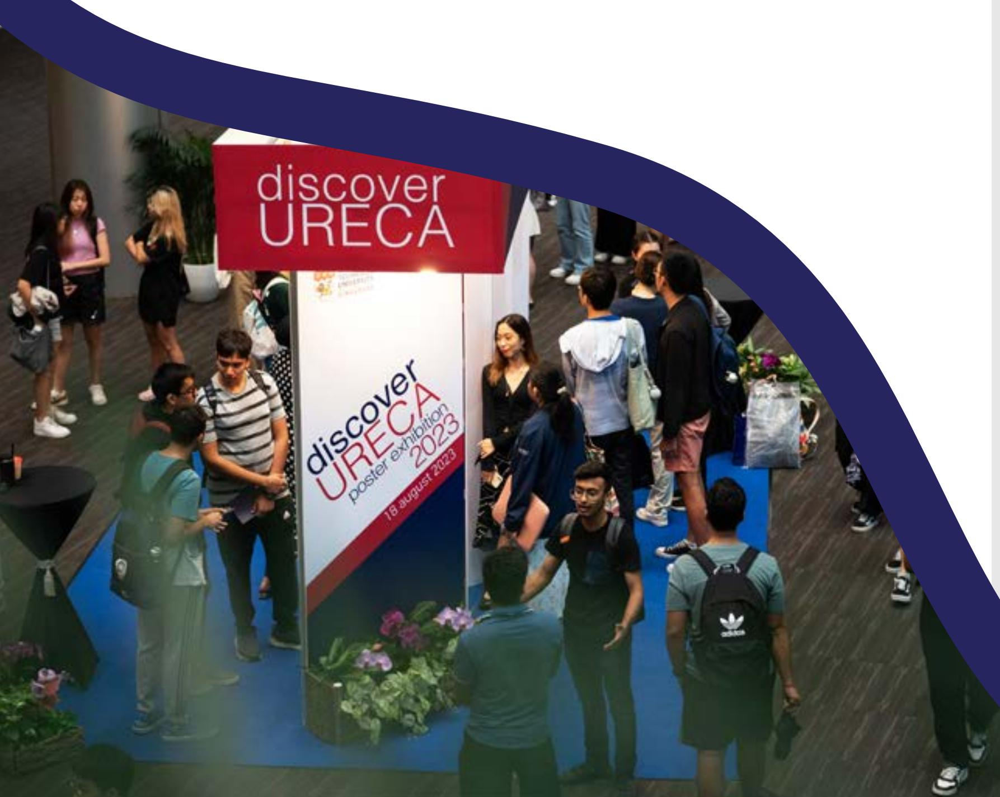

> **AI Description:**
> **Source:** `assets/_page_8_Figure_0.jpg`
> 
> **Generated:** 2026-05-16 02:28:22
> 
> ---
> 
> The image contains a photograph of a poster exhibition titled "Discover URECA poster exhibition 2023." The poster is prominently displayed in the center of the image, with attendees gathered around it, engaging in conversation and viewing the content. The text on the poster indicates the event date as 18 August 2023. The setting appears to be indoors, with a modern and professional atmosphere, suggesting an academic or research-related event.

# MINOR PROGRAMMES

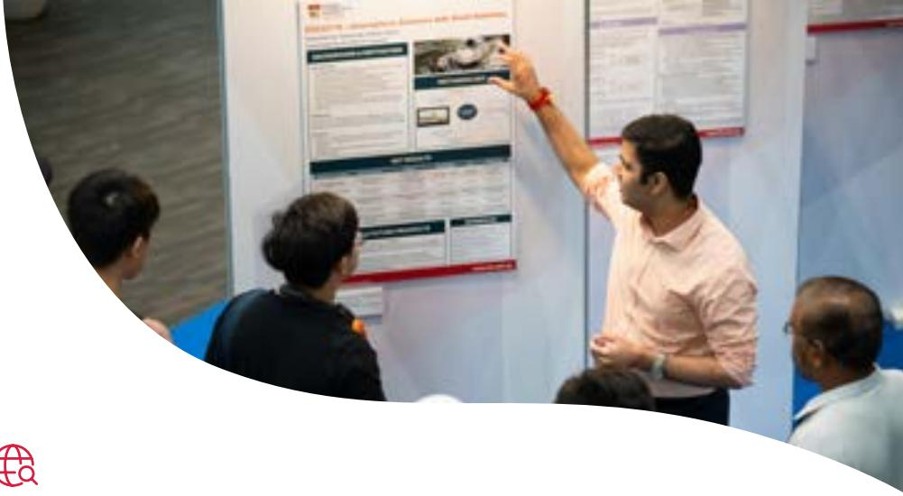

> **AI Description:**
> **Source:** `assets/_page_8_Figure_1.jpg`
> 
> **Generated:** 2026-05-16 02:28:41
> 
> ---
> 
> The image contains a man presenting a poster at what appears to be a conference or seminar. The poster includes text, images, and diagrams related to a topic, likely in a scientific or technical field. The man is pointing to a specific section of the poster, indicating a point of interest or explanation. The audience is seated and appears to be listening attentively. The setting suggests an interactive session where the presenter is sharing information with attendees.

With more than 45 minors to choose from, you will be able to broaden your knowledge and acquire a diverse set of skills beyond your disciplines.

## LIST OF MINORS

• Applied Physics • Global Asia   
• Archaeology • Health and Society   
• Art History • History   
• Artifical Intelligence • International Trading   
• Business • Life Sciences   
• Chemistry and Biological Chemistry • Linguistics and Multilingual Studies   
• Chinese • Mathematics   
• Chinese Creative Writing • Modern Languages   
• Communication Studies • Music   
• Computing and Data Analysis • Philosophy   
• Creative Writing • Physics   
• Design and Systems Thinking • Photography   
• Digitalisation and Data Analytics • Psychology   
• Drama and Performance • Public Policy and Global Affairs   
• Early Childhood Education • Risk Analytics   
• Economics • Science of Learning   
• Education Studies • Science, Technology and Society   
• English Language • Sociology   
• English • Special Needs Education   
• Entrepreneurship • Sport Science   
• Environmental Humanities • STEM Education   
• Environmental Management • Strategic Communication   
• Film • Sustainable Urban Planning   
• Finance • Sustainability   
• Gender and Diversity Studies • Systems Management   
• Geography and Urban Studies • Translation   
• Youth Work and Guidance

## ABOUT

Unlock your full potential by joining one of the world’s most prestigious Engineering colleges. The College of Engineering in NTU offers a topnotch curriculum, a host of internship opportunities and a Global Immersion programme crafted to broaden your perspective and equip you for a successful career.

## OUR SCHOOLS

School of Chemistry, Chemical Engineering and Biotechnology\*

School of Civil and Environmental Engineering

School of Computer Science and Engineering

School of Electrical and Electronic Engineering

School of Materials Science and Engineering

School of Mechanical and Aerospace Engineering

\*Jointly managed by College of Engineering and College of Science

Note: All Bachelor of Engineering programmes are accredited by the Institution of Engineers Singapore, the Singapore signatory of the Washington Accord, through its Engineering Accreditation Board. The Washington Accord is an international agreement for mutual recognition of the substantial equivalence of engineering academic programmes in satisfying the academic requirements for the practice of engineering at the professional level.

A Minor in Business and a Minor in International Trading are offered to all single degree engineering programmes except Data Science & Artificial Intelligence and Maritime Studies.

## New Programme

→ Bachelor of Science (Hons) in Artificial Intelligence (AI) and Society

U.S. News and World Report Rankings 2023 for Engineering

## Choose from

11 single degree Bachelor of Engineering programmes

3 single degree Bachelor of Science programmes

O Read a double degree, second major, or minor with choices from over 40 disciplines

## WHY CHOOSE US?

## Real-World Experience

Together with industry partners, we offer internship opportunities for you to gain practical, industryrelevant work experience.

## Going Places

## Holistic Education

Our Global Immersion programmes will expand your perspective, extend your networks and expose you to future opportunities.

In addition to technical competencies, we equip you with key transferable skills such as communication, analytical and entrepreneurial capabilities.

## Industry Exposure

Our Work-Study Degree Programmes integrate institutionbased learning with structured on-the-job training so you can gain deeper industry knowledge.

As a Mechanical Engineering student, my learning journey has been nothing short of enriching. The dynamic programme opened doors for me to gain valuable hands-on experiences while the wide selection of unrestricted electives (UEs) let me explore interests outside my curriculum. My presidency in the Robotics Club has also allowed me to meet peers who share similar passions while honing my leadership skills.

STELLA CHUA ZHI YUN Mechanical Engineering, Year 3

## GUIDE

→ Engineering Undergraduate Programme at NTU CoE

## SECOND MAJORS AND DOUBLE DEGREE PROGRAMME

→ Second Major in Data Analytics

→ Second Major in Business

→ Second Major in Entrepreneurship

→ Second Major in Food Science and Technology

→ Second Major in Medical Biology

→ Second Major in Pharmaceutical Engineering

→ Second Major in Society and Urban Systems

→ Double Degree in Engineering and Economics

## LEARN MORE

SCHOOL OF

## COMPUTER SCIENCE AND ENGINEERING (SCSE)

> **AI Description:**
> **Source:** `assets/_page_10_Figure_0.jpg`
> 
> **Generated:** 2026-05-16 02:35:02
> 
> ---
> 
> The image contains two icons: one resembling a camera and the other resembling a play button. These icons are commonly associated with photo and video functionalities, respectively. The camera icon is typically used to represent taking or viewing photos, while the play button icon is used to represent playing or viewing videos. The image does not contain any text or additional visual elements beyond these two icons.

## ABOUT

Consistently ranked among the top in computer science and engineering, SCSE is the place for you to pursue innovative interdisciplinary programmes such as the double degree in Business & Computing and the Data Science and Artificial Intelligence (DSAI) degree, or several new programmes that combine computing and data science with fields like FinTech, Economics and Social Sciences.

## OUR ADVANTAGES

Ranked No. 6 for Computer Science in the latest U.S. News Best Global Universities 2023

> **AI Description:**
> **Source:** `assets/_page_10_Figure_3.jpg`
> 
> **Generated:** 2026-05-16 02:39:49
> 
> ---
> 
> The image contains a simple icon of a computer monitor with a circular icon inside it, which appears to represent a user profile or account symbol. The icon is blue with a white background. There are no charts, graphs, or other visual elements present. The image is purely a graphical representation of a user interface element.

SCSE graduates are top earners amongst Singapore’s fresh graduates (MOE Graduate Employment Survey 2022)

Listed on Forbes ‘10 Best AI and Data Science Undergraduate Courses for 2021’

Intelligence (AI) by U.S. News Best Global Universities in 2023; No. 3 AI research citations by the Times Higher Education

Strong industry collaborations allow students access to in-house corporate labs, research institutes, cutting-edge research technology and hands-on training

## SCHOOL OF ELECTRICAL AND ELECTRONIC ENGINEERING(EEE)

## ABOUT

Take the first step into becoming one of tomorrow’s top innovators at EEE. With over 3,000 undergraduate students and more than 1,000 graduate students, our robust curriculum, global reputation for excellence, far-reaching overseas exchange programme and vibrant research environment are designed to empower you to be a true game-changer.

## OUR ADVANTAGES

Ranked No. 1 in Asia and No. 9 in the world by QS World University Rankings by subject

Strong co-curricular training on machine learning, data analytics and practical applications of EEE technologies

Partnership with some 300 universities in over 40 countries for our Global exchange programme

> **AI Description:**
> **Source:** `assets/_page_10_Figure_13.jpg`
> 
> **Generated:** 2026-05-16 02:39:37
> 
> ---
> 
> The image contains a simple icon representing a group of people. It is a blue circle with a white outline, inside which there are multiple smaller blue shapes arranged in a circular pattern, symbolizing a group or network of individuals. There are no text annotations or additional visual elements present.

Four corporate laboratories for joint research & development with industry partners

## SCHOOL OF CIVIL AND ENVIRONMENTAL ENGINEERING (CEE)

## ABOUT

As a leading School in Sustainability and Built Environment, CEE offers you the right foundation as you pursue any of these three disciplines: Civil Engineering (on built environment), Environmental Engineering (on environmental sustainability) and Maritime Studies (on shipping management).

## OUR ADVANTAGES

Consultations with industry partners to encompass latest industry applications and trends in curriculum

Mentorship programme by H31 prominent alumni and industry practitioners

complemented by integrated design projects, industrial visits, and seminars

Extensive internship and hands-on opportunities

## SCHOOL OF MECHANICAL AND AEROSPACE ENGINEERING(MAE)

## ABOUT

MAE’s programmes are continuously updated to keep pace with the evolving demands of the industry. Beyond traditional lectures, you will learn from hands-on projects, stateof-the-art laboratory experiments, and interactions with industry partners. It’s a holistic learning experience that’s in tune with the times and in sync with your goals.

## OUR ADVANTAGES

Ranked 5th in the world by subject (QS World Subject ranking 2021)

> **AI Description:**
> **Source:** `assets/_page_10_Figure_25.jpg`
> 
> **Generated:** 2026-05-16 02:20:34
> 
> ---
> 
> The image contains a simple icon of two hands shaking, with a bar graph above them. The bar graph appears to represent some form of data or progress, with the bars increasing in height, suggesting growth or improvement. The hands shaking likely symbolize a partnership, agreement, or collaboration.

Diverse faculty renowned for their research and contributions to the field

Alliances with industry leaders keep our curriculum and projects on the cutting edge

First and only full-fledged aerospace engineering degree in Singapore

> **AI Description:**
> **Source:** `assets/_page_10_Figure_27.jpg`
> 
> **Generated:** 2026-05-16 02:13:49
> 
> ---
> 
> The image contains a simple icon of a gear, which is commonly used to represent settings, configuration, or options in various contexts. The icon is a solid shape with a central hole and multiple spokes, resembling a traditional gear. There is no text or additional visual information beyond the gear icon itself.

Home to innovative projects such as the world’s first flexible endoscope with small robotic fingers, solar cars, 3D-printed parts, and unmanned, GPSenabled aerial vehicles

## SCHOOL OF CHEMISTRY, CHEMICAL ENGINEERING AND BIOTECHNOLOGY(CCEB)

## ABOUT

CCEB hosts world-class education and research in chemical engineering, inorganic chemistry, organic chemistry, biomedical engineering, biotechnology, and other fields. Be one of our futureready graduates and thrive in exciting careers in growth industries including chemicals, healthcare, energy, sustainability, food and agriculture, and data analytics.

## OUR ADVANTAGES

Internationally-renowned faculty members who are leading experts in their fields

Ample opportunities to perform cutting-edge research

> **AI Description:**
> **Source:** `assets/_page_10_Figure_31.jpg`
> 
> **Generated:** 2026-05-16 02:20:37
> 
> ---
> 
> The image contains a simple icon representing a group of people. The icon is a stylized representation of a group of individuals, likely symbolizing a team, group, or community. It is a flat, two-dimensional graphic with no additional visual elements or text annotations.

World-class learning environment with well-designed classrooms and state-of-the-art laboratories

Wide-ranging professional internships, extensive global immersion programmes, and opportunities to participate in competitions and projects

## SCHOOL OF MATERIALS SCIENCE AND ENGINEERING (MSE)

## ABOUT

At the world’s largest institution for Materials Engineering, you will benefit from an integrated sciencedriven and application-oriented education in advanced materials, giving you an advantage when seeking opportunities in diverse industries post-graduation.

## OUR ADVANTAGES

Ranked 1st for Materials Science subject in the U.S. News Global Universities Rankings (2022) and in the top 10 of QS World University Rankings (2023)

Excellence in education and research led by globally recognised and highly cited faculty, with 25 ranked World’s Top 2% Scientists

Curriculum that is aligned with industry needs with industry partnerships for internships and other course components

> **AI Description:**
> **Source:** `assets/_page_10_Figure_38.jpg`
> 
> **Generated:** 2026-05-16 02:41:16
> 
> ---
> 
> The image contains a simple icon of a briefcase with an envelope inside it. This icon typically represents email or communication related to work or business. There are no charts, graphs, or other visual elements present in the image.

Specialisations to level up for your career of choice such as Industrial Materials Engineering, Medical Materials, Nanoscience & Nanotechnology, Materials & AI

## ABOUT

Cultivate your skills, expand your worldview and flourish as a person at CoHASS. Home to some 6,000 undergraduate and graduate students, we offer well-balanced programmes that foster a culture of excellence, intellectual rigour, global insight and creativity.

At CoHASS, you can choose from a wide range of Majors, Integrated Second Majors, Second Majors, Minors, and an expansive list of modern languages.

## OUR SCHOOLS

• School of Art, Design and Media

• School of Humanities

• School of Social Sciences

• Wee Kim Wee School of Communication and Information

• Nanyang Centre for Public Administration

NTU Centre for Contemporary Art Singapore

Centre for Liberal Arts and Social Sciences

## New Programme

→ Bachelor of Social Science in Philosophy, Politics and Economics

## WHY CHOOSE US?

> **AI Description:**
> **Source:** `assets/_page_11_Figure_3.jpg`
> 
> **Generated:** 2026-05-16 02:34:36
> 
> ---
> 
> The image contains a simple icon of a globe with four human figures inside it. The globe is a light blue color, and the figures are depicted in a simplified, stylized manner. The icon likely represents a global community or a group of people from around the world.

## Globally-Recognised

> **AI Description:**
> **Source:** `assets/_page_11_Figure_4.jpg`
> 
> **Generated:** 2026-05-16 02:40:09
> 
> ---
> 
> The image contains a simple icon of a globe with interconnected lines around it, representing a global network or interconnected systems. The icon is teal in color and is a flat design with no additional text or annotations.

7 CoHASS Majors are ranked in the world’s top 50 by the QS World University Rankings by Subject 2023

## Global Perspectives

Our programmes promoting internationalisation and cross-cultural understanding will enable you to grow as a thoughtful citizen of the world

## Multidisciplinary Excellence

## Communication-Focused

Our Double Major programmes are designed to give you the opportunity to study multiple subjects at an advanced level

> **AI Description:**
> **Source:** `assets/_page_11_Figure_7.jpg`
> 
> **Generated:** 2026-05-16 02:37:33
> 
> ---
> 
> The image is a simple line drawing of a human head with lines extending from it, resembling neural connections or a brain with thought processes. It is a diagram representing concepts related to cognition, thinking, or mental processes.

We place strong emphasis on analytic and communicative competence as a desired learning outcome

## Top-Notch Faculty

Our world-class faculty of arts, humanities and social science scholars encourage critical thinking and guide you to realise your potential

WKWSCI is a hub where creativity merges with culture, fostering inspiration and a supportive peer network.

A highlight of my time here was participating at the Cannes Lions International Festival of Creativity. Preceded by industry guest lectures, we dedicated weeks to hone our craft for global competitions, resulting in a triumphant AKQA Future Lions win.

But beyond the accolades, people are at the centre of my journey here, and the opportunities afforded to me by the school are things I’ll always hold dearly.

SETH LOW Communication Studies, Year 4

## ART, DESIGN AND MEDIA(ADM)

> **AI Description:**
> **Source:** `assets/_page_12_Figure_1.jpg`
> 
> **Generated:** 2026-05-16 02:07:01
> 
> ---
> 
> The image contains three icons: a globe with a magnifying glass, a book with a download arrow, and a play button. These icons likely represent search functionality, downloading educational materials, and video playback, respectively.

## ABOUT

ADM is one of Asia’s leading centres for the study and production of visual arts and creative content, where you can embark on an exciting journey across creative disciplines while specialising in your chosen field. Under the guidance of an award-winning and international faculty of artists, designers, media creators and researchers, you will be inspired in your pursuit of artistic excellence.

## OUR ADVANTAGES

A 15-year proven track record for nurturing creatives and producing excellent graduate

> **AI Description:**
> **Source:** `assets/_page_12_Figure_3.jpg`
> 
> **Generated:** 2026-05-16 02:11:37
> 
> ---
> 
> The image contains a simple icon consisting of two elements: a speech bubble and a pencil with a lightbulb above it. The speech bubble likely represents communication or dialogue, while the pencil with a lightbulb suggests ideas or brainstorming. This icon is commonly used to represent concepts related to communication, ideas, or creative thinking.

Project-based coursework to encourage boundless exchange of ideas and discoveries

> **AI Description:**
> **Source:** `assets/_page_12_Figure_4.jpg`
> 
> **Generated:** 2026-05-16 02:17:48
> 
> ---
> 
> The image is a simple diagram of a human head with a brain inside, connected to several lines that resemble neural connections or thought processes. The lines extend outward, suggesting a network of ideas or thoughts. The image is a visual representation of cognitive processes or mental activity.

Dynamic, rigorous programmes designed to hone technical skills, sharpen concept development and inspire critical thinking

> **AI Description:**
> **Source:** `assets/_page_12_Figure_5.jpg`
> 
> **Generated:** 2026-05-16 02:17:45
> 
> ---
> 
> The image is a simple diagram of a hierarchical structure. It consists of a central box at the top, which is connected to three smaller boxes below it, each of which is further connected to two additional boxes. This structure suggests a tree-like or organizational chart layout, possibly representing a hierarchy such as a company structure, a project flow, or a data model. The boxes are evenly spaced and aligned, indicating a balanced and symmetrical design.

Interdisciplinary educational approach that gives you flexibility in choosing modules that suit your interests and learning objectives

An iconic, awardwinning school building that is home to state-ofthe-art facilities and equipment

## ABOUT

## OUR ADVANTAGES

As an SSS@NTU undergraduate, you will gain insights from examining individuals, communities and societies, and focusing on their behaviours and interactions with one another. You can opt for a 4-year Direct Honours degree in Economics, Psychology, Public Policy & Global Affairs, and Sociology, or choose a Bachelor of Science (Honours) in Economics and Data Science programme, a collaboration between SSS@NTU and two schools in NTU’s College of Engineering & College of Science.

Ranked 11th in the 2022 QS World University Rankings by Subject for Social Science Management

Greater breadth of exposure and study via Double Degree, Second Majors, Double Majors, and Minors

> **AI Description:**
> **Source:** `assets/_page_12_Figure_10.jpg`
> 
> **Generated:** 2026-05-16 02:13:38
> 
> ---
> 
> The image contains a simple icon of a globe with two interconnected lines and a person figure, suggesting a theme of global connectivity or networking. The icon is likely used to represent concepts such as global communication, social networks, or international collaboration.

## SOCIAL SCIENCES (SSS@NTU)

Establishing strong connections and research collaborations with international universities

> **AI Description:**
> **Source:** `assets/_page_12_Figure_11.jpg`
> 
> **Generated:** 2026-05-16 02:15:25
> 
> ---
> 
> The image contains a simple icon representing a group of people with a magnifying glass over one of them. This suggests a focus on examining or analyzing a specific individual within a group. The icon is likely used to represent concepts such as searching for a particular person in a group, analyzing a specific data point, or highlighting a specific individual in a social or organizational context.

Unparalleled opportunities for collaboration, skill development, improved employability, and readiness for a global workforce

## SCHOOL OFHUMANITIES(SoH) 我賜f回

## ABOUT

Delve deep into what it means to be human and the ideas and cultures that shape the human experience at SoH. We offer undergraduate degrees in Chinese, English, History, Linguistics and Multilingual Studies, and Philosophy, as well as Double Major degrees in any pairwise combination of these disciplines

## OUR ADVANTAGES

Dynamic programmes designed to enhance humanistic learning and develop analytical, communication, and research competencies

> **AI Description:**
> **Source:** `assets/_page_12_Figure_14.jpg`
> 
> **Generated:** 2026-05-16 02:13:13
> 
> ---
> 
> The image is a simple diagram of a human head with lines extending from it, resembling a brain with neural connections. It is a conceptual illustration often used to represent ideas, thoughts, or cognitive processes. The lines suggest the flow of information or the interconnectivity of thoughts within the mind.

Beyond subject-specific knowledge, acquire transferable skills such as critical thinking, adaptability, and creativity, which are highly sought after by employers in today’s job market

Varied classroom activities and innovative assessments methods enable you to develop and apply subject knowledge

Additional Double Major programmes offered in collaboration with other schools in the CoHASS to foster interdisciplinary perspectives and broaden your academic horizons

## WEE KIM WEE SCHOOL OF COMMUNICATION AND INFORMATION(WKWSCI) 我賜f@

## ABOUT

Designed to equip you with a strong balance of practical and conceptual skills, WKWSCI offers the most comprehensive curriculum in Communication Studies. The school offers a 4-year Direct Honours degree in Communication Studies, with tracks in Strategic Communication for the Digital Age, Broadcast Media and Cinema Studies, Data Science and Media Studies and Journalism and Media Policies.

## OUR ADVANTAGES

Ranked 1st in Asia and 6th in the World in the 2023 QS World University Rankings by Subject for Communication & Media Studies

> **AI Description:**
> **Source:** `assets/_page_12_Figure_19.jpg`
> 
> **Generated:** 2026-05-16 02:35:07
> 
> ---
> 
> The image contains a simple diagram of a hierarchical structure. It features a central node with three connected nodes below it, suggesting a parent-child relationship or a basic organizational chart. The diagram is minimalistic, using only shapes and lines to convey the relationship between the nodes.

Flexibility for you to specialise in one or more tracks, or develop yourself as a broadbased communication graduate

> **AI Description:**
> **Source:** `assets/_page_12_Figure_20.jpg`
> 
> **Generated:** 2026-05-16 02:33:06
> 
> ---
> 
> The image contains a simple icon representing a global network or internet connection. It features a teal-colored globe with lines extending from it, symbolizing connections or data transfer across the world. The icon is minimalistic and does not include any text or additional elements.

International faculty, state-ofthe-art research laboratories and media production suites, and global institutional affiliations and partnerships

> **AI Description:**
> **Source:** `assets/_page_12_Figure_21.jpg`
> 
> **Generated:** 2026-05-16 02:34:53
> 
> ---
> 
> The image contains a simple diagram with a teal circle as the background. Inside the circle, there is a stylized icon of a person with lines extending from it, forming a network or connection pattern. The lines suggest a relationship or interaction between the person and other entities, possibly indicating social networking, communication, or a user interface element.

Curriculum covers both traditional and new media content, designed to offer practice-based realworld learning opportunities in an industry setting, or through overseas experiences.

## ABOUT

Ignite your passion for science! At NTU’s College of Science, you will develop a strong spirit of inquiry, sharpen your critical thinking skills, engage in evidence-based reasoning and hone your problem-solving skills. Learn from a seamless blend of theory, experiments, and practical applications, and build a sound foundation for your future career.

## OUR SCHOOLS

• Asian School of the Environment

• School of Biological Sciences

• School of Chemistry, Chemical Engineering and Biotechnology

• School of Physical and Mathematical Sciences

## New Programme

Bachelor of Chinese Medicine

## WHY CHOOSE US?

> **AI Description:**
> **Source:** `assets/_page_13_Figure_3.jpg`
> 
> **Generated:** 2026-05-16 02:20:31
> 
> ---
> 
> The image contains a simple diagram of a hierarchical structure. It features a central node at the top with three branches extending downward, each ending in a smaller box. This suggests a tree-like or organizational structure, possibly representing a hierarchy or a flowchart. The diagram is minimalistic, using only shapes and lines to convey its meaning.

## Flexible Curricula

Curricula in Biology, Chemistry, Physics, Mathematics, and Earth Systems Science enable students to tackle global challenges in sustainability, energy, environment, economics and health

## Multidisciplinary Programmes Learning

Students can pursue double major programmes such as Environmental Earth Systems Science and Public Policy & Global Affairs, Biomedical Sciences and Biobusiness, Biological Sciences and Psychology, and Mathematical Sciences and Economics

> **AI Description:**
> **Source:** `assets/_page_13_Figure_5.jpg`
> 
> **Generated:** 2026-05-16 02:11:49
> 
> ---
> 
> The image contains a simple icon with two elements: a gear symbol and a pencil with a line through it. The gear symbol typically represents settings or configuration, while the pencil with a line through it suggests a prohibition or cancellation of editing or modification. This icon is often used to indicate that settings cannot be changed or that editing is disabled.

## Beyond-the-Classroom Learning

Industrial internships, overseas studies and on-the-job training in research labs to enrich students’ understanding

Joining the School of Biological Sciences has truly been a lifechanging experience for me. Not only did the school introduce me to exceptional peers and mentors, it also offered me an avenue for self-discovery!

Although school life can be challenging at times, I was constantly surrounded by people who motivated me with their generosity, enthusiasm and encouragement. Years from now, I’m sure that I’ll look back on my time with SBS with great fondness.

BALAJI SRINIVASAN Biological Sciences and Psychology, Year 4

## ASIAN SCHOOL OF THE ENVIRONMENT(ASE)

> **AI Description:**
> **Source:** `assets/_page_14_Figure_1.jpg`
> 
> **Generated:** 2026-05-16 02:13:42
> 
> ---
> 
> The image contains a series of icons representing various social media platforms and a search engine. The icons include a globe with a magnifying glass, a YouTube play button, an Instagram camera, a Facebook 'f' logo, and an 'X' (formerly Twitter) logo. These icons are likely used to represent different social media or content sharing platforms.

## ABOUT

Deepen your knowledge about the most important and pressing issue of our times at ASE, an interdisciplinary school aiming to lead the world in environmental research. With a particular focus on Asian environmental challenges, the school integrates earth and environmental life science, ecology, engineering and technology, human ecology, humanities, and the social sciences to understand problems and seek sustainable solutions.

## OUR ADVANTAGES

> **AI Description:**
> **Source:** `assets/_page_14_Figure_2.jpg`
> 
> **Generated:** 2026-05-16 02:15:30
> 
> ---
> 
> The image contains a simple icon consisting of a flask with a dropper above it, connected to a gear. This icon is commonly used to represent a combination of scientific experimentation and mechanical or technical settings. The icon suggests a theme of innovation, possibly in the context of scientific research or engineering.

Field experience and overseas opportunities to facilitate real-world application of concepts taught in class

Interactive and innovative learning environment

> **AI Description:**
> **Source:** `assets/_page_14_Figure_5.jpg`
> 
> **Generated:** 2026-05-16 02:13:17
> 
> ---
> 
> The image contains a simple diagram of a hierarchical structure. It consists of a central node with three branches extending downward, each branch ending in a smaller node. This suggests a tree-like or organizational structure, possibly representing a hierarchy or a network. The diagram is minimalistic, using only shapes and lines to convey the relationship between the nodes.

Offers a minor programme in Environmental Sustainability that is open to all NTU students

Offers a single major programme in Environmental Earth Systems Science, a double major programme in Environmental Earth Systems Science and Public Policy and Global Affairs, and second major programme in Data Analytics, Sustainability and Entrepreneurship

## ABOUT

## SCHOOL OF CHEMISTRY, CHEMICAL ENGINEERING AND BIOTECHNOLOGY(CCEB)

CCEB hosts world-class education and research in chemical engineering, inorganic chemistry, organic chemistry, biomedical engineering, biotechnology, and other fields. Be one of our futureready graduates and thrive in exciting careers in growth industries including chemicals, healthcare, energy, sustainability, food and agriculture, and data analytics.

## OUR ADVANTAGES

> **AI Description:**
> **Source:** `assets/_page_14_Figure_7.jpg`
> 
> **Generated:** 2026-05-16 02:06:44
> 
> ---
> 
> The image contains a simple icon representing a person with a star above their head. The icon is designed to symbolize achievement or recognition, possibly indicating a user or individual who has been recognized or rewarded. The icon is minimalistic and uses a yellow color for the person and a gold color for the star, which could suggest a positive or celebratory theme.

Internationally-renowned faculty members who are leading experts in their fields

World-class learning environment with welldesigned classrooms and state-of-the-art laboratories

Ample opportunities to perform cutting-edge research

> **AI Description:**
> **Source:** `assets/_page_14_Figure_11.jpg`
> 
> **Generated:** 2026-05-16 02:40:49
> 
> ---
> 
> The image contains a simple icon of a globe with two interconnected lines extending from it, resembling a network or communication structure. The globe is green, and the lines are a darker shade of green, suggesting a connection or relationship between the globe and the lines. The icon is likely used to represent global communication, networking, or global connectivity concepts.

Wide-ranging professional internships, extensive global immersion programmes, and opportunities to participate in competitions and projects

## SCHOOL OF BIOLOGICAL SCIENCES(SBS)

## ABOUT

Since 2002, SBS has been championing world-class education in the biomedical and life sciences. At SBS, you will learn from a stimulating curriculum designed to augment your capabilities and prepare you for the demands of a flourishing career in the biomedical and healthcare industries. Take advantage of the school’s topnotch research capabilities, cutting-edge facilities and strategic ties with partner institutions.

> **AI Description:**
> **Source:** `assets/_page_14_Figure_13.jpg`
> 
> **Generated:** 2026-05-16 02:39:08
> 
> ---
> 
> The image contains a series of icons representing various social media platforms. The icons include a globe with a magnifying glass, a play button, a camera with a heart, a lowercase 'f', and a letter 'X'. These icons are commonly associated with search engines, YouTube, Instagram, Facebook, and Twitter, respectively.

## OUR ADVANTAGES

Established joint programmes: Biomaterials, Psychology, Food Science and Technology, Biomedical Structural Biology

Collaboration with Duke-NUS to offer direct medical pathway for Double Major students

> **AI Description:**
> **Source:** `assets/_page_14_Figure_16.jpg`
> 
> **Generated:** 2026-05-16 02:34:05
> 
> ---
> 
> The image contains a simple icon of a gear with a pill inside it. The icon is likely used to represent a setting or configuration related to medication or health settings. The gear symbol typically represents settings or adjustments, while the pill icon signifies medication or health-related topics. This combination suggests a connection to adjusting or configuring a medication-related system or process.

Collaboration with the Nanyang Business School and Copenhagen Business School: Double Major programme in Biomedical Sciences and BioBusiness

## SCHOOL OF PHYSICAL ANDMATHEMATICAL SCIENCES(SPMS)

> **AI Description:**
> **Source:** `assets/_page_14_Figure_17.jpg`
> 
> **Generated:** 2026-05-16 02:34:25
> 
> ---
> 
> The image contains a series of icons representing various social media platforms and applications. The icons include a globe with a magnifying glass, a document with a pencil, an Instagram camera, a Facebook 'f', an 'X' (formerly Twitter), and a TikTok logo. These icons are used to represent different online platforms and are commonly associated with social media and content sharing.

## ABOUT

Dedicated to nurturing the next generation of thinkers, explorers, and problem solvers, SPMS offers you the ideal environment to learn, inquire, and discover, as well as the starting point for you to make your mark in physics, the mathematical sciences, and related fields.

## OUR ADVANTAGES

Robust curriculum that blends rigorous theory with hands-on experimentation

Home to state-of-the-art laboratories and cutting-edge research centres

Faculty members internationally recognised for their   
groundbreaking contributions to their research areas

LKCMedicine has been a conducive environment for my personal and professional growth.

MUHAMED SHAMIR JAFFAR HUSSEIN MBBS, Year 4

## ABOUT

The Lee Kong Chian School of Medicine (LKCMedicine) offers a five-year Bachelor of Medicine and Bachelor of Surgery (MBBS) programme designed to prepare you to become future-ready medical professionals who are discerning and confident users of technology while delivering compassionate, patientcentred care.

## LKCMEDICINE’S 5-YEAR PROGRAMME

YEAR 1 – Integrated science in a medical context 1

YEAR 2 – Integrated science in a medical context 2

YEAR 3 – Core clinical medicine in practice

YEAR 4 – Medicine for all stages of life & in diverse settings

YEAR 5 – Preparing for practice as a doctor

## OUR ADVANTAGES

Ranked 89th in the Times Higher Education World University Rankings 2023 by Subject: Clinical and Health

> **AI Description:**
> **Source:** `assets/_page_15_Figure_3.jpg`
> 
> **Generated:** 2026-05-16 02:11:32
> 
> ---
> 
> The image contains a simple icon of a heart with a plus sign inside it. The heart is pink, and the plus sign is white, set against a white background. This icon is commonly used to represent health, medical care, or emergency services.

Enhanced patient-centred curriculum features a strong emphasis on team-based learning and clinical communication skills

我眼foDnx

Medical humanities curriculum to train future-ready doctors to manage change, be adaptable and agile

> **AI Description:**
> **Source:** `assets/_page_15_Figure_4.jpg`
> 
> **Generated:** 2026-05-16 02:20:26
> 
> ---
> 
> The image contains two icons: a gear symbol and a test tube with a dropper. These icons are commonly used to represent settings or configuration options and scientific or experimental processes, respectively. The icons are simple and do not contain any text or additional visual elements.

Among the top 25 institutions in the world to boast the largest number of highly cited researchers in 2022

Award-winning and sustainable campuses with state-of-the-art facilities

Ranked 101st in the QS World University Rankings by Subject 2023: Medicine

> **AI Description:**
> **Source:** `assets/_page_15_Figure_8.jpg`
> 
> **Generated:** 2026-05-16 02:31:19
> 
> ---
> 
> The image contains a simple diagram of a circuit or network with multiple nodes connected by lines. The nodes are represented by small circles, and the lines indicate connections between them. The diagram appears to be a basic representation of a network or circuit structure, possibly used in educational materials or technical illustrations to depict connectivity or relationships between components.

Firm foundation and hands-on exposure on medical data science, data analytics, artificial intelligence (AI) and digital health

Global exposure through a 6-week overseas elective supported by LKCMedicine Travel Grant

Recipient of the prestigious ASPIRE Award for Curriculum Excellence in 202

## LEE KONG CHIAN SCHOOL OF MEDICINE (LKCMEDICINE)

Opportunities to participate in research through the 6-week Scholarly Project, 8-week Student-Researcher Immersion Programme (SRIP) and other extra-curricular research projects under the guidance of world-class and experienced faculty and clinician researchers

LKCMedicine has been a conducive environment for my personal and professional growth. The school has a culture of collaboration that’s a perfect fit with my learning style, and a dynamic   
curriculum that integrates clinical application of concepts. I also find the close-knit community and senior-junior support system very helpful, making school life more meaningful and enjoyable. — MUHAMED SHAMIR JAFFAR HUSSEIN   
MBBS, Year 4

## GUIDE

→ Admissions & Education

Student Life

→ Research

→ News & Events

## ABOUT

At Nanyang Business School (NBS), you will be immersed in an environment designed to let you grow as a business leader with an eye for innovation, a passion for sustainability and a drive for excellence.

As a premier business school within a leading technological university, NBS is one of the most established business and management educational institutions in the Asia-Pacific region. We offer a holistic education enriched by cutting-edge research and emphasis on leadership, enabling students to think out of the box and deal with the opportunities and challenges of today’s changing business landscape, from digital transformation to sustainability to technopreneurship.

## PROGRAMMES OFFERED

• Accountancy for Future Leaders NEW

• Bachelor of Accountancy

• Bachelor of Business

Bachelor of Applied Computing in Finance NEW

Bachelor of Accountancy with a Second Major in Entrepreneurship

Bachelor of Business with a Second Major in Entrepreneurship

Double Degree in Accountancy & Business

Double Degree in Accountancy & Data Science and Artificial Intelligence

Double Degree in Accountancy & Business with a Second Major in Entrepreneurship

Double Degree in Accountancy & Business with a Minor in International Trading

Double Degree in Business (with specialisation in Business Analytics) and Computer Engineering/ Computer Science

## RECOGNISED FOR EXCELLENCE

• Accredited by the European Quality Improvement System (EQUIS)

• Accredited by the Association to Advance Collegiate Schools of Business (AACSB)

• Master of Business Administration (MBA) programme ranked as one of the best in Asia

• Ranked  1st in Asia and  2nd globally (Times Higher Education Young University Rankings 2022)

• NTU was ranked  4th position in the 14th QS Asian University Rankings (AUR)

• 9th U.S. News Best Global Universities Rankings 2022-23

\- NTU’S overall rank moved up 3 places to 30th position and maintained  3rd position in Asian order rank

\- NTU have 5 subjects ranked No 1 in the world and 12 subjects in top 10

## OUR ADVANTAGES

> **AI Description:**
> **Source:** `assets/_page_16_Figure_3.jpg`
> 
> **Generated:** 2026-05-16 02:34:33
> 
> ---
> 
> The image contains a simple icon of a sun with rays extending outward, each ending in a small circle. At the center of the sun, there is a checkmark symbol. This icon is likely used to represent a status or condition, possibly indicating that something is active, enabled, or functioning correctly. The design is clean and minimalistic, with no additional text or labels present.

> **AI Description:**
> **Source:** `assets/_page_16_Figure_4.jpg`
> 
> **Generated:** 2026-05-16 02:40:40
> 
> ---
> 
> The image contains a simple icon consisting of a gear and a beaker, which are commonly used to represent settings or configurations in scientific or experimental contexts. The gear symbolizes settings or adjustments, while the beaker is a classic symbol for chemistry or laboratory work. This icon likely represents a combination of technical and scientific themes, possibly indicating a setting or configuration related to experiments or scientific processes.

A holistic approach to education, enabling students to develop their leadership potential, hone their problem-solving abilities, and give back to the community

An interdisciplinary approach, allowing students to learn at the cusp of where advanced business methods intersect with the latest science and technology

Top-notch faculty made up of global leaders who are dedicated in their fields of expertise, including accounting, finance, and cultural intelligence.

> **AI Description:**
> **Source:** `assets/_page_16_Figure_6.jpg`
> 
> **Generated:** 2026-05-16 02:39:18
> 
> ---
> 
> The image contains a simple diagram with two stylized human figures facing each other, connected by a double-headed arrow. This suggests a relationship or interaction between the two figures. The design is minimalistic and uses blue tones, which may imply a professional or business context. The double-headed arrow indicates a bidirectional flow or exchange between the two parties.

> **AI Description:**
> **Source:** `assets/_page_16_Figure_7.jpg`
> 
> **Generated:** 2026-05-16 02:37:40
> 
> ---
> 
> The image contains a simple icon consisting of a gear with a cityscape inside it, and a Wi-Fi signal icon above the gear. The icon appears to represent a concept related to urban technology or smart city infrastructure, possibly indicating a connection between urban development and wireless technology.

NBS’s industry ties provide students with a world of internship, mentoring, and networking opportunities

> **AI Description:**
> **Source:** `assets/_page_16_Figure_8.jpg`
> 
> **Generated:** 2026-05-16 02:06:53
> 
> ---
> 
> The image contains a simple icon representing a network or global communication. It features a globe with lines connecting it to two human figures, symbolizing a global network or interconnectedness. The icon is likely used to represent concepts such as global communication, networking, or international collaboration.

A vibrant campus in a truly global, interconnected city - an ideal environment to become future-ready

Connection with a large global alumni network

> **AI Description:**
> **Source:** `assets/_page_16_Figure_9.jpg`
> 
> **Generated:** 2026-05-16 02:07:06
> 
> ---
> 
> The image contains a simple line diagram with two distinct segments. The first segment is a curved line, and the second is a straight line. The diagram appears to represent a path or a journey, with the curved line indicating a deviation or a turn, and the straight line suggesting a continuation or a straight path. There are no labels or text annotations within the image itself.

Dedicated recruitment team offering support in mapping students’ career journey

Despite the pandemic, I was incredibly fortunate to have lived a fruitful and memorable university life with NBS. The comprehensive curriculum, which can be completed in 3 years, equipped me with essential skills and competencies which I believe will be valuable in my future endeavours. NBS also opened doors to numerous career opportunities, and for this I’m very grateful.

WANG SHI LIN NICOLE Business, Year 3

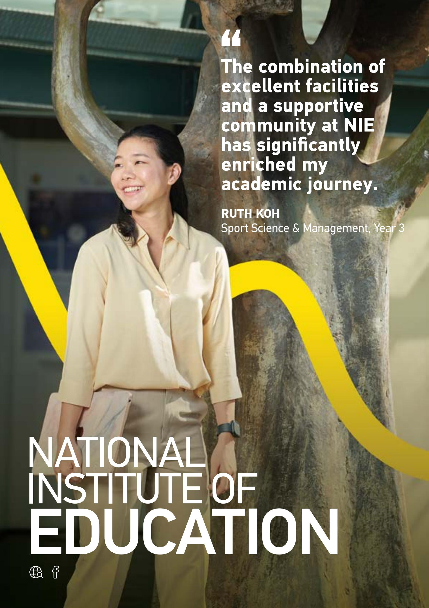

> **AI Description:**
> **Source:** `assets/_page_17_Figure_0.jpg`
> 
> **Generated:** 2026-05-16 02:37:17
> 
> ---
> 
> The image contains a photograph of a person standing outdoors, leaning against a tree. The person is smiling and holding a folder. The background includes a building and some greenery. The text on the image provides a quote from Ruth Koh, a student in Year 3 of Sport Science & Management at the National Institute of Education (NIE). The text highlights the combination of excellent facilities and a supportive community at NIE, which has significantly enriched the student's academic journey. The image also includes the logo and name of the National Institute of Education at the bottom.

## ABOUT

The National Institute of Education (NIE), Singapore, is the national teacher education institute and an integral part of the nation’s education system. Offering multidisciplinary undergraduate and graduate programmes, the institute empowers you to analyse, tackle, and resolve challenges in various career pathways, both within and beyond the realm of education.

## OUR PROGRAMMES

• Double Major Programme

Bachelor of Arts in

\- Art and Education

\- Chinese Studies and Education

\- Drama and Education

\- English Language & Linguistics and Education

\- English Literature and Education

\- Geography and Education

\- History and Education

\- Malay Studies and Education

\- Music and Education

\- Tamil Studies and Education

## Bachelor of Science in

\- Biology and Education

\- Chemistry and Education

\- Food & Consumer Sciences and Education

\- Mathematics & Computational Thinking and Education

\- Physics & Energy Studies and Education

\- Sport Science and Education

• Bachelor of Science in Sport Science & Management

## CAREER PROSPECTS

Graduates of NIE’s Double Major Programmes are passionate young people who have a calling to be professional leaders in education.

SSM graduates can pursue careers ranging from sport administrators, event managers, writers and marketers, to sport scientists, trainers and coaches.

## NATIONAL INSTITUTE OF EDUCATION (NIE) DOUBLE MAJOR PROGRAMME

NIE equips students with the skills, knowledge and values needed to grow into inspiring educators. Our emphasis on cutting-edge research and provision of global immersion opportunities will prepare you to better adapt to an everevolving educational landscape.

## OUR ADVANTAGES

Ranked 11th in QS World University Rankings 2023 in the field of Education

Over 70 years of providing initial teacher preparation and continual teacher professional development

Offers deep content knowledge and strong inquiry skills to prepare students for the Education profession

Multiple pathways for professional advancement to cater to the diversity of applicants’ educational backgrounds

## SPORT SCIENCE & MANAGEMENT (SSM)

SSM is the only full-time undergraduate programme offered by a local tertiary institute that prepares students for sport-related careers. Under this multifaceted four-year programme, you will learn exercise physiology, sport biomechanics, motor skill acquisition, sport psychology, sport management and coaching, on top of other valuable skills.

## OUR ADVANTAGES

> **AI Description:**
> **Source:** `assets/_page_17_Figure_8.jpg`
> 
> **Generated:** 2026-05-16 02:15:19
> 
> ---
> 
> The image contains a simple icon of a hand pointing at a cluster of interconnected dots. The icon is orange and appears to represent a concept of interaction or connection, possibly in a digital or network context. The dots suggest nodes or points of interaction, while the hand indicates an action of selection or engagement with these nodes.

Hands-on practical experiences, guest lectures and soft skills development

> **AI Description:**
> **Source:** `assets/_page_17_Figure_9.jpg`
> 
> **Generated:** 2026-05-16 02:13:46
> 
> ---
> 
> The image contains a simple icon consisting of a speech bubble with a gear icon inside it, followed by a pencil icon. The speech bubble likely represents communication or settings, while the gear and pencil icons suggest configuration or editing options. The overall design is minimalistic and likely used to represent a settings or configuration interface in a digital or software context.

> **AI Description:**
> **Source:** `assets/_page_17_Figure_10.jpg`
> 
> **Generated:** 2026-05-16 02:29:35
> 
> ---
> 
> The image contains a simple icon of a globe with a stylized airplane flying over it. The globe is depicted with a grid pattern, representing Earth, and the airplane is shown in a simplified, flat design. This icon is commonly used to represent air travel or global transportation.

Opportunity for overseas study and living experience for up to six months

Ranked 5th in Asia in the QS World University Rankings 2023 in Sportrelated subjects

State-of-the-art sport science laboratories and teaching facilities, and highly-qualified academic staff

Internship opportunities with major sport-related employers in Singapore and the Asia-Pacific region

The NIE faculty and facilities have been instrumental in shaping my university experience. The cutting-edge laboratories provide top-notch resources that enhance the quality of my education. Collaborating with dedicated peers who share a passion for our field of study makes my time at college substantially more rewarding. The combination of excellent facilities and a supportive community at NIE have significantly enriched my academic journey.”

## RUTH KOH

Sport Science & Management, Year 3

## CAREER-SAVVY

Chart your future and unlock your potential with the Career and Attachment Office (CAO). Be empowered by our services such as personalised career coaching, industry-specific consultations, employability skills workshops, career experiential programmes, and more.

With excellent connections to global and local employers across industries, CAO facilitates meaningful internships, networking events and employment opportunities to propel you towards professional success and help you make your mark in your chosen field!

## GUIDE

Career and Employability Skills Workshops

> **AI Description:**
> **Source:** `assets/_page_18_Figure_2.jpg`
> 
> **Generated:** 2026-05-16 02:24:48
> 
> ---
> 
> The image is a simple icon depicting a hand interacting with a circular interface, possibly representing a touch screen or a user interface element. The icon is black and white, with no additional text or labels. It appears to be a standard icon used in user interface design to represent a touch or click action.

Career Experiential Education

> **AI Description:**
> **Source:** `assets/_page_18_Figure_3.jpg`
> 
> **Generated:** 2026-05-16 02:24:59
> 
> ---
> 
> The image contains a simple icon with a circular shape. Inside the circle, there is a silhouette of a person, and below the silhouette, there are three stars. The stars are evenly spaced and appear to be filled, suggesting a rating or evaluation system. The icon is likely used to represent user ratings or reviews in a user interface.

ICC Career & Innovative Enterprise Module by MLCPS\*

> **AI Description:**
> **Source:** `assets/_page_18_Figure_4.jpg`
> 
> **Generated:** 2026-05-16 02:20:45
> 
> ---
> 
> The image contains two icons: a gear and a folder with a document inside. The gear icon typically represents settings or configuration options, while the folder with a document suggests a file or settings related to documents or data management. This combination of icons is often used in software interfaces to represent settings or configuration related to file management or document settings.

Career Resources

Career Coaching and Exploration

Career Consultation and Industry Events

> **AI Description:**
> **Source:** `assets/_page_18_Figure_7.jpg`
> 
> **Generated:** 2026-05-16 02:21:53
> 
> ---
> 
> The image contains a simple icon of a globe with arrows circling around it. This icon typically represents global connectivity, international communication, or the concept of a global network. The arrows indicate movement or circulation, suggesting the flow of information, data, or resources across the globe.

Global Experiences

> **AI Description:**
> **Source:** `assets/_page_18_Figure_8.jpg`
> 
> **Generated:** 2026-05-16 02:28:50
> 
> ---
> 
> The image contains a simple icon representing an identification card or badge. It features a rectangular shape with rounded corners, a small horizontal line at the top, and a vertical line on the right side, possibly indicating a photo or emblem area. The icon is monochromatic and lacks any text or additional details.

Work-Integrated Education (e.g. Internships, Work-Study Programme)

> **AI Description:**
> **Source:** `assets/_page_18_Figure_9.jpg`
> 
> **Generated:** 2026-05-16 02:28:57
> 
> ---
> 
> The image contains a simple icon representing a person with a magnifying glass over their head. This icon is commonly used to symbolize user search, profile search, or user identification. The icon does not provide any specific numerical data or additional visual information beyond the basic representation of a user and a search function.

Mass Recruitment Events

\*The Margaret Lien Centre for Professional Success (MLCPS) aims to instill lifelong skills so that you can excel in your careers

> **AI Description:**
> **Source:** `assets/_page_18_Figure_10.jpg`
> 
> **Generated:** 2026-05-16 02:24:43
> 
> ---
> 
> The image contains a photograph of two individuals engaged in a conversation. The person on the left appears to be holding a folder and a shoulder bag, while the person on the right is gesturing with their hands, possibly explaining something. The background features large windows, suggesting an indoor setting, possibly an office or a modern building. The image conveys a professional or educational context, with the individuals appearing to be in a discussion or presentation.

> **AI Description:**
> **Source:** `assets/_page_18_Figure_11.jpg`
> 
> **Generated:** 2026-05-16 02:21:57
> 
> ---
> 
> The image is a simple diagram featuring a group of four human-like figures encircled by a ring of smaller circles. The central figures are connected by lines, suggesting a network or social structure. The design is abstract and does not include any text or labels. The image likely represents a concept of social connections or a network structure.

## ALUMNI MENTORSHIP COMMUNITY

Connect with over 700 mentors to network and be guided on industries, job roles, skills and career experiences

> **AI Description:**
> **Source:** `assets/_page_18_Figure_12.jpg`
> 
> **Generated:** 2026-05-16 02:20:48
> 
> ---
> 
> The image contains a simple diagram with a light bulb inside a human head shape, alongside a gear. The light bulb represents an idea or innovation, while the gear symbolizes mechanical or technological aspects. The combination suggests a concept related to innovation, creativity, or problem-solving in a technological or mechanical context.

> **AI Description:**
> **Source:** `assets/_page_18_Figure_13.jpg`
> 
> **Generated:** 2026-05-16 02:21:49
> 
> ---
> 
> The image contains a simple diagram of two people standing side by side, with one person holding a document or piece of paper. The individuals are represented by basic shapes with circular heads and rectangular bodies. The document appears to be the focus of their attention, suggesting a collaborative or educational context. There are no labels or text annotations within the image itself.

## CAREER COACHING &INDUSTRYCONSULTATION

Speak with a Career Coach to explore career goals and a Career Consultant to acquire industry insights and employers’ expectations

## RECRUITMENT & EMPLOYMENT OPPORTUNITIES

Attend over 300 employer networking and recruitment events offering 40,000 job opportunities to secure your future employment

> **AI Description:**
> **Source:** `assets/_page_18_Figure_16.jpg`
> 
> **Generated:** 2026-05-16 02:25:10
> 
> ---
> 
> The image contains a simple icon representing a professional ID card. The icon includes a silhouette of a person's head and shoulders, a name tag, and a globe icon in the top left corner. The design is minimalistic and uses a single color, likely blue, to represent the card and its elements.

## AUTHENTIC LEARNING

Participate in over 100 industry-led Workshops, Hackathons, Job Shadow and Company Visits to build industryrelevant skills

## CAREER RESOURCES & COMMUNICATIONS

Careertracks, a guide to prepare NTU students for the world of work

## WORK INTEGRATED EXPERIENCES

Build relevant work experiences through local and overseas internships and work integrated programmes

# WIDEN YOUR WORLDVIEW

Through NTU’s OGEM, you will get opportunities to further enrich your education by living, exploring and learning overseas. Experience a different learning environment, immerse yourself in diverse cultures, gain a more global perspective, and develop invaluable life skills.

With the various overseas programmes ranging from Short-Term Studies to Research Attachments in more than 350 partner institutions in 40 countries, you can venture beyond Singapore and discover the world from Year One.

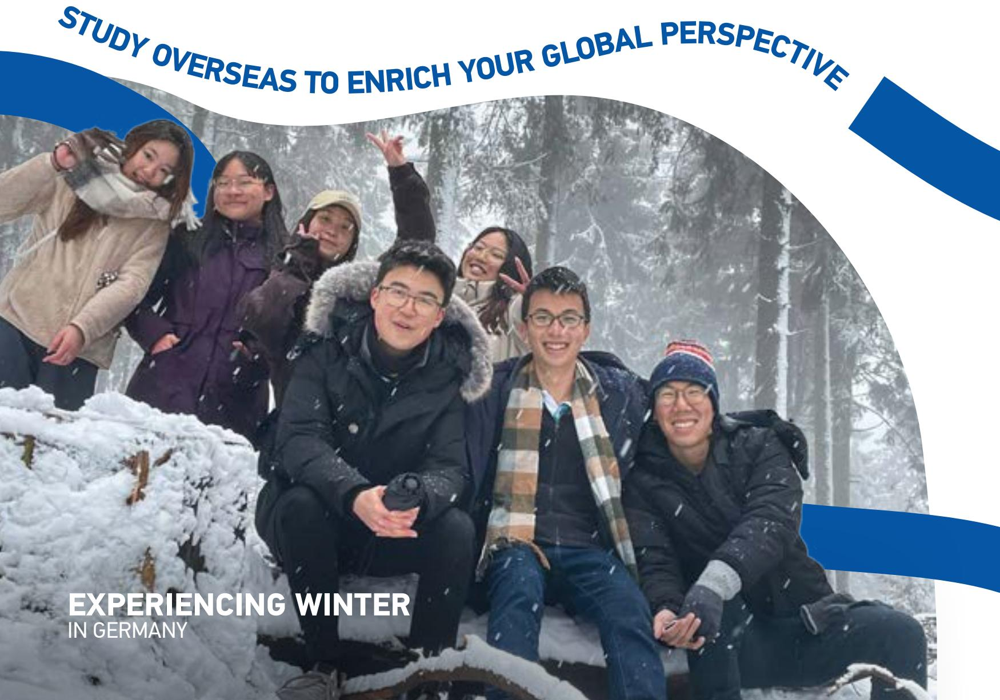

> **AI Description:**
> **Source:** `assets/_page_19_Figure_0.jpg`
> 
> **Generated:** 2026-05-16 02:23:17
> 
> ---
> 
> The image contains a photograph of a group of people enjoying a snowy outdoor setting. The individuals are dressed in winter clothing, indicating cold weather. The background shows snow-covered trees, emphasizing the winter environment. The text overlay at the top reads "STUDY OVERSEAS TO ENRICH YOUR GLOBAL PERSPECTIVE," and at the bottom, it states "EXPERIENCING WINTER IN GERMANY." The image effectively combines a photograph with textual information to convey a message about studying abroad and experiencing a winter environment in Germany.

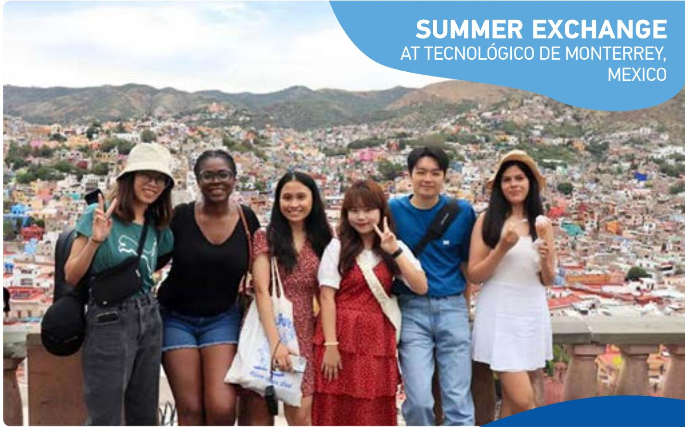

> **AI Description:**
> **Source:** `assets/_page_19_Figure_1.jpg`
> 
> **Generated:** 2026-05-16 02:23:49
> 
> ---
> 
> The image contains a photograph of a group of six individuals standing together with a scenic view of a colorful cityscape in the background. The individuals are smiling and appear to be enjoying their time. The text overlay at the top of the image reads "SUMMER EXCHANGE AT TECNOLÓGICO DE MONTERREY, MEXICO," indicating that the photo is likely related to a summer exchange program at the Tecnológico de Monterrey in Mexico. The image captures a moment of camaraderie and cultural experience.

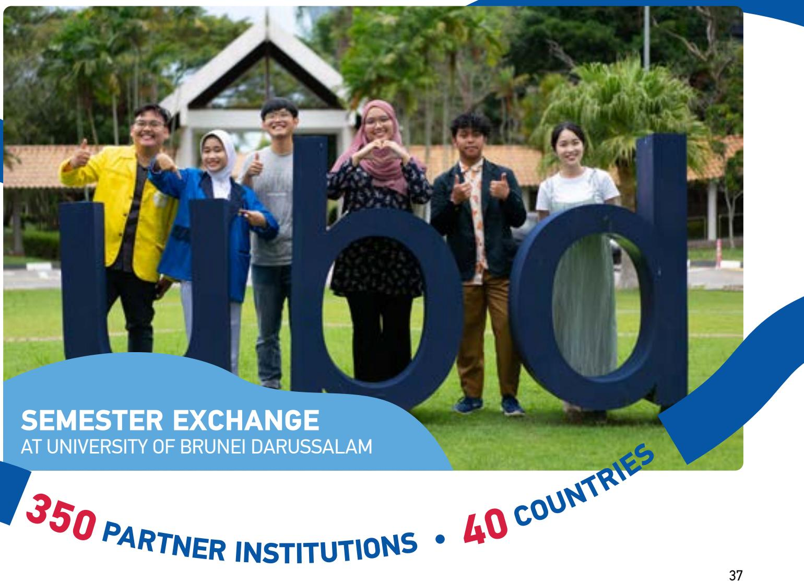

> **AI Description:**
> **Source:** `assets/_page_19_Figure_2.jpg`
> 
> **Generated:** 2026-05-16 02:21:43
> 
> ---
> 
> The image contains a photograph of six individuals posing in front of a large "UBD" sign, which stands for the University of Brunei Darussalam. The text overlay on the image provides information about the semester exchange program at the university, mentioning 350 partner institutions and 40 countries. The photograph captures a group of students, suggesting an international exchange program, and the setting appears to be a campus environment with greenery and a traditional-style building in the background.

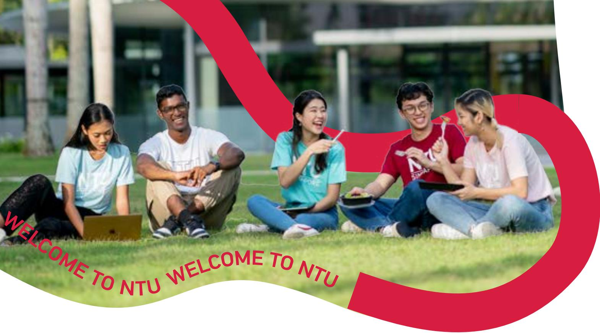

> **AI Description:**
> **Source:** `assets/_page_20_Figure_0.jpg`
> 
> **Generated:** 2026-05-16 02:33:54
> 
> ---
> 
> The image contains a photograph of five students sitting on the grass in what appears to be a university campus. They are casually dressed and seem to be engaged in various activities, such as using laptops and eating. The background shows a modern building with large windows and some trees. The text "WELCOME TO NTU" is prominently displayed in red and white across the image, indicating that this is an advertisement or promotional material for Nanyang Technological University (NTU). The overall tone of the image is welcoming and friendly, suggesting a positive and inclusive environment for students.

# LIVE, LEARN, LEAD!LIFE @ NTU SMART CAMPUS

Welcome to NTU, a vibrant mini city where you’ll expand your knowledge, build ties, create lifelong memories and be inspired by your surroundings.

## WHAT TO EXPECT:

> **AI Description:**
> **Source:** `assets/_page_20_Figure_1.jpg`
> 
> **Generated:** 2026-05-16 02:34:40
> 
> ---
> 
> The image contains a simple line drawing of three people standing together, with a banner below them. The banner appears to be blank, suggesting it could be used for text or a title. The drawing is minimalistic and does not include any labels or additional text.

Over 200 student organisations to choose from

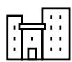

> **AI Description:**
> **Source:** `assets/_page_20_Figure_2.jpg`
> 
> **Generated:** 2026-05-16 02:32:42
> 
> ---
> 
> The image contains a simple line drawing of a building. The drawing is minimalistic, featuring two buildings of similar height with rectangular shapes and small windows. There are no additional visual elements, labels, or text annotations present. The image is a basic representation of a building structure.

> **AI Description:**
> **Source:** `assets/_page_20_Figure_3.jpg`
> 
> **Generated:** 2026-05-16 02:29:32
> 
> ---
> 
> The image is a simple diagram featuring a circle with six smaller circles connected to it, and within the central circle, there are three human-like figures. This suggests a social or network structure, possibly representing a group of people connected in a circle, which could symbolize a community, a team, or a group dynamic. The diagram is minimalistic and lacks any text or additional labels.

Opportunities to touch and improve lives through community engagement projects

More than 20 Halls of Residence for undergraduates

> **AI Description:**
> **Source:** `assets/_page_20_Figure_4.jpg`
> 
> **Generated:** 2026-05-16 02:39:41
> 
> ---
> 
> The image contains a simple line drawing of a speech bubble with a rectangular shape to its left. The speech bubble appears to be a standard representation of a dialogue or speech, commonly used in communication or presentation contexts. There are no charts, graphs, or other visual elements present in the image. The drawing is minimalistic and does not convey any specific data or trends.

An orientation programme designed to ease your transition to university life

> **AI Description:**
> **Source:** `assets/_page_20_Figure_5.jpg`
> 
> **Generated:** 2026-05-16 02:37:20
> 
> ---
> 
> The image contains a simple diagram with four arrows pointing in different directions: up, right, down, and left. This type of diagram is often used to represent directional movement or to indicate the four cardinal points on a map or in a coordinate system.

Experiential learning opportunities through Residential Education programmes

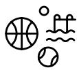

> **AI Description:**
> **Source:** `assets/_page_20_Figure_6.jpg`
> 
> **Generated:** 2026-05-16 02:39:54
> 
> ---
> 
> The image contains a set of icons representing different activities or objects. The icons include a basketball, a baseball, and a swimming pool with a person in it. These icons are likely used to represent sports or leisure activities.

Numerous sports and recreational facilities

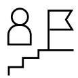

> **AI Description:**
> **Source:** `assets/_page_20_Figure_7.jpg`
> 
> **Generated:** 2026-05-16 02:41:13
> 
> ---
> 
> The image contains a simple diagram. It features a person icon at the bottom, a staircase leading upwards, and a flag icon at the top. The staircase represents a progression or climb, symbolizing achievement or progress towards a goal, which is represented by the flag.

A rigourous and insightful multi-level student leadership development programme; and more!

FEATURES OF NTU SMART CAMPUS Listed among the most beautiful university campuses around the world, NTU Smart Campus utilises tomorrow’s technologies to create a vibrant, convenient and sustainable environment for learning and living.

> **AI Description:**
> **Source:** `assets/_page_20_Figure_8.jpg`
> 
> **Generated:** 2026-05-16 02:11:45
> 
> ---
> 
> The image contains a simple icon with two vertical bars and a leaf symbol. The bars appear to represent some form of measurement or data, while the leaf symbol suggests an environmental or ecological context. The icon is likely used to represent a metric related to sustainability or environmental performance, such as carbon footprint or energy efficiency.

GREEN & SUSTAINABLE Enjoy being in one of the most resource-efficient, eco-friendly campuses in the world

IMMERSIVE LEARNING Enhance your learning through flipped classrooms, digital study tools and other innovative learning methods

> **AI Description:**
> **Source:** `assets/_page_20_Figure_10.jpg`
> 
> **Generated:** 2026-05-16 02:28:46
> 
> ---
> 
> The image contains a simple icon of a person with a Wi-Fi signal above their head. This icon is commonly used to represent a user or a device connected to a wireless network. The icon does not provide any specific numerical data or detailed information but serves as a visual representation of a user's connection to a wireless network.

ALL-IN-ONE CONVENIENCE Use your Smart Pass as a matriculation card, cash-free payment and digital key for your campus residence

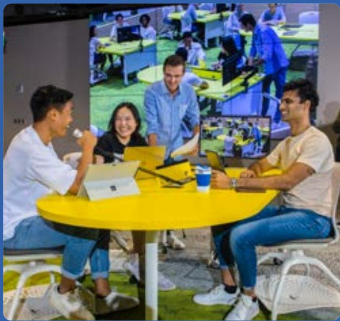

> **AI Description:**
> **Source:** `assets/_page_20_Figure_11.jpg`
> 
> **Generated:** 2026-05-16 02:29:09
> 
> ---
> 
> The image contains a photograph of a group of people in a modern, collaborative workspace. Four individuals are seated around a bright yellow table, engaged in a discussion. One person is holding a microphone, suggesting a presentation or meeting is taking place. The background shows a large screen displaying a similar scene, reinforcing the collaborative and tech-savvy environment. The setting includes laptops and other tech equipment, emphasizing a professional or educational context.

## FEEL AT HOME AT NTU

## HOUSING

NTU provides student accommodation across our 25 Halls of Residence. More than just living spaces, our Halls provide ideal spaces for character building, fruitful interactions and cultural exchange.

GET THE MOST OUT OF HALL LIVING!

• Build camaraderie and develop a sense of belonging

Expand your worldview in a multicultural and diverse environment

• Utilise the gym, music room and other facilities

• Participate in exciting year-round Hall activities

Accommodation options include single rooms with attached bathrooms, plus-sized single rooms, standard single rooms and twin-sharing rooms. Air-conditioned and non-airconditioned room options are also available.

## RESIDENTIAL EDUCATION (RE)

Residential Education@NTU offers you opportunities to develop generic competencies through its enriching experiential programmes. All hosted and organised by the 25 Halls of Residence, these programmes and workshops are made available for all hall residents.

Have a passion in drone-making, fine culinary skills, or develop collaborative skills? RE@NTU’s wealth of interaction and knowledge exchange opportunities with students from around the world is sure to make your residential life both educational and enjoyable!

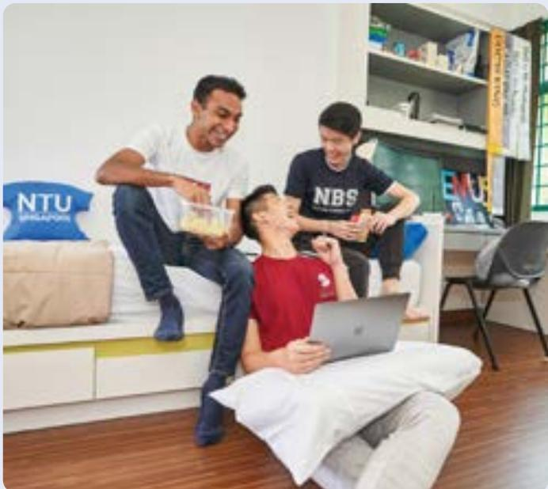

> **AI Description:**
> **Source:** `assets/_page_20_Figure_14.jpg`
> 
> **Generated:** 2026-05-16 02:27:01
> 
> ---
> 
> The image contains a photograph of three individuals in a casual setting, likely a dorm room or shared living space. One person is seated on a bed, using a laptop, while the other two are sitting on a bench, holding snacks and smiling. The room has a simple decor with shelves containing books and other items. The text "NTU SINGAPORE" is visible on a sign in the background, indicating the location or affiliation. The image captures a relaxed and friendly atmosphere among the individuals.

## FOOD AND RETAIL SERVICES

NTU boasts a vibrant F&B and retail scene that caters to the diverse tastes and needs of our community.

Plenty of dining options are available at the North Spine Plaza and various residence halls around the campus, from daily staples to cozy cafes, from fast food to international cuisine, from convenience stores to vending machines—there’s really something for everyone!

## GETTING AROUND

Going somewhere? While at the North Spine Plaza, check out the latest updates on the campus shuttle services at the Smart Mobility Experience Centre, a first in NTU and in Singapore!

NTU Campus Map

## CLUB & COMMUNITIES

Play hard at NTU! With about 230 main and sub-student organisations to choose from, you’ll have numerous avenues to cultivate your interests, make new friends, and develop holistically in club governance, sports, the arts and volunteering.

## COMMUNITY ENGAGEMENT

Create meaningful social impact onto others.

• Volunteer through artistic, educational, environmental, and sports-related activities for the community

• Build communities through sustainable projects in the ASEAN region and beyond

• Be inspired by #THEFORGOODSESSIONS – disciplinebased programmes with social impact

• Start your social enterprise through the Social Innovation & Entrepreneurship (SIE) Programme

## TRANSITION AND ORIENTATION PROGRAMME (TOP)

Get a head start in your first year NTU experience with TOP! From academic mentoring, career preparation, connecting with faculty, and meeting like-minded peers, you will be well supported as you navigate your university life.

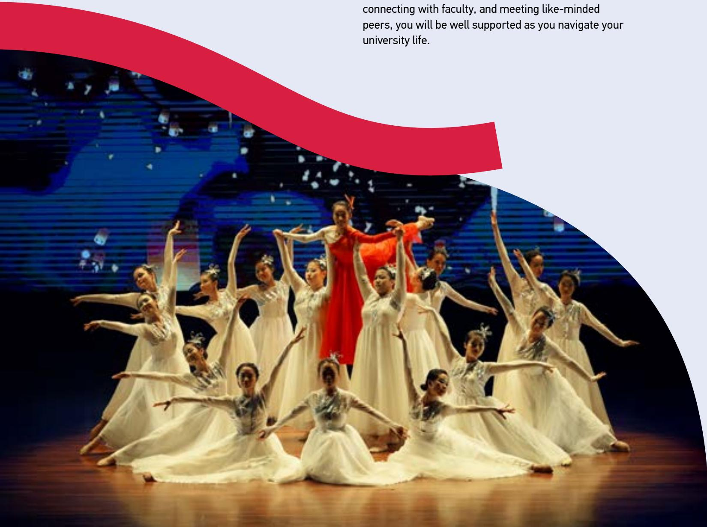

> **AI Description:**
> **Source:** `assets/_page_21_Figure_2.jpg`
> 
> **Generated:** 2026-05-16 02:39:01
> 
> ---
> 
> The image contains a photograph of a group of dancers performing on stage. The dancers are dressed in white costumes with intricate details, and one dancer is wearing a red dress, standing out from the rest. The stage has a dark background with blue lighting and what appears to be confetti falling from the ceiling, adding to the festive atmosphere. The text in the image mentions connecting with faculty and meeting like-minded peers, suggesting a supportive environment for university life.

## LEADERSHIP DEVELOPMENT PROGRAMME

Realise your leadership potential through three progressive levels of Foundational, Emergent, and Impactful Leadership modules.

• Gain insight into your personal leadership values and style

• Develop your leadership competencies

• Make a positive impact in your sphere of influence

## SPORTS @ NTU

Engage in competitive or recreational sporting activities. Learn life skills, build character, and pursue a healthy lifestyle.

• Represent NTU in varsity sports teams and fly the university colours in various local and overseas competitions.

• Keep fit through various Learn-To-Play programmes, workshops, clinics and novice competitions offered by recreational sport clubs.

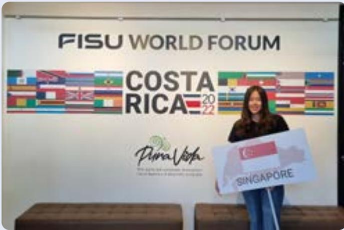

> **AI Description:**
> **Source:** `assets/_page_21_Figure_4.jpg`
> 
> **Generated:** 2026-05-16 02:29:54
> 
> ---
> 
> The image contains a photograph of a person standing in front of a backdrop. The backdrop features the text "FISU WORLD FORUM COSTA RICA 2022" along with a row of flags representing various countries. Below this, there is a logo with the text "Pura Vida" and a stylized palm tree. The person is holding a sign with the text "SINGAPORE" on it. The image also includes a wooden bench in the foreground.

NTU has been a springboard for my growth as a student leader. Through the Student Leadership Development Programme, Varsity Sports Association and FISU World Forum, NTU has equipped me with the leadership skills necessary to succeed both in my sport and beyond.

— JADE LIM SI MIN Philosophy, Class of 2023

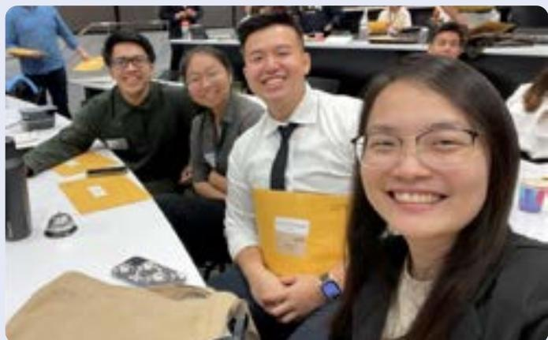

> **AI Description:**
> **Source:** `assets/_page_21_Figure_6.jpg`
> 
> **Generated:** 2026-05-16 02:34:21
> 
> ---
> 
> The image contains a group of people sitting at a table, smiling and posing for a photo. The table has some papers and a yellow folder on it. The individuals appear to be in a professional setting, possibly a meeting or conference. The photo captures a moment of camaraderie and professionalism.

Denise Chua (extreme right) with her group mates during the AY22/23 Impactful Leadership Final Presentation & Graduation

The Impactful Leadership Programme offered different perspectives on leadership through the coaching sessions, leadership conversations, and the generous sharing by my peers. The emphasis on self-reflection motivated me to leverage my experiences to learn, grow and lead when guiding my council.

— CHUA WEI NING, DENISE

Accountancy and Business, Year 4

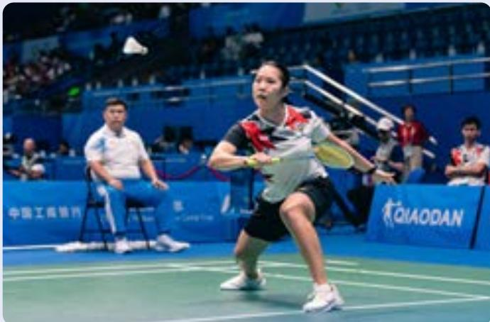

> **AI Description:**
> **Source:** `assets/_page_21_Figure_7.jpg`
> 
> **Generated:** 2026-05-16 02:34:14
> 
> ---
> 
> The image is a photograph of a badminton player in action on a court. The player is wearing a white and red sports outfit and is in the middle of a swing, holding a badminton racket. The background shows a seated audience and a few individuals, possibly coaches or officials, seated on the sidelines. The court is marked with standard badminton lines, and there are banners with text, including "QIAODAN," visible in the background. The image captures the dynamic movement and focus of the player during a match.

NTU has allowed me to pursue my two passions: academics and athletics. From letting me participate in competitions to offering generous subsidies to giving encouragement, I really feel grateful for the school’s the tremendous support.

GRACE CHUA HUI ZHEN Medicine, Class of 2023

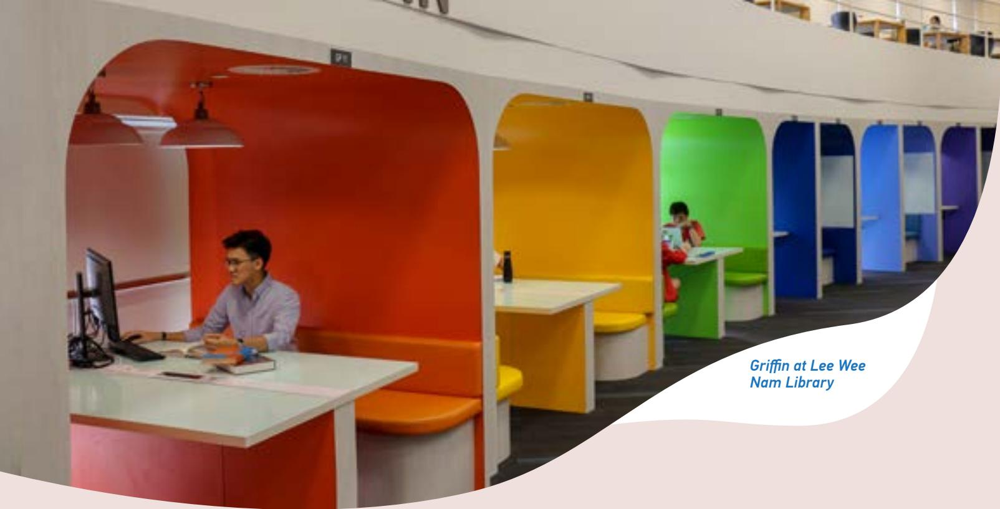

> **AI Description:**
> **Source:** `assets/_page_22_Figure_0.jpg`
> 
> **Generated:** 2026-05-16 02:16:16
> 
> ---
> 
> The image contains a photograph of a modern library space with individual study pods. The pods are brightly colored, including orange, yellow, green, blue, and purple, providing a vibrant and engaging environment. Each pod has a small table and a chair, with one person seated at a desk using a computer. The text "Griffin at Lee Wee Nam Library" is overlaid on the image, indicating the location and name of the space. The design suggests a focus on individual study and productivity in a colorful and contemporary setting.

## STUDENT SUPPORT

## NTU LIBRARY

NTU Library’s seven libraries at the Yunnan Garden campus provide access to a variety of resources, facilities and services for your study, research and wellbeing needs.

1. Art, Design & Media Library

2. Business Library

3. Chinese Library

4. Communication & Information Library

5. Humanities & Social Sciences Library

6. Lee Wee Nam Library

7. Library Outpost

At our libraries, you can find:

• Assigned class reading and e-textbooks

• Information resources for your essays, projects and research

• PC stations with single and multiscreen monitor options for your work

• Study spaces for individual study or collaborative workspaces for group discussions

• Resources to expand your interests

• Silent and wellbeing zones for contemplation and relaxation

• Exhibition spaces to share and showcase your work

Library Resources & Services Highlights

• Instant online access to digital resources such as e-books and journal articles

• Advisory and consultation services from librarians

• Instructional services to help evaluate and use information

• Events, exhibitions and project showcases

## IT SERVICES

NTU’s advanced suite of IT services are available to help you stay connected, learn more effectively and live more comfortably.

• NTU Learn Ecosystem’s Virtual Adaptive Distributed Learning environment lets you experience the highest education standards with meaningful immersive and impactful engagements

• Mega Learning Studios, ICC ColLAB, for NTU’s interdisciplinary courses, fitted with the latest audiovisual technologies to make learning more engaging and interactive

• NTU e-mail account and Wi-Fi services throughout the campus to help you stay connected

• Comprehensive cloud services for communication, collaboration and online storage

• Student Intranet for convenient access to online resources and administrative services

• Virtual assistant Lyon chatbot to help address freshmen queries

• Digital wayfinding service, NTU Maps, for real-time navigation to more than 4,000 locations on campus

• NTU Omnibus Bus App that provides real-time tracking of the campus shuttle buses, its occupancy information and estimated time of arrival

## ADMINISTRATIVE SUPPORT

You can book an appointment with One Stop@SAC for administrative and finance-related queries and requests.

The services include collection of certificates, concession and matriculation card, payment matters, endorsement of certificates and documents to update residence status, among many others.

## UNIVERSITY WELLBEING

NTU adopts a campus community approach to student support and care, which entails departments, offices, schools, and halls working closely together to address the wellbeing needs of everyone on campus.

Our University Wellbeing Office (UWO) is the central care and support provider and coordinator for students and employees. UWO focuses on four essential areas— counselling services, proactive & preventive programming, critical care and first responder support, as well as workplace wellbeing—to promote and ensure a balanced university life for all.

## Services include:

• Professional counselling and psychological services

• Critical care and support

• Case management

• Peer support services

• Volunteer programmes

• Wellbeing mobile apps, tips, articles and other resources

• Wellbeing talks and workshops for personal care and selfimprovement

• Training programmes to equip support-givers and the community

• Signature wellbeing activities like the wellbeing hackathons and mental health campaigns

• Initiatives such as mediation for student conflicts and bystander intervention facilitation

## STUDENTS WITH SPECIAL NEEDS

Committed to fostering an inclusive campus community, NTU offers a wide range of services to support students with special needs.

• Advice on transitioning into University and the workplace

• Academic and non-academic counselling

• Procurement and/or loan of assistive devices and/or technology

• Examination and assessment accommodations

• Application for on-campus accommodation

• Support for on-campus transport for students with mobility challenges

The Peer Helping Programme (PHP) has allowed me to gain a deeper understanding of mental health and wellbeing issues which are not usually openly talked about.

Being able to go on this journey with like-minded individuals has been profoundly heartening. And it has motivated me to work with my peers to improve the mental health space for students at NTU.

— LOW ZHIN XUAN ASHELY

Thanks to the befriending sessions in the Peer Helping Programme (PHP), I had the opportunity to connect with peers from various backgrounds who share a mutual passion for raising awareness about mental health issues. What an incredible way to cultivate empathy and learn how to listen more actively.

— LIM JING WEE

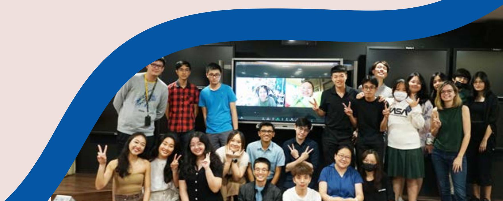

> **AI Description:**
> **Source:** `assets/_page_22_Figure_4.jpg`
> 
> **Generated:** 2026-05-16 02:07:45
> 
> ---
> 
> The image contains a group of people posing for a photo in what appears to be a modern meeting room or classroom. The group is diverse in terms of age and attire, with some individuals wearing casual clothing and others in more formal or professional attire. The background features a large screen displaying a video call, suggesting a hybrid or virtual meeting scenario. The individuals are smiling and making peace signs, indicating a friendly and collaborative atmosphere. The setting and attire suggest a professional or educational environment.

# BE AN NTU SCHOLAR!

Maximise your potential and make the most of your university education by applying for any of the various NTU scholarships.

As an NTU Scholar, you will gain an edge as you navigate student life, pursue your passions and grow to be a game-changer in school, at work and in the community.

The Renaissance Engineering Programme (REP) Scholarship, NTU-University Scholars Programme (NTU-USP) Scholarship and the CN Yang Scholars Programme (CNYSP) Scholarship are three of the most prestigious scholarships in NTU.

These scholarships provide generous financial coverage and exclusive non-financial benefits such as multidisciplinary learning opportunities, guaranteed accommodation at NTU and placements in overseas programmes during your undergraduate years.

> **AI Description:**
> **Source:** `assets/_page_23_Figure_0.jpg`
> 
> **Generated:** 2026-05-16 02:13:34
> 
> ---
> 
> The image is a photograph of a person standing outdoors. The individual is wearing a light-colored, loose-fitting shirt and gray pants. They are smiling and appear to be leaning slightly on a railing. The background includes greenery and what seems to be a building structure, suggesting an urban or suburban setting. The image is overlaid with a blue diagonal stripe in the bottom left corner.

> **AI Description:**
> **Source:** `assets/_page_23_Figure_1.jpg`
> 
> **Generated:** 2026-05-16 02:08:24
> 
> ---
> 
> The image is a photograph of a person sitting outdoors on a bench. The individual is wearing a striped cardigan over a dark top and light-colored pants. They are holding a closed notebook or book on their lap. The background features greenery and a blurred structure, suggesting a garden or park setting.

> **AI Description:**
> **Source:** `assets/_page_23_Figure_2.jpg`
> 
> **Generated:** 2026-05-16 02:06:40
> 
> ---
> 
> The image is a photograph of a person standing outdoors. The individual is smiling and wearing a navy blue long-sleeved shirt, light-colored pants, and a black backpack. The background features a modern building with a glass facade and some greenery, including trees and shrubs. The overall setting appears to be a campus or urban area.

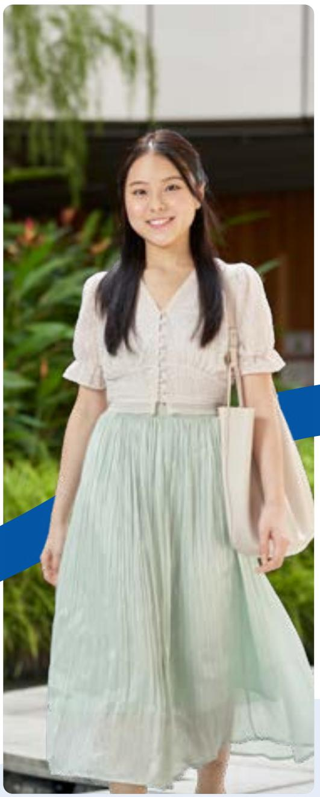

> **AI Description:**
> **Source:** `assets/_page_23_Figure_3.jpg`
> 
> **Generated:** 2026-05-16 02:08:08
> 
> ---
> 
> The image contains a photograph of a person standing outdoors. The individual is wearing a light-colored, short-sleeved blouse with a V-neck and a long, flowing, light green skirt. They are carrying a beige shoulder bag. The background features greenery and part of a building, suggesting a garden or park setting. The image appears to be a casual portrait with no text or additional graphics present.

## FULL-TERM SCHOLARSHIPS

Renaissance Engineering Programme (REP) Scholarship

NTU-University Scholars Programme (NTU-USP) Scholarship

CN Yang Scholars Programme Scholarship

• Nanyang Scholarship

• NTU Talent Scholarship

• College Scholarship

• School Scholarship

ASEAN Undergraduate Scholarship

• E. W. Barker Scholarship

Humanities, Arts and Social Sciences Scholarship

Irene Tan Liang Kheng Scholarship

• LKCMedicine Scholarship

• LKY-STEP Award

Nanyang Business School Scholarship

· NTU Science Scholarship

NTU Science and Engineering Undergraduate Scholarship

Sim Yung Chong Medical Scholarship

Temasek Foundation Scholarships

• Toh Kian Chui Scholarship

University Engineering Scholarship

Wee Cho Yaw Future Leaders Award

Wee Kim Wee Legacy Fund Undergraduate Scholarship

## SCHOLARSHIP APPLICATION

Scholarships are applied through the same application portal for admission. The same application deadlines apply for both admissions and scholarship applications. You may refer to the table on page 46-47 for more information.

→ How to apply

# APPLY TO NTU

## APTITUDE-BASED ADMISSIONS

At NTU, we prioritise more than mere academic scores. Our Aptitude-Based Admissions (ABA) emphasise your passions, talents, and accomplishments that extend beyond academics. If you possess outstanding abilities or achievements, we’re eager to learn about your learning journey.

## REQUIREMENTS

• Minimum academic competence required

• Share your educational journey in a 500-word essay and provide a maximum of 3 achievements

• Submit 1-2 online appraisals

• Showcase your talents in an interview

Unlock your unique potential and let your aptitude pave the way to your success.

## ADULT LEARNERS SCHEME

> **AI Description:**
> **Source:** `assets/_page_24_Figure_1.jpg`
> 
> **Generated:** 2026-05-16 02:09:50
> 
> ---
> 
> The image contains a simple icon consisting of a red circle with a white magnifying glass inside it, which is commonly used to represent search or query functionality. There is no text or additional visual content beyond this icon.

The Adult Learners Scheme (ALS) is an alternative pathway for working adults to apply for admission into NTU’s full-time undergraduate programme.

As Adult learners, you can bring wisdom and experience to the classroom, and further enhance the diversity in our learning environment. This scheme considers your work experience and professional achievements alongside your academic qualifications in the selection process.

## REQUIREMENTS

• Singaporean Citizen (SC) or Singapore Permanent Resident (SPR) throughout the duration of study

• At least 25 years old in the year of matriculation; or possess at least 4 years of working experience (individuals who have fully discharged their full-time NS liability will have 2 years counted towards their full-time work experience)

## APPLICATION DETAILS

Students, regardless of nationality, should apply under one of the following application groups that corresponds to their qualifications.

## APPLICATION PERIOD AND FEE

## Notes:

1. Former or current students of National University of Singapore (NUS), Singapore Management University (SMU), Singapore University of Technology and Design (SUTD), Singapore Institute of Technology (SIT) or Singapore University of Social Sciences (SUSS) seeking admission may apply under one of the application groups listed above.

2. Former Nanyang Technological University (NTU) students seeking re-admission or current NTU students seeking change of programme to Arts (Education) and Science (Education) may apply under one of the application groups listed above.

3. Full-time National Servicemen (NSF) with places already reserved at NTU and who wish to submit new applications may do so by applying under one of the application groups listed above.

## GUIDE

## MINIMUM SUBJECT REQUIREMENTS BROCHURES

→ Guide for different groups of prospective students

→ Singapore-Cambridge GCE ‘A’ Level

→ Polytechnic or Equivalent Institution

International Baccalaureate Diploma

→ NUS High School Diploma

→ International Qualifications

# FINANCING YOUR STUDY

## TUITION AND COMPULSORY MISCELLANEOUS FEES

NTU’s tuition fees are heavily subsidised by the Ministry of Education (MOE). The Tuition Grant, which is offered to all eligible full-time undergraduate students, help to manage the costs of tertiary education in Singapore.

For Medicine Students, you are required to sign the Medical Tuition Grant Agreement with the Government of Singapore, administered by MOH Holdings (MOHH).

SINGAPORE CITIZENS

PERMANENT RESIDENTS & INTERNATIONAL STUDENTS

• Automatically awarded a Tuition Grant

• Bond-free for Singaporean except Medicine Students

• Must apply for Tuition Grant in their online university application

Required to sign an agreement and commit to working in a Singapore entity upon graduation

→ UG Tuition Fees

→ UG Miscellaneous Fees

## FINANCIAL AID SCHEMES FOR AY2024

NTU believes in helping students realise their fullest potential. For local and international students with financial difficulties, NTU offers assistance schemes to help with their tuition fees and personal expenses.

> **AI Description:**
> **Source:** `assets/_page_25_Figure_1.jpg`
> 
> **Generated:** 2026-05-16 02:19:05
> 
> ---
> 
> The image contains a photograph of four individuals outdoors, likely in a park or campus setting. Two of the individuals are giving each other a high-five, while the other two are observing and smiling. The background shows a modern building with glass windows and some greenery. The image appears to be part of a presentation or document, as indicated by the number "48" in the bottom left corner.

# Applicable to all nationalities who are paying subsidised tuition fees.

(Interest Free) The loans are interest-free during years of study in NTU. Repayment and interest will begin after graduation.

https://www.ntu.edu.sg/admissions/undergraduate

OFFICE OF ADMISSIONS   
STUDENT AND ACADEMIC SERVICES DEPARTMENT   
NANYANG TECHNOLOGICAL UNIVERSITY, SINGAPORE   
Student Services Centre, #03-01   
42 Nanyang Avenue   
Singapore 639815

For enquiries, please submit here.

Reg. No. 200604393R

Information is correct as at January 2024