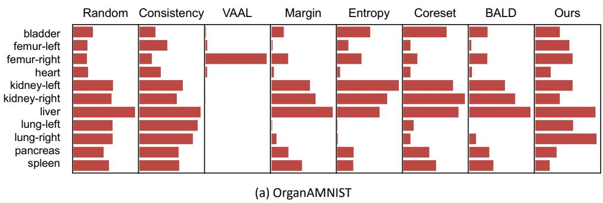
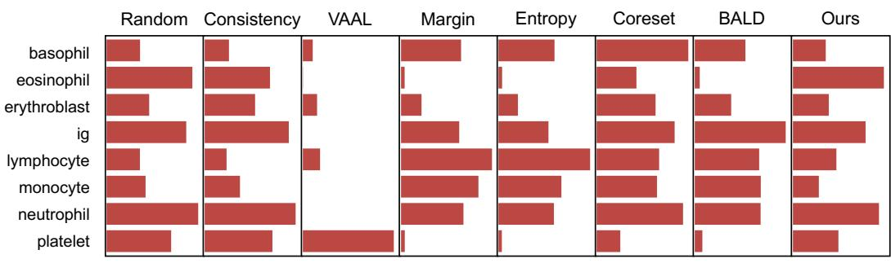
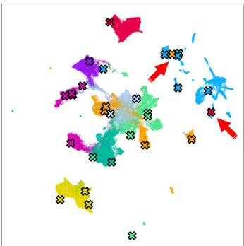
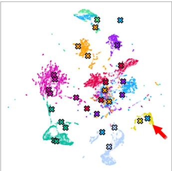
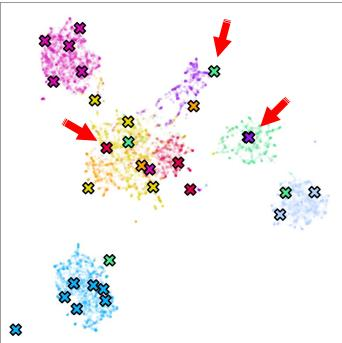
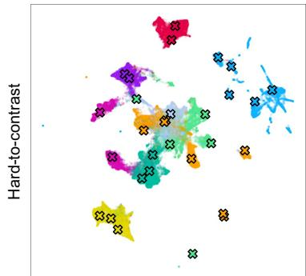
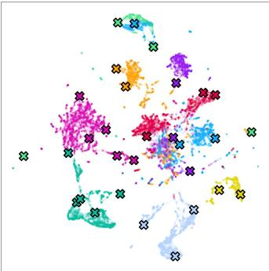
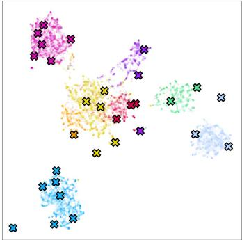
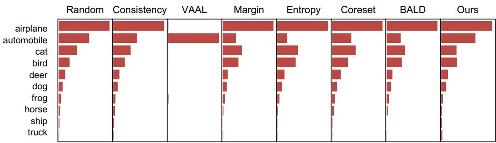

<span id="page-0-0"></span>
# Making Your First Choice: To Address Cold Start Problem in Vision Active Learning

Liangyu Chen1 Yutong Bai2 Siyu Huang3 Yongyi Lu2

Bihan Wen1 Alan L. Yuille2 Zongwei Zhou2,∗

1Nanyang Technological University 2Johns Hopkins University 3Harvard University

## Abstract

Active learning promises to improve annotation efficiency by iteratively selecting the most important data to be annotated first. However, we uncover a striking contradiction to this promise: active learning fails to select data as efficiently as random selection at the first few choices. We identify this as the cold start problem in vision active learning, caused by a biased and outlier initial query. This paper seeks to address the cold start problem by exploiting the three advantages of contrastive learning: (1) no annotation is required; (2) label diversity is ensured by pseudo-labels to mitigate bias; (3) typical data is determined by contrastive features to reduce outliers. Experiments are conducted on CIFAR-10-LT and three medical imaging datasets (i.e. Colon Pathology, Abdominal CT, and Blood Cell Microscope). Our initial query not only significantly outperforms existing active querying strategies but also surpasses random selection by a large margin. We foresee our solution to the cold start problem as a simple yet strong baseline to choose the initial query for vision active learning.

Code is available: https://github.com/c-liangyu/CSVAL

## 1 Introduction

“The secret of getting ahead is getting started.”

— Mark Twain

The cold start problem was initially found in recommender systems [56, 39, 9, 23] when algorithms had not gathered sufficient information about users with no purchase history. It also occurred in many other fields, such as natural language processing [55, 33] and computer vision [5, 11, 38] during the active learning procedure1. Active learning promises to improve annotation efficiency by iteratively selecting the most important data to annotate. However, we uncover a striking contradiction to this promise: Active learning fails to select data as effectively as random selection at the first choice. We identify this as the cold start problem in vision active learning and illustrate the problem using three medical imaging applications (Figure 1a–c) as well as a natural imaging application (Figure 1d). Cold start is a crucial topic [54, 30] because a performant initial query can lead to noticeably improved subsequent cycle performance in the active learning procedure, evidenced in §3.3. There is a lack of studies that systematically illustrate the cold start problem, investigate its causes, and provide practical solutions to address it. To this end, we ask: What causes the cold start problem and how can we select the initial query when there is no labeled data available?

<span id="page-1-0"></span>

### Full Page Description (Page 1)

**Source:** `assets/_page_1_Asset_3.jpg`

**Generated:** 2026-05-16 03:31:29

---

The image is a scatter plot with error bars, showing the Area Under the Curve (AUC) values for a machine learning model's performance across different numbers of images. The x-axis represents the number of images, ranging from \(10^2\) to \(10^4\), while the y-axis represents the AUC values, ranging from 0.6 to 1.0. The data points are represented by black dots, and the red error bars indicate the variability or standard deviation of the AUC values. The plot suggests that as the number of images increases, the AUC values tend to stabilize around 0.8, indicating a consistent performance of the model.


### Full Page Description (Page 1)

**Source:** `assets/_page_1_Asset_2.jpg`

**Generated:** 2026-05-16 03:31:21

---

The image is a scatter plot with a logarithmic scale on both axes. The x-axis represents the "Number of images," and the y-axis represents the "AUC" (Area Under the Curve), which is a metric commonly used in machine learning to evaluate the performance of a binary classifier. The plot shows a trend where the AUC increases as the number of images increases, with some variability at lower numbers of images. The data points are color-coded, with red triangles and black circles representing different datasets or conditions. The overall trend suggests that as more images are used, the model's performance improves, and the AUC approaches a value close to 1, indicating near-perfect classification.


### Full Page Description (Page 1)

**Source:** `assets/_page_1_Asset_1.jpg`

**Generated:** 2026-05-16 03:30:57

---

The image is a scatter plot with data points representing the Area Under the Curve (AUC) of different sampling methods as a function of the number of images. The x-axis represents the number of images, ranging from 10^2 to 10^4. The y-axis represents the AUC, ranging from 0.8 to 1.0. The plot includes three sets of data points: one for the Coreset method (red triangles), one for the Random method (black dots), and one for the Entropy method (red diamonds). The Coreset and Entropy methods show a clear upward trend in AUC as the number of images increases, while the Random method remains relatively flat. The Coreset and Entropy methods appear to outperform the Random method across the range of image counts shown.


### Full Page Description (Page 1)

**Source:** `assets/_page_1_Asset_0.jpg`

**Generated:** 2026-05-16 03:31:06

---

The image is a scatter plot with a logarithmic scale on the x-axis labeled "Number of images" and the y-axis labeled "AUC". It contains four different data series represented by different shapes and colors: triangles for BALD (Kirsch et al., 2019), circles for Consistency (Gao et al., 2019), diamonds for Margin (Balcan et al., 2007), and squares for VAAL (Sinha et al., 2019). The plot shows the performance of these methods as the number of images increases, with the AUC values generally increasing with more images. The data points for each method show some variability, with error bars indicating the range of AUC values.

Random selection is generally considered a baseline to start the active learning because the randomly sampled query is independent and identically distributed (i.i.d.) to the entire data distribution. As is known, maintaining a similar distribution between training and test data is beneficial, particularly when using limited training data [25]. Therefore, a large body of existing work selects the initial query randomly [10, 61, 55, 62, 18, 17, 42, 24, 22, 60], highlighting that active querying compromises accuracy and diversity compared to random sampling at the beginning of active learning [36, 63, 44, 11, 20, 59]. Why? We attribute the causes of the cold start problem to the following two aspects:

(i) Biased query: Active learning tends to select data that is biased to specific classes. Empirically, Figure 2 reveals that the class distribution in the selected query is highly unbalanced. These active querying strategies (e.g. Entropy, Margin, VAAL, etc.) can barely outperform random sampling at the beginning because some classes are simply not selected for training. It is because data of the minority classes occurs much less frequently than those of the majority classes. Moreover, datasets in practice are often highly unbalanced, particularly in medical images [32, 58]. This can escalate the biased sampling. We hypothesize that the label diversity of a query is an important criterion to determine the importance of the annotation. To evaluate this hypothesis theoretically, we explore the upper bound performance by enforcing a uniform distribution using ground truth (Table 1) To evaluate this hypothesis practically, we pursue the label diversity by exploiting the pseudo-labels generated by K-means clustering (Table 2). The label diversity can reduce the redundancy in the selection of majority classes, and increase the diversity by including data of minority classes.

(ii) Outlier query: Many active querying strategies were proposed to select typical data and eliminate outliers, but they heavily rely on a trained classifier to produce predictions or features. For example, to calculate the value of Entropy, a trained classifier is required to predict logits of the data. However, there is no such classifier at the start of active learning, at which point no labeled data is available for training. To express informative features for reliable predictions, we consider contrastive learning, which can be trained using unlabeled data only. Contrastive learning encourages models to discriminate between data augmented from the same image and data from different images [15, 13]. Such a learning process is called instance discrimination. We hypothesize that instance discrimination can act as an alternative to select typical data and eliminate outliers. Specifically, the data that is hard to discriminate from others could be considered as typical data. With the help of Dataset Maps [48, 26]2, we evaluate this hypothesis and propose a novel active querying strategy that can effectively select typical data (hard-to-contrast data in our definition, see §2.2) and reduce outliers.

<span id="page-2-0"></span>
Systematic ablation experiments and qualitative visualizations in §3 confirm that (i) the level of label diversity and (ii) the inclusion of typical data are two explicit criteria for determining the annotation importance. Naturally, contrastive learning is expected to approximate these two criteria: pseudolabels in clustering implicitly enforce label diversity in the query; instance discrimination determines typical data. Extensive results show that our initial query not only significantly outperforms existing active querying strategies, but also surpasses random selection by a large margin on three medical imaging datasets (i.e. Colon Pathology, Abdominal CT, and Blood Cell Microscope) and two natural imaging datasets (i.e. CIFAR-10 and CIFAR-10-LT). Our active querying strategy eliminates the need for manual annotation to ensure the label diversity within initial queries, and more importantly, starts the active learning procedure with the typical data.

To the best of our knowledge, we are among the first to indicate and address the cold start problem in the field of medical image analysis (and perhaps, computer vision), making three contributions: (1) illustrating the cold start problem in vision active learning, (2) investigating the underlying causes with rigorous empirical analysis and visualization, and (3) determining effective initial queries for the active learning procedure. Our solution to the cold start problem can be used as a strong yet simple baseline to select the initial query for image classification and other vision tasks.

Related work. When the cold start problem was first observed in recommender systems, there were several solutions to remedy the insufficient information due to the lack of user history [63, 23]. In natural language processing (NLP), Yuan et al. [55] were among the first to address the cold start problem by pre-training models using self-supervision. They attributed the cold start problem to model instability and data scarcity. Vision active learning has shown higher performance than random selection [61, 47, 18, 2, 43, 34, 62], but there is limited study discussing how to select the initial query when facing the entire unlabeled dataset. A few studies somewhat indicated the existence of the cold start problem: Lang et al. [30] explored the effectiveness of the K-center algorithm [16] to select the initial queries. Similarly, Pourahmadi et al. [38] showed that a simple K-means clustering algorithm worked fairly well at the beginning of active learning, as it was capable of covering diverse classes and selecting a similar number of data per class. Most recently, a series of studies [20, 54, 46, 37] continued to propose new strategies for selecting the initial query from the entire unlabeled data and highlighted that typical data (defined in varying ways) could significantly improve the learning efficiency of active learning at a low budget. In addition to the existing publications, our study justifies the two causes of the cold start problem, systematically presents the existence of the problem in six dominant strategies, and produces a comprehensive guideline of initial query selection.

## 2 Method

In this section, we analyze in-depth the cause of cold start problem in two perspectives, biased query as the inter-class query and outlier query as the intra-class factor. We provide a complementary method to select the initial query based on both criteria. §2.1 illustrates that label diversity is a favourable selection criterion, and discusses how we obtain label diversity via simple contrastive learning and K-means algorithms. §2.2 describes an unsupervised method to sample atypical (hard-to-contrast) queries from Dataset Maps.

## 2.1 Inter-class Criterion: Enforcing Label Diversity to Mitigate Bias

K-means clustering. The selected query should cover data of diverse classes, and ideally, select similar number of data from each class. However, this requires the availability of ground truth, which are inaccessible according to the nature of active learning. Therefore, we exploit pseudo-labels generated by a simple K-means clustering algorithm and select an equal number of data from each cluster to form the initial query to facilitate label diversity. Without knowledge about the exact number of ground-truth classes, over-clustering is suggested in recent works [51, 57] to increase performances on the datasets with higher intra-class variance. Concretely, given 9, 11, 8 classes in the ground truth, we set K (the number of clusters) to 30 in our experiments.

Contrastive features. K-means clustering requires features of each data point. Li et al. [31] suggested that for the purpose of clustering, contrastive methods (e.g. MoCo, SimCLR, BYOL) are more suitable than generative methods $( e . g .$ . colorization, reconstruction) because the contrastive feature matrix can be naturally regarded as cluster representations. Therefore, we use MoCo v2 [15]— a popular self-supervised contrastive method—to extract image features.

<span id="page-3-0"></span>

### Full Page Description (Page 3)

**Source:** `assets/_page_3_Asset_0.jpg`

**Generated:** 2026-05-16 03:32:56

---

The image is a bar chart comparing the entropy values of different tissue types (adipose, background, debris, lymphocytes, mucus, muscle, mucosa, stroma, epithelium) across various sampling strategies: Random, Consistency, VAAL, Margin, Entropy, Coreset, BALD, and Ours. The x-axis represents the sampling strategies, and the y-axis represents the entropy values. The chart shows that the "Ours" strategy generally results in the lowest entropy values across all tissue types, indicating better performance in terms of data diversity and representation. The entropy values range from approximately 2.8 to 3.1.

K-means and MoCo ${ \bf v } 2$ are certainly not the only choices for clustering and feature extraction. We employ these two well-received methods for simplicity and efficacy in addressing the cold start problem. Figure 2 shows our querying strategy can yield better label diversity than other six dominant active querying strategies; similar observations are made in OrganAMNIST and BloodMNIST (Figure 7) as well as CIFAR-10 and CIFAR-10-LT (Figure 10).

## 2.2 Intra-class Criterion: Querying Hard-to-Contrast Data to Avoid Outliers

Dataset map. Given K clusters generated from Criterion #1, we now determine which data points ought to be selected from each cluster. Intuitively, a data point can better represent a cluster distribution if it is harder to contrast itself with other data points in this cluster—we consider them typical data. To find these typical data, we modify the original Dataset $\mathrm { M a p } ^ { 3 }$ by replacing the ground truth term with a pseudo-label term. This modification is made because ground truths are unknown in the active learning setting but pseudo-labels are readily accessible from Criterion #1. For a visual comparison, Figure 3b and Figure 3c present the Data Maps based on ground truths and pseudo-labels, respectively. Formally, the modified Data Map can be formulated as follows. Let $\bar { \mathcal { D } } = \{ \pmb { x } _ { m } \} _ { m = 1 } ^ { M }$ denote a dataset of M unlabeled images. Considering a minibatch of N images, for each image ${ \pmb x } _ { n }$ its two augmented views form a positive pair, denoted as $\tilde { \mathbf { x } } _ { i }$ and ${ \tilde { \mathbf { x } } } _ { j } .$ . The contrastive prediction task on pairs of augmented images derived from the minibatch generate 2N images, in which a true label $y _ { n } ^ { * }$ for an anchor augmentation is associated with its counterpart of the positive pair. We treat the other $2 ( N - 1 )$ augmented images within a minibatch as negative pairs. We define the probability of positive pair in the instance discrimination task as:

$$
p _ { i , j } = \frac { \exp ( \sin ( z _ { i } , z _ { j } ) ) / \tau } { \sum _ { n = 1 } ^ { 2 N } \mathbb { 1 } _ { [ n \neq i ] } \exp ( \sin ( z _ { i } , z _ { n } ) ) / \tau } ,\tag{1}
$$

$$
p _ { \theta ^ { ( e ) } } ( y _ { n } ^ { * } | x _ { n } ) = \frac { 1 } { 2 } [ p _ { 2 n - 1 , 2 n } + p _ { 2 n , 2 n - 1 } ] ,\tag{2}
$$

where sim $\mathbf { \Xi } (  { \boldsymbol { \mathbf { u } } } , \mathbf { \Xi } ) =  { \boldsymbol { \mathbf { u } } } ^ { \top }  { \boldsymbol { \mathbf { v } } } / \|  { \boldsymbol { \mathbf { u } } } \| \|  { \boldsymbol { \mathbf { v } } } \|$ is the cosine similarity between u and $v ; z _ { 2 n - 1 }$ and $z _ { 2 n }$ denote the projection head output of a positive pair for the input ${ \pmb x } _ { n }$ in a batch; $\mathbb { 1 } _ { [ n \neq i ] } \in \{ 0 , 1 \}$ is an indicator

<span id="page-4-0"></span>

### Full Page Description (Page 4)

**Source:** `assets/_page_4_Asset_2.jpg`

**Generated:** 2026-05-16 03:30:01

---

The image contains a scatter plot with a legend indicating the types of cells being analyzed: lymphocyte (yellow), monocyte (blue), and neutrophil (pink). The x-axis is labeled "variability," and the y-axis is labeled "confidence." The plot shows a distribution of data points, with a clear trend where higher variability is associated with higher confidence. The plot is accompanied by microscopic images of cells, categorized as "Easy-to-contrast" and "Hard-to-contrast," which likely correspond to the data points in the plot. The images provide visual examples of the types of cells being analyzed, with the "Easy-to-contrast" images showing more distinct cell features, while the "Hard-to-contrast" images appear more uniform and less distinct.


### Full Page Description (Page 4)

**Source:** `assets/_page_4_Asset_0.jpg`

**Generated:** 2026-05-16 03:30:48

---

The image is a microscopic view of blood cells stained with a hematoxylin and eosin (H&E) stain. It shows a variety of cells, including red blood cells, white blood cells, and possibly platelets. The red blood cells appear as small, round, and pale areas, while the white blood cells have larger, more complex nuclei with varying shapes and sizes. The image is useful for identifying and differentiating between different types of blood cells, which is crucial for diagnosing conditions such as anemia, leukemia, or other blood disorders.


### Full Page Description (Page 4)

**Source:** `assets/_page_4_Asset_1.jpg`

**Generated:** 2026-05-16 03:30:31

---

The image contains a scatter plot with a title and annotations. The scatter plot is labeled with "confidence" on the y-axis and "variability" on the x-axis. Points in the plot are color-coded to represent different cell types: basophils (red), eosinophils (blue), and erythroblasts (green). The plot is divided into two sections: "Easy-to-learn" and "Hard-to-learn," with corresponding examples of cells in each section. The "Easy-to-learn" section shows cells with more distinct features, while the "Hard-to-learn" section includes cells with less distinct features. The plot appears to be used to illustrate the variability and confidence levels associated with identifying different cell types in a medical context.

function evaluating to 1 iff $n \neq i$ and τ denotes a temperature parameter. $\theta ^ { ( e ) }$ denotes the parameters at the end of the $e ^ { \mathbf { \tilde { t h } } }$ epoch. We define confidence $\left( \hat { \mu } _ { m } \right)$ across E epochs as:

$$
\hat { \mu } _ { m } = \frac { 1 } { E } \sum _ { e = 1 } ^ { E } p _ { \theta ^ { ( e ) } } ( y _ { m } ^ { * } | x _ { m } ) .\tag{3}
$$

The confidence $\left( \hat { \mu } _ { m } \right)$ is the Y-axis of the Dataset Maps (see Figure 3b-c).

Hard-to-contrast data. We consider the data with a low confidence value (Equation 3) as “hard-tocontrast” because they are seldom predicted correctly in the instance discrimination task. Apparently, if the model cannot distinguish a data point with others, this data point is expected to carry typical characteristics that are shared across the dataset [40]. Visually, hard-to-contrast data gather in the bottom region of the Dataset Maps and “easy-to-contrast” data gather in the top region. As expected, hard-to-learn data are more typical, possessing the most common visual patterns as the entire dataset; whereas easy-to-learn data appear like outliers [54, 26], which may not follow the majority data distribution (examples in Figure 3a and Figure 3c). Additionally, we also plot the original Dataset Map [12, 48] in Figure 3b, which grouped data into hard-to-learn and easy-to-learn4. Although the results in §3.2 show equally compelling performance achieved by both easy-to-learn [48] and hard-to-contrast data (ours), the latter do not require any manual annotation, and therefore are more practical and suitable for vision active learning.

In summary, to meet the both criteria, our proposed active querying strategy includes three steps: (i) extracting features by self-supervised contrastive learning, (ii) assigning clusters by K-means algorithm for label diversity, and (iii) selecting hard-to-contrast data from dataset maps.

## 3 Experimental Results

Datasets & metrics. Active querying strategies have a selection bias that is particularly harmful in long-tail distributions. Therefore, unlike most existing works [38, 54], which tested on highly balanced annotated datasets, we deliberately examine our method and other baselines on longtail datasets to simulate real-world scenarios. Three medical datasets of different modalities in MedMNIST [53] are used: PathMNIST (colorectal cancer tissue histopathological images), BloodMNIST (microscopic peripheral blood cell images), OrganAMNIST (axial view abdominal CT images of multiple organs). OrganAMNIST is augmented following Azizi et al. [3], while the others following Chen et al. [15]. Area Under the ROC Curve (AUC) and Accuracy are used as the evaluation metrics. All results were based on at least three independent runs, and particularly, 100 independent runs for random selection. UMAP [35] is used to analyze feature clustering results.

<span id="page-5-0"></span>
Table 1: Diversity is a significant add-on to most querying strategies. AUC scores of different querying strategies are compared on three medical imaging datasets. In either low budget (i.e. 0.5% or 1% of MedMNIST datasets) or high budget (i.e. 10% or 20% of CIFAR-10-LT) regimes, both random and active querying strategies benefit from enforcing the label diversity of the selected data. The cells are highlighted in blue when adding diversity performs no worse than the original querying strategies. Coreset [41] works very well as its original form because this querying strategy has implicitly considered the label diversity (also verified in Table 2) by formulating a K-center problem, which selects K data points to represent the entire dataset. Some results are missing (marked as “-”) because the querying strategy fails to sample at least one data point for each class. Results of more sampling ratios are presented in Appendix Figures 6, 9.


Table 2: Class coverage of selected data. Compared with random selection (i.i.d. to entire data distribution), most active querying strategies contain selection bias to specific classes, so the class coverage in their selections might be poor, particularly using low budgets. As seen, using 0.002% or even smaller proportion of MedMNIST datasets, the class coverage of active querying strategies is much lower than random selection. By integrating K-means clustering with contrastive features, our querying strategy is capable of covering 100% classes in most scenarios using low budgets (≤0.002% of MedMNIST). We also found that our querying strategy covers the most of the classes in the CIFAR-10-LT dataset, which is designatedly more imbalanced.


Baselines & implementations. We benchmark a total of seven querying strategies: (1) random selection, (2) Max-Entropy [52], (3) Margin [4], (4) Consistency [18], (5) BALD [28], (6) VAAL [45], and (7) Coreset [41]. For contrastive learning, we trained 200 epochs with MoCo v2, following its default hyperparameter settings. We set τ to 0.05 in equation 2. To reproduce the large batch size and iteration numbers in [13], we apply repeated augmentation [21, 49, 50] (detailed in Table 5). More baseline and implementation details can be found in Appendix A.

<span id="page-6-0"></span>

### Full Page Description (Page 6)

**Source:** `assets/_page_6_Asset_2.jpg`

**Generated:** 2026-05-16 03:31:50

---

The image is a bar chart with error bars, comparing the Area Under the Curve (AUC) for two categories: "Easy-to-contrast" and "Hard-to-contrast" across two different datasets, "11 images" and "23 images". The chart shows that the "Easy-to-contrast" category consistently has higher AUC values than the "Hard-to-contrast" category across both datasets. The "11 images" dataset has slightly higher AUC values than the "23 images" dataset for both categories. The chart includes a dashed line at 0.85, which appears to be a reference or threshold value for the AUC.


### Full Page Description (Page 6)

**Source:** `assets/_page_6_Asset_3.jpg`

**Generated:** 2026-05-16 03:31:59

---

The image is a bar chart with the title "auto-contrast" at the top. It presents data for the CIFAR-10-LT dataset, comparing the Area Under the Curve (AUC) values for different percentages of images (20.0% and 30.0%) across two different numbers of images (2481 and 3721). The bars are color-coded: blue for 20.0% images, yellow for 30.0% images, and green for the combined 20.0% and 30.0% images. A horizontal dashed line at 0.67 represents a threshold for the AUC values. The chart shows that the AUC values for the combined 20.0% and 30.0% images are consistently higher than the individual percentages, indicating better performance.


### Full Page Description (Page 6)

**Source:** `assets/_page_6_Asset_0.jpg`

**Generated:** 2026-05-16 03:32:29

---

The image is a bar chart with the title "PathMNIST". It presents the Area Under the Curve (AUC) values for different datasets, specifically PathMNIST, with two categories of image counts: 89 images and 179 images. The chart compares four different methods or models represented by different colors: blue, yellow, green, and red. The y-axis represents the AUC values ranging from 0.5 to 1.0, and the x-axis indicates the number of images. The chart shows that the blue and green methods have consistently higher AUC values compared to the yellow and red methods across both image counts. The error bars indicate the variability or standard deviation of the AUC values.


### Full Page Description (Page 6)

**Source:** `assets/_page_6_Asset_1.jpg`

**Generated:** 2026-05-16 03:32:21

---

The image is a bar chart with two sets of bars, each representing different categories of data. The chart is titled "Easy-to-learn" and "Hard-to-learn," with the latter being represented by red bars. The x-axis shows two categories: "34 images" and "69 images." The y-axis represents the Area Under the Curve (AUC) values, ranging from 0.5 to 1.0. The chart compares the AUC values for "Easy-to-learn" and "Hard-to-learn" data across two different image counts. The bars for "Easy-to-learn" are blue, and those for "Hard-to-learn" are red. The chart includes error bars indicating variability or standard deviation. The title "OrganAMNIST" suggests that the data might be related to a dataset or experiment involving the OrganAMNIST dataset.

## 3.1 Contrastive Features Enable Label Diversity to Mitigate Bias

Label coverage & diversity. Most active querying strategies have selection bias towards specific classes, thus the class coverage in their selections might be poor (see Table 2), particularly at low budgets. By simply enforcing label diversity to these querying strategies can significantly improve the performance (see Table 1), which suggests that the label diversity is one of the causes that existing active querying strategies perform poorer than random selection.

Our proposed active querying strategy, however, is capable of covering 100% classes in most low budget scenarios (≤0.002% of full dataset) by integraing K-means clustering with contrastive features.

## 3.2 Pseudo-labels Query Hard-to-Contrast Data and Avoid Outliers

Hard-to-contrast data are practical for cold start problem. Figure 4 presents the quantitative comparison of four map-based querying strategies, wherein easy- or hard-to-learn are selected by the maps based on ground truths, easy- or hard-to-contrast are selected by the maps based on pseudolabels. Note that easy- or hard-to-learn are enforced with label diversity, due to their class-stratified distributions in the projected 2D space (illustrated in Figure 3). Results suggest that selecting easy-to-learn or hard-to-contrast data contribute to the optimal models. In any case, easy- or hard-tolearn data can not be selected without knowing ground truths, so these querying strategies are not practical for active learning procedure. Selecting hard-to-contrast, on the other hand, is a label-free strategy and yields the highest performance amongst existing active querying strategies (reviewed in Figure 1). More importantly, hard-to-contrast querying strategy significantly outperforms random selection by 1.8% (94.14%±1.0% vs. 92.27%±2.2%), 2.6% (84.35%±0.7% vs. 81.75%±2.1%), and 5.2% (88.51%±1.5% vs. 83.36%±3.5%) on PathMNIST, OrganAMNIST, and BloodMNIST, respectively, by querying 0.1% of entire dataset. Similarly on CIFAR-10-LT, hard-to-contrast significantly outperforms random selection by 21.2% (87.35%±0.0% vs. 66.12%±0.9%) and 24.1% (90.59%±0.1% vs. 66.53%±0.5%) by querying 20% and 30% of entire dataset respectively. Note that easy- or hard-to-learn are not enforced with label diversity, for a more informative comparison.

## 3.3 On the Importance of Selecting Superior Initial Query

A good start foresees improved active learning. We stress the importance of the cold start problem in vision active learning by conducting correlation analysis. Starting with 20 labeled images as the initial query, the training set is increased by 10 more images in each active learning cycle. Figure 14a presents the performance along the active learning (each point in the curve accounts for 5 independent trials). The initial query is selected by a total of 9 different strategies5, and subsequent queries are selected by 5 different strategies. $\mathrm { A U C } _ { n }$ denotes the AUC score achieved by the model that is trained by n labeled images. The Pearson correlation coefficient between $\mathrm { \bf A U C } _ { 2 0 }$ (starting) and $\mathrm { \bf A U C } _ { 5 0 }$ (ending) shows strong positive correlation $( r = 0 . 7 9 , 0 . 8 0 , 0 . 9 1 , 0 . 6 7 , 0 . 9 2$ for random selection, Entropy, Margin, BALD, and Coreset, respectively). This result is statistically significant $( p <$ 0.05). Hard-to-contrast data (our proposal) consistently outperforms the others on OrganAMNIST (Figure 5), BloodMNIST (Figure 13), and PathMNIST (Figure 14), and steadily improves the model performances within the next active learning cycles.

<span id="page-7-0"></span>

### Full Page Description (Page 7)

**Source:** `assets/_page_7_Asset_0.jpg`

**Generated:** 2026-05-16 03:28:47

---

The image contains a series of line graphs comparing the performance of different sampling strategies (Random, Entropy, Margin, BALD, and Coreset) across two scenarios: "Training from scratch" and "Training with pre-trained weights." The x-axis represents the number of labeled images, while the y-axis shows the Area Under the Curve (AUC) percentage. Each graph includes multiple lines representing different strategies, with distinct markers for each strategy. The legend on the right identifies the strategies and their corresponding markers. The main trend is that as the number of labeled images increases, the AUC generally improves for all strategies, with the "Hard-to-Contrast" strategy consistently achieving the highest AUC across both scenarios.

The initial query is consequential regardless of model initialization. A pre-trained model can improve the performance of each active learning cycle for both random and active selection [55], but the cold start problem remains (evidenced in Figure 14b). This suggests that the model instability and data scarcity are two independent issues to be addressed for the cold start problem. Our “hard-tocontrast” data selection criterion only exploits contrastive learning (an improved model), but also determines the typical data to be annotated first (a better query). As a result, when fine-tuning from MoCo v2, the Pearson correlation coefficient between $\mathrm { { A U C } _ { 2 0 } }$ and $\mathrm { \bf A U C } _ { 5 0 }$ remains high $( r = 0 . 9 2$ 0.81, 0.70, 0.82, 0.85 for random selection, Entropy, Margin, BALD, and Coreset, respectively) and statistically significant $( p < 0 . 0 5 )$ .

## 4 Conclusion

This paper systematically examines the causes of the cold start problem in vision active learning and offers a practical and effective solution to address this problem. Analytical results indicate that (1) the level of label diversity and (2) the inclusion of hard-to-contrast data are two explicit criteria to determine the annotation importance. To this end, we devise a novel active querying strategy that can enforce label diversity and determine hard-to-contrast data. The results of three medical imaging and two natural imaging datasets show that our initial query not only significantly outperforms existing active querying strategies but also surpasses random selection by a large margin. This finding is significant because it is the first few choices that define the efficacy and efficiency of the subsequent learning procedure. We foresee our solution to the cold start problem as a simple, yet strong, baseline to sample the initial query for active learning in image classification.

Limitation. This study provides an empirical benchmark of initial queries in active learning, while more theoretical analyses can be provided. Yehuda et al. [54] also found that the choice of active learning strategies depends on the initial query budget. A challenge is to articulate the quantity of determining active learning strategies, which we leave for future work.

<span id="page-8-0"></span>
Potential societal impacts. Real-world data often exhibit long-tailed distributions, rather than the ideal uniform distributions over each class. We improve active learning by enforcing label diversity and hard-to-contrast data. However, we only extensively test our strategies on academic datasets. In many other real-world domains such as robotics and autonomous driving, the data may impose additional constraints on annotation accessibility or learning dynamics, e.g., being fair or private. We focus on standard accuracy and AUC as our evaluation metrics while ignoring other ethical issues in imbalanced data, especially in underrepresented minority classes.

## Acknowledgements

This work was supported by the Lustgarten Foundation for Pancreatic Cancer Research. The authors want to thank Mingfei Gao for the discussion of initial query quantity and suggestions on the implementation of consistency-based active learning framework. The authors also want to thank Guy Hacohen, Yuanhan Zhang, Akshay L. Chandra, Jingkang Yang, Hao Cheng, Rongkai Zhang, and Junfei Xiao, for their feedback and constructive suggestions at several stages of the project. Computational resources were provided by Machine Learning and Data Analytics Laboratory, Nanyang Technological University. The authors thank the administrator Sung Kheng Yeo for his technical support.

## References

- [1] Andrea Acevedo, Anna Merino, Santiago Alférez, Ángel Molina, Laura Boldú, and José Rodellar. A dataset of microscopic peripheral blood cell images for development of automatic recognition systems. Data in Brief, 30, 2020.
- [2] Sharat Agarwal, Himanshu Arora, Saket Anand, and Chetan Arora. Contextual diversity for active learning. ArXiv, abs/2008.05723, 2020.
- [3] Shekoofeh Azizi, Basil Mustafa, Fiona Ryan, Zachary Beaver, Jan Freyberg, Jonathan Deaton, Aaron Loh, Alan Karthikesalingam, Simon Kornblith, Ting Chen, et al. Big self-supervised models advance medical image classification. arXiv preprint arXiv:2101.05224, 2021.
- [4] Maria-Florina Balcan, Andrei Broder, and Tong Zhang. Margin based active learning. In International Conference on Computational Learning Theory, pages 35–50. Springer, 2007.
- [5] Javad Zolfaghari Bengar, Joost van de Weijer, Bartlomiej Twardowski, and Bogdan Raducanu. Reducing label effort: Self-supervised meets active learning. In Proceedings of the IEEE/CVF International Conference on Computer Vision, pages 1631–1639, 2021.
- [6] Yoshua Bengio, Jérôme Louradour, Ronan Collobert, and Jason Weston. Curriculum learning. In ICML ’09, 2009.
- [7] Maxim Berman, Hervé Jégou, Andrea Vedaldi, Iasonas Kokkinos, and Matthijs Douze. Multigrain: a unified image embedding for classes and instances. ArXiv, abs/1902.05509, 2019.
- [8] Patrick Bilic, Patrick Ferdinand Christ, Eugene Vorontsov, Grzegorz Chlebus, Hao Chen, Qi Dou, Chi-Wing Fu, Xiao Han, Pheng-Ann Heng, Jürgen Hesser, et al. The liver tumor segmentation benchmark (lits). arXiv preprint arXiv:1901.04056, 2019.
- [9] Jesús Bobadilla, Fernando Ortega, Antonio Hernando, and Jesús Bernal. A collaborative filtering approach to mitigate the new user cold start problem. Knowledge-based systems, 26:225–238, 2012.
- [10] Alexander Borisov, Eugene Tuv, and George Runger. Active batch learning with stochastic query by forest. In JMLR: Workshop and Conference Proceedings (2010). Citeseer, 2010.
- [11] Akshay L Chandra, Sai Vikas Desai, Chaitanya Devaguptapu, and Vineeth N Balasubramanian. On initial pools for deep active learning. In NeurIPS 2020 Workshop on Pre-registration in Machine Learning, pages 14–32. PMLR, 2021.
- [12] Haw-Shiuan Chang, Erik Learned-Miller, and Andrew McCallum. Active bias: Training more accurate neural networks by emphasizing high variance samples. Advances in Neural Information Processing Systems, 30, 2017.
- [13] Ting Chen, Simon Kornblith, Mohammad Norouzi, and Geoffrey Hinton. A simple framework for contrastive learning of visual representations. arXiv preprint arXiv:2002.05709, 2020.
- [14] Xinlei Chen, Haoqi Fan, Ross Girshick, and Kaiming He. Moco demo: Cifar-10. https: //colab.research.google.com/github/facebookresearch/moco/blob/colab-notebook/ colab/moco\_cifar10\_demo.ipynb. Accessed: 2022-05-26.

<span id="page-9-0"></span>
- [15] Xinlei Chen, Haoqi Fan, Ross Girshick, and Kaiming He. Improved baselines with momentum contrastive learning. arXiv preprint arXiv:2003.04297, 2020.
- [16] Reza Zanjirani Farahani and Masoud Hekmatfar. Facility location: concepts, models, algorithms and case studies. Springer Science & Business Media, 2009.
- [17] Yarin Gal, Riashat Islam, and Zoubin Ghahramani. Deep bayesian active learning with image data. In International Conference on Machine Learning, pages 1183–1192. PMLR, 2017.
- [18] Mingfei Gao, Zizhao Zhang, Guo Yu, Sercan Ö Arık, Larry S Davis, and Tomas Pfister. Consistency-based semi-supervised active learning: Towards minimizing labeling cost. In European Conference on Computer Vision, pages 510–526. Springer, 2020.
- [19] Priya Goyal, Dhruv Mahajan, Abhinav Gupta, and Ishan Misra. Scaling and benchmarking self-supervised visual representation learning. In Proceedings of the IEEE International Conference on Computer Vision, pages 6391–6400, 2019.
- [20] Guy Hacohen, Avihu Dekel, and Daphna Weinshall. Active learning on a budget: Opposite strategies suit high and low budgets. ArXiv, abs/2202.02794, 2022.
- [21] Elad Hoffer, Tal Ben-Nun, Itay Hubara, Niv Giladi, Torsten Hoefler, and Daniel Soudry. Augment your batch: Improving generalization through instance repetition. 2020 IEEE/CVF Conference on Computer Vision and Pattern Recognition (CVPR), pages 8126–8135, 2020.
- [22] Alex Holub, Pietro Perona, and Michael C Burl. Entropy-based active learning for object recognition. In 2008 IEEE Computer Society Conference on Computer Vision and Pattern Recognition Workshops, pages 1–8. IEEE, 2008.
- [23] Neil Houlsby, José Miguel Hernández-Lobato, and Zoubin Ghahramani. Cold-start active learning with robust ordinal matrix factorization. In International conference on machine learning, pages 766–774. PMLR, 2014.
- [24] Siyu Huang, Tianyang Wang, Haoyi Xiong, Jun Huan, and Dejing Dou. Semi-supervised active learning with temporal output discrepancy. In Proceedings of the IEEE/CVF International Conference on Computer Vision, pages 3447–3456, 2021.
- [25] Shruti Jadon. Covid-19 detection from scarce chest x-ray image data using few-shot deep learning approach. In Medical Imaging 2021: Imaging Informatics for Healthcare, Research, and Applications, volume 11601, page 116010X. International Society for Optics and Photonics, 2021.
- [26] Siddharth Karamcheti, Ranjay Krishna, Li Fei-Fei, and Christopher D Manning. Mind your outliers! investigating the negative impact of outliers on active learning for visual question answering. arXiv preprint arXiv:2107.02331, 2021.
- [27] Jakob Nikolas Kather, Johannes Krisam, Pornpimol Charoentong, Tom Luedde, Esther Herpel, Cleo-Aron Weis, Timo Gaiser, Alexander Marx, Nektarios A. Valous, Dyke Ferber, Lina Jansen, Constantino Carlos Reyes-Aldasoro, Inka Zörnig, Dirk Jäger, Hermann Brenner, Jenny Chang-Claude, Michael Hoffmeister, and Niels Halama. Predicting survival from colorectal cancer histology slides using deep learning: A retrospective multicenter study. PLoS Medicine, 16, 2019.
- [28] Andreas Kirsch, Joost Van Amersfoort, and Yarin Gal. Batchbald: Efficient and diverse batch acquisition for deep bayesian active learning. Advances in neural information processing systems, 32, 2019.
- [29] Alex Krizhevsky, Geoffrey Hinton, et al. Learning multiple layers of features from tiny images. 2009.
- [30] Adrian Lang, Christoph Mayer, and Radu Timofte. Best practices in pool-based active learning for image classification. 2021.
- [31] Yunfan Li, Peng Hu, Zitao Liu, Dezhong Peng, Joey Tianyi Zhou, and Xi Peng. Contrastive clustering. In 2021 AAAI Conference on Artificial Intelligence (AAAI), 2021.
- [32] Geert Litjens, Thijs Kooi, Babak Ehteshami Bejnordi, Arnaud Arindra Adiyoso Setio, Francesco Ciompi, Mohsen Ghafoorian, Jeroen Awm Van Der Laak, Bram Van Ginneken, and Clara I Sánchez. A survey on deep learning in medical image analysis. Medical image analysis, 42:60–88, 2017.
- [33] Katerina Margatina, Loic Barrault, and Nikolaos Aletras. Bayesian active learning with pretrained language models. arXiv preprint arXiv:2104.08320, 2021.
- [34] Christoph Mayer and Radu Timofte. Adversarial sampling for active learning. In Proceedings of the IEEE/CVF Winter Conference on Applications of Computer Vision, pages 3071–3079, 2020.
- [35] Leland McInnes, John Healy, and James Melville. Umap: Uniform manifold approximation and projection for dimension reduction. arXiv preprint arXiv:1802.03426, 2018.
- [36] Sudhanshu Mittal, Maxim Tatarchenko, Özgün Çiçek, and Thomas Brox. Parting with illusions about deep active learning. arXiv preprint arXiv:1912.05361, 2019.

<span id="page-10-0"></span>
- [37] Vishwesh Nath, Dong Yang, Holger R Roth, and Daguang Xu. Warm start active learning with proxy labels and selection via semi-supervised fine-tuning. In International Conference on Medical Image Computing and Computer-Assisted Intervention, pages 297–308. Springer, 2022.
- [38] Kossar Pourahmadi, Parsa Nooralinejad, and Hamed Pirsiavash. A simple baseline for low-budget active learning. arXiv preprint arXiv:2110.12033, 2021.
- [39] Tian Qiu, Guang Chen, Zi-Ke Zhang, and Tao Zhou. An item-oriented recommendation algorithm on cold-start problem. EPL (Europhysics Letters), 95(5):58003, 2011.
- [40] Joshua Robinson, Ching-Yao Chuang, Suvrit Sra, and Stefanie Jegelka. Contrastive learning with hard negative samples. arXiv preprint arXiv:2010.04592, 2020.
- [41] Ozan Sener and Silvio Savarese. Active learning for convolutional neural networks: A core-set approach. arXiv preprint arXiv:1708.00489, 2017.
- [42] Burr Settles. Active learning literature survey. 2009.
- [43] Changjian Shui, Fan Zhou, Christian Gagné, and Boyu Wang. Deep active learning: Unified and principled method for query and training. In International Conference on Artificial Intelligence and Statistics, pages 1308–1318. PMLR, 2020.
- [44] Oriane Siméoni, Mateusz Budnik, Yannis Avrithis, and Guillaume Gravier. Rethinking deep active learning: Using unlabeled data at model training. In 2020 25th International Conference on Pattern Recognition (ICPR), pages 1220–1227. IEEE, 2021.
- [45] Samarth Sinha, Sayna Ebrahimi, and Trevor Darrell. Variational adversarial active learning. In Proceedings of the IEEE/CVF International Conference on Computer Vision, pages 5972–5981, 2019.
- [46] Ben Sorscher, Robert Geirhos, Shashank Shekhar, Surya Ganguli, and Ari S Morcos. Beyond neural scaling laws: beating power law scaling via data pruning. arXiv preprint arXiv:2206.14486, 2022.
- [47] Jamshid Sourati, Ali Gholipour, Jennifer G Dy, Xavier Tomas-Fernandez, Sila Kurugol, and Simon K Warfield. Intelligent labeling based on fisher information for medical image segmentation using deep learning. IEEE transactions on medical imaging, 38(11):2642–2653, 2019.
- [48] Swabha Swayamdipta, Roy Schwartz, Nicholas Lourie, Yizhong Wang, Hannaneh Hajishirzi, Noah A Smith, and Yejin Choi. Dataset cartography: Mapping and diagnosing datasets with training dynamics. arXiv preprint arXiv:2009.10795, 2020.
- [49] Zhan Tong, Yibing Song, Jue Wang, and Limin Wang. Videomae: Masked autoencoders are data-efficient learners for self-supervised video pre-training. arXiv preprint arXiv:2203.12602, 2022.
- [50] Hugo Touvron, Matthieu Cord, Matthijs Douze, Francisco Massa, Alexandre Sablayrolles, and Herv’e J’egou. Training data-efficient image transformers & distillation through attention. In ICML, 2021.
- [51] Wouter Van Gansbeke, Simon Vandenhende, Stamatios Georgoulis, Marc Proesmans, and Luc Van Gool. Scan: Learning to classify images without labels. In European Conference on Computer Vision, pages 268–285. Springer, 2020.
- [52] Dan Wang and Yi Shang. A new active labeling method for deep learning. In 2014 International joint conference on neural networks (IJCNN), pages 112–119. IEEE, 2014.
- [53] Jiancheng Yang, Rui Shi, Donglai Wei, Zequan Liu, Lin Zhao, Bilian Ke, Hanspeter Pfister, and Bingbing Ni. Medmnist v2: A large-scale lightweight benchmark for 2d and 3d biomedical image classification. arXiv preprint arXiv:2110.14795, 2021.
- [54] Ofer Yehuda, Avihu Dekel, Guy Hacohen, and Daphna Weinshall. Active learning through a covering lens. arXiv preprint arXiv:2205.11320, 2022.
- [55] Michelle Yuan, Hsuan-Tien Lin, and Jordan Boyd-Graber. Cold-start active learning through self-supervised language modeling. arXiv preprint arXiv:2010.09535, 2020.
- [56] Zi-Ke Zhang, Chuang Liu, Yi-Cheng Zhang, and Tao Zhou. Solving the cold-start problem in recommender systems with social tags. EPL (Europhysics Letters), 92(2):28002, 2010.
- [57] Evgenii Zheltonozhskii, Chaim Baskin, Alex M Bronstein, and Avi Mendelson. Self-supervised learning for large-scale unsupervised image clustering. arXiv preprint arXiv:2008.10312, 2020.
- [58] S Kevin Zhou, Hayit Greenspan, Christos Davatzikos, James S Duncan, Bram van Ginneken, Anant Madabhushi, Jerry L Prince, Daniel Rueckert, and Ronald M Summers. A review of deep learning in medical imaging: Imaging traits, technology trends, case studies with progress highlights, and future promises. Proceedings of the IEEE, 2021.
- [59] Zongwei Zhou. Towards Annotation-Efficient Deep Learning for Computer-Aided Diagnosis. PhD thesis, Arizona State University, 2021.
- [60] Zongwei Zhou, Jae Shin, Ruibin Feng, R Todd Hurst, Christopher B Kendall, and Jianming Liang. Integrating active learning and transfer learning for carotid intima-media thickness video interpretation. Journal of digital imaging, 32(2):290–299, 2019.

<span id="page-11-0"></span>
- [61] Zongwei Zhou, Jae Shin, Lei Zhang, Suryakanth Gurudu, Michael Gotway, and Jianming Liang. Finetuning convolutional neural networks for biomedical image analysis: actively and incrementally. In Proceedings of the IEEE Conference on Computer Vision and Pattern Recognition, pages 7340–7349, 2017.
- [62] Zongwei Zhou, Jae Y Shin, Suryakanth R Gurudu, Michael B Gotway, and Jianming Liang. Active, continual fine tuning of convolutional neural networks for reducing annotation efforts. Medical Image Analysis, page 101997, 2021.
- [63] Yu Zhu, Jinghao Lin, Shibi He, Beidou Wang, Ziyu Guan, Haifeng Liu, and Deng Cai. Addressing the item cold-start problem by attribute-driven active learning. IEEE Transactions on Knowledge and Data Engineering, 32(4):631–644, 2019.

<span id="page-12-0"></span>
## A Implementation Configurations

## A.1 Data Split

PathMNIST with nine categories has 107,180 colorectal cancer tissue histopathological images extracted from Kather et al. [27], with 89,996/10,004/7,180 images for training/validation/testing. BloodMNIST contains 17,092 microscopic peripheral blood cell images extracted from Acevedo et al. [1] with eight categories, where 11,959/1,712/3,421 images for training/validation/testing. OrganAMNIST consists of the axial view abdominal CT images based on Bilic et al. [8], with 34,581/6,491/17,778 images of 11 categories for training/validation/testing. CIFAR-10-LT (ρ=100) consists of a subset of CIFAR-10 [29], with 12,406/10,000 images for training/testing.

## A.2 Training Recipe for Contrastive Learning

Pseudocode for Our Proposed Strategy. The algorithm 1 provides the pseudocode for our proposed hard-to-contrast initial query strategy, as elaborated in §2.

```
Algorithm 1: Active querying hard-to-contrast data   
input:   
$\dot { \mathcal { D } } = \{ \pmb { x } _ { m } \} _ { m = 1 } ^ { M }$ {unlabeled dataset D contains M images}   
annotation budget B; the number of clusters $K ;$ batch size $N ;$ the number of epochs E   
constant τ ; structure of encoder f, projection head $^ { g ; }$ augmentation $\tau$   
$\theta ^ { ( e ) } , e \in [ 1 , E ]$ {model parameters at epoch e during contrastive learning}   
output:   
selected query Q   
$\mathcal { Q } = \mathcal { Q }$   
for epoch $e \in \{ 1 , \ldots , E \}$ do   
for sampled minibatch $\{ \pmb { x } _ { n } \} _ { n = 1 } ^ { N }$ do   
for all $n \in \{ 1 , \ldots , { \tilde { N } } \}$ do   
draw two augmentation functions $t \sim T , t ^ { \prime } \sim T$   
# the first augmentation   
$\tilde { { \pmb x } } _ { 2 n - 1 } = t ( { \pmb x } _ { n } )$   
${ h _ { 2 n - 1 } } = f ( \tilde { { \bf x } } _ { 2 n - 1 } )$ # representation   
$z _ { 2 n - 1 } = g ( h _ { 2 n - 1 } )$ # projection   
# the second augmentation   
$\tilde { \pmb x } _ { 2 n } = t ^ { \prime } ( { \pmb x } _ { n } )$   
$h _ { 2 n } = f ( \tilde { { \pmb x } } _ { 2 n } )$ # representation   
$z _ { 2 n } = g ( h _ { 2 n } )$ # projection   
end for   
for all $i \in \{ 1 , \ldots , 2 N \}$ and $j \in \{ 1 , \ldots , 2 N \}$ do   
$s _ { i , j } = z _ { i } ^ { \top } z _ { j } / ( \| z _ { i } \| \| z _ { j } \| )$ # pairwise similarity   
$\begin{array} { r } { p _ { i , j } = \frac { \exp ( s _ { i , j } ) / \tau } { \sum _ { n = 1 } ^ { 2 N } \mathbb { 1 } _ { [ n \neq i ] } \exp \left( s _ { i , n } \right) / \tau } } \end{array}$ # predicted probability of contrastive pre-text task   
end for   
$\begin{array} { r } { p _ { \theta _ { n } ^ { ( e ) } } ( y _ { n } ^ { * } | x _ { n } ) = \frac { 1 } { 2 } [ p _ { 2 n - 1 , 2 n } + p _ { 2 n , 2 n - 1 } ] } \end{array}$   
end for   
end for   
for unlabeled images $\lbrace \pmb { x } _ { m } \rbrace _ { m = 1 } ^ { M }$ do   
$\begin{array} { r } { \hat { \mu } _ { m } = \frac { 1 } { E } \sum _ { e = 1 } ^ { E } p _ { \theta ^ { ( e ) } } ( y _ { m } ^ { * } | x _ { m } ) } \end{array}$   
Assign ${ \pmb x } _ { m }$ to one of the clusters computed by K-mean(h, K)   
end for   
for all $k \in \{ 1 , \ldots , K \}$ do   
sort images in the cluster K based on $\hat { \mu }$ in an ascending order   
query labels for top $B / K$ samples, yielding $Q _ { k }$   
$\dot { \mathcal { Q } } = \mathcal { Q } \cup \mathcal { Q } _ { k }$   
end for   
return Q
```

<span id="page-13-0"></span>
Table 3: Contrastive learning settings on MedMNIST and CIFAR-10-LT.
(a) MedMNIST pre-training

†lr = base\_lr×batchsize / 256 per the linear lr scaling rule [19].

(b) CIFAR-10-LT pre-training
Table 4: Data augmentations.


(a) Augmentations for RGB images


(b) Augmentations for OrganAMNIST


Pre-training Settings. Our settings mostly follow [15, 14]. Table 3a summarizes our contrastive pre-training settings on MedMNIST, following [15]. Table 3a shows the corresponding pre-training settings on CIFAR-10-LT, following the official MoCo demo on CIFAR-10 [14]. The contrastive learning model is pre-trained on 2 NVIDIA RTX3090 GPUs with 24GB memory each. The total number of model parameters is 55.93 million, among which 27.97 million requires gradient backpropagation.

Dataset Augmentation. We apply the same augmentation as in MoCo v2 [15] on all the images of RGB modalities to reproduce the optimal augmentation pipeline proposed by the authors, including PathMNIST, BloodMNIST, CIFAR-10-LT. Because OrganAMNIST is a grey scale CT image dataset, we apply the augmentation in [3] designed for radiological images, replacing random gray scale and Gaussian blur with random rotation. Table 4 shows the details of data augmentation.

Repeated Augmentation. Our MoCo v2 pre-training is so fast in computation that data loading becomes a new bottleneck that dominates running time in our setup. We perform repeated augmentation on MedMNIST datasets at the level of dataset, also to enlarge augmentation space and improve generalization. [21] proposed repeated augmentation in a growing batch mode to improve generalization and convergence speed by reducing variances. This approach provokes a challenge in computing resources. Recent works [21, 50, 7] proved that fixed batch mode also boosts generalization and optimization by increasing mutiplicity of augmentations as well as parameter updates and decreasing the number of unique samples per batch, which holds the batch size fixed. Because the original contrastive learning works [13, 15] were implemented on ImageNet dataset, we attempt to simulate the quantity of ImageNet per epoch to achieve optimal performances. The details are shown in Table 5.

We only applied repeated augmentation on MedMNIST, but not CIFAR-10-LT. This is because we follow all the settings of the official CIFAR-10 demo [14] in which repeated augmentation is not employed.

<span id="page-14-0"></span>
Table 5: Repeated augmentation. For a faster model convergence, we apply repeated augmentation [21, 49, 50] on MedMNIST by reproducing the large batch size and iteration numbers.


## A.3 Training Recipe for MedMNIST and CIFAR-10

Benchmark Settings. We evaluate the initial queries by the performance of model trained on the selected initial query, and present the results in Table 1, 7 and Figure 4. The benchmark experiments are performed on NVIDIA RTX 1080 GPUs, with the following settings in Table 6.

Cold Start Settings for Existing Active Querying Criteria. To compare the cold start performance of active querying criteria with random selection ( Figure 1), we trained a model with the test set and applied existing active querying criteria.

Table 6: Benchmark settings. We apply the same settings for training MedMNIST, CIFAR-10, and CIFAR-10-LT.


<span id="page-15-0"></span>

### Full Page Description (Page 15)

**Source:** `assets/_page_15_Asset_11.jpg`

**Generated:** 2026-05-16 03:33:17

---

The image is a scatter plot with a logarithmic scale on the x-axis labeled "# of images" and a linear scale on the y-axis labeled "1.0". The plot shows data points representing the performance of a system, likely a machine learning model, as the number of images increases. The red points represent the mean performance, and the error bars indicate the standard deviation. The data points generally follow an upward trend, suggesting that the performance of the system improves as the number of images increases. The x-axis ranges from \(10^2\) to \(10^4\) images, and the y-axis ranges from 0.8 to 1.0, indicating a possible improvement in performance from 80% to 100%.


### Full Page Description (Page 15)

**Source:** `assets/_page_15_Asset_0.jpg`

**Generated:** 2026-05-16 03:27:36

---

The image is a scatter plot with the x-axis labeled "# of images" and the y-axis labeled "AUC". The plot shows the relationship between the number of images and the Area Under the Curve (AUC) values. The data points are represented by red and blue dots, with error bars indicating variability. The trend line suggests an increasing relationship between the number of images and AUC values, with the AUC approaching 1.0 as the number of images increases.


### Full Page Description (Page 15)

**Source:** `assets/_page_15_Asset_15.jpg`

**Generated:** 2026-05-16 03:36:28

---

The image is a scatter plot with a logarithmic scale on the x-axis labeled "# of images" and a linear scale on the y-axis labeled "1.0". The plot shows a trend where the y-axis values increase as the number of images increases, suggesting a positive correlation. The data points are represented by red dots with error bars, indicating variability or uncertainty in the measurements. The trend line appears to be a curve, possibly indicating a power law relationship.


### Full Page Description (Page 15)

**Source:** `assets/_page_15_Asset_4.jpg`

**Generated:** 2026-05-16 03:29:22

---

The image is a scatter plot with a logarithmic scale on the x-axis labeled "# of images" and a linear scale on the y-axis. The plot shows a trend where the y-axis values increase as the number of images (x-axis) increases. There are two distinct sets of data points, represented by red and black dots, which appear to follow a similar upward trend. The red dots are more concentrated in the lower left portion of the plot, while the black dots are more spread out and higher on the y-axis. The plot includes a horizontal line at approximately 0.9, which may represent a threshold or a reference value.


### Full Page Description (Page 15)

**Source:** `assets/_page_15_Asset_14.jpg`

**Generated:** 2026-05-16 03:35:53

---

The image contains two line graphs, each plotting the number of images on a logarithmic scale against a metric, likely representing performance or accuracy, on the y-axis. The left graph shows red and blue data points, while the right graph shows red and gray data points. Both graphs display a general upward trend as the number of images increases, suggesting improved performance or accuracy with more data. The error bars on the left graph indicate variability in the data points, while the right graph shows less variability. The graphs appear to be comparing different models or methods, as indicated by the distinct colors and error bars.


### Full Page Description (Page 15)

**Source:** `assets/_page_15_Asset_5.jpg`

**Generated:** 2026-05-16 03:29:44

---

The image is a scatter plot with a logarithmic scale on the x-axis labeled "# of images". The y-axis ranges from 0.8 to 1.0. The plot shows data points with error bars, indicating variability or uncertainty. The data points are clustered around a curve that appears to be an exponential function, suggesting a relationship between the number of images and the value on the y-axis. The red and gray points represent different datasets or conditions, with the red points showing a slightly higher trend.


### Full Page Description (Page 15)

**Source:** `assets/_page_15_Asset_10.jpg`

**Generated:** 2026-05-16 03:34:13

---

The image is a scatter plot with a logarithmic scale on the x-axis and a linear scale on the y-axis. The x-axis represents the number of images, and the y-axis represents a metric that ranges from approximately 0.8 to 1.0. The data points are plotted with error bars, indicating variability or uncertainty in the measurements. The plot shows a general upward trend, suggesting that as the number of images increases, the metric also tends to increase. The error bars for each data point are relatively small, indicating consistency in the measurements.


### Full Page Description (Page 15)

**Source:** `assets/_page_15_Asset_1.jpg`

**Generated:** 2026-05-16 03:27:31

---

The image is a scatter plot with data points representing the number of images on the x-axis and a metric (likely accuracy or performance) on the y-axis. The data points are grouped into three categories, indicated by different colors and markers. The plot shows a general upward trend, suggesting that as the number of images increases, the metric improves. The error bars on some data points indicate variability or uncertainty in the measurements.


### Full Page Description (Page 15)

**Source:** `assets/_page_15_Asset_6.jpg`

**Generated:** 2026-05-16 03:29:00

---

The image is a scatter plot with the x-axis labeled "# of images" and the y-axis labeled "AUC". The plot shows data points representing the area under the curve (AUC) for different numbers of images. The data points are scattered across the plot, with some points clustered together and others more spread out. The overall trend appears to be an increase in AUC as the number of images increases. The plot includes error bars, indicating variability or uncertainty in the AUC values for each data point.


### Full Page Description (Page 15)

**Source:** `assets/_page_15_Asset_13.jpg`

**Generated:** 2026-05-16 03:34:57

---

The image is a scatter plot with a logarithmic scale on the x-axis labeled "# of images" and a linear scale on the y-axis labeled with values ranging from 0.8 to 1.0. The plot shows a series of data points representing the performance of a model or system as the number of images increases. The data points are clustered around a curve that appears to be approaching a value of 1.0, indicating near-perfect performance. The error bars on some points suggest variability or uncertainty in the measurements. The overall trend suggests that as the number of images increases, the performance of the model improves and converges to a high level of accuracy.


### Full Page Description (Page 15)

**Source:** `assets/_page_15_Asset_2.jpg`

**Generated:** 2026-05-16 03:28:00

---

The image is a scatter plot with a logarithmic scale on the x-axis labeled "# of images". The y-axis ranges from 0.8 to 1.0. The plot shows a positive correlation between the number of images and a metric that appears to be approaching a saturation point, as indicated by the data points clustering near the top of the graph. The data points are accompanied by error bars, suggesting variability or uncertainty in the measurements. The trend line suggests that as the number of images increases, the metric increases and then levels off.


### Full Page Description (Page 15)

**Source:** `assets/_page_15_Asset_12.jpg`

**Generated:** 2026-05-16 03:34:27

---

The image is a scatter plot with two sets of data points, one in red and the other in gray, representing the Area Under the Curve (AUC) values against the number of images. The x-axis is labeled "# of images" and ranges from \(10^2\) to \(10^4\), while the y-axis is labeled "AUC" and ranges from 0.8 to 1.0. The red data points generally show higher AUC values than the gray data points, indicating a better performance in terms of classification accuracy. The gray data points show a more gradual increase in AUC as the number of images increases, while the red data points show a steeper increase, suggesting a more rapid improvement in performance.


### Full Page Description (Page 15)

**Source:** `assets/_page_15_Asset_3.jpg`

**Generated:** 2026-05-16 03:28:18

---

The image is a scatter plot with a logarithmic scale on the x-axis labeled "# of images". The y-axis ranges from 0.8 to 1.0. The plot shows data points representing the performance of a machine learning model as the number of images increases. The points are clustered around a curve that suggests an improvement in performance as more images are used. The curve appears to plateau around the 0.95 mark, indicating that the model's performance stabilizes after a certain number of images. The data points are accompanied by error bars, suggesting variability in the model's performance.


### Full Page Description (Page 15)

**Source:** `assets/_page_15_Asset_16.jpg`

**Generated:** 2026-05-16 03:35:30

---

The image is a scatter plot with a logarithmic scale on the x-axis labeled "# of images" and a linear scale on the y-axis labeled "1.0". The plot shows two sets of data points, one in red and the other in gray, representing different datasets. The red data points are generally higher on the y-axis, indicating a higher value, and they increase as the number of images increases. The gray data points are lower on the y-axis and also increase as the number of images increases. The plot includes error bars for each data point, suggesting variability or uncertainty in the measurements.


### Full Page Description (Page 15)

**Source:** `assets/_page_15_Asset_7.jpg`

**Generated:** 2026-05-16 03:28:54

---

The image is a scatter plot with a logarithmic scale on the x-axis labeled "# of images" and a linear scale on the y-axis. The plot shows data points representing the performance of a machine learning model, with the y-axis values ranging from approximately 0.7 to 1.0. The data points are clustered around a curve that suggests an increasing trend as the number of images increases. The red and gray points represent different datasets or conditions, with the red points showing a slightly higher performance. The plot also includes error bars, indicating the variability or uncertainty in the measurements.


### Full Page Description (Page 15)

**Source:** `assets/_page_15_Asset_8.jpg`

**Generated:** 2026-05-16 03:33:23

---

The image is a scatter plot with a logarithmic scale on the x-axis labeled "# of images" and a linear scale on the y-axis labeled "1.0". The plot displays data points representing the performance of a model, with red points indicating the model's performance and gray points representing the performance of a baseline model. The red points generally show a higher performance than the gray points, and both sets of points follow a downward trend as the number of images increases. The plot also includes error bars for the red points, indicating the variability or uncertainty in the model's performance.


### Full Page Description (Page 15)

**Source:** `assets/_page_15_Asset_9.jpg`

**Generated:** 2026-05-16 03:34:07

---

The image is a scatter plot with data points representing the correlation between the number of images and a metric, likely a performance measure, given the y-axis label. The x-axis represents the number of images, ranging from 10^2 to 10^4. The y-axis ranges from 0.8 to 1.0, indicating a possible performance or accuracy metric. The data points are color-coded, with red and gray points showing different subsets or conditions. The plot includes a horizontal line at 0.9, which could represent a threshold or target value for the metric. The overall trend suggests an improvement in the metric as the number of images increases, with some variability at lower image counts.

## B Additional Results on MedMNIST

## B.1 Label Diversity is a Significant Add-on to Most Querying Strategies

As we present in Table 1, label diversity is an important underlying criterion in designing active querying criteria. We plot the full results on all three MedMNIST datasets in Figure 6. Most existing active querying strategies became more performant and robust in the presence of label diversity.

BALD (Kirsch et al., 2017)

<span id="page-16-0"></span>
## B.2 Contrastive Features Enable Label Diversity to Mitigate Bias

Our proposed active querying strategy is capable of covering the majority of classes in most low budget scenarios by integrating K-means clustering and contrastive features, including the tail classes (e.g. femur-left, basophil). Compared to the existing active querying criteria, we achieve the best class coverage of selected query among at all budgets presented in Table 2.



> **AI Description:**
> **Source:** `assets/_page_16_Figure_0.jpg`
> 
> **Generated:** 2026-05-16 03:33:59
> 
> ---
> 
> The image is a bar chart comparing the performance of different sampling methods (Random, Consistency, VAAL, Margin, Entropy, Coreset, BALD, and Ours) across various organs in the OrganAMNIST dataset. The x-axis represents the sampling methods, and the y-axis represents the organs. Each bar corresponds to a specific organ, and the height of the bar indicates the performance of the respective sampling method for that organ. The chart highlights the effectiveness of each method in identifying organs, with some methods performing better than others for certain organs.


(b) BloodMNIST
Figure 7: [Continued from Figure 2] Our querying strategy yields better label diversity. Random on the leftmost denotes the class distribution of randomly queried samples, which can also reflect the approximate class distribution of the entire dataset. As seen, even with a relatively larger initial query budget (691 images, 2% of OrganAMNIST, and 2,391 images, 20% of BloodMNIST), most active querying strategies are biased towards certain classes. For example in OrganAMNIST, VAAL prefers selecting data in the femur-right and platelet class, but largely ignores data in the lung, liver and monocyte classes. On the contrary, our querying strategy not only selects more data from minority classes (e.g., femur-left and basophil) while retaining the class distribution of major classes.


> **AI Description:**
> **Source:** `assets/_page_16_Figure_1.jpg`
> 
> **Generated:** 2026-05-16 03:33:35
> 
> ---
> 
> The image is a bar chart comparing the performance of different sampling methods for various cell types in a dataset. The x-axis represents different sampling methods (Random, Consistency, VAAL, Margin, Entropy, Coreset, BALD, and Ours), while the y-axis lists cell types (basophil, eosinophil, erythroblast, ig, lymphocyte, monocyte, neutrophil, and platelet). Each bar represents the performance of a method for a specific cell type, with the length of the bar indicating the performance level. The chart shows that the "Ours" method generally performs better than the other methods across most cell types.


<span id="page-17-0"></span>


> **AI Description:**
> **Source:** `assets/_page_17_Figure_0.jpg`
> 
> **Generated:** 2026-05-16 03:35:08
> 
> ---
> 
> The image is a scatter plot with multiple clusters of data points, each cluster represented by a different color. The data points are scattered across the plot, and some clusters are more densely populated than others. There are also some red arrows pointing to specific areas of the plot, likely indicating areas of interest or significance. The plot appears to be used for visualizing high-dimensional data, possibly for clustering or classification purposes.




> **AI Description:**
> **Source:** `assets/_page_17_Figure_1.jpg`
> 
> **Generated:** 2026-05-16 03:35:36
> 
> ---
> 
> The image is a scatter plot with multiple clusters of data points, each cluster represented by a different color. The points are scattered across a two-dimensional space, and there are crosses marking specific points within each cluster. The clusters appear to be distinct and separated from each other, suggesting different data categories or groups. The red arrow points to a particular cluster, possibly indicating a focus or area of interest within the data visualization.




> **AI Description:**
> **Source:** `assets/_page_17_Figure_2.jpg`
> 
> **Generated:** 2026-05-16 03:36:23
> 
> ---
> 
> The image appears to be a scatter plot or a t-SNE visualization of data points, possibly representing clusters or groups of data. The points are color-coded and connected by lines, suggesting a relationship or similarity between the data points. The red arrows indicate specific points or clusters that may be of interest or importance. The overall structure suggests a complex data set with multiple clusters, and the red arrows might highlight outliers or significant points within these clusters.


(a) PathMNIST


> **AI Description:**
> **Source:** `assets/_page_17_Figure_3.jpg`
> 
> **Generated:** 2026-05-16 03:36:00
> 
> ---
> 
> The image is a scatter plot with various clusters of data points. The x-axis is labeled "Hard-to-contrast," and the points are color-coded, with each cluster having a distinct color. The points are marked with an 'X' symbol. The clusters appear to represent different data groups, with some clusters being more tightly packed than others, indicating variability in the data distribution. The image likely represents a visualization of data points in a high-dimensional space, possibly for machine learning or data analysis purposes.


(b) OrganAMNIST


> **AI Description:**
> **Source:** `assets/_page_17_Figure_4.jpg`
> 
> **Generated:** 2026-05-16 03:35:02
> 
> ---
> 
> The image contains a scatter plot with multiple clusters of data points. The points are color-coded into distinct groups, and each group is represented by a different color. The clusters appear to be separated by a significant distance, suggesting distinct data distributions. The points are marked with an 'X', and there are no visible labels or text annotations providing additional context.


(c) BloodMNIST
Figure 8: Visualization of K-means clustering and our active selection. UMAP [35] is used to visualize the feature clustering. Colors indicate the ground truth. Contrastive features clustered by the K-means algorithm present a fairly clear separation in the 2D space, which helps enforce the label diversity without the need of ground truth. The crosses denote the selected easy- (top) and hard-to-contrast (bottom) data. Overall, hard-to-contrast data have a greater spread within each cluster than easy-to-contrast ones. In addition, we find that easy-to-contrast tends to select outlier classes that do not belong to the majority class in a cluster (see red arrows). This behavior will invalidate the purpose of clustering and inevitably jeopardize the label diversity.


> **AI Description:**
> **Source:** `assets/_page_17_Figure_5.jpg`
> 
> **Generated:** 2026-05-16 03:34:19
> 
> ---
> 
> The image is a scatter plot with multiple clusters of data points, each represented by a distinct color. The points are scattered across a two-dimensional space, and some clusters are more densely populated than others. The data points are marked with an 'X' symbol, and the clusters are separated by white space, indicating distinct groups or categories within the dataset. The image does not contain any text annotations or labels, so the clusters and their characteristics must be inferred from the visual arrangement of the points.


Selected Query Visualization. To ease the analysis, we project the image features (extracted by a trained MoCo v2 encoder) onto a 2D space by UMAP [35]. The assigned pseudo labels have large overlap with ground truths, suggesting that the features from MoCo v2 are quite discriminative for each class. Overall, Figure 8 shows that hard-to-contrast queries have a greater spread within each cluster than easy-to-contrast ones. Both strategies can cover 100% classes. Nevertheless, we notice that easy-to-contrast selects local outliers in clusters: samples that do not belong to the majority class in a cluster. Such behavior will invalidate the purpose of clustering, which is to query uniformly by separating classes. Additionally, it possibly exposes the risk of introducing out-of-distribution data to the query, which undermines active learning [26].

<span id="page-18-0"></span>
## C Experiments on CIFAR-10 and CIFAR-10-LT

## C.1 Label Diversity is a Significant Add-on to Most Querying Strategies

As illustrated in Table 7 and Figure 9, label diversity is an important underlying criterion in designing active querying criteria on CIFAR-10-LT, an extremely imbalanced dataset. We compare the results of CIFAR-10-LT with MedMNIST datasets Figure 6. CIFAR-10-LT is more imbalanced than MedMNIST, and the performance gain and robustness improvement of label diversity CIFAR-10-LT is significantly larger than MedMNIST. Most of the active querying strategies fail to query all the classes even at relatively larger initial query budgets.

Table 7: Diversity is a significant add-on to most querying strategies. AUC scores of different querying strategies are compared on CIFAR-10 and CIFAR-10-LT. In the low budget regime (e.g. 10% and 20% of the entire dataset), active querying strategies benefit from enforcing the label diversity of the selected data. The cells are highlighted in blue when adding diversity performs no worse than the original querying strategies. Some results are missing (marked as “-”) because the querying strategy fails to sample at least one data point for each class. Results of more sampling ratios are presented in Appendix Figure 9.


## C.2 Contrastive Features Enable Label Diversity to Mitigate Bias

Our proposed active querying strategy is capable of covering the majority of classes in most low budget scenarios by integrating K-means clustering and contrastive features, including the tail classes (horse, ship, and truck). Compared to the existing active querying criteria, we achieve the best class coverage of selected query among at all budgets presented in Table 2. As depicted in Figure 9, our querying strategy has a more similar distribution to the overall distribution of dataset and successfully covers all the classes, with the highest proportion of minor classes (ship and truch) among random selection and all active querying methods.

<span id="page-19-0"></span>

### Full Page Description (Page 19)

**Source:** `assets/_page_19_Asset_3.jpg`

**Generated:** 2026-05-16 03:29:51

---

The image is a scatter plot with a logarithmic scale on the x-axis labeled "# of images" and a linear scale on the y-axis labeled "1.0". The plot shows data points representing the performance of a machine learning model as the number of images increases. The data points are clustered around a curve that suggests an improvement in performance as the number of images grows. The red points represent the mean performance, and the error bars indicate the standard deviation. The gray points represent individual data points, and the black points represent the mean performance with a different error bar style. The overall trend is an improvement in performance with an increasing number of images.


### Full Page Description (Page 19)

**Source:** `assets/_page_19_Asset_2.jpg`

**Generated:** 2026-05-16 03:29:12

---

The image is a scatter plot with a logarithmic scale on the x-axis labeled "# of images" and a linear scale on the y-axis labeled "1.0". The plot shows data points representing the performance of a model, with error bars indicating the variability or uncertainty. The data points are clustered around a curve that approaches a value of 1.0 as the number of images increases. The red data points and error bars suggest a higher variability or uncertainty at lower numbers of images, while the gray data points and error bars indicate a more consistent performance as the number of images increases.


### Full Page Description (Page 19)

**Source:** `assets/_page_19_Asset_6.jpg`

**Generated:** 2026-05-16 03:27:48

---

The image contains a series of scatter plots, each representing the Area Under the Curve (AUC) against the number of images. The plots are organized in a grid format with six subplots. Each subplot displays data points for two different conditions, distinguished by color (red and gray). The x-axis represents the number of images, while the y-axis represents the AUC. The data points show an upward trend, indicating that as the number of images increases, the AUC generally improves. The plots suggest a positive correlation between the number of images and the AUC, which is a common metric used in machine learning to evaluate the performance of a classifier.


### Full Page Description (Page 19)

**Source:** `assets/_page_19_Asset_1.jpg`

**Generated:** 2026-05-16 03:28:31

---

The image is a scatter plot with a logarithmic scale on the x-axis labeled "# of images". The y-axis is labeled with values ranging from approximately 0.8 to 1.0. The plot shows data points representing the performance of a model as the number of images increases. The data points are clustered around a curve that suggests an improvement in performance as the number of images grows. The error bars on the data points indicate the variability or uncertainty in the model's performance. The red and black points represent different conditions or datasets, with red points generally showing higher performance.


### Full Page Description (Page 19)

**Source:** `assets/_page_19_Asset_5.jpg`

**Generated:** 2026-05-16 03:28:25

---

The image is a scatter plot with a logarithmic scale on the x-axis labeled "# of images". The y-axis ranges from 0.8 to 1.0. The plot contains two sets of data points, represented by red and gray dots, with error bars indicating variability. The red dots appear to represent a higher concentration of data points at the upper end of the y-axis, while the gray dots are more spread out. The plot seems to be illustrating a relationship between the number of images and a metric that ranges from 0.8 to 1.0, possibly indicating a measure of performance or accuracy.


### Full Page Description (Page 19)

**Source:** `assets/_page_19_Asset_4.jpg`

**Generated:** 2026-05-16 03:27:54

---

The image is a scatter plot with a logarithmic scale on the x-axis labeled "# of images". The y-axis ranges from approximately 0.8 to 1.0. The plot shows a trend where the value on the y-axis increases as the number of images on the x-axis increases. The data points are clustered around a curve that appears to be approaching a value of 1.0 as the number of images increases. The red line represents a fitted curve to the data points.


### Full Page Description (Page 19)

**Source:** `assets/_page_19_Asset_0.jpg`

**Generated:** 2026-05-16 03:29:06

---

The image is a scatter plot with a logarithmic scale on the x-axis labeled "# of images" and a linear scale on the y-axis labeled "AUC." The plot shows data points representing the Area Under the Curve (AUC) of a model's performance as the number of images increases. The data points are clustered around a trend line that shows an upward trend, indicating that the AUC increases as the number of images increases. The error bars on some data points suggest variability in the AUC values for different numbers of images.

BALD (Kirsch et al., 2017)

<span id="page-20-0"></span>

### Full Page Description (Page 20)

**Source:** `assets/_page_20_Asset_0.jpg`

**Generated:** 2026-05-16 03:35:46

---

The image is a bar chart comparing the performance of different sampling strategies on the CIFAR-10 dataset. The strategies include Random, Consistency, VAAL, Margin, Entropy, Coreset, and BALD. The x-axis represents the sampling strategies, and the y-axis lists the classes of the CIFAR-10 dataset. Each bar corresponds to a specific strategy and class, showing the number of samples selected for each class under that strategy. The chart highlights the varying effectiveness of these strategies across different classes, with some strategies performing better for certain classes than others.

(b) CIFAR-10-LT
Figure 10: Our querying strategy yields better label diversity. Random on the leftmost denotes the class distribution of randomly queried samples, which can also reflect the approximate class distribution of the entire dataset. As seen, even with a relatively larger initial query budget (5,000 images, 10% of CIFAR-10, and 1420 images, 10% of CIFAR-10-LT), most active querying strategies are biased towards certain classes. Our querying strategy, on the contrary, is capable of selecting more data from the minority classes such as horse, ship, and truck.


> **AI Description:**
> **Source:** `assets/_page_20_Figure_0.jpg`
> 
> **Generated:** 2026-05-16 03:34:38
> 
> ---
> 
> The image is a bar chart comparing the performance of different sampling methods for selecting data points in a machine learning context. The methods compared are Random, Consistency, VAAL, Margin, Entropy, Coreset, BALD, and Ours. The x-axis represents these methods, while the y-axis lists various classes of objects such as airplane, automobile, cat, bird, deer, dog, frog, horse, ship, and truck. Each bar represents the performance of a method for a specific class, with the height of the bar indicating the performance level. The chart highlights the effectiveness of each method across different classes, with "Ours" generally showing the highest performance across most classes.


<span id="page-21-0"></span>

### Full Page Description (Page 21)

**Source:** `assets/_page_21_Asset_2.jpg`

**Generated:** 2026-05-16 03:30:39

---

The image is a scatter plot with two axes labeled "variability" on the x-axis and "confidence" on the y-axis. The plot contains numerous data points, some of which are highlighted with circles. The plot is divided into two regions by a blue and a red line, indicating different categories of data points. The top-right corner of the plot shows four examples of images, labeled as "Easy-to-contrast" and "Hard-to-contrast," which correspond to the two regions of the plot. The "Easy-to-contrast" images are those with higher confidence and variability, while the "Hard-to-contrast" images are those with lower confidence and variability.


### Full Page Description (Page 21)

**Source:** `assets/_page_21_Asset_5.jpg`

**Generated:** 2026-05-16 03:31:36

---

The image contains a scatter plot with two sets of data points, each represented by different colors. The x-axis is labeled "variability," and the y-axis is labeled "confidence." The plot shows a positive correlation between variability and confidence. Two regions are highlighted: one in the lower left corner and another in the upper right corner. The lower left region is labeled "Easy-to-contrast," and the upper right region is labeled "Hard-to-contrast." The image also includes four small images in the top right corner, which appear to be examples of images with varying levels of contrast, corresponding to the two regions highlighted in the scatter plot.


### Full Page Description (Page 21)

**Source:** `assets/_page_21_Asset_1.jpg`

**Generated:** 2026-05-16 03:30:15

---

The image contains a scatter plot with two axes: "confidence" on the y-axis and "variability" on the x-axis. The plot is filled with numerous data points, each representing a sample's confidence and variability. The data points are color-coded, with a gradient from blue to red, indicating different categories or groups. The image also includes two inset images labeled "Easy-to-learn" and "Hard-to-learn," which appear to be examples of the types of samples represented by the data points in the scatter plot. The inset images show tissue samples, with the "Easy-to-learn" samples appearing more uniform and the "Hard-to-learn" samples showing more variability in texture and color.


### Full Page Description (Page 21)

**Source:** `assets/_page_21_Asset_4.jpg`

**Generated:** 2026-05-16 03:31:13

---

The image contains a scatter plot with two axes: "variability" on the x-axis and "confidence" on the y-axis. The plot shows a large number of data points, with some clustered in the upper left and lower right quadrants. The upper left quadrant contains data points with high variability and high confidence, while the lower right quadrant contains data points with low variability and low confidence. The image also includes examples of "Easy-to-learn" and "Hard-to-learn" data samples, which are visually represented as images in the top left and bottom left quadrants of the plot, respectively.

PathMNIST

(a) Overall distribution

smooth muscle colorectal adenocarcinoma epithelium   
normal colon mucosa

(d) Overall distribution

lung-right heart pancreas lung-left spleen

Figure 11: Active querying based on Dataset Maps. (a,d) PathMNIST and OrganAMNIST dataset overview. (b,e) Easy- and hard-to-learn data can be selected from the maps based on ground truths [26]. This querying strategy has two limitations: (1) requiring manual annotations and (2) data are stratified by classes in the 2D space, leading to a poor label diversity in the selected queries. (c,f) Easy- and hard-to-contrast data can be selected from the maps based on pseudo labels. This querying strategy is label-free and the selected “hard-to-contrast” data represent the most common patterns in the entire dataset. These data are more suitable for training and thus alleviate the cold start problem.

<span id="page-22-0"></span>

### Full Page Description (Page 22)

**Source:** `assets/_page_22_Asset_0.jpg`

**Generated:** 2026-05-16 03:29:30

---

The image contains a scatter plot with two axes labeled "variability" on the x-axis and "confidence" on the y-axis. The plot displays a large number of data points, with a noticeable clustering of points at the top left corner and a more dispersed distribution towards the bottom right. The plot is annotated with the terms "Easy-to-learn" and "Hard-to-learn," which likely refer to the characteristics of the data points in the plot. The "Easy-to-learn" points are concentrated in the top left, indicating high confidence and low variability, while the "Hard-to-learn" points are more spread out, suggesting lower confidence and higher variability.


### Full Page Description (Page 22)

**Source:** `assets/_page_22_Asset_1.jpg`

**Generated:** 2026-05-16 03:29:39

---

The image is a scatter plot with a line graph overlay. The x-axis is labeled "variability" and ranges from 0.40 to 0.50. The y-axis is labeled "confidence" and ranges from 0.0 to 1.0. The plot shows a curve that starts at a low confidence level and increases as the variability increases. Two points are highlighted on the curve: one with a high confidence and variability, and another with a low confidence and variability. To the right of the plot, there are four images labeled "Easy-to-contrast" and "Hard-to-contrast," which appear to be examples of images with varying levels of contrast.

(a) Overall distribution

<span id="page-23-0"></span>

### Full Page Description (Page 23)

**Source:** `assets/_page_23_Asset_3.jpg`

**Generated:** 2026-05-16 03:32:35

---

The image is a line graph with the title "BALD" at the top. The x-axis represents numerical values ranging from 10 to 60, and the y-axis ranges from 50 to 100. The graph contains multiple lines, each represented by a different symbol (circles, squares, triangles, and diamonds), and each line appears to show a trend where the values increase as the x-axis values increase. The lines are labeled with different symbols, but the specific data or legend is not provided in the image.


### Full Page Description (Page 23)

**Source:** `assets/_page_23_Asset_17.jpg`

**Generated:** 2026-05-16 03:36:14

---

The image is a line graph with multiple lines representing different datasets. The x-axis represents the number of labeled images, ranging from 10 to 60. The y-axis represents a percentage, ranging from 50 to 100. There are five lines in the graph, each with a distinct marker (circle, triangle, square, diamond, and pentagon). The lines show varying trends as the number of labeled images increases. The graph appears to be comparing the performance of different models or algorithms as the amount of labeled data increases.


### Full Page Description (Page 23)

**Source:** `assets/_page_23_Asset_7.jpg`

**Generated:** 2026-05-16 03:32:41

---

The image is a line graph with the x-axis labeled "# of Labeled Images" and the y-axis labeled as a percentage. The graph shows four lines, each representing a different dataset, with varying trends as the number of labeled images increases. The lines generally show an upward trend, indicating an increase in the percentage as the number of labeled images grows. The graph includes data points for each dataset at 20, 30, 40, and 50 labeled images.


### Full Page Description (Page 23)

**Source:** `assets/_page_23_Asset_13.jpg`

**Generated:** 2026-05-16 03:33:41

---

The image is a line graph with the title "BALD" at the top. The x-axis represents numerical values ranging from 10 to 60, while the y-axis ranges from 50 to 100. There are four distinct lines, each representing a different category or variable. The lines are color-coded and marked with different symbols (circles, squares, triangles). The graph appears to show a general upward trend across the x-axis values, with some fluctuations. The y-axis values for the lines range from approximately 50 to 80.


### Full Page Description (Page 23)

**Source:** `assets/_page_23_Asset_6.jpg`

**Generated:** 2026-05-16 03:32:46

---

The image is a line graph with the x-axis labeled "# of Labeled Images" and the y-axis labeled "90". The graph shows multiple lines representing different datasets or models, with each line corresponding to a different symbol (circles, squares, triangles, etc.). The lines generally trend upwards, indicating an increase in the y-axis value as the number of labeled images increases. The graph appears to be comparing the performance of different models or datasets as the number of labeled images increases.


### Full Page Description (Page 23)

**Source:** `assets/_page_23_Asset_12.jpg`

**Generated:** 2026-05-16 03:33:48

---

The image is a line graph with the title "Margin." The x-axis represents a range from 10 to 60, and the y-axis represents a range from 50 to 100. There are four lines on the graph, each representing a different category or variable, indicated by different symbols: circles, squares, triangles, and diamonds. The lines show the margin values for each category at different points along the x-axis. The graph appears to show an increasing trend for all categories as the x-axis value increases, with the circle line (representing the highest margin) consistently above the other lines.


### Full Page Description (Page 23)

**Source:** `assets/_page_23_Asset_2.jpg`

**Generated:** 2026-05-16 03:32:12

---

The image is a line graph with the title "Margin." The x-axis represents a range from 10 to 60, and the y-axis ranges from 50 to 100. Multiple lines, each representing a different category or group, are plotted on the graph. The lines are labeled with symbols (circles, squares, triangles) and are color-coded. The graph shows a general upward trend for all categories as the x-axis value increases. The lines appear to converge slightly as the x-axis value increases, indicating a narrowing of the margin difference between the categories.


### Full Page Description (Page 23)

**Source:** `assets/_page_23_Asset_16.jpg`

**Generated:** 2026-05-16 03:36:08

---

The image is a line graph with multiple lines representing different datasets. The x-axis represents the number of labeled images, ranging from 10 to 60. The y-axis represents the percentage of labeled images, ranging from 50 to 100. There are five distinct lines, each with a different symbol (circle, square, triangle, etc.), indicating different datasets. The graph shows that as the number of labeled images increases, the percentage of labeled images also increases for all datasets. The trend is generally upward for all lines, with some datasets showing a slightly steeper increase than others.


### Full Page Description (Page 23)

**Source:** `assets/_page_23_Asset_9.jpg`

**Generated:** 2026-05-16 03:30:22

---

The image is a line graph with four different lines representing different methods: Margin, BALD, VAAL, and Coreset. The x-axis represents the number of labeled images, ranging from 10 to 60, while the y-axis represents a percentage, ranging from 50 to 100. The graph shows that as the number of labeled images increases, the percentage for all methods generally increases. The Margin method consistently achieves the highest percentage across all numbers of labeled images.


### Full Page Description (Page 23)

**Source:** `assets/_page_23_Asset_19.jpg`

**Generated:** 2026-05-16 03:28:06

---

The image is a line graph with a legend indicating different methods: Entropy, Margin, BALD, VAAL, and Coreset. The x-axis represents the number of labeled images, ranging from 10 to 60. The y-axis represents entropy, with values ranging from 50 to 100. The graph shows that the entropy values for all methods generally decrease as the number of labeled images increases. The Coreset method consistently has the lowest entropy values, followed by VAAL, BALD, Margin, and Entropy.


### Full Page Description (Page 23)

**Source:** `assets/_page_23_Asset_18.jpg`

**Generated:** 2026-05-16 03:28:12

---

The image is a line graph with multiple lines representing different datasets. The x-axis represents the number of labeled images, ranging from 10 to 60. The y-axis represents a percentage, ranging from 50 to 100. There are four lines, each with a distinct marker (circle, square, triangle, and diamond), indicating different datasets. The graph shows that as the number of labeled images increases, the percentage for each dataset fluctuates but generally remains above 50%.


### Full Page Description (Page 23)

**Source:** `assets/_page_23_Asset_8.jpg`

**Generated:** 2026-05-16 03:30:07

---

The image is a line graph showing the performance of a machine learning model as the number of labeled images increases. The x-axis represents the number of labeled images, ranging from 20 to 60, while the y-axis represents the performance score, ranging from 50 to 100. There are five different lines, each representing a different model or method, with varying performance levels. The lines generally show an upward trend, indicating that performance improves as the number of labeled images increases.


### Full Page Description (Page 23)

**Source:** `assets/_page_23_Asset_5.jpg`

**Generated:** 2026-05-16 03:33:09

---

The image is a line graph with the title "AUC (%)" on the y-axis and "# of Labeled Images" on the x-axis. It displays multiple lines representing different datasets or conditions, showing the area under the curve (AUC) percentage for various numbers of labeled images. The graph indicates that as the number of labeled images increases, the AUC generally improves, with some datasets showing a more significant improvement than others.


### Full Page Description (Page 23)

**Source:** `assets/_page_23_Asset_11.jpg`

**Generated:** 2026-05-16 03:34:50

---

The image is a line graph with the title "Entropy." The x-axis represents a range from 10 to 60, and the y-axis represents a range from 50 to 100. There are four different lines, each representing a different category, distinguished by different markers (circles, triangles, squares, and diamonds). The lines show a general upward trend as the x-axis values increase. The graph appears to be plotting entropy values against a variable that is not explicitly labeled on the x-axis.


### Full Page Description (Page 23)

**Source:** `assets/_page_23_Asset_1.jpg`

**Generated:** 2026-05-16 03:31:42

---

The image is a line graph with the title "Entropy." The x-axis represents a range from 20 to 60, and the y-axis ranges from 50 to 100. There are six lines, each representing a different category or group, distinguished by different markers (circles, squares, triangles, etc.). The lines show an upward trend as the x-axis value increases, indicating that entropy increases with the x-axis variable. The graph includes a legend that labels the different categories represented by the lines.


### Full Page Description (Page 23)

**Source:** `assets/_page_23_Asset_15.jpg`

**Generated:** 2026-05-16 03:35:14

---

The image is a line graph showing the Area Under the Curve (AUC) percentage as a function of the number of labeled images. The x-axis represents the number of labeled images, ranging from 10 to 60, while the y-axis represents the AUC percentage, ranging from 50 to 100. There are multiple lines on the graph, each representing different datasets or methods, with varying slopes and positions. The graph indicates that as the number of labeled images increases, the AUC percentage generally increases, suggesting better performance or accuracy with more labeled data.


### Full Page Description (Page 23)

**Source:** `assets/_page_23_Asset_0.jpg`

**Generated:** 2026-05-16 03:32:06

---

The image is a line graph with the title "Random." The x-axis represents a range from 10 to 60, while the y-axis represents AUC (Area Under the Curve) percentage, ranging from 50 to 100. There are multiple lines on the graph, each representing different data series. The lines are labeled with symbols such as circles, squares, and triangles, indicating different conditions or groups. The graph appears to show the performance of a random model across various conditions, with the AUC values increasing as the x-axis value increases.


### Full Page Description (Page 23)

**Source:** `assets/_page_23_Asset_14.jpg`

**Generated:** 2026-05-16 03:35:23

---

The image is a line graph titled "Coreset." It displays four different datasets: "Hard-to-Contrast," "Easy-to-Contrast," "Easy-to-Learn," and "Consistency." The x-axis represents a range from 10 to 60, while the y-axis ranges from 50 to 100. Each dataset is represented by a distinct line and marker combination, with the "Hard-to-Contrast" dataset shown in red with circular markers, "Easy-to-Contrast" in black with square markers, "Easy-to-Learn" in dark gray with diamond markers, and "Consistency" in light gray with triangular markers. The graph shows that the "Hard-to-Contrast" dataset consistently remains the highest across all values on the x-axis, while the "Consistency" dataset shows the lowest values.


### Full Page Description (Page 23)

**Source:** `assets/_page_23_Asset_4.jpg`

**Generated:** 2026-05-16 03:33:04

---

The image is a line graph titled "Coreset." It presents data across four categories: Hard-to-Contrast, Easy-to-Contrast, Easy-to-Learn, and Consistency. The x-axis represents a range from 10 to 60, while the y-axis ranges from 50 to 100. The graph shows four distinct lines, each representing one of the categories, with the Hard-to-Contrast line starting at a higher value and decreasing as the x-axis increases, while the Easy-to-Learn and Consistency lines start lower and increase more gradually. The Easy-to-Contrast line starts in the middle and shows a steady increase.


### Full Page Description (Page 23)

**Source:** `assets/_page_23_Asset_10.jpg`

**Generated:** 2026-05-16 03:34:44

---

The image is a line graph with the title "Random." It displays data points representing the Area Under the Curve (AUC) percentage, ranging from 50 to 100 on the y-axis, and a range of values from 10 to 60 on the x-axis. There are multiple lines on the graph, each representing different datasets or conditions. The lines show an upward trend as the x-axis values increase, indicating an improvement in AUC percentage. The graph includes a legend or labels for the different lines, but they are not visible in the provided image.

Figure 13: Performance of each active learning querying strategies with different initial query strategies on BloodMNIST. Hard-to-contrast initial query strategy (red lines) outperforms other initial query strategies in every cycle of active learning. With each active learning querying strategy, the performance of the initial cycle (20 labeled images) and the last cycle (50 labeled images) are strongly correlated.

Figure 14: Performance of each active learning querying strategies with different initial query strategies on PathMNIST. Hard-to-contrast initial query strategy (red lines) outperforms other initial query strategies in every cycle of active learning. With each active learning querying strategy, the performance of the initial cycle (20 labeled images) and the last cycle (50 labeled images) are strongly correlated.