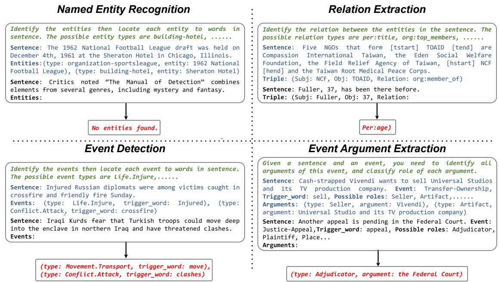
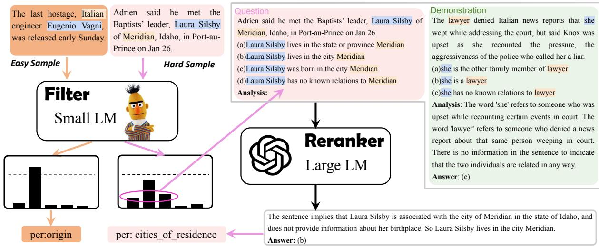

<span id="page-0-0"></span>
# Large Language Model Is Not a Good Few-shot Information Extractor, but a Good Reranker for Hard Samples!

Yubo Ma1, Yixin Cao2, YongChing Hong1, Aixin Sun1

1 S-Lab, Nanyang Technological University 2 Singapore Management University yubo001@e.ntu.edu.sg

## Abstract

Large Language Models (LLMs) have made remarkable strides in various tasks. Whether LLMs are competitive few-shot solvers for information extraction (IE) tasks, however, remains an open problem. In this work, we aim to provide a thorough answer to this question. Through extensive experiments on nine datasets across four IE tasks, we demonstrate that current advanced LLMs consistently exhibit inferior performance, higher latency, and increased budget requirements compared to fine-tuned SLMs under most settings. Therefore, we conclude that LLMs are not effective few-shot information extractors in general 1. Nonetheless, we illustrate that with appropriate prompting strategies, LLMs can effectively complement SLMs and tackle challenging samples that SLMs struggle with. And moreover, we propose an adaptive filter-thenrerank paradigm to combine the strengths of LLMs and SLMs. In this paradigm, SLMs serve as filters and LLMs serve as rerankers. By prompting LLMs to rerank a small portion of difficult samples identified by SLMs, our preliminary system consistently achieves promising improvements (2.4% F1-gain on average) on various IE tasks, with an acceptable time and cost investment. Our code is available at https://github.com/mayubo2333/LLM-IE.

## 1 Introduction

Large Language Models (LLMs, Brown et al. 2020; Chowdhery et al. 2022; Touvron et al. 2023) have shown remarkable abilities on various NLP applications such as factual question answering (Yu et al., 2023; Sun et al., 2023), arithmetic reasoning (Chen et al., 2022a; Qian et al., 2023) and logical reasoning (Jung et al., 2022; Pan et al., 2023). Given the reasoning, memorization, instruction-following and few-shot adaption capabilities emerging from

LLMs, it prompts a compelling question: Can LLMs be used to boost performance in few-shot information extraction (IE) tasks?

To answer this question, we conduct an extensive empirical study to compare the performance between LLMs using in-context learning 2 (ICL) and fine-tuned Small Language Models (SLMs). We fairly evaluate SLMs-based and LLMs-based methods across nine datasets spanning four common IE tasks: (1) Named Entity Recognition, (2) Relation Extraction, (3) Event Detection and (4) Event Argument Extraction. For each dataset, we explored four to six settings to encompass typical low-resource extents, from 1-shot to 20-shot or even more. Given the potential sensitivity of LLMs’ performance to the prompt context, we meticulously considered variations in instruction, demonstration number and selection strategy, prompt format, etc. Our study reveals that LLMs excel over SLMs only when annotations are extremely limited, i.e., both label types3 and the samples4 per label are extremely scarce. With more (e.g., hundreds of) samples, SLMs significantly outperform LLMs. Furthermore, LLMs incur greater inference latency and costs than fine-tuned SLMs. Hence, we claim that current LLMs are not good few-shot information extractors in general.

We further investigate whether LLMs and SLMs exhibit different abilities to handle various types of samples. We categorize samples according to their difficulty measured by SLMs’ confidence scores, and compare LLMs’ and SLMs’ results within each group. We find that LLMs are good at hard samples, though bad at easy samples. We posit that the knowledge and reasoning abilities in LLMs enable them to handle hard samples (which are simply beyond SLMs’ capabilities) well. Nevertheless, LLMs demonstrate strong predisposition to falsepositive predictions on negative samples. Since most negative samples are easy samples (which could be solved readily by SLMs), the performance of LLMs on easy samples sometimes collapses and are usually much worse than fine-tuned SLMs.

<span id="page-1-0"></span>
Leveraging these findings, we pursue an approach to incorporate LLMs and SLMs within a single system and combine their merits. To this end, we propose a novel filter-then-rerank framework. The basic idea is that SLMs serve as a filter and LLMs as a reranker. Specifically, SLMs initially predict and determine the difficulty of each sample. If the sample is a hard one, we further pass the top-N most-likely candidate labels from SLMs to LLMs for reranking. Otherwise we view the prediction from SLMs as the final decision. By providing easy/hard samples with different solution strategies, our system utilizes each model’s strengths to complement each other. Also, it reranks only a small subset of samples and minimizes the extra latency and budgets for calling LLMs. With a modest cost increase, our framework yields a consistent F1 improvement, averaging 2.4% higher than previous methods on various few-shot IE tasks. To the best of our knowledge, this is the first successful attempt to use LLMs to enhance few-shot IE tasks.

## 2 Related Work

## 2.1 LLMs for Information Extraction

Recent studies have increasingly explored Information Extraction (IE) tasks using LLMs. Drawing inspiration from instruction tuning (Wei et al., 2022a), several methods (Wadhwa et al., 2023; Wang et al., 2023a; Lu et al., 2023) transform annotated samples into instruction-answer pairs and then finetune LLMs, such as FlanT5 (Chung et al., 2022), on them. Nonetheless, this method necessitates a vast range of samples with diverse schemas and often yields suboptimal results in low-resource scenarios. In the context of few-shot IE tasks, prevalent strategies bifurcate into two main streams. The first approach perceives LLMs as efficient annotators (Ding et al., 2023; Josifoski et al., 2023). In these methods, they produce a plethora of pseudolabeled samples through LLMs and leverage the enhanced annotations to train SLMs. Conversely, the latter approach employs LLMs in inference using the ICL paradigm, which is the focus of our subsequent discussion.

## 2.2 Few-shot IE with ICL

Regarding few-shot IE tasks, recent studies intensively compare the performance between SLMs and LLMs but yield inconsistent conclusions. Some studies favor LLMs as competent few-shot extractors (Agrawal et al., 2022; Wang et al., 2023b; Li et al., 2023; Zhang et al., 2023a; Wadhwa et al., 2023), while others dispute this claim (Jimenez Gutierrez et al., 2022; Qin et al., 2023; Wei et al., 2023; Gao et al., 2023). This discrepancy leaves the question of whether LLMs perform competitively on few-shot IE tasks unresolved, thus hindering the advances of this domain.

We attribute such disagreement to the absence of an comprehensive and unified benchmark. Existing studies usually vary in tasks, datasets, and few-shot settings. Furthermore, some studies rely on overly simplistic datasets (Jimenez Gutierrez et al., 2022; Li et al., 2023) and may exaggerate the effectiveness of LLMs. Driven by these findings, our research undertakes comprehensive experiments across four IE tasks, nine datasets with various schema complexities (from coarse-grained to fine-grained) and low-resource settings.

In addition to the empirical study, we develop an innovative filter-then-rerank paradigm to combine the strengths of both LLMs and SLMs. It utilizes prompting strategies akin to QA4RE (Zhang et al., 2023a), transforming IE tasks into multi-choice questions. However, our method stands apart by integrating SLMs and LLMs within a single framework. This incorporation (1) enables our paradigm applicable to various IE tasks by providing candidate spans in the text and (2) achieves promising performance under low-resource IE scenarios.

## 3 Large LMs v.s. Small LMs

In this section, we compare the performance between LLMs and SLMs to evaluate whether LLMs perform competitively.

## 3.1 Task, Dataset and Evaluation

We run experiments on nine widely-used datasets across four IE tasks. (1) Named Entity Recognition (NER): CONLL03 (Tjong Kim Sang and De Meulder, 2003), OntoNotes (Weischedel et al., 2013) and FewNERD (Ding et al., 2021). (2) Relation Extraction (RE): TACRED (Zhang et al., 2017) and TACREV (Alt et al., 2020). (3) Event Detection (ED): ACE05 (Doddington et al., 2004), MAVEN (Wang et al., 2020) and ERE (Song et al.,

<span id="page-2-0"></span>
Figure 1: Examples of prompts used. The green, blue and black parts in the top boxes represent the instruction, demonstration (demo) and test sentence in the prompt respectively. The red parts represent the outputs from LLMs. We plot only 1 example for convenience of visualization. The actual demo number is usually much larger than 1.


> **AI Description:**
> **Source:** `assets/_page_2_Figure_0.jpg`
> 
> **Generated:** 2026-05-16 04:56:50
> 
> ---
> 
> The image contains a flowchart-style diagram illustrating four different tasks in natural language processing: Named Entity Recognition, Relation Extraction, Event Detection, and Event Argument Extraction. Each section describes the process and examples of the tasks, including entity types, relation types, event types, and argument types. The flowchart uses arrows to connect the different sections, indicating the progression from one task to another. Key terms such as "entities," "relations," "events," and "arguments" are highlighted, along with examples of sentences and the corresponding entities, relations, events, and arguments. The diagram is designed to visually represent the hierarchical relationship between these tasks and their components.


2015). (4) Event Argument Extraction (EAE): ACE05, ERE and RAMS (Ebner et al., 2020). With label numbers ranging from 4 to 168, we assess LLMs’ performance under different schema complexities. See their details in Appendix A.1.

Few-shot Set We construct few-shot datasets from the original datasets above. For training and validation set, we adopt K-shot sampling strategy, i.e., sampling K samples for each label type. See more details in Appendix A.2. For test set, we downsample their original test sets to reduce the cost of LLMs. We randomly sample 500 sentences for RE tasks, and 250 sentences for other task. We ensure that each label has at least one corresponding sample to avoid the absence of rare labels.

Evaluation We adopt micro-F1 score in NER, RE and ED tasks. For EAE task, we follow previous work (Wang et al., 2023b) and adopt head-F1 score, which merely considers matching of the head word rather than the whole content of a text span. We report averaged score w.r.t 5 sampled train/validation sets unless otherwise stated.

## 3.2 Small Language Models

We adopt five supervised methods to evaluate the abilities of SLMs. (1) Vanilla fine-tuning for all tasks, (2) FSLS (Ma et al., 2022a) for NER and ED tasks, (3) KnowPrompt (Chen et al., 2022b) for RE task, (4) PAIE (Ma et al., 2022b) for EAE task, and (5) UIE (Lu et al., 2022c) for all tasks. See their details in Appendix B.

## 3.3 Large Language Models

Detailed in Appendix C, we evaluate the ICL abilities of LLMs. Given labeled sentences D = {(si, yi)} and a test sentence s, our goal is to predict structured information y from s using a frozen LLM L. We feed LLM with prompt $\mathcal { P } _ { \mathcal { E } , I , f } ( D , s )$

$$
\mathcal { P } _ { \mathcal { E } , I , f } ( D , s ) = [ I ; f ( \mathcal { E } ( D , s ) ) ; f ( s ) ]\tag{1}
$$

We give examples of prompts on four IE tasks in Figure 1. The prompts consist of three parts: instruction I (color in green in Figure 1), demonstration $f ( \mathcal { E } ( D , s ) )$ (demo; color in blue) and the question f(x) (color in black). Here E denotes demo selector and $\mathcal { E } ( D , s ) \subset D$ denotes selected sentences as the demo to predict s. Prompt format f 5 refers to the template which converts demo E(D, s) and sample s to input context for LLMs. Then LLM generates f(y) (color in red) from which we could readily parse the extraction results y.

Models L: We explore six LLMs from two sources. (1) OpenAI models 6: we employ Chat-

<span id="page-3-0"></span>

### Full Page Description (Page 3)

**Source:** `assets/_page_3_Asset_7.jpg`

**Generated:** 2026-05-16 04:54:21

---

The image is a line graph comparing the performance of two models, LLaMA (13B) and Vicuna (13B), on the MAVEN dataset across different shot numbers (1-shot, 5-shot, 10-shot, 20-shot). The x-axis represents the shot numbers, and the y-axis represents the F1 score. The graph shows that both models improve in performance as the number of shots increases. The LLaMA model consistently outperforms the Vicuna model across all shot numbers. The graph includes dashed and solid lines representing the two models, with the LLaMA model's line being consistently higher than the Vicuna model's line.


### Full Page Description (Page 3)

**Source:** `assets/_page_3_Asset_3.jpg`

**Generated:** 2026-05-16 04:56:29

---

The image is a line graph comparing the F1 scores of different models (Fine-tuning, KnowPrompt, UIE, ChatGPT) across various shot sizes (1-shot, 5-shot, 10-shot, 20-shot, 50-shot, 100-shot) for a task called TACREV. The x-axis represents the number of shots, and the y-axis represents the F1 score. The graph shows that KnowPrompt and Fine-tuning perform better than UIE and ChatGPT across all shot sizes. The F1 scores generally increase as the number of shots increases for all models.


### Full Page Description (Page 3)

**Source:** `assets/_page_3_Asset_2.jpg`

**Generated:** 2026-05-16 04:56:21

---

The image is a line graph comparing the performance of two large language models, LLaMA (13B) and Vicuna (13B), on the FewNERD dataset. The x-axis represents the number of shots (1-shot, 5-shot, 10-shot, 20-shot), and the y-axis represents the performance metric. The graph shows that both models' performance increases as the number of shots increases. LLaMA consistently outperforms Vicuna across all shot numbers. The performance metric is not explicitly labeled, but it appears to be a percentage or a similar scale.


### Full Page Description (Page 3)

**Source:** `assets/_page_3_Asset_6.jpg`

**Generated:** 2026-05-16 04:54:54

---

The image contains a line graph with three distinct lines representing different models: ChatGPT, CODEX, and InstructGPT. The x-axis is labeled "ERE" and represents different shot numbers (1-shot, 5-shot, 10-shot, 20-shot). The y-axis is labeled "F1 score" and ranges from 0 to 80. The graph shows the performance of these models across different shot numbers, with each line indicating the F1 score for each model. The graph includes a dashed line at 60, which appears to be a benchmark or target for the F1 score. The main trend is that all models show an increase in F1 score as the number of shots increases, with ChatGPT and CODEX consistently outperforming InstructGPT.


### Full Page Description (Page 3)

**Source:** `assets/_page_3_Asset_9.jpg`

**Generated:** 2026-05-16 04:53:59

---

The image is a line graph that compares the F1 scores of three different models: UIE, ChatGPT, and InstructGPT across different levels of ERE (Example-Related Error). The x-axis represents the number of shots (1-shot, 5-shot, 10-shot, 20-shot), and the y-axis represents the F1 score. The graph shows that UIE consistently has the highest F1 score across all levels of ERE, followed by ChatGPT and InstructGPT. The trends indicate that as the number of shots increases, the F1 scores for all models tend to increase, but UIE maintains a higher score than the other two models.


### Full Page Description (Page 3)

**Source:** `assets/_page_3_Asset_8.jpg`

**Generated:** 2026-05-16 04:53:51

---

The image is a line graph comparing the F1 score performance of two methods, Fine-tuning and PAIE, across different shot numbers (1-shot, 5-shot, 10-shot, and 20-shot) on the ACE05 dataset. The x-axis represents the number of shots, while the y-axis represents the F1 score. The graph shows that both methods improve as the number of shots increases, with PAIE consistently outperforming Fine-tuning across all shot numbers. The graph includes error bars indicating the variability in the F1 scores for each method.


### Full Page Description (Page 3)

**Source:** `assets/_page_3_Asset_1.jpg`

**Generated:** 2026-05-16 04:55:52

---

The image contains a line graph with three distinct lines representing different models: ChatGPT, CODEX, and InstructGPT. The x-axis is labeled "OntoNotes" and represents the number of shots, ranging from 1-shot to 20-shot. The y-axis is labeled "F1 score" and ranges from 0 to 100. The graph shows the performance of the models across different shot numbers, with ChatGPT consistently outperforming the other two models. The lines for ChatGPT and CODEX show a general upward trend as the number of shots increases, while the line for InstructGPT remains relatively flat.


### Full Page Description (Page 3)

**Source:** `assets/_page_3_Asset_5.jpg`

**Generated:** 2026-05-16 04:55:45

---

The image is a line graph with three distinct lines representing different methods: Fine-tuning, FSLS, and UIE. The x-axis is labeled "ACE05" and represents different shot sizes (1-shot, 5-shot, 10-shot, 20-shot). The y-axis is labeled "F1 score" and ranges from 0 to 80. The graph shows the performance of these methods across varying shot sizes, with Fine-tuning and FSLS generally outperforming UIE. The Fine-tuning method shows a steady increase in F1 score as the shot size increases, while FSLS and UIE show more variability. The graph includes a horizontal dashed line at approximately 60, which could represent a performance threshold or benchmark.


### Full Page Description (Page 3)

**Source:** `assets/_page_3_Asset_10.jpg`

**Generated:** 2026-05-16 04:53:22

---

The image is a line graph comparing the F1 scores of two models, LLaMA (13B) and Vicuna (13B), across different shot numbers (1-shot, 5-shot, 10-shot, and 20-shot) in a RAMS (Retrieval-Augmented Model System) setting. The x-axis represents the number of shots, and the y-axis represents the F1 score. The graph shows that LLaMA consistently outperforms Vicuna across all shot numbers, with LLaMA achieving a higher F1 score in all cases. The lines for each model are color-coded for easy distinction, with LLaMA in solid lines and Vicuna in dashed lines.


### Full Page Description (Page 3)

**Source:** `assets/_page_3_Asset_4.jpg`

**Generated:** 2026-05-16 04:55:03

---

The image is a line graph comparing the F1 scores of four different models (CODEX, InstructGPT, LLaMA (13B), and Vicuna (13B)) across various shot numbers (1-shot, 5-shot, 10-shot, 20-shot, 50-shot, and 100-shot) on the TACRED dataset. The x-axis represents the number of shots, and the y-axis represents the F1 score. The graph shows that CODEX consistently outperforms the other models across all shot numbers, with the highest F1 score approaching 80. InstructGPT and LLaMA (13B) also show improvement as the number of shots increases, while Vicuna (13B) shows the least improvement.


### Full Page Description (Page 3)

**Source:** `assets/_page_3_Asset_0.jpg`

**Generated:** 2026-05-16 04:56:14

---

The image contains a line graph with three distinct lines representing different methods: Fine-tuning, FSL-S, and UIE. The x-axis represents the number of shots (1-shot, 5-shot, 10-shot, 20-shot), and the y-axis represents the F1 score. The graph shows the performance of these methods across different shot sizes. The Fine-tuning method consistently performs the best, with the highest F1 scores across all shot sizes. The FSL-S method shows a steady increase in performance as the number of shots increases, while the UIE method shows a more erratic pattern with varying performance across different shot sizes.

GPT, CODEX (Chen et al., 2022a) and Instruct-GPT (Ouyang et al., 2022) for main experiments. We also evaluate GPT-4 in Appendix D.3. (2) Open-source models: we use LLaMA-13B (Touvron et al., 2023) and its instruction-tuned counterpart, Vicuna-13B (Chiang et al., 2023).

Instruction I: The instruction (1) describes the task and (2) enumerates all possible labels for reference. we adopt instructions shown in Figure 1. Demo selector E: The maximum input length of

LLMs usually limits the sentence number in demos even under few-shot settings. Therefore for each test sentence s, we demand a demo retriever E(D, s) which selects a small subset from D as the sentences in demo. Following previous methods (Liu et al., 2022; Su et al., 2022), we retrieve demos according to their sentence embedding similarity to the test samples.

Prompt format f: We use simple textual templates to format the demos and the test sample in main experiments. For example, the template for NER is “Sentence: [S], Entities: ([type1], [entity1]), ([type2], [entity2])...".

<span id="page-4-0"></span>

### Full Page Description (Page 4)

**Source:** `assets/_page_4_Asset_2.jpg`

**Generated:** 2026-05-16 04:53:28

---

The image contains a box plot visualization. It compares F1 scores across three different demonstration selection methods: "random," "embed," and "epr." The x-axis represents the demonstration selection methods, while the y-axis represents the F1 scores. The box plot shows the median, quartiles, and potential outliers for each method. The "embed" method appears to have the highest median F1 score, followed by "epr," and "random" has the lowest median score.


### Full Page Description (Page 4)

**Source:** `assets/_page_4_Asset_0.jpg`

**Generated:** 2026-05-16 04:53:44

---

The image is a box plot visualization showing the distribution of F1 scores across different instruction formats. The x-axis represents the instruction formats, labeled as I1, I2, I3, I4, and I5. The y-axis represents the F1 score values, ranging from approximately 56.0 to 60.0. Each box plot represents a different instruction format, with the box indicating the interquartile range (IQR), the line inside the box representing the median, and the whiskers extending to the minimum and maximum values, excluding outliers. The outliers are marked with individual points. The box plots show variability in F1 scores across the different instruction formats, with some formats having a higher median and a smaller IQR compared to others.


### Full Page Description (Page 4)

**Source:** `assets/_page_4_Asset_1.jpg`

**Generated:** 2026-05-16 04:53:36

---

The image is a line graph showing the F1 score for two different models, ChatGPT and CODEX, across different demonstration numbers. The x-axis represents the demonstration number, ranging from 4 to 96, while the y-axis represents the F1 score, ranging from 36 to 60. The graph shows that both models' F1 scores increase as the demonstration number increases. However, ChatGPT consistently outperforms CODEX across all demonstration numbers. The highest F1 score for ChatGPT is around 59, while the highest for CODEX is around 56.

## 3.4 Main Results

We summarize the main experimental outcomes in Figure 2, indicating that LLMs only outperform SLMs in environments with restricted labels and samples. Conversely, SLMs are generally more effective. Given (1) the practicality of fine-grained IE tasks and the manageable effort of obtaining 10- 20 annotations per label and (2) the excessive time and budget demands of LLM inference, we conclude that LLMs are not as effective as supervised SLMs for few-shot IE tasks under real scenarios. We detail our findings as below.

Performance w.r.t sample number. The performance dynamics of SLMs and LLMs are influenced by variations in sample size. Under extremely lowresource (1-shot or 5-shot) settings, LLMs sometimes present superior performance than SLMs. Yet, LLMs tend to reach a performance plateau with only modest increases in sample size. Conversely, SLMs demonstrate marked performance enhancement as sample sizes grow. This trend is evident in Figure 2, where the SLM trajectories (represented by dashed lines) ascend more steeply compared to the LLM ones (solid lines).

Performance w.r.t label number. Compared with SLMs, LLMs tend to struggle on fine-grained datasets. For instance, LLMs perform relatively worse on MAVEN and RAMS datasets (with 168/139 labels) than on CONLL (4 labels only). Detailed quantitative results are shown in Appendix E.1, illustrating a clear negative correlation between the label number and the result disparity between LLMs and SLMs across various IE tasks. Comparisons among LLMs. We observe performance variability among LLMs. (1) Open-source models, LLaMA and Vicuna, significantly lag behind proprietary LLMs across all few-shot IE tasks.

(2) Among proprietary LLMs, ChatGPT performs better on NER and EAE tasks, but poorer so on RE and ED tasks. InstructGPT and CODEX demonstrate comparable performance across these tasks. LLMs show limited inference speed. We compare the inference speed of different methods and show their results in Table 1. We observe that LLMs is much slower than SLMs since they have much more parameters, longer input contexts and extra response decay (if external APIs applied).

## 3.5 Analysis on Prompt Sensitivity

Previous work (Lu et al., 2022b) indicates that the efficacy of LLMs on specific tasks can be significantly influenced by the construction of the prompt. To ensure that LLMs’ suboptimal outcomes are not erroneously ascribed to inappropriate prompt designs, we meticulously examine the impact of diverse prompt variations from four aspects, i.e., instruction format, demo number, demo selector and prompt format. We leave comprehensive details of the variants and their results to Appendix E.2- E.5, and illustrate salient findings in Figure 3. Our findings include that (1) diverse instruction strategies yield comparable results in IE task; (2) increasing the number of samples in demonstrations does not unequivocally enhance performance; and (3) The selection strategy of demonstration matters, and retrieval based on sentence embedding (what we used) proves sufficiently effective. Consequently, we believe that there unlikely exists a lottery prompt that substantially alters our conclusions that LLMs are not good few-shot IE solver.

Table 1: The inference seconds over 500 sentences (run on single V100 GPU). Here LLaMA is extremely slow since we set batch size as 1 due to memory limit.


<span id="page-5-0"></span>
## 3.6 Discussion: Why LLMs Fail to Obtain Satisfactory Performance on IE Tasks?

Underutilized Annotations. We notice that LLMs appear to benefit less from additional annotations, i.e., more training samples and label types, than SLMs. We speculate that LLMs are constrained by ICL in two ways. (1) More samples: The number of effective samples for LLMs, those in demos, is limited by maximum input length. Moreover, we also observe LLMs’ performance plateaus in some tasks before reaching this limit (see Appendix E.3). Meanwhile, SLMs can continually learn from more samples through supervised learning, widening the performance gap as annotated samples increase. (2) More labels: LLMs struggle with fine-grained datasets. It suggests a difficulty in understanding numerous labels and their subtle interactions merely from the given instruction and exemplars for LLMs. Also, the examples per label in demos decrease as label types increase.

Unexplored Task format. As stated in Zhang et al. (2023a), IE-related tasks are scarce in the widely-used instruction tuning datasets like Wei et al. (2022a) and Wang et al. (2022). Furthermore, the highly-flexible format of NER and ED tasks impair the ICL abilities 7. Therefore it is likely that instruction-tuned LLMs are not well-acquainted with such IE-related task formats.

## 4 LLMs are Good Few-shot Reranker

## 4.1 Filter-then-rerank Paradigm

Figure 4: Multi-choice question (MCQ) prompt.

7These two tasks require unfixed numbers of (label, span) tuple. Furthermore, the length of each span is also unfixed.

To mitigate LLMs’ drawbacks mentioned above, we propose a filter-then-rerank paradigm to integrate both SLMs and LLMs within the same system. This paradigm uses SLMs as filters to select the top-N candidate labels, then LLMs rerank them to make final decisions. By using SLM-generated candidate answers, the focus of LLMs shifts from sentence-level (i.e., identifying all entities/events in the sentence) to sample-level (i.e., determining single entity/event candidate provided). Each question now corresponds to a single sample, allowing us to reframe prompts as multi-choice questions (MCQ; shown in Figure 4) problem. Under such format, each candidate label is converted to a choice by pre-defined templates. We claim filter-then-rerank paradigm is more likely to elicit the powers of LLMs and smoothly solve few-shot IE tasks because: (1) LLMs are more familiar with MCQ prompts than IE-format prompts (Zhang et al., 2023a). (2) This paradigm reduces the label scopes significantly, since N is usually much smaller than fine-grained label numbers.

## 4.2 LLMs are Hard Sample Solver

Our filter-then-rerank paradigm, unfortunately, presents unsatisfactory performance (and even suffers longer latency since LLMs rerank candidates per sample). Given LLMs’ abilities in memorization and reasoning, however, we still believe that LLMs are potential to solve some, if not most, IE samples effectively. We hypothesize that LLMs are more proficient than SLMs on hard samples. These samples are characterized by their requisite for external knowledge acquisition or sophisticated reasoning strategies, areas where LLMs can leverage their extensive parametric knowledge bases and inherent reasoning mechanisms. In contrast, SLMs often falter with such samples, constrained by their restricted modeling capacities.

We leverage an unsupervised metric from SLMs to evaluate the difficulty of samples. Given a sample x in the sentence s, we define the highest probability across all labels as the confidence score:

$$
\operatorname { c o n f } ( x ) = \operatorname* { m a x } _ { l \in L } P _ { S L M } ( l | x ; s )\tag{2}
$$

where L denotes the label set and $P _ { S L M } ( l | x ; s )$ the probability of a span x (in the sentence s) referring to label l computed by SLMs. We classify samples with low confidence scores as hard samples. Otherwise we view them as easy samples.

<span id="page-6-0"></span>

### Full Page Description (Page 6)

**Source:** `assets/_page_6_Asset_2.jpg`

**Generated:** 2026-05-16 04:54:37

---

The image is a line graph with a shaded area representing confidence intervals. The x-axis is labeled "Confidence Score" and ranges from 0.15 to 0.95 in increments of 0.1. The y-axis is labeled "Micro-F1" and ranges from 0 to 100. The graph shows two lines, one in blue and the other in red, representing different datasets or conditions. The blue line starts at approximately 75 and decreases to around 25, then increases again. The red line starts at around 50, dips below 25, and then rises to approximately 75. The shaded area around the lines represents the confidence intervals for the Micro-F1 scores at each confidence score.


### Full Page Description (Page 6)

**Source:** `assets/_page_6_Asset_0.jpg`

**Generated:** 2026-05-16 04:55:29

---

The image is a line graph comparing the performance of a system called FewNERD (NER) with and without LLM re-ranking. The x-axis represents the confidence score, ranging from 0.15 to 0.95, while the y-axis shows the Micro-F1 score, which measures the performance of the system. The graph includes two lines: one for the system without LLM re-ranking and another for the system with LLM re-ranking. The line for the system with LLM re-ranking consistently outperforms the system without LLM re-ranking across the entire range of confidence scores.


### Full Page Description (Page 6)

**Source:** `assets/_page_6_Asset_1.jpg`

**Generated:** 2026-05-16 04:55:22

---

The image is a line graph with a shaded area representing a confidence interval. The x-axis is labeled "Confidence Score" and ranges from 0.15 to 0.95 in increments of 0.15. The y-axis is labeled "Micro-F1" and ranges from 0 to 100. The graph shows two lines, one for the lower bound of the confidence interval (in red) and one for the upper bound (in blue). The shaded area between these two lines represents the range of possible values for the Micro-F1 score at each confidence score. The graph is titled "TACREV (RE)".

We conduct experiments to confirm our hypothesis that LLMs excel on hard samples. We group samples by confidence scores and compare two methods within each group: (a) SLM-based methods without LLM reranking, and (b) SLMs as the filter and LLMs as the reranker. Method (b) differs from (a) by adding a single LLM to rerank the top-N SLM predictions, using MCQ prompts.

The results in Figure 5 substantiate our assumption. (1) LLM-based reranking (blue lines) enhances performance on hard samples (left areas in the figure). We provide a detailed analysis of specific challenging instances where LLM rerankers prove advantageous in Appendix F.1. These instances demonstrate the efficacy of LLMs in harnessing external knowledge and complex reasoning to rectify erroneous predictions initially made by SLMs (red lines). (2) Conversely, LLM-based reranking impedes performance on easy samples (right areas), resulting in a significant degradation, particularly for very easy samples (rightmost areas). In conclusion, LLMs exhibit greater proficiency in handling hard samples compared to SLMs, yet they underperform relative to SLMs on easy samples.

## 4.3 Why LLMs Fail on Easy Samples

We investigate why LLMs (relatively) fail on easy samples in this section. As shown in Table 2, we observe significant higher negative sample ratios for easy samples across diverse IE tasks. In other words, most negative samples are easy samples for SLMs. Here we refer negative samples to those labeled as None. We speculate that the proficiency of SLMs with negative samples stems from their ability to adeptly discern apparent patterns during the fine-tuning stages. Therefore, SLMs could predict negative samples with (relatively) high confidence and accuracy. Due to LLMs’ predisposition to false-positive predictions on negative samples, however, the performance of LLMs on easy samples collapses. We attribute such false-positive predictions to (1) hallucination and (2) span boundary mismatch. We detail such two kinds of mistakes with cases in Appendix F.2.

Table 2: Comparative ratios of negative to positive samples across various datasets and subsets. We set fixed threshold τ here for simplicity.


## 5 Adaptive Filter-then-rerank Paradigm

Above findings can be summarized as: (1) SLMs generally outperform LLMs, especially with more training samples and fine-grained labels. (2) SLMs are much more time- and cost-efficient. (3) LLMs serve as powerful rerankers on hard samples that challenge SLMs. Based on them, we propose a simple, efficient, and effective adaptive reranker that combines the strengths of SLMs and LLMs.

## 5.1 Method

Our adaptive filter-then-rerank approach, shown in Figure 6, uses supervised SLMs as a filter to make preliminary decisions. Samples with confidence scores exceeding threshold are viewed as easy samples otherwise hard ones. For easy samples, we retain SLM predictions as final results. For hard samples, top-N predictions from SLMs are reranked via LLMs using ICL. Here LLMs employ MCQ prompts (Figure 4), containing demos and a sample to be reranked. The LLMs then generate the final answer and optionally provide an explanation.

## 5.2 Experimental Setup

We conduct experiments on FewNERD for NER task, TACREV for RE task and ACE05 for ED task. We employ top-performing SLM-based methods from Section 3 (FSLS or KnowPrompt) as the filter, and Vicuna-13B, InstructGPT or GPT-4 as the reranker. The threshold τ to determine sample difficulty is optimized on the valid set. For hard sample, the top-3 SLM predictions and None (if not included) are feed to LLMs for reranking. Each LLM prompt has 4-shot demos. See demo examples in Appendix G.1. We follow templates in Lu et al. (2022a) for TACREV and carefully design others. See these templates in Appendix G.2. We adopt chain-of-thought reasoning (Wei et al., 2022b), i.e., prefacing the answer with an explanation, to facilitate LLMs’ reranking procedure.

<span id="page-7-0"></span>
Figure 6: The overall architecture of our adaptive filter-then-rerank paradigm. We color easy samples in orange and hard samples in pink. For easy samples, the final predictions are exactly from the SLM-based methods. For hard samples, the top-N predictions from SLMs are fed into LLMs as the format of multiple-choice questions (pink box). The question is paired with demos (green box). LLMs rerank these N candidates and generate the final prediction.


> **AI Description:**
> **Source:** `assets/_page_7_Figure_0.jpg`
> 
> **Generated:** 2026-05-16 04:53:14
> 
> ---
> 
> The image contains a flowchart with a focus on a machine learning-based system for filtering and reranking text samples. The flowchart includes:
> 
> 1. **Filtering Process**: A small language model (LM) is used to filter text samples, with two examples shown: an "Easy Sample" and a "Hard Sample." The Easy Sample is about an Italian engineer, while the Hard Sample is about Laura Silsby, a Baptist leader.
> 
> 2. **Reranking Process**: After filtering, the samples are reranked using a larger language model (LM). The reranking process is illustrated with a bar chart showing the probability distribution of the samples.
> 
> 3. **Question and Analysis**: A question is presented about Laura Silsby, and the analysis section discusses the context and reasoning behind the question. The analysis includes a demonstration of how the system processes the question and provides an answer.
> 
> 4. **Answer**: The answer to the question is provided, indicating that Laura Silsby lives in the city of Meridian.
> 
> The flowchart effectively illustrates the process of filtering and reranking text samples using language models, with a focus on the analysis and reasoning behind the system's decisions.


Baseline We compare our method with two kinds of baselines to validate its effectiveness.

(1) LLMs with ICL: We follow the prompts in Section 3.3 and conduct experiments on three LLMs. (2) Supervised SLMs: We follow previous SoTA methods shown in Section 3.4 (FSLS or Know-Prompt). We additionally combine two SLMs with ensemble or reranking approach (i.e., replace the LLM with another SLM as the reranker) to verify that improvements from our SLM-LLM integrated system are not solely due to the ensemble effects.

## 5.3 Main Results

Table 3 shows that our filter-then-rerank method consistently improves performance across three datasets and nine settings. For instance, with InstructGPT, reranking provides an average F1 gain of 2.4% without SLM ensemble (Lines 4 vs. 7). Based on ensemble SLMs as the filter, our method still achieves 2.1% (Lines 5 vs. 8) gains on average. This confirms (1) the effectiveness of the LLM reranking and (2) its gains are different and (almost) orthogonal to the SLM ensemble.

## 5.4 Analysis

Few makes big difference Our method selectively reranks hard samples. Table 4 shows that (1) only a minor fraction (0.5%\~10%) of samples are deemed hard and are reranked by LLMs. (2) Despite their limited quantity, reranking results in a substantial performance boost on these samples (10%\~25% absolute F1 gains). This uplift on a small subset significantly enhances the overall performance.

GPT-4 is more aggressive From Tables 3 and 4, GPT-4 generally improves more on hard samples, yet InstructGPT surpasses GPT-4 in NER and RE tasks when evaluated overall. This discrepancy arises from GPT-4’s aggressive reranking which introduces more true positives. InstructGPT, however, focuses more on reducing false positives.

Few makes small cost Figure 7 demonstrates that our method impressively reduces budget and latency by approximately 80%\~90% compared to direct ICL. This reduction is due to (1) fewer LLM callings (only for hard samples) and (2) shorter prompts (fewer candidate labels and demos).

## 5.5 Ablation Study

We investigate the effectiveness of the modules in adaptive filter-then-rerank system by removing each of them in turn: (1) CoT: We exclude the explantion for each examples in demo. (2) Demo:

<span id="page-8-0"></span>

### Full Page Description (Page 8)

**Source:** `assets/_page_8_Asset_1.jpg`

**Generated:** 2026-05-16 04:54:06

---

The image is a bar chart comparing the time cost (in seconds) for two methods: "Ten-re-rank" and "Fine-tuning (RoBERTa-large)" across three datasets: FewNERD, TACRECV, and ACE05. The x-axis represents the datasets, and the y-axis represents the time cost in seconds. The chart shows that the "Fine-tuning (RoBERTa-large)" method is significantly faster than the "Ten-re-rank" method for all three datasets, with the time cost for the "Fine-tuning" method being orders of magnitude lower than the "Ten-re-rank" method.


### Full Page Description (Page 8)

**Source:** `assets/_page_8_Asset_0.jpg`

**Generated:** 2026-05-16 04:54:14

---

The image is a bar chart comparing financial costs in dollars for three datasets: FewNERD, TACRECV, and ACE05. The chart has two sets of bars for each dataset: "Direct ICL (InstructGPT)" in blue and "Filter-the-Top" in pink. The y-axis represents the financial cost in dollars, ranging from 0 to 40. The x-axis lists the three datasets. The blue bars for "Direct ICL (InstructGPT)" are significantly higher than the pink bars for "Filter-the-Top" across all datasets, indicating that the former method is more expensive.

Table 3: Overall results of LLM-based ICL methods, SLM-based supervised methods, and our proposed filter-thenrerank (SLM+LLM) methods. The best results are in bold face and the second best are underlined. All results except InstructGPT and GPT-4 are averaged over 5 runs, and sample standard deviations are in the round bracket.


Table 4: The F1-score differences before and after reranking on the reranked samples, as well as their proportion of the total samples.


We remove all examples, rendering the reranking a zero-shot problem. (3) LF (label filtering): We retain all labels as candidate choices for reranking, instead of only the top-N labels from the SLMs. (4) AD (adaptive): We feed all samples, not just hard ones, to the LLMs.

We show their results in Table 5 and see that (1) Demos with explanations consistently enhance the reranking ability of LLMs across all datasets. (2) Demos without explanations also contribute to performance improvement. (3) Label filtering results in gains and notably reduces the demo length, hence cutting inference costs. (4) The performance collapses without a filter to identify sample difficulty, reiterating the need for an integrated SLM-LLM system to complement each other.

Table 5: Ablation study on three datasets. The filter is ensembled SLMs and the reranker is GPT-4.


## 6 Conclusion

Through an extensive empirical study on nine datasets spanning four IE tasks, we find that LLMs, despite their superiority in extreme low-resource scenarios, are not effective few-shot information extractors in general. They struggle with IE-related prompts, have limited demonstration capacity, and incur high inference costs. However, LLMs significantly improve the performance on hard samples when combined with SLM. Building on these insights, we propose an adaptive filter-then-rerank paradigm to leverage the strengths of SLMs and LLMs and mitigate their limitations. This approach consistently achieves promising results, with an average 2.4% F1 gain across multiple few-shot IE tasks, while minimizing latency and budget costs.

<span id="page-9-0"></span>
## Limitations

We do work hard to find better prompts to elicit the power of LLMs on few-shot IE tasks in Section 3.5, by exploring various kinds of LLMs, demonstration strategies and prompt formats. We find that different prompt variants do not significantly impact in-context learning abilities. As an empirical study, we acknowledge the potential existence of a lottery prompt superior to our explored prompts. However, it seems unlikely that an improved prompt would substantially alter our conclusions.

Another common risk when evaluating LLMs on public benchmark is their potential memorization of samples tested. To mitigate such potential contamination, we use earlier and stable versions of these models rather than the newer and updated ones (for example, gpt-4-0314 instead of gpt-4). Even if such contamination makes abilities of LLMs overestimated, our primary conclusions remain unchanged because we find that LLMs are NOT good few-shot information extractors.

Regarding our adaptive filter-then-rerank paradigm, a key limitation lies in how to assess sample difficulty. In this work, we employ a simple unsupervised metric, i.e., the maximum probabilities from SLMs. This is predicated on the assumption that SLMs are well-calibrated (Guo et al., 2017). However, it is an obviously imperfect assumption. We envision that calibrating SLMsbased filters or developing an advanced difficulty metric could substantially enhance LLM rerankers’ performance. We leave them for future work.

## Acknowlegement

This study is supported under the RIE2020 Industry Alignment Fund – Industry Collaboration Projects (IAF-ICP) Funding Initiative, the Singapore Ministry of Education (MOE) Academic Research Fund (AcRF) Tier 1 grant, as well as cash and in-kind contribution from the industry partner(s).

## References

- Monica Agrawal, Stefan Hegselmann, Hunter Lang, Yoon Kim, and David Sontag. 2022. Large language models are few-shot clinical information extractors. In Proceedings of the 2022 Conference on Empirical Methods in Natural Language Processing, pages 1998–2022, Abu Dhabi, United Arab Emirates. Association for Computational Linguistics.
- Christoph Alt, Aleksandra Gabryszak, and Leonhard Hennig. 2020. TACRED revisited: A thorough evaluation of the TACRED relation extraction task. In Proceedings of the 58th Annual Meeting of the Association for Computational Linguistics, pages 1558– 1569, Online. Association for Computational Linguistics.
- Tom B. Brown, Benjamin Mann, Nick Ryder, Melanie Subbiah, Jared Kaplan, Prafulla Dhariwal, Arvind Neelakantan, Pranav Shyam, Girish Sastry, Amanda Askell, Sandhini Agarwal, Ariel Herbert-Voss, Gretchen Krueger, Tom Henighan, Rewon Child, Aditya Ramesh, Daniel M. Ziegler, Jeffrey Wu, Clemens Winter, Christopher Hesse, Mark Chen, Eric Sigler, Mateusz Litwin, Scott Gray, Benjamin Chess, Jack Clark, Christopher Berner, Sam McCandlish, Alec Radford, Ilya Sutskever, and Dario Amodei. 2020. Language models are few-shot learners. In Advances in Neural Information Processing Systems 33: Annual Conference on Neural Information Processing Systems 2020, NeurIPS 2020, December 6-12, 2020, virtual.
- Mark Chen, Jerry Tworek, Heewoo Jun, Qiming Yuan, Henrique Pondé de Oliveira Pinto, Jared Kaplan, Harrison Edwards, Yuri Burda, Nicholas Joseph, Greg Brockman, Alex Ray, Raul Puri, Gretchen Krueger, Michael Petrov, Heidy Khlaaf, Girish Sastry, Pamela Mishkin, Brooke Chan, Scott Gray, Nick Ryder, Mikhail Pavlov, Alethea Power, Lukasz Kaiser, Mohammad Bavarian, Clemens Winter, Philippe Tillet, Felipe Petroski Such, Dave Cummings, Matthias Plappert, Fotios Chantzis, Elizabeth Barnes, Ariel Herbert-Voss, William Hebgen Guss, Alex Nichol, Alex Paino, Nikolas Tezak, Jie Tang, Igor Babuschkin, Suchir Balaji, Shantanu Jain, William Saunders, Christopher Hesse, Andrew N. Carr, Jan Leike, Joshua Achiam, Vedant Misra, Evan Morikawa, Alec Radford, Matthew Knight, Miles Brundage, Mira Murati, Katie Mayer, Peter Welinder, Bob McGrew, Dario Amodei, Sam McCandlish, Ilya Sutskever, and Wojciech Zaremba. 2021. Evaluating large language models trained on code. ArXiv preprint, abs/2107.03374.
- Ting Chen, Simon Kornblith, Mohammad Norouzi, and Geoffrey E. Hinton. 2020. A simple framework for contrastive learning of visual representations. In Proceedings of the 37th International Conference on Machine Learning, ICML 2020, 13-18 July 2020, Virtual Event, volume 119 of Proceedings of Machine Learning Research, pages 1597–1607. PMLR.
- Wenhu Chen, Xueguang Ma, Xinyi Wang, and William W. Cohen. 2022a. Program of thoughts prompting: Disentangling computation from reasoning for numerical reasoning tasks.
- Xiang Chen, Ningyu Zhang, Xin Xie, Shumin Deng, Yunzhi Yao, Chuanqi Tan, Fei Huang, Luo Si, and Huajun Chen. 2022b. Knowprompt: Knowledgeaware prompt-tuning with synergistic optimization for relation extraction. In WWW ’22: The ACM Web

<span id="page-10-0"></span>
- Conference 2022, Virtual Event, Lyon, France, April 25 - 29, 2022, pages 2778–2788. ACM.
- Wei-Lin Chiang, Zhuohan Li, Zi Lin, Ying Sheng, Zhanghao Wu, Hao Zhang, Lianmin Zheng, Siyuan Zhuang, Yonghao Zhuang, Joseph E. Gonzalez, Ion Stoica, and Eric P. Xing. 2023. Vicuna: An opensource chatbot impressing gpt-4 with 90%\* chatgpt quality.
- Aakanksha Chowdhery, Sharan Narang, Jacob Devlin, Maarten Bosma, Gaurav Mishra, Adam Roberts, Paul Barham, Hyung Won Chung, Charles Sutton, Sebastian Gehrmann, Parker Schuh, Kensen Shi, Sasha Tsvyashchenko, Joshua Maynez, Abhishek Rao, Parker Barnes, Yi Tay, Noam Shazeer, Vinodkumar Prabhakaran, Emily Reif, Nan Du, Ben Hutchinson, Reiner Pope, James Bradbury, Jacob Austin, Michael Isard, Guy Gur-Ari, Pengcheng Yin, Toju Duke, Anselm Levskaya, Sanjay Ghemawat, Sunipa Dev, Henryk Michalewski, Xavier Garcia, Vedant Misra, Kevin Robinson, Liam Fedus, Denny Zhou, Daphne Ippolito, David Luan, Hyeontaek Lim, Barret Zoph, Alexander Spiridonov, Ryan Sepassi, David Dohan, Shivani Agrawal, Mark Omernick, Andrew M. Dai, Thanumalayan Sankaranarayana Pillai, Marie Pellat, Aitor Lewkowycz, Erica Moreira, Rewon Child, Oleksandr Polozov, Katherine Lee, Zongwei Zhou, Xuezhi Wang, Brennan Saeta, Mark Diaz, Orhan Firat, Michele Catasta, Jason Wei, Kathy Meier-Hellstern, Douglas Eck, Jeff Dean, Slav Petrov, and Noah Fiedel. 2022. Palm: Scaling language modeling with pathways.
- Hyung Won Chung, Le Hou, Shayne Longpre, Barret Zoph, Yi Tay, William Fedus, Yunxuan Li, Xuezhi Wang, Mostafa Dehghani, Siddhartha Brahma, Albert Webson, Shixiang Shane Gu, Zhuyun Dai, Mirac Suzgun, Xinyun Chen, Aakanksha Chowdhery, Alex Castro-Ros, Marie Pellat, Kevin Robinson, Dasha Valter, Sharan Narang, Gaurav Mishra, Adams Yu, Vincent Zhao, Yanping Huang, Andrew Dai, Hongkun Yu, Slav Petrov, Ed H. Chi, Jeff Dean, Jacob Devlin, Adam Roberts, Denny Zhou, Quoc V. Le, and Jason Wei. 2022. Scaling instruction-finetuned language models.
- Bosheng Ding, Chengwei Qin, Linlin Liu, Yew Ken Chia, Boyang Li, Shafiq Joty, and Lidong Bing. 2023. Is GPT-3 a good data annotator? In Proceedings of the 61st Annual Meeting of the Association for Computational Linguistics (Volume 1: Long Papers), pages 11173–11195, Toronto, Canada. Association for Computational Linguistics.
- Ning Ding, Guangwei Xu, Yulin Chen, Xiaobin Wang, Xu Han, Pengjun Xie, Haitao Zheng, and Zhiyuan Liu. 2021. Few-NERD: A few-shot named entity recognition dataset. In Proceedings of the 59th Annual Meeting of the Association for Computational Linguistics and the 11th International Joint Conference on Natural Language Processing (Volume 1: Long Papers), pages 3198–3213, Online. Association for Computational Linguistics.
- George Doddington, Alexis Mitchell, Mark Przybocki, Lance Ramshaw, Stephanie Strassel, and Ralph Weischedel. 2004. The automatic content extraction (ACE) program – tasks, data, and evaluation. In Proceedings of the Fourth International Conference on Language Resources and Evaluation (LREC’04), Lisbon, Portugal. European Language Resources Association (ELRA).
- Seth Ebner, Patrick Xia, Ryan Culkin, Kyle Rawlins, and Benjamin Van Durme. 2020. Multi-sentence argument linking. In Proceedings of the 58th Annual Meeting of the Association for Computational Linguistics, pages 8057–8077, Online. Association for Computational Linguistics.
- Jun Gao, Huan Zhao, Changlong Yu, and Ruifeng Xu. 2023. Exploring the feasibility of chatgpt for event extraction.
- Tianyu Gao, Xingcheng Yao, and Danqi Chen. 2021. SimCSE: Simple contrastive learning of sentence embeddings. In Proceedings of the 2021 Conference on Empirical Methods in Natural Language Processing, pages 6894–6910, Online and Punta Cana, Dominican Republic. Association for Computational Linguistics.
- Chuan Guo, Geoff Pleiss, Yu Sun, and Kilian Q. Weinberger. 2017. On calibration of modern neural networks. In Proceedings of the 34th International Conference on Machine Learning, ICML 2017, Sydney, NSW, Australia, 6-11 August 2017, volume 70 of Proceedings of Machine Learning Research, pages 1321–1330. PMLR.
- Bernal Jimenez Gutierrez, Nikolas McNeal, Clayton Washington, You Chen, Lang Li, Huan Sun, and Yu Su. 2022. Thinking about GPT-3 in-context learning for biomedical IE? think again. In Findings of the Association for Computational Linguistics: EMNLP 2022, pages 4497–4512, Abu Dhabi, United Arab Emirates. Association for Computational Linguistics.
- Martin Josifoski, Marija Sakota, Maxime Peyrard, and Robert West. 2023. Exploiting asymmetry for synthetic training data generation: Synthie and the case of information extraction.
- Jaehun Jung, Lianhui Qin, Sean Welleck, Faeze Brahman, Chandra Bhagavatula, Ronan Le Bras, and Yejin Choi. 2022. Maieutic prompting: Logically consistent reasoning with recursive explanations. In Proceedings of the 2022 Conference on Empirical Methods in Natural Language Processing, pages 1266–1279, Abu Dhabi, United Arab Emirates. Association for Computational Linguistics.
- Mike Lewis, Yinhan Liu, Naman Goyal, Marjan Ghazvininejad, Abdelrahman Mohamed, Omer Levy, Veselin Stoyanov, and Luke Zettlemoyer. 2020. BART: Denoising sequence-to-sequence pre-training for natural language generation, translation, and comprehension. In Proceedings of the 58th Annual Meeting of the Association for Computational Linguistics,

<span id="page-11-0"></span>
- pages 7871–7880, Online. Association for Computational Linguistics.
- Peng Li, Tianxiang Sun, Qiong Tang, Hang Yan, Yuanbin Wu, Xuanjing Huang, and Xipeng Qiu. 2023. CodeIE: Large code generation models are better few-shot information extractors. In Proceedings of the 61st Annual Meeting of the Association for Computational Linguistics (Volume 1: Long Papers), pages 15339–15353, Toronto, Canada. Association for Computational Linguistics.
- Jiachang Liu, Dinghan Shen, Yizhe Zhang, Bill Dolan, Lawrence Carin, and Weizhu Chen. 2022. What makes good in-context examples for GPT-3? In Proceedings of Deep Learning Inside Out (DeeLIO 2022): The 3rd Workshop on Knowledge Extraction and Integration for Deep Learning Architectures, pages 100–114, Dublin, Ireland and Online. Association for Computational Linguistics.
- Yinhan Liu, Myle Ott, Naman Goyal, Jingfei Du, Mandar Joshi, Danqi Chen, Omer Levy, Mike Lewis, Luke Zettlemoyer, and Veselin Stoyanov. 2019. Roberta: A robustly optimized bert pretraining approach.
- Ilya Loshchilov and Frank Hutter. 2019. Decoupled weight decay regularization. In 7th International Conference on Learning Representations, ICLR 2019, New Orleans, LA, USA, May 6-9, 2019. OpenReview.net.
- Keming Lu, I-Hung Hsu, Wenxuan Zhou, Mingyu Derek Ma, and Muhao Chen. 2022a. Summarization as indirect supervision for relation extraction. In Findings of the Association for Computational Linguistics: EMNLP 2022, pages 6575–6594, Abu Dhabi, United Arab Emirates. Association for Computational Linguistics.
- Keming Lu, Xiaoman Pan, Kaiqiang Song, Hongming Zhang, Dong Yu, and Jianshu Chen. 2023. Pivoine: Instruction tuning for open-world information extraction. ArXiv preprint, abs/2305.14898.
- Yao Lu, Max Bartolo, Alastair Moore, Sebastian Riedel, and Pontus Stenetorp. 2022b. Fantastically ordered prompts and where to find them: Overcoming fewshot prompt order sensitivity. In Proceedings of the 60th Annual Meeting of the Association for Computational Linguistics (Volume 1: Long Papers), pages 8086–8098, Dublin, Ireland. Association for Computational Linguistics.
- Yaojie Lu, Qing Liu, Dai Dai, Xinyan Xiao, Hongyu Lin, Xianpei Han, Le Sun, and Hua Wu. 2022c. Unified structure generation for universal information extraction. In Proceedings of the 60th Annual Meeting of the Association for Computational Linguistics (Volume 1: Long Papers), pages 5755–5772, Dublin, Ireland. Association for Computational Linguistics.
- Jie Ma, Miguel Ballesteros, Srikanth Doss, Rishita Anubhai, Sunil Mallya, Yaser Al-Onaizan, and Dan
- Roth. 2022a. Label semantics for few shot named entity recognition. In Findings of the Association for Computational Linguistics: ACL 2022, pages 1956– 1971, Dublin, Ireland. Association for Computational Linguistics.
- Yubo Ma, Zehao Wang, Yixin Cao, Mukai Li, Meiqi Chen, Kun Wang, and Jing Shao. 2022b. Prompt for extraction? PAIE: Prompting argument interaction for event argument extraction. In Proceedings of the 60th Annual Meeting of the Association for Computational Linguistics (Volume 1: Long Papers), pages 6759–6774, Dublin, Ireland. Association for Computational Linguistics.
- Yubo Ma, Zehao Wang, Yixin Cao, and Aixin Sun. 2023. Few-shot event detection: An empirical study and a unified view. In Proceedings of the 61st Annual Meeting of the Association for Computational Linguistics (Volume 1: Long Papers), pages 11211–11236, Toronto, Canada. Association for Computational Linguistics.
- Long Ouyang, Jeff Wu, Xu Jiang, Diogo Almeida, Carroll L. Wainwright, Pamela Mishkin, Chong Zhang, Sandhini Agarwal, Katarina Slama, Alex Ray, John Schulman, Jacob Hilton, Fraser Kelton, Luke Miller, Maddie Simens, Amanda Askell, Peter Welinder, Paul Christiano, Jan Leike, and Ryan Lowe. 2022. Training language models to follow instructions with human feedback.
- Liangming Pan, Alon Albalak, Xinyi Wang, and William Yang Wang. 2023. Logic-lm: Empowering large language models with symbolic solvers for faithful logical reasoning.
- Cheng Qian, Chi Han, Yi R. Fung, Yujia Qin, Zhiyuan Liu, and Heng Ji. 2023. Creator: Tool creation for disentangling abstract and concrete reasoning of large language models.
- Chengwei Qin, Aston Zhang, Zhuosheng Zhang, Jiaao Chen, Michihiro Yasunaga, and Diyi Yang. 2023. Is chatgpt a general-purpose natural language processing task solver?
- Colin Raffel, Noam Shazeer, Adam Roberts, Katherine Lee, Sharan Narang, Michael Matena, Yanqi Zhou, Wei Li, and Peter J. Liu. 2020. Exploring the limits of transfer learning with a unified text-to-text transformer. J. Mach. Learn. Res., 21:140:1–140:67.
- Ohad Rubin, Jonathan Herzig, and Jonathan Berant. 2022. Learning to retrieve prompts for in-context learning. In Proceedings of the 2022 Conference of the North American Chapter of the Association for Computational Linguistics: Human Language Technologies, pages 2655–2671, Seattle, United States. Association for Computational Linguistics.
- Zhiyi Song, Ann Bies, Stephanie Strassel, Tom Riese, Justin Mott, Joe Ellis, Jonathan Wright, Seth Kulick, Neville Ryant, and Xiaoyi Ma. 2015. From light to rich ERE: Annotation of entities, relations, and

<span id="page-12-0"></span>
- events. In Proceedings of the The 3rd Workshop on EVENTS: Definition, Detection, Coreference, and Representation, pages 89–98, Denver, Colorado. Association for Computational Linguistics.
- Hongjin Su, Jungo Kasai, Chen Henry Wu, Weijia Shi, Tianlu Wang, Jiayi Xin, Rui Zhang, Mari Ostendorf, Luke Zettlemoyer, Noah A. Smith, and Tao Yu. 2022. Selective annotation makes language models better few-shot learners.
- Zhiqing Sun, Xuezhi Wang, Yi Tay, Yiming Yang, and Denny Zhou. 2023. Recitation-augmented language models. In International Conference on Learning Representations.
- Erik F. Tjong Kim Sang and Fien De Meulder. 2003. Introduction to the CoNLL-2003 shared task: Language-independent named entity recognition. In Proceedings of the Seventh Conference on Natural Language Learning at HLT-NAACL 2003, pages 142– 147.
- Hugo Touvron, Thibaut Lavril, Gautier Izacard, Xavier Martinet, Marie-Anne Lachaux, Timothée Lacroix, Baptiste Rozière, Naman Goyal, Eric Hambro, Faisal Azhar, Aurelien Rodriguez, Armand Joulin, Edouard Grave, and Guillaume Lample. 2023. Llama: Open and efficient foundation language models.
- Somin Wadhwa, Silvio Amir, and Byron Wallace. 2023. Revisiting relation extraction in the era of large language models. In Proceedings of the 61st Annual Meeting of the Association for Computational Linguistics (Volume 1: Long Papers), pages 15566– 15589, Toronto, Canada. Association for Computational Linguistics.
- Xiao Wang, Wei Zhou, Can Zu, Han Xia, Tianze Chen, Yuan Zhang, Rui Zheng, Junjie Ye, Qi Zhang, Tao Gui, Jihua Kang, J. Yang, Siyuan Li, and Chunsai Du. 2023a. Instructuie: Multi-task instruction tuning for unified information extraction. ArXiv preprint, abs/2304.08085.
- Xiaozhi Wang, Ziqi Wang, Xu Han, Wangyi Jiang, Rong Han, Zhiyuan Liu, Juanzi Li, Peng Li, Yankai Lin, and Jie Zhou. 2020. MAVEN: A Massive General Domain Event Detection Dataset. In Proceedings of the 2020 Conference on Empirical Methods in Natural Language Processing (EMNLP), pages 1652– 1671, Online. Association for Computational Linguistics.
- Xingyao Wang, Sha Li, and Heng Ji. 2023b. Code4Struct: Code generation for few-shot event structure prediction. In Proceedings of the 61st Annual Meeting of the Association for Computational Linguistics (Volume 1: Long Papers), pages 3640– 3663, Toronto, Canada. Association for Computational Linguistics.
- Xuezhi Wang, Jason Wei, Dale Schuurmans, Quoc Le, Ed Chi, Sharan Narang, Aakanksha Chowdhery, and Denny Zhou. 2023c. Self-consistency improves
- chain of thought reasoning in language models. In The Eleventh International Conference on Learning Representations (ICLR 2023).
- Yizhong Wang, Swaroop Mishra, Pegah Alipoormolabashi, Yeganeh Kordi, Amirreza Mirzaei, Atharva Naik, Arjun Ashok, Arut Selvan Dhanasekaran, Anjana Arunkumar, David Stap, Eshaan Pathak, Giannis Karamanolakis, Haizhi Lai, Ishan Purohit, Ishani Mondal, Jacob Anderson, Kirby Kuznia, Krima Doshi, Kuntal Kumar Pal, Maitreya Patel, Mehrad Moradshahi, Mihir Parmar, Mirali Purohit, Neeraj Varshney, Phani Rohitha Kaza, Pulkit Verma, Ravsehaj Singh Puri, Rushang Karia, Savan Doshi, Shailaja Keyur Sampat, Siddhartha Mishra, Sujan Reddy A, Sumanta Patro, Tanay Dixit, and Xudong Shen. 2022. Super-NaturalInstructions: Generalization via declarative instructions on 1600+ NLP tasks. In Proceedings of the 2022 Conference on Empirical Methods in Natural Language Processing, pages 5085–5109, Abu Dhabi, United Arab Emirates. Association for Computational Linguistics.
- Jason Wei, Maarten Bosma, Vincent Y. Zhao, Kelvin Guu, Adams Wei Yu, Brian Lester, Nan Du, Andrew M. Dai, and Quoc V. Le. 2022a. Finetuned language models are zero-shot learners. In The Tenth International Conference on Learning Representations, ICLR 2022, Virtual Event, April 25-29, 2022. OpenReview.net.
- Jason Wei, Xuezhi Wang, Dale Schuurmans, Maarten Bosma, Ed Huai hsin Chi, Quoc Le, and Denny Zhou. 2022b. Chain of thought prompting elicits reasoning in large language models. Proceedings of the 36th International Conference on Neural Information Processing Systems.
- Xiang Wei, Xingyu Cui, Ning Cheng, Xiaobin Wang, Xin Zhang, Shen Huang, Pengjun Xie, Jinan Xu, Yufeng Chen, Meishan Zhang, Yong Jiang, and Wenjuan Han. 2023. Zero-shot information extraction via chatting with chatgpt.
- Ralph Weischedel, Martha Palmer, Mitchell Marcus, Eduard Hovy, Sameer Pradhan, Lance Ramshaw, Nianwen Xue, Ann Taylor, Jeff Kaufman, Michelle Franchini, et al. 2013. Ontonotes release 5.0 ldc2013t19. Linguistic Data Consortium, Philadelphia, PA.
- Yi Yang and Arzoo Katiyar. 2020. Simple and effective few-shot named entity recognition with structured nearest neighbor learning. In Proceedings of the 2020 Conference on Empirical Methods in Natural Language Processing (EMNLP), pages 6365–6375, Online. Association for Computational Linguistics.
- Wenhao Yu, Dan Iter, Shuohang Wang, Yichong Xu, Mingxuan Ju, Soumya Sanyal, Chenguang Zhu, Michael Zeng, and Meng Jiang. 2023. Generate rather than retrieve: Large language models are strong context generators. In International Conference for Learning Representation (ICLR 2023).
- Kai Zhang, Bernal Jimenez Gutierrez, and Yu Su. 2023a. Aligning instruction tasks unlocks large language

<span id="page-13-0"></span>
```
models as zero-shot relation extractors. In Find  
ings of the Association for Computational Linguis  
tics: ACL 2023, pages 794–812, Toronto, Canada.   
Association for Computational Linguistics.
```

```
Yuhao Zhang, Victor Zhong, Danqi Chen, Gabor Angeli,   
and Christopher D. Manning. 2017. Position-aware   
attention and supervised data improve slot filling.   
In Proceedings of the 2017 Conference on Empiri  
cal Methods in Natural Language Processing, pages   
35–45, Copenhagen, Denmark. Association for Com  
putational Linguistics.
```

Zhuosheng Zhang, Aston Zhang, Mu Li, and Alex Smola. 2023b. Automatic chain of thought prompting in large language models. In The Eleventh International Conference on Learning Representations (ICLR 2023).

## A Datasets

## A.1 Full Datasets

We construct few-shot IE datasets and conduct the empirical study on nine datasets spanning four tasks, with varying schema complexities ranging from 4 to 168. We show their statistics in Table 6.

## A.2 Details of Few-shot IE Datasets

Sampling Algorithm for Train/Valid Datasets. We downsample sentences from original training dataset to construct few-shot training and valid datasets. We adopt K-shot sampling strategy that each label has (at least) K samples. We set 6 Kvalues (1, 5, 10, 20, 50, 100) for RE tasks and 4 K-values (1, 5, 10, 20) for other tasks. For RE task, each sentence has exactly one relation and we simply select K sentences for each label. For NER, ED and EAE tasks, each sentences is possible to contain more than one entities/events/arguments. Since our sampling is at sentence-level, the algorithm of accurate sampling , i.e., finding exactly K samples for each label, is NP-complete8 and unlikely to find a practical solution. Therefore we follow Yang and Katiyar (2020) adopting a greedy sampling algorithm to select sentences for NER and ED tasks, as shown in Algorithm 1. Note that the actual sample number of each label can be larger than K under this sampling strategy. For all three tasks, we additionally sample negative sentences (without any defined labels) and make the ratio of positive sentences (with at least one label) and negative sentences as 1:1. The statistics of the curated datasets are listed in Table 7.

```
Algorithm 1 Greedy Sampling   
Require: shot number K, original full dataset   
$\mathcal { D } = \{ ( { \bf X } , { \bf Y } ) \}$ tagged with label set E   
1: Sort E based on their frequencies in {Y} as   
an ascending order   
2: $S  \phi ,$ Counter ← dict()   
3: for $y \in E$ do   
4: Counter $( y ) \gets 0$   
5: end for   
6: for $y \in E$ do   
7: while Counter $( y ) < K$ do   
8: Sample $( \mathbf { X } , \mathbf { Y } ) \in \mathcal { D } \mathrm { s . t . } \exists j , y _ { j } = y$   
9: $\mathcal { D }  \mathcal { D } \backslash ( \mathbf { X } , \mathbf { Y } )$   
10: Update Counter (not only y but all   
event types in Y)   
11: end while   
12: end for   
13: for $s \in { \mathcal { S } }$ do   
14: $S \gets S \backslash s$ and update Counter   
15: if ∃y ∈ E, s.t. Counter(y) < K then   
16: $S \gets S \bigcup s$   
17: end if   
18: end for   
19: return S
```

Based on the subsets constructed above, we optionally further split them into training and valid sets. For few-shot datasets with more than 300 sentences, we additionally split 10% sentences as the valid set and the remaining sentences as training set. Otherwise, we do not construct valid set and conduct 5-fold cross validation to avoid overfitting.

## B Details on SLMs

We adopt five representative supervised methods to evaluate the ability of SLMs on few-shot IE tasks. (1). Fine-tuning (FT): Add a classifier head on SLMs to predict the labels of each sentence/word. (2). FSLS (Ma et al., 2022a): The state-of-the-art extractive-based method for few-shot NER task. Ma et al. (2023) also validate its competitive performance on few-shot ED tasks.

(3). KnowPrompt (Chen et al., 2022b): The best extractive-based method for few-shot RE task.

(4). PAIE (Ma et al., 2022b): The best extractivebased method for few-shot EAE task.

(5). UIE (Lu et al., 2022c): A competitive unified generation-based method for few-shot IE tasks. We introduce their implementation details below:

Fine-tuning/FSLS. We implement these two methods by ourselves. We use RoBERTa-large (Liu et al., 2019) as the backbones. We adopt Automatic Mixed Precision (AMP) training strategy9 to save memory. We run each experiment on a single NVIDIA V100 GPU. We train each model with the AdamW (Loshchilov and Hutter, 2019) optimizer with linear scheduler and 0.1 warm-up steps. We set the weight-decay coefficient as 1e-5 and maximum gradient norms as 1.0. We set the batch size as 64, the maximum input length as 192, the training step as 500 and the learning rate as 5e-5. KnowPrompt We implement this method based on original source code10, and use RoBERTa-large as our backbones. We set 10 maximum epochs for 50- and 100-shot datasets, and as 50 epochs for other datasets. We keep all other hyperparameters as default, and run each experiment on a single NVIDIA V100 GPU.

<span id="page-14-0"></span>
Table 6: Statistics of nine datasets used. Note that the #mentions for event detection tasks refers to the number of trigger words, while the #mentions for event argument extraction tasks refers to the number of arguments.


Table 7: The statistics of few-shot training sets. We set different random seeds and generate 5 training sets for each setting. We report their average statistics.


PAIE We implement this method on original source code11, and use BART-large (Lewis et al., 2020) as backbones. We keep all hyperparameters as default for ACE and RAMS dataset. For ERE dataset, we set the training step as 1000, the batch size as 16 and the learning rate as 2e-5. We run each experiment on a single NVIDIA V100 GPU. UIE We implement this method based on original source code12, and use T5-large (Raffel et al., 2020) as the backbones. We run each experiment on a single NVIDIA Quadro RTX8000 GPU. We set the batch size as 4 with 4000 training steps. We set the maximum input length as 800 and the learning rate as 1e-4.

## C LLMs Implementations

Regarding our empirical study, we explore the ICL abilities of LLMs on few-shot IE tasks. We mainly use five LLMs from two sources. (1) OpenAI models: CODEX (code-davinci-002; Chen et al. 2021), InstructGPT (text-davinci-003; Ouyang et al. 2022), and ChatGPT (gpt-3.5-turbo-0301). (2) Open-source models: LLaMA-13B (Touvron et al., 2023) and its instruction-tuned counterpart, Vicuna-13B (Chiang et al., 2023). We detail their implementation details in the next sections below.

<span id="page-15-0"></span>
## C.1 Open-source Models

We implement multiple ICL approaches on LLaMA-13B and Vicuna-13B without fine-tuning. We set the maximum input length as 2048 and the batch size as 1. We run each experiment on a single NVIDIA V100 GPU. To achieve this, we leverage the Accelerate 13 framework and fp16 inference to save memory. We set maximum output length as 96 and sampling temperature as 0 (i.e., greedy decoding). We set both frequency\_penalty and presence\_penalty as 0.

## C.2 OpenAI Models

We implement multiple ICL approaches on OpenAI models by calling their official APIs 14. We set the maximum input length as 3600 for all tasks and models. The only exception occurs when we use CODEX on RE tasks, where we set the maximum input length as 7000. We unify the maximum output length as 32 for RE task, and 96 for other three tasks. We set the sampling temperature coefficient as 0, i.e., greedy decoding.

## D Pivot Experiments on LLMs

## D.1 Sampling Temperature

Existing prompt-engineering discussion15 suggests setting the sampling temperature t = 0 for tasks with structured outputs, including IE tasks. We validate this conclusion in Table 8, from which we could see the generated quality when t = 0 is much higher than the quality when t ̸= 0. Therefore we set t = 0 in all main experiments, and do not take self-consistency (Wang et al., 2023c) into account.

## D.2 Automatic Chain-of-thought

We additionally investigate whether rationales could facilitate LLMs’ performance on few-shot IE tasks. Since there exists no golden rationales in original datasets, we follow Automatic Chain-ofthought (Auto-CoT; Zhang et al. 2023b) method as below. Regarding each sample, we query LLMs

Table 8: F1-scores across different t values. Experiments run on 10-shot settings with CODEX.


According to [sentence], Why [span] is a [label]. For example, given the sentence “DSC and Traction Control on all Speed3 models is also standard.”, we would feed LLM the query that “Could you explain why Speed3 is a kind of car”. Then we insert the bootstrapped rationales between the sentences and ground-truth answers. If a sentence has no positive labels, however, we do not ask LLMs and keep the original format as the vanilla ICL approach. Here we prompt InstructGPT to generate the rationales with temperature t = 0.7. We compare the performance with and without Auto-CoT as shown in Table 9.

Table 9: The F1-score difference between with and without Auto-CoT. We generate rationales by Instruct-GPT, then adopt ICL w. Auto-CoT approach and use CODEX as our backbone for inference.


We are frustrated to find Auto-CoT degrades the performance with a large margin. We speculate this degration could be attributed to three main reasons. (1) The rationale increase the length of each sample and thus decrease the overall example number in demos. (2) There exists an obvious discrepancy between sentences with and without positive labels. The rationales are only provided for sentences with positive labels because it is hard to explain why a sentence dose not contain any label. (3) Some auto-generated rationales are low-quality, especially for RE tasks. We would explore better strategy to exploit auto-genertaed rationales in the future work.

<span id="page-16-0"></span>
Table 10: F1-scores difference among GPT-4, CODEX and InstructGPT.


## D.3 GPT-4 v.s. Others

We tend to minimize the GPT-4 calls due to its high price. Thus we utilize 20-/100-shot settings across each dataset to compare GPT-4’s performance with other LLMs. Table 10 reveals that GPT-4 does not outperform other LLMs significantly, except on OntoNotes and MAVEN. However, even on these datasets, GPT-4 still falls behind supervised SLMs by a significant margin. Consequently, the exclusion of GPT-4 does not undermine the conclusions drawn from our main experiments, and we omit it from our empirical study.

## E Auxiliary Experiments

## E.1 LLMs struggle on Fine-grained Datasets

Based on the results shown in Figure 2, we additionally provide a quantitative analysis to show that LLMs struggle with fine-grained datasets. Under the 5-shot setting, we compare the performance difference of LLMs (ChatGPT) and SLMs (SoTA few-shot models) among different datasets. For each IE task, we observe a clear negative correlation between the label number (row 2) and the performance difference (row 5). In other words, with more label types, LLMs tend to perform relatively worse than SLMs. Therefore we conclude that LLMs struggle on fine-grained datasets.

Table 11: Performance comparison between LLMs (ChatGPT) and SLM-based methods among datasets with various schema complexities.


## E.2 Finding Better Instruction

To investigate whether LLMs would benefit from complex instructions, we explored six instruction variants from simple to complex. Take NER task as an example, we illustrate them as below.

Instruction0: [empty]

Instruction1: Identify the entities expressed by each sentence, and locate each entity to words in the sentence. The possible entity types are: [Type\_1], [Type\_2], ..., [Type\_N]. If you do not find any entity in this sentence, just output ‘Answer: No entities found.’

Instruction2: Identify the entities expressed by each sentence, and locate each entity to words in the sentence. The possible entity types are:

• [Type\_1]: [Definition\_1]

• [Type\_2]: [Definition\_2]

• [Type\_N]: [Definition\_N]

If you do not find any entity in this sentence, just output ‘Answer: No entities found.’

Instruction3: Assume you are an entity-instance annotator. Given a sentence, you need to (1) identify the word or phrase about the entity in the sentence, and (2) classify its entity type. The possible entity types are listed as below: [Type\_1], [Type\_2], . . . , [Type\_N]. Please note that your annotation results must follow such format: ”’Answer: ([Type\_1] <SEP> identified\_entity:[Entity\_1]), ([Type\_2] <SEP> identified\_entity:[Entity\_2]), .”’. If you do not find any entity in this sentence, just output ‘Answer: No entities found.’

<span id="page-17-0"></span>
Instruction4: Assume you are an entity-instance annotator. Your objective is to perform a series of intricate steps for Named Entity Recognition. Firstly, you have to identify a particular word or phrase in the sentence that corresponds to an entity. Following this, classify the entity into one of the potential entity types. The potential entity types are provided as below: [Type\_1], [Type\_2], . . . , [Type\_N]. Please note that your annotation results must follow such format: ‘Answer: ([Type\_1] <SEP> identified\_entity:[Entity\_1]), ([Type\_2] <SEP> identified\_entity:[Entity\_2]), ..’. If you do not find any entity in this sentence, just output ‘Answer: No entities found.’

Instruction5: Assume you are an entity-instance annotator. Given a sentence, you need to (1) identify the word or phrase about the entity in the sentence, and (2) classify its entity type. The possible entity types are listed as below:

• [Type\_1]: [Definition\_1]

• [Type\_2]: [Definition\_2]

• [Type\_N]: [Definition\_N]

Please note that your annotation results must follow such format: ‘Answer: ([Type\_1] <SEP> identified\_entity:[Entity\_1]), ([Type\_2] <SEP> identified\_entity:[Entity\_2]), If you do not find any entity in this sentence, just output ‘Answer: No entities found.’

Regarding these six instructions, we evaluate their performance of ChatGPT on four 20-shot IE tasks. As shown in Table 12, there is no significant correlation between the instruction complexity and LLMs’ performance. Even the prompt without instruction (I0) leads to comparable, if not better, results than prompt with complex instructions. Therefore, we use simple instruction (I1) in our main experiment.

Table 12: F1-scores across six instruction formats. Experiments run on 20-shot settings with ChatGPT.


## E.3 Do More Samples in Demos Help?

We wonder whether longer demos bring more powerful ICL abilities for LLMs. Thus we investigate the impact of increasing the number of demonstrations on LLMs’ performance in Figure 8. We observe that: (1) The performance of the RE task consistently improves with more demos, indicating its potential benefiting from additional annotations. (2) The NER and ED tasks reach a stable or degraded performance with increased demo numbers, suggesting that they are limited even before reaching the maximum input length. (3) Open-source LLMs, i.e., LLaMA and Vicuna, have more limited capacities in leveraging demos compared to OpenAI models, with their performance stagnating or even collapsing with only a few (2-4) demos.

## E.4 Finding Better Demo Selection Strategy

The maximum input length of LLMs usually limits the sentence number in demos even under fewshot settings. For each test sentence s, we demand a demo retriever ${ \mathcal { E } } ( D , s )$ which selects a subset from D as the sentences in demo. Following previous work, we consider three commonly-used strategies. (1) Random sampling. (2) Sentenceembedding (Liu et al., 2022; Su et al., 2022): retrieving the top-K nearest sentences measured by sentence embedding. We compute the embeddings by SimCSE-RoBERTa-large (Gao et al., 2021).

$$
\mathcal { E } ( D , s ) = \mathrm { a r g } \mathrm { - } \mathrm { t o p K } _ { s ^ { \prime } \in D } [ \mathrm { S e n t } \mathrm { - } \mathrm { e m b e d } ( s ^ { \prime } , s ) ]\tag{3}
$$

(3) Efficient Prompt Retriever (Rubin et al., 2022): retrieving by a neural retriever R trained on D.

$$
\begin{array} { r } { \boldsymbol { \mathcal { E } } ( D , \boldsymbol { s } ) = \mathrm { a r g } \mathrm { - } \mathrm { t o p } \mathrm { K } _ { \boldsymbol { s } ^ { \prime } \in D } [ R _ { D } ( \boldsymbol { s } ^ { \prime } , \boldsymbol { s } ) ] } \end{array}\tag{4}
$$

<span id="page-18-0"></span>

### Full Page Description (Page 18)

**Source:** `assets/_page_18_Asset_4.jpg`

**Generated:** 2026-05-16 04:56:07

---

The image is a line graph comparing the F1 score of two models, LLaMA (13B) and Vicuna (13B), across different levels of TACREV (RE). The x-axis represents the TACREV (RE) levels, ranging from 2 to 16, while the y-axis represents the F1 score, ranging from 4 to 28. The graph shows that both models' F1 scores increase as the TACREV (RE) level increases. Vicuna (13B) consistently outperforms LLaMA (13B) across all TACREV (RE) levels.


### Full Page Description (Page 18)

**Source:** `assets/_page_18_Asset_0.jpg`

**Generated:** 2026-05-16 04:55:14

---

The image contains a line graph with the following characteristics:

1. Type of visualization: Line graph.
2. Key information or data presented: The graph displays F1 score values for a system called FewNERD (NER) across different data points (4, 8, 16, 32, 64, 96). The F1 score is a measure of a model's accuracy, with higher values indicating better performance.
3. Main trends, patterns, or notable features: The F1 score generally increases as the number of FewNERD (NER) data points increases, reaching a peak at 32 data points. After that, the F1 score slightly decreases but remains relatively stable around 56.
4. Important labels or text annotations: The x-axis is labeled "FewNERD (NER)" and the y-axis is labeled "F1 score." The graph includes data points for different numbers of FewNERD (NER) data points, with corresponding F1 score values.


### Full Page Description (Page 18)

**Source:** `assets/_page_18_Asset_1.jpg`

**Generated:** 2026-05-16 04:55:36

---

The image is a line graph comparing the F1 score of two models, ChatGPT and CODEX, across different TACREV (RE) values. The x-axis represents the TACREV (RE) values ranging from 4 to 96, while the y-axis represents the F1 score, which ranges from 36 to 60. The graph shows that as the TACREV (RE) value increases, the F1 score for both models generally increases. However, the F1 score for CODEX consistently outperforms that of ChatGPT across all TACREV (RE) values.


### Full Page Description (Page 18)

**Source:** `assets/_page_18_Asset_5.jpg`

**Generated:** 2026-05-16 04:55:59

---

The image is a line graph showing the F1 score against the ACE05 (ED) metric. The x-axis represents the ACE05 (ED) values, ranging from 2 to 16, while the y-axis represents the F1 score, ranging from 4 to 28. There are two lines on the graph, one in brown and the other in pink, representing different datasets or conditions. The brown line shows a downward trend as the ACE05 (ED) increases, while the pink line remains relatively stable with a slight upward trend.


### Full Page Description (Page 18)

**Source:** `assets/_page_18_Asset_2.jpg`

**Generated:** 2026-05-16 04:54:45

---

The image contains a line graph with the following key features:

1. The type of visualization is a line graph.
2. The graph displays F1 score values on the y-axis and ACE05 (ED) on the x-axis.
3. The main trend shows an increase in F1 score as the ACE05 (ED) value increases up to 32, after which the score plateaus and slightly decreases for higher values.
4. The x-axis is labeled "ACE05 (ED)" and the y-axis is labeled "F1 score." The F1 score values range from approximately 36 to 48.


### Full Page Description (Page 18)

**Source:** `assets/_page_18_Asset_3.jpg`

**Generated:** 2026-05-16 04:54:29

---

The image is a line graph with the x-axis labeled "FewNERD (NER)" and the y-axis labeled "F1 score." The graph shows two lines representing different datasets or conditions. The pink line starts at approximately 24 and increases to around 28 before decreasing to about 22. The brown line starts at around 24, decreases to about 16, and then drops sharply to around 8. The graph suggests a comparison of F1 scores for different values of FewNERD (NER), with the pink line showing a slight increase followed by a decrease, while the brown line shows a more pronounced decrease.

For each test sentence $s ,$ we pre-retrieve M similar sentences $\bar { D } ~ = ~ \{ ( s _ { i } ^ { \prime } , y _ { i } ^ { \prime } ) \bar  \} _ { i = 1 } ^ { M } ~ \subset ~ D$ . Then we score each sentence in D¯ by their likelihoods $P \mathcal { L } ( f ( y _ { i } ^ { \prime } ) | f ( s _ { i } ^ { \prime } ) )$ where $f$ denotes the prompt format adopted and $\mathcal { L }$ the scoring LM. We randomly select positive samples $s _ { i } ^ { \prime } { \bf \Pi } _ { i } ^ { ( \mathrm { p o s } ) }$ from the top- $K _ { D }$ sentences and hard negative samples $s _ { i } ^ { \prime ( \mathrm { h a r d - n e g } ) }$ from the bottom- $K _ { D }$ ones. Then we train $R _ { D }$ by inbatch contrastive learning (Chen et al., 2020). For each sentence $s _ { i } ^ { \prime }$ within the batch, there are 1 positive sentences $s _ { i } ^ { \prime } { \bf \Pi } _ { i } ^ { ( \mathrm { p o s } ) }$ and $2 B - 1$ negative sentences $\{ { s ^ { \prime } } _ { j } ^ { ( \mathrm { h a r d - n e g } ) } \} _ { j = 1 } ^ { B } \cup \{ { s ^ { \prime } } _ { j } \} _ { j \neq i } ^ { B }$ . Here we adopt M as $4 0 , K _ { D }$ as 5, f as text prompt, the batch size B as 128, and the scoring LM $\mathcal { L }$ as $\mathsf { F L A N - T 5 - x l }$

Table 13: F1-scores on three demo-selection strategies. Experiments run on 20-shot settings with ChatGPT.


Table 13 demonstrates the F1-score performance on different selection strategies. We find that both the sentence embedding and EPR surpass random sampling by a large margin. Given the simplicity of the sentence embedding, we adopt it, rather than EPR, as our selection strategy in main experiment.

Table 14: F1-scores across three prompt formats. Experiments run on 20-shot settings with ChatGPT.


## E.5 Finding Better Prompt Format

Previous studies on LLMs for few-shot IE tasks have explored different prompt formats and highlighted the importance of selecting an appropriate format for achieving competitive performance. Therefore, we investigate two commonly-used variants in previous work: (1) Text prompt as shown in Figure 1. (2) Code prompt: We follow Wang et al. (2023b); Li et al. (2023) and recast the output of IE tasks in the form of code. See more details about this format in their original papers.

Table 14 shows comparable performance across all formats. Based on simplicity, we choose the text prompt for our main experiment.

## F Case Study

## F.1 Hard Samples

Table 15 showcases some hard examples which benefits from our LLM reranking. In accordance with our intuition, we observe that the LLM rerankers correct two kinds of erroneous predictions made by LLMs. (1) The lack of external knowledge, such as the first (Triptolemus is a figure in Greek mythology) and third examples (Minas Gerais is a state instead of city). (2) Limited reasoning abilities, such as the second (His wife’s children are his children) and the fourth (The word "fought" in this sentence does not involve any physical violence) examples.

<span id="page-19-0"></span>
## F.2 Easy Samples

As discussed in Section 4.3, we attribute the inferior performance of LLMs on easy samples to their false-positive predictions for negative samples. Upon examining the incorrect cases, we speculate that two main reasons are responsible: (1) LLM hallucination and (2) span boundary mismatch. We provide details on them with specific cases below.

LLM Hallucination. The most distinctive mistakes made by LLMs. Without specific fine-tuning on IE tasks, LLMs (with in-context learning approaches) sometimes hallucinate and provide meaningless, even confusing explanations or answers. For instance, LLMs might predict a verb, preposition or even special symbols as an entity.

Case 1: LLMs predict the word die as entity person-other (Ground truth: None)

Sentence: Flavius Rumoridus (died 5th century AD) was a Roman soldier who was appointed consul in AD 403 in the Western Roman Empire at the same time as the eastern emperor Theodosius II served in the same capacity in the East.

Candidate Choices:

(a) died do/does not belong to any known entities.

(b) died is a kind of geopolitical entity.

(c) died is a person, but not affiliated with following professions: actor, artist, athlete, author, director, politician, scholar, soldier.

Analysis: The sentence provides information about Flavius Rumoridus, who was a Roman soldier and appointed consul in AD 403. The sentence also mentions that he died in the 5th century AD, which is a statement about his death. Therefore, the correct answer is (c) because the sentence does not provide any information about Flavius Rumoridus being affiliated with any of the professions listed in option (c).

Correct Answer: (c)

Case 2: LLMs predict the word of as entity organization-other (Ground truth: None)

Sentence: During these years he studied at the South Kensington Schools of the Royal College of Art.

Candidate Choices:

(a) of do/does not belong to any known entities.

(b) of is an educational institute.

(c) of pertains to an organization that does not fall under the categories of company, educational institution, government, media, political party, religion, sports league, sports team, band or musical group.

Analysis: In the given sentence, of is a preposition that indicates the relationship between South Kensington Schools and Royal College of Art. None of the candidate choices directly address the correct relationship between these entities or state that they are not applicable. Therefore, the correct answer is (c): of does not pertain to any known entities mentioned in the choices provided.

Correct Answer: (c)

Span boundary mismatch. Different from sentence-level approaches which take one or multiple sentences as an unit and assign each word’s label globally, LLMs under our filter-then-rerank paradigm adopt sample-level approaches. In other words, LLMs only consider each word/span candidate independently. The sample-level approaches enable LLMs to rerank candidates with the help of multi-choice question prompt. However, they also aggravate the span boundary mismatching problem in NER and ED tasks. We empirically find easy samples suffering much more from boundary mismatching problem than hard samples.

<span id="page-20-0"></span>
Case 3: LLMs predict Baron, a subspan of Baron Carl Hurleman, as the entity person-other (The ground-truth entity type of Baron is None. And the ground-truth entity type of Baron Carl Hurleman is person-artist/author).

Sentence: Additions in the 1740s were by Baron Carl Hurleman (1700 - 1753).

## Candidate Choices:

(a) Baron do/does not belong to any known entities.

(b) Baron is a person, but not affiliated with following professions: actor, artist, athlete, author, director, politician, scholar, soldier.

(c) Baron is a kind of geopolitical entity

Analysis: In the given sentence, Baron is a title given to a person named Carl Hurleman, who is mentioned as the one who made additions in the 1740s. The sentence does not provide any information about connections to geopolitical entities or any other known entities mentioned in the choices provided. Therefore, the correct answer is (b): Baron is a person, but not affiliated with following professions: actor, artist, athlete, author, director, politician, scholar, soldier.

Correct Answer: (b)

Case 4: LLMs predict 65th, a subspan of 65th British Academy Film Awards, as the entity other-awards (The ground-truth entity type of 65th is None. And the ground-truth entity type of 65th British Academy Film Awards is other-awards).

Sentence: Ralph Fiennes was nominated for the BAFTA Award for Outstanding Debut by a British Writer, Director or Producer at the 65th British Academy Film Awards.

## Candidate Choices:

(a) 65th do/does not belong to any known entities.

(b) 65th is a kind of award.

(c) 65th refers to some event except attack, election, natural disaster, protest, revolution and sports.

Analysis: The sentence mentions the 65th British Academy Film Awards, which is an event that recognizes outstanding achievements in the film industry. Therefore, option (c) is incorrect as it excludes events like award ceremonies. Option (a) is also incorrect as the number 65th is associated with the event. Hence, the correct answer is (b) as 65th refers to the specific edition of the BAFTA Awards.

Correct Answer: (b)

## G Details on Adaptive Filter-then-rerank Paradigm

## G.1 Demonstration Examples

We convert few-shot IE tasks to multiple-choice questions in our filter-then-rerank paradigm. We show 4 examples used in demonstrations for FewN-ERD dataset in Table 16, for TACREV dataset in Table 17, and for ACE05 datasets in Table 18.

## G.2 Template

In our filter-then-rerank paradigm, we utilize templates converting candidate labels to question options. We list the template for FewNERD dataset in Table 19, for TACREV dataset in Table 20, and for ACE05 datasets in Table 21.

<span id="page-21-0"></span>
Table 15: Examples of the samples corrected by LLM reranking. We sample four examples from NER, RE and ED tasks, respectively. Sentences: The sentences in which samples locate. We color the samples (entities or trigger words) to be identified. Before: The prediction before LLM reranking. Based on SLM-based methods. After: The reranked prediction using LLMs. Rationales: LLM-generated Explanations.


<span id="page-22-0"></span>
Table 16: Demo examples used in FewNERD dataset. We color the entity in blue.
<table><tr><td>Instruct: Read following sentences and identify what is the entity type of 392 quoted by &lt;t&gt;. Sentence: Powelv. Texas,&lt;t&gt;392&lt;t&gt; U.S.514（1968）,was a United States Supreme Court case that ruled that a Texas statute criminalizing public intoxication did notviolate the Eighth Amendment protection againstcrueland unusual punishment. (a) 392 is a legal document,a term or a convention in legal sense. (b) 392 does not belong to any known entities. (c) 392 refers to a protest, uprising or revolution event (d) 392 refers to a government or governmental agency Analysis: Inthecontext you provided,392refers tothe volume number in the United States Reports where the Supreme Court&#x27;sdecision inPowell v.Texas canbe found.However,392 itselfdoes notrefertoalegal document.So392do/does not belong to any known entities. Answer: (b)</td></tr><tr><td>Instruct: Read following sentences and identify what is the entity type of The New Yorker quoted by &lt;t&gt;. Sentence: In 2004 Gourevitch was assigned to cover the 2004U.S.presidential election for&quot;&lt;t&gt;The New Yorker &lt;t&gt;&quot;. (a) The New Yorker does not belong to any known entities. (b) The New Yorker is a broadcast program. (c) The New Yorker is a kind of written art. (d) The New Yorker is a media/newspaper organization. Analysis: The New Yorker is a well-nown American magazine that has been published since 1925,and is primarily known forits long-form journalism,commentary,and satire.It hasareputation for publishing high-quality writing on a</td></tr><tr><td>Instruct: Read following sentence and identify what is the entity type of St. quoted by &lt;t&gt;. Sentence:The May198O eruptionofMount &lt;t&gt;St.&lt;t&gt; Helens in thestateof Washington seriouslyafectedboth 47th Air Division and92d Bombardment Wing operations atFairchildAFB,resulting in dispersal ofFairchild&#x27;s B-52and KC-135 aircraftto various bases while around-the-clock shifts removedthe volcanic ash from facilities within the base perimeter.” (a) St. does not belong to any known entities. (b) St.is a natural disaster event. (c) St.is a geographic position about mountain. Analysis:According to thecontext,St.isanabbreviationof Saint,used inthe nameof Mount St.Helens,which is an</td></tr><tr><td>known entities. Answer: (a) Instruct: Read following sentence and identify what is the entity type of Ridzuan quoted by &lt;t&gt;. Sentence: &lt;t&gt; Ridzuan &lt;t&gt; was promoted to Harimau Muda A for 2014 season . (a) Ridzuan does not belong to any known entities. (b)Ridzuanisaperson,butotafliated withfollowing professions:actor,artist,uthor,director,politicianholar soldier. (c) Ridzuan is an athlete.</td></tr></table>

<span id="page-23-0"></span>
Table 17: Demo examples used in TACREV dataset. We color the subject and object entities in blue.
<table><tr><td>Instruct: Read the sentence and determine the relation between she and lawyer quoted by &lt;t&gt;. Sentence: The&lt;t&gt;lawyer &lt;t&gt;denied Italian news reports thatshe wept while addressng the court,but said Knox was upset as &lt;t&gt; she &lt;t&gt; recounted “ the pressure, the aggressiveness of the police who called her a liar .&quot; (a) she is the other family member of lawyer (b) she isa lawyer (c) she has no known relations to lawyer Analysis: In the sentence,the word &#x27;she&#x27;refers to someone who was upset while recounting certain events in court. The word&#x27;lawyer&#x27;refers to someone who denied anews report about that same person weeping in court.There is no information in the sentenceto indicate that the two individuals arerelated inany way.Soshe has no known relations to lawyer.</td></tr><tr><td>Answer: (c) Instruct: Read the sentence and determine the relation between MEF and Myanmar Equestrian Federation quoted by &lt;t&gt;. Sentence: YANGON,Dec.27-LRB- Xinhua -RRB--Myanmar willhold a horse race in Yangon to commemorate the country&#x27;s 63rd Anniversary IndependenceDay,the &lt;t&gt;Myanmar EquestrianFederation&lt;t&gt;-LRB-&lt;t&gt;MEF&lt;t&gt;-RRB- confirmed to Xinhua on Monday. (a)MEF is also knownas Myanmar Equestrian Federation (b)MEF has political affiliation with Myanmar Equestrian Federation (c)MEF has no known relations to Myanmar Equestrian Federation Analysis:The symbols -LRB-and-RRB-in the sentence stand for leftandright round brackets and are usedto enclose the abbreviation&#x27;MEFto indicate thatitisareplacementforthe longer name &#x27;Myanmar EquestrianFederation.So MEF is also known as Myanmar Equestrian Federation.</td></tr><tr><td>Instruct: Read the sentence and determine the relation between Douglas Flint and chairman quoted by &lt;t&gt;. Sentence: Atthe same time,Chief Financial Offcer&lt;t&gt;Douglas Flint&lt;t&gt;willbecome&lt;t&gt;chairman &lt;t&gt;,succeeding Stephen Green who is leaving to take a government job. (a) Douglas Flint has no known relations to chairman (b)Douglas Flint is a chairman (c)Douglas Flint is the employee of chairman Analysis: The sentence states that ChiefFinancial Offcer Douglas Flint Douglas Flint willsucceed Stephen Green as a chairman.So Douglas Flint is a chairman.</td></tr><tr><td>Answer: (b) Instruct: Read the sentence and determine the relation between FAA and U.S.quoted by &lt;t&gt;. Sentence: On its Web site,the&lt;t&gt;U.S.&lt;t&gt;&lt;t&gt;FAA&lt;t&gt;says theCategory2rating means the country lacks the laws or regulations thatare neededforthecertificationandoversightofaircarriers,according tominimum international standards. (a)FAA is also known as U.S. (b) FAA has no known relations to U.S. (c) FAA has a headquarter in the country U.S. Analysis: The sentence states that theFAA says the Category 2rating means thecountrylacks the laws orregulations needed forthe certificationandoversightof aircarrers,indicating thattheFAA is responsible foroverseeing aviation</td></tr></table>

<span id="page-24-0"></span>
Table 18: Demo examples used in ACE05 dataset. We color the trigger word in blue.
<table><tr><td>Instruct: Read following sentences and identify what event is triggered by the word loan quoted by &lt;t&gt;. Sentence: Separately,former WorldCom CEOBernard Ebbers failedonApril 29 to makeafirstrepaymentof 25 million dollars,plus interest,ona 40o-millon-dollar&lt;t&gt;loan &lt;t&gt;from MCI,the Journal said,citing SEC documents. (a) The word loan does not trigger any known event. (b)The word loan triggers a TRANSFER-MONEY event: giving,receiving, borrowing,or lending money when it is NOT in the context of purchasing something. (c)The word loan triggers a DECLARE-BANKRUPTCY event: an Entity ofciallyrequests legal protection from debt collection due to an extremely negative balance sheet. Analysis:In the given sentence,the word loan is used to describe the 40o-million-dollar loan from MCI to former WorldCom CEO Bernard Ebbers,which he failed to repay on time.This situation clearly involves a transferof money without the context of purchasing something,which fals under the TRANSFER-MONEY event. So the word loan triggers a TRANSFER-MONEY event: giving,receiving,borrowing,or lending money when it is NOT in the context of purchasing something.</td></tr><tr><td>Instruct: Read folowing sentences and identify what event is triggered by the words treated quoted by &lt;t&gt;. Sentence:When she &#x27;s in Germany,Lynch will be &lt;t&gt; treated &lt;t&gt; for bullet wounds and broken bones (a)The word treated triggers an INJURE event: aPERSONgets/gotinjured whether itoccurs accidentally,intentionally or even self-inflicted. (b) The word treated does not trigger any known event. (c) The Word treated triggers a TRANSPORT event: an ARTIFACT(WEAPON or VEHICLE)or a PERSON is moved from one PLACE (GEOPOLITICAL ENTITY,FACILITY,LOCATION) to another. Analysis: The sentence suggests that Lynch has already been injured and willreceive medical treatment in Germany for</td></tr><tr><td>Instruct: Read following sentences and identify what event is triggered by the words buy quoted by &lt;t&gt;. Sentence: AndIwon&#x27;t dwellon the irony of an Oracle employee being driven out of Oracle,starting his own company, and forcing Ellison tospend$10.3 bilion togethis company-but not him-back(though itdoes ratherdelightfully remind me ofCoca-Cola basicall giving awaythebotting franchiseandthen spending bilions to&lt;t&gt;buy&lt;t&gt;itback）. (a)The word buytriggers a DECLARE-BANKRUPTCY event: an Entity oficially requests legal protection from debt collection due to an extremely negative balance sheet. (b)The word buy triggers a TRANSFER-OWNERSHIP event: The buying，seling,loaning,borrowing,giving, or receiving of artifacts or organizations by an individual or organization. (c) The word buy does not trigger any known event. Analysis: In the givensentence,the word buyis used to describe the action of Oracle spending $10.3 bilion to get a companyback.This clearly involves the transferofownershipof thecompanyfromone entitytoanother.Sothe word buy</td></tr><tr><td>organizations by an individual or organization. Answer: (b) Instruct: Read following sentences and identify what event is triggered by the words set quoted by &lt;t&gt;. Sentence: British forces also began establishing the country&#x27;s frst postwar administration Tuesday,granting alocal sheik power to &lt;t&gt; set &lt;t&gt; up an administrative committee representing the groups in the region. (a) The word set triggers a START-POSITION event: a PERSON elected or appointed begins working for(or changes offices within) an ORGANIZATION or GOVERNMENT. (b) The word set triggers a START-ORG event: a new ORGANIZATION is created. (c) The word set does not trigger any known event. Analysis:Thephrase &#x27;setup’specifically implies the creationor establishmentofaneworganization orentity,ratherthan simply the word &#x27;set&#x27;. So the word set does not trigger any known event.</td></tr></table>

<span id="page-25-0"></span>
Table 19: Templates for FewNERD dataset, where {ent} is the placeholder for entity type.
<table><tr><td colspan="1" rowspan="1">Entity</td><td colspan="1" rowspan="1">Template</td></tr><tr><td colspan="2" rowspan="1">no-entity                        {ent} do/does not belong to any known entities.</td></tr><tr><td colspan="2" rowspan="1">person-artist/author             {ent} is an artist or author.</td></tr><tr><td colspan="1" rowspan="1">person-actor</td><td colspan="1" rowspan="1">{ent} is an actor.</td></tr><tr><td colspan="1" rowspan="1"> art-writtenart</td><td colspan="1" rowspan="1">{ent} is a kind of writtenart.</td></tr><tr><td colspan="1" rowspan="1">person-director</td><td colspan="1" rowspan="1">{ent} is a director.</td></tr><tr><td colspan="1" rowspan="1">person-other</td><td colspan="1" rowspan="1">{ent} is a person,but not afiliated with following professions: actor, artist,athlete,author, director, politician,scholar,soldier.</td></tr><tr><td colspan="1" rowspan="1">organization-other</td><td colspan="1" rowspan="1">{ent} pertains to an organization that does not fall under the categories of company,educational institution, government, media,political party,religion,sports league, sports team, band or musical group.</td></tr><tr><td colspan="1" rowspan="1"> organization-company</td><td colspan="1" rowspan="1">{ent} is a company</td></tr><tr><td colspan="1" rowspan="1"> organization-sportsteam</td><td colspan="1" rowspan="1">{ent} is a sports team</td></tr><tr><td colspan="1" rowspan="1"> organization-sportsleague</td><td colspan="1" rowspan="1">{ent} is a sports league</td></tr><tr><td colspan="1" rowspan="1">product-car</td><td colspan="1" rowspan="1">{ent} is a kind of car</td></tr><tr><td colspan="1" rowspan="1"> event-protest</td><td colspan="1" rowspan="1">{ent} refers to a protest, uprising or revolution event</td></tr><tr><td colspan="1" rowspan="1">organization-government/govermmentagency</td><td colspan="1" rowspan="1">{ent} refers to a government or governmental agency</td></tr><tr><td colspan="1" rowspan="1">other-biologything</td><td colspan="1" rowspan="1">{ent} is a special term about biology /life science.</td></tr><tr><td colspan="1" rowspan="1">location-GPE</td><td colspan="1" rowspan="1">{ent} is a kind of geopolitical entity</td></tr><tr><td colspan="1" rowspan="1">location-other</td><td colspan="1" rowspan="1">{ent} is a geographic locaton that does not fall under the categories of geopoliticalentity,body of water, island,mountain,park,road, railway and transit.</td></tr><tr><td colspan="1" rowspan="1"> person-athlete</td><td colspan="1" rowspan="1">{ent} is an athlete or coach.</td></tr><tr><td colspan="1" rowspan="1">art-broadcastprogram</td><td colspan="1" rowspan="1">{ent} is a broadcast program.</td></tr><tr><td colspan="1" rowspan="1"> product-other</td><td colspan="1" rowspan="1">{ent} is a kind of product that does not fall under the categories of airplane, train, ship,car, weapon, food, electronic game and software.</td></tr><tr><td colspan="1" rowspan="1">building-other</td><td colspan="1" rowspan="1">{ent}is a kind of building that does not fallunder the categories of airport, hospital,hotel,libraryestaurant,sortscilitydte</td></tr><tr><td colspan="1" rowspan="1">product-weapon</td><td colspan="1" rowspan="1">{ent} is a kind of weapon.</td></tr><tr><td colspan="1" rowspan="1">building-airport</td><td colspan="1" rowspan="1">{ent} is an airport.</td></tr><tr><td colspan="1" rowspan="1">building-sportsfacility</td><td colspan="1" rowspan="1">{ent} is a sports facility building.</td></tr><tr><td colspan="1" rowspan="1">person-scholar</td><td colspan="1" rowspan="1">{ent} is a scholar.</td></tr><tr><td colspan="1" rowspan="1">art-music</td><td colspan="1" rowspan="1">{ent} is a music.</td></tr><tr><td colspan="1" rowspan="1"> event-other</td><td colspan="1" rowspan="1">{ent} refers to some event except attck, election, natural disaster, protest, revolutionand sports</td></tr><tr><td colspan="1" rowspan="1">other-language</td><td colspan="1" rowspan="1">{ent} is a kind of human language.</td></tr><tr><td colspan="1" rowspan="1">other-chemicalthing</td><td colspan="1" rowspan="1">{ent} is some special term about chemical science.</td></tr><tr><td colspan="1" rowspan="1">art-film</td><td colspan="1" rowspan="1">{ent} is a film.</td></tr><tr><td colspan="1" rowspan="1">building-hospital</td><td colspan="1" rowspan="1">{ent} is a hospital.</td></tr><tr><td colspan="1" rowspan="1">other-law</td><td colspan="1" rowspan="1">{ent} is a legal document,a term or a convention in legal sense.</td></tr><tr><td colspan="2" rowspan="1">product-airplane                {ent} is kind of airplane product.</td></tr><tr><td colspan="1" rowspan="1">location-road/railway/highway/transit</td><td colspan="1" rowspan="1">{ent} is a geographic position about roadways,railways, highways or public transitsystems.</td></tr><tr><td colspan="1" rowspan="1">person-soldier</td><td colspan="1" rowspan="1">{ent} is a soldier</td></tr><tr><td colspan="1" rowspan="1">location-mountain</td><td colspan="1" rowspan="1">{ent} is geographic position about mountain.</td></tr><tr><td colspan="2" rowspan="1">organization-education          {ent} is an educational institute/organization.</td></tr><tr><td colspan="2" rowspan="1">organization-media/newspaper  {ent} is a media/newspaper organization.</td></tr><tr><td> product-software</td><td>{ent} is a software product.</td></tr><tr><td>location-island</td><td>{ent} is geographic position about island.</td></tr><tr><td>location-bodiesofwater building-library</td><td>{ent} is geographic position situated near a body of water. {ent} is a library.</td></tr><tr><td>other-astronomything</td><td>{ent} is a special term about astronomy.</td></tr><tr><td>person-politician</td><td>{ent} is a politician or lawyer or judge.</td></tr><tr><td>building-hotel</td><td>{ent} is a hotel building.</td></tr><tr><td> product-game</td><td>{ent} is a electronic game product.</td></tr><tr><td>other-award</td><td>{ent} is a kind of award.</td></tr><tr><td>event-sportsevent</td><td>{ent} refers to some event related to sports.</td></tr><tr><td>organization-showorganization</td><td>{ent} is a band or musical organization.</td></tr><tr><td>other-educationaldegree</td><td>{ent} is a kind of educational degree.</td></tr><tr><td>building-theater</td><td>{ent} is a theater.</td></tr><tr><td>other-disease</td><td>{ent} is a kind of disease.</td></tr><tr><td>event-election</td><td>{ent} is an event about election.</td></tr><tr><td>organization-politicalparty</td><td>{ent} is a political party/organization.</td></tr><tr><td> other-currency</td><td>{ent} is a kind of currency.</td></tr><tr><td>event- attack/battle/war/militaryconflict</td><td>{ent} is an event about attck,battle, war or military conflict.</td></tr><tr><td>product-ship</td><td>{ent} is a ship.</td></tr><tr><td>building-restaurant</td><td>{ent} is a restaurant.</td></tr><tr><td>other-livingthing</td><td>{ent} is a living animal/creature/organism.</td></tr><tr><td>art-other</td><td>{ent} is a work of art, but not belong to the categories of music,film,written art, broadcast or painting.</td></tr><tr><td>event-disaster</td><td>{ent} is a natural disaster event.</td></tr><tr><td>organization-religion</td><td>{ent} is a religious organization.</td></tr><tr><td>other-medical</td><td>{ent} refers to some kind of medicine.entity</td></tr><tr><td>location-park</td><td>{ent} is a park.</td></tr><tr><td>other-god</td><td>{ent} is a god in some legend/religious story.</td></tr><tr><td>product-food</td><td>{ent} is a kind of food.</td></tr><tr><td>product-train</td><td>{ent} is a kind of train(vehicle).</td></tr><tr><td>art-painting</td><td>{ent} is an art painting.</td></tr></table>

<span id="page-27-0"></span>
Table 20: Templates for TACREV dataset, where {subj} and {obj} are the placeholders for subject and object entities. Copied from (Lu et al., 2022a)


<span id="page-28-0"></span>
Table 21: Templates for ACE05 dataset, where {evt} is the placeholder for event type.
<table><tr><td colspan="1" rowspan="1">Event</td><td colspan="1" rowspan="1">Template</td></tr><tr><td colspan="1" rowspan="1">no-event</td><td colspan="1" rowspan="1"> The word {evt} does not trigger any known event.</td></tr><tr><td colspan="1" rowspan="1">Movement.Transport</td><td colspan="1" rowspan="1"> The word {evt} _triggers_a TRANSPORT event: an ARTIFACT (WEAPON orVEHICLE) or a PERSON is moved from one PLACE (GEOPOLITICAL ENTITY,FACILITY,LOCATION) tooter.</td></tr><tr><td colspan="1" rowspan="1">Personnel.Elect</td><td colspan="1" rowspan="1"> The word {evt} triggers an ELECT event which implies an election.</td></tr><tr><td colspan="1" rowspan="1">Personnel.Start-Position</td><td colspan="1" rowspan="1">The word {evt} triggers a START-POSITION event: a PERSON elected or appointedbegins working for (or changes offices within) an ORGANIZATION or GOVERN-MENT.</td></tr><tr><td colspan="1" rowspan="1">Personnel.Nominate</td><td colspan="1" rowspan="1"> The word {evt} triggers a NOMINATE event: a PERSON is proposed for a positionthrough official channels.</td></tr><tr><td colspan="1" rowspan="1">Conflict.Attack</td><td colspan="1" rowspan="1"> The word {evt}triggers an ATTACK event: a violent physical act causing harm ordamage.</td></tr><tr><td colspan="1" rowspan="1">Personnel.End-Position</td><td colspan="1" rowspan="1">The word {evt} triggers an END-POSITION event: a PERSON stops working for(or changes offices within) an ORGANIZATION or GOVERNMENT.</td></tr><tr><td colspan="1" rowspan="1">Contact.Meet</td><td colspan="1" rowspan="1"> The word {evt} triggers a MEET event: two or more entities come together at a single location and interact with one another face-to-face.</td></tr><tr><td colspan="1" rowspan="1">Life.Marry</td><td colspan="1" rowspan="1"> The word {evt} triggers a MARRY event: two people are married under the legaldefinition.</td></tr><tr><td colspan="1" rowspan="1">Contact.Phone-Write</td><td colspan="1" rowspan="1"> The word {evt} triggers a PHONE-WRITE event: two or more people directlyengage in discussion which does not take place 'face-to-face'.</td></tr><tr><td colspan="1" rowspan="1">Transaction.Transfer-Money</td><td colspan="1" rowspan="1">The word {evt}triggers a TRANSFER-MONEY event: giving,receiving,borrowing,or lending money when it is NOT in the context of purchasing something.</td></tr><tr><td colspan="1" rowspan="1"> Justice.Sue</td><td colspan="1" rowspan="1">The word {evt} triggers a SUE event: a court proceeding has been initiated for thepurposes of determining the liability of a PERSON, ORGANIZATION or GEOPO-LITICAL ENTITY accused of committing a crime or neglecting a commitment</td></tr><tr><td colspan="1" rowspan="1">Conflict.Demonstrate</td><td colspan="1" rowspan="1"> The word {evt} triggers a DEMONSTRATE event: a large number of people cometogether in a public area to protest or demand some sort of official action. For eample:protests,sit-ins,strikes and riots.</td></tr><tr><td colspan="1" rowspan="1">Business.End-Org</td><td colspan="1" rowspan="1">The word {evt} triggers an END-ORG event: an ORGANIZATION ceases to exist(in other words,goes out of business).</td></tr><tr><td colspan="1" rowspan="1">Life.Injure</td><td colspan="1" rowspan="1">The word {evt} triggers an INJURE event: a PERSON gets/got injured whether itoccurs accidentally,intentionally or even self-inflicted.</td></tr><tr><td colspan="1" rowspan="1">Life.Die</td><td colspan="1" rowspan="1">The word {evt} triggers a DIE event: a PERSON dies/died whether it occurs acci-dentally, intentionally or even self-inflicted.</td></tr><tr><td colspan="1" rowspan="1">Justice.Arrest-Jail</td><td colspan="1" rowspan="1"> The word {evt} triggers a ARREST-JAIL event: a PERSON is sent to prison.</td></tr><tr><td colspan="1" rowspan="1">Transaction.Transfer- Ownership</td><td colspan="1" rowspan="1"> The word {evt} triggers a TRANSFER-OWNERSHIP event: The buying, selling,loaning,borrowing,giving,or receiving of artifacts or organizations by an individualor organization.</td></tr><tr><td colspan="1" rowspan="1">Justice.Execute</td><td colspan="1" rowspan="1"> The word {evt} triggers an EXECUTE event: a PERSON is/was executed</td></tr><tr><td colspan="1" rowspan="1">Justice.Trial-Hearing</td><td colspan="1" rowspan="1"> The word {evt} triggers a TRIAL-HEARING event: a court proceeding has been initiated for the purposes of determining the guilt or innocence of a PERSON,ORGANIZATION or GEOPOLITICAL ENTITY accused of committing a crime.</td></tr><tr><td colspan="1" rowspan="1"> Justice.Sentence</td><td colspan="1" rowspan="1">The word {evt} triggers a SENTENCE event: the punishment for the DEFENDANTis issued</td></tr><tr><td colspan="1" rowspan="1">Life.Be-Born</td><td colspan="1" rowspan="1">The word {evt} triggers a BE-BORN event: a PERSON is given birth to.</td></tr><tr><td colspan="1" rowspan="1">Justice.Charge-Indict</td><td colspan="1" rowspan="1"> The word {evt} triggers a CHARGE-INDICT event: a PERSON, ORGANIZATIONor GEOPOLITICAL ENTITY is accused of a crime</td></tr><tr><td colspan="1" rowspan="1">Business.Start-Org</td><td colspan="1" rowspan="1">The word {evt} triggers a START-ORG event: a new ORGANIZATION is created.</td></tr><tr><td colspan="1" rowspan="1">Justice.Convict</td><td colspan="1" rowspan="1">The Word {evt} trigges a CONVICT event: a PERSON,ORGANIZATION orGEOPOLITICAL ENTITY is convicted whenever it has been found guilty of aCRIME.</td></tr><tr><td colspan="1" rowspan="1">Business.Declare-Bankruptcy</td><td colspan="1" rowspan="1">The word {evt} triggers a DECLARE-BANKRUPTCY event: an Entity officiallyrequests legal protection from debt collection due to an extremely negative balancesheet.</td></tr><tr><td colspan="1" rowspan="1"> Justice.Release-Parole</td><td colspan="1" rowspan="1"> The word {evt} triggers a RELEASE-PAROLE event.</td></tr><tr><td colspan="1" rowspan="1">Justice.Fine</td><td colspan="1" rowspan="1">The word {evt} triggers a FINE event: a GEOPOLITICAL ENTITY, PERSON or ORGANIZATION get financial punishment typically as a result of court proceedings.</td></tr><tr><td colspan="1" rowspan="1">Justice.Pardon</td><td colspan="1" rowspan="1"> The word {evt} triggers a PARDON event: a head-of-state or their appointed repre- sentative lifts a sentence imposed by the judiciary.</td></tr><tr><td colspan="2" rowspan="1">Justice.Appeal                   The word {evt} triggers a APPEAL event: the decision of a court is taken to a highercourt for review</td></tr><tr><td colspan="2" rowspan="1">Business.Merge-Org             The word {evt} triggers a MERGE-ORG event: two or more ORGANIZATIONEntities come together to form a new ORGANIZATION Entity.</td></tr><tr><td colspan="1" rowspan="1">Justice.Extradite</td><td colspan="1" rowspan="1">The word {evt} triggers a EXTRADITE event.</td></tr><tr><td colspan="1" rowspan="1">Life.Divorce</td><td colspan="1" rowspan="1"> The word {evt} triggers a DIVORCE event: two people are offcially divorced underthe legal definition of divorce.</td></tr><tr><td colspan="1" rowspan="1">Justice.Acquit</td><td colspan="1" rowspan="1">The word {evt} triggers a ACQUIT event: a trial ends but fails to produce a convic-tion.</td></tr></table>