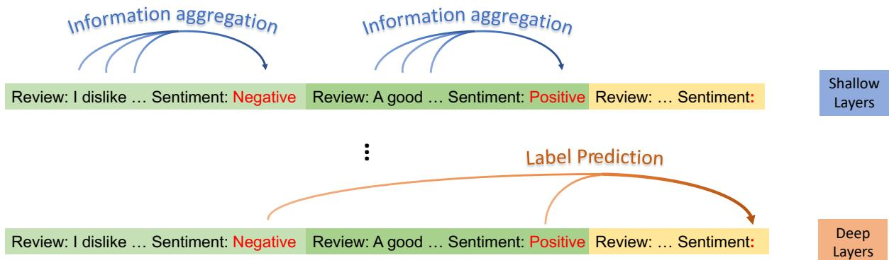

### Full Page Description (Page 0)

**Source:** `assets/_page_0_Asset_0.jpg`

**Generated:** 2026-05-16 05:50:26

---

The image is a diagram illustrating a shallow layer of sentiment analysis in a machine learning model. It shows two main categories of reviews: "Positive" and "Negative," with corresponding sentiment labels. Each review is connected to its sentiment label by lines, indicating the mapping between the text and the sentiment. The diagram uses different colors to distinguish between positive and negative sentiments, with orange lines representing positive sentiments and blue lines representing negative sentiments. The text at the bottom of the image reads "Shallow layer," indicating the level of analysis being depicted.

### Full Page Description (Page 0)

**Source:** `assets/_page_0_Asset_1.jpg`

**Generated:** 2026-05-16 05:50:33

---

The image is a diagram illustrating a sentiment analysis process. It shows two columns labeled "Review" and "Sentiment," with examples of reviews and their corresponding sentiment classifications. The reviews include "A good movie," "waste of money," and "fantastic." The sentiment classifications are "Positive" and "Negative," with the latter being highlighted in orange. The diagram also includes a "Deep layer" at the bottom, suggesting a deeper analysis or processing step. The visual elements are simple text and arrows connecting the reviews to their sentiment classifications.

# Label Words are Anchors: An Information Flow Perspective for Understanding In-Context Learning

Lean Wang†,§, Lei Li†, Damai Dai†, Deli Chen§,

Hao Zhou§, Fandong Meng§, Jie Zhou§, Xu Sun†

†National Key Laboratory for Multimedia Information Processing,

School of Computer Science, Peking University

§Pattern Recognition Center, WeChat AI, Tencent Inc., China

{lean,daidamai,xusun}@pku.edu.cn nlp.lilei@gmail.com

victorchen@deepseek.com {tuxzhou,fandongmeng,withtomzhou}@tencent.com

## Abstract

In-context learning (ICL) emerges as a promising capability of large language models (LLMs) by providing them with demonstration examples to perform diverse tasks. However, the underlying mechanism of how LLMs learn from the provided context remains under-explored. In this paper, we investigate the working mechanism of ICL through an information flow lens. Our findings reveal that label words in the demonstration examples function as anchors: (1) semantic information aggregates into label word representations during the shallow computation layers’ processing; (2) the consolidated information in label words serves as a reference for LLMs’ final predictions. Based on these insights, we introduce an anchor re-weighting method to improve ICL performance, a demonstration compression technique to expedite inference, and an analysis framework for diagnosing ICL errors in GPT2-XL. The promising applications of our findings again validate the uncovered ICL working mechanism and pave the way for future studies.1

## 1 Introduction

In-context Learning (ICL) has emerged as a powerful capability alongside the development of scaledup large language models (LLMs) (Brown et al., 2020). By instructing LLMs using few-shot demonstration examples, ICL enables them to perform a wide range of tasks, such as text classification (Min et al., 2022a) and mathematical reasoning (Wei et al., 2022). Since ICL does not require updates to millions or trillions of model parameters and relies on human-understandable natural language instructions (Dong et al., 2023), it has become a promising approach for harnessing the full potentiality of LLMs. Despite its significance, the inner working mechanism of ICL remains an open question, garnering considerable interest from research

Figure 1: Visualization of the information flow in a GPT model performing ICL. The line depth reflects the significance of the information flow from the right word to the left. The flows involving label words are highlighted. Label words gather information from demonstrations in shallow layers, which is then extracted in deep layers for final prediction.

communities (Xie et al., 2022; Dai et al., 2022;   
Akyürek et al., 2022; Li et al., 2023b).

In this paper, we find that the label words serve as anchors that aggregate and distribute information in ICL. We first visualize the attention interactive pattern between tokens with a GPT model (Brown et al., 2020) on sentiment analysis (Figure 1). Initial observations suggest that label words aggregate information in shallow layers and distribute it in deep layers.2 To draw a clearer picture of this phenomenon, we design two metrics based on saliency scores to portray the information flow in ICL and further propose the following hypothesis:

Figure 2: Illustration of our hypothesis. In shallow layers, label words gather information from demonstrations to form semantic representations for deeper processing, while deep layers extract and utilize this information from label words to formulate the final prediction.

> **AI Description:**
> **Source:** `assets/_page_1_Figure_0.jpg`
> 
> **Generated:** 2026-05-16 05:47:09
> 
> ---
> 
> The image is a diagram illustrating a process involving information aggregation and label prediction in the context of sentiment analysis. It features two main sections labeled "Shallow Layers" and "Deep Layers." The shallow layers show reviews with their sentiments (negative or positive) being aggregated. The deep layers then predict the overall label based on these aggregated sentiments. The diagram uses arrows to represent the flow of information and includes text labels such as "Information aggregation," "Label Prediction," and "Sentiment: Negative" or "Positive." The structure suggests a hierarchical approach to processing and predicting sentiment from reviews.

## Information Flow with Labels as Anchors

$\mathcal { H } _ { 1 }$ : In shallow layers, label words gather the information of demonstrations to form semantic representations for deeper layers.

$\mathcal { H } _ { 2 } \colon$ In deep layers, the model extracts the information from label words to form the final prediction.

Two experiments are designed to validate the hypothesis using GPT2-XL (Radford et al., 2019) and GPT-J (Wang and Komatsuzaki, 2021) across several text classification benchmarks. (1) By blocking the information aggregation path to label words in certain layers, we find that such isolation in shallow layers significantly impairs model performance. This indicates that label words collect useful information during forward propagation in shallow layers. (2) We investigate the relationship between the attention distributions on the label words of the target position and the model’s final prediction. Our results illustrate a strong positive correlation, where a candidate label’s probability increases with more attention weight on its corresponding label token. In summary, these experimental findings suggest that our hypothesis holds well with large language models on real-world datasets.

Drawing on insights from the information flow perspective, we explore three approaches to enhance ICL’s effectiveness, efficiency, and interpretability. (1) An anchor re-weighting method is introduced, which employs a learnable vector to adjust the significance of different label words in demonstrations, leading to a 16.7% average accuracy boost compared to standard ICL baselines. (2) For quicker ICL inference, inputs are compressed into pre-calculated anchor representations since model predictions primarily rely on label word activations. Testing shows a 1.8 × speedup in inference with only a minimal performance trade-off. (3) An error analysis of ICL on GPT2-XL demonstrates that the label confusion matrix aligns closely with the distance distribution of anchor key vectors, implying that errors might result from similar anchor representations. These promising applications further validate our hypothesis and shed light on future ICL studies for better transparency of LLMs.

## 2 Label Words are Anchors

This section confirms the intuitive findings using two saliency score-based metrics as discussed in § 2.1. The quantitative results lead to a proposed hypothesis for the ICL working mechanism: $\mathcal { H } _ { 1 } \colon$ In shallow layers, label words aggregate information from demonstration examples to form semantic representations for later computations. $\mathcal { H } _ { 2 } \colon$ In deep layers, the model makes predictions by extracting information from label words. The validation for these hypotheses is presented in § 2.2 and § 2.3, respectively.

## 2.1 Hypothesis Motivated by Saliency Scores

This section aims to discover the inherent patterns in the attention interaction between tokens for a GPT model. The saliency technique (Simonyan et al., 2013), a common interpretation tool, is employed for highlighting critical token interactions. Following common practice, we use the Taylor expansion (Michel et al., 2019) to calculate the saliency score for each element of the attention matrix:

$$
{ { I } _ { l } } = \left| \sum _ { h } { { { A } _ { h , l } } } \odot \frac { \partial \mathcal { L } ( x ) } { \partial { { A } _ { h , l } } } \right| .\tag{1}
$$

Here, $A _ { h , l }$ is the value of the attention matrix of the h-th attention head in the l-th layer, x is the input, and $\mathcal { L } ( x )$ is the loss function of the task, e.g., the cross-entropy objective for a classification problem. We average all attention heads to obtain the saliency matrix $I _ { l }$ for the l-th layer.3 $I _ { l } ( i , j )$ represents the significance of the information flow from the j-th word to the i-th word for ICL. By observing $I _ { l } ,$ , we can get an intuitive impression that as the layer goes deeper, demonstration label words will become more dominant for the prediction, as depicted in Figure 1.

To draw a clearer picture of this phenomenon, we propose three quantitative metrics based on $I _ { l } .$ Our focus lies in three components: (i) the label words, such as “Negative” and “Positive” in Figure 2, denoted as $p _ { 1 } , . . . , p _ { C }$ , where C represents the total number of label words;4 (ii) the target position, where the model generates prediction labels (i.e., the final token in the input), which we denote as $q ;$ and (iii) the text part, i.e., the tokens before label words in the demonstration.

The definitions of the three quantitative metrics follow below.

$S _ { w p } ,$ the mean significance of information flow from the text part to label words:

$$
\begin{array} { l } { S _ { w p } = \frac { \sum _ { ( i , j ) \in C _ { w p } } I _ { l } ( i , j ) } { \left| C _ { w p } \right| } , } \\ { C _ { w p } = \{ ( p _ { k } , j ) : k \in [ 1 , C ] , j < p _ { k } \} . } \end{array}\tag{2}
$$

$S _ { p q } ,$ the mean significance of information flow from label words to the target position:

$$
\begin{array} { l } { S _ { p q } = \frac { \sum _ { ( i , j ) \in C _ { p q } } I _ { l } ( i , j ) } { | C _ { p q } | } , } \\ { C _ { p q } = \{ ( q , p _ { k } ) : k \in [ 1 , C ] \} . } \end{array}\tag{3}
$$

$\boldsymbol { S _ { w w } }$ the mean significance of the information flow amongst all words, excluding influences represented by $S _ { w p }$ and $S _ { p q }$ :

$$
\begin{array} { r l } & { \displaystyle { S _ { w w } = \frac { \sum _ { ( i , j ) \in C _ { w w } } I _ { l } ( i , j ) } { | C _ { w w } | } , } } \\ & { \displaystyle { C _ { w w } = \{ ( i , j ) : j < i \} - C _ { w p } - C _ { p q } . } } \end{array}\tag{4}
$$

$S _ { w p } , S _ { p q }$ , and $S _ { w w }$ help assess different information flows in the model. $S _ { w p }$ indicates the intensity of information aggregation onto label words. A high $S _ { p q }$ demonstrates a strong information extraction from label words for final decision-making. $S _ { w w }$ assesses average information flow among words, serving as a benchmark to gauge the intensity of the patterns identified by $S _ { w p }$ and $S _ { p q }$

Experimental Settings We choose GPT2-XL from the GPT series (Radford et al., 2019) as our primary model for investigation, due to its moderate model size (of 1.5B parameters) that is suitable for our hardware resource and its decent ICL performance (Dai et al., 2022). For datasets, we use Stanford Sentiment Treebank Binary (SST-2) (Socher et al., 2013) for sentiment analysis, Text REtrieval Conference Question Classification (TREC) (Li and Roth, 2002; Hovy et al., 2001) for question type classification, AG’s news topic classification dataset (AGNews) (Zhang et al., 2015) for topic classification, and EmoContext (EmoC) (Chatterjee et al., 2019) for emotion classification. Templates for constructing demonstrations are provided in Appendix A. 1000 examples are sampled from the test set for evaluation, with one demonstration per class sampled from the training set. Experiments with more demonstrations yield similar outcomes (refer to Appendix F.1 for details). Results reflect averages from five random seeds.

Results and Analysis Figure 3 reveals that: (1) in shallow layers, $S _ { p q } .$ the significance of the information flow from label words to targeted positions, is low, while $S _ { w p } ,$ the information flow from the text part to label words is high; (2) in deep layers, $S _ { p q } ,$ the importance of information flow from label words to the targeted position becomes the dominant one. Notably, $S _ { p q }$ and $S _ { w p }$ usually surpass $S _ { w w } ,$ , suggesting that interactions involving label words outweigh others.

Proposed Hypothesis Based on this, we propose the hypothesis that label words function as anchors in the ICL information flow. In shallow layers, label words gather information from demonstration examples to form semantic representations for deeper layers, while in deep layers, the model extracts the information from label words to form the final prediction. Figure 2 gives an illustration for our hypothesis.

## 2.2 Shallow Layers: Information Aggregation

In this part, we validate our hypothesis’ first component. We assume that the information aggregation in ICL relies on the information flow from the text part to label tokens, which is facilitated by the transformer’s attention mechanism. By manipulating the attention layer in the model to block this flow and examining the model behavior change, we validate the existence of the information aggregation process and its contribution to the final prediction.

### Full Page Description (Page 3)

**Source:** `assets/_page_3_Asset_2.jpg`

**Generated:** 2026-05-16 05:49:57

---

The image is a bar chart comparing loyalty metrics for different models and conditions. The x-axis represents different models (GPT2-XL and GPT-J) and conditions (Label Words (Last), Word Loyalty (GPT2-XL), Label Loyalty (GPT-J), and Word Loyalty (GPT-J)). The y-axis represents loyalty values ranging from 0 to 100. The bars are color-coded to distinguish between conditions and models: No Isolation (green dashed line), Label Words (Last) (orange), Random (Last) (purple), Label Words (First) (light blue), and Random (First) (red). The chart shows that the "No Isolation" condition consistently achieves the highest loyalty values across all models and conditions.

### Full Page Description (Page 3)

**Source:** `assets/_page_3_Asset_1.jpg`

**Generated:** 2026-05-16 05:49:37

---

The image is a line graph with three distinct lines representing different metrics: \( S_{wp} \), \( S_{pq} \), and \( S_{ww} \). The x-axis is labeled "Layer" and ranges from 0 to 45, while the y-axis is labeled "S" and ranges from 0 to 1. The graph shows the values of these metrics across different layers. The \( S_{wp} \) line starts high and decreases significantly, while the \( S_{pq} \) line fluctuates more dramatically, reaching a peak around layer 15 and then declining. The \( S_{ww} \) line remains relatively low and stable throughout the layers. The graph includes a legend to identify each line.

### Full Page Description (Page 3)

**Source:** `assets/_page_3_Asset_0.jpg`

**Generated:** 2026-05-16 05:49:47

---

The image is a line graph with three distinct lines representing different metrics: \( S_{wp} \), \( S_{pq} \), and \( S_{ww} \). The x-axis represents the "Layer" number, ranging from 0 to 45, while the y-axis represents the value of \( S \), which ranges from 0 to 1. The graph shows that \( S_{wp} \) and \( S_{pq} \) have peaks around the 10th layer, with \( S_{pq} \) reaching a higher peak than \( S_{wp} \). \( S_{ww} \) remains relatively low and fluctuates less than the other two metrics. The graph provides a clear comparison of the three metrics across different layers, highlighting their varying behaviors and peaks.

Experimental Settings We retain the same test sample size of 1000 inputs as § 2.1. We use the same demonstration for a single random seed. To further validate our findings on larger models, we incorporate GPT-J (6B) (Wang and Komatsuzaki, 2021) in experiments, which exceeds GPT2-XL in model size and capacity.

Implementation Details To block the information flow to label words, we isolate label words by manipulating the attention matrix A. Specifically, we set $A _ { l } ( p , i ) ( i < p )$ to 0 in the attention matrix $A _ { l }$ of the l-th layer, where p represents label words and i represents preceding words. Consequently, in the l-th layer, label words cannot access information from the prior demonstration text.

Metrics We use the following metrics to assess the impact of blocking information flow from the text part to label tokens: (1) Label Loyalty: measures the consistency of output labels with and without isolation. (2) Word Loyalty: employs the Jaccard similarity to compare the top-5 predicted words with and without isolation, capturing more subtle model output alterations (See Appendix C for details). Low loyalty indicates a profound impact of isolation on model predictions.

Results and Analysis Figure 4 illustrates a notable influence on the model’s behavior when label words are isolated within the first 5 layers. Yet, this influence becomes inconsequential within the last 5 layers, or when random non-label words are used. This observation underlines the fundamental importance of shallow-layer information aggregation via label words in ICL. It also emphasizes the superiority of label words over non-label words. Further tests with variable numbers of layers reaffirm these findings (Appendix D). Moreover, similar results were obtained when testing ICL with semantically unrelated labels (refer to Appendix F.2).

## 2.3 Deep Layers: Information Extraction

We proceed to validate the latter part of our hypothesis that the model extracts information from label words to form the final prediction. We denote the sum of the attention matrices in the l-th layer as $A _ { l } . ^ { 5 }$ In deeper layers, we find a strong correlation between the attention distributions on the label words of the target position, represented as $( A _ { l } ( q , p _ { 1 } ) , . . . , A _ { l } ( q , p _ { C } ) )$ , and the model’s final prediction, affirming our hypothesis. The experimental setup mirrors that discussed in § 2.2.

### Full Page Description (Page 4)

**Source:** `assets/_page_4_Asset_0.jpg`

**Generated:** 2026-05-16 05:48:56

---

The image contains a line graph with two distinct lines. The x-axis represents "Layers," ranging from 0 to 50. The y-axis on the left is labeled "AUCROC_I" and ranges from 0.45 to 0.85, while the y-axis on the right is labeled "R_I" and ranges from 0.0 to 1.0. The blue dashed line represents "AUCROC_I," showing fluctuations as it increases with the number of layers. The red solid line represents "R_I," which shows a steady increase with the number of layers. The graph highlights the relationship between the number of layers and the corresponding AUCROC_I and R_I values.

### Full Page Description (Page 4)

**Source:** `assets/_page_4_Asset_1.jpg`

**Generated:** 2026-05-16 05:48:47

---

The image is a line graph with two sets of data plotted against the number of layers. The x-axis represents the number of layers, while the y-axis on the left side represents AUCROC_I, and the y-axis on the right side represents R_I. The graph shows two lines: a dashed blue line representing AUCROC_I and a solid red line representing R_I. The AUCROC_I line fluctuates more than the R_I line, which shows a steady increase. The AUCROC_I line peaks and dips more frequently than the R_I line, which consistently rises.

## 2.3.1 Experiments

We utilize the AUC-ROC score to quantify the correlation between $A _ { l } ( q , p _ { i } )$ and model prediction, which we denote as $\mathbf { A U C R O C } _ { l }$ for the l-th layer. We prefer the AUC-ROC metric due to two primary reasons: (1) $A _ { l } ( q , p _ { i } )$ might differ from the probability of the model outputting label i by a constant factor. As Kobayashi et al. (2020) points out, attention should be multiplied by the norm of the key vector to yield ’more interpretable attention’. The AUC-ROC metric can implicitly account for these factors, thus allowing us to uncover the correlation more effectively. (2) The proportion of different labels output by the model may be unbalanced. Using the AUC-ROC metric can help mitigate this issue, reducing disturbances caused by class imbalance.

Considering the residual mechanism of transformers, we can view each layer’s hidden state as the cumulative effect of all prior layer calculations. To quantify the accumulated contribution of the first l layers to model prediction, we introduce $R _ { l } \mathbf { : }$

$$
R _ { l } = \frac { \sum _ { i = 1 } ^ { l } ( \mathrm { A U C R O C } _ { i } - 0 . 5 ) } { \sum _ { i = 1 } ^ { N } ( \mathrm { A U C R O C } _ { i } - 0 . 5 ) } .\tag{5}
$$

This measure tracks the positive contribution above a baseline AUC-ROC threshold of 0.5. The value of $R _ { l }$ signifies the proportional contribution of the first l layers to the model prediction.

## 2.3.2 Results and Analysis

Figures 5a and 5b delineate correlation metrics for GPT2-XL and GPT-J, averaged across four datasets. The $\mathbf { A U C R O C } _ { l }$ for deep layers approaches 0.8, illustrating a strong correlation between the attention distributions on label words of the target position and the model’s final prediction. Moreover, shallow layers show negligible cumulative contributions $( R _ { l } )$ , with a significant increase in middle and deep layers. These results signify the crucial role of deep layers for final prediction, validating that the model extracts information from label words in deep layers to form the final prediction.

## 2.4 Discussion of Our Hypothesis

In § 2.2, we have affirmed that the model’s shallow layers assemble information from demonstrations via label words to form semantic representations. In § 2.3, we verify that the aforementioned aggregated information on label words is then extracted to form the final prediction in the deep layers. Recognizing the crucial function of label words in this process, we have introduced the term “Anchors” to denote them. Given the considerable role these “anchors” fulfill, we find it intuitive to design ICL improvements based on them, as elaborated in § 3.

## 3 Applications of Our Anchor-Based Understanding

With insights from the validated hypothesis, we propose strategies to boost ICL’s accuracy and inference speed. We propose an anchor re-weighting method in § 3.1 to adjust the demonstrations’ contributions and improve accuracy. In § 3.2, we explore a context compression technique that reduces original demonstrations to anchor hidden states to speed up ICL inference. Besides, in § 3.3, we utilize anchor distances to perform an analysis to understand the errors ICL made in real-world scenarios. These approaches corroborate our hypothesis, pointing to potential paths for future ICL enhancements.

## 3.1 Anchor Re-weighting

Based on our analysis in § 2, we draw parallels between ICL and logistic regression and propose an approach to improve ICL’s accuracy by reweighting label anchors.

## 3.1.1 Method

§ 2.3 illustrates a strong correlation between the model’s output category and the attention distribution $\left( A \left( q , p _ { 1 } \right) , \ldots , A \left( q , p _ { C } \right) \right)$ on label words $p _ { 1 } , . . . , p _ { C }$ of the target position q in deep layers. We can view the attention module as a classifier $f$

$$
\begin{array} { r l } & { \quad \mathrm { P r } _ { f } ( Y = i | X = x ) } \\ & { \approx A ( q , p _ { i } ) } \\ & { = \frac { \exp ( \mathbf { q } _ { q } \mathbf { k } _ { p _ { i } } ^ { T } / \sqrt { d } ) } { \sum _ { j = 1 } ^ { N } \exp ( \mathbf { q } _ { q } \mathbf { k } _ { j } ^ { T } / \sqrt { d } ) } . } \end{array}\tag{6}
$$

By setting $\mathbf { q } _ { q } / \sqrt { d } = \hat { \mathbf { x } }$ and $\mathbf { k } _ { p _ { i } } - \mathbf { k } _ { p _ { C } } = \beta _ { i }$ , we deduce:

$$
\log { \frac { \operatorname* { P r } _ { f } ( Y = i | X = x ) } { \operatorname* { P r } _ { f } ( Y = C | X = x ) } } = \beta _ { i } ^ { T } \hat { \mathbf { x } } .\tag{7}
$$

This approximates a logistic regression model where:

$$
\log { \frac { \operatorname* { P r } _ { f } ( Y = i | X = x ) } { \operatorname* { P r } _ { f } ( Y = C | X = x ) } } = \beta _ { 0 } ^ { i } + \beta _ { i } ^ { T } \mathbf { x } .\tag{8}
$$

In this equation, $\beta _ { 0 } ^ { i }$ and $\beta _ { i } ^ { T }$ are parameters that can be learned, while x is the input feature.

Inspired by the similarity between ICL and logistic regression, we’ve incorporated a learnable $\beta _ { 0 } ^ { i }$ into Eq. (7), which is equivalent to adjusting the attention weights $A ( q , p _ { i } )$ :

$$
\hat { A } ( q , p _ { i } ) = \exp ( \beta _ { 0 } ^ { i } ) A ( q , p _ { i } )\tag{9}
$$

Each $\beta _ { 0 } ^ { i }$ is a learnable parameter, set uniquely for different attention heads and layers. Refer to $\mathsf { A p - }$ pendix G for more details.

To train the re-weighting vector $\beta = \left\{ \beta _ { 0 } ^ { i } \right\}$ , we utilize an auxiliary training set $( X _ { t r a i n } , \dot { Y _ { t r a i n } } )$ Here, we perform ICL with normal demonstrations and optimize $\beta$ with respect to the classification loss L on $( X _ { t r a i n } , Y _ { t r a i n } )$

$$
\beta ^ { \star } = \arg \operatorname* { m i n } _ { \beta } \mathcal { L } ( X _ { t r a i n } , Y _ { t r a i n } ) .\tag{10}
$$

This approach can be metaphorically described as "re-weighting the anchors," leading us to term it as Anchor Re-weighting. It can also be viewed as a modification of the demonstration contributions since demonstration information has been incorporated into the anchors as suggested by our prior analysis in § 2.2. Additionally, it can be interpreted as a unique adapter variant, introducing minimal parameters while preserving most of the original model. However, it is specifically designed based on our anchor hypothesis and requires fewer parameters than traditional adapters.

## 3.1.2 Experiments

We choose one sample per class as normal demonstrations and choose four extra samples per class to form the auxiliary training set $( X _ { t r a i n } , Y _ { t r a i n } )$ The setup follows § 2.2, with results averaged over five random seeds. Owing to computational constraints, we employ GPT2-XL for evaluation, excluding GPT-J. The parameters $\big \{ \beta _ { 0 } ^ { i } \big \}$ are trained using gradient descent. More details can be found in Appendix H.

We compare Anchoring Re-weighting with two baselines: (1) Vanilla ICL with the same demonstration (1-shot per class) (2) Vanilla ICL, where the auxiliary training set of $\beta$ is included as demonstrations (5-shot per class) for a fair comparison.

## 3.1.3 Results

As Table 1 shows, the proposed anchor reweighting significantly enhances ICL performance, particularly on the SST-2 and EmoC datasets. Besides, adding more demonstrations for vanilla ICL may not bring a stable accuracy boost due to the potential noise introduced, as discussed in Zhao et al. (2021). Different from vanilla ICL which utilizes the extra examples to form a demonstration, we train a re-weighting vector $\beta$ to modulate label anchor contributions. This shortens the input context and thus brings (almost) no extra cost to the inference speed. The consistent improvements of our method suggest that the re-weighting mechanism could be a better alternative to utilize demonstration examples. Furthermore, it reiterates the crucial role that anchors play in ICL.

## 3.2 Anchor-Only Context Compression

We further explore a context compression technique that reduces the full demonstration to anchor hidden states for accelerating ICL inference.

## 3.2.1 Method

In § 2.3, we find that the model output heavily relies on the label words, which collect information from the demonstrations. Given the auto-regressive nature of GPT-like models, where hidden states of tokens depend solely on preceding ones, label words’ information aggregation process is independent of subsequent words. This allows for the calculation and caching of the label word hidden states ${ \pmb H } = \{ \{ h _ { l } ^ { i } \} _ { i = 1 } ^ { C } \} _ { l = 1 } ^ { N } ( h _ { l } ^ { i }$ is the l-th layer’s hidden state of the i-th label word in the demonstration). By concatenating $\pmb { h } _ { l } ^ { 1 } , . . . , \pmb { h } _ { l } ^ { C }$ at the front in each layer during inference, instead of using the full demonstration, we can speed up inference.

Table 1: The effect after adding parameter $\beta _ { 0 } ^ { i }$ . For AGNews, due to the length limit, we only use three demonstrations per class. Our Anchor Re-weighting method achieves the best performance overall tasks.

In our preliminary experiments, concatenating hidden states of label words alone was inadequate for completing the ICL task.6 This might be due to the critical role of formatting information in helping the model to determine the output space at the target position,7 as highlighted in Min et al. (2022b). As a solution, we amalgamate the hidden states of both the formatting and the label words, a method we’ve termed $\mathbf { H i d d e n } _ { \mathbf { a n c h o r } }$

## 3.2.2 Experiments

We follow the same experimental settings as § 2.2. We compare our $\mathrm { H i d d e n } _ { \mathrm { a n c h o r } }$ input compression method with two equally efficient baselines.

$\mathbf { T e x t _ { a n c h o r } } ;$ : This method concatenates the formatting and label text with the input, as opposed to concatenating the hidden states at each layer.

$\mathbf { H i d d e n } _ { \mathbf { r a n d o m } }$ : This approach concatenates the hidden states of formatting and randomly selected nonlabel words (equal in number to $\mathrm { H i d d e n } _ { \mathrm { a n c h o r } } )$

$\mathbf { H i d d e n } _ { \mathbf { r a n d o m - t o p } } ;$ To establish a stronger baseline, we randomly select 20 sets of non-label words in $\mathrm { H i d d e n } _ { \mathrm { r a n d o m } }$ and report the one with the highest label loyalty.

The $\mathbf { T e x t } _ { \mathbf { a n c h o r } }$ method is included to demonstrate that the effectiveness of $\mathrm { H i d d e n } _ { \mathrm { a n c h o r } }$ is attributed to the aggregation of information in label words, rather than the mere text of label words. If we find that $\mathrm { H i d d e n } _ { \mathrm { a n c h o r } }$ surpasses $\mathrm { T e x t } _ { \mathrm { a n c h o r } }$ in performance, it solidifies the notion that the aggregated information within label words carries significant importance. The $\mathbf { H i d d e n } _ { \mathbf { r a n d o m } }$ method is introduced to illustrate that anchor hidden states encapsulate most of the demonstration information among all hidden states.

Table 2: Results of different compression methods on GPT2-XL and GPT-J (averaged over SST-2, TREC, AG-News, and EmoC). Acc. denotes accuracy. The best results are shown in bold. Our method achieves the best compression performance.

We assess all compression methods using the label loyalty and word loyalty introduced in § 2.2, in addition to classification accuracy.

## 3.2.3 Results

We can see from Table 2 that the proposed compression method $\mathbf { H i d d e n } _ { \mathbf { a n c h o r } }$ achieves the best results among all three compression methods on all metrics and for both models. For example, with the GPT-J model, the compression method with anchor states only leads to a 1.5 accuracy drop compared to the uncompressed situation, indicating that the compression introduces negligible information loss. Further, we estimate the efficiency improvements over the original ICL. As shown in Table 3, the speed-up ratio ranges from 1.1× to 2.9×, as the efficiency gain is influenced by the length of the demonstrations. We refer readers to Appendix I for a more elaborated analysis of the speed-up ratios. Besides, we observe that the acceleration effect is more pronounced in the GPT-J model compared to GPT2-XL, demonstrating its great potential to apply to larger language models.

### Full Page Description (Page 7)

**Source:** `assets/_page_7_Asset_1.jpg`

**Generated:** 2026-05-16 05:47:40

---

The image is a heatmap with a color gradient ranging from light yellow to dark blue, representing correlation values between different categories. The categories listed on the x-axis and y-axis are "Abbreviation," "Entity," "Description," "Person," "Location," and "Number." The correlation values are numerical and range from approximately 0.58 to 1.00, with darker colors indicating higher correlation. The color bar on the right side of the heatmap indicates the scale of the correlation values. The heatmap visually represents the strength of the correlation between each pair of categories, with a clear trend showing high correlation among "Person," "Location," and "Number" categories.

### Full Page Description (Page 7)

**Source:** `assets/_page_7_Asset_0.jpg`

**Generated:** 2026-05-16 05:47:31

---

The image contains a heatmap with a color gradient ranging from light yellow to dark blue, representing correlation values between different categories. The categories listed on the x-axis and y-axis are "Abbreviation," "Entity," "Description," "Person," "Location," and "Number." The correlation values are numerical and range from approximately 0.45 to 1.0, indicating the strength of the relationship between the categories. The color intensity reflects the strength of the correlation, with darker colors indicating a stronger correlation.

Table 3: Acceleration ratios of the Hidde $1 _ { \mathrm { a n c h o r } }$ method.

## 3.3 Anchor Distances for Error Diagnosis

Lastly, we perform an error analysis for ICL by examining the distances between the key vectors in the attention module that correspond to the label words.

## 3.3.1 Method

Our previous analysis in § 2.3 shows a strong correlation between the model output and $A ( q , p _ { i } )$ , which is determined by $\mathbf { q } _ { q } \mathbf { k } _ { p _ { i } } ^ { T }$ as per Eq. 7. Should the key vectors k for label words $p _ { i }$ and $p _ { k }$ be similar, $A ( q , p _ { i } )$ and $A ( q , p _ { k } )$ will also likely be similar, leading to potential label confusion. Furthermore, considering the distribution of query vectors $\mathbf { q } _ { q } .$ , we employ a PCA-like method to extract the components of the key vectors along the directions with significant variations in $\mathbf { q } _ { q } ,$ , denoted as kˆ (see Appendix J for details). We anticipate that the distances between these kˆs can correspond to the category confusion of the model, thus revealing one possible origin of ICL errors. Here, we normalize the distances to a scale of 0-1, with 0 indicating the highest degree of category confusion:

$$
\mathrm { C o n f u s i o n } _ { i j } ^ { \mathrm { p r e d } } = \frac { \lvert \lvert \hat { \mathbf { k _ { p i } } } - \hat { \mathbf { k _ { p  j } } } \rvert \rvert } { \operatorname* { m a x } _ { s \neq t } \lvert \lvert \hat { \mathbf { k _ { p s } } } - \hat { \mathbf { k _ { p t } } } \rvert \rvert } ,\tag{11}
$$

## 3.3.2 Experiments

We utilize the GPT2-XL model and TREC dataset, as the model displays varying confusion levels between categories on this dataset. We use all 500 samples of the TREC test set and use 1 demonstration per class for convenience of analysis.

We calculate the actual model confusion score, $\mathrm { C o n f u s i o n } _ { i j }$ , between category i and category k using the AUC-ROC metric (detailed in Appendix K). We then compare the predicted confusion score, Confusionij pred , and the actual confusion score, Confusionij , via heatmaps.

## 3.3.3 Results

Figure 6 shows that the proposed approximation metric, Confusionij pred , can identify the most confusing case (Description-Entity) and performs reasonably well for highly confusing categories (Entity-Abbreviation, Description-Abbreviation). This high correlation indicates that ICL makes errors in categories with similar label anchors. Overall, this result demonstrates that our anchor-based analysis framework could serve as an interpretation tool for better understanding ICL’s errors.

## 4 Related Work

The existing literature on in-context learning analysis can be broadly divided into two streams, each focusing on different aspects. The first stream explores the influencing factors of ICL based on input perturbation, such as the order (Min et al., 2022b), the formatting (Yoo et al., 2022; Wei et al., 2022), and the selection of the demonstration (Liu et al., 2022). Designing proper demonstration construction strategies (Ye et al., 2023; Li et al., 2023a) and calibration techniques (Zhao et al., 2021; Min et al., 2022a) could bring clear boosts to the ICL performance. The second stream investigates the inner working mechanism of ICL through different conceptual lenses, such as making an analogy of ICL to gradient descent (von Oswald et al., 2022; Dai et al., 2022) and viewing the process of ICL as a Bayesian inference (Xie et al., 2022).

In this paper, we provide a novel perspective by examining the information flow in language models to gain an understanding of ICL. Our approach offers new insights and demonstrates the potential for leveraging this understanding to improve the effectiveness, efficiency, and interpretability of ICL.

## 5 Conclusion

In this paper, we propose a hypothesis that label words serve as anchors in in-context learning for aggregating and distributing the task-relevant information flow. Experimental results with attention manipulation and analysis of predictions correlation consolidate the hypothesis holds well in GPT2- XL and GPT-J models. Inspired by the new understanding perspective, we propose three practical applications. First, an anchor re-weighting method is proposed to improve ICL accuracy. Second, we explore a demonstration compression technique to accelerate ICL inference. Lastly, we showcase an analysis framework to diagnose ICL errors on a real-world dataset. These promising applications again verify the hypothesis and open up new directions for future investigations on ICL.

## Limitations

Our study, while providing valuable insights into in-context learning (ICL), has several limitations. Firstly, our research scope was limited to classification tasks and did not delve into the realm of generative tasks. Additionally, our hypothesis was only examined within conventional ICL paradigms, leaving other ICL paradigms such as the chain of thought prompting (CoT) (Wei et al., 2022) unexplored. Secondly, due to hardware constraints, we mainly investigated models up to a scale of 6 billion parameters. Further research that replicates our study using larger-scale models would be beneficial in corroborating our findings and refining the hypotheses set forth in our investigation.

## Acknowledgement

We thank all reviewers for their thoughtful and insightful suggestions. This work is supported in part by a Tencent Research Grant and National Natural Science Foundation of China (No. 62176002). Xu Sun is the corresponding author.

## References

- Ekin Akyürek, Dale Schuurmans, Jacob Andreas, Tengyu Ma, and Denny Zhou. 2022. What learning algorithm is in-context learning? investigations with linear models. ArXiv preprint, abs/2211.15661.
- Tom B. Brown, Benjamin Mann, Nick Ryder, Melanie Subbiah, Jared Kaplan, Prafulla Dhariwal, Arvind Neelakantan, Pranav Shyam, Girish Sastry, Amanda Askell, Sandhini Agarwal, Ariel Herbert-Voss, Gretchen Krueger, Tom Henighan, Rewon Child, Aditya Ramesh, Daniel M. Ziegler, Jeffrey Wu, Clemens Winter, Christopher Hesse, Mark Chen, Eric Sigler, Mateusz Litwin, Scott Gray, Benjamin Chess, Jack Clark, Christopher Berner, Sam McCandlish, Alec Radford, Ilya Sutskever, and Dario Amodei. 2020. Language models are few-shot learners. In Advances in Neural Information Processing Systems 33: Annual Conference on Neural Information Processing Systems 2020, NeurIPS 2020, December 6-12, 2020, virtual.
- Ankush Chatterjee, Kedhar Nath Narahari, Meghana Joshi, and Puneet Agrawal. 2019. SemEval-2019 task 3: EmoContext contextual emotion detection in text. In Proceedings of the 13th International Workshop on Semantic Evaluation, pages 39–48, Minneapolis, Minnesota, USA. Association for Computational Linguistics.
- Damai Dai, Yutao Sun, Li Dong, Yaru Hao, Zhifang Sui, and Furu Wei. 2022. Why can gpt learn in-context? language models secretly perform gradient descent as meta optimizers. ArXiv preprint, abs/2212.10559.
- Qingxiu Dong, Lei Li, Damai Dai, Ce Zheng, Zhiyong Wu, Baobao Chang, Xu Sun, Jingjing Xu, and Zhifang Sui. 2023. A survey for in-context learning. ArXiv preprint, abs/2301.00234.
- Eduard Hovy, Laurie Gerber, Ulf Hermjakob, Chin-Yew Lin, and Deepak Ravichandran. 2001. Toward semantics-based answer pinpointing. In Proceedings of the First International Conference on Human Language Technology Research.
- Diederik P. Kingma and Jimmy Ba. 2015. Adam: A method for stochastic optimization. In 3rd International Conference on Learning Representations, ICLR 2015, San Diego, CA, USA, May 7-9, 2015, Conference Track Proceedings.
- Goro Kobayashi, Tatsuki Kuribayashi, Sho Yokoi, and Kentaro Inui. 2020. Attention is not only a weight:

- Analyzing transformers with vector norms. In Proceedings of the 2020 Conference on Empirical Methods in Natural Language Processing (EMNLP), pages 7057–7075, Online. Association for Computational Linguistics.
- Xiaonan Li, Kai Lv, Hang Yan, Tianyang Lin, Wei Zhu, Yuan Ni, Guotong Xie, Xiaoling Wang, and Xipeng Qiu. 2023a. Unified demonstration retriever for incontext learning. ArXiv preprint, abs/2305.04320.
- Xin Li and Dan Roth. 2002. Learning question classifiers. In COLING 2002: The 19th International Conference on Computational Linguistics.
- Yingcong Li, Muhammed Emrullah Ildiz, Dimitris Papailiopoulos, and Samet Oymak. 2023b. Transformers as algorithms: Generalization and stability in in-context learning.
- Jiachang Liu, Dinghan Shen, Yizhe Zhang, Bill Dolan, Lawrence Carin, and Weizhu Chen. 2022. What makes good in-context examples for GPT-3? In Proceedings of Deep Learning Inside Out (DeeLIO 2022): The 3rd Workshop on Knowledge Extraction and Integration for Deep Learning Architectures, pages 100–114, Dublin, Ireland and Online. Association for Computational Linguistics.
- Paul Michel, Omer Levy, and Graham Neubig. 2019. Are sixteen heads really better than one? In Advances in Neural Information Processing Systems 32: Annual Conference on Neural Information Processing Systems 2019, NeurIPS 2019, December 8-14, 2019, Vancouver, BC, Canada, pages 14014–14024.
- Sewon Min, Mike Lewis, Hannaneh Hajishirzi, and Luke Zettlemoyer. 2022a. Noisy channel language model prompting for few-shot text classification. In Proceedings of the 60th Annual Meeting of the Association for Computational Linguistics (Volume 1: Long Papers), pages 5316–5330, Dublin, Ireland. Association for Computational Linguistics.
- Sewon Min, Xinxi Lyu, Ari Holtzman, Mikel Artetxe, Mike Lewis, Hannaneh Hajishirzi, and Luke Zettlemoyer. 2022b. Rethinking the role of demonstrations: What makes in-context learning work? In Proceedings of the 2022 Conference on Empirical Methods in Natural Language Processing, pages 11048–11064, Abu Dhabi, United Arab Emirates. Association for Computational Linguistics.
- Alec Radford, Jeffrey Wu, Rewon Child, David Luan, Dario Amodei, Ilya Sutskever, et al. 2019. Language models are unsupervised multitask learners. OpenAI blog, 1(8):9.
- Karen Simonyan, Andrea Vedaldi, and Andrew Zisserman. 2013. Deep inside convolutional networks: Visualising image classification models and saliency maps. CoRR, abs/1312.6034.
- Richard Socher, Alex Perelygin, Jean Wu, Jason Chuang, Christopher D. Manning, Andrew Ng, and Christopher Potts. 2013. Recursive deep models for
- semantic compositionality over a sentiment treebank. In Proceedings of the 2013 Conference on Empirical Methods in Natural Language Processing, pages 1631–1642, Seattle, Washington, USA. Association for Computational Linguistics.
- Hugo Touvron, Thibaut Lavril, Gautier Izacard, Xavier Martinet, Marie-Anne Lachaux, Timothée Lacroix, Baptiste Rozière, Naman Goyal, Eric Hambro, Faisal Azhar, Aurelien Rodriguez, Armand Joulin, Edouard Grave, and Guillaume Lample. 2023. Llama: Open and efficient foundation language models. ArXiv, abs/2302.13971.
- Johannes von Oswald, Eyvind Niklasson, E. Randazzo, João Sacramento, Alexander Mordvintsev, Andrey Zhmoginov, and Max Vladymyrov. 2022. Transformers learn in-context by gradient descent. ArXiv preprint, abs/2212.07677.
- Ben Wang and Aran Komatsuzaki. 2021. GPT-J-6B: A 6 Billion Parameter Autoregressive Language Model. https://github.com/kingoflolz/ mesh-transformer-jax.
- Jason Wei, Xuezhi Wang, Dale Schuurmans, Maarten Bosma, Ed Huai hsin Chi, F. Xia, Quoc Le, and Denny Zhou. 2022. Chain of thought prompting elicits reasoning in large language models. ArXiv preprint, abs/2201.11903.
- Jerry W. Wei, Jason Wei, Yi Tay, Dustin Tran, Albert Webson, Yifeng Lu, Xinyun Chen, Hanxiao Liu, Da Huang, Denny Zhou, and Tengyu Ma. 2023. Larger language models do in-context learning differently. ArXiv, abs/2303.03846.
- Sang Michael Xie, Aditi Raghunathan, Percy Liang, and Tengyu Ma. 2022. An explanation of in-context learning as implicit bayesian inference. In The Tenth International Conference on Learning Representations, ICLR 2022, Virtual Event, April 25-29, 2022. OpenReview.net.
- Jiacheng Ye, Zhiyong Wu, Jiangtao Feng, Tao Yu, and Lingpeng Kong. 2023. Compositional exemplars for in-context learning. ArXiv preprint, abs/2302.05698.
- Kang Min Yoo, Junyeob Kim, Hyuhng Joon Kim, Hyunsoo Cho, Hwiyeol Jo, Sang-Woo Lee, Sang-goo Lee, and Taeuk Kim. 2022. Ground-truth labels matter: A deeper look into input-label demonstrations. In Proceedings of the 2022 Conference on Empirical Methods in Natural Language Processing, pages 2422– 2437, Abu Dhabi, United Arab Emirates. Association for Computational Linguistics.
- Xiang Zhang, Junbo Jake Zhao, and Yann LeCun. 2015. Character-level convolutional networks for text classification. In Advances in Neural Information Processing Systems 28: Annual Conference on Neural Information Processing Systems 2015, December 7-12, 2015, Montreal, Quebec, Canada, pages 649–657.

### Full Page Description (Page 10)

**Source:** `assets/_page_10_Asset_1.jpg`

**Generated:** 2026-05-16 05:47:49

---

The image is a line chart that displays the values of three different metrics, \( S_{wp} \), \( S_{pq} \), and \( S_{ww} \), across different layers. The x-axis represents the layer number, ranging from 0 to 45, while the y-axis represents the value of the metrics, which ranges from 0 to 1. The chart shows that \( S_{pq} \) consistently has the highest values across all layers, followed by \( S_{wp} \), and \( S_{ww} \) has the lowest values. There are fluctuations in the values for \( S_{wp} \) and \( S_{ww} \) across the layers, but \( S_{pq} \) remains relatively stable.

### Full Page Description (Page 10)

**Source:** `assets/_page_10_Asset_0.jpg`

**Generated:** 2026-05-16 05:48:10

---

The image is a line graph with three distinct lines representing different metrics across layers. The x-axis is labeled "Layer" and ranges from 0 to 45, while the y-axis is labeled "S" and ranges from 0 to 1. The lines are color-coded: blue for \( S_{wp} \), orange for \( S_{pq} \), and green for \( S_{ww} \). The graph shows that \( S_{pq} \) consistently remains above 0.8 across all layers, while \( S_{wp} \) and \( S_{ww} \) show significant fluctuations and generally decrease as the layer number increases. Notably, \( S_{ww} \) drops to near zero by the 20th layer and remains low throughout the rest of the layers.

Table 4: Demonstration templates and label words. Here <S1> represents the demonstration, ${ \bf - } { \bf S } { \bf > }$ represents the input to be predicted, and <L> represents the label word corresponding to the demonstration. To save space, we only show one demonstration for each task.

Zihao Zhao, Eric Wallace, Shi Feng, Dan Klein, and Sameer Singh. 2021. Calibrate before use: Improving few-shot performance of language models. In Proceedings of the 38th International Conference on Machine Learning, ICML 2021, 18-24 July 2021, Virtual Event, volume 139 of Proceedings of Machine Learning Research, pages 12697–12706. PMLR.

## Appendix

## A Experimental Settings

For models, we use GPT2-XL (1.5B) (Radford et al., 2019) and GPT-J (6B) (Wang and Komatsuzaki, 2021) in this paper.

For datasets, we use a sentiment analysis task, Stanford Sentiment Treebank Binary (SST-2) (Socher et al., 2013), a question type classification task, Text REtrieval Conference Question Classification (TREC) (Li and Roth, 2002; Hovy et al., 2001), a topic classification task, AG’s news topic classification dataset (AGNews) (Zhang et al., 2015), and an emotion classification task, Emo-Context (EmoC) (Chatterjee et al., 2019). The ICL templates of these tasks are shown in Table 4.

## B Results of $S _ { w p } , S _ { p q } ,$ , and $S _ { w w }$ on TREC and EmoC

Figure 7 illustrates the relative sizes of $S _ { w p } , S _ { p q } .$ and $S _ { w w }$ on TREC and EmoC, mirroring results on SST-2 and AGNews. In shallow layers, $S _ { w p }$ (the information flow from the text part to label words)

is prominent, while $S _ { p q }$ (the information flow from label words to targeted positions) is less significant. However, in deeper layers, $S _ { p q }$ dominates. Importantly, $S _ { w p }$ and $S _ { p q }$ generally exceed $S _ { w w }$ indicating that interactions involving label words are predominant.

## C Reason for Using Word Loyalty Besides Label Loyalty

Label loyalty alone may not capture changes in the probability distribution of non-label words or the relative ratio of the probability of the label words within the entire vocabulary. Word loyalty helps address this limitation, which is shown in Table 5.

## D Isolating Different Numbers of Layers

We study the impact of the numbers of isolated layers, as shown in Figures 8a and 8b. It can be found that isolating shallow layers cause a significant impact, isolating deep layers has a negligible impact on the model, even when the number of isolation layers increases. This further illustrates the important role of information aggregation via label words in the shallow layers.

### Full Page Description (Page 11)

**Source:** `assets/_page_11_Asset_0.jpg`

**Generated:** 2026-05-16 05:49:17

---

The image is a line graph with four distinct lines representing different metrics of loyalty over the number of isolation layers. The x-axis represents the "Isolation Layer Num," ranging from 0 to 3. The y-axis represents "Loyalty," with values ranging from 0 to 1. The graph includes four lines: two for "Label Loyalty" (one for the first and one for the last isolation layer), and two for "Word Loyalty" (one for the first and one for the last isolation layer). The lines show a general downward trend as the number of isolation layers increases, indicating a decrease in loyalty metrics. The "Label Loyalty" lines are consistently higher than the "Word Loyalty" lines, suggesting a stronger relationship between label loyalty and isolation layers compared to word loyalty.

### Full Page Description (Page 11)

**Source:** `assets/_page_11_Asset_1.jpg`

**Generated:** 2026-05-16 05:49:27

---

The image is a line graph with four distinct lines representing different metrics over the number of isolation layers. The x-axis is labeled "Isolation Layer Num" and ranges from 0 to 3. The y-axis is labeled "Loyalty" and ranges from 0 to 1. The graph includes four lines, each representing a different metric: "Label Loyalty (First)" and "Label Loyalty (Last)" in blue, and "Word Loyalty (First)" and "Word Loyalty (Last)" in red. The lines show a general downward trend as the number of isolation layers increases, with the "Label Loyalty" metrics consistently higher than the "Word Loyalty" metrics. The graph provides a visual representation of how loyalty metrics change with increasing isolation layers.

Table 5: Results on a test sample with the label “World” from AGNews.

## E Details for the Calculation of AUCROCl

Suppose the positions of the label words in the input x are $p _ { 1 } , . . . , p _ { C }$ (without loss of generality, we suppose $p _ { i }$ corresponds to the ith class), the targeted position is q, the sum of the attention matrices of all attention heads at the l layer is $A _ { l } .$ We postulate that there’s a strong correlation between the attention distributions on the label words of the target position $( A _ { l } ( q , p _ { 1 } ) , . . . , A _ { l } ( q , p _ { C } ) )$ and the model’s final prediction. We use the AUC-ROC score to quantify this correlation. We regard $( A _ { l } ( q , p _ { 1 } ) , . . . , A _ { l } ( q , p _ { C } ) )$ as a classifier’s prediction for the model output label (that is, $A _ { l } ( q , p _ { i } )$ is equivalent to the probability of model outputting label i), and compute the AUC-ROC value of this prediction relative to the actual model output. We denote this as $\mathbf { A U C R O C } _ { l }$ . For the case with more demonstrations (Appendix F.1), we simply sum up all $A _ { l } ( q , p )$ of the same class.

## F Additional Experimental Results

## F.1 Results with More Demonstrations

We implement our experimental analysis utilizing two demonstrations per class, resulting in a total of 4, 12, 8, and 8 demonstrations respectively for SST-2, TREC, AGNews, and EmoC. Our findings, as depicted in Figure 9, Figure 10, and Figure 11, exhibit a high degree of similarity to the results obtained from experiments that employ one demonstration per class.

## F.2 Results for In-Context Learning with semantically-unrelated labels

The applicability of our analytical conclusions to ICL variants, such as the semantically unrelated label ICL (Wei et al., 2023), is an intriguing subject. Given that both GPT2-XL and GPT-J-6B perform at levels akin to random guessing in this ICL setting, we chose LLaMA-33B (Touvron et al., 2023) and SST-2 for our experiment. We substituted labels with $\mathbf { \vec { A } } \mathbf { \vec { / } \vec { B } } $ , and adhered to a similar experimental setup as in sections § 2.2 and § 2.3. However, we applied eight shots per class to facilitate the model in achieving an accuracy of 83.0% on SST-2. The outcomes align with those derived in § 2.2 and § 2.3. Figure 12 shows the more pronounced impact of isolating labels in the shallow layers compared to their isolation in the deep layers or the isolation of non-label tokens. Figure 13 confirmed that the model leverages information from anchors in the deeper layers to perform classification.

### Full Page Description (Page 12)

**Source:** `assets/_page_12_Asset_1.jpg`

**Generated:** 2026-05-16 05:51:04

---

The image is a line graph showing three different metrics, \( S_{wp} \), \( S_{pq} \), and \( S_{ww} \), across different layers. The x-axis represents the layer number, ranging from 0 to 40, while the y-axis represents the metric values, ranging from 0 to 1. The graph displays the following trends:

- \( S_{pq} \) starts high and decreases gradually as the layer number increases.
- \( S_{wp} \) starts low and increases sharply, peaking around layer 10, before decreasing and stabilizing at a low level.
- \( S_{ww} \) starts low and increases slightly before decreasing and stabilizing at a low level.

The graph provides a clear comparison of the three metrics across the different layers, highlighting the varying behaviors of each metric.

### Full Page Description (Page 12)

**Source:** `assets/_page_12_Asset_5.jpg`

**Generated:** 2026-05-16 05:50:18

---

The image is a line graph with four distinct lines representing different types of loyalty metrics across varying isolation layer numbers. The x-axis represents the isolation layer number, ranging from 0 to 3. The y-axis represents loyalty, ranging from 0 to 1. The graph includes two types of loyalty metrics: label loyalty and word loyalty, with both first and last measurements represented. The lines are color-coded and labeled as follows: blue for label loyalty (first), blue dashed for label loyalty (last), red for word loyalty (first), and red dashed for word loyalty (last). The graph shows that as the isolation layer number increases, the loyalty metrics generally decrease, with the word loyalty metrics being consistently lower than the label loyalty metrics.

### Full Page Description (Page 12)

**Source:** `assets/_page_12_Asset_4.jpg`

**Generated:** 2026-05-16 05:50:08

---

The image is a line graph with four distinct lines representing different types of loyalty metrics over varying isolation layer numbers. The x-axis is labeled "Isolation Layer Num" and ranges from 0 to 3. The y-axis is labeled "Loyalty" and ranges from 0.0 to 1.0. The graph includes four lines: "Label Loyalty (First)" in blue, "Label Loyalty (Last)" in blue dashed, "Word Loyalty (First)" in red, and "Word Loyalty (Last)" in red dashed. The graph shows that as the isolation layer number increases, the loyalty metrics generally decrease, with the "Word Loyalty (First)" and "Word Loyalty (Last)" lines showing a steeper decline compared to the "Label Loyalty (First)" and "Label Loyalty (Last)" lines.

### Full Page Description (Page 12)

**Source:** `assets/_page_12_Asset_0.jpg`

**Generated:** 2026-05-16 05:51:14

---

The image is a line graph showing the distribution of three different metrics, \( S_{wp} \), \( S_{pq} \), and \( S_{vw} \), across different layers. The x-axis represents the layer number, ranging from 0 to 45, while the y-axis represents the value of the metrics, ranging from 0 to 1. The graph displays three distinct lines, each representing one of the metrics. The \( S_{pq} \) metric consistently shows the highest values across all layers, with a peak around layer 20. The \( S_{wp} \) metric shows a fluctuating pattern, with a significant drop after layer 20. The \( S_{vw} \) metric shows the lowest values and decreases sharply after layer 10.

### Full Page Description (Page 12)

**Source:** `assets/_page_12_Asset_3.jpg`

**Generated:** 2026-05-16 05:50:54

---

The image is a line graph showing three different metrics, \( S_{wp} \), \( S_{pq} \), and \( S_{ww} \), plotted against the layer number. The \( x \)-axis represents the layer number, ranging from 0 to 45, while the \( y \)-axis represents the value of the metrics, ranging from 0 to 1. The graph displays three distinct lines, each representing a different metric. The \( S_{wp} \) line starts at a value around 0.4, fluctuates significantly, and drops to near 0 by layer 20. The \( S_{pq} \) line starts at a value around 0.5, rises sharply to approximately 1 by layer 15, and then fluctuates around this value. The \( S_{ww} \) line starts at a value around 0.1, rises to approximately 0.4 by layer 10, and then drops to near 0 by layer 20.

### Full Page Description (Page 12)

**Source:** `assets/_page_12_Asset_2.jpg`

**Generated:** 2026-05-16 05:50:43

---

The image is a line graph showing three different metrics, \( S_{wp} \), \( S_{pq} \), and \( S_{ww} \), across different layers. The x-axis represents the layer number, ranging from 0 to 45, while the y-axis represents the value of the metrics, ranging from 0 to 1. The graph displays fluctuations in the values of these metrics across the layers. \( S_{wp} \) and \( S_{pq} \) show significant peaks and troughs, with \( S_{pq} \) reaching a peak around layer 10 and then decreasing. \( S_{ww} \) remains consistently low across all layers. The legend in the upper right corner identifies the metrics and their corresponding colors.

## G Implementation of Anchor Re-weighting

In order to implement anchor re-weighting, specific adjustments are made in the model’s computational process. After calculating the attention matrix $A _ { l } ^ { h }$ of the hth head in the lth layer, we multiply each $A _ { l } ^ { h } ( q , p _ { i } )$ by $\exp ( \beta _ { 0 , l h } ^ { i } )$ before proceeding with further computations. This means that for each attention head, we introduce the following modifications:

$$
\mathrm { A t t e n t i o n } _ { l } ^ { h } ( Q , K , V ) = \hat { A } _ { l } ^ { h } V ,
$$

$$
A _ { l } ^ { h } = \mathrm { s o f t m a x } \left( \frac { Q K ^ { T } } { \sqrt { d } } \right) ,
$$

$$
\hat { A } _ { l } ^ { h } ( k , j ) = \left\{ \begin{array} { l l } { \exp ( \beta _ { 0 , l h } ^ { i } ) A _ { l } ^ { h } ( k , j ) , } & { \mathrm { i f } \ k = q , j = p _ { i } } \\ { A _ { l } ^ { h } ( k , j ) , } & { \mathrm { o t h e r w i s e } } \end{array} \right.\tag{12}
$$

### Full Page Description (Page 13)

**Source:** `assets/_page_13_Asset_2.jpg`

**Generated:** 2026-05-16 05:49:07

---

The image is a bar chart comparing loyalty metrics for different conditions in the context of LLaMA-30B. The chart is divided into two sections: "Label Loyalty" and "Word Loyalty." Each section contains four bars representing different conditions: "No Isolation," "Label Words (Last)," "Random (Last)," and "Random (First)." The y-axis represents "Loyalty," ranging from 0 to 100. The chart visually compares the loyalty scores under various conditions, with the "No Isolation" condition consistently showing the highest loyalty scores across both "Label Loyalty" and "Word Loyalty." The "Label Words (Last)" and "Random (Last)" conditions show similar loyalty scores, while the "Random (First)" condition has lower scores.

### Full Page Description (Page 13)

**Source:** `assets/_page_13_Asset_3.jpg`

**Generated:** 2026-05-16 05:48:39

---

The image is a line graph with two distinct lines. The x-axis represents "Layers," and the y-axis on the left side represents "AUCROC_I" (Area Under the Curve for Receiver Operating Characteristic), while the y-axis on the right side represents "R_I." The graph shows two lines: a dashed blue line labeled "AUCROC_I" and a solid red line labeled "R_I." The AUCROC_I line fluctuates significantly, with peaks and troughs, while the R_I line shows a more gradual increase. The graph suggests a relationship between the number of layers and the performance metrics AUCROC_I and R_I, with R_I generally increasing as the number of layers increases.

### Full Page Description (Page 13)

**Source:** `assets/_page_13_Asset_0.jpg`

**Generated:** 2026-05-16 05:48:20

---

The image is a line graph with two distinct lines. The x-axis represents "Layers," ranging from 0 to 50. The y-axis on the left side is labeled "AUCROC," which stands for Area Under the Curve for Receiver Operating Characteristic, and ranges from 0.5 to 0.9. The y-axis on the right side is labeled "R," which ranges from 0.0 to 1.0. The blue dashed line represents "AUCROC," while the red solid line represents "R." The graph shows an increasing trend for both metrics as the number of layers increases, with "AUCROC" showing more variability and "R" showing a smoother increase.

### Full Page Description (Page 13)

**Source:** `assets/_page_13_Asset_1.jpg`

**Generated:** 2026-05-16 05:48:29

---

The image is a line graph with two distinct lines. The x-axis represents "Layers," and the y-axis has two separate scales: one for "AUCROC_i" (dashed blue line) and another for "R_i" (solid red line). The graph shows the performance of a model or system across different layers, with "AUCROC_i" indicating the Area Under the Curve for Receiver Operating Characteristic (ROC) for a specific class, and "R_i" likely representing a related metric. The blue dashed line fluctuates more significantly, while the red solid line shows a smoother increase. The graph highlights the relationship between the number of layers and the performance metrics, with both metrics generally improving as the number of layers increases.

## H Training Settings of Anchor Re-weighting

For each random seed, we fix the demonstration and sample 1000 test samples from the test datasets as described in § 2.2. The optimization of parameter vector $\beta$ is carried out using gradient descent, specifically with the Adam optimizer (Kingma and Ba, 2015). The learning rate is set at 0.01, with $\beta _ { 1 } = 0 . 9$ and $\beta _ { 2 } = 0 . 9 9 9$ . Due to memory constraints, we use a batch size of 1. This optimization process is repeated for 10 epochs. Owing to limitations in computational resources, we restrict our evaluation to the GPT2-XL model and exclude the GPT-J model from our assessment.

## I The Factor of $L _ { \mathbf { d e m o } }$ and $L _ { \mathbf { x } }$

Table 6: Acceleration ratios, $L _ { \mathrm { d e m o } }$ and $L _ { \mathbf { x } } .$

From Table $^ { 6 , }$ we observe a correlation between the acceleration ratios and the ratio of the total demonstration length $\left( L _ { \mathrm { d e m o } } \right)$ to the length of the text predicted $( L _ { \mathbf { x } } )$ . It suggests that a greater ratio of total length to predicted text length may yield a higher acceleration ratio.

In addition, the table illustrates that datasets with longer demonstration lengths tend to exhibit higher acceleration ratios. For instance, the AGNews dataset, which has the longest $L _ { \mathrm { d e m o } } .$ , presents the highest acceleration ratio among the datasets analyzed. These findings could indicate an increased efficiency of the $\mathrm { H i d d e n } _ { \mathrm { a n c h o r } }$ method in contexts involving longer demonstration lengths.

## J Calculation of kˆ

For the sampled sequence $x _ { 1 } , . . . , x _ { T }$ to be predicted, we denote the query vectors of the target positions as ${ \bf q } _ { 1 } , . . . , { \bf q } _ { T }$ . We then compute the matrix $\hat { \mathbf { Q } } = ( \mathbf { q } _ { 1 } - \overline { { \mathbf { q } } } , . . . , \mathbf { q } _ { T } - \overline { { \mathbf { q } } } )$ by subtracting the mean vector, ${ \overline { { \mathbf { q } } } } ,$ from each query vector. Subsequently, we determine the M directions, $\mathbf { v } _ { 1 } , . . . , \mathbf { v } _ { M }$ , that correspond to the M largest variation directions for the centralized query vectors $\hat { \mathbf { q } } _ { 1 } , . . . , \hat { \mathbf { q } } _ { T }$ . The $i ^ { t h }$ direction, $\mathbf { v } _ { i } .$ , is chosen to maximize the variance of the projection of the centralized query vectors onto it, while also being orthogonal to the previously chosen directions, $\mathbf { v } _ { 1 } , . . . , \mathbf { v } _ { i - 1 }$ . This process can be formalized as follows:

$$
\begin{array} { r } { \mathbf { v } _ { 1 } = \underset { \Vert \mathbf { v } \Vert = 1 } { \arg \operatorname* { m a x } } \mathrm { V a r } \left\{ \mathbf { v } ^ { \top } \hat { \mathbf { Q } } \right\} , } \end{array}
$$

$$
\mathbf { v } _ { 2 } = \operatorname * { a r g m a x } _ { \| \mathbf { v } \| = 1 , \mathbf { v } \bot \mathbf { v } _ { 1 } } { \mathrm { V a r } \left\{ \mathbf { v } ^ { \top } \hat { \mathbf { Q } } \right\} } ,\tag{13}
$$

$$
\mathbf { v } _ { M } = \underset { \| \mathbf { v } \| = 1 , \mathbf { v } \bot \mathbf { v } _ { 1 } , \dots , \mathbf { v } \bot \mathbf { v } _ { M - 1 } } { \arg \operatorname* { m a x } } \ \mathrm { V a r } \left\{ \mathbf { v } ^ { \top } \hat { \mathbf { Q } } \right\} .
$$

We define $\sigma _ { i }$ as the square root of the variance of the projection of $\hat { \mathbf { Q } }$ onto the $i ^ { t h }$ direction, i.e., $\sqrt { \mathrm { V a r } \left\{ \mathbf { v } _ { i } ^ { \top } \hat { \mathbf { Q } } \right\} }$

To derive features kˆs, we project the key vector k onto the directions $\mathbf { v } _ { 1 } , . . . , \mathbf { v } _ { M }$ and scale the projections by the corresponding standard deviations $\sigma _ { 1 } , . . . , \sigma _ { M }$ . Each feature, $\hat { \mathbf { k } } _ { i } .$ , is thus calculated as $\sigma _ { i } \mathbf { v } _ { i } ^ { T }$ k.

We further examine the influence of M on the prediction confusion matrix, Confusionijpred, as depicted in Figure 14. Given the similarity in outcomes for various M, we settle on a value of M = 10 for computation of Confusionijpred.

## K Calculation of Confusionij

To gauge the true degree of confusion between categories i and k for a given model, we suggest utilizing the Confusion $. i j$ metric:

First, we procure all test samples xt bearing true labels i or k. We then obtain the probabilities $p _ { i } ^ { t }$ and $p _ { j } ^ { t }$ yielded by the model for categories i and $k ,$ respectively, on these samples. These probabilities are normalized to a total of 1. Essentially, we derive a classifier $f$ that delivers the probabilities $p _ { i } ^ { t }$ and $p _ { j } ^ { t }$ for the categories i and k respectively, on the test samples $x _ { t }$ . By calculating the Area Under the Receiver Operating Characteristic Curve (AUC-ROC) value of this classifier $f ,$ we get the degree of confusion between category i and k, termed as Confusionij.

The computed Confusionij is a value that never exceeds 1. The closer Confusionij approximates 1, the less pronounced the confusion, and vice versa.

We use the above metric instead of directly analyzing the output labels of the model because previous work has indicated the issue of insufficient output probability calibration in ICL (Zhao et al., 2021), which is greatly affected by factors such as sample ordering and model preferences for specific label words. By leveraging our defined degree of confusion, Confusionij, we can implicitly alleviate the disturbances arising from insufficient probability calibration on the output labels. This allows for a more accurate representation of the model’s degree of confusion for different categories, mitigating the impact of randomness.

## L Reproducibility

In the supplementary material, we have provided codes that allow for the faithful replication of our experiments and subsequent result analysis. To ensure consistency and reproducibility across different devices, we have fixed the five random seeds to the values of 42, 43, 44, 45, and 46. We invite readers to delve into the code for additional implementation details that may arouse their interest.