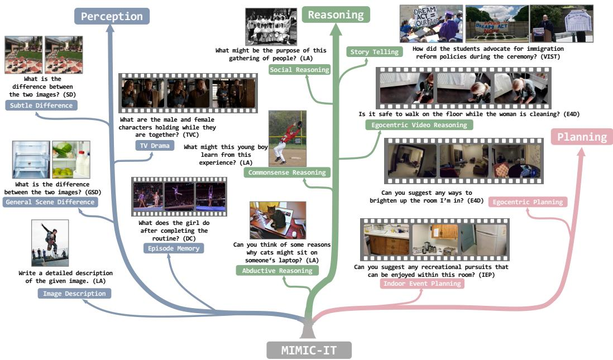
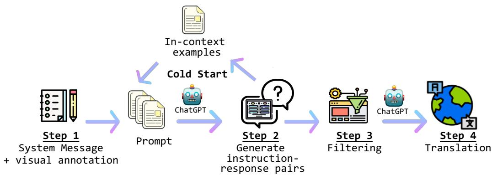
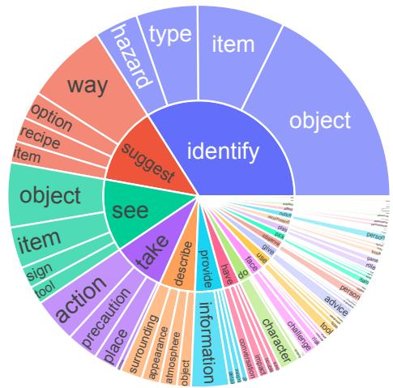

<span id="page-0-0"></span>
# MIMIC-IT: Multi-Modal In-Context Instruction Tuning

Bo Li∗,♠,1 Yuanhan Zhang∗,♠,1 Liangyu Chen∗,1 Jinghao Wang∗,1 Fanyi Pu∗,1 Jingkang Yang1 Chunyuan Li2 Ziwei Liu1,B

1S-Lab, Nanyang Technological University, Singapore 2Microsoft Research, Redmond {libo0013, yuanhan002, lchen025, c190209, fpu001, ziwei.liu}@ntu.edu.sg chunyl@microsoft.com

https://github.com/Luodian/Otter

## Abstract

High-quality instructions and responses are essential for the zero-shot performance of large language models on interactive natural language tasks. For interactive vision-language tasks involving intricate visual scenes, a large quantity of diverse and creative instruction-response pairs should be imperative to tune visionlanguage models (VLMs). Nevertheless, the current availability of vision-language instruction-response pairs in terms of quantity, diversity, and creativity remains limited, posing challenges to the generalization of interactive VLMs. Here we present MultI-Modal In-Context Instruction Tuning (MIMIC-IT), a dataset comprising 2.8 million multimodal instruction-response pairs, with 2.2 million unique instructions derived from images and videos. Each pair is accompanied by multi-modal in-context information, forming conversational contexts aimed at empowering VLMs in perception, reasoning, and planning. The instruction-response collection process, dubbed as Syphus, is scaled using an automatic annotation pipeline that combines human expertise with GPT’s capabilities. Using the MIMIC-IT dataset, we train a large VLM named Otter. Based on extensive evaluations conducted on vision-language benchmarks, it has been observed that Otter demonstrates remarkable proficiency in multi-modal perception, reasoning, and in-context learning. Human evaluation reveals it effectively aligns with the user’s intentions. We release the MIMIC-IT dataset, instruction-response collection pipeline, benchmarks, and the Otter model.

## 1 Introduction

The recent advancements in artificial intelligence have focused on conversational assistants [42, 31, 30, 13, 17] that possess a strong ability to understand user intentions [35] and then execute actions [5, 51]. In addition to the strong generalization ability of large language models (LLMs), the notable achievements of these conversational assistants can be attributed to the practice of instruction tuning [47, 14, 46, 45, 42, 13, 34]. It involves fine-tuning LLMs on a range of tasks specified through diverse and high-quality instructions [14, 45]. By incorporating instruction tuning, LLMs acquire a heightened comprehension of user intentions [35], enabling them to exhibit improved zero-shot capabilities even in previously unseen tasks [47]. One potential reason for the zero-shot performance gain by instruction tuning is that it internalizes the context [40], which is preferred in user interactions especially when user input skips commonsense context.

Conversational assistants that excel in language tasks have achieved remarkable success. However, an optimal conversational assistant should be able to address tasks involving multiple modalities. This requires access to a diverse and high-quality multi-modal instruction-following dataset. The LLaVA-Instruct-150K dataset [28], also known as LLaVA, is the pioneering vision-language instructionfollowing dataset. It is constructed using COCO [27] images, instructions and responses obtained from GPT-4 [30] based on image captions and object bounding boxes.

<span id="page-1-0"></span>
Figure 1: MIMIC-IT overview. The MIMIC-IT dataset comprises 2.8M multi-modal instructionresponse pairs spanning fundamental capabilities: perception, reasoning, and planning. Each instruction is accompanied by multi-modal conversational context, allowing VLMs trained on MIMIC-IT to demonstrate strong proficiency in interactive instruction following with zero-shot generalization.


> **AI Description:**
> **Source:** `assets/_page_1_Figure_0.jpg`
> 
> **Generated:** 2026-05-16 05:57:08
> 
> ---
> 
> The image is a flowchart titled "MIMIC-IT," which visually represents different types of reasoning and perception tasks. It is divided into three main sections: Perception, Reasoning, and Planning. Perception tasks include tasks like "Subtle Difference," "General Scene Difference," and "Image Description." Reasoning tasks are categorized into "Social Reasoning," "Egocentric Video Reasoning," "Egocentric Planning," and "Indoor Event Planning." Examples of reasoning tasks include "What might be the purpose of this gathering of people?" and "Can you suggest any ways to brighten up the room I'm in?" Planning tasks involve tasks like "Can you suggest any recreational pursuits that can be enjoyed within this room?" The flowchart uses arrows to connect different tasks and categories, illustrating the progression from perception to reasoning and finally to planning.


Although inspiring, LLaVA-Instruct-150K exhibits three limitations. (1) Limited visual diversity: The dataset’s visual diversity is constrained due to its exclusive reliance on the COCO image. (2) Single image as visual data: it utilizes a single image as visual data, while a multi-modal conversational assistant should possess the capability to process multiple images or even extensive videos. For instance, it should effectively provide answers when a user presents a collection of images (or a sequence of images, such as a video) alongside the instruction: "Help me think of an album title for these images." (3) Language-only in-context information: it depends solely on language for in-context information, whereas a multi-modal conversational assistant should integrate multi-modal in-context information to better comprehend user instructions. For example, an assistant could more accurately align its description of an image with the tone, style, or other aspects if the human user provides a concrete image example of the desired attributes.

Addressing these limitations, we introduce MultI-Modal In-Context Instruction Tuning (MIMIC-IT). MIMIC-IT is characterized by: (1) Diverse visual scenes, incorporating images and videos from general scenes, egocentric view scenes, and indoor RGB-D images across various datasets. (2) Multiple images (or a video) as visual data, supporting instruction-response pairs accompanied by any number of images or videos. (3) Multi-modal in-context information, featuring in-context information formulated in multi-modal formats, including multiple instruction-response pairs and multiple images or videos (see Fig. 2 for data format clarification). To efficiently generate instructionresponse pairs, we introduce Sythus, an automated pipeline for instruction-response annotation inspired by the self-instruct method [45]. Sythus employs system message, visual annotation, and in-context examples to direct the language model (GPT-4 or ChatGPT) in generating instructionresponse pairs based on visual context, including timestamps, captions, and object information, targeting three fundamental capabilities of vision-language models: perception, reasoning, and planning (refer to Fig. 1). Additionally, instructions and responses are translated from English into seven languages to support multi-lingual usage.

<span id="page-2-0"></span>
On MIMIC-IT, we train a multi-modal model Otter based on OpenFlamingo [6]. We evaluate Otter’s multi-modal capabilities in two aspects: (1) ChatGPT evaluation on the MMAGIBenchmark [43], comparing Otter’s perception and reasoning abilities with other recent vision-language models (VLMs), where Otter demonstrates the strongest performance. (2) Human evaluation on the Multi-Modality Arena [32], where Otter outperforms other VLMs, achieving the highest Elo rating. Furthermore, we assess Otter’s few-shot in-context learning ability using the COCO Caption dataset [12], with results showing Otter’s superior performance over OpenFlamingo in all few-shot settings. In summary, our contributions include:

• MultI-Modal In-Context Instruction Tuning (MIMIC-IT) dataset, a dataset comprising \~ 2.8M multi-modal in-context instruction-response pairs, with 2.2 million unique instructions, across various real-life scenes.

• Syphus, an automatic pipeline built with LLMs to generate high-quality and multi-lingual instruction-response pairs based on visual context.

• Otter, a multi-modal model demonstrates robust multi-modal perception and reasoning capabilities, effectively following human intent while exhibiting adeptness in-context learning.

## 2 Related Work

## 2.1 Multi-modal Instruction Tuning Dataset

The notion of instruction tuning in multi-modal models was initially introduced in the work called Multi-Instruct [50], which encompassed a wide range of multi-modal tasks [18, 56, 41, 27, 12] involving visual understanding and multi-modal reasoning, such as Visual Question Answering [18, 56, 23]. Similarly, Mini-GPT4 [54] created its instruction-based dataset by merging Conceptual Caption [38, 8], SBU [33], and LAION [36] with handwritten instruction templates. More recently, LLaVA-Instruct-150K [28] has elevated the quality of instruction tuning datasets by utilizing selfinstruct and GPT-4 [30], along with handwritten seed instructions on COCO images [27]. While these previous works on multi-modal instruction tuning primarily focused on general scene images, our approach categorizes our data sources into indoor scenes, outdoor scenes, conversations, and egocentric videos. Additionally, drawing inspiration from the image-text interleaved structure of the MMC4 dataset [55], our approach further distinguishes itself by incorporating a multi-modal in-context format into instruction tuning.

## 2.2 Multi-modal Foundation Models

With the recent success of ChatGPT [31], GPT-4 [30], and other LLMs [44, 42, 13], recent studies start to explore incorporating information from other modalities into pretrained language models. These studies extend the capabilities of LLM to more tasks and modalities and can be categorized into two classes: (i) Multi-model Aggregation. These approaches [48, 39, 11, 57, 57, 52] take an LLM as a dispatch scheduler and connect different expert models through it to allow for different tasks. Language serves as an interface to call expert visual-language models within their respective task domains. However, this approach is limited that each model cannot be trained individually on new tasks. (ii) End-to-End Trainable Models. These approaches [2, 6, 25, 30, 3, 37, 7, 54, 53, 28] connect models from different modalities into integrated end-to-end trainable models, also known as multi-modal foundation models. Among them, based on large-scale image-text interleaved pretrained model OpenFlamingo [6], Otter is the first open-sourced model to further demonstrate the power of multi-modal in-context instruction tuning.

## 3 Multi-modal In-context Instruction Tuning Dataset

We aim to build MIMIC-IT dataset to support more VLMs in acquiring the ability to comprehend the real world. In this section, we provide an overview of the MIMIC-IT dataset, starting with the data format in Sec. 3.1 and our automatic instruction generation pipeline, Sythus, in Sec. 3.2.

<span id="page-3-0"></span>
Figure 2: Data Format Comparison: LLaVA-Instruct-150K vs. MIMIC-IT. (a) LLaVA-Instruct-150K consists of a single image with corresponding language-only in-context information (yellow box). (b) MIMIC-IT accommodates multiple images or videos within the input data and supports multi-modal in-context information, i.e., considering both images/videos and language inputs as in-context information.

## 3.1 MIMIC-IT Data Format

Each instance i in the MIMIC-IT dataset comprises an instruction-response pair and a set of N images. We regard it as query example with a tuple: $( I _ { q } , R _ { q } , X _ { q } )$ , where $\{ x _ { i = 1 } ^ { N } \} \in X _ { q } .$ Here, $I _ { q }$ denotes the q-th instruction in our dataset, $R _ { q }$ represents the response, and $\grave { X _ { q } }$ refers to the images or videos 1. Our primary objective is to develop a visual language model $p _ { \theta } ( R _ { q } \mid ( I _ { q } , X _ { q } ) )$ parametrized by trainable parameters θ, the model generates the response $R _ { i }$ for each query $( \dot { I } _ { q } , \dot { X } _ { q } )$ . With above example denotes the standard instruction tuning process of a visual language model. Further, we could define a set of in-context examples as $( I _ { k } , \mathsf { \bar { \cal R } } _ { k } , X _ { k } ) _ { k = 1 } ^ { M }$ , where M is the number of the set.

We then define a context function $C _ { \psi } : ( I _ { q } , X _ { q } ) \mapsto \{ ( I _ { k } , X _ { k } ) \} _ { k = 1 } ^ { M }$ to represent the in-context examples with current query example. In summary, all data in the MIMIC-IT dataset will be represented in the following format, query example with its corresponding in-context examples.

$$
d _ { q } = ( I _ { q } , R _ { q } , X _ { q } , C _ { \psi } ( I _ { q } , X _ { q } ) ) , \quad d _ { q } \sim D _ { \mathrm { M I M I C - I T } }\tag{1}
$$

Now the visual language model that incorporates in-context examples can be denoted as $p _ { \theta } ( R _ { q }$ $( I _ { q } , X _ { q } , C _ { \psi } ( I _ { q } , X _ { q } ) ) )$ $C _ { \psi }$ is task-dependent, we apply different approaches to organize the in-

<span id="page-4-0"></span>
Figure 3: Sythus overview. We employ a cold-start stage to identify the optimal system message and in-context example for querying instruction-response pairs in a given dataset. Subsequently, Sythus, spanning steps 1 to 4, generates high-quality instruction-response pairs in eight languages.


> **AI Description:**
> **Source:** `assets/_page_4_Figure_0.jpg`
> 
> **Generated:** 2026-05-16 06:02:21
> 
> ---
> 
> The image is a flowchart depicting a process involving multiple steps. It includes icons and text labels to illustrate the sequence of actions. The flowchart starts with a "System Message + visual annotation" and proceeds through four main steps: "Prompt," "Generate instruction-response pairs," "Filtering," and "Translation." Each step is visually represented with icons and accompanied by descriptive text. The flowchart also includes a "Cold Start" section with "In-context examples" and a reference to "ChatGPT," indicating the use of artificial intelligence in the process. The overall structure suggests a method for generating and refining translations using AI.


Table 1: Comparison between MIMIC-IT and other multi-modal instruction datasets. MIMIC-IT stands out with the following features: (1) The largest vision-language instruction dataset. (2) The first instruction dataset including video data. (3) Supporting multi-modal in-context scenarios (see Fig. 2 for the data format). (4) Supporting eight languages including: English, Chinese, Spanish, Japanese, French, German, Korean, and Arabic. The data source of MIMIC-IT includes seven datasets: COCO [27], Spot-the-diff [21] (SD), ScanNetV2 [15] (SN), VisualStorytelling [20] (VIST), DenseCaption/Activity caption [22] (DC), TVCaption [24] (TVC), and Ego4D [19] (E4D). lang. indicates language and vis. indicates vision.


context examples with the current query example. The details will be presented in Sec. 3.3 and illustrative examples will be showcased in Fig. 2.

## 3.2 Sythus: Automatic Instruction-Response Generation Pipeline

We present Sythus (see Figure 3), an automated pipeline for generating high-quality instructionresponse pairs in multiple languages. Building upon the framework proposed by LLaVA [28], we utilize ChatGPT to generate instruction-response pairs based on visual content. To ensure the quality of the generated instruction-response pairs, our pipeline incorporates system messages, visual annotations, and in-context examples as prompts for ChatGPT. System messages define the desired tone and style of the generated instruction-response pairs, while visual annotations provide essential image information such as bounding boxes and image descriptions. In-context examples assist ChatGPT in learning within the context. Since the quality of coreset impacts subsequent data collection process [10], we employ a cold-start strategy to enhance in-context examples before the large-scale query. During the cold-start stage, in-context examples are collected by prompting ChatGPT solely through system messages and visual annotations, employing a heuristic approach. This stage concludes only when satisfactory in-context examples are identified. In step 4, once the instruction-response pairs are obtained, the pipeline expands them into Chinese (zh), Japanese (ja),

<span id="page-5-0"></span>
Spanish (es), German (de), French (fr), Korean (ko), and Arabic (ar). For further details, please refer to Appendix C, and task-specific prompts can be found in Appendix D.

## 3.3 Visual Data Exploration

Acknowledging the importance of high-quality visual annotations and the need for diverse visionlanguage instructions that align with the distribution of real-world visual content, we curate a collection of seven image and video datasets spanning a wide spectrum of scenes, from general to specific. Encompassing various topics, the MIMIC-IT dataset includes general scene understanding and reasoning, spoting general and subtle differences, as well as facilitating egocentric view comprehension to assist VLMs in future AR headsets, etc. In the subsequent sections, we will present the application scenarios of our dataset: General Scene Understanding in Sec. 3.3.1 and General Scene Understanding in Sec. 3.3.2. In each sub-task, we elaborate on the process of organizing various data into an in-context instruction tuning format, based on the previously established guidelines.

## 3.3.1 General Scene Understanding

For understanding the general scenes, we include four tasks: (1) LLaVA-Interleaved. (2) Spot The Difference. (3) Visual Story Telling. (4) Dense Captions.

LLaVA-Interleaved (LA-I). Learning with in-context examples is essential for effective instruction tuning. To achieve this, we refine the LLaVA-Instruct-150K [28] dataset by retrieving ten in-context examples for each instruction-response pair in LLaVA-Instruct-150K, building LLaVA-Interleaved (LA-I). We identify each data’s in-context examples based on instruction text-to-text similarity or image-image similarity. Further details on locating in-context examples and the data sources for LA-I can be found in the Appendix.

Spot The Difference (SD). Learning to discern differences between images is vital for understanding real-world changes. Our study encompasses two interrelated task types in Scene Difference (SD), addressing varying complexity levels in difference identification. The first type, General Scene Difference, involves creating a pair of images by determining the most similar one to the current image, utilizing image-to-image similarity relationships from the COCO2017 [27]. The second type, Subtle Difference, features pairs of similar images with subtle distinctions sourced from the Spot-the-Diff[21], extracted from surveillance footage. For the first type, we prompt ChatGPT using original image captions and object detection annotations, while for the second type, we employ natural language difference descriptions as annotations. The resulting instruction-response pairs focus on identifying differences between the paired images.

Visual Story Telling (VIST). Beyond traditional scene understanding, the ability to generate coherent and engaging narratives based on visual input expands the context comprehension of Visual Language Models (VLMs). To enable this, we propose a task using the Visual Storytelling datase [20], which includes event-based image sequences and corresponding inquiry questions. Given that image annotations often contain narratives and timelines not directly observable, we instruct ChatGPT to act as a viewer answering questions about the images. The prompts also incorporate thought-provoking inquiries to promote creativity. Each task instance comprises multiple images and instruction-response pairs, providing in-context examples.

Dense Captions (DC). Expanding the scope of video understanding, DC features dense captions from [22] corresponding to clips within longer videos. The instructions pose a diverse set of questions, addressing the general visual content of the video, human actions, and behaviors, the chronological sequence of events, and causal relationships. This approach encourages VLMs to delve deeper into the intricacies of video content.

TV Show Captions (TVC). The primary purpose of incorporating TV show clips with high-level captions into the training process of VLMs is to enhance their social reasoning abilities and deepen their understanding of complex character dynamics. By organizing drama clips from [24] to analyze character relationships and motivations, we aim to challenge VLMs to move beyond mere perception and demonstrate their reasoning capabilities within the context of TV show narratives. This focused approach is crucial for fostering advanced VLMs capable of effectively handling diverse real-world situations and user queries.

<span id="page-6-0"></span>

### Full Page Description (Page 6)

**Source:** `assets/_page_6_Asset_2.jpg`

**Generated:** 2026-05-16 05:59:24

---

The image is a histogram chart. It displays the distribution of the number of images, with the x-axis representing the number of images and the y-axis representing the frequency. The chart shows a right-skewed distribution, with a peak around 10,000 images and a long tail extending to the right, indicating a few categories with a much higher number of images than the majority. The chart is labeled "b) Image" at the top right corner.


### Full Page Description (Page 6)

**Source:** `assets/_page_6_Asset_3.jpg`

**Generated:** 2026-05-16 05:59:30

---

The image is a bar chart with the title "Responses." The x-axis represents the number of related instructions, ranging from 0 to 12, while the y-axis represents the number of instructions, ranging from 100 to 100,000. The bars show the distribution of responses, with the highest number of responses occurring for 4 related instructions and the lowest for 12 related instructions. The chart visually represents the frequency of responses for different numbers of related instructions.


### Full Page Description (Page 6)

**Source:** `assets/_page_6_Asset_0.jpg`

**Generated:** 2026-05-16 05:59:42

---

The image is a bar chart with two y-axes. The x-axis represents "Instruction Length," ranging from 0 to 40, while the y-axis on the left shows "# Instructions" on a logarithmic scale, ranging from 100 to 100,000. The y-axis on the right shows "# Responses" on a logarithmic scale, also ranging from 100 to 100,000. The chart displays the distribution of instruction lengths and the corresponding number of instructions and responses. The main trend is that the number of instructions and responses decreases as the instruction length increases.


### Full Page Description (Page 6)

**Source:** `assets/_page_6_Asset_1.jpg`

**Generated:** 2026-05-16 05:59:35

---

The image is a bar chart with the title "Instructions." The x-axis represents "Response Length" with values ranging from 0 to 500, and the y-axis represents "# Responses." The bars show the number of responses for each length of response, with the highest number of responses occurring at a response length of 0. The chart demonstrates a decreasing trend in the number of responses as the response length increases.



> **AI Description:**
> **Source:** `assets/_page_6_Figure_0.jpg`
> 
> **Generated:** 2026-05-16 05:57:16
> 
> ---
> 
> The image is a circular word cloud centered around the word "identify." It visually represents various related words and their frequencies, with larger words indicating higher frequency. The words are grouped into categories such as "object," "action," "see," "suggest," and "take," with each category having its own color and size distribution. The word "object" is the largest and most central, suggesting it is the primary focus of the cloud. The word cloud effectively conveys the relationships and frequencies of words related to the concept of "identify."


## 3.3.2 Egocentric View Understanding

Indoor Event Planning (IEP). Emphasizing the planning capabilities of virtual assistants, we utilize visual inputs consisting of a collection of 2D photos depicting a room. We gather indoor scene RGB-D images from ScanNetv2 [15] and sample them into multiple 2D visual inputs, representing a room’s layout from a first-person perspective. We prompt ChatGPT to generate instructions that direct humans to perform various activities in indoor spaces. Initially, we have ChatGPT create a personality for the room owner. Subsequently, the planning should be intimately related to the room’s layout and the generated room owner, underlining the importance of context awareness in VLMs. This approach ensures that models can effectively support users across diverse indoor scenarios.

Ego4D (E4D) [19]. Utilizing E4D’s egocentric videos, we strive to enable VLMs to function effectively as augmented reality (AR) assistants in real-life scenarios. By prompting ChatGPT to generate instructions based on visual descriptions, our goal is to simulate practical interactions between users and AR assistants. To this end, we devise assistant-related questions and tasks that demand context-aware responses. For instance, Instruction: What should I do now? Response: Based on my observation, you can now proceed to do.... This focused approach underscores the potential of VLMs in providing valuable insights and assistance across a diverse range of daily life situations.

## 3.4 Dataset Statistics

Table 1 presents the essential statistics pertaining to the generated data. Our dataset comprises over 2.8 million instruction-response pairs, wherein each pair includes at least one multi-modal in-context example and one language-only in-context example. Among these pairs, there are 2.2M unique instructions. Furthermore, to examine the characteristics and diversity of the instructions (refer to Fig. 4 (a)) and responses (refer to Fig. 4 (b)), we analyze the verb-noun structure present in them, refering to [45]. Specifically, we employ spaCy for parsing the instructions, extracting the verb closest to the root, and retrieving its first direct noun object2. We plot the top 20 most frequently occurring root verbs alongside their top 4 direct noun objects. Our findings reveal that the sentence structure of responses exhibits greater diversity compared to that of instructions. Moreover, we demonstrate diversity in terms of the length of instructions/responses, the number of images per instruction, and the number of in-context examples per instruction, as depicted in Fig. 4 (c).

<span id="page-7-0"></span>
Figure 5: Otter’s response examples in different scenarios. Trained on the MIMIC-IT dataset, Otter is able to serve for situation understanding and reasoning, learning with in-context examples, and egocentric visual assistant.

## 4 Empricial Evaluation

In this section, we showcase the diverse applications of the MIMIC-IT dataset and the potential capabilities of a vision-language model (VLM) trained on it. Firstly, in Sec. 4.1, we introduce Otter, an in-context instruction-tuned model developed using the MIMIC-IT dataset. Next, in Sec. 4.2, we explore various methods for training Otter on the MIMIC-IT dataset and discuss numerous scenarios in which Otter can be effectively employed. Finally, in Sec. 4.3 to Sec. 4.5, we present a comparative analysis of Otter’s performance against other VLMs across an array of benchmarks.

## 4.1 Otter: A Multi-Modal In-context Instruction Tuned Model

Otter is designed to support multi-modal in-context instruction tuning based on the OpenFlamingo [6] model, which involves conditioning the language model on the corresponding media, such as an image that corresponds to a caption or an instruction-response pair.

## 4.2 Usage Examples and Demonstrations

Scene Understanding and Reasoning. The MIMIC-IT dataset comprises approximately 2.8 million in-context instruction-response pairs, which are structured into a cohesive template to facilitate various tasks. The following template encompasses images, user instructions, and model-generated responses, utilizing the Human and Assistant role labels to enable seamless user-assistant interactions.

<image>Human:{instruction} Assistant:<answer>{response}<endofchunk>

<span id="page-8-0"></span>
Table 2: MMAGIBench evaluation results. Otter outperforms all baseline models by achieving the highest average accuracy in both perception and reasoning tasks.


Training the Otter model on the MIMIC-IT dataset allows it to acquire different capacities, as demonstrated by the LA and SD tasks. Trained on the LA task, the model exhibits exceptional scene comprehension, reasoning abilities, and multi-round conversation capabilities. Meanwhile, on the SD task, the model can acquire the ability to adeptly spot general differences or subtle distinctions within daily scenes.

We showcase response examples from the Otter after training on the MIMIC-IT dataset in Fig. 5, highlighting its ability to understand situations and reasoning in a multi-round conversation style.

Learning with In-context Examples. As mentioned in Sec. 3.1, regarding the concept of organizing visual-language in-context examples, we demonstrate here the acquired ability of the Otter model to follow inter-contextual instructions after training on the LA-T2T task (refer to Appx. for other tasks). The organized input data format is as follows:

```
```markdown
# Multiple in-context example with similar instructions
<image>Human:{instruction} Assistant:<answer>{response}<|endofchunk|>
# ....
<image>Human:{instruction} Assistant:<answer>{response}<|endofchunk|>
# Query example
<image>Human:{instruction} Assistant:<answer>
```
```

The Otter model’s demonstration of regulating its expressions by referencing in-context examples is illustrated in Fig. 5.

Egocentric Visual Assistant. A distinctive feature of the MIMIC-IT dataset is its inclusion of a comprehensive collection of videos and sequential images in an egocentric view, derived from the IEP, E4D scenarios. In the IEP scenario, the content emphasizes understanding and planning within indoor environments, incorporating instructions and responses designed to guide the model in event planning based on interior layouts.

The E4D scenario, on the other hand, tailors instructions and responses specifically for first-person augmented reality (AR) headset assistant applications. These two datasets collectively serve to bolster the model’s proficiency in perceiving scenes from a first-person viewpoint, strategizing for impending tasks, and providing valuable insights and suggestions to AR headset users. Tailored this part of data, we train an egocentric visual assistant, termed Otter-E, which is specifically designed for AR headset applications. MIMIC-IT bolsters the model’s proficiency in perceiving scenes from a first-person viewpoint, strategizing for impending tasks, and providing valuable insights and suggestions to AR headset users. As a result, the Otter-E model emerges as an exceptional and visionary Visual Language Model for AR headsets, paving the way for a groundbreaking and immersive experience.

In the bottom image of Fig. 5, Otter-E demonstrates its ability to perceive the first-person view and respond to users’ questions, such as guiding users to land a small aircraft (In real-life scenarios, you are not encouraged to consult visual assistants for such hazardous actions).

## 4.3 ChatGPT Evaluation

In Tab. 2, we utilize the MMAGIBench framework [43] to provide an extensive evaluation of the perception and reasoning capabilities of vision-language models. The perception benchmark consists of data derived from COCO images and social network images (e.g., , Twitter), covering tasks such as coarse scene and object recognition, fine-grained OCR, celebrity identification, and recognition of well-known locations. The reasoning benchmark, on the other hand, is performed across three dimensions: attribute reasoning, relation reasoning, and future prediction.

<span id="page-9-0"></span>

### Full Page Description (Page 9)

**Source:** `assets/_page_9_Asset_2.jpg`

**Generated:** 2026-05-16 06:01:17

---

The image is a line graph showing the CIDEr (COnceptual INDEx) scores for two models, Otter and OpenFlamingo, across different shot sizes: 0-shot, 4-shot, 8-shot, and 16-shot. The x-axis represents the shot size, and the y-axis represents the CIDEr score. The graph shows that both models' CIDEr scores increase as the shot size increases. Otter consistently outperforms OpenFlamingo across all shot sizes, with the highest scores being 84.7 for Otter and 81.8 for OpenFlamingo at the 16-shot level.


### Full Page Description (Page 9)

**Source:** `assets/_page_9_Asset_0.jpg`

**Generated:** 2026-05-16 05:59:51

---

The image contains a bar chart comparing the performance of two models, VideoChatGPT and Otter, on two tasks: QA (Question Answering) and Captioning. The models are evaluated on two datasets: MSVD and MSRVT. The chart shows the accuracy scores for each model on both tasks. For MSVD, VideoChatGPT achieves an accuracy of 45.2% in QA and 42.9% in Captioning, while Otter scores 38.4% in QA and 40.1% in Captioning. For MSRVT, Otter performs better with 35.3% in QA and 34.5% in Captioning, compared to VideoChatGPT's 27.8% in QA and 39.5% in Captioning. The chart highlights the performance differences between the two models across different datasets and tasks.


### Full Page Description (Page 9)

**Source:** `assets/_page_9_Asset_1.jpg`

**Generated:** 2026-05-16 06:00:36

---

The image is a bar chart with a vertical axis labeled "Elo Rating" ranging from 990 to 1015 in increments of 5. The horizontal axis lists different models: MM-GPT, Inst. BLIP, LLaVA, MiniGPT, and Otter. Each bar represents the Elo rating for a respective model. The chart shows that Otter has the highest Elo rating at 1014.7, followed by MiniGPT at 1013.2, LLaVA at 1012.2, Inst. BLIP at 996.3, and MM-GPT at 991.9. The Elo ratings are clearly marked on top of each bar.

Current evaluation metrics for vision-language models, like VQAv2 [4], exhibit shortcomings in terms of robustness. For instance, VQAv2 primarily assesses single-word or phrase responses, while many modern models generate sentence outputs. To bridge this gap, we evaluate the models by asking ChatGPT to compare their label predictions with the ground truth labels for each input. A test sample is considered correct if ChatGPT’s response indicates that the prediction aligns with the corresponding label. For a more in-depth understanding of MMAGIBench, we recommend referring to the original source [43]. Fig. 6 (a) demonstrates that Otter outperforms VideoChatGPT [26] by 6.8% accuracy and 1.8% on MSVD [9] 0-shot question answering and captioning benchmarks respectively. Similar substantial margins are also observed on the MSRVTT [49] dataset.

## 4.4 Human Evaluation

Multi-Modality Arena [32] uses an Elo rating system to evaluate the usefulness and alignment of VLM responses. The Elo rating system calculates the relative skill levels of players, as commonly used in chess and other competitive games. The difference in Elo ratings between the two models predicts the outcome if they were matched against each other. This system works well for evaluating conversational AI models, because multiple models can have pairwise "battles" responding to the same inputs in a user-blind evaluation. Fig. 6(b) shows that Otter demonstrates superior usefulness and alignment, achieving the highest Elo rating among recent VLMs.

## 4.5 Few-shot In-context Learning Metric Evaluation

Otter is finetuned based on OpenFlamingo, an architecture designed for multi-modal in-context learning. Finetuned with the MIMIC-IT dataset, Otter outperforms OpenFlamingo by a substantial margin on COCO caption (CIDEr) [27] few-shot evaluation (see Fig. 6(c)). As expected, the finetuning also brings marginal performance gain on zero-shot evaluation.

## 5 Discussion

Limitations. Though we have iteratively refined the system message and instruction-response examples, ChatGPT is prone to language hallucinations therefore it might generate incorrect responses. Generally, more trustworthy language models are desired for self-instruct data generation.

Future Works. In the future, we plan to support more embodied AI datasets such as Language-Table [29] and SayCan [1]. We also consider improving the instruction collection with more trustworthy language models or generation techniques.

Conclusion. In this work, we propose MIMIC-IT, a large-scale multi-modal in-context instruction tuning dataset. We leverage an automatic pipeline, Syphus, to enable this dataset to cover a diverse set of visual scenes and creative instructions in eight languages. MIMIC-IT empowers our model, Otter, to achieve state-of-the-art performances in perception and reasoning benchmarks as well as human evaluations.

<span id="page-10-0"></span>
## Acknowledgments and Disclosure of Funding

This study is supported by the Ministry of Education, Singapore, under its MOE AcRF Tier 2 (MOE-T2EP20221- 0012), NTU NAP, and under the RIE2020 Industry Alignment Fund – Industry Collaboration Projects (IAF-ICP) Funding Initiative, as well as cash and in-kind contribution from the industry partner(s). We thank Peiyu Fu, Xuli Chen, and Mehdi Cherti for their professional advice on the in-context example of the translation query of Japanese, French, German, Spanish, Korean, and Arabic.

## References

- [1] Michael Ahn, Anthony Brohan, Noah Brown, Yevgen Chebotar, Omar Cortes, Byron David, Chelsea Finn, Keerthana Gopalakrishnan, Karol Hausman, Alex Herzog, et al. Do as i can, not as i say: Grounding language in robotic affordances. arXiv preprint arXiv:2204.01691, 2022. 10
- [2] Jean-Baptiste Alayrac, Jeff Donahue, Pauline Luc, Antoine Miech, Iain Barr, Yana Hasson, Karel Lenc, Arthur Mensch, Katherine Millican, Malcolm Reynolds, et al. Flamingo: a visual language model for few-shot learning. Advances in Neural Information Processing Systems, 35:23716–23736, 2022. 3
- [3] Alibaba. Tongyi qianwen. 2023. 3
- [4] Stanislaw Antol, Aishwarya Agrawal, Jiasen Lu, Margaret Mitchell, Dhruv Batra, C Lawrence Zitnick, and Devi Parikh. Vqa: Visual question answering. In Proceedings of the IEEE international conference on computer vision, pages 2425–2433, 2015. 10
- [5] Akari Asai, Timo Schick, Patrick Lewis, Xilun Chen, Gautier Izacard, Sebastian Riedel, Hannaneh Hajishirzi, and Wen-tau Yih. Task-aware retrieval with instructions. arXiv preprint arXiv:2211.09260, 2022. 1
- [6] Anas Awadalla, Irena Gao, Joshua Gardner, Jack Hessel, Yusuf Hanafy, Wanrong Zhu, Kalyani Marathe, Yonatan Bitton, Samir Gadre, Jenia Jitsev, Simon Kornblith, Pang Wei Koh, Gabriel Ilharco, Mitchell Wortsman, and Ludwig Schmidt. Openflamingo, March 2023. 3, 8, 9
- [7] Baidu. Ernie bot: Enhanced representation through knowledge integration. 2023. 3
- [8] Soravit Changpinyo, Piyush Sharma, Nan Ding, and Radu Soricut. Conceptual 12m: Pushing web-scale image-text pre-training to recognize long-tail visual concepts. In Proceedings of the IEEE/CVF Conference on Computer Vision and Pattern Recognition, pages 3558–3568, 2021. 3
- [9] David Chen and William Dolan. Collecting highly parallel data for paraphrase evaluation. In Proceedings of the 49th Annual Meeting of the Association for Computational Linguistics: Human Language Technologies, pages 190–200, Portland, Oregon, USA, June 2011. Association for Computational Linguistics. 10
- [10] Liangyu Chen, Yutong Bai, Siyu Huang, Yongyi Lu, Bihan Wen, Alan L Yuille, and Zongwei Zhou. Making your first choice: To address cold start problem in vision active learning. arXiv preprint arXiv:2210.02442, 2022. 5
- [11] Liangyu Chen, Bo Li, Sheng Shen, Jingkang Yang, Chunyuan Li, Kurt Keutzer, Trevor Darrell, and Ziwei Liu. Language models are visual reasoning coordinators. In ICLR 2023 Workshop on Mathematical and Empirical Understanding of Foundation Models, 2023. 3
- [12] Xinlei Chen, Hao Fang, Tsung-Yi Lin, Ramakrishna Vedantam, Saurabh Gupta, Piotr Dollár, and C Lawrence Zitnick. Microsoft coco captions: Data collection and evaluation server. arXiv preprint arXiv:1504.00325, 2015. 3
- [13] Wei-Lin Chiang, Zhuohan Li, Zi Lin, Ying Sheng, Zhanghao Wu, Hao Zhang, Lianmin Zheng, Siyuan Zhuang, Yonghao Zhuang, Joseph E. Gonzalez, Ion Stoica, and Eric P. Xing. Vicuna: An open-source chatbot impressing gpt-4 with 90%\* chatgpt quality, March 2023. 1, 3

<span id="page-11-0"></span>
- [14] Hyung Won Chung, Le Hou, Shayne Longpre, Barret Zoph, Yi Tay, William Fedus, Eric Li, Xuezhi Wang, Mostafa Dehghani, Siddhartha Brahma, et al. Scaling instruction-finetuned language models. arXiv preprint arXiv:2210.11416, 2022. 1
- [15] Angela Dai, Angel X Chang, Manolis Savva, Maciej Halber, Thomas Funkhouser, and Matthias Nießner. Scannet: Richly-annotated 3d reconstructions of indoor scenes. In Proceedings of the IEEE conference on computer vision and pattern recognition, pages 5828–5839, 2017. 5, 7, 15
- [16] Wenliang Dai, Junnan Li, Dongxu Li, Anthony Meng Huat Tiong, Junqi Zhao, Weisheng Wang, Boyang Li, Pascale Fung, and Steven C. H. Hoi. Instructblip: Towards general-purpose vision-language models with instruction tuning. CoRR, abs/2305.06500, 2023. 9
- [17] Danny Driess, Fei Xia, Mehdi SM Sajjadi, Corey Lynch, Aakanksha Chowdhery, Brian Ichter, Ayzaan Wahid, Jonathan Tompson, Quan Vuong, Tianhe Yu, et al. Palm-e: An embodied multimodal language model. arXiv preprint arXiv:2303.03378, 2023. 1
- [18] Yash Goyal, Tejas Khot, Douglas Summers-Stay, Dhruv Batra, and Devi Parikh. Making the v in vqa matter: Elevating the role of image understanding in visual question answering. In Proceedings of the IEEE conference on computer vision and pattern recognition, pages 6904–6913, 2017. 3
- [19] Kristen Grauman, Andrew Westbury, Eugene Byrne, Zachary Chavis, Antonino Furnari, Rohit Girdhar, Jackson Hamburger, Hao Jiang, Miao Liu, Xingyu Liu, et al. Ego4d: Around the world in 3,000 hours of egocentric video. In Proceedings of the IEEE/CVF Conference on Computer Vision and Pattern Recognition, pages 18995–19012, 2022. 5, 7, 15
- [20] Ting-Hao K. Huang, Francis Ferraro, Nasrin Mostafazadeh, Ishan Misra, Jacob Devlin, Aishwarya Agrawal, Ross Girshick, Xiaodong He, Pushmeet Kohli, Dhruv Batra, et al. Visual storytelling. In 15th Annual Conference of the North American Chapter of the Association for Computational Linguistics (NAACL 2016), 2016. 5, 6, 15
- [21] Harsh Jhamtani and Taylor Berg-Kirkpatrick. Learning to describe differences between pairs of similar images. In EMNLP, pages 4024–4034. Association for Computational Linguistics, 2018. 5, 6, 15
- [22] Ranjay Krishna, Kenji Hata, Frederic Ren, Li Fei-Fei, and Juan Carlos Niebles. Densecaptioning events in videos. In Proceedings of the IEEE international conference on computer vision, pages 706–715, 2017. 5, 6, 15
- [23] Ranjay Krishna, Yuke Zhu, Oliver Groth, Justin Johnson, Kenji Hata, Joshua Kravitz, Stephanie Chen, Yannis Kalantidis, Li-Jia Li, David A Shamma, et al. Visual genome: Connecting language and vision using crowdsourced dense image annotations. International journal of computer vision, 123:32–73, 2017. 3
- [24] Jie Lei, Licheng Yu, Tamara L Berg, and Mohit Bansal. Tvr: A large-scale dataset for video-subtitle moment retrieval. In Computer Vision–ECCV 2020: 16th European Conference, Glasgow, UK, August 23–28, 2020, Proceedings, Part XXI 16, pages 447–463. Springer, 2020. 5, 6, 15
- [25] Junnan Li, Dongxu Li, Silvio Savarese, and Steven Hoi. Blip-2: Bootstrapping languageimage pre-training with frozen image encoders and large language models. arXiv preprint arXiv:2301.12597, 2023. 3
- [26] Kunchang Li, Yinan He, Yi Wang, Yizhuo Li, Wenhai Wang, Ping Luo, Yali Wang, Limin Wang, and Yu Qiao. Videochat: Chat-centric video understanding. arXiv preprint arXiv:2305.06355, 2023. 10
- [27] Tsung-Yi Lin, Michael Maire, Serge Belongie, James Hays, Pietro Perona, Deva Ramanan, Piotr Dollár, and C Lawrence Zitnick. Microsoft coco: Common objects in context. In Computer Vision–ECCV 2014: 13th European Conference, Zurich, Switzerland, September 6-12, 2014, Proceedings, Part V 13, pages 740–755. Springer, 2014. 2, 3, 5, 6, 10, 15
- [28] Haotian Liu, Chunyuan Li, Qingyang Wu, and Yong Jae Lee. Visual instruction tuning. arXiv preprint arXiv:2304.08485, 2023. 2, 3, 5, 6, 9

<span id="page-12-0"></span>
- [29] Corey Lynch, Ayzaan Wahid, Jonathan Tompson, Tianli Ding, James Betker, Robert Baruch, Travis Armstrong, and Pete Florence. Interactive language: Talking to robots in real time. arXiv preprint arXiv:2210.06407, 2022. 10
- [30] OpenAI. Gpt-4 technical report. 2023. 1, 2, 3
- [31] OpenAI. Introducing chatgpt. 2023. 1, 3
- [32] OpenGVLab. Multi-modality arena. https://github.com/OpenGVLab/ Multi-Modality-Arena, 2023. 3, 10
- [33] Vicente Ordonez, Girish Kulkarni, and Tamara Berg. Im2text: Describing images using 1 million captioned photographs. Advances in neural information processing systems, 24, 2011. 3
- [34] Baolin Peng, Chunyuan Li, Pengcheng He, Michel Galley, and Jianfeng Gao. Instruction tuning with GPT-4. arXiv preprint arXiv:2304.03277, 2023. 1
- [35] Andy Rosenbaum, Saleh Soltan, Wael Hamza, Yannick Versley, and Markus Boese. Linguist: Language model instruction tuning to generate annotated utterances for intent classification and slot tagging. arXiv preprint arXiv:2209.09900, 2022. 1
- [36] Christoph Schuhmann, Richard Vencu, Romain Beaumont, Robert Kaczmarczyk, Clayton Mullis, Aarush Katta, Theo Coombes, Jenia Jitsev, and Aran Komatsuzaki. Laion-400m: Open dataset of clip-filtered 400 million image-text pairs. arXiv preprint arXiv:2111.02114, 2021. 3
- [37] SenseTime. Sense nova. 2023. 3
- [38] Piyush Sharma, Nan Ding, Sebastian Goodman, and Radu Soricut. Conceptual captions: A cleaned, hypernymed, image alt-text dataset for automatic image captioning. In Proceedings of the 56th Annual Meeting of the Association for Computational Linguistics (Volume 1: Long Papers), pages 2556–2565, 2018. 3
- [39] Yongliang Shen, Kaitao Song, Xu Tan, Dongsheng Li, Weiming Lu, and Yueting Zhuang. Hugginggpt: Solving ai tasks with chatgpt and its friends in huggingface. arXiv preprint arXiv:2303.17580, 2023. 3
- [40] Charlie Snell, Dan Klein, and Ruiqi Zhong. Learning by distilling context. arXiv preprint arXiv:2209.15189, 2022. 1
- [41] Alane Suhr, Mike Lewis, James Yeh, and Yoav Artzi. A corpus of natural language for visual reasoning. In Proceedings of the 55th Annual Meeting of the Association for Computational Linguistics (Volume 2: Short Papers), pages 217–223, 2017. 3
- [42] Rohan Taori, Ishaan Gulrajani, Tianyi Zhang, Yann Dubois, Xuechen Li, Carlos Guestrin, Percy Liang, and Tatsunori B. Hashimoto. Stanford alpaca: An instruction-following llama model. https://github.com/tatsu-lab/stanford\_alpaca, 2023. 1, 3
- [43] MMAGIBench Team. Mmagibench: A universal multi-modal benchmark towards artificial general intelligence. https://github.com/open-mmlab/mmagibench, 2023. 3, 9, 10
- [44] Hugo Touvron, Thibaut Lavril, Gautier Izacard, Xavier Martinet, Marie-Anne Lachaux, Timothée Lacroix, Baptiste Rozière, Naman Goyal, Eric Hambro, Faisal Azhar, Aurelien Rodriguez, Armand Joulin, Edouard Grave, and Guillaume Lample. Llama: Open and efficient foundation language models. arXiv preprint arXiv:2302.13971, 2023. 3
- [45] Yizhong Wang, Yeganeh Kordi, Swaroop Mishra, Alisa Liu, Noah A Smith, Daniel Khashabi, and Hannaneh Hajishirzi. Self-instruct: Aligning language model with self generated instructions. arXiv preprint arXiv:2212.10560, 2022. 1, 2, 7
- [46] Yizhong Wang, Swaroop Mishra, Pegah Alipoormolabashi, Yeganeh Kordi, Amirreza Mirzaei, Atharva Naik, Arjun Ashok, Arut Selvan Dhanasekaran, Anjana Arunkumar, David Stap, et al. Super-naturalinstructions: Generalization via declarative instructions on 1600+ nlp tasks. In Proceedings of the 2022 Conference on Empirical Methods in Natural Language Processing, pages 5085–5109, 2022.

<span id="page-13-0"></span>
- [47] Jason Wei, Maarten Bosma, Vincent Y. Zhao, Kelvin Guu, Adams Wei Yu, Brian Lester, Nan Du, Andrew M. Dai, and Quoc V. Le. Finetuned language models are zero-shot learners. In ICLR. OpenReview.net, 2022. 1
- [48] Chenfei Wu, Shengming Yin, Weizhen Qi, Xiaodong Wang, Zecheng Tang, and Nan Duan. Visual chatgpt: Talking, drawing and editing with visual foundation models. arXiv preprint arXiv:2303.04671, 2023. 3
- [49] Jun Xu, Tao Mei, Ting Yao, and Yong Rui. Msr-vtt: A large video description dataset for bridging video and language. In 2016 IEEE Conference on Computer Vision and Pattern Recognition (CVPR), pages 5288–5296, 2016. 10
- [50] Zhiyang Xu, Ying Shen, and Lifu Huang. Multiinstruct: Improving multi-modal zero-shot learning via instruction tuning. arXiv preprint arXiv:2212.10773, 2022. 3
- [51] Rui Yang, Lin Song, Yanwei Li, Sijie Zhao, Yixiao Ge, Xiu Li, and Ying Shan. Gpt4tools: Teaching large language model to use tools via self-instruction. 2023. 1
- [52] Zhengyuan Yang, Linjie Li, Jianfeng Wang, Kevin Lin, Ehsan Azarnasab, Faisal Ahmed, Zicheng Liu, Ce Liu, Michael Zeng, and Lijuan Wang. Mm-react: Prompting chatgpt for multimodal reasoning and action. arXiv preprint arXiv:2303.11381, 2023. 3
- [53] Renrui Zhang, Jiaming Han, Aojun Zhou, Xiangfei Hu, Shilin Yan, Pan Lu, Hongsheng Li, Peng Gao, and Yu Qiao. Llama-adapter: Efficient fine-tuning of language models with zero-init attention. arXiv preprint arXiv:2303.16199, 2023. 3
- [54] Deyao Zhu, Jun Chen, Xiaoqian Shen, Xiang Li, and Mohamed Elhoseiny. Minigpt-4: Enhancing vision-language understanding with advanced large language models. arXiv preprint arXiv:2304.10592, 2023. 3, 5, 9
- [55] Wanrong Zhu, Jack Hessel, Anas Awadalla, Samir Yitzhak Gadre, Jesse Dodge, Alex Fang, Youngjae Yu, Ludwig Schmidt, William Yang Wang, and Yejin Choi. Multimodal C4: An open, billion-scale corpus of images interleaved with text. arXiv preprint arXiv:2304.06939, 2023. 3
- [56] Yuke Zhu, Oliver Groth, Michael Bernstein, and Li Fei-Fei. Visual7w: Grounded question answering in images. In Proceedings of the IEEE conference on computer vision and pattern recognition, pages 4995–5004, 2016. 3
- [57] Xueyan Zou, Zi-Yi Dou, Jianwei Yang, Zhe Gan, Linjie Li, Chunyuan Li, Xiyang Dai, Harkirat Behl, Jianfeng Wang, Lu Yuan, et al. Generalized decoding for pixel, image, and language. arXiv preprint arXiv:2212.11270, 2022. 3

<span id="page-14-0"></span>
## A Total Cost and ChatGPT Version

We construct MIMIC-IT using the ChatGPT-0301 version. Overall, we query 1,006,746,240 tokens (859,677,150 and 147,069,090 for input and output tokens respectively). The estimated total cost is \$20134.9248.3

## B Content Copyright and License

The license of the datasets we used in this work is illustrated below.


## C Sythus: Automatic Instruction Generation Pipeline

Safety and Ethical Filtering Since we use GPT to generate instructions and responses, we generally follow the GPT content policy for safe and ethical use. This policy eliminates output that is suspicious for unfair opportunities, stereotyping, overrepresentation/underrepresentation, explicit content, disinformation, or unreliable information.

Multi-lingual Support We enrich the datasets by translating the English instruction-response pairs by GPT into 7 additional languages: Chinese, Japanese, Spanish, German, French, Korean, and Arabic. See the prompt for multi-lingual translation query in Fig. 7.

## D Annotation Prompt

In this section, we will present prompts for querying ChatGPT of all datasets in detail. Each prompt contains system message, in-context emample.

<span id="page-15-0"></span>
Figure 7: In-context examples for multi-lingual translation query.

<span id="page-16-0"></span>
Table 3: System message and in-context exemplars for TV show Captions (TVC) query.

<span id="page-17-0"></span>
Table 4: System message and in-context exemplars for Dense Caption (DC) query .

<span id="page-18-0"></span>
Table 5: System message and in-context exemplars for Ego4D (E4D) query.

<span id="page-19-0"></span>
Table 6: System message and in-context exemplars for Indoor Event Planning (IEP) query.

<span id="page-20-0"></span>
Table 7: System message and in-context exemplars for Spot The Defference (SD) query.

<span id="page-21-0"></span>
Table 8: System message and in-context exemplars for Visual Storytelling (VIST) query.