
# The Dawn of LMMs: Preliminary Explorations with GPT-4V(ision)

Zhengyuan Yang∗, Linjie Li∗, Kevin Lin∗, Jianfeng Wang∗, Chung-Ching Lin∗, Zicheng Liu, Lijuan Wang∗♠ Microsoft Corporation

∗ Core Contributor ♠ Project Lead

## Abstract

Large multimodal models (LMMs) extend large language models (LLMs) with multi-sensory skills, such as visual understanding, to achieve stronger generic intelligence. In this paper, we analyze the latest model, GPT-4V(ision) [99–101, 1]1, to deepen the understanding of LMMs. The analysis focuses on the intriguing tasks that GPT-4V can perform, containing test samples to probe the quality and genericity of GPT-4V’s capabilities, its supported inputs and working modes, and the effective ways to prompt the model. In our approach to exploring GPT-4V, we curate and organize a collection of carefully designed qualitative samples spanning a variety of domains and tasks. Observations from these samples demonstrate that GPT-4V’s unprecedented ability in processing arbitrarily interleaved multimodal inputs and the genericity of its capabilities together make GPT-4V a powerful multimodal generalist system. Furthermore, GPT-4V’s unique capability of understanding visual markers drawn on input images can give rise to new humancomputer interaction methods such as visual referring prompting. We conclude the report with in-depth discussions on the emerging application scenarios and the future research directions for GPT-4V-based systems. We hope that this preliminary exploration will inspire future research on the next-generation multimodal task formulation, new ways to exploit and enhance LMMs to solve real-world problems, and gaining better understanding of multimodal foundation models. Finally, we acknowledge that the model under our study is solely the product of OpenAI’s innovative work, and they should be fully credited for its development. Please see the GPT-4V contributions paper [101] for the authorship and credit attribution: https://cdn.openai.com/contributions/gpt-4v.pdf.

## Contents

## List of Figures

1 Introduction 8   
1.1 Motivation and Overview . 8   
1.2 Our Approach in Exploring GPT-4V 8   
1.3 How to Read this Report? . 9   
2 GPT-4V’s Input Modes 10   
2.1 Text-only Inputs . 10   
2.2 Single Image-text Pair 10   
2.3 Interleaved Image-text Inputs . 11   
3 GPT-4V’s Working Modes and Prompting Techniques 12   
3.1 Following Text Instructions . 15   
3.2 Visual Pointing and Visual Referring Prompting 15   
3.3 Visual + Text Prompting 16   
3.4 In-context Few-shot Learning . . 19   
4 Vision-Language Capability 26   
4.1 Image Description on Diverse Domains 26   
4.2 Object Localization, Counting, and Dense Captioning . 38   
4.3 Multimodal Knowledge and Commonsense 43   
4.4 Scene Text, Table, Chart, and Document Reasoning 49   
4.5 Multilingual Multimodal Understanding 58   
4.6 Coding Capability with Vision 63   
5 Interaction with Humans: Visual Referring Prompting 66   
5.1 Understand Pointing Inputs . . 66   
5.2 Visual Referring Prompting . 69   
5.3 Generate Pointing Outputs 69   
6 Temporal and Video Understanding 73   
6.1 Multi-image Sequencing 73   
6.2 Video Understanding 73   
6.3 Visual Referring Prompting for Grounded Temporal Understanding . . 79   
7 Abstract Visual Reasoning and Intelligence Quotient Test 80   
7.1 Abstract Visual Stimuli 80   
7.2 Discovery and Association of Parts and Objects 80   
7.3 Wechsler Adult Intelligence Scale 80   
7.4 Raven’s Progressive Matrices . 80   
8 Emotional Quotient Test 86   
8.1 Read Emotion from Facial Expressions 86   
8.2 Understand How Visual Content Arouses Emotions 87   
8.3 Emotion Conditioned Output . 89   
9 Emerging Application Highlights 90   
9.1 Spot the Difference 90   
9.2 Industry . . . 90   
9.3 Medical 99   
9.4 Auto Insurance 104   
9.5 Customized Captioner 107   
9.6 Image Generation 111   
9.7 Embodied Agent 116   
9.8 GUI Navigation 121   
10 LMM Powered Agents 150   
10.1 Multimodal Plugins 152   
10.2 Multimodal Chains 152   
10.3 Self-Reflection 152   
10.4 Self-Consistency 155   
10.5 Retrieval-Augmented LMMs 156   
11 Conclusions 156   
11.1 Summary and Conclusions 156   
11.2 Towards Future LMMs 156

## List of Figures

1 Section 2.3: multi-image inputs and interleaved image-text pairs. 11   
2 Section 3.1: following text instructions. 12   
3 Section 3.1: constrained prompting. 13   
4 Section 3.1: condition on good performance. . 14   
5 Section 3.2: different modes of visual pointing. 16   
6 Section 3.2: visual pointing and visual referring prompting. 17   
7 Section 3.3: multimodal example-grounded instruction. . 18   
8 Section 3.4: few-shot comparison example 1, Part I: zero-shot. 20   
9 Section 3.4: few-shot comparison example 1, Part II: one-shot. 21   
10 Section 3.4: few-shot comparison example 1, Part III: two-shot. 22   
11 Section 3.4: few-shot comparison example 2, Part I: zero-shot. 23   
12 Section 3.4: few-shot comparison example 2, Part II: one-shot. 24   
13 Section 3.4: few-shot comparison example 2, Part III: two-shot. 25   
14 Section 4.1: celebrity recognition and description. . 28   
15 Section 4.1: landmark recognition and description. 29   
16 Section 4.1: landmark recognition and description. 30   
17 Section 4.1: food recognition and description. 31   
18 Section 4.1: medical image understanding. . 32   
19 Section 4.1: medical image understanding. . 33   
20 Section 4.1: logo recognition and description. 34   
21 Section 4.1: in-the-wild logo recognition and description. . 35   
22 Section 4.1: scene understanding. 36   
23 Section 4.1: counterfactual examples. 37   
24 Section 4.2: spatial relationship understanding. 39   
25 Section 4.2: object counting. . 40   
26 Section 4.2: object localization. . 41   
27 Section 4.2: dense captioning. 42   
28 Section 4.3: joke and meme understanding. 44   
29 Section 4.3: science and encyclopedia knowledge. 45   
30 Section 4.3: science and encyclopedia knowledge. . 46   
31 Section 4.3: science and encyclopedia knowledge. . 47   
32 Section 4.3: multimodal commonsense. 48   
33 Section 4.4: scene text recognition. . 50   
34 Section 4.4: visual math reasoning. . . 51   
35 Section 4.4: flow chart understanding. 52   
36 Section 4.4: flow chart understanding. 53   
37 Section 4.4: chart understanding and reasoning. 54   
38 Section 4.4: table understanding and reasoning. 55   
39 Section 4.4: document understanding. 56   
40 Section 4.4: long document understanding. 57   
41 Section 4.5: multilingual image descriptions. 59   
42 Section 4.5: multilingual scene text recognition. 60   
43 Section 4.5: multilingual text recognition, translation, and description reasoning. 61   
44 Section 4.5: multilingual multiculture understanding. 62   
45 Section 4.6: generate LaTex codes based on the hand-written input. . 63   
46 Section 4.6: reconstruct table in Markdown or LaTex code. . 64   
47 Section 4.6: write codes to replicate the input figure. 65   
48 Section 5.1: understand pointing inputs for grounded description. . 67   
49 Section 5.1: grounded description with text-format region coordinates. 68   
50 Section 5.2: examples of visual referring prompting. 70   
51 Section 5.2: examples of visual referring prompting. 71   
52 Section 5.3: generate pointing outputs. . . . 72   
53 Section 6.1: video frames understanding. . . 74   
54 Section 6.2: long-term temporal order reasoning. 75   
55 Section 6.2: short-term temporal order reasoning. 76   
56 Section 6.2: short-term and long-term temporal anticipation. 77   
57 Section 6.2: temporal localization and reasoning. 78   
58 Section 6.3: grounded temporal understanding. 79   
59 Section 7.1: abstract visual stimuli. 81   
60 Section 7.2: part-object association. 82   
61 Section 7.3: WAIS IQ test. 83   
62 Section 7.4: RPM IQ test, entire question page. 84   
63 Section 7.4: RPM IQ test, processed sub-figures. 85   
64 Section 8.1: read emotions from facial expressions. 86   
65 Section 8.2: how different visual contents may arouse emotions. 87   
66 Section 8.2: image aesthetics. . . 88   
67 Section 8.3: emotion conditioned outputs. 89   
68 Section 9.1: spot the differences. 92   
69 Section 9.1: spot the differences. 93   
70 Section 9.2: industrial defect detection. 94   
71 Section 9.2: industrial defect detection. 95   
72 Section 9.2: industrial defect detection. 96   
73 Section 9.2: safety inspection. 97   
74 Section 9.2: grocery checkout. . . 98   
75 Section 9.3: radiology report generation on medical images. 100   
76 Section 9.3: radiology report generation on medical images. 101   
77 Section 9.3: radiology report generation on medical images. 102   
78 Section 9.3: radiology report generation with diagnosis history. 103   
79 Section 9.4: auto damage evaluation. . . 105   
80 Section 9.4: insurance reporting. 106   
81 Section 9.5: customized captioner for photo organization. 108   
82 Section 9.5: customized captioner for photo organization. 109   
83 Section 9.5: dense captioning with segmentation cut-outs. . 110   
84 Section 9.6: evaluation of images generated from texts. 112   
85 Section 9.6: evaluation of images generated from texts. 113   
86 Section 9.6: image editing. . 114   
87 Section 9.6: image editing. . 115   
88 Section 9.7: embodied agent using coffee machine. 117   
89 Section 9.7: embodied agent using coffee machine. 118   
90 Section 9.7: embodied agent indoor navigation. 119   
91 Section 9.7: embodied agent indoor navigation. 120   
92 Section 9.8: web browsing for Mapo Tofu recipe. 122   
93 Section 9.8: web browsing for Mapo Tofu recipe. 123   
94 Section 9.8: web browsing for Mapo Tofu recipe. 124   
95 Section 9.8: web browsing for Mapo Tofu recipe. 125   
96 Section 9.8: web browsing for Mapo Tofu recipe. 126   
97 Section 9.8: web browsing for today’s news. . 127   
98 Section 9.8: web browsing for today’s news. 128   
99 Section 9.8: web browsing for today’s news. . 129   
100 Section 9.8: web browsing for today’s news. 130   
101 Section 9.8: web browsing for today’s news. 131   
102 Section 9.8: web browsing for today’s news. 132   
103 Section 9.8: online shopping. 133   
104 Section 9.8: online shopping. 134   
105 Section 9.8: online shopping. 135   
106 Section 9.8: online shopping. 136   
107 Section 9.8: online shopping. 137   
108 Section 9.8: online shopping. 138   
109 Section 9.8: online shopping. 139   
110 Section 9.8: online shopping. . 140   
111 Section 9.8: online shopping. . 141   
112 Section 9.8: notification understanding. 142   
113 Section 9.8: notification understanding. 143   
114 Section 9.8: notification understanding. 144   
115 Section 9.8: watching videos. . 145   
116 Section 9.8: watching videos. . . 146   
117 Section 9.8: watching videos. . . 147   
118 Section 9.8: watching videos. . 148   
119 Section 9.8: watching videos. . 149   
120 Section 10.1: multimodal plugins. 150   
121 Section 10.2: multimodal chains. 151   
122 Section 10.3: self-reflection. 153   
123 Section 10.3: self-reflection. 154   
124 Section 10.4: self-consistency. 155

## 1 Introduction

## 1.1 Motivation and Overview

The breakthroughs in large language models (LLMs) [23, 99, 30, 11, 123, 53] have shown remarkable versatilities and capabilities across various domains and tasks. The next evolution in this field, large multimodal models (LMMs), aims to expand upon the capabilities of LLMs by integrating multi-sensory skills to achieve even stronger general intelligence. Given the dominance of the visual in human senses [33, 58], many LMM studies start with extending the vision capability. Preliminary research investigations either finetune a vision encoder to align with a frozen pre-trained LLM [125, 7, 71, 55, 42, 13, 48, 157, 79, 35, 146], or use a vision-language model to convert visual inputs to text descriptions that LLMs can understand [149, 141, 131, 54, 113, 142]. However, most existing models [13, 48, 157, 79, 35, 69] are of limited model and data scales, potentially restricting the emergence of various intriguing abilities. Consequently, it remains unclear what are the status quo and emergent multimodal abilities of LMMs that are developed based on the state-of-the-art LLMs, such as GPT-4 (no vision) [99] and PaLM [30, 11]. In this paper, we report our preliminary explorations with (an early version of) GPT-4V, a state-of-the-art LMM with vision, built based on the SOTA LLM and trained with a large scale of multimodal data.

Our exploration of GPT-4V is guided by the following questions.

1. What are GPT-4V’s supported inputs and working modes? The genericity of multimodal models inevitably requires the system to work with the arbitrary mix of different input modalities. GPT-4V shows unprecedented ability in understanding and processing an arbitrary mix of input images, sub-images, texts, scene texts, and visual pointers. We also demonstrate that GPT-4V well supports the test-time techniques observed in LLMs, including instruction following [102], chain-of-thoughts [136, 66], in-context few-shot learning [23], etc.

2. What are the quality and genericity of GPT-4V’s capabilities on different domains and tasks? We sample queries covering a wide range of domains and tasks to understand GPT-4V’s capabilities, including open-world visual understanding, visual description, multimodal knowledge, commonsense, scene text understanding, document reasoning, coding, temporal reasoning, abstract reasoning, emotion understanding, and many more. GPT-4V shows impressive human-level capabilities across many of the experimented domains.

3. What are effective ways to use and prompt GPT-4V? GPT-4V is strong in understanding pixel space edits, such as visual pointers and scene texts drawn on input images. Inspired by this capability, we discuss the “visual referring prompting” that directly edits input images to instruct the task of interest. Visual referring prompting can be seamlessly used together with other image and text prompts, presenting a nuanced interface for instruction and example demonstrations.

4. What are promising future directions? Given GPT-4V’s strong capability across domains and tasks, we ask what is the next step for multimodal learning, and more broadly for artificial intelligence. We organize our thoughts and explorations into two perspectives, i.e., emergent novel application scenarios to focus on, and the future research directions for GPT-4V-based systems. We present our preliminary explorations to inspire future studies.

Guided by the aforementioned problems, we comprehensively organize and list our explored qualitative results. The report contains minimal quantitative benchmark results, and instead consists of mainly selected interesting qualitative examples. Despite being less rigorous, this design allows for providing a more comprehensive analysis covering a broad range of domains, tasks, working modes, and prompting techniques, under a fixed capacity. We believe this organized collection of explorations will inspire future works in emerging novel applications, next-generation multimodal task formulation, and developing advanced LMM-based intelligent systems.

## 1.2 Our Approach in Exploring GPT-4V

Goal of this report. The standard approach for evaluating a system is by benchmarking it against a series of carefully designed datasets, each representing a specific domain and task. One challenge is that some of the existing benchmarks may not be suitable for evaluating LMMs anymore. For example, the image captioning outputs of LMMs are much richer and contain more detailed descriptions than the ground truths in the image captioning benchmark datasets [27]. There is also a lack of public information regarding GPT-4V’s large-scale pre-training, which may violate the train-test setup for certain existing datasets and invalidate those benchmark numbers. Because of this, restricting the evaluation to existing benchmarks and metrics may unintentionally narrow the scope of GPT-4V’s assessment. Developing a comprehensive list of next-generation evaluation tasks and benchmarks would be the ideal ultimate solution. However, we left those as future work due to the significant efforts required.

In lieu of quantitative benchmarking, this paper focuses on using qualitative results to provide a glimpse of GPT-4V’s new capabilities and potential emerging use cases. Our goal is to discover and preview what GPT-4V might already be capable of, even though these novel capabilities may not yet be entirely reliable. We hope this collection of explorations will inspire future research in establishing quantitative benchmarks for next-generation multimodal tasks, modernizing existing benchmarks, further improving model performance and system reliability, and sparkling innovation in emerging use cases. Following this, we will delve into the core designs for our approach to exploring GPT-4V.

Sample selection guidance. This report focuses on presenting qualitative results to showcase the potential capabilities of GPT-4V, rather than providing comprehensive quantitative benchmark results. This naturally raises the question of the reliability of the showcased examples. The examples featured in this report may require careful instruction tuning to amplify GPT-4V’s corresponding capabilities. It should be noted that some complex cases may only work with the specifically designed prompts. As such, the capabilities demonstrated may not consistently work across different samples. Instead of showing only the reliable functionalities, the primary objective of this report is to provide readers with a list of our discovered potential capabilities of GPT-4V, which might otherwise be overlooked after a few unsuccessful trials.

Sample selection to prevent mere memorizing from training. A fundamental design consideration in qualitative reports [24] is discerning models’ true capabilities from merely memorizing responses from training samples or making educated guesses based on hints from instructions and in-context examples. We carefully control both the images and text in the input prompts to prevent them from being seen during GPT-4V training. We generate original text queries from scratch, and try to use images that are either not accessible online or with a timestamp beyond April 2023. We will indicate instances where a specific sample does not meet this criterion, e.g., deliberately using samples from specific vision-language datasets. Beyond ensuring that samples are unseen, we incorporate rationale queries into the process. These queries are designed to probe the model’s reasoning process, thereby validating GPT-4V’s possession of the intended capability.

The default working mode. As later detailed in Section 3, GPT-4V works effectively in different working modes, including zero-shot learning with instructions, in-context few-shot learning, etc. Among them, this report primarily focuses on zero-shot instruction tuning, as opposed to in-context few-shot learning. This design is to prevent potential information leakage from in-context examples. While in-context few-shot examples can enhance performance and reliability, they do not consistently engender new capabilities. As such, we designate zero-shot as the default working mode for presentation, and reduce the use of in-context examples to minimize examples’ impacts on the assessed capabilities.

## 1.3 How to Read this Report?

This report documents the explorations of GPT-4V conducted by researchers in the computer vision and vision-language multimodal field. It is primarily geared towards fellow researchers in related disciplines who seek to gain a qualitative impression of LMM’s capabilities and understand its difference from traditional vision-language models. The report is also prepared for professionals for whom AI or computer science may be outside their specialties, to assist them in conceptualizing ways LMMs can enhance their proficiency within their distinct domains of expertise.

We give an overview of the report, structured around the four core questions that guide our exploration.

1. What are GPT-4V’s supported inputs and working modes? Section 2 summarizes GPT-4V’s supported inputs and presents an overview of their corresponding use cases. Based on the flexible interleaved image-text inputs, Section 3 discusses GPT-4V’s different working modes, such as instruction tuning, in-context learning, and other emergent usages.

The section covers the novel ways of using and prompting GPT-4V, aiming to provide a comprehensive overview of how we will use GPT-4V in subsequent sections.

2. What are the quality and genericity of GPT-4V’s capabilities on different domains and tasks? The exploration of this question makes up a large portion of the report. Section 4 provides a comprehensive analysis covering a wide range of vision and vision-language scenarios, including image description and recognition on different domains, dense visual understanding, multimodal knowledge, commonsense, scene text understanding, document reasoning, and many more. We also separate out several novel and interesting capabilities. Section 6 studies GPT-4V’s capability in temporal, motion, and video understanding. Section 7 explores the abstract visual understanding and reasoning capability, and Section 8 covers the emotion and sentiment understanding.

3. What are effective ways to use and prompt GPT-4V? We start the discussion on this question from the working mode and prompting method introduction in Section 3. In Section 5, we highlight one novel promoting technique, namely visual referring prompting, which draws visual pointers and scene texts on input images to prompt GPT-4V. We demonstrate the flexible prompting methods, such as the combination of instruction and example demonstrations, throughout the report in the given examples.

4. What are promising future directions? Section 9 focuses on the novel use cases facilitated by GPT-4V. We hope these initial examples could inspire future works to design new task setups and present rigorous benchmarks. Section 10 imagines powerful future systems that can be built based on GPT-4V, such as the multimodal plugins, multimodal chains, self-reflection, self-consistency, and retrieval-augmented LMMs, etc.

In addition to this overview and the table of contents, we have also included a list of figures. The list enumerates the qualitative examples detailed within the report, serving as an additional tool to help readers navigate to their scenarios of interest.

## 2 GPT-4V’s Input Modes

This section summarizes GPT-4V’s supported inputs, i.e., functioning as a uni-model language model with the text-only inputs, taking single image-text pair optionally with only a single image, and taking interleaved image-text pairs optionally with only multiple image inputs. We next highlight the representative use cases under these different input modes.

## 2.1 Text-only Inputs

GPT-4V’s strong language capability enables it to serve as an effective unimodal language model [38, 108, 23] with text-only inputs. Operating exclusively with text for both input and output, GPT-4V is capable of performing a wide variety of language and coding tasks. We refer readers to the GPT-4 technical report [99] for the comprehensive and in-depth analysis of GPT-4V’s language and coding capabilities, as well as the comparison with GPT-4 (no vision).

## 2.2 Single Image-text Pair

GPT-4V, the latest large multimodal model, takes images and texts as inputs to generate textual outputs. In line with existing general-purpose vision-language models [9, 81, 73, 8, 70, 122, 120, 155, 28, 83, 45, 74, 57, 64, 72, 132, 29, 140, 41, 7, 128, 46, 40, 158, 69], GPT-4V can take a single image-text pair or a single image as input to perform various vision and vision-language tasks, such as image recognition [37], object localization [153], image captioning [27], visual question answering [12], visual dialogue [36], dense caption [62], and so on. We note that the text in the image-text pair can be used either as instruction like “describe the image” for captioning, or as the query input like the question in visual question answering. GPT-4V’s exceptional intelligence is exemplified by its significantly enhanced performance and generalizability compared to prior arts. A comprehensive analysis of its multimodal capabilities on various domains is detailed in Section 4.

Figure 1: GPT-4V can work with multi-image and interleaved image-text inputs. Check Section 2.3 for detailed discussions.
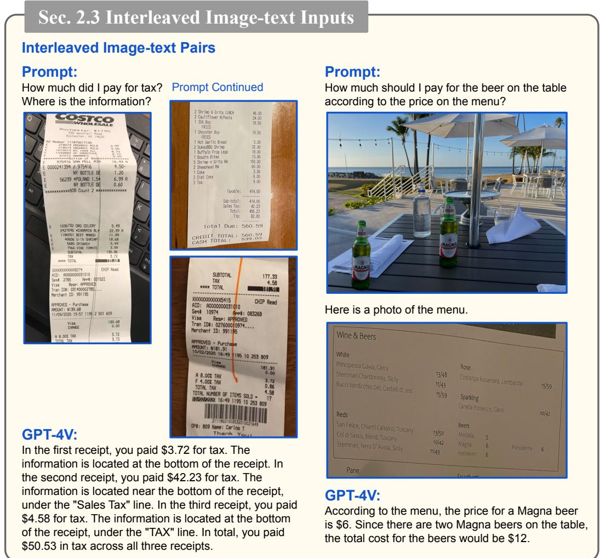

> **AI Description:**
> **Source:** `assets/_page_10_Figure_0.jpg`
> 
> **Generated:** 2026-05-16 09:54:03
> 
> ---
> 
> The image contains a combination of text and photographs. It includes receipts from Costco, a menu, and a photo of a table with a beer and a water bottle. The receipts show the tax amounts paid for each purchase, and the menu provides the price of a specific beer. The photo of the table shows the items on it, which are relevant to the prompt asking about the cost of the beer. The text provides context and answers to the prompts, while the visual elements help illustrate the scenario being described.

## 2.3 Interleaved Image-text Inputs

The generality of GPT-4V is further enhanced by its ability to handle flexibly interleaved image-text inputs. The interleaved image-text inputs can be either visually centric such as multiple images with a short question or instruction, text-centric such as a long webpage with two inserted images, or a balanced mixture of images and texts. This mode of mixed input provides flexibility for a wide array of applications. For example, it can compute the total tax paid across multiple receipt images, as shown in Figure 1. It also enables processing multiple input images and extracting queried information. GPT-4V could also effectively associate information across interleaved image-text inputs, such as finding the beer price on the menu, counting the number of beers, and returning the total cost, as shown in Figure 1. Beyond direct applications, processing interleaved image-text inputs serves as a fundamental component for in-context few-shot learning and other advanced test-time prompting techniques, thereby further boosting GPT-4V’s generality. We demonstrate these intriguing novel usages in the next section, Section 3.

## Sec. 3.1 Following Text Instructions

## Following Text Instructions

## Prompt:

Describe the image with a sentence consisting of three/six/nine words.

> **AI Description:**
> **Source:** `assets/_page_11_Figure_0.jpg`
> 
> **Generated:** 2026-05-16 09:45:56
> 
> ---
> 
> The image is a photograph of an outdoor dining area with a view of the ocean in the background. The table in the foreground has a bottle of Magna beer, a bottle of water, and folded napkins. There are white umbrellas providing shade, and the setting appears to be a restaurant or bar with additional tables and chairs in the background. The scene is bright and sunny, suggesting a pleasant day by the sea.

## GPT-4V:

Three: Seaside dining table   
Six: Dining table overlooking ocean with beer Nine: Outdoor restaurant table with ocean view and a beer

## Prompt:

Write a sentence for the image consisting only of words starting with the letter 'B'/ 'D'/ 'T'.

> **AI Description:**
> **Source:** `assets/_page_11_Figure_1.jpg`
> 
> **Generated:** 2026-05-16 09:42:37
> 
> ---
> 
> The image is a photograph of an outdoor seating area with a view of the ocean. The table is set with a white napkin, a bottle of Magna beer, and a water bottle. There are umbrellas providing shade and palm trees in the background, indicating a beachside location. The setting appears to be a relaxed and scenic environment, likely a restaurant or bar by the sea.

GPT-4V:   
'B': Beachside bar boasts beautiful blue backdrop.   
'D': Dining deck displays delightful drinks, distant docks.   
'T': Tabletop terrace teeming with tropical tranquility.

Prompt: What would the missing image look like?

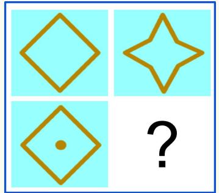

> **AI Description:**
> **Source:** `assets/_page_11_Figure_2.jpg`
> 
> **Generated:** 2026-05-16 09:49:31
> 
> ---
> 
> The image contains a 2x2 grid of shapes, each outlined in orange against a light blue background. The top left shape is a square, the top right shape is a four-pointed star, the bottom left shape is a diamond with a small dot in the center, and the bottom right shape is a question mark. The shapes appear to be part of a sequence or pattern that needs to be identified.

## GPT-4V:

The missing image would likely be a variation of the diamond or star shape, as seen in the other three images. It could be a diamond with a different pattern or color, or a star with a different number of points or color. It is difficult to say for sure without more context, but it would likely follow the same theme as the other images.

## Prompt:

Here are three sub images arranged in a 2-by-2 matrix. First, look at the two images in the first column, in the top left and bottom left. Then, find out the pattern in the first column based on the left two images. Next, use the found pattern and the image in the top right to infer the missing figure. Finally, describe what would the missing image look like?

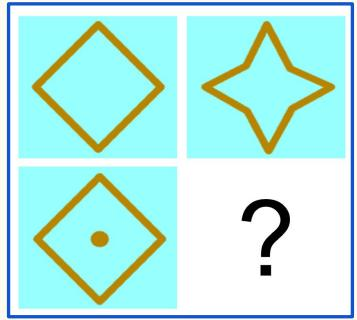

> **AI Description:**
> **Source:** `assets/_page_11_Figure_3.jpg`
> 
> **Generated:** 2026-05-16 09:52:07
> 
> ---
> 
> The image contains a grid of four shapes, each outlined in orange. The top left shape is a square, the top right is a star, the bottom left is a rhombus with a small dot in the center, and the bottom right is a question mark. The shapes are arranged in a 2x2 format within a blue-bordered square.

## GPT-4V:

The pattern in the first column is that the shape in the bottom left image has a dot in the center of the shape in the top left image. Therefore, the missing image in the bottom right would be a star with a dot in the center, similar to the image in the top right but with a dot in the center.

Figure 2: GPT-4V can understand and follow text instructions, to generate the desired text outputs or learn to perform a new task. Red highlights the less informative answer. Check Section 3.1 for detailed discussions.

Figure 3: Constrained prompting to return in JSON format. Images are example IDs for samples. Red highlights the wrong answer. Check Section 3.1 for detailed discussions.

Figure 4: Condition on good performance to improve counting. Green ( Red ) highlights the correct (wrong) answer. Blue indicates different ways to prompting in addition to the basic requirement of “Count the number of apples in the image.” Check Section 3.1 for detailed discussions.

## 3.1 Following Text Instructions

One unique strength of GPT-4V is its generality, partially achieved via its strong capability in understanding and following text instructions [102, 96, 134, 111]. Instructions provide a natural way to define and customize the desired output text for arbitrary vision-language use cases. Figure 2 shows an example of image descriptions with constraints on sentence length and the words to use. Alternatively, on the input side, GPT-4V could understand the detailed instructions to perform challenging tasks, such as enabling GPT-4V to better interpret the abstract reasoning question by providing instructions on intermediate steps. The ability to learn new tasks from instructions shows great potential in adapting to various unseen applications and tasks, as detailed in Section 9. In line with recent studies [7, 13, 48, 157, 79, 35], the instructions discussed in this subsection are mostly in the text format, providing language descriptions of the interested task. We will discuss GPT-4V’s unique capability of following multimodal example-grounded instructions later in Section 3.3.

In addition, we showcase how text instructions play an important role in shaping GPT-4V’s response with two techniques adopted from LLM literature [3, 156], (i) “constrained prompting” so that GPT-4V responds in a certain format; and (ii) “condition on good performance” that explicitly asks for good performance from GPT-4V.

Constrained prompting. In Figure 3, we prompt GPT-4V to read the text in the image and return the information in a specific JSON format. Although GPT-4V makes some mistakes in extracting the corresponding information from driver’s licenses, the responses are constrained to the JSON format specified in the text instruction. We leverage this technique for certain application scenarios in Section 9.

Condition on good performance. One observation about LLMs is that LLMs don’t want to succeed [10]. Rather, they want to imitate training sets with a spectrum of performance qualities. If the user wants to succeed in a task given to the model, the user should explicitly ask for it, which has proven useful in improving the performance of LLMs [156]. In the context of LMMs, we have similar observations. In Figure 4, we compare the model’s response to different text instructions for counting. We start with a simple and clear prompt: “Count the number of apples in the image.” However, GPT-4V incorrectly counts a total of 12 apples in the image. To improve its performance, we explore the use of zero-shot chain-of-thought from [66] for LLMs by adding the phrase “Let’s think step-by-step.” Although GPT-4V’s predicted steps are generally correct, they are not very helpful for the final count, as it still arrives at the incorrect answer of “12 apples.” Next, we modify the instruction to “Let’s count the apples row-by-row,” which is more relevant to the visual input. While GPT-4V provides the correct total count, it makes mistakes in counting the second/third row. When we further expand the instruction to “First count how many rows of apples there are, then count the apples in each row, and finally sum them up to get the total number,” the final answer deviates even more from the correct answer (15 vs. 11). Finally, imitating “Let’s work this out in a step by step way to be sure we have the right answer.” in [156] for LLMs, we design the prompt as follows: “You are an expert in counting things in the image. Let’s count the number of apples in the image below row by row to be sure we have the right answer.”. The first sentence in our prompt asks GPT-4V to assume the role of an expert in counting, and the second sentence explicitly instructs GPT-4V to succeed. With this design, GPT-4V successfully returns the correct answer for each row as well as the total count. Throughout the paper, we employ this technique in various scenarios for better performance.

## 3.2 Visual Pointing and Visual Referring Prompting

Pointing is a fundamental aspect of human-human interaction [89]. To provide a comparable channel of interaction, various forms of “pointing” are studied to refer to an arbitrary spatial region of interest. For example, as depicted in Figure 5, “pointing” can be represented as numerical spatial coordinates such as box coordinates and image crops, or visual markers overlaid on image pixels such as arrows, boxes, circles, and hand drawings. We observe that GPT-4V is particularly strong in understanding visual pointers drawn directly on images. Given the flexibility of drawing on images, this capability can be used as a natural approach for future human-computer interaction in the wild [90, 117, 157]. To this end, we explore a new prompting method named visual referring prompting, where people edit the pixel space of input images to specify the desired objective, such as drawing visual pointers or handwriting scene texts. As illustrated in Figure 6, visual referring prompting edits the image pixels, instead of the conventional text prompts, to perform the task of interest. For example, it could be a simple grounded description, which focuses on describing the pointed object while maintaining the understanding of the global image context, as shown in Figure 6 (1,2). Visual referring prompting also enables other novel use cases, such as associating the pointed object with an index written in scene text (Figure 6 (3)), or solving the question asked near the queried edge or angle (Figure 6 (4)). Section 5 will discuss visual referring prompting in more detail.

Figure 5: Different modes of “visual pointing” in multimodal interaction.
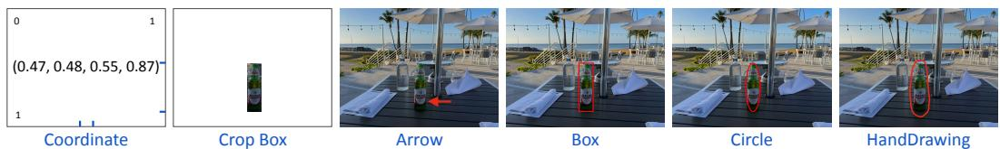

> **AI Description:**
> **Source:** `assets/_page_15_Figure_0.jpg`
> 
> **Generated:** 2026-05-16 08:23:24
> 
> ---
> 
> The image contains a series of visual elements related to object detection and annotation in computer vision. It includes a coordinate representation, a crop box, an arrow, a bounding box, a circle, and a hand-drawn annotation. These elements are overlaid on a photograph of a beachside restaurant setting, indicating the location and type of object being detected or annotated. The image demonstrates different methods for highlighting and identifying objects within an image, which is commonly used in machine learning and computer vision tasks.

## 0 1 3.3 Visual + Text Prompting

Visual referring prompting can be smoothly used together with other image-text prompts, presenting 1a nuanced interface that succinctly represents the problem of interest. Figure 7 presents two examples PointCrop Box PointCoordinate Crop Maskto showcase the flexibility of GPT-4V’s prompt, particularly its proficiency in integrating different input formats and seamlessly mixing instructions with examples in the inputs. GPT-4V’s genericity and flexibility result in a human-like comprehension of multimodal instructions and an unprecedented ability to adapt to unseen tasks.

Box Circle HandDrawingArrowIntegrated multimodal instruction inputs. Existing models usually have implicit constraints on how interleaved image-text inputs should be formatted, e.g., in-context few-shot learning requires image-text pairs to share a similar format as the query input. In contrast, GPT-4V shows the genericity in processing an arbitrary mix of images, sub-images, texts, scene texts, and visual pointers. For example, to illustrate the “adding a line” pattern in Figure 7, one could either point to the first column in the matrix image with a circle as in sub-figure (1), or incorporate the sub-images inline as in sub-figure (2). Similarly, for input query, one could either present a large figure with the question as scene texts as in sub-figure (1), or send the mix of texts and sub-images as in sub-figure (2). In contrast to GPT-4V’s flexibility, existing multimodal models are highly restricted in terms of how they can combine images and texts, and the number of images they can process, thereby imposing limitations on the model’s capability and genericity.

Multimodal example-grounded instruction. In addition to supporting more flexible input formats, GPT-4V’s genericity also opens up more effective ways of illustrating the task to perform, compared with the instruction-following mode and in-context few-shot learning. Instruction-following techniques [102, 96, 134, 111], originally proposed for NLP tasks, intuitively focus on task instructions purely in the textual format. The text instruction is loosely related to the visual query input and thus may not provide a clear task demonstration. While in-context few-shot learning [23, 125, 7] provides test-time examples that contain both images and texts, these examples must align perfectly with the format of the inference query, making them complex and lengthy to incorporate. Furthermore, in-context examples are usually used separately from instructions, requiring the model to infer the task objective and thereby compromising the demonstration’s effectiveness. In contrast, GPT-4V’s capability to comprehend multimodal instructions enables task demonstrations to be grounded onto corresponding in-context examples, therefore more effectively illustrating the task of interest. For example, in Figure 7, grounding instructions of “finding the pattern in the first column” onto the key steps in demonstration examples (i.e., the circled pattern in (1) and corresponding sub-figures in (2)) simplifies the learning process and enhances the model’s performance. This approach also mirrors the human learning process, which involves abstract instructions paired with intuitive examples.

Figure 6: GPT-4V demonstrates the unique capability of understanding visual pointing directly overlaid on images. Based on such capability, we explore visual referring prompting that edits input image pixels (e.g., drawing visual pointers and scene texts) to prompt the task of interest. Check Section 3.2 for detailed discussions.

## Sec. 3.3 Visual + Text Prompting

## Multimodal Example-grounded Instruction

(1) Prompt:

Find out the pattern in the first column, and use it to infer the missing figure in the second column.

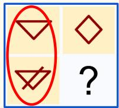

> **AI Description:**
> **Source:** `assets/_page_17_Figure_0.jpg`
> 
> **Generated:** 2026-05-16 09:54:16
> 
> ---
> 
> The image contains a visual representation of shapes within a grid. The shapes are enclosed in a red oval, indicating a selection or grouping of the shapes. The shapes include a triangle, a diamond, and a cross. The question mark suggests a missing or unknown element in the sequence or pattern.

For example, the circled region in the first left column shows the pattern of adding a line through it. Therefore, the answer is a figure of a diamond

> **AI Description:**
> **Source:** `assets/_page_17_Figure_1.jpg`
> 
> **Generated:** 2026-05-16 09:56:38
> 
> ---
> 
> The image contains a simple red diamond shape within a blue square. There are no labels, text, or additional elements present in the image. The image appears to be a basic geometric shape with no further context or information provided.

with a line through it, looking like

Answer the question in the following figure.

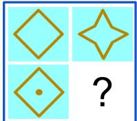

> **AI Description:**
> **Source:** `assets/_page_17_Figure_3.jpg`
> 
> **Generated:** 2026-05-16 09:59:56
> 
> ---
> 
> The image contains a grid with four shapes. The top left shape is a diamond with a light blue fill and an orange border. The top right shape is a star with an orange border. The bottom left shape is a diamond with an orange border and a small black dot in the center. The bottom right shape is empty, with a question mark indicating a missing element. The shapes appear to be part of a sequence or pattern.

Figureout uhich figureofatofthatshouldlogically replace the missing figure.

What wouldbe thenext imageto complete thematrix?

> **AI Description:**
> **Source:** `assets/_page_17_Figure_4.jpg`
> 
> **Generated:** 2026-05-16 09:52:15
> 
> ---
> 
> The image contains a series of six geometric shapes labeled a through f. Each shape is enclosed in a blue square with a yellow border. The shapes vary in design, with some having a star-like pattern, others being simple squares or diamonds, and one having a central dot. The shapes appear to be part of a sequence or a set of examples, possibly for educational or illustrative purposes.

GPT-4V:

The pattern in the first column is that a dot is added in the center of the figure. Therefore, the missing figure in the second column would be a star with a dot in the center, which is option C.

(2) Prompt:

Find out the pattern in the first column and use it to infer the missing figure in the second column.

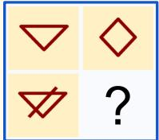

> **AI Description:**
> **Source:** `assets/_page_17_Figure_5.jpg`
> 
> **Generated:** 2026-05-16 09:47:37
> 
> ---
> 
> The image contains a grid with four cells, each containing a red geometric shape. The top left cell has a red triangle, the top right cell has a red square, the bottom left cell has a red cross, and the bottom right cell has a question mark. The shapes are simple and distinct, with no additional text or labels.

For example,

image3

addsalinethroughimage1

Therefore, adds a line to image 2

> **AI Description:**
> **Source:** `assets/_page_17_Figure_6.jpg`
> 
> **Generated:** 2026-05-16 09:41:43
> 
> ---
> 
> The image contains a simple red diamond shape within a blue square. There are no labels, text, or additional visual elements present. The image is a basic geometric shape with no further context or information provided.

will be a diamond with a line through it.

Prompt Continued

> **AI Description:**
> **Source:** `assets/_page_17_Figure_7.jpg`
> 
> **Generated:** 2026-05-16 09:46:58
> 
> ---
> 
> The image contains a simple geometric shape. It is a square with a smaller diamond shape inscribed within it, both outlined in orange. The diamond is positioned such that its corners align with the midpoints of the square's sides. There are no labels, text, or additional elements present in the image.

> **AI Description:**
> **Source:** `assets/_page_17_Figure_9.jpg`
> 
> **Generated:** 2026-05-16 08:37:01
> 
> ---
> 
> The image contains a simple diagram with a blue square outline and a smaller orange square inside it. The orange square has a dot in the center. There are no labels or text annotations present. The diagram appears to be a basic geometric representation, possibly used to illustrate a concept in geometry or a simple visual aid.

4.

Here are three sub images arranged in a 2-by-2 matrix. What is the pattern between image 3 and image 1? What would be the next image to complete the matrix?

a.

> **AI Description:**
> **Source:** `assets/_page_17_Figure_10.jpg`
> 
> **Generated:** 2026-05-16 09:42:31
> 
> ---
> 
> The image contains a simple diagram of a star-like shape with four points, each connected by a line to form a diamond-like figure. The lines are orange, and the shape is enclosed within a blue square border. There are no text labels or additional annotations present in the image.

b.

> **AI Description:**
> **Source:** `assets/_page_17_Figure_11.jpg`
> 
> **Generated:** 2026-05-16 09:46:54
> 
> ---
> 
> The image contains a simple diagram of a square with a smaller square inside it, both outlined in orange. The outer square is larger and encompasses the inner square completely. There are no labels, text, or additional elements present in the image.

> **AI Description:**
> **Source:** `assets/_page_17_Figure_12.jpg`
> 
> **Generated:** 2026-05-16 09:52:10
> 
> ---
> 
> The image contains a simple diagram of a star-like shape with a central dot and four outward-pointing lines, resembling a four-pointed star. The lines are outlined in orange, and the shape is enclosed within a blue border. There are no labels or text annotations present in the image.

d.

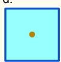

> **AI Description:**
> **Source:** `assets/_page_17_Figure_13.jpg`
> 
> **Generated:** 2026-05-16 09:49:25
> 
> ---
> 
> The image contains a simple diagram. It features a light blue square with a smaller orange circle positioned near the center. The square appears to represent a larger area or container, while the orange circle could symbolize a specific point or element within that area. There are no additional labels or text annotations present in the image.

> **AI Description:**
> **Source:** `assets/_page_17_Figure_14.jpg`
> 
> **Generated:** 2026-05-16 10:02:59
> 
> ---
> 
> The image contains a simple diagram of a square with a smaller square inside it, both outlined in orange. The smaller square is rotated 45 degrees relative to the larger square. The larger square is filled with a light blue color, while the smaller square is outlined in orange. There is a small dot in the center of the larger square.

> **AI Description:**
> **Source:** `assets/_page_17_Figure_15.jpg`
> 
> **Generated:** 2026-05-16 10:01:27
> 
> ---
> 
> The image contains a simple diagram of a star-like shape with a blue border and a yellow star in the center. The star has five points and is evenly spaced around the border. There are no labels or text annotations present in the image.

GPT-4V:

The pattern between image 3 and image 1 is that image 3 has a dot in the center, while image 1 does not. The next image to complete the matrix would be option c, a star with a dot in the center. This is because the pattern seems to be that every other image has a dot in the center, and the previous image (image 3) had a dot in the center. Additionally, the images alternate between a diamond and a star shape, so the next image should be a star.

Figure 7: GPT-4V is strong in interpreting an arbitrary mix of images, sub-images, texts, scene texts, and visual pointer inputs. These elements could serve as instructions, examples, or input queries, helping GPT-4V to effectively perform novel tasks. Check Section 3.3 for detailed discussions.

## 3.4 In-context Few-shot Learning

In-context few-shot learning is another intriguing emergent ability observed in LLMs [23, 39, 135, 34]. That is, LLMs can generate desired outputs without parameter updates by prepending a few in-context examples at inference time. The examples share the same format as the input query, and serve as demonstrations to illustrate the desired outputs. Similar abilities were recently observed in multimodal models [125, 7, 55, 42, 151], where query inputs are formatted image-text pairs. Complementary to instruction tuning, in-context learning “teaches” model to perform new tasks by providing in-context examples with the same format during test time. We demonstrate the in-context few-shot learning capacity of GPT-4V through a few compelling examples. We emphasize that in certain scenarios, in-context few-shot learning with a sufficient number of examples becomes essential, particularly when zero-shot or one-shot instruction approaches fall short. Figures 8-10 explore a challenging scenario involving the reading of a speed meter. In Figure 8, the zero-shot performance of GPT-4V on a screenshot of a speed meter image from a video is depicted. Despite numerous attempts to prompt GPT-4V in a zero-shot manner, it struggles to accurately read the current speed displayed in the image. The predictions it generates (22/30/40 mph) deviate significantly from the actual human reading of “approximately 9 mph.” Even when employing a 1-shot in-context example, as shown in Figure 9, using either a dissimilar example (Figure 9a) or a similar example (Figure 9b), GPT-4V still fails to accurately locate the two numbers on the left and right sides of the yellow pointer. In contrast, Figure 10 demonstrates that when provided with 2 in-context examples, one similar to the query image and the other dissimilar, GPT-4V successfully predicts the speed reading as “around 9 mph” by recognizing that the pointer is close to 10 mph but not quite there yet.

The comparison between zero-shot, 1-shot, and 2-shot performance for reasoning over a complex line plot is illustrated in Figures 11-13. The example we explore here presents a great difficulty level as it involves multi-hop reasoning. To answer the question “In the graph, which year has the highest average gas price for the month of June,” one needs to go through at least four steps: (i) locating the month of June on the x-axis, (ii) comparing data points for each line in June, (iii) identifying the color of the line with the highest value, and (iv) matching the color to the corresponding year in the legend at the top. Failure in any of these steps would lead to an incorrect prediction. As depicted in Figure 11, even when prompted with “text instruction, think step-by-step” in a zero-shot manner, GPT-4V fails to correctly associate the colors with the years from the legend. Furthermore, it gets distracted by the highlighted gas price of \$3.32 in the graph. Similarly, in Figure 12, although GPT-4V shows some improvement in reading the legend (correcting the corresponding colors for 2021 and 2022 compared to zero-shot), it still insists on answering with 2023 as the year with the highest average gas price for the month of June, despite the fact that the chart only includes data points until 01/17/2023. However, as we introduce another in-context example in Figure 13, GPT-4V finally arrives at the correct answer (2022) and provides intermediate steps that explain its reasoning process, similar to the demonstration shown in the in-context examples.

These proof-of-concept examples vividly demonstrate the rising significance of in-context few-shot learning for achieving improved performance with LMMs. This approach serves as a viable alternative to finetuning, analogous to the observations made in the context of LLMs [23, 39, 135, 34]. Despite the great importance of in-context few-shot learning in achieving better performance with LMMs, we limit its use in this report to prevent the potential information leakage or undesired hints from in-context examples. We also leave the quantitative evaluation of few-shot learning’s gain to future studies.

Figure 8: Zero-shot performance under the challenging scenario of reading a speed meter. GPT-4V fails to read the speed meter accurately even with different ways of ZS prompting. Red highlights the wrong answer. Check Section 3.4 for detailed discussions.
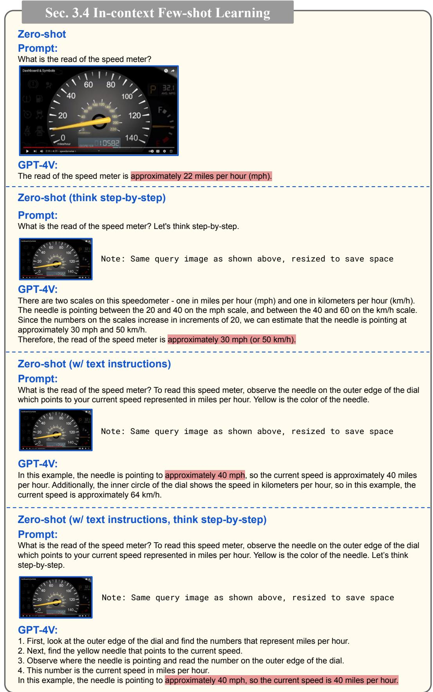

> **AI Description:**
> **Source:** `assets/_page_19_Figure_0.jpg`
> 
> **Generated:** 2026-05-16 08:56:45
> 
> ---
> 
> The image contains a series of text-based prompts and responses related to reading a speedometer. The visual content includes a photograph of a speedometer with a yellow needle pointing to a specific reading. The text provides step-by-step instructions and explanations for determining the speedometer reading in both miles per hour (mph) and kilometers per hour (km/h). The image also includes notes about the scale and the color of the needle, which is yellow. The responses from GPT-4V are highlighted in red text, indicating the model's output.

(b)
Figure 9: One-shot (or prompting with multimodal example instruction) performance under the challenging scenario of reading a speed meter. GPT-4V still fails with (a) dissimilar or (b) similar 1-shot in-context example. Red highlights the wrong answer. Check Section 3.4 for detailed discussions.

Figure 10: Two-shot performance under the challenging scenario of reading a speed meter. GPT-4V now can read the speed accurately. Green highlights the correct answer. Check Section 3.4 for detailed discussions.
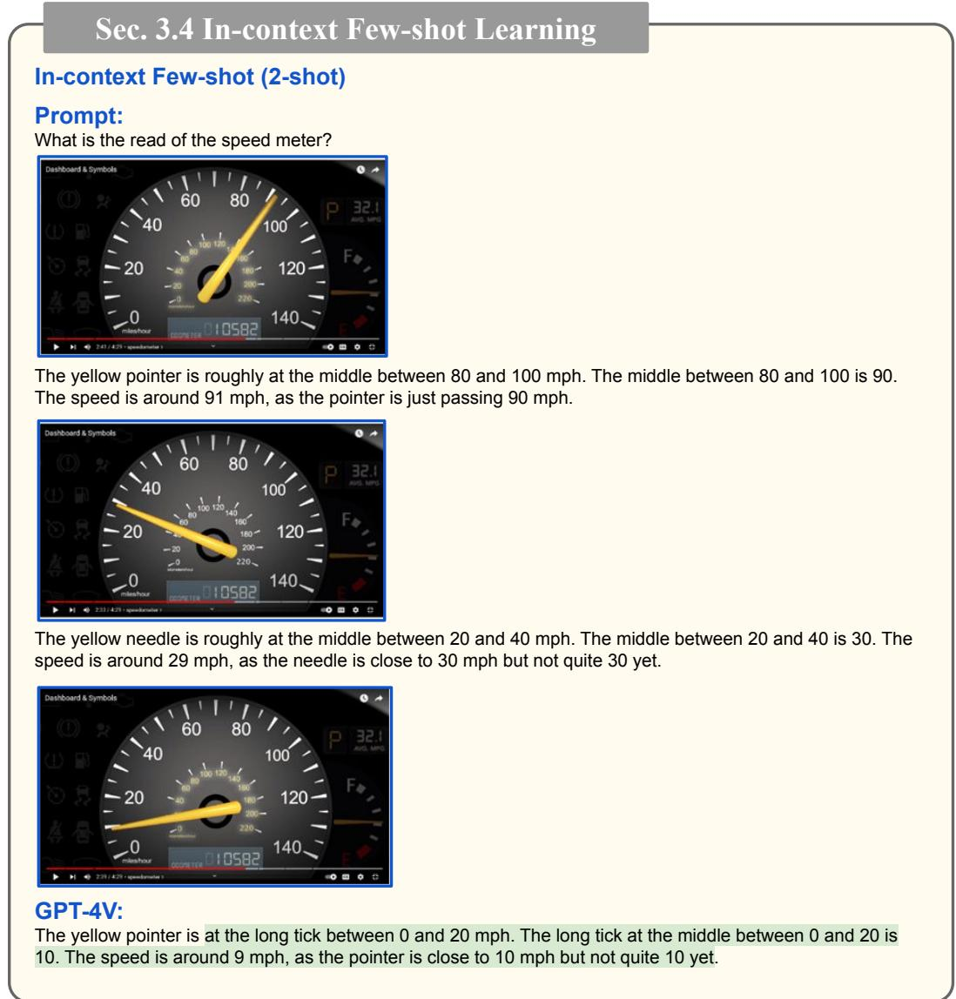

> **AI Description:**
> **Source:** `assets/_page_21_Figure_0.jpg`
> 
> **Generated:** 2026-05-16 10:02:14
> 
> ---
> 
> The image contains a series of three photographs of a speedometer from a vehicle. The speedometers are shown at different angles and positions, with the yellow needle indicating the current speed. The text accompanying each image provides a detailed description of the speedometer readings, estimating the speed based on the position of the needle relative to the speed markings. The text also includes a comparison with GPT-4V's interpretation of the speedometer readings.

Figure 11: Zero-shot performance under the challenging scenario of reading a line plot. GPT-4V fails to answer the question even with different ways of ZS prompting. Red highlights the wrong answer. Check Section 3.4 for detailed discussions. 23 23
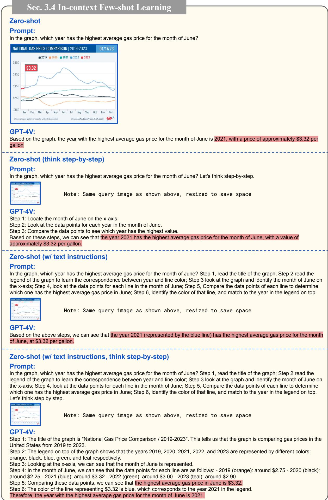

> **AI Description:**
> **Source:** `assets/_page_22_Figure_0.jpg`
> 
> **Generated:** 2026-05-16 08:44:22
> 
> ---
> 
> The image contains a line graph titled "National Gas Price Comparison 2019-2023." The graph displays the average gas prices per gallon for each year from 2019 to 2023, with data points for each month. The x-axis represents the months of the year, and the y-axis represents the gas prices in dollars per gallon. The graph uses different colors to represent each year: orange for 2019, black for 2020, blue for 2021, green for 2022, and teal for 2023. The graph highlights the highest average gas price for the month of June, which is approximately $3.32 per gallon, occurring in the year 2021.

Figure 12: One-shot (or prompting with multimodal example instruction) performance under the challenging scenario of reading a line plot. GPT-4V still fails with 1-shot in-context example. Red highlights the wrong answer. Check Section 3.4 for detailed discussions.
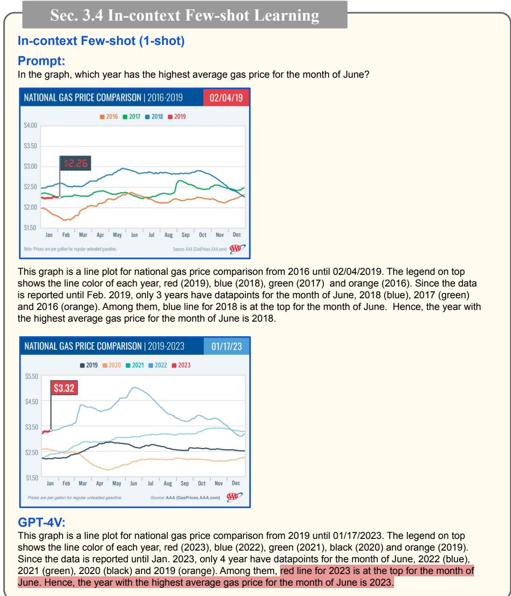

> **AI Description:**
> **Source:** `assets/_page_23_Figure_0.jpg`
> 
> **Generated:** 2026-05-16 08:35:47
> 
> ---
> 
> The image contains two line plots for national gas price comparison. The first plot covers the years 2016 to 2019, with data points for the month of June. The second plot covers the years 2019 to 2023, with data points for the month of June. Both plots use different colors to represent the years, with the legend at the top indicating the color for each year. The plots show the average gas prices per gallon for each year, with the highest price for June in the first plot being $2.26 in 2018, and in the second plot being $3.32 in 2023.

### Full Page Description (Page 24)

**Source:** `assets/_page_24_Asset_2.jpg`

**Generated:** 2026-05-16 09:00:37

---

The image is a line graph titled "National Gas Price Comparison | 2019-2023." It shows the price per gallon of regular unleaded gasoline for the years 2019 through 2023. The graph includes data points for each month from January to December for each year. The data is color-coded by year: 2019 is black, 2020 is orange, 2021 is light blue, 2022 is dark blue, and 2023 is red. The graph indicates a peak in gas prices around June for each year, with the highest price being $3.32 in 2023. The source of the data is AAA (GasPrices.AAA.com).

### Full Page Description (Page 24)

**Source:** `assets/_page_24_Asset_0.jpg`

**Generated:** 2026-05-16 09:13:17

---

The image contains a line graph titled "National Gas Price Comparison 2016-2019." The graph shows the price of regular unleaded gasoline per gallon for the years 2016, 2017, 2018, and 2019, with data points plotted monthly from January to December. The graph includes a red arrow pointing to February 2019 with a price of $2.26 per gallon. The source of the data is AAA (GasPrices.AAA.com). The graph illustrates fluctuations in gas prices over the four-year period, with notable increases and decreases in certain months.

### Full Page Description (Page 24)

**Source:** `assets/_page_24_Asset_1.jpg`

**Generated:** 2026-05-16 09:10:19

---

The image contains a line graph titled "National Gas Price Comparison 2015-2018". The graph displays the price of regular unleaded gasoline per gallon for the years 2015, 2016, 2017, and 2018, with data points for each month from January to December. The graph shows fluctuations in gas prices across the years, with the prices generally increasing from January to May and then decreasing towards the end of the year. The highest price is marked as $2.42 in December 2018. The graph includes a note indicating that prices are per gallon for regular unleaded gasoline and cites AAA (GasPrices.AAA.com) as the source.

Figure 13: Two-shot performance under the challenging scenario of reading a line plot. GPT-4V now can answer the question of “which year has the highest average gas price for the month of June?” correctly. Check Section 3.4 for detailed discussions. Green highlights the correct answer.

## 4 Vision-Language Capability

Understanding and describing visual information plays a crucial role in human cognition. In this section, we will investigate how GPT-4V can be utilized to comprehend and interpret the visual world. We will start by examining the model’s ability to generate open-ended descriptions for generic visual captioning.

Moving forward, in Section 4.2, we will explore the application of GPT-4V in more advanced tasks, such as spatial relationship analysis, object localization, object counting, and dense captioning. In Section 4.3, we will delve into the model’s capacity for multimodal knowledge and commonsense reasoning, and study whether the model can understand the context and relationships between different types of information.

Additionally, in Section 4.4, we will assess the model’s capability to extract and analyze information from various sources, including scene text, tables, charts, and documents. In Section 4.5, we will explore GPT-4V’s ability in comprehending and generating descriptions in multilingual scenarios. Lastly, in Section 4.6, we will investigate the model’s coding proficiency with visual information, exploring its ability to perform tasks with selected examples.

## 4.1 Image Description on Diverse Domains

We access the model’s capability and generalizability by providing a single image-text pair as input. We prompt GPT-4V to generate natural language descriptions covering a variety of topics listed below.

Celebrity recognition. Recognizing human appearance [49, 80] presents a significant challenge due to its inherent variability. To assess GPT-4V’s capabilities to recognize and describe the celebrities, we conduct an experiment by providing a text prompt, “Describe the image,” along with an input celebrity image. In the top row of Figure 14, we observe that GPT-4V accurately identifies the eight celebrities, despite their diverse backgrounds and fields. Furthermore, when we present a more specific query, “Who is the person in the image and what is the person doing?,” as shown in the bottom row of Figure 14, GPT-4V comprehends that the current President of the United States is delivering a speech at the 2023 G7 Summit. This illustrates the model’s ability to generalize and handle novel scenarios, such as the 2023 G7 Summit, which was not part of its training data.

Landmark recognition. Landmarks exhibit considerable variations in appearance due to factors such as viewpoint changes, lighting conditions, occlusions, and seasonal changes. Recognizing landmarks under these variations requires models to generalize well and handle the vast range of visual appearances [152, 5]. In the experiments, we employ a straightforward text prompt, “Describe the landmark in the image,” to test the model’s capability. As shown in Figures 15-16, GPT-4V generates accurate and open-ended descriptions for each test image. For example, it accurately recognizes Space Needle located in Seattle, Washington, understanding that the tower was built for the 1962 World’s Fair and has since become a symbol of the city. We have similar observations for other tested photos as well. The generated descriptions go beyond simple labels or generic phrases, providing vivid and detailed narratives that capture the essence of the landmark.

Food recognition. Recognizing food or dishes is a fascinating task [20, 95], but it can be challenging to tackle due to the wide range of appearances and potential occlusions caused by other objects or overlapping ingredients. In our experiments, we employ a straightforward text prompt, asking the system to “Describe the name of the dish,” for testing purpose. Figure 17 demonstrates the accurate recognition of various dishes by GPT-4V. Additionally, GPT-4V effectively captures intricate details within the images, enabling it to identify specific ingredients, garnishes, or cooking techniques present in a dish.

Medical image understanding. Medical images, such as X-rays and CT scans, can have large variability due to patient populations and imaging equipment. Additionally, interpreting the visual content of these images requires expert knowledge. In Figure 18, we access GPT-4V’s performance by providing the prompt, “Describe the image.” The results show that GPT-4V recognizes both the teeth and jaw bones in the given X-ray. Furthermore, when we prompt with “Are there wisdom teeth that needs to be removed in this x-ray image?” GPT-4V performs reasoning with the visual context, and explains that the wisdom teeth on the bottom left and right sides of the jaw are not fully emerged from the gum line, and this could be a reason for removal. We also conduct testing with other medical images, as shown in Figure 19. For these experiments, we use prompts such as “What’s wrong?” or “Look at the CT scan, tell me what’s wrong.” The observations reveal that GPT-4V can identify common conditions such as a Jones fracture. It could also point out potential concerns based on the CT scan of the lung. The experiments demonstrate GPT-4V’s basic understanding of medical images. We discuss the application of GPT-4V to the medical domain in Section 9.3.

Logo recognition. We examine GPT-4V’s ability in logo recognition. In Figure 20, we initiate the experiments by providing the text prompt, “Describe the image.” GPT-4V accurately identifies the three logos depicted in the image. We then proceed to ask a more specific question, “Describe the logos in details,” GPT-4V provides elaborate descriptions, including the design, style, and representation for each logo, respectively. Expanding the evaluation to a more challenging in-the-wild scenario, as shown in Figure 21, we experiment with logos that may be partially occluded, distorted, or situated in cluttered backgrounds. We employ the text prompt “Describe both the image and logo in details” for the in-the-wild experiment. As shown in Figure 21, GPT-4V demonstrates strong capability in understanding logos in difficult scenarios. Notably, GPT-4V can also provide descriptions for novel or emerging logos and icons, such as the recently released Microsoft 365 Copilot.

Scene understanding. Scene understanding [76, 32, 154] is an important task in computer vision. We examine the model’s capability by providing a simple query “Describe the image.” In Figure 22, GPT-4V is able to describe the road and the location and color of the vehicles. It can also read the sign and notice the speed limit for this road.

Counterfactual examples. We conduct experiments by randomly selecting counterfactual examples from [78]. In Figure 23, we observe that GPT-4V correctly describes the image contents when faced with misleading questions or instructions.

> **AI Description:**
> **Source:** `assets/_page_27_Figure_0.jpg`
> 
> **Generated:** 2026-05-16 09:47:33
> 
> ---
> 
> The image contains a collage of photographs featuring various individuals. The photographs include celebrities and public figures, such as athletes and entertainers. The individuals are dressed in a variety of outfits, ranging from casual to formal attire, and are captured in different settings, including on the red carpet and in sports uniforms. The image does not contain any charts, graphs, or data visualizations, and the focus is on the visual representation of these individuals.

## GPT-4V:

The image shows a collage of 8 prominent personalities from different fields. On the top row, from left to right, there is singer Justin Bieber, footballer Lionel Messi, footballer Cristiano Ronaldo, and entrepreneur Elon Musk. On the bottom row, from left to right, there is model and reality TV star Kylie Jenner, singer Taylor Swift, actor Robert Downey Jr., and actor Scarlett Johansson. All individuals are shown in different poses and outfits, with various backgrounds.

Prompt:   
Who is the person in the image and what is the   
person doing?

Prompt: Who is the person in the image and what is the person doing?

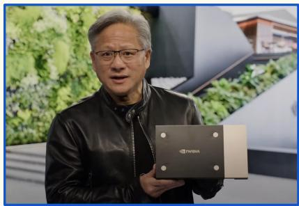

> **AI Description:**
> **Source:** `assets/_page_27_Figure_2.jpg`
> 
> **Generated:** 2026-05-16 09:47:04
> 
> ---
> 
> The image is a photograph of a person holding a rectangular object with the NVIDIA logo on it. The person is wearing a black leather jacket and is standing in front of a green, leafy background with a modern building structure visible in the distance. The object appears to be a product, possibly a piece of hardware or a box, related to NVIDIA. The image does not contain any charts, graphs, or other visual elements beyond the photograph itself.

The person in the image is the current President of the United States, Joe Biden. He is standing at a podium, likely delivering a speech, at the G7 Summit in Hiroshima, Japan in 2023.

## GPT-4V:

The person in the image is Jensen Huang, the CEO and co-founder of NVIDIA. He is holding and presenting a product from NVIDIA, likely a graphics processing unit (GPU).

Figure 14: Results on celebrity recognition and description. GPT-4V can recognize a variety of celebrities and describe the visual information (including their profession, action, background, and the event) in details. Check Section 4.1 for detailed discussions.

# Sec. 4.1 Image Description on Diverse Domains

## Landmark Recognition and Description

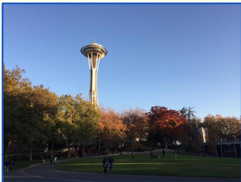

> **AI Description:**
> **Source:** `assets/_page_28_Figure_0.jpg`
> 
> **Generated:** 2026-05-16 08:54:43
> 
> ---
> 
> The image is a photograph of the Space Needle, a famous landmark in Seattle, Washington. The tower is prominently featured against a clear blue sky, with trees in the foreground displaying autumn foliage in shades of green, orange, and red. The scene appears to be taken during the daytime, and there are a few people visible on the grassy area in the foreground. The image captures the iconic structure and its surroundings, showcasing the beauty of the season and the landmark itself.

## GPT-4V:

The landmark in the image is the Space Needle, an observation tower located in Seattle, Washington. It stands 605 feet tall and offers panoramic views of the city and surrounding areas. The tower was built for the 1962 World’s Fair and has since become a symbol of Seattle and a popular tourist attraction. The tower has a futuristic design with a large circular observation deck at the top and a restaurant that rotates 360 degrees. The base of the tower is surrounded by a park with trees and green spaces.

Describe the landmark in the image.

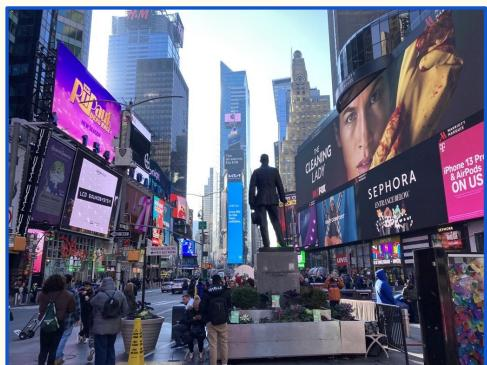

> **AI Description:**
> **Source:** `assets/_page_28_Figure_1.jpg`
> 
> **Generated:** 2026-05-16 08:48:17
> 
> ---
> 
> The image is a photograph of Times Square in New York City. It features a statue of a man standing on a pedestal, surrounded by bustling pedestrians and vibrant advertisements on large digital billboards. The billboards display various advertisements, including one for "The Cleaning Lady" and another for Sephora. The scene is lively, with people walking and interacting in the foreground, while the background showcases tall buildings and more advertisements. The overall atmosphere is energetic and typical of a busy urban area.

## GPT-4V:

The landmark in the image is the statue of George M. Cohan in Times Square, New York City. It is a bronze statue that stands on a granite pedestal in Duffy Square, which is the northern part of Times Square. The statue is a tribute to George M. Cohan, an American entertainer, playwright, composer, and producer, who is considered the father of American musical comedy. The statue was unveiled in 1959 and has since become a popular tourist attraction in Times Square.

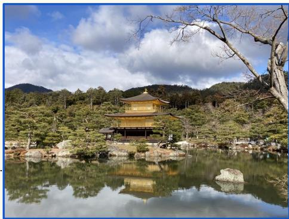

> **AI Description:**
> **Source:** `assets/_page_28_Figure_2.jpg`
> 
> **Generated:** 2026-05-16 08:54:57
> 
> ---
> 
> The image is a photograph of a serene landscape featuring a traditional Japanese structure, likely a temple, with a golden roof, situated on the edge of a calm body of water. The temple is surrounded by a meticulously maintained garden with neatly trimmed trees and shrubs. The reflection of the temple and the surrounding greenery is visible in the water, creating a symmetrical and tranquil scene. The sky above is partly cloudy, with patches of blue visible, adding to the peaceful ambiance of the setting.

## GPT-4V:

This image shows the Kinkaku-ji Temple, also known as the Golden Pavilion, located in Kyoto, Japan. The temple is a three-story Buddhist temple that is covered in gold leaf and sits on a pond, creating a stunning reflection on the water. The surrounding landscape is filled with trees and rocks, creating a peaceful and serene atmosphere. It is a popular tourist attraction and a designated National Special Historic Site.

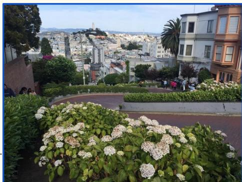

> **AI Description:**
> **Source:** `assets/_page_28_Figure_3.jpg`
> 
> **Generated:** 2026-05-16 08:59:14
> 
> ---
> 
> The image is a photograph of a scenic view, likely taken from a hillside overlooking a cityscape. In the foreground, there are lush green bushes with white flowers, adding a natural element to the scene. The middle ground features a paved road with a few people walking, bordered by more greenery and bushes. In the background, there are buildings of various sizes and colors, with a prominent red building on the right side. The city extends into the distance, with more buildings and greenery visible. The sky is clear and blue, indicating a sunny day. The overall scene suggests a pleasant, urban environment with a mix of natural and built elements.

## GPT-4V:

The landmark in the image is the famous Lombard Street in San Francisco, California, known for its steep hairpin turns. The street is lined with colorful flowers and shrubbery, and there are houses and buildings on both sides. In the background, you can see the city skyline and the Coit Tower on Telegraph Hill. This street is a popular tourist attraction, and it is often considered one of the most crooked streets in the world.

Figure 15: Results on landmark recognition and description. GPT-4V accurately recognizes the landmarks in the test images. It also generates vivid and detailed narratives that capture the essence of the landmarks. Check Section 4.1 for detailed discussions.

# Sec. 4.1 Image Description on Diverse Domains

## Landmark Recognition and Description

Prompt: Describe the landmark in the image.

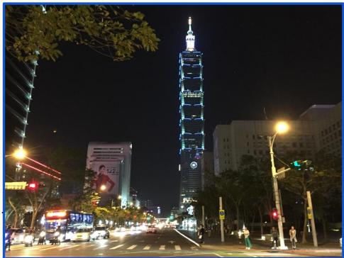

> **AI Description:**
> **Source:** `assets/_page_29_Figure_0.jpg`
> 
> **Generated:** 2026-05-16 09:01:47
> 
> ---
> 
> The image is a photograph of a nighttime cityscape featuring the Taipei 101 building, a prominent skyscraper in Taipei, Taiwan. The image captures the building illuminated against the dark sky, with surrounding urban infrastructure, including streetlights, traffic signals, and other buildings. The scene includes a busy street with vehicles in motion, indicating the bustling nature of the city. The image provides a clear view of the Taipei 101's distinctive architecture and its role as a landmark in the city.

## GPT-4V:

The landmark in the image is the Taipei 101 building, located in Taipei, Taiwan. This building, with a height of 508 meters (1,667 feet), was the tallest building in the world from 2004 to 2010. It has 101 floors above ground and 5 floors below ground, and is a popular tourist attraction in Taipei. The design of the building resembles a bamboo plant, symbolizing strength and resilience.

## Prompt:

Describe the landmark in the image.

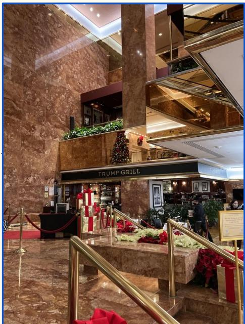

> **AI Description:**
> **Source:** `assets/_page_29_Figure_1.jpg`
> 
> **Generated:** 2026-05-16 09:05:08
> 
> ---
> 
> The image shows the interior of a grand, luxurious building with marble walls and a high ceiling. Prominently featured is a restaurant named "Trump Grill," which is decorated with festive Christmas elements such as a small Christmas tree, red and white ribbons, and floral arrangements. The area is well-lit, with a mix of natural and artificial lighting. The image captures a spacious and elegant environment, likely a hotel or upscale establishment.

## GPT-4V:

The landmark in the image is the interior of the Trump Tower in New York City. The focal point is the Trump Grill, which is a restaurant located on the lower level of the tower. The interior is decorated with red and gold accents, marble walls and columns, and a festive holiday display with a Christmas tree and poinsettias. The space is opulent and luxurious, typical of the Trump brand.

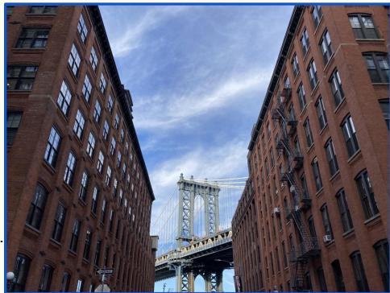

> **AI Description:**
> **Source:** `assets/_page_29_Figure_2.jpg`
> 
> **Generated:** 2026-05-16 09:13:08
> 
> ---
> 
> The image is a photograph of a cityscape. It features two tall brick buildings on either side of the frame, with the Manhattan Bridge visible in the background. The sky is partly cloudy, and the bridge spans across the image, connecting two parts of the city. The buildings have multiple windows and appear to be residential or commercial structures. The bridge's architectural details, such as its suspension cables and towers, are clearly visible.

## GPT-4V:

The landmark in the image is the Manhattan Bridge, as seen from the DUMBO neighborhood in Brooklyn, New York. The bridge, which spans the East River, connects lower Manhattan with Brooklyn. It is a suspension bridge with two large towers and was completed in 1909. In the image, the bridge is framed by two brick buildings, creating a unique view of the landmark.

## Prompt:

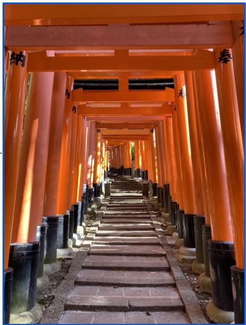

> **AI Description:**
> **Source:** `assets/_page_29_Figure_3.jpg`
> 
> **Generated:** 2026-05-16 09:11:36
> 
> ---
> 
> The image is a photograph of a traditional Japanese torii gate pathway, leading upwards. The pathway is lined with numerous bright orange torii gates, creating a tunnel-like effect. The gates are evenly spaced and appear to be made of wood. The pathway itself is paved with stone steps that ascend into the distance. The lighting suggests it is daytime, with sunlight casting shadows and highlighting the vibrant color of the torii gates.

## GPT-4V:

The landmark in the image is the Fushimi Inari Taisha Shrine in Kyoto, Japan. It is famous for its thousands of vermilion torii gates that line the paths leading up to the shrine. The gates represent the boundary between the secular world and the sacred world, and are donated by individuals and businesses to show their devotion to the deity Inari. The image shows a pathway lined with these gates leading up towards the shrine, with stone steps in the center.

Figure 16: Results on landmark recognition and description. GPT-4V accurately recognizes the landmarks in the test images. It also generates vivid and detailed narratives that capture the essence of the landmarks. Check Section 4.1 for detailed discussions.

# Sec. 4.1 Image Description on Diverse Domains

## Food Recognition and Description

Prompt: Describe the name of the dish.

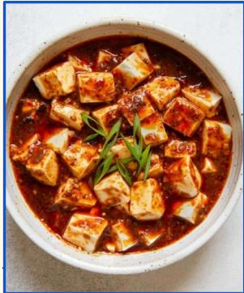

> **AI Description:**
> **Source:** `assets/_page_30_Figure_0.jpg`
> 
> **Generated:** 2026-05-16 08:46:24
> 
> ---
> 
> The image contains a photograph of a bowl of food. The dish appears to be a type of stir-fried tofu, garnished with a sprig of green herbs. The tofu is coated in a rich, red sauce, suggesting it may be a spicy or savory dish. The bowl is white with a dark rim, and the background is a neutral, light color, which helps to highlight the vibrant colors of the food.

## GPT-4V:

The dish in the image is a bowl of Mapo Tofu, a popular Chinese dish from the Sichuan province. It consists of soft tofu cubes in a rich and spicy sauce made from chili peppers, fermented bean paste, and Sichuan peppercorns. The dish is garnished with thin slices of green onions.

## Prompt:

Describe the name of the dish.

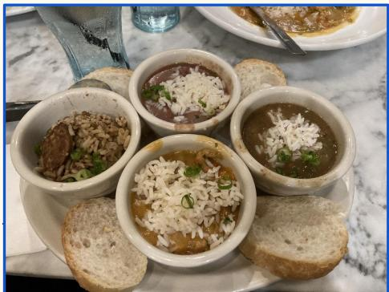

> **AI Description:**
> **Source:** `assets/_page_30_Figure_1.jpg`
> 
> **Generated:** 2026-05-16 08:42:20
> 
> ---
> 
> The image contains a photograph of a meal. It features four small bowls of what appears to be gumbo, garnished with white rice and green onions, accompanied by slices of bread. The bowls are arranged on a white plate, and there is another plate of food in the background, partially visible. The setting appears to be a dining table with a marble-like surface.

## GPT-4V:

This dish is called a Cajun Sampler. It is a sampler platter that consists of four small bowls of traditional Cajun dishes - gumbo, jambalaya, red beans and rice, and crawfish étouffée. The bowls are served with a side of sliced bread for dipping. Each bowl is filled with white rice and topped with green onions. It is a popular dish in Louisiana and a great way to try a variety of Cajun flavors.

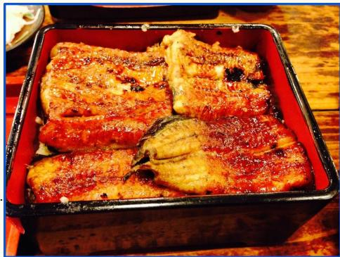

> **AI Description:**
> **Source:** `assets/_page_30_Figure_2.jpg`
> 
> **Generated:** 2026-05-16 08:36:57
> 
> ---
> 
> The image contains a photograph of a dish, specifically what appears to be grilled or roasted fish, possibly eel, served in a rectangular metal tray. The fish is coated with a glossy, reddish-brown sauce, likely a soy-based glaze, which gives it a shiny appearance. The dish is placed on a wooden table, and the focus is on the food, with no additional text or labels visible in the image.

## GPT-4V:

Unagi Donburi is the name of the dish that is originated from Japan. In Japanese cuisine, it is a type of rice bowl dish typically served in a deep bowl. The word “Unagi” means freshwater eel in Japanese and “donburi” refers to a large bowl served with rice and other toppings. Unagi Donburi is a dish made with grilled eel and a type of sweet and savory sauce called “unagi sauce” over white rice. It is often served with pickled vegetables, sesame seeds, green onions, and seaweed.

## Prompt:

Describe the name of the dish..

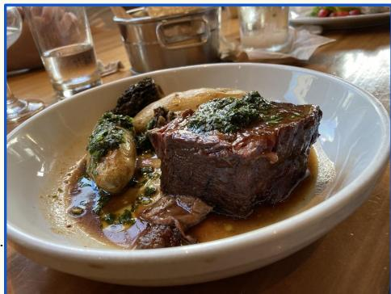

> **AI Description:**
> **Source:** `assets/_page_30_Figure_3.jpg`
> 
> **Generated:** 2026-05-16 08:42:07
> 
> ---
> 
> The image is a photograph of a plated dish. The dish appears to be a piece of meat, possibly beef, served with a sauce and garnished with herbs. The meat is accompanied by what looks like roasted potatoes or a similar side dish. The presentation is on a white plate, and the setting suggests a restaurant environment with glasses and other tableware visible in the background. The focus is on the plated food, with no text or additional graphics present.

## GPT-4V:

This dish is called Braised Short Rib with Chimichurri. It features a succulent short rib that has been slow cooked until tender and topped with a flavorful chimichurri sauce. It is served alongside roasted vegetables for a complete meal.

Figure 17: Results on food recognition and description. GPT-4V recognizes various dishes. It also identifies specific ingredients, garnishes, or cooking techniques present in a dish image. Check Section 4.1 for detailed discussions.

Figure 18: Results on medical image understanding. GPT-4V recognizes both the teeth and jaw bones in the given X-ray, and explains that the partially emerged wisdom teeth on the bottom left and right sides of the jaw may necessitate removal. Check Section 4.1 for detailed discussions. The medical images are collected from the Internet.
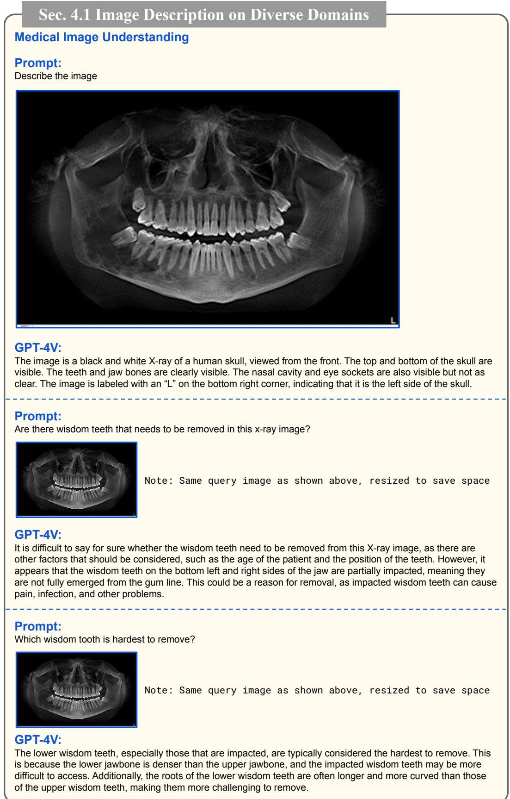

> **AI Description:**
> **Source:** `assets/_page_31_Figure_0.jpg`
> 
> **Generated:** 2026-05-16 08:33:44
> 
> ---
> 
> The image is a black and white X-ray of a human skull, viewed from the front. The top and bottom of the skull are visible, with the teeth and jaw bones clearly shown. The nasal cavity and eye sockets are also visible but not as clearly as the teeth and jaw bones. The image is labeled with an "L" on the bottom right corner, indicating that it is the left side of the skull.

Figure 19: Results on medical image understanding. GPT-4V can identify common conditions like a Jones fracture. It could also point out potential concerns based on the CT scan of the lung. Check Section 4.1 for detailed discussions. The medical images are from the internet.
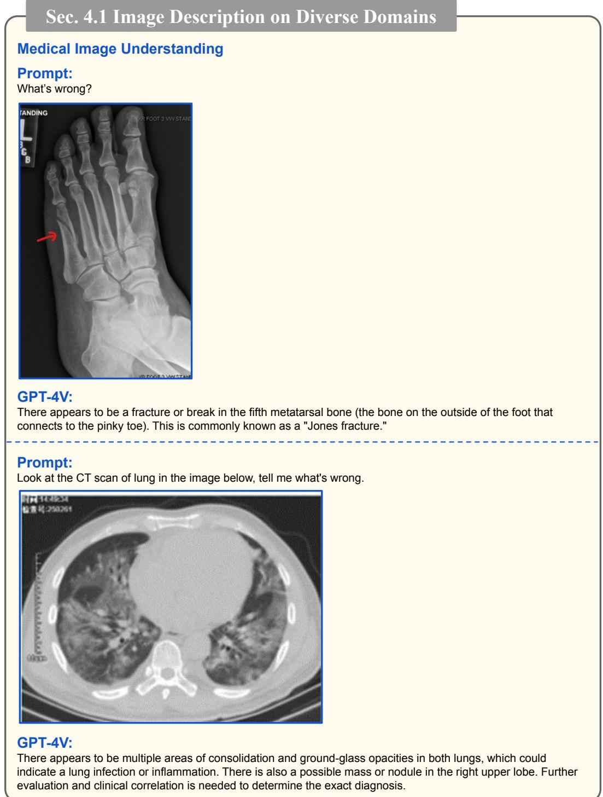

> **AI Description:**
> **Source:** `assets/_page_32_Figure_0.jpg`
> 
> **Generated:** 2026-05-16 09:51:54
> 
> ---
> 
> The image contains an X-ray of a foot with a red arrow pointing to the fifth metatarsal bone, indicating a potential fracture or break. Below the X-ray, there is a CT scan of the lungs with visible consolidation and ground-glass opacities in both lungs, suggesting possible lung infection or inflammation. There is also a possible mass or nodule in the right upper lobe.

Figure 20: Results on logo recognition. GPT-4V correctly recognizes the logos and provides detailed descriptions, including its design, color, shape, and symbol. Check Section 4.1 for detailed discussions.

Figure 21: Results on in-the-wild logo recognition and description. GPT-4V demonstrates strong capability in understanding logos in many scenarios, including occlusions, lighting conditions, and orientations. GPT-4V can also describe novel icons, such as the recently released Microsoft 365 Copilot. Check Section 4.1 for detailed discussions.

Sec. 4.1 Image Description on Diverse Domains

Prompt: Describe the image

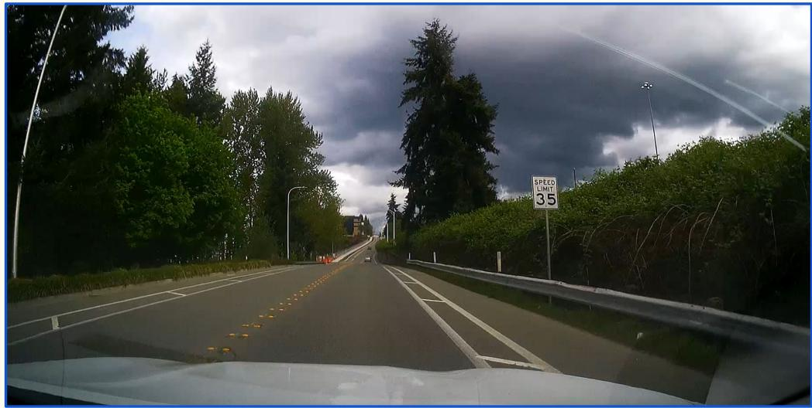

> **AI Description:**
> **Source:** `assets/_page_35_Figure_0.jpg`
> 
> **Generated:** 2026-05-16 09:50:05
> 
> ---
> 
> The image is a photograph taken from inside a vehicle, showing a road with a speed limit sign indicating "Speed Limit 35". The road is surrounded by trees and bushes, and the sky is overcast with dark clouds. The road appears to be in a rural or suburban area, with no other vehicles in the immediate vicinity. The photograph captures the view from the driver's perspective, suggesting the image is from a dashboard camera.

The image is a screenshot from a dashcam, taken from the inside of a car, showing the view of the road ahead. The car is driving on a two-lane road, with a speed limit sign of 35 mph visible on the right side of the road. There are trees on both sides of the road, and the sky is filled with dark clouds, suggesting that it might rain soon. Orange cones are visible on the left side of the road, indicating a construction zone. In the distance, there is a bridge overpass.

Prompt: Describe the image

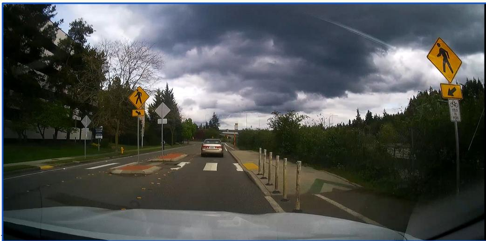

> **AI Description:**
> **Source:** `assets/_page_35_Figure_1.jpg`
> 
> **Generated:** 2026-05-16 09:49:51
> 
> ---
> 
> The image is a photograph taken from inside a vehicle, showing a road intersection. The sky is overcast with dark clouds, suggesting potential rain. On the left side of the road, there are pedestrian and bicycle crossing signs. The road appears to be in a suburban or urban area, with trees and greenery on both sides. A car is visible in the distance on the left side of the road, and the road surface is marked with white lines and a crosswalk. The overall scene suggests a quiet, possibly rainy day in a residential or commercial area.

The image is a view of a road from the perspective of a car dashboard camera. The road has two lanes, and the car is in the right lane behind a silver vehicle. There are two yellow signs on the side of the road warning drivers of an upcoming pedestrian crossing and a curve to the left. The sky is cloudy and gray, and trees and bushes line the sides of the road.

Figure 22: Results on scene understanding. GPT-4V is able to provide a detailed description regarding the scenes and objects. Check Section 4.1 for detailed discussions.

## Sec. 4.1 Image Description on Diverse Domains

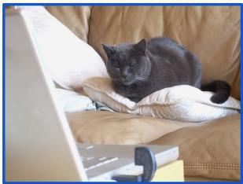

> **AI Description:**
> **Source:** `assets/_page_36_Figure_0.jpg`
> 
> **Generated:** 2026-05-16 08:29:55
> 
> ---
> 
> The image contains a photograph of a gray cat lying on a beige couch. The cat is resting on a white cushion, and part of a laptop is visible in the foreground on the left side of the image. The cat appears relaxed and is the main subject of the photo.

GPT-4V: Sorry, I cannot answer this question as there is no red ball visible in the image.

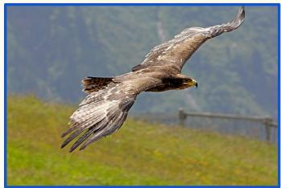

> **AI Description:**
> **Source:** `assets/_page_36_Figure_1.jpg`
> 
> **Generated:** 2026-05-16 08:34:05
> 
> ---
> 
> The image is a photograph of a bird of prey, likely a hawk, in flight. The bird is captured mid-flight with its wings fully extended, showcasing its powerful build and sharp talons. The background features a natural landscape with greenery and a wooden fence, suggesting a rural or open field setting. The image provides a clear view of the bird's wingspan and the texture of its feathers, which are detailed and well-defined.

GPT-4V: No, I cannot see bright blue feathers on the bird's wing. It appears to have brown and white feathers.
Prompt: Can you spot the pink elephant playing in the corner?

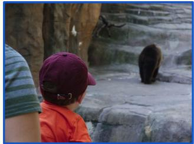

> **AI Description:**
> **Source:** `assets/_page_36_Figure_2.jpg`
> 
> **Generated:** 2026-05-16 08:26:20
> 
> ---
> 
> The image is a photograph showing a child wearing a maroon cap and an orange shirt, standing in front of a glass barrier at what appears to be a zoo or wildlife exhibit. The child is looking at a bear, which is on a rocky platform. The bear is facing away from the camera, and the background includes a naturalistic setting with rocks and a tree trunk. The image captures a moment of observation and interaction between the child and the bear in a controlled environment.

Prompt: Can you find the baseball player wearing a blue shirt?

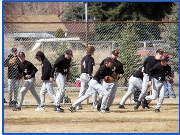

> **AI Description:**
> **Source:** `assets/_page_36_Figure_3.jpg`
> 
> **Generated:** 2026-05-16 08:23:16
> 
> ---
> 
> The image is a photograph of a baseball team. The players are wearing black and gray uniforms and are gathered on a baseball field. Some players are wearing baseball caps, and others are not. The field is surrounded by a chain-link fence, and there are trees and a building in the background. The players appear to be in a huddle or preparing for a game.

Sorry, I cannot because there is no pink elephant playing in the corner of this image. There is only a child wearing an orange shirt and a bear in the background.
No, I cannot find a baseball player wearing a blue shirt in this image. All the players appear to be wearing black shirts.
Prompt: Try to locate a large waterfall behind the trees.

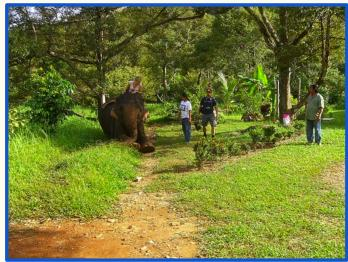

> **AI Description:**
> **Source:** `assets/_page_36_Figure_4.jpg`
> 
> **Generated:** 2026-05-16 08:40:08
> 
> ---
> 
> The image is a photograph showing a group of people interacting with an elephant in a natural, outdoor setting. The elephant is lying down on a grassy area, and the people appear to be either observing or assisting the elephant. The background includes trees and vegetation, suggesting a forested or jungle environment. The people are dressed casually, and there are some plants and trees around the elephant. The overall scene conveys a sense of wildlife interaction or conservation effort.

Sorry, I am not able to complete this task as there is no waterfall present in the given image.
Prompt: Can you find the blue lighting fixture mounted to the ceiling?

> **AI Description:**
> **Source:** `assets/_page_36_Figure_5.jpg`
> 
> **Generated:** 2026-05-16 08:37:12
> 
> ---
> 
> The image is a photograph of a kitchen interior. It features a dark countertop with a bowl of fruit and a plate of watermelon slices. The kitchen has wooden cabinets, a stainless steel refrigerator, and a double sink with a modern faucet. Above the sink, there is a decorative chandelier with three lights. Large windows allow natural light to enter, and there is a visible outdoor area with plants and a table. The overall color scheme includes warm tones like yellow and brown.

Sorry, I cannot find a blue lighting fixture mounted to the ceiling in this image. All I see is a black wrought iron chandelier with white glass shades.

Figure 23: Results on counterfactual examples. GPT-4V is able to provide factual descriptions regarding the scenes and objects in the images. Example images are from [78]. Check Section 4.1 for detailed discussions.

## 4.2 Object Localization, Counting, and Dense Captioning

Spatial relationship understanding. Understanding the spatial relationship between humans and objects in the image is a vital aspect of visual intelligence [61, 14]. In Figure 24, GPT-4V showcases promising capabilities in this regard. It can identify the spatial relationship between the frisbee and the man in the image. It can also recognize the spatial relationship between the man and the car in the image, and point out that the camera perspective may affect their perceived size.

Object counting. Figure 25 highlights our exploration of GPT-4V’s capability in object counting. In our experiments, we employ the text prompt “Count the number of X in the image” to evaluate its performance. The results indicate that GPT-4V can successfully count the number of objects, such as apples, oranges, and people, present in the image. However, challenges arise when objects are occluded, or the scene is cluttered, which can result in errors in the counting process. In the bottom left of Figure 25, GPT-4V identifies 12 people, but the correct answer should be 11. This may be due to our limited text prompt used in this experiment, and further investigation in prompting techniques is needed.

Object localization. Object localization [153, 76, 51] is a fundamental challenge in the field of computer vision. In our preliminary experiments, we address this task by utilizing a simple text prompt, “Localize each person in the image using a bounding box.” The initial results of our object localization experiments are depicted in Figure 26. The findings suggest that GPT-4V demonstrates the capability to generate bounding box coordinates in textual format, without separate textualized box tokens [25, 140, 129, 26, 82, 105]. However, it is important to note that the generated bounding box coordinates are not accurate. We rescaled the predicted bounding box coordinates during visualization. Promising localization results are observed when the scene or background is relatively simpler and less cluttered. Further prompting techniques are required to enhance object localization performance in more complex and crowded environments.

Dense captioning. Dense captioning [62, 84] involves generating detailed description for each region of interest in the given image. This advanced task in vision-language field typically requires a complex system that integrates multiple experts, such as object detector, celebrity recognition model, and image captioning model. In order to explore GPT-4V’s capabilities in dense captioning, we use an instructional prompt, as shown in Figure 27. The results are highly encouraging, as GPT-4V successfully localizes and recognizes the individuals within the image, and then provides concise descriptions for each scientist.

Figure 24: Results on spatial relationship understanding. GPT-4V recognizes the spatial relationship between the objects in the images. Example images are from [67, 14]. Check Section 4.2 for detailed discussions.
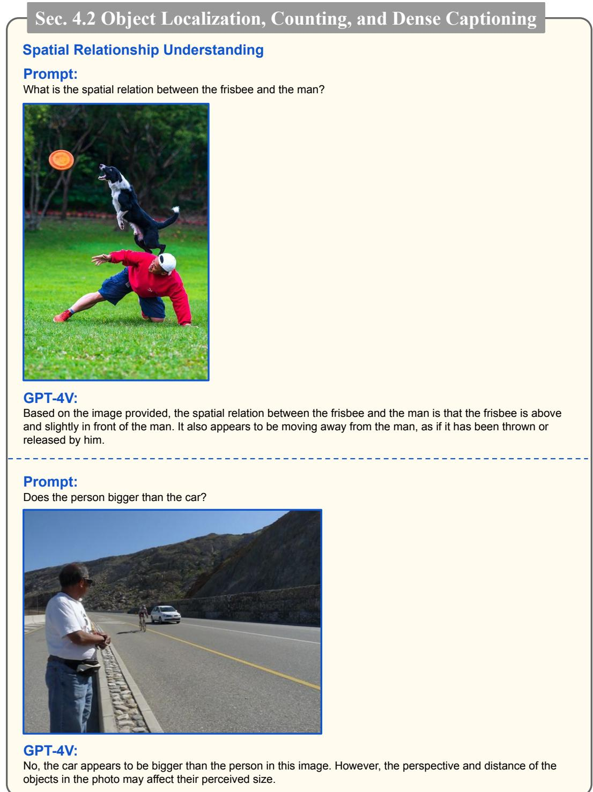

> **AI Description:**
> **Source:** `assets/_page_38_Figure_0.jpg`
> 
> **Generated:** 2026-05-16 09:27:27
> 
> ---
> 
> The image contains two photographs. The first photograph shows a man in a red shirt and blue shorts playing with a black and white dog. The man is on the ground, and the dog is in the air, jumping to catch a yellow frisbee. The second photograph shows a person standing on the side of a road, with a car and a cyclist in the background. The road is surrounded by a rocky embankment and a mountainous landscape. The text provides prompts and responses from GPT-4V about the spatial relationships between objects in the images.

# Sec. 4.2 Object Localization, Counting, and Dense Captioning

Prompt: Count the number of apples in the image.

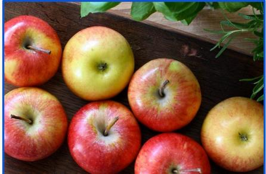

> **AI Description:**
> **Source:** `assets/_page_39_Figure_0.jpg`
> 
> **Generated:** 2026-05-16 09:20:40
> 
> ---
> 
> The image contains a photograph of several red and yellow apples arranged on a wooden surface. The apples are fresh and appear to be ripe, with some showing a mix of red and yellow skin. The background includes some green foliage, which adds a natural and fresh aesthetic to the image. The apples are the main focus of the image, and their arrangement suggests they might be prepared for display or sale.

GPT-4V: There are 7 apples in the image.
Prompt: Count the number of apples in the image.

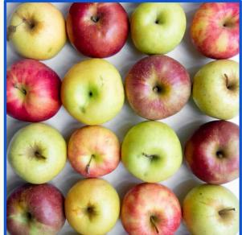

> **AI Description:**
> **Source:** `assets/_page_39_Figure_1.jpg`
> 
> **Generated:** 2026-05-16 09:18:10
> 
> ---
> 
> The image contains a collection of apples arranged in a grid pattern. The apples vary in color, with some being predominantly red and others predominantly green, with some showing a mix of both colors. The apples are of similar size and appear to be of the same variety. There are no labels or text annotations present in the image.

GPT-4V: There are 16 apples in the image.

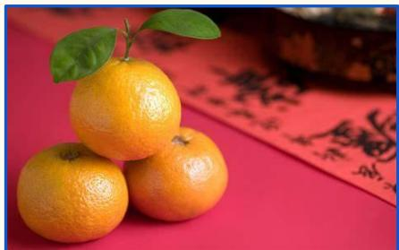

> **AI Description:**
> **Source:** `assets/_page_39_Figure_2.jpg`
> 
> **Generated:** 2026-05-16 09:23:40
> 
> ---
> 
> The image contains a photograph of three oranges with leaves on a red surface. The background includes a red cloth with some black text, which appears to be Chinese characters. The oranges are bright and fresh, with a glossy appearance. The image is likely intended to convey a sense of freshness or abundance, possibly related to a cultural or celebratory context.

GPT-4V: There are 3 oranges in the image.
Prompt: Count the number of people in the image.

> **AI Description:**
> **Source:** `assets/_page_39_Figure_3.jpg`
> 
> **Generated:** 2026-05-16 09:25:55
> 
> ---
> 
> The image contains a photograph of three individuals standing side by side against a plain white background. The individuals are dressed casually, with two men wearing plaid shirts and one woman wearing a light blue shirt. They are all smiling and appear to be posing for the photo. The image does not contain any charts, graphs, or text annotations.

GPT-4V: There are 3 people in the image.

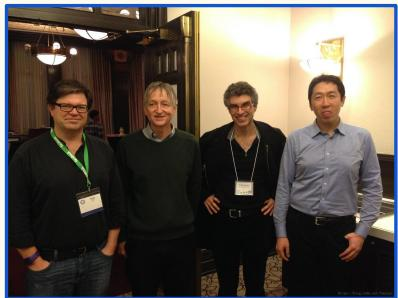

> **AI Description:**
> **Source:** `assets/_page_39_Figure_4.jpg`
> 
> **Generated:** 2026-05-16 09:37:03
> 
> ---
> 
> The image contains a photograph of four individuals standing indoors, likely at a professional or academic event. They are dressed in business casual attire, with lanyards around their necks, suggesting they may be attending a conference or seminar. The background includes a wall with a light fixture and what appears to be a door or window frame. The individuals are smiling and appear to be posing for the photo.

GPT-4V: There are 4 people in the image.

Prompt: Count the number of people in the image.
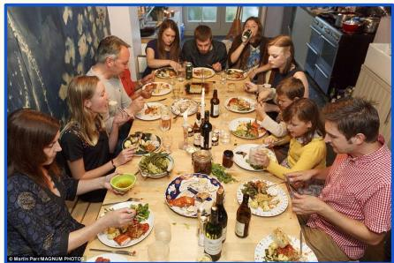

> **AI Description:**
> **Source:** `assets/_page_39_Figure_5.jpg`
> 
> **Generated:** 2026-05-16 09:39:08
> 
> ---
> 
> The image is a photograph of a group of people gathered around a dining table, enjoying a meal together. The table is set with various dishes, plates, and bottles of wine, indicating a social or family gathering. The individuals are engaged in conversation and eating, creating a warm and convivial atmosphere. The setting appears to be a home, with kitchen appliances visible in the background. The overall mood of the image is one of togetherness and enjoyment.

GPT-4V: There are 12 people in the image.

Figure 25: Results on object counting. GPT-4V is able to determine the quantity of the specified objects the image. Red highlights the wrong answer. Check Section 4.2 for detailed discussions.

## Object Localization

## Prompt:

Localize each person in the image using bounding box. The image size is (width, height) = (998,786)

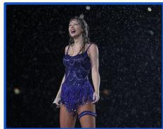

> **AI Description:**
> **Source:** `assets/_page_40_Figure_0.jpg`
> 
> **Generated:** 2026-05-16 08:23:28
> 
> ---
> 
> The image is a photograph of a person wearing a blue, fringed outfit, standing outdoors in what appears to be a snowy environment. The individual is holding a white object, possibly a piece of paper or a small bag, and is looking upwards with a slight smile. The background is filled with falling snowflakes, indicating a cold, wintry setting.

## GPT-4V:

There is only one person in the image, so the bounding box for this person would be:

\- Top left: (254, 118)

\- Bottom right: (731, 693)

Explanation: The top left point of the bounding box is at (x, y) = (254, 118), which is the top left corner of the person in the image. The bottom right point of the bounding box is at (x, y) = (731, 693), which is the bottom right corner of the person in the image. This bounding box encompasses the entire person in the image.

## Prompt:

Localize each car in the image using bounding box. What is the image size of the input image?

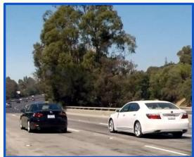

> **AI Description:**
> **Source:** `assets/_page_40_Figure_1.jpg`
> 
> **Generated:** 2026-05-16 08:26:09
> 
> ---
> 
> The image is a photograph of a highway scene. It shows two cars, one black and one white, driving on a multi-lane road. The road is bordered by a guardrail on the left and a tree line on the right. The sky is clear and blue, indicating a sunny day. The image captures a typical highway setting with vehicles in motion.

## GPT-4V:

The image size of the input image is 500 x 281 pixels.

Bounding box for the black car:

\- Top left corner: (63, 114)

\- Bottom right corner: (196, 220)

Bounding box for the white car:

\- Top left corner: (287, 96)

\- Bottom right corner: (474, 220)

## Visualization of Detected Bbox:

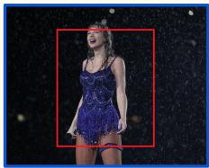

> **AI Description:**
> **Source:** `assets/_page_40_Figure_2.jpg`
> 
> **Generated:** 2026-05-16 08:34:00
> 
> ---
> 
> The image contains a photograph of a person wearing a blue dress with a red bounding box drawn around them. The background appears to be a snowy or icy environment, suggesting the person might be performing or posing in a cold-weather setting. The image does not contain any text or additional visual elements beyond the person and the red bounding box.

## Visualization of Detected Bbox:

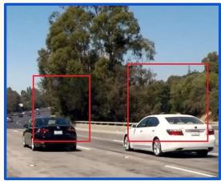

> **AI Description:**
> **Source:** `assets/_page_40_Figure_3.jpg`
> 
> **Generated:** 2026-05-16 08:32:29
> 
> ---
> 
> The image contains a photograph of a road scene. Two cars are visible, one black and one white, both in motion on a highway. The black car is on the left side of the road, and the white car is on the right. The road is bordered by trees and appears to be in a suburban or urban area. The image is framed with a blue border.

## Prompt:

Localize each person in the image using bounding box. What is the image size of the input image?

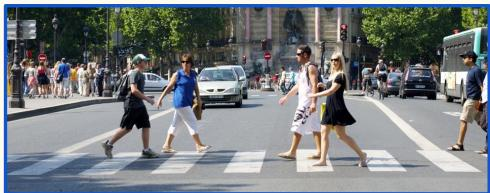

> **AI Description:**
> **Source:** `assets/_page_40_Figure_4.jpg`
> 
> **Generated:** 2026-05-16 08:46:12
> 
> ---
> 
> The image is a photograph of a busy urban street scene. It shows pedestrians crossing a crosswalk, with cars and buses in the background. The street is lined with trees, and there are traffic lights and other urban infrastructure visible. The scene captures a typical day in a bustling city environment.

## GPT-4V:

The image size of the input image is 1000 x 333 pixels.

Bounding boxes for each person:

\- Person 1 (leftmost): (x1, y1) = (22, 108), (x2, y2) = (170, 300)

\- Person 2: (x1, y1) = (200, 80), (x2, y2) = (290, 270)

\- Person 3: (x1, y1) = (350, 70), (x2, y2) = (460, 280)

\- Person 4: (x1, y1) = (540, 80), (x2, y2) = (640, 270)

\- Person 5 (rightmost): (x1, y1) = (760, 100), (x2, y2) = (920, 290)

Note: These bounding box coordinates are approximate and may not be exact.

## Visualization of Detected Bbox:

Figure 26: Results on object localization. GPT-4V is able to generate and approximate the bounding box coordinates for the specified objects in the image. When providing a simple text prompt only, the model may encounter challenges when dealing with more complex scenarios like object occlusions and cluttered scenes. Red highlights the wrong answer. We rescaled the predictions when visualizing the bounding boxes. Check Section 4.2 for detailed discussions.
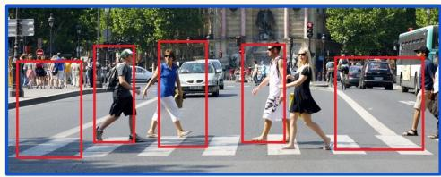

> **AI Description:**
> **Source:** `assets/_page_40_Figure_5.jpg`
> 
> **Generated:** 2026-05-16 08:44:28
> 
> ---
> 
> The image is a photograph of a street scene with several pedestrians crossing a crosswalk. Red bounding boxes highlight the individuals crossing the street, indicating a focus on human detection or tracking in the image. The background shows a busy urban environment with cars, traffic lights, and buildings, suggesting a city setting. The image appears to be used for demonstrating object detection or pedestrian tracking in computer vision applications.

## Sec. 4.2 Object Localization, Counting, and Dense Captioning

## Dense Captioning

## Prompt:

Please follow the instructions

1. Tell me the size of the input image;

2. Localize each person in the image using bounding box;

3. Recognize each person;

4. Generate detailed caption for each bounding box.

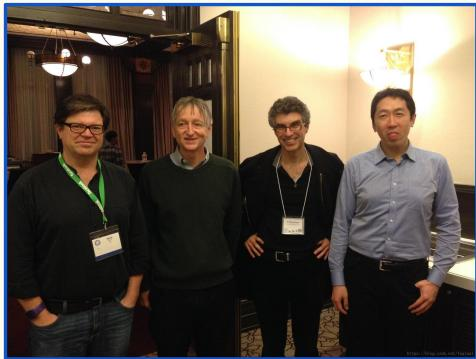

> **AI Description:**
> **Source:** `assets/_page_41_Figure_0.jpg`
> 
> **Generated:** 2026-05-16 08:42:14
> 
> ---
> 
> The image is a photograph of four individuals standing together indoors, likely at a professional or academic event, given the lanyards they are wearing. The individuals are dressed in semi-formal attire, with two wearing sweaters and two in button-down shirts. The background shows a room with a chandelier, a door, and some wall decorations. There are no charts, graphs, or other visual elements present in the image.

## GPT-4V:

1. The size of the input image is 1600 x 1067 pixels.

2. Bounding box 1: (x1, y1) = (120, 250), (x2, y2) = (420, 950) - Person 1   
Bounding box 2: (x1, y1) = (500, 240), (x2, y2) = (800, 940) - Person 2   
Bounding box 3: (x1, y1) = (880, 230), (x2, y2) = (1180, 930) - Person 3   
Bounding box 4: (x1, y1) = (1260, 220), (x2, y2) = (1560, 920) - Person 4

3. Person 1: Yann LeCun Person 2: Geoffrey Hinton Person 3: Yoshua Bengio Person 4: Andrew Ng

4. Caption for bounding box 1: Yann LeCun, computer scientist and one of the founding fathers of artificial intelligence.

Caption for bounding box 2: Geoffrey Hinton, computer scientist and cognitive psychologist, known for his work on artificial neural networks.

Caption for bounding box 3: Yoshua Bengio, computer scientist and co-founder of the Montreal Institute for Learning Algorithms.

Caption for bounding box 4: Andrew Ng, computer scientist and entrepreneur, known for his work on deep learning and artificial intelligence.

## Visualization of Dense Captioning:

Figure 27: Results on dense captioning. GPT-4V follows the text prompt and successfully generates dense captions for the input image. Red highlights the wrong answer. We rescaled the predictions when visualizing the bounding boxes. Check Section 4.2 for detailed discussions.
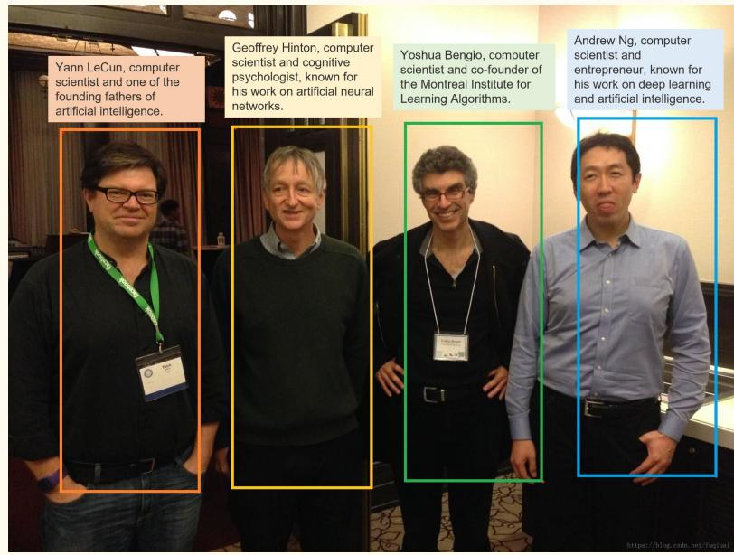

> **AI Description:**
> **Source:** `assets/_page_41_Figure_1.jpg`
> 
> **Generated:** 2026-05-16 08:36:47
> 
> ---
> 
> The image contains a photograph of four individuals, each with a name and brief description overlaid. The individuals are labeled as follows: Yann LeCun, Geoffrey Hinton, Yoshua Bengio, and Andrew Ng. Each person is framed with a colored box, and their names and titles are provided in text boxes above or next to them. The image appears to be a snapshot of a group photo, likely taken at a conference or event related to artificial intelligence and computer science. The individuals are dressed in semi-formal attire, and the setting suggests an indoor environment, possibly a hotel or conference center.

## 4.3 Multimodal Knowledge and Commonsense

Joke and meme. Jokes and memes often reference specific events, pop culture, or Internet trends. Understanding these references requires being familiar with the relevant context and cultural knowledge. Grasping the visual elements, their relationship to the text, and the intended humorous effect can be a complex task [99]. Moreover, memes are often user-generated, making them highly diverse and ever-expanding. To evaluate GPT-4V’s ability in this domain, we input a pair of meme and text prompt to GPT-4V. The example text prompts include “Can you explain the meme?” and “What is funny about the image?” Figure 28 shows the example results. We observe that GPT-4V has remarkable ability to gather information from both visual and textual modalities, and then comprehend the humor embedded within memes.

Science and knowledge. We further investigate GPT-4V’s capability in tasks that requires reasoning with scientific knowledge [85]. We conduct experiments by providing a text prompt question and a corresponding image. The questions cover a wide range of topics, including geography, physics, biology, and earth science. In Figures 29-31, we observe that GPT-4V is able to correctly answer the science questions based on the visual context. For instance, in the bottom row of Figure 29, GPT-4V recognizes the average particle speed for both sample A and sample B. By considering the relationship among particle speed, kinetic energy, and temperature, GPT-4V answers the question correctly. For another instance, as shown in the bottom row of Figure 30, GPT-4V takes into account the visual arrows presented in the figure to identify the producer in the specific food web. Moreover, as shown in Figure 31, when we provide a more specific prompt, such as “Suppose you are a teacher, please use the figure to explain X,” we observe the generated answer adopts a tutorial format and explains the subject step by step.

Multimodal commonsense. In Figure 32, we access the ability of GPT-4V in multimodal commonsense reasoning [148, 52]. In our experiments, we observed that GPT-4V effectively utilizes the bounding boxes presented in the image as visual prompts (e.g., [person1] and [person2]) to recognize the actions performed by the individuals. As shown in the second example in Figure 32, based on the formal dress worn by [person1] and [person2] and the floral decorations present in the scene, it can be inferred that they are attending a wedding ceremony. Moreover, when we provide a more specific input prompt, such as "Suppose you are a detective, what can you infer from the visual clues?", GPT-4V demonstrates the ability to discern numerous nuanced visual cues within the image and offers a list of plausible hypotheses.

Figure 28: Results on joke and meme understanding. GPT-4V demonstrates the impressive capability to comprehend the humor embedded within memes. Check Section 4.3 for detailed discussions.

Figure 29: Results on answering science questions. GPT-4V can understand the question textually and visually, and gather necessary information to answer the question. Example images are from [85]. Check Section 4.3 for detailed discussions.
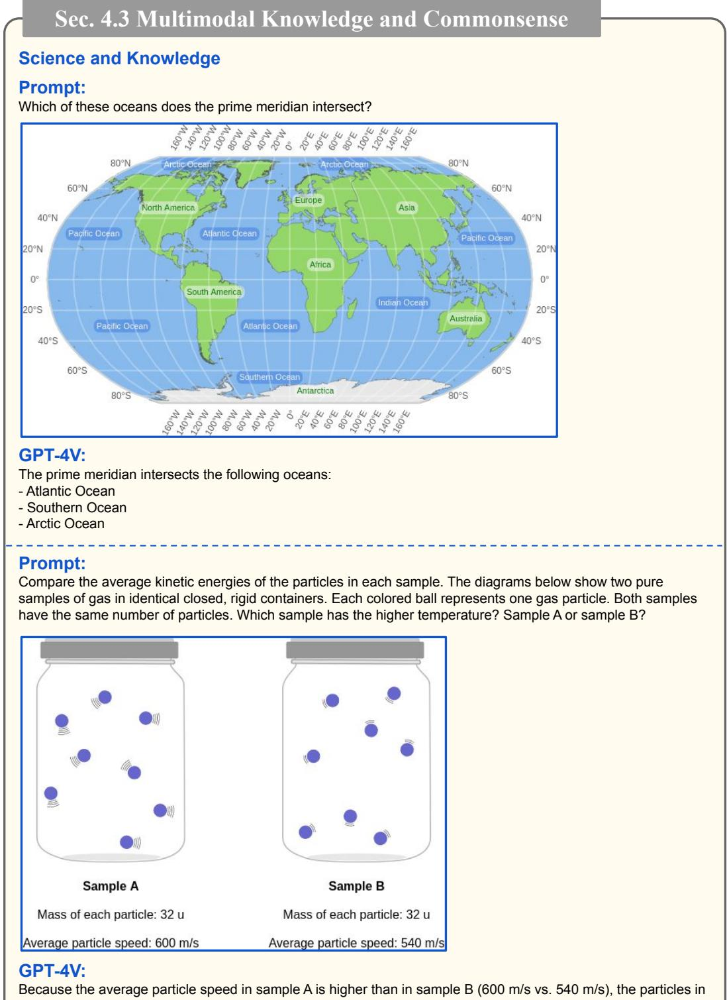

> **AI Description:**
> **Source:** `assets/_page_44_Figure_0.jpg`
> 
> **Generated:** 2026-05-16 09:46:51
> 
> ---
> 
> The image contains a world map with labeled oceans and continents, along with two diagrams of gas particles in containers. The world map highlights the prime meridian and the oceans it intersects. The diagrams show two samples of gas particles in identical containers, with information about the mass and average particle speed of the particles in each sample. The text provides a prompt to compare the average kinetic energies and determine which sample has a higher temperature.

The producers in this food web are the berries and flowers, grasses, and seeds. These are the organisms that use energy from the sun to produce their own food through photosynthesis.
Figure 30: Results on answering science questions. GPT-4V can understand the question textually and visually, and gather necessary information to answer the question. Example images are from [85]. Check Section 4.3 for detailed discussions.
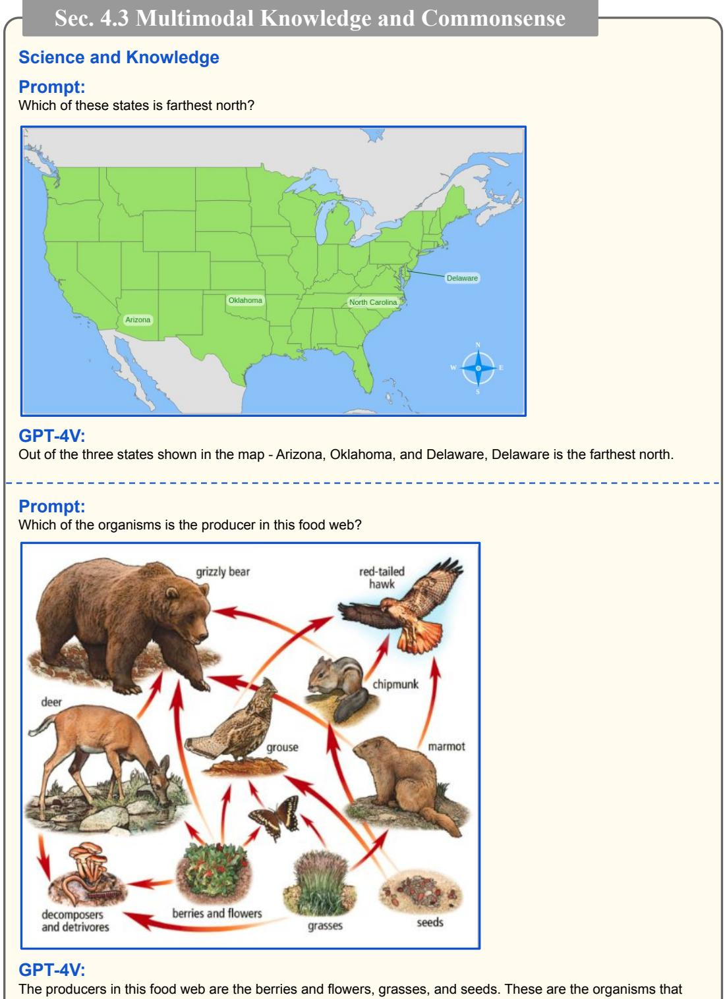

> **AI Description:**
> **Source:** `assets/_page_45_Figure_0.jpg`
> 
> **Generated:** 2026-05-16 09:53:32
> 
> ---
> 
> The image contains two main sections. The first section is a map of the United States highlighting three states: Arizona, Oklahoma, and Delaware. The second section is a food web diagram illustrating the relationships between various organisms and their food sources. The map provides geographical context, while the food web diagram shows the trophic levels and interactions within an ecosystem. The food web includes producers (berries and flowers, grasses, and seeds) and consumers (deer, chipmunk, marmot, etc.), with arrows indicating the direction of energy flow.

Figure 31: Results on answering science questions. When we use a more specific text prompt like “Suppose you are a teacher, please use the figure to explain X,” we observe that GPT-4V can generate a short tutorial for explaining the subject. Check Section 4.3 for detailed discussions.
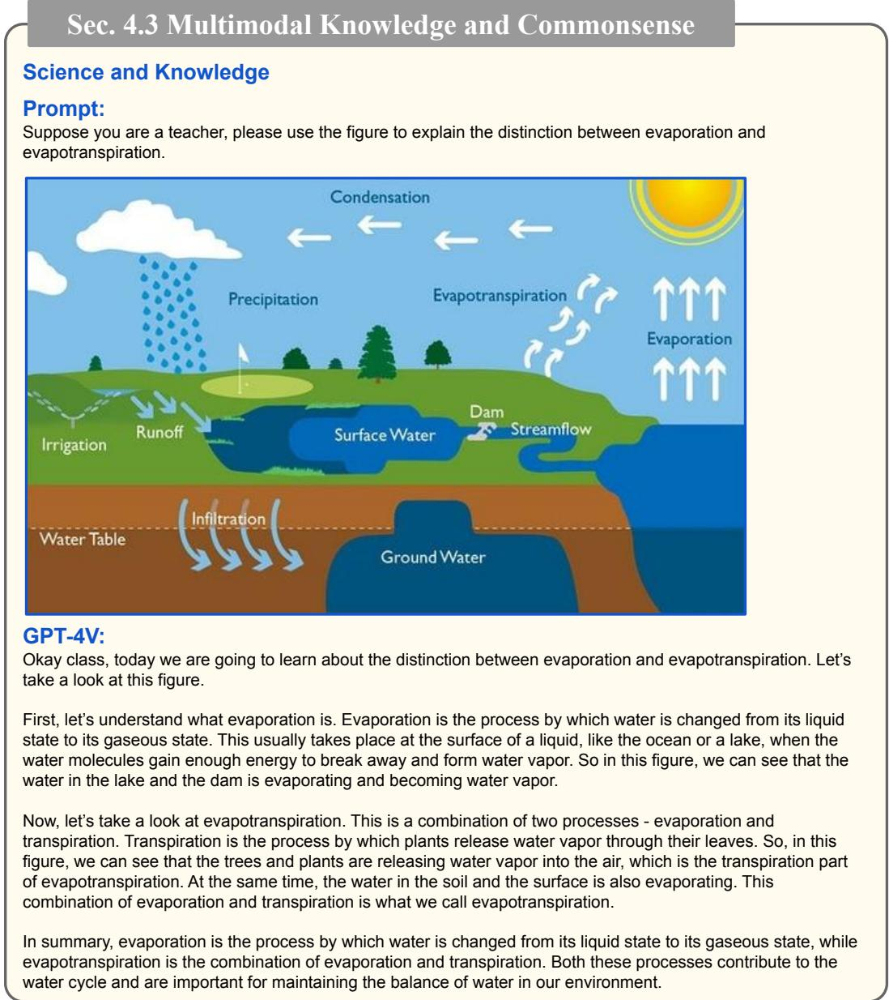

> **AI Description:**
> **Source:** `assets/_page_46_Figure_0.jpg`
> 
> **Generated:** 2026-05-16 08:40:53
> 
> ---
> 
> The image contains a diagram illustrating the water cycle, including the processes of evaporation, evapotranspiration, condensation, precipitation, and runoff. Key elements include labels for surface water, groundwater, and the water table. The diagram visually represents the movement of water from the surface to the atmosphere and back to the ground, highlighting the role of plants in transpiration. The sun is depicted at the top right, symbolizing the energy source for evaporation, and clouds are shown at the top left, representing precipitation. The diagram effectively combines text and visual elements to explain the water cycle processes.

Figure 32: Results on multimodal commonsense reasoning. Example images are from [148, 52]. Check Section 4.3 for detailed discussions. 48 48
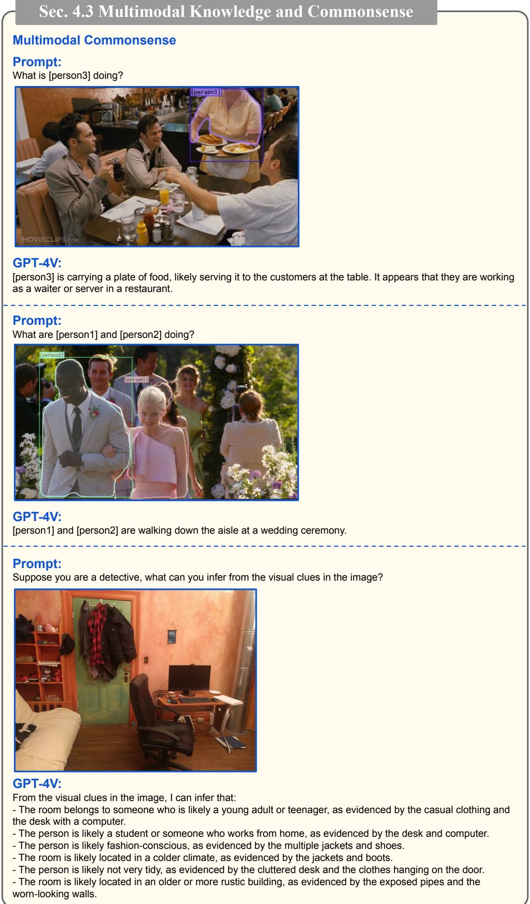

> **AI Description:**
> **Source:** `assets/_page_47_Figure_0.jpg`
> 
> **Generated:** 2026-05-16 08:25:57
> 
> ---
> 
> The image contains three distinct sections, each with a photograph and corresponding text. The photographs are from a movie scene, depicting a restaurant setting, a wedding ceremony, and a room interior. The text provides prompts and GPT-4V's responses to those prompts, focusing on the actions of individuals in the scenes and inferences about the room's occupant. The photographs are used to illustrate the context of the prompts and responses.

## 4.4 Scene Text, Table, Chart, and Document Reasoning

Scene text recognition. Reading and understanding scene text in images is an important task in vision-language [118–120, 17]. In our experiments, we investigate GPT-4V’s ability to recognize scene text by utilizing the input prompt “What are all the scene text in the image?” Figure 33 shows the example results. We observe GPT-4V accurately identifies scene text in various scenarios, including both handwritten and printed text. In Section 4.5, we present further results on multilingual scenarios.

Visual math reasoning. In Figure 34, GPT-4V demonstrates its capability in solving visual math problems. In our experiments, we observe GPT-4V is able to extract essential information from the image. For instance, in Figure 34, GPT-4V correctly identifies the presence of a right triangle (or orthogonal triangle) and determines that AB is 4 units and BC is 3 units. In addition, we note that GPT-4V tends to present solutions in a well-structured manner, solving the problem step by step, thereby showcasing its ability to provide clear explanations.

Chart understanding and reasoning. We further study GPT-4V’s ability in chart understanding and reasoning. Figures 35-37 show the example results. In our preliminary explorations, GPT-4V exhibits the ability to provide detailed descriptions of charts. For example, in Figure 35, the model correctly explains the proposal process from the beginning to the end. In Figure 36, the model not only understands the program in the given flow chat, but also translates the details to a python code. In the bottom row of Figure 37, GPT-4V shows a clear understanding of both x- and y-axis, and explains the key insight presented in the chart. Furthermore, in our experiments, we observe that GPT-4V can answer questions based on the chart. In the top row of Figure 37, GPT-4V correctly calculates the average total fueling cost, excluding the Ford F150.

Table understanding and reasoning. In Figure 38, we present our preliminary investigations into table understanding and reasoning. Similar to the findings from chart experiments, GPT-4V shows promising results in understanding the details in the table, as well as in reasoning and accurately responding to related questions.

Document understanding. Figure 39 shows the results on various types of documents, such as floor plan, poster, and exam paper. We observe GPT-4V demonstrates an understanding of the documents and provides reasonable responses. For instance, it accurately identifies the location of the bathroom for the second bedroom in the floor plan. It also recognizes the Chinese dish “Hot dry noodles,” and associates it with the city of Wuhan by following the scene text. Moreover, GPT-4V is capable of reading an exam paper. It accurately reconstructs the table in Markdown, and then fills in the table with the correct answers. We present more explorations in its coding ability in Section 4.6.

In Figure 40, we explore a more challenging case by providing a technical report [126] with multiple pages as input. In our limited exploration, GPT-4V exhibits impressive results. It correctly describes the main idea and their proposed method by considering the context across multiple pages. However, it may occasionally miss some implementation details. Please note that the dataset should contain 1196+665=1861 examples, and the extracted features should include Histograms of Oriented Gradients (HOG). Instead of prompting all pages to the model simultaneously, we believe that exploring more advanced prompting techniques, such as thinking step-by-step or employing in-context few-shot approaches, could potentially enhance the model’s performance.

## Sec. 4.4 Scene Text, Table, Chart, and Document Reasoning

## Scene Text Recognition

Prompt: What are all the scene text in the image?

## GPT-4V:

The scene text in the image is "3,642,039,031,055".

## Prompt:

What are all the scene text in the image?

## GPT-4V:

The scene text in the image are:

\- (NVDA)

\- NVIDIA

\- 356.85

\- +51.47

\- +16.85%

## Prompt:

## GPT-4V:

The scene text in the image are:

## Prompt:

What are all the scene text in the image?

## GPT-4V:

The only scene text in the image is "The Earth without art is just 'eh'".

## Prompt:

What are all the scene text in the image?

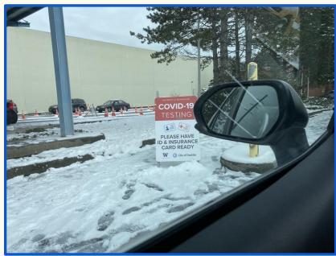

> **AI Description:**
> **Source:** `assets/_page_49_Figure_4.jpg`
> 
> **Generated:** 2026-05-16 09:20:54
> 
> ---
> 
> The image contains a photograph of a parking lot with snow on the ground. There is a sign in the foreground that reads "COVID-19 TESTING" with additional text below stating "PLEASE HAVE ID & INSURANCE CARD." The sign is red and white, and there are other vehicles and a building in the background. The photo is taken from inside a vehicle, as indicated by the side mirror and part of the car's interior visible in the frame. The image provides information about a COVID-19 testing location and the necessary documents required for testing.

## GPT-4V:

There are three texts in the image:

\- "Royal"

## 1) “COVID-19 TESTING”

2) “PLEASE HAVE ID & INSURANCE

3) “W @UW Medicine” (this is the

What are all the scene text in the image?

## Prompt:

What are all the scene text in the image?

## GPT-4V:

The scene text in the image is “The Road to Hollywood: how some of us got here”

## Prompt:

What are all the scene text in the image?

## GPT-4V:

\- Beach

\- Smile

\- Summer

\- Watermelon

\- Flip flops

\- Lemonade

\- "London"

## Prompt:

What are all the scene text in the image?

## GPT-4V:

The scene text in the image are: - "Westfield"

\- "westfield.com.au"

## Prompt:

What are all the scene text in the image?

## GPT-4V:

The scene text in the image are:

\- Malayan Tapir

\- Tapirus indicus

\- LOCATION: Malay Peninsula and

Sumatra, near water - RELATIVES: There are only five species of tapirs. They are most closely related to horses and rhinos.

\- VANISHING? The forest provides tapirs with shelter, food, and water, but forests are rapidly disappearing in Malaysia and Sumatra.

Figure 33: Results on scene text recognition. GPT-4V can recognize scene text in many challenging scenarios. Check Section 4.4 for detailed discussions.

Figure 34: Results on visual math reasoning. GPT-4V is able to comprehend and solve visual math problems with a well-structured solution. Check Section 4.4 for detailed discussions.

Figure 35: Results on flow chart understanding. GPT-4V correctly describes the proposal process in details. Check Section 4.4 for detailed discussions.
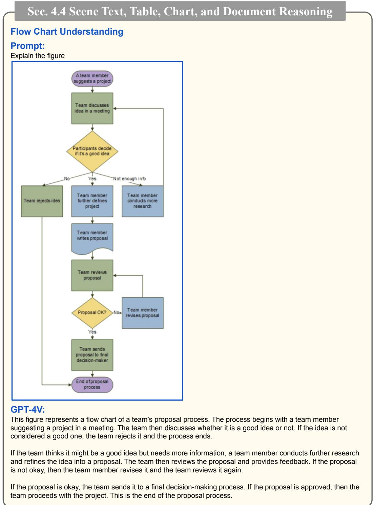

> **AI Description:**
> **Source:** `assets/_page_51_Figure_0.jpg`
> 
> **Generated:** 2026-05-16 09:41:40
> 
> ---
> 
> The image contains a flowchart titled "Flow Chart Understanding" which illustrates a team's proposal process. The flowchart includes various stages such as suggesting a project, team discussion, deciding if it's a good idea, further defining the project, writing a proposal, reviewing the proposal, and sending it to a final decision-maker. The chart also includes decision points and feedback loops, such as rejecting the idea, conducting more research, and revising the proposal. The flowchart is designed to visually represent the sequential steps and decision-making processes involved in the proposal development and approval.

Figure 36: Results on flow chart understanding. GPT-4V is able to translate the flow chart to a python code. Check Section 4.4 for detailed discussions.
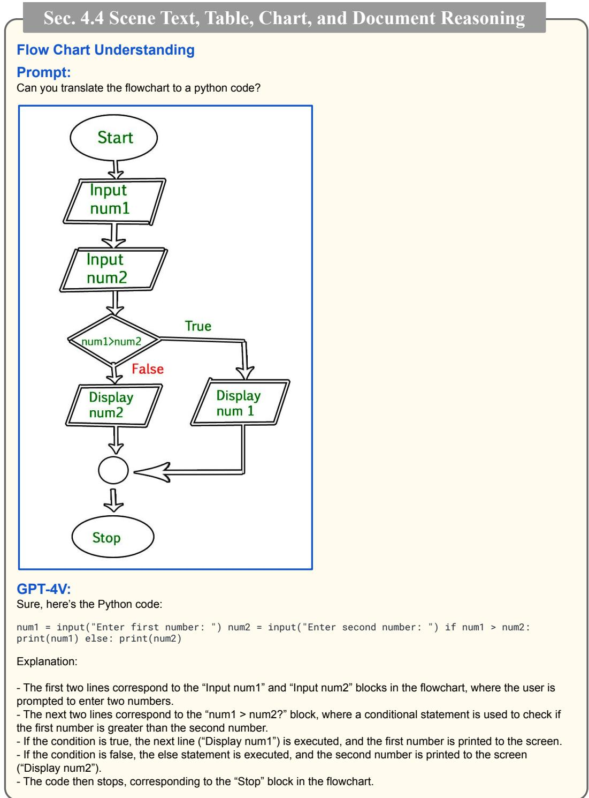

> **AI Description:**
> **Source:** `assets/_page_52_Figure_0.jpg`
> 
> **Generated:** 2026-05-16 08:27:16
> 
> ---
> 
> The image contains a flowchart with labeled steps and decision points. It illustrates a process for comparing two numbers, num1 and num2, and displaying the larger of the two. The flowchart includes start and stop points, input blocks for num1 and num2, a decision block comparing num1 and num2, and output blocks for displaying the larger number. The accompanying text provides a Python code translation of the flowchart, explaining each step in the process.

Figure 37: GPT-4V shows promising results in understanding the details in the chart, as well as in reasoning and accurately responding to related questions. Check Section 4.4 for detailed discussions.
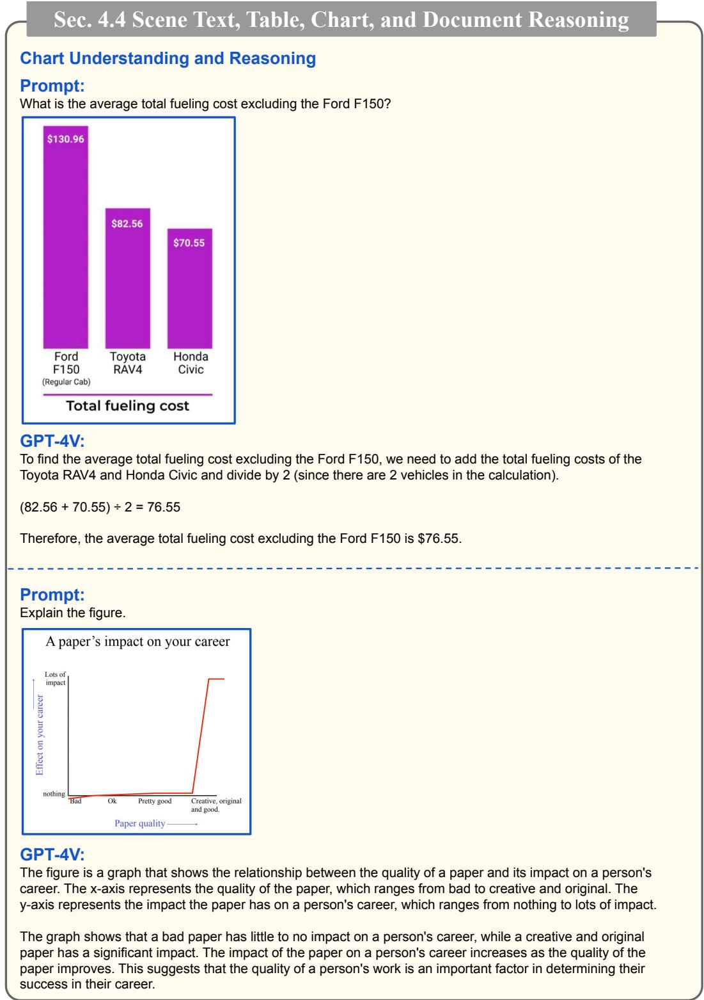

> **AI Description:**
> **Source:** `assets/_page_53_Figure_0.jpg`
> 
> **Generated:** 2026-05-16 08:39:57
> 
> ---
> 
> The image contains two distinct visual elements: a bar chart and a line graph.
> 
> 1. The bar chart presents the total fueling costs for three different vehicles: Ford F150, Toyota RAV4, and Honda Civic. The Ford F150 has the highest cost at $130.96, followed by the Toyota RAV4 at $82.56, and the Honda Civic at $70.55.
> 
> 2. The line graph illustrates the relationship between the quality of a paper and its impact on a person's career. The x-axis represents the quality of the paper, ranging from "bad" to "creative, original and good," while the y-axis represents the impact on a person's career, ranging from "nothing" to "lots of impact." The graph shows that a bad paper has little to no impact, while a creative and original paper has a significant impact, with the impact increasing as the quality of the paper improves.

Figure 38: We observe GPT-4V can understand the details in the table, and answer related questions. Check Section 4.4 for detailed discussions.
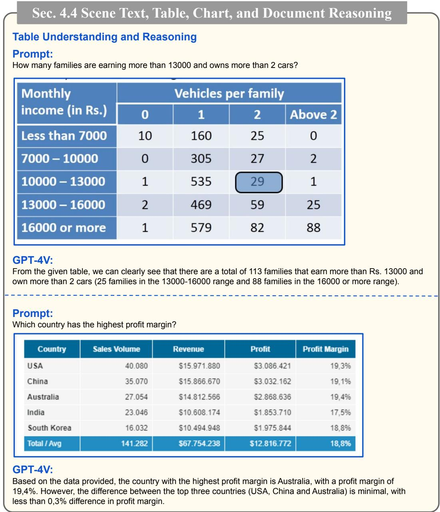

> **AI Description:**
> **Source:** `assets/_page_54_Figure_0.jpg`
> 
> **Generated:** 2026-05-16 08:37:59
> 
> ---
> 
> The image contains two tables with numerical data. The first table is titled "Vehicles per family" and categorizes families based on their monthly income and the number of vehicles they own. It provides counts for different income brackets and vehicle ownership categories. The second table is titled "Country Sales Volume, Revenue, Profit, and Profit Margin" and lists data for five countries: USA, China, Australia, India, and South Korea. It includes sales volume, revenue, profit, and profit margin percentages. The tables are used to analyze family income and vehicle ownership patterns and country-wise financial performance.

Figure 39: Results on document understanding. GPT-4V recognizes three different types of document and answers the questions correctly. Check Section 4.4 for detailed discussions.
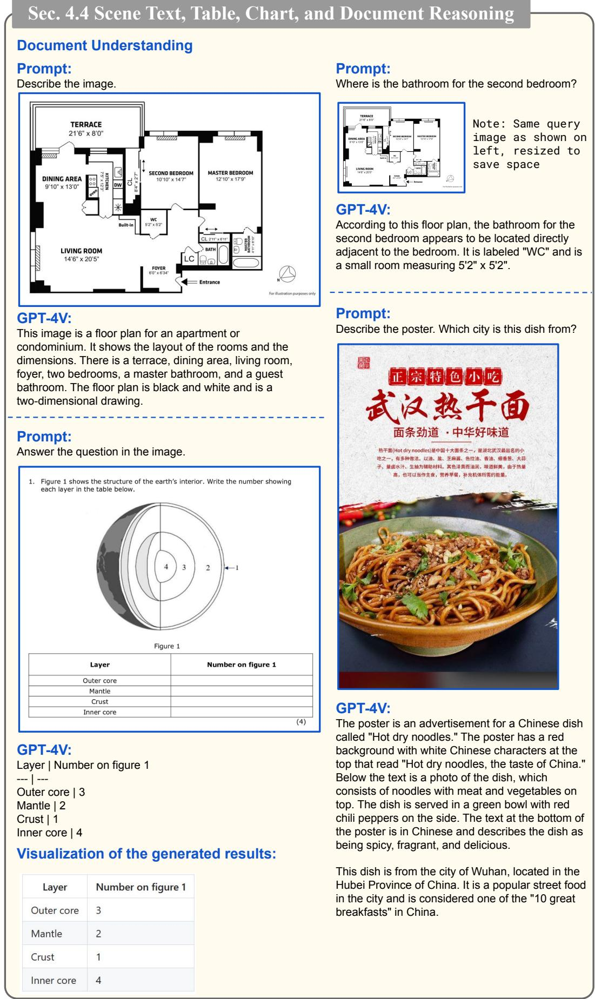

> **AI Description:**
> **Source:** `assets/_page_55_Figure_0.jpg`
> 
> **Generated:** 2026-05-16 08:29:47
> 
> ---
> 
> The image contains a floor plan of an apartment or condominium, a diagram of the Earth's interior structure, and a poster for a Chinese dish. The floor plan includes labeled rooms such as the terrace, dining area, living room, foyer, bedrooms, and bathrooms. The diagram shows the layers of the Earth with numbered sections corresponding to the outer core, mantle, crust, and inner core. The poster is for "Hot dry noodles" and includes Chinese text, a photo of the dish, and additional descriptive text.

Figure 40: Results on document understanding. GPT-4V reads a multi-page technical report, understands the content in each section, and provides a summary of the contribution of this technical report. Red highlights the wrong answer. Check Section 4.4 for detailed discussions.

## 4.5 Multilingual Multimodal Understanding

We assess GPT-4V’s ability in comprehending multiple languages and modalities. First, we explore this capability by evaluating natural images without scene text, as depicted in Figure 41. In the first row of the figure, we provide the input text prompt “Describe the image” in Chinese, French, and Czech, respectively. GPT-4V recognizes the input text prompts in different languages, and generates correct image descriptions in corresponding languages. In the second row of Figure 41, we provide the input text prompt in English and specify the output language. GPT-4V follows the instruction and generates correct descriptions in the desired languages. In the bottom row of Figure 41, we provide an input prompt in Spanish, and ask GPT-4V to generate image descriptions in 20 different languages. We observe that GPT-4V can process both the input and output text in different languages.

Furthermore, we explore a scenario involving multilingual scene text recognition, where the input image may contain scene text in various languages. As shown in Figure 42, GPT-4V correctly identifies and understands the scene text from different scenes. As shown in the first two rows of Figure 43, we observe that GPT-4V can recognize the scene text, and translate it to a different language. In the bottom row of Figure 43, we provide a screenshot of a Wikipedia website which is in Catalan, and instruct GPT-4V to summarize the information in 20 different languages. GPT-4V not only recognizes the text in Catalan but also generates precise summaries and translates them into different languages. This showcases GPT-4V’s ability to comprehend and translate multilingual scene text.

We also explore the capability of multicultural understanding [147, 77]. Figure 44 shows the example results in such a scenario. We observe that GPT-4V is capable of understanding cultural nuances and generating reasonable multilingual descriptions for the wedding images given.

In our exploration, we found that GPT-4V seamlessly comprehends and correctly generates descriptions in different languages, highlighting its versatility in handling diverse linguistic contexts.

## Sec. 4.5 Multilingual Multimodal Understanding

## Multilingual Image Description

## Prompt:描述這張圖片

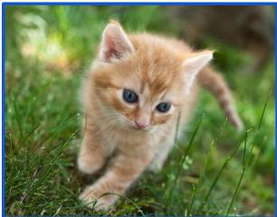

> **AI Description:**
> **Source:** `assets/_page_58_Figure_0.jpg`
> 
> **Generated:** 2026-05-16 09:12:54
> 
> ---
> 
> The image is a photograph of a small, fluffy orange kitten with bright blue eyes. The kitten is standing on a patch of green grass, and the background is slightly blurred, suggesting a shallow depth of field. The kitten appears to be looking directly at the camera with a curious expression.

## GPT-4V:

這張圖片是一隻小貓在草地上走路的畫面。小貓是橘色的，有藍色的眼睛，看起來很可愛。它的身體很小，四肢纖細，正在小心翼翼地在草地上行走。

## Prompt: Décrire l’image

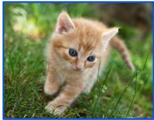

> **AI Description:**
> **Source:** `assets/_page_58_Figure_1.jpg`
> 
> **Generated:** 2026-05-16 09:12:59
> 
> ---
> 
> The image contains a photograph of a small, fluffy orange kitten with striking blue eyes. The kitten is walking on a grassy surface, and the background is slightly blurred, suggesting a natural outdoor setting. The kitten appears curious and alert, with its ears perked up and its gaze directed forward. The overall scene is bright and cheerful, capturing a moment of the kitten's playful exploration.

## GPT-4V:

Il s’agit d’une photo d’un chaton roux marchant sur l’herbe verte. Le chaton a les yeux bleus et semble être en train de marcher avec prudence. Il est entouré d’herbe et on peut voir une partie d’un autre chat en arrière-plan.

## Prompt: Popište obrázek

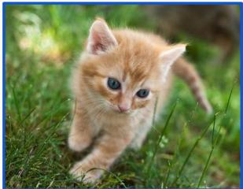

> **AI Description:**
> **Source:** `assets/_page_58_Figure_2.jpg`
> 
> **Generated:** 2026-05-16 09:04:56
> 
> ---
> 
> The image is a photograph of a small, fluffy kitten with orange fur and blue eyes. The kitten is standing on a patch of green grass, and the background is slightly blurred, suggesting a natural outdoor setting. The kitten appears to be looking directly at the camera, giving the image a charming and endearing quality.

## GPT-4V:

Na obrázku je malé oranžové kotě s modrýma očima. Kotě stojí na zelené trávě a směřuje dopředu. Jeho tělo je v pohybu a vypadá, že právě běží. Na pozadí je vidět další část trávy a nejasně i další kočka.

## Prompt: Describe the image in Chinese

Prompt: Describe the image in French
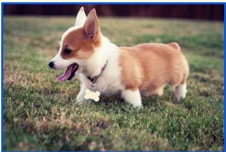

> **AI Description:**
> **Source:** `assets/_page_58_Figure_3.jpg`
> 
> **Generated:** 2026-05-16 09:03:39
> 
> ---
> 
> The image contains a photograph of a corgi dog lying on a grassy field. The dog is predominantly white with brown patches, and it has its mouth open, possibly panting. The dog is wearing a collar with a bone-shaped tag attached to it. The background is a simple, uncluttered grassy area, suggesting a peaceful outdoor setting.

这是一只小柯基犬，它在草地上走着，嘴巴张开，舌头伸出来，好像很开心的样子。它的身上有一条项圈，上面挂着一个骨头形状的牌子。

## GPT-4V:

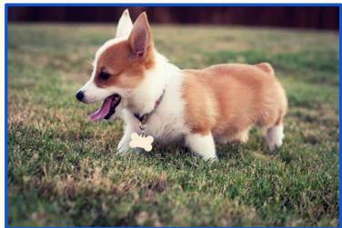

> **AI Description:**
> **Source:** `assets/_page_58_Figure_4.jpg`
> 
> **Generated:** 2026-05-16 08:49:45
> 
> ---
> 
> The image is a photograph of a corgi dog playing outdoors on grass. The dog is mid-action, with its tongue out, suggesting it is panting or excited. The dog is wearing a collar with a bone-shaped tag attached. The background is a simple, natural setting with green grass and a blurred background, focusing attention on the dog. The image captures a playful and energetic moment of the dog in a natural environment.

## GPT-4V:

C'est une image d'un petit chien de race Corgi. Il est de couleur marron et blanc et porte un collier avec une médaille en forme d'os. Il est en train de marcher sur l'herbe verte avec la langue pendante.

## Prompt: Describe the image in Czech

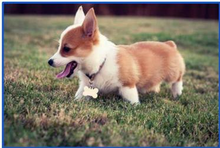

> **AI Description:**
> **Source:** `assets/_page_58_Figure_5.jpg`
> 
> **Generated:** 2026-05-16 08:49:39
> 
> ---
> 
> The image is a photograph of a corgi dog outdoors on grass. The dog appears to be in a playful or relaxed pose, with its mouth open and tongue out. The corgi has a white and brown coat, and there is a bone-shaped object near its front paws. The background is a grassy area with no other significant objects or people visible.

## GPT-4V:

Na obrázku je malý hnědý pes s bílým límcem a kostičkou na obojku. Pes je na zelené trávě a má otevřenou tlamu. Vypadá, že se baví.

## Prompt:

Describir la imagen en 20 idiomas diferentes

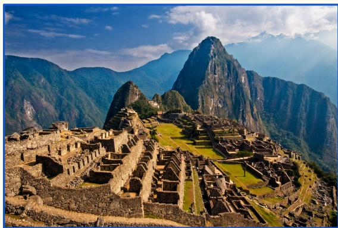

> **AI Description:**
> **Source:** `assets/_page_58_Figure_6.jpg`
> 
> **Generated:** 2026-05-16 08:56:53
> 
> ---
> 
> The image is a photograph of Machu Picchu, an ancient Incan city located in the Andes Mountains of Peru. The ruins are situated on a mountain ridge, with the iconic Huayna Picchu peak rising prominently in the background. The image captures the intricate stone structures and terraces of the archaeological site, showcasing the architectural and engineering prowess of the Inca civilization. The surrounding landscape is lush and green, with the mountains providing a dramatic and scenic backdrop. The photograph is taken from a high vantage point, offering a comprehensive view of the site and its natural surroundings.

## GPT-4V:

1. Inglés: This is a beautiful view of Machu Picchu in Peru.   
2. Español: Esta es una hermosa vista de Machu Picchu en Perú.   
3. Francés: C'est une belle vue de Machu Picchu au Pérou.

## GPT-4V output continued

4. Alemán: Dies ist eine schöne Aussicht auf Machu Picchu in Peru.

5. Italiano: Questa è una bella vista di Machu Picchu in Perù.

6. Portugués: Esta é uma bela vista de Machu Picchu no Peru.

7. Ruso: Это красивый вид на Мачу-Пикчу в Перу.

8. Chino: 这是秘鲁马丘比丘的美丽景色。

9. Japonés: これはペルーのマチュピチュの美しい景色です。

10. Coreano: 이것은 페루의 마추 피추의 아름다운 경치입니다.

11. Hindi: यह पेǾ के माचू ͪपÍचू का सुंदर Ǻæय है।

ھذا منظر جمیل لماشو بیتشو في بیرو. :Árabe 12.

13. Turco: Bu, Peru'daki Machu Picchu'nun güzel bir manzarasıdır.

14. Griego: Αυτή είναι μια όμορφη θέα του Μάτσου Πίτσου στο Περού.

זהו נוף יפה של מאצ'ו פיצ'ו בפרו. :Hebreo 15.

16. Sueco: Det här är en vacker vy av Machu Picchu i Peru.

17. Noruego: Dette er en vakker utsikt over Machu Picchu i Peru.

18. Danés: Dette er en smuk udsigt over Machu Picchu i Peru.

19. Holandés: Dit is een prachtig uitzicht op Machu Picchu in Peru.

20. Polaco: To piękny widok na Machu Picchu w Peru.

Figure 41: Results on multilingual image descriptions. GPT-4V is able to generate image descriptions in different languages. Check Section 4.5 for detailed discussions.

Figure 42: Results on multilingual scene text recognition. GPT-4V can recognize scene text in different languages. Check Section 4.5 for detailed discussions.

Figure 43: Results on multilingual text recognition, translation, and description. GPT-4V is able to recognize, translate and generate descriptions in different languages. Check Section 4.5 for detailed discussions.

# Sec. 4.5 Multilingual Multimodal Understanding

## Multilingual Multicultural Understanding

## Prompt:

Describe the image in both English and the local language corresponding to the geolocation depicted in the image.

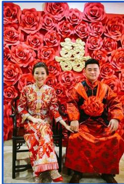

> **AI Description:**
> **Source:** `assets/_page_61_Figure_0.jpg`
> 
> **Generated:** 2026-05-16 10:00:01
> 
> ---
> 
> The image is a photograph of two individuals dressed in traditional Chinese wedding attire, seated in front of a backdrop of red roses and a large Chinese character "囍" (double happiness). The woman is wearing a red and gold floral dress, while the man is in a red robe with a floral design. The setting appears to be a formal wedding photo shoot, emphasizing traditional Chinese wedding customs.

## GPT-4V:

English: This image shows a couple dressed in traditional Chinese wedding attire, sitting in front of a wall of red roses and a gold Chinese character for "double happiness."

Chinese (Simplified): 这张图片展示了一对穿着中国传 统婚礼服装的夫妇，坐在红色玫瑰和金色“双喜”汉字前 面。 (Zhè zhāng túpiàn zhǎnshìle yī duì chuānzhe zhōngguó chuántǒng hūnlǐ fúzhuāng de fūfù, zuò zài hóngsè méiguī hé jīnsè "shuāng xǐ" hànzì qiánmiàn.)

## Prompt:

Describe the image in both English and the local language corresponding to the geolocation depicted in the image.

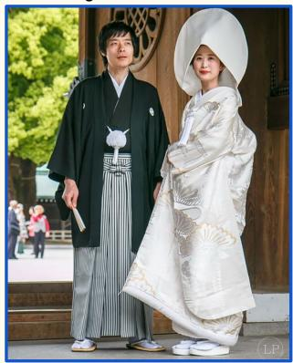

> **AI Description:**
> **Source:** `assets/_page_61_Figure_1.jpg`
> 
> **Generated:** 2026-05-16 10:03:15
> 
> ---
> 
> The image is a photograph featuring two individuals dressed in traditional Japanese attire. The person on the left is wearing a black kimono with white accents and a white obi, while the person on the right is dressed in a white kimono with a large white headpiece. The setting appears to be an outdoor location with traditional Japanese architecture in the background. The image captures a cultural or ceremonial moment.

## GPT-4V:

English: This image shows a Japanese couple in traditional wedding attire. The man is wearing a black kimono with a white hakama and the woman is wearing a white kimono with a large headpiece.

Japanese: この画像は伝統的な結婚式の衣装を着た日本のカップルを示しています。男性は白い袴と黒い着物を着ており、女性は大きな頭飾りと白い着物を着ています。 (Kono gazō wa dentō-teki na kekkon-shiki noishō o kita Nihon no kappuru o shimeshiteimasu.Dansei wa shiroi hakama to kuroi kimono o kite ori,josei wa ōkina kazari to shiroi kimono o kiteimasu.)

## Prompt:

Describe the image in both English and the local language corresponding to the geolocation depicted in the image.

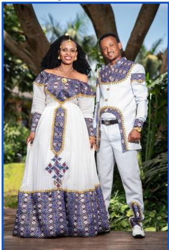

> **AI Description:**
> **Source:** `assets/_page_61_Figure_2.jpg`
> 
> **Generated:** 2026-05-16 09:56:35
> 
> ---
> 
> The image is a photograph featuring two individuals dressed in traditional attire. The person on the left is wearing a white dress with blue and gold patterns, while the person on the right is dressed in a white suit with similar blue and gold accents. The background includes lush greenery and palm trees, suggesting an outdoor setting. The attire and setting indicate a formal or cultural event.

## GPT-4V:

English: The image shows a couple wearing traditional Ethiopian clothing, standing in a garden with a tree in the background. The woman is wearing a white dress with colorful patterns and the man is wearing a white suit with similar patterns.

Amharic (Ethiopia's official language): ይህ ምስል በኢትዮጵያዊ ባህል ልብስ የለበሱት ባለቤትና ባለቤትን በገባር ይታያል። ሴትዮቱ በነጻነት ያሉ አለባለባህር ልብሶች ለበሳለች እና ወንድዮቱም በመሳሳህ አለባለባህር ሱት ለበሳለች።

## Prompt:

Describe the image in both English and the local language corresponding to the geolocation depicted in the image.

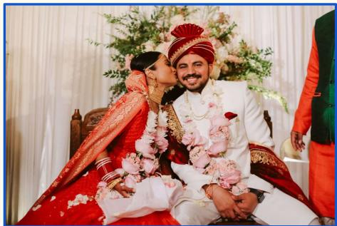

> **AI Description:**
> **Source:** `assets/_page_61_Figure_3.jpg`
> 
> **Generated:** 2026-05-16 09:54:22
> 
> ---
> 
> The image is a photograph of a couple dressed in traditional Indian wedding attire. The bride is wearing a red and gold lehenga, adorned with jewelry and garlands of flowers. The groom is dressed in a white sherwani with a red turban and also wears a garland of flowers. They are seated on a decorated chair, with a floral arrangement in the background. The setting appears to be a wedding ceremony.

## GPT-4V:

English: This image shows a newlywed Indian couple sharing a kiss. The bride is wearing a traditional red sari and the groom is wearing a red turban and white suit. They are sitting on a decorated stage with flowers.

Hindi (local language in India): यह छͪव एक नवͪववाǑहत भारतीय

जोड़े को एक चुंबन शेयर करते हुए Ǒदखाती है। दुल्हन एक परंपरागत लाल साड़ी पहन रहȣ है और दूल्हा एक लाल पगड़ी और सफे द सूट पहन रहा है। वे फू लों से सजे हुए एक मंच पर बैठे हैं।

Figure 44: Results on multilingual multiculture understanding. Check Section 4.5 for detailed discussions.

## 4.6 Coding Capability with Vision

Figure 45: GPT-4V’s capability to generate LaTex codes based on the hand-written input. The instruction is ‘generate latex code.’ for each case. The output is the LaTeX code and we show the rendered result. Although the model fails to write the code for the complex equation (bottom), we can break it down into several simple equations, which GPT-4V is able to handle. Check Section 4.6 for detailed discussions.

Figure 45 illustrates the ability to generate LaTeX code based on handwritten mathematical equations. This functionality can assist users in writing equations in LaTeX more efficiently. Although the model is unable to generate code for longer equations, it can handle shorter equations effectively. By breaking down longer equations into shorter components, the model is able to generate the appropriate code. Figure 46 further demonstrates how GPT-4V can reconstruct a table in the input image into MarkDown/LaTex code.

Figure 47 shows examples of writing code in Python, $\mathrm { T i k } Z ,$ and SVG to replicate the input figure. Although the resulting output is not an exact match, the layout is similar and the code can be easily modified to meet specific needs.

Figure 46: GPT-4V’s capability to generate Markdown/LaTex codes to reconstruct a table in the image. Red highlights the errors in reconstruction. Check Section 4.6 for detailed discussions.
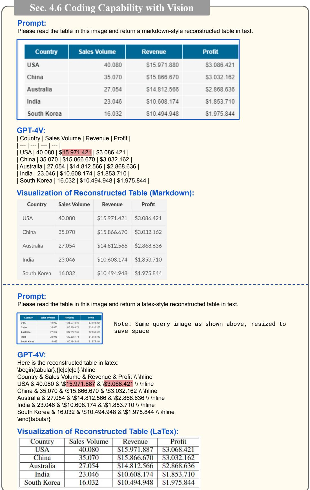

> **AI Description:**
> **Source:** `assets/_page_63_Figure_0.jpg`
> 
> **Generated:** 2026-05-16 08:31:08
> 
> ---
> 
> The image contains a table with data on sales volume, revenue, and profit for five countries: USA, China, Australia, India, and South Korea. The table is presented in both markdown and LaTeX styles, with the LaTeX version showing the table structure and values. The markdown version is visually simpler, while the LaTeX version is more complex, displaying the table with column headers and row entries. The data is formatted with dollar signs and decimal points, indicating financial figures.

### Full Page Description (Page 64)

**Source:** `assets/_page_64_Asset_0.jpg`

**Generated:** 2026-05-16 09:35:45

---

The image is a line graph showing the relationship between the number of million images in pre-training and the CIDEr score for three different models: Base, Large, and Huge. The x-axis represents the number of million images in pre-training, ranging from 10 to 1000, while the y-axis represents the CIDEr score, ranging from 80 to 140. The graph displays three distinct lines, each representing a different model, with the Base model having the lowest CIDEr scores and the Huge model having the highest. The trend for all three models is an upward slope, indicating that as the number of million images in pre-training increases, the CIDEr score also increases.

### Full Page Description (Page 64)

**Source:** `assets/_page_64_Asset_1.jpg`

**Generated:** 2026-05-16 09:40:25

---

The image is a bar chart comparing the performance of two models, OSCAR and MiniVLM, across four datasets: Caption, VQA, TR, IR, and NLVR2. The x-axis represents the datasets, and the y-axis represents the percentage of correct answers. Each dataset has two bars, one for each model, with the blue bar representing OSCAR and the red bar representing MiniVLM. The percentages above each bar indicate the accuracy of the models on the respective datasets. The chart shows that both models achieve 100% accuracy on the Caption dataset, while MiniVLM performs slightly better on the other datasets.

### Full Page Description (Page 64)

**Source:** `assets/_page_64_Asset_2.jpg`

**Generated:** 2026-05-16 09:34:14

---

The image is a line graph showing the relationship between the number of million images used in pre-training and the CIDEr score for three different model sizes: Base, Large, and Huge. The x-axis represents the number of million images in pre-training, ranging from \(10^0\) to \(10^3\). The y-axis represents the CIDEr score, ranging from 80 to 160. The graph shows that as the number of million images increases, the CIDEr score for all three model sizes also increases. The Base model shows a steady increase, the Large model shows a slightly steeper increase, and the Huge model shows the steepest increase.

### Full Page Description (Page 64)

**Source:** `assets/_page_64_Asset_3.jpg`

**Generated:** 2026-05-16 09:31:01

---

The image is a bar chart comparing the performance of two models, OSCarB and MiniVLM, across five tasks: Caption, VQA, TR, IR, and NLVR2. The x-axis represents the tasks, and the y-axis represents the score. Each task has two bars, one for each model, with the model names labeled in the legend. The chart shows that MiniVLM generally performs slightly better than OSCarB across all tasks, with the largest difference observed in the Caption task.

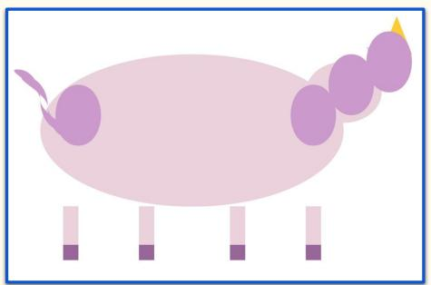

> **AI Description:**
> **Source:** `assets/_page_64_Figure_0.jpg`
> 
> **Generated:** 2026-05-16 08:33:49
> 
> ---
> 
> The image is a simple illustration of a caterpillar. It features a light purple body with a darker purple head and tail. The caterpillar has four legs, each with a dark purple tip. The style is minimalistic and cartoonish, with no text or additional annotations.

Prompt: Write svg codes to generate following image.

> **AI Description:**
> **Source:** `assets/_page_64_Figure_1.jpg`
> 
> **Generated:** 2026-05-16 08:33:56
> 
> ---
> 
> The image contains a visual representation of the United Nations flag. It features a light blue background with a white emblem in the center. The emblem consists of a globe surrounded by two interlocking branches of olive leaves. The globe is divided by lines representing the Earth's meridians and parallels, symbolizing the global nature of the United Nations. The olive leaves are a universal symbol of peace.

GPT-4V:
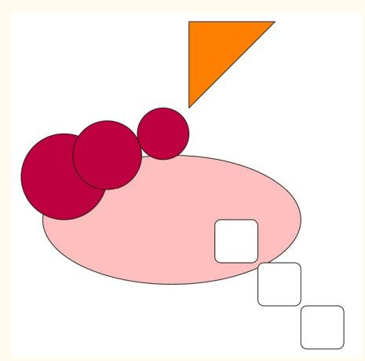

> **AI Description:**
> **Source:** `assets/_page_64_Figure_2.jpg`
> 
> **Generated:** 2026-05-16 08:26:04
> 
> ---
> 
> The image contains a simple diagram with various shapes. It includes three red circles, an orange triangle, a pink ellipse, and three white squares. The shapes are arranged in a loose cluster, with the red circles and orange triangle on the left and the pink ellipse and white squares on the right. The diagram appears to be a basic representation of shapes and their arrangement, possibly for educational or illustrative purposes.

GPT-4V:

Figure 47: GPT-4V’s capability to write codes to replicate the input figure. We directly show the rendered figures by python/TikZ/SVG as GPT-4V’s response. The rendered figure is roughly aligned with the input figure, and the code can be easily adapted. GPT-4V Chart. Check Section 4.6 for detailed discussions. 65

> **AI Description:**
> **Source:** `assets/_page_64_Figure_3.jpg`
> 
> **Generated:** 2026-05-16 08:23:34
> 
> ---
> 
> The image contains a simple diagram with a speech bubble and a central structure resembling a network or a grid. The central structure is composed of multiple squares connected in a pattern, suggesting a network or a system. The speech bubble above it could imply communication or dialogue related to the central structure. The overall design is minimalistic and uses a limited color palette, primarily blue and white.

## 5 Interaction with Humans: Visual Referring Prompting

Pointing to a specific spatial location is an essential capability in human-computer interaction with multimodal systems, such as conducting visually grounded dialogues. As shown in Section 5.1, GPT-4V can well understand the visual pointers directly drawn on images. Based on this observation, we propose a novel model interaction method named “visual referring prompting.” The core idea is to directly edit image pixel space to draw visual pointers or scene texts as human referring instructions, as highlighted in Figure 50. We detail its usages and advantages in Section 5.2. Finally, Section 5.3 explores having GPT-4V generate visual pointer outputs to interact with humans. These visual pointers are intuitive for both humans and machines to generate and understand, making them a good channel for human-computer interaction.

## 5.1 Understand Pointing Inputs

As illustrated in Figure 48, GPT-4V can understand different types of visual markers directly overlaid on images as a pointer, such as circles, boxes, and hand drawings. This ability helps GPT-4V generate grounded captioning, which is a known challenging problem to have conventional vision-language models [128] generating visual descriptions focused on a specific area of interest. Dense captioning methods [62, 138] use cropped boxes or mask regions to generate localized descriptions, but often ignore the global image context and produce sub-optimal descriptions. Visual pointing provides a natural way to indicate the area of interest while maintaining the global image context. For example, the top left example focuses on providing a comprehensive description of the pointed Magna beer, while also mentioning the global image context that the beer bottle is on the table.

An intuitive alternative to visual pointers overlaid on images is the region coordinates represented in the numerical text format. As shown in Figure 49, GPT-4V can understand the coordinates out-of-box, achieving the ability of spatial referring via text tokens without extra box token finetuning as in prior vision-language models [129, 143]. Despite the promising capability, we note that our current prompt is less precise spatially. For example, in the top left example in Figure 49, GPT-4V mentions the surrounding objects napkin and water bottle, even though only the beer bottle is in the region (0.47, 0.48, 0.55, 0.87). Overall, with respect to our experimented prompts, GPT-4V works more reliably when prompted with overlaid visual pointers, compared with text coordinates. This unique capability motivates us to explore a new prompting method, namely visual referring prompting.

Figure 48: GPT-4V understands visual pointers directly overlaid on images. Conducting grounded description with both local and global visual information is one unique application scenario. Check Section 5.1 for detailed discussions.
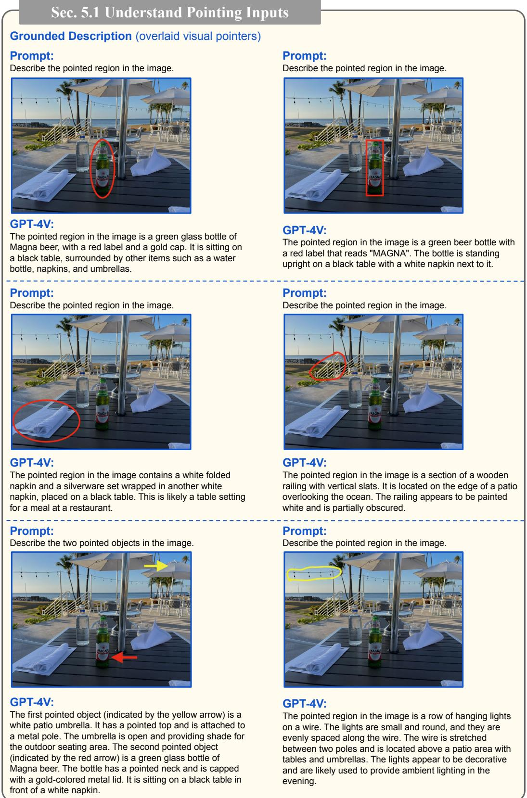

> **AI Description:**
> **Source:** `assets/_page_66_Figure_0.jpg`
> 
> **Generated:** 2026-05-16 09:57:51
> 
> ---
> 
> The image contains a series of photographs of a patio setting with tables, umbrellas, and various items on the tables. The photographs are overlaid with red and yellow arrows and circles pointing to specific objects. The text provides descriptions of the pointed regions, identifying items such as a green glass bottle of Magna beer, a white folded napkin, a silverware set, a wooden railing, and a row of hanging lights. The setting appears to be a restaurant or outdoor dining area with a view of the ocean.

# Sec. 5.1 Understand Pointing Inputs

## Grounded Description (text-format region coordinates)

## Prompt:

Locate the region based on given coordinates and describe the contents in the region. Regions are represented by (x1,y1,x2,y2) coordinates. x1 x2 are the left and right most positions, normalized into 0 to 1, where 0 is the left and 1 is the right. y1 y2 are the top and bottom most positions, normalized into 0 to 1, where 0 is the top and 1 is the bottom. Describe the relative position of region (0.47, 0.48, 0.55, 0.87) in the image. Describe the contents in that relative position. No need to mention contents in other part of the image.

0.47 0.55
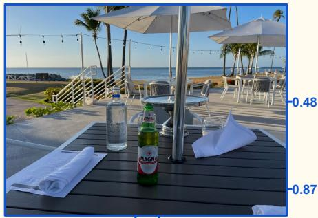

> **AI Description:**
> **Source:** `assets/_page_67_Figure_0.jpg`
> 
> **Generated:** 2026-05-16 09:52:02
> 
> ---
> 
> The image is a photograph of an outdoor seating area, likely at a restaurant or café by the sea. It features a table with a bottle of San Pellegrino sparkling water, a glass, and a folded napkin. In the background, there are more tables, chairs, and umbrellas, suggesting a relaxed dining environment. The setting includes palm trees and a view of the ocean, indicating a tropical or coastal location. The image also includes numerical values on the right side, "-0.48" and "-0.87", which appear to be annotations or data points, possibly related to the location or environmental conditions.

## GPT-4V:

The region (0.47, 0.48, 0.55, 0.87) is located in the center-right part of the image. It covers a small area of the table and extends to the bottom of the image. The most prominent object in this region is a green bottle of Magna beer. There is also a white napkin and a part of a water bottle visible in this region. The background shows a part of the patio and the ocean.

## Prompt:

Locate the region based on given coordinates and describe the contents in the region. Regions are represented by (x1,y1,x2,y2) coordinates. x1 x2 are the left and right most positions, normalized into 0 to 1, where 0 is the left and 1 is the right. y1 y2 are the top and bottom most positions, normalized into 0 to 1, where 0 is the top and 1 is the bottom. Describe the relative position of region (0.01, 0.67, 0.36, 0.91) in the image. Describe the contents in that relative position. No need to mention contents in other part of the image.

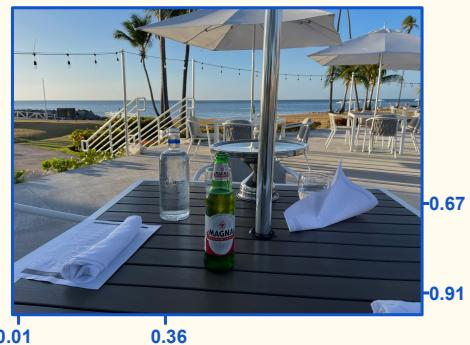

> **AI Description:**
> **Source:** `assets/_page_67_Figure_1.jpg`
> 
> **Generated:** 2026-05-16 09:49:37
> 
> ---
> 
> The image is a photograph of an outdoor dining area with a view of the ocean. The table is set with a folded napkin, a water bottle, and a beer bottle labeled "Magnum." There are umbrellas, chairs, and tables in the background, along with palm trees and a staircase leading down to the beach. The image also includes numerical values along the bottom and right side, which appear to be some form of data or measurement, but the context is unclear without additional information.

## GPT-4V:

The region (0.01, 0.67, 0.36, 0.91) in the image is located at the bottom left corner, covering approximately one third of the width and one fourth of the height of the image. In this region, there is a black table with a white napkin, a bottle of Magna beer, and a glass bottle of water. The table is in the foreground, while the background shows a part of the patio with white umbrellas and chairs.

## Prompt:

Locate the region based on given coordinates and describe the contents in the region. Regions are represented by (x1,y1,x2,y2) coordinates. x1 x2 are the left and right most positions, normalized into 0 to 1, where 0 is the left and 1 is the right. y1 y2 are the top and bottom most positions, normalized into 0 to 1, where 0 is the top and 1 is the bottom. Describe the relative position of region (0.01, 0.09, 0.29, 0.21) in the image. Describe the contents in that relative position. No need to mention contents in other part of the image.

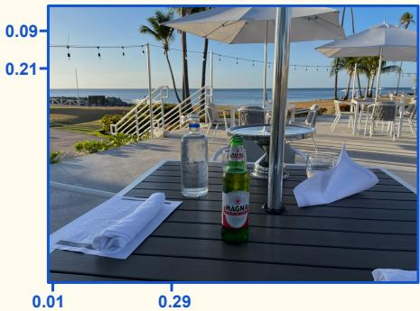

> **AI Description:**
> **Source:** `assets/_page_67_Figure_2.jpg`
> 
> **Generated:** 2026-05-16 09:42:44
> 
> ---
> 
> The image is a photograph of an outdoor dining area by the beach. It shows a table set with a folded white napkin, a bottle of San Pellegrino sparkling water, and a glass. The table is on a dark wooden deck, and there are chairs and umbrellas in the background. The setting appears to be a restaurant or cafe with a view of the ocean and palm trees. The image is overlaid with a coordinate grid and numerical values in the corners, suggesting it may be part of a data visualization or analysis.

## GPT-4V:

The region (0.01, 0.09, 0.29, 0.21) is located in the top left corner of the image. It covers approximately 28% of the width and 12% of the height of the image. In this region, there is a part of a white umbrella and a string of lights. The background shows a clear blue sky and a palm tree.

## Prompt:

Locate the region based on given coordinates and describe the contents in the region. Regions are represented by (x1,y1,x2,y2) coordinates. x1 x2 are the left and right most positions, normalized into 0 to 1, where 0 is the left and 1 is the right. y1 y2 are the top and bottom most positions, normalized into 0 to 1, where 0 is the top and 1 is the bottom. Describe the relative position of region (0.47, 0.48, 0.55, 0.87) in the image. Describe the contents in that relative position. No need to mention contents in other part of the image.

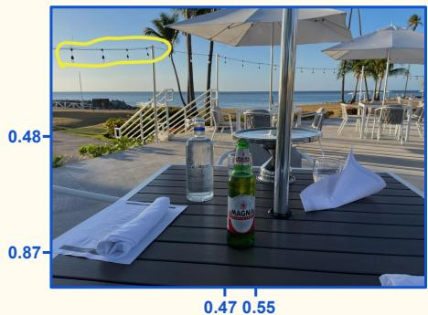

> **AI Description:**
> **Source:** `assets/_page_67_Figure_3.jpg`
> 
> **Generated:** 2026-05-16 09:45:50
> 
> ---
> 
> The image is a photograph of an outdoor seating area by the sea, featuring a table with a bottle of beer, a glass, and folded napkins. There are palm trees and a railing in the background, with the ocean visible beyond. The image also includes a graph overlay at the bottom, with axes labeled "0.47" and "0.55" on the x-axis and "0.48" and "0.87" on the y-axis. The graph appears to be a scatter plot or similar type of data visualization, but the specific data points and their meaning are not discernible from the image.

## GPT-4V:

The region (0.47, 0.48, 0.55, 0.87) is located towards the right side of the image, slightly below the center. It covers a small portion of the table and the background. In this region, there is a green bottle of Magna beer on the table, with a white napkin next to it. In the background, there is a part of an umbrella and a few chairs.

Figure 49: An alternative to visual pointers overlaid on images is the region coordinates represented in the numerical text format. GPT-4V can understand the coordinates, e.g., (0.47, 0.48, 0.55, 0.87), (0.01, 0.09, 0.29, 0.21), and (0.01, 0.67, 0.36, 0.91) that correspond to the center beer bottle, top-left string lights, and bottom-left table set, respectively. We observe that GPT-4V works less reliably when prompted with text coordinates, compared with visual pointers in visual referring prompting. Check Section 5.1 for detailed discussions.

## 5.2 Visual Referring Prompting

Inspired by GPT-4V’s strong capability in understanding visual pointing and scene text, we explore a new method to interact with GPT-4V, namely the visual referring prompting. Instead of conventional prompting techniques that edit text space, visual referring prompting is a complementary technique that directly edits the pixel space for input images for human-computer interaction. Such visual prompting could offer a more nuanced and comprehensive interaction with the image, potentially unlocking a wider array of responses from the model. For example, in Figure 50 (1), GPT-4V naturally associates the arrow-pointed objects with the given object indexes, easing the remaining visual reasoning and text outputs; in (2), GPT-4V understands the questions written on the image and pointed to the corresponding edge or angle, providing a nuanced interface for grounded visual dialogue; in (3), humans can point to arbitrary regions inside the figure to help GPT-4V better understand complicated documents and charts; in (4), the pattern can be concisely represented as an arrow and the scene text “+dot”, therefore helping GPT-4V to predict the next image. Complementary to text prompts that are loosely grounded to images, visual referring prompting provides a novel interaction method that could facilitate various use cases, with additional demonstrations in Figure 51 and Section 9.

## 5.3 Generate Pointing Outputs

Section 5.1 discusses the ability of GPT-4V to understand visual pointing generated by humans. A natural question is: Can GPT-4V generate its own pointing outputs, thereby facilitating a closed-loop interaction process in human-computer interaction?

Figure 52 explores generating visual pointing outputs by letting GPT-4V predict region coordinates in the text format. We prompt GPT-4V to ground the object referred by text (e.g., the text of “blue Subaru SUV”) or a reference image (e.g., the image of “black Audi sedan”). Similar to the observation in having GPT-4V comprehend coordinates input, the model has a coarse understanding of spatial locations, but it wasn’t accurate with respect to the prompts used in the experiment. For example, in Figure 52’s “plot visualizations,” GPT-4V can approximately identify the blue SUV and black sedan mentioned in the query, but it struggles to create a closely-fitted bounding box. We observe that including example-grounded instructions in the prompt helps GPT-4V to understand the definition of coordinates and subsequently generate better pointing outputs.

While the generated pointing outputs may not perfectly cover the queried region, they still provide a valuable tool for model interaction, interpretation, and helping multi-step visual reasoning. Specifically, the pointing outputs can be interpreted by humans to better understand GPT-4V’s references, or by GPT-4V itself to enable further reasoning based on previous outputs. As shown in the bottom of Figure 52, GPT-4V is capable of interpreting the pointers it generates, and providing grounded descriptions with the prompts in Figure 48. Furthermore, the iterative pointing generation and understanding by GPT-4V itself can help complicated multi-hop grounded visual reasoning tasks. GPT-4V is capable of deconstructing the question, generating distinct visual markers to iteratively focus on different image regions for each sub-step, ultimately collating the information to formulate the final answer.

Figure 50: Visual referring prompting directly edits the input image as input prompts, such as drawing visual pointers and scene texts. Complementary to text prompts, visual referring prompting provides a more nuanced and natural interaction, e.g., (1) associating pointed objects with an index, (2) pointing to the image for questioning, (3) highlighting lines in documents and tables, (4) drawing the pattern on the image, and many other novel use cases. Check Section 5.2 for detailed discussions.

Figure 51: Visual referring prompts enhance the seamless interaction between humans and computers. This is evident in the integration with computer and mobile Graphical User Interfaces (GUIs), and the support provided in understanding documents and slides. Check Section 5.2 for detailed discussions.

# Sec. 5.3 Generate Pointing Outputs

## Prompt:

Locate the referred object and represent the location of the region. Regions are represented by (x1,y1,x2,y2) coordinates. x1 x2 are the left and right most positions, normalized into 0 to 1, where 0 is the left and 1 is the right. y1 y2 are the top and bottom most positions, normalized into 0 to 1, where 0 is the top and 1 is the bottom. For example, the (x1,y1,x2,y2) coordinates for that region with the beer bottle is (0.47, 0.48, 0.55, 0.87).

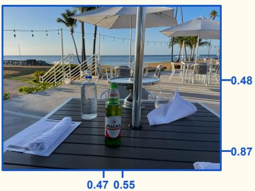

> **AI Description:**
> **Source:** `assets/_page_71_Figure_0.jpg`
> 
> **Generated:** 2026-05-16 08:34:13
> 
> ---
> 
> The image is a photograph of an outdoor patio setting with a table, chairs, and umbrellas. On the table, there are folded white napkins, a bottle of Bacardi rum, and a glass of water. The background features a scenic view of the ocean, palm trees, and a staircase leading down to the beach. The image includes numerical annotations (0.47, 0.55, 0.87, and 0.48) on the right side, which appear to be related to the image but their specific meaning is not clear from the image alone.

For the image below, what is the (x1,y1,x2,y2) coordinates for the region with the blue Subaru SUV?
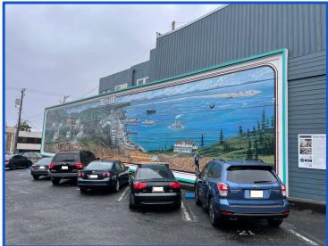

> **AI Description:**
> **Source:** `assets/_page_71_Figure_1.jpg`
> 
> **Generated:** 2026-05-16 08:29:51
> 
> ---
> 
> The image contains a large mural painted on the side of a building. The mural depicts a coastal scene with boats, a lighthouse, and a town. The mural is framed by a teal border and is situated above a parking lot where several cars are parked. The mural appears to be a representation of a scenic coastal area, possibly a popular tourist destination.

GPT-4V:

The (x1,y1,x2,y2) coordinates for the region with the blue Subaru SUV would be (0.68, 0.57, 0.95, 0.95).

Plot Visualization:

Refer to the query image below

## Grounded Description

Prompt: Describe the pointed region in the image.

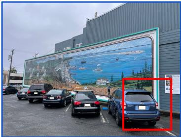

> **AI Description:**
> **Source:** `assets/_page_71_Figure_2.jpg`
> 
> **Generated:** 2026-05-16 08:23:05
> 
> ---
> 
> The image contains a mural painted on the side of a building, depicting a coastal scene with boats, houses, and a bridge. Below the mural, there is a parking lot with several cars parked. One car, a blue SUV, is highlighted with a red bounding box. The mural and the parked cars are the main visual elements in the image.

## GPT-4V:

The pointed region in red is a part of a larger mural on the side of a building. The content in this specific region appears to be a depiction of a blue car, possibly an SUV, parked in a parking lot. The car is facing towards the right side of the image and appears to be in a parking spot with a white line on the left side.

## Prompt:

Locate the referred object and represent the location of the region. Regions are represented by (x1,y1,x2,y2) coordinates. x1 x2 are the left and right most positions, normalized into 0 to 1, where 0 is the left and 1 is the right. y1 y2 are the top and bottom most positions, normalized into 0 to 1, where 0 is the top and 1 is the bottom. For example, the (x1,y1,x2,y2) coordinates for that region with the beer bottle is (0.47, 0.48, 0.55, 0.87).

0.47 0.55
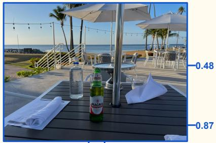

> **AI Description:**
> **Source:** `assets/_page_71_Figure_3.jpg`
> 
> **Generated:** 2026-05-16 08:27:23
> 
> ---
> 
> The image is a photograph of a table setting at an outdoor dining area. The table has a dark wooden surface and is set with white napkins, a bottle of water, and a green bottle of beer labeled "Bacardi." There are white umbrellas providing shade, and the background shows a beach with palm trees and a clear sky. The image also includes numerical annotations "0.48" and "0.87" in the upper right corner, which may indicate some form of data or measurement related to the scene.

For the image below, what is the (x1,y1,x2,y2) coordinates for the region with object
in it?

> **AI Description:**
> **Source:** `assets/_page_71_Figure_4.jpg`
> 
> **Generated:** 2026-05-16 08:36:51
> 
> ---
> 
> The image is a photograph of the rear view of a black car, specifically an Audi, parked on a dirt road. The car's taillights are visible, and the surrounding environment includes some dry grass and shrubs, indicating a rural or natural setting. The image does not contain any text or additional visual elements beyond the car and its immediate surroundings.

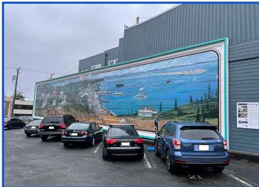

> **AI Description:**
> **Source:** `assets/_page_71_Figure_5.jpg`
> 
> **Generated:** 2026-05-16 08:42:01
> 
> ---
> 
> The image contains a large mural painted on the side of a building. The mural depicts a coastal scene with a lighthouse, a body of water, and a rocky shoreline. The colors are vibrant, with blues, greens, and earth tones dominating the scene. The mural is framed by a green border and is situated above a parking lot where several cars are parked. The building itself appears to be industrial or commercial in nature, with a gray exterior.

## GPT-4V:

The (x1,y1,x2,y2) coordinates for the region with the black Audi car in it would be approximately (0.35, 0.55, 0.55, 0.85). This is based on the left and right most positions of the car being around 35% and 55% of the image width, respectively, and the top and bottom most positions being around 55% and 85% of the image height, respectively.

Plot Visualization: Refer to the query image below

Grounded Description Prompt: Describe the pointed region in the image.

GPT-4V:
The object in the pointed region in red is a black car, specifically a sedan, parked in a parking lot. It appears to be a newer model with a shiny exterior and tinted windows.
Figure 52: GPT-4V can use its understanding of coordinates to generate visual pointing output, thereby grounding the textual or visually queried object. Using example-grounded instructions can help GPT-4V understand coordinate definitions and therefore generate better pointing. While output spatial regions are not precise, the approach enables an “understanding (i.e., grounded description) and generation” loop for visual pointing, leading to an effective way of human-computer interaction. Check Section 5.3 for detailed discussions.
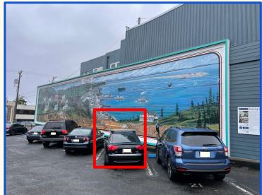

> **AI Description:**
> **Source:** `assets/_page_71_Figure_6.jpg`
> 
> **Generated:** 2026-05-16 08:46:29
> 
> ---
> 
> The image contains a photograph of a parking lot with several cars parked in front of a large mural. The mural depicts a scenic landscape with mountains, trees, and a body of water. The image also includes a red bounding box highlighting a specific car in the foreground. The car within the bounding box appears to be a dark-colored sedan. The parking lot is adjacent to a building with a blue exterior.

## 6 Temporal and Video Understanding

In this section, we discuss temporal and video understanding capabilities. Even though GPT-4V operates primarily on images as inputs, evaluating its understanding of temporal sequences and video content remains a crucial aspect of its overall assessment. This is because real-world events unfold over time, and an AI system’s ability to understand these dynamic processes is instrumental in real-world applications. Capabilities like temporal anticipation, temporal ordering, temporal localization, temporal reasoning, and grounded temporal understanding help to gauge the model’s proficiency in comprehending the sequence of events, anticipating future occurrences, and contextually analyzing activities over time, all within a series of static images. In spite of its image-centric focus, GPT-4V is able to comprehend video and temporal sequences in a way that’s similar to human comprehension. To enhance the versatility and applicability of a sophisticated AI model like GPT-4V, this aspect of testing is critical to its development and refinement. For the upcoming experiments in this section, we will use multiple selected video frames as inputs to test the model’s abilities in understanding temporal sequences and video content.

## 6.1 Multi-image Sequencing

In this subsection, we demonstrate that GPT-4V can accurately comprehend and analyze sequences of video frames. Within this frame-by-frame analysis, GPT-4V recognizes the scene in which the activity is taking place, delivering a deeper contextual understanding. As shown in Figure 53, the model is not just confined to recognizing the environment; it also accurately interprets the actions being performed by individuals in the video. GPT-4V understands the sequence and context of various human poses and intelligently correlates them with the ongoing activity. By understanding pose variations beyond just identification, GPT-4V can derive meaning from the subtleties of human movement and action. As a result of this level of detailed understanding, GPT-4V can capture the essence of what’s happening in videos, offering rich and nuanced insights that go beyond just identifying objects and scenes.

## 6.2 Video Understanding

Temporal ordering. Temporal ordering is a crucial element of temporal commonsense and forms an essential part of GPT-4V’s capabilities evaluation. This involves providing the model with a series of shuffled images and gauging its ability to discern cause and effect relationships as well as time progressions. An understanding of such relationships requires the ability to reorder the sequence in a logically coherent and temporally accurate manner. Figure 54 illustrates an example of long-term temporal ordering where GPT-4V is presented with a series of shuffled image frames depicting a sushi-making event. Despite the disorder, GPT-4V effectively identifies the event and determines the appropriate temporal sequence of the sushi-making process. In addition, Figure 55 provides an example of short-term temporal ordering. Given a designated action, such as opening or closing a door, GPT-4V demonstrates its capability to comprehend the image’s content and determine the correct sequential order of the events. These examples highlight GPT-4V’s capability in temporal commonsense, reinforcing its ability to comprehend both long-term and short-term sequences accurately.

Temporal anticipation. We demonstrate GPT-4V’s ability to anticipate future events given a set of initial frames. Long- and short-term examples are used to validate this capacity for anticipating future events. The right side of Figure 56 illustrates GPT-4V’s ability to anticipate short-term events with a soccer penalty kick example. Given the first few frames, it accurately foresees the typical next actions of both the kicker and the goalkeeper, due to its understanding of the inherent structure and rules of the game. In addition, as shown in The left side of Figure 56, the sushi preparation sequence illustrates GPT-4V’s long-term anticipation capability. By understanding the activity based on visual cues, GPT-4V not only recognizes the current progress in sushi preparation but also accurately anticipates the subsequent steps, demonstrating its capacity to interpret and predict complex, multi-step processes over an extended period. This combination of short-term and long-term temporal anticipation allows GPT-4V to capture and understand activities with varying temporal structures and complexities.

Temporal localization and reasoning. Figure 57 illustrates GPT-4V’s capabilities in temporal localization and reasoning. It accurately identifies the precise moment the player strikes the ball. Furthermore, GPT-4V showcases its understanding of cause and effect by inferring from the relationship between the goalkeeper and the ball to determine if the goalkeeper successfully blocks the ball. In the context of the example given, understanding whether the goalkeeper can block the ball involves not only recognizing the spatial positions of the goalkeeper and the ball but also understanding the dynamics of their interaction and predicting the outcome of these dynamics. This demonstrates a considerable level of sophistication in the model’s reasoning abilities.

Figure 53: Sequences of video frames understanding: Interpreting human poses and deriving relevant insights from video sequences. Check Section 6.1 for detailed discussions.
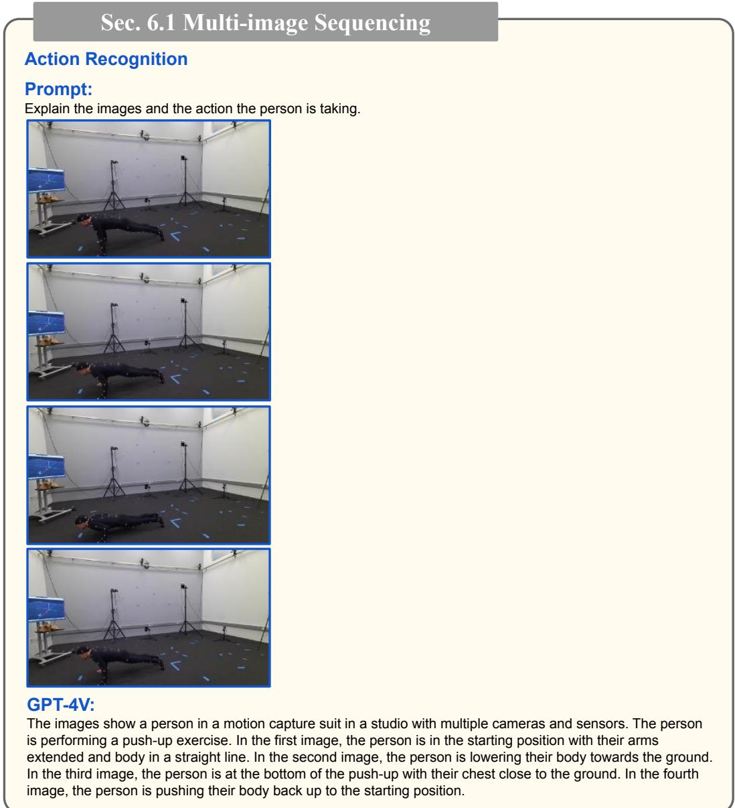

> **AI Description:**
> **Source:** `assets/_page_73_Figure_0.jpg`
> 
> **Generated:** 2026-05-16 10:02:55
> 
> ---
> 
> The image contains a sequence of four photographs showing a person performing a push-up exercise in a motion capture studio. The photographs are arranged vertically, each depicting a different stage of the push-up movement. The studio is equipped with multiple cameras and sensors, and the person is wearing a motion capture suit. The text at the bottom of the image describes the sequence of the push-up exercise, detailing the starting position, lowering of the body, the bottom position, and the return to the starting position.

## Sec. 6.2 Video Understanding

## Temporal Ordering

## Prompt:

Analyze the images and decide the correct order in which they should be displayed.

d
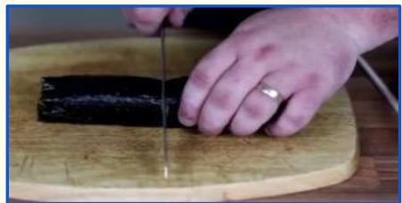

> **AI Description:**
> **Source:** `assets/_page_74_Figure_0.jpg`
> 
> **Generated:** 2026-05-16 10:01:39
> 
> ---
> 
> The image shows a close-up of a person's hands using a knife to cut a strip of nori (seaweed) on a wooden cutting board. The hands are positioned with the fingers slightly curled, and the knife is being held in a precise manner to make a clean cut. The cutting board appears to be well-used, with visible scratches and marks, indicating frequent use. The focus is on the action of cutting the nori, which is a common step in preparing sushi or other nori-based dishes.

Prompt Continued

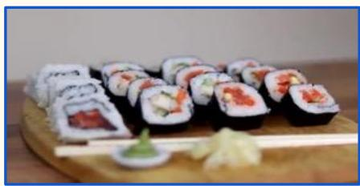

> **AI Description:**
> **Source:** `assets/_page_74_Figure_1.jpg`
> 
> **Generated:** 2026-05-16 10:01:32
> 
> ---
> 
> The image contains a photograph of a wooden plate with several pieces of sushi. The sushi pieces are neatly arranged, with some featuring visible fillings such as fish and vegetables. There is a small bowl of wasabi and a pair of chopsticks placed on the plate, along with a small dish of soy sauce. The background is slightly blurred, focusing attention on the sushi.

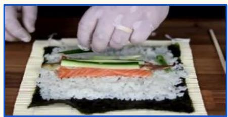

> **AI Description:**
> **Source:** `assets/_page_74_Figure_2.jpg`
> 
> **Generated:** 2026-05-16 09:55:32
> 
> ---
> 
> The image contains a photograph of a sushi preparation process. It shows a close-up view of hands wearing gloves, working on a bamboo mat. The mat is covered with a sheet of nori (seaweed), and layers of ingredients are being added, including white rice, salmon, cucumber, and other vegetables. The hands are in the process of rolling the sushi, indicating the preparation of a sushi roll. The image captures the step-by-step process of making sushi, highlighting the hands-on nature of the craft.

> **AI Description:**
> **Source:** `assets/_page_74_Figure_3.jpg`
> 
> **Generated:** 2026-05-16 09:55:37
> 
> ---
> 
> The image shows a close-up of a hand using a red utensil to mix a white, fluffy substance in a white bowl. The substance appears to be a type of food, possibly mashed potatoes or a similar dish, with a red liquid or sauce visible beneath it. The focus is on the mixing action, suggesting a cooking or food preparation process.

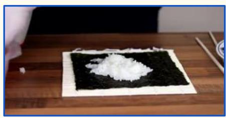

> **AI Description:**
> **Source:** `assets/_page_74_Figure_4.jpg`
> 
> **Generated:** 2026-05-16 09:42:50
> 
> ---
> 
> The image shows a close-up of a sushi-making process. It features a sheet of nori (seaweed) laid out on a bamboo mat, with a mound of white rice placed in the center. The rice is spread unevenly, and there is a small amount of white rice scattered to the left side of the nori sheet. The background includes a wooden surface and part of a person's hand, suggesting the preparation of sushi.

## GPT-4V:

The correct order in which the images should be displayed is:

1. e - Mixing the rice

2. c - Placing the rice on the seaweed

3. b - Adding the fillings

4. a - Cutting the roll

5. d - Finished sushi rolls on a plate.

Figure 54: Long-term temporal ordering: GPT-4V is presented with shuffled image frames depicting a sushi-making event. While the sushi-making process is disordered, GPT-4V is able to identify the event and determine the correct temporal sequence. Check Section 6.2 for detailed discussions.

Figure 55: Short-term temporal ordering: given a specified action, such as opening or closing a door, GPT-4V demonstrates its capability to comprehend the images’ content and determine the correct sequential order corresponding to the specified action. Check Section 6.2 for detailed discussions.
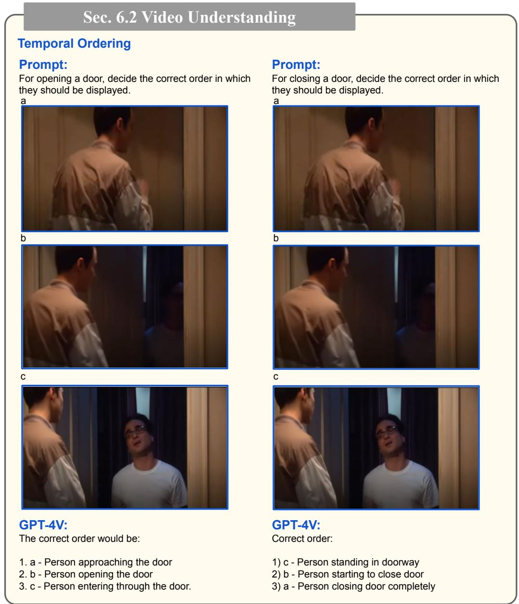

> **AI Description:**
> **Source:** `assets/_page_75_Figure_0.jpg`
> 
> **Generated:** 2026-05-16 09:49:21
> 
> ---
> 
> The image contains a slide from a section on video understanding, specifically focusing on temporal ordering of actions. It presents two prompts: one for opening a door and the other for closing a door. Each prompt includes three images labeled a, b, and c, depicting different stages of the action. The slide also includes the responses from GPT-4V, which suggests the correct order of the images for both opening and closing a door. The visual elements include photographs of a person interacting with a door, and the text provides instructions and the corresponding order of events.

Figure 56: Short-term and long-term temporal anticipation: GPT-4V captures and understands activities with varying temporal structures and complexities. Check Section 6.2 for detailed discussions.
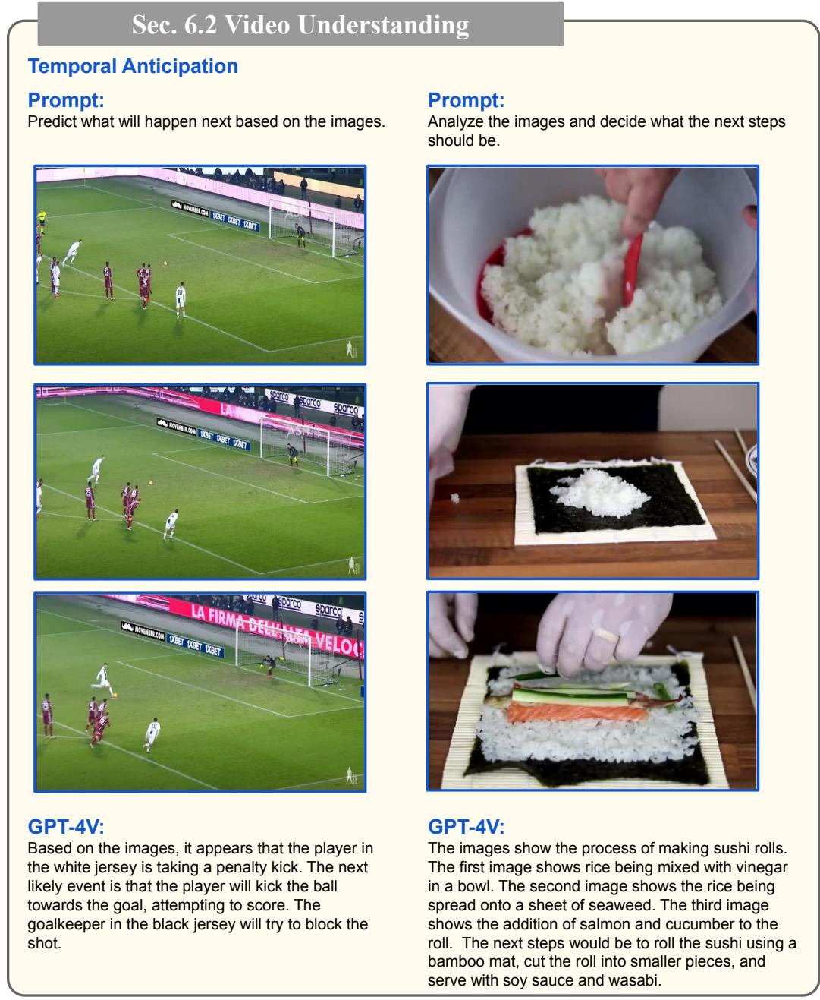

> **AI Description:**
> **Source:** `assets/_page_76_Figure_0.jpg`
> 
> **Generated:** 2026-05-16 08:36:33
> 
> ---
> 
> The image contains a combination of text and visual elements. It is divided into two sections, each with a prompt and corresponding images. The left section is about predicting the next event in a soccer match based on the images provided. The right section is about analyzing images and deciding the next steps in the process of making sushi rolls. The visual elements include soccer field scenes and close-ups of sushi preparation steps, such as mixing rice with vinegar, spreading rice on seaweed, and adding ingredients like salmon and cucumber. The text provides context and instructions for both scenarios.

# Sec. 6.2 Video Understanding

## Temporal Localization and Reasoning

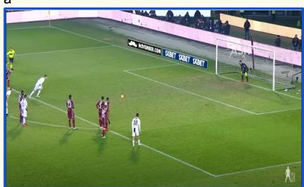

> **AI Description:**
> **Source:** `assets/_page_77_Figure_0.jpg`
> 
> **Generated:** 2026-05-16 08:42:59
> 
> ---
> 
> The image is a photograph of a soccer match. It shows a player in white, likely the goalkeeper, preparing to kick the ball. There are several players in maroon uniforms standing on the field, and a few players in white uniforms near the goalpost. The field is well-maintained with clear white markings. The background includes a pink wall with advertisements and a small section of spectators. The image captures a moment of action during the game.

Prompt Continued

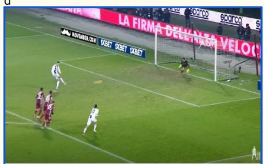

> **AI Description:**
> **Source:** `assets/_page_77_Figure_1.jpg`
> 
> **Generated:** 2026-05-16 08:46:18
> 
> ---
> 
> The image contains a photograph of a soccer match in progress. It shows a goalkeeper in the process of kicking the ball, with players from two teams positioned around the goal area. The field is green, and the goalpost is visible with a net. There are advertisements on the perimeter of the field, including one for "XBet" and another for "Sparco." The image captures a dynamic moment in the game, with the goalkeeper actively involved in the play.

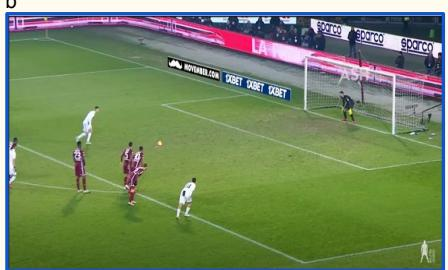

> **AI Description:**
> **Source:** `assets/_page_77_Figure_2.jpg`
> 
> **Generated:** 2026-05-16 08:40:03
> 
> ---
> 
> The image is a photograph of a soccer match in progress. It shows a player in white, likely the goalkeeper, preparing to defend a corner kick. The ball is in the air, and players from both teams are positioned around the goal area. The field is well-maintained with clear markings. The background includes advertisements and a crowd of spectators.

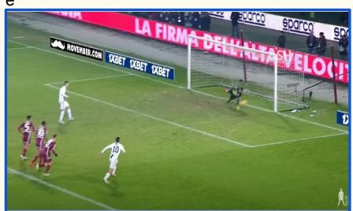

> **AI Description:**
> **Source:** `assets/_page_77_Figure_3.jpg`
> 
> **Generated:** 2026-05-16 08:37:07
> 
> ---
> 
> The image contains a photograph of a soccer match. It shows a goalkeeper in the process of kicking the ball, with players from two teams positioned around the goal area. The field is green, and the goalpost is white. The image includes text advertisements for "1XBET" and "Sparco" along the perimeter of the field. The scene captures a dynamic moment in the game, likely a corner kick or a free kick situation.

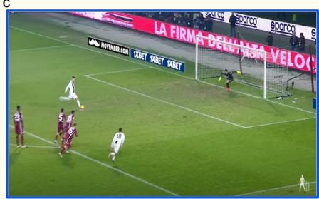

> **AI Description:**
> **Source:** `assets/_page_77_Figure_4.jpg`
> 
> **Generated:** 2026-05-16 08:26:14
> 
> ---
> 
> The image is a photograph of a soccer match. It shows a player in a white jersey attempting to score a goal, with the goalkeeper in a yellow jersey preparing to defend. Several players in maroon jerseys are positioned around the goal area, and the ball is in mid-air, heading towards the goal. The background includes advertisements and spectators in the stands.

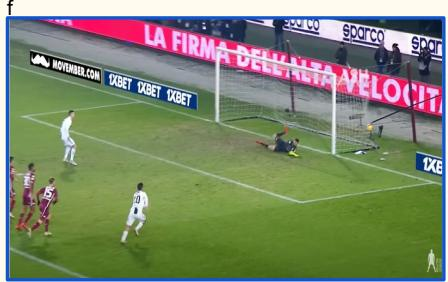

> **AI Description:**
> **Source:** `assets/_page_77_Figure_5.jpg`
> 
> **Generated:** 2026-05-16 08:23:11
> 
> ---
> 
> The image is a photograph of a soccer match. It shows a goalkeeper lying on the ground near the goalpost, with players from both teams positioned around the goal area. The field is green, and there are advertisements on the perimeter of the field, including "1XBET" and "LA FIRMA DELL'ALTA VELOCITÀ." The image captures a moment during the game, likely after a goal has been scored or a save has been made.

GPT-4V:
The player kicks the ball at frame c. The ball was not blocked by the goalkeeper as it can be seen in frame f that the ball is in the net and the goalkeeper is on the ground.

Figure 57: Temporal localization and reasoning: GPT-4V shows the capability in temporal localization by accurately identifying when the player strikes the ball. It also demonstrates cause-and-effect reasoning by determining whether the ball was blocked based on the goalkeeper-ball interaction. Check Section 6.2 for detailed discussions.

# Sec. 6.3 Video Visual Referring Prompting

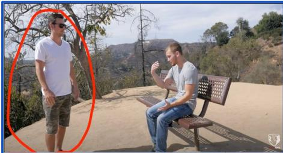

> **AI Description:**
> **Source:** `assets/_page_78_Figure_0.jpg`
> 
> **Generated:** 2026-05-16 09:33:02
> 
> ---
> 
> The image contains a photograph of two individuals outdoors. One person is standing and the other is sitting on a bench. The standing individual is wearing a white t-shirt and camouflage shorts, while the seated individual is wearing a light gray t-shirt and jeans. The background features a scenic landscape with hills and sparse vegetation. There is a red circle highlighting the standing individual.

Prompt: Summarize the activities of the person.

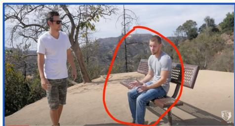

> **AI Description:**
> **Source:** `assets/_page_78_Figure_1.jpg`
> 
> **Generated:** 2026-05-16 09:31:22
> 
> ---
> 
> The image is a photograph of two individuals outdoors. One person is standing on the left side, wearing a white t-shirt and camouflage shorts, while the other is seated on a bench on the right, wearing a light gray t-shirt and jeans. The seated individual has a red circle drawn around them, highlighting their position. The background features a natural setting with trees and a clear sky, suggesting a park or scenic area.

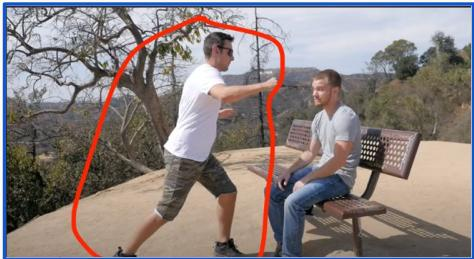

> **AI Description:**
> **Source:** `assets/_page_78_Figure_2.jpg`
> 
> **Generated:** 2026-05-16 09:37:22
> 
> ---
> 
> The image is a photograph showing two individuals in an outdoor setting. One person is standing and appears to be in a dynamic pose, possibly mid-action or in the process of speaking. The other person is seated on a bench, wearing casual clothing and looking towards the standing individual. The background features a natural landscape with trees and a clear sky, suggesting a park or scenic overlook. The image captures a moment of interaction between the two individuals in a relaxed, outdoor environment.

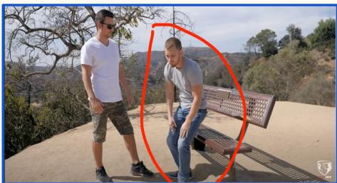

> **AI Description:**
> **Source:** `assets/_page_78_Figure_3.jpg`
> 
> **Generated:** 2026-05-16 09:39:12
> 
> ---
> 
> The image contains a photograph of two individuals outdoors. One person is standing and the other is sitting on a bench. The person sitting is circled in red, drawing attention to them. The background shows a natural setting with trees and a clear sky.

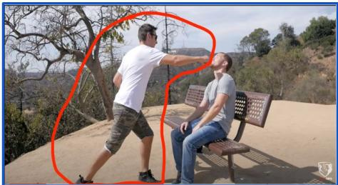

> **AI Description:**
> **Source:** `assets/_page_78_Figure_4.jpg`
> 
> **Generated:** 2026-05-16 09:23:51
> 
> ---
> 
> The image is a photograph showing two individuals in an outdoor setting. One person is standing and appears to be in a dynamic pose, possibly mid-action or in a playful stance, while the other person is seated on a bench. The background features trees and a hilly landscape, suggesting a park or natural area. The standing individual is wearing a white shirt and patterned shorts, while the seated individual is dressed in a gray shirt and jeans. The image is framed with a red outline, highlighting the standing individual.

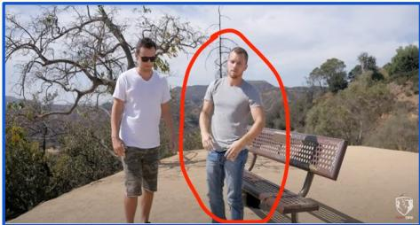

> **AI Description:**
> **Source:** `assets/_page_78_Figure_5.jpg`
> 
> **Generated:** 2026-05-16 09:26:01
> 
> ---
> 
> The image contains a photograph of two individuals standing outdoors on a paved area with a bench. One person is wearing a white t-shirt and camouflage shorts, while the other is wearing a gray t-shirt and jeans. The individual in the gray t-shirt is circled in red, drawing attention to them. The background features a natural setting with trees and a hilly landscape under a partly cloudy sky.

The circled person is a man who is standing next to a bench and appears to be in a conversation with another man who is sitting on the bench. In the second image, the circled man is pointing towards something and in the third image, he is playfully pretending to punch the other man. Overall, it seems like the circled man is engaging in a friendly conversation and joking around with the other man.

The circled person is sitting on a bench and then stands up and adjusts his shirt.

Figure 58: Grounded temporal understanding: GPT-4V can apply a temporal understanding to a specific person of interest, indicated by a circle. Check Section 6.3 for detailed discussions.

## 6.3 Visual Referring Prompting for Grounded Temporal Understanding

Section 5 illustrates GPT-4V’s capabilities in visual referring prompting. In this section, we aim to extend this capability by testing visual referring prompting for temporal understanding. This advancement offers enhanced control over video comprehension tasks.

Grounded temporal understanding. Grounded temporal understanding forms another crucial aspect of GPT-4V’s capabilities, which we explore using pointing input in a sequence of image frames. Figure 58 exemplifies this by demonstrating how GPT-4V can apply a temporal understanding to a specific person of interest, indicated by a circle. GPT-4V can accurately describe events in a way that aligns with the corresponding temporal order, focusing on the activities of the circled individual. Beyond this, GPT-4V demonstrates a more refined understanding of the event, recognizing the nature of the interactions. For instance, GPT-4V can distinguish between friendly interactions and violent incidents, illustrating an ability to not only comprehend the temporal flow of events but also to interpret the tone and nature of the interactions taking place. This indicates GPT-4V’s capacity to process and comprehend complex temporal and social cues within a given sequence, adding a layer of depth to its understanding.

## 7 Abstract Visual Reasoning and Intelligence Quotient Test

Understanding and reasoning over abstract visual stimuli and symbols is one fundamental ability for human intelligence. This section examines if GPT-4V can abstract semantics from visual signals and can perform different types of human Intelligence Quotient (IQ) tests.

## 7.1 Abstract Visual Stimuli

Humans can infer semantics from abstract and often ambiguous visual stimuli. Figure 59 explores having GPT-4V interpret tangram [31, 97, 43, 59]. A tangram is a traditional geometric puzzle that consists of seven flat pieces called tans, which are put together to form shapes without overlapping the pieces. For example, GPT-4V interprets that sub-figure 7 in Figure 59 best illustrates a flying goose and provides reasoning descriptions for other sub-figure, e.g., 4. person or robot, 9. boat or hat, and 10. dog or fox. GPT-4V also has the ability to understand other formats of abstract visual diagrams [127, 16, 150], such as ASCII text art of cartoon characters in Figure 59 and symbolic inputs in Figures 61-62.

## 7.2 Discovery and Association of Parts and Objects

Discovering and associating object parts [139, 44] is another important abstract visual reasoning capability. Humans can easily discover how object parts may compose a semantically meaningful object. Figure 60 designs examples to probe GPT-4V’s capability in associating object parts. In the left example, we ask GPT-4V to localize an object part based on its semantic meaning. In the right example, GPT-4V is asked to associate object parts segmented by SAM [65]. GPT-4V can process figures for all object parts and associate them in a semantically meaningful to form the boy visualized in the bottom right.

## 7.3 Wechsler Adult Intelligence Scale

Section 7.1 demonstrates the abstract visual understanding capability of GPT-4V. As a further challenge, GPT-4V is asked to perform different abstract reasoning tasks, sourced from human Intelligence Quotient (IQ) tests. The Wechsler Adult Intelligence Scale [133] is recognized as one of the “gold standard IQ tests,” and is designed to provide a comprehensive measurement of an individual’s cognitive abilities using a series of sub-tests. Figure 61 shows representative questions and GPT-4V’s outputs from each sub-test category. GPT-4V shows promises in abstract reasoning, answering questions with texts only, symbolic visual inputs, and natural images. For example, the bottom right sample shows that GPT-4V can interpret the analogy question and find the best comparison of shoes.

## 7.4 Raven’s Progressive Matrices

Raven’s Progressive Matrices (RPM) [109] is another well-known non-verbal intelligence test developed to measure abstract reasoning and problem-solving abilities. The test is designed to minimize the influence of language, culture, and formal education on test performance, making it suitable for testing AI models [16, 150, 55]. Each test sample contains three or eight images, arranged in 2-by-2 or 3-by-3 matrices with one figure missing. The goal is to select the next image from multiple candidate images by identifying patterns in the provided samples. In our approach, we challenge GPT-4V by sending the entire question page as a single image, instead of converting it into interleaved image-text pairs, similar to the human approach to IQ tests. As shown in Figure 62, GPT-4V can generate reasonable answers without processed text descriptions or sub-figures. However, we also notice that breaking down the entire question image into interleaved text and sub-figures, such as in Figure 63, does simplify the task and let GPT-4V produce more reliable answers.

# Sec. 7.1 Abstract Visual Stimuli

## Prompt:

A tangram is a geometric puzzle that consists of seven flat pieces to form shapes. Here are ten abstract tangram. Which one best illustrates a flying goose? What do other figures look like?

> **AI Description:**
> **Source:** `assets/_page_80_Figure_0.jpg`
> 
> **Generated:** 2026-05-16 09:31:44
> 
> ---
> 
> The image contains a geometric diagram. It appears to be a tangram puzzle, which is a type of dissection puzzle consisting of seven flat shapes, called tetrastiks, which are put together to form a larger shape. The diagram shows a square divided into seven smaller shapes, with one of the shapes being a parallelogram. The shapes are arranged in a way that they form a larger geometric figure, which in this case is a parallelogram. The diagram is likely used to illustrate the concept of area and how shapes can be rearranged to form different configurations.

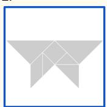

> **AI Description:**
> **Source:** `assets/_page_80_Figure_1.jpg`
> 
> **Generated:** 2026-05-16 09:31:38
> 
> ---
> 
> The image contains a geometric diagram. It appears to be a tangram puzzle, which is a shape puzzle consisting of seven flat shapes, called tans, which are put together to form a larger shape. The diagram shows a completed tangram puzzle forming the shape of a bird, with the tans arranged in a specific configuration to create the bird's outline.

> **AI Description:**
> **Source:** `assets/_page_80_Figure_2.jpg`
> 
> **Generated:** 2026-05-16 09:37:33
> 
> ---
> 
> The image is a diagram consisting of several geometric shapes arranged to form a bird-like figure. The shapes are triangles and parallelograms, all of which are gray and placed within a blue square border. The arrangement of the shapes suggests a tangram puzzle, where the shapes are used to create the bird shape. There are no labels or text annotations within the image.

8.

> **AI Description:**
> **Source:** `assets/_page_80_Figure_3.jpg`
> 
> **Generated:** 2026-05-16 09:37:37
> 
> ---
> 
> The image contains a simple diagram of a tent with a triangular roof and a rectangular base. The tent is outlined in blue, and the interior is divided into sections with diagonal lines, possibly indicating different areas or sections of the tent. The design is minimalistic and appears to be a stylized representation rather than a detailed or realistic depiction.

> **AI Description:**
> **Source:** `assets/_page_80_Figure_4.jpg`
> 
> **Generated:** 2026-05-16 09:23:54
> 
> ---
> 
> The image is a simple diagram of a geometric shape resembling a stylized letter 'P'. It consists of several connected geometric shapes forming a single, continuous figure. The shape is outlined in blue and filled with a light gray color. There are no text annotations or additional labels within the image.

4.

> **AI Description:**
> **Source:** `assets/_page_80_Figure_5.jpg`
> 
> **Generated:** 2026-05-16 09:24:58
> 
> ---
> 
> The image contains a simple diagram of a ship made up of stacked blocks. The ship is represented by a series of rectangular blocks stacked vertically, with the largest block at the bottom and the smallest at the top, forming the hull and mast of the ship. The diagram is enclosed within a blue square border.

> **AI Description:**
> **Source:** `assets/_page_80_Figure_6.jpg`
> 
> **Generated:** 2026-05-16 09:18:18
> 
> ---
> 
> The image contains a geometric puzzle, specifically a tangram. It consists of seven geometric shapes arranged to form a larger shape. The shapes are triangles, a square, and a parallelogram. The arrangement of these shapes is a classic example of a tangram puzzle, which challenges the solver to recreate a specific image or shape using all the pieces without overlapping.

> **AI Description:**
> **Source:** `assets/_page_80_Figure_7.jpg`
> 
> **Generated:** 2026-05-16 09:18:14
> 
> ---
> 
> The image contains a diagram of a tangram puzzle. The puzzle consists of seven geometric shapes arranged to form a larger arrow shape pointing to the right. The shapes are triangles and a square, which are the standard pieces of a tangram set. The diagram is simple and does not include any text or additional annotations.

> **AI Description:**
> **Source:** `assets/_page_80_Figure_8.jpg`
> 
> **Generated:** 2026-05-16 09:04:47
> 
> ---
> 
> The image contains a diagram of a tangram puzzle. The tangram is composed of seven geometric shapes arranged to form a specific figure. The shapes include two large triangles, one medium triangle, two small triangles, one square, and one parallelogram. The diagram is enclosed within a blue square border.

6.

> **AI Description:**
> **Source:** `assets/_page_80_Figure_9.jpg`
> 
> **Generated:** 2026-05-16 09:04:51
> 
> ---
> 
> The image contains a simple diagram with a blue border. Inside the border, there is a white square with a smaller white square in the center. Above the smaller square, there are two triangles pointing upwards, forming a shape that resembles a house or a roof. The diagram appears to be a basic illustration without any text or additional labels.

## GPT-4V:

The tangram that best illustrates a flying goose is number 7. It has the triangular shape of a goose's body an wings, and the smaller triangle at the top could represent the head and neck.

The other figures could represent various things:

1. A rocket or a tower

2. A butterfly or a bat

3. A question mark or a snake

4. A person or a robot

5. A mountain range or a crown

6. A house or a temple

7. A flying goose (as mentioned above)

8. A bird or a fish

9. A boat or a hat

10. A dog or a fox.

## Prompt:

Here is an abstract figure. Can you identify how many characters are there, and the cartoon from which they originate?

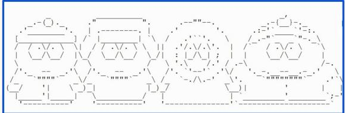

> **AI Description:**
> **Source:** `assets/_page_80_Figure_10.jpg`
> 
> **Generated:** 2026-05-16 09:43:42
> 
> ---
> 
> The image contains a series of interconnected hexagonal shapes with dashed lines and various symbols inside them. The hexagons are arranged in a pattern that suggests a network or a system. The symbols inside the hexagons include circles, squares, and other geometric shapes, which may represent different nodes or components within the network. The dashed lines connecting the hexagons indicate relationships or connections between these components. The overall structure appears to be a conceptual diagram, possibly representing a network or a system with interconnected elements.

## GPT-4V:

There are four characters in this abstract figure. They originate from the cartoon "South Park." The characters are Eric Cartman, Kyle Broflovski, Stan Marsh, and Kenny McCormick.

Figure 59: Understanding abstract visual stimuli such as tangram [59] and ASCII text art. Check Section 7.1 for detailed discussions.

# Sec. 7.2 Association of Parts and Objects

## Discovery and Association of Parts and Objects

## Prompt:

A tangram is a geometric puzzle that consists of seven flat pieces to form shapes. Locate the referred object and represent the location of the region. Regions are represented by (x1,y1,x2,y2) coordinates. x1 x2 are the left and right most positions, normalized into 0 to 1, where 0 is the left and 1 is the right. y1 y2 are the top and bottom most positions, normalized into 0 to 1, where 0 is the top and 1 is the bottom. For example, the (x1,y1,x2,y2) coordinates for that region with the beer bottle is (0.47, 0.48, 0.55, 0.87).

0.47 0.55
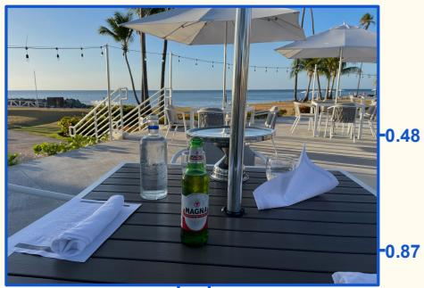

> **AI Description:**
> **Source:** `assets/_page_81_Figure_0.jpg`
> 
> **Generated:** 2026-05-16 09:18:00
> 
> ---
> 
> The image is a photograph of an outdoor dining area by the sea. It features a table with a folded white napkin, a bottle of Magna beer, and a bottle of water. The table is set under a large umbrella, and the background shows a scenic view of the ocean with palm trees and a staircase leading down to the beach. The lighting suggests it is either early morning or late afternoon, with the sun low on the horizon. The image includes numerical annotations on the right side, labeled as -0.48 and -0.87, which appear to be related to the image content but do not provide additional context or information.

The image below that shows a flying goose. Which part represents the head of the bird? What is the (x1,y1,x2,y2) coordinates for the region with the head of the bird?

> **AI Description:**
> **Source:** `assets/_page_81_Figure_1.jpg`
> 
> **Generated:** 2026-05-16 09:20:47
> 
> ---
> 
> The image contains a geometric puzzle, specifically a tangram. It consists of seven geometric shapes arranged to form a bird-like figure. The shapes include two large triangles, one medium triangle, two small triangles, a square, and a parallelogram. The arrangement of these shapes creates the outline and features of a bird, with the wings, body, and head clearly defined.

## GPT-4V:

The head of the bird is represented by the small triangle at the top of the image. The (x1,y1,x2,y2) coordinates for the region with the head of the bird would be approximately (0.42, 0.15, 0.58, 0.35).

## Plot Visualization:

Refer to the query image below

## Grounded VQA

Prompt: What is the highlighted part?

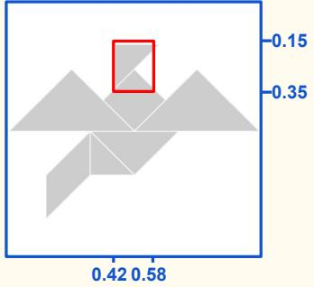

> **AI Description:**
> **Source:** `assets/_page_81_Figure_2.jpg`
> 
> **Generated:** 2026-05-16 09:26:13
> 
> ---
> 
> The image is a diagram of a geometric puzzle, specifically a tangram, with a highlighted section in red. The puzzle consists of seven geometric shapes arranged to form a larger shape. The highlighted section appears to be a smaller, distinct shape within the larger tangram. The coordinates at the bottom and right side of the image suggest a possible coordinate system or scale for the tangram, but there is no text or labels that provide additional context or information about the puzzle.

## Prompt:

How are those visual parts related, and can they be combined to form a single object such as a boy? If so, how to arrange them?

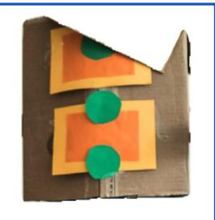

> **AI Description:**
> **Source:** `assets/_page_81_Figure_3.jpg`
> 
> **Generated:** 2026-05-16 09:23:25
> 
> ---
> 
> The image contains a simple diagram of a cardboard structure with two orange and yellow sections. Each section has a green circular element in the center. The diagram appears to represent a basic model or prototype, possibly for a mechanical or educational project. The structure is symmetrical and the colors are used to differentiate between different parts of the model.

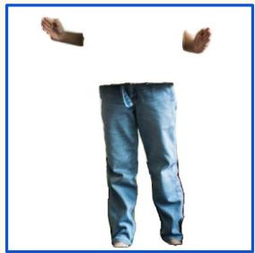

> **AI Description:**
> **Source:** `assets/_page_81_Figure_4.jpg`
> 
> **Generated:** 2026-05-16 09:40:16
> 
> ---
> 
> The image contains a pair of blue jeans with a visible button and belt loops. The jeans are positioned vertically, and there are two arms visible, one on each side of the jeans. The arms appear to be in a relaxed position, with the hands slightly bent. The image is cut out against a white background, and the jeans are the main focus of the image.

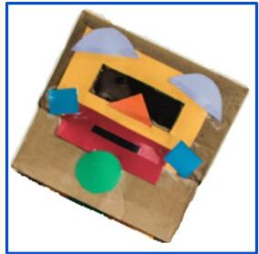

> **AI Description:**
> **Source:** `assets/_page_81_Figure_5.jpg`
> 
> **Generated:** 2026-05-16 09:35:50
> 
> ---
> 
> The image contains a photograph of a handmade craft project. It appears to be a representation of a character or figure made from cardboard and various colored paper pieces. The figure has a rectangular body with a red section and a green circle, possibly representing a belly or a part of the body. The head is square-shaped with blue and orange sections, and there are two blue wings or ears on top. The overall design is simple and playful, likely intended for a child's craft activity.

## GPT-4V:

The three visual parts are related in that they are all components that could be used to create a single object. In this case, the object is a boy.

To combine these parts to form a boy, we can arrange them in the following way:

\- The first image (the cardboard with orange and green shapes) could be used as the body of the boy. - The second image (the pair of jeans) could be used as the legs of the boy.

\- The third image (the cardboard with yellow, red, and blue shapes) could be used as the head of the boy. By arranging these parts in this way, we can create a single object that resembles a boy.

## Plot Visualization:

Figure 60: Understanding part-object association in abstract and natural images. Check Section 7.2 for detailed discussions.
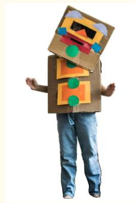

> **AI Description:**
> **Source:** `assets/_page_81_Figure_6.jpg`
> 
> **Generated:** 2026-05-16 09:31:09
> 
> ---
> 
> The image contains a photograph of a person wearing a costume made from cardboard boxes. The costume is designed to resemble a traffic light, with three sections stacked vertically: red at the top, yellow in the middle, and green at the bottom. The person is standing with their arms slightly outstretched, and they are wearing blue jeans. The image is focused on the costume and the person wearing it, with no additional text or annotations.

## Sec. 7.3 Wechsler Adult Intelligence Scale

## Prompt:

Which one of the five is least like the other four?

a. Carrot

b. Potato

c. Corn

d. Apple

e. Bean

## GPT-4V:

d. Apple

Explanation: Carrot, potato, corn, and bean are all vegetables, while apple is a fruit.

## Prompt:

Which one of the five is least like the other four?

a.

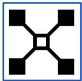

> **AI Description:**
> **Source:** `assets/_page_82_Figure_0.jpg`
> 
> **Generated:** 2026-05-16 08:54:46
> 
> ---
> 
> The image is a simple diagram consisting of a central square with four smaller squares arranged around it, forming a cross-like shape. The central square and the surrounding squares are filled with black, and the entire shape is outlined in blue. There are no labels or text annotations present in the image.

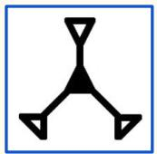

> **AI Description:**
> **Source:** `assets/_page_82_Figure_1.jpg`
> 
> **Generated:** 2026-05-16 08:48:21
> 
> ---
> 
> The image contains a simple diagram of a three-pointed star or tripod shape. The shape is symmetrical, with three triangular points extending outward from a central point. The lines are bold and black, set against a white background. The diagram appears to be a basic representation of a tripod or a three-pointed star, possibly used in a technical or educational context.

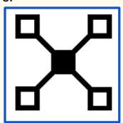

> **AI Description:**
> **Source:** `assets/_page_82_Figure_2.jpg`
> 
> **Generated:** 2026-05-16 08:54:50
> 
> ---
> 
> The image contains a simple diagram of a cross with four squares at each end, forming a T-shape. The squares are black and the cross is white, set against a blue border. The diagram appears to be a basic representation of a cross or a T-junction, possibly used in a technical or educational context to illustrate a concept or structure.

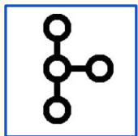

> **AI Description:**
> **Source:** `assets/_page_82_Figure_3.jpg`
> 
> **Generated:** 2026-05-16 08:59:06
> 
> ---
> 
> The image contains a simple diagram of a network or tree structure. It features a central node connected to three other nodes, each of which is further connected to another node. This structure could represent a basic network topology or a simple hierarchical organization. The diagram is minimalistic, with no additional labels or annotations to provide further context.

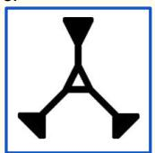

> **AI Description:**
> **Source:** `assets/_page_82_Figure_4.jpg`
> 
> **Generated:** 2026-05-16 09:09:52
> 
> ---
> 
> The image contains a simple diagram of a triangular shape with three smaller shapes extending from its base, resembling a fork or a tripod. The diagram is enclosed within a blue border. There are no labels or text annotations within the image itself.

## GPT-4V:

Answer: d. is the least like the other four because it is the only one that does not have a central point connecting all the other points.

## Prompt:

a. 18

Tom, twelve years old, is three times as old as his sister. How old will Tom be when he is twice as old as his sister?

b. 21

c. 16

d. 20

e. 15

## GPT-4V:

If Tom is three times as old as his sister, then his sister is one-third of his age. So, his sister is 4 years old. Now, we need to figure out when Tom will be twice as old as his sister. This means that his sister's age will be half of his age. So, we need to find a number that is double the age of 4. The answer is 8. So, Tom will be 16 years old when he is twice as old as his sister. The correct answer is c. 16.

## Prompt:

Which one of the five designs makes the best comparison?

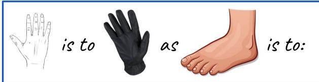

> **AI Description:**
> **Source:** `assets/_page_82_Figure_5.jpg`
> 
> **Generated:** 2026-05-16 09:14:42
> 
> ---
> 
> The image contains a comparison using illustrations and text. It shows a hand with fingers, a pair of black gloves, and a foot with toes. The text "is to" is placed between the hand and the gloves, and "as" is placed between the gloves and the foot. The phrase "is to:" is at the end, suggesting a comparison or analogy is being made between the hand and the foot. The image uses simple illustrations to visually represent the objects being compared.

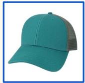

> **AI Description:**
> **Source:** `assets/_page_82_Figure_6.jpg`
> 
> **Generated:** 2026-05-16 09:09:49
> 
> ---
> 
> The image shows a single object: a teal-colored baseball cap with a mesh back. The cap appears to be a standard design with a curved brim and a structured crown. The cap is displayed against a plain white background, which emphasizes its color and shape. There are no additional visual elements or text present in the image.

> **AI Description:**
> **Source:** `assets/_page_82_Figure_7.jpg`
> 
> **Generated:** 2026-05-16 09:00:20
> 
> ---
> 
> The image contains a single, clear visual element: a soccer ball. The ball is depicted in its classic black and white pattern, consisting of pentagons and hexagons, which are characteristic of a standard soccer ball. There are no additional visual elements or text annotations present in the image.

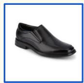

> **AI Description:**
> **Source:** `assets/_page_82_Figure_8.jpg`
> 
> **Generated:** 2026-05-16 09:14:45
> 
> ---
> 
> The image contains a photograph of a single black slip-on shoe. The shoe appears to be a formal or business style, with a smooth leather upper and a low heel. The image is clear and focused on the shoe, with no additional elements or text present.

d.

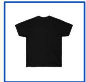

> **AI Description:**
> **Source:** `assets/_page_82_Figure_9.jpg`
> 
> **Generated:** 2026-05-16 09:21:03
> 
> ---
> 
> The image shows a black T-shirt against a plain white background. There are no additional visual elements, charts, or annotations present in the image. The T-shirt is displayed in a simple, flat lay style, with no text or other graphics.

e.

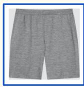

> **AI Description:**
> **Source:** `assets/_page_82_Figure_10.jpg`
> 
> **Generated:** 2026-05-16 08:32:33
> 
> ---
> 
> The image shows a pair of gray shorts with a simple, solid color and a straight hem. The shorts appear to be made of a casual, possibly cotton or cotton-blend fabric, suitable for everyday wear. The image is a straightforward product photo with no additional text or graphics.

## GPT-4V:

Answer: c. The black dress shoe

Explanation: The analogy is comparing a hand to a glove and a foot to a shoe. The best comparison would be the black dress s an item of clothing that is worn on the foot, just like a glove is worn on the hand.

Figure 61: Example questions from the Wechsler Adult Intelligence Scale (WAIS) [133]. Check Section 7.3 for detailed discussions.

The pattern in the first two rows is that the figures are rotated 90 degrees clockwise in each subsequent cell. Therefore, the missing figure in the third row should be a rotated version of the figure in the previous cell. Looking at the options, the correct answer is OC, as it is the figure that is rotated 90 degrees clockwise from the figure in the previous cell.
Figure 62: Example questions from the Raven’s Progressive Matrices [109, 55]. We challenge GPT-4V by sending the entire question page as a single image, mimicking how humans look at the IQ tests. Check Section 7.4 for detailed discussions.
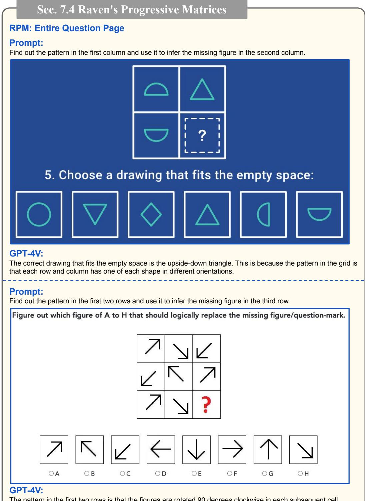

> **AI Description:**
> **Source:** `assets/_page_83_Figure_0.jpg`
> 
> **Generated:** 2026-05-16 09:01:40
> 
> ---
> 
> The image contains two sections of visual content related to Raven's Progressive Matrices. The first section presents a grid with shapes in the first column and asks to infer the missing figure in the second column. The second section shows a grid with arrows in the first two rows and asks to infer the missing figure in the third row. Both sections include multiple-choice options for the missing figures. The text provides explanations for the correct answers, indicating the patterns in the grids.

Figure 63: Instead of sending the entire question page as a single image, we may also process the image into multiple sub-figures and optionally provide detailed instructions and examples to further boost the answer accuracy. Check Section 7.4 for detailed discussions.
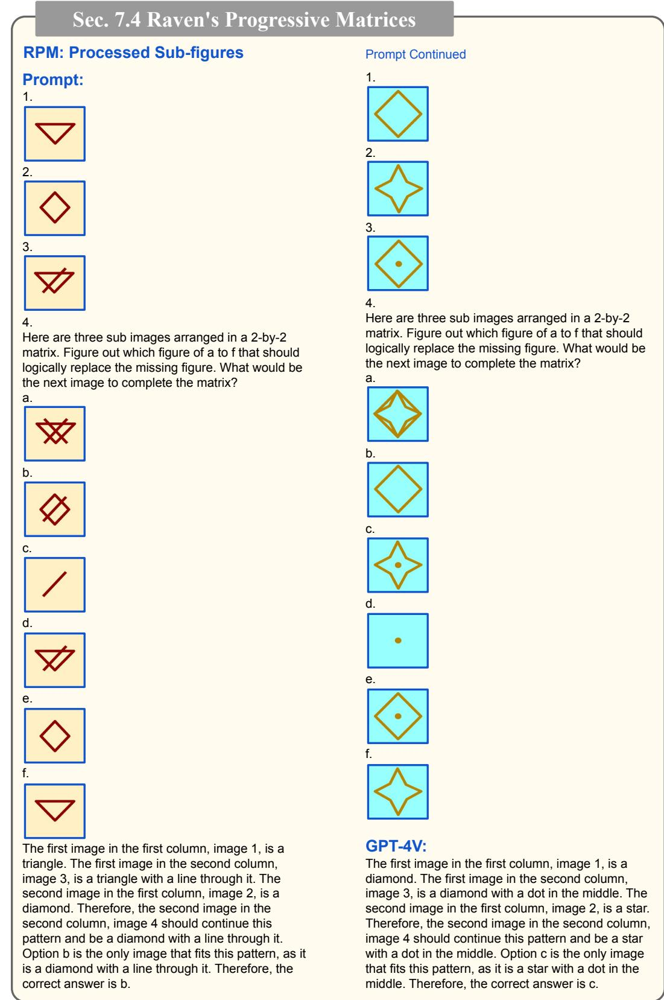

> **AI Description:**
> **Source:** `assets/_page_84_Figure_0.jpg`
> 
> **Generated:** 2026-05-16 09:03:34
> 
> ---
> 
> The image contains a section from a document titled "Sec. 7.4 Raven's Progressive Matrices." It features a problem-solving task related to the RPM (Processed Sub-figures) test. The image includes a 2x2 matrix with three filled-in sub-images and one empty sub-image. The task requires identifying the missing figure from options a to f that logically completes the matrix. The text provides a detailed explanation of the pattern and reasoning behind the correct answer, which is option b. The image also includes a section labeled "Prompt Continued" with additional sub-images and a continuation of the problem.

Figure 64: GPT-4V can reliably identify and read the emotions of people from their facial expressions. Check Section 8.1 for detailed discussions.

When interacting with humans, it is important that GPT-4V has the empathy and Emotional Quotient (EQ) to understand and share the feelings of humans. Inspired by the definition of the human EQ test [92, 91, 21], we examine GPT-4V’s capability in (1) identifying and reading human emotions from their facial expressions, (2) understanding how different visual contents may arouse emotions, and (3) generating proper text outputs conditioned on the desired emotional and sentiment.

## 8.1 Read Emotion from Facial Expressions

As shown in Figure 64, GPT-4V can reliably identify and read the emotions of people from their facial expressions. It also provides reasonable rationales for the visual cues observed to make the emotion interpretation, indicating a good understanding of the facial emotions.

## Sec. 8.2 How Visual Content Arouses Emotions

After seeing the below image, how people might emotionally feel and react?

> **AI Description:**
> **Source:** `assets/_page_86_Figure_0.jpg`
> 
> **Generated:** 2026-05-16 09:16:41
> 
> ---
> 
> The image is a photograph of a festival or outdoor event. It shows a stage area with colorful flags and banners in the background, indicating a lively atmosphere. In the foreground, there are people seated, with one person wearing a hat and another holding a child. The stage has a banner with the text "Festival of the Arts" partially visible, suggesting the event is related to arts and culture. The lighting and colors suggest it is either dusk or dawn, adding to the ambiance of the scene.

People might feel happy, content, and relaxed when seeing this image. They might react with a smile or a feeling of warmth and comfort. This image appears to be of a couple at a music festival, so people might also feel a sense of excitement and anticipation for the music and performances.

After seeing the below image, how people might emotionally feel and react?

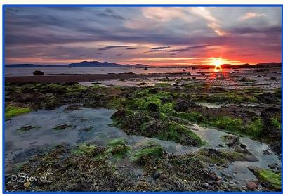

> **AI Description:**
> **Source:** `assets/_page_86_Figure_1.jpg`
> 
> **Generated:** 2026-05-16 09:21:00
> 
> ---
> 
> The image is a photograph of a coastal scene at sunset. The sun is low on the horizon, casting a warm glow over the water and the land. The foreground features a rocky shoreline with patches of green algae or seaweed. In the background, there are more rocks and a distant landmass, possibly an island or a peninsula. The sky is a mix of orange, pink, and purple hues, indicating the time of day is either sunrise or sunset. The overall atmosphere is serene and picturesque.

People might feel a sense of awe and wonder at the beauty of the sunset and the colors in the sky. They may feel peaceful and calm, or even inspired. Some may react with a sense of gratitude for being able to witness such a beautiful moment in nature. Others may feel a sense of longing to be in a place like this, or a desire to travel and see more of the world's beauty.

After seeing the below image, how people might emotionally feel and react?

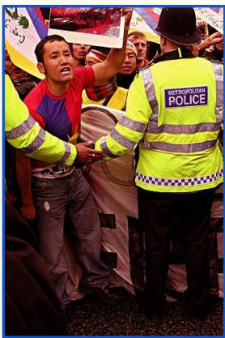

> **AI Description:**
> **Source:** `assets/_page_86_Figure_2.jpg`
> 
> **Generated:** 2026-05-16 09:26:28
> 
> ---
> 
> The image is a photograph showing a confrontation between a protester and a police officer. The protester, wearing a red and blue shirt and a yellow safety vest, appears to be holding up a banner or sign. The police officer, also in a yellow safety vest with "Metropolitan Police" written on it, is holding the protester's arm. The background shows other protesters and police officers, indicating a public demonstration or protest. The image captures a moment of interaction between law enforcement and a protester, highlighting the tension and dynamics of such events.

## GPT-4V:

People might feel angry, frustrated, or upset after seeing this image. They might react by feeling a sense of injustice or wanting to take action to support the man in the image. Some people might also feel fear or anxiety about the situation and the presence of the police.

After seeing the below image, how people might emotionally feel and react?

> **AI Description:**
> **Source:** `assets/_page_86_Figure_3.jpg`
> 
> **Generated:** 2026-05-16 09:22:09
> 
> ---
> 
> The image appears to be a photograph of a staircase with a shadow cast on the wall. The shadow seems to be that of a person standing, possibly holding a camera or phone, as the silhouette suggests a raised arm. The staircase has ornate railings with decorative elements, and the lighting is dim, creating a moody and somewhat eerie atmosphere. The image does not contain any text or additional labels.

## GPT-4V:

People might feel scared, anxious, or uneasy after seeing this image. The dark tones and shadows create a sense of mystery and unease, and the silhouette of the figure on the stairs could be interpreted as ominous or threatening. Some people might react by feeling a sense of dread or fear, while others might be intrigued or curious about the context of the image.

Figure 65: GPT-4V understands how different visual contents may arouse human emotions. Check Section 8.2 for detailed discussions.

## 8.2 Understand How Visual Content Arouses Emotions

We next analyze GPT-4V’s ability on visual sentiment analysis, i.e., understanding humans’ emotional response after seeing the visual contents. Such ability is critical for GPT-4V to anticipate how visual contents may arouse human emotions and thereby react properly. As shown in Figure 65, GPT-4V can interpret visual sentiments such as content, anger, awe, and fear, based on both the semantic contents and the image style. These capabilities are essential in use cases such as home robots.

# Sec. 8.2 How Visual Content Arouses Emotions

## Image Aesthetics

## Prompt:

Aesthetics reflects the perceived beauty or visual appeal of an object, design, or piece of art by human. Among the images provided below, based on societal standards and norms, which one more people will consider having a higher aesthetics?

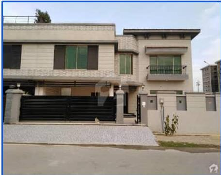

> **AI Description:**
> **Source:** `assets/_page_87_Figure_0.jpg`
> 
> **Generated:** 2026-05-16 09:33:08
> 
> ---
> 
> The image shows a modern two-story residential building with a large front yard. The house features a white exterior with dark accents, including a black gate and railings. The architecture includes large windows and a balcony on the second floor. The front yard is paved with a patterned design, and there is a small bush near the entrance. The sky is clear, suggesting a sunny day.

> **AI Description:**
> **Source:** `assets/_page_87_Figure_1.jpg`
> 
> **Generated:** 2026-05-16 09:31:29
> 
> ---
> 
> The image is a photograph of a row of brightly colored houses, likely in a Venetian setting, given the architectural style and the presence of a canal in the foreground. The houses are painted in vibrant hues of pink, yellow, and orange, with green shutters and doors. Each house has a small balcony adorned with potted plants, adding to the charm of the scene. The image captures the essence of a picturesque, colorful neighborhood, possibly in a tourist destination known for its unique architecture and vibrant atmosphere.

## GPT-4V:

Based on societal standards and norms, more people will likely consider the second image (the colorful houses) as having a higher aesthetics. This is because the image is more visually appealing and has a more artistic and creative feel to it. The first image (the house) is more plain and ordinary, and while it may be considered aesthetically pleasing to some, it is not as striking or eye-catching as the second image.

## Prompt:

Aesthetics reflects the perceived beauty or visual appeal of an object, design, or piece of art by human. Among the images provided below, based on societal standards and norms, which one more people will consider having a higher aesthetics?

> **AI Description:**
> **Source:** `assets/_page_87_Figure_2.jpg`
> 
> **Generated:** 2026-05-16 09:37:10
> 
> ---
> 
> The image is a photograph of a cityscape with a prominent green park in the foreground. The park is lush and filled with trees, providing a stark contrast to the tall, dense buildings that surround it. The buildings vary in height and architectural style, with some appearing to be residential high-rises and others possibly office buildings. The sky is partly cloudy, suggesting a pleasant day. The image captures a vibrant urban environment with a mix of natural and built environments.

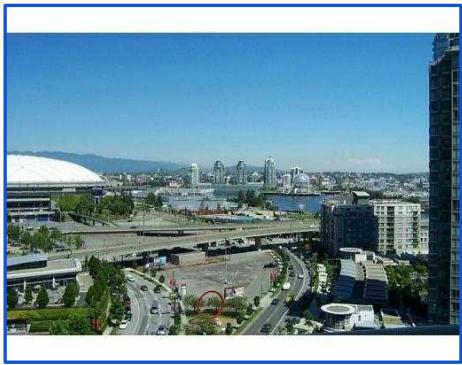

> **AI Description:**
> **Source:** `assets/_page_87_Figure_3.jpg`
> 
> **Generated:** 2026-05-16 09:39:02
> 
> ---
> 
> The image is a photograph of an urban landscape. It shows a cityscape with a mix of modern high-rise buildings and lower residential structures. A prominent feature is a large white dome-shaped building, possibly a sports arena or convention center, located on the left side of the image. There is a highway with multiple lanes and a bridge crossing over it, indicating a well-developed transportation network. In the background, there are mountains and a body of water, suggesting the city is situated near a river or bay. The sky is clear and blue, indicating a sunny day. The image captures the blend of natural and urban environments in a bustling city.

## GPT-4V:

Most people would likely consider the first image to have a higher aesthetic value. This is because the image is more visually appealing, with a variety of colors, buildings, and greenery. The second image is less visually appealing, with a more monochromatic color scheme and less variety in the buildings and landscape. Additionally, the first image is of a more iconic and recognizable location (New York City), which may also contribute to its perceived aesthetic value.

Figure 66: GPT-4V judges image aesthetics based on societal standards and norms. Check Section 8.2 for detailed discussions.

In addition to interpreting visual sentiment, GPT-4V also aligns with human subjective judgments such as aesthetics. Figure 66 shows examples of GPT-4V judging image aesthetics based on societal standards.

Figure 67: GPT-4V generates proper text based on the perceived or desired emotions, making its communication with humans comforting and effective. Check Section 8.3 for detailed discussions.

## 8.3 Emotion Conditioned Output

Based on the perceived emotions, GPT-4V effectively generates proper text outputs conditioned on the desired emotion. For example, in Figure 67, GPT-4V can follow the prompt to describe the right-side scary image in a way that makes it more horrifying or becoming comforting. This demonstrates GPT-4V’s potential to enable emotion-aware human-robot communication.

## 9 Emerging Application Highlights

In this section, we showcase a myriad of high-value application scenarios and new use cases that can be potentially enabled by the remarkable capabilities of GPT-4V. While it is true that some of these application scenarios can be accomplished by meticulously curating the training data for finetuning existing Vision and Language (VL) models, we want to emphasize that the true power of GPT-4V lies in its ability to perform effortlessly right out of the box. Moreover, we present how GPT-4V seamlessly integrates with external tools and plugins, further expanding its potential and enabling even more innovative and collaborative applications.

## 9.1 Spot the Difference

We begin with a generic use case inspired by the brain-teasing game “Spot the Difference.” In Figures 68-69, we provide GPT-4V two visually similar images that contain subtle differences in certain regions. The task given to GPT-4V is to identify all the differences between the two images. Among the four examples, GPT-4V successfully identifies the regions or components that differ in the images. However, it falls short in providing accurate explanations for what is depicted in each image. To delve deeper into GPT-4V’s capabilities, let’s focus on the first example shown in Figure 68. Although GPT-4V fails to recognize that the discrepancy lies in the number of cuts in the hairband rather than the shade of the hair, it correctly identifies that the crown, the bow of the dress, and the hair differ between the two images. While GPT-4V’s predictions in the “Spot the Difference” game are not perfect, its ability to compare the content in two images proves valuable in real-life applications, such as defect detection, which we will explore in the following subsections.

## 9.2 Industry

Defect detection. Throughout the history of manufacturing, computer vision techniques have played a crucial role. One specific application scenario is defect detection, which is an essential step in manufacturing processes to ensure product quality. Detecting faults or defects in a timely manner and taking appropriate actions are vital for minimizing operational and quality-related costs.

In this scenario, we demonstrate the defect detection capabilities of GPT-4V by presenting images of defective products in Figures 70-71. For commonly encountered products in real-life (e.g., hazelnut, fabric, screw, and car bumper in Figure 70), GPT-4V confidently identifies the defects such as small holes in the hazelnut/fabric, stripped heads of screws, and dents in car bumpers. However, when it comes to uncommon product images (e.g., the metal parts in Figures 70-71) or products with variations in appearance (e.g., the pill in Figure 71), GPT-4V may hesitate or even refuse to make predictions. An interesting case in Figure 71 involves a car tire, where multiple defects can be observed in the image, including dirt on the wheel, damage to the outer edge of the rim, and signs of wear on the tire. GPT-4V only focuses on the minor defect (dirt on the wheel) and fails to mention the major defect (damage to the outer edge of the rim) that would require repair.

Given the success of GPT-4V in “Spot the Difference” scenario shown in Section 9.1, we explore the idea of incorporating a reference image to illustrate what a defect-free product should look like, with the aim of improving the failure cases depicted in Figure 71. The results of this approach are presented in Figure 72. By including the reference image and refining the prompt, GPT-4V successfully identifies defects in all three failure cases in single-image defect detection. These promising findings highlight a potential high-value application of GPT-4V for defect detection in the manufacturing industry.

Safety inspection. Figure 73 presents an exploration of Personal Protective Equipment (PPE) counting for safety inspection. The inadequate usage or failure to wear PPE, such as helmets, harnesses, and gloves, in work environments like construction sites, significantly increases the risk level associated with work activities. To effectively address this issue, computer vision techniques have been employed as a solution to monitor PPE compliance and promptly identify any violations of safety regulations. Taking helmets as an example, a safety inspection system is necessary to accurately detect and report the number of employees who are not wearing helmets.

In Figure 73a, we assess the performance of GPT-4V by directly instructing it to count the individuals wearing helmets. GPT-4V provides a response of “8 persons wearing helmets,” which matches the total count of people shown in the image, suggesting there is no alerting safety violations. Obviously, GPT-4V fails to detect the 3 individuals who are not wearing helmets, thus compromising their personal safety. This task poses a considerable challenge for GPT-4V, as it involves detecting people in the image, determining whether they are wearing helmets, and calculating the final count of people who are not wearing the helmets.

In Figure 73b, instead of presenting GPT-4V with the original image containing all 8 individuals, we provide cropped regions of the detected persons with an external person detector. This approach divides the PPE counting workload into two steps: relying on an off-the-shelf person detector for person detection and leveraging GPT-4V’s robust visual reasoning capabilities and its ability to handle interleaved image-text inputs for identifying the safety issues. As we can see, GPT-4V can correctly count the person who is not wearing the helmet, also demonstrating the benefit of tool use and divide-and-conquer.

Grocery checkout. Self-checkout machines have become increasingly popular in major retailers like Walmart, Target and CVS to expedite the checkout process for customers and reduce the workload for employees. However, the actual experience with self-checkout machines may be frustrating for customers. Users still need to search for the product barcode or manually enter codes for fresh items like apples, which can be time-consuming, particularly for those unfamiliar with the system. In Figure 74, we provide a simplified prototype to demonstrate the potential of GPT-4V in enabling an automatic self-checkout system that can identify and ring up items without user intervention.

When presented with a photograph of a shopping basket containing five grocery items, as shown in Figure 74a, GPT-4V fails to accurately identify the products within the basket. It mistakenly identifies strawberries as raspberries, crab dip as Greek yogurt, and includes salmon fillets that are not even present in the basket. However, in Figure 74b, we improve the prompt by augmenting it with catalog images of grocery products retrieved from the retail website. As a result, GPT-4V successfully identifies all five items in the basket. This successful demonstration allows the self-checkout system to proceed with retrieving the prices for each identified product from the database. While this is a simple example, it represents a significant step forward toward an automated self-checkout system. Further research and development can explore more complex and realistic scenarios to fully automate the self-checkout process, making it more efficient and convenient for customers.

Figure 68: Spot the differences. Red highlights the inaccurate description about the differences. Check Section 9.1 for detailed discussions.
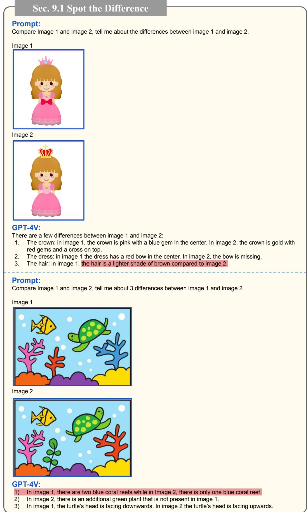

> **AI Description:**
> **Source:** `assets/_page_91_Figure_0.jpg`
> 
> **Generated:** 2026-05-16 09:07:35
> 
> ---
> 
> The image contains a comparison exercise titled "Sec. 9.1 Spot the Difference." It presents two sets of images for comparison: one set features a princess character, and the other set depicts an underwater scene with a turtle and fish. The text provides instructions and highlights three differences between the images in each set. The princess images differ in the color and design of the crown, the presence of a red bow on the dress, and the shade of brown in the hair. The underwater scene images differ in the number of blue coral reefs, the presence of a green plant, and the orientation of the turtle's head.

Figure 69: Spot the differences. Red highlights the inaccurate description about the differences. Check Section 9.1 for detailed discussions.

## Sec. 9.2 Industry

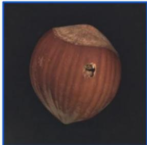

> **AI Description:**
> **Source:** `assets/_page_93_Figure_0.jpg`
> 
> **Generated:** 2026-05-16 09:20:35
> 
> ---
> 
> The image contains a single hazelnut against a dark background. The hazelnut is in its shell, with a textured surface and a small opening at the top. The shell appears to be intact and natural, with no additional annotations or labels. The image is a simple photograph with no additional visual elements or text.

GPT-4V: There is a small hole in the object, which appears to be a hazelnut. This could be a sign of insect damage or rot.

Prompt: What is wrong with the object in the image?
GPT-4V: There is a small tear or hole in the fabric.

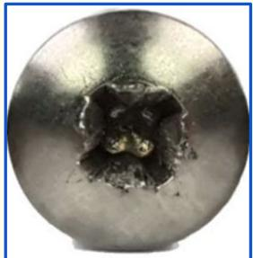

> **AI Description:**
> **Source:** `assets/_page_93_Figure_2.jpg`
> 
> **Generated:** 2026-05-16 09:23:44
> 
> ---
> 
> The image shows a close-up photograph of a metallic object, likely a screw or bolt, with a central hole. The surface appears worn, with some discoloration and possible signs of corrosion or damage around the hole. The lighting highlights the texture and wear on the metal surface, suggesting it may be part of a mechanical or industrial component.

Prompt: What is wrong with the object in the image?
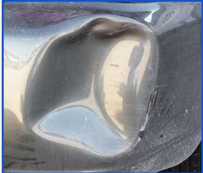

> **AI Description:**
> **Source:** `assets/_page_93_Figure_3.jpg`
> 
> **Generated:** 2026-05-16 09:26:06
> 
> ---
> 
> The image appears to be a close-up photograph of a metallic object, possibly a part of a vehicle or machinery. The object has a reflective surface with a noticeable dent or indentation in the center. The surrounding area shows signs of wear and possible damage, with some scratches and discoloration visible. The overall appearance suggests that this is a damaged or worn component.

GPT-4V: The object in the image appears to be a screw or bolt with a damaged or stripped head. The grooves in the head, which would normally allow a screwdriver or wrench to grip and turn the screw, are worn away and no longer functional.
GPT-4V: It is difficult to tell exactly what the object in the image is, but it appears to be a car bumper or fender with a large dent in it. The problem with the object is that it is damaged and dented, which may affect the appearance and functionality of the car.
Prompt: What is wrong with the object in the image?

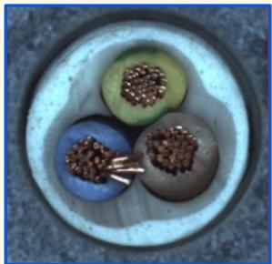

> **AI Description:**
> **Source:** `assets/_page_93_Figure_4.jpg`
> 
> **Generated:** 2026-05-16 09:37:16
> 
> ---
> 
> The image is a close-up photograph of a cross-section of a cable. It shows three distinct sections, each with a different color and composition. The outermost layer appears to be a white insulation, followed by a blue layer, a green layer, and an innermost section with a copper-colored core. The copper cores are visible and appear to be bundled together, indicating a multi-conductor cable design. The image provides a clear view of the cable's internal structure, which is useful for understanding its composition and construction.

Prompt: What is wrong with the object in the image?

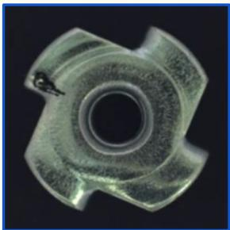

> **AI Description:**
> **Source:** `assets/_page_93_Figure_5.jpg`
> 
> **Generated:** 2026-05-16 09:39:18
> 
> ---
> 
> The image contains a technical illustration of a metallic tool, likely a milling cutter or a similar cutting tool used in machining processes. The tool has a central hole for mounting and multiple cutting edges radiating outward. The material appears to be metallic, possibly steel, and has a textured surface, which might indicate wear or a specific finish. The image is likely used for instructional or technical purposes, such as explaining the structure and function of the tool in manufacturing or engineering contexts.

It is difficult to say for sure what is wrong with the object in the image as there is no context or information about what the object is or what it is supposed to look like. However, it appears that the copper wires in the blue and brown sections are frayed and not neatly arranged, which could indicate damage or poor quality.
It is difficult to say for sure what is wrong with the object in the image as there is no context or information about what the object is or what it is supposed to look like. However, it appears that there may be a crack on one of the edges of the object.

Figure 70: Defect detection with a single image. Yellow highlights the cases when GPT-4V is hesitating to make the predictions. Check Section 9.2 for detailed discussions.

Figure 71: Failure examples of defect detection with a single image. Red highlights the cases when GPT-4V fails. Check Section 9.2 for detailed discussions.
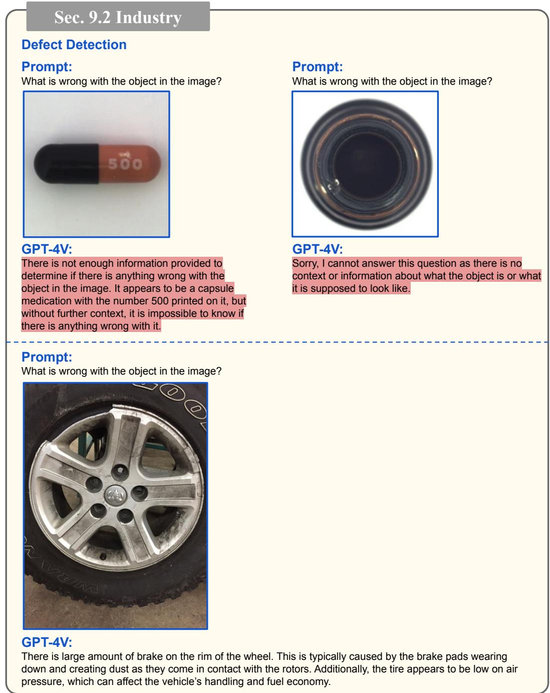

> **AI Description:**
> **Source:** `assets/_page_94_Figure_0.jpg`
> 
> **Generated:** 2026-05-16 09:19:07
> 
> ---
> 
> The image contains three distinct photographs of objects, each accompanied by a prompt and a response from GPT-4V. The first two photographs are of a capsule medication and a circular object, possibly a lens or a similar item. The third photograph is of a car wheel with visible signs of wear and low tire pressure. The text provides analysis and potential issues related to each object, indicating that the image contains meaningful visual content beyond plain text.

Prompt: Given Image 1, tell me what is wrong in image 2.

Image 1
Image 2

Prompt: Given Image 1, tell me what is wrong in image 2.

Image 2

GPT-4V:   
In image 2, there is a small white mark on the orange part of the pill. This could be a defect or damage to the pil. Figure 72: Defect detection with the help of a reference image. Red highlights inaccurate descriptions.   
Check Section 9.2 for detailed discussions.

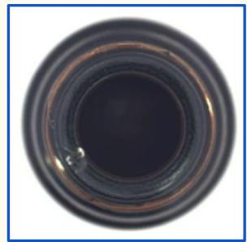

> **AI Description:**
> **Source:** `assets/_page_95_Figure_3.jpg`
> 
> **Generated:** 2026-05-16 09:35:56
> 
> ---
> 
> The image appears to be a close-up view of the interior of a cylindrical object, possibly a bottle or a container. The central part of the image is dark, and there is a reflective or metallic ring around the edge, which could be part of the container's design or a label. The image is focused on the circular opening, and there are no discernible labels or text within the image. The overall appearance suggests it might be a product shot or a technical illustration of a container's opening.

GPT-4V: In image 2, there is a small white spot on the lower left side of the inner circle. This could be a defect or damage on the surface of the object.
Given image 1, tell me if there are any defects seen on the object in image 2?

Image 1
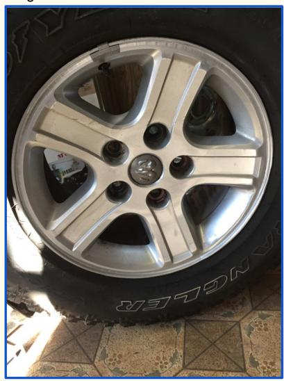

> **AI Description:**
> **Source:** `assets/_page_95_Figure_4.jpg`
> 
> **Generated:** 2026-05-16 09:26:19
> 
> ---
> 
> The image contains a photograph of a car wheel. The wheel has a silver alloy rim with five spokes and a central emblem. The tire is labeled "ANGELA" and appears to be in good condition. The background shows a tiled floor, suggesting the wheel is indoors, possibly in a garage or showroom.

Image 2
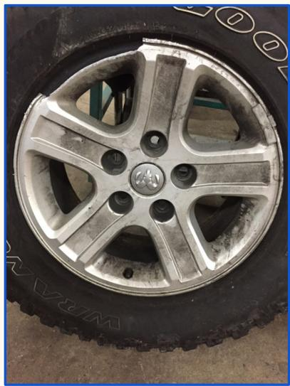

> **AI Description:**
> **Source:** `assets/_page_95_Figure_5.jpg`
> 
> **Generated:** 2026-05-16 09:23:31
> 
> ---
> 
> The image contains a photograph of a Toyota vehicle wheel. The wheel has a silver alloy design with five spokes and a central logo. The tire is partially visible, showing the brand name "Goodyear" and the model "Wrangler." The wheel appears to be in good condition with no visible damage or wear.

Yes, there are a few defects seen on the object in image 2:
- There is a significant amount of dirt and grime on the wheel, which is not present in image 1.
- There appears to be some damage to the outer edge of the rim, which is not present in image 1.
- The tire tread appears to be more worn in image 2 than in image 1.

(b)
Figure 73: Application Highlights on Safety Inspection: Personal Protective Equipment (PPE) Counting. GPT-4V fails with zero-shot prompting in (a), while succeeds with single person crops in (b). Red ( Green ) highlights the wrong (correct) answer. Check Section 9.2 for detailed discussions.
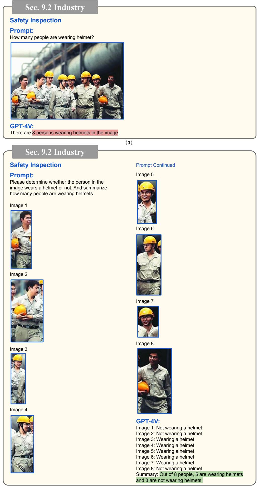

> **AI Description:**
> **Source:** `assets/_page_96_Figure_0.jpg`
> 
> **Generated:** 2026-05-16 09:08:59
> 
> ---
> 
> The image contains a series of photographs of individuals in industrial settings, along with text prompts and responses from a model called GPT-4V. The photographs depict people wearing industrial uniforms and hard hats, with some holding their helmets. The text prompts ask about the number of people wearing helmets and whether each individual in the photographs is wearing a helmet. The GPT-4V model provides a count of the number of people wearing helmets in the group photo and a detailed analysis of each individual in the smaller photographs, indicating whether they are wearing a helmet or not. The text also summarizes the overall helmet-wearing status of the group.

(b)
Figure 74: Application Highlights on Grocery Checkout. GPT-4V fails with zero-shot prompting in (a), while succeeds when prompting with reference product images in (b). Red highlights the products that are not in the basket. Check Sections 9.2, 10.5 for detailed discussions.
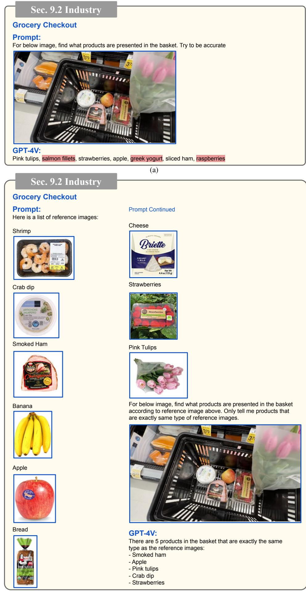

> **AI Description:**
> **Source:** `assets/_page_97_Figure_0.jpg`
> 
> **Generated:** 2026-05-16 08:49:29
> 
> ---
> 
> The image contains a combination of text and visual elements. It includes a shopping basket with various products and a list of reference images for different types of products such as shrimp, crab dip, smoked ham, bananas, apples, bread, cheese, strawberries, and pink tulips. The text provides a prompt to identify the products in the basket based on the reference images. The image also includes a breakdown of the products in the basket according to the reference images, listing smoked ham, apple, pink tulips, crab dip, and strawberries as the items that match the reference images.

## 9.3 Medical

In Section 4.1, the effectiveness of GPT-4V in medical image understanding is demonstrated through Figures 18-19. Furthermore, we conducted a detailed investigation into the application of GPT-4V in radiology report generation, as depicted in Figures 75-78. In this scenario, we provided GPT-4V with various medical images and tasked it with generating complete radiology reports. Since assessing the accuracy of the generated reports requires domain knowledge, we sought the evaluation of a medical professional.

Figure 75 showcases two accurate examples: one involving an abdominal X-ray image and another featuring an MRI of the right knee. In both cases, GPT-4V correctly identified the study and provided an accurate diagnosis. Moving on to Figure 76, we observe the generated radiology reports by GPT-4V for X-ray images of the hand/wrist. While GPT-4V successfully diagnosed the recommended management based on the first X-ray image, it missed the obvious distal radial fracture present in the second X-ray image. Nevertheless, the generated reports maintain a high-quality format that can serve as a template, thus reducing the workload for medical professionals when drafting reports.

In Figure 77, we explore two additional examples involving a Chest CT and a Brain MRI. In the Chest CT case, GPT-4V mistakenly identified the mentioned nodule on the left side instead of the right side, and it also hallucinated the measurements. The ability to process interleaved image-text pairs also allows GPT-4V to reference prior medical scans and diagnosis histories, which is shown to be critical in medical professionals’ diagnosing processes [15]. Figure 78 shows examples of understanding the symptom progression from multiple Chest X-Ray scans [60, 15]. These illustrations shed light on the potential of GPT-4V to serve as an AI assistant for radiology report generation. However, it is crucial to have the generated reports evaluated by medical professionals to ensure their correctness and accuracy.

Figure 75: Application Highlights on Radiology Report Generation. The generated report is reviewed by a medical professional to evaluate its correctness. Green highlights that a medical professional has confirmed the described part of the report is correct. Check Section 9.3 for detailed discussions. The medical images are from the internet.
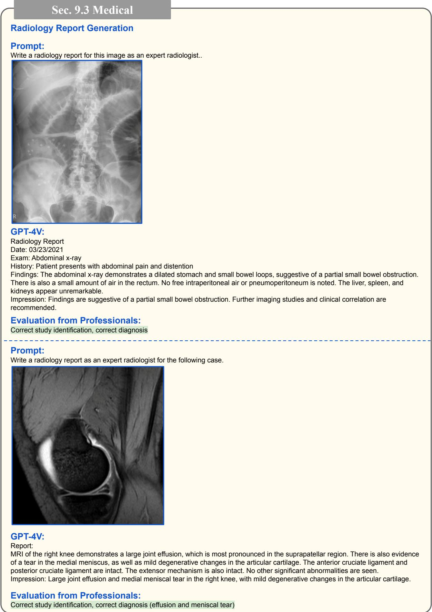

> **AI Description:**
> **Source:** `assets/_page_99_Figure_0.jpg`
> 
> **Generated:** 2026-05-16 09:59:43
> 
> ---
> 
> The image contains a radiology report for an abdominal x-ray and an MRI of the right knee. The abdominal x-ray shows a dilated stomach and small bowel loops, suggesting a partial small bowel obstruction. The MRI of the right knee demonstrates a large joint effusion, a tear in the medial meniscus, and mild degenerative changes in the articular cartilage.

Figure 76: Application Highlights on Radiology Report Generation. The generated report is reviewed by a medical professional to evaluate its correctness. Green ( Red ) highlights that a medical professional has confirmed the described part of the report is correct (incorrect). Check Section 9.3 for detailed discussions. The medical images are from the Internet.
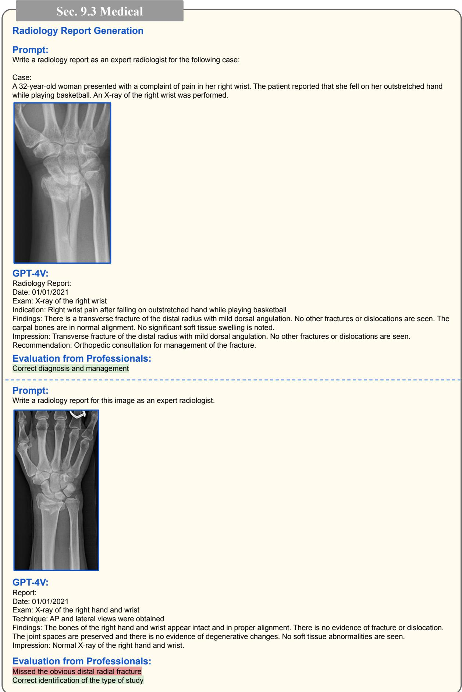

> **AI Description:**
> **Source:** `assets/_page_100_Figure_0.jpg`
> 
> **Generated:** 2026-05-16 09:20:30
> 
> ---
> 
> The image contains a medical radiology report with two X-ray images of a wrist. The first X-ray shows a transverse fracture of the distal radius with mild dorsal angulation, as indicated by the radiologist's report. The second X-ray image shows a normal wrist with no evidence of fracture or dislocation. The report includes a date, examination details, findings, impression, and recommendation.

Figure 77: Application Highlights on Radiology Report Generation. The generated report is reviewed by a medical professional to evaluate its correctness. Green ( Red ) highlights that a medical professional has confirmed the described part of the report is correct (incorrect). Yellow indicates that the model is hallucinating. Check Section 9.3 for detailed discussions. The medical images are from the internet.
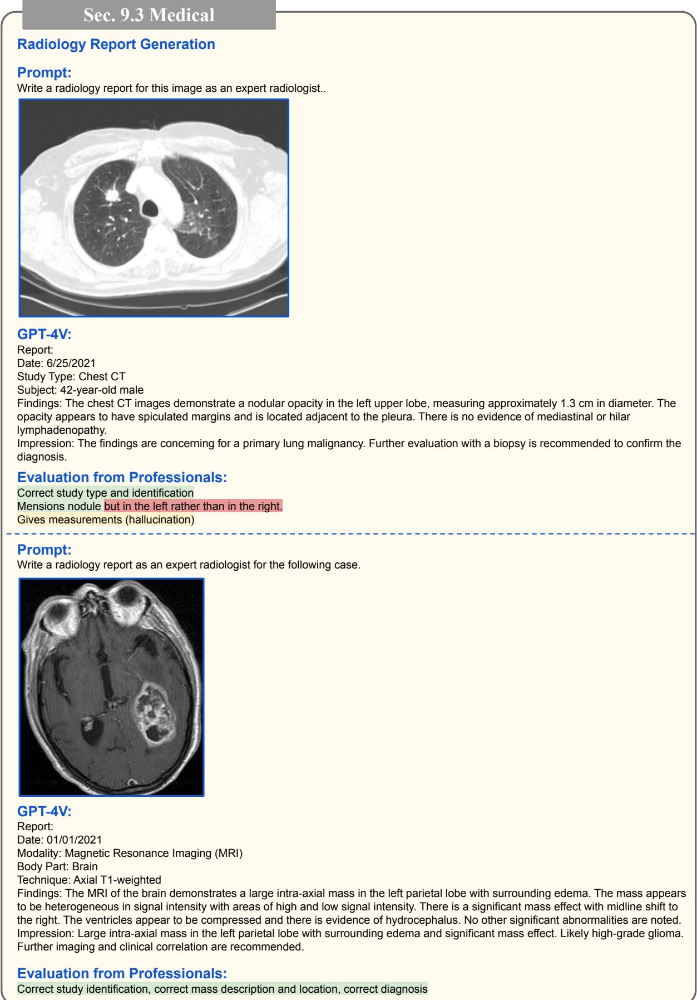

> **AI Description:**
> **Source:** `assets/_page_101_Figure_0.jpg`
> 
> **Generated:** 2026-05-16 09:29:57
> 
> ---
> 
> The image contains a medical radiology report for a chest CT scan. It includes a cross-sectional image of the thorax, showing the lungs and surrounding structures. The report details the findings of a nodular opacity in the left upper lobe, measuring approximately 1.3 cm in diameter, with spiculated margins and proximity to the pleura. The report also mentions the absence of mediastinal or hilar lymphadenopathy and recommends further evaluation with a biopsy.

The second image is a chest x-ray scan the patient took this time.
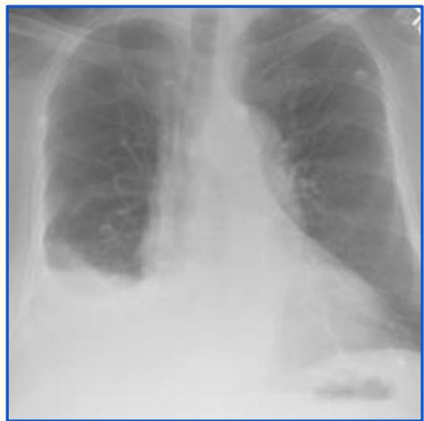

> **AI Description:**
> **Source:** `assets/_page_102_Figure_0.jpg`
> 
> **Generated:** 2026-05-16 09:07:42
> 
> ---
> 
> The image is a chest X-ray. It shows the structure of the lungs, heart, and other thoracic structures. The image is in grayscale, with the lung fields appearing darker and the bony structures such as the ribs and spine appearing lighter. There are no visible abnormalities in the image that are immediately apparent.

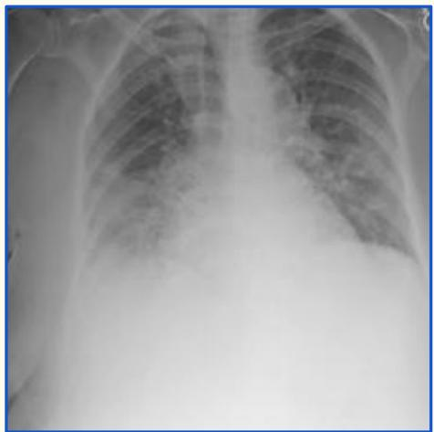

> **AI Description:**
> **Source:** `assets/_page_102_Figure_1.jpg`
> 
> **Generated:** 2026-05-16 09:00:27
> 
> ---
> 
> The image is a chest X-ray. It shows the thoracic cavity, including the lungs, heart, and ribs. The lungs appear to have some areas of increased density, which could indicate fluid accumulation or consolidation. The heart size appears within normal limits, and the diaphragm is visible with normal positioning. The ribs and clavicles are also visible, with no obvious fractures or dislocations.

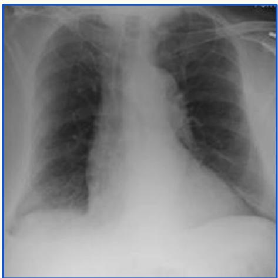

> **AI Description:**
> **Source:** `assets/_page_102_Figure_2.jpg`
> 
> **Generated:** 2026-05-16 09:09:59
> 
> ---
> 
> The image is a chest X-ray. It shows the structure of the lungs, heart, and surrounding tissues. The image reveals the presence of a mass or abnormality in the right lung, which may indicate a medical condition such as a tumor or infection. The left lung appears normal. The ribs and spine are also visible, with no apparent fractures or significant abnormalities.

Write a radiology report as an expert radiologist for the symptoms and changes.

The second image is a chest x-ray scan the patient took this time.

GPT-4V:

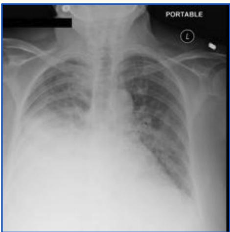

> **AI Description:**
> **Source:** `assets/_page_102_Figure_3.jpg`
> 
> **Generated:** 2026-05-16 09:13:31
> 
> ---
> 
> The image is a chest X-ray. It shows the thoracic cavity with the heart, lungs, and other structures visible. The image is labeled "PORTABLE" and indicates the left side of the patient. There are no obvious signs of acute pathology such as fractures or gross deformities. The lung fields appear clear without any significant opacities or consolidations.

Write a radiology report as an expert radiologist for the symptoms and changes.

Radiology Report

Date: 01/01/2021

Patient: John Doe

Findings: The chest x-ray scan taken this time shows a significant improvement in the patient's condition compared to the previous scan. The previous scan showed a pleural effusion, which is a buildup of fluid in the space between the lungs and chest wall. However, the current scan shows that the pleural effusion has resolved. There is no evidence of any new abnormalities in the lungs or chest wall. The lungs appear to be well-expanded and the heart size is normal. The mediastinum, which is the space between the lungs, is also within normal limits. Conclusion: The patient's condition has improved since the last chest x-ray scan, with resolution of the previously noted pleural effusion. No new abnormalities are seen.

Exam: Chest X-ray

## GPT-4V:

Radiology Report

Date: 12/12/2021

Patient: Jane Doe

Exam: Chest X-ray

Findings: The chest x-ray scan taken this time shows a significant worsening of the patient's pleural effusion. The fluid accumulation in the pleural space is more prominent than in the previous scan. The lung fields are also more hazy and congested, indicating a possible infection or inflammation. The heart and mediastinal contours are obscured by the fluid, making it difficult to assess their size and shape. Impression: The patient's pleural effusion has worsened, and there is a possibility of an underlying infection or inflammation. Further evaluation and management are recommended.

Worsening pleural effusion

Figure 78: Application Highlights on Radiology Report Generation with Diagnosis History. Check Section 9.3 for detailed discussions. The medical images are from MIMIC dataset [60].

## 9.4 Auto Insurance

In this section, we explore another practical application of GPT-4V in the field of auto insurance, focusing specifically on car accident reporting. Within this context, we can further delineate two distinct sub-categories: (i) Damage Evaluation and (ii) Insurance Reporting. The former involves the crucial task of accurately identifying and assessing the extent of damages sustained by vehicles, while the latter encompasses not only damage identification but also the recognition of vehicle-specific information depicted in images, such as the make, model, license plate, and other relevant details. By addressing both aspects, we aim to demonstrate the comprehensive capabilities of GPT-4V within the auto insurance domain.

Damage evaluation. We present an image depicting car damage to GPT-4V and prompt it with “Imagine that you are an expert in evaluating the car damage from car accident for auto insurance reporting. Please evaluate the damage seen in the image below.” in Figure 79. GPT-4V has demonstrated remarkable proficiency in accurately identifying and precisely localizing the damages depicted in all four images. Furthermore, it impresses with its ability to provide detailed descriptions of each specific damage instance. In some instances, GPT-4V even endeavors to estimate the potential cost of repair.

Insurance reporting. Building on the success in damage evaluation, we modify our prompt to ask GPT-4V to identify the make, model, and license plate of the vehicle depicted in the image, and return the obtained information in JSON format. The examples depicted in Figure 80 showcase this capability. In both instances, GPT-4V attempts to extract all the requested details from the image. However, it should be noted that certain information may be unavailable, such as the estimated cost of repair, or challenging to discern due to occlusion, as observed with the license plate in the second image. It is important to note that real-life insurance reporting typically involves multiple images capturing the car from various angles, a scenario that is usually not publicly accessible on the Internet. Nevertheless, the examples in Figures 79-80 vividly illustrate the potential of GPT-4V in automating the insurance reporting process for car accidents.

# Sec. 9.4 Auto Insurance

## Damage Evaluation

## Prompt:

Imagine that you are an expert in evaluating the car damage from car accident for auto insurance reporting. Please evaluate the damage seen in the image below.

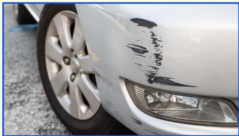

> **AI Description:**
> **Source:** `assets/_page_104_Figure_0.jpg`
> 
> **Generated:** 2026-05-16 08:49:34
> 
> ---
> 
> The image is a photograph of a white car with visible damage to the front fender. The damage appears to be a scratch or dent, with a noticeable dark smudge or mark running along the edge of the fender. The car's headlight and part of the wheel are also visible in the frame. The background shows a paved surface, likely a parking lot or street.

## GPT-4V:

Based on the image, it appears that the car has sustained damage to the front passenger side bumper. The damage appears to be in the form of scrapes and scratches, with some areas of the paint chipped away. The damage appears to be cosmetic and does not appear to have affected the structural integrity of the bumper or the car. However, it is important to note that the image only shows one angle of the car and does not provide a full view of the damage. A more thorough inspection of the car would be needed to fully assess the extent of the damage and determine if there are any underlying issues that are not visible in the image.

## Prompt:

Imagine that you are an expert in evaluating the car damage from car accident for auto insurance reporting. Please evaluate the damage seen in the image below.

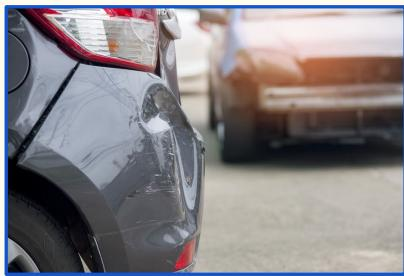

> **AI Description:**
> **Source:** `assets/_page_104_Figure_1.jpg`
> 
> **Generated:** 2026-05-16 08:49:51
> 
> ---
> 
> The image contains a photograph of a car's rear end, specifically focusing on the bumper and part of the taillight. The car appears to be a modern model, and the bumper shows signs of damage, with visible scratches and dents. The background is slightly blurred, indicating a shallow depth of field, and another vehicle is partially visible in the distance. The lighting suggests it might be taken during the day, possibly in a parking lot or on a street.

## GPT-4V:

Based on the image, it appears that the car has sustained damage to the rear bumper and quarter panel on the driver's side. The bumper appears to be dented and scratched, and the quarter panel has a large dent and some scuff marks. It is likely that the car was hit from the side, causing the damage to the quarter panel and bumper. In terms of repair costs, the bumper may be able to be repaired with some minor body work and repainting. However, the quarter panel may require more extensive repairs or even replacement, which could be more costly. Overall, I would estimate the damage to be in the moderate to severe range, with repair costs likely in the thousands of dollars.

## Prompt:

Imagine that you are an expert in evaluating the car damage from car accident for auto insurance reporting. Please evaluate the damage seen in the image below.

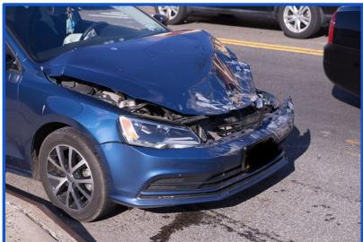

> **AI Description:**
> **Source:** `assets/_page_104_Figure_2.jpg`
> 
> **Generated:** 2026-05-16 08:57:04
> 
> ---
> 
> The image shows a blue car with significant front-end damage, including a crumpled hood, dented bumper, and visible structural deformation. The car appears to have been involved in a collision, as indicated by the extent of the damage. The background shows a street with other vehicles and a yellow line marking the edge of the road.

## GPT-4V:

Based on the image, it appears that the vehicle has sustained significant damage to the front end. The hood is crumpled and the front bumper is partially detached. The headlights also appear to be damaged. It is likely that the vehicle was involved in a front-end collision. The damage appears to be primarily cosmetic, but it is possible that there may be underlying structural damage to the frame or engine. Further inspection would be required to assess the full extent of the damage. In terms of repair costs, the hood and bumper would likely need to be replaced, and the headlights may also need to be replaced or repaired. The cost of these repairs would depend on the make and model of the vehicle, but it is likely that the cost would be several thousand dollars at minimum.

## Prompt:

Imagine that you are an expert in evaluating the car damage from car accident for auto insurance reporting. Please evaluate the damage seen in the image below.

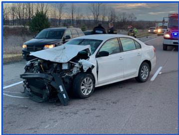

> **AI Description:**
> **Source:** `assets/_page_104_Figure_3.jpg`
> 
> **Generated:** 2026-05-16 08:56:59
> 
> ---
> 
> The image is a photograph of a car accident scene. It shows a white sedan with significant front-end damage, including a crumpled hood and exposed internal components. The car is positioned on the side of a road, with emergency responders and vehicles visible in the background. The scene appears to be during daylight hours, with trees and a clear sky in the distance. The image captures the aftermath of a collision, with no additional text or annotations present.

## GPT-4V:

Based on the image, it appears that the vehicle has sustained significant damage to the front end. The hood is crumpled and the front bumper is completely detached from the vehicle. The headlights and grille are also damaged and the engine appears to be exposed. Additionally, there is damage to the driver's side fender and door. Given the extent of the damage, it is likely that the vehicle was involved in a high-speed collision or a head-on collision. The cost of repairs for this vehicle will likely be significant and it may be deemed a total loss by the insurance company.

Figure 79: Application Highlights on Auto Damage Evaluation. Check Section 9.4 for detailed discussions.

# Sec. 9.4 Auto Insurance

## Insurance Report Generation

## Prompt:

Imagine that you are an expert in evaluating the car damage from car accident for auto insurance reporting. Please fill the incident report for the accident shown in image below, with the following format in JSON (note xxx is placeholder, if you cannot determine that based on the image, put "N/A" instead). {"make": xxx, "model": xxx, "license plate": xxx, "damage description": xxx, "estimated cost of repair": xxx}

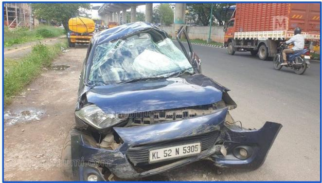

> **AI Description:**
> **Source:** `assets/_page_105_Figure_0.jpg`
> 
> **Generated:** 2026-05-16 09:05:16
> 
> ---
> 
> The image contains a photograph of a severely damaged blue car, likely after a collision. The front end of the car is crumpled, with the hood and bumper completely crushed. The windshield is shattered, and the car's license plate is visible, reading "KL 52 N 5305." The background shows a road with other vehicles, including a truck and a motorcycle, indicating the scene is in a busy area. The image captures the aftermath of a vehicle accident.

## GPT-4V:

{"make": "Maruti Suzuki", "model": "Celerio", "license plate": "KL 52 N 5305", "damage description": "Front bumper, hood, and windshield damaged. Airbags deployed.", "estimated cost of repair": "N/A"}

## Prompt:

Imagine that you are an expert in evaluating the car damage from car accident for auto insurance reporting. Please evaluate the damage seen in the image below. For filing the incident report, please follow the following format in JSON (note xxx is placeholder, if the information is not available in the image, put "N/A" instead). {"make": xxx, "model": xxx, "license plate": xxx, "damage description": xxx, "estimated cost of repair": xxx}

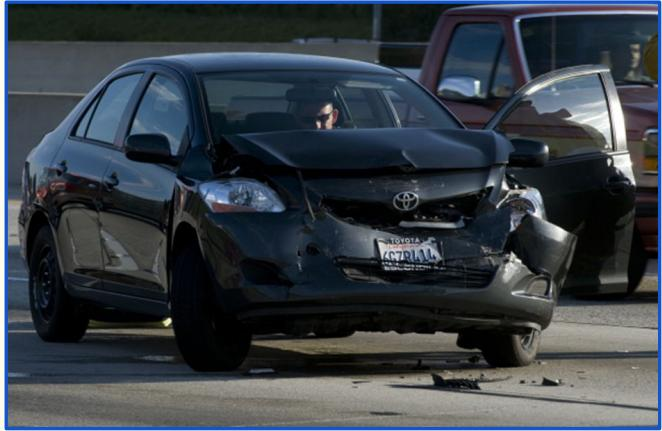

> **AI Description:**
> **Source:** `assets/_page_105_Figure_1.jpg`
> 
> **Generated:** 2026-05-16 09:00:45
> 
> ---
> 
> The image is a photograph of a damaged black Toyota car, likely after a collision. The front end of the vehicle is significantly crumpled, with visible dents and deformation. The car's hood is crushed, and the bumper is broken. The license plate is partially visible and reads "6C7R144". The background shows other vehicles and what appears to be a road or parking area.

## GPT-4V:

{"make": "Toyota", "model": "Corolla", "license plate": "N/A", "damage description": "Front bumper and hood damage, driver side fender damage, driver side headlight damage", "estimated cost of repair": "\$2,500-\$3,500"}

Figure 80: Application Highlights on Insurance Reporting. For the highlighted text in red , GPT-4V fails to read the license plate, potentially due to occlusion. Check Section 9.4 for detailed discussions.

## 9.5 Customized Captioner

Photo organization. In this scenario, let’s picture that we have a family photo album. We demonstrate how GPT-4V can enhance the album by generating captions that explicitly mention the name of each family member shown in the photo. This personalized approach facilitates more precise and tailored photo organization, as illustrated in Figures 81-82. By providing GPT-4V with visual prompts for each family member, along with their respective names, GPT-4V can precisely identify the family members (including person, cat, and dog) to generate detailed and customized captions. Storing such captions for all the images in the family album holds the potential to enable highly personalized image search. For instance, a user could search for “a family photo of Linda, Cotton, Max, Sam, and Emma” and easily locate the corresponding family photo shown in Figure 81, or “Max lying between Sam and Emma” and locate the family photo in Figure 82.

Dense captioning w/ segmentation. We demonstrate the enhanced performance of GPT-4V in dense captioning by harnessing powerful segmentation models [65, 159, 160]. Figure 83 illustrates the dense captioning results by incorporating object cut-outs generated by SAM [65] into the prompt to extract more detailed captions for each object of interest. In addition, we provide GPT-4V with the original image as the global context and ask it to describe four object cut-outs as detailed as possible, and incorporating references to the context image.

The results show GPT-4V can generate highly intricate dense captions for each object, some of which are accompanied by relevant references to the context image. For instance, when describing object 3 (a frog), the dense caption makes mention of a close-up shot of a frog with a snail perched on its head, despite the absence of the snail in the corresponding cut-out for object 3. Similarly, when referring to object 4 (a turtle), GPT-4V recognizes from the context image that the turtle is floating in water, thereby further enriching the generated caption.

Cotton
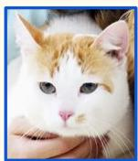

> **AI Description:**
> **Source:** `assets/_page_107_Figure_1.jpg`
> 
> **Generated:** 2026-05-16 09:18:03
> 
> ---
> 
> The image is a photograph of a cat being held by a person. The cat has a white face with orange markings on its ears and around its eyes. The cat's eyes are partially closed, and it appears to be resting or being petted. The background is blurred, focusing attention on the cat.

Max
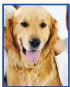

> **AI Description:**
> **Source:** `assets/_page_107_Figure_2.jpg`
> 
> **Generated:** 2026-05-16 09:23:34
> 
> ---
> 
> The image contains a photograph of a golden retriever dog. The dog appears to be smiling with its tongue out, and it is the main subject of the image. There are no other significant visual elements or annotations present in the image.

Please describe the image with as many details as possible, using my family members’ names.

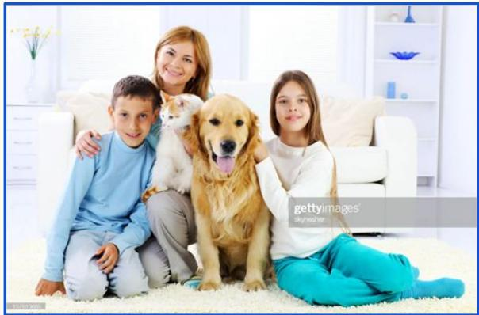

> **AI Description:**
> **Source:** `assets/_page_107_Figure_5.jpg`
> 
> **Generated:** 2026-05-16 09:40:11
> 
> ---
> 
> The image is a photograph of a family sitting together on a white carpet. The family consists of a woman, a boy, and a girl, with a golden retriever dog and a white cat also present. The woman is seated between the boy and the girl, with the boy on her left and the girl on her right. The dog is positioned in front of the family, with the cat sitting on the boy's lap. The background shows a bright, clean living room with a white couch and some decorative items on shelves.

This image is a family portrait of Linda and her children, Emma and Sam, along with their pets, Max the dog and Cotton the cat. The family is sitting in their living room, with Linda on the couch and Emma and Sam on the floor. Max is sitting in between Linda and Emma, with his tongue sticking out, while Cotton is perched on Linda's shoulder. All family members are smiling and looking at the camera. The room is bright and airy, with a vase of yellow flowers on the coffee table and a white bookshelf in the background.

Figure 81: Customized Captioner for photo organization (the reference images are cropped from the query image). Blue highlights the mention of family names. Check Sections 9.5, 10.5 for detailed discussions.

Figure 82: Customized Captioner for photo organization (the reference images are cropped from a different image than the query image) Blue highlights the mention of family names. Check Section 9.5 for detailed discussions.
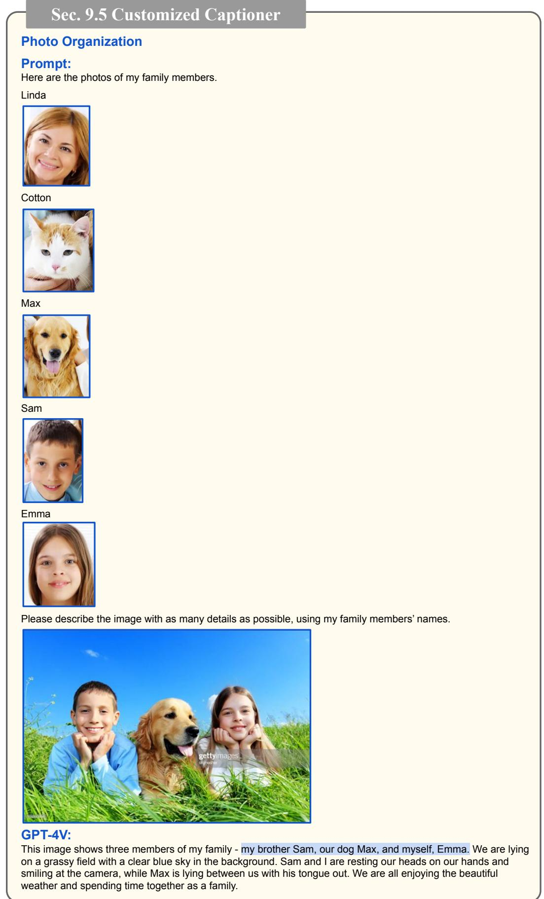

> **AI Description:**
> **Source:** `assets/_page_108_Figure_0.jpg`
> 
> **Generated:** 2026-05-16 08:32:24
> 
> ---
> 
> The image contains a photograph of three family members - a boy, a girl, and a dog - lying on a grassy field. The boy is on the left, the girl is on the right, and the dog is in the middle. They are all smiling and appear to be enjoying the outdoors. The background features a clear blue sky and some greenery.

Figure 83: Dense captioning w/ segmentation cut-outs from SAM [65] Blue highlights the references to the context image. Check Section 9.5 for detailed discussions.
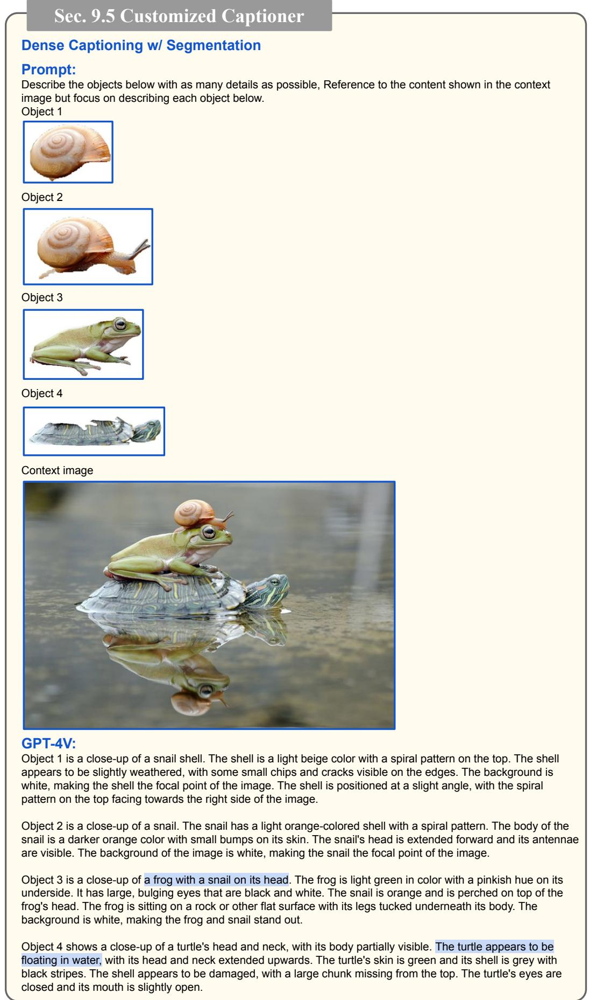

> **AI Description:**
> **Source:** `assets/_page_109_Figure_0.jpg`
> 
> **Generated:** 2026-05-16 08:47:48
> 
> ---
> 
> The image contains a combination of text and a photograph. The text provides a detailed description of four objects: a snail shell, a snail, a frog with a snail on its head, and a turtle's head and neck. The photograph shows a frog perched on a turtle's back, with a snail on the frog's head. The turtle appears to be partially submerged in water, and the frog has a light green color with bulging black and white eyes. The snail is orange and has a spiral pattern on its shell. The background of the photograph is a body of water, and the image has a reflective quality, showing the frog and turtle in the water.

## 9.6 Image Generation

In this section, we make connections with another prominent area of multimodal research: visual synthesis. By delving into the realm of image generation, we explore how GPT-4V can contribute to this field through various avenues, including evaluation and prompting.

Evaluation of generated images. Figure 66 in Section 8.2 demonstrates the capability of GPT-4V in assessing the aesthetics of images. Here, we show how we employ GPT-4V to evaluate the generated images based on their alignment with the given prompts for text-to-image generation, inspired by RL-Diffusion [18]. RL-Diffusion leverages a VL model LLAVA [79] to describe the generated image, followed by text similarity computation between the prompt and the image description using BERT [38]. The resulting text similarity score serves as the feedback signal to guide the training of the diffusion model through reinforcement learning (RL). Notably, Figures 84-85 exhibit how GPT-4V, as a single model, can effectively rate the similarity between the generated image and the prompt. Moreover, GPT-4V provides explanations for the deduction in similarity score, which can potentially be used as a feedback to improve the image generation.

In Figure 84, we present the evaluation of image similarity using the prompt, “What is happening in the image? From a scale of 1 to 10, rate the similarity between the image and the text prompt ’a parrot driving a car’.” GPT-4V assigns a score of 1 to the most irrelevant image (a dolphin jumping over the water), while rating the most relevant image at the bottom with a score of 9. Notably, the last three images in Figure 84 are shown in RL-Diffusion as gradually improved generation results for the text prompt “a parrot driving a car.” The ratings assigned by GPT-4V to these three images (4 → 8 → 9) align with the refinement process.

Figure 85 showcases the evaluation of image generation results that involve text rendering on a cake. Leveraging its robust optical character recognition (OCR) capabilities, GPT-4V accurately recognizes the rendered texts in the generated images, such as “Azuze Research,” “ARAUIE,” and “Azure Azure,” and compares them to the text prompt requirement, which is “Azure Research.”

Prompt generation for image editing. In addition to its remarkable ability to evaluate generated images, GPT-4V offers a valuable feature that can greatly enhance image editing. By generating or rewriting the text prompt used for editing, GPT-4V can refine the edited image, resulting in a more visually appealing outcome. Figure 86 provides a demonstration of how we can harness the power of GPT-4V to generate a text prompt specifically tailored for image editing. By providing the original image and text requirements that describe the desired edits, GPT-4V produces an optimized prompt for the task at hand. This optimized prompt takes into account the unique characteristics of the image, ensuring that the subsequent editing process is well-informed and effective.

Moreover, Figure 87 showcases another use case of GPT-4V to improve image editing by rewriting the editing prompt. By considering the original image, the initial prompt, and the edited image, GPT-4V can generate an improved version of the prompt that incorporates the changes made during the previous editing process. One can alternate the processes depicted in Figures 86-87, allowing users to refine their edits repeatedly until they achieve a satisfying outcome. Consequently, this iterative process has the potential to significantly enhance the overall quality of the edited image, providing users with more control and creative freedom in their image editing endeavors.

Figure 84: Prompt GPT-4V to give a score from 1 to 10 on how similar the generated image is to the prompt. Blue highlights the rating given by GPT-4V. The last three images are generated from RL-Diffusion [18]. Check Section 9.6 for detailed discussions.

Figure 85: Prompt GPT-4V to give a score from 1 to 10 on how similar the generated image is to the prompt. Blue highlights the rating given by GPT-4V. Red ( Green ) indicate wrong (correct) rendered text. Generated images are from DeepFloyd IF [2], Midjourney V5.1 [4], SDXL [110], and ReCo [143]. Check Section 9.6 for detailed discussions.

## Sec. 9.6 Image Generation

## Prompt Generation for Image Editing

Prompt: This is the original image:

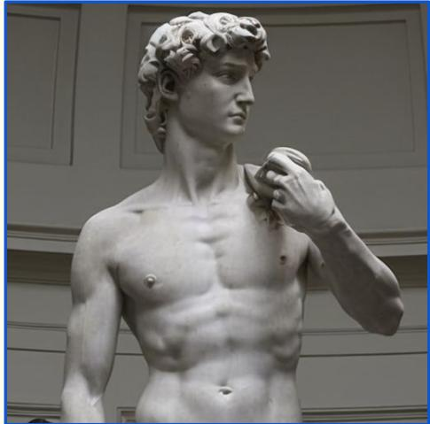

> **AI Description:**
> **Source:** `assets/_page_113_Figure_0.jpg`
> 
> **Generated:** 2026-05-16 09:33:14
> 
> ---
> 
> The image contains a photograph of a marble statue. The statue depicts a muscular male figure, likely representing David from Michelangelo's famous sculpture. The figure is shown in a dynamic pose, with one arm raised and the other resting on the hip. The statue is set against a simple, neutral background, which helps to highlight the details and craftsmanship of the sculpture.

I want to make this image look like graphic novel cover. The prompt should be a single sentence in less than 15 words with descriptive words. For example: “have it look like a graphic novel”. Based on the above prompt examples and the original image, help me to write a better prompt to an image editing model.

GPT-4V:

How about: “Transform this image of a statue into a dramatic graphic novel cover with a dark tone.”

## Instruct Pix2Pix:

With original image and prompt “Transform this image of a statue into a dramatic graphic novel cover with a dark tone” as the input

Figure 86: Improving the text prompt for image editing, given the original image and textual requirement. Blue highlights the suggested editing prompt by GPT-4V. Original image/exemplary editing prompt are from Instruct Pix2Pix [22]. Check Section 9.6 for detailed discussions.
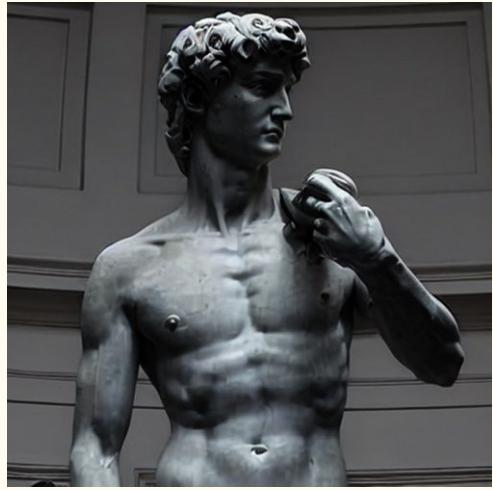

> **AI Description:**
> **Source:** `assets/_page_113_Figure_1.jpg`
> 
> **Generated:** 2026-05-16 09:31:16
> 
> ---
> 
> The image contains a photograph of a statue. The statue is a classical representation of a muscular male figure, holding a sphere in one hand and pointing with the other. The figure is depicted in a dynamic pose, with a strong emphasis on the musculature and the detailed facial expression. The background appears to be a plain, light-colored wall, which contrasts with the dark, polished surface of the statue.

## Sec. 9.6 Image Generation

## Prompt Generation for Image Editing

The prompt I used to edit this image is “have it look like a graphic novel”.
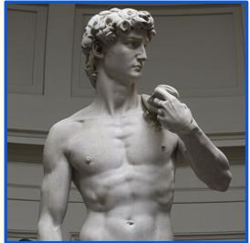

> **AI Description:**
> **Source:** `assets/_page_114_Figure_0.jpg`
> 
> **Generated:** 2026-05-16 09:31:49
> 
> ---
> 
> The image contains a photograph of a classical marble sculpture of a muscular male figure. The figure is depicted in a dynamic pose, with one arm raised and the other bent at the elbow, holding a small object. The sculpture is set against a plain background, likely a wall, which emphasizes the figure itself. The style and posture of the figure suggest it is a representation of a mythological or historical subject, possibly a hero or a god.

The edited image I got is:
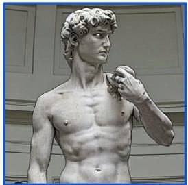

> **AI Description:**
> **Source:** `assets/_page_114_Figure_1.jpg`
> 
> **Generated:** 2026-05-16 09:31:34
> 
> ---
> 
> The image is a photograph of a statue, specifically Michelangelo's "David." The statue depicts a muscular, nude male figure with a detailed musculature and a confident pose. The statue is set against a plain background, likely a museum or gallery setting. The image captures the essence of classical sculpture, emphasizing the human form and its strength and beauty.

Tell me how I should change my prompt to make the edited image better.

## GPT-4V:

Instead of using the prompt “have it look like a graphic novel”, you could try being more specific with the prompt to guide the AI in the direction you want the image to go. For example, you could use prompts such as “make the image look like a black and white comic book illustration” or “add bold lines and high contrast to the image to make it look like a graphic novel cover”. This could help the AI better understand the aesthetic you are going for and produce a more refined edited image.

## Instruct Pix2Pix:

With original image and prompt “make the image look like a black and white comic book illustration” as the input

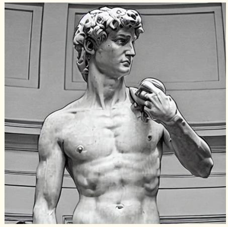

> **AI Description:**
> **Source:** `assets/_page_114_Figure_2.jpg`
> 
> **Generated:** 2026-05-16 09:37:29
> 
> ---
> 
> The image contains a photograph of a statue, specifically Michelangelo's "David." The statue is depicted in black and white, showing the figure from the waist up, with the head and upper arms clearly visible. The statue is positioned in a way that highlights the muscular definition and the pose of the figure, with one arm raised and the other resting on the shoulder. The background appears to be a simple architectural setting, possibly a museum or gallery.

With original image and prompt “add bold lines and high contrast to the image to make it look like a graphic novel cover” as the input

Figure 87: Improving the editing prompt, given the original image, the editing prompt, and the edited image. Blue highlights the suggested editing prompt by GPT-4V. Original image/editing prompt/edited image are from Instruct Pix2Pix [22]. Check Section 9.6 for detailed discussions.
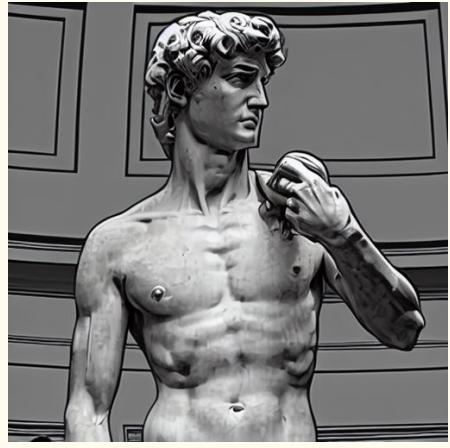

> **AI Description:**
> **Source:** `assets/_page_114_Figure_3.jpg`
> 
> **Generated:** 2026-05-16 09:38:54
> 
> ---
> 
> The image is a photograph of a classical sculpture, specifically a depiction of David, a famous work by Michelangelo. The sculpture is shown in a standing pose, with David's right hand raised and holding a sphere, while his left hand rests on his chest. The background features architectural elements, possibly columns or panels, which suggest the sculpture is displayed in a museum or gallery setting. The image captures the detailed musculature and facial features of the statue, highlighting the craftsmanship and artistic skill involved in its creation.

## 9.7 Embodied Agent

In this section, we delve into the exciting applications and implications of GPT-4V for embodied AI, exploring how it is poised to bridge the gap between multimodal understanding on static inputs and physical interaction with dynamic environments. To provide a concrete illustration, let us consider the scenario of GPT-4V assuming the role of a home robot. Within this context, we witness how it can read the menu to operate household appliances (e.g., coffee machine), and perform task-oriented navigation through the house.

Operating machine. Imagine you’ve just acquired a brand-new coffee machine, and to your delight, your trusty home robot, GPT-4V, learns how to operate it on your behalf. In our experiment, we provide GPT-4V with a single image (Figure 88) featuring an operating menu with both illustrations and texts. Our task for GPT-4V is to identify the button that corresponds to the “8 OZ coffee” option within the coffee machine’s operating panel. Surprisingly, GPT-4V not only accurately locates the “8 OZ coffee” button but also successfully recognizes the button for “10 OZ coffee.” However, it mistakenly identifies the power button as the “6 OZ coffee” button, potentially due to the visual confusion caused by the positioning of the “6 OZ coffee” option on both the menu and the coffee machine itself. To address this specific failure case, we devise a solution by isolating the operating menu for each button and presenting them all to GPT-4V in a single prompt (Figure 89). With this revised approach, GPT-4V now can recognize the precise position of the “6 OZ coffee” button.

Navigation. In order to explore navigation capabilities, we utilized Redfin virtual house tour as a means to replicate interactive environments for embodied agents. The objective was to assess the performance of GPT-4V in a task-oriented scenario. To illustrate this, we present an example depicted in Figures 90-91. Initially, we provided GPT-4V with the entry image of a virtual house tour, offering a view from one corner into the living room. The task assigned to GPT-4V was to “go to the kitchen and retrieve an item from the fridge.” Our aim was to prompt GPT-4V to predict the subsequent actions.

In the first step, as shown in the first half of Figure 90, GPT-4V anticipated the initial action by suggesting to “turn right and move forward towards the hallway.” This prediction was based on GPT-4V’s hypothesis that the kitchen would likely be located in that direction. We then manually executed this action using the visual house touring portal, capturing the resulting view after the action was taken. This view was then used to prompt GPT-4V for the next action, as displayed in the second half of Figure 90. It’s important to note that throughout the process, we maintained a record of the immediate previous turn to provide context for GPT-4V’s subsequent actions.

As the navigation process unfolded, we successfully reached the fridge within the third turn, as indicated by the query image in the second half of Figure 91. The final action predicted by GPT-4V was to “move forward and slightly to the left in order to align myself with the fridge door. Then, use my robotic arm to open the fridge door and retrieve the requested item.” This decisive action marked the accomplishment of GPT-4V in this task-oriented navigation scenario.

You should use the bottom button for an 8 OZ coffee. According to the menu, the bottom button corresponds to a 8 OZ coffee, while the top button is for a 6 OZ coffee and the right button is for a 10 OZ coffee.
Figure 88: Reading a full menu of coffee machine buttons, GPT-4V recognizes which button to choose for 8 OZ coffee. Green ( Red ) highlights the correct (wrong) answer. Check Section 9.7 for detailed discussions.
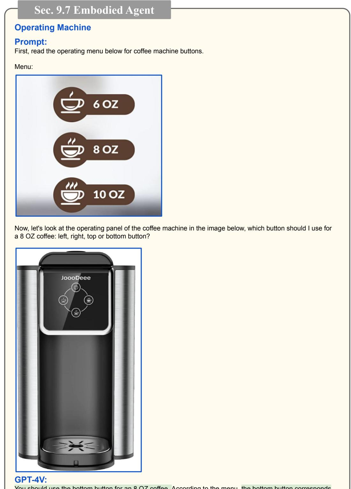

> **AI Description:**
> **Source:** `assets/_page_116_Figure_0.jpg`
> 
> **Generated:** 2026-05-16 08:54:36
> 
> ---
> 
> The image contains a combination of text and a photograph. The text provides a menu for selecting coffee sizes (6 oz, 8 oz, and 10 oz) and a prompt asking to identify the correct button on a coffee machine for an 8 oz coffee. The photograph shows the front view of a coffee machine with a digital display and buttons. The display shows three coffee cup icons, each associated with a different size: 6 oz, 8 oz, and 10 oz. The bottom button on the coffee machine corresponds to the 8 oz size according to the menu.

Menu 2:

> **AI Description:**
> **Source:** `assets/_page_117_Figure_1.jpg`
> 
> **Generated:** 2026-05-16 09:05:00
> 
> ---
> 
> The image contains a simple icon of a coffee cup with steam rising from it, accompanied by the text "8 OZ" in white font on a brown background. The icon and text are part of a single graphic element, likely used to indicate a 8-ounce serving size for coffee.

Menu 3:

Figure 89: Converting the full menu of coffee machine buttons to interleaved image-text instructions, GPT-4V can recognizes which button to choose for 6 OZ coffee, which GPT-4V failed to do so with full menu instruction. Green highlights the correct answer. Check Section 9.7 for detailed discussions.
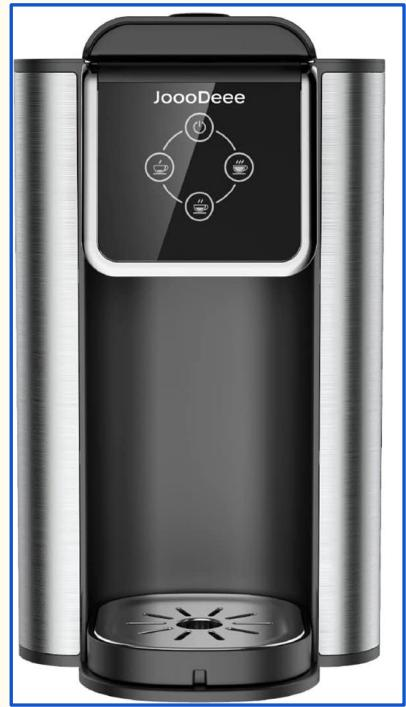

> **AI Description:**
> **Source:** `assets/_page_117_Figure_3.jpg`
> 
> **Generated:** 2026-05-16 09:11:43
> 
> ---
> 
> The image shows a coffee machine with a sleek design. It features a digital display with icons representing different coffee brewing options, such as espresso, cappuccino, and latte. The machine has a stainless steel finish on the sides and a black body with a digital interface in the center. The brand name "JooDee" is displayed at the top of the digital screen.

# Sec. 9.7 Embodied Agent

Navigation

Prompt:

Imagine that you are a home robot, and is asked to go to the kitchen to fetch something from the fridge.   
The image below shows your current position. Please plan your next action.

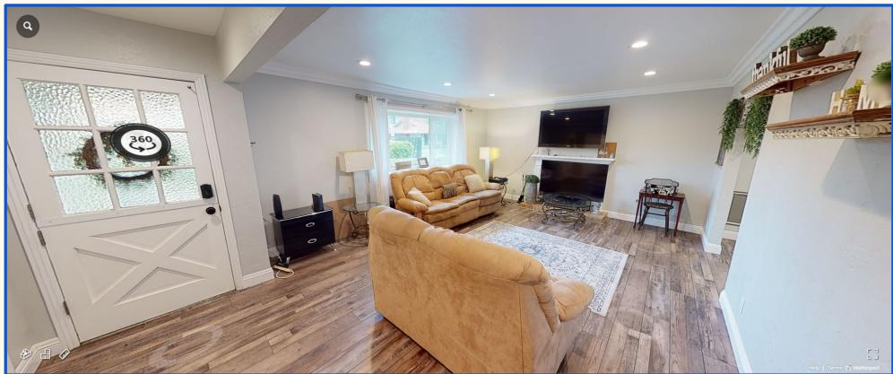

> **AI Description:**
> **Source:** `assets/_page_118_Figure_0.jpg`
> 
> **Generated:** 2026-05-16 10:03:10
> 
> ---
> 
> The image is a photograph of a living room. It features a light brown sofa in the foreground, a television mounted on a stand in the background, and a brown leather couch with a small table and lamp beside it. The room has wooden flooring and white walls. There is a door on the left side with a decorative wreath and a "360" sign on it. The ceiling has recessed lighting, and there are plants and a shelf with decorative items on the right wall.

GPT-4V:

My next action would be turn right and move forward towards the hallway, as I can see that the kitchen is likely located in that direction. I would then continue to navigate through the hallway until I reach the kitchen and locate the fridge.

Prompt:

Imagine that you are a home robot, and is asked to go to the kitchen to fetch something from the fridge. At the previous turn, you were at the position shown in the below image:

> **AI Description:**
> **Source:** `assets/_page_118_Figure_1.jpg`
> 
> **Generated:** 2026-05-16 10:01:24
> 
> ---
> 
> The image is a photograph of a living room. It features a cozy setup with a beige sofa, a coffee table, and a television mounted on the wall. There is a small dining area with a table and chairs in the background. The room has wooden flooring and a white door with a glass panel. The overall ambiance is warm and inviting.

Note: Same image from the previous turn, resized to save space

The action taken in previous turn is: turn right and move forward towards the hallway.

Now you are at the hallway, this is what you can see from there. Can you see the kitchen from here? What is your next action?

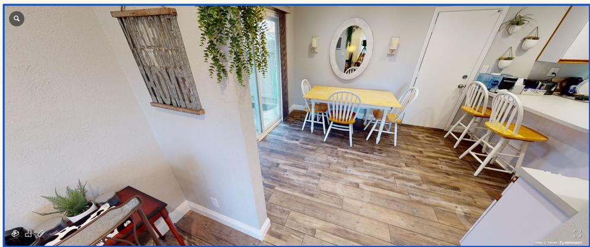

> **AI Description:**
> **Source:** `assets/_page_118_Figure_2.jpg`
> 
> **Generated:** 2026-05-16 09:55:26
> 
> ---
> 
> The image is a photograph of a small dining area within a home. The room features a wooden dining table with white chairs that have yellow seats. The walls are painted white, and there is a large mirror above the table. To the left, there is a decorative piece of driftwood mounted on the wall, and a small potted plant is placed on a side table. The floor is covered with wooden planks, and there is a sliding glass door leading to an outdoor area. The kitchen counter is visible in the background, with some kitchen appliances and items on it. The overall aesthetic of the room is rustic and cozy.

From the current position, I can see the kitchen on the right side, My next action would be to turn right and move forward towards the kitchen.

Figure 90: Acting as an embodied agent to navigate through a house to fetch something from the fridge (the 1st and 2nd turn). Blue highlights the predicted actions. Check Section 9.7 for detailed discussions.

# Sec. 9.7 Embodied Agent

## Navigation

## Prompt:

Imagine that you are a home robot, and is asked to go to the kitchen to fetch something from the fridge. At the previous turn, you were at the position shown in the below image:

> **AI Description:**
> **Source:** `assets/_page_119_Figure_0.jpg`
> 
> **Generated:** 2026-05-16 09:47:13
> 
> ---
> 
> The image is a photograph of a small, cozy dining area. The room features a wooden dining table with four chairs, each with a unique design. The walls are painted white, and there is a decorative mirror on the wall above the table. To the left, there is a small wooden side table with a plant on it. The floor is covered with wooden planks, and there is a window with a metal frame on the left side of the image. The overall ambiance of the room is warm and inviting.

Note: Same image from the previous turn, resized to save space

The action taken in previous turn is: turn right and move forward towards the kitchen.

Now you are at the kitchen, this is what you can see from there. Can you see the fridge from here? What is your next action?

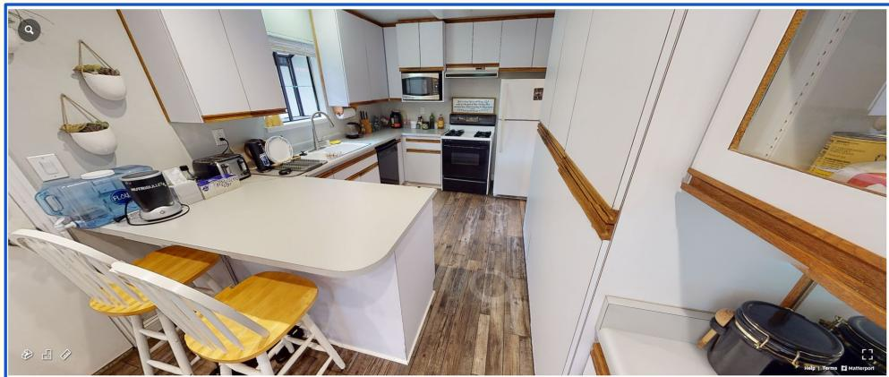

> **AI Description:**
> **Source:** `assets/_page_119_Figure_1.jpg`
> 
> **Generated:** 2026-05-16 09:52:36
> 
> ---
> 
> The image is a photograph of a kitchen with white cabinets and a wooden countertop. The kitchen features a sink, a stove, a microwave, and various kitchen appliances and utensils. There are two wooden bar stools at the counter. The floor is made of wood, and there are some items on the counter, including a water filter and a box of tissues. The overall layout is compact and functional.

## GPT-4V:

From this position, I can see the fridge on the right side of the kitchen. My next action would be to move forward and turn slightly to the right to approach the fridge.

## Prompt:

Imagine that you are a home robot, and is asked to go to the kitchen to fetch something from the fridge. At the previous turn, you were at the position shown in the below image:

> **AI Description:**
> **Source:** `assets/_page_119_Figure_2.jpg`
> 
> **Generated:** 2026-05-16 09:47:08
> 
> ---
> 
> The image contains two photographs of a kitchen interior. The left photo shows a kitchen with white cabinets, a countertop, and a dining area with a table and chairs. The right photo provides a closer view of the kitchen, focusing on the countertop and part of the cabinetry. The overall setting appears to be a well-lit, modern kitchen space.

Note: Same image from the previous turn, resized to save space

The action taken in previous turn is: move forward and turn slightly to the right to approach the fridge.

Now this is what you can see from there. What is your next action?
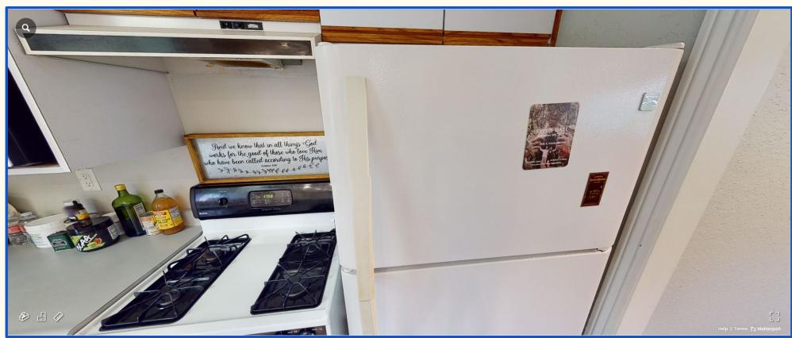

> **AI Description:**
> **Source:** `assets/_page_119_Figure_3.jpg`
> 
> **Generated:** 2026-05-16 09:40:43
> 
> ---
> 
> The image contains a kitchen scene with a stove, a refrigerator, and a countertop. The stove has a digital clock and control panel. Above the stove, there is a framed inspirational quote that reads, "And we know that in all things God works for the good of those who love Him, who have been called according to His purpose." The refrigerator has a few magnets and a small label on it. The countertop has various kitchen items, including bottles and containers. The image also includes a visible wall with a light switch and a small section of a window.

GPT-4V:
My next action would be to move forward and slightly to the left to align myself with the fridge door. Then, I would use my robotic arm to open the fridge door and retrieve the requested item.

Figure 91: Acting as an embodied agent to navigate through a house to fetch something from the fridge (the 3rd and 4th turn). Blue highlights the predicted actions. Check Section 9.7 for detailed discussions.

## 9.8 GUI Navigation

Beyond navigating the physical world, this section showcases the capability of GPT-4V to interact with and navigate through the Graphical User Interface (GUI) of a computer or smartphone. We explore the potential for GPT-4V to complete complex tasks, such as web browsing, online shopping, and etc.

Web browsing. We assess the performance of GPT-4V on computer GUI navigation under a task-oriented setting. The model was provided with the screenshot of current computer screen, the end goal of the navigation (e.g., finding a cooking recipe or reading today’s news), the list of possible actions $( e . g .$ , move the mouse, click an icon with the mouse, or type some texts with the keyboard). The model is then instructed to predict the subsequent actions (refer to Figure 92 for a complete prompt example). Upon the model’s prediction, we manually execute the predicted action and capture a screenshot, which served as the input for GPT-4V for the next turn. When the predicted action is to move the mouse, GPT-4V is specifically instructed to detail the mouse’s position. Hence, the predicted actions are grounded, showing the potential of automating the whole process without human in the loop.

In Figures 92-96, GPT-4V predicts reasonable actions to operate a computer GUI, and finally accomplish the end goal of finding a recipe of Mapo Tofu and print out a copy of the recipe in Figure 95. We then provide GPT-4V a screenshot of the printed recipe and ask it to describe the printout as detailed as possible. As shown in Figure 96, GPT-4V is able to recognize the details presented in the printout, including the cooking time, the list of ingredients, the author of the recipe, the link to the original recipe and etc. Figures 97-102 present how GPT-4V can navigate through GUI to browse the web to “read today’s news”. Despite the minor errors in Figure 100 when it tries to return to the previous search result page to continue browsing for more news articles, GPT-4V can perform the navigation and read two news articles reasonably well.

Online shopping. Figures 103-111 illustrates how GPT-4V can navigate a smartphone GUI for online shopping. Similarly, we provide GPT-4V with the screenshot of the current phone screen, the list of possible actions (e.g., move your finger to an icon, click an icon with your finger, scroll down a screen, or type some texts with the keyboard) and ask it to predict the subsequent actions to shop for an ergonomic keyboard with a budget between \$50 and \$100. GPT-4V predicts to open the Amazon app (Figure 103), search ergonomic keyboard (Figure 104), open the filter options (Figure 105), set the price range filter between \$50 and \$100 (Figure 106), show filtered results (Figure 107), select the top search result (Figure 108), view product details (Figure 109), add product to the shopping cart (Figure 110) and finally proceed to checkout (Figure 111).

Notification understanding. Notifications are integral to modern human-computer interactions. GPT-4V has demonstrated its capacity to interpret notification content and respond accordingly. As shown in Figure 112, the model can read and respond to a notification, such as suggesting to open the Maps app in response to a meeting proposal in Seattle. It also handles call (Figure 113) and message (Figure 114) notifications on a computer screen effectively.

Watching videos. Alongside web browsing, videos are a key source of online information. GPT-4V has shown its capability to describe video content based on a series of screenshots from popular short-form videos. Regardless of whether the video has subtitle overlay (Figure 115 and 116) or not (Figure 117, 118, 119), GPT-4V can generate insightful descriptions about the video content, demonstrating its potential in automatic transcript generation for user-generated video content.

Figure 92: GPT-4V navigates through GUI to browse the web to search for the recipe of Mapo Tofu. Blue highlights the predicted actions. Check Section 9.8 for detailed discussions.

Figure 93: GPT-4V navigates through GUI to browse the web to search for the recipe of Mapo Tofu. Blue highlights the predicted actions. Check Section 9.8 for detailed discussions.

Figure 94: GPT-4V navigates through GUI to browse the web to search for the recipe of Mapo Tofu. Blue highlights the predicted actions. Check Section 9.8 for detailed discussions.

Figure 95: GPT-4V navigates through GUI to browse the web to search for the recipe of Mapo Tofu. Blue highlights the predicted actions. Check Section 9.8 for detailed discussions.

Figure 96: GPT-4V navigates through GUI to browse the web to search for the recipe of Mapo Tofu. As GPT-4V predicts to print out the recipe in the previous turn, we prompt it to read the screenshot of the printed recipe and summarize it. Red highlights the inaccurate description about the image. Check Section 9.8 for detailed discussions.

## Sec. 9.8 GUI Navigation

## Web Browsing (Today’s News)

## Prompt:

Imagine that you are a robot operating a computer. Like how humans operate the computer, you can move the mouse, click an icon with the mouse, or type some texts with the keyboard.

You are asked to find what’s in the news today.

Below is what you see on the computer screen, predict your next move. If the action involves moving the mouse, describe the location as detailed as possible.

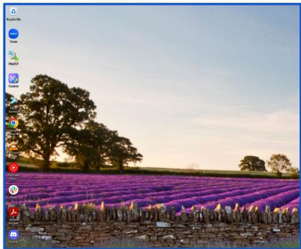

> **AI Description:**
> **Source:** `assets/_page_126_Figure_0.jpg`
> 
> **Generated:** 2026-05-16 09:13:22
> 
> ---
> 
> The image shows a desktop screen with a background featuring a scenic view of a lavender field under a clear sky. The desktop contains several icons for applications such as Chrome, Microsoft Word, and others, indicating a typical computer desktop environment. The image combines a natural landscape with a digital interface, showcasing a serene outdoor scene juxtaposed with the functional elements of a computer workspace.

My next move would be to move the mouse to the Google Chrome icon located on the left side of the screen, approximately 1/3 of the way down from the top. I would then click on the icon to open the web browser and search for news websites to find out what's in the news today.

Prompt:

Imagine that you are a robot operating a computer. Like how humans operate the computer, you can move the mouse, click an icon with the mouse, or type some texts with the keyboard.

You are asked to find what’s in the news today.

Previous action: "My next move would be to move the mouse to the Google Chrome icon located on the left side of the screen, approximately 1/3 of the way down from the top. I would then click on the icon to open the web browser and search for news websites to find out what's in the news today. "

You have now opened the web browser. Below is what you see on the computer screen, what is your immediate next step? If the action involves moving the mouse, describe the location as detailed as possible.

Figure 97: GPT-4V navigates through GUI to browse the web to read today’s news. Blue highlights the predicted actions. Check Section 9.8 for detailed discussions.

> **AI Description:**
> **Source:** `assets/_page_126_Figure_1.jpg`
> 
> **Generated:** 2026-05-16 09:10:09
> 
> ---
> 
> The image is a screenshot of a Google search page with a blurred cityscape background. The Google logo is prominently displayed in the center. Below the logo, there is a search bar with the placeholder text "Search Google or type a URL." Various Google services and apps are listed, including Gmail, Inbox, Google, Google+, Calendar, and Google Drive. The image also includes a small section with a photo credit at the bottom left corner, stating "Photo by Ev Tchobotarev." The overall design is clean and modern, with a focus on the search functionality and Google services.

Figure 98: GPT-4V navigates through GUI to browse the web to read today’s news. Blue highlights the predicted actions. Check Section 9.8 for detailed discussions.

Figure 99: GPT-4V navigates through GUI to browse the web to read today’s news. We prompt GPT-4V to read the screenshots of the first news article and summarize it. Check Section 9.8 for detailed discussions.

Figure 100: GPT-4V navigates through GUI to browse the web to read today’s news. Upon finishing reading the first news article, GPT-4V predicts to close the tab and return to previous page to continue browsing more news articles (highlighted in blue ). Red highlights the inaccurate action prediction. Check Section 9.8 for detailed discussions.

Figure 101: GPT-4V navigates through GUI to browse the web to read today’s news. Blue highlights the predicted actions. Check Section 9.8 for detailed discussions.

Figure 102: GPT-4V navigates through GUI to browse the web to read today’s news. We prompt GPT-4V to read the screenshots of the second news article and summarize it. Check Section 9.8 for detailed discussions.

Figure 103: GPT-4V navigates through GUI to shop for an ergonomic keyboard online. Blue highlights the predicted actions. Red highlights the inaccurate location of the Amazon icon. Check Section 9.8 for detailed discussions.

> **AI Description:**
> **Source:** `assets/_page_132_Figure_0.jpg`
> 
> **Generated:** 2026-05-16 08:59:02
> 
> ---
> 
> The image contains a screenshot of a smartphone home screen with various app icons arranged in a grid. The top of the screen displays the time as 1:56 and the battery level at 85%. Below the time and battery status, there are four rows of app icons, each row containing four icons. The icons represent common applications such as Calendar, Settings, Clock, Calculator, Wallet, Voice Memos, Camera, Compass, Weather, App Store, YouTube, Amazon, Twitter, Instagram, Chase, Facebook, and Yelp. At the bottom of the screen, there are four dock icons for Phone, Photos, Safari, and Mail. The image also includes a prompt for a robot to shop for an ergonomic keyboard within a budget of $50 to $100, with instructions to predict the next move on the phone screen.

Figure 104: GPT-4V navigates through GUI to shop for an ergonomic keyboard online. Blue highlights the predicted actions. Check Section 9.8 for detailed discussions.

> **AI Description:**
> **Source:** `assets/_page_133_Figure_0.jpg`
> 
> **Generated:** 2026-05-16 09:12:50
> 
> ---
> 
> The image contains a screenshot of an Amazon mobile app interface. It displays a search bar at the top, with a prompt to search for "ergonomic keyboard." Below the search bar, there are sections for recommended deals and personalized suggestions, such as "Inspired by your Wish List" and "Selected for you." The bottom of the screen shows navigation icons for Home, Light Bulb (Settings), Account, Cart, and Menu. The image also includes a timestamp and battery status at the top.

Figure 105: GPT-4V navigates through GUI to shop for an ergonomic keyboard online. Blue highlights the predicted actions. Check Section 9.8 for detailed discussions.

> **AI Description:**
> **Source:** `assets/_page_134_Figure_0.jpg`
> 
> **Generated:** 2026-05-16 09:11:28
> 
> ---
> 
> The image contains a screenshot of a smartphone displaying a shopping app interface. The screen shows a search result for "ergonomic keyboard" with various keyboard options listed. The top of the screen includes a search bar, a location indicator, and buttons for filtering by brand and price range. Below the search bar, there are sponsored brand logos and a section labeled "Explore Related Brands." The main part of the screen displays keyboard products with images, ratings, and price information. At the bottom, there are navigation icons for home, search, account, cart, and more options. The text at the top of the image provides a prompt for a robot to shop for an ergonomic keyboard within a specified budget.

Figure 106: GPT-4V navigates through GUI to shop for an ergonomic keyboard online. Blue highlights the predicted actions. Check Section 9.8 for detailed discussions.

Figure 107: GPT-4V navigates through GUI to shop for an ergonomic keyboard online. Blue highlights the predicted actions. Check Section 9.8 for detailed discussions.
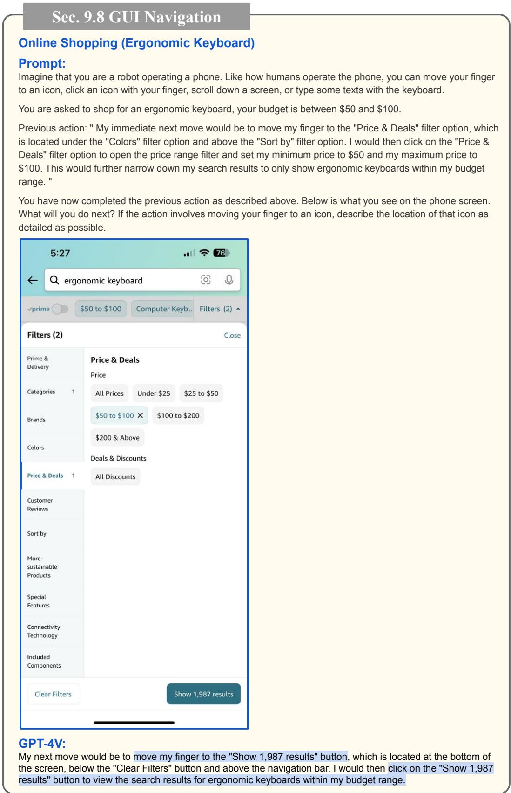

> **AI Description:**
> **Source:** `assets/_page_136_Figure_0.jpg`
> 
> **Generated:** 2026-05-16 09:23:21
> 
> ---
> 
> The image contains a screenshot of a smartphone screen displaying a search results page for ergonomic keyboards. The screen shows a search bar at the top with the term "ergonomic keyboard" entered. Below the search bar, there are filter options for "Prime & Delivery," "Categories," "Brands," "Colors," and "Price & Deals." The "Price & Deals" section is expanded, showing price ranges and deals. The screen also includes a navigation bar at the bottom with a "Show 1,987 results" button. The text at the top indicates a section on GUI navigation for online shopping, specifically for ergonomic keyboards, with a prompt for a robot to shop within a budget of $50 to $100.

Figure 108: GPT-4V navigates through GUI to shop for an ergonomic keyboard online. Blue highlights the predicted actions. Red highlights the inaccurate location of the product option to be selected. Check Section 9.8 for detailed discussions.

> **AI Description:**
> **Source:** `assets/_page_137_Figure_0.jpg`
> 
> **Generated:** 2026-05-16 09:38:46
> 
> ---
> 
> The image contains a screenshot of a smartphone screen displaying a shopping app interface. The screen shows a search result for "ergonomic keyboard" with various options listed. The app interface includes a search bar at the top, a delivery location field, and a price filter set between $50 and $100. Below the search bar, there are sections for "Explore Related Brands" and "Best seller." The main content area displays a list of ergonomic keyboards with images, names, ratings, and prices. The interface also includes navigation icons at the bottom, such as home, search, account, cart, and menu options. The text provides a prompt for a robot to shop for an ergonomic keyboard within a specified budget.

Figure 109: GPT-4V navigates through GUI to shop for an ergonomic keyboard online. Blue highlights the predicted actions. Red highlights the inaccurate action prediction (“Buy New” is not a clickable button). Check Section 9.8 for detailed discussions.

Figure 110: GPT-4V navigates through GUI to shop for an ergonomic keyboard online. Blue highlights the predicted actions. Check Section 9.8 for detailed discussions.

> **AI Description:**
> **Source:** `assets/_page_139_Figure_0.jpg`
> 
> **Generated:** 2026-05-16 08:28:29
> 
> ---
> 
> The image contains a screenshot of a smartphone displaying an Amazon product page for the Kensington Pro Fit Ergonomic Wireless Keyboard - Black. The screen shows the product details, including the price, delivery information, and options to add the item to the cart or buy now. The interface includes typical Amazon elements such as the search bar, navigation icons at the bottom, and the product's availability status. The image also includes a timestamp and battery status at the top of the screen.

Figure 111: GPT-4V navigates through GUI to shop for an ergonomic keyboard online. Blue highlights the predicted actions. Red highlights the inaccurate location of the “Proceed to checkout” buttion. Check Section 9.8 for detailed discussions.
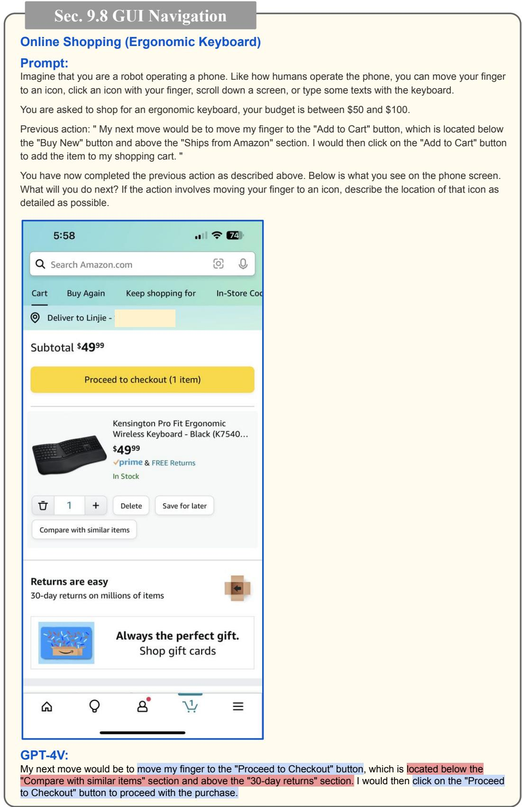

> **AI Description:**
> **Source:** `assets/_page_140_Figure_0.jpg`
> 
> **Generated:** 2026-05-16 09:17:51
> 
> ---
> 
> The image contains a screenshot of an Amazon shopping cart page. It displays a single item, the Kensington Pro Fit Ergonomic Wireless Keyboard, priced at $49.99. The subtotal is $49.99, and there is a yellow button labeled "Proceed to checkout (1 item)" below the item details. The page also includes options to delete or save the item for later, as well as a section for comparing similar items and a note about easy returns. The bottom of the screen shows navigation icons for Home, Wish List, Account, Cart, and Menu. The image includes a timestamp of 5:58 and a battery indicator showing 74% charge.

Figure 112: Prompting GPT-4V to predict the action upon receiving a notification. GPT-4V can accurately recognize the notification and the corresponding content (highlighted in green ). Blue highlights the predicted actions. Red highlights the inaccurate location of the Maps app icon. Check Section 9.8 for detailed discussions.
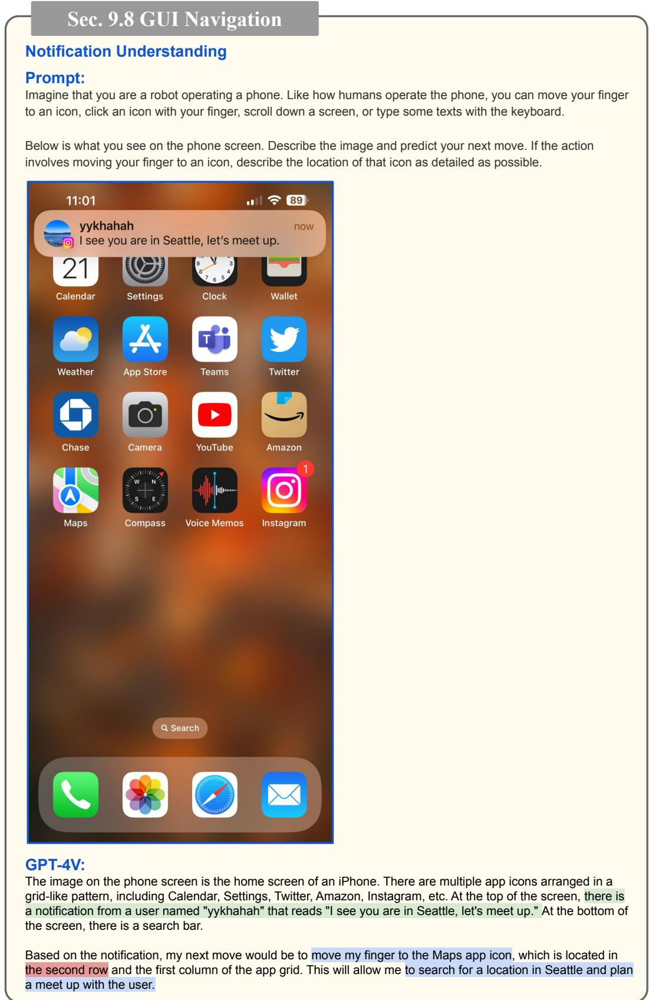

> **AI Description:**
> **Source:** `assets/_page_141_Figure_0.jpg`
> 
> **Generated:** 2026-05-16 09:32:57
> 
> ---
> 
> The image contains a screenshot of an iPhone home screen. It displays a grid of app icons, including Calendar, Settings, Twitter, Amazon, Instagram, and others. At the top of the screen, there is a notification from a user named "yykhahah" that reads, "I see you are in Seattle, let's meet up." At the bottom of the screen, there is a search bar. The image also includes a prompt for a robot to understand and predict its next move based on the notification and the app icons displayed.

Figure 113: Prompting GPT-4V to predict the action upon receiving a notification. GPT-4V can accurately recognize the notification and the corresponding content (highlighted in green ). Blue highlights the predicted actions. Red highlights the inaccurate location of the Maps app icon. Check Section 9.8 for detailed discussions.
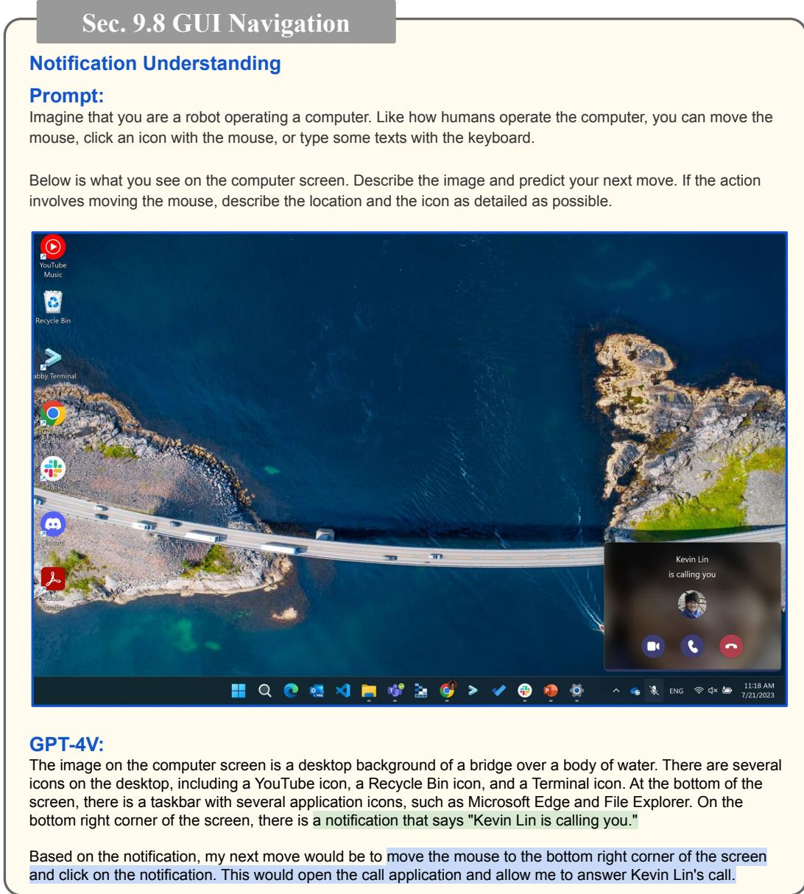

> **AI Description:**
> **Source:** `assets/_page_142_Figure_0.jpg`
> 
> **Generated:** 2026-05-16 09:02:28
> 
> ---
> 
> The image contains a desktop screen with a bridge over a body of water as the background. The desktop has several icons, including YouTube Music, Recycle Bin, and Terminal. At the bottom of the screen, there is a taskbar with various application icons such as Microsoft Edge and File Explorer. In the bottom right corner, there is a notification indicating "Kevin Lin is calling you."

Figure 114: Prompting GPT-4V to predict the action upon receiving a notification. GPT-4V can accurately recognize the notification and the corresponding content (highlighted in green ). Blue highlights the predicted actions. Check Section 9.8 for detailed discussions.
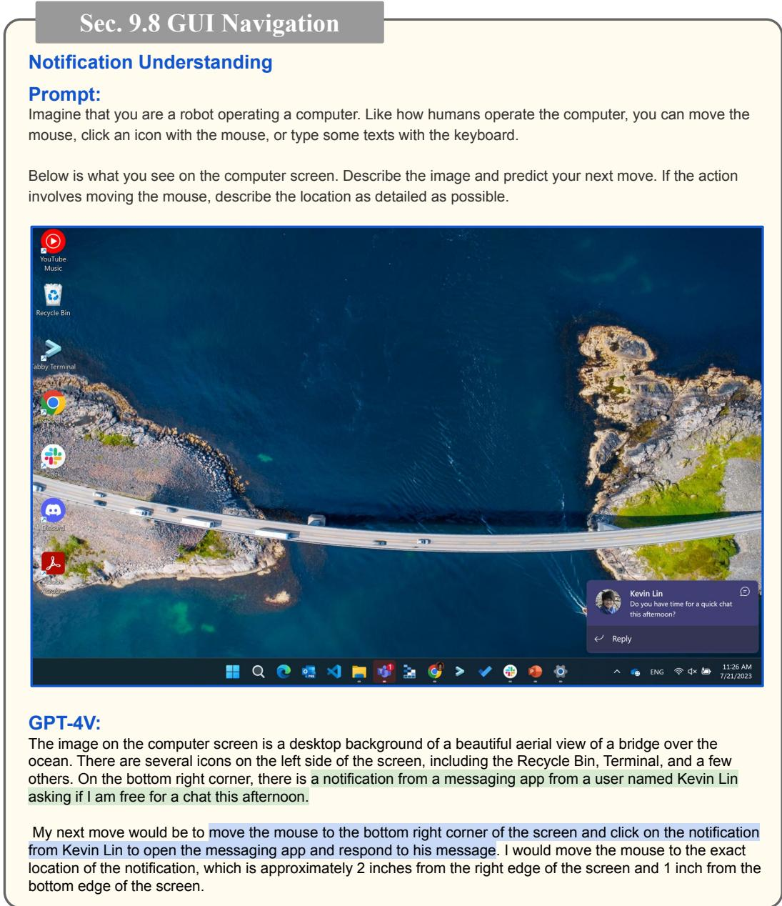

> **AI Description:**
> **Source:** `assets/_page_143_Figure_0.jpg`
> 
> **Generated:** 2026-05-16 08:53:35
> 
> ---
> 
> The image contains a desktop background featuring an aerial view of a bridge over the ocean. The desktop includes several icons on the left side, such as the Recycle Bin, Terminal, and others. On the bottom right corner, there is a notification from a messaging app from a user named Kevin Lin, asking if the user is free for a chat this afternoon. The notification is accompanied by a small profile picture and a reply button. The task is to predict the next move, which involves moving the mouse to the bottom right corner of the screen and clicking on the notification to open the messaging app and respond to Kevin Lin's message.

Figure 115: Prompting GPT-4V to watch web videos. We present GPT-4V the screenshot of the video frames following their temporal order in the original video. To save space, we illustrate the frames in a row, where the leftmost one is the first frame. Check Section 9.8 for detailed discussions. Red highlights the inaccurate descriptions about the video.
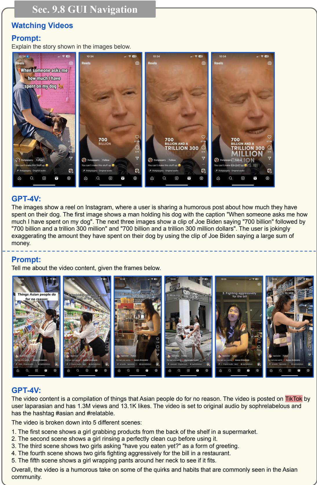

> **AI Description:**
> **Source:** `assets/_page_144_Figure_0.jpg`
> 
> **Generated:** 2026-05-16 08:51:01
> 
> ---
> 
> The image contains a series of screenshots from Instagram Reels and a TikTok video. The Reels screenshots show a humorous post about spending on a dog, with a man holding a dog and Joe Biden's face superimposed with exaggerated amounts of money. The TikTok video frames depict various scenes of Asian people performing actions that are considered quirky or relatable, such as grabbing products from the back of a shelf, rinsing a cup, asking about eating, fighting over a bill, and wrapping pants around the neck. The text provides context and descriptions for each part of the content.

Figure 116: Watching web videos. We present GPT-4V the screenshot of the video frames following their temporal order in the original video. To save space, we illustrate the frames in a row, where the leftmost one is the first frame. Check Section 9.8 for detailed discussions.

Figure 117: Watching web videos. We present GPT-4V the screenshot of the video frames following their temporal order in the original video. To save space, we illustrate frames 1-5 in the first row, and frames 6-9 in the second row. Check Section 9.8 for detailed discussions.
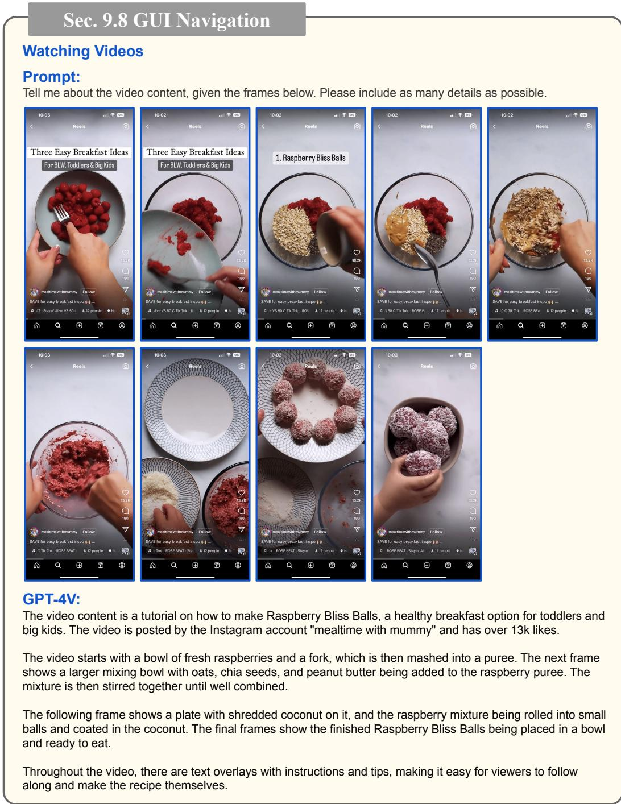

> **AI Description:**
> **Source:** `assets/_page_146_Figure_0.jpg`
> 
> **Generated:** 2026-05-16 09:34:03
> 
> ---
> 
> The image contains a series of nine screenshots from a video tutorial on making Raspberry Bliss Balls. The video is posted by the Instagram account "mealtime with mummy" and has over 13k likes. The frames show the process of making the bliss balls, starting with mashing raspberries, mixing in oats, chia seeds, and peanut butter, rolling the mixture into balls, and coating them in shredded coconut. The video includes text overlays with instructions and tips to guide viewers through the recipe.

Figure 118: Watching web videos. We present GPT-4V the screenshot of the video frames following their temporal order in the original video. To save space, we illustrate frames 1-5 in the first row, and frames 6-9 in the second row. Check Section 9.8 for detailed discussions.
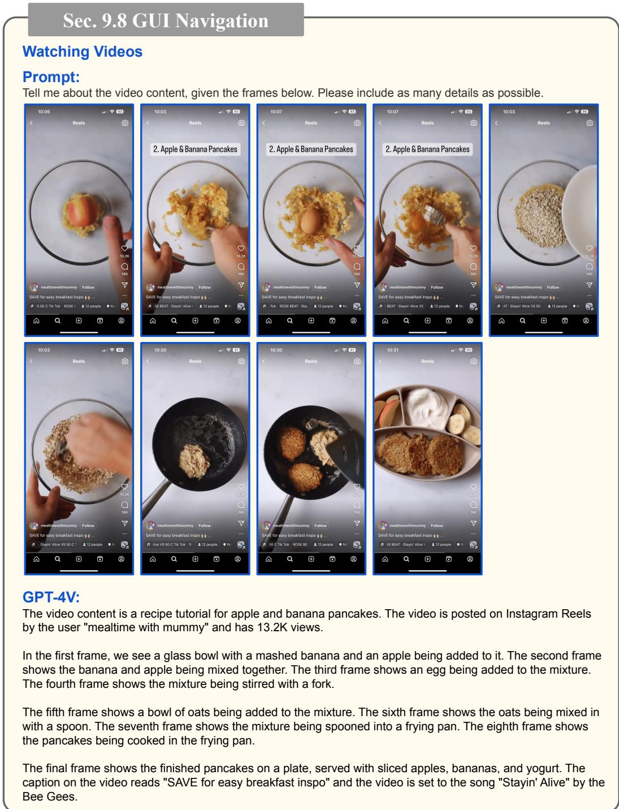

> **AI Description:**
> **Source:** `assets/_page_147_Figure_0.jpg`
> 
> **Generated:** 2026-05-16 09:15:38
> 
> ---
> 
> The image contains a series of nine screenshots from an Instagram Reels video by the user "mealtime with mummy." The video is a recipe tutorial for apple and banana pancakes. The frames show the process of making the pancakes, from mixing the ingredients in a bowl to cooking the pancakes in a frying pan. The final frame displays the finished pancakes served with sliced apples, bananas, and yogurt. The video has 13.2K views and is set to the song "Stayin' Alive" by the Bee Gees.

Figure 119: Watching web videos. We present GPT-4V the screenshot of the video frames following their temporal order in the original video. To save space, we illustrate frames 1-5 in the first row, and frames 6-9 in the second row. Red highlights the inaccurate descriptions about the video. Check Section 9.8 for detailed discussions.
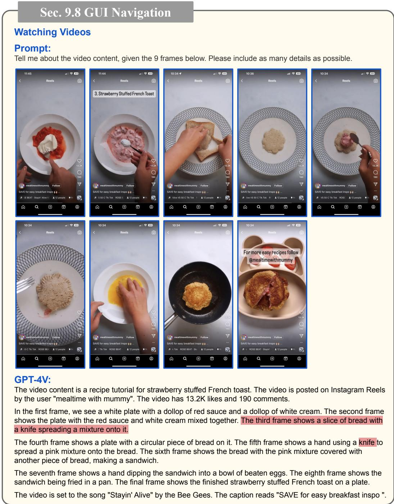

> **AI Description:**
> **Source:** `assets/_page_148_Figure_0.jpg`
> 
> **Generated:** 2026-05-16 08:35:02
> 
> ---
> 
> The image contains a series of nine frames from a recipe tutorial video on Instagram Reels. The frames depict the step-by-step process of making strawberry-stuffed French toast. The frames show hands preparing the ingredients, mixing the strawberry mixture, spreading it onto bread, adding another slice of bread, dipping the sandwich into beaten eggs, frying it, and finally presenting the finished dish. The video is set to the song "Stayin' Alive" by the Bee Gees, and the caption reads "SAVE for easy breakfast inspo."

## 10 LMM Powered Agents

In this section, we discuss possible future research directions that may further amplify GPT-4V’s capabilities. The discussion focuses on how the intriguing usages in LLMs may extend to the multimodal scenario and its enabled new abilities, e.g., multimodal plugins, multimodal chains, self-reflection, self-consistency, and retrieval-augmented LMMs, etc. In the following sub-sections, we use human-generated examples to illustrate potential ways to enhance GPT-4V-based systems.

Figure 120: Illustration of using the Bing Image Search [94] plugin to enable GPT-4V with timesensitive knowledge (bottom, highlighted in green ). Note that the earthquake happened on February 6, 2023, which is after GPT-4V’s training, thereby GPT-4V fails to identify the exact location without plugin (top). Check Section 10.1 for detailed discussions.
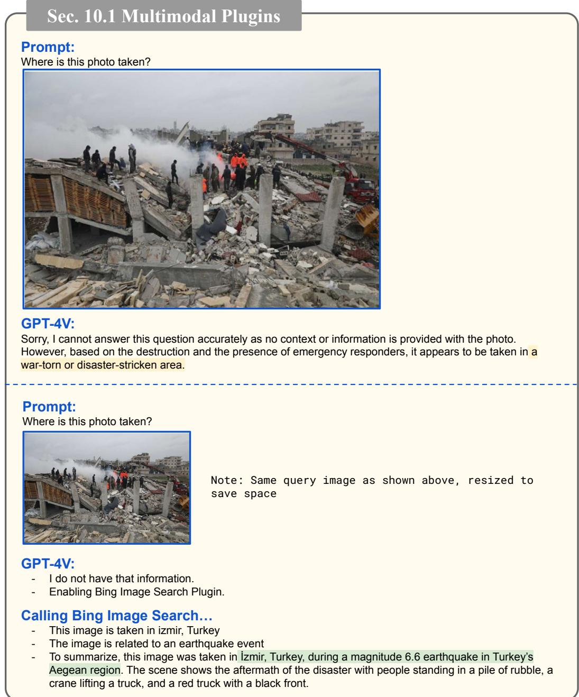

> **AI Description:**
> **Source:** `assets/_page_149_Figure_0.jpg`
> 
> **Generated:** 2026-05-16 08:45:12
> 
> ---
> 
> The image contains a photograph of a disaster scene with debris, emergency responders, and a crane. The text provides context about the location being İzmir, Turkey, during an earthquake event. The image is accompanied by a prompt asking for the location and responses from GPT-4V and Bing Image Search Plugin.

Figure 121: Extending GPT-4V to multimodal chains with ReAct [145, 142] for PPE Counting scenario. Check Section 10.2 for detailed discussions.
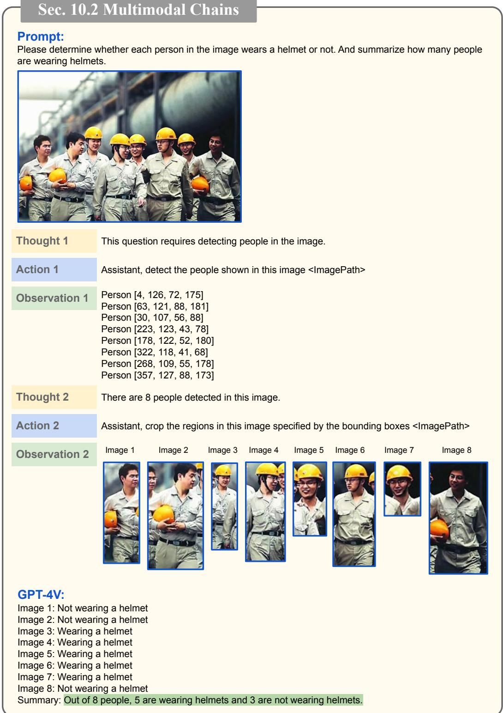

> **AI Description:**
> **Source:** `assets/_page_150_Figure_0.jpg`
> 
> **Generated:** 2026-05-16 09:06:16
> 
> ---
> 
> The image contains a photograph of a group of people in a uniform setting, likely a workplace or industrial environment. The individuals are wearing work uniforms and some are holding orange helmets. The image is accompanied by a text prompt and a thought-action sequence related to detecting and analyzing the presence of helmets in the image. The text provides bounding box coordinates for the people in the image and a summary indicating that out of eight people, five are wearing helmets and three are not.

## 10.1 Multimodal Plugins

In the context of LLMs, plugins [98, 56, 6, 112, 87, 103] play a crucial role in assisting LLMs for various tasks such as accessing the latest information, performing computations, or utilizing thirdparty services. These plugins are primarily designed to process inputs in natural language or inputs that can be interpreted as language, such as code and math equations. To illustrate the significance of multimodal plugins, such as Bing Image Search [94], especially in the context of LMMs, we present Figure 120. By incorporating the Bing Image Search plugin, we empower GPT-4V to acquire timesensitive knowledge related to the input image. In the upper part of the figure, we demonstrate the limitations of GPT-4V without Bing Image Search plugin. It fails to accurately answer the question, "Where was this photo taken?" due to the fact that the photo captures the aftermath of a massive earthquake that occurred on February 6, 2023, at the border of Turkey and Syria—a situation that took place after GPT-4V’s training. Since constantly retraining the model with current information can be computationally intensive and expensive, plugins like search engines prove to be invaluable resources for the model to access up-to-date information. In the lower part of Figure 120, we showcase the capabilities of GPT-4V when equipped with the Bing Image Search plugin. It effectively leverages the retrieved information from the plugin, enabling accurate identification of the location ˙Izmir, Turkey.

## 10.2 Multimodal Chains

Chaining with LLMs has been explored extensively in recent research [145, 47, 124, 107]. This approach goes beyond using a single plugin and instead establishes a system paradigm that integrates LLMs with a pool of plugins, enabling more advanced reasoning and interactions. By replacing language-only plugins with vision/multimodal experts such as image captioners, object detectors, or well-trained models for text-to-image generation and audio-to-text conversion, it becomes possible to construct a powerful multimodal chain with LLMs [137, 142, 121, 114, 75, 86].

However, the interactions within these chains between LLMs and the plugins typically take place in text format. Although the plugins may accept multimodal inputs, they return results in text to enhance the knowledge of LLMs. There is a notable exception in the case of image synthesis/editing [137], where the plugins can generate images, but these images are not fed back into LLMs for further analysis or knowledge augmentation, as LLMs can only process language-based inputs.

In Figure 121, we present an illustration of how GPT-4V, can be extended to support multimodal chains with ReAct [145, 142]. This extension enables the plugins in the chain to provide multimodal information, which can then be collectively processed by GPT-4V to achieve advanced reasoning in scenarios such as PPE counting. The entire chaining process shown in Figure 121 is divided into two rounds of thought, action, and observation, with each round involving the activation of a specific plugin. In the first round, GPT-4V deduces that person detection is necessary to count the number of people wearing helmets (Thought 1). Consequently, it calls the person detector tool (Action 1) and receives the coordinates of bounding boxes for each detected person in the image (Observation 1). Moving to the second round, based on the obtained bounding box information, GPT-4V infers that there are a total of 8 people in the image (Thought 2). It then utilizes the image cropping tool to crop out individual images of each person according to their corresponding bounding box coordinates (Action 2). The resulting outputs (Observation 2) consist of 8 labeled images, numbered from image 1 to image 8. GPT-4V subsequently determines whether each person in these images is wearing a helmet or not, and summarizes the total count of people wearing helmets.

Overall, this integration of LMMs with a pool of multimodal plugins opens up new possibilities for enhanced reasoning and interaction, leveraging the strengths of both language and vision capabilities. The flexibility of multimodal chains allows for a more comprehensive understanding and analysis of multimodal data, and can potentially lead to improved performance in various applications.

## 10.3 Self-Reflection

Figure 122 demonstrates the application of self-reflection [116, 88, 63] to improve the results shown in Figure 47. As we can see, the self-reflected result is better aligned with the reference image. For example, on the left side, the number of data points is corrected from 4 to 3, while on the right side, the percentage is added back above the bar. Although the result is still not exactly identical, it is evident that self-reflection can facilitate manual polishing. Figure 123 shows another example of self-reflection in improving the prompt generation for text-to-image models [106].

### Full Page Description (Page 152)

**Source:** `assets/_page_152_Asset_4.jpg`

**Generated:** 2026-05-16 09:47:20

---

The image is a bar chart comparing the performance of two models, OSCarB and MiniVLM (ours), across four tasks: Caption, VQA, TR, IR, and NLVR2. The x-axis represents the tasks, and the y-axis represents the score. Each task has two bars, one for each model, with the legend indicating the color coding for each model. The chart shows that MiniVLM generally outperforms OSCarB across all tasks, with the largest difference observed in the Caption task.

### Full Page Description (Page 152)

**Source:** `assets/_page_152_Asset_0.jpg`

**Generated:** 2026-05-16 09:56:46

---

The image is a line graph showing the relationship between the number of million images in pre-training and the CIDEr score for three different models: Base, Large, and Huge. The x-axis represents the number of million images in pre-training, ranging from 1 to 1000. The y-axis represents the CIDEr score, ranging from 80 to 140. The graph shows that as the number of million images in pre-training increases, the CIDEr score for all three models increases as well. The Base model has the lowest CIDEr score, followed by the Large model, and the Huge model has the highest CIDEr score.

### Full Page Description (Page 152)

**Source:** `assets/_page_152_Asset_1.jpg`

**Generated:** 2026-05-16 09:54:12

---

The image is a line graph showing the relationship between the number of million images in pre-training and the CIDEr (COnceptual INDEx) score for three different models: Base, Large, and Huge. The x-axis represents the number of million images in pre-training, ranging from \(10^0\) to \(10^3\). The y-axis represents the CIDEr score, ranging from 80 to 160. The graph shows that as the number of million images in pre-training increases, the CIDEr score for all three models also increases. The Base model consistently has the lowest CIDEr score, while the Huge model has the highest CIDEr score across all pre-training data points.

### Full Page Description (Page 152)

**Source:** `assets/_page_152_Asset_5.jpg`

**Generated:** 2026-05-16 09:52:25

---

The image contains a bar chart comparing the performance of OSCarB and MiniVLM across different tasks: Caption, VQA, TR, IR, and NLVR2. The x-axis represents the tasks, and the y-axis represents the score. Each task has two bars, one for OSCarB and one for MiniVLM, with percentages indicating the performance improvement of MiniVLM over OSCarB. The chart shows that MiniVLM outperforms OSCarB in all tasks, with the largest improvement in the Caption task (120%) and the smallest in the IR task (95%).

### Full Page Description (Page 152)

**Source:** `assets/_page_152_Asset_2.jpg`

**Generated:** 2026-05-16 09:59:51

---

The image is a line graph with three distinct lines representing different models: Base, Large, and Huge. The x-axis represents the number of million images used in pre-training, ranging from \(10^1\) to \(10^3\). The y-axis measures CIDEr, a metric used to evaluate the quality of image captioning. The graph shows that as the number of images increases, the CIDEr values for all three models increase. The Base model shows the lowest CIDEr values, followed by the Large model, and the Huge model has the highest CIDEr values.

### Full Page Description (Page 152)

**Source:** `assets/_page_152_Asset_3.jpg`

**Generated:** 2026-05-16 10:03:25

---

The image is a bar chart comparing the performance of two models, OSCAR and MiniVLM, across five tasks: Caption, VQA, TR, IR, and NLVR2. The x-axis represents the tasks, and the y-axis represents the percentage of correct answers. Each task has two bars, one for OSCAR and one for MiniVLM, with the percentage of correct answers labeled above each bar. The chart shows that both models achieve 100% accuracy on the Caption and IR tasks, with OSCAR slightly outperforming MiniVLM on the Caption task and MiniVLM slightly outperforming OSCAR on the IR task. The VQA, TR, and NLVR2 tasks show a similar trend, with OSCAR achieving higher accuracy than MiniVLM.

## Sec. 10.3 Self-Reflection

## Self-Reflection to Improve Coding

## Prompt:

## Prompt:

Can you double-check the code and align it better with the reference image?

Note: Code from the above GPT-4V

response is omitted to save space

## Prompt:

Write python codes to generate similar figures.

## GPT-4V:

## Prompt:

Can you double-check the code and align it better with the reference image?

Note: Code from the above GPT-4V response is omitted to save space

## GPT-4V:

# Sec. 10.3 Self-Reflection

# Self-Reflection to Improve Text-to-Image Generation

## Prompt:

Instruction: Given a user imagined IDEA of the scene, converting the IDEA into a self-contained sentence prompt that will be used to generate an image. IDEA: photo of a dog looks like the one in the given image running on the beach.

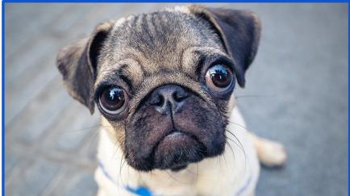

> **AI Description:**
> **Source:** `assets/_page_153_Figure_0.jpg`
> 
> **Generated:** 2026-05-16 09:26:37
> 
> ---
> 
> The image is a photograph of a pug dog. The dog has a wrinkled face, large dark eyes, and a small, stubby nose. The dog is wearing a blue collar. The background appears to be an outdoor setting with a paved surface. The image captures the dog's expressive face and its characteristic features.

## Based on the above information, I wrote a detailed prompt exactly about the IDEA follow the rules. GPT-4V:

A blue dog running on the beach with a happy expression on its face.

## SDXL:

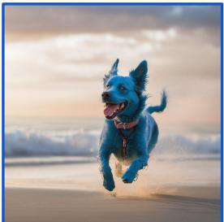

> **AI Description:**
> **Source:** `assets/_page_153_Figure_1.jpg`
> 
> **Generated:** 2026-05-16 09:34:21
> 
> ---
> 
> The image is a photograph of a dog running on a beach. The dog appears to be a medium-sized breed with a blue coat and is wearing a collar. The background shows waves crashing onto the shore under a partly cloudy sky. The dog's posture and the motion blur suggest it is in mid-stride, enjoying the beach environment.

## Prompt:

I am iteratively improving the sentence prompt by looking at the images generated by an AI art generation model and find out what is different from the given IDEA. The IDEA is: photo of a dog … beach. Generated sentence prompt for current round is: A blue dog running on the beach with a happy expression on its face. Corresponding image generated by the AI art generation model:

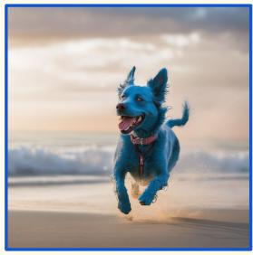

> **AI Description:**
> **Source:** `assets/_page_153_Figure_2.jpg`
> 
> **Generated:** 2026-05-16 09:40:31
> 
> ---
> 
> The image is a photograph of a dog running on a beach. The dog appears to be a medium-sized breed with a blue coat and is wearing a collar. The background shows the ocean with waves and a cloudy sky, suggesting it is either early morning or late afternoon. The dog's motion blur indicates it is moving quickly.

## Prompt Continued

The generated image is not perfect. Write key reasons on how to further improve the image to better follow the user imagined IDEA of the scene.

## GPT-4V:

The dog in the generated image does not look like the one in the given image. The dog in the given image is a pug, while the dog in the generated image is a different breed. To address this issue, we can modify the prompt to specifically mention that the dog should be a pug.

## Prompt:

Instruction: Given a user imagined IDEA of the scene, converting the IDEA into a sentence prompt that will be used to generate an image. I am iteratively improving the sentence prompt by looking at the images generated by an AI art generation model and find out what is different from the given IDEA. The IDEA is: photo of a dog … beach. Generated sentence prompt for current round is: A blue … its face. Corresponding image generated by the AI art generation model:

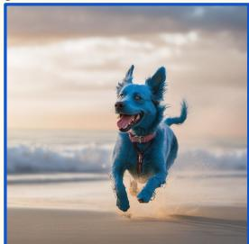

> **AI Description:**
> **Source:** `assets/_page_153_Figure_3.jpg`
> 
> **Generated:** 2026-05-16 09:34:26
> 
> ---
> 
> The image is a photograph of a dog running on a beach. The dog appears to be a medium-sized breed with a blue coat and is wearing a collar. The background shows the ocean with waves crashing onto the shore, and the sky is partly cloudy with a warm, golden hue, suggesting either sunrise or sunset. The dog's motion is captured mid-stride, creating a sense of movement and energy.

The image can be improved because: The dog … should be a pug. Based on the above information, to improve the image, I wrote a detailed prompt exactly about the IDEA follow the rules.

## GPT-4V:

A blue pug running on the beach with a happy expression on its face, with a sunset and palm trees in the background.

## SDXL:

Figure 123: Illustration of using self-reflection to improve the generated text prompts for a text-toimage model SDXL [106]. GPT-4V reflects the error in the initial prompt that it does not mention the dog’s breed, and makes the correct revision. Check Section 10.3 for detailed discussions.
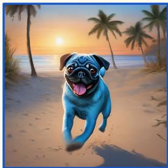

> **AI Description:**
> **Source:** `assets/_page_153_Figure_4.jpg`
> 
> **Generated:** 2026-05-16 09:26:32
> 
> ---
> 
> The image contains a photograph of a pug dog running on a sandy beach. The background features a beautiful sunset with the sun low on the horizon, casting a warm glow over the scene. Palm trees are visible in the distance, adding to the tropical beach atmosphere. The pug appears to be enjoying the moment, with its tongue out and a joyful expression.

Figure 124: Improve the counting reliability with self-consistency [130], which aggregates multiple counting results repeated on the same image. Check Section 10.4 for detailed discussions.

## 10.4 Self-Consistency

Self-consistency [130] is a decoding strategy that aggregates multiple sampled outputs to produce the final answer, such as with the majority vote. Extended from marginalizing to aggregating final answers, Tree-of-Thoughts [144] shows that the self-consistency idea can be applied to intermediate thoughts to improve the LLM reasoning performance. Figure 124 illustrates the use of self-consistency on GPT-4V for counting problems. We sample multiple counting results by asking GPT-4V to count the same image multiple times, either conducting multiple runs (Samples 2-4) or rephrasing the input text instruction (Samples 1,2). The example then uses the simple majority vote to aggregate the final answer of “4 boats.” We leave the comprehensive explorations of self-consistency LMMs to future works.

## 10.5 Retrieval-Augmented LMMs

Retrieval-Augmented LMMs [93, 68, 50, 19, 115, 104] enhances text generation by retrieving and integrating relevant information into prompts. The technique is particularly effective when specialized task-relevant information is needed, such as expert knowledge in a highly-specialized expert domain, the most recent information that may differ from LLMs’ memory, and the customizable information that varies from user to user. We imagine retrieval augmentation continues to play an essential role in LMMs. Figure 74 shows an example of retrieval-augmented LMMs helping grocery checkout. Since the produces’ image-text-price triplets are different in each store, it would be beneficial to retrieve them from the store’s database and yield the correct checkout information. Similarly, in Figure 81’s the customized captioning scenario, we imagine the system may automatically retrieve the family members’ photos from the album and achieve the customized captioning.

## 11 Conclusions

## 11.1 Summary and Conclusions

In this report, our primary focus is on probing GPT-4V across various application scenarios. The findings reveal its remarkable capabilities, some of which have not been investigated or demonstrated in existing approaches. While we strive to uncover as many of these capabilities as possible, we acknowledge that our presentation may not be exhaustive. Nevertheless, this report can serve as a reference for future research aimed at exploring additional uses of GPT-4V, deepening the understanding of LMMs, and building even more powerful LMMs.

## 11.2 Towards Future LMMs

The weaknesses and limitations of GPT models have been extensively discussed in related reports [99, 100, 24]. In this section, we briefly focus on presenting our perspective on future research directions.

Models like GPT-1, GPT-2, and GPT-3 function primarily as text-in-text-out systems, capable of processing natural language only. GPT-4 (no vision) demonstrates unparalleled competence in text understanding and generation, while GPT-4V exhibits a strong ability to comprehend the image domain as well.

As a natural progression, LMMs should be able to generate interleaved image-text content, such as producing vivid tutorials containing both text and images, to enable comprehensive multimodal content understanding and generation. Additionally, it would be beneficial to incorporate other modalities, such as video, audio, and other sensor data, to expand the capabilities of LMMs.

Regarding the learning process, current approaches predominantly rely on well-organized data, such as image-tag or image-text datasets. However, a more versatile model may be able to learn from various sources, including online web content and even real-world physical environments, to facilitate continuous self-evolution.

## Acknowledgment

We express our gratitude to all contributors from OpenAI for their technical efforts on the GPT-4V project [99–101, 1], and we are profoundly thankful to OpenAI for granting early access to their remarkable tool. Our sincere appreciation goes to Misha Bilenko for his invaluable guidance and support. We also extend heartfelt thanks to our Microsoft colleagues for their insights, with special acknowledgment to John Montgomery, Marco Casalaina, Gregory Buehrer, Nguyen Bach, Gopi Kumar, Luis Vargas, Kun Wu, Meenaz Merchant, Jianfeng Gao, Matt Lungren, Sheela Agarwal, Yumao Lu, Thomas Soemo, Fisayo Okikiolu, Ce Liu, Michael Zeng, Faisal Ahmed, Ehsan Azarnasab, and Lin Liang for their constructive feedback. We also thank Yingkai Yu for helping to create screenshots on GUI Navigation.

## References

- [1] Chatgpt can now see, hear, and speak. https://openai.com/blog/ chatgpt-can-now-see-hear-and-speak, 2023.
- [2] Deepfloyd if. https://github.com/deep-floyd/IF, 2023.
- [3] Guidance. https://github.com/microsoft/guidance/, 2023.
- [4] Midjourney. https://www.midjourney.com/, 2023.
- [5] Sameer Agarwal, Yasutaka Furukawa, Noah Snavely, Ian Simon, Brian Curless, Steven M Seitz, and Richard Szeliski. Building rome in a day. Communications of the ACM, 54(10):105–112, 2011.
- [6] Michael Ahn, Anthony Brohan, Noah Brown, Yevgen Chebotar, Omar Cortes, Byron David, Chelsea Finn, Keerthana Gopalakrishnan, Karol Hausman, Alex Herzog, et al. Do as i can, not as i say: Grounding language in robotic affordances. arXiv preprint arXiv:2204.01691, 2022.
- [7] Jean-Baptiste Alayrac, Jeff Donahue, Pauline Luc, Antoine Miech, Iain Barr, Yana Hasson, Karel Lenc, Arthur Mensch, Katherine Millican, Malcolm Reynolds, et al. Flamingo: a visual language model for few-shot learning. Advances in Neural Information Processing Systems, 35:23716–23736, 2022.
- [8] Chris Alberti, Jeffrey Ling, Michael Collins, and David Reitter. Fusion of detected objects in text for visual question answering. In EMNLP, 2019.
- [9] Peter Anderson, Xiaodong He, Chris Buehler, Damien Teney, Mark Johnson, Stephen Gould, and Lei Zhang. Bottom-up and top-down attention for image captioning and visual question answering. In CVPR, 2018.
- [10] Karpathy Andrej. State of gpt. https://karpathy.ai/stateofgpt.pdf, 2023.
- [11] Rohan Anil, Andrew M Dai, Orhan Firat, Melvin Johnson, Dmitry Lepikhin, Alexandre Passos, Siamak Shakeri, Emanuel Taropa, Paige Bailey, Zhifeng Chen, et al. Palm 2 technical report. arXiv preprint arXiv:2305.10403, 2023.
- [12] Stanislaw Antol, Aishwarya Agrawal, Jiasen Lu, Margaret Mitchell, Dhruv Batra, C. Lawrence Zitnick, and Devi Parikh. VQA: Visual Question Answering. In ICCV, 2015.
- [13] Anas Awadalla, Irena Gao, Joshua Gardner, Jack Hessel, Yusuf Hanafy, Wanrong Zhu, Kalyani Marathe, Yonatan Bitton, Samir Gadre, Jenia Jitsev, Simon Kornblith, Pang Wei Koh, Gabriel Ilharco, Mitchell Wortsman, and Ludwig Schmidt. Openflamingo, March 2023.
- [14] Hessam Bagherinezhad, Hannaneh Hajishirzi, Yejin Choi, and Ali Farhadi. Are elephants bigger than butterflies? reasoning about sizes of objects. In Proceedings of the AAAI Conference on Artificial Intelligence, volume 30, 2016.
- [15] Shruthi Bannur, Stephanie Hyland, Qianchu Liu, Fernando Perez-Garcia, Maximilian Ilse, Daniel C Castro, Benedikt Boecking, Harshita Sharma, Kenza Bouzid, Anja Thieme, et al. Learning to exploit temporal structure for biomedical vision-language processing. In Proceedings of the IEEE/CVF Conference on Computer Vision and Pattern Recognition, pages 15016–15027, 2023.
- [16] David Barrett, Felix Hill, Adam Santoro, Ari Morcos, and Timothy Lillicrap. Measuring abstract reasoning in neural networks. In International conference on machine learning, pages 511–520. PMLR, 2018.
- [17] Ali Furkan Biten, Ruben Tito, Andres Mafla, Lluis Gomez, Marçal Rusinol, Ernest Valveny, CV Jawahar, and Dimosthenis Karatzas. Scene text visual question answering. In ICCV, 2019.
- [18] Kevin Black, Michael Janner, Yilun Du, Ilya Kostrikov, and Sergey Levine. Training diffusion models with reinforcement learning, 2023.

- [19] Sebastian Borgeaud, Arthur Mensch, Jordan Hoffmann, Trevor Cai, Eliza Rutherford, Katie Millican, George Bm Van Den Driessche, Jean-Baptiste Lespiau, Bogdan Damoc, Aidan Clark, et al. Improving language models by retrieving from trillions of tokens. In International conference on machine learning, pages 2206–2240. PMLR, 2022.
- [20] Lukas Bossard, Matthieu Guillaumin, and Luc Van Gool. Food-101–mining discriminative components with random forests. In Computer Vision–ECCV 2014: 13th European Conference, Zurich, Switzerland, September 6-12, 2014, Proceedings, Part VI 13, pages 446–461. Springer, 2014.
- [21] Marc A Brackett and Peter Salovey. Measuring emotional intelligence with the mayer-saloverycaruso emotional intelligence test (msceit). Psicothema, 18:34–41, 2006.
- [22] Tim Brooks, Aleksander Holynski, and Alexei A. Efros. Instructpix2pix: Learning to follow image editing instructions. In CVPR, 2023.
- [23] Tom B Brown, Benjamin Mann, Nick Ryder, Melanie Subbiah, Jared Kaplan, Prafulla Dhariwal, Arvind Neelakantan, Pranav Shyam, Girish Sastry, Amanda Askell, et al. Language models are few-shot learners. In NeurIPS, 2020.
- [24] Sébastien Bubeck, Varun Chandrasekaran, Ronen Eldan, Johannes Gehrke, Eric Horvitz, Ece Kamar, Peter Lee, Yin Tat Lee, Yuanzhi Li, Scott Lundberg, et al. Sparks of artificial general intelligence: Early experiments with gpt-4. arXiv preprint arXiv:2303.12712, 2023.
- [25] Ting Chen, Saurabh Saxena, Lala Li, David J Fleet, and Geoffrey Hinton. Pix2seq: A language modeling framework for object detection. In ICLR, 2022.
- [26] Ting Chen, Saurabh Saxena, Lala Li, Tsung-Yi Lin, David J Fleet, and Geoffrey E Hinton. A unified sequence interface for vision tasks. Advances in Neural Information Processing Systems, 35:31333–31346, 2022.
- [27] Xinlei Chen, Hao Fang, Tsung-Yi Lin, Ramakrishna Vedantam, Saurabh Gupta, Piotr Dollár, and C Lawrence Zitnick. Microsoft coco captions: Data collection and evaluation server. arXiv preprint arXiv:1504.00325, 2015.
- [28] Yen-Chun Chen, Linjie Li, Licheng Yu, Ahmed El Kholy, Faisal Ahmed, Zhe Gan, Yu Cheng, and Jingjing Liu. Uniter: Learning universal image-text representations. In ECCV, 2020.
- [29] Jaemin Cho, Jie Lei, Hao Tan, and Mohit Bansal. Unifying vision-and-language tasks via text generation. In ICML, 2021.
- [30] Aakanksha Chowdhery, Sharan Narang, Jacob Devlin, Maarten Bosma, Gaurav Mishra, Adam Roberts, Paul Barham, Hyung Won Chung, Charles Sutton, Sebastian Gehrmann, et al. Palm: Scaling language modeling with pathways. arXiv preprint arXiv:2204.02311, 2022.
- [31] Herbert H Clark and Deanna Wilkes-Gibbs. Referring as a collaborative process. Cognition, 22(1):1–39, 1986.
- [32] Marius Cordts, Mohamed Omran, Sebastian Ramos, Timo Rehfeld, Markus Enzweiler, Rodrigo Benenson, Uwe Franke, Stefan Roth, and Bernt Schiele. The cityscapes dataset for semantic urban scene understanding. In Proceedings of the IEEE conference on computer vision and pattern recognition, pages 3213–3223, 2016.
- [33] Tom Cornsweet. Visual perception. Academic press, 2012.
- [34] Damai Dai, Yutao Sun, Li Dong, Yaru Hao, Zhifang Sui, and Furu Wei. Why can gpt learn in-context? language models secretly perform gradient descent as meta optimizers. arXiv preprint arXiv:2212.10559, 2022.
- [35] Wenliang Dai, Junnan Li, Dongxu Li, Anthony Meng Huat Tiong, Junqi Zhao, Weisheng Wang, Boyang Li, Pascale Fung, and Steven Hoi. Instructblip: Towards general-purpose vision-language models with instruction tuning. arXiv preprint arXiv:2305.06500, 2023.

- [36] Abhishek Das, Satwik Kottur, Khushi Gupta, Avi Singh, Deshraj Yadav, José MF Moura, Devi Parikh, and Dhruv Batra. Visual dialog. In Proceedings of the IEEE conference on computer vision and pattern recognition, pages 326–335, 2017.
- [37] Jia Deng, Wei Dong, Richard Socher, Li-Jia Li, Kai Li, and Li Fei-Fei. Imagenet: A large-scale hierarchical image database. In CVPR, 2009.
- [38] Jacob Devlin, Ming-Wei Chang, Kenton Lee, and Kristina Toutanova. Bert: Pre-training of deep bidirectional transformers for language understanding. In NAACL-HLT, 2019.
- [39] Qingxiu Dong, Lei Li, Damai Dai, Ce Zheng, Zhiyong Wu, Baobao Chang, Xu Sun, Jingjing Xu, and Zhifang Sui. A survey for in-context learning. arXiv preprint arXiv:2301.00234, 2022.
- [40] Zi-Yi Dou, Aishwarya Kamath, Zhe Gan, Pengchuan Zhang, Jianfeng Wang, Linjie Li, Zicheng Liu, Ce Liu, Yann LeCun, Nanyun Peng, et al. Coarse-to-fine vision-language pre-training with fusion in the backbone. In Advances in Neural Information Processing Systems.
- [41] Zi-Yi Dou, Yichong Xu, Zhe Gan, Jianfeng Wang, Shuohang Wang, Lijuan Wang, Chenguang Zhu, Pengchuan Zhang, Lu Yuan, Nanyun Peng, et al. An empirical study of training endto-end vision-and-language transformers. In Proceedings of the IEEE/CVF Conference on Computer Vision and Pattern Recognition, pages 18166–18176, 2022.
- [42] Danny Driess, Fei Xia, Mehdi S. M. Sajjadi, Corey Lynch, Aakanksha Chowdhery, Brian Ichter, Ayzaan Wahid, Jonathan Tompson, Quan Vuong, Tianhe Yu, Wenlong Huang, Yevgen Chebotar, Pierre Sermanet, Daniel Duckworth, Sergey Levine, Vincent Vanhoucke, Karol Hausman, Marc Toussaint, Klaus Greff, Andy Zeng, Igor Mordatch, and Pete Florence. Palm-e: An embodied multimodal language model. In arXiv preprint arXiv:2303.03378, 2023.
- [43] Alicia Fasquel, Angèle Brunellière, and Dominique Knutsen. A modified procedure for naming 332 pictures and collecting norms: Using tangram pictures in psycholinguistic studies. Behavior Research Methods, pages 1–23, 2022.
- [44] Samir Yitzhak Gadre, Kiana Ehsani, and Shuran Song. Act the part: Learning interaction strategies for articulated object part discovery. In Proceedings of the IEEE/CVF International Conference on Computer Vision, pages 15752–15761, 2021.
- [45] Zhe Gan, Yen-Chun Chen, Linjie Li, Chen Zhu, Yu Cheng, and Jingjing Liu. Large-scale adversarial training for vision-and-language representation learning. In NeurIPS, 2020.
- [46] Zhe Gan, Linjie Li, Chunyuan Li, Lijuan Wang, Zicheng Liu, Jianfeng Gao, et al. Visionlanguage pre-training: Basics, recent advances, and future trends. Foundations and Trends® in Computer Graphics and Vision, 14(3–4):163–352, 2022.
- [47] Luyu Gao, Aman Madaan, Shuyan Zhou, Uri Alon, Pengfei Liu, Yiming Yang, Jamie Callan, and Graham Neubig. Pal: Program-aided language models. In International Conference on Machine Learning, pages 10764–10799. PMLR, 2023.
- [48] Tao Gong, Chengqi Lyu, Shilong Zhang, Yudong Wang, Miao Zheng, Qian Zhao, Kuikun Liu, Wenwei Zhang, Ping Luo, and Kai Chen. Multimodal-gpt: A vision and language model for dialogue with humans, 2023.
- [49] Yandong Guo, Lei Zhang, Yuxiao Hu, Xiaodong He, and Jianfeng Gao. Ms-celeb-1m: A dataset and benchmark for large-scale face recognition. In Computer Vision–ECCV 2016: 14th European Conference, Amsterdam, The Netherlands, October 11-14, 2016, Proceedings, Part III 14, pages 87–102. Springer, 2016.
- [50] Kelvin Guu, Kenton Lee, Zora Tung, Panupong Pasupat, and Mingwei Chang. Retrieval augmented language model pre-training. In International conference on machine learning, pages 3929–3938. PMLR, 2020.
- [51] Kaiming He, Georgia Gkioxari, Piotr Dollár, and Ross Girshick. Mask r-cnn. In Proceedings of the IEEE international conference on computer vision, pages 2961–2969, 2017.

- [52] Jack \*Hessel, Jena D \*Hwang, Jae Sung Park, Rowan Zellers, Chandra Bhagavatula, Anna Rohrbach, Kate Saenko, and Yejin Choi. The Abduction of Sherlock Holmes: A Dataset for Visual Abductive Reasoning. In ECCV, 2022.
- [53] Jordan Hoffmann, Sebastian Borgeaud, Arthur Mensch, Elena Buchatskaya, Trevor Cai, Eliza Rutherford, Diego de Las Casas, Lisa Anne Hendricks, Johannes Welbl, Aidan Clark, et al. Training compute-optimal large language models. arXiv preprint arXiv:2203.15556, 2022.
- [54] Yushi Hu, Hang Hua, Zhengyuan Yang, Weijia Shi, Noah A Smith, and Jiebo Luo. Promptcap: Prompt-guided task-aware image captioning. In Proceedings of International Conference on Computer Vision (ICCV), 2023.
- [55] Shaohan Huang, Li Dong, Wenhui Wang, Yaru Hao, Saksham Singhal, Shuming Ma, Tengchao Lv, Lei Cui, Owais Khan Mohammed, Qiang Liu, et al. Language is not all you need: Aligning perception with language models. arXiv preprint arXiv:2302.14045, 2023.
- [56] Wenlong Huang, Pieter Abbeel, Deepak Pathak, and Igor Mordatch. Language models as zero-shot planners: Extracting actionable knowledge for embodied agents. In International Conference on Machine Learning, pages 9118–9147. PMLR, 2022.
- [57] Zhicheng Huang, Zhaoyang Zeng, Bei Liu, Dongmei Fu, and Jianlong Fu. Pixel-bert: Aligning image pixels with text by deep multi-modal transformers. arXiv preprint arXiv:2004.00849, 2020.
- [58] Fabian Hutmacher. Why is there so much more research on vision than on any other sensory modality? Frontiers in psychology, 10:2246, 2019.
- [59] Anya Ji, Noriyuki Kojima, Noah Rush, Alane Suhr, Wai Keen Vong, Robert Hawkins, and Yoav Artzi. Abstract visual reasoning with tangram shapes. In Proceedings of the 2022 Conference on Empirical Methods in Natural Language Processing, pages 582–601, 2022.
- [60] Alistair EW Johnson, Tom J Pollard, Seth J Berkowitz, Nathaniel R Greenbaum, Matthew P Lungren, Chih-ying Deng, Roger G Mark, and Steven Horng. Mimic-cxr, a de-identified publicly available database of chest radiographs with free-text reports. Scientific data, 6(1):317, 2019.
- [61] Justin Johnson, Bharath Hariharan, Laurens Van Der Maaten, Li Fei-Fei, C Lawrence Zitnick, and Ross Girshick. Clevr: A diagnostic dataset for compositional language and elementary visual reasoning. In Proceedings of the IEEE conference on computer vision and pattern recognition, pages 2901–2910, 2017.
- [62] Justin Johnson, Andrej Karpathy, and Li Fei-Fei. Densecap: Fully convolutional localization networks for dense captioning. In Proceedings of the IEEE conference on computer vision and pattern recognition, pages 4565–4574, 2016.
- [63] Geunwoo Kim, Pierre Baldi, and Stephen McAleer. Language models can solve computer tasks. arXiv preprint arXiv:2303.17491, 2023.
- [64] Wonjae Kim, Bokyung Son, and Ildoo Kim. Vilt: Vision-and-language transformer without convolution or region supervision. In ICML, 2021.
- [65] Alexander Kirillov, Eric Mintun, Nikhila Ravi, Hanzi Mao, Chloe Rolland, Laura Gustafson, Tete Xiao, Spencer Whitehead, Alexander C Berg, Wan-Yen Lo, et al. Segment anything. In Proceedings of International Conference on Computer Vision (ICCV), 2023.
- [66] Takeshi Kojima, Shixiang Shane Gu, Machel Reid, Yutaka Matsuo, and Yusuke Iwasawa. Large language models are zero-shot reasoners. Advances in neural information processing systems, 35:22199–22213, 2022.
- [67] Ranjay Krishna, Yuke Zhu, Oliver Groth, Justin Johnson, Kenji Hata, Joshua Kravitz, Stephanie Chen, Yannis Kalantidis, Li-Jia Li, David A Shamma, et al. Visual genome: Connecting language and vision using crowdsourced dense image annotations. IJCV, 2017.

- [68] Patrick Lewis, Ethan Perez, Aleksandra Piktus, Fabio Petroni, Vladimir Karpukhin, Naman Goyal, Heinrich Küttler, Mike Lewis, Wen-tau Yih, Tim Rocktäschel, et al. Retrievalaugmented generation for knowledge-intensive nlp tasks. Advances in Neural Information Processing Systems, 33:9459–9474, 2020.
- [69] Chunyuan Li, Zhe Gan, Zhengyuan Yang, Jianwei Yang, Linjie Li, Lijuan Wang, and Jianfeng Gao. Multimodal foundation models: From specialists to general-purpose assistants. arXiv preprint arXiv:2309.10020, 2023.
- [70] Gen Li, Nan Duan, Yuejian Fang, Ming Gong, Daxin Jiang, and Ming Zhou. Unicoder-vl: A universal encoder for vision and language by cross-modal pre-training. In AAAI, 2020.
- [71] Junnan Li, Dongxu Li, Silvio Savarese, and Steven Hoi. Blip-2: Bootstrapping languageimage pre-training with frozen image encoders and large language models. arXiv preprint arXiv:2301.12597, 2023.
- [72] Junnan Li, Ramprasaath R Selvaraju, Akhilesh Deepak Gotmare, Shafiq Joty, Caiming Xiong, and Steven Hoi. Align before fuse: Vision and language representation learning with momentum distillation. In NeurIPS, 2021.
- [73] Liunian Harold Li, Mark Yatskar, Da Yin, Cho-Jui Hsieh, and Kai-Wei Chang. Visualbert: A simple and performant baseline for vision and language. arXiv preprint arXiv:1908.03557, 2019.
- [74] Xiujun Li, Xi Yin, Chunyuan Li, Xiaowei Hu, Pengchuan Zhang, Lei Zhang, Lijuan Wang, Houdong Hu, Li Dong, Furu Wei, et al. Oscar: Object-semantics aligned pre-training for vision-language tasks. In ECCV, 2020.
- [75] Yaobo Liang, Chenfei Wu, Ting Song, Wenshan Wu, Yan Xia, Yu Liu, Yang Ou, Shuai Lu, Lei Ji, Shaoguang Mao, et al. Taskmatrix. ai: Completing tasks by connecting foundation models with millions of apis. arXiv preprint arXiv:2303.16434, 2023.
- [76] Tsung-Yi Lin, Michael Maire, Serge Belongie, James Hays, Pietro Perona, Deva Ramanan, Piotr Dollár, and C Lawrence Zitnick. Microsoft coco: Common objects in context. In ECCV, 2014.
- [77] Fangyu Liu, Emanuele Bugliarello, Edoardo Maria Ponti, Siva Reddy, Nigel Collier, and Desmond Elliott. Visually grounded reasoning across languages and cultures. In Proceedings of the 2021 Conference on Empirical Methods in Natural Language Processing, pages 10467–10485, Online and Punta Cana, Dominican Republic, November 2021. Association for Computational Linguistics.
- [78] Fuxiao Liu, Kevin Lin, Linjie Li, Jianfeng Wang, Yaser Yacoob, and Lijuan Wang. Aligning large multi-modal model with robust instruction tuning. arXiv preprint arXiv:2306.14565, 2023.
- [79] Haotian Liu, Chunyuan Li, Qingyang Wu, and Yong Jae Lee. Visual instruction tuning. arXiv preprint arXiv:2304.08485, 2023.
- [80] Ziwei Liu, Ping Luo, Xiaogang Wang, and Xiaoou Tang. Deep learning face attributes in the wild. In Proceedings of International Conference on Computer Vision (ICCV), December 2015.
- [81] Jiasen Lu, Dhruv Batra, Devi Parikh, and Stefan Lee. Vilbert: Pretraining task-agnostic visiolinguistic representations for vision-and-language tasks. In NeurIPS, 2019.
- [82] Jiasen Lu, Christopher Clark, Rowan Zellers, Roozbeh Mottaghi, and Aniruddha Kembhavi. Unified-io: A unified model for vision, language, and multi-modal tasks. In The Eleventh International Conference on Learning Representations, 2022.
- [83] Jiasen Lu, Vedanuj Goswami, Marcus Rohrbach, Devi Parikh, and Stefan Lee. 12-in-1: Multi-task vision and language representation learning. In CVPR, 2020.
- [84] Jiasen Lu, Jianwei Yang, Dhruv Batra, and Devi Parikh. Neural baby talk. In CVPR, 2018.

- [85] Pan Lu, Swaroop Mishra, Tanglin Xia, Liang Qiu, Kai-Wei Chang, Song-Chun Zhu, Oyvind Tafjord, Peter Clark, and Ashwin Kalyan. Learn to explain: Multimodal reasoning via thought chains for science question answering. Advances in Neural Information Processing Systems, 35:2507–2521, 2022.
- [86] Pan Lu, Baolin Peng, Hao Cheng, Michel Galley, Kai-Wei Chang, Ying Nian Wu, Song-Chun Zhu, and Jianfeng Gao. Chameleon: Plug-and-play compositional reasoning with large language models. arXiv preprint arXiv:2304.09842, 2023.
- [87] Pan Lu, Liang Qiu, Kai-Wei Chang, Ying Nian Wu, Song-Chun Zhu, Tanmay Rajpurohit, Peter Clark, and Ashwin Kalyan. Dynamic prompt learning via policy gradient for semi-structured mathematical reasoning. arXiv preprint arXiv:2209.14610, 2022.
- [88] Aman Madaan, Niket Tandon, Prakhar Gupta, Skyler Hallinan, Luyu Gao, Sarah Wiegreffe, Uri Alon, Nouha Dziri, Shrimai Prabhumoye, Yiming Yang, et al. Self-refine: Iterative refinement with self-feedback. arXiv preprint arXiv:2303.17651, 2023.
- [89] Bertram F Malle, Louis J Moses, and Dare A Baldwin. Intentions and intentionality: Foundations of social cognition. MIT press, 2001.
- [90] Arjun Mani, Nobline Yoo, Will Hinthorn, and Olga Russakovsky. Point and ask: Incorporating pointing into visual question answering. arXiv preprint arXiv:2011.13681, 2020.
- [91] John D Mayer. Msceit: Mayer-salovey-caruso emotional intelligence test. Toronto, Canada: Multi-Health Systems, 2002.
- [92] John D Mayer, Richard D Roberts, and Sigal G Barsade. Human abilities: Emotional intelligence. Annu. Rev. Psychol., 59:507–536, 2008.
- [93] Grégoire Mialon, Roberto Dessì, Maria Lomeli, Christoforos Nalmpantis, Ram Pasunuru, Roberta Raileanu, Baptiste Rozière, Timo Schick, Jane Dwivedi-Yu, Asli Celikyilmaz, et al. Augmented language models: a survey. arXiv preprint arXiv:2302.07842, 2023.
- [94] Microsoft. Bing image search api. https://www.microsoft.com/en-us/bing/ apis/bing-image-search-api, 2023.
- [95] Weiqing Min, Zhiling Wang, Yuxin Liu, Mengjiang Luo, Liping Kang, Xiaoming Wei, Xiaolin Wei, and Shuqiang Jiang. Large scale visual food recognition. IEEE Transactions on Pattern Analysis and Machine Intelligence, 2023.
- [96] Swaroop Mishra, Daniel Khashabi, Chitta Baral, and Hannaneh Hajishirzi. Cross-task generalization via natural language crowdsourcing instructions. In Proceedings of the 60th Annual Meeting of the Association for Computational Linguistics (Volume 1: Long Papers), pages 3470–3487, 2022.
- [97] Tara Murfitt and Jan McAllister. The effect of production variables in monolog and dialog on comprehension by novel listeners. Language and Speech, 44(3):325–350, 2001.
- [98] Reiichiro Nakano, Jacob Hilton, Suchir Balaji, Jeff Wu, Long Ouyang, Christina Kim, Christopher Hesse, Shantanu Jain, Vineet Kosaraju, William Saunders, et al. Webgpt: Browser-assisted question-answering with human feedback. arXiv preprint arXiv:2112.09332, 2021.
- [99] OpenAI. Gpt-4 technical report, 2023.
- [100] OpenAI. Gpt-4v(ision) system card. 2023.
- [101] OpenAI. Gpt-4v(ision) technical work and authors. 2023.
- [102] Long Ouyang, Jeffrey Wu, Xu Jiang, Diogo Almeida, Carroll Wainwright, Pamela Mishkin, Chong Zhang, Sandhini Agarwal, Katarina Slama, Alex Ray, et al. Training language models to follow instructions with human feedback. Advances in Neural Information Processing Systems, 35:27730–27744, 2022.

- [103] Bhargavi Paranjape, Scott Lundberg, Sameer Singh, Hannaneh Hajishirzi, Luke Zettlemoyer, and Marco Tulio Ribeiro. Art: Automatic multi-step reasoning and tool-use for large language models. arXiv preprint arXiv:2303.09014, 2023.
- [104] Baolin Peng, Michel Galley, Pengcheng He, Hao Cheng, Yujia Xie, Yu Hu, Qiuyuan Huang, Lars Liden, Zhou Yu, Weizhu Chen, et al. Check your facts and try again: Improving large language models with external knowledge and automated feedback. arXiv preprint arXiv:2302.12813, 2023.
- [105] Zhiliang Peng, Wenhui Wang, Li Dong, Yaru Hao, Shaohan Huang, Shuming Ma, and Furu Wei. Kosmos-2: Grounding multimodal large language models to the world. arXiv preprint arXiv:2306.14824, 2023.
- [106] Dustin Podell, Zion English, Kyle Lacey, Andreas Blattmann, Tim Dockhorn, Jonas Müller, Joe Penna, and Robin Rombach. Sdxl: Improving latent diffusion models for high-resolution image synthesis. arXiv preprint arXiv:2307.01952, 2023.
- [107] Yujia Qin, Shengding Hu, Yankai Lin, Weize Chen, Ning Ding, Ganqu Cui, Zheni Zeng, Yufei Huang, Chaojun Xiao, Chi Han, Yi Ren Fung, Yusheng Su, Huadong Wang, Cheng Qian, Runchu Tian, Kunlun Zhu, Shihao Liang, Xingyu Shen, Bokai Xu, Zhen Zhang, Yining Ye, Bowen Li, Ziwei Tang, Jing Yi, Yuzhang Zhu, Zhenning Dai, Lan Yan, Xin Cong, Yaxi Lu, Weilin Zhao, Yuxiang Huang, Junxi Yan, Xu Han, Xian Sun, Dahai Li, Jason Phang, Cheng Yang, Tongshuang Wu, Heng Ji, Zhiyuan Liu, and Maosong Sun. Tool learning with foundation models, 2023.
- [108] Colin Raffel, Noam Shazeer, Adam Roberts, Katherine Lee, Sharan Narang, Michael Matena, Yanqi Zhou, Wei Li, and Peter J Liu. Exploring the limits of transfer learning with a unified text-to-text transformer. The Journal of Machine Learning Research, 21(1):5485–5551, 2020.
- [109] John C Raven and JH Court. Raven’s progressive matrices. Western Psychological Services Los Angeles, 1938.
- [110] Robin Rombach, Andreas Blattmann, Dominik Lorenz, Patrick Esser, and Björn Ommer. High-resolution image synthesis with latent diffusion models. In Proceedings of the IEEE/CVF Conference on Computer Vision and Pattern Recognition, pages 10684–10695, 2022.
- [111] Victor Sanh, Albert Webson, Colin Raffel, Stephen Bach, Lintang Sutawika, Zaid Alyafeai, Antoine Chaffin, Arnaud Stiegler, Arun Raja, Manan Dey, et al. Multitask prompted training enables zero-shot task generalization. In International Conference on Learning Representations, 2021.
- [112] Timo Schick, Jane Dwivedi-Yu, Roberto Dessì, Roberta Raileanu, Maria Lomeli, Luke Zettlemoyer, Nicola Cancedda, and Thomas Scialom. Toolformer: Language models can teach themselves to use tools. arXiv preprint arXiv:2302.04761, 2023.
- [113] Zhenwei Shao, Zhou Yu, Meng Wang, and Jun Yu. Prompting large language models with answer heuristics for knowledge-based visual question answering. In CVPR, pages 14974– 14983, 2023.
- [114] Yongliang Shen, Kaitao Song, Xu Tan, Dongsheng Li, Weiming Lu, and Yueting Zhuang. Hugginggpt: Solving ai tasks with chatgpt and its friends in huggingface. arXiv preprint arXiv:2303.17580, 2023.
- [115] Weijia Shi, Sewon Min, Michihiro Yasunaga, Minjoon Seo, Rich James, Mike Lewis, Luke Zettlemoyer, and Wen-tau Yih. Replug: Retrieval-augmented black-box language models. arXiv preprint arXiv:2301.12652, 2023.
- [116] Noah Shinn, Beck Labash, and Ashwin Gopinath. Reflexion: an autonomous agent with dynamic memory and self-reflection. arXiv preprint arXiv:2303.11366, 2023.
- [117] Aleksandar Shtedritski, Christian Rupprecht, and Andrea Vedaldi. What does clip know about a red circle? visual prompt engineering for vlms. arXiv preprint arXiv:2304.06712, 2023.

- [118] Oleksii Sidorov, Ronghang Hu, Marcus Rohrbach, and Amanpreet Singh. Textcaps: a dataset for image captioning with reading comprehension. In ECCV, pages 742–758, 2020.
- [119] Amanpreet Singh, Vivek Natarajan, Meet Shah, Yu Jiang, Xinlei Chen, Dhruv Batra, Devi Parikh, and Marcus Rohrbach. Towards vqa models that can read. In CVPR, 2019.
- [120] Weijie Su, Xizhou Zhu, Yue Cao, Bin Li, Lewei Lu, Furu Wei, and Jifeng Dai. Vl-bert: Pre-training of generic visual-linguistic representations. In ICLR, 2019.
- [121] Dídac Surís, Sachit Menon, and Carl Vondrick. Vipergpt: Visual inference via python execution for reasoning. arXiv preprint arXiv:2303.08128, 2023.
- [122] Hao Tan and Mohit Bansal. Lxmert: Learning cross-modality encoder representations from transformers. In EMNLP, 2019.
- [123] Hugo Touvron, Thibaut Lavril, Gautier Izacard, Xavier Martinet, Marie-Anne Lachaux, Timothée Lacroix, Baptiste Rozière, Naman Goyal, Eric Hambro, Faisal Azhar, et al. Llama: Open and efficient foundation language models. arXiv preprint arXiv:2302.13971, 2023.
- [124] Harsh Trivedi, Niranjan Balasubramanian, Tushar Khot, and Ashish Sabharwal. Interleaving retrieval with chain-of-thought reasoning for knowledge-intensive multi-step questions. arXiv preprint arXiv:2212.10509, 2022.
- [125] Maria Tsimpoukelli, Jacob L Menick, Serkan Cabi, SM Eslami, Oriol Vinyals, and Felix Hill. Multimodal few-shot learning with frozen language models. Advances in Neural Information Processing Systems, 34:200–212, 2021.
- [126] Carven Von Bearnensquash. Paper gestalt. Secret Proceedings of Computer Vision and Pattern Recognition (CVPR), 2010.
- [127] Hong Wang, Xuan Luo, Weizhi Wang, and Xifeng Yan. Bot or human? detecting chatgpt imposters with a single question. arXiv preprint arXiv:2305.06424, 2023.
- [128] Jianfeng Wang, Zhengyuan Yang, Xiaowei Hu, Linjie Li, Kevin Lin, Zhe Gan, Zicheng Liu, Ce Liu, and Lijuan Wang. Git: A generative image-to-text transformer for vision and language. Transactions on Machine Learning Research, 2022.
- [129] Peng Wang, An Yang, Rui Men, Junyang Lin, Shuai Bai, Zhikang Li, Jianxin Ma, Chang Zhou, Jingren Zhou, and Hongxia Yang. Ofa: Unifying architectures, tasks, and modalities through a simple sequence-to-sequence learning framework. In International Conference on Machine Learning, pages 23318–23340. PMLR, 2022.
- [130] Xuezhi Wang, Jason Wei, Dale Schuurmans, Quoc V Le, Ed H Chi, Sharan Narang, Aakanksha Chowdhery, and Denny Zhou. Self-consistency improves chain of thought reasoning in language models. In The Eleventh International Conference on Learning Representations, 2022.
- [131] Zhenhailong Wang, Manling Li, Ruochen Xu, Luowei Zhou, Jie Lei, Xudong Lin, Shuohang Wang, Ziyi Yang, Chenguang Zhu, Derek Hoiem, et al. Language models with image descriptors are strong few-shot video-language learners. In Advances in Neural Information Processing Systems.
- [132] Zirui Wang, Jiahui Yu, Adams Wei Yu, Zihang Dai, Yulia Tsvetkov, and Yuan Cao. Simvlm: Simple visual language model pretraining with weak supervision. In ICLR, 2022.
- [133] David Wechsler. Wais-r: Manual: Wechsler adult intelligence scale-revised. (No Title), 1981.
- [134] Jason Wei, Maarten Bosma, Vincent Y Zhao, Kelvin Guu, Adams Wei Yu, Brian Lester, Nan Du, Andrew M Dai, and Quoc V Le. Finetuned language models are zero-shot learners. In ICLR, 2022.
- [135] Jason Wei, Yi Tay, Rishi Bommasani, Colin Raffel, Barret Zoph, Sebastian Borgeaud, Dani Yogatama, Maarten Bosma, Denny Zhou, Donald Metzler, et al. Emergent abilities of large language models. arXiv preprint arXiv:2206.07682, 2022.

- [136] Jason Wei, Xuezhi Wang, Dale Schuurmans, Maarten Bosma, Fei Xia, Ed Chi, Quoc V Le, Denny Zhou, et al. Chain-of-thought prompting elicits reasoning in large language models. Advances in Neural Information Processing Systems, 35:24824–24837, 2022.
- [137] Chenfei Wu, Shengming Yin, Weizhen Qi, Xiaodong Wang, Zecheng Tang, and Nan Duan. Visual chatgpt: Talking, drawing and editing with visual foundation models. arXiv preprint arXiv:2303.04671, 2023.
- [138] Jialian Wu, Jianfeng Wang, Zhengyuan Yang, Zhe Gan, Zicheng Liu, Junsong Yuan, and Lijuan Wang. Grit: A generative region-to-text transformer for object understanding. arXiv preprint arXiv:2212.00280, 2022.
- [139] Zhenjia Xu, Zhijian Liu, Chen Sun, Kevin Murphy, William T Freeman, Joshua B Tenenbaum, and Jiajun Wu. Unsupervised discovery of parts, structure, and dynamics. In International Conference on Learning Representations, 2018.
- [140] Zhengyuan Yang, Zhe Gan, Jianfeng Wang, Xiaowei Hu, Faisal Ahmed, Zicheng Liu, Yumao Lu, and Lijuan Wang. Unitab: Unifying text and box outputs for grounded vision-language modeling. In European Conference on Computer Vision, pages 521–539. Springer, 2022.
- [141] Zhengyuan Yang, Zhe Gan, Jianfeng Wang, Xiaowei Hu, Yumao Lu, Zicheng Liu, and Lijuan Wang. An empirical study of gpt-3 for few-shot knowledge-based vqa. In Proceedings of the AAAI Conference on Artificial Intelligence, volume 36, pages 3081–3089, 2022.
- [142] Zhengyuan Yang, Linjie Li, Jianfeng Wang, Kevin Lin, Ehsan Azarnasab, Faisal Ahmed, Zicheng Liu, Ce Liu, Michael Zeng, and Lijuan Wang. Mm-react: Prompting chatgpt for multimodal reasoning and action. arXiv preprint arXiv:2303.11381, 2023.
- [143] Zhengyuan Yang, Jianfeng Wang, Zhe Gan, Linjie Li, Kevin Lin, Chenfei Wu, Nan Duan, Zicheng Liu, Ce Liu, Michael Zeng, et al. Reco: Region-controlled text-to-image generation. In Proceedings of the IEEE/CVF Conference on Computer Vision and Pattern Recognition, pages 14246–14255, 2023.
- [144] Shunyu Yao, Dian Yu, Jeffrey Zhao, Izhak Shafran, Thomas L Griffiths, Yuan Cao, and Karthik Narasimhan. Tree of thoughts: Deliberate problem solving with large language models. arXiv preprint arXiv:2305.10601, 2023.
- [145] Shunyu Yao, Jeffrey Zhao, Dian Yu, Nan Du, Izhak Shafran, Karthik R Narasimhan, and Yuan Cao. React: Synergizing reasoning and acting in language models. In The Eleventh International Conference on Learning Representations, 2022.
- [146] Qinghao Ye, Haiyang Xu, Guohai Xu, Jiabo Ye, Ming Yan, Yiyang Zhou, Junyang Wang, Anwen Hu, Pengcheng Shi, Yaya Shi, et al. mplug-owl: Modularization empowers large language models with multimodality. arXiv preprint arXiv:2304.14178, 2023.
- [147] Da Yin, Liunian Harold Li, Ziniu Hu, Nanyun Peng, and Kai-Wei Chang. Broaden the vision: Geo-diverse visual commonsense reasoning. arXiv preprint arXiv:2109.06860, 2021.
- [148] Rowan Zellers, Yonatan Bisk, Ali Farhadi, and Yejin Choi. From recognition to cognition: Visual commonsense reasoning. In CVPR, pages 6720–6731, 2019.
- [149] Andy Zeng, Maria Attarian, Krzysztof Marcin Choromanski, Adrian Wong, Stefan Welker, Federico Tombari, Aveek Purohit, Michael S Ryoo, Vikas Sindhwani, Johnny Lee, et al. Socratic models: Composing zero-shot multimodal reasoning with language. In The Eleventh International Conference on Learning Representations, 2022.
- [150] Chi Zhang, Feng Gao, Baoxiong Jia, Yixin Zhu, and Song-Chun Zhu. Raven: A dataset for relational and analogical visual reasoning. In Proceedings of the IEEE/CVF conference on computer vision and pattern recognition, pages 5317–5327, 2019.
- [151] Zhuosheng Zhang, Aston Zhang, Mu Li, Hai Zhao, George Karypis, and Alex Smola. Multimodal chain-of-thought reasoning in language models. arXiv preprint arXiv:2302.00923, 2023.

- [152] Yan-Tao Zheng, Ming Zhao, Yang Song, Hartwig Adam, Ulrich Buddemeier, Alessandro Bissacco, Fernando Brucher, Tat-Seng Chua, and Hartmut Neven. Tour the world: building a web-scale landmark recognition engine. In 2009 IEEE Conference on Computer Vision and Pattern Recognition, pages 1085–1092. IEEE, 2009.
- [153] Bolei Zhou, Aditya Khosla, Agata Lapedriza, Aude Oliva, and Antonio Torralba. Learning deep features for discriminative localization. In CVPR, 2016.
- [154] Bolei Zhou, Agata Lapedriza, Antonio Torralba, and Aude Oliva. Places: An image database for deep scene understanding. Journal of Vision, 17(10):296–296, 2017.
- [155] Luowei Zhou, Hamid Palangi, Lei Zhang, Houdong Hu, Jason J Corso, and Jianfeng Gao. Unified vision-language pre-training for image captioning and vqa. In AAAI, 2020.
- [156] Yongchao Zhou, Andrei Ioan Muresanu, Ziwen Han, Keiran Paster, Silviu Pitis, Harris Chan, and Jimmy Ba. Large language models are human-level prompt engineers. In The Eleventh International Conference on Learning Representations, 2022.
- [157] Deyao Zhu, Jun Chen, Xiaoqian Shen, Xiang Li, and Mohamed Elhoseiny. Minigpt-4: Enhancing vision-language understanding with advanced large language models. arXiv preprint arXiv:2304.10592, 2023.
- [158] Xueyan Zou, Zi-Yi Dou, Jianwei Yang, Zhe Gan, Linjie Li, Chunyuan Li, Xiyang Dai, Harkirat Behl, Jianfeng Wang, Lu Yuan, et al. Generalized decoding for pixel, image, and language. In Proceedings of the IEEE/CVF Conference on Computer Vision and Pattern Recognition, pages 15116–15127, 2023.
- [159] Xueyan Zou, Zi-Yi Dou, Jianwei Yang, Zhe Gan, Linjie Li, Chunyuan Li, Xiyang Dai, Jianfeng Wang, Lu Yuan, Nanyun Peng, Lijuan Wang, Yong Jae Lee, and Jianfeng Gao. Generalized decoding for pixel, image and language. 2022.
- [160] Xueyan Zou, Jianwei Yang, Hao Zhang, Feng Li, Linjie Li, Jianfeng Gao, and Yong Jae Lee. Segment everything everywhere all at once. arXiv preprint arXiv:2304.06718, 2023.