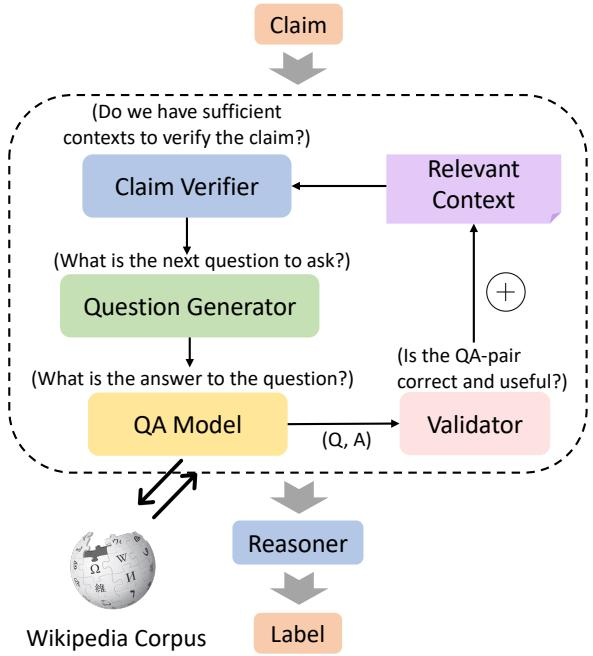
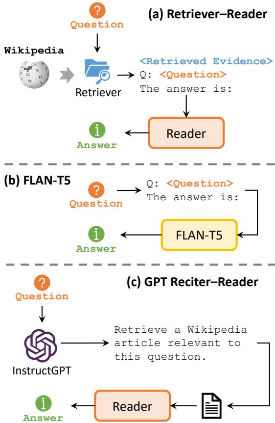
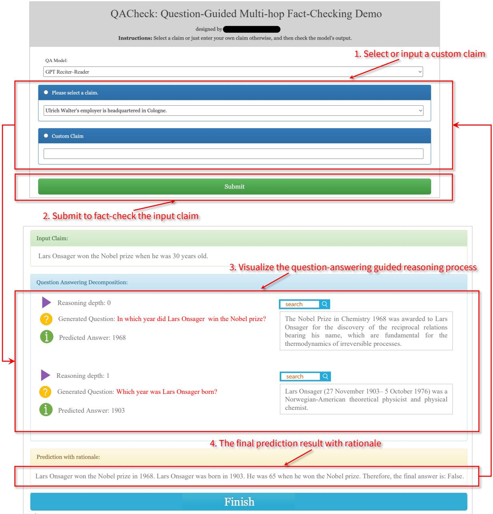

<span id="page-0-0"></span>
# QACHECK: A Demonstration System for Question-Guided Multi-Hop Fact-Checking

Liangming Pan1,2 Xinyuan Lu3 Min-Yen Kan3 Preslav Nakov1 1MBZUAI 2University of California, Santa Barbara 3 National University of Singapore

liangmingpan@ucsb.edu kanmy@comp.nus.edu.sg

luxinyuan@u.nus.edu preslav.nakov@mbzuai.ac.ae

## Abstract

Fact-checking real-world claims often requires complex, multi-step reasoning due to the absence of direct evidence to support or refute them. However, existing fact-checking systems often lack transparency in their decisionmaking, making it challenging for users to comprehend their reasoning process. To address this, we propose the Question-guided Multihop Fact-Checking (QACHECK) system, which guides the model’s reasoning process by asking a series of questions critical for verifying a claim. QACHECK has five key modules: a claim verifier, a question generator, a questionanswering module, a QA validator, and a reasoner. Users can input a claim into QACHECK, which then predicts its veracity and provides a comprehensive report detailing its reasoning process, guided by a sequence of (question, answer) pairs. QACHECK1 also provides the source of evidence supporting each question, fostering a transparent, explainable, and userfriendly fact-checking process.

## 1 Introduction

In our age characterized by large amounts of both true and false information, fact-checking is not only crucial for counteracting misinformation but also plays a vital role in fostering trust in AI systems. However, the process of validating real-world claims is rarely straightforward. Unlike the simplicity of supporting or refuting a claim with a single piece of direct evidence, real-world claims often resemble multi-layered puzzles that require complex and multi-step reasoning to solve (Jiang et al., 2020; Nguyen et al., 2020; Aly and Vlachos, 2022; Chen et al., 2022; Pan et al., 2023).

As an example, to verify the claim “Sunlight can reach the deepest part of the Black Sea.”, it may be challenging to find direct evidence on the web that refutes or supports this claim. Instead, a human fact-checker needs to decompose the claim, gather multiple pieces of evidence, and perform step-bystep reasoning (Pan et al., 2023). This reasoning process can be formulated as question-guided reasoning, where the verification of the claim is guided by asking and answering a series of relevant questions, as shown in Figure 1. In this example, we sequentially raise two questions: “What is the greatest depth of the Black Sea?” and “How far can sunlight penetrate water?”. After independently answering these two questions by gathering relevant information from the Web, we can assert that the initial claim is false with simple reasoning.

Figure 1: An example of question-guided reasoning for fact-checking complex real-world claims.

While several models (Liu et al., 2020; Zhong et al., 2020; Aly and Vlachos, 2022) have been proposed to facilitate multi-step reasoning in factchecking, they generally lack transparency in their reasoning processes. These models simply take a claim as input, then output a veracity label without an explicit explanation. Recent attempts, such as Quin+ (Samarinas et al., 2021) and WhatTheWiki-Fact (Chernyavskiy et al., 2021), have aimed to develop more explainable fact-checking systems, by searching and visualizing the supporting evidence for a given claim. However, these systems primarily validate a claim from a single document, and do not provide a detailed, step-by-step visualization of the reasoning process as shown in Figure 1.

<span id="page-1-0"></span>
We introduce the Question-guided Multi-hop Fact-Checking (QACHECK) system, which addresses the aforementioned issues by generating multi-step explanations via question-guided reasoning. To facilitate an explainable reasoning process, QACHECK manages the reasoning process by guiding the model to self-generate a series of questions vital for claim verification. Our system, as depicted in Figure 2, is composed of five modules: 1) a claim verifier that assesses whether sufficient information has been gathered to verify the claim, 2) a question generator to generate the next relevant question, 3) a question-answering module to answer the raised question, 4) a QA validator to evaluate the usefulness of the generated (Q, A) pair, and 5) a reasoner to output the final veracity label based on all collected contexts.

QACHECK offers enough adaptability, allowing users to customize the design of each module by integrating with different models. For example, we provide three alternative implementations for the QA component: the retriever–reader model, the FLAN-T5 model, and the GPT3-based reciter– reader model. Furthermore, we offer a user-friendly interface for users to fact-check any input claim and visualize its detailed question-guided reasoning process. The screenshot of our user interface is shown in Figure 4. We will discuss the implementation details of the system modules in Section 3 and some evaluation results in Section 4. Finally, we present the details of the user interface in Section 5. and conclude and discuss future work in Section 6.

## 2 Related Work

Fact-Checking Systems. The recent surge in automated fact-checking research aims to mitigate the spread of misinformation. Various factchecking systems, for example, TANBIH2 (Zhang et al., 2019), PRTA3 (Martino et al., 2020), and WHATTHEWIKIFACT4 (Chernyavskiy et al., 2021) predominantly originating from Wikipedia and claims within political or scientific domains, have facilitated this endeavor. However, the majority of these systems limit the validation or refutation of a claim to a single document, indicating a gap in systems for multi-step reasoning (Pan et al., 2023). The system most similar to ours is Quin+ (Samarinas et al., 2021), which demonstrates evidence retrieval in a single step. In contrast, our QACHECK shows a question-led multistep reasoning process with explanations and retrieved evidence for each reasoning step. In summary, our system 1) supports fact-checking realworld claims that require multi-step reasoning, and 2) enhances transparency and helps users have a clear understanding of the reasoning process.

Figure 2: The architecture of our QACHECK system.


> **AI Description:**
> **Source:** `assets/_page_1_Figure_0.jpg`
> 
> **Generated:** 2026-05-16 10:15:19
> 
> ---
> 
> The image is a flowchart that illustrates a process for verifying claims using a question-answering model. The flowchart includes several components: a "Claim" at the top, which is the starting point. The process involves a "Claim Verifier" that checks if there are sufficient contexts to verify the claim. If so, it proceeds to a "Question Generator" which formulates the next question to ask. The "QA Model" then provides the answer to the question. The answer is validated by the "Validator" to ensure it is correct and useful. If the answer is valid, it is fed back into the "QA Model" to generate the next question. The process is iterative and continues until the claim is verified. The flowchart also references a "Relevant Context" and a "Wikipedia Corpus" as additional resources.


Explanation Generation. Simply predicting a veracity label to the claim is not persuasive, and can even enhance mistaken beliefs (Guo et al., 2022). Hence, it is necessary for automated fact-checking methods to provide explanations to support model predictions. Traditional approaches have utilized attention weights, logic, or summary generation to provide post-hoc explanations for model predictions (Lu and Li, 2020; Ahmadi et al., 2019; Kotonya and Toni, 2020; Jolly et al., 2022; Xing et al., 2022). In contrast, our approach employs question–answer pair based explanations, offering more human-like and natural explanations.

## 3 System Architecture

Figure 2 shows the general architecture of our system, comprised of five principal modules: a Claim

<span id="page-2-0"></span>
Verifier D, a Question Generator Q, a Question-Answering Model A, a Validator V, and a Reasoner R. We first initialize an empty context ${ \mathcal { C } } = \emptyset$ Upon the receipt of a new input claim c, the system first utilizes the claim verifier to determine the sufficiency of the existing context to validate the claim, i.e., $\mathcal { D } ( c , \mathcal { C } )  \{ \mathsf { T r u e } , \mathsf { F a l s e } \}$ . If the output is False, the question generator learns to generate the next question that is necessary for verifying the claim, $i . e . , \mathcal { Q } ( c , \mathcal { C } )  q .$ . The questionanswering model is then applied to answer the question and provide the supported evidence, i.e., $\mathcal { A } ( q )  a , e .$ , where a is the predicted answer, and e is the retrieved evidence that supports the answer. Afterward, the validator is used to validate the usefulness of the newly-generated (Q, A) pair based on the existing context and the claim, i.e., $\mathcal { V } ( c , \{ q , a \} , \mathcal { C } ) $ {True, False}. If the output is True, the (q, a) pair is added into the context C. Otherwise, the question generator is asked to generate another question. We repeat this process of calling $\mathcal { D } \to \mathcal { Q } \to \mathcal { A } \to \mathcal { V }$ until the claim verifier returns a True indicating that the current context C contains sufficient information to verify the claim c. In this case, the reasoner module is called to utilize the stored relevant context to justify the veracity of the claim and outputs the final label, $i . e . , \mathcal { R } ( c , \mathcal { C } ) $ {Supported, Refuted}. The subsequent sections provide a comprehensive description of the five key modules in QACHECK.

## 3.1 Claim Verifier

The claim verifier is a central component of QACHECK, with the specific role of determining if the current context information is sufficient to verify the claim. This module is to ensure that the system can efficiently complete the claim verification process without redundant reasoning. We build the claim verifier based on InstructGPT (Ouyang et al., 2022), utilizing its powerful in-context learning ability. Recent large language models such as InstructGPT (Ouyang et al., 2022) and GPT-4 (OpenAI, 2023) have demonstrated strong fewshot generalization ability via in-context learning, in which the model can efficiently learn a task when prompted with the instruction of the task together with a small number of demonstrations. We take advantage of InstructGPT’s in-context learning ability to implement the claim verifier. We prompt InstructGPT with ten distinct in-context examples as detailed in Appendix A.1, where each example consists of a claim and relevant question–answer pairs. We then prompt the model with the claim, the context, and the following instruction:

```
Claim = CLAIM   
We already know the following:   
CONTEXT   
Can we know whether the claim is   
true or false now? Yes or no?
```

If the response is ‘no’, we proceed to the question generator module. Conversely, if the response is ‘yes’, the process jumps to call the reasoner module.

## 3.2 Question Generator

The question generator module is called when the initial claim lacks the necessary context for verification. This module aims to generate the next relevant question needed for verifying the claim. Similar to the claim verifier, we also leverage InstructGPT for in-context learning. We use slightly different prompts for generating the initial question and the follow-up questions. The detailed prompts are in Appendix A.2. For the initial question generation, the instruction is:

```
Claim = CLAIM   
To verify the above claim, we can   
first ask a simple question:
```

For follow-up questions, the instruction is:

```
Claim = CLAIM   
We already know the following:   
CONTEXT   
To verify the claim, what is the   
next question we need to know the   
answer to?
```

## 3.3 Question Answering Model

After generating a question, the Question Answering (QA) module retrieves corresponding evidence and provides an answer as the output. The system’s reliability largely depends on the accuracy of the QA module’s responses. Understanding the need for different QA methods in various fact-checking scenarios, we introduce three different implementations for the QA module, as shown in Figure 3.

Retriever–Reader. We first integrate the wellknown retriever–reader framework, a prevalent QA paradigm originally introduced by Chen et al. (2017). In this framework, a retriever first retrieves relevant documents from a large evidence corpus, and then a reader predicts an answer conditioned on the retrieved documents. For the evidence corpus, we use the Wikipedia dump provided by the Knowledge-Intensive Language Tasks (KILT) benchmark (Petroni et al., 2021), in which the Wikipedia articles have been pre-processed and separated into paragraphs. For the retriever, we apply the widely-used sparse retrieval based on BM25 (Robertson and Zaragoza, 2009), implemented with the Pyserini toolkit (Lin et al., 2021). For the reader, we use the RoBERTa-large (Liu et al., 2019) model fine-tuned on the SQuAD dataset (Rajpurkar et al., 2016), using the implementation from PrimeQA5 (Sil et al., 2023).

<span id="page-3-0"></span>
Figure 3: Illustrations of the three different implementations of the Question Answering module in QACHECK.


> **AI Description:**
> **Source:** `assets/_page_3_Figure_0.jpg`
> 
> **Generated:** 2026-05-16 10:16:26
> 
> ---
> 
> The image contains a flowchart with three distinct sections labeled (a) Retriever-Reader, (b) FLAN-T5, and (c) GPT Reciter-Reader. Each section illustrates a different process for answering questions. 
> 
> - Section (a) Retriever-Reader shows a question being passed to a retriever, which fetches evidence from Wikipedia. The evidence is then presented to a reader, which provides the answer.
> - Section (b) FLAN-T5 depicts a question being input into FLAN-T5, which directly generates the answer.
> - Section (c) GPT Reciter-Reader involves a question being input into InstructGPT, which retrieves a relevant Wikipedia article. This article is then presented to a reader, which provides the answer.
> 
> The flowcharts use arrows to represent the flow of information and include labels such as "Question," "Retrieved Evidence," "Answer," and "Reader" to clarify the process.


FLAN-T5. While effective, the retriever–reader framework is constrained by its reliance on the evidence corpus. In scenarios where a user’s claim is outside the scope of Wikipedia, the system might fail to produce a credible response. To enhance flexibility, we also incorporate the FLAN-T5 model (Chung et al., 2022), a Seq2Seq model pretrained on more than 1.8K tasks with instruction tuning. It directly takes the question as input and then generates the answer and the evidence, based on the model’s parametric knowledge.

GPT Reciter–Reader. Recent studies (Sun et al., 2023; Yu et al., 2023) have demonstrated the great potential of the GPT series, such as Instruct-GPT (Ouyang et al., 2022) and GPT-4 (OpenAI, 2023), to function as robust knowledge repositories. The knowledge can be retrieved by properly prompting the model. Drawing from this insight, we introduce the GPT Reciter–Reader approach. Given a question, we prompt the InstructGPT to “recite” the knowledge stored within it, and Instruct-GPT responds with relevant evidence. The evidence is then fed into a reader model to produce the corresponding answer. While this method, like FLAN-T5, does not rely on a specific corpus, it stands out by using InstructGPT. This offers a more dependable parametric knowledge base than FLAN-T5.

The above three methods provide a flexible and robust QA module, allowing for switching between the methods as required, depending on the claim being verified and the available contextual information. In the following, we use GPT Reciter–Reader as the default implementation for our QA module.

## 3.4 QA Validator

The validator module ensures the usefulness of the newly-generated QA pairs. For a QA pair to be valid, it must satisfy two criteria: 1) it brings additional information to the current context C, and 2) it is useful for verifying the original claim. We again implement the validator by prompting InstructGPT with a suite of ten demonstrations shown in Appendix A.3. The instruction is as follows:

```
Claim = CLAIM   
We already know the following:   
CONTEXT   
Now we further know:   
NEW QA PAIR   
Does the QA pair have additional   
knowledge useful for verifying   
the claim?
```

The validator acts as a safeguard against the system producing redundant or irrelevant QA pairs. Upon validation of a QA pair, it is added to the current context C. Subsequently, the system initiates another cycle of calling the claim verifier, question generator, question answering, and validation.

<span id="page-4-0"></span>
Figure 4: The screenshot of the QACHECK user interface showing its key annotated functions. First, users have the option to select a claim or manually input a claim that requires verification. Second, users can start the verification process by clicking the Submit button. Third, the system shows a step-by-step question-answering guided reasoning process. Each step includes the reasoning depth, the generated question, relevant retrieved evidence, and the corresponding predicted answer. Finally, it presents the final prediction label with the supporting rationale.


> **AI Description:**
> **Source:** `assets/_page_4_Figure_0.jpg`
> 
> **Generated:** 2026-05-16 10:16:09
> 
> ---
> 
> The image contains a user interface for a question-guided multi-hop fact-checking system called QACheck. It includes a form with a dropdown menu for selecting or inputting a claim, a submit button, and sections for visualizing the question-answering process and the final prediction result. The form allows users to input a claim or select one from a dropdown, submit it for fact-checking, and view the reasoning process and final prediction with rationale. The interface is designed to demonstrate how the system breaks down the claim into sub-questions and uses them to generate a final answer, providing a step-by-step explanation of the reasoning process.


## 3.5 Reasoner

The reasoner is called when the claim verifier determines that the context C is sufficient to verify the claim or the system hits the maximum allowed iterations, set to 5 by default. The reasoner is a special question-answering model which takes the context C and the claim c as inputs and then answers the question “Is the claim true or false?”. The model is also requested to output the rationale with the prediction. We provide two different implementations for the reasoner: 1) the end-to-end QA model based on FLAN-T5, and 2) the InstructGPT model with the prompts given in Appendix A.4.

## 4 Performance Evaluation

To evaluate the performance of our QACHECK, we use two fact-checking datasets that contain complex claims requiring multi-step reasoning: HOVER (Jiang et al., 2020) and FEVEROUS (Aly et al., 2021), following the same experimental settings used in Pan et al. (2023). HOVER contains 1,126 two-hop claims, 1,835 three-hop claims, and 1,039 four-hop claims, while FEVEROUS has 2,962 multi-hop claims. We compare our method with the baselines of directly applying InstructGPT with two different prompting methods: (i) direct prompting with the claim, and (ii) CoT (Wei et al., 2022) or chain-of-thought prompting with fewshot demonstrations of reasoning explanations. We also compare with ProgramFC (Pan et al., 2023), FLAN-T5 (Chung et al., 2022), and Codex (Chen et al., 2021). We use the reported results for the baseline models from Pan et al. (2023).

<span id="page-5-0"></span>
Table 1: Evaluation of F1 scores for different models. The bold text shows the best results for each setting.


The evaluation results are shown in Table 1. Our QACHECK system achieves a macro-F1 score of 55.67, 54.67, and 52.35 on HOVER two-hop, threehop, and four-hop claims, respectively. It achieves a 59.47 F1 score on FEVEROUS. These scores are better than directly using InstructGPT, Codex, or FLAN-T5. They are also on par with the systems that apply claim decomposition strategies, i.e., CoT, and ProgramFC. The results demonstrate the effectiveness of our QACHECK system. Especially, the QACHECK has better improvement over the endto-end models on claims with high reasoning depth. This indicates that decomposing a complex claim into simpler steps with question-guided reasoning can facilitate more accurate reasoning.

## 5 User Interface

We create a demo system based on Flask6 for verifying open-domain claims with QACHECK, as shown in Figure 4. The QACHECK demo is designed to be intuitive and user-friendly, enabling users to input any claim or select from a list of pre-defined claims (top half of Figure 4).

Upon selecting or inputting a claim, the user can start the fact-checking process by clicking the “Submit” button. The bottom half of Figure 4 shows a snapshot of QACHECK’s output for the input claim “Lars Onsager won the Nobel prize when he was 30 years old”. The system visualizes the detailed question-guided reasoning process. For each reasoning step, the system shows the index of the reasoning step, the generated question, and the predicted answer to the question. The retrieved evidence to support the answer is shown on the right for each step. The system then shows the final veracity prediction for the original claim accompanied by a comprehensive rationale in the “Prediction with rationale” section. This step-by-step illustration not only enhances the understanding of our system’s fact-checking process but also offers transparency to its functioning.

QACHECK also allows users to change the underlying question–answering model. As shown at the top of Figure 4, users can select between the three different QA models introduced in Section 3.3, depending on their specific requirements or preferences. Our demo system will be opensourced under the Apache-2.0 license.

## 6 Conclusion and Future Works

This paper presents the QACHECK system, a novel approach designed for verifying real-world complex claims. QACHECK conducts the reasoning process with the guidance of asking and answering a series of questions and answers. Specifically, QACHECK iteratively generates contextually relevant questions, retrieves and validates answers, judges the sufficiency of the context information, and finally, reasons out the claim’s truth value based on the accumulated knowledge. QACHECK leverages a wide range of techniques, such as incontext learning, document retrieval, and questionanswering, to ensure a precise, transparent, explainable, and user-friendly fact-checking process.

In the future, we plan to enhance QACHECK 1) by integrating additional knowledge bases to further improve the breadth and depth of information accessible to the system (Feng et al., 2023; Kim et al., 2023), and 2) by incorporating a multimodal interface to support image (Chakraborty et al., 2023), table (Chen et al., 2020; Lu et al., 2023), and chart-based fact-checking (Akhtar et al., 2023), which can broaden the system’s utility in processing and analyzing different forms of data.

<span id="page-6-0"></span>
## Limitations

We identify two main limitations of QACHECK. First, several modules of our QACHECK currently utilize external API-based large language models, such as InstructGPT. This reliance on external APIs tends to prolong the response time of our system. As a remedy, we are considering the integration of open-source, locally-run large language models like LLaMA (Touvron et al., 2023). Secondly, the current scope of our QACHECK is confined to evaluating True/False claims. Recognizing the significance of also addressing Not Enough Information claims, we plan to devise strategies to incorporate these in upcoming versions of the system.

## Ethics Statement

The use of large language models requires a significant amount of energy for computation for training, which contributes to global warming. Our work performs few-shot in-context learning instead of training models from scratch, so the energy footprint of our work is less. The large language model (InstructGPT) whose API we use for inference consumes significant energy.

## Acknowledgement

This project is supported by the Ministry of Education, Singapore, under its MOE AcRF TIER 3 Grant (MOE-MOET32022-0001). The computational work for this article was partially performed on resources of the National Supercomputing Centre, Singapore.

## References

- Naser Ahmadi, Joohyung Lee, Paolo Papotti, and Mohammed Saeed. 2019. Explainable fact checking with probabilistic answer set programming. In Proceedings of the 2019 Truth and Trust Online Conference (TTO).
- Mubashara Akhtar, Oana Cocarascu, and Elena Simperl. 2023. Reading and reasoning over chart images for evidence-based automated fact-checking. In Findings of the Association for Computational Linguistics (EACL), pages 399–414.
- Rami Aly, Zhijiang Guo, Michael Sejr Schlichtkrull, James Thorne, Andreas Vlachos, Christos Christodoulopoulos, Oana Cocarascu, and Arpit Mittal. 2021. FEVEROUS: Fact Extraction and VERification Over Unstructured and Structured information. In Proceedings of the Neural Information Processing Systems (NeurIPS) Track on Datasets and Benchmarks.
- Rami Aly and Andreas Vlachos. 2022. Natural logicguided autoregressive multi-hop document retrieval for fact verification. In Proceedings of the 2022 Conference on Empirical Methods in Natural Language Processing (EMNLP), pages 6123–6135.
- Megha Chakraborty, Khusbu Pahwa, Anku Rani, Adarsh Mahor, Aditya Pakala, Arghya Sarkar, Harshit Dave, Ishan Paul, Janvita Reddy, Preethi Gurumurthy, Ritvik G, Samahriti Mukherjee, Shreyas Chatterjee, Kinjal Sensharma, Dwip Dalal, Suryavardan S, Shreyash Mishra, Parth Patwa, Aman Chadha, Amit P. Sheth, and Amitava Das. 2023. FAC-TIFY3M: A benchmark for multimodal fact verification with explainability through 5w questionanswering. CoRR, abs/2306.05523.
- Danqi Chen, Adam Fisch, Jason Weston, and Antoine Bordes. 2017. Reading wikipedia to answer opendomain questions. In Proceedings of the 55th Annual Meeting of the Association for Computational Linguistics (ACL), pages 1870–1879.
- Jifan Chen, Aniruddh Sriram, Eunsol Choi, and Greg Durrett. 2022. Generating literal and implied subquestions to fact-check complex claims. In Proceedings of the 2022 Conference on Empirical Methods in Natural Language Processing (EMNLP), pages 3495–3516.
- Mark Chen, Jerry Tworek, Heewoo Jun, Qiming Yuan, Henrique Ponde de Oliveira Pinto, Jared Kaplan, Harrison Edwards, Yuri Burda, Nicholas Joseph, Greg Brockman, Alex Ray, Raul Puri, Gretchen Krueger, Michael Petrov, Heidy Khlaaf, Girish Sastry, Pamela Mishkin, Brooke Chan, Scott Gray, Nick Ryder, Mikhail Pavlov, Alethea Power, Lukasz Kaiser, Mohammad Bavarian, Clemens Winter, Philippe Tillet, Felipe Petroski Such, Dave Cummings, Matthias Plappert, Fotios Chantzis, Elizabeth Barnes, Ariel Herbert-Voss, William Hebgen Guss, Alex Nichol, Alex Paino, Nikolas Tezak, Jie Tang, Igor Babuschkin, Suchir Balaji, Shantanu Jain, William Saunders, Christopher Hesse, Andrew N. Carr, Jan Leike, Joshua Achiam, Vedant Misra, Evan Morikawa, Alec Radford, Matthew Knight, Miles Brundage, Mira Murati, Katie Mayer, Peter Welinder, Bob McGrew, Dario Amodei, Sam McCandlish, Ilya Sutskever, and Wojciech Zaremba. 2021. Evaluating large language models trained on code. ArXiv preprint, abs/2107.03374.
- Wenhu Chen, Hongmin Wang, Jianshu Chen, Yunkai Zhang, Hong Wang, Shiyang Li, Xiyou Zhou, and William Yang Wang. 2020. Tabfact: A large-scale dataset for table-based fact verification. In Proceedings of 8th International Conference on Learning Representations (ICLR).
- Anton Chernyavskiy, Dmitry Ilvovsky, and Preslav Nakov. 2021. Whatthewikifact: Fact-checking claims against wikipedia. In Proceedings of the 30th ACM International Conference on Information and Knowledge Management (CIKM), pages 4690–4695.

<span id="page-7-0"></span>
- Hyung Won Chung, Le Hou, Shayne Longpre, Barret Zoph, Yi Tay, William Fedus, Eric Li, Xuezhi Wang, Mostafa Dehghani, Siddhartha Brahma, Albert Webson, Shixiang Shane Gu, Zhuyun Dai, Mirac Suzgun, Xinyun Chen, Aakanksha Chowdhery, Sharan Narang, Gaurav Mishra, Adams Yu, Vincent Y. Zhao, Yanping Huang, Andrew M. Dai, Hongkun Yu, Slav Petrov, Ed H. Chi, Jeff Dean, Jacob Devlin, Adam Roberts, Denny Zhou, Quoc V. Le, and Jason Wei. 2022. Scaling instruction-finetuned language models. CoRR, abs/2210.11416.
- Shangbin Feng, Vidhisha Balachandran, Yuyang Bai, and Yulia Tsvetkov. 2023. Factkb: Generalizable factuality evaluation using language models enhanced with factual knowledge. CoRR, abs/2305.08281.
- Zhijiang Guo, Michael Sejr Schlichtkrull, and Andreas Vlachos. 2022. A survey on automated fact-checking. Transactions of the Association for Computational Linguistics (TACL), 10:178–206.
- Yichen Jiang, Shikha Bordia, Zheng Zhong, Charles Dognin, Maneesh Singh, and Mohit Bansal. 2020. HoVer: A dataset for many-hop fact extraction and claim verification. In Findings of the Association for Computational Linguistics (EMNLP), pages 3441– 3460.
- Shailza Jolly, Pepa Atanasova, and Isabelle Augenstein. 2022. Generating fluent fact checking explanations with unsupervised post-editing. Information, 13:500.
- Jiho Kim, Sungjin Park, Yeonsu Kwon, Yohan Jo, James Thorne, and Edward Choi. 2023. Factkg: Fact verification via reasoning on knowledge graphs. In Proceedings of the 61st Annual Meeting of the Association for Computational Linguistics (ACL), pages 16190–16206.
- Neema Kotonya and Francesca Toni. 2020. Explainable automated fact-checking for public health claims. In Proceedings of the 2020 Conference on Empirical Methods in Natural Language Processing (EMNLP), pages 7740–7754.
- Jimmy Lin, Xueguang Ma, Sheng-Chieh Lin, Jheng-Hong Yang, Ronak Pradeep, and Rodrigo Frassetto Nogueira. 2021. Pyserini: A python toolkit for reproducible information retrieval research with sparse and dense representations. In Proceedings of International ACM SIGIR Conference on Research and Development in Information Retrieval (SIGIR), pages 2356–2362.
- Yinhan Liu, Myle Ott, Naman Goyal, Jingfei Du, Mandar Joshi, Danqi Chen, Omer Levy, Mike Lewis, Luke Zettlemoyer, and Veselin Stoyanov. 2019. Roberta: A robustly optimized BERT pretraining approach. CoRR, abs/1907.11692.
- Zhenghao Liu, Chenyan Xiong, Maosong Sun, and Zhiyuan Liu. 2020. Fine-grained fact verification with kernel graph attention network. In Proceedings of the 58th Annual Meeting of the Association for Computational Linguistics (ACL), pages 7342–7351.
- Xinyuan Lu, Liangming Pan, Qian Liu, Preslav Nakov, and Min-Yen Kan. 2023. SCITAB: A challenging benchmark for compositional reasoning and claim verification on scientific tables. CoRR, abs/2305.13186.
- Yi-Ju Lu and Cheng-Te Li. 2020. GCAN: graph-aware co-attention networks for explainable fake news detection on social media. In Proceedings of the 58th Annual Meeting of the Association for Computational Linguistics (ACL), pages 505–514.
- Giovanni Da San Martino, Shaden Shaar, Yifan Zhang, Seunghak Yu, Alberto Barrón-Cedeño, and Preslav Nakov. 2020. Prta: A system to support the analysis of propaganda techniques in the news. In Proceedings of the 58th Annual Meeting of the Association for Computational Linguistics: System Demonstrations (ACL), pages 287–293.
- Van-Hoang Nguyen, Kazunari Sugiyama, Preslav Nakov, and Min-Yen Kan. 2020. FANG: leveraging social context for fake news detection using graph representation. In Proceedings of the 29th ACM International Conference on Information and Knowledge Management (CIKM), pages 1165–1174.
- OpenAI. 2023. GPT-4 technical report. CoRR, abs/2303.08774.
- Long Ouyang, Jeffrey Wu, Xu Jiang, Diogo Almeida, Carroll L. Wainwright, Pamela Mishkin, Chong Zhang, Sandhini Agarwal, Katarina Slama, Alex Ray, John Schulman, Jacob Hilton, Fraser Kelton, Luke Miller, Maddie Simens, Amanda Askell, Peter Welinder, Paul F. Christiano, Jan Leike, and Ryan Lowe. 2022. Training language models to follow instructions with human feedback. In Proceedings of the 36th Conference on Neural Information Processing Systems (NeurIPS).
- Liangming Pan, Xiaobao Wu, Xinyuan Lu, Anh Tuan Luu, William Yang Wang, Min-Yen Kan, and Preslav Nakov. 2023. Fact-checking complex claims with program-guided reasoning. In Proceedings of the 61st Annual Meeting of the Association for Computational Linguistics (ACL), pages 6981–7004.
- Fabio Petroni, Aleksandra Piktus, Angela Fan, Patrick S. H. Lewis, Majid Yazdani, Nicola De Cao, James Thorne, Yacine Jernite, Vladimir Karpukhin, Jean Maillard, Vassilis Plachouras, Tim Rocktäschel, and Sebastian Riedel. 2021. KILT: a benchmark for knowledge intensive language tasks. In Proceedings of the 2021 Conference of the North American Chapter of the Association for Computational Linguistics: Human Language Technologies (NAACL-HLT), pages 2523–2544.
- Pranav Rajpurkar, Jian Zhang, Konstantin Lopyrev, and Percy Liang. 2016. Squad: 100, 000+ questions for machine comprehension of text. In Proceedings of the 2016 Conference on Empirical Methods in Natural Language Processing (EMNLP), pages 2383– 2392.

<span id="page-8-0"></span>
- Stephen E. Robertson and Hugo Zaragoza. 2009. The probabilistic relevance framework: BM25 and beyond. Journal of Foundations and Trends in Information Retrieval, 3(4):333–389.
- Chris Samarinas, Wynne Hsu, and Mong-Li Lee. 2021. Improving evidence retrieval for automated explainable fact-checking. In Proceedings of the 2021 Conference of the North American Chapter of the Association for Computational Linguistics: Human Language Technologies: System Demonstrations, (NAACL-HLT), pages 84–91.
- Avi Sil, Jaydeep Sen, Bhavani Iyer, Martin Franz, Kshitij Fadnis, Mihaela Bornea, Sara Rosenthal, J. Scott McCarley, Rong Zhang, Vishwajeet Kumar, Yulong Li, Md. Arafat Sultan, Riyaz Bhat, Jürgen Broß, Radu Florian, and Salim Roukos. 2023. Primeqa: The prime repository for state-of-the-art multilingual question answering research and development. In Proceedings of the 61st Annual Meeting of the Association for Computational Linguistics: System Demonstrations (ACL), pages 51–62.
- Zhiqing Sun, Xuezhi Wang, Yi Tay, Yiming Yang, and Denny Zhou. 2023. Recitation-augmented language models. In Proceedings of the 11th International Conference on Learning Representations (ICLR).
- Hugo Touvron, Thibaut Lavril, Gautier Izacard, Xavier Martinet, Marie-Anne Lachaux, Timothée Lacroix, Baptiste Rozière, Naman Goyal, Eric Hambro, Faisal Azhar, Aurélien Rodriguez, Armand Joulin, Edouard Grave, and Guillaume Lample. 2023. Llama: Open and efficient foundation language models. CoRR, abs/2302.13971.
- Jason Wei, Xuezhi Wang, Dale Schuurmans, Maarten Bosma, Ed H. Chi, Quoc Le, and Denny Zhou. 2022. Chain of thought prompting elicits reasoning in large language models. CoRR, abs/2201.11903.
- Rui Xing, Shraey Bhatia, Timothy Baldwin, and Jey Han Lau. 2022. Automatic explanation generation for climate science claims. In Proceedings of the The 20th Annual Workshop of the Australasian Language Technology Association (ALTA), pages 122– 129.
- Wenhao Yu, Dan Iter, Shuohang Wang, Yichong Xu, Mingxuan Ju, Soumya Sanyal, Chenguang Zhu, Michael Zeng, and Meng Jiang. 2023. Generate rather than retrieve: Large language models are strong context generators. In Proceedings of the 11th International Conference on Learning Representations (ICLR).
- Yifan Zhang, Giovanni Da San Martino, Alberto Barrón-Cedeño, Salvatore Romeo, Jisun An, Haewoon Kwak, Todor Staykovski, Israa Jaradat, Georgi Karadzhov, Ramy Baly, Kareem Darwish, James R. Glass, and Preslav Nakov. 2019. Tanbih: Get to know what you are reading. In Proceedings of the 2019 Conference on Empirical Methods in Natural Language Processing and the 9th International Joint Conference on
- Natural Language Processing: System Demonstrations (EMNLP-IJCNLP), pages 223–228.
- Wanjun Zhong, Jingjing Xu, Duyu Tang, Zenan Xu, Nan Duan, Ming Zhou, Jiahai Wang, and Jian Yin. 2020. Reasoning over semantic-level graph for fact checking. In Proceedings of the 58th Annual Meeting of the Association for Computational Linguistics (ACL), pages 6170–6180.

<span id="page-9-0"></span>
## A Prompts

## A.1 Prompts for Claim Verifier

```
Claim = Superdrag and Collective Soul are   
both rock bands .   
We already know the following :   
Question 1 = Is Superdrag a rock band ?   
Answer 1 = Yes   
Can we know whether the claim is   
true or false now ? Yes or no ?   
Prediction = No , we cannot know .   
Claim = Superdrag and Collective Soul are   
both rock bands .   
We already know the following :   
Question 1 = Is Superdrag a rock band ?   
Answer 1 = Yes   
Question 2 = Is Collective Soul a rock band ?   
Answer 2 = Yes   
Can we know whether the claim is   
true or false now ? Yes or no ?   
Prediction = Yes , we can know .   
<10 demonstrations in total >   
Claim = [[ CLAIM ]]   
Claim = CLAIM   
We already know the following :   
[[ QA\_CONTEXTS ]]   
Can we know whether the claim is   
true or false now ? Yes or no ?   
Prediction =
```

## A.2 Prompts for Question Generation

## Prompts for the initial question generation

```
Claim = Superdrag and Collective Soul are   
both rock bands .   
To verify the above claim , we can   
first ask a simple question :   
Question = Is Superdrag a rock band ?   
<10 demonstrations in total >   
Claim = [[ CLAIM ]]   
To verify the above claim , we can   
first ask a simple question :   
Question =
```

## Prompts for the follow-up question generation

```
Claim = Superdrag and Collective Soul are   
both rock bands .   
We already know the following :   
Question 1 = Is Superdrag a rock band ?   
Answer 1 = Yes   
To verify the claim , what is the   
next question we need to know the   
answer to ?   
Question 2 = Is Collective Soul a rock band ?   
<10 demonstrations in total >   
Claim = [[ CLAIM ]]   
We already know the following :   
[[ QA\_CONTEXTS ]]   
To verify the claim , what is the   
next question we need to know the   
answer to ?   
Question [[ Q\_INDEX ]] =
```

## A.3 Prompts for Validator

```
Claim = Superdrag and Collective Soul are   
both rock bands .   
We already know the following :   
Question = Is Superdrag a rock band ?   
Answer = Yes   
Now we further know :
```

```
Question = Is Collective Soul a rock band ?   
Answer = Yes   
Does the QA pair have additional   
knowledge useful for verifying the claim ?   
The answer : Yes   
<10 demonstrations in total >   
Claim = [[ CLAIM ]]   
We already know the following :   
[[ QA\_CONTEXTS ]]   
Now we further know :   
[[ NEW\_QA\_PAIR ]]   
Does the QA pair have additional   
knowledge useful for verifying the claim ?   
The answer :
```

## A.4 Prompts for Reasoner

```
Contexts:   
Q1 : When Lars Onsager won the Nobel Prize ?   
A1 : 1968   
Q2 : When was Lars Onsager born ?   
A2 : 1903   
Claim = Lars Onsager won the Nobel Prize   
when he was 30 years old .   
Is this claim true or false ?   
Answer:   
Lars Onsager won the Nobel Prize in 1968.   
Lars Onsager was born in 1903.   
Therefore , the final answer is: False .   
<10 demonstrations in total >   
Contexts:   
[[ CONTEXTS ]]   
Claim = [[ CLAIM ]]   
Is this claim true or false ?   
Answer:   
Therefore , the final answer is
```