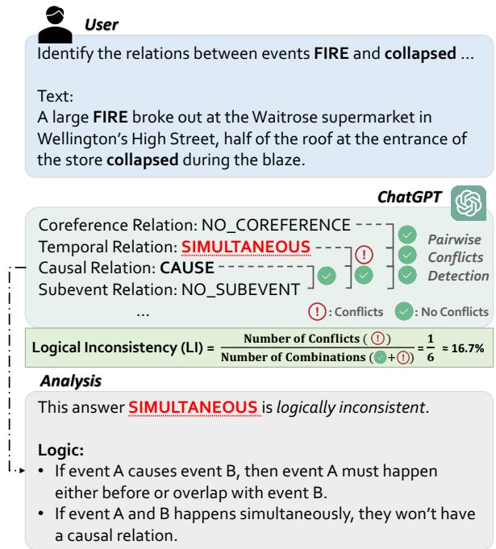
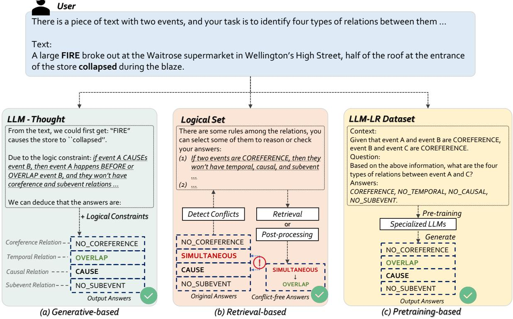

<span id="page-0-0"></span>
# Learning To Teach Large Language Models Logical Reasoning

Meiqi Chen Peking University meiqichen@stu.pku.edu.cn

Yixin Cao Singapore Management University

Yubo Ma S-Lab Nanyang Technological University

Yan Zhang Peking University

Kaitao Song Microsoft Research Asia

Dongsheng Li Microsoft Research Asia

## ABSTRACT

Large language models (LLMs) have gained enormous attention from both academia and industry, due to their exceptional ability in language generation and extremely powerful generalization. However, current LLMs still output unreliable content in practical reasoning tasks due to their inherent issues (e.g., hallucination). To better disentangle this problem, in this paper, we conduct an in-depth investigation to systematically explore the capability of LLMs in logical reasoning. More in detail, we first investigate the deficiency of LLMs in logical reasoning on different tasks, including event relation extraction and deductive reasoning. Our study demonstrates that LLMs are not good reasoners in solving tasks with rigorous reasoning and will produce counterfactual answers, which require us to iteratively refine. Therefore, we comprehensively explore different strategies to endow LLMs with logical reasoning ability, and thus enable them to generate more logically consistent answers across different scenarios. Based on our approach, we also contribute a synthesized dataset (LLM-LR) involving multi-hop reasoning for evaluation and pre-training. Extensive quantitative and qualitative analyses on different tasks also validate the effectiveness and necessity of teaching LLMs with logic and provide insights for solving practical tasks with LLMs in future work. Codes will be available at https://github.com/chenmeiqii/Teach-LLM-LR.

## CCS CONCEPTS

• Computing methodologies → Knowledge representation and reasoning.

## KEYWORDS

Large Language Models, Event Relation Extraction, Logical Reasoning

## 1 INTRODUCTION

Recently, Large Language Models (LLMs) have made incredible progress in many different downstream tasks, such as GPT-3 [3], ChatGPT [32], and LLaMA [39]. These models are typically trained on a combination of filtered web data and curated high-quality corpora (e.g., social media conversations, books, or technical publications) [34]. Studies have indicated that the emergent abilities of LLMs can exhibit promising reasoning capabilities [45] and the curation process is necessary to produce their zero-shot generalization abilities [34].

Despite these notable achievements, current LLMs still have some issues in producing high-quality content with fluency and reliability. A good content generator should produce logically consistent answers that are reasonable for given or prior constraints.

Figure 1: An example of LLM in generating logically inconsistent answers. We let LLM (e.g., ChatGPT) answer the relations between events “FIRE” and “collapsed” from the given passage. We can find that LLM predicts an incorrect answer (i.e., SIMULTANEOUS) because it ignores some prior logic in this scenario, leading to logical inconsistency.


> **AI Description:**
> **Source:** `assets/_page_0_Figure_0.jpg`
> 
> **Generated:** 2026-05-16 10:35:13
> 
> ---
> 
> The image contains a combination of text and a diagram. The text provides a scenario about a fire at a supermarket and the collapse of the roof. Below the text, there is a diagram that categorizes the relationships between the events "FIRE" and "collapsed" as identified by ChatGPT. The diagram includes four categories: Coreference Relation, Temporal Relation, Causal Relation, and Subevent Relation, each with a corresponding classification (NO_COREREFERENCE, SIMULTANEOUS, CAUSE, and NO_SUBEVENT) and a conflict detection status (Pairwise Conflicts Detection). The diagram also includes a section labeled "Logical Inconsistency (LI)" which calculates the percentage of conflicts in the relationships. The analysis section explains why the answer "SIMULTANEOUS" is logically inconsistent, based on the relationship between events A causing event B and events happening simultaneously.


However, LLMs sometimes output counterfactuals when dealing with practical tasks that require rigorous logical reasoning. As showcased in Figure 1, ChatGPT predicts the temporal and causal relations between events “FIRE” and “collapsed” being “simultaneous” and “cause”. According to the prior logical constraints, we could readily claim the predictions are not fully correct even before reading the context, because "simultaneous" and "cause" conflict with each other in terms of semantics. Some works [26, 33, 48] attribute these phenomena to their inherent deficiencies (e.g., hallucination, unfaithfulness), however, how to disentangle and improve the capability of LLMs in these tasks is still an open problem.

To deeply understand the deficiencies of LLMs in logical reasoning and explore the corresponding solutions, in this paper, we conduct an in-depth investigation of LLMs in solving reasoning tasks from multiple dimensions. We first evaluate the capacity of LLMs in two practical scenarios including event relation extraction and deductive reasoning tasks, both of which demand rigorous reasoning ability to infer [38, 42]. Our experimental results show that: 1) Even the cutting-edge LLMs still generate large amounts of inconsistent answers, e.g., over 60% of the answers from Chat-GPT on the MAVEN-ERE [42] dataset are logically inconsistent as shown in Figure 2; 2) Chain-of-thought (CoT) prompting [47], like “Let’s think step by step" could stimulate the reasoning abilities for LLMs. However, some inherent issues (e.g., hallucination, unfaithfulness) in the LLM will cause such generated rationale to be unreliable or inconsistent; 3) Providing relevant logic to LLMs improves performance, but injecting irrelevant logic introduces fluctuations in results. Therefore, how to obtain the relevant logic and inject its information into LLMs is a non-trivial problem, deserving further exploration; 4) To verify the capacity of LLM for more complex reasoning, we contribute a synthesized dataset (i.e., LLM-LR) for evaluation, which involves multiple hops of logical reasoning. LLM-LR is automatically constructed by applying logic programming [11, 22] on our collected logical constraints, which could provide logical reasoning instances with any number of hops. Results show that as the number of logical hops increases (2∼10 hops), LLMs struggle to output correct answers, and the proportion of logically inconsistent answers steadily rises. This indicates that LLMs will perform worse when the reasoning becomes more abstract and complicated. Therefore, how to alleviate the aforementioned issues and enable LLMs with a more powerful ability of logical reasoning is the critical point of our paper.

<span id="page-1-0"></span>
Based on these findings, we put forward a series of solutions to teach LLMs to generate answers with better logical consistency. Here, we divide the procedure for teaching LLMs logical reasoning into three different kinds of approaches according to the ways of logic acquisition: 1) Generative-based approach, which encourages LLMs to generate reasoning rationale themselves, inspired by CoT prompting. In this paradigm, we find that incorporating logical constraints into LLM instruction will bring substantial improvements, but the uncertainty of the generated rationales may also bring some biases, leading to an incorrect subsequent answer; 2) Retrieval-based approach, which provides our manually designed logical constraints, then retrieves relevant contents and adds them to the LLM instruction. This kind of approach ensures the correctness of logical constraints and significantly improves performance, but requires some hand-crafted engineering; 3) Pretraining-based approach, which uses our curated dataset LLM-LR introduced before to train LLMs to perform complex logical reasoning. The pretraining dataset consists of 6776 instances containing 2∼5 hops of logical reasoning. This strategy encodes logic in model parameters inherently, while also requiring additional training time. Therefore, how to choose the most suitable strategy can be a trade-off based on the practical scenario.

Furthermore, based on the above framework, we also conduct extensive quantitative and qualitative analyses on different tasks to validate the effectiveness of teaching LLMs with logic and provide insights for future work: 1) We investigate whether to add logical constraints before obtaining results or later, and find that directly conveying constraints to LLMs is more effective than adding postprocessing operations based on the results; 2) Compared with the setting that uses more demonstrations, incorporating logical constraints into prompts can achieve better performance with fewer demonstrations. This phenomenon further indicates that it is important to teach LLMs to balance demonstrations and logical constraints; 3) Benefits from LLMs’ powerful interactive ability, we can further improve the performance through multi-turn conversation enhanced by iterative retrievals. However, when there are too many iterations, LLMs may have the problem of overthinking — more useless and redundant information interferes with their predictions; 4) When trained on LLM-LR, LLMs such as LlaMA2-13B [39] can achieve better performance, even surpassing that of greater LLMs (e.g., ChatGPT, 175B), which validates the effectiveness of our curated dataset.

Overall, the contributions of our paper can be summarized as follows:

• We provide an in-depth investigation of the logical inconsistency problems of current LLMs in solving practical tasks, and indicate the deficiency of LLMs in utilizing logic.

• To enhance the reliability of the content generated by LLMs, we propose several solutions to incorporate relevant logic. Based on our approach, we construct a synthesized dataset (LLM-LR) involving multi-hop reasoning. By leveraging the LLM-LR, we endow specialized LLMs with logical reasoning ability, which enhances LLMs to generate more logically consistent answers.

• Experimental results on different tasks with quantitative and qualitative analyses verify the importance of our investigation in empowering LLMs with logical reasoning.

## 2 PRELIMINARIES

In this section, we first introduce two tasks that this paper mainly explores.

## 2.1 Event Relation Extraction

Event relation extraction (ERE) [21, 42] aims to identify relations (i.e., Coreference, Temporal, Causal, and Subevent) between two events in the text. Traditionally, it can be formulated as a multilabel classification problem, determining one label for each relation type. Compared with other common tasks, ERE tasks should take more considerations about the logical constraints between event relations (e.g., the constraints in Figure 1), and guarantee the predictions should conform to those constraints to avoid counterfactuals. Therefore, we need to rigorously consider the logical constraints between each event pair during the prediction. To better evaluate the capability of LLMs on the ERE task, we formulate the logical consistency for evaluation.

Logical consistency plays a crucial role in understanding the relations between events. To assess the logical consistency, we collect a comprehensive set including 11 logical constraints for all relations between two events, as shown in Table 4. Based on these logical constraints, we introduce a logical inconsistency metric (i.e., LI) to measure LLMs’ ability on ERE tasks. Specifically, for the answers of LLMs, logical inconsistency is calculated as the ratio of the number of conflicts (i.e., the answers that conflict with the given logical constraints) to the total number of combinations (i.e., all combinations of each two relations). To better illustrate the computation of logical inconsistency, here we introduce an example (as shown in Figure 1): if an LLM outputs the relations between two events as “NO\_COREFERENCE, SIMULTANEOUS, CAUSE, NO\_SUBEVENT”.

<span id="page-2-0"></span>

### Full Page Description (Page 2)

**Source:** `assets/_page_2_Asset_0.jpg`

**Generated:** 2026-05-16 10:34:45

---

The image is a bar chart with two sets of data represented: Micro-F1 and Inconsistent Answers. The x-axis lists different configurations of a model: Vanilla ChatGPT, Vanilla ChatGPT + Irrelevant logic, Vanilla ChatGPT + Relevant logic, and MAVEN-ERE. The y-axis for Micro-F1 is on the left side, ranging from 0% to 60%, while the y-axis for Inconsistent Answers is on the right side, ranging from 0% to 60%. The chart shows that as the model configuration changes from Vanilla ChatGPT to MAVEN-ERE, the Micro-F1 score decreases significantly, while the percentage of Inconsistent Answers increases.


### Full Page Description (Page 2)

**Source:** `assets/_page_2_Asset_1.jpg`

**Generated:** 2026-05-16 10:34:54

---

The image is a combined bar and line graph. The x-axis represents different configurations of a system, labeled as "Vanilla ChatGPT," "Vanilla ChatGPT + Irrelevant logic," and "Vanilla ChatGPT + Irrelevant logic + Relevant logic ProofWriter." The y-axis on the left side is labeled "Micro-F1 (%)" and represents the performance metric for the system configurations. The y-axis on the right side is labeled "Inconsistent Answers (%)" and shows the percentage of inconsistent answers for each configuration. The bar graph indicates the Micro-F1 scores for each configuration, while the line graph shows the percentage of inconsistent answers. The main trend is that as the complexity of the system increases, the Micro-F1 score decreases, and the percentage of inconsistent answers increases.


### Full Page Description (Page 2)

**Source:** `assets/_page_2_Asset_2.jpg`

**Generated:** 2026-05-16 10:34:37

---

The image is a radar chart (also known as a spider chart) that compares the performance of three systems: Vanilla ChatGPT, ChatGPT with irrelevant logic, and ChatGPT with relevant logic, against a baseline system called MAVEN-ERE. The chart has four axes labeled CE1, CE2, CE3, and FE2, with CE1 and CE2 being the most prominent. The performance is measured on a scale from 0 to 60. The radar chart shows that the Vanilla ChatGPT system performs better than the other two systems in most categories, with MAVEN-ERE being the lowest performer. The relevant logic addition to ChatGPT improves performance in some categories compared to the irrelevant logic addition.


### Full Page Description (Page 2)

**Source:** `assets/_page_2_Asset_3.jpg`

**Generated:** 2026-05-16 10:34:23

---

The image is a radar chart (also known as a spider or star plot) that compares the performance of three systems: Vanilla ChatGPT, Irrelevant Logic, and Relevant Logic, in relation to four factors: CE1, CE2, CE3, and FE1, FE2, FE3. The chart uses different colors and symbols to represent each system. The x-axis represents the factors, and the y-axis represents the performance score. The chart shows that Vanilla ChatGPT performs best in CE1 and CE2, while Irrelevant Logic and Relevant Logic have similar performance in CE3 and FE1, with Irrelevant Logic performing better in FE2 and FE3.

Among these, "SIMULTANEOUS" and "CAUSE" are identified as conflicting with each other based on the logical constraints we have defined, resulting in a single conflict. Now, regarding the total number of combinations: for each pair of events, we have 4 types of relations to determine. The total combinations between these relations are calculated using the combinatorial formula: 4∗(4−1)/2 = 6. So, there are 6 possible combinations between the relations for two events. Hence, the logical inconsistency in this example is computed as LI = 1/6 (or approximately 16.7%). Obviously, given the logical constraints, an algorithm can be designed to automatically detect conflicts and calculate the value of logical inconsistency.

Overall, intuitively, the smaller the value of logical inconsistency is, the more self-consistent and reasonable answer that LLM can produce. More descriptions about this task are in Appendix A.

## 2.2 Deductive Reasoning

Deductive reasoning typically begins with known facts and rules, then iteratively makes new inferences until the desired statement can be either confirmed or refuted [35]. To ensure the accuracy of these inferences, each step in deductive reasoning must adhere to the known logical constraints (rules). More specifically, the logical constraints in deductive reasoning are usually specific to individual cases rather than being universally applicable like that in the ERE task. Consequently, when engaging in deductive reasoning, it is essential to assess and apply logical constraints based on the distinct circumstances and known facts of each example to arrive at accurate conclusions. For the calculation of logical inconsistency of deductive reasoning, we need to manually count the number of reasoning processes generated by LLMs that are inconsistent with known facts or rules, and then calculate the proportion.

## 3 UNVEILING LLMS IN LOGICAL REASONING

In this section, we conduct a pilot study to investigate how current LLMs exhibit in reasoning tasks and how logic benefits LLMs.

## 3.1 How Is LLM Performing Practical Reasoning Tasks?

3.1.1 Data Source. We conduct a manual evaluation on MAVEN-ERE [42] and ProofWriter [38]. MAVEN-ERE is a unified large-scale dataset for the ERE task, which needs to identify four types of relations. ProofWriter is a commonly used dataset for deductive logical reasoning, where each example is a pair of (problem, goal) and the label is selected from {Proved, Disproved, Unknown}. To employ our investigation, we randomly choose 100 samples (50 from MAVEN-ERE and 50 from ProofWriter).

3.1.2 Experimental Setup. Our experiments are conducted as a multi-turn conversation for zero-shot reasoning, to leverage LLM’s interaction ability. Given a task input (?? ), we also write a prompt (?? ) describing the task, and let LLM generate output (?? ) by answering the given query. We also add “Let’s think step by step” before each answer for prediction generation, which is a simple but effective trick to improve zero-shot reasoning for LLMs [19]. We adopt ChatGPT as the backbone and manually check its generated rationales under the following three settings:

• Vanilla LLM (i.e., ChatGPT) without any additional information;

• LLM (i.e., ChatGPT) plus the most relevant (i.e., ground truth) logic;

• LLM (i.e., ChatGPT) plus irrelevant logical constraints.

The prompt examples can be found in Figure 10∼13.

3.1.3 Analysis. As shown in Figure 2, we visualize the micro-F1 and the proportion of logically inconsistent answers generated by ChatGPT. We find that no matter whether on MAVEN-ERE or ProofWriter, Vanilla ChatGPT always achieves a bad result with low micro-F1 scores and high inconsistency values (e.g., 15% micro-F1 and 63% inconsistent answers on MAVEN-ERE), which indicates the deficiency of LLM in solving complex reasoning tasks. To investigate this issue in depth, we conduct analyses from the following two aspects.

What Is The Relation Between Logical Consistency And Model Performance? From Figure 2, we find that: 1) The model directly receives significant improvements on both MAVEN-ERE and ProofWriter when adding relevant logic; 2) When adding some irrelevant logic, the results show some fluctuations (exaltation in MAVEN-ERE and degeneration in ProofWriter). That means directly adding logic without any constraints will bring some uncertainty; 3) Typically, a higher logical inconsistency corresponds to a poorer micro-F1, however, rectifying logical inconsistency does not necessarily lead to the same degree of increase in micro-F1. Generally, an intuitive observation is that incorporating relevant logic into the LLM instruction will be very helpful in solving reasoning tasks. So, the challenges are how to obtain these relevant logic and how to utilize them for LLMs.

<span id="page-3-0"></span>

### Full Page Description (Page 3)

**Source:** `assets/_page_3_Asset_1.jpg`

**Generated:** 2026-05-16 10:37:30

---

The image is a line graph that displays the percentage of inconsistent answers across different models (GPT-turbo, Text-davinci-003, GPT-4, Vicuna-13B, and Llama2-13B) as the number of hops increases from 2 to 10. The x-axis represents the number of hops, while the y-axis shows the percentage of inconsistent answers. The graph shows that as the number of hops increases, the percentage of inconsistent answers generally increases for all models. The GPT-turbo model consistently has the lowest percentage of inconsistent answers, while the Text-davinci-003 model has the highest percentage.


### Full Page Description (Page 3)

**Source:** `assets/_page_3_Asset_0.jpg`

**Generated:** 2026-05-16 10:37:39

---

The image is a line graph with the title "Micro-F1 (%)". The x-axis represents the "Number of Hops" ranging from 2 to 10, while the y-axis represents the "Micro-F1 (%)", which is a measure of performance, with values ranging from 0.0 to 0.6. The graph contains five lines, each representing a different model: GPT-turbo, Text-davinci-003, GPT-4, Vicuna-13B, and Llama2-13B. The lines show a general downward trend as the number of hops increases, indicating a decrease in Micro-F1 performance for all models as the number of hops grows.

What Types of Errors Does LLM Usually Make? To delve into a deep understanding of the failures that Vanilla LLM encounters in logical reasoning, we also conduct a detailed error analysis for this. Here, we divide the error types into two aspects: 1) Incorrectness to the Constraint (CE): whether the rationale generated by LLM is wrong (CE1), incomplete (CE2), or redundant (CE3) compared with the true logical constraints. 2) Unfaithfulness to the Reasoning Process (FE): where LLM does not correctly use the constraints. We define two types of errors upon FE, i.e., i) Wrong start, LLM begins with an irrelevant fact or focuses on an improper perspective for the correct answer (FE1). ii) Wrong process, LLM starts from a proper point, but makes mistakes during the reasoning process (FE2). Annotators are asked to review 100 predictions generated by ChatGPT and mark the error types. Results in Figure 3 show that: 1) The quality of constraints produced by the Vanilla ChatGPT is not high enough, which limits its subsequent reasoning ability. 2) Incorporating relevant logical constraints could guarantee the correctness of constraints and thus greatly improve the generation quality of ChatGPT in faithfulness.

## 3.2 How Is LLM Performing Abstract Multi-hop Reasoning?

Based on the above analyses, we can confirm the deficiency of LLMs in solving complex reasoning tasks and the effectiveness of incorporating logical constraints. Nevertheless, we also want to explore how LLMs exhibit in more challenging settings.

3.2.1 Data Source. Considering that existing datasets lack multihop instances, we construct a synthesized dataset (LLM-LR) to evaluate the ability of LLMs to perform multi-hop reasoning. Specifically, we first collect 39 additional logical constraints for all the high-order relations among three events, as outlined in Table 7. The collection is based on transitive dependency (i.e., one event may affect another through an intermediate event). For example, BEFORE(??, ??) ∧ BEFORE(??, ??) → BEFORE(??, ??) means that “If event ?? happens BEFORE event ??, and event ?? happens BEFORE event ??, then event ?? happens BEFORE event ??”. Thereby, we obtain a comprehensive set containing a total of 50 logical constraints (along with the 11 constraints between two events we introduced in Section 2.1).

As the number of events further increases $\left( \mathrm { i . e . , } > 3 \right)$ , there are more complex interactions involved, and it is inefficient to list all the constraints manually at this time. To address this, we introduce logic programming [11, 22] to automatically generate new event relations by inputting the known constraints and relations. We employ a forward- and backward-chaining rule-based method utilizing Prolog [10] as the foundation for our logic programming approach. For instance, when dealing with temporal relations involving four events (??, ??, ??, and ??), given the known relations: “BEFORE(??, ??) ∧ SIMULTANEOUS(??, ??) ∧ OVERLAP(??, ??)”, our logic programming approach can deduce a “BEFORE(??, ??)” conclusion according to the constraints in Table 7. Then, we provide a task description and use the given relations as the input case to let LLMs reason the relation between events (??, ??), i.e., a 3-hop query. We could use the description text provided in Table 6 to convert the symbolic representation into natural language forms. The conclusion deduced by our logic engine will serve as the ground truth to check LLMs’ answers. A pseudo-code can be found in Appendix D.1 and a prompt example is in Figure 14.

3.2.2 Experimental Setup. For evaluation, we randomly generate 50 samples for each 2∼10-hop reasoning. In addition to the three variants of ChatGPT (gpt-turbo, text-davinci-003, and $\mathtt { g p t 4 } )$ , we employ another two open-source LLMs (Vicuna-$1 3 \mathrm { B } \mathrm { - } \mathrm { v } 1 . 3 ^ { 1 }$ and Llama2-13B) for evaluation. Note that: 1) for 2-hop reasoning (i.e., high-order relations among three events), there are only 39 samples. 2) Our approach allows for the extension of the reasoning path, but we report results for clarity and due to the length limits of LLMs, covering only 2 to 10 hops.

3.2.3 Analysis. As shown in Figure 4, we visualize the micro-F1 and the proportion of logically inconsistent answers generated by LLMs. We can see that: 1) When the number of hops is relatively small (i.e., 2 ∼ 5 hops), the performance of GPT-4 is outstanding compared with other models. 2) With the increase of hops, all the LLMs perform worse when the reasoning becomes more complicated, and the proportion of logically inconsistent answers is gradually increasing. Among them, Vicuna-13B fully fails after 6 hops and could not output any correct answers. This further demonstrates the necessity of teaching LLMs logical reasoning.

## 4 TEACHING LLMS LOGICAL REASONING

Based on the aforementioned analysis, we expect to explore how to empower LLMs’ capability with logical reasoning. Therefore, in this section, we first introduce the instruction-following technique we use in Section 4.1 and then propose three different approaches to instruct LLMs to generate answers with better logical consistency (Section 4.2 ∼ 4.4).

## 4.1 In-Context Learning for LLMs

We deploy LLMs for event relation extraction and deductive reasoning tasks via in-context learning (ICL, [3, 32]). Given a task input (?? ), we also write a prompt (?? ) describing the task, then further provide several demonstrations ${ \cal D } = \{ D _ { i } \} _ { i = 1 } ^ { \vert { \bar { D } } \vert }$ ., where $D _ { i } = \left( X _ { i } , Y _ { i } \right)$ are used for few-shot learning. Then, the LLM generates output (?? ) by completing the prompt $( Y = \mathcal { M } ( T , D , X ) )$ ), where M denotes the LLM. In such a setting, the LLM can follow the structure of the provided demonstrates to output the expected format of answers for subsequent automatic evaluation. Besides, the whole process does not require any gradient update, allowing LLMs to generate predictions without massive training data.

<span id="page-4-0"></span>
Figure 5: Incorporate logical constraints to LLMs by using generative, retrieval, and pretraining-based approaches. The dashed boxes indicate answers output by LLMs, and the underlined texts indicate the logical constraints.


> **AI Description:**
> **Source:** `assets/_page_4_Figure_0.jpg`
> 
> **Generated:** 2026-05-16 10:39:28
> 
> ---
> 
> The image contains a flowchart-style diagram with three main sections labeled "LLM-Thought," "Logical Set," and "LLM-LR Dataset." The diagram illustrates a process for identifying relations between two events in a given text. The "LLM-Thought" section outlines the thought process of an LLM in analyzing the text, deducing relations such as "CAUSE" and "OVERLAP." The "Logical Set" section provides logical constraints for determining relations, such as "if two events are COREFERENCE, then they won't have temporal, causal, and subevent relations." The "LLM-LR Dataset" section references a dataset for training LLMs, with examples of coreference and relation types. The diagram also includes terms like "Coreference Relation," "Temporal Relation," "Causal Relation," and "Subevent Relation," along with their corresponding outputs.


Compared Models. We choose three variants of ChatGPT (gptturbo, text-davinci-003, and gpt4), Vicuna-13B-v1.3, and Llama2-13B as the main experimental LLMs for evaluation. We also provide two fine-tuning RoBERTa-large baselines (one-shot and fully fine-tuned) for comparison. The training details of RoBERTalarge can be found in Appendix B.2.

Dataset Construction. Our main experiments are evaluated on MAVEN-ERE, Causal-TimeBank [28], and ProofWriter. For the ERE task, we focus on relations between two events and conduct sampling at the sentence level. The samples of the two events that do not have any relations will be excluded. Here, we randomly sample 500 examples from the test set of MAVEN-ERE and 100 examples from the test set of Causal-TimeBank as our testbed. For the deductive reasoning task, we use the OWA subset of ProofWriter, which is divided into five parts, each part requiring 0, 1, 2, 3, and 5 hops of reasoning, respectively. We evaluate the hardest 5-hop subset. To reduce the computation cost, we randomly sample 200 examples in the test set and ensure a balanced label distribution. Other details can be found in Appendix B.1.

Evaluation Metrics. We adopt the averaged micro-F1 score as the evaluation metric and also report the logical inconsistency (defined in Section 2.1) on ERE datasets. The reported value is averaged by the results of three runs to reduce random fluctuation.

## 4.2 Generative-based Approaches

Generative-based approaches mean we let LLMs generate logic by using a form of one-shot ICL. Here, we study three variants:

(1) Vanilla ICL: which utilizes the common prompts consisting of a task description, one demonstration, and the input case.

(2) Vanilla ICL plus CoT: which first bootstraps rationales by using chain-of-thought as intermediate reasoning steps following the style of the given demonstration, then output answers. Rationales here do not involve the content of logical constraints.

(3) CoT with self-generated logical constraints: which teaches LLMs to generate and utilize logical constraints based on CoT (Figure 5 (a)). Specifically, it will first extract the obvious relations/facts and generate the relevant logical constraints according to the extracted relations/facts, then we enforce LLMs to infer the remaining relations/facts based on the constraints and the known relations/facts. The prompt example can be seen in Appendix H.2.

4.2.1 Results. From Table 1, We could observe that: 1) Compared with a smaller language model (SLM, i.e., RoBERTa-large), the generalization ability of vanilla LLMs on both two tasks under the one-shot setting is remarkable, but there is still a gap with the fullyfinetuned baseline. 2) Directly using CoT to infer logic does not help much for ERE tasks, a possible reason is that the inherent issues may lead to the failure of LLM in the precise rationale generation (i.e., a high ratio of logical inconsistency). We give a case study for this in Appendix E. 3) When using generative-based approaches to encourage LLMs to produce logical constraints in the reasoning process, LLMs can significantly improve their performance on both two tasks. It is worth mentioning that the performance of GPT-4 (CoT w. logical constraints) could even surpass that of the fully fine-tuned baseline on the Proofwriter dataset.

<span id="page-5-0"></span>
Table 1: ChatGPT (gpt-turbo, text-davinci-003, and gpt-4), Vicuna-13B, and Llama2-13B’s performance on MAVEN-ERE, Causal-TimeBank, and ProofWriter. We report averaged micro-F1 scores here and "LI" denotes the logical inconsistency metric. For each dataset, the best result of each LLM is in bold. RoBERTa-Large (one-shot) fails to output any correct answers on Causal-TimeBank.


## 4.3 Retrieval-based Approaches

Although generative-based approaches enable models to automatically generate and utilize logic, the prediction of LLMs is usually uncertain and inaccuracy. Therefore, we also provide retrieval-based approaches, which aim to obtain relevant logic from our pre-defined constraints (Figure 5 (b)). We mainly conduct experiments on the ERE task by utilizing the collected logical constraints. Specifically, We take the collected 11 constraints in Section 2.1 as the retrieval set, and our solutions include:

(1) with all logical constraints: which directly adds all the 11 logical constraints in the set.

(2) with retrieved logical constraints: which means that we first detect logically inconsistent answers based on the prediction of LLMs, and then retrieve the corresponding information if we find any conflict. Finally, we add it to the LLM instruction and let LLMs re-generate the answers. Please see Appendix C.1 for details.

(3) with post-processing: which first obtains the answers of LLMs, then automatically generates some logically consistent candidates according to the constraints, and randomly selects one of them as the final answer. This approach ensures that there is no logical conflict (LI = 0%). Please see Appendix C.2 for details.

4.3.1 Main Results. From Table 2, We could observe that: 1) When using retrieval-based approaches to obtain logic constraints and incorporate them into LLM instruction, the logical inconsistency of LLMs’ answers is greatly reduced and the overall performance on both two tasks is further improved. 2) Although our post-processing guarantees the absence of logical conflicts (resulting in LI of 0%), it may severely affect the quality of the whole generation. On one hand, the semantics of the post-processing answer may be far from the ground truth due to the random selection. On the other hand, the size of the candidate set for each case will also affect the performance. It may also need more operations at the post-processing stage, which we leave as future work.

4.3.2 Ablation Study. We conduct an ablation study using Chat-GPT (gpt-turbo) in this subsection.

Demonstrations. Following previous experiences [3], we also append demonstrations into the prompt to investigate how logical constraints will affect when combined with different numbers of demonstrations. Here, we select different numbers of demonstration samples ?? from {1, 5, 10, 20}. The experiments are tested on vanilla

<span id="page-6-0"></span>

### Full Page Description (Page 6)

**Source:** `assets/_page_6_Asset_0.jpg`

**Generated:** 2026-05-16 10:37:23

---

The image contains a bar chart with a legend and axis labels. The chart is titled "Micro-F1 (%)" and the x-axis is labeled "Number of Demonstration Samples," ranging from 1 to 20. The y-axis represents the Micro-F1 score in percentage. The chart compares the performance of three different systems: MAVEN-ERE w/o. lc, MAVEN-ERE w. lc, CTB w/o. lc, and CTB w. lc. Each system is represented by a different color, and the bars are divided into segments corresponding to the number of demonstration samples. The legend indicates which color corresponds to which system. The chart shows that the MAVEN-ERE w/o. lc and MAVEN-ERE w. lc systems generally perform better than the CTB w/o. lc and CTB w. lc systems across all the number of demonstration samples.


### Full Page Description (Page 6)

**Source:** `assets/_page_6_Asset_1.jpg`

**Generated:** 2026-05-16 10:37:13

---

The image contains a bar chart and a line graph. The bar chart represents the "Logical inconsistency (%)" for two methods, MAVEN-ERE and CTB, across four iterations. The line graph shows the "Micro-F1 (%)" for the same two methods. The x-axis represents the "Number of iterations," ranging from 0 to 4. The y-axis for the bar chart is labeled "Logical inconsistency (%)" and ranges from 0 to 50. The y-axis for the line graph is labeled "Micro-F1 (%)" and ranges from 0 to 25. The MAVEN-ERE method shows a decreasing trend in Micro-F1 as the number of iterations increases, while the CTB method shows a more erratic pattern with a slight increase in logical inconsistency.

Table 2: Retrieval-based approaches’ performance on MAVEN-ERE and Causal-TimeBank. For each dataset, the best result of each LLM is in bold and the second-best result is underlined.


ICL and ICL plus all logical constraints. From Figure 6, we can observe that: 1) When the number of demonstrations increases from 1 to 5, we can observe an evident improvement, but the subsequent improvements are limited when continue to increase the number of demonstrations $( \mathrm { e . g . } , \geq 1 0 )$ ; 2) Adding logical constraints into LLM instructions can provide stable improvements, especially with more demonstrations. 3) The performance of incorporating logical constraints with a smaller number of demonstrations can even surpass that of prompts with only a larger number of demonstrations (e.g., the performance of using 5 demonstrations on MAVEN-ERE w. logical constraints, 25.7%, surpasses that of 10 demonstrations w/o. logical constraints, 24.5%). This indicates that it is important to tell LLMs both "What" (demonstrations) and "How" (logical constraints). Overall, these studies further confirm the merits of using logical constraints in solving reasoning tasks.

Iterative Retrieval. Considering the outstanding ability of LLMs in interaction, we further explore whether we can introduce logical constraints into the multi-turn conversation (for the prompt design, please see Appendix H.3). Here, we adopt a retrieval-based approach to incorporate logical constraints iteratively and the results are shown in Figure 6. We find that the logical inconsistency of answers will gradually decrease with the increase of iterations, but the overall micro-F1 seems relatively stable. We guess the main reason for this phenomenon is the overthinking of LLMs, as although it can bring more reasoning rationale, it possibly produces correct but more useless or abundant information when inferring multiple iterations. Overall, instructing LLM with logic is beneficial for conversation, but how to support longer information is still challenging.

## 4.4 Pretraining-based Approach

Although the retrieval-based approach guarantees the correctness of logical constraints, it still needs to interact with an external set constantly. Therefore, we provide a pretraining-based approach to embed the logical constraints into LLMs themselves. We use the logic programming approach introduced in Section 3.2 to automatically generate 6776 instances containing all the 2 ∼ 5-hop reasoning data. We do not generate longer hops for training here considering the computation complexity and the length limitation of LLMs. The dataset statistic can be found in Table 5. Then, we train LLMs to perform complex logical reasoning based on the curated dataset LLM-LR. Finally, we conduct inference with the trained LLMs. An example of the training data can be seen in Figure 5 (c) or Figure 14.

4.4.1 Pretraining Details. We adopt Vicuna-13B-v1.3 and Llama2- 13B as the base models and employ the LoRA [14] technique. During pre-training, only LoRA parameters are optimized. Other Details can be found in Appendix G.

4.4.2 Results. As shown in Table 3, we find that: 1) Once trained on LLM-LR, the performance of LlaMA2-13B and Vicuna-13B improves greatly compared with that of Table 1 and 2, especially on the baselines without logical constraints. 2) The performance of LlaMA2-13B-PT could even surpass that of some greater LLMs (e.g., vanilla ChatGPT, 175B), which further validates the importance of teaching LLM with logic in solving reasoning tasks.

<span id="page-7-0"></span>
Table 3: Vicuna-13B and Llama2-13B’s performance on MAVEN-ERE and Causal-TimeBank after pre-training on LLM-LR.


Figure 7: Case study on Llama-2-13B before and after pretraining (PT).

4.4.3 Case Study. In Figure 7, We conduct a case study of Llama-2-13B’s answers to the same input before and after pre-training. From Figure 7 we can see that LlaMA2-13B-PT could output the correct answers after pre-training on LLM-LR, which validates the effectiveness of our pre-training approach.

## 5 RELATED WORK

## 5.1 Large Language Models (LLMs)

We are fortunate to witness the surging development of Large Language Models (LLMs [3, 8, 9, 32]), and a series of work aiming to leverage the reasoning abilities of LLMs such as chain-of-thought prompting [19, 46, 51], self verification [18, 44], self learning [15, 49], etc. However, recent studies show LLMs still stumble across generating hallucination and logic inconsistency [2, 13, 16, 17, 20]. To solve such challenges, our work explores teaching LLMs logical reasoning through various approaches.

## 5.2 Event Relation Extraction (ERE)

Events play crucial roles in comprehending narratives, and understanding the complex relationships between events is essential to understanding the text [37]. Thus Event Relation Extraction (ERE) tasks are fundamental information extraction (IE) tasks and support various downstream applications [5, 36, 50]. Extensive studies have been carried out on ERE tasks, including different kinds of relations such as coreference relations [24, 25], temporal relations [30, 40], causal relations [4, 6, 7], and subevent relations [1, 41].

There also have been some recent explorations on how to leverage the power of LLMs on event-related information extraction tasks [12, 27, 43]. To the best of our knowledge, however, our work is the first to (1) design elaborate experiments to evaluate the performance of LLMs on the ERE task, and (2) analyze the logical reasoning abilities of LLMs using ERE as an intermediate task.

## 6 CONCLUSION

In this paper, we conduct a detailed investigation on how to enhance LLMs to produce more logically consistent answers. Specifically, we first investigate the existing issues of current LLMs in doing some complex reasoning tasks (e.g., event relation extraction and deductive reasoning). Then, we study multiple strategies to obtain and utilize logic for LLMs, including generative-based, retrievalbased, and pretraining-based approaches. Based on our approach, we also contribute a synthesized dataset (LLM-LR) involving multihop reasoning for evaluation and pre-training. We show that LLMs are not logically consistent reasoners, but their performance could be improved if we explicitly teach them the logical constraints. Comprehensive quantitative and qualitative analyses have been conducted to further provide insights.

<span id="page-8-0"></span>
## REFERENCES

- [1] Mohammed Aldawsari and Mark Finlayson. 2019. Detecting Subevents using Discourse and Narrative Features. In Proceedings of the 57th Annual Meeting of the Association for Computational Linguistics. Association for Computational Linguistics, Florence, Italy, 4780–4790. https://doi.org/10.18653/v1/P19-1471
- [2] Yejin Bang, Samuel Cahyawijaya, Nayeon Lee, Wenliang Dai, Dan Su, Bryan Wilie, Holy Lovenia, Ziwei Ji, Tiezheng Yu, Willy Chung, et al. 2023. A multitask, multilingual, multimodal evaluation of chatgpt on reasoning, hallucination, and interactivity. arXiv preprint arXiv:2302.04023 (2023).
- [3] Tom B. Brown, Benjamin Mann, Nick Ryder, Melanie Subbiah, Jared Kaplan, Prafulla Dhariwal, Arvind Neelakantan, Pranav Shyam, Girish Sastry, Amanda Askell, Sandhini Agarwal, Ariel Herbert-Voss, Gretchen Krueger, Tom Henighan, Rewon Child, Aditya Ramesh, Daniel M. Ziegler, Jeffrey Wu, Clemens Winter, Christopher Hesse, Mark Chen, Eric Sigler, Mateusz Litwin, Scott Gray, Benjamin Chess, Jack Clark, Christopher Berner, Sam McCandlish, Alec Radford, Ilya Sutskever, and Dario Amodei. 2020. Language Models are Few-Shot Learners. In Advances in Neural Information Processing Systems 33: Annual Conference on Neural Information Processing Systems 2020, NeurIPS 2020, December 6-12, 2020, virtual, Hugo Larochelle, Marc’Aurelio Ranzato, Raia Hadsell, Maria-Florina Balcan, and Hsuan-Tien Lin (Eds.). https://proceedings.neurips.cc/paper/2020/ hash/1457c0d6bfcb4967418bfb8ac142f64a-Abstract.html
- [4] Tommaso Caselli and Piek Vossen. 2017. The Event StoryLine Corpus: A New Benchmark for Causal and Temporal Relation Extraction. In Proceedings of the Events and Stories in the News Workshop. Association for Computational Linguistics, Vancouver, Canada, 77–86. https://doi.org/10.18653/v1/W17-2711
- [5] Snigdha Chaturvedi, Haoruo Peng, and Dan Roth. 2017. Story Comprehension for Predicting What Happens Next. In Proceedings of the 2017 Conference on Empirical Methods in Natural Language Processing. Association for Computational Linguistics, Copenhagen, Denmark, 1603–1614. https://doi.org/10.18653/v1/D17- 1168
- [6] Meiqi Chen, Yixin Cao, Kunquan Deng, Mukai Li, Kun Wang, Jing Shao, and Yan Zhang. 2022. ERGO: Event Relational Graph Transformer for Document-level Event Causality Identification. In Proceedings of the 29th International Conference on Computational Linguistics. International Committee on Computational Linguistics, Gyeongju, Republic of Korea, 2118–2128. https://aclanthology.org/2022. coling-1.185
- [7] Meiqi Chen, Yixin Cao, Yan Zhang, and Zhiwei Liu. 2023. CHEER: Centralityaware High-order Event Reasoning Network for Document-level Event Causality Identification. In Proceedings of the 61st Annual Meeting of the Association for Computational Linguistics (Volume 1: Long Papers). 10804–10816.
- [8] Aakanksha Chowdhery, Sharan Narang, Jacob Devlin, Maarten Bosma, Gaurav Mishra, Adam Roberts, Paul Barham, Hyung Won Chung, Charles Sutton, Sebastian Gehrmann, et al. 2022. Palm: Scaling language modeling with pathways. ArXiv preprint abs/2204.02311 (2022). https://arxiv.org/abs/2204.02311
- [9] Hyung Won Chung, Le Hou, Shayne Longpre, Barret Zoph, Yi Tay, William Fedus, Eric Li, Xuezhi Wang, Mostafa Dehghani, Siddhartha Brahma, et al. 2022. Scaling instruction-finetuned language models. ArXiv preprint abs/2210.11416 (2022). https://arxiv.org/abs/2210.11416
- [10] William F Clocksin and Christopher S Mellish. 2003. Programming in PROLOG. Springer Science & Business Media.
- [11] Bruce Frederiksen. 2008. Applying expert system technology to code reuse with Pyke. PyCon: Chicago (2008).
- [12] Jun Gao, Huan Zhao, Changlong Yu, and Ruifeng Xu. 2023. Exploring the Feasibility of ChatGPT for Event Extraction. https://arxiv.org/abs/2303.03836
- [13] Olga Golovneva, Moya Chen, Spencer Poff, Martin Corredor, Luke Zettlemoyer, Maryam Fazel-Zarandi, and Asli Celikyilmaz. 2022. ROSCOE: A Suite of Metrics for Scoring Step-by-Step Reasoning. arXiv:2212.07919 [cs.CL]
- [14] Edward J Hu, yelong shen, Phillip Wallis, Zeyuan Allen-Zhu, Yuanzhi Li, Shean Wang, Lu Wang, and Weizhu Chen. 2022. LoRA: Low-Rank Adaptation of Large Language Models. In International Conference on Learning Representations. https: //openreview.net/forum?id=nZeVKeeFYf9
- [15] Jiaxin Huang, Shixiang Shane Gu, Le Hou, Yuexin Wu, Xuezhi Wang, Hongkun Yu, and Jiawei Han. 2022. Large Language Models Can Self-Improve. arXiv:2210.11610 [cs.CL]
- [16] Myeongjun Jang and Thomas Lukasiewicz. 2023. Consistency Analysis of Chat-GPT. arXiv:2303.06273 [cs.CL]
- [17] Fangkai Jiao, Zhiyang Teng, Shafiq Joty, Bosheng Ding, Aixin Sun, Zhengyuan Liu, and Nancy F Chen. 2023. LogicLLM: Exploring Self-supervised Logic-enhanced Training for Large Language Models. arXiv preprint arXiv:2305.13718 (2023).
- [18] Jaehun Jung, Lianhui Qin, Sean Welleck, Faeze Brahman, Chandra Bhagavatula, Ronan Le Bras, and Yejin Choi. 2022. Maieutic Prompting: Logically Consistent Reasoning with Recursive Explanations. In Proceedings of the 2022 Conference on Empirical Methods in Natural Language Processing. Association for Computational Linguistics, Abu Dhabi, United Arab Emirates, 1266–1279. https://aclanthology. org/2022.emnlp-main.82
- [19] Takeshi Kojima, Shixiang Shane Gu, Machel Reid, Yutaka Matsuo, and Yusuke Iwasawa. 2022. Large language models are zero-shot reasoners. ArXiv preprint
- abs/2205.11916 (2022). https://arxiv.org/abs/2205.11916
- [20] Hanmeng Liu, Ruoxi Ning, Zhiyang Teng, Jian Liu, Qiji Zhou, and Yue Zhang. 2023. Evaluating the logical reasoning ability of chatgpt and gpt-4. arXiv preprint arXiv:2304.03439 (2023).
- [21] Kang Liu, Yubo Chen, Jian Liu, Xinyu Zuo, and Jun Zhao. 2020. Extracting Events and Their Relations from Texts: A Survey on Recent Research Progress and Challenges. AI Open 1 (2020), 22–39. https://doi.org/10.1016/j.aiopen.2021.02.004
- [22] John W Lloyd. 2012. Foundations of logic programming. Springer Science & Business Media.
- [23] Ilya Loshchilov and Frank Hutter. 2019. Decoupled Weight Decay Regularization. In 7th International Conference on Learning Representations, ICLR 2019, New Orleans, LA, USA, May 6-9, 2019. OpenReview.net. https://openreview.net/forum? id=Bkg6RiCqY7
- [24] Jing Lu and Vincent Ng. 2021. Conundrums in Event Coreference Resolution: Making Sense of the State of the Art. In Proceedings of the 2021 Conference on Empirical Methods in Natural Language Processing. Association for Computational Linguistics, Online and Punta Cana, Dominican Republic, 1368–1380. https: //doi.org/10.18653/v1/2021.emnlp-main.103
- [25] Yaojie Lu, Hongyu Lin, Jialong Tang, Xianpei Han, and Le Sun. 2022. End-to-end neural event coreference resolution. Artificial Intelligence 303 (2022), 103632.
- [26] Qing Lyu, Shreya Havaldar, Adam Stein, Li Zhang, Delip Rao, Eric Wong, Marianna Apidianaki, and Chris Callison-Burch. 2023. Faithful Chain-of-Thought Reasoning. ArXiv preprint abs/2301.13379 (2023). https://arxiv.org/abs/2301.13379
- [27] Yubo Ma, Yixin Cao, YongChing Hong, and Aixin Sun. 2023. Large Language Model Is Not a Good Few-shot Information Extractor, but a Good Reranker for Hard Samples! arXiv:2303.08559 [cs.CL]
- [28] Paramita Mirza, Rachele Sprugnoli, Sara Tonelli, and Manuela Speranza. 2014. Annotating Causality in the TempEval-3 Corpus. In Proceedings of the EACL 2014 Workshop on Computational Approaches to Causality in Language (CAtoCL). Association for Computational Linguistics, Gothenburg, Sweden, 10–19. https: //doi.org/10.3115/v1/W14-0702
- [29] Paramita Mirza and Sara Tonelli. 2014. An Analysis of Causality between Events and its Relation to Temporal Information. In Proceedings of COLING 2014, the 25th International Conference on Computational Linguistics: Technical Papers. Dublin City University and Association for Computational Linguistics, Dublin, Ireland, 2097–2106. https://aclanthology.org/C14-1198
- [30] Qiang Ning, Zhili Feng, Hao Wu, and Dan Roth. 2018. Joint Reasoning for Temporal and Causal Relations. In Proceedings of the 56th Annual Meeting of the Association for Computational Linguistics (Volume 1: Long Papers). Association for Computational Linguistics, Melbourne, Australia, 2278–2288. https://doi.org/10. 18653/v1/P18-1212
- [31] Tim O’Gorman, Kristin Wright-Bettner, and Martha Palmer. 2016. Richer Event Description: Integrating event coreference with temporal, causal and bridging annotation. In Proceedings of the 2nd Workshop on Computing News Storylines (CNS 2016). Association for Computational Linguistics, Austin, Texas, 47–56. https://doi.org/10.18653/v1/W16-5706
- [32] Long Ouyang, Jeffrey Wu, Xu Jiang, Diogo Almeida, Carroll Wainwright, Pamela Mishkin, Chong Zhang, Sandhini Agarwal, Katarina Slama, Alex Ray, et al. 2022. Training language models to follow instructions with human feedback. Advances in Neural Information Processing Systems 35 (2022), 27730–27744.
- [33] Liangming Pan, Alon Albalak, Xinyi Wang, and William Yang Wang. 2023. Logic-LM: Empowering Large Language Models with Symbolic Solvers for Faithful Logical Reasoning. ArXiv preprint abs/2305.12295 (2023). https://arxiv.org/abs/ 2305.12295
- [34] Guilherme Penedo, Quentin Malartic, Daniel Hesslow, Ruxandra Cojocaru, Alessandro Cappelli, Hamza Alobeidli, Baptiste Pannier, Ebtesam Almazrouei, and Julien Launay. 2023. The RefinedWeb dataset for Falcon LLM: outperforming curated corpora with web data, and web data only. arXiv preprint arXiv:2306.01116 (2023).
- [35] David L Poole and Alan K Mackworth. 2010. Artificial Intelligence: foundations of computational agents. Cambridge University Press.
- [36] Maarten Sap, Ronan Le Bras, Emily Allaway, Chandra Bhagavatula, Nicholas Lourie, Hannah Rashkin, Brendan Roof, Noah A. Smith, and Yejin Choi. 2019. ATOMIC: An Atlas of Machine Commonsense for If-Then Reasoning. In The Thirty-Third AAAI Conference on Artificial Intelligence, AAAI 2019, The Thirty-First Innovative Applications of Artificial Intelligence Conference, IAAI 2019, The Ninth AAAI Symposium on Educational Advances in Artificial Intelligence, EAAI 2019, Honolulu, Hawaii, USA, January 27 - February 1, 2019. AAAI Press, 3027–3035. https://doi.org/10.1609/aaai.v33i01.33013027
- [37] Beth M. Sundheim. 1991. Evaluating Text Understanding Systems. In Speech and Natural Language: Proceedings of a Workshop Held at Pacific Grove, California, February 19-22, 1991. https://aclanthology.org/H91-1093
- [38] Oyvind Tafjord, Bhavana Dalvi, and Peter Clark. 2021. ProofWriter: Generating Implications, Proofs, and Abductive Statements over Natural Language. In Findings of the Association for Computational Linguistics: ACL-IJCNLP 2021. Association for Computational Linguistics, Online, 3621–3634. https://doi.org/ 10.18653/v1/2021.findings-acl.317

<span id="page-9-0"></span>
- [39] Hugo Touvron, Louis Martin, Kevin Stone, Peter Albert, Amjad Almahairi, Yasmine Babaei, Nikolay Bashlykov, Soumya Batra, Prajjwal Bhargava, Shruti Bhosale, et al. 2023. Llama 2: Open foundation and fine-tuned chat models. arXiv preprint arXiv:2307.09288 (2023).
- [40] Haoyu Wang, Muhao Chen, Hongming Zhang, and Dan Roth. 2020. Joint Constrained Learning for Event-Event Relation Extraction. In Proceedings of the 2020 Conference on Empirical Methods in Natural Language Processing (EMNLP). Association for Computational Linguistics, Online, 696–706. https://doi.org/10.18653/ v1/2020.emnlp-main.51
- [41] Haoyu Wang, Hongming Zhang, Muhao Chen, and Dan Roth. 2021. Learning Constraints and Descriptive Segmentation for Subevent Detection. In Proceedings of the 2021 Conference on Empirical Methods in Natural Language Processing. Association for Computational Linguistics, Online and Punta Cana, Dominican Republic, 5216–5226. https://doi.org/10.18653/v1/2021.emnlp-main.423
- [42] Xiaozhi Wang, Yulin Chen, Ning Ding, Hao Peng, Zimu Wang, Yankai Lin, Xu Han, Lei Hou, Juanzi Li, Zhiyuan Liu, Peng Li, and Jie Zhou. 2022. MAVEN-ERE: A Unified Large-scale Dataset for Event Coreference, Temporal, Causal, and Subevent Relation Extraction. In Proceedings of the 2022 Conference on Empirical Methods in Natural Language Processing. Association for Computational Linguistics, Abu Dhabi, United Arab Emirates, 926–941. https://aclanthology.org/2022.emnlpmain.60
- [43] Xingyao Wang, Sha Li, and Heng Ji. 2022. Code4Struct: Code Generation for Few-Shot Structured Prediction from Natural Language. arXiv:2210.12810 [cs.CL]
- [44] Xuezhi Wang, Jason Wei, Dale Schuurmans, Quoc Le, Ed Chi, and Denny Zhou. 2022. Self-consistency improves chain of thought reasoning in language models. ArXiv preprint abs/2203.11171 (2022). https://arxiv.org/abs/2203.11171
- [45] Jason Wei, Yi Tay, Rishi Bommasani, Colin Raffel, Barret Zoph, Sebastian Borgeaud, Dani Yogatama, Maarten Bosma, Denny Zhou, Donald Metzler, Ed H. Chi, Tatsunori Hashimoto, Oriol Vinyals, Percy Liang, Jeff Dean, and William Fedus. 2022. Emergent Abilities of Large Language Models. Trans. Mach. Learn. Res. (2022).
- [46] Jason Wei, Xuezhi Wang, Dale Schuurmans, Maarten Bosma, Ed Chi, Quoc Le, and Denny Zhou. 2022. Chain of thought prompting elicits reasoning in large language models. ArXiv preprint abs/2201.11903 (2022). https://arxiv.org/abs/ 2201.11903
- [47] Jason Wei, Xuezhi Wang, Dale Schuurmans, Maarten Bosma, Brian Ichter, Fei Xia, Ed H. Chi, Quoc V. Le, and Denny Zhou. 2022. Chain-of-Thought Prompting Elicits Reasoning in Large Language Models. In NeurIPS.
- [48] Fangzhi Xu, Qika Lin, Jiawei Han, Tianzhe Zhao, Jun Liu, and Erik Cambria. 2023. Are Large Language Models Really Good Logical Reasoners? A Comprehensive Evaluation From Deductive, Inductive and Abductive Views. ArXiv preprint abs/2306.09841 (2023). https://arxiv.org/abs/2306.09841
- [49] Eric Zelikman, Yuhuai Wu, Jesse Mu, and Noah Goodman. 2022. STaR: Bootstrapping Reasoning With Reasoning. In Advances in Neural Information Processing Systems, Alice H. Oh, Alekh Agarwal, Danielle Belgrave, and Kyunghyun Cho (Eds.). https://openreview.net/forum?id=\_3ELRdg2sgI
- [50] Hongming Zhang, Daniel Khashabi, Yangqiu Song, and Dan Roth. 2020. TransOMCS: From Linguistic Graphs to Commonsense Knowledge. In Proceedings of the Twenty-Ninth International Joint Conference on Artificial Intelligence, IJCAI 2020, Christian Bessiere (Ed.). ijcai.org, 4004–4010. https://doi.org/10.24963/ijcai. 2020/554
- [51] Zhuosheng Zhang, Aston Zhang, Mu Li, and Alex Smola. 2022. Automatic chain of thought prompting in large language models. ArXiv preprint abs/2210.03493 (2022). https://arxiv.org/abs/2210.03493

<span id="page-10-0"></span>
## A UNDERSTANDING EVENT RELATIONS

There are four kinds of widely-used event relations: coreference, temporal, causal, and subevent relations [31, 42].

(1) Coreference relations between events occur when multiple event mentions in a text refer to the same underlying event. We call these event mentions cluster.

(2) Temporal relations refer to the temporal ordering of events based on their occurrence in time. In this paper, we consider seven different types of temporal relations:

• NO\_TEMPORAL: if there is no clear temporal relation between event ?? and ??.

• BEFORE: if event ?? happened completely before event ??.

• OVERLAP: if event ?? has an overlap with event ??.

• CONTAINS: if event ??’s time contains event ??’s time.

• SIMULTANEOUS: if events A and ?? happen at the same time.   
• ENDS-ON: if event ?? ends when event ?? starts.

• BEGINS-ON: if event ?? and event ?? start at the same time, but end at different times.

In Figure 8, we list all the types of temporal relations and illustrate their distinctions on a unified timeline.

(3) Causal relations refer to that one event (the cause) brings about or influences the occurrence of another event (the effect). They can be classified into two different types: CAUSE relation where the tail event is inevitable given the head event, and PRECON-DITION where the tail event would not have happened if the head event had not happened.

(4) Subevent relations refer to the connection where one event (the subevent) is a component or a smaller part of another event (the main event). Identifying and understanding subevent relations helps to reveal the underlying hierarchy and organizational structure of events in a given text.

Event Relation Extraction. Event Relation Extraction (ERE) includes identifying coreference, temporal, causal, and subevent relations between every two events in the text. We formulate ERE as a multi-classification problem, determining one label (relation) for each of these four relation types. For coreference relations, the labels ∈{NO\_COREFERENCE, COREFERENCE}; for temporal relations, the labels ∈ {NO\_TEMPORAL, BEFORE, OVERLAP, CONTAINS, SIMULTANEOUS, ENDS-ON, BEGINS-ON}; for causal relations, the labels ∈ {NO\_CAUSAL, PRECONDITION, CAUSE}; for subevent relations, the labels ∈ {NO\_SUBEVENT, SUBEVENT}.

## B TRAINING DETAILS OF ROBERTA-LARGE ON TWO TASKS

## B.1 Dataset Construction

MAVEN-ERE. contains 4,480 documents, 103,193 events coreference chains, 1,216,217 temporal relations, 57,992 causal relations, and 15,841 subevent relations, which is larger than existing datasets of all the ERE tasks by at least an order of magnitude [42]. MAVEN-ERE has released the train and valid set, but does not release the ground-truth test set, so we randomly split its train set into train/- valid sets with a ratio of 8:2, and then use its original valid set as the new test set.

Figure 8: Interpretations of the temporal relation between two events A and B. Brackets represent time intervals along the time axis.


Causal-TimeBank. contains 184 documents, 6,813 events, and 7,608 event pairs [29]. Among them, 318 event pairs are annotated with causal relations, and 6,115 event pairs are annotated with temporal relations. Due to Causal-TimeBank does not split train/- valid/test sets, we randomly split it to train/valid/test sets with a ratio of 6:1:3. We do not evaluate coreference and subevent relations in the Causal-TimeBank dataset since there are no annotations for these two relation types.

ProofWriter. We use the OWA subset of ProofWriter and consider the hardest 5-hop subset. The training, valid, and test sets contain 3000, 600, and 600 samples, respectively.

## B.2 Experimental Setup

Our experiments include two settings. (1) fully fine-tuned: we finetune SLMs with complete and abundant samples. This setting is for reference to see the performance limit of SLMs. (2) one-shot: we sample only one example for each label and construct a tiny training set. This setting is for direct comparison with our experiments on LLMs (similar training/demonstration sample number).

We implement vanilla fine-tuning approaches on three datasets and use RoBERTa-Large as backbones. We run each experiment on a single NVIDIA V100 GPU. We adopt the AdamW [23] optimizer with a linear scheduler and 0.1 warm-up steps. We set the weightdecay coefficient as 1e-5 and maximum gradient norms as 1.0. We set the batch size as 16 with 20 or 50 epochs. We set the maximum input length as 256 and the learning rate as 2e-5.

## C LOGICAL CONSTRAINTS BETWEEN TWO EVENTS

In Table 4, we provide a comprehensive set of logical constraints for the relations between two events to assess their logical consistency. We also manually design description text for each constraint to let LLMs follow the prompt. As shown in Table 6, COREFERENCE(??, ??) → ¬TEMPORAL(??, ??), ¬CAUSAL(??, ??), ¬SUBEVENT(??, ??) indicates that "if event ?? and event ?? have a coreference relation, they will not have temporal, causal, and subevent relations".

<span id="page-11-0"></span>
Table 4: Logical Constraints of relations between two events, where ¬ denotes "NOT", ∨ denotes "OR".


## C.1 An Example of Detecting Conflicts and Retrieving Relevant Constraints

As described above, for the ERE task, we meticulously collect 11 logical constraints covering all relations between two events. These constraints serve as our benchmark to identify inconsistencies in the predictions made by LLMs.

Let us consider an illustrative example. If LLM produces an answer such as “NO\_COREFERENCE, SIMULTANEOUS, CAUSE, NO\_SUBEVENT” (refer to Figure 5), we could detect the inconsistency between “SIMULTANEOUS” and “CAUSE”, as shown in Table 4:

• A “SIMULTANEOUS” relation implies a “NO\_CAUSAL” (¬CAUSAL) relation.

• Conversely, a “CAUSE” relation suggests the presence of either a “BEFORE” or an “OVERLAP” relation.

Given this, “SIMULTANEOUS” and “CAUSE” are inherently contradictory, and they cannot coexist in a consistent prediction. To rectify this, we retrieve the associated textual description from Table 6. Specifically, the statements “If event ?? CAUSEs event ??, then event ?? happens BEFORE or OVERLAP event ?? ...” and “If event ?? and event ?? happen SIMULTANEOUSly, then they won’t have coreference, causal, and subevent relations ...” are integrated into the LLM’s instruction.

## C.2 An Example of Post-processing

As shown in Figure 5, if LLMs predict the relations between two events as “NO\_COREFERENCE, SIMULTANEOUS, CAUSE,

NO\_SUBEVENT”, we can detect that “SIMULTANEOUS” and “CAUSE” are in conflict according to the logical constraints. In order to eliminate conflicts, one relation can be fixed first, and then the other relation can be randomly decided by the candidates that do not conflict with the current relation. For example, when the fixed temporal relation is “SIMULTANEOUS”, the causal relations can only be “NO\_CAUSAL”, while when the fixed causal relation is “CAUSE”, the temporal relation can be either “BEFORE” or “OVERLAP”. We also add a negative option “NO\_COREFERENCE, NO\_TEMPORAL, NO\_CAUSAL, NO\_SUBEVENT” to the candidate set because it is possible that neither relation exits. Finally, we randomly select one option from:

• NO\_COREFERENCE, SIMULTANEOUS, NO\_CAUSAL, NO\_SUBEVENT

• NO\_COREFERENCE, OVERLAP, CAUSE, NO\_SUBEVENT

• NO\_COREFERENCE, BEFORE, CAUSE, NO\_SUBEVENT

• NO\_COREFERENCE, NO\_TEMPORAL, NO\_CAUSAL, NO\_SUBEVENT

as the ultimate answer, thus ensuring that the results must be logically consistent (i.e., LI = 0).

## D LOGICAL CONSTRAINTS AMONG THREE L） EVENTS

We provide a comprehensive set of 39 logical constraints for the relations among three events in Table 7. We also manually design prompt for each constraint, as shown in Table 8.

## D.1 Pseudo Code of Logic Programming

Once obtain 11 constraints between two events and 39 constraints among three events, we apply logic programming to automatically reason new event relations by inputting known constraints and relations. The pseudo-code mentioned in the main context is shown in Algorithm 1.

## E CASE STUDY ON SELF-GENERATED LOGICAL CONSTRAINTS

In the main context, we have found that directly using CoT to infer logic does not help much for ERE tasks. One possible reason is that the inherent issues may lead to the failure of LLM in the precise rationale generation. To further illustrate an intuitive impression, we conduct a case study on MAVEN-ERE and find that the logical constraints generated by LLMs themselves are often inaccurate in content. As shown in Figure 9, ChatGPT could follow the logical constraint provided in the demonstration to a certain extent. However, it wrongly applies this to other relations — knowing that event ?? is event ??’s precondition, it is wrong to think that event ?? will cause event ??. Actually, according to the logical constraints in Table 4, the relations between (??, ??) should be “NO\_COREFERENCE, NO\_TEMPORAL, NO\_CAUSAL, NO\_SUBEVENT”.

<span id="page-12-0"></span>
```
Algorithm 1 An Example of 3-hop Reasoning   
Initialize the knowledge base with facts and rules   
Knowledge Base:   
Fact: BEFORE(??, ??)   
Fact: SIMULTANEOUS(??, ??)   
Fact: OVERLAP(??, ??)   
Rule: BEFORE ← BEFORE ∧ SIMULTANEOUS   
Rule: BEFORE ← BEFORE ∧ OVERLAP   
Rule: OVERLAP ← SIMULTANEOUS ∧ OVERLAP   
Initialize the logic engine with the query   
Query: BEFORE(??, ??)?   
while obtain new facts do   
for each rule ?? of the Knowledge Base do   
if ?? ’s premise is satisfied by the current known facts then   
Add ??’s conclusion to the knowledge base   
end if   
end for   
end while   
Query result: BEFORE(??, ??) is satisfied with BEFORE(??, ??) and   
OVERLAP(??, ??)
```

Figure 9: A case study that ChatGPT generates inaccurate logical constraints.

## F STATISTICS OF LLM-LR

As shown in Table 5, we provide the statistics of our LLM-LR dataset.

Table 5: Statistics of LLM-LR.


## G IMPLEMENTATION DETAILS OF PRETRAINING-BASED APPROACH

We set the rank of LoRA modules to be 64. Our model is optimized with a learning rate of 2e-4 and a linear warm-up for the first 3% steps. We clip the gradients of model parameters to a max norm of 0.3. The batch size is 8 and the number of epochs is 3. All the LoRA parameters are trained on an NVIDIA A100 GPU with 80GB memory.

<span id="page-13-0"></span>
Table 6: Prompt text of relations between two events.
<table><tr><td rowspan=1 colspan=1>If Relation(A, B)</td><td rowspan=1 colspan=1>Prompt Text</td></tr><tr><td rowspan=1 colspan=1>COREFERENCE</td><td rowspan=1 colspan=1>If eventAand eventBareCOREFERENCE,then they won&#x27;t have temporal, causal, and subevent relations,and COREFERENCE relation is bidirectional.</td></tr><tr><td rowspan=1 colspan=1>NO_TEMPORAL</td><td rowspan=1 colspan=1>If event A and event B do not have a temporal relation,then they won&#x27;t have causal and subevent relations.</td></tr><tr><td rowspan=1 colspan=1>BEFORE</td><td rowspan=1 colspan=1>If event A happens BEFORE event B,then they won&#x27;t have coreference and subevent relations,and event B has NO_TEMPORAL relation with event A.</td></tr><tr><td rowspan=1 colspan=1>OVERLAP</td><td rowspan=1 colspan=1>If event A happens OVERLAP with event B,then they won&#x27;t have coreference and subevent relations,and event B has NO_TEMPORAL relation with event A.</td></tr><tr><td rowspan=1 colspan=1>CONTAINS</td><td rowspan=1 colspan=1>If event A&#x27;s time CONTAINS event B&#x27;s time,then they won&#x27;t have coreference and causal relations,and event B has NO_TEMPORAL relation with event A.</td></tr><tr><td rowspan=1 colspan=1>SIMULTANEOUS</td><td rowspan=1 colspan=1>If event A and event B happen SIMULTANEOUSly,then they won&#x27;t have coreference,causal, and subevent relations,and SIMULTANEOUS relationis bidirectional.</td></tr><tr><td rowspan=1 colspan=1>ENDS-ON</td><td rowspan=1 colspan=1>If event A ENDS-ON event B,then they won&#x27;t have coreference, causal and subevent relations,and event B has NO_TEMPORAL relation with event A.</td></tr><tr><td rowspan=1 colspan=1>BEGINS-ON</td><td rowspan=1 colspan=1>If event A BEGINS-ON event B,then they won&#x27;t have coreference, causal and subevent relationsand BEGINS-ON relation is bidirectional.</td></tr><tr><td rowspan=1 colspan=1>CAUSE</td><td rowspan=1 colspan=1>If event A CAUSEs event B,then event A happens BEFORE or OVERLAP event B,and they won&#x27;t have coreference and subevent relations,and event B has NO_TEMPORAL relation with event A.</td></tr><tr><td rowspan=1 colspan=1>PRECONDITION</td><td rowspan=1 colspan=1>If event A is event B&#x27;s PRECONDITION,then event A happens BEFORE or OVERLAP event B,and they won&#x27;t have coreference and subevent relations,and event B has NO_TEMPORAL relation with event A.</td></tr><tr><td rowspan=1 colspan=1>SUBEVENT</td><td rowspan=1 colspan=1>If event B is a SUBEVENT of event A,then they won&#x27;t have coreference and causal relations,and event A&#x27;s time should CONTAINS event B&#x27;s time,and event B has NO_TEMPORAL relation with event A.</td></tr></table>

<span id="page-14-0"></span>
Table 7: Logical Constraints of relations among three events, where ∧ denotes "AND", ¬ denotes "NOT", ∨ denotes "OR".
```
If Relation(??, ??) ∧ Relation(??, ??) Then Relation (??, ??)   
COREFERENCE ∧ COREFERENCE $\mathrm { C O R E F E R E N C E , \neg T E M P O R A L , \neg C A U S A L , \neg S U B E V E N T }$   
COREFERENCE ∧ BEFORE $\mathrm { B E F O R E , \neg C O R E F E R E N C E , \neg S U B E V E N T }$   
COREFERENCE ∧ OVERLAP $\mathrm { O V E R L A P , \neg C O R E F E R E N C E , \neg S U B E V E N T }$   
COREFERENCE ∧ CONTAINS $\mathrm { C O N T A I N S , \neg C O R E F E R E N C E , \neg C A U S A L }$   
COREFERENCE ∧ SIMULTANEOUS $\mathrm { S I M U L T A N E O U S , \neg C O R E F E R E N C E , \neg C A U S A L , \neg S U B E V E N T }$   
COREFERENCE ∧ ENDS-ON $\mathrm { E N D S - O N , \neg C A U S A L , \neg S U B E V E N T }$   
COREFERENCE ∧ BEGINS-ON $\mathrm { B E G I N S - O N , \neg C A U S A L , \neg S U B E V E N T }$   
COREFERENCE ∧ CAUSE $\mathrm { C A U S E , \neg C O R E F E R E N C E , B E F O R E \vee O V E R L A P , \neg S U B E V E N T }$   
COREFERENCE ∧ PRECONDITION PRECONDITION, ¬COREFERENCE, BEFORE ∨ OVERLAP, ¬SUBEVENT   
COREFERENCE ∧ SUBEVENT ${ \mathrm { S U B E V E N T , \neg C O R E F E R E N C E , C O N T A I N S \neg C A U S A L } }$   
BEFORE ∧ BEFORE $\mathrm { B E F O R E , \neg C O R E F E R E N C E , \neg S U B E V E N T }$   
BEFORE ∧ OVERLAP $\mathrm { B E F O R E , \neg C O R E F E R E N C E , \neg S U B E V E N T }$   
BEFORE ∧ CONTAINS $\mathrm { B E F O R E , \neg C O R E F E R E N C E , \neg S U B E V E N T }$   
BEFORE ∧ SIMULTANEOUS $\mathrm { B E F O R E , \neg C O R E F E R E N C E , \neg S U B E V E N T }$   
BEFORE ∧ ENDS-ON $\mathrm { B E F O R E , \neg C O R E F E R E N C E , \neg S U B E V E N T }$   
BEFORE ∧ BEGINS-ON $\mathrm { B E F O R E , \neg C O R E F E R E N C E , \neg S U B E V E N T }$   
OVERLAP ∧ BEFORE $\mathrm { B E F O R E , \neg C O R E F E R E N C E , \neg S U B E V E N T }$   
OVERLAP ∧ SIMULTANEOUS $\mathrm { O V E R L A P , \neg C O R E F E R E N C E , \neg S U B E V E N T }$   
CONTAINS ∧ CONTAINS $\mathrm { C O N T A I N S , \neg C O R E F E R E N C E , \neg C A U S A L }$   
CONTAINS ∧ SIMULTANEOUS $\mathrm { C O N T A I N S , \neg C O R E F E R E N C E , \neg C A U S A L }$   
SIMULTANEOUS ∧ BEFORE $\mathrm { B E F O R E , \neg C O R E F E R E N C E , \neg S U B E V E N T }$   
SIMULTANEOUS ∧ OVERLAP $\mathrm { O V E R L A P , \neg C O R E F E R E N C E , \neg S U B E V E N T }$   
$\operatorname { S I M U L T A N E O U S } \wedge \operatorname { C O N T A I N S }$ $\mathrm { C O N T A I N S , \neg C O R E F E R E N C E , \neg C A U S A L }$   
SIMULTANEOUS ∧ SIMULTANEOUS $\mathrm { S I M U L T A N E O U S , \neg C O R E F E R E N C E , \neg C A U S A L , \neg S U B E V E N T }$   
SIMULTANEOUS ∧ ENDS-ON $\mathrm { E N D S - O N , \neg C O R E F E R E N C E , \neg S U B E V E N T }$   
SIMULTANEOUS ∧ BEGINS-ON $\mathrm { B E G I N S - O N , \neg C O R E F E R E N C E , \neg S U B E V E N T }$   
SIMULTANEOUS ∧ COREFERENCE SIMULTANEOUS, ¬COREFERENCE, ¬CAUSAL, ¬SUBEVENT   
ENDS-ON ∧ CONTAINS $\mathrm { B E F O R E , \neg C O R E F E R E N C E , \neg S U B E V E N T }$   
ENDS-ON ∧ BEGINS-ON $\mathrm { E N D S - O N , \neg C O R E F E R E N C E , \neg C A U S A L , \neg S U B E V E N T }$   
ENDS-ON ∧ SIMULTANEOUS $\mathrm { E N D S - O N , \neg C O R E F E R E N C E , \neg C A U S A L , \neg S U B E V E N T }$   
BEGINS-ON ∧ SIMULTANEOUS $\mathrm { B E G I N S - O N , \neg C O R E F E R E N C E , \neg C A U S A L , \neg S U B E V E N T }$   
BEGINS-ON ∧ BEGINS-ON $\mathrm { B E G I N S - O N , \neg C O R E F E R E N C E , \neg C A U S A L , \neg S U B E V E N T }$   
BEGINS-ON ∧ COREFERENCE $\mathrm { B E G I N S - O N , \neg C A U S A L , \neg S U B E V E N T }$   
CAUSE ∧ CAUSE $\mathrm { C A U S E , \neg C O R E F E R E N C E , B E F O R E \vee O V E R L A P , \neg S U B E V E N T }$   
CAUSE ∧ PRECONDITION $\mathrm { P R E C O N D I T I O N } , \neg \mathrm { C O R E F E R E N C E } , \mathrm { B E F O R E } \lor \mathrm { O V E R L A P } , \neg \mathrm { S U B E V E N T }$   
CAUSE ∧ SUBEVENT $\mathrm { C A U S E , \neg C O R E F E R E N C E , B E F O R E \vee O V E R L A P , \neg S U B E V E N T }$   
PRECONDITION ∧ PRECONDITION $\mathrm { P R E C O N D I T I O N } , \neg \mathrm { C O R E F E R E N C E } , \mathrm { B E F O R E } \lor \mathrm { O V E R L A P } , \neg \mathrm { S U B E V E N T }$   
PRECONDITION ∧ SUBEVENT $\mathrm { P R E C O N D I T I O N } , \neg \mathrm { C O R E F E R E N C E } , \mathrm { B E F O R E } \lor \mathrm { O V E R L A P } , \neg \mathrm { S U B E V E N T }$   
SUBEVENT ∧ SUBEVENT ${ \mathrm { S U B E V E N T , \neg C O R E F E R E N C E , C O N T A I N S \neg C A U S A L } }$
```

<span id="page-15-0"></span>
Table 8: Prompt text of relations among three events.
<table><tr><td rowspan=1 colspan=1>If Relation(A,B) ^ Relation(B,C)</td><td rowspan=1 colspan=1>Prompt Text</td></tr><tr><td rowspan=1 colspan=1>COREFERENCE ^ COREFERENCECOREFERENCE^BEFORECOREFERENCE ^ OVERLAPCOREFERENCE^CONTAINSCOREFERENCE ^ SIMULTANEOUSCOREFERENCE ^ ENDS-ONCOREFERENCE ^ BEGINS-ONCOREFERENCE^CAUSECOREFERENCE ^ PRECONDITIONCOREFERENCE∧SUBEVENT</td><td rowspan=1 colspan=1>If event A and event B are COREFERENCE,then the relations between event B and event Cshould be the same as that between event A and event C.</td></tr><tr><td rowspan=1 colspan=1>BEFORE^BEFOREBEFORE ^OVERLAPBEFORE ^CONTAINSBEFORE ^ SIMULTANEOUSBEFORE^ENDS-ONBEFORE ^ BEGINS-ON</td><td rowspan=1 colspan=1>If event A happens BEFORE event B,and Relation(B,C),then event A happens BEFORE event C.</td></tr><tr><td rowspan=1 colspan=1>OVERLAP^BEFORE</td><td rowspan=1 colspan=1>If event A happens OVERLAP with event B,and event B happens BEFORE event C,then event A happens BEFORE event C.</td></tr><tr><td rowspan=1 colspan=1>OVERLAP ^ SIMULTANEOUS</td><td rowspan=1 colspan=1>If event A happens OVERLAP with event B,and event B and event C happen SIMULTANEOUSly,then event A happens BEFORE event C.</td></tr><tr><td rowspan=1 colspan=1>CONTAINS ^ CONTAINS</td><td rowspan=1 colspan=1>If event A&#x27;s time CONTAINS event B&#x27;s time,and event B&#x27;s time CONTAINS event C&#x27;s time,then event A&#x27;s time CONTAINS event C&#x27;s time.</td></tr><tr><td rowspan=1 colspan=1>CONTAINS^SIMULTANEOUS</td><td rowspan=1 colspan=1>If event A&#x27;s time CONTAINS event B&#x27;s time,and event B and event C happen SIMULTANEOUSly,then event A&#x27;s time CONTAINS event C&#x27;s time.</td></tr><tr><td rowspan=1 colspan=1>SIMULTANEOUS ^BEFORESIMULTANEOUS^OVERLAPSIMULTANEOUS ^ CONTAINSSIMULTANEOUS^SIMULTANEOUSSIMULTANEOUS ^ ENDS-ONSIMULTANEOUS ^ BEGINS-ON</td><td rowspan=1 colspan=1>If events A and B happen SIMULTANEOUSly,and Relation(B,C),then event A&#x27;s time CONTAINS event C&#x27;s time.</td></tr><tr><td rowspan=1 colspan=1>ENDS-ON ^ CONTAINS</td><td rowspan=1 colspan=1>If event A ENDS-ON event B,and event B&#x27;s time CONTAINS event C&#x27;s time,then event A happens BEFORE event C.</td></tr><tr><td rowspan=1 colspan=1>ENDS-ON ^ BEGINS-ONENDS-ON ^ SIMULTANEOUS</td><td rowspan=1 colspan=1>If event A ENDS-ON event B,and Relation(B,C),then event A ENDS-ON event C.</td></tr><tr><td rowspan=1 colspan=1>BEGINS-ON ^ SIMULTANEOUSBEGINS-ON ^ BEGINS-ON</td><td rowspan=1 colspan=1>If event A BEGINS-ON event B,and Relation(B, C),then event A BEGINS-ON event C.</td></tr><tr><td rowspan=1 colspan=1>CAUSE ^CAUSE</td><td rowspan=1 colspan=1>If event A CAUSEs event B,and event B CAUSEs event C,then event A CAUSEs event C.</td></tr><tr><td rowspan=1 colspan=1>CAUSE ^ PRECONDITION</td><td rowspan=1 colspan=1>If event A CAUSEs event B,and event B is event C&#x27;s PRECONDITION,then event A is event C&#x27;s PRECONDITION.</td></tr><tr><td rowspan=1 colspan=1>CAUSE ^ SUBEVENT</td><td rowspan=1 colspan=1>If event A CAUSEs event B,and event Cis a SUBEVENTof event B,then event A CAUSEs event C.</td></tr><tr><td rowspan=1 colspan=1>PRECONDITION ^ PRECONDITION</td><td rowspan=1 colspan=1>If event A is event B&#x27;s PRECONDITION,and event B is event C&#x27;s PRECONDITION,then event A is event C&#x27;s PRECONDITION.</td></tr><tr><td rowspan=1 colspan=1>PRECONDITION ^ SUBEVENT</td><td rowspan=1 colspan=1>If event A is event B&#x27;s PRECONDITION,and event C is a SUBEVENT of event B,then event A is event C&#x27;s PRECONDITION.</td></tr><tr><td rowspan=1 colspan=1>SUBEVENT^ SUBEVENT</td><td rowspan=1 colspan=1>If eventB is a SUBEVENTof event A,and event C is a SUBEVENT of event B,then event C is a SUBEVENT of event A.</td></tr></table>

<span id="page-16-0"></span>
Learning To Teach Large Language Models Logical Reasoning

## H PROMPT EXAMPLES

In this section, we provide examples of prompts used for each task and approach.

## H.1 Pilot Case Study

This section includes prompt examples of:

• MAVEN-ERE w. relevant logic constraints (Figure 10);

• MAVEN-ERE w. irrelevant logic constraints (Figure 11);

• Proof Writer w. relevant logic constraints (Figure 12);

• Proof Writer w. irrelevant logic constraints (Figure 13).

• Multi-hop reasoning (Figure 14)

Figure 10: MAVEN-ERE w. relevant logic constraints

<span id="page-17-0"></span>
Figure 11: MAVEN-ERE w. irrelevant logic constraints

<span id="page-18-0"></span>
Figure 12: ProofWriter w. relevant logic constraints

<span id="page-19-0"></span>
Figure 14: Abstract Multi-hop Reasoning

<span id="page-20-0"></span>
## H.2 Incoporating Logical Constraints

The highlighted parts represent the content generated by LLMs. We omit the demonstration here for clarity.

## Vanilla ICL

```
Task Description:   
There is a piece of text with two events marked by   
< and > symbols, and your task is to identify four   
types of relations between them (··· more context   
here ··· )   
Text:   
Before her death , Todd posted a video on YouTube   
in which she used a series of flash cards to <   
tell > her experience of being blackmailed into   
exposing her breasts via webcam , and of being <   
bullied > and physically assaulted .   
Event Pairs:   
< tell > and < bullied >   
< bullied > and < tell >   
Answers:   
NO\_COREFERENCE, NO\_TEMPORAL, NO\_CAUSAL, NO\_SUBEVENT.   
NO\_COREFERENCE, NO\_TEMPORAL, PRECONDITION, NO\_SUBEVENT.
```

## Vanilla ICL plus CoT

```
Task Description:   
There is a piece of text with two events marked by   
< and > symbols, and your task is to identify four   
types of relations between them (··· more context   
here ··· )   
Text:   
Before her death , Todd posted a video on YouTube   
in which she used a series of flash cards to <   
tell > her experience of being blackmailed into   
exposing her breasts via webcam , and of being <   
bullied > and physically assaulted .   
Event Pairs:   
< tell > and < bullied >   
< bullied > and < tell >   
Reasoning:   
< bullied > happens before < tell >, and being <   
bullied > leads her to < tell >.   
Answers:   
NO\_COREFERENCE, BEFORE, NO\_CAUSAL, NO\_SUBEVENT.   
NO\_COREFERENCE, BEFORE, PRECONDITION, NO\_SUBEVENT.
```

## CoT w. self-generated logical constraints

```
Task Description:   
There is a piece of text with two events marked by   
< and > symbols, and your task is to identify four   
types of relations between them (··· more context   
here ···   
Text:   
Before her death , Todd posted a video on YouTube   
in which she used a series of flash cards to <   
tell > her experience of being blackmailed into   
exposing her breasts via webcam , and of being <   
bullied > and physically assaulted .   
Event Pairs:   
< tell > and < bullied >   
< bullied > and < tell >   
From the text, we could first get:   
< bullied > happens before < tell >, and being <   
bullied > leads her to < tell >   
Due to the logical constraint: If event ? is event   
?’s PRECONDITION, then event A happens BEFORE or   
OVERLAP event B, and they won’t have coreference   
and subevent relations, and event B has   
NO\_TEMPORAL relation with event A.   
We can deduce that the answers are:   
NO\_COREFERENCE, NO\_TEMPORAL, NO\_CAUSAL, NO\_SUBEVENT.   
NO\_COREFERENCE, BEFORE, PRECONDITION, NO\_SUBEVENT.
```

## w. all logical constraints

```
Task Description:   
There is a piece of text with two events marked by   
< and > symbols, and your task is to identify four   
types of relations between them (··· more context   
here ··· )   
Logical constraints:   
There are some rules among the relations, you can   
select some of them to reason or check your   
answers:   
(1) If two events are COREFERENCE, then they won’t   
have temporal, causal, and subevent relations, and   
COREFERENCE relation is bidirectional.   
(··· more context here ··   
(11) If event B is a SUBEVENT of event A,   
then they won’t have coreference and causal   
relations, and event A’s time should CONTAINS   
event B’s time, and event B has NO\_TEMPORAL   
relation with event A.   
Text:   
Before her death , Todd posted a video on YouTube   
in which she used a series of flash cards to <   
tell > her experience of being blackmailed into   
exposing her breasts via webcam , and of being <   
bullied > and physically assaulted .   
Event Pairs:   
< tell > and < bullied >   
< bullied > and < tell >   
Answers:   
NO\_COREFERENCE, NO\_TEMPORAL, NO\_CAUSAL, NO\_SUBEVENT.   
NO\_COREFERENCE, BEFORE, PRECONDITION, NO\_SUBEVENT.
```

## w. retrieved logical constraints

```
Task Description:   
There is a piece of text with two events marked by   
< and > symbols, and your task is to identify four   
types of relations between them (··· more context   
here ··· )   
Logical constraints:   
There are some rules among the relations, you can   
select some of them to reason or check your   
answers:   
(1) If event A is event B’s PRECONDITION,   
then event A happens BEFORE or OVERLAP event B,   
and they won’t have coreference and subevent   
relations, and event B has NO\_TEMPORAL relation   
with event A.   
(2) If event A and event B do not have a temporal   
relation, then they won’t have causal and subevent   
relations.   
Text:   
Before her death , Todd posted a video on YouTube   
in which she used a series of flash cards to <   
tell > her experience of being blackmailed into   
exposing her breasts via webcam , and of being <   
bullied > and physically assaulted .   
Event Pairs:   
< tell > and < bullied >   
< bullied > and < tell >   
Answers:   
NO\_COREFERENCE, NO\_TEMPORAL, NO\_CAUSAL, NO\_SUBEVENT.   
NO\_COREFERENCE, BEFORE, PRECONDITION, NO\_SUBEVENT.
```

<span id="page-21-0"></span>
Figure 15: Multi-turn conversation with ChatGPT. We retrieve relevant logical constraints and provide them to ChatGPT.

## H.3 Iterative Retrievals

In this section, we present a prompt example used in Section 4.3.2. As shown in Figure 15, with iterative prompting, ChatGPT finally outputs the correct answers.

<span id="page-22-0"></span>
## H.4 Deductive Reasoning

The highlighted parts represent the content generated by LLMs. We omit the demonstration here for clarity.

## Vanilla ICL

```
Task Description:   
Given a problem statement as contexts, the task is   
to answer a logical reasoning question. For each   
question, choose from the following options: A)   
True, B) False, or C) Unknown.   
Context:   
The cow likes the lion. The cow visits the tiger.   
(··· more context here ··· )   
Question:   
Based on the above information, is the following   
statement true, false, or unknown? The tiger is   
not young.   
The correct option is:   
C.
```

## Vanilla ICL plus CoT

```
Task Description:   
Given a problem statement as contexts, the task is   
to answer a logical reasoning question. For each   
question, choose from the following options: A)   
True, B) False, or C) Unknown.   
Context:   
The cow likes the lion. The cow visits the tiger.   
(··· more context here ··· )   
Question:   
Based on the above information, is the following   
statement true, false, or unknown? The tiger is   
not young.   
Reasoning:   
The tiger likes the cow. The tiger likes the   
squirrel. If something likes the squirrel and it   
likes the cow, then it visits the tiger. So the   
tiger visits the tiger. If something visits the   
tiger then it is nice. So the tiger is nice. If   
something is nice and it sees the tiger then it is   
young. So the tiger is young.   
The correct option is: B.
```

## CoT w. self-generated logical constraints

```
Task Description:   
Given a problem statement as contexts, the task is   
to answer a logical reasoning question. For each   
question, choose from the following options: A)   
True, B) False, or C) Unknown.   
Context:   
The cow likes the lion. The cow visits the tiger.   
(··· more context here ···   
Question:   
Based on the above information, is the following   
statement true, false, or unknown? The tiger is   
not young.   
From the text, we could first get facts:   
The tiger likes the cow. The tiger likes the   
squirrel.   
Due to the mentioned rules: if something likes the   
squirrel and it likes the cow, then it visits the   
tiger.   
We can deduce the facts: the tiger visits the   
tiger.   
Due to the mentioned rules: if something visits   
the tiger then it is nice.   
We can deduce the facts: the tiger is nice.   
Due to the mentioned rules: if something is nice   
and it sees the tiger then it is young.   
We can deduce the facts: the tiger is young.   
Therefore, the correct option is: B.
```