<span id="page-0-0"></span>
# MMMU: A Massive Multi-discipline Multimodal Understanding and Reasoning Benchmark for Expert AGI

1Xiang Yue\*†, 2Yuansheng Ni\*, 3Kai Zhang\*, 4Tianyu Zheng\*, 3Ruoqi Liu, 2Ge Zhang, 3Samuel Stevens, 2Dongfu Jiang, 2Weiming Ren, 4Yuxuan Sun, 2Cong Wei, 3Botao Yu, 5Ruibin Yuan, 2Renliang Sun, 7Ming Yin, 3Boyuan Zheng, 4Zhenzhu Yang, 6Yibo Liu, 4Wenhao Huang, 3Huan Sun\*, 3Yu Su\*†, 2Wenhu Chen\*†

1IN.AI Research, 2University of Waterloo, 3The Ohio State University, 4Independent, 5Carnegie Mellon University, 6University of Victoria, 7Princeton University

https://mmmu-benchmark.github.io/

Figure 1. Overview of the MMMU dataset. MMMU presents four challenges: 1) comprehensiveness: 11.5K college-level problems across six broad disciplines and 30 college subjects; 2) highly heterogeneous image types; 3) interleaved text and images; 4) expert-level perception and reasoning rooted in deep subject knowledge.

## Abstract

We introduce MMMU: a new benchmark designed to evaluate multimodal models on massive multi-discipline tasks demanding college-level subject knowledge and deliberate reasoning. MMMU includes 11.5K meticulously collected multimodal questions from college exams, quizzes, and textbooks, covering six core disciplines: Art & Design, Business, Science, Health & Medicine, Humanities & Social Science, and Tech & Engineering. These questions span 30 subjects and 183 subfields, comprising 30 highly heterogeneous image types, such as charts, diagrams, maps, tables, music sheets, and chemical structures. Unlike existing benchmarks, MMMU focuses on advanced perception and reasoning with domain-specific knowledge, challenging models to perform tasks akin to those faced by experts. The evaluation of 14 open-source LMMs as well as the proprietary GPT-4V(ision) and Gemini highlights the substantial

challenges posed by MMMU. Even the advanced GPT-4V and Gemini Ultra only achieve accuracies of 56% and 59% respectively, indicating significant room for improvement. We believe MMMU will stimulate the community to build nextgeneration multimodal foundation models towards expert artificial general intelligence.

## 1. Introduction

Rapid advances in large language models (LLMs) [11, 45, 52] have sparked broad discussions on the controversial concept of artificial general intelligence (AGI), often used to describe AI systems that perform on par or surpass humans at most tasks [1, 7, 17, 24, 42, 44]. Candid and constructive discussions on AGI have been challenging due to a lack of shared operationalizable definitions. In an attempt to remedy this, Morris et al. [44] propose a leveled taxonomy for AGI that centers around both generality (or breadth) and performance (or depth). In the suggested taxonomy, Level 3, or Expert AGI, marks a critical milestone. It denotes an

<span id="page-1-0"></span>
Figure 2. Sampled MMMU examples from each discipline. The questions and images need expert-level knowledge to understand and reason.
<table><tr><td colspan="2"> Art &amp; Design</td><td>Business</td><td>Science</td></tr><tr><td colspan="2">Question: Among the following harmonic intervals, which one is constructed incorrectly? Options: 专 里 8 (A) Major third &lt;image 1&gt; 非 品 (B) Diminished fifth &lt;image 2&gt;</td><td>Question: ... The graph shown is compiled from data collected by Gallup &lt;image 1&gt;.Find the probability thatthe selected Emotional Health Index Score is between 80.5 and 82? Options: (A)0 (B) 0.2142  (C) 0.3571 (D) 0.5</td><td>Question: &lt;image 1&gt; The region bounded by the graph as shown above. Choose an integral expression that can be used to find the area of R. Options: （A)  $\begin{array} { r } { \int _ { 0 } ^ { 1 . 5 } [ f ( x ) - g ( x ) ] d x } \end{array}$  (B)  $\begin{array} { r } { \int _ { 0 } ^ { 1 . 5 } [ g ( x ) - f ( x ) ] d x } \end{array}$   (C)  $\begin{array} { r } { \int _ { 0 } ^ { 2 } [ f ( x ) - g ( x ) ] d x } \end{array}$ </td></tr><tr><td colspan="2">(D) Diminished sixth &lt;image 4&gt; 手 0 目 Subject: Music; Subfield: Music; Image Type: Sheet Music;</td><td>Subject: Marketing; Subfield: Market Research; Image Type: Plots and Charts;</td><td>(D)  $\begin{array} { r } { \int _ { 0 } ^ { 2 } [ g ( x ) - x ( x ) ] d x } \end{array}$  Subject: Math; Subfield: Calculus; Image Type: Mathematical Notations;</td></tr><tr><td colspan="2">Difficulty: Medium Health&amp; Medicine</td><td>Difficulty: Medium Humanities &amp; Social Science</td><td colspan="2">Difficulty: Easy Tech &amp; Engineering</td></tr><tr><td colspan="2">Question: You are shown subtraction &lt;image 1&gt;, T2 weighted &lt;image 2&gt; and T1 weighted axial &lt;image3&gt; from a screening breast MRI. What is the etiologyof thefinding inthe leftbreast?</td><td>Question: In the political WHATTHE UNITED STATESHASFOUGHTFOR cartoon,the United States is seen as fulfilling which of the  following roles?&lt;image1&gt;</td><td colspan="2">Question: Find the VCE for the circuit shown in &lt;image 1&gt;.Neglect VBE Answer: 3.75 Explanation: ..IE=[(VEE)/</td></tr><tr><td colspan="2">Options: (A) Susceptibility artifact  (B)Hematoma (C) Fat necrosis (D) Silicone granuloma</td><td colspan="2">Option: (A) Oppressor (B) Imperialist  (C) Savior (D) Isolationist Subject: History; Subfield: Modern</td><td>(RE)]=[(5 V)/ (4 k-ohm)] =  1.25 mA; VCE= VCC- IERL = 10 V - (1.25 mA) 5 k-ohm; VCE=10V-6.25V=3.75V</td></tr><tr><td colspan="2">Subject: Clinical Medicine; Subfield: Clinical Radiology; Image Type: Body Scans: MRI, CT.; Difficulty: Hard</td><td colspan="2">History; Image Type: Comics and Cartoons; Difficulty: Easy</td><td>Subject: Electronics; Subfield: Analog electronics; Image Type: Diagrams; Difficulty: Hard</td></tr></table>

AI system that reaches “at least 90th percentile of skilled adults” in a broad range of tasks, thus starting to achieve “the substitution threshold for machine intelligence in lieu of human labor” for many industries, leading to significant risks of job displacement and economic disruption. Therefore, it is of both intellectual and societal importance to closely monitor the progress towards Expert AGI.

How to create benchmarks for measuring Expert AGI? Since the definition is based on comparison with skilled adults, a natural starting point is college-level exams for different disciplines, because those are designed to evaluate skilled adults specialized in each discipline. This strategy has been successfully adopted in benchmarks such as MMLU [19] and AGIEval [69], but only text-based questions are considered, while human experts are capable of solving multimodal problems. Meanwhile, large multimodal models (LMMs) that can understand both text and images have been making a major stride towards more general AI [8, 14, 27, 34, 58]. These LMMs have consistently excelled in existing multimodal benchmarks [3, 18, 25, 31, 36, 50, 61, 63]. For instance, CogVLM [55] achieves 85% on VQA-v2 [18], 92% on ScienceQA-IMG [39], and 93% on RefCOCO [23]. However, most existing multimodal benchmarks focus on commonsense/daily knowledge rather than expert-level domain knowledge and advanced reasoning. The closest one to our goal is ScienceQA [39]. While it covers diverse disciplines (breadth), the majority of the questions are at the elementary to the middle school level, thus falling short in depth for benchmarking Expert AGI.

To this end, we introduce MMMU: a comprehensive benchmark designed for college-level multi-discipline multimodal understanding and reasoning. It features problems sourced from college exams, quizzes, and textbooks spanning six common disciplines: Art & Design, Business, Science, Health & Medicine, Humanities & Social Science, and Tech & Engineering. MMMU consists of 11.5K carefully selected multimodal questions, which cover 30 diverse subjects and 183 subfields, thus meeting the breadth goal. Moreover, many problems within MMMU require expert-level reasoning, such as applying “Fourier Transform” or “Equilibrium Theory” to derive the solution, thus meeting the depth goal. MMMU also presents two unique challenges absent in current benchmarks (Figure 1). Firstly, it covers diverse image formats, from visual scenes like photographs and paintings to diagrams and tables, testing the perceptual capabilities of LMMs. Secondly, MMMU features interleaved text-image inputs. A model needs to jointly understand the images and text, which often requires recalling deep subject knowledge, and conducting complex reasoning based on the understanding and knowledge to reach a solution.

We evaluate 14 open-source LMMs as well as the advanced proprietary LMMs such as GPT-4V(ision) [46] on MMMU. Our key findings are summarized as follows:

• MMMU presents significant challenges; notably, GPT-4V only achieves an accuracy of 55.7%, indicating substantial room for improvement.

• There is a pronounced disparity in performance between open-source LMMs and GPT-4V. The highest-performing open-source models, such as BLIP2-FLAN-T5-XXL and LLaVA-1.5, achieve approximately 34% in accuracy.

<span id="page-2-0"></span>
Figure 3. MMMU contains 11.5K multimodal questions covering six broad disciplines, 30 subjects, and 183 subfields.

• LLMs augmented with optical character recognition (OCR) or generated captions do not see notable improvement, indicating that MMMU necessitates deeper joint interpretation of images and text.

• In disciplines such as Art & Design and Humanities & Social Science, where visual data is less complex, models exhibit higher performance. In contrast, Business, Science, Health & Medicine, and Tech & Engineering, which present more complex visual data and require intricate reasoning, see relatively lower model performance.

• Our error analysis on 150 error cases of GPT-4V reveals that 35% of errors are perceptual, 29% stem from a lack of knowledge, and 26% are due to flaws in the reasoning process. These findings underscore the challenges of the MMMU benchmark and point towards areas needing further research and model enhancement.

Our aim with MMMU is to push the boundaries of what LMMs can achieve. We believe it will prove instrumental in developing next-generation multimodal foundation models and monitoring the progress towards Expert AGI. We shall caution that MMMU is not a sufficient test for Expert AGI, as per the definition [44], because there lacks a direct mapping between performance on MMMU and “90th percentile of skilled adults,” nor are college exams the only tasks an AGI shall tackle. However, we believe it should be necessary for an Expert AGI to achieve strong performance on MMMU to demonstrate their broad and deep subject knowledge as well as expert-level understanding and reasoning capabilities.

## 2. Related Work

Multimodal Pre-Training. In recent years, rapid progress has been made in multimodal pre-training, which aims to jointly encode vision and language in a fusion model. LXMERT [51], UNITER [9], VinVL [64], Oscar [29], VilBert [38], and VLP [70] are among the earliest work to train universal vision-language models to tackle many multimodal tasks. This work relies on pre-trained visual representations like Faster RCNN features [49] to minimize the training sample complexity. Later on, CLIP [48], ALIGN [22], SimVLM [56], CoCa [62], Flamingo [2], BLIP-2 [27], and Fuyu [6] (inter alia) have been proposed to train visual representation using ViT [15] from scratch with massive amount of web data. These models have achieved great success on existing VQA and captioning tasks, which require less knowledge and reasoning.

Multimodal Instruction Tuning. Inspired by opensource instruction-tuned LLMs like FLAN-T5 [12] and Vicuna [10], models like LLaVA [34, 35] and MiniGPT-4 [71] utilized open-source resources, to improve the instructionfollowing capabilities of LMMs. The evolutionary trajectory of LMMs has also led to subsequent advancements aimed at improving the quantity and quality of visual instruction data. Models such as LLaMA-Adapter [16, 65], mPlug-OWL [59, 60], SVIT [66], LRV-Instruction [33], and InstructBLIP [14] exemplify these developments. Another pivotal aspect of LMM research revolves around multimodal in-context learning and the management of interleaved text and image examples. This area has been explored in depth by models such as Flamingo [2] and OpenFlamingo [4], Otter [26], M3IT [28], MetaVL [43], Sparkles [20], and MMICL [67]. These models have significantly contributed to the ongoing advancements in multimodal training and instruction-following capabilities.

LMM Benchmarks. With the surge of multi-modal pretraining and instruction tuning, the prior single-task evaluation benchmarks like VQA [3, 18], OK-VQA [41], MSCOCO [31], GQA [21], etc., have become insufficient to holistically evaluate LMMs’ general multimodal perception and reasoning abilities. Therefore, numerous all-round benchmarks have been established to assess different facets of LMMs. These benchmarks cover a wide spectrum of specific skills of LMMs, from Optical Character Recognition (OCR) as seen in the study by [37], to adversarial robustness [68] and hallucination [13, 32], e.g., POPE [30] and HaELM [54]. More holistic evaluations have been conducted as well, such as LAMM [61], LVLM-eHub [57], SEED [25], MMBench [36], and MM-Vet [63]. These benchmarks still largely focus on relatively basic perception abilities without requiring expert-level domain knowledge and deliberate reasoning. More recently, MathVista [40] presents a collection of visually challenging questions; however, its scope is limited exclusively to the mathematical domain. MMMU is highly different from these benchmarks by collecting more difficult expert-level problems that cover 30 different subjects and require nuanced perception, recalling domain-specific knowledge to perform stepby-step reasoning to derive the solution. In line with the motivation of our study, concurrently, GAIA [42] introduces 466 questions that test fundamental abilities of models such as reasoning, multimodality handling, or tool use.

<span id="page-3-0"></span>
Table 1. Key statistics of the MMMU benchmark.


## 3. The MMMU Benchmark

## 3.1. Overview of MMMU

We introduce the Massive Multi-discipline Multimodal Understanding and Reasoning (MMMU) benchmark, a novel benchmark meticulously curated to assess the expert-level multimodal understanding capability of foundation models across a broad scope of tasks. Covering 30 subjects across 6 disciplines, including Art, Business, Health & Medicine, Science, Humanities & Social Science, and Tech & Engineering, and over 183 subfields. The detailed subject coverage and statistics are detailed in Figure 3. The questions in our benchmark were manually collected by a team of 50 college students (including coauthors) from various disciplines and subjects, drawing from online sources, textbooks, and lecture materials.

MMMU, constituting 11.5K questions, is divided into a few-shot development set, a validation set, and a test set. The few-shot development set includes 5 questions per subject, and the validation set, useful for hyperparameter selection, contains approximately 900 questions, while the test set comprises 10.5K questions. MMMU is designed to measure three essential skills in LMMs: perception, knowledge, and reasoning. Our aim is to evaluate how well these models can not only perceive and understand information across different modalities but also apply reasoning with subjectspecific knowledge to derive the solution.

Our MMMU benchmark introduces four key challenges to multimodal foundation models, as detailed in Figure 1. Among these, we particularly highlight the challenge stemming from the requirement for both expert-level visual perceptual abilities and deliberate reasoning with subjectspecific knowledge. This challenge is vividly illustrated through our tasks, which not only demand the processing of various heterogeneous image types but also necessitate a model’s adeptness in using domain-specific knowledge to deeply understand both the text and images and to reason. This goes significantly beyond basic visual perception, calling for an advanced approach that integrates advanced multimodal analysis with domain-specific knowledge.

## 3.2. Data Curation Process

Data Collection. Our benchmark collection takes three stages. Firstly, we go through the common university majors to decide what subjects should be included in our benchmark. The selection is based on the principle that visual inputs should be commonly adopted in the subjects to provide valuable information. Through this principle, we rule out a few subjects like law and linguistics because it is difficult to find enough relevant multimodal problems in these subjects. Consequently, we select 30 subjects from six different disciplines. In the second stage, we recruit over 50 university students, including co-authors, specializing in these majors as annotators to assist in question collection. They collect multimodal questions from major textbooks and online resources, creating new questions based on their expertise where necessary. The annotators are instructed to adhere to copyright and license regulations, avoiding data from sites prohibiting copy and redistribution. Given the arising data contamination concerns of foundation models, the annotators are advised to select questions without immediately available answers, such as those with answers in separate documents or at the end of textbooks. This process results in a diverse collection of 13K questions from various sources. The detailed annotation protocol is in Appendix A. Data Quality Control. To further control the quality of our data, we perform two steps of data cleaning. In the first stage, lexical overlap and source URL similarity are employed to identify potential duplicate problems. These suspected duplicates were then reviewed by the authors to identify and eliminate any duplications. The second stage involves distributing the problems among different co-authors for format and typo checking. This step requires authors to ensure adherence to a standardized format, undertaking necessary corrections where deviations are found. In the third and final stage, the authors categorize the problems into four difficulty levels: very easy, easy, medium, and hard. Approximately 10% of the problems, classified as very easy and not aligning with our design criteria due to their simplistic nature, are excluded from the benchmark. This rigorous process plays a crucial role in maintaining the quality and difficulty of the problem set.

<span id="page-4-0"></span>
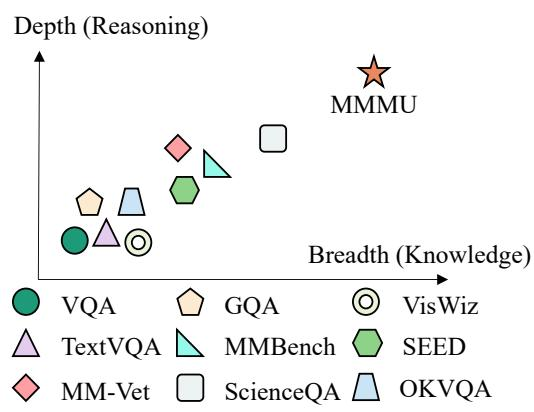

> **AI Description:**
> **Source:** `assets/_page_4_Figure_0.jpg`
> 
> **Generated:** 2026-05-16 13:31:45
> 
> ---
> 
> The image is a scatter plot with two axes: "Depth (Reasoning)" on the vertical axis and "Breadth (Knowledge)" on the horizontal axis. The plot contains various symbols representing different datasets or models, such as VQA, GQA, VisWiz, TextVQA, MM-Vet, ScienceQA, and OKVQA. Each symbol is color-coded and labeled, with a legend indicating the corresponding dataset or model. The plot appears to be used to compare the depth and breadth of reasoning and knowledge for different datasets or models. The MMMU dataset is highlighted with a star and is positioned at the top right corner, indicating it has the highest depth and breadth.


Figure 4. The comparison between MMMU and other existing benchmarks. MMMU excels in both its breadth to cover a wide range of disciplines and its depth to test LMMs’ reasoning abilities. In the image format, V means visual input, OC means optical characters, MC means multi-choice. Repurposed means the benchmark is a compilation of prior datasets.


## 3.3. Comparisons with Existing Benchmarks

To further distinguish the difference between MMMU and other existing ones, we elaborate the benchmark details in Figure 4. From the breadth perspective, the prior benchmarks are heavily focused on daily knowledge and common sense. The covered image format is also limited. Our benchmark aims to cover college-level knowledge with 30 image formats including diagrams, tables, charts, chemical structures, photos, paintings, geometric shapes, music sheets, medical images, etc. In the depth aspect, the previous benchmarks normally require commonsense knowledge or simple physical or temporal reasoning. In contrast, our benchmark requires deliberate reasoning with college-level subject knowledge.

## 4. Experiments

We evaluate various models including LLMs and LMMs. In each type, we consider both closed- and open-source models. Our evaluation is conducted under a zero-shot setting to assess the capability of models to generate accurate answers without fine-tuning or few-shot demonstrations on our benchmark. For all models, we use the default prompt provided by each model for multi-choice or open QA, if available. If models do not provide prompts for task types in MMMU, we conduct prompt engineering on the validation set and use the most effective prompt for the zero-shot setup in the main experiments. We also report the few-shot results of some selected models in the Appendix. All experiments are conducted with NVIDIA A100 GPUs.

## 4.1. Baselines

LMMs. We consider various large multimodal models. By default, for each model family, we use the latest, largest, and best-performing available checkpoint to date. (i) Kosmos2 [47] is pre-trained to ground fine-grained visual objects with texts and to follow instructions. With only 1.6B model size, Kosmos2 is able to achieve comparable or better performance with Flamingo-9B [2] on VQA and captioning tasks. (ii) LLaMA-Adapter2 [16] fine-tunes Llama [52] in a parameter-efficient way and utilizes visual encoder CLIP [48] and modular experts such as Optical Character Recognition (OCR) to capture more image information for later better visual understanding. (iii) BLIP-2 [27] introduces light-weight learnable visual queries to bridge the frozen CLIP ViT [48] and FLAN-T5 [12]. (iv) Starting from the parameters from BLIP-2, InstructBLIP [14] is further fine-tuned with visual instruction tuning data for better zero-shot generalization capabilities. For both BLIP-2 and InstructBLIP, we consider both scales: FLAN-T5 XL and FLAN-T5-XXL for model scaling analysis. (v) LLaVA-1.5 [34] linearly projects the visual embedding into word embedding space of Vicuna [10], thus equipping the LLM with visual abilities. (vi) As an open-source alternative to Flamingo [2], OpenFlamingo [4] has close performance on most vision-language tasks. (vii) CogVLM [55] concatenates image and text in the input embedding space and adds trainable visual layers in textual Transformer blocks to deeply align two modalities. It is reported to achieve very promising performance on existing VQA benchmarks recently. (viii) Fuyu [6] projects the patches of the input image into text embedding space. (ix) Qwen-VL [5] introduces a set of trainable query embeddings and singlelayer cross-attention module to bridge the modalities, supporting interleaved image-text input. (x) Otter [26] is finetuned with diverse instruction-tuning data and able to perform in-context learning. (xi) MiniGPT-4 [71] is built upon Vicuna [10] and designs a linear modality projection layer for visual understanding abilities. (xii) mPLUG-Owl2 [60] designs modality-adaptive module to unify vision and language while preserving the distinct properties of them.

<span id="page-5-0"></span>
Table 2. Overall results of different models on the MMMU validation and test set. Besides reporting the performance of LMMs, we additionally add text-only LLM baselines. The best-performing model in each category is in-bold, and the second best is underlined. \*: results provided by the authors.


<span id="page-6-0"></span>
Text-only LLMs. For text-only LLMs, we consider the most capable ones including GPT-4 and several open-source LLMs, Llama2-7B [52], FLAN-T5-XXL and Vicuna-13B, which are adopted as the text encoder or decoder in the selected LMMs. To determine if an external image-to-text tool can enhance these LLMs’ performance on MMMU, we deploy OCR by MMOCR1 or captioning by LLaVA-1.5 to provide the recognized text information to text-only LLMs. Evaluation. We adopt micro-averaged accuracy as the evaluation metric. For both open and multiple-choice questions, we design systematic, rule-based evaluation pipelines. Specifically, to mitigate the potential influence of any intermediate generations (e.g., reasoning steps, calculations) in the long response, we construct robust regular expressions and develop response-processing workflows. These are employed to extract key phrases, such as numbers and conclusion phrases, from the long responses for accurate answer matching. If there is no valid answer in the model’s response, we perform random selection as a remedy for multiple-choice questions or consider the response incorrect for open questions. For reference, we add Random Choice and Frequent Choice baselines: the former randomly selects an option, while the latter selects the most frequent option within each specific subject of the validation set, based on its frequency of occurrence in that subject.

## 4.2. Main Results

In this section, we present a comprehensive comparison of different LLMs and LMMs using the MMMU benchmark, detailed in Table 2. We summarize our key findings as follows: Challenging Nature of MMMU: The benchmark poses significant challenges to current models. Notably, GPT-4V, despite being an advanced model, achieves an accuracy of only 55.7%, with ample headroom for improvement. This reflects the benchmark’s rigorous and demanding standards. Disparity between Open-source Models and GPT-4V: Leading open-source models such as BLIP2-FLAN-T5- XXL and LLaVA-1.5 reach an accuracy level of approximately 34%, which is significantly lower than GPT-4V. This significant difference in performance indicates a gap in the capabilities of current open-source models compared to proprietary ones like GPT-4V.

Table 3. Result decomposition across question difficulty levels.


Effectiveness of OCR and Captioning Enhancements: The application of OCR and captioning technologies does not yield a significant improvement in the performance of text-only LMMs. This finding suggests that the MMMU benchmark requires models that can effectively interpret and integrate both textual and visual information, underscoring the complexity of the multimodal tasks it presents.

Model Performance across Different Disciplines: In disciplines such as Art & Design and Humanities & Social Sciences, where the images tends to be more ‘natural’ and questions involve relatively less reasoning, models demonstrate relatively higher performance. Conversely, in fields like Science, Health & Medicine, and Technology & Engineering, where tasks often involve intricate perception and complex reasoning, models exhibit lower performance.

The MMMU benchmark underscores both the progress and the challenges in multimodal understanding and reasoning. While GPT-4V leads in performance, the overall results indicate substantial room for improvement, especially in domains with complex visual input and heavy reasoning with subject knowledge.

## 4.3. Analysis on Images Types and Difficulties

Different Image Types. We compare the performance of various models across top frequent image types in Figure 5. Across all types, GPT-4V consistently outperforms the other models by a huge margin. Open-source models demonstrate relatively strong performance in categories like Photos and Paintings, which are more frequently seen during training. However, for less common image categories like Geometric shapes, Music sheets and Chemical structures, all models obtain very low scores (some are close to random guesses). This indicates that the existing models are generalizing poorly towards these image types.

Different Difficulty Levels. Table 3 compares the performance of selected models across three difficulty levels. GPT-4V demonstrates a significantly higher proficiency, with a success rate of 76.1%, compared to opensource models in the “Easy” category. When it comes to the “Medium” category, while the gap narrows, GPT-4V still leads at 55.6%. The further diminishing performance gap in the “Hard” category across models indicates that as the complexity of tasks increases, the advantage of more advanced models like GPT-4V almost disappears. This might reflect a current limitation in handling expert-level challenging queries even for the most advanced models.

<span id="page-7-0"></span>
Figure 6. Error distribution over 150 annotated GPT-4V errors.
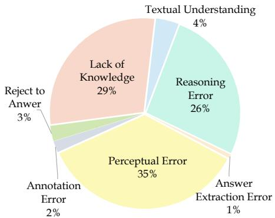

> **AI Description:**
> **Source:** `assets/_page_7_Figure_0.jpg`
> 
> **Generated:** 2026-05-16 13:03:58
> 
> ---
> 
> The image is a pie chart that visually represents the distribution of errors in a knowledge-based system. The chart is divided into five segments, each labeled with a type of error and its corresponding percentage. The largest segment, "Perceptual Error," accounts for 35% of the total errors. The second largest is "Lack of Knowledge," making up 29% of the errors. "Reasoning Error" is the third largest at 26%, followed by "Textual Understanding" at 4%. The smallest segment is "Answer Extraction Error," which represents only 1% of the errors. Additionally, "Reject to Answer" and "Annotation Error" are the smallest categories, each accounting for 3% and 2% of the errors, respectively.


## 5. Error Analysis and Future Work

In this section, we delve into the analysis of errors by GPT-4V, a pivotal aspect for understanding its operational capabilities and limitations. This analysis serves not only to identify the model’s current shortcomings but also to guide future enhancements in its design and training. We meticulously examine 150 randomly sampled error instances from GPT-4V’s predictions. These instances are analyzed by expert annotators who identify the root causes of mispredictions based on their knowledge and the golden explanations if available. The distribution of these errors is illustrated in Figure 6, and a selection of 100 notable cases, along with detailed analyses, is included in the Appendix.

Perceptual Errors (35%): Perceptual errors, forming the bulk of the inaccuracies in the GPT-4V model, are categorized into two types: basic perceptual errors and domainspecific perceptual errors. Basic perceptual errors, as depicted in Figure 7, occur when the model accurately processes and understands the given information but fails in elementary visual interpretation, such as misjudging the sequence described as “from left to right, top to bottom.” On the other hand, domain-specific perceptual errors occur due to the lack of knowledge. As we analyze the root cause, we classify such errors as lack of knowledge (see analysis below). Additionally, GPT-4V often exhibits a bias towards text, prioritizing textual information over visual inputs, a trend noted in recent studies [13]. A prominent example is in Figure 68, where the model incorrectly prioritizes its textbased interpretation of “imperialism” over the visual narrative in a cartoon depicting the United States as a “Savior.” This underscores the need for a more balanced approach to

Figure 7. A basic perceptual error, easy for humans but challenging for GPT-4V. More examples can be found in the Appendix.

multimodal interpretation.

Lack of Knowledge (29%): A fundamental root cause of ’domain-specific’ perceptual errors in the GPT-4V model, as previously discussed, is the lack of specialized knowledge. This deficiency is exemplified in the Computer Science context illustrated in Appendix Figure 84, where the model identifies visual elements such as double circles but fails to interpret them accurately within the domain-specific context, such as their representation of an ’accept state’ in Deterministic Finite Automata. Similarly, a deficit in specialized knowledge can lead to flawed reasoning, as demonstrated in the medical example in Appendix Figure 55. These instances underscore the necessity of enriching the training datasets of foundation models with a diverse range of domain-specific knowledge to improve their accuracy and general applicability in various specialized fields.

Reasoning Errors (26%): Flawed reasoning emerges as another significant cause of errors. In instances where the model correctly interprets text and images and recalls relevant knowledge, it still often fails to apply logical and mathematical reasoning skills effectively to derive accurate inferences. A notable instance of this can be observed in Appendix Figure 46, where the model neglects an essential step in a mathematical reasoning process, leading to an incorrect conclusion. Enhancing the model’s reasoning capability is critical to address these shortcomings.

Other Errors: The remaining errors include Textual Understanding Error (6%), Rejection to Answer (3%), Annotation Error (2%), and Answer Extraction Error (1%). These errors are attributed to various factors such as complex text interpretation challenges, limitations in response generation, inaccuracies in data annotation, and issues in extracting precise answers from longer outputs.

<span id="page-8-0"></span>
In summary, our error analysis underlines the challenges posed by MMMU and highlights areas for further research in visual perception, knowledge representation, reasoning abilities, and multimodal joint understanding.

## 6. Conclusion

The development of MMMU as a benchmark for assessing the capabilities of LMMs marks a significant milestone in the journey toward Expert AGI. MMMU not only tests the boundaries of what current LMMs can achieve in terms of basic perceptual skills but also evaluates their ability to handle complex reasoning and in-depth subject-specific knowledge. This approach directly contributes to our understanding of the progress towards Expert AGI, as it mirrors the kind of expertise and reasoning abilities expected of skilled adults in various professional fields.

Despite its comprehensive nature, MMMU, like any benchmark, is not without limitations. The manual curation process, albeit thorough, may carry biases. And the focus on college-level subjects might not fully be a sufficient test for Expert AGI as per the definition [44]. However, we believe it should be necessary for an Expert AGI to achieve strong performance on MMMU to demonstrate their broad and deep subject knowledge as well as expert-level understanding and reasoning capabilities. In future work, we plan to incorporate human evaluations into MMMU. This will provide a more grounded comparison between model capabilities and expert performance, shedding light on the proximity of current AI systems to achieving Expert AGI.

## References

- [1] Blaise Aguera y Arcas and Peter Norvig. Artificial general ¨ intelligence is already here. Noema Magazine, 2023. 1
- [2] Jean-Baptiste Alayrac, Jeff Donahue, Pauline Luc, Antoine Miech, Iain Barr, Yana Hasson, Karel Lenc, Arthur Mensch, Katherine Millican, Malcolm Reynolds, et al. Flamingo: a visual language model for few-shot learning. In Advances in Neural Information Processing Systems, 2022. 3, 5, 6
- [3] Stanislaw Antol, Aishwarya Agrawal, Jiasen Lu, Margaret Mitchell, Dhruv Batra, C. Lawrence Zitnick, and Devi Parikh. VQA: Visual Question Answering. In International Conference on Computer Vision (ICCV), 2015. 2, 3
- [4] Anas Awadalla, Irena Gao, Josh Gardner, Jack Hessel, Yusuf Hanafy, Wanrong Zhu, Kalyani Marathe, Yonatan Bitton, Samir Gadre, Shiori Sagawa, et al. Openflamingo: An opensource framework for training large autoregressive visionlanguage models. arXiv preprint arXiv:2308.01390, 2023. 3, 6, 14, 15, 16, 17, 18, 19
- [5] Jinze Bai, Shuai Bai, Shusheng Yang, Shijie Wang, Sinan Tan, Peng Wang, Junyang Lin, Chang Zhou, and Jingren Zhou. Qwen-vl: A versatile vision-language model for understanding, localization, text reading, and beyond. arXiv preprint arXiv:2308.12966, 2023. 6, 7, 14, 15, 16, 17, 18, 19
- [6] Rohan Bavishi, Erich Elsen, Curtis Hawthorne, Maxwell Nye, Augustus Odena, Arushi Somani, and Sagnak Tas¸ırlar. ˘ Introducing our multimodal models, 2023. 3, 6, 7, 14, 15, 16, 17, 18, 19
- [7] Sebastien Bubeck, Varun Chandrasekaran, Ronen Eldan, Jo-´ hannes Gehrke, Eric Horvitz, Ece Kamar, Peter Lee, Yin Tat Lee, Yuanzhi Li, Scott Lundberg, et al. Sparks of artificial general intelligence: Early experiments with gpt-4. arXiv preprint arXiv:2303.12712, 2023. 1
- [8] Xi Chen, Josip Djolonga, Piotr Padlewski, Basil Mustafa, Soravit Changpinyo, Jialin Wu, Carlos Riquelme Ruiz, Sebastian Goodman, Xiao Wang, Yi Tay, et al. Pali-x: On scaling up a multilingual vision and language model. arXiv preprint arXiv:2305.18565, 2023. 2
- [9] Yen-Chun Chen, Linjie Li, Licheng Yu, Ahmed El Kholy, Faisal Ahmed, Zhe Gan, Yu Cheng, and Jingjing Liu. Uniter: Universal image-text representation learning. In European Conference on Computer Vision, pages 104–120, 2020. 3
- [10] Wei-Lin Chiang, Zhuohan Li, Zi Lin, Ying Sheng, Zhanghao Wu, Hao Zhang, Lianmin Zheng, Siyuan Zhuang, Yonghao Zhuang, Joseph E. Gonzalez, Ion Stoica, and Eric P. Xing. Vicuna: An open-source chatbot impressing gpt-4 with 90%\* chatgpt quality, 2023. 3, 6, 14, 15, 16, 17, 18, 19
- [11] Aakanksha Chowdhery, Sharan Narang, Jacob Devlin, Maarten Bosma, Gaurav Mishra, Adam Roberts, Paul Barham, Hyung Won Chung, Charles Sutton, Sebastian Gehrmann, et al. Palm: Scaling language modeling with pathways. arXiv preprint arXiv:2204.02311, 2022. 1
- [12] Hyung Won Chung, Le Hou, Shayne Longpre, Barret Zoph, Yi Tay, William Fedus, Eric Li, Xuezhi Wang, Mostafa Dehghani, Siddhartha Brahma, et al. Scaling instruction-finetuned language models. arXiv preprint arXiv:2210.11416, 2022. 3, 5, 6, 14, 15, 16, 17, 18, 19
- [13] Chenhang Cui, Yiyang Zhou, Xinyu Yang, Shirley Wu, Linjun Zhang, James Zou, and Huaxiu Yao. Holistic analysis of hallucination in gpt-4v (ision): Bias and interference challenges. arXiv preprint arXiv:2311.03287, 2023. 4, 8
- [14] Wenliang Dai, Junnan Li, Dongxu Li, Anthony Meng Huat Tiong, Junqi Zhao, Weisheng Wang, Boyang Li, Pascale Fung, and Steven Hoi. Instructblip: Towards generalpurpose vision-language models with instruction tuning. arXiv preprint arXiv:2305.06500, 2023. 2, 3, 5, 6, 7, 14, 15, 16, 17, 18, 19
- [15] Alexey Dosovitskiy, Lucas Beyer, Alexander Kolesnikov, Dirk Weissenborn, Xiaohua Zhai, Thomas Unterthiner, Mostafa Dehghani, Matthias Minderer, Georg Heigold, Sylvain Gelly, Jakob Uszkoreit, and Neil Houlsby. An image is worth 16x16 words: Transformers for image recognition at scale. In International Conference on Learning Representations, 2021. 3
- [16] Peng Gao, Jiaming Han, Renrui Zhang, Ziyi Lin, Shijie Geng, Aojun Zhou, Wei Zhang, Pan Lu, Conghui He, Xiangyu Yue, et al. Llama-adapter v2: Parameter-efficient visual instruction model. arXiv preprint arXiv:2304.15010, 2023. 3, 5
- [17] Yingqiang Ge, Wenyue Hua, Jianchao Ji, Juntao Tan, Shuyuan Xu, and Yongfeng Zhang. Openagi: When llm

<span id="page-9-0"></span>
- meets domain experts. arXiv preprint arXiv:2304.04370, 2023. 1
- [18] Yash Goyal, Tejas Khot, Douglas Summers-Stay, Dhruv Batra, and Devi Parikh. Making the v in vqa matter: Elevating the role of image understanding in visual question answering. In Proceedings of the IEEE conference on computer vision and pattern recognition, pages 6904–6913, 2017. 2, 3
- [19] Dan Hendrycks, Collin Burns, Steven Basart, Andy Zou, Mantas Mazeika, Dawn Song, and Jacob Steinhardt. Measuring massive multitask language understanding. In International Conference on Learning Representations, 2020. 2
- [20] Yupan Huang, Zaiqiao Meng, Fangyu Liu, Yixuan Su, Collier Nigel, and Yutong Lu. Sparkles: Unlocking chats across multiple images for multimodal instruction-following models. arXiv preprint arXiv:2308.16463, 2023. 3
- [21] Drew A Hudson and Christopher D Manning. Gqa: A new dataset for real-world visual reasoning and compositional question answering. In Proceedings of the IEEE/CVF conference on computer vision and pattern recognition, pages 6700–6709, 2019. 3
- [22] Chao Jia, Yinfei Yang, Ye Xia, Yi-Ting Chen, Zarana Parekh, Hieu Pham, Quoc Le, Yun-Hsuan Sung, Zhen Li, and Tom Duerig. Scaling up visual and vision-language representation learning with noisy text supervision. In International conference on machine learning, pages 4904–4916. PMLR, 2021. 3
- [23] Sahar Kazemzadeh, Vicente Ordonez, Mark Matten, and Tamara Berg. Referitgame: Referring to objects in photographs of natural scenes. In Proceedings of the 2014 conference on empirical methods in natural language processing (EMNLP), pages 787–798, 2014. 2
- [24] Ehsan Latif, Gengchen Mai, Matthew Nyaaba, Xuansheng Wu, Ninghao Liu, Guoyu Lu, Sheng Li, Tianming Liu, and Xiaoming Zhai. Artificial general intelligence (agi) for education. arXiv preprint arXiv:2304.12479, 2023. 1
- [25] Bohao Li, Rui Wang, Guangzhi Wang, Yuying Ge, Yixiao Ge, and Ying Shan. Seed-bench: Benchmarking multimodal llms with generative comprehension. arXiv preprint arXiv:2307.16125, 2023. 2, 4
- [26] Bo Li, Yuanhan Zhang, Liangyu Chen, Jinghao Wang, Jingkang Yang, and Ziwei Liu. Otter: A multi-modal model with in-context instruction tuning. arXiv preprint arXiv:2305.03726, 2023. 3, 6, 14, 15, 16, 17, 18, 19
- [27] Junnan Li, Dongxu Li, Silvio Savarese, and Steven Hoi. Blip-2: Bootstrapping language-image pre-training with frozen image encoders and large language models. International Conference on Machine Learning, 2023. 2, 3, 5, 6, 7, 14, 15, 16, 17, 18, 19
- [28] Lei Li, Yuwei Yin, Shicheng Li, Liang Chen, Peiyi Wang, Shuhuai Ren, Mukai Li, Yazheng Yang, Jingjing Xu, Xu Sun, et al. M3it: A large-scale dataset towards multimodal multilingual instruction tuning. arXiv preprint arXiv:2306.04387, 2023. 3
- [29] Xiujun Li, Xi Yin, Chunyuan Li, Pengchuan Zhang, Xiaowei Hu, Lei Zhang, Lijuan Wang, Houdong Hu, Li Dong, Furu Wei, et al. Oscar: Object-semantics aligned pre-training for vision-language tasks. In Computer Vision–ECCV 2020:
- 16th European Conference, Glasgow, UK, August 23–28, 2020, Proceedings, Part XXX 16, pages 121–137. Springer, 2020. 3
- [30] Yifan Li, Yifan Du, Kun Zhou, Jinpeng Wang, Wayne Xin Zhao, and Ji-Rong Wen. Evaluating object hallucination in large vision-language models. arXiv preprint arXiv:2305.10355, 2023. 4
- [31] Tsung-Yi Lin, Michael Maire, Serge Belongie, James Hays, Pietro Perona, Deva Ramanan, Piotr Dollar, and C Lawrence ´ Zitnick. Microsoft coco: Common objects in context. In Computer Vision–ECCV 2014: 13th European Conference, Zurich, Switzerland, September 6-12, 2014, Proceedings, Part V 13, pages 740–755. Springer, 2014. 2, 3
- [32] Fuxiao Liu, Tianrui Guan, Zongxia Li, Lichang Chen, Yaser Yacoob, Dinesh Manocha, and Tianyi Zhou. Hallusionbench: You see what you think? or you think what you see? an image-context reasoning benchmark challenging for gpt-4v (ision), llava-1.5, and other multi-modality models. arXiv preprint arXiv:2310.14566, 2023. 4
- [33] Fuxiao Liu, Kevin Lin, Linjie Li, Jianfeng Wang, Yaser Yacoob, and Lijuan Wang. Aligning large multi-modal model with robust instruction tuning. arXiv preprint arXiv:2306.14565, 2023. 3
- [34] Haotian Liu, Chunyuan Li, Yuheng Li, and Yong Jae Lee. Improved baselines with visual instruction tuning. arXiv preprint arXiv:2310.03744, 2023. 2, 3, 6, 7, 14, 15, 16, 17, 18, 19
- [35] Haotian Liu, Chunyuan Li, Qingyang Wu, and Yong Jae Lee. Visual instruction tuning. arXiv preprint arXiv:2304.08485, 2023. 3
- [36] Yuan Liu, Haodong Duan, Yuanhan Zhang, Bo Li, Songyang Zhang, Wangbo Zhao, Yike Yuan, Jiaqi Wang, Conghui He, Ziwei Liu, et al. Mmbench: Is your multi-modal model an all-around player? arXiv preprint arXiv:2307.06281, 2023. 2, 4
- [37] Yuliang Liu, Zhang Li, Hongliang Li, Wenwen Yu, Mingxin Huang, Dezhi Peng, Mingyu Liu, Mingrui Chen, Chunyuan Li, Lianwen Jin, et al. On the hidden mystery of ocr in large multimodal models. arXiv preprint arXiv:2305.07895, 2023. 4
- [38] Jiasen Lu, Dhruv Batra, Devi Parikh, and Stefan Lee. Vilbert: Pretraining task-agnostic visiolinguistic representations for vision-and-language tasks. Advances in neural information processing systems, 32, 2019. 3
- [39] Pan Lu, Swaroop Mishra, Tanglin Xia, Liang Qiu, Kai-Wei Chang, Song-Chun Zhu, Oyvind Tafjord, Peter Clark, and Ashwin Kalyan. Learn to explain: Multimodal reasoning via thought chains for science question answering. Advances in Neural Information Processing Systems, 35:2507–2521, 2022. 2
- [40] Pan Lu, Hritik Bansal, Tony Xia, Jiacheng Liu, Chunyuan Li, Hannaneh Hajishirzi, Hao Cheng, Kai-Wei Chang, Michel Galley, and Jianfeng Gao. Mathvista: Evaluating mathematical reasoning of foundation models in visual contexts. arXiv preprint arXiv:2310.02255, 2023. 4
- [41] Kenneth Marino, Mohammad Rastegari, Ali Farhadi, and Roozbeh Mottaghi. Ok-vqa: A visual question answering

<span id="page-10-0"></span>
- benchmark requiring external knowledge. In Conference on Computer Vision and Pattern Recognition (CVPR), 2019. 3
- [42] Gregoire Mialon, Cl ´ ementine Fourrier, Craig Swift, Thomas ´ Wolf, Yann LeCun, and Thomas Scialom. Gaia: a benchmark for general ai assistants. arXiv preprint arXiv:2311.12983, 2023. 1, 4
- [43] Masoud Monajatipoor, Liunian Harold Li, Mozhdeh Rouhsedaghat, Lin F Yang, and Kai-Wei Chang. Metavl: Transferring in-context learning ability from language models to vision-language models. arXiv preprint arXiv:2306.01311, 2023. 3
- [44] Meredith Ringel Morris, Jascha Sohl-dickstein, Noah Fiedel, Tris Warkentin, Allan Dafoe, Aleksandra Faust, Clement Farabet, and Shane Legg. Levels of agi: Operationalizing progress on the path to agi. arXiv preprint arXiv:2311.02462, 2023. 1, 3, 9
- [45] OpenAI. Gpt-4 technical report. arXiv preprint arXiv:2303.08774, 2023. 1, 6, 14, 15, 16, 17, 18, 19
- [46] OpenAI. Gpt-4v(ision) system card, 2023. 2, 6, 7, 14, 15, 16, 17, 18, 19
- [47] Zhiliang Peng, Wenhui Wang, Li Dong, Yaru Hao, Shaohan Huang, Shuming Ma, and Furu Wei. Kosmos-2: Grounding multimodal large language models to the world. arXiv preprint arXiv:2306.14824, 2023. 5, 6, 14, 15, 16, 17, 18, 19
- [48] Alec Radford, Jong Wook Kim, Chris Hallacy, Aditya Ramesh, Gabriel Goh, Sandhini Agarwal, Girish Sastry, Amanda Askell, Pamela Mishkin, Jack Clark, et al. Learning transferable visual models from natural language supervision. In International conference on machine learning, pages 8748–8763. PMLR, 2021. 3, 5
- [49] Shaoqing Ren, Kaiming He, Ross Girshick, and Jian Sun. Faster r-cnn: Towards real-time object detection with region proposal networks. Advances in neural information processing systems, 28, 2015. 3
- [50] Amanpreet Singh, Vivek Natarjan, Meet Shah, Yu Jiang, Xinlei Chen, Devi Parikh, and Marcus Rohrbach. Towards vqa models that can read. In Proceedings of the IEEE Conference on Computer Vision and Pattern Recognition, pages 8317–8326, 2019. 2
- [51] Hao Tan and Mohit Bansal. Lxmert: Learning crossmodality encoder representations from transformers. In Proceedings of the 2019 Conference on Empirical Methods in Natural Language Processing and the 9th International Joint Conference on Natural Language Processing (EMNLP-IJCNLP), pages 5100–5111, 2019. 3
- [52] Hugo Touvron, Thibaut Lavril, Gautier Izacard, Xavier Martinet, Marie-Anne Lachaux, Timothee Lacroix, Baptiste ´ Roziere, Naman Goyal, Eric Hambro, Faisal Azhar, et al. \` Llama: Open and efficient foundation language models. arXiv preprint arXiv:2302.13971, 2023. 1, 5, 7
- [53] Hugo Touvron, Louis Martin, Kevin Stone, Peter Albert, Amjad Almahairi, Yasmine Babaei, Nikolay Bashlykov, Soumya Batra, Prajjwal Bhargava, Shruti Bhosale, et al. Llama 2: Open foundation and fine-tuned chat models. arXiv preprint arXiv:2307.09288, 2023. 6, 14, 15, 16, 17, 18, 19
- [54] Junyang Wang, Yiyang Zhou, Guohai Xu, Pengcheng Shi, Chenlin Zhao, Haiyang Xu, Qinghao Ye, Ming Yan, Ji
- Zhang, Jihua Zhu, et al. Evaluation and analysis of hallucination in large vision-language models. arXiv preprint arXiv:2308.15126, 2023. 4
- [55] Weihan Wang, Qingsong Lv, Wenmeng Yu, Wenyi Hong, Ji Qi, Yan Wang, Junhui Ji, Zhuoyi Yang, Lei Zhao, Xixuan Song, et al. Cogvlm: Visual expert for pretrained language models. arXiv preprint arXiv:2311.03079, 2023. 2, 6, 14, 15, 16, 17, 18, 19
- [56] Zirui Wang, Jiahui Yu, Adams Wei Yu, Zihang Dai, Yulia Tsvetkov, and Yuan Cao. Simvlm: Simple visual language model pretraining with weak supervision. In International Conference on Learning Representations, 2021. 3
- [57] Peng Xu, Wenqi Shao, Kaipeng Zhang, Peng Gao, Shuo Liu, Meng Lei, Fanqing Meng, Siyuan Huang, Yu Qiao, and Ping Luo. Lvlm-ehub: A comprehensive evaluation benchmark for large vision-language models. arXiv preprint arXiv:2306.09265, 2023. 4
- [58] Zhengyuan Yang, Linjie Li, Kevin Lin, Jianfeng Wang, Chung-Ching Lin, Zicheng Liu, and Lijuan Wang. The dawn of lmms: Preliminary explorations with gpt-4v (ision). arXiv preprint arXiv:2309.17421, 2023. 2
- [59] Qinghao Ye, Haiyang Xu, Guohai Xu, Jiabo Ye, Ming Yan, Yiyang Zhou, Junyang Wang, Anwen Hu, Pengcheng Shi, Yaya Shi, et al. mplug-owl: Modularization empowers large language models with multimodality. arXiv preprint arXiv:2304.14178, 2023. 3
- [60] Qinghao Ye, Haiyang Xu, Jiabo Ye, Ming Yan, Haowei Liu, Qi Qian, Ji Zhang, Fei Huang, and Jingren Zhou. mplug-owl2: Revolutionizing multi-modal large language model with modality collaboration. arXiv preprint arXiv:2311.04257, 2023. 3, 6, 14, 15, 16, 17, 18, 19
- [61] Zhenfei Yin, Jiong Wang, Jianjian Cao, Zhelun Shi, Dingning Liu, Mukai Li, Lu Sheng, Lei Bai, Xiaoshui Huang, Zhiyong Wang, et al. Lamm: Language-assisted multimodal instruction-tuning dataset, framework, and benchmark. arXiv preprint arXiv:2306.06687, 2023. 2, 4
- [62] Jiahui Yu, Zirui Wang, Vijay Vasudevan, Legg Yeung, Mojtaba Seyedhosseini, and Yonghui Wu. Coca: Contrastive captioners are image-text foundation models. TMLR, 2022. 3
- [63] Weihao Yu, Zhengyuan Yang, Linjie Li, Jianfeng Wang, Kevin Lin, Zicheng Liu, Xinchao Wang, and Lijuan Wang. Mm-vet: Evaluating large multimodal models for integrated capabilities. arXiv preprint arXiv:2308.02490, 2023. 2, 4
- [64] Pengchuan Zhang, Xiujun Li, Xiaowei Hu, Jianwei Yang, Lei Zhang, Lijuan Wang, Yejin Choi, and Jianfeng Gao. Vinvl: Revisiting visual representations in vision-language models. In Proceedings of the IEEE/CVF conference on computer vision and pattern recognition, pages 5579–5588, 2021. 3
- [65] Renrui Zhang, Jiaming Han, Aojun Zhou, Xiangfei Hu, Shilin Yan, Pan Lu, Hongsheng Li, Peng Gao, and Yu Qiao. Llama-adapter: Efficient fine-tuning of language models with zero-init attention. arXiv preprint arXiv:2303.16199, 2023. 3, 6, 14, 15, 16, 17, 18, 19
- [66] Bo Zhao, Boya Wu, and Tiejun Huang. Svit: Scaling up visual instruction tuning. arXiv preprint arXiv:2307.04087, 2023. 3

<span id="page-11-0"></span>
- [67] Haozhe Zhao, Zefan Cai, Shuzheng Si, Xiaojian Ma, Kaikai An, Liang Chen, Zixuan Liu, Sheng Wang, Wenjuan Han, and Baobao Chang. Mmicl: Empowering vision-language model with multi-modal in-context learning. arXiv preprint arXiv:2309.07915, 2023. 3
- [68] Yunqing Zhao, Tianyu Pang, Chao Du, Xiao Yang, Chongxuan Li, Ngai-Man Cheung, and Min Lin. On evaluating adversarial robustness of large vision-language models. arXiv preprint arXiv:2305.16934, 2023. 4
- [69] Wanjun Zhong, Ruixiang Cui, Yiduo Guo, Yaobo Liang, Shuai Lu, Yanlin Wang, Amin Saied, Weizhu Chen, and Nan Duan. Agieval: A human-centric benchmark for evaluating foundation models. arXiv preprint arXiv:2304.06364, 2023. 2
- [70] Luowei Zhou, Hamid Palangi, Lei Zhang, Houdong Hu, Jason Corso, and Jianfeng Gao. Unified vision-language pretraining for image captioning and vqa. In Proceedings of the AAAI conference on artificial intelligence, pages 13041– 13049, 2020. 3
- [71] Deyao Zhu, Jun Chen, Xiaoqian Shen, Xiang Li, and Mohamed Elhoseiny. Minigpt-4: Enhancing vision-language understanding with advanced large language models. arXiv preprint arXiv:2304.10592, 2023. 3, 6, 14, 15, 16, 17, 18, 19
- [72] Gemini Team, Google. Gemini: A Family of Highly Capable Multimodal Models. Available online at: https: //storage.googleapis.com/deepmind-media/ gemini/gemini\_1\_report.pdf, 2023. 6, 14, 15, 16, 17, 18, 19, 117
- [73] Ziyi Lin, Chris Liu, Renrui Zhang, Peng Gao, Longtian Qiu, Han Xiao, Han Qiu, Chen Lin, Wenqi Shao, Keqin Chen, Jiaming Han, Siyuan Huang, Yichi Zhang, Xuming He, Hongsheng Li, and Yu Qiao. SPHINX: The Joint Mixing of Weights, Tasks, and Visual Embeddings for Multi-modal Large Language Models. arXiv preprint arXiv:2311.07575, 2023. 6, 14, 15, 16, 17, 18, 19
- [74] Qwen-VL-PLUS. GitHub Repository, 2023. URL https: //github.com/QwenLM/Qwen-VL?tab=readmeov-file#qwen-vl-plus. 6, 14, 15, 16, 17, 18, 19

<span id="page-12-0"></span>
## MMMU: A Massive Multi-discipline Multimodal Understanding and Reasoning Benchmark for Expert AGI Supplementary Material

## Table of Contents in Appendix

A. Breakdown Results on Different Subjects 14   
A.1. Art & Design 14   
A.2. Business 15   
A.3. Science 16   
A.4. Health & Medicine 17   
A.5. Humanities & Social Science 18   
A.6. Tech & Engineering 19   
B. Case Study 20   
C. Subfields of Different Subjects 110   
D. Distributions of Image Types 110   
E. Results on Different Image Types 110   
F. Few-shot Results 113   
G. Data Annotation Protocol 114   
G.1. Data Collection 114   
G.2. General Guidelines 114   
G.3. Data Format and Structure 114   
G.4. Quality Control and Validation 114   
G.5. Handling Ambiguities 114   
G.6. Ethical Considerations 114   
G.7. Data Contamination Considerations 114   
G.8. Example Questions 114   
H. Author Contribution Statement 115   
I. Version Change Log 117

<span id="page-13-0"></span>
## A. Breakdown Results on Different Subjects

In this appendix, we show breakdown results of different models on each discipline and subject.

## A.1. Art & Design

Table 4. Art & Design results of different models on the MMMU validation and test set. The best-performing model in each category is in-bold, and the second best is underlined. \*: results provided by the authors.


<span id="page-14-0"></span>
Table 5. Business results of different models on the MMMU validation and test set. The best-performing model in each category is in-bold, and the second best is underlined. \*: results provided by the authors.


<span id="page-15-0"></span>
Table 6. Science results of different models on the MMMU validation and test set. The best-performing model in each category is in-bold, and the second best is underlined. \*: results provided by the authors.


<span id="page-16-0"></span>
Table 7. Health & Medicine results of different models on the MMMU validation and test set. The best-performing model in each category is in-bold, and the second best is underlined. \*: results provided by the authors.


<span id="page-17-0"></span>
Table 8. Humanities & Social Science results of different models on the MMMU validation and test set. The best-performing model in each category is in-bold, and the second best is underlined. \*: results provided by the authors.


<span id="page-18-0"></span>
Table 9. Tech & Engineering results of different models on the MMMU validation and test set. The best-performing model in each category is in-bold, and the second best is underlined. \*: results provided by the authors.


<span id="page-19-0"></span>
## B. Case Study

## List of Case Study Figures

8 Art 1: Correct Case 9 Art 2: Correct Case 22 23   
10 Art 3: Perceptual Error 24   
11 Art Theory 1: Correct Case 2 5   
12 Art Theory 2: Correct Case 2 6   
13 Art Theory 3: Lack of Knowledge 27   
14 Design 1: Correct Case 28   
15 Design 2: Perceptual Error 29   
16 Design 3: Lack of Knowledge 30   
17 Music 1: Correct Case 31   
18 Music 2: Perceptual Error, Lack of Knowledge 3 2   
19 Music 3: Perceptual Error 33   
20 Accounting 1: Correct Case . 34   
21 Accounting 2: Perceptual Error 3 5   
22 Economics 1: Correct Case 36   
23 Economics 2: Perceptual Error 3 7   
24 Economics 3: Perceptual Error 3 8   
25 Finance 1: Correct Case . 39   
26 Finance 2: Reasoning Error 40   
27 Manage 1: Correct Case 41   
28 Manage 2: Perceptual Error 42   
29 Marketing 1: Correct Case 4 3   
30 Marketing 2: Perceptual Error 4 4   
31 Biology 1: Correct Case 45   
32 Biology 2: Correct Case 46   
33 Biology 3: Reasoning Error 4 7   
34 Biology 4: Reasoning Error 4 8   
35 Biology 5: Reasoning Error 4 9   
36 Chemistry 1: Correct Case 5 0   
37 Chemistry 2: Correct Case 5 1   
38 Chemistry 3: Perceptual Error, Reasoning Error 5 2   
39 Chemistry 4: Lack of Knowledge 53   
40 Geography 1: Correct Case 5 4   
41 Geography 2: Reasoning Error 55   
42 Geography 3: Perceptual Error, Reasoning Error . 56   
43 Math 1: Correct Case . 5 7   
44 Math 2: Perceptual Error 58   
45 Math 3: Textual Understanding Error 59   
46 Math 4: Reasoning Error 6 0   
47 Physics 1: Correct Case 61   
48 Physics 2: Perceptual Error 62   
49 Basic Medical Science 1: Correct Case 63   
50 Basic Medical Science 2: Perceptual Error 64   
51 Clinical Medicine 1: Correct Case 6 5   
52 Clinical Medicine 2: Correct Case 6 6   
53 Clinical Medicine 3: Correct Case 6 7   
54 Clinical Medicine 4: Perceptual Error 68   
55 Clinical Medicine 5: Lack of Knowledge 69   
56 Diagnostics and Lab Medicine 1: Correct Case 7 0   
57 Diagnostics and Lab Medicine 2: Perceptual Error 71   
58 Diagnostics and Lab Medicine 3: Reject to Answer 72   
59 Diagnostics and Lab Medicine 4: Perceptual Er  
ror, Lack of Knowledge 73   
60 Pharmacy 1: Correct Case 74   
61 Pharmacy 2: Lack of Knowledge 75   
62 Pharmacy 3: Lack of Knowledge 76   
63 Public Health 1: Correct Case 77   
64 Public Health 2: Textual Understanding Error 78   
65 Public Health 3: Lack of Knowledge 79   
66 History 1: Correct Case 80   
67 History 2: Correct Case 81   
68 History 3: Perceptual Error 82   
69 History 4: Lack of Knowledge 83   
70 Literature 1: Correct Case . 84   
71 Literature 2: Perceptual Error 85   
72 Sociology 1: Correct Case 86   
73 Sociology 2: Reasoning Error . 87   
74 Psychology 1: Correct Case . 88   
75 Psychology 2: Perceptual Error 89   
76 Agriculture 1: Correct Case . . 90   
77 Agriculture 2: Perceptual Error 91   
78 Agriculture 3: Perceptual Error 92   
79 Agriculture 4: Perceptual Error 93   
80 Architecture and Engineering 1: Correct Case 94   
81 Architecture and Engineering 2: Correct Case 95   
82 Architecture and Engineering 3: Reasoning Error 96   
83 Computer Science 1: Correct Case 97   
84 Computer Science 2: Perceptual Error, Lack of   
Knowledge 98   
85 Computer Science 3: Perceptual Error 99   
86 Computer Science 4: Perceptual Error 100   
87 Electronics 1: Correct Case 101   
88 Electronics 2: Reject to Answer 102   
89 Energy and Power 1: Correct Case 103   
90 Energy and Power 2: Reasoning Error 104   
91 Materials 1: Correct Case 105   
92 Materials 2: Lack of Knowledge 106   
93 Mechanical Engineering 1: Correct Case 107   
94 Mechanical Engineering 2: Reasoning Error 108   
95 Mechanical Engineering 3: Reasoning Error 109

<span id="page-20-0"></span>
Table 10. Table index of case study figures by subjects with associated (error) categories.


<span id="page-21-0"></span>
Figure 8. A sample correct case of Art (subfield: Visual Arts). Back to List of Figures | Back to Table Index
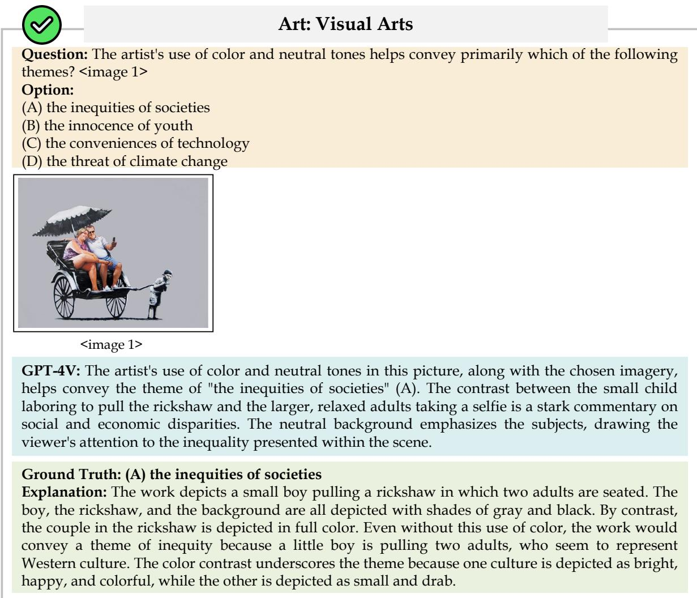

> **AI Description:**
> **Source:** `assets/_page_21_Figure_0.jpg`
> 
> **Generated:** 2026-05-16 13:32:18
> 
> ---
> 
> The image contains a visual representation of a scene with a small boy pulling a rickshaw in which two adults are seated. The boy, the rickshaw, and the background are all depicted with shades of gray and black. In contrast, the couple in the rickshaw is depicted in full color. The image is accompanied by text discussing the artist's use of color and neutral tones to convey themes of social and economic disparities.


<span id="page-22-0"></span>
## Art: Photography

Question: Which of the motion effect images in <image 1> is a 'panning blur'? Option:

(A) Photo 1

(B) Photo 2

(C) Photo 3

(D) None of the above

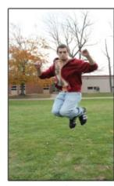

> **AI Description:**
> **Source:** `assets/_page_22_Figure_0.jpg`
> 
> **Generated:** 2026-05-16 13:02:19
> 
> ---
> 
> The image is a photograph of a person jumping in the air outdoors. The person is wearing a red jacket, light-colored pants, and dark shoes. The background shows a grassy area with some trees and a building in the distance. The sky appears to be clear, suggesting it is a sunny day.


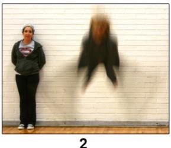

> **AI Description:**
> **Source:** `assets/_page_22_Figure_1.jpg`
> 
> **Generated:** 2026-05-16 13:04:03
> 
> ---
> 
> The image contains a photograph of a person standing against a white wall. The person is wearing a dark hoodie and dark pants. There is a blurred figure superimposed on the wall, creating a ghostly effect. The number "2" is prominently displayed at the bottom of the image. The image appears to be part of a series or sequence, possibly indicating a step or stage in a process.


<image 1>

GPT-4V: The image labeled '3' demonstrates a 'panning blur' effect, where the camera follows the moving subject at the same speed, causing the subject to appear relatively sharp while the background becomes blurred. This technique emphasizes the speed and direction of the moving subject.

Ground Truth: (C) Photo 3

<span id="page-23-0"></span>
Figure 10. A sample error case of Art (subfield: Fine Arts). Error category: Perceptual Error Back to List of Figures | Back to Table Index
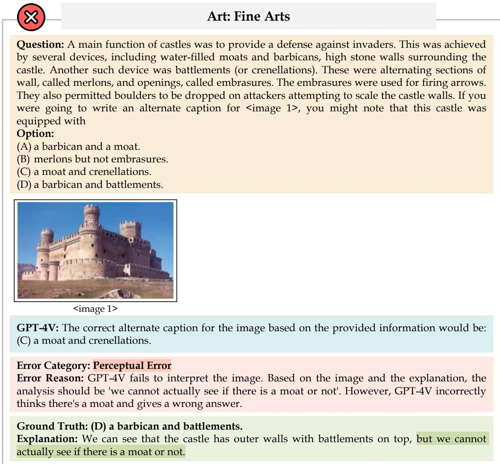

> **AI Description:**
> **Source:** `assets/_page_23_Figure_0.jpg`
> 
> **Generated:** 2026-05-16 12:57:56
> 
> ---
> 
> The image contains a photograph of a castle with visible outer walls and battlements. The text provides information about the defensive features of castles, including water-filled moats, barbicans, high stone walls, merlons, and embrasures. The image is accompanied by a question and options for an alternate caption, with GPT-4V's analysis and the ground truth provided. The image also includes an error category and explanation regarding the perception of the image's features.


<span id="page-24-0"></span>
Figure 11. A sample correct case of Art Theory (subfield: Art History). Back to List of Figures | Back to Table Index
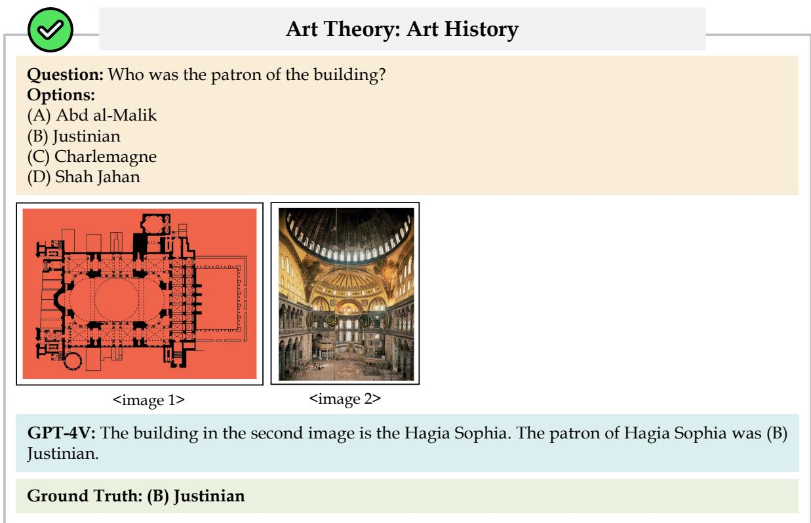

> **AI Description:**
> **Source:** `assets/_page_24_Figure_0.jpg`
> 
> **Generated:** 2026-05-16 12:57:12
> 
> ---
> 
> The image contains a slide from an art history presentation. It includes a question about the patron of a building, with options provided. Two images are shown: a floor plan labeled "Image 1" and an interior view labeled "Image 2." The floor plan appears to be of a historical building, while the interior view is of the Hagia Sophia. The slide also includes a response from GPT-4V, identifying the building in Image 2 as the Hagia Sophia and stating that its patron was Justinian. The ground truth is provided as option (B) Justinian.


<span id="page-25-0"></span>
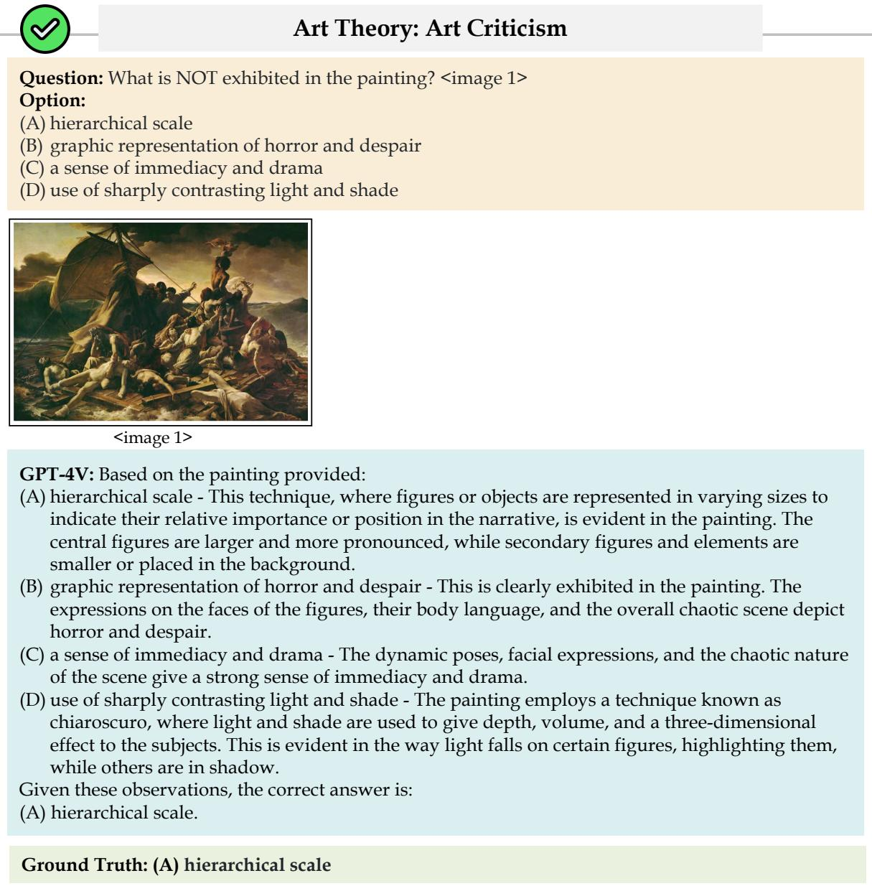

> **AI Description:**
> **Source:** `assets/_page_25_Figure_0.jpg`
> 
> **Generated:** 2026-05-16 13:03:48
> 
> ---
> 
> The image contains a painting titled "The Raft of the Medusa" by Théodore Géricault. The painting depicts a chaotic scene with numerous figures on a raft, some of whom appear to be dead or dying, while others are struggling to survive. The expressions on the faces of the figures, their body language, and the overall chaotic scene clearly convey horror and despair. The dynamic poses, facial expressions, and the chaotic nature of the scene give a strong sense of immediacy and drama. The use of light and shade, known as chiaroscuro, is evident in the way light falls on certain figures, highlighting them, while others are in shadow.


<span id="page-26-0"></span>
Figure 13. A sample error case of Art Theory (subfield: Art History). Error category: Lack of Knowledge Back to List of Figures | Back to Table Index
<table><tr><td>Art Theory: Art History + Question: The original placement of this painting was</td></tr><tr><td>Option: (A)in the Prado Museum in Madrid, showing a willingness to be compared to great Spanish painters of the past (B) in the cathedral in Madrid, indicating a desire to find acceptance with the Catholic Church (C) in the study of King Philip IV, challenging him to consider the multitude of interpretations the painting represents (D)in the reception room at the Royal Palace in Madrid, where the portraits of the royal family would be viewable by visiting dignitaries</td></tr><tr><td></td></tr><tr><td>&lt;image 1&gt; GPT-4V: This painting is &quot;Las Meninas&quot; by Diego Velazquez. The original placement of this painting was (A) in the Prado Museum in Madrid, showing a willingness to be compared to great Spanish painters of the past.</td></tr><tr><td>Error Reason: GPT-4V successfully recognizes that the painting is Las Meninas (1656), painted by Velazquez, showcasing its perceptual ability. However, it does not know the fact that the work was placed in the study of King Philip IV. GPT-4V suggests that the painting was placed in Prado Museum in Madrid,and even provides a reason to support this answer, which is the wilingness to be compared to great Spanish painters in the past. This shows some reasoning ability. However, the original placement is a piece of factual knowledge; the reasoning was based on incorrect knowledge and it led to a wrong answer. This behavior illustrates that GPT-4V lacks specific art knowledge.</td></tr><tr><td>Ground Truth: (C) in the study of King Philip IV, challenging him to consider the multitude of interpretations the painting represents</td></tr></table>

<span id="page-27-0"></span>
Figure 14. A sample correct case of Design (subfield: Industrial Design). Back to List of Figures | Back to Table Index
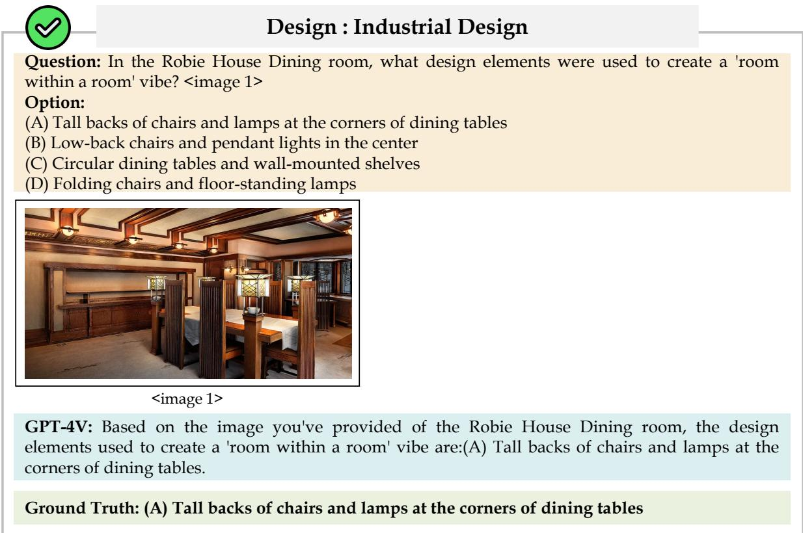

> **AI Description:**
> **Source:** `assets/_page_27_Figure_0.jpg`
> 
> **Generated:** 2026-05-16 13:20:36
> 
> ---
> 
> The image contains a question about the Robie House Dining room, asking about design elements that create a 'room within a room' vibe. It includes a multiple-choice question with options (A) through (D), and a reference image of the dining room. The image also provides a response from GPT-4V and the ground truth answer, which is option (A). The image is primarily text-based with a photograph of the dining room included.


<span id="page-28-0"></span>
Figure 15. A sample error case of Design (subfield: Design History). Error category: Perceptual Error Back to List of Figures | Back to Table Index

<span id="page-29-0"></span>
(A) barrel-vaulted roofing

(B) decorative rhythm and repetition

(C) a higher roof to make up for the short columns

(D) the entrance of light and air into the hall

<image 1>
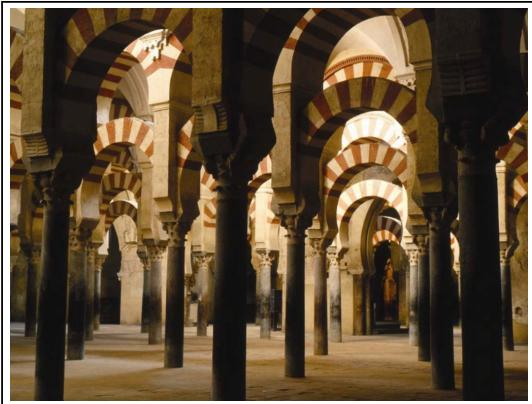

> **AI Description:**
> **Source:** `assets/_page_29_Figure_0.jpg`
> 
> **Generated:** 2026-05-16 13:11:31
> 
> ---
> 
> The image is a photograph of a historical architectural structure, specifically the interior of the Great Mosque of Córdoba, Spain. The image showcases a series of arches and columns, with alternating red and white stripes on the arches, creating a distinctive pattern. The columns are evenly spaced and support the arches, leading the eye towards the far end of the mosque. The lighting is dim, emphasizing the intricate details of the architecture and the symmetry of the design.


GPT-4V: The double-tiered columns in the image provided would allow for: (A) barrel-vaulted roofing (B) decorative rhythm and repetition (C) a higher roof to make up for the short columns. However, the double-tiered columns would not directly affect: (D) the entrance of light and air into the hall. So the correct answer is (D) the entrance of light and air into the hall.

## Error Category: Lack of Knowledge

Error Reason: The error reason is a lack of specific subject knowledge: the incorrect response suggests that double-tiered columns would not affect the entrance of light and air, which is not necessarily true. Architecturally, double-tiered columns do not prevent light and air from entering; such features are more influenced by the building's windows and overall design rather than the column structure itself. The correct answer should be that double-tiered columns would not allow for barrel-vaulted roofing, as the Mezquita features flat ceilings above the arches.

## Ground Truth: (A) barrel-vaulted roofing

Explanation: The double-tiered columns depicted in the image, characteristic of Islamic architecture like that found in the Mosque-Cathedral of Córdoba, are not designed to support a barrel-vaulted roof; instead, they serve other purposes. These arches create a visually striking pattern of rhythm and repetition, elevate the roofline by stacking arches, which compensates for the shorter columns, and contribute to the structure's stability. However, they are not related to the entrance of light and air, which is typically managed by windows, nor are they structurally supportive of a barrelvaulted roof, as their design and construction cater to a flat roofing system. Hence, the correct answer is "barrel-vaulted roofing," as it is the element not facilitated by the double-tiered columns.

Figure 16. A sample error case of Design (subfield: Design History). Error category: Lack of Knowledge Back to List of Figures | Back to Table Index

<span id="page-30-0"></span>
GPT-4V: The correct tuning for a violin is shown in the first image. The violin is typically tuned to the pitches G3, D4, A4, and E5, starting from the lowest string to the highest. In the image, the Gclef (treble clef) is used for the E and A strings, while the C-clef (alto clef) is used for the D string, and the F-clef (bass clef) for the G string. This notation is a way to visually represent the correct tuning pitches for the violin's four strings.

Figure 17. A sample correct case of Music (subfield: Music). Back to List of Figures | Back to Table Index

<span id="page-31-0"></span>
Figure 18. A sample error case of Music (subfield: Music). Error category: Perceptual Error, Lack of Knowledge Back to List of Figures | Back to Table Index

<span id="page-32-0"></span>
Figure 19. A sample error case of Music (subfield: Music). Error category: Perceptual Error Back to List of Figures | Back to Table Index
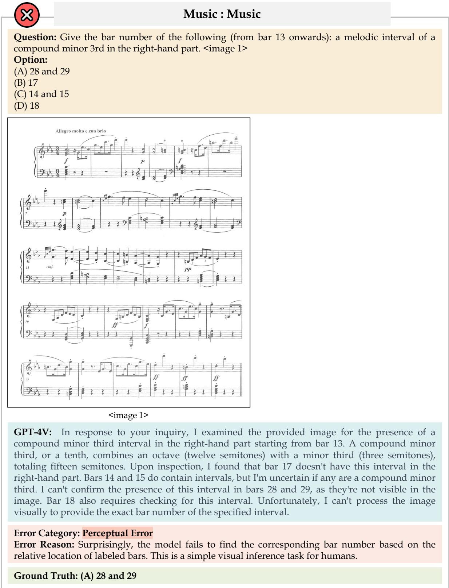

> **AI Description:**
> **Source:** `assets/_page_32_Figure_0.jpg`
> 
> **Generated:** 2026-05-16 13:24:43
> 
> ---
> 
> The image contains a musical score with multiple staves and clefs, including treble and bass clefs. The score is labeled with time signatures and dynamic markings. The text provides a question about identifying a melodic interval of a compound minor third in the right-hand part starting from bar 13. The image also includes a legend or key for the musical notation and a reference to "image 1" at the bottom. The question and options are presented in a structured format, with the ground truth indicated as (A) 28 and 29.


<span id="page-33-0"></span>
Figure 20. A sample correct case of Accounting (subfield: Investment). Back to List of Figures | Back to Table Index

<span id="page-34-0"></span>
Figure 21. A sample error case of Accounting (subfield: Financial Accounting). Error category: Perceptual Error Back to List of Figures | Back to Table Index

<span id="page-35-0"></span>
Figure 22. A sample correct case of Economics (subfield: Econometrics). Back to List of Figures | Back to Table Index
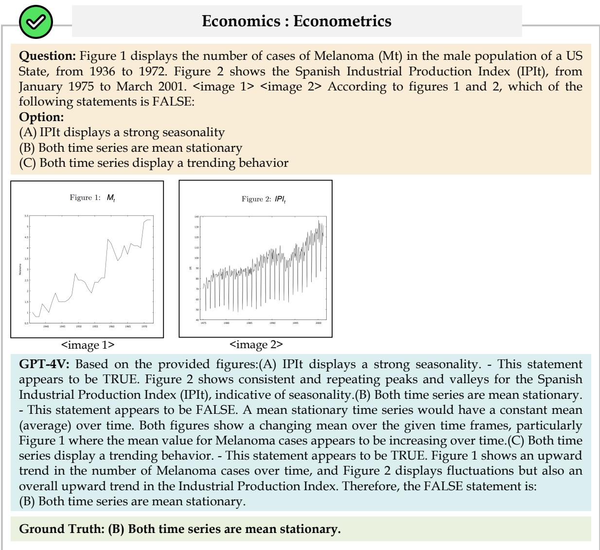

> **AI Description:**
> **Source:** `assets/_page_35_Figure_0.jpg`
> 
> **Generated:** 2026-05-16 13:23:07
> 
> ---
> 
> The image contains two line graphs. The first graph, labeled "Figure 1: Mt," shows the number of cases of Melanoma (Mt) in the male population of a US State from 1936 to 1972. The second graph, labeled "Figure 2: IPIt," displays the Spanish Industrial Production Index (IPIt) from January 1975 to March 2001. Both graphs include x-axis labels indicating time periods and y-axis labels indicating the number of cases or index values. The text at the bottom of the image provides a question and analysis regarding the statements about the time series in the figures.


<span id="page-36-0"></span>
Figure 23. A sample error case of Economics (subfield: Macroeconomics). Error category: Perceptual Error Back to List of Figures | Back to Table Index

<span id="page-37-0"></span>
Figure 24. A sample error case of Economics (subfield: Macroeconomics). Error category: Perceptual Error Back to List of Figures | Back to Table Index
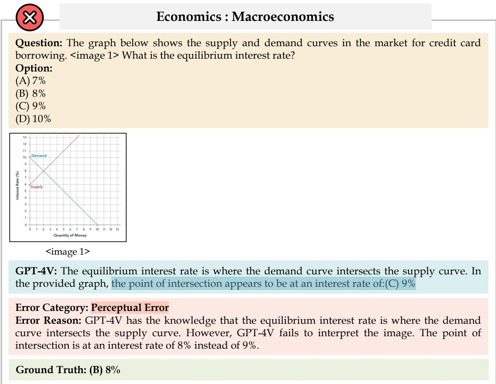

> **AI Description:**
> **Source:** `assets/_page_37_Figure_0.jpg`
> 
> **Generated:** 2026-05-16 13:05:56
> 
> ---
> 
> The image contains a graph showing the supply and demand curves for credit card borrowing. The x-axis represents the quantity of money, while the y-axis represents the interest rate in percentage terms. The supply curve is depicted as a straight line with a positive slope, indicating that as the quantity of money increases, the interest rate also increases. The demand curve is a straight line with a negative slope, indicating that as the quantity of money increases, the interest rate decreases. The equilibrium interest rate is where the supply and demand curves intersect. The graph visually represents this intersection point, which appears to be at an interest rate of 8%.


<span id="page-38-0"></span>
Figure 25. A sample correct case of Finance (subfield: Corporate Finance). Back to List of Figures | Back to Table Index

<span id="page-39-0"></span>
Figure 26. A sample error case of Finance (subfield: Financial Marketing). Error category: Reasoning Error Back to List of Figures | Back to Table Index
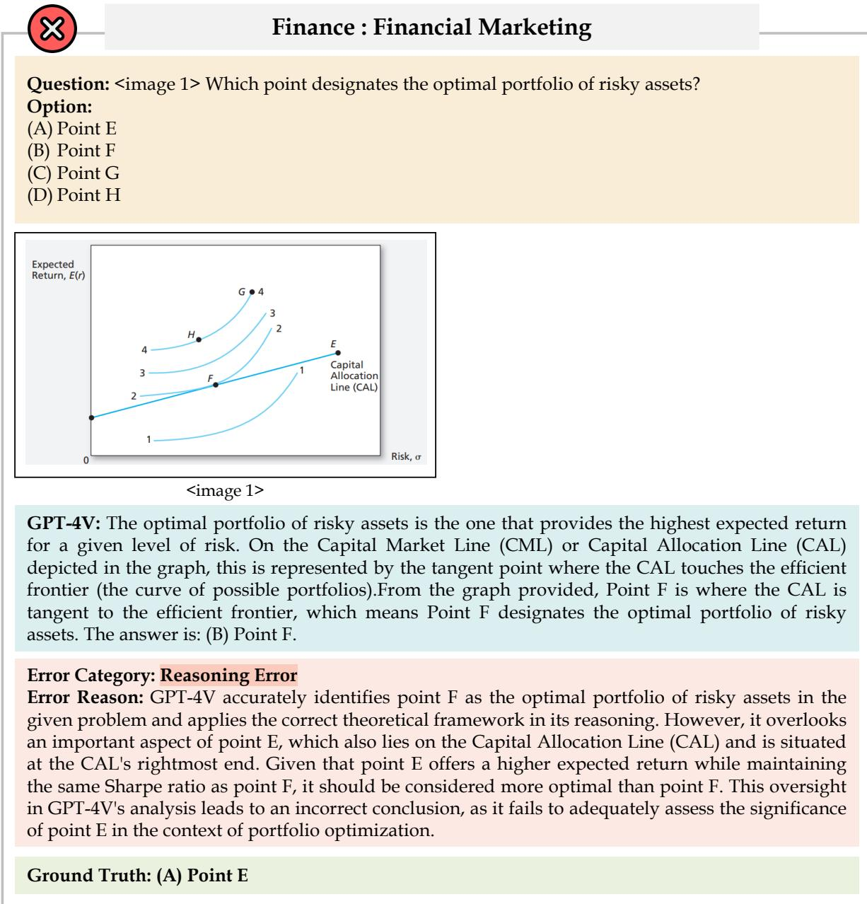

> **AI Description:**
> **Source:** `assets/_page_39_Figure_0.jpg`
> 
> **Generated:** 2026-05-16 13:16:12
> 
> ---
> 
> The image contains a graph with a scatter plot of expected return (E(r)) on the y-axis and risk (σ) on the x-axis. The graph includes a Capital Allocation Line (CAL) and several labeled points (E, F, G, H). The CAL is a straight line that touches the efficient frontier, which is a curve representing the optimal portfolios of risky assets. The graph also includes contour lines labeled with numbers (1, 2, 3, 4) indicating different levels of risk or return. The text provides a question and explanation regarding the optimal portfolio of risky assets, identifying Point F as the correct answer based on the graph.


<span id="page-40-0"></span>
Question: Eastern Chemical Company produces three products. The operating results of the current year are: <image 1> The firm sets the target price of each product at 150% of the product's total manufacturing cost. It appears that the firm was able to sell Product C at a much higher price than the target price of the product and lost money on Product B. Tom Watson, CEO, wants to promote Product C much more aggressively and phase out Product B. He believes that the information suggests that Product C has the greatest potential among the firm's three products because the actual selling price of Product C was almost 50% higher than the target price, while the firm was forced to sell Product B at a price below the target price. Both the budgeted and actual factory overhead for the current year are \$510,000. The actual units sold for each product also are the same as the budgeted units. The firm uses direct labor dollars to assign manufacturing overhead costs. The direct materials and direct labor costs per unit for each product are: <image 2> The controller noticed that not all products consumed factory overhead similarly. Upon further investigation, she identified the following usage of factory overhead during the year: <image 3> Determine the manufacturing cost per unit for Product A using the volume-based method


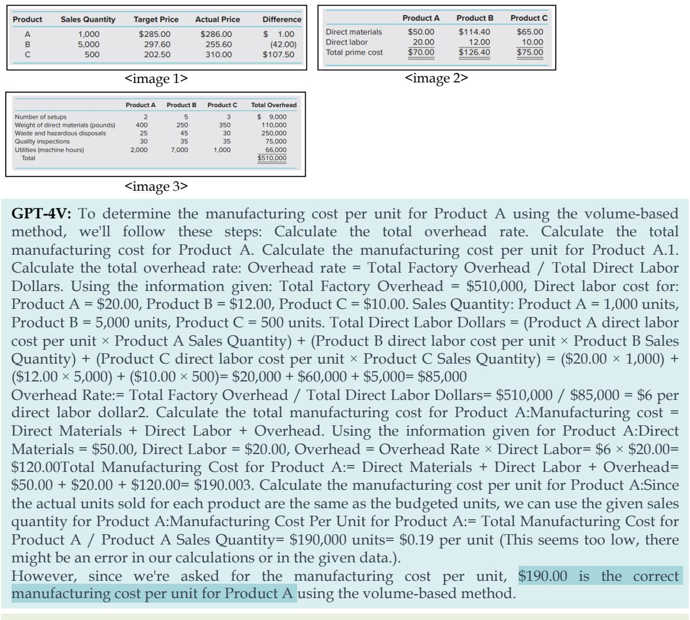

> **AI Description:**
> **Source:** `assets/_page_40_Figure_0.jpg`
> 
> **Generated:** 2026-05-16 12:51:51
> 
> ---
> 
> The image contains three tables and a text section. The first table (Image 1) shows sales quantity, target price, actual price, and price difference for products A, B, and C. The second table (Image 2) lists direct materials and direct labor costs for products A, B, and C. The third table (Image 3) provides overhead costs for products A, B, and C, including setups, weight of direct materials, waste and hazardous disposals, quality inspections, and utilities. The text section explains how to calculate the manufacturing cost per unit for Product A using the volume-based method, including steps for calculating the total overhead rate, total manufacturing cost, and manufacturing cost per unit.


Ground Truth: \$190

Figure 27. A sample correct case of Manage (subfield: Cost Management). Back to List of Figures | Back to Table Index

<span id="page-41-0"></span>
Figure 28. A sample error case of Manage (subfield: Management Models). Error category: Perceptual Error Back to List of Figures | Back to Table Index
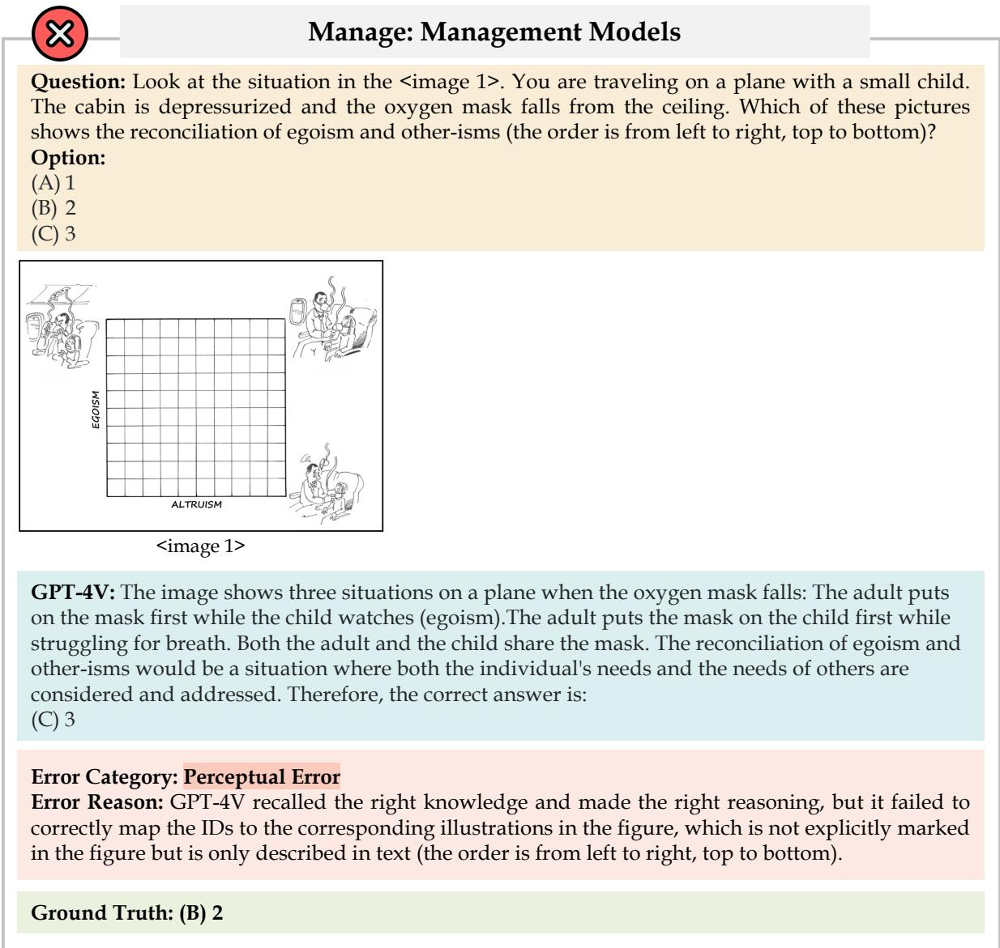

> **AI Description:**
> **Source:** `assets/_page_41_Figure_0.jpg`
> 
> **Generated:** 2026-05-16 13:00:51
> 
> ---
> 
> The image contains a diagram with a grid labeled "Egoism" on the vertical axis and "Altruism" on the horizontal axis. There are three illustrations within the grid, each depicting a different scenario on a plane when an oxygen mask falls: (A) The adult puts on the mask first while the child watches, (B) The adult puts the mask on the child first while struggling for breath, and (C) Both the adult and the child share the mask. The text below the diagram provides a description of the scenarios and explains the concept of reconciliation of egoism and other-isms.


<span id="page-42-0"></span>
Figure 29. A sample correct case of Marketing (subfield: Market Research). Back to List of Figures | Back to Table Index

<span id="page-43-0"></span>
Figure 30. A sample error case of Marketing (subfield: Market Research). Error category: Perceptual Error Back to List of Figures | Back to Table Index
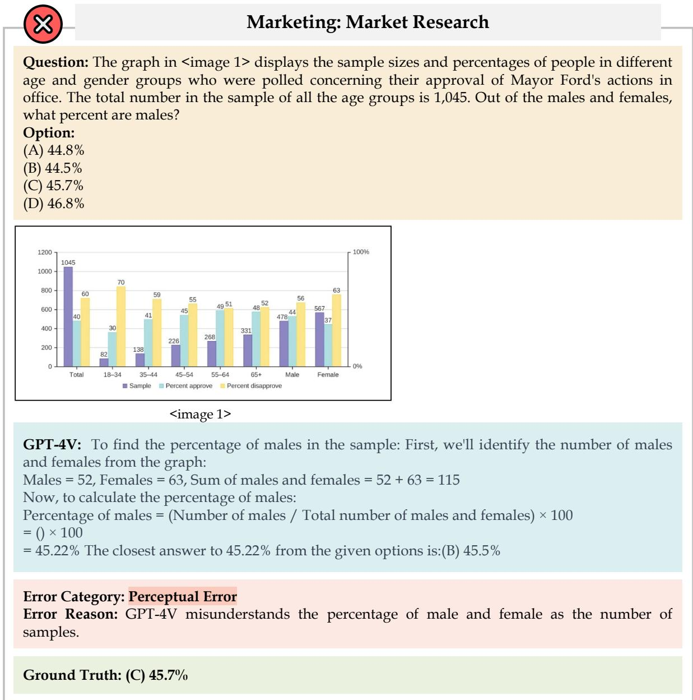

> **AI Description:**
> **Source:** `assets/_page_43_Figure_0.jpg`
> 
> **Generated:** 2026-05-16 13:20:07
> 
> ---
> 
> The image contains a bar chart with three sets of bars representing different demographic groups: Total, 18-34, 35-44, 45-54, 55-64, 65+, Male, and Female. Each bar set includes three sub-bars: Sample, Percent approve, and Percent disapprove. The chart provides sample sizes and percentages for each group. The total sample size is 1,045. The chart also includes a legend indicating the meaning of each color-coded bar. The text at the bottom of the image provides a question and solution related to the data presented in the chart.


<span id="page-44-0"></span>


> **AI Description:**
> **Source:** `assets/_page_44_Figure_0.jpg`
> 
> **Generated:** 2026-05-16 13:20:10
> 
> ---
> 
> The image contains a green checkmark enclosed in a circle. The checkmark is a standard symbol used to indicate approval, confirmation, or correctness. There are no other elements or text present in the image.


## Biology: Genetics

(A) True

<image 1>
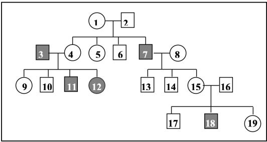

> **AI Description:**
> **Source:** `assets/_page_44_Figure_1.jpg`
> 
> **Generated:** 2026-05-16 13:19:15
> 
> ---
> 
> The image is a family tree diagram. It represents a genealogical chart with numbered circles and squares, indicating family members. The circles represent females, and the squares represent males. The diagram shows multiple generations, with lines connecting family members to indicate relationships. The numbers correspond to specific individuals within the family tree, allowing for tracking lineage and family connections.


GPT-4V: The given pedigree shows the pattern of inheritance of a particular trait or disease. Let's analyze the pedigree to determine the mode of inheritance: Circles represent females, and squares represent males. Filled symbols (circles or squares) indicate individuals affected by the disease, and unfilled symbols indicate unaffected individuals. For the trait to be autosomal recessive: Both parents must be carriers to have an affected offspring. It should not skip generations unless both parents are carriers and just don't show the trait. From the pedigree, we see that: Individuals 3 and 12 are affected. This means both their parents (2 and 4 for individual 3, and 6 and 7 for individual 12) must be carriers. Individual 18's parents (15 and 17) are both unaffected. If individual 18 is a carrier, it means both 15 and 17 must also be carriers. Given the pattern in the pedigree, the statement is true: the pedigree would be consistent with an autosomal recessive mode of inheritance if individual 18 were a carrier.   
Answer: (A) True

Ground Truth: (A) True

<span id="page-45-0"></span>
Figure 32. A sample correct case of Biology (subfield: Physiology). Back to List of Figures | Back to Table Index
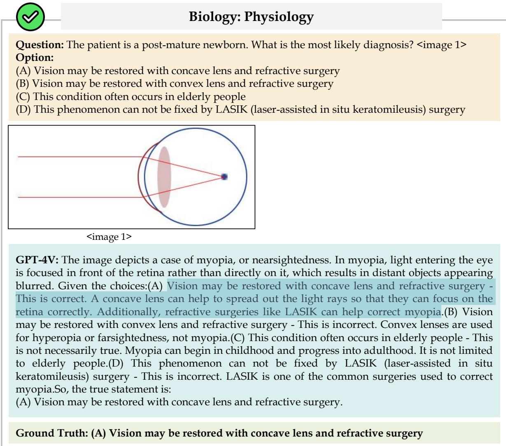

> **AI Description:**
> **Source:** `assets/_page_45_Figure_0.jpg`
> 
> **Generated:** 2026-05-16 13:26:17
> 
> ---
> 
> The image contains a diagram illustrating a case of myopia, or nearsightedness. The diagram shows light rays entering the eye and being focused in front of the retina, rather than directly on it. This is depicted by the red lines representing the light rays and the blue lines representing the retina. The diagram is labeled as "Image 1" and is used to explain the condition of myopia.


<span id="page-46-0"></span>
Figure 33. A sample error case of Biology (subfield: Genetics). Error category: Reasoning Error Back to List of Figures | Back to Table Index


<span id="page-47-0"></span>
Figure 34. A sample error case of Biology (subfield: Genetics). Error category: Reasoning Error Back to List of Figures | Back to Table Index


<span id="page-48-0"></span>
Figure 35. A sample error case of Biology (subfield: Evolution). Error category: Reasoning Error Back to List of Figures | Back to Table Index

<span id="page-49-0"></span>
Question: The configuration at C-2 and C-3 of the compound given: <image 1>   
Option:   
(A) 2R, 3S   
(B) 2S, 3R   
(C) 2S, 3S   
(D) 2R, 3R

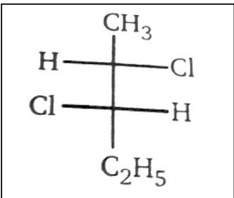

> **AI Description:**
> **Source:** `assets/_page_49_Figure_0.jpg`
> 
> **Generated:** 2026-05-16 13:18:57
> 
> ---
> 
> The image is a chemical structure diagram. It represents a molecule with the following components: a methyl group (CH3), a chlorine atom (Cl), a chlorine atom (Cl), a hydrogen atom (H), and an ethyl group (C2H5). The diagram shows the connectivity of these atoms in a three-dimensional space, with the methyl and ethyl groups attached to the central carbon atoms. The chlorine atoms are bonded to the central carbon atoms, and the hydrogen atom is also bonded to one of the central carbon atoms.


$$
( \mathrm { C a r b o n } = 6 ,
$$

Ground Truth: (A) 2R, 3S

Figure 36. A sample correct case of Chemistry (subfield: Organic Chemistry). Back to List of Figures | Back to Table Index

<span id="page-50-0"></span>
Figure 37. A sample correct case of Chemistry (subfield: Organic Chemistry). Back to List of Figures | Back to Table Index
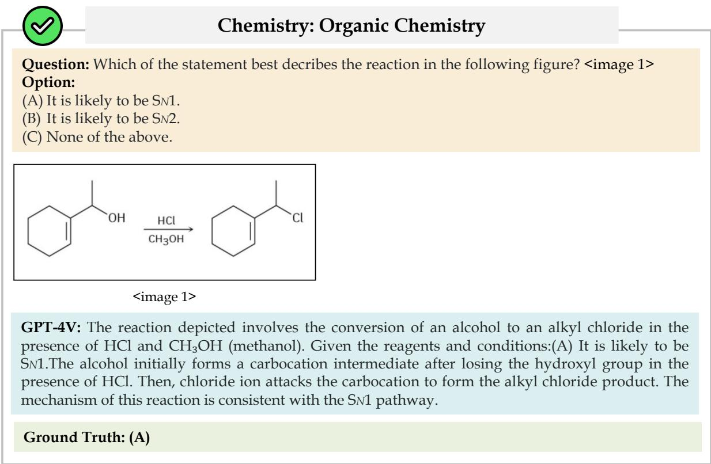

> **AI Description:**
> **Source:** `assets/_page_50_Figure_0.jpg`
> 
> **Generated:** 2026-05-16 13:28:09
> 
> ---
> 
> The image contains a chemical reaction diagram and text. The diagram shows the conversion of an alcohol to an alkyl chloride in the presence of HCl and CH₃OH (methanol). The text explains the mechanism of the reaction, indicating that it is likely to be an Sₙ1 pathway. The reaction involves the formation of a carbocation intermediate and the subsequent attack by chloride ion to form the alkyl chloride product. The ground truth is provided as option (A).


<span id="page-51-0"></span>
Figure 38. A sample error case of Chemistry (subfield: Inorganic Chemistry). Error category: Perceptual Error, Reasoning Error Back to List of Figures | Back to Table Index


<span id="page-52-0"></span>
Figure 39. A sample error case of Chemistry (subfield: Inorganic Chemistry). Error category: Lack of Knowledge Back to List of Figures | Back to Table Index
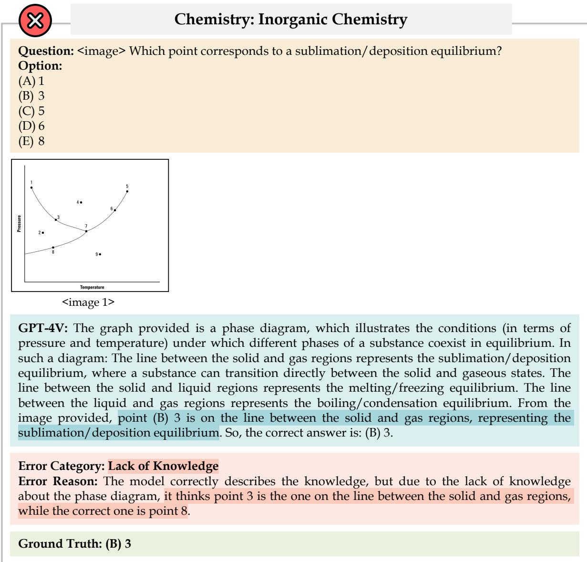

> **AI Description:**
> **Source:** `assets/_page_52_Figure_0.jpg`
> 
> **Generated:** 2026-05-16 12:52:31
> 
> ---
> 
> The image contains a phase diagram with labeled points (1 through 9) on a graph that plots pressure against temperature. The diagram illustrates the conditions under which different phases of a substance coexist in equilibrium. Key features include the lines representing the sublimation/deposition equilibrium, melting/freezing equilibrium, and boiling/condensation equilibrium. The text provides a description of the phase diagram and identifies point 3 as the correct answer for the sublimation/deposition equilibrium.


<span id="page-53-0"></span>
Figure 40. A sample correct case of Geography (subfield: Human Geography). Back to List of Figures | Back to Table Index
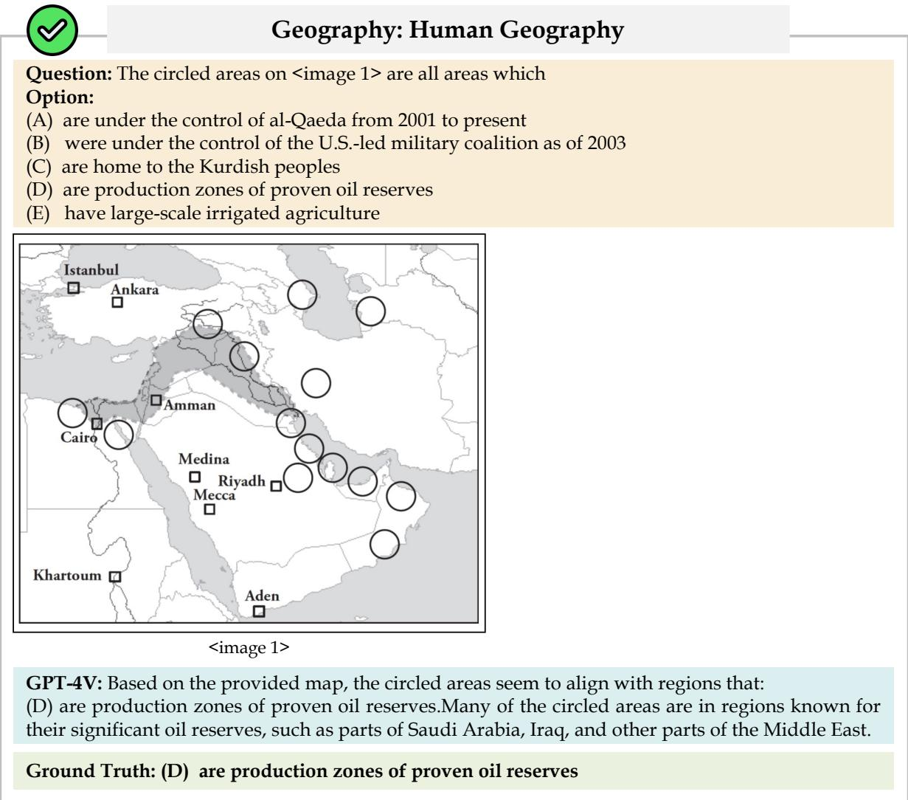

> **AI Description:**
> **Source:** `assets/_page_53_Figure_0.jpg`
> 
> **Generated:** 2026-05-16 13:00:09
> 
> ---
> 
> The image contains a map of the Middle East with various cities labeled, such as Istanbul, Ankara, Amman, Medina, Riyadh, Mecca, Khartoum, and Aden. The map is accompanied by a question and options related to the circled areas on the map. The circled areas align with regions that are known for their significant oil reserves, such as parts of Saudi Arabia, Iraq, and other parts of the Middle East. The map serves as a visual aid to support the question and options provided.


<span id="page-54-0"></span>
Figure 41. A sample error case of Geography (subfield: Physical Geography). Error category: Reasoning Error Back to List of Figures | Back to Table Index
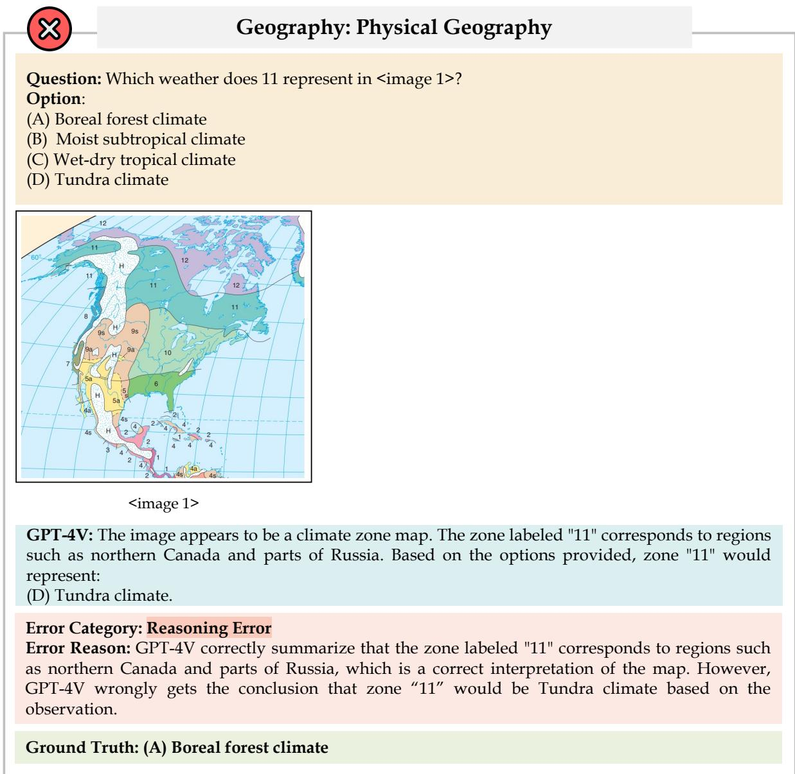

> **AI Description:**
> **Source:** `assets/_page_54_Figure_0.jpg`
> 
> **Generated:** 2026-05-16 12:59:25
> 
> ---
> 
> The image contains a map with various regions labeled with numbers and letters. The map appears to be a climate zone map, with different colors representing different climate zones. The zone labeled "11" is located in northern Canada and parts of Russia. The map includes a legend with climate zone numbers and their corresponding climate types. The question asks which weather the zone "11" represents, with options including Boreal forest climate, Moist subtropical climate, Wet-dry tropical climate, and Tundra climate. The ground truth provided is (A) Boreal forest climate.


<span id="page-55-0"></span>
Figure 42. A sample error case of Geography (subfield: Physical Geography). Error category: Perceptual Error, Reasoning Error Back to List of Figures | Back to Table Index
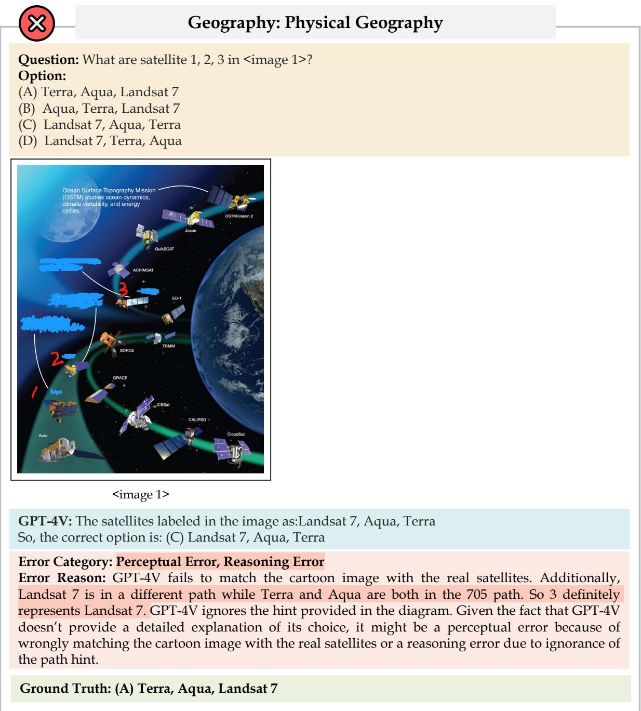

> **AI Description:**
> **Source:** `assets/_page_55_Figure_0.jpg`
> 
> **Generated:** 2026-05-16 12:53:29
> 
> ---
> 
> The image contains a diagram of satellites orbiting Earth. The diagram includes labels for various satellites, such as Terra, Aqua, Landsat 7, and others. The satellites are depicted with their respective names and are shown in orbit around the Earth. The diagram also includes annotations about the missions of some satellites, such as the Ocean Surface Topography Mission (OSTM) studying ocean dynamics, climate variability, and energy cycles. The image is accompanied by text providing a question and options for identifying the satellites labeled as 1, 2, and 3.


<span id="page-56-0"></span>


<span id="page-57-0"></span>
Figure 44. A sample error case of Math (subfield: Graph Theory). Error category: Perceptual Error Back to List of Figures | Back to Table Index
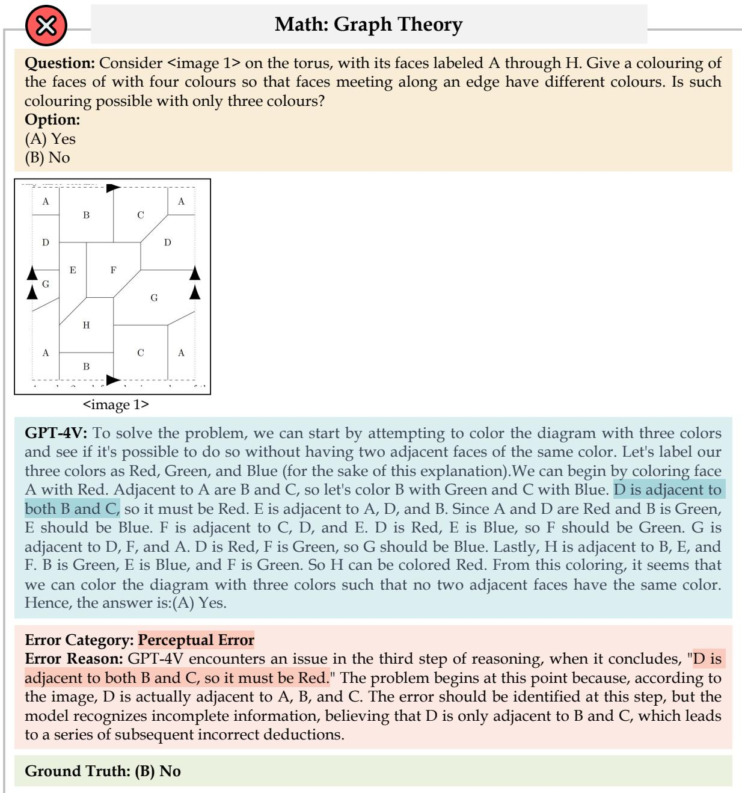

> **AI Description:**
> **Source:** `assets/_page_57_Figure_0.jpg`
> 
> **Generated:** 2026-05-16 13:27:42
> 
> ---
> 
> The image contains a combination of text and a diagram. The text provides a question and an explanation related to graph theory and coloring a diagram on a torus. The diagram illustrates a torus with faces labeled A through H, showing how the faces are connected. The text explains a coloring attempt with three colors (Red, Green, and Blue) to ensure no two adjacent faces have the same color. The explanation includes a step-by-step reasoning process and concludes with the answer (A) Yes.


<span id="page-58-0"></span>
Question: In circle O shown in the diagram below, chords A and $\overline { { C D } }$ are parallel <image 1> If   
m ⌢ AB = 104 and m ⌢ CD 168, what is m m⌢BD ?   
Option:   
(A) 38   
(B) 44   
(C) 88   
(D) 96

<image 1>
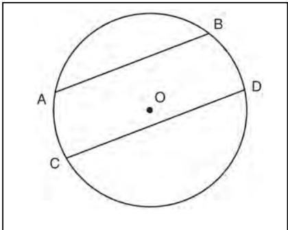

> **AI Description:**
> **Source:** `assets/_page_58_Figure_0.jpg`
> 
> **Generated:** 2026-05-16 13:13:48
> 
> ---
> 
> The image is a diagram of a circle with a line segment passing through it. The circle is centered at point O. The line segment intersects the circle at points A, B, C, and D, forming a chord. The diagram is labeled with points A, B, C, D, and O.


GPT-4V: Using the properties of inscribed angles and their intercepted arcs, we can deduce: The measure of an inscribed angle is half the measure of its intercepted arc.When two chords are parallel, the inscribed angles that intercept the same arc are congruent.From the given information:m∠ $\mathrm { . A O B } = 1 _ { / 2 } \mathrm { m } { \stackrel { - } { \longrightarrow } } \mathrm { A B } = 1 / _ { 2 } ( 1 0 4 ) = { \bar { 5 2 } } ^ { \circ } , \mathrm { m } \angle \mathrm { C O D } = 1 _ { / 2 } \mathrm { m } { \longrightarrow } \mathrm { C D } = 1 _ { / 2 } { \bar { ( } } 1 6 8 ) = 8 4 ^ { \circ }$ . Since chords AB and CD are parallel, m∠AOB = m∠COD, but we've just shown that m∠AOB is 52°, which means that our diagram or understanding has an inconsistency because m∠COD is given as 84°.However, assuming the information provided is correct and using the fact that the sum of measures of arcs intercepted by two inscribed angles that sum up to $1 8 0 ^ { \circ }$ will be 360°, we get: m⌢AB + m⌢BD = $3 6 0 ^ { \circ } 1 0 \dot { 4 } + \mathrm { { m \dot { - } B D } = 3 6 0 ^ { \circ } \mathrm { { m \dot { - } B D } = 2 5 6 ^ { \circ } } }$ The measure of inscribed angle BOD that intercepts arc BD is: $\mathrm { \Delta m \angle B O D = 1 / 2 \ m \mathrm { \mathrm { - } B D = 1 / 2 ( 2 5 6 ) = 1 2 8 ^ { \circ } B u t , \ m \angle B O D = 1 8 0 ^ { \circ } - m \angle C O D = 1 8 0 ^ { \circ } - 8 4 ^ { \circ } = 9 6 ^ { \circ } , } }$ , which contradicts our previous calculation.Assuming the latter to be correct (as it's based directly on the given information), $\mathrm { m { \mathrm { - } B D } = 2 \ ^ { \ast } \ m \angle B O D = 2 ( 9 6 ^ { \circ } ) = 1 9 2 ^ { \circ } . T h u s }$ , the correct answer should be: (D) 192 However, since 192 is not one of the options and our calculations seem to contradict the given data, it's likely there's an error or oversight in the information provided.

## Error Category: Textual Understanding Error

Error Reason: GPT-4V does not correctly understand the symbols and terminology in mathematics or geometry. In this question, it incorrectly interprets m ⌢ AB = 104 as the measure of an inscribed angle, when the correct interpretation should be the measure of an arc or a central angle. Therefore, the angle represented in the question, ∠AOB, is 104 degrees, and ∠COD is 168 degrees. Since the concept is confused right from the start, GPT4-V does not derive the correct answer in the subsequent calculations. The key to the question is to determine the angle of BOD, which is equal to the angle AOC by using the condition of parallel lines. Then, by subtracting the two given angles from 360 degrees and dividing by two, we can obtain the correct answer.

Ground Truth: (B) 44

Figure 45. A sample error case of Math (subfield: Geometry). Error category: Textual Understanding Error Back to List of Figures | Back to Table Index

<span id="page-59-0"></span>
Figure 46. A sample error case of Math (subfield: Calculus). Error category: Reasoning Error Back to List of Figures | Back to Table Index
```
× Math: Calculus   
Question: A thin-walled cone-shaped cup (Fig. 16-4) is to hold 36 ? $i n ^ { 3 }$ of water when full. What   
dimensions will minimize the amount of material needed for the cup?   
Option:   
(A) $r = 3 { \sqrt { 2 } } , h = 6$   
$r = 3 { \sqrt { 3 } } , h = 4$   
$r = 3 { \sqrt { 2 } } , h = 4$   
$r = 2 { \sqrt { 6 } } , h = 6$   
r   
Fig. 16-4   
<image 1>   
GPT-4V: Given that the volume V of the cone-shaped cup is 36 ? $: i n ^ { 3 }$ when it's full, the formula for   
the volume of a cone is:   
$A = { \frac { 1 } { 2 } } \pi r ^ { 2 } h$ . From the given volume, we can set up the equation: ${ \scriptstyle { \frac { 1 } { 3 } } } \pi r ^ { 2 } h = 3 6 \pi$ . From which, $r ^ { 2 } h = $   
!108. (1) $\begin{array} { r } { h = { \frac { 1 0 8 } { r ^ { 2 } } } . } \end{array}$ Next, the surface area S of the cone (which does not include the base since it's a   
cup) is given by: S = ???. Where l is the slant height of the cone.   
Using the Pythagoras theorem for the right triangle formed by the radius, height, and slant height   
in the cone, we get: $l ^ { 2 } = r ^ { 2 } + \ h ^ { 2 }$ . From which, $l \stackrel { \textstyle = } { } \sqrt { r ^ { 2 } + h ^ { 2 } } .$ . Now, substituting the value of h from   
equation (1) into the equation for ?, we get: $l = \sqrt { r ^ { 2 } + 1 0 8 ^ { 2 } / r ^ { 4 } }$ . Substituting this l value in S, we get:   
$\mathrm { S } = \pi r \sqrt { r ^ { 2 } + 1 0 8 ^ { 2 } / r ^ { 4 } }$ . To minimize the surface area, we differentiate S with respect to r and set it   
equal to zero.   
The differentiation and solving for r would be complex. Instead, we can substitute the given r and h   
values from options (A) to (D) into the volume equation to see which one satisfies $V = 3 6 \pi$ . The   
option that satisfies this and also minimizes S would be our answer.   
(A) For $r = 3 \sqrt { 2 }$ and $h = 6 \colon V = { \textstyle { \frac { 1 } { 3 } } } \pi { \big ( } 3 { \sqrt { 2 } } { \big ) } ^ { 2 } ( 6 ) = 3 6 \pi$   
(B) For $r = 3 \sqrt { 3 }$ and $h = 4 ; V = { \textstyle { \frac { 1 } { 3 } } } \pi { \bigl ( } 3 { \sqrt { 3 } } { \bigr ) } ^ { 2 } ( 4 ) \not = 3 6 \pi$   
(C) For $r = 3 \sqrt { 2 }$ and $h = 4 \colon V = { \frac { 1 } { 3 } } \pi { \bigl ( } 3 { \sqrt { 2 } } { \bigr ) } ^ { 2 } ( 4 ) \not = 3 6 \pi$   
(D) For $r = 2 \sqrt { 3 }$ and $h = 6 \colon V = { \textstyle { \frac { 1 } { 3 } } } \pi { \big ( } 2 { \sqrt { 3 } } { \big ) } ^ { 2 } ( 6 ) = 3 6 \pi$   
From options (A) and (D) which satisfy the volume, the surface area for each needs to be calculated:   
(A) $S = \pi ( 3 { \sqrt { 2 } } ) \sqrt { ( 3 { \sqrt { 2 } } ) ^ { 2 } + 6 ^ { 2 } . \left( \mathrm { D } \right) S } = \pi { \left( 2 { \sqrt { 3 } } \right) } \sqrt { \left( 2 { \sqrt { 3 } } \right) ^ { 2 } + 6 ^ { 2 } } .$   
Comparing the two surface areas, we can determine which one is minimal.   
However, without doing the calculations, it's hard to definitively say which one is the minimal   
surface area. For practical purposes, the answer could be either (A) or (D) based on the volume, and   
one would need to compute the surface areas to confirm.   
Error Category: Reasoning Error   
Error Reason: The volume formula seems to be correct. The errors are made during the symbol   
computation.   
Ground Truth: (A) ? = ? ? , ? = ?
```

<span id="page-60-0"></span>
Figure 47. A sample correct case of Physics (subfield: Classical Mechanics). Back to List of Figures | Back to Table Index

<span id="page-61-0"></span>
Figure 48. A sample error case of Physics (subfield: Optics). Error category: Perceptual Error Back to List of Figures | Back to Table Index


<span id="page-62-0"></span>
Figure 49. A sample correct case of Basic Medical Science (subfield: Pathophysiology). Back to List of Figures | Back to Table Index
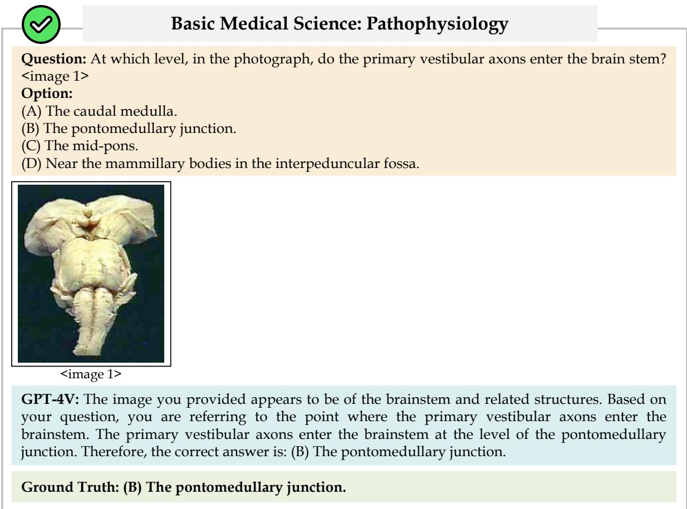

> **AI Description:**
> **Source:** `assets/_page_62_Figure_0.jpg`
> 
> **Generated:** 2026-05-16 13:05:26
> 
> ---
> 
> The image contains a photograph of a brainstem and related structures. The photograph is labeled as "image 1" and is used to illustrate the question about the level at which the primary vestibular axons enter the brainstem. The image provides a visual reference for the question, helping to identify the pontomedullary junction as the correct location. The photograph is a close-up view of the brainstem, showing the caudal medulla and the pontomedullary junction.


<span id="page-63-0"></span>
Figure 50. A sample error case of Basic Medical Science (subfield: Cardiovascular Physiology). Error category: Perceptual Error Back to List of Figures | Back to Table Index
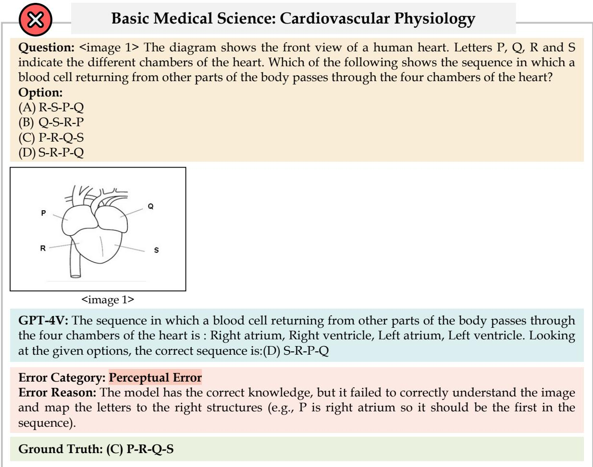

> **AI Description:**
> **Source:** `assets/_page_63_Figure_0.jpg`
> 
> **Generated:** 2026-05-16 12:54:58
> 
> ---
> 
> The image contains a question and answer related to cardiovascular physiology. It features a diagram of a human heart with labeled chambers (P, Q, R, and S). The question asks about the sequence of blood flow through the heart chambers. The diagram is accompanied by text explaining the sequence of blood flow and identifying the correct answer as (C) P-R-Q-S. The image also includes a section explaining the error category and reason for a model's incorrect answer.


<span id="page-64-0"></span>
Figure 51. A sample correct case of Clinical Medicine (subfield: Pathology). Back to List of Figures | Back to Table Index
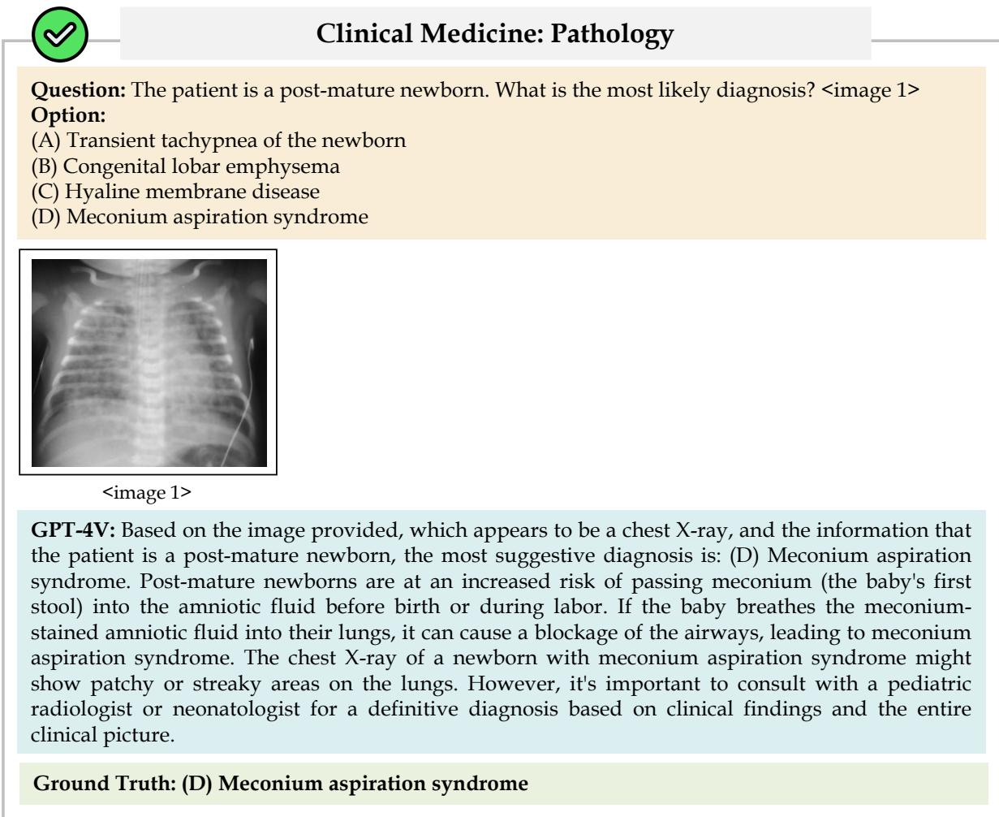

> **AI Description:**
> **Source:** `assets/_page_64_Figure_0.jpg`
> 
> **Generated:** 2026-05-16 12:56:50
> 
> ---
> 
> The image contains a chest X-ray of a post-mature newborn. The X-ray shows a pattern consistent with meconium aspiration syndrome, characterized by patchy or streaky areas in the lungs. The image also includes a question and options for diagnosis, with the ground truth indicating that the most likely diagnosis is meconium aspiration syndrome. The image is accompanied by a description explaining the diagnosis based on the patient's condition and the chest X-ray findings.


<span id="page-65-0"></span>
Figure 52. A sample correct case of Clinical Medicine (subfield: Pathology). Back to List of Figures | Back to Table Index
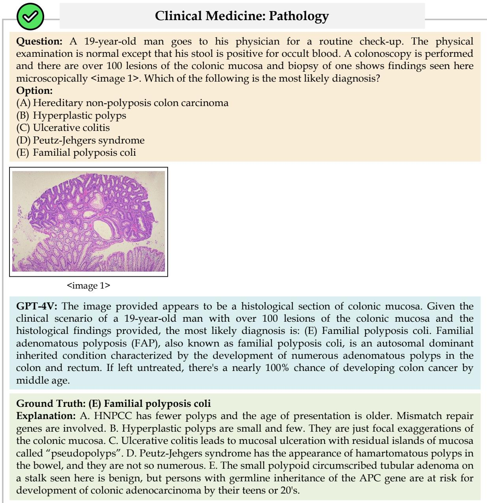

> **AI Description:**
> **Source:** `assets/_page_65_Figure_0.jpg`
> 
> **Generated:** 2026-05-16 13:04:54
> 
> ---
> 
> The image contains a histological section of colonic mucosa. It shows a cross-section of the colon with numerous small, circumscribed tubular adenomas on a stalk. The tissue is stained with hematoxylin and eosin, highlighting the architectural features of the polyps. The image is labeled as "image 1" and is used to illustrate the microscopic findings in the context of the clinical scenario described in the question.


<span id="page-66-0"></span>
Figure 53. A sample correct case of Clinical Medicine (subfield: Pathology). Back to List of Figures | Back to Table Index
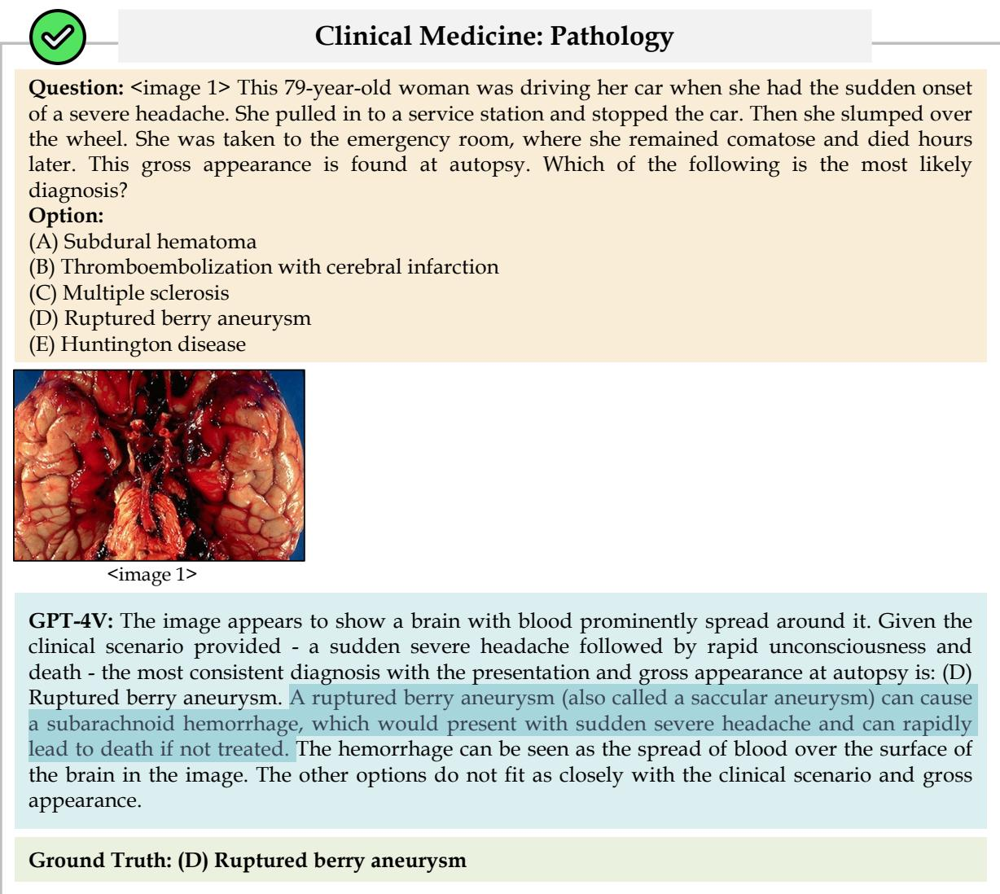

> **AI Description:**
> **Source:** `assets/_page_66_Figure_0.jpg`
> 
> **Generated:** 2026-05-16 13:28:51
> 
> ---
> 
> The image contains a photograph of a brain with blood visibly spread around it. The photograph is labeled as "image 1" and is accompanied by a clinical scenario and question about a 79-year-old woman who had a sudden onset of severe headache, followed by unconsciousness and death. The image is used to illustrate the gross appearance found at autopsy, which is consistent with the diagnosis of a ruptured berry aneurysm.


<span id="page-67-0"></span>
Figure 54. A sample error case of Clinical Medicine (subfield: Pathology). Error category: Perceptual Error Back to List of Figures | Back to Table Index
<table><tr><td colspan="2">Question: A 41-year-old woman has noted a vaginal discharge persisting for 3 weeks. On pelvic examination her ectocervix is erythematous. Cervical biopsies are taken and on microscopic examination reveal the appearance seen here &lt;image 1&gt;. Which of the following is the most likely diagnosis? Option: (A) Human papillomavirus infection (B) Ingestion of chili peppers (C) Diabetes mellitus</td></tr><tr><td>(D) Tuberculosis (E) Chronic inflammation </td><td></td></tr><tr><td>&lt;image 1&gt;</td><td></td></tr><tr><td>GPT-4V: The image provided appears to be a microscopic view of cervical tissue with a characteristic appearance. The histopathological features seen here are suggestive of koilocytes, which are squamous epithelial cels with a perinuclear clearing (halo) and irregular, raisin-like nuclei. Koilocytes are a hallmark of human papillomavirus (HPV) infection. Based on the provided</td><td>image and clinical information, the most likely diagnosis is: (A) Human papillomavirus infection.</td></tr><tr><td>Error Category: Perceptual Error Error Reason: GPT-4V incorrectly interprets the details of the image. The image contains “the inflammatory cell population of mononuclear cells, mainly small round lymphocytes&quot; a &quot;squamous metaplasia&quot;, while GPT-4V identifies them as &quot;koilocytes&quot;.</td><td> and</td></tr><tr><td>Ground Truth: (E) Chronic inflammation Explanation: A. HPV produces viral cytopathic effect such as koilocytotic change and atypical changes in the squamous epithelial cells. It can drive the process to dysplasia and to carcinoma. HPV by itself does not produce significant inflammation. B. The capsaicin in chili tends to iritate nerve endings to produce the hot burning sensation, as a local effect in oral cavity. It is not systemic. Capsaicin has been used to treat dyspareunia with vulvar vestibulitis, probably by afecting nerve- ending mediated sensation, and there is no significant degree of inflammation. C. Diabetes mellitus may increase the risk for infections, but by itself does not explain the inflammation seen here. D. Tuberculosis of the genital tract is rare; mycobacterial infections tend to produce granulomatous inflammation. E. This is a chronic inflammatory process， based upon the inflammatory cell population of mononuclear cells, mainly smal round lymphocytes. There is also some hemorrhage.</td><td></td></tr></table>

<span id="page-68-0"></span>


Figure 55. A sample error case of Clinical Medicine (subfield: Heart Disease). Error category: Lack of Knowledge Back to List of Figures | Back to Table Index

<span id="page-69-0"></span>
Figure 56. A sample correct case of Diagnostics and Laboratory Medicine (subfield: Radiology). Back to List of Figures | Back to Table Index
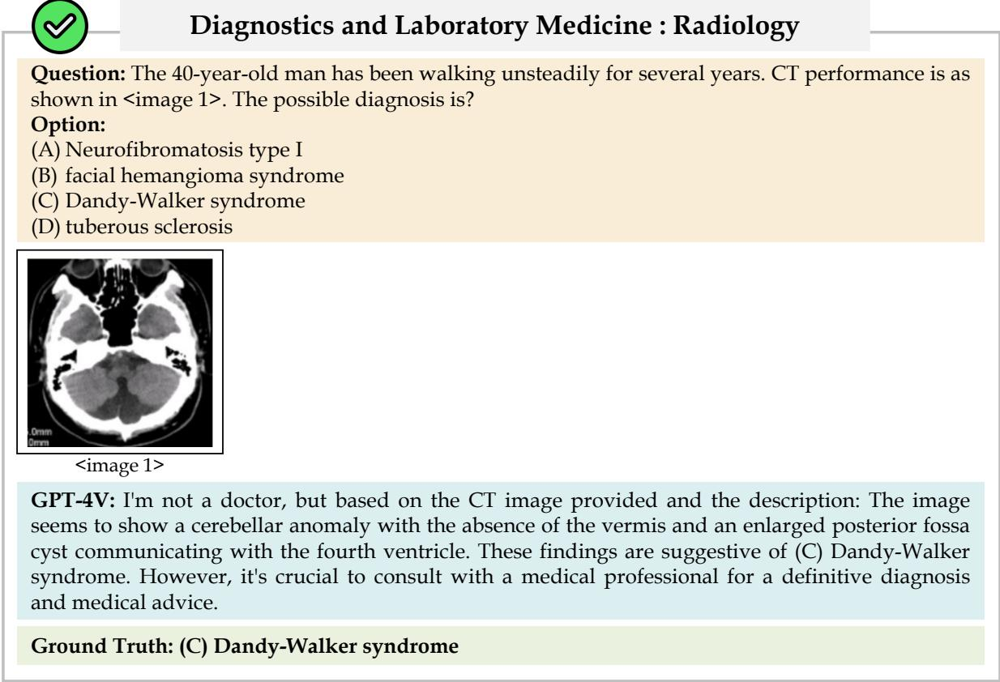

> **AI Description:**
> **Source:** `assets/_page_69_Figure_0.jpg`
> 
> **Generated:** 2026-05-16 13:13:42
> 
> ---
> 
> The image contains a CT scan of the brain, showing a cross-sectional view. The scan highlights a cerebellar anomaly with the absence of the vermis and an enlarged posterior fossa cyst communicating with the fourth ventricle. These findings are indicative of Dandy-Walker syndrome. The image is accompanied by a question and options for diagnosis, with the ground truth indicating Dandy-Walker syndrome as the correct answer.


<span id="page-70-0"></span>
Figure 57. A sample error case of Diagnostics and Laboratory Medicine (subfield: Neuropathology). Error category: Perceptual Error Back to List of Figures | Back to Table Index
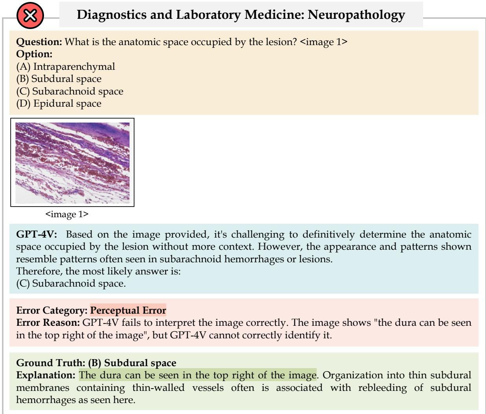

> **AI Description:**
> **Source:** `assets/_page_70_Figure_0.jpg`
> 
> **Generated:** 2026-05-16 13:02:57
> 
> ---
> 
> The image contains a microscopic view of a tissue sample with a red and blue staining pattern. The image is labeled as "image 1" and is part of a question about the anatomic space occupied by a lesion. The question and options are presented in text format. The image itself does not contain any additional visual elements beyond the microscopic view and the text.


<span id="page-71-0"></span>
Figure 58. A sample error case of Diagnostics and Laboratory Medicine (subfield: Ophthalmic Pathology). Error category: Reject to Answer Back to List of Figures | Back to Table Index
<table><tr><td>× Diagnostics and Laboratory Medicine: Ophthalmic Pathology</td></tr><tr><td>Question: This intraocular tumor is from a 55-year-old man. Which of the folowing statements BEST describes the lesion. &lt;image 1&gt; Option: (A) This tumor is a classic epithelioid choroidal melanoma with necrosis (B)This may represent a retinoblastoma because of the classic pattern of necrosis and small round blue cells with rare pseudorosettes. (C) This tumor may represent the most common type of intraocular neoplasm, and requires further work-up to distinguish it from melanoma.</td></tr><tr><td> are free of tumor.</td></tr><tr><td>&lt;image 1&gt; GPT-4V: Based on the image provided and without the ability to perform further clinical or pathological tests,it&#x27;s challenging to provide a definitive diagnosis.However,Ican offer an analysis based on the image and the choices provided: (A) Choroidal melanoma is a malignant tumor that arises from the pigmented cells of the choroid, which is a part of the uveal tract of the eye. Epithelioid melanoma cells are large with abundant cytoplasm and prominent nucleoli. Necrosis may be present, and if the image shows large epithelioid cells with these features, then this choice could be considered. (B) Retinoblastoma is a malignant tumor of the retina that predominantly affects children. It is characterized by small round blue cells，which can form pseudorosettes (rosettes that don&#x27;t surround a lumen). If the image displays these features, then this could be a possibility. (C) Choroidal melanoma is the most common primary intraocular malignancy in adults. If the</td></tr><tr><td>image shows features of melanoma but lacks the classic appearance of epithelioid melanoma or retinoblastoma, then further work-up would be necessary. (D) Making a prognosis solely based on an image can be challenging. Even if the tumor appears to be completely excised with clear margins in the image,other factors, such as tumor size, type, location, and potential metastasis,would play a role in determining the prognosis. Based on the image and the details provided, I cannot make a definitive choice.However， it&#x27;s crucial to collaborate with a pathologist or an ocular oncologist for a comprehensive evaluation and diagnosis.</td></tr><tr><td>Error Category: Reject to Answer Eror Reason: GPT-4V refuses to answer this question without further clinical or pathological tests. Ground Truth: (C) This tumor may represent the most common type of intraocular neoplasm, and requires further work-up to distinguish it from melanoma.</td></tr></table>

<span id="page-72-0"></span>
Figure 59. A sample error case of Diagnostics and Laboratory Medicine (subfield: Electrocardiography). Error category: Perceptual Error, Lack of Knowledge Back to List of Figures | Back to Table Index
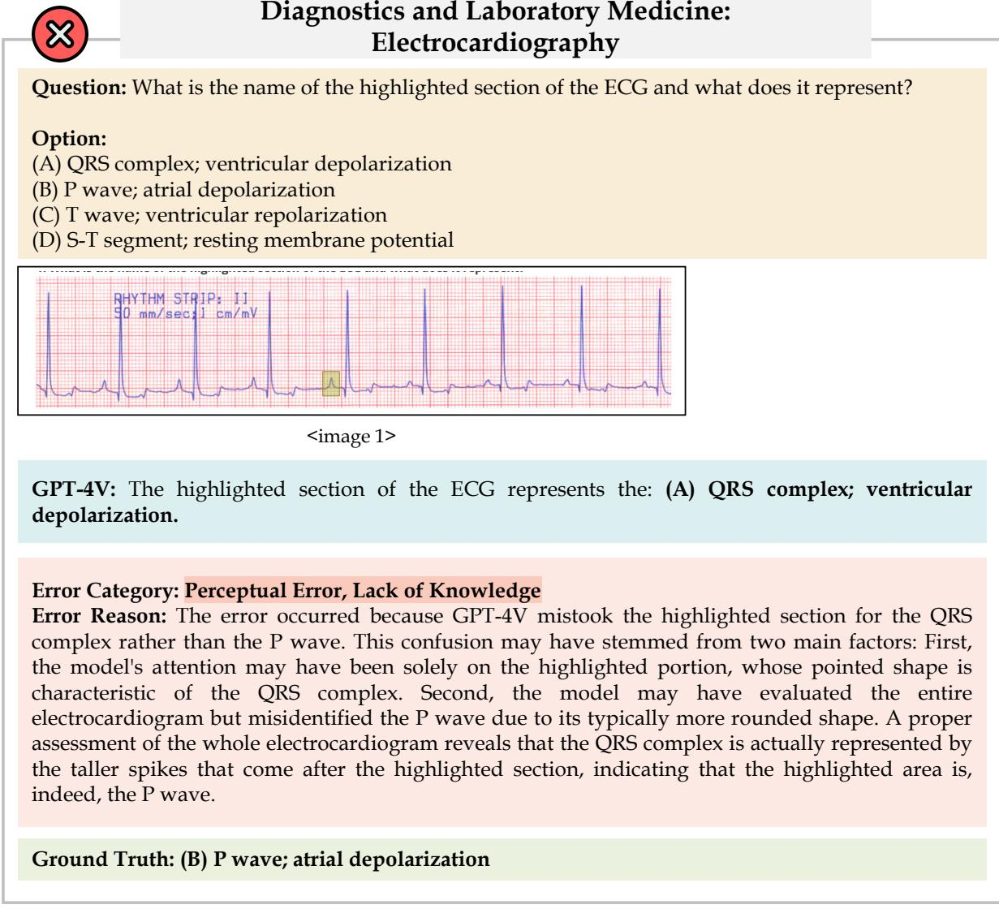

> **AI Description:**
> **Source:** `assets/_page_72_Figure_0.jpg`
> 
> **Generated:** 2026-05-16 13:21:13
> 
> ---
> 
> The image contains a section of an electrocardiogram (ECG) with a highlighted area. The ECG shows the electrical activity of the heart over time, with distinct waves and segments. The highlighted section appears to be a small, rounded wave, which is characteristic of the P wave. The text provides a question about the highlighted section and offers four options for identification. The ground truth is provided as option (B), which states that the highlighted section represents the P wave, indicating atrial depolarization. The image also includes a description of the error category and reason for the model's misidentification of the highlighted section as the QRS complex instead of the P wave.


<span id="page-73-0"></span>

### Full Page Description (Page 73)

**Source:** `assets/_page_73_Asset_0.jpg`

**Generated:** 2026-05-16 13:12:22

---

The image is a line graph with three distinct lines representing different data points over time. The x-axis is labeled "Cultivation time (hr)" and ranges from 0 to 400 hours. The y-axis is not labeled, but the graph includes two labeled lines: "Lipids" (dashed red line) and "O₂ consumption" (dotted black line). There is also a third line, "Maltose," which is not labeled but appears to be represented by a solid red line. The graph shows a decline in lipids and maltose over time, while oxygen consumption increases. The graph highlights the relationship between these three variables during the cultivation process.


### Full Page Description (Page 73)

**Source:** `assets/_page_73_Asset_1.jpg`

**Generated:** 2026-05-16 13:12:14

---

The image contains a line graph with three distinct lines representing different data points over time. The x-axis is labeled "Cultivation time (hr)" and ranges from 0 to 400 hours. The y-axis is not labeled but appears to represent the quantity of the substances being measured. The graph shows three lines: one for "Glucose," another for "Log number of cells," and a third for "Efrotomycin production." The glucose line starts high and decreases over time, the log number of cells line increases logarithmically, and the efrotomycin production line starts low, increases sharply, and then decreases. The graph illustrates the relationship between glucose consumption, cell growth, and efrotomycin production during the cultivation process.

$$
\mathrm { ( N H _ { 4 } ) _ { 2 } S O _ { 4 } } ,
$$

$$
^ { 4 0 , 0 0 0 }
$$

$$
{ \mathrm { K H } } _ { 2 } { \mathrm { P O } } _ { 4 } ,
$$

$$
{ \mathrm { N a } } _ { 2 } { \mathrm { H P O } } _ { 4 } .
$$

<span id="page-74-0"></span>
Figure 61. A sample error case of Pharmacy (subfield: Pharmacology and Drug Synthesis). Error category: Lack of Knowledge Back to List of Figures | Back to Table Index
<table><tr><td colspan="2">× Pharmacy: Pharmacology and Drug Synthesis</td></tr><tr><td colspan="2">Question: The following synthetic scheme &lt;image 1&gt; has been used to synthesize raltegravir. If you wanted to create a number of analogues, which substituent &lt;image 2&gt; could be varied most efficiently using this synthesis? Option: (A) The type of substituent A on the aromatic ring (B) The type of alkyl substituent B present (C) The type of heterocyclic ring C present (D) The length of the chain D between the amide and the aromatic ring</td></tr><tr><td></td><td></td></tr><tr><td colspan="2">&lt;image 1&gt; &lt;image 2&gt; GPT-4V: Given the synthetic scheme provided, let&#x27;s analyze each option: (A) The type of substituent A on the aromatic ring: In the second image, substituent A is located on</td></tr><tr><td colspan="2">the aromatic ring. Since this is present at the end of the molecule, it might be relatively easy to vary it, as it doesn&#x27;t interfere with the rest of the synthesis. (B) The type of alkyl substituent B present: Substituent B is an alkyl group attached to the heterocyclic ring. Altering this substituent would require modifying the building block that is used to make this part of the molecule, which might be a bit more challenging. (C) The type of heterocyclic ring C present: The heterocyclic ring Cappears to be a critical part of the structure and seems to be central to the synthesis. Modifying this ring would likely require significant changes to the entire synthesis. (D) The length of the chain D between the amide and the aromatic ring: Changing the length of chain D would require altering the length of the carbon chain in the precursor molecule. This change could be achieved by selecting different precursors with varied chain lengths. Thus, (A) The type of substituent A on the aromatic ring seems to be the most efficiently varied using this synthesis. The aromatic ring can be easily subjected to a variety of substitution reactions to achieve analogues with diferent substituents without disturbing the rest of the molecule.</td></tr><tr><td colspan="2">Error Category: Lack of Knowledge Error Reason: GPT-4V successfully understands the images and text. However, due to the lack of specific knowledge about &quot;The synthesis is most efficient for creating analogues with a variety of heterocyclic rings&quot;, GPT-4V assumes &quot;substituent A is located on the aromatic ring, which is at the end of the molecule, and it might be relatively easy to vary it, as it doesn&#x27;t interfere with the rest of the synthesis&quot; and subsequently makes an incorrect prediction.</td></tr><tr><td colspan="2">Ground Truth: (C) The type of heterocyclic ring C present Explanation: It is possble to use this synthesis to create analogues where all the positions indicated are modified as described. However, the synthesis is most efficient for creating analogues with a variety of heterocyclic rings. That is because the reaction sequence could be carried out on large scale to produce a supply of the penultimate structure. Analogues could then be created in one step by reacting this structure with different heterocyclic acid chlorides. If the synthetic scheme was used to create analogues at the other positions indicated, then more reactions will be needed. For example, varying the type of alkyl substituent present at position B would involve carrying out the complete synthesis for each analogue.</td></tr></table>

<span id="page-75-0"></span>
Figure 62. A sample error case of Pharmacy (subfield: Pharmacology and Drug Synthesis). Error category: Lack of Knowledge Back to List of Figures | Back to Table Index

<span id="page-76-0"></span>
## Public Health: Epidemiology

Question: An outbreak of gastrointestinal disease occurred 24-36 hours after people had attended a wedding. Of the 203 attendees (including the bride and groom), 200 completed questionnaires, and 50 reported illness compatible with the case definition. Tabulated food consumption histories are presented in the table below. The most appropriate measure of association for these data is the: Option:

(A) Attributable risk percent

(B) Chi-square

(C) Odds ratio

(D) Risk ratio


<image 1>

GPT-4V: Based on the information provided, you're trying to determine the relationship between the consumption of a particular food item and the risk of developing gastrointestinal disease among wedding attendees. In this type of scenario, where you are comparing the risk of disease between those exposed (ate the food) and those not exposed (did not eat the food), the appropriate measure of association is the:(D) Risk ratio (also known as relative risk).The risk ratio compares the risk of disease in the exposed group to the risk of disease in the unexposed group.

Ground Truth: (B) Chi-square

<span id="page-77-0"></span>
Figure 64. A sample error case of Public Health (subfield: Epidemiology). Error category: Textual Understanding Error Back to List of Figures | Back to Table Index


<span id="page-78-0"></span>
Figure 65. A sample error case of Public Health (subfield: Epidemiology). Error category: Lack of Knowledge Back to List of Figures | Back to Table Index


<span id="page-80-0"></span>
## History: World History

Question: A historian researching the economic history of Eurasia in the period circa 600-1450 c.e. would most likely find the two tables (<image 1> and <image 2>) useful as a source of information about which of the following?

Option:

(A) The diffusion of cultural traditions along Eurasian trade routes

(B) The spread of technological innovations across regions in Eurasia

(C) The geographic extent of the monetization of Eurasian economies

(D) The extent to which government economic policies in Eurasia in the period 600-1450 represented a continuity of earlier policies

<image 1>

<image 2>
GPT-4V: The tables provide information on the origin of coins found in buried caches in different regions and their approximate dates. This kind of information indicates where coins from different regions and time periods ended up, which suggests patterns of trade or movement of goods, services, and people. Given the options:(A) The diffusion of cultural traditions along Eurasian trade routes: While the movement of coins can suggest trade routes and interactions between different regions, it does not directly provide information about the diffusion of cultural traditions. (B) The spread of technological innovations across regions in Eurasia: The tables do not specifically address technological innovations. (C) The geographic extent of the monetization of Eurasian economies: The presence of coins from various regions in different locations suggests areas where money was being used in trade and therefore indicates the extent of monetization. (D) The extent to which government economic policies in Eurasia in the period 600-1450 represented a continuity of earlier policies: The tables show where coins from different periods were found, but they do not specifically provide information on government policies or whether those policies represented continuity. Given the information in the tables, the best answer would be: (C) The geographic extent of the monetization of Eurasian economies.

Ground Truth: (C) The geographic extent of the monetization of Eurasian economies.

<span id="page-81-0"></span>
Figure 68. A sample error case of History (subfield: Modern History). Error category: Perceptual Error Back to List of Figures | Back to Table Index
<table><tr><td colspan="2">× History: Modern History Question: In the political cartoon, the United States is seen as fulfiling which of the following</td></tr><tr><td colspan="2">roles?&lt;image 1&gt; Option: (A) Oppressor (B) Imperialist (C) Savior (D) Isolationist</td></tr><tr><td></td><td></td></tr><tr><td colspan="2"></td></tr><tr><td colspan="2">GPT-4V: Based on the political cartoon, the United States is seen as fulfilling the role of: (B) Imperialist.</td></tr><tr><td colspan="2">Error Category: Perceptual Error Error Reason: GPT-4V wrongly interprets the image, because it doesn&#x27;t correctly interpret the contradiction between the comics on the top half and the bottom half. The perspective of the cartoonist is that the United States has been a savior to the nations brought under its control, saving them from poverty or oppression and bringing them trade， prosperity， and democratic governments. This mistake also indicates that GPT-4V holds some wrong political beliefs.</td></tr><tr><td colspan="2">Ground Truth: (C) Savior Explanation: The perspective of the cartoonist is that the United States has been a savior to the nations brought under its control, saving them from poverty or oppression and bringing them trade, prosperity, and democratic governments. Although one might be tempted to cast the United States in the role of imperialist (B),the purpose of the cartoon is to highlight the positive transformation of the people due to their &quot;rescue&quot; by the United States, rather than the benefits to the United States. Because the cartoon claims the people are better offor having been &quot;rescued&quot; by the United States, the United States is not seen as an oppressor (A). Since isolationists do not support foreign intervention, (D) cannot be the correct answer.</td></tr></table>

<span id="page-82-0"></span>
Figure 69. A sample error case of History (subfield: World History). Error category: Lack of Knowledge Back to List of Figures | Back to Table Index

<span id="page-83-0"></span>

Figure 70. A sample correct case of Literature (subfield: Contemporary Literature). Back to List of Figures | Back to Table Index

<span id="page-84-0"></span>
Figure 71. A sample error case of Literature (subfield: Comparative Literature). Error category: Perceptual Error
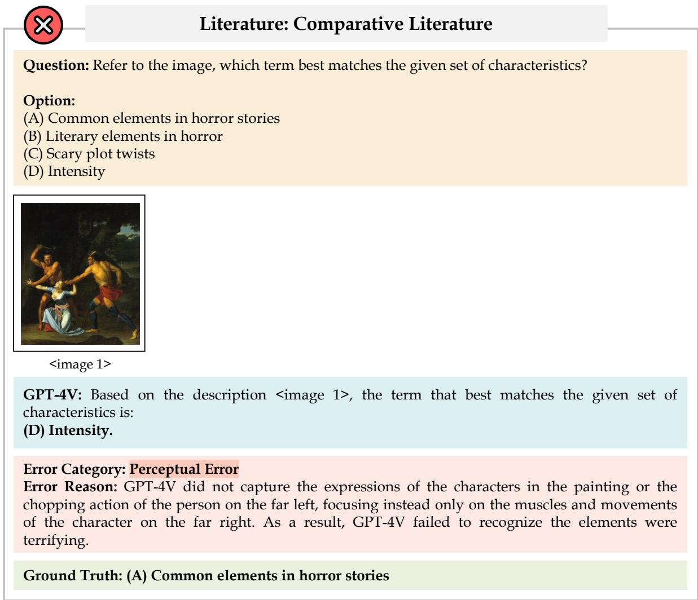

> **AI Description:**
> **Source:** `assets/_page_84_Figure_0.jpg`
> 
> **Generated:** 2026-05-16 13:12:05
> 
> ---
> 
> The image contains a painting depicting a dramatic scene with three figures in a forest setting. The central figure appears to be restrained or subdued, while the figure on the left is holding a weapon, and the figure on the right is in a dynamic pose, suggesting action or struggle. The painting is rich in detail, with dark, moody colors and intricate textures. The image is labeled as "image 1" and is used to illustrate a question about literary elements in horror stories.


<span id="page-85-0"></span>
Figure 72. A sample correct case of Sociology (subfield: Sociology Theory). Back to List of Figures | Back to Table Index

<span id="page-86-0"></span>
Figure 73. A sample error case of Sociology (subfield: Comparative Literature). Error category: Reasoning Error Back to List of Figures | Back to Table Index

<span id="page-87-0"></span>
## Psychology: Biological Psychology

Question: Described by the psychologist B. F. Skinner, operant conditioning posits that learning can be understood by the interaction between reinforcers and stimuli. Studies from both comparative and human psychology have supported Skinner's initial findings and expanded upon them. The following figure shows a hypothetical example of various operant conditioning trials. During these trials, when a rat pressed a bar (as indicated by the hash mark on the graph), the behavior was reinforced by the presentation of a food pellet. The reinforcement schedule differs in each cell of the figure. Time is displayed on the x-axis and cumulative responses (bar presses) is displayed on the y-axis. ([image 1]) Imagine that you are watching a rat complete one of the tasks in the figure above. The rat is pressing the bar at a very high rate and takes a short break from pressing the bar each time the food pellet is delivered. What type of reinforcement schedule are you MOST likely watching?

Option:

(A) variable-interval

(B) variable-ratio

(C) fixed-interval

(D) fixed-ratio

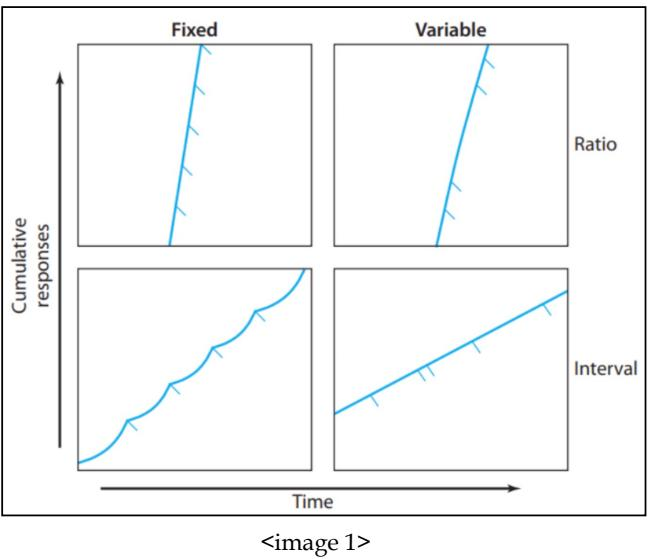

> **AI Description:**
> **Source:** `assets/_page_87_Figure_0.jpg`
> 
> **Generated:** 2026-05-16 13:18:51
> 
> ---
> 
> The image is a diagram with four quadrants, each representing a different type of cumulative response over time. The quadrants are labeled as "Fixed," "Variable Ratio," "Variable Interval," and "Fixed Ratio." Each quadrant contains a line graph showing the cumulative responses on the y-axis and time on the x-axis. The "Fixed" quadrant shows a straight line, indicating a constant rate of response. The "Variable Ratio" and "Variable Interval" quadrants show more complex patterns, with the "Variable Ratio" having a steeper slope than the "Variable Interval." The "Fixed Ratio" quadrant also shows a straight line, similar to the "Fixed" quadrant. The image is labeled as "Image 1" at the bottom.


GPT-4V: The graph corresponds to operant conditioning schedules. The pattern of high-rate bar pressing and short breaks after reinforcement suggests a Fixed Ratio schedule, shown in the top left quadrant. Here, reinforcement is given after a set number of responses, which is reflected in the steep inclines followed by drops on the graph. The rat's behavior—rapid pressing until receiving a pellet, then pausing—matches this schedule, indicating it understands that a specific number of presses leads to a reward, thus causing the observed high response rate followed by a break.

Ground Truth: (D) fixed-ratio

<span id="page-88-0"></span>
Figure 75. A sample error case of Psychology (subfield: Clinical Psychology). Error category: Perceptual Error Back to List of Figures | Back to Table Index
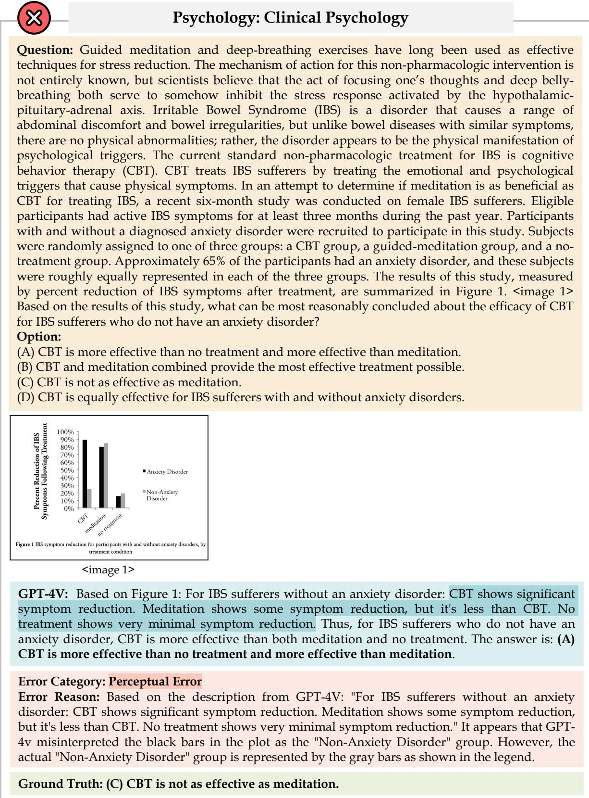

> **AI Description:**
> **Source:** `assets/_page_88_Figure_0.jpg`
> 
> **Generated:** 2026-05-16 13:02:15
> 
> ---
> 
> The image contains a text-based question and answer scenario related to clinical psychology, specifically focusing on the treatment of Irritable Bowel Syndrome (IBS) using cognitive behavior therapy (CBT) and guided meditation. The text describes a study comparing the effectiveness of CBT, meditation, and no treatment for IBS patients. A bar chart is included, showing the percentage reduction of IBS symptoms following treatment for participants with and without anxiety disorders. The chart uses black bars for the "Anxiety Disorder" group and gray bars for the "Non-Anxiety Disorder" group. The text explains that CBT is more effective than meditation and no treatment for IBS patients without anxiety disorders.


<span id="page-89-0"></span>
Agriculture : Plant Biodiversity and Biotechnology
Figure 76. A sample correct case of Agriculture (subfield: Plant Biodiversity and Biotechnology). Back to List of Figures | Back to Table Index
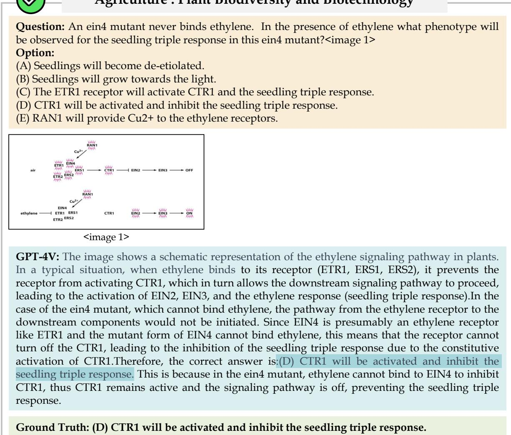

> **AI Description:**
> **Source:** `assets/_page_89_Figure_0.jpg`
> 
> **Generated:** 2026-05-16 12:58:35
> 
> ---
> 
> The image contains a schematic representation of the ethylene signaling pathway in plants. It includes a flowchart illustrating the interaction between ethylene and its receptors (ETR1, ERS1, ERS2), the role of CTR1 in the pathway, and the activation of EIN2 and EIN3 leading to the seedling triple response. The diagram highlights the role of the ein4 mutant in the pathway, showing that it cannot bind ethylene, leading to the constitutive activation of CTR1 and the inhibition of the seedling triple response.


<span id="page-90-0"></span>
Figure 77. A sample error case of Agriculture (subfield: Animal Anatomy). Error category: Perceptual Error Back to List of Figures | Back to Table Index
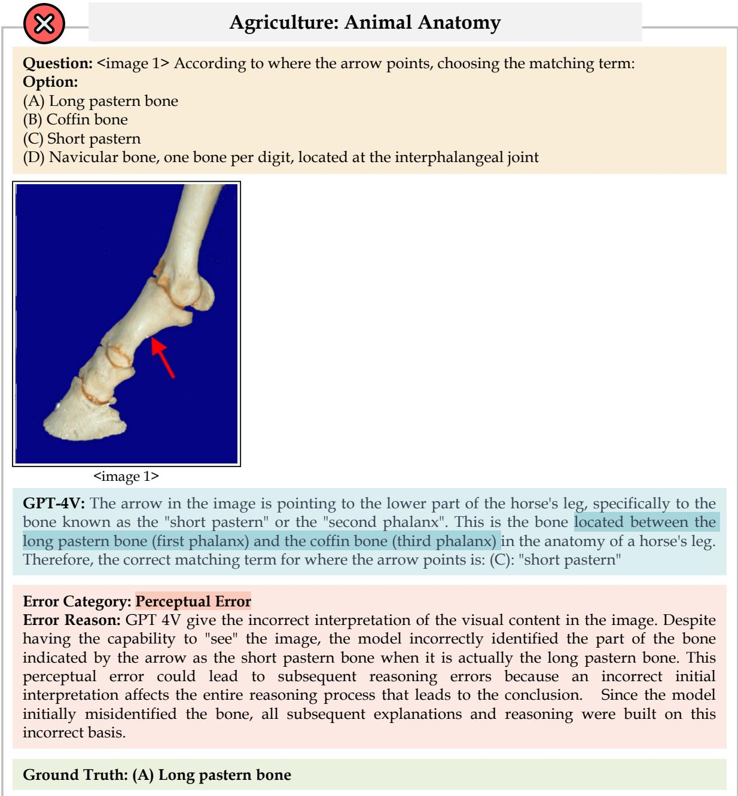

> **AI Description:**
> **Source:** `assets/_page_90_Figure_0.jpg`
> 
> **Generated:** 2026-05-16 13:08:54
> 
> ---
> 
> The image contains a photograph of a horse's leg bone with a red arrow pointing to a specific part of the bone. The image is accompanied by text describing the anatomy of the horse's leg and providing options for identifying the bone indicated by the arrow. The text includes a question asking to identify the bone based on the arrow's position and provides four possible answers. The image also includes a section explaining the error category and reason for the model's incorrect identification of the bone.


<span id="page-91-0"></span>
Figure 78. A sample error case of Agriculture (subfield: Plant Physiology). Error category: Perceptual Error. Back to List of Figures | Back to Table Index
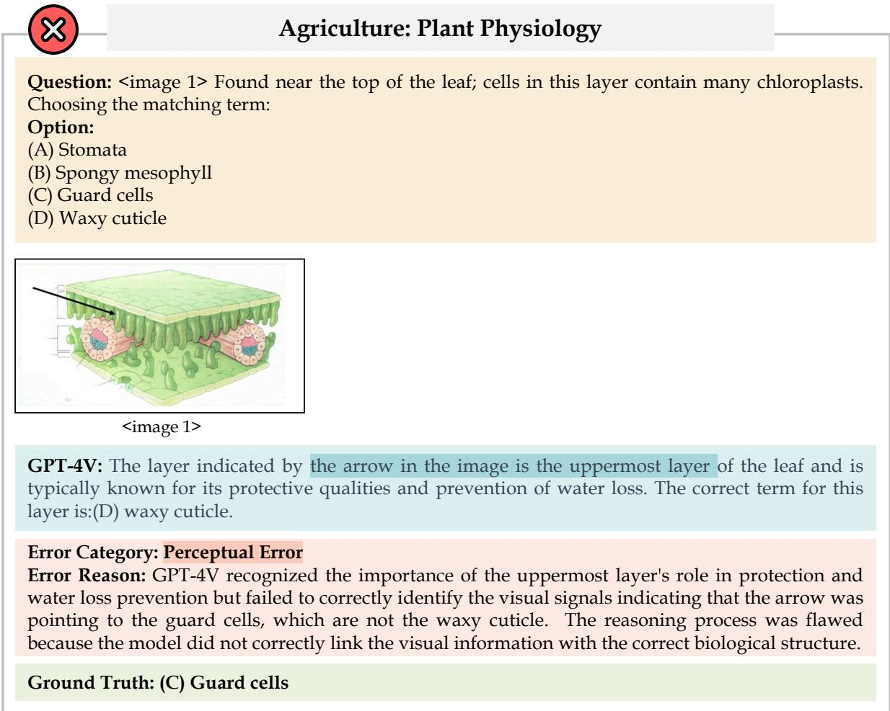

> **AI Description:**
> **Source:** `assets/_page_91_Figure_0.jpg`
> 
> **Generated:** 2026-05-16 13:13:10
> 
> ---
> 
> The image contains a diagram of a leaf cross-section. The diagram highlights a specific layer near the top of the leaf, which is labeled with an arrow. The text accompanying the image describes this layer as containing many chloroplasts and being found near the top of the leaf. The diagram visually represents the uppermost layer of the leaf, which is typically known for its protective qualities and prevention of water loss. The question asks to identify the correct term for this layer, with options provided: Stomata, Spongy mesophyll, Guard cells, and Waxy cuticle. The ground truth is identified as Guard cells.


<span id="page-92-0"></span>
Figure 79. A sample error case of Agriculture (subfield: Plant Physiology). Error category: Perceptual Error Back to List of Figures | Back to Table Index
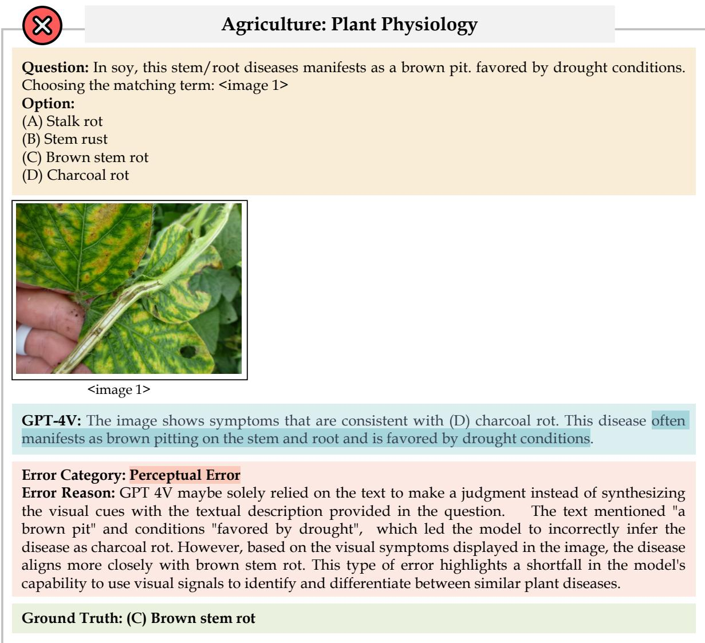

> **AI Description:**
> **Source:** `assets/_page_92_Figure_0.jpg`
> 
> **Generated:** 2026-05-16 13:18:12
> 
> ---
> 
> The image contains a photograph of a soy plant with visible symptoms of stem/root disease. The plant shows brown spots and discoloration on the leaves and stem, which are characteristic of stem and root diseases. The image is labeled as "image 1" and is used to illustrate the question about the disease manifestation in soy.


<span id="page-93-0"></span>
Figure 80. A sample correct case of Architecture and Engineering (subfield: Surveying and Mapping). Back to List of Figures | Back to Table Index
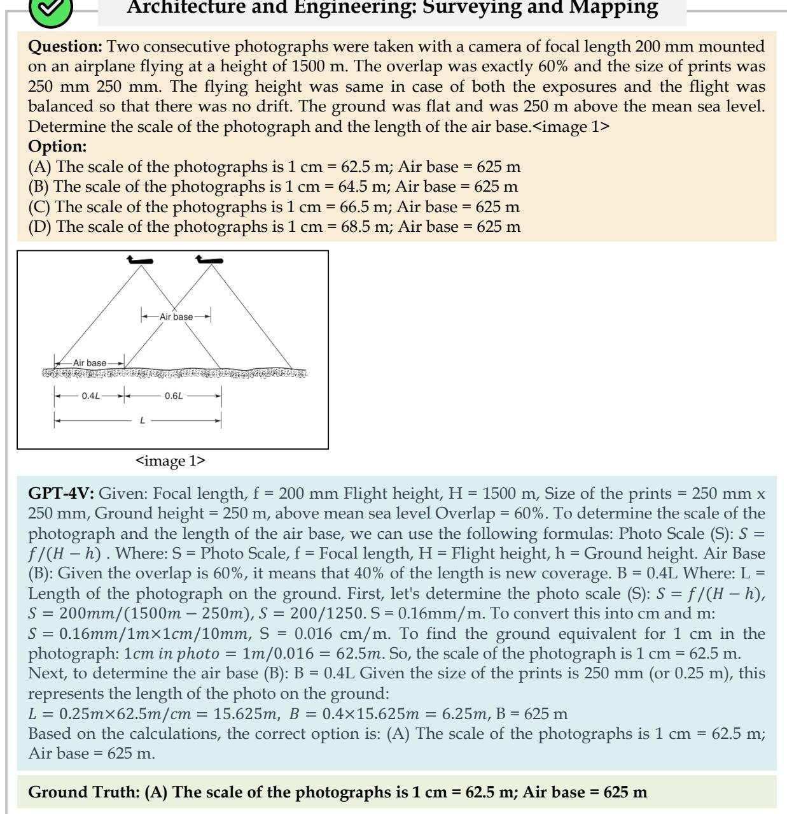

> **AI Description:**
> **Source:** `assets/_page_93_Figure_0.jpg`
> 
> **Generated:** 2026-05-16 13:15:26
> 
> ---
> 
> The image contains a combination of text and a diagram. The text provides a question and solution related to surveying and mapping, including details about the scale of photographs and the length of the air base. The diagram illustrates a triangular setup with labeled segments representing the air base and other related measurements. The key information includes the focal length of the camera, flight height, ground height, and the overlap percentage. The diagram visually represents the relationship between the air base and the length of the photograph on the ground, aiding in the calculation of the air base length.


<span id="page-94-0"></span>
Question: Compute the horizontal displacement of joint B produced by the 240-kN load in Figure P8.10. For all bars, area = 2400 ??!and E = 200 GPa.   
Option:   
(A) 2.657 mm   
(B) 3.657 mm   
(C) 4.657 mm   
(D) 5.657 mm

<image 1>
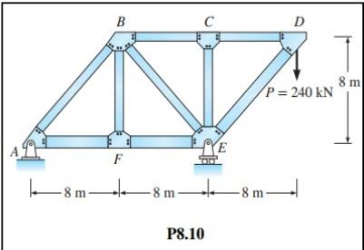

> **AI Description:**
> **Source:** `assets/_page_94_Figure_0.jpg`
> 
> **Generated:** 2026-05-16 13:14:40
> 
> ---
> 
> The image is a technical illustration of a truss structure. It shows a horizontal truss with vertical and diagonal members, labeled with points A, B, C, D, E, and F. The truss is supported at points A and E and is subjected to a vertical load P of 240 kN at point D. The dimensions of the truss are indicated, with each horizontal member spanning 8 meters and the vertical distance from the base to the load point being 8 meters. The image is labeled as "P8.10," likely indicating a problem or exercise number from a textbook or engineering reference.


GPT-4V: To solve for the horizontal displacement of joint B due to the 240-kN load, we'll employ the method of joints and consider the effect of the force on the truss members, along with using the formula for the elongation/contraction of axially loaded members. The formula to calculate elongation or contraction in an axially loaded member is: $\begin{array} { r } { \delta = \frac { \mathrm { P L } } { \mathrm { A E } ^ { \prime } } , } \end{array}$ where P is the axial force in the member, L is the length of the member, A is the cross-sectional area of the member, and E is the modulus of elasticity. Given: $\mathrm { A } = 2 4 0 0 \mathrm { m m } ^ { 2 }$ and $\mathrm { E } = 2 0 0 \mathrm { G p a } = 2 0 0 \times 1 0 ^ { 3 } \frac { \mathrm { N } } { \mathrm { m m } ^ { 2 } } .$ . First, let's find the forces in the members by applying the method of joints at joint A and joint D. At Joint A: There are two non-collinear unknown member forces, making it a solvable joint. Let's solve for AB and AF. $\Sigma F _ { y } = 0 , F _ { A B } c o s \big ( 4 5 ^ { \circ } \big ) - F _ { A F } = 0 . \sum F _ { x } = 0 , F _ { A B } s i n \big ( 4 5 ^ { \circ } \big ) = 0 . F _ { A B } = 0 \mathrm { ~ a n d ~ } F _ { A F } = 0 . 3 \mathrm { ~ a n d ~ } \mathrm { ~ a n d ~ } F _ { A B } = 0 . 3 \mathrm { ~ a n d ~ } \mathrm { ~ a n d ~ } F _ { A B } = \dots = 0 .$ $F _ { A F } = 0 . \mathrm { A t }$ Joint D: There's a 240-kN downward force applied. Let's find DC and DE. $\begin{array} { r } { \sum F _ { y } = 0 , ~ F _ { D C } c o s \big ( 4 5 ^ { \circ } \big ) + F _ { D E } - 2 4 0 = } \end{array}$ $0 . ~ ( 1 ) F _ { D E } = 2 4 0 - F _ { D C } c o s \bigl ( 4 5 ^ { \circ } \bigr ) . ~ \sum F _ { x } = 0 , ~ F _ { D C } s i n \bigl ( 4 5 ^ { \circ } \bigr ) = 0 . ~ F _ { D C } = 0$ . From (1), $F _ { D E } = 2 4 0 \mathrm { k N } .$ Compute the elongation in the members: For DE (in tension, elongation): $\begin{array} { r } { \delta _ { D E } = \frac { P _ { D E } \times L _ { D E } } { A \times E } = } \end{array}$ $\frac { 2 4 0 \times 1 0 ^ { 3 } \times 8 0 0 0 } { 2 4 0 0 \times 2 0 0 \times 1 0 ^ { 3 } } = 8 m m$ Considering the geometry of the truss, the horizontal component of the elongation at DE is: $\delta _ { B } = \delta _ { D E } c o s \big ( 4 5 ^ { \circ } \big ) \approx 5 . 6 5 7 m m$ . Thus, the answer is: (D) 5.657 mm.

Ground Truth: (D) 5.657 mm

<span id="page-95-0"></span>
## Architecture and Engineering: Civil Engineering

Question: The data shown below were obtained by time-lapse photography on a highway. Use regression analysis to fit these data to the Greenshields model and determine, the jam density. <image 1>

Option:

(A) kj=110 veh/mi

(B) kj=111 veh/mi

(C) kj=112 veh/mi


GPT-4V: To determine the jam density using the Greenshields model, we‘ll employ a linear regression approach on the data provided. The Greenshields model relates speed (u) and density (k) using the equation: $u = u _ { m a x } - u _ { m a x } / k _ { j a m } { \times } k ,$ , where $u _ { m a x }$ is the maximum speed (which occurs when density k is zero) and $k _ { j a m }$ is the jam density. From this equation, we can derive a linear relationship: $u = u _ { m a x } - u _ { m a x } / k _ { j a m } { \times } k$ . If we rearrange the terms, it looks like: $u = - u _ { m a x } / k _ { j a m } \times$ $k + u _ { m a x }$ .Here, the term $- u _ { m a x } / k _ { j a m }$ is the slope of the line, and $u _ { m a x }$ is the y-intercept. We'll now use the data provided to determine the slope and y-intercept using regression analysis, from which we can then derive $k _ { j a m }$ . Let's compute the regression parameters: Given data points: Speed (u): 14.2, 24.1, 30.3, 40.1, 50.6, 55.0; Density (k): 85, 70, 55, 41, 20, 15. Using regression analysis on this data, the equation of the line relating speed and density would be: $\mathbf { u } = \mathbf { m } \mathbf { k } + \mathbf { c } ,$ where m is the slope and c is the y-intercept. By comparing this to the Greenshields model equation, we can deduce: $u =$ $- u _ { m a x } / k _ { j a m } , c = u _ { m a x } .$ From the given data: $u _ { m a x } = 5 5 . 0$ (from the highest speed value). Using the above equation for m: $k _ { j a m } = - u _ { m a x } / u$ Once we determine the slope m using the regression analysis, we can solve for $k _ { j a m }$ . For the purpose of this exercise, I will not be calculating the slope using the regression formula directly (as that would be computationally intensive), but based on the linear relationship implied by the data, the jam density $\bar { k _ { j a m } }$ would be slightly greater than the highest density value provided (85 veh/km). Using this logic, the closest option from the choices given is: kj = 110 \, veh/mi. Therefore, the answer would be: (A) kj = 110 veh/mi.

## Error Category: Reasoning Error

Error Reason: The model correctly recalls the knowledge, but doesn't calculate it and directly gives the answer that it thinks is the closest one, which is incorrect.

Ground Truth: (B) kj=111 veh/mi

Figure 82. A sample error case of Architecture and Engineering (subfield: Civil Engineering). Error category: Reasoning Error Back to List of Figures | Back to Table Index

<span id="page-96-0"></span>
## Computer Science: Data Structure and Algorithm

Question: Suppose we run Dijkstra's single source shortest-path algorithm on the following edge   
weighted directed graph with vertex P as the source. In what order do the nodes get included into   
the set of vertices for which the shortest path distances are finalized?<image 1>   
Option:   
(A) P, Q, R, S, T, U   
(B) P, Q, R, U, S, T   
(C) P, Q, R, U, S, T   
(D) P, Q, T, R, U, S

<image 1>
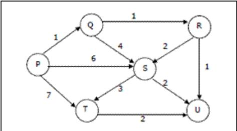

> **AI Description:**
> **Source:** `assets/_page_96_Figure_0.jpg`
> 
> **Generated:** 2026-05-16 13:13:18
> 
> ---
> 
> The image is a diagram of a directed graph with nodes labeled P, Q, R, S, T, and U. Arrows between the nodes indicate the direction of the edges, and numbers next to the arrows represent the weights or values associated with each edge. The graph appears to be used for representing relationships or flows between the nodes, possibly in a network or graph theory context.


GPT-4V: To determine the order in which the nodes are included using Dijkstra's algorithm, we will start with vertex P and then repeatedly select the vertex with the smallest distance that hasn't been included yet. Initialize distances: makefile Copy code P = 0, Q = ∞, R = ∞, S = ∞, T = ∞, U = ∞, Begin with source vertex P:P to $\mathrm { Q } = \mathrm { 1 P }$ to $\mathrm { S } = \mathrm { 4 P }$ to T = 7Now, the smallest distance is for Q. So, Q is the next vertex. For Q:P to Q to $\mathrm { R } = 2 \mathrm { P }$ to Q to S = 5 (But, P to S is 4, so this is not considered)P to Q to T = 7 (Same as P to T, so this is not updated)Now, the smallest distance among the remaining vertices is for R. So, R is the next vertex. For R:P to Q to R to U = 3P to Q to R to $\mathrm { S } = 4$ (But, P to S is already 4)Now, the smallest distance among the remaining vertices is for U. So, U is the next vertex. For U:P to Q to R to U to S = 5 (But, P to S is already 4)The remaining vertices are S and T. Between them, S has the smallest distance. So, S is the next vertex. For S:P to S to T = 6 (But, P to T is already 7 and P to Q to T is also 7)Now, only T remains. So, T is the last vertex. The final order is:, P, Q, R, U, S, T. The correct option is:(B) P, Q, R, U, S, T.

Ground Truth: (B) P, Q, R, U, S, T

Figure 83. A sample correct case of Computer Science (subfield: Data Structure and Algorithm). Back to List of Figures | Back to Table Index

<span id="page-97-0"></span>
Figure 84. A sample error case of Computer Science (subfield: Compiler Principle). Error category: Perceptual Error, Lack of Knowledge Back to List of Figures | Back to Table Index
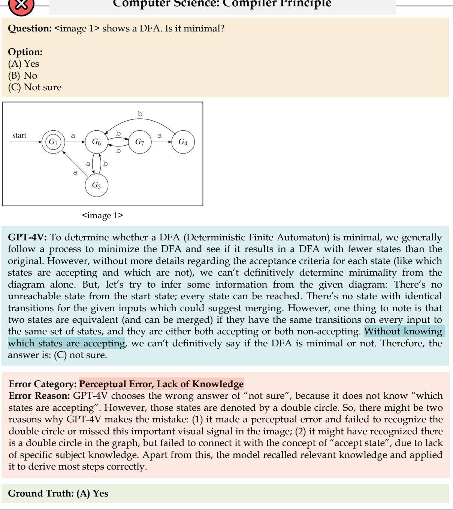

> **AI Description:**
> **Source:** `assets/_page_97_Figure_0.jpg`
> 
> **Generated:** 2026-05-16 13:08:03
> 
> ---
> 
> The image contains a diagram of a Deterministic Finite Automaton (DFA). The DFA is labeled with state names \( G_1 \) through \( G_7 \), and arrows indicate transitions between states based on input symbols 'a' and 'b'. The diagram includes a start state and a double-circled state, which typically represents an accepting state in a DFA. The text accompanying the diagram discusses the process of determining if the DFA is minimal, noting that without knowing which states are accepting, it is not possible to definitively determine minimalism. The ground truth provided is that the DFA is minimal, labeled as option (A) Yes.


<span id="page-98-0"></span>
Question: Which pair of transactions demonstrates interleaved processing in <image 1>?

Option:

(A) A and B

(B) B and C

(C) C and D

(D) None of the other answers

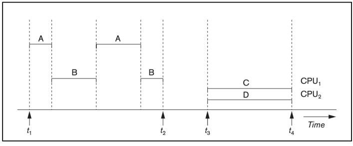

> **AI Description:**
> **Source:** `assets/_page_98_Figure_0.jpg`
> 
> **Generated:** 2026-05-16 13:23:38
> 
> ---
> 
> The image is a diagram illustrating a time sequence of processes A, B, C, and D on two CPUs, CPU1 and CPU2. The timeline is divided into segments labeled \( t_1 \), \( t_2 \), \( t_3 \), and \( t_4 \). Process A is shown running on CPU1 from \( t_1 \) to \( t_2 \), while process B runs on CPU2 from \( t_2 \) to \( t_3 \). Process C runs on CPU1 from \( t_3 \) to \( t_4 \), and process D runs on CPU2 from \( t_3 \) to \( t_4 \). The diagram highlights the parallel execution of processes on different CPUs and the overlapping time periods where processes are active on each CPU.


Error Reason: GPT-4V recalls the correct knowledge “Interleaved processing occurs when two transactions are processed alternately, meaning that one starts, then the other starts before the first one finishes, and then the first one might resume, and so on.” However, it fails to interpret the image w.r.t. transaction A and B: “Transaction A on CPU1 starts and finishes without being interleaved with any other transaction. Transaction B on CPU1 starts after A finishes and completes without being interleaved with any other transaction. Transaction A on CPU2 starts and finishes without any interleaving. Transaction B on CPU2 starts after A finishes and completes without being interleaved with any other transaction." The figure intends to illustrate transaction A and B being processed concurrently on one CPU in an interleaved fashion. These two processes have nothing to do with the CPU1 and CPU2 shown on the right side of the figure. On the perception level, the model made a wrong connection by saying the first appearance of transaction A is on CPU1 and the second appearance is on CPU2 (and the same for transaction B). With that said, the figure is indeed a non-trivial one to interpret and a model might need to know some subject-specific convention to interpret it correctly.

Figure 85. A sample error case of Computer Science (subfield: Operating System). Error category: Perceptual Error Back to List of Figures | Back to Table Index

<span id="page-99-0"></span>
Figure 86. A sample error case of Computer Science (subfield: Compiler Principle). Error category: Perceptual Error Back to List of Figures | Back to Table Index
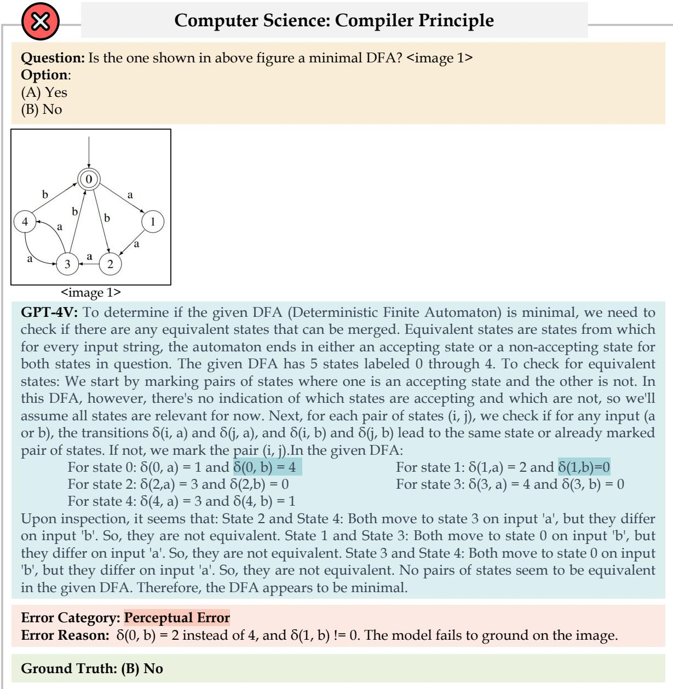

> **AI Description:**
> **Source:** `assets/_page_99_Figure_0.jpg`
> 
> **Generated:** 2026-05-16 13:30:36
> 
> ---
> 
> The image contains a text-based question and answer related to computer science, specifically about determining if a given DFA (Deterministic Finite Automaton) is minimal. The text describes the process of checking for equivalent states in a DFA and provides a step-by-step analysis of the given DFA. The image also includes a diagram of the DFA, which is labeled as "image 1" and shows five states labeled 0 through 4. The DFA has transitions labeled with 'a' and 'b', indicating the possible inputs and their corresponding states. The text explains the process of identifying equivalent states and concludes that the DFA appears to be minimal.


<span id="page-100-0"></span>
Figure 87. A sample correct case of Electronics (subfield: Signal Processing). Back to List of Figures | Back to Table Index


<span id="page-101-0"></span>
Figure 88. A sample error case of Electronics (subfield: Signal Processing). Error category: Reject to Answer Back to List of Figures | Back to Table Index


<span id="page-102-0"></span>
Energy and Power: Fluid Mechanics

$$
\$ 1
$$

$$
\mu _ { H e } \approx 1 . 5 0 5 E ^ { - 5 } - 5 ( T ^ { \circ } / 2 0 0 K ) ^ { 0 . 3 8 }
$$

$$
\mu _ { H e } \approx 2 . 5 0 5 E ^ { - 5 } - 5 ( T ^ { \circ } / 2 0 0 K ) ^ { 0 . 6 8 }
$$

$$
\mu _ { H e } \approx 1 . 5 0 5 E ^ { - 5 } - 5 ( T ^ { \circ } / 2 0 0 K ) ^ { 0 . 6 8 }
$$


GPT-4V: To fit the given values to a Power-law, we'll use the form ${ \mathrm { : } } \mu = C ( T ^ { k } )$ , where C and k are constants to be determined. We can take the logarithm of both sides to transform this equation to a linear form: $\ln ( \mu ) = \ln ( C ) + k l n ( T )$ . Now, let's choose two points from the given data to solve for C and k. Using the data points $( \mathrm { T } , ~ \mu ) = ( 2 0 0 ~ \mathrm { K } , ~ 1 . 5 0 \mathrm { E } \mathrm { - } 5 )$ and (400 K, 2.43E-5): For the first point: $\ln ( 1 . 5 0 \mathrm { E - } 5 ) = \ln ( \mathrm { C } ) + \mathrm { k } \setminus \bar { \ln } ( 2 0 0 ) ( 1 )$ . For the second point: ln(2.43E-5) = ln(C) + kln(400) (2). Subtracting (1) from (2) to eliminate C, we get: ln $( \ 2 . 4 3 \mathrm { E } - 5 / 1 . 5 0 \mathrm { E } - 5 ) = \mathrm { k l n } 2$ . From this, we can solve for k. Once we have k, we can use either (1) or (2) to solve for C. After solving for k and $C ,$ we can use these values to see which option (A, B, or C) fits the power-law. Let's calculate k and C. k $= \ln ( 2 . 4 3 \mathrm { E } - 5 / 1 . 5 0 \mathrm { E } - 5 ) / \ln 2 \approx \ln 1 . 6 2 / \ln 2 \approx 0 . 6 8$ Plugging this value of k into (1): ln(1 $. 5 0 \mathrm { E } { - } 5 ) = \mathrm { l n C } +$ 0.68ln200. Solving for ${ \mathrm { C } } \colon { \mathrm { C } } { \approx } 1 . 5 0 5 { \mathrm { E } } { - } 5$ . The relation becomes: $\mu _ { H e } \approx 1 . 5 0 5 E ^ { - 5 } - 5 T ^ { K }$ , where ${ \mathrm { K } } \approx 0 . 6 8 { \mathrm { . } }$ From the options given, this matches with: (C) $\mu _ { H e } \approx 1 . 5 0 5 E ^ { - 5 } - 5 ( T ^ { \circ } / 2 0 0 K ) ^ { 0 . 6 8 }$ . So, option (C) is the correct choice.

$$
{ \pmb \mu } _ { H e } \approx { \bf 1 . 5 0 5 } E ^ { - 5 } - { \bf 5 } ( { \pmb T } ^ { \circ } / 2 { \bf 0 0 } K ) ^ { \bf 0 . 6 8 }
$$

<span id="page-103-0"></span>
Question: A piston-cylinder device contains helium gas initially at 100 kPa, 10°C, and 0.2 m^3. The helium is now compressed in a polytropic process $( P V ^ { n } = c o n s t a n t )$ to 700 kPa and 290°C. Determine the heat loss or gain during this process..<image $_ { 1 > }$   
Option:

(A) $Q _ { 1 2 } = - 5 . 5 5 3 k J$

(B) $Q _ { 1 2 } = - 6 . 5 5 3 \ : k J$

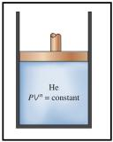

> **AI Description:**
> **Source:** `assets/_page_103_Figure_0.jpg`
> 
> **Generated:** 2026-05-16 13:08:09
> 
> ---
> 
> The image contains a simple diagram of a container filled with helium gas (He). The container is depicted with a lid and a small opening at the top. The text "PV^n = constant" is written on the diagram, indicating that the product of the pressure (P) and the volume (V) raised to the power n is a constant, which is a characteristic of an ideal gas under certain conditions. The diagram is likely used to illustrate the behavior of a gas in a closed system where the volume is kept constant, and the pressure and temperature are related by this equation.


(C) ?"# = −7.553 ??

GPT-4V: Given the nature of this problem, we'll use the first law of thermodynamics for a closed system undergoing a process: $\Delta U = Q _ { 1 2 } - W _ { 1 2 }$ , where $\Delta U = { \mathrm { C h a n g e } }$ in internal energy, $Q _ { 1 2 } = \mathrm { H e a t }$ transfer during the process, and $W _ { 1 2 } = \mathsf { V }$ ork done by the system during the process. From the given image, we can infer that the process is polytropic and is described by the equation: $P V ^ { n } = c o n s t a n t$ For a polytropic process involving an ideal gas: $W _ { 1 2 } = ( P _ { 2 } V _ { 2 } - P _ { 1 } V _ { 1 } ) / ( 1 - n )$ . Given: $P _ { 1 } { = } 1 0 0 \mathrm { k P a } ,$ ?" = 0.2?\$, $T _ { 1 } = 1 0 ^ { \circ } C$ $P _ { 2 } { = } 7 0 0 \mathrm { k P a }$ $T _ { 2 } = 2 9 0 ^ { \circ } C$ . To find $V _ { 2 } ,$ we use the polytropic relationship: $P _ { 1 } V _ { 1 } ^ { n } / P _ { 2 } = V _ { 2 } ^ { n }$ . The value of n can be determined using the temperatures and the ideal gas law: $P _ { 1 } V _ { 1 } / T _ { 1 } = P _ { 2 } V _ { 2 } / T _ { 2 }$ Once $V _ { 2 }$ is known, the work $W _ { 1 2 }$ can be determined using the equation for polytropic work. The change in internal energy Δ? for an ideal gas like helium is only a function of temperature and can be determined using: $\Delta U = m C _ { v } ( T _ { 2 } - T _ { 1 } )$ , where $C _ { v } = \operatorname { S p e c i f i c }$ heat at constant volume for helium (approximately 3.12 kJ/kgAK), and $\mathrm { ~ m ~ } = \mathrm { ~ M a s s }$ of the helium. Mass can be determined using the ideal gas law: $m = P _ { 1 } V _ { 1 } / R T _ { 1 }$ , where R is the specific gas constant for helium, approximately 2.0831 $\mathrm { k J / k g { \cdot K } }$ . Finally, using the first law of thermodynamics: $Q _ { 1 2 } = \Delta U + W _ { 1 2 } = .$ The given options for $Q _ { 1 2 }$ are in kJ, so we need to ensure that all values used in calculations are consistent with this unit. To determine $Q _ { 1 2 } ,$ we will: Calculate the mass m of helium, determine $V _ { 2 }$ using the polytropic relationship, calculate the work $W _ { 1 2 } ,$ determine the change in internal energy Δ?, and use the first law to calculate $Q _ { 1 2 } .$ . Now, let's plug in the values and solve: Calculate mass: $m = P _ { 1 } V _ { 1 } / R T _ { 1 } = 1 0 0 k P a * 0 . 2 m ^ { 3 } / ( 2 . 0 8 3 1 k J / k g \cdot K * ( 1 0 + 2 7 3 ) ) \approx 0 . 0 2 7 1 k g$ Determine $V _ { 2 }$ using the given temperatures and the ideal gas relationship (this is iterative and requires more involved math). Calculate the work $W _ { 1 2 }$ using the polytropic equation. Determine the change in internal energy: $\Delta U = m C _ { v } ( T _ { 2 } - T _ { 1 } ) \approx 2 3 . 7 5 k J$ Use the first law: $Q _ { 1 2 } = \Delta U + W _ { 1 2 }$ . Now, without the exact value for $W _ { 1 2 }$ (which requires the iterative determination of V\_2 and n), it's hard to provide an exact answer. However, considering the given options, you can solve for $Q _ { 1 2 }$ using the above steps. If you have the value for n or more specific data, please provide it, and I can assist further.

## Error Category: Reasoning Error

Error Reason: Reasoning error 1 (calculation): The formula of m is correct but the calculation is wrong: $m = P _ { 1 } V _ { 1 } / R T _ { 1 } \approx 0 . 0 2 7 1 k g$ Reasoning error 2 (unit conversion T: The formula of Δ? is correct but the unit conversion of T is wrong: $\Delta U = m C _ { v } ( T _ { 2 } - T _ { 1 } ) \approx 2 3 . 7 5 k J$ . Reasoning error 3 (calculation order): The final answer Q is to be calculated based on W, W is to be calculated based on $V _ { 2 }$ and n, n is to be calculated based on $V _ { 2 } .$ . GPT4-V fails to calculate these variables in a correct order $V _ { 2 }  n  W  Q .$ , thus it is unable to provide the answer.

Ground Truth: (B) ?\_12=−6.553 ??

Figure 90. A sample error case of Energy and Power (subfield: Thermodynamics). Error category: Reasoning Error Back to List of Figures | Back to Table Index

<span id="page-104-0"></span>
Figure 91. A sample correct case of Materials (subfield: Materials Science). Back to List of Figures | Back to Table Index


<span id="page-105-0"></span>
$$
\gamma _ { x y }
$$

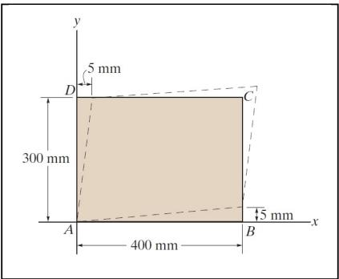

> **AI Description:**
> **Source:** `assets/_page_105_Figure_0.jpg`
> 
> **Generated:** 2026-05-16 13:12:33
> 
> ---
> 
> The image is a technical diagram depicting a rectangular shape with dimensions labeled. The rectangle is oriented horizontally, with the base labeled as 400 mm and the height labeled as 300 mm. At the top left corner of the rectangle, there is a small vertical line labeled "5 mm," indicating a thickness or offset. The diagram includes axes labeled x and y, suggesting a coordinate system, and dashed lines extending from the top right corner of the rectangle, indicating possible extensions or transformations of the shape. The diagram appears to be used for geometric or engineering purposes, possibly to illustrate a specific design or measurement.


$$
\gamma _ { x y }
$$

$$
\gamma _ { x y } = { \frac { \delta y } { \delta x } }
$$

$$
\gamma _ { x y } A = { \frac { \delta y } { \delta x } }
$$

$$
\begin{array} { r } { \delta x = 5 \mathrm { m m } , \gamma _ { x y } A = \frac { 0 } { 3 0 0 m m } = 0 } \end{array}
$$

$$
\begin{array} { r } { \gamma _ { x y } B = \frac { \delta y } { \delta x } . } \end{array}
$$

$$
\begin{array} { r } { \gamma _ { x y } B = \frac { 5 m m } { 4 0 0 m m } = 0 . 0 1 2 5 } \end{array}
$$

$$
\scriptstyle \mathrm { A , }
$$

$$
\begin{array} { r } { \gamma _ { x y } = \frac { 5 \bar { m } m } { 4 0 0 m m } = } \end{array}
$$

Figure 92. A sample error case of Materials (subfield: Mechanics of Materials). Error category: Lack of Knowledge Back to List of Figures | Back to Table Index

<span id="page-106-0"></span>
## Materials: Control System

Question: For the unity feedback system shown in <image 1>, where $\begin{array} { r } { G ( s ) = \frac { 4 5 0 ( s + 8 ) ( s + 1 2 ) ( s + 1 5 ) } { s ( s + 3 8 ) ( s ^ { 2 } + 2 s + 2 8 ) } } \end{array}$ .Find   
the steady-state errors for the following test inputs: 25u(t). Option:   
(A) 0   
(B) 1   
(C) -1

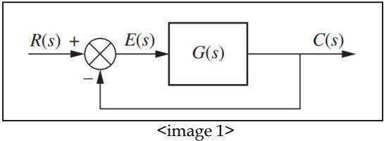

> **AI Description:**
> **Source:** `assets/_page_106_Figure_0.jpg`
> 
> **Generated:** 2026-05-16 13:17:04
> 
> ---
> 
> The image contains a block diagram of a control system. It includes a feedback loop with a summing junction, a transfer function block labeled \( G(s) \), and output \( C(s) \). The input to the system is \( R(s) \), and the error signal \( E(s) \) is the difference between the reference input \( R(s) \) and the output \( C(s) \). The diagram is labeled as "image 1".


GPT-4V: To find the steady-state error for a unity feedback system, we can use the final value theorem. The final value theorem states that: $l i m _ { n  \infty } e ( t ) = l i m _ { n  \infty } s E ( s )$ where $\operatorname { E } ( \mathrm { s } )$ is the Laplace transform of the error signal e(t). Given a system with unity feedback, the error signal in the Laplace domain can be given by: $\begin{array} { r } { \mathrm { E } ( \mathrm { s } ) = \mathrm { R } ( \mathrm { s } ) - \mathrm { C } ( \mathrm { s } ) . } \end{array}$ where $\operatorname { R } ( \mathrm { s } )$ is the Laplace transform of the reference input, and $\mathrm { C } ( \mathrm { s } )$ is the Laplace transform of the system's output. The closed-loop transfer function for a unity feedback system is given by $: T ( s ) = G ( s ) / ( 1 + G ( s ) )$ Given a step input $\operatorname { r } ( \mathrm { t } ) =$ $2 5 \mathrm { u ( t ) . }$ , the Laplace transform is: $R ( s ) = 2 5 / s$ The system's output in the Laplace domain is:? $\mathbf { \partial } \cdot ( s ) =$ $T ( s ) { \bf \times } R ( s ) = \bar { G } ( s ) / ( 1 + G ( s ) ) { \bf \times } 2 5 / s$ . Thus, the error signal in the Laplace domain is: $E ( s ) = 2 5 / s -$ $G ( s ) / ( 1 + G ( s ) ) { \times } 2 5 / s = 2 5 / s { \times } [ 1 - G ( s ) / ( 1 + G ( s ) ) ] \bar { \mathrm { T o } }$ find the steady-state error, we apply the final value theorem:lim?× ?(?). Substitute E(s) from the above equation and evaluate the limit. Given: $G ( s ) = [ 4 5 0 ( \bar { s + 8 } ) ( s + 1 2 ) ( s + 1 5 ) ] / = [ s ( s + 3 8 ) ( s ^ { 2 } + 2 s ) ( s + 1 5 ) ]$ Using the formula $e _ { s s } =$ $l i m _ { s  0 } s 8 2 5 / s \times \lbrack 1 - G ( s ) / ( 1 + G ( s ) ) \rbrack$ . Now, evaluate this limit to find the steady-state error. After evaluating, the answer will be one of the given options. Let's compute the steady-state error: $e _ { s s } =$ $2 5 { \times } l i m _ { s \to 0 } \left[ 1 - G ( s ) / ( 1 + G ( s ) ) \right]$ Solve for $e _ { s s } :$ Using the given G(s) in the expression and computing the limit, you'll find that: $e _ { s s } = 2 5 \times ( 1 - 1 ) = 0$ So, the steady-state error for the test input 25u(t) is: $e _ { s s } = 0 .$ . Thus, the correct answer is: (A) 0.

Ground Truth: (A) 0

<span id="page-107-0"></span>
$$
v = \sqrt { 2 g R } , N = 2 m g
$$

(B) Velocity, force $v = { \sqrt { g R } } , N = m g$

$$
v = { \sqrt { g R } } , N = 2 m g
$$

<image 1>
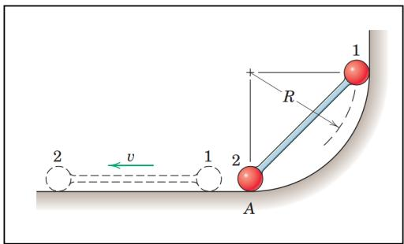

> **AI Description:**
> **Source:** `assets/_page_107_Figure_0.jpg`
> 
> **Generated:** 2026-05-16 13:16:20
> 
> ---
> 
> The image is a diagram illustrating a physics scenario involving two spheres labeled 1 and 2. Sphere 1 is at the top of a curved track, while sphere 2 is at the bottom. The track is inclined, and sphere 1 is shown in a dashed path, indicating its trajectory. Sphere 2 is moving horizontally with a velocity \( v \). The diagram includes a label \( R \) denoting the radius of the curved track, and the point \( A \) marks the lowest point of the track. The image is likely used to explain concepts related to energy conservation or circular motion.


$$
h _ { 1 } = R .
$$

$$
m g h _ { 1 } + m g h _ { 2 } = m g R + 2 m g R =
$$

$$
P E _ { t o t a l } = 2 { \times } 2 1 m v ^ { 2 } = \sqrt { 2 g R } v = 2 g R
$$

$$
h _ { 2 } = 2 R ^ { \prime } .
$$

$$
\textstyle 1 ; N - m g = { \frac { m v ^ { 2 } } { R } }
$$

$$
m \boldsymbol { v } ^ { 2 } / R .
$$

$$
P E _ { t o t a l } =
$$

$$
2 g R . \ N = ( 1 + 2 ) m g N = \left( 1 + { \sqrt { 2 } } \right) m g N = ( 1 + 2 ) m g
$$

$$
v = 2 g R v \ = \ \sqrt { 2 g R v } =
$$

$$
2 \sqrt { 2 }
$$

$$
\mathrm { ( A ) } v = 2 g R , N = 2 m g ; v = \sqrt { 2 g R } , N = 2 m g .
$$

$$
\sqrt { g R }
$$

$$
\textstyle { \frac { 1 } { 2 } } 2 m v ^ { 2 } = m g R ,
$$

$$
\begin{array} { r } { N - m g = \frac { m v ^ { 2 } } { R } } \end{array}
$$

$$
v = { \sqrt { g R } } .
$$

$$
N = 2 m g
$$

$$
v = \sqrt { g R } , N = 2 m g .
$$

Figure 94. A sample error case of Mechanical Engineering (subfield: Engineering Dynamics). Error category: Reasoning Error Back to List of Figures | Back to Table Index

<span id="page-108-0"></span>
Figure 95. A sample error case of Mechanical Engineering (subfield: Engineering Dynamics). Error category: Reasoning Error Back to List of Figures | Back to Table Index
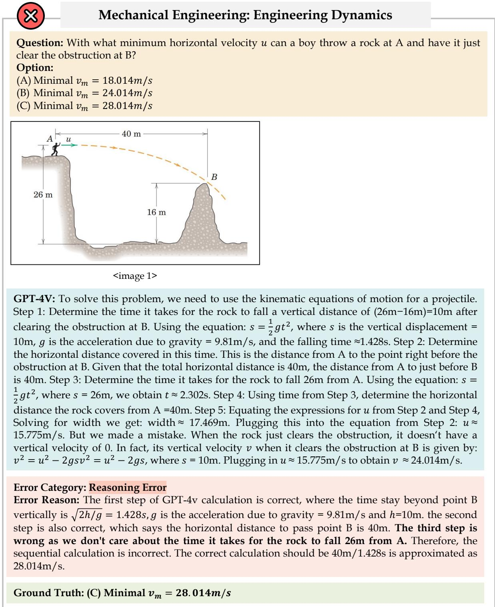

> **AI Description:**
> **Source:** `assets/_page_108_Figure_0.jpg`
> 
> **Generated:** 2026-05-16 12:55:56
> 
> ---
> 
> The image contains a combination of text and a diagram. The text provides a question and options for a mechanical engineering problem related to projectile motion. The diagram illustrates a scenario where a boy throws a rock horizontally from point A and it just clears an obstruction at point B. The diagram includes the distances involved: 40 meters horizontally and 10 meters vertically. The text outlines the steps to solve the problem using kinematic equations, including the time of flight and horizontal distance covered. The image also includes an error analysis section, highlighting a reasoning error in the calculation process.


<span id="page-109-0"></span>
## C. Subfields of Different Subjects

In this appendix, we show all the subfields of each subject in Table 11. MMMU has 183 subfields in total, covering 30 subjects.

## D. Distributions of Image Types

In this section, we show the distribution of 30 different image types in the 11.5K MMMU questions. The distribution of various image types is displayed in Figure 96. A horizontal bar chart was employed to visually represent the number of samples in each image category. The figure shows that the MMMU dataset encompasses a diverse range of image types, from Advertisements to Diagrams.

## E. Results on Different Image Types

In this section, we report the performance of some selected models on 30 different image types in Table 12.

<span id="page-110-0"></span>
Table 11. Subfields of each subject.
<table><tr><td>Disciplines</td><td>Subjects</td><td>Subfields</td></tr><tr><td rowspan="5">Art &amp; Design</td><td>Art</td><td>Fine Arts, Drawing and Painting,Photography,Printmaking,Ceramic Art,Visual Arts, Sculpture,AI Content Detection</td></tr><tr><td>Design</td><td>Digital Art,Design History,Graphic Design,Fashion Design,Interior Design,Industrial Design</td></tr><tr><td>Music</td><td>Music</td></tr><tr><td>Art Theory</td><td>History of Art Theory,Art History,Art Criticism,Aesthetics,Contemporary Art Theory, Visual Culture,Postmodern Art Theory,Phenomenology of Art</td></tr><tr><td>Accounting</td><td>Financial Accounting,Investment, Managerial Accounting</td></tr><tr><td rowspan="5">Business</td><td>Economics</td><td>Macroeconomics,Microeconomics,Econometrics,Labor Economics,Principals of Economics</td></tr><tr><td>Finance</td><td>Financial Marketing,Financial Management,Corporate Finance,Managerial Finance</td></tr><tr><td>Manage</td><td>Operations Management, Strategic Management, Business Management, Project Management, Cost Management, Principles of Management,Management Models</td></tr><tr><td>Marketing</td><td>Market Research</td></tr><tr><td>Biology</td><td>Biochemistry,Cell Biology,Genetics,Microbiology,Botany,Evolution,Animal Behavior,Physiology, Molecular Biology,Animal Physiology,Ecology</td></tr><tr><td rowspan="6">Science</td><td>Chemistry</td><td>Inorganic Chemistry,Organic Chemistry,Physical Chemistry,Chemical Thermodynamic,</td></tr><tr><td>Geography</td><td>Analytical Chemistry,Chemical Kinetics,Biochemistry, Quantum Chemistry Geotechnical Engineering,Human Geography,Physical Geography, Geographic Information Systems,</td></tr><tr><td>Math</td><td>International Geography Olympiad Calculus,Probability and Statistics,Linear Algebra,Geometry,Logic,Graph Theory,Group Theory,</td></tr><tr><td>Physic</td><td>Operation Research Clasical Mechanics,Electromagnetism,Thermodynamics and Statistical Mechanics,Optics,Nuclear Physics</td></tr><tr><td>Psychology</td><td>Biological Psychology, Cognitive Psychology,Personality Psychology, Clinical Psychology,</td></tr><tr><td>Basic</td><td>Social Psychology, Developmental Psychology,Abnormal Psychology Immunology, Biochemistry and Genetics,Foundational Anatomical Sciences,Microbiologyand Immunology, Neurosciences,Anatomy,Neuroanatomy,Neurophysiology,Cardiovascular Physiology,Human Physiology,</td></tr><tr><td rowspan="6">Health &amp; Medicine</td><td>Medical Science Clinical Medicine</td><td>Reproductive Physiology,Respiratory Physiology,Renal Physiology,Pathophysiology, Cellular Physiology Clinical Medicine,Dental, Circulatory,Respiratory,Clinical Neurology, Orthopaedic Surgery,</td></tr><tr><td>Diagnostics &amp;</td><td>Heart Disease,Endocarditis,Cardiovascular Medicine,Endocrinology, Otolaryngology,Ophthalmology, Urology, Clinical Pathology, Clinical Radiology Medica Imaging,Neuropathology,Pathology,Ophthalmic Pathology,Forensic Neuropathology,</td></tr><tr><td>Laboratory Medicine Pharmacy</td><td>Electrocardiography,Radiology Pharmaceutical Microbiology,Medicinal Chemistry, Biochemistry for Pharmaceutical Sciences,</td></tr><tr><td>Public Health</td><td>Pharmacology and Drug Synthesis Epidemiology,Biostatistics,Communicable Disease Control</td></tr><tr><td>Humanities History</td><td>U.S.History,World History,Modern History, European History,History-Comparison</td></tr><tr><td></td><td></td></tr><tr><td>&amp; Social Science</td><td>Literature</td><td>American Literature,Poetry,Fiction,Drama,Children&#x27;s Literature,Comparative Literature,ContemporaryLiterature</td></tr><tr><td rowspan="6">Tech &amp;</td><td>Sociology</td><td>Sociology Theory, Social Economics,Political Economics.</td></tr><tr><td>Agriculture</td><td>Animal Physiology,Animal Science,Animal Nutrition,Reproduction,Genetics,PlantPhsiology, Plant Pathology,Animal and Environment,Animal Anatomy</td></tr><tr><td>Architecture</td><td>Surveying and Mapping,Structural Engineering, Water Resources Engineering, Civil Engineering Data Structure and Algorithm,Computer Network, Artificial Intelligence, Databases,</td></tr><tr><td>Computer Science</td><td>Operating Systems, Compiler Principle, Computer Architecture</td></tr><tr><td>Engineering Electronics</td><td>Analog electronics,Digital electronics,Electrical Circuit,Signal Processing</td></tr><tr><td>Energy &amp; Power</td><td>Thermodynamics,Heat Transfer,Fluid Mechanics</td></tr><tr><td>Materials</td><td>Materials Science,Mechanics of Materials</td></tr><tr><td>Mechanical</td><td></td><td>Fluid Dynamics,Mechanical Design,Mechanics of Materials,Mechanical Vibrations,</td></tr><tr><td></td><td></td><td></td></tr><tr><td>Engineering</td><td></td><td>Engineering Dynamics,Control Systems,Engineering Graphics</td></tr></table>

<span id="page-111-0"></span>
Table 12. Selected models’ performance on 30 different image types. Note that a single image may have multiple image types.


<span id="page-112-0"></span>
## F. Few-shot Results

As existing models like OpenFlamingo and Otter support few-shot or in-context learning, we report their few-shot performance using the dev set as the in-context learning examples.

As shown in Table 13, OpenFlamingo shows a decrease in performance when moving from 0-shot to 1-shot and 3- shot learning (from 0.263 to 0.256) and there is a slight increase when moving to 5-shot. Otter shows a consistent decline as more shots are introduced, dropping to 0.276 in 1-shot and further down to 0.258 in 3-shot and 5-shot. This trend suggests that existing open-source models’ few-shot learning ability is very weak. And it additionally shows that our data samples might be too hard for these models to understand the underlying patterns or context.

Table 13. Few-shot results of OpenFlamingo and Otter.


<span id="page-113-0"></span>
## G. Data Annotation Protocol

This document describes a comprehensive protocol for annotating a dataset comprising college-level multimodal questions (i.e., questions that incorporate images).

## G.1. Data Collection

Sources of Data: Data is primarily collected from free online resources, quizzes, textbooks, and other study materials. When collecting questions, the annotators should strictly adhere to copyright and licensing regulations on the source sites. Data from sources that prohibit copying or redistribution MUST be explicitly avoided. Besides, the annotators should try to find diverse sources instead of collecting questions from a single source.

## Types of Questions:

• Multiple-Choice Questions: Including standard multiple-choice questions and true/false questions. These are characterized by a question followed by several answer choices, with only one correct option.

• Open-Ended Questions: Encompassing formats like factoid, fill-in-the-blank, calculation-based, and short descriptive responses. Avoid collecting questions that have very long answers.

Image Types: The annotators should find various types of images (e.g., diagrams, charts, photographs)

## G.2. General Guidelines

• General Principles: Annotations must be accurate, consistent, and adhere to a high standard of academic rigor.

• Specific Instructions:

– All questions must contain one or more images.

– All questions should be written in English.

– All questions should meet the college-level difficulty.

– The question should not be ambiguous and can be answered with one of the given options or a short answer.

– Clearly categorize each question as either multiplechoice or open-ended.

– Annotate all fields, including the question, answer options for multiple-choice questions, the correct answer, image types, question difficulty, and explanation (if there exists).

## G.3. Data Format and Structure

• JSON File Format: The structured JSON format will include fields for number, question type, question text, answer options (for multiple-choice), correct answer, question difficulty, and explanation (if there exists).

## • Naming Conventions:

– Each collected sample will be stored in a separate JSON file following a standard naming rule: subject {Number}.json

– Image Files: image {QuesNum} {ImageNum}.png

• Interleaving Question with Images: The images should be inserted as a file path in the question/options/explanations.

## G.4. Quality Control and Validation

• A secondary review team will rigorously vet annotations for quality and guideline adherence.

• Regular audits of random samples from the dataset will be conducted to ensure sustained quality and consistency.

## G.5. Handling Ambiguities

Ambiguities or unclear data instances should be flagged for a detailed review process. These questions will be collaboratively examined in team meetings to establish a standardized approach for annotation.

## G.6. Ethical Considerations

• Copyright and Licensing: Strict adherence to copyright and licensing regulations is mandatory. Data from sources that prohibit copying or redistribution will be explicitly avoided.

• Data Privacy: Compliance with privacy laws and ethical standards in data handling is paramount. The annotators should avoid collecting questions that contain any private information.

## G.7. Data Contamination Considerations

In the construction of benchmarks for evaluating foundation models, it is essential to consider the risk of data contamination. To address this, annotators should be tasked with carefully selecting questions that go beyond straightforward queries with easily accessible answers. Instead, the focus should be on questions whose answers are tucked away in less obvious locations, such as in separate documents or hidden in the concluding sections of extensive textbooks. This approach is beneficial for constructing benchmarks that truly test the model’s ability to comprehend and synthesize information from diverse and challenging sources.

## G.8. Example Questions

Detailed examples of annotated questions are provided in an appendix to serve as a reference for the annotators.

• Multiple-choice Questions: Figure 97 shows an example of a multiple-choice question.

• Open-ended Questions: Figure 98 shows an example of the open-ended question.

Besides, the annotators are encouraged to collect questions that contain multiple images within a single example. This type of question requires special attention to file naming so that each image can be correctly referenced. Figure 99 shows an example of a multiple-image question along with its JSON representation.

<span id="page-114-0"></span>
Figure 97. Multiple-choice question and its JSON representation.
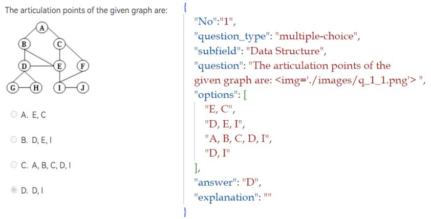

> **AI Description:**
> **Source:** `assets/_page_114_Figure_0.jpg`
> 
> **Generated:** 2026-05-16 13:18:39
> 
> ---
> 
> The image contains a multiple-choice question related to the concept of articulation points in graph theory. The question asks for the articulation points of a given graph, which is visually represented in the image. The graph is a network of nodes (A, B, C, D, E, F, G, H, I, J) connected by edges. The question provides four options for the correct answer, and the correct answer is marked as "D, I". The question type is "multiple-choice," and it is categorized under the subfield of "Data Structure."


Figure 98. Open question and its JSON representation.
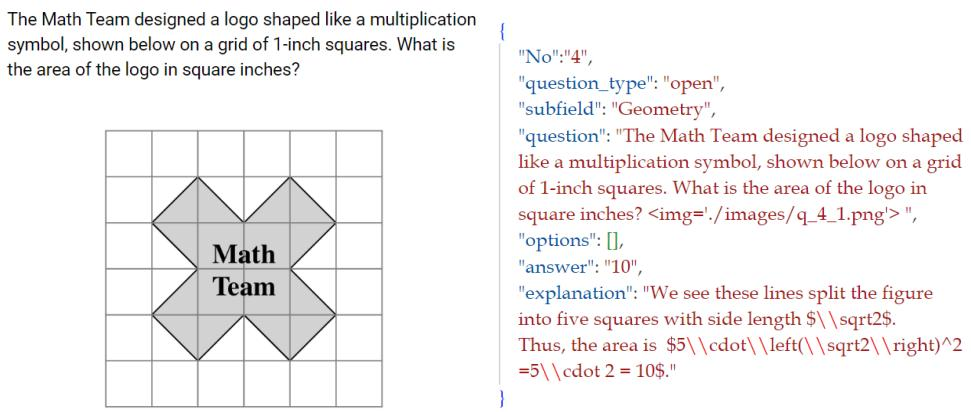

> **AI Description:**
> **Source:** `assets/_page_114_Figure_1.jpg`
> 
> **Generated:** 2026-05-16 13:18:23
> 
> ---
> 
> The image contains a grid of 1-inch squares with a logo shaped like a multiplication symbol. The logo is composed of several geometric shapes, including triangles and parallelograms, forming a symmetrical design. The question asks for the area of the logo in square inches. The answer provided is 10 square inches, with an explanation that the lines in the logo split it into five squares with a side length of \(\sqrt{2}\) inches, leading to the calculation of the area.


Figure 99. Multiple image question and its JSON representation.
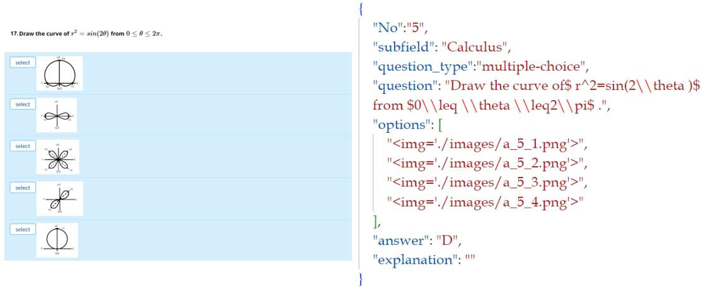

> **AI Description:**
> **Source:** `assets/_page_114_Figure_2.jpg`
> 
> **Generated:** 2026-05-16 13:19:10
> 
> ---
> 
> The image contains a multiple-choice question from a calculus subfield. The question asks to draw the curve of \( r^2 = \sin(2\theta) \) from \( 0 \leq \theta \leq 2\pi \). The question is accompanied by four options, each with a corresponding image of a curve. The correct answer is marked as "D," and there is no explanation provided. The images are labeled as a_5_1.png, a_5_2.png, a_5_3.png, and a_5_4.png.


## H. Author Contribution Statement

All authors made significant contributions to data collection, annotation, and validation. We authors contributed to 1/3 of the MMMU examples. Additionally, all authors contributed to the case study and error analysis, plotting case study figures in the Appendix. Besides, all authors participated in the discussion of data annotation, provided feedback on the project, and proofread the paper. The following authors made additional contributions:

<span id="page-115-0"></span>
Xiang Yue conceived and led the project, outlining the primary objectives, establishing the data collection methodology and protocol, designing and running experiments, as well as doing follow-up analysis. Xiang Yue also took the lead in writing the manuscript, drafting the original text, and incorporating revisions from co-authors. In addition, Xiang Yue managed project administration and coordinated the collaboration between 20+ coauthors and 30+ student annotators, ensuring the project’s milestones were met and facilitating communication among team members. Xiang Yue also took the lead in the dataset release.

Yuansheng Ni co-led the data curation process with Xiang Yue. Specifically, Yuansheng Ni developed the protocols for data quality assurance, standardizing the data annotation procedures, and supervising the team of data annotators to ensure consistency and accuracy. In addition to data curation, Yuansheng Ni also played a collaborative role in data analysis, offering critical insights that shaped the interpretation and presentation of the dataset’s characteristics.

Kai Zhang played a crucial role in the empirical evaluation of the dataset by building the evaluation pipeline to assess various LMMs. Kai Zhang carefully executed different models and analyzed their performance metrics. Kai Zhang also contributed to the manuscript by documenting the evaluation process and implementation details. The thorough model evaluation conducted by Kai Zhang has been fundamental in demonstrating the utility of the dataset.

Tianyu Zheng made significant contributions to the project by participating in the evaluation of text-only, OCRaugmented and caption-augmented baselines. In addition, Tianyu Zheng developed a user-friendly web interface for data annotation and verification. The interface design significantly improved the workflow for data curation.

Ruoqi Liu plotted or helped revise Figures 1, 2, and 3. Ruoqi Liu designed the prototype figure template for the case study figures in the Appendix.

Boyuan Zheng participated in part of the evaluation.

Huan Sun and Yu Su provided overarching and insightful discussions and comments throughout the development and execution of the project. Huan Sun and Yu Su contributed to the conceptualization of the research by helping to refine the research questions and by providing critical insights into the design of the dataset. They offered strategic direction and expert advice that significantly enhanced the dataset and the follow-up analysis. Huan Sun and Yu Su also contributed to the initial writing of the paper.

Wenhu Chen conceived the project with Xiang Yue. Wenhu Chen contributed to the conceptualization of the research by helping to refine the research questions and by providing critical insights into the design of the project. Besides, Wenhu Chen contributed to a significant amount of initial writing of the draft and offered strategic direction and expert advice that significantly enhanced the dataset and the follow-up analysis.

<span id="page-116-0"></span>
## I. Version Change Log

CHANGES TO V2 (Dec.18) FROM V1 (Nov.27)

• We added Qwen-VL-PLUS results from the author-provided outputs. (Table 2, 4, 5, 6, 7, 8, 9)

• We added SPHINX results from the author-provided outputs. (Table 2, 4, 5, 6, 7, 8, 9)

• We added Gemini Ultra results from the Gemini report [72]. (Table 2, 4, 5, 6, 7, 8, 9)

• We added Gemini Pro & Nano2 results from the Gemini report [72]. (Table 2)

• We added a section of author contribution statement. (Appendix H)

• We update mPLUG-Owl2 results with author-provided prompt. (Table 2, 4, 5, 6, 7, 8, 9)

• We fixed text box dimensions in Appendix B:

– Figure 13. A sample error case of Art Theory

• We fixed the typo in Appendix B:

– Figure 35. A sample error case of Biology

– Figure 45. A sample error case of Math

– Figure 79. A sample error case of Agriculture

– Figure 95. A sample error case of Mechanical Engineering