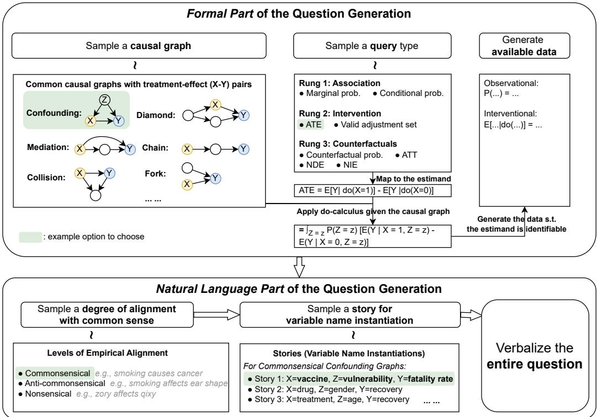
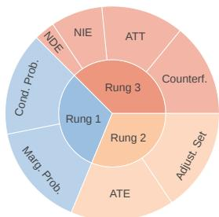
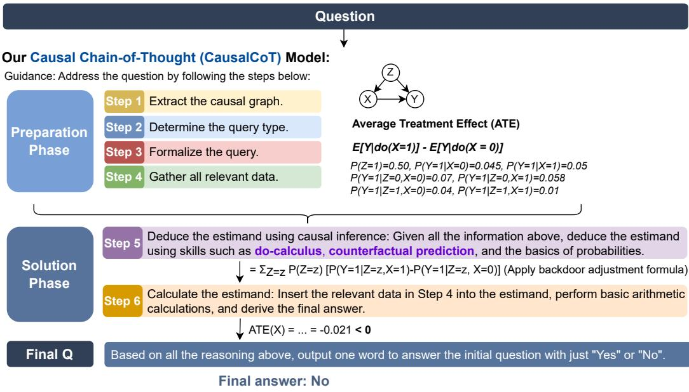
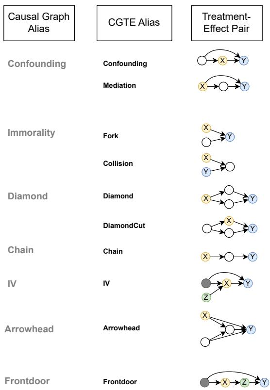
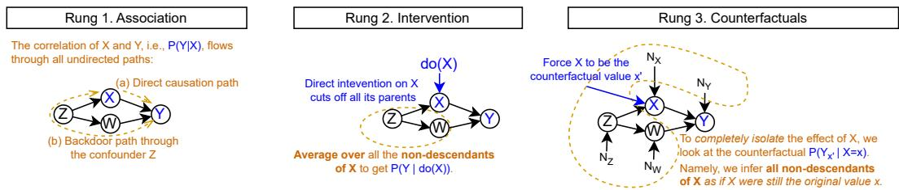
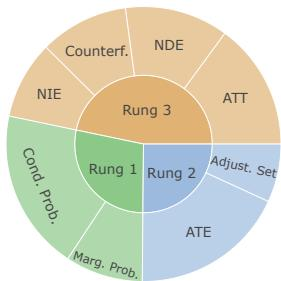

# CLADDER: Assessing Causal Reasoning in Language Models

Zhijing Jin1,2,∗, Yuen Chen1,∗, Felix Leeb1,∗, Luigi Gresele1,∗, Ojasv Kamal3, Zhiheng Lyu4, Kevin Blin2, Fernando Gonzalez2, Max Kleiman-Weiner5, Mrinmaya Sachan2, Bernhard Schölkopf1

1MPI for Intelligent Systems, Tübingen 2ETH Zürich 3IIT Kharagpur 4University of Hong Kong 5University of Washington jinzhi@ethz.ch chenyuen0103@berkeley.edu fleeb@tue.mpg.de luigi.gresele@tue.mpg.de

## Abstract

The ability to perform causal reasoning is widely considered a core feature of intelligence. In this work, we investigate whether large language models (LLMs) can coherently reason about causality. Much of the existing work in natural language processing (NLP) focuses on evaluating commonsense causal reasoning in LLMs, thus failing to assess whether a model can perform causal inference in accordance with a set of well-defined formal rules. To address this, we propose a new NLP task, causal inference in natural language, inspired by the “causal inference engine” postulated by Judea Pearl et al. We compose a large dataset, CLADDER, with 10K samples: based on a collection of causal graphs and queries (associational, interventional, and counterfactual), we obtain symbolic questions and ground-truth answers, through an oracle causal inference engine. These are then translated into natural language. We evaluate multiple LLMs on our dataset, and we introduce and evaluate a bespoke chain-of-thought prompting strategy, CAUSALCOT. We show that our task is highly challenging for LLMs, and we conduct an in-depth analysis to gain deeper insights into the causal reasoning abilities of LLMs.1

## 1 Introduction

Once we really understand the logic behind causal thinking, we could emulate it on modern computers and create an “artificial scientist”.

— Pearl and Mackenzie [2018]

Causal reasoning is believed to be one of the hallmarks of human intelligence [29, 68]. The ability to draw causal inferences from available information is crucial for scientific understanding and rational decision-making: for example, knowing whether smoking causes cancer might enable consumers to make a more informed decision [17, 18]; assessing the causal effect of a vaccine is essential for effective policy-making during a pandemic [14, 44, 72, 97]; and understanding the interplay behind family background, education and income helps devise effective education policies [10, 11, 30, 73].

Our opening quote therefore mirrors the aspirations of many scientists in artificial intelligence and causal inference: to construct a machine capable of performing sound causal reasoning, and able to answer causal questions at scale and with ease. Recent advances in large language models (LLMs) have brought about a paradigm shift in natural language processing (NLP) and artificial intelligence [7, 15, 39, 56, 76, 103, inter alia]. These transformative developments raise the question of whether these machines are already capable of causal reasoning: Do LLMs understand causality?

Figure 1: Example question in our CLADDER dataset featuring an instance of Simpson’s paradox [63]. We generate the following (symbolic) triple: (i) the causal query; (ii) the ground-truth answer, derived through a causal inference engine [66]; and (iii) a step-by-step explanation. We then verbalize these questions by turning them into stories, inspired by examples from the causality literature, which can be expressed in natural language.

Many previous works addressed the above question by focusing on commonsense causality [34, 100, 101], inspired by the literature that explores LLMs as knowledge bases [40, 70, 83] (we refer to this line of work as causality as knowledge). This involves assessing the alignment between commonsense knowledge about causal relationships in humans and LLMs. This line of work generally does not focus on evaluating how well models are capable of causal reasoning. For example, it may be difficult to rule out the possibility that LLMs perform potentially unreliable amortized causal inference, answering causal questions by a simple repetition of verbal patterns present in the texts composing their training data:2,3 in other words, LLMs may just be “causal parrots” [100].

In this work, we introduce a way to test the formal causal reasoning in LLMs. To this end, we introduce the CLADDER dataset. The specificity of CLADDER is that causal questions posed in natural language are grounded in symbolic questions and ground truth answers: the latter are derived through an oracle causal inference engine (CI engine) [66], which abides by the rules of the causal inference approach described by Pearl [61], based on graphical models and structural causal models (SCMs) [23, 59, 61, 69, 88]. We compose more than 10,000 causal questions that cover a variety of causal queries across the three rungs of the Ladder of Causation [3, 66]—i.e., associational (Rung 1), interventional (Rung 2), and counterfactual (Rung 3). We consider several causal graphs, giving rise to scenarios which require different causal inference abilities. Additionally, we generate ground-truth explanations with step-by-step reasoning for more in-depth analysis of LLM behavior. Our symbolic questions and answers are then verbalized, by turning them into stories which can be expressed in natural language. To probe whether LLMs employ amortized causal inference, we construct stories with commonsensical, as well as anti-commonsensical and with nonsensical causal relations: in these latter cases, amortized causal inference is expected to fail, whereas formal causal reasoning would still yield the correct answer. An example question from CLADDER is shown in Figure 1.

Exploiting CLADDER, we also introduce a method to elicit sound causal reasoning in LLMs and help them solve challenging causality questions. Specifically, we develop CAUSALCOT, a chain-of-thought prompting strategy [96] inspired by the CI engine, which prompts the LLM to extract the causal graph, causal query, and available “data” (e.g., conditional or interventional doprobabilities [24]) from the question, formalize them precisely, and perform correct causal inferences.

Our experiments indicate that CAUSALCOT achieves an accuracy of 70.40%, which substantially improves the performance of vanilla GPT-4 by 8.37 points on CLADDER.

We summarize the main contributions of our work:

1. In contrast to most other works on causality in LLMs, focusing on commonsense causal knowledge, our goal is to assess the LLMs’ ability to perform formal causal reasoning (briefly reviewed in Section 2).

2. We introduce CLADDER (Section 3), a dataset containing more than 10K causal questions, spanning all three rungs of the ladder of causation, several causal graphs, and various stories for verbalization.

3. We develop CAUSALCOT (Section 4), a chain-of-thought prompting strategy to elicit formal causal reasoning in LLMs, inspired by the causal inference engine.

4. We perform extensive experiments on eight LLMs (Section 5), analyze fine-grained errors to showcase the limitations of LLMs in formal causal reasoning, and suggest directions for future research.

## 2 Preliminaries on Causal Inference

Our dataset design takes inspiration from the Causal Inference Engine as postulated by Pearl and Mackenzie [66], see also [59]. We begin with a brief overview of the causality framework by Pearl et al. ${ \displaystyle [ 6 7 ] . ^ { 4 } }$ This framework was largely developed within the field of artificial intelligence, and therefore puts particular emphasis on algorithmic aspects of causal reasoning (e.g., [62])—which makes it particularly suited for our work, where we want to algorithmically generate ground truth answers to causal queries, without having to appeal to common sense to assess the correctness of an answer.

## 2.1 The Ladder of Causation

The Ladder of Causation, introduced by Pearl and Mackenzie [66], is a proposed taxonomy, and hierarchy, of causal inference tasks [3]. It consists of three distinct rungs.

Rung 1 (“seeing”). This describes statistical associations (“How often do I take an aspirin when I have a headache?”). Rung 1 deals with statistical dependences among random variables, and involves probabilistic reasoning about joint and conditional distributions, $P ( X = x , Y = y )$ and $P ( Y = y \mathbf { \bar { \vert } } X = x )$ , which can be formalised through Bayesian Networks [12, 58] representing a set of variables and their conditional dependencies via a directed acyclic graph (DAG).

Rung 2 (“doing”). This enables us to formalize the concept of actively intervening in the world, and modifying it toward some end (“If I take an aspirin now, will my headache subside?”). Interventions can be formalized using the do-operator [24] and Causal Bayesian Networks [67] to represent, for example, the distribution over Y when intervening on X to set its value to x as $P ( Y = y | \mathrm { d o } ( X = x ) )$ ).

Rung 3 (“imagining”). This rung deals with counterfactual reasoning, i.e., reasoning about alternative scenarios in which the world could have been different, possibly even contradicting the factual state (“Would my headache have subsided, if I had taken an aspirin?”). Counterfactual probabilities can be written as $P ( Y _ { x } = y )$ , representing the probability that ${ } ^ { 6 6 } Y$ would be y, had X been $\mathbf { \chi } _ { x } , \mathbf { \chi } _ { \mathbf { \chi } }$ . Reasoning about Rung 3 quantities requires the introduction of Structural Causal Models (SCMs) [67]. SCMs are especially powerful as they enable any quantity in Rungs 1, 2, and 3 to be formulated precisely [3].

## 2.2 Causal Inference

Identification. Causal inference is especially difficult since we typically only have measurements from lower rungs, but want to reason about higher ones. A crucial question is then under what conditions are such inferences possible, i.e., what assumptions and measurements are required to unambiguously answer a causal query of interest: this is the question of identification. As argued in [3], “it is generically impossible to draw higher-layer inferences using only lower-layer information”. One may be able to draw inferences at a higher layer given a combination of partial knowledge of the underlying SCM, in the form of a causal graph, and data at lower layers. The graphical structure therefore plays a crucial role in bridging the rungs of the Ladder of Causation, and many prior works have been dedicated to exploiting properties of the graph to transform higher-rung queries into expressions which can be estimated based on lower-rung quantities [36, 64, 84].

Figure 2: The data-generating process of the CLADDER dataset. The upper part of the figure describes the formal part of the question generation, which samples inputs for the CI Engine and derives a ground truth answer. The bottom part describes the natural language part of the question generation—i.e., its verbalization, based on multiple stories and different degrees of alignment with commonsense knowledge.

> **AI Description:**
> **Source:** `assets/_page_3_Figure_0.jpg`
> 
> **Generated:** 2026-05-16 13:59:11
> 
> ---
> 
> The image is a flowchart illustrating the formal and natural language parts of question generation in a causal inference context. It includes a section labeled "Formal Part of the Question Generation," which outlines steps such as sampling a causal graph, selecting a query type, and generating available data. The flowchart details the process of applying do-calculus to estimate causal effects, such as Average Treatment Effect (ATE), and includes examples of common causal graph structures like confounding, mediation, and collision. The "Natural Language Part of the Question Generation" section describes how to sample a degree of alignment with common sense and a story for variable name instantiation, ultimately leading to verbalizing the entire question. The flowchart uses icons and text annotations to guide the reader through the process, making it a comprehensive guide for generating questions in causal inference.

Causal Inference Engine. An overarching objective of this research is the construction of a Causal Inference Engine (CI Engine) [37, 59, 66], which takes as input a query, a graph, and some available data (typically from lower rungs than the query); and outputs whether a solution exists, and, if so, an equivalent expression of the query which is estimable from the available data. While some previous works refer to the CI engine in the context of Rung 2 queries, where it corresponds to the do-calculus [36, 84], here we refer to it in a more general sense, encompassing all three rungs.

## 3 Composing the CLADDER Dataset

Task Formulation. Like in the example of Figure 1, our dataset $\mathcal { D } : = \{ ( q _ { i } , a _ { i } , e _ { i } ) \} _ { i = 1 } ^ { N }$ consists of N triples, each containing a question qi, binary answer $a _ { i } \in \{ \mathrm { Y e s } , \mathrm { N o } \}$ , and an explanation ei. Our main task is to test the accuracy of the prediction function $f : { \pmb q } \mapsto { \boldsymbol a } , \mathrm { i . e . }$ , a LLM which maps a natural language causal question to an answer. Apart from directly evaluating the answer, we also compose the ground-truth explanations e to evaluate the reasoning steps of LLMs.

Design Principles. In the composition of our dataset, we adhere to the following design principles. First, we ensure broad coverage of all rungs of the ladder of causation. Second, we avoid settings that involve continuous variables and use binary variables instead: this is partly due to the large availability of identifiability results for binary and categorical variables, and partly because queries involving binary variables lend themselves to more natural-sounding verbalization. Moreover, since LLMs struggle with calculation-heavy tasks [32, 91], and we are chiefly interested in causal reasoning abilities, we focus on graphs with few (three to four) variables, in various common configurations, to produce questions which are identifiable from the outset. Lastly, we carefully design a rich set of templates to translate the abstract formulas into grammatically correct and natural-sounding, fluent prompts.

## Overall Pipeline. The generation pipeline for CLADDER, depicted in Figure 2, consists of two parts:

1. In the Formal Part (which we illustrate in Section 3.1), we specify all the required inputs (query, model, data) and the ground truth answer generated by the CI Engine.

2. In the Natural Language Part (in Section 3.2), we verbalize the formal queries and specification of the causal model and data by associating them to a story or narrative, using a rich set of templates.

## 3.1 Formal Part of the Question Formulation

The first step of our data generating process is to construct a set of inputs to the CI Engine such that by design there exists a well-defined ground truth answer: i.e., we construct triples of causal queries, graphs, and data such that the query can be unambiguously answered based on the available data (ensuring identifiability by construction).5 The ground truth causal models, which specify all quantities which are considered measurable in our questions, are causal Bayesian networks (CBNs), where each causal mechanism (i.e., conditional probability of a variable given its parents in the factorization according to the causal graph G) corresponds to a Bernoulli distribution. We compile a selection of graphs G based on examples drawn from multiple sources from the literature [66, 67, 69, 88], where suitable graph structures are used to illustrate toy problems in causal inference. The complete list of structures we consider can be found in Appendix A.3; the complete list of sources in Appendix A.1.

Selecting Query Types. We again draw from the causal inference literature to collect common query types in each rung. As illustrated in the “Sample a query type” box in Figure 2, for Rung 1, we can ask about probability distributions such as marginal probabilities and conditional probabilities. For Rung 2 questions, we can enquire average treatment effects (ATE) (“how will Y change if X changes from x to x′?”), or what constitutes a valid adjustment set that can block all backdoor spurious correlations between X and Y . Lastly, for Rung 3, we include counterfactuals (“what would happen to Y had X been x′ instead of x?”), average treatment effect on the treated (ATT) (“for the subpopulation whose X changed from x to x′, how does their Y change on average?”), natural direct effect (NDE) (“what is the direct effect of X in Y , but not through the mediator?”), and natural indirect effect (NIE) (“what is the effect from X to Y through the mediator?”).

Applying the Causal Inference Engine for the Ground-truth answer. By construction, the causal processes we define encapsulates all necessary information to make the causal quantities of the query types identifiable. This allows us to apply the rules of causal inference to obtain an estimand for each causal graph and query type, and evaluate the estimand to get a ground truth answer. The Rung 2 queries simplify to Rung 1 terms using the rules of do-calculus [59], and, for the Rung 3 queries, we apply methods of counterfactual causal inference [67] (with details in Appendix C.3). The estimand also specifies exactly which terms are necessary to include in the prompt as “available data” in order to ensure that enough information is provided to answer the question correctly (i.e., for identifiability), provided the correct causal reasoning is applied. Our entire code base of the data generation process can be found at our GitHub repository, https://github.com/causalNLP/cladder.

## 3.2 Natural Language Part of the Question Formulation

While Section 3.1 describes a way to generate the ground-truth causal model, query and answers, computed through a causal inference engine, real-world causal reasoning problems are expressed in natural language rather than symbolic expressions. The next part of the data generation pipeline therefore focuses on the verbalization of all these components with a plausible narrative in natural language.

Generating the Stories. For each causal graph, we collect a set of two to five stories which consist of a list of variable names for each node in the graph. The stories are primarily selected from examples in commonly cited causal inference books and papers (see Appendix A.1), which ensures that the stories and corresponding causal graph structures adhere to empirical common sense (e.g., the druggender-recovery example of Pearl and Mackenzie [66]). However, it is very likely that at least some of the stories appear in the training data of many LLMs. Therefore, we also generate various anticommon sense and nonsensical variants of the stories, meant to isolate the effects of memorization. For the anti-commonsensical stories, we randomly do one of the actions: (1) replace the effect variable Y with an unusual attribute, that would not be an effect variable in any of the stories (e.g., “ear shape”); or (2) create an irrelevant treatment variable X that does not play a causal role in any of our commonsensical stories, such as “playing card games” (see Appendix A.7). For the nonsensical variants, we invent artificial words as variable names such as “zory” and “qixy” (see Appendix A.6). .

Verbalizing the Prompts. The verbalization procedure applies the mapping of symbolic variables to semantic concepts to form a plausible narrative for the underlying causal process and then translates the symbolic expressions from the underlying causal process to natural language using carefully designed templates.

Specifically, we use several different grammatical forms for each semantic concept t in the story to make the resulting prompt sound natural and grammatically correct. We first have the overall variable name ${ v _ { \mathrm { o v e r a l l } } ( t ) }$ (e.g., the recovery status), and, then, for each binary value $i \in \{ 0 , 1 \}$ , we compose its noun $v _ { \mathrm { n o u n } } ( t = i ) ~ ( \mathrm { e . g . , r e c o v e r y } )$ , verb (e.g., to recover), sentence $v _ { \mathrm { s e n t } } ( t = i ) ~ ( { \mathrm { e . g } }$ ., the patients recover), noun with attributive clause $v _ { \mathrm { a t t r } } ( \pmb { t } = i )$ (e.g., patients who recover), and third conditional $v _ { \mathrm { c o n d } } ( t = i ) \ ( \mathrm { e . g . }$ ., if the patient had recovered).

Using these elements, we first verbalize the causal graph by iterating through each node and its outgoing edges, using the template “t has a direct effect on ${ \bf { C } } { \bf { \bar { H } } } ( t ) . $ , where CH(·) denotes the set of direct effects (children) of a variable. Then, for the available data d, we verbalize each conditional probability by “For $v _ { \mathrm { a t t r } } ( { t } _ { m } = i )$ , the probability of $v _ { \mathrm { n o u n } } ( t _ { n } = 1 )$ is $p . \ddot { }$ , and each marginal probability by “The overall probability of $v _ { \mathrm { a t t r } } ( \pmb { t } = 1 )$ is $p . \ '$ Note that our distributions are Bernoulli, so it is adequate to just introduce the parameter p, which is the likelihood of t = 1. For example, we generate sentences such as “The overall probability of recovery is 60%.” and “For patients who have small kidney stones, the probability of recovery is 70%.” Finally, for the query q, we instantiate each query type in our dataset following our question templates in Appendix A.5 such that the questions can always be answered with “yes” or “no”.

Generating the Explanations. Apart from the question-answer pairs, we also generate the step-bystep explanations. Our goal is to provide all intermediate reasoning steps a student of causal inference would use to answer the questions, so that each necessary subskill necessary for causal inference can be evaluated individually. We identify the following six subskills: ① causal graph extraction; ② correct query type interpretation; ③ symbolic formalization of the query; ④ semantic parsing to compile the available data; ⑤ estimand derivation; and ⑥ arithmetic calculation to solve the estimand, as in the colored boxes in Figure 1. Our explanation e verbalizes all the elements ①-⑥ as sequential steps using our template in Appendix A.8.

## 3.3 Dataset Statistics

Our data-generating procedure has the potential to algorithmically generate a vast large number of questions. In practice, we pick a dataset size that is large enough to be representative, and at the same time not too large to be problematic given the expensive inference costs of LLMs. We therefore set our dataset size to be 10K, and report the statistics in Table 1.

The dataset roughly balance across the query types, graph structures, stories, and ground truth answers (as seen in Figure 3). Note that some causal queries are only compatible with a subset of the graphs, thereby resulting in a slightly lower representation of those queries (such as the NDE and NIE). More details on our design choices can be found in Appendix A.4.

Table 1: Statistics of our CLADDER dataset v1.5.

Figure 3: Distributions of query types in our 10K data.

> **AI Description:**
> **Source:** `assets/_page_5_Figure_0.jpg`
> 
> **Generated:** 2026-05-16 13:58:46
> 
> ---
> 
> The image is a circular diagram divided into sections, each labeled with different statistical concepts. The sections are color-coded and arranged in a hierarchical manner, with "Rung 1" at the center, "Rung 2" surrounding it, and "Rung 3" encompassing the outermost ring. The labels within the diagram include terms such as "NDE," "NIE," "ATT," "Counterf., "Cond. Prob.," "Marg. Prob.," and "ATE," which are related to causal inference and statistical analysis. The diagram visually represents the relationships and distinctions between these concepts, likely used in the field of causal inference or related statistical studies.

## 3.4 Data Quality Check

Our dataset is generated through an algorithmic procedure, which has the following potential benefits: formal correctness; zero human annotation cost; and, most importantly, controllability—e.g., for the question distribution, as well as for making it more unlikely that the data was previously seen by the model. However, since the dataset is different from common NLP datasets collected from human natural language writing, we also need to perform additional data quality checks. We therefore checked for a list of non-formal, natural language properties: grammaticality; human readability; naturalness/perplexity; and how well humans perform on this task.

For grammaticality, we ran a grammatical error check on our dataset using the LanguageTool package [51], and got on average 1.26 grammatical errors per 100 words (i.e., 98.74% correctness), which shows that most of the language in our dataset follows English grammar. For human readability, we checked how comprehensible the questions are to students who have taken causality courses. We selected a random subset of 50 questions from the dataset, and let a graduate student annotator go through the questions to judge whether they could understand them or not: 96% of the questions were deemed readable. Next, for the naturalness/perplexity score, we used the open-sourced GPT-2 model and obtained a perplexity score of 21.17 on our dataset, which is substantially lower (i.e., closer to the distribution of natural human-written text) than the one of MATH [32], a commonly used dataset of maths questions. Lastly, we conducted a sanity check where one expert evaluator tried to solve a random sample of 50 questions from the dataset, and we recorded an accuracy of 82% on this task.

## 4 Our CAUSALCOT Model

Figure 4: Illustration of our CAUSALCOT prompting strategy, which designs a chain of subquestions inspired by the idea of a CI engine [66].

> **AI Description:**
> **Source:** `assets/_page_6_Figure_0.jpg`
> 
> **Generated:** 2026-05-16 13:57:57
> 
> ---
> 
> The image contains a flowchart describing a Causal Chain-of-Thought (CausalCoT) model for addressing causal inference questions. It is divided into two main phases: Preparation Phase and Solution Phase. The Preparation Phase includes four steps: Extract the causal graph, Determine the query type, Formalize the query, and Gather all relevant data. The Solution Phase includes two steps: Deduce the estimand using causal inference, and Calculate the estimand. The flowchart uses a causal graph to illustrate the relationship between variables Z, X, and Y, and includes probability values and formulas related to the Average Treatment Effect (ATE). The final answer is derived based on the calculations and is presented as "No."

In order to guide LLMs in correctly answering the questions in CLADDER, we draw inspiration from the ideal functioning of the CI engine [66], which breaks down a causal reasoning problem into multiple symbolically-grounded, simpler steps. We develop CAUSALCOT, a multi-step causal chain-of-thought prompt in Figure 4, which combines formal causal reasoning skills with the idea of chain-of-thought prompting [96] and the use of scratch pads for solving more complicated problems requiring a long list of steps [55] for LLMs.

We base our prompt design on the multi-step reasoning process of causal inference as shown in Figure 4, first starting with four preparation steps: ① identifying the causal graph structure; ② determining the causal query type;6 ③ formulating the query symbolically precisely; and ④ extracting relevant data from the prompt. Then, given all the information collected in the preparation stage, we introduce the formal solution: ⑤ correctly deducing the estimand using causal inference techniques; and finally ⑥ evaluating the estimand to answer the question. This set of steps require both natural language understanding to parse the question (as in most steps in the preparation phase), as well as formal causal reasoning to derive the correct estimand (as in the solution phase).

We build our CAUSALCOT prompting strategy using GPT-4 [56], a recent autoregressive LLM that achieves state-of-the-art performance on many tasks. This latest model builds upon the previous series of general pretrained models (GPT) [7, 76] and adds reinforcement learning with human feedback, or instruction-tuning [1, 57, 104], to align the model responses to free-form questions with human preferences. It has achieved human-competitive performance over a list of tasks [8, 43, 54, 56, 105], among which the more formal tasks unseen in the training data still remain elusive [42, 78, 91].

Given a causal question q, we provide the LLM a list of instructions $\ell : = ( s _ { 1 } , \ldots , s _ { 6 } )$ consisting of the detailed descriptions of the six steps $s _ { 1 } , \ldots , s _ { 6 }$ in Figure 4. As the model $f _ { \mathrm { L L M } } : s _ { i } \mapsto r _ { i }$ autoregressively produces responses $r _ { 1 } , \cdot \cdot \cdot , r _ { 6 }$ sequentially corresponding to the six steps, we concatenate all the above before asking the final question “Based on all the reasoning above, output one word to answer the initial question with just ‘Yes’ or $\mathbf { \vec { N } } \mathbf { 0 } \mathbf { \vec { \mu } } . \mathbf { \vec { \mu } }$ See the complete prompt in Appendix B.1. In the end, we obtain the binary answer $a \in \{ \mathrm { Y e s } , \mathrm { N o } \}$ as the final result.

Compared with the standard strategy of directly prompting the LLMs a question, we impose an inductive bias upon LLMs by using the causal inference framework, thus incorporating some of the powerful, principled insights of the causal inference community for NLP tasks. In this way, we enhance the strong natural language ability of LLMs with formal causal reasoning skills.

## 5 Testing LLMs with CLADDER

## 5.1 Experimental Setup

Our empirical investigation focuses on some of the most recent language models. We include the latest GPT-4 [56] with 1T parameters by the time we conduct the experiments (i.e., gpt-4-1106-preview), the previous ChatGPT (i.e., GPT-3.5) with 175B parameters, and then a series of earlier models with instruction-tuning on the 175B GPT-3 (text-davinci-001, -002, and -003) [57]. As baselines, we also include the non-instruction-tuned GPT-3 (davinci). We use the OpenAI API with temperature 0 when querying these models. We also include open-source, more efficient models like LLaMa [93] and its instruction-tuned version Alpaca [92], both with the same number of parameters, 6.7B.

## 5.2 Main Results

Table 2: Performance of all models on our CLADDER dataset v1.5. We report the overall accuracy (Acc.), and also fine-grained accuracy by rung, and by degree of commonsense alignment, from commonsensical (Comm.), nonsensical (Nonsens.), to anti-commonsensical (Anti-C.).

We compare the performance of all models in Table 2. First, we can see that the causal reasoning task in CLADDER is in general very challenging for all models. Models such as the earlier, non-instructiontuned GPT-3, and both LLaMa and Alpaca are around random performance. With instruction-tuning, models start to show some improvement. And amongst all, our CAUSALCOT achieves the highest performance of 70.40%, which is substantially better than the vanilla GPT-4 by 8.37 points. Moreover, CAUSALCOT also achieve the best performance across all three rungs of causal questions, with a monotonically decreasing performance as the rungs get higher, i.e., the questions get more difficult. See Appendix D for experiments on our earlier dataset v1.0.

## 5.3 Isolating the Effect of Data Contamination

A well-known problem with evaluating LLMs on question-answering tasks is the data contamination problem, i.e., that LLMs perform well on a test set because the test set is (unintentionally) contained partially or even entirely in the training data [7, 56]. We address this problem by creating not only the commonsensical subset of our dataset, but also anti-commonsensical and nonsensical, both of which, by construction, are very likely not in the training data of LLMs. From the accuracy by commonsense alignment degree in Table 2, we can see the original GPT-4 model performs the worst on the anticommonsensical subset (1.8 points lower than that on the commonsensical subset). However, our CAUSALCOT enhances the reasoning ability across all levels, with substantial improvement on anti-commonsensical data by 9.65 points, highlighting the strength of CAUSALCOT on unseen data.

### Full Page Description (Page 8)

**Source:** `assets/_page_8_Asset_0.jpg`

**Generated:** 2026-05-16 13:58:25

---

The image is a heat map visualization with a color gradient representing numerical values. The x-axis and y-axis both list the same categories: "Marg.", "Cond.", "ATE", "Count.", "ATT", "NDE", and "NIE". The color intensity in the cells indicates the magnitude of the values, with darker shades representing higher values. The color bar on the right side of the image provides a scale for interpreting the color intensity. The main trend observed is that the values for "NIE" are generally lower than the other categories, with some exceptions where "NIE" has higher values compared to "NDE" and "ATT".

## 5.4 Error Analysis by Subquestions

Table 3: Performance for each step in CAUSALCOT. For Step ①, we report the F1 score of node prediction, edge prediction, and also the graph edit distance (Dist.) with the true graph. See more details in Appendix E.1.

We conduct a fine-grained error analysis by looking into the performance of different steps of CAUSALCOT in Table 3.7 We can see that the model is good at Step ① to extract causal graph G, achieving high F1 scores for predicting both the nodes and the edges correctly, although not perfect, still leaving a graph edit distance of 1.69 between the ground truth causal graph and the model-identified graph. The other steps are more challenging for the model. Among those, Steps ②, ③ and ⑤ require careful and correct application of causal inference, where the model struggles. This reveals a notable weakness of current LLMs to perform formal causal reasoning, which is an important direction for future work on improving and enhancing LLMs. To better understand the reasoning abilities of LLMs, we also perform an extensive analysis taking the entire reasoning chain of our CAUSALCOT and the ground-truth explanations, to produce 20 fine-grained scores about the multi-step reasoning quality using the ROSCOE framework [25], and show detailed results in Appendix E.2.

## 5.5 Effect of In-Context Learning

As an additional analysis, we look into the effect of in-context learning (ICL) by providing an example solution before asking the question. The interesting question to us is whether models can generalize across different query types. Namely, we keep our CAUSALCOT framework, and prepend a reasoning example of query type i, and then calculate how much improvement it can bring when models answer new questions of query type j. In Figure 5, we can see that conditional probability and NIE are the questions that benefit the most from ICL, and showing examples of marginal probability and ATT are among the most helpful to all questions in general.

## 6 Related Work

Skill evaluation for LLMs. Our work may be seen as part of the literature aimed at evaluating the performance of current LLMs [7, 15, 56, 76, 103, inter alia], focusing on understanding their strengths and weaknesses. Various studies into the capabilities of LLMs [8, 39, 56, 74] change people’s perception of domains such as education [2, 80], medicine [54, 87], law [43], and computational social science [105]. However, most work evaluates new models on existing datasets from previouslycurated large-scale benchmarks [89, 94, 95], or human exams [41, 43, 56] which is becoming increasingly unreliable due to training set contamination.

Causality-related skills for NLP. With the increasing attention on LLMs and causality [100, 101], we review several formulations of causality-related skills for NLP, which we summarize into (1) causality as knowledge, (2) causality as language comprehension, and (3) causality as reasoning. In the causality-as-knowledge line of work, many existing studies investigate how well NLP models understand commonsense causality, such as the cause and effect of an agent’s action [81], motivation and emotional reaction in a social context [82], correspondence of a set of steps with a high-level goal [102], development of a story given a different beginning [75], and how in general LLMs serve as a knowledge base of causality [100]. Concurrent work [45] focuses on evaluating LLMs on various causality related tasks by leveraging the conceptual knowledge accrued from the training data, rather than formal causal inference, except for their causal sufficiency analysis which is close to our counterfactual questions. Importantly, most work in this line does not define explicit causal graphs, making it difficult to quantitatively define the ground-truth causal relationships in a principled way. The causality-as-language-comprehension line of work stems from traditional linguistic studies on causal connectives and causal language usage [9, 90, 99], to the recent causal relation extraction [4, 33, 98] to identify cause-effect pairs as a subtask of information extraction from text.

Finally, for causality as formal reasoning, our CLADDER work formulates the task of causal inference for NLP, and our other work, CORR2CAUSE [42], addresses the causal discovery problem to infer causation from correlation. Together, they cover the two major branches of causal reasoning investigated in existing technical literature on causality. See a comprehensive comparison of literature in Appendix F.

## 7 Discussion of Limitations and Future Work

A Natural Language “Mini Turing Test” for Causality. Pearl and Mackenzie [66] describe an ideal “mini-Turing test” to assess understanding of causal inference, and argue that if a machine can answer all possible questions correctly, then it “understands” causality. According to the authors, this is because there are no possible shortcuts when you consider all possible combinations of queries, graphs and data in this ideal test: due to their combinatorial explosion, the machine can only answer all questions right if it correctly applies causal reasoning. From this point of view, our work constitutes a first step towards a mini-Turing test formulated in natural language. However, we cover only some of the commonly studied causal queries spanning all three rungs. Future work may extend this to further queries, such as, e.g., path-specific effects other than NDE and NIE [52], thereby increasing the number of potential questions and moving closer to the ideal test.

LLMs and Causal Reasoning. It has been claimed that LLMs understand causality well (e.g., [45] report high performance, such as 97% and 92%). In contrast, our work suggests that LLMs may still be far from reasoning reliably about causality (reaching only 60+% on CLADDER). As argued in Section 1, we believe that investigating this aspect may be of particular importance, since causal inference is crucial in many policy-relevant scenarios, where reliable AI systems could assist decisionmaking: from epidemiology [22, 79] to economics [10, 37] to fairness [47, 71]. Testing the abilities of these systems in semi-realistic scenarios is therefore crucial, motivating some of the design choices in our dataset: e.g., the example in Figure 1 was inspired by similar questions which arose in the context of the COVID-19 pandemic, where incorrect causal reasoning resulted in a fallacy where vaccinations were considered to be harmful instead of beneficial [20, 49]. Further work may be dedicated to making the questions and verbalizations even closer to realistic instances of causal inference problems.

A CI Engine Plug-in for LLMs. An interesting direction for future research could be to provide the LLM access to an actual implementation of the CI engine. For example, Davis and Aaronson [13] tested the improvement of math abilities in LLMs augmented with plug-ins (i.e., external modules that extend the model’s capabilities by adding specific functionality or customizing its behaviour for particular tasks, like a calculator), suggesting that they significantly enhance the model’s ability to solve these problems. However, even with plug-ins, there are still often “interface” failures: that is, “[the LLM] often has trouble formulating problems in a way that elicits useful answers from the plug-ins”. We hypothesise that something similar would happen for causal inference: even once suitable plug-ins are built, the language-to-tool interface may still be a non-trivial research question.

## 8 Conclusion

We proposed formal causal reasoning as a new task to evaluate LLMs, and created the CLADDER benchmark, covering several aspects of causal inference across all rungs of the ladder of causation and verbalizations involving semi-realistic scenarios. To address the task, we proposed a prompting strategy, CAUSALCOT, inspired by the principles of formal causal inference, which introduces multistep chain-of-thought reasoning for causal questions. Extensive experiments indicate that this dataset is highly challenging, thus offering a principled tool to gain a better understanding of the reasoning abilities of LLMs and to develop better models for causal reasoning in natural language.

## Acknowledgment

We thank Sergio Hernan Garrido Mejia for pointing us to Python implementations of the causal inference engine. We thank Armen Aghajanyan for the idea of testing psychological bias in LLMs, which partly contributes to the idea of exposing causal bias in LLMs. We thank András Strausz for various timely coding help, especially for our Simpson’s paradox case.

The material presented in this manuscript is partly based upon works supported by the German Federal Ministry of Education and Research (BMBF): Tübingen AI Center, FKZ: 01IS18039B; by the Machine Learning Cluster of Excellence, EXC number 2064/1 – Project number 390727645; the Swiss National Science Foundation (Project No. 197155); a Responsible AI grant by the Haslerstiftung; an ETH Grant (ETH-19 21-1); and by the John Templeton Foundation (grant #61156). Zhijing Jin is supported by PhD fellowships from the Future of Life Institute and Open Philanthropy, as well as the travel support from ELISE (GA no 951847) for the ELLIS program. Felix Leeb is supported by the International Max Planck Research School for Intelligent Systems (IMPRS-IS). Luigi Gresele is supported by the VideoPredict project, FKZ: 01IS21088.

## Author Contributions

The conceptualization and design of this project was led by Zhijing, Luigi and Felix, and supervised by Mrinmaya on the NLP part, and Bernhard on the causality part. Max provided timely insights from cognitive science on different types of causal tasks and on the project design. In the exploration stage, Ojasv did substantial work on discovering causal fallacies in news and on Twitter, which, while not included in the current systematic way of generating causal inference questions, was a significant contribution in the course of the project and in comparing various task formulations.

As for the operationalization and programming, the dataset composition was mainly led by Yuen and Felix, together with daily discussions with Zhijing, and weekly discussions with Luigi. Zhiheng supported an important function of generating the backdoor adjustment set for a given causal graph with the treatment and effect variables. The experiments are mainly conducted by Zhijing and Fernando, with Kevin finishing the evaluation results using the ROSCOE package.

## References

- [1] Yuntao Bai, Andy Jones, Kamal Ndousse, Amanda Askell, Anna Chen, Nova DasSarma, Dawn Drain, Stanislav Fort, Deep Ganguli, Tom Henighan, Nicholas Joseph, Saurav Kadavath, Jackson Kernion, Tom Conerly, Sheer El Showk, Nelson Elhage, Zac Hatfield-Dodds, Danny Hernandez, Tristan Hume, Scott Johnston, Shauna Kravec, Liane Lovitt, Neel Nanda, Catherine Olsson, Dario Amodei, Tom B. Brown, Jack Clark, Sam McCandlish, Chris Olah, Benjamin Mann, and Jared Kaplan. 2022. Training a helpful and harmless assistant with reinforcement learning from human feedback. CoRR, abs/2204.05862. [Cited on page 8.]
- [2] David Baidoo-Anu and Leticia Owusu Ansah. 2023. Education in the era of generative artificial intelligence (AI): Understanding the potential benefits of ChatGPT in promoting teaching and learning. Available at SSRN 4337484. [Cited on page 9.]
- [3] Elias Bareinboim, Juan D Correa, Duligur Ibeling, and Thomas Icard. 2022. On Pearl’s hierarchy and the foundations of causal inference. In Probabilistic and causal inference: the works of judea pearl, pages 507–556. [Cited on pages 2 and 3.]
- [4] Steven Bethard, William Corvey, Sara Klingenstein, and James H. Martin. 2008. Building a corpus of temporal-causal structure. In Proceedings of the Sixth International Conference on Language Resources and Evaluation (LREC’08), Marrakech, Morocco. European Language Resources Association (ELRA). [Cited on page 10.]
- [5] Chandra Bhagavatula, Ronan Le Bras, Chaitanya Malaviya, Keisuke Sakaguchi, Ari Holtzman, Hannah Rashkin, Doug Downey, Wen-tau Yih, and Yejin Choi. 2020. Abductive commonsense reasoning. In 8th International Conference on Learning Representations, ICLR 2020, Addis Ababa, Ethiopia, April 26-30, 2020. OpenReview.net. [Cited on page 27.]
- [6] Stephan Bongers, Patrick Forré, Jonas Peters, and Joris M Mooij. 2021. Foundations of structural causal models with cycles and latent variables. The Annals of Statistics, 49(5):2885– 2915. [Cited on page 23.]
- [7] Tom B. Brown, Benjamin Mann, Nick Ryder, Melanie Subbiah, Jared Kaplan, Prafulla Dhariwal, Arvind Neelakantan, Pranav Shyam, Girish Sastry, Amanda Askell, Sandhini Agarwal, Ariel Herbert-Voss, Gretchen Krueger, Tom Henighan, Rewon Child, Aditya Ramesh,

- Daniel M. Ziegler, Jeffrey Wu, Clemens Winter, Christopher Hesse, Mark Chen, Eric Sigler, Mateusz Litwin, Scott Gray, Benjamin Chess, Jack Clark, Christopher Berner, Sam McCandlish, Alec Radford, Ilya Sutskever, and Dario Amodei. 2020. Language models are few-shot learners. In Advances in Neural Information Processing Systems 33: Annual Conference on Neural Information Processing Systems 2020, NeurIPS 2020, December 6-12, 2020, virtual. [Cited on pages 1, 8, and 9.]
- [8] Sébastien Bubeck, Varun Chandrasekaran, Ronen Eldan, Johannes Gehrke, Eric Horvitz, Ece Kamar, Peter Lee, Yin Tat Lee, Yuanzhi Li, Scott M. Lundberg, Harsha Nori, Hamid Palangi, Marco Túlio Ribeiro, and Yi Zhang. 2023. Sparks of artificial general intelligence: Early experiments with GPT-4. CoRR, abs/2303.12712. [Cited on pages 8 and 9.]
- [9] Angela Cao, Gregor Williamson, and Jinho D. Choi. 2022. A cognitive approach to annotating causal constructions in a cross-genre corpus. In Proceedings of the 16th Linguistic Annotation Workshop (LAW-XVI) within LREC2022, pages 151–159, Marseille, France. European Language Resources Association. [Cited on page 10.]
- [10] David Card. 1999. The causal effect of education on earnings. Handbook of labor economics, 3:1801–1863. [Cited on pages 1 and 10.]
- [11] Raj Chetty, John N Friedman, Nathaniel Hilger, Emmanuel Saez, Diane Whitmore Schanzenbach, and Danny Yagan. 2011. How does your kindergarten classroom affect your earnings? Evidence from project star. The Quarterly journal of economics, 126(4):1593–1660. [Cited on page 1.]
- [12] Robert G Cowell, Philip Dawid, Steffen L Lauritzen, and David J Spiegelhalter. 2007. Probabilistic networks and expert systems: Exact computational methods for Bayesian networks. Springer Science & Business Media. [Cited on page 3.]
- [13] Ernest Davis and Scott Aaronson. 2023. Testing GPT-4 with Wolfram Alpha and Code Interpreter plug-ins on math and science problems. arXiv preprint arXiv:2308.05713. [Cited on page 10.]
- [14] Gaston De Serres, France Markowski, Eveline Toth, Monique Landry, Danielle Auger, Marlène Mercier, Philippe Bélanger, Bruno Turmel, Horacio Arruda, Nicole Boulianne, et al. 2013. Largest measles epidemic in North America in a decade—Quebec, Canada, 2011: Contribution of susceptibility, serendipity, and superspreading events. The Journal of infectious diseases, 207(6):990–998. [Cited on page 1.]
- [15] Jacob Devlin, Ming-Wei Chang, Kenton Lee, and Kristina Toutanova. 2019. BERT: Pretraining of deep bidirectional transformers for language understanding. In Proceedings of the 2019 Conference of the North American Chapter of the Association for Computational Linguistics: Human Language Technologies, Volume 1 (Long and Short Papers), pages 4171– 4186, Minneapolis, Minnesota. Association for Computational Linguistics. [Cited on pages 1 and 9.]
- [16] Quang Do, Yee Seng Chan, and Dan Roth. 2011. Minimally supervised event causality identification. In Proceedings of the 2011 Conference on Empirical Methods in Natural Language Processing, pages 294–303, Edinburgh, Scotland, UK. Association for Computational Linguistics. [Cited on page 27.]
- [17] Richard Doll and A Bradford Hill. 1950. Smoking and carcinoma of the lung. British medical journal, 2(4682):739. [Cited on page 1.]
- [18] Richard Doll and A Bradford Hill. 1954. The mortality of doctors in relation to their smoking habits. British medical journal, 1(4877):1451. [Cited on page 1.]
- [19] Jesse Dunietz, Lori Levin, and Jaime Carbonell. 2017. The BECauSE corpus 2.0: Annotating causality and overlapping relations. In Proceedings of the 11th Linguistic Annotation Workshop, pages 95–104, Valencia, Spain. Association for Computational Linguistics. [Cited on page 27.]
- [20] Jordan Ellenberg. 2021. Coronavirus vaccines work. But this statistical illusion makes people think they don’t. The Washington Post. [Cited on page 10.]

- [21] Jörg Frohberg and Frank Binder. 2022. CRASS: A novel data set and benchmark to test counterfactual reasoning of large language models. In Proceedings of the Thirteenth Language Resources and Evaluation Conference, pages 2126–2140, Marseille, France. European Language Resources Association. [Cited on page 27.]
- [22] Thomas A Glass, Steven N Goodman, Miguel A Hernán, and Jonathan M Samet. 2013. Causal inference in public health. Annual review of public health, 34:61–75. [Cited on page 10.]
- [23] Madelyn Glymour, Judea Pearl, and Nicholas P Jewell. 2016. Causal inference in statistics: A primer. John Wiley and Sons. [Cited on pages 2 and 19.]
- [24] Moisés Goldszmidt and Judea Pearl. 1992. Rank-based systems: A simple approach to belief revision, belief update, and reasoning about evidence and actions. KR, 92:661–672. [Cited on pages 2 and 3.]
- [25] Olga Golovneva, Moya Chen, Spencer Poff, Martin Corredor, Luke Zettlemoyer, Maryam Fazel-Zarandi, and Asli Celikyilmaz. 2022. Roscoe: A suite of metrics for scoring step-by-step reasoning. [Cited on pages 9 and 25.]
- [26] Andrew Gordon, Zornitsa Kozareva, and Melissa Roemmele. 2012. SemEval-2012 task 7: Choice of plausible alternatives: An evaluation of commonsense causal reasoning. In \*SEM 2012: The First Joint Conference on Lexical and Computational Semantics – Volume 1: Proceedings of the main conference and the shared task, and Volume 2: Proceedings of the Sixth International Workshop on Semantic Evaluation (SemEval 2012), pages 394–398, Montréal, Canada. Association for Computational Linguistics. [Cited on page 27.]
- [27] Joseph Y. Halpern and Judea Pearl. 2005. Causes and explanations: A structural-model approach. part i: Causes. The British Journal for the Philosophy of Science, 56(4):843–887. [Cited on page 19.]
- [28] Joseph Y Halpern and Judea Pearl. 2005. Causes and explanations: A structural-model approach. part ii: Explanations. The British journal for the philosophy of science. [Cited on page 19.]
- [29] Yuval Noah Harari. 2014. Sapiens: A brief history of humankind. Random House. [Cited on page 1.]
- [30] James J Heckman, Lance J Lochner, and Petra E Todd. 2006. Earnings functions, rates of return and treatment effects: The mincer equation and beyond. Handbook of the Economics of Education, 1:307–458. [Cited on page 1.]
- [31] Iris Hendrickx, Su Nam Kim, Zornitsa Kozareva, Preslav Nakov, Diarmuid Ó Séaghdha, Sebastian Padó, Marco Pennacchiotti, Lorenza Romano, and Stan Szpakowicz. 2010. SemEval-2010 task 8: Multi-way classification of semantic relations between pairs of nominals. In Proceedings of the 5th International Workshop on Semantic Evaluation, pages 33–38, Uppsala, Sweden. Association for Computational Linguistics. [Cited on page 27.]
- [32] Dan Hendrycks, Collin Burns, Saurav Kadavath, Akul Arora, Steven Basart, Eric Tang, Dawn Song, and Jacob Steinhardt. 2021. Measuring mathematical problem solving with the MATH dataset. In Proceedings of the Neural Information Processing Systems Track on Datasets and Benchmarks 1, NeurIPS Datasets and Benchmarks 2021, December 2021, virtual. [Cited on pages 4 and 7.]
- [33] Christopher Hidey and Kathy McKeown. 2016. Identifying causal relations using parallel Wikipedia articles. In Proceedings of the 54th Annual Meeting of the Association for Computational Linguistics (Volume 1: Long Papers), pages 1424–1433, Berlin, Germany. Association for Computational Linguistics. [Cited on page 10.]
- [34] Matthew Ho, Aditya Sharma, Justin Chang, Michael Saxon, Sharon Levy, Yujie Lu, and William Yang Wang. 2022. Wikiwhy: Answering and explaining cause-and-effect questions. arXiv preprint arXiv:2210.12152. [Cited on page 2.]
- [35] Mark Hopkins and Judea Pearl. 2007. Causality and counterfactuals in the situation calculus. Journal of Logic and Computation, 17(5):939–953. [Cited on page 19.]

- [36] Yimin Huang and Marco Valtorta. 2006. Pearl’s calculus of intervention is complete. In Proceedings of the Twenty-Second Conference on Uncertainty in Artificial Intelligence, pages 217–224. [Cited on pages 3 and 4.]
- [37] Paul Hünermund and Elias Bareinboim. 2019. Causal inference and data fusion in econometrics. CoRR, abs/1912.09104. [Cited on pages 4, 5, and 10.]
- [38] Ferenc Huszár. 2023. We may be surprised again: Why i take llms seriously. [Cited on page 2.]
- [39] Oana Ignat, Zhijing Jin, Artem Abzaliev, Laura Biester, Santiago Castro, Naihao Deng, Xinyi Gao, Aylin Gunal, Jacky He, Ashkan Kazemi, Muhammad Khalifa, Namho Koh, Andrew Lee, Siyang Liu, Do June Min, Shinka Mori, Joan Nwatu, Verónica Pérez-Rosas, Siqi Shen, Zekun Wang, Winston Wu, and Rada Mihalcea. 2023. A PhD student’s perspective on research in NLP in the era of very large language models. CoRR, abs/2305.12544. [Cited on pages 1 and 9.]
- [40] Zhengbao Jiang, Frank F. Xu, Jun Araki, and Graham Neubig. 2020. How can we know what language models know? Transactions of the Association for Computational Linguistics, 8:423–438. [Cited on page 2.]
- [41] Zhijing Jin, Abhinav Lalwani, Tejas Vaidhya, Xiaoyu Shen, Yiwen Ding, Zhiheng Lyu, Mrinmaya Sachan, Rada Mihalcea, and Bernhard Schölkopf. 2022. Logical fallacy detection. In Findings of the Association for Computational Linguistics: EMNLP 2022, pages 7180–7198, Abu Dhabi, United Arab Emirates. Association for Computational Linguistics. [Cited on page 9.]
- [42] Zhijing Jin, Jiarui Liu, Zhiheng Lyu, Spencer Poff, Mrinmaya Sachan, Rada Mihalcea, Mona T. Diab, and Bernhard Schölkopf. 2023. Can large language models infer causation from correlation? CoRR, abs/2306.05836. [Cited on pages 8, 10, and 27.]
- [43] Daniel Martin Katz, Michael James Bommarito, Shang Gao, and Pablo Arredondo. 2023. Gpt-4 passes the bar exam. Available at SSRN 4389233. [Cited on pages 8 and 9.]
- [44] Armin Kekic, Jonas Dehning, Luigi Gresele, Julius von Kügelgen, Viola Priesemann, and ´ Bernhard Schölkopf. 2023. Evaluating vaccine allocation strategies using simulation-assisted causal modeling. Patterns. [Cited on page 1.]
- [45] Emre Kıcıman, Robert Ness, Amit Sharma, and Chenhao Tan. 2023. Causal reasoning and large language models: Opening a new frontier for causality. arXiv preprint arXiv:2305.00050. [Cited on pages 9 and 10.]
- [46] Yash Kumar Lal, Nathanael Chambers, Raymond Mooney, and Niranjan Balasubramanian. 2021. TellMeWhy: A dataset for answering why-questions in narratives. In Findings of the Association for Computational Linguistics: ACL-IJCNLP 2021, pages 596–610, Online. Association for Computational Linguistics. [Cited on page 27.]
- [47] Joshua R Loftus, Chris Russell, Matt J Kusner, and Ricardo Silva. 2018. Causal reasoning for algorithmic fairness. arXiv preprint arXiv:1805.05859. [Cited on page 10.]
- [48] Paramita Mirza, Rachele Sprugnoli, Sara Tonelli, and Manuela Speranza. 2014. Annotating causality in the TempEval-3 corpus. In Proceedings of the EACL 2014 Workshop on Computational Approaches to Causality in Language (CAtoCL), pages 10–19, Gothenburg, Sweden. Association for Computational Linguistics. [Cited on page 27.]
- [49] Jeffrey Morris. 2021. Israeli data: How can efficacy vs. severe disease be strong when 60% of hospitalized are vaccinated? Accessed: 27th of October 2023. [Cited on page 10.]
- [50] Nasrin Mostafazadeh, Alyson Grealish, Nathanael Chambers, James Allen, and Lucy Vanderwende. 2016. CaTeRS: Causal and temporal relation scheme for semantic annotation of event structures. In Proceedings of the Fourth Workshop on Events, pages 51–61, San Diego, California. Association for Computational Linguistics. [Cited on page 27.]
- [51] Daniel Naber et al. 2003. A rule-based style and grammar checker. [Cited on page 7.]

- [52] Razieh Nabi and Ilya Shpitser. 2018. Fair inference on outcomes. In Proceedings of the Thirty-Second AAAI Conference on Artificial Intelligence, (AAAI-18), the 30th innovative Applications of Artificial Intelligence (IAAI-18), and the 8th AAAI Symposium on Educational Advances in Artificial Intelligence (EAAI-18), New Orleans, Louisiana, USA, February 2-7, 2018, pages 1931–1940. AAAI Press. [Cited on page 10.]
- [53] Brady Neal. 2020. Introduction to causal inference. [Cited on page 19.]
- [54] Harsha Nori, Nicholas King, Scott Mayer McKinney, Dean Carignan, and Eric Horvitz. 2023. Capabilities of GPT-4 on medical challenge problems. CoRR, abs/2303.13375. [Cited on pages 8 and 9.]
- [55] Maxwell I. Nye, Anders Johan Andreassen, Guy Gur-Ari, Henryk Michalewski, Jacob Austin, David Bieber, David Dohan, Aitor Lewkowycz, Maarten Bosma, David Luan, Charles Sutton, and Augustus Odena. 2021. Show your work: Scratchpads for intermediate computation with language models. CoRR, abs/2112.00114. [Cited on page 7.]
- [56] OpenAI. 2023. GPT-4 technical report. CoRR, abs/2303.08774. [Cited on pages 1, 8, and 9.]
- [57] Long Ouyang, Jeff Wu, Xu Jiang, Diogo Almeida, Carroll L. Wainwright, Pamela Mishkin, Chong Zhang, Sandhini Agarwal, Katarina Slama, Alex Ray, John Schulman, Jacob Hilton, Fraser Kelton, Luke Miller, Maddie Simens, Amanda Askell, Peter Welinder, Paul F. Christiano, Jan Leike, and Ryan Lowe. 2022. Training language models to follow instructions with human feedback. CoRR, abs/2203.02155. [Cited on page 8.]
- [58] Judea Pearl. 1988. Probabilistic reasoning in intelligent systems: Networks of plausible inference. Morgan Kaufmann. [Cited on page 3.]
- [59] Judea Pearl. 1995. Causal diagrams for empirical research. Biometrika, 82(4):669–688. [Cited on pages 2, 3, 4, 5, and 24.]
- [60] Judea Pearl. 2009. Causal inference in statistics: An overview. Statistics Surveys, 3(none):96 – 146. [Cited on page 19.]
- [61] Judea Pearl. 2009. Causality: Models, reasoning and inference (2nd ed.). Cambridge University Press. [Cited on pages 2 and 23.]
- [62] Judea Pearl. 2011. The algorithmization of counterfactuals. Annals of Mathematics and Artificial Intelligence, 61:29–39. [Cited on page 3.]
- [63] Judea Pearl. 2022. Comment: understanding simpson’s paradox. In Probabilistic and causal inference: The works of judea Pearl, pages 399–412. [Cited on page 2.]
- [64] Judea Pearl and Elias Bareinboim. 2022. External validity: From do-calculus to transportability across populations. In Probabilistic and causal inference: The works of Judea Pearl, pages 451–482. [Cited on page 3.]
- [65] Judea Pearl, Madelyn Glymour, and Nicholas P Jewell. 2016. Causal inference in statistics: A primer. John Wiley & Sons. [Cited on page 3.]
- [66] Judea Pearl and Dana Mackenzie. 2018. The book of why: The new science of cause and effect. Basic books. [Cited on pages 1, 2, 3, 4, 5, 7, 10, and 19.]
- [67] Judea Pearl et al. 2000. Causality: Models, reasoning and inference. Cambridge University Press. [Cited on pages 3, 5, 19, and 24.]
- [68] Derek C Penn and Daniel J Povinelli. 2007. Causal cognition in human and nonhuman animals: A comparative, critical review. Annu. Rev. Psychol., 58:97–118. [Cited on page 1.]
- [69] Jonas Peters, Dominik Janzing, and Bernhard Schölkopf. 2017. Elements of causal inference: Foundations and learning algorithms. The MIT Press. [Cited on pages 2, 5, and 19.]

- [70] Fabio Petroni, Tim Rocktäschel, Sebastian Riedel, Patrick Lewis, Anton Bakhtin, Yuxiang Wu, and Alexander Miller. 2019. Language models as knowledge bases? In Proceedings of the 2019 Conference on Empirical Methods in Natural Language Processing and the 9th International Joint Conference on Natural Language Processing (EMNLP-IJCNLP), pages 2463–2473, Hong Kong, China. Association for Computational Linguistics. [Cited on page 2.]
- [71] Drago Plecko and Elias Bareinboim. 2022. Causal fairness analysis. arXiv preprint arXiv:2207.11385. [Cited on page 10.]
- [72] Stanley A Plotkin. 2005. Vaccines: Past, present and future. Nature medicine, 11(Suppl 4):S5–S11. [Cited on page 1.]
- [73] George Psacharopoulos and Harry Anthony Patrinos. 2004. Returns to investment in education: A further update. Education economics, 12(2):111–134. [Cited on page 1.]
- [74] Chengwei Qin, Aston Zhang, Zhuosheng Zhang, Jiaao Chen, Michihiro Yasunaga, and Diyi Yang. 2023. Is chatgpt a general-purpose natural language processing task solver? CoRR, abs/2302.06476. [Cited on page 9.]
- [75] Lianhui Qin, Antoine Bosselut, Ari Holtzman, Chandra Bhagavatula, Elizabeth Clark, and Yejin Choi. 2019. Counterfactual story reasoning and generation. In Proceedings of the 2019 Conference on Empirical Methods in Natural Language Processing and the 9th International Joint Conference on Natural Language Processing (EMNLP-IJCNLP), pages 5043–5053, Hong Kong, China. Association for Computational Linguistics. [Cited on pages 9 and 27.]
- [76] Alec Radford, Jeffrey Wu, Rewon Child, David Luan, Dario Amodei, and Ilya Sutskever. 2019. Language models are unsupervised multitask learners. OpenAI Blog, 1(8). [Cited on pages 1, 8, and 9.]
- [77] Hannah Rashkin, Maarten Sap, Emily Allaway, Noah A. Smith, and Yejin Choi. 2018. Event2Mind: Commonsense inference on events, intents, and reactions. In Proceedings of the 56th Annual Meeting of the Association for Computational Linguistics (Volume 1: Long Papers), pages 463–473, Melbourne, Australia. Association for Computational Linguistics. [Cited on page 27.]
- [78] Yasaman Razeghi, Robert L Logan IV, Matt Gardner, and Sameer Singh. 2022. Impact of pretraining term frequencies on few-shot numerical reasoning. In Findings of the Association for Computational Linguistics: EMNLP 2022, pages 840–854, Abu Dhabi, United Arab Emirates. Association for Computational Linguistics. [Cited on page 8.]
- [79] Kenneth J Rothman and Sander Greenland. 2005. Causation and causal inference in epidemiology. American journal of public health, 95(S1):S144–S150. [Cited on page 10.]
- [80] Jürgen Rudolph, Samson Tan, and Shannon Tan. 2023. Chatgpt: Bullshit spewer or the end of traditional assessments in higher education? Journal of Applied Learning and Teaching, 6(1). [Cited on page 9.]
- [81] Maarten Sap, Ronan Le Bras, Emily Allaway, Chandra Bhagavatula, Nicholas Lourie, Hannah Rashkin, Brendan Roof, Noah A. Smith, and Yejin Choi. 2019. ATOMIC: an atlas of machine commonsense for if-then reasoning. In The Thirty-Third AAAI Conference on Artificial Intelligence, AAAI 2019, The Thirty-First Innovative Applications of Artificial Intelligence Conference, IAAI 2019, The Ninth AAAI Symposium on Educational Advances in Artificial Intelligence, EAAI 2019, Honolulu, Hawaii, USA, January 27 - February 1, 2019, pages 3027–3035. AAAI Press. [Cited on pages 9 and 27.]
- [82] Maarten Sap, Hannah Rashkin, Derek Chen, Ronan Le Bras, and Yejin Choi. 2019. Social iqa: Commonsense reasoning about social interactions. In EMNLP 2019. [Cited on pages 9 and 27.]
- [83] Taylor Shin, Yasaman Razeghi, Robert L. Logan IV, Eric Wallace, and Sameer Singh. 2020. AutoPrompt: Eliciting Knowledge from Language Models with Automatically Generated Prompts. In Proceedings of the 2020 Conference on Empirical Methods in Natural Language Processing (EMNLP), pages 4222–4235, Online. Association for Computational Linguistics. [Cited on page 2.]

- [84] Ilya Shpitser and Judea Pearl. 2006. Identification of conditional interventional distributions. In 22nd Conference on Uncertainty in Artificial Intelligence, UAI 2006, pages 437–444. [Cited on pages 3 and 4.]
- [85] Ilya Shpitser and Judea Pearl. 2006. Identification of joint interventional distributions in recursive semi-markovian causal models. In Proceedings, The Twenty-First National Conference on Artificial Intelligence and the Eighteenth Innovative Applications of Artificial Intelligence Conference, July 16-20, 2006, Boston, Massachusetts, USA, pages 1219–1226. AAAI Press. [Cited on page 24.]
- [86] Shikhar Singh, Nuan Wen, Yu Hou, Pegah Alipoormolabashi, Te-lin Wu, Xuezhe Ma, and Nanyun Peng. 2021. COM2SENSE: A commonsense reasoning benchmark with complementary sentences. In Findings of the Association for Computational Linguistics: ACL-IJCNLP 2021, pages 883–898, Online. Association for Computational Linguistics. [Cited on page 27.]
- [87] Karan Singhal, Shekoofeh Azizi, Tao Tu, S. Sara Mahdavi, Jason Wei, Hyung Won Chung, Nathan Scales, Ajay Kumar Tanwani, Heather Cole-Lewis, Stephen Pfohl, Perry Payne, Martin Seneviratne, Paul Gamble, Chris Kelly, Nathaneal Schärli, Aakanksha Chowdhery, Philip Andrew Mansfield, Blaise Agüera y Arcas, Dale R. Webster, Gregory S. Corrado, Yossi Matias, Katherine Chou, Juraj Gottweis, Nenad Tomasev, Yun Liu, Alvin Rajkomar, Joelle K. Barral, Christopher Semturs, Alan Karthikesalingam, and Vivek Natarajan. 2022. Large language models encode clinical knowledge. CoRR, abs/2212.13138. [Cited on page 9.]
- [88] Peter Spirtes, Clark Glymour, and Richard Scheines. 2000. Causation, Prediction, and Search, Second Edition. Adaptive computation and machine learning. MIT Press. [Cited on pages 2 and 5.]
- [89] Aarohi Srivastava, Abhinav Rastogi, Abhishek Rao, Abu Awal Md Shoeb, Abubakar Abid, Adam Fisch, Adam R. Brown, Adam Santoro, Aditya Gupta, Adrià Garriga-Alonso, Agnieszka Kluska, Aitor Lewkowycz, Akshat Agarwal, Alethea Power, Alex Ray, Alex Warstadt, Alexander W. Kocurek, Ali Safaya, Ali Tazarv, Alice Xiang, Alicia Parrish, Allen Nie, Aman Hussain, Amanda Askell, Amanda Dsouza, Ameet Rahane, Anantharaman S. Iyer, Anders Andreassen, Andrea Santilli, Andreas Stuhlmüller, Andrew M. Dai, Andrew La, Andrew K. Lampinen, Andy Zou, Angela Jiang, Angelica Chen, Anh Vuong, Animesh Gupta, Anna Gottardi, Antonio Norelli, Anu Venkatesh, Arash Gholamidavoodi, Arfa Tabassum, Arul Menezes, Arun Kirubarajan, Asher Mullokandov, Ashish Sabharwal, Austin Herrick, Avia Efrat, Aykut Erdem, Ayla Karakas, and et al. 2022. Beyond the imitation game: Quantifying and extrapolating the capabilities of language models. CoRR, abs/2206.04615. [Cited on page 9.]
- [90] Manfred Stede. 2008. Connective-based local coherence analysis: A lexicon for recognizing causal relationships. In Semantics in Text Processing. STEP 2008 Conference Proceedings, pages 221–237. College Publications. [Cited on page 10.]
- [91] Alessandro Stolfo, Zhijing Jin, Kumar Shridhar, Bernhard Schölkopf, and Mrinmaya Sachan. 2023. A causal framework to quantify the robustness of mathematical reasoning with language models. In Proceedings of the 61st Annual Meeting of the Association for Computational Linguistics (Volume 1: Long Papers), Toronto, Canada. Association for Computational Linguistics. [Cited on pages 4 and 8.]
- [92] Rohan Taori, Ishaan Gulrajani, Tianyi Zhang, Yann Dubois, Xuechen Li, Carlos Guestrin, Percy Liang, and Tatsunori B. Hashimoto. 2023. Stanford alpaca: An instruction-following llama model. https://github.com/tatsu-lab/stanford\_alpaca. [Cited on page 8.]
- [93] Hugo Touvron, Thibaut Lavril, Gautier Izacard, Xavier Martinet, Marie-Anne Lachaux, Timothée Lacroix, Baptiste Rozière, Naman Goyal, Eric Hambro, Faisal Azhar, Aurélien Rodriguez, Armand Joulin, Edouard Grave, and Guillaume Lample. 2023. Llama: Open and efficient foundation language models. CoRR, abs/2302.13971. [Cited on page 8.]
- [94] Alex Wang, Yada Pruksachatkun, Nikita Nangia, Amanpreet Singh, Julian Michael, Felix Hill, Omer Levy, and Samuel R. Bowman. 2019. Superglue: A stickier benchmark for generalpurpose language understanding systems. In Advances in Neural Information Processing

- Systems 32: Annual Conference on Neural Information Processing Systems 2019, NeurIPS 2019, December 8-14, 2019, Vancouver, BC, Canada, pages 3261–3275. [Cited on page 9.]
- [95] Yizhong Wang, Swaroop Mishra, Pegah Alipoormolabashi, Yeganeh Kordi, Amirreza Mirzaei, Atharva Naik, Arjun Ashok, Arut Selvan Dhanasekaran, Anjana Arunkumar, David Stap, Eshaan Pathak, Giannis Karamanolakis, Haizhi Gary Lai, Ishan Purohit, Ishani Mondal, Jacob Anderson, Kirby Kuznia, Krima Doshi, Kuntal Kumar Pal, Maitreya Patel, Mehrad Moradshahi, Mihir Parmar, Mirali Purohit, Neeraj Varshney, Phani Rohitha Kaza, Pulkit Verma, Ravsehaj Singh Puri, Rushang Karia, Savan Doshi, Shailaja Keyur Sampat, Siddhartha Mishra, Sujan Reddy A, Sumanta Patro, Tanay Dixit, and Xudong Shen. 2022. Supernaturalinstructions: Generalization via declarative instructions on 1600+ NLP tasks. In Proceedings of the 2022 Conference on Empirical Methods in Natural Language Processing, EMNLP 2022, Abu Dhabi, United Arab Emirates, December 7-11, 2022, pages 5085–5109. Association for Computational Linguistics. [Cited on page 9.]
- [96] Jason Wei, Xuezhi Wang, Dale Schuurmans, Maarten Bosma, Brian Ichter, Fei Xia, Ed H. Chi, Quoc V. Le, and Denny Zhou. 2022. Chain of thought prompting elicits reasoning in large language models. In Advances in Neural Information Processing Systems. [Cited on pages 2 and 7.]
- [97] Cynthia G Whitney, Fangjun Zhou, James Singleton, and Anne Schuchat. 2014. Benefits from immunization during the vaccines for children program era—united states, 1994–2013. Morbidity and Mortality Weekly Report, 63(16):352. [Cited on page 1.]
- [98] Jinghang Xu, Wanli Zuo, Shining Liang, and Xianglin Zuo. 2020. A review of dataset and labeling methods for causality extraction. In Proceedings of the 28th International Conference on Computational Linguistics, pages 1519–1531, Barcelona, Spain (Online). International Committee on Computational Linguistics. [Cited on page 10.]
- [99] Bei Yu, Yingya Li, and Jun Wang. 2019. Detecting causal language use in science findings. In Proceedings of the 2019 Conference on Empirical Methods in Natural Language Processing and the 9th International Joint Conference on Natural Language Processing (EMNLP-IJCNLP), pages 4664–4674, Hong Kong, China. Association for Computational Linguistics. [Cited on page 10.]
- [100] Matej Zecevi ˇ c, Moritz Willig, Devendra Singh Dhami, and Kristian Kersting. 2023. Causal ´ parrots: Large language models may talk causality but are not causal. Transactions on Machine Learning Research. [Cited on pages 2 and 9.]
- [101] Cheng Zhang, Stefan Bauer, Paul Bennett, Jiangfeng Gao, Wenbo Gong, Agrin Hilmkil, Joel Jennings, Chao Ma, Tom Minka, Nick Pawlowski, et al. 2023. Understanding causality with large language models: Feasibility and opportunities. arXiv preprint arXiv:2304.05524. [Cited on pages 2 and 9.]
- [102] Li Zhang, Qing Lyu, and Chris Callison-Burch. 2020. Reasoning about goals, steps, and temporal ordering with WikiHow. In Proceedings of the 2020 Conference on Empirical Methods in Natural Language Processing (EMNLP), pages 4630–4639, Online. Association for Computational Linguistics. [Cited on pages 9 and 27.]
- [103] Susan Zhang, Stephen Roller, Naman Goyal, Mikel Artetxe, Moya Chen, Shuohui Chen, Christopher Dewan, Mona T. Diab, Xian Li, Xi Victoria Lin, Todor Mihaylov, Myle Ott, Sam Shleifer, Kurt Shuster, Daniel Simig, Punit Singh Koura, Anjali Sridhar, Tianlu Wang, and Luke Zettlemoyer. 2022. OPT: open pre-trained transformer language models. CoRR, abs/2205.01068. [Cited on pages 1 and 9.]
- [104] Daniel M. Ziegler, Nisan Stiennon, Jeffrey Wu, Tom B. Brown, Alec Radford, Dario Amodei, Paul F. Christiano, and Geoffrey Irving. 2019. Fine-tuning language models from human preferences. CoRR, abs/1909.08593. [Cited on page 8.]
- [105] Caleb Ziems, William Held, Omar Shaikh, Jiaao Chen, Zhehao Zhang, and Diyi Yang. 2023. Can large language models transform computational social science? [Cited on pages 8 and 9.]

## A Supplementary for Dataset Generation

## A.1 List of References for Causal Inference

When collecting the causal graphs, query types, and commonsensical stories for our dataset, we took our examples from the following books (sorted by year):

1. Causality [67]

2. Causal inference in statistics: A Primer [23]

3. Elements of Causal Inference [69]

4. The Book of Why [66]

5. Introduction to Causal Inference [53]

## And the following papers:

1. Causes and Explanations: A Structural-Model Approach. Part I: Causes [27]

2. Causes and Explanations: A Structural-Model Approach. Part II: Explanations [28]

3. Causality and Counterfactuals in the Situation Calculus [35]

4. Causal inference in statistics: An overview [60]

Figure 6: List of all ten causal graphs with treatment-effect pairs (CGTEs). We omit CGTEs that trivially resemble existing ones.

> **AI Description:**
> **Source:** `assets/_page_18_Figure_0.jpg`
> 
> **Generated:** 2026-05-16 13:58:39
> 
> ---
> 
> The image contains a diagram illustrating various causal graph structures and their corresponding aliases in the context of causal graph theory and treatment-effect pairs. The diagram is divided into sections, each representing a different type of causal graph structure such as confounding, fork, collision, diamond, chain, IV (Instrumental Variable), arrowhead, and frontdoor. Each structure is accompanied by its alias and a corresponding treatment-effect pair, which is represented by a directed graph with nodes and arrows. The nodes are color-coded to distinguish between different variables, and the arrows indicate the direction of causality. The diagram is designed to help understand the relationships and implications of these causal structures in the context of causal inference.

## A.2 Formulation of the Query Types

Here, we introduce all the query types included in our dataset.

Rung-1 Queries: Marginal and Conditional Probabilities. For marginal probabilities, we ask questions about the overall distribution of a variable. For conditional probabilities, we ask whether conditioning on one variable increases or decreases the likelihood of another variable. For the explaining away questions, we condition on a collider node and ask how that affects the correlation between the two parents.

Rung-2 Queries: ATE and Adjustment Set. For ATE questions, we ask whether the treatment (X = 1) increases or decreases the likelihood of the effect variable Y = y. For adjustment set questions, we ask whether a set of variables should be adjusted for when estimating the causal effect between treatment and effect. By adjusting, we aim to blocked the non-causal paths from the treatments to effect, and hence eliminate spurious correlation. For example, to query whether the set gender is an adjustment set for the effect of a treatment on recovery, we ask "To estimate the effect of the treatment on recovery, should we directly look at how the treatment correlates with recovery, or should we look at gender-specific correlation?" In the collider bias questions, similarly to the explaining away questions, we condition on a collider variable and ask about how an intervention on one of the parents (treatment X) affects the other parent (outcome Y ). However since by construction X and Y do not have common causes, the answer to this question is always “no”.

Rung-3 Queries: Counterfactual Probability, ATT, NDE, and NIE. For counterfactual probability, we ask about what would have been the likelihood of Y = y, if the treatment variable X had been x, given sufficient evidence e such that the query is identifiable. For ATT, we ask how the likelihood of Y = y would change for those who received treatment (X = 1) if there had been no treatment (X = 0). For NDE, we ask whether the X = 1 directly increases or decreases the likelihood of the Y = y, not through any mediators. For NIE, we ask whether the treatment (setting X = 1) increases or decreases the likelihood of Y = y through mediators, not directly.

## A.3 Collection of Causal Graphs

We include all the ten causal graphs with treatment-effect pairs (CGTEs) in Figure 6.

Note that one causal graph can have several different CGTEs, such as the confounding structure, which has three CGTEs: confounding, mediation, and collision in the triangle form. To generate all the causal graphs and CGTEs here, we iterate all commonly used ones within four nodes in the CI books, and omit CGTEs whose solution by CI methods trivially resembles existing ones.

## A.4 Data Coverage

Starting from the full set of 12 distinct causal graphs and 10 query types, there are a few combinations that must be omitted as the ground truth answer would be trivial or ill-defined. For example, in the “Immorality” graph, the treatment “X” and outcome “Y” are by construction statistically independent, so there correlation is necessarily 0. Similarly, there are several graphs where certain causal queries are ill-defined or don’t make sense to ask. Specifically:

1. For the Natural Direct Effect, we only include questions on the “IV”, “Arrowhead”, “Confounding”, “Mediation” and “DiamondCut” graphs.

2. For the Natural Indirect Effect, we only include questions on the “Mediation”, “Frontdoor”, “Arrowhead”, “Diamond” and “Chain” graphs.

3. For the Collider Bias and Explaining Away effect, we only include questions on the “Collision” graph.

4. For the Average Treatment Effect, we include questions on all graphs except “Collision”.

5. For the (deterministic) Counterfactuals, we include questions on all graphs except “Collision”.

6. For the Average Treatment Effect on the Treated (ATT), we include questions on all graphs except “Collision” and “IV”.

The “balanced” benchmark (main benchmark in v1.5), containing 10,112 questions split between all stories, graphs, query types, and commonsensicalness, is balanced such that there are roughly the same number of questions for each distinct story-graph-query combination (ranging from 50-100 per combination) across the different variants: commonsense, anticommonsense, and nonsense. Furthermore, we balance the distribution of correct answers so that there are the same number of “yes”s and “no”s.

The “aggregate” variant (main benchmark in v1.0) contains 10,560 questions and is primarily balanced across all stories. However since the number of stories for each variant (commonsense, anticommonsense, and nonsense) varies significantly, the results in an unbalanced benchmark in terms of sensicalness.

## A.5 Query Form and Text Templates

We provide in Table 4 the text templates we use for each query type.

Table 4: Example natural language templates for each query type.

## A.6 Nonsensical Stories

To come up with a collection of nonsensical variable names, we use GPT-4 to generate some meaningless words. Specifically, we use the prompt: “Create 100 non-existent words that are short, i.e., within 5-characters.”, with temperature=0 with the OpenAI interface. The collection of nonsensical words we later use as variable names are as follows: ziblo, truq, fyze, glimx, jorv, wexi, snov, yupt, kraz, qixy, vubr, chiz, pliv, moxa, fygo, rukz, tasp, xevo, jyke, wibl, zorf, quzy, nyrp, gwex, smez, vytz, hupx, cwoj, lirf, ovka, pexu, yigz, twaz, kwox, zuph, fraq, jyxo, swoy, uvzi, nekl, gyzp, rixq, vwem, xyfu, blyz, qwip, zeku, tijv, yomx, hwaz, czix, plof, muvy, fyqo, rujz, tasb, xevi, jyka, wibm, zorx, quzw, nyro, gwet, smeu, vyta, hupz, cwoi, lirg, ovki, pexy, yigw, twac, kwoz, zupj, fraq, jyxi, swoq, uvzo, nekm, gyzl, rixw, vwen, xyfo, blyx, qwiu, zeky, tijw, yomz, hwax, czir, ploz, muvq, fyqi, rujx, tasn, xevu, jyko, wibp, zory, and quzt.

## A.7 Anti-Commonsensical Stories

For the anti-commonsensical stories, we randomly do one of the actions:

1. Replace the effect variable Y with an attribute that would not be an effect variable in any of the stories. Such replacement variables include: “lip thickness”, “earthquakes”, “lactose intolerance”, “rainfall”, “is allergic to peanuts”, “brown eyes”, “curly hair”, “black hair”, “foot size”, “freckles”

2. Create an irrelevant treatment variable X that does not play a causal role in any of our commonsensical stories. Such as: “can swim”, “is religious”, “has a brother”, “has visited England”, “likes spicy food”, “is vegetarian”, “speaks english”, “drinks coffee”, “plays card games”, “listens to jazz”, “solar eclipse”, “has a sister”, “full moon”

To transform a commonsensical story into an anti-commonsensical story, we apply one of these replacements sampled uniformly, resulting in stories such as:

• Ability to swim has a direct effect on studying habit and exam score. Studying habit has a direct effect on exam score.

• Gender has a direct effect on department competitiveness and peanut allergy. Department competitiveness has a direct effect on peanut allergy.

• Liking spicy food has a direct effect on relationship status. Appearance has a direct effect on relationship status.

• Playing card games has a direct effect on diabetes and lifespan. Smoking has a direct effect on diabetes and lifespan. Diabetes has a direct effect on lifespan. Smoking is unobserved.

For a full list of the replacements and how the replacements are made, check out the code.

## A.8 Explanation Template

Step ① Extract the causal graph: The causal graph expressed in the context is: "G".

Step ② Identify the query type: The query type of the above question is "query\_type".

Step ③ Formulate the query to its symbolic form: The formal form of the query is "symbolic\_expression".

Step ④ Collect all the available data: The available data are: "d".

Step ⑤ Derive the estimand: Based on the graph structure and causal query, the question can be simplified into estimand "est".

Step ⑥ Solve for the estimand: Plug in the available data "d" into "est".

est(d)

≈ float(a)

Since the estimate for the estimand is float(a), the overall answer to the question is bool(a).

## B Experimental Details

## B.1 CAUSALCOT Prompt

Q: [question from the dataset]

Guidance: Address the question by following the steps below:

Step 1) Extract the causal graph: Identify the causal graph that depicts the relationships in the scenario.   
The diagram should simply consist of edges denoted in "var1 -> var2" format, separated by commas.

Step 2) Determine the query type: Identify the type of query implied by the main question. Choices include "marginal probability", "conditional probability", "explaining away effect", "backdoor adjustment set", "average treatment effect", "collider bias", "normal counterfactual question", "average treatment effect on treated", "natural direct effect" or "natural indirect effect". Your answer should only be a term from the list above, enclosed in quotation marks.

Step 3) Formalize the query: Translate the query into its formal mathematical expression based on its type, utilizing the "do(·)" notation or counterfactual notations as needed.

Step 4) Gather all relevant data: Extract all the available data. Your answer should contain nothing but marginal probabilities and conditional probabilities in the form $" { \mathrm { P } } ( . . . ) = . . . " { \mathrm { o r } } " { \mathrm { P } } ( . . . | . . ) = . . . "$ , each probability being separated by a semicolon. Stick to the previously mentioned denotations for the variables.

Step 5) Deduce the estimand using causal inference: Given all the information above, deduce the estimand using skills such as do-calculus, counterfactual prediction, and the basics of probabilities. Answer step by step.

Step 6) Calculate the estimand: Insert the relevant data in Step 4 into the estimand, perform basic arithmetic calculations, and derive the final answer. There is an identifiable answer. Answer step by step.

A: [LLM previous response]

Q: Based on all the reasoning above, output one word to answer the initial question with just "Yes" or "No".

## C Additional Technical Background for Preliminaries

## C.1 Graphical Models

We adopt the causal inference framework described in [61]. A causal graph $G : = ( V , E )$ consists of a set of k vertices $V : \{ V _ { 1 } , \ldots , V _ { k } \}$ and directed edges $\pmb { { \cal E } } : = \{ \check { e } _ { i j } \}$ , where the existence of each $e _ { i j }$ means that there is a direct causation from $V _ { i }$ to $V _ { j }$ , also denoted as $V _ { i } \to V _ { j }$ We also introduce some notations to describe the relative positions among the nodes. Following a standard assumption in causality (but see, e.g., [6]), we will assume that $\bar { \boldsymbol { \mathcal { G } } }$ is a direct acyclic graph (DAG), where we denote the parents of a node $V _ { i }$ as $\mathbf { P A } ( V _ { i } ) : = \{ V _ { j } | e _ { i j } \in E \}$ We denote descendants $\mathbf { D E } ( V _ { i } ) : = \{ V _ { j } | V _ { j } \stackrel {  } {  } \cdots  V _ { i } \in E \}$ of a node $V _ { i }$ as all the nodes that have at least one direct path leading to a node. We call a node $V _ { k }$ as a confounder (i.e., common cause) of the other two nodes $V _ { i }$ and $V _ { j } \mathrm { ~ i f ~ } e _ { k i } , e _ { k j } \in E ;$ ; a collider (i.e., common effect) if $e _ { i k } , e _ { j k } \in E$ ; and a mediator if $e _ { i k } , e _ { k j } \in E$

Among all the variables in V , we use X and Y to denote two special variables, the treatment and effect, respectively.

## C.2 Illustration of the Three Rungs of the Causal Ladder

In Figure 7, we illustrate the difference among the three rungs by enumerating what actions are performed on the variables other than target variables X and Y .

Figure 7: The Causal Ladder consists of three rungs: association, intervention and counterfactuals. We color in blue the treatment X and effect Y , as well as the actions on X. We color in orange words about how to get the estimand, and we use the orange circle to include all the non-descendants of X.

> **AI Description:**
> **Source:** `assets/_page_22_Figure_0.jpg`
> 
> **Generated:** 2026-05-16 13:58:17
> 
> ---
> 
> The image is a diagram illustrating the three rungs of causal inference in a causal graph. It consists of three main sections:
> 
> 1. **Rung 1. Association**: This section explains the correlation between variables X and Y, represented as P(Y|X). It highlights two paths: a direct causation path and a backdoor path through a confounder Z.
> 
> 2. **Rung 2. Intervention**: This section describes how direct intervention on X cuts off all its parents, leading to the average over all non-descendants of X to get P(Y|do(X)).
> 
> 3. **Rung 3. Counterfactuals**: This section discusses how to force X to be the counterfactual value x, isolating the effect of X by looking at the counterfactual P(Y|X=x). It emphasizes the need to consider all non-descendants of X as if X were still the original value x.
> 
> The diagram uses arrows to represent causal relationships and includes labels such as "do(X)" and "N_X" to denote intervention and non-descendants, respectively.

## C.3 Causal Inference Methods

We introduce do-calculus which can downgrade the Rung-2 queries to Rung-1 quantities when it is applicable, and counterfactual predictions which downgrade the Rung-3 queries.

## C.3.1 Do-Calculus

Do-Operator as a Notation As mentioned in Rung 2, the do-operator is a convenient notation to represent an intervention on a variable. For example, do $( X = x )$ sets the value of variable X to x.

Three Inference Rules for Climbing the Ladder Do-calculus is a set of rules that allows us to answer higher-rung questions using lower-rung quantities, such as probability distributions of Rung 1. Given a causal graphical model with and four disjoint sets of variables $X , { \dot { Y } } , Z ,$ , and $W$ , and a joint probability distribution that is Markov and faithful to the graph, do-calculus contains the following three rules:

Rule 1 (Insertion/deletion of observations):

$$
P ( Y | \operatorname { d o } ( X ) , Z , W ) = P ( Y | \operatorname { d o } ( X ) , W ) ,\tag{1}
$$

if $Y$ and $Z$ are d-separated by $X \cup W$ in $G ^ { * }$ , the graph obtained from $\mathcal { G }$ by removing all arrows pointing into variables in X.

Rule 2 (Action/observation exchange):

$$
P ( { \cal Y } | \mathrm { d o } ( { \cal X } ) , \mathrm { d o } ( Z ) , { \cal W } ) = P ( { \cal Y } | \mathrm { d o } ( { \cal X } ) , Z , { \cal W } ) ,\tag{2}
$$

if Y and $Z$ are d-separated by $X \cup W$ in $G ^ { \dagger }$ , the graph obtained from G by removing all arrows pointing into variables in X and all arrows pointing out of variables in $Z .$

Rule 3 (Insertion/deletion of actions):

$$
P ( { \cal Y } | \mathrm { d o } ( { \cal X } ) , \mathrm { d o } ( { \cal Z } ) , { \cal W } ) = P ( { \cal Y } | \mathrm { d o } ( { \cal X } ) , { \cal W } ) ,\tag{3}
$$

if $Y$ and $Z$ are d-separated by X ∪ W in $G ^ { \ddagger }$ , the graph obtained from $\mathcal { G }$ by first removing all arrows pointing into variables in X (thus creating $G ^ { * } )$ and then removing all arrows pointing into variables in $Z$ that are not ancestors of any variable in W in $G ^ { * }$

These rules are sound and complete [85]. Namely, iff we have all the terms on the right hand side, then the causal term on the left hand side is identifiable.

Example Application of Do-Calculus Taking the example in Figure 2, g1 maps the query type ATE to its symbolic expression $\mathbb { E } [ Y$ | do $( X = 1 ) { \bar { ] } } - \mathbb { E } [ Y | { \bar { \operatorname { d o } } } ( X = 0 ) ]$

Next, $g _ { 2 }$ further simplifies the estimand given the confounding graph, as in the flow chart in the middle of Figure 2:

$$
\begin{array} { r l } {  { \mathrm { A T E } : = \mathbb { E } [ Y | \mathrm { d o } ( X = 1 ) ] - \mathbb { E } [ Y | \mathrm { d o } ( X = 0 ) ] } \quad } & { { } } \\ { \quad } & { { } = \sum _ { z } P ( Z = z ) [ \mathbb { E } ( Y | X = 1 , Z = z ) - \mathbb { E } ( Y | X = 0 , Z = z ) ] , } \end{array}\tag{4}
$$

(5)

which which resolves all the $\operatorname { d o } ( \cdot )$ terms to probability terms. This example shows the famous backdoor adjustment in do-calculus [59].

## C.3.2 Three Steps for Counterfactual Prediction

Given a SCM M, distribution on the exogenous variables $P ( u )$ , and evidence e from the model $\langle M , P ( u ) \rangle$ , the probability of the counterfactual "if X had been x then Y would have been y, given we observed $\boldsymbol { e } , { \ ' }$ denoted ${ \dot { P } } ( Y _ { x } = y | e )$ , can be evaluated using the following three steps [67]:

Abduction: Update the probability distribution $P ( u )$ by the evidence e to obtain $P ( u | e )$

Action: Modify M by the action $d o ( X = x )$ , i.e. replace X with $X = x$ in the structural equations, to obtain the modified SCM $M _ { x }$

Prediction: Use the modified model $\langle M _ { x } , P ( u | e ) \rangle$ ⟩, to compute the probability of $Y = y$

## D Previous Results on CLADDER v1.0

## D.1 Dataset Statistics for v1.0

Table 5: Statistics of our CLADDER data v1.0.

Figure 8: Distributions of query types in our dataset v1.0.

> **AI Description:**
> **Source:** `assets/_page_23_Figure_0.jpg`
> 
> **Generated:** 2026-05-16 13:58:04
> 
> ---
> 
> The image is a circular diagram divided into three concentric rings labeled Rung 1, Rung 2, and Rung 3. Each ring contains specific terms related to causal inference and counterfactual reasoning. The terms include "Counterf." (Counterfactual), "NDE" (Natural Direct Effect), "ATT" (Average Treatment Effect), "NIE" (Natural Interaction Effect), "Cond. Prob." (Conditional Probability), "Marg. Prob." (Marginal Probability), "ATE" (Average Treatment Effect), and "Adjust. Set" (Adjustment Set). The diagram visually represents the relationships and distinctions between these concepts within the framework of causal inference.

Our data-generating procedure has the potential to algorithmically generate very large amounts of questions. In practice, we pick a dataset size that is large enough to be representative, and at the same time not too large to be problematic given the expensive inference costs of LLMs. We therefore set our dataset size to be 10K. We report the statistics of our dataset in Table 5.

The dataset roughly balanced across the query types, graph structures, stories, and ground-truth answers (as seen in Figure 8). Note that there are some slight adjustments such as more samples for ATE because it allows us to test various techniques, including backdoor and front door adjustments. More details on our design choices can be found in Appendix A.4.

## D.2 Main Results on v1.0

Table 6: Performance of all models on our CLADDER dataset v1.0. We report the overall accuracy (Acc.), and also fine-grained accuracy by rung and by empirical alignment.

We compare the performance of all models in Table 6. First, we can see that the causal reasoning task in CLADDER is in general very challenging for all models. And models such as the earlier, non-instruction-tuned GPT-3 and both LLaMa and Alpaca are no better than random performance. With instruction-tuning, models start to show some improvement. And amongst all, our CAUSALCOT achieves the highest performance of 66.64%, which is 2.36 points better than vanilla GPT-4.

Moreover, from the accuracy by empirical alignment level in Table 6, we can see that the original GPT-4 model performs the best on commonsensical data, but 5.34 points worse on nonsensical data. However, our CAUSALCOT enhances the reasoning ability across all levels, with substantial improvement on anti-commonsensical data and nonsensical data, indicating that CAUSALCOT is particularly beneficial on unseen data.

## D.3 Ablation Study on v1.0

We conduct an ablation study for our multi-step CAUSALCOT. We ablate each of the four subquestions, and observe in Table 7 that classifying the query type and formalizing it has the most effect on the model’s performance, which might be because that they are the crucial formalization step in order to do the causal inference correctly. Meanwhile, removing Steps ① and ④, which are mostly about parsing the prompt correctly, have the least impact on performance.

Table 7: Ablation study.

## E More Experiments

## E.1 Details of Our Error Analysis

For Step 2 about the query type prediction, we report the overall F1 classification score, and also F1 by rungs. For the rest of the steps, we manually annotate the correctness of 100 samples of CAUSALCOT. We report the correctness of est by accuracy, and the correctness of the predicted set of available data by taking the F1 with the ground-truth d. For Step 5, we report the accuracy of whether the model simplifies the estimand correctly to est′ using causal inference, and also arithmetic correctness (Arith.).

## E.2 ROSCOE Evaluation

We employed the ROSCOE suite of evaluation metrics on step-by-step text reasoning, as introduced by [25], to automate the evaluation of the outputs from CAUSALCOT on 2,000 randomly sampled questions from our dataset. Differing from conventional metrics, ROSCOE is specifically designed to scrutinize the quality of large language model outputs, focusing on aspects such as semantic consistency, logicality, informativeness, fluency, and factuality, all evaluated within the context of step-by-step reasoning, rather than solely the final response. This allows for a more objective and comprehensive assessment of a model’s output, greatly aiding in the verification of its interpretability. The results of this evaluation can be found in Table 8 and Figure 9. We consider the model’s performance as unsatisfying if it falls out of the top quantile, namely receiving a score s ∈ [0, 1] smaller than 0.25 when the score should be minimized, or greater than 0.75 when it should be maximized.

We can see in the plot that the good-performing aspects are faithfulness to the original question, reasoning alignment with the ground truth, and absence of external hallucinations, which are consistently within the top quantile. This suggests that the model carries out accurate reasoning within the constraints of the fictitious world introduced in each question.

However, there are some performance dips in redundancy, perplexity chain, and missing step metrics. The first two could potentially be attributed to complex elements such as graph notation, while the relatively lower “missing step” score warrants further investigation. Despite these observations, this analysis largely aligns with our qualitative understanding of the models’ good response ability in answering causal questions in our dataset.

Table 8: Statistics of ROSCOE scores evaluated on answers from CAUSALCOT on 2,000 randomly sampled questions from our dataset.

## F Comparison with Existing Causality-Related Datasets

We show in Table 9 the distinction of our work from all existing causality-related datasets that address either the causality-as-knowledge task, or the causality-as-language-comprehension task.

Table 9: Comparison of our dataset and existing causal or reasoning datasets. The aim of our dataset is to test the pure reasoning ability of LLMs on causal questions. For each dataset, we first identify whether its question types cover the three rungs: association (Assoc.), intervention (Interv.), and counterfactuals (Counterf.). We also check what skill types the dataset tests: the application of causal inference methods (CI Method), formalization of causal queries, causal relation extraction from the given text (Causal RE), and qualitative reasoning.