<span id="page-0-0"></span>
## Map making workshop from Wikidata to interactive of-Wiki maps in three steps

## Schoorl public library

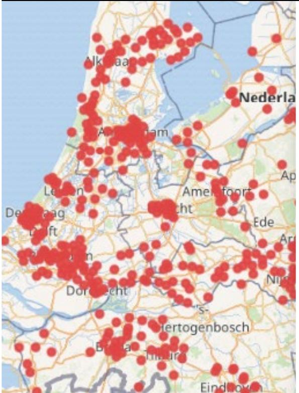

> **AI Description:**
> **Source:** `assets/_page_0_Figure_0.jpg`
> 
> **Generated:** 2026-05-17 02:23:39
> 
> ---
> 
> The image is a map of the Netherlands, with numerous red dots scattered across the region. The dots appear to represent specific locations, possibly indicating points of interest, events, or data points. The map includes city names such as Amsterdam, Dordrecht, Eindhoven, and Utrecht, which are labeled around the edges. The density of the red dots varies, with higher concentrations in certain areas, suggesting a possible geographical distribution or clustering of data points.


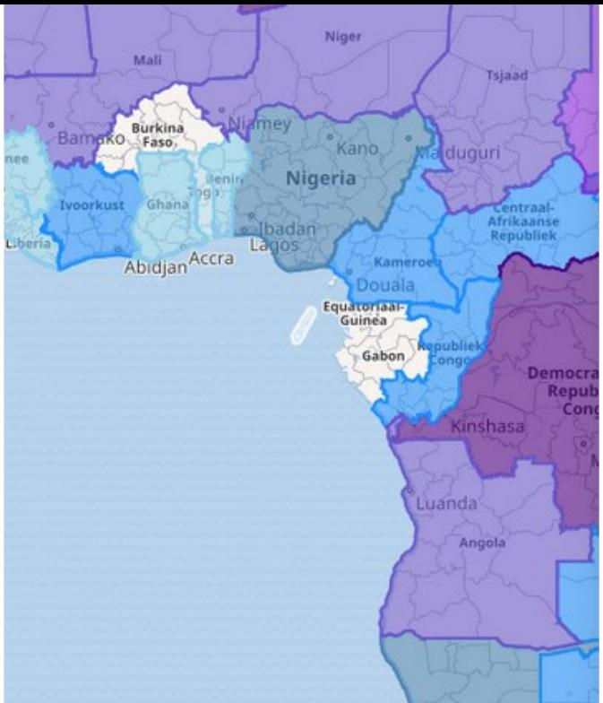

> **AI Description:**
> **Source:** `assets/_page_0_Figure_1.jpg`
> 
> **Generated:** 2026-05-17 02:21:27
> 
> ---
> 
> The image is a map of West and Central Africa. It shows various countries with different shades of blue and purple, representing different regions or divisions. The map includes labels for major cities such as Bamako, Abidjan, Accra, Lagos, Douala, Kinshasa, and Luanda. The map also highlights countries like Burkina Faso, Nigeria, and the Central African Republic. The map is designed to provide a geographical overview of the region, with the use of color coding to distinguish between different areas.

Municipality:Bergen

Wiki Techstorm, Amsterdam, Sat 23 November 2019

Olaf Janssen, National Library of the Netherlands

User:OlafJanssen // olaf.janssen@kb.nl // @ookgezellig

## nationale

<span id="page-1-0"></span>
## · https://phabricator.wikimedia.org/T236041

## https://www.mediawiki.org/wiki/Wiki Techstorm/Programme /Creating\_maps

## O Map making workshop - from Wikidata to interactive off-Wiki maps in three steps (9.00-10.30)

□ Open, High Public

Description

See the full explanation & detailed workshop outline on

0 Edit Task

· https://github.com/ookgezellig/WikidataMapMakingWorkshop\_

htts://github.com/ookgezellig/WikidataMapMakin Makingworkshop/blob/master

/OutlineAndNotes.md

And see https://www.mediawiki.org/wiki/Wiki\_Techstorm/Programme/Creating\_maps

Edit Related Tasks...

GO Edit Related Objects...

Automatically Subscribed

Mute Notifications

Protect as security issue

Award Token

Flag For Later

<span id="page-2-0"></span>
## https://github.com/ookgezellig/WikidataMapMakingWorkshop/blob/master/README.md

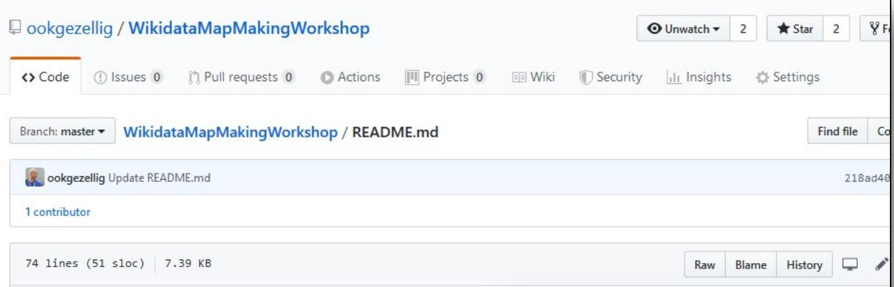

> **AI Description:**
> **Source:** `assets/_page_2_Figure_0.jpg`
> 
> **Generated:** 2026-05-17 02:52:21
> 
> ---
> 
> The image is a screenshot of a GitHub repository page. It displays the repository titled "WikidataMapMakingWorkshop" under the user "ookgezellig". The page shows the repository's main navigation tabs such as Code, Issues, Pull requests, Actions, Projects, Wiki, Security, Insights, and Settings. The branch selected is "master". There is a single commit labeled "Update README.md" by the user "ookgezellig". The commit message indicates that the README.md file was updated. The repository has 2 watchers and 2 stars. The README.md file contains 74 lines of code (51 sloc) and is 7.39 KB in size.


## Map making workshop - from Wiki maps in three steps

Latestupdate:21 November2019


OlafJanssen,NationalLibraryoftheNetherlands

User:OlafJanssen//olaf.janssen@kb.nl//@ookgezellig

## Workshop description

Inthis 90-120minutes workshopyou willearnhow tomakebothflat,clustered,layered,embedded,interactive,on-Wiki and off-Wiki maps from sets of geo-referenced (P625) items in Wikidata.

You will do this in 3 modules of approx. 30-40 minutes each:

· Module 1: You willstart by making various basic flat and clustered maps in Wikidata using SPARQL queries. Next you will make some layered maps, where groups of tems can be togged on/off in the map.

· Module 2: After having explored maps in the Wikidata query interface, you are now ready to learn how to embed Wikidata-driven maps in other Wikimedia projects, such as Wikipedia and Commons (examples). In addition to SPARQL we willook at OpenStreetMap, GeoJSON and the Mediawiki Kartographer extension.

· Module 3: Finallyou wilearn the steps for creating interactive,layered Wikidata-driven maps thatcan be used off-Wiki, ie.in regular HTML pages.Inaddtition to the above tools & techniques we willuse some basic Python,Jupyter Notebooks S), Jupyter Canct tor-widaets.

See the full outline of the workshop for a more detailed description.

## Intended audiences

While this workshop is tech-focusedand willdiscuss basic Wikidata Wikipedia and Wikimedia Commons techniques and programming tools,it is meant to be approachable by beginning Wikidata contributors and programmers.The workshop leader, by no means anadvanced Python programmer nor Wikidata nor SPARQL guru himself,is providing examples and code snippets that you can easily adapt yourself with basic SPARQL, Wikidata and Python skils, to make them work for your own datasets.

As the workshop is comprised of three 30-40 minute modules, you can decide to skipthe modules that youfind too advanced (or basic) for your individual knowledge level.

<span id="page-3-0"></span>
## Full workshop outline & notes

## Workshop outline and notes

Latest update: 21 November 2019

## Module 1: Basic flat & layered maps


## Prerequisites for this Module

· Wikimedia account

· Working knowledge of Wikidata

· Basic understanding of SPARQL and the Wikidata Query Service (WDQS)

· A Wikidata set of items with geo coordinates P625

If you do not have, or cannot create such a Wikidata set, you can use one of these:

1. Public libraries in The

blob/master/OutlineAndNotes.md

<span id="page-4-0"></span>
## Learning objectives

Module 1, make Wikidata, (P625) basic items and basic: based :flat and Understand ong SPARQL layered maps in geo referenced queries steps to

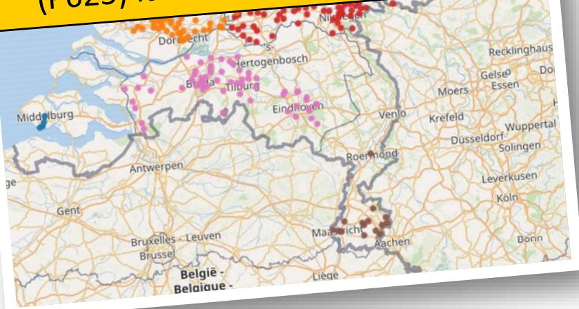

> **AI Description:**
> **Source:** `assets/_page_4_Figure_0.jpg`
> 
> **Generated:** 2026-05-17 02:59:31
> 
> ---
> 
> The image is a map of a region, likely in Western Europe, with various cities labeled. The map includes major cities such as Brussels, Antwerp, Maastricht, and Dusseldorf. There are also smaller cities and towns marked with different colored dots, which appear to represent some form of data distribution or population density. The map uses a grid system to show the road network, and the cities are named in both Dutch and German. The map seems to be used for geographical or demographic analysis.


<span id="page-5-0"></span>
## Learning objectives

Module make basic Wikidata, based 1, basic: Understand flatand ong d layered geo referenced maps in steps to (P625) items and s SPARQL queries


WIKIMEDIA COMMONS

Hoofdpagina Welkom

Afdrukken/exporteren fdrukken/eynnrt Als PDF downloaden

Data:DutchPublicLibraries.map Uit Wikimedia Commons

## vc1-0-2U19 Module 2, i ,intermediate:Understand Contact Wikipedia, embed Wikimedia maps in Wikimedia Commons sand sites Wikidata steps to like

MapofDutchubliclraries,orkinrogress,-5-2019

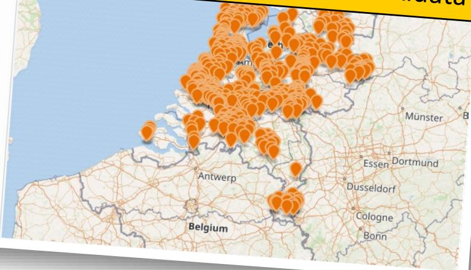

> **AI Description:**
> **Source:** `assets/_page_5_Figure_1.jpg`
> 
> **Generated:** 2026-05-17 02:47:03
> 
> ---
> 
> The image is a map visualization showing a concentration of orange location markers in the western part of the Netherlands. The map includes major cities such as Antwerp, Dusseldorf, Cologne, and Bonn, with the Netherlands and Belgium labeled. The orange markers are densely clustered in the western Netherlands, indicating a high concentration of points of interest or data points in that region.


<span id="page-6-0"></span>
## Learning objectives

steps to   
Module 1,basic: Understad   
make basic flat and layered maps in Wikidata, based on geo referenced i+oms and SPARQL queries

Schoorl public library

Basemap of The Netherlands Heatmap publiclibraries (with popups) Municipal boundaries

WIKIMEDIA COMMONS

Municipality:Bergen Province:North Holland

Hoofdpagina Welkom

Module 3, advanced: Understand steps to create Wikidata-based off-Wiki maps

Data:DutchPublicLibraries.map Uit Wikimedia Commons

Map of Dutch public libraries,work inprogress,21-5-2019   
-g:vu,€1-J-2U19

Module 2, intermediate: Understand Istepsto embed maps in Wikimedia sites like   
Contact Wikipedia, Wikimedia Commons and Wikidata   
Afdrukken/exnnrtaran


<span id="page-7-0"></span>
## Learning objectives

Module 1, basic: Understand steps to basic flat and layered maps in   
make Wikidata, based on geo referenced Litoms and SPARQL queries

Module 3, advanced: Understand create Wikidata-based off-Wiki maps steps to

Data:DutchPublicLibraries.map Uit Wikimedia Commons

-g:vu<1-D-2019 Module 2, intermediate:Understand embed maps in Wikimedia sites like steps to Contact Wikipedia,Wikimedia Commons and Wikidata Afdrukken/exnorteran

Base map of The Netherlands Heatmap publiclibraries (with popups) Municipal boundaries

PAWS WikidataMapMakingWorkshop Last Checkpoint: één uur geleden (autosaved)

## Access to map making resources, SPARQL examples and Python code snippets to build upon

<span id="page-8-0"></span>
Tips & tricks welcome!

I'm not a maps / Wikidata / SPARQL guru....


> **AI Description:**
> **Source:** `assets/_page_8_Figure_0.jpg`
> 
> **Generated:** 2026-05-17 02:42:52
> 
> ---
> 
> The image is a photograph of a person dressed in traditional attire, sitting on a rock. The individual is wearing a yellow garment with a patterned border and a green shawl draped over their shoulders. The background appears to be a natural outdoor setting, possibly a mountainous area. The text "ARQL" is visible in the top left corner, suggesting a possible title or label related to the image.


<span id="page-9-0"></span>
## 3 MODULES

1) Basic flat & layered maps

2)Embedded maps in Wikimedia projects

3)Interactive, layered off-Wiki maps driven by Wikidata

<span id="page-10-0"></span>
# MODULE 1

## Basic flat & layered maps

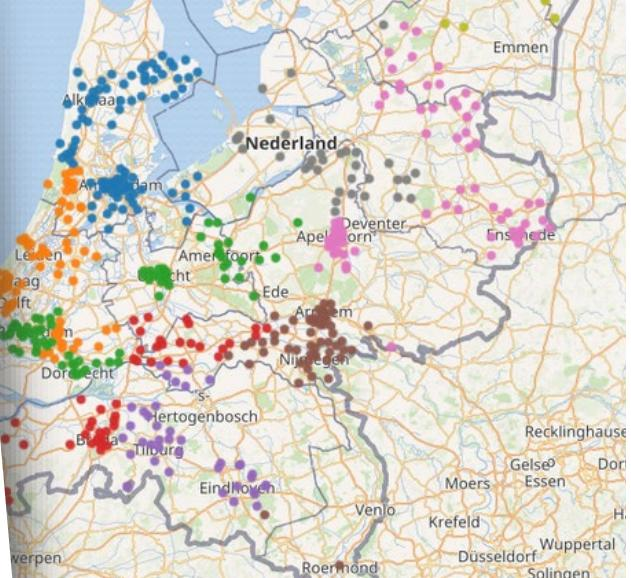

> **AI Description:**
> **Source:** `assets/_page_10_Figure_0.jpg`
> 
> **Generated:** 2026-05-17 02:53:11
> 
> ---
> 
> The image is a map of the Netherlands with various locations marked by colored dots. The map includes city names such as Amsterdam, Eindhoven, and Nijmegen. The dots are color-coded, with blue, green, red, and purple representing different categories or data points. The map appears to be a data visualization, possibly showing the distribution or concentration of certain phenomena across the Netherlands. The key cities are labeled, and the map provides a geographical context for the data points.


<span id="page-11-0"></span>


> **AI Description:**
> **Source:** `assets/_page_11_Figure_0.jpg`
> 
> **Generated:** 2026-05-17 02:45:53
> 
> ---
> 
> The image contains a photograph of a person wearing glasses and a casual t-shirt. The person is pointing upwards with their right index finger, and their left hand is resting near their face. The image appears to be a simple portrait with a plain white background. There are no charts, graphs, or other visual elements present in the image.


## For this Module, you will need

· Wikimedia account

· Working knowledge of Wikidata...

· ... and SPARQL

· A Wikidata set of items with geo coordinates (P625)....


> **AI Description:**
> **Source:** `assets/_page_11_Figure_1.jpg`
> 
> **Generated:** 2026-05-17 02:44:44
> 
> ---
> 
> The image is a photograph of a person upside down, with their head at the bottom of the frame and their feet at the top. The person is wearing glasses and appears to be pointing upwards with their right hand. The image is in black and white, and there are no visible text annotations or labels. The upside-down perspective and the pointing gesture suggest a humorous or artistic intent.


> **AI Description:**
> **Source:** `assets/_page_11_Figure_2.jpg`
> 
> **Generated:** 2026-05-17 02:49:30
> 
> ---
> 
> The image is a photograph of a person wearing round glasses and pointing upwards with their right index finger. The person appears to be making a gesture that could be interpreted as emphasizing a point or idea. The image is in black and white, and there are no other visual elements or text present.


<span id="page-12-0"></span>
## coordinate location (P625)

geocoordinates ofthe subject.For Earth,please note that only WGS84 coordinating system is supported atthe moment edit coordinates丨co-ordinate location丨co-ordinates丨coords丨co-ords丨geographiccoodinate丨gps coordinate丨gps co-ordinate丨gps coordinates丨gps co-ordinates丨gps location丨geotag|wgs 84|wgs-84|wgs84|position|longitude丨latitude丨gps丨coordinate location丨geographical coordinates丨geo丨location丨point on a map丨point onthe globe丨point on earth 丨ocation on earth 丨 geolocation 丨 geocoordinates | Location on map


<span id="page-13-0"></span>
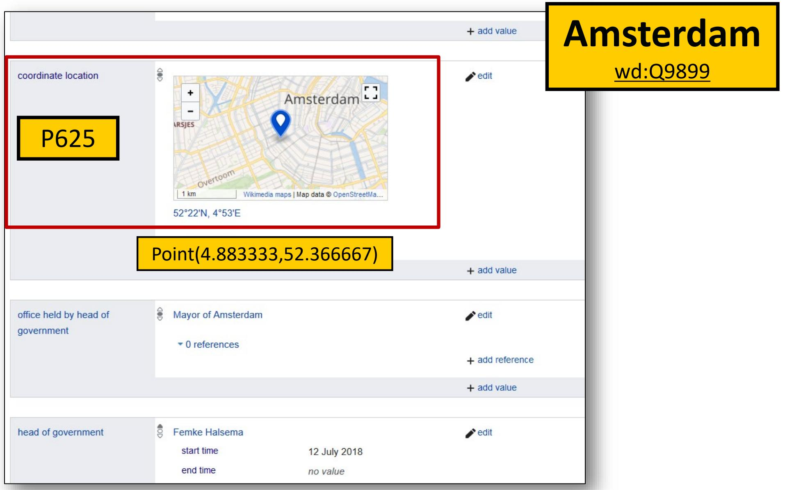

> **AI Description:**
> **Source:** `assets/_page_13_Figure_0.jpg`
> 
> **Generated:** 2026-05-17 02:21:14
> 
> ---
> 
> The image contains a combination of text and a map. The text includes coordinates for Amsterdam (52°22'N, 4°53'E) and a point location (4.883333, 52.366667). The map shows Amsterdam with a blue pin marking the location. The image also includes information about the mayor of Amsterdam, Femke Halsema, with her term starting on 12 July 2018. The image is likely from a database or information system, possibly related to geographic or governmental data.


<span id="page-14-0"></span>
Time to create your own P625 dataset

<span id="page-15-0"></span>
## If you don't have a Wikidata P625 set

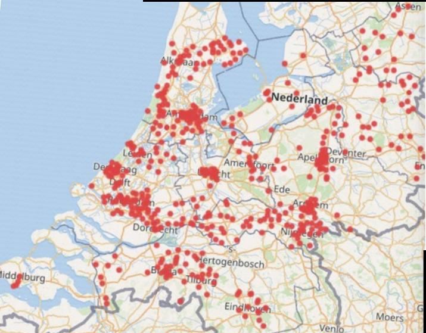

> **AI Description:**
> **Source:** `assets/_page_15_Figure_0.jpg`
> 
> **Generated:** 2026-05-17 02:07:51
> 
> ---
> 
> The image is a map of the Netherlands with numerous red dots scattered across the country. The map includes major cities and geographical features, such as rivers and coastlines. The red dots likely represent data points, possibly related to population density, economic activity, or another metric. The map provides a geographical context for the distribution of these points, highlighting their concentration in certain areas and their sparse distribution in others.


Public libraries in The Netherlands https://w.wiki/6dx

Dutch national heritage sites https://w.wiki/6dy

Big cities https://w.wiki/Aa9

<span id="page-16-0"></span>
## If you don't have a Wikidata P625 set

Volcanos of the world https://w.wiki/6e9

Airports around equator https://w.wiki/6eB

<span id="page-17-0"></span>
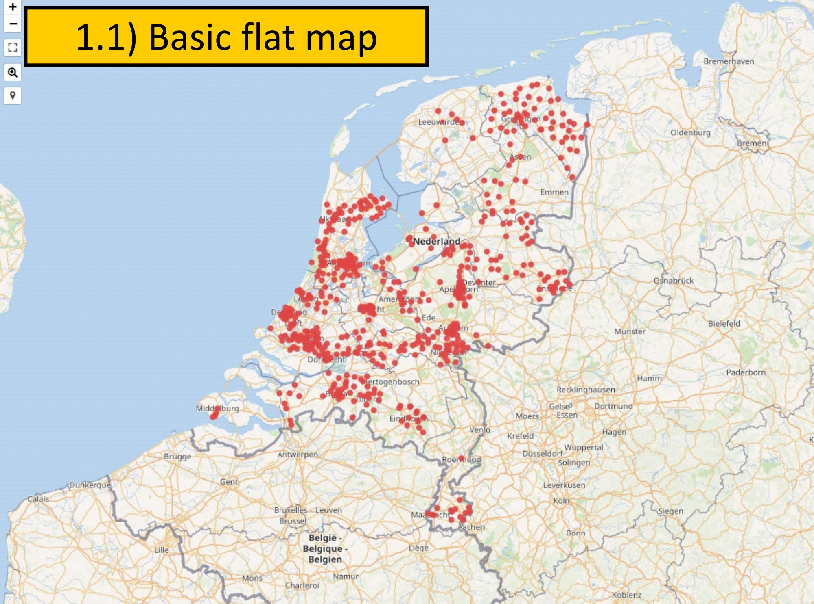

> **AI Description:**
> **Source:** `assets/_page_17_Figure_0.jpg`
> 
> **Generated:** 2026-05-17 02:55:34
> 
> ---
> 
> The image is a basic flat map of the Netherlands and parts of Germany and Belgium. It contains numerous red dots scattered across the map, which likely represent specific locations or data points. The map includes city names and country borders, with the Netherlands being the central focus. The title "1.1) Basic flat map" is displayed at the top, indicating that this is part of a series or a guide. The map is detailed with road networks and geographical features, providing a clear representation of the region.


<span id="page-18-0"></span>
```
1 #All public library brancheg of the Netherlandg   
2   
3 SELECT DISTINCT ?dpl ?dplLabel ?dplDegcription ?dplLoc ?dplImage WHERE{   
4 #Ig Dutch public library branch   
5 ?dpl wdt:P31 wd:Q28564. #public library   
6 ?dpl wdt:P31 wd:Q11396180. #library branch   
7 ?dpl wdt:P17 wd:Q55. #in the Netherlands   
8   
9 ?dpl wdt:P625 ?dplLoc. #Location of the dpl   
10   
11 OPTIONAL{?dpl wdt:P18 ?dplImage} #Image of the dpl   
12   
13 SERVICE wikibage:label {bd:gerviceParam wikibage:language "en" -}   
14   
15   
16 ORDER BY ?dplLabel   
Public lib
```

Public libraries in The Netherlands

https://w.wiki/6dx

<span id="page-19-0"></span>


<span id="page-20-0"></span>


<span id="page-21-0"></span>
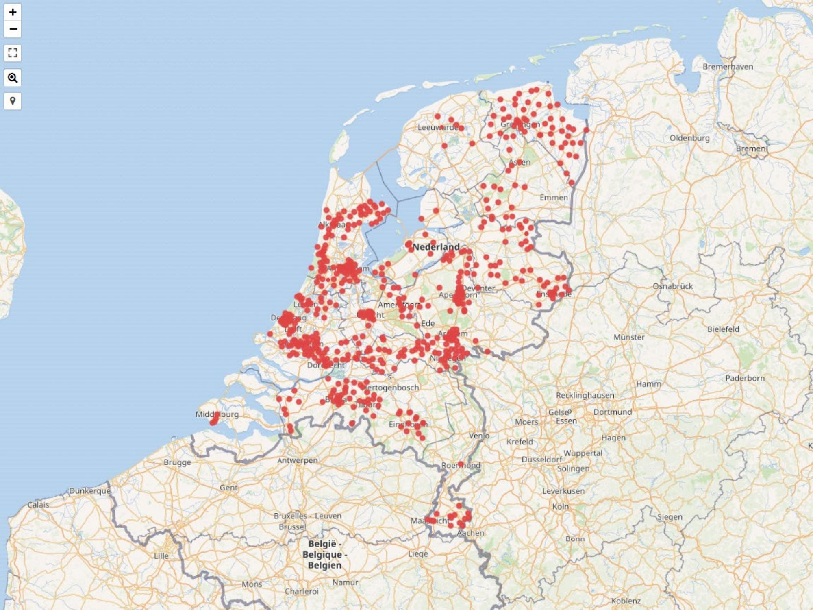

> **AI Description:**
> **Source:** `assets/_page_21_Figure_0.jpg`
> 
> **Generated:** 2026-05-17 03:02:14
> 
> ---
> 
> The image is a map of the Netherlands and parts of neighboring countries, including Germany and Belgium. It contains a large number of red dots scattered across the map, indicating specific locations. The map includes major cities and regions, with some cities labeled in multiple languages (Dutch, German, and French). The red dots appear to represent data points, possibly related to population density, economic activity, or another metric, but the exact nature of the data is not specified in the image.


<span id="page-22-0"></span>
## Default map view

Wikidata Query Service

Voorbeelden

Hulp

https://w.wiki/6eq

<span id="page-23-0"></span>
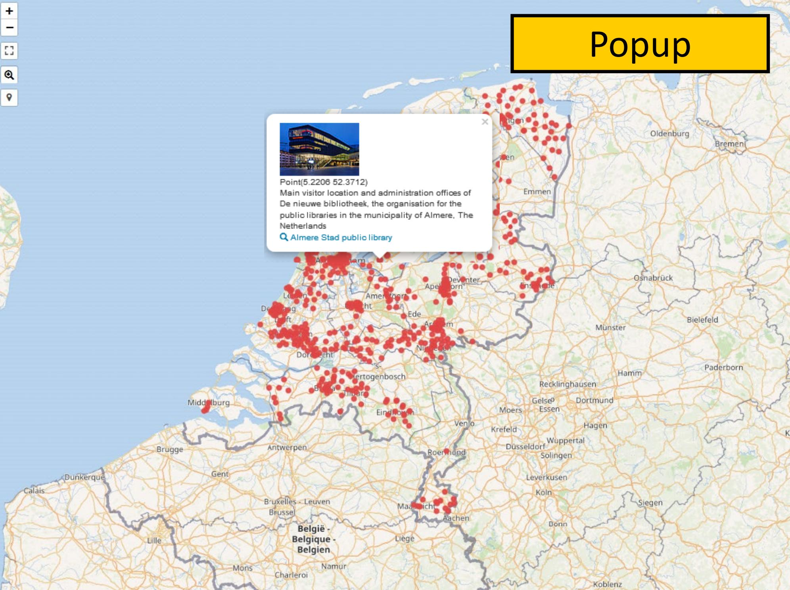

> **AI Description:**
> **Source:** `assets/_page_23_Figure_0.jpg`
> 
> **Generated:** 2026-05-17 02:16:45
> 
> ---
> 
> The image is a map of the Netherlands and parts of Belgium, showing the distribution of public libraries across the region. The map is overlaid with numerous red dots representing library locations. A popup window provides details about the main visitor location and administration offices of De nieuwe bibliotheek, the organization for public libraries in the municipality of Almere, The Netherlands. The map includes city names and borders, providing context for the library locations.


<span id="page-24-0"></span>
## Relation between query and popup

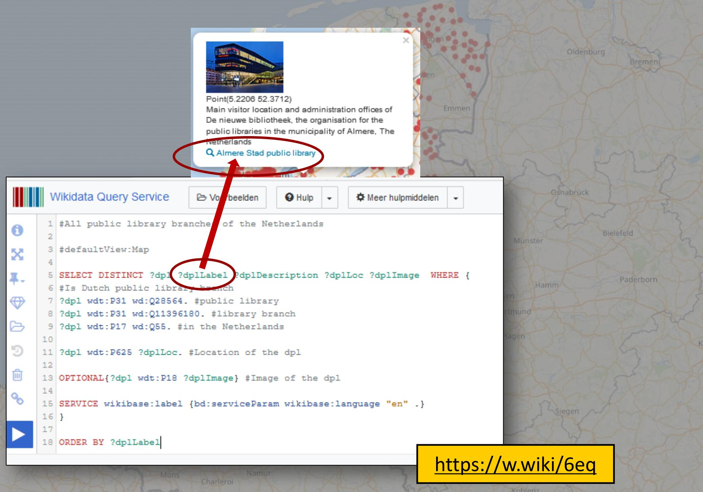

> **AI Description:**
> **Source:** `assets/_page_24_Figure_0.jpg`
> 
> **Generated:** 2026-05-17 02:14:44
> 
> ---
> 
> The image contains a screenshot of a Wikidata Query Service interface. It displays a query written in SPARQL, which is a query language for the Semantic Web. The query retrieves information about Dutch public library branches in the Netherlands. The interface includes a map in the background, with a highlighted location labeled as "Almere Stad public library." The query results are presented in a text box, showing the labels, descriptions, locations, and images of the library branches. The interface also includes buttons for examples, help, and additional tools.


<span id="page-25-0"></span>
## Relation between query and popup


> **AI Description:**
> **Source:** `assets/_page_25_Figure_0.jpg`
> 
> **Generated:** 2026-05-17 02:22:53
> 
> ---
> 
> The image contains a screenshot of a Wikidata Query Service interface displaying a query for all public library branches in the Netherlands. The query is structured to retrieve distinct library branches, their labels, descriptions, locations, and images. The interface includes a map in the background, with red annotations pointing to a specific location and text describing it as the main visitor location and administration offices of "De nieuwe bibliotheek," the organization for public libraries in the municipality of Almere, The Netherlands. The query results are formatted in a structured text format, with various properties of the library branches highlighted.


<span id="page-26-0"></span>
## Relation between query and popup


> **AI Description:**
> **Source:** `assets/_page_26_Figure_0.jpg`
> 
> **Generated:** 2026-05-17 03:03:33
> 
> ---
> 
> The image contains a combination of text and a map. The text is a query in the Wikidata Query Service, which appears to be searching for all public library branches in the Netherlands. The query includes various predicates and variables, such as ?dplLabel, ?dplDescription, and ?dplLoc, which are used to retrieve information about the libraries. The map in the background shows a geographical area, likely the Netherlands, with some locations marked, possibly corresponding to the libraries mentioned in the query. The image also includes a URL at the bottom, suggesting that this is part of a presentation or tutorial on using the Wikidata Query Service.


<span id="page-27-0"></span>
## Relation between query and popup

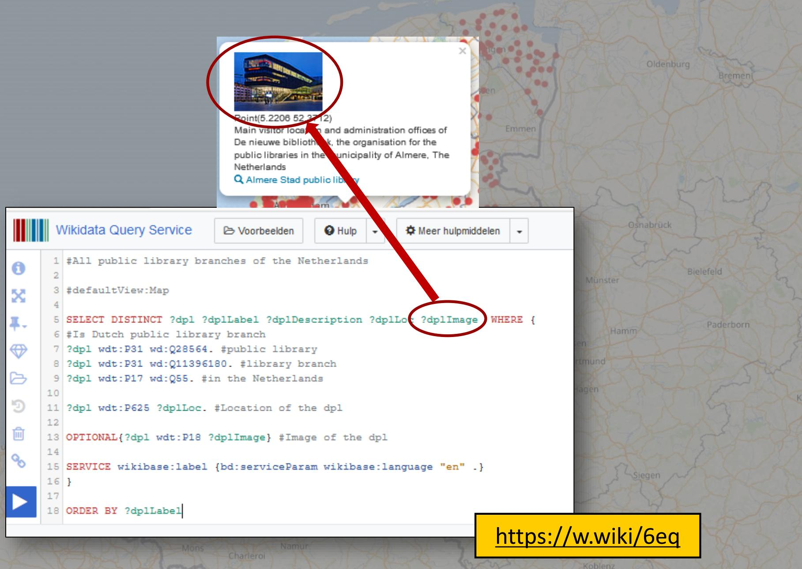

> **AI Description:**
> **Source:** `assets/_page_27_Figure_0.jpg`
> 
> **Generated:** 2026-05-17 02:48:20
> 
> ---
> 
> The image contains a screenshot of a Wikidata Query Service interface. It displays a query for all public library branches in the Netherlands, including their labels, descriptions, locations, and images. The query results are shown in a table format, with the image of the library branch highlighted in a red circle. The interface includes navigation buttons and a map in the background. The URL at the bottom indicates the specific query used.


<span id="page-28-0"></span>
## Hiding fields from popup

## Hide image and coordinates

Point(5.2206 52.3712)   
Main visitor locstion and administration offices of De nieuwe bibliotheek, the organisation for the public libraries in the municipality of Almere, The Netherlands   
Q Almere Stad public library

B Voorbeelden

Hup

寮 Meer hulpmiddelen

<span id="page-29-0"></span>
## Hiding fields from popup


> **AI Description:**
> **Source:** `assets/_page_29_Figure_0.jpg`
> 
> **Generated:** 2026-05-17 02:31:01
> 
> ---
> 
> The image is a photograph of a modern building at night. The building has a glass facade with illuminated red and blue lights, giving it a contemporary and vibrant appearance. The structure appears to be a multi-story building, possibly a commercial or public space, with a large glass entrance area. The surrounding area includes a well-lit plaza with steps leading up to the building, and the sky is dark, indicating it is evening or nighttime.


Point(5.2206 52.3712)   
Main visitor locstion and administration offces of De nieuwe bibliotheek, the organisation for the public libraries in the municipality of Almere, The Netherlands   
Q Almere Stad public library

## Wikidata Query Service

Voorbeelden

Hup

章 Meer hulpmiddelen

<span id="page-30-0"></span>
## Hiding fields from popup

Main visitor location and administration offices of   
De nieuwe bibliotheek, the organisation for the   
public libraries in the municipality of Almere, The   
Netherlands   
Q Almere Stad public library

Voorbeelden

Hup

寮 Meer hulpmiddelen

1 #All public library brancheg of the Netherlandg 2 3β #defaultView:Map{"hide": ["?dplLoc", "?dplImage"]} 4 5 SELECT DISTINCT ?dpl ?dplLabel ?dplDegcription ?dplLoc ?dplImage WHERE{ 6#Ig Dutch public library branch 7 ?dpl wdt:P31 wd:Q28564. #public library 8?dpl wdt:P31 wd:Q11396180. #library branch 9 ?dpl wdt:P17 wd:Q55. #in the Netherlandg 10 11 ?dpl wdt:P625 ?dplLoc. #Location of the dpl 12 13OPTIONAL{?dpl wdt:P18 ?dplImage} #Image of the dpl 14 15 SERVICE wikibage:label {bd:gerviceParam wikibage:language "en" -1 16} 17 18 ORDER BY ?dplLabe1

https://w.wiki/6mU

<span id="page-31-0"></span>
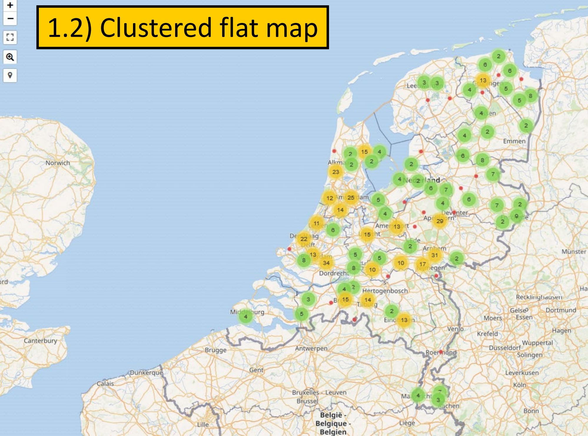

> **AI Description:**
> **Source:** `assets/_page_31_Figure_0.jpg`
> 
> **Generated:** 2026-05-17 02:12:57
> 
> ---
> 
> The image is a clustered flat map of the Netherlands. It displays various locations with colored circles, each containing a number. The map is overlaid with road networks and country borders. The clusters of circles suggest a concentration of data points in certain areas, with larger clusters indicating a higher number of points in those regions. The map includes city names and some neighboring countries, providing context for the geographical distribution of the data.


<span id="page-32-0"></span>
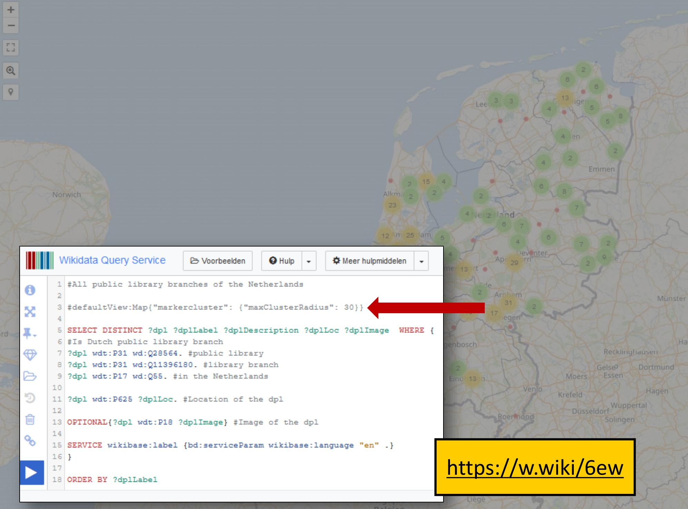

> **AI Description:**
> **Source:** `assets/_page_32_Figure_0.jpg`
> 
> **Generated:** 2026-05-17 02:52:01
> 
> ---
> 
> The image contains a combination of text and a map. The text is a query written in SPARQL, which is used to retrieve data from the Wikidata Query Service. The query is designed to find all public library branches in the Netherlands. The map in the background shows the Netherlands with various locations marked, likely corresponding to the results of the query. The map has a feature called "markercluster," which groups markers with the same label. The query is executed in the Wikidata Query Service interface, and the results are displayed on the map.


<span id="page-33-0"></span>
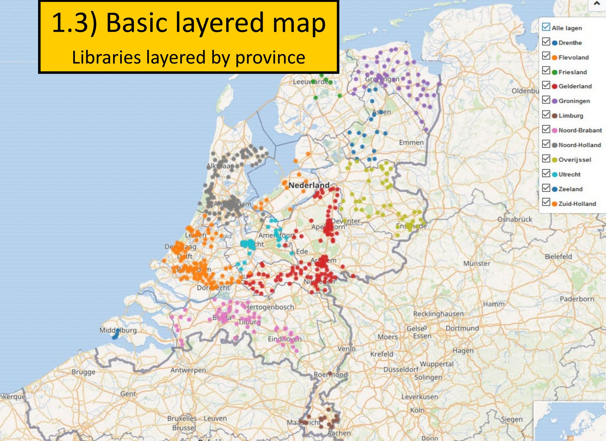

> **AI Description:**
> **Source:** `assets/_page_33_Figure_0.jpg`
> 
> **Generated:** 2026-05-17 02:58:01
> 
> ---
> 
> The image is a layered map of the Netherlands, showing the locations of libraries categorized by province. The map uses different colored dots to represent libraries in various provinces, with each province having its own color-coded legend on the right side. The map highlights the distribution of libraries across the country, with some provinces having more libraries than others. The title at the top indicates that this is a basic layered map with libraries categorized by province.


<span id="page-34-0"></span>
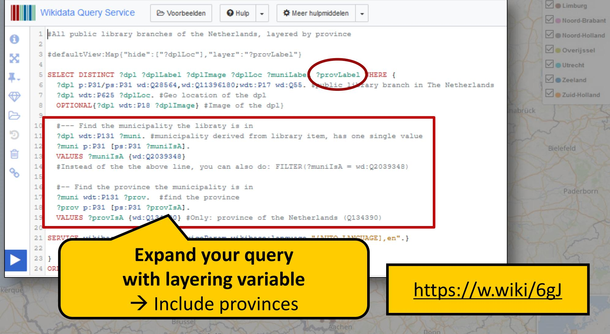

> **AI Description:**
> **Source:** `assets/_page_34_Figure_0.jpg`
> 
> **Generated:** 2026-05-17 02:59:21
> 
> ---
> 
> The image contains a screenshot of a query in the Wikidata Query Service interface. The query is designed to list all public library branches in the Netherlands, categorized by province. The text includes various SPARQL commands and annotations explaining the structure of the query. Key elements include the use of variables like ?dpl, ?dplLabel, ?dplImage, ?dplLoc, ?muniLabel, and ?provLabel to represent different aspects of the library branches and their locations. The query also includes instructions on how to expand the query to include provinces, as highlighted by a yellow arrow and text box. The image also shows a map of the Netherlands with checkboxes for different provinces, indicating the geographical scope of the query.


<span id="page-36-0"></span>
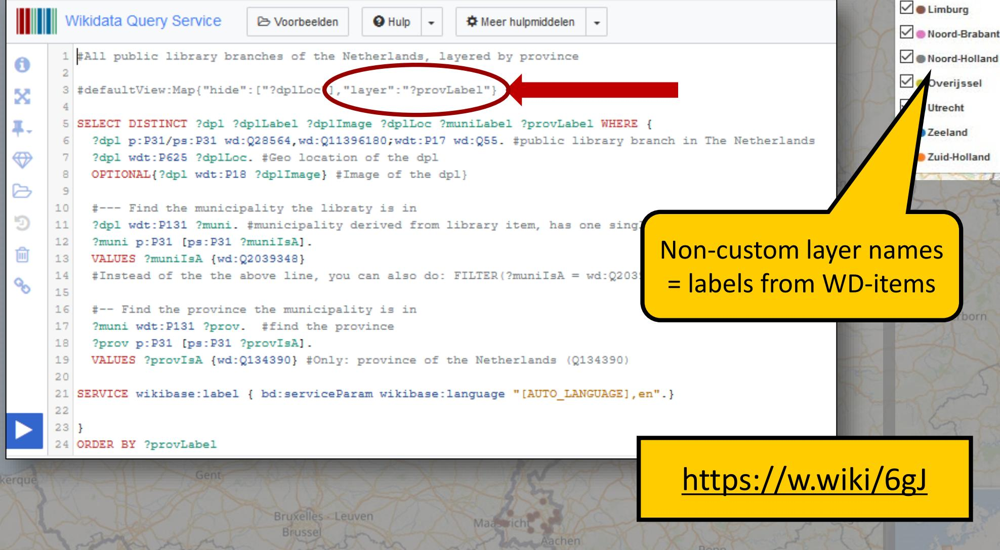

> **AI Description:**
> **Source:** `assets/_page_36_Figure_0.jpg`
> 
> **Generated:** 2026-05-17 02:11:17
> 
> ---
> 
> The image contains a screenshot of a query in the Wikidata Query Service interface. It displays a SPARQL query aimed at retrieving all public library branches in the Netherlands, categorized by province. The query is structured to show the geographical location and labels for each library branch, as well as the province and municipality they belong to. The image highlights the use of non-custom layer names, which correspond to labels from Wikidata (WD) items. A yellow arrow points to the layer name "provLabel," indicating the province label. Additionally, there is a URL at the bottom of the image: "https://w.wiki/6gJ." The image also includes a map in the background, partially visible, showing the Netherlands with various provinces marked.


<span id="page-38-0"></span>
## 1.4) Layered map, custom layer names Libraries layered by postal code zone

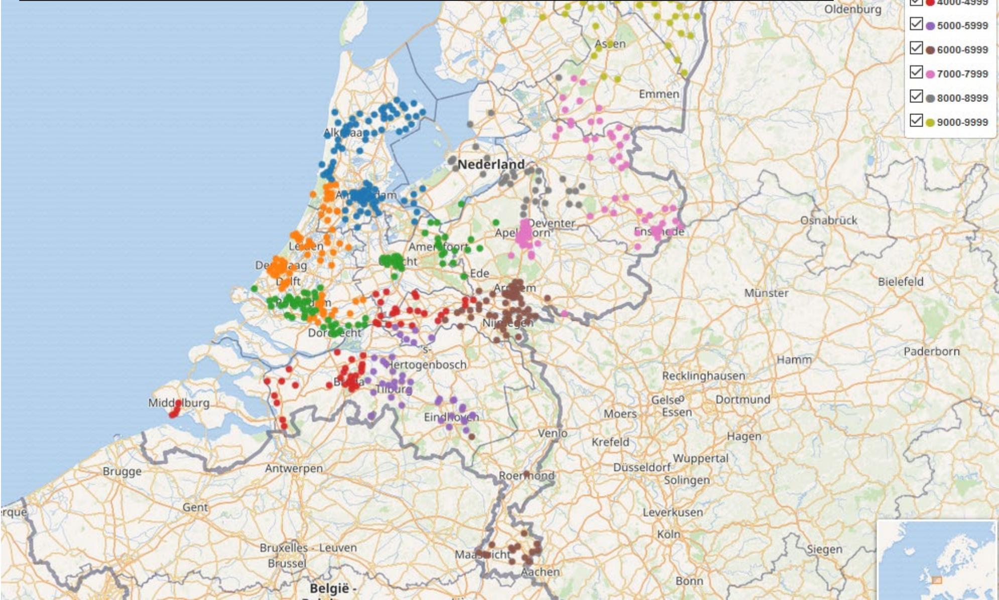

> **AI Description:**
> **Source:** `assets/_page_38_Figure_0.jpg`
> 
> **Generated:** 2026-05-17 02:40:46
> 
> ---
> 
> The image is a map of the Netherlands and parts of neighboring countries, including Belgium and Germany. It uses a choropleth map style, where different colors represent ranges of values for a specific metric. The legend on the right indicates color-coded ranges from 4000-4999 to 9000-9999. The map highlights various locations with colored dots, suggesting a distribution or concentration of data points across the region. The map includes major cities and towns labeled, and the color distribution appears to be more concentrated in certain areas, possibly indicating higher values in those regions.


<span id="page-39-0"></span>
## Amsterdam Public Library, OBA De Hallen (Q60290390)

Public library in De Hallen building in the Kinkerbuurt neighbourhood of Amsterdam,The Netherlands

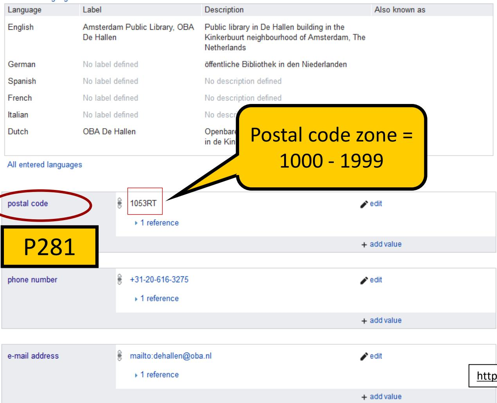

> **AI Description:**
> **Source:** `assets/_page_39_Figure_0.jpg`
> 
> **Generated:** 2026-05-17 02:39:19
> 
> ---
> 
> The image contains a table with information about a public library in Amsterdam, The Netherlands. The table includes labels for different languages, descriptions of the library, and additional details such as a postal code, phone number, and email address. A yellow speech bubble highlights the postal code zone for the area, which is 1000-1999. The image also includes a red circle around the term "postal code" and a yellow box with the code "P281." The image is primarily text-based with some graphical elements to draw attention to specific information.


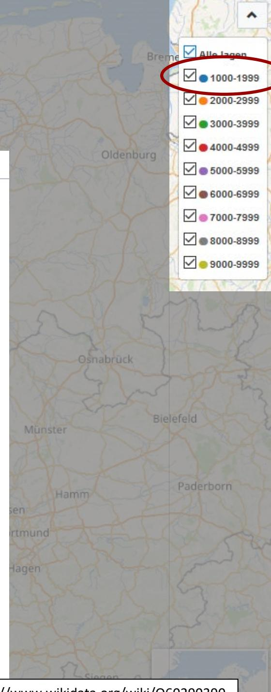

> **AI Description:**
> **Source:** `assets/_page_39_Figure_1.jpg`
> 
> **Generated:** 2026-05-17 02:37:48
> 
> ---
> 
> The image contains a map with a legend overlay. The legend lists ranges of numbers (1000-1999, 2000-2999, etc.) with corresponding colors. The map itself appears to be a topographical or geographical map of a region, possibly Germany, as cities like Bremen, Oldenburg, Osnabrück, Münster, Hamm, and Bielefeld are labeled. The legend suggests that the map is color-coded to represent data within these numerical ranges, though the specific data is not visible in the image.

https://www.wikidata.org/wiki/Q60290390

<span id="page-40-0"></span>
```
1 #Maps of public library branches The Netherlandg, layered by postal codeg zones (100-1999, 20-2999 etc) 8000-8995   
2   
3 #defaultView:Map{"layer":"?pczone"} 9000-9999   
4   
5 SELECT DISTINCT ?dpl ?dplLabel ?dplImage ?dplLoc ?postcode ?pcdigits ?pczone   
6   
7 WHERE{   
8 ?dpl p:P31/ps:P31 wd:Q28564,wd:Q11396180;wdt:P17 wd:Q55. #public library branch in The Netherlandg   
9 ?dpl wdt:P625 ?dplLoc. #Geo location of the library   
10   
11 ?dpl (p:P281/ps:P281) ?postcode. #postal code of the library, format = 4 digitg + 2 letters e.g. '1073RT'   
12   
13 BIND(SUBsTR(str(?postcode), 1, 4) as ?pcdigits). #get 4 first digits of poste   
14 Do not click,   
15 # Create layer object (= ?pczone) with the postal code zoneg ag layerg   
16 BIND ( copy-paste in browser!   
17 IF(?pcdigitg > "1000" && ?pcdigitg <= "1999", "1000-1999",   
18 IF(?pcdigits > "2000" && ?pcdigits <= "2999", "2000-2999",   
19 IF(?pcdigitg > "3000" && ?pcdigitg <= "3999", "3000-3999",   
20 IF(?pcdigits > "4000" && ?pcdigits <= "4999", "4000-4999",   
21 IF(?pcdigitg > "5000" && ?pcdigitg <= "5999", "5000-5999",   
22 IF(?pcdigits > "6000" && ?pcdigits <= "6999", "6000-6999",   
23 IF(?pcdigitg > "7000" && ?pcdigitg <= "7999", "7000-7999",   
24 IF(?pcdigits > "B000" && ?pcdigitg <= "B999", "B000-B999",   
25 IF(?pcdigitg > "9000" && ?pcdigits <= "9999", "9000-9999",   
26 "REST:"))))))))   
27 AS ?pczone).   
29 SERVICE wiibase:label{bd:servicearamwikibaselanguage "[Ao\_LANE],".} https://bit.ly/3368DPk   
30 1   
31 ORDER BY ?pczone #ascending order by postal code zone
```

<span id="page-41-0"></span>
```
1 #Maps of public library branches The Netherlands, layered by postal codes zoneg (10o-1999, 200-2999 etc)   
2   
3 #defaultView:Map("layer": "?pczone"}   
4   
5 SELECT DISTINCT ?dpl ?dplLabel ?dplImage ?dplLoc ?pogtcode ?pcdigits ?pczone   
6   
7 WHERE{   
8 ?dpl p:P31/ps:P31 wd:Q28564,wd:Q11396180;wdt:P17 wd:Q55. #public library branch in The Netherlandg   
9 ?dpl wdt:P625 ?dplLoc. #Geo location of the library   
10   
11 ?dpl (p:P281/ps:P281) ?postcode. #postal code of the library, format = 4 digits + 2 letters ， e.g. '1073RT'   
12   
13 BIND(SUBSTR(str(?postcode), 1, 4) as ?pcdigitg). #get 4 first digits of postal code   
14   
15 # Create layer object (= ?pczone) with the pogtal code zoneg ag layerg   
16 BIND (   
17 IF(?pcdigitg > "1000" && ?pcdigitg <= "1999", "1000-1999",   
18 IF(?pcdigitg > "2000" && ?pcdigitg <= "2999", "2000-2999",   
19 IF(?pcdigits > "3000" && ?pcdigits <= "3999", "300-3999",   
20 IF(?pcdigitg > "4000" && ?pcdigitg <= "4999", "4000-4999",   
21 IF(?pcdigitg > "5000" && ?pcdigitg <= "5999", "5000-5999",   
22 IF(?pcdigitg > "6000" && ?pcdigitg <= "6999", "6000-6999",   
23 IF(?pcdigits > "700" && ?pcdigits <= \*799", "7000-799",   
24 IF(?pcdigitg > "8000" && ?pcdigitg <= "8999", "8000-8999",   
25 IF(?pcdigitg > "9000" && ?pcdigitg <= "9999", "9000-9999",   
26 "B ST")))N))   
27 A ?pczone) ,   
29 SERVICE wikibase:label{ d:serviceParam wikibage:language "[Ao\_LANCUAGE],en".} https://bit.ly/3368DPk https://bit.ly/33   
30 1   
3 ORDER BY ?pczone #scending order by postal code zone
```

<span id="page-42-0"></span>
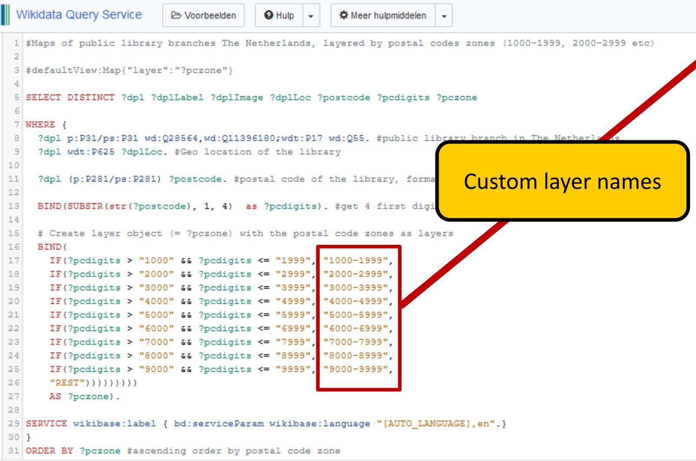

> **AI Description:**
> **Source:** `assets/_page_42_Figure_0.jpg`
> 
> **Generated:** 2026-05-17 02:54:12
> 
> ---
> 
> The image contains a screenshot of a Wikidata Query Service query. The query is designed to map public library branches in The Netherlands, categorized by postal code zones (1000-1999, 2000-2999, etc.). The image highlights a section of the query where custom layer names are defined. These layer names are created based on the first four digits of the postal code, which are used to group libraries into specific zones. The text annotations emphasize the "Custom layer names" and the query structure for determining the postal code zones.


<span id="page-43-0"></span>
## 1.5) Other cool layered maps

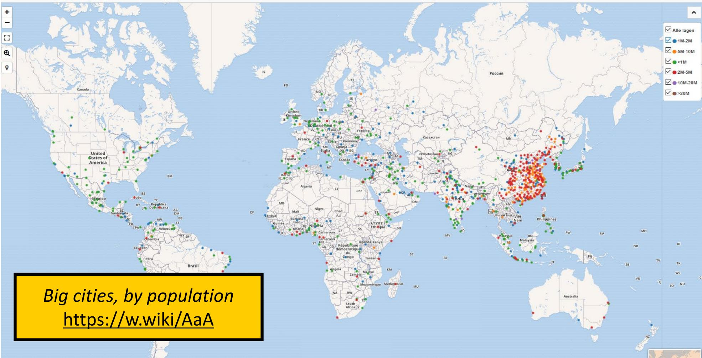

> **AI Description:**
> **Source:** `assets/_page_43_Figure_0.jpg`
> 
> **Generated:** 2026-05-17 02:45:48
> 
> ---
> 
> The image is a world map with various cities marked by colored dots representing their population size. The legend on the right indicates different population ranges, with colors corresponding to specific ranges: 1M-2M, 5M-10M, <1M, 2M-5M, 10M-20M, and >20M. The map highlights the distribution of large cities across the globe, with a concentration of larger cities in East Asia, Southeast Asia, and parts of Europe. The text at the bottom provides a link to a wiki page with more information.


<span id="page-44-0"></span>
## 1.5) Other cool layered maps


Alle lagen   
earthquake   
avalanche   
tomado   
conflagration   
cyclone   
storm   
drought   
flood   
natural disaster   
work accident   
cityfire   
Atlantic hurricane   
impactevent   
mountaineering disaster   
aviation accident   
ice storm   
megathrust erthquake   
rear-end collision   
sturzstrom   
tropical cyclone   
oitspill   
bizzard   
mudslide   
landslide   
European windstorm   
dust storm   
accident   
mid-air collision   
tornado outbreak   
wildfire   
chemical ac

<span id="page-45-0"></span>
## 1.5) Other cool layered maps

Medieval churches, by century of construction https://w.wiki/6ga

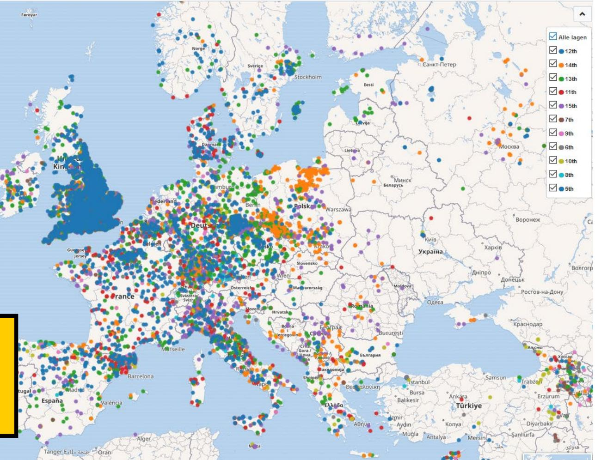

> **AI Description:**
> **Source:** `assets/_page_45_Figure_0.jpg`
> 
> **Generated:** 2026-05-17 02:53:01
> 
> ---
> 
> The image is a map of Europe with various colored dots representing data points. The map includes labels for major cities and countries. The legend on the right indicates that the colors correspond to different categories or levels, such as "5th," "6th," "8th," etc., up to "15th." The dots are distributed across the map, with a higher concentration in some areas, suggesting a geographical distribution of the data being represented. The map appears to be a data visualization, possibly related to a ranking or survey, given the numerical categories in the legend.


<span id="page-46-0"></span>
## 1.5) Other cool layered maps

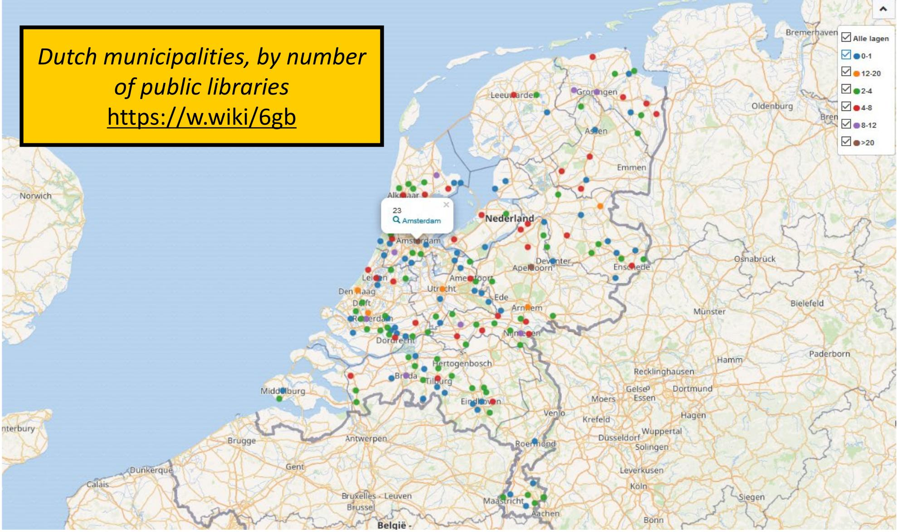

> **AI Description:**
> **Source:** `assets/_page_46_Figure_0.jpg`
> 
> **Generated:** 2026-05-17 02:20:07
> 
> ---
> 
> The image is a map of the Netherlands, showing the distribution of public libraries across Dutch municipalities. The map uses color-coded dots to represent the number of public libraries in each municipality, with categories ranging from 0-1 to >20 libraries. The legend on the right side of the map indicates the color coding for each category. The map highlights that larger cities and urban areas tend to have more public libraries, while rural areas have fewer. The title of the map is "Dutch municipalities, by number of public libraries," and a URL is provided for more information.


<span id="page-47-0"></span>
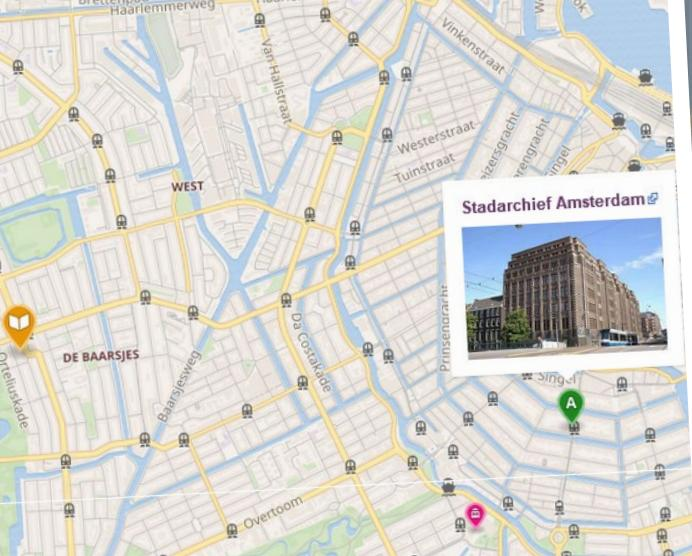

> **AI Description:**
> **Source:** `assets/_page_47_Figure_0.jpg`
> 
> **Generated:** 2026-05-17 02:08:01
> 
> ---
> 
> The image contains a map of Amsterdam, highlighting the location of the Stadarchief Amsterdam. The map includes various streets and canals, with a pin indicating the exact location of the Stadarchief. The image also includes a photograph of the Stadarchief building, providing a visual reference for the location. The map is detailed, showing tram lines and other urban features.


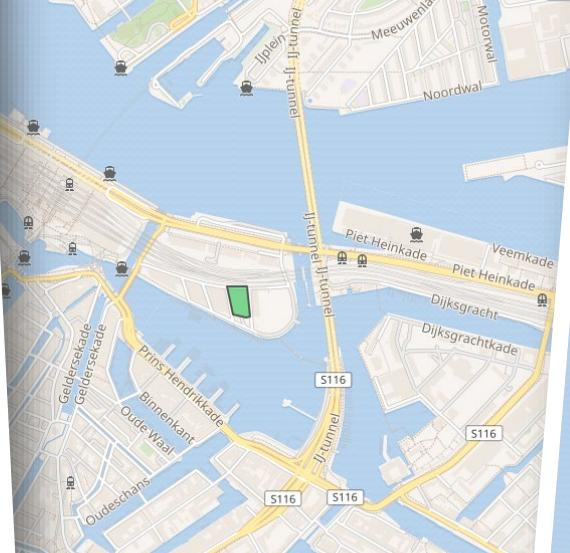

> **AI Description:**
> **Source:** `assets/_page_47_Figure_1.jpg`
> 
> **Generated:** 2026-05-17 02:08:10
> 
> ---
> 
> The image is a map showing a section of a city, likely in the Netherlands, given the street names and waterways. It includes a green highlighted area, possibly indicating a specific location or feature. The map includes various streets, waterways, and tunnels, with labels such as "IJ-tunnel," "Piet Heinkade," and "Dijksgracht." The map also shows roadways and bridges, with some streets marked as "S116." The overall layout suggests a complex urban area with a mix of residential and possibly industrial zones.


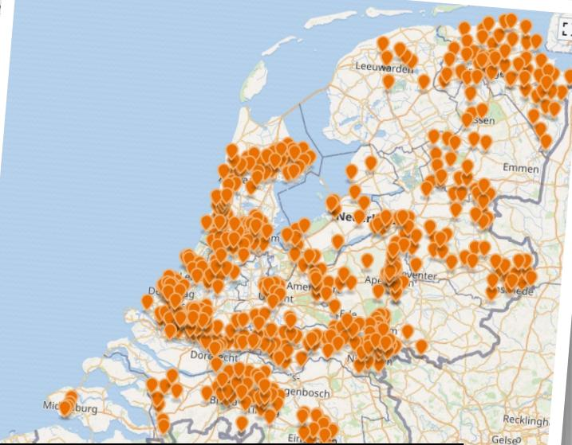

> **AI Description:**
> **Source:** `assets/_page_47_Figure_2.jpg`
> 
> **Generated:** 2026-05-17 02:13:26
> 
> ---
> 
> The image is a map of the Netherlands, with numerous orange markers scattered across the country. The markers appear to represent locations, possibly indicating points of interest or data points. The map includes major cities and regions, with labels such as Leeuwarden, Arnhem, and Eindhoven. The concentration of markers is higher in the northern and eastern parts of the country, suggesting a possible geographical or demographic distribution pattern.


# MODULE 2

## Embedded maps in Wikimedia projects

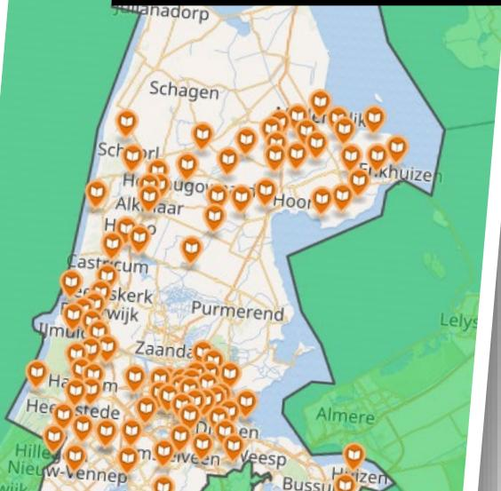

> **AI Description:**
> **Source:** `assets/_page_47_Figure_3.jpg`
> 
> **Generated:** 2026-05-17 02:13:16
> 
> ---
> 
> The image is a map with a focus on a specific region in the Netherlands. It contains a large number of orange pins, each representing a location. The pins are densely clustered in the southern part of the map, particularly around the city of Hoor and extending towards Almere. The map includes various place names such as Schagen, Purmerend, and Almere, indicating the geographical context. The visual representation suggests a distribution or concentration of data points, possibly related to a specific service or facility, given the book-like icons on the pins.


> **AI Description:**
> **Source:** `assets/_page_47_Figure_5.jpg`
> 
> **Generated:** 2026-05-17 02:23:02
> 
> ---
> 
> The image contains a map of the United States with states color-coded in shades of blue and red. The map includes state names and major cities such as Austin, San Antonio, Houston, Dallas, Oklahoma City, and Phoenix. The map also shows the border with Mexico and includes labels for cities like Ciudad Juárez, Chihuahua, and Monterrey. The inset image in the top left corner appears to be a photograph of a person in a suit, but it is not directly related to the map.


<span id="page-48-0"></span>

## For this Module, you will (also) need

· User page on Wikipedia, Commons, Wikidata

· With Sandbox

Nice to have: some knowledge about

OpenStreetMap and

·GeoJSON


> **AI Description:**
> **Source:** `assets/_page_48_Figure_1.jpg`
> 
> **Generated:** 2026-05-17 02:39:35
> 
> ---
> 
> The image contains a photograph of a person upside down, with their head pointing upwards and their body pointing downwards. The person is wearing glasses and appears to be in a relaxed or casual pose. The image is in black and white, and there are no visible text or labels within the image.


> **AI Description:**
> **Source:** `assets/_page_48_Figure_2.jpg`
> 
> **Generated:** 2026-05-17 02:37:53
> 
> ---
> 
> The image contains a photograph of a person wearing round glasses and a dark shirt. The person is pointing upwards with their right index finger. The image is in black and white, and there are no charts, graphs, or text annotations present. The focus is on the person's gesture and expression.


<span id="page-49-0"></span>
## Extension:Kartographer


Help|Discussion

## Help:Extension:Kartographer

Main page

Get MediaWiki

Get extensions

```
Other languages: BahasaIndonesia田·Deutsch-·English田·Ripoarisch田·Tieng Viet田·asturianu田·espanol田·frangaisd· galegog·italiano “\*  
magyarm·portugues do Brasil:· suomi田·svenska田· MakegoHcku-· pycui ·nny·dujsl田·siu田 田·中文  
日本語田·田
```

Tech blog

Contribute

Support

User help

FAQ

Technical manual

Support desk

Development

Bug tracker Code repository Code docs Statistics

Communication


Note:Whenyou edit this page,youagree toreleaseyourcontributionunderthe CCO.See Public Domain HelpPagesformore info.

MediaWiki.org

Community portal

Recent changes

Translate content

Random page

Edit · Translate

Current issues

Sandbox

Print/export


TeKartograextepoitesodaiispstqfoeataasbyusineKa <mapframe>, which embeds maps right in wiki pages, and <maplink>, which creates links to dynamic maps.

## Contents [hide]

1 Getting started

4 Markers

5 Groups

https://www.mediawiki.org/wiki/Help:Extension:Kartographer

<span id="page-50-0"></span>
## Basic embedded map, no data (in my Sandbox on Dutch Wikipedia)

## Gebruiker:OlafJanssen/Klad

# WIKIPEDIA Devrije encyclopedie

<Gebruiker:OlafJanssen

Hoofdpagina

Vind een artikel

## Embeddedmaps inDutchWikipedia[bewerkenbronekstewerken]

Vandaag

Etalage

Categorieen

Recente wijzigingen

Nieuwe artikelen

Willekeurige pagina

Informatie

Gebruikersportaal

Snelcursus

Hulp en contact

Donaties

Hulpmiddelen

Koppelingen vanaf deze pagina

Links naar deze pagina

Verwante wjzigingen

Gebruikersbijdragen

Logboeken

Deze gebruiker e-mailen

Gebruikersgroepen weergeven

Bestand uploaden

Speciale pagina's

Permanente koppeling

Paginagegevens

Afdrukken/exporteren

Boekmaken Downloaden als PDF Printvriendelijke versie

Talen


## Basicembeddedmapof TheNetherlands[bewerkenbrontekstbewerken]

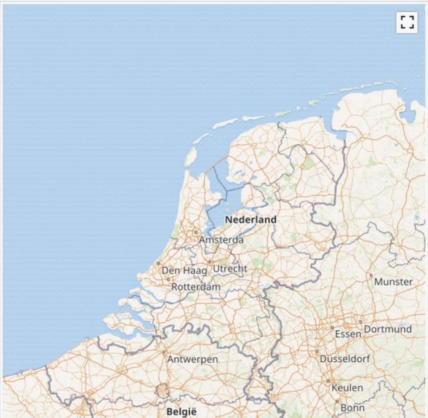

> **AI Description:**
> **Source:** `assets/_page_50_Figure_1.jpg`
> 
> **Generated:** 2026-05-17 02:55:53
> 
> ---
> 
> The image is a map of the Netherlands and parts of Belgium and Germany. It includes labeled cities such as Amsterdam, Rotterdam, Utrecht, Den Haag, Antwerp, Essen, Dortmund, Düsseldorf, Keulen, and Bonn. The map shows major roads and highways, with the country's borders outlined. The map is focused on the Netherlands, with parts of neighboring countries visible.


https://nl.wikipedia.org/wiki/Gebruiker:OlafJanssen/KladblokMapMakingWorkshopWM2019

<span id="page-51-0"></span>
## Gebruiker:OlafJanssen/KladblokMapMakingWorkshopWM2019

Hoofdpagina   
Vind een artikel   
Vandaag   
Etalage   
Categorieen   
Recente wijzigingen   
Nieuwe artikelen   
Willekeurige pagina

Embeddedmaps inDutch Wikipedia[bewerkenbrontekstbewerken]

BasicembeddedmapofTheNetherlands[bewerken brontekstbewerken]

Snelcursus Hulp en contact Donaties

Basic embedded map of The Netherlands =:

Boekmaken Downloaden als PDF Printvriendelijke versie

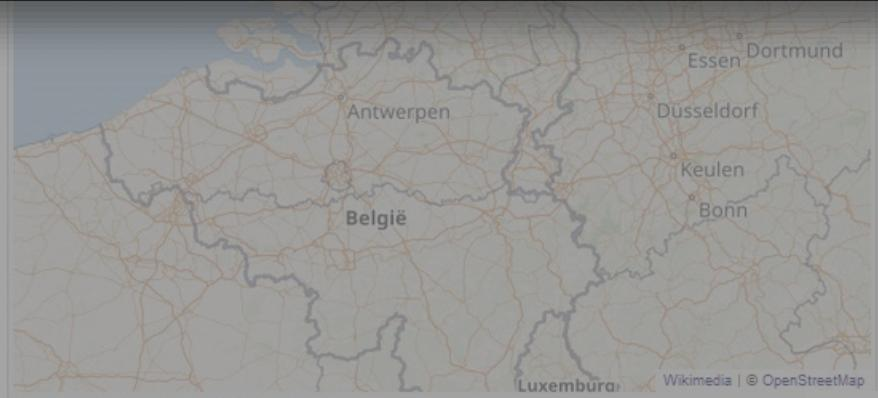

> **AI Description:**
> **Source:** `assets/_page_51_Figure_0.jpg`
> 
> **Generated:** 2026-05-17 02:44:39
> 
> ---
> 
> The image is a map showing parts of Belgium and surrounding regions. It includes major cities such as Antwerp, Brussels (België), and other cities like Essen, Dortmund, Düsseldorf, Cologne (Keulen), and Bonn. The map highlights road networks and borders, with a focus on Belgium and its neighboring countries. The map is sourced from Wikimedia and OpenStreetMap.

Basic embedded map of The Netherlands

<span id="page-52-0"></span>
## 2.1) Single location, hard-coded

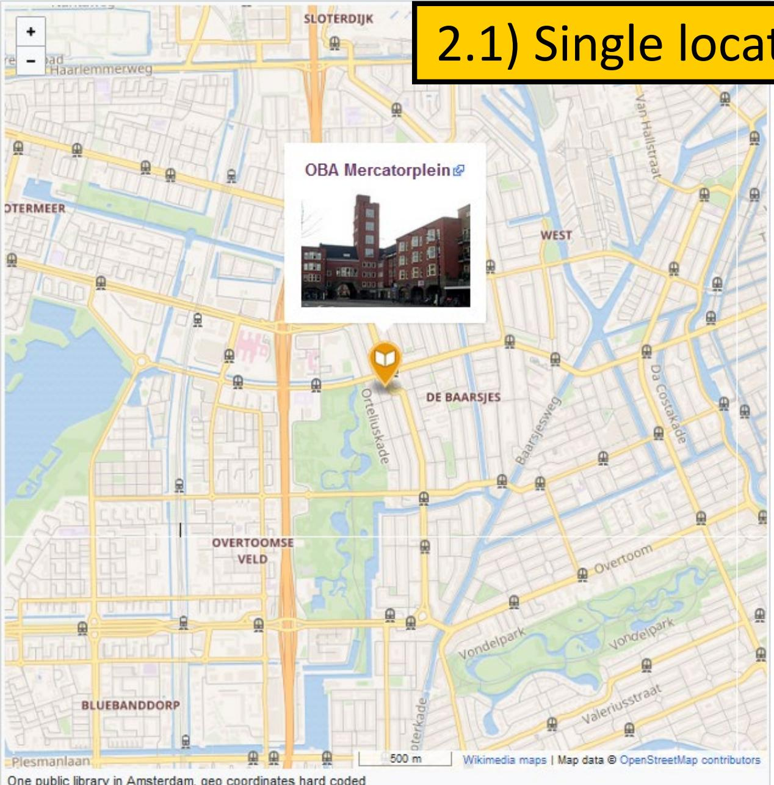

> **AI Description:**
> **Source:** `assets/_page_52_Figure_0.jpg`
> 
> **Generated:** 2026-05-17 02:09:06
> 
> ---
> 
> The image contains a map of Amsterdam, highlighting the location of OBA Mercatorplein, a public library. The map includes street names and geographical features such as canals and parks. A pin marks the exact location of the library, and a photograph of the building is displayed above the map. The image also includes a legend indicating the scale of the map and credits to OpenStreetMap contributors.

One public library in Amsterdam,geo coordinates hard coded

<span id="page-53-0"></span>
```
"type": "Feature",   
"geometry": { "type": "Point", "coordinates": [4.8502319, 52.3693887] 1,   
"properties":{   
"title": "[https://www.oba.nl/vestigingen/oba-mercatorplein.html OBA Mercatorplein:   
"description": "[[File:Mercatorplein west.JPG|300px]]",   
"marker-symbol": "library",   
"marker-size": "large",   
"marker-color": "ea9809"   
}   
</mapframe>
```

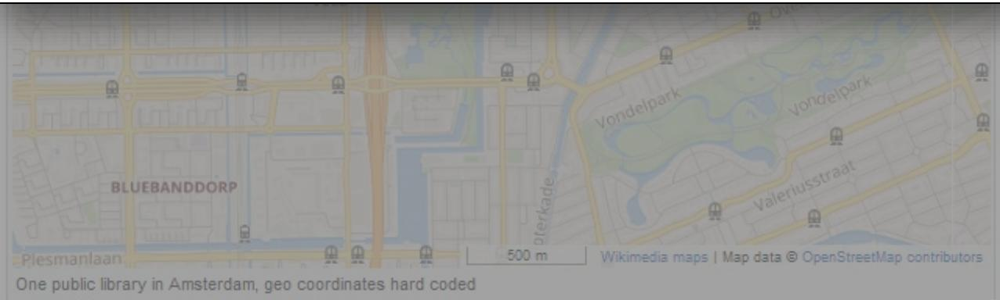

> **AI Description:**
> **Source:** `assets/_page_53_Figure_0.jpg`
> 
> **Generated:** 2026-05-17 02:17:59
> 
> ---
> 
> The image is a map showing a section of Amsterdam, focusing on the area around Vondelpark. It includes labeled streets such as Bluebanddorp, Plesmanlaan, and Valeriusstraat. The map also highlights the location of one public library in Amsterdam, with its geo coordinates hard-coded. The map is sourced from Wikimedia and OpenStreetMap contributors.


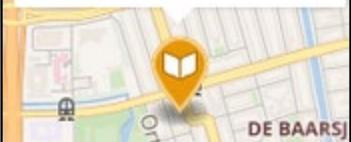

> **AI Description:**
> **Source:** `assets/_page_53_Figure_2.jpg`
> 
> **Generated:** 2026-05-17 02:23:07
> 
> ---
> 
> The image contains a map with a location marker in the center. The marker is orange and shaped like a book, indicating a library or bookstore. The text "DE BAARS" is visible at the bottom right, which likely refers to the name of the location or the street. The map shows a portion of a city with streets and buildings, but no other specific visual elements or data are present.


<span id="page-54-0"></span>
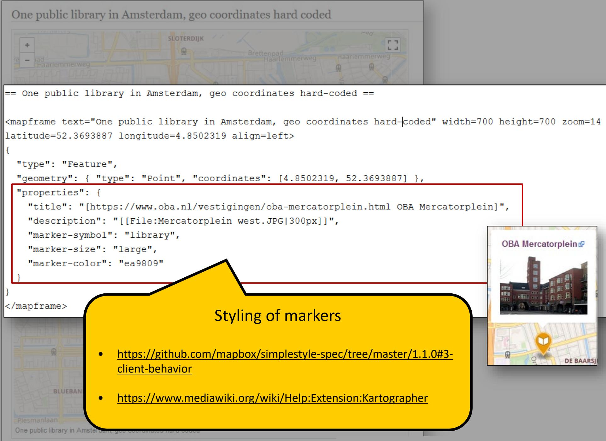

> **AI Description:**
> **Source:** `assets/_page_54_Figure_0.jpg`
> 
> **Generated:** 2026-05-17 02:17:46
> 
> ---
> 
> The image contains a combination of text and a map. It includes a JSON-like structure describing the location of a public library in Amsterdam, with coordinates and properties such as title, description, marker symbol, size, and color. The text also references styling of markers and provides links to resources for further information. The map in the background shows the location of the library on a street map, with a marker indicating its position.


<span id="page-55-0"></span>
Library,museumand archive in Amsterdam,geo coordinates hard-coded

## 2.2) Three locations, hard-coded

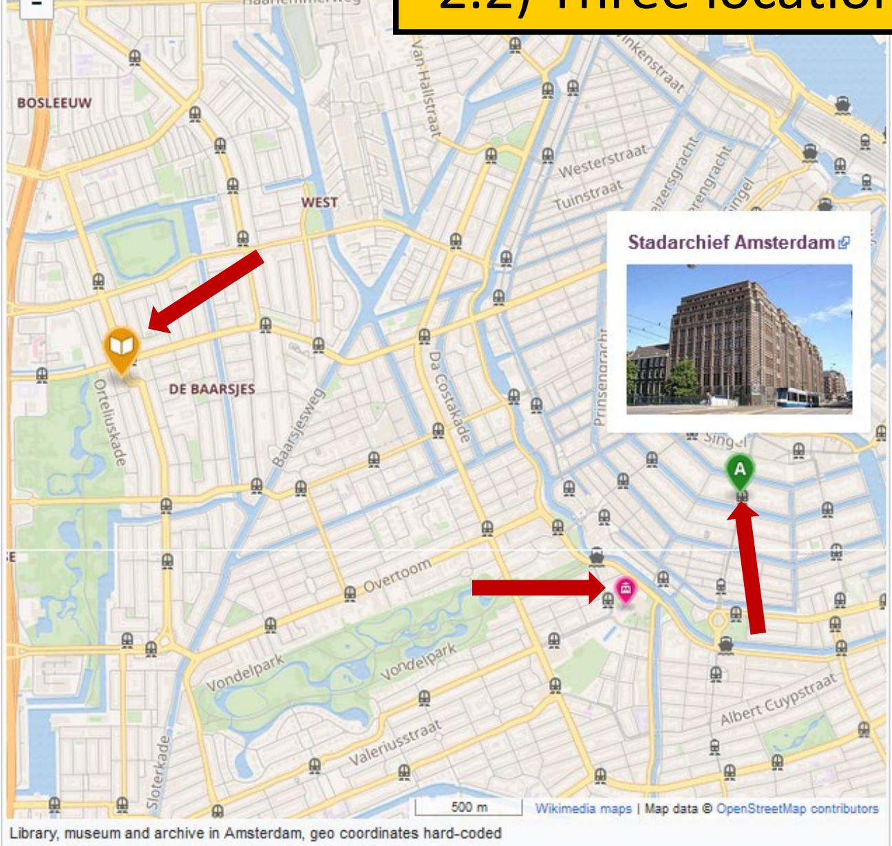

> **AI Description:**
> **Source:** `assets/_page_55_Figure_0.jpg`
> 
> **Generated:** 2026-05-17 02:09:51
> 
> ---
> 
> The image is a map of Amsterdam, highlighting three locations with red arrows pointing to specific areas. The map includes street names and landmarks such as "De Baarsjes," "Vondelpark," and "Stadarchief Amsterdam." There is a small inset photo of the Stadarchief Amsterdam building, which is labeled with the text "Stadarchief Amsterdam." The map also includes a legend indicating the scale and the type of icons used, such as those for public transportation.


<span id="page-56-0"></span>
```
"type": "Feature",   
"geometry": { "type": "Point", "coordinates": [4.8502319, 52.3693887] ],   
"properties": {   
"title": "[https://www.oba.nl/vestigingen/oba-mercatorplein.html OBA Mercatorplein]",   
"description": "[[File:Mercatorplein west.JPG|300px]]",   
"marker-symbol": "library",   
"marker-size": "large",   
"marker-color": "ea9809" ]   
1,
```

```
"type": "Feature",   
"geometry": { "type": "Point", "coordinates": [4.8846644, 52.3598658] 1,   
"properties": {   
"title": "[https://www.rijksmuseum.nl Rijksmuseum]",   
"description": "[[File:Rijksmuseum.Amsterdam.jpgl300opx]]",   
"marker-symbol": "museum",   
"marker-size": "small",   
"marker-color": "f01080" ]   
1，   
{ "type": "Feature",   
"geometry": { "type": "Point", "coordinates": [4.8923905, 52.3645600] ],   
"properties":{   
"title": "[https://www.amsterdam.nl/stadsarchief/ Stadarchief Amsterdam]",   
"description": "[[File:Gebouw de Bazel.jpgl300px]]",   
"marker-symbol": "-letter",   
"marker-size": "medium",   
"marker-color": "228b22" }   
(/mapframe>
```

<span id="page-57-0"></span>
```
"type": "Feature",   
"geometry": { "type": "Point", "coordinates": [4.8846644, 52.3598658] ],   
"properties":{   
"title": "[https://www.rijksmuseum.nl Rijksmuseum]",   
"description": "[File:Rijksmuseum.Amsterdam.jpgl300px]]",   
"marker-symbol": "museum",   
"marker-size": "small",   
"marker-color": "f01080" }   
1
```

```
"type": "Feature",   
"geometry": { "type": "Point", "coordinates": [4.8923905, 52.3645600] ],   
"properties":{   
"title": "[https://www.amsterdam.nl/stadsarchief/ Stadarchief Amsterdam]",   
"description": "[[File:Gebouw de Bazel.jpgl300px]]",   
"marker-symbol": "-letter",   
"marker-size": "medium",   
"marker-color": "228b22" }   
1   
1   
:/mapframe>
```

<span id="page-59-0"></span>
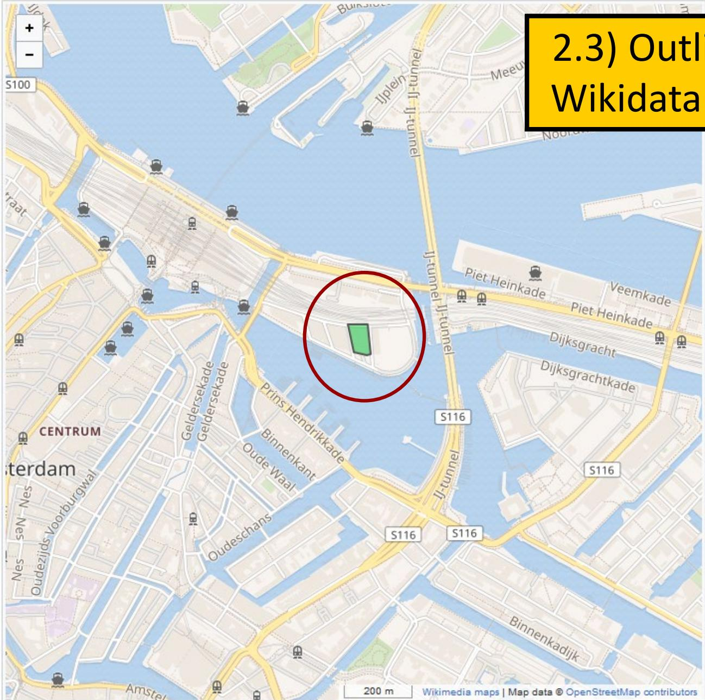

> **AI Description:**
> **Source:** `assets/_page_59_Figure_0.jpg`
> 
> **Generated:** 2026-05-17 02:29:38
> 
> ---
> 
> The image is a map of a specific area, likely in Amsterdam, with a focus on a particular location circled in red. The map includes various streets and waterways, with labels such as "IJ-tunnel," "Piet Heinkade," and "Dijksgracht." The map also includes a legend in the top right corner indicating "2.3) Outl Wikidata," suggesting this might be part of a presentation or document related to Wikidata. The map is sourced from OpenStreetMap contributors, as indicated at the bottom.

Outline(geoshape)ofAmsterdampubliclibrary(main site),using WikidataandOpen StreetMap

<span id="page-60-0"></span>
Outline (geoshape) of Amsterdam public library (main site), using Wikidata and Open Street Map

```
Meel   
5100   
== Outline (geoshape) of Amsterdam public library (main site)， using Wikidata and Open Street   
Map ==   
<mapframe width=700 height=700 zoom=15 latitude=52.3757964 longitude=4.9079461 text="Outline   
(geoshape) of Amsterdam public library (main site)， using Wikidata and Open Street Map"   
align=left>   
"type": "ExternalData",   
"service": "geoshape",   
"ids": "Q50413436",   
"properties":   
"fill": "#07c63e", "title": "Amsterdam public library, main site"   
</mapframe>
```

<span id="page-61-0"></span>
## Amsterdam Public Library, OBA Oosterdok (Centrale) (Q50413436)

Main visitor location and administration offces of the Amsterdam Public Library, The Netherlands OBA Oosterdok (Centrale)

In more languages
https://www.wikidata.org/wiki/Q50413436

All entered languages

Statements


<span id="page-62-0"></span>
## https://www.0penstreetmap.0rg/way/240467636#map=19/52.37605/4.90853

## Weg: OBA Oosterdok (240467636) X

De oude gegevens verwezen naar de Stichting Openbare Bibliotheken Amsterdam (Q2105660 op Wikidata), de nieuwe verwijzen naar Q50413436, de belangrijkste bezoekerslocatie en het hoofdkantoor van deze organisatie

25.minutes.ago.geleden bewerkt door OlafJanssen Versie #12·Wijzigingenset #72901147


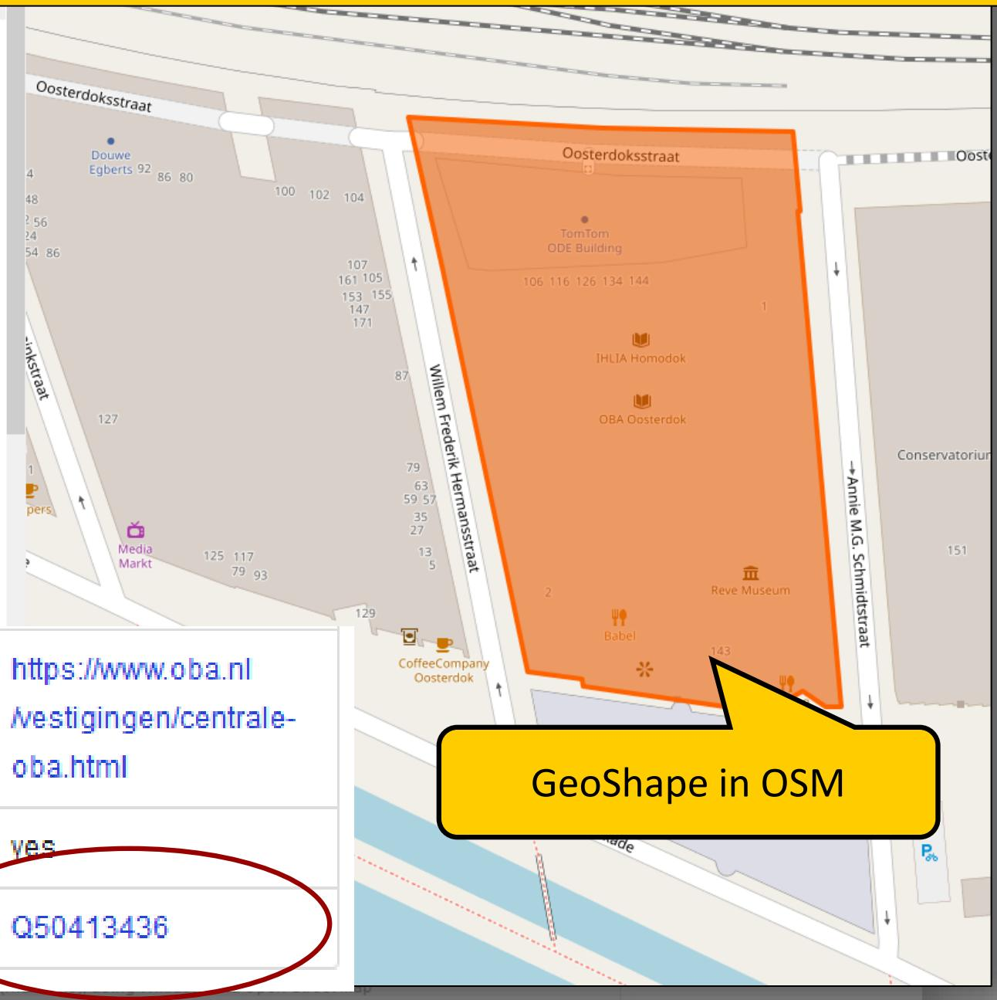

> **AI Description:**
> **Source:** `assets/_page_62_Figure_0.jpg`
> 
> **Generated:** 2026-05-17 02:25:41
> 
> ---
> 
> The image contains a map with a highlighted area labeled "Oosterdoksstraat" and several points of interest marked within it, such as "TomTom ODE Building," "IHLIA Homodok," "OBA Oosterdok," and "Reve Museum." There is a yellow arrow pointing to the highlighted area with the text "GeoShape in OSM." Additionally, there is a URL "https://www.oba.nl/nestigingen/centrale-oba.html" and a Q-number "Q50413436" circled in red. The image also includes street names and numbers, indicating a specific location in Amsterdam.


<span id="page-63-0"></span>
## 2.4) Many locations, GeoJSON .map file

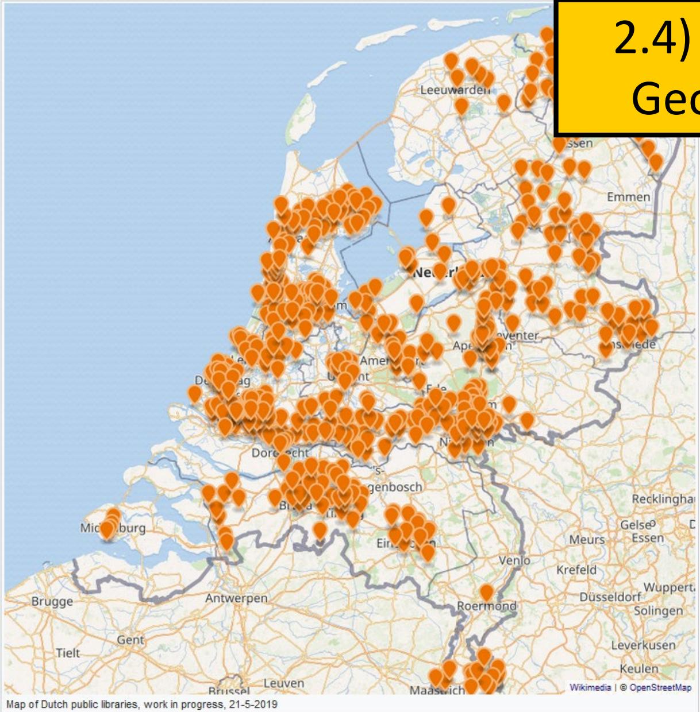

> **AI Description:**
> **Source:** `assets/_page_63_Figure_0.jpg`
> 
> **Generated:** 2026-05-17 02:11:56
> 
> ---
> 
> The image is a map of the Netherlands, specifically highlighting the locations of Dutch public libraries. The map is overlaid with numerous orange markers, each representing a library's location. The map includes major cities and towns, with the Netherlands' borders clearly marked. The text at the bottom indicates that this is a work in progress, dated 21-5-2019. The map provides a geographical representation of library distribution across the country, with a higher concentration of libraries in urban areas.

SPARQL-queryused to make DutchPublicLibraries.map(further instructions in the query)

<span id="page-64-0"></span>
```
```vue
"type": "ExternalData",
"service": "page",
"title": "DutchPublicLibraries.map",
</mapframe>
```
```

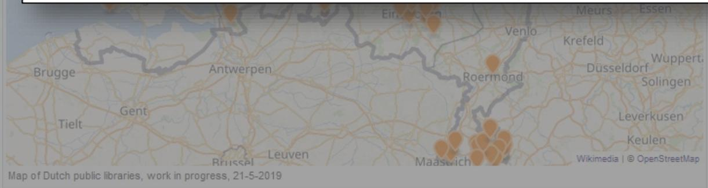

> **AI Description:**
> **Source:** `assets/_page_64_Figure_0.jpg`
> 
> **Generated:** 2026-05-17 02:13:07
> 
> ---
> 
> The image is a map showing the locations of Dutch public libraries. It includes a geographical representation of the Netherlands and parts of neighboring countries, with orange markers indicating the locations of libraries. The map is labeled with the title "Map of Dutch public libraries, work in progress, 21-5-2019." The map also includes city names such as Antwerp, Brussels, and Maastricht, providing context for the locations of the libraries.

SPARQL-query@usedto make DutchPublicLibraries.map (further instructions inthe query)

<span id="page-65-0"></span>
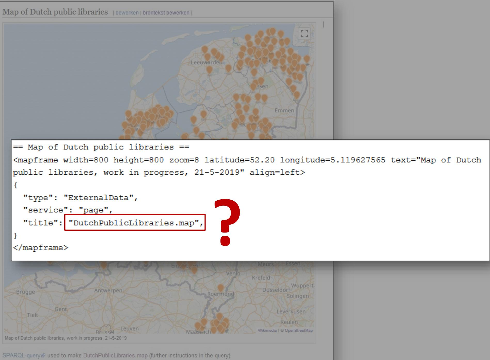

> **AI Description:**
> **Source:** `assets/_page_65_Figure_0.jpg`
> 
> **Generated:** 2026-05-17 02:24:40
> 
> ---
> 
> The image contains a map of Dutch public libraries, overlaid with a JSON-like structure. The map shows a concentration of library locations in the northern part of the Netherlands. The JSON structure provides metadata about the map, including its title, dimensions, and coordinates. The map is labeled as "work in progress" and dated 21-5-2019.


<span id="page-66-0"></span>


> **AI Description:**
> **Source:** `assets/_page_66_Figure_0.jpg`
> 
> **Generated:** 2026-05-17 02:56:59
> 
> ---
> 
> The image contains a circular diagram with a central red dot and arrows pointing in various directions around it. The arrows are arranged in a way that suggests a cycle or a flow, possibly indicating a process or a system. The arrows are blue and white, and the overall design is simple and abstract, likely representing a concept or idea rather than specific data or information.


## WIKIMEDIA COMMONS

Mainpage

Welcome

Community portal

Village pump

Help center

Taal

English

Participate

Uploadfile

Recentchanges

Latestfiles

Randomfile

Contactus

Print/export

Download as PDF

Tools

What links here

Related changes

Special pages

Permanentlink

Page information

Subpages

Nominatefordeletion

InWikipedia

Adlinks

## https://commons.wikimedia.org/wiki/Data:DutchPublicLibraries.map

Data:DutchPublicLibraries.map

Wikimedia Commons in het Nederlands

FromWikimedia Commons,thefreemediarepository

MapofDutchpubliclibraries,incomplete，workinprogress,10-8-2019

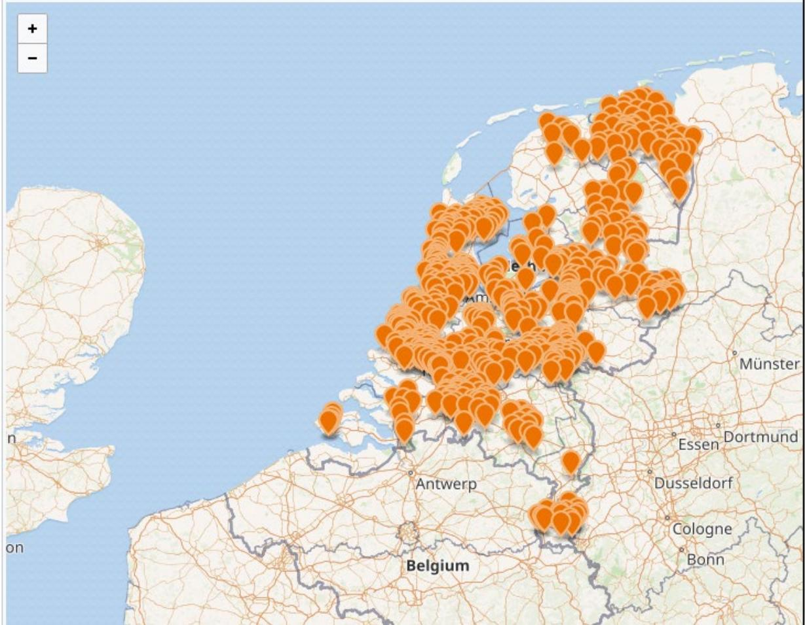

> **AI Description:**
> **Source:** `assets/_page_66_Figure_1.jpg`
> 
> **Generated:** 2026-05-17 03:04:03
> 
> ---
> 
> The image is a map of a region in Europe, likely the Benelux countries (Belgium, the Netherlands, and Luxembourg), with a focus on the Netherlands and Belgium. It contains a large number of orange markers clustered in the northeastern part of the Netherlands, indicating a high concentration of data points in that area. The map also includes the names of major cities such as Antwerp, Cologne, Düsseldorf, Essen, and Münster. The map is a geographical representation with roads and country borders visible, and the orange markers suggest a data distribution or population density visualization.


<span id="page-67-0"></span>
## https://commons.wikimedia.org/wiki/Data:DutchPublicLibraries.map


> **AI Description:**
> **Source:** `assets/_page_67_Figure_0.jpg`
> 
> **Generated:** 2026-05-17 02:52:04
> 
> ---
> 
> The image contains a circular diagram with a central red dot and arrows pointing in various directions around it. The arrows are blue and appear to be indicating a flow or movement in a circular pattern. The diagram seems to represent a cycle or a process with multiple steps or directions.


Hoofdpagina   
Welkom   
Gebruikersportaal   
De Kroeg   
Hulp

Bestand uploaden Recente wijzigingen Recente bestanden Willekeurig bestand Contact

Verwijzingen naar deze   
pagina   
Verwante wijzigingen   
Speciale pagina's   
Paginagegevens   
Geocoding Recent   
Changes   
Geocoding Search   
Geocoding Daily Log   
Subpagina's   
Voor verwijdering   
nomineren

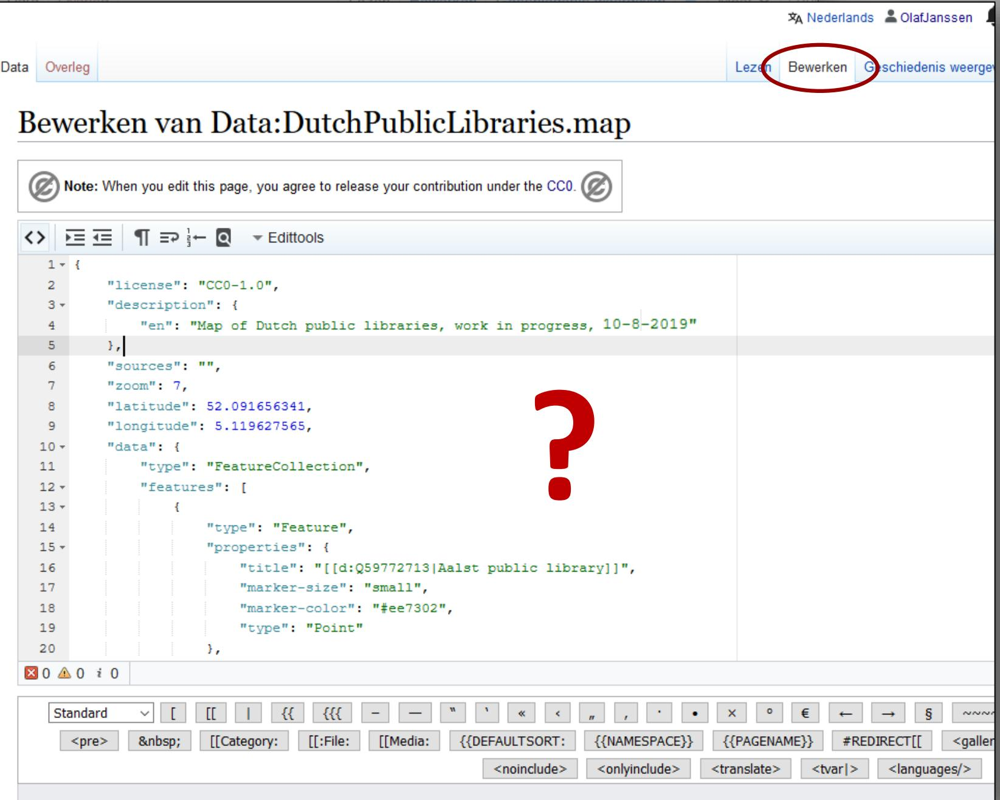

> **AI Description:**
> **Source:** `assets/_page_67_Figure_1.jpg`
> 
> **Generated:** 2026-05-17 02:50:49
> 
> ---
> 
> The image displays a screenshot of a web page with a text-based interface for editing a map titled "DutchPublicLibraries.map." The page includes a JSON-like structure with various properties such as license, description, sources, zoom level, latitude, longitude, and data points. The text is primarily in Dutch, with some English descriptions. The interface includes buttons for editing tools and a note about releasing contributions under the CC0 license. The main visual element is the JSON data structure, which appears to be part of a map or database entry for Dutch public libraries.


<span id="page-68-0"></span>

Main page

Support

Development

Bug tracker

Code repository

MediaWiki.org

Community portal

Recent changes

Translate content

Random page

Current issues

Sandbox

Print/export

Create a book

Download as PDF

Printable version

Tools

文A Nederlands & OlafJanssen

Edit|View history☆ More<

https://www.mediawiki.org/wiki/Help:Map\_Data

## Help:Map Data


Note: When you edithis page,youagreetorelease yourcontributionunderthe CCo.See Public Domain HelpPagesformore info.

Edit - Translate


Mapdtaoaiasasai

Toreateewataoseataaespacafchtab experit editor to simplify GeoJSON creation.

## Data licensing [edit]

All data in the Data:namespace must licensed under one of the following licences:

· CC0-1.0

· CC-BY versi0ns: CC-BY-1.0, CC-BY-2.0, CC-BY-2.5, CC-BY-3.0, CC-BY-4.0, CC-BY-4.0+

· CC-BY-SA versi0ns: CC-BY-SA-1.0,CC-BY-SA-2.0, CC-BY-SA-2.5, CC-BY-SA-3.0,CC-BY-SA-4.0, CC-BY-SA-4.0+

· ODbL-1.0

Thedefautlitilteiildetoft

## Top-level fields[edit]

Map data has several required and optional top-level elements:

· The required"licensefield must always be seto one oftheallowed string values,e.g."cco-1.o" (see#Data licensing).

Teptiteedd

· The optional "sources" field must be a Wiki markup string value that describes the source of the map data.

Teptioalfedsttegebetwdsssefosplamtsetiit

·Teoptioal"atitudnd"gidefelspeiecentefthapdisplaigitotsopetcuingite.

·Therequedatasdotseeeure propeisit tabular data). This allows the same map data to appear diferently depending on the user's language.

<span id="page-69-0"></span>
## https://commons.wikimedia.org/wiki/Data:DutchPublicLibraries.map


> **AI Description:**
> **Source:** `assets/_page_69_Figure_0.jpg`
> 
> **Generated:** 2026-05-17 02:35:22
> 
> ---
> 
> The image is a diagram featuring a circular design with a red center and blue arrows forming a swirling pattern around it. The arrows point in various directions, suggesting a dynamic or cyclical process. The design appears to represent a concept or system involving movement or interaction, possibly related to a feedback loop or circular flow.


Hoofdpagina   
Welkom   
Gebruikersportaal   
De Kroeg   
Hulp

## Doe mee

Bestand uploaden Recente wijzigingen Recente bestanden Willekeurig bestand Contact

## Hulpmiddelen

Verwijzingen naar deze   
pagina   
Verwante wijzigingen   
Speciale pagina's   
Paginagegevens   
Geocoding Recent   
Changes   
Geocoding Search   
Geocoding Daily Log   
Subpagina's   
Voor verwijdering   
nomineren

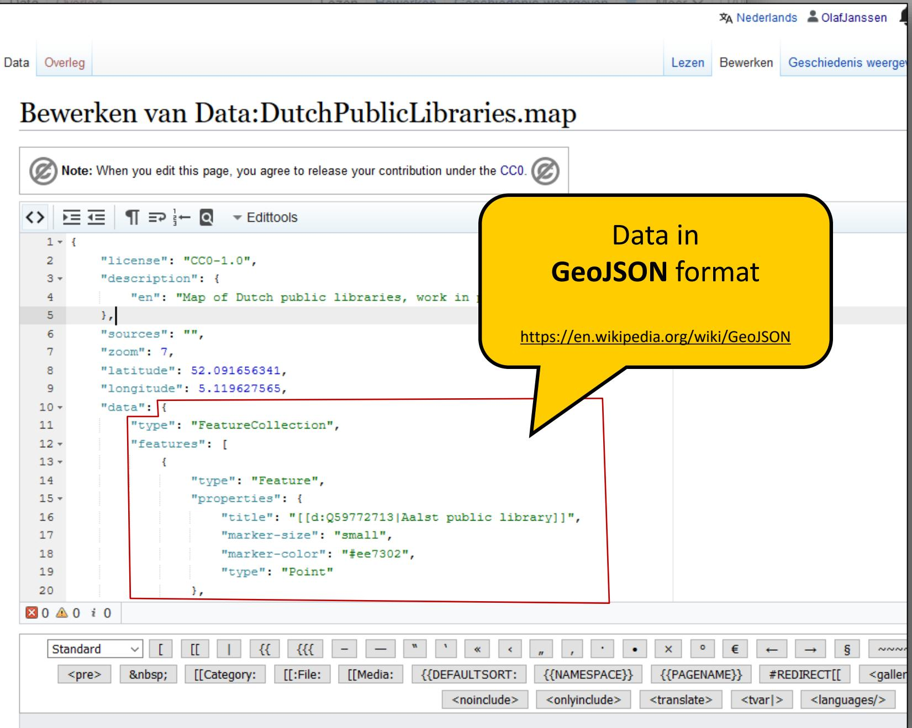

> **AI Description:**
> **Source:** `assets/_page_69_Figure_1.jpg`
> 
> **Generated:** 2026-05-17 02:30:56
> 
> ---
> 
> The image contains a screenshot of a text editor displaying a JSON file. The file appears to be in GeoJSON format, which is used for representing geographical data. The text editor highlights a specific section of the JSON file, showing a feature collection with a single feature that represents a public library. The feature includes properties such as the title of the library, the marker size, the marker color, and the type of the feature (Point). The image also includes a speech bubble with a link to the Wikipedia page for GeoJSON, indicating that the data is related to Dutch public libraries.


<span id="page-70-0"></span>
## https://commons.wikimedia.org/wiki/Data:DutchPublicLibraries.map

```
文A Nederlands & OlafJanssen   
Data Overleg Lezen BewerkenGeschiedenis weergel   
D 11：   
W <> Edittools   
Hoof 1- {   
Welk 2 "license": "cc0-1.0",   
Ger 3- "description": {   
Hulp 4 "en": "Your English title here"   
Doe 5 }   
Best 6 "sources": ""   
Rece 7 "zoom": 8,   
Rece   
Wille 8 "latitude": 52.091656341,   
Cont 9 "longitude": 5.119627565,   
Hulp 10 "data":   
11   
Verw×12 INSERT YOUR GEOJSON DATA HERE (output of http://geOjson.io)   
Spec Pagin 13   
Gnag 14(   
Geod 15 Single “}"   
Geod   
Subp   
Voor   
nomi   
<galler   
<noinclude><onlyinclude><translate><tvar|><languages/>   
nomineren
```

<span id="page-71-0"></span>
## Geojson.io

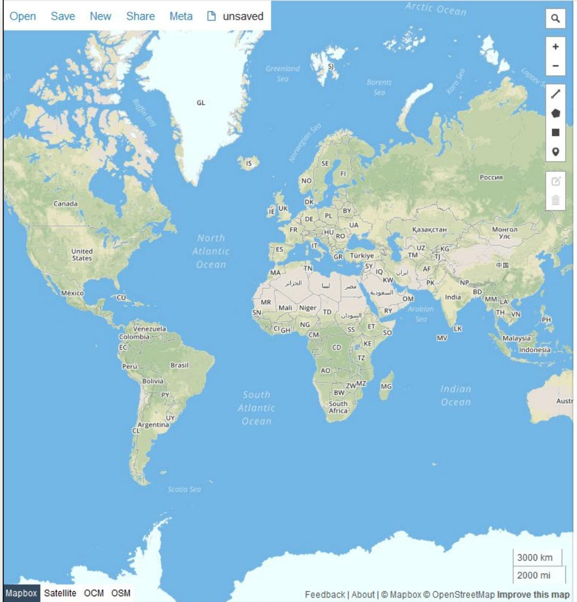

> **AI Description:**
> **Source:** `assets/_page_71_Figure_0.jpg`
> 
> **Generated:** 2026-05-17 02:15:23
> 
> ---
> 
> The image is a world map with geographical features and country labels. It includes major landmasses, oceans, and sea names. Countries are labeled with their respective abbreviations, and some countries have their names written in both English and another language. The map also includes a scale at the bottom right corner indicating distances in kilometers and miles. The map is sourced from Mapbox and OpenStreetMap, as indicated in the bottom right corner.


<span id="page-72-0"></span>
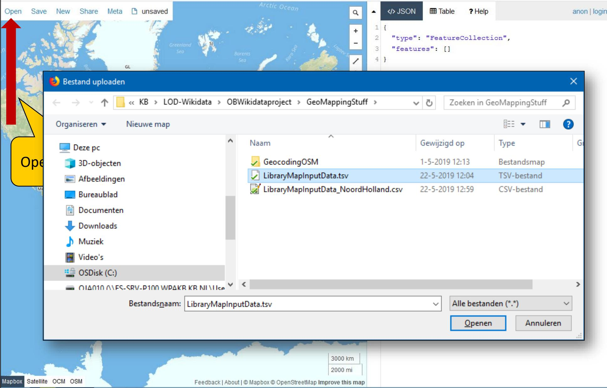

> **AI Description:**
> **Source:** `assets/_page_72_Figure_0.jpg`
> 
> **Generated:** 2026-05-17 02:49:24
> 
> ---
> 
> The image shows a file upload dialog box in a software application, likely a mapping or data management tool. The dialog box is titled "Bestand uploaden" (File upload) and is in Dutch. It displays a file explorer window with several folders and files listed. The highlighted file is "LibraryMapInputData.tsv," which is a TSV (Tab-Separated Values) file. The dialog box also includes options to organize files, create new folders, and select the file to upload. The top of the image shows a map interface with various map layers and tools, indicating that the software is used for geographic data management or mapping.


<span id="page-73-0"></span>
```
1 title marker-size marker-color type long lat   
2 [[d:Q59772713|Aalst public 1ibrary]] small #ee7302 Point 5.1259789 51.7841643   
3 [[d:Q59772714|Ammerzoden public library]] small #ee7302 Point 5.2201121 51.7506792   
4 [[d:Q59772716|Asperen public libraryl] small #ee7302 Point 5.1045091 51.8806175   
5 [[d:Q59772717|Beesd public libraryl] small #ee7302 Point 5.1930425 51.8868067   
6 [[d:Q59772718|Beneden-Leeuwen public library]] small #ee7302 Point 5.516266 51.8777727   
7 [[d:Q59772719]Culemborg public libraryl] smal1 #ee7302 Point 5.223026 51.9574438   
8 [[d:Q59772720|Dodewaard public library]] smal1 #ee7302 Point 5.6607362 51.9090619   
9 [[d:Q59772721|Dreumel public library]] small #ee7302 Point 5.4329593 51.846106   
10 [[d:Q59772722|Druten public 1ibrary]] small #ee7302 Point 5.6023973 51.8864962   
11 [[d:Q59772723|Geldermalsen public library]] small #ee7302 Point 5.28966 51.87324   
12 [[d:Q59772724|Haaften public libraryl] small #ee7302 Point 5.209602 51.8222877   
13 [[d:Q59772725|Herwijnen public library]] small #ee7302 Point 5.132461 51.8278308   
14 [[d:Q59772726|Heukelum public library]] smal1 #ee7302 Point 5.075112 51.8717037   
15 [[d:Q59772727|Kerkdriel public library]] small #ee7302 Point 5.3380551 51.7712143   
16 [[d:Q59772729|Kesteren public library]] smal1 #ee7302 Point 5.5680087 51.9321838   
17 [[d:Q59772731|Ochten public library]] small #ee7302 Point 5.5680429 51.9084892   
18 [[d:Q59772732|Ophemert public library]] small #ee7302 Point 5.3849607 51.8441046   
19 [[d:Q59772733|Opheusden public library]] small #ee7302 Point 5.6276707 51.9319108   
20 [[d:Q59772735|Zaltbommel public library]] small #ee7302 Point 5.2321253 51.8034576   
21 [[d:Q59772736|Self-service library point Boven-Leeuwen]] small #ee7302 Point 5.5459884 51.8853943   
22 [[d:Q59772737|Self-service library point Brakel]] small #ee7302 Point 5.0926245 51.8141786   
23 [[d:Q59772738|Self-service library point Deest]] small #ee7302 Point 5.6643959 51.8902209   
24 [[d:Q59772739|Self-service library point Deil]] small #ee7302 Point 5.2459089 51.8840328   
25 [[d:Q59772740|Self-service library point Horssen]] small #ee7302 Point 5.609065851.8547778   
26 [[d:Q5977274l|Self-service library point Lek en Linge]] small #ee7302 Point 5.2348588 51.9457687   
27 [[d:Q59772742|Self-service library point Maasbommel]] small #ee7302 Point 5.5353727 51.8199371   
28 [[d:Q59772743|Self-service library point Nederhemert]] small #ee7302 Point 5.1667443 51.7636824   
29 [[d:Q59772745|Self-service library point Vuren]] small #ee7302 Point 5.0489027 51.8248737   
30 [[d:Q59772808|Tiel public library]] small #ee7302 Point 5.4366236 51.8845787
```

<span id="page-74-0"></span>
## Geojson.io

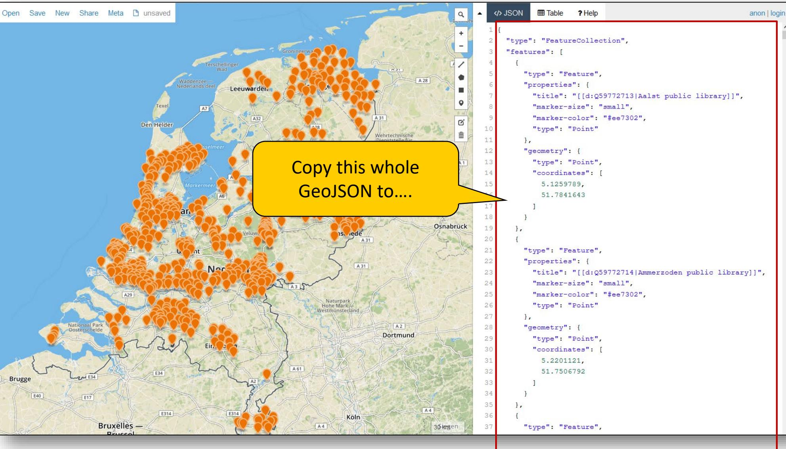

> **AI Description:**
> **Source:** `assets/_page_74_Figure_0.jpg`
> 
> **Generated:** 2026-05-17 03:00:52
> 
> ---
> 
> The image contains a map of a region with numerous orange location markers scattered across it, indicating various points of interest. The map is overlaid with a JSON data visualization on the right side, showing a list of features with properties such as title, marker size, marker color, and coordinates. The JSON data corresponds to the markers on the map, providing geographical information for each location. The text "Copy this whole GeoJSON to..." is highlighted, suggesting that the JSON data should be transferred to another location.


<span id="page-75-0"></span>
https://commons.wikimedia.org/wiki/Data:DutchPublicLibraries.map

```
<> Edittols   
1- {   
2 "license": "cc0-1.0",   
3- "description": {   
4 "en": "Your English title here"   
5 }   
6 "sources": "",   
"zoom": 8, .. to here   
8 "latitude": 52.091656341,   
9 "longitude": 5.119627565,   
10 "data":   
11   
区12 INSERT YOUR GEOJSON DATA HERE (output of http://geojson.io)   
13   
14   
15
```

<span id="page-76-0"></span>
## But how do you make this TSV?

```
图 LibraryMaplnputData.tsv 区   
1 title marker-size marker-color type long lat   
2 [[d:Q59772713|Aalst public library]] small #ee7302 Point 5.1259789 51.7841643   
3 [[d:Q59772714|Ammerzoden public library]] small #ee7302 Point 5.2201121 51.7506792   
4 [[d:Q59772716|Asperen public library]] small #ee7302 Point 5.1045091 51.8806175   
5 [[d:Q59772717|Beesd public library]] small #ee7302 Point 5.1930425 51.8868067   
6 [[d:Q59772718|Beneden-Leeuwen public libraryl] small #ee7302 Point 5.516266 51.8777727   
7 [[d:Q59772719]Culemborg public libraryl] smal1 #ee7302 Point 5.223026 51.9574438   
8 [[d:Q59772720|Dodewaard public library]] small #ee7302 Point 5.6607362 51.9090619   
9 [[d:Q59772721|Dreumel public library]] small #ee7302 Point 5.4329593 51.846106   
10 [[d:Q59772722|Druten public library]] small #ee7302 Point 5.6023973 51.8864962   
11 [[d:Q59772723|Geldermalsen public library]] smal1 #ee7302 Point 5.28966 51.87324   
12 [[d:Q59772724|Haaften public libraryl] small #ee7302 Point 5.209602 51.8222877   
13 [[d:Q59772725|Herwijnen public library]] small #ee7302 Point 5.132461 51.8278308   
14 [[d:Q59772726|Heukelum public libraryl] small #ee7302 Point 5.075112 51.8717037   
15 [[d:Q59772727|Kerkdriel public library]] small #ee7302 Point 5.3380551 51.7712143   
16 [[d:Q59772729|Kesteren public library]] small #ee7302 Point 5.5680087 51.9321838   
17 [[d:Q59772731|Ochten public library]] small #ee7302 Point 5.5680429 51.9084892   
18 [[d:Q59772732jOphemert public library]] small #ee7302 Point 5.3849607 51.8441046   
19 [[d:Q59772733|Opheusden public library]] small #ee7302 Point 5.6276707 51.9319108   
20 [[d:Q59772735|Zaltbommel public library]] small #ee7302 Point 5.2321253 51.8034576   
21 [[d:Q59772736|Self-service library point Boven-Leeuwen]] small #ee7302 Point 5.5459884 51.8853943   
22 [[d:Q59772737|Self-service library point Brakel]] small #ee7302 Point 5.0926245 51.8141786   
23 [[d:Q59772738|Self-service library point Deest]] small #ee7302 Point 5.6643959 51.8902209   
24 [[d:Q59772739|Self-service library point Deil]] small #ee7302 Point 5.2459089 51.8840328   
25 [[d:Q59772740|Self-service library point Horssen]] small #ee7302 Point 5.6090658 51.8547778   
26 [[d:Q5977274l|Self-service library point Lek en Linge]] small #ee7302 Point 5.2348588 51.9457687   
27 [[d:Q59772742|Self-service library point Maasbommel]] small #ee7302 Point 5.5353727 51.8199371   
28 [[d:Q59772743|Self-service library point Nederhemert]] small #ee7302 Point 5.1667443 51.7636824   
29 [[d:Q59772745|Self-service library point Vuren]] small #ee7302 Point 5.0489027 51.8248737   
30 [[d:Q59772808|Tiel public libraryl] smal1 #ee7302 Point 5.4366236 51.8845787
```

<span id="page-77-0"></span>
## Adapt this query, save output as .tsv

```
Wikidata Query Service Voorbeelden Hup 寮 Meer hulpmiddelen   
1 #Query used to make GeoJsON input for https://cormons.wikimedia.org/wiki/Data:DutchPublicLibraries.map   
2 #Steps involved   
X 1)Redtii   
平、 5# marker\_size --> marker-size https://bit.ly/2YG48aY   
6# marker\_color --> marker-color   
共 marker\_symbol --> marker-gymbol   
8 #3) Upload this file to geojson.io (Open --> File)   
9#4) Copy-paste GeoJSON output (right pane) into Data:DutchPublicLibraries.map file (in the "data" field)   
10   
11 SELECT DIsTINCT ?title ?marker\_size ?marker\_color ?type ?marker\_gymbol ?long ?lat WHERE {   
血 12 utchububcy Copy-paste in browser   
142dpl wdt:d:#   
16   
17?dpl wdt:P625 ?dplLoc. #Location of the dpl   
18   
19# Get the English Wikidata label of the dpl   
20 ?dpl rdfg:label ?dplLabel.   
21 FILTER (lang(?dplLabel) = 'en')   
22   
23 #Transform from 'http://www.wikidata.org/entity/Q63890044 Akersloot public library' to '[[d:Q63890044|Akersloot public library]]'   
24 BIND(CONCAT(\*[d:',STRAFTER(STR(?dpl),"http://www.wikidata.org/entity/"),'',?dplLabel,'1]") AS?title)   
25   
26 # Set 4 default values   
27 BIND("small" AS ?marker\_size)   
28 BIND("#ee7302" AS ?marker\_color)   
29 BIND("library" As ?marker\_symbol)   
30 BIND("Point" AS ?type)   
31   
32#Transform: 'Point(4.7322704 52.5633782)‘ (in 1 column) to '4.7322704' ， '52.5633782' ( i.e. 2 columns longitude + latitude)   
33 BIND(STRBEFORE(STRAFTER(STR(?dplLoc)， ' ')， ')') AS ?lat)   
34BIND(STRBEFORE(STRAFTER(STR(?dplLoc)， 'Point(')，’ ') AS ?long)   
35   
36 1   
37 ORDER BY ?title
```

<span id="page-78-0"></span>
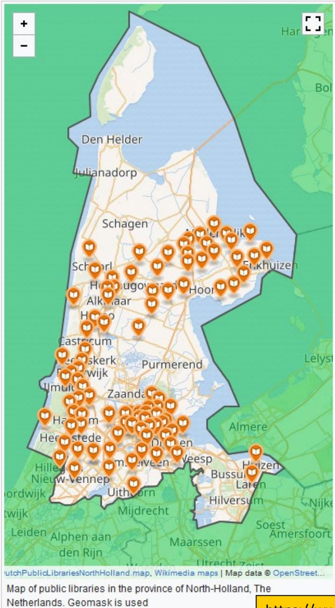

> **AI Description:**
> **Source:** `assets/_page_78_Figure_0.jpg`
> 
> **Generated:** 2026-05-17 02:44:04
> 
> ---
> 
> The image is a map of the province of North-Holland in The Netherlands, showing the locations of public libraries. The map uses a color-coded system with orange markers representing library locations. The map includes various place names such as Den Helder, Alkmaar, Haarlem, and Uithoorn. The map data is attributed to OpenStreetMap and the image is sourced from Wikimedia maps. The map is titled "Map of public libraries in the province of North-Holland, The Netherlands. Geomask is used."


## 2.5) Combining data types GeoShape + .map

<span id="page-79-0"></span>
```
Combining geoshape (with geomask) and .map https://nl.wikipedia.org/wiki/Gebruiker:OlafJanssen/KladblokMapMakingWorkshop   
+   
」   
<mapframe width=400 height=700 zoom=9 latitude=52.65 longitude=4.95 text="Mapof public libraries in the   
provinceof North-Hollnd，The NetherlandsGeomask is used"align-left>   
"type": "ExternalData"   
Uservicengeoshape"   
"service": "geomask",   
"ids": "0701",   
"properties":   
"f11":"#07c63e", "title": "Noord-Holland'   
}，   
"type": "ExternalData",   
"service": "page",   
"title": "DutchPublicLibrariesNorthiolland.nap"   
1   
https://commons.wikimedia.org/wiki/Data:DutchPublicLibrariesNorthHolland.map   
</mapframe>   
Soest   
Leiden Alphen aan Amersfoort   
Maarssen   
den Rijn   
utchPubliciariesNorthHollndmspWiimedia maps Mapdata OpeStreet   
Map of public libraries in the province of North-Holland,The   
Netherlands.Geomaskis used
```

<span id="page-80-0"></span>
## 2.6) GeoShapes using SPARQL and OSM

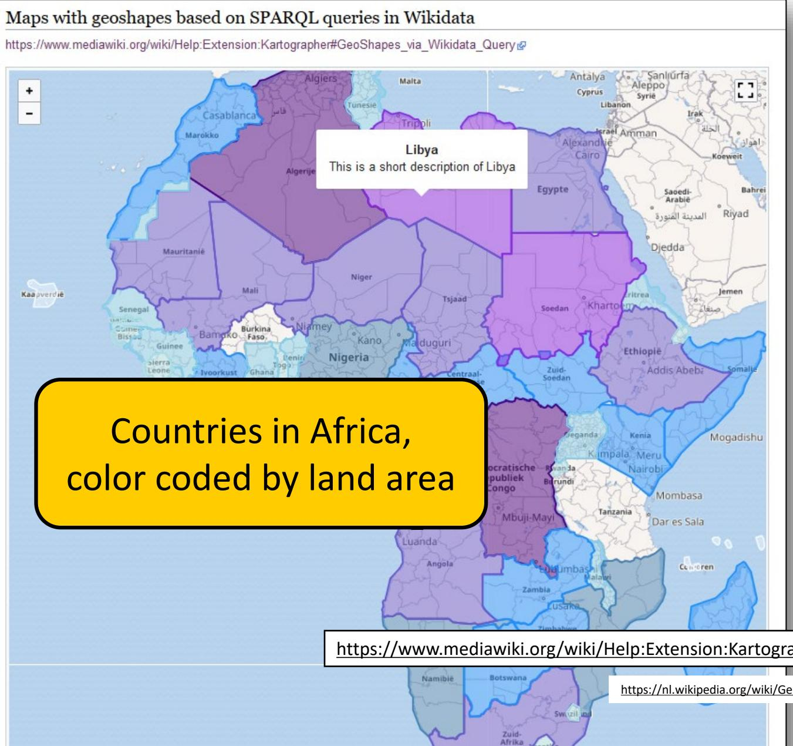

> **AI Description:**
> **Source:** `assets/_page_80_Figure_0.jpg`
> 
> **Generated:** 2026-05-17 02:43:38
> 
> ---
> 
> The image contains a map of Africa with countries color-coded by land area. The map is overlaid with a yellow box containing the text "Countries in Africa, color coded by land area." The map uses a gradient of colors to represent different land areas, with darker shades indicating larger countries and lighter shades for smaller ones. The map also includes country names and some geographical features, such as coastlines and major cities. The image is accompanied by a URL at the bottom, suggesting it is part of a larger presentation or document.


https://www.mediawiki.org/wiki/Help:Extension:Kartographer#GeoShapes\_via\_Wikidata\_Query

<span id="page-81-0"></span>
## 2.6) GeoShapes using SPARQL and OSM

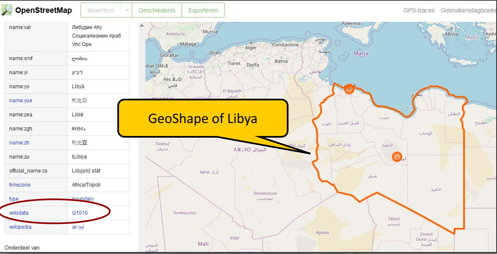

> **AI Description:**
> **Source:** `assets/_page_81_Figure_0.jpg`
> 
> **Generated:** 2026-05-17 02:37:27
> 
> ---
> 
> The image is a screenshot from OpenStreetMap, showcasing the geographical shape of Libya. It includes a map with Libya's borders outlined in orange, and various place names are labeled in Arabic and other languages. The image also contains a table on the left side with information about Libya, including its name in different languages, its official name, timezone, and type of feature (boundary). The image highlights Libya's geographical shape with a yellow annotation and the text "GeoShape of Libya."


https://www.openstreetmap.org/relation/192758#map=5/22.086/20.039

<span id="page-82-0"></span>
```
== Maps with geoshapes based on SPARgL queries in Wikidata ==   
https://www.nediawiki.org/wiki/Help:Extension:Kartographer#GeoShapes\_via\_Wikidata\_Query   
<mapframe vidth=90height=90zom4 latitude=0longitude=12 text="CountriesinAfrica，color codedbyland area"alig=left>   
"type": "ExternalData",   
"service": "geoshape",   
"query": "   
# Begin SPARQL query // Make sure you only use single quotes (") in the query， otherwise you get a JSON parse error   
SELECT DISTINCT   
?id #Wikidata Qid matching the geoshape on Open Street Map   
?title #Popup title when you click on the country   
?description #Description in the popup   
?fill #Color the geoshape is filled with   
?stroke #Color of the geoshape outline   
WHERE{   
?id wdt:P31 wd:Q6256; wdt:P30 wd:Q15. #Country in the continent of Africa   
?id wdt:P2046 ?area. # Land area of the country   
?id rdfs:label ?idLabel . FILTER(lang(?idLabel)='en') #only English labels   
BIND(?idLabel as ?title)   
BIND(CONCAT('This is a short description of ',STR(?title)) as ?description)   
# Fill & stroke colors depend on land area of country   
BIND(   
IF(?area < 5000, '#F0F8FF',   
IF(?area < 100000, '#B0E0E6',   
IF(?area < 300000, '#87CEEB',   
IF(?area < 800000，'#1E90FF',   
IF(2area < 100000, #4682B4',   
IF(?area < 1500000, '#6A5ACD',   
https://bit.ly/2YBxV4t   
BIND(?color as ?fill)   
BIND(?color as ?stroke)   
1   
End SPARQL query   
"   
</mapframe>
```

<span id="page-83-0"></span>


<span id="page-84-0"></span>

<span id="page-85-0"></span>
## 2.7) Other cool embedded maps

Railwaylinesaround KlangValleyMalaysiabewerkenbrotekstbeweken]

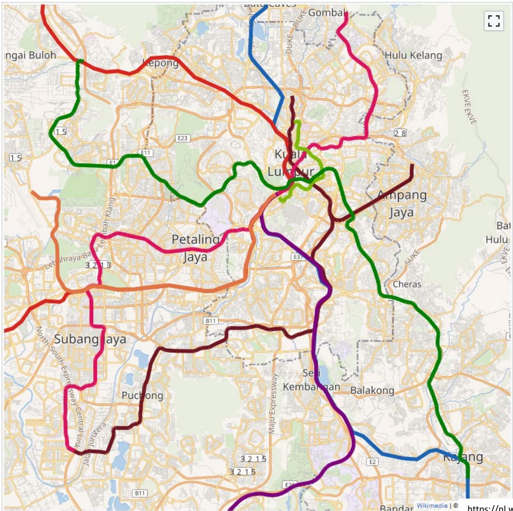

> **AI Description:**
> **Source:** `assets/_page_85_Figure_0.jpg`
> 
> **Generated:** 2026-05-17 02:28:37
> 
> ---
> 
> The image is a map of Kuala Lumpur and surrounding areas, featuring various colored lines representing different routes or highways. The map includes labels for major locations such as Kuala Lumpur, Petaling Jaya, Subang Jaya, and Puchong. The lines are color-coded, with each color representing a different route or highway, making it easier to distinguish between them. The map also includes road numbers and names, such as E23 and E11, which are likely major highways. The map provides a clear visual representation of the road network in the region.

RailwaylinesaroundKlangValley,Malayia

<span id="page-86-0"></span>
Governors of USstates withtheirpartyaffiliation

<span id="page-87-0"></span>
GeoShapes [edit]
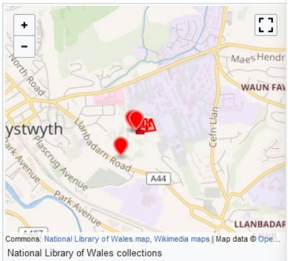

> **AI Description:**
> **Source:** `assets/_page_87_Figure_0.jpg`
> 
> **Generated:** 2026-05-17 02:44:11
> 
> ---
> 
> The image is a map showing the vicinity of Ystwyth, Wales. It includes several red markers indicating locations, with one of them being labeled as the National Library of Wales. The map also displays road names such as Llanbadarn Road and A44, and other geographical features. The map credits the National Library of Wales and Wikimedia for the map data and collections.


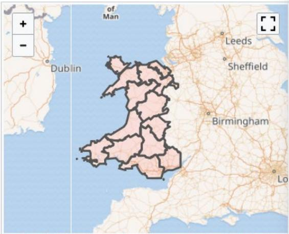

> **AI Description:**
> **Source:** `assets/_page_87_Figure_1.jpg`
> 
> **Generated:** 2026-05-17 02:42:10
> 
> ---
> 
> The image is a map highlighting the region of Wales within the United Kingdom. It shows the geographical boundaries of Wales and includes major cities such as Dublin, Leeds, Sheffield, and Birmingham. The map uses a light color scheme with roads and major cities marked for reference. The map is interactive, as indicated by the zoom-in and zoom-out icons in the top left corner.

Governors of US states with their
counties of Wales/Denbighshire.map,Wikimedia maps|Map data @ OpenStr... Historiccounties of Wales

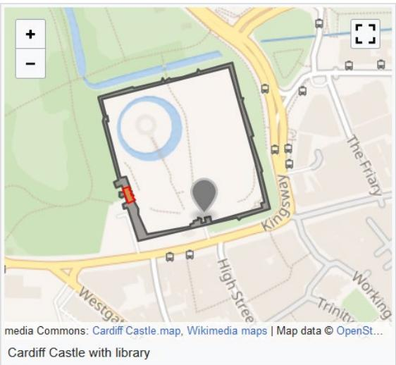

> **AI Description:**
> **Source:** `assets/_page_87_Figure_2.jpg`
> 
> **Generated:** 2026-05-17 02:44:22
> 
> ---
> 
> The image is a map showing the location of Cardiff Castle with a library. The map includes geographical features such as roads, rivers, and surrounding areas. The castle is marked with a black outline, and the library is indicated by a red pin inside the castle grounds. The map is sourced from Wikimedia and OpenStreetMap, as indicated by the text at the bottom. The map provides a clear visual representation of the castle's location relative to its surroundings.


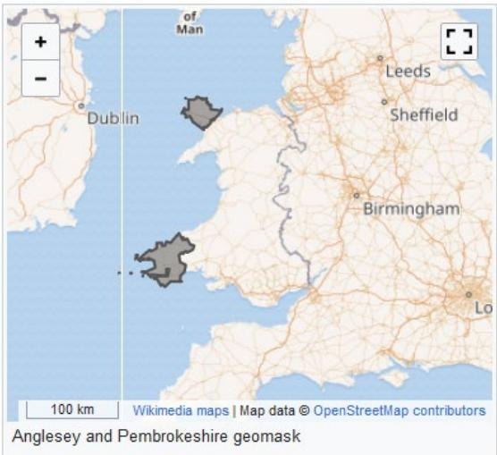

> **AI Description:**
> **Source:** `assets/_page_87_Figure_3.jpg`
> 
> **Generated:** 2026-05-17 02:44:29
> 
> ---
> 
> The image is a map showing parts of the United Kingdom, specifically highlighting Anglesey and Pembrokeshire. The map includes major cities such as Dublin, Leeds, Sheffield, Birmingham, and parts of Wales. The map is a standard geographical representation with roads and major urban areas marked. The scale is set to 100 km, and the map credits are attributed to Wikimedia maps and OpenStreetMap contributors.


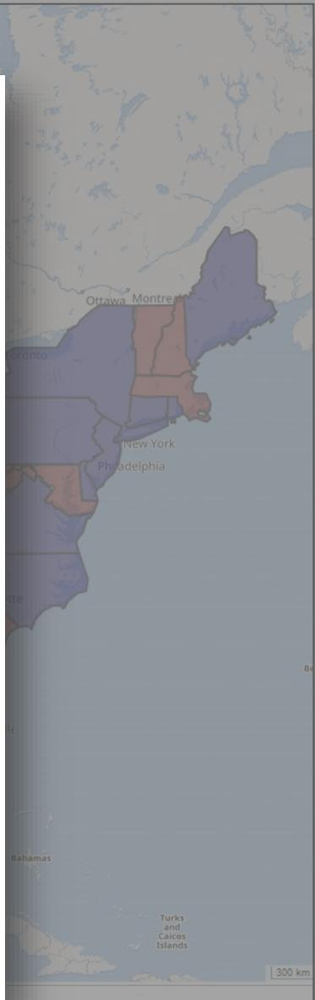

> **AI Description:**
> **Source:** `assets/_page_87_Figure_4.jpg`
> 
> **Generated:** 2026-05-17 02:39:31
> 
> ---
> 
> The image is a map showing parts of North America, specifically highlighting the northeastern United States and southeastern Canada. It includes labels for major cities such as Ottawa, Montreal, Toronto, New York, and Philadelphia. The map is color-coded, with different shades representing various regions or states. The scale at the bottom indicates 300 km, suggesting the map is in a geographical context. The image includes annotations for the Bahamas and the Turks and Caicos Islands, indicating the map's focus on the northeastern region.


<span id="page-88-0"></span>

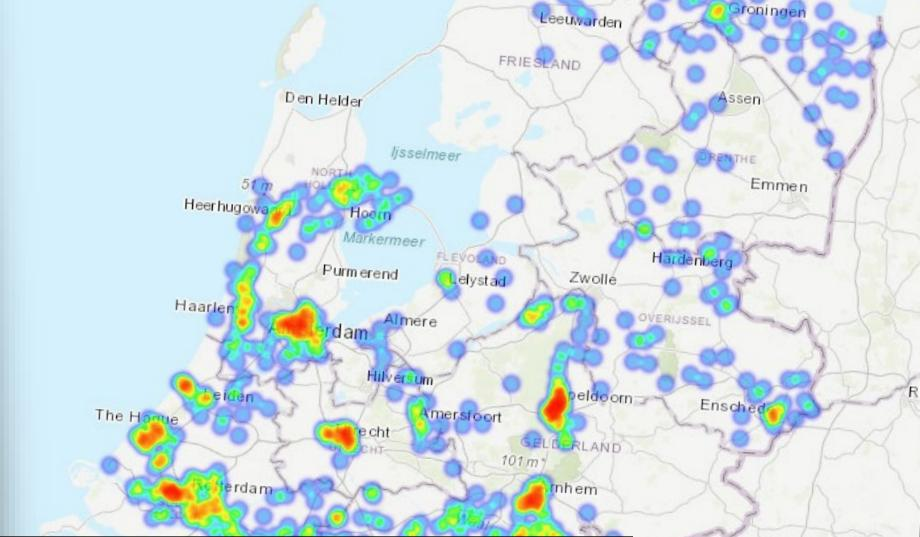

> **AI Description:**
> **Source:** `assets/_page_88_Figure_1.jpg`
> 
> **Generated:** 2026-05-17 02:23:27
> 
> ---
> 
> The image is a map of the Netherlands with various colored dots and heat maps. The map includes city names and geographical features such as lakes and rivers. The heat maps indicate varying levels of activity or data density, with darker colors representing higher concentrations. The map appears to be used for visualizing data distribution across the region, with the most intense activity concentrated in and around major cities like Amsterdam and The Hague.


# MODULE 3

# Interactive, layered of-Wiki maps driven by Wikidata

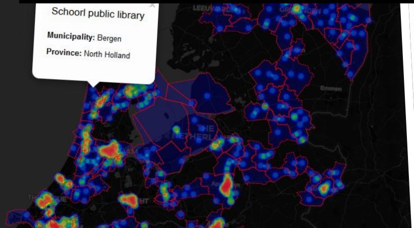

> **AI Description:**
> **Source:** `assets/_page_88_Figure_2.jpg`
> 
> **Generated:** 2026-05-17 02:18:09
> 
> ---
> 
> The image is a heat map visualization of a library's location data. It shows the distribution of library branches across the Netherlands, with darker shades indicating higher concentrations of library locations. The map includes labels for the municipality (Bergen) and province (North Holland). The heat map highlights areas with a higher density of library branches, suggesting areas of greater demand or higher population density.


<span id="page-89-0"></span>
## For this Module, it's nice to have basic experience with

· Python

PAWS / Jupyter Notebooks

· (Jupyter-Leaflet & Jupyter-widgets)

<span id="page-90-0"></span>
## MediaWiki account + login


> **AI Description:**
> **Source:** `assets/_page_90_Figure_0.jpg`
> 
> **Generated:** 2026-05-17 02:26:38
> 
> ---
> 
> The image contains a logo for MediaWiki, featuring a sunflower in the center with the MediaWiki text below it. The logo uses a simple, clean design with a yellow sunflower against a white background, with the MediaWiki text in blue and black.


Special page

## Log in

Language: Deutsch |English | Esperanto |francais |espaol | italiano |Nederlands

Main page

Get MediaWiki

Get extensions

Tech blog

Contribute

Username

Support

User help

FAQ

Technical manual

Support desk

Communication

Development

Bug tracker

Code repository

Code docs

OlafJanssen

Statistics

Password

Keep me logged in (for up to 365 days)

Log in

Help with logging in

Forgot your password?

文 English &Not logged in Talk Contributions Create account Log in

Search MediaWiki


https://www.mediawiki.org

<span id="page-91-0"></span>
## https://www.mediawiki.org/wiki/PAWS

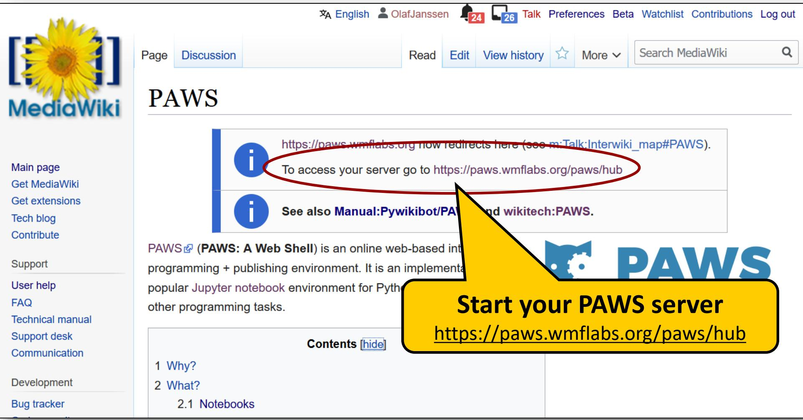

> **AI Description:**
> **Source:** `assets/_page_91_Figure_0.jpg`
> 
> **Generated:** 2026-05-17 02:34:42
> 
> ---
> 
> The image contains a screenshot of a MediaWiki page about PAWS (PAWS: A Web Shell), which is an online web-based interactive programming and publishing environment. The page includes text explaining PAWS and provides a link to access the server at "https://paws.wmflabs.org/paws/hub". The image also features a yellow arrow pointing to the link with the text "Start your PAWS server" and the URL again. The MediaWiki interface is visible, with navigation options on the left and a search bar at the top.


<span id="page-92-0"></span>
## Starting your PAWS server

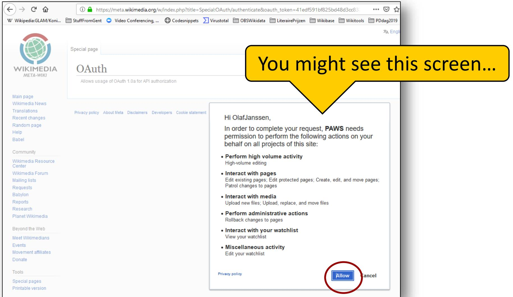

> **AI Description:**
> **Source:** `assets/_page_92_Figure_0.jpg`
> 
> **Generated:** 2026-05-17 02:42:03
> 
> ---
> 
> The image displays a screenshot of a webpage from the Wikimedia Meta-Wiki, specifically the OAuth authentication page. The page is titled "OAuth" and explains the usage of OAuth 1.0a for API authorization. A pop-up window is prominently featured, asking the user for permission to perform various actions on behalf of the user on all projects of the site. The pop-up lists several permissions, including high-volume activity, interaction with pages, interaction with media, administrative actions, interaction with the watchlist, and miscellaneous activity. The user is prompted to either "Allow" or "Cancel" these permissions. The page also includes links to privacy policy, about Meta, disclaimers, developers, and cookie statements.


<span id="page-93-0"></span>
Starting your PAWS server
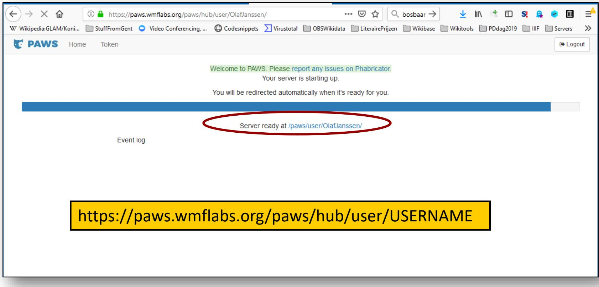

> **AI Description:**
> **Source:** `assets/_page_93_Figure_0.jpg`
> 
> **Generated:** 2026-05-17 02:38:37
> 
> ---
> 
> The image contains a screenshot of a web page from the PAWS platform. The page displays a welcome message for a user named "OlafJanssen" and indicates that the server is starting up. There is a progress bar showing the server's status, with a red circle highlighting the text "Server ready at /paws/user/OlafJanssen/". Below the main content, there is a yellow box with a URL template for accessing the user's server. The page also includes a section labeled "Event log" and a navigation bar with various links and options.


<span id="page-94-0"></span>
## Your PAWS server running

C PAWS

Files

Running

Clusters

Select items to perform actions on them.

□□CommonsCategoryDownloader

□node\_modules

□□SaveToWaybackMachine

Smart-Servier

□Wikibase\_Universal\_Bot

□□WikidataMapMakingWorkshop

DutchPublicLibraries\_OpenStreetM

-.ipynb

DutchPublicLibraries\_GoogleMaps\_

[est.ipynb

UniversalBot.ipynb

Various Tests.ipynb

Quit

Logout

Control Panel

UploadNew C

Name Last Modified

File size

.ipynb =

2 uur geleden

2 maanden geleden 442 kB

2 maanden qeleden 18.1 kB

https://paws.wmflabs.org/paws/user/USERNAME/tree

4 maanden geleden 8.7 kB

· https://en.wikipedia.org/wiki/Project Jupyter#Jupyter\_ Notebook

https://realpython.com/jupyter-notebook-introduction

<span id="page-95-0"></span>
## Stopping your PAWS server

E PAWS

Quit

Logou

Files

Control Panel

Running

Clusters

Select items to perform actions on them.

□□CommonsCategoryDownloader

□□node\_modules

□SaveToWaybackMachine

□ Smart-Servier

Wikibase\_Universal\_Bot

□WikidataMapMakingWorkshop

DutchPublicLibraries\_OpenStreetMap .ipynb

VariousTests.ipynb

UniversalBot.ipynb

DutchPublicLibraries\_GoogleMaps\_Test.ipynb

UploadNew

Name

Last Modified

File size

25 dagen geleden

4 maanden geleden

13 dagen geleden

2 maanden geleden

4 maanden geleden

https://paws.wmflabs.org/paws/user/USERNAME/tree

2 maanden geleden 18.1 kB

4 maanden geleden 555B

4 maanden geleden 8.7 kB

<span id="page-96-0"></span>
## Stopping your PAWS server

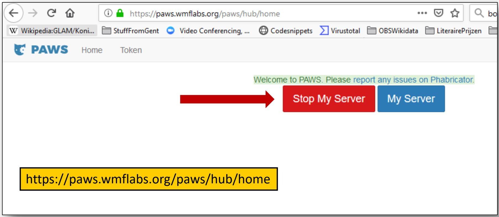

> **AI Description:**
> **Source:** `assets/_page_96_Figure_0.jpg`
> 
> **Generated:** 2026-05-17 02:35:18
> 
> ---
> 
> The image is a screenshot of a web page from the PAWS platform, specifically the "Home" tab. The page displays a URL at the bottom: "https://paws.wmflabs.org/paws/hub/home". There are two buttons on the page: a red button labeled "Stop My Server" and a blue button labeled "My Server". A red arrow points to the "Stop My Server" button. The top of the page includes a welcome message and a note to report issues on Phabricator. The layout is simple, with a white background and a navigation bar at the top.


<span id="page-97-0"></span>
## Your PAWS public folder (even when server isoffline)

paws-public.wmflabs.ol

Q Zoeken

## Index of /paws-public/19781798/


https://paws-public.wmflabs.org/paws-public/User:USERNAME

<span id="page-98-0"></span>
## PAWS alternative: local Notebook installation

ANACONDA.

Products

Why Anaconda?

Solutions

Resources

Company

Download

## Anaconda Distribution

The World's Most Popular Python/R Data Science Platform

Download

The open-source Anaconda Distribution is the easiest way to perform Python/R data science and machine learning on Linux, Windows, and Mac OS X.With over 15 million users worldwide, it is the industry standard for developing, testing, and training on a single machine, enabling individual data scientists to:

· Quickly download 1,500+ Python/R data science packages

· Manage libraries, dependencies,and environments with Conda

· Develop and train machine learning and deep learning models with scikitlearn, TensorFlow, and Theano

· Analyze data with scalability and performance with Dask, NumPy, pandas, and Numba

· Visualize results with Matplotlib, Bokeh, Datashader, and Holoviews


> **AI Description:**
> **Source:** `assets/_page_98_Figure_0.jpg`
> 
> **Generated:** 2026-05-17 02:50:58
> 
> ---
> 
> The image contains a grid of 16 icons, each representing a different software or tool commonly used in data science and scientific computing. The icons are arranged in a 4x4 grid, with each icon accompanied by its name and a brief description or logo. The tools listed include Jupyter, Spyder, NumPy, SciPy, Numba, Pandas, Dask, Bokeh, HoloViews, Datashader, Matplotlib, scikit-learn, H2O.ai, TensorFlow, and Conda. The icons are simple and stylized, designed to be easily recognizable and associated with their respective software.


·https://jupyter.org/install

·https://www.anaconda.com/distribution/

·https://dataiseasy.com/2019/03/how-to-install-anaconda-and-jupyter-notebook

<span id="page-99-0"></span>
## Go to public PAWS folder of User:OlafJanssen

## Index of /paws-public/19781798/

https://paws-public.wmflabs.org/paws-public/User:OlafJanssen

<span id="page-100-0"></span>
## In folder 'WikidataMapMakingWorkshop'

## Index of /paws-public/19781798 /WikidataMapMakingWorkshop/

File Name

Parent directory/

NetherlandsP: Heatmap html

WikidataMapMakingWorkshop.ipynb

nl\_munis\_with\_pubiic\_iibs.json

popupstyle.css

File Size ⊥

4562743   
38900

Date ⊥

09-Aug-2019 11:17

25-Sep-2019 16:29

## Example notebook we will use

https://paws-public.wmflabs.org/paws-

<span id="page-101-0"></span>
## This notebook in raw format (json)

```
"cells":[   
{   
"cell\_type": "markdown",   
"metadata"0"   
"source":[   
"# Building a stand-alone off-Wiki layered map using Wikidata & SPARQL\n",   
"\n"，   
"This Jupyter notebook shows you step by step \*\*how to make a Wikidata-driven layered map that can be used of-Wiki\*.\n",   
"\n"，   
"tispartofdule3oftheapmaigworkspWiidata tointeractieof-Wimasinthesteps]tp:/itbcomgei   
/WikidataMapMakingWorkshop) \n",   
"\n"，   
"See'https://itb.cgellig/Widataapakingrks/b/aterutieAndotedfrthefulllayotoftisk",   
"\n"，   
"This notebook is publically available at\n",   
\*http://cbabaiaapaodiaatpc   
/paws-public/User:OlafJanssen/WikidataMapMakingWorkshop.ipynb?format=raw)) \n",   
\*ttp:/bgaaaingseaainsdia]   
(ttps://raitbusecoentgigidataMapaingorsaerduest/WidaaMapaingospb)   
{   
"cell\_type": "markdown",   
"metadatamom   
"source":[   
"Forquestiosbtthioteb,coactOaas:/idaogiUselaaenWidata//ab   
https://twitter.com/ookgezellig\n",   
\n"，   
日\*\*\*\*\*\*\*\*\*\*\*\*   
1
```

u e1 https://paws-public.wmflabs.org/paws-  
## public/User:OlafJanssen/WikidataMapMakingWorkshop/WikidataMapMakingWorkshop.ipynb ?format=raw

```
"metadata": 0,   
"gource":[   
"To make the map we will use\n",   
"1: "\*PAnste (Oupyter Notebooks as a cloud service) - https://vnw mediawiki org/wiki/PAns\n'   
"2\*\*sPARoL queries\* from Wikidata - https://www wikidata orq + nttps://query.wikidata org/\n"
```

<span id="page-102-0"></span>
## Save this raw file to your PC

<span id="page-103-0"></span>
## ... and upload it to your PAWS server

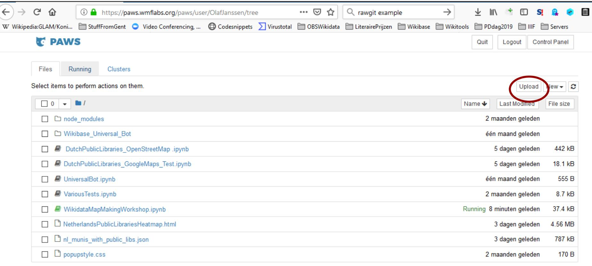

> **AI Description:**
> **Source:** `assets/_page_103_Figure_0.jpg`
> 
> **Generated:** 2026-05-17 02:26:34
> 
> ---
> 
> The image shows a screenshot of a file management interface, likely from a web-based file system or cloud storage service. The interface includes a list of files and folders, with columns for file name, last modified date, and file size. The top of the interface has tabs labeled "Files," "Running," and "Clusters," indicating different sections of the service. There is a prominent "Upload" button on the right side, suggesting the ability to add new files. The interface is in Dutch, with file names and dates displayed in Dutch. The interface also includes a browser address bar at the top with a URL pointing to a specific user's directory on the service.


https://paws.wmflabs.org/paws/user/USERNAME/tree

<span id="page-104-0"></span>
## ... and upload it to your PAWS server

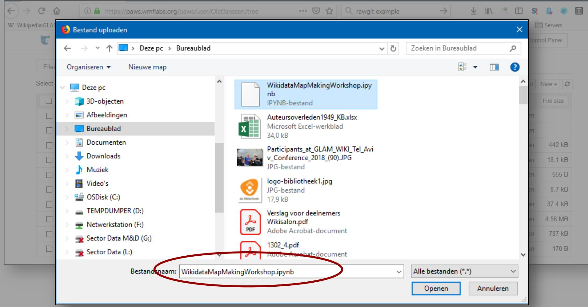

> **AI Description:**
> **Source:** `assets/_page_104_Figure_0.jpg`
> 
> **Generated:** 2026-05-17 02:27:45
> 
> ---
> 
> The image shows a file upload dialog box from a web browser. The dialog box is titled "Bestand uploaden" (File upload in Dutch). It displays a file explorer window with various files listed, including an IPYNB file named "WikidataMapMakingWorkshop.ipynb," an Excel file, a JPG image, and a PDF document. The file explorer is set to the "Bureaublad" (Desktop) directory. The image also includes a red circle highlighting the file name field, which contains the text "WikidataMapMakingWorkshop.ipynb."


<span id="page-105-0"></span>
## ... and upload it to your PAWS server

## PAWS

Files

Running

Clusters

Select items to perform actions on them.


<span id="page-106-0"></span>
## Notebook on your own PAWS server to play with

PAWS WikidataMapMakingWorkshop Last Checkpoint: afgelopen maandag om 11:27 (unsaved changes)

File Edit ViewInsert CellKernelWidgetsHelp

四 + % 电 个 ↓ N Run □ C Markdown √ 国

Not Trusted

| Python 3 O

Public Link Memory: 132 MB

## Building a stand-alone off-Wiki layered map using Wikidata & SPARQL

This Jupyter notebook shows you step by step how to make a Wikidata-driven layered map that can be used off-Wiki.

It is part of Module 3 of the map making workshop From Wikidata to interactive off-Wiki maps in three steps


For more context to this workshop you can check the

· full layout, and

· full slides (pdf)

This notebook is publically available at

https://paws.wmflabs.0rg/paws/user/USERNAME/notebooks/WikidataMapMakingWorkshop.ipynb

<span id="page-107-0"></span>
## Notebook on your own PAWS server to play with

PAWSWikidataMapMakingWorkshop Last Checkpoint:afgelopen mandag om11:27 (unsaved changes)

File Edit View Insert Cell Kernel Widgets Help

\+ % 电 个 √ Run C Markdown 國

Logout Control Panel

Not Trusted Python 3 O

Public Link Memory: 132 MB

The notebook should be self-explanatory, so

Adapt, play, understand, get frustrated, learn

# Make your own interactive, layered map

This notebook is publically available at

·https://paws-public.wmflabs.org/paws-public/User.OlafJanssen/WikidataMapMakingWorkshop.ipynb(and inrawformat)

https/igeliaaoasosufinoda

<span id="page-108-0"></span>
## Exporting your map to stand-alone, of-Wiki HTML page

Add tag

As a final step for this workshop, we wantto export he map to a (stand-alone,of-Wiki) HTML page that can be viewed in a browser.

https://ipywidgets.readthedocs.io/en/latest/embedding.html#python-interface

## The map above is available at http://ookgezeligq.github.io/WikidataMapMakingWorkshop

/NetherlandsPublicLibrariesHeatmap.html

## In[]:

Add tag

Add tag

## This is the end of the workshop

Add tag

<span id="page-109-0"></span>
## Exporting your map to stand-alone, off-Wiki HTML page

## PAWS

Files

Running

Clusters

Duplicate

Rename

Move

Download

iew

Edit ↑

/ WikidataMapMakingWorkshop

Upload

New

Control Panel

Quit

nl\_munis\_with\_public\_libs.json

NetherlandsPublicLibrariesHeatmap.html

Logout

WikidataMapMakingWorkshop.ipynb

popupstyle.css

File size

Last Modified

Name

een paar seconden geleden

één maand geleden 38.9 kB

2 maanden geleden 4.56 MB

2 maanden geleden 787 kB

5 maanden geleden 170 B

<span id="page-110-0"></span>
## Exporting your map to stand-alone,off-Wiki HTML page

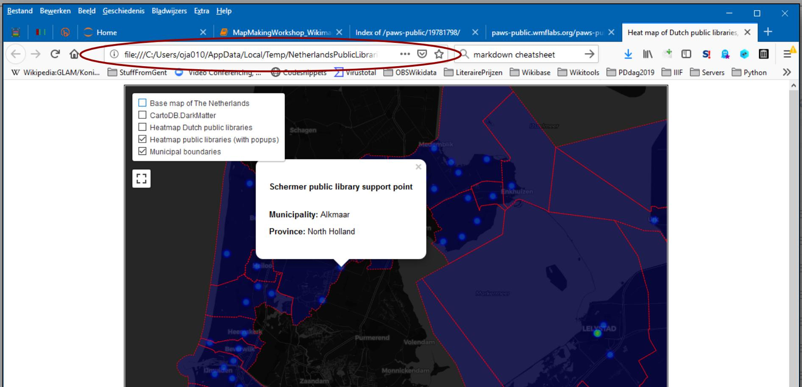

> **AI Description:**
> **Source:** `assets/_page_110_Figure_0.jpg`
> 
> **Generated:** 2026-05-17 02:33:24
> 
> ---
> 
> The image displays a map of the Netherlands with various layers and annotations. It includes a heat map of Dutch public libraries, with blue dots representing library locations. The map is overlaid with municipal boundaries, which are outlined in red. A pop-up window provides information about a specific library location, indicating it is the "Schermer public library support point" in the municipality of Alkmaar, North Holland. The map also includes a legend with options to toggle different map layers, such as the base map, CartoDB DarkMatter, and municipal boundaries.


file://C:/Users/oja010/AppData/Local/Temp/NetherlandsPublicLibrariesHeatmap.html

<span id="page-111-0"></span>
THANKS!!!

## Let me know your feedback on this workshop

In person // User:OlafJanssen // olaf.janssen@kb.nl // @ookgezellig

All content in this slidedeck is available under Creative Commons Attribution-ShareAlike 4.0 International

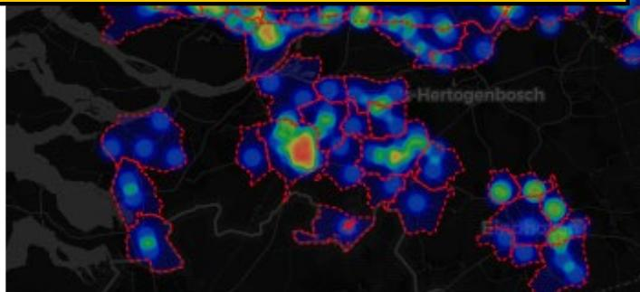

> **AI Description:**
> **Source:** `assets/_page_111_Figure_0.jpg`
> 
> **Generated:** 2026-05-17 02:27:55
> 
> ---
> 
> The image is a heat map visualization. It shows the distribution of data points across a geographical area, with darker shades indicating higher concentrations and lighter shades representing lower concentrations. The map is labeled with "Hertogenbosch," which appears to be the name of the region being mapped. The heat map highlights areas of high activity or concentration, with the most intense areas in red and the least intense in blue. The red dashed lines outline specific regions, possibly indicating administrative boundaries or areas of interest.
