
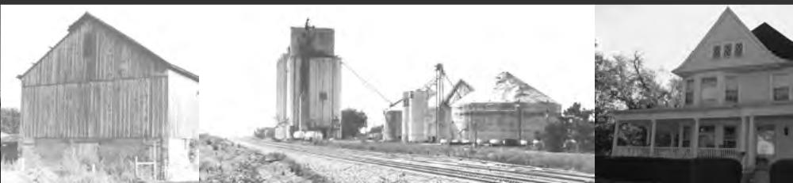

> **AI Description:**
> **Source:** `assets/_page_0_Figure_0.jpg`
> 
> **Generated:** 2026-05-17 03:10:43
> 
> ---
> 
> The image contains three separate photographs. The first photograph on the left is of a weathered wooden barn. The middle photograph shows a large industrial structure, possibly a silo or grain elevator, with a train track in the foreground. The third photograph on the right is of a two-story house with a wraparound porch, surrounded by trees. The images appear to be historical or archival in nature, depicting rural or agricultural settings.

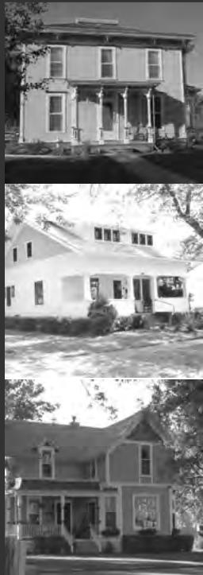

> **AI Description:**
> **Source:** `assets/_page_0_Figure_1.jpg`
> 
> **Generated:** 2026-05-17 03:10:36
> 
> ---
> 
> The image contains three separate photographs of different houses. The top photograph shows a two-story house with a porch and multiple windows. The middle photograph displays a one-story house with a covered porch and a smaller front door. The bottom photograph features a two-story house with a gabled roof, a small dormer window, and a porch with a railing. Each house is set against a backdrop of trees and a clear sky, suggesting a suburban or rural setting.

# HAMILTON COUNTY

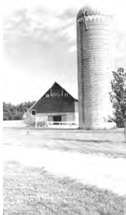

> **AI Description:**
> **Source:** `assets/_page_0_Figure_2.jpg`
> 
> **Generated:** 2026-05-17 03:10:21
> 
> ---
> 
> The image is a photograph of a rural farm setting. It features a traditional barn with a dark roof and white walls, situated next to a large cylindrical silo. The barn has a small porch area with a white railing. The surrounding area is grassy, and there are a few trees visible in the background. The sky appears clear, suggesting a sunny day. The image captures a peaceful, pastoral scene.

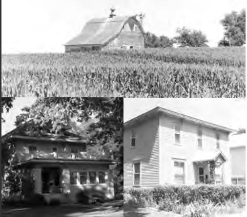

> **AI Description:**
> **Source:** `assets/_page_0_Figure_3.jpg`
> 
> **Generated:** 2026-05-17 03:10:29
> 
> ---
> 
> The image contains three separate photographs of different types of buildings. The top photograph shows a barn situated in a cornfield, with the barn having a pitched roof and a small cupola on top. The bottom left photograph depicts a two-story house with a porch and a gabled roof, surrounded by trees and greenery. The bottom right photograph shows another two-story house, this one with a more traditional design, featuring a gabled roof and a symmetrical facade. The houses appear to be residential and are set in suburban or rural environments.

## NNEEBBRRAASSKKAA HHIISSTTOORRIICCBBUUIILLDDIINNGGSS SSUURRVVEEYY

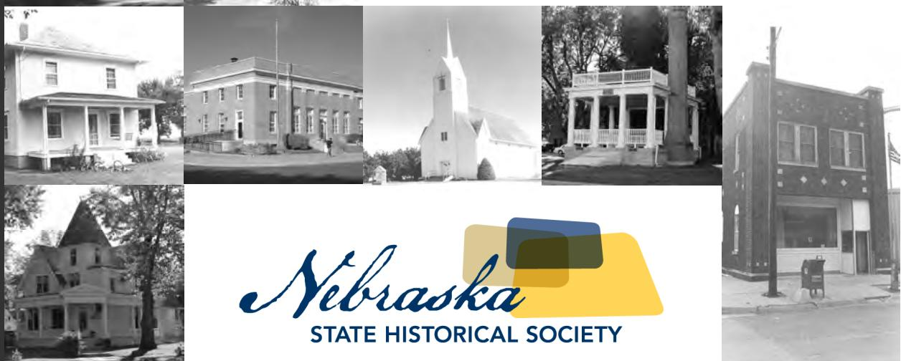

> **AI Description:**
> **Source:** `assets/_page_0_Figure_4.jpg`
> 
> **Generated:** 2026-05-17 03:09:26
> 
> ---
> 
> The image contains a collage of historical photographs of buildings, likely representing various structures from different periods in Nebraska's history. These include residential homes, a church, a school building, and a commercial establishment. The photographs are in black and white, suggesting they are from an earlier time period. Below the collage, there is a logo and text that reads "Nebraska State Historical Society," indicating the image is associated with the organization responsible for preserving and documenting Nebraska's historical sites and structures.

# Hamilton County Nebraska Historic Buildings Survey

Prepared by:

H. Jason Combs (PI)

Anne M. Bauer

John T. Bauer

501 West 28th Street

Kearney, Nebraska 68845

(308) 236-5137

combshj@unk.edu

July 2009

## Executive Summary

The Nebraska State Historical Society (NSHS) contracted with H. Jason Combs (PI), Anne Bauer, and John Bauer to conduct a Nebraska Historic Buildings Survey (NeHBS) of Hamilton County. The survey was conducted in the summer and fall of 2008 to document properties that possess historic or architectural significance. Hamilton County was previously surveyed in 1984—at that time 546 properties were identified and recorded. The properties were resurveyed in addition to the 183 newly identified and documented properties.

Within the report, when a surveyed building is mentioned, its NeHBS site number follows its reference in the text (for example, HM01-114). These site numbers begin with an abbreviation for the county, HM for Hamilton County, and a two-digit number referring to its location with the county. Each community has a specific number, for instance, Marquette is “06” and rural sites are labeled “00.” The last three numbers refer to the building or structure with the NeHBS inventory.

We would like to thank the following state and local organizations and individuals for their assistance: staff at the Plainsman Museum and the Aurora Public Library; citizens who participated in the public meetings and/or offered information during the reconnaissance survey; Jill Dolberg, Bob Puschendorf and Stacy Stupka-Burda of the Nebraska State Historic Preservation Office (NESHPO); and the staff of the Nebraska Historical Society Archives and Library.

The NeHBS projects are administered by the NESHPO—a division of the NSHS. The NeHBS is funded in part with the assistance of a federal grant from the U.S. Department of the Interior, National Park Service. Regulations of the U.S. Department of the Interior strictly prohibit unlawful discrimination on the basis of race, color, national origin, age or handicap. Any person who believes he or she has been discriminated against in any program, activity or facility operated by a recipient of federal assistance should write to: Director, Office of Equal Opportunity, National Park Service, 1849 C Street NW, Washington, D.C. 20240.

## Table of Contents

Executive Summary i   
Chapter 1: Historical Overview of Hamilton County 1   
Introduction 1   
Hamilton County 2   
Initial Settlement and Ethnic Clusters 3   
Agriculture in Hamilton County 6   
Hamilton County Towns 8   
Selecting the County Seat of Government 10   
Aurora, Nebraska 10   
Giltner, Nebraska 14   
Hampton, Nebraska 15   
Hordville, Nebraska 16   
Marquette, Nebraska 17   
Murphy, Nebraska 18   
Phillips, Nebraska 18   
Stockham, Nebraska 19   
Chapter 2: Survey Results 23   
Objectives 23   
Methodology 23   
National Register of Historic Places 24   
Survey Results 26   
Illustrated Discussion of Historic Contexts 28   
Chapter 3: Recommendations 36   
Recommendations 36   
Zion Lutheran Church 46   
Evaluation of Potentially Eligible Historic Districts 48   
Chapter 4: Preservation in Nebraska 51   
Preservation in Nebraska 51   
Nebraska Historic Buildings Survey 51   
National Register of Historic Places 52   
Certified Local Governments 53   
Preservation Tax Incentives 54   
Valuation Incentive Program 54   
Federal Project Review 55   
Public Outreach and Education 56   
Nebraska Historic Preservation Office Contacts 57   
Appendix A: Inventory of Surveyed Properties 58   
References 67   
Glossary 70

## Introduction

Many early explorers ventured through present-day Nebraska and the initial reviews were not positive. The famous Lewis and Clark expedition in the early 1800s declared that the land was unproductive, and just a few years later Zebulon Pike explored along the Republican River in 1806 and compared the plains in Nebraska to the deserts of Africa.1 Soon enough the label “Great American Desert” had been applied to much of the region.2 However, these negative assessments did not prevent other individuals from exploring the region and present-day Hamilton County.

Some of the first Europeans to cross Hamilton County were part of an Indian expedition led by General Stephen Kearney in 1835.3 The group traversed the territory between the Lincoln and Beaver Creeks, and J. P. Elliot—one of the explorers—later returned to settle in Hamilton County. A few years later in 1842, General John C. Fremont also crossed the county, a route later followed by the Mormons on their march west to present-day Utah (today this route would be just south of Interstate 80).

Many of these intrepid explorers crossed land occupied and/or claimed by Native Americans. In general, Nebraska was divided into two groups—the village dwellers in the eastern half of the state and more nomadic Plains tribes in the west. The Pawnees settled in villages along the Loup, Platte, and Republican Rivers and raised corn and other crops on the river terraces. Other groups occupying parts of eastern

Nebraska and possibly Hamilton County were the Iowas, Omahas, Otos, Missourias, and the Poncas. The “decline of these eastern groups began well before white settlement of Nebraska” and the territory that included part of present-day Hamilton County was ceded to the government by the Native Americans in 1833, which was the first step in the pioneer settlement process.4

Negative assessments provided by many early explorers did not prevent the eventual tide of pioneers from entering Nebraska. As a result, the Nebraska Territory was organized in 1854 as having boundaries from the Missouri River to the Rocky Mountains including portions of several other present-day states. When Nebraska became the 37thstate in 1867, its boundaries were reduced to their present configuration. Today, Nebraska ranks 16th in land area with 77,538 sq mi and 38th in population at 1,711,263 (2000 census).5

The United States Public Land Survey enacted in 1785—also known as the Land Ordinance of 1785—established the township and range system and the grid-like pattern of square miles that is evident across Nebraska. Most of Nebraska was surveyed by the mid-1800s. The Public Land Survey system divides the land into townships, each township containing thirty-six sections; each section contains 640 acres or one-square mile.6 Pioneers making land claims in the 1800s were able to acquire parcels in a systematic fashion, usually in half- or quarter-sections. Today, Hamilton County covers parts of Townships 9 to 14 North and Ranges 5 to 8 West.

Two congressional acts in the mid-1800s tremendously impacted the state. The Transcontinental Railroad Act and the Homestead Act, both passed in 1862, transformed the Nebraska landscape. The Union Pacific Railroad traverses 472 miles from Omaha to the Colorado border and was completed in less than three years. The railroad transformed Nebraska from a “thinly populated corridor of westward expansion into a booming agricultural state that promised to become one of the leading food producers in the nation.”7 The Homestead Act provided pioneers 160 acres of land if they constructed a permanent structure and resided on the land for five years. The Act changed the landscape in dramatic fashion and started a “great tide of emigration for the west and especially Nebraska.”8 By 1900 “almost sixty-nine thousand people had acquired land in Nebraska under the Homestead Act—the largest number in any state in the Union.” 9 However, nearly half (43 percent) of those who filed Homestead claims in Nebraska failed to secure title to the land.

## Hamilton County

The earliest settlement in Hamilton County occurred in conjunction with the early overland trails. In 1861, a group from Nebraska City decided to find a shorter route west to Fort Kearny by avoiding the long northward bend in the Platte River. A path was cut across present-day Hamilton County which rejoined the Oregon Trail approximately eight miles east of Kearney. The Nebraska City-Fort Kearny cut-off

saved several miles and soon became a popular route—it was also referred to as the Old Fort Kearney Road and the Pike’s Peak Trail.10 Overland stations soon appeared in present-day Hamilton County. David Millspaw established a ranch in 1861 in Section 11, Township 10, Range 5.11 A year later, John Harris and Alfred Blue set up the “Deep Well Ranch” on Beaver Creek approximately 2.5 miles north of presentday Giltner, Nebraska. In 1863 an overland stage line followed this route and “Prairie Camp” was established as a relay station six miles west of the Millspaw Ranch. Another trail ran adjacent to the Platte River in northern Hamilton County and the earliest known ranch providing service to this trail was established in 1862 by J. T. Briggs.12 Little evidence of these routes remains today and even in the early 1920s it was noted that traces of the old trails were fast disappearing. 13

Hamilton County’s boundaries were officially established in 1867 at the time of statehood (Figure 1) and the county was named for Alexander Hamilton, Secretary of the Treasury in President George Washington’s cabinet. 14 The county was not organized until 1870 following a general election held at John Harris’ house near the Blue River. The first county seat was Orville City (8 miles south of Aurora), named in honor of Orville Westcott, son of C. O. Westcott, the county’s first treasurer.15

In 1879, the first railroad line reached Hamilton County from York to Aurora. This Burlington & Missouri line later extended to Grand Island in 1884.16 Other routes soon branched from Aurora north to Central City and southwest to Hastings. In 1890 a total of

Figure 1. Location of Hamilton County and its communities.
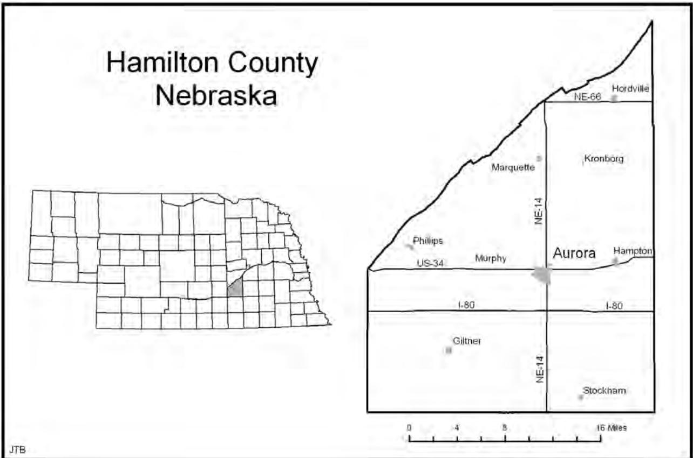

> **AI Description:**
> **Source:** `assets/_page_10_Figure_0.jpg`
> 
> **Generated:** 2026-05-17 03:12:06
> 
> ---
> 
> The image is a map of Hamilton County, Nebraska, featuring a detailed view of the county's boundaries and some of its major roads and towns. The map includes labels for towns such as Aurora, Hampton, Kronborg, and others. There is also a smaller inset map of Nebraska highlighting Hamilton County. The map includes a scale bar at the bottom indicating distances in miles. The visualization is a standard geographical map with no additional charts or graphs.

66-1/3 miles of lines were in operation in Hamilton County. By 1927, Hamilton County had direct railroad connection from “Aurora to Omaha, Lincoln, and other important cities of Nebraska,” providing markets for farm products, “especially livestock, dairy, and poultry products.”17

Several major automobile routes serve Hamilton County. State Highway 14 connects Central City to Aurora and continues on south, and US Highway 34 runs east to west from York to Grand Island across the county. Additionally, Interstate 80 bisects the county east to west across the county a few miles south of Aurora. Construction of Interstate 80 in Nebraska began in 1957 near Gretna and was completed in 1974 near Sidney for a total length of 455 miles across the state.

Hamilton County is located in the southeastern part of the state in a physical region known as the Central Loess Plains. Andreas (1882) in the History of the State of Nebraska described this area as the “garden portion of the state.”18 Hamilton County covers approximately 538 square miles and elevations range from 1,660 feet above sea level in the eastern portion to nearly 1,900 feet in the west. Much of Hamilton County’s territory is “level or undulating, sloping slightly toward the east, and is dissected by a few streams that flow eastward.”19 The Platte River valley dominates the county’s northern boundary and is approximately 100 feet below the county’s general level.20

## Initial Settlement and Ethnic Clusters

Hamilton County’s first permanent settlement took place in June of 1866 on the

Blue River when Jarvil Chaffee set up a homestead in Section 34, Township 9, Range 6 (HM00-122). Chaffee’s “Homestead Certificate was signed by Ulysses S. Grant on May 1, 1872 after Mr. Chaffee had proved up on his land.”21 Following Chaffee were James Waddle and John Brown who both settled in Section 26, Township 9, Range 5 in the Farmer’s Valley precinct in January of 1867.22 These initial pioneers were the beginning of a flood of settlers who entered the county in the early 1870s.

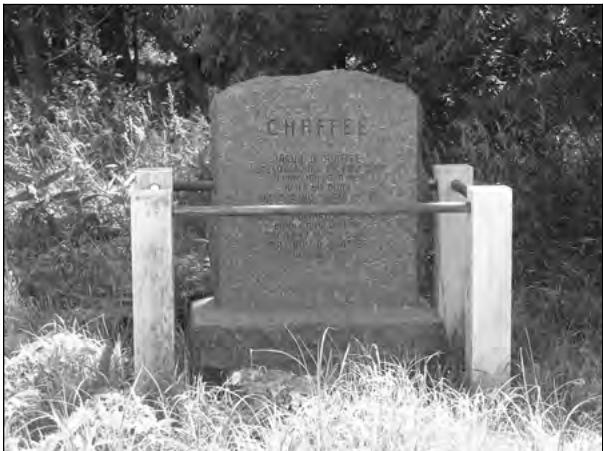

> **AI Description:**
> **Source:** `assets/_page_11_Figure_0.jpg`
> 
> **Generated:** 2026-05-17 03:11:36
> 
> ---
> 
> The image contains a photograph of a tombstone. The tombstone is inscribed with the surname "CHAFFEE" at the top. Below the name, there is additional text that appears to be a dedication or inscription, though it is not fully legible in the image. The tombstone is surrounded by a simple metal railing and is situated in a grassy area with some trees in the background. The overall setting suggests a cemetery or memorial site.

Chaffee Monument (HM00-122).

Although the railroads captured much of the overland freight traffic, pioneer overland travel continued and even intensified.23 Hamilton County’s population exploded in the late 1800s (Table 1). At the time of the 1870 census Hamilton County’s population stood at 130. Ten years later that number had increased to 8,267 and in 1890 the county reached its highest population ever at 14,096. Since that peak Hamilton County’s population has slowly declined, (Table 1). As the population surged in the late 1800s numerous rural school districts were created. Each district

Table 1. Hamilton County Population, 1870-2000

Source: www.census.gov.

represented a small geographical area and the first school was organized near Stockham in 1870 and by 1885 Hamilton County had ninety-eight organized districts.24 By the early 1920s, there were over 100 districts in Hamilton County.25 Currently only a handful of districts remain as a result of widespread consolidation, and few, if any, of the rural school houses remain.

Most of the early settlers came from Missouri, Iowa, Illinois, Ohio, and the New England States. Later, immigrants came from Germany, Sweden, England, and Russia.26 Geographically, these ethnic groups settled in clusters across the county. The “Danes settled principally in the northeastern part of the county; Swedes in the northwestern part; Irish, Bohemians, and Germans in the southwestern part; and Russian Mennonites in the southeastern part.” 27 There were “little enclaves of Czech people which have existed around Giltner, the flourishing Danish culture of the Kronborg area, the Swedish culture of Hordville and environs, the Russian German culture which extends west into Hamilton County from the Henderson [York County] region, and the Irish who settled west of Aurora in and around such Irish-name towns as Murphy.” 28

These ethnic groups were the basis for strong religious congregations and a number of rural church complexes. One of the biggest ethnic congregations found in northeastern Hamilton County were some 200 families in a Danish Lutheran Church (HM05-001).29 Of all the groups the “Danes of Kronborg have perhaps retained the closest ties to a cultural past of the Scandinavian groups in the county. . . . Lives of the Danish immigrants around Kronborg centered on the congregation at St. John’s. From the beginning, a conscious effort was made to preserve a Danish heritage, both physically and spiritually.”30 The St. John’s complex continues to dominate the area and serve as a focal point for the community.

Also in northeastern Hamilton County is the Zion Lutheran Church and School (HM00-045). Similar to other rural churches, Zion Lutheran has been the focal point of the surrounding German settlement for decades and is a noteworthy structure. The area was settled by Germans and the first church was erected in 1877. This church was replaced in 1885 with another structure which burned in 1896.31 The present Zion Lutheran Church was dedicated in 1897 and is part of a rural religious complex, which includes a cemetery, church, parsonage, and school. The exterior of the church was altered in 1972 when a new foyer was added, but the interior retains much of its original character. A large Ushaped balcony wraps around three sides of the nave and pressed tin is found throughout the building.

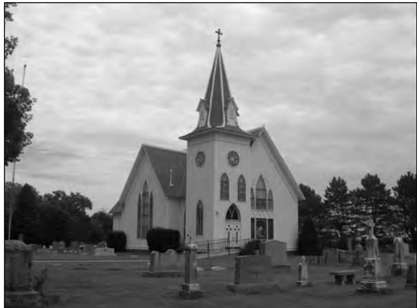

> **AI Description:**
> **Source:** `assets/_page_12_Figure_0.jpg`
> 
> **Generated:** 2026-05-17 03:09:44
> 
> ---
> 
> The image is a black and white photograph of a church with a prominent steeple and a cross at the top. The church has a Gothic architectural style, characterized by pointed arches and a tall, narrow structure. The image also shows a cemetery surrounding the church, with headstones and a fence visible in the foreground. The sky appears overcast, and the overall scene gives a serene and historical atmosphere.

St. John’s Lutheran Church, Kronborg (HM05-001).

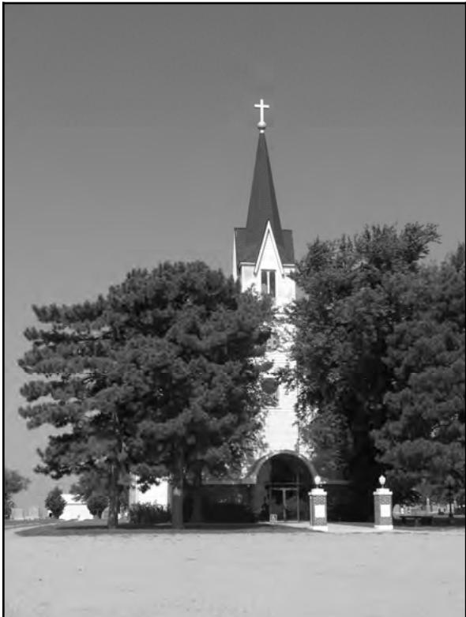

> **AI Description:**
> **Source:** `assets/_page_12_Figure_1.jpg`
> 
> **Generated:** 2026-05-17 03:09:55
> 
> ---
> 
> The image is a photograph of a church with a steeple and a cross at the top. The church is surrounded by trees, and the photo appears to be in black and white. The entrance to the church is visible, with a small archway and a door. The overall scene suggests a peaceful, rural setting.

Zion Lutheran Church (HM00-045).

Another large ethnic cluster formed in the southeastern part of the county, where the Russian Mennonites constructed a

church in 1887 at a cost of roughly \$3,000. Other denominations and ethnic congregations include Baptist, Catholic, Methodist, Presbyterian, and United Brethren Churches.32 Most of the country churches are no longer standing; however, many cemeteries remain and highlight the importance the rural congregations played in the life of Hamilton County.

## Agriculture in Hamilton County

Much like many Hamilton County citizens today, the early pioneers were engaged in agriculture. Vanek et al. (1985), contend that farming “has always been the major occupation in Hamilton County.” With the advantage of fertile soils, grain crops have dominated much of Hamilton County’s agricultural history. An early account describes the soils in Hamilton County as similar to the “finest garden mold, dark color, easily worked, and eminently productive. The soil in this county is from two to three feet deep, and when properly tilled has never been known to disappoint the husbandman, good and sure harvests being the result of honest labor.”33

Corn was the dominant crop even before widespread irrigation. Hamilton County in 1890 had 119,237 acres in corn— the most of any crop—and 48,960 acres in wheat, the next highest total.34 Hamilton County today continues as an agricultural leader in Nebraska and the reliance on grain crops dominates. Currently in Nebraska the “eastern Corn Belt counties are not the largest corn producers in the state. Corn is concentrated in the irrigated central Platte Valley, the irrigated areas of Hamilton and York counties, and the northeast portion of the state.”35 In 2002, Hamilton County ranked first in Nebraska in the value of crops produced, had the second highest number of acres in corn, and was seventh in popcorn production.36

Corn has long dominated the agricultural economy, but methods and the agricultural landscape have changed dramatically over the last century. As a result of mechanization the scale of farming in the United States has been altered, which has had “significant impacts on rural life.”37 Hamilton County historian Bertha Bremer (1967) accurately points out that “power equipment has accelerated farming, and no longer are farm operators content with quarter sections of land, nor can they afford to operate on such a small scale due to increased costs of operation.”38 Indeed, the number of farms has steadily declined since its peak in 1900 while the number of acres per farm has increased. In 1900, over 2,000 individual farms were located in Hamilton County and by the mid-1960s there were nearly 1,100 farm units (Table 2).39 As for average size, in 1920 the average Hamilton County farm was 179.7 acres in size and typically ranged from 160 to 240 acres.40 The most recent census of agriculture numbers reveal that the consolidation trend continues. In 1997, Hamilton County had 697 farms that averaged 507 acres in size. By 2002, the number of farms had declined to 603 and the average size had increased to 577 acres.41

Hamilton County annually receives approximately twenty-six inches of precipitation, sufficient for wheat, sorghum, and range grasses. For decades, this total has played a significant part in Hamilton

Table 2. Number of Farms, 1850-1950

Source: www.census.gov.

County’s agricultural history. Irrigation canals and wells first appeared in the late 1930s in Hamilton County. The Aurora News editor spearheaded a campaign to get farmers interested in deepwell irrigation; in August 1940, it published a “picture of the Gilbert Benson farm where corn was estimated to make a yield of 80 bushels, and a dryland farm across the road that day pictured burned up corn three feet high.”42 Deepwell irrigation rapidly expanded in the county. By 1942, twenty-six systems were in place and in February 1955 the 500th well was drilled on Helen Culbertson’s farm. At that time the county had a 500th well celebration and the Aurora News-Register declared Hamilton County as “The Deepwell Irrigation Center of the Nation.”43 By the late 1960s, there were approximately 1,600 registered wells in Hamilton County irrigating over 100,000 acres.

In the early 1970s, center-pivot irrigation systems reached Hamilton County. As a result, “there has been a rapid conversion of rangeland to cropland since the introduction of center-pivot irrigation.”44 By the late 1970s, approximately 89 percent of the county’s area was cropland. Of that total, 81 percent was irrigated and 19 percent was dryfarmed.45 In the early 1980s, the number of irrigation wells had increased to over 2,600 for both center-pivot and gravity flow systems.46

Today, Hamilton County still relies heavily on ground water for irrigation. “Large supplies of ground water are available to wells from the Quaternary deposits” and that depth for sufficient supplies ranges from “5 feet in the alluvium near the Platte River to 135 feet on the uplands northeast of Hordville.”47 Generally, ground water resources are available between eighty and one-hundred feet in most parts of the uplands.48 According to the Nebraska Department of Natural Resources (NDNR 2008), Hamilton County currently has 3,361 irrigation wells that water just over 400,000 acres. This number is inflated as some acres are reported for more than one well because the county only covers roughly 344,000 acres.

Hamilton County also has a long history of farm cooperatives which are still evident in the cultural landscape. In the early 1900s, the populist agrarian movement resulted in the formation of a number of local grain cooperatives. A “general demand for better grain markets, which was the result of the excessive margins that were taken by grain dealers in this as well as in other counties, was the impelling force in the organization of the present companies.”49 The first farmers’ elevator, located in Hordville, incorporated in 1906 and by 1915 all Hamilton County communities had elevators—Aurora (1908), Marquette (1909), Stockham (1910), Phillips (1910), Hampton (1910), and Giltner (1915). In 1921, Burr and Buck (1921) claim that “Hamilton is the only county in Nebraska, or probably in any other state, that has a farmers’ elevator at every railroad station.”50 Today, grain elevators in Hamilton County’s communities can be seen for miles away, are the largest structures, and serve as one of each town’s focal points (HM02-020, HM04-023, and HM06-032).

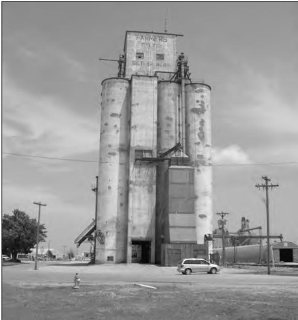

> **AI Description:**
> **Source:** `assets/_page_15_Figure_0.jpg`
> 
> **Generated:** 2026-05-17 03:09:37
> 
> ---
> 
> The image is a black and white photograph of a large industrial silo labeled "FARMERS CO-OP" at the top. The silo is tall and cylindrical with a flat top, showing signs of wear and age. Below the main structure, there are smaller sections that appear to be access points or storage areas. The surrounding area includes a paved road, a parked car, and some utility poles with wires. The sky is partly cloudy, and there are a few trees and buildings in the background, suggesting a rural or small-town setting.

Grain Elevator, Giltner (HM02-023).

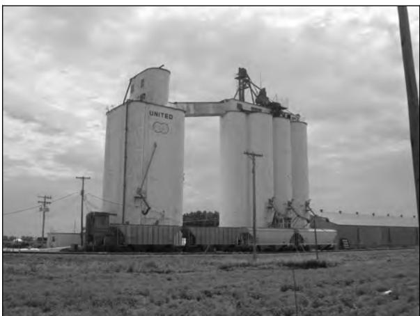

> **AI Description:**
> **Source:** `assets/_page_15_Figure_1.jpg`
> 
> **Generated:** 2026-05-17 03:10:03
> 
> ---
> 
> The image shows a photograph of a grain silo with the word "UNITED" prominently displayed on its side. The silo is large and cylindrical, with a smaller cylindrical structure on top. There are two large cranes positioned near the silo, likely used for loading or unloading grain. The background features a cloudy sky and some utility poles, indicating the silo is located in an open area, possibly on a farm or in a rural setting. The overall scene suggests an agricultural or industrial environment.

Grain Elevator, Hordville (HM04-023).

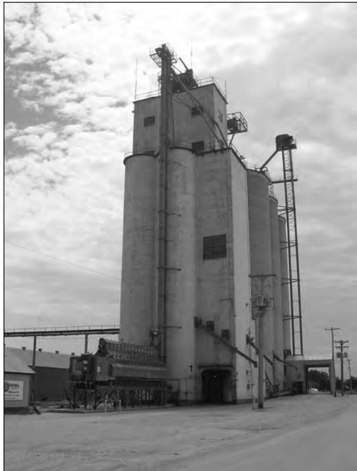

> **AI Description:**
> **Source:** `assets/_page_15_Figure_2.jpg`
> 
> **Generated:** 2026-05-17 03:10:15
> 
> ---
> 
> The image is a photograph of an industrial structure, specifically a grain silo. The silo is tall and cylindrical with a flat top, featuring multiple levels and platforms. There are ladders and access points on the side of the silo, and a conveyor system is visible at the base. The surrounding area includes a paved road and some utility poles, suggesting the silo is located in a rural or semi-industrial setting. The sky is overcast, and the overall image is in grayscale.

Grain Elevator, Marquette (HM06-032).

## Hamilton County Towns

Like many regions in the Midwest and Great Plains, many of the county’s original towns are no longer present. These small communities have been moved or replaced as populations have shifted in relation to changing economic issues and changing transportation patterns. Baltensperger contends that “town development became heavily dependent on rail connections, as a town without a rail line was not a town for long.”51 For example, J. F. and T. H. Glover founded the town of Hamilton—which briefly campaigned for the county seat—just a few miles from Aurora. It was an “active, lively place” in 1874-75 but after locating the county seat in Aurora most of the businesses and houses were moved to the more “successful rival.”52

Most other early settlements have long disappeared. Early towns included Alvin, Avon, Buckeye, Bunker Hill, Cedar Valley, Leonard, Lerton, Mirimichi, Orville City, Otis, Penn, Shiloh, Stockham, St. Joe, and Williamsport.53 Of the towns that remain Giltner, Hampton, Marquette, Murphy, and Phillips are located on the railroad.54

Similar to the grid pattern of sections across the rural landscape, Hamilton County’s towns were also platted as a series of square blocks. Additionally, most of the communities—especially the railroad towns—are designed as T-Towns. In early town planning Main Street often began at the tracks “creating an arrangement in which the railroad formed the bar of a T-shaped configuration.”55

In regard to population, Hamilton County’s towns have demonstrated a number of trends (Table 3). Five of the seven rural communities peaked in population between 1900 and 1940, which is typical of most small towns in the Midwest and Great Plains. However, four of those

Bromfield, Nebraska’s “T-Town” Plat (Dunham 1888).

five have demonstrated recent population gains which runs contrary to popular notions that small towns are on the verge of disappearing. Furthermore, Aurora peaked in population at the most recent census in 2000 with 4,225 citizens and has steadily increased since 1940 (Table 3). However, as farm consolidation continues it is most likely that Hamilton County’s towns, outside of Aurora, will struggle to maintain their

Table 3. Hamilton County Population by City, 1890-2000

Source: www.census.gov.

current populations. Pat Dinslage (1992) in the Grand Island Independent discusses population issues in Hordville (population 150) and Polk (population 322) and contends that both “are dependent upon the surrounding farming community” and likely to see continued population declines.

## Selecting the County Seat of Government

Great Plains scholar Bradley Baltensperger (1985) contends that “disputes over county seats were the wars of frontier Nebraska. Fraudulent elections to select a county seat might be followed by theft of the county records, showdowns, court battles, and more thefts of records.”56 To a large degree, Hamilton County’s eventual selection of Aurora matches Baltensperger’s description. Orville City, which had been surveyed and recorded in 1870 and located on the West Blue River, was selected in 1871 as Hamilton County’s first seat of government. That distinction would not last long. Soon after establishing Orville City in the county’s southeastern portion as the county seat, a group of citizens started to protest the selection, calling for a more central location. In the “first election Aurora received over two-thirds of the votes cast, which was the necessary majority at that time, but the commissioners would not order the removal” because the results were deemed illegal.57 Another vote was held in 1874, where 399-1/2 votes were required for victory. In that contest Aurora collected 399 votes, Hamilton 147, and Orville City just 53. By law, Aurora had failed to meet the required number; however, Aurora “imprudently organized a company of some 150 of her citizens and friends and went to Orville City, and by violence and force took possession of the county court house and loaded up the records and safes and brought them to Aurora.”58 A “writ of mandamus compelled them to be taken back to the county seat the following spring.”59 Soon thereafter, Darius Wilcox (one of Aurora’s original town founders) visited Lincoln and successfully lobbied the state legislature to change the requirement to three-fifths of votes cast to change county seats. In May a special election was called, although by this time Hamilton, Nebraska, was making a legitimate challenge for the county seat. County historian Bremer (1967) refers to Hamilton as Aurora’s “bitter enemy” and the “strongest contender in the three-cornered contest” for county seat.60 In the May election Aurora won by a small majority and in June another election was held and Hamilton won by a slim margin. The fifth and final vote based on a pure majority (half plus one) was held in October of 1875. At this election, Aurora received 481 votes and Hamilton 400; hence, Aurora officially became the seat of government in early 1876. Soon after the election Hamilton and Orville both merged with Aurora, and Hamilton quickly became a “deserted village.”61

## Aurora, Nebraska

In 1871, David Stone represented a group of men (James Doremus, S. Lewis, Robert Miller, J. Ray, Nathaniel Thorpe, and Darius Wilcox) from Lucas County, Iowa, who wished to establish a town in Hamilton County. Stone was chosen to visit the area and secure land for the new community. The town company ran into problems and dissolved; however, Robert Miller and Nathaniel Thorpe continued with the plan and headed west. Coming to a point on Lincoln Creek where two cottonwood trees stood like “sentinels on the banks” they choose the site for what would become Aurora. Today this location is part of Streeter Park (HM01-243).

Lincoln Creek, Aurora. Courtesy of the Nebraska State Historical Society.
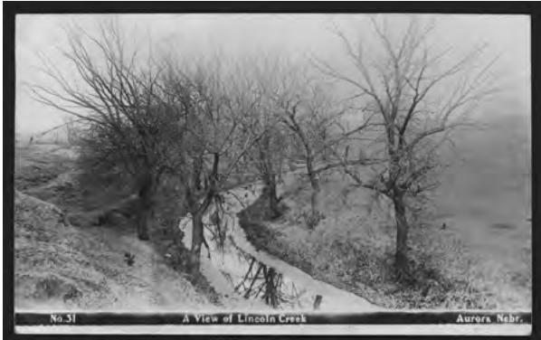

> **AI Description:**
> **Source:** `assets/_page_18_Figure_0.jpg`
> 
> **Generated:** 2026-05-17 03:11:22
> 
> ---
> 
> The image is a black and white photograph showing a view of Lincoln Creek in Aurora, Nebraska. The photo captures a narrow waterway surrounded by bare trees, suggesting it was taken during late autumn or winter. The creek appears shallow, with a small amount of water visible, and the surrounding area is flat and open. The photograph is labeled with the text "No. 31 A View of Lincoln Creek Aurora Neb."

Streeter Park Entrance, Aurora (HM01-243).
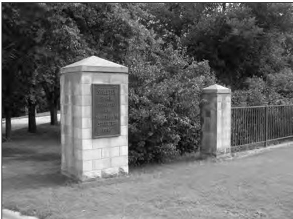

> **AI Description:**
> **Source:** `assets/_page_18_Figure_1.jpg`
> 
> **Generated:** 2026-05-17 03:11:15
> 
> ---
> 
> The image contains a photograph of a stone monument with inscriptions. The monument is part of a fence, and the background includes trees and a grassy area. The text on the monument is partially visible and appears to commemorate individuals or events. The visual elements include the monument, the fence, and the surrounding natural environment.

In August 1871 David Stone erected the “first frame building in the town, a store and residence, in which he opened the first stock of general merchandise brought to the new place.”62 Additionally, the town itself is named for Stone’s hometown, Aurora, Illinois, and not for the “Aurora borealis, which was very luminous at that time, as some suppose.” 63

After acquiring the county seat Aurora was incorporated on July 3, 1877. John

Helms, General Delevan Bates, W. H. Streeter, John Raben, and Harry Kemper were appointed trustees—Helms served as president and W. L. Whittemore was clerk.64

Two years later (1879) the Burlington and Missouri Railroad came to town, which proved to be a major turning point in the community’s history. The Burlington and Missouri River Railroad had announced plans for a line from York on west through Aurora and Hamilton County. The stipulation was that the town had to provide \$72,000 for the project (\$48,000 of which was due when the line reached Aurora). A vote to raise the bond was held and of the 1,194 votes cast, 956 were in favor and only 238 opposed. As a result of the overwhelming support, the railroad lowered the bond amount to \$50,000.65 Soon Aurora was connected to other cities via rail and telegraph lines. When the railroad “ran its first regular train into the town October 14, 1879, a great forward stride was made, and a period of activity ensued which rapidly carried the town into rank with her neighbors in surrounding counties.”66 Within a decade the railroad had extended lines from Aurora west to Grand Island (1884) and north to Central City (1886).67

Aurora Opera House. Courtesy of the Nebraska State Historical Society.
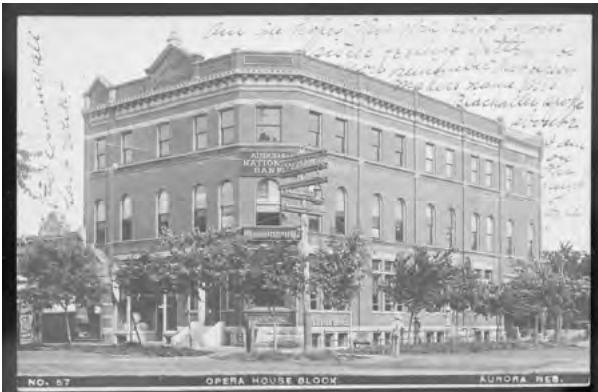

> **AI Description:**
> **Source:** `assets/_page_18_Figure_2.jpg`
> 
> **Generated:** 2026-05-17 03:11:09
> 
> ---
> 
> The image is a historical photograph of a building labeled "Opera House Block" in Aurora, Nebraska. The building is a multi-story brick structure with ornate architectural details, including a decorative cornice and a small balcony on the second floor. The sign on the building reads "American Kato-Ward Bank," indicating the name of the establishment. The photograph appears to be from the early 20th century, as suggested by the style of the building and the postcard format. The image also includes handwritten notes and annotations, which are not part of the original photograph but seem to be added later.

In the late 1800s and early 1900s, Aurora blossomed as Hamilton County’s primary city, dominating both business and government affairs. Bradford (1979) states that the “business life of Aurora in the late nineteenth century was extremely vital and, of course, influenced the extent and the demand of the cultural life.”68 Early enterprises included a cigar factory, a broom factory, and a washing machine company.69

These were not individual efforts; leading citizens often joined forces to help Aurora prosper. Furse (2004) in the Aurora News-Register points out that Aurora has a long history of community spirit and economic development. An excellent example is the Temple Craft Association formed in 1888 by thirty-one men to promote Aurora’s business community; the Temple Craft building remains and is located on the southwest corner of $1 2 ^ { \mathrm { t h } }$ and M Streets in Aurora (HM01-186).70 Fourteen of Aurora’s leading business men pledged \$25,000 in capital for the project and the associations’ bylaws stated that the “object of the project was to encourage building, improvement and to promote the material prosperity of Aurora.”71 This association was just one catalyst impacting Aurora’s business community which ultimately spurred others to invest in the community.

In addition to the associations and factories, banks and mercantile establishments dominated Aurora’s business community. The Hamilton County Bank was established in 1877 by George Wildish; Wildish was later bought out by W. H.

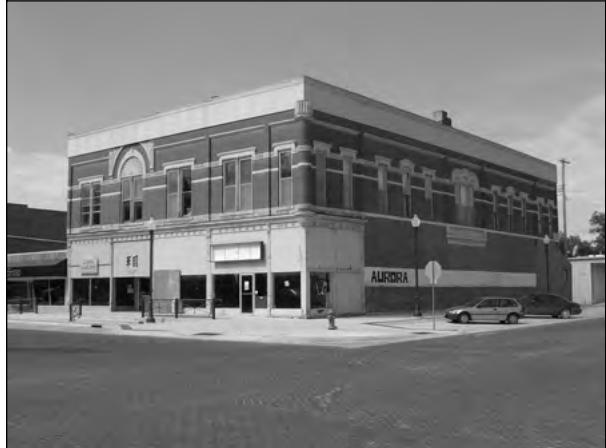

> **AI Description:**
> **Source:** `assets/_page_19_Figure_0.jpg`
> 
> **Generated:** 2026-05-17 03:10:51
> 
> ---
> 
> The image is a black and white photograph of a two-story commercial building. The building has a classic architectural style with decorative elements around the windows and a flat roof. The ground floor features large windows and doors, suggesting retail or office spaces. The name "AURORA" is visible on the side of the building, indicating the name of the establishment or the building itself. The street in front of the building is relatively quiet, with a few parked cars and a fire hydrant visible. The overall scene suggests a small-town or suburban setting.

Temple Craft Building, Aurora (HM01-186).

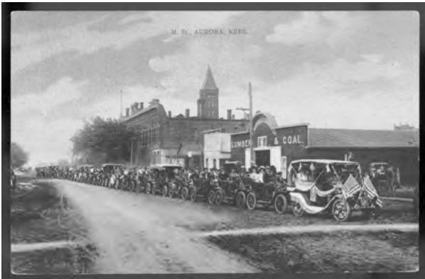

> **AI Description:**
> **Source:** `assets/_page_19_Figure_1.jpg`
> 
> **Generated:** 2026-05-17 03:11:00
> 
> ---
> 
> The image is a black and white photograph depicting a parade or procession. A long line of vintage automobiles is seen driving down a street, with people seated in the cars. The vehicles are adorned with decorations, and some have American flags attached. In the background, there are buildings, including a structure labeled "LUMBER & COAL." The text "M. St., AURORA, KANSAS" is visible at the top of the image, indicating the location. The scene suggests a historical event, possibly a celebration or a parade in Aurora, Kansas.

Parade in Aurora following “M” Street. Courtesy of the Nebraska State Historical Society.

Streeter in 1886.72 In 1883, Streeter along with E. J. Hainer and W. I. Farley had established the Farmers’ and Merchants’ Bank; Streeter later withdrew in 1886 to head the Hamilton County Bank. T. E. Williams arrived in Aurora in 1888 from Eau Claire, Wisconsin to accept the position of cashier in the Farmers’ and Merchants’ Bank.73 Several banks (Aurora Banking Company, Hamilton County Bank, Farmer’s and Merchants’ Bank) merged over the next decade and First National Bank appeared in 1898. W. H. Streeter was the president and remained in that capacity until his death in 1907, at which time T. E. Williams was elected president, a position he held until his retirement in 1917.74