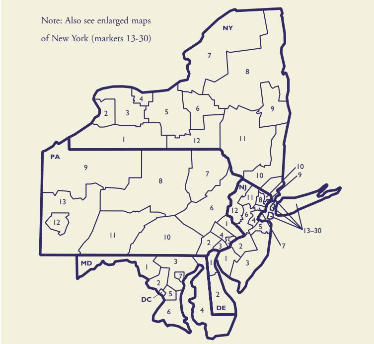
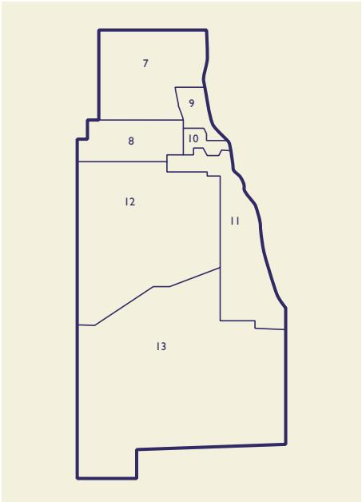
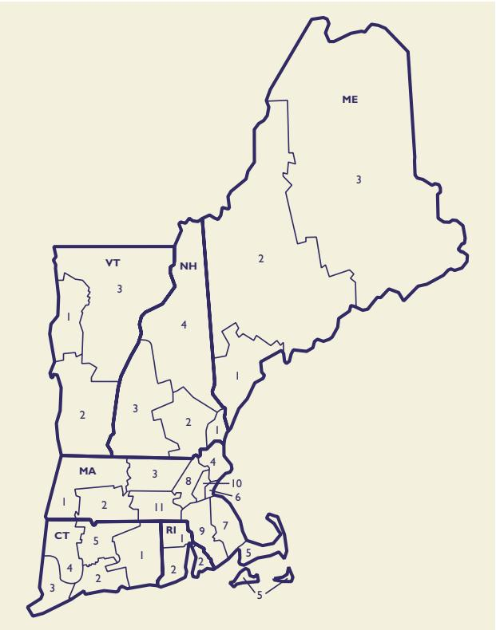
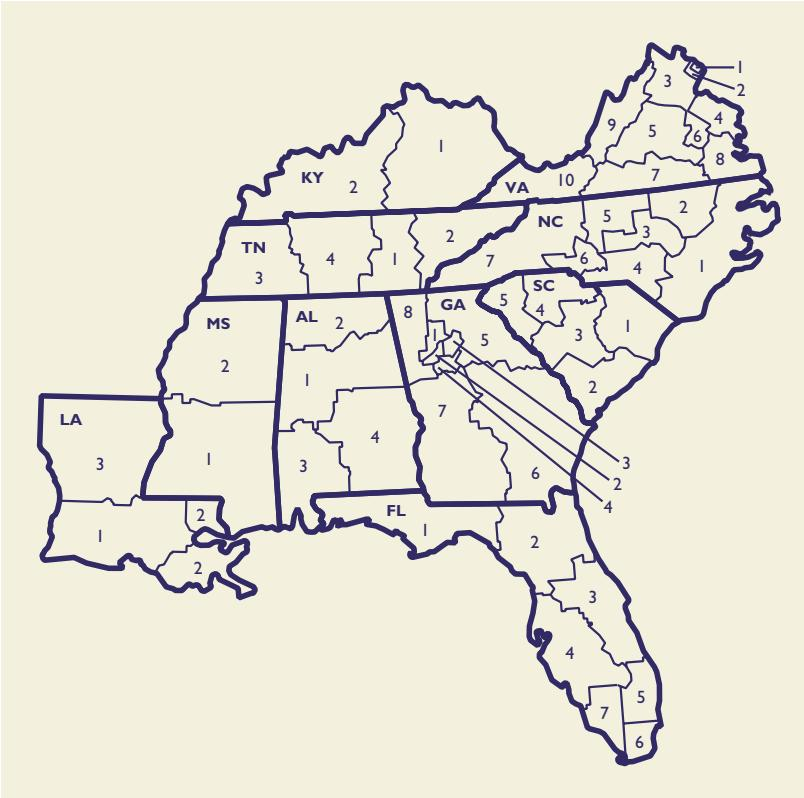
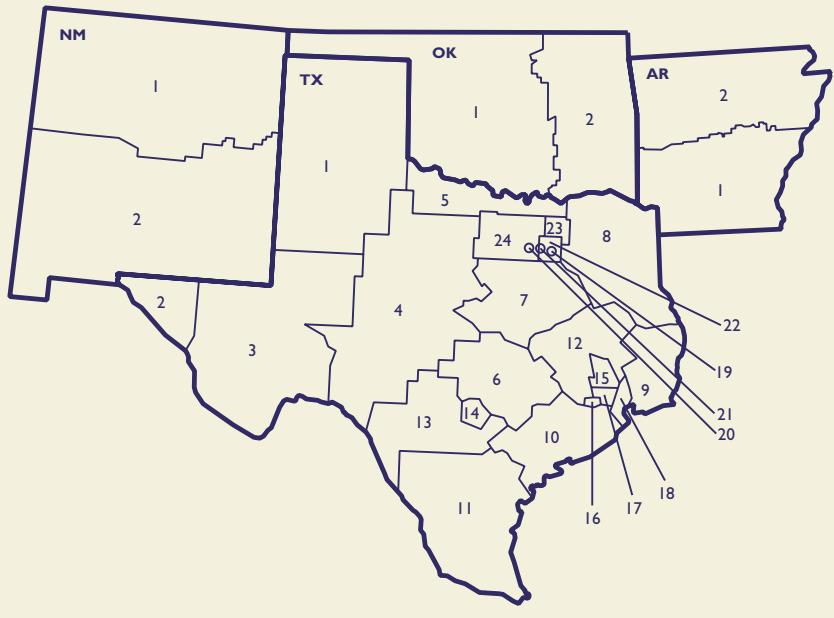
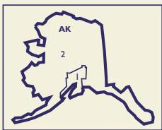
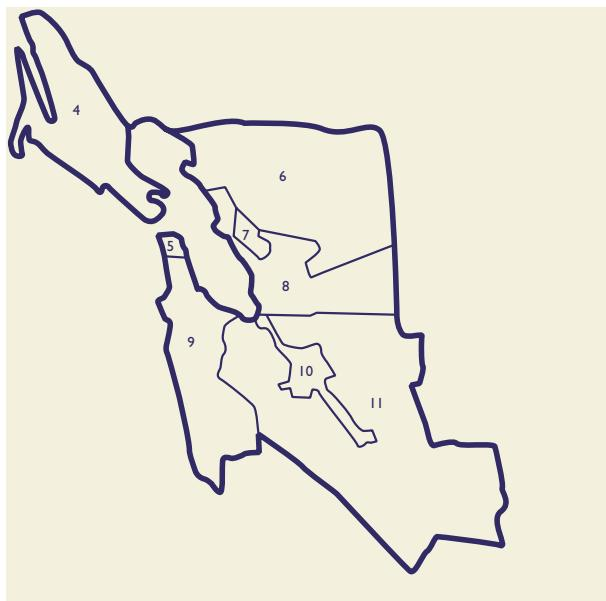
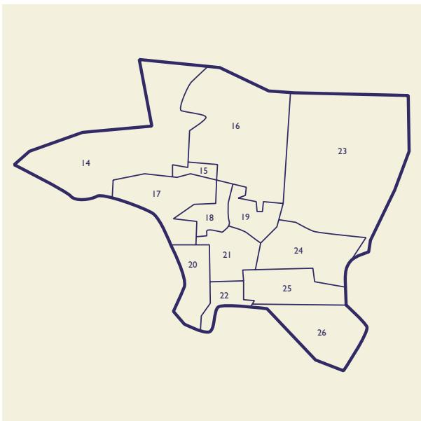

## Support

College Board Search Help

News

Quick-Start Guide

Beyond the Basics

About the Data

FAQs

Account Maintenance

Licensing

Training

Training Resources

College Board Events

Recorded Demonstrations

Live and Recorded Webinars

Important Documents

Contact Us

## Recorded Demonstrations

If you are new to College Board Search or if you’re just looking for a refresher, these short videos will help you move ahead. To view videos full screen, you’ll need to play them in Internet Explorer 10, Firefox or Google Chrome.

## Getting Started with Search for Students®

Learn how to use cohort, geographic, academic and demographic criteria to conduct research or license the names of students who best fit your institutional goals and strategies. Click the icon at the bottom right of the video to view full screen. (05:40)

## Visualizing Your Data in the Dashboard

Learn how to view and create custom reports, charts and heat maps characterizing the students identified by your search criteria. Click the icon at the bottom right of the video to view full screen. (04:08)

## Using Plan Travel to Travel Smart

Find out how Plan Travel’s guided search experience helps you develop a data-driven, comprehensive travel strategy so that you get the most value for your travel time and budget. Click the icon at the bottom right of the video to view full screen. (05:52)

## Researching High Schools for Informed Decisions

Determine where to focus your recruitment activities using high school and student attributes in line with your institution’s goals and strategies. Click the icon at the bottom right of the video to view full screen. (05:19)

Learn the steps to upload a file for Segment Analysis historical or periodic tagging. Click the icon at the bottom right of the video to view full screen. (06:49)

 Previous section

## Geographic Market Name Code

New York (NY)   
1. Southern Tier West NY01   
2. Erie County NY02   
3. Genesee Valley and Northern Frontier NY03   
4. Rochester and Monroe County NY04   
5. Finger Lakes Region NY05   
6. Central New York NY06   
7. St. Lawrence Valley NY07   
8. Adirondacks NY08   
9. Tri Cities NY09   
10. Central Hudson Valley NY10   
11. Catskills NY11   
12. Southern Tier East NY12   
13. Rockland County NY13   
14. Staten Island NY14   
15. Westchester County NY15   
16. Southern Nassau County NY16   
17. Northern Nassau County NY17   
18. Central Nassau County NY18   
19. Northwest Suffolk County NY19   
20. Southwest Suffolk County NY20   
21. East Suffolk County NY21   
22. Southeast Brooklyn NY22   
23. West Brooklyn NY23   
24. Northeast Brooklyn NY24   
25. East Bronx NY25   
26. West Bronx NY26   
27. Manhattan NY27   
28. South Queens NY28   
29. Northwest Queens NY29   
30. Northeast Queens NY30   
Pennsylvania (PA)   
1. Bucks County PA01   
2. Chester County PA02   
3. Delaware County PA03   
4. Montgomery County PA04   
5. Philadelphia County PA05   
6. Lehigh Valley PA06   
7. Northeastern Pennsylvania PA07   
8. North Central Pennsylvania PA08   
9. Northwestern Pennsylvania PA09   
10. Southern Pennsylvania (East) PA10   
11. Southern Pennsylvania (West) PA11   
12. Allegheny County PA12   
13. Southwest Pennsylvania excluding   
Allegheny County PA13   
Delaware (DE)   
1. New Castle County DE01   
2. Kent and Sussex Counties DE02   
District of Columbia (DC)   
1. District of Columbia DC01   
Maryland (MD)   
1. Western Maryland MD01   
2. Montgomery Metropolitan MD02   
3. Central Maryland excluding Baltimore MD03   
4. Eastern Shore MD04   
5. Prince Georges Metropolitan MD05   
6. Southern Maryland MD06   
7. Baltimore (Urban) MD07

> **AI Description:**
> **Source:** `assets/_page_2_Figure_0.jpg`
> 
> **Generated:** 2026-05-17 03:26:47
> 
> ---
> 
> The image is a map showing the division of the northeastern United States, specifically highlighting New York, Pennsylvania, New Jersey, Delaware, Maryland, and Washington D.C. The map is divided into numbered regions, with numbers ranging from 1 to 13-30, indicating different market areas. The map includes a note at the top left corner that directs viewers to see enlarged maps of New York (markets 13-30). The map is a geographical representation with clear boundaries and labeled states and regions.

## Geographic Market Name

## Major Metropolitan Area

Middle States Region 1. Maryland Greater Washington: 2 and 5 Greater Baltimore: 3 and 7 2. New Jersey Northern New Jersey: 2, 4, and 5, 7 through 11 3. New York Westchester and Rockland Counties: 13 and 15 Long Island: 16 through 21 City of New York: 14, 22 through 30 4. Pennsylvania Delaware Valley: 1 through 5 Greater Pittsburgh: 12 and 13

## Geographic Market Name

EPS Code

## Major Metropolitan Area

Middle States Region

1. New York Westchester and Rockland Counties: 13 and 15 Long Island: 16 through 21 City of New York: 14, 22 through 30

## Major Metropolitan Area

1. Illinois

Greater Chicago: 7 through 13

2. Michigan

3. Ohio

## Enrollment Planning Service — Chicago Area

> **AI Description:**
> **Source:** `assets/_page_5_Figure_0.jpg`
> 
> **Generated:** 2026-05-17 03:26:55
> 
> ---
> 
> The image is a diagram of a building layout, divided into numbered sections. The numbers range from 7 to 13, with each section outlined and labeled. The layout appears to be a floor plan, with sections possibly representing different rooms or areas within the building. The diagram is simple and lacks additional visual elements such as colors or annotations that might provide more context or detail about the layout.

## Enrollment Planning Service — New England Region

> **AI Description:**
> **Source:** `assets/_page_5_Figure_1.jpg`
> 
> **Generated:** 2026-05-17 03:26:31
> 
> ---
> 
> The image is a map of the northeastern United States, specifically highlighting the states of Maine (ME), Vermont (VT), New Hampshire (NH), Massachusetts (MA), Connecticut (CT), and Rhode Island (RI). The map is divided into numbered districts, with each state and its districts labeled. The numbers within the states likely correspond to specific congressional districts, indicating a political or electoral map. The map is simple and uses a light background with dark blue outlines to delineate the states and districts.

## Major Metropolitan Area

EPS   
Geographic Market Name Code   
Connecticut (CT)   
1. New London and Windham County CT01   
2. New Haven and Middlesex County CT02   
3. Fairfield County CT03   
4. Waterbury and Litchfield County CT04   
5. Hartford and Tolland County CT05   
Maine (ME)   
1. Portland and Southern Maine ME01   
2. Augusta and Central Maine ME02   
3. Bangor and Northern Maine ME03   
Massachusetts (MA)   
1. Berkshire and Franklin Counties MA01   
2. Springfield and Hampshire County MA02   
Fitchburg and North Worcester County MA03   
Essex County MA04   
Cape Cod and Islands MA05   
Boston and Cambridge MA06   
7. Quincy and Plymouth County MA07   
8. Lowell, Concord, and Wellesley MA08   
9. Norfolk and Bristol County MA09   
10. Milton, Lexington, and Waltham MA10   
11. Worcester MA11   
New Hampshire (NH)   
1. Seacost NH01   
2. Merrimack Valley NH02   
3. Monadnock and Lake Sunapee NH03   
4. Lakes and White Mountains NH04   
Rhode Island (RI)   
1. Providence and Northern Rhode Island RI01   
2. Southern Rhode Island RI02   
Vermont (VT)   
1. Burlington VT01   
2. Southern Vermont VT02   
3. Northern and Eastern Vermont VT03   
EPS   
Geographic Market Name Code   
Alabama (AL)   
1. Birmingham and Tuscaloosa AL01   
2. Huntsville and Florence AL02   
3. Mobile AL03   
4. Montgomery AL04   
Florida (FL)   
1. Panhandle FL01   
2. Crown FL02   
3. East Central FL03   
4. West Central FL04   
5. Broward, Martin, and Palm Beach Counties FL05   
6. Dade County FL06   
7. Collier, Hendry, and Monroe Counties FL07   
Georgia (GA)   
1. Cherokee, Cobb, and Douglas Counties GA01   
2. Fulton County GA02   
3. DeKalb and Gwinnett Counties GA03   
4. Clayton, Fayette, Henry, and   
Rockdale Counties GA04   
5. Northeast Georgia GA05   
6. Southeast Georgia GA06   
7. Southwest Georgia GA07   
8. Northwest Georgia GA08   
Kentucky (KY)   
1. Lexington and Fayette KY01   
2. Louisville and Western Kentucky KY02   
Louisiana (LA)   
1. Baton Rouge LA01   
2. New Orleans LA02   
3. Shreveport LA03   
Mississippi (MS)   
1. Jackson MS01   
2. Northern Mississippi MS02   
North Carolina (NC)   
1. Coastal Plains NC01   
2. East Central NC02   
3. Research Triangle NC03   
4. Sand Hills NC04   
5. North Piedmont NC05   
6. South Piedmont NC06   
7. Western North Carolina NC07   
South Carolina (SC)   
1. Pee Dee SC01   
2. Low Country SC02   
3. Mid Lands SC03   
4. East Piedmont SC04   
5. West Piedmont SC05

> **AI Description:**
> **Source:** `assets/_page_6_Figure_0.jpg`
> 
> **Generated:** 2026-05-17 03:25:04
> 
> ---
> 
> The image is a map of the southeastern United States, divided into states and counties. Each state and county is labeled with a number, and there are lines connecting certain counties, possibly indicating some form of relationship or connection. The map includes states such as Louisiana (LA), Mississippi (MS), Alabama (AL), Tennessee (TN), Kentucky (KY), Virginia (VA), North Carolina (NC), South Carolina (SC), Georgia (GA), and Florida (FL). The numbers and lines suggest a possible demographic or statistical analysis, but without additional context, the exact purpose of the connections is unclear.

## Major Metropolitan Area

Southern Region 1. Florida Greater Miami: 5 through 7 2. Georgia Greater Atlanta: 1 through 4 3. Virginia Greater Alexandria: 1 and 2

> **AI Description:**
> **Source:** `assets/_page_7_Figure_0.jpg`
> 
> **Generated:** 2026-05-17 03:25:33
> 
> ---
> 
> The image is a map of Texas and surrounding states, including New Mexico, Oklahoma, and Arkansas. It is divided into numbered districts, with each district labeled with a number. The map highlights Texas as the central state, with its borders clearly defined. The numbers on the map correspond to specific districts, which are likely used for political or administrative purposes. The map also includes the abbreviations "TX," "OK," and "AR" to denote Texas, Oklahoma, and Arkansas, respectively.

## Geographic Market Name

Arkansas (AR)   
1. Little Rock AR01   
2. Northern Arkansas AR02   
New Mexico (NM)   
1. Albuquerque and   
Northern New Mexico NM01   
2. Southern New Mexico NM02   
Oklahoma (OK)   
1. Oklahoma City and Western Oklahoma OK01   
2. Tulsa and Eastern Oklahoma OK02   
Texas (TX)   
1. Amarillo, Panhandle, and South Plains TX01   
2. El Paso TX02   
3. Midland, Odessa, and Trans Pecos TX03   
4. Abilene and San Angelo TX04   
5. Red River Area TX05   
6. Austin and Central Texas TX06   
7. Waco, Temple, and Killeen TX07   
8. East Texas TX08   
9. Beaumont and Port Arthur TX09   
10. Central Gulf Coast, Wharton County,   
and Victoria County TX10   
11. South Texas Valley TX11   
12. Brazos and Trinity Valley TX12   
13. Del Rio, Uvalde County, and Bexar   
County Area TX13   
14. City of San Antonio TX14   
15. Northwest Houston and Conroe   
School District TX15

## Geographic Market Name Code

16. Southwest Houston Metro Area TX16   
17. City of Houston (East) TX17   
18. Galveston and East Harris Counties TX18   
19. City of Dallas TX19   
20. City of Fort Worth TX20   
21. Irving, Arlington, and Grand Prairie TX21   
22. Dallas County excluding City of Dallas TX22   
23. Collin and Rockwall Counties TX23   
24. Counties West of Dallas/Ft. Worth   
Metroplex TX24

Major Metropolitan Area

Southwestern Region 1. Texas Greater San Antonio: 13 and 14 Greater Houston: 15 through 18 Greater Dallas – Fort Worth: 19 through 24

> **AI Description:**
> **Source:** `assets/_page_8_Figure_0.jpg`
> 
> **Generated:** 2026-05-17 03:25:58
> 
> ---
> 
> The image is a simple map of Alaska with two labeled areas. The map is outlined in blue, and the state of Alaska is labeled as "AK." Two specific areas within the state are marked with the number "2," indicating a division or region within Alaska. The map is minimalistic, with no additional visual elements or annotations beyond the text and the outline of the state.

> **AI Description:**
> **Source:** `assets/_page_8_Figure_1.jpg`
> 
> **Generated:** 2026-05-17 03:26:02
> 
> ---
> 
> The image contains a diagram with labeled shapes and numbers. It appears to represent a geographical or organizational structure, with labeled areas and numbers indicating different regions or divisions. The shapes are irregular and vary in size, suggesting different levels or categories within the structure. The labels "HI" and "2" are prominently displayed, indicating a possible hierarchy or classification system.

Note: Also see enlarged map of California geographic markets 4-11, California geographic markets 14-26, and Alaska and Hawaii geographic markets.

## Major Metropolitan Area

2. Oregon

Greater Portland: 1 and 2

3. Washington Greater Seattle: 1 and 2

Geographic Market Name Code   
Colorado (CO)   
1. Colorado Springs and   
Southeastern Colorado CO01   
2. Metro Denver and   
Northeastern Colorado CO02   
3. Mountain and Western Colorado CO03   
Hawaii (HI)   
1. Island of Oahu HI01   
2. Remaining Hawaiian Islands HI02   
Idaho (ID)   
1. Boise City ID01   
2. Northern Idaho ID02   
Montana (MT)   
1. Billings and Eastern Montana MT01   
2. Western Montana MT02   
Nevada (NV)   
1. Las Vegas NV01   
2. Reno NV02   
Oregon (OR)   
1. Greater Portland (West) OR01   
2. Greater Portland (East) OR02   
3. Northern Valley (Coast) OR03   
4. Southern Valley OR04   
5. Southwest Oregon OR05   
6. East Oregon OR06   
Utah (UT)   
1. Salt Lake City, Ogden, and Provo UT01   
2. Southern Utah UT02   
Washington (WA)   
1. Greater Seattle WA01   
2. South Sound WA02   
3. Greater Spokane WA03   
4. Greater Washington (East) WA04   
5. Greater Washington (West) WA05   
6. Bellingham Area WA06   
Wyoming (WY)   
1. Casper and Cheyenne WY01   
2. Western Wyoming WY02

## Enrollment Planning Service — San Francisco Bay Area

> **AI Description:**
> **Source:** `assets/_page_9_Figure_0.jpg`
> 
> **Generated:** 2026-05-17 03:25:53
> 
> ---
> 
> The image is a simple line diagram with numbered regions. It appears to represent a division of a geographical area into distinct sections, each labeled with a number from 4 to 11. The lines connect the regions, suggesting a network or a map layout. The diagram is likely used to illustrate a division or organization of a specific area, possibly for administrative or planning purposes.

## Geographic Market Name Code

California 4-11   
4. Marin County CA04   
5. San Francisco County CA05   
6. Contra Costa County CA06   
7. City of Oakland CA07   
8. Alameda County excluding Oakland CA08   
9. San Mateo County CA09   
10. City of San Jose CA10   
11. Santa Clara County excluding San Jose CA11

Enrollment Planning Service — Los Angeles Area

> **AI Description:**
> **Source:** `assets/_page_9_Figure_1.jpg`
> 
> **Generated:** 2026-05-17 03:25:44
> 
> ---
> 
> The image is a diagram of a map divided into numbered regions. The map is outlined with a blue border, and each region is labeled with a number from 14 to 26. The numbers are distributed across the map, with some regions having multiple numbers, suggesting they may be further divided or combined. The map appears to represent a geographical or administrative division, possibly for a city or region.

## Geographic Market Name Code

California 14-26   
14. San Fernando Valley (West) CA14   
15. San Fernando Valley (East) CA15   
16. Glendale and Pasadena CA16   
17. West Los Angeles and West Beach CA17   
18. Hollywood and Wilshire CA18   
19. East Los Angeles CA19   
20. South Bay CA20   
21. South and South Central Los Angeles CA21   
22. Long Beach CA22   
23. Covina and West Covina CA23   
24. Whittier and North Orange County CA24   
25. Anaheim CA25   
26. Santa Ana CA26

## Support

College Board Search Help

## News

## Quick-Start Guide

Introduction to College Board Search

Student Search Service® Essentials

Enrollment Planning Service™ Essentials

Segment Analysis Service™ Essentials

## Improvements

Student Search Service® Changes

Enrollment Planning Service™ Changes

Descriptor PLUS Changes

Manage Your Searches, Orders & Files

Name Licenses

PSAT/NMSQT Names

Top Tips

Glossary

Beyond the Basics

About the Data

FAQs

Account Maintenance

Licensing

Training

Important Documents

Contact Us

## Manage Your Searches, Orders & Files

My Searches, Orders & Files is where you’ll find your saved searches, orders, uploaded files and downloadable files. Use it to:

Download processed files.

Improve your search results by copying and modifying saved searches.

Designate a “top search” for easy access later.

Check on the status of an order.

Stop an order.

Change the format of a file.

Rename a file.

Delete a file or saved search.

Locate archived SSS® orders and EPS® report summaries from the legacy system.

All of these actions can be performed from the item’s detail page and some from the item list on the landing page of My Searches, Orders & Files.

## Get Organized with These Features

Flags help you find your most important items quickly.

Tags group items into meaningful categories; each item can be tagged multiple times.

Top search labels are a good way to identify searches and orders you plan to use as templates for new searches.

The Add columns drop-down list at the top right changes your view; choose privacy setting, volume or date created.

Filters listed on the left narrow your list by type, source, tag or status; use any combination of filters.

Clickable column headers sort the items in your list; clicking twice reverses the sort order.

For more tips, go to My Searches, Orders & Files in Best Practices.

## Access Archived SSS Orders and Save as New Searches

1. Click SSS Archive under Source in the left column.

2. The page will refresh and show a list of any archived orders.

3. Click an order name to open a modal.

4. Click Open search. Search for Students will open with your archived criteria selected. If accessing an old SSS order, you’ll also have the option of downloading the output file — if it’s still available.

5. Rename the search.

6. Review the criteria, which will have automatically updated to work in the new system. Make sure they will still generate the results you’re looking for.

7. Change criteria as needed and save the new search.

## Access Archived EPS Report Summaries

1. Click EPS Archive under Source in the left column.

2. The page will refresh and show a list of any archived report summaries.

3. Click a report name to view a summary of the saved criteria and the row and column values.

4. Navigate to Search for Students (Research Only), Plan Travel, Research High School or Competitive Analysis.

5. Use the archived criteria and row and column values to create a new search query.

 Previous section

## Support

College Board Search Help

## News

## Quick-Start Guide

Introduction to College Board Search

Student Search Service® Essentials

Enrollment Planning Service™ Essentials

Segment Analysis Service™ Essentials

## Improvements

Student Search Service® Changes

Enrollment Planning Service™ Changes

Descriptor PLUS Changes

Manage Your Searches, Orders & Files

Name Licenses

PSAT/NMSQT Names

Top Tips

Glossary

Beyond the Basics

About the Data

FAQs

Account Maintenance

Licensing

Training

Important Documents

Contact Us

## Name Licenses

Once you’re satisfied that the criteria you’ve chosen in Search for Students will result in the list of names you’re looking for, click Submit Order. You’ll be asked to provide additional details about your order by choosing several options. The first two, order type and start date, are worth careful consideration.

## Single Orders vs. Standing Orders

For a one-time delivery of names, choose a single order. To receive several batches of names matching the same criteria, choose a standing order.

## Single Orders

The single order is the simplest option. If you choose an immediate start date, you’ll be provided with an actual count of students who meet your criteria. This count shows the correct number after the search results have been deduplicated against your processed orders. However, the count does not include deduplication against prior orders that have been built or submitted, but not processed.

With a single order, you’re likely to miss students who meet your criteria but test later than your start date. You can view an estimated count of those students by changing your start date or changing your order type to a standing order.

## Standing Orders

With a standing order, the system does the work for you. You’ll receive an initial list of student names plus new names meeting the same criteria throughout the time period you specify. You set the start date, the maximum number of names, the end date and the frequency with which you’d like to receive additional names.

If you choose an immediate start date, you’ll see two counts: an actual count of student names available right away (deduplicated against prior, processed orders) and an estimate of names available in the future.

You won’t know with certainty the total number of student names you’ll receive. And once your order has been processed, it will continue to run automatically — you won’t be able to adjust your criteria.

## Start Date Options

Whether you choose a single order or a standing order, you have three options for starting your order.

## Immediate Start Date

If, judging by the name count, College Board Search already has the student names you need, choose an immediate start date and submit your order.

## Immediate Start Date with Delayed Submission

Choosing an immediate start date but waiting to submit your order can help you manage your time and your resources. Create the order when you have the time to strategize and to craft an effective search, but wait to submit it if the name count is low or if you expect new names meeting your criteria to be loaded in the future.

When you’re ready to submit your order, you can check the final deduplicated name count and adjust criteria as needed.

## Future Start Date

To submit the order now but delay processing, choose a custom date or a date when new data becomes available. For instance, you might want to place an SAT order in October but delay it until the December SAT data is loaded in January. Your order will be among the first processed when new data is loaded.

If you choose a future start date, you’ll see two counts: the actual number of names available immediately and an estimate of the total volume. This estimate is likely to be high since it won’t be deduplicated. Deduplication is impossible because student names for future assessments won't have been loaded yet. You won’t be able to adjust your criteria after you’ve placed the order.

 Previous section

## Support

College Board Search Help

## News

## Quick-Start Guide

Introduction to College Board Search

Student Search Service® Essentials

Enrollment Planning Service™ Essentials

Segment Analysis Service™ Essentials

## Improvements

Student Search Service® Changes

Enrollment Planning Service™ Changes

Descriptor PLUS Changes

Manage Your Searches, Orders & Files

Name Licenses

## PSAT/NMSQT Names

Top Tips

Glossary

Beyond the Basics

About the Data

FAQs

Account Maintenance

Licensing 

Training 

Important Documents

Contact Us

## PSAT/NMSQT Names

Searching PSAT/NMSQT and PSAT 10 takers is a good way to get the names and contact information of sophomores and juniors. To create an effective search, take some time to strategize first.

## Strategy

Consider these questions:

What goal does this search serve?

Which students do I want to communicate with?

What message do I want to send?

The answers will guide you as you select criteria that will include the students you aspire to enroll and eliminate the students unlikely to enroll. For instance, if your goal is to increase diversity, the ethnicity criterion in demographics will be a strategy driver. If your goal is to increase applications from female students of color interested in engineering, the gender criterion in demographics and the intended majors criterion will be additional strategy drivers.

Note that many data fields are available in revised Student Search Service® data layout. You’ll be able to identify the students you want to reach and segment your communication appropriately.

## Graduating Class

Before you choose demographic or other criteria, however, you’ll choose a graduating class. Juniors and some sophomore take the PSAT/NMSQT, all other sophomores will take the PSAT 10 in the spring. While you can send the same message to sophomores and juniors, consider their different perspectives on the college selection process — and the different messages that are likely to resonate with each grade level.

Once you decide which class or classes to recruit, build the order in a way that lets you communicate the right message to the right group of students.

## New Prospects

If you don’t choose otherwise, your search results will be deduplicated. In other words, you can be certain your order will not include student names included in previously processed orders. If you license names of both sophomore and junior PSAT/NMSQT takers, you will not receive duplicate records for students who tested as sophomores and again as juniors. However, deduplication is not always the best choice.

You might wish to change the New prospects setting to Include all students if your goal is to reach out to all likely National Merit scholars. Students qualify for this scholarship by testing in their junior year, so a student who scores well as a junior, and whose name you may have already received as part of a sophomore search the year before, would not be part of a deduplicated search.

Another instance when deduplication might be inappropriate is when you want to send a specific message to a particular group. For example, if you want your coach to reach out to women lacrosse players, deduplicating the order would yield only those students who have never received any communication from your institution.

## College Board Exams

Use the College Board Exams section to limit your results to all or some PSAT/NMSQT and PSAT 10 takers within the cohorts you selected. Consider limiting your search to students likely to succeed at your institution by choosing specific score bands. Get more information on searching by exam criteria.

## Other Criteria

As you make other criteria selections to focus your search on the students most likely to apply to your institution and meet your enrollment goals, make sure you don’t narrow it so drastically that you miss out on students who might be a good fit. Remember that many data points are collected from SAT takers only and are not available for PSAT/NMSQT and PSAT 10 takers. Choosing these will limit your results to students who have also taken the SAT.

## Here are some tips:

Watch the student name count in the upper-right corner of your screen to spot any significant drops.

Look out for warnings about SAT-only criteria.

To see which data is collected from which test-takers, view the Student-Data-By-Exam table.

## View Dashboard and Submit Order

Once you’ve built your search, click View Dashboard to evaluate it and ensure that it meets your needs. Click Submit Order to place your order.

 Previous section

## Support

College Board Search Help

News

Quick-Start Guide

## Beyond the Basics

Power Searching Geography

College Board Exams

Demographics

Intended Majors

College Plans & Preferences

High School Profile

Competitor Attributes

Other Criteria

Search Output

Plan Travel

Research High Schools

Competitive Analysis

Summary Reports

Data Upload & Analysis

My Searches, Orders & Files

Customize Results Overview

Map

Custom Charts

Report Builder

About the Data

FAQs

Account Maintenance

Licensing

Training

Important Documents

Contact Us

## Search for Students

Search for Students is accessible to Student Search Service® subscribers and to Enrollment Planning Service™ subscribers. However, only Student Search users can license names and only Enrollment Planning users can conduct research using student data from the past five graduating classes.

## Research & License Names

As a Student Search user, you can research and license the names of students who have agreed to let us share their contact information. What steps can you take to increase the effectiveness of the student lists you license?

Enrollment officers tell us that their search efforts are more successful when they have a clear understanding of several key factors:

The students they want to recruit

Effective marketing strategies to reach these students

The strengths and weaknesses of their competitors

How competitors are reaching prospective students

Successful users also set clear goals and monitor responses to know how effective their campaigns are and what, if anything, they should change.

## Setting Goals

Search for Students can help you meet many goals, including these:

Increase the visibility of your institution by sending letters, brochures or other materials

Reach a particular group with email and follow up with hard copy

Augment the general inquiry pool

Increase the enrollment of honors and AP students

Strengthen majors that have low enrollment

Increase student body diversity — racially, geographically or by gender

Promote new programs

Test new markets

Invite students to campus events for specific events that will interest them

## Targeting Students

A growing number of colleges are designing search strategies to target students for particular departments or programs. Examples include:

Identifying high-achieving students for honors programs using College Board exam and high school academic criteria

Deciding which prospects to contact about your representative’s visits to their schools and which to invite to your open houses using geography criteria

Identifying prospects who might be interested in financial aid information using the financial aid plans criterion

Finding prospects who will want to learn more about under-enrolled academic programs using the intended majors criterion

Finding potential commuters using the geography and college living plans criteria

Visit Power Searching to learn more about search criteria.

## Visualizing Your Search Results

Know what your list will look like before you place your order. Click View Dashboard to see charts, tables and a map that characterize your search results. You can also create custom charts. After analyzing your results, you may want to adjust your criteria.

## Analyzing Campaign Results

After you’ve received your order and used it to facilitate a campaign, make sure to assess the campaign’s success and to understand how you might improve upon it by broadening or refining your search criteria in the future. You might, like many users, find that campaigns involving both postal and email correspondence have a much higher rate of response than postal-only campaigns. In that case, you could adjust your address selections the next time you license names.

When you calculate your response rates, be careful to include all respondents — not only those who use the response media provided in your correspondence. Increasingly, students respond to correspondence by visiting college websites and completing inquiry forms or online applications not associated with the campaign.

# Search for Students - Best Practices - College Board Search

That’s why we recommend against comparing the number of names licensed with the volume of reply cards or tracked Web response forms you receive. In order to accurately evaluate the effectiveness of your campaign, match the list of names you licensed against your entire prospect and applicant pools at the end of your recruitment cycle.

## Research Only

As an Enrollment Planning subscriber, you can use Search for Students for a sophisticated exploration of the student landscape, leading to the development of new enrollment strategies for established and emerging markets. With the entire College Board Search database of 15 million students to query, the possibilities are unlimited.

## Setting Goals

Which search queries you create depends on what you want to accomplish. Here are some typical challenges Enrollment Planning subscribers have met using Search for Students:

Increase the enrollment of honors students and AP students

Strengthen majors that have low enrollment and promote new programs

Increase student body diversity — racially, geographically or by gender

Research and define new domestic and international markets

Enhance strategies for existing primary, secondary and tertiary markets through targeted research

Create aggregate and individual territory management reports

## Visualizing Results

At any point as you build your query you can illustrate and analyze the population you’ve defined with custom charts and reports by clicking View Dashboard. You can also view your results on a map and export charts and reports as Excel, PDF or JPEG documents for further analysis, distribution and presentation.

> **AI Description:**
> **Source:** `assets/_page_16_Figure_0.jpg`
> 
> **Generated:** 2026-05-17 03:26:18
> 
> ---
> 
> The image contains a photograph of a classroom setting. Three students are seated at a desk, engaged in what appears to be a collaborative learning activity. The student in the middle is holding a piece of paper, possibly sharing information or discussing a topic with the other two students. The student on the left is smiling and looking towards the middle student, while the student on the right is also smiling and appears to be listening or participating in the discussion. The background shows a classroom environment with a blue wall and some educational materials or posters. The image conveys a sense of teamwork and active learning in an educational setting.

## Getting Started

Startnewsearch

Search for Students isthe heart of College Board Search.Whether you wanttolicensealist of namesandaddresses or conduct research using thecomplete College Board database of college-bound students,you're intherightplace.

Onceyou Click Start new search or select one of your saved searches fromthelisttotheleft,you'llbeableto

1.Selectcriteria:You can choose fromavariety of options todefine yourtarget population.Asyou work,lookto theright of thescreen forinstant feedback on the size of your population and the percentageof the total available studentsitrepresents.

2.Viewthedashboard:Seecharts,graphs,tablesand maps that detail a widerange of demographicand other characteristics, helping you visualizeyourresultingpool of students.Youcanalso createcustom chartsandreports.

3.License names:If authorized,you can submit an order to receive thenames and contact information of the students inyour results pool.

Nameand save yoursearchat any time.

## Support

College Board Search Help

## News

## Quick-Start Guide

Introduction to College Board Search

Student Search Service® Essentials

Enrollment Planning Service™ Essentials

Segment Analysis Service™ Essentials

## Improvements

Student Search Service® Changes

Enrollment Planning Service™ Changes

Descriptor PLUS Changes

Manage Your Searches, Orders & Files

Name Licenses

PSAT/NMSQT Names

Top Tips

Glossary

Beyond the Basics

About the Data

FAQs

Account Maintenance

Licensing

Training

Important Documents

Contact Us

## Student Search Service® Essentials

To use your Student Search Service subscription, click the Search for Students tab. You’ll be taken to the Search for Students home page. Start the name-licensing process by clicking the orange Start new search button. You’ll be taken to the Select Criteria section.

If you’ve saved searches recently, you can access them from the Search for Students home page in the left column.   
You can also access searches you’ve defined as top searches.

## Build Your List

To build a list of names from the College Board Search database, select the criteria that best describe the students you’re looking for. Start by choosing the graduating classes you’re interested in; you must choose at least one class (or include all) before moving on to other criteria. If you subscribe to Enrollment Planning Service as well as Student Search Service, you’ll see two options here: Research & license and Research only. Be sure to choose Research & license if your goal is to license names.

Once you’ve selected graduating classes, the number of available students will display in the right column. As you continue to define your student list, that number will change to reflect the volume of students who meet your criteria.

Other criteria describing students include geography, College Board exams, demographics, academic performance and extracurricular participation, intended major, address preferences and college preferences.

You can select criteria in any order — and you don’t have to select criteria from every category. Get more tips in Power Searching.

## Visualize Your List

Find out if the list you’re building meets your needs by clicking View Dashboard at any point and using the three data visualization tabs: Overview, Map and Custom Charts. The Overview displays charts and tables profiling the population you’ve defined, while the Map displays their geographic distribution. Use Custom Charts to create pie charts, bar charts and cross-tab charts representing self-selected characteristics of the students in your list. They’ll help you to understand your list better and to make your point in presentations and reports.

Use all three features to help you decide if you need to adjust your list before placing an order. Learn more in Customize Results.

When you’re ready to place your order, click Submit Order to provide additional details about your order. You’ll be asked to choose:

## License Names

The type of order (single or standing)

A start date

A maximum number of names

An end date, if placing a standing order

The frequency of updates, if placing a standing order

File recipients

Output settings

Billing options

For help deciding on a start date and choosing between a single and a standing order, go to Name Licenses.

 Previous section