
## User Manual

M270TF-XXX

M320TF-XXX

LCD Monitor

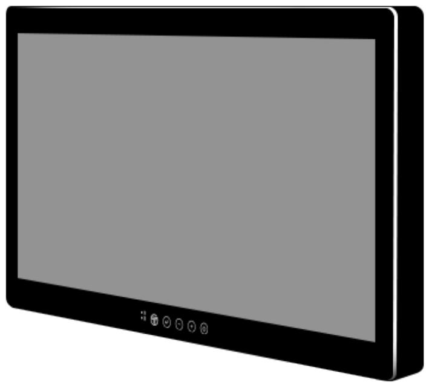

> **AI Description:**
> **Source:** `assets/_page_0_Figure_0.jpg`
> 
> **Generated:** 2026-05-17 04:46:51
> 
> ---
> 
> The image depicts a stylized representation of a tablet or a similar electronic device. It is a simple, two-dimensional illustration with a rectangular shape and rounded corners. The device has a large screen occupying most of the front, with a black bezel surrounding it. At the bottom of the device, there are five small icons or buttons, which appear to be control buttons or function keys. The overall design is minimalistic and lacks any detailed textures or shading, giving it a clean and modern appearance.

> **AI Description:**
> **Source:** `assets/_page_0_Figure_2.jpg`
> 
> **Generated:** 2026-05-17 04:46:06
> 
> ---
> 
> The image contains three certification logos: CE, FCC, and UL. The UL logo includes the text "E489236." These logos indicate compliance with specific standards and regulations for electronic products.

Document Part No. 91521110100M Document Version V1.1

## Table of Contents

Preface.... ...3   
Owner’s Record . ................................................... .....3   
What is Included .. ....................................................... ....3   
Chapter 1: Hardware Installation . ..4   
1.1Installation...... ....................................................................................................................4   
1.2 Connecting Cables.... ............................................ ......................... ....4   
1.3 Ground Pin..... ................................................................................................................5   
1.4 Connecting Power... ......................... ...5   
1.4.1 Hard Power On ..................................................................   
1.4.2 Hard Power On ....................................................... ............... .........6   
1.4.3 Hard Power Off ............ ................ ....6   
1.5 Soft Power On and Off .. ...6   
1.6 Power Modes .... ................................................................. .................................6   
Chapter 2: Operating the Device . ... .............................................................................................. ....7   
2.1 IR Remote Control .... ............................................................................................................7   
2.2 On Screen Display (OSD) Navigation... ............................................................................. ....7   
2.3 OSD Locking / Unlocking . .................... ................ ....8   
2.4 Hot Keys ... ................ .....8   
2.5 Quick Key .. ...8   
2.6 Basic OSD Menu Options: Display........ ............................ ........................ ......10   
2.7 Basic OSD Menu Options: Adjust.. .......................... ...12   
2.8 Basic OSD Menu Options: Audio ..........   
2.9 Basic OSD Menu Options: Multi-Display ........ ....14   
2.10 Basic OSD Menu Options: OSD.. ...16   
2.11 Basic OSD Menu Options: ADVANCED.. ....16   
Chapter 3: Important Information .... ....18   
3.1 General Guideline . ....................................... .............. ......18   
3.2 Indications for Use / Intended Use .............................................................................................18   
3.3 For Customers in the U.S.A .. .....18   
3.4 Customers outside the U.S.A ....... .......18   
3.4.1 Important safeguards/notices for use in healthcare applications . ....18   
3.4.2 Important EMC notices for use in healthcare applications. ....19   
3.5 Warning and Cautions.. ...23   
3.5.1 For the customers in U.S.A. and Canada.. ...24   
3.5.2 Safety ... ..24   
3.5.3 Installation . ..24   
3.5.4 Precautions for connecting this unit with other healthcare devices.. ..24   
3.5.5 Use with an electrosurgical knife, etc... ...25   
3.5.6 Precautions for using this unit safely.. ..25   
3.5.7 Recommendation to use more than one unit.. ..25   
3.6 About the LCD Display Panel. ...25   
3.6.1 Images that may cause burn-in... ...26   
3.6.2 To reduce the risk of burn-in . ..26   
3.6.3 About the screen protect panel . ...26   
3.6.4 A long period of use... ...26   
3.6.5 Moisture condensation.. ...26   
3.6.6 Cleaning before cleaning . ...26   
3.6.7 Cleaning the monitor.. ..26   
3.6.8 Flat surface for better maintenance . ...27   
3.6.9 Repacking . ..27   
3.6.10 Disposal of the unit . ..27   
3.7 Biological Hazard and Returns. ..27   
3.8 Frequency Table .. ...28   
3.9 Troubleshooting . ...29   
Appendix A: Technical Specification. ...30   
Dimensional Figure . ....36   
27” Model . ..36   
32” Model . ...36   
Appendix B: Meaning of Symbols on the unit.. ..37

## Preface

## Owner’s Record

The model and serial numbers are located at the rear of the unit. Record these numbers in the spaces provided below. Refer to these numbers whenever you call upon your Winmate dealer regarding this product.

Model No.

Serial No.

What is Included

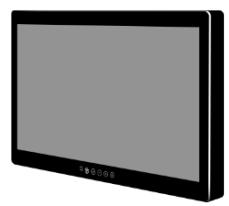

> **AI Description:**
> **Source:** `assets/_page_3_Figure_0.jpg`
> 
> **Generated:** 2026-05-17 04:51:11
> 
> ---
> 
> The image depicts a flat-screen monitor with a black bezel. The screen is turned off, displaying a uniform gray color. The monitor appears to be a standard computer display, likely used for desktop or laptop computers. There are no visible buttons or controls on the front of the monitor, suggesting a sleek and modern design. The image does not contain any text or additional visual elements beyond the monitor itself.

27” / 32” 4K Display

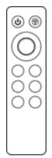

> **AI Description:**
> **Source:** `assets/_page_3_Figure_1.jpg`
> 
> **Generated:** 2026-05-17 04:51:15
> 
> ---
> 
> The image depicts a simplified diagram of a remote control. It includes a circular central button surrounded by six smaller circular buttons arranged in a 2x3 grid. The top row has two buttons, and the bottom row has four buttons. The remote control is outlined with a thin border, and there are two small icons at the top left corner, which appear to represent power and volume controls. The overall design is minimalistic and functional.

Remote Control

User Manual

> **AI Description:**
> **Source:** `assets/_page_3_Figure_3.jpg`
> 
> **Generated:** 2026-05-17 04:49:55
> 
> ---
> 
> The image contains a collection of screws. The screws are metallic and appear to be of a similar size and type, with Phillips heads. There are no charts, graphs, or other visual elements present. The image is a simple photograph of the screws.

Part number depends on the configuration the unit
M4 VESA Mounting Screws
Part No. 9B0000000418
Part No. 91521110100M
Quantity 10 mm x 8 pcs 12 mm x 8 pcs 15 mm x 8 pcs

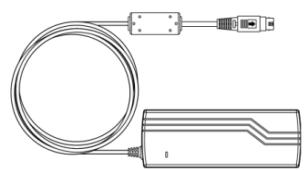

> **AI Description:**
> **Source:** `assets/_page_3_Figure_4.jpg`
> 
> **Generated:** 2026-05-17 04:48:42
> 
> ---
> 
> The image is a technical illustration of a USB cable and a device, likely a USB adapter or dongle. The cable is coiled and has a standard USB connector at one end. The device has a rectangular shape with a USB port at one end and a rectangular protrusion at the other end, which may be a connector or a button. The illustration is simple and lacks any additional labels or text annotations.

24 Volt Power Supply
Part No. 922D150W24V4

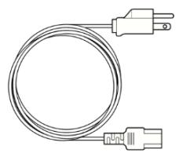

> **AI Description:**
> **Source:** `assets/_page_3_Figure_5.jpg`
> 
> **Generated:** 2026-05-17 04:48:27
> 
> ---
> 
> The image depicts a coiled electrical cable with a plug at one end and a USB connector at the other. The cable appears to be a standard power cord with a standard American plug and a USB-A connector. The image is a simple line drawing or illustration, not a photograph or photograph-like image.

• Power Cable 1.8m

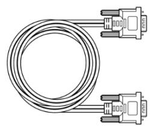

> **AI Description:**
> **Source:** `assets/_page_3_Figure_6.jpg`
> 
> **Generated:** 2026-05-17 04:49:12
> 
> ---
> 
> The image depicts a coiled cable with two connectors at each end. The connectors appear to be RS-232 serial ports, commonly used for data transmission between devices. The cable is shown in a simple, line-drawn style, suggesting it is a technical illustration or diagram rather than a photograph. The image is likely used to represent a communication cable in a technical or instructional context.

Varies on the country
VGA Cable
Part No. 9441151150P3

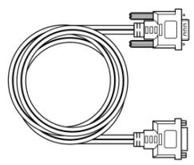

> **AI Description:**
> **Source:** `assets/_page_3_Figure_7.jpg`
> 
> **Generated:** 2026-05-17 04:49:26
> 
> ---
> 
> The image contains a technical illustration of a cable with two connectors. The cable has a coiled appearance and is depicted in a simple line drawing style. The connectors on either end are labeled as "DB9" and "DB25," indicating the types of connectors used, which are commonly found in serial and parallel communication interfaces. The image is likely used to represent a cable used for connecting devices such as modems or printers to computers.

DVI Cable 1.8 m
Part No. 9455295290Q0

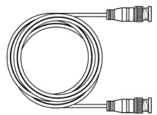

> **AI Description:**
> **Source:** `assets/_page_3_Figure_8.jpg`
> 
> **Generated:** 2026-05-17 04:46:35
> 
> ---
> 
> The image contains a technical illustration of a coiled cable with two connectors at each end. The cable appears to be a type of industrial or professional-grade cable, possibly for data transfer or power. The connectors have a robust design, suggesting they are meant for secure and reliable connections. The coiled cable is neatly arranged, indicating it is either ready for use or stored in a compact manner.

SDI Cable
Part No. 9470020020K1

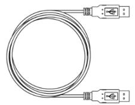

> **AI Description:**
> **Source:** `assets/_page_3_Figure_9.jpg`
> 
> **Generated:** 2026-05-17 04:46:30
> 
> ---
> 
> The image is a technical illustration of a USB cable. It shows a coiled cable with a USB connector at both ends. The cable is depicted in a simple, line-drawn style, with no additional labels or annotations. The image is a diagram intended to represent a USB cable, likely for educational or instructional purposes.

USB Cable for Touch (Optional)
Part No. 948018102100

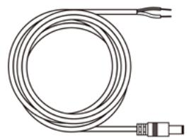

> **AI Description:**
> **Source:** `assets/_page_3_Figure_10.jpg`
> 
> **Generated:** 2026-05-17 04:47:11
> 
> ---
> 
> The image depicts a coiled cable with a connector at one end. The cable appears to be a standard electrical or data cable, possibly used for connecting electronic devices. The coiled shape suggests it is designed to be compact for storage or transport. The connector at the end is likely a standard type, such as a USB or Ethernet connector, though the specific type is not clearly identifiable from the image alone.

DC Jack to Open Wire Cable
Part No. 94JQ02L020K2

## Chapter 1: Hardware Installation

## 1.1Installation

To access the connectors, remove the connector cover. Before removing the connector cover, disconnect the power cord.

1. Remove the four screws on the connector cover.

2. Slide the connector cover in the direction of the arrow and remove it.

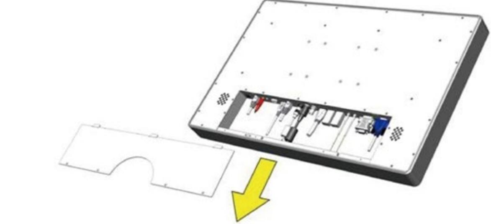

> **AI Description:**
> **Source:** `assets/_page_4_Figure_0.jpg`
> 
> **Generated:** 2026-05-17 04:51:05
> 
> ---
> 
> The image is a technical illustration of a device, likely a server or a similar electronic equipment. It shows the internal components of the device, including various slots and connectors, which are typically used for installing or removing hardware such as memory modules or expansion cards. The illustration is detailed, showing the layout of the internal components and the slots available for expansion. The yellow arrow points to a specific area, possibly indicating a step in the installation or removal process.

> **AI Description:**
> **Source:** `assets/_page_4_Figure_1.jpg`
> 
> **Generated:** 2026-05-17 04:51:20
> 
> ---
> 
> The image contains a warning symbol with a red triangle and a black lightning bolt inside it. Below the symbol, the word "WARNING!" is written in bold, black capital letters. This image is a standard warning sign, typically used to alert viewers to potential hazards or risks.

Do not remove any other screws other than the four screws affixing the connector cover. Doing so may cause electric shock.

## 1.2 Connecting Cables

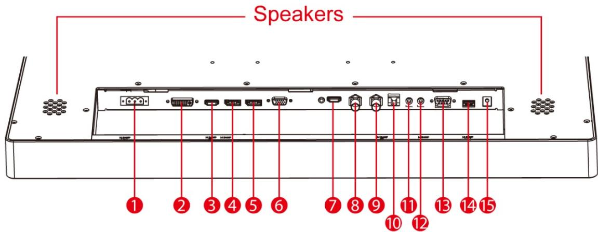

> **AI Description:**
> **Source:** `assets/_page_4_Figure_2.jpg`
> 
> **Generated:** 2026-05-17 04:50:08
> 
> ---
> 
> The image is a technical illustration of a device's rear panel, specifically highlighting the location of speakers. It is a diagram with numbered labels pointing to various ports and connectors on the device. The labels are numbered from 1 to 15, with each number corresponding to a specific port or connector. The top of the image is labeled "Speakers," indicating the area where the speakers are located. The diagram is designed to help users identify the positions of different ports and connectors on the device's rear panel.

1. 24 V DC In

6. VGA In

11. Mic In

2. Dual DVI in 7. HDMI 2.0 12. Line Out

3. HDMI 1.4

8. SDI In

13. RS-232

4. DP1.2 Out

9. SDI Out

14. USB 2.0

5. DP1.2 In

10. RJ-11

15. Power 5V Out

## 4K UHD Display User Manual

There are several video and/or data cables that can be connected in many combinations. The number and type of connections will be automatically detected by the monitor. From the OSD (On Screen Display) the user can select the way the images will be displayed.

Be sure to tighten and thumb screws on the individual video cable. A secure connection is important to ensure the best image quality.

## 1.3 Ground Pin

Connect this monitor to the Protective Earth ground at this pin. This Pin is also used when potential equalization between the monitor and other equipment is required. Simply connect the potential equalization pin (POAG) found on devices, to the monitor ground pin using an AWG18 wire (WIRE NOT PROVIDED).

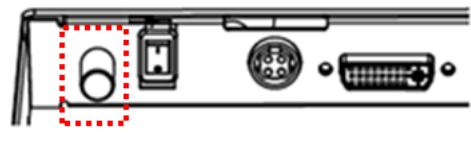

> **AI Description:**
> **Source:** `assets/_page_5_Figure_0.jpg`
> 
> **Generated:** 2026-05-17 04:49:42
> 
> ---
> 
> The image is a technical illustration showing the back panel of a device, likely a computer or a similar electronic device. It includes several ports and connectors. The red dashed box highlights a circular port, which appears to be a 3.5mm audio jack. To the right of this highlighted port, there is a rectangular port, which is likely a USB port, and further to the right, there is a larger circular port, which is probably a PS/2 or a similar type of connector. The image is designed to provide a clear view of the various ports available on the back panel for connectivity and input/output purposes.

## 1.4 Connecting Power

• Connect the AC cord to the AC IN terminal on the AC adaptor.

• Connect the DC OUT terminal of the AC adaptor to the DC IN terminal on the monitor.

• Align the notch on the cord connector with the guiding groove and plug it in.

Connect the AC cord plug to the power outlet.

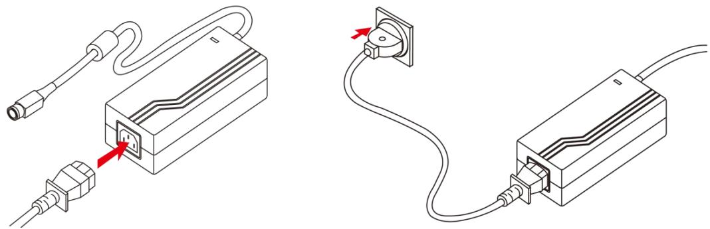

> **AI Description:**
> **Source:** `assets/_page_5_Figure_1.jpg`
> 
> **Generated:** 2026-05-17 04:48:57
> 
> ---
> 
> The image is a technical illustration showing the connection of a power adapter to a power outlet. It includes two diagrams: one showing the adapter with a cable and plug, and the other showing the adapter connected to a power outlet. The diagrams are labeled with red arrows pointing to the plug and the outlet, indicating the direction of connection. The adapter appears to be a standard power supply unit, commonly used for electronic devices.

## 1.4.1 Hard Power On

Hard power and soft power are used independently. The differences explained below:

## 1.4.2 Hard Power On

Turn the POWER switch at the bottom of the monitor to On. The POWER indicator glows blue, indicating the monitor is internally powered.

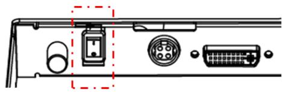

> **AI Description:**
> **Source:** `assets/_page_6_Figure_0.jpg`
> 
> **Generated:** 2026-05-17 04:45:22
> 
> ---
> 
> The image is a technical illustration of a device's rear panel, showing various ports and connectors. It includes a highlighted area around a power connector, indicating its location. The image also displays other ports such as a VGA connector and a USB port, along with a circular port that appears to be a headphone or microphone jack. The illustration is likely used for instructional or technical purposes, guiding users on where to connect cables or devices to the device.

## 1.4.3 Hard Power Off

Turn the POWER switch at the bottom of the monitor to off. The POWER indicator light turns off, indicating the monitor is not internally powered.

## 1.5 Soft Power On and Off

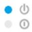

> **AI Description:**
> **Source:** `assets/_page_6_Figure_1.jpg`
> 
> **Generated:** 2026-05-17 04:45:49
> 
> ---
> 
> The image contains a simple diagram with three circles, each labeled with a different icon. The first circle is blue and labeled with a power symbol, the second circle is gray and labeled with a light bulb symbol, and the third circle is white and labeled with a gear symbol. The diagram appears to represent different settings or modes, possibly related to power, brightness, and configuration.

> **AI Description:**
> **Source:** `assets/_page_6_Figure_2.jpg`
> 
> **Generated:** 2026-05-17 04:45:08
> 
> ---
> 
> The image contains a series of icons, including a logo, a circular arrow, a minus sign, a plus sign, and a power button symbol. The power button icon is highlighted with a red dashed box, indicating it as the focus of the image. The icons appear to represent various functions or settings, possibly related to a user interface or control panel.

The soft power button, when touched, will enable or disable the video screen. The soft power button need only be touched once. Depending on monitor’s current state, there may be a few second delay in displaying an image.

## 1.6 Power Modes

This table shows the LED light combinations and their meaning:

## Chapter 2: Operating the Device

## 2.1 IR Remote Control

All the monitor controls can be accessed through the IR remote control. This controller has a few quick access keys for the user’s convenience.

> **AI Description:**
> **Source:** `assets/_page_7_Figure_0.jpg`
> 
> **Generated:** 2026-05-17 04:46:40
> 
> ---
> 
> The image shows a remote control with various buttons. The buttons include power, volume up and down, channel up and down, picture in picture (PIP), source selection, and additional buttons that appear to be for specific functions or settings. The design is simple and functional, with a black background and white and red text labels.

Soft Power

Quick Key – initiates Quick Menu

Central Key – Contains: Volume increase / decrease, down/ less, up/more, and enter

PIP Key – initiates the Picture in Picture Features.

Source Key – Initiates the next active video input

Zoom In Key – Initiates Zoom In

Swap Key – Initiates an image swap during a 2P mode

Mute Key – Activates or deactivates speakers

Zoom Out Key – initiates the Zoom out

## 2.2 On Screen Display (OSD) Navigation

When the Enter key is touched, the OSD (On Screen Display) menu will appear on the monitor screen. This menu offers the user ability to make many changes to the image. The table below shows the response after touching the different OSD icons

> **AI Description:**
> **Source:** `assets/_page_7_Figure_10.jpg`
> 
> **Generated:** 2026-05-17 04:47:06
> 
> ---
> 
> The image contains a simple icon of a power button, which is typically used to represent the power or shutdown function in various electronic devices. The icon is circular with a vertical line in the center, resembling a switch or toggle. There are no additional visual elements or text annotations present in the image.

## 2.3 OSD Locking / Unlocking

Touching both the $\textcircled{-} \textcircled { - }$ buttons simultaneously will either turn ON or OFF the OSD lockout feature.

## LOCKED

## 2.4 Hot Keys

Touching either the $\textcircled { - } \mathsf { \Lambda } _ { \mathsf { o r t h e } } \textcircled { + }$ button will initiate the brightness control feature.

## 2.5 Quick Key

The OSD Function key QUICK offers the user easier access to six major monitor adjustment.

The sub-menu under the SOURCE 1 option allows the user to select the video source for the primary image.

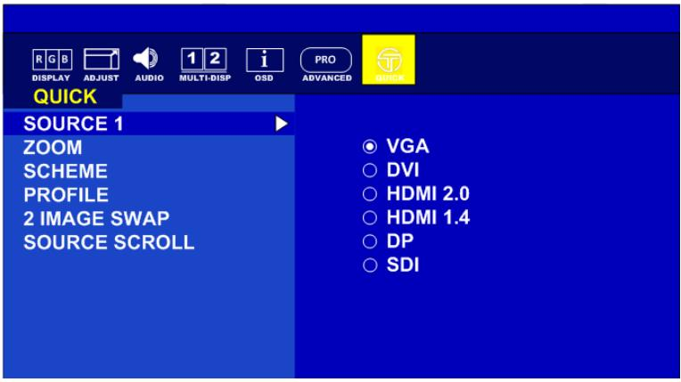

> **AI Description:**
> **Source:** `assets/_page_8_Figure_0.jpg`
> 
> **Generated:** 2026-05-17 04:48:09
> 
> ---
> 
> The image is a screenshot of a display menu, likely from a projector or similar device. It features a blue background with various menu options on the left side, including "QUICK," "SOURCE 1," "ZOOM," "SCHEME," "PROFILE," "2 IMAGE SWAP," and "SOURCE SCROLL." On the right side, there are circular icons with text labels such as "VGA," "DVI," "HDMI 2.0," "HDMI 1.4," "DP," and "SDI," indicating different input source options. The top of the menu has icons for "RGB," "DISPLAY," "ADJUST," "AUDIO," "MULTI-DISP," "OSD," "PRO," and "ADVANCED," suggesting different settings and functions available within the menu.

The sub-menu under ZOOM allows the user the ability to select which image to zoom into. Depending on the Display Mode previously selected, different regions to apply the zoom function are displayed.

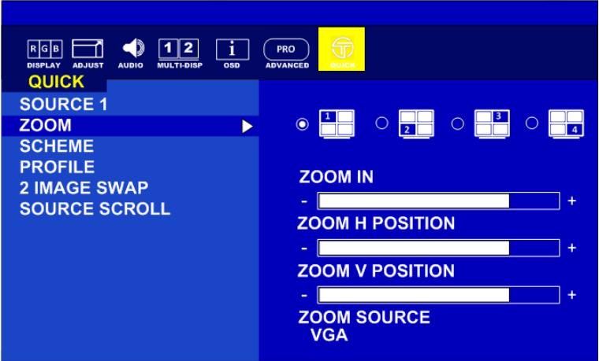

> **AI Description:**
> **Source:** `assets/_page_8_Figure_1.jpg`
> 
> **Generated:** 2026-05-17 04:48:19
> 
> ---
> 
> The image contains a user interface screenshot from a display or projector settings menu. It shows a navigation menu on the left side with options such as "QUICK," "SOURCE 1," "ZOOM," "SCHEME," "PROFILE," "2 IMAGE SWAP," and "SOURCE SCROLL." On the right side, there are settings for "ZOOM IN," "ZOOM H POSITION," "ZOOM V POSITION," and "ZOOM SOURCE VGA." The interface is designed for adjusting display settings, with numerical input fields for zoom adjustments and a layout selection at the top.

The sub-menu under SCHEME offers the user six (6) color schemes to choose from. Each color scheme can be adjusted individually under the OSD function DISPLAY, menu option SCHEME ADJUST. The primary colors and secondary colors are adjustable.

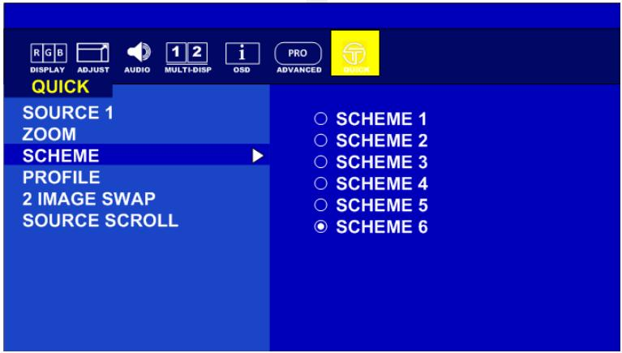

> **AI Description:**
> **Source:** `assets/_page_9_Figure_0.jpg`
> 
> **Generated:** 2026-05-17 04:47:57
> 
> ---
> 
> The image is a screenshot of a menu interface, likely from a display or projector settings menu. It contains a list of options on the left side, including "SOURCE 1," "ZOOM," "SCHEME," "PROFILE," "2 IMAGE SWAP," and "SOURCE SCROLL." The right side of the image shows a list of "SCHEMES" numbered from 1 to 6, with "SCHEME 6" highlighted. The menu is divided into sections with icons at the top, such as "RGB," "DISPLAY," "ADJUST," "AUDIO," "MULTI-DISP," "OSD," and "PRO ADVANCED." The background is predominantly blue, and the text is white and yellow, making it easy to read.

Under Profile, the sub-menu offers the user six (6) different previously saved 3D LUT (Look Up Table) profiles to select from. Profile can be uploaded using the Tomlinson Color calibration software (not included).

## 2.6 Basic OSD Menu Options: Display

The OSD offers a variety of monitor adjustment capabilities. Below is a description of a few common functions used.

Under SCHEME ADJUST, the HUE and Saturation of each primary and secondary color can be changed. These changes are stored under the SCHEME currently activated. (Found under the Quick Menu)

Under COLOR CONTROL, the RED, GREEN, and BLUE colors of the current image are changed.   
These adjustments DO NOT over write the setting of SCHEME or PROFILE.

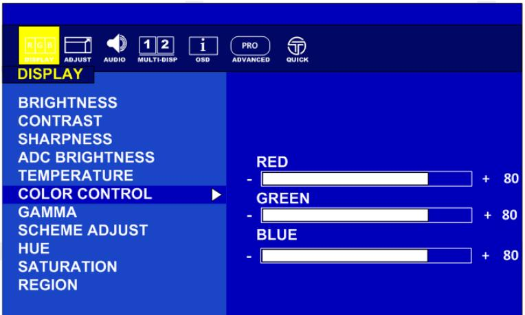

> **AI Description:**
> **Source:** `assets/_page_10_Figure_1.jpg`
> 
> **Generated:** 2026-05-17 04:50:28
> 
> ---
> 
> The image contains a user interface for adjusting display settings on a device. It features a menu with various options such as Brightness, Contrast, Sharpness, ADC Brightness, Temperature, Color Control, Gamma, Scheme Adjust, Hue, Saturation, and Region. The right side of the image shows sliders for adjusting the color levels of Red, Green, and Blue, each with a range from -80 to +80. The interface is designed for advanced display customization, likely for a professional or technical setting.

Region allows the user to select the “region(s)” / input(s) to adjust with a feature.

Example: Monitor has four inputs signals activated on a quad screen. There are nine (9) possible region combinations that can be adjusted. In the picture below, only quadrant “1” will receive adjustment.

<table><tr><td></td></tr><tr><td>RG 02 i PRO T DISPLAY ADJUST AUDIO MULTI-DISP OSD ADVANCED QUICK DISPLAY</td></tr></table>

### Full Page Description (Page 12)

**Source:** `assets/_page_12_Asset_1.jpg`

**Generated:** 2026-05-17 04:50:49

---

The image is a screenshot of a display settings menu, likely from a monitor or projector. It shows a menu with a blue background and white text. The menu is titled "ADJUST" and includes options such as "AUTO ADJUST," "H POSITION," "V POSITION," "CLOCK," "PHASE," and "WHITE BALANCE." The "AUTO ADJUST" option is currently set to "OFF," as indicated by the radio button selection. The menu also includes icons for "RGB," "DISPLAY," "AUDIO," "MULTI-DISP," "OSD," "PRO," "ADVANCED," and "QUICK," suggesting additional settings and functions available in the menu. The overall layout is clean and organized, typical of a user interface for adjusting display settings.

## 2.7 Basic OSD Menu Options: Adjust

The ADJUST feature will automatically adjust an analog image.

When an analog image is initially detected, the monitor will attempt to automatically adjust the image positioning.

This automatic adjustment feature can be turned On/Off here.

Adjust the white balance automatically here by selecting PRESS ENTER

### Full Page Description (Page 13)

**Source:** `assets/_page_13_Asset_0.jpg`

**Generated:** 2026-05-17 04:47:03

---

The image is a screenshot of a user interface, likely from a display or monitor settings menu. It features a blue background with a navigation bar at the top containing various icons and labels such as "RGB," "DISPLAY," "ADJUST," "AUDIO," "MULTI-DISP," "OSD," "PRO," "ADVANCED," and "QUICK." The "AUDIO" tab is highlighted in yellow, indicating it is the active section. Below this, there are three options: "VOLUME," "MUTE," and "AUDIO SOURCE," with the "VOLUME" option currently selected. A slider bar is present next to the "VOLUME" label, allowing for volume adjustment. The overall design is clean and functional, typical of a settings menu for adjusting audio output on a display device.

### Full Page Description (Page 13)

**Source:** `assets/_page_13_Asset_1.jpg`

**Generated:** 2026-05-17 04:47:20

---

The image is a screenshot of a menu interface, likely from a display or projector settings menu. It shows a section labeled "AUDIO" with options for "VOLUME," "MUTE," and "AUDIO SOURCE." The "AUDIO SOURCE" option is expanded, revealing sub-options such as "AUDIO IN," "FIBER," and three additional options that are not fully visible. The background is blue, and the menu has a clean, structured layout with icons and text.

## 2.8 Basic OSD Menu Options: Audio

The speaker volume for all audio inputs is controlled here.

AUDIO SOURCE allows the user to select which from the available inputs. Example, there are 3 regions within the Quad display with audio.

## 2.9 Basic OSD Menu Options: Multi-Display

Display mode offer the user up to five different layouts to view input images

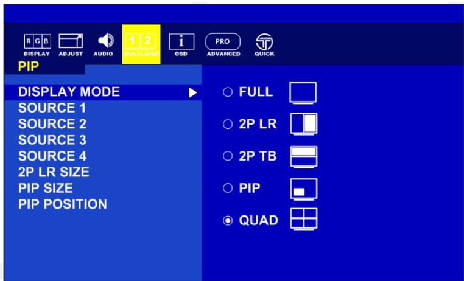

> **AI Description:**
> **Source:** `assets/_page_14_Figure_0.jpg`
> 
> **Generated:** 2026-05-17 04:46:20
> 
> ---
> 
> The image is a screenshot of a display settings menu, likely from a monitor or projector. It contains a list of options under the "PIP" (Picture-in-Picture) category. The menu includes options such as "DISPLAY MODE," "SOURCE 1," "SOURCE 2," "SOURCE 3," "SOURCE 4," "2P LR SIZE," "PIP SIZE," and "PIP POSITION." The display mode is currently set to "QUAD," which is indicated by a filled circle next to it. The menu also shows icons representing different display modes, such as "FULL," "2P LR," "2P TB," "PIP," and "QUAD." The background is blue, and the text is white, making it easy to read.

Each source can be assigned an active image (only one source can be set to auto scan)

Under the PIP layout position and size of the inner image can be adjusted

### Full Page Description (Page 16)

**Source:** `assets/_page_16_Asset_0.jpg`

**Generated:** 2026-05-17 04:47:38

---

The image is a screenshot of a display settings menu, likely from a monitor or projector. It features a blue background with a sidebar on the left listing various settings options such as "Scaling," "Flip," "Overscan," "RGB/YUV," "RS232," "Touch," "Ambient Sensor," "IR Sensor," "DP EDID," and "Factory Reset." The right side of the image shows a "Scaling" menu with options for aspect ratios: "Full," "16:9," "4:3," "5:4," and "1:1." The "Full" option is currently selected. The top of the image includes icons for "RGB," "Display," "Adjust," "Audio," "Multi-Disp," "OSD," "Pro Advanced," and "Quick." The "Advanced" tab is highlighted, indicating the current section of the settings menu.

## 2.10 Basic OSD Menu Options: OSD

Selecting MONITOR INFO will display the current state of the monitor.   
PCB version, firmware version, serial number, and inputs.

## 2.11 Basic OSD Menu Options: ADVANCED

By selecting SCALING, the user can choose the perspective the image is displayed in.

The ability to control the monitor’s functions by way of an infrared remote can be enabled/disabled here.

## Chapter 3: Important Information

## 3.1 General Guideline

It is recommended to reboot the device when some functions are defect or inactive. If it still can't solve the problems please contact your dealer or agent.

## 3.2 Indications for Use / Intended Use

The LCD Monitor is intended to provide 4K 2D color video display from endoscopic/laparoscopic camera systems and other compatible healthcare imaging systems. The Monitor is a widescreen, high-definition, healthcare grade display for use during minimally invasive surgical procedures and is suitable for hospital operating rooms, surgical centers, clinics, doctors’ offices and similar healthcare environments.

## 3.3 For Customers in the U.S.A

This equipment has been tested and found to comply with the limits for a Class B digital device, pursuant to part 15 of the FCC Rules. These limits are designed to provide reasonable protection against harmful interference when the equipment is operated in a commercial environment. This equipment uses and can radiate radio frequency energy and, if not installed and used in accordance with the instruction manual, may cause harmful interference to radio communications.

All interface cables used to connect peripherals must be shielded to comply with the limits for a digital device pursuant to Subpart B of part 15 of FCC Rules.

This device complies with part 15 of the FCC Rules. Operation is subject to the following two conditions:

(1) This device may not cause harmful interference, and

(2) This device must accept any interference received, including interference that may cause undesired operation.

## 3.4 Customers outside the U.S.A

This product has been manufactured by Winmate Inc.

Inquiries related to product compliance based on European Union legislation shall be addressed to the authorized representative, Winmate. For any service or guarantee matters, please refer to the addresses provided in the separate service or guarantee documents.

This unit has been certified per Standard CAN/ CSA-C22.2 No.60601-1.

## 3.4.1 Important safeguards/notices for use in healthcare applications

1. All the equipment connected to this unit shall be certified per Standard IEC60601-1, IEC60950-1, IEC60065 or other IEC/ISO Standards applicable to the equipment.

2. Furthermore, all configurations shall comply with the system standard IEC60601-1-1. Everybody who connects additional equipment to the signal input part or signal output part configures a healthcare system, and is therefore, responsible that the system complies with the requirements of the system standard IEC60601-1-1.

3. If in doubt, consult the qualified service personnel.

4. The leakage current could increase when connected to other equipment.

5. For this equipment, all accessory equipment connected as noted above, must be connected to mains via an additional isolation transformer conforming to the construction requirements of IEC60601-1 and providing at least basic insulation.

6. This equipment generates, uses, and can radiate radio frequency energy. If it is not installed and used in accordance with the instruction manual, it may cause interference to other equipment. If this unit causes interference (which can be determined by unplugging the power cord from the unit), try these measures: Relocate the unit with respect to the susceptible equipment. Plug this unit and the susceptible equipment into different branch circuit.

## 3.4.2 Important EMC notices for use in healthcare applications

The M270TF-XXX / M320TF-XXX needs special precautions regarding EMC and needs to be installed and put into service per the EMC information provided in the instructions for use.

The portable and mobile RF communications equipment such as cellular phones can affect the M270TF-XXX / M320TF-XXX.

WARNING !
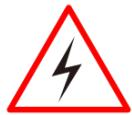

> **AI Description:**
> **Source:** `assets/_page_19_Figure_0.jpg`
> 
> **Generated:** 2026-05-17 04:47:24
> 
> ---
> 
> The image contains a warning sign with a red border and a black lightning bolt in the center. This symbol is commonly used to indicate the presence of electrical hazards. The sign is designed to alert individuals to the potential danger of electrical currents or voltages, suggesting that caution should be exercised in the area where this sign is displayed.

The use of accessories and cables other than those specified, with the exception of replacement parts sold by Winmate Inc., may result in increased emissions or decreased immunity of the M270TF-XXX / M320TF-XXX.

The M270TF-XXX / M320TF-XXX is intended for use in the electromagnetic environment specified below. The customer or the user of the M270TF-XXX / M320TF-XXX should assure that it is used in such as environment.

## 3.5 Warning and Cautions

> **AI Description:**
> **Source:** `assets/_page_23_Figure_0.jpg`
> 
> **Generated:** 2026-05-17 04:45:53
> 
> ---
> 
> The image contains a warning symbol with a red triangle and a black lightning bolt inside it. Below the symbol, the word "WARNING!" is written in bold, black capital letters. This is a standard warning sign used to indicate potential danger or risk.

The apparatus shall not be exposed to dripping or splashing. No objects filled with liquids, such as vases, shall be placed on the apparatus.

> **AI Description:**
> **Source:** `assets/_page_23_Figure_1.jpg`
> 
> **Generated:** 2026-05-17 04:45:13
> 
> ---
> 
> The image contains a warning symbol with a red triangle and a lightning bolt inside it, indicating a high voltage or electrical hazard. Below the symbol, the word "WARNING!" is written in bold, capitalized letters. This image is a standard safety warning sign used to alert individuals to the presence of electrical dangers.

To prevent injuries, firmly fix the unit to the floor or wall following the installation manual.

> **AI Description:**
> **Source:** `assets/_page_23_Figure_2.jpg`
> 
> **Generated:** 2026-05-17 04:44:27
> 
> ---
> 
> The image contains a warning symbol with a red triangle and a black lightning bolt inside it, indicating a warning related to electrical hazards. The word "WARNING!" is written below the symbol in bold, black capital letters. The design is simple and universally recognized as a cautionary sign for electrical safety.

If the M270TF-XXX / M320TF-XXX should be used adjacent to or stacked with other equipment, it should be observed to verify normal operation in the configuration in which it will be used.

When you dispose of the unit or accessories, you must obey the laws in the relative area or country and the regulations in the relative hospital regarding environmental pollution.

> **AI Description:**
> **Source:** `assets/_page_23_Figure_4.jpg`
> 
> **Generated:** 2026-05-17 04:45:57
> 
> ---
> 
> The image contains a caution symbol, which is a yellow triangle with an exclamation mark inside it. Below the symbol, the word "CAUTION" is written in bold, black capital letters. This is a standard warning symbol used to draw attention to potential hazards or important information.

When installing, the installation space must be secured in consideration of the ventilation and service operation. Leave a space 4 cm (1 5/8 inches) or more behind, 10 cm (4 inches) or more from the left and right sides of, 6 cm (2 3/8 inches) or more from the bottom side of, and 30 cm (11 7/8 inches) or more above the unit.

## Warning on power connection:

> **AI Description:**
> **Source:** `assets/_page_23_Figure_5.jpg`
> 
> **Generated:** 2026-05-17 04:46:23
> 
> ---
> 
> The image contains a warning symbol with a red triangle and a black lightning bolt inside it, indicating a high voltage hazard. Below the symbol, the word "WARNING!" is written in bold, black capital letters. The image is a standard safety warning sign used to alert viewers to the presence of electrical hazards.

Use a proper power cord for your local power supply. Use the approved Power Cord (3-core mains lead) / Appliance Connector /Plug with earthing-contacts that conforms to the safety regulations of each country if applicable. Use the Power Cord (3-core mains lead) / Appliance Connector / Plug conforming to the proper ratings (Voltage, Ampere). If you have questions on the use of the above Power Cord / Appliance Connector / Plug, please consult a qualified service personnel.

## 3.5.1 For the customers in U.S.A. and Canada

Please use the following power supply cord.

NOTE

Grounding reliability can only be achieved when the equipment is connected to an equivalent receptacle marked “Hospital Only” or “Hospital Grade”.

> **AI Description:**
> **Source:** `assets/_page_24_Figure_1.jpg`
> 
> **Generated:** 2026-05-17 04:45:16
> 
> ---
> 
> The image contains a yellow triangular warning symbol with an exclamation mark inside it. This is a standard safety or caution symbol often used to indicate a potential hazard or important warning. The symbol is designed to grab attention and convey a message of caution or alertness.

This unit is heavy. Make sure to unpack and move the unit with two or more people.

## CAUTION

## 3.5.2 Safety

• M270TF-XXX / M320TF-XXX is a DC powered device. Use with the supplied AC adaptor (EM11701F).

Operate the unit on 100-240V AC only.

• The nameplate indicating operating voltage, etc. is located on the AC adaptor.

Should any solid object or liquid fall into the cabinet, unplug the unit and have it checked by qualified personnel before operating it any further.

• Unplug the unit from the wall outlet if it is not to be used for several days or more.

• To disconnect the AC power cord, pull it out by grasping the plug. Never pull the cord itself.

• The socket-outlet shall be installed near the equipment and shall be easily accessible.

## 3.5.3 Installation

• Prevent internal heat build-up allowing adequate air circulation。

• Do not place the unit on surfaces (rugs, blankets, etc.) or near materials (curtains, draperies) that may block the ventilation holes.

Do not install the unit near heat sources such as radiators or air ducts, or in a place subject to direct sunlight, excessive dust, mechanical vibration or shock.

Do not place the monitor near equipment which generates magnetism, such as a transformer or high voltage power lines.

## 3.5.4 Precautions for connecting this unit with other healthcare devices

Before you utilize this device and/or connect this device to any other healthcare device, please be

aware of and abide by the following precautions:

• Before actually using this device for healthcare practice, please check and confirm that you do not experience any discomfort in the use of this monitor

• If you experience or are likely to experience discomfort, please refrain from using this device.

Generally, discomfort (such as eye strain, fatigue, nausea, or motion sickness) can be provoked by quick movements of video picture, focal positioning of video images, distances between moving objects and changing image colors.

• Before prolonged use, make sure the image of the connected healthcare device is displayed properly.

## 3.5.5 Use with an electrosurgical knife, etc.

If this unit is used together with an electrosurgical knife, etc., the picture may be disturbed, warped or otherwise abnormal because of strong radio waves or voltages from the device. This is not a malfunction. When you use this unit simultaneously with a device from which strong radio waves or voltages are emitted, confirm the effect of this before using such devices, and install this unit in a way that minimizes the effect of radio wave interference.

## 3.5.6 Precautions for using this unit safely

Some people may experience discomfort (such as eye strain, fatigue, or nausea) while watching video images. It is recommended that all viewers take regular breaks while watching video images. The length and frequency of necessary breaks will vary from person to person. You must decide what works best.

• Avoid watching the display in environments where your head may shake, because there is a higher possibility that you experience discomfort.

## 3.5.7 Recommendation to use more than one unit

As problems, can occasionally occur, when the monitor is used under critical conditions, we strongly recommend you use more than one unit or prepare a spare unit for replacement.

## 3.6 About the LCD Display Panel

The LCD panel fitted to this unit is manufactured with high precision technology, giving a functioning pixel ratio of at least 99.99%. Thus, a very small proportion of pixels may be “stuck”, either always off (black), always on (red, green, or blue), or flashing. In addition, over a long period of use, because of the physical characteristics of the liquid crystal display, such “stuck” pixels may appear spontaneously. These problems are not a malfunction.

• Do not leave the LCD screen facing the sun as it can damage the LCD screen. Take care when you place the unit by a window.

Do not store the monitor FACE DOWN.

• Do not push or scratch the LCD screen.

• Do not place a heavy object on the LCD screen. This may cause the screen to lose uniformity.

• If the unit is used in a cold place, a residual image may appear on the screen. This is not a malfunction. When the monitor becomes warm, the screen returns to normal.

• The screen and the cabinet become warm during operation. This is not a malfunction.

## 3.6.1 Images that may cause burn-in

Masked / boarded images with aspect ratios other than 16:9

Color bars or images that remain static for a long time

Continuous characters or messages displaying on the screen

## 3.6.2 To reduce the risk of burn-in

Turn off the character displays from connected equipment.

## 3.6.3 About the screen protect panel

The screen protect panel is made of toughened glass, but there is a possibility that it may crack.

Handle with care. Avoid strong impact, such as dropping from a high place or an object swinging into it.

Do not scratch the panel with a sharp object or place it in harm’s way.

## 3.6.4 A long period of use

Due to the characteristics of LCD panel, displaying static images for extended periods, or using the unit repeatedly in a high temperature/high humidity environments may cause image smearing, burn-in, areas of which brightness is permanently changed, lines, or a decrease in overall brightness.

In particular, continued displaying of an image smaller than the monitor screen, such as in a different aspect ratio, may shorten the life of the unit.

Avoid displaying a still image for an extended period, or using the unit repeatedly in a high temperature/high humidity environment such an airtight room, or around the outlet of an air conditioner.

## 3.6.5 Moisture condensation

If the unit is suddenly taken from a cold to a warm location, or if ambient temperature suddenly rises, moisture may form on the outer surface of the unit and/or inside of the unit. This is known as condensation. If condensation occurs, turn off the unit and wait until the condensation clears before operating the unit. Operating the unit while condensation is present may damage the unit.

## 3.6.6 Cleaning before cleaning

Be sure to disconnect the AC power cord from the AC outlet.

## 3.6.7 Cleaning the monitor

A material that withstands disinfection is used for the front protection plate of the healthcare use LCD monitor. The protection plate surface is specially treated to reduce reflection of light. When solvents such as benzene or thinner, or acid, alkaline or abrasive detergent or chemical cleaning cloth are used for the protection plate surface/monitor surface, the performance of the monitor may be impaired or the finish of the surface may be damaged. Take care with respect to the following:

Clean the protection plate surface/monitor surface with a 50 to 70 v/v% concentration of isopropyl alcohol or a 76.9 to 81.4 v/v% concentration of ethanol using a swab method. Wipe the protection plate surface gently (wipe using less than 1 N force).

• Stubborn stains may be removed with a soft cloth such as a cleaning cloth lightly dampened with mild

## 4K UHD Display User Manual

detergent solution using a swab method and then clean using the above chemical solution.

Never use solvents such as benzene or thinner, or acid, alkaline or abrasive detergent, or chemical cleaning cloth for cleaning or disinfection, as they will damage the protection plate surface/monitor surface.

• Do not use unnecessary force to rub the protection plate surface/monitor surface with a stained cloth. The protection plate surface/monitor surface may be scratched.

• Do not keep the protection plate surface/monitor surface in contact with a rubber or vinyl resin product for a long period of time. The finish of the surface may deteriorate.

## 3.6.8 Flat surface for better maintenance

The design allows the user to easily wipe liquids and gel off the LCD panel and control buttons – ensuring a high standard of disinfection and cleanliness.

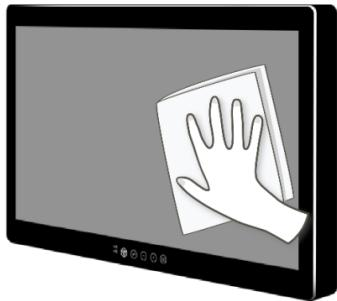

> **AI Description:**
> **Source:** `assets/_page_27_Figure_0.jpg`
> 
> **Generated:** 2026-05-17 04:49:03
> 
> ---
> 
> The image is a simple illustration of a hand holding a cloth, positioned as if it is cleaning a screen. The screen appears to be a flat panel display, possibly a monitor or a television. The hand and cloth are white, and the screen is a gradient of gray tones. There are no additional labels, text, or other elements present in the image. The illustration is likely intended to convey the action of cleaning a screen, possibly for a tutorial or instructional purpose.

## 3.6.9 Repacking

Do not throw away the carton and packing materials. They can be used again to repack monitor.

If you have any questions about this unit, contact your authorized dealer.

## 3.6.10 Disposal of the unit

Do not dispose of the unit with general waste. Do not include the monitor with household waste.

## 3.7 Biological Hazard and Returns

The structure and the specifications of this device as well as the materials used for manufacturing makes it easy to wipe and clean and therefore suitable to be used for various applications in hospitals and other healthcare environments, where procedures for frequent cleaning are specified.

However, normal use shall exclude biological contaminated environments, to prevent spreading of infections. Therefore use of this device in such environments is at the exclusive risk of Customer. In case this device is used where potential biological contamination cannot be excluded.

Customer shall implement the decontamination process as defined in the latest edition of the ANSI/AAMI ST35 standard on each single failed Product that is returned for servicing, repair, reworking or failure investigation to Seller (or to the Authorized Service Provider). At least one adhesive yellow label shall be attached on the top site of the package of returned Product and accompanied by a declaration statement proving the Product has been successfully decontaminated.

Returned Products that is not provided with such external decontamination label, and/or whenever such declaration is missing, can be rejected by Seller (or by the Authorized Service Provider) and shipped back at Customer expenses.

3.8 Frequency Table

## 3.9 Troubleshooting

## Appendix A: Technical Specification

Monitor

## 4K UHD Display User Manual

\* Please use cables which meet the SDI requirements. Recommend to use 75 Ohm RG59 cable or above for HD-SDI and 75Ohm RG6 cable for 3G-SDI.

SDI Resolution, frame rate and cable

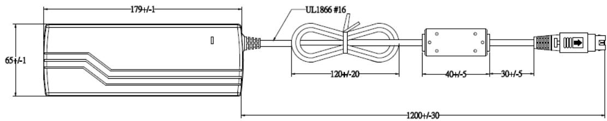

> **AI Description:**
> **Source:** `assets/_page_32_Figure_0.jpg`
> 
> **Generated:** 2026-05-17 04:49:35
> 
> ---
> 
> The image is a technical illustration of a component with dimensions and annotations. It includes a cylindrical object with dimensions of 179+/-1 mm in length and 65+/-1 mm in diameter. The component is connected to a cable with a UL1866 #16 specification, which is 120+/-20 mm long. The cable then connects to a rectangular bracket with dimensions of 40+/-5 mm in width and 30+/-5 mm in height. The entire assembly is 1200+/-30 mm in length. The image provides precise measurements and specifications for the component and its connections.

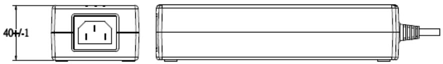

> **AI Description:**
> **Source:** `assets/_page_32_Figure_1.jpg`
> 
> **Generated:** 2026-05-17 04:49:08
> 
> ---
> 
> The image contains a technical illustration of a power adapter. It includes a side view and a top view of the adapter, with dimensions labeled as 40 mm ±1. The illustration also shows the power outlet and a cable with a connector at the end. The image is a technical drawing, likely used for manufacturing or assembly purposes.

Pin assignment and signal name of AC adapter DC OUT terminal

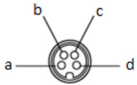

> **AI Description:**
> **Source:** `assets/_page_32_Figure_2.jpg`
> 
> **Generated:** 2026-05-17 04:48:23
> 
> ---
> 
> The image is a diagram of a coaxial cable connector. The diagram includes labels for different parts of the connector: a, b, c, and d. The labels are positioned around the circular shape of the connector, indicating the various components such as the center conductor, outer shield, and outer jacket. The diagram is a technical illustration used to identify and understand the structure of a coaxial cable connector.

## PIN Specification

Pin assignment and signal name of RS-232 C terminal

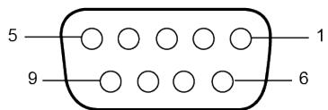

> **AI Description:**
> **Source:** `assets/_page_33_Figure_0.jpg`
> 
> **Generated:** 2026-05-17 04:50:32
> 
> ---
> 
> The image is a technical illustration of a connector or plug with numbered positions. It shows a circular shape with nine numbered holes arranged in a specific pattern. The numbers 1, 5, 6, and 9 are labeled on the outer edge of the circular shape, indicating the positions of the holes. The illustration is likely used for technical or instructional purposes, such as wiring diagrams or component identification.

Pin assignment and signal name of HD15 input terminal (mini D-Sub 15 pin)

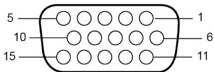

> **AI Description:**
> **Source:** `assets/_page_33_Figure_1.jpg`
> 
> **Generated:** 2026-05-17 04:51:36
> 
> ---
> 
> The image is a technical diagram, likely representing a connector or interface with numbered positions. It includes labels such as "1," "5," "10," and "15," which may correspond to specific pins or contacts within the connector. The diagram is structured in a way that suggests it could be used for technical documentation or as a reference for assembling or understanding the function of the connector.

Pin assignment and signal name of GPI terminal

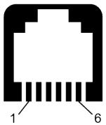

> **AI Description:**
> **Source:** `assets/_page_33_Figure_2.jpg`
> 
> **Generated:** 2026-05-17 04:50:18
> 
> ---
> 
> The image is a technical illustration of a connector, specifically an Ethernet RJ-45 connector. It shows the orientation and labeling of the pins within the connector. The image includes labels for each pin, with pin 1 and pin 6 being the most prominent, indicating the orientation of the connector. This type of diagram is commonly used in electrical and networking contexts to show the correct orientation and pin configuration for connecting Ethernet cables.

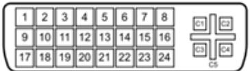

> **AI Description:**
> **Source:** `assets/_page_34_Figure_0.jpg`
> 
> **Generated:** 2026-05-17 04:50:38
> 
> ---
> 
> The image contains a diagram of a fuse box layout. It shows a grid with numbered fuses arranged in a 4x6 configuration, totaling 24 fuses. To the right of the grid, there are four labeled cutouts (C1, C2, C3, C4, and C5) indicating where the fuses are likely to be removed or replaced. The diagram is likely used for educational or instructional purposes to demonstrate the layout of a fuse box.

Pin assignment and signal name of DP-IN

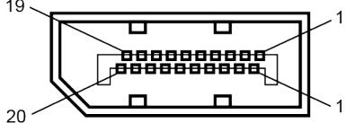

> **AI Description:**
> **Source:** `assets/_page_34_Figure_1.jpg`
> 
> **Generated:** 2026-05-17 04:51:31
> 
> ---
> 
> The image is a technical illustration of a connector or interface, likely for a computer or electronic device. It shows a detailed view of a connector with multiple pins arranged in a grid pattern. The connector has several labeled parts, including "19," "20," and "1," which likely refer to different sections or components of the connector. The diagram is labeled with numbers to indicate specific areas, suggesting it is used for technical documentation or assembly instructions.

Pin assignment and signal name of DP-Out

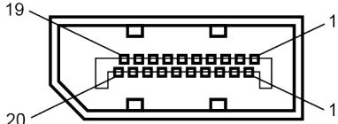

> **AI Description:**
> **Source:** `assets/_page_34_Figure_2.jpg`
> 
> **Generated:** 2026-05-17 04:50:14
> 
> ---
> 
> The image is a technical diagram of a connector or interface, likely used in electronic or mechanical applications. It features a series of numbered labels (1, 19, 20) pointing to specific parts of the connector. The diagram includes a central rectangular area with a grid of small squares, which may represent individual pins or contacts within the connector. The numbers and labels suggest a detailed specification or schematic of the connector's structure and function.

Pin assignment and signal name of SDI-IN

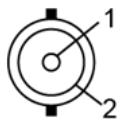

> **AI Description:**
> **Source:** `assets/_page_35_Figure_0.jpg`
> 
> **Generated:** 2026-05-17 04:49:21
> 
> ---
> 
> The image is a simple diagram of a circular object with two labeled parts. The circle is divided into two sections, with the left side labeled as "1" and the right side labeled as "2". The diagram appears to be a basic representation of a component or a part of a larger object, possibly used in a technical or educational context to illustrate the division or structure of the object.

Pin assignment and signal name of SDI-Out

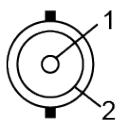

> **AI Description:**
> **Source:** `assets/_page_35_Figure_1.jpg`
> 
> **Generated:** 2026-05-17 04:49:17
> 
> ---
> 
> The image is a simple diagram featuring two circular shapes. The larger circle is labeled with the number "1" and the smaller circle is labeled with the number "2". The diagram appears to be a basic representation of a comparison or relationship between two items or concepts, with "1" potentially representing a larger or more significant element and "2" representing a smaller or secondary element.

Pin assignment and signal name of HDMI

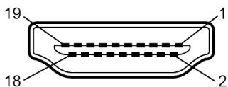

> **AI Description:**
> **Source:** `assets/_page_35_Figure_2.jpg`
> 
> **Generated:** 2026-05-17 04:48:32
> 
> ---
> 
> The image is a technical illustration of a connector, likely a HDMI port, with numbered labels pointing to specific parts of the connector. The labels are as follows: 19 at the top, 1 on the top right, 2 on the bottom right, 18 on the bottom, and 19 on the top left. The illustration is a cross-sectional view of the connector, showing the internal structure and the arrangement of the pins.

Pin assignment and signal name of USB

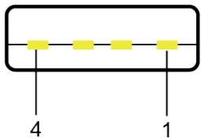

> **AI Description:**
> **Source:** `assets/_page_35_Figure_3.jpg`
> 
> **Generated:** 2026-05-17 04:48:37
> 
> ---
> 
> The image is a simple diagram featuring a horizontal line with four yellow squares evenly spaced along it. Below the line, there are two vertical lines labeled with the numbers 4 and 1, respectively. The diagram appears to represent a sequence or a set of four items, with the numbers 4 and 1 possibly indicating a starting or ending point or a reference to the total number of items.

Pin assignment and signal name of Power

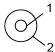

> **AI Description:**
> **Source:** `assets/_page_35_Figure_4.jpg`
> 
> **Generated:** 2026-05-17 04:49:51
> 
> ---
> 
> The image contains a simple diagram with two labeled elements. The diagram consists of a circle with a smaller circle inside it, connected by a line to a label "1". Another label "2" is connected to the outer circle. This appears to be a basic illustration, possibly representing a concept or relationship, but without additional context, the exact meaning is unclear.

## Dimensional Figure

27” Model
48.00 (1.8")
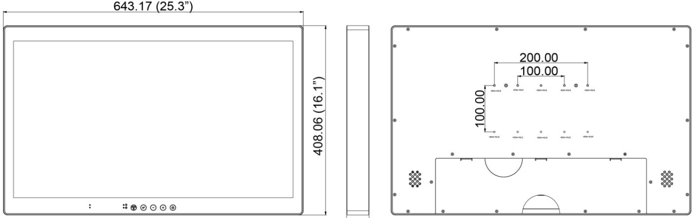

> **AI Description:**
> **Source:** `assets/_page_36_Figure_0.jpg`
> 
> **Generated:** 2026-05-17 04:45:38
> 
> ---
> 
> The image contains a technical drawing of a monitor or display unit. It includes a front view and a rear view of the device. The front view shows the dimensions of the screen area, with a width of 643.17 mm (25.3 inches) and a height of 408.06 mm (16.1 inches). The rear view provides additional measurements, including a 100.00 mm x 200.00 mm mounting hole pattern, which is commonly used for wall or stand mounting. The drawing also includes symbols and labels indicating the mounting holes and other features of the device.

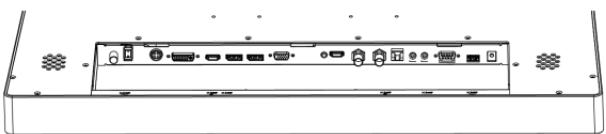

> **AI Description:**
> **Source:** `assets/_page_36_Figure_1.jpg`
> 
> **Generated:** 2026-05-17 04:45:45
> 
> ---
> 
> The image is a technical illustration of a device's rear panel, showcasing various ports and connectors. It includes a VGA port, two HDMI ports, an Ethernet port, a USB port, and a power input. The illustration is a line drawing, with no colors or shading, focusing on the layout and connectivity options of the device.

32” Model
48.00 (1.8")
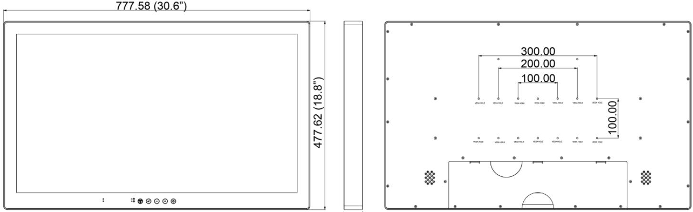

> **AI Description:**
> **Source:** `assets/_page_36_Figure_2.jpg`
> 
> **Generated:** 2026-05-17 04:45:03
> 
> ---
> 
> The image contains a technical illustration of a display panel with dimensions labeled. The left side of the image shows the front view of the panel with its dimensions: 777.58 mm (30.6 inches) in width and 477.62 mm (18.8 inches) in height. The right side of the image shows the back view of the panel with mounting holes and a reference grid. The mounting holes are labeled with distances: 300.00 mm, 200.00 mm, and 100.00 mm, indicating the spacing for mounting brackets or stands. The image also includes a reference grid with evenly spaced dots to assist in aligning the panel with mounting hardware.

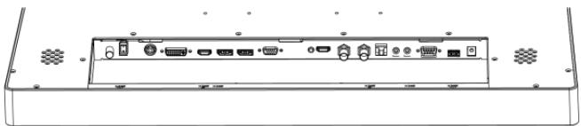

> **AI Description:**
> **Source:** `assets/_page_36_Figure_3.jpg`
> 
> **Generated:** 2026-05-17 04:44:31
> 
> ---
> 
> The image is a technical illustration of a device's rear panel. It shows various ports and connectors, including HDMI, USB, Ethernet, and audio jacks. The illustration is a line drawing with labels underneath each port indicating their respective functions. The panel also features ventilation grilles on either side.

## Appendix B: Meaning of Symbols on the unit

## For business users in the European Union

If you wish to discard electrical and electronic equipment, please contact your dealer or supplier for further information. Information on Disposal in other Countries outside the European Union.

Winmate reserves the right to make changes in specifications and features shown herein, or discontinue the product at any time without notice or obligation.”

Information on Disposal for Users of Waste Electrical & Electronic Equipment (private households) This symbol on the products and/or accompanying documents means that used electrical and electronic products should not be mixed with general household waste. For proper treatment, recovery and recycling, please take these products to designated collection points, where they will be accepted on a free of charge basis. Alternatively, in some countries you may be able to return your products to your local retailer upon the purchase of an equivalent new product. Disposing of this product correctly will help to save valuable resources and prevent any potential negative effects on human health and the environment which could otherwise arise from inappropriate waste handling. Please contact your local authority for further details of your nearest designated collection point. Penalties may be applicable for incorrect disposal of this waste, in accordance with national legislation.