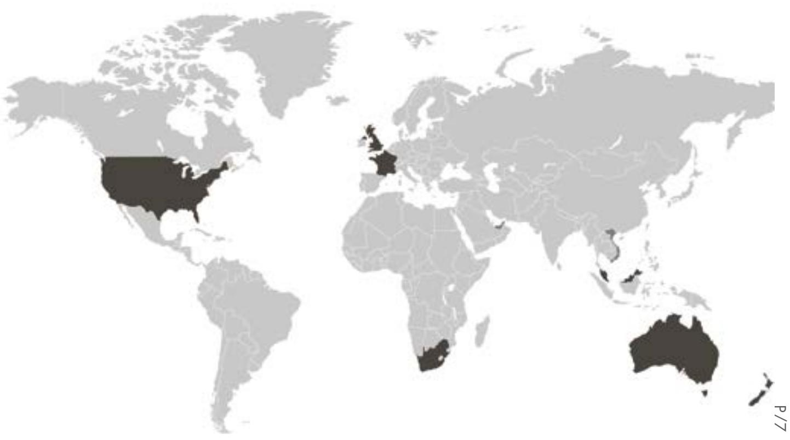
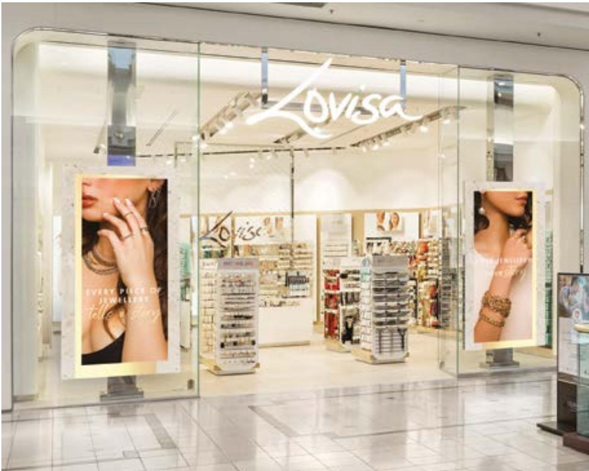
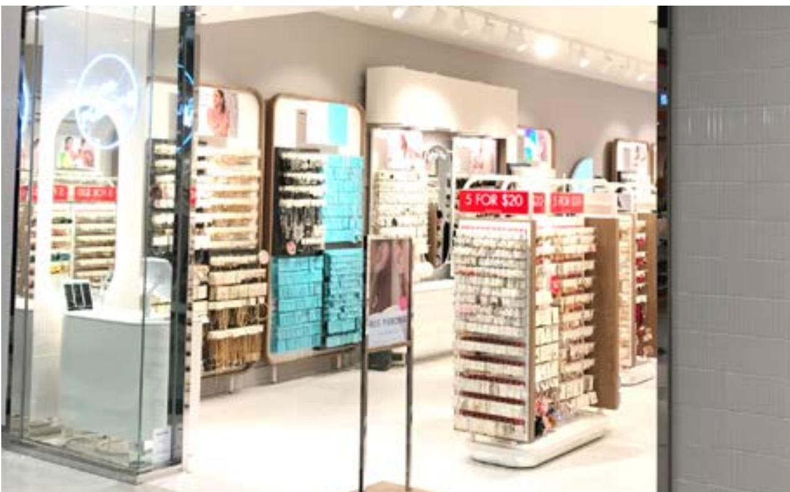

> **AI Description:**
> **Source:** `assets/_page_1_Figure_0.jpg`
> 
> **Generated:** 2026-05-17 15:53:21
> 
> ---
> 
> The image contains a photograph of a person wearing a white shirt and multiple gold bracelets and necklaces. The focus is on the person's arm and upper chest area, showcasing the jewelry. The bracelets and necklaces are ornate and appear to be made of gold, with intricate designs. The person's hand is partially visible, with a gold ring on the ring finger. The background is a plain, neutral color, which helps to highlight the jewelry.

## CONTENTS

Overview 04   
Chairman’s Report 10   
Directors’ Report 12   
Financial Statements   
Consolidated statement of financial position 34   
Consolidated statement of profit or loss and   
other comprehensive income 35   
Consolidated statement of changes in equity 36   
Consolidated statement of cash flows 37   
Notes to Financial Statements   
Setting the scene 38   
Business performance 40   
Asset platform 48   
Risk and capital management 55   
Other information 66   
Signed Reports   
Directors’ declaration 78   
Independent auditor’s report 79   
Lead auditor’s independence declaration 83   
ASX information   
Shareholder information 86

# MOVING GLOBALLY

> **AI Description:**
> **Source:** `assets/_page_3_Figure_0.jpg`
> 
> **Generated:** 2026-05-17 16:16:03
> 
> ---
> 
> The image contains a close-up photograph of a person wearing a layered necklace and large hoop earrings. The necklace features multiple strands with a circular pendant at the bottom, and the earrings are circular with a pattern of small, round, pearl-like stones. The person's skin is fair, and their hair is dark and partially visible. The focus is on the jewelry and the person's neck and shoulders.

• 435 STORES IN 15 COUNTRIES

• CONTINUED EXPANSION OF US + FRANCE STORE FOOTPRINT

ONLINE STORES NOW SERVICING ALL COMPANY OWNED MARKETS

• OVER 100 NEW LINES ARRIVING WEEKLY

• NOW REPRESENTED IN 13 US STATES

## HIGHLIGHTS

REVENUE \$242.2M

> **AI Description:**
> **Source:** `assets/_page_4_Figure_0.jpg`
> 
> **Generated:** 2026-05-17 16:15:32
> 
> ---
> 
> The image contains a collection of jewelry items, including necklaces and rings. The jewelry appears to be made of silver or a similar metal, and the designs are simple and elegant. The image is a photograph of the jewelry, showcasing the pieces in a way that highlights their details and craftsmanship.

> **AI Description:**
> **Source:** `assets/_page_4_Figure_1.jpg`
> 
> **Generated:** 2026-05-17 16:16:08
> 
> ---
> 
> The image contains a photograph of various pieces of jewelry. It includes a pair of gold-colored hoop earrings with a twisted design, a pair of silver-colored hoop earrings with a similar design, and a single gold-colored earring with a small, round pendant. The jewelry pieces are displayed on a light-colored surface, and a silver chain is partially visible in the background.

NET CASH
\$20.4M
EBIT \$30.6M

> **AI Description:**
> **Source:** `assets/_page_4_Figure_2.jpg`
> 
> **Generated:** 2026-05-17 16:15:27
> 
> ---
> 
> The image shows a hand holding a string or thread, with a shadow cast on a light-colored wall. The hand appears to be wearing a white glove or cloth, and the string is thin and elongated. The shadow suggests the presence of a light source from the upper left side of the frame. The image does not contain any text or additional visual elements beyond the hand, string, and shadow.

ONLINE SALESGROWTH

+311%

NET INCREASE OF 45 STORES

> **AI Description:**
> **Source:** `assets/_page_4_Figure_4.jpg`
> 
> **Generated:** 2026-05-17 16:09:02
> 
> ---
> 
> The image contains a photograph of a person's hands wearing multiple bracelets and rings. The hands are positioned with the palms facing down, and the person is wearing a white sleeve rolled up to the forearm. The bracelets and rings are the main focus, with the bracelets appearing to be made of a thin, dark material, possibly leather or a similar substance. The rings are simple and metallic, with one ring having a more intricate design. The image does not contain any text or additional visual elements beyond the hands and jewelry.

NPAT \$19.3M

> **AI Description:**
> **Source:** `assets/_page_4_Figure_5.jpg`
> 
> **Generated:** 2026-05-17 16:08:55
> 
> ---
> 
> The image contains a photograph of a person's ear adorned with multiple earrings. The earrings include a small stud, a small hoop, and a larger hoop with a dangling element. The earrings appear to be made of a metallic material with some decorative elements, possibly rhinestones or similar embellishments. The background is out of focus, emphasizing the earrings as the main subject of the image.

> **AI Description:**
> **Source:** `assets/_page_5_Figure_0.jpg`
> 
> **Generated:** 2026-05-17 16:15:04
> 
> ---
> 
> The image contains a close-up photograph of a person wearing multiple rings on their fingers and a chain necklace. The rings vary in design and material, with some appearing to be gold-toned and others silver-toned. The person is also wearing large, ornate earrings. The focus is on the jewelry, highlighting the details and variety of the accessories.

# GLOBAL REACH

> **AI Description:**
> **Source:** `assets/_page_6_Figure_0.jpg`
> 
> **Generated:** 2026-05-17 15:53:55
> 
> ---
> 
> The image is a world map with certain countries highlighted in dark gray. The highlighted countries include the United States, France, and parts of Africa. The map is a simple geographic representation with no additional visual elements or annotations.

Owned Stores

Franchise

STORE NUMBERS

# ABOUT LOVISA

Lovisa was born from a desire to fill the void for fashion forward and directional jewellery that is brilliantly affordable.

Now trading from 435 stores in 15 Countries. To stay ahead of trend, Lovisa utilises daily inventory monitoring software and airfreight to move product to store locations within 48 hours from our centrally located warehouses in Melbourne and China.

> **AI Description:**
> **Source:** `assets/_page_7_Figure_0.jpg`
> 
> **Generated:** 2026-05-17 16:00:10
> 
> ---
> 
> The image contains a close-up photograph of a person's neck and shoulder area. The individual is wearing a thin, gold chain necklace and a light-colored, ribbed top. The background appears to be dark, possibly indicating a solid color or a patterned fabric. The focus is on the texture of the skin and the details of the clothing and necklace.

> **AI Description:**
> **Source:** `assets/_page_8_Figure_0.jpg`
> 
> **Generated:** 2026-05-17 16:07:27
> 
> ---
> 
> The image contains a close-up photograph of a person's ear and hand. The person is wearing gold hoop earrings and a gold bracelet on their wrist. The hand is positioned near the ear, with fingers slightly curled. The background is out of focus, emphasizing the jewelry and the texture of the hair. The image highlights the details of the gold accessories and the person's skin tone.

Lovisa Holdings Limited Annual Report - 28 June 2020

# CHAIRMAN’S REPORT

> **AI Description:**
> **Source:** `assets/_page_9_Figure_0.jpg`
> 
> **Generated:** 2026-05-17 16:06:23
> 
> ---
> 
> The image shows the exterior of a Lovisa jewelry store. The storefront features large glass windows with the Lovisa logo prominently displayed at the top. Inside, shelves and racks are stocked with various jewelry items, including necklaces, bracelets, and earrings. Two large posters on either side of the entrance showcase models wearing jewelry, with the text "Every piece of jewellery tells a story" visible on one of the posters. The interior lighting is bright, and the overall layout suggests a well-organized retail space.

What a year, notable for many reasons:

The Covid-19 pandemic caused severe disruption to our team, our customers, our business and our suppliers;

The collective stellar response of our entire team globally. I was proud to witness our team instantly accept, adjust, and accelerate in their response to the ever-changing and challenging situation. In particular, our Managing Director, Shane Fallscheer, who has shown great clarity of thought and decision-making in navigating Lovisa through the pandemic; and

On a more upbeat note, Lovisa celebrated its 10th anniversary!

Much has changed since that first sale was made 10 short years ago. What has not changed is the total commitment and focus on our customer and ensuring we deliver the most exciting and relevant fashion jewellery to our customers around the world. Our product innovation continues to be the origin of the energy that surrounds our customer experience.

In this particularly tough year, our strong balance sheet, winning culture, and excellent leadership has proven its worth. Lovisa remains committed, ready, and able to seize the incredible growth opportunities that are and will be available to us.

Lovisa will continue to pursue its efforts in:

Expanding and building on our past success;

Building our capabilities in digital channels;

Growing our existing markets and opening new markets;

Globalising our world-class operations, products, marketing initiatives and talents; and

. Ensuring we are the leading piercing company in the world.

The challenge ahead of us is keeping up the sense of urgency in all we do. This is needed to accomplish our bigger goals. We cannot allow ‘ordinary’ or ‘average’ to set in. The Board, the leadership and the entire team are continuously focused on the need to improve, reload, innovate, and refresh. These things are essential to our future success.

Lovisa continues to be the place that offers our ambitious team ever-increasing opportunities to grow and develop their careers. These career opportunities are only limited by the individuals’ ambition, drive, and commitment to their development. Lovisa cannot achieve its ambitions without these exemplary individuals, we are thankful to all of them. This year I would like to highlight:

## Zoe Mouton

Zoe is a true leader from South Africa where she started with Lovisa in 2012. She is best known for her time as country manager South Africa where she led Lovisa South Africa from 5 stores to 62 stores. In January, Zoe moved to the United Kingdom to take on the leadership of both Europe and South Africa. Her leadership and expertise have been relied upon heavily during these past few months, and I know she will continue to excel in her role.

## Lida Tajvar

Lida is a globally respected member of the Lovisa team, commencing with us in 2013 as Store Manager in Melbourne and was soon promoted to Regional Manager. Lida’s passion, drive and hard work has been the key to her success. Within 3 years Lida progressed through the field into a senior regional role and was then offered a secondment to Malaysia in 2016. Lida continues to reside in Malaysia and continues to excel in her role as Country Manager.

## Danielle Sciberras

Danielle is a great example of the opportunities that are within Lovisa. Danielle commenced in our Plenty Valley store in Melbourne in 2015 and continued to show her passion and results-driven ethic. Within her first year Danielle was promoted to Store Manager of our global flagship store, Chadstone, where she continued to shine. Danielle was soon promoted to Regional Manager Victoria and within that year was offered her dream of a secondment in the USA, where Danielle continues to spread the Lovisa brand in her role as East Coast Regional Manager – USA. She now resides in Brooklyn, New York.

To all the Lovisa team around the world, thank you for adjusting and coping with the ever-changing and challenging situation in the last nine months. Many of you have made personal sacrifices throughout this period, on behalf of the shareholders you deserve our thanks and applause.

Our growth has been slightly disrupted in 2020, the challenge ahead of us is to accelerate our global growth through the rollout of digital and physical stores, while we continue to deliver exceptional customer experiences, product, and marketing. We are confident in the year ahead.

All our customers, team and shareholders should rest assured that Lovisa is in excellent shape to achieve these outcomes. Again, my thanks to you our customers and shareholders for your continuous support.

It’s about the customer, always.

Brett Blundy Non-Executive Chairman

> **AI Description:**
> **Source:** `assets/_page_12_Figure_0.jpg`
> 
> **Generated:** 2026-05-17 15:52:00
> 
> ---
> 
> The image is a close-up photograph of a person's hand and part of their face. The hand is adorned with multiple gold rings and a bracelet featuring a pendant. The person is wearing a gold necklace with a pendant. The background is a neutral beige color. The image focuses on the jewelry and the hand's positioning near the face, suggesting a fashion or jewelry advertisement.

Details of the qualifications and experience of each Director in accordance with the requirements of the Corporation Act have been included below.

> **AI Description:**
> **Source:** `assets/_page_14_Figure_0.jpg`
> 
> **Generated:** 2026-05-17 15:59:03
> 
> ---
> 
> The image contains a photograph of a man wearing a suit and a white shirt. The background is plain and does not contain any additional visual elements or text.

Brett Blundy

> **AI Description:**
> **Source:** `assets/_page_14_Figure_1.jpg`
> 
> **Generated:** 2026-05-17 15:56:39
> 
> ---
> 
> The image contains a photograph of a smiling individual. The person is wearing a dark blazer over a white shirt. The image is in black and white, and the background is plain and does not provide any additional context or information.

Shane Fallscheer

> **AI Description:**
> **Source:** `assets/_page_14_Figure_2.jpg`
> 
> **Generated:** 2026-05-17 15:59:07
> 
> ---
> 
> The image contains a photograph of a person with shoulder-length hair, wearing glasses and a dark top. The image is in black and white and appears to be a professional headshot. There are no charts, graphs, diagrams, or other visual elements present in the image.

Tracey Blundy

Sei Jin Alt

James King

## Brett Blundy

## Non-Executive Director & Chairman

Appointed 1 November 2018

Chairman of the Board

Along with being co-founder and substantial shareholder, Brett is also the Chairman and Founder of BB Retail Capital (“BBRC”), a private investment group with diverse global interests across retail, capital management, retail property, beef, and other innovative ventures. Brett is one of Australia’s most successful retailers, with BBRC’s retail presence extending to over 800 stores across more than 15 countries.

## Shane Fallscheer

## Managing Director

Appointed 6 November 2014

Shane Fallscheer is the Managing Director and founder of Lovisa. He has 32 years of experience in retailing operations across Australia, UK and US markets. He was previously in senior management roles with retailers including: General Manager, Sanity Australia; Chief Executive Officer, Sanity UK; Chief Executive Officer, Diva; and Global Retail Chairman and Chief Operating Officer, Rip Curl USA.

## Tracey Blundy

## Non-Executive Director

Appointed 6 November 2014

Member of the Audit, Business Risk & Compliance Committee

Chair of the Remuneration & Nomination Committee

Tracey joined BB Retail Capital in 1981 and is a nominated representative of BB Retail Capital on the Board of Lovisa. Tracey has held a number of senior executive positions across BB Retail Capital’s brands, including Chief Executive Officer of Sanity Entertainment and Bras n Things. She is a Board-level advisor across the BB Retail Capital portfolio bringing in-depth knowledge and expertise on retail operations and roll-out strategy.

Tracey was a founding shareholder of Lovisa in 2010, and has since been a senior advisor to the Company’s management team. Tracey is currently a Director of BB Retail Capital Pty Limited and BB Retail Property Pty Limited.

## Sei Jin Alt

Independent Non-Executive Director

Appointed 19 February 2019

Sei Jin brings to the Board broad merchandising, managerial, financial, and operational experience in multiple fashion categories as well as business leadership expertise gained over 20 years in the industry across a number of major US retailers including Francesca’s, JC Penny, Nordstrom and Macy’s along with advisory role experience for wholesale and retail brands.

## James King

## Independent Non-Executive Director

Appointed 17 May 2016

Member of the Remuneration & Nomination Committee

Chairman of the Audit, Business Risk & Compliance Committee James King has over 30 years’ experience as a Director and a Senior Executive in major multinational corporations in Australia and internationally. His previous executive roles included Managing Director Carlton & United Breweries and Managing Director Foster’s Asia. Prior to joining Foster’s, he spent six years in Hong Kong as President of Kraft Foods (Asia Pacific). He is currently a non-executive director of Schrole Ltd and is a member of Global Coaching Partnership. His ASX non-executive experience includes JB Hi-Fi, Trust Company, Navitas, Pacific Brands and Tattersalls. He has also served as a Director and Advisor to a number of private companies.

He was a long term member of the Council of Xavier College and Chairman of Juvenile Diabetes Research Foundation (Victoria). Jim holds a Bachelor of Commerce from University of New South Wales and is a Fellow of the Australian Institute of Company Directors.

## Nico van der Merwe

## Alternate Director to Brett Blundy

## Appointed 19 February 2019

Nico van der Merwe has over 30 years’ experience in commercial roles across the retail, real estate and cattle industry sectors. Nico has held a number of senior financial roles in BBRC from 1997 to 2020 including 12 years as Group Chief Financial Officer and is currently an Advisor to the Group. He holds Bachelor of Accounting Science (Hons) and Bachelor of Commerce degrees and is a member of the Institute of Chartered Accountants in Australia. Nico was appointed alternate director for Brett Blundy on 19 February 2019.

> **AI Description:**
> **Source:** `assets/_page_15_Figure_0.jpg`
> 
> **Generated:** 2026-05-17 15:50:39
> 
> ---
> 
> The image contains a photograph of a person wearing elegant jewelry. The individual is adorned with a necklace, earrings, and a ring, all featuring intricate designs with what appears to be diamonds or similar gemstones. The jewelry is prominently displayed, highlighting the sparkle and craftsmanship of the pieces. The person's hand is gently touching their neck, drawing attention to the necklace and the overall aesthetic of the ensemble.

## 1. DIRECTORS

The Directors of Lovisa Holdings Limited (the ‘Company’) present their report together with the Consolidated Financial Statements of the Company and its controlled entities (the ‘Group’ or ‘Consolidated Entity’) for the financial year ended 28 June 2020.
John Armstrong was a Director of Lovisa Holdings Limited during the year until his resignation on 3 July 2020.

### Full Page Description (Page 16)

**Source:** `assets/_page_16_Asset_1.jpg`

**Generated:** 2026-05-17 16:05:14

---

The image is a bar chart showing the number of stores in Australia and offshore markets from fiscal year 2016 to 2020. The chart is divided into two sections for each fiscal year: a gray section representing Australia and a peach section representing offshore markets. The number of stores in Australia and offshore markets is increasing year by year, with the total number of stores in offshore markets consistently outpacing those in Australia. The chart highlights the growth in offshore markets, which increased from 250 stores in FY16 to 435 stores in FY20.

## 1.1 Company Secretary

Chris Lauder was appointed Company Secretary on 15 September 2017. He is also the company’s Chief Financial Officer. Mr Lauder is a Chartered Accountant.

## 1.2 Directors Interests in Shares

The relevant interest of each Director in the Company at the date of the report is as follows:

(1) Shares held by BB Retail Capital Pty Ltd
(2) Shares held by Coloskye Pty Ltd
(3) Shares held by Centerville Pty Ltd
(4) Shares held by King Family Super Fund

## 2. PRINCIPAL ACTIVITIES

The principal activity of the Group during the financial year was the retail sale of fashion jewellery and accessories.

The business has 435 retail stores in operation at 28 June 2020 including 41 franchise stores.

There was no significant change in the nature of the activities of the Group during the period.

## 3. DIVIDENDS

Dividends paid to members during the financial year were as follows:

In addition to the above dividends, on 19 February 2020 the Company announced an interim fully franked dividend of 15.0 cents per fully paid share payable on 23rd April 2020. As a result of the impact of COVID-19 on the business and the associated temporary closure of part of the store network during the final quarter of FY20, the payment date of this dividend was deferred for a period of 6 months to a revised payment date of 30 September 2020. This dividend will be paid on that date with a reduction in the franking percentage to 50%.

## 4. REVIEW OF OPERATIONS

The following summary of operating results and operating metrics reflects the Group’s performance for the year ended 28 June 2020:

## 4.1 Financial Performance

Revenue for the year ended 28 June 2020 was down 3.2% on FY19 following the disruption to the business through the second half of the financial year as a result of government restrictions implemented in response to COVID-19. This resulted in Earnings Before Interest and Tax (and before the impact of AASB 16 and Impairment Expenses associated with the exit of our Spanish business as well as other non-cash store level impairments) of \$30.6m. Pleasingly, the business was able to deliver good growth in the store network for the financial year with a net 45 new stores and solid growth in earnings in the period prior to the COVID-19 lockdown impacting Q4.

\* Financial metrics noted above include non-IFRS information and represent the financial performance of the company excluding the impact of the new lease accounting standard AASB 16 and excluding Impairment Expenses to ensure comparability with FY19 comparatives, which have not been restated. For further information please refer to page 29 of the Directors’ Report.

## 4.1.1 Sales

### Full Page Description (Page 17)

**Source:** `assets/_page_17_Asset_0.jpg`

**Generated:** 2026-05-17 16:10:27

---

The image contains a bar chart with the title "GROSS MARGIN %". It displays the gross margin percentage for fiscal years FY16 through FY20. The chart shows a slight increase in gross margin from FY16 to FY18, reaching a peak of 80% in FY18 and FY19. However, there is a slight decrease to 77% in FY20. The bars are uniformly colored and labeled with the corresponding percentage values.

## 4.1.1 Sales (continued)

The disruption to normal trading conditions throughout Q4 resulted in a significant reduction in sales for that period, with Sales Revenue (excluding Franchise Revenue) for the full year ended 28 June 2020 of \$240 million, compared to \$248m in FY19. This offset the strong performance in the first half, where total sales were up 22% as a result of the continued store rollout. Comparable store sales were up 2.1% for that period, however as a result of temporary closures in response to COVID-19 the second half saw a significant fall in sales levels, with sales since stores re-opened through to the end of the financial year down 32.5% on last year. Performance has been strongest in Australia and New Zealand as the markets that have been trading longest post re-opening and with the least restrictions in place.

The Company’s online business was able to deliver 382% growth on prior year during Q4, with trading websites now operational across most markets that Lovisa is represented in.

## 4.1.2 Gross Profit Margin

## 4.1.3 Cost Of Doing Business

The Group’s Cost of Doing Business (CODB) was impacted during the year by a combination of investment in the store rollout program in the first half of the financial year, as well as the impact of the temporary closure of all stores globally during Q4. Whilst significant actions were taken during and since the closure period to manage the cost structure of the business and take advantage of government wage subsidies, this was not enough to offset the impact of the lower sales levels resulting in growth in CODB %.

## 4.1.4 Earnings

Statutory earnings before interest and tax (EBIT) was \$25.7m being a 51.1% decrease on EBIT from the prior year.

Statutory net profit after tax decreased 69.7% to \$11.2m with EPS at 10.6 cents. Excluding the impact of the implementation of AASB 16 and impairment charges during the period from the exit of the Spanish market and other store impairments, earnings before interest and tax would have been \$30.6m, down 41.6% on last year and net profit after tax would have been \$19.3m.

## 4.1.5 Cash Flow

The Group’s net cash flow from operating activities, adjusted to remove the impact of AASB 16 was \$48.1m. Capital expenditure of \$25.6m relates predominately to new store openings and refurbishments of current stores upon lease renewal. In spite of the impact of COVID-19 on the operating cash flows of the business during the final quarter of the financial year, the Group was able to close the financial year with \$20.4m in net cash, a \$9.2m increase on prior year.

> **AI Description:**
> **Source:** `assets/_page_17_Figure_0.jpg`
> 
> **Generated:** 2026-05-17 16:15:18
> 
> ---
> 
> The image contains a close-up photograph of a person's lower face and neck. The person is wearing a choker necklace with a series of small, shiny beads. The background is a plain, neutral color, and the person's hair is styled in loose waves. The person is also wearing multiple rings on their fingers. The image focuses on the jewelry and the texture of the skin and hair.

## 4.2 Financial Position

## Net working capital

The Group’s net working capital position improved during the year with inventory levels decreasing from \$22.8m to \$21.7m in spite of the net increase of 40 company owned stores and 5 franchise stores, with inventory flow well managed through the store closure period in the final quarter of the financial year.

## Property, plant and equipment

Capital expenditure during the year reflects fit out costs associated with new stores and refurbishment of existing stores.   
Fit out costs are depreciated over the term of the lease.

## Debt facilities

The Group refinanced its existing debt facilities during the financial year, with an increase in total facilities to \$50m and an extension in the maturity of the \$30m term debt component for a further 3 years. The Group possesses net cash reserves of \$20.4m at year end.

> **AI Description:**
> **Source:** `assets/_page_18_Figure_0.jpg`
> 
> **Generated:** 2026-05-17 16:05:41
> 
> ---
> 
> The image shows the interior of a retail store, specifically a cosmetics or beauty section. The display features various shelves and racks stocked with products, likely makeup or skincare items. The shelves are organized in a grid-like pattern, with some products arranged in rows and others in columns. There are promotional signs visible, such as "5 FOR $20," indicating a sale or discount offer. The store has a clean and modern design with white walls and bright lighting.

## 5. BUSINESS STRATEGIES

Lovisa has achieved rapid growth since it was founded, with revenue growing from \$25.5 million in FY2011 to \$242.2 million in FY2020. Whilst FY20 was impacted by COVID-19, the Group continues to focus on its key drivers to deliver growth in sales and profit growth.

## 5.1 Lead and Pre-Empt Trends

Product innovation is a core component of Lovisa’s competitive advantage. Its customers expect a broad range of fashionable products that are in line with the latest global fashion trends. In order to meet this expectation, Lovisa employs a product team of more than 20 people who are responsible for Lovisa’s forward range planning, designs, product development, production, visual merchandising and merchandise planning, ensuring Lovisa is continually meeting market demand. Whilst the product team is primarily based in Melbourne, its team members travel the world to identify global trends. In addition, its product teams meet with suppliers in China, India, Thailand and other parts of Asia frequently. Whilst this has been temporarily impacted by travel restrictions in place globally, alternative processes have been implemented to ensure product flow and quality do not suffer.

As Lovisa is frequently developing new products in response to evolving fashion trends, it does not register patents on its product designs. This is consistent with practices in the fast fashion industry.

## 5.2 New Store Rollouts & International Expansion

One of the key attributes of the Group’s success has been the ability to identify and secure quality retail store sites in locations with high pedestrian traffic. This typically involves securing leases in AA, A or B grade rating shopping centres and malls. Lovisa has refined its global store model based on what it understands to be the optimal store size, location and format. The combination of a target 50 square metre floor space and a homogenised layout allows Lovisa to have strict criteria when identifying and securing potential store sites in new regions, facilitating the roll-out of stores quickly, at low cost. On average, it takes approximately 14 days to fit out a new Lovisa store.

The key driver of future growth for Lovisa is the continued international store roll-out. Lovisa has proven it is capable of successfully operating profitably in international territories, having established a portfolio of company owned stores in Australia, New Zealand, Singapore, Malaysia, South Africa, the United Kingdom, France and the United States of America and supporting franchised stores in Kuwait, the United Arab Emirates, Oman, Bahrain, Saudi Arabia, Qatar and Vietnam. Lovisa will continue to explore other markets through pilot programs and will advise shareholders upon successful completion of those pilot programs in order to capitalise on the opportunities presented and obtain scale in these markets. The Group plans to remain nimble and opportunistic in expanding and moving into new markets, such that if opportunities arise, the Group may accelerate its plans to enter a new market or continue to grow an existing market. Likewise it will defer its entry into a new market if it considers that appropriate opportunities are not presented at the relevant time. The history of Lovisa stores is as follows:

\* Franchise Stores

## 5.3 Streamline Global Supply Chain

Lovisa’s third party suppliers are currently located in mainland China, India and Thailand. Stock is inspected by Lovisa’s quality control team in China. Once manufactured, stock is transported to Lovisa’s leased warehouse in Melbourne, Australia (for stock to be sold in Australia and New Zealand) or its third party operated warehouse in China (for stock to be sold in all other countries).

Lovisa constantly reviews its supply chain process for potential efficiency gains and cost reductions in order to generate higher gross margins. This includes improvements in its global warehouse and logistics program and the consolidation and rationalisation of its supplier base.

## 5.4 Enhance Existing Store Performance

Lovisa is constantly reviewing the efficiency of its existing store network to ensure that stores are run as profitably as possible, with stores closed if they are not performing to expectations and new sites continuing to be identified. Whilst some of the markets Lovisa operates in are mature and have less opportunities for new store openings, our leasing team continue to assess new sites as they arise. The global roll-out of piercing services into stores was completed during FY20 with a focus on enhancing customer loyalty.

## 5.5 Brand Proliferation

Lovisa supports the growth of its brand through social media and promotional activity that matches our customer base, and our international footprint. Efforts are focused on social media, rather than traditional media, as we believe it connects us directly to our customers in a way that suits their lifestyle.

The brand is also developed through the customer in-store experience – on trend product, cleanly merchandised, focused imagery, and the store “look and feel”. Stores are located in high foot traffic areas, in high performing centres.

The company’s online store is now operational servicing all markets in which the Group operates company owned stores.

## 6. MATERIAL BUSINESS RISKS

## 6.1 Business Risks

The business risks faced by the Group and how it manages these risks are set out below. Further information surrounding how the Group monitors, assesses, manages and responds to risks identified is included within Principle 7 of the Company’s Corporate Governance statement.

## 6.2 Competition

The fast fashion jewellery sector in which Lovisa operates is highly competitive. While the costs and time that would be required to replicate Lovisa’s business model, design team, IT systems, store network, warehouse facilities and level of brand recognition would be substantial, the industry as a whole has relatively low barriers to entry. The industry is also subject to ever changing customer preferences.

Lovisa’s current competitors include:

• specialty retailers selling predominately fashion jewellery;

• department stores;

• fashion apparel retailers with a fashion jewellery section; and

• smaller retailers (i.e. less than five stores) that specialise in the affordable jewellery segment.

Competition is based on a variety of factors including merchandise selection, price, advertising, new stores, store location, store appearance, product presentation and customer service.

Lovisa’s competitive position may deteriorate as a result of factors including actions by existing competitors, the entry of new competitors (such as international retailers or online retailers) or a failure by Lovisa to successfully respond to changes in the industry.

To mitigate this risk, Lovisa employs a product team of more than 20 people to meet market demands as described in section 5.1. Management believe it would take a number of years for a new entrant to establish a portfolio of leases comparable with Lovisa in premium store locations due to substantial barrier to entry costs as detailed above.

## 6.3 Retail Environment and General Economic Conditions

As Lovisa’s products are typically viewed by consumers to be ‘discretionary’ items rather than ‘necessities’, Lovisa’s financial performance is sensitive to the current state of, and future changes in, the retail environment in the countries in which it operates. However, with a low average retail spend per transaction, macro market performance has minimal impact for Lovisa.

Lovisa’s main strategy to overcome any downturn in the retail environment or economic conditions is to continue to offer our customers quality, affordable and on trend products. The current global situation in relation to the COVID-19 pandemic has had a larger impact on the business than normally seen as a result of macro market conditions, with the unprecedented scale of its impact on all aspects of people’s lives, and in particular the inability for people to socialise in normal ways, having a continued impact on trading conditions.

## 6.4 Failure to Successfully Implement Growth Strategies

Lovisa’s growth strategy is based on its ability to increase earnings contributions from existing stores and continue to open and operate new stores on a timely and profitable basis. This includes the opening of new stores in both Australia and overseas.

Lovisa’s store roll-out program is dependent on securing stores in suitable locations on acceptable terms, and may be impacted by factors including delays, cost overruns and disputes with landlords.

The following risks apply to the roll out program:

• new stores opened by Lovisa may be unprofitable;

• Lovisa may be unable to source new stores in preferred areas, and this could reduce Lovisa’s ability to continue to expand its store footprint;

• new stores may reduce revenues of existing stores; and

• establishment costs may be greater than budgeted for. Factors mitigating these risks are that fit-out costs are low with minimal standard deviation in set-up costs across sites and territories through our small store format and homogeneous store layout, minimising potential downside for new stores. The Group assesses store performance regularly and evaluates store proximity and likely impact on other Lovisa stores as part of its roll-out planning.

When entering new markets, Lovisa assesses the region, which involves building knowledge by leveraging a local network of industry contacts, and aims to secure a portfolio of stores in order to launch an operating footprint upon entry. The Group plans to remain nimble and opportunistic in expanding and moving into new markets, such that if opportunities arise, the Group may accelerate its plans to enter a new market or continue to grow an existing market. Likewise it will defer its entry into a new market if it considers that appropriate opportunities are not presented at the relevant time. Regular investigation and evaluation of new stores and territories is undertaken by management to ensure that the Group’s store footprint continues to expand. Current conditions in the global retail leasing market as a result of the impact of COVID-19 are being monitored closely by management to ensure that opportunities are identified and taken advantage of as they arise.

## 6.5 Exchange Rates

The majority of inventory purchases that are imported by Lovisa are priced in USD. Consequently, Lovisa is exposed to movements in the exchange rate in the markets it operates in. Adverse movements could have an adverse impact on Lovisa’s gross profit margin.

The Group’s foreign exchange policy is aimed at managing its foreign currency exposure in order to protect profit margins by entering into forward exchange contracts specifically against movements in the USD rate against the AUD associated with its cost of goods. The Group does not currently hedge its foreign currency earnings. The Group monitors its working capital in its foreign subsidiaries to ensure exposure to movements in currency is limited.

## 6.6 Prevailing Fashions and Consumer Preferences May Change

Lovisa’s revenues are entirely generated from the retailing of jewellery, which is subject to changes in prevailing fashions and consumer preferences. Failure by Lovisa to predict or respond to such changes could adversely impact the future financial performance of Lovisa. In addition, any failure by Lovisa to correctly judge customer preferences, or to convert market trends into appealing product offerings on a timely basis, may result in lower revenue and margins.

## 6.6 Prevailing Fashions and Consumer Preferences May Change (continued)

In addition, any unexpected change in prevailing fashions or customer preferences may lead to Lovisa carrying increased obsolete inventory.

To mitigate this risk, Lovisa employs a product team of more than 20 people to meet market demands as described in section 5.1. As the Group responds to trends as they occur, this drives store visits by customers and significantly reduces the risk of obsolete stock.

## 7. EVENTS SUBSEQUENT TO REPORTING DATE

As a result of the Victorian government’s decision to move to stage 4 restrictions in metropolitan Melbourne for a period of 6 weeks in response to the ongoing COVID-19 situation, 30 Lovisa stores across Melbourne temporarily closed effective 6 August. Following the New Zealand government’s re-introduction of alert level 3 restrictions in Auckland, 8 Lovisa stores were temporarily closed effective 12 August for a minimum period of 2 weeks.

In addition, government closure orders have resulted in 19 stores in California being temporarily closed since 14 July, and 2 stores in New York have yet to be allowed to re-open from the original temporary closure in March.

All other stores globally remain open and trading, and our online stores around the world continue to trade. Our Global Support Centre and our Australian Distribution Centre are both located in Melbourne and both will continue to function whilst monitoring and following all government guidelines, as does our distribution centre in China.

No other matter or circumstance has arisen since 28 June 2020 that has significantly affected, or may significantly affect:

(a) the Group’s operations in future financial years, or (b) the results of those operations in future financial years, or (c) the Group’s state of affairs in future financial years.

## 8. LIKELY DEVELOPMENTS

Information on likely developments is contained within the Review of Operations section of this annual report.

## 9. REMUNERATION REPORT - AUDITED

## 9.1 Remuneration Overview

The Board recognises that the performance of the Group depends on the quality and motivation of its team members employed by the Group across Australia and internationally. The Group remuneration strategy therefore seeks to appropriately attract, reward and retain team members at all levels of the business, but in particular for management and key executives. The Board aims to achieve this by establishing executive remuneration packages that include a mix of fixed remuneration, short term incentives and long term incentives.

## 9.1 Remuneration Overview (continued)

The Board has appointed the People, Remuneration and Nomination Committee whose objective is to assist the Board in relation to the Group remuneration strategy, policies and actions. In performing this responsibility, the Committee must give appropriate consideration to the Group’s performance and objectives, employment conditions and external remuneration relativities in the global market that Lovisa operates in.

Further information surrounding the responsibilities of the Remuneration and Nomination Committee is included within Principle 8 of the Company’s Corporate Governance statement.

## 9.2 Principles Used to Determine the Nature and Amount of Remuneration

## Key Management Personnel

Key Management Personnel (KMP) have the authority and responsibility for planning, directing and controlling the activities of the consolidated entity, and comprise:

1. Non-Executive Directors

2. Managing Director

3. Chief Executive Officer

4. Chief Financial Officer

## Non-Executive Director KMP

Brett Blundy Chairman James King Director Tracey Blundy Director John Armstrong Director (Resigned 3 July 2020)

Nico van der Merwe Alternate Director Executive KMP

Shane Fallscheer Managing Director Chris Lauder Chief Financial Officer

This report has been audited by the Company’s Auditor KPMG as required by Section 308 (3C) of the Corporation Act 2001.

The Remuneration and Nomination Committee is governed by its Charter which was developed in line with ASX Corporate Governance Principles and Recommendations. The Charter specifies the purpose, authority, membership and the activities of the Remuneration and Nomination Committee and the Charter is annually reviewed by the Committee to ensure it remains consistent with regulatory requirements.

## A. Principles Used to Determine the Nature and Amount of Remuneration

## (a) Non-Executive Directors KMP Remuneration

Non-executive Directors’ fees are determined within an aggregate Non-executive Directors’ pool limit of \$600,000. Total Non-executive Directors’ remuneration including non-monetary benefits and superannuation paid at the statutory prescribed rate for the year ended 28 June 2020 was \$453,333. Brett Blundy, the Non-executive Chairman, is entitled to receive annual fees of \$150,000, which is inclusive of superannuation. Other Non-executive Directors are entitled to receive annual fees of between \$60,000 to \$80,000 inclusive of superannuation.

The Non-executive Directors’ fees are reviewed annually to ensure that the fees reflect market rates. There are no guaranteed annual increases in any Directors’ fees. None of the non-executive Directors participate in the short or long term incentives.

## 9.2 Principles Used to Determine the Nature and Amount of Remuneration (continued)

(b) Executive remuneration

Lovisa’s remuneration strategy is to:

Offer a remuneration structure that will attract, focus, retain and reward highly capable people

Have a clear and transparent link between performance and remuneration

Build employee engagement and align management and shareholder interest through ownership of Company shares

Ensure executive remuneration is set with regard to the size and nature of the position with reference to market benchmarks (in the context of the Group operating in a global marketplace) and the performance of the individual.

Remuneration will incorporate at risk elements to:

Link executive reward with the achievement of Lovisa’s business objectives and financial performance

. Ensure total remuneration is competitive by market standards.

The Board strongly believes that the remuneration structures in place for the executive team, and in particular the Managing Director, Shane Fallscheer, are appropriate. The Board were therefore disappointed to receive votes against the Remuneration Report at the 2019 Annual General Meeting totalling 32.5% of votes cast. It is the Board’s understanding that the primary concern of shareholders in relation to the remuneration practices of the Group is in relation to the quantum of the Managing Director’s fixed remuneration, with concerns raised in relation to relativity to other similar sized Australian ASX listed retailers.

The Board are of the view that the structure and quantum of Shane’s remuneration package is appropriate, with a mix of fixed base remuneration and long-term incentive with challenging hurdles to provide a strong linkage between the creation of shareholder value and remuneration.

It is also important to remember that as a successful global retailer, the company needs to be sourcing and remunerating executives with reference to appropriate global benchmarks, not just other Australian listed companies. As a result, the Board have maintained the same remuneration package for Shane for the 2020 financial year, with the only change being the additional LTI grant made during the year as detailed below. No change has been made to the level of his fixed base remuneration of \$1,500,000.

## B. Remuneration Structure

The current executive salary and reward framework consists of the following components;

1. Base salary and benefits including superannuation

2. Short term incentive scheme comprising cash

3. Long term incentive scheme comprising options The mix of fixed and at risk components for each Senior Executive as a percentage of total target remuneration for the 2020 financial year is as follows:

Note: the above assumes each KMP receives their maximum STI and LTI in the relevant period. If this is not the case, then the mix would change in favour of the fixed remuneration %.

## Base Salary and Benefits

Base pay is structured as a total employment cost package which may be delivered as a combination of cash and non-cash benefits. Retirement benefits are delivered to the employee’s choice of Superannuation fund. The Company has no interest or ongoing liability to the fund or the employee in respect of retirement benefits.

## Short Term Incentive plan

The Company operates a short-term incentive (STI) plan that rewards some Executives and Management on the achievement of pre-determined key performance indicators (KPIs) established for each financial year according to the accountabilities of his/her role and its impact on the organisation’s performance. KPIs include company profit targets and personal performance criteria. Using a profit target ensures variable reward is paid only when value is created for shareholders. The Company’s remuneration policy for KMP is currently focused on long term incentives only, and as a result no short term incentives are included within remuneration for KMP.

## Long Term Incentive plan

The Company operates a long term incentive plan. The plan is designed to align the interests of the executives with the interest of the shareholders by providing an opportunity for the executives to receive an equity interest in Lovisa. The plan provides flexibility for the Company to grant performance rights and options as incentives, subject to the terms of the individual offers and the satisfaction of performance conditions determined by the Board from time to time. The key terms associated with the Long Term Incentive plan are:

A Performance Option entitles the holder to acquire a share upon payment of an applicable exercise price at the end of the performance period, subject to meeting specific performance conditions.

A Performance Right entitles the holder to acquire a share for nil consideration at the end of the performance period, subject to meeting specific performance conditions.

Options and Performance Rights will be granted for nil consideration.

No exercise price is payable in respect of Performance Rights.

## Performance Conditions

The Board considers profit based performance measures such as EPS and EBIT to be the most appropriate performance conditions as they align the interests of shareholders with management.

## FY2018 LTI – Performance Options

In July 2017, October 2017 and November 2017 a grant of Performance Options was made to the Managing Director, Executives and Management as part of the FY2018 LTI. The key terms associated with the 2017 Grant are:

The performance period commences 3 July 2017 and ends 28 June 2020.

The exercise price of the Performance Options is \$3.79 for the July 2017 granted options, \$4.00 for the October 2017 granted options and \$5.94 for the November 2017 granted options, which represents the 30 day VWAP to the date of grant.

A total of 2,959,660 Performance Options were granted in the July 2017 grant, 377,171 in the October 2017 grant and 337,553 in the November 2017 grant. 1,308,901 of these options were subject to shareholder approval.

## FY2018 LTI – Performance Options (continued)

The expiry of the Performance Options is 12 months following the end of the performance period.

The Performance Options granted to the Managing Director were approved at the 2017 AGM.

The actual compound annual growth rate in EPS over the performance period ended 28 June 2020 was (13%). As a result, none of the Options granted in this tranche have met the vesting hurdle and have therefore now lapsed unvested.

## FY2019 LTI – Performance Options

In October 2018 a grant of Performance Options was made to the Managing Director, Executives and Management as part of the FY2019 LTI. The key terms associated with the 2019 Grant are:

The performance period commences 2 July 2018 and ends 27 June 2021.

The exercise price of the Performance Options is \$10.95, which represents the 30 day VWAP to the date of grant.

A total of 2,758,608 Performance Options were granted, with 2,564,103 of these options subject to shareholder approval.

The grant of Performance Options are subject to performance conditions based on delivering the Company’s EBIT target over the performance period, as set out below.

For Performance Options granted to the Managing Director, the Performance Options will be tested at the end of the performance period, and if they are determined to have vested they will then be subject to a further 2 year holding restriction period ending 2 July 2023, after which time they may be exercised up to their expiry date being 12 months following the end of the restriction period.

For executives other than the Managing Director, the expiry of the Performance Options is 12 months following the end of the performance period.

The Performance Options granted to the Managing Director were approved at the 2018 AGM.

18,315 options were forfeited during the year.

The Board has determined the EBIT Target growth hurdles applicable to both the FY2019 grants are as follows: Performance Options granted to the Managing Director:

Performance Options granted to other Executives:

\* EBIT is defined as Earnings before Interest and Tax before Share Based Payments expense for the purposes of testing the performance conditions above. Certain executives (other than KMP) are also subject to personal performance hurdles in addition to the EBIT hurdle noted above.

## FY2020 LTI – Performance Options

In October 2019 a grant of Performance Options was made to the Managing Director, Executives and Management as part of the FY2020 LTI. The key terms associated with the 2020 Grant are:

• The performance period commences 1 July 2019 and ends 3 July 2022.

• The exercise price of the Performance Options is \$10.60, which represents the 30 day VWAP to the date of grant.

• A total of 1,174,531 Performance Options were granted. 956,328 of these options were subject to shareholder approval.

• The expiry of the Performance Options is 12 months following the end of the performance period.

• The grant of Performance Options is subject to performance conditions based on delivering the Company’s EPS target over the performance period, as set out below:

## 9.3 Equity Remuneration Analysis

Analysis of Options and Performance Rights over Equity Instruments Granted as Compensation

Details of the vesting profile of options and performance rights awarded as remuneration to each key management person are detailed below.

## 9.4 Options and Performance Rights Over Equity Instruments

The movement during the reporting period in the number of performance rights and options over ordinary shares in Lovisa Holdings Limited held directly or beneficially, by each key management person, including their related parties, is as follows:

> **AI Description:**
> **Source:** `assets/_page_25_Figure_0.jpg`
> 
> **Generated:** 2026-05-17 15:59:27
> 
> ---
> 
> The image contains a photograph of a person wearing a white top and layered necklaces. The person has dark, curly hair and is wearing large, white, flower-shaped earrings. The background is a plain, neutral color, which helps to focus attention on the subject and the jewelry. The image appears to be a fashion or lifestyle photograph, showcasing the earrings and necklaces as the main subjects.

Lovisa Holdings Limited Annual Report - 28 June 2020

## 9.5 Details of Remuneration

Details of the remuneration of the Directors and Key Management Personnel (KMPs) is set out below.

(1) Resigned as Chairman and a Director on 30 October 2018
(2) Resigned on 3 July 2020

> **AI Description:**
> **Source:** `assets/_page_27_Figure_0.jpg`
> 
> **Generated:** 2026-05-17 16:11:02
> 
> ---
> 
> The image contains a photograph of a person wearing elegant jewelry. The individual is showcasing a pair of large, silver hoop earrings with a textured design and a gold bracelet on their wrist. The bracelet features multiple rows of pearls and small beads, adding a sophisticated touch to the overall look. The person is wearing a light-colored, ribbed top, which complements the jewelry. The focus is on the jewelry, highlighting its intricate details and the way it is styled.

## 9.6 Consequences of Performance on Shareholder Wealth

In considering the consolidated entity’s performance and the benefits for shareholder wealth, the Remuneration and Nomination Committee has regard to a range of indicators in respect of senior executive remuneration and linked these to the previously described short and long term incentives. The following table presents these indicators showing the impact of the Group’s performance on shareholder wealth, during the financial years:

## KMP Shareholdings

The following table details the ordinary shareholdings and the movements in the shareholdings of KMP (including their personally related entities) for the financial year ended 28 June 2020.

## 10. INSURANCE OF OFFICERS AND INDEMNITIES

During the financial year, Lovisa Holdings Limited paid a premium of \$309,000 (2019: \$303,000) to insure the Directors and officers of the Group.

The liabilities insured are costs and expenses that may be incurred in defending civil or criminal proceedings that may be brought against the officers in their capacity as officers of the Group, and any other payments arising from liabilities incurred by the officers in connection with such proceedings, other than where such liabilities arise out of conduct involving a wilful breach of duty by the officers or the improper use by the officers of their position or of information to gain advantage for themselves or someone else or to cause detriment to the Group.

## 11. AUDIT SERVICES

## 11.1 Auditors Independence Declaration

A copy of the auditor’s independence declaration as required under section 307C of the Corporations Act 2001 is set out on page 83 and forms part of this Directors’ Report.

## 11.2 Audit and Non-Audit Services Provided by the External Auditor

During the financial year ended 28 June 2020, the following fees were paid or were due and payable for services provided by the external auditor, KPMG, of the Consolidated Entity:

The Group may decide to employ the auditor on assignments additional to their statutory audit duties where the auditor’s expertise and experience with the Group are important.

The Board of Directors has considered the position and, in accordance with advice received from the Audit, Business Risk and Compliance Committee, is satisfied that the provision of the non-audit services is compatible with the general standard of independence for auditors imposed by the Corporations Act 2001. The Directors are satisfied that the provision of non-audit services by the auditor did not compromise the auditor independence requirements of the Corporations Act 2001 for the following reasons:

• all non-audit services have been reviewed by the Audit, Business Risk and Compliance Committee to ensure they do not impact the impartiality and objectivity of the auditor; and

• none of the services undermine the general principles relating to auditor independence as set out in APES 110 Code of Ethics for Professional Accountants.

## 12. PROCEEDINGS ON BEHALF OF COMPANY

No person has applied to the Court under section 237 of the Corporations Act 2001 for leave to bring proceedings on behalf of the Company, or to intervene in any proceedings to which the Company is a party, for the purpose of taking responsibility on behalf of the Company for all or part of those proceedings.

No proceedings have been brought or intervened in on behalf of the Company with leave of the Court under section 237 of the Corporations Act 2001.

## 13. ENVIRONMENTAL REGULATION

The Company’s operations are not subject to any significant environmental regulations under either Commonwealth or State legislation. However, the Directors believe that the Company has adequate systems in place for the management of its environmental requirements and is not aware of any breach of these environmental requirements as they apply to the entity.

## 14. NON-IFRS FINANCIAL INFORMATION

This report contains certain non-IFRS financial measures of historical financial performance. The measures are used by management and the Directors for the purpose of assessing the financial performance of the Group and individual segments. The measures are also used to enhance the comparability of information between reporting periods by adjusting for non-recurring or controllable factors which affect IFRS measures, to aid the user in understanding the Group’s performance. These measures are not subject to audit.

## 15. ROUNDING OF AMOUNTS

The Group is of a kind referred to in ASIC Corporations (Rounding in Financial/Directors’ Reports) Instrument 2016/191 issued by the Australian Securities and Investments Commission, relating to the ‘rounding off’ of amounts in the Directors’ report. Amounts in the Directors’ Report have been rounded off in accordance with that Instrument to the nearest thousand dollars, or in certain cases, to the nearest dollar.

Signed in accordance with a resolution of the Directors

Brett Blundy Non-Executive Chairman

Shane Fallscheer Managing Director

Melbourne, 25 August 2020

## CONTENTS

## Financial Statements

Consolidated statement of financial position 34   
Consolidated statement of profit or loss and other comprehensive income 35   
Consolidated statement of changes in equity 36   
Consolidated statement of cash flows 37   
Notes to the consolidated financial statements   
Setting the scene 38   
Business performance 40   
A1 Operating segments 40   
A2 Revenue 41   
A3 Expenses 42   
A4 Government grants 42   
A5 Impairment 43   
A6 Earnings per share 43   
A7 Dividends 44   
A8 Income taxes 44   
Asset platform 48   
B1 Trade and other receivables 48   
B2 Inventories 48   
B3 Property, plant and equipment 48   
B4 Right-of-use asset 50   
B5 Intangible assets and goodwill 51   
B6 Impairment of property, plant and equipment & intangible assets and goodwill 51   
B7 Trade and other payables 52   
B8 Provisions 52   
B9 Employee benefits 53   
B10 Lease liabilities 54   
Signed Reports   
Lead auditor's independence declaration   
ASX information

> **AI Description:**
> **Source:** `assets/_page_30_Figure_0.jpg`
> 
> **Generated:** 2026-05-17 16:01:43
> 
> ---
> 
> The image shows a retail display of jewelry, specifically earrings, arranged on various racks and stands. The display includes a variety of earrings in different styles and colors, with some racks featuring blue-colored stands. The background includes framed images of people wearing earrings, likely to showcase the products. The setup is designed to allow customers to easily browse and select earrings.

> **AI Description:**
> **Source:** `assets/_page_31_Figure_0.jpg`
> 
> **Generated:** 2026-05-17 15:55:15
> 
> ---
> 
> The image contains a close-up photograph of a person's hair and part of their face. The hair appears to be dark and wavy, with some strands falling over the shoulder. The person is wearing a white top and a gold necklace. The background is a plain, warm-toned color.

Lovisa Holdings Limited Annual Report - 28 June 2020

> **AI Description:**
> **Source:** `assets/_page_32_Figure_0.jpg`
> 
> **Generated:** 2026-05-17 16:13:45
> 
> ---
> 
> The image contains a photograph of a person wearing a layered necklace. The necklace consists of multiple strands, some with gold-colored chains and others with silver-colored chains. The strands are adorned with small beads and some with small, sparkling elements, possibly rhinestones or crystals. The person is wearing a white top with a visible button, and the background is blurred, focusing attention on the necklace.

## CONSOLIDATED STATEMENT OF FINANCIAL POSITION As at 28 June 2020

The Group has initially applied AASB 16 at 1 July 2019. Under the transition method chosen comparative information is not restated.
The Notes on pages 38 to 75 are an integral part of these consolidated financial statements.

CONSOLIDATED STATEMENT OF PROFIT OR LOSS & OTHER COMPREHENSIVE INCOME For the financial year ended 28 June 2020

The Group has initially applied AASB 16 at 1 July 2019. Under the transition method chosen comparative information is not restated.

## CONSOLIDATED STATEMENT OF CHANGES IN EQUITY

As at 28 June 2020

Attributable to Equity Holders of the Company

The Notes on pages 38 to 75 are an integral part of these consolidated financial statements.

The Group has initially applied AASB 16 at 1 July 2019. Under the transition method chosen comparative information is not restated.

## CONSOLIDATED STATEMENT OF CASH FLOWS For the financial year ended 28 June 2020

The Group has initially applied AASB 16 at 1 July 2019. Under the transition method chosen comparative information is not restated.

The Notes on pages 38 to 75 are an integral part of these consolidated financial statements.

> **AI Description:**
> **Source:** `assets/_page_37_Figure_0.jpg`
> 
> **Generated:** 2026-05-17 16:02:04
> 
> ---
> 
> The image contains a close-up photograph of a person's ear adorned with a pearl earring and a pearl hair accessory. The person is also wearing a silver ring on their finger. The text "SETTING THE SCENE" is prominently displayed in the upper left corner of the image. The image appears to be part of a tutorial or guide, possibly related to fashion or personal styling.

Lovisa Holdings Limited (the “Company”) is a for-profit company incorporated and domiciled in Australia with its registered office at Level 1, 818-820 Glenferrie Road, Hawthorn, Victoria 3122. The consolidated financial statements comprise the Company and its subsidiaries (collectively the “Group” and individually the “Group companies”). The Group is primarily involved in the retail sale of fashion jewellery and accessories.

Lovisa Holdings Limited reports within a retail financial period. The current financial year represents a 52 week period ended on 28 June 2020 (2019: 52 week period ended 30 June 2019). This treatment is consistent with section 323D of Corporations Act 2001.

The consolidated financial statements of the Group for the financial year ended 28 June 2020 were authorised for issue by the Board of Directors on 25 August 2020.

## Basis of accounting

The consolidated financial statements and supporting notes form a general purpose financial report. It:

• Has been prepared in accordance with the requirements of the Corporations Act 2001, Australian Accounting Standards (AASBs) including Australian Accounting Interpretations, adopted by the Australian Accounting Standards Board (AASB) and International Financial Reporting Standards (IFRS) and Interpretations as issued by the International Accounting Standards Board;

• Has been prepared on a historical cost basis except for derivative financial instruments which are measured at fair value. Intangible assets and goodwill are stated at the lower of carrying amount and fair value less costs to sell;

• Presents reclassified comparative information where required for consistency with the current year’s presentation;

• Adopts all new and amended Accounting Standards and Interpretations issued by the AASB that are relevant to the operations of the Group and effective for reporting periods beginning on or after 1 July 2019. This is the first set of the Group’s annual financial statements in which AASB 16 Leases has been applied. Refer to note D8 for further details; and

• Does not early adopt any Accounting Standards and Interpretations that have been issued or amended but are not yet effective except as disclosed in note D9.

## Use of judgements and estimates

In preparing these consolidated financial statements, management has made a number of judgements, estimates and assumptions that affect the application of accounting policies and the reported amounts of assets, liabilities, income and expenses. Actual results may differ from these estimates. Judgements and estimates which are material to the financial statements are outlined below:

## Assumptions and estimation uncertainties

The ongoing COVID-19 pandemic has increased the estimation uncertainty in the preparation of financial statements. During FY20, the Group’s operations and financial statements were impacted as a result of:

Disruption to normal trading conditions (temporary shutdowns of stores in Q4)

Reduced demand for goods caused by uncertainty surrounding the length of current or future restrictions.

In respect of these financial statements, the impact of COVID-19 is primarily relevant to estimates of future performance which is in turn relevant to the areas of net realisable value of inventory, impairment of non-financial assets and going concern.

In making estimates of future performance, the following assumptions and judgements in relation to the potential impact of COVID-19 have been applied by the Group:

Stores assumed to remain open

Government fiscal and economic stimulus packages are expected to phase out as economies return.

Key assumptions and judgements have been stress tested for the impacts of COVID-19. The assumptions modelled are based on the estimated potential impact of COVID-19 restrictions and regulations, along with the Group’s proposed responses. The Group refinanced its existing debt facilities during the financial year, with an increase in total facilities to \$50m and an extension in the maturity of the \$30m term debt component for a further 3 years. In all scenarios modelled, the liquidity requirements of the Group are within the available facilities and are forecast to meet financial covenants.

## Assumptions and estimation uncertainties (continued)

Information about assumptions and estimation uncertainties that have a significant risk of resulting in a material adjustment within the financial year ended 28 June 2020 are included in the following notes:

• Note A8 – recognition of deferred tax assets: availability of future taxable profit against which carry forward tax losses can be used;

• Note B2 - inventories: recognition and measurement of stock provisioning;

• Note B6 – impairment test: key assumptions underlying recoverable amounts, including the recoverability of goodwill and key money;

• Notes B8 and D2 – recognition and measurement of provisions and contingencies: key assumptions about the likelihood and magnitude of an outflow of resources; and

• Note B10 - recognition and measurement of lease liabilities: key assumptions underlying the lease term including the exericise or not of options or break clauses.

## Basis of consolidation

## Business combinations

The Group accounts for business combinations using the acquisition method when control is transferred to the Group. The consideration transferred in the acquisition is generally measured at fair value, as are the identifiable net assets acquired. Any goodwill that arises is tested annually for impairment (see note B6). Any gain on a bargain purchase is recognised in profit or loss immediately. Transaction costs are expensed as incurred, except if related to the issue of debt or equity securities (see note C1).

The consideration transferred does not include amounts related to the settlement of pre-existing relationships. Such amounts are generally recognised in profit or loss.

Any contingent consideration payable is measured at fair value at the acquisition date. If the contingent consideration is classified as equity, then it is not remeasured and settlement is accounted for within equity. Otherwise, subsequent changes in the fair value of the contingent consideration are recognised in profit or loss.

## Subsidiaries

Subsidiaries are all entities over which the Group has control. The Group controls an entity when the Group is exposed to, or has rights to, variable returns from its investment with the entity and has the ability to affect those returns through its power to direct activities of the entity.

The financial results of subsidiaries are included in the consolidated financial information from the date that control commences until the date that control ceases. The accounting policies of subsidiaries have been changed when necessary to align them with the policies adopted by the Group.

## Transactions eliminated on consolidation

Intra-group balances and transactions, and any unrealised income and expenses arising from intra-group transactions, are eliminated.

## Foreign currency

## Functional and presentation currency

These consolidated financial statements are presented in Australian dollars, which is the Company’s functional currency and the functional currency of the majority of the Group.

## Functional and presentation currency (continued)

The Group is of a kind referred to in ASIC Corporations (Rounding in Financial/Directors’ Reports) Instrument 2016/191 and in accordance with that instrument all financial information presented in Australian dollars has been rounded to the nearest thousand unless otherwise stated.

## Translation of foreign currency transactions

Transactions in foreign currencies are translated to the respective functional currencies of Lovisa at the exchange rates at the dates of the transactions. Monetary assets and liabilities denominated in foreign currencies at the reporting date are retranslated to the functional currency at the exchange rate at that date.

Non-monetary assets and liabilities denominated in foreign currencies that are measured at fair value are retranslated to the functional currency at the exchange rate at the date that the fair value was determined. Non-monetary items in a foreign currency that are measured in terms of historical cost are translated using the exchange rate at the date of the transaction.

Foreign currency differences arising on retranslation are recognised in profit or loss.

## Foreign operations

The assets and liabilities of foreign operations are translated to Australian dollars at exchange rates at the end of the reporting period. The income and expenses of foreign operations are translated to Australian dollars at exchange rates at the dates of the transactions. Goodwill and fair value adjustments arising on the acquisition of a foreign operation are treated as assets and liabilities of the foreign operation and are translated at the exchange rates at the end of the reporting period.

Foreign currency differences are recognised in other comprehensive income, and presented in the foreign currency translation reserve in equity. When a foreign currency operation is disposed of, the cumulative amount in the translation reserve related to that foreign operation is transferred to profit or loss on disposal of the entity.

When the settlement of a monetary item receivable from or payable to a foreign operation is neither planned nor likely to occur in the foreseeable future, foreign exchange gains and losses arising from such a monetary item that are considered to form part of a net investment in a foreign operation are recognised in other comprehensive income, and are presented in the translation reserve in equity.

## About the Notes to the financial statements

The notes include information which is required to understand the financial statements and is material and relevant to the operations, financial position and performance of the Group. Information is considered material and relevant if, for example:

• The amount with respect to the information is significant because of its size or nature;

• The information is important for understanding the results of the Group;

• It helps to explain the impact of significant changes in the Group’s business; or

• It relates to an aspect of the Group’s operations that is important to its future performance.

## Subsequent events

As a result of the Victorian government’s decision to move to stage 4 restrictions in metropolitan Melbourne for a period of 6 weeks in response to the ongoing COVID-19 situation, 30 Lovisa stores across Melbourne temporarily closed effective 6 August. Following the New Zealand government’s re-introduction of alert level 3 restrictions in Auckland, 8 Lovisa stores were temporarily closed effective 12 August for a minimum period of 2 weeks.

In addition, government closure orders have resulted in 19 stores in California being temporarily closed since 14 July, and 2 stores in New York have yet to be allowed to re-open from the original temporary closure in March.

All other stores globally remain open and trading, and our online stores around the world continue to trade. Our Global Support Centre and our Australian Distribution Centre are both located in Melbourne and both will continue to function whilst monitoring and following all government guidelines, as does our distribution centre in China.

There are no other matters or circumstances that have arisen since the end of the financial year which significantly affected or may significantly affect the operations of the Group, the result of those operations, or the state of affairs of the Group in future financial years.

# BUSINESS PERFORMANCE

This section highlights key financial performance measures of the Lovisa Group’s operating segments, as well as Group financial metrics incorporating revenue, earnings, taxation and dividends.

## A1 OPERATING SEGMENTS

## (a) Basis for segmentation

The Chief Operating Decision Maker (CODM) for Lovisa Holdings Limited and its controlled entities, is the Managing Director (MD). For management purposes, the Group is organised into geographic segments to review sales by territory. All territories offer similar products and services and are managed by sales teams in each territory reporting to regional management, however overall company performance is managed on a global level by the MD and the Group’s management team. Store performance is typically assessed at an individual store level. Lovisa results are aggregated to form one reportable operating segment, being the retail sale of fashion jewellery and accessories. The individual stores meet the aggregation criteria to form a reportable segment.

The company’s stores exhibit similar long-term financial performance and economic characteristics throughout the world, which include:

a. Consistent products are offered throughout the company’s stores worldwide;

b. All stock sold throughout the world utilises common design processes and products are sourced from the same supplier base;   
c. Customer base is similar throughout the world;

d. All stores are serviced from two delivery centres; and

e. No major regulatory environment differences exist between operating territories.

As the Group reports utilising one reportable operating segment, no reconciliation of the total of the reportable segments measure of profit or loss to the consolidated profit has been provided as no reconciling items exist.

## (b) Geographic information

The segments have been disclosed on a regional basis consisting of Australia and New Zealand, Asia (consisting of Singapore and Malaysia), Africa (South Africa), Americas (United States of America) and Europe (United Kingdom, Spain and France and the Group’s franchise stores in the Middle East and Asia. Geographic revenue information is included in Note A2.

In presenting the following information, segment assets were based on the geographic location of the assets.

(i) Excluding, financial instruments, deferred tax assets, employee benefit assets and intangible assets. Following the Group’s transition to AASB 16 at 1 July 2019, the comparative information excludes right-of-use assets.

## A2 REVENUE

## Revenue by nature and geography

The geographic information below analyses the Group’s revenue by region. In presenting the following information, segment revenue has been based on the geographic location of customers.

## a) Revenue recognition and measurement

Revenue is recognised when the customer obtains control of the goods, recovery of the consideration is probable, the associated costs and possible return of goods can be estimated reliably, there is no continuing management involvement with the goods, and the amount of revenue can be measured reliably. Revenue is measured net of returns and trade discounts.

The following specific recognition criteria must also be met before revenue is recognised:

## Sale of Goods

Revenue from the sale of fashion jewellery is recognised when the customer obtains control of the goods. A right of return provision has been recognised in line with the Group’s returns policy in line with the requirements of IFRS 15 along with a right to recover returned goods asset.

## Franchise income

Franchise income, which is generally earned based upon a percentage of sales is recognised on an accrual basis.   
There is no material impact from the introduction of IFRS 15 on franchise income.

## A3 EXPENSES

## A4 GOVERNMENT GRANTS

The Group has benefited from various financial support measures offered by federal, state and local governments to provide financial relief to businesses during the COVID-19 pandemic.

These measures include the deferral of GST and VAT payments, the deferral of provisional income tax instalments, the refund of tax instalments that had been paid towards current year income tax, the deferral of employee withholding payments and the refund and deferral of state payroll tax payments. The Group has not obtained any relief whereby its GST, VAT, income tax, employee withholding payments and payroll tax obligations have been waived. The unpaid deferred balances remaining at 28 June 2020 are recorded in “trade and other payables” and “current tax liabilities”.

A business rates holiday has been granted to our UK stores for the year from 1 April 2020 to 31 March 2021. This waiver of business rates will be recognised as income in the same period as the related charge is recognised and so there is no net impact on profit or loss for the period.

The Group has qualified for, and complied with the conditions to receive, wage subsidy grants in most of the territories in which it operates. The payments received have been recognised as a government grant because the wage subsidy has been provided with the objective of keeping our employees connected to the Group during the COVID-19 crisis period. The grant income has been presented net of the related salaries and wages expense. During 2020 the Group has recognised \$11,832,000 (2019: nil) of wage subsidy grants in “salaries and employee benefits expense”, which for some employees includes a component of “top-up pay” as a result of certain wage subsidies being higher than their ordinary weekly pay. Refer to note A3.

Dependent on the rateable value of the property, some of our UK stores qualified for local business council grants. These grants amounted to \$517,000 (2019: nil) and were unconditional and so were included in “Other income” when they became receivable.

## A5 IMPAIRMENT

Amounts recognised in profit or loss

During the year ended 28 June 2020, impairment charges of \$6,117,000 (\$5,434,000 after tax) were included within the consolidated statement of profit or loss and other comprehensive income. This relates to the decision to exit the Spanish market and a write-down of fixed assets, key money and lease right-of-use assets within the store network. In 2019 there were no impairment charges recognised.

## A6 EARNINGS PER SHARE (EPS)

## Calculation methodology

The calculation of basic earnings per share has been based on the following profit attributable to ordinary shareholders and weighted-average number of ordinary shares outstanding.

The calculation of diluted earnings per share has been based on the following profit attributable to ordinary shareholders and weighted-average number of ordinary shares outstanding after adjustment for the effects of all dilutive potential ordinary shares.

EPS for profit attributable to ordinary shareholders of Lovisa Holdings Limited

## Information concerning the classification of securities

## i) Options

Options granted to employees under the Lovisa Holdings Long Term Incentive Plan are considered to be potential ordinary shares. They have been included in the determination of diluted earnings per share if the required hurdles would have been met based on the Group’s performance up to the reporting date, and to the extent to which they are dilutive. The options have not been included in the determination of basic earnings per share. Details relating to the options are set out in note D3.

At 28 June 2020, 3,914,825 options (2019: 461,484) were excluded from the diluted weighted average number of ordinary shares calculation because their effect would have been anti-dilutive.

## A7 DIVIDENDS

The Board may pay any interim and final dividends that, in its judgement, the financial position of the Company justifies. The Board may also pay any dividend required to be paid under the terms of issue of a Share, and fix a record date for a dividend and the timing and method of payment.

The following dividends were declared and paid by the Company for the year.

After the reporting date, the following dividends were proposed by the Board of Directors. The dividends have not been recognised as liabilities and there are no tax consequences.

On 19 February 2020, the Company announced a fully franked interim dividend of 15.0 cents per fully paid share payable on 23 April 2020. As a result of the impact of COVID-19 on the business and the associated temporary closure of part of the store network during the final quarter of FY20, the payment date of this dividend was deferred for a period of 6 months to a revised payment date of 30 September 2020. This dividend is still expected to be paid on that date, however as a result of lower tax payments during the financial year the franking percentage has been reduced to 50%.

## A8 INCOME TAXES

## Recognition and measurement

Income tax on the profit or loss for the years presented comprises current and deferred tax. Income tax is recognised in the statement of profit or loss except to the extent that it relates to items recognised directly in equity, in which case it is recognised in equity.

Current tax is the expected tax payable on the taxable income for the year, using tax rates enacted or substantially enacted at the balance sheet date, and any adjustment to tax payable in respect of previous years.

Deferred tax is provided using the balance sheet liability method, providing for temporary differences between the carrying amounts of assets and liabilities for financial reporting purposes and the amounts used for taxation purposes. The following differences are not provided for: goodwill not deductible for tax purposes, the initial recognition of assets or liabilities that affect neither accounting nor taxable profit, and differences relating to investments in subsidiaries to the extent that they will probably not reverse in the foreseeable future. The amount of deferred tax provided is based on the expected manner of realisation or settlement of the carrying amount of assets and liabilities, using tax rates enacted or substantively enacted at the balance sheet date.

A deferred tax asset is recognised only to the extent that it is probable that future taxable profits will be available against which the asset can be utilised. Deferred tax assets are reduced to the extent that it is no longer probable that the related tax benefit will be realised.

Additional income taxes that arise from the distribution of dividends are recognised at the same time as the liability to pay the related dividend is recognised.

## A8 INCOME TAXES (CONTINUED)

## (a) Amounts recognised in profit or loss

## (b) Reconciliation of effective tax rate

## A8 INCOME TAXES (CONTINUED)

(b) Reconciliation of effective tax rate (continued)

## Effective tax rates (ETR)

Bases of calculation of each ETR

Global operations – Total consolidated tax expense ETR: IFRS calculated total consolidated company income tax expense divided by total consolidated accounting profit on continuing operations.

Australian operations – Australian company income tax expense ETR: IFRS calculated company income tax expense for all Australian companies and Australian operations of overseas companies included in these consolidated financial statements, divided by accounting profit derived by all Australian companies included in these consolidated financial statements.

(c) Deferred tax assets and liabilities reconciliation

Unused tax losses for which no deferred tax asset has been recognised total \$2,693,000 (2019: \$1,063,000).

(d) Expected settlement of deferred tax balances

> **AI Description:**
> **Source:** `assets/_page_46_Figure_0.jpg`
> 
> **Generated:** 2026-05-17 15:58:03
> 
> ---
> 
> The image contains a photograph of a person wearing a variety of jewelry. The person is wearing multiple layered necklaces with pearl and gold accents, as well as rings on their fingers. The jewelry features intricate designs and includes elements like beads, pearls, and possibly gemstones. The person is also wearing earrings and a bracelet, adding to the overall aesthetic of the image. The focus is on the jewelry and the person's hand, which is partially covering their mouth.

Lovisa Holdings Limited Annual Report - 28 June 2020

# ASSET PLATFORM

This section outlines the key operating assets owned and liabilities incurred by the Group.

## B1 TRADE AND OTHER RECEIVABLES

## Recognition and measurement

Trade and other receivables are initially recognised at fair value and subsequently stated at their amortised cost using the effective interest method, less impairment losses.

## Impairment of receivables

Recoverability of receivables is assessed monthly to determine whether there is any indication of impairment. If any such indication exists then the asset’s recoverable amount is estimated. An impairment loss is recognised in profit or loss if the carrying amount of an asset exceeds its recoverable amount.

The recoverable amount of the Group’s receivables carried at amortised cost is calculated as the present value of estimated future cash flows, discounted at the original effective interest rate (i.e. the effective interest rate computed at initial recognition of these financial assets). Significant receivables are individually assessed for impairment. Receivables with a short duration are not discounted.

Information about the Group’s exposure to credit and market risks, and impairment losses for trade and other receivables is disclosed in Note C4.

## B2 INVENTORIES

## Recognition and measurement

Inventories are stated at the lower of cost and net realisable value. Net realisable value is the estimated selling price in the ordinary course of business, less the estimated costs of completion and selling expenses. Cost includes the product purchase cost, import freight and duties together with other costs incurred in bringing inventory to its present location and condition using the weighted average cost method. All stock on hand relates to finished goods.

Costs of goods sold comprises purchase price from the supplier, cost of shipping product from supplier to warehouse, shrinkage and obsolescence. Warehouse and outbound freight costs are reported as distribution expenses. Inventories recognised as expenses during 2020 and included in cost of sales amount to \$46,595,000 (2019: \$44,609,000).

During 2020 inventories of \$6,860,000 (2019: \$3,503,000) were written down to net realisable value and included in cost of sales.

## B3 PROPERTY, PLANT AND EQUIPMENT

## Recognition and measurement

## Owned Assets

Items of property, plant and equipment are stated at cost less accumulated depreciation. Cost includes expenditures that are directly attributable to the acquisition of the assets. The cost of acquired assets includes estimates of the costs of dismantling and removing the items and restoring the site on which they are located where it is probable that such costs will be incurred.

## Subsequent costs

The Group recognises in the carrying amount of an item of property, plant and equipment the cost of replacing part of such an item when that cost is incurred if it is probable that the future economic benefits embodied within the item will flow to the entity and the cost of the item can be measured reliably. All other costs are recognised in the profit or loss as an expense as incurred.

## Depreciation and amortisation

Depreciation is recognised in profit or loss on a straight-line basis over the estimated useful life on all property, plant and equipment. Land is not depreciated.

The residual value, the useful life and the depreciation method applied to an asset are re-assessed at least annually.

## Derecognition

An item of property, plant and equipment is derecognised upon disposal or when no future economic benefits are expected from its use. Gains and losses on disposals are determined by comparing disposal proceeds with the carrying amount of the disposed asset and are recognised in the profit or loss in the year the disposal occurs.

## B3 PROPERTY, PLANT AND EQUIPMENT (CONTINUED)

## Reconciliation of carrying amount

## B4 RIGHT-OF-USE ASSET

The Group has adopted AASB 16 Leases from 1 July 2019 using the modified retrospective approach. Refer to note D8 for details about the change in accounting policy and the impact on transition.

Additions to right-of-use assets represent leases for new stores and new leases for existing stores which had been on holdover as of the date of transition 1 July 2019. Right-of-use assets have been adjusted for the re-measurement of lease liabilities due to changes to existing lease terms, including extensions to existing lease terms.

The Group has applied the IFRIC agenda decision, released in November 2019, clarifying how the lease term should be determined for arragements that automatically renew until one of the parties gives notice to terminate. If a lease renewal is being actively sought and the lease renewal terms are reasonably known, the lease term has been adjusted to include the expected renewal term. If a lease renewal is not being sought, for example because the store will be relocated to a new location, the lease term has not been adjusted and the lease has not been recognised on the balance sheet.

At 28 June 2020, the Group has executed leases for which the lease commencement date has not yet occurred. These leases have a duration of up to 10 years and once commenced will result in an increase in lease liabilities and right-of-use assets, on a total basis, of approximately \$9,000,000.

The Group has elected to apply the practical expedient issued by the International Accounting Standards Board whereby it has not accounted for rent concessions that are a direct consequence of the COVID-19 pandemic as lease modifications. Rent concessions occur as a direct consequence of the COVID-19 pandemic if all the following conditions are met:

The change in lease payments results in revised consideration for the lease that is substantially the same as, or less than, the consideration for the lease immediately preceding the change;

• Any reduction in lease payments affects only payments originally due on or before 30 June 2021; and

There is no substantive change to other terms and conditions of the lease.

The Group has recognised rent concessions that are a direct consequence of the COVID-19 pandemic of \$1,844,000 in the statement of profit or loss and other comprehensive income for the year ended 28 June 2020 (2019: nil).

Expenses relating to variable lease payments not included in lease liabilities of \$2,248,000 have been recognised in the statement of profit or loss and other comprehensive income for the year ended 28 June 2020 (2019: nil).

## B5 INTANGIBLE ASSETS AND GOODWILL

## Recognition and measurement

## Goodwill

Goodwill arising on the acquisition of subsidiaries is measured at cost less accumulated impairment losses. Goodwill is not amortised.

## Key Money

Key money represents expenditure associated with acquiring existing operating lease agreements for company-operated stores in countries where there is an active market for key money (e.g. regularly published transaction prices), also referred to as ‘rights of use’. Key money is not amortised but annually tested for impairment. Key money in countries where there is not an active market for key money is amortised over the contractual lease period.

## (a) Reconciliation of carrying amount

## B6 IMPAIRMENT OF PROPERTY, PLANT AND EQUIPMENT AND INTANGIBLEASSETS AND GOODWILL

## Recognition and measurement

## Impairment

The carrying amounts of the Group’s goodwill and indefinite life intangibles are impairment tested at each reporting period. Property, plant and equipment is reviewed at each reporting date to determine whether there is any indication of impairment. If any such indication exists then the asset’s recoverable amount is estimated in line with the calculation methodology listed below.

## Cash-generating units

An impairment loss is recognised if the carrying amount of an asset or its cash-generating unit exceeds its recoverable amount. A cash-generating unit is the smallest identifiable asset group that generates cash flows that largely are independent from other assets and groups. For the purpose of impairment testing, goodwill is tested at the level at which it is monitored, identified by the Group as the country level. Key money is tested at the store level annually and PPE is tested at the store level when there is an indication of impairment.

## Calculation of recoverable amount

The recoverable amount of an asset or cash-generating unit is the greater of its value in use and its fair value less costs to sell. In assessing value in use, the estimated future cash flows are discounted to their present value using a pre-tax discount rate that reflects current market assessments of the time value of money and the risks specific to the asset or CGU.

## Cash flow forecasts

Cash flow forecasts are based on the Group’s most recent plans. EBITDA for the purposes of impairment testing was based on expectations of future outcomes having regard to market demand and past experience. For store level tests, cash flow forecasts are modelled for the length of the lease, identified as the essential asset for store CGUs.

## Discount rates

The Group applies a pre-tax discount rate to pre-tax cash flows. The pre-tax discount rates incorporate a risk-adjustment relative to the risks associated with the specific CGU (geographic position or otherwise).

Key assumptions at the Lovisa Group level were as follows:

Discount rate 14% (2019: 15%)

Growth rate based on expected post-COVID recovery sales profile by market, with longer term growth rate assumption 3% Lovisa Holdings Limited Annual Report - 28 June 2020

# B6 IMPAIRMENT OF PROPERTY, PLANT AND EQUIPMENT AND INTANGIBLE ASSETS AND GOODWILL (CONTINUED)

## Reversals of impairment

An impairment loss in respect of goodwill is not reversed. In respect of other assets, impairment losses recognised in previous years are assessed at each reporting date for any indications that the loss has decreased or no longer exists. An impairment loss is reversed if there has been a change in the estimates used to determine the recoverable amount. An impairment loss is reversed only to the extent that the asset’s carrying amount does not exceed the carrying amount that would have been determined, net of depreciation, if no impairment loss had been recognised.

There were no material reversals of impairment in the current or prior year.

## B7 TRADE AND OTHER PAYABLES

## Recognition and measurement

Liabilities for trade payables and other amounts are carried at their amortised cost.

Payables to related parties are carried at the principal amount. Interest, when charged by the lender, is recognised as an expense on an accrual basis.

Trade payables are unsecured and are usually paid within 30 days of recognition.
Information about the Group’s exposure to currency and liquidity risk is included in Note C4.

## B8 PROVISIONS

## Recognition and measurement

A provision is recognised if, as a result of a past event, the Group has a present legal or constructive obligation that can be estimated reliably, and it is probable that an outflow of economic benefits will be required to settle the obligation. Provisions are determined by discounting the expected future cash flows at a pre-tax rate that reflects current market assessments of the time value of money and the risks specific to the liability. The unwinding of the discount is recognised as a finance cost.

A provision for dividends is not recognised as a liability unless the dividends are declared, determined or publicly recommended on or before the reporting date.

(a) Site restoration

## B9 EMPLOYEE BENEFITS

## Recognition and measurement

## Long-term service benefits

The Group’s net obligation in respect of long-term service benefits is the amount of future benefit that employees have earned in return for their service in the current and prior periods. The obligation is calculated using expected future increases in wage and salary rates including related on-costs and expected settlement dates, and is discounted using high quality Australian corporate bond rates at the balance sheet date which have maturity dates approximating to the terms of the Group’s obligations.

## B9 EMPLOYEE BENEFITS (CONTINUED)

## Recognition and measurement (continued)

## Short-term benefits

Liabilities for employee benefits for wages, salaries and annual leave that are expected to be settled within 12 months of the reporting date represent present obligations resulting from employees’ services provided to reporting date, are calculated at undiscounted amounts based on remuneration wage and salary rates that the Group expects to pay as at reporting date including related on-costs, such as workers compensation insurance and payroll tax.

For details on the related employee benefit expenses, see Note A3.

## Defined contribution plans

A defined contribution plan is a post-employment benefit plan under which an entity pays fixed contributions into a separate entity and will have no legal or constructive obligation to pay further amounts. Obligations for contributions to defined contribution plans are expensed as the related service is provided. Prepaid contributions are recognised as an asset to the extent that a cash refund or a reduction in future payments is available.

## B10 LEASE LIABILITIES

## Recognition and measurement

The Group has adopted AASB 16 Leases from 1 July 2019 using the modified retrospective approach. Refer to note D8 for details about the change in accounting policy and the impact on transition.

Additions to lease liabilities represent leases for new stores. Lease liabilities have been re-measured due to changes to existing lease terms, including extensions to existing lease terms.

The Group has applied the practical expedient whereby lease liabilities have not been re-measured for rent concessions that are a direct consequence of the COVID-19 pandemic, refer to note B4.

The timing of the contractual cash flows for the lease liabilities are disclosed in note C4(b).

# RISK AND CAPITAL MANAGEMENT

This section discusses the Group’s capital management practices, as well as the instruments and strategies utilised by the Group in minimising exposures to and impact of various financial risks on the financial position and performance of the Group.

## C1 CAPITAL AND RESERVES

## Recognition and measurement

## Ordinary shares

Initially, share capital is recognised at the fair value of the consideration received by the Company. Any transaction costs arising on the issue of ordinary shares are recognised directly in equity as a reduction of the share proceeds received.

## (a) Share capital

All ordinary shares rank equally with regard to the Company’s residual assets.

## (i) Ordinary shares

The Company does not have authorised capital or par value in respect of its issued shares. All issued shares are fully paid. The holders of these shares are entitled to receive dividends as declared from time to time, and are entitled to one vote per share at general meetings of the Company. All rights attached to the Company’s shares held by the Group are suspended until those shares are reissued.

## (ii) Treasury shares

Treasury shares are shares in Lovisa Holdings Limited that are held by the Lovisa Holdings Limited Share Trust for the purposes of issuing shares under the Long Term Incentive Plans. When shares recognised as equity are repurchased, the amount of the consideration paid, which includes directly attributable costs, is recognised as a deduction from equity. Repurchased shares are classified as treasury shares and are presented in the treasury share reserve. When treasury shares are sold or reissued subsequently, the amount received is recognised as an increase in equity and the resulting surplus or deficit on the transaction is presented within share capital.

## (b) Nature and purpose of reserves

## (i) Common control reserve

The Group’s accounting policy is to use book value accounting for common control transactions. The book value used is the book value of the transferor of the investment. Book value accounting is applied on the basis that the entities are part of a larger economic group, and that the figures from the larger group are the relevant ones. In applying book value accounting, no entries are recognised in profit or loss; instead, the result of the transaction is recognised in equity as arising from a transaction with shareholders.

The book value (carry-over basis) is accounted for on the basis that the investment has simply been moved from one Group owner to a new Group Company. In applying book value accounting, an adjustment may be required in equity to reflect any difference between the consideration received and the aggregated capital of the transferee. The adjustment is reflected in the ‘common control reserve’ capital account.

## C1 CAPITAL AND RESERVES (CONTINUED)

## (b) Nature and purpose of reserves (continued)

## (ii) Translation reserve

The translation reserve reflects all foreign currency differences of the international entities upon translation to the Group’s functional currency.

## (iii) Hedging Reserve

The hedging reserve comprises the effective portion of the cumulative net change in the fair value of hedging instruments used in cash flow hedges pending subsequent recognition in profit or loss as the hedged cash flows affect profit or loss.

## Cash flow hedges

When a derivative is designated as a cash flow hedging instrument, the effective portion of changes in the fair value of the derivative is recognised in other comprehensive income and accumulated in the hedging reserve. Any ineffective portion of changes in the fair value of the derivative is recognised immediately in profit or loss.

The amount accumulated in equity is retained in other comprehensive income and reclassified to profit or loss in the same period or periods during which the hedged item affects profit or loss.

If the hedging instrument no longer meets the criteria for hedge accounting, expires or is sold, terminated or exercised, or the designation is revoked, then hedge accounting is discontinued prospectively. If the forecast transaction is no longer expected to occur, then the amount accumulated in equity is reclassified to profit or loss.

## (iv) Share-based payments reserve

The share-based payments reserve is used to recognise:

• the grant date fair value of options issued to employees but not exercised

the grant date fair value of shares issued to employees

• the grant date fair value of deferred shares granted to employees but not yet vested

## C2 CAPITAL MANAGEMENT

The Group’s policy is to maintain a strong capital base so as to maintain investor, creditor and market confidence and to sustain future development of the business. The Board of Directors seeks to maintain a balance between the higher returns that might be possible with higher levels of borrowings and the advantages and security afforded by a sound capital position.

In order to maintain or adjust the capital structure, the Group may adjust the amount of dividends paid to shareholders, return capital to shareholders or issue new shares.

## C3 LOANS AND BORROWINGS

## Recognition and measurement

Loans and borrowings are initially recognised at fair value less any directly attributable transaction costs. Subsequent to initial recognition, these liabilities are measured at amortised cost using the effective interest method.

Information about the Group’s exposure to interest rate, foreign currency and liquidity risk is included in Note C4.

## (a) Terms and debt repayment schedule

Terms and conditions of outstanding loans are as follows:

The Group maintains the following lines of credit:
\$30 million revolving cash advance facility (2019: \$15 million)

\$20 million multi option facility available for overdraft, trade finance and a contingent liability facility for global letters of credit and bank guarantees (2019: \$10 million multi option facility for overdraft and trade finance and \$7 million contingent liability facility).

## C3 LOANS AND BORROWINGS (CONTINUED)

## (a) Terms and debt repayment schedule (continued)

These lending facilities are held with the Commonwealth Bank of Australia (CBA). The facilities were renewed during the year, extending the maturity date of the facilities to 23 May 2023 (notwithstanding that individual products by virtue of their nature have their own maturity dates) and increasing the available credit limit as outlined above.

The bank loans are secured by security interests granted by Lovisa Holdings Limited and a number of its subsidiaries over all of their assets in favour of the Commonwealth Bank of Australia (CBA). Under the facility the Group has financial covenants and has been in compliance with these through the year ended 28 June 2020.

Refer to note D2(a) for guarantees outstanding at 28 June 2020.

> **AI Description:**
> **Source:** `assets/_page_56_Figure_0.jpg`
> 
> **Generated:** 2026-05-17 16:08:45
> 
> ---
> 
> The image contains a photograph of a person wearing layered necklaces. The necklaces feature small, teardrop-shaped pendants and a larger circular pendant with a chain. The person is also wearing a pair of earrings with a similar teardrop design. The background is neutral, focusing attention on the jewelry.

Lovisa Holdings Limited Annual Report - 28 June 2020

## C4 FINANCIAL INSTRUMENTS – FAIR VALUES AND RISK MANAGEMENT

## (a) Fair values

## Recognition and measurement

A number of the Group’s accounting policies and disclosures require the measurement of fair values, for both financial and non-financial assets and liabilities.

The Group has established a control framework with respect to the measurement of fair values. This includes overseeing all significant fair value measurements, including Level 3 fair values, by the CFO.

The Group periodically reviews significant unobservable inputs and valuation adjustments. If third party information, such as broker quotes or pricing services, is used to measure fair values, then the Group assesses the evidence obtained from the third parties to support the conclusion that such valuations meet the requirements of IFRS, including the level in the fair value hierarchy in which such valuations should be classified. Significant valuation issues are reported to the Group Audit, Business Risk and Compliance Committee.

When measuring the fair value of an asset or a liability, the Group uses market observable data as far as possible. Fair values are categorised into different levels in a fair value hierarchy based on the inputs used in the valuation techniques as follows.

• Level 1: quoted prices (unadjusted) in active markets for identical assets or liabilities.

• Level 2: inputs other than quoted prices included in Level 1 that are observable for the asset or liability, either directly (i.e. as prices) or indirectly (i.e. derived from prices).

• Level 3: inputs for the asset or liability that are not based on observable market data (unobservable inputs).

If the inputs used to measure the fair value of an asset or a liability might be categorised in different levels of the fair value hierarchy, then the fair value measurement is categorised in its entirety in the same level of the fair value hierarchy as the lowest level input that is significant to the entire measurement.

The Group recognises transfers between levels of the fair value hierarchy at the end of the financial year during which the change has occurred.

The following table shows the carrying amounts and fair values of financial assets and financial liabilities, including their levels in the fair value hierarchy. It does not include fair value information for financial assets and financial liabilities not measured at fair value if the carrying amount is a reasonable approximation of fair value.

## C4 FINANCIAL INSTRUMENTS – FAIR VALUES AND RISK MANAGEMENT (CONTINUED) (a) Fair values (continued)

Recognition and measurement (continued)

(i) Valuation technique and significant unobservable inputs

The following tables show the valuation techniques used in measuring Level 2 and Level 3 fair values, as well as the significant unobservable inputs used.

Financial instruments measured at fair value

Financial instruments not measured at fair value

(ii) Transfers between Level 1 and 2

There were no transfers between Level 1 and Level 2 during the year.

(iii) Level 3 fair values

Transfer out of Level 3

There were no transfers out of Level 3 during the year.

## C4 FINANCIAL INSTRUMENTS – FAIR VALUES AND RISK MANAGEMENT (CONTINUED)

## (b) Financial risk management

The Group has exposure to the following risks arising from financial instruments:

• credit risk (see (b)(ii))

• liquidity risk (see (b)(iii))

• market risk (see (b)(iv))

## (i) Risk Management framework

The Company’s Board of Directors has overall responsibility for the establishment and oversight of the Group’s risk management framework. The Board of Directors has established the Audit, Business Risk and Compliance Committee, which is responsible for developing and monitoring the Group’s risk management policies. The Committee reports regularly to the Board of Directors on its activities.

The Group’s risk management policies are established to identify and analyse the risks faced by the Group, to set appropriate risk limits and controls and to monitor risks and adherence to limits. Risk management policies and systems are reviewed to reflect changes in market conditions and the Group’s activities. The Group, through its training and management standards and procedures, aims to maintain a disciplined and constructive control environment in which all employees understand their roles and obligations.

The Audit, Business Risk and Compliance Committee oversees how management monitors compliance with the Group’s risk management policies and procedures, and reviews the adequacy of the risk management framework in relation to the risks faced by the Group.

The Committee’s specific function with respect to risk management is to review and report to the Board that:

a) the Group’s ongoing risk management program effectively identifies all areas of potential risk;

b) adequate policies and procedures have been designed and implemented to manage identified risks;

c) a regular program of audits is undertaken to test the adequacy of and compliance with prescribed policies; and

d) proper remedial action is undertaken to redress areas of weakness.

## (ii) Credit risk

Credit risk is the risk of financial loss to the Group if a customer or counterparty to a financial instrument fails to meet its contractual obligations, and arises principally from the Group’s receivables from customers and deposits placed for leased outlets.

The Group’s credit risk on its receivables is recognised on the consolidated statement of financial position at the carrying amount of those receivable assets, net of any provisions for doubtful debts. Receivable balances and deposit balances are monitored on a monthly basis with the result that the Group’s exposure to bad debts is not considered to be material.

Credit risk also arises from cash and cash equivalents and derivatives with banks and financial institutions. For banks and financial institutions, only independently rated parties with a minimum rating of ‘A’ are accepted by Lovisa.

At the reporting date, the carrying amount of financial assets recorded in the financial statements, net of any allowances for impairment losses, represents the Group’s maximum exposure to credit risk. There were no significant concentrations of credit risk.

## Past due but not impaired

As at 28 June 2020, no trade receivables were past due but not impaired (2019: nil). The other classes within trade and other receivables do not contain impaired assets and are not past due.

## (iii) Liquidity risk

Liquidity risk is the risk that the Group will encounter difficulty in meeting the obligations associated with its financial liabilities that are settled by delivering cash or another financial asset. The Group’s approach to managing liquidity is to ensure, as far as possible, that it will have sufficient liquidity to meet its liabilities when they are due, under both normal and stressed conditions, without incurring unacceptable losses or risking damage to the Group’s reputation. Cash flow forecasts are updated and monitored weekly.

In addition, the Group maintains the following lines of credit secured by security interests granted by Lovisa Holdings Ltd and certain of its subsidiaries over all of their assets in favour of the Commonwealth Bank of Australia (CBA):

• \$30 million revolving cash advance facility; and

• \$20 million multi option facility available for overdraft, trade finance and a contingent liability facility for global letters of credit and bank guarantees.

## Exposure to liquidity risk

The following are the remaining contractual maturities of financial liabilities at the reporting date. The amounts are gross and undiscounted, and include estimated interest payments and exclude the impact of netting agreements.

(iii) Liquidity risk (continued)

The gross inflows/(outflows) disclosed in the above table represent the contractual undiscounted cash flows relating to derivative financial liabilities held for risk management purposes and which are usually not closed out before contractual maturity. The disclosure shows net cash flow amounts for derivatives that are net cash-settled and gross cash inflow and outflow amounts for derivatives that have simultaneous gross cash settlement.

The future cash flows on trade payables may be different from the amount in the above table as exchange rates change. Except for these financial liabilities, it is not expected that the cash flows included in the maturity analysis could occur significantly earlier, or at significantly different amounts.

## C4 FINANCIAL INSTRUMENTS – FAIR VALUES AND RISK MANAGEMENT (CONTINUED)

## (b) Financial risk management (continued)

## (iv) Market risk

Market risk is the risk that changes in market prices – such as foreign exchange rates, interest rates and equity prices – will affect the Group’s income or the value of its holdings of financial instruments. The objective of market risk management is to manage and control market risk exposures within acceptable parameters, while optimising the return.

The Group uses derivatives to manage market risks. All such transactions are carried out within the guidelines set by the Audit, Business Risk and Compliance Committee. The Group also applies hedge accounting in order to manage volatility in profit or loss.

## Currency risk

The Group is exposed to currency risk to the extent that there is a mismatch between the currencies in which sales, purchases and borrowings are denominated and the respective functional currencies of Group companies. The presentation currency of the Group is the Australian dollar (AUD) which is the functional currency of the majority of Lovisa. The currencies in which transactions are primarily denominated are Australian dollars, Singapore dollars, US dollars, British pounds and South African Rand.

The Company’s foreign exchange policy is aimed at managing its foreign currency exposure in order to protect profit margins by entering into forward exchange contracts and currency options, specifically against movements in the USD rate against the AUD.

The following table defines the range of cover that has been authorised by the Board relating to purchases over a defined period:

## Exposure to currency risk

The summary quantitative data about the Group’s exposure to currency risk as reported to the management of the Group is as follows:

## Sensitivity analysis

A reasonably possible strengthening (weakening) of the USD, the SGD, the GBP or ZAR against all other currencies would have affected the measurement of financial instruments denominated in a foreign currency and affected profit or loss by the amounts shown below. The analysis assumes that all other variables, in particular interest rates, remain constant and ignores any impact of forecast sales and purchases. The translation of the net assets in subsidiaries with a functional currency other than the Australian dollar has not been included in the sensitivity analysis as part of the equity movement.

There is no impact on equity as the foreign currency denominated assets and liabilities represent cash, receivables and payables.

## C4 FINANCIAL INSTRUMENTS – FAIR VALUES AND RISK MANAGEMENT (CONTINUED)

## (b) Financial risk management (continued)

(iv) Market risk (continued)

Sensitivity Analysis (continued)

## Interest rate risk

The Group is subject to exposure to interest rate risk as changes in interest rates will impact borrowings which bear interest at floating rates. Any increase in interest rates will impact Lovisa’s costs of servicing these borrowings which may adversely impact its financial position. This impact is not assessed to be material.

Increases in interest rates may also affect consumer sentiment and the level of customer demand, potentially leading to a decrease in consumer spending.

## Exposure to interest rate risk

The interest rate profile of the Group’s interest-bearing financial instruments as reported to the management of the Group is as follows:

Cash flow sensitivity analysis for variable rate instruments

At 28 June 2020, if interest rates had changed by +/- 100 basis points from the year end rates with all other variables held constant, there would have been nil impact on pre tax profit for the year (30 June 2019: \$41,000 impact), as a result of higher/lower interest expense from variable rate borrowings. There is no impact on equity.

## (c) Derivative assets and liabilities

The Group holds derivative financial instruments to manage its foreign currency risk exposures.

## Recognition and measurement

Derivative financial instruments are recognised initially at fair value; any directly attributable transaction costs are recognised in profit or loss as they are incurred. Subsequent to initial recognition, derivative financial instruments are measured at fair value, and changes therein are generally recognised in profit or loss.

## Determination of fair values

A number of the Group’s accounting policies and disclosures require the determination of fair value, for both financial and non-financial assets and liabilities. Fair values have been determined for measurement and / or disclosure purposes based on the following methods.

## Forward rate contracts

The fair value of forward exchange contracts is based on their quoted price, if available. If a quoted price is not available, then fair value is estimated by discounting the difference between the contractual forward price and the current forward price for the residual maturity of the contract using a credit-adjusted risk-free interest rate (based on government bonds).

## C4 FINANCIAL INSTRUMENTS – FAIR VALUES AND RISK MANAGEMENT (CONTINUED) (c) Derivative assets and liabilities (continued)

Forward rate contracts (continued)

The following table provides details of the derivative financial assets and liabilities included on the balance sheet:

The following table indicates the periods in which the cash flows associated with cash flow hedges are expected to occur and the carrying amounts of the related hedging instruments.

A gain of \$38,000 was included in other expenses on foreign currency derivatives not qualifying as hedges (2019: loss of \$89,000).

## C5 CASH FLOWS

## Recognition and measurement

Cash and cash equivalents comprise cash balances, and cash in transit and call deposits. Bank overdrafts that are repayable on demand and form an integral part of the entity’s cash management are included as a component of cash and cash equivalents for the purpose of the statement of cash flows.

## C5 CASH FLOWS (CONTINUED)

## Reconciliation of cash flows from operating activities

## OTHER INFORMATION

This section includes mandatory disclosures to comply with Australian Accounting Standards, the Corporations Act 2001 and other regulatory pronouncements.

## D1 LIST OF SUBSIDIARIES

Set out below is a list of subsidiaries of the Group. All subsidiaries are wholly owned, unless otherwise stated.

## D2 COMMITMENTS AND CONTINGENCIES

## (a) Guarantees

The Group has guarantees outstanding to landlords and other parties to the value of \$5,229,000 at 28 June 2020 (2019: \$5,432,000).

## (b) Capital commitments and contingent liabilities

The Group is committed to incur capital expenditure of \$1,524,000 (2019: \$1,006,000). There are no contingent liabilities that exist at 28 June 2020 (30 June 2019: none).

## D3 SHARE-BASED PAYMENT ARRANGEMENTS

The grant-date fair value of equity-settled share-based payment awards granted to employees is generally recognised as an expense, with a corresponding increase in equity, over the vesting period of the awards. The amount recognised as an expense is adjusted to reflect the number of awards for which the related service and non-market performance conditions are expected to be met, such that the amount ultimately recognised is based on the number of awards that meet the related service and non-market performance conditions at the vesting date. For share-based payment awards with non-vesting conditions, the grant-date fair value of the share-based payment is measured to reflect such conditions and there is no true-up for differences between expected and actual outcomes.

## (a) Descriptions of the share-based payment arrangements

The Board has issued share option programmes that entitle key management personnel and senior management to purchase shares in the Company. Under these programmes, holders of vested options are entitled to purchase shares at the market price of the shares at the grant date. Currently, these programmes are limited to key management personnel and senior management.

All options are to be settled by physical delivery of shares.

## D3 SHARE-BASED PAYMENT ARRANGEMENTS (CONTINUED)

(a) Descriptions of the share-based payment arrangements (continued)

At 28 June 2020 the Group has the following share-based payment arrangements:

(i) Share option programmes (equity-settled)

Long Term Incentives - Annual Programmes (FY 2018)

The Board determined that the threshold EPS target is 10% compound growth over the 3 year period and the stretch EPS target is 20% compound growth over the 3 year period.

The actual compound annual growth rate in EPS over the performance period ended 28 June 2020 was (13%). As a result, none of the Options granted in this tranche have met the vesting hurdle and have therefore now lapsed unvested.

Long Term Incentives - Annual Programmes (FY 2019)

2,564,103 of the FY2019 LTI (1) options were approved at the Company’s AGM on 30 October 2018. During the performance period ended 28 June 2020, 18,315 Options were forfeited.

The Board has determined the EBIT Target growth hurdles applicable to both the FY2019 grants are as follows.

Performance Options granted to Managing Director

## D3 SHARE-BASED PAYMENT ARRANGEMENTS (CONTINUED)

(a) Descriptions of the share-based payment arrangements (continued)

i) Share option programmes (equity-settled) (continued)

Long Term Incentives - Annual Programmes (FY 2019) (continued)

Performance Options granted to other Executives

\* EBIT is defined as Earnings before Interest and Tax before Share Based Payments expense for the purposes of testing the performance conditions above.

Long Term Incentives - Annual Programmes (FY 2020)

Performance Options granted to other Executives

## (b) Measurement of fair values

(i) Equity-settled share-based payment arrangements

The fair value of the employee share options and performance rights (see (a)(i) and (a)(ii)) have been measured using the Black-Scholes formula. Service and non-market performance conditions attached to the transactions were not taken into account in measuring fair value.

The inputs used in the measurement of the fair values at grant date of the equity-settled share-based payment plans were as follows.

Expected volatility has been based on an evaluation of the historical volatility of the Company’s share price.

## D3 SHARE-BASED PAYMENT ARRANGEMENTS (CONTINUED)

## (c) Reconciliation of outstanding share options

The number and weighted average exercise prices of share options under the share option programmes were as follows.

## (d) Expenses recognised in profit or loss

For details on the related employee benefit expenses, see Note A3.

## D4 RELATED PARTIES

## (a) Parent and ultimate controlling party

Lovisa Holdings Limited is the parent entity and ultimate controlling party in the Group comprising itself and its subsidiaries.   
Subsidiaries of the Group are listed in note D1.

## (b) Transactions with key management personnel

(i) Key management personnel compensation

The key management personnel compensation comprised the following:

Compensation of the Group’s key management personnel includes salaries and non-cash benefits (see Note A3).

Detailed remuneration disclosures are provided in the Remuneration report on pages 23 to 28.

(ii) Key management personnel and Director transactions

A number of key management personnel, or their related parties, hold positions in other companies that result in them having control or joint control over these companies. There were no transactions or balances outstanding from these related parties during the period or at 28 June 2020 except for those disclosed in note D4 (c) (30 June 2019: nil).

## D4 RELATED PARTIES (CONTINUED)

## (c) Other related party transactions

Included in expenses in the period is \$150,000 relating to Directors fees for Brett Blundy in his capacity as Director and Chairman of the Company. Transactions between the Lovisa Group and BB Retail Capital and its related parties have been disclosed above due to BB Retail Capital continuing to be in a position of holding significant influence in relation to the Group, with representation on the Board of Directors. Lovisa has, and will continue to benefit from the relationships that its management team and BB Retail Capital have developed over many years of retail operating experience. Non property management related expense recharges are also priced on an arms length basis. The Group will continue to utilise BBRC Retail Capital’s retail operating experience on an arms length basis.

All outstanding balances with other related parties are priced on an arm’s length basis and are to be settled in cash within two months post the end of the reporting year. None of the balances are secured. No expense has been recognised in the current year or prior year for bad or doubtful debts in respect of amounts owed by related parties.

## D5 AUDITOR’S REMUNERATION

## D6 DEED OF CROSS GUARANTEE

Pursuant to ASIC Corporations (Wholly-owned Companies) Instrument 2016/785 issued by the Australian Securities and Investment Commission, the wholly-owned subsidiaries listed below are relieved from the Corporations Act 2001 requirements for preparation, audit and lodgement of financial reports, and Directors’ reports.

It is a condition of the Instrument that the Company and each of the subsidiaries enter into a Deed of Cross Guarantee. The effect of the Deed is that the Company guarantees to each creditor payment in full of any debt in the event of winding up of any of the subsidiaries under certain provisions of the Corporations Act 2001. If a winding up occurs under other provisions of the Act, the Company will only be liable in the event that after six months any creditor has not been paid in full. The subsidiaries have also given similar guarantees in the event that the Company is wound up.

The subsidiaries subject to the Deed are:

• Lovisa Australia Pty Ltd

• Lovisa Pty Ltd

Both of these companies became a party to the Deed on 18 June 2015, by virtue of a Deed of Assumption.

A consolidated statement of profit or loss and other comprehensive income and consolidated statement of financial position, comprising the Company and controlled entities which are a party to the Deed, after eliminating all transactions between parties to the Deed of Cross Guarantee, at 28 June 2020 is set out as follows.

Statement of profit or loss and other comprehensive income and retained earnings

## D6 DEED OF CROSS GUARANTEE (CONTINUED)

## Statement of financial position

## D7 PARENT ENTITY DISCLOSURES

## (a) Parent entity accounting policies

The financial information for the parent entity, Lovisa Holdings Limited, has been prepared on the same basis as the consolidated financial report, except as set out below.

Investments in subsidiaries

Investments in subsidiaries are accounted for at cost.

## (b) Parent entity contingent liabilities

The parent entity did not have any contingent liabilities as at 28 June 2020.

## (c) Parent entity guarantees in respect of the debts of its subsidiaries

The parent entity has entered into a Deed of Cross Guarantee with the effect that the Company guarantees debts in respect of certain subsidiaries. Further details of the Deed of Cross Guarantee and the subsidiaries subject to the deed are disclosed in Note D6.

## D8 NEW STANDARDS AND INTERPRETATIONS ADOPTED BY THE GROUP

The Group has applied the following standards and amendments for the first time for the annual reporting year ending 28 June 2020:

• AASB 16 : Leases

## AASB 16 Leases

AASB 16 introduces a single, on-balance sheet accounting model for lessees. As a result, the Group, as a lessee, has recognised a right-of-use asset representing its right to use the underlying assets and lease liabilities representing its obligation to make lease payments.

The Group has applied AASB 16 using the modified retrospective approach, under which the cumulative effect of initial application is recognised in retained earnings at 1 July 2019. Accordingly, the comparative information presented for 2019 has not been restated - i.e. it is presented, as previously reported, under AASB 117 Leases and related interpretations.

Details of the changes in accounting policies are disclosed below.

## D8 NEW STANDARDS AND INTERPRETATIONS ADOPTED BY THE GROUP (CONTINUED)

## AASB 16 Leases (continued)

## A Definition of a lease

Previously, the Group determined at contract inception whether an arrangement was or contained a lease under IFRIC 4 Determining Whether an Arrangement Contains a Lease. The Group now assesses whether a contract is or contains a lease based on the new definition of a lease. Under AASB 16, a contract is, or contains, a lease if the contract conveys a right to control the use of an identified asset for a period of time in exchange for consideration.

On transition to AASB 16, the Group elected to apply the practical expedient to grandfather the assessment of which transactions are leases. It applied AASB 16 only to contracts that were previously identified as leases. Contracts that were not identified as leases under AASB 117 and IFRIC 4 were not reassessed. Therefore, the definition of a lease under AASB 16 has been applied only to contracts entered into or changed on or after 1 July 2019.

## B As a lessee

The Group leases retail stores, offices and warehouse facilities. As a lessee, the Group previously classified these leases as operating leases and recognised operating lease expense on a straight-line basis over the term of the lease, and recognised assets and liabilities only to the extent that there was a timing difference between actual lease payments and the expense recognised. Under AASB 16, the Group recognises right-of-use assets and liabilities for these leases - i.e. these leases are on-balance sheet.

However, the Group has elected not to recognise right-of-use assets and lease liabilities for some leases of low-value assets (e.g. office equipment). The Group recognises the lease payments associated with these leases as an expense on a straight-line basis over the lease term.

The carrying amounts of right-of-use assets are as below:

## i) Significant accounting policies

The Group recognises a right-of-use asset and a lease liability at the lease commencement date. The right-of-use asset is initially measured at cost, and subsequently at cost less any accumulated depreciation and impairment losses, and adjusted for certain remeasurements of the lease liability.

The lease liability is initially measured at the present value of the lease payments that are not paid at the commencement date, discounted using the Group’s incremental borrowing rate.

The lease liability is subsequently increased by the interest cost on the lease liability and decreased by lease payments made. It is remeasured when there is a change in future lease payments arising from a change in an index or rate, a change in the estimate of the amount expected to be payable under a residual value guarantee, or as appropriate changes in the assessment of whether a purchase or extension option is reasonably certain to be exercised or a termination option is reasonably certain not to be exercised.

The Group has applied judgement to determine the lease term for some lease contracts in which it is a lessee that include renewal options. The assessment of whether the Group is reasonably certain to exercise such options impacts the lease term, which significantly affects the amount of lease liabilities and right-of-use assets recognised.

## ii) Transition

Previously, the Group classified property leases as operating leases under AASB 117. These include retail stores, offices and warehouse facilities. The leases run for a period of 3 to 10 years. Some leases include an option to renew the lease for an additional period after the end of the non-cancellable period. Some leases provide for additional rent payments that are based on changes in local price indices.

At transition, for leases classified as operating leases, under AASB 117, lease liabilities were measured at the present value of the remaining lease payments, discounted at the Group’s incremental borrowing rate as at 1 July 2019. A single discount rate was applied to a portfolio of leases with reasonably similar characteristics. Right-of-use assets are measured at an amount equal to the lease liability, adjusted by the amount of any prepaid or accrued lease payments.

The Group used the following practical expedients when applying AASB 16 to leases previously classified as operating leases under AASB 117:

Excluded initial direct costs from measuring the right-of-use asset at the date of initial application

Used hindsight when determining the lease term if the contract contains options to extend or terminate the lease.

In addition, the Group no longer recognises provisions for operating leases that it assesses to be onerous. Instead, the Group will include the payments due under the lease in its lease liability.

## D8 NEW STANDARDS AND INTERPRETATIONS ADOPTED BY THE GROUP (CONTINUED)

## AASB 16 Leases (continued)

C Impacts on financial statements

i) Impacts on transition

On transition to AASB 16, the Group recognised right-of-use assets and lease liabilities for property leases. The impact on transition is summarised below.

When measuring lease liabilities for leases that were classified as operating leases, the Group discounted lease payments using its incremental borrowing rate at 1 July 2019. A single discount rate was applied to a portfolio of leases with reasonably similar characteristics. The weighted-average rate applied is 3.0%.

ii) Impacts for the period

As a result of initially applying AASB 16, in relation to the leases that were previously classified as operating leases, the Group recognised \$150,464,000 of right-of-use assets and \$167,154,000 of lease liabilities as at 28 June 2020.

Also in relation to those leases under AASB 16, the Group has recognised depreciation and interest costs, instead of operating lease expense. During the year ended 28 June 2020, the Group recognised \$37,454,000 of depreciation charges and \$4,707,000 of interest costs from these leases. Refer to notes B4 Right-of-use Assets and B10 Lease Liabilities for further details.

## D9 NEW STANDARDS AND INTERPRETATIONS NOT YET ADOPTED

A number of new standards are effective for annual periods beginning after 1 July 2020 and earlier application is permitted; however, the Group has not early adopted the new or amended standards in preparing these consolidated financial statements.

The following amended standards and interpretations are not expected to have a significant impact on the Group’s consolidated financial statements.

• AASB 2019-1 Amendments to Australian Accounting Standards - References to Conceptual Framework;

AASB 2018-6 Amendments to Australian Accounting Standards - Definition of a Business;

• AASB 2018-7 Amendments to Australian Accounting Standards - Definition of Material; and

AASB 17 Insurance Contracts.

> **AI Description:**
> **Source:** `assets/_page_75_Figure_0.jpg`
> 
> **Generated:** 2026-05-17 16:12:24
> 
> ---
> 
> The image contains a photograph of a person's hands adorned with multiple pieces of jewelry. The hands are positioned with the palms facing up, showcasing a stack of bracelets on the wrist and several rings on the fingers. The bracelets are multi-strand, featuring small, sparkling stones. The rings include a variety of designs, with one featuring a large, teardrop-shaped stone, another with a floral motif, and a smaller, simpler band. The background is a textured, beige sweater, which adds a neutral backdrop to the jewelry display.

Lovisa Holdings Limited Annual Report - 28 June 2020

> **AI Description:**
> **Source:** `assets/_page_76_Figure_0.jpg`
> 
> **Generated:** 2026-05-17 15:56:36
> 
> ---
> 
> The image contains a photograph of a person's arm wearing multiple bracelets and rings. The bracelets are layered and adorned with what appears to be rhinestones or similar decorative elements. The rings are also ornate, featuring a large central stone and smaller stones on the sides. The person is wearing a textured, light-colored sweater. The text "SIGNED REPORTS" is prominently displayed in the upper right corner of the image.

Lovisa Holdings Limited Annual Report - 28 June 2020

# DIRECTORS DECLARATION

1. In the opinion of the Directors of Lovisa Holdings Limited (‘the Company’):

(a) the consolidated financial statements and notes that are set out on pages 34 to 75 and the Remuneration report in the Directors’ report, are in accordance with the Corporations Act 2001, including:

(i) giving a true and fair view of the Group’s financial position as at 28 June 2020 and of its performance, for the financial year ended on that date; and

(ii) complying with Australian Accounting Standards and the Corporations Regulations 2001; and

(b) there are reasonable grounds to believe that the Company will be able to pay its debts as and when they become due and payable.

2. There are reasonable grounds to believe that the Company and the group entities identified in Note D6 will be able to meet any obligations or liabilities to which they are or may become subject to by virtue of the Deed of Cross Guarantee between the Company and those Group entities pursuant to ASIC Corporations (Wholly owned Companies) Instrument 2016/785

3. The Directors have been given the declarations required by Section 295A of the Corporations Act 2001 from the Chief Executive Officer and Chief Financial Officer for the financial year ended 28 June 2020.

4. The Directors draw attention to the Basis of Accounting for the consolidated financial statements set out on page 38, which includes a statement of compliance with International Financial Reporting Standards.

Signed in accordance with a resolution of the Directors.

Shane Fallscheer Director Melbourne 25 August 2020

# INDEPENDENT AUDIT REPORT TO THE MEMBERS OF LOVISA HOLDINGS LIMITED

# Independent Auditor’s Report

To the shareholders of Lovisa Holdings Limited

Report on the audit of the Financial Report

## Opinion

We have audited the Financial Report of Lovisa Holdings Limited (the Company).

In our opinion, the accompanying Financial Report of the Company is in accordance with the Corporations Act 2001, including:

• giving a true and fair view of the Group’s financial position as at 28 June 2020 and of its financial performance for the year ended on that date; and

• complying with Australian Accounting Standards and the Corporations Regulations 2001.

## The Financial Report comprises:

• Consolidated statement of financial position as at 28 June 2020

• Consolidated statement of profit or loss and other comprehensive income, Consolidated statement of changes in equity, and Consolidated statement of cash flows for the year then ended

Notes including a summary of significant accounting policies

• Directors’ Declaration.

The Group consists of the Company and the entities it controlled at the year-end or from time to time during the financial year.

## Basis for opinion

We conducted our audit in accordance with Australian Auditing Standards. We believe that the audit evidence we have obtained is sufficient and appropriate to provide a basis for our opinion.

Our responsibilities under those standards are further described in the Auditor’s responsibilities for the audit of the Financial Report section of our report.

We are independent of the Group in accordance with the Corporations Act 2001 and the ethical requirements of the Accounting Professional and Ethical Standards Board’s APES 110 Code of Ethics for Professional Accountants (including Independence Standards) (the Code) that are relevant to our audit of the Financial Report in Australia. We have fulfilled our other ethical responsibilities in accordance with the Code.

# INDEPENDENT AUDIT REPORT TO THE MEMBERS OF LOVISA HOLDINGS LIMITED (CONTINUED)

## Key Audit Matters

Key Audit Matters are those matters that, in our professional judgement, were of most significance in our audit of the Financial Report of the current period.

This matter was addressed in the context of our audit of the Financial Report as a whole, and in forming our opinion thereon, and we do not provide a separate opinion on this matter.

# INDEPENDENT AUDIT REPORT TO THE MEMBERS OF LOVISA HOLDINGS LIMITED (CONTINUED)

## KPMG

## Other Information

Other Information is financial and non-financial information in Lovisa Holdings Limited’s annual reporting which is provided in addition to the Financial Report and the Auditor’s Report. The Directors are responsible for the Other Information.

The Other Information we obtained prior to the date of this Auditor’s Report was the Director’s report. The Chairman and Managing Director’s Report and the ASX Information are expected to be made available to us after the date of the Auditor's Report.

Our opinion on the Financial Report does not cover the Other Information and, accordingly, we do not express an audit opinion or any form of assurance conclusion thereon, with the exception of the Remuneration Report and our related assurance opinion.

In connection with our audit of the Financial Report, our responsibility is to read the Other Information. In doing so, we consider whether the Other Information is materially inconsistent with the Financial Report or our knowledge obtained in the audit, or otherwise appears to be materially misstated.

We are required to report if we conclude that there is a material misstatement of this Other Information, and based on the work we have performed on the Other Information that we obtained prior to the date of this Auditor’s Report we have nothing to report.

## Responsibilities of the Directors for the Financial Report

The Directors are responsible for:

• preparing the Financial Report that gives a true and fair view in accordance with Australian Accounting Standards and the Corporations Act 2001

• implementing necessary internal control to enable the preparation of a Financial Report that gives a true and fair view and is free from material misstatement, whether due to fraud or error

• assessing the Group and Company’s ability to continue as a going concern and whether the use of the going concern basis of accounting is appropriate. This includes disclosing, as applicable, matters related to going concern and using the going concern basis of accounting unless they either intend to liquidate the Group and Company or to cease operations, or have no realistic alternative but to do so.

## Auditor’s responsibilities for the audit of the Financial Report

Our objective is:

• to obtain reasonable assurance about whether the Financial Report as a whole is free from material misstatement, whether due to fraud or error; and

• to issue an Auditor’s Report that includes our opinion.

Reasonable assurance is a high level of assurance, but is not a guarantee that an audit conducted in accordance with Australian Auditing Standards will always detect a material misstatement when it exists.

Misstatements can arise from fraud or error. They are considered material if, individually or in the aggregate, they could reasonably be expected to influence the economic decisions of users taken on the basis of the Financial Report.

A further description of our responsibilities for the audit of the Financial Report is located at the Auditing and Assurance Standards Board website

at: https://www.auasb.gov.au/admin/file/content102/c3/ar1\_2020.pdf. This description forms part of our Auditor’s Report.

# INDEPENDENT AUDIT REPORT TO THE MEMBERS OF LOVISA HOLDINGS LIMITED (CONTINUED)

## Report on the Remuneration Report

## Opinion

In our opinion, the Remuneration Report of Lovisa Holdings Limited for the year ended 28 June 2020, complies with Section 300A of the Corporations Act 2001.

## Directors’ responsibilities

The Directors of the Company are responsible for the preparation and presentation of the Remuneration Report in accordance with Section 300A of the Corporations Act 2001.

## Our responsibilities

We have audited the Remuneration Report included in section 9 of the Directors’ report for the year ended 28 June 2020.

Our responsibility is to express an opinion on the Remuneration Report, based on our audit conducted in accordance with Australian Auditing Standards.

KPMG

Rachel Milum

Partner

Melbourne

25 August 2020

# Lead Auditor’s Independence Declaration under Section 307C of the Corporations Act 2001

To the Directors of Lovisa Holdings Limited

I declare that, to the best of my knowledge and belief, in relation to the audit of Lovisa Holdings Limited for the financial year ended 28 June 2020 there have been:

i. no contraventions of the auditor independence requirements as set out in the Corporations Act 2001 in relation to the audit; and

ii. no contraventions of any applicable code of professional conduct in relation to the audit.

KPMG

Rachel Milum

Partner

Melbourne

25 August 2020

> **AI Description:**
> **Source:** `assets/_page_84_Figure_0.jpg`
> 
> **Generated:** 2026-05-17 16:05:02
> 
> ---
> 
> The image contains a close-up photograph of a person wearing a black top and multiple thin necklaces. The background is a solid beige color. The person's hair is styled in a short, dark bob with some loose strands framing the neck area. The image focuses on the upper part of the person's body, highlighting the necklaces and the texture of the hair.

Lovisa Holdings Limited Annual Report - 28 June 2020

## ASX ADDITIONAL INFORMATION

Additional information required by the ASX Limited Listing Rules and not disclosed elsewhere in this report is set out below. CORPORATE GOVERNANCE STATEMENT

The Board of Directors of Lovisa Holdings Limited is responsible for the corporate governance of the Group. The Lovisa Holdings Board of Directors is committed to achieving best practice in the area of corporate governance and business conduct. Lovisa Holdings Limited’s Corporate Governance Statement outlines the main corporate governance principles and practices followed by the Group. These policies and practices are in accordance with the ASX Corporate Governance Council’s Corporate Governance Principles and Recommendations (3rd Edition) unless otherwise stated.

Details of the Company’s Corporate Governance Statement as well as key policies and practices and the charters for the Board and each of its committees are available on the Company’s website (http://www.lovisa.com/shareholder-info/), including performance against measurable objectives. The Corporate Governance Statement will be lodged with ASX at the same time that this Annual Report is lodged with ASX.

The Corporate Governance Statement includes details of the main corporate governance practices in place throughout the reporting period (unless otherwise stated) in relation to the corporate governance principles and recommendations published by the ASX Corporate Governance Council and are current as at 25 August 2020 and have been approved by the Board. The Board is comfortable that the practices are appropriate for a Company of Lovisa Holdings’ size.

## SHAREHOLDINGS (AS AT 1 SEPTEMBER 2020)

## SUBSTANTIAL SHAREHOLDERS

The number of shares held by substantial shareholders and their associates are set out below:

## VOTING RIGHTS

Ordinary shares

Refer to Note C1 in the financial statements. Options

There are no voting rights attached to options.

## Rights

There are no voting rights attached to rights.

Redeemable preference shares

There are no voting rights attached to redeemable preference shares. Non-redeemable preference shares

There are no voting rights attached to non-redeemable preference shares.

Distribution of equity security holders

The number of shareholders holding less than a marketable parcel of ordinary shares is 255.

## Securities Exchange

The Company is listed on the Australian Securities Exchange. The Home exchange is Sydney.

## Other information

Lovisa Holdings Limited, incorporated and domiciled in Australia, is a publicly listed company limited by shares.

## Twenty largest shareholders

The names of the twenty largest holders of quoted equity securities are listed below:

## CORPORATE DIRECTORY

## Company Secretary

Chris Lauder, Chief Financial Officer and Company Secretary

## Principal Registered Office

Lovisa Holdings Limited   
Level 1, 818-820 Glenferrie Road   
Hawthorn VIC 3122   
+61 3 9831 1800

## Location of Share Registry

Link Market Services Limited Tower 4 727 Collins Street Melbourne Victoria 3000 +61 3 9615 9800

## Stock Exchange Listing

Lovisa Holdings Limited (LOV) shares are listed on the ASX.

## Auditors

KPMG Tower 2, Collins Square 727 Collins Street Melbourne Victoria 3000

## Website

www.lovisa.com