
## MORGAN MONEY

J.P. Morgan’s state-of-the-art trading and analytics platform

## J.P. Morgan Global Liquidity

As one of the world’s largest liquidity managers, J.P. Morgan Global Liquidity has shared cash investing expertise with organizations around the world, strengthening their short-term views and, as a result, their longterm success. Our team actively works with you to craft the right liquidity strategy, segmenting your cash position and leveraging solutions across the full cash management spectrum to help maximize opportunity.

We work towards having globally coordinated expertise and a researchdriven process through:

• 153 dedicated global liquidity professionals in 8 countries

• 22 years average of portfolio management and credit research industry experience

• 24-hour coverage across 5 global service centers

We are positioned to offer best-in-class investment solutions that span a broad range of currencies, risk levels and durations — all designed to suit our clients’ specific operating, reserve and strategic cash management needs.

## Contents

5 Investment options   
6 User interface   
7 Trading capabilities   
9 Analytics   
11 Reporting   
12 End-to-end compliance controls   
13 Program integration   
14 Self-service administration   
15 Audit made easier

# Introducing Morgan Money

We at JPMorgan Chase & Co. continue to make substantial investments in technology to transform how we interact with our clients, spending nearly USD11 billion annually — with about USD700 million allocated specifically to cybersecurity — and employing over 50,000 technologists around the globe.

J.P. Morgan Asset Management is pleased to offer our institutional investing platform, MORGAN MONEY, a multi-currency, open architecture trading and risk management system. The platform was designed to deliver a seamless customer experience, centered on operational efficiency, end-to-end system integration, and effective controls to allow customers to invest when, where and how they want — securely.

MORGAN MONEY is an intuitive platform that allows you to view aggregated account information across your entire portfolio, conduct in-depth risk analysis, model potential trades and compare available investment options. This platform has been designed for clients, by clients — embedding your needs and priorities into its core capabilities.

We know that security is critical to your business — and as one of the global leaders in liquidity management, it is deeply engrained in everything we do. Overall, MORGAN MONEY has the ability to improve productivity without sacrificing quality or security. The platform offers a range of optional controls, including dual-entry trading approvals, PIN capabilities and investment policy statement compliance checks.

Technology is ever-changing and at J.P. Morgan Asset Management, we are committed to creating transformative digital capabilities to deliver meaningful client outcomes.

# A broad spectrum of investment options

MORGAN MONEY offers you an extensive menu of more than 100 short-term investment solutions managed by J.P. Morgan Asset Management and other leading investment management firms, allowing you the flexibility to build a multi-manager, multi-currency liquidity portfolio.

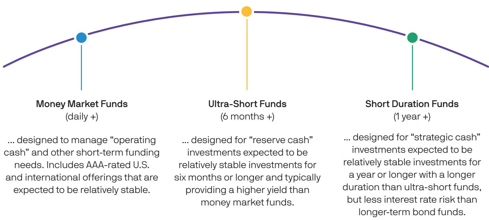

> **AI Description:**
> **Source:** `assets/_page_4_Figure_0.jpg`
> 
> **Generated:** 2026-05-17 18:51:15
> 
> ---
> 
> The image contains a diagram with three categories of investment funds: Money Market Funds, Ultra-Short Funds, and Short Duration Funds. Each category is represented by a point on a curved line, with the Money Market Funds at the left, the Ultra-Short Funds in the middle, and the Short Duration Funds at the right. The diagram visually represents the progression of investment duration and yield, with the Money Market Funds being the shortest and most stable, and the Short Duration Funds being the longest and providing a higher yield. The text below each category provides a brief description of the purpose and characteristics of each type of fund.

## Separately Managed Accounts

provide direct ownership of securities and can be customized to specific client needs and investment parameters. Available through J.P. Morgan Asset Management only.

## Availability

Products subject to availability in your jurisdiction. Please contact your J.P. Morgan representative for available products.

## Simple, intuitive user interface

MORGAN MONEY’s enhanced design provides you with a simple, aggregated view of your entire company’s holdings on one screen. Pre-trade compliance checks allow you to avoid investing more than your investment policy concentration limits through soft-blocks. So, before you even place a trade, you can see expected fund concentrations.

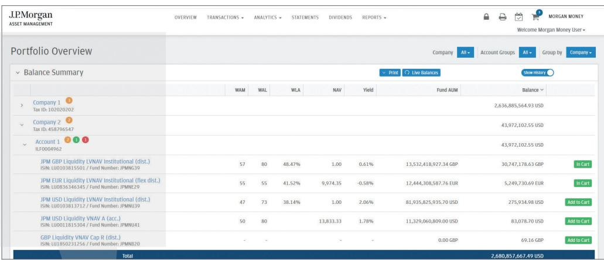

> **AI Description:**
> **Source:** `assets/_page_5_Figure_0.jpg`
> 
> **Generated:** 2026-05-17 18:50:26
> 
> ---
> 
> The image contains a portfolio overview from J.P. Morgan Asset Management. It displays a balance summary for a company and its accounts, including various funds with their respective values in different currencies (USD, GBP, EUR). The visualization includes columns for WAM, WAL, WEA, NAV, Yield, Fund AUM, and Balance. Notable features include the ability to add funds to a cart and the total balance at the bottom of the table. The layout is structured with a header menu and filters for company, account groups, and group by options.

The portfolio overview screen offers a firmwide view of money market fund and separately managed account balances, giving you a high level overview of risk exposures, transaction history and upcoming dividend dates — all on one easy-to-understand dashboard.

Color-coded trade indicators appear as you begin entering trades, clearly displaying transactions awaiting final submission for execution or approval. Green for purchases, red for redemptions and orange for total transaction count.

## Trading capabilities

MORGAN MONEY simplifies trading across multiple fund providers and currencies from almost anywhere in the tool. The platform also has the ability to combine wires and trade tickets across multiple accounts.

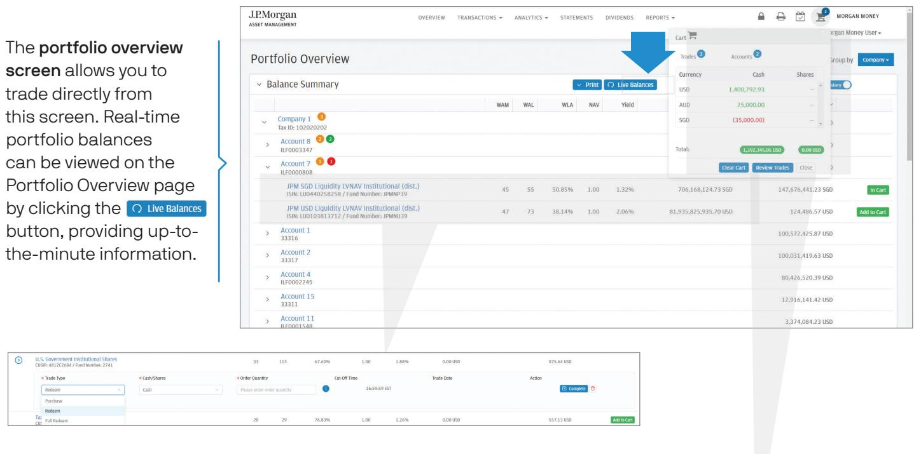

> **AI Description:**
> **Source:** `assets/_page_6_Figure_0.jpg`
> 
> **Generated:** 2026-05-17 18:47:42
> 
> ---
> 
> The image contains a screenshot of a portfolio management interface from J.P. Morgan Asset Management. It displays a portfolio overview with various financial accounts and their balances. The interface includes a section for real-time portfolio balances, with a button labeled "Live Balances" that allows users to view up-to-the-minute information. The screen also shows a "Cart" section with currency balances (USD, AUD, SGD) and options to clear the cart or review trades. The interface is designed for trading and managing investments directly from the screen.

The patent-pending shopping cart allows you to create and save trades for future execution. Your cart will retain your trades as long as you are logged in to the platform and can be edited at any time. With a built-in aggregation tool, you can see what is in your queue before you execute trades.

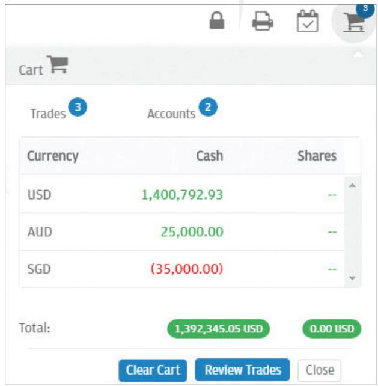

> **AI Description:**
> **Source:** `assets/_page_6_Figure_1.jpg`
> 
> **Generated:** 2026-05-17 18:47:57
> 
> ---
> 
> The image is a screenshot of a financial trading platform interface. It displays a summary of currency balances and trade information. The key elements include:
> 
> 1. **Currency Balances**: The image shows balances in USD, AUD, and SGD. The USD balance is $1,400,792.93, the AUD balance is $25,000.00, and the SGD balance is -$35,000.00. The total balance in USD is $1,392,345.05.
> 
> 2. **Trade Summary**: The interface indicates there are 3 trades and 2 accounts. The trades and accounts are not detailed further in the image.
> 
> 3. **Buttons**: There are buttons labeled "Clear Cart," "Review Trades," and "Close," suggesting actions the user can take with their trading cart.
> 
> The image is primarily text-based with some numerical data and button labels, but it also includes a visual representation of the trading platform's layout and functionality.

# Trading capabilities continued

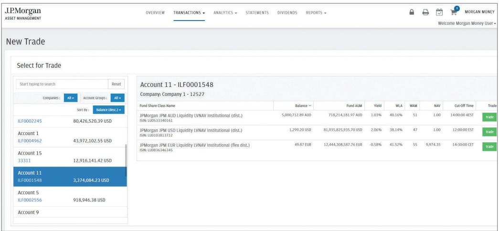

> **AI Description:**
> **Source:** `assets/_page_7_Figure_0.jpg`
> 
> **Generated:** 2026-05-17 18:49:19
> 
> ---
> 
> The image contains a user interface from J.P. Morgan Asset Management, specifically the "New Trade" section. It displays a list of accounts with their respective balances and fund share class names. The interface includes filters for sorting accounts by balance and selecting specific accounts for trading. The main focus is on account 11, with a balance of 3,374,084.23 USD. The interface also shows details of fund share classes, including balance, fund AUM, yield, WLA, WAM, NAV, and cut-off times. The layout is structured with a navigation bar at the top and a table on the right side, providing a clear view of account and fund information.

The trade screen allows you to easily search for an account and execute trades for any entitled position across your entire portfolio — all from one screen.

Bulk trading allows you to export your set of entitlements with the click of a button and trade across all of your accounts by importing your trades. Entitlement validation, pre-trade checks and built-in reconciliation allow for convenient and safe trading.

## Multiple settlement options

In addition to the intuitive trading approach offered via the platform, J.P. Morgan Asset Management is committed to providing cutting-edge technology that allows for connectivity to various systems, allowing you to trade in a way that is most convenient for you. MORGAN MONEY is designed to improve efficiency without sacrificing quality or cybersecurity.

SWIFT: We support SWIFT messaging, allowing you to trade through the front end of the tool or through the SWIFT network and maintain a trade audit history for up to two years — all from one screen.

Direct Debit: Payment security and efficiency are critical to cash management. As such, you can take advantage of our direct debit capability. Through secure electronic messaging and identity verification, your purchases can be settled automatically when you place your trades via the platform.

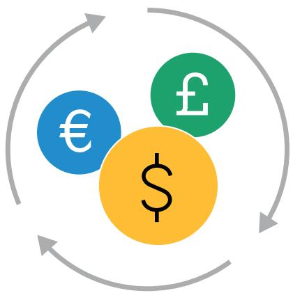

> **AI Description:**
> **Source:** `assets/_page_7_Figure_2.jpg`
> 
> **Generated:** 2026-05-17 18:48:19
> 
> ---
> 
> The image is a diagram illustrating a currency exchange or conversion process. It features three circular symbols representing different currencies: the euro (€), the pound sterling (£), and the US dollar ($). These symbols are interconnected with arrows, suggesting a cycle or exchange process between these currencies. The diagram visually represents the concept of currency exchange or conversion, emphasizing the interconnectedness and flow of these currencies.

## Analytics

MORGAN MONEY offers robust risk and analytics tools, allowing you to take a deeper look into your exposures, understand how trades might impact your portfolio and compare funds available on the platform.

## Risk analytics display

A granular risk analytics tool — built within a stem-and-leaf series of graphs — allows you to analyze exposures by instrument type, issuer, maturity, country and rating, right down to the individual holding level. You can filter at the account, company or full entity level.

On the risk analytics screen, you can also utilize our unique drilldown feature to create views across multiple factors. Each filter or selection on a drilldown is applied to all subsets below, allowing you to adjust your view to understand specific country, issuer, maturity or rating exposures. All holdings information is exportable at a CUSIP level, providing further granularity and transparency on what you actually hold.

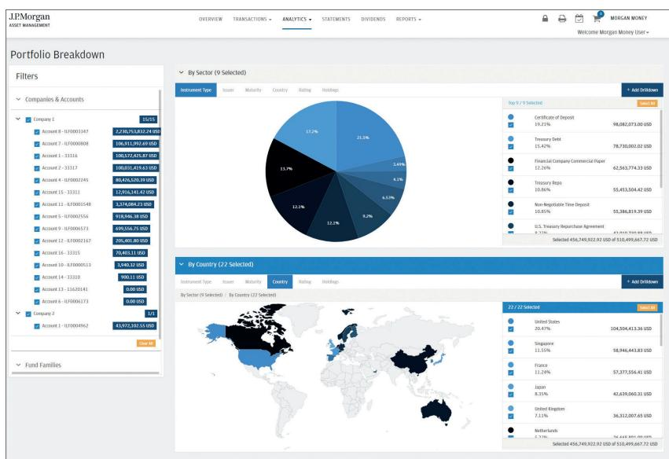

> **AI Description:**
> **Source:** `assets/_page_8_Figure_0.jpg`
> 
> **Generated:** 2026-05-17 18:49:47
> 
> ---
> 
> The image contains a dashboard from J.P. Morgan Asset Management, displaying a portfolio breakdown. It includes a pie chart showing the distribution of assets by sector, with percentages and corresponding dollar amounts for each category. Below the pie chart, there is a world map with country labels and percentages, indicating the geographical distribution of the portfolio. The dashboard also features a list of companies and accounts on the left side, with account balances and identifiers. The top of the dashboard has navigation tabs for overview, transactions, analytics, statements, dividends, and reports.

# Analytics continued

## What-if analysis

This function allows you to model the potential impact of a trade — whether a purchase or redemption — and see how it might affect exposures at an account, company or full relationship level.

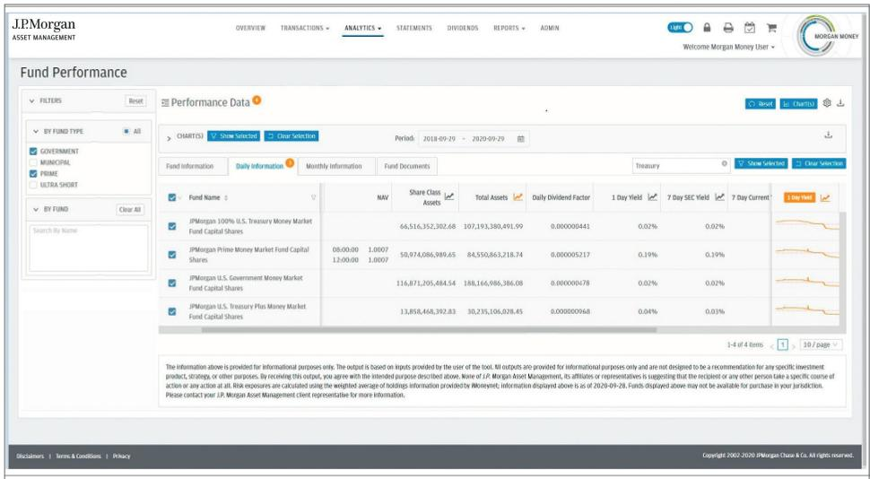

> **AI Description:**
> **Source:** `assets/_page_9_Figure_0.jpg`
> 
> **Generated:** 2026-05-17 18:49:34
> 
> ---
> 
> The image contains a detailed financial dashboard from J.P. Morgan Asset Management. It features a table with performance data for various fund types, including government, municipal, prime, and ultra short funds. The table includes columns for Fund Name, NAV, Share Class Assets, Total Assets, Daily Dividend Factor, 1 Day Yield, 7 Day SEC Yield, and 7 Day Current Yield. There are also line graphs showing trends for the selected funds. The dashboard allows users to filter funds by type and view daily, monthly, and fund document information. The layout is structured with navigation tabs at the top and filtering options on the left side.

## Fund Performance

The fund performance tool allows you to compare funds across commonly-used parameters including yield, performance, fund ratings and risk characteristics. Information is displayed across all funds available through the platform, whether entitled to your account or not. Within the fund performance tool, you also have the ability to compare funds side-by-side through plotting funds in a line graph.

## Reporting

MORGAN MONEY provides a variety of reporting capabilities, including:

Downloading custom, real-time reports. Reports can be customized to your preferences, covering transaction activity, balances and account performance. Risk analytics allows for customizable, exportable information that provides a more detailed view into fund exposures.

Historical reporting. Audit trails are available with up to two years of history including time stamps (across each step of the trade), input and validation information.

Export statements, trade history, confirmations and risk analytics information into PDF, Excel or CSV files for your convenience.

Schedule reports on a daily, weekly, monthly or quarterly basis and have them automatically generated and sent to you via email.

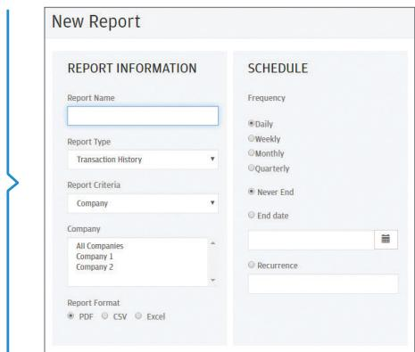

> **AI Description:**
> **Source:** `assets/_page_10_Figure_0.jpg`
> 
> **Generated:** 2026-05-17 18:50:34
> 
> ---
> 
> The image contains a user interface for creating a new report. It includes two main sections: "REPORT INFORMATION" and "SCHEDULE". The "REPORT INFORMATION" section allows users to input the report name, select the report type (Transaction History), specify the report criteria (Company), and choose the company from a dropdown list. The "SCHEDULE" section enables users to set the frequency of the report (Daily, Weekly, Monthly, Quarterly, Never End, End date, Recurrence) and select the report format (PDF, CSV, Excel). The interface is designed for creating and scheduling reports with various parameters.

Confirmations

Real-time confirmations are available directly from the transfer agent and fund providers, retrievable in the system and exportable in Excel or PDF.

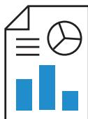

> **AI Description:**
> **Source:** `assets/_page_10_Figure_2.jpg`
> 
> **Generated:** 2026-05-17 18:51:20
> 
> ---
> 
> The image contains a bar chart with three blue bars of varying heights. The chart appears to represent some form of data comparison, with the tallest bar being the highest and the shortest bar being the lowest. The chart is accompanied by a pie chart in the top right corner, which likely represents a different set of data or a breakdown of the total represented by the bar chart. The image also includes a document icon in the top left corner, suggesting that this chart is part of a document or report.

## Statements

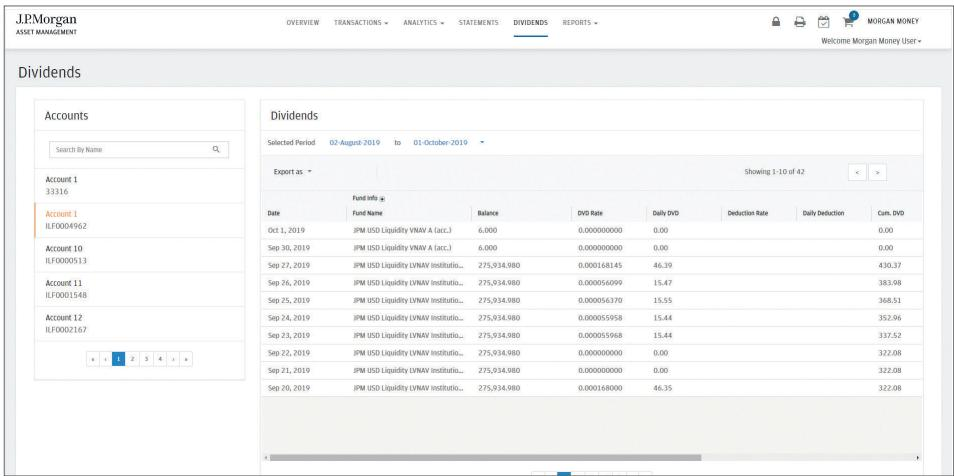

> **AI Description:**
> **Source:** `assets/_page_10_Figure_3.jpg`
> 
> **Generated:** 2026-05-17 18:50:50
> 
> ---
> 
> The image contains a table of dividends information from J.P. Morgan Asset Management. The table is titled "Dividends" and includes columns for Date, Fund Name, Balance, DVG Rate, Daily DVG, Deduction Rate, Daily Deduction, and Cum. DVG. The data is organized by date, showing transactions from August 2019 to October 2019. The table is part of a larger interface that includes tabs for Overview, Transactions, Analytics, Statements, Dividends, and Reports. The interface also displays account information on the left side, with options to search by name and view different accounts. The interface is designed for a Morgan Money user, as indicated at the top right corner.

You can retrieve historical monthly account statements providing income accrual and balance information (going back two years) for all of your investments.

## Dividends

Daily, monthly and total accrual calculations are available with export functionality.

# End-to-end compliance controls

MORGAN MONEY provides end-to-end compliance checks based on a flexible set of guidelines that may be set up as soft-blocks, allowing you to validate that you are staying within your investment guidelines.

Customized access levels: The platform allows for a number of access controls, including user-level entitlements for companies, accounts, trading and approval capabilities.

IPS checks: Admins and super-users can create custom compliance monitoring by establishing exposure limits aligned with the parameters within your investment policy statement. You’ll receive soft-warnings when these limits have been breached.

Notification for policy guideline breaches: At the end of each day, you can receive investment guideline monitoring reports by email to let you know where you stand in relation to your self-generated IPS checks.

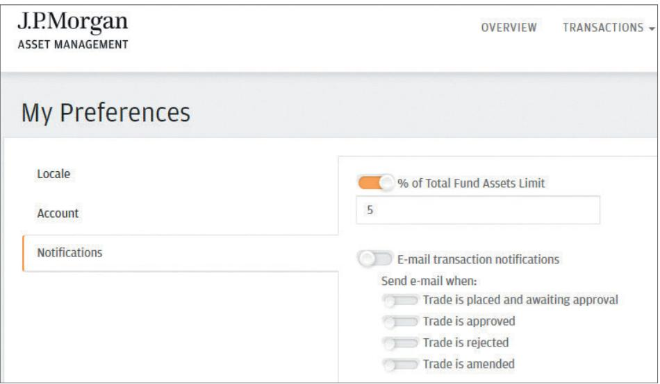

> **AI Description:**
> **Source:** `assets/_page_11_Figure_0.jpg`
> 
> **Generated:** 2026-05-17 18:50:08
> 
> ---
> 
> The image contains a user interface from J.P. Morgan Asset Management, specifically the "My Preferences" section. It includes a toggle switch and input field for setting a limit on the percentage of total fund assets, currently set to 5%. Below this, there are toggle switches for enabling email transaction notifications, with options to send emails when a trade is placed and awaiting approval, approved, rejected, or amended. The interface is clean and organized, with clear labels for each section and option.

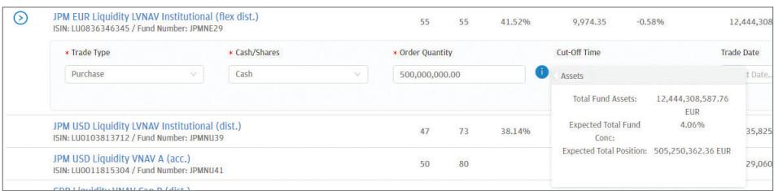

> **AI Description:**
> **Source:** `assets/_page_11_Figure_1.jpg`
> 
> **Generated:** 2026-05-17 18:49:55
> 
> ---
> 
> The image contains a table with financial data related to JPM EUR Liquidity LVNAV Institutional (flex dist.) and other related funds. The table includes columns for Trade Type, Cash/Shares, Order Quantity, Cut-off Time, and Trade Date. It also provides information about Total Fund Assets, Expected Total Fund, and Expected Total Position in EUR. The data is presented in a structured format, with numerical values and percentages indicating various financial metrics. The table is designed to provide a snapshot of the financial status and performance of the funds mentioned.

## Trade notifications

You may choose to receive notifications at each stage over the trade lifecycle.

## Concentration limits

You have the ability to set your firm’s specific internal concentration limits and receive real-time warnings when a proposed trade would put you over the limit. This would also be included in end-of-day IPS emails.

# Flexible digital integration

MORGAN MONEY is built to facilitate your day-to-day operations by integrating with your existing digital infrastructure in a number of ways. This platform is designed to easily connect to client-side tools and systems, including treasury workstations, trust platforms and enterprise resource planning tools. With federated login capabilities, access to one of our integrated partner programs will allow you access to the platform without ever having to leave your system.

In addition to our partner programs, your systems can connect directly to MORGAN MONEY to facilitate end-ofday and intraday reporting of balances and dividends, monthly statements and full trading capabilities.

(Secure) File Transfer Protocol (SFTP/FTP): The platform allows you to place trades in all entitled funds through file transfer across multiple accounts and multiple settlement instructions without sacrificing the aggregation capabilities of the platform.

API: The platform allows you to place trades through API integration across multiple accounts and settlement instructions. Further, you will be able to utilize the front-end aggregation tools, retrieve statements and access historical information.

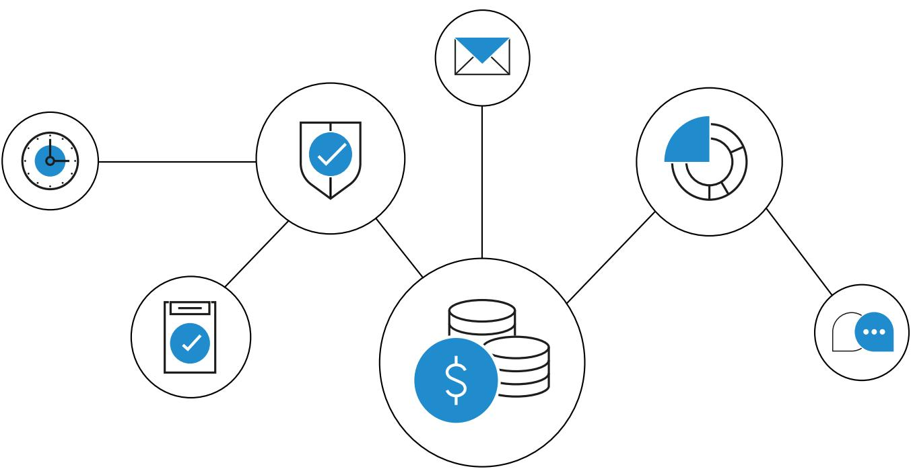

> **AI Description:**
> **Source:** `assets/_page_12_Figure_0.jpg`
> 
> **Generated:** 2026-05-17 18:47:13
> 
> ---
> 
> The image is a diagram with various circular icons connected by lines, representing different aspects of a system or process. The icons include a clock, a shield with a checkmark, an envelope, a pie chart, a stack of coins with a dollar sign, and a speech bubble with a checkmark. These icons are likely related to time management, security, communication, data analysis, finance, and user feedback or approval. The connections between the icons suggest interdependencies or relationships between these elements within the system being depicted.

# Self-service administration

MORGAN MONEY puts user maintenance back where it needs to be — into the hands of our clients. To facilitate user entitlement management and save time, the self-service administration tool allows client-side resources to manage fund permissions at the user level.

Make entitlement changes to multiple users all at once, saving you time and energy when adding new companies, accounts and funds to your profiles.

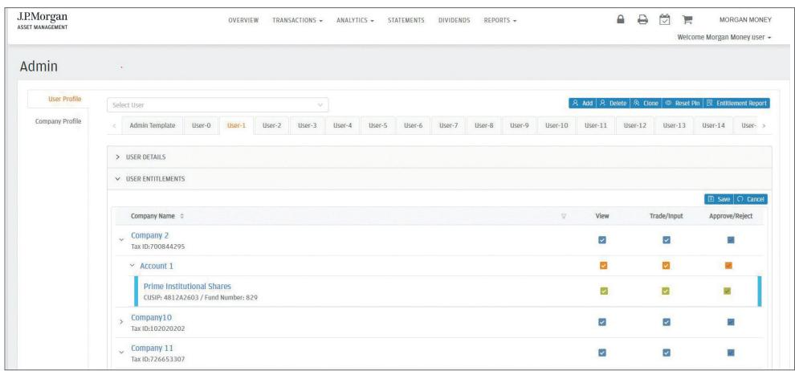

> **AI Description:**
> **Source:** `assets/_page_13_Figure_0.jpg`
> 
> **Generated:** 2026-05-17 18:48:32
> 
> ---
> 
> The image contains a user interface from J.P. Morgan Asset Management, specifically the "Admin" section. It displays a user profile management system with tabs for different users, such as "User-0" to "User-14". The main section shows "USER DETAILS" and "USER ENTITLEMENTS" for a selected user, "User-1". It lists company names, tax IDs, and accounts with various entitlements such as "View", "Trade/Input", and "Approve/Reject". The interface includes buttons for actions like "Add", "Delete", "Clone", "Reset File", and "Entitlement Report". The layout is structured with a navigation bar at the top and a table-like structure for user and company details.

Client-side administrators are determined by you, and you have the option to set up a maker-checker process that would require approval for any changes made.

Self-service user creation and removal: When you have a new joiner or someone leaves your team, designated client-side administrators can add or remove users quickly, with an optional built-in maker/checker workflow.

Reset PIN allows a client-side administrator to reset a user’s PIN, keeping security information in-house.

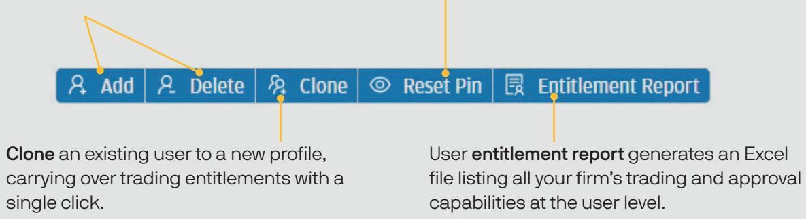

> **AI Description:**
> **Source:** `assets/_page_13_Figure_1.jpg`
> 
> **Generated:** 2026-05-17 18:48:13
> 
> ---
> 
> The image contains a visual representation of a user interface with buttons labeled "Add," "Delete," "Clone," "Reset Pin," and "Entitlement Report." Each button is accompanied by a brief description explaining its function. The "Clone" button allows users to copy an existing user profile with trading entitlements, while the "Entitlement Report" button generates an Excel file listing trading and approval capabilities at the user level. The image is a diagram illustrating the functionalities available in a user management system.

Client-side administrators have the ability to create approval levels at a company, account or position level, allowing you to adjust and maintain optional dual-entry security level requirements, or set up levels where a third approval is necessary.

# Audit made easier

## Transaction history

The platform’s transaction history view provides you with up to two years of past transactions. All information is available for export to Excel or PDF and contains critical audit details, including inputer and approver fields. History can be sorted on almost any dimension and can be filtered at the account, company or account group level.

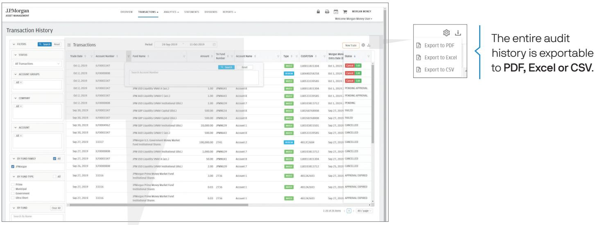

> **AI Description:**
> **Source:** `assets/_page_14_Figure_0.jpg`
> 
> **Generated:** 2026-05-17 18:48:52
> 
> ---
> 
> The image contains a screenshot of a transaction history interface from J.P. Morgan Asset Management. It displays a table of transactions with columns for Trade Date, Account Number, Fund Name, Amount, Type, CUSIP/SIN, Morgan Money Entry Date, and Status. The interface allows users to filter transactions by various criteria such as Status, Account Groups, Company, Account, Fund Family, and Fund Type. The image also includes a sidebar with options to export the entire audit history to PDF, Excel, or CSV. The visual elements include a table with transaction data and a sidebar with filtering options, making it a useful visual for financial data analysis.

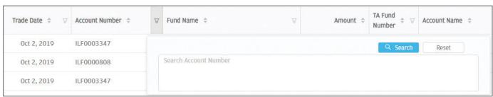

> **AI Description:**
> **Source:** `assets/_page_14_Figure_1.jpg`
> 
> **Generated:** 2026-05-17 18:48:04
> 
> ---
> 
> The image contains a table with a header row and several data rows. The table includes columns for Trade Date, Account Number, Fund Name, Amount, TA Fund Number, and Account Name. The data rows show repeated entries for the Trade Date and Account Number, with the Account Number "ILF0003347" appearing twice. The Fund Name and Amount columns are empty, and the TA Fund Number and Account Name columns are also empty. There is a search bar and a reset button at the top right of the table.

Convenient filter functionality is built in to the transaction history widget at a top level, providing you with the capability to filter down your account history across a number of factors.

Audit history, or trade details, are available for each trade, providing stepby-step details across the life of a trade, including who performed what step.

You can also filter or sort each column, reorder columns and turn on/off display information. After you log out, your preferred views will be saved when you next visit the platform.

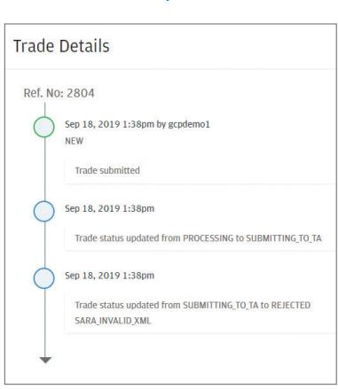

> **AI Description:**
> **Source:** `assets/_page_14_Figure_2.jpg`
> 
> **Generated:** 2026-05-17 18:49:00
> 
> ---
> 
> The image contains a timeline of trade status updates for a trade with reference number 2804. The timeline includes three key points:
> 
> 1. The trade was submitted on September 18, 2019, at 1:38 PM by the user "gcpdemo1."
> 2. The trade status was updated from "PROCESSING" to "SUBMITTING_TO_TA" at the same time.
> 3. The trade status was then updated from "SUBMITTING_TO_TA" to "REJECTED" due to an "SARA_INVALID_XML" error.
> 
> The timeline is represented by a sequence of circles connected by arrows, indicating the progression of the trade status updates.

Please contact your J.P. Morgan Asset Management Global Liquidity or Client Services Representative

Americas (800) 766 7722

EMEA (352) 3410 3636

Asia Pacific (852) 2800 2792

jpmgloballiquidity.com

The information in this brochure is intended as an example only and should not be construed as investment advice. The products mentioned are for illustrative purposes only and may not be available for investments in your jurisdiction.

NOT FOR RETAIL DISTRIBUTION: This communication has been prepared exclusively for institutional, wholesale, professional clients and qualified investors only, as defined by local laws and regulations.

This is a marketing communication. J.P. Morgan Asset Management is the brand name for the asset management business of JPMorgan Chase & Co. and its affiliates worldwide. To the extent permitted by applicable law, we may record telephone calls and monitor electronic communications to comply with our legal and regulatory obligations and internal policies. Personal data will be collected, stored and processed by J.P. Morgan Asset Management in accordance with our privacy policies at https://am.jpmorgan.com/global/privacy. This communication is issued by the following entities: In the United States, by J.P. Morgan Investment Management Inc. or J.P. Morgan Alternative Asset Management, Inc., both regulated by the Securities and Exchange Commission; in Latin America, for intended recipients’ use only, by local J.P. Morgan entities, as the case may be; in Canada, for institutional clients’ use only, by JPMorgan Asset Management (Canada) Inc., which is a registered Portfolio Manager and Exempt Market Dealer in all Canadian provinces and territories except the Yukon and is also registered as an Investment Fund Manager in British Columbia, Ontario, Quebec and Newfoundland and Labrador. In the United Kingdom, by JPMorgan Asset Management (UK) Limited, which is authorized and regulated by the Financial Conduct Authority; in other European jurisdictions, by JPMorgan Asset Management (Europe) S.à r.l. In Asia Pacific (“APAC”), by the following issuing entities and in the respective jurisdictions in which they are primarily regulated: JPMorgan Asset Management (Asia Pacific) Limited, or JPMorgan Funds (Asia) Limited, or JPMorgan Asset Management Real Assets (Asia) Limited, each of which is regulated by the Securities and Futures Commission of Hong Kong; JPMorgan Asset Management (Singapore) Limited (Co. Reg. No. 197601586K), this advertisement or publication has not been reviewed by the Monetary Authority of Singapore; JPMorgan Asset Management (Taiwan) Limited; JPMorgan Asset Management (Japan) Limited, which is a member of the Investment Trusts Association, Japan, the Japan Investment Advisers Association, Type II Financial Instruments Firms Association and the Japan Securities Dealers Association and is regulated by the Financial Services Agency (registration number “Kanto Local Finance Bureau (Financial Instruments Firm) No. 330”); in Australia, to wholesale clients only as defined in section 761A and 761G of the Corporations Act 2001 (Commonwealth), by JPMorgan Asset Management (Australia) Limited (ABN 55143832080) (AFSL 376919).

For U.S. only: If you are a person with a disability and need additional support in viewing the material, please call us at 1-800-343-1113 for assistance.

Copyright 2024 JPMorgan Chase & Co. All rights reserved.

JPM54609 | 05/24 | 0903c02a826df8f8