

## A warm welcome to Bergen!

As a European City of Culture, World Heritage City and UNESCO City of Gastronomy, Bergen offers world-class experiences and culture. Bergen is the heart of the Norwegian fjords, and it gives you an ideal combination of nature, culture and cosmopolitan experiences. All year round.

## index:

# The people who live here love their city – and they love visitors. Everyone is welcome! Our slogan is that a good city to live in is a good city to visit.

That is why we encourage everyone who visits Bergen and the nearby areas to help us take care of the city. We hope that our visitors will take care of the natural environment, world heritage and local environment during their visit. Here are seven guidelines we hope you will follow to take care of the city between the seven mountains:

## 1 Show consideration for others

Show consideration for both the locals and other visitors. Show consideration for the people working in shops, museums, restaurants and attractions. Bus stops, light rail stops and the railway station are no-smoking areas. If you visit mountains or fjords, remember that nature’s silence is part of the experience. It is customary to greet the people we meet along the walking paths in Norway.

## 2 Use the waste bins and public toilets

Please do not leave behind empty containers and waste – use public waste bins. Familiarise yourself with the location of public toilets and use these.

## 3 Respect private property

Remember that the beautiful houses you see in Bergen are the homes of the people who live here, and therefore private property. Please show consideration for those living and working in the city, and respect their right to a private life. Remember that the World Heritage Site Bryggen is private property that is listed, and you must be extra mindful in order to preserve the site.

## 4 Have respect for the forces of nature

Nature is beautiful, but unpredictable. The weather can change quickly. Remember that your mobile telephone might not have a signal in certain natural surroundings, even those that are close to the city. Always take the marked paths. If you are not used to walking in untamed nature, we recommend a local guide. Ask the Tourist Information for advice. Always check the weather forecast in advance if you plan to enjoy the great outdoors www.yr.no. Always remember to bring extra clothes and additional food and drink, even on short walks. Remember sturdy footwear.

# Show us that you also care by following these seven points

## 5 Do not leave any traces in nature

You will not find waste bins or toilets in natural areas. Remember to go to the toilet before setting off on a hike. Do not leave waste behind – please take your waste back home with you. If there are no facilities where you are, please take used toilet paper with you in a bag, and do not leave it behind in nature. Use existing campsites and make sure there is no risk of fire in the area. Lighting a fire is prohibited between 15 April and 15 September.

## 6 Respect the wildlife

Show consideration for the wildlife, particularly in spring when new life abounds the animal kingdom. Always keep your distance when encountering wild animals. Remember that it is illegal to remove eggs from nests. Always walk your dog on a lead. This is mandatory yearround in Bergen and in the city mountains.

## 7 Photography and drones

You can take pictures almost anywhere in Bergen. Some places – mainly in art galleries and museums – may have signs indicating that taking pictures is not allowed. Always remember to ask people whether you may take a picture of them.

Taking pictures of children in schools and kindergartens is not allowed, unless you have a special agreement to do so. Please note: Special rules apply to the use of drones, which you must familiarise yourself with. You can read about them on The Civil Aviation Authority of Norway’s website.

## We care about our city!

Show us that you also care by following these seven points.

Enjoy Bergen and its surroundings and welcome back!

Kind regards

Visit Bergen Anders Nyland Director of Tourism

# In a central location at the Fish Market, you will find the Bergen region’s visitor centre for culture, experiences and tourism – Bergen Tourist information Centre.

Here, you will find exhibitions and presentations of things to see and do in Bergen and Fjord Norway. In addition to free help and advice, you can also buy a range of products and services, and exchange the most common types of currency.

## Tickets for sightseeing, fjord tours and concerts

We can recommend what you should see and do while you’re in Bergen and the fjord tours that best suit your wishes. We sell tickets for all the well-known round trips and fjord tours that depart from Bergen. Many tours start right outside the Tourist Information.

## The Bergen Card

Get free offers and good discounts on cultural events and experiences with the Bergen Card. More information on pages 16–17. Buy your Bergen Card at the Tourist Information. Look for (BK LOGO) in the guide.

## Free brochures

We have all the brochures you need for Bergen and Fjord Norway as well as exhibitions that will guide and inspire you on the rest of your trip.

## Currency exchange

We have the best opening hours in the city for currency exchange. You can exchange the most common types of currency into Norwegian kroner.

## Book online

Our website is always up-to-date and guides you through what is available. Book activities etc. online at visitBergen.com

• Fjord tours

• Accommodation

• Activities

• The Bergen Card

Bergen Tourist Information Centre   
Strandkaien 3,   
NO-5013 Bergen, Norway   
(+47) 55 55 20 00   
info@visitBergen.com   
www.visitBergen.com

## Chapter 1.3

## the Bergen Card Culture and experiences

Buy the Bergen Card online on visitBergen.com

## The practical and reasonable way to explore Bergen, City of Culture.

With the Bergen Card in your pocket, you travel free on the Bergen Light Rail and buses in the city and the region. You also get free or discounted admission to museums and attractions, many establishe cultural events, various sightseeing tours, restaurants, the airport bus and parking. The Bergen Card gives you admission to attractions in the city centre as well as other attractions in the region.

Bergen has many museums, some with unique art collections and others that show the breadth of the city’s historical heritage. Take a trip up to Mount Fløyen and enjoy the view of the city, the fjord and the ocean. See seals, penguins, crocodiles and snakes at close range at Bergen Aquarium, or explore the world of science and technology with your family at the VilVite Science Centre.

## Free travel on:

• Bergen Light Rail – between the city centre and Bergen Airport Flesland

• Scheduled bus services in Bergen and Hordaland county (Skyss)

• Boat – Standkaiterminalen to

Kleppestø (Askøy)

b in the guide = free / discounted price with the Bergen Card

## Buy the Bergen Card here

• Bergen Tourist Information Centre

• Online at: visitBergen.com/Bergenskortet

• Deli de Luca, Bergen Airport Flesland

• Bratland Camping

• Lone Camping

• Radisson Blu Royal Hotel

For more information about the advantages of the Bergen Card, see visitBergen.com/Bergenskortet.

## Important information about use of the card

For the Bergen Card to be valid, the sales outlet must enter a date and time on the card. The card is valid until the date/time entered on it and for a specified number of hours. The Bergen Card is personal. Always take it with you and show it without being asked. It is checked at places that take the Bergen Card. See what you save by using the Bergen Card when visiting the city’s many attractions and sights.

Scan and book

# In Bergen, we endeavour every day to create more sustainable travel experiences for all our guests.

Green Travel – the symbol that makes it easier to have an eco-friendly holiday Did you know that the Bergen region has one of the highest proportions of ecofriendly hotels in the world? There are in fact almost 100 eco-friendly tourism enterprises in the region! Ecolabelling is recognition of an enterprise’s targeted and long-term work to reduce their negative footprint. When you choose an ecolabel tourism enterprise, you can rest assured that it has good procedures in place for waste disposal, energy consumption and transport.

Look for the Green Travel symbol in the Bergen Guide to find ecolabel tourism enterprises. Symbols are intended to make it easier for you as a guest to find ecolabel enterprises. The following schemes are included under the Green Travel label: Norwegian Ecotourism, Nordic Swan Ecolabel, Eco-Lighthouse, Green Key, ISO 14001 and Blue Flag.

## Sustainable tourism

By being a world leader in green transport, by offering our guests local fare and produce and by contributing to increased value creation and making the region a more attractive place to live, we have many advantages that make the Bergen region a greener destination.

And together with our guests, the tourism industry, our municipalities and partners, we work hard to increase sustainability in the industry. Among other things, we are now working on qualifying Bergen for Innovation Norway’s Sustainable Destination Label – a stamp of quality among Norwegian destinations.

Read about how you as a guest can help to take care of Bergen on page 10-13 of this guide and feel free to check out visitbergen.com to learn more about our work on sustainable tourism.

Green Travel

# The people of Bergen are proud of their city and its traditions. The city offers a wide range of attractions, museums and sightseeing options.

There are more than 60 different attractions, museums and galleries in Bergen. Among others, you can visit the Hanseatic wharf Bryggen, Bergen Aquarium, the Fløibanen funicular and the Fish Market. Bergen is also a great city for children, with lots of exciting and educational activities.

The Fish Market has delicacies to tempt everyone, and you can spend hours among fish, penguins and sea lions at Bergen Aquarium. The whole family can explore the world of science and technology at the VilVite Science Centre. If you take the Fløibanen funicular to the top of Mount Fløyen, you can have fun at the playground, play in the Trollskogen forest, walk on exciting nature trails or paddle a canoe on Skomakerdiket lake. You can ‘float’ to the top of Bergen’s highest mountain in the Ulriken 643 cable car. From the top, you can enjoy magnificent views of Bergen and the surrounding area – the sea, the islands, fjords and mountains.

Bergen is also perfect for walks as the city centre is very compact, but rich in history and culture at the same time. If you arrive in Bergen as part of a group or would like your own guide, you can book a guide from one of our guide companies, who can show you or your group around Bryggen, the city centre or wherever you wish.

## The Edvard Grieg Museum at

Troldhaugen is a popular museum for visitors from far and wide. You can visit Grieg’s home, his composer’s cabin and his burial site. Daily lunch concerts are also held in the Troldsalen concert hall during summer.

There are a number of museums at Bryggen, including Bryggens Museum, the Hanseatic Museum & Schøtstuene, Håkon’s Hall, the Rosenkrantz Tower, St Mary’s Church and the Theta Museum. Enjoy a historical stroll through KODE’s extensive collection of art and design located in four buildings in Bergen city centre.

The open-air Old Bergen Museum is a reconstructed town of around 50 wooden houses and buildings dating from the 18th, 19th and 20th centuries.

The Museum of Natural History at the University Museum of Bergen has also finally reopened following six years of   
renovation. The museum has, among other things, sixteen new exhibitions.   
Many other museums are also found in and around Bergen.   
Remember that the Bergen Card gives you free or discounted admission to most museums and attractions in Bergen and the region!

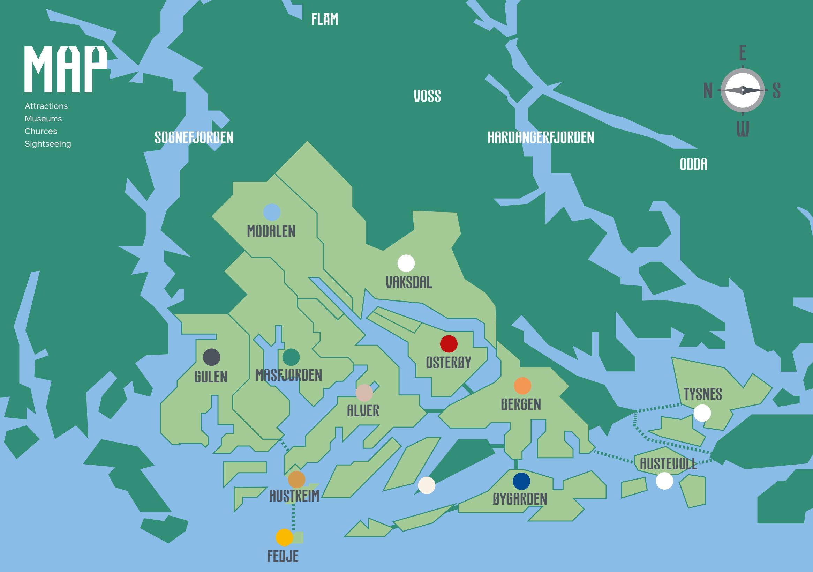

> **AI Description:**
> **Source:** `assets/_page_7_Figure_0.jpg`
> 
> **Generated:** 2026-05-17 19:08:38
> 
> ---
> 
> The image is a map with various geographical and location labels. It includes names of locations such as Gulen, Masfjorden, Alver, Osterøy, Bergen, Austevoll, and Fedje. The map also highlights areas such as Modalen, Vaksdal, and Voss, with a compass indicating cardinal directions. The map is color-coded, with different shades of green representing land and blue representing water bodies. The map includes labels for attractions, museums, churches, and sightseeing, suggesting it is a tourist or travel guide map.

## Chapter 2.1 / Attractions

## AdO arena

At AdO arena, you can swim in a 50-metre pool of high international standard, dive in what is al-ready said to be one of the best diving pools in Europe, learn to swim in the training pool or plunge down one of our water slides.

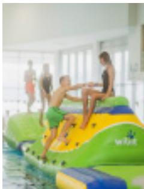

> **AI Description:**
> **Source:** `assets/_page_8_Figure_1.jpg`
> 
> **Generated:** 2026-05-17 19:17:46
> 
> ---
> 
> The image shows a photograph of a group of people on a colorful inflatable water slide. The slide is predominantly green and yellow, with the word "wet" visible on it. The setting appears to be an indoor or covered water park area, as indicated by the background structure and lighting. The individuals on the slide are engaged in play, with one person sitting at the top and another climbing up. The scene conveys a sense of fun and activity.

Lungegårdskaien 40 / NO-5015 / +47 53 03 62 22 / adoarena.no

> **AI Description:**
> **Source:** `assets/_page_8_Figure_2.jpg`
> 
> **Generated:** 2026-05-17 19:18:28
> 
> ---
> 
> The image contains a series of five icons representing different concepts. The icons are:
> 
> 1. A wheelchair, symbolizing accessibility or disability.
> 2. A steaming cup of coffee, representing coffee or hot beverages.
> 3. A shopping cart, indicating shopping or e-commerce.
> 4. A snowflake, signifying winter, cold weather, or snow.
> 5. A letter "B" enclosed in a circle, which could represent a logo or a specific brand or category.
> 
> The icons are arranged in a horizontal line, suggesting they might be part of a menu or a set of options in a user interface.

## BERGEN AQUARIUM

Bergen Aquarium is one of the biggest tourist attractions in Bergen. You can experience fascinating creatures from tropical rainforests, the foreshore, the ocean depths and the Arctic. We have sea lions, penguins, otters, crocodiles and many more animals, and you can see them being fed every day and enjoy a film in our cinema. Café/shop/play area.

Nordnesbakken 4 / NO-5005 / + 47 55 55 71 71 / akvariet.no

> **AI Description:**
> **Source:** `assets/_page_8_Figure_4.jpg`
> 
> **Generated:** 2026-05-17 19:17:03
> 
> ---
> 
> The image contains a series of icons representing different categories. The icons include a wheelchair, a coffee cup, a shopping cart, a snowflake, and a letter 'B'. These icons are likely used to represent various services or categories, such as accessibility, coffee, shopping, winter, and possibly a brand or company logo. The icons are simple and circular, making them easily recognizable.

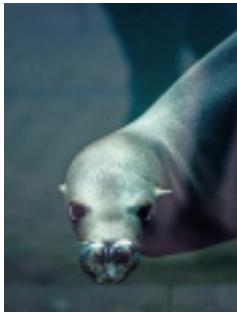

> **AI Description:**
> **Source:** `assets/_page_8_Figure_5.jpg`
> 
> **Generated:** 2026-05-17 19:16:59
> 
> ---
> 
> The image is a close-up photograph of a seal's face. The seal has a light-colored fur, a small, rounded snout, and dark, expressive eyes. The seal's mouth is slightly open, revealing a glimpse of its teeth and tongue. The background is blurred, focusing attention on the seal's face.

## BERGEN PHILHARMONIC ORCHESTRA

Bergen Philharmonic Orchestra has national orchestra status and, as one of the world’s oldest orchestras, can trace its history all the way back to 1765. Edvard Grieg was closely associated with the orchestra. Concerts are held every week during the season from August to May. Streaming services are available at Bergenphilive.no.

Grieghallen, Edvard Griegs Plass 1 / NO-5015 / +47 55 21 62 28 / harmonien.no

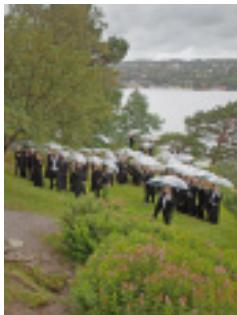

> **AI Description:**
> **Source:** `assets/_page_8_Figure_8.jpg`
> 
> **Generated:** 2026-05-17 19:13:39
> 
> ---
> 
> The image is a photograph showing a group of people dressed in formal attire, likely a choir or a group of performers, walking in a line. They are holding umbrellas, suggesting it might be raining. The background features a scenic view with a body of water and greenery, indicating the setting might be outdoors near a lake or river. The image captures a moment of movement and preparation, possibly before or after a performance or event.

## THE FISH MARKET

The Fish Market in Bergen is the best known and most visited outdoor market in Norway. Situated in the heart of the city, it sells a wide range of seafood delicacies, and also local specialities such as cheese, fruit and vegetables, and cured meat products. Mathallen, an indoor part of the Fish Market, is open all year.

> **AI Description:**
> **Source:** `assets/_page_8_Figure_11.jpg`
> 
> **Generated:** 2026-05-17 19:22:38
> 
> ---
> 
> The image contains a simple icon of a wheelchair, commonly used to represent accessibility or disability-related services. This icon is a standard symbol used in various contexts to denote that a space, facility, or service is accessible to people with disabilities.

Torget / NO-5014 / Manager Margit Fagertveit-Aakre (Urban Environment Agency) Atle Jakobsen (Domstein)

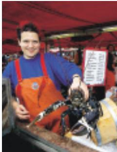

> **AI Description:**
> **Source:** `assets/_page_8_Figure_12.jpg`
> 
> **Generated:** 2026-05-17 19:19:01
> 
> ---
> 
> The image is a photograph of a person wearing an orange apron and a blue shirt, holding a large crab. The person is smiling and appears to be at a market or seafood stall. The background includes a red canopy and some signage, though the text on the sign is not fully legible. The image conveys a sense of seafood freshness and market activity.

Visit Bergen
BergenGuide 2022
Chapter 2.1 Attractions

## FLØIBANEN FUNICULAR

Take the Fløibanen Funicular to the top of Mount Fløyen for spectacular views of the city. On top, there is a restaurant, Fløistuen shop & café, Skomakerstuen café, play areas, goats and a great variety of walks. In summer, you can hire a mountain bike, or paddle a canoe on Skomakerdiket lake. Welcome to the mountains!

Vetrlidsallmenningen 23A / NO-5014 / +47 55 33 68 00 / floyen.no

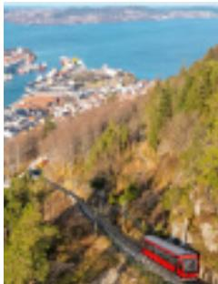

> **AI Description:**
> **Source:** `assets/_page_8_Figure_14.jpg`
> 
> **Generated:** 2026-05-17 19:31:02
> 
> ---
> 
> The image is a photograph of a scenic railway track winding through a mountainous area. The railway appears to be a funicular, as it is elevated and follows a steep incline. In the background, there is a coastal town with numerous buildings and boats docked in the harbor. The landscape is lush with greenery, and the sky is clear, indicating a sunny day. The image captures the beauty of the natural environment and the engineering feat of the railway.

> **AI Description:**
> **Source:** `assets/_page_8_Figure_15.jpg`
> 
> **Generated:** 2026-05-17 19:32:09
> 
> ---
> 
> The image contains a series of icons representing different categories or concepts. The icons are:
> 
> 1. A wheelchair, indicating accessibility or disability-related services.
> 2. A coffee cup, suggesting a coffee shop or beverage-related services.
> 3. A shopping cart, representing retail or e-commerce.
> 4. A snowflake, possibly indicating winter, cold weather, or a seasonal theme.
> 5. A letter "B," which could represent a brand, company logo, or a specific section or category.
> 
> The icons are arranged in a horizontal line, and there is no additional text or data provided with the icons.

## BERGEN CLIMBING PARK, HØYT & LAVT

Get a great rush climbing in the tree tops at Western Norway’s biggest climbing park. A fun and active day on the climbing courses awaits not far from the city centre. Make your way across 120 fun obstacles and more than 20 exhilarating zip-lines. Several levels of difficulty. Suitable for everyone from age 3 to 99. No experience required.

Osvegen 141 / NO-5227 / +47 55 10 20 00 / hoytlavt.no/bergen

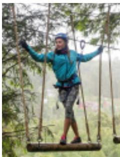

> **AI Description:**
> **Source:** `assets/_page_8_Figure_18.jpg`
> 
> **Generated:** 2026-05-17 19:01:13
> 
> ---
> 
> The image is a photograph of a person participating in an outdoor adventure activity, specifically on a suspended bridge or obstacle course. The individual is wearing a blue jacket, patterned leggings, and a helmet, indicating safety measures for the activity. They are balancing on a wooden plank suspended between two ropes, with their arms outstretched for balance. The background shows a forested area, suggesting the activity is taking place in a natural setting.

> **AI Description:**
> **Source:** `assets/_page_8_Figure_19.jpg`
> 
> **Generated:** 2026-05-17 19:02:40
> 
> ---
> 
> The image contains three circular icons. The first icon represents a wheelchair, indicating accessibility or disability-related content. The second icon features a steaming cup, suggesting a hot beverage such as coffee or tea. The third icon is a snowflake, representing cold weather or winter. These icons are likely part of a set used to convey different themes or categories.

## HØYT UNDER TAKET KOKSTAD

An indoor climbing park with lots of space, where everyone can climb, beginners and experienced climbers alike. At Kokstad, you can climb with ropes, both with and without auto-belay, and you can try bouldering or use the fitness room. Not far from the centre of Bergen. Høyt Under Taket is suitable for EVERYONE!

Kokstadflaten 33 / NO-5257 / +47 468 45 725 / hoytundertaket.no/kokstad/

> **AI Description:**
> **Source:** `assets/_page_8_Figure_22.jpg`
> 
> **Generated:** 2026-05-17 19:06:12
> 
> ---
> 
> The image contains three distinct icons: a wheelchair symbol, a shopping cart, and a snowflake. These icons are commonly used to represent accessibility, e-commerce, and winter or cold weather, respectively. The icons are arranged in a horizontal row.

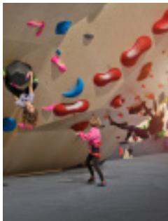

> **AI Description:**
> **Source:** `assets/_page_8_Figure_23.jpg`
> 
> **Generated:** 2026-05-17 19:10:18
> 
> ---
> 
> The image is a photograph of an indoor rock climbing wall. It features a climber in a pink shirt and black pants scaling the wall, which is equipped with various colored holds (red, blue, yellow, and black) of different shapes and sizes. The wall is smooth and appears to be part of a climbing gym, with other climbers and climbing equipment visible in the background. The scene captures the dynamic activity of indoor rock climbing.

## MAGIC ICE BERGEN

A magical fairy-tale world made of ice! Be enchanted by world-class ice sculptures, changing light, sounds and delicious drinks served in glasses made of ice.

An experience out of the ordinary! Open every day, all year, for people of all ages. Group prices available on request.

C. Sundtsgate 50 / NO-5004 / +47 930 08 023 / magicice.no

> **AI Description:**
> **Source:** `assets/_page_8_Figure_25.jpg`
> 
> **Generated:** 2026-05-17 19:02:47
> 
> ---
> 
> The image contains a series of five circular icons, each representing a different concept or category. The icons are as follows:
> 
> 1. A wheelchair symbol, indicating accessibility or disability-related services.
> 2. A coffee cup, suggesting a focus on coffee, tea, or beverages.
> 3. A shopping cart, representing commerce, retail, or shopping.
> 4. A snowflake, likely symbolizing winter, cold weather, or snow-related activities.
> 5. A letter "B," which could represent a brand, company logo, or a specific category.
> 
> The icons are arranged in a horizontal line, and each icon is distinct in its design and color, making it easy to identify the category each icon represents.

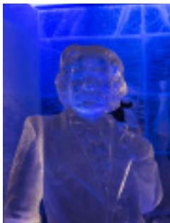

> **AI Description:**
> **Source:** `assets/_page_8_Figure_26.jpg`
> 
> **Generated:** 2026-05-17 18:58:21
> 
> ---
> 
> The image contains a photograph of a person sitting in a chair. The person is wearing a dark-colored outfit and is positioned in front of a blue-lit background that appears to be part of an ice sculpture or a similar structure. The lighting creates a glowing effect around the person's face and upper body. The image does not contain any text or additional visual elements beyond the person and the blue-lit background.

Chapter 2.1 Attractions

## STOREBLÅ AQUACULTURE VISITOR CENTRE

A different kind of experience marked by know-how and action! Storeblå Aquaculture Visitor Centre provides a unique, comprehensive insight into Norwegian aquaculture. Explore and learn more about this industry in our modern exhibition and see salmon up close on a bracing RIB boat trip to a fish farm outside Bergen.

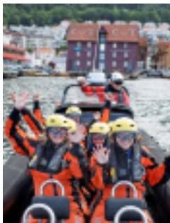

> **AI Description:**
> **Source:** `assets/_page_9_Figure_1.jpg`
> 
> **Generated:** 2026-05-17 19:15:55
> 
> ---
> 
> The image is a photograph of a group of people on a speedboat. They are wearing helmets and life jackets, and the boat is moving on water. The background shows a coastal town with buildings and a harbor. The people are waving and appear to be enjoying the ride.

Sandviksboder 1G / NO-5035 / + 47 53 00 61 90 / storebla.no

> **AI Description:**
> **Source:** `assets/_page_9_Figure_2.jpg`
> 
> **Generated:** 2026-05-17 19:16:50
> 
> ---
> 
> The image contains three circular icons. The first icon on the left is a wheelchair symbol, indicating accessibility or disability-related information. The second icon is a snowflake, which typically represents cold weather or winter conditions. The third icon is a letter "B", which could represent a brand, a letter in a code, or another symbol. The image does not contain any text or additional visual elements beyond these icons.

## ULRIKEN643

Experience the mountains in the middle of the city! Take the cable car up to the top of Bergen where you’ll find a fantastic landscape, views, activities and unique culinary experiences in Skyskraperen Restaurant. The Ulriken Express Bus service runs from the city centre to the cable car every half hour from 1 May to 30 September.

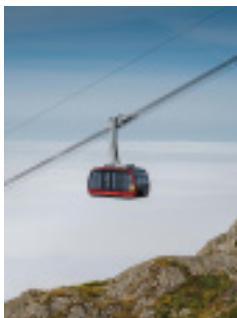

> **AI Description:**
> **Source:** `assets/_page_9_Figure_4.jpg`
> 
> **Generated:** 2026-05-17 19:18:17
> 
> ---
> 
> The image depicts a cable car suspended in mid-air, with a clear sky and a mountainous landscape in the background. The cable car is red and white, and it appears to be traveling above a layer of clouds. The image captures the essence of a scenic aerial transportation system, likely used for tourism or sightseeing purposes.

Haukelandsbakken 40 / NO-5009 / +47 53 64 36 43 / ulriken643.no

> **AI Description:**
> **Source:** `assets/_page_9_Figure_5.jpg`
> 
> **Generated:** 2026-05-17 19:18:39
> 
> ---
> 
> The image contains a series of icons representing different categories or concepts. The icons are arranged in a horizontal line and include:
> 
> 1. A wheelchair symbol, indicating accessibility or disability-related services.
> 2. A coffee cup with steam, suggesting a coffee shop or café.
> 3. A snowflake, representing winter, cold weather, or a seasonal theme.
> 4. A letter "B," which could be an abbreviation or a logo.
> 
> The icons are likely used to categorize or represent different sections or topics in a menu, website, or application.

## VESTKANTEN EXPERIENCES

Vestkanten is the biggest shopping and activity centre in Norway. The centre has a water park complex, a spa section, bowling, minigolf, skating, curling, shops and restaurants – just 10 minutes from the centre of Bergen. Unforgettable experiences await at Vestkanten!

Vestkanten Storsenter / +47 55 50 77 77 (Water park and ice rink) / +47 55 50 77 80 (bowling and minigolf) / Loddefjord / NO-5171 / vestkantenopplevelser.no

> **AI Description:**
> **Source:** `assets/_page_9_Figure_7.jpg`
> 
> **Generated:** 2026-05-17 19:17:30
> 
> ---
> 
> The image contains a series of icons representing different concepts. From left to right, the icons depict a wheelchair, a steaming cup of coffee, a shopping cart, and a snowflake. These icons are likely used to represent accessibility, hot beverages, shopping, and winter or cold weather, respectively.

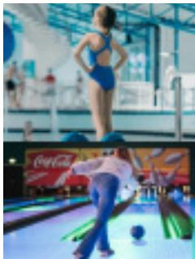

> **AI Description:**
> **Source:** `assets/_page_9_Figure_8.jpg`
> 
> **Generated:** 2026-05-17 19:11:09
> 
> ---
> 
> The image is a photograph of a bowling alley. It shows a person in the foreground bowling, with their arm extended and a bowling ball visible in their hand. The lane is partially visible, with pins at the end. In the background, there are other people and a Coca-Cola advertisement on the wall. The image captures a moment of action in a recreational setting.

## BERGEN SCIENCE CENTRE – VILVITE

Explore science and technology with all your senses! The main exhibition is full of interesting experiences for children and adults alike. Go on a voyage of discovery through the body, learn about the cycle of nature, cycle a 360-degree loop, do experiments with water, take part in a creative workshop, see a science show and lots more.

Thormøhlens gate 51, Møhlenpris / NO-5006 / + 47 55 59 45 00 / vilvite.no

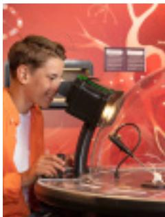

> **AI Description:**
> **Source:** `assets/_page_9_Figure_10.jpg`
> 
> **Generated:** 2026-05-17 19:06:21
> 
> ---
> 
> The image contains a photograph of a person interacting with a scientific exhibit. The individual is wearing an orange shirt and appears to be engaged with a device that resembles a microscope or a similar scientific instrument. The background features a red display with a circular design, possibly representing a biological or scientific theme. The exhibit seems to be part of an interactive science museum or educational setting.

Visit Bergen

BergenGuide 2022

Chapter 2.1 Attractions

## ESCAPE BRYGGEN

Escape Bryggen is Norway’s oldest Escape Room company, and the only one in the whole world in a UNESCO World Heritage site. You get 60 minutes to: Escape from the curse, Disarm the bomb, Catch the murderer, Escape Bryggen!

With four rooms, both indoors and outdoors, we have something to suit everyone! Perfect for families, tourists and everyone else!

Bryggen 35 / NO-5003 / +47 4737 2273 / escapebryggen.no

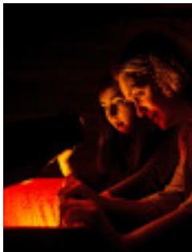

> **AI Description:**
> **Source:** `assets/_page_9_Figure_14.jpg`
> 
> **Generated:** 2026-05-17 18:58:07
> 
> ---
> 
> The image is a photograph of two individuals carving a pumpkin. The scene is dimly lit, with the primary light source coming from the pumpkin, which is illuminated from within. The individuals are focused on their task, with one person holding the pumpkin steady while the other uses a carving tool. The overall atmosphere suggests a Halloween or fall-themed activity.

## Explanation symbols:

> **AI Description:**
> **Source:** `assets/_page_9_Figure_15.jpg`
> 
> **Generated:** 2026-05-17 18:56:07
> 
> ---
> 
> The image contains a simple icon of a wheelchair symbol, which is commonly used to represent accessibility or disability-related services. It is a standard icon used in various contexts to indicate that a space, facility, or service is accessible to individuals with disabilities.

Wheelchair access

> **AI Description:**
> **Source:** `assets/_page_9_Figure_16.jpg`
> 
> **Generated:** 2026-05-17 19:01:26
> 
> ---
> 
> The image contains a simple icon of a coffee cup with a steam symbol above it. The icon is a single, flat design with no additional text or labels. It represents a coffee or tea cup, commonly used to symbolize beverages or a break.

Café

Open all year

> **AI Description:**
> **Source:** `assets/_page_9_Figure_18.jpg`
> 
> **Generated:** 2026-05-17 19:36:49
> 
> ---
> 
> The image contains a simple icon of a shopping cart, which is commonly used to represent online shopping, e-commerce, or purchasing actions in various digital interfaces and applications. The icon is a single, flat design with no additional text or graphical elements. It is a universal symbol used to indicate the addition of items to a shopping cart or basket for purchase.

Shopping

Bergen Card

Green Travel

Look for the in the Bergen Guide to find ecolabel tourism enterprises in the region.

## opening hours & prices

More information: visitBergen.com

## Chapter 2.2 / museums

## ARVEN GOLD AND SILVER WARE FACTORY AND SHOP

At Arven gold and silver ware factory and shop, you can buy beautiful hand made jewellery, household items and silver cutlery. A visit here is a real experience! You can see the production line and our artisans at work up close through a 40 metre long glass wall. Guided tours of the factory are also available.

Sandbrogaten 11 / NO-5003 / +47 55 55 14 40 / arven.no

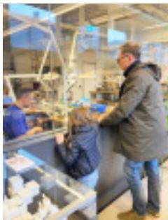

> **AI Description:**
> **Source:** `assets/_page_10_Figure_1.jpg`
> 
> **Generated:** 2026-05-17 19:32:36
> 
> ---
> 
> The image shows a photograph of a person interacting with another individual at a counter in what appears to be a laboratory or research facility. The setting includes various equipment and materials, suggesting a scientific or technical environment. The person on the right is wearing a dark jacket and jeans, while the individual on the left is wearing a blue shirt and appears to be working at the counter. The background includes shelves with additional equipment and supplies, indicating a workspace dedicated to research or experimentation.

> **AI Description:**
> **Source:** `assets/_page_10_Figure_2.jpg`
> 
> **Generated:** 2026-05-17 19:37:19
> 
> ---
> 
> The image contains two circular icons. The first icon on the left is a shopping cart, typically representing commerce or online shopping. The second icon on the right is a snowflake, which is commonly associated with winter, cold weather, or snowfall. There is no text or additional visual information beyond these two icons.

## BERGENHUS FORTRESS MUSEUM

Main exhibitions: The resistance movement in the Bergen area from 1940 to 1945 and the history of Bergenhus Fortress. Other exhibitions: women’s contribution to the Norwegian Armed Forces, newspapers in Bergen and the underground press from 1940 to 1945. Norwegian forces abroad and Enigma. Changing temporary exhibitions.

Koengen, Bergenhus Fortress / NO-5886 / +47 98 90 33 51 / forsvaret.no

> **AI Description:**
> **Source:** `assets/_page_10_Figure_4.jpg`
> 
> **Generated:** 2026-05-17 19:28:11
> 
> ---
> 
> The image contains three circular icons. The first icon represents a wheelchair, indicating accessibility or disability-related information. The second icon features a steaming cup, suggesting a hot beverage such as coffee or tea. The third icon depicts a snowflake, representing cold weather or winter conditions. These icons are commonly used in user interfaces to represent different categories or functions.

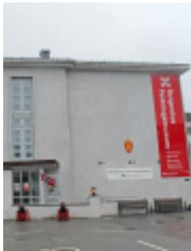

> **AI Description:**
> **Source:** `assets/_page_10_Figure_5.jpg`
> 
> **Generated:** 2026-05-17 19:22:28
> 
> ---
> 
> The image shows the exterior of a building with a large red banner on the right side. The banner contains text, but the image does not provide enough detail to read the content clearly. The building appears to be a modern structure with large windows and a flat roof. There are some red objects, possibly barriers or equipment, in front of the building. The image is primarily a photograph of a building with a banner, and no other significant visual elements are present.

## BERGEN KUNSTHALL

Bergen Kunsthall is a centre for contemporary art that presents exhibitions and events by international artists. Landmark is our series of live events that include concerts and club evenings at weekends. We also host a wide range of events for everyone.

Rasmus Meyers allé 5 / NO-5015 / +47 940 15 050 / kunsthall.no

> **AI Description:**
> **Source:** `assets/_page_10_Figure_7.jpg`
> 
> **Generated:** 2026-05-17 19:22:17
> 
> ---
> 
> The image contains a series of five icons, each representing a different concept or category. The icons are:
> 
> 1. A wheelchair, indicating accessibility or disability.
> 2. A steaming cup of coffee, symbolizing coffee or a hot beverage.
> 3. A shopping cart, representing shopping or retail.
> 4. A snowflake, indicating winter, cold weather, or snow.
> 5. A letter 'B', which could represent a brand, company, or specific category.
> 
> These icons are likely part of a larger set used for navigation or categorization in a digital interface.

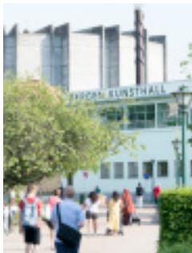

> **AI Description:**
> **Source:** `assets/_page_10_Figure_8.jpg`
> 
> **Generated:** 2026-05-17 19:04:57
> 
> ---
> 
> The image contains a photograph of a building with the text "Fischer Bunsenhall" prominently displayed on its facade. The building appears to be a large structure, possibly a laboratory or educational facility, given its size and the name. There are people walking in front of the building, suggesting it is a public or academic space. The surrounding area includes trees and other greenery, indicating an outdoor setting. The image provides a clear view of the building's exterior and its immediate surroundings.

## BERGEN MARITIME MUSEUM

Shows the development of shipping and its importance to Bergen and Norway, from the Iron Age and Viking Age and up to the present. Exhibitions feature high-quality boats, model ships, equipment and paintings. The museum building is an architectural gem, situated in beautiful surroundings. Guided tours from June to August. Activities for children. Bus stop: Møhlenpris.

Haakon Sheteligs plass 15 / NO-5007 / +47 55 54 96 15 / sjofartsmuseum.no

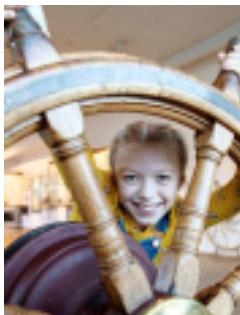

> **AI Description:**
> **Source:** `assets/_page_10_Figure_10.jpg`
> 
> **Generated:** 2026-05-17 19:36:45
> 
> ---
> 
> The image is a photograph of a young girl smiling through the spokes of a ship's steering wheel. The setting appears to be inside a museum or exhibit, as indicated by the background elements and the polished wooden structure of the wheel. The girl is wearing a yellow scarf, and her expression conveys a sense of joy and curiosity. The image captures a moment of interaction with a historical or educational exhibit, likely related to maritime history.

Visit Bergen

BergenGuide 2022

Chapter 2.2 Museums

## BJØRN WEST MUSEUM

The story of the resistance group Bjørn West is the exciting local history of the last hostilities in Europe in 1945. The museum has an extensive exhibition of equipment, photos and films. Signposted car walks. Express bus. Great walks.

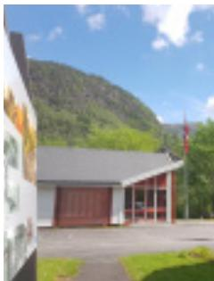

> **AI Description:**
> **Source:** `assets/_page_10_Figure_12.jpg`
> 
> **Generated:** 2026-05-17 19:31:11
> 
> ---
> 
> The image contains a photograph of a building with a red roof and white walls, situated in a natural setting with green hills and trees in the background. There is a flag visible on the right side of the building. The sky is partly cloudy. The image also includes a partial view of a sign or poster on the left side, but the text on it is not fully visible.

Matre 41 / NO-5984 / +47 469 05 204 / bjornwest.museumvest.no

> **AI Description:**
> **Source:** `assets/_page_10_Figure_13.jpg`
> 
> **Generated:** 2026-05-17 19:31:50
> 
> ---
> 
> The image contains three circular icons, each representing a different symbol. The first icon is a wheelchair, indicating accessibility or disability-related services. The second icon is a shopping cart, suggesting e-commerce or retail-related services. The third icon is a letter "B," which could represent a brand, company logo, or a specific service or product. The icons are simple and are likely used in a user interface or as part of a mobile app or website.

## BRYGGENS MUSEUM

Archaeological museum comprising thousands of items that provide an interesting insight into everyday life during the Middle Ages. Find out how the many city fires changed both the city and people’s lives. Guess what they wrote in runic inscriptions to each other, everything from declarations of love and poetry to secret messages. Get a new perspective on Bergen!

Dreggsallmenning 3 / NO-5003 / +47 55 30 80 32 / 55 30 80 30 / bymuseet.no/

> **AI Description:**
> **Source:** `assets/_page_10_Figure_15.jpg`
> 
> **Generated:** 2026-05-17 19:22:00
> 
> ---
> 
> The image contains a series of icons representing different concepts. The icons include a wheelchair, a coffee cup, a shopping cart, a snowflake, and a letter "B". These icons are likely used to represent categories or features in a user interface or a menu. The icons are simple and circular, with the exception of the shopping cart which is rectangular.

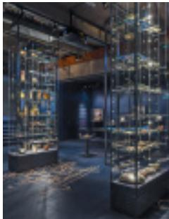

> **AI Description:**
> **Source:** `assets/_page_10_Figure_16.jpg`
> 
> **Generated:** 2026-05-17 19:25:49
> 
> ---
> 
> The image depicts an interior space, likely a museum or exhibit hall, featuring multiple glass display cases. The cases are arranged in a row and contain various artifacts, possibly historical or archaeological in nature. The lighting is dim, with focused spotlights illuminating the contents of the display cases. The floor appears to be carpeted, and there are informational signs or labels visible in the background, though the text is not legible in the image. The overall ambiance suggests a curated exhibition space designed to showcase and educate visitors about the displayed items.

## DALE OF NORWAY

You can buy premium knitwear from Dale of Norway in shops on Bryggen. You can also shop from our entire collection at the Dale of Norway Brand Store at Lagunen shopping centre. If you are looking for a bargain, visit our factory outlet in Dale. Guided tours of the factory in Dale can be booked for groups: shop@dale.no

Brand Store, Lagunen Storsenter, Laguneveien 1 / NO-5239 / +47 415 67 523 Factory Outlet, Sandlivegen 2 / NO-5722 / +47 415 67 571 / daleofnorway.com

> **AI Description:**
> **Source:** `assets/_page_10_Figure_18.jpg`
> 
> **Generated:** 2026-05-17 19:06:25
> 
> ---
> 
> The image contains three distinct icons: a wheelchair symbol, a shopping cart symbol, and a snowflake symbol. These icons are commonly used to represent accessibility, commerce, and winter weather, respectively. The icons are simple and circular, with the wheelchair and shopping cart icons having a blue background and the snowflake icon having a white background with black lines.

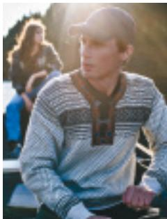

> **AI Description:**
> **Source:** `assets/_page_10_Figure_19.jpg`
> 
> **Generated:** 2026-05-17 19:10:11
> 
> ---
> 
> The image is a photograph of a person wearing a patterned sweater and a cap, sitting outdoors. The background shows another person sitting on what appears to be a bench or similar structure, with the sun setting behind them, creating a warm glow. The focus is on the person in the foreground, with the background slightly blurred.

## DAMSGÅRD COUNTRY MANSION

The summer estate was built in the 1770s and is the best example of Rococo architecture in Norway. Both the house and garden are gems for history buffs and people who appreciate unique architecture, beautiful interiors and historical gardens.

The garden is open during opening hours, admission by guided tour only to the manor house.

Alleen 29 / NO-5160 / +47 55 30 80 33 / 55 30 80 30 / bymuseet.no/

> **AI Description:**
> **Source:** `assets/_page_10_Figure_21.jpg`
> 
> **Generated:** 2026-05-17 18:56:03
> 
> ---
> 
> The image contains three circular icons with the following symbols:
> 1. A coffee cup with a steam icon, indicating a hot beverage.
> 2. A shopping cart, representing commerce or online shopping.
> 3. A letter "B" enclosed in a circle, which could represent a brand or logo.
> 
> The icons are likely used in a user interface or as part of a mobile app to represent different functions or categories.

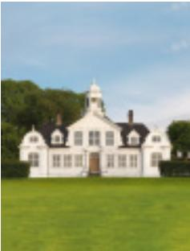

> **AI Description:**
> **Source:** `assets/_page_10_Figure_22.jpg`
> 
> **Generated:** 2026-05-17 19:01:22
> 
> ---
> 
> The image contains a photograph of a large, white, two-story house with a prominent central tower and a smaller tower on the left side. The house is surrounded by a well-maintained lawn and is set against a backdrop of trees and a clear blue sky. The architectural style suggests a colonial or Federal design, often associated with historic or affluent properties.

Visit Bergen

BergenGuide 2022

Chapter 2.2 Museums

## THE HANSEATIC MUSEUM AND SCHØTSTUENE

Explore Bryggen as the Hanseatic merchants knew it! Visit the German merchants’ assembly rooms, Schøtstuene, and UNESCO World Heritage site Bryggen with us. Guided tours are available in several languages in the summer season.   
Activities for children and seats in the garden.

Øvregaten 50 / NO-5003 / +47 53 00 61 10 / hanseatiskemuseum.museumvest.no/

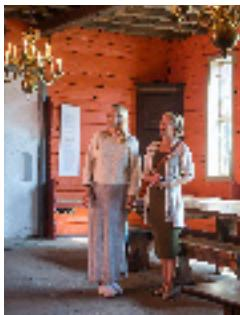

> **AI Description:**
> **Source:** `assets/_page_11_Figure_1.jpg`
> 
> **Generated:** 2026-05-17 19:19:21
> 
> ---
> 
> The image is a photograph of two individuals standing indoors in what appears to be a historical or traditional setting. The room has a warm, reddish-orange color scheme with wooden beams and a chandelier hanging from the ceiling. The individuals are dressed in light-colored, possibly vintage attire. One person is holding a small object, possibly a musical instrument or a piece of equipment. The room has a rustic appearance with a door and windows visible in the background.

> **AI Description:**
> **Source:** `assets/_page_11_Figure_2.jpg`
> 
> **Generated:** 2026-05-17 19:23:10
> 
> ---
> 
> The image contains three distinct icons: a shopping cart, a snowflake, and a letter 'B'. The icons are circular and appear to be part of a logo or set of symbols. The shopping cart icon suggests commerce or retail, the snowflake icon likely represents winter or cold, and the 'B' could be an abbreviation or a brand symbol.

> **AI Description:**
> **Source:** `assets/_page_11_Figure_3.jpg`
> 
> **Generated:** 2026-05-17 19:25:33
> 
> ---
> 
> The image contains two distinct symbols. The first symbol is a classical Greek-style temple, often associated with the UNESCO World Heritage logo. The second symbol is a stylized representation of a building with a flat roof, possibly representing a modern architectural style or a specific institution. These symbols are likely used to represent cultural or historical significance, as suggested by the first symbol, and possibly a specific organization or institution, as indicated by the second symbol.

## EDVARD GRIEG MUSEUM TROLDHAUGEN

World-famous composer Edvard Grieg’s villa at Troldhaugen has been preserved as it was in 1907. The museum also includes the composer’s cabin, his burial site, a concert hall, and a museum. Daily concerts from 15 June to 21 August enable visitors to hear Grieg’s music in the setting in which it was written.

Troldhaugveien 65 / NO-5232 / +47 930 19 590 / troldhaugen.no

> **AI Description:**
> **Source:** `assets/_page_11_Figure_5.jpg`
> 
> **Generated:** 2026-05-17 19:36:40
> 
> ---
> 
> The image contains a series of icons representing different concepts. The icons include a wheelchair, a coffee cup, a shopping cart, a snowflake, and a letter 'B'. These icons are likely used to represent various categories or services, such as accessibility, beverages, shopping, winter, and possibly a brand or company logo.

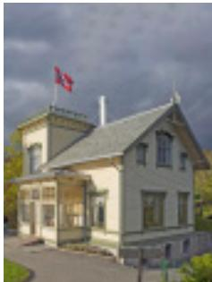

> **AI Description:**
> **Source:** `assets/_page_11_Figure_6.jpg`
> 
> **Generated:** 2026-05-17 19:31:45
> 
> ---
> 
> The image depicts a small, two-story building with a pitched roof and a chimney. The structure appears to be made of light-colored stone or brick and has a small porch area with a wooden railing. A Canadian flag is flying atop the roof, indicating the building's location or affiliation. The surrounding area includes a paved pathway and some greenery, suggesting a residential or institutional setting.

## FJELL FORT

Fjell Fort is situated in a popular walking area around 25 km from Bergen. As one of the most important strongholds built in Norway during WWII, it guarded Bergen from attacks from the west. Much of the fort has been very well preserved. Guided tours inside the fort are available at set times.

Festningsvegen / NO-5357 / +47 53 00 61 23 / fjellfestning.museumvest.no/

> **AI Description:**
> **Source:** `assets/_page_11_Figure_8.jpg`
> 
> **Generated:** 2026-05-17 18:56:13
> 
> ---
> 
> The image contains a series of icons representing different symbols. These icons include a wheelchair, a coffee cup, a shopping cart, a snowflake, and a letter "B". Each icon is circular and appears to be part of a set, possibly representing different categories or services. The icons are evenly spaced and have a uniform design, suggesting they are part of a user interface or a set of icons for a mobile application or website.

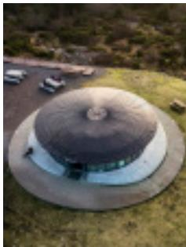

> **AI Description:**
> **Source:** `assets/_page_11_Figure_9.jpg`
> 
> **Generated:** 2026-05-17 18:57:57
> 
> ---
> 
> The image shows an aerial view of a unique building with a large, dome-shaped roof. The structure appears to be circular and is situated on a grassy area with a few parked cars nearby. The building's design is distinct, resembling a futuristic or unconventional architectural style. The surrounding landscape is relatively flat, and the building stands out due to its size and shape.

## OLD BERGEN MUSEUM

Enjoy a bit of nostalgia delving into the history of a living museum in the reconstructed Bergen of the 19th and 20th centuries. The museum has a unique collection of around 50 original wooden buildings that once stood in the centre of Bergen. There is also a beautiful English-style park and a seawater pool.

> **AI Description:**
> **Source:** `assets/_page_11_Figure_11.jpg`
> 
> **Generated:** 2026-05-17 19:02:36
> 
> ---
> 
> The image contains three icons: a coffee cup, a shopping cart, and a letter 'B'. The coffee cup icon is on the left, the shopping cart icon is in the middle, and the letter 'B' is on the right. These icons are likely related to a service or application that deals with coffee, shopping, and possibly a brand or business represented by the letter 'B'.

Nyhavnsveien 4 / NO-5042 / +47 55 30 80 34 / 55 30 80 30 / bymuseet.no/

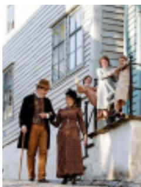

> **AI Description:**
> **Source:** `assets/_page_11_Figure_12.jpg`
> 
> **Generated:** 2026-05-17 18:58:15
> 
> ---
> 
> The image is a photograph of a group of people dressed in historical attire, seemingly from the 19th century. They are standing on the steps of a white wooden building with a simple, rustic design. The individuals are interacting with each other, with some gesturing and others holding items like a cane and a cup. The setting appears to be outdoors, and the overall scene suggests a historical reenactment or a staged photograph meant to evoke a specific time period.

Visit Bergen
BergenGuide 2022
Chapter 2.2 Museums

## HARALD SÆVERUD – MUSEUM SILJUSTØL

Siljustøl was home of the popular composer Harald Sæverud and his wife Marie. The house, with its studio and grand piano, are preserved as they were when Sæverud died in 1992. The house is now a museum set in a beautiful area covering 44 acres, which is perfect for walks. Welcome to this unique composer’s home where the focus is on music and nature.

Siljustølveien 50 / NO-5236 / +47 55 92 29 92 / siljustol.no

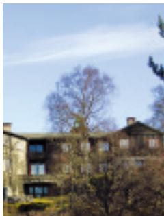

> **AI Description:**
> **Source:** `assets/_page_11_Figure_14.jpg`
> 
> **Generated:** 2026-05-17 19:04:41
> 
> ---
> 
> The image is a photograph of a building with multiple stories, featuring a mix of stone and brick construction. The building has a series of windows along its facade and is surrounded by trees, some of which are bare, suggesting it might be taken during late autumn or winter. The sky is clear with a few wispy clouds, indicating fair weather. The overall scene gives a sense of a quiet, possibly residential or institutional setting.

## HERDLA MUSEUM

A small island with its own museum, Herdla is situated in the archipelago west of Bergen. It has exhibitions about its dramatic role in World War II, and its rich fauna and birdlife. The main attraction is a German fighter aircraft from WWII. Herdla is also a great place for walks, fishing, swimming and bird-watching.

Herdla fort / NO-5315 / +47 970 94 729 / herdlamuseum.museumvest.no/

> **AI Description:**
> **Source:** `assets/_page_11_Figure_17.jpg`
> 
> **Generated:** 2026-05-17 19:10:22
> 
> ---
> 
> The image contains five circular icons, each representing a different category. From left to right, the icons depict a wheelchair, a coffee cup, a shopping cart, a snowflake, and a letter "B". These icons are commonly used to represent accessibility, coffee or tea, shopping or e-commerce, winter or cold weather, and possibly a brand or company logo.

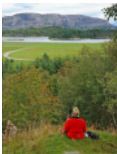

> **AI Description:**
> **Source:** `assets/_page_11_Figure_18.jpg`
> 
> **Generated:** 2026-05-17 19:27:13
> 
> ---
> 
> The image is a photograph of a person sitting on a grassy hillside, facing a scenic landscape. The person is wearing a red jacket and appears to be looking out towards a body of water surrounded by greenery and mountains in the background. The image captures a serene outdoor setting with natural beauty.

## HAAKON’S HALL

Experience a 13th-century royal banqueting hall, the first of its kind to be built in stone. Haakon’s Hall was the largest and most imposing building of the royal residency in Bergen, and is now a living national cultural heritage site. Imagine what being a king was like in the Middle Ages.

Bergenhus Festning / NO-5003 / +47 55 30 80 36 / 55 30 80 30 / bymuseet.no/

> **AI Description:**
> **Source:** `assets/_page_11_Figure_20.jpg`
> 
> **Generated:** 2026-05-17 19:30:56
> 
> ---
> 
> The image contains three circular icons with the following symbols: a shopping cart, a snowflake, and a letter "B". These icons are likely part of a user interface or a set of icons for a mobile application or website. The icons are simple and do not contain any text or additional information beyond their visual representation.

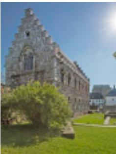

> **AI Description:**
> **Source:** `assets/_page_11_Figure_21.jpg`
> 
> **Generated:** 2026-05-17 19:32:20
> 
> ---
> 
> The image contains a photograph of a historical building with a distinctive architectural style. The structure features a large, pointed roof with multiple gables and a series of windows with ornate designs. The building is surrounded by greenery, including a tree in the foreground and a grassy area in the background. The overall scene suggests a peaceful, possibly academic or institutional setting.

## KODE ART MUSEUMS OF BERGEN

Norway’s second biggest art collection is housed in four museums in the heart of the city. See art and design from the 15th century up to the present. The museums feature the works of artists such as Munch, Dahl, Klee and Picasso. Dedicated KunstLab section for children with a workshop and exhibition. Separate programme of changing exhibitions. One ticket for all the museums.

Rasmus Meyers allè 3, 7 og 9. Nordahl Bruns gate 9 / NO-5015 +47 53 00 97 04 / kodebergen.no

> **AI Description:**
> **Source:** `assets/_page_11_Figure_23.jpg`
> 
> **Generated:** 2026-05-17 19:33:13
> 
> ---
> 
> The image contains five circular icons, each representing a different symbol. The first icon is a wheelchair, indicating accessibility or disability-related services. The second icon is a steaming cup, likely representing coffee or tea. The third icon is a shopping cart, suggesting e-commerce or retail. The fourth icon is a snowflake, possibly indicating winter, cold weather, or a seasonal theme. The fifth icon is a letter 'B', which could represent a brand, company logo, or a specific category. The icons are arranged in a horizontal line, and there is no additional text or data provided.

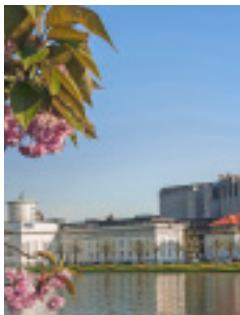

> **AI Description:**
> **Source:** `assets/_page_11_Figure_24.jpg`
> 
> **Generated:** 2026-05-17 19:27:05
> 
> ---
> 
> The image is a photograph of a scenic view. It features a body of water in the foreground, with a row of buildings in the background. The buildings appear to be part of a campus or institutional setting, with a prominent white structure that resembles an academic or administrative building. The sky is clear and blue, indicating a sunny day. In the top left corner, there are cherry blossoms, adding a touch of natural beauty to the scene. The overall atmosphere is calm and serene, suggesting a peaceful environment, possibly a university or research institution.

Visit Bergen

BergenGuide 2022

Chapter 2.2 Museums

## KUNSTHALL 3,14 – Contemporary Art

Kunsthall 3,14 encourages dialogue and reflection on different aspects of contemporary international society and promotes highly acclaimed artists as well as new upcoming artists. Kunsthall 3,14 is housed on the second floor of the former premises of Norges Bank dating from 1845, overlooking the popular Fish Market.

Vågsallmenningen 12 / NO-5014 / +47 55 36 26 30 / kunsthall314.art/

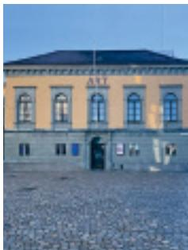

> **AI Description:**
> **Source:** `assets/_page_12_Figure_1.jpg`
> 
> **Generated:** 2026-05-17 18:57:36
> 
> ---
> 
> The image shows a building with a sign that reads "ALI" on the top. The building has a yellow facade with a dark roof and a central entrance with a blue door. The ground in front of the building appears to be paved with gravel or small stones. There are no charts, graphs, or other visual elements present in the image.

## COASTAL MUSEUM IN ØYGARDEN

Experience coastal culture in an authentic fishing village setting. Exhibitions, films, café and shop. New exhibition about wedding and costume traditions. Combine a visit to the museum with a visit to Øygarden Aquaculture Centre, where you can hire a canoe, rowing boat and fishing equipment. Lovely outdoor recreation area for walks, fishing and swimming.

Museumsvegen 9 / NO-5337 / +47 53 00 61 40 / kystmuseet.museumvest.no

> **AI Description:**
> **Source:** `assets/_page_12_Figure_4.jpg`
> 
> **Generated:** 2026-05-17 19:07:13
> 
> ---
> 
> The image contains a series of icons representing different concepts. The icons include a wheelchair, a coffee cup, a shopping cart, a snowflake, and a letter "B". These icons are likely used to represent various categories or services, such as accessibility, coffee shop, shopping, winter, and possibly a brand or company logo. The icons are simple and circular, making them easily recognizable.

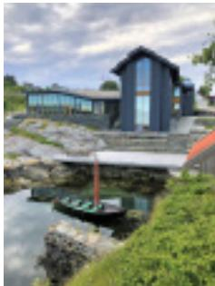

> **AI Description:**
> **Source:** `assets/_page_12_Figure_5.jpg`
> 
> **Generated:** 2026-05-17 19:07:09
> 
> ---
> 
> The image shows a modern building situated on a rocky shoreline. The structure has a contemporary design with large windows and a dark exterior. A small boat is docked near the building, and the surrounding area is lush with greenery. The sky is partly cloudy, suggesting a calm, overcast day. The image captures a serene and picturesque setting, likely a coastal or riverside location.

## LEPROSY MUSEUM ST. GEORGE’S HOSPITAL

Visit a unique cultural monument with many stories to tell. When its last residents died in 1946, the hospital had been in use for more than 500 years. Learn about leprosy, how widespread it was and the efforts made to eradicate the disease, which culminated in Gerhard Armauer Hansen’s discovery of the leprae bacillus in 1873.

Kong Oscars gate 59 / NO-5017 / +47 55 30 80 37 / 55 30 80 30 / bymuseet.no/

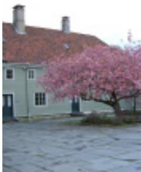

> **AI Description:**
> **Source:** `assets/_page_12_Figure_7.jpg`
> 
> **Generated:** 2026-05-17 19:04:12
> 
> ---
> 
> The image is a photograph of a building with a red-tiled roof and two chimneys. In the foreground, there is a tree with pink blossoms, suggesting it might be springtime. The ground appears to be paved with cobblestones. The building has a simple, traditional design with a light-colored facade.

## THE HEATHLAND CENTRE AT LYGRA – Museum Centre in Hordaland

Through active cultivation of the landscape, the Heathland Centre preserves the heathland and promotes the coastal culture of Western Norway. Film, exhibition, restaurant, local food, walks, guided tours, views, tranquility, grazing animals, bike hire and accommodation. ‘FjordFrokost’ (fjord breakfast) – boat trip and local food.

Lyrevegen 1575 / NO-5912 / +47 56 35 64 10 / muho.no/lyngheisenteret

> **AI Description:**
> **Source:** `assets/_page_12_Figure_9.jpg`
> 
> **Generated:** 2026-05-17 19:19:38
> 
> ---
> 
> The image contains a series of five icons, each representing a different concept. From left to right, the icons depict a wheelchair, a coffee cup, a shopping cart, a snowflake, and a letter "B". These icons are commonly used to represent accessibility, refreshment, shopping, winter, and possibly a brand or company logo, respectively.

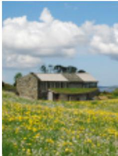

> **AI Description:**
> **Source:** `assets/_page_12_Figure_10.jpg`
> 
> **Generated:** 2026-05-17 19:03:19
> 
> ---
> 
> The image is a photograph of a rural landscape. It features a traditional stone house with a grass-covered roof, situated amidst a field of yellow flowers. The sky is bright blue with scattered white clouds, and the overall scene conveys a serene and pastoral atmosphere.

Visit Bergen
BergenGuide 2022
Chapter 2.2 Museums

## THE OLD VOSS STEAM RAILWAY MUSEUM

Travel back in time! In summer, the vintage train runs on the line between Varnes Station and Midttun Station. The route is operated by our beautiful old steam locomotive built in 1913 with its old teak carriages. Special trips and trips in the dining car are organised on certain Sundays. Activities on offer to suit everyone!

Tunesvegen 8 / NO-5264 / +47 940 53 037 / njk.no/gvb

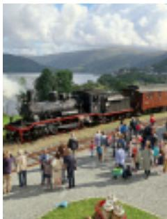

> **AI Description:**
> **Source:** `assets/_page_12_Figure_13.jpg`
> 
> **Generated:** 2026-05-17 19:05:19
> 
> ---
> 
> The image is a photograph showing a steam locomotive on display, likely at a railway event or heritage railway. The locomotive is black with red and cream carriages attached. A crowd of people is gathered around the train, some standing and others seated on the ground, suggesting a public event or open day. The background features a scenic view of a lake and hills, indicating the location might be in a rural or tourist area. The image captures the essence of a historical railway experience, with the focus on the locomotive and the surrounding crowd.

> **AI Description:**
> **Source:** `assets/_page_12_Figure_14.jpg`
> 
> **Generated:** 2026-05-17 19:02:54
> 
> ---
> 
> The image contains two icons: a coffee cup with a steam symbol on the left and a shopping cart on the right. These icons are commonly used to represent coffee or tea and online shopping or e-commerce, respectively. The image does not contain any text or additional visual elements beyond these two icons.

## NORTH SEA TRAFFIC MUSEUM IN TELAVÅG

Exhibitions about the Telavåg Tragedy and the North Sea Traffic between Norway and the UK during World War II. The village of Telavåg was razed and its inhabitants were sent to German concentration camps. The ‘Telavåg 1942’ app recounts this episode of history. Film. Open by arrangement outside the season. Forty-minute drive from Bergen on the RV 555 road. Buses 450 to 459.

Årvikadalen 20 / NO-5380 / +47 53 00 61 50 / nordsjofartsmuseum.museumvest.no/

> **AI Description:**
> **Source:** `assets/_page_12_Figure_16.jpg`
> 
> **Generated:** 2026-05-17 18:55:54
> 
> ---
> 
> The image contains a series of icons representing different categories. The icons include a wheelchair, a coffee cup, a shopping cart, a snowflake, and a letter "B". These icons are likely used to represent various services or categories, such as accessibility, coffee shop, shopping, winter, and possibly a brand or company logo. The icons are simple and circular, making them easily recognizable.

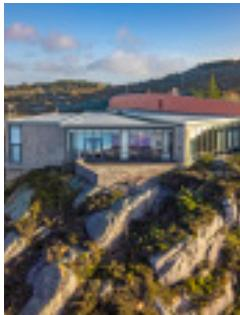

> **AI Description:**
> **Source:** `assets/_page_12_Figure_17.jpg`
> 
> **Generated:** 2026-05-17 18:58:26
> 
> ---
> 
> The image is a photograph of a modern house situated on a rocky terrain with a scenic view of hills and a clear sky. The house features large glass windows and a flat roof, blending seamlessly with the natural surroundings. The landscape around the house is rugged, with patches of vegetation, and the overall scene suggests a serene and secluded environment.

## NORWEGIAN FISHERIES MUSEUM

Immerse yourself in fascinating history in authentic 18th-century wharfside warehouses. Learn about the sea, our common marine resources and fishermen’s lives through the ages. Family activities both outdoors and indoors. Café with outdoor seating. Rowing boat hire. Loan of kayaks. Vintage boat harbour. Boat service to the museum during summer. NO. ENG. GER. FR. SP

Sandviksboder 23 / NO-5035 / + 47 53 00 61 80 / fiskerimuseum.museumvest.no

> **AI Description:**
> **Source:** `assets/_page_12_Figure_19.jpg`
> 
> **Generated:** 2026-05-17 19:29:44
> 
> ---
> 
> The image contains a series of five icons representing different symbols. The icons are arranged in a horizontal line and include a wheelchair, a coffee cup, a shopping cart, a snowflake, and a letter 'B'. These icons are likely used to represent different categories or services, such as accessibility, coffee, shopping, winter, and possibly a brand or company logo.

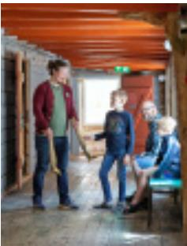

> **AI Description:**
> **Source:** `assets/_page_12_Figure_20.jpg`
> 
> **Generated:** 2026-05-17 19:22:35
> 
> ---
> 
> The image is a photograph of four individuals standing in what appears to be a rustic indoor setting with wooden beams and a warm, ambient light. The individuals are casually dressed, and one person is holding a small object that resembles a tool or implement. The setting suggests a workshop or a casual gathering in a cozy, possibly rural environment.

## OLE BULL MUSEUM LYSØEN

The museum comprises violinist Ole Bull’s villa and the island itself with its forest and park grounds. The villa, built in 1873 and unique in Norwegian architectural history, stands on the island like a fairy-tale castle. Fantastic scenery, a network of walking trails, secluded bathing spots and an observation tower.

The villa will be closed for restauration in 2022. See www.lysoen.no for details.

Lysøen / NO-5215 / +47 53 00 97 00 / lysoen.no

> **AI Description:**
> **Source:** `assets/_page_12_Figure_22.jpg`
> 
> **Generated:** 2026-05-17 19:22:10
> 
> ---
> 
> The image contains three circular icons with the following symbols:
> 1. A coffee cup with a steam icon, indicating a hot beverage.
> 2. A shopping cart, representing commerce or online shopping.
> 3. A letter "B" enclosed in a circle, which could be a logo or abbreviation.
> 
> These icons are likely part of a user interface or a set of icons for a mobile app or website, representing different categories or functions.

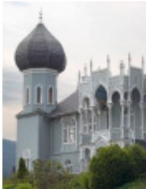

> **AI Description:**
> **Source:** `assets/_page_12_Figure_23.jpg`
> 
> **Generated:** 2026-05-17 19:18:54
> 
> ---
> 
> The image contains a photograph of a building with architectural features that suggest a blend of Eastern and Western styles. The structure includes a prominent dome with a pointed top, typical of certain Eastern religious or cultural buildings, and arched windows and doorways that are reminiscent of Gothic or Romanesque architecture. The building is painted in a light blue color, and there are green shrubs and trees in the foreground, indicating it is situated in a landscaped area. The overall design suggests it could be a cultural or religious center, possibly a mosque or a similar structure.

Visit Bergen

BergenGuide 2022

## OLEANA ÉCONOMUSÉE

Oleana is an open textile factory where we invite you to come on a journey through our production hall, where you can watch how raw yarn is turned into finished products. Witness craftsmanship in practice and learn about textile production. Guided tours for groups on request.

> **AI Description:**
> **Source:** `assets/_page_13_Figure_1.jpg`
> 
> **Generated:** 2026-05-17 19:03:46
> 
> ---
> 
> The image is a photograph showing two individuals in what appears to be a factory or industrial setting. The person on the right is wearing a white shirt and smiling, while the person on the left is facing away from the camera. The background includes industrial equipment and machinery, suggesting a manufacturing or textile production environment. The foreground includes spools of blue thread, further indicating a textile or garment production context.

Ivar Aasgaardsvei 1 / NO-5265 / +47 55 39 32 25 / oleana.no

> **AI Description:**
> **Source:** `assets/_page_13_Figure_2.jpg`
> 
> **Generated:** 2026-05-17 19:06:28
> 
> ---
> 
> The image contains four icons representing different symbols: a wheelchair, a steaming cup of coffee, a shopping cart, and a snowflake. These icons are likely used to represent accessibility, hot beverages, shopping, and winter or cold weather, respectively.

## OSTERØY MUSEUM

Osterøy Museum is in a beautiful setting in the cultural landscape of Osterøy. Old buildings show how people in the countryside outside Bergen lived, and through story-telling and experiences, the museum links objects and the living cultural heritage of textiles and costumes, weaving and local building customs.

Gjerstad 44 / NO-5282 / +47 941 72 250 / muho.no/osteroymuseum

> **AI Description:**
> **Source:** `assets/_page_13_Figure_4.jpg`
> 
> **Generated:** 2026-05-17 19:01:17
> 
> ---
> 
> The image contains a series of icons representing different concepts. From left to right, the icons depict a wheelchair, a coffee cup, a shopping cart, a snowflake, and a letter "B". These icons are likely used to represent categories or features in a user interface or a menu system.

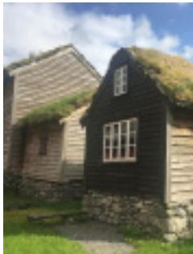

> **AI Description:**
> **Source:** `assets/_page_13_Figure_5.jpg`
> 
> **Generated:** 2026-05-17 19:02:31
> 
> ---
> 
> The image shows a traditional wooden house with a grass-covered roof, typical of rural or historical architecture. The house has a dark wooden exterior with a lighter wooden door and windows. The surrounding area appears to be grassy, suggesting a rural or countryside setting. The sky is partly cloudy, indicating fair weather.

## ROSENKRANTZ TOWER

Welcome to Rosenkrantz Tower, where you can climb narrow, dim stairwells to the top. You get the best view of the city from the roof, and in the cellar, you’ll find the notorious dungeon. The Tower is the most important Renaissance monument in Norway, built as a residence and fortified tower in the 1560s.

Bergenhus Festning / NO-5003 / +47 55 30 80 38 / 55 30 80 30 / bymuseet.no/

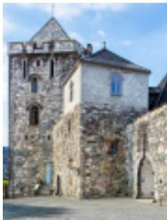

> **AI Description:**
> **Source:** `assets/_page_13_Figure_9.jpg`
> 
> **Generated:** 2026-05-17 19:31:54
> 
> ---
> 
> The image contains a photograph of a historic stone building, likely a castle or fortress, with a prominent tower. The structure features a pointed roof, arched windows, and a stone facade. The architecture suggests a medieval or early modern period. The building is situated on a paved area, and the sky in the background is clear and blue.

## BERGEN SCHOOL MUSEUM

Welcome to Bergen’s oldest Latin School, dating from 1706. The oldest school building in Norway has exhibitions about the Norwegian school system and Norwegian society from the Middle Ages and up to the present. Thematic exhibition of old natural science posters.

Lille øvregate 38 / NO-5018 / +47 55 30 80 39 / 55 30 80 30 / bymuseet.no/

> **AI Description:**
> **Source:** `assets/_page_13_Figure_11.jpg`
> 
> **Generated:** 2026-05-17 19:18:47
> 
> ---
> 
> The image contains three icons. The first icon is a shopping cart, the second is a snowflake, and the third is a letter 'B'. These icons are likely used to represent different categories or features, such as shopping, weather, and possibly a brand or service.

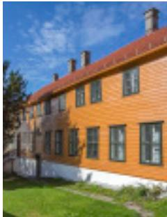

> **AI Description:**
> **Source:** `assets/_page_13_Figure_12.jpg`
> 
> **Generated:** 2026-05-17 19:22:23
> 
> ---
> 
> The image is a photograph of a building with a bright orange facade and multiple windows. The roof is red tiled, and there are chimneys visible on the roof. The building is surrounded by a grassy area, and the sky is blue with some scattered clouds. The image does not contain any charts, graphs, or text annotations.

Visit Bergen
BergenGuide 2022
Chapter 2.2 Museums

## TEXTILE INDUSTRY MUSEUM

Visit a unique museum in the Bergen region! How is wool turned into clothes?

Visit Salhus Tricotagefabrik, a listed textile factory dating from 1859, and learn about the textile industry in Western Norway.

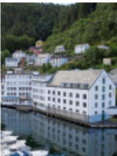

> **AI Description:**
> **Source:** `assets/_page_13_Figure_14.jpg`
> 
> **Generated:** 2026-05-17 19:32:41
> 
> ---
> 
> The image is a photograph of a coastal town with a row of white buildings along the water. The buildings are multi-story and appear to be residential or commercial. In the background, there are green hills and trees, indicating a natural setting. The water in the foreground suggests a harbor or bay. The overall scene is calm and picturesque, typical of a small seaside community.

Salhusvegen 201 / NO-5107 / +47 55 25 10 80 / muho.no/tekstilindustrimuseet

> **AI Description:**
> **Source:** `assets/_page_13_Figure_15.jpg`
> 
> **Generated:** 2026-05-17 19:37:16
> 
> ---
> 
> The image contains a series of five icons, each representing a different concept or category. The icons are as follows: a wheelchair, a steaming cup of coffee, a shopping cart, a snowflake, and a letter "B". These icons are likely used to represent different themes or categories in a user interface or infographic.

## WESTERN NORWAY EMIGRATION CENTRE

An authentic prairie village on the island of Radøy. The Emigrant Church and the buildings in the Prairie village were built by Norwegian-Americans in the USA and later moved to Norway. We chronicle the history of Norwegian emigrants, and draw parallels to migration today. Permanent and changing exhibitions, guided tours and experiences.

Hellandsvegen 541 / NO-5939 / +47 917 12 961 / 55 25 10 80 / muho.no/vestnorsk-utvandringssenter

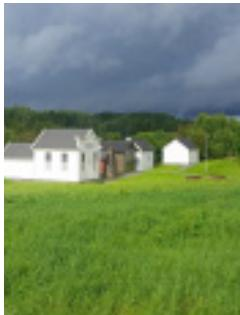

> **AI Description:**
> **Source:** `assets/_page_13_Figure_18.jpg`
> 
> **Generated:** 2026-05-17 18:55:49
> 
> ---
> 
> The image depicts a rural scene with a grassy field in the foreground. In the background, there are a few white buildings, possibly houses or farm structures, with a line of trees separating them from the field. The sky is overcast with dark clouds, suggesting the possibility of rain or stormy weather. The image captures a serene countryside setting.

> **AI Description:**
> **Source:** `assets/_page_13_Figure_19.jpg`
> 
> **Generated:** 2026-05-17 18:58:29
> 
> ---
> 
> The image contains four icons representing different symbols: a wheelchair, a coffee cup, a shopping cart, and a water bottle. These icons are commonly used to represent accessibility, refreshment, shopping, and hydration, respectively.

## YTRE ARNA MUSEUM

Local history museum for Ytre Arna, where the industrialisation of Western Norway began in 1846. Arne Fabrikker was the biggest textile factory in Norway in the 1950s. Learn about industrial history and the development of the local community, combined with a visit to the Oleana textile factory, which is housed in the same building.

Ivar Aasgaardsvei 1 / NO-5265 / +47 975 69 518 / ytrearnamuseum.no

> **AI Description:**
> **Source:** `assets/_page_13_Figure_22.jpg`
> 
> **Generated:** 2026-05-17 19:03:10
> 
> ---
> 
> The image contains a series of icons, each representing a different category or concept. The icons include a wheelchair, a coffee cup, a shopping cart, a snowflake, and a letter "B". These icons are likely used to represent various services or features, such as accessibility, coffee shop, shopping, winter or cold conditions, and possibly a brand or company logo. The icons are circular and colored, with a simple design that is easily recognizable.

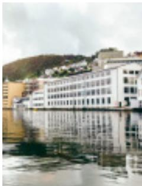

> **AI Description:**
> **Source:** `assets/_page_13_Figure_23.jpg`
> 
> **Generated:** 2026-05-17 19:05:02
> 
> ---
> 
> The image is a photograph of a waterfront scene. It features a row of modern, multi-story buildings with a white facade, situated along a body of water. The buildings are reflected in the calm water, creating a symmetrical and serene view. In the background, there is a hillside with greenery, and the sky appears overcast. The overall atmosphere of the image is calm and urban.

See pages 16-17

# Discover historic Bergen!

BYMUSEET.

bymuseet.no

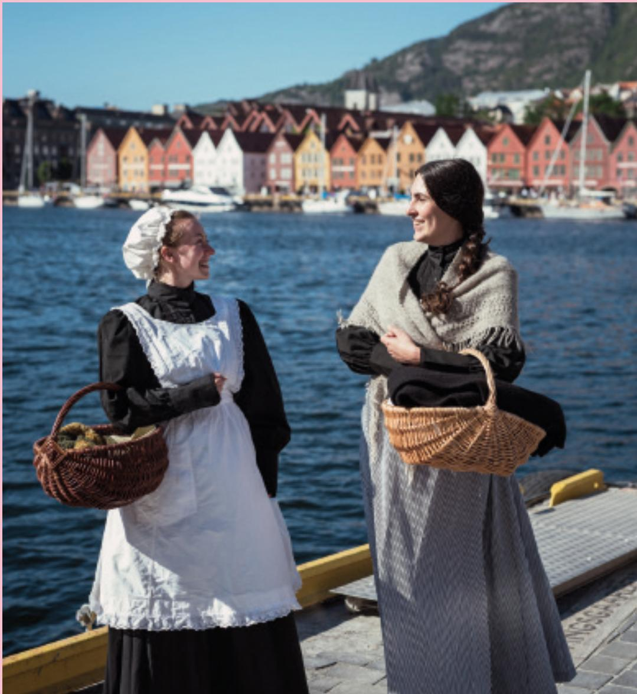

> **AI Description:**
> **Source:** `assets/_page_14_Figure_2.jpg`
> 
> **Generated:** 2026-05-17 19:06:00
> 
> ---
> 
> The image is a photograph showing two individuals dressed in historical attire, likely representing a bygone era. They are standing on a dock by a body of water, with colorful, traditional buildings in the background. The person on the left is wearing a white apron over a black dress and holding a wicker basket, while the person on the right is dressed in a gray, textured garment and also holding a wicker basket. The setting appears to be a historical reenactment or a scene from a period drama, with the backdrop of the buildings suggesting a European coastal town.

CITY WALK

## Bryggen Guiding – on foot

Experience Bergen’s history where it all started – at UNESCO World Heritage site Bryggen!

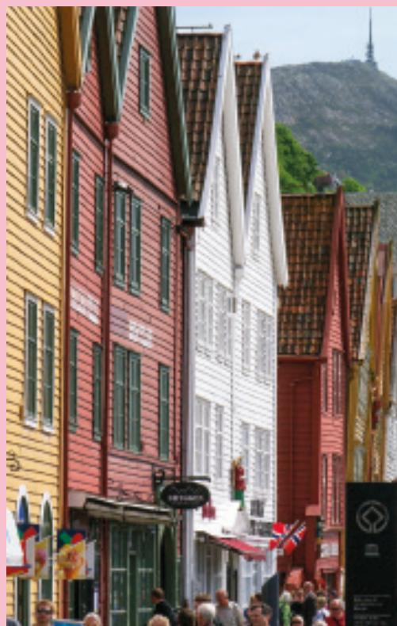

> **AI Description:**
> **Source:** `assets/_page_14_Figure_3.jpg`
> 
> **Generated:** 2026-05-17 19:10:39
> 
> ---
> 
> The image is a photograph of a street scene featuring a row of colorful, traditional wooden buildings with steeply pitched roofs. The buildings are painted in various bright colors, including yellow, red, and white, and have multiple windows. The street is bustling with people, and there are flags visible, suggesting a festive or tourist area. In the background, a mountain with a visible structure on top can be seen, indicating the image was likely taken in a mountainous region. The overall atmosphere is lively and vibrant, characteristic of a historic or culturally significant location.

THEATRICAL CITY WALK

## At Your Service!

Join a theatrical city walk that   
provides an entertaining introduction to Bergen’s history.   
The walk starts at the Tourist   
Information before concluding   
at Skansen.

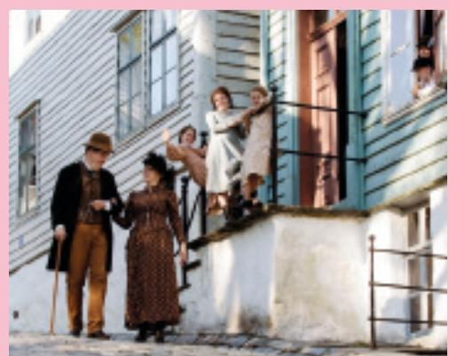

> **AI Description:**
> **Source:** `assets/_page_14_Figure_4.jpg`
> 
> **Generated:** 2026-05-17 18:59:52
> 
> ---
> 
> The image is a photograph depicting a scene with five individuals in front of a two-story house. The individuals are dressed in period clothing, suggesting a historical setting. The house has a white exterior with a blue door and windows. Two women and a man are standing on the ground level, while two children are standing on the balcony. The scene appears to be from a historical drama or film, given the attire and setting.

OLD BERGEN MUSEUM

## Experience 19th century Bergen

Enjoy a bit of nostalgia delving into the history of a living museum in the reconstructed Bergen of the 19th and 20th centuries.

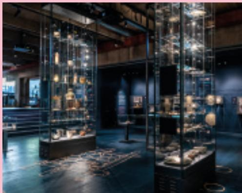

> **AI Description:**
> **Source:** `assets/_page_14_Figure_5.jpg`
> 
> **Generated:** 2026-05-17 19:03:01
> 
> ---
> 
> The image depicts an interior view of a museum or exhibition space. It features glass display cases containing various artifacts, likely historical or cultural items, arranged on shelves and platforms. The lighting is dim, with spotlights highlighting the exhibits, creating a dramatic and focused atmosphere. The floor is dark, possibly with a patterned design, and there are railings and barriers around the display areas. The overall setting suggests a curated exhibit designed to showcase and preserve historical or cultural artifacts.

BRYGGENS MUSEUM

## Meet the Middle Ages

Archaeological museum comprising thousands of items that provide an interesting insight into everyday life during the Middle Ages.

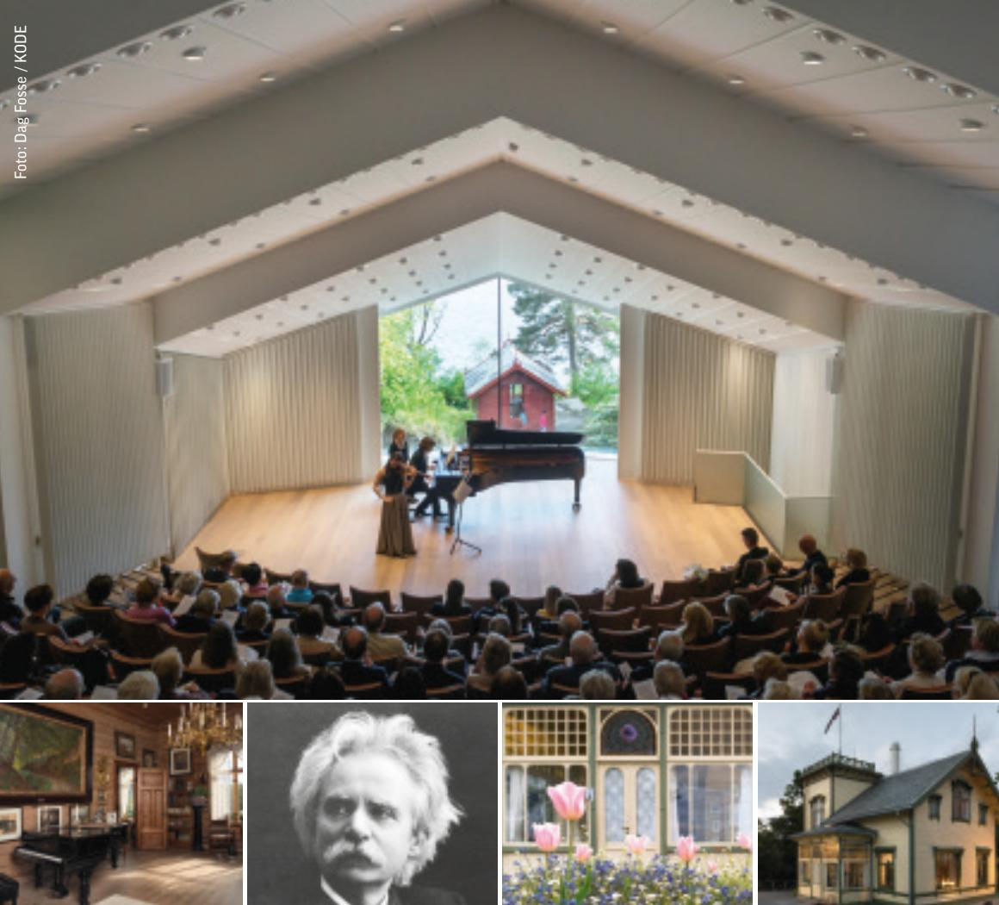

> **AI Description:**
> **Source:** `assets/_page_15_Figure_0.jpg`
> 
> **Generated:** 2026-05-17 18:56:50
> 
> ---
> 
> The image contains a collage of photographs and a photograph of a person. The top photograph shows an interior view of a concert hall with an audience in the foreground and performers on stage. The bottom row includes four separate photographs: an interior room with a piano, a black-and-white portrait of a man, a close-up of a door with floral decorations, and an exterior view of a building with a flag. The photographs appear to be related to a cultural or historical setting, possibly a composer or musician's home or a venue for performances.

## EDVARD GRIEG MUSEUM TROLDHAUGEN

Edvard Grieg’s home offers tours and concerts throughout the summer.

TICKETS TO CONCERTS (ENTRANCE INCLUDED)

ENTRANCE TICKETS:

OPENING HOURS: 10–17 (CLOSED ON MONDAYS)

## KODE BERGEN ART MUSEUM

## Shows Norwegian and international masterpieces and has one of the world’s largest collections of Edvard Munch’s works.

## Chapter 2.3 / Churches

## BERGEN CATHEDRAL

Bergen Cathedral has stood, fallen and been rebuilt for almost 900 years. It was dedicated to Saint Olav in around 1150. The Church has been ravaged by five fires since then, and it was hit by a cannon ball in 1665. The canon ball is still lodged in the church spire as a memento of the Battle of Vågen.

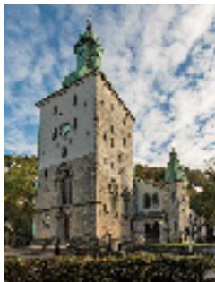

> **AI Description:**
> **Source:** `assets/_page_16_Figure_1.jpg`
> 
> **Generated:** 2026-05-17 19:19:30
> 
> ---
> 
> The image is a photograph of a historic stone building with a tall tower, featuring a clock face on the front. The architecture suggests a medieval or early modern style, with a green roof and decorative spires. The building is surrounded by greenery, and the sky is partly cloudy. The structure appears to be a church or a similar religious or civic building.

Domkirkeplassen 1 / NO-5018 / +47 55 59 71 75 / bergendomkirke.no

> **AI Description:**
> **Source:** `assets/_page_16_Figure_2.jpg`
> 
> **Generated:** 2026-05-17 19:23:43
> 
> ---
> 
> The image contains a single icon representing a wheelchair, commonly used to symbolize accessibility or disability-related services. This icon is a standard symbol used in various contexts, such as on signs indicating accessible restrooms or transportation options for people with disabilities.

## FANTOFT STAVE CHURCH

The old stave church at Fantoft, originally built in Fortun in Sogn in 1150 and moved to Fantoft in 1883, was destroyed in a fire on 6 June 1992. The stave church was rebuilt as it had stood prior to the fire and opened in May 1997. The easiest way to get to the church is to take the Bergen Light Rail to Fantoft and follow the signs a further 500 metres.

Fantoftveien 38C, Paradis / NO-5072 / +47 55 28 07 10

> **AI Description:**
> **Source:** `assets/_page_16_Figure_5.jpg`
> 
> **Generated:** 2026-05-17 19:36:28
> 
> ---
> 
> The image is a photograph of a traditional wooden church with a steeply pitched roof and a tall, spire-like tower. The church is illuminated, suggesting it is either dusk or early evening. The surrounding area appears to be a natural landscape with trees in the background. The architectural style is characteristic of Scandinavian wooden churches, known for their intricate carvings and craftsmanship.

## ST JOHN’S CHURCH

The elevated position of St John’s Church at Nygårdshøyden makes it a very visible feature of the city. It has the highest tower in Bergen at 61 metres, and it is also the church with the biggest capacity. The church was built in 1894 in the Neo-Gothic style. Its unique altarpiece and the large organ are additional reasons to visit the church.

> **AI Description:**
> **Source:** `assets/_page_16_Figure_7.jpg`
> 
> **Generated:** 2026-05-17 19:31:19
> 
> ---
> 
> The image contains a simple icon of a wheelchair symbol, which is commonly used to represent accessibility or disability-related services. This icon is often used in various contexts such as websites, documents, or signage to indicate that the location or service is accessible to individuals with disabilities.

Sydnesplassen 5 / NO-5007 / +47 55 59 71 75 / bergendomkirke.no

> **AI Description:**
> **Source:** `assets/_page_16_Figure_8.jpg`
> 
> **Generated:** 2026-05-17 18:57:30
> 
> ---
> 
> The image shows a photograph of a church with a prominent red brick facade and a tall, pointed spire. The church has a large arched entrance and is surrounded by greenery, with a clear blue sky in the background. The architectural style suggests it is a European church, possibly from the late 19th or early 20th century.

## ST MARY’S CHURCH

St Mary’s Church is the oldest intact building in Bergen. It was built during the 12th century, probably between 1130 and 1170. The beautiful inventory of St Mary’s Church makes it well worth a visit, featuring a gilded altarpiece, a Baroque pulpit and other church art dating from different periods.

Dreggsallmenningen 15 / NO-5003 / +47 55 59 71 75 / bergendomkirke.no

> **AI Description:**
> **Source:** `assets/_page_16_Figure_10.jpg`
> 
> **Generated:** 2026-05-17 19:04:25
> 
> ---
> 
> The image depicts the interior of a church, showcasing a detailed view of the altar area. The architecture features arched ceilings and stone walls, with a central altar adorned with a red cloth and a cross. Above the altar, there is a large, ornate wooden structure with intricate carvings and paintings, likely representing religious iconography. The image captures the solemn and reverent atmosphere typical of a church interior.

## Chapter 2.4 / sightseeing

## BERGEN BIKE RENT

Bergen is a charming city, which is easily explored from the seat of a bike. You are guaranteed new bikes and state-of-the-art equipment at Bergen Bike Rent. Cycling around Bergen provides a great opportunity to see Bergen at its best. The minimum rental period is two hours. Equipment: Bike/Electric bike – Helmet – Map – Bag – Tools – Lock.

> **AI Description:**
> **Source:** `assets/_page_16_Figure_12.jpg`
> 
> **Generated:** 2026-05-17 19:06:52
> 
> ---
> 
> The image is a photograph showing two individuals on bicycles, viewed from behind. They are wearing helmets and are seated on grassy terrain with a scenic view of a coastal area in the background. The sky is clear and blue, and the landscape includes water and land formations. The image conveys a sense of outdoor activity and leisure.

Bontelabo 2 / NO-5003 / +47 410 68 000 / bergenbikerent.no

## BERGEN GUIDESERVICE

No one knows Bergen like we do. Our authorised guides, who speak a total of 20 languages, will be happy to show you around Bergen. We tailor tours to suit your needs, all year.   
Get in touch to book a tour!

Holmedalsgården 4 / NO-5003 / +47 55 30 10 60 / bergenguideservice.no

> **AI Description:**
> **Source:** `assets/_page_16_Figure_15.jpg`
> 
> **Generated:** 2026-05-17 19:02:23
> 
> ---
> 
> The image contains two distinct icons. The first icon is a wheelchair symbol, which is commonly used to represent accessibility or disability-related services. The second icon is a snowflake, which is typically associated with winter, cold weather, or snowfall. There is no text or additional visual content beyond these two icons.

> **AI Description:**
> **Source:** `assets/_page_16_Figure_16.jpg`
> 
> **Generated:** 2026-05-17 18:57:52
> 
> ---
> 
> The image is a photograph of a man wearing a red jacket with a black design on the front. He has short dark hair and a mustache. In the background, there are other people, including a woman in an orange top and a man in a dark shirt. The setting appears to be outdoors with greenery visible.

## BERGEN SEGWAY

Bergen´s original and only authorized Segway tour operator. Certificate of Excellence awarded 6 years in a row. Our tours are suitable for everybody. We guarantee you a fun and memorable experience. Our tours cover all of Bergen city center incl fantastic views from the mountainside.

Bontelabo 2 / NO-5003 / +47 471 47 100 / BergenSegway.no

## 07000 BERGEN TAXI

Taxi, sightseeing, transfers or VIP transport? Call 07000! Bergen’s biggest taxi company is ready to oblige. We are open all day – all year. Call us at 07000 or use the 07000 app.

Bergen, Askøy and Øygarden / NO-5257 / 07000 (+47 55997000) / bergentaxi.no

> **AI Description:**
> **Source:** `assets/_page_16_Figure_19.jpg`
> 
> **Generated:** 2026-05-17 19:31:35
> 
> ---
> 
> The image is a photograph of two individuals riding Segways on a cobblestone street. Both are wearing helmets and sunglasses, and they appear to be enjoying a leisurely ride. The background shows a row of houses with a mix of modern and traditional architecture, suggesting a quaint, possibly European setting. The image conveys a sense of fun and exploration in a picturesque urban environment.

> **AI Description:**
> **Source:** `assets/_page_16_Figure_20.jpg`
> 
> **Generated:** 2026-05-17 19:25:29
> 
> ---
> 
> The image contains two distinct icons. The first icon is a wheelchair symbol, which is commonly used to represent accessibility or disability-related services. The second icon is a snowflake, which typically represents snow or cold weather conditions. There is no text or additional visual content beyond these two icons.

> **AI Description:**
> **Source:** `assets/_page_16_Figure_21.jpg`
> 
> **Generated:** 2026-05-17 19:23:20
> 
> ---
> 
> The image is a photograph of two individuals standing next to a taxi. The taxi has a sign on the side that reads "000 Gargan Taxi." The individuals appear to be engaged in conversation, with one person leaning towards the other. The setting seems to be an urban environment, possibly a taxi stand or a busy street. The image captures a moment of interaction between the two people and the taxi, suggesting a possible pickup or drop-off scenario.

Visit Bergen

BergenGuide 2022

## BRYGGEN GUIDING – on foot

Experience Bergen’s history where it all started – at UNESCO World Heritage site Bryggen! The walk starts at Bryggens Museum, continues to the ruins of the city’s first town hall, well hidden below street level, then takes you through the wooden buildings at Bryggen and ends up at Schøtstuene assembly rooms. Meeting point: Bryggens Museum. Duration 90 minutes.

Dreggsallmening 3 / NO-5003 / +47 55 30 80 30 / bymuseet.no/

> **AI Description:**
> **Source:** `assets/_page_17_Figure_1.jpg`
> 
> **Generated:** 2026-05-17 19:32:15
> 
> ---
> 
> The image is a photograph of a person dressed in a red historical costume, possibly from the medieval period, standing in front of a cobblestone street. The background shows a group of people, some in period attire, and a building with a tiled roof and wooden structures, suggesting a historical or reenactment setting. The person in the foreground is holding a small object, possibly a purse or a book, and is wearing a white apron over the red dress. The overall scene conveys a sense of historical reenactment or a themed event.

## HOP ON HOP OFF BUS BERGEN

Climb aboard the Hop On – Hop Off bus for a fun and memorable trip and impression of the city. Travel with us and experience everything Bergen has to offer. The bus stops at all the most important sights and attractions.

Stop 1 Skolten Cruise Terminal / NO-5003 / +47 22 33 20 00 / stromma.com/no-no/bergen/sightseeing/hop-on-hop-off

> **AI Description:**
> **Source:** `assets/_page_17_Figure_3.jpg`
> 
> **Generated:** 2026-05-17 19:33:18
> 
> ---
> 
> The image contains a colorful double-decker bus with a vibrant design. The bus features various cartoon-like characters and bright colors, including red, yellow, blue, and green. The top of the bus is open, allowing passengers to enjoy the view while traveling. The bus is parked in an outdoor setting with trees and greenery visible in the background. The design suggests it might be used for sightseeing or tours.

> **AI Description:**
> **Source:** `assets/_page_17_Figure_4.jpg`
> 
> **Generated:** 2026-05-17 19:27:08
> 
> ---
> 
> The image contains two circular icons. The first icon is a standard wheelchair symbol, indicating accessibility or disability-related services. The second icon is a letter "B" enclosed within a circle. The image does not contain any charts, graphs, photographs, or other visual elements beyond these two symbols.

## MARTINS BERGEN TOURS – CITY WALKING TOURS

Hello, I’m Martin and as an authorized city guide I would like to introduce you to the city of Bergen, its history and culture, and to its people and the traditions they maintain. Personal. Committed. Fun. Tickets for my tours (in German and English) can be purchased on www.martinsbergentours.com.

+47 462 41 200 / martinsbergentours.com

> **AI Description:**
> **Source:** `assets/_page_17_Figure_7.jpg`
> 
> **Generated:** 2026-05-17 19:22:04
> 
> ---
> 
> The image is a photograph of a person standing outdoors. The individual is wearing a dark blue jacket, a black cap, and appears to be in a casual pose with hands in the pockets. The background suggests an urban setting with stone structures, possibly a building or a wall. There are no charts, graphs, or other visual elements present in the image.

## THEATRICAL CITY WALKS – AT YOUR SERVICE

Join a theatrical city walk that provides an entertaining introduction to Bergen’s history. Local actors from Bergen City Museum bring the life of a local maidservant in around 1880 to life. The walk starts at the Tourist Information, and continues through streets and squares before concluding at the old fire station up at Skansen.

Dreggsallmening 3 / NO-5003 / +47 55 30 80 30 / bymuseet.no/

> **AI Description:**
> **Source:** `assets/_page_17_Figure_9.jpg`
> 
> **Generated:** 2026-05-17 19:03:40
> 
> ---
> 
> The image is a photograph of two individuals dressed in historical attire, possibly representing a traditional or cultural scene. They are standing near a body of water with a scenic backdrop of colorful buildings and mountains. The person on the left is holding a basket, while the person on the right is holding a similar basket and appears to be wearing a shawl or cloak. The setting suggests a historical or tourist location, possibly in a European country known for its colorful architecture and scenic landscapes.

Visit Bergen
BergenGuide 2022

Chapter 2.4 Sightseeing

More information: visitBergen.com

## Explanation symbols:

> **AI Description:**
> **Source:** `assets/_page_17_Figure_11.jpg`
> 
> **Generated:** 2026-05-17 19:21:22
> 
> ---
> 
> The image contains a single icon representing a wheelchair, commonly used to symbolize accessibility or disability-related services. This icon is typically used in various contexts such as websites, documents, or physical spaces to indicate areas or services designed for people with disabilities.

Wheelchair access

Café

Open all year

> **AI Description:**
> **Source:** `assets/_page_17_Figure_14.jpg`
> 
> **Generated:** 2026-05-17 19:36:36
> 
> ---
> 
> The image contains a simple icon of a shopping cart. This icon is commonly used to represent online shopping, e-commerce, or the concept of purchasing items. It is a single, static image without any text or additional visual elements.

Shopping

Bergen Card

Green Travel

Look for the in the Bergen Guide to find ecolabel tourism enterprises in the region.

## Travel by bus, boat and light rail when you want to enjoy Bergen and Hordaland!

Visit skyss.no for timetables and further information.

skyss.no

skyss

# Bergen is a European City of Culture, which has been known for its rich and varied cultural scene all the way back to the Hanseatic era.

Bergen was a European City of Culture already in 2000 and is home today to a unique range of experiences and cultural activities. Every day, it is possible to choose between revues and theatre, dance performances, shows and international concerts featuring top-class international performers.

The Bergen region also has more than 60 highly varied attractions. There are great opportunities for young people, adults, children and families who want to explore local traditions and history.

Bergen’s Art Street has collections featuring unique treasures from Norway and abroad, both past and present. The collections are housed in a row of galleries lining the picturesque Lille Lungegårdsvann lake in the heart of the city. Permanent and changing exhibitions throughout the year. KODE houses large collections by Munch, Tidemand and Gude, Picasso, Miró and Astrup, as well as contemporary art and KunstLab, a dedicated art museum for children and young people. Bergen Kunsthall is also situated here, where you can see contemporary art, performance art etc.

Bergen, Music City – always a concert to suit your taste. The Edvard Grieg Museum at Troldhaugen, the home of this worldfamous composer, is a well-known venue for visitors from far and wide. The city also has a number of concert venues, ranging from small clubs to outdoor arenas and the region’s flagship concert hall, the Grieg Hall, home to Bergen Philharmonic Orchestra. The orchestra celebrated its 250th anniversary in 2015.

With more than 60 festivals and big concerts, Bergen has cemented its position in the music world. Many people choose to visit Bergen during Bergen International Festival in May/June, when, in addition to the fantastic international festival, they get to see the city looking its best in spring. Nattjazz, one of Norway’s biggest jazz festivals, is held in parallel with Bergen International Festival, and is based at USF Verftet. Every summer, the historic area Koengen at Bergenhus Fortress is transformed into a unique festival area when big Norwegian and international names play at the Bergenfest music festival.

Bergen is an action-packed city, and you’ll definitely never be bored. There’ll always be something on that’s to your taste.

# You won’t return home empty-handed after a day’s shopping in Bergen. Our city has a range of shops few other Norwegian cities can match

In the compact city centre, you’ll find everything from fashionable design shops and large shopping centres, to small specialist shops with goods you won’t find anywhere else in the world.

Jump off the bus at Olav Kyrres Gate, Festplassen or Torget, and you will find yourself in the heart of Bergen’s main shopping area. Home to large, fashionable shopping centres such as Galleriet and Bergen Storsenter, which boast a wide range of shops, and abundant shopping opportunities.

In addition to the shopping centres in the centre of Bergen, there are also a number of large shopping centres outside the city centre that are worth a visit. Most of them are easy to get to by bus or Bergen Light Rail.

Or do you prefer a bit of fresh air between shops on your shopping excursion? In that case, you should head for the shops in the city centre streets. Instead of the big, well-known chains, you will find unique niche shops along the narrow, cobbled pedestrian streets and alleyways of the city centre, which sell goods you won’t find anywhere else. Wander along Strandgaten, Marken, Hollendergaten, Øvregaten or Bryggen, and make shopping in Bergen

an experience. Visit shops you’ve never heard of and find clothes you know none of your friends will have.

There are many well-known design and souvenir shops along historic Bryggen that sell beautiful examples of Norwegian craftsmanship, gifts and delightful small items you will enjoy for years to come. In the area around Vågen harbour, you can buy fantastic clothes made by well-known local clothes manufacturers. Take your time and have a good look around to ensure you make the most of shopping in Bergen. Although the shops are spread across the city streets, the compact city centre means they are all within easy distance.

> **AI Description:**
> **Source:** `assets/_page_20_Figure_0.jpg`
> 
> **Generated:** 2026-05-17 19:22:58
> 
> ---
> 
> The image contains a photograph of a set of ornate silverware, including a fork, knife, and spoon, arranged neatly on a white napkin. The silverware features intricate designs and patterns, suggesting a formal or elegant setting. The background includes a blurred glass, possibly containing a beverage, adding to the sophisticated ambiance of the scene. The focus is on the silverware, highlighting its craftsmanship and the setting's refined atmosphere.

> **AI Description:**
> **Source:** `assets/_page_20_Figure_1.jpg`
> 
> **Generated:** 2026-05-17 19:25:43
> 
> ---
> 
> The image shows the interior of a modern retail or café space. It features a combination of wooden and metallic elements, with a clean and organized layout. The space includes multiple counter areas, some with display shelves and others with seating. There are plants and decorative items placed on the counters, adding a touch of greenery and aesthetic appeal. The lighting is bright and evenly distributed, enhancing the overall ambiance of the space.

> **AI Description:**
> **Source:** `assets/_page_20_Figure_2.jpg`
> 
> **Generated:** 2026-05-17 19:21:56
> 
> ---
> 
> The image contains a photograph of a ring with a red gemstone and a textured, brown bead-like element. The ring is placed on a vibrant pink flower petal, which contrasts with the neutral background. The focus is on the ring, highlighting its design and the natural setting it is displayed in.

> **AI Description:**
> **Source:** `assets/_page_20_Figure_3.jpg`
> 
> **Generated:** 2026-05-17 19:19:13
> 
> ---
> 
> The image is a black and white photograph of a person working behind a counter, likely in a coffee shop or similar setting. The individual appears to be operating a coffee machine or similar equipment, with various bottles and containers visible on shelves in the background. The focus is on the person and the equipment, suggesting a professional environment related to beverage preparation.

150 YEARS OF EXPERIENCE AND GREAT DESIGN

Arven gold and silver factory

Visit our shop and visitor centre. See our skilled craftsmen and women at work making timeless silverware and beautiful gold jewellery.

SANDBROGATEN 11 • 10-17 (14) • ARVEN.NO

Visit Bergen

BergenGuide 2022

Chapter 4. Shopping

## ARVEN GOLD AND SILVER WARE FACTORY AND SHOP

At Arven gold and silver ware factory and shop, you can buy beautiful hand made jewellery, household items and silver cutlery. A visit here is a real experience! You can see the production line and our artisans at work up close through a 40 metre long glass wall. Guided tours of the factory are also available.

Sandbrogaten 11 / NO-5003 / +47 55 55 14 40 / arven.no

> **AI Description:**
> **Source:** `assets/_page_20_Figure_7.jpg`
> 
> **Generated:** 2026-05-17 19:36:54
> 
> ---
> 
> The image is a photograph of a person standing at a counter in what appears to be a laboratory or workshop setting. The individual is wearing a dark jacket and jeans and is interacting with another person who is seated at the counter. Various equipment and materials are visible on the counter and in the background, suggesting a scientific or technical environment. The image is somewhat blurry, making it difficult to discern specific details of the equipment or materials.

> **AI Description:**
> **Source:** `assets/_page_20_Figure_8.jpg`
> 
> **Generated:** 2026-05-17 19:02:27
> 
> ---
> 
> The image contains two icons: a shopping cart and a snowflake. The shopping cart icon is on the left, and the snowflake icon is on the right. These icons are commonly used to represent e-commerce and winter or cold weather, respectively. There is no text or additional information provided in the image.

## DALE OF NORWAY

You can buy premium knitwear from Dale of Norway in shops on Bryggen. You can also shop from our entire collection at the Dale of Norway Brand Store at Lagunen shopping centre. If you are looking for a bargain, visit our factory outlet in Dale. Guided tours of the factory in Dale can be booked for groups: shop@dale.no

Brand Store, Lagunen Storsenter, Laguneveien 1 / NO-5239 / +47 415 67 523 Factory Outlet, Sandlivegen 2 / NO-5722 / +47 415 67 571 / daleofnorway.com

> **AI Description:**
> **Source:** `assets/_page_20_Figure_10.jpg`
> 
> **Generated:** 2026-05-17 19:18:12
> 
> ---
> 
> The image contains three distinct icons: a wheelchair symbol, a shopping cart, and a snowflake. These icons are typically used to represent accessibility, commerce, and winter weather conditions, respectively. The icons are simple and circular, with the wheelchair and snowflake icons having a white background and the shopping cart icon having a light gray background.

> **AI Description:**
> **Source:** `assets/_page_20_Figure_11.jpg`
> 
> **Generated:** 2026-05-17 19:18:43
> 
> ---
> 
> The image is a photograph of a person wearing a patterned sweater and a cap, sitting outdoors. The background shows another person, slightly out of focus, sitting on what appears to be a bench or similar outdoor furniture. The lighting suggests it is either early morning or late afternoon, with the sun casting a warm glow. The image captures a casual, relaxed moment in an outdoor setting.

## ARTISTS AT BRYGGEN

Behind the iconic façade of Bryggen in the heart of Bergen, you can meet local artists and designers at work. Wander through the historic passages and find silversmiths, illustrators, textile designers and artists at work in their studios as well as a variety of shops. Come and visit us!

Jacobsfjorden and Bellgården / NO-5003 / +47 481 01 095 / kunstnerepabryggen.no/

> **AI Description:**
> **Source:** `assets/_page_20_Figure_13.jpg`
> 
> **Generated:** 2026-05-17 19:17:19
> 
> ---
> 
> The image contains four icons arranged in a row. The first icon is a wheelchair, indicating accessibility. The second icon is a coffee cup with steam, suggesting a hot beverage. The third icon is a shopping cart, representing commerce or retail. The fourth icon is a snowflake, symbolizing winter or cold weather. These icons are likely part of a set used for navigation or categorization in a user interface.

> **AI Description:**
> **Source:** `assets/_page_20_Figure_14.jpg`
> 
> **Generated:** 2026-05-17 19:16:38
> 
> ---
> 
> The image is a photograph of a person standing indoors, possibly in a store or workshop setting. The person is wearing a dark jacket, apron, and boots, and is holding something in their hands. In the background, there is a wooden counter or display with a sign featuring a red horse logo and some text. The setting appears to be rustic, with wooden beams and a stone wall visible. The overall scene suggests a casual, possibly artisanal or retail environment.

## OLEANA ÉCONOMUSÉE

Oleana is an open textile factory where we invite you to come on a journey through our production hall, where you can watch how raw yarn is turned into finished products. Witness craftsmanship in practice and learn about textile production. Guided tours for groups on request.

Ivar Aasgaardsvei 1 / NO-5265 / +47 55 39 32 25 / oleana.no

> **AI Description:**
> **Source:** `assets/_page_20_Figure_16.jpg`
> 
> **Generated:** 2026-05-17 19:16:42
> 
> ---
> 
> The image contains a series of icons representing different concepts. The icons include a wheelchair, a steaming cup of coffee, a shopping cart, and a snowflake. These icons are likely used to represent accessibility, hot beverages, shopping, and winter or cold weather, respectively.

> **AI Description:**
> **Source:** `assets/_page_20_Figure_17.jpg`
> 
> **Generated:** 2026-05-17 19:17:15
> 
> ---
> 
> The image is a photograph showing two individuals in what appears to be a textile or manufacturing setting. One person, wearing a white shirt, is smiling and appears to be engaged in conversation with another person whose back is partially visible. The foreground includes spools of blue thread, suggesting the setting is related to textile production or manufacturing. The background shows industrial equipment, further indicating a manufacturing environment.

# Bergen City of Gastronomy builds on its thousand-year history of local produce and unique culinary traditions.

Surrounded by the sea, deep fjords and high mountains and with ample access to fertile mountain pastures, the region produces first-rate produce from the sea and land.

The rich traditional culinary culture and access to a great variety of produce from clean, magnificent surroundings provide the inspiration for creative and innovative cuisine. The Bergen region has a number of internationally renowned restaurants and a growing number of world-class chefs. Creative culinary artists who cultivate, develop and pass on local food culture and gastronomy, and who combine local produce, seasonal twists and creativity.

Bergen is a member of UNESCO’s City of Gastronomy network, in which the intention is for the cities to cooperate and share experiences linked to food, creativity and gastronomy. It is international recognition of all the opportunities and potential of Bergen City of Gastronomy.

Seafood has always formed the heart of Bergen’s culinary culture, and the sea of Bergen abounds with tasty delicacies. This is where you will find the season’s best ingredients – mussels and scallops, crawfish and crabs, prawns and the

freshest of fish. You can sample traditional Bergen fish soup, an array of seafood dishes that reflect the seasons in their simplicity and freshness, and the old classic Bergen dish ‘persetorsk’, where cod is first marinated in salt and sugar before being pressed.

In Bergen you will find just about everything – from coffee bars to fish restaurants and delicious international cuisine, to small arty cafés, bars and nightclubs. A delicatessen. Bergen City of Gastronomy has world-class restaurants and some of Norway’s most beautiful places to eat – it’s just a matter of letting your mood, taste buds and wallet decide.

SKYSKRAPEREN

## A new perspective on seasonal cuisine

> **AI Description:**
> **Source:** `assets/_page_22_Figure_0.jpg`
> 
> **Generated:** 2026-05-17 19:06:47
> 
> ---
> 
> The image is a photograph of a dining table set for a meal with elegant glassware and napkins. The table is positioned in front of large windows that offer a stunning view of a mountainous landscape under a clear sky. The setting suggests a luxurious and serene dining experience, possibly at a high-altitude location. The image captures the beauty of the natural scenery juxtaposed with the refined interior design of the dining area.

## NORDIC FOOD IN RAW NATURE

Inspired by Norwegian nature, tradition and the changing weather of the west coast we present a new menu for each season of the year with the kitchens own local twists. Skyskraperen is located at the top of Mount Ulriken with a spectacular vi overlooking Bergen and its surrounding mountains, fjords and ever-changing weather.

Welcome to our seasonal 3-course lunch or a full 5-course tasting menu in the evening. Book your table for a unique experience to dine on the highest of the seven mountains surrounding the city of Bergen.

## O N B R Y G G E N I N B E R G E N

> **AI Description:**
> **Source:** `assets/_page_22_Figure_1.jpg`
> 
> **Generated:** 2026-05-17 19:08:57
> 
> ---
> 
> The image shows a photograph of a yellow wooden building with the word "ENHJØRNINGEN" written on it in black letters. The building has multiple windows with white frames and a red flag is visible at the top. The architecture suggests a historical or traditional style, possibly in a European city. The sky is clear and blue, indicating a sunny day.

> **AI Description:**
> **Source:** `assets/_page_22_Figure_2.jpg`
> 
> **Generated:** 2026-05-17 19:04:30
> 
> ---
> 
> The image depicts a dining room setting with a table set for a meal. The table is covered with a white tablecloth and is adorned with red napkins, wine glasses, and what appears to be a centerpiece. The walls are dark with a rustic, wooden texture, and there is a framed painting hanging on the wall above the table. The room has a cozy ambiance with a window allowing natural light to enter.

ENHJØRNINGEN is the oldest fish restaurant in Bergen – extensive à la carte menu with everything you could think of in fish and shellfish. Opening hours every day 16.00-23.00.
September to May: Closed Sunday. Open till 11 pm. Book a table by telephone on +47 55 30 69 50 www.enhjorningen.no

> **AI Description:**
> **Source:** `assets/_page_22_Figure_4.jpg`
> 
> **Generated:** 2026-05-17 18:58:02
> 
> ---
> 
> The image is a photograph of a family dining together at a table. There are three people visible: an adult seated at the head of the table, a child seated on the left, and another adult standing and serving food. The table is set with plates, glasses, and a basket of bread. The setting appears to be a cozy, rustic interior with wooden walls and curtains. The image conveys a warm, familial atmosphere.

TO KOKKER – We use real Norwegian produce – and serve it with the respect it deserves!
Open Monday to Saturday 5 – 11 pm. Table bookings: +47 55 30 69 55 www.tokokker.no

> **AI Description:**
> **Source:** `assets/_page_22_Figure_6.jpg`
> 
> **Generated:** 2026-05-17 19:01:49
> 
> ---
> 
> The image depicts a cozy indoor setting, likely a lounge or bar area. There are several people seated and standing, engaging in conversation. The room features a mix of furniture, including upholstered chairs and a bar counter. The decor includes warm lighting, wooden elements, and ornate details, creating a relaxed and inviting atmosphere. The overall ambiance suggests a social gathering or a casual meeting place.

After a great meal – lean back in BAKLOMMEN. Our bar is quite unique – with that real Bryggen atmosphere.
Pull up a stool and order from our well-stocked bar – or perhaps you’d prefer just a good cup of coffee in very nice surroundings.

## Chapter 5.1 exclusive

## BARE RESTAURANT

The only restaurant in Bergen with a Michelin star. It serves five and tencourse tasting menus. Highlights local ingredients from Western Norway in historic premises.

Torgallmenningen 2 / +47 400 02 455 / barerestaurant.no

> **AI Description:**
> **Source:** `assets/_page_23_Figure_0.jpg`
> 
> **Generated:** 2026-05-17 19:03:05
> 
> ---
> 
> The image contains a photograph of two individuals standing side by side against a plain background. Both individuals are dressed in casual attire, with one wearing a white shirt and overalls, and the other wearing a dark jacket and a beard. The image does not contain any text or additional visual elements beyond the two people and their clothing.

## CORNELIUS SEAFOOD RESTAURANT

Meteorological seafood menu, inspired by the raw beauty of the local fjords, offering a delicious variety of seafood from the West coast.

Holmen, 25 min. by boat / +47 56 33 48 80 / corneliusrestaurant.no

> **AI Description:**
> **Source:** `assets/_page_23_Figure_1.jpg`
> 
> **Generated:** 2026-05-17 18:58:38
> 
> ---
> 
> The image is a photograph of a marina with several boats docked. The boats are of various sizes and types, including what appears to be a houseboat and smaller sailboats. The water is calm, and the background features a line of trees and a clear sky, suggesting a peaceful coastal setting. The image does not contain any text or additional visual elements beyond the photograph itself.

## ENHJØRNINGEN FISKERESTAURANT

Enhjørningen is Bergen’s oldest fish restaurant – large á la carte menu of fish and shellfish. Housed at Bryggen in Bergen in a building dating from 1702.

Bryggen 29 / +47 55 30 69 50 / enhjorningen.no

> **AI Description:**
> **Source:** `assets/_page_23_Figure_2.jpg`
> 
> **Generated:** 2026-05-17 18:55:45
> 
> ---
> 
> The image is a photograph of an indoor setting, likely a restaurant or dining area. The room has a rustic aesthetic with wooden beams on the ceiling and walls painted in warm tones. There are several tables with chairs, some of which are occupied by people. The tables are set with plates, glasses, and other dining items. The lighting appears to be warm and ambient, contributing to a cozy atmosphere. There are framed pictures or artwork on the walls, adding to the decor.

## FISH ME

The city’s new seafood destination in Mathallen at the Fish Market.   
Norwegian local ingredients – Fish shop – Restaurant – Bar – Sushi – Bakery.

Strandkaien 3, Fisketorget / +47 450 23 000 / fishme.no

> **AI Description:**
> **Source:** `assets/_page_23_Figure_3.jpg`
> 
> **Generated:** 2026-05-17 18:58:34
> 
> ---
> 
> The image contains a photograph of a meal setup with multiple plates of food. The plates include various dishes such as a burger, a salad, and what appears to be a main course with vegetables and possibly meat. The plates are arranged on a table with blue placemats, and there are utensils and a glass of orange juice visible. The image is a snapshot of a dining scene, likely intended to showcase a meal or a restaurant setting.

## RESTAURANT 1877

Food with love & knowledge. A meal at Restaurant 1877 is just a few hours of your life. We hope you remember it for much longer.

Vetrlidsallmenningen 2 (Kjøttbasaren) / +47 92 87 18 77 / restaurant1877.no

> **AI Description:**
> **Source:** `assets/_page_23_Figure_4.jpg`
> 
> **Generated:** 2026-05-17 19:03:14
> 
> ---
> 
> The image is a photograph of two individuals wearing aprons, standing in what appears to be a kitchen or restaurant setting. The individuals are positioned side by side, with their hands on their hips, suggesting a professional or service-oriented context. The background includes kitchen equipment and decor, indicating a culinary or food service environment.

## TO KOKKER

We use authentic, Norwegian ingredients and prepare them in the manner they deserve. Housed at Bryggen in Bergen in a building dating from 1702.

Bryggen 29 / +47 55 30 69 55 / tokokker.no

> **AI Description:**
> **Source:** `assets/_page_23_Figure_5.jpg`
> 
> **Generated:** 2026-05-17 19:05:07
> 
> ---
> 
> The image shows a photograph of a dining area, likely a restaurant or banquet hall. The photo is slightly out of focus, making the details somewhat indistinct. The scene includes tables set with plates, glasses, and cutlery, suggesting a prepared dining setup. The background appears to show more tables and possibly a kitchen or service area, indicating a larger dining space. The lighting is warm and ambient, creating a cozy atmosphere.

## Chapter 5.2 typical of bergen

## ALLMUEN

Local ingredients combined with international flavours.   
Known for its grilled fish dishes.

Valkendorfsgate 1b / +47 919 18 008 / allmuenbistro.no

> **AI Description:**
> **Source:** `assets/_page_23_Figure_6.jpg`
> 
> **Generated:** 2026-05-17 19:10:45
> 
> ---
> 
> The image is a photograph showing a group of people gathered around a table, preparing or serving food. The table is covered with various dishes, including what appears to be salads, soups, and other plated meals. The individuals are actively involved in the food preparation or serving process, with some holding utensils and others reaching for food items. The setting suggests a communal meal or a shared dining experience.

## BRYGGELOFTET & STUENE

Its traditional and unique interior makes Bryggeloftet both a restaurant and an institution in Bergen, known far and wide for the quality of its food and charm.

Bryggen 11 / +47 55 30 20 70 / bryggeloftet.no

> **AI Description:**
> **Source:** `assets/_page_23_Figure_7.jpg`
> 
> **Generated:** 2026-05-17 19:05:12
> 
> ---
> 
> The image depicts an interior space, likely a restaurant or café, with a warm and inviting ambiance. The walls are adorned with framed artwork, possibly maps or decorative prints, creating a cozy and artistic atmosphere. The seating area includes wooden tables and chairs, and there is a bar counter visible on the left side of the image. The lighting appears to be soft and ambient, contributing to the relaxed setting. The overall scene suggests a comfortable and stylish environment for dining or socializing.

## BRYGGEN TRACTEURSTED

Bryggen Tracteursted serves traditional food based on solid craftsmanship a modern cuisine inspired by Norwegian and Hanseatic traditions.

Bryggestredet 2 / +47 55 33 69 99 / bryggentracteursted.no/

> **AI Description:**
> **Source:** `assets/_page_23_Figure_9.jpg`
> 
> **Generated:** 2026-05-17 19:28:07
> 
> ---
> 
> The image depicts the interior of a restaurant or dining area. The room has a rustic design with wooden beams on the ceiling and walls painted in a teal color. There are multiple tables arranged throughout the space, each with chairs. The windows on the back wall allow natural light to enter, and there are hanging light fixtures above the tables. The overall atmosphere appears to be cozy and inviting.

## DAMSGÅRD

Neighbourhood restaurant for foodies focusing on dry-aged beef that is grilled in the open kitchen.

Damsgårdsveien 62 / +47 489 98 309 / damsgaardrestaurant.no/

> **AI Description:**
> **Source:** `assets/_page_23_Figure_10.jpg`
> 
> **Generated:** 2026-05-17 19:15:51
> 
> ---
> 
> The image is a photograph of a person sitting at a table in what appears to be a restaurant or dining setting. The individual is wearing a white chef's coat and is holding a glass of red wine. The background includes a bottle of wine, a glass, and some framed pictures on the wall. The image is slightly blurred, which may affect the clarity of the details.

## DUGGFRISK BAR & SPISERI

Unique bar and restaurant focusing on local culinary traditions with a new twist. Our young local staff welcome you to our pleasant bar and restaurant.

Strandkaien 12 / +47 938 94 864 / duggfriskbergen.no

> **AI Description:**
> **Source:** `assets/_page_23_Figure_11.jpg`
> 
> **Generated:** 2026-05-17 19:16:27
> 
> ---
> 
> The image contains a photograph of a meal. The meal consists of a burger served on a white plate, accompanied by a side of fries in a basket. The burger appears to be topped with a slice of tomato and possibly some lettuce or other garnish. The fries are golden and crispy, and the plate is set on a dark wooden surface. The background includes a glass of water and a small bowl of what looks like pickles or a similar condiment.

## LYSVERKET

‘Redefining Nordic Cuisine’ – New York Times. Seafood restaurant focusing on local ingredients. Set menu and à la carte menu.

Rasmus Meyers Alle 9 / +47 55 60 31 00 / lysverket.no

## MANDELHUSET

Mandelhuset is situated like a white gem by the sea in Tysnes. This former general store is now a cosy restaurant and bar.

> **AI Description:**
> **Source:** `assets/_page_23_Figure_12.jpg`
> 
> **Generated:** 2026-05-17 19:17:10
> 
> ---
> 
> The image depicts a person standing in what appears to be a dining or café setting. The individual is wearing a dark outfit and is holding a plate with food, possibly serving or preparing to serve. The background includes a wall with framed artwork or photographs, and there are chairs and tables, suggesting a casual dining environment. The lighting is soft and ambient, contributing to a relaxed atmosphere.

Hegglandsvegen 18 / +47 53 43 21 00 / mandelhuset.no

> **AI Description:**
> **Source:** `assets/_page_23_Figure_13.jpg`
> 
> **Generated:** 2026-05-17 19:16:46
> 
> ---
> 
> The image depicts a waterfront scene with a houseboat docked at a pier. The houseboat is white with a red roof and has a small cabin-like structure on its deck. The surrounding area includes lush greenery and trees, suggesting a serene and natural environment. The water appears calm, and the overall setting gives a peaceful, coastal vibe.

Visit Bergen

BergenGuide 2022

Chapter 5. Restaurants

## PINGVINEN

Local high-quality food. Large range of craft beers, meeting place for locals, musicians, artists and tourists. High-quality Norwegian fare.

Vaskerelven 14 / +47 55 60 46 46 / Pingvinen.no

> **AI Description:**
> **Source:** `assets/_page_24_Figure_0.jpg`
> 
> **Generated:** 2026-05-17 19:02:51
> 
> ---
> 
> The image contains a photograph of a meal. The plate includes a serving of roasted meat, boiled potatoes, and carrots. There is also a side of red cabbage. The meal appears to be served on a white plate, which is placed on a wooden table. The image is a food photograph, not a chart, diagram, or infographic.

## RESTAURANT BIEN BASAR

A restaurant in the historic Kjøttbasaren building. Modern Western Norwegian cuisine served as tapas. Local sustainable ingredients.

Vetrelidsalmenning 2 / +47 909 57 171 / bienbar.no

> **AI Description:**
> **Source:** `assets/_page_24_Figure_1.jpg`
> 
> **Generated:** 2026-05-17 18:59:58
> 
> ---
> 
> The image contains a photograph of a plated dish. The dish appears to be a type of meat, possibly steak or lamb, served with a side of beetroot puree and a dollop of sour cream or yogurt. The meat is garnished with a bright yellow yolk, possibly from a fried egg, and a sprinkle of green herbs. The presentation suggests a gourmet or fine dining style of cuisine.

## SKYSKRAPEREN RESTAURANT AS

Mountain restaurant that is a café during the day and serves an informal gourmet menu in the evening – in spectacular surroundings on the top of Mount Ulriken.

Haukelandsbakken 40 / +47 53 643 643 / skyskraperen.no

> **AI Description:**
> **Source:** `assets/_page_24_Figure_2.jpg`
> 
> **Generated:** 2026-05-17 18:55:57
> 
> ---
> 
> The image is a photograph of two people sitting at a table in what appears to be a high-rise restaurant with a cityscape view. They are holding hands, and there are plates of food and drinks on the table. The setting suggests a romantic or celebratory occasion.

## THON HOTEL BERGEN AIRPORT RESTAURANT LINDBERGH

This open kitchen focuses on modern Nordic food, and high-quality culinary experiences and sustainable ingredients.

Kokstadvegen 3 / +47 55 92 00 00 / thonhotels.no/bergenairport

> **AI Description:**
> **Source:** `assets/_page_24_Figure_4.jpg`
> 
> **Generated:** 2026-05-17 19:03:33
> 
> ---
> 
> The image contains a photograph of a person's hands plating a dish. The dish appears to be a piece of food, possibly a piece of fish or meat, garnished with some green leaves, served on a white plate. The background is blurred, focusing attention on the food and the hands. The image does not contain any text or additional visual elements.

## Chapter 5.3 other

## 26 NORTH

We offer Boards from the Fjords, which is an easy way to enjoy a light meal or as a sharing table, as well as mains and desserts.

Bryggen 47 / 47 71 04 67 / 26north.no

## ACIDO COCTAIL BAR & RESTAURANT

Experience our skilled bartenders preparing cocktails perfectly matched to our South American flavors.

Øvre Ole Bulls plass 5 / 55 21 58 73 / hoteloleana.com

> **AI Description:**
> **Source:** `assets/_page_24_Figure_7.jpg`
> 
> **Generated:** 2026-05-17 19:06:17
> 
> ---
> 
> The image depicts the exterior of a building with a prominent entrance. The entrance features a set of double doors with a wooden frame and glass panels. Flanking the doors are two large, round, green planters. The building has a classic architectural style with a stone facade and large windows. The image appears slightly blurred, making some finer details less distinct.

## ALTONA VINBAR

We have fantastic wines in all price classes, and our menu features dishes based on high-quality ingredients and delicious flavours.

C. Sundts gate 22 / 55 30 40 00 / augustin.no

Visit Bergen

BergenGuide 2022

Chapter 5. Restaurants

## BERGTATT RESTAURANT

Bergtatt serves tasty dishes inspired by European cuisine in an open and informal atmosphere. Unique panoramic view of the city and mountains.

Bøhmergaten 42 / +47 922 82 602 / bergtattrestaurant.no

> **AI Description:**
> **Source:** `assets/_page_24_Figure_10.jpg`
> 
> **Generated:** 2026-05-17 19:18:33
> 
> ---
> 
> The image is a photograph of a person sitting in a chair, looking out of a large window with a scenic view of a cityscape and mountains in the background. The person appears to be in a relaxed posture, possibly in a home or office setting. The view outside the window suggests a high vantage point, possibly on a balcony or terrace. The image captures a serene and contemplative moment with a focus on the contrast between the indoor setting and the expansive outdoor landscape.

## BIG HORN STEAK HOUSE

We want to give our guests a real steak experience in a traditional and informal atmosphere.

Lodin Leppsgt. 2 B / 55 36 60 60 / bighorn.no

> **AI Description:**
> **Source:** `assets/_page_24_Figure_11.jpg`
> 
> **Generated:** 2026-05-17 19:18:20
> 
> ---
> 
> The image shows a close-up photograph of a roasted or grilled piece of meat, likely a steak, served on a black plate. The meat appears to be seasoned with herbs and spices, and there are small bowls of what looks like butter or sauce in the background. The setting suggests a meal preparation or dining scenario.

## BJERCK RESTAURANT & BAR AS

Enjoy the city’s best views of Mount Fløyen and the Fish Market while you lean back and enjoy delicious, reasonably-priced food.

Torgallmenningen 1A / +47 55 32 55 55 / bjerck.no

> **AI Description:**
> **Source:** `assets/_page_24_Figure_12.jpg`
> 
> **Generated:** 2026-05-17 19:17:36
> 
> ---
> 
> The image depicts a modern indoor setting, likely a café or restaurant. The space is well-lit with natural light streaming in through large windows. The interior features contemporary furniture, including tables and chairs, and there are plants adding a touch of greenery. The background shows an outdoor area with more seating and a view of a bridge or similar structure, suggesting the location might be near a waterfront or a similar scenic spot. The overall ambiance appears relaxed and inviting.

## BOCCONE RISTORANTE

An informal, pleasant place to enjoy a glass of excellent wine, olives, perfectly grilled meat and a night out in an Italian atmosphere with friends and family.

Nedre Ole Bulls plass 4 / +47 53 01 44 88 / boccone.no

> **AI Description:**
> **Source:** `assets/_page_24_Figure_13.jpg`
> 
> **Generated:** 2026-05-17 19:17:58
> 
> ---
> 
> The image contains a photograph of a person working in a kitchen setting. The word "PIZZA" is prominently displayed on the wall above a large, industrial-style pizza oven. The person appears to be handling a pizza, possibly placing it into or removing it from the oven. The setting suggests a professional or commercial pizza-making environment.

## BRASSERIE X

We combine the French brasserie tradition with high-quality Nordic food.   
We offer good, uncomplicated and tasty meals made from scratch.

Sandsliåsen 50 / 55 98 00 00 / nordicchoicehotels.no

> **AI Description:**
> **Source:** `assets/_page_24_Figure_15.jpg`
> 
> **Generated:** 2026-05-17 19:16:21
> 
> ---
> 
> The image depicts a modern, well-lit interior space, likely a restaurant or café. The setting features rows of tables with chairs, some occupied by patrons, and others empty. Large windows allow natural light to flood the room, creating a bright and airy atmosphere. The decor includes a mix of contemporary furniture and possibly some artwork or decorative elements on the walls. The overall impression is one of a clean, inviting, and spacious environment.

## BRASILIA

Brasilia serves high-quality churrasco grilled food, with flavours you will recognise from Brazilian cuisine.

Olav Kyrres gate 39 / +47 483 05 555 / brasilia.no/

## CAFÉ NORGE

Café Norge is situated on the ground floor in the heart of Hotel Norge! A pleasant, informal and modern restaurant characterised by beautiful Nordic design.

Nedre Ole Bulls Plass 4 / 55 55 40 00 / scandichotels.no

## CAFÉ OPERA

Café, pub, club, culture venue and restaurant that serves food until 23.00 every day.

> **AI Description:**
> **Source:** `assets/_page_24_Figure_17.jpg`
> 
> **Generated:** 2026-05-17 19:16:54
> 
> ---
> 
> The image is a photograph of a social gathering. It shows three people in what appears to be a casual indoor setting, possibly a bar or restaurant. The individuals are engaged in conversation, with one person holding a drink. The background includes other people and what looks like a bar counter with bottles and glasses. The lighting suggests an evening or night-time setting.

Engen 18 / 55 23 03 15 / cafeopera.org

> **AI Description:**
> **Source:** `assets/_page_24_Figure_18.jpg`
> 
> **Generated:** 2026-05-17 19:14:01
> 
> ---
> 
> The image is a photograph of a modern restaurant or café interior. It features a spacious dining area with multiple tables and chairs, some of which are occupied by patrons. The decor includes warm lighting, wooden elements, and large windows that allow natural light to enter. The ceiling has a contemporary design with visible beams and hanging lights. The overall ambiance appears inviting and cozy.

> **AI Description:**
> **Source:** `assets/_page_24_Figure_19.jpg`
> 
> **Generated:** 2026-05-17 19:14:28
> 
> ---
> 
> The image shows a photograph of a building with a curved facade. The building appears to be a commercial or mixed-use structure, featuring multiple windows and a sign that includes the word "Bistro" and "Brauerei," indicating it may house a restaurant or brewery. The architecture suggests a modern design with a focus on the curved exterior. The surrounding area includes other buildings and some greenery, suggesting an urban or suburban setting.

Visit Bergen

BergenGuide 2022

Chapter 5. Restaurants

## CASA DEL TORO

Bergen’s only Tex-Mex restaurant, focusing on fresh ingredients and delicious food inspired by Mexican food culture.

Rosenkranztgate 6 / +47 55 55 03 10 / casadeltoro.no

> **AI Description:**
> **Source:** `assets/_page_25_Figure_0.jpg`
> 
> **Generated:** 2026-05-17 19:07:00
> 
> ---
> 
> The image depicts the interior of a restaurant or café. The space is furnished with wooden tables and chairs, and there are red cups placed on some of the tables. The walls are decorated with framed pictures and signs, and there is a staircase leading to an upper level. The lighting appears to be warm and ambient, creating a cozy atmosphere.

## CLARION HOTEL ADMIRAL RESTAURANT

Enjoy the beautiful view of Bryggen in Bergen, warm atmosphere, unique menu with a fusion of local ingredients and flavors of Manhattan.

C. Sundts gate 9 / +47 55 23 64 00 / nordicchoisehotels.no

> **AI Description:**
> **Source:** `assets/_page_25_Figure_1.jpg`
> 
> **Generated:** 2026-05-17 19:07:18
> 
> ---
> 
> The image appears to be a photograph of a dining area, possibly in a restaurant or a similar setting. The focus is on a table with a lit candle in a glass holder, and there are other items on the table, such as a glass and what looks like a napkin or a small cloth. The background shows a row of chairs and possibly a counter or bar area, with some blurred objects that might be bottles or other items. The lighting is warm and creates a cozy atmosphere.

## COLONIALEN 44 & MATBAR

The restaurant serves elegant food in a comfortable atmosphere. Our menus are inspired by traditional Norwegian food combined with international touches.

Kong Oscarsgate 44 / +47 55 90 16 00 / colonialen.no

> **AI Description:**
> **Source:** `assets/_page_25_Figure_3.jpg`
> 
> **Generated:** 2026-05-17 19:04:07
> 
> ---
> 
> The image appears to be a photograph of a room with a table in the foreground. The table has various items on it, including what looks like a bowl, some papers, and possibly some electronic devices or gadgets. The background shows a room with a couch, a lamp, and some wall decorations. The lighting in the room is dim, creating a somewhat moody atmosphere.

## COLONIALEN KRANEN

Neighbourhood restaurant serving classic but modern, low-threshold food.   
Seasonal fare focusing on local ingredients that are served to share.

Solheimsgaten 9B / +47 55 90 16 00 / colonialen.no/kranen/

> **AI Description:**
> **Source:** `assets/_page_25_Figure_4.jpg`
> 
> **Generated:** 2026-05-17 18:57:48
> 
> ---
> 
> The image shows a photograph of a modern interior space, likely a living room or dining area. The room features a large window with a view of a cityscape during what appears to be sunset or sunrise, casting a warm glow. The interior includes a dining table with chairs, and the room has a minimalist design with neutral tones. The window reflects the city, suggesting an urban setting.

## COLONIALEN LITTERATURHUSET

Colonialen Litteraturhuset, brasserie and café, serves everyday gastronomy.   
The cuisine is inspired by Nordic and continental traditions.

Østre Skostredet 5-7 / +47 55 90 16 00 / colonialen.no/litteraturhuset/

## ESCALON FLØIEN

Welcome to an intimate tapas restaurant. Great experiences await, whether you pop in for a delicious glass of wine or a full tapas feast!

Vetrlidsallmenningen 21 / +47 55 32 90 99 / escalon.no

> **AI Description:**
> **Source:** `assets/_page_25_Figure_6.jpg`
> 
> **Generated:** 2026-05-17 19:01:55
> 
> ---
> 
> The image is a photograph of a group of people sitting around a table, seemingly engaged in a meal or discussion. The setting appears to be a cozy, possibly restaurant or home environment, with warm lighting and artwork on the walls. The table is set with plates, glasses, and what looks like food items, suggesting a social gathering or dinner party. The individuals are casually dressed, and the atmosphere appears relaxed and convivial.

## ESCALON VEITEN

Tapas from around the world, good drinks and a fun atmosphere.   
You can also order takeaways and catering, whatever the occasion.

Veiten 3 / +47 55 32 90 99 / escalon.no

## FG RESTAURANT & BAR

> **AI Description:**
> **Source:** `assets/_page_25_Figure_7.jpg`
> 
> **Generated:** 2026-05-17 19:02:11
> 
> ---
> 
> The image contains a photograph of a meal. It features a plate with a serving of shrimp, garnished with herbs and possibly a lemon wedge. In the background, there are additional dishes, including what appears to be a bowl of olives and another plate with more shrimp. The setting suggests a dining table with various food items, indicating a meal setting.

A brasserie with pertaining function rooms in historic surroundings at Bryggen, serving a wide range of meat and seafood dishes.

Finnegården 2a / +47 55 55 03 02 / fgrestaurant.no

> **AI Description:**
> **Source:** `assets/_page_25_Figure_8.jpg`
> 
> **Generated:** 2026-05-17 19:36:23
> 
> ---
> 
> The image depicts a cozy, warmly lit indoor setting, likely a restaurant or café. The space is furnished with tables and chairs, some of which are occupied by patrons. The walls are adorned with warm-toned decor, and there are lamps providing soft lighting. The overall ambiance appears inviting and relaxed.

Visit Bergen

BergenGuide 2022

Chapter 5. Restaurants

## FINNEGAARDSSTUENE

You can hire unique function rooms in one of the city’s finest locations at Finnegaarden on Bryggen, serving French-inspired cuisine.

Finnegården 2a / +47 55 55 03 00 / finnegaardsstuene.no

> **AI Description:**
> **Source:** `assets/_page_25_Figure_9.jpg`
> 
> **Generated:** 2026-05-17 19:33:58
> 
> ---
> 
> The image depicts a conference room setup with rows of chairs arranged facing a front area where a presentation screen is mounted on the wall. The room appears to be well-lit with chandeliers and has a formal atmosphere suitable for meetings or presentations. The chairs are neatly aligned, and the room is furnished with tables and chairs, suggesting it is prepared for a group discussion or lecture.

## FJELLSKÅL

Our focus is to provide the best seafood experience possible, both when buying fish to bring back home and when dining in our restaurant.

Strandkaien 3 / 989 05 898 / fjellskal.com

> **AI Description:**
> **Source:** `assets/_page_25_Figure_10.jpg`
> 
> **Generated:** 2026-05-17 19:11:54
> 
> ---
> 
> The image depicts a blurred photograph of a seafood display case in a market or grocery store. The case contains various types of seafood, including what appears to be fish and possibly shrimp or other shellfish. The background shows other market stalls and shelves, indicating a bustling retail environment. The image is out of focus, making it difficult to discern specific details of the seafood or the surrounding area.

## FLØIEN FOLKERESTAURANT

Fløien Folkerestaurant from 1925 is one of Bergen’s most distinguished restaurants, situated on Mount Fløyen, with a spectacular view.

Fløyfjellet 2 / +47 55 33 69 99 / floienfolkerestaurant.no/

> **AI Description:**
> **Source:** `assets/_page_25_Figure_12.jpg`
> 
> **Generated:** 2026-05-17 19:11:33
> 
> ---
> 
> The image is a photograph of a scenic view. It features a cluster of buildings with a mix of white and dark-colored roofs, situated on a hillside. The architecture appears to be traditional, possibly European in style. In the background, there is a vast expanse of water, likely a sea or large lake, with a clear sky above. The image captures a serene and picturesque landscape, with the buildings nestled among the greenery of the hillside.

## FRESCOHALLEN

Frescohallen offers unique experiences in beautiful surroundings, from luxurious breakfasts and champagne lunches to glamorous evening dining and bar.

Vågsallmenningen 1 / +47 413 83 100 / Frescohallen.no

> **AI Description:**
> **Source:** `assets/_page_25_Figure_13.jpg`
> 
> **Generated:** 2026-05-17 19:11:20
> 
> ---
> 
> The image contains two distinct visual elements. On the left, there is a colorful, abstract painting with vibrant hues and intricate patterns, possibly representing a mosaic or a piece of art with symbolic or decorative significance. On the right, there is a black-and-white photograph of a vintage typewriter, which appears to be from an earlier era of technology. The typewriter is shown in a close-up view, highlighting its mechanical details and the paper it is printing on. The juxtaposition of the two images suggests a contrast between art and technology or the evolution of communication methods.

## HARBOUR CAFE

International restaurant and bar with panoramic views of Torget square in the city centre, and outdoor tables!

Torget 9 / 55 30 09 00 / harbourcafe.no

> **AI Description:**
> **Source:** `assets/_page_25_Figure_14.jpg`
> 
> **Generated:** 2026-05-17 19:13:47
> 
> ---
> 
> The image shows a building with a red facade and white-framed windows. There are various signs and posters displayed on the ground floor, suggesting it might be a commercial or public space. The building appears to be in an urban setting, with a clear sky above.

## HOGGORM

Hoggorm serves pizza with Norwegian toppings and local oysters.   
The bar serves natural wine and a good range of beers.

Nygårdsgaten 29 / hoggormpizza.no/

## INDIA GATE BERGEN

A visit to India Gate Bergen is a real taste of India. The restaurant serves the best and most exciting Indian cuisine around.

Vetrlidsallmenningen 7 / +47 47 68 77 77 / indiagate.no

## JAJA STREETFOOD & BAR

JAJA serves flavours from all over the world inspired by the best of street food. We mix traditions, culture and flavors into new experiences.

> **AI Description:**
> **Source:** `assets/_page_25_Figure_15.jpg`
> 
> **Generated:** 2026-05-17 19:13:29
> 
> ---
> 
> The image depicts a scene in what appears to be a bar or café. There are several people visible, with one person in the foreground holding a drink and another person in the background near the bar counter. The bar counter has various items on it, including what looks like a cash register or electronic device. The setting suggests a casual, social environment.

Solheimsgaten 23 / +47 913 14 235 / jajabergen.no

> **AI Description:**
> **Source:** `assets/_page_25_Figure_16.jpg`
> 
> **Generated:** 2026-05-17 19:14:10
> 
> ---
> 
> The image shows a close-up of a bowl of curry with a piece of bread being dipped into it. The curry appears to be a rich, red-colored dish, likely a type of Indian curry, with visible chunks of vegetables and possibly meat. The bread looks like a naan or similar flatbread, and there is a lemon wedge on the side, suggesting it is meant to be squeezed over the curry for added flavor. The setting appears to be a restaurant or dining environment, given the presentation and the presence of a napkin in the background.

> **AI Description:**
> **Source:** `assets/_page_25_Figure_17.jpg`
> 
> **Generated:** 2026-05-17 19:14:19
> 
> ---
> 
> The image contains a variety of food items, including tacos, burgers, and other dishes, arranged on plates. The food appears to be part of a meal or a display of different types of cuisine. The image is a photograph and does not contain any text or labels.

Visit Bergen

BergenGuide 2022

Chapter 5. Restaurants

## MARG & BEIN

Rustic restaurant with a menu based on Norwegian ingredients.   
Focuses on nose-to-tail eating, slow cooking and Norwegian seafood.

Fosswinckels gate 18 / 55 32 34 32 / marg-bein.no

> **AI Description:**
> **Source:** `assets/_page_26_Figure_0.jpg`
> 
> **Generated:** 2026-05-17 19:36:33
> 
> ---
> 
> The image shows a close-up of a dining table setting. There are two wine glasses, a small bowl, and what appears to be a plate or small dish on the table. The background is softly lit, suggesting a cozy or intimate dining environment. The focus is on the table setting, which is clean and neatly arranged.

## MATBAREN

Enjoy an exciting meal perfect for sharing. The dishes are made from local produce and the bar serves organic wine and local beers.

Zander Kaaes gate 8 / +47 55 36 20 40 / zanderk.no

> **AI Description:**
> **Source:** `assets/_page_26_Figure_1.jpg`
> 
> **Generated:** 2026-05-17 19:33:38
> 
> ---
> 
> The image depicts a restaurant setting with tables arranged in rows. The tables are set with white tablecloths and what appear to be silverware and napkins. The background shows a stage area with a curtain and some lighting equipment, suggesting a performance or event space. The overall ambiance suggests a formal dining environment.

## NAMA

Nama is proud of being Bergen’s first sushi restaurant, and the restaurant has served exciting culinary experiences with great success since 2001.

Lodin Lepps gate 2B / 55 32 20 10 / namasushi.no

> **AI Description:**
> **Source:** `assets/_page_26_Figure_3.jpg`
> 
> **Generated:** 2026-05-17 19:31:39
> 
> ---
> 
> The image shows a street scene with buildings on either side. The buildings appear to be in an urban area, with a mix of architectural styles. The foreground includes a street sign, though the text on the sign is not clearly legible. The image is somewhat blurry, making it difficult to discern finer details. There are no charts, graphs, or other visual elements present.

## NOVA

We offer exceptional food and wine experiences in our modern, informal fine dining restaurant.

Nedre Ole Bullsplass 4 / 55 55 40 00 / scandichotels.no

> **AI Description:**
> **Source:** `assets/_page_26_Figure_5.jpg`
> 
> **Generated:** 2026-05-17 19:20:00
> 
> ---
> 
> The image shows a modern interior space, likely a restaurant or lounge area. It features a long, rectangular table with orange chairs, set against a backdrop of large windows allowing natural light to enter. The walls are painted in a warm, reddish-brown tone, and there is a bar area visible in the background with stools and a counter. The overall ambiance appears to be cozy and inviting.

## OLIVIA

With a focus on Italian ingredients, we serve pizza, pasta and other Italian dishes – based on our love of Italian cuisine.

Torget 2 / +47 55 90 23 00 / oliviarestauranter.no

> **AI Description:**
> **Source:** `assets/_page_26_Figure_6.jpg`
> 
> **Generated:** 2026-05-17 19:25:07
> 
> ---
> 
> The image shows a photograph of a cozy, dimly lit café or restaurant interior. The space is furnished with dark wooden tables and chairs, and there are several potted plants and decorative items on the tables, adding to the ambiance. In the background, there are shelves with books or decorative objects, and the lighting appears to be warm and inviting, creating a relaxed atmosphere.

## PASCAL MAT & VIN

Visit our popular restaurant, Pascal Mat & Vin, for a fantastic lunch or dinner experience at Scandic Neptun hotel in Bergen.

Valkendorfsgate 8 / 55 30 68 00 / scandichotels.no

> **AI Description:**
> **Source:** `assets/_page_26_Figure_7.jpg`
> 
> **Generated:** 2026-05-17 19:23:14
> 
> ---
> 
> The image shows a photograph of a restaurant interior. The space is well-lit with a modern design, featuring wooden tables and chairs arranged in a dining area. The walls are adorned with framed artwork, and there is a stone feature wall on the left side. The overall ambiance appears to be cozy and inviting.

## PEPPES PIZZA OLE BULLS PLASS

Peppes Pizza serves authentic American pizza in the heart of Bergen.   
Perfect for families and groups of all sizes.

Olav Kyrres gate 11 / 22 22 55 55 / peppes.no

## PYGMALION ØKOCAFE

> **AI Description:**
> **Source:** `assets/_page_26_Figure_8.jpg`
> 
> **Generated:** 2026-05-17 19:06:56
> 
> ---
> 
> The image is a photograph of a group of four people sitting around a table, enjoying a meal together. The table is set with various food items, including what appears to be pizza and other dishes. The individuals are engaged in conversation and appear to be enjoying their time. The setting suggests a casual dining environment, possibly a restaurant or a social gathering.

Organic cafe and restaurant situated in the heart of Bergen.   
Featuring art exhibitions, and unbeatable atmosphere.

Nedre korskirkeallmenning 4 / 55 32 33 60 / pygmalion.no

Visit Bergen

BergenGuide 2022

Chapter 5. Restaurants

## REBEL

Rebel’s vintage and modern interior sets the scene for great food and drink experiences. The restaurant seamlessly transforms into a nightclub at weekends.

Vaskerelven 16 / +47 55 09 00 44 / rebelsk.no

> **AI Description:**
> **Source:** `assets/_page_26_Figure_10.jpg`
> 
> **Generated:** 2026-05-17 19:13:33
> 
> ---
> 
> The image contains a photograph of a meal. It features a burger with visible ingredients such as lettuce and tomato, served on a dark plate with a side of fries. To the right, there is a plate with what appears to be a pizza or flatbread topped with various ingredients, possibly including vegetables and cheese. The presentation suggests a casual dining setting.

## RESTAURANT BIEN CENTRO

Italian restaurant serving home-made pasta and authentic Neapolitan pizza.   
Situated in the basement of the Kode 1 art museum.

Nordahl Bruns gate 9 / +47 55 59 11 00 / bienbar.no

> **AI Description:**
> **Source:** `assets/_page_26_Figure_11.jpg`
> 
> **Generated:** 2026-05-17 19:13:44
> 
> ---
> 
> The image contains a photograph of a pizza. The pizza appears to be a thin-crust variety with toppings that include black olives, cherry tomatoes, fresh basil, and what looks like a creamy white sauce, possibly mozzarella or ricotta. The pizza is served on a white plate, and the background is slightly blurred, focusing attention on the pizza itself.

## RESTAURANT BIEN SNACKBAR

A modern hamburger restaurant serving high-quality burgers.   
Situated a few Bergen Light Rail stops from the city centre.

Fjøsangerveien 30 / +47 55 59 11 00 / bienbar.no

> **AI Description:**
> **Source:** `assets/_page_26_Figure_12.jpg`
> 
> **Generated:** 2026-05-17 19:14:16
> 
> ---
> 
> The image depicts the interior of a modern café or restaurant. The space features large windows allowing natural light to flood the area, creating a bright and airy atmosphere. The seating area includes black chairs and tables, while the counter in the foreground appears to be a bar or service area. The overall design is clean and contemporary, with a focus on open space and natural light.

## RESTAURANT SOPHUS

Cosy restaurant with a good, simple menu. Open Monday to Friday.

Håkonsgt 2-7 / 55 33 33 00 / scandichotels.no

> **AI Description:**
> **Source:** `assets/_page_26_Figure_14.jpg`
> 
> **Generated:** 2026-05-17 19:13:09
> 
> ---
> 
> The image shows a photograph of an outdoor seating area, likely at a café or restaurant. The seating is arranged in rows with tables and chairs. Each table has a triangular table number sign placed in front of it. The setting appears to be during the daytime, with natural light illuminating the area. The background includes some greenery, suggesting a pleasant outdoor environment.

## STORM BRASSERIE

Storm Brasserie is perfect for a delicious meal or lunch with friends in an informal and pleasant setting.

Øvre Ole Bulls plass 3 / 55 32 11 45 / olebullhuset.no/restaurant/

> **AI Description:**
> **Source:** `assets/_page_26_Figure_15.jpg`
> 
> **Generated:** 2026-05-17 19:12:00
> 
> ---
> 
> The image is a photograph showing a person holding a plate of food, likely a server or waiter, in what appears to be a restaurant or dining setting. The person is wearing a dark shirt and is holding a plate with what looks like a serving of pasta or a similar dish. In the foreground, there is a young girl with long brown hair smiling and looking towards the camera. The background is slightly blurred, suggesting a focus on the interaction between the server and the girl. The image captures a moment of service and a pleasant dining experience.

## VALASKJALV

Experience something new and unique in Bergen! Valaskjalv is a Vikinginspired restaurant and bar. Experience authentic Norwegian food from the Viking Age!

Valaskjalv, Torget 3 / +47 989 05 555 / valaskjalv.no

## VILLA BLANCA

Flavours and aromas from the French-Italian Mediterranean coast. We serve authentic Provençal food in an authentic Mediterranean atmosphere.

Nedre Korskirkealmenningen 1 / +47 920 28 443 / villablanca.no

## VILLA PARADISO OLE BULL

You will find a little piece of Italy on the premises of goldsmith Theodor Olsen.   
We provide a unique setting for all occasions.

> **AI Description:**
> **Source:** `assets/_page_26_Figure_16.jpg`
> 
> **Generated:** 2026-05-17 19:11:24
> 
> ---
> 
> The image contains a photograph of a meal. It appears to be a plate of food served on a flatbread, possibly a pita or naan. The dish includes grilled or roasted meat, vegetables, and possibly some herbs or spices. The presentation suggests a savory, likely Middle Eastern or Mediterranean-inspired cuisine. The background includes additional dishes and cups, indicating a dining setting.

Øvre Ole Bulls plass 1 / +47 55 90 09 00 / villaparadiso.no

> **AI Description:**
> **Source:** `assets/_page_26_Figure_17.jpg`
> 
> **Generated:** 2026-05-17 19:11:28
> 
> ---
> 
> The image depicts a cozy restaurant or bar interior. The setting includes wooden walls and furniture, with a large tree-like structure in the center of the room. The lighting appears warm and inviting, with soft lighting illuminating the space. The seating area is arranged around tables, suggesting a comfortable dining or social environment.

> **AI Description:**
> **Source:** `assets/_page_26_Figure_18.jpg`
> 
> **Generated:** 2026-05-17 19:17:50
> 
> ---
> 
> The image depicts a cozy restaurant interior. The setting includes tables with white tablecloths, red chairs, and various dining utensils. The walls are adorned with framed pictures and shelves, creating a warm and inviting atmosphere. The lighting appears soft and ambient, enhancing the cozy ambiance. The overall scene suggests a comfortable dining environment.

## Chapter 6. Nightlife

## from chit-chat

## to the dance floor

The nightlife in Bergen is an experience in itself. Throughout the year, Bergen’s varied nightlife is easy to explore and has everything to ensure a great atmosphere and an exciting night on the town.

Take the time on a spring day to sit down and enjoy a cold refreshment at one of the many pubs and cafés with outdoor seating around Torget square or along Bryggen.

Let the fresh sea air and street life inspire and energise you. Like the restaurants, many of the bars and pubs in the area, are imbued with history. A look inside will give you a unique glimpse into the city’s Hanseatic history, as seafarers from across the globe have made their mark on these pubs.

In August, students bring life and laughter to the streets of Bergen during freshers’ week, one of the biggest annual events in the student calendar.

Bergen is also one of the biggest music cities in Norway, and the bars and pubs in the city centre host a wide range of concerts and live performances throughout the week.

Although Fridays and Saturdays are the most popular days to go out in Bergen, the city centre is also a lively place on weekdays with a great atmosphere in the streets and lots of people in the bars, clubs and pubs. Whether you want a laugh at a stand-up show, listen to your favourite music at one of the city’s established old

pubs or have a chat with friends in a quiet bar. Or how about combining a visit to a bar with a tasty meal?

The best way to round off an eventful evening out is to go to one of Bergen’s many nightclubs. Bergen has a diverse range of nightclubs of different styles and music genres to match the variety of bars and pubs. Everything from sophisticated dance halls and pleasant jazz clubs to throbbing dance floors at one of the city’s big pick-up joints. Bergen has nightclubs of all sizes and shapes, which provide a great starting point for partying all night long.

Visit Bergen

Chapter 6. Nightlife

## Chapter 6.1 Bars / pubs / nightclubs

## BAKLOMMEN BAR

Relax at Baklommen after a great meal. Unique cocktail bar in authentic surroundings at Bryggen.

Bryggen 29 / +47 55 32 27 47 / tokokker.no

> **AI Description:**
> **Source:** `assets/_page_28_Figure_0.jpg`
> 
> **Generated:** 2026-05-17 19:11:41
> 
> ---
> 
> The image is a photograph of a person behind a bar counter. The individual appears to be serving drinks, as there are two red cocktail glasses on the counter in front of them. The background shows shelves stocked with various bottles, suggesting a bar setting. The person is wearing a white shirt and is holding a drink in their right hand. The overall scene conveys a casual and welcoming atmosphere typical of a bar or pub.

## BAR AMUNDSEN

Row upon row of the best whiskies around served by our informal and friendly bar tenders.

Zander Kaaes gate 6 / 55 21 25 00 / grandterminus.no

> **AI Description:**
> **Source:** `assets/_page_28_Figure_2.jpg`
> 
> **Generated:** 2026-05-17 19:11:46
> 
> ---
> 
> The image shows an interior space, likely a dining hall or large room, with wooden furniture and a high ceiling. There are long tables with white tablecloths and chairs, suggesting a formal dining setting. The room has large windows allowing natural light to enter, and there is a chandelier hanging from the ceiling. The walls appear to be paneled, and there is a fireplace at the far end of the room. The overall atmosphere is warm and inviting, with a focus on the communal dining area.

## BAR X

You’ll always find a drink you’ll enjoy at Bar X, for example our very own Blond Ale, made from scratch. Pop past, whether you’re staying at the hotel or not.

Sandsliåsen 50 / 55 98 00 00 / nordicchoicehotels.no

> **AI Description:**
> **Source:** `assets/_page_28_Figure_4.jpg`
> 
> **Generated:** 2026-05-17 19:13:56
> 
> ---
> 
> The image depicts an interior space, likely a modern office or co-working area. It features a mix of furniture including a sofa, chairs, and tables. The room is well-lit with natural light, and there are plants adding a touch of greenery. The flooring appears to be wooden, and the overall design is contemporary and open-plan.

## BERGTATT

Bergtatt offers a truly unique experience with panoramic views of the city and mountains, combined with great food and drink.

Bøhmergaten 42-44 / bergtattrestaurant.no

> **AI Description:**
> **Source:** `assets/_page_28_Figure_5.jpg`
> 
> **Generated:** 2026-05-17 19:15:40
> 
> ---
> 
> The image shows a bar area with a modern design. The bar has a curved counter with multiple stools, and there are several people seated at the bar. The lighting is warm, and the bar is surrounded by tables and chairs, suggesting a cozy and inviting atmosphere. The background includes a large, ornate chandelier, adding to the elegant ambiance of the space.

## CITY BAR

We have a wide selection of wines and capable bar tenders who can find a drink for all tastes. Welcome!

Håkonsgt 2-7 / 55 33 33 00 / scandichotels.no

> **AI Description:**
> **Source:** `assets/_page_28_Figure_7.jpg`
> 
> **Generated:** 2026-05-17 19:13:20
> 
> ---
> 
> The image shows a bar area with a counter and several bar stools. The counter appears to be made of a dark material with a textured surface. Behind the counter, there is a shelf with various bottles and glasses, suggesting a well-stocked bar. The wall behind the bar has a chalkboard and some decorative elements, adding to the ambiance of the setting. The lighting is warm and subdued, creating a cozy atmosphere.

## DARK & STORMY BAR

DARK & STORMY is a modern tikibar.   
Our backyard is a hidden gem that stays warm and cozy all year round.

Kong Oscarsgate 12 / +47 469 38 321 / darkandstormy.no/

> **AI Description:**
> **Source:** `assets/_page_28_Figure_8.jpg`
> 
> **Generated:** 2026-05-17 19:15:46
> 
> ---
> 
> The image is a photograph of a nighttime scene, likely a garden or park, with numerous small lights arranged in a grid-like pattern. The lights appear to be decorative and are placed in what looks like raised garden beds or planters. The image is slightly out of focus, making it difficult to discern specific details of the plants or the surrounding environment. The overall impression is one of a well-maintained, possibly public space, illuminated for evening or nighttime use.

## DON PIPPO

Enjoy a visit to Don Pippo. We serve many wines by the glass, and delicious snacks if you’re hungry.

Christies gate 11 / 55 31 30 33 / donpippo.no

> **AI Description:**
> **Source:** `assets/_page_28_Figure_9.jpg`
> 
> **Generated:** 2026-05-17 19:16:33
> 
> ---
> 
> The image is a photograph of a street scene. It shows a building with a unique architectural feature, possibly a tunnel or passageway, that extends from the building into the street. The building has a mix of modern and traditional architectural elements, with visible windows and a sign that appears to be in a foreign language. The street is lined with other buildings, and there are some trees and a few people visible in the background. The overall scene suggests an urban environment, possibly in a European city.

Visit Bergen

BergenGuide 2022

Chapter 6. Nightlife

## DUGGFRISK

Nightclub that focuses on a great atmosphere! With good drinks and great company, Duggfrisk is perfect for all occasions.

Strandkaien 12 / duggfriskbergen.no

> **AI Description:**
> **Source:** `assets/_page_28_Figure_10.jpg`
> 
> **Generated:** 2026-05-17 19:02:00
> 
> ---
> 
> The image shows a cozy indoor dining area with a modern and inviting ambiance. The space features a mix of dark and light furniture, including a long wooden table surrounded by upholstered chairs. The walls are adorned with lush greenery, creating a vibrant and natural backdrop. A large, illuminated sign is visible in the background, adding a warm glow to the room. The overall design combines comfort with a touch of sophistication, making it an appealing setting for dining or socializing.

## HANDELSKAMMERET BAR

Handelskammeret Bar is Bergen’s hidden gem. In historical premises dating from the 1890s, the bar serves its own signature and classic cocktails.

Torgallmenningen 2 / +47 40 00 24 55 / handelskammeretbar.no

> **AI Description:**
> **Source:** `assets/_page_28_Figure_11.jpg`
> 
> **Generated:** 2026-05-17 19:02:19
> 
> ---
> 
> The image shows an interior space, likely a restaurant or café, with wooden beams and a warm, rustic ambiance. There are tables and chairs arranged for dining, and the lighting appears soft and ambient, contributing to a cozy atmosphere. The space is open and inviting, with a focus on the wooden elements and the layout of the seating area.

## JADA ROOFGARDEN

Bergen’s biggest roof terrace. We combine international flavours in an interesting, fun menu featuring food from all over the world.

Småstrandgaten 3 / +47 458 37 475 / jadaroofgarden.no

> **AI Description:**
> **Source:** `assets/_page_28_Figure_12.jpg`
> 
> **Generated:** 2026-05-17 18:57:43
> 
> ---
> 
> The image depicts an outdoor seating area with tables, chairs, and potted plants. The setting appears to be a restaurant or café, with a clear blue sky in the background. The area is well-lit, suggesting it is daytime. The tables are arranged in a way that maximizes the use of the space, and the plants add a touch of greenery to the environment.

## JEPPE BAR OG KAFÈ

Charming, intimate bar in the heart of Bergen. Enjoy watching the bustling city. Outdoor tables during summer.

Vågsallmenningen 6 / +47 907 84 384 / jeppebergen.no

> **AI Description:**
> **Source:** `assets/_page_28_Figure_13.jpg`
> 
> **Generated:** 2026-05-17 18:57:15
> 
> ---
> 
> The image contains a photograph of a row of colorful buildings, likely in a coastal town. The buildings are painted in various bright colors, including shades of blue, yellow, and red, with some featuring decorative elements like shutters and awnings. The architecture appears to be traditional, possibly European, with pitched roofs and multiple windows. The scene suggests a picturesque and possibly tourist-friendly area, with the buildings closely packed together.

## KIPPERS

One of Bergen’s most popular outdoor restaurants. Enjoy a refreshing cold beer while you soak up the sun and the sea air.

Georgernes Verft 12 / +47 456 00 819 / kafekippers.no

> **AI Description:**
> **Source:** `assets/_page_28_Figure_14.jpg`
> 
> **Generated:** 2026-05-17 19:04:19
> 
> ---
> 
> The image depicts a blurred photograph of an outdoor dining area, likely at a restaurant or café. The setting appears to be near a body of water, as suggested by the faint outline of a shoreline and water in the background. The image is out of focus, making it difficult to discern specific details about the people or the environment. The overall impression is one of a relaxed, possibly upscale dining experience.

## LILLE

A fun pub that organises music bingo, quizzes and cocktail courses, and has a nightclub. You’ll always be greeted with a smile. Great atmosphere guaranteed.

Vaskerelven 16 / +47 468 57 267 / lillebergen.no

> **AI Description:**
> **Source:** `assets/_page_28_Figure_15.jpg`
> 
> **Generated:** 2026-05-17 19:03:53
> 
> ---
> 
> The image is a photograph of a bartender pouring a drink into a glass. The bartender is holding a shaker in one hand and a glass in the other, and the drink appears to be a cocktail with a reddish hue. The background shows a bar setting with a blurred view of the bartender's workspace and some bar-related items.

## LOGEHAVEN

Logehaven is the best outdoor restaurant in the city. You can enjoy delicious food and drinks in a charming and informal setting.

Øvre Ole Bulls plass 6 / +47 55 55 49 49 / logehaven.no

## LUDVIG VIN & CHAMPAGNEBAR

Visit our hotel bar, Ludvig Vin & Champagnebar, and meet friends or colleagues at Scandic Neptun in Bergen.

> **AI Description:**
> **Source:** `assets/_page_28_Figure_16.jpg`
> 
> **Generated:** 2026-05-17 19:07:04
> 
> ---
> 
> The image contains a photograph of a market scene. In the foreground, there are piles of what appear to be grains or seeds, possibly rice or wheat, being sold. In the background, there are people and stalls, suggesting a busy marketplace environment. The image captures a moment of commerce, likely in a rural or semi-urban setting.

Valkendorfsgate 8 / 55 30 68 00 / scandichotels.no

> **AI Description:**
> **Source:** `assets/_page_28_Figure_18.jpg`
> 
> **Generated:** 2026-05-17 19:25:03
> 
> ---
> 
> The image shows a modern interior space, likely a lounge or waiting area in a building. It features a mix of seating options, including armchairs and sofas, arranged around small round tables. The furniture is upholstered in neutral tones, and the space is well-lit with natural light coming from large windows in the background. The design is clean and contemporary, with a focus on comfort and relaxation.

Visit Bergen

BergenGuide 2022

Chapter 6. Nightlife

## MAGDA BAR

Magda is a fresh garden with the cocktails to match.   
A night at Magda starts with sharing pitcher of sangria or Spritz.

Kong Oscarsgate 5 / +47 469 38 321 / magdabar.no

> **AI Description:**
> **Source:** `assets/_page_29_Figure_0.jpg`
> 
> **Generated:** 2026-05-17 19:13:25
> 
> ---
> 
> The image is a photograph of an outdoor seating area, likely in a café or restaurant. It features several tables and chairs, with a red tablecloth on one of the tables. The background includes a wooden fence and some plants, suggesting a relaxed and casual atmosphere. The lighting appears warm and soft, indicating that the photo was taken during the day.

## MICHELSEN UTESERVERING

Michelsen’s outdoor restaurant is the perfect place to get the vibe of the city in fine weather.

Christies gate 10 / 928 72 949 / michelsenspisebar.no

> **AI Description:**
> **Source:** `assets/_page_29_Figure_1.jpg`
> 
> **Generated:** 2026-05-17 19:13:51
> 
> ---
> 
> The image depicts a bus stop shelter with a modern design. The shelter is supported by white poles and has a roof with multiple panels. There are several benches inside the shelter, and the area is decorated with green plants and flowers. The background shows trees and a clear sky, indicating an outdoor setting.

## NATT

Club scene with DJs who play house and urban music.   
Two bars, a lounge, a large dancefloor, fantastic music and sound quality.

Chr.Michelsens gate 4 / +47 907 84 384 / nattbergen.no

> **AI Description:**
> **Source:** `assets/_page_29_Figure_2.jpg`
> 
> **Generated:** 2026-05-17 19:14:23
> 
> ---
> 
> The image appears to be a photograph of a lively event, possibly a concert or party, with people in the foreground raising their hands, likely in excitement or celebration. The background shows a stage with bright lighting and what seems to be a performer or speaker. The image quality is low, making it difficult to discern specific details.

## NO STRESS

We named the bar ”No Stress” for nostalgic reasons.   
We pride ourselves on our cocktails and only use proper ingredients.

> **AI Description:**
> **Source:** `assets/_page_29_Figure_3.jpg`
> 
> **Generated:** 2026-05-17 19:14:04
> 
> ---
> 
> The image depicts a crowded indoor setting, likely a restaurant or bar, with people standing and sitting at tables. The environment appears lively, with warm lighting and a mix of red and neutral tones in the decor. The focus is somewhat blurred, making it difficult to discern specific details about the individuals or the interior design.

Hollendergaten 11 / +47 469 38 321 / nostressbar.no

## REBEL

New exciting cocktails, a fantastic atmosphere and endless fun.   
Come and be a rebel with us.

Vaskerelven 16 / +47 55 09 00 44 / rebelsk.no

> **AI Description:**
> **Source:** `assets/_page_29_Figure_4.jpg`
> 
> **Generated:** 2026-05-17 19:13:14
> 
> ---
> 
> The image contains a photograph of a wine glass with a dark red liquid, accompanied by two sets of pink wings extending from the sides of the glass. The wings appear to be digitally added and are not part of the actual photograph. The overall composition suggests a surreal or artistic interpretation, possibly symbolizing a concept of "wings of wine" or a creative representation of a drink with a fantastical element.

## SALONG BAR & BILJARD

We wanted to recreate the experience of being at a friends place where everyone hangs out in the kitchen.

Kong Oscarsgate 5 / +47 469 38 321 / salongbar.no

> **AI Description:**
> **Source:** `assets/_page_29_Figure_5.jpg`
> 
> **Generated:** 2026-05-17 19:11:50
> 
> ---
> 
> The image depicts a pool table with a red felt surface, positioned in a room that appears to be a library or study area. The table is surrounded by bookshelves filled with books, and the lighting suggests an indoor setting. The image is a photograph, capturing the pool table and its immediate surroundings.

## SCRUFFY MURPHYS

Live music from professional musicians, football matches and a fantastic atmosphere.

Torget 15 / 55 30 09 20 / scruffymurphys.no

> **AI Description:**
> **Source:** `assets/_page_29_Figure_6.jpg`
> 
> **Generated:** 2026-05-17 19:11:14
> 
> ---
> 
> The image shows the exterior of a building with a green facade and a sign above the entrance. The sign features a logo and some text, though the specific details of the text are not clearly legible. There are two identical green signs on either side of the entrance, each with a logo and text. The building has large windows and a door, and there are some people visible near the entrance. The overall appearance suggests it could be a pub or a similar establishment.

## SKIPPERSTUEN

The pub has an informal atmosphere with live music from Tuesday to Sunday.   
Slightly set back from the street with heat lamps and outdoor tables all year.

Torggaten 9 / 55 90 28 05 / skipperstuenpub.no

Visit Bergen

BergenGuide 2022

Chapter 6. Nightlife

## STATSRAADEN BAR & RECEPTION

Friendly bar, with a warm atmosphere, the best view in the city and outdoor service all year. Active concert venue and great range of beers.

Bradbenken 2, Skur 7 / +47 55 30 17 00 / lehmkuhl.no

> **AI Description:**
> **Source:** `assets/_page_29_Figure_8.jpg`
> 
> **Generated:** 2026-05-17 19:17:54
> 
> ---
> 
> The image shows a photograph of a white building with a black triangular roof. The building appears to be a small structure, possibly a shed or a small office, situated on a paved area. There are some objects and structures visible around the building, including what looks like a small vehicle or cart to the left and a larger vehicle or structure to the right. The sky is clear, suggesting a sunny day.

## STORM BAR

Our capable bar tenders serve fantastic drinks you can enjoy in a pleasant atmosphere both indoors and outdoors.

Øvre Ole Bullsplass 3 / 55 32 11 45 / olebullhuset.no

> **AI Description:**
> **Source:** `assets/_page_29_Figure_9.jpg`
> 
> **Generated:** 2026-05-17 19:17:39
> 
> ---
> 
> The image is a photograph of a storefront with a glass facade. The storefront has a sign with the text "The Body Shop" visible. The image appears to be slightly out of focus, and there are some trees and a sidewalk visible in the foreground. The overall scene suggests a commercial area.

## SÅPAS

Modern gastro pub with a laid-back, warm atmosphere. We focus on good pub food, a wide range of drinks and a warm atmosphere.

Bankgaten 8 / +47 938 28 066 / sapas.no

> **AI Description:**
> **Source:** `assets/_page_29_Figure_10.jpg`
> 
> **Generated:** 2026-05-17 19:35:12
> 
> ---
> 
> The image depicts a cozy interior space, likely a lounge or café. The setting includes comfortable seating arranged around a central table, with a large, ornate mirror on the wall reflecting the room's ambiance. The lighting is warm and inviting, with a combination of natural light from a window and artificial light sources. The decor includes plants and a brick wall, adding to the rustic and welcoming atmosphere.

## THE LOBBY

The perfect place to meet good friends for a nice drink.

Nedre Ole Bullsplass 4 / 55 55 40 00 / scandichotels.no

> **AI Description:**
> **Source:** `assets/_page_29_Figure_12.jpg`
> 
> **Generated:** 2026-05-17 19:31:23
> 
> ---
> 
> The image appears to be a photograph of an outdoor setting at night. It shows a large, illuminated structure resembling a cloud or a dome, possibly a light installation or a decorative feature. The area is dimly lit, with some trees and what seems to be a pathway or walkway leading towards the illuminated structure. The overall ambiance suggests a serene and possibly artistic or cultural environment.

## TONGA BAR

Whatever the weather – rain, wind, snow or sheet ice – there is always sunshine and a tropical atmosphere in this second-floor pub across from the Fish Market!

Torget 9 / 55 30 09 00 / tongabar.no

## VASKERIET BAR

Silent disco, Standup, Nightclub, Cocktailbar.

Magnus Barfotsgate 5 / +47 469 38 321 / vaskerietbar.no

## VINYL BAR

We wanted a place where we could focus on our passion for craft beer and vinyl music.

Kong Oscarsgate 8 / +47 469 38 321 / vinylbar.no

## WESSELSTUEN

The place for an authentic, genuine and traditional taste of Bergen – the favourite haunt of authors, journalists and actors.

Øvre Ole Bulls plass 6 / +47 55 55 49 49 / wesselstuen.no

> **AI Description:**
> **Source:** `assets/_page_29_Figure_13.jpg`
> 
> **Generated:** 2026-05-17 19:31:29
> 
> ---
> 
> The image depicts a storefront with a large, ornate wooden door adorned with various decorative elements, including what appears to be traditional or cultural motifs. The door is framed by red and blue trim, and there are signs and banners hanging on the wall above and to the side of the door. The storefront is part of a street scene, with tables and chairs visible outside, suggesting it might be a café or restaurant. The overall aesthetic suggests a cultural or traditional setting.

> **AI Description:**
> **Source:** `assets/_page_29_Figure_14.jpg`
> 
> **Generated:** 2026-05-17 19:19:34
> 
> ---
> 
> The image depicts a lively nightclub scene with a crowd of people dancing. Bright, colorful laser lights project across the scene, creating a vibrant and energetic atmosphere. The lighting is predominantly red and blue, adding to the dynamic and festive mood of the image. The focus is on the crowd and the lighting effects, capturing the essence of a night out at a club.

> **AI Description:**
> **Source:** `assets/_page_29_Figure_15.jpg`
> 
> **Generated:** 2026-05-17 19:19:44
> 
> ---
> 
> The image is a photograph of a person in a bar setting. The individual appears to be a bartender, as suggested by the presence of a beer tap and a glass in the foreground. The background shows shelves with bottles, indicating a typical bar environment. The person is smiling and looking towards the camera, giving a friendly and welcoming impression. The lighting is warm, creating a cozy and inviting atmosphere.

> **AI Description:**
> **Source:** `assets/_page_29_Figure_17.jpg`
> 
> **Generated:** 2026-05-17 19:23:47
> 
> ---
> 
> The image depicts a dimly lit interior of a restaurant or dining area. The setting includes tables with chairs, some of which are occupied by patrons. The walls are adorned with a warm-toned, textured wallpaper, and there are hanging light fixtures providing soft illumination. The atmosphere appears cozy and intimate, suggesting a relaxed dining experience.

## Chapter 7. Fjord tours

## from Insta

## Bergen is surrounded by one of the world’s most spectacular attractions, the Norwegian fjords.

## to memories

The fjords are inscribed on UNESCO’s famous World Heritage List, and have been called the best unspoiled travel destination in the world by National Geographic.

The fjords are the biggest attraction in Scandinavia, and draw visitors from far and wide. Bergen and the surrounding region are situated in the heart of the worldfamous fjords, making it the best starting point for exploring the fjords. You can use Bergen as a base for fjord tours all year, but a greater range of tours is available during summer.

You can take day trips and round trips from Bergen to, for example, the Sognefjord – Norway’s longest and deepest fjord, which includes the Nærøyfjord, which is inscribed on the World Heritage List, or to the Hardangerfjord, also known as the Queen of the Norwegian fjords. Bergen also has a fantastic coastline with thousands of large and small islands and a buzzing cultural scene, which makes it ideal for active outdoor pursuits.

The island archipelago is an open invitation to the fjords that cut through the landscape, creating majestic and richly contrasting scenery. Here, waterfalls cascade down mountainsides to which

small farms cling perilously, and the tallest mountaintops have a permanent covering of snow.

Some fjord tours combine travel by boat, train and bus. They all start and end in Bergen, and last from a half-day to a day. Some of them can be extended to include one or more overnight stays en route.

This is a land of contrasts. From gentle and mild to rough and wild. Picturesque small communities are dotted along the coast like green oases, and out by the ocean small fishing villages seem to cling precariously to the rocky shore. Nature is not just something for weary city dwellers to admire from a distance, however. You can ski all year – even in summer – go rafting and hike in the mountains and on glaciers, cycle the navvies’ road and fish in the sea and rivers. The Norway in a nutshell® fjord tour shows you our fjords and mountains in a day trip and is available all year, but if you have time, you can cruise around the Fjord Kingdom at a more leisurely pace, either by car or by boat. Fjord Norway is worth it.

## Norway in a nutshell

## Experience Norway’s most popular and sustainable tour

> **AI Description:**
> **Source:** `assets/_page_31_Figure_0.jpg`
> 
> **Generated:** 2026-05-17 19:02:04
> 
> ---
> 
> The image contains a simple diagram with three circular icons representing different modes of transportation: a train, a bus, and a boat. Each icon is accompanied by a plus sign, suggesting a combination or addition of these transportation methods. The background appears to be a blurred image of a body of water, possibly indicating a coastal or river setting.

## Tour highlights

• The scenic Bergen Railway

• The breathtaking Flåm Railway

• Fjord cruise on the world famous Nærøy€ ord (UNESCO) and the magnifi cent Aurlands€ ord

• Bus trip through beautiful scenery and the magnifi cent Nærøy valley

The tour includes: Roundtrip from Bergen with train, bus & boat Several route alternatives available Duration: One or multiple days Daily: All year Buy tickets from: € ordtours.com, Bergen Tourist Information

## Sogne ord in a nutshel

## The King of the  ords

> **AI Description:**
> **Source:** `assets/_page_31_Figure_1.jpg`
> 
> **Generated:** 2026-05-17 19:02:15
> 
> ---
> 
> The image contains two circular icons. The left icon depicts a train on a track, and the right icon shows a boat. Between these icons is a plus sign (+), suggesting a combination or addition of the two modes of transportation. The background is a blurred image of a landscape, possibly representing a railway or a river.

## Tour highlights

• The beautiful coastal archipelago outside of Bergen

• Extensive  ord cruise on the Sogne ord with amazing mountain scenery and waterfalls diving into the  ord

The tour includes: Roundtrip from Bergen with train & boat Several route alternatives available Duration: One or multiple days Daily: 16. May - 30. Sep Buy tickets from:  ordtours.com, Bergen Tourist Information

• Europe’s top scenic Railway jouneys; the Bergen Railway and the breathtaking Flåm Railway

## Information and booking

> **AI Description:**
> **Source:** `assets/_page_31_Figure_3.jpg`
> 
> **Generated:** 2026-05-17 18:57:24
> 
> ---
> 
> The image is a map with a light green background, depicting a route from Bergen to Oslo. It includes several labeled locations: Gudvangen, Flåm, Myrdal, Voss, Finse, Geilo, and Oslo. The map shows a dotted line connecting these locations, indicating a journey or route. At the bottom of the map, there are icons representing different modes of transportation: a train, a bus, and a boat, suggesting the possible methods of travel along this route.

## Information and booking

> **AI Description:**
> **Source:** `assets/_page_31_Figure_5.jpg`
> 
> **Generated:** 2026-05-17 19:04:02
> 
> ---
> 
> The image is a map of a route from Oslo to Bergen, highlighting several key locations along the way. The map includes labels for cities and towns such as Balestrand, Leikanger, Flåm, Myrdal, Finse, Geilo, and Voss. The route is marked with a dotted line, and icons representing a train and a boat are placed near the map to indicate the modes of transportation used. The map is designed to show the journey from Oslo to Bergen, with intermediate stops and the geographical layout of the region.

> **AI Description:**
> **Source:** `assets/_page_32_Figure_0.jpg`
> 
> **Generated:** 2026-05-17 19:25:25
> 
> ---
> 
> The image contains a photograph of a scenic fjord with a ferry in the foreground. The fjord is surrounded by lush green mountains, and the sky is partly cloudy. The text in the bottom right corner states, "Norleds FJORDcard can be used." This suggests that the image is promoting the use of a specific card for travel or access in the fjord area. The image combines a natural landscape with a practical advertisement.

> **AI Description:**
> **Source:** `assets/_page_32_Figure_1.jpg`
> 
> **Generated:** 2026-05-17 19:23:39
> 
> ---
> 
> The image contains a photograph of people on a boat, likely on a fjord, taking pictures of the scenic view. The text overlay at the top reads "Norleds FJORDcard can be used," suggesting that the image is promoting the use of a card for access to fjord tours or experiences. The background shows a fjord with mountains and water, and the people are dressed in outdoor clothing, indicating a cold climate. The image effectively combines a visual of the fjord scenery with the promotional text.

# oto: TFjordcruise at the Hardangerfjord

Take a fjord cruise along the 179 km long Har-Reis på Fjordcruise langsdangerfjord, also known as the “Queen of the Hardangerfjorden, også kFjords”. The boat departs from Norheimsund norske fjorder». Båten stquay and takes you deep into the fjord, to the kai og tar deg helt innerstvillage of Eidfjord. There is a correspondence Eidfjord. with bus from Bergen Busstation to Norheimsund and back again. Travelling along the fjord, you\`ll see beautiful villages and rural districts surrounded by majestic mountains with snow- covered peaks.

It is also possible to make a stop in one of 179 km lange På turen vil du opplethese charming villages, like Herand, Utne, Dronningen av bygder Lofthus, Kinsarvik and Ulvik.

starte reisenDuration: 8,5 hours (roundtrip)   
Prices/Season/Information:   
www.norled.no   
Tickets can be bought at Visit Bergen   
and www.norled.no

# Fjordcruise at the Sognefjord to Flåm: Tom

Travel along Norway\`s longest and deepest fjord, The Sognefjord, also known as the “King of Fjords”. On board, you can enjoy the views Reis langs Norges lengste through panoramic windows in the lounge, or Sognefjorden, også kalt «K go out on the large sundeck for an invigoratingfjorder». Om bord kan du n experience at very “heart” of Fjord Norway”.gjennom panorama vind The boat departs from Strandkaiterminalen ingå ut på det store soldekket Bergen. You can travel all the way to Flåm or opplevelse midt i «hjertet make a stop at one of the charming fjordside villages, as Balestrand or Vik. On the way to Flåm, you’ll also get a sneak peak of the

Nærøyfjord. This is the narrowest and best known of the many arms of the Sognefjord, which is also listed on the UNESCO world peste fjord  Reisen starter fra Ber heritage list.en av norske

en forfriskende vi seiler inn deler av Duration: 12,5 timer /hours (roundtrip)   
jord Norge.  smaleste fjorPrices/Season/Information:   
www.norled.no   
Tickets can be bought at Visit Bergen and   
www.norled.no

> **AI Description:**
> **Source:** `assets/_page_32_Figure_3.jpg`
> 
> **Generated:** 2026-05-17 19:19:56
> 
> ---
> 
> The image contains a timeline diagram with two segments. The first segment shows a journey from Bergen to Flåm, with a departure time of 0800 and an arrival time of 1355. The second segment shows a return journey from Flåm to Bergen, with a departure time of 1530 and an arrival time of 2045. The diagram uses ship icons to represent the journey and includes time stamps for each leg of the trip.

## Enjoy a fjord adventure with steep mountains and mighty waterfalls

> **AI Description:**
> **Source:** `assets/_page_33_Figure_0.jpg`
> 
> **Generated:** 2026-05-17 19:33:07
> 
> ---
> 
> The image is a photograph of a scenic river landscape. A ferry boat is seen traveling along the river, with passengers visible on the upper deck. The river is flanked by lush greenery and rocky cliffs, with a small white building with a sloped roof on the left bank. The sky is partly cloudy, suggesting a pleasant day. The image captures the serene beauty of a natural setting, likely in a mountainous region.

Rødne’s popular Mostraumen cruise from Bergen sails in stunning fjord scenery. It hugs sheer mountain walls, close enough to a mighty waterfall to feel the spray and often taste its pure water before navigating the powerful currents of Mostraumen straits. Feel peace descend upon you in these fairytale landscapes.
3-hour round trip. Departures all year.
Photos: Robert Strand & Tom Gulbrandsen

> **AI Description:**
> **Source:** `assets/_page_33_Figure_1.jpg`
> 
> **Generated:** 2026-05-17 19:37:12
> 
> ---
> 
> The image contains a photograph of a ferry on a body of water, with a scenic mountainous landscape in the background. The ferry is blue and white, with text on its side that appears to be the name of the ferry or the company it belongs to. The water reflects the sky and the surrounding mountains, creating a mirror-like effect. The overall scene suggests a peaceful and picturesque setting, likely in a fjord or a similar natural waterway.

> **AI Description:**
> **Source:** `assets/_page_33_Figure_2.jpg`
> 
> **Generated:** 2026-05-17 19:32:29
> 
> ---
> 
> The image is a photograph of a serene landscape. It features a tranquil lake with a perfect reflection of the surrounding hills and sky. The hills are lush and green, and the sky is bright blue with scattered white clouds. In the foreground, there is a small structure that appears to be a house or barn, surrounded by trees and grass. The overall scene conveys a sense of peace and natural beauty.

> **AI Description:**
> **Source:** `assets/_page_33_Figure_3.jpg`
> 
> **Generated:** 2026-05-17 19:29:40
> 
> ---
> 
> The image contains a photograph of three individuals taking a selfie in front of a waterfall. The person in the center appears to be an adult, while the two on either side are children. The adult is holding a smartphone, and the children are smiling and looking at the camera. The waterfall in the background is flowing over rocks, creating a dynamic and scenic backdrop. The image captures a moment of leisure and enjoyment in a natural setting.

Scan and book

For more information, departure times and prices, see rodne.no

## Enjoy an outing to scenic Rosendal and Hardanger

> **AI Description:**
> **Source:** `assets/_page_34_Figure_0.jpg`
> 
> **Generated:** 2026-05-17 19:33:30
> 
> ---
> 
> The image is a photograph of a serene rural landscape. It features a calm body of water in the foreground, reflecting the green grassy hills and scattered houses in the background. The houses are primarily single-story structures with pitched roofs, some painted in bright colors. The landscape is lush and green, suggesting a temperate climate. The sky is clear with a few scattered clouds, indicating a sunny day. The overall scene conveys a peaceful and idyllic countryside setting.

> **AI Description:**
> **Source:** `assets/_page_34_Figure_1.jpg`
> 
> **Generated:** 2026-05-17 19:37:01
> 
> ---
> 
> The image is a photograph of a serene, rural setting. It features a white house with a gray roof, surrounded by lush greenery and trees. A well-maintained pathway leads up to the house, bordered by grass and shrubs. The scene is peaceful and idyllic, suggesting a quiet, countryside environment.

> **AI Description:**
> **Source:** `assets/_page_34_Figure_2.jpg`
> 
> **Generated:** 2026-05-17 19:32:02
> 
> ---
> 
> The image contains a photograph of two individuals sitting at a table, with one person pouring a beverage from a bottle into a glass. The setting appears to be indoors, possibly at a restaurant or bar, with large windows in the background showing a view of water and land. The individuals are casually dressed, and the atmosphere suggests a relaxed and social environment.

Photos: Bjarne Øymyr, Tom Gulbrandsen & Yrjan Olsnes

Explore lovely Rosendal, with its charming barony in a setting of mountain splendor or catch the bus to the trailhead for a trek to famous Trolltunga. The under two-hour boat ride from Bergen to Hardangerfjord lets you enjoy fjords, waterfalls and glaciers.

2-hour trip.   
Daily departures - all year.

For more information, departure times and prices, see rodne.no

> **AI Description:**
> **Source:** `assets/_page_34_Figure_4.jpg`
> 
> **Generated:** 2026-05-17 19:21:49
> 
> ---
> 
> The image contains a photograph of a scenic fjord with a bridge in the foreground. The photo captures a breathtaking view of the fjord, surrounded by lush green mountains and a clear blue sky. The text "Look forward!" is prominently displayed at the top, and the logo "GO fjords.com" is at the bottom right corner. The image is designed to promote travel or tourism to fjords, with the visual elements emphasizing the natural beauty and inviting viewers to explore.

We carefully curate and piece together tours and activities for travelers.

Cruise on the fjord, explore local villages, visit remote corners, look for blue ice on a glacier hike, island hop, summer ski and more.

Go Fjords offers trips all over Norway, and also with a great selection from, in and around Bergen.

Scan our QR-code to find out more and book with us.

Adventure awaits, go find it!

> **AI Description:**
> **Source:** `assets/_page_34_Figure_6.jpg`
> 
> **Generated:** 2026-05-17 19:23:05
> 
> ---
> 
> The image is a stylized illustration featuring a row of colorful buildings, likely representing a coastal town. The buildings are depicted in various shades of pink, red, yellow, and blue, with a prominent tower on the left side. Behind the buildings, there is a dark blue mountain range with a cable car line running along its side. The foreground includes a pinkish-red area with a small figure and a bird, suggesting a beach or waterfront setting. The overall style is cartoonish and abstract, with no text or labels present.

# The fjords are the biggest attraction in Scandinavia, and draw visitors from far and wide. Bergen and the surrounding region are situated in the heart of the world-famous fjords.

The fjords are the biggest attraction in Scandinavia, and draw visitors from far and wide. Bergen and the surrounding region are situated in the heart of the worldfamous fjords.

It’s no accident that this region is included on UNESCO’s famous World Heritage List. Situated as they are between one of the world’s longest fjords and one of the world’s most beautiful fjords, the Sognefjord and the Hardangerfjord, Bergen and Vestland county are the best starting point for nature experiences.

The Bergen region has a fantastic coastline with thousands of large and small islands, a rich cultural scene and lots of opportunities for active pursuits. The island archipelago is an open invitation to the fjords that cut through the landscape, creating majestic and richly contrasting scenery. Here, waterfalls cascade down the mountainsides, while perpetual snow glistens on the summits and lush green pastures brighten up the fjord landscape.

Small green communities are dotted along the fjords and traditional fishing villages are still found out by the ocean. This is a land of contrasts. From gentle and mild to rough and wild. But all of them authentic and natural.

Nature is not just something for weary city dwellers to admire from a distance, however. Combine the fantastic scenery with a great range of active, invigorating and exciting experiences. Explore some of the thousands of islands along the coast. Witness the drama of deep fjords with their still waters that reflect beautiful mountains and glaciers. Take pleasure in the grassy hills and indulge in the tempting local fare. Play an active part in nature activities such as walking, sailing, cycling, kayaking, rafting, fishing, paragliding and summer skiing – to name but a few. From active types seeking the ‘extreme’ to friends in search of shared experiences in natural surroundings. You’ll find it all here.

You don’t need to travel far and you can do a lot even if you only have a couple of days at your disposal. It’s easy to get here wherever you’re travelling from, be it by boat, train, bus or car.

# AUSTEVOLL ARCHIPELAGO OF 667 ISLANDS AND ISLETS

Bekkjarvik.

> **AI Description:**
> **Source:** `assets/_page_36_Figure_0.jpg`
> 
> **Generated:** 2026-05-17 19:01:44
> 
> ---
> 
> The image is a photograph of a coastal town with a marina. It shows a series of buildings, including what appears to be a hotel or inn with a large white facade, situated near the water. There are several boats docked at the marina, and the surrounding area is lush with greenery. The town has a mix of residential and commercial buildings, with a paved road leading to the marina. The overall scene suggests a peaceful, picturesque setting, likely a tourist destination.

# Nature experiences abound in Austevoll

The Austevoll archipelago is situated between Bergen and Stord, and its biggest villages are Storebø and Bekkjarvik.

You can take the boat from Strandkaiterminalen in the centre of Bergen to Bekkjarvik. There is also a ferry from Krokeide to Hufthamar for those taking their own car.

If you plan to see Bekkjarvik, you should definitely take the opportunity to visit Bekkjarvik Gjestgiveri, which is in an idyllic setting beside the harbour. This guest house, which was built at the end of the 17th century, is family-run and still provides accommodation. However, it is perhaps best known for its restaurant. Previous winner of Bocuse d’Or, Ørjan Johannessen is the son of the owners, and, together with his brother, Arnt, he creates high-quality culinary experiences.

From Bekkjarvik, you can also go out fishing at the ocean’s edge, for a day of fishing, sea spray in your face and fisherman’s yarns. On the local boat MS Tjelden, you can go island hopping between the islands of Austevoll (operated by Norled). You can either stay on the boat and enjoy a round trip, or hop off en route and take another boat to your next destination.

Austevoll is a cycling paradise now that the biggest islands have been linked together by bridges. Good, quiet roads and great scenery make for fantastic cycling. You can rent a bike if you don’t bring your own. You can also hire a SUP (stand up paddle board) and kayak in Bekkjarvik.

# NORDHORDLAND THE FJORD KINGDOM JUST OUTSIDE BERGEN

Osterfjorden.

> **AI Description:**
> **Source:** `assets/_page_37_Figure_0.jpg`
> 
> **Generated:** 2026-05-17 19:11:03
> 
> ---
> 
> The image is a photograph of a serene fjord with lush green mountains on either side. The water is calm, reflecting the sky and the surrounding landscape, creating a mirror-like effect. The sky is partly cloudy, with patches of blue visible. The overall scene is tranquil and picturesque, showcasing the natural beauty of a fjord.

# The sea route has been the main thoroughfare in Nordhordland all the way back to the Viking Age

## In Nordhordland, between Bergen and the Sognefjord, you will find beautiful fjords, untouched nature and narrow straits with strong currents.

Animals and people have created a beautiful landscape of colourful heathlands and charming drystone walls as protection against the elements. Nordhordland north of Bergen is a gem for nature experiences, exciting emigration history and activities that are guaranteed to bring a glow to your cheeks, the wind in your hair and laughter and joy.

## Fjord just outside Bergen

The sea route is the most beautiful way to reach Nordhordland. Every day, all year, you can take a sightseeing boat up the beautiful fjord landscape of Nordhordland. The nature experiences start as soon as you board the boat, as you pass Nordhordland Bridge, Alverstraumen and the island of Osterøy. Innermost in the Osterfjord, the boat takes you up the narrow Mostraumen strait with its strong currents to Modalen. This trip is a perfect fjord experience, with sheer mountains and waterfalls, idyllic farms and small villages, fauna and fresh sea air.

## The lifesaver that shaped the land and people

Traces of the first people who settled along the coast can be found at, among other places, Fosenstraumen and at Skipshelleren. People started farming sheep around 4,500 years ago. Sheep are superbly adapted to the harsh climate, with their ’raincoat’ over a warm layer of wool. Ullruta – the wool route tells the story of how sheep became a lifesaver for people living along the coast.

At the Heathland Centre at Lygra, you can learn about how farmers cultivated the heathlands as grazing for their animals. Osterøy Museum tells the story of how the Vikings invented the first raincoat, the ‘Varafell’. You can also learn about how wool was used in the mass production of clothes at the Textile Industry Museum. At the Western Norway Emigration Centre at Sletta, you can hear about Norwegians who brought wool with them to the prairie when they emigrated to America.

> **AI Description:**
> **Source:** `assets/_page_38_Figure_0.jpg`
> 
> **Generated:** 2026-05-17 19:17:27
> 
> ---
> 
> The image is a photograph of a scenic landscape. It features a stone cottage situated on a grassy hillside with a winding path leading up to it. The foreground is filled with vibrant yellow flowers, suggesting a spring or summer season. In the background, there is a large body of water, possibly a lake or sea, with a distant shoreline visible on the horizon. The sky is partly cloudy, adding to the serene and picturesque quality of the scene.

Lyngheisenteret.

Today, new generations are discovering this strong and sustainable natural product, and enjoying learning old craft techniques and patterns. The well-known brands, Hillesvåg Ullvarefabrikk, Dale of Norway, Oleana and Norlender, which still use wool in their first-class, Norwegian design products, are based in Nordhordland.

Walks in the beautiful Stølsheimen mountains in Masfjorden, between the Sognefjord and the Vossefjellene mountains, offer great natural and historical experiences. In Matre, you will find the Bjorn West Museum where you can learn more about the dramatic fighting that took place in the Stølsheimen mountains towards the end of World War II.

The area has varied and majestic scenery, with waterfalls and spectacular walks from the fjord to the mountains. Stordalen Fjellstove is a good starting point for walks, and also offers guided walks, accommodation and good food.

## Fedje – the village in the sea

Fedje is an island at the ocean’s edge with a population of just over 500. You can stay at Hellisøy lighthouse, and enjoy its panoramic views. Visit the Tourist Information at the quaint shop on the quay. After a lovely walk in the coastal heather, you can enjoy a delicious meal at one of the island’s restaurants. It also has a swimming pool. The easiest way to get to Fedje is to take the ferry from Sævrøy in Austrheim.

## Gulatinget – the Vikings’ parliament and court

Western Norway has played an important role in history – all the way back to the Viking Age. King Harald Fairhair (reign approx. 872–931) founded the Gulating in Gulen. It was one of the oldest and biggest legislative assemblies in the Nordic countries, and ‘Gulatingsloven’ was one of the earliest laws. Vikings from all over

> **AI Description:**
> **Source:** `assets/_page_38_Figure_1.jpg`
> 
> **Generated:** 2026-05-17 19:18:07
> 
> ---
> 
> The image depicts a modern architectural structure at night. The building features a series of vertical windows that emit a warm, glowing light, creating a striking contrast against the dark sky. The structure is situated on a rocky terrain, and the surrounding landscape includes hills and trees in the background. The overall scene conveys a serene and somewhat mysterious atmosphere, with the illuminated windows drawing the viewer's attention.

Tingveggen.

Western Norway gathered here every year to meet the king, discuss political issues, adopt laws and pass judgment in cases.

An Anglican cross and a Celtic cross dating from the 11th century still stand in Eivindvik. They mark what is believed to be the original site of the Gulating. At the Gulatinget Millennium Site in Flolid, the other site associated with the Gulating in Gulen, you can see the majestic installations ‘Tingveggen’, ‘Tinghella’ and ‘Eldsirkelen’ made by artist Bård Breivik.

The park is open to the public, and guided tours are available for groups, all year. Lunch of Viking ‘tapas’ by arrangement (min. 15 persons). Visitors can join guided tours at set times during summer. Cultural trails have been created at both sites, where visitors can take their own guided tour using a mobile phone or iPad.

## Osterøy – a journey between fjord and mountains

Osterøy is an inland island, surrounded by beautiful fjords on all sides. This is the island for great nature and cultural experiences! Your bucket list should

include a summit tour to Bruviknipa and a visit to Mjøsvågen where you will find the village shop Mjøsvågen landhandleri, industrial history and Norlender.

## Paradise for oceansport and deepsea fishing

In this region, you can have as much actionpacked fun as you want. At Kilstraumen Brygge, experienced oceansport enthusiasts ensure that everything takes place in safe surroundings. How about skindiving and snorkelling on the surface of the sea, while you watch fish swim past below? The joy of paddling a canoe on calm freshwater lakes in Nordhordland is a well-kept secret. Hire a canoe at Bruvoll Camping in Hundvin and explore them for yourself!

## Vaksdal

Vaksdal is situated between Bergen and Voss, and between the fjord and mountains. The Bergen Railway stops in Dale, which is the gateway to the fantastic hiking area Bergsdalen.

# TYSNES THE PLACE FOR GREAT CULINARY EXPERIENCES

The quay at Våge – Tysnesfest.

> **AI Description:**
> **Source:** `assets/_page_39_Figure_0.jpg`
> 
> **Generated:** 2026-05-17 19:16:16
> 
> ---
> 
> The image is a photograph of a harbor scene. It shows a marina with several boats docked, including a large ship and smaller vessels. The harbor is surrounded by lush green hills and a small town with colorful buildings. The water is a vibrant blue-green, and the sky is partly cloudy. The scene appears to be lively, with people gathered on the dock and near the boats.

# With the ocean to the west and the Hardangerfjord to the east

Tysnes is not just an island, but a group of islands, covering some 255 square kilometres.

Many people might associate the island of Tysnes with the festival Tysnesfest, a family-friendly music festival beside the sea. But Tysnes has a lot more to offer. The island is made up of areas of smooth coastal rock and heathland to the west, while the landscape shifts to high mountains and large areas of forest and the Hardangerfjord to the east. And not least, it has a lovely archipelago perfect for boating excursions with the option of fishing.

Tysnes has also gradually become known for culinary experiences. On the quay in Våge, you’ll find Mandelhuset right beside the sea, where they make great food with authentic flavours, based on fresh, local produce. The restaurant gets fish and seafood from local fishermen on the quay, potatoes and beef from the neighbouring farm and fruit and apples are picked on the island.

When you’re visiting Tysnes, you should put on your hiking boots and walk to the top of a mountain. Tysnessåta is in a lovely location in the middle of the island, and from the top, at an altitude of 751 metres, you can enjoy great views of the Bjørnefjord, Myrdal, Os and Fusa. If you’d rather do an easier hike, Ramnanuten (230 metres) is recommended. The walk starts in Våge and is suitable for the whole family. There are magnificent views across Tysnesbygden and the Bjørnefjord from the top.

To get to Tysnes from Bergen, you take the ferry from Halhjem (where the ferry to Sandvikvåg on Stord also departs from), an approx. 35-40-minute drive from the centre of Bergen. The ferry goes to Våge.

# ØYGARDEN THE COAST AS YOUR PLAYGROUND

Rongesundbro, Øygarden.

> **AI Description:**
> **Source:** `assets/_page_40_Figure_0.jpg`
> 
> **Generated:** 2026-05-17 18:57:09
> 
> ---
> 
> The image is a photograph of a bridge at sunset. The bridge spans a body of water, with the sun setting behind the distant hills in the background. The sky is a gradient of warm colors, transitioning from orange near the horizon to a lighter blue at the top. A bird is flying in the upper right corner of the image. The bridge has multiple arches and is supported by large concrete pillars. The water reflects the colors of the sky, and there are some trees and vegetation in the foreground on the left side of the image.

# The coast west of Bergen is ideal for active, invigorating and exciting experiences

## Just a stone’s throw from the city, you can take part in spectacular coastal activities and incredible culinary seafood experiences.

When the ice retreated around 10,000 years ago, it left thousands of islands like pearls on a string. When the winter storms lash the coast, you feel humbled by the forces of nature.

Marstein lighthouse stands in the ocean like a dependable guide for those taking the sea route to Bergen. You can spend the night in the lighthouse and watch the sky explode into colour as the sun disappears over the horizon.

## In the kingdom of the sea eagle

There is rich bird life in the coastal landscape, and there are more than 236 species of birds to spot. The sea eagle, one of the biggest birds of prey in the world, is the undisputed king. You are now in the kingdom of the sea eagle. The nature reserves at Tjeldstømarka in Øygarden and Herdla on Askøy are perfect for bird watching. Experience nature up close on a walk on the North Sea Trail and coastal paths in Øygarden. There is a great chance that you will catch a glimpse of the sea eagle as it dives into the sea to catch its dinner.

With the sea as your playground The region west of Bergen offers a multitude of activities that make the most of the fascinating coastal landscape. Experience what it’s like to catch a whopper in the great fishing grounds off Sotra and Øygarden, which are perfect for deepsea fishing. You can become one with the archipelago and the water in a sea kayak. Get a sense of the forces of nature and a rush as you ride the waves. Seek shelter for the night, enjoy the long, light evenings and the panoramic view of the starry skies.

> **AI Description:**
> **Source:** `assets/_page_41_Figure_0.jpg`
> 
> **Generated:** 2026-05-17 19:04:48
> 
> ---
> 
> The image is a photograph of a person kayaking on the ocean. The kayaker is wearing a life jacket and is paddling a yellow kayak. The background features a rocky coastline under a partly cloudy sky with the sun partially obscured by clouds. The water appears choppy with small waves, and the overall scene conveys a sense of adventure and outdoor exploration.

Sotra.

Walk coastal paths on Golta and enjoy views of the whole horizon. Go on a cliff walk and jump into the sea to try your hand at coasteering. Panorama Hotell & Resort offers a wide range of activities, experiences and accommodation options. Go on a guided tour with Dive Bergen of nature’s gigantic aquarium, and dive between shoals of fish, benthic fauna, old shipwrecks and fascinating rock formations. A paradise for shell seekers, sports divers, scuba divers and wreck divers. Even the most adventurous souls will get a big kick out of Norway’s most spectacular climbing walls.

## One of Norway’s biggest war treasure troves

The area is a treasure trove for those interested in the history of the war and the occupation.

The museums under Museum Vest also give visitors an insight into authentic coastal culture, a glimpse of the generations who have made a living from the sea’s bounty all the way back to the Stone Age. The incredible history told at the North Sea Traffic Museum, Fjell

Fort, the Coastal Museum in Øygarden and Herdla Museum is enhanced by the beautiful surroundings – the scenery, the view, the air and the sea. Learn about one of the most well-known episodes of resistance fighting that culminated in the Telavåg tragedy. Walk through the exciting tunnels and the German coastal defence fortifications at Fjell Fort. At Herdla Museum, there is an exhibition on the German air base. The history of Fjell, Sund and Øygarden give the region a unique identity that you can only experience by being there.

Flavours that enhance the experience You need all of your senses to enjoy the coast to the full. On a small island in the archipelago, you can indulge your taste buds with some of the most exotic flavours the coast has to offer. Bergen Fjord Adventure takes people on exciting trips in the archipelago. Go on a voyage of discovery in the ebb looking for seaweed, kelp, winkles, shells and common crabs, and see them be transformed into an unforgettable culinary experience.

> **AI Description:**
> **Source:** `assets/_page_41_Figure_1.jpg`
> 
> **Generated:** 2026-05-17 19:03:28
> 
> ---
> 
> The image is a photograph of a waterfront property during what appears to be dusk or early evening. The structure is modern and multi-level, with large glass windows and a wooden deck extending over the water. The deck is populated with people, suggesting a social gathering or event. The surrounding area includes trees and rocky terrain, and the water reflects the lights from the structure and the sky. The overall atmosphere is serene and inviting.

Cornelius Sjømatrestaurant.

Cornelius Sjømatrestaurant is one of Norway’s best restaurants, where you are served the freshest ingredients straight from the sea with a unique meteorological menu adapted to the weather and available ingredients. There are daily boat departures to Cornelius from Bryggen in Bergen, and the trip takes 20 minutes. Enough time to whet your appetite ahead of your delicious meal.

Wild sheep graze on the islands along the ocean’s edge. The coast has shaped both the land and people’s lives for thousands of years along this exposed coast. Heather, sea salt and fresh sea air give Strilalammet lamb its delicious flavour, and this product is fast becoming a sought after-ingredient along the Bergen coast. However, great culinary experiences are not made of great ingredients alone. Enjoying a meal in the right environment enhances the experience. On fine days, the sliding doors are opened and light dishes are served on tables set on the quay. On rough days, we light candles in the lounges, light the fire and serve food with stronger flavours.

> **AI Description:**
> **Source:** `assets/_page_41_Figure_2.jpg`
> 
> **Generated:** 2026-05-17 19:06:08
> 
> ---
> 
> The image contains a photograph of a plated dish. The dish appears to be a scallop served in a shell, with the scallop meat prominently displayed in the center. Surrounding the scallop are small dollops of what looks like a yellow sauce, possibly a butter or cream sauce, and some garnishes that include herbs and possibly a small piece of white vegetable, such as a slice of radish or a small potato. The scallop is cooked to a golden brown, indicating it has been seared or pan-fried. The presentation is elegant and suggests a fine dining experience.

The seafood tastes best right from the sea.

> **AI Description:**
> **Source:** `assets/_page_41_Figure_3.jpg`
> 
> **Generated:** 2026-05-17 19:10:29
> 
> ---
> 
> The image is a photograph of a person cliff jumping into the ocean. The person is captured mid-air, with their arms outstretched and legs bent, suggesting a dynamic and adventurous moment. The background features a clear blue sky and calm ocean waters, with rocky cliffs framing the scene. The image captures the thrill and excitement of the jump, emphasizing the natural beauty and the daring nature of the activity.

Throw yourself into the ocean with coasteering.

## To see the best of Bergen, it’s important to get around. Travel efficiently from A to B to get the most out of your stay.

The pride of Bergen’s public transport, Bergen Light Rail, is a light rail service that operates between Byparken in Bergen city centre and Bergen Airport Flesland. Since Bergen Light Rail largely runs separate from other traffic, and has right of way at traffic lights, it is a more efficient form of transport than ordinary city trams. The many stops in central areas make Bergen Light Rail a popular means of transport for locals, tourists and visitors. There are good bus connections at many of the stops, such as Byparken and Lagunen, for those who wish to travel further by public transport.

Buses are perhaps the most flexible means of travelling on public transport in and around Bergen. The well-developed scheduled bus services bring you close to your destination in Bergen city centre, on Osterøy, Bergen North, Bergen South, Os, Hardanger, Voss and Austevoll. The main lines cover large areas of the Bergen Region, and the express buses transport passengers quickly to the bus terminals in the different districts. Tickets can be bought in kiosks or on an online/mobile phone app.

The Bergen Card enables you to travel free of charge on Skyss’s bus and Bergen Light Rail services in Bergen and Hordaland.

As well as saving money and transporting you efficiently to destinations in the region, it can also provide a golden opportunity to see the areas around Bergen. With the Bergen Card in your pocket, you are free to go where you want, when you want. For free. You can, for example, take Bergen Light Rail to Troldhaugen and Fantoft Stave Church, or a bus to Old Bergen Museum, Lysøen, Voss, the Hardangerfjord or the Aurlandsfjord. If you plan to walk to Trolltunga, you can travel free of charge from Bergen to Odda with the Bergen Card.

It also entitles you to a discount on the airport bus, or you can take the Bergen Light Rail from the city centre to Flesland free of charge. If you want to make your own way around, the Bergen Card entitles you to a discount on parking at Bygarasjen multi-storey car park in the city centre.

Visit Bergen

BergenGuide 2022

## useful information

IMPORTANT PHONE NUMBERS POLICE: Tel. 112   
FIRE BRIGADE: Tel. 110   
AMBULANCE: 113.

## ACCIDENT & EMERGENCY

Solheimsgaten 9.   
(+47) 55 56 87 00.   
Open day and night.   
DENTIST: EMERGENCY DENTAL CARE, Solheimsgaten 18 B.   
(+47) 57 30 31 00.

## DUTY CHEMISTS

Vitusapotek Nordstjernen, Bergen Storsenter at the Bus Station. (+47) 55 21 83 84. Ditt Apotek Bryggen, Vetrlidsallmenningen 11 www.dittapotek.no (+47) 55 96 27 80

## BERGEN PUBLIC LIBRARY

Strømgaten 6 (E4)   
(+47) 55 56 85 00. www.bergenbibliotek.no Free internet. Wireless network.   
Music Department.

## CURRENCY EXCHANGE/ BUREAU DE CHANGE

## FJORD INFORMATION

Most currencies can be changed at the Tourist Information on the Fish Market (D4).

www.fjordnorway.com

## INTERNET – BERGEN PUBLIC LIBRARY

Strømgt. 6 (E4) (+47) 55 56 85 00.   
The Tourist Information has free wireless network.

## PHONING

To phone abroad, dial 00 + the country code.   
To call Bergen from abroad: +47 + number.

## THE CITY OF BERGEN

Bergen Town Hall next to Lille Lungegårdsvann lake. (+47) 05556. www.bergen.kommune.no

## INFORMATION FOR THE PUBLIC\*

Tourist Information, Strandkaien 3,   
N-5013 Bergen, Norway   
Tel.: (+47) 55 55 20 00   
info@visitBergen.com   
www.visitBergen.com

## ELECTRONIC NEWSLETTER

You can register for our newsletter www.visitBergen.com

## INFORMATION FOR THE TRAVEL INDUSTRYAND THE PRESS

## THE OFFICIAL GUIDE FOR BERGEN AND THE REGION 2022

Visit Bergen, Strandgaten 3,   
P.O.Box 977 Sentrum, NO-5013 BERGEN. (+47) 55 55 20 00.   
mail@visitBergen.com   
www.visitBergen.com 300.000 copies printed in English, Norwegian, German, Spanis and French. Editorial management: Visit Bergen.   
Product manager Eirik B. Lervik, tel. (+47) 55 55 20 00.   
Advertising: mail@visitbergen.com   
Layout: Anti. Production: Frank Modahl Grafisk. Printing: Molvik.   
The Bergen Guide is produced on environmentally friendly paper in March 2022 for free distribution.   
Visit Bergen cannot accept responsibility for any errors, omissions   
or subsequent alterations.

> **AI Description:**
> **Source:** `assets/_page_43_Figure_0.jpg`
> 
> **Generated:** 2026-05-17 19:19:50
> 
> ---
> 
> The image contains two logos. The left logo is circular with a green background and white text that reads "MILJØMERKET 2041 Trykken 0960". The right logo is a square with a green background and white text that reads "PRINTED IN NORWAY NO-4660". The logos appear to be certifications or labels related to environmental or printing practices.

## Photo credits

Front page: © Endre Knudsen / Visit Bergen / Page: 8, 10, 12, 14, 18, 20 © Anna T. Takle / Visit Bergen / Page: 44 © Grim Berge / Natural Lights AS / Visit Bergen / Page: 46 © Oleana / Page: 50 © Lysverket / Page: 62 © Vaskeriet / Page: 68 © Robin Strand / Visit Bergen / Page: 78 © Scott Sporleder / Matador Network / www.fjordnorway.com / Page: 80 © Bekkjarvik Gjestgiveri / Page: 82 © Rødne Fjord Tours / Page: 84 © The heathland Centre at Lygra / Muho / Page: 85 © Gulatinget / Page: 86 © Tysnesfest / Page: 88 © Silje Alden / Visit Bergen / Page: 90 © Northern Exposure / Visit Bergen / Page: 91 © Cornelius Sjømatrestaurant / © Janneche Strønen / Matarena / © Northern Exposure / Visit Bergen / Page: 92 © Kristoffer Fürstenberg / Visit Bergen

Visit Bergen

## hotels

## Alver Hotel Alver Hotel

Augustin Hotel (C5)\*   
Bekkjarvik Gjestgiveri Hotel & Suites   
Bergen Børs Hotel (D4)\*   
Bergen Harbour Hotel   
Clarion Collection Hotel Havnekontoret (C4)\*   
Clarion Hotel Admiral (C5)\*   
Clarion Hotel Bergen (D4)\*   
Clarion Hotel Bergen Airport\*   
Comfort Hotel Bergen (C5)\*   
Comfort Hotel Bergen Airport\*   
Det Hanseatiske Hotel (D5)   
Fjordslottet Hotell   
Grand Hotel Terminus (E4)\*   
Haaheim Gard   
Hordaheimen (De Bergenske) (C5)   
Hotel Norge by Scandic (D5)\*   
Hotel Oleana (D5)   
Hotel Park (E5)\*   
Klosterhagen Hotel (C5)\*   
Magic Hotel Kløverhuset (D5)   
Magic Hotel Korskirken (D4)

## main attractions See map pages 22-23, 96-99

12 Bergen Aquarium AdO Arena   
3 Bergen Philharmonic Orchestr The Fish Market   
5 Fløibanen Funicular Bergen Climbing Park, Høyt & Lavt Høyt Høyt under Taket Kokstad Magic Ice Bergen Storeblå Aquaculture Visitor Centre   
10 Ulriken643   
11 Vestkanten Experiences   
12 Bergen Science Centre – Vilvite Escape Bryggen

## MUSEUMS

Arven Gold and Silver Ware Factory and Shop Bergenhus Fortress Museum Bergen Kunsthall Bergen Maritime Museum Bjørn West Museum   
19 Bryggen Museum Dale of Norway Damsgård Country Mansion The Hanseatic Museum And Schøtstuene Edvard Grieg Museum Troldhaugen   
24 Fjell Fortress   
25 Old Bergen Museum   
26 Harald Sæverud – Museum Siljustøl   
27 Herdla Museum Haakon’s Hall Kode Art Museums of Bergen Kunsthall 3,14   
31 Coastal Museum In Øygarden   
32 Leprosy Museum St. George’s Hospital   
33 The Heathland Centre at Lygra The old Voss steam Railway Museum   
35 North Sea Traffic Museum In Telavåg   
36 Norwegian Fisheries Museum Ole Bull Museum Lysøen Oleana Économusée Osterøy Museum Rosenkrantz Tower

Chapter 10. Maps

Magic Hotel Solheimsviken (F3)   
Magic Hotel Xhibition (D4)   
Opus XVI AS - Edvard Grieg Heritage Hotel (D4)   
Panorama Hotell & Resort   
Quality Hotel Edvard Grieg\*   
Radisson Blu Royal Hotel (C4)\*   
Scandic Bergen City (D5)\*   
Scandic Byparken (D5)\*   
Scandic Flesland Airport\*   
Scandic Kokstad   
Scandic Neptun (D5)\*   
Scandic Torget Bergen (D4)\*   
Scandic Ørnen (E4)\*   
Skjerjehamn   
Solstrand Hotel & Bad   
Thon Hotel Bergen Airport\*   
Thon Hotel Bristol (D5)\*   
Thon Hotel Orion (C4)\*   
Thon Hotel Rosenkrantz (C4)\*   
Villa Terminus (E4)\* \* GF   
Westland Hotel   
Zander K Hotel (E4)\*

Bergen School Museum Textile Industry Museum Western Norway Emigration Centre Ytre Arna Museum

## CHURCHES

Bergen Cathedral Fantoft Stave Church St John’s Church St Mary’s Church

## SIGHTSEEING

Bergen Bike Rent   
Bergen Guideservice   
Bergen Segway   
07000 Bergen Taxi   
Bryggen Guiding – on foot   
Hop On Hopp Off bus Bergen   
Martins Bergen Tours – City Walking Tours   
Theatrical City Walks – At your service

## SHOPPING

Arven Gold and Silver Ware Factory and Shop   
Dale of Norway   
Artists at Bryggen   
Oleana Économusée

## TRANSPORT

Ferry to Denmark   
Departure point for tours by traditional boats (C4)   
Strandkai terminal (D5)   
Sightseeing boats. Marina for leisure boats (D4)   
Express boat to Askøy (D5)   
Norwegian Coastal Voyage (Hurtigruten)   
for Northern Norway (D6)   
Central Bus Station (E4)   
Railway Station (E4)   
Airport bus   
Cruiseship port   
Bus to Ulriken643

## i The Tourist Information

> **AI Description:**
> **Source:** `assets/_page_44_Figure_0.jpg`
> 
> **Generated:** 2026-05-17 19:21:19
> 
> ---
> 
> The image is a detailed map of a region in Norway, highlighting various geographical features, towns, and routes. It includes roads, national tourist routes, and other transportation options such as ferries and express boats. The map is labeled with place names, road numbers, and other geographical markers. The map also includes a legend that explains the symbols used for different types of routes and transportation. The overall layout and labeling suggest it is designed for navigation and tourism purposes.

> **AI Description:**
> **Source:** `assets/_page_45_Figure_0.jpg`
> 
> **Generated:** 2026-05-17 19:29:30
> 
> ---
> 
> The image is a detailed map of a city, likely Bergen, Norway, given the names of streets and landmarks. It includes various symbols and color-coding to represent different types of locations and facilities, such as hotels, public buildings, and transportation routes. The map is divided into sections labeled A through F and numbered 1 through 6, with grid lines for precise location referencing. The legend at the bottom indicates the meaning of the symbols used on the map. The map also includes a scale bar and a compass rose for orientation.
