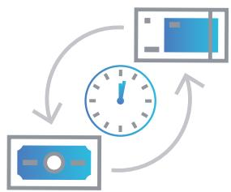
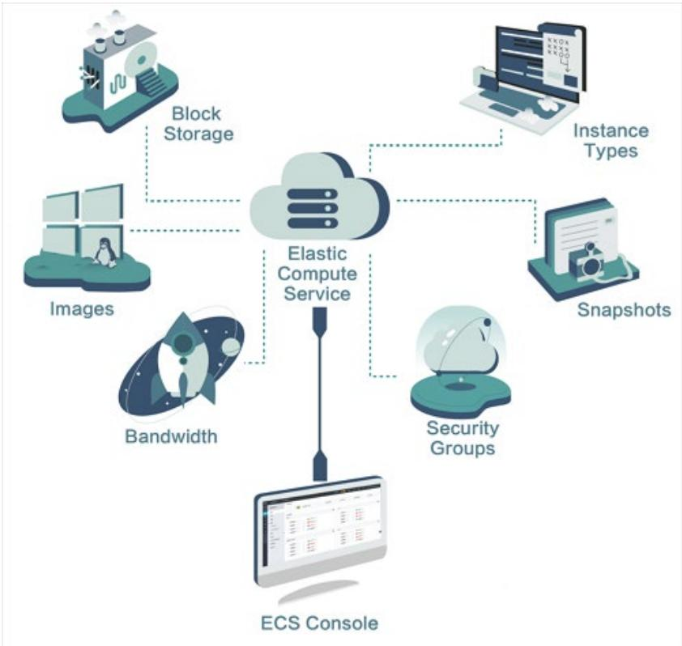
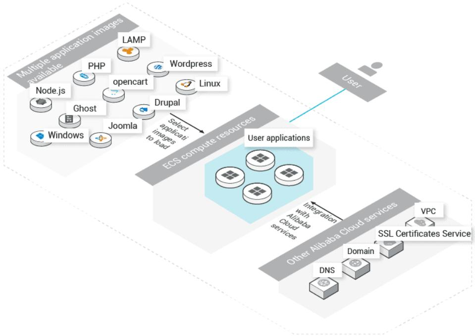
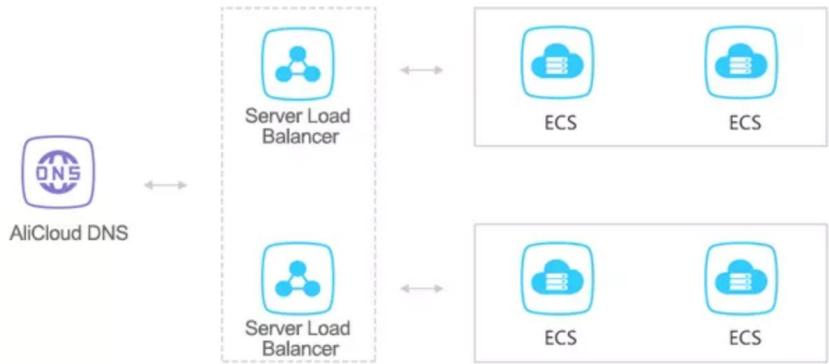
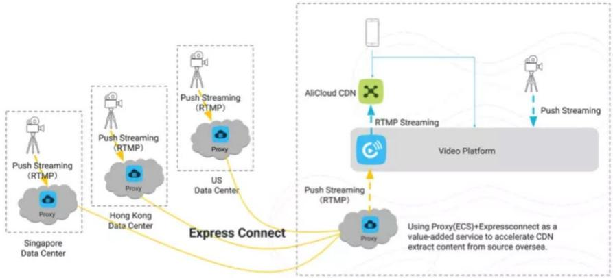

## INTRODUCING ALIBABA CLOUD

MORE THAN JUST CLOUD

Introducing Alibaba Cloud

2018

alibabacloud.com

C-J Alibaba Cloud

© Alibaba Cloud 2018 All rights reserved

## CONTENTS

Mission and Background Supporting Business   
Transformation   
1 5   
Leaders in Technology Products and Solutions   
1 15   
Getting Started with Alibaba Cloud Summary   
22 23

## EXECUTIVE SUMMARY

This whitepaper will introduce you to Alibaba Cloud, the cloud computing division of Alibaba Group. We will take a look at the company’s background, explore how Alibaba Cloud has evolved as it has become increasingly established and see how it is facilitating digital transformation and opening up the Chinese market for many businesses.

We will cover how Alibaba Cloud supports business growth through partnerships and competitions, and discuss its unique range of tools and services. This whitepaper will introduce you to a number of Alibaba Cloud’s key products and take you through how to get started on the platform, where you can find additional support as well as gain certificates and accreditation.

We will also cover some of what makes Alibaba Cloud stand out in the marketplace, such as powering major shopping festivals, innovative payment methods and big data analysis. And we will look at how your business can benefit from the innovation that runs through the company, helping business from small and medium enterprises through to large multinational corporations to benefit from impressive tools and services including machine learning, elastic computing and a powerful and secure cloud platform.

# MISSION AND BACKGROUND

Alibaba Cloud is one of a number of business units that form part of Alibaba Group, helping companies to transform the way that they market, sell and operate. Alibaba Group, headquartered in Hangzhou, China, is on a mission to make it easy to do business anywhere. It has ambitious growth goals, and aims to help to solve problems for billions of people as it expands.

## MISSION

Alibaba provides vital technology infrastructure and marketing capabilities to help businesses to grow their products and services online. The group spans commerce, cloud computing, digital media and innovation. For example, AliExpress is our global consumer marketplace, Alipay is our mobile and online payment platform and Alibaba Cloud is the cloud computing arm and business unit of Alibaba Group. And perhaps you’ve heard of 11-11, our groundbreaking international shopping festival known as Singles Day, which processed over USD \$25BN in sales last year in a single day.

Alibaba announced in 2017 that it is investing \$15BN in research and development up to 2020, including creating the DAMO Academy in 2017. The DAMO Academy has research labs in seven cities around the world, looking into topics including data intelligence, the Internet of Things, fintech, quantum computing and human-machine interaction. The Academy will help Alibaba to be “future-oriented to solve the problems of the future,” according to Alibaba’s founder and chairman Jack Ma. He challenged the Academy to help 100

million companies create opportunities and help solve to problems for billions of people. By doing this, DAMO Academy has the target of growing to become equal in value to the world’s fifth-largest economy by 2036.1

## BACKING BUSINESS TRANSFORMATION

Alibaba enables businesses to transform the way they market, sell and operate, providing the fundamental technology to help merchants, brands and other businesses leverage the power of the Internet to engage with their users and customers.

## ALIBABA CLOUD’S BACKGROUND

Alibaba Cloud is the group’s cloud computing arm. It was established in September 2009 as Aliyun, developing cloud computing services that would provide the infrastructure to support Alibaba’s vision of making it easy to do business anywhere.

Now, Alibaba Cloud’s highly scalable cloud computing and data management services is China’s largest public cloud service provider3 and has the third largest share of the cloud computing market globally, according to Gartner.4 It offers cost-effective solutions that help businesses meet their networking and information needs, and provides them with an easy way to integrate with other Alibaba products and services.

## We are China’s largest cloud provider, offering access to China’s most advanced cloud network.

Alibaba Cloud has an international network of 18 data centers, including access to Mainland China. Security and reliability are paramount to Alibaba Cloud’s offering, and we will cover those aspects in more depth later in this whitepaper. Alibaba’s vast online and mobile commerce ecosystem – including the incredible amount of transactions that take place every year on 11-11 – is also powered by Alibaba Cloud.

> **AI Description:**
> **Source:** `assets/_page_5_Figure_0.jpg`
> 
> **Generated:** 2026-05-17 21:59:58
> 
> ---
> 
> The image contains a simple diagram of three stacked server icons, each with a blue outline and filled with dots. The servers are evenly spaced and aligned vertically, suggesting a concept of a multi-server system or a cloud computing architecture. The dots within the servers likely represent data or processes being handled by the servers.

ALIBABA CLOUD HAS 18 DATA CENTERS

Alibaba Cloud is dedicated to becoming a world-leading global cloud services provider. Our top-class infrastructure and expanding global presence has helped to establish partnerships and attract over 2.3 million customers worldwide, including over 1 million paying customers. And, in 2017, we were named as a visionary in Gartner’s prestigious Magic Quadrant for Data Management Solutions for Analytics. Our strong performance in data management solutions in China and our investment in new markets were acknowledged as making Alibaba Cloud an emerging global player.5, 6 Alibaba Cloud’s international operations are registered and headquartered in Singapore, and the company has teams stationed in Dubai, Frankfurt, Hong Kong, London, New York, Paris, San Mateo, Seoul, Singapore, Sydney and Tokyo, driving this international growth.

This whitepaper will help you discover more about what makes Alibaba Cloud unique and introduce you to our key products and services. Keep reading to learn how Alibaba Cloud can support your business’ cloud computing goals, enable digital transformation and help your company to grow.

## ALIBABA CLOUD ET BRAIN

Through initiatives like this, Alibaba Cloud is helping our society to become more sustainable, efficient, and interconnected. From agriculture to manufacturing and city management, we are committed to making the world greener, safer, and more productive. For example, our ET Brain uses our ultra-intelligent technology to solve complex problems in business and society.

The ET Brain can create accurate simulations, come up with solutions in real time, and perpetually innovate, thanks to machine learning. For example, we have put some of this powerful technology to work supporting smart cities. Alibaba Cloud’s City Brain2 project in Malaysia is working in partnership with the Malaysia Digital Economy Corporation to help the government process data and make smarter decisions based on ET Brain’s insights.

## The ET Brain can create accurate simulations, come up with solutions in real time, and perpetually innovate, thanks to machine learning.

Real time information is collected from roadside video cameras in congested cities such as Kuala Lumpur, then analyzed by computer vision and used to improve the flow of vehicles by changing traffic signals, and to spot traffic accidents, so that emergency vehicles can get to accidents in the shortest possible time.

ET Medical Brain is working to solve the healthcare industry’s biggest problems, such as introducing a smart scheduling platform to Hangzhou Children’s Hospital, and making advances in gene sequencing that enable precision medical treatment. The ET Industrial Brain builds smart algorithms that improve modelling, the accuracy of predictions, regulation enforcement, and emergency response, while our ET Agricultural Brain can use visual recognition, voice recognition and environmental recognition to monitor crops and livestock, reducing disease and improving farming efficiency.

By facilitating access to smart emerging technologies, Alibaba Cloud enables businesses and people to build a more inclusive world.

# SUPPORTING BUSINESS TRANSFORMATION

True to our mission, Alibaba is an expert in digital transformation. Alibaba Cloud technology, including artificial intelligence, machine learning and big data analysis, is used to power innovations in retail, finance and manufacturing around the world.

Analyzing how we currently work allows business and society to solve complex problems. Bringing data together with smart tech, such as our AI Platform, can lead to actionable recommendations that will help businesses to become more efficient and cut waste from their production and operating processes.

This section of the whitepaper will cover how Alibaba Cloud facilitates international expansion, particularly entry into Mainland China, how it supports digital transformation and how it helps startups and SMEs to grow and globalize.

## GATEWAY TO CHINA

Expanding internationally is a key part of becoming a global business, and establishing your company in China could be an important aspect of that. Consultancy McKinsey predicts that by 2020, there will be 400 million consumers with incomes of between \$16,000 and \$34,0007 amongst the country’s population of 1.4 billion. This group will have disposable incomes that will enable them to afford family cars and small luxury items, setting consumption standards around the country.

## INFRASTRUCTURE IN CHINA AND CHINACONNECT

Alibaba Cloud is the leading public cloud vendor in Mainland China, with the country’s most advanced cloud network, including seven data centers and over 1100 CDN nodes. It received China’s first IDC license in 2013 and now has a 40% share of the local market with a full ecosystem of products to support different aspects of business, providing access to China under one single global account.

Alibaba Cloud’s channel, ChinaConnect, offers advice and support for international companies spanning a range of industries and across all business units and doing business in China. It covers everything from website hosting, online payments and offline logistics, as well as ICP registration.

## ICP REGISTRATION

An Internet Content Provider (ICP) license is a state-issued registration number that allows you to host your website on a server inside Mainland China, a rule that is enforced at the hosting level and an essential element for any digital business. The application comes after selecting hosting and domain, but before a site can go live.

Alibaba Cloud provides ICP support here:

https://www.alibabacloud.com/icp

## Alibaba Cloud received China’s first IDC license in 2013 and now has a 40% share of the local market

ALIBABA’S ECOSYSTEM

Business units throughout Alibaba Group work to make it easier to do business anywhere, whether that’s through logistics, payments or international trade, particularly helping companies to gain a foothold in Mainland China. Alibaba Cloud provides the vital technology infrastructure that powers the group’s products and services. We constantly develop these to help companies do more and discover new opportunities. Let’s look at some of the business units in our ecosystem, and see how they work together to power logistics, payments, e-commerce, supporting businesses in China and beyond.

> **AI Description:**
> **Source:** `assets/_page_9_Figure_0.jpg`
> 
> **Generated:** 2026-05-17 21:59:03
> 
> ---
> 
> The image contains a simple blue clock icon with a rotating arrow, indicating a concept of time passing or a cycle. The design is minimalistic, with no additional text or labels. The icon suggests themes of time management, progress, or a continuous process.

CAINIAO   
ENABLES 24-   
HOUR DOMESTIC   
DELIVERY   
AND 72-HOUR   
INTERNATIONAL   
DELIVERY

## LOGISTICS

Cainiao Network is our logistics data platform operator that provides real-time access to information for both buyers and sellers, helping them to improve the efficiency of their delivery services. Its fulfilment network has grown by 170% year-on-year, and it enables 24-hour domestic delivery and 72-hour international delivery.

## FINANCE

Alipay facilitates online, mobile and in-store payments and has over 520 million users. Users have a digital wallet and can make payments direct from their mobile phone, without the need for cash. Alipay is integrated into a range of financial services, from investments and insurance through to credit ratings and loans.

## RETAIL

Taobao is an e-commerce and content app that is redefining the shopping experience through innovative content and smart, personalized recommendations. In the year ending March 31, 2018, the app had 552 million active annual consumers9 and approximately 1.5 million content creators produced short-form videos and live-broadcast events, encouraging dwell time and brand engagement on the app.

Tmall is a business-to-consumer e-commerce platform, that allows merchants to reach new customers and gain data insights. It hosts 70,000 online brand stores, including H&M, Nike and Samsung, serving 400 million online customers.10

> **AI Description:**
> **Source:** `assets/_page_9_Figure_1.jpg`
> 
> **Generated:** 2026-05-17 21:58:59
> 
> ---
> 
> The image is a diagram illustrating a cycle involving money and time. It shows a clock in the center, indicating the passage of time, with arrows pointing from a banknote to the clock and then to a vehicle, suggesting a process where money is spent or invested over time, possibly related to transportation or travel expenses. The diagram uses simple shapes and arrows to convey the flow of the cycle.

NOVEMBER 2017: ALIBABA CLOUD PROCESSED OVER 325,000 ORDERS PER SECOND AT PEAK

## SINGLES DAY

The most exciting day of the year for our company is 11-11 or Singles Day, a global shopping extravaganza that tests Alibaba’s cloud computing processing, payment infrastructure and logistics networks to the limits and provides retailers with an annual opportunity to sell their products and stand out to consumers.

At the 2017 festival, Alibaba Cloud processed over 325,000 orders per second at peak, and 1.5 billion Alipay transactions in total, achieving over \$25BN of gross merchandise volume (GMV) for retailers.11

# DIGITAL TRANSFORMATION EXPERT

Alibaba Cloud is supporting digitization in every industry, helping major businesses in the retail, finance and manufacturing sectors to evolve.

## SMART RETAIL AND PAYMENTS

Alibaba Cloud’s technology helps business of all sizes benefit from advances in digital technology, even local convenience stores that might not traditionally be seen as connected. Alibaba Cloud uses big data and AI technology to integrate online and offline retail, providing customers with an improved shopping experience. For example, using Ling Shou Tong, our integrated system and mobile app, retailers can better track their inventory and receive recommendations about what products are proving most popular, so they can stock what is selling best at that time. Over 600,00012 outlets in Mainland China – about 10% of the country’s convenience stores – are now benefitting from the technology.

This mobile-first approach is also great for shoppers. For example, Alibaba operates a grocery prototype supermarket called Hema, and mobile is central to the experience there. Shoppers can use the Hema app to scan an item’s barcode and find out more information about the product, such as its price and origin, and even get recommendations about other items that could go well with their purchase. The Hema app is linked to shoppers’ Alipay accounts – Alibaba’s mobile payment platform – so when they’ve finished shopping, they can easily check out and pay for their shopping direct with their smartphone.

Alibaba’s CEO, Daniel Zhang, describes Hema as “a showcase of the new business opportunities that emerges from online-offline integration”.13

## FINANCIAL SOLUTIONS

Speed and security are vital in financial services. For example, Imperium Financial Group is a leading financial services company based in Hong Kong. Its business provides one-stop financial investment services to customers, and focuses on precious metals, foreign exchange, brokerage and capital markets.

Alibaba Cloud helps financial institutions, such as Imperium, to build next generation architecture for a low cost and high availability, even providing customized solutions in risk modelling, data management, security and facial recognition, that can be applied across a range of scenarios, such as payments, insurance, securities and investing.

Alibaba Cloud powers Imperium’s customer interfaces, such as its eportal for personal account management, supporting up to 50,000 page views in a single day, so the site still functions smoothly even when there are many concurrent connections. Behind the scenes, it is maintaining incredibly high levels of security, reassuring Imperium’s customers that their assets are safe from DDoS attacks and hacking.

> **AI Description:**
> **Source:** `assets/_page_11_Figure_0.jpg`
> 
> **Generated:** 2026-05-17 21:59:17
> 
> ---
> 
> The image contains a simple diagram of a solar panel with a sun above it. The solar panel is depicted with a grid of cells, and the sun is shown with rays extending outward, symbolizing the source of energy. The image is a straightforward representation of solar energy technology.

## NEXT-LEVEL MANUFACTURING

Artificial Intelligence, powered by Alibaba Cloud, can also be applied to help businesses improve their manufacturing capabilities, improving efficiencies and cutting waste.

For example, our client Trina Solar produces cell wafers that power the solar panels that the company makes. It uses extremely complex production techniques that are hard to analyze through traditional methods. Alibaba Cloud’s ET Industrial Brain was able to collect and organize data from Trina’s entire production process, and analyze it using smart algorithms. The optimization recommendations took real-time data into account leading to a 7% increase in production of grade-A products.14

## SUPPORTING GROWTH

Alibaba Cloud has a key focus on helping small and medium-sized enterprises (SMEs) grow and globalize.

## GLOBAL E-COMMERCE

Facilitating international trade is vital to supporting this growth, which is why Alibaba Cloud is establishing Electronic World Trade Platforms (eWTP). As trade has evolved from large volume, standardized transactions to increasingly fragmented, high-frequency and personalized purchases, it is important to have this kind of global e-commerce platform that will support businesses.

The eWTP aims to promote dialogue on trade rules between the public and private sectors, enhance cross-border e-commerce infrastructure and help SMEs overcome challenges that they have face in customs clearance and logistics. We envision international entrepreneurs needing nothing more than a smartphone to trade globally.

## Facilitating international trade is vital to supporting this growth, which is why Alibaba Cloud is establishing Electronic World Trade Platforms (eWTP).

The first e-hub outside China under the eWTP platform was created in Malaysia in partnership with the Malaysia Digital Economy Corporation in March 2017.15 This includes establishing an e-fulfilment hub near Kuala Lumpur International Airport, along with a one-stop online cross-border trading services platform, e-payment and financing and developing e-talent training as part of Malaysia’s roadmap to transform into a digital economy. This initiative should provide many opportunities for SMEs and young people in Malaysia to trade with the rest of the world more easily.

## POWERFUL TECHNOLOGY

As well as international cooperation, SMEs need incredibly reliable tech to power their business that is able to scale up and grow as quickly as they are. This is why Alibaba Cloud offers highperformance elastic computing power in the cloud. Services, including data storage, relational databases, big-data processing, Anti-DDoS protection and content delivery networks can be scaled up or down depending on your demand, and are available on a pay-asyou-go basis.

Having 18 data centers around the world means that network latency is reduced, so your customers don’t have to wait for a page to load or order to process. For example, we opened a new data center in Mumbai, India, in early 2018, to meet the increasing demand from SMEs in that region.

# LEADERS IN TECHNOLOGY

## ALIBABA CLOUD TIMELINE

» City Brain launches in Malaysia

» Included in Gartner’s Magic Quadrant for Data Analytics

» Apsara awarded the Chinese Institute of Electronics Grand Prize

» Alibaba Cloud Receives MySQL Corporate Contributor Award

» Gang Wang, a leading researcher at Alibaba A.I. Labs, and Hanqing Wu, chief security scientist of Alibaba Cloud, recognized in the “MIT Technology Review’s 2017 Innovators Under 35” List

Alibaba Cloud placed in the Visionaries quadrant of Gartner’s Magic Quadrant for Cloud Infrastructure as a Service, Worldwide

» Alibaba announced as the as the Official Cloud Services and Infrastructure Partner for the Olympic Games at the World Economic Forum in Davos. It will contribute cloud computing infrastructure and cloud services to help the games operate more efficiently, effectively and securely

016 » Alibaba Cloud partners with HTC Corporation to develop virtual reality (VR) solutions

» Global Marketplace and AliLaunch Program launch to support technology partners entering the Chinese market

» Alibaba Cloud helps Tmall and Alipay process orders totalling \$14.3BN, at a world record-breaking peak speed of 140,000 orders per second, without dropping a single transaction

» Singapore announced as Alibaba Cloud’s overseas headquarters

» Data Centers open in Beijing, Shenzhen and Hong Kong

2013 » Alibaba Cloud is awarded the world’s first British Standards Institute CSA-STAR Gold Medal Certification in Cloud Security

» Alibaba Cloud’s receives China’s first IDC license

The cloud market is growing rapidly, as more companies start to unlock the benefits of flexible, secure and constant 24/7 services that can power and grow businesses. For example, Gartner predicts that the worldwide public cloud services market will grow to \$186.4BN, up from \$153.5BN in 2017.17

Alibaba Cloud is fast becoming recognized as a leader in cloud computing. For example, we have broken competition records at Sort Benchmark in data sorting,18 and set records in mitigating DDoS attacks and the processing volume of e-commerce transactions.

Our Hybrid Cloud Solutions provides customers with state-of-the-art connectivity solutions with enhanced security that brings together the benefits of both public and private cloud models for our customers.

Similarly, Alibaba’s Apsara Cloud operating system is receiving recognition for its advances. In May 2018 it was awarded the Grand Prize from the Chinese Institute of Electronics, the first time the prize has been awarded since it was established 15 years ago.19

## ENVIRONMENTAL INNOVATION

Alibaba Cloud’s commitment to innovation extends beyond our products and services, all the way to improving our buildings and infrastructure. Servers consume large amounts of energy, so we have invested heavily in creating eco-friendly data centers, such as Alibaba Cloud Qiandao Lake Data Center, that incorporates a unique mechanical cooling system that uses water from the lake. This means that the data center can be cooled for free over 90% of the time, without negatively impacting the environment.20 In fact, with solar energy and hydraulic power incorporated, and heat recovered from the servers used to warm the offices in the facility, the data center is one of the most energy-efficient in the world.

## GLOBAL RECOGNITION

Alibaba Cloud was the first cloud services provider to receive the CSA STAR Certification, for security, trust and assurance, and the first to be certified with the ISO27001 Information Security Management System Certification in China.

These kinds of accolades have helped Alibaba Cloud to be featured as a Visionary on Gartner’s Magic Quadrant for Cloud Infrastructure as a Service, Worldwide in 2017, and being included in 2018, despite the number of featured vendors decreasing from 14 in 2017 to just six in 2018. Alibaba Cloud also featured in Gartner’s Magic Quadrant for Cloud Infrastructure as a Service in 2018.21

## Alibaba Cloud was featured as a Visionary on Gartner’s Magic Quadrant for Cloud Infrastructure as a Service, Worldwide in 2017, and included in 2018.

## PARTNERSHIPS

Alibaba Cloud has established a number of global partnerships.

## 00 Worldwide Cloud Services Partner

The Winter Olympic Games at Pyeongchang, South Korea, in 2018 were the first to showcase our best inclass cloud computing infrastructure that can help the Games to operate more efficiently, effectively and securely. This included demonstrations of AI, deep learning AI and deep learning technologies to processing massive amounts of data in an incredibly secure environment.

In July 2018, Alibaba Cloud launched its EMEA Ecosystem Partner Program to strengthen ties between its customers and partners in Europe, the Middle East and Africa, including Intel, Accenture and Micropole. The program focuses on four key issues: digital transformation, supporting talent development, advancing technology innovation and enhancing marketplaces.

Alibaba Cloud has also partnered with the highly popular web hosting platform Plesk. This means that users can work in Plesk’s ready-to-code environment to develop sites and apps that can now run in the cloud.

Our partnership with Red Hat provides great performance, flexibility and security for our users, who can deploy Red Hat’s open source solutions across their cloud environment. And we are cooperating with NVIDIA GPU Cloud (NGC) so developers can run NGC containers and access NVIDIA’s deep learning software and visualization tools.

## LOOKING TO THE FUTURE

Alibaba Cloud will continue to pursue opportunities to help businesses of all sizes grow. The company runs a series of competitions on our Tianchi platform, which currently hosts over 200,000 developers from 91 countries and regions.

Employing many of the best and brightest innovators helps the company to keep pushing its boundaries. Two of our scientists were recognized in MIT Technology Review List of “Innovators Under 35” in 2017.22

Hanqing Wu is chief security scientist of Alibaba Cloud who led the development of Alibaba Cloud Security, a service that has protected more than 37% of websites in China by the end of 2017. His innovations in Elastic Security Networks allows small to mediumsized companies to fend off massive and potentially incredibly damaging DDoS attacks with limited resources.

> **AI Description:**
> **Source:** `assets/_page_16_Figure_0.jpg`
> 
> **Generated:** 2026-05-17 21:59:14
> 
> ---
> 
> The image contains a simple, stylized illustration of a trophy. The trophy is blue with a star on the front, and it has a classic design with a bowl, stem, and base. The image is a flat, two-dimensional representation with no additional text or annotations. The trophy is the sole focus of the image and does not convey any specific data or trends.

Gang Wang is a leading researcher at Alibaba A.I. Labs, exploring human-computer interactions, leading computer vision, natural language processing, speech recognition and machine learning. His contributions are being put to use in Alibaba’s products, such as Tmall Genie, a voice-controlled smart device developed by the Labs.

THE TIANCHI COMPETITION   
PLATFORM CURRENTLY   
HOSTS OV E R 200,000 DE VE LOPE RS FROM 91 COUNTRIES AND REGIONS

Alibaba Group also launched Alibaba Innovative Research (AIR) to collaborate with global academics and researchers and encourage innovation in science and technology. The company is funding research programs that fit real world industry scenarios, that will power how the company can support SMEs and enable business growth in the future.

Over the quarter up to March 2018, Alibaba Cloud launched 316 new products and features, over 60 of which were focused on artificial intelligence, data management and security. By backing innovation at all levels of our business, partnering with experts and supporting academics, Alibaba Cloud is able to ensure a constant stream of innovation that allows businesses to take advantage of cutting edge developments without the high levels of investment.

# PRODUCTS AND SOLUTIONS

> **AI Description:**
> **Source:** `assets/_page_17_Figure_0.jpg`
> 
> **Generated:** 2026-05-17 22:00:21
> 
> ---
> 
> The image contains a simple illustration of a database icon with a rightward arrow, suggesting data transfer or migration. The background features a wavy line pattern, possibly representing data flow or connectivity. The overall design is minimalistic and likely used to represent concepts related to data management or cloud computing.

This section of the whitepaper will take you through some of Alibaba Cloud’s key solutions for scenarios such as data migration, web hosting and Internet of Things, and cover some of the products and services associated with them. Crucially, Alibaba Cloud’s service is 24/7, with high reliability and powered by a high-speed infrastructure, meaning your web-based products and services will be constantly available to customers and not subject to detrimental lag times or suffering security attacks.

## SOLUTIONS

## DATA MIGRATION

Data migration is a critical challenge for businesses, whether migrating data from a physical service to the cloud or switching to a new cloud provider or deployment region. Alibaba Cloud’s Data Migration service offers comprehensive services and resources that will ensure a smooth migration. Users can either follow our selfguided tutorials, or outsource the migration through Alibaba Cloud’s Migration Service, or to one of our partners.

ALIBABA CLOUD’S   
DATA MIGRATION   
SERVICE OFFERS   
COMPREHENSIVE   
SERVICES AND   
RESOURCES THAT WILL   
ENSURE A SMOOTH   
MIGRATION

We can help you to consider all the benefits and possible risks, devise a solution that will not only suit your current needs, but forecast your future resource usage through Capacity Evaluation Planning, and establish a distributed cloud architecture design that will ensure high service availability.

## WEB HOSTING

Alibaba Cloud offers flexible, low cost web hosting, that is perfect for SMEs, and supports a range of popular content management systems such as WordPress and Joomla!

Alibaba Cloud will support you at each stage of building and maintaining your website, from finding a domain name, selecting a configuration that will suit the required amount of web space, number of concurrent connections and monthly data transfer for your site. Then use our visual control panel to add domains, manage files and analyze traffic. Our web hosting is fast and secure, based on container technology that benefits from our Elastic Compute Service and protected by Alibaba Cloud’s Web Application Firewall with 99.999% data reliability.

## INTERNET OF THINGS

The power of the Internet of Things (IoT) is set to have a huge impact on how we live in the future, as more and more of the devices we use become connected. Ensure that your smart technology platforms are stable and cost efficient with the Internet of Things. This technology allows you to build automated solutions that will gather, process, analyze and act on data generated by connected devices, with no need to maintain a separate infrastructure.

Alibaba Cloud’s IoT suite has high traffic endurance, handling access requests smoothly, its equipment certification means that each connected device is certified, plus it incorporates secured transmission, device rights management and a reliable message service.

You can learn more about Alibaba Clouds solutions across different   
industries and by different applications at   
www.alibabacloud.com/solutions

# PRODUCTS AND SERVICES

> **AI Description:**
> **Source:** `assets/_page_19_Figure_0.jpg`
> 
> **Generated:** 2026-05-17 21:58:49
> 
> ---
> 
> The image is a technical illustration depicting the components and services of Elastic Compute Service (ECS). It includes various elements such as Block Storage, Images, Bandwidth, Instance Types, Snapshots, Security Groups, and the ECS Console. These components are interconnected, suggesting a relationship between ECS and these services. The diagram uses icons and labels to represent each service, making it easy to understand the structure and relationships within the ECS ecosystem.

## ELASTIC COMPUTING

Alibaba Cloud’s Elastic Compute Service (ECS) is an online computing service that offers elastic and secure virtual cloud servers to cater for all your cloud hosting needs. As your business grows, you can expand your disk and increase your bandwidth at any time, or release resources whenever you need to, to save costs. The software is optimized to achieve faster results, with 99.999999999% data reliability, and the latest Intel CPUs.

Function Compute is Alibaba Cloud’s most popular serverless product, offering a fully hosted environment that eliminates the need to manage infrastructure such as servers, so developers can focus on writing and uploading code. It handles the resource management, auto scaling, and load balancing. Event sources from other Alibaba services can also be set up to automatically trigger your code to run. Users only pay for the resources that your code consumes, to the nearest 100 milliseconds.

> **AI Description:**
> **Source:** `assets/_page_20_Figure_1.jpg`
> 
> **Generated:** 2026-05-17 21:59:55
> 
> ---
> 
> The image is a technical diagram illustrating a cloud computing architecture, specifically for deploying user applications on Alibaba Cloud. It includes a variety of application images such as LAMP, PHP, WordPress, Drupal, Joomla, Node.js, Ghost, and Windows. These images are intended to be loaded onto ECS (Elastic Container Service) compute resources. The diagram also highlights integration with Alibaba Cloud services, including VPC (Virtual Private Cloud), SSL Certificates Service, and DNS. The user interacts with the system through a user interface, and the overall flow shows how applications are selected and deployed onto the ECS resources.

Simple Application Server is a server-based service that allows you to build, monitor and maintain your website with just a few clicks. It makes private service building much easier, if all you need is a private virtual machine, and is the best way for beginners to get started with cloud computing.

> **AI Description:**
> **Source:** `assets/_page_20_Figure_2.jpg`
> 
> **Generated:** 2026-05-17 21:59:27
> 
> ---
> 
> The image is a technical diagram illustrating a cloud computing architecture. It includes the following elements:
> 
> 1. **DNS Resolution**: The image shows AliCloud DNS resolving to a server load balancer.
> 2. **Server Load Balancer**: Two server load balancers are depicted, each managing traffic to multiple ECS (Elastic Compute Service) instances.
> 3. **ECS Instances**: Four ECS instances are shown, two connected to each server load balancer, indicating load balancing across these instances.
> 
> The diagram uses icons and labels to represent different components and their relationships, providing a clear visual representation of a distributed computing setup.

Server Load Balancer allows users to manage sudden spikes in traffic, minimize response times and – vitally – maintain 99.9% availability of web applications. The Server Load Balancer monitors the health of servers and automatically distributes application requests to servers with optimal performance in different zones, ensuring high availability.

Every year, Alibaba Cloud’s Server Load Balancer maximum performance capacity is put to the test by extremely high volumes of traffic during 11-11, Alibaba’s annual Global Shopping Festival, discussed earlier. Similarly, our clients, such as Tianhong, use the Server Load Balancer to ensure their system’s stability, reliability and user availability.

## STORAGE

Alibaba Cloud Object Storage Service (OSS) is an easy-to-use service that enables you to store, backup and archive large amounts of data in the cloud. OSS acts as an encrypted central repository, where files can be securely accessed from around the globe. OSS guarantees up to 99.9% availability and is a perfect fit for global teams and international project management.

OSS is available at no upfront cost or long-term commitment. Users only pay for the actual storage space, network traffic and number of requests processed. OSS also comes with no limits to data storage.

Users, such as Worktitle, say, “Alibaba Cloud reduces investment costs in IT and simplifies maintenance allowing us more time to focus on the development of our application.”

## NETWORKING

Express Connect offers convenient and efficient network services that allow different network environments to communicate directly. This means that even when the connected sites are far away from each other, users benefit from low network latency and high bandwidth communication. This works particularly well for multimedia environments, where low latency is vital, as well as hybrid environments that require private connectivity across on-premise infrastructure, cloud technology and third-party cloud services providers.

Our client, DeepICR, says, “Express Connect not only offered us a commendable solution to fix some of our existing networking problems but also helped us remove the jump server-ECS HPC Support to access public networks directly.”

China

> **AI Description:**
> **Source:** `assets/_page_21_Figure_0.jpg`
> 
> **Generated:** 2026-05-17 22:00:35
> 
> ---
> 
> The image is a technical diagram illustrating a streaming architecture, likely for a video platform. It includes:
> 
> 1. **Push Streaming (RTMP)**: This is shown as the method for sending video streams to a cloud service.
> 2. **Proxy Servers**: These are used to route the streams from the data centers to the cloud service.
> 3. **Data Centers**: The diagram highlights two data centers, one in Hong Kong and another in Singapore, connected via Express Connect.
> 4. **AliCloud CDN**: This is the cloud service where the video streams are processed and distributed.
> 5. **Video Platform**: This is the final destination where the video content is served to users.
> 6. **Express Connect**: This is the high-speed network connection used to transfer data between the data centers and the cloud service.
> 
> The diagram uses arrows and labels to show the flow of data from the data centers to the cloud service and then to the video platform. It emphasizes the use of Express Connect as a value-added service to accelerate content delivery from overseas sources.

Alibaba Cloud reduces investment costs in IT and simplifies maintenance allowing us more time to focus on the development of our application.

– Worktile

## SECURITY

Alibaba Cloud is committed to the highest levels of compliance, including Germany’s C5 standard, PCI DSS for payments, HIPAA for healthcare, and the EU GDPR for data protection and privacy.

Trustworthiness is a key asset for business – PWC’s Global Consumer Insights Survey found that trust plays an important role in how consumers evaluate online security risks, with more than one in three people surveyed stating that ‘trust in a brand’ was in the top three reasons that influence their decision to shop at a particularly retailer. This means that choosing a secure and reliable cloud provider, to enable transactions and reassure customers, is vital for businesses of all sizes.

ALIBABA CLOUD WAF   
PROTECTS SERVERS   
AND WEBSITES   
AGAINST DOZENS OF   
COMMON ATTACK   
TYPES

Alibaba Cloud’s cloud-based security service, Anti-DDoS Basic, integrates with ECS to safeguard your data and applications from DDoS attacks and is available to all Alibaba Cloud users free of charge.

Alibaba Cloud also integrates Web Application Firewall (WAF), a cloud firewall service that protects against web-based attacks, including SQL injections, XSS, Malicious BOT, command execution vulnerabilities and other common web attacks, protecting users’ core website data and safeguarding the security and availability of your site.

Alibaba Cloud is committed to the highest levels of compliance, including Germany’s C5 standard, PCI DSS for payments, HIPAA for healthcare, and the EU GDPR for data protection and privacy.

> **AI Description:**
> **Source:** `assets/_page_23_Figure_0.jpg`
> 
> **Generated:** 2026-05-17 21:58:01
> 
> ---
> 
> The image contains two identical geometric shapes. Both shapes are trapezoids with one longer and one shorter parallel side. The trapezoids are outlined in blue and appear to be identical in size and orientation. There are no labels, text, or additional elements present in the image.

## Alibaba Cloud’s Elastic Compute Service (ECS) is an online computing service that offers elastic and secure virtual cloud servers to cater for all your cloud hosting needs.

> **AI Description:**
> **Source:** `assets/_page_23_Figure_1.jpg`
> 
> **Generated:** 2026-05-17 21:57:43
> 
> ---
> 
> The image depicts a server room with rows of server racks. The racks are illuminated with blue and green lights, indicating active servers. The room appears to be well-organized and technologically advanced, suggesting a high-capacity data center. The image conveys a sense of modern technology and data processing infrastructure.

# GETTING STARTED WITH ALIBABA CLOUD

Alibaba Cloud has established an infrastructure of Free Trials, Tutorials and the Alibaba Cloud Academy to help people get started with our platform, explore different products and gain qualifications.

## FREE TRIAL

New users of Alibaba Cloud can access a free trial worth up to \$300 for individuals or \$1,200 for enterprises at www.alibabacloud.com/ campaign/free-trial. You can use this tutorial as a guide on how to sign up to Alibaba Cloud and start exploring our products and services.

## TUTORIALS AND QUICK START VIDEOS

Once you’re set up with an Alibaba Cloud account, there are a host of tutorials and quick start videos that will guide you through setting up and running quickly with various Alibaba Cloud products.

Simply head to www.alibabacloud.com/getting-started and you can access 3-Minute Product Videos that give you a quick run through of a range of our products.

## APIS & SDKS

Alibaba Cloud provides a range of developer resources, including Software Development Kits (SDKs) and APIs, allowing developers to get access to Alibaba Cloud services and manage applications. Alibaba Cloud’s API Gateway provides developers with a complete API hosting service to release your APIs on Alibaba Cloud products.

## SUMMARY

Thank you for reading this whitepaper. You should now have a better understanding of who Alibaba Cloud is and how our unique offering supports businesses. This whitepaper should have provided you with an insight into how Alibaba Cloud can not only answer your business’ cloud hosting, security and storage needs, but how some of our tools can help your business to innovate and grow.

If you have any questions about how you can get started with Alibaba Cloud, or specific questions on our products and services, our team will be more than happy to help. You can contact them at www.alibabacloud.com/contact-sales

## REFERENCES

- 1. https://www.alizila.com/jack-ma-lays-hopes-visionalibaba-damo-academy/
- 2. http://www.alizila.com/alibaba-cloud-launches-aidriven-city-brain-in-malaysia/
- 3. https://tutorials.hostucan.com/China-public-cloudmarket-share-in-2017-alibaba-leads-the-marketcontinously
- 4. https://www.techrepublic.com/article/amazoncrushing-iaas-cloud-competition-oracle-gainingground-in-saas-and-paas/
- 5. https://www.theregister.co.uk/2017/06/19/gartner\_ confirms\_what\_we\_all\_know\_aws\_and\_microsoft\_are\_ the\_cloud\_leaders\_by\_a\_fair\_way/
- 6. https://www.alibabacloud.com/press-room/alibabacloud-included-in-gartner-magic-quadrant-for-datamanagement
- 7. https://www.mckinsey.com/global-themes/asia-pacific/ meet-the-chinese-consumer-of-2020
- 8. https://www.alibabacloud.com/customers/Cainiao
- 9. https://www.alibabagroup.com/en/news/press\_pdf/ p180504.pdf
- 10. https://www.globalgap.org/ja/news/Chinese-Retail-Platform-Tmall-Fresh-Alibaba-Group-Starts-Sourcing-Products-from-GLOBALG.A.P.-Certified-Producers/
- 11. https://www.alibabagroup.com/en/news/ article?news=p171112
- 12. https://www.bloomberg.com/news/articles/2017-11-08/ alibaba-prepares-a-grand-retail-experiment-for-singlesday
- 13. http://www.alizila.com/hema-supermarket-offersshoppers-new-retail-experience/
- 14. https://www.alibabacloud.com/et/industrial#f9
- 15. https://www.alibabagroup.com/en/news/ article?news=p170322
- 16. https://www.alibabacloud.com/about
- 17. https://www.gartner.com/newsroom/id/3871416
- 18. https://www.alibabacloud.com/forum/read-71
- 19. https://www.alibabacloud.com/blog/alibaba-cloudapsara-receives-grand-prize-from-the-chinese-instituteof-electronics\_590156
- 20. https://www.businesswire.com/news/ home/20150908005493/en/AliCloud-Launches-New-Energy-Efficient-Qiandao-Lake-Data
- 21. https://www.gartner.com/doc/3875999/magicquadrant-cloud-infrastructure-service
- 22. https://www.technologyreview.com/lists/innovatorsunder-35/2017/
- 23. https://www.pwc.com/gx/en/industries/consumermarkets/consumer-insights-survey/consumer-trust. html

## ABOUT

Established in September 2009, Alibaba Cloud is the cloud computing arm of Alibaba Group and develops highly scalable platforms for cloud computing and data management.

It provides a comprehensive suite of cloud computing services available from www.alibabacloud.com to support participants of Alibaba Group’s online and mobile commerce ecosystem, including sellers and other third-party customers and businesses.

Alibaba Cloud is a business within Alibaba Group which is listed on the New York Stock Exchange (NYSE) under the symbol BABA.

www.alibabacloud.com/contact-sales