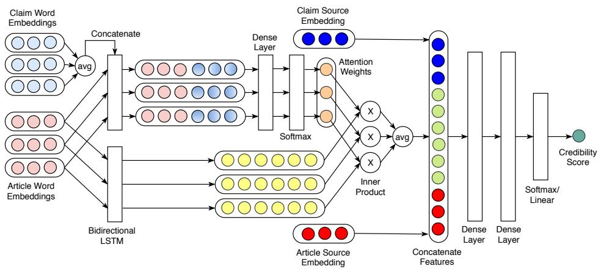
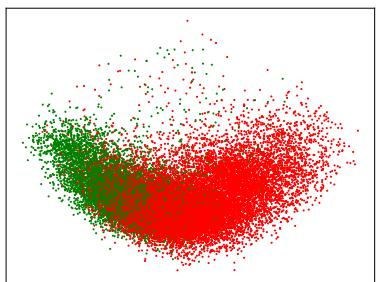
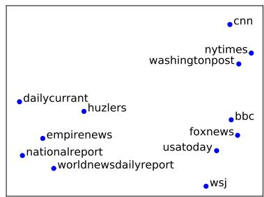

# DeClarE: Debunking Fake News and False Claims using Evidence-Aware Deep Learning

Kashyap Popat1, Subhabrata Mukherjee2, Andrew Yates1, Gerhard Weikum1

1Max Planck Institute for Informatics, Saarbrucken, Germany ¨

2Amazon Inc., Seattle, USA

{kpopat,ayates,weikum}@mpi-inf.mpg.de, subhomj@amazon.com

## Abstract

Misinformation such as fake news is one of the big challenges of our society. Research on automated fact-checking has proposed methods based on supervised learning, but these approaches do not consider external evidence apart from labeled training instances. Recent approaches counter this deficit by considering external sources related to a claim. However, these methods require substantial feature modeling and rich lexicons. This paper overcomes these limitations of prior work with an end-toend model for evidence-aware credibility assessment of arbitrary textual claims, without any human intervention. It presents a neural network model that judiciously aggregates signals from external evidence articles, the language of these articles and the trustworthiness of their sources. It also derives informative features for generating user-comprehensible explanations that makes the neural network predictions transparent to the end-user. Experiments with four datasets and ablation studies show the strength of our method.

## 1 Introduction

Motivation: Modern media (e.g., news feeds, microblogs, etc.) exhibit an increasing fraction of misleading and manipulative content, from questionable claims and “alternative facts” to completely faked news. The media landscape is becoming a twilight zone and battleground. This societal challenge has led to the rise of fact-checking and debunking websites, such as Snopes.com and PolitiFact.com, where people research claims, manually assess their credibility, and present their verdict along with evidence (e.g., background articles, quotations, etc.). However, this manual verification is time-consuming. To keep up with the scale and speed at which misinformation spreads, we need tools to automate this debunking process.

State of the Art and Limitations: Prior work on “truth discovery” (see Li et al. (2016) for survey)1 largely focused on structured facts, typically in the form of subject-predicate-object triples, or on social media platforms like Twitter, Sina Weibo, etc. Recently, methods have been proposed to assess the credibility of claims in natural language form (Popat et al., 2017; Rashkin et al., 2017; Wang, 2017), such as news headlines, quotes from speeches, blog posts, etc.

The methods geared for general text input address the problem in different ways. On the one hand, methods like Rashkin et al. (2017); Wang (2017) train neural networks on labeled claims from sites like PolitiFact.com, providing credibility assessments without any explicit feature modeling. However, they use only the text of questionable claims and no external evidence or interactions that provide limited context for credibility analysis. These approaches also do not offer any explanation of their verdicts. On the other hand, Popat et al. (2017) considers external evidence in the form of other articles (retrieved from the Web) that confirm or refute a claim, and jointly assesses the language style (using subjectivity lexicons), the trustworthiness of the sources, and the credibility of the claim. This is achieved via a pipeline of supervised classifiers. On the upside, this method generates user-interpretable explanations by pointing to informative snippets of evidence articles. On the downside, it requires substantial feature modeling and rich lexicons to detect bias and subjectivity in the language style.

Approach and Contribution: To overcome the limitations of the prior works, we present De-ClarE2, an end-to-end neural network model for assessing and explaining the credibility of arbitrary claims in natural-language text form. Our approach combines the best of both families of prior methods. Similar to Popat et al. (2017), De-ClarE incorporates external evidence or counterevidence from the Web as well as signals from the language style and the trustworthiness of the underlying sources. However, our method does not require any feature engineering, lexicons, or other manual intervention. Rashkin et al. (2017); Wang (2017) also develop an end-to-end model, but De-ClarE goes far beyond in terms of considering external evidence and joint interactions between several factors, and also in its ability to generate userinterpretable explanations in addition to highly accurate assessments. For example, given the natural-language input claim “the gun epidemic is the leading cause of death of young African-American men, more than the next nine causes put together” by Hillary Clinton, DeClarE draws on evidence from the Web to arrive at its verdict credible, and returns annotated snippets like the one in Table 6 as explanation. These snippets, which contain evidence in the form of statistics and assertions, are automatically extracted from web articles from sources of varying credibility.

Given an input claim, DeClarE searches for web articles related to the claim. It considers the context of the claim via word embeddings and the (language of) web articles captured via a bidirectional LSTM (biLSTM), while using an attention mechanism to focus on parts of the articles according to their relevance to the claim. DeClarE then aggregates all the information about claim source, web article contexts, attention weights, and trustworthiness of the underlying sources to assess the claim. It also derives informative features for interpretability, like source embeddings that capture trustworthiness and salient words captured via attention. Key contributions of this paper are:

• Model: An end-to-end neural network model which automatically assesses the credibility of natural-language claims, without any handcrafted features or lexicons.

• Interpretability: An attention mechanism in our model that generates user-comprehensible explanations, making credibility verdicts transparent and interpretable.

• Experiments: Extensive experiments on four datasets and ablation studies, demonstrating effectiveness of our method over state-of-theart baselines.

## 2 End-to-end Framework for Credibility Analysis

Consider a set of N claims $\left. C _ { n } \right.$ from the respective origins/sources $\langle C S _ { n } \rangle$ , where $n ~ \in ~ [ 1 , N ]$ Each claim $C _ { n }$ is reported by a set of M articles $\langle A _ { m , n } \rangle$ along with their respective sources $\langle A S _ { m , n } \rangle$ , where $m \in [ 1 , M ]$ . Each corresponding tuple of claim and its origin, reporting articles and article sources $\mathbf { \Sigma } - \left. C _ { n } , C S _ { n } , A _ { m , n } , A S _ { m , n } \right.$ forms a training instance in our setting, along with the credibility label of the claim used as ground-truth during network training. Figure 1 gives a pictorial overview of our model. In the following sections, we provide a detailed description of our approach.

## 2.1 Input Representations

The input claim $C _ { n }$ of length l is represented as $[ c _ { 1 } , c _ { 2 } , . . . , c _ { l } ]$ where $c _ { l } \in \Re ^ { d }$ is the d-dimensional word embedding of the l-th word in the input claim. The source/origin of the claim $C S _ { n }$ is represented by a $d _ { s }$ -dimensional embedding vector $c s _ { n } \in \Re ^ { d _ { s } }$

A reporting article $A _ { m , n }$ consisting of k tokens is represented by $\left[ a _ { m , n , 1 } , a _ { m , n , 2 } , . . . , a _ { m , n , k } \right]$ ， where $a _ { m , n , k } ~ \in ~ \mathfrak { R } ^ { d }$ is the d-dimensional word embedding vector for the k-th word in the reporting article $A _ { m , n }$ . The claim and article word embeddings have shared parameters. The source of the reporting article $A S _ { m , n }$ is represented as a $d _ { s ^ { - } }$ dimensional vector, $a s _ { m , n } ~ \in ~ \Re ^ { d _ { s } }$ For the sake of brevity, we drop the notation subscripts n and m in the following sections by considering only a single training instance – the input claim $C _ { n }$ from source $C S _ { n } .$ the corresponding article $A _ { m , n }$ and its sources $A S _ { m , n }$ given by: hC, CS, A, ASi.

## 2.2 Article Representation

To create a representation of an article, which may capture task-specific features such as whether it contains objective language, we use a bidirectional Long Short-Term Memory (LSTM) network as proposed by Graves et al. (2005). A basic LSTM cell consists of various gates to control the flow of information through timesteps in a sequence, making LSTMs suitable for capturing long and short range dependencies in text that may be difficult to capture with standard recurrent neural networks (RNNs). Given an input word embedding of tokens $\left. \boldsymbol { a } _ { k } \right.$ , an LSTM cell performs various nonlinear transformations to generate a hidden vector state $h _ { k }$ for each token at each timestep k.

Figure 1: Framework for credibility assessment. Upper part of the pipeline combines the article and claim embeddings to get the claim specific attention weights. Lower part of the pipeline captures the article representation through biLSTM. Attention focused article representation along with the source embeddings are passed through dense layers to predict the credibility score of the claim.

> **AI Description:**
> **Source:** `assets/_page_2_Figure_0.jpg`
> 
> **Generated:** 2026-05-17 22:32:08
> 
> ---
> 
> The image is a technical diagram illustrating a neural network architecture for credibility score prediction. It includes various components such as claim word embeddings, article word embeddings, bidirectional LSTM, dense layers, attention weights, softmax, inner product, and a credibility score output. The diagram visually represents the flow of data through the network, showing how different embeddings and features are concatenated, processed through layers, and finally combined to produce a credibility score. Key labels and annotations include "Concatenate," "avg," "Bidirectional LSTM," "Dense Layer," "Attention Weights," "Inner Product," and "Credibility Score." The diagram is designed to convey the computational steps and interactions within the neural network model.

We use bidirectional LSTMs in place of standard LSTMs. Bidirectional LSTMs capture both the previous timesteps (past features) and the future timesteps (future features) via forward and backward states respectively. Correspondingly, there are two hidden states that capture past and future information that are concatenated to form the final output as: $h _ { k } = [ \overrightarrow { h _ { k } } , \overleftarrow { h _ { k } } ]$

## 2.3 Claim Specific Attention

As we previously discussed, it is important to consider the relevance of an article with respect to the claim; specifically, focusing or attending to parts of the article that discuss the claim. This is in contrast to prior works (Popat et al., 2017; Rashkin et al., 2017; Wang, 2017) that ignore either the article or the claim, and therefore miss out on this important interaction.

We propose an attention mechanism to help our model focus on salient words in the article with respect to the claim. To this end, we compute the importance of each term in an article with respect to an overall representation of the corresponding claim. Additionally, incorporating attention helps in making our model transparent and interpretable, because it provides a way to generate the most salient words in an article as evidence of our model’s verdict.

Following Wieting et al. (2015), the overall representation of an input claim is generated by taking an average of the word embeddings of all the

words therein:

$$
\bar { c } = \frac { 1 } { l } \sum _ { l } c _ { l }
$$

We combine this overall representation of the claim with each article term:

$$
\hat { a } _ { k } = a _ { k } \oplus \bar { c }
$$

where, $\hat { a } _ { k } \in \mathfrak { R } ^ { d + d }$ and ⊕ denotes the concatenate operation. We then perform a transformation to obtain claim-specific representations of each article term:

$$
a _ { k } ^ { \prime } = \mathbf { f } ( W _ { a } \hat { a } _ { k } + b _ { a } )
$$

where $W _ { a }$ and $b _ { a }$ are the corresponding weight matrix and bias terms, and f is an activation function3, such as $R e L U$ , tanh, or the identity function. Following this, we use a softmax activation to calculate an attention score $\alpha _ { k }$ for each word in the article capturing its relevance to the claim context:

$$
\alpha _ { k } = \frac { \exp ( a _ { k } ^ { \prime } ) } { \sum _ { k } \exp ( a _ { k } ^ { \prime } ) }\tag{1}
$$

## 2.4 Per-Article Credibility Score of Claim

Now that we have article term representations given by $\left. h _ { k } \right.$ and their relevance to the claim given by $\left. \alpha _ { k } \right.$ , we need to combine them to predict the claim’s credibility. In order to create an attention-focused representation of the article considering both the claim and the article’s language, we calculate a weighted average of the hidden state representations for all article tokens based on their corresponding attention scores:

$$
g = \frac { 1 } { k } \sum _ { k } \alpha _ { k } \cdot h _ { k }\tag{2}
$$

We then combine all the different feature representations: the claim source embedding (cs), the attention-focused article representation (g), and the article source embedding (as). In order to merge the different representations and capture their joint interactions, we process them with two fully connected layers with non-linear activations.

$$
\begin{array} { l } { d _ { 1 } = r e l u ( W _ { c } ( g \oplus c s \oplus a s ) + b _ { c } ) } \\ { d _ { 2 } = r e l u ( W _ { d } d _ { 1 } + b _ { d } ) } \end{array}
$$

where, W and b are the corresponding weight matrix and bias terms.

Finally, to generate the overall credibility label of the article for classification tasks, or credibility score for regression tasks, we process the final representation with a final fully connected layer:

$$
\mathrm { C l a s s i f i c a t i o n : } \ s = s i g m o i d ( d _ { 2 } )\tag{3}
$$

$$
\mathrm { R e g r e s s i o n } \colon s = l i n e a r ( d _ { 2 } )\tag{4}
$$

## 2.5 Credibility Aggregation

The credibility score in the above step is obtained considering a single reporting article. As previously discussed, we have M reporting articles per claim. Therefore, once we have the per-article credibility scores from our model, we take an average of these scores to generate the overall credibility score for the claim:

$$
c r e d ( C ) = \frac { 1 } { M } \sum _ { m } s _ { m }\tag{5}
$$

This aggregation is done after the model is trained.

## 3 Datasets

We evaluate our approach and demonstrate its generality by performing experiments on four different datasets: a general fact-checking website, a political fact-checking website, a news review community, and a SemEval Twitter rumour dataset.

## 3.1 Snopes

Snopes (www.snopes.com) is a general factchecking website where editors manually investigate various kinds of rumors reported on the Internet. We used the Snopes dataset provided by Popat et al. (2017). This dataset consists of rumors analyzed on the Snopes website along with their credibility labels (true or false), sets of reporting articles, and their respective web sources.

## 3.2 PolitiFact

PolitiFact is a political fact-checking website (www.politifact.com) in which editors rate the credibility of claims made by various political figures in US politics. We extract all articles from PolitiFact published before December 2017. Each article includes a claim, the speaker (political figure) who made the claim, and the claim’s credibility rating provided by the editors.

PolitiFact assigns each claim to one of six possible ratings: true, mostly true, half true, mostly false, false and pants-on-fire. Following Rashkin et al. (2017), we combine true, mostly true and half true ratings into the class label true and the rest as false – hence considering only binary credibility labels. To retrieve the reporting articles for each claim (similar to Popat et al. (2017)), we issue each claim as a query to a search engine4 and retrieve the top 30 search results with their respective web sources.

## 3.3 NewsTrust

NewsTrust is a news review community in which members review the credibility of news articles. We use the NewsTrust dataset made available by Mukherjee and Weikum (2015). This dataset contains NewsTrust stories from May 2006 to May 2014. Each story consists of a news article along with its source, and a set of reviews and ratings by community members. NewsTrust aggregates these ratings and assigns an overall credibility score (on a scale of 1 to 5) to the posted article. We map the attributes in this data to the inputs expected by De-ClarE as follows: the title and the web source of the posted (news) article are mapped to the input claim and claim source, respectively. Reviews and their corresponding user identities are mapped to reporting articles and article sources, respectively. We use this dataset for the regression task of predicting the credibility score of the posted article.

Table 1: Data statistics (SN: Snopes, PF: Politi-Fact, NT: NewsTrust, SE: SemEval).

## 3.4 SemEval-2017 Task 8

As the fourth dataset, we consider the benchmark dataset released by SemEval-2017 for the task of determining credibility and stance of social media content (Twitter) (Derczynski et al., 2017). The objective of this task is to predict the credibility of a questionable tweet (true, false or unverified) along with a confidence score from the model. It has two sub-tasks: (i) a closed variant in which models only consider the questionable tweet, and (ii) an open variant in which models consider both the questionable tweet and additional context consisting of snapshots of relevant sources retrieved immediately before the rumor was reported, a snapshot of an associated Wikipedia article, news articles from digital news outlets, and preceding tweets about the same event. Testing and development datasets provided by organizers have 28 tweets (1021 reply tweets) and 25 tweets (256 reply tweets), respectively.

## 3.5 Data Processing

In order to have a minimum support for training, claim sources with less than 5 claims in the dataset are grouped into a single dummy claim source, and article sources with less than 10 articles are grouped similarly (5 articles for SemEval as it is a smaller dataset).

For Snopes and PolitiFact, we need to extract relevant snippets from the reporting articles for a claim. Therefore, we extract snippets of 100 words from each reporting article having the maximum relevance score: $s i m = s i m _ { \mathrm { { b o w } } } { \times } s i m _ { \mathrm { { s e m a n t i c } } }$ where $s i m _ { \mathrm { b o w } }$ is the fraction of claim words that are present in the snippet, and $s i m _ { \mathrm { s e m a n t i c } }$ represents the cosine similarity between the average of claim word embeddings and snippet word embeddings. We also enforce a constraint that the sim score is at least δ. We varied δ from 0.2 to 0.8 and found 0.5 to give the optimal performance on a withheld dataset. We discard all articles related to Snopes and PolitiFact websites from our datasets to have an unbiased model. Statistics of the datasets after pre-processing is provided in Table 1. All the datasets are made publicly available at https://www.mpi-inf. mpg.de/dl-cred-analysis/.

Table 2: Model parameters used for each dataset (SN: Snopes, PF: PolitiFact, NT: NewsTrust, SE: SemEval).

## 4 Experiments

We evaluate our approach by conducting experiments on four datasets, as described in the previous section. We describe our experimental setup and report our results in the following sections.

## 4.1 Experimental Setup

When using the Snopes, PolitiFact and NewsTrust datasets, we reserve 10% of the data as validation data for parameter tuning. We report 10-fold cross validation results on the remaining 90% of the data; the model is trained on 9-folds and the remaining fold is used as test data. When using the SemEval dataset, we use the data splits provided by the task’s organizers. The objective for Snopes, PolitiFact and SemEval experiments is binary (credibility) classification, while for NewsTrust the objective is to predict the credibility score of the input claim on a scale of 1 to 5 (i.e., credibility regression). We represent terms using pre-trained GloVe Wikipedia 6B word embeddings (Pennington et al., 2014). Since our training datasets are not very large, we do not tune the word embeddings during training. The remaining model parameters are tuned on the validation data; the parameters chosen are reported in Table 2. We use Keras with a Tensorflow backend to implement our system. All the models are trained using Adam optimizer (Kingma and Ba, 2014) (learning rate: 0.002) with categorical cross-entropy loss for classification and mean squared error loss for regression task. We use L2-regularizers with the fully connected layers as well as dropout. For all the datasets, the model is trained using each claimarticle pair as a separate training instance.

Table 3: Comparison of various approaches for credibility classification on Snopes and PolitiFact datasets.

To evaluate and compare the performance of DeClarE with other state-of-the-art methods, we report the following measures:

• Credibility Classification (Snopes, PolitiFact and SemEval): accuracy of the models in classifying true and false claims separately, macro F1-score and Area-Under-Curve (AUC) for the ROC (Receiver Operating Characteristic) curve.

• Credibility Regression (NewsTrust): Mean Square Error (MSE) between the predicted and true credibility scores.

## 4.2 Results: Snopes and Politifact

We compare our approach with the following state-of-the-art models: (i) LSTM-text, a recent approach proposed by Rashkin et al. (2017). (ii) CNN-text: a CNN based approach proposed by Wang (2017). (iii) Distant Supervision: stateof-the-art distant supervision based approach proposed by Popat et al. (2017). (iv) DeClare (Plain): our approach with only biLSTM (no attention and source embeddings). (v) DeClarE (Plain+Attn): our approach with only biLSTM and attention (no source embeddings). (vi) De-ClarE (Plain+SrEmb): our approach with only biLSTM and source embeddings (no attention). (vii) DeClarE (Full): end-to-end system with biL-STM, attention and source embeddings.

The results when performing credibility classification on the Snopes and PolitiFact datasets are shown in Table 3. DeClarE outperforms LSTMtext and CNN-text models by a large margin on both datasets. On the other hand, for the Snopes dataset, performance of DeClarE (Full) is slightly lower than the Distant Supervision configuration (p-value of 0.04 with a pairwise t-test). However, the advantage of DeClarE over Distant Supervision approach is that it does not rely on hand crafted features and lexicons, and can generalize well to arbitrary domains without requiring any seed vocabulary. It is also to be noted that both of these approaches use external evidence in the form of reporting articles discussing the claim, which are not available to the LSTM-text and CNN-text baselines. This demonstrates the value of external evidence for credibility assessment.

On the PolitiFact dataset, DeClarE outperforms all the baseline models by a margin of 7-9% AUC (p-value of 9.12e−05 with a pairwise t-test) with similar improvements in terms of Macro F1. A performance comparison of DeClarE’s various configurations indicates the contribution of each component of our model, i.e, biLSTM capturing article representations, attention mechanism and source embeddings. The additions of both the attention mechanism and source embeddings improve performance over the plain configuration in all cases when measured by Macro F1 or AUC.

## 4.3 Results: NewsTrust

When performing credibility regression on the NewsTrust dataset, we evaluate the models in terms of mean squared error (MSE; lower is better) for credibility rating prediction. We use the first three models described in Section 4.2 as baselines. For CNN-text and LSTM-text, we add a linear fully connected layer as the final layer of the model to support regression. Additionally, we also consider the state-of-the-art CCRF+SVR model based on Continuous Conditional Random Field (CCRF) and Support Vector Regression (SVR) proposed by Mukherjee and Weikum (2015). The results are shown in Table 4. We observe that De-ClarE (Full) outperforms all four baselines, with a 17% decrease in MSE compared to the bestperforming baselines (i.e., LSTM-text and Distant Supervision). The DeClarE (Plain) model performs substantially worse than the full model, illustrating the value of including attention and source embeddings. CNN-text performs substantially worse than the other baselines.

Table 4: Comparison of various approaches for credibility regression on NewsTrust dataset.

## 4.4 Results: SemEval

On the SemEval dataset, the objective is to perform credibility classification of a tweet while also producing a classification confidence score. We compare the following approaches and consider both variants of the SemEval task: (i) NileTMRG (Enayet and El-Beltagy, 2017): the best performing approach for the close variant of the task, (ii) IITP (Singh et al., 2017): the best performing approach for the open variant of the task, (iii) De-Clare (Plain): our approach with only biLSTM (no attention and source embeddings), and (iv) DeClarE (Full): our end-to-end system with biL-STM, attention and source embeddings.

We use the evaluation measure proposed by the task’s organizers: macro F1-score for overall classification and Root-Mean-Square Error (RMSE) over confidence scores. Results are shown in Table 5. We observe that DeClarE (Full) outperforms all the other approaches — thereby, re-affirming its power in harnessing external evidence.

Table 5: Comparison of various approaches for credibility classification on SemEval dataset.

## 5 Discussion

## 5.1 Analyzing Article Representations

In order to assess how our model separates articles reporting false claims from those reporting true ones, we employ dimensionality reduction using Principal Component Analysis (PCA) to project the article representations (g in Equation 2) from a high dimensional space to a 2d plane. The projections are shown in Figure 2a. We observe that DeClarE obtains clear separability between credible versus non-credible articles in Snopes dataset.

## 5.2 Analyzing Source Embeddings

Similar to the treatment of article representations, we perform an analysis with the claim and article source embeddings by employing PCA and plotting the projections. We sample a few popular news sources from Snopes and claim sources from PolitiFact. These news sources and claim sources are displayed in Figure 2b and Figure 2c, respectively. From Figure 2b we observe that DeClarE clearly separates fake news sources like nationalreport, empirenews, huzlers, etc. from mainstream news sources like nytimes, cnn, wsj, foxnews, washingtonpost, etc. Similarly, from Figure 2c we observe that DeClarE locates politicians with similar ideologies and opinions close to each other in the embedding space.

## 5.3 Analyzing Attention Weights

Attention weights help understand what DeClarE focuses on during learning and how it affects its decisions – thereby, making our model transparent to the end-users. Table 6 illustrates some interesting claims and salient words (highlighted) that De-ClarE focused on during learning. Darker shades indicate higher weights given to the corresponding words. As illustrated in the table, DeClarE gives more attention to important words in the reporting article that are relevant to the claim and also play a major role in deciding the corresponding claim’s credibility. In the first example on Table 6, highlighted words such as “..barely true...” and “..sketchy evidence...” help our system to identify the claim as not credible. On the other hand, highlighted words in the last example, like, “..reveal...” and “..documenting reports...” help our system to assess the claim as credible.

(a) Projections of article representations using PCA; DeClarE obtains clear separation between representations of noncredible articles (red) vs. true ones (green).

> **AI Description:**
> **Source:** `assets/_page_7_Figure_0.jpg`
> 
> **Generated:** 2026-05-17 22:31:55
> 
> ---
> 
> The image is a scatter plot with two distinct clusters of data points. The points are color-coded, with one cluster in green and the other in red. The green cluster appears to be more concentrated and smaller, while the red cluster is larger and more spread out. The data points seem to be randomly distributed within their respective clusters, suggesting a possible classification or clustering analysis.

(b) Projections of article source representations using PCA; DeClarE clearly separates fake news sources from authentic ones.

> **AI Description:**
> **Source:** `assets/_page_7_Figure_1.jpg`
> 
> **Generated:** 2026-05-17 22:31:50
> 
> ---
> 
> The image is a scatter plot with text labels. It appears to represent a form of data visualization, possibly showing the relationships or similarities between various news sources. The labels on the plot include "cnn," "nytimes," "washingtonpost," "bbc," "foxnews," "usatoday," "wsj," "dailycurrent," "huzlers," "empirenews," "nationalreport," and "worldnewsdailyreport." The plot seems to group these news sources based on some metric, with "cnn," "nytimes," and "washingtonpost" clustering together, and "wsj" and "usatoday" forming another cluster. The layout suggests a hierarchical or similarity-based arrangement of the news sources.

(c) Projections of claim source representations using PCA; DeClarE clusters politicians of similar ideologies close to each other in the embedding space.

Figure 2: Dissecting the article, article source and claim source representations learned by DeClarE.
Table 6: Interpretation via attention (weights) ([True]/[False] indicates the verdict from DeClarE).

## 6 Related Work

Our work is closely related to the following areas: Credibility analysis of Web claims: Our work builds upon approaches for performing credibility analysis of natural language claims in an opendomain Web setting. The approach proposed in Popat et al. (2016, 2017) employs stylistic language features and the stance of articles to assess the credibility of the natural language claims. However, their model heavily relies on handcrafted language features. Rashkin et al. (2017); Wang (2017) propose neural network based approaches for determining the credibility of a textual claim, but it does not consider external sources like web evidence and claim sources. These can be important evidence sources for credibility analysis. The method proposed by Samadi et al. (2016) uses the Probabilistic Soft Logic (PSL) framework to estimate source reliability and claim correctness. Vydiswaran et al. (2011) proposes an iterative algorithm which jointly learns the veracity of textual claims and trustworthiness of the sources. These approaches do not consider the deeper semantic aspects of language, however. Wiebe and Riloff (2005); Lin et al. (2011); Recasens et al. (2013) study the problem of detecting bias in language, but do not consider credibility.

Truth discovery: Prior approaches for truth discovery (Yin et al., 2008; Dong et al., 2009, 2015; Li et al., 2011, 2014, 2015; Pasternack and Roth, 2011, 2013; Ma et al., 2015; Zhi et al., 2015; Gao et al., 2015; Lyu et al., 2017) have focused on structured data with the goal of addressing the problem of conflict resolution amongst multisource data. Nakashole and Mitchell (2014) proposed a method to extract conflicting values from the Web in the form of Subject-Predicate-Object (SPO) triplets and uses language objectivity analysis to determine the true value. Like the other truth discovery approaches, however, this approach is mainly suitable for use with structured data.

Credibility analysis in social media: Mukherjee et al. (2014); Mukherjee and Weikum (2015) propose PGM based approaches to jointly infer a statement’s credibility and the reliability of sources using language specific features. Approaches like (Castillo et al., 2011; Qazvinian et al., 2011; Yang et al., 2012; Xu and Zhao, 2012; Gupta et al., 2013; Zhao et al., 2015; Volkova et al., 2017) propose supervised methods for detecting deceptive content in social media platforms like Twitter, Sina Weibo, etc. Similarly, approaches like Ma et al. (2016); Ruchansky et al. (2017) use neural network methods to identify fake news and rumors on social media. Kumar et al. (2016) studies the problem of detecting hoax articles on Wikipedia. All these rely on domain-specific and community-specific features like retweets, likes, upvotes, etc.

## 7 Conclusion

In this work, we propose a completely automated end-to-end neural network model, DeClarE, for evidence-aware credibility assessment of natural language claims without requiring hand-crafted features or lexicons. DeClarE captures signals from external evidence articles and models joint interactions between various factors like the context of a claim, the language of reporting articles, and trustworthiness of their sources. Extensive experiments on real world datasets demonstrate our effectiveness over state-of-the-art baselines.

## References

- Carlos Castillo, Marcelo Mendoza, and Barbara Poblete. 2011. Information credibility on twitter. In Proceedings of the 20th International Conference on World Wide Web, WWW ’11, pages 675–684, New York, NY, USA. ACM.
- Leon Derczynski, Kalina Bontcheva, Maria Liakata, Rob Procter, Geraldine Wong Sak Hoi, and Arkaitz Zubiaga. 2017. Semeval-2017 task 8: Rumoureval: Determining rumour veracity and support for rumours. In Proceedings of the 11th International Workshop on Semantic Evaluation, SemEval@ACL 2017, Vancouver, Canada, August 3-4, 2017, pages 69–76.
- Xin Luna Dong, Laure Berti-Equille, and Divesh Srivastava. 2009. Integrating conflicting data: The role of source dependence. Proc. VLDB Endow., 2(1):550–561.
- Xin Luna Dong, Evgeniy Gabrilovich, Kevin Murphy, Van Dang, Wilko Horn, Camillo Lugaresi, Shaohua Sun, and Wei Zhang. 2015. Knowledge-based trust: Estimating the trustworthiness of web sources. Proc. VLDB Endow., 8(9):938–949.
- Omar Enayet and Samhaa R. El-Beltagy. 2017. Niletmrg at semeval-2017 task 8: Determining rumour and veracity support for rumours on twitter. In Proceedings of the 11th International Workshop on Semantic Evaluation, SemEval@ACL 2017, Vancouver, Canada, August 3-4, 2017, pages 470–474.
- Jing Gao, Qi Li, Bo Zhao, Wei Fan, and Jiawei Han. 2015. Truth discovery and crowdsourcing aggregation: A unified perspective. PVLDB, 8(12):2048– 2049.
- Alex Graves, Santiago Fernandez, and J ´ urgen Schmid- ¨ huber. 2005. Bidirectional lstm networks for improved phoneme classification and recognition. In Proceedings of the 15th International Conference on Artificial Neural Networks: Formal Models and Their Applications - Volume Part II, ICANN’05, pages 799–804, Berlin, Heidelberg. Springer-Verlag.
- Aditi Gupta, Hemank Lamba, Ponnurangam Kumaraguru, and Anupam Joshi. 2013. Faking sandy: Characterizing and identifying fake images on twitter during hurricane sandy. In Proceedings of the 22Nd International Conference on World Wide Web, WWW ’13 Companion, pages 729–736, New York, NY, USA. ACM.
- Diederik P. Kingma and Jimmy Ba. 2014. Adam: A method for stochastic optimization. CoRR, abs/1412.6980.
- Srijan Kumar, Robert West, and Jure Leskovec. 2016. Disinformation on the web: Impact, characteristics, and detection of wikipedia hoaxes. In Proceedings of the 25th International Conference on World Wide Web, WWW ’16, pages 591–602, Republic and

- Canton of Geneva, Switzerland. International World Wide Web Conferences Steering Committee.
- Qi Li, Yaliang Li, Jing Gao, Lu Su, Bo Zhao, Murat Demirbas, Wei Fan, and Jiawei Han. 2014. A confidence-aware approach for truth discovery on long-tail data. Proc. VLDB Endow., 8(4):425–436.
- Xian Li, Weiyi Meng, and Clement Yu. 2011. Tverifier: Verifying truthfulness of fact statements. In Proceedings of the 2011 IEEE 27th International Conference on Data Engineering, ICDE ’11, pages 63–74, Washington, DC, USA. IEEE Computer Society.
- Yaliang Li, Jing Gao, Chuishi Meng, Qi Li, Lu Su, Bo Zhao, Wei Fan, and Jiawei Han. 2016. A survey on truth discovery. SIGKDD Explor. Newsl., 17(2):1–16.
- Yaliang Li, Qi Li, Jing Gao, Lu Su, Bo Zhao, Wei Fan, and Jiawei Han. 2015. On the discovery of evolving truth. In Proceedings of the 21th ACM SIGKDD International Conference on Knowledge Discovery and Data Mining, KDD ’15, pages 675–684, New York, NY, USA. ACM.
- Chenghua Lin, Yulan He, and Richard Everson. 2011. Sentence subjectivity detection with weaklysupervised learning. In Proceedings of 5th International Joint Conference on Natural Language Processing, pages 1153–1161. Asian Federation of Natural Language Processing.
- Shanshan Lyu, Wentao Ouyang, Huawei Shen, and Xueqi Cheng. 2017. Truth discovery by claim and source embedding. In Proceedings of the 2017 ACM on Conference on Information and Knowledge Management, CIKM ’17, pages 2183–2186, New York, NY, USA. ACM.
- Fenglong Ma, Yaliang Li, Qi Li, Minghui Qiu, Jing Gao, Shi Zhi, Lu Su, Bo Zhao, Heng Ji, and Jiawei Han. 2015. Faitcrowd: Fine grained truth discovery for crowdsourced data aggregation. In Proceedings of the 21th ACM SIGKDD International Conference on Knowledge Discovery and Data Mining, KDD ’15, pages 745–754, New York, NY, USA. ACM.
- Jing Ma, Wei Gao, Prasenjit Mitra, Sejeong Kwon, Bernard J. Jansen, Kam-Fai Wong, and Meeyoung Cha. 2016. Detecting rumors from microblogs with recurrent neural networks. In Proceedings of the Twenty-Fifth International Joint Conference on Artificial Intelligence, IJCAI’16, pages 3818–3824. AAAI Press.
- Subhabrata Mukherjee and Gerhard Weikum. 2015. Leveraging joint interactions for credibility analysis in news communities. In Proceedings of the 24th ACM International on Conference on Information and Knowledge Management, CIKM ’15.
- Subhabrata Mukherjee, Gerhard Weikum, and Cristian Danescu-Niculescu-Mizil. 2014. People on drugs:
- Credibility of user statements in health communities. In Proceedings of the 20th ACM SIGKDD International Conference on Knowledge Discovery and Data Mining, KDD ’14, pages 65–74, New York, NY, USA. ACM.
- Ndapandula Nakashole and Tom M. Mitchell. 2014. Language-aware truth assessment of fact candidates. In Proceedings of the 52nd Annual Meeting of the Association for Computational Linguistics, ACL 2014, June 22-27, 2014, Baltimore, MD, USA, Volume 1: Long Papers, pages 1009–1019.
- Jeff Pasternack and Dan Roth. 2011. Making better informed trust decisions with generalized factfinding. In IJCAI 2011, Proceedings of the 22nd International Joint Conference on Artificial Intelligence, Barcelona, Catalonia, Spain, July 16-22, 2011, pages 2324–2329.
- Jeff Pasternack and Dan Roth. 2013. Latent credibility analysis. In Proceedings of the 22Nd International Conference on World Wide Web, WWW ’13, pages 1009–1020, New York, NY, USA. ACM.
- Jeffrey Pennington, Richard Socher, and Christopher D. Manning. 2014. Glove: Global vectors for word representation. In Empirical Methods in Natural Language Processing, EMNLP ’14.
- Kashyap Popat, Subhabrata Mukherjee, Jannik Strotgen, and Gerhard Weikum. 2016. Credibil- ¨ ity assessment of textual claims on the web. In Proceedings of the 25th ACM International on Conference on Information and Knowledge Management, CIKM ’16, pages 2173–2178, New York, NY, USA. ACM.
- Kashyap Popat, Subhabrata Mukherjee, Jannik Strotgen, and Gerhard Weikum. 2017. Where the ¨ truth lies: Explaining the credibility of emerging claims on the web and social media. In Proceedings of the 26th International Conference on World Wide Web Companion, WWW ’17 Companion.
- Vahed Qazvinian, Emily Rosengren, Dragomir R. Radev, and Qiaozhu Mei. 2011. Rumor has it: Identifying misinformation in microblogs. In Proceedings of the Conference on Empirical Methods in Natural Language Processing, EMNLP ’11, pages 1589–1599, Stroudsburg, PA, USA. Association for Computational Linguistics.
- Hannah Rashkin, Eunsol Choi, Jin Yea Jang, Svitlana Volkova, and Yejin Choi. 2017. Truth of varying shades: Analyzing language in fake news and political fact-checking. In Proceedings of the 2017 Conference on Empirical Methods in Natural Language Processing, EMNLP ’17.
- Marta Recasens, Cristian Danescu-Niculescu-Mizil, and Dan Jurafsky. 2013. Linguistic models for analyzing and detecting biased language. In Proceedings of the 51st Annual Meeting of the Association

- for Computational Linguistics (Volume 1: Long Papers), pages 1650–1659. Association for Computational Linguistics.
- Natali Ruchansky, Sungyong Seo, and Yan Liu. 2017. Csi: A hybrid deep model for fake news detection. In Proceedings of the 2017 ACM on Conference on Information and Knowledge Management, CIKM ’17, pages 797–806, New York, NY, USA. ACM.
- Mehdi Samadi, Partha Talukdar, Manuela Veloso, and Manuel Blum. 2016. Claimeval: Integrated and flexible framework for claim evaluation using credibility of sources. In Proceedings of the Thirtieth AAAI Conference on Artificial Intelligence, AAAI’16, pages 222–228. AAAI Press.
- Vikram Singh, Sunny Narayan, Md. Shad Akhtar, Asif Ekbal, and Pushpak Bhattacharyya. 2017. IITP at semeval-2017 task 8 : A supervised approach for rumour evaluation. In Proceedings of the 11th International Workshop on Semantic Evaluation, SemEval@ACL 2017, Vancouver, Canada, August 3-4, 2017, pages 497–501.
- Svitlana Volkova, Kyle Shaffer, Jin Yea Jang, and Nathan Hodas. 2017. Separating facts from fiction: Linguistic models to classify suspicious and trusted news posts on twitter. In Proceedings of the 55th Annual Meeting of the Association for Computational Linguistics (Volume 2: Short Papers), pages 647– 653. Association for Computational Linguistics.
- V.G. Vinod Vydiswaran, ChengXiang Zhai, and Dan Roth. 2011. Content-driven trust propagation framework. In Proceedings of the 17th ACM SIGKDD International Conference on Knowledge Discovery and Data Mining, KDD ’11, pages 974–982, New York, NY, USA. ACM.
- William Yang Wang. 2017. ”liar, liar pants on fire”: A new benchmark dataset for fake news detection. In Proceedings of the 55th Annual Meeting of the Association for Computational Linguistics, ACL 2017, Vancouver, Canada, July 30 - August 4, Volume 2: Short Papers, pages 422–426.
- Janyce Wiebe and Ellen Riloff. 2005. Creating subjective and objective sentence classifiers from unannotated texts. In Proceedings of the 6th International Conference on Computational Linguistics and Intelligent Text Processing, CICLing’05, pages 486–497, Berlin, Heidelberg. Springer-Verlag.
- John Wieting, Mohit Bansal, Kevin Gimpel, and Karen Livescu. 2015. Towards universal paraphrastic sentence embeddings. In Proceedings of the International Conference on Learning Representations (ICLR).
- Qiongkai Xu and Hai Zhao. 2012. Using deep linguistic features for finding deceptive opinion spam. In Proceedings of COLING 2012: Posters, pages 1341–1350. The COLING 2012 Organizing Committee.
- Fan Yang, Yang Liu, Xiaohui Yu, and Min Yang. 2012. Automatic detection of rumor on sina weibo. In Proceedings of the ACM SIGKDD Workshop on Mining Data Semantics, MDS ’12, pages 13:1–13:7, New York, NY, USA. ACM.
- Xiaoxin Yin, Jiawei Han, and Philip S. Yu. 2008. Truth discovery with multiple conflicting information providers on the web. IEEE Trans. on Knowl. and Data Eng., 20(6):796–808.
- Zhe Zhao, Paul Resnick, and Qiaozhu Mei. 2015. Enquiring minds: Early detection of rumors in social media from enquiry posts. In Proceedings of the 24th International Conference on World Wide Web, WWW ’15, pages 1395–1405, Republic and Canton of Geneva, Switzerland. International World Wide Web Conferences Steering Committee.
- Shi Zhi, Bo Zhao, Wenzhu Tong, Jing Gao, Dian Yu, Heng Ji, and Jiawei Han. 2015. Modeling truth existence in truth discovery. In Proceedings of the 21th ACM SIGKDD International Conference on Knowledge Discovery and Data Mining, KDD ’15, pages 1543–1552, New York, NY, USA. ACM.