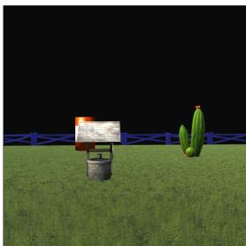
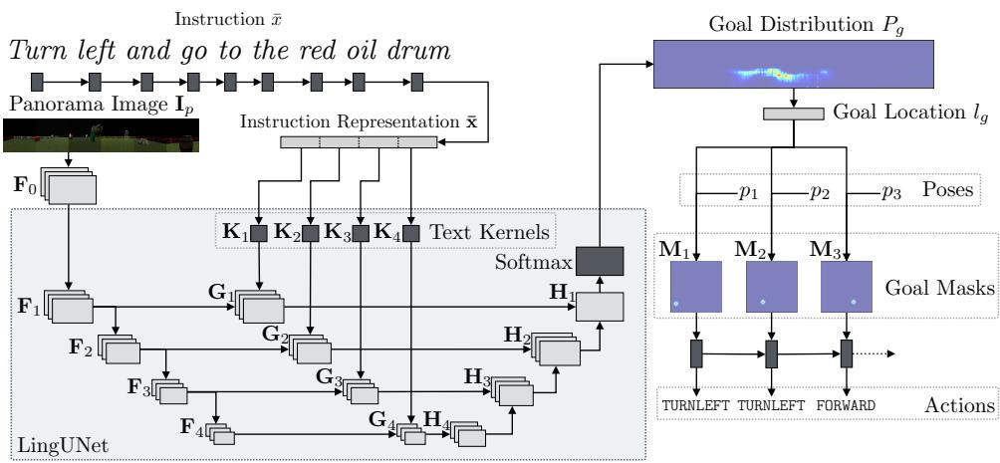
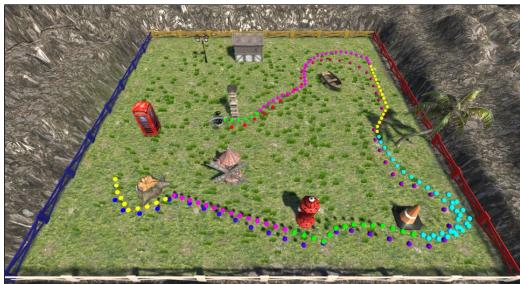

# Mapping Instructions to Actions in 3D Environments with Visual Goal Prediction

Dipendra Misra Andrew Bennett Valts Blukis Eyvind Niklasson Max Shatkhin Yoav Artzi

Department of Computer Science and Cornell Tech, Cornell University, New York, NY, 10044 {dkm, awbennett, valts, yoav}@cs.cornell.edu {een7, ms3448}@cornell.edu

## Abstract

We propose to decompose instruction execution to goal prediction and action generation. We design a model that maps raw visual observations to goals using LINGUNET, a language-conditioned image generation network, and then generates the actions required to complete them. Our model is trained from demonstration only without external resources. To evaluate our approach, we introduce two benchmarks for instruction following: LANI, a navigation task; and CHAI, where an agent executes household instructions. Our evaluation demonstrates the advantages of our model decomposition, and illustrates the challenges posed by our new benchmarks.

## 1 Introduction

Executing instructions in interactive environments requires mapping natural language and observations to actions. Recent approaches propose learning to directly map from inputs to actions, for example given language and either structured observations (Mei et al., 2016; Suhr and Artzi, 2018) or raw visual observations (Misra et al., 2017; Xiong et al., 2018). Rather than using a combination of models, these approaches learn a single model to solve language, perception, and planning challenges. This reduces the amount of engineering required and eliminates the need for hand-crafted meaning representations. At each step, the agent maps its current inputs to the next action using a single learned function that is executed repeatedly until task completion.

Although executing the same computation at each step simplifies modeling, it exemplifies certain inefficiencies; while the agent needs to decide what action to take at each step, identifying its goal is only required once every several steps or even once per execution. The left instruction in Figure 1 illustrates this. The agent can compute its

> **AI Description:**
> **Source:** `assets/_page_0_Figure_0.jpg`
> 
> **Generated:** 2026-05-17 22:47:43
> 
> ---
> 
> The image contains a 3D-rendered scene with a grassy field, a blue fence, and a cactus. There is a signpost with a map and a trash can next to it. The scene appears to be a simple, possibly virtual, representation of a rural or outdoor setting.

After reaching the hydrant head towards the blue fence and pass towards the right side of the well.

> **AI Description:**
> **Source:** `assets/_page_0_Figure_1.jpg`
> 
> **Generated:** 2026-05-17 22:47:38
> 
> ---
> 
> The image depicts a kitchen sink area with a countertop. The sink is equipped with a faucet and a soap dispenser. On the countertop, there are various items including a red box, a green bottle, and some plates. The background features a tiled wall with a mix of square and rectangular tiles, and there are two cabinet doors above the sink. The overall setting appears to be a domestic kitchen.

Put the cereal, the sponge, and the dishwashing soap into the cupboard above the sink.

Figure 1: Example instructions from our two tasks: LANI (left) and CHAI (right). LANI is a landmark navigation task, and CHAI is a corpus of instructions in the CHALET environment.

goal once given the initial observation, and given this goal can then generate the actions required. In this paper, we study a new model that explicitly distinguishes between goal selection and action generation, and introduce two instruction following benchmark tasks to evaluate it.

Our model decomposes into goal prediction and action generation. Given a natural language instruction and system observations, the model predicts the goal to complete. Given the goal, the model generates a sequence of actions.

The key challenge we address is designing the goal representation. We avoid manually designing a meaning representation, and predict the goal in the agent’s observation space. Given the image of the environment the agent observes, we generate a probability distribution over the image to highlight the goal location. We treat this prediction as image generation, and develop LINGUNET, a language conditioned variant of the U-NET image-to-image architecture (Ronneberger et al., 2015). Given the visual goal prediction, we generate actions using a recurrent neural network (RNN).

Our model decomposition offers two key advantages. First, we can use different learning methods as appropriate for the goal prediction and action generation problems. We find supervised learning more effective for goal prediction, where only a limited amount of natural language data is available. For action generation, where exploration is critical, we use policy gradient in a contextual bandit setting (Misra et al., 2017). Second, the goal distribution is easily interpretable by overlaying it on the agent observations. This can be used to increase the safety of physical systems by letting the user verify the goal before any action is executed. Despite the decomposition, our approach retains the advantages of the single-model approach. It does not require designing intermediate representations, and training does not rely on external resources, such as pre-trained parsers or object detectors, instead using demonstrations only.

We introduce two new benchmark tasks with different levels of complexity of goal prediction and action generation. LANI is a 3D navigation environment and corpus, where an agent navigates between landmarks. The corpus includes 6,000 sequences of natural language instructions, each containing on average 4.7 instructions. CHAI is a corpus of 1,596 instruction sequences, each including 7.7 instructions on average, for CHALET, a 3D house environment (Yan et al., 2018). Instructions combine navigation and simple manipulation, including moving objects and opening containers. Both tasks require solving language challenges, including spatial and temporal reasoning, as well as complex perception and planning problems. While LANI provides a task where most instructions include a single goal, the CHAI instructions often require multiple intermediate goals. For example, the household instruction in Figure 1 can be decomposed to eight goals: opening the cupboard, picking each item and moving it to the cupboard, and closing the cupboard. Achieving each goal requires multiple actions of different types, including moving and acting on objects. This allows us to experiment with a simple variation of our model to generate intermediate goals.

We compare our approach to multiple recent methods. Experiments on the LANI navigation task indicate that decomposing goal prediction and action generation significantly improves instruction execution performance. While we observe similar trends on the CHAI instructions, results are overall weaker, illustrating the complexity of the task. We also observe that inherent ambiguities in instruction following make exact goal identification difficult, as demonstrated by imperfect human performance. However, the gap to human-level performance still remains large across both tasks. Our code and data are available at $\operatorname { g i t h u b . c o m / c l i c - l a b / c i f f }$

## 2 Technical Overview

Task Let  be the set of all instructions,  the set of all world states, and A the set of all actions. An instruction ${ \bar { x } } \in { \mathcal { X } }$ is a sequence $\langle x _ { 1 } , \ldots , x _ { n } \rangle$ ， where each $x _ { i }$ is a token. The agent executes instructions by generating a sequence of actions, and indicates execution completion with the special action STOP.

The sets of actions and states are domain specific. In the navigation domain LANI, the actions include moving the agent and changing its orientation. The state information includes the position and orientation of the agent and the different landmarks. The agent actions in the CHALET house environment include moving and changing the agent orientation, as well as an object interaction action. The state encodes the position and orientation of the agent and all objects in the house. For interactive objects, the state also includes their status, for example if a drawer is open or closed. In both domains, the actions are discrete. The domains are described in Section 6.

Model The agent does not observe the world state directly, but instead observes its pose and an RGB image of the environment from its point of view. We define these observations as the agent context s˜. An agent model is a function from an agent context s˜ to an action $a \in { \mathcal { A } }$ We model goal prediction as predicting a probability distribution over the agent visual observations, representing the likelihood of locations or objects in the environment being target positions or objects to be acted on. Our model is described in Section 4.

Learning We assume access to training data with N examples $\{ ( \bar { x } ^ { ( i ) } , s _ { 1 } ^ { ( i ) } , s _ { g } ^ { ( i ) } ) \} _ { i = 1 } ^ { N }$ , where $\bar { x } ^ { ( i ) }$ is an instruction, $s _ { 1 } ^ { ( i ) }$ is a start state, and $s _ { g } ^ { ( i ) }$ is the goal state. We decompose learning; training goal prediction using supervised learning, and action generation using oracle goals with policy gradient in a contextual bandit setting. We assume an instrumented environment with access to the world state, which is used to compute rewards during training only. Learning is described in Section 5.

Evaluation We evaluate task performance on a test set $\{ ( \bar { x } ^ { ( i ) } , s _ { 1 } ^ { ( i ) } , s _ { g } ^ { ( i ) } ) \} _ { i = 1 } ^ { M }$ , where $\bar { x } ^ { ( i ) }$ is an instruction, $s _ { 1 } ^ { ( i ) }$ is a start state, and $s _ { g } ^ { ( i ) }$ is the goal state. We evaluate task completion accuracy and the distance of the agent’s final state to $s _ { g } ^ { ( i ) }$

## 3 Related Work

Mapping instruction to action has been studied extensively with intermediate symbolic representations (e.g., Chen and Mooney, 2011; Kim and Mooney, 2012; Artzi and Zettlemoyer, 2013; Artzi et al., 2014; Misra et al., 2015, 2016). Recently, there has been growing interest in direct mapping from raw visual observations to actions (Misra et al., 2017; Xiong et al., 2018; Anderson et al., 2018; Fried et al., 2018). We propose a model that enjoys the benefits of such direct mapping, but explicitly decomposes that task to interpretable goal prediction and action generation. While we focus on natural language, the problem has also been studied using synthetic language (Chaplot et al., 2018; Hermann et al., 2017).

Our model design is related to hierarchical reinforcement learning, where sub-policies at different levels of the hierarchy are used at different frequencies (Sutton et al., 1998). Oh et al. (2017) uses a two-level hierarchy for mapping synthetic language to actions. Unlike our visual goal representation, they use an opaque vector representation. Also, instead of reinforcement learning, our methods emphasize sample efficiency.

Goal prediction is related to referring expression interpretation (Matuszek et al., 2012a; Krishnamurthy and Kollar, 2013; Kazemzadeh et al., 2014; Kong et al., 2014; Yu et al., 2016; Mao et al., 2016; Kitaev and Klein, 2017). While our model solves a similar problem for goal prediction, we focus on detecting visual goals for actions, including both navigation and manipulation, as part of an instruction following model. Using formal goal representation for instruction following was studied by MacGlashan et al. (2015). In contrast, our model generates a probability distribution over images, and does not require an ontology.

Our data collection is related to existing work. LANI is inspired by the HCRC Map Task (Anderson et al., 1991), where a leader directs a follower to navigate between landmarks on a map. We use a similar task, but our scalable data collection process allows for a significantly larger corpus. We also provide an interactive navigation environment, instead of only map diagrams. Unlike Map Task, our leaders and followers do not interact in real time. This abstracts away interaction challenges, similar to how the SAIL navigation corpus was collected (MacMahon et al., 2006). CHAI instructions were collected using scenarios given to workers, similar to the ATIS collection process (Hemphill et al., 1990; Dahl et al., 1994). Recently, multiple 3D research environments were released. LANI has a significantly larger state space than existing navigation environments (Hermann et al., 2017; Chaplot et al., 2018), and CHALET, the environment used for CHAI, is larger and has more complex manipulation compared to similar environments (Gordon et al., 2018; Das et al., 2018). In addition, only synthetic language data has been released for these environment. An exception is the Room-to-Room dataset (Anderson et al., 2018) that makes use of an environment of connected panoramas of house settings. Although it provides a realistic vision challenge, unlike our environments, the state space is limited to a small number of panoramas and manipulation is not possible.

## 4 Model

We model the agent policy as a neural network. The agent observes the world state $s _ { t }$ at time t as an RGB image $\mathbf { I } _ { t } .$ . The agent context ${ \tilde { s } } _ { t } ,$ the information available to the agent to select the next action $a _ { t } ,$ is a tuple $( \bar { x } , \mathbf { I } _ { P } , \langle ( \mathbf { I } _ { 1 } , p _ { 1 } ) , \dots , ( \mathbf { I } _ { t } , p _ { t } ) \rangle )$ , where x¯ is the natural language instructions, $\mathbf { I } _ { P }$ is a panoramic view of the environment from the starting position at time $t ~ = ~ 1$ , and $\left. ( \mathbf { I } _ { 1 } , p _ { 1 } ) , \ldots , ( \mathbf { I } _ { t } , p _ { t } ) \right.$ is the sequence of observations $\mathbf { I } _ { t }$ and poses $p _ { t }$ up to time t. The panorama $\mathbf { I } _ { P }$ is generated through deterministic exploration by rotating $3 6 0 ^ { \circ }$ to observe the environment at the beginning of the execution.1

The model includes two main components: goal prediction and action generation. The agent uses the panorama $\mathbf { I } _ { P }$ to predict the goal location $l _ { g } .$ . At each time step t, a projection of the goal location into the agent’s current view ${ { \bf { M } } _ { t } }$ is given as input to an RNN to generate actions. The probability of an action $a _ { t }$ at time t decomposes to:

$$
\begin{array} { l } { { \displaystyle P ( a _ { t } \mid \tilde { s } _ { t } ) = \sum _ { l _ { g } } \left( P ( l _ { g } \mid \bar { x } , { \bf I } _ { P } ) \right. } } \\ { { \displaystyle \left. P ( a _ { t } \mid l _ { g } , ( { \bf I } _ { 1 } , p _ { 1 } ) , \dots , ( { \bf I } _ { t } , p _ { t } ) ) \right) \ , } } \end{array}
$$

where the first term puts the complete distribution mass on a single location (i.e., a delta function). Figure 2 illustrates the model.

Figure 2: An illustration for our architecture (Section 4) for the instruction turn left and go to the red oil drum with a LINGUNET depth of $m = 4$ . The instruction x¯ is mapped to ¯x with an RNN, and the initial panorama observation $\mathbf { I } _ { P }$ to ${ \bf F } _ { 0 }$ with a CNN. LINGUNET generates $\mathbf { H } _ { 1 } ,$ , a visual representation of the goal. First, a sequence of convolutions maps the image features $\mathbf { F } _ { 0 }$ to feature maps $\mathbf { F } _ { 1 } , \ldots , \mathbf { F } _ { 4 }$ The text representation ¯x is used to generate the kernels $\mathbf { K } _ { 1 } , \ldots , \mathbf { K } _ { 4 } ^ { - } .$ , which are convolved to generate the text-conditioned feature maps $\mathbf { G } _ { 1 } , \ldots , \mathbf { G } _ { 4 } .$ These feature maps are de-convolved to $\mathbf { H } _ { 1 } , \ldots , \mathbf { H } _ { 4 }$ . The goal probability distribution $P _ { g }$ is computed from $\mathbf { H } _ { 1 }$ The goal location is the inferred from the max of $P _ { g }$ . Given $l _ { g }$ and $p _ { t } .$ , the pose at step t, the goal mask $\mathbf { M } _ { t }$ is computed and passed into an RNN that outputs the action to execute.

> **AI Description:**
> **Source:** `assets/_page_3_Figure_0.jpg`
> 
> **Generated:** 2026-05-17 22:48:14
> 
> ---
> 
> The image is a technical diagram illustrating a neural network architecture for a task involving instruction understanding and goal localization in a 3D environment. It includes a panoramic image input, an instruction text input, and various layers of processing including convolutional and recurrent neural network components. The diagram also shows the generation of a goal distribution, goal location, and goal masks, which are used to predict actions such as "TURNLEFT" and "FORWARD". The architecture is labeled with components like "LingUNet", "Text Kernels", and "Softmax", indicating the different stages of processing and decision-making in the system.

Goal Prediction To predict the goal location, we generate a probability distribution $P _ { g }$ over a feature map $\mathbf { F } _ { 0 }$ generated using convolutions from the initial panorama observation $\mathbf { I } _ { P }$ . Each element in the probability distribution $P _ { g }$ corresponds to an area in $\mathbf { I } _ { P }$ . Given the instruction x¯ and panorama $\mathbf { I } _ { P }$ , we first generate their representations. From the panorama $\mathbf { I } _ { P } ,$ we generate a feature map ${ \bf F } _ { 0 } = [ { \bf C } { \bf N } { \bf N } _ { 0 } ( { \bf I } _ { P } ) ; { \bf F } ^ { p } ]$ , where $\mathrm { C N N _ { 0 } }$ is a two-layer convolutional neural network (CNN; LeCun et al., 1998) with rectified linear units (ReLU; Nair and Hinton, 2010) and $\mathbf { F } ^ { p }$ are positional embeddings.2 The concatenation is along the channel dimension. The instruction $\bar { x } ~ = ~ \langle x _ { 1 } , \cdot \cdot \cdot x _ { n } \rangle$ is mapped to a sequence of hidden states $\mathbf { l } _ { i } = \mathrm { L S T M } _ { x } ( \psi _ { x } ( x _ { i } ) , \mathbf { l } _ { i - 1 } ) , i =$ $1 , \ldots , n$ using a learned embedding function $\psi _ { x }$ and a long short-term memory (LSTM; Hochreiter and Schmidhuber, 1997) RNN LSTMx. The instruction representation is $\bar { \mathbf { x } } = \mathbf { l } _ { n }$

We generate the probability distribution $P _ { g }$ over pixels in $\mathbf { F } _ { 0 }$ using LINGUNET. The architecture of LINGUNET is inspired by the U-NET image generation method (Ronneberger et al., 2015), except that the reconstruction phase is conditioned on the natural language instruction. LINGUNET first applies m convolutional layers to generate a sequence of feature maps $\mathbf { F } _ { j } ~ = ~ \mathbf { C } \mathbf { N } \mathbf { N } _ { j } ( \mathbf { F } _ { j - 1 } )$ ， $j = 1 \ldots m$ , where each $\mathrm { C N N } _ { j }$ is a convolutional layer with leaky ReLU non-linearities (Maas et al., 2013) and instance normalization (Ulyanov et al., 2016). The instruction representation ¯x is split evenly into m vectors $\{ \bar { \bf x } _ { j } \} _ { j = 1 } ^ { m }$ , each is used to create a $1 \times 1$ kernel $\mathbf { K } _ { j } = \mathbf { \bar { A } F F I N E } _ { j } ( \bar { \mathbf { x } } _ { j } )$ , where each AFFIN $\operatorname { E } _ { j }$ is an affine transformation followed by normalizing and reshaping. For each $\mathbf { F } _ { j }$ , we apply a 2D $1 \times 1$ convolution using the text kernel $\mathbf { K } _ { j }$ to generate a text-conditioned feature map $\mathbf { G } _ { j } ~ = ~ \mathrm { C o N v o L V E } \big ( \mathbf { K } _ { j } , \mathbf { F } _ { j } \big )$ , where CONVOLVE convolves the kernel over the feature map. We then perform m deconvolutions to generate a sequence of feature maps $\mathbf { H } _ { m } , \ldots , \mathbf { H } _ { 1 }$

$$
\begin{array} { r c l } { { \bf H } _ { m } } & { = } & { { \sf D E C O N V } _ { m } \big ( \sf { D R O P O U T } \big ( { \bf G } _ { m } \big ) \big ) } \\ { { \bf H } _ { j } } & { = } & { { \sf D E C O N V } _ { j } \big ( \big [ { \bf H } _ { j + 1 } ; { \bf G } _ { j } \big ] \big ) ~ . } \end{array}
$$

DROPOUT is dropout regularization (Srivastava et al., 2014) and each DECON $\mathrm { v } _ { j }$ is a deconvolution operation followed a leaky ReLU nonlinearity and instance norm.3 Finally, we generate $P _ { g }$ by applying a softmax to H1 and an additional learned scalar bias term $b _ { g }$ to represent events where the goal is out of sight. For example, when the agent already stands in the goal position and therefore the panorama does not show it.

We use $P _ { g }$ to predict the goal position in the environment. We first select the goal pixel in $\mathbf { F } _ { 0 }$ as the pixel corresponding to the highest probability element in $P _ { g } .$ . We then identify the corresponding 3D location $l _ { g }$ in the environment using backward camera projection, which is computed given the camera parameters and $p _ { 1 }$ , the agent pose at the beginning of the execution.

Action Generation Given the predicted goal $l _ { g } .$ we generate actions using an RNN. At each time step $t ,$ given $p _ { t }$ , we generate the goal mask $\mathbf { M } _ { t }$ which has the same shape as the observed image $\mathbf { I } _ { t } .$ The goal mask $\mathbf { M } _ { t }$ has a value of 1 for each element that corresponds to the goal location $l _ { g }$ in $\mathbf { I } _ { t } .$ We do not distinguish between visible or occluded locations. All other elements are set to 0. We also maintain an out-of-sight flag $O t$ that is set to 1 if (a) $l _ { g }$ is not within the agent’s view; or (b) the max scoring element in $P _ { g }$ corresponds to $b _ { g } ,$ the term for events when the goal is not visible in $\mathbf { I } _ { P }$ . Otherwise, $o _ { t }$ is set to 0. We compute an action generation hidden state $y _ { t }$ with an RNN:

$$
y _ { t } = \mathrm { L S T M } _ { A } \left( \mathrm { A F F I N E } _ { A } \big ( \big [ \mathrm { F L A T } \big ( \mathbf { M } _ { t } \big ) ; o _ { t } \big ] \big ) , y _ { t - 1 } \right) \ ,
$$

where FLAT flattens ${ { \bf { M } } _ { t } }$ into a vector, $\mathrm { A F F I N E } _ { A }$ is a learned affine transformation with ReLU, and $\mathrm { L S T M } _ { A }$ is an LSTM RNN. The previous hidden state $y _ { t - 1 }$ was computed when generating the previous action, and the RNN is extended gradually during execution. Finally, we compute a probability distribution over actions:

$$
\begin{array} { r l } { P ( a _ { t } \mid l _ { g } , ( { \bf I } _ { 1 } , p _ { 1 } ) , \ldots , ( { \bf I } _ { t } , p _ { t } ) ) } & { = } \\ { \mathrm { S O F T M A X } \big ( \mathrm { A F F I N E } _ { p } \big ( [ y _ { t } ; \psi _ { T } ( t ) ] \big ) \big ) } & { , } \end{array}
$$

where $\psi _ { T }$ is a learned embedding lookup table for the current time (Chaplot et al., 2018) and $\mathrm { A F F I N E } _ { p }$ is a learned affine transformation.

Model Parameters The model parameters ✓ include the parameters of the convolutions $\mathrm { C N N _ { 0 } }$ and the components of LINGUNET: $\mathrm { C N N } _ { j } ,$ $\mathrm { A F F I N E } _ { j \mathrm { : } }$ , and $\mathrm { D E C O N V } _ { j }$ for $\ j ^ { \mathrm { ~ ~ } } = \ 1 , \ldots , m .$ In addition we learn two affine transformations $\mathbf { A F F I N E } _ { A }$ and $\mathrm { A F F I N E } _ { p } .$ , two RNNs $\mathrm { L S T M } _ { x }$ and $\mathrm { L S T M } _ { A }$ , two embedding functions $\psi _ { x }$ and T , and the goal distribution bias term $b _ { g }$ . In our experiments (Section 7), all parameters are learned without external resources.

## 5 Learning

Our modeling decomposition enables us to choose different learning algorithms for the two parts. While reinforcement learning is commonly deployed for tasks that benefit from exploration (e.g., Peters and Schaal, 2008; Mnih et al., 2013), these methods require many samples due to their high sample complexity. However, when learning with natural language, only a relatively small number of samples is realistically available. This problem was addressed in prior work by learning in a contextual bandit setting (Misra et al., 2017) or mixing reinforcement and supervised learning (Xiong et al., 2018). Our decomposition uniquely offers to tease apart the language understanding problem and address it with supervised learning, which generally has lower sample complexity. For action generation though, where exploration can be autonomous, we use policy gradient in a contextual bandit setting (Misra et al., 2017).

We assume access to training data with N examples $\{ ( \bar { x } ^ { ( i ) } , s _ { 1 } ^ { ( i ) } , s _ { g } ^ { ( i ) } ) \} _ { i = 1 } ^ { N }$ , where $\bar { x } ^ { ( i ) }$ is an instruction, $s _ { 1 } ^ { ( i ) }$ is a start state, and $s _ { g } ^ { ( i ) }$ is the goal state. We train the goal prediction component by minimizing the cross-entropy of the predicted distribution with the gold-standard goal distribution. The gold-standard goal distribution is a deterministic distribution with probability one at the pixel corresponding to the goal location if the goal is in the field of view, or probability one at the extra out-of-sight position otherwise. The gold location is the agent’s location in $s _ { g } ^ { ( i ) }$ . We update the model parameters using Adam (Kingma and Ba, 2014).

We train action generation by maximizing the expected immediate reward the agent observes while exploring the environment. The objective for a single example i and time stamp t is:

$$
J = \sum _ { a \in \mathcal { A } } \pi ( a \mid \tilde { s } _ { t } ) R ^ { ( i ) } ( s _ { t } , a ) + \lambda H ( \pi ( . \mid \tilde { s } _ { t } ) ) ,
$$

where $R ^ { ( i ) } : S \times \mathcal { A }  \mathbb { R }$ is an example-specific reward function, $H ( \cdot )$ is an entropy regularization term, and  is the regularization coefficient. The reward function $R ^ { ( i ) }$ details are described in details in Appendix B. Roughly speaking, the reward function includes two additive components: a problem reward and a shaping term (Ng et al., 1999). The problem reward provides a positive reward for successful task completion, and a negative reward for incorrect completion or collision. The shaping term is positive when the agent gets closer to the goal position, and negative if it is moving away. The gradient of the objective is:

$$
\begin{array} { r c l } { \nabla J } & { = } & { \displaystyle \sum _ { a \in \cal A } \pi ( a \mid \tilde { s } _ { t } ) \nabla \log \pi ( a \mid \tilde { s } _ { t } ) R ( s _ { t } , a ) } \\ & & { \quad \quad + \lambda \nabla H ( \pi ( . \mid \tilde { s } _ { t } ) \ . } \end{array}
$$

We approximate the gradient by sampling an action using the policy (Williams, 1992), and use the gold goal location computed from $s _ { g } ^ { ( i ) }$ . We perform several parallel rollouts to compute gradients and update the parameters using Hogwild! (Recht et al., 2011) and Adam learning rates.

Table 1: Summary statistics of the two corpora.

## 6 Tasks and Data

## 6.1 LANI

The goal of LANI is to evaluate how well an agent can follow navigation instructions. The agent task is to follow a sequence of instructions that specify a path in an environment with multiple landmarks. Figure 1 (left) shows an example instruction.

The environment is a fenced, square, grass field. Each instance of the environment contains between 6–13 randomly placed landmarks, sampled from 63 unique landmarks. The agent can take four types of discrete actions: FORWARD, TURNRIGHT, TURNLEFT, and STOP. The field is of size 50 50, the distance of the FORWARD action is 1.5, and the turn angle is 15. The environment simulator is implemented in Unity3D. At each time step, the agent performs an action, observes a first person view of the environment as an RGB image, and receives a scalar reward. The simulator provides a socket API to control the agent and the environment.

Agent performance is evaluated using two metrics: task completion accuracy, and stop distance error. A task is completed correctly if the agent stops within an aerial distance of 5 from the goal.

We collect a corpus of navigation instructions using crowdsourcing. We randomly generate environments, and generate one reference path for each environment. To elicit linguistically interesting instructions, reference paths are generated to pass near landmarks. We use Amazon Mechanical Turk, and split the annotation process to two tasks. First, given an environment and a reference path, a worker writes an instruction paragraph for following the path. The second task requires another worker to control the agent to perform the instructions and simultaneously mark at each point what part of the instruction was executed. The recording of the second worker creates the final data of segmented instructions and demonstrations. The generated reference path is displayed in both tasks. The second worker could also mark the paragraph as invalid. Both tasks are done from an overhead view of the environment, but workers are instructed to provide instructions for a robot that observes the environment from a first person view. Figure 3 shows a reference path and the written instruction. This data can be used for evaluating both executing sequences of instructions and sinthen head towards the barrel.gle instructions in isolation.

[Go around the pillar on the right hand side] [and head Go around the pillar on the right hand sideand head towards the boat, circling around it clockwise.towards the boat, circling around it clockwise.] [When When you are facing the tree, walk towards it, and the pass on the right handyou are facing the tree, walk towards it, and the pass on and then walk past the hydrant on your right,the right hand side,] [and the left hand side of the cone. and the the tree stump.Circle around the cone,] [and then walk past the hydrant on your right,] [and the the tree stump.] [Circle around the stump and then stop right behind it.]
Figure 3: Segmented instructions in the LANI domain. The original reference path is marked in red (start) and blue (end). The agent, using a drone icon, is placed at the beginning of the path. The follower path is coded in colors to align to the segmented instruction paragraph.

> **AI Description:**
> **Source:** `assets/_page_5_Figure_0.jpg`
> 
> **Generated:** 2026-05-17 22:47:59
> 
> ---
> 
> The image is a 3D-rendered scene depicting a small, enclosed area resembling a park or playground. It includes various objects such as a red telephone booth, a small wooden hut, a fire pit, and a small wooden bench. There are colorful paths marked with dots in different colors (yellow, purple, green, and blue) that form a circuit around the area. The paths appear to be designed for a game or simulation, possibly involving navigation or exploration. The scene is surrounded by a fence, and there are palm trees in the background, suggesting a tropical or subtropical setting.

passing the bench on the right side, stopping right before you get to theTable 1 shows the corpus statistics.4 Each paragraph corresponds to a single unique instance of the environment. The paragraphs are split into train, test, and development, with a 70% / 15% / 15% split. Finally, we sample 200 single development instructions for qualitative analysis of the language challenge the corpus presents (Table 2).

## 6.2 CHAI

The CHAI corpus combines both navigation and simple manipulation in a complex, simulated household environment. We use the CHALET simulator (Yan et al., 2018), a 3D house simulator that provides multiple houses, each with multiple rooms. The environment supports moving between rooms, picking and placing objects, and opening and closing cabinets and similar containers. Objects can be moved between rooms and in and out of containers. The agent observes the world in first-person view, and can take five actions: FORWARD, TURNLEFT, TURNRIGHT, STOP, and INTERACT. The INTERACT action acts on objects. It takes as argument a 2D position in the agent’s view. Agent performance is evaluated with two metrics: (a) stop distance, which measures the distance of the agent’s final state to the final annotated position; and (b) manipulation accuracy, which compares the set of manipulation actions to a reference set. When measuring distance, to consider the house plan, we compute the minimal aerial distance for each room that must be visited. Yan et al. (2018) provides the full details of the simulator and evaluation. We use five different houses, each with up to six rooms. Each room contains on average 30 objects. A typical room is of size 6 6. We set the distance of FORWARD to 0.1, the turn angle to 90, and divide the agent’s view to a 32⇥32 grid for the INTERACT action.

Table 2: Qualitative analysis of the LANI and CHAI corpora. We sample 200 single development instructions from each corpora. For each category, we count how many examples of the 200 contained it and show an example.
Figure 4: Scenario and segmented instruction from the CHAI corpus.
<table><tr><td>Scenario Youhave several hoursbefore guestsbeginto arrive for</td></tr><tr><td>a dinner party. You are preparing a wide variety of meat dishes,and needto put themin the sink.In addition, you want to remove things in the kitchen,and bathroom which you don&#x27;t want your guests seeing,like the soaps inthe bathroom,and thedish cleaning items.You can putthese in thecupboards.Finally,put thedirty dishes around the house in the dishwasher and close it.</td></tr><tr><td>Written Instructions [Inthekitchen,openthecupboardabovethesink.] [Put thecereal,thesponge,and thedishwashing soap into the</td></tr><tr><td>cupboard above the sink.] [Close the cupboard.] [Pick up the meats and put them into the sink.] [Open the dish- washer,grab the dirty disheson the counter,and put the dishesinto thedishwasher.]</td></tr></table>

We collected a corpus of navigation and manipulation instructions using Amazon Mechanical Turk. We created 36 common household scenarios to provide a familiar context to the task.5 We use two crowdsourcing tasks. First, we provide workers with a scenario and ask them to write instructions. The workers are encouraged to explore the environment and interact with it. We then segment the instructions to sentences automatically. In the second task, workers are presented with the segmented sentences in order and asked to execute them. After finishing a sentence, the workers request the next sentence. The workers do not see the original scenario. Figure 4 shows a scenario and the written segmented paragraph. Similar to LANI, CHAI data can be used for studying complete paragraphs and single instructions.

Table 1 shows the corpus statistics.6 The paragraphs are split into train, test, and development, with a 70% / 15% / 15% split. Table 2 shows qualitative analysis of a sample of 200 instructions.

## 7 Experimental Setup

Method Adaptations for CHAI We apply two modifications to our model to support intermediate goal for the CHAI instructions. First, we train an additional RNN to predict the sequence of intermediate goals given the instruction only. There are two types of goals: NAVIGATION, for action sequences requiring movement only and ending with the STOP action; and INTERACTION, for sequence of movement actions that end with an INTERACT action. For example, for the instruction pick up the red book and go to the kitchen, the sequence of goals will be INTERACTION, NAVIGATION, NAVIGATION . This indicates the agent must first move to the object to pick it up via interaction, move to the kitchen door, and finally move within the kitchen. The process of executing an instruction starts with predicting the sequence of goal types. We call our model (Section 4) separately for each goal type. The execution concludes when the final goal is completed. For learning, we create a separate example for each intermediate goal and train the additional RNN separately. The second modification is replacing the backward camera projection for inferring the goal location with ray casting to identify INTERACTION goals, which are often objects that are not located on the ground.

Table 3: Performance on the development data.

Baselines We compare our approach against the following baselines: (a) STOP: Agent stops immediately; (b) RANDOMWALK: Agent samples actions uniformly until it exhausts the horizon or stops; (c) MOSTFREQUENT: Agent takes the most frequent action in the data, FORWARD for both datasets, until it exhausts the horizon; (d) MISRA17: the approach of Misra et al. (2017); and (e) CHAPLOT18: the approach of Chaplot et al. (2018). We also evaluate goal prediction and compare to the method of Janner et al. (2018) and a CENTER baseline, which always predict the center pixel. Appendix C provides baseline details.

Evaluation Metrics We evaluate using the metrics described in Section 6: stop distance (SD) and task completion (TC) for LANI, and stop distance (SD) and manipulation accuracy (MA) for CHAI. To evaluate the goal prediction, we report the real distance of the predicted goal from the annotated goal and the percentage of correct predictions. We consider a goal correct if it is within a distance of 5.0 for LANI and 1.0 for CHAI. We also report human evaluation for LANI by asking raters if the generated path follows the instruction on a Likerttype scale of 1–5. Raters were shown the generated path, the reference path, and the instruction.

Parameters We use a horizon of 40 for both domains. During training, we allow additional 5 steps to encourage learning even after errors. When using intermediate goals in CHAI, the horizon is used for each intermediate goal separately. All other parameters and detailed in Appendix D.

## 8 Results

Tables 3 and 4 show development and test results. Both sets of experiments demonstrate similar trends. The low performance of STOP, RAN-DOMWALK, and MOSTFREQUENT demonstrates the challenges of both tasks, and shows the tasks are robust to simple biases. On LANI, our approach outperforms CHAPLOT18, improving task completion (TC) accuracy by 5%, and both methods outperform MISRA17. On CHAI, CHAP-LOT18 and MISRA17 both fail to learn, while our approach shows an improvement on stop distance (SD). However, all models perform poorly on CHAI, especially on manipulation (MA).

Table 4: Performance on the held-out test dataset.
Table 5: Development goal prediction performance. We measure distance (Dist) and accuracy (Acc).

To isolate navigation performance on CHAI, we limit our train and test data to instructions that include navigation actions only. The STOP baseline on these instructions gives a stop distance (SD) of 3.91, higher than the average for the entire data as these instructions require more movement. Our approach gives a stop distance (SD) of 3.24, a 17% reduction of error, significantly better than the 8% reduction of error over the entire corpus.

We also measure human performance on a sample of 100 development examples for both tasks. On LANI, we observe a stop distance error (SD) of 5.2 and successful task completion (TC) 63% of the time. On CHAI, the human distance error (SD) is 1.34 and the manipulation accuracy is 100%. The imperfect performance demonstrates the inherent ambiguity of the tasks. The gap to human performance is still large though, demonstrating that both tasks are largely open problems.

The imperfect human performance raises questions about automated evaluation. In general, we observe that often measuring execution quality with rigid goals is insufficient. We conduct a human evaluation with 50 development examples from LANI rating human performance and our approach. Figure 5 shows a histogram of the ratings. The mean rating for human followers is 4.38, while our approach’s is 3.78; we observe a similar trend to before with this metric. Using judgements on our approach, we correlate the human metric with the SD measure. We observe a Pearson correlation -0.65 (p=5e-7), indicating that our automated metric correlates well with human judgment.7 This initial study suggests that our automated evaluation is appropriate for this task.

### Full Page Description (Page 8)

**Source:** `assets/_page_8_Asset_0.jpg`

**Generated:** 2026-05-17 22:47:49

---

The image is a bar chart comparing the percentage of responses from "Human" and "Our Approach" across five categories. The x-axis represents the categories, numbered 1 through 5. The y-axis represents the percentage. The chart shows that "Our Approach" consistently has a higher percentage than "Human" across all categories. The highest percentage for "Our Approach" is around 55%, while the highest for "Human" is around 35%.

Our ablations (Table 3) demonstrate the importance of each of the components of the model. We ablate the action generation RNN (w/o RNN), completely remove the language input (w/o Language), and train the model jointly (w/joint Learning).8 On CHAI especially, ablations results in models that display ineffective behavior. Of the ablations, we observe the largest benefit from decomposing the learning and using supervised learning for the language problem.

We also evaluate our approach with access to oracle goals (Table 3). We observe this improves navigation performance significantly on both tasks. However, the model completely fails to learn a reasonable manipulation behavior for CHAI. This illustrates the planning complexity of this domain. A large part of the improvement in measured navigation behavior is likely due to eliminating much of the ambiguity the automated metric often fails to capture.

Finally, on goal prediction (Table 5), our approach outperforms the method of Janner et al. (2018). Figure 6 and Appendix Figure 7 show example goal predictions. In Table 6, we break down LANI goal prediction results for the analysis cate-

walk over to the cabinets and open the cabinet doors up

Figure 6: Goal prediction probability maps $P _ { g }$ overlaid on the corresponding observed panoramas IP . The top example shows a result on LANI, the bottom on CHAI.

gories we used in Table 2 using the same sample of the data. Appendix E includes a similar table for CHAI. We observe that our approach finds instructions with temporal coordination or co-reference challenging. Co-reference is an expected limitation; with single instructions, the model can not resolve references to previous instructions.

## 9 Discussion

We propose a model for instruction following with explicit separation of goal prediction and action generation. Our representation of goal prediction is easily interpretable, while not requiring the design of logical ontologies and symbolic representations. A potential limitation of our approach is cascading errors. Action generation relies completely on the predicted goal and is not exposed to the language otherwise. This also suggests a second related limitation: the model is unlikely to successfully reason about instructions that include constraints on the execution itself. While the model may reach the final goal correctly, it is unlikely to account for the intermediate trajectory constraints. As we show (Table 2), such instructions are common in our data. These two limitations may be addressed by allowing action generation access to the instruction. Achieving this while retaining an interpretable goal representation that clearly determines the execution is an important direction for future work. Another important open question concerns automated evaluation, which remains especially challenging when instructions do not only specify goals, but also constraints on how to achieve them. Our resources provide the platform and data to conduct this research.

## Acknowledgments

This research was supported by NSF (CRII-1656998), Schmidt Sciences, and cloud computing credits from Microsoft. We thank John Langford, Claudia Yan, Bharath Hariharan, Noah Snavely, the Cornell NLP group, and the anonymous reviewers for their advice.

## References

- Anne H Anderson, Miles Bader, Ellen Gurman Bard, Elizabeth Boyle, Gwyneth Doherty, Simon Garrod, Stephen Isard, Jacqueline Kowtko, Jan McAllister, Jim Miller, Catherine Sotillo, Henry S. Thompson, and Regina Weinert. 1991. The HCRC map task corpus. Language and Speech, 34.
- Peter Anderson, Qi Wu, Damien Teney, Jake Bruce, Mark Johnson, Niko Sünderhauf, Ian Reid, Stephen Gould, and Anton van den Hengel. 2018. Visionand-language navigation: Interpreting visuallygrounded navigation instructions in real environments. In Proceedings of the IEEE Conference on Computer Vision and Pattern Recognition.
- Yoav Artzi, Dipanjan Das, and Slav Petrov. 2014. Learning compact lexicons for CCG semantic parsing. In Proceedings of the 2014 Conference on Empirical Methods in Natural Language Processing.
- Yoav Artzi and Luke Zettlemoyer. 2013. Weakly supervised learning of semantic parsers for mapping instructions to actions. Transactions of the Association of Computational Linguistics, 1.
- Yonatan Bisk, Daniel Marcu, and William Wong. 2016. Towards a dataset for human computer communication via grounded language acquisition. In Proceedings of the AAAI Workshop on Symbiotic Cognitive Systems.
- Devendra Singh Chaplot, Kanthashree Mysore Sathyendra, Rama Kumar Pasumarthi, Dheeraj Rajagopal, and Ruslan Salakhutdinov. 2018. Gatedattention architectures for task-oriented language grounding.
- David L. Chen and Raymond J. Mooney. 2011. Learning to interpret natural language navigation instructions from observations. In Proceedings of the National Conference on Artificial Intelligence.
- Deborah A Dahl, Madeleine Bates, Michael Brown, William Fisher, Kate Hunicke-Smith, David Pallett, Christine Pao, Alexander Rudnicky, and Elizabeth Shriberg. 1994. Expanding the scope of the ATIS task: The ATIS-3 corpus. In Proceedings of the workshop on Human Language Technology.
- Abhishek Das, Samyak Datta, Georgia Gkioxari, Stefan Lee, Devi Parikh, and Dhruv Batra. 2018. Embodied question answering. In Proceedings of the IEEE Conference on Computer Vision and Pattern Recognition.
- Daniel Fried, Ronghang Hu, Volkan Cirik, Anna Rohrbach, Jacob Andreas, Louis-Philippe Morency, Taylor Berg-Kirkpatrick, Kate Saenko, Dan Klein, and Trevor Darrell. 2018. Speaker-follower models for vision-and-language navigation. CoRR, abs/1806.02724.
- Daniel Gordon, Aniruddha Kembhavi, Mohammad Rastegari, Joseph Redmon, Dieter Fox, and Ali
- Farhadi. 2018. Iqa: Visual question answering in interactive environments. In Proceedings of the IEEE Conference on Computer Vision and Pattern Recognition.
- Charles T. Hemphill, John J. Godfrey, and George R. Doddington. 1990. The ATIS spoken language systems pilot corpus. In Proceedings of the DARPA speech and natural language workshop.
- Karl Moritz Hermann, Felix Hill, Simon Green, Fumin Wang, Ryan Faulkner, Hubert Soyer, David Szepesvari, Wojciech Czarnecki, Max Jaderberg, Denis Teplyashin, Marcus Wainwright, Chris Apps, Demis Hassabis, and Phil Blunsom. 2017. Grounded language learning in a simulated 3D world. CoRR, abs/1706.06551.
- Sepp Hochreiter and Jürgen Schmidhuber. 1997. Long short-term memory. Neural computation, 9.
- Michael Janner, Karthik Narasimhan, and Regina Barzilay. 2018. Representation learning for grounded spatial reasoning. Transactions of the Association for Computational Linguistics, 6.
- Sahar Kazemzadeh, Vicente Ordonez, Mark Matten, and Tamara L. Berg. 2014. Referitgame: Referring to objects in photographs of natural scenes. In Proceedings of the Conference on Empirical Methods in Natural Language Processing.
- Joohyun Kim and Raymond Mooney. 2012. Unsupervised PCFG induction for grounded language learning with highly ambiguous supervision. In Proceedings of the Joint Conference on Empirical Methods in Natural Language Processing and Computational Natural Language Learning.
- Diederik Kingma and Jimmy Ba. 2014. Adam: A method for stochastic optimization. In Proceedings of the International Conference on Learning Representations.
- Nikita Kitaev and Dan Klein. 2017. Where is misty? interpreting spatial descriptors by modeling regions in space. In Proceedings of the Conference on Empirical Methods in Natural Language Processing.
- Chen Kong, Dahua Lin, Mohit Bansal, Raquel Urtasun, and Sanja Fidler. 2014. What are you talking about? text-to-image coreference. In Proceedings of the IEEE Conference on Computer Vision and Pattern Recognition.
- Jayant Krishnamurthy and T. Kollar. 2013. Jointly learning to parse and perceive: Connecting natural language to the physical world. Transactions of the Association for Computational Linguistics, 1.
- Yann LeCun, Léon Bottou, Yoshua Bengio, and Patrick Haffner. 1998. Gradient-based learning applied to document recognition. Proceedings of the IEEE, 86.

- Andrew L Maas, Awni Y Hannun, and Andrew Y Ng. 2013. Rectifier nonlinearities improve neural network acoustic models. In Proceedings of the international conference on machine learning.
- James MacGlashan, Monica Babes-Vroman, Marie desJardins, Michael L. Littman, Smaranda Muresan, S Bertel Squire, Stefanie Tellex, Dilip Arumugam, and Lei Yang. 2015. Grounding english commands to reward functions. In Robotics: Science and Systems.
- Matthew MacMahon, Brian Stankiewics, and Benjamin Kuipers. 2006. Walk the talk: Connecting language, knowledge, action in route instructions. In Proceedings of the National Conference on Artificial Intelligence.
- Junhua Mao, Jonathan Huang, Alexander Toshev, Oana Camburu, Alan Yuille, and Kevin Murphy. 2016. Generation and Comprehension of Unambiguous Object Descriptions. In Proceedings of IEEE Conference on Computer Vision and Pattern Recognition.
- Cynthia Matuszek, Nicholas FitzGerald, Luke Zettlemoyer, Liefeng Bo, and Dieter Fox. 2012a. A joint model of language and perception for grounded attribute learning. In Proceedings of the International Conference on Machine Learning.
- Cynthia Matuszek, Evan Herbst, Luke Zettlemoyer, and Dieter Fox. 2012b. Learning to parse natural language commands to a robot control system. In Proceedings of the International Symposium on Experimental Robotics.
- Hongyuan Mei, Mohit Bansal, and R. Matthew Walter. 2016. What to talk about and how? selective generation using lstms with coarse-to-fine alignment. In Proceedings of the Conference of the North American Chapter of the Association for Computational Linguistics: Human Language Technologies.
- Dipendra Misra, John Langford, and Yoav Artzi. 2017. Mapping instructions and visual observations to actions with reinforcement learning. In Proceedings of the Conference on Empirical Methods in Natural Language Processing.
- Dipendra K. Misra, Jaeyong Sung, Kevin Lee, and Ashutosh Saxena. 2016. Tell me dave: Contextsensitive grounding of natural language to manipulation instructions. The International Journal of Robotics Research, 35.
- Kumar Dipendra Misra, Kejia Tao, Percy Liang, and Ashutosh Saxena. 2015. Environment-driven lexicon induction for high-level instructions. In Proceedings of the Annual Meeting of the Association for Computational Linguistics and the International Joint Conference on Natural Language Processing.
- Volodymyr Mnih, Koray Kavukcuoglu, David Silver, Alex Graves, Ioannis Antonoglou, Daan Wierstra, and Martin A. Riedmiller. 2013. Playing atari with
- deep reinforcement learning. In Advances in Neural Information Processing Systems.
- Vinod Nair and Geoffrey E Hinton. 2010. Rectified linear units improve restricted boltzmann machines. In Proceedings of the international conference on machine learning.
- Andrew Y. Ng, Daishi Harada, and Stuart J. Russell. 1999. Policy invariance under reward transformations: Theory and application to reward shaping. In Proceedings of the International Conference on Machine Learning.
- Junhyuk Oh, Satinder P. Singh, Honglak Lee, and Pushmeet Kohli. 2017. Zero-shot task generalization with multi-task deep reinforcement learning. In Proceedings of the international conference on machine learning.
- Jan Peters and Stefan Schaal. 2008. Reinforcement learning of motor skills with policy gradients. Neural networks, 21.
- Benjamin Recht, Christopher Re, Stephen Wright, and Feng Niu. 2011. Hogwild: A lock-free approach to parallelizing stochastic gradient descent. In Advances in Neural Information Processing Systems.
- Olaf Ronneberger, Philipp Fischer, and Thomas Brox. 2015. U-net: Convolutional networks for biomedical image segmentation. In International Conference on Medical image computing and computerassisted intervention.
- John Schulman, Philipp Moritz, Sergey Levine, Michael I. Jordan, and Pieter Abbeel. 2015. Highdimensional continuous control using generalized advantage estimation. CoRR, abs/1506.02438.
- Nitish Srivastava, Geoffrey Hinton, Alex Krizhevsky, Ilya Sutskever, and Ruslan Salakhutdinov. 2014. Dropout: A simple way to prevent neural networks from overfitting. The Journal of Machine Learning Research, 15.
- Alane Suhr and Yoav Artzi. 2018. Situated mapping of sequential instructions to actions with single-step reward observation. In Proceedings of the Annual Meeting of the Association for Computational Linguistics.
- Richard S. Sutton, Doina Precup, and Satinder P. Singh. 1998. Intra-option learning about temporally abstract actions. In Proceedings of the international conference on machine learning.
- Dmitry Ulyanov, Andrea Vedaldi, and Victor S. Lempitsky. 2016. Instance normalization: The missing ingredient for fast stylization. CoRR, abs/1607.08022.
- Ronald J. Williams. 1992. Simple statistical gradientfollowing algorithms for connectionist reinforcement learning. Machine Learning, 8.

- Wenhan Xiong, Xiaoxiao Guo, Mo Yu, Shiyu Chang, Bowen Zhou, and William Yang Wang. 2018. Scheduled policy optimization for natural language communication with intelligent agents. In Proceedings of the International Joint Conferences on Artificial Intelligence.
- Claudia Yan, Dipendra Kumar Misra, Andrew Bennett, Aaron Walsman, Yonatan Bisk, and Yoav Artzi. 2018. Chalet: Cornell house agent learning environment. CoRR, abs/1801.07357.
- Licheng Yu, Patrick Poirson, Shan Yang, Alexander C. Berg, and Tamara L. Berg. 2016. Modeling context in referring expressions. In Proceedings of the European Conference on Computer Vision.