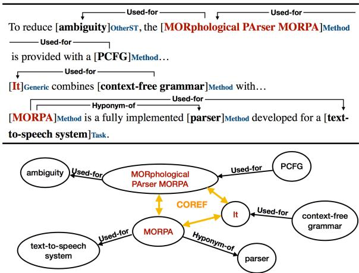
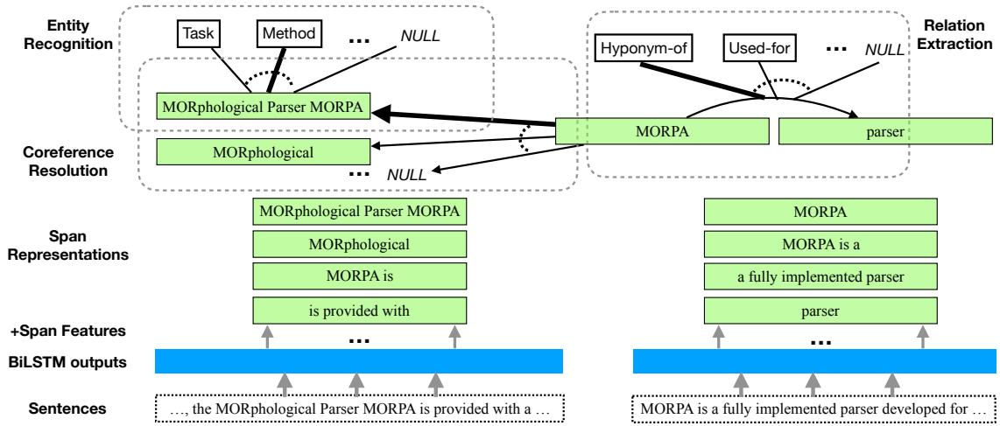
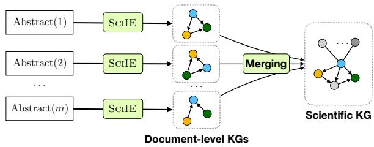
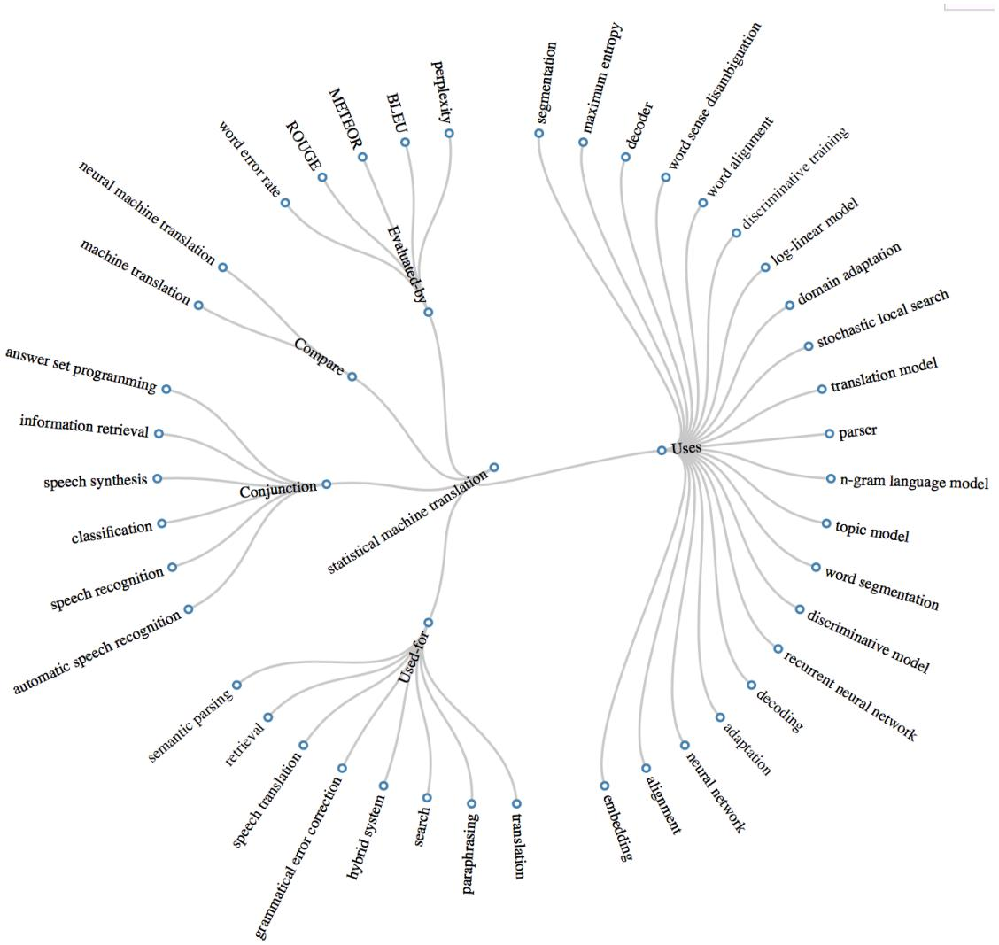

# Multi-Task Identification of Entities, Relations, and Coreference for Scientific Knowledge Graph Construction

Yi Luan Luheng He Mari Ostendorf Hannaneh Hajishirzi University of Washington {luanyi, luheng, ostendor, hannaneh}@uw.edu

## Abstract

We introduce a multi-task setup of identifying and classifying entities, relations, and coreference clusters in scientific articles. We create SCIERC, a dataset that includes annotations for all three tasks and develop a unified framework called Scientific Information Extractor (SCIIE) for with shared span representations. The multi-task setup reduces cascading errors between tasks and leverages cross-sentence relations through coreference links. Experiments show that our multi-task model outperforms previous models in scientific information extraction without using any domain-specific features. We further show that the framework supports construction of a scientific knowledge graph, which we use to analyze information in scientific literature.1

## 1 Introduction

As scientific communities grow and evolve, new tasks, methods, and datasets are introduced and different methods are compared with each other. Despite advances in search engines, it is still hard to identify new technologies and their relationships with what existed before. To help researchers more quickly identify opportunities for new combinations of tasks, methods and data, it is important to design intelligent algorithms that can extract and organize scientific information from a large collection of documents.

Organizing scientific information into structured knowledge bases requires information extraction (IE) about scientific entities and their relationships. However, the challenges associated with scientific IE are greater than for a general domain. First, annotation of scientific text requires domain expertise which makes annotation costly and limits resources.

Figure 1: Example annotation: phrases that refer to the same scientific concept are annotated into the same coreference cluster, such as MORphological PAser MORPA, it and MORPA (marked as red).

> **AI Description:**
> **Source:** `assets/_page_0_Figure_0.jpg`
> 
> **Generated:** 2026-05-17 23:01:23
> 
> ---
> 
> The image contains a combination of text and a diagram. The text provides a description of the MORPA (MORphological PArser) method, its components, and its application in a text-to-speech system. The diagram illustrates the relationships between various elements mentioned in the text, such as "ambiguity," "MORPA," "PCFG" (Parsing Context-Free Grammar), "context-free grammar," "parser," "text-to-speech system," and "COREF" (Coreference Resolution). The diagram uses arrows to indicate "Used-for" relationships and "Hyponym-of" relationships, showing how these elements are interconnected in the context of the MORPA method.

In addition, most relation extraction systems are designed for within-sentence relations. However, extracting information from scientific articles requires extracting relations across sentences. Figure 1 illustrates this problem. The cross-sentence relations between some entities can only be connected by entities that refer to the same scientific concept, including generic terms (such as the pronoun it, or phrases like our method) that are not informative by themselves. With co-reference, context-free grammar can be connected to MORPA through the intermediate co-referred pronoun it. Applying existing IE systems to this data, without co-reference, will result in much lower relation coverage (and a sparse knowledge base).

In this paper, we develop a unified learning model for extracting scientific entities, relations, and coreference resolution. This is different from previous work (Luan et al., 2017b; Gupta and Manning, 2011; Tsai et al., 2013; Gabor et al. ´ , 2018) which often addresses these tasks as independent components of a pipeline. Our unified model is a multi-task setup that shares parameters across low-level tasks, making predictions by leveraging context across the document through coreference links. Specifically, we extend prior work for learning span representations and coreference resolution (Lee et al., 2017; He et al., 2018). Different from a standard tagging system, our system enumerates all possible spans during decoding and can effectively detect overlapped spans. It avoids cascading errors between tasks by jointly modeling all spans and span-span relations.

To explore this problem, we create a dataset SCI-ERC for scientific information extraction, which includes annotations of scientific terms, relation categories and co-reference links. Our experiments show that the unified model is better at predicting span boundaries, and it outperforms previous state-of-the-art scientific IE systems on entity and relation extraction (Luan et al., 2017b; Augenstein et al., 2017). In addition, we build a scientific knowledge graph integrating terms and relations extracted from each article. Human evaluation shows that propagating coreference can significantly improve the quality of the automatic constructed knowledge graph.

In summary we make the following contributions. We create a dataset for scientific information extraction by jointly annotating scientific entities, relations, and coreference links. Extending a previous end-to-end coreference resolution system, we develop a multi-task learning framework that can detect scientific entities, relations, and coreference clusters without hand-engineered features. We use our unified framework to build a scientific knowledge graph from a large collection of documents and analyze information in scientific literature.

## 2 Related Work

There has been growing interest in research on automatic methods for information extraction from scientific articles. Past research in scientific IE addressed analyzing citations (Athar and Teufel, 2012b,a; Kas, 2011; Gabor et al., 2016; Sim et al., 2012; Do et al., 2013; Jaidka et al., 2014; Abu-Jbara and Radev, 2011), analyzing research community (Vogel and Jurafsky, 2012; Anderson et al., 2012), and unsupervised methods for extracting scientific entities and relations (Gupta and Manning, 2011; Tsai et al., 2013; Gabor et al. ´ , 2016).

More recently, two datasets in SemEval 2017 and 2018 have been introduced, which facilitate research on supervised and semi-supervised learning for scientific information extraction. SemEval 17 (Augenstein et al., 2017) includes 500 paragraphs from articles in the domains of computer science, physics, and material science. It includes three types of entities (called keyphrases): Tasks, Methods, and Materials and two relation types: hyponym-of and synonym-of. SemEval 18 (Gabor ´ et al., 2018) is focused on predicting relations between entities within a sentence. It consists of six relation types. Using these datasets, neural models (Ammar et al., 2017, 2018; Luan et al., 2017b; Augenstein and Søgaard, 2017) are introduced for extracting scientific information. We extend these datasets by increasing relation coverage, adding cross-sentence coreference linking, and removing some annotation constraints. Different from most previous IE systems for scientific literature and general domains (Miwa and Bansal, 2016; Xu et al., 2016; Peng et al., 2017; Quirk and Poon, 2017; Luan et al., 2018; Adel and Schutze¨ , 2017), which use preprocessed syntactic, discourse or coreference features as input, our unified framework does not rely on any pipeline processing and is able to model overlapping spans.

While Singh et al. (2013) show improvements by jointly modeling entities, relations, and coreference links, most recent neural models for these tasks focus on single tasks (Clark and Manning, 2016; Wiseman et al., 2016; Lee et al., 2017; Lample et al., 2016; Peng et al., 2017) or joint entity and relation extraction (Katiyar and Cardie, 2017; Zhang et al., 2017; Adel and Schutze ¨ , 2017; Zheng et al., 2017). Among those studies, many papers assume the entity boundaries are given, such as (Clark and Manning, 2016), Adel and Schutze ¨ (2017) and Peng et al. (2017). Our work relaxes this constraint and predicts entity boundaries by optimizing over all possible spans. Our model draws from recent end-to-end span-based models for coreference resolution (Lee et al., 2017, 2018) and semantic role labeling (He et al., 2018) and extends them for the multi-task framework involving the three tasks of identification of entity, relation and coreference.

Neural multi-task learning has been applied to a range of NLP tasks. Most of these models share word-level representations (Collobert and Weston, 2008; Klerke et al., 2016; Luan et al., 2016, 2017a; Rei, 2017), while Peng et al. (2017) uses high-order cross-task factors. Our model instead propagates cross-task information via span representations, which is related to Swayamdipta et al. (2017).

## 3 Dataset

Our dataset (called SCIERC) includes annotations for scientific entities, their relations, and coreference clusters for 500 scientific abstracts. These abstracts are taken from 12 AI conference/workshop proceedings in four AI communities from the Semantic Scholar Corpus2. SCIERC extends previous datasets in scientific articles SemEval 2017 Task 10 (SemEval 17) (Augenstein et al., 2017) and SemEval 2018 Task 7 (SemEval 18) (Gabor et al. ´ , 2018) by extending entity types, relation types, relation coverage, and adding cross-sentence relations using coreference links. Our dataset is publicly available at: http://nlp.cs.washington. edu/sciIE/. Table 1 shows the statistics of SCI-ERC.

Annotation Scheme We define six types for annotating scientific entities (Task, Method, Metric, Material, Other-ScientificTerm and Generic) and seven relation types (Compare, Part-of, Conjunction, Evaluate-for, Feature-of, Used-for, Hyponym-Of). Directionality is taken into account except for the two symmetric relation types (Conjunction and Compare). Coreference links are annotated between identical scientific entities. A Generic entity is annotated only when the entity is involved in a relation or is coreferred with another entity. Annotation guidelines can be found in Appendix A. Figure 1 shows an annotated example.

Following annotation guidelines from QasemiZadeh and Schumann (2016) and using the BRAT interface (Stenetorp et al., 2012), our annotators perform a greedy annotation for spans and always prefer the longer span whenever ambiguity occurs. Nested spans are allowed when a subspan has a relation/coreference link with another term outside the span.

Human Agreements One domain expert annotated all the documents in the dataset; 12% of the data is dually annotated by 4 other domain experts to evaluate the user agreements. The kappa score for annotating entities is 76.9%, relation extraction is 67.8% and coreference is 63.8%.

Table 1: Dataset statistics for our dataset SCIERC and two previous datasets on scientific information extraction. All datasets annotate 500 documents.

Comparison with previous datasets SCIERC is focused on annotating cross-sentence relations and has more relation coverage than SemEval 17 and SemEval 18, as shown in Table 1. SemEval 17 is mostly designed for entity recognition and only covers two relation types. The task in SemEval 18 is to classify a relation between a pair of entities given entity boundaries, but only intra-sentence relations are annotated and each entity only appears in one relation, resulting in sparser relation coverage than our dataset (3.2 vs. 9.4 relations per abstract). SCIERC extends these datasets by adding more relation types and coreference clusters, which allows representing cross-sentence relations, and removing annotation constraints. Table 1 gives a comparison of statistics among the three datasets. In addition, SCIERC aims at including broader coverage of general AI communities.

## 4 Model

We develop a unified framework (called SCIIE) to identify and classify scientific entities, relations, and coreference resolution across sentences. SCIIE is a multi-task learning setup that extends previous span-based models for coreference resolution (Lee et al., 2017) and semantic role labeling (He et al., 2018). All three tasks of entity recognition, relation extraction, and coreference resolution are treated as multinomial classification problems with shared span representations. SCIIE benefits from expressive contextualized span representations as classifier features. By sharing span representations, sentence-level tasks can benefit from information propagated from coreference resolution across sentences, without increasing the complexity of inference. Figure 2 shows a high-level overview of the SCIIE multi-task framework.

## 4.1 Problem Definition

The input is a document represented as a sequence of words $D = \{ w _ { 1 } , \ldots , w _ { n } \}$ , from which we derive $\textit { S } = \ \{ s _ { 1 } , \ldots , s _ { N } \}$ , the set of all possible within-sentence word sequence spans (up to a reasonable length) in the document. The output contains three structures: the entity types E for all spans S, the relations R for all pair of spans $S \times S ,$ and the coreference links C for all spans in S. The output structures are represented with a set of discrete random variables indexed by spans or pairs of spans. Specifically, the output structures are defined as follows.

Figure 2: Overview of the multitask setup, where all three tasks are treated as classification problems on top of shared span representations. Dotted arcs indicate the normalization space for each task.

> **AI Description:**
> **Source:** `assets/_page_3_Figure_0.jpg`
> 
> **Generated:** 2026-05-17 23:02:14
> 
> ---
> 
> The image is a diagram illustrating the process of entity recognition, coreference resolution, and relation extraction using a morphological parser called MORPA. It shows the flow of information from sentences through various stages of processing, including the creation of span representations and the addition of span features. The diagram includes labels such as "Task," "Method," "Hyponym-of," "Used-for," and "NULL," which indicate different types of relationships and entities being processed. The flow is visualized with arrows connecting different components, such as the morphological parser, coreference resolution, and relation extraction stages. The bottom part of the diagram shows the input sentences and the corresponding outputs at each stage of the process.

Entity recognition is to predict the best entity type for every candidate span. Let $L _ { \mathrm { E } }$ represent the set of all possible entity types including the null-type . The output structure E is a set of random variables indexed by spans: $e _ { i } \in L _ { \mathrm { E } }$ for $i = 1 , \ldots , N$

Relation extraction is to predict the best relation type given an ordered pair of spans $( s _ { i } , s _ { j } )$ . Let $L _ { \mathrm { R } }$ be the set of all possible relation types including the null-type . The output structure R is a set of random variables indexed over pairs of spans $( i , j )$ that belong to the same sentence: $r _ { i j } \in L _ { \mathrm { R } }$ for $i , j = 1 , \dots , N$

Coreference resolution is to predict the best antecedent (including a special null antecedent) given a span, which is the same mention-ranking model used in Lee et al. (2017). The output structure C is a set of random variables defined as: $c _ { i } \in$ $\{ 1 , \ldots , i - 1 , \epsilon \}$ for $i = 1 , \ldots , N$

## 4.2 Model Definition

We formulate the multi-task learning setup as learning the conditional probability distribution $P ( E , R , C | D )$ . For efficient training and inference, we decompose $P ( E , R , C | D )$ assuming spans are conditionally independent given $D \colon$

$$
\begin{array} { l } { { \displaystyle P ( E , R , C \mid D ) = P ( E , R , C , S \mid D ) } } \\ { { \displaystyle = \prod _ { i = 1 } ^ { N } P ( e _ { i } \mid D ) P ( c _ { i } \mid D ) \prod _ { j = 1 } ^ { N } P ( r _ { i j } \mid D ) , } } \end{array}\tag{1}
$$

where the conditional probabilities of each random variable are independently normalized:

$$
\begin{array} { l } { { P ( e _ { i } = e \mid D ) = \frac { \exp ( \Phi _ { \mathrm { E } } ( e , s _ { i } ) ) } { \sum _ { e ^ { \prime } \in L _ { \mathrm { E } } } \exp ( \Phi _ { \mathrm { E } } ( e ^ { \prime } , s _ { i } ) ) } ~ ( 2 ) } } \\ { { P ( r _ { i j } = r \mid D ) = \frac { \exp ( \Phi _ { \mathrm { R } } ( r , s _ { i } , s _ { j } ) ) } { \sum _ { r ^ { \prime } \in L _ { \mathrm { R } } } \exp ( \Phi _ { \mathrm { R } } ( r ^ { \prime } , s _ { i } , s _ { j } ) ) } } } \\ { { P ( c _ { i } = j \mid D ) = \frac { \exp ( \Phi _ { \mathrm { C } } ( s _ { i } , s _ { j } ) ) } { \sum _ { j ^ { \prime } \in \{ 1 , \dots , i - 1 , \epsilon \} } \exp ( \Phi _ { \mathrm { C } } ( s _ { i } , s _ { j ^ { \prime } } ) ) } , } } \end{array}
$$

where $\Phi _ { \mathrm { E } }$ denotes the unnormalized model score for an entity type e and a span $s _ { i } , \Phi _ { \mathrm { R } }$ denotes the score for a relation type r and span pairs $s _ { i } , s _ { j } ,$ and $\Phi _ { C }$ denotes the score for a binary coreference link between $s _ { i }$ and $s _ { j }$ . These Φ scores are further decomposed into span and pairwise span scores computed from feed-forward networks, as will be explained in Section 4.3.

For simplicity, we omit D from the Φ functions and S from the observation.

Objective Given a set of all documents D, the model loss function is defined as a weighted sum of the negative log-likelihood loss of all three tasks:

$$
\begin{array} { l } { { - \displaystyle \sum _ { ( D , R ^ { * } , E ^ { * } , C ^ { * } ) \in { \cal D } } \left\{ \lambda _ { \mathrm { E } } \log P ( E ^ { * } \mid D ) \right. } } \\ { { \left. + \lambda _ { \mathrm { R } } \log P ( R ^ { * } \mid D ) + \lambda _ { \mathrm { C } } \log P ( C ^ { * } \mid D ) \right\} } } \end{array}\tag{3}
$$

where $E ^ { * } , R ^ { * }$ , and $C ^ { * }$ are gold structures of the entity types, relations, and coreference, respectively. The task weights $\lambda _ { \mathrm { E } } , \lambda _ { \mathrm { R } }$ , and $\lambda _ { \mathrm { C } }$ are introduced as hyper-parameters to control the importance of each task.

For entity recognition and relation extraction, $P ( E ^ { * } \mid D )$ and $P ( R ^ { * } \mid D )$ are computed with the definition in Equation (2). For coreference resolution, we use the marginalized loss following Lee et al. (2017) since each mention can have multiple correct antecedents. Let $C _ { i } ^ { * }$ be the set of all correct antecedents for span i, we have: log $\begin{array} { r } { P ( C ^ { * } \mid D ) = \sum _ { i = 1 \dots N } \log \sum _ { c \in C _ { i } ^ { * } } P ( c \mid D ) } \end{array}$

## 4.3 Scoring Architecture

We use feedforward neural networks (FFNNs) over shared span representations g to compute a set of span and pairwise span scores. For the span scores, $\phi _ { e } ( s _ { i } )$ measures how likely a span $s _ { i }$ has an entity type e, and $\phi _ { \mathrm { m r } } ( s _ { i } )$ and $\phi _ { \mathrm { m c } } ( s _ { i } )$ measure how likely a span $s _ { i }$ is a mention in a relation or a coreference link, respectively. The pairwise scores $\phi _ { r } ( s _ { i } , s _ { j } )$ and $\phi _ { \mathrm { c } } ( s _ { i } , s _ { j } )$ measure how likely two spans are associated in a relation r or a coreference link, respectively. Let ${ \bf g } _ { i }$ be the fixed-length vector representation for span $s _ { i }$ . For different tasks, the span scores $\phi _ { \mathrm { x } } ( s _ { i } )$ for $\mathrm { ~ x ~ } \in \ \{ e , \mathrm { m c } , \mathrm { m r } \}$ and pairwise span scores $\phi _ { \mathrm { y } } ( s _ { i } , s _ { j } )$ for $\mathsf { y } \in \{ r , \mathsf { c } \}$ are computed as follows:

$$
\begin{array} { r } { \phi _ { \mathrm { x } } ( s _ { i } ) = \mathbf { w } _ { \mathrm { x } } \cdot \mathrm { F F N N } _ { \mathrm { x } } ( \mathbf { g } _ { i } ) \qquad } \\ { \phi _ { \mathrm { y } } ( s _ { i } , s _ { j } ) = \mathbf { w } _ { \mathrm { y } } \cdot \mathrm { F F N N } _ { \mathrm { y } } ( [ \mathbf { g } _ { i } , \mathbf { g } _ { j } , \mathbf { g } _ { i } \odot \mathbf { g } _ { j } ] ) , } \end{array}
$$

where  is element-wise multiplication, and $\big \{ \mathbf { w } _ { \mathrm { x } } , \mathbf { w } _ { \mathrm { y } } \big \}$ are neural network parameters to be learned.

We use these scores to compute the different $\Phi \colon$

$$
\begin{array} { r l r } { \Phi _ { \mathrm { E } } ( e , s _ { i } ) } & { = } & { \phi _ { e } ( s _ { i } ) \phantom { s _ { i } } } \\ { \Phi _ { \mathrm { R } } ( r , s _ { i } , s _ { j } ) } & { = } & { \phi _ { \mathrm { m r } } ( s _ { i } ) + \phi _ { \mathrm { m r } } ( s _ { j } ) + \phi _ { r } ( s _ { i } , s _ { j } ) \phantom { s _ { i } } } \\ { \Phi _ { \mathrm { C } } ( s _ { i } , s _ { j } ) } & { = } & { \phi _ { \mathrm { m c } } ( s _ { i } ) + \phi _ { \mathrm { m c } } ( s _ { j } ) + \phi _ { \mathrm { c } } ( s _ { i } , s _ { j } ) \phantom { s _ { i } } } \end{array}
$$

The scores in Equation (4) are defined for entity types, relations, and antecedents that are not the null-type . Scores involving the null label are set to a constant 0: $\begin{array} { r } { \Phi _ { \mathrm { E } } ( \epsilon , s _ { i } ) = \Phi _ { \mathrm { R } } ( \epsilon , s _ { i } , s _ { j } ) = } \end{array}$ $\Phi _ { \mathrm { C } } ( s _ { i } , \epsilon ) = 0$

We use the same span representations g from (Lee et al., 2017) and share them across the three tasks. We start by building bi-directional LSTMs (Hochreiter and Schmidhuber, 1997) from word, character and ELMo (Peters et al., 2018) embeddings.

For a span $s _ { i } ,$ its vector representation ${ \bf g } _ { i }$ is constructed by concatenating $s _ { i } { } ^ { \ } \mathbf { s }$ left and right end points from the BiLSTM outputs, an attentionbased soft “headword,” and embedded span width features. Hyperparameters and other implementation details will be described in Section 6.

## 4.4 Inference and Pruning

Following previous work, we use beam pruning to reduce the number of pairwise span factors from $O ( n ^ { 4 } )$ to $O ( n ^ { 2 } )$ at both training and test time, where n is the number of words in the document. We define two separate beams: $B _ { \mathrm { C } }$ to prune spans for the coreference resolution task, and $B _ { \mathrm { R } }$ for relation extraction. The spans in the beams are sorted by their span scores $\phi _ { \mathrm { m c } }$ and $\phi _ { \mathrm { m r } }$ respectively, and the sizes of the beams are limited by $\lambda _ { \mathrm { { C } } } n$ and $\lambda _ { \mathrm { R } } n$ We also limit the maximum width of spans to a fixed number W , which further reduces the number of span factors to $O ( n )$

## 5 Knowledge Graph Construction

We construct a scientific knowledge graph from a large corpus of scientific articles. The corpus includes all abstracts (110k in total) from 12 AI conference proceedings from the Semantic Scholar Corpus. Nodes in the knowledge graph correspond to scientific entities. Edges correspond to scientific relations between pairs of entities. The edges are typed according to the relation types defined in Section 3. Figure 4 shows a part of a knowledge graph created by our method. For example, Statistical Machine Translation (SMT) and grammatical error correction are nodes in the graph, and they are connected through a Used-for relation type. In order to construct the knowledge graph for the whole corpus, we first apply the SCIIE model over single documents and then integrate the entities and relations across multiple documents (Figure 3).

Extracting nodes (entities) The SCIIE model extracts entities, their relations, and coreference clusters within one document. Phrases are heuristically normalized (described in Section 6) using entities and coreference links. In particular, we link all entities that belong to the same coreference cluster to replace generic terms with any other nongeneric term in the cluster. Moreover, we replace all the entities in the cluster with the entity that has the longest string. Our qualitative analysis shows that there are fewer ambiguous phrases using coreference links (Figure 5). We calculate the frequency counts of all entities that appear in the whole corpus. We assign nodes in the knowledge graph by selecting the most frequent entities (with counts > k) in the corpus, and merge in any remaining entities for which a frequent entity is a substring.

Figure 3: Knowledge graph construction process.

> **AI Description:**
> **Source:** `assets/_page_4_Figure_0.jpg`
> 
> **Generated:** 2026-05-17 23:01:58
> 
> ---
> 
> The image is a diagram illustrating the process of creating a scientific knowledge graph (KG) from abstracts. It shows a series of steps where each abstract is processed through a system called SciIE, which generates a document-level KG. These individual KGs are then merged to form a larger scientific KG. The diagram includes labels for the input (abstracts), the processing step (SciIE), the merging process, and the output (scientific KG). The nodes in the KGs represent entities or concepts, and the edges represent relationships between these entities. The diagram effectively communicates the flow of information and the construction of a comprehensive scientific knowledge graph from multiple abstracts.

### Full Page Description (Page 5)

**Source:** `assets/_page_5_Asset_1.jpg`

**Generated:** 2026-05-17 23:01:49

---

The image is a bar chart with a title "MT-ASR". The chart has three bars representing different categories: "Conjunction", "Used for", and "Used for (Reverse)". The "Conjunction" category has the highest number of relation triples at 80, followed by "Used for" with 10, and "Used for (Reverse)" with 4. The bars are colored in blue, and there is a legend indicating the category "MT-ASR". The chart visually represents the distribution of relation triples across the three categories.

### Full Page Description (Page 5)

**Source:** `assets/_page_5_Asset_0.jpg`

**Generated:** 2026-05-17 23:01:43

---

The image is a bar chart comparing the performance of detection tasks with and without coreference (Coref.). The tasks include action detection, pedestrian detection, human detection, face detection, object detection, and a general detection task. The chart shows the number of detections for each task with and without coreference. For example, the general detection task shows 1237 detections with coreference and 1297 detections without coreference. The chart highlights that coreference generally improves detection performance across all tasks.

### Full Page Description (Page 5)

**Source:** `assets/_page_5_Asset_2.jpg`

**Generated:** 2026-05-17 23:02:21

---

The image is a bar chart with the title "CRF-GM" in the legend. The x-axis represents categories: "Hyponym of Conjunction," "Used for," and "Used for (Reverse)." The y-axis represents a numerical value. The chart shows that the "Hyponym of Conjunction" category has a value of 25, while the other two categories have values of 4 and 2, respectively. The chart visually represents the distribution of values across the three categories, with the "Hyponym of Conjunction" category having the highest value.

Figure 4: A part of an automatically constructed scientific knowledge graph with the most frequent neighbors of the scientific term statistical machine translation (SMT) on the graph. For simplicity we denote Used-for (Reverse) as Uses, Evaluated-for (Reverse) as Evaluated-by, and replace common terms with their acronyms. The original graph and more examples are given Figure 10 in Appendix B.

Assigning edges (relations) A pair of entities may appear in different contexts, resulting in different relation types between those entities (Figure 6). For every pair of entities in the graph, we calculate the frequency of different relation types across the whole corpus.We assign edges between entities by selecting the most frequent relation type.

## 6 Experimental Setup

We evaluate our unified framework SCIIE on SCI-ERC and SemEval 17. The knowledge graph for

scientific community analysis is built using the Semantic Scholar Corpus (110k abstracts in total).

## 6.1 Baselines

We compare our model with the following baselines on SCIERCdataset:

• LSTM+CRF The state-of-the-art NER system (Lample et al., 2016), which applies CRF on top of LSTM for named entity tagging, the approach has also been used in scientific term extraction (Luan et al., 2017b).

• LSTM+CRF+ELMo LSTM+CRF with ELMO as an additional input feature.

• E2E Rel State-of-the-art joint entity and relation extraction system (Miwa and Bansal, 2016) that has also been used in scientific literature (Peters et al., 2017; Augenstein et al., 2017). This system uses syntactic features such as part-of-speech tagging and dependency parsing.

• E2E Rel(Pipeline) Pipeline setting of E2E Rel. Extract entities first and use entity results as input to relation extraction task.

• E2E Rel+ELMo E2E Rel with ELMO as an additional input feature.

• E2E Coref State-of-the-art coreference system Lee et al. (2017) combined with ELMO. Our system SCIIE extends E2E Coref with multi-task learning.

In the SemEval task, we compare our model SCIIE with the best reported system in the SemEval leaderboard (Peters et al., 2017), which extends E2E Rel with several in-domain features such as gazetteers extracted from existing knowledge bases and model ensembles. We also compare with the state of the art on keyphrase extraction (Luan et al., 2017b), which applies semi-supervised methods to a neural tagging model.3

## 6.2 Implementation details

Our system extends the implementation and hyperparameters from Lee et al. (2017) with the following adjustments. We use a 1 layer BiLSTM with 200-dimensional hidden layers. All the FFNNs have 2 hidden layers of 150 dimensions each. We use 0.4 variational dropout (Gal and Ghahramani, 2016) for the LSTMs, 0.4 dropout for the FFNNs, and 0.5 dropout for the input embeddings. We model spans up to 8 words. For beam pruning, we use $\lambda _ { \mathrm { C } } = 0 . 3$ for coreference resolution and $\lambda _ { \mathrm { R } } = 0 .$ 4 for relation extraction. For constructing the knowledge graph, we use the following heuristics to normalize the entity phrases. We replace all acronyms with their corresponding full name and normalize all the plural terms with their singular counterparts.

## 7 Experimental Results

We evaluate SCIIE on SCIERC and SemEval 17 datasets. We provide qualitative results and human evaluation of the constructed knowledge graph.

## 7.1 IE Results

Results on SciERC Table 2 compares the result of our model with baselines on the three tasks: entity recognition (Table 2a), relation extraction (Table 2b), and coreference resolution (Table 2c). As evidenced by the table, our unified multi-task setup

(a) Entity recognition.

(b) Relation extraction.
(c) Coreference resolution.
Table 2: Comparison with previous systems on the development and test set for our three tasks. For coreference resolution, we report the average P/R/F1 of MUC, B3, and $\mathrm { C E A F } _ { \phi _ { 4 } }$ scores.

SCIIE outperforms all the baselines. For entity recognition, our model achieves 1.3% and 2.4% relative improvement over LSTM+CRF with and without ELMO, respectively. Moreover, it achieves 1.8% and 2.7% relative improvement over E2E Rel with and without ELMO, respectively. For relation extraction, we observe more significant improvement with 13.1% relative improvement over E2E Rel and 7.4% improvement over E2E Rel with ELMO. For coreference resolution, SCIIE outperforms E2E Coref with 4.5% relative improvement. We still observe a large gap between human-level performance and a machine learning system. We invite the community to address this challenging task.

Ablations We evaluate the effect of multi-task learning in each of the three tasks defined in our dataset. Table 3 reports the results for individual tasks when additional tasks are included in the learning objective function. We observe that performance improves with each added task in the objective. For example, Entity recognition (65.7) benefits from both coreference resolution (67.5) and relation extraction (66.8). Relation extraction (37.9) significantly benefits when multi-tasked with coreference resolution (7.1% relative improvement). Coreference resolution benefits when multitasked with relation extraction, with 4.9% relative improvement.

### Full Page Description (Page 7)

**Source:** `assets/_page_7_Asset_1.jpg`

**Generated:** 2026-05-17 23:01:05

---

The image is a line graph showing the progress of three speech-related technologies over time: Speech Recognition, Speech Synthesis, and Speaker Recognition. The x-axis represents years from 1995 to 2015, and the y-axis represents the performance or accuracy of the technologies, ranging from 0 to 0.6. The graph includes three lines, each representing one of the technologies, with the lines for Speech Recognition and Speaker Recognition showing a significant upward trend, particularly after 2010, indicating substantial improvements in these areas. The Speech Synthesis line remains relatively flat, suggesting less progress in this area during the observed period. The legend at the top of the graph clearly identifies each line with its corresponding technology.

### Full Page Description (Page 7)

**Source:** `assets/_page_7_Asset_0.jpg`

**Generated:** 2026-05-17 23:00:12

---

The image is a line graph with three distinct lines representing different tasks: Language Modeling, Machine Translation, and POS Tagging. The x-axis represents years from 1995 to 2015, and the y-axis represents some metric, possibly accuracy or performance, ranging from 0 to 0.6. The graph shows an upward trend for all three tasks over time, with Language Modeling and Machine Translation showing the most significant improvement. POS Tagging also shows a gradual increase but at a slower rate compared to the other two tasks. The graph highlights the advancements in these NLP tasks over the two decades.

### Full Page Description (Page 7)

**Source:** `assets/_page_7_Asset_3.jpg`

**Generated:** 2026-05-17 23:01:13

---

The image is a line graph with two data series plotted against each other. The x-axis represents "Pseudo-recall %", and the y-axis represents "Precision %". There are two lines in the graph: one for "With Coref." (blue circles) and one for "Without Coref." (red squares). The graph shows a decline in both precision and recall percentages as the pseudo-recall increases. The blue line (With Coref.) consistently has higher precision percentages than the red line (Without Coref.) across all pseudo-recall values.

### Full Page Description (Page 7)

**Source:** `assets/_page_7_Asset_2.jpg`

**Generated:** 2026-05-17 23:01:30

---

The image is a line graph showing the development of three computer vision tasks over time: Object Recognition, Object Detection, and Image Segmentation. The x-axis represents years from 1995 to 2015, and the y-axis represents the performance metric, likely a measure of accuracy or improvement. The graph shows a steady increase in performance for all three tasks over the years, with Image Segmentation and Object Detection showing a more pronounced upward trend compared to Object Recognition. The legend at the top of the graph indicates the tasks represented by each line color.

Table 3: Ablation study for multitask learning on SCIERC development set. Each column shows results for the target task.

Results on SemEval 17 Table 4 compares the results of our model with the state of the art on the SemEval 17 dataset for tasks of span identification, keyphrase extraction and relation extraction as well as the overall score. Span identification aims at identifying spans of entities. Keyphrase classification and relation extraction has the same setting with the entity and relation extraction in SCIERC. Our model outperforms all the previous models that use hand-designed features. We observe more significant improvement in span identification than keyphrase classification. This confirms the benefit of our model in enumerating spans (rather than BIO tagging in state-of-the-art systems). Moreover, we have competitive results compared to the previous state of the art in relation extraction. We observe less gain compared to the SCIERC dataset mainly because there are no coference links, and the relation types are not comprehensive.

## 7.2 Knowledge Graph Analysis

We provide qualitative analysis and human evaluations on the constructed knowledge graph.

Scientific trend analysis Figure 7 shows the historical trend analysis (from 1996 to 2016) of the most popular applications of the phrase neural network, selected according to the statistics of the extracted relation triples with the ‘Used-for’ relation type from speech, computer vision, and NLP conference papers. We observe that, before 2000, neural network has been applied to a greater percentage of speech applications compared to the NLP and computer vision papers. In NLP, neural networks first gain popularity in language modeling and then extend to other tasks such as POS Tagging and Machine Translation. In computer vision, the application of neural networks gains popularity in object recognition earlier (around 2010) than the other two more complex tasks of object detection and image segmentation (hardest and also the latest).

Knowledge Graph Evaluation Figure 8 shows the human evaluation of the constructed knowledge graph, comparing the quality of automatically generated knowledge graphs with and without the coreference links. We randomly select 10 frequent scientific entities and extract all the relation triples that include one of the selected entities leading to 1.5k relation triples from both systems. We ask four domain experts to annotate each of these extracted relations to define ground truth labels. Each domain expert is assigned 2 or 3 entities and all of the corresponding relations. Figure 8 shows precision/recall curves for both systems. Since it is not feasible to compute the actual recall of the systems, we compute the pseudo-recall (Zhang et al., 2015) based on the output of both systems. We observe that the knowledge graph curve with coreference linking is mostly above the curve without coreference linking. The precision of both systems is high (above 84% for both systems), but the system with coreference links has significantly higher recall.

Table 4: Results for scientific keyphrase extraction and extraction on SemEval 2017 Task 10, comparing with previous best systems.

## 8 Conclusion

In this paper, we create a new dataset and develop a multi-task model for identifying entities, relations, and coreference clusters in scientific articles. By sharing span representations and leveraging crosssentence information, our multi-task setup effectively improves performance across all tasks. Moreover, we show that our multi-task model is better at predicting span boundaries and outperforms previous state-of-the-art scientific IE systems on entity and relation extraction, without using any handengineered features or pipeline processing. Using our model, we are able to automatically organize the extracted information from a large collection of scientific articles into a knowledge graph. Our analysis shows the importance of coreference links in making a dense, useful graph.

We still observe a large gap between the performance of our model and human performance, confirming the challenges of scientific IE. Future work includes improving the performance using semisupervised techniques and providing in-domain features. We also plan to extend our multi-task framework to information extraction tasks in other domains.

## Acknowledgments

This research was supported by the Office of Naval Research under the MURI grant N00014-18-1-

2670, NSF (IIS 1616112, III 1703166), Allen Distinguished Investigator Award, and gifts from Allen Institute for AI, Google, Amazon, and Bloomberg. We are grateful to Waleed Ammar and AI2 for sharing the Semantic Scholar Corpus. We also thank the anonymous reviewers, UW-NLP group and Shoou-I Yu for their helpful comments.

## References

- Amjad Abu-Jbara and Dragomir Radev. 2011. Coherent citation-based summarization of scientific papers. In Proc. Annual Meeting of the Association for Computational Linguistics: Human Language Technologies. volume 1, pages 500–509.
- Heike Adel and Hinrich Schutze. 2017. Global normal-¨ ization of convolutional neural networks for joint entity and relation classification. In Proc. Conf. Empirical Methods Natural Language Process. (EMNLP). pages 1723–1729.
- Waleed Ammar, Dirk Groeneveld, Chandra Bhagavatula, Iz Beltagy, Miles Crawford, Doug Downey, Jason Dunkelberger, Ahmed Elgohary, Sergey Feldman, Vu Ha, et al. 2018. Construction of the literature graph in semantic scholar. In Proc. Conf. North American Assoc. for Computational Linguistics: Human Language Technologies (NAACL-HLT), (Industry Papers). pages 84–91.
- Waleed Ammar, Matthew Peters, Chandra Bhagavatula, and Russell Power. 2017. The ai2 system at semeval-2017 task 10 (scienceie): semi-supervised end-to-end entity and relation extraction. In Proc. Int. Workshop on Semantic Evaluation (SemEval). pages 592–596.
- Ashton Anderson, Dan McFarland, and Dan Jurafsky. 2012. Towards a computational history of the ACL: 1980-2008. In Proc. ACL Special Workshop on Rediscovering 50 Years of Discoveries. pages 13–21.
- Awais Athar and Simone Teufel. 2012a. Contextenhanced citation sentiment detection. In Proc. Conf. North American Assoc. for Computational Linguistics: Human Language Technologies (NAACL-HLT). pages 597–601.
- Awais Athar and Simone Teufel. 2012b. Detection of implicit citations for sentiment detection. In Proc.

- ACL Workshop on Detecting Structure in Scholarly Discourse. pages 18–26.
- Isabelle Augenstein, Mrinal Das, Sebastian Riedel, Lakshmi Vikraman, and Andrew McCallum. 2017. Semeval 2017 task 10: ScienceIE - extracting keyphrases and relations from scientific publications. In Proc. Int. Workshop on Semantic Evaluation (SemEval).
- Isabelle Augenstein and Anders Søgaard. 2017. Multitask learning of keyphrase boundary classification. In Proc. Annu. Meeting Assoc. for Computational Linguistics (ACL). pages 341–346.
- Kevin Clark and Christopher D. Manning. 2016. Improving coreference resolution by learning entity-level distributed representations. CoRR abs/1606.01323.
- Ronan Collobert and Jason Weston. 2008. A unified architecture for natural language processing: Deep neural networks with multitask learning. In Proc. Int. Conf. Machine Learning (ICML). pages 160– 167.
- Huy Hoang Nhat Do, Muthu Kumar Chandrasekaran, Philip S Cho, and Min Yen Kan. 2013. Extracting and matching authors and affiliations in scholarly documents. In Proc. ACM/IEEE-CS Joint Conference on Digital libraries. pages 219–228.
- Kata Gabor, Davide Buscaldi, Anne-Kathrin Schu- ´ mann, Behrang QasemiZadeh, Ha¨ıfa Zargayouna, and Thierry Charnois. 2018. Semeval-2018 Task 7: Semantic relation extraction and classification in scientific papers. In Proc. Int. Workshop on Semantic Evaluation (SemEval).
- Kata Gabor, Haifa Zargayouna, Davide Buscaldi, Isabelle Tellier, and Thierry Charnois. 2016. Semantic annotation of the ACL anthology corpus for the automatic analysis of scientific literature. In Proc. Language Resources and Evaluation Conference (LREC).
- Kata Gabor, Ha ´ ¨ıfa Zargayouna, Isabelle Tellier, Davide Buscaldi, and Thierry Charnois. 2016. Unsupervised relation extraction in specialized corpora using sequence mining. In International Symposium on Intelligent Data Analysis. Springer, pages 237–248.
- Yarin Gal and Zoubin Ghahramani. 2016. A theoretically grounded application of dropout in recurrent neural networks. In Proc. Annu. Conf. Neural Inform. Process. Syst. (NIPS).
- Sonal Gupta and Christopher D Manning. 2011. Analyzing the dynamics of research by extracting key aspects of scientific papers. In Proc. IJCNLP. pages 1–9.
- Luheng He, Kenton Lee, Omer Levy, and Luke Zettlemoyer. 2018. Jointly predicting predicates and arguments in neural semantic role labeling. In ACL.
- Sepp Hochreiter and Jurgen Schmidhuber. 1997. Long ¨ short-term memory. Neural computation 9(8):1735– 1780.
- Kokil Jaidka, Muthu Kumar Chandrasekaran, Beatriz Fisas Elizalde, Rahul Jha, Christopher Jones, Min-Yen Kan, Ankur Khanna, Diego Molla-Aliod, Dragomir R Radev, Francesco Ronzano, et al. 2014. The computational linguistics summarization pilot task. In Proc. Text Analysis Conference.
- Miray Kas. 2011. Structures and statistics of citation networks. Technical report, DTIC Document.
- Arzoo Katiyar and Claire Cardie. 2017. Going out on a limb: Joint extraction of entity mentions and relations without dependency trees. In Proc. Annu. Meeting Assoc. for Computational Linguistics (ACL). volume 1, pages 917–928.
- Sigrid Klerke, Yoav Goldberg, and Anders Søgaard. 2016. Improving sentence compression by learning to predict gaze. In HLT-NAACL.
- Guillaume Lample, Miguel Ballesteros, Sandeep Subramanian, Kazuya Kawakami, and Chris Dyer. 2016. Neural architectures for named entity recognition. In Proc. Conf. North American Assoc. for Computational Linguistics (NAACL).
- Kenton Lee, Luheng He, Mike Lewis, and Luke S. Zettlemoyer. 2017. End-to-end neural coreference resolution. In EMNLP.
- Kenton Lee, Luheng He, and Luke Zettlemoyer. 2018. Higher-order coreference resolution with coarse-tofine inference. In NAACL.
- Yi Luan, Chris Brockett, Bill Dolan, Jianfeng Gao, and Michel Galley. 2017a. Multi-task learning for speaker-role adaptation in neural conversation models. In Proc. IJCNLP.
- Yi Luan, Yangfeng Ji, Hannaneh Hajishirzi, and Boyang Li. 2016. Multiplicative representations for unsupervised semantic role induction. In Proc. Annu. Meeting Assoc. for Computational Linguistics (ACL). page 118.
- Yi Luan, Mari Ostendorf, and Hannaneh Hajishirzi. 2017b. Scientific information extraction with semisupervised neural tagging. In Proc. Conf. Empirical Methods Natural Language Process. (EMNLP).
- Yi Luan, Mari Ostendorf, and Hannaneh Hajishirzi. 2018. The uwnlp system at semeval-2018 task 7: Neural relation extraction model with selectively incorporated concept embeddings. In Proc. Int. Workshop on Semantic Evaluation (SemEval). pages 788– 792.
- Makoto Miwa and Mohit Bansal. 2016. End-to-end relation extraction using lstms on sequences and tree structures. In Proc. Annu. Meeting Assoc. for Computational Linguistics (ACL). pages 1105–1116.

- Nanyun Peng, Hoifung Poon, Chris Quirk, Kristina Toutanova, and Wen-tau Yih. 2017. Cross-sentence n-ary relation extraction with graph lstms. Trans. Assoc. for Computational Linguistics (TACL) 5:101– 115.
- Matthew Peters, Waleed Ammar, Chandra Bhagavatula, and Russell Power. 2017. Semi-supervised sequence tagging with bidirectional language models. In Proc. Annu. Meeting Assoc. for Computational Linguistics (ACL). volume 1, pages 1756–1765.
- Matthew E. Peters, Mark Neumann, Mohit Iyyer, Matt Gardner, Christopher Clark, Kenton Lee, and Luke Zettlemoyer. 2018. Deep contextualized word representations. In NAACL.
- Behrang QasemiZadeh and Anne-Kathrin Schumann. 2016. The ACL RD-TEC 2.0: A language resource for evaluating term extraction and entity recognition methods. In LREC.
- Chris Quirk and Hoifung Poon. 2017. Distant supervision for relation extraction beyond the sentence boundary. In Proc. European Chapter Assoc. for Computational Linguistics (EACL). pages 1171– 1182.
- Marek Rei. 2017. Semi-supervised multitask learning for sequence labeling. In Proc. Annu. Meeting Assoc. for Computational Linguistics (ACL).
- Yanchuan Sim, Noah A Smith, and David A Smith. 2012. Discovering factions in the computational linguistics community. In Proc. ACL Special Workshop on Rediscovering 50 Years of Discoveries. pages 22– 32.
- Sameer Singh, Sebastian Riedel, Brian Martin, Jiaping Zheng, and Andrew McCallum. 2013. Joint inference of entities, relations, and coreference. In Proc. of the 2013 workshop on Automated knowledge base construction. ACM, pages 1–6.
- Pontus Stenetorp, Sampo Pyysalo, Goran Topic,´ Tomoko Ohta, Sophia Ananiadou, and Jun’ichi Tsujii. 2012. Brat: a web-based tool for nlp-assisted text annotation. In Proc. European Chapter Assoc. for Computational Linguistics (EACL). pages 102– 107.
- Swabha Swayamdipta, Sam Thomson, Chris Dyer, and Noah A. Smith. 2017. Frame-semantic parsing with softmax-margin segmental rnns and a syntactic scaffold. CoRR abs/1706.09528.
- Chen-Tse Tsai, Gourab Kundu, and Dan Roth. 2013. Concept-based analysis of scientific literature. In Proc. ACM Int. Conference on Information & Knowledge Management. ACM, pages 1733–1738.
- Adam Vogel and Dan Jurafsky. 2012. He said, she said: Gender in the ACL anthology. In Proc. ACL Special Workshop on Rediscovering 50 Years of Discoveries. pages 33–41.
- Sam Wiseman, Alexander M. Rush, and Stuart M. Shieber. 2016. Learning global features for coreference resolution. In HLT-NAACL.
- Yan Xu, Ran Jia, Lili Mou, Ge Li, Yunchuan Chen, Yangyang Lu, and Zhi Jin. 2016. Improved relation classification by deep recurrent neural networks with data augmentation. In Proc. Int. Conf. Computational Linguistics (COLING). pages 1461–1470.
- Congle Zhang, Stephen Soderland, and Daniel S. Weld. 2015. Exploiting parallel news streams for unsupervised event extraction. TACL 3:117–129.
- Meishan Zhang, Yue Zhang, and Guohong Fu. 2017. End-to-end neural relation extraction with global optimization. In Proc. Conf. Empirical Methods Natural Language Process. (EMNLP). pages 1730–1740.
- Suncong Zheng, Feng Wang, Hongyun Bao, Yuexing Hao, Peng Zhou, and Bo Xu. 2017. Joint extraction of entities and relations based on a novel tagging scheme. In Proc. Annu. Meeting Assoc. for Computational Linguistics (ACL). volume 1, pages 1227–1236.

## A Annotation Guideline

## A.1 Entity Category

• Task: Applications, problems to solve, systems to construct.

E.g. information extraction, machine reading system, image segmentation, etc.

• Method: Methods , models, systems to use, or tools, components of a system, frameworks. E.g. language model, CORENLP, POS parser, kernel method, etc.

• Evaluation Metric: Metrics, measures, or entities that can express quality of a system/method.

E.g. F1, BLEU, Precision, Recall, ROC curve, mean reciprocal rank, mean-squared error, robustness, time complexity, etc.

• Material: Data, datasets, resources, Corpus, Knowledge base.

E.g. image data, speech data, stereo images, bilingual dictionary, paraphrased questions, CoNLL, Panntreebank, WordNet, Wikipedia, etc.

• Evaluation Metric: Metric measure or term that can express quality of a system/method.

E.g. F1, BLEU, Precision, Recall, ROC curve, mean reciprocal rank, mean-squared error,robustness, compile time, time complexity...

• Generic: General terms or pronouns that may refer to a entity but are not themselves informative, often used as connection words.

E.g model, approach, prior knowledge, them, it...

## A.2 Relation Category

Relation link can not go beyond sentence boundary. We define 4 asymmetric relation types (Used-for, Feature-of, Hyponym-of, Part-of ), together with 2 symmetric relation types (Compare, Conjunction). B always points to A for asymmetric relations

• Used-for: B is used for A, B models A, A is trained on B, B exploits A, A is based on B. E.g.

The TISPER system has been designed to enable many text applications.

Our method models user proficiency.

Our algorithms exploits local soothness.

• Feature-of: B belongs to A, B is a feature of A, B is under A domain. E.g.

prior knowledge of the model genre-specific regularities of discourse structure

English text in science domain

• Hyponym-of: B is a hyponym of A, B is a type of A. E.g.

TUIT is a software library

NLP applications such as machine translation and language generation

• Part-of: B is a part of A... E.g.

The system includes two models: speech recognition and natural language understanding

We incorporate NLU module to the system.

• Compare: Symmetric relation (use blue to denote entity). Opposite of conjunction, compare two models/methods, or listing two opposing entities. E.g.

Unlike the quantitative prior, the qualitative prior is often ignored...

We compare our system with previous sequential tagging systems...

• Conjunction: Symmetric relation (use blue to denote entity). Function as similar role or use/incorporate with. E.g.

obtained from human expert or knowledge base

NLP applications such as machine translation and language generation

## A.3 Coreference

Two Entities that points to the same concept.

## • Anaphora and Cataphora:

We introduce a machine reading system...   
The system...

The prior knowledge include...Such knowledge can be applied to...

## • Coreferring noun phrase:

We develop a part-of-speech tagging system...The POS tagger...

## A.4 Notes

1. Entity boundary annotation follows the ACL RD-TEC Annotation Guideline (QasemiZadeh and Schumann, 2016), with the extention that spans can be embedded in longer spans, only if the shorter span is involved in a relation.

2. Do not include determinators (such as the, a), or adjective pronouns (such as this,its, these, such) to the span. If generic phrases are not involved in a relation, do not tag them.

3. Do not tag relation if one entity is:

• Variable bound:

We introduce a neural based approach..   
Its benefit is...

• The word which:

We introduce a neural based approach, which is a...

4. Do not tag coreference if the entity is

• Generically-used Other-ScientificTerm: ...advantage gained from local smoothness which... We present algorithms exploiting local smoothness in more aggressive ways...

• Same scientific term but refer to different examples:

We use a data structure, we also use another data structure...

5. Do not label negative relations:

X is not used in Y or X is hard to be applied in Y

## B Annotation and Knowledge Graph Examples

Here we take a screen shot of the BRAT interface for an ACL paper in Figure 9. We also attach the original figure of Figure 3 in Figure 10. More examples can be found in the project website4.

Figure 9: Annotation example 1 from ACL

Figure 10: An example of our automatically generated knowledge graph centered on statistical machine translation. This is the original figure of Figure 4.

> **AI Description:**
> **Source:** `assets/_page_13_Figure_1.jpg`
> 
> **Generated:** 2026-05-17 23:00:43
> 
> ---
> 
> The image is a mind map or concept diagram centered around the topic of "statistical machine translation." It visually connects various subtopics and related terms using lines and nodes. The diagram includes categories such as "Uses," "Evaluated by," and "Used for," with specific terms like "n-gram language model," "topic model," and "translation model" under the "Uses" section. Under "Evaluated by," terms like "ROUGE," "METEOR," and "BLEU" are listed. The "Used for" section includes applications such as "speech translation," "retrieval," and "translation." The diagram effectively illustrates the interconnectedness of these concepts in the field of statistical machine translation.
