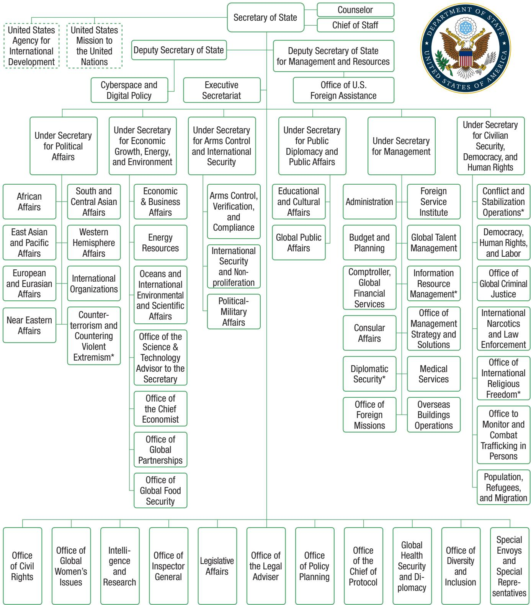
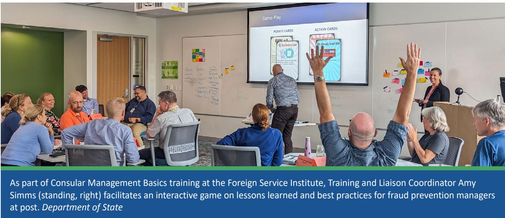
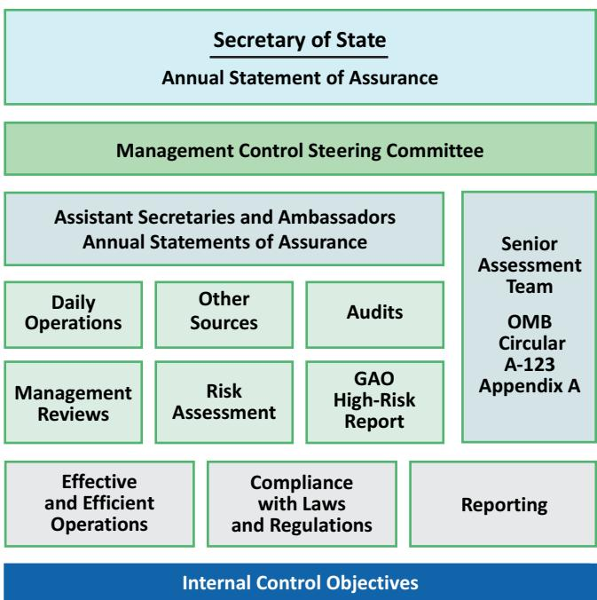
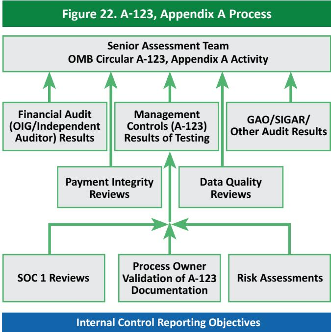
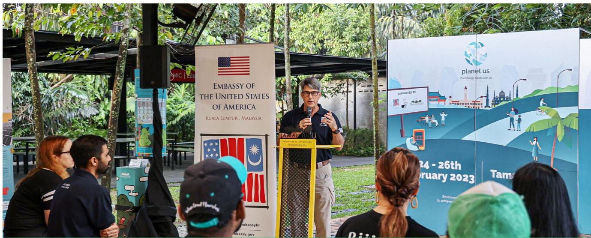
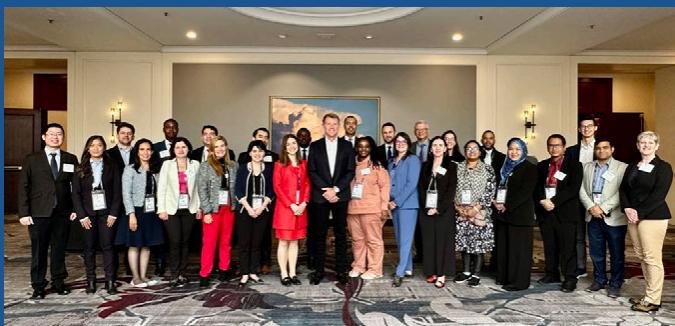
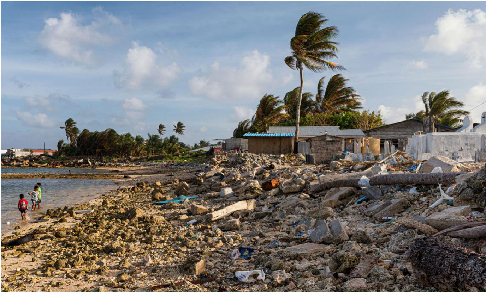
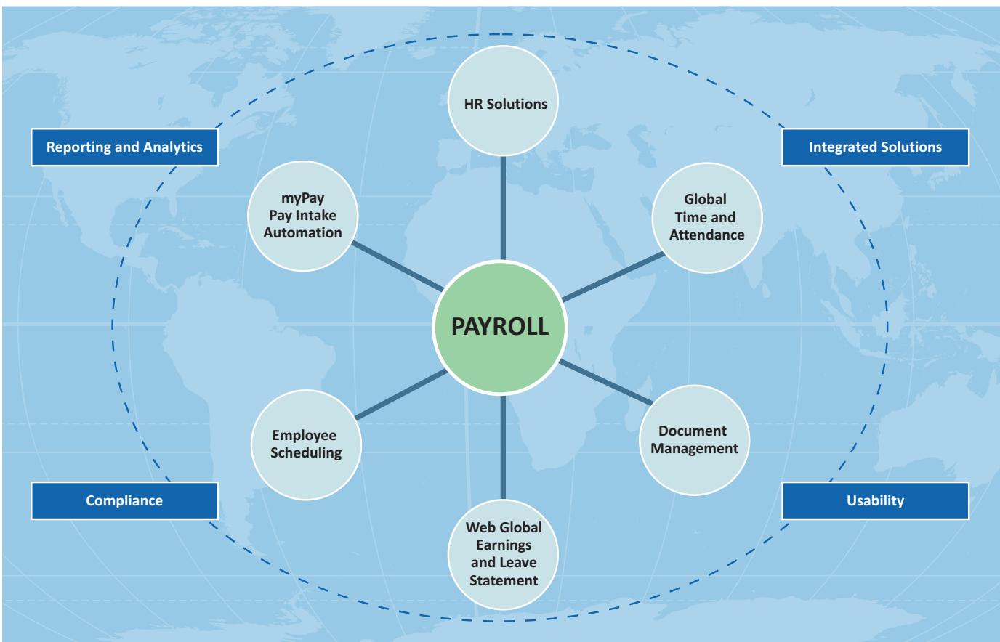
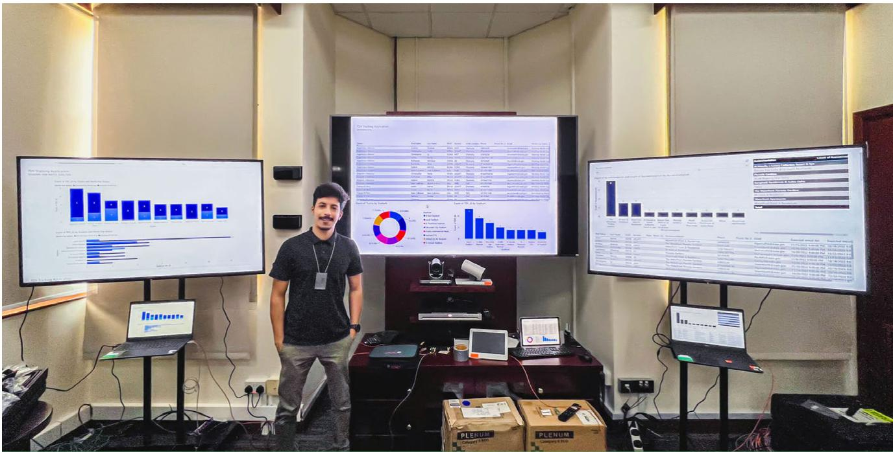

## U.S. DEPARTMENT OF STATE Fiscal Year 2023 Agency Financial Report

## Modernizing Diplomacy

### Full Page Description (Page 1)

**Source:** `assets/_page_1_Asset_2.jpg`

**Generated:** 2026-05-18 01:56:15

---

The image contains a bar chart with four bars representing the years 2020, 2021, 2022, and 2023. The y-axis is labeled with numerical values ranging from 0 to 25, and the x-axis represents the years. The bars are green and increase in height from left to right, indicating an upward trend in the data over the years. The chart suggests a consistent increase in the measured quantity from 2020 to 2023.

### Full Page Description (Page 1)

**Source:** `assets/_page_1_Asset_0.jpg`

**Generated:** 2026-05-18 01:55:36

---

The image is a bar chart with a blue background. It displays data for the years 2020, 2021, 2022, and 2023. The y-axis represents monetary values in increments of $10, starting from $0 and going up to $50. The x-axis lists the years. The bars for each year show the following approximate values: 2020 at around $32, 2021 at around $38, 2022 at around $38, and 2023 at around $34. The chart indicates a slight increase in values from 2020 to 2021, followed by a slight decrease in 2023 compared to 2022.

## U.S. DEPARTMENT OF STATE AT A GLANCE

\* Throughout this report all use of year indicates fiscal year.
Figure 1. Total Net Cost of Operations (dollars in billions)

## ABOUT THE COVER

The 2023 Agency Financial Report cover highlights examples of how the Department of State has been working to modernize American diplomacy to become an even stronger, more effective, more agile, and more diverse institution that can lead America’s engagement in the world. The Secretary’s Modernization Agenda focuses on three lines of effort that ensure major initiatives continue to be successful and are embedded in the fabric of the Department: Critical Missions, Workforce, and Risk and Innovation. From top to bottom the images include: U.S. Embassy Asunción, Paraguay, dedicated in 2023, to highlight Critical Missions; global operation datasets at the users’ fingertips to highlight Risk and Innovation; and Secretary Blinken at a meet and greet with U.S. Embassy Guyana staff and families to highlight Workforce.

> **AI Description:**
> **Source:** `assets/_page_2_Figure_0.jpg`
> 
> **Generated:** 2026-05-18 02:06:22
> 
> ---
> 
> The image is a group photograph of a formal gathering, likely a government or political event. It features a large number of individuals dressed in formal attire, including suits and dresses, standing in multiple rows. The setting appears to be indoors, with a stone wall in the background. The individuals are arranged in a structured manner, suggesting a formal or official occasion. There are no charts, graphs, or other visual elements present in the image.

Secretary Blinken participates in the NATO Foreign Ministers Ministerial in Brussels, Belgium, April 5, 2023. Department of State

## Table of Contents

2 Introduction   
2 About This Report   
2 Certificate of Excellence in   
Accountability Reporting   
3 How This Report is Organized   
4 Message from the Secretary   
6 Section I: Management’s   
Discussion and Analysis   
7 About the Department   
15 Strategic Goals and Government  
wide Management Initiatives   
18 Performance Summary   
and Highlights   
26 Financial Summary and Highlights   
38 Analysis of Systems, Controls,   
and Legal Compliance   
44 Forward-Looking Information   
51 Section II: Financial Section   
52 Message from the Comptroller   
54 OIG Transmittal and Independent   
Auditor’s Report   
70 Comptroller Response to the OIG   
72 Introducing the Principal   
Financial Statements   
73 Consolidated Balance Sheets   
74 Consolidated Statements of   
Net Cost   
75 Consolidated Statements of   
Changes In Net Position   
76 Combined Statements of   
Budgetary Resources   
77 Notes to the Principal   
Financial Statements   
127 Required Supplementary   
Information   
132 Section III: Other   
Information   
133 Summary of Financial Statement   
Audit and Management   
Assurances   
134 The Department’s Challenges   
and Management’s Response   
152 Payment Integrity Information   
Act Reporting   
154 Grants Programs   
155 Climate-Related Financial Risk   
161 Federal Civil Penalties Inflation   
Adjustment Act   
162 Biennial Review of User Fees   
163 Resource Management   
Systems Summary   
170 Heritage Assets   
174 U.S. Secretaries of State   
Past and Present   
176 Appendices   
177 Appendix A: Abbreviations   
and Acronyms   
180 Appendix B: Department of   
State Locations   
182 Appendix C: Tables, Figures,   
and Image Credits   
184 Acknowledgements

## In Focus Sidebars

14 Office of China Coordination   
17 Ukraine Security Cooperation   
Dashboard   
25 Bureau of Global Health Security   
and Diplomacy   
37 Student Internship Program:   
Recruiting the Next Generation   
of Diplomats   
50 Core Curriculum: Preparing the   
Foreign Affairs Workforce for   
the Future   
126 Diversity, Equity, Inclusion,   
and Accessibility Demographic   
Baseline Report   
131 Data Workforce Programs   
151 Bureau of Cyberspace and Digital   
Policy: Cyberspace and Digital   
Officer Training and Global   
Emerging Leaders in International   
Cyber Fellowship   
153 New Embassy in the   
Indo-Pacific Region   
160 Artificial Intelligence   
173 Enhancing Workforce Mobility   
and Asset Management with   
Tech for Life

## About This Report

he U.S. Department of State’s (Department) Agency Financial Report (AFR) for Fiscal Year (FY) 2023 provides an overview of the Department’s financial and performance data to help Congress, the President, and the public assess our stewardship over the resources entrusted to us.

This report is available on the Department’s Agency Financial Reports website and includes sidebars, links, and information that satisfies the reporting requirements contained in the following legislation:

ƒ Federal Managers’ Financial Integrity Act of 1982,

Chief Financial Officers (CFO) Act of 1990,

■ Government Performance and Results Act (GPRA) of 1993,

ƒ Government Management Reform Act of 1994,

ƒ Federal Financial Management Improvement Act of 1996,

Reports Consolidation Act of 2000,

ƒ Accountability of Tax Dollars Act of 2002,

ƒ GPRA Modernization Act of 2010, and

Payment Integrity Information Act of 2019.

The AFR is the first in a series of two annual financial and performance reports the Department will issue. The reports include: (1) an Agency Financial Report issued in November 2023; and (2) an agency Annual Performance Plan and Annual Performance Report issued in March 2024.

Note: Throughout this report all use of year indicates fiscal year.

## Certificate of Excellence in Accountability Reporting

On May 31, 2023, the U.S. Department of State was awarded the Certificate of Excellence in Accountabi awarded the Certificate of Excellence in Accountability   
Reporting (CEAR) from AGA for its Fiscal Year 2022   
Agency Financial Report. The CEAR is the highest form of   
recognition in Federal Government management reporting.   
The CEAR Program was established by AGA, in collaboration DATA INFORMED DIPLOMACY with the Office of Management and Budget and the Chief   
Financial Officers Council, to further performance and   
accountability reporting. This represented the 18th time the Department has won the CEAR award. In addition, the Department received a   
Best-in-Class award in the category of Using Data Analytics for Program and Performance Evaluation for effectively describing the use of data and evidence in program and project design, monitoring, and evaluation.

BEST-IN-CLASSAWARD

U.S. Department of State

## How This Report is Organized

he Department’s AFR for 2023 provides financial and performance information for the fiscal T year beginning October 1, 2022, and ending on September 30, 2023, with comparative prior year data, where appropriate. The AFR demonstrates the agency’s commitment to its mission and accountability to Congress and the American people. This report presents the Department’s operations, accomplishments, and challenges. The AFR begins with a message from the Secretary of State, Antony J. Blinken. This introduction is followed by three main sections and appendices. In addition, a series of “In Focus” sidebars are interspersed to present information on the Department’s important work related to the theme of this year’s AFR, Modernizing Diplomacy.

## Section I: Management’s Discussion and Analysis

Section I provides an overview of the Department’s performance and financial information. It introduces the mission of the Department, includes a brief history, and describes the agency’s organizational structure. This section highlights the Department’s goals, its focus on developing priorities, and provides an overview of major program areas. The section also highlights the agency’s financial results and provides an analysis of its systems, controls, and legal compliance. This section also includes forward-looking information that speaks to Department known and anticipated risks, and actions to address these challenges.

## Section II: Financial Section

Section II begins with a message from the Comptroller. This section details the Department’s finances and includes the audit transmittal letter from the Inspector General, the independent auditor’s reports, the audited financial statements and notes, and unaudited Required Supplementary Information.

## Section III: Other Information

Section III begins with a summary of the results of the Department’s financial statement audit and management assurance, followed by the Inspector General’s statement on the agency’s management and performance challenges and management’s responses. The section also provides information on payment integrity, grants programs, climate-related financial risk, Federal civil penalties inflation adjustments, biennial review of user fees, resource management systems, and the Department’s heritage assets.

## Appendices

The appendices include data that supports the main sections of the AFR. This includes a glossary of abbreviations and acronyms used in the report, a map of the Department of State’s locations, and a listing of the tables, figures, and image credits used in the report.

# Message from the Secretary

am pleased to present the Department of State’s Agency Financial Report for Fiscal Year 2023.

Since the Department’s founding, our country and the world have transformed time and again, but our mission endures: to deliver for the American people by promoting our interests and values around the world.

Our Joint Strategic Plan with the U.S. Agency for International Development outlines five interrelated goals.

ƒ Renew U.S. leadership and mobilize coalitions to address the global challenges that have the greatest impact on Americans’ security and well-being.

ƒ Promote global prosperity and shape an international environment in which the United States can thrive.

ƒ Strengthen democratic institutions, uphold universal values, and promote human dignity.

Revitalize the diplomatic and development workforce and institutions.

ƒ Serve U.S. citizens around the world and facilitate secure international travel.

These strategic goals continue to guide us as we stand at an inflection point. The post-Cold War era is over, and a competition is underway to determine what comes next. The work of the Department of State is essential to rally allies and partners to tackle challenges that no nation can solve alone – from the climate crisis to delivering food, health, and energy security and promoting inclusive, sustainable growth – and to ensure that our vision of a free, open, secure, and prosperous world wins out over that of our adversaries and competitors.

From the outset of the Biden-Harris Administration, we have taken historic steps to meet the twin tests of intensifying strategic competition and accelerating global challenges. We are revitalizing long-standing U.S. alliances and partnerships and forging new fit-for-purpose coalitions. We’re mobilizing global support for Ukraine to thwart Russia’s war of aggression. We are standing with Israel as it defends itself while working to preserve a path of stability, security, opportunity, and peace for Israelis, Palestinians, and all people in the region. We are expanding our diplomatic presence in the Indo-Pacific region and leveraging public investments to help secure and diversify critical supply chains, expand digital connectivity, bolster food security, and strengthen health systems around the world. We continue to provide life-saving humanitarian assistance to the world’s most vulnerable people and lead efforts to resolve conflicts and enhance democratic resilience.

We also are driving forward an ambitious modernization agenda that, at its core, is about equipping the Department for its evolving mission by providing the tools, resources, and expertise we need to advance U.S. interests in areas from cyberspace and emerging technology to the global energy transition and strategic competition with the People’s Republic of China (PRC) that will be increasingly important to our foreign policy in the years ahead.

The modernization agenda is organized around three pillars:

1 Critical Missions. The Department and its workforce are built to meet the challenges of diplomacy in the 21st Century.

ƒ Workforce. The Department is a model workplace able to attract and retain top talent, across all hiring types.

ƒ Risk and Innovation. We are moving toward a culture of thoughtful risk management that enables agility and innovation in setting up platforms, systems, and processes to equip and enable our workforce to succeed.

We’ve already made significant progress in these areas. We established new bureaus and offices to lead and elevate U.S. diplomacy on cyberspace, emerging technology, and global health security, and stood up an integrated Office of China Coordination to lead on the global, economic, and technological dimensions of the PRC challenge. We have accelerated hiring and secured new resources to allow our employees to invest time in training without impeding readiness, while implementing a new learning policy to offer employees more ways to enhance their professional development. To ensure the Department continues to attract and retain world-class talent, we’ve shortened hiring timelines, established a retention unit, expanded opportunities for Civil Service employees to serve overseas, and launched a paid internship program to expand pathways for students from all backgrounds to pursue career opportunities with the Department.

As the scale and scope of the challenges we face are intensifying, our work is far from finished. Yet, the United States is in a stronger geopolitical position today thanks to the work we are doing to renew our alliances and partnerships and reimagine them for a new era of strategic competition and global change.

And the Department of State is stronger for the investments we are making in our greatest asset, our workforce. These investments are essential to fulfill our responsibility of ensuring our diplomacy and foreign policy deliver for the American people. I invite you to read additional stories throughout this report on some of the specific initiatives advancing our modernization agenda.

> **AI Description:**
> **Source:** `assets/_page_6_Figure_0.jpg`
> 
> **Generated:** 2026-05-18 01:49:23
> 
> ---
> 
> The image contains a photograph of a person standing at a podium, speaking. The background features a map of the Arctic region, with a logo of the United States Department of State prominently displayed. The person is dressed in a suit and tie, and appears to be addressing an audience or press. The setting suggests a formal diplomatic or governmental event.

Secretary Blinken speaks at the release of the 2023 Trafficking in Persons Report in Washington, D.C., June 15, 2023. Department of State

This AFR is our principal report to the President, Congress, and the American people on the Department’s management of the public funds entrusted to us to achieve our goals and objectives, enabling our leadership of U.S. diplomacy. The Department maintains a comprehensive, sound system of management controls to ensure this AFR is complete and reliable. The Department conducted its assessment of the effectiveness of internal controls over reporting in accordance with Appendix A of OMB Circular A-123. Based on the results of this assessment and the results of the independent audit, I can provide reasonable assurance that the FY 2023 financial statements are complete and reliable.

Moreover, the reports on performance and additional financial information in the AFR should strengthen public confidence in the Department’s management. The Message from the Comptroller in this AFR highlights progress made to improve financial management this past year and includes the results of the independent audit of our FY 2023 financial statements.

Antony J. Blinken Secretary of State November 15, 2023

# Management’s Discussion and Analysis

# About the Department

he U.S. Department of State is the lead U.S. foreign affairs agency within the Executive Branch and the lead institution for the conduct of American diplomacy. Established by Congress in 1789, the Department is the nation’s oldest and most senior cabinet agency.

## Our Mission

To protect and promote U.S. security, prosperity, and democratic values and shape an international environment in which all Americans can thrive.

## Our History

The Department is led by the Secretary of State, who is nominated by the President and confirmed by the U.S. Senate. The Secretary of State is the President’s principal foreign policy advisor and a member of the President’s Cabinet. The Secretary carries out the President’s foreign policies through the Department and its employees. In 1790, this meant conducting diplomacy at two diplomatic posts – legations in London and Paris – and consular operations at 15 posts scattered through the Caribbean, Europe, and China. Today, the Department maintains over 270 embassies and posts all around the world.

Since the 1790s, the Department has repeatedly transformed to meet evolving challenges posed by an ever-changing world. The accelerating pace of communication from the hand-written correspondence conveyed over water in the late 18th Century to the instantaneous global diffusion of written, audio, and visual content over the Internet today has altered in fundamental ways how people in different countries interact with one another. These advances have also revolutionized how U.S. diplomats do their work, both at headquarters and at foreign posts. The Internet and related technologies enable tighter coordination than

ever before between policymakers, diplomats, and external partners to, “protect and promote U.S. security, prosperity, and democratic values and shape an international environment in which all Americans can thrive.”

In 2024, the Department will mark the 100th anniversary of the establishment of the Foreign Service under the Rogers Act. This law aimed to professionalize U.S. diplomacy and exploit the opportunity to assert U.S. leadership in the world after World War I, and succeeded. Over the ensuing decades, the Foreign Service cultivated outstanding public servants who played critical roles winning and preventing wars, expanding markets for U.S. commerce, promoting human rights, and establishing partnerships with emerging democracies throughout the world. The Rogers Act was also supposed to break down barriers to inclusion in the hitherto elite “club” of American diplomats. Since the 1920s, the Foreign Service has employed an increasingly diverse foreign service officer corps, but it still falls short of the ideal of “looking like America” as it represents the country abroad. As Secretary Blinken has remarked, addressing this challenge today will make our diplomatic team stronger, smarter, more creative, and more innovative for the future.

Today, the Department of State and the United States Agency for International Development (USAID) work together to harmonize the administration and structure of assistance

## Our Organization and People

The Department advances U.S. objectives and interests in the world through its primary role in developing and implementing the President’s foreign policy worldwide. The Department also supports the foreign affairs activities of other U.S. Government entities including USAID. USAID is the U.S. Government agency responsible for most non-military foreign aid and it receives overall foreign policy guidance from the Secretary of State. The Department carries out its foreign affairs mission and values in a worldwide workplace, focusing its energies and resources wherever they are most needed to best serve the American people and the world.

The Department is headquartered in Washington, D.C. and has an extensive global presence, with more than 270 embassies, consulates, and other posts in over 180 countries. A two-page map of the Department’s locations appears in Appendix B. The Department also operates several other types of offices, mostly located throughout the United States, including 29 passport agencies and centers, two foreign press centers, one reception center, five logistic support offices for overseas operations, 30 security offices, and two financial service centers.

The Foreign Service officers and Civil Service employees in the Department and U.S. missions abroad represent the American people. They work together to achieve the goals and implement the initiatives of American foreign policy. The Foreign Service is dedicated to representing America and to responding to the programs to ensure maximum impact and efficient use of taxpayer funds. Each agency is responsible for its own operations and produces a separate AFR.

needs of American citizens living and traveling around the world. They are also America’s first line of defense in a complex and often dangerous world. The Department’s Civil Service corps, most of whom are headquartered in Washington, D.C., is involved in virtually every policy and management area – from democracy and human rights, to narcotics control, trade, and environmental issues. Civil Service employees also serve as the domestic counterpart to Foreign Service consular officers who issue passports and assist U.S. citizens overseas.

Host country Foreign Service National (FSN) and other Locally Employed (LE) staff contribute to advancing the work of the Department overseas. Both FSNs and other LE staff contribute local expertise and provide continuity as they work with their American colleagues to perform vital services for U.S. citizens. At the close of 2023, the Department was comprised of over 78,700 employees.

With just 0.6 percent of the entire Federal budget, the Department has an outsized impact on Americans’ lives at home and abroad. For a relatively small investment, the Department yields a large return in a cost-effective way by advancing U.S. national security, promoting our economic interests, creating jobs, reaching new allies, strengthening old ones, and reaffirming our country’s role in the world. The Department’s mission impacts American lives in multiple ways.

> **AI Description:**
> **Source:** `assets/_page_10_Figure_0.jpg`
> 
> **Generated:** 2026-05-18 02:07:06
> 
> ---
> 
> The image is a photograph of a large group of people gathered outdoors in a park-like setting with trees and a building in the background. The group appears to be diverse in terms of age and attire, with some individuals wearing formal or semi-formal clothing, while others are in casual or sports attire. The group is arranged in multiple rows, with some individuals kneeling or sitting in the front. The setting suggests a formal or semi-formal event, possibly a gathering or celebration. The image does not contain any text or labels that provide additional context or information.

Secretary Blinken holds a meet and greet for employees and families of U.S. Embassy Addis Ababa in Addis Ababa, Ethiopia, March 16, 2023. Department of State

## These impacts include:

1. We support American citizens abroad. We provide emergency assistance to U.S. citizens in countries experiencing natural disasters or civil unrest. We assist with intercountry adoptions and work on international parental child abductions. In 2022, there were 1,517 adoptions to the United States, and 25 adoptions from the United States to other countries. In calendar year 2022, there were 846 children reported abducted to and from the United States, and we assisted in the return of 165 children to the United States.

2. We create American jobs. We directly support millions of U.S. jobs by promoting new and open markets for U.S. firms, protecting intellectual property, negotiating new U.S. airline routes worldwide, and helping American companies compete for foreign government and private contracts.

3. We promote democracy and foster stability around the world. Stable democracies are less likely to pose a threat to their neighbors or to the United States. We partner with the public and private sectors in countries in conflict to foster democracy and peace.

4. We help to make the world a safer place. Under the New Strategic Arms Reduction Treaty, we are reducing the number of deployed nuclear weapons to levels not seen since the 1950s. The Department has helped over 40 post-conflict countries clear millions of square meters of landmines and unexploded ordnance. We also work with foreign partners to strengthen international aviation and maritime safety and security.

5. We save lives. Strong bipartisan support for U.S. global health investments has led to worldwide progress against HIV/AIDS, tuberculosis, malaria, and polio. Better health abroad reduces the risk of instability and enhances our national security.

6. We help countries feed themselves. We help other countries plant the right seeds in the right way and get crops to markets to feed more people. Strong agricultural sectors lead to more stable countries.

7. We help in times of crisis. From natural disasters to famine to epidemics, our dedicated emergency professionals deliver assistance to those who need it most.

8. We promote the rule of law and protect human dignity. We help people in other countries find freedom and shape their own destinies. We advocate for the release of prisoners of conscience, prevent political activists from suffering abuse, train police officers to combat sex trafficking, and equip journalists to hold their governments accountable.

9. We help Americans see the world. The Department’s Bureau of Consular Affairs supports and protects the American public. In 2023, we issued over 24 million passports and passport cards for Americans to travel abroad. We facilitate the lawful travel of international students, tourists, and business people to the United States, adding greatly to our economy. We provide information to help U.S. citizens assess risks of international travel and learn about steps to take to ensure their safety when traveling abroad.

10. We are the face of America overseas. Our diplomats, development experts, and the programs they implement are the source of American leadership around the world. They are the embodiments of our American values abroad and a force for good in the world.

The Secretary of State is supported by two Deputy Secretaries, the Executive Secretariat, the Counselor and Chief of Staff, six Under Secretaries, and over 50 functional and management bureaus and offices. The Deputy Secretary of State (D) serves as the principal deputy, adviser, and alter ego to the Secretary of State. The Deputy Secretary of State for Management and Resources (D-MR) serves as the Department’s Chief Operating Officer. The Bureau of Cyberspace and Digital Policy supports D, and the Office of Foreign Assistance supports D-MR. The Under Secretaries have been established for Political Affairs; Economic Growth, Energy and Environment; Arms Control and International Security Affairs; Public Diplomacy and Public Affairs; Management; and Civilian Security, Democracy and Human Rights. The Under Secretary for Management (M) also serves as the CFO for the Department. The Comptroller has delegated authority for many of the activities and responsibilities mandated as CFO functions, including preparation of the AFR.

Six regional bureaus support the Department’s political affairs mission, along with the Bureau of International Organizations. Each regional bureau is responsible for a specific geographic region of the world. These include:

1 Bureau of African Affairs,

ƒ Bureau of European and Eurasian Affairs,

ƒ Bureau of East Asian and Pacific Affairs,

□ Bureau of Near Eastern Affairs,

□ Bureau of South and Central Asian Affairs, and

■ Bureau of Western Hemisphere Affairs.

The Department’s organization chart can be found on the Department of State’s Organization Chart website.

Figure 4. U.S. Department of State Organization Chart
The following chart is accurate as of September 30, 2023.

> **AI Description:**
> **Source:** `assets/_page_12_Figure_0.jpg`
> 
> **Generated:** 2026-05-18 01:49:12
> 
> ---
> 
> The image is a detailed organizational chart of the United States Department of State. It illustrates the hierarchical structure of the department, showing the various offices and their respective responsibilities. The chart includes the Secretary of State at the top, with the Deputy Secretary of State and the Executive Secretariat reporting to them. Below these positions, there are several undersecretaries and their divisions, such as the Under Secretary for Political Affairs, Under Secretary for Economic Growth, Energy, and Environment, and Under Secretary for Civilian Security, Democracy, and Human Rights. Each division is further broken down into specific offices and responsibilities, such as African Affairs, Economic & Business Affairs, and Global Public Affairs. The chart also includes additional offices like the Office of Civil Rights, Office of Global Women's Issues, and Office of Diversity and Inclusion. The Department of State's seal is prominently displayed at the top right corner of the chart.

The Bureau of GlobalTalent Management's Offce ofOrganization and Talent Analytics manages the Department of State's Organization Chart.
\*The head of these organizations report directly to the Secretary for certain purposes.
Accessible text version of the Organization Chart.

## Our Work at Home and Overseas

At home, the passport process is often the primary contact most U.S. citizens have with the Department. There are 29 domestic passport agencies and centers, and approximately 7,458 public and 559 Federal and military passport acceptance facilities. The Department designates many post offices, clerks of court, public libraries and other state, county, township, and municipal government offices to accept passport applications on its behalf.

Overseas, in each Embassy, the Chief of Mission (COM) (usually an Ambassador) is responsible for executing U.S. foreign policy aims, as well as coordinating and managing all U.S. Government functions in the host country. The President appoints each COM, who is then confirmed by the Senate. The COM reports directly to the President through the Secretary of State. The U.S. Mission is also the primary U.S. Government point of contact for Americans overseas and foreign nationals of the host country.

Missions serve the needs of Americans traveling, working, and studying abroad, and supports Presidential and Congressional delegations visiting the country.

Every diplomatic mission in the world operates under a security program designed and maintained by the Department’s Bureau of Diplomatic Security (DS). In the United States, DS investigates passport and visa fraud, conducts personnel security investigations, and protects the Secretary of State and high-ranking foreign dignitaries and visiting officials.

> **AI Description:**
> **Source:** `assets/_page_13_Figure_0.jpg`
> 
> **Generated:** 2026-05-18 01:50:55
> 
> ---
> 
> The image is a photograph showing a group of people, including men and women, walking together outdoors. They are dressed in formal attire, with some wearing safety helmets and high-visibility vests. The setting appears to be a construction or industrial site, with a partially built structure on the left and a flat, open area with some vehicles and equipment in the background. The sky is overcast, and there are trees visible in the distance. The group seems to be engaged in a tour or inspection of the site.

Secretary Blinken and counterparts from the European Union tour Hybrit Steel Plant in Luleå, Sweden, May 30, 2023. Department of State

Additionally, the Department utilizes a wide variety of technology tools to further enhance its effectiveness and magnify its efficiency. Today, most offices increasingly rely on digital video conferences, virtual presence posts, and websites to support their missions. The Department also leverages social networking Web tools to engage in dialogue with a broader audience. See the inside back cover for Department websites of interest.

## Number of Visa Crime Investigations Opened Globally

The Bureau of Diplomatic Security (DS) is the security and law enforcement arm of the Department. Visa crimes are international offenses that may start overseas but can threaten public safety inside the United States if offenders are not interdicted with aggressive and coordinated law enforcement action. DS agents and analysts observe, detect, identify, and neutralize networks that exploit international travel vulnerabilities. As shown in Figure 5, in 2023, 1,801 cases were open. In addition, 655 cases were closed, and DS made 366 arrests.

## DS investigates a case involving visa fraud

On July 25, 2023, Las Vegas woman Haiyan Liao pleaded guilty in the Eastern District of New York to money laundering conspiracy and conspiracy to unlawfully bring Chinese nationals into the United States for financial gain. Conspiracy to unlawfully bring aliens into the United States for financial gain carries a maximum penalty of five years in prison, and money laundering conspiracy carries a maximum penalty of 20 years in prison.

Liao, 46, a naturalized U.S. citizen and native of China, engaged in a scheme with others to assist noncitizens from China in entering the United States by fraudulently obtaining visitor visas. Liao reaped at least \$98,673.72 in illicit proceeds through wire transmissions from China to the United States.

Figure 5. Open Visa Crime Investigations (2019-2023)
Source: U.S. Department of State, Bureau of Diplomatic Security.

More information on the case can be found on the Department of Justice Press Releases website.

> **AI Description:**
> **Source:** `assets/_page_14_Figure_1.jpg`
> 
> **Generated:** 2026-05-18 01:50:13
> 
> ---
> 
> The image contains a photograph of a training session at the Foreign Service Institute. It shows a group of people seated in a classroom setting, with one person standing and another seated at a podium. The person standing appears to be facilitating an interactive game, as indicated by the text "Game Play" on the screen behind them. The screen also displays "Points Cards" and "Action Cards," suggesting a structured activity. The participants are raising their hands, indicating engagement and participation in the activity. The text at the bottom of the image provides context about the training being part of Consular Management Basics and mentions the facilitator, Amy Simms, and her role as Training and Liaison Coordinator.

## F@CUS

# Office of China Coordination

T he Office of China Coordination is a key component of the Secretary’s Modernization Agenda. Secretary Blinken has made clear that “China is the only country with both the intent to reshape the international order and, increasingly, the economic, diplomatic, military, and technological power to do it.” The office was established in December 2022 and is focused on enhancing the Department’s capabilities to compete with the People’s Republic of China. It is made up of experts throughout the Department and beyond who work with bureaus on topics of international security, economics, technology, multilateral diplomacy, and strategic communications.

Since its inception, the Office of China Coordination has continued to add staff to respond to the breadth of the challenges more fully. Under new Coordinator Mark Lambert, the office is working to improve coordination and provide more consistent Department-wide policy to make the United States better positioned to work with our allies and partners.

> **AI Description:**
> **Source:** `assets/_page_15_Figure_0.jpg`
> 
> **Generated:** 2026-05-18 01:47:51
> 
> ---
> 
> The image is a photograph of a ribbon-cutting ceremony. Two individuals, one on the left and one on the right, are holding scissors and cutting a red ribbon. They are dressed formally, with the person on the left wearing a black outfit and the person on the right in a dark suit with a tie. Behind them, there are several other individuals, also dressed formally, standing in a line. The setting appears to be an indoor office or government building, as indicated by the American flag and the office furniture in the background. The image captures a moment of celebration or inauguration, likely marking the opening of a new facility or the start of a new project.

Secretary Blinken and former Deputy Secretary Sherman participate in the launch event for the Office of China Coordination at the U.S. Department of State in Washington, D.C., December 16, 2022. Department of State

# Strategic Goals and Government-wide Management Initiatives

Managing for Results: Planning, Budgeting, Managing, and Learning

he Department of State advances the Administration’s policy priorities by strengthening program and project design, tracking key indicators, and using strategic reviews to assess progress. The Managing for Results framework fosters enterprise-wide linkages between strategic planning, budgeting, managing, and learning. Bureaus and missions achieved more successful outcomes using evidence to inform policy, resource, and program decisions.

## Joint State-USAID Strategic Goals

The Department develops and implements strategic plans at three organizational levels:

The State/USAID Joint Strategic Plan (JSP) – a four-year Agency level strategic plan that outlines State and USAID’s overarching goals and objectives for U.S. diplomacy and development, guides bureau and mission planning, and informs annual budget decisions.

## ƒ Bureau Strategies

» Joint Regional Strategies – the four-year strategic plan for each geographic region that sets joint State and USAID priorities and objectives at the bureau level.

» Functional Bureau Strategies – the four-year strategic plan that sets priorities for each State functional bureau and office, and guides bureau- and mission-level planning with key partners.

Managing for Results Framework

ƒ Integrated Country Strategies – the four-year strategic plan for each overseas diplomatic mission that articulates policy priorities through a whole-of government approach.

The FY 2022-2026 JSP contains five strategic goals and 19 strategic objectives that are displayed in Figure 6. The JSP guides annual performance reporting in the State-USAID performance plans and reports and provides a roadmap for the policies and strategic planning that inform the Joint Regional Strategies, Functional Bureau Strategies, and Integrated Country Strategies. Current bureau and country strategies are available to the public through the Department’s website.

## FY 2022-2026 JOINT STRATEGIC PLAN FRAMEWORK

Renew U.S. leadership and mobilize coalitions to address the global challenges that have the greatest impact on Americans’ security and well-being.

GOAL 2:   
Promote global   
prosperity and shape an   
international   
environment in which the   
United States can thrive.   
. GOAL 3:   
Strengthen   
democratic   
institutions, uphold   
universal values, and   
promote human dignity.   
GOAL 4:   
Revitalize the diplomatic   
and development   
workforce and institutions.

GOAL 5: Serve U.S. Citizens around the world and facilitate secure international travel.

global health security, combat infectious disease threats, and address priority global health challenges through bilateral engagement and within multilateral fora.

Objective 1.2: Secure ambitious climate mitigation and adaptation outcomes, including supporting effective Paris Agreement implementation.

Objective 2.1: Promote a global economy that creates opportunities for all Americans.

Objective 1.3:   
Reinvigorate U.S.   
humanitarian leadership   
and provide lifesaving   
protection and assistance in response to international disasters and humanitarian crises overseas.

Objective 1.4: Lead allies and partners to address shared challenges and competitors; prevent, deter, and resolve conflicts; and promote international security.

Objective 1.5: Enhance foreign publics’   
understanding of and   
support for the values   
and policies of the United States.

Objective 2.2: Support inclusive and sustainable economic growth and opportunity for communities around the globe.

Objective 2.3: Support U.S. technological leadership, strengthen competitiveness, and enhance and protect the U.S. innovation base while leveraging technology to improve lives around the world.

Objective 2.4: Strengthen U.S. and global resilience to economic, technological, environmental, and other systemic shocks.

Objective 5.1: Support and serve American citizens traveling or residing abroad.

Objective 3.1: Promote good governance and defend strong, accountable, and resilient democracies that deliver for their citizens.

Objective 3.2: Advance equity, accessibility, and rights for all.

Objective 4.1: Build and equip a diverse, inclusive, resilient, and dynamic workforce.

Objective 3.3: Prevent, expose, and reduce corruption.

Objective 3.4: Promote a safe, humane, and orderly immigration and asylum system, address the root causes of irregular migration collaboratively with our partners, and enhance protections for refugees and displaced persons.

Objective 3.5: Improve inclusive and equitable health, education, and livelihood services, especially for women, youth, and marginalized groups.

Objective 4.2: Modernize and leverage data to inform decision-making and support mission delivery.

Objective 4.3: Protect our personnel, information, and physical infrastructure from 21st Century threats.

Objective 5.2: Advance U.S. interests by   
facilitating legitimate travel to and from the United   
States.

### Full Page Description (Page 18)

**Source:** `assets/_page_18_Asset_0.jpg`

**Generated:** 2026-05-18 01:58:43

---

The image is a line graph with a timeline from 2014 to 2024 on the x-axis and monetary values in billions of dollars on the y-axis. The graph displays data for several categories, including 614, USAI, 333, DOD ERI, PDA, FMF, GSCF, IMET, and OTHER TITLE 22. Each category is represented by a different colored line. The graph shows fluctuations in the values for each category over the years, with significant increases and decreases. Notably, the USAI category shows a sharp increase from 2021 to 2022, followed by a steep decline in 2023.

### Full Page Description (Page 18)

**Source:** `assets/_page_18_Asset_1.jpg`

**Generated:** 2026-05-18 01:59:24

---

The image contains a horizontal bar chart with data visualized using colored bars. The chart compares the financial figures associated with different titles, such as "Title 10," "Title 22," and "Other Title 22." The bars represent the amounts in millions of dollars, with "Title 10" having the largest value at $20,251.3M, followed by "Title 22" at $20,831.5M, and "Other Title 22" at $56.6M. The chart also includes labels for each title and their corresponding values, with a scale at the bottom indicating the range of values in billions of dollars.

## F@CUS

## Ukraine Security Cooperation Dashboard

U.S. Department of State Bureauof Political-Military Affairs (PM) Strategic Impact Assessment Framework (SIAF)

Title10Security Assistance

\$46.94bn

\$20.42bn

Ukraine Security Cooperation

Title 22 Security Assistance

\$26.52bn

Foreign Military Sales

\$3.41bn

\$920.12M

\$137.54M

## SecurityAssistancetoUkraine

Snapshot of security assistance to Ukraine as of November 6, 2023. Department of State

he Ukraine Security Cooperation Dashboard provides a snapshot of security assistance, military sales, and arms transfers to Ukraine. The dashboard helps the Bureau of Political-Military Affairs (PM) accurately track the United States’ massive security assistance effort in Ukraine and inform messaging to external audiences about this support. Thoughtfully designed to be intuitive and useful, PM’s data analytics team developed visualizations that allow users to filter by various criteria and dive into the data with just a click.

The dashboard is a crucial tool for PM, which is responsible for approving the delivery of U.S. military aid; the transfer of any U.S.-made weapons that foreign nations wish to send; and any weapons Ukraine buys from U.S. arms dealers. At a glance, the dashboard depicts \$47 billion of military aid to Kyiv since Russia’s annexation of Crimea in 2014 and more

than \$44 billion in U.S. security assistance to Ukraine since Russia launched its premeditated, unprovoked, and brutal war against Ukraine on February 24, 2022.

Compared to other expenditures efforts to arm allies, the effort in Ukraine is huge. The unprecedented pace and level of security assistance to Ukraine is made possible by the expertise, commitment, and efficiency of PM. The Office of Regional Security and Arms Transfers, which handles the tens of billions of dollars of weapons sent from U.S. warehouses to Ukraine, saw a 15,000 percent increase in the value of its caseload since the start of the conflict.

Ukraine is a key regional strategic partner, and PM will continue its resourceful use of data and data analytics tools to support strategic and efficient execution of American foreign policy in support of Ukraine.

### Full Page Description (Page 19)

**Source:** `assets/_page_19_Asset_0.jpg`

**Generated:** 2026-05-18 01:51:03

---

The image is a pie chart with a donut hole in the center. It displays the total indicators as 28, with 24 indicators met or exceeded and 4 not met. The chart is divided into two sections: a larger blue section representing the met/exceeded indicators and a smaller green section representing the not met indicators. The chart visually represents the proportion of indicators that have been met or exceeded compared to those that have not been met.

# Performance Summary and Highlights

## Performance Reporting

he Department of State reports annual T progress and results toward achieving the strategic objectives and performance goals articulated in the JSP via the Annual Performance Plan/Annual Performance Report (APP/APR).

The Department continually reviews performance progress against the JSP’s strategic objectives in a variety of complementary fora throughout the year, including the Data Quality Assessment, Resource Strategy Reviews, and the annual strategic review with Office of Management and Budget (OMB). The Department leverages data and evidence from these reviews to continually improve planning, performance, evaluation, and budgeting processes. These cumulative reviews foster a culture of continuous learning and improvement.

## Major Programs

Strategic Goal 1: Renew U.S. leadership and mobilize coalitions to address the global challenges that have the greatest impact on Americans’ security and well-being.

U.S. foreign policy delivers security for the American people, creates economic opportunities, and addresses global challenges that affect Americans’ lives directly. From the climate crisis to unprecedented, forced migration and protracted humanitarian crises, some of the biggest challenges Americans face require collective global action, led by the United States working in concert with our partners and allies, and through international and multilateral institutions the United States helped build, shape, and lead.

The Department defines “major programs”, as required in OMB Circular A-136, Financial Reporting Requirements, revised, as Strategic Goals of the JSP. These strategic goals are outlined below and are reflected in Section II: Financial Section, of this AFR, on the Consolidated Statements of Net Cost. The performance summary and analysis in the next section reflects 2022 results and 2023 estimates.

A complete analysis of 2023 performance data for Department and USAID performance goals, including Agency Priority Goals, will be found in the FY 2025 APP/FY 2023 APR, which will be published concurrently with the 2024 budget per OMB Circular A-11 in Spring 2024. Following are performance highlights across the Department’s major programs.

In 2022, the Department met or exceeded targets on 24 (86 percent) performance indicators for Strategic Goal 1 and did not meet the target on 4 (14 percent) indicators.

### Full Page Description (Page 20)

**Source:** `assets/_page_20_Asset_0.jpg`

**Generated:** 2026-05-18 02:08:28

---

The image is a circular chart with a donut-like structure, divided into three segments. It presents data on the performance of indicators, with the following details:

1. **Total Indicators**: The chart indicates a total of 11 indicators.
2. **Segments**:
   - **Green Segment**: Represents "Data Not Available" with a count of 2.
   - **Light Blue Segment**: Represents "Not Met" with a count of 1.
   - **Dark Blue Segment**: Represents "Met/Exceeded" with a count of 8.
3. **Main Trends**: The majority of the indicators (8 out of 11) have been met or exceeded, while 2 indicators have data not available and 1 indicator has not been met.

The Department exceeded 2022 targets for its Climate Mitigation and Adaptation indicators. Despite significant progress in securing ambitious climate policy outcomes and strengthened strategic collaborations with partner countries, the Department continues to advocate for increased policy, financial, and technical support in this area in 2023 and beyond.

Establishment of the Bureau of Cyberspace and Digital Policy in 2022 brought added focus and resources to the Department’s engagement with countries, economies, and/or regional organizations on cyber issues. Successful engagements including capacity building events, official bi/tri/multilateral meetings, technology information sharing events, and working groups contributed to exceeding the target for the number of engagements, from 124 to 166. Fiscal year 2023 and 2024 targets reflect an upward trajectory in total engagements annually on cyberspace and digital technologies.

The Department exceeded 2022 targets for public diplomacy indicators focused on strengthening relationships between the American people and foreign publics and increasing support for U.S. foreign policies and democratic values. Due to faster-than-expected onboarding of new audience-research specialists, the Department doubled overseas post-level capacity to conduct audience-focused research and program development. The Department also increased the number of foreign exchange program participants volunteering in their host communities from 47 percent to 93 percent.

## Strategic Goal 2: Promote global prosperity and shape an international environment in which the United States can thrive.

A strong U.S. middle class, resilient and equitable democracy, domestic competitiveness, and national security are mutually reinforcing. At the same time, the COVID-19 pandemic and its disruptions to economic systems,

communities, and livelihoods across the globe have illustrated more clearly than ever that our domestic prosperity is intertwined with the success and stability of our partners abroad. Trends in inequality and stresses on middle-class livelihoods have emerged as defining challenges for democratic governments around the world. Together with our partners, the Department and USAID will promote inclusive, sustainable growth and build economic, environmental, and technology systems and infrastructure that are resilient to present and future shocks and challenges, delivering for all our citizens while improving lives overseas.

In 2022, the Department met or exceeded targets on eight (73 percent) performance indicators for Strategic Goal 2 and did not meet the target on one indicator. Data results were not available for two indicators at the time of publication.

With a strong focus on the importance of science and technology programs in diplomacy, the Department increased capacity to initiate a greater number of partnerships, alliances, and dialogues on science and technology issues at senior levels, exceeding the 2022 target of 37 partnerships by more than 10 percent, to 58 partnerships actual, and positioning the Department for sustained growth in 2023 and 2024.

The Department’s performance indicator measuring the number of laws, policies, or regulations implemented on environmental themes as a result of U.S. Government assistance fell below the 2022 target, from 400 to 271. Likeminded Arctic States paused formal meetings of the Arctic Council in 2022 in response to Russia’s invasion of Ukraine and COVID-19 travel restrictions, resulting in fewer laws, policies, and regulations on environmental quality, biodiversity conservation being concluded than originally targeted in 2022.

### Full Page Description (Page 21)

**Source:** `assets/_page_21_Asset_0.jpg`

**Generated:** 2026-05-18 01:52:53

---

The image is a pie chart with the following key information:
- It represents 32 total indicators.
- 2 indicators are labeled as "Data Not Available."
- 8 indicators are labeled as "Not Met."
- 22 indicators are labeled as "Met/Exceeded."
The chart visually represents the distribution of these indicators, with the largest portion being the "Met/Exceeded" category, followed by the "Not Met" category, and the smallest portion being the "Data Not Available" category.

The Department met 2022 projections for indicators that track support for U.S. exports and related economic policy priorities and preference for the United States as an economic partner, and set steady growth targets, from the 2021 baseline of 39 percent to 41 percent and 42 percent, respectively, in 2023 and 2024.

## Strategic Goal 3: Strengthen democratic institutions, uphold universal values, and promote human dignity.

The revitalization of democracy in the 21st Century has been elevated as a top national security priority, with the Department and USAID committed to promoting and protecting democracy while helping democracies deliver for their citizens, elevate human rights, combat corruption, and humanely manage migration.

In 2022, the Department met or exceeded targets on 22 (69 percent) performance indicators for Strategic Goal 3 and did not meet targets on 8 (25 percent) indicators. Data results were not available for two indicators at the time of publication.

The Department exceeded 2022 targets in anticorruption initiatives owing to an enhanced focus on anti-corruption reforms and increased programmatic coordination. This resulted in priority countries adopting 18 anticorruption initiatives, exceeding the 2022 target of four anticorruption initiatives. This upward trend is expected to continue in 2023 and 2024.

The Department’s Equity Across Foreign Affairs Agency Priority Goal facilitated the integration of equity principles contained in Executive Order 13985 into an institution-wide infrastructure and development of policies and tools supporting the Department’s external-facing equity efforts. Accomplishments include the signing of 50 UN consensus documents focused on underrepresented groups, and 73 overseas missions (exceeding the target of 54 missions) using equity messaging in communication strategies. More details can be found in the Department’s Equity Action Plan.

The Department did not reach targets in refugee resettlement indicators due to lag time needed to invest in and regenerate critical infrastructure. Despite the unmet target, the Department set ambitions targets for 2023 and beyond to continue expanding resettlement capacity.

## Strategic Goal 4: Revitalize the diplomatic and development workforce and institutions.

The Department and USAID’s diplomatic and development workforce and institutions play a vital role in promoting security and prosperity and contributing to an equitable, effective, and accountable government that delivers results for all Americans. The Department and USAID will continue to build, develop, and empower a cutting-edge global workforce that has the tools, training, technology, and infrastructure to succeed in a world that is increasingly crowded, competitive, and complex.

### Full Page Description (Page 22)

**Source:** `assets/_page_22_Asset_0.jpg`

**Generated:** 2026-05-18 01:51:34

---

The image is a pie chart with a donut-style center. It presents data on the performance of indicators, with a total of 28 indicators. The chart is divided into three categories: "Not Met" (7 indicators), "Met/Exceeded" (18 indicators), and "Data Not Available" (3 indicators). The "Met/Exceeded" category is the largest, occupying the majority of the chart. The "Not Met" category is the smallest, and the "Data Not Available" category is represented by a small green segment.

### Full Page Description (Page 22)

**Source:** `assets/_page_22_Asset_1.jpg`

**Generated:** 2026-05-18 01:51:41

---

The image is a simple circular diagram with a blue border. Inside the circle, the text "TOTAL INDICATORS" is prominently displayed, followed by the number "2". Above the circle, the text "Met/Exceeded" is written, with the number "2" aligned to the right. The diagram appears to represent a status or performance indicator, with the number "2" indicating that two indicators have been met or exceeded.

In 2022, the Department met or exceeded targets on 18 (64 percent) performance indicators for Strategic Goal 4 and did not meet targets on 7 (25 percent) indicators. Data results were not available for three indicators at the time of publication.

The Department succeeded in achieving 2022 targets with an increase from 14.8 percent to 15.3 percent for the number of employees with a disability amongst the workforce. Diversity, equity, inclusion, and accessibility (DEIA) strategies contribute to the Department’s mission to grow, retain, and support a talented and diverse workforce.

In support of the Department’s Enterprise Data Strategy and data-informed diplomacy goals, the Department met the target to increase the number of personnel trained in data usage and the number of users utilizing the data analytics infrastructure. Due to lag time, however, to onboard data scientists under job series 1560 and 0343, the Department did not fully achieve the target number of positions designed as Data Scientists by the end of 2022.

In 2022, the Department put in place a new methodology to track deployment of enterprise-wide mobile technologies that leverage available zero trust cybersecurity principles and controls. Data results were not available to report on progress addressing

mobile technologies such as cloud applications. The Department is taking measures to refine reporting on these indicators for 2023.

## Strategic Goal 5: Serve U.S. Citizens around the world and facilitate secure international travel.

The Department’s highest priority is to protect the lives and serve the interests of U.S. citizens overseas. The Department supports U.S. citizens in many other ways, including by facilitating international travel, providing passport and visa services, enabling international adoptions and family reunification through immigration, documenting American citizens’ citizenship overseas and providing special citizen services when needed.

In 2022, the Department met targets on two performance indicators for Strategic Goal 5.

The Department fully met 2022 targets supporting this strategic goal. The automation of processes and sufficient staffing added the necessary efficiencies in the Pay.gov DS-82 program and set the program up for future success and expansion to more overseas missions in 2023. Despite increased demand for passport services throughout 2022, the Department met 2022 targets for passport processing times.

## Agency Priority Goals

Agency Priority Goals (APG) are a performance accountability component of the Government Performance Results Act Modernization Act of 2010. They serve to focus leadership priorities, set outcomes, and measure results, especially where agencies need to drive significant progress and change. APGs are intended to demonstrate quarterly progress on near-term results or achievements the agency seeks to accomplish within 24 months. State’s FYs 2022-2023 APGs were:

September 30, 2023, PEPFAR will 1) support eight additional countries to achieve 73 percent community viral load suppression and 2) ensure that all nine PEPFAR-supported countries that have achieved 72 percent community viral load suppression sustain that progress.

ƒ Climate Change (Joint State-USAID): By September 30, 2023, the United States has provided technical, financial, and diplomatic support to 30 countries that enhances their institutional frameworks and capacity to deliver the first National Inventory Reports and Biennial Transparency Reports by December 31, 2024.

ƒ Diversity, Equity, Inclusion, and Accessibility (Joint State-USAID): By September 30, 2023, the Department will increase recruitment, hiring, and retention to bring the number of employees with disabilities to at least 15.3 percent of their workforce, with 2.4 percent of their workforce being persons with targeted disabilities, and USAID will increase recruitment, hiring, and retention to bring the number of employees with disabilities to at least 12 percent of their workforce, with 2 percent of their workforce being persons with targeted disabilities.

ƒ Equity Across Foreign Affairs Work (State): By September 30, 2023, the Department will build an institution-wide equity infrastructure by developing assessment tools and establishing country-specific baselines, measurements, and reporting mechanisms for the Department.

ƒ Data Informed Diplomacy (State): By September 30, 2023, in alignment with the eight implementation themes of its first-ever Enterprise Data Strategy, the Department will have doubled workforce training in data analytics, increased the use of enterprise analytics products by 50 percent, increased the number of organizational units leveraging common analytics infrastructure, quadrupled the ingestion of data assets into the Department’s internal Data Catalog, and published a modern enterprise data policy.

ƒ Cybersecurity (State): By September 30, 2023, the Department will improve the maturity of all five Zero Trust pillars to the Advanced level as defined by the Cybersecurity and Infrastructure Security Agency Zero Trust Maturity Model.

ƒ Enhancing Security Monitoring Solutions (State): By September 30, 2023, the percent of domestic and overseas sites that have been upgraded will increase from 17 percent to 35 percent.

The latest reporting on FY 2022-2023 APGs can be found on the Performance.gov website.

## Program and Project Design, Monitoring, and Evaluation Policy

The Department is committed to using data and evidence to ensure we are using best practices in program and project design, monitoring, evaluation, and data analysis to achieve the most effective U.S. foreign policy outcomes for, and greater accountability to, the American people.

In response to requirements contained in the Foreign Aid Transparency and Accountability Act, the Foundations for Evidence-Based Policymaking Act, and the Program Management Improvement and Accountability Act, the

Department updated its evaluation policy to encompass the full spectrum of performance management and evaluation activities including program design, monitoring, evaluation, analysis, and learning. The Department established guidance for implementing the updated policy, and bureaus continue to make progress on reviewing the program and project design documents for their major lines of effort. Bureaus responded to this updated and expanded policy by putting in place performance management documents and practices, including the use of logic models, theories of change, indicators, monitoring structures, and other foundational components. This work will contribute to bureaus’ ability to track and report on progress toward bureau goals.

## Maximizing America’s Investment Through Analysis and Evidence

## Evidence and Evaluation

The Department’s Program and Project Design, Monitoring and Evaluation Policy establishes performance management practices and requirements to ensure Department-funded programs and activities achieve their intended objectives. Guided by the policy, the Department supports the analysis and use of evidence in policymaking by training staff, creating groups for knowledge sharing, establishing and monitoring evaluation requirements, and maintaining a central database to manage and share evaluations. The Department continues efforts to strengthen the use of data and evidence to drive better decision making, achieve greater impacts, and more effectively and efficiently achieve U.S. foreign policy objectives.

One of the efforts includes an annual internal review of the Department’s strategies and resources. These strategic discussions allow Department leadership to monitor progress against strategic priorities, consider emerging challenges, and inform resource decisions.

Other examples of ongoing efforts to bolster the Department’s ability to plan, execute, monitor, and evaluate programs and projects in a way that encourages learning and adapting are outlined in Figure 12.

## Building a Learning and Data-Centric Culture: Evidence Act Implementation

With passage of the Foundations for Evidence-Based Policymaking Act (“Evidence Act”; Public Law No. 115- 435) in 2018, the Department engaged with leadership, performance, and evaluation professionals across the Department and external stakeholders to implement this groundbreaking legislation to advance evidence-building in the Federal Government by improving access to data and expanding research and evaluation capacity. As required of CFO Act agencies, and in support of Title 1 of the “Evidence Act,” the Department’s FY 2022-2026 Learning Agenda contains a set of policy-relevant questions critical to achieving the agency’s foreign policy objectives. In 2023, the Department created the State Evidence and Learning Partnership to structure collaborative research via private/public partnerships to address these important questions.

Also, in support of Title 1, the Department published the Capacity Assessment in 2022 that analyzed the Department’s capacity to generate and apply evidence through performance monitoring, evaluation, and research and analysis. The Department’s Annual Evaluation Plan highlights significant evaluations the Department plans to implement in the coming fiscal year. Together with the Learning Agenda, these three documents catalogue plans for research relevant to the Department’s mission and assess the Department’s ability to carry out evidence-building activities. All documents are available on the Evaluation.gov website. The Department’s Performance Improvement Officer, Director of Foreign Assistance, Chief Data Officer, Statistical Official, and co-Evaluation Officers collaborate on Evidence Act implementation activities through frequent consultations and progress reviews.

In addition to accomplishments aligned to Title I of the Evidence Act, the Department has made significant strides in executing against Titles II and III of the “Evidence Act.” As an active member of the Interagency Council on Statistical Policy and the Federal Chief Data Officer Council, the Department has continued to improve its data practices and quality in line with Federal mandates, its interagency peers, and the needs of its mission. As the Department builds a culture of data-informed diplomacy, it has created opportunities to make data assets more accessible across the agency, increased data literacy at all levels within the existing workforce and recruited high-end data talent through multiple hiring mechanisms. In addition to a suite of data science and data literacy training courses offered by the Foreign Service Institute (FSI), the Department incorporated data literacy training into three Foreign Service Officer tradecraft courses and the Ambassador and Deputy Chief of Mission training courses.

The Department’s Office of Management Strategy and Solutions piloted an online, self-study data science learning platform to increase data literacy for its bureau employees and other data leaders within the Department, creating a custom baseline data literacy track. Coursework included topics such as introduction to data literacy, data-driven decision making for business, and data visualization. Over half of participants completed coursework, logging over 55,000 training hours. Additionally, the Department hosted a variety of data training events and bureau collaborations (such as office hours, Tech Talks, Lunch & Learns, and Data Days), ultimately reaching over 10,000 employees.

The Center for Analytics (CfA) partnered with the Bureau for Global Talent Management (GTM) to grow a data-centric workforce. Through this collaboration, the Department onboarded its first cohort of four Bureau Chief Data Officers (BCDOs) in 2023 to elevate data management and analytics in bureaus where leveraging data is needed to meet the mission. The Department is on track to hire a second cohort of 10 more BCDOs by 2024. As part of the Secretary’s Modernization Agenda, the BCDO program aims to promote and expand the data work already underway in bureaus across the Department and to achieve substantial progress toward the future state of data-informed diplomacy envisioned by the Enterprise Data Strategy (EDS). The Department also began a second round of data scientist hiring in May of 2023 to recruit diverse data science talent to missions across the Department. To date, 38 data scientists have been hired across 12 bureaus. Additionally, CfA and the Enterprise Data Council sponsored the second annual Data for Diplomacy awards, receiving 127 nominations from around the world and awarding five winners who demonstrated significant creativity and success in making data and data analytics accessible, interoperable, and actionable for their bureau, office, post, or across the enterprise.

## F@CUS

## Bureau of Global Health Security and Diplomacy

> **AI Description:**
> **Source:** `assets/_page_26_Figure_0.jpg`
> 
> **Generated:** 2026-05-18 02:08:56
> 
> ---
> 
> The image is a photograph showing a group of people in a formal setting, possibly a press conference or a public event. A man in a dark suit is gesturing with his hands, seemingly speaking to the group. The group consists of several individuals, some of whom are clapping or smiling. The background includes an American flag and a dark curtain, suggesting the event is taking place in a government or official building. There is an "EXIT" sign visible on the wall in the background. The image captures a moment of interaction and engagement among the attendees.

Secretary Blinken participates in the bureau launch announcement at the U.S. Department of State in Washington, D.C., August 1, 2023. Department of State

T he Bureau of Global Health Security and Diplomacy, established in August 2023 as part of the Secretary’s Modernization Agenda, works to ensure the Department of State is organized to strengthen global health security and to address the growing national security challenges presented by global health crises. The new bureau brings together the Office of International Health and Biodefense, formerly in the Bureau of Oceans and International Environmental and Scientific Affairs, and the functions of the Coordinator for Global COVID-19 Response and Health Security with the Office of the U.S. Global AIDS Coordinator, which leads and coordinates the U.S. President’s Emergency Plan for AIDS Relief (PEPFAR) and is home to the Office of Global Health Diplomacy.

These teams, along with critical partners throughout the government, have been leading our international global health security efforts, and their indispensable functions will continue. However, this new bureau allows our health security experts and diplomats to collaborate more effectively to prevent, detect, and respond to existing and future health threats. Health threats such as COVID-19, Ebola, HIV/AIDS, and many others continue to demonstrate health security is national security. A virus can spread quickly across borders and around the globe, endangering lives, disrupting how countries and communities function every day, and threatening our safety, security, and stability – here at home and in every part of the world.

## Financial Summary and Highlights

T he financial summary and highlights that follow provide an overview of the 2023 financial statements of the Department. The independent auditor, Kearney & Company, audited thDepartment’s Consolidated Balance Sheets for the fiscal years ending September 30, 2023 statements of the Department. The independent auditor, Kearney & Company, audited the Department's Consolidated Balance Sheets for the fiscal years ending September 30,2023 and 2022, along with the Consolidated Statements of Net Cost and Changes in Net Position, and the Combined Statements of Budgetary Resources1 . The Department received an unmodified (“clean”) audit opinion on its 2023 and 2022 financial statements. A clean opinion confirms that the financial statements were fairly presented, in all material respects, in accordance with U.S. generally accepted accounting principles (GAAP). A summary of key financial measures from the Balance Sheets and Statements of Net Cost and Budgetary Resources is provided in Table 2. The complete financial statements, including the independent auditor’s reports, notes, and Required Supplementary Information, are presented in Section II: Financial Section.

Table 2. Summary of Key Financial Measures (dollars in billions)

Hereafter, in this section, the principal financial statements will be referred to as: Balance Sheets, Statements of Net Cost, Statements of Changes in Net Position, and Combined Statements of Budgetary Resources.

### Full Page Description (Page 28)

**Source:** `assets/_page_28_Asset_0.jpg`

**Generated:** 2026-05-18 01:54:13

---

The image is a pie chart that visually represents the distribution of assets across different categories. The total assets are $122.4. The largest portion, 56%, is labeled as "Fund Balance with Treasury," amounting to $68.4. The next largest segment, 24%, is "General Property and Equipment, Net," totaling $30.1. The "Investments, Net" category accounts for 18%, with a value of $21.6. The smallest portion, 2%, is "Other Assets," with a value of $2.3. The chart uses different colors to differentiate between the categories, making it easy to distinguish and compare the proportions of each asset type.

The Department prepared its financial statements pursuant to the Chief Financial Officers (CFO) Act of 1990, as amended by the Government Management Reform Act of 1994, and are presented in accordance with OMB Circular A-136, Financial Reporting Requirements, revised. The Department prepared its statements from its books and records in conformity with GAAP which, for Federal entities, are the standards set by the Federal Accounting Standards Advisory Board (FASAB).

To help readers understand the Department’s principal financial statements, this section is organized as follows:

□ Balance Sheets: Overview of Financial Position,

ƒ Statements of Net Cost: Yearly Results of Operations,

ƒ Statements of Changes in Net Position: Cumulative Overview,

Combined Statements of Budgetary Resources,

The Department’s Budgetary Position,

■ Impact of COVID-19, and

ƒ Limitation of Financial Statements.

## Balance Sheets: Overview of Financial Position

The Balance Sheets provide a snapshot of the Department’s financial position. They display the amounts of current and future economic benefits owned or managed by the reporting entity (Assets), amounts owed (Liabilities), and amounts comprising the difference (Net Position) at the end of the fiscal year.

Assets. As of September 30, 2023, the Department’s total assets were \$122.4 billion, an increase of \$6.4 billion (6 percent) over the 2022 total. The change was primarily due to the \$4.6 billion (7 percent) increase in Fund Balance with Treasury (FBWT), a \$1.6 billion (6 percent) increase in General Property and Equipment, Net, and a \$0.4 billion (2 percent) increase in Investments, Net.

Figure 13 summarizes the total assets as of September 30, 2023. At \$68.4 billion (56 percent), the FBWT represented the Department’s largest single asset. It consisted of Treasury funding from which the Department is authorized to make expenditures and pay liabilities. The next largest asset, General Property and Equipment, Net, had a balance of \$30.1 billion at year-end. New buildings, structures, and improvements accounted for this increase, with the top 10 New Embassy Compound projects accounting for \$688 million of the change, as detailed in Table 3. The next largest category, Investments, Net, had a balance of \$21.6 billion. The investments are composed of several accounts, principally special issue securities used exclusively by the Foreign Service Retirement and Disability Fund (FSRDF), plus Funds from Dedicated Collections. These three asset classes combine to account for 98 percent of the Department’s total assets.

### Full Page Description (Page 29)

**Source:** `assets/_page_29_Asset_1.jpg`

**Generated:** 2026-05-18 02:07:53

---

The image is an infographic with a pie chart visualizing the total liabilities of an entity. The total liabilities are broken down into four categories: Accounts Payable, Other Liabilities, International Organizations Liability, and Federal Employee and Veteran Benefits Liability. Each category is represented by a segment of the pie chart, with the corresponding percentage and dollar amount listed. The largest segment, representing 82% of the total liabilities, is the Federal Employee and Veteran Benefits Liability, with a value of $35.8. The smallest segment is Other Liabilities, representing 4% of the total liabilities, with a value of $1.6. The remaining categories, Accounts Payable and International Organizations Liability, account for 6% and 8% of the total liabilities, respectively, with values of $2.7 and $3.5.

Table 3. Real Property Projects – 2023 Capitalized Activity (dollars in millions)

The six-year trend in the Department’s total assets is presented in Figure 14. Since 2018, the total assets have increased by \$16.8 billion, or 16 percent. This increase was principally the result of a \$9.5 billion (16 percent) increase in FBWT and a \$5.8 billion (24 percent) increase in General Property and Equipment, Net.

The Department maintains an important collection of heritage assets. Many, including art, historic American furnishings, rare books and cultural objects, are not reflected as assets on the Department’s Balance Sheets2 . Federal accounting standards attempt to match costs to accomplishments in operating performance and have deemed that the allocation of historical cost through depreciation of a national treasure or other priceless item intended to

be preserved forever as part of our American heritage would not contribute to performance cost measurement. Thus, the acquisition cost of heritage assets is expensed, not capitalized. The maintenance costs of these heritage assets are expensed as incurred, since it is part of the Government’s role to maintain them in good condition. All embassies and other properties on the Secretary of State’s Register of Culturally Significant Property, however, do appear as assets on the Balance Sheets, since they are used in the day-to-day operations of the Department.

Liabilities. The Department’s total liabilities were \$43.6 billion as of September 30, 2023, an increase of \$2.8 billion (7 percent) between 2022 and 2023. Federal Employee and Veteran Benefits Liability increased \$2.0 billion (6 percent) from 2022, accounting for most of this increase. This increase from the prior year related to higher actuarial liabilities for the pension and retirement plans administered by the Department, which reviews and adjusts this liability annually.

Figure 15 summarizes the total liabilities as of September 30, 2023. The Department’s largest component of total liabilities was Federal Employee and Veteran Benefits Liability (\$35.8 billion, or 82 percent of the total). This was followed by the International Organizations Liability, at \$3.5 billion (8 percent), and Accounts Payable of \$2.7 billion (6 percent).

### Full Page Description (Page 30)

**Source:** `assets/_page_30_Asset_1.jpg`

**Generated:** 2026-05-18 02:05:04

---

The image contains a pie chart and accompanying text. The pie chart visually represents the allocation of a total net cost of $35.5 across five strategic goals (SG1 through SG5) and an "Other" category. Key data points include:

- SG1 (green) accounts for 61% of the total cost, with a net cost of $21.5.
- SG4 (gray) accounts for 25% of the total cost, with a net cost of $9.1.
- SG3 (blue) accounts for 9% of the total cost, with a net cost of $3.2.
- SG2 (dark blue) accounts for 6% of the total cost, with a net cost of $2.0.
- The "Other" category accounts for -1% of the total cost, with a net cost of $(0.2).

The chart is annotated with descriptions of each strategic goal, providing context for the allocation of costs.

The six-year trend in the Department’s total liabilities is presented in Figure 16. Since 2018, the Department’s total liabilities have increased by \$13.7 billion, or 46 percent. This change was primarily driven by the increase of \$13.2 billion in the Federal Employee and Veteran Benefits Liability, which is reviewed by the Department’s actuary and adjusted annually for changes in estimated pension expenses. The increase to the pension liability over this period reflects changes in the actuarial assumptions such as current pay, employee work location (domestic or overseas), cost of living factors, assumed rate of return, and others.

Ending Net Position. The Department’s Net Position, comprised of Unexpended Appropriations and the Cumulative Results of Operations, increased \$3.6 billion (5 percent) between 2022 and 2023. Since the prior fiscal year, Unexpended Appropriations increased by \$2.7 billion, and the Cumulative Results of Operations increased by \$0.9 billion. For more detail, see Statements of Changes in Net Position: Cumulative Overview.

## Statements of Net Cost: Yearly Results of Operations

The Statements of Net Cost present the Department’s net cost of operations by strategic goal (SG). Net cost is the total program costs incurred less any earned revenues attributed to and permitted to be offset against those costs. The presentation of program results is based on the Department’s major goals established pursuant to the Government Performance and Results Act (GPRA) of 1993, as updated by the GPRA Modernization Act of 2010. The total net cost of operations in 2023 totaled \$35.5 billion, a decrease of \$2.9 billion (8 percent) from 2022.

Figure 17 illustrates the results of operations by strategic goal. As discussed in the Performance Summary and Highlights section, the Department and USAID updated the JSP for FY 2022-2026 in March 2022 and established five new strategic goals. As shown, net costs associated with two strategic goals (Strategic Goal 1: Renew U.S. leadership and mobilize coalitions to address the global challenges that have the greatest impact on Americans’ security and

### Full Page Description (Page 31)

**Source:** `assets/_page_31_Asset_1.jpg`

**Generated:** 2026-05-18 01:55:56

---

The image is a pie chart visualizing the distribution of earned revenues totaling $10.0. The chart is divided into five segments, each representing a different category of revenue with its percentage and dollar amount. The largest segment, labeled "Consular Fees," accounts for 58% of the total revenue, amounting to $5.8. Other categories include "Reimbursable Agreements" at 23% ($2.3), "International Cooperative Administrative Support Services" at 10% ($1.0), "Foreign Service Retirement and Disability Fund" at 6% ($0.6), and "Other" at 3% ($0.3). The chart provides a clear breakdown of how the total revenue is allocated among these categories.

well-being and Strategic Goal 4: Revitalize the diplomatic and development workforce and institutions) represented the largest share of the Department’s net costs in 2023 – a combined \$30.6 billion (86 percent).

The largest decrease in net costs aligned with Strategic Goal 1, declining from \$22.4 billion in 2022 to \$21.5 billion in 2023 (a \$0.9 billion, 4 percent decline). This change resulted principally from a decrease in global health programs spending, which continued to decline in 2023 after a peak with the receipt of supplemental emergency funds to address the COVID-19 pandemic. The largest increase in net costs from the prior year aligned with Strategic Goal 4, increasing from \$7.7 billion in 2022 to \$9.1 billion in 2023 (18 percent). Most of the \$1.4 billion increase is due to FSRDF pension expenses from current year normal cost, interest recognized on the pension liability, and general salary and wages as a result of the large cost of living adjustment in 2023.

In addition to the changes in strategic goals, the actuarial pension assumption changes in the FSRDF decreased \$3.6 billion from 2022 due to costs for inflation and salary adjustments becoming more stable in the current year, along with a recognized gain for interest on investments for the fund in 2023.

The six-year trend in the Department’s net cost of operations is presented in Figure 18. There was an increase from 2018 to 2023 of \$6.8 billion (24 percent). Increases over this period generally reflect costs associated with new program areas related to countering security threats, sustaining stable states, and the COVID-19 pandemic, as well as the higher cost of day-to-day operations such as inflation and increased global presence.

## Earned Revenues

Earned revenues occur when the Department provides goods or services to another Federal entity or the public. The Department reports earned revenues regardless of whether it is permitted to retain the revenue or remit it to Treasury. Revenue from other Federal agencies must be established and billed based on actual costs, without profit. Revenue from the public, in the form of fees for service (e.g., visa issuance), is also without profit. Consular fees are established on a cost-recovery basis and determined by periodic cost studies. Certain fees, such as the machine-readable Border Crossing Cards, are determined statutorily. Revenue from reimbursable agreements is received to perform services overseas for other Federal agencies. The FSRDF receives revenue from employee/ employer contributions, a U.S. Government contribution, and investment interest. Other revenues come from ICASS billings and Working Capital Fund earnings.

Earned revenues totaled \$10.0 billion in 2023 and are depicted in Figure 19. Overall, revenue increased by \$1.3 billion (15 percent), on a

### Full Page Description (Page 32)

**Source:** `assets/_page_32_Asset_0.jpg`

**Generated:** 2026-05-18 01:49:40

---

The image is a bar chart with a timeline from 2018 to 2023. It shows the total budget authority net, broken down into three components: unobligated balance from the prior year, offsetting collections, and appropriations. The total budget authority net increases from $72.3 billion in 2018 to $84.5 billion in 2023. The unobligated balance from the prior year shows a fluctuating pattern, with a peak in 2020 at $36.4 billion. Appropriations consistently increase each year, starting at $32.1 billion in 2018 and reaching $42.2 billion in 2023. The offsetting collections also show an upward trend, starting at $11.4 billion in 2018 and reaching $8.2 billion in 2023.

comparative basis, from 2022. This increase was primarily a result of an increase in consular fees revenue due to an increase in travel and the easing of COVID-19 pandemic-related travel restrictions. The Department’s primary sources of revenue in 2023 were from consular fees (\$5.8 billion or 58 percent), reimbursable agreements (\$2.3 billion or 23 percent), and ICASS earnings (\$1.0 billion or 10 percent). These programs combined for \$9.1 billion, or 91 percent, of the total earned revenue.

## Statements of Changes in Net Position: Cumulative Overview

The Statements of Changes in Net Position identify all financing sources available to, or used by, the Department to support its net cost of operations and the net change in its financial position. The financing sources include appropriations received, imputed financing, and others. The sum of two main components, Unexpended Appropriations and Cumulative Results of Operations, equals the Net Position at year-end. Each component is displayed to facilitate a more detailed understanding of the changes to the net position. In addition, on these Statements, the net position of funds from dedicated collections is presented separately from all other funds.

The Department’s Net Position at the end of 2023, shown on both the Balance Sheets and the Statements of Changes in Net Position, was \$78.8 billion, a \$3.6 billion (5 percent) increase from the prior fiscal year. This change resulted from a \$2.7 billion (6 percent) increase in Unexpended Appropriations combined with a \$0.9 billion (3 percent) increase in the Cumulative Results of Operations.

## Combined Statements of Budgetary Resources

The Combined Statements of Budgetary Resources detail how the Department obtained its budgetary resources and the status of these resources at the fiscal year-end. The

Department’s \$84.5 billion in 2023 budgetary resources consist primarily of appropriations designated by Congress for the Department’s mission (\$42.2 billion, 50 percent), including funding for U.S. diplomatic activities, cultural exchanges, development, security, humanitarian assistance, and participation in multilateral organizations, among other international activities. Additional budgetary resources included spending authority from offsetting collections (\$8.2 billion, 10 percent) — primarily comprised of revenue earned and collected from consular service fees — and unobligated balances brought forward from prior years’ appropriations (\$34.1 billion, 40 percent). Figure 20 highlights the budgetary trend over the fiscal years 2018 through 2023. A comparison of the two most recent years shows a \$1.4 billion (2 percent) increase in total resources since 2023. The change resulted from increases in the unobligated balance from prior year budget authority (\$2.5 billion) and offsetting collections (\$0.4 billion), offset by decreases in new appropriations (\$1.5 billion).

At the close of the fiscal year, the Department had a \$33 billion balance in unobligated budgetary resources for future programmatic and institutional objectives. Such unobligated funds may be obligated until the funds’ periods of availability expire.

Additional details of the Department’s spending are captured for public consumption on the USAspending website. This searchable website is the official open data source of Federal spending information, including information about Federal awards such as contracts, grants, and loans. Federal spending data is available to build a more transparent government, and may be viewed by entity, year, and many other data elements.

## The Department’s Budgetary Position

The Department’s budgetary resources are drawn from two broad categories – Diplomatic Engagement and Foreign Assistance. The budgetary position descriptions in this section provide a detailed discussion of the two categories of funding.

For 2023, \$34.9 billion in total new base funding was provided by the Department of State, Foreign Operations, and Related Programs Appropriations Act, 2023 (Division K, Public Law No. 117-328) enacted on December 29, 2022. Division M of Public Law No. 117-328 also provided an additional \$16.6 billion in supplemental funding. Separately, a net \$27.8 billion remained available from 2022 and prior years. The Department also received \$10.7 billion in non-appropriated fee revenue funding. Totals exclude foreign assistance funding enacted to USAID.

During 2023, the Department assumed leadership of Enduring Welcome activities previously supported by the Department of Defense. As part of this transition, the Department of Defense transferred \$3.0 billion in Overseas Humanitarian, Disaster, and Civic Aid funding to the Department to provide services and medical care for Afghans while their visa applications are processed.

The Department also received \$100.0 million under the Creating Helpful Incentives to Produce Semiconductors (CHIPS) Act of 2022 (Division A, Public Law No. 117-167), which is a separate appropriation from the Department of State, Foreign Operations, and Related Programs Appropriations Act, 2023, providing \$100.0 million annually from 2023 through 2027.

This year, the Fiscal Responsibility Act of 2023 (Public Law No. 118-5) rescinded unobligated balances from the Educational and Cultural Exchange Programs (\$0.02 million), Migration and Refugee Assistance (\$0.03 million), and funding appropriated to resolve certain Sudan claims (\$48.0 million). In addition, \$42.0 million of Embassy Security, Construction, and Maintenance (ESCM) balances and \$100.0 million of Contributions for International Peacekeeping Activities balances were rescinded.

The Bureau of Budget and Planning manages the Diplomatic Engagement portion of the budget (\$44.7 billion, including \$26.7 billion, net rescissions, in new 2023 appropriated and non-appropriated budget authority, and \$18.0 billion in prior year funding that remained available for obligation in 2023). The Office of Foreign Assistance manages \$28.9 billion in Department foreign assistance funds (\$19.1 billion in new funding net recissions, with \$9.8 billion that remained available from 2022 for obligation in 2023).

## The Department’s 2023 budget funded the Administration’s highest foreign policy priorities, including to:

ƒ Shape the international response to Russia’s war against Ukraine by providing additional economic and security support;

ƒ Increase engagement in the Indo-Pacific region and outcompete the People’s Republic of China, including opening new posts in Solomon Islands, Tonga, Seychelles, Maldives, and Vanuatu;

ƒ Support programs that increase the capacity and resilience of allies and partners worldwide to deter aggression, coercion, and malign influence;

ƒ Advance international climate programs, helping build resilience to the growing impacts of climate change;

ƒ Strengthen global health security by investing in a new early pandemic warning system, health resilience fund, and the Department’s new Global Health Security and Diplomacy Bureau;

ƒ Execute the Administration’s Root Causes Strategy to help stem the flow of irregular migration from Central America;

ƒ Enhance modern diplomacy capabilities through the Secretary’s Modernization Agenda, to include bolstering workforce recruitment, retention, DEIA efforts, and professional development and training;

ƒ Ensure the safety and security of overseas workforce by sustaining Capital Security Cost Sharing and Maintenance Cost Sharing programs and physical security upgrades;

ƒ Expand the new Cyberspace and Digital Policy Bureau to reduce national security risks posed by malicious cyber activities, encouraging multi-stakeholder approaches to internet governance and promoting responsible state behavior in cyberspace;

ƒ Contribute to multilateral institutions such as the United Nations and NATO; the Department also rejoined the United Nations Educational, Scientific, and Cultural Organization;

ƒ Provide effective security operations;

ƒ Sustain public diplomacy to combat state and non-state actors who leverage information to challenge U.S. interests, resulting in eroding U.S. security; and

ƒ Enhance the delivery of consular services to Americans and international travelers.

## Budgetary Position for Diplomatic Engagement

New 2023 base funding enacted for Diplomatic Engagement totaled \$15.8 billion, including \$9.6 billion in Diplomatic Programs; \$389.0 million in the Capital Investment Fund; \$1.9 billion for Embassy Security, Construction, and Maintenance; \$1.4 billion in Contributions to International Organizations; and \$1.4 billion in Contributions for International Peacekeeping Activities. The 2023 Additional Ukraine Supplemental Appropriations Act (Public Law No. 117-328) provided an additional \$152.6 million. Of this amount, \$147.0 million is for Diplomatic Programs, of which not less than \$60.0 million was made available to respond to the situation in Ukraine and in countries impacted by the situation in Ukraine. \$5.5 million was also appropriated for the Office of Inspector General. This supplemental funding sustains Embassy Kyiv’s operations, including security, U.S. and locally employed staffing, and facility costs, as well as support for further regional operational activity, cybersecurity, public diplomacy, and sanctions coordination in response to Russia’s renewed war of aggression in Ukraine.

The Diplomatic Engagement funding also included \$158.9 million in mandatory

> **AI Description:**
> **Source:** `assets/_page_35_Figure_0.jpg`
> 
> **Generated:** 2026-05-18 02:05:33
> 
> ---
> 
> The image is a photograph depicting a scene of emergency response. Multiple individuals, including emergency personnel in reflective vests and uniforms, are gathered around a person lying on a stretcher. The person on the stretcher is covered with a reflective blanket, suggesting they may be injured or unwell. Emergency vehicles, including an ambulance, are visible in the background. The setting appears to be outdoors, with trees and buildings in the distance. The personnel are actively attending to the individual, indicating a coordinated effort to provide medical assistance.

The U.S. Mission in Nepal, with support from a three-member team from the Crisis Management Team at the Foreign Service Institute, holds a full-scale crisis management exercise at post. First responders, including local guard force members, medical emergency response team members, and other embassy personnel, attend to injured role players during the exercise, November 9, 2022. Department of State

appropriations for the Foreign Service Retirement and Disability Fund, pursuant to the Foreign Service Act of 1980. Diplomatic Engagement received \$16.3 million of the CHIPS Act mandatory appropriation in 2023. In addition, the Department received \$10.7 billion in non-appropriated retained fee revenue including \$1.6 billion in the Working Capital Fund (WCF), \$3.6 billion in International Cooperative Administrative Support Services (ICASS); and \$5.5 billion in the Consular and Border Security Programs (CBSP) account derived from consular revenues, including a range of fees for visa, passports, and American citizen services. However, during 2023 the Department collected \$491.0 million in Passport Application and Execution Fees, but Congress did not enact authority for the Department to obligate any of this funding.

In addition to the \$26.7 billion in new 2023 funding, \$18.0 billion in prior year Diplomatic

Engagement funding remained available for obligation in 2023. This included \$8.0 billion in ESCM balances, \$1.8 billion non-appropriated retained fee revenue balances for CBSP, \$333.1 million in WCF balances, and \$1.3 billion in ICASS balances.

## Budgetary Position for Foreign Assistance

For 2023, foreign assistance funding for the Department of State totaled \$21.2 billion, provided through these appropriations laws: \$19.1 billion in the Department of State, Foreign Operations, and Related Programs Appropriation Act, 2023 (Division K, Public Law No. 117-103), and \$2.1 billion in the Ukraine Supplemental Appropriations Act (Division M, Public Law No. 117-328).

As of October 2022, the carryover of unobligated 2022 foreign assistance balances into 2023 totaled \$9.8 billion.

## Foreign Assistance Accounts Fully Implemented by the Department of State

Of the 2023 funds provided by Congress, the foreign assistance accounts fully managed by the Department totaled \$21.2 billion. The Department fully implements the following security assistance accounts: Foreign Military Financing; International Military Education and Training; International Narcotics Control and Law Enforcement; Nonproliferation, Antiterrorism, Demining, and Related (NADR) Programs; and Peacekeeping Operations. Of the \$9.5 billion security assistance total provided by Congress in 2023, the Ukraine supplemental (Public Law No. 117-328) provided \$80.0 million in additional Foreign Military Financing for Ukraine and regional partners, as well as \$375.0 million in International Narcotics Control and Law Enforcement and \$105.0 million in NADR Programs for additional demining, sanctions compliance and nuclear security, border security and other non-proliferation support to Ukraine and the region.

In 2023, the portion of humanitarian assistance managed by the Department through the Migration and Refugee Assistance and U.S. Emergency Refugee and Migration Assistance accounts totaled \$4.4 billion. Of that total, \$1.5 billion was provided for additional humanitarian support for Ukraine. These funds provided humanitarian assistance and resettlement opportunities for refugees and conflict victims around the globe, and contributed to key multilateral and non-governmental organizations that address pressing humanitarian needs overseas.

In 2023, the portion of the Global Health Programs appropriation managed by the Department totaled \$6.4 billion. This is the primary source of funding for the President’s Emergency Plan for AIDS Relief. These funds are used to control the epidemic through data-driven investments that strategically

target geographic areas and populations where the initiative can achieve the most impact for its investments.

The 2023 International Organizations and Programs totaled \$508.6 million. It provided international organizations voluntary contributions that advanced U.S. strategic goals by supporting and enhancing international consultation and coordination. This approach is required in transnational areas where solutions to problems are best addressed globally, such as protecting the ozone layer or safeguarding international air traffic. In other areas, the United States can multiply its influence and effectiveness through support for international programs.

In addition, for 2023, out of the \$100.0 million in funding appropriated by the CHIPS Act, \$17.0 million was transferred into the NADR foreign assistance account.

## Impact of COVID-19

Throughout the COVID-19 pandemic, the Department of State marshalled resources to inform and safeguard U.S. citizens overseas and advance the Administration’s commitment to end the pandemic, mitigate its wider harms to people and societies, and strengthen global recovery and readiness for future pandemics.

The Department’s 2023 funding did not include new supplemental resources for COVID-19 response. The Fiscal Responsibility Act of 2023 (Public Law No. 118-5) rescinded unobligated COVID-19 supplemental balances from the Educational and Cultural Exchange Programs (\$24,890), and Migration and Refugee Assistance (\$33,455) accounts. As of the end of 2023, the Department obligated over 99 percent of the more than \$6.9 billion in COVID-designated funds appropriated in previous years.

Diplomatic Engagement supplemental funds supported consular operations and technology and policy modernization efforts, strengthened the Department’s global capacity for medical response, diagnosis, and treatment of its workforce, and mitigated the profound impact of the COVID-19 pandemic on the Department’s permanent change of station costs, among other activities. Department-led foreign assistance programming played a key role in mitigating COVID-19 impacts among vulnerable populations, including migrants and host communities, and addressed urgent HIV/AIDS anti-retroviral commodities-related needs of clients exacerbated by COVID-19 disruptions. The Department also strengthened the capacity of international organizations to help mitigate the COVID-19 pandemic and provide urgent relief in line with the priorities and objectives of the UN Global Humanitarian Response Plan for COVID-19.

## Limitation of Financial Statements

Management prepares the accompanying financial statements to report the financial position, financial condition, and results of operations for the Department of State consistent with the requirements of 31 U.S.C. 3515(b). The statements are prepared from the books and records of the Department in accordance with FASAB standards and the formats prescribed by OMB Circular A-136, Financial Reporting Requirements, revised, and other applicable authority. Reports used to monitor and control budgetary resources are prepared from the same records. Users of the statements are advised that they are for a component of the U.S. Government, a sovereign entity.

> **AI Description:**
> **Source:** `assets/_page_37_Figure_0.jpg`
> 
> **Generated:** 2026-05-18 01:52:18
> 
> ---
> 
> The image is a photograph showing a group of people, including adults and children, wearing face masks. One adult is signing documents at a table, while another adult in a pink vest appears to be assisting or supervising. The setting seems to be indoors, possibly in a community center or school, given the presence of children in uniforms. The individuals are engaged in what appears to be a registration or enrollment process, as suggested by the documents and the presence of a sanitizer bottle on the table. The overall scene conveys a sense of community involvement and health awareness.

The United States delivers 6 million Pfizer COVID-19 pediatric vaccine doses to Bangladesh, December 3, 2022. Department of State

## F@CUS

## Student Internship Program: Recruiting the Next Generation of Diplomats

Chiefs of Mission CONFERENCE 2023

Summer 2023 interns pose with Secretary Blinken at the Global Chiefs of Mission Conference at the Department of State in Washington, D.C., June 13, 2023. Department of State

As part of the Secretary’s ModernizationAgenda, the Bureau of Global Talent Agenda, the Bureau of Global Talent Management’s Office of Student Programs and Fellowships transitioned the Department of State’s Student Internship Program (SIP) to paid internship opportunities in the fall of 2022, recruiting students from all over the United States to work in various bureaus in Washington, D.C. as well as U.S. embassies and consulates throughout the world. The SIP is a 10-week, single semester paid internship offered in the fall, spring, and summer, that provides housing and transportation alongside substantive learning experiences in a foreign affairs environment and opportunity to explore the diverse civil service and foreign service career gateways into the Department. By

providing paid internships, the Department seeks to remove barriers for students who may not have the financial means to support themselves during an unpaid internship.

To date, SIP has onboarded over 470 paid interns over three program cycles and is looking to hire over 600 during the 2024 program cycle. There has been a marked increase in underrepresented demographics of students applying and representing all 50 states (including the U.S. Territories of Puerto Rico and Guam).

Our internships help shape the next generation of civil servants and diplomats. And that’s exactly why it’s so important for us to recruit interns who reflect the diversity of the United States.

# Analysis of Systems, Controls, and Legal Compliance

## Management Assurances

T he Department’s Management Control policy is comprehensive and requires all Department managers to establish cost-effective systems of management controls to ensure U.S. Government activities are managed effectively, efficiently, economically, and with integrity. All levels of management are responsible for ensuring adequate controls over all Department operations.

## Statement of Assurance: Federal Managers’ Financial Integrity Act and Federal Financial Management Improvement Act

he Department of State’s (the Department’s) management is responsible for managing risks and maintaining effective internal control and financial management systems to meet the objectives of Sections 2 and 4 of the Federal Managers’ Financial Integrity Act. The Department conducted its assessment of risk and internal control in accordance with OMB Circular No. A-123, Management’s Responsibility for Enterprise Risk Management and Internal Control. Based on the results of the assessment, the Department can provide reasonable assurance that internal control over operations, reporting, and compliance was operating effectively as of September 30, 2023.

The Federal Financial Management Improvement Act of 1996 (FFMIA) requires agencies to implement and maintain financial management systems that are in substantial compliance with Federal financial management system requirements, Federal accounting standards, and the U.S. Standard General Ledger at the transaction level. The Department conducted its evaluation of financial management systems for compliance with FFMIA in accordance with OMB Circular A-123, Appendix D. Based on the results of this assessment, the Department can provide reasonable assurance that its overall financial management systems substantially comply with principles, standards, and requirements prescribed by the FFMIA as of September 30, 2023.

As a result of its inherent limitations, internal control over financial reporting, no matter how well designed, cannot provide absolute assurance of achieving financial reporting objectives and may not prevent or detect misstatements. Therefore, even if the internal control over financial reporting is determined to be effective, it can provide only reasonable assurance with respect to the preparation and presentation of financial statements. Projections of any evaluation of effectiveness to future periods are subject to the risk that controls may become inadequate because of changes in conditions or that the degree of compliance with the policies or procedures may deteriorate. A

Antoy Rien

Antony J. Blinken

Secretary of State

November 15, 2023

## Departmental Governance

## Management Control Program

The Federal Managers’ Financial Integrity Act (FMFIA) requires the head of each agency to conduct an annual evaluation in accordance with prescribed guidelines, and provide a Statement of Assurance (SoA) to the President and Congress. As such, the Department’s management is responsible for managing risks and maintaining effective internal control.

The FMFIA requires the Government Accountability Office (GAO) to prescribe standards of internal control in the Federal Government, which is titled GAO’s Standards for Internal Control in the Federal Government (Green Book). Commonly known as the Green Book, these standards provide the internal control framework and criteria Federal managers must use in designing, implementing, and operating an effective system of internal control. The Green Book defines internal control as a process effected by an entity’s oversight body, management, and other personnel that provides reasonable assurance that the objectives of an entity are achieved. These objectives and related risks can be broadly classified into one or more of the following categories:

Effectiveness and efficiency of operations,

ƒ Compliance with applicable laws and regulations, and

Reliability of reporting for internal and external use.

## OMB Circular A-123, Management’s

Responsibility for Enterprise Risk Management and Internal Control provides implementation guidance to Federal managers on improving the accountability and effectiveness of Federal programs and operations by identifying and managing risks, establishing requirements to assess, correct, and report on the effectiveness of internal controls. OMB Circular A-123 implements the FMFIA and GAO’s Green Book requirements. FMFIA also requires management to include assurance on whether the agency’s financial management systems comply with Government-wide requirements. The financial management systems requirements are directed by Section 803(a) of the FFMIA and Appendix D to OMB Circular A-123, Compliance with the Federal Financial Management Improvement Act of 1996. The 2023 results are discussed in the section titled “Federal Financial Management Improvement Act.”

Figure 21. FMFIA Annual Assurance Process
Figure 21 long description.

> **AI Description:**
> **Source:** `assets/_page_40_Figure_0.jpg`
> 
> **Generated:** 2026-05-18 01:48:04
> 
> ---
> 
> The image is a flowchart with a structured layout. It outlines the process of the Secretary of State's Annual Statement of Assurance. The flowchart includes key components such as the Secretary of State, Management Control Steering Committee, Assistant Secretaries and Ambassadors, and various sub-elements like Daily Operations, Other Sources, Audits, Management Reviews, Risk Assessment, GAO High-Risk Report, Senior Assessment Team, and Reporting. The chart also references OMB Circular A-123 Appendix A and includes the Internal Control Objectives at the bottom. The flowchart uses a combination of boxes and arrows to represent the flow of information and decision-making processes.

The Secretary of State’s 2023 Statement of Assurance for FMFIA is provided in Section I, Management’s Discussion & Analysis, of this report. We have also provided a Summary of Financial Statement Audits and Management Assurances as required by OMB Circular A-136, Financial Reporting Requirements, revised, in the Other Information section of this report. In addition, there are no high-risk areas or individual reports currently on GAO’s biennial High-Risk List that are solely the responsibility of the Department. Along with many other agencies, the Department’s scope of operations is addressed in the GAO high-risk areas of

“Ensuring the Cybersecurity of the Nation” and “Improving the Management of IT Acquisitions and Operations.”

The Department’s Management Control Steering Committee (MCSC) oversees the Department’s management control program. The MCSC is chaired by the Comptroller, and is comprised of eight Assistant Secretaries, in addition to the Chief Information Officer, the Deputy Comptroller, the Deputy Legal Adviser, the Director for Budget and Planning, the Director for Global Talent Management, the Director for Management Strategy and Solutions, the Director for Overseas Buildings Operations, and the Inspector General (non-voting). Individual SoAs from Ambassadors assigned overseas and Assistant Secretaries in Washington, D.C. serve as the primary basis for the Department’s FMFIA SoA issued by the Secretary. The SoAs are based on information gathered from various sources including managers’ personal knowledge of day-to-day operations and existing controls, management program reviews, and other management-initiated evaluations. In addition, the Office of Inspector General, the Special Inspector General for Afghanistan Reconstruction, and the Government Accountability Office conduct reviews, audits, inspections, and investigations that are considered by management.

The Senior Assessment Team (SAT) provided oversight during 2023 for the internal controls over reporting program in place to meet Appendix A to OMB Circular A-123 requirements. The SAT reports to the MCSC, is chaired by the Deputy Comptroller, and is comprised of 16 senior executives from bureaus that have significant responsibilities relative to the Department’s financial resources, processes, and reporting. The SAT also includes executives from the Office of the Legal Adviser and the Office of Inspector General (non-voting). The Department employs a risk-based approach in evaluating internal controls over reporting on a multi-year rotating basis, which has proven to be efficient.

Due to the broad knowledge of management involved with the Appendix A assessment, along with the extensive work performed by the Office of Management Controls, the Department evaluated issues on a detailed level.

The Department’s management controls program is designed to ensure full compliance with the goals, objectives, and requirements of the FMFIA and various Federal laws and regulations. To that end, the Department has dedicated considerable resources to administer a successful management control program. The Department’s Office of Management Controls employs an integrated process to perform the work necessary to meet the requirements of OMB Circular A-123’s Appendix A and Appendix C (regarding Payment Integrity), the FMFIA, and GAO’s Green Book. Green Book requirements directly relate to testing entity-level controls, which is a primary step in operating an effective system of internal control. Entity-level controls reside in the control environment, risk assessment, control activities, information and communication, and monitoring components of internal control in the Green Book, which are further required to be analyzed by 17 underlying principles of internal control. For the Department, all five components and 17 principles were operating effectively and supported the Department’s 2023 unmodified Statement of Assurance. The 2023 Circular A-123 Appendix A assessment did not identify any material weaknesses in the design or operation of the internal control over reporting. The assessment did identify several significant deficiencies in internal control over reporting that management is closely monitoring. The Department complied with the requirements in OMB Circular A-123 during 2023 while working to evolve our existing internal control framework to be more value-added and provide for stronger risk management for the purpose of improving mission delivery.

Figure 22 long description.

> **AI Description:**
> **Source:** `assets/_page_41_Figure_0.jpg`
> 
> **Generated:** 2026-05-18 01:51:16
> 
> ---
> 
> The image is a flowchart titled "Figure 22. A-123, Appendix A Process." It illustrates the process flow for the Senior Assessment Team under OMB Circular A-123, Appendix A Activity. The flowchart includes several key components: Financial Audit (OIG/Independent Auditor) Results, Management Controls (A-123) Results of Testing, GAO/SIGAR/Other Audit Results, Payment Integrity Reviews, Data Quality Reviews, SOC 1 Reviews, Process Owner Validation of A-123 Documentation, and Risk Assessments. These components feed into the Senior Assessment Team, which oversees the entire process. The flowchart also highlights the Internal Control Reporting Objectives at the bottom.

The Department also places emphasis on the importance of continuous monitoring. It is the Department’s policy that any organization with a material weakness or significant deficiency must prepare and implement a corrective action plan to fix the weakness. The plan combined with the individual SoAs and Appendix A assessments provide the framework for monitoring and improving the Department’s management controls on a continuous basis. Management will continue to direct and focus efforts to resolve significant deficiencies in internal control identified by management and auditors.

## Federal Financial Management Improvement Act

The purpose of the FFMIA is to advance Federal financial management by ensuring that Federal financial management systems generate timely, accurate, and useful information with which management can make informed decisions and to ensure accountability on an ongoing basis.

OMB Circular A-123, Appendix D, Compliance with the Federal Financial Management Improvement Act of 1996, provides guidance the Department uses in determining compliance with FFMIA. In addition, the Department

considers results of audit reports from the Office of Inspector General and the U.S. Government Accountability Office, annual financial statement audits, and other relevant information. The Department’s assessment also relies upon evaluations and assurances under the Federal Managers’ Financial Integrity Act of 1982 (FMFIA), including assessments performed to meet the requirements of OMB Circular A-123 Appendix A. When applicable, particular importance is given to any reported material weakness and material non-conformance identified during these internal control assessments. The Department continues prioritizing meeting the objectives of the FFMIA.

## Federal Information Security Modernization Act

The Federal Information Security Modernization Act of 2014 (FISMA) requires Federal agencies to develop, document, and implement an agency-wide program to protect government information and information systems that support the operations and assets of the agency. FISMA authorized the Department of Homeland Security to take a leadership and oversight role in this effort. FISMA also created cyber breach notification requirements and modified the scope of reportable information from policies and financial information to specific information about threats, security incidents, and compliance with security requirements.

The Department remains committed to adopting the best cybersecurity practices and embedding them into our culture. As a result, the agency continues to improve its cybersecurity posture and provide transparency internally and with our partners in other Federal agencies.

The Department’s 2023 Annual FISMA Report demonstrates our continued efforts to improve information technology (IT) security by prioritizing and aligning initiatives with Executive Order 14028. The Department has strengthened its investment in a Zero Trust architecture, expanding the number of systems utilizing secure cloud capabilities and implementing multi-factor authentication, data-at-rest, and data-in-transit encryption across the enterprise. In the third quarter of 2023, the Department exceeded 90 percent of FISMA systems compliant with multi-factor authentication, data-at-rest, and data-in-transit requirements.

The Department is also establishing the National Institute of Standards and Technology Supply Chain Risk Management Framework to identify critical software and secure hardware and software purchases that enhance our IT security environment. The Department has drafted a supply chain risk management policy, which is presently under review. The Department plans to continue refining and implementing risk management indicators, developing cybersecurity governance policies, and collaborating with partners across the Federal Government to guide investment and leadership decisions and enhance our overall cybersecurity posture.

In 2022, 311 FISMA systems were authorized out of 436, or 71 percent. In 2023, 372 FISMA systems were authorized out of 433, or 86 percent. This increase demonstrates a rise in the number of authorized systems by 15 percent. Currently, the percentage of high impact systems authorized is 95 percent, while the percentage of moderate impact systems authorized has reached 91 percent. The creation of bureau cyber risk scorecards has increased visibility of key risk metrics and is helping inform senior leaders of gaps in their organization’s cybersecurity posture.

This year the Department is focused on improving compliance with the Office of Management and Budget Memorandum M-21-31, “Improving the Federal Government’s Investigative and Remediation Capabilities Related to Cybersecurity Incidents.” Presently, only two percent of FISMA systems are compliant with M-21-31 logging requirements. The Department acknowledges this gap and

is striving to improve compliance with the development of enterprise log storage solutions and event logging standards for FISMA systems. While improvements in statistics are likely to occur in the next fiscal year, this effort will require multi-year attention.

## Resource Management Systems Summary

Other Information, Section III of this AFR, provides an overview of the Department’s current and future resource management systems framework and systems critical to effective agency-wide financial management operations, financial reporting, internal controls, and interagency administrative support cost sharing. The summary presents the Department’s resource management systems strategy and continuous efforts to improve financial and budget management across the agency. This overview also contains a synopsis of critical projects and remediation activities that are planned or currently underway. These projects are intended to modernize and consolidate Department resource management systems.

## Antideficiency Act

The Antideficiency Act (ADA) was enacted to prevent Federal agencies from incurring obligations or making expenditures in excess or in advance of amounts made available through appropriations, or from accepting voluntary services.

The Department accounts and reports on 530 Treasury Account Fund Symbols annually. Additionally, the Department operates in a complex financial environment with cash transactions processed all over the world in multiple foreign currencies. Management is committed to strengthening existing controls and reconciliation efforts around the use of appropriated funds to help detect and resolve any violation of the ADA.

## Debt Collection Improvement Act

Outstanding debt from non-Federal sources (net of allowance) increased from \$32.9 million as of September 30, 2022, to \$33.9 million as of September 30, 2023. Direct Loans, International Boundary and Water Commission (IBWC), and Administrative Loans decreased by \$1.0 million and Civil Monetary Penalties and Passport non-sufficient funds increased by \$3.1 million as of September 30, 2023, resulting in a decrease overall to the non-Federal source figures.

Non-Federal receivables consist of debts owed to the IBWC, Civil Monetary Fund, and amounts owed for repatriation loans, medical costs, travel advances, and other miscellaneous receivables.

The Department uses installment agreements, salary offset, and restrictions on passports as tools to collect its receivables. It also receives collections through its cross-servicing agreement with Treasury. In 1998, the Department entered into a cross-servicing agreement with Treasury for collections of delinquent receivables. In accordance with the agreement and the Debt Collection Improvement Act of 1996 (Public Law No. 104-134), the Department referred \$4.2 million to Treasury for cross-servicing in 2023. Of the current and past debts referred to Treasury, \$5.4 million was collected in 2023. Table 4 shows amounts referred and collected.

Table 4. Receivables Referred to the Department of the Treasury for Cross-Servicing

## Prompt Payment Act

The Prompt Payment Act (PPA) requires Federal agencies to pay their bills on time, to pay interest penalties when vendor payments are made late, and to take discounts only when payments are made within the discount period. In 2023, the Department timely paid 95 percent of the 653,624 payments subject to PPA regulations. Of over \$12 billion in payments that were subject to PPA, the Department paid \$1,173,639 in interest penalties compared to \$775,394 in 2022, an increase of \$398,245. The increase was caused by several factors, such as the Prompt Payment interest rate rising from 1.625 percent to 4.625 percent and a 10 percent increase in payments made versus 2022. Portions of the interest penalties include overseas interest which increased to \$52,155 from \$21,164 in 2022, \$68,345 due to Global Financial Management System errors, \$177,853 due to Compensation Payroll Back Pay interest, and \$151,266 due to vendor changes that no longer accepted accelerated payments.

For 2023, the Department disbursed over 4.4 million payments and 99.6 percent of them were processed through electronic funds transfer, helping the organization to more efficiently manage its invoice payment process.

## Management Challenges: Providing an Independent Statement of the Agency

In the 2023 annual statement, the Department’s OIG identified the most serious management and performance challenges facing the Department. The challenges OIG identified were in the areas of: safety and security; stewardship; and staffing and organizational structure.

The Department’s challenges and management’s response to them may be found in the Other Information section of this report.

# Forward-Looking Information

n 2023, the Department continued taking important steps to advance its risk culture. The Enterprise Governance Board (EGB), which is comprised of the Deputy Secretary and all Under Secretaries, serves as the Department’s Enterprise Risk Management Council and reviews the Department’s enterprise risk posture on at least an annual basis at a meeting of the EGB. The EGB approves and reaffirms significant changes to the Department’s enterprise risk management policy, which is outlined in the Foreign Affairs Manual (FAM) 2 FAM 030, “Enterprise Risk Management.” The EGB also works with the Secretary to set the Department’s risk tolerance level and communicate it clearly to staff. In general, the EGB does not make day-to-day decisions regarding risk. Instead, the EGB sets the stage for risk management at all levels of the organization. Bureaus, offices, working groups, and overseas posts are encouraged to use their existing reporting chains (such as mission Emergency Action Committees and domestic executive or review committees) and relationships to seek decisions regarding risk. The EGB may elect to review enterprise-level risks on a case-by-case basis. Department acknowledges that the advancement of U.S. foreign policy objectives inherently involves

diverse types of risk, and the Department recognizes that taking considered risks can be essential to achieving mission success.

In October 2021, the Secretary stated as part of his Modernizing American Diplomacy agenda that, “a world of zero risk is not a world in which American diplomacy can deliver. We have to accept risk and manage it smartly.” The Secretary has been very clear in his Modernization Agenda that the Department’s risk culture must advance; it requires decisive leadership and considered risk management, all of which facilitate agile diplomacy in an increasingly complex and challenging global environment. The Department faces and manages millions of risks on a daily basis and the Modernization Agenda seeks to ensure that Department employees are equipped, empowered and enabled to manage these risks.

In November 2022, the EGB endorsed a three-pronged approach to advancing the Department’s risk culture through policies, processes, and engagement to ensure that all employees, regardless of rank, are equipped, empowered, and enabled to engage in thoughtful risk management. Over the course of the past year, there have been many advances across the

> **AI Description:**
> **Source:** `assets/_page_45_Figure_0.jpg`
> 
> **Generated:** 2026-05-18 02:06:37
> 
> ---
> 
> The image contains a photograph of a person standing at a podium, presumably delivering a speech or presentation. The setting appears to be a formal event, possibly a conference or a governmental or organizational meeting. The backdrop includes American flags and emblems, suggesting a U.S. government or official context. On either side of the image, there are large portraits with accompanying text, which seem to be quotes or statements attributed to the individuals depicted. The audience is seated in front of the speaker, attentively facing the podium. The overall setting and elements suggest a professional or political event.

Secretary Blinken participates in a Memorandum of Understanding signing at the National Museum for American Diplomacy in Washington, D.C., June 12, 2023. Department of State

> **AI Description:**
> **Source:** `assets/_page_46_Figure_0.jpg`
> 
> **Generated:** 2026-05-18 01:50:42
> 
> ---
> 
> The image contains a photograph of a person speaking at a podium. The background features a banner with the text "Embassy of the United States of America, Kuala Lumpur, Malaysia" and a logo of the American and Malaysian flags. Another banner to the right displays the text "Planet Us: The Change Starts With Us" along with an illustration of a park scene and the dates "24 - 26th February 2023." The setting appears to be an outdoor event, possibly related to environmental awareness or community engagement, given the banners and the audience's attire.

U.S. Ambassador to Malaysia McFeeters speaks at the Planet Us event in Kuala Lumpur, February 25, 2023. Department of State

Department to aid this effort e.g., the inclusion of risk management curriculum into all FSI courses, legislation updates to the Accountability Review Board process and the Secure Embassy Construction and Counterterrorism Act of 1999, and the launch of Risk@State (a centralized internal site for risk management related resources). The Department looks forward to continuing these efforts in 2024.

This year, the Department’s management identified five risk areas for discussion in this report. These include: climate change, Russia’s war of aggression against Ukraine, the suspension of operations in Sudan, the Department’s global operations data campaign, and the implementation of Statement of Federal Financial Accounting Standards No. 54 on leases.

## Climate Change

President Biden has declared reasserting U.S. leadership on climate as one of his highest international priorities. On January 27, 2021, he issued Executive Order 14008 on Tackling the Climate Crisis at Home and Abroad, which committed the Administration to “put the climate crisis at the center of foreign policy and national security.”

The Department organizes its climate activities under two main leadership streams. Climate-related diplomatic engagement, foreign policy-making, and foreign assistance activities are organized under the Special Presidential Envoy for Climate (SPEC) and the Department’s Bureau of Oceans and International Environmental and Scientific Affairs, Office of Global Change. The President created the SPEC position and named former Secretary of State John Kerry to hold the position. These activities support action to reduce greenhouse gas emissions and avoid the worst impacts of climate change, outcomes that are required to protect the United States’ interests and the Department’s operations.

Efforts to identify and mitigate climate risks to Department operations are overseen by the agency’s Chief Sustainability Officer, the Under Secretary for Management. The Chief Sustainability Officer is supported by the Deputy Chief Sustainability Officer in the Office of Management Strategy and Solutions and an intra-agency working group on climate resilience. The Bureau of Overseas Buildings Operations (OBO) has created a program specifically focused on climate security and

resilience (CS&R), which has screened every U.S. diplomatic post for its relative risk in the near- and long-term for seven natural hazards, including flooding, extreme heat, and sea-level rise. The leader of this program co-chairs the climate resilience working group to ensure integration of this data into emergency planning and training. The Bureau of Administration is responsible for managing climate-related risk to the Department’s domestic facilities and personnel and global supply chains and procurement. Refer to the Other Information section of this report for more information on Climate-Related Financial Risk, the Department’s Climate Adaptation and Resilience Plan (CARP), and work to date to assess and mitigate climate risks for the Department’s supply chains, facilities, and personnel.

## Russia’s War of Aggression Against Ukraine

In February of 2022, Russia launched its full-scale invasion of Ukraine. Since then, Russia has continued to willingly and knowingly inflict incalculable damage on the Ukrainian people, Ukrainian sovereignty, and the rest of the world – violating international law, human rights, and core principles of the United Nations Charter. Ukraine has defended itself courageously, with robust support from the United States and other partners.

In 2023, Russia continued to commit atrocities against the people of Ukraine. Occupation forces have routinely kidnapped and refused to return tens of thousands of Ukrainian children. These children are instead sent to “re-education facilities” across Russia. Additionally, thousands of innocent civilians have been killed by missile and drone strikes, while Russia’s forces have intentionally targeted civilian infrastructure in energy and other sectors. In July, Russia formally ended its participation in the Black Sea Grain Initiative that previously facilitated agricultural exports from Ukraine by sea, driving up food prices and causing hunger worldwide.

However, U.S. assistance has delivered powerful results. Ukraine has not only withstood these challenges, but it has also retaken over half of the territory seized by Russia in early 2022. Now, Ukrainian forces are conducting a broad-based counteroffensive and striking Russian command and control and military supply lines deep in Russian-occupied territory.

As of September 30, 2023, the U.S. Embassy in Kyiv was still actively providing services and has not sustained any damage from Russia’s war of aggression against Ukraine that would trigger an impairment of Federal assets or real property. The United States will continue to provide vital economic, humanitarian, and security assistance so Ukraine can defend itself and protect its people.

## Suspension of Operations in Sudan

The U.S. Embassy in Khartoum, Sudan, was evacuated and on-site operations were suspended in April 2023, except for the continued physical monitoring and protection of the Embassy compound and facilities. As heavy fighting between the Sudanese Armed Forces and Rapid Support Forces inflicts untold harm on civilians, the Department will use every diplomatic, economic, political, and development assistance tool at our disposal to advance the five U.S. principles of 1) ending the fighting, 2) ensuring humanitarian access, 3) returning to a credible and inclusive political process, 4) having a Sudanese-led process, and 5) acknowledging there is no military solution to the conflict.

The Department must continue to lead engagement with Sudanese civilian groups from around the country, including representatives of political parties and initiatives, civil society, professional and labor unions, Resistance Committees, and women and youth organizations, to foster an inclusive and broadly representative civilian coalition that can determine priorities for a transitional government and select its leadership.

> **AI Description:**
> **Source:** `assets/_page_48_Figure_0.jpg`
> 
> **Generated:** 2026-05-18 01:59:13
> 
> ---
> 
> The image is a photograph showing a group of people gathered near a large ship. The individuals appear to be engaged in a discussion or interaction. One person is wearing a red shirt with "U.S. Embassy" written on the back, suggesting a possible diplomatic or official context. The ship in the background has the name "NAMN" visible, indicating it might be a cargo or ferry vessel. The setting appears to be a dock or port area.

Department of State employees in Saudi Arabia at Consulate General Jeddah step up to assist affected colleagues at the neighboring post. U.S. officials speak with a group of American travelers at the Jeddah port, April 26,2023. Department of State

With the evacuation of all American employees and family members, the subsequent suspension of operations meant the Department had to review all active contracts and grants, unliquidated obligations, and personal and real property, including some leased properties, to determine what, if any, impact the suspension would have on the Department’s financial position. The Department undertook a challenging and labor-intensive process to evaluate the appropriate scope of contracts and grants, focusing on which items to de-obligate, and how strategic pivots can be made to ongoing assistance programs in order to address emerging needs.

Additionally, the Department focused on the possible effects of any disposals and impairments to property. The Department maintains title and ownership of the Embassy Khartoum compound, the Chief of Mission residence, and an eight-unit housing compound. As of September 30, 2023, the Department had decided to dispose of two leased real property assets in El Fasher, Sudan, but elected to retain other real property assets in Khartoum, Sudan, as the Department intends to resume its diplomatic functions in Khartoum in the future. As conditions change, the Department will re-evaluate Embassy property and adjust accounting treatment as appropriate.

## The Department’s Global Operations Data Campaign

In the face of rapidly-shifting global events, it’s imperative to have the right data in the right hands right now. It’s not sufficient to be reactive; policymakers need to be proactive and lay a foundation that bolsters our allies, counters our adversaries, supports our global workforce, and ultimately serves the American people. In 2021, the Department laid the first major cornerstone of this foundation by launching its first-ever Enterprise Data Strategy (EDS) that accelerates data-driven insights in this ever-changing global landscape. In two years of implementation, this strategy has been a catalyst for cultural change in the Department toward harnessing the power of data for diplomacy, equipping our foreign affairs professionals with high-quality and timely data to make the world safer, more just, and less divided. The full EDS can be found on the Department of State website.

To ensure the EDS stays relevant to a changing world, the EDS does not adhere to pre-determined metrics and milestones. Instead, the Department implements the EDS through a series of thematic campaigns focused on key Department priorities. Every six months, the Enterprise Data Council, the Department’s senior data governance body, recommends one foreign policy and one management campaign to receive dedicated data science, data technology, data management, and

communications surge support to increase data maturity and deliver policy solutions. To date, the Department has completed Strategic Competition with the People’s Republic of China, Multilateralism, Climate Change, and Civilian Security Reports Modernization as its mission-focused data campaigns, and it has completed Diversity, Equity, Inclusion, and Accessibility; Cybersecurity, Global Operations, and Crisis Data Management as its Management-focused campaigns. Each of these efforts achieved significant progress towards the four goals outlined in the EDS, realizing not only economies of scale but breaking down organizational and data silos to improve transmission of information between headquarters and the field.

As the Department sought to increase its data maturity, it became imperative to work to bring people from disparate parts of the organization together. For example, the Management-focused Global Operations Data Campaign assembled stakeholders from 10 bureaus and offices with the aim of creating an integrated global common operating picture of the Department by cataloging, and when appropriate, automating access to key management datasets, including 21 systems with 91 metrics pertaining to information such as infrastructure and personnel information. The team shifted static data snapshots from time-consuming manual data collection to automated, near-real-time operations dashboards. This process created printable, post-specific snapshots utilizing the campaign’s newly created data inventory for tracking metrics and data sources. Ultimately, the campaign reduced the burden of manual data calls on the field, enabling Department leadership to easily identify authoritative data sources for Global Operations data, to provide a common definition of key Global Operations metrics that clarify discrepancies and streamline responses to data questions from principals, and to ensure product owners have increased access to the right data at the right time.

## Implementation of Statement of Federal Financial Accounting Standards No. 54 on Leases

The FASAB Statement of Federal Financial Accounting Standards (SFFAS) No. 54, Leases, was issued in April 2018 and became effective for all Federal agencies on October 1, 2023. FASAB developed the guidance set forth in SFFAS No. 54 to improve transparency in financial reporting regarding lease accounting and to align techniques in determining reportable leases which has varied widely under the previous standard. Under the previous standard (SFFAS No. 6, Accounting

for Property, Plant, and Equipment), only leases that met the “Capital Lease” criteria were reported as assets and liabilities on the financial statements. Therefore, leases that did not meet the capitalization rules were classified as operating leases, resulting in a large number of leases being recorded as operating expenses and only disclosed as part of future lease obligations in financial statement footnotes. Under the new standard, contracts or agreements with identified right-to-use assets and terms over 24 months are required to be reported as assets and liabilities on the Balance Sheet and/or disclosed in the notes to the financial statements. The standard also provides additional reporting requirements for intragovernmental leases.

The Department manages one of the largest lease portfolios in the Federal Government and arguably one of the most complex. The Department’s lease portfolio is comprised of real properties, personal properties, and contract embedded leases, which are executed in over 160 countries; paid in over 100 currencies; and subject to overseas market conditions and individual host country legal requirements. At least one-third of these leases are occupied by more than 30 other Federal agencies, requiring substantial inter-agency coordination. As such, the changes in the reporting requirements as outlined in SFFAS No. 54 will have a considerable impact on how the Department reports its leases on the annual financial statements in 2024, and will require new internal controls, lease policies, and systems.

To achieve timely implementation, the Department has dedicated additional resources to develop immediate short-term solutions while, at the same time, recognizing the need to invest resources for developing, testing, customizing, and fully implementing a long-term integrated technology solution.

## F@CUS

## Core Curriculum: Preparing the Foreign Affairs Workforce for the Future

> **AI Description:**
> **Source:** `assets/_page_51_Figure_0.jpg`
> 
> **Generated:** 2026-05-18 02:03:17
> 
> ---
> 
> The image contains a group of people in a meeting room with a world map displayed on a large screen in the background. The room has a modern setup with laptops on the table, and one person is standing and speaking to the group. The participants are seated around the table, attentively listening to the speaker. The setting appears to be a professional or educational environment, possibly a conference or a workshop.

Stefano Rivolta of FSI’s School of Applied Information Technology showcases the Smart Room, an on-campus hybrid collaboration space for modern work and training use cases, May 9, 2023. Department of State

T he Foreign Service Institute (FSI) delivers world-class diplomatic training and career-long learning opportunities for U.S. Government foreign affairs professionals. In April 2023, FSI and the Bureau of Global Talent Management launched the Core Curriculum as a key part of the Secretary’s Modernization Agenda. The highly recommended series of courses is meant for all mid-career civil service and foreign service personnel and is designed to guide training decisions over an employee’s mid-career span. It addresses knowledge and skills identified by multiple outside experts as critical to the Department of State’s core

competencies and fills gaps found in FSI’s recent assessment of mid-career training.

The Core Curriculum focuses on a broad spectrum of essential skills, including critical thinking and supervisory leadership, data literacy, congressional relations, negotiation, presentation skills, and working in the interagency.

The Department believes every employee plays a significant role in advancing mission strategic goals and stands to benefit from training that builds key skills for ongoing professional success. Through these core courses, the Department also aims to improve the ability of the workforce to serve the American people.

While the Core Curriculum was designed for mid-career civil service and foreign service professionals to sharpen their skills, boost their effectiveness, and meet modern demands in their fields, Department employees at all levels are encouraged to take appropriate training and avail themselves of professional development opportunities.

The Core Curriculum represents a tangible step forward by the Department to ensure the U.S. foreign affairs community has the strategic skills and knowledge needed to advance our foreign policy and national security goals and achieve career success.

## Section II: Financial Section

# Message from the Comptroller

t is my honor to present the fiscal year (FY) 2023 Agency Financial Report (AFR), including this year’s audited financial statements, on behalf of the Department of State. The AFR is our principal financial report to the President, Congress, and the American people and reflects the Department’s commitment to deliver the highest standard of financial accountability and transparency to the American people. It also demonstrates the

strong stewardship and care over the resources entrusted to us to lead America’s global diplomatic efforts and achieve our essential foreign affairs mission. The theme of this year’s AFR, Modernizing Diplomacy, highlights the ongoing efforts throughout the Department to find new ways to fulfill and further our mission. We know that financial data integrity and availability play an important role in this process. It also is important to remember that the facts and figures presented in this AFR represent the complexity and challenges inherent in the financial management work performed daily by the Department’s dedicated professionals, around the world, in some of the most difficult operating environments.

The scope of the Department’s global mission and corresponding financial activities is immense. The Department operates in more than 270 embassies and consulates around the world. We conduct business on a 24/7 basis in over 135 currencies; account for \$84.5 billion in budgetary resources and nearly \$122.4 billion in assets, including \$47 billion in historical cost of real and personal property assets and more than 17,000 overseas real property

leases (including roughly 10,000 Department leases in addition to around 7,000 leases managed by the Department on behalf of other Federal agencies), in 530 separate fiscal accounts. As noted in the Secretary’s message, we are prioritizing the modernization agenda, and relying on harnessing technology and data to advance our diplomacy.

In delivering the Department’s financial programs, systems, and services, the Bureau of the Comptroller and Global

Financial Services (CGFS) codified its own Vision statement, establishing agility, innovation, and being a valued partner in driving mission and customer success as the guideposts for all we do. It will shape our efforts to invest smartly in transformative financial systems and innovation that improve our global financial operations, reporting, and compliance. We also are putting a strong emphasis on consistent customer input and customer experience to system and solution delivery to meet mission needs and customer expectations more fully. Our support of these efforts, together with our need to be responsible stewards of data, requires that we continuously enhance our financial systems and data. To that end, as required by the Digital Accountability and Transparency Act of 2014, the Department reports financial and payment information to the public using USASpending.gov and continues to aim for 100 percent accuracy of this data. Our ISO 9001 certified operations and Capability Maturity Model Integration standard for financial systems development help us deliver quality global financial services and systems focused on improvement, customers, and the mission.

Strong and effective internal controls are fundamental to our success, and we embrace our Department-wide leadership role in promoting them. As a result, we are pleased to report the Department maintains a comprehensive, sound internal controls system. For 2023, no material weaknesses in internal controls were identified by senior leadership. The Secretary, therefore, was able to provide reasonable assurance on the effectiveness of the Department’s internal controls in accordance with the Federal Managers’ Financial Integrity Act. The Secretary also provided assurance that the Department’s financial systems were in substantial compliance with the Federal Financial Management Improvement Act. As highlighted in the AFR, the Department does not have any programs at risk of making significant improper payments. We continuously conduct payment risk assessments and recapture audits, as well as verifications against Treasury’s Do Not Pay databases. In its most recent annual assessment, the Office of Inspector General (OIG) found the Department’s improper payments program to comply with the Payment Integrity Information Act. Finally, I am pleased to report AGA again awarded the Department the prestigious Certificate of Excellence in Accountability Reporting in recognition of the exceptional quality of our 2022 AFR.

The annual independent audit and the AFR are essential elements of our commitment to strong corporate governance and effective internal controls. The audited financial statements in the following pages represent the culmination of a rigorous annual process with our partners: the OIG and the independent auditor, Kearney & Company. Given the financial complexities and unpredictability of the global operating environment in 2023, there always are opportunities to improve and issues that require further clarification as we meet Government-wide compliance and accounting standards. For 2023, the Department received an unmodified (“clean”) audit opinion on its

2023 and 2022 financial statements, with no material weaknesses in internal controls over financial reporting identified by the Independent Auditor.

We are pleased with the outcome of this year’s audit. I would like to congratulate and thank the Department’s outstanding management and financial teams across all bureaus and posts. Their diligence and strong stewardship are the foundation of this accomplishment. At the same time, we recognize and appreciate there are items noted in the AFR and the independent auditor’s report that require our continued attention and improvement as well as smartly integrating and managing new compliance requirements. We are up to the challenge and resolved to further our essential foreign affairs mission and deliver financial accountability to the American people.

Sincerely,

James A. Walsh Comptroller November 15, 2023

# Office of Inspector General United States Department of State

UNCLASSIFIED

November 15, 2023

INFORMATION MEMO FOR THE SECRETARY

FROM: OIG – Diana R. Shaw, Acting Inspector General

SUBJECT: Independent Auditor’s Report on the U.S. Department of State FY 2023 and FY 2022 Financial Statements (AUD-FM-24-07)

The Office of Inspector General (OIG) engaged an independent external auditor, Kearney & Company, P.C., to audit the financial statements of the U.S. Department of State (Department) as of September 30, 2023 and 2022, and for the years then ended; to report on internal control over financial reporting; to report on whether the Department’s financial management systems substantially complied with the requirements of the Federal Financial Management Improvement Act of 1996; and to report on compliance with laws, regulations, contracts, and grant agreements. The contract required that the audit be performed in accordance with U.S. generally accepted government auditing standards and Office of Management and Budget audit guidance.

In its audit of the Department’s FY 2023 and FY 2022 financial statements, Kearney & Company found the following:

The financial statements as of and for the fiscal years ended September 30, 2023 and 2022, are presented fairly, in all material respects, in accordance with accounting principles generally accepted in the United States of America.

• No material weaknesses1 in internal control over financial reporting.

Four significant deficiencies2 in internal control, specifically related to property and equipment, unliquidated obligations, financial reporting, and information technology.

Instances of reportable noncompliance with certain provisions of laws, regulations, contracts, and grant agreements tested, specifically the Prompt Payment Act.

Kearney & Company is responsible for the attached auditor’s report, which includes the Independent Auditor’s Report; the Report on Internal Control Over Financial Reporting; and the Report on Compliance With Laws, Regulations, Contracts, and Grant Agreements, dated

## UNCLASSIFIED

November 15, 2023. Kearney & Company is also responsible for the conclusions expressed in the report. OIG does not express an opinion on the Department’s financial statements or conclusions on internal control over financial reporting and compliance with laws, regulations, contracts, and grant agreements, including whether the Department’s financial management systems substantially complied with the Federal Financial Management Improvement Act of 1996.

The Bureau of the Comptroller and Global Financial Services’ response is reprinted in its entirety as an appendix to the auditor’s report.

OIG appreciates the cooperation extended to it and Kearney & Company by Department managers and staff during the conduct of this audit.

Attachment: As stated.

www.stateoig.gov

UNCLASSIFIED

\* Embedded reports provided by an outside source and may not meet full visual compliance under Section 508.

1701 Duke Street, Suite 500, Alexandria, VA 22314 PH: 703.931.5600, FX: 703.931.3655, www.kearneyco.com

## INDEPENDENT AUDITOR’S REPORT AUD-FM-24-07

To the Secretary of the U.S. Department of State and the Acting Inspector General:

Report on the Audit of the Financial Statements

## Opinion

We have audited the financial statements of the U.S. Department of State (Department), which comprise the consolidated balance sheets as of September 30, 2023 and 2022; the related consolidated statements of net cost and changes in net position and the combined statements of budgetary resources for the years then ended; and the related notes to the financial statements.

In our opinion, the accompanying financial statements present fairly, in all material respects, the financial position of the Department as of September 30, 2023 and 2022, and its net cost of operations, changes in net position, and budgetary resources for the years then ended, in accordance with accounting principles generally accepted in the United States of America.

## Basis for Opinion

We conducted our audits in accordance with auditing standards generally accepted in the United States of America (GAAS); the standards applicable to financial audits contained in Government Auditing Standards, issued by the Comptroller General of the United States; and Office of Management and Budget (OMB) Bulletin No. 24-01, “Audit Requirements for Federal Financial Statements.” Our responsibilities under those standards are further described in the Auditor’s Responsibilities for the Audit of the Financial Statements section of our report. We are required to be independent of the Department and to meet our other ethical responsibilities in accordance with the relevant ethical requirements relating to our audits. We believe that the audit evidence we have obtained is sufficient and appropriate to provide a basis for our audit opinion.

## Responsibilities of Management for the Financial Statements

Management is responsible for the preparation and fair presentation of the financial statements in accordance with accounting principles generally accepted in the United States of America, and for the design, implementation, and maintenance of internal control relevant to the preparation and fair presentation of financial statements that are free from material misstatement, whether due to fraud or error.

## KEARNEY& COMPANY

In preparing the financial statements, management is required to evaluate whether there are conditions or events, considered in the aggregate, that raise substantial doubt about the Department’s ability to continue as a going concern for a reasonable period of time.

## Auditor’s Responsibilities for the Audit of the Financial Statements

Our objectives are to obtain reasonable assurance about whether the financial statements, as a whole, are free from material misstatement, whether due to fraud or error, and to issue an auditor’s report that includes our opinion. Reasonable assurance is a high level of assurance but is not absolute assurance and, therefore, is not a guarantee that an audit conducted in accordance with Government Auditing Standards will always detect a material misstatement when it exists. The risk of not detecting a material misstatement resulting from fraud is higher than for one resulting from error, as fraud may involve collusion, forgery, intentional omissions, misrepresentations, or the override of internal control. Misstatements are considered material if there is a substantial likelihood that, individually or in the aggregate, they would influence the judgment made by a reasonable user based on the financial statements.

In performing an audit in accordance with Government Auditing Standards, we:

Exercise professional judgment and maintain professional skepticism throughout the audit.

Identify and assess the risks of material misstatement of the financial statements, whether due to fraud or error, and design and perform audit procedures responsive to those risks. Such procedures include examining, on a test basis, evidence regarding the amounts and disclosures in the financial statements.

Obtain an understanding of internal control relevant to the audit in order to design audit procedures that are appropriate in the circumstances, but not for the purpose of expressing an opinion on the effectiveness of the Department’s internal control. Accordingly, no such opinion is expressed.

Evaluate the appropriateness of accounting policies used and the reasonableness of significant accounting estimates made by management, as well as evaluate the overall presentation of the financial statements.

Conclude whether, in our judgment, there are conditions or events, considered in the aggregate, that raise substantial doubt about the Department’s ability to continue as a going concern for a reasonable period of time.

We are required to communicate with those charged with governance regarding, among other matters, the planned scope and timing of the audit, significant audit findings, and certain internal control-related matters that we identified during the audit.

## KEARNEY& COMPANY

## Required Supplementary Information

Accounting principles generally accepted in the United States of America require that the Management’s Discussion and Analysis, Combining Statement of Budgetary Resources, Deferred Maintenance and Repairs, and Land be presented to supplement the financial statements. Such information is the responsibility of management and, although not a part of the financial statements, is required by OMB Circular A-136, “Financial Reporting Requirements,” and the Federal Accounting Standards Advisory Board, which consider the information to be an essential part of financial reporting for placing the financial statements in an appropriate operational, economic, or historical context. We have applied certain limited procedures to the required supplementary information in accordance with Government Auditing Standards, which consisted of making inquiries of management about the methods of preparing the information and comparing the information for consistency with management’s responses to our inquiries, the financial statements, and other knowledge we obtained during our audits of the financial statements. We do not express an opinion or provide any assurance on the information because the limited procedures do not provide us with sufficient evidence to express an opinion or provide any assurance.

## Other Information

Management is responsible for the other information included in the Agency Financial Report. The other information comprises the Introduction, Message from the Secretary, Message from the Comptroller, Section III: Other Information, and Appendices as listed in the Table of Contents of the Department’s Agency Financial Report, but does not include the financial statements and our auditor’s report thereon. Our opinion on the financial statements does not cover the other information, and we do not express an opinion or any form of assurance thereon.

In connection with our audit of the financial statements, our responsibility is to read the other information and consider whether a material inconsistency exists between the other information and the financial statements, or the other information otherwise appears to be materially misstated. If, based on the work performed, we conclude that an uncorrected material misstatement of the other information exists, we are required to describe it in our report.

## Other Reporting Required by Government Auditing Standards

In accordance with Government Auditing Standards and OMB Bulletin No. 24-01, we have also issued reports, dated November 15, 2023, on our consideration of the Department’s internal control over financial reporting and on our tests of the Department’s compliance with certain provisions of applicable laws, regulations, contracts, and grant agreements for the year ended September 30, 2023. The purpose of those reports is to describe the scope of our testing of internal control over financial reporting and compliance and the results of that testing and not

## KEARNEY& COMPANY

to provide an opinion on internal control over financial reporting or on compliance. Those reports are an integral part of an audit performed in accordance with Government Auditing Standards and OMB Bulletin No. 24-01 and should be considered in assessing the results of our audits.

Alexandria, Virginia

November 15, 2023

1701 Duke Street, Suite 500, Alexandria, VA 22314 PH: 703.931.5600, FX: 703.931.3655, www.kearneyco.com

## INDEPENDENT AUDITOR’S REPORT ON INTERNAL CONTROL OVER FINANCIALREPORTING

To the Secretary of the U.S. Department of State and the Acting Inspector General:

We have audited, in accordance with auditing standards generally accepted in the United States of America; the standards applicable to financial audits contained in Government Auditing Standards, issued by the Comptroller General of the United States; and Office of Management and Budget (OMB) Bulletin No. 24-01, “Audit Requirements for Federal Financial Statements,” the financial statements and the related notes to the financial statements of the U.S. Department of State (Department) as of and for the year ended September 30, 2023, and we have issued our report thereon dated November 15, 2023.

## Report on Internal Control Over Financial Reporting

In planning and performing our audit of the financial statements, we considered the Department’s internal control over financial reporting (internal control) as a basis for designing audit procedures that are appropriate in the circumstances for the purpose of expressing our opinions on the financial statements, but not for the purpose of expressing an opinion on the effectiveness of the Department’s internal control. Accordingly, we do not express an opinion on the effectiveness of the Department’s internal control. We limited our internal control testing to those controls necessary to achieve the objectives described in OMB Bulletin No. 24- 01. We did not test all internal controls relevant to operating objectives as broadly defined by the Federal Managers’ Financial Integrity Act of 1982,1 such as those controls relevant to ensuring efficient operations.

A deficiency in internal control exists when the design or operation of a control does not allow management or employees, in the normal course of performing their assigned functions, to prevent, or detect and correct, misstatements on a timely basis. A material weakness is a deficiency, or combination of deficiencies, in internal control such that there is a reasonable possibility that a material misstatement of the entity’s financial statements will not be prevented, or detected and corrected, on a timely basis. A significant deficiency is a deficiency, or a combination of deficiencies, in internal control that is less severe than a material weakness, yet important enough to merit attention by those charged with governance.

Our consideration of internal control was for the limited purpose described in the first paragraph of this section and was not designed to identify all deficiencies in internal control that might be material weaknesses or significant deficiencies; therefore, material weaknesses or significant deficiencies may exist that have not been identified. Given these limitations, during our audit, we did not identify any deficiencies in internal control that we consider to be

## KEARNEY& COMPANY

material weaknesses. We identified certain deficiencies in internal control, described below, that we consider to be significant deficiencies.

## Significant Deficiencies

## I. Property and Equipment

The Department reported more than \$30 billion in net property and equipment on its FY 2023 consolidated balance sheet. Real and leased property consisted primarily of residential and functional facilities and capital improvements to these facilities. Personal property consisted of several asset categories, including aircraft, vehicles, security equipment, communication equipment, and software. Weaknesses in property and equipment were initially reported during the audit of the Department’s FY 2005 financial statements. In FY 2023, the Department’s internal control structure continued to exhibit several deficiencies that negatively affected the Department’s ability to account for property in a complete, accurate, and timely manner. We concluded that the combination of property-related control deficiencies was a significant deficiency. The individual deficiencies we identified are summarized as follows:

Overseas Real Property – The Department operates at more than 270 embassies, consulates, and other posts in more than 180 countries and is primarily responsible for the acquisition, management, and disposal of real property in foreign countries on behalf of civilian U.S. Government agencies. We identified overseas real property acquisitions and a disposal that were not recorded by the Department in a timely manner. We also found instances in which the Department did not transfer amounts recorded as prepayments for real property acquisitions (e.g., deposits or option fees) to a property account in a timely manner. Additionally, we identified one instance in which the Department did not accurately record prepayments made related to a planned real property acquisition. Although the Department implemented certain controls, such as a quarterly data call, to identify real property acquisitions and disposals, the controls did not ensure that all real property transactions were recorded in the proper fiscal year or that prepayments were identified and recorded as required. The untimely and inaccurate processing of overseas property transactions resulted in misstatements in the Department’s asset balances.

Domestic and Overseas Construction Projects – During FY 2023, the Department managed more than \$7 billion in active construction projects, both domestically and overseas. The Department’s policies require the capitalization of new construction, major real property renovations, or leasehold improvements of \$1 million or more.

The majority of the Department’s domestic facilities are managed by the General Services Administration (GSA).2 GSA periodically renovates or improves the facilities

## KEARNEY& COMPANY

based on the needs of the Department. In most cases the Department pays for those renovations or improvements. We found that for those facilities managed by GSA, the Department recorded construction costs as operating expenses rather than construction-in-progress (an asset account), even when the costs exceeded \$1 million (the capitalization threshold).

To determine the correct accounting treatment of these domestic construction transactions, the Department, the Department of the Treasury, and GSA submitted a technical inquiry to the Federal Accounting Standards Advisory Board (FASAB). 3 As of November 2023, FASAB had not responded to the technical inquiry. Until guidance is provided by FASAB, the Department may not appropriately and consistently account for domestic real property construction costs, which would result in understating assets and overstating expenses in the Department’s financial statements.

We also found instances in which costs associated with operating expenses were incorrectly recorded as domestic construction-in-progress. Additionally, we found instances in which overseas construction-in-progress transactions were not recorded in a timely manner and completed overseas construction projects that were not transferred to the proper real property accounts in a timely manner. Although the Department has policies and procedures related to accounting for overseas construction, they were not always effective to ensure proper reporting. For example, the Department performs a quarterly real property data call; however, the process did not ensure that all completed construction projects were recorded in the proper fiscal year. The Department also did not have effective processes and controls to ensure that transactions related to operating expenses were not recorded as construction-inprogress. Additionally, the Department’s process to identify capital overseas projects when the projects start was not always effective. The inaccurate and untimely recording of overseas and domestic construction costs resulted in misstatements to the Department’s financial statements.

Leases – The Department manages more than 17,000 overseas real property leases; the majority of which are short-term operating leases. The Department must disclose the future minimum lease payments related to the Department’s operating lease obligations in the notes related to the financial statements. We found numerous recorded lease terms that did not agree with supporting documentation. The Department’s processes to record lease information were not always effective. The errors resulted in misstatements in the Department’s notes related to the financial statements.

Personal Property – The Department uses several nonintegrated systems to track, manage, and record personal property transactions. Information in the property

## KEARNEY& COMPANY

systems is periodically merged or reconciled with the financial management system to centrally account for the acquisition, disposal, and transfer of personal property. We identified a significant number of personal property transactions that were not recorded in the correct fiscal year. In addition, we found that the acquisition value or the acquisition date recorded for numerous selected items could not be supported or was incorrect. Furthermore, we found that the gain or loss recorded for some personal property disposals was not recorded properly. The Department’s internal control structure did not ensure that personal property acquisitions and disposals were recorded in a complete, timely, and accurate manner. In addition, the Department’s monitoring activities were not effective to ensure proper financial reporting for personal property. The errors resulted in misstatements to the Department’s prior year financial statements. In addition, the lack of effective control may result in the loss of accountability for asset custodianship, which could lead to undetected theft or waste.

Software – Federal agencies use various types of software applications, called internal use software, to conduct business. Applications in the development phase are considered software in development (SID). Agencies are required to report software as property in their financial statements. We identified instances in which the data recorded for SID were unsupported or inaccurate. We also identified instances in which completed projects were not transferred from SID to the internal use software account in a timely manner. Additionally, we identified a software initiative that should have been identified as an SID project; however, the Department inaccurately recorded costs related to this project as operating expenses. One reason this occurred was that the Department’s quarterly data call process relied on the responsiveness and understanding of individual project managers, not all of whom understood the accounting requirements for reporting SID. Additionally, the Department did not have an effective process to confirm that information provided by project managers was complete, accurate, or supported. Furthermore, the Department lacked an effective process to ensure that software initiatives that met the Department’s criteria for capitalization were properly classified at the start of the project. The errors resulted in misstatements to the Department’s financial statements.

Heritage Assets – Heritage assets are assets that are unique because of historical or natural significance; are of cultural, educational, or artistic importance; or have significant architectural characteristics. The Department maintains nine separate collections of heritage assets. Each collection maintains a listing of its heritage assets. Those assets are reported as a note in the Department’s annual financial statements. During FY 2022, the Department transferred more than 3,000 heritage assets from the Cultural Heritage collection to the Art in Embassies collection. During the transfer, the assets were erroneously re-categorized in the property system without retaining the designation as heritage property. This occurred because the Department lacked sufficient controls to ensure that its heritage asset financial statement note disclosure was complete and accurate. Specifically, the Department did not have sufficient

oversight controls to recognize a significant decrease in heritage assets. The Department adjusted its FY 2023 notes to the financial statements to correct the heritage assets collection count.

## II. Validity and Accuracy of Unliquidated Obligations

Unliquidated obligations (ULO) represent the cumulative amount of orders, contracts, and other binding agreements for which the goods and services that were ordered have not been received or the goods and services have been received but payment has not yet been made. The Department’s policies and procedures provide guidance that requires allotment holders to perform at least monthly reviews of ULOs. Weaknesses in controls over ULOs were initially reported during the audit of the Department’s FY 1997 financial statements. We continued to identify a significant number and amount of invalid ULOs based on expired periods of performance, inactivity, lack of supporting documentation, and the inability to support bona fide need.

Although the Department takes steps to remediate long-standing ULO validity issues through its annual ULO review, the scope of the review does not include all ULOs. Overseas ULOs and domestic ULOs that do not meet the annual domestic review categories established by the Department continue to be a risk for invalidity. Furthermore, not all allotment holders were performing periodic reviews of ULO balances as required. The Department adjusted its FY 2023 financial statements to address the invalid ULOs that we identified during the audit. In addition, funds that could have been used for other purposes may have remained open as invalid ULOs, and the risk of duplicate or fraudulent payments increased.

## III. Financial Reporting

Weaknesses in controls over financial reporting were initially reported during the audit of the Department’s FY 2019 financial statements. During FY 2023, the audit continued to identify control limitations, and we concluded that financial reporting remained a significant deficiency.

In some cases, appropriated funds are required to be transferred to other agencies for programmatic execution (referred to as “child funds”). Despite transferring these funds to another agency, the Department is required to report on the use and status of child funds in its financial statements. During FY 2023, the Department made significant child fund transfers to three agencies. To obtain audit coverage of the Department’s most significant child funds, we requested that the financial statements auditors of two of the three agencies perform certain audit steps. One of those auditors identified some invalid ULOs. In addition, during our FY 2021 financial statement audit, we requested that the Department obtain detailed financial information from the third agency, which received a less significant amount of child funds from the Department. However, we found that the data provided by this agency were not complete or accurate and did not reconcile to the agency’s trial balance data. During our FY 2023 financial statement audit, Department officials stated that this agency continued to be unable to provide

## KEARNEY& COMPANY

the Department with transaction-level data. One reason for the issues identified was that the Department did not have an effective, routine process to ensure that amounts reported by agencies receiving child funds were accurate. For example, the Department did not communicate effectively with child fund agencies to ensure that the validity of ULOs was reviewed periodically. In addition, the Department did not have a routine process to ensure that transaction-level details were readily available from the other agencies and were auditable. Without an effective process to monitor child funds, there is a risk of errors in the Department’s future financial statements.

## IV. Information Technology

The Department’s information systems and electronic data depend on the confidentiality, integrity, and availability of the Department’s comprehensive and interconnected IT infrastructure using various technologies around the globe. Therefore, it is critical that the Department manage information security risks effectively throughout the organization. The Department uses several financial management systems to compile information for financial reporting purposes. The Department’s general support system, a component of its information security program, is the gateway for all the Department’s systems, including its financial management systems. Generally, control deficiencies noted in the information security program are inherited by the systems that reside in it.

On behalf of the Office of Inspector General, we performed an audit of the Department’s FY 2023 information security program, in accordance with the Federal Information Security Modernization Act of 2014 (FISMA). 4 During that audit,5 we concluded that the Department did not have an effective organization-wide information security program. Specifically, we determined that eight of nine domains included in the “FY 2023-2024 Inspector General Federal Information Security Modernization Act of 2014 (FISMA) Reporting Metrics” were operating below an effective level. Some of the deficiencies identified that we determined had an impact on internal controls related to financial reporting were the lack of an effective process to authorize and reauthorize the Department’s information systems to operate in a timely manner,6 as well as ineffective processes to track and remediate identified vulnerabilities.

## KEARNEY& COMPANY

Without an effective information security program, the Department remains vulnerable to IT-centered attacks and threats to its critical mission-related functions. Information security program weaknesses can affect the integrity of financial applications, which increases the risk that sensitive financial information could be accessed by unauthorized individuals or that financial transactions could be altered, either accidentally or intentionally. Information security program weaknesses and deficiencies increase the risk that the Department will be unable to report financial data accurately.

We considered the weaknesses and deficiencies identified during the FISMA audit to be a significant deficiency within the scope of the FY 2023 financial statements audit. We have reported weaknesses and deficiencies in IT security controls as a significant deficiency annually since our audit of the Department’s FY 2009 financial statements.

During the audit, we noted certain additional matters involving internal control over financial reporting that we will report to Department management in a separate letter.

## Status of Prior Year Findings

In the Independent Auditor’s Report on Internal Control Over Financial Reporting that was included in the audit report on the Department’s FY 2022 financial statements,7 we noted several issues that were related to internal control over financial reporting. The status of the FY 2022 internal control findings is summarized in Table 1.

Table 1. Status of Prior Year Findings

## Department’s Response to Findings

The Department provided its response to our findings in a separate letter included in this report as Appendix A. We did not audit management’s response, and accordingly, we express no opinion on it.

## KEARNEY& COMPANY

## Purpose of This Report

The purpose of this report is solely to describe the scope of our testing of internal control over financial reporting and the results of that testing, and not to provide an opinion on the effectiveness of the Department’s internal control. This report is an integral part of an audit performed in accordance with Government Auditing Standards and OMB Bulletin No. 24-01 in considering the entity’s internal control over financial reporting. Accordingly, this report is not suitable for any other purpose.

Alexandria, Virginia

November 15, 2023

1701 Duke Street, Suite 500, Alexandria, VA 22314 PH: 703.931.5600, FX: 703.931.3655, www.kearneyco.com

## INDEPENDENT AUDITOR’S REPORT ON COMPLIANCE WITH LAWS, REGULATIONS, CONTRACTS, AND GRANT AGREEMENTS

To the Secretary of the U.S. Department of State and the Acting Inspector General:

We have audited, in accordance with auditing standards generally accepted in the United States of America; the standards applicable to financial audits contained in Government Auditing Standards, issued by the Comptroller General of the United States; and Office of Management and Budget (OMB) Bulletin No. 24-01, “Audit Requirements for Federal Financial Statements,” the financial statements and the related notes to the financial statements, of the U.S. Department of State (Department) as of and for the year ended September 30, 2023, and we have issued our report thereon dated November 15, 2023.

## Report on Compliance

As part of obtaining reasonable assurance about whether the Department’s financial statements are free from material misstatement, we performed tests of the Department’s compliance with certain provisions of laws, regulations, contracts, and grant agreements, noncompliance with which could have a direct and material effect on the determination of the financial statement amounts and disclosures, including the provisions referred to in Section 803(a) of the Federal Financial Management Improvement Act of 1996 (FFMIA). 1 We limited our tests of compliance to these provisions and did not test compliance with all laws, regulations, contracts, and grant agreements applicable to the Department. However, providing an opinion on compliance with those provisions was not an objective of our audit; accordingly, we do not express such an opinion.

The results of our tests, exclusive of those related to FFMIA, disclosed an instance of noncompliance that is required to be reported under Government Auditing Standards and OMB Bulletin No. 24-01. Specifically, we noted noncompliance with the Prompt Payment Act.2 This Act requires federal agencies to make payments in a timely manner, pay interest penalties when payments are late, and take discounts only when payments are made within the discount period. We found that the Department did not consistently calculate or pay interest penalties for overdue payments to overseas vendors or international organizations. The Department was unable to provide legal justification exempting the Department from paying interest penalties for payments to these types of entities. Conditions impacting the Department’s compliance with the Prompt Payment Act have been reported annually since our FY 2009 audit.

The results of our tests of compliance with FFMIA disclosed no instances in which the Department’s financial management systems did not comply substantially with Section 803(a)

## KEARNEY& COMPANY

requirements related to federal financial management system requirements, applicable federal accounting standards, or application of the United States Standard General Ledger at the transactional level.

During the audit, we noted certain additional matters involving compliance that we will report to Department management in a separate letter.

## Department’s Response to Findings

The Department provided its response to our findings in a separate letter included in this report as Appendix A. We did not audit management’s response, and accordingly, we express no opinion on it.

## Purpose of This Report

The purpose of this report is solely to describe the scope of our testing of compliance with laws, regulations, contracts, and grant agreements and the results of that testing, and not to provide an opinion on the effectiveness of the entity’s compliance. This report is an integral part of an audit performed in accordance with Government Auditing Standards and OMB Bulletin No. 24- 01 in considering the Department’s compliance. Accordingly, this report is not suitable for any other purpose.

Alexandria, Virginia

November 15, 2023

Appendix A

United States Department of State

Comptroller

UNCLASSIFIED MEMORANDUM

Washington, DC 20520

November 15, 2023

TO: OIG – Diana Shaw, Acting Inspector General

FROM: CGFS – James A. Walsh, Comptroller

SUBJECT: Draft Report on the Department of State's Fiscal Year 2023 Financial Statements

This memo is in response to your request for comments on the draft report of the Independent Auditor's Report on Internal Control Over Financial Reporting, and Report on Compliance with Applicable Provisions of Laws, Regulations, Contracts, and Grant Agreements.

As you are aware, the scale and complexity of Department activities and corresponding financial management operations and requirements are immense. The Department does business in more than 270 locations. The more than 180 countries in which we operate include some extraordinarily challenging environments. These factors are a backdrop as we work diligently to maintain and operate an efficient and transparent financial management platform in support of the Department's and U.S. Government's essential foreign affairs mission.

We value accountability in all we do, and the discipline of the annual external audit process and the issuance of the Department's audited financial statements represent our commitment to this accountability to the American people. I’m sure few outside the financial management community fully realize the time and effort that go into producing the audit and the Agency Financial Report. The collaboration, issues resolution, and pursuit to strengthen our financial management across all parties is outstanding. We extend our sincere thanks for the commitment by all parties, including the OIG and Kearney & Company, to work together constructively and within a concentrated timeframe to complete the comprehensive audit process. We know there always will be new challenges and concerns given our global operating environment and scope of compliance requirements. The overall results of the audit reflect the continuous diligence and strong performance we strive to achieve in the Bureau of the Comptroller and Global Financial Services (CGFS) and across the Department's financial management community.

We are pleased to learn the Independent Auditor's Report concludes the Department has received an unmodified ("clean") audit opinion on its FY 2023 and FY 2022 principal financial statements. Moreover, the audit reflects no material weaknesses.

## UNCLASSIFIED

We remain committed to strong corporate governance and internal controls as demonstrated by our robust system of internal controls. This framework is overseen by our Senior Assessment Team (SAT) and Management Control Steering Committee (MCSC), with senior leadership providing validation. We appreciate the OIG's participation in both the SAT and MCSC discussions. For FY 2023, no material weaknesses in internal controls were identified by senior leadership. As a result, the Secretary was able to provide an unmodified Statement of Assurance for the Department in accordance with the Federal Managers' Financial Integrity Act and the Federal Financial Management Improvement Act.

We recognize there is more to be done, and the items identified in the Draft Report will demand additional action to achieve further improvement. We look forward to working with you, Kearney & Company, and other stakeholders to address these issues in the coming year.

# Introducing the Principal Financial Statements

he Principal Financial Statements (Statements) have been prepared to report the financial position, financial condition, and results of operations of the U.S. Department of State (Department). The Statements have been prepared from the books and records of the Department in accordance with formats prescribed by the Office of Management and Budget (OMB) in OMB Circular A-136, Financial Reporting Requirements, revised. The Statements are in addition to financial reports prepared by the Department in accordance with OMB and U.S. Department of the Treasury (Treasury) directives to monitor and control the status and use of budgetary resources, which are prepared from the same books and records. The Statements should be read with the understanding that they are for a component of the U.S. Government, a sovereign entity. The Department has no authority to pay liabilities not covered by budgetary resources. Liquidation of such liabilities requires enactment of an appropriation. Comparative data for 2022 are included.

Unless otherwise designated all use of a year indicates fiscal year, e.g., 2023 equals Fiscal Year 2023.

## The Consolidated Balance Sheets

provide information on assets, liabilities, and net position. Intra-departmental balances have been eliminated from the amounts presented.

The Consolidated Statements of Net Cost report the components of the net costs of the

Department’s operations for the period by strategic goal (SG). The net cost of operations consists of the gross cost incurred by the Department less any exchange (i.e., earned) revenue from our activities. Intra-departmental balances have been eliminated from the amounts presented.

The Consolidated Statements of Changes in Net Position report the beginning net position, the transactions that affect net position for the period, and the ending net position. The intra-departmental transactions are eliminated from the combined total amounts presented.

The Combined Statements of Budgetary Resources provide information on how budgetary resources were made available and their status at the end of the year. Information in these Statements are reported on the budgetary basis of accounting. Intra-departmental transactions have not been eliminated from the amounts presented.

The Required Supplementary Information (RSI) includes information required to accompany the basic consolidated financial statements. For Federal entities, RSI is unaudited but subject to certain procedures specified by Government Auditing Standards. The RSI contains a Combining Statement of Budgetary Resources (providing supplemental information on the amounts aggregated for the Combined Statements of Budgetary Resources), along with disclosures on deferred maintenance and repairs, and land.

The accompanying notes are an integral part of these statements.

The accompanying notes are an integral part of these statements.

## CONSOLIDATED STATEMENTS OF CHANGES IN NET POSITION (dollars in millions)

The accompanying notes are an integral part of these statements.

The accompanying notes are an integral part of these statements.

# Notes to the Principal Financial Statements

## Organization

ongress established the U.S. Department of State TrUKI (Department of State or Department), the senior Executive Branch department of the United States Government, in 1789. The Department advises the President in the formulation and execution of U.S. foreign policy. The head of the Department, the Secretary of State, is the President’s principal advisor on foreign affairs.

## 1  Summary of Significant Accounting Policies

## A. Reporting Entity and Basis of Consolidation

The accompanying principal financial statements present the financial activities and position of the Department of State. The Statements include all General, Special, Revolving, Trust, and Deposit funds established at the Department of the Treasury (Treasury) to account for the resources entrusted to Department management, or for which the Department acts as a fiscal agent or custodian (except fiduciary funds, see Note 18, Fiduciary Activities).

Included in the Department’s reporting entity as a consolidation entity is the U.S. Section of the International Boundary and Water Commission (IBWC). Treaties in 1848, 1853, and 1970 established the boundary between the United States and Mexico that extends 1,954 miles, beginning at the Gulf of Mexico, following the Rio Grande a distance of 1,255 miles and eventually ending at the Pacific Ocean below California. Established in 1889, the IBWC is responsible for applying the boundary and water treaties between the United States and

Mexico and settling differences that may arise in their application. For further discussion on consolidated entities and disclosure entities in accordance with Statement for Federal Financial Accounting Standards (SFFAS) No. 47, Reporting Entity, see Note 2, Disclosure Entities   
and Related Parties.

The Department is a component of the U.S. Government. For this reason, some of the assets and liabilities reported by the Department may be eliminated for Government-wide reporting because they are offset by assets and liabilities of another U.S. Government entity. These financial statements should be read with the realization that they are for a component of the U.S. Government, a sovereign entity.

## B. Basis of Presentation and Accounting

The statements are prepared as required by the Chief Financial Officers (CFO) Act of 1990, as amended by the Government Management Reform Act of 1994. They are presented in accordance with the form and content requirements of the Office of Management and Budget (OMB) Circular A-136, Financial Reporting Requirements, revised.

The statements have been prepared from the Department’s books and records, and are in accordance with the Department’s Accounting Policies (the significant policies are summarized in this Note). The Department’s Accounting Policies follow U.S. generally accepted accounting principles (GAAP) for Federal entities, as prescribed by the Federal Accounting Standards Advisory Board (FASAB). FASAB’s SFFAS No. 34, The Hierarchy of

Generally Accepted Accounting Principles, Including the Application of Standards Issued by the Financial Accounting Standards Board, incorporates the GAAP hierarchy into FASAB’s authoritative literature.

Throughout the financial statements and notes, certain assets, liabilities, earned revenue, and costs have been classified as intragovernmental, which is defined as transactions made between two reporting entities within the Federal Government.

Transactions are recorded on both an accrual and budgetary basis. Under the accrual method of accounting, revenues are recognized when earned and expenses are recognized when incurred without regard to receipt or payment of cash. Budgetary accounting principles, on the other hand, are designed to facilitate compliance with the legal requirements, controls, monitoring, and reporting on the use of Federal funds.

Accounting standards require all reporting entities to disclose that accounting standards allow certain presentations and disclosures to be modified, if needed, to prevent the disclosure of classified information.

## C. Revenues and Other Financing Sources

As a component of the Government-wide reporting entity, the Department is subject to the Federal budget process, which involves appropriations that are provided annually and appropriations that are provided on a permanent basis. The financial transactions that are supported by budgetary resources, which include appropriations, are generally the same transactions reflected in agency and the Government-wide financial reports.

The reporting entity’s budgetary resources reflect past congressional action and enable the entity to incur budgetary obligations, but they do not reflect assets to the Government as a whole. Budgetary obligations are legal obligations for goods, services, or amounts to be paid based on statutory provisions. After budgetary obligations are incurred, Treasury will make disbursements to liquidate the budgetary obligations and finance those disbursements in the same way it finances all disbursements, using some combination of receipts, other inflows, and borrowing from the public if there is a budget deficit.

> **AI Description:**
> **Source:** `assets/_page_79_Figure_0.jpg`
> 
> **Generated:** 2026-05-18 01:57:18
> 
> ---
> 
> The image depicts a group of people seated around a long conference table in what appears to be a formal meeting or discussion setting. The individuals are engaged in conversation, with some holding documents and others gesturing as they speak. The table is equipped with water bottles and what seem to be binders or folders containing documents. The background features a large window with a view of a cityscape, suggesting the meeting is taking place in an urban environment, possibly in a government or corporate building. The overall setting and attire of the participants suggest a professional or governmental context.

Bureau of Budget and Planning Director Doug Pitkin, Office of Foreign Assistance Deputy Director Dr. Tracy Carson, and USAID Budget and Resource Management Director Roman Napoli prepare to brief the House Committee on Appropriations Associate staff, March 10, 2023. Department of State

Department operations are financed through appropriations, reimbursement for the provision of goods or services to other Federal agencies, proceeds from the sale of property, certain consular-related and other fees, and donations. In addition, the Department collects passport, visa, and other consular fees that are not retained by the Department. These fees are deposited directly to a Treasury account. The passport and visa fees are reported as earned revenues on the Statements of Net Cost with offsetting non-entity collections in other financing sources on the Statements of Changes in Net Position.

Congress annually enacts one-year and multi-year appropriations that provide the Department with the authority to obligate funds within the respective fiscal years for necessary expenses to carry out mandated program activities. In addition, Congress enacts appropriations that are available until expended. All appropriations are subject to congressional restrictions and most appropriations are subject to OMB apportionment. For financial statement purposes, appropriations are recorded as a financing source (i.e., Appropriations Used) and reported on the Statements of Changes in Net Position at the time they are recognized as expenditures. Appropriations expended for capitalized property and equipment are recognized when the asset is purchased.

Work performed for other Federal agencies under reimbursable agreements is financed through the account providing the service and reimbursements are recognized as revenue when earned. Deferred revenue consists of monies received for goods and services that have not yet been provided or rendered by the Department. Administrative support services at overseas posts are provided to other Federal agencies through the International Cooperative Administrative Support Services (ICASS). ICASS bills for the services it provides to agencies at overseas posts. These billings are recorded as revenue to ICASS and must cover overhead costs, operating expenses, and replacement costs for capital assets needed to carry on the operation. Proceeds from the sale of real property, vehicles, and other personal property are recognized as revenue when the proceeds are credited to the account that funded the asset. For non-capitalized property, the full amount realized is recognized as revenue. For capitalized property, gain or loss is determined by whether the proceeds received were more or less than the net book value of the asset sold. The Department retains proceeds of sale, which are available for purchase of the same or similar category of property.

The Department is authorized to collect and retain certain user fees for machine-readable visas, expedited passport processing, and fingerprint checks on immigrant visa applicants. The Department is also authorized to credit the respective appropriations with (1) fees for the use of Blair House; (2) lease payments and transfers from the International Center Chancery Fees Held in Trust to the International Center Project; (3) registration fees for the Office of Defense Trade Controls; (4) reimbursement for international litigation expenses; and (5) reimbursement for training foreign government officials at the Foreign Service Institute.

Generally, donations received in the form of cash or financial instruments are recognized as revenue at their fair value in the period received. Contributions of services are recognized if the services received (1) create or enhance nonfinancial assets, or (2) require specialized skills that are provided by individuals possessing those skills, which would typically need to be purchased if not donated. Works of art, historical treasures, and similar assets that are added to collections are not recognized as revenue at the time of donation because they are heritage assets. If subsequently sold, proceeds from the sale of these items are recognized in the year of sale. More information on earned revenues can be found in Note 14, Statements of Net Cost.

## D. Allocation Transfers

Allocation transfers are legal delegations by one Federal agency of its authority to obligate budget authority and outlay funds to another agency. The Department processes allocation transfers with other Federal agencies as both a transferring (parent) agency of budget authority to a receiving (child) entity and as a receiving (child) agency of budget authority from a transferring (parent) entity. A separate fund account (allocation account) is created in the Treasury as a subset of the parent fund account for tracking and reporting purposes. Subsequent obligations and outlays incurred by the child

agency are charged to this allocation account as they execute the delegated activity on behalf of the parent agency.

Generally, all financial activities related to allocation transfers (e.g., budget authority, obligations, and outlays) are reported in the financial statements of the parent agency. Transfers from the Executive Office of the President, for which the Department is the receiving agency, is an exception to this rule. Per OMB guidance, the Department reports all activity relative to these allocation transfers in its financial statements. The Department allocates funds, as the parent, to the Departments of Defense, Labor (DOL), Health and Human Services (HHS); the Peace Corps; Millennium Challenge Corporation; and the U.S. Agency for International Development (USAID). In addition, the Department receives allocation transfers, as the child, from USAID.

## E. Fund Balance with Treasury and Cash and Other Monetary Assets

Fund Balance with Treasury is an asset of the Department and a liability of the General Fund. The amount is the unexpended balances of appropriation accounts, trust accounts, and revolving funds. It is available to finance authorized commitments relative to goods, services, and benefits, but it does not represent net assets to the Government as a whole. The Department does not maintain cash in commercial bank accounts for the funds reported in the Consolidated Balance Sheets, except for the Emergencies in the Diplomatic and Consular Services. Treasury processes domestic cash receipts and disbursements on behalf of the Department and the Department’s accounting records are reconciled with those of Treasury on a monthly basis.

The Department operates two Financial Service Centers located in Bangkok, Thailand and Charleston, South Carolina. These provide financial support for the Department and

> **AI Description:**
> **Source:** `assets/_page_81_Figure_0.jpg`
> 
> **Generated:** 2026-05-18 01:57:28
> 
> ---
> 
> The image contains a photograph of four individuals engaged in a game of dominoes. One person, dressed in a suit, appears to be playing against two individuals in blue shirts. The fourth person is seated and wearing a pink shirt, smiling and giving a thumbs-up gesture. The setting appears to be an outdoor area with a green roof and some plants in the background. There is a chalkboard in the background with names and scores written on it, indicating that this might be a game of competitive dominoes.

Secretary Blinken holds a meet and greet with U.S. Embassy Guyana staff and families in Georgetown, Guyana, July 6, 2023. Department of State

other Federal agencies’ operations overseas. The U.S. disbursing officer at each Center has the delegated authority to disburse funds on behalf of the Treasury. See Note 3, Fund Balance with Treasury.

## F. Accounts Receivable, Net

Accounts Receivable consist of Intragovernmental Accounts Receivable and non-Federal Accounts Receivable. Intragovernmental Accounts Receivable are amounts owed the Department principally from other Federal agencies for ICASS services, reimbursable agreements, and Working Capital Fund services. Accounts Receivable from non-Federal entities primarily consist of amounts owed the Department for civil monetary fines and penalties, Value Added Tax (VAT) reimbursements not yet received, and IBWC receivables for Mexico’s share of IBWC activities. Civil monetary fines and penalties are assessed on individuals for such infractions as violating the terms and munitions licenses, exporting unauthorized defense articles and services, and violation of manufacturing licenses agreements. VAT receivables are for taxes paid on purchases overseas in which the Department has reimbursable agreements with the

country for taxes it pays. The U.S. and Mexican Governments generally share the total costs of IBWC projects in proportion to their respective benefits in cases of projects for mutual control and utilization of the waters of a boundary river, unless the Governments have predetermined by treaty the division of costs according to the nature of a project.

Accounts Receivable from non-Federal entities are subject to the full debt collection cycle and mechanisms, e.g., salary offset, referral to collection agents, and Treasury offset. In addition, Accounts Receivable from non-Federa entities are assessed interest, penalties, and administrative fees if they become delinquent. Interest and penalties are assessed at the Current Value of Funds Rate established by Treasury. Accounts Receivable is reduced to net realizable value by an Allowance for Uncollectible Accounts. This allowance is recorded using aging methodologies based on an analysis of past collections and write-offs. See Note 5, Accounts Receivable, Net.

## G. Loans Receivable, Net

Loans Receivable from non-Federal entities primarily consist of amounts owed the Department for repatriation loans due. The Department provides repatriation loans for destitute American citizens overseas whereby the Department becomes the lender of last resort. These loans provide assistance to pay for return transportation, food and lodging, and medical expenses. The borrower executes a promissory note without collateral. Consequently, the loans are made anticipating a low rate of recovery. Interest, penalties, and administrative fees are assessed if the loan becomes delinquent. Loans Receivable from non-Federal entities are subject to the full debt collection cycle and mechanisms, e.g., salary offset, referral to collection agents, and Treasury offset.

## H. Interest Receivable

Interest earned on investments, but not received as of September 30, is recognized as interest receivable.

## I. Advances and Prepayments

Payments made in advance of the receipt of goods and services are recorded as advances or prepayments, and recognized as expenses when the related goods and services are received. Prepayments are made principally to other Federal entities or lease holders for future services. Advances are made to Department employees for official travel, salary advances to Department employees transferring to overseas assignments, and other miscellaneous prepayments and advances for future services. Typically, USAID Federal assistance results in a net advance. Additional information may be found in Note 7, Advances and Prepayments.

## J. Investments, Net

The Department has several accounts that have the authority to invest cash resources. For these accounts, the cash resources not required to meet current expenditures are invested in interest-bearing obligations of the U.S. Government. These investments consist of U.S. Treasury special issues and securities. Special issues are unique public debt obligations for purchase exclusively by the Foreign Service Retirement and Disability Fund and for which interest is computed and paid semi-annually on June 30 and December 31. They are purchased and redeemed at par, which is their carrying value on the Consolidated Balance Sheets.

Investments by the Department’s Foreign Service National Defined Contributions Fund, Gift, Israeli Arab Scholarship, Eisenhower Exchange Fellowship, Middle Eastern-Western Dialogue, and International Center accounts are in U.S. Treasury securities. Interest on these investments is paid semi-annually at various rates. These

investments are reported at acquisition cost, which equals the face value net of unamortized discounts or premiums. Discounts and premiums are amortized over the life of the security using the straight-line method for Gift Funds investments, and effective interest method for the other accounts. Additional information can be found in Note 4, Investments, Net.

## K. General Property and Equipment, Net

## Real Property

Real property assets primarily consist of facilities used for U.S. diplomatic missions abroad and capital improvements to these facilities, including unimproved land; residential and functional-use buildings such as embassy/consulate office buildings; office annexes and support facilities; and construction-in-progress. Title to these properties is held under various conditions including fee simple, restricted use, crown lease, and deed of use agreement. Some of these properties are considered historical treasures and are considered multi-use heritage assets. These items are reported on the Consolidated Balance Sheets, in Note 6, General Property and Equipment, Net, and in the Heritage Assets Section.

The Department also owns several domestic real properties, including the International Center (Washington, D.C.); the Charleston Financial Services Center (S.C.); the Beltsville Information Management Center (Md.); the Florida Regional Center (Ft. Lauderdale); and consular centers in Charleston, S.C. and Williamsburg, KY. The Foreign Missions Act authorizes the Department to facilitate the secure and efficient operation in the United States of foreign missions. The Act established the Office of Foreign Missions to manage acquisitions, including leases, additions, and sales of real property by foreign missions. In certain cases, based on reciprocity, the Department owns real property in the United States that is used by foreign missions for

diplomatic purposes. The IBWC owns buildings and structures related to its boundary preservation, flood control, and sanitation programs.

Buildings and structures are carried principally at either actual or estimated historical cost. Buildings and structures received by donation are recorded at estimated fair market value. The Department capitalizes all costs for constructing new buildings and building acquisitions regardless of cost, and all other improvements of \$1 million or more. Costs incurred for constructing new facilities, major rehabilitations, or other improvements in the design or construction stage are recorded as constructionin-progress. After these projects are substantially complete, costs are transferred to Buildings and Structures or Leasehold Improvements, as appropriate. Depreciation is computed on a straight-line basis over the asset’s estimated life and begins when the property is placed into service. The estimated useful lives for real property are as follows:

Land is not a depreciable asset. The Department holds land predominantly for operational purposes and land costs are identified separately from the costs associated with land improvements, buildings and structures, and leasehold improvements built thereon.

## Personal Property

Personal property consists of several asset categories including aircraft, vehicles, security equipment, communication equipment, automated data processing (ADP) equipment, reproduction equipment, and software. The Department holds title to these assets, some of which are operated in unusual conditions.

The Department’s Bureau of International Narcotics and Law Enforcement Affairs (INL) uses aircraft to help eradicate and stop the flow of illegal drugs. To accomplish its mission, INL maintains an aircraft fleet that is one of the largest Federal, nonmilitary fleets. Most of the aircraft are under direct INL air wing management. However, a number of aircraft are managed by host-countries. The Department holds title to most of the aircraft under these programs and requires congressional notification to transfer title for any aircraft to foreign governments. INL contracts with firms to provide maintenance support depending on whether the aircraft are INL air wing managed or host-country managed. INL air wing managed aircraft are maintained to Federal Aviation Administration standards that involve routine inspection, as well as scheduled maintenance and replacements of certain parts after given hours of use. Host-country managed aircraft are maintained to host-country requirements.

The Department also maintains a large vehicle fleet that operates overseas. Many vehicles require armoring for security reasons. For some locations, large utility vehicles are used instead of conventional sedans. In addition, the Department contracts with firms to provide support in strife-torn areas. Contractor support includes the purchase and operation of armored vehicles. Under the terms of the contracts, the Department has title to the contractor-held vehicles.

Personal property and equipment with an acquisition cost of \$25,000 or more, and a useful life of two or more years, is capitalized at cost. Additionally, all vehicles are capitalized, as well as internal use software with cost of \$3 million or more. In 2022, the Department increased the capitalization threshold on internal use software from \$500,000 to \$3 million.

This change did not have a material impact on software-in-development. Except for contractor-held vehicles in Iraq, depreciation is calculated on a straight-line basis over the asset’s estimated life and begins when the property is placed into service. Contractor-held vehicles in Iraq, due to the harsh operating conditions, are depreciated on a double-declining balance basis. The estimated useful lives for personal property are as follows:

See Note 6, General Property and Equipment, Net, for additional information.

## Capital Leases

Leases are accounted for as capital leases if the value is \$1 million or more and they meet one of the following criteria: (1) the lease transfers ownership of the property by the end of the lease term; (2) the lease contains an option to purchase the property at a bargain price; (3) the lease term is equal to or greater than 75 percent of the estimated useful life of the property; or (4) at the inception of the lease, the present value of the minimum lease payment equals or exceeds 90 percent of the fair value of the leased property. The initial recording of a lease’s value (with a corresponding liability) is the lesser of the net present value of the lease payments or the fair value of the leased property. Capital leases that meet criteria (1) or (2) are depreciated over the useful life of the asset (30 years). Capital leases that meet criteria (3) or (4) are depreciated over the term of the lease. Capital lease liabilities are amortized over the term of the lease; if the lease has an indefinite term, the term is capped at 50 years. Additional information on capital leases is disclosed in Note 11, Leases.

## Stewardship Property and Equipment – Heritage Assets

Stewardship Property and Equipment, or Heritage Assets, are assets that have historical or natural significance; are of cultural, educational, or artistic importance; or have significant architectural characteristics. They are generally considered priceless and are expected to be

preserved indefinitely. As such, these assets are reported in terms of physical units rather than cost or other monetary values. See Note 6, General Property and Equipment, Net.

## L. Grants

The Department awards educational, cultural exchange, and refugee assistance grants to various individuals, universities, and non-profit organizations. Budgetary obligations are recorded when grants are awarded. Grant funds are disbursed in two ways: grantees draw funds commensurate with their immediate cash needs via HHS’ Payment Management System; or grantees request reimbursement for their expenditures.

> **AI Description:**
> **Source:** `assets/_page_85_Figure_0.jpg`
> 
> **Generated:** 2026-05-18 01:53:38
> 
> ---
> 
> The image contains a photograph of a beautifully restored building, likely the U.S. Ambassador's Residence in Tokyo. The building features a symmetrical design with arched windows and a fountain in the foreground. The text at the bottom provides information about the restoration project and the efforts of the OBO Cultural Heritage team to preserve the U.S. Ambassador's Residence. The image highlights the architectural details and the serene atmosphere of the property.

## M. Accounts Payable

Accounts payable represent the amounts accrued for contracts for goods and services received but unpaid at the end of the fiscal year and unreimbursed grant expenditures. In addition to accounts payables recorded through normal business activities, unbilled payables are estimated based on historical data.

## N. Accrued Annual, Sick, and Other Leave

Annual leave is accrued as it is earned by Department employees, and the accrual is reduced as leave is taken. Throughout the year, the balance in the accrued annual leave liability account is adjusted to reflect current pay rates. The amount of the adjustment is recorded as an expense. Current or prior year appropriations are not available to fund annual leave earned but not taken. Funding occurs in the year the leave is taken and payment is made. Sick leave and other types of non-vested leave are expensed as taken.

## O. Employee Benefit Plans

Retirement Plans: Civil Service employees participate in either the Civil Service Retirement System (CSRS) or the Federal Employees Retirement System (FERS). Members of the Foreign Service participate in either the Foreign Service Retirement and Disability System (FSRDS) or the Foreign Service Pension System (FSPS).

Employees covered under CSRS contribute 7 percent of their salary; the Department contributes 7 percent. Employees covered under CSRS also contribute 1.45 percent of their salary to Medicare insurance; the Department makes a matching contribution. On January 1, 1987, FERS went into effect pursuant to Public Law No. 99-335. Most employees hired after December 31, 1983, are automatically covered by FERS and Social Security. Employees hired prior to January 1, 1984, were allowed to join FERS or remain in CSRS. Employees participating in FERS contribute 0.8 percent, 3.1 percent,

or 4.4 percent (depending on date of hire) of their salary, with the Department making contributions of 18.4 percent or 16.6 percent. FERS employees also contribute 6.2 percent to Social Security and 1.45 percent to Medicare insurance. The Department makes matching contributions to both. A primary feature of FERS is that it offers a Thrift Savings Plan (TSP) into which the Department automatically contributes 1 percent of pay and matches employee contributions up to an additional 4 percent.

Foreign Service employees hired prior to January 1, 1984, participate in FSRDS, with certain exceptions. FSPS was established pursuant to Section 415 of Public Law No. 99-335, which became effective June 6, 1986. Foreign Service employees hired after December 31, 1983, participate in FSPS with certain exceptions. FSRDS employees contribute 7.25 percent of their salary; the Department contributes 7.25 percent. FSPS employees contribute 1.35 percent, 3.65 percent, or 4.95 percent of their base salary depending on their start date; the Department contributes 20.22 percent or 17.92 percent. FSRDS and FSPS employees contribute 1.45 percent of their salary to Medicare; the Department matches their contribution. FSPS employees also contribute 6.2 percent to Social Security; the Department makes a matching contribution. Similar to FERS, FSPS also offers the TSP.

Foreign Service National (FSN) employees at overseas posts who were hired prior to January 1, 1984, are covered under CSRS. FSN employees hired after that date are covered under a variety of local government plans in compliance with the host country’s laws and regulations. In cases where the host country does not mandate plans or the plans are inadequate, employees are covered by plans that conform to the prevailing practices of comparable employers.

Health Insurance: Most American employees participate in the Federal Employees Health Benefits Program (FEHBP), a voluntary program that provides protection for enrollees and eligible family members in cases of illness and/ or accident. Under FEHBP, the Department contributes the employer’s share of the premium as determined by the U.S. Office of Personnel Management (OPM).

Life Insurance: Unless specifically waived, employees are covered by the Federal Employees’ Group Life Insurance Program (FEGLIP). FEGLIP automatically covers eligible employees for basic life insurance in amounts equivalent to an employee’s annual pay, rounded up to the next thousand dollars plus \$2,000. The Department pays one-third and employees pay two-thirds of the premium. Enrollees and their family members are eligible for additional insurance coverage, but the enrollee is responsible for the cost of the additional coverage.

## Other Post Employment Benefits: The

Department does not report CSRS, FERS, FEHBP, or FEGLIP assets, accumulated plan benefits, or unfunded liabilities applicable to its employees; OPM reports this information. As required by SFFAS No. 5, Accounting for Liabilities of the Federal Government, the Department reports the full cost of employee benefits for the programs that OPM administers. The Department recognizes an imputed cost and imputed financing source for the annualized unfunded portion of CSRS, post-retirement health benefits, and life insurance for employees covered by these programs.

## P. Future Workers’ Compensation Benefits

The Federal Employees’ Compensation Act (FECA) provides income and medical cost protection to cover Federal employees injured on the job or who have incurred a work-related occupational disease, and beneficiaries of employees whose death is attributable to job-related injury or occupational disease. The DOL administers the FECA program. DOL initially pays valid claims and bills the employing Federal agency. DOL calculates the actuarial liability for future workers’ compensation benefits and reports to each agency its share of the liability.

## Q. Foreign Service Retirement and Disability Fund

The Department manages the Foreign Service Retirement and Disability Fund (FSRDF). To ensure it operates on a sound financial basis, the Department retains an actuarial firm to perform a valuation to project if the Fund’s assets together with the expected future contributions are adequate to cover the value of future promised benefits. To perform this valuation the actuary projects the expected value of future benefits and the stream of expected future employer and employee contributions. The valuation serves as a basis for the determination of the needed employer contributions to the retirement fund and is based on a wide variety of economic assumptions, such as merit salary increases and demographic assumptions, such as rates of mortality. Since both the economic and demographic experience change over time, it is essential to conduct periodic reviews of the actual experience and to adjust the assumptions in the valuation, as appropriate. The Department’s actuary completes an Actuarial Experience Study approximately every five years to ensure the assumptions reflect the most recent experience and future expectations. The Department’s last study was completed in 2018. The economic assumptions changes from the experience study are different from the economic assumptions changes determined under SFFAS No. 33, Pensions, Other Retirement Benefits, and Other Postemployment Benefits. See Note 9, Federal Employee and Veteran Benefits Payable, for the Department’s accounting policy for FSRDF retirement-related benefits and the associated actuarial present value of projected plan benefits.

## R. Foreign Service Nationals’ After-Employment Benefits

Foreign Service National Defined Contributions Fund (FSN DCF): This fund provides retirement benefits for FSN employees in countries where the Department has made a public interest determination to discontinue participation in the Local Social Security System (LSSS) or deviate from other prevailing local practices. Title 22, Foreign Relations and Intercourse, Section 3968, Local Compensation Plans, provides the authority to the Department to establish such benefits as part of a total compensation plan for these employees.

Defined Benefit Plans: The Department has implemented various arrangements for defined benefit pension plans in other countries, for the benefit of some FSN employees. Some of these plans supplement the host country’s equivalent to U.S. social security, others do not. While none of these supplemental plans are mandated by the host country, some are substitutes for optional tiers of a host country’s social security system. The Department accounts for these plans under the provisions and guidance contained in International Accounting Standards (IAS) No. 19, Employee Benefits. IAS No. 19 provides a better structure for the reporting of these plans which are established in accordance with local practices in countries overseas.

Lump Sum Retirement and Severance: Under some local compensation plans, FSN employees are entitled to receive a lump-sum separation payment when they resign, retire, or otherwise separate through no fault of their own. The amount of the payment is generally based on length of service, rate of pay at the time of separation, and the type of separation.

## S. International Organizations Liability

The United States is a member of the United Nations (UN) and other international organizations and supports UN peacekeeping operations. As such, the United States either contributes to voluntary funds or an assessed share of the budgets and expenses of these organizations and activities. These payments are funded through congressional appropriations

to the Department. The purpose of these appropriations is to ensure continued American leadership within those organizations and activities that serve important U.S. interests. Funding by appropriations for dues assessed for certain international organizations is not received until the fiscal year following assessment. These commitments are regarded as funded only when monies are authorized and appropriated by Congress. For financial reporting purposes, the amounts assessed, pledged, and unpaid are reported as liabilities of the Department. Additional information is disclosed in Note 10, International Organizations Liability.

## T. Contingent Liabilities

Contingent liabilities are liabilities where the existence or amount of the liability cannot be determined with certainty pending the outcome of future events. The Department recognizes contingent liabilities when the liability is probable and reasonably estimable. See Note 8, Other Liabilities, and Note 12, Contingencies and Commitments.

## U. Funds from Dedicated Collections

Funds from Dedicated Collections are financed by specifically identified revenues, often supplemented by other financing sources, which remain available over time. These specifically identified revenues and other financing sources are required by statute to be used for designated activities or purposes and must be accounted for separately from the Government’s general revenues. Additional information is disclosed in Note 4, Investments, Net, and Note 13, Funds from Dedicated Collections.

## V. Net Position

The Department’s net position contains the following components:

Unexpended Appropriations: Unexpended appropriations is the sum of undelivered orders and unobligated balances. Undelivered orders represent the amount of obligations incurred for goods or services ordered, but not yet received. An unobligated balance is the amount available after deducting cumulative obligations from total budgetary resources. As obligations for goods or services are incurred, the available balance is reduced.

Cumulative Results of Operations: The cumulative results of operations include the accumulated difference between revenues and financing sources less expenses since inception and donations.

Net position of funds from dedicated collections is separately disclosed. See Note 13, Funds from Dedicated Collections.

## W. Foreign Currency

Accounting records for the Department are maintained in U.S. dollars, while a significant amount of the Department’s overseas expenditures are in foreign currencies. For accounting purposes, overseas obligations and disbursements are recorded in U.S. dollars based on the rate of exchange as of the date of the transaction. Foreign currency payments are made by the U.S. Disbursing Office.

## X. Fiduciary Activities

Fiduciary activities are the collection or receipt, and the management, protection, accounting, investment, and disposition by the Federal Government of cash or other assets in which non-Federal individuals or entities have an ownership interest that the Federal Government must uphold. The Department’s fiduciary activities are not recognized on the principal financial statements, but are reported on schedules as a note to the financial statements. The Department’s fiduciary activities include receiving contributions from donors for the purpose of providing compensation for certain claims within the scope of an established agreement, investment of contributions into Treasury securities, and disbursement of contributions received within the scope of the established agreement. See Note 18, Fiduciary Activities.

## Y. Use of Estimates

The preparation of financial statements in conformity with GAAP requires management to make estimates and assumptions, and exercise judgment that affects the reported amounts of assets, liabilities, net position, and disclosure of contingent liabilities as of the date of the financial statements, and the reported amounts of revenues, financing sources, expenses, and obligations incurred during the reporting period. These estimates are based on management’s best knowledge of current events, historical experience, actions the Department may take in the future, and various other assumptions that are believed to be reasonable under the circumstances. Due to the size and complexity of many of the Department’s programs, the estimates are subject to a wide range of variables, including assumptions on future economic and financial events. Accordingly, actual results could differ from those estimates.

## Z. Comparative Data

Certain 2022 amounts have been reclassified to conform to the 2023 presentation. The Consolidated Balance Sheets presentation has been updated to change the aggregation of line items in Other Assets.

## 2  Disclosure Entities and Related Parties

The IBWC continues to be included as a consolidation entity as reported in Note 1, Summary of Significant Accounting Policies. Additionally, the following organizations are consolidated in these financial statements: International Joint Commission, International Boundary Commission, and the International Center. The Department has determined there are no disclosure entities to report.

SFFAS No. 47, Reporting Entity, requires disclosure of significant Related Party relationships. Large international organizations, while not controlled by the United States, are often significantly influenced by the Government as defined in SFFAS No. 47. In many cases, the United States participates in the policy discussion of the organization through the United States’ involvement on boards and counsels. Note 10, International Organizations Liability, discusses the Department’s funding, payments, and open liabilities to these organizations.

The East-West Center (EWC) is a Congressionallyauthorized non-profit organization dedicated to educational and policy engagement on substantive issues between the United States and the Asia Pacific region. Established by Congress in 1960, for more than 50 years the EWC has been promoting better relations and

understanding among the people and nations of the United States, Asia, and the Pacific through cooperation study, research, and dialogue. Approximately half of EWC’s annual revenues comes from the Department which received an annual appropriation of \$22 million for EWC in 2023. The EWC Board of Governors consists of 18 members, including five appointed by the Secretary of State and the Assistant Secretary of State for Educational and Cultural Affairs.

## The Department receives an annual

appropriation and provides monies to several International Fisheries Commissions to fund the U.S. share of operating expenses for 10 international fisheries commissions including the Great Lakes Fishery Commission, International Pacific Halibut Commission, and Pacific Salmon Commission. Each commission facilitates international cooperation by conducting and coordinating scientific studies of fish stocks and other marine resources and their habitats. Many also oversee the allocation of fishing rights to their members. Amounts provided maintain voting privileges and influence in the commissions and organizations to advance the economic and conservation interests of the United States. The Department provided approximately \$64 million for the year ended September 30, 2023.

## 3  Fund Balance with Treasury

Fund Balance with Treasury as of September 30, 2023 and 2022, is summarized below (dollars in millions).

## 4  Investments, Net

Investments, Net as of September 30, 2023 and 2022, are summarized below (dollars in millions). All investments are classified as Intragovernmental Securities.

The Department’s activities that have the authority to invest cash resources are comprised of Funds from Dedicated Collections (see Note 13, Funds from Dedicated Collections) and pension and retirement plans administered by the Department (see Note 9, Federal Employee and Veteran Benefits Payable).

The U.S. Government does not set aside assets to pay future benefits or other expenditures associated with these activities. Rather, the cash receipts collected are deposited in the Treasury, which uses the cash for general U.S. Government purposes. Treasury securities are issued to the Department as evidence of its receipts. Treasury securities are an asset to the Department and a liability to the Treasury. Because the Department and the Treasury are both parts of the U.S.

Government, these assets and liabilities offset each other from the standpoint of the U.S. Government as a whole. For this reason, they do not represent an asset or a liability in the U.S. Government-wide financial statements.

Treasury securities provide the Department with authority to draw upon the Treasury to make future benefit payments or other expenditures. When the Department requires redemption of these securities to make expenditures, the U.S. Government finances those expenditures out of accumulated cash balances, by raising taxes or other receipts, by borrowing from the public or repaying less debt, or by curtailing other expenditures. The U.S. Government finances most expenditures in this way.

## 5  Accounts Receivable, Net

The Department’s Accounts Receivable, Net as of September 30, 2023 and 2022, are summarized below (dollars in millions). All are entity receivables.

The Accounts Receivable, Net of allowance for uncollectible accounts as of September 30, 2023 and 2022, is \$136 million and \$106 million, respectively. The allowance for uncollectible accounts are recorded using aging methodologies based on analysis of historical collections and write-offs. The allowance recognition for intragovernmental receivables does not alter the statutory requirement for the Department to collect payment.

The Intragovernmental Accounts Receivable are amounts owed to the Department from other

Federal agencies for reimbursement for goods and services. The Other than Intragovernmental Accounts Receivable are amounts due from foreign governments and the public for value added taxes, IBWC receivables for Mexico’s share of activities, civil monetary fines and penalties, and repatriation loan interest, penalties, and associated administrative fees (see Accounts Receivable, Net in Note 1.F).

In 2023, the Department estimated \$5 million in accounts receivable to be collectible for criminal restitution.

## 6  General Property and Equipment, Net

General Property and Equipment, Net balances as of September 30, 2023 and 2022, are shown in the following table (dollars in millions).

General Property and Equipment, Net activities during 2023 and 2022 are shown in the following table (dollars in millions).

Information concerning deferred maintenance and repairs and estimated land acreage is discussed in the Required Supplementary Information section.

## Stewardship Property and Equipment – Heritage Assets

The Department maintains collections of art, furnishings and real property (Culturally Significant Property) that are held for public exhibition, education and official functions for visiting chiefs of State, heads of government, foreign ministers and other distinguished foreign and American guests. As the lead institution conducting American diplomacy, the Department uses this property to promote national pride and the distinct cultural diversity of American artists, as well as to recognize the historical, architectural and cultural significance of America’s holdings overseas.

There are nine separate collections of art and furnishings: the Diplomatic Reception Rooms Collection, the Art Bank Program, the Art in

Embassies Program, the Cultural Heritage Collection, the Library Rare and Special Book Collection, the Secretary of State’s Register of Culturally Significant Property, the National Museum of American Diplomacy, the Blair House, and the International Boundary and Water Commission. The collections, activity of which is shown in the following table and described more fully in the Other Information section of this report, consist of items that were donated or purchased using donated or appropriated funds. The Department provides protection and preservation services to maintain all Heritage Assets in the best possible condition as part of America’s history. The following table contains unaudited data as discussed in the Independent Auditor’s Report.

> **AI Description:**
> **Source:** `assets/_page_94_Figure_0.jpg`
> 
> **Generated:** 2026-05-18 01:58:05
> 
> ---
> 
> The image is a photograph of a formal event where a portrait of a woman is being unveiled. The portrait is set against the backdrop of the American flag. The woman in the portrait is dressed in a light blue outfit, and the unveiling is taking place in a grand room with ornate columns and a chandelier. In the foreground, another woman in a bright pink coat stands with her hands clasped in front of her, while other individuals, including a man in a suit, are visible in the background. The setting suggests a formal unveiling ceremony, possibly at a government or official building.

Former Secretary Clinton joins Secretary Blinken at an event for the unveiling of her portrait at the U.S. Department of State in Washington, D.C., September 26, 2023. Department of State

\* In 2022, the Department inadvertently reported the disposal of 3,171 heritage assets from the Cultural Heritage Collection, instead of reporting them as transfers to the Art in Embassies Program. As a result of this error, the prior year heritage asset inventory count was understated by 3,171 items. To correct this understatement, the Department recorded a current year adjustment to increase the Art in Embassies Program inventory. The 2023 adjustment represents the proper reclassification of these 3,171 items as heritage assets under the Art in Embassies overseas permanent collection. This reclassification reflects the separation of the Cultural Heritage Collection (managed by the Office of Cultural Heritage) and the Art in Embassies Program collection (managed by the Office of Art in Embassies).

## 7  Advances and Prepayments

The Department’s Advances and Prepayments are payments made in advance of the receipt of goods and services and recognized as expenses when the related goods and services are received (see Advances and Prepayments in Note 1.I). The majority of Intragovernmental Advances and Prepayments are to USAID in support of the Global Health and Child Survival program and the Defense Security Cooperation Agency in support of the Peacekeeping Operations program. Other Advances and Prepayments are predominantly voluntary contributions to international organizations in support of the Population, Refugees, and Migration Assistance program; payments to grantees in support of the Global Health and Child Survival program; real property rent and acquisitions in support of the Bureau of Overseas Buildings Operations; education allowance costs in support of

Diplomatic Programs; and software license and maintenance agreements in support of the National Endowment for Democracy program.

The Department’s Advances and Prepayments as of September 30, 2023 and 2022, are summarized below (dollars in millions).

## 8  Other Liabilities

The Department’s Other Liabilities as of September 30, 2023 and 2022, are summarized below (dollars in millions).

> **AI Description:**
> **Source:** `assets/_page_98_Figure_0.jpg`
> 
> **Generated:** 2026-05-18 02:06:02
> 
> ---
> 
> The image is a photograph showing a group of people in a workshop or industrial setting. The main focus is on a large, blue and white machine labeled "TRITIUM RTM75." The individuals are engaged in conversation, with one person in a blue blazer and another in a dark suit. The setting appears to be a technical or manufacturing environment, given the equipment and the attire of the individuals. The background includes other people and what looks like a workbench or machinery.

Secretary Blinken speaks during his tour of the electric vehicle company, Tritium, in Brisbane, Australia, July 28, 2023. Department of State

## Environmental Liability Associated with Asbestos Cleanup and Other

The Department has estimated both friable, \$5 million, and nonfriable, \$45 million, asbestosrelated cleanup costs and recognized a liability and related expense for those costs that are both probable and reasonably estimable as of September 30, 2023, consistent with the current guidance in SFFAS No. 5, Accounting for Liabilities of the Federal Government; SFFAS No. 6,

## Liabilities Not Covered by Budgetary Resources

The Department’s liabilities are classified as liabilities covered by budgetary resources, liabilities not covered by budgetary resources, or liabilities not requiring budgetary resources. Liabilities not covered by budgetary resources result from the receipt of goods and services, or occurrence of eligible events in the current or prior periods, for which revenue or other funds to pay the liabilities have not been made

Accounting for Property, Plant, and Equipment, Chapter 4: Cleanup Costs; and Technical Release 2, Determining Probable and Reasonably Estimable for Environmental Liabilities in the Federal Government. The remaining \$2 million in environmental liability is non-asbestos related cleanup costs for lead based paint (see Note 12, Contingencies and Commitments).

available through appropriations or current earnings of the Department. Liabilities not requiring budgetary resources are for liabilities that have not in the past required and will not in the future require the use of budgetary resources. This includes liabilities for clearing accounts, non-fiduciary deposit funds, custodial collections, and general fund receipts.

The liabilities in this category as of September 30, 2023 and 2022 are summarized in the Schedule of Liabilities Not Covered by Budgetary Resources (dollars in millions).

<table><tr><td>Liabilities Not Covered by Budgetary Resources 2023</td></tr><tr><td>Intragovernmental Liabilities</td></tr><tr><td>Unfunded FECA Liability $ 20 $ 20</td></tr><tr><td>Total Intragovernmental Liabilities 20 20</td></tr><tr><td>International Organizations Liability 2,881 2,236</td></tr><tr><td>Unfunded Actuarial Liabilities:</td></tr><tr><td>Foreign Service Retirement Actuarial Liability 12,857 11,228</td></tr><tr><td>Foreign Service Nationals:</td></tr><tr><td>Defined Contributions Fund 7 4</td></tr><tr><td>Defined Benefit Plans 1 49</td></tr><tr><td>Lump Sum Retirement and Voluntary Severance 326 322</td></tr><tr><td>Total Unfunded Actuarial Liabilities 13,190 11,603</td></tr><tr><td>Unfunded Leave 528 522</td></tr><tr><td>Environmental and Disposal Liabilities 52 52</td></tr><tr><td>Capital Lease Liability 44 42</td></tr><tr><td>Contingent Liability 222 66</td></tr><tr><td>Other Liabilities 225 220</td></tr><tr><td>Total Liabilities Not Covered by Budgetary Resources 17,162 14,761</td></tr><tr><td>26,356 25,653</td></tr><tr><td>Total Liabilities Covered by Budgetary Resources</td></tr><tr><td>Total Liabilities Not Requiring Budgetary Resources 134 359 Total Liabilities $43,652 $ 40,773</td></tr></table>

> **AI Description:**
> **Source:** `assets/_page_99_Figure_0.jpg`
> 
> **Generated:** 2026-05-18 02:08:17
> 
> ---
> 
> The image contains a photograph of a group of people in an outdoor setting. Two individuals in blue uniforms are standing near a whiteboard with diagrams and text, seemingly presenting information to a group of onlookers. The whiteboard includes sketches and text, though the specific details are not fully legible. The group appears to be engaged in a discussion or briefing, with some individuals gesturing as if explaining or asking questions. The setting includes a tent and some debris in the background, suggesting a field or construction site.

Secretary Blinken tours farmland being cleared of unexploded ordnance in Yahidne, Ukraine, September 7, 2023. Department of State

## 9  Federal Employee and Veteran Benefits Payable

The Department of State provides Federal Employee and Veteran Benefits to its employees, serving both domestically and abroad. In addition to participation in other agency administered benefit plans, such as the Federal Employees’ Compensation Act (FECA), the Department also administers several retirements plans for both Foreign Service Officers (FSOs) and Foreign Service Nationals (FSNs). FSOs participate in the Foreign Service Retirement and Disability pension plans. FSN employees participate in a variety of plans established by the Department in each country based upon prevailing compensation practices in the host country. The table below summarizes the liability associated with these benefits (dollars in millions).

Details for the Actuarial Liabilities for Pension and Retirement Plans Administered by the Department are as follows:

## Foreign Service Retirement and Disability Fund

The FSRDF finances the operations of the FSRDS and the FSPS. The FSRDS and the FSPS are defined-benefit, single-employer plans. FSRDS was originally established in 1924; FSPS in 1986. The FSRDS is a single-benefit retirement plan. Retirees receive a monthly annuity from FSRDS for the rest of their lives. FSPS provides benefits from three sources: a basic benefit (annuity) from FSPS, Social Security, and the TSP.

The Department’s financial statements present the Pension Actuarial Liability of the Foreign Service Retirement and Disability Program (the “Plan”) as the actuarial present value of projected plan benefits, as required by SFFAS No. 33, Pensions, Other Retirement Benefits, and other Post Employment Benefits: Reporting the Gains and Losses from Changes in Assumptions and Selecting Discount Rates and Valuation Dates. The Pension Actuarial Liability represents the future periodic payments provided for current employee and retired Plan participants, less the future employee and employing Federal agency contributions, stated in current dollars.

Future periodic payments include benefits expected to be paid to (1) retired or terminated employees or their beneficiaries; (2) beneficiaries of employees who have died; and (3) present employees or their beneficiaries, including refunds of employee contributions as specified by Plan provisions. Total projected service is used to determine eligibility for retirement benefits. The value of voluntary, involuntary, and deferred retirement benefits is based on projected service and assumed salary increases. The value of benefits for disabled employees or survivors

of employees is determined by multiplying the benefit the employee or survivor would receive on the date of disability or death, by a ratio of service at the valuation date to projected service at the time of disability or death.

The Pension Actuarial Liability is calculated by applying actuarial assumptions to adjust the projected plan benefits to reflect the discounted time value of money and the probability of payment (by means of decrements such as death, disability, withdrawal, or retirement) between the valuation date and the expected date of payment. The Plan uses the aggregate entry age normal actuarial cost method, whereby the present value of projected benefits for each employee is allocated on a level basis (such as a constant percentage of salary) over the employee’s service between entry age and assumed exit age. The portion of the present value allocated to each year is referred to as the normal cost.

The table below presents the normal costs for 2023 and 2022.

Actuarial assumptions are based on the presumption that the Plan will continue. If the Plan terminates, different actuarial assumptions and other factors might be applicable for determining the actuarial present value of accumulated plan benefits. The assumption changes arise in connection with the annual valuation and follow the guidelines of SFFAS No. 33. The following table presents the calculation of the combined FSRDS and FSPS Pension Actuarial Liability and the assumptions used in computing it for the years ended September 30, 2023 and 2022 (dollars in millions).

Net Assets Available for Benefits as of September 30, 2023 and 2022, consist of the following (dollars in millions).

## Foreign Service Nationals’ After-Employment Benefit Liabilities

The Department of State operates overseas in over 180 countries and employs a significant number of local nationals, currently over 51,000, known as Foreign Service Nationals (FSNs).

FSNs hired after January 1, 1984, do not qualify for any Federal civilian benefits (and therefore cannot participate) in any of the Federal civilian pension systems (e.g., Civil Service Retirement System (CSRS), FSRDS, TSP, etc.). By statute, the Department is required to establish compensation plans for FSNs in its employ in foreign countries. The plans are based upon prevailing wage and compensation practices in the locality of employment, unless the Department makes a public interest determination to do otherwise. In general, the Department follows host country (i.e., local) practices and conventions in compensating FSNs. The end result is that compensation for FSNs is often not in accord with what would otherwise be offered or required by statute and regulations for Federal civilian employees.

In each country, FSN after-employment benefits are included in the Post’s Local Compensation Plan. Depending on the local practice, the Department offers defined benefit plans, defined contribution plans, and retirement and voluntary severance lump sum payment plans. These plans are typically in addition to or in lieu of participating in the host country’s LSSS. These benefits form an important part of the Department’s total compensation and benefits program that is designed to attract and retain highly skilled and talented FSN employees.

## FSN Defined Contributions Fund (FSN DCF)

The Department’s FSN DCF finances two FSN after-employment plans, the FSN Defined Contribution Plan (DCP) and the Variable Contribution Plan (VCP).

The Department’s FSN DCP and VCP provide after-employment benefits for FSN employees in countries where the Department has made a public interest determination to discontinue participation in the LSSS or deviate from other prevailing local practices. Title 22, Foreign Relations and Intercourse, Section 3968, Local Compensation Plans, provides the authority to the Department to establish such benefits and identifies as part of a total compensation plan for these employees.

The Department contributes 12 percent of each participant’s base salary to the FSN DCP. Participants are not allowed to make contributions to the Plan. The amount of after-employment benefit received by the employee is determined by the amount of the contributions made by the Department along with investment returns and administrative fees. The Department’s obligation is determined by the contributions for the period, and no actuarial assumptions are required to measure the obligation or the expense. As of September 30, 2023, approximately 12,000 FSNs in 31 countries participate in the FSN DCP.

The Department records an expense for contributions to the FSN DCP when the employee renders service to the Department, coinciding with the cash contributions to the FSN DCP. Total contributions by the Department in 2023 and 2022 were \$32.0 million and \$31.0 million, respectively. Total liability reported for the FSN DCP is \$287 million and \$267 million as of September 30, 2023 and 2022, respectively.

The FSN VCP reported employee and employer contributions of \$17.4 million and \$15.5 million as of September 30, 2023 and 2022, respectively. The total liability reported for the FSN VCP is \$70 million and \$56 million as of September 30, 2023 and 2022, respectively.

## Local Defined Contribution Plans

In 52 countries, the Department has implemented various local arrangements, primarily with third party providers, for defined contribution plans for the benefit of FSNs. Total contributions to these plans by the Department in 2023 and 2022 were \$39 million and \$33 million, respectively.

## Defined Benefit Plans

In 11 countries, involving over 3,400 FSNs, the Department has implemented various arrangements for defined benefit pension plans for the benefit of FSNs. Some of these plans supplement the host country’s equivalent to U.S. social security, others do not. While none of these supplemental plans are mandated by the host country, some are substitutes for optional tiers of a host country’s social security system. Such arrangements include (but are not limited to) conventional defined benefit plans with assets held in the name of trustees of the plan who engage plan administrators, investment advisors and actuaries, and plans offered by insurance companies at predetermined rates or with annual adjustments to premiums. The Department deposits funds under various fiduciary-type arrangements, purchases annuities under group insurance contracts or provides reserves to these plans. Benefits under the defined benefit plans are typically based either on years of service and/or the employee’s compensation (generally during a fixed number of years immediately before retirement). The range of assumptions that are used for the defined benefit plans reflect the different economic and regulatory environments within the various countries.

As discussed in Note 1.R, Foreign Service Nationals’ After-Employment Benefits, the Department accounts for these plans under guidance contained in International Accounting

> **AI Description:**
> **Source:** `assets/_page_103_Figure_0.jpg`
> 
> **Generated:** 2026-05-18 01:52:40
> 
> ---
> 
> The image is a photograph showing a group of people gathered on a wooden deck, possibly on a ship or a similar structure. The individuals are dressed in formal attire, with some wearing suits and others in more casual clothing. One person in the center appears to be holding a bouquet of flowers and is engaging with the group. The background includes the structure of the ship, with visible parts of the deck and some equipment. The setting suggests a formal or ceremonial event, possibly a celebration or a welcoming ceremony.

Secretary Blinken meets with U.S. embassy employees and families in Helsinki, Finland, June 2, 2023. Department of State

Standards (IAS) No. 19, Employee Benefits. In accordance with IAS No. 19, the Department reported the net defined benefit liability of \$0 and \$49 million as of September 30, 2023 and 2022, respectively. There was a decrease of \$49 million in 2023 and an increase of \$29 million in 2022.

The material FSN defined benefit plans include plans in Germany and the United Kingdom (UK) which represent 79 percent of total assets, 74 percent of total projected benefit obligations, and 50 percent of the net defined benefit liability as of September 30, 2023. The Germany plan’s most recent evaluation report, dated August 12, 2022, is as of July 1, 2022. The UK plan’s most recent evaluation dated March 23, 2022, is as of April 5, 2021.

For the Germany plan, the change in the net defined benefit liability was an increase of \$3 million in 2023 and a decrease of \$2 million in 2022, while for the UK plan the change was a decrease of \$60 million in 2023 and an increase of \$27 million in 2022.

For Germany, the increase in the net defined benefit liability in 2023 was primarily due to a decrease in the discount rate. The decrease in 2022 was primarily due to actuarial gains in experience.

For the UK plan in 2023, the decrease in the net defined benefit liability was primarily due to changes in financial markets that increased the discount rate. The increase in 2022 was primarily due to investment losses on plan assets.

The tables below show the changes in the projected benefit obligation and plan assets during 2023 and 2022 for the Germany and UK plans (dollars in millions).

The table below shows the allocation of the plan assets by category during 2023 and 2022 for the German and UK plans.

The principal actuarial assumptions used for 2023 and 2022 for the Germany and UK plans are presented below:

## Retirement and Voluntary Severance Lump Sum Payments

In 77 countries, FSN employees are provided a lump-sum separation payment when they resign, retire, or otherwise separate through no fault of their own. The amount of the payment is generally based on length of service, rate of pay at the time of separation, and the type of separation. As of September 30, 2023, approximately 24,000 FSNs participate in such plans.

The cost method used for the valuation of the liabilities associated with these plans is the Projected Unit Credit actuarial cost method. The participant’s benefit is first determined using both their projected service and salary at the retirement date. The projected benefit is then multiplied by the ratio of current service to projected service at retirement in order to determine an allocated benefit. The Projected Benefit Obligation (PBO) for the entire plan is calculated as the sum of the individual PBO amounts for each active member. Further, this calculation requires certain actuarial assumptions be made, such as voluntary withdrawals, assumed retirement age, death and disability, salary increases inclusive of merit and local inflation, as well as economic assumptions. For economic assumptions, available market data was scarce for many of the countries where eligible posts are located. Due to the lack of creditable global

market data, an approach consistent with that used for the September 30, 2023, FSRDF valuations under SFFAS No. 33 was adopted. Using this approach, the economic assumptions used for the Retirement and Voluntary Severance Lump Sum Payment liability as of September 30, 2023 and 2022, are:

Based upon the projection, the total liability reported for the Retirement and Voluntary Severance Lump Sum Payment is \$685 million and \$683 million as of September 30, 2023 and 2022, respectively, as shown below (dollars in millions):

## 10  International Organizations Liability

The Department’s Bureau of International Organizations (IO) is responsible for the administration, development, and implementation of the United States’ policies in the United Nations (UN), international organizations, and UN peacekeeping operations. The United States contributes either to voluntary funds or an assessed share of the budgets and expenses of these organizations and activities. These missions are supported through Congressional appropriation to the Department’s Contributions to International Organizations (CIO), Contributions for International Peacekeeping Activities (CIPA), and International Organizations and Programs (IO&P) accounts.

A liability is established for assessments received and unpaid and for pledges made and accepted

The September 30, 2023 total PBO of \$685 million represents a \$2 million increase compared to the September 30, 2022 total PBO of \$683 million. There was an experience gain of \$6 million, primarily due to lower-than-expected pay increases and changes in currency exchange rates. Changes to the discount rate increased total PBO by about \$9 million.

The table below shows the changes in the projected benefit obligation during 2023 and 2022 (dollars in millions):

by an international organization. Congress has mandated withholding the payments of dues because of policy restrictions or caps on the percentage of the organization’s operating costs financed by the United States. Without authorization from Congress, the Department cannot pay certain assessed amounts. The amounts of mandated withholdings that will likely not be authorized to be paid in the future do not appear as liabilities on the Balance Sheets of the Department.

Amounts presented in the table represent amounts that are paid through the CIO, CIPA, and IO&P accounts and administered by IO. Payables to international organizations by the Department that are funded through other appropriations are included in Accounts Payable to the extent such payables exist as of September 30, 2023 and 2022. In 2023, the United States rejoined the United Nations Educational, Scientific and Cultural Organization. As a result, the CIO liability increased by

\$647 million of which \$612 million is due to outstanding amounts not previously authorized by Congress.

Further information about the Department’s mission to the UN is at usun.usmission.gov. Details of the IO Liability follow (dollars in millions):

## 11  Leases

The Department is committed to over 10,000 leases, which cover office and functional properties, and residential units for diplomatic missions. The majority of these leases are short-term operating leases. In most cases, management expects that the leases will be renewed or replaced by other leases. Personnel from other U.S. Government agencies occupy some of the leased facilities (both residential and non-residential). These agencies reimburse the Department for the use of the properties. Reimbursements are received for approximately \$105 million of the lease costs.

> **AI Description:**
> **Source:** `assets/_page_106_Figure_0.jpg`
> 
> **Generated:** 2026-05-18 02:00:38
> 
> ---
> 
> The image is a detailed aerial view of a planned urban development project. It showcases a mix of modern and traditional architecture, with a central green space surrounded by buildings of varying heights and designs. The area is bordered by roads with visible traffic and parking lots, indicating a well-integrated urban environment. The presence of solar panels on the rooftops suggests an emphasis on sustainable design. The layout includes a mix of residential, commercial, and possibly recreational spaces, with ample greenery and pathways, suggesting a focus on livability and community.

A conceptual design graphic of the new consulate general campus in Milan provides an idea of what the completed project will look like. Department of State

## Capital Leases

The Department has various leases for real property that meet the criteria as a capital lease in accordance with SFFAS No. 6, Accounting for Property, Plant, and Equipment. Assets that meet the definition of a capital lease and their related lease liability are initially recorded at the present value of the future minimum lease payments or fair market value, whichever is lower. In general, capital leases are depreciated over the estimated useful life or lease terms depending upon which capitalization criteria the capital lease meets at inception. The related liability is amortized over the term of the lease, which can result in a different value in the asset versus the liability.

The following is a summary of Net Assets under Capital Leases and Future Minimum Lease

Future Minimum Lease Payments:

Payments as of September 30, 2023 and 2022 (dollars in millions). Lease liabilities are not covered by budgetary resources.

2022

## Operating Leases

The Department leases real property under operating leases. These leases are Other than Intragovernmental and expire in various years. Future minimum lease payments under operating leases have remaining terms in excess of one year as of September 30, 2023 and 2022, for each of the next 5 years and in aggregate, are as follows (dollars in millions):

## 12  Contingencies and Commitments

## Contingencies

## Legal Contingencies

The Department is a party in various administrative proceedings, legal matters, and claims, which may ultimately result in settlements or decisions adverse to the Federal Government. These matters include litigation (including pending or threatened litigation), administrative tort claims, assessments due to the United Nations and other international organizations, claims that may derive from treaties or international agreements, unasserted claims, and others. The Department periodically reviews these pending legal matters and, as a result, the Department classifies and adjusts the contingent liability when it thinks it is probable that there will be an unfavorable outcome and when a reasonable estimate of the amount can be made.

Additionally, as part of the Department’s continuing evaluation of estimates required in the preparation of its financial statements, the agency evaluated the materiality of cases determined to have either a probable or reasonably possible chance of an adverse outcome. As a result of these reviews, the Department believes that claims considered probable could result in estimable losses of \$222 to \$227 million and reasonably possible claims could result in potential estimable losses of \$15 to \$130 million if the outcomes were unfavorable to the Department. The probable cases involve international claims made against the United States, Equal Employment Opportunity Commission claims, consulate construction, the Equal Access to Justice Act, and the Freedom of Information Act. The reasonably possible cases involve contract disputes, claims related to embassy construction, grievances, Equal Employment Opportunity Commission claims, and international claims made against the United States being litigated by the Department.

Certain legal matters to which the Department is a party are administered and, in some instances, litigated and paid by other U.S. Government agencies. Generally, amounts

to be paid under any decision, settlement, or award pertaining to these legal matters are funded from the Judgment Fund, which is administered by Treasury. Payments made by the Judgment Fund for Department cases covered under the Contract Disputes Act of 1978 and the Notification and Federal Employee Antidiscrimination and Retaliation Act of 2002 are required to be reimbursed by the Department from agency appropriations. Total Judgment Fund payments on behalf of the Department totaled \$1 million and \$74 million as of September 30, 2023, and 2022, respectively.

As a part of the Department’s continuing evaluation of estimates required for the preparation of its financial statements, the agency recognized settlements of claims and lawsuits and revised other estimates in its contingent liabilities. Management and the Legal Advisor believe the Department has made adequate provision for the amounts that may become due under the suits, claims, and proceedings discussed herein.

## Environmental Contingencies

In addition, the Department is responsible for environmental cleanup costs associated with its facilities’ friable and non-friable asbestos, as well as lead-based paint cleanup. To estimate its environmental contingencies, the Department’s Bureau of Overseas Buildings Operations (OBO) periodically assesses foreign posts to identify buildings that have asbestos-containing building materials. Upon completion of this analysis, the results for each post are recorded in OBO’s asbestos management database. The Department uses a cost-modeling technique to estimate asbestos-abatement costs. A liability is recognized for those environmental costs that are both probable and reasonably estimable (see Note 8, Other Liabilities, for additional information).

The following table shows each type of contingency, the likelihood of future events occurring, and the estimated range of loss as of September 30, 2023, and 2022 (dollars in millions).

2023
2022

## Commitments

In addition to the future lease commitments discussed in Note 11, Leases, the Department is committed under obligations for goods and services which have been ordered but not yet received at fiscal year-end; these are termed undelivered orders (see Note 15, Combined Statements of Budgetary Resources).

## Rewards Programs

Under 22 U.S.C. 2708, the Department has the authority to operate rewards programs to assist in the prevention of acts of international terrorism, narcotics trafficking, war crimes, and transnational organized crime. A description of these programs follows.

ƒ Rewards for Justice (RFJ), operated out of the Bureau of Diplomatic Security, is a 21st Century national security tool that is leveraged by the White House, the Department of State, and interagency partners throughout the U.S. Government. In 2020, RFJ became an office commensurate with its level of increased responsibilities. RFJ’s traditional mission since the 1980s, counterterrorism, was dramatically expanded by Congress in 2017 to include countering malicious cyber activity and Democratic People’s Republic of Korea sanctions violators. In 2022, Congress expanded RFJ’s mission again, this time to include reward offers for information leading to the prevention, frustration, or resolution of the hostage taking of a U.S. person; the identification, location, arrest, or conviction of a person responsible for the hostage taking of a U.S. person; or the location of a U.S. person who has been taken hostage, in any country. See further details on the Rewards for Justice website.

ƒ The Narcotics Rewards Program (NRP), operated out of the Bureau of International Narcotics and Law Enforcement Affairs, was created through a legislative amendment to 22 U.S.C. 2708 in 1986. Since that time, under its authority to offer rewards for information leading to the arrest or conviction in any country of persons committing major foreign violations of U.S. narcotics laws or the killing or kidnapping of U.S. narcotics law enforcement officers or their family members (in connection with the enforcement of U.S. narcotics laws), more than 75 transnational criminals and major narcotics traffickers have been brought to justice. In addition, countless sources of information have been developed through the program tip lines. In 2022, four NRP targets were brought to justice and another NRP target, who was brought to justice in 2021, was confirmed. Included in the targets brought to justice was Rafael Caro Quintero, who held the highest current NRP reward offer (up to \$20 million) and second-highest reward offer in the history of the program. Reward payments for these actions are pending.

ƒ The War Crimes Rewards Program is operated out of the Office of Global Criminal Justice. It offers rewards for information that leads to the arrest or conviction in any country, or the transfer or conviction by an international, hybrid, or mixed tribunal of foreign nationals accused of war crimes, genocide, or crimes against humanity as defined under the statute of such a tribunal. This program has contributed to more than 20 prosecutions of fugitives accused of these crimes.

ƒ The Transnational Organized Crime Rewards Program, operated out of the Bureau of International Narcotics and Law Enforcement Affairs, was created through a legislative amendment in 2013. This program was provided authority to complement the offering of rewards for information leading to the arrest or conviction like the NRP (beyond narcotics trafficking), but with the broader authorities provided to the RFJ to include offering rewards for information leading to the identification or location of an individual who holds a key leadership position in a transnational organized crime group, and the disruption of their financial mechanisms. The program allows the offering of rewards to address significant transnational criminals involved in an array of transnational crime, including but not limited to human smuggling and human trafficking, cybercrime, arms trafficking, import/export violations, money laundering, and wildlife trafficking. In 2022, four targets were brought to justice through this program. Rewards payments for these actions are pending.

Pending offers under the four rewards programs total \$1.7 billion. Under the programs, the Department has paid out \$414 million since 2003. Reward payments are funded from

Diplomatic and Consular Programs prior year expired, unobligated balances using available transfer authorities as necessary. Management

## 13 Funds from Dedicated Collections

and the Legal Advisor believe there is adequate funding for the amounts that may become due under the rewards programs.

The Department administers 10 Funds from Dedicated Collections as listed. They are presented in accordance with SFFAS No. 43, Funds from Dedicated Collections: Amending Statement of

Federal Financial Accounting Standards 27, Identifying and Reporting Earmarked Funds. There are no intra-departmental transactions between the various funds from dedicated collections.

Consular and Border Security Programs

The Consular and Border Security Programs (CBSP) fund uses consular fee and surcharge revenue collected from the public to fund CBSP programs and activities, consistent with applicable statutory authorities. These fees and surcharges include Machine Readable Visa fees, Western Hemisphere Travel Initiative surcharges, Passport Security surcharges, Expedited Passport fees, Immigrant Visa Security surcharges, Diversity Visa Lottery fees, and Affidavit of Support fees. The CBSP fund is the largest dedicated collections program managed by the Department and is presented in a separate column in the accompanying table.

In 2018 and prior years, these fees and surcharges were credited in the Diplomatic and Consular Programs fund as spending authority from offsetting collections. The Consolidated Appropriations Act, 2017 (Public Law No. 115-31) enacted a new stand-alone fund beginning in 2019 to display fee-funded consular programs independent of the larger Diplomatic Programs (formerly Diplomatic and Consular Programs) fund. In 2023, unobligated balances totaling \$43 million related to the fees and surcharges were transferred from the former fund to the CBSP. This change enables the Department to provide greater transparency and accountability in financial reporting, facilitate budget estimates, and more easily make the data available to users of budget information and other stakeholders.

The following table displays the dedicated collection amounts as of September 30, 2023 and 2022 (dollars in millions).

## 14 Statements of Net Cost

The Consolidated Statements of Net Cost report the Department’s gross cost and net cost by strategic goal. The net cost of operations is the gross (i.e., total) cost incurred by the Department, less any exchange (i.e., earned) revenue.

The Consolidating Schedule of Net Cost categorizes costs and revenues by major program and responsibility segment. A responsibility segment is the component that carries out a mission or major line of activity, and whose managers report directly to top management. For the Department, a Bureau (e.g., Bureau of African Affairs) is considered a responsibility segment. For presentation purposes, Bureaus have been summarized and reported at the Under Secretary level (e.g., Under Secretary for Political Affairs).

> **AI Description:**
> **Source:** `assets/_page_113_Figure_0.jpg`
> 
> **Generated:** 2026-05-18 02:01:20
> 
> ---
> 
> The image contains a photograph of a panel discussion at the "Summit for Democracy 2023." The setting is a stage with four individuals seated on a panel, two on each side of a central table. The backdrop is wooden with the summit's logo and name repeated across it. The panelists appear to be engaged in a conversation, with microphones and nameplates in front of them. The audience is visible in the foreground, suggesting a live event. The overall setting conveys a formal and organized discussion on the theme of democracy.

Secretary Blinken speaks during the Summit for Democracy in Washington, D.C., March 30, 2023. Department of State

## CONSOLIDATING SCHEDULE OF NET COST

The presentation of program results by strategic goals is based on the Department’s current Strategic Plan, established pursuant to the Government Performance and Results Act (GPRA) of 1993 and the GPRA Modernization Act of 2010. The Department’s strategic goals and strategic priorities are defined in the Management‘s Discussion and Analysis section of this report.

Since the costs incurred by the Under Secretary for Management and the Secretariat are primarily support costs, these costs were distributed to the other Under Secretaries to show the full costs under the responsibility segments that have direct control over the Department’s programs. One exception within the Under Secretary for Management is the Bureau of Consular Affairs, which is responsible for the Achieving Consular Excellence program. As a result, these costs were not allocated and continue to be reported as the Under Secretary for Management.

The Under Secretary for Management/Secretariat costs (except for the Bureau of Consular Affairs) were allocated to the other Department responsibility segments based on the percentage of total costs by organization for each program. The allocation of these costs to the other Under Secretaries and to the Bureau of Consular Affairs in 2023 and 2022 was as follows (dollars in millions):

## Inter-Entity Costs and Imputed Financing:

Full cost includes the costs of goods or services received from other Federal entities (referred to as inter-entity costs) regardless if the Department reimburses that entity. To measure the full cost of activities, SFFAS No. 4, Managerial Cost Accounting, and SFFAS No. 55, Amending Inter-entity Cost Provisions, require that total costs of programs include costs that are paid by other U.S. Government entities, if material.

As provided by SFFAS No. 4, OMB issued a Memorandum in April 1998, entitled “Technical Guidance on the Implementation of Managerial Cost Accounting Standards for the Government.” In that Memorandum, OMB established that reporting entities should recognize inter-entity costs for (1) employees’ pension benefits; (2) health insurance, life insurance, and other benefits for retired employees; (3) other post-retirement benefits for retired, terminated and inactive employees, including severance payments, training and counseling, continued health care, and unemployment and workers’ compensation under the Federal Employees’ Compensation Act; and (4) payments made in litigation proceedings.

The Department recognizes an imputed financing source on the Statements of Changes in Net Position for the value of inter-entity costs paid by other U.S. Government entities. This consists of all inter-entity amounts as reported in the following table, except for the Federal Workers’ Compensation Benefits (FWCB). For FWCB, the Department recognizes its share of the change in the actuarial liability for FWCB as determined by the Department of Labor (DOL). The Department reimburses DOL for FWCB paid to current and former Department employees. Unreimbursed costs of goods and services other than those identified above are not included in our financial statements.

The following inter-entity costs and imputed financing sources were recognized in the Statements of Net Cost and Statements of Changes in Net Position, for the years ended September 30, 2023 and 2022 (dollars in millions):

Intra-departmental Eliminations: Intra-departmental eliminations of cost and revenue were recorded against the program that provided the service. Therefore, the full program cost was reported by leaving the reporting of cost with the program that received the service.

## Earned Revenues

Earned revenues occur when the Department provides goods or services to the public or another Federal entity. Earned revenues are reported regardless of whether the Department is permitted to retain all or part of the revenue. Specifically, the Department collects, but does not retain passport, visa, and certain other consular fees.

Earned revenues for the years ended September 30, 2023 and 2022, consist of the following (dollars in millions):

## Pricing Policies

Generally, a Federal agency may not earn revenue from outside sources unless it obtains specific statutory authority. Accordingly, the pricing policy for any earned revenue depends on the revenue’s nature, and the statutory authority under which the Department is allowed to earn and retain (or not retain) the revenue. Earned revenue that the Department is not authorized to retain is deposited into the Treasury’s General Fund.

The FSRDF finances the operations of the FSRDS and the FSPS. The FSRDF receives revenue from employee/employer contributions, a U.S. Government contribution, and interest on investments. By law, FSRDS participants contribute 7.25 percent of their base salary, and each employing agency contributes 7.25 percent; FSPS participants contribute 1.35 percent, 3.65 percent, or 4.95 percent of their base salary depending on their start date and each employing agency contributes 20.22 percent or 17.92 percent. Employing agencies report employee/employer contributions biweekly. Total employee/employer contributions for 2023 and 2022 were \$466 million and \$443 million, respectively.

The FSRDF also receives a U.S. Government contribution to finance (1) FSRDS benefits not funded by employee/employer contributions; (2) interest on FSRDS unfunded liability; (3) FSRDS disbursements attributable to military service;

and (4) FSPS supplemental liability payment. The U.S. Government contributions for 2023 and 2022 were \$541 million and \$500 million, respectively. FSRDF cash resources are invested in special non-marketable securities issued by the Treasury. Total interest earned on these investments for 2023 and 2022 were \$534 million and \$467 million, respectively.

Consular Fees are established primarily on a cost-recovery basis and are determined by periodic cost studies. Certain fees, such as the machine readable Border Crossing Cards, are determined statutorily. Reimbursable Agreements with Federal agencies are established and billed on a cost-recovery basis. ICASS billings are computed on a cost-recovery basis; billings are calculated to cover all operating, overhead, and replacement costs of capital assets, based on budget submissions, budget updates, and other factors. In addition to services covered under ICASS, the Department provides administrative support to other agencies overseas for which the Department does not charge. Areas of support primarily include buildings and facilities, diplomatic security (other than the local guard program), overseas employment, communications, diplomatic pouch, receptionist and selected information management activities. The Department receives direct appropriations to provide this support.

> **AI Description:**
> **Source:** `assets/_page_117_Figure_0.jpg`
> 
> **Generated:** 2026-05-18 01:55:18
> 
> ---
> 
> The image contains a photograph of a formal event. A man in a suit is standing at a podium with the seal of the United States, speaking to an audience. Behind him, there are several individuals in uniform, including police officers, standing at attention. To the left, there is a wall with a plaque listing names, possibly of individuals associated with the event. An American flag is visible in the background, and the setting appears to be indoors, possibly in a government or official building.

Assistant Secretary for Diplomatic Security Gentry Smith delivers remarks at the Toys for Tots ceremonial presentation at the U.S. Department of State in Washington, D.C., December 9, 2022. Department of State

## 15 Combined Statements of Budgetary Resources

The Combined Statements of Budgetary Resources report information on how budgetary resources were made available and their status as of and for the years ended September 30, 2023 and 2022. Intra-departmental transactions have not been eliminated in the amounts presented.

The Budgetary Resources section presents the total budgetary resources available to the Department. For the years ended September 30, 2023 and 2022, the Department received approximately \$84.5 billion and \$83.1 billion in budgetary resources, respectively, primarily consisting of the following:

Source of Budgetary Resources

## Status of Undelivered Orders

Undelivered Orders (UDO) represents the amount of goods and/or services ordered, which have not been actually or constructively received.

This amount includes any orders which may have been prepaid or advanced but for which delivery or performance has not yet occurred.

The amount of budgetary resources obligated for UDO for all activities as of September 30, 2023 and 2022, was approximately \$33.9 billion and \$33.8 billion, respectively. This includes amounts of \$3.4 billion for September 30, 2023 and \$3.1 billion for September 30, 2022, pertaining to revolving funds, trust funds, and substantial commercial activities. Of the budgetary resources obligated for UDO for all activities as of September 30, 2023, \$31.6 billion is for undelivered, unpaid orders and \$2.3 billion is for undelivered, paid orders. The amounts for both Federal and Non-Federal undelivered orders as of September 30, 2023, are as follows:

Undelivered Orders as of September 30, 2023

## Permanent Indefinite Appropriations

A permanent indefinite appropriation is open-ended as to both its period of availability (amount of time the agency has to spend the funds) and its amount. The Department received permanent indefinite appropriations of \$382 million and \$342 million for 2023 and 2022, respectively. The permanent indefinite appropriation provides payments to the FSRDF to finance the interest on the unfunded pension liability for the year, Foreign Service Pension System, and disbursements attributable to liability from military service.

## Reconciliation of the Combined Statements of Budgetary Resources to the Budget of the U.S. Government

The reconciliation of the Combined Statements of Budgetary Resources and the actual amounts reported in the Budget of the U.S. Government (Budget) as of September 30, 2022, is presented in the following table. Since these financial statements are published before the Budget, this reconciliation is based on the 2022 Combined Statements of Budgetary Resources because actual amounts for 2022 are in the most recently published Budget (i.e., 2024). The Budget with actual numbers for September 30, 2023, will be published in the 2025 Budget and available in early February 2024. The Department of State’s

Budget Appendix includes this information and is available on OMB’s website.

As shown in the table below, Expired Funds are not included in the Budget. Additionally, the International Assistance Program, included in these financial statements, is reported separately in the Budget. Other differences represent financial statement adjustments, timing differences, and other immaterial differences between amounts reported in the Department’s Combined Statements of Budgetary Resources and the Budget.

## 16 Custodial Activity

The Department administers certain custodial activities associated with the collection of non-exchange revenues. The revenues consist of interest, penalties and handling fees on accounts receivable, fines, civil penalties and forfeitures, taxes, and other miscellaneous receipts. The Department does not retain the amounts collected. Accordingly, these amounts are not reported as financial or budgetary resources for

## 17  Reconciliation of Net Cost to Net Outlays

The reconciliation of the net cost of operations to the budgetary outlays is required by SFFAS No. 53, Budget and Accrual Reconciliation, amended SFFAS No. 7, Accounting for Revenue and Other Financing Sources and Concepts for Reconciling Budgetary and Financial Accounting and SFFAS No. 24, Selected Standards for the Consolidated Financial Report of the United

the Department. At the end of each fiscal year, the accounts close and the balances are deposited and recorded directly to the General Fund of the Treasury. The custodial revenue amounts are considered immaterial and incidental to the Department’s mission. In 2023 and 2022, the Department collected \$16 million and \$17 million, respectively, in custodial revenues that were transferred to Treasury.

States Government, and rescinded SFFAS No. 22, Change in Certain Requirements for Reconciling Obligations and Net Cost of Operations. Budgetary accounting, used to prepare the Statements of Budgetary Resources, and financial (proprietary) accounting, used to prepare the other principal financial statements, are complementary, yet different

accounting methods. Although both methods disclose information about the Department’s assets, liabilities, and net cost of operations, the timing of their recognition are different. The reconciliation of net outlays and net cost clarifies the relationship between budgetary and financial accounting information. The reconciliation starts with the net cost of operations as reported on the Statements of Net Cost and adjusted by components of net cost that are not part of net outlays. The first section of the reconciliation below presents components of net cost that are not part of net outlays. Common components can include depreciation, imputed costs, or changes in assets and liabilities. The second section adjusts the budget outlays that are not part of net operating cost. Components of budget outlays that are not part of net operating cost include acquisition of capital assets, inventory, and other assets.

> **AI Description:**
> **Source:** `assets/_page_121_Figure_0.jpg`
> 
> **Generated:** 2026-05-18 01:57:01
> 
> ---
> 
> The image depicts a live musical performance in an elegant indoor setting. Two female musicians are at the forefront, with one playing conga drums and the other singing into a microphone. They are accompanied by other musicians, including a harpist and a pianist, visible in the background. The audience, dressed in formal attire, is seated and attentively watching the performance. The setting includes ornate chandeliers and classical architectural elements, suggesting a sophisticated venue. The image captures the dynamic interaction between the performers and the audience, highlighting the live music experience.

Musical group LADAMA performs during the Global Music Diplomacy Initiative Launch at the U.S. Department of State in Washington D.C., September 27, 2023. Department of State

## 18  Fiduciary Activities

The Department maintains fiduciary accounts for the Resolution of Iraqi Claims (19X6038), Republic of Sudan Claims Settlement Fund (19X6223), Settlement of Claims Against Libya (19X6224), Saudi Arabian Critical Infrastructure Protection Fund (19X6225), France Holocaust Deportation Claims Settlement Fund (19X6226), and Belgium Pension Claims Settlement Fund (19X6227). These funds are presented in accordance with SFFAS No. 31, Accounting for Fiduciary Activities, and OMB Circular A-136, Financial Reporting Requirements, revised. These deposit funds were authorized by claims settlement agreements between the United States of America and the Governments of Iraq, Sudan, Libya, Saudi Arabia, France, and Belgium. The agreements authorized the Department to collect contributions from donors for the purpose of providing

compensation for certain claims within the scope of the agreements, investment of contributions into Treasury securities, and disbursement of contributions received in accordance with the agreements. As specified in the agreements, donors could include governments, institutions, entities, corporations, associations, and individuals. The Department manages these funds in a fiduciary capacity and does not have ownership rights against its contributions and investments; the assets and activities summarized in the following schedules do not appear in the financial statements. Three of the funds (19X6038, 19X6224, and 19X6227) had no activity for the years ending September 30, 2023 and 2022, and are combined in the schedules under the header “Other Fiduciary Funds.” The Department’s fiduciary activities follow.

Schedule of Fiduciary Activity

Fiduciary Net Assets

## 19  COVID-19 Activity

The Department’s budgetary resources to prevent, prepare for, and respond to the COVID-19 pandemic consist of appropriations from the Coronavirus Preparedness and Response Supplemental Appropriations Act, 2020 (Public Law No. 116-123), the Coronavirus Aid, Relief, and Economic Security Act, 2020 (Public Law No. 116-136), the Consolidated Appropriations Act, 2021 (Public Law No. 116-260), and the American Rescue Plan Act, 2021 (Public Law No. 117-2). The Department received \$699 million, \$674 million, \$4.3 billion, and \$1.3 billion from Public Law Nos. 116-123, 116-136, 116-260, and 117-2, respectively, for maintaining consular operations, reimbursement of evacuation expenses, and emergency preparedness for Diplomatic Programs, and to prevent, prepare for, and respond to the coronavirus for Global Health and the Migration and Refugee Assistance Programs. Total budgetary resources, the status of resources, outlays, and net cost as of September 30, 2023 and 2022, are summarized (dollars in millions).

2023

2022

> **AI Description:**
> **Source:** `assets/_page_124_Figure_0.jpg`
> 
> **Generated:** 2026-05-18 02:00:15
> 
> ---
> 
> The image is a photograph showing a group of children and an adult woman sitting together. The children are wearing school uniforms, and the woman is smiling and appears to be interacting with them. The setting suggests a classroom or educational environment. The children are engaged and smiling, indicating a positive interaction. The woman is wearing a white shirt and a lei, which might suggest a cultural or educational significance to the gathering.

U.S. Ambassador to Australia Caroline Kennedy meets with Solomon Islander schoolchildren at the Gizo Primary School, August 1, 2023. Department of State

## 20  Reclassification of Statement of Net Cost and Statement of Changes in Net Position

To prepare the Financial Report of the U.S. Government (FR), the Department of the Treasury requires agencies to submit an adjusted trial balance, which is a listing of amounts by U.S. Standard General Ledger account that appear in the financial statements. Treasury uses the trial balance information reported in the Government-wide Treasury Account Symbol Adjusted Trial Balance System (GTAS) to develop a Reclassified Statement of Net Cost and a

Reclassified Statement of Changes in Net Position for each agency, which are accessed using GTAS. Treasury eliminates all intragovernmental balances from the reclassified statements and aggregates lines with the same title to develop the FR statements. This Note shows the Department’s financial statements and the U.S. Government-wide reclassified statements prior to elimination of intragovernmental balances and prior to aggregation of repeated FR line items.

2023 Government-wide Reclassified Statement of Changes in Net Position (dollars in millions)

## F@CUS

## Diversity, Equity, Inclusion, and Accessibility Demographic Baseline Report

Demographic Dashboards

Department Snapshot

DemographicbyUndersecretariat

Demographic by Bureau

Comparison with U.S.Labor Force Dashboards

Department Comparison

Civil Service Comparison

Note:TheDepartment'sDEIA Demographic BaselineReportwillbeupdated anuallywithnewdatapostedatthebeginningofeachcalendaryear

ForeignServiceGeneralistComparison

ForeignServiceSpecialistComparison

Landing page for the Diversity, Equity, Inclusion, and Accessibility Demographic Baseline Report. Department of State

Our country’s diversity is one of our greatest national strengths and a comparative national strengths and a comparative advantage for our engagement and leadership across the globe. From day one, Secretary Blinken emphasized that enhancing diversity, equity, inclusion, and accessibility (DEIA) is a core Department of State priority. Established in 2021, the Secretary’s Office of Diversity and Inclusion (ODI) advances this priority by building a Department that serves the interests and honors the values of the American people by reflecting America’s full diversity. Secretary Blinken prioritized the advancement of DEIA in our workplace as a national security imperative and the best way to ensure that the United States is in the best possible position to handle the challenges – and opportunities – of the 21st Century.

In June 2023, ODI released the first two years of data from the Department’s newly established Demographic Baseline Report (DBR) to the American public. The DBR presents a bureau-by-bureau snapshot of the Department’s full-time permanent civil and foreign service workforce, broken down by sex, race, ethnicity, disability status, grade/rank, and job series skill code. The DBR uses Census information and data from the Department of Labor statistics to describe who is available to be hired in job series skill codes for the civil and foreign service. These demographic indicators illustrate how closely the Department resembles the country it represents and how recruitment strategies might be adapted to advance DEIA in the workforce. The DBR provides a baseline against which the Department can measure future DEIA progress and allows the Department to identify potential barriers to equal employment opportunity and areas for further analysis and research to develop strategies to mitigate them.

This noted step towards transparency – and by extension greater accountability – is the first time such a detailed view of a Federal agency’s workforce has been publicly released. Information is accessed via an interactive dashboard, and a comprehensive alternative version of the dashboard is available to ensure those with disabilities have access to the information. The data in the dashboard is anonymous to ensure employees’ privacy.

The DBR data shows that while parts of our workforce are diverse, there is progress still to be made. By transparently sharing the workforce data with employees, Congress, and the public, the Department demonstrates its commitment to holding itself accountable for creating an environment where all employees have equal opportunity to reach their full potential and make their maximum contribution to protecting and promoting U.S. national security interests.

# Required Supplementary Information

Unaudited, See Accompanying Auditor’s Report

## Combining Statement of Budgetary Resources

<table><tr><td>COMBINING STATEMENT OF BUDGETARY RESOURCES For the Year Ended September 30,2023 (dollars in millions)</td></tr><tr><td>Administration of Foreign International International Foreign Affairs Organizations Commissions Assistance Other Total</td></tr><tr><td>Budgetary Resources: Unobligated Balance from Prior Year</td></tr><tr><td>Budget Authority, Net $ 16,113 $ 827 $ 153 $1,551 $ 15,454 $ 34,098</td></tr><tr><td>Appropriations (Discretionary and Mandatory) 19,715 2,820 199 2,010 17,495 42,239</td></tr><tr><td>Borrowing Authority (Discretionary and Mandatory) 2 2 1 1 1 1</td></tr><tr><td>Spending Authority from Offsetting Collections (Discretionary</td></tr><tr><td>and Mandatory) 8,050 17 69 36 8,172 一 Total Budgetary Resources $ 43,880 $ 3,647 $ 369 3,630 $32,985 $84,511</td></tr><tr><td> Status of Budgetary Resources:</td></tr><tr><td>New Obligations and Upward Adjustments (Total) $ 29,415 $ 2,949 $ 274 $ 2,093 $17,054 $ 51,785 Unobligated Balance, End of Year:</td></tr><tr><td>Apportioned, Unexpired Accounts 13,273 672 88 1,297 15,466 30,796 Exempt from Apportionment,</td></tr><tr><td>Unexpired Accounts 450 27 2 479 1 1 Unapportioned, Unexpired</td></tr><tr><td>Accounts 225 6 1 212 444 1 Unexpired Unobligated Balance,</td></tr><tr><td></td></tr><tr><td>End of Year 13,948 678 89 1,324 15,680 31,719 Expired Unobligated Balance,</td></tr><tr><td>End of Year 517 20 6 213 251 1,007 Unobligated Balance,</td></tr><tr><td>End of Year (Total) 14,465 698 95 1,537 15,931 32,726</td></tr><tr><td>Total Budgetary Resources $ 43,880 $ 3,647 $ 369 3,630 $32,985 $84,511 Outlays, Net:</td></tr><tr><td> Outlays, Net (Total) (Discretionary</td></tr><tr><td></td></tr><tr><td>and Mandatory) $ 19,647 $ 2,926 $ 168 $1,877 $16,179 $40,797 Distributed Offsetting Receipts (6,166) (6,166) Agency Outlays, Net (Discretionary and Mandatory) $ 13,481 $ 2,926 $ 168 $1,877 $16,179</td></tr></table>

## Deferred Maintenance and Repairs

Deferred Maintenance and Repairs (DM&R) are maintenance and repairs that were not performed when they should have been or were scheduled to be, and which are put off or delayed for a future period. Maintenance and repairs are activities directed towards keeping General Property and Equipment in acceptable operating condition. These activities include preventive maintenance, repairs, replacement of systems and parts or components, and other activities needed to preserve the real property asset so that it can deliver acceptable performance and achieve its expected life. Maintenance and repairs exclude activities aimed at expanding the capacity of an asset or otherwise upgrading it to serve needs different from, or significantly greater than, those originally intended.

The Department occupies more than 8,500 Government-owned or long-term leased real properties at more than 270 overseas locations, numerous domestic locations, and at the IBWC.

## Deferred Maintenance and Repairs Policy – Measuring, Ranking and Prioritizing

The methodology for calculating DM&R is based on the Facility Condition Index (FCI). This methodology accounts for all government-owned real property facilities globally without the reliance on a manual data call process, allowing for a more complete DM&R estimate. FCI is the ratio of repair needs to the replacement value of a facility as calculated by:

$$
\mathsf { F C l } =  &  \left\{ 1 - \Big ( \begin{array} { c } { \frac { \textsf { S R e p a i r N e e d s } } { \textsf { S R e p l a c e m e n t } } } \end{array} \Big ) \right\} \times 1 0 0 \%
$$

Repair needs are defined as the non-recurring costs that reflect the amount necessary to ensure that a constructed asset is restored to a condition substantially equivalent to the originally intended and designed capacity, efficiency, or capability. In accordance with Federal Real Property Council guidance, the total repair needs can be reported at the time of the condition survey or parametric modeling exercise. The Department uses parametric modeling to determine the total repair needs and is supplemented by repair needs identified by overseas posts. The modeling is based on the age and expected useful life of individual building systems and deterioration curves to reflect how systems decline over time.

Replacement value is defined as the cost to design, acquire, and construct an asset to replace an existing asset of the same functionality, size, and location using current costs, building codes, and standards. Neither the current condition of the asset nor the future need for the asset is a factor in the replacement value estimate. The Department’s Office of Cost Management determines replacement unit rates based on construction costs for each real property use code recorded in its Real Property Application. The Department multiplies these unit rates by the size of each property to determine and update replacement values.

Deferred Maintenance and Repairs is defined by SFFAS No. 42, Deferred Maintenance and Repairs, which includes activities directed toward keeping fixed assets in an acceptable condition and specifies that management should determine which methods to apply and what condition standards are acceptable. Applying this guidance, the Department’s management has determined that an FCI score of 70 percent indicates an acceptable condition.

Due to the large number of new facilities constructed over the past 20 years, the average FCI for the Department’s worldwide asset inventory is currently at 82 percent. However, the condition of approximately 28 percent of the overseas real properties are below the acceptable level. The proportion of properties with an FCI score below 70 percent increases with age. As a result, the Department’s DM&R is determined to be the total repairs needed to consistently maintain all owned and capital leased properties up to an acceptable FCI score of 70 percent.

## Factors Considered in Determining Acceptable Condition

The Department’s General Property and Equipment mission is to provide secure, safe, functional, and sustainable facilities that represent the U.S. Government and provide the physical platform for U.S. Government employees at the Department’s embassies, consulates, and domestic locations as they work to achieve U.S. foreign policy objectives.

The facility management of U.S. diplomatic and consular properties overseas is complex, which impacts the success and failure of properties and infrastructure on human life, welfare, morale, safety, and the provision of essential operations and services. Facility management also has a large impact on the environment and on budgets, requiring a resilient approach that results in buildings and infrastructure that are efficient, reliable, cost effective, and sustainable over their life cycle. This occurs at properties of varying age, configuration, and construction quality in every climate and culture in the world. Some posts have the task of keeping an aging or historic property in good working order, while others must operate a complex new building that may be the most technologically advanced in the country.

The Department continues to make progress on refining and developing its plan to address DM&R. The Department’s Bureau of Overseas Buildings Operations (OBO) forecasts funding for its overseas DM&R backlog based on parametric models generated from OBO’s Global Maintenance Management System. OBO is addressing the overseas DM&R backlog by implementing a Sustainment, Restoration, and Modernization (SRM) framework, which was deployed in October 2019. The SRM framework includes site surveys and data collection from the Department’s embassies and consulates as part of the Annual Facility Condition Surveys, which is one of the recommended methodologies in SFFAS No. 42. The SRM framework can better project operational and maintenance costs for the life cycle of facilities in its overseas portfolio by identifying, categorizing, and prioritizing requirements based on the FCI. This methodology helps the Department optimize its corrective and preventive maintenance spending, while ensuring that its facilities are maintained in an acceptable condition.

For the Department’s domestic facilities, the Bureau of Administration validates its DM&R requirements on an annual basis via a holistic facility condition assessment at the building system level of detail. These requirements are generally prioritized according to a risk construct that is comprised of a function between building system condition and its impact to mission should the asset fail. Highest risk maintenance and repairs are prioritized first.

The Department’s DM&R balances as of September 30, 2023, and 2022, follow.

Deferred Maintenance and Repairs (dollars in millions)

\* In 2022, the Department inadvertently reported the DM&R on its Other Heritage Assets twice. To correct this overstatement, the Department reduced the 2022 balance assigned to Other General Property and Equipment, along with the related totals, by \$577 million. The 2023 adjustment represents the proper categorization of DM&R for 2022.

The Department holds land predominantly for operational purposes. This land is located domestically and overseas to fulfill its foreign policy mission. The Department does not oversee stewardship land, except for an IBWCadministered parcel holding the archeological remains of Fort Brown, a battlefield site in south Texas.

The Office of Real Property Management oversees the Department’s domestic real estate portfolio, including office, infrastructure, and warehouse space. Across the United States, the Department manages more than 150 properties leased through the U.S. General Services Administration (GSA) and more than 80 GSA-owned and Department-owned buildings. The largest domestic land tracts are used for training and the consolidation of operations.

Overseas land is managed by the Department’s Bureau of Overseas Buildings Operations to ensure that the U.S. diplomatic missions have safe, secure, functional, and resilient facilities that represent the U.S. Government to the host nation and support Department staff in their work to achieve U.S. foreign policy objectives. The Foreign Service Buildings Act of 1926, as amended, granted the Secretary of State the authority for managing the Department’s foreign real property.

The IBWC is responsible for the management of programs, facilities, and infrastructure created pursuant to treaties between the United States and Mexico.

The following table reports the Department’s land, by predominant use, as of September 30, 2023 and 2022. Only the Fort Brown land was deemed held for disposal or exchange. House Resolution 268, passed by the U.S. House of Representatives, would transfer the 166.44-acre parcel to the Palo Alto Battlefield National Historical Park, managed by the National Park Service. As of the fiscal year end, this bill was under consideration by the U.S. Senate. However, at the present time, only 2.81 acres of the 166.44-acre parcel is registered as a historical landmark in the National Register of Historic Places.

Land by Predominant Use (Estimated Number of Acres)

\* In 2022, the Department inadvertently reported the Domestic land acreage twice. In addition, the 2022 Overseas balance inadvertently included land acreage funded by non-Department agencies. To correct these overstatements, the Department reduced the 2022 balance assigned to Overseas Operational Land, along with the related totals, by 1,980.89 acres. The 2023 adjustment represents the proper land categorization for 2022.

## F@CUS

## Data Workforce Programs

> **AI Description:**
> **Source:** `assets/_page_132_Figure_0.jpg`
> 
> **Generated:** 2026-05-18 01:54:25
> 
> ---
> 
> The image contains a photograph of a group of people in a professional setting, likely a meeting or presentation. A man in a suit is gesturing towards a large screen displaying a chart or graph. The chart appears to be a timeline or a flowchart with various stages or steps labeled, possibly representing a project timeline or a process flow. The individuals in the background are observing the presentation, suggesting an interactive or explanatory session. The setting appears to be an indoor office or conference room with a formal atmosphere.

Secretary Blinken holds a meet and greet with the Office of Management Strategy and Solutions’ Center for Analytics at the U.S. Department of State in Washington, D.C., November 9, 2022. Department of State

Data-informed diplomacy requires accelerating data maturity at all levels of the Department of State, both domestically and overseas. As part of the Secretary’s Modernization Agenda and its directive to modernize technology and the Department’s use of data, the Office of Management Strategy and Solutions’ Center for Analytics (CfA) has facilitated several workforce programs that cultivate a data culture.

Bureau Chief Data Officer Program

In 2022, CfA launched the Bureau Chief Data Officer (BCDO) program to help transform the use of data at the bureau level. Supported by bureau leadership, CfA, and a network of other BCDOs and data scientists, BCDOs are strategic thinkers dedicated to coordinating data analytics, managing data assets, and strengthening data culture in their bureau. The first cohort of BCDOs included four partner bureaus – the Bureau of Conflict and Stabilization Operations, the Bureau of Diplomatic Security, the Bureau of International Organizations, and the Bureau of International Security and Nonproliferation. These BCDOs are already demonstrating tremendous value, from facilitating automation of Congressional

reports to integrating data into mission-critical information sources. By leveraging tools such as analytics, automation, and artificial intelligence, BCDOs are leading the way in increasing operational efficiencies, allowing bureaus to focus more on strategic objectives.

Post Data Program

CfA is driving efforts to promote a data culture at embassies and consulates around the world through the Post Data Program (PDP). Launched in March 2023, PDP enhances local data capabilities and provides tools for sustainable and impactful embassy-focused data efforts. PDP offers posts a variety of services, such as hiring mechanisms to recruit locally employed data scientists and tools to lead local data campaigns. PDP began its pilot with Embassy Tashkent earlier this year, selecting two data projects aimed at increasing operational efficiencies at the embassy. In the words of the Embassy Tashkent Information Management Officer, “We wanted to do this work but didn’t know how to get started. The Post Data Program has given us the tools and structure needed to accelerate our data efforts.” PDP has since expanded to include Consulate General Jeddah, Embassy Jakarta, and Embassy Tegucigalpa.

## Data Scientist Hiring Initiative

CfA is leading efforts to bring top data talent to all levels of the Department through an annual data scientist hiring initiative.

Through CfA’s recruiting and hiring efforts, the Department is set to have close to 60 data scientists across the organization. CfA plans to conduct additional data scientist hiring initiatives in the future.

# Other Information

# Unaudited, See Accompanying Auditor’s Report

# Summary of Financial Statement Audit and Management Assurances

s described in the Departmental Governance section, the Department tracks audit material weaknesses as well as other requirements of the Federal Managers’ Financial Integrity Act of 1982 (FMFIA). Table 5 and Table 6 show management’s summary of these matters as required by OMB Circular A-136, Financial Reporting Requirements, revised.

Table 5. Summary of Financial Statement Audit

Table 6. Summary of Management Assurances

<table><tr><td>Definition of Terms</td></tr><tr><td>Beginning Balance:The beginning balance must agree with the ending balance from the prior year.</td></tr><tr><td>New:The total number of material weaknesses/non-conformances identified during the current year. Resolved:The total numberof material weaknesses/non-conformances thatdropped belowthe levelof materialityin</td></tr><tr><td>the current year.</td></tr><tr><td>Consolidated: The combining of two or more findings.</td></tr><tr><td>Reassessed:Theremovalofanyfindingnotattibutabletocorrectiveactions (e.g,managementhasre-evaluatedanddetermined</td></tr><tr><td>thatafindingdoes notmeet thecriteriaformaterialityorisredefinedasmorecorectlyclassifiedunderanotherheading).</td></tr><tr><td>Ending Balance:The year-end balance that willbe the beginning balance next year.</td></tr></table>

# The Department’s Challenges and Management’s Response

Office of Inspector General Introduction

ach year, in accordance with the Reports Consolidation Act of 2000,1 the Office of Inspector General (OIG) for the Department of State (Department) identifies the most significant management and performance challenges facing the Department and provides a brief assessment of the Department’s progress in addressing those challenges. We evaluate progress primarily through our compliance process, which tracks and assesses the Department’s efforts to implement corrective actions related to OIG recommendations. We determine challenges by taking a qualitative and holistic view of our body of oversight work, giving particular weight to common issues that appear to impact the Department systemically. While focusing largely on those issues that are most persistent and longstanding, we use the unique window our work gives us into the programs and operations of the Department to highlight emergent issues that we see becoming more pervasive in our reporting.

Although our methodology for developing this report – as just described – is largely unchanged, consistent readers will notice a few updates to the report’s format and substance this year. Aesthetically, we gave the report a more modern look and represented information graphically where possible to make the information contained in this report easier to digest and more visually compelling. Substantively, we streamlined our assessment of the Department’s challenges and progress toward addressing those challenges. At a fundamental level, the major management and performance challenges affecting the Department are unchanged. Although the Department continues to struggle with the same issues, we simplified and reframed the representation of these issues to make this report more accessible, not only to the Department, but to all OIG stakeholders, including Congress and the public.

With that in mind, OIG identified the following major management and performance challenges facing the Department:

ƒ Safety and Security. Deficiencies that implicate the Department’s ability to ensure the safety and security of its personnel and their families, its facilities and other property, or its information.

ƒ Stewardship. Deficiencies that implicate the Department’s ability to efficiently and effectively manage its significant resources, financial and otherwise.

ƒ Staffing and Organizational Structure. Deficiencies that implicate the Department’s ability to manage its human capital and design and maintain an organizational structure that conveys clear lines of authority and responsibility.

Additionally, we highlight throughout this report some of the difficulties the Department faces

when operating in contingency environments and crisis situations. Our oversight work offers examples that reveal weaknesses in the Department’s ability to quickly adjust in response to contingency and crisis situations. Although this clearly represents a challenge for the Department in the plain sense of the word, we prefer to assess it here as a cross-cutting issue that has implications for the identified three major challenges.

## Management Introduction

n October 2021, Secretary Blinken laid out his Modernization Agenda, an ambitious effort to build the Department of State fit for meeting the emerging challenges of our age. Through new investments and innovation, the Department continued to make significant progress in 2023 to advance Modernization Agenda initiatives and to address major management and performance challenges, including those flagged by the Office of Inspector General in this report. The Modernization Agenda is a multi-faceted approach to ensure the Department is equipped with the tools, resources, skills, and expertise to take on our most pressing strategic challenges and to succeed in critical mission areas and is focused in three lines of effort: Critical Missions, Workforce, and Risk and Innovation.

In December 2022, the Department launched the Office of China Coordination, or China House, an integrated collaborative structure that draws expertise and resources from across Department bureaus and offices as well as staff on detail from other agencies into a one-stop office for developing, integrating, implementing, and communicating our policies surrounding the People’s Republic of China, to ensure a coordinated approach to

Lastly, this document includes examples of OIG reports and findings completed in 2023 that illustrate these challenge areas. In addition to publicly available work, OIG issues Sensitive But Unclassified2 and Classified reports throughout the year. Although we are unable to discuss these reports publicly, many of the findings in them reinforce our assessment of these management challenges.

address the complex and significant foreign policy challenges posed by the People’s Republic of China. China House has already been instrumental in facilitating an uptick in bilateral engagements and continues to grow and evolve to meet new challenges posed by our greatest competitor.

To enhance our presence and influence in critical parts of the world, the Department also opened new posts in Maldives, the Solomon Islands, Tonga, and the Seychelles in the Indo-Pacific region. In October 2023, the Department will open an American Presence Post in Tromsø, Norway, the United States’ only diplomatic post above the Arctic Circle. These posts were opened in record time and from existing resources, in large part by thinking and working in a more innovative way. U.S. Embassy Honiara, Solomon Islands opened on January 27, 2023, and U.S. Embassy Nuku’alofa, Tonga opened on May 9, 2023. These embassies will be staffed with four Foreign Service Officers, including one Chief of Mission and one Deputy Chief of Mission. The Department officially opened its newest embassy in Africa in the Seychelles on June 1, 2023. The first U.S. direct-hire position in the embassy will arrive later this year when the senior advisor for Seychelles issues based in Port Louis, Mauritius transfers to Victoria. The Chief of Mission position has been placed on the Summer 2024 bid cycle.

Building on the successful establishment of the Bureau of Cyberspace and Digital Policy in 2022, the Department launched the Bureau of Global Health Security and Diplomacy (GHSD) on August 1, 2023, to lead and coordinate the Department’s work on strengthening global health security to prevent, detect, and respond to infectious diseases, including HIV/AIDS. GHSD leverages and helps coordinate U.S. foreign assistance and promotes international cooperation at the national, regional, and multilateral levels to better protect the United States and the world from health threats. GHSD elevates and integrates global health security as a core component of U.S. national security and foreign policy.

The Department continued efforts to ensure the Department’s workforce is resilient, agile, secure, and inclusive, in line with the Secretary’s vision of the Department as a model workplace that attracts and retains top talent. Areas of focus this year included Civil Service mobility, Foreign Service promotion and incentive systems, and professional development.

The Department also continued to expand paid internship opportunities for students in post-secondary degree programs to gain experience and insight into the variety of careers available in the Department and its diplomatic missions worldwide and established the Colin Powell Leadership Program to further advance its efforts to attract and hire a workforce that reflects the diversity of the United States.

In support of the Modernization Agenda’s focus on professional development, the Foreign Service Institute, launched its first

Core Curriculum for mid-career Foreign Service and Civil Service professionals. The Core Curriculum includes a broad range of courses on critical skills, from leadership to strategic planning, negotiation, and working in the interagency. Similarly, to enhance career-long training and professional development, the Department launched its first Learning Policy where employees are offered and encouraged to engage in a broad range of training and development opportunities. The policy strongly encourages up to 40 hours of annual dedicated learning, on top of completion of any mandatory training requirements, to help employees expand their skills and pursue professional development goals (the hours can be taken throughout the year in increments as short as 15 minutes). It also strongly encourages use of Individual Development Plans for both Foreign Service and Civil Service employees – to support employee-manager discussions about the specific career development activities employees will undertake in the near term to pursue their career goals. This Learning Policy applies to all Department U.S. direct-hire employees and eligible family members on family member appointments, and the Department encourages overseas posts to adopt similar practices to the extent possible for locally employed staff and other employed eligible family members in accordance with other agency policies and availability of funds.

The Bureau of Information Resource Management launched a Tech for Life pilot, a new initiative that allows Department personnel to keep their government-issued devices as they transfer domestically or international for the lifecycle of the device. Tech for Life devices will be associated with the employee, as opposed to the position or location, and will enable the employee flexibility to stay connected as they travel or telework, eliminating the need to return devices when moving to another position and furthering mission and user effectiveness.

The Department’s also continued efforts to advance a culture of smart risk management to enable agility and innovation. Risk@State is the Department’s one-stop-shop for risk management resources. Department of State employees are encouraged to utilize and adapt these resources to guide their risk management efforts. Through the Success@State series, we have shared stories from colleagues around the world who took risks to advocate for LGBTQI+ persons, counter racism, and mitigate COVID-19.

In October 2023, Deputy Secretary for Management and Resources Verma will convene his first global town hall alongside Chief Information Officer Dr. Kelly Fletcher and Chief Data and Artificial Intelligence Officer Dr. Matthew Graviss, where they will illuminate various facets of technological and innovative advancements, ranging from Artificial Intelligence and data science to emerging technologies, all underpinning a transformative culture for the ensuing era of American diplomacy. Our Center for Analytics also partnered with a range of bureaus to leverage data as a critical instrument of diplomacy, surging analytic resources to top-priority foreign policy and management challenges, and facilitating Department personnel around the world to obtain the right data at the right time.

## Safety and Security

The Department of State is responsible for advancing the interests and security of Americans abroad through the implementation of U.S. foreign policy. As such, it operates in more than 190 countries around the world. Given the geographical breadth and diversity of its operating environments, safeguarding its personnel, property, and

The Department continued to make progress on major management and performance challenges, some of which are flagged in this OIG report. A key success this past year was the marked progress in improving its cybersecurity posture. Recently, the Office of Management and Budget provided agencies with a set of five precise 2023 implementation targets defined as the President’s five high-impact cybersecurity practices by the end of 2023: (1) multi-factor authentication; (2) endpoint detection and response; (3) encryption; (4) logging; and (5) establishing skilled security teams. The Department has met three of these five targets and has provided the requested timeline and plan for compliance with the remaining two, which are logging and establishing skilled security teams.

The Department appreciates the information and constructive feedback in this OIG assessment. The streamlining of key issues into three major areas makes OIG’s report easier to digest not only to the Department, but to all OIG stakeholders, including Congress and the public. The Department commits to continue to address major challenges and take corrective actions in response to OIG findings and recommendations and welcomes continued cooperation with the OIG towards that end. Department responses are summarized in the respective sections that follow.

information against hostile or natural threats is a perennial challenge for the Department.

Much of our oversight work related to safety and security is classified; the unclassified examples and findings that follow represent only a fraction of what our work reveals about this challenge. Our routine inspections of U.S. embassies and consulates abroad are the primary source of insight on this

challenge. As of the end of 2023, OIG was tracking 575 open recommendations designed to guide the Department toward improvements in these areas.

## Ensuring the Safety of Personnel

One aspect of this challenge is ensuring the health and safety of Department personnel and their families. The Department has extensive rules and policies with this aim, but it struggles to ensure compliance with its own standards. Issues most commonly identified include failures to:

Perform seismic evaluations of residential and non-residential properties,

ƒ Enforce driver duty limits and training requirements related to operating official vehicles,

Complete and document safety certifications for residential properties,

ƒ Correct identified safety deficiencies at residences before occupancy,

ƒ Mitigate the fire and life-safety risks of high-rise residential properties, and

ƒ Implement fire protection programs at facilities and residences.

In 2023, our work contained 116 recommendations to remedy deficiencies like those listed above.

From Beirut to Buenos Aires and beyond, we identified many opportunities for the Department to bring its overseas operations in line with standards meant to protect its people. For example, in Lebanon, the embassy could not provide documentation demonstrating it had an active fire watch program, performed daily checks of the fire alarm panel, completed monthly inspections of all residential and non-residential fire extinguishers, or performed monthly tests of the emergency lighting systems, all important elements of the Department’s fire protection program.3

Also in 2023, we conducted an audit related to the Department’s temporary structures – such as containerized housing units, hardened alternative trailers, and shipping containers – that serve as residential or functional space at overseas posts when permanent structures for these purposes are unavailable. We conducted testing on six posts to determine whether the Department managed the use of temporary structures at overseas posts in compliance with applicable physical security standards and procedures. We found that the Department could not provide an accurate or complete inventory of temporary structures at posts. Moreover, for those that were inventoried, we identified some temporary structures that did not comply with the Department’s physical security standards and did not have required waivers or exceptions to those standards, which gives the Department limited assurance that physical security mitigation actions have been taken to address security and life safety concerns.4

## Planning for a Crisis

Another aspect of this challenge is emergency or crisis preparedness. Again, the Department struggles to meet its own standards. Our inspection work often finds failures to:

ƒ Implement emergency exit plans in non-residential facilities,

ƒ Regularly test emergency lighting systems in its facilities,

ƒ Stay current with consular crisis preparedness activities, including maintaining a crisis response planning handbook and list of host country emergency contacts, and

ƒ Regularly conduct drills in accordance with standards.

Although sometimes overlooked due to competing priorities, our work attempts to highlight how vitally important it is for the Department’s posts to meet emergency preparedness standards in an increasingly unstable world. For example, in Nigeria, we found the mission’s consular crisis preparedness did not fully comply with Department guidance. Consular personnel were unfamiliar with the emergency action plan, did not know what their roles might be in a crisis, had not received relevant training, and did not believe the Consular Section was fully prepared to respond to a crisis. Staff told OIG they did not make time for more crisis management training or exercises due to staffing gaps and a demanding workload.5

## Safety and Security in Contingency and Crisis Environments

The Department operates in countries that face critical terrorism, political violence, and crime threats. Emergency planning and crisis preparedness challenges at these posts are often exacerbated by security threats, evacuations, and other disruptions. A salient example is described in our classified Review of Emergency Action Planning Guiding the Evacuation and Suspension of Operations at U.S. Embassy Kabul, which sought to determine whether the embassy followed established Department guidance in preparation for and execution of the evacuation of U.S. Government personnel, U.S. citizens, Afghans at risk, and others from Afghanistan in August 2021.6

The unclassified summary of this report explains that while Embassy Kabul complied with applicable emergency planning guidance and took some preparatory actions, it was not fully prepared for the challenges it encountered. Among other things, we found that embassy leadership’s concerns that overt evacuation planning would cause panic and undermine

support for the Afghan government resulted in unclear communication with embassy personnel about the timing and scope of a potential evacuation. This lack of communication caused confusion among staff and reduced the preparedness of some personnel for an evacuation. We also found that the embassy did not have clearly defined eligibility criteria for the evacuation and used unreliable data regarding the potential number of evacuees. This resulted in a far greater number of people being evacuated than had been anticipated. We further found that, as the evacuation was unfolding, unclear leadership, logistical changes, and communication issues contributed to the chaos around the evacuation at the international airport in Kabul.7

## Protecting its Information

The Department depends on information systems to function, and the security of these systems is vital to protecting national and economic security, public safety, and the flow of commerce. The Department acknowledges that its information systems and networks are subject to serious threats that can exploit and compromise sensitive information, and it takes steps to address these concerns. Nonetheless, some of the failures our work continues to identify include failures to:

Develop and test contingency plans,

ƒ Ensure information systems security officers perform all required duties,

ƒ Maintain safe and secure server rooms,

ƒ Monitor and configure dedicated internet networks, and

ƒ Adhere to records management standards.

In 2023, our work included more than 140 recommendations to remedy deficiencies like those listed above.

For instance, the annual audit of the Department’s information security program found, as in previous years, that it did not have a fully implemented program based on evidence of security weaknesses identified in eight of nine domains, including risk management, configuration management, identity and access management, and security training. The information security standards that form the criteria for this audit represent foundational guidelines for managing and reducing cyber risk by protecting networks and data. The Department’s persistent inability to comply with those standards creates significant risk and will be a continued focus of our work. To illustrate, we are tracking 11 significant recommendations stemming from these annual security audits, two of which date to 2015, that the Department still has not taken sufficient action on to close.8

In another example, we inspected the Bureau of Information Resource Management’s Mobile and Remote Access Division and found that the division did not perform all information system security officer duties for its own systems or for the enterprise mobile devices it manages for the Department. This is a deficiency that places at risk IT security for approximately 83,000 mobile devices worldwide.9

## Progress

The Department understands and is engaged on its safety and security challenges. For example,

Related to information security, the Department took action during 2022 to address some longstanding deficiencies, leading to the closure of 12 recommendations made in prior audit reports. The actions taken also led to an improved maturity rating for two of nine domains assessed in the annual audit of its information security program – supply chain risk management and security training.

## Management Response

the Bureau of Diplomatic Security, along with the Bureau of Overseas Buildings Operations, took the necessary steps to close an outstanding OIG recommendation that called on them to develop standardized designs for physical security structures for use at volatile posts in high-threat, high-risk areas around the world. We issued this recommendation in a 2019 audit of the execution of security-related construction projects at Embassy Kabul in response to finding that a typical design development and design review process could take up to 18 months, which is unacceptable for urgent physical security upgrades intended to protect personnel and property from potential attacks. Closing this recommendation gives the Department a valuable tool for addressing urgent physical security projects in conflict areas and other high-threat environments.10

Additionally, during the reporting period, the Department demonstrated it had taken the necessary actions to close 291 recommendations related to safety and security of personnel and property and information security.

Safety and security remain the number one priority for the Department. While this year’s management challenges highlighted some areas for opportunity, the Department has made considerable progress on safety, facilities, crisis management, and cyber concerns.

The Department continues to provide the most effective facilities for U.S. diplomacy abroad. The Department’s overseas diplomatic real estate portfolio, managed by the Bureau of Overseas Buildings Operations (OBO), is comprised of over 25,000 properties valued at \$73.7 billion, spanning 289 locations in more than 175 countries and directly supporting more than 91,000 personnel from approximately 30 U.S. Government agencies with 16,000 residential leases in a wide range of operating environments overseas under Chief of Mission authority.

With a constant focus on employee safety overseas, the Department continues to set higher standards when it comes to safety and health. In 2023, the Department improved its collection of Post Occupational Safety and Health certification documentation for residential properties by 11 percent and for non-residential properties by 18 percent. Furthermore, the Department expanded the number of posts in its successful DriveCam program to 29 and implemented lessons learned from this program to all posts, saving lives and reducing hospitalizations by 20 percent. The DriveCam program installs event data recorders in motor vehicles in difficult driving environments around the world, resulting in safer driving and reduced motor vehicle fatalities by identifying risky driving and holding drivers accountable through coaching and discipline.

The Department continued to improve its driver safety and armored vehicle familiarization training program for overseas posts increasing the number of certified instructors to over 300 and conducting 60 yearly train-the-trainer seminars who, in turn, train thousands of American and local national drivers worldwide. OBO documents driver training and duty hours as part of mishap reporting and audits driver training and duty limits during site visits, records

findings and assessments in online tracking systems that requires post compliance and shares these reviews and records with the OIG in advance of post inspections as well, a testament to the effective partnership between the OIG and the Department.

The Department continues to improve its fire protection program for its overseas posts. The Department includes and constantly refines post certification of fire prevention controls in its annual Statement of Assurance process. OBO has added new specifications to its Real Property Application that allow the Department to better distinguish high-rise facilities and, as a result, implement appropriate fire safety measures and training for those properties. Also, staffing increases to the Office of Fire Protection will allow the Department to increase the average frequency of fire/life safety assessments at posts from two years to 12-15 months.

The Department is appreciative of the OIG’s continued reviews of safety and security through audits like that related to temporary structures. The Department shares the OIG’s concerns about posts changing the use of shipping containers from their originally intended purpose of transporting goods without obtaining required authorization, permits, and waivers. Shipping containers are categorized as personal property and are not recorded in the Department’s real property application as real property unless their conversion is authorized by the Department for the newly intended use to ensure the safety and security of the converted structure, whether occupied or not. Although the Department does not categorize its real property in terms of “temporary” and “permanent” outside the built environment, the Department is working to improve existing guidance in the Foreign Affairs Manual requiring posts to request authorization and permits before changing the intended and permitted

use of any structure. The Department is also working to develop definitions, naming and categorization convention of real property assets to ensure such structures are recorded in the Department’s real property inventory in a standardized and consistent manner.

In 2023, the Department managed eight evacuations and responded to several crises ranging from coups, natural disasters, to civil unrest, along with new, and continuing conflicts in Israel, Sudan, Ukraine, Azerbaijan, and Armenia. Optimizing lessons learned from previous crises resulted in improved preparedness and response efforts. On crisis management training, the Foreign Service Institute incorporated leadership, strategic communication, and personnel accountability as a focal point. As a result, the Department increased overall participation in overseas training, expanding its reach beyond our personnel to the U.S. military, host nation counterparts, and community partners.

Additionally, the Department increased its use of data and technology to monitor and assess risks through its launch of a crisis data management campaign. While each crisis was different, the crisis data campaign represented a renewed conglomeration of the tools required to safely prepare for and respond to any crisis. Improved preparedness, contingency planning, communication tools, and resources enabled the Department to respond more effectively in the most recent crises. For example, in Sudan, the Department launched an extensive campaign, contacting every U.S. citizen using who wished to depart the country via the land route. The Department continues to conduct and collect lessons learned to adapt and tailor our crisis management program.

The Department remains committed to adopting and embedding the best cybersecurity practices into our culture. As a result, we continue to improve our cybersecurity posture and provide transparency internally and with our partners in other Federal agencies. The Department’s 2023 Annual FISMA Report demonstrates our continued efforts to improve IT security by prioritizing and aligning initiatives with Executive Order 14028. The Department has strengthened its investment in a Zero Trust architecture, expanding the number of systems utilizing secure cloud capabilities and implementing multi-factor authentication, data-at-rest, and data-in-transit encryption across the enterprise. In the third quarter of 2023, the Department exceeded 90 percent of FISMA systems compliant with multi-factor authentication, data-at-rest, and data-in-transit requirements.

The Department is also establishing the National Institute of Standards and Technology Supply Chain Risk Management Framework to identify critical software and secure hardware and software purchases that enhance our IT security environment. The Department has drafted a cyber supply chain risk management policy, which is presently under review. The Department plans to continue refining and implementing risk management indicators, developing cybersecurity governance policies, and collaborating with partners across the Federal Government to guide investment and leadership decisions and enhance our overall cybersecurity posture. In 2022, 311 FISMA systems were authorized out of 436, or 71 percent. In 2023, 372 FISMA systems were authorized out of 433, or 86 percent. This increase demonstrates a rise in the number of authorized systems by 15 percent.

Currently, the percentage of high impact systems authorized is 95 percent, while the percentage of moderate impact systems authorized has reached 91 percent. The creation of bureau cyber risk scorecards has increased visibility of key risk metrics and is helping inform senior leaders of gaps in their organization’s cybersecurity posture.

## Stewardship

The Department has significant resources – financial and otherwise. Whether its resources are used for core operations or destined for contracts, cooperative agreements, or grants that further foreign assistance programs, the Department’s ability to manage its significant resources efficiently and effectively continues to be a challenge.

## Oversight of Federal Funding Instruments

Those responsible for overseeing contracts, grants, and agreements must:

ƒ Monitor and document performance,

ƒ Confirm that work has been conducted in accordance with the terms of the contract, grant, or agreement,

ƒ Hold partners accountable for nonperformance, and

ƒ Ensure that costs are effectively contained.

Deficient oversight in any of these duties can lead to delays, have significant cost implications for the Department, and undermine advancement of the Department’s policy goals. As of the end of 2023, OIG was tracking 141 open recommendations intended to improve contract and grant oversight at the Department.

In an example from 2023 work, during an audit related to the construction of a new embassy compound in Mexico City, Mexico, we learned of ongoing and increasing delays to the construction project that would impact the date buildings would be ready for occupancy. We reported that bureaus responsible for the relevant contract administration processes – the Bureau of Overseas Buildings Operations (OBO) and the Bureau of Administration, Office of the

Procurement Executive, Office of Acquisitions Management (AQM) – did not fully comply with Department guidance addressing schedule delays. For example, OBO and AQM did not determine the type of delay, document the delay, develop the government’s position, discuss the government’s position with the contractor, adjust the government’s position based on the discussions with the contractor, and prepare a final decision. As a result, the Department could not be certain that the contractor would meet the contractually required substantial completion date.11 Moreover, we found that the Department, in response to a contractor request for a schedule extension, issued a unilateral modification to the contract without determining whether an extension was justified. As a result, the Department will accrue additional expenses to complete the new embassy compound project.12

In another example, we conducted an audit to determine whether selected recipients of cooperative agreement funds supporting refugee resettlement support centers – overseas centers that assist in the processing of refugee applications – adhered to applicable Federal requirements. We found that the recipients audited did not always comply with requirements, due in part to insufficient oversight by the Bureau of Population, Refugees, and Migration, which could result in inconsistent refugee application information being processed. In addition, refugees can wait years for the adjudication process to be completed, and inconsistent application information could delay the already lengthy process. Additionally, selected award recipients did not always spend funds in accordance with Federal requirements and award terms and conditions, which led us to question more than \$750,000.13

## Financial and Property Management

Internal controls over financial and property management have historically been a challenge for the Department. Weaknesses in property and equipment management were initially reported during the audit of the Department’s 2005 financial statements and have persisted since then. In 2022, the Department’s internal control structure continued to exhibit several deficiencies that negatively affected the Department’s ability to account for real and personal property in a complete, accurate, and timely manner. An independent contractor concluded that the combination of property-related control deficiencies was a significant deficiency. The individual deficiencies identified were related to overseas real property, domestic construction projects, leases, personal property, and software. The audit also identified internal control deficiencies related to unliquidated obligations and financial reporting.14

Another audit highlighting financial management issues related to the Department’s furniture and appliance pool program, which consolidates the purchase, replacement, refurbishment, maintenance, inventory control, warehousing, pick-up, delivery, and disposal of residential furniture and equipment at overseas posts. We looked specifically at whether the Department established fees for participation in the program in accordance with policies and procedures and found that posts did not set fees in accordance with requirements. For example, posts did not always maintain and use reliable inventory and financial data, which impacted fee determinations. Without quality data, proper asset management practices, and key documentation, program personnel cannot reliably or effectively determine current and future program financial needs and

are hindered from establishing fees that will provide the appropriate level of funding to cover costs without accumulating excess funds.15

## Stewardship in Contingency and Crisis Environments

For programs and posts operating in contingency and critical environments, pervasive security concerns, dramatic swings in personnel and funding, and widespread reliance on contractors and grantees all serve to contribute further to the Department’s stewardship challenge.

In an inspection of the Bureau of International Narcotics and Law Enforcement Affairs, we found that the bureau reassessed and significantly reduced its assistance programs in Afghanistan following the Taliban takeover in August 2021, but did not update the risk assessment and monitoring plans for all its Federal assistance awards that continued there after the U.S. withdrawal. Failure to update these plans elevates the risks of waste, fraud, and mismanagement and could impede program performance and outcomes.16

We also reported that the Department did not adequately identify contracts that would require termination prior to or after the suspension of operations in Afghanistan. The Bureau of Administration did not have a process defined in its policy and procedures to facilitate the identification of unneeded contracts following a suspension of operations. Consequently, the Department was unprepared to promptly terminate unneeded contracts and deobligate excess contract funds for application to other purposes.17

In another review, OIG found that Embassy Kyiv had not updated its Integrated Country

Strategy due to staffing limitations related to the embassy’s closure and subsequent reopening in wartime conditions. The Integrated Country Strategy is a whole-of-government strategic planning document that establishes goals, objectives, and sub-objectives for an embassy. Without an updated strategy, Department bureaus and other agencies lacked guidance for designing programs and developing performance indicators aligned with common strategic goals.18

## Progress

During OIG’s review of foreign assistance coordination and oversight at Embassy Kyiv,19 the Department began to draft a Ukraine assistance strategy for 2023–2025. Additionally, the embassy has since updated its Integrated Country Strategy, as OIG recommended in the review. Such action is vital to ensure that Department bureaus and agencies can design programs linked to whole-of-government priorities and ensure alignment of policy, planning, resources, and program decision making.

Additionally, during the reporting period, the Department demonstrated it had taken the necessary actions to close 129 recommendations related to stewardship.

## Management Response

The Department benefits from the OIG’s review of its processes such as those outlined in the Management Assistance Report on construction schedule delays at the New Embassy Compound in Mexico City. Regarding the OIG’s reference that the Department, in response to a contractor request for a schedule extension, issued a unilateral modification to the contract without determining whether an extension was justified, the Department is pleased to share its progress since the OIG published its report. The Bureau of Administration, OBO, and the general contractor settled a contract claim that resulted in equitable adjustment for COVID-19 related delays and expenses.

OBO continues to engage with peers in the government and its Industry Advisory Group for leading-edge best practices to make project schedules as practical and efficient as possible. For example, through OBO’s formal partnering initiative OBO engages with contractors throughout the projects to identify and resolve contract disputes, including schedule disputes. In addition, OBO and the Bureau of Administration signed a Service Level Agreement to address improved Departmental collaboration for procurement in areas such as scope, performance dependencies, performance measures, governance, and issue management.

The Department appreciates the OIG’s careful review of property management financial statements. Regarding the significant deficiency in internal controls for accounting for real and personal property in a complete, accurate, and timely manner, the Bureau of the Comptroller and Global Financial Services (CGFS) continues to work closely with multiple Department stakeholders including OBO, and the Bureau of Administration’s Office of Real Property Management and Office of Logistics Management, to improve financial reporting and operational controls. CGFS has established working groups to collaborate with real and personal property program level leaders in the effort to identify control risks, recommend improvements,

develop sound policy, and implement changes across the organization. While there is still more to achieve in this area, CGFS has successfully implemented additional reconciliation and cut-off procedures for overseas and domestic real property acquisitions and disposals to improve the accuracy and timing of reporting. CGFS has also worked closely with the Office of Real Property Management and Office of Logistics Management on recommendations for additional user communications and potential system updates to the Integrated Logistics Management System (ILMS) to assist in improving personal property reporting.

The Department property portfolio is highly complex and requires stakeholders, worldwide, to participate in property acquisitions, inventory, reporting, and sound stewardship controls. Designing appropriate controls for this environment is equally as complex. CGFS is committed to continuing to provide sound financial internal control recommendations and expects that our recent changes as well as our continued collaboration with Department property stakeholders will reduce this deficiency over time.

The Bureau of European and Eurasian Affairs began drafting a Ukraine foreign assistance strategy in November 2022 to guide allocation of resources for Ukraine after the full-scale invasion in February of that year. In the course of OIG’s review of foreign assistance coordination and oversight at Embassy Kyiv, the Department and interagency adopted the draft strategy, which continues to evolve.

Mission Ukraine engaged in the Integrated Country Strategy (ICS) development process from the Department’s launch in November 2021 until February 2022, when the Russian invasion of Ukraine put the process on hold given the immediate crisis and staffing drawdown. After the reopening of

U.S. Embassy Kyiv, the Department continued to offer support to the mission to redevelop and finalize its ICS. The Department published the current Ukraine ICS in September 2023, thus closing the OIG recommendation in ISP-I-23-18. The ICS will serve as a management tool for Mission Ukraine to align policy, planning, programs, and resources in light of the ongoing challenges posed by the Russian invasion.

The Department concurred with all eleven recommendations of the OIG’s audit of the procedures to establish fees for furniture and appliance pools. CGFS and the Bureau of Administration, in responding to the recommendations, have identified actions (some planned before the audit) to address deficiencies. These include increased training for staff overseas who manage furniture pools, making systems changes to the Department’s property management application to eliminate data entry errors and increase data integrity in the system, and reviewing and updating policies and procedures to clarify language and to support and incentivize post compliance with policies and guidelines. Over its first nine months of operation, the office collaborated with CGFS staff to assist 96 posts to improve data integrity related to more than 11,000 assets with more than \$5 million in funding, aligning them properly in the system. Such improvements, which will continue to be high priorities for both bureaus, improve internal controls and the accuracy of the data used for budgeting.

The Office of Logistics Management continues to work with CGFS to address OIG’s recommendations of establishing fees for participation in the program in accordance with policies and procedures. Recent examples of steps the Office of Logistics Management has taken to identify gaps and improve the processes to strengthen internal management controls, while simultaneously improving data integrity through systems enhancements and dedicating staff to assist posts in cleaning up their data, are listed below.

The primary cause of errors in the Furniture and Appliance Program (FAP) data is manual entry at post for the agency code field in ILMS. To prevent future FAP data errors, we automated the process of assigning the FAP Agency Code to assets that were purchased with FAP funds using the global residential catalog. Working with the ILMS Analytics team, the FAP Unit reviewed and improved the Asset Class table in ILMS to simplify and streamline FAP asset data.

Since the beginning of 2023, the team has responded to 377 FAP service request tickets from just over 100 posts where close to 13,000 asset agency code challenges were addressed, correcting the proper alignment of \$6.2 million in FAP funds.

The Office of Logistics Management created a “Received Damaged/ Discrepancy” button when receiving assets and added a “Cancelled” status for vendor payments. These improvements streamline the process of identifying and addressing issues with damaged or inaccurate shipments and cancelled payments.

## Staffing and Organizational Structure

The Department must recruit, retain, and sustain a diverse and talented workforce that is prepared to advance the Department’s foreign policy mission and priorities in every corner of the world. Given the vital nature of that mandate, OIG identifies managing human capital and designing and maintaining an organizational structure that conveys clear lines of authority and responsibility as a major management challenge facing the Department.

The Bureau of Administration and CGFS continue discussions on the budget and resource requirements necessary to establish an operation that provides direct oversight and guidance of the FAP program.

As noted in OIG’s inspection report, the Bureau of International Narcotics and Law Enforcement Affairs’ (INL) Afghanistan assistance programs that remained after the suspension of Embassy Kabul’s operations in August 2021, were determined as part of a “stoplight” risk assessment process that was led by the National Security Council. In response to the OIG inspection report (ISP-I-23-08, January 2023), INL began reassessing risk for the remaining programs from May 2023 to August 2023. Despite the significant reduction in INL programming in Afghanistan, the reassessment took a considerable amount of time due to the complexity of risks involved, a significant changeover in staff, and several complex issues such as abandoned assets and counterterrorism considerations. Since the “stoplight” risk assessment, some INL programs for Afghanistan have closed and there are additional plans for program closure. INL has several ongoing activities to monitor program risk. Going forward, INL will be reassessing risks for Afghanistan programs at least annually.

The kinds of workforce or human capital management issues that OIG’s work identifies varies widely, but it tends to include staffing gaps, frequent turnover, and inexperienced and undertrained staff. Our work also often highlights structural issues that confuse staff, lead to gaps or overlap in authority, and ultimately weaken accountability. As of the end of 2023, OIG was tracking 72 open recommendations designed to guide the Department toward improvements in these areas.

An example of personnel and internal coordination weaknesses is found in our audit of the management and administration of the Consular Systems Modernization program. The program was conceived to modernize and consolidate approximately 90 discrete consular legacy IT systems into a common technology framework for the Bureau of Consular Affairs (CA). The program is expensive and has broad implications for the bureau’s ability to meet its mission, which, among other important duties, includes issuing passports, visa, and other documents to citizens and foreign nationals to facilitate travel to and from the United States.

We found that bureau leadership did not ensure that the program was properly designed to meet its goals. Furthermore, insufficient management oversight from key Department bureaus contributed to problems with the program. Responsible personnel failed to:

■ Develop a monitoring plan that complied with Department guidance,

Evaluate the program, and

ƒ Perform required reviews.

Among other factors, we found that unqualified project managers contributed to the deficiencies we identified with the program. Of the seven project managers appointed to projects within the Consular Systems Modernization program, we found that none could provide a record of having taken the required training, none could provide a record of having met the annual continuing professional education requirement, and three stated that they did not believe they had received sufficient training to successfully execute the responsibilities of their respective positions. Moreover, we found that bureau leadership did not consider the experience of

personnel before assigning them to project management positions.20

## Staffing and Organizational Structure in Contingency and Crisis Environments

As with security and stewardship, the Department must sometimes face its staffing and organizational structure challenge in contingency and crisis environments, which simultaneously exacerbates its effects and makes it more difficult to address the underlying challenge. For example, we inspected both Embassy Juba, South Sudan,21 and Embassy Khartoum, Sudan,22 during this fiscal year, and both reports highlighted longstanding and pervasive staffing challenges for these posts, the latter of which underwent a suspension of operations in April 2023. In Juba, we noted that because of limited staffing, the embassy’s management struggled to address communication, coordination, and internal control deficiencies. Chronic staffing shortages in the consular, public diplomacy, and political sections at Embassy Khartoum weakened the embassy’s ability to advance U.S. foreign policy interests in a strategically important and unstable country.

In an inspection of the Afghanistan Affairs Unit, the center of diplomatic operations in Doha that was formalized after the Department suspended operations at Embassy Kabul in August 2021, Department and interagency stakeholders told OIG they were unclear about the lines of responsibility among the multiple Department entities that had a role in managing U.S. Government policy or programs for Afghanistan. We learned of instances where multiple entities or individuals assumed they had the lead on a particular policy or an activity, which resulted in mixed messages or instructions.23

Similarly, we reported that multiple Ambassadors present in Kabul during the evacuation operations from the Hamid Karzai International Airport caused confusion. Although Department staff told OIG that the presence of a second Ambassador was an asset, Department staff also said that having two people perform the role of the Chief of Mission led to uncertainty about leadership among DoD officials leading the evacuation.24

## Progress

We recommended that the Bureau of South and Central Asian Affairs delineate and publicize the

## Management Response

The Department is committed to recruiting, retaining, and sustaining a diverse and talented workforce that is enabled and equipped to advance the Department’s foreign policy mission and priorities in every corner of the world. As noted above, the Modernization Agenda is focused on ensuring the Department’s organizational structure and workforce are equal to the task of advancing U.S. foreign policy priorities around the world. In an era of limited resources, the Department has launched new efforts to improve recruitment and ensure that staffing is appropriately aligned to Department priorities.

In 2023, to continue to attract top talent that represents all segments of society, the Department expanded its Talent Sourcing Unit, launched the William D. Clarke Sr. Diplomatic Security Fellowship Program, onboarded the first Colin Powell Leadership Program cohort, and expanded the paid student internship program. Additionally, the representation of employees with disabilities increased from

roles and responsibilities of the Afghanistan Affairs Unit and other Department offices that deal with Afghanistan issues. During the reporting period, the Department took the appropriate action to close the recommendation. We believe such action has the potential to help the Department avoid duplication of effort, delayed action, and resource misallocation in its Afghanistan-related policies and programs.25

During the reporting period, the Department demonstrated it had taken the necessary actions to close 46 recommendations related to staffing and organizational structure.

14.3 percent to 16.8 percent over the last two years. To help fill Civil Service positions more efficiently and effectively, the Department secured direct-hire authority for the Foreign Affairs occupational series from OPM and is setting up a Civil Service Strategic Hiring Support Unit. To attract and retain science, technology, engineering, and mathematics talent, the Department expanded its Student Loan Repayment Program to all Civil Service employees in science, technology, engineering, and mathematics positions.

The Department is committed to retaining employees by providing and enhancing professional development opportunities and improving the overall employee experience. In addition to the new Learning Policy noted earlier in this report, the Bureau of Global Talent Management (GTM) launched the Professional Development Mobility Program to foster career growth for Civil Service employees while aligning with mission critical needs. The Department also is in the process of expanding domestic and overseas detail opportunities, fellowships, and other external development opportunities for Foreign Service and Civil Service employees to help them grow and gain knowledge and experience in critical mission subject areas. In support of the Secretary’s Modernization Agenda, GTM’s Retention and Employee Experience Unit undertook a detailed investigation of retention and employee experience challenges faced by the Department and is finalizing the first-ever Talent Retention Plan that will include policy and program recommendations.

Despite these efforts, staffing shortfalls continue across all regions worldwide, including posts in contingency and crisis environments which impair these posts’ capacity to manage different types of crises, as highlighted in recent OIG reports. The Department continues to address these issues in various ways. Sometimes, staff from Washington are deployed at posts in advance of a crisis or during it, to provide additional support, as in the case of Ukraine and in Sudan, as the Department sent out advanced teams. In other cases, the Department augments posts through the establishment of a task force, representing another tool to unify response efforts.

Understaffing is a particular concern for the Bureau of African Affairs (AF) both overseas and domestically. Despite the inclusion of two additional posts, Bamako and Ouagadougou, in the Special Incentive Posts program this year, current incentives are insufficient to attract the staff needed, and making cost neutral adjustments is not enough. AF has multiple barriers to overseas recruitment, including security concerns and restrictions, lack of quality health care, limited schooling options, remoteness, and expense of traveling back to the United States, and poor physical infrastructure. Aggravating the issue is the fact that the Department itself is not fully staffed. With a deficit of employees in many skill codes and at many levels, our voluntary assignments system perpetuates staffing gaps at our seemingly less-appealing posts.

To address personnel and internal coordination weaknesses and increase the oversight of the Consular Systems Modernization in the Consular Systems Modernization (CSM) program, the Department directed the Bureau of Consular Affairs to lead a new working group and report quarterly to the Under Secretary on the working group’s activities and progress toward key milestones. The working group is developing a model that tracks the three pillars of measuring performance of CSM: investments, vehicles, and outcomes. In the end, an interactive dashboard is envisioned to enable better transparency and visibility into the health of CSM and eventually all our programs.

HELP FIGHT FRAUD, WASTE, AND ABUSE 1-800-409-9926 stateOIG.gov/HOTLINE

If you fear reprisal, contact the OIG Whistleblower Coordinator to learn more about your rights.

WPEAOmbuds@stateoig.gov

Bureau of Cyberspace and Digital Policy: Cyberspace and Digital Officer Training and Global Emerging Leaders in International Cyber Fellowship

he Bureau of Cyberspace and Digital Policy (CDP), established as part of the Secretary’s Modernization Agenda, advances the Department of State’s mission to promote an inclusive,   
rights-respecting, affirmative vision of technology in foreign policy. This includes encouraging   
responsible state behavior in cyberspace and advancing policies that protect the integrity and security of global information communications technology, serve U.S. interests, promote   
competitiveness, and uphold democratic values.

In September 2022, Nathaniel Fick was sworn in as the inaugural Ambassador-at-Large for Cyberspace and Digital Policy. Under Ambassador Fick’s leadership, the Department is institutionalizing and prioritizing technology policy expertise through the “Cyberspace and Digital Policy Officer” training program to advance U.S. foreign policy on cyber, digital economy, digital freedom, and other policy priorities. In partnership with the Foreign Service Institute, U.S. Government employees, including foreign service officers, locally employed staff, and interagency colleagues may take the flagship CDP Tradecraft course to learn about topics such as digital freedom, Internet governance, and secure and trustworthy digital connectivity. CDP seeks to train over 200 individuals by the end of 2024, which would equate to nearly one trained cyberspace and digital policy officer at every post. In 2023, CDP trained over 100 cyberspace and digital policy officers.

> **AI Description:**
> **Source:** `assets/_page_152_Figure_0.jpg`
> 
> **Generated:** 2026-05-18 01:58:17
> 
> ---
> 
> The image contains a group photograph of a diverse group of individuals standing together in a formal setting. The group appears to be at a professional or academic event, as suggested by the attire and the formal arrangement. The individuals are dressed in business casual and business attire, with some wearing name tags. The background features a large painting on the wall, and the room has a carpeted floor with a patterned design. The lighting is bright and even, highlighting the group and the background.

In April 2023, Ambassador Nathaniel Fick and Deputy Assistant Secretary Liesyl Franz meet with the GEL-ICS fellows during their visit to San Francisco, the first stop in the U.S.-based portion of the fellowship. Department of State

To advance cyber and digital policy priorities, CDP also delivers foreign assistance through its Digital Connectivity and Cybersecurity Partnership (DCCP), which is a whole-of-government global initiative designed to promote an open, interoperable, secure, and reliable Internet. DCCP supports new programs such as the Global Emerging Leaders in International Cyberspace Security (GEL-ICS) Fellowship, which was launched in 2023. The fellowship equips emerging leaders from likeminded foreign partners and governments with the knowledge and global connections to be effective advocates of the UN General Assembly-affirmed framework of responsible state behavior in cyberspace. Through the GEL-ICS Fellowship, alumni will form a global cohort of proponents for a stable and secure cyberspace for future generations.

# Payment Integrity Information Act Reporting

or more than a decade, laws and regulations governing the identification and recovery of improper payments have evolved to strengthen improvements in payment accuracy and raise public confidence in Federal programs. The Improper Payments Information Act of 2002 (IPIA), as amended and expanded by other related laws, collectively required agencies to periodically review all programs and activities to identify those susceptible to significant improper payments, to conduct payment recapture audits, and to leverage Government-wide Do Not Pay initiatives. The IPIA regulations also required extensive reporting requirements. OMB transformed the improper payment compliance framework to create a more unified, comprehensive, and less burdensome set of requirements. IPIA was repealed and replaced by the Payment Integrity Information Act of 2019 (PIIA), which was passed on March 2, 2020. The PIIA modified and restructured existing improper payments laws to help agencies better identify and reduce any money wasted as a result of improper government payments. Not all improper payments are fraud, and not all improper payments represent a loss to the government. Generally, an improper payment is any payment that should not have been made or that was made in an incorrect amount under a statutory, contractual, and administrative or other legally applicable requirement.

The Department defines its programs and activities in alignment with the manner of funding received through appropriations, as further subdivided into funding for operations carried out around the world. Risk assessments over all programs are done every three years. In the interim years, risk assessments evaluating programs that experience any significant legislative changes and/or significant increase in funding will be done to determine if the Department continues to be at low risk for making significant improper payments at or above the threshold levels set by OMB. The Department conducted a risk assessment of all programs and activities in 2022 and 2023 was the second year of the three-year cycle. In 2023, the following programs included: American Compensation; Voluntary Contributions; Temporary Duty Travel; Diplomatic and Support Programs; Worldwide Security Protection; International Security and Nonproliferation Programs; Population Refugees and Migration Programs; and Educational Programs. After performing risk assessments for these programs, the Department determined that none of its programs in 2023 were risk-susceptible for making significant improper payments at or above the threshold levels set by OMB.

Annually, the Department submits data to OMB that is collected and presented on the Payment Accuracy website by individual agency or on a Government-wide consolidated basis. This website contains current and historical information about improper payments made under Federal programs, as well as extensive information about how improper payments are defined and tracked. Please refer to the Payment Accuracy website for detailed results from the Department’s efforts in 2023 to comply with PIIA.

## F@CUS

# New Embassy in the Indo-Pacific Region

> **AI Description:**
> **Source:** `assets/_page_154_Figure_0.jpg`
> 
> **Generated:** 2026-05-18 02:00:47
> 
> ---
> 
> The image is a photograph showing a military ceremony. It features a soldier in a ceremonial uniform holding a folded American flag. Another soldier in a similar uniform stands to the right, and a civilian in a suit is partially visible on the right side. The background includes a building and some greenery. The scene appears to be part of a formal military event, possibly a flag-raising or a memorial service.

The new U.S. Embassy to the Kingdom of Tonga hosts a Ceremonial Flag Raising in Nuku’alofa, Tonga, May 10, 2023. Department of State

ollowing the release of the Indo-Pacific Strategy in February 2022, the United States, in coordination with allies and partners, has taken historic strides to advance our common vision for an Indo-Pacific region that is free and open, connected, prosperous, secure, and resilient. The Department of State has taken part in this strategy by opening new embassies and consulates in the Indo-Pacific. The United States continues to demonstrate leadership and commitment to the Indo-Pacific, reinforcing the region’s capacity to address the challenges and opportunities of the 21st Century and showing that we can build a better future together.

In May 2023, the Department opened an embassy in Nuku’alofa, the capital of Tonga.

Tonga has long been a close partner with the United States, with ties dating back to 1886 and the establishment of diplomatic relations in 1972. This opening symbolizes the renewal of our relationship and underlines the strength of our commitment to our bilateral relations, to the people of Tonga, and to our partnerships in the Indo-Pacific region.

Secretary Blinken traveled to Nuku’alofa in July 2023 to celebrate the dedication of the new U.S. embassy with representatives of the Tongan government, diplomatic corps, and embassy staff. Embassy Nuku’alofa has already started working on setting up partnerships with local organizations to connect girls and young women to science, technology, engineering, and mathematics education, so they can solve the challenges of today and tomorrow.

> **AI Description:**
> **Source:** `assets/_page_154_Figure_1.jpg`
> 
> **Generated:** 2026-05-18 02:01:29
> 
> ---
> 
> The image contains a photograph of a formal event. Three individuals are present: two in military uniforms and one in civilian attire. The person in the military uniform on the left is standing with hands at his sides, while the person in the middle, also in a military uniform, is holding a folded flag. The person on the right, in civilian attire, is standing behind a podium with a microphone, wearing a red tie and a lei around his neck. The podium has a logo that reads "United States Army." The background includes a decorative garland and a beige wall.

Deputy Chief of Mission Greubel presides over a Ceremonial Flag Raising to open the new U.S. Embassy to the Kingdom of Tonga in Nuku’alofa, Tonga, May 10, 2023. Department of State

## Grants Programs

he Department’s monitoring of the timely closeout of grants is a crucial aspect of the grant management process. The Department continues to ensure that domestic bureaus and overseas posts remain financially accountable to remain compliant on these deadlines as stated in 2 CFR 200. Use of a standardized Federal assistance management system (State Assistance Management System (SAMS)), coupled with updates to Department Federal assistance policies, has enabled the Department to better monitor, analyze, and report on the closeout of awards.

The Department has initiated several efforts this year to face the challenges in closing awards in a timely manner. While data passes electronically between SAMS, the Department’s financial systems, and the U.S. Department of Health and Human Services (HHS) Payment Management System (PMS), some critical

closeout tasks continue to remain a manual process in the payment system. The manual steps required to reconcile differences between systems continue to be labor-intensive, especially in PMS, and the Department has taken numerous steps to mitigate and resolve these issues. The Department has established monthly meetings with HHS to discuss closeout and reconciliation issues. This collaborative effort has resulted in more prompt resolution of these awards in PMS. Additionally, the Department continues to work with bureaus and posts on vendor code corrections in the Global Financial Management System (GFMS) and PMS which causes a significant delay in their ability to closeout many older awards.

Table 7 shows 1,321 awards totaling \$31,116,513 for which closeout has not yet occurred, but for which the period of performance has elapsed by two years or more prior to September 30, 2023.

Table 7. Expired Federal Grants and Cooperative Agreements Summary

# Climate-Related Financial Risk

he Department annually provides the White House with progress reports on its Climate Adaptation and Resilience Plan (CARP), developed in 2021. Under this plan, the Department has three overarching climate adaptation and resilience goals: (1) protect the health and safety of personnel; (2) adapt Department facilities, operations, and mission-critical services to be more resilient to the impacts of climate change; and (3) lead by example through showcasing climate adaptation and resilience solutions.

The CARP identifies five priority areas for action to meet these overarching goals: (1) enabling mobility in the workforce; (2) incorporating climate hazards into emergency planning and training; (3) building programs to support climate-ready sites and facilities; (4) evaluating climate risks in supply chain and procurement; and (5) improving local infrastructure through host country engagement. The Department continues to deploy technology to support mobility and is implementing hoteling and adjusting office spaces to support hybrid work. The Department screened its overseas portfolio baseline to identify facilities that are at risk to seven natural hazards, and then completed a review of overseas Emergency Action Plans to identify missing natural hazards and focused on annexes for posts determined to have moderate-to-high hazard exposure. To fill in gaps, the Department is developing and conducting training. The Department has also leveraged the General Services Administration’s Supply Chain Climate Risk Management Framework to review food, electricity, fuel, medical supplies, IT equipment, and construction material supply chains. While fuel and IT equipment were identified as the most vulnerable, work remains to be done, as many goods are

> **AI Description:**
> **Source:** `assets/_page_156_Figure_0.jpg`
> 
> **Generated:** 2026-05-18 01:52:30
> 
> ---
> 
> The image is a photograph showing a group of people engaged in a tree planting activity. A person in a suit is assisting another individual who is kneeling and planting a tree. A woman in a dark suit is crouching beside the tree, seemingly supervising or participating in the planting. The background includes a grassy area with other people, some of whom are dressed in traditional attire, and a building with trees in the vicinity. The setting appears to be outdoors, possibly in a park or garden. The image captures a moment of environmental conservation or community service.

Former Assistant Secretary for Oceans and International Environmental and Scientific Affairs Monica Medina meets with Port Qasim Authority Chairman Nasir Shah in Karachi, Pakistan, March 17, 2023. Department of State

procured at the local level and not via central or regional contracts. The Department’s Bureau of Administration, Office of the Procurement Executive (A/OPE) is considering a creation of vehicles to address this concern. Further, A/OPE is conducting analytics on centralizing spending to consolidate purchases for climate resilience, especially as they relate to overseas operations. The Department continues to play a support role for the White House Council on Environmental Quality on the Greening Government Initiative, which convenes in nearly 50 countries quarterly to share best practices and works with the interagency to implement the President’s Emergency Plan for Adaptation and Resilience. The Department is also a member of the network of Sustainable Foreign Ministries to learn from and work with other diplomatic institutions on climate and sustainability. The 2021 CARP and 2022 update can be found on the Department of State’s Reports and Scorecard webite. Federal agencies provided briefings to the White House for the 2023 updates.

In 2022, the Department spent a total of \$36.3 million to reduce the Department’s exposure to climate-related financial risks. This includes \$2.5 million for the Bureau of Administration to build infrastructure to support electric vehicle charging; \$9.2 million for the OBO’s Climate, Security, and Resilience (CS&R) program for natural hazards dashboard development to inform portfolio-wide risk screening across seven hazards (flood, extreme wind, extreme heat, water stress, earthquake, tsunami, and landslide), detailed natural hazard mapping, design standard updates, assessments and due diligence for a subset of diplomatic posts at risk to natural hazards, and program development; and \$24.6 million for OBO’s investments in on-site renewable energy and energy efficiency projects, utility bill tracking software, and the Resilience Innovation Fund. Additionally, new embassy and consulate compounds are built to minimum U.S. Green Building Council LEED Silver standards, which incorporate a wide variety of energy efficiency and climate resilience elements to them. However, including obligations for new embassy and consulate compounds in the outlays above would grossly overestimate the specific funding invested in climate resilience and sustainable operations and was therefore not included.

While for 2021 the Department noted it spent a total of \$658.3 million on climate risk to its operations, this included foreign assistance and diplomatic programs related to climate policy efforts, which are distinct from operational climate resilience or sustainability. For 2022, the Department decided to remove those elements as they are not directly related to improving operational resilience or sustainability.

## Governance, Strategy, Risk Management, and Metrics Information

The Department’s Chief Sustainability Officer oversees climate-related risks and opportunities related to the Department’s operations. The Deputy Chief Sustainability Officer leads the

coordination of Department sustainability and climate adaptation and resilience activities via the Climate and Sustainability Working Group and through coordinating agency reports. The Deputy Chief Sustainability Officer team is situated in the Office of Management Strategy and Solutions. OBO’s CS&R program provides climate risk oversight of our overseas facilities portfolio. CS&R has been assessing exposure, vulnerability, and risks at a portfolio level for facilities using natural hazards data and analysis to inform climate adaptations for infrastructure. CS&R and the Foreign Service Institute continue to work together to guide training based on specific natural hazards to which posts may be exposed. The Bureau of Diplomatic Security’s Emergency Planning Unit continues to guide Emergency Action Plans. The Bureau of Administration assesses risks for supply chains and domestic facilities. Climate adaptation opportunities are assessed and implemented by a wide variety of bureaus and offices.

Climate risks include immediate and long-term impacts of severe weather, worsening air quality, sea level rise and coastal flooding, drought, and other hazards on Department supply chains, facilities, and personnel. Diplomatic posts overseas and domestic facilities are already seeing the impacts of climate change, with resultant disruption to operations and mitigation costs – which to date have included everything from installing flood mitigation measures, to drilling bore holes for more water, to ensuring personnel have real-time air quality data to help them better protect their health.

The Department is working to adjust its financial processes to incorporate climate risks and opportunities into its prioritization of resource decisions. Currently, climate risks are not considered in a systematic way in organizational strategies such as global presence and resourcing. Efforts are underway to improve this: Starting with formulation of the 2023 Congressional Budget Justification process, the Department advised bureaus to highlight sustainability and climate in their budget requests. Climate is the focus of Objective 1.2 of the FY 2022-2026 State-USAID Joint Strategic Plan (JSP), to which bureaus and missions align their annual resource requests and link their own strategic objectives. Climate risk assessment and mitigation also supports Objective 4.3 of the JSP, “Protect our personnel, information, and physical infrastructure from 21st Century threats.” Many bureaus – including OBO, the Bureau for Western Hemisphere Affairs, and the Bureau of Population, Refugees, and Migration – address climate in their bureau strategic goals and/or objectives based on higher level guidance from the JSP and White House. In 2022, the Department released a new risk policy and is updating its global presence strategy, and climate is included in each. Additionally, as a part of the Secretary’s Modernization Agenda, the Department is creating a risk register and process to provide leaders with an understanding of the Department’s risk exposure and identify top “enterprise-level risks” – to include climate risks – and mitigation.

The transition to a lower-carbon economy has many benefits for Department operations. An example is that diesel generators are used as a back-up energy source for residences and facilities overseas. These generators are noisy, costly to run, contribute to air pollution, and require fuel supply. Deploying battery and solar arrays can reduce the use of diesel generators, while at the same time reducing reputational risk from the Department running lights during a blackout, improving air quality, reducing or containing fuel costs, and showcasing climate solutions. This transition also requires significant capital investment at the outset. The Department is evaluating the use of Energy Savings Performance Contracts and Power Purchase Agreements to make these initiatives more systematic. At the same time, the Department’s expansive global presence means there may not be local suppliers or mechanics, resulting in increased installation

and maintenance costs and risks. Additionally, in some markets this transition may precipitate lower and/or more consistent and predictable energy costs, while in some markets it may increase the cost of energy. Limited dedicated funding and staff for climate and sustainability means the Department will be slow to take advantage of these opportunities, despite where a clear return on investment exists, or may pay more to deploy these technologies due to a lack of in-house capability.

The Department uses the Climate Resilience sub-working group of the Climate and Sustainability Working Group as the platform for bureaus to share identification, assessment, and mitigation efforts for climate risks. Members of the working group include key management and regional bureaus.

The Department maintains more than 25,000 building assets at 287 locations overseas. The current replacement value for these assets is estimated at \$75.2 billion. For managing the risk of exposure to natural hazards of these overseas facilities, OBO uses a portfolio screening tool that assesses risk levels for seven natural hazards: flooding, extreme heat, extreme wind, water stress, earthquake, tsunami, and landslide. OBO is in process of adding two more natural hazards to their screening tool in 2024: volcano and wildfire. They use this tool to guide the Department’s overseas infrastructure adaptation priorities through informing the capital project planning process and determining where more in depth analysis is needed. The tool currently contributes in a meaningful way to new real estate (e.g., site selection and acquisition) decisions. OBO is also beginning to develop approaches to on-site in-depth analyses to characterize impacts to post-specific assets, infrastructure, people, and overall operation and mission continuity toward the goal of identifying adaptation strategies to enhance resilience. Two pilot analyses are being conducted in 2023 for embassies in El Salvador and Tunisia.

For domestic facilities, the Department’s Bureau of Administration, through its Real Property Asset Management program, is conducting Strategic Asset Management Plans, which includes assessments on a facility’s particular climate risks along with other factors to be included in a comprehensive review of a facility’s required updates needed to meet the Department’s mission and goals. During the Strategic Asset Management Plan evaluation, each facility is evaluated for a multitude of risks including climate, life/safety, and efficiency using a risk level identifier. These identifiers allow for prioritization of critical risks and the preparation of project assessments to support budgetary requests. Three plans were completed in 2023 for facilities in Charleston, South Carolina; and Blackstone and Rosslyn, Virginia. In 2023, the Department funded one Strategic Asset Management Plan for a facility in Portsmouth, New Hampshire.

For global supply chains, A/OPE conducted a supply chain assessment for climate risks. A/OPE leveraged the General Services Administration (GSA) framework to evaluate climate-related risks posed to several mission-critical supply chains, including 1) local supplies such as food, fuel, and water; 2) IT equipment largely sourced from East Asia; 3) medical supplies; and 4) construction materials. Using the framework categories to weight climate-related risks in each category, A/OPE discovered that IT equipment and construction materials faced the great risk of disruption due to climate impacts. A/OPE is coordinating with a range of internal and interagency stakeholders to determine next steps in procuring climate resilient products and services. To gain better understanding and ensure overseas procurement behaviors are focused on ensuring climate resilience, A/OPE is using spend analytics and demand forecasting. Further, A/OPE continues industry engagement to verify climate resilient products and services are not only offered to the Department, but also prioritized in product catalogs which are generally used by overseas operations as the

principal source in completing their respective missions. Additionally, in support of Executive Order 14057 and efforts to minimize waste and reduce the use of single-use plastics, A/OPE is investigating the opportunity to transition away from use of single-use plastics in Department cafeterias globally.

The Department’s metrics for assessing climate risks and opportunities contain several portfolio tools and then more ad-hoc ones.

The Department recognized combatting Climate Change as one of its top priorities in the FY 2022-2026 JSP and created the “Climate Change” Agency Priority Goal (APG) for FY 2022-2023, and a subsequent follow-on APG for FY 2024-2025, to increase attention, resources, and reporting dedicated to climate change mitigation, adaptation, and reporting. The Department publishes quarterly APG results on the Performance.gov website.

A major source of information that informs performance metrics related to natural hazard risks is OBO’s Natural Hazards Dashboard that screens and assesses exposure to overseas facilities for natural hazards, and from which portfolio wide risk screening assessments can be completed. Other more detailed information is considered when appropriate. Metrics include percent of overseas buildings in high seismic areas screened for seismic vulnerabilities, number of posts identified as higher priority by portfolio-wide screening where adaptation analyses have been completed, number of consultations on planning and real estate actions, and number of post-specific Emergency Action Plans that contain planning for applicable hazard-specific response plans. An additional tool is the Greening Diplomacy Initiative Sustainability Survey, which asks about experienced climate impacts on facilities, and the Greening Diplomacy Initiative and OBO Resilience Innovation Fund, which enables diplomatic posts to submit opportunities for climate risk mitigation for funding. Another

important metric the Department is tracking is how many Crisis Management Exercises on climate-related issues are done each year. Beginning in 2024, the Department will integrate further metrics provided in requirements for the next iteration of government-wide Climate Adaptation Plans and implementation of the Disaster Resilience Planning Act.

Additional metrics with connection to the agency Sustainability Plan and connected plans under development, such as the Carbon Free Electricity Strategic Plan, include:

ƒ Number of metric tons of greenhouse gases emitted by the Department’s global operations;

ƒ Number of metric tons of greenhouse gases avoided through reductions in Scope 1, 2, and 3 greenhouse gases;

ƒ Percentage of annual energy needs met with carbon-pollution free electricity;

ƒ Percentage of zero-emissions vehicles procured annually;

ƒ Number of diplomatic posts and facilities compliant with energy cost and consumption data submission requirements;

ƒ Number of facilities with smart meters and air quality monitors; and

ƒ Number of on-site solar and battery projects completed.

For the most part, the Department has prioritized focusing on non-residential properties to date given limited bandwidth. Additional activities are detailed in the agency Sustainability Plan, which is internal, per White House instructions.

> **AI Description:**
> **Source:** `assets/_page_160_Figure_0.jpg`
> 
> **Generated:** 2026-05-18 01:54:58
> 
> ---
> 
> The image is a photograph of a coastal scene. It shows a beach littered with debris, including rocks, plastic, and other waste materials. In the background, there are palm trees swaying in the wind, and a few small structures with simple roofs are visible. The sky is partly cloudy, and the overall scene suggests environmental degradation, possibly due to pollution or natural disasters. The presence of people on the beach adds a human element to the image, highlighting the impact of the environment on local communities.

A cemetery on Majuro Atoll is reclaimed by the ocean as rising sea levels drive waves and erosion further into inhabited areas. Department of State

## F@CUS

## Artificial Intelligence

Over the past year, the potential promise and perils of artificial intelligence (AI) ha and perils of artificial intelligence (Al) have received unprecedented attention. Much of this attention has focused on the trade-offs between accelerating innovation and managing risks. The Department of State is testing opportunities for AI innovation while working to do so in a safe, secure, and responsible manner through small experimental pilot programs. One of our first AI pilots focuses on improving the declassification review and demonstrates the benefits of using AI for processing vast amounts of information.

The 25-year declassification review process is required by Executive Order 13292—Further Amendment to Executive Order 12958, as Amended Classified National Security Information and promotes increased government transparency. Declassification review is incredibly time-intensive with manual review historically the only way to determine if information can be declassified for eventual public release or exempted from declassification to protect information critical to our nation’s security. At the Department, a team of about six reviewers worked year-round to review classified cables, using a triage method to prioritize reviewing cables most likely to require exception from automatic declassification. In most years, they have been unable to review every required cable.

The Department began using AI to augment the intensive, manual declassification review. The team used human declassification decisions made in 2020 and 2021 to train an AI model to review cables from 1995 and 1996, and then applied this model to the 1997 classified cables. During the three-month pilot, over 300,000 classified cables were used for training and testing the AI model. The resulting AI model matches previous human

> **AI Description:**
> **Source:** `assets/_page_161_Figure_0.jpg`
> 
> **Generated:** 2026-05-18 01:56:03
> 
> ---
> 
> The image contains a hand holding a glowing, blue, digital brain with circuit-like structures and glowing lines extending from it. The background is a dark blue with a subtle texture, giving the impression of a technological or futuristic theme. The image likely represents concepts related to artificial intelligence, neural networks, or cognitive computing. The glowing lines and circuitry suggest the flow of data or information, emphasizing the interconnectedness and complexity of these systems.

© ipopba / Adobe Stock

declassification decisions at a rate of over 97 percent and has the potential to reduce over 65 percent of the existing workload.

There is not only a benefit to reducing this workload, but also the urgency to act now. While emails are currently an insignificant portion of the reviews, the number of classified emails doubled every two years after 2001, rising to over 12 million emails in 2018.

In addition to accelerating innovation, the pilot approach enabled consideration and planning to manage three AI risks: lack of human oversight of automated decision making, ethics of AI, and overinvestment of time and money on products that are not usable. The new declassification tool will not replace jobs. Instead, the AI-assisted declassification review process requires human reviewers to remain an indispensable part of the decision making process. During the pilot, reviewers’ consistent feedback was integrated into the streamlined decision process.

In the next phase, the Department is bringing the pilot to scale to integrate AI with existing Department technology as part of the declassification review.

## Federal Civil Penalties Inflation Adjustment Act

he Federal Civil Penalties Inflation T Adjustment Act of 1990, as amended by the Federal Civil Penalties Inflation Adjustment Act Improvements Act of 2015, established annual reporting requirements for civil monetary penalties assessed and collected by Federal agencies. The Department assesses civil fines and penalties on individuals, and makes annual inflationary adjustments to these amounts, for such infractions as violating the terms of munitions licenses, exporting unauthorized defense articles and services, and valuation of manufacturing license agreements. In 2023, the Department assessed \$20.9 million in penalties against two companies, and collected \$7.2 million of outstanding penalties from five companies. The balance outstanding as of September 30, 2023, was \$8.0 million. Table 8 lists the current penalty level for infractions governed by the Department.

Table 8. Federal Civil Penalties Inflation Adjustments

# Biennial Review of User Fees

he Chief Financial Officers (CFO) Act of 1990 requires Federal Chief Financial Officers to biennially review the fees, rents, and other charges they impose for agency program services or things of value. The objective of this review is to make recommendations on periodically revising those charges, as needed, to recover the direct and indirect costs of providing those services.

The Department is authorized to collect and retain certain user fees – including consular service fees for passport applications, expedited passport processing, and machine-readable visas, among others. Consular service fees represent the largest source of the Department’s collections and receipts, amounting to earned revenues of \$5.8 billion and \$4.6 billion in 2023 and 2022, respectively. Such fees must be established by law and the Department sets its fees based on the concept of full cost recovery to the U.S. Government, using an activity-based costing methodology. The Department calculates the cost for all consular services and aims to update the Schedule of Fees biennially, unless a significant cost change warrants an immediate recommendation to amend the Schedule.

Consistent with the CFO Act and 31 U.S.C. 9701, the Department changed the machine-readable visa fee in accordance with the Cost-of-Service Model. Based on its economic analysis, the Department does not believe that the fee increase will deter non-U.S. citizens from applying for visas, as the fees do not significantly impact the costs of an individual applicant’s

> **AI Description:**
> **Source:** `assets/_page_163_Figure_0.jpg`
> 
> **Generated:** 2026-05-18 01:58:27
> 
> ---
> 
> The image contains a close-up photograph of a document being examined under a magnifying glass. The document appears to be a passport or visa, as indicated by the visible text "VISA" and the design elements typical of such documents. The magnifying glass is held by a gloved hand, suggesting a careful inspection process, possibly for authenticity verification or fraud detection. The background is blurred, focusing attention on the document and the magnifying glass.

Office of Fraud Prevention Programs focus on prevention to guard against consular fraud and malfeasance of U.S. visas and passports. Department of State

travel to the United States. However, this fee change will generate offsetting collections to enable the continued functioning of the Department’s consular operations, which will provide a direct benefit to U.S. citizens.

The user fee changes for consular services were published as a proposed rule in December 20211 and, following a 60-day open comment period, the Department analyzed the public comments received. The resulting fee adjustments apply to several nonimmigrant visa application processing fees and the Border Crossing Card for Mexican citizens aged 15 and over. The final rule was published in March 20232 and the user fee changes were effective starting on June 17, 2023.

# Resource Management Systems Summary

he financial activities of the Department occur in approximately 270 locations   
in 180 countries. We conduct business transactions in over 135 currencies and even   
more languages and cultures. Hundreds of   
financial and management professionals around the globe allocate, disburse, obligate, and account for billions of dollars in annual appropriations, revenues, and assets. The Department is   
at the forefront of Federal Government   
efforts to achieve cost savings by engaging   
in shared services. Indeed, the Department’s financial management customers include 45   
U.S. Government agencies in every corner of the world, served 24 hours a day, seven days a week. Another illustration of the Department’s commitment to shared services is its hosting at its Charleston, South Carolina financial center of USAID’s core financial system. This system, known as Phoenix, makes use of the same   
commercial off-the-shelf (COTS) software as the Department’s core system, thereby promoting smooth interaction between the two agencies.

The Department’s financial management efforts are guided by three overarching goals: delivering world-class financial services and systems to our customers effectively and efficiently; establishing and administering an accountable, transparent, and prudent rigorous internal control, compliance, and financial reporting environment; and facilitating interagency coordination and liaison activities that support Department operations.

Continued standardization and consolidation of financial activities and leveraging investments in financial systems to improve our financial business processes will lead to greater efficiencies and effectiveness. This change is not always easy with the decentralized postlevel financial services model that exists for

the Department’s worldwide operations. In addition, over the next several years, we will continue to leverage upgrades in our core financial system software, locally employed (LE) staff and American payroll time and attendance (T&A) deployments, and integration with other Department corporate systems to improve our processes in ways that better support financial operations. Besides seeking greater linkages within our systems, we also are seeking additional opportunities to improve our shared service efficiencies in ways that help us serve our customer agencies and lower overall costs to the U.S. Government.

We have made significant progress in modernizing and consolidating Department resource management systems. In response to cybersecurity concerns, our development efforts in all lines of business increasingly emphasize the need to reduce vulnerabilities within systems and be mindful of potential threats to unauthorized access and to the integrity of data within our systems. This focus seeks to protect both the Department and its employees. The Department’s Bureau of the Comptroller and Global Financial Services’ (CGFS) financial systems development activities continue to be operated under Capability Maturity Model Integration (CMMI) industry standards. The Department maintains a CMMI level 2 rating for CGFS financial systems. CMMI allows the Department to emphasize the prioritization, organization, and planning of resources while focusing attention on the most critical financial systems issues facing the Department.

We continue to make use of proven COTS software in delivering resource management systems to the Department and our serviced customers. We have pushed to consolidate these systems to the CGFS platform with the goals of meeting user requirements, sharing a common platform and architecture, reflecting rationalized standard business processes, and ensuring secure and compliant systems. A COTS solution is the platform for our Global Foreign Affairs Compensation System and our two core accounting systems, the Global Financial Management System (GFMS) and the Regional Financial Management System/Momentum (RFMS/M). By managing the process in this manner, we can deliver products that are compliant, controlled, and secure. OMB continues its initiative to standardize Government-wide business processes to address the Federal Government’s long-term need to improve financial management. Also, over the next several years, several new Federal accounting standards and Department of the Treasury (Treasury) information technology system enhancements will become effective. These include Government-wide projects to standardize business requirements and processes, establish and implement a Government-wide accounting classification, implement a new accounting standard for Government-wide lease accounting and reporting, and continue to support

> **AI Description:**
> **Source:** `assets/_page_165_Figure_0.jpg`
> 
> **Generated:** 2026-05-18 02:03:08
> 
> ---
> 
> The image depicts a group of individuals seated at a long table in what appears to be a formal meeting or conference setting. The participants are engaged in discussion, with some taking notes. The table is equipped with microphones, papers, and nameplates, suggesting an organized event or meeting. The individuals are dressed in business attire, indicating a professional environment. The background includes a wall with a partially visible logo or emblem, adding to the formal atmosphere of the setting.

Deputy Secretary of State for Management and Resources Richard Verma delivers remarks at the U.S. - Mexico CEO Dialogue at the U.S. Chamber of Commerce in Washington, D.C., September 28, 2023. Department of State

improvements in delivering financial statements and budgetary reporting.

In 2023, we fully implemented the Government-wide Government-Invoicing (G-Invoicing) system for processing intragovernmental buy/sell transactions. The Department’s implementation of new standards and Government-wide reporting will strengthen both our financial and information technology management practices. The Department uses financial management systems that are critical to effective agency-wide financial management, financial reporting, and financial control. These systems are included in various programs. An overview of these programs follows.

## Financial Systems Program

The financial systems program includes the GFMS, the Regional Financial Management System (RFMS), RFMS Overseas Acquisition Integration, and the Consolidated Overseas Accountability Support Toolbox (COAST) and RFMS Cashiering.

The Global Financial Management System. GFMS centrally accounts for billions of dollars recorded through over 25 million transactions annually. GFMS has over 2,700 users and over 25 real-time and batch-based touchpoints with external systems such as Treasury’s Central Accounting Reporting System and Invoice Processing Platform and internal subledgers and transactional import systems. GFMS is critical to the Department’s day-to-day operations. It supports the execution of the Department’s mission by effectively accounting for business activities and recording the associated financial information, including obligations and costs, receivables, interagency agreements, and other data. GFMS supports the Department’s domestic offices and serves as the agency’s repository of corporate data. The Department continues efforts to improve methods to track Interagency Agreements. The focus of the Interagency Agreement analysis in 2023 was to facilitate adoption of the G-Invoicing platform. G-Invoicing provides a method for Federal agencies to create, review, and approve Interagency Agreement transactions. A Treasury mandate for 2023 required that Federal entities use G-Invoicing for new Orders. To facilitate efforts to meet this mandate, the Department completed requisite configuration in GFMS, trained users, and provided user support. The Department successfully met Treasury’s deadline. In 2023, Department bureaus approved over four hundred orders and processed payments/receipts totaling more than \$474 million.

## The Regional Financial Management System.

RFMS is the global accounting and payment system that has been implemented for posts around the world. RFMS consists of three discrete but integrated systems – RFMS/M which is the core COTS Momentum system, RFMS/D which is the Department’s custom disbursing system to execute our delegated disbursing authorities overseas for payments in foreign currencies, and RFMS/C which is a fully integrated custom cashiering system for use at our missions around the world.

The Department completed the rollout of an interface with the eInvoicing voucher approval system – a component of the Integrated Logistics Management System. Posts enter and approve vouchers in eInvoicing. The vouchers are automatically sent to RFMS/M for payment. This saves time and improves data integrity between the systems by eliminating duplicate entry. The eInvoicing users can access real time vendor information and obligation balances via query services from RFMS/M. In 2023, more than 161,000 vouchers integrated from eInvoicing to RFMS, resulting in an estimated 27,700 hours in time savings.

## RFMS Overseas Acquisition Integration.

To improve Government efficiency and in support of OMB Memorandum M-19-16 that requires agencies to centralize mission support functions, the Department implemented Momentum for contract writing purposes overseas. Momentum for contract writing is already in use domestically and the overseas user community will adopt the same model for its usage enabling the start of regionalization opportunities for procurement activities overseas. This initiative also establishes the groundwork to align domestic and overseas procurement models and centralize its approach to meet Digital Accountability and Transparency (DATA) Act of 2014 reporting requirements across domestic and overseas procurement data. Historically, the Department struggled to certify its overseas procurement data as specified by the DATA Act, a major deficiency in the quarterly submissions to Treasury that represents an audit finding and can result in lower funding and/or full-time equivalent levels for the agency. This project is a major step in mitigating this risk and to achieving a single, unified procurement approach that standardizes procurement procedures and policy globally while increasing data accuracy, auditability, and transparency for data reporting compliance (present and future needs).

The Consolidated Overseas Accountability Support Toolbox and RFMS Cashiering. COAST is an application suite deployed to more than 180 posts around the world as well as to Department of State and other agency headquarters offices domestically. COAST captures and maintains accurate, meaningful financial information, and provides it to decision makers in a timely fashion. The current COAST suite consists of COAST Cashiering, COAST Reporting, and COAST Payroll Reporting. In 2023, the Department continued with the RFMS/Cashiering (RFMS/C) project to replace COAST Cashiering with a centralized, web-based cashiering application installed in a single location. With RFMS/C, transactions integrate with RFMS/M in real time. This will replace the existing COAST Cashiering process of sending transactions to RFMS/M through a batch file. Ninety-two locations were converted from COAST to RFMS/C in 2023, with fifteen remaining, targeting completion in the second quarter of 2024.

## Planning and Budget Systems Program

In 2023, the Budget System Modernization (BSM) project continued to expand the Department’s budget formulation and financial planning process via the Integrated Budget Intelligence System (IBIS). The BSM project is part of the long-term strategy to provide a unified and modernized budgetary Department-wide solution, and IBIS is the principal means by which the Department’s bureaus execute financial plans and allocate funding worldwide. In 2023, the BSM team completed several improvements to the IBIS system to maintain compliance with technology and security standards, provide increased visibility into system operations via monitoring reports, and improve functionality used daily by IBIS users. Additionally, the team completed a thorough preliminary analysis of the Department’s legacy Web Resource Allocation and Budget Integration (WebRABIT) tool and is prepared to kick off the conversion to IBIS

project in 2024. WebRABIT is an application used by regional and functional bureaus for tracking modifications to execution year budgets to their posts, and its conversion to IBIS will streamline data entry and provide enhanced integrations and reporting capabilities.

The International Cooperative Administrative Support Services (ICASS) system is the principal means by which the U.S. Government shares the cost of common administrative support at its more than 270 diplomatic and consular posts overseas. The Department has statutory authority to serve as the primary overseas shared service provider to other agencies and is the primary service provider as it offers these administrative support services to other agencies on a reimbursable basis using a Working Capital Fund under authorities contained in 22 U.S.C. 2684 and 2695. In the spirit of the Government Performance and Results Act, the ICASS system seeks to provide quality services at the lowest cost, while ensuring that each agency bears the cost of its presence overseas. The ICASS program makes available a full range of administrative services at overseas posts. These include motor pool operations and vehicle maintenance, travel services, reproduction services, mail and messenger services, information management, reception and telephone system services, purchasing and contracting, human resources services, cashiering, vouchering, accounting, budget preparation, residential and non-residential security guard services, and building operations. These services are provided in a stand-alone format at the posts and consulate locations as well as in a Regional Management format. This new format provides additional cost-savings by allowing centralized management of costs and services. This management is invoiced at the Washington level which provides improved oversight and cost controls. Systematically in 2023, enhancements were made to the ICASS software that updated the Regional Support Budgeting functionality to include more service types, the ability to distribute contingency costs to customers, and a new report that details the Distribution Amounts for Regional Support budgets for both the post(s) and hub costs by regional bureau, the Bureau of Diplomatic Security, the Bureau of Overseas Buildings Operations, Post Assignment Travel, American Salaries, and Washington Costs. In addition, the ICASS application partnered with the Center for Analytics to create a data sharing interface that updates the Master Reference Data application. Also, the application now features email integration that sends informational invoices to agency and bureau customers from within the ICASS application.

## Travel Systems Program

The Department has used Carlson Wagonlit’s E2 Solutions for worldwide temporary duty travel since 2016. In addition, the Department uses the Local Travel module allowing for the submission of local travel claims for expenses incurred in and around the vicinity of a duty station as well as to process non-travel employee reimbursements previously submitted through an Optional Form-1164. In the Local Travel module, approvers electronically

approve claims and provide reimbursement to the employee’s bank account via electronic funds transfer. The Department continues to work with our bureaus and posts to identify improvements that can be made to the travel system. The Department also participates with other agencies to prioritize travel system enhancements across the Federal Government landscape. The Department continues to work with Carlson Wagonlit Travel on enhancements to support integration improvements with our financial systems. In 2023, the Department continued to make improvements to the Mission Insight dashboarding tool.

## Compensation Systems Program

The Global Foreign Affairs Compensation System leverages a rules-based, table-driven architecture to promote compliance with the complex statutes and policies found across the Foreign and Civil Service Acts and local laws and practices applicable to all the countries in which civilian agencies operate providing payroll solutions to the Department’s Foreign Service annuitants, LE staff, and U.S. direct hire employees.

> **AI Description:**
> **Source:** `assets/_page_168_Figure_0.jpg`
> 
> **Generated:** 2026-05-18 02:03:41
> 
> ---
> 
> The image contains a photograph of a group of people gathered in what appears to be a temporary camp or field setting, with several tents visible in the background. The individuals are engaged in what seems to be a press conference or interview, as multiple microphones with media outlet logos are being held towards a central figure. The setting suggests a formal event, possibly related to humanitarian aid or disaster relief, given the presence of tents and the organized nature of the gathering. The individuals are dressed in a mix of formal and casual attire, indicating a diverse group of participants.

Ambassador Jeff Flake inaugurates a U.S. military field hospital in the Hatay province, March 9, 2023. Department of State

In 2023, development, testing, and implementation planning continued for three new web-based products; the global time and attendance application that will use the Oracle Peoplesoft Human Capital Management product for providing improved business process controls for time and attendance procedures; the Web Global Earnings and Leave Statement; and myPay, a ServiceNow solution that will streamline the submission, approval and processing of various payroll employee action requests. The global

time and attendance application will have the capability of remote accessibility, integrated leave and pay requests, electronic routing and approval, and self-service features. As a result, it will bring a more efficient and modern time keeping process to the Department’s workforce.

Figure 23 highlights how the future workforce management ecosystem involves integration, modernization, simplification, and consolidation of the human capital and compensation systems.

Figure 23. The Department’s Future Workforce Management
Figure 23 long description.

> **AI Description:**
> **Source:** `assets/_page_169_Figure_0.jpg`
> 
> **Generated:** 2026-05-18 02:07:42
> 
> ---
> 
> The image is a diagram illustrating various components and solutions related to payroll management. It features a central circle labeled "PAYROLL" from which eight smaller circles branch out, each representing a different aspect of payroll services such as "HR Solutions," "Global Time and Attendance," "Document Management," "Web Global Earnings and Leave Statement," "Employee Scheduling," "myPay Pay Intake Automation," "Reporting and Analytics," and "Integrated Solutions." The diagram is set against a world map background, suggesting a global perspective. The image also includes three additional labels at the corners: "Compliance," "Usability," and "Integrated Solutions," indicating the broader context and considerations for payroll management.

> **AI Description:**
> **Source:** `assets/_page_170_Figure_0.jpg`
> 
> **Generated:** 2026-05-18 02:01:54
> 
> ---
> 
> The image contains multiple large displays and smaller laptops, each showing various charts, graphs, and data visualizations. The central display features a pie chart and bar graphs, while the other screens show different types of data, including bar graphs and tables. The setup appears to be a presentation or analysis environment, likely used for data analysis or reporting. The presence of multiple screens suggests a comprehensive data visualization setup, possibly for a business or technical presentation.

Moaad Badawi, IRM software developer, stands before screens showing visual representations of key data, October 29, 2022. Department of State

## Business Intelligence Program

The Department’s Business Intelligence program consists of the COAST Reporting, COAST Payroll Reporting, and the Global Business Intelligence (BI) Reporting. Implemented in 2017, Global BI enables users to access financial information from standard, prepared reports, and customized queries. Global BI is also updated multiple times per day with current, critical financial information from the Department’s financial management applications. Global BI will be the replacement Business Intelligence application for COAST Reporting and COAST Payroll Reporting. At the end of 2023, 70 percent of overseas posts had successfully retired COAST Reporting and Payroll Reporting. The remaining use of COAST will be retired in 2024.

The Department uses an agile-like process incorporating product owners and Global BI testers into the development process for Global BI enhancements. Bureau and post training on Global BI has been completed. In 2023, the vision for the Global BI application was refined. Basic reporting was completed, so the team became focused in multiple areas – accelerated decision making, delivering excellence, field experience and adoption, streamlining business operations, data sharing, and data governance. During the year, multiple enhancements to Global BI were implemented including Voucher Lite and Obligation Lite reporting, implementation of PowerApps into Global BI, American and LE Payroll dashboards for senior Department management, unprocessed transaction reporting for CGFS management, and multiple report optimization items. The team continued to support Global BI training and COAST retirement efforts.

## Upcoming Financial System Consolidation

The Global BI team will focus on the complete transition of post and other agency users from COAST to Global BI so that COAST can be retired. Incorporation of PowerApps into the Global BI architecture will also be done to support expanded dashboards and geospatial analytics.

## Heritage Assets

he Department has collections of art objects, furnishings, books, and buildings that are considered heritage or multi-use heritage assets. These collections are housed in the Diplomatic Reception Rooms, senior staff offices in the Secretary’s suite, offices, reception areas, conference rooms, the cafeteria and related areas, and embassies throughout the world. The items have been acquired as donations, are on loan from the owners, or were purchased using gift and appropriated funds. The assets are classified into nine categories: the Diplomatic Reception Rooms Collection, the Art Bank Program, the Library Rare & Special Book Collection, the Cultural Heritage Collection, the Secretary of State’s Register of Culturally Significant Property, the National Museum of American Diplomacy, the Art in Embassies Program, the International Boundary and Water Commission, and the Blair House. Items in the Register of Culturally Significant Property category are classified as multi-use heritage assets due to their use in general government operations.

## Diplomatic Reception Rooms Collection

In 1961, the Department’s Office of Fine Arts began the privately-funded Americana Project to remodel and redecorate the 42 Diplomatic Reception Rooms – including the offices of the Secretary of State – on the seventh and eighth floors of the Harry S Truman Building. The Secretary of State, the President, and Senior Government Officials use the rooms for official functions promoting American values through diplomacy. The rooms reflect American art and architecture from the time of our country’s founding and its formative years, 1740 – 1840. The rooms also contain one of the most important collections of early Americana in the nation, with over 5,000 objects, including museum-quality furniture, rugs, paintings, and silver. These items have been acquired through donations or purchases funded through gifts from private citizens, foundations, and corporations. No tax dollars have been used to acquire or maintain the collection. Although tours are temporarily closed to the public, visitors can explore the rooms online in a self-guided virtual tour.

> **AI Description:**
> **Source:** `assets/_page_171_Figure_0.jpg`
> 
> **Generated:** 2026-05-18 01:59:46
> 
> ---
> 
> The image depicts a grand, ornately furnished room with a classic design. The room features a large, patterned rug at the center, upon which two elegant, upholstered chaise lounges are placed. A wooden coffee table sits in the middle of the rug. The walls are adorned with framed paintings and mirrors, and there are two American flags displayed near the fireplace. A chandelier hangs from the ceiling, adding to the room's grandeur. The furniture includes a wooden cabinet, a desk, and other pieces of classic furniture, suggesting a setting that may be historical or used for formal events. The overall ambiance is one of sophistication and tradition.

The Secretary of State often welcomes visitors in the John Quincy Adams State Drawing Room, which features historic objects including the desk on which the Treaty of Paris was signed in 1783. Department of State

## Art Bank Program

The Art Bank Program was established in 1984 to acquire artworks that could be displayed throughout the Department’s offices and annexes. The works of art are displayed in staff offices, reception areas, conference rooms, the cafeteria, and related public areas. The collection consists of original works on paper (watercolors and pastels) as well as limited edition prints, such as lithographs, woodcuts, intaglios, and silk-screens. These items are acquired through purchases funded by contributions from each participating bureau.

## Library Rare & Special Book Collection

In recent years, the Ralph J. Bunche Library has identified books that require special care or preservation. Many of these publications have been placed in the Rare Books and Special Collections Room, which is located adjacent to the Reading Room. Among the treasures is a copy of the Nuremberg Chronicle, which was printed in 1493; volumes signed by Thomas Jefferson; and books written by Foreign Service authors.

## Cultural Heritage Collection

The Cultural Heritage Collection, which is managed by the Bureau of Overseas Buildings Operations, Office of Residential Design and Cultural Heritage, is responsible for identifying and maintaining cultural objects owned by the Department in its properties abroad. The collections are identified based upon their historic importance, antiquity, or intrinsic value.

## Secretary of State’s Register of Culturally Significant Property

The Secretary of State’s Register of Culturally Significant Property was established in 2000 to recognize the Department’s owned properties overseas that have historical, architectural, or cultural significance. Properties in this category include chanceries, consulates, and residences.

> **AI Description:**
> **Source:** `assets/_page_172_Figure_0.jpg`
> 
> **Generated:** 2026-05-18 01:53:55
> 
> ---
> 
> The image contains a photograph of two individuals standing in a room with ornate decor. The room features a large, framed portrait of a man in historical attire on the wall. The individuals appear to be examining the portrait closely. The room has a sofa with patterned cushions, a small table with a framed picture, and a glass-topped table. The walls are adorned with intricate gold and white patterns, and there is a door with a decorative frame in the background. The overall setting suggests a formal or historical environment.

Consultants Carol Soltis and Emily MacDonald-Korth look at the “Washington at Princeton” portrait in the Ambassador’s Residence in Paris for the first time. Department of State

All of these properties are used predominantly in general government operations and are thus classified as multi-use heritage assets. Financial information for multi-use heritage assets is presented in the principal statements. The register is managed by the Bureau of Overseas Buildings Operations, Office of Residential Design and Cultural Heritage.

## National Museum of American Diplomacy

The National Museum of American Diplomacy is a unique education and exhibition venue at the Department of State that tells the story of the history, practice, and challenges of American diplomacy. It is a place that fosters a greater understanding of the role of American diplomacy, past, present, and future, and is an educational resource for students and teachers in the United States and around the globe.

Exhibitions and programs inspire visitors to make diplomacy a part of their lives. The National Museum of American Diplomacy actively collects artifacts for exhibitions.

## Art in Embassies Program

The Art in Embassies Program was established in 1964 to promote national pride and the distinct cultural identity of America’s arts and its artists. The program, which is managed by the Bureau of Overseas Buildings Operations, provides original U.S. works of art for the representational rooms of United States ambassadorial residences worldwide. The works of art were purchased or are on loan from individuals, organizations, or museums.

## International Boundary and Water Commission

One of the IBWC’s primary mission requirements is the demarcation and preservation of the international boundary between the United States and Mexico (see Reporting Entity in Note 1.A). Roughly 1,300 miles of this border are demarcated by the Rio Grande and the Colorado River, and the other 700 miles of border are demarcated by 276 monuments along the land boundary, which extends from the Pacific Ocean to the Rio Grande. These monuments are jointly owned and maintained by the United States and Mexico. The United States is responsible for 138 monuments and considers them heritage assets. In addition, the IBWC is responsible for the Falcon International Storage Dam and Hydroelectric Power Plant. These were constructed jointly by the United States and Mexico pursuant to the Water Treaty of 1944 for the mission purposes of flood control, water conservation, and hydroelectric power generation. Both were dedicated by U.S. President Dwight D. Eisenhower and President Adolfo Ruiz Cortines, of Mexico, to the residents of both countries. Falcon is located about 75 miles downstream (southeast) of Laredo,

> **AI Description:**
> **Source:** `assets/_page_173_Figure_0.jpg`
> 
> **Generated:** 2026-05-18 01:56:29
> 
> ---
> 
> The image contains a series of colorful, artistic panels displayed outdoors on a grassy area. Each panel features vibrant, abstract designs with bold colors and intricate patterns. The central panel prominently displays a stylized figure with a blue face and a dynamic, flowing hairstyle. Surrounding panels showcase various artistic interpretations, including a figure with a netted design and another with a more abstract, textured appearance. The overall scene suggests an outdoor art installation or exhibition, with the panels arranged in a row to create a visually striking display.

The Urban Art Exchange program transforms Embassy Bogotá. Five of the 11 murals painted by U.S. and Colombian artists line a walkway in front of the Embassy Bogotá compound. Department of State

Texas and about 150 miles above the mouth of the Rio Grande. They are considered multi-use heritage assets.

## Blair House

Composed of four historic landmark buildings owned by GSA, Blair House, the President’s Guest House, operates under the stewardship of the Department of State’s Office of the Chief of Protocol and has accommodated official guests of the President of the United States since 1942. In 2010, these buildings were added to the Secretary’s Register of Culturally Significant Property for their important role in U.S. history and the conduct of diplomacy over time. Its many elegant rooms are furnished with collections of predominantly American and English fine and decorative arts, historical artifacts, other cultural objects, rare books, and archival materials documenting the Blair family and buildings history from 1824 to the present. Objects are acquired via purchase, donation or transfer through the private non-profit Blair House Restoration Fund; transfers may also be received through the Department’s Office of Fine Arts and Office of the Chief of Protocol. Collections are managed by the Office of the Curator at Blair House, which operates under the Office of Fine Arts.

# Enhancing Workforce Mobility and Asset Management with Tech for Life

eeping a global workforce connected as employees transfer from one assignment to another has been a long-standing goal for the Bureau of Information Resource Management (IRM). Inspired by the Secretary’s Modernization Agenda, IRM introduced Tech for Life – an initiative designed to keep our employees connected globally and a mechanism to optimize our asset management process.

More Mobility, Less Hassle: Employees faced a disruptive hiatus when transferring assignments. During transfer season, employees turn in their devices that keep them securely connected to the Department of State’s networks and wait for new devices at their onward assignment. This gap disconnected employees during their transfer, slowed their integration to their onward assignment, and created asset management redundancies. Tech for Life solves this. Now, from the moment an employee onboards, they are issued laptops and/or phones that remain with them for the lifecycle of the device – accompanying them as they transfer assignments ensuring they stay connected. This program has received warm reception, decreased downtime, boosted morale, and enabled smoother transitions.

Simplifying Asset Management: Tech for Life aligns with the Secretary’s Modernization Agenda by addressing persistent workforce mobility and asset management challenges.

> **AI Description:**
> **Source:** `assets/_page_174_Figure_0.jpg`
> 
> **Generated:** 2026-05-18 01:57:09
> 
> ---
> 
> The image contains a photograph of two individuals sitting at a table, looking at a laptop. The laptop is an HP model, and there are some documents and a box with an Apple logo on the table. The setting appears to be an office or classroom environment. The individuals seem to be engaged in a discussion or collaborative work.

Bureau of Information Resource Management staff provide guidance to employees on the use of new Tech for Life devices. Department of State

No longer will overseas posts need to manage the administrative complexities of issuing and retrieving devices as employees come and go. Tech for Life creates a leap forward by providing centralized oversight and accountability – allowing posts to refocus their efforts on their priorities.

As Tech for Life is implemented, the employee experience is being enhanced, transitions are becoming smoother, and asset management of important network devices is optimized – all bolstering our workforce capabilities while supporting modernization efforts in the Department.

## U.S. Secretaries of State Past and Present

Thomas Jefferson (1790-1793)

Edmund   
Jennings Randolph   
(1794-1795)

Timothy Pickering (1795-1800)

John Marshall 1800-1801

James Madison (1801-1809)

Robert Smith (1809-1811)

James Monroe (1811-1817)

John Quincy Adams (1817-1825)

Henry Clay (1825-1829)

Martin Van Buren (1829-1831)

Edward Livingston (1831-1833)

Louis McLane (1833-1834)

John Forsyth (1834-1841)

Daniel Webster (1841-1843)

Abel ParkerUpshur(1843-1844)

John Caldwell Calhoun (1844-1845)

James Buchanan (1845-1849)

> **AI Description:**
> **Source:** `assets/_page_175_Figure_14.jpg`
> 
> **Generated:** 2026-05-18 01:55:43
> 
> ---
> 
> The image contains a portrait of a man with gray hair, wearing a suit and a white bow tie. The portrait is framed with a blue border, and the number "18" is displayed in the bottom right corner of the image. The style of the portrait suggests it is a historical depiction, possibly of a political figure from the 19th century.

John Middleton Clayton (1849-1850)

Daniel Webster (1850-1852)

Edward Everett(1852-1853)

William Learned Marcy (1853-1857)

Lewis Cass (1857-1860)

Jeremiah Sullivan Black (1860-1861)

William Henry Seward (1861-1869)

Elihu Benjamin Washburne (1869-1869)

Hamilton Fish (1869-1877)

William Maxwell Evarts (1877-1881)

James Gillespie Blaine (1881-1881)

Frederick Theodore Frelinghuysen (1881-1885)

Thomas Francis Bayard (1885-1889)

James Gillespie Blaine (1889-1892)

John Watson Foster (1892-1893)

Walter Quintin Gresham (1893-1895)

Richard Olney (1895-1897)

John Sherman (1897-1898)

William Rufus Day (1898-1898)

Bainbridge Colby (1920-1921)

50

George Catlett Marshall (1947-1949)

Cyrus Roberts Vance (1977-1980)

Madeleine Korbel Albright (1997-2001)

Antony J. Blinken (2021-Present)

37

John Milton Hay (1898-1905)

Elihu Root (1905-1909)

Charles Evans Hughes (1921-1925)

Dean Gooderham Acheson (1949-1953)

Frank Billings Kellogg (1925-1929)

45

Edmund Sixtus Muskie (1980-1981)

Colin Luther Powell (2001-2005)

Alexander Meigs Haig Jr. (1981-1982)

65

Condoleezza Rice (2005-2009)

39

Robert Bacon (1909-1909)

46

Henry Lewis Stimson (1929-1933)

ChristianArchibald Herter(1959-1961)

George Pratt Shultz (1982-1989)

Hillary Rodham Clinton (2009-2013)

PhilanderChase Knox(1909-1913)

40

Cordell Hull (1933-1944)

47

David Dean Rusk (1961-1969)

James Addison Baker III (1989-1992)

Edward Reilly Stettinius Jr. (1944-1945)

William Jennings Bryan (1913-1915)

More information can be found on the Department’s Biographies of Secretaries of State website.

John Forbes Kerry (2013-2017)

William Pierce Rogers (1969-1973)

Lawrence Sidney Eagleburger (1992-1993)

Rex Wayne Tillerson (2017-2018)

Robert Lansing (1915-1920)

James Francis Byrnes (1945-1947)

Henry A. Kissinger (1973-1977)

Warren Minor Christopher (1993-1997)

Michael R. Pompeo (2018-2021)

## Appendices

## Appendix A: Abbreviations and Acronyms

An asterisk represents affiliation with the Department of State, such as a bureau, office, or system.

# Appendix B: Department of State Locations

Locations shown based on latest available data. Boundary representation is not necessarily authoritative.

Department of State locations map long description.
2822 10-23 STATE (INR)

# Appendix C: Tables, Figures, and Image Credits

## Tables

Table 1. 2023 Highlights

Table 2. Summary of Key Financial Measures 26

Table 3. Real Property Projects – 2023 Capitalized Activity 28

Table 4. Receivables Referred to the Department of the Treasury for Cross-Servicing 43

Table 5. Summary of Financial Statement Audit 133

Table 6. Summary of Management Assurances 133

Table 7. Expired Federal Grants and Cooperative Agreements Summary 154

Table 8. Federal Civil Penalties Inflation Adjustments 161

## Figures

Figure 1. Total Net Cost of Operations ii   
Figure 2. State Department Employees ii   
Figure 3. Number of Passports Issued   
(books and cards) ii   
Figure 4. U.S. Department of State   
Organization Chart 11   
Figure 5. Open Visa Crime   
Investigations (2019-2023) 13   
Figure 6. Joint Strategic Plan   
Framework 16   
Figure 7. Strategic Goal 1 18   
Figure 8. Strategic Goal 2 19   
Figure 9. Strategic Goal 3 20   
Figure 10. Strategic Goal 4 21   
Figure 11. Strategic Goal 5 21   
Figure 12. Program Design, Monitoring,   
and Evaluation Policy 23   
Figure 13. Assets by Type 2023 27   
Figure 14. Trend In Total Assets   
(2018-2023) 28   
Figure 15. Liabilities by Type 2023 28   
Figure 16. Trend In Total Liabilities   
(2018-2023) 29   
Figure 17. Net Cost of Operations   
by Strategic Goal 2023 29   
Figure 18. Trend In Net Cost of   
Operations (2018-2023) 30   
Figure 19. Earned Revenues by   
Program Source 2023 30

Figure 20. Trend In Total Budgetary Resources (2018-2023) 31

Figure 21. FMFIA Annual Assurance Process 39

Figure 22. A-123, Appendix A Process 40

Figure 23. The Department’s Future Workforce Management 168

## Image Credits

Department of State: Cover, Table of Contents, pages 5, 9, 12, 13, 14, 17, 25, 34, 36, 37, 44, 45, 47, 48, 50, 78, 80, 84, 93, 97, 98, 102, 105, 112, 116, 120, 123, 126, 131, 151, 153, 155, 159, 162, 164, 167, 169, 170, 171, 172, 173

Ipopba/Adobe Stock: 160

## Acknowledgements

This Agency Financial Report (AFR) was produced with the energies and talents of Department of State staff in Washington, D.C. and our offices and posts around the world. We offer our sincerest thanks and acknowledgment. In particular, we recognize the following individuals and organizations for their contributions:

## Bureau of the Comptroller and Global Financial Services (CGFS):

James Walsh, Comptroller   
William Davisson, Deputy Comptroller   
Cecilia Coates, Deputy Comptroller   
Matthew Simiskey, Associate Comptroller   
Joan Lugo, Managing Director of Global Financial Operations   
Carole Clay, Director of Office of Management Controls   
Susan Bowers, Acting Managing Director of Office of Oversight, Management & Analysis   
Donald Wood, Director of Office of Financial Reporting and Analysis

Stefanie Harris, Senior Advisor Jorelys Burgos, Program Analyst Monika Moore, Staff Accountant Joseph Peter, Staff Accountant Jennifer Park, Program Analyst

Christopher Allen, Lance Binford, Bradley Biondi, Damon Blacklock, Marcus Bowman, Nadine Bradley, Alexis Brown, Zachary Coho, Amanda Dombrowski, Cindy Fleming,

Shannon Flynn, Kyle Grindstaff, Amanda Heredia, Kayla Johnson, Matthew H. Johnson, Dong Kim, Eugene Kim, Ashley Knode, Yen Le, St. John Leck, Dylan Lee, Trevor McNamara, Paul McVicker, Tuan Nguyen, Kanetha Peters, Meredith Shears, Alexander Simons, Harkamal Singh, Melissa Sizemore, Lilly Thompson, William Truman, Nathaniel Turner, Alexander Williams, and Wendy Williams.

Global Financial Services personnel in Charleston, Bangkok, Paris, Manila, Sofia, and Washington, D.C.

Thanks to all the Department’s financial and management personnel at home and around the world providing accountability and effective stewardship over Department resources.

## Other Contributors:

We would also like to acknowledge the Office of Inspector General for their objective review of the Department’s performance and Kearney & Company for the professional manner in which they conducted the audit of the 2023 financial statements.

We would also like to acknowledge Jessica Kerns of Guidehouse for her contribution to our report.

Finally, we offer special thanks to our designers of Schatz Publishing Group, LLC.

The Agency Financial Report for Fiscal Year 2023 is published by the

U.S. Department of State Bureau of the Comptroller and Global Financial Services Office of Financial Policy, Reporting & Analysis

An electronic version is available on the Department’s Agency Financial Reports website.

Please call (202) 261-8620 with comments, suggestions, or requests.

U.S. Department of State Publication Bureau of Global Public Affairs November 2023

Note: The Bureau of Global Public Affairs, Office of Platforms assisted the Bureau of the Comptroller and Global Financial Services with the production of the FY 2023 Agency Financial Report.

## Websites of Interest

DipNote Blog: www.state.gov/blogs

Facebook: www.facebook.com/statedept

Flickr: www.flickr.com/photos/statephotos

> **AI Description:**
> **Source:** `assets/_page_186_Figure_3.jpg`
> 
> **Generated:** 2026-05-18 01:49:26
> 
> ---
> 
> The image contains a circular icon with a blue background and a white outline. Inside the circle is the white silhouette of a camera, which is the logo for the social media platform Instagram. There is no text or additional visual content beyond the logo itself.

Instagram: www.instagram.com/statedept

LinkedIn: www.linkedin.com/company/doscareers

> **AI Description:**
> **Source:** `assets/_page_186_Figure_5.jpg`
> 
> **Generated:** 2026-05-18 01:51:25
> 
> ---
> 
> The image contains a circular icon with a white feed symbol (RSS icon) on an orange background. This icon is commonly associated with syndication or news feeds, often used in web design to indicate the presence of RSS feeds.

RSS Feeds: www.state.gov/rss-feeds/

U.S. Department of State: www.state.gov

X (formerly Twitter): www.twitter.com/StateDept

YouTube: www.youtube.com/user/statevideo

hank you for your interest in the U.S. Department of State and its Fiscal Year 2023 Agency Financial Report. Electronic copies of this report and prior years’ reports are available on the Department’s Agency Financial Reports website.

You may also stay connected with the Department via social media and multimedia platforms listed above.

In addition, the Department publishes State Magazine monthly. This magazine facilitates communication between management and employees at home and abroad and acquaints employees with developments that may affect operations or personnel. The magazine is also available to persons interested in working for the Department of State and to the general public. State Magazine may be found online at: statemag.state.gov.

2201 C Street, N.W.   
Washington, D.C. 20520   
(202) 647-4000   
www.state.gov