
# MCS@ 51 8-BIT CONTROL-ORIENTED MICROCONTROLLERS Commercial/Express

8031AH/8051AH/8051AHP 8032AH/8052AH 8751H/8751H-8 8751BH/8752BH

■ High Performance HMOS Process

■ Internal Timers/Event Counters

■2-Level Interrupt Priority Structure

■ 32 I/O Lines (Four 8-Bit Ports)

■ 64K External Program Memory Space

Security Feature Protects EPROM Parts Against Software Piracy

■ Boolean Processor

■ Bit-Addressable RAM

Programmable Full Duplex Serial Channel

■ 111 Instructions (64 Single-Cycle)

■ 64K External Data Memory Space

Extended Temperature Range (-40℃ to +85C)

The MCS? 51 controllers are optimized for control applications.Byte-processing and numerical operations on small data structuresare facilitated bya varietyoffast addressing modes for accessing the internal RAM.The instruction set provides aconvenient menu of 8-bit arithmetic instructions,including multiplyand divide instructions.Extensive on-chip support is provided for one-bit variables asaseparate data type,allowing direct bit manipulation and testing in control and logic systems that require Boolean processing.

The8751H isan EPROMversion of the 8051AH.Ithas 4 Kbytes of electrically programmable ROM which can beerased with ultraviolet light.It is fully compatible with the 8051AH but incorporates one additional feature: a Program Memory Security bit that can be used to protect the EPROM against unauthorized readout.The 8751H-8 is identical to the 8751H but only operates up to 8 MHz.

The 8051AHP is identical to the 8051AH with the exception of the Protection Feature.To incorporate this Protection Feature,program verification has been disabled and external memory accesses have been limited to 4K.

The 8052AH is an enhanced version of the 8051AH.It is backwards compatible with the 8051AH and is fabricated with HMOS  technology.The8052AH enhancementsare listed in the table below.Also refer to this table for the ROM, ROMless and EPROM versions of each product.

Figure 1. MCS? 51 Controller Block Diagram
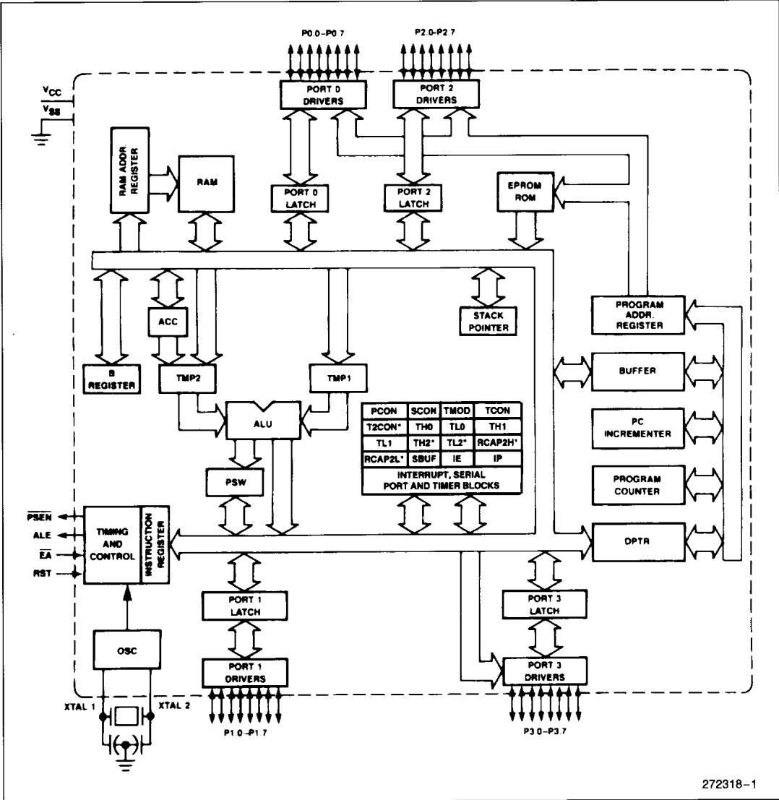

> **AI Description:**
> **Source:** `assets/_page_1_Figure_0.jpg`
> 
> **Generated:** 2026-05-18 02:33:52
> 
> ---
> 
> The image is a detailed block diagram of a microcontroller system. It illustrates the internal architecture of the microcontroller, showing various components such as the RAM, EPROM ROM, ALU, PSW, and multiple I/O ports (P0, P1, P2, P3). The diagram includes labels for each component and their interconnections, providing a clear visual representation of the system's structure and flow. The diagram also highlights the timing and control registers, interrupt, serial port, and timer blocks, which are crucial for understanding the microcontroller's operation and functionality.

## PROCESS INFORMATION

The 8031AH/8051AH and 8032AH/8052AH devices are manufactured on P414.1,an HMOS Il process. The 8751H/8751H-8 devices are manufactured on P421.X,an HMOS-E process.The 8751BH and 8752BH devices are manufactured on P422. Additional process and reliability information is availablein Intel's Components Quality and Reliability Handbook, Order No.210997.

PACKAGES

NOTE:
\*8752BHis 36/10°for D,and 38/22°for N.

All thermal impedance data is approximate for static air conditionsat1W of power dissipation.Values will change depending on operating conditionsand application.See the Intel Packaging Handbook (Order Number 240800) for a description of Intel's thermal impedance test methodology.

Figure 2. MCs? 51 Controller Connections
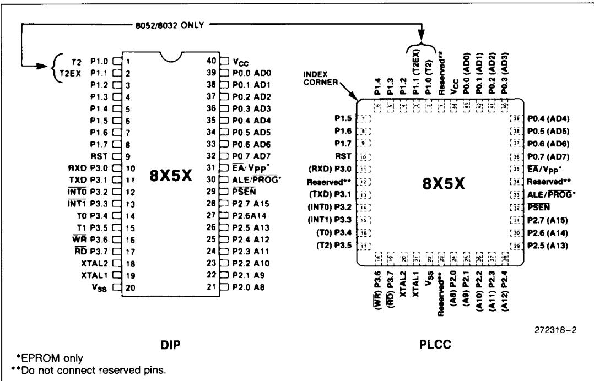

> **AI Description:**
> **Source:** `assets/_page_2_Figure_0.jpg`
> 
> **Generated:** 2026-05-18 02:35:28
> 
> ---
> 
> The image is a technical diagram illustrating the pinouts for two types of integrated circuits: a DIP (Dual In-Line Package) and a PLCC (Plastic Leaded Chip Carrier). The diagram includes detailed labeling of pins and their corresponding functions for the 8052/8032 microcontrollers. Key features include the labeling of pins such as Vcc, RST, INT0, INT1, T0, T1, WR, RD, XTAL1, XTAL2, and various address/data pins (AD0-AD7). The diagram also highlights reserved pins and notes that certain pins are only applicable to EPROMs. The image is annotated with labels such as "INDEX CORNER" and "T2EX," which help in identifying specific sections of the pinout.

## PIN DESCRIPTIONS

Vcc: Supply voltage.

Vss: Circuit ground.

Port O:Port O is an 8-bit open drain bidirectional l/O port.As an output port each pin can sink 8 LS TTL inputs.

Port O pins that have 1's written to them float,and in that state can be used as high-impedance inputs.

Port O is also the multiplexed low-order address and data bus during accesses to external Program and Data Memory.In this application it uses strong internal pullups when emitting 1's and can source and sink 8 LS TTL inputs.

Port O also receives the code bytes during programming of the EPROM parts,and outputs the code bytes during program verification of the ROM and EPROM parts.External pullups are required during program verification.

Port 1: Port 1 is an 8-bit bidirectional I/O port with internal pullups.The Port 1 output buffers can sink/ source 4 LS TTL inputs.Port 1 pins that have 1's written to them are pulled high by the internal pullups,and in that state can be used as inputs.As inputs,Port 1 pins that are externally pulled low will source current (IL on the data sheet) because of the internal pullups.

Port 1 also receives the low-order address bytes during programming of the EPROM parts\_and during program verification of the ROM and EPROM parts.

In the 8032AH,8052AH and 8752BH,Port 1 pins P1.0 and P1.1 also serve the T2 and T2EX functions,respectively.

Port 2: Port 2 is an 8-bit bidirectional I/O port with internal pullups.The Port 2 output buffers can sink/ source 4 LS TTL inputs.Port 2 pins that have 1's written to them are pulled high by the internal pullups,and in that state can be used as inputs.As inputs,Port 2 pins that are externally pulled low will source current (liL on the data sheet) because of the internal pullups.

Port 2 emits the high-order address byte during fetches from external Program Memory and during accesses to external Data Memory that use 16-bit addresses (MOVX @DPTR). In this application it uses strong internal pullups when emitting 1's. Duringaccesses to external Data Memory that use 8-bit addresses (MOVX @Ri),Port 2 emits the contents of the P2 Special Function Register.

Port2 also receives the high-order address bits duringprogramming of the EPROM parts and during program verification of the ROM and EPROM parts.

The protection feature of the 8051AHP causes bits P2.4 through P2.7 to be forced to 0,effectively limiting external Data and Code space to 4K each during external accesses.

Port 3:Port 3 is an 8-bit bidirectional I/O port with internal pullups.The Port 3 output buffers can sink/ source 4 LS TTL inputs.Port 3 pins that have 1's written to them are pulled high by the internal pullups,and in that state can be used as inputs.As inputs,Port 3 pins that are externally pulled low will source current (Ii on the data sheet) because of the pullups.

Port 3 also serves the functions of various special features of the MCS 51 Family,as listed below:

RST: Reset input. A high on this pin for two machine cycles while the oscillator is running resets the device.

ALE/PROG: Address Latch Enable output pulse for latching the low byte of the address during accesses to external memory.This pin is also the program pulse input (PROG) during programmingof the EPROM parts.

In normal operation ALE is emitted at a constant rate of 1/ the oscillator frequency,and may be used for external timing or clocking purposes.Note,however,that one ALE pulse is skipped during each access to external Data Memory.

PSEN: Program Store Enable is the read strobe to external Program Memory.

When the device is executing code from external Program Memory,PSEN is activated twice each machine cycle,except that two PSEN activations are skipped during each access to external Data Memory.

EA/Vpp: External Access enable EA must be strapped to Vss in order to enable any MCS 51 device to fetch code from external Programmemory locations starting at OooOH up to FFFFH.EA must be strapped to $\bar { \mathsf { v } } _ { \mathsf { C C } }$ for internal program execution.

Note,however, that if the Security Bit in the EPROM devices is programmed,the device will not fetch code from any location in external Program Memory.

This pin also receives the programming supply voltage (VPP) during programming of the EPROM parts.

Figure 3. Oscillator Connections
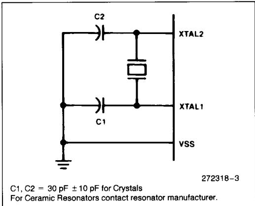

> **AI Description:**
> **Source:** `assets/_page_4_Figure_0.jpg`
> 
> **Generated:** 2026-05-18 02:36:33
> 
> ---
> 
> The image contains a technical diagram of a crystal oscillator circuit. It includes two capacitors (C1 and C2) connected in parallel with a crystal resonator, which is represented by a box with a line through it. The capacitors are labeled with their values (C1, C2 = 30 pF ± 10 pF for Crystals) and the circuit is connected to two pins labeled XTAL1 and XTAL2, with a ground connection labeled VSS. The diagram is accompanied by a note directing the reader to contact the resonator manufacturer for ceramic resonators.

XTAL1: Input to the inverting oscillator amplifier.

XTAL2: Output from the inverting oscillator amplifier.

## OSCILLATOR CHARACTERISTICS

XTAL1 and XTAL2 are the input and output, respectively,of an inverting amplifier which can be configured for use as an on-chip oscillator,as shown in Figure 3.Eithera quartz crystal or ceramic resonator may be used.More detailed information concerning the use of the on-chip oscillator is available in Application Note AP-155，“Oscillators for Microcontrollers," Order No.230659.

To drive the device from an external clock source, XTAL1 should be grounded,while XTAL2 is driven, as shown in Figure 4. There are no requirements on the duty cycle of the external clock signal, since the input to the internal clocking circuitry is through a divide-by-two flip-flop，but minimum and maximum high and low times specified on the data sheet must be observed.

Figure 4. External Drive Configuration
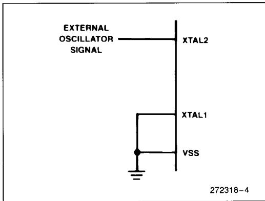

> **AI Description:**
> **Source:** `assets/_page_4_Figure_1.jpg`
> 
> **Generated:** 2026-05-18 02:36:41
> 
> ---
> 
> The image is a technical diagram illustrating the connection of an external oscillator signal to an electronic component. It shows a signal labeled "EXTERNAL OSCILLATOR SIGNAL" connected to a pin labeled "XTAL2". This signal is then connected to another pin labeled "XTAL1", which is further connected to a ground symbol labeled "VSS". The diagram is labeled with the number "272318-4" in the bottom right corner. The diagram is a schematic representation commonly used in electronics and electrical engineering to depict the connections and signals within a circuit.

## EXPRESS Version

The Intel EXPRESS system offers enhancements to the operational specifications of the MCS 51 family of microcontrollers. These EXPRESS products are designed to meet the needs of those applications whose operating requirements exceed commercial standards.

The EXPRESS program includes the commercial standard temperature range with burn-in,and an extended temperature range with or without burn-in.

With the commercial standard temperature range, operational characteristics are guaranteed over the temperature range of OC to +70C. With the extended temperature range option, operational characteristics are guaranteed over arange of -40C to $+ 8 5 ^ { \circ } \mathsf { C }$

The optional burn-in is dynamic,for a minimum time of 160 hours at 125C with ${ \mathsf { V } } _ { \mathsf { C C } } = 5 . 5 { \mathsf { V } } \pm 0 . 2 5 { \mathsf { V } } ,$ following guidelines in MIL-STD-883,Method 1015.

Package types and EXPRESS versions are identified by a one- or two-letter prefix to the part number. The prefixesare listed in Table 1.

For the extended temperature range option，this data sheet specifies the parameters which deviate from their commercial temperature range limits.

Table 1. EXPRESS Prefix Identification

NOTE:
Contact distributor or local sales office to match EXPRESS prefix with proper device.

## DESIGN CONSIDERATIONS

· If an 8751BH or 8752BH is replacing an 8751H in a future design, the user should carefully compare both data sheets for DC or AC Characteristic differences.Note that the ViH and IIH specifications for the EA pin differ significantly between the devices.

·Exposure to light when the EPROM device is in operation may cause logic errors.For this reason, it is suggested that an opaque label be placed over the window when the die is exposed to ambient light.

· The 8051AHP cannot access external Program or Data memory above 4K.This means that the following instructions that use the Data Pointer onlyread/write dataat address locations below OFFFH:

MOVX A,@DPTR

MOVX @DPTR，A

When the Data Pointer contains an address above the 4K limit, those locations will not be accessed.

To access Data Memory above 4K， the MOVX @Ri,A or MOvX A,@Ri instructions must be used.

## ABSOLUTE MAXIMUM RATINGS\*

Ambient Temperature Under Bias.-40C to +85CStorage Temperature -65℃ to +150CVoltage on EA/Vpp Pin to Vss8751H.. -0.5V to +21.5V8751BH/8752BH .-0.5V to +13.0VVoltage on Any Other Pin to Vss ....-0.5V to +7VPower Dissipation.. ...1.5W

NOTICE: This is a production data sheet. It is valid for the devices indicated in the revision history.The specifications are subject to change without notice.

\*WARNiNG:Stressing the device beyond the “Absolute Maximum Ratings"may causepermanent damage. These are stressratings only.Operation beyond the "Operating Conditions”is not recommended and extendedexposurebeyondthe"OperatingConditions" mayaffectdevicereliability.

## OPERATING CONDITIONS

DC CHARACTERISTICS\_ (Over Operating Conditions) All parametervaluesapplytoall devicesunlessotherwise indicated

## DC CHARACTERISTICS (Over Operating Conditions)

All parameter values apply to all devices unless otherwise indicated (Continued)

## NOTES:

1.Capacive loadingon Ports Oand 2 may cause spurious noise pulses to be superimposed on the VoLs of ALE/PROG andPorts1and3.Thenoiseisduetoexternalbus capacitancedischarging intothePortOandPort2pins whenthesepins make1-to-O transitions during bus operations.In the worst cases (capacitive loading>10opF),the noise pulse on the ALE/PROG pinmay exceedO.8V.Insuchcasesitmaybedesirable toqualifyALEwitha SchmittTrigger,oruseanaddress latch with a Schmitt Trigger STROBE input.

2.ALE/PROG refers to'a pinon the8751BH.ALErefers toatiming signal that isoutputon the ALE/PROG pin.

3.Under steady state (non-transient) conditions,loL must be externally limited as follows:

Maximum loL per port pin:

10 mA

Maximum loL per 8-bit port -

Port 0: 26mA

Ports 1,2,and 3: 15 mA

Maximum total loL for all output pins: 71mA

If loLexceeds the testcondition,Volmayexceedtherelated specification.Pinsarenot guaranteedtosinkcurrentgreater than the listed test conditions.

## EXPLANATION OF THE AC SYMBOLS

Each timing symbol has 5 characters.The first character is always a'T'(stands for time).The other characters,depending on their positions,stand for the name of a signal or the logical status of that signal. The following is a list of all the characters and what they stand for.

A: Address

C: Clock

D: Input Data

H: Logic level HIGH

I: Instruction (program memory contents)

L: Logic level LOW,or ALE  
P: PSEN  
Q: Output data  
R:RD signal  
T: Time  
V: Valid  
W: WR signal  
X: No longer a valid logic level  
Z: Float

For example,

TAVLL = Time from Address Valid to ALE Low.   
TLLPL = Time from ALE Low to PSEN Low.

AC CHARACTERISTICS (Under Operating Conditions; Load Capacitance for Port 0,ALE/PROG,and PSEN = 100 pF; Load Capacitance for Al Other Outputs = 80 pF)

EXTERNAL PROGRAM MEMORY CHARACTERISTICS

\*The8751H-8is identical tothe8751Hbutonlyoperates up to8MHz.Whencalculating theAC Characteristics for the 8751H-8,use the 8751H formula for variable oscillators.
NOTE:

EXTERNAL PROGRAM MEMORY READ CYCLE
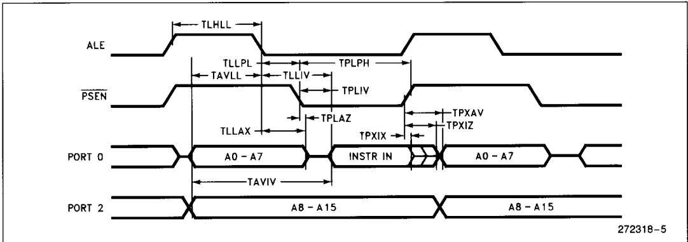

> **AI Description:**
> **Source:** `assets/_page_10_Figure_0.jpg`
> 
> **Generated:** 2026-05-18 02:35:42
> 
> ---
> 
> The image is a technical diagram illustrating timing relationships for a microcontroller or microprocessor. It shows the timing sequences for various signals such as ALE (Address Latch Enable), PSEN (Program Store Enable), PORT 0, and PORT 2. The diagram includes labels for specific timing intervals such as TLHLL, TLLPL, TPLPH, TLLIV, TPLIV, TLLAX, TPLAZ, TPXAV, TPXIZ, TAVLL, TAVIV, and TAVIX. These intervals represent the durations of the signals and their transitions. The diagram is likely used for understanding the timing requirements for interfacing with a specific microcontroller or microprocessor.

EXTERNAL DATA MEMORY READ CYCLE
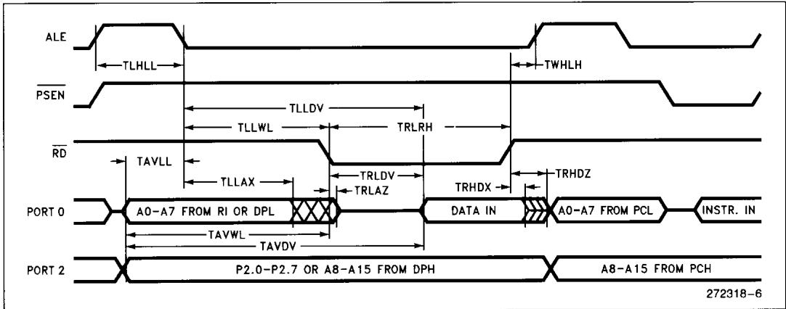

> **AI Description:**
> **Source:** `assets/_page_10_Figure_1.jpg`
> 
> **Generated:** 2026-05-18 02:36:25
> 
> ---
> 
> The image contains a detailed timing diagram for a microcontroller or microprocessor interface. It illustrates the timing relationships between various control signals and data lines, including ALE (Address Latch Enable), PSEN (Program Store Enable), RD (Read), and the data lines (PORT 0 and PORT 2). The diagram includes various time intervals such as TLHLL, TLLDW, TLLWL, TRLRH, and others, which represent specific timing constraints for the signals. The diagram is labeled with technical terms and abbreviations relevant to microcontroller operations, such as A0-A7, P2.0-P2.7, and INSTR. IN, indicating the flow of address and data lines during a read operation. The diagram is technical in nature and is likely used for reference or educational purposes in the context of microcontroller programming or hardware design.

EXTERNAL DATA MEMORY WRITE CYCLE
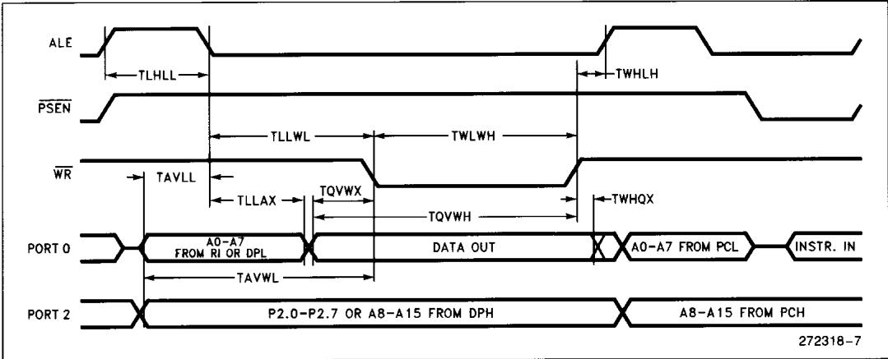

> **AI Description:**
> **Source:** `assets/_page_10_Figure_2.jpg`
> 
> **Generated:** 2026-05-18 02:36:57
> 
> ---
> 
> The image contains a technical diagram illustrating timing diagrams for various signals in a microcontroller or microprocessor system. The diagram includes labels for signals such as ALE, PSEN, WR, PORT 0, and PORT 2, along with corresponding timing parameters like TLHLL, TLLWL, TAVLL, TAVWL, TAVWX, TQVWX, TQVWH, TWHQX, TWHLH, and TWLWH. The diagram is used to specify the timing requirements for these signals in relation to each other and to the data being transferred. The diagram is labeled with annotations such as "DATA OUT," "A0-A7 FROM PCL," "INSTR. IN," and "P2.0-P2.7 OR A8-A15 FROM DPH," which indicate the source of the data and the purpose of the signals. The diagram is likely used for design and troubleshooting purposes in the context of microcontroller or microprocessor systems.

SERIAL PORT TIMING一SHIFT REGISTER MODE
Test Conditions: Over Operating Conditions; Load Capacitance = 80 pF

SHIFT REGISTER MODE TIMING WAVEFORMS
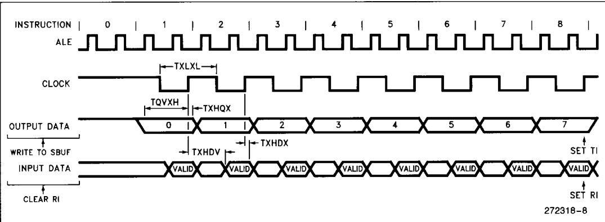

> **AI Description:**
> **Source:** `assets/_page_11_Figure_0.jpg`
> 
> **Generated:** 2026-05-18 02:35:06
> 
> ---
> 
> The image is a technical diagram illustrating the timing and sequence of operations in a microcontroller or microprocessor. It includes waveforms for the ALE (Address Latch Enable), CLOCK, and OUTPUT DATA signals, as well as labels for various timing intervals such as TXLXL, TQVXH, TXHQX, TXHDV, and TXHDX. The diagram also shows the status of the WRITE TO SBUF and CLEAR RI signals, as well as the SET TI and SET RI flags. The timing intervals and signal states are aligned with specific instructions, providing a detailed view of the timing relationships between different signals and operations within a microcontroller system.

EXTERNAL CLOCK DRIVE

EXTERNAL CLOCK DRIVE WAVEFORM
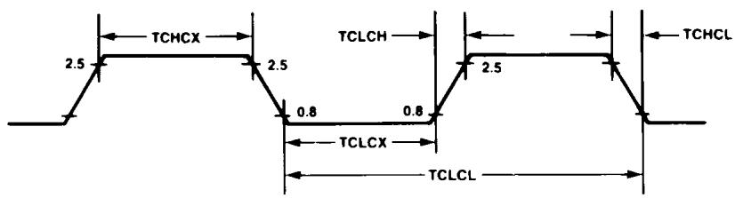

> **AI Description:**
> **Source:** `assets/_page_12_Figure_0.jpg`
> 
> **Generated:** 2026-05-18 02:33:17
> 
> ---
> 
> The image contains a technical diagram illustrating timing parameters for a communication protocol. It includes various time intervals such as TCHCX, TCLCH, TCLCL, TCLCX, and TCLCL, which are likely related to the timing characteristics of a communication channel. The diagram uses horizontal lines and arrows to represent these intervals, with specific numerical values indicating the duration of each segment. The diagram is designed to provide a clear visual representation of the timing relationships between different parts of the communication process.

AC TESTING INPUT, OUTPUT WAVEFORM
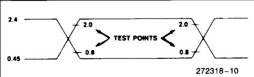

> **AI Description:**
> **Source:** `assets/_page_12_Figure_1.jpg`
> 
> **Generated:** 2026-05-18 02:33:24
> 
> ---
> 
> The image contains a technical diagram with measurements and annotations. It appears to be a cross-sectional view of a component or structure, possibly related to electronics or mechanical engineering. The diagram includes dimensions such as 2.4, 2.0, 0.8, and 0.45, which likely represent specific dimensions or tolerances. The text "TEST POINTS" is prominently displayed, suggesting that the diagram is used for testing or quality control purposes. The numbers and annotations are arranged in a way that indicates the structure's cross-section, with the dimensions pointing to specific parts of the structure.

$$
" 0 ^ { \dag }
$$

## EPROM CHARACTERISTICS

Table 3. EPROM Programming Modes

NOTE:
“1"= logic high for that pin
"0"= logic low for that pin
"VPP"= +21V ±0.5V
"X”= “don't care"
\*ALE is pulsed low for 50 ms.

## PROGRAMMING THE 8751H

To be programmed, the part must be running with a 4 to 6 MHz oscillator. (The reason the oscillator needs to be running is that the internal bus is being used to transfer address and program data to appropriate internal registers.) Theaddress of an EPROM iocation to be programmed is applied to Port 1 and pins P2.0-P2.3 of Port 2,while the code byte to be programmed into that location is\_applied to Port 0. The other Port2 pins,andRST,PSEN,and EA/Vpp should be held at the"Program"levels indicated in Table 3. ALE/PROG is pulsed low for 50 ms to program the code byte into the addressed EPROM location. The setup is shown in Figure 5.

Normally EA/Vpp\_is heldat a logic high\_until just before ALE/PROG is to be pulsed.Then EA/Vpp is raised to +21V，ALE/PROG is pulsed,and then EA/Vpp is returned to a logic high.Waveforms and detailed timing specifications are shown in later sections of this data sheet.

Figure 5. Programming Configuration
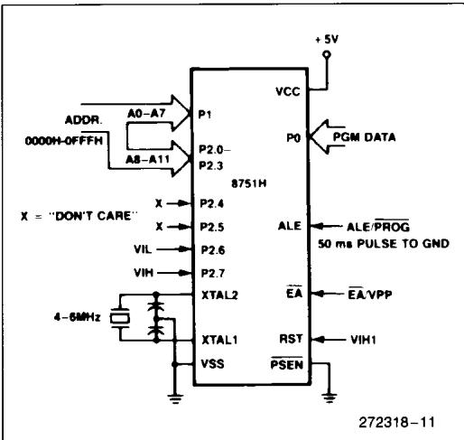

> **AI Description:**
> **Source:** `assets/_page_13_Figure_0.jpg`
> 
> **Generated:** 2026-05-18 02:34:13
> 
> ---
> 
> The image is a technical diagram of an 8751H microcontroller. It includes a block diagram with various pins and their functions labeled. The diagram highlights the connection of the microcontroller to power (VCC and VSS), ground (GND), and various input/output pins such as A0-A11, P0, P1, P2.0-P2.7, XTAL1, XTAL2, ALE/PROG, EA/VPP, RST, and PSEN. It also specifies the address range (0000H-0FFFH) and the clock frequency range (4-8MHz). The diagram is labeled with "272318-11" at the bottom right corner.

Note that the EA/VPP pin must not be allowed to go above the maximum specified VPP level of 21.5V for any amount of time. Even a narrow glitch above that voitage level can cause permanent damage to the device. The VPP source should be well regulated and free of glitches.

## Program Verification

If the Security Bit has not been programmed,the onchip Program Memory can be read out for verification purposes,if desired,either during or after the programming operation.The address of the Program Memory location to beread isapplied to Port1and pins P2.0-P2.3.The other pins should be held at the "Verify"levels indicated in Table 3.The contents of the addressed location will come out on Port 0. External pullups are required on Port O for this operation.

The setup,which is shown in Figure 6,is the same as for programming the EPROM except that pin P2.7 is held at a logic low,or may be used as an activelow read strobe.

Figure 6. Program Verification
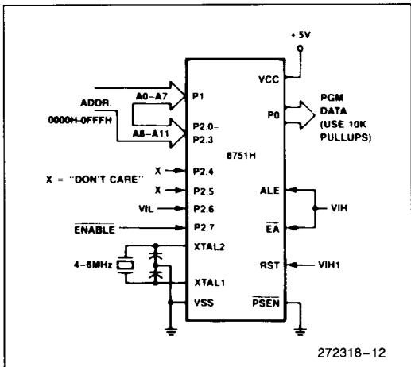

> **AI Description:**
> **Source:** `assets/_page_13_Figure_1.jpg`
> 
> **Generated:** 2026-05-18 02:34:02
> 
> ---
> 
> The image contains a technical diagram of an 8751H microcontroller. It includes a block diagram with labeled pins and connections. The diagram illustrates the connections for power supply (VCC and VSS), ground (VSS), clock inputs (XTAL1 and XTAL2), reset (RST), address lines (A0-A7 and A8-A11), data lines (P0, P1, and P2), and control signals (ALE, EA, PSEN, and ENABLE). The diagram also specifies the address range (0000H-0FFFH) and the use of pull-up resistors for the data lines. The image is labeled with a reference number (272318-12) at the bottom right corner.

## EPROM Security

The security feature consists of a "locking"bit which when programmed denies electrical access by any external means to the on-chip Program Memory. The bit is programmed as shown in Figure 7. The setup and procedure are the same as for normal EPROM programming,except that P2.6 is held at a logic high.Port 0,Port 1and pins P2.0-P2.3 may be in any state. The other pins should be held at the “Security" levels indicated in Table 3.

Once the Security Bit has been programmed,it can becleared only by full erasure of the Program Memory.While it is programmed, the internal Program Memory can not be read out, the device can not be further programmed, and it can not execute out of external program memory. Erasing the EPROM, thus clearing the Security Bit, restores the device's full functionality. It can then be reprogrammed.

## Erasure Characteristics

Erasure of the EPROM begins to occur when the device is exposed to light with wavelengths shorter thanapproximately4,0oo Angstroms.Since sunlight and fluorescent lighting have wavelengths in this range,exposure to these light sources over an extended time (about 1 week in sunlight,or3 years in room-level fluorescent lighting) couid cause inadvertent erasure.If an application subjects the device to this type of exposure,it is suggested that an opaque label be placed over the window.

Figure 7. Programming the Security Bit
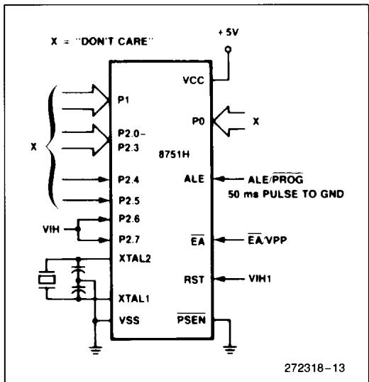

> **AI Description:**
> **Source:** `assets/_page_14_Figure_0.jpg`
> 
> **Generated:** 2026-05-18 02:34:23
> 
> ---
> 
> The image is a technical diagram of an 8751H microcontroller. It includes a block diagram with various pins labeled and their functions described. The diagram shows the connections for power supply (VCC and VSS), ground (GND), and various control signals such as ALE/PROG, EA/VPP, RST, and PSEN. The diagram also includes a crystal oscillator circuit and the pin configuration for P0, P1, and P2. The text "X = 'DON'T CARE'" indicates that the pin labeled X can be left unconnected. The diagram is labeled with "272318-13" at the bottom right corner.

The recommended erasure procedure is exposure to ultraviolet light (at 2537 Angstroms) to an integrated dose of at least 15 W-sec/cm2.Exposing the EPROM to an ultraviolet lamp of 12,000 μW/cm2 rating for 20 to 30 minutes,at a distance of about 1 inch,should be sufficient.

Erasure leaves the array in an all 1's state.

EPROM PROGRAMMING AND VERIFICATION CHARACTERISTICS TA = 21°C to 27°C; VCC = 5V ±10%; VSS = 0V

EPROM PROGRAMMING AND VERIFICATION WAVEFORMS
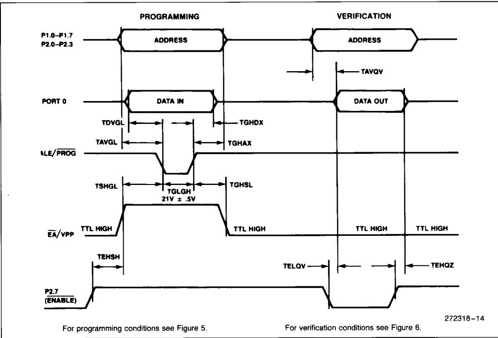

> **AI Description:**
> **Source:** `assets/_page_15_Figure_0.jpg`
> 
> **Generated:** 2026-05-18 02:33:10
> 
> ---
> 
> The image is a technical diagram illustrating the timing and conditions for programming and verifying a microcontroller or similar electronic component. It includes a timeline with various signals and their corresponding timing parameters such as TDVGL, TAVGL, TAVQV, and others. The diagram is divided into two sections: "Programming" and "Verification," with specific conditions for each phase. Key labels include "P1.0-P1.7," "P2.0-P2.3," "PORT 0," "ALE/PROG," "EA/VPP," and "P2.7 (ENABLE)." The diagram also references additional figures (5 and 6) for programming and verification conditions.

## Programming the 8751BH/8752BH

To be programmed,the 875XBH must be running with a 4 to6 MHz oscillator. (The reason the oscillator needs to be running is that the internal bus is being used to transfer address and program data to appropriate internal registers.）The address of an EPROM location tobe programmed isapplied to Port 1 and pins P2.0 - P2.4 of Port 2,while the code byte to be programmed into that location is applied to\_Port O.The other Port 2 and 3 pins,and RST, PSEN,and EA/Vpp should be held at the “Program" levels indicated in Table 1.ALE/PROG is pulsed low to program the code byte into the addressed EPROM location. The setup is shown in Figure 8.

Normally $E A / V _ { P P }$ is held at a logic high until just before ALE/PROG is to be pulsed.Then $\overline { E A } / \vee \mathsf { _ { P P } }$ is raised to Vpp,ALE/PROG is pulsed low,and then EA/Vpp is returned to a valid high voltage.The voltage on the EA/Vpp pin must be at the valid EA/Vpp high level before a verify is attempted.Waveforms and detailed timing specifications are shown in later sections of this data sheet.

Note that the EA/Vpp pin must not be allowed to go above the maximum specified Vpp level for any amount of time. Even a narrow glitch above that voltage level can cause permanent damage to the device.The Vpp source should be well regulated and free of glitches.

Figure 8. Programming the EPROM
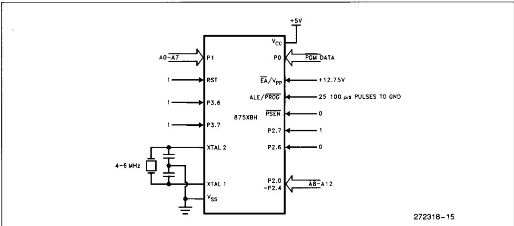

> **AI Description:**
> **Source:** `assets/_page_16_Figure_0.jpg`
> 
> **Generated:** 2026-05-18 02:34:53
> 
> ---
> 
> The image is a technical diagram illustrating the connections and pinouts of an 875XBH microcontroller. It includes labels for various pins such as A0-A7, RST, P3.6, P3.7, XTAL 1, XTAL 2, and others. The diagram also shows the power supply connections, including +5V and +12.75V, and the crystal oscillator specifications of 4-6 MHz. The diagram is labeled with "272318-15" at the bottom right corner.

Table 4. EPROM Programming Modes for 875XBH

NOTES:
"1" = Valid high for that pin
"0"= Valid low for that pin
"Vpp"= +12.75V ±0.25V
\*ALE/PROG ispulsed low for 100 uS for programming. (Quick-Pulse Programming)

## QUICK-PULSE PROGRAMMING ALGORITHM

The 875XBH can be programmed using the Quick-Pulse Programming Algorithm for microcontrollers. The features of the new programming method are a lower Vpp (12.75 volts as compared to 21 volts) and a shorter programming pulse.For example, it is possible to program the entire 8 Kbytes of 875XBH EPROM memory in less than 25 seconds with this algorithm!

To program the part using the new algorithm,Vpp must be 12.75 ±0.25 Volts.ALE/PROG is pulsed low for 100 μseconds，25 times as shown in Figure 9. Then, the byte just programmed may be verified.After programming, the entire array should be verified.The Program Lock features are programmed using the same method, but with the setup as shown in Table 4.The only difference in programming Lock features is that the Lock features cannot be directly verified. Instead,verification of programming is by observing that their features are enabled.

## PROGRAM VERIFICATION

If the Lock Bits have not been programmed, the onchip Program Memory can be read out for verification purposes,if desired,either during or after the programming operation.The address of the Program Memory location to be read isapplied to Port 1 and pins P2.0 - P2.4. The other pins should be held at the“Verify” levels indicated in Table 1. The contents of the addressed location will come out on Port 0.External pullups are required on Port O for this operation. (if the Encryption Array in the EPROM has been programmed, the data present at Port 0 will be Code Data XNOR Encryption Data.The user must know the Encryption Array contents to manually "unencrypt"the data during verify.)

The setup,which is shown in Figure 10, is the same as for programming the EPROM except that pin P2.7 is held at a logic low, or may be used as an active low read strobe.

Figure 10. Verifying the EPROM
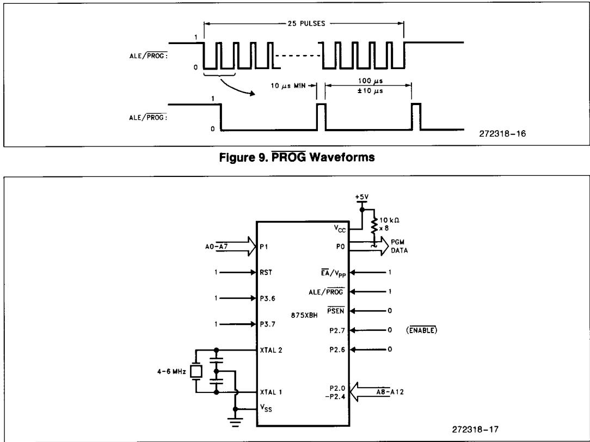

> **AI Description:**
> **Source:** `assets/_page_17_Figure_0.jpg`
> 
> **Generated:** 2026-05-18 02:36:09
> 
> ---
> 
> The image contains two distinct sections. The top section is a waveform diagram labeled "Figure 9. PROG Waveforms," showing the timing and pulse patterns for the ALE/PROG signal. It includes annotations for the duration of 25 pulses, minimum pulse width, and timing intervals. The bottom section is a circuit diagram of an 875XBH device, showing connections for power supply, reset, address lines, and various control signals. The diagram includes labels for the pins and their functions, such as XTAL1 and XTAL2, XTAL2, XTAL1, VSS, VCC, and various control signals like RST, P0, P1, P2.7, P2.6, and P2.0-P2.4. The circuit is designed for programming or interfacing with the 875XBH device.

## PROGRAM MEMORY LOCK

The two-level Program Lock system consists of 2 Lock bits and a 32-byte Encryption Array which are used to protect the program memory against software piracy.

## ENCRYPTION ARRAY

Within the EPROMarrayare 32 bytes of Encryption Array that are initially unprogrammed (all 1s). Every time that a byte is addressed duringa verify,5 address lines are used to select a byte of the Encryption Array.This byte is then exclusive-NORed (XNOR) with the code byte,creating an Encrypted Verify byte.The algorithm,with the array in the unprogrammed state (all 1s),will return the code in its original,unmodified form.

It is recommended that whenever the Encryption Array is used,at least one of the Lock Bits be programmed as well.

## LOCK BITS

Also included in the EPROM Program Lock scheme are two Lock Bits which function as shown in Table 5.

Erasing the EPROM also erases the Encryption Array and the Lock Bits,returning the part to full unlocked functionality.

To ensure proper functionality of the chip, the internally latched value of the EA pin must agree with its external state.

Table 5. Lock Bits and their Features

P = Programmed
U = Unprogrammed

## READING THE SIGNATURE BYTES

The signature bytes are read by the same procedure as a normal verification of locations O3oH and 031H, except that P3.6 and P3.7 need to be pulled to a logic low. The values returned are:

(030H) = 89H indicates manufactured by Intel

(031H)= 51H indicates 8751BH 52Hindicates 8752BH

## ERASURE CHARACTERISTICS

Erasure of the EPROM begins to occur when the 8752BH is exposed to light with wavelengths shorter than approximately4,Ooo Angstroms. Since sunlight and fluorescent lighting have wavelengths in this range,exposure to these light sources over an extended time (about 1 week in sunlight,or 3 years in room-level fluorescent lighting) could cause inadvertent erasure.If anapplication subjects the device to this type of exposure,it is suggested that an opaque label be placed over the window.

The recommended erasure procedure is exposure to ultraviolet light (at 2537 Angstroms) to an integrated dose of at lease 15 W-sec/cm.Exposing the EPROM to an ultraviolet lamp of 12,000 μW/cm rating for 30 minutes,at a distance of about 1 inch, should be sufficient.

Erasure leaves the array in an al 1s state.

EPROM PROGRAMMING AND VERIFICATION CHARACTERISTICS (TA = 21°C to 27C,Vcc = 5.0V ±10%,Vss = 0V)

## EPROM PROGRAMMING AND VERIFICATION WAVEFORMS

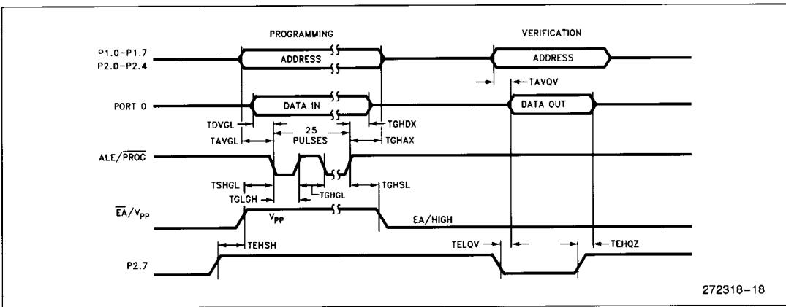

> **AI Description:**
> **Source:** `assets/_page_19_Figure_0.jpg`
> 
> **Generated:** 2026-05-18 02:34:39
> 
> ---
> 
> The image contains a technical diagram illustrating the timing and sequence of operations for programming and verifying memory devices. It includes a timeline with labeled phases such as "Programming," "Address," "Data In," "Data Out," and "Verification." Key components like "P1.0-P1.7," "P2.0-P2.4," "Port 0," "ALE/PROG," "EA/VPP," and "P2.7" are connected to various timing parameters such as "TDVGL," "TAVGL," "TGHDX," "TGHAX," "TSHGL," "TGLGH," "TGHGHL," "TEHSH," "TELOV," and "TEHQZ." The diagram is annotated with specific time intervals and voltage levels, providing a detailed representation of the timing sequence for memory programming and verification processes.

## DATA SHEET REVISION HISTORY

Datasheetsare changed as new device information becomes available.Verify with your local Intel sales office that you have the latest version before finalizing a design or ordering devices.

The following diferences exist between this datasheet (272318-002)and the previous version (272318-001):

1.Removed QP and QD (commercial with extended burn-in) rom Table 1.EXPRESS Prefix Identification.

This datasheet (272318-001) replaces the following datasheets:

MCS@ 51 Controllers (270048-007)

8051AHP (270279-004)

8751BH (270248-005)

8751BH EXPRESS (270708-001)

8752BH (270429-004)

8752BH EXPRESS (270650-002)