

> **AI Description:**
> **Source:** `assets/_page_0_Figure_0.jpg`
> 
> **Generated:** 2026-05-18 11:25:50
> 
> ---
> 
> The image is a photograph showing a group of people standing outdoors in the rain, holding umbrellas and signs. The signs prominently display the text "COVAX" along with logos for UNICEF and Gavi. The group appears to be celebrating or participating in a significant event related to the COVAX initiative, which is a global effort to ensure equitable access to COVID-19 vaccines. The individuals are dressed in formal attire, and some are holding American flags, suggesting a connection to the United States in this context. The setting appears to be an airport or a similar transportation hub, as indicated by the presence of a vehicle in the background.

Foreign Policy for the American People

### Full Page Description (Page 1)

**Source:** `assets/_page_1_Asset_2.jpg`

**Generated:** 2026-05-18 11:32:46

---

The image is a bar chart with a blue background. It displays data for the years 2018, 2019, 2020, and 2021. The y-axis represents values ranging from 0 to 25, while the x-axis lists the years. The bars indicate the following approximate values: 2018 at around 21, 2019 at around 21, 2020 at around 12, and 2021 at around 16. The chart shows a general decline in values from 2018 to 2020, followed by a slight increase in 2021.

### Full Page Description (Page 1)

**Source:** `assets/_page_1_Asset_1.jpg`

**Generated:** 2026-05-18 11:30:18

---

The image is a bar chart titled "State Department Employees (in thousands)." It displays the number of employees in four categories: Foreign Service, Eligible Family Members, Civil Service, and Locally Employed Staff, for the years 2018 to 2021. The chart uses different shades of blue to represent each category. The Foreign Service and Civil Service categories are represented by light blue and teal, respectively, while Eligible Family Members and Locally Employed Staff are shown in darker blue. The chart indicates a slight increase in the total number of employees over the four years, with the largest portion being Locally Employed Staff.

### Full Page Description (Page 1)

**Source:** `assets/_page_1_Asset_0.jpg`

**Generated:** 2026-05-18 11:31:07

---

The image contains a bar chart with data spanning from 2018 to 2021. The y-axis represents monetary values in dollars, ranging from $0 to $50. The x-axis lists the years from 2018 to 2021. Each bar corresponds to a specific year, showing the monetary value for that year. The chart indicates a general upward trend in values over the years, with the highest value observed in 2021.

\* Throughout this report all use of year indicates fiscal year.
Total Net Cost of Operations (dollars in billions)

\* Eligible Family Members include State only eligible family members and do not include the inactive reserves. \*\* Locally Employed Staff includes Foreign Service Nationals and Personal Services Agreements.

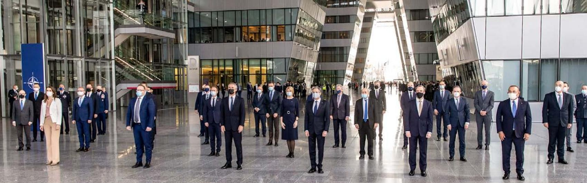

> **AI Description:**
> **Source:** `assets/_page_2_Figure_0.jpg`
> 
> **Generated:** 2026-05-18 11:41:39
> 
> ---
> 
> The image is a photograph showing a group of people, likely officials or dignitaries, standing in a large, modern building lobby. They are dressed in formal attire, with many wearing face masks. The setting appears to be a formal event or gathering, possibly related to a diplomatic or governmental function. The background features large glass windows and modern architectural elements, suggesting the location is a significant or official building. The image captures a moment of formality and order, with the individuals standing in a structured formation.

Secretary Blinken participates in a NATO family photo at NATO Headquarters in Brussels, Belgium, March 23, 2021. Department of State

## Table of Contents

2

Introduction

44

117

Section II: Financial Section

2 About This Report   
3 How This Report is Organized

Section III: Other Information

44 Message from the Comptroller

46 OIG Transmittal and Independent Auditor’s Report

Message from the Secretary

117 Inspector General’s Statement on the Department’s Major Management and Performance Challenges

63 Comptroller Response to the OIG

65 Principal Financial Statements

66 Consolidated Balance Sheet

67 Consolidated Statement of Net Cost

127 Management’s Response to Inspector General

8

68 Consolidated Statement of Changes in Net Position

136 Summary of Financial Statement Audit and Management Assurances

Section I: Management’s Discussion and Analysis

69 Combined Statement of Budgetary Resources

137 Payment Integrity Information Act Reporting

70 Notes to the Principal Financial Statements

8 About the Department

138 Grants Programs

111 Required Supplementary Information

15 Strategic Goals and Governmentwide Management Initiatives

139 Federal Civil Penalties Inflation Adjustment Act

140 Resource Management Systems Summary

17 Performance Summary and Highlights

146 Heritage Assets

23 Financial Summary and Highlights

34 Analysis of Systems, Control, and Legal Compliance

153

39 Forward-Looking Information

Appendices

153 A: Abbreviations and Acronyms

156 B: Department of State Locations

# About This Report

FINITYeSTAT21DEPCyTMENTaFSTAT

> **AI Description:**
> **Source:** `assets/_page_3_Figure_0.jpg`
> 
> **Generated:** 2026-05-18 11:46:51
> 
> ---
> 
> The image contains a group of people standing outdoors, holding signs with text on them. The individuals are dressed in formal attire, and some are wearing face masks. The background includes a bright sky and what appears to be a red carpet or stage. The signs they are holding contain text, but the specific content of the text is not clear from the image. The setting suggests a formal event or ceremony.

T he U.S. Department of State’s Agency Financial Report (AFR) for FiscalYear (FY) 2021 provides an overview of the Department’s financial and Year (FY) 2021 provides an overview of the Department's financial and performance data to help Congress, the President, and the public assess our stewardship over the resources entrusted to us.

Foreign Policy for the American People

This report is available at the Department’s website (www.state.gov/plansperformance-budget/agency-financial-reports) and includes sidebars, links, and information that satisfies the reporting requirements contained in the following legislation:

ƒ Federal Managers’ Financial Integrity Act of 1982,

1 Chief Financial Officers (CFO) Act of 1990,

ƒ Government Performance and Results Act (GPRA) of 1993,

ƒ Federal Financial Management Improvement Act of 1996,

ƒ Government Management Reform Act of 1994,

Reports Consolidation Act of 2000,

ƒ Payment Integrity Information Act of 2019, and

GPRA Modernization Act of 2010.

The AFR is the first of a series of two annual financial and performance reports the Department will issue. The reports include: (1) an Agency Financial Report issued in November 2021; and (2) an agency Annual Performance Plan and Annual Performance Report issued in March 2022. These reports will be available online at www.state.gov/plans-performance-budget.

Note: Throughout this report all use of year indicates fiscal year.

## Certificate of Excellence in Accountability Reporting

n May 2021, the U.S. Department of State received the Certificate of Excellence in Accountability Reporting (CEAR) from the Association of Government Accountants (AGA) for its Fiscal Year 2020 Agency Financial Report. The CEAR is the highest form of recognition in Federal Government management reporting. The CEAR Program was established by the AGA, in conjunction with the Chief Financial Officers Council, to further performance and accountability reporting. This represents the fourteenth time the Department has won the CEAR award.

# How This Report is Organized

T he State Department’s Fiscal Year 2021 Agency Financial Report (AFR) provides financial and performance information for the fiscal year beginning October 1, 2020, and ending on September 30, 2021, with comparative prior year data, where appropriate. The AFR demonstrates the agency’s commitment to its mission and accountability to Congress and the American people. This report presents the Department’s operations, accomplishments, and challenges. The AFR begins with a message from the Secretary of State, Antony J. Blinken. This introduction is followed by three main sections and appendices. In addition, a series of “In Focus” sidebars are interspersed to present useful information on the Department.

## Section I: Management’s Discussion And Analysis

Section I provides an overview of the Department’s performance and financial information. It introduces the mission of the Department, includes a brief history, and describes the agency’s organizational structure. This section briefly highlights the Department’s goals, its focus on developing priorities, and provides an overview of major program areas. The section also highlights the agency’s financial results and provides management’s assurances on the Department’s internal controls.

## Section II: Financial Section

Section II begins with a message from the Comptroller. This section details the Department’s financial status and includes the audit transmittal letter from the Inspector General, the independent auditor’s reports, and the audited financial statements and notes. The Required Supplementary Information included in this section provides a combining statement of budgetary resources, the condition of heritage asset collections, and a report on the Department’s year-end deferred maintenance and repairs.

## Section III: Other Information

Section III begins with the Inspector General’s statement on the agency’s management and performance challenges followed by management’s responses. The section also includes a summary of the results of the Department’s financial statement audit and management assurances and provides information on payment integrity, grants programs, federal civil penalties inflation adjustments, resource management systems, and the Department’s heritage assets.

## Appendices

The appendices include data that supports the main sections of the AFR. This includes a glossary of abbreviations and acronyms used in the report and a map of the Department of State’s locations across the globe.

> **AI Description:**
> **Source:** `assets/_page_4_Figure_0.jpg`
> 
> **Generated:** 2026-05-18 11:46:42
> 
> ---
> 
> The image depicts a formal meeting setting with individuals seated around a long table. The table is labeled with "G7" and features microphones, water bottles, and nameplates. Flags of the G7 countries are displayed on the left side of the image. The setting appears to be a conference room with ornate decor, including patterned carpeting and gold accents. The individuals are dressed in formal attire, suggesting a high-level diplomatic or governmental gathering. The presence of microphones and nameplates indicates that this is a structured meeting, likely involving discussions or negotiations.

Secretary Blinken participates in a G7 Session on China in London, United Kingdom, May 4, 2021. Department of State

# Message from the Secretary

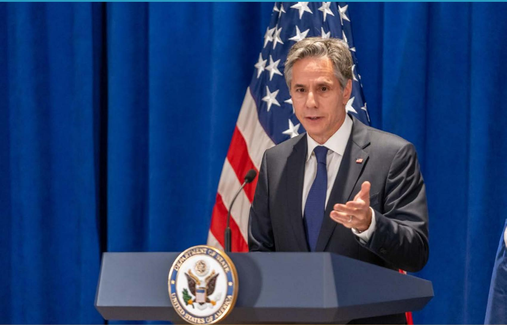

> **AI Description:**
> **Source:** `assets/_page_5_Figure_0.jpg`
> 
> **Generated:** 2026-05-18 11:42:46
> 
> ---
> 
> The image contains a photograph of a man speaking at a podium. The podium has the seal of the United States Department of State, indicating the setting is likely a formal government or diplomatic event. The man is dressed in a dark suit and tie, and he is gesturing with his right hand while speaking. Behind him, there is an American flag partially visible, suggesting the event is taking place in the United States. The background is a solid blue curtain, which is typical for press briefings or official statements.

Secretary Blinken holds a press availability at the Palace Hotel in New York City, New York, September 23, 2021. Department of State

he Department of State’s Agency Financial Report for T Fiscal Year 2021 reflects President Biden’s pledge to “put diplomacy at the center of our foreign policy.”

The Department of State stands on the frontlines of the global challenges that most directly impact the security, livelihoods, and well-being of the American people, from the COVID-19 pandemic to the climate crisis. To deliver for the American people at this consequential moment, we are focused on five strategic goals:

1. Renew U.S. leadership and mobilize coalitions to address the global challenges that have the greatest impact on Americans’ security and well-being.

We are revitalizing and modernizing our alliances and partnerships, forging new ones, and renewing American leadership within international organizations. We are building the international coalitions necessary to strengthen global health security, combat infectious disease, and address and mitigate the impacts

of the climate crisis. We are reinvigorating U.S. humanitarian leadership, and working with our allies and partners to prevent, deter, and resolve conflicts and address international security challenges such as counterterrorism and nuclear proliferation. And to support all of these efforts, we will continue our work to enhance foreign publics’ understanding of and support for the values and policies of the United States.

## 2. Promote global prosperity and shape an international environment in which the United States can thrive.

A strong U.S. middle class, resilient and equitable democracy, economic competitiveness, and national security are mutually reinforcing. That’s why we are shaping a global economy that creates opportunities for all Americans and delivers more inclusive, equitable, and sustainable growth. We will drive our national competitiveness by protecting and promoting the U.S. innovation base, supporting U.S. technological leadership, and leveling the playing field for American workers and businesses. And we are strengthening U.S. and global resilience to economic, technological, cyber, environmental, and other systemic shocks.

## 3. Strengthen democratic institutions, uphold universal values, and promote human dignity.

We must work in common cause with our closest allies and partners to promote and defend strong, accountable, and resilient democracies that deliver for their citizens. This includes working to advance equity, accessibility, and rights for all and improving access to health and education, especially for women, youth, and marginalized groups. We are making it a national security priority to prevent, expose, and reduce corruption. And we will live up to our values as a nation of immigrants by promoting a safe, humane, and orderly immigration and asylum system, addressing the root causes of migration together with our partners, and enhancing protections for refugees and displaced persons.

## 4. Revitalize the diplomatic and development workforce and institutions.

To deliver in all of these areas, we are investing in our most vital asset – our people. We are working to build, equip, and empower a diplomatic workforce that fully reflects the diversity of the nation it represents. We are modernizing our technology, enhancing our cybersecurity, and leveraging data to inform our work.

And we will protect our personnel, information, and physical infrastructure from 21st Century threats while adapting to perform our vital work under a range of security conditions.

## 5. Serve U.S. citizens around the world and facilitate international exchange and connectivity.

Our foremost mission is and will always be to support and serve American citizens including while they are traveling or residing abroad. And because the ability to attract and retain the world’s best talent is vital to our economic security and competitiveness, we will continue facilitate legitimate travel to and from the United States.

Diplomacy is and must remain our nation’s tool of first resort in a more competitive, crowded, and complicated world. That’s how we can solve global challenges, forge cooperation, advance our interests and values, protect our people, and prevent crises overseas from becoming emergencies here at home. And that’s how we can shape a more secure and prosperous future for the American people, and for the world.

This AFR is our principal report to the President, Congress, and the American people on State’s management of the public funds entrusted to us to enable our leadership of U.S. diplomatic efforts. The Department maintains a comprehensive, sound system of management controls to ensure this AFR is complete and reliable. The Department conducted its assessment of the effectiveness of internal controls over financial reporting in accordance with Appendix A of OMB Circular A-123. Based on the results of this assessment and the results of the independent audit, I can provide reasonable assurance that the FY 2021 financial statements are complete and reliable. Moreover, the reports on performance and additional financial information in the AFR should strengthen public confidence in the Department’s management. The Message from the Comptroller in this AFR highlights progress made to improve financial management this past year and includes the results of the independent audit of our FY 2021 financial statements.

Antony J. Blinken Secretary of State November 15, 2021

## F@CUS

# A Foreign Policy for the American People

O ur AFR theme, Foreign Policy for the American People, is drawn from Secretary Blinken’s Marc People,is drawn from Secretary Blinken’s March 3, 2021, policy priorities speech. This first “In Focus” item contains excerpts from the address and provides context for subsequent features, which highlight how the work of dedicated State professionals – past and present – serve the interests of their fellow citizens.

My fellow Americans, five weeks ago I was sworn in as your Secretary of State…When President Biden asked me to serve, he made sure that I understood that my job is to deliver for you – to make your lives more secure, create opportunity for you and your families, and tackle the global crises that are increasingly shaping your futures.

I take this responsibility very seriously. And an important part of the job is speaking to you about what we’re doing and why….in everything we do, we’ll look not only to make progress on short-term problems, but also to address their root causes and lay the groundwork for our long-term strength. As the President says, to not only build back, but build back better.

## So here’s our plan.

First, we will stop COVID-19 and strengthen global health security. Second, we will turn around the economic crisis and build a more stable, inclusive global economy. Third, we will renew democracy. Fourth, we will work to create a humane and effective immigration system. Fifth, we will revitalize our ties with our allies and partners. Sixth, we will tackle the climate crisis and drive a green energy revolution. Seventh, we will secure our leadership in technology. And eighth, we will manage the biggest geopolitical test of the 21st Century: our relationship with China.

These priorities…are the most urgent, the ones on which we must make swift and sustained progress.

They’re also all simultaneously domestic and foreign issues. Our domestic renewal and our strength in the world are completely entwined. And how we work will reflect that reality...

The Biden administration’s foreign policy will reflect our values. We will stand firm behind our commitments to human rights, democracy, the rule of law…We will respect science and data, and we will fight misinformation and disinformation, because the truth is the cornerstone of our democracy…We’ll work with Congress whenever we can – on the take-off, not just the landing – because they represent the will of our people, and our foreign policy is stronger when the American people support it…We’ll build a national security workforce that reflects America in all its diversity, because we’re operating in a diverse world, and our diversity is a unique source of strength that few countries can match…We will bring nonpartisanship back to our foreign policy…

We will balance humility with confidence. I have always believed they should be the flip sides of America’s leadership coin. Humility because we aren’t perfect, we don’t have all the answers, and a lot of the world’s problems aren’t mainly about us, even as they affect us. But confidence because America at its best has a greater ability than any country on Earth to mobilize others for the common good and for the good of our people.

Above all, we’ll hold ourselves accountable to a single, overarching measure of success: Are we delivering results for you?

Are we making your lives more secure and creating opportunities for your families? Are we protecting the planet for your children and grandchildren? Are we honoring your values, and proving worthy of your trust?

It’s the honor of my life to serve as your Secretary of State. And I’m aware every day that we’re writing the next chapter of our history. It’s up to us whether the story of this time will be one of peace and prosperity, security, and equality; whether we will help more people in more places live in dignity and whether we will leave the United States stronger at home and in the world.

That’s our mission. That’s our opportunity. We will not squander it.

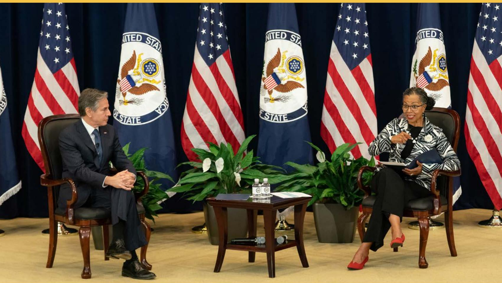

> **AI Description:**
> **Source:** `assets/_page_8_Figure_0.jpg`
> 
> **Generated:** 2026-05-18 11:37:23
> 
> ---
> 
> The image is a photograph of two individuals seated in front of a backdrop featuring multiple American flags and the seal of the United States Department of State. The individual on the left is dressed in a dark suit and is seated with hands clasped, while the individual on the right is dressed in a patterned blazer and black pants, holding what appears to be a document or folder. Between them is a small table with a few items, including what looks like a water bottle and some papers. The setting suggests a formal meeting or interview, likely related to diplomatic or governmental affairs.

Secretary Blinken, joined by Chief Diversity and Inclusion Officer Ambassador Gina Abercrombie-Winstanley, delivers remarks at the inaugural meeting of the Diversity and Inclusion Leadership Council in Washington, D.C., July 21, 2021. Department of State

Section I:

# Management’s Discussion and Analysis

## About the Department

## Our Mission

The U.S. Department of State leads America’s foreign policy through diplomacy, advocacy, and assistance by advancing the interests of the American people, their safety and economic prosperity.

## Our History

The U.S. Department of State (the Department) is the lead U.S. foreign affairs agency within the Executive Branch and the lead institution for the conduct of American diplomacy. Established by Congress in 1789, the Department is the nation’s oldest and most senior cabinet agency.

The Department is led by the Secretary of State, who is nominated by the President and confirmed by the U.S. Senate. The Secretary of State is the President’s principal foreign policy advisor and a member of the President’s Cabinet. The Secretary carries out the President’s foreign policies through the State Department and its employees.

The Department of State and the United States Agency for International Development (USAID) work together to harmonize the administration and structure of assistance programs to ensure maximum impact and efficient use of taxpayer funds. Each agency is responsible for its own operations and produces a separate AFR.

## Did You Know?

Antony J. Blinken has visited more than 20 countries during his 8 months as Secretary of State. He travels to all corners of the world to do his job. His duties as Secretary include acting as the President’s representative at all international forums, negotiating treaties and other international agreements, and conducting everyday, faceto-face diplomacy.

More information on the Secretary’s travel can be found at: https://www.state.gov/secretary/ travel/index.htm

More information on the duties of the Secretary can be found at: https://www.state.gov/duties-of-the-secretary-of-state

## Our Organization and People

The Department of State advances U.S. objectives and interests in the world through its primary role in developing and implementing the President’s foreign policy worldwide. The Department also supports the foreign affairs activities of other U.S. Government entities including USAID. USAID is the U.S. Government agency responsible for most nonmilitary foreign aid and it receives overall foreign policy guidance from the Secretary of State. The State Department carries out its foreign affairs mission and values in a worldwide workplace, focusing its energies and resources wherever they are most needed to best serve the American people and the world.

The Department is headquartered in Washington, D.C. and has an extensive global presence, with more than 270 embassies, consulates, and other posts in over 180 countries. A two-page map of the Department’s locations appears in Appendix B. The Department also operates several other types of offices, mostly located throughout the United States, including 23 passport agencies, six passport centers, two foreign press centers, one reception center, five logistic support offices for overseas operations, 30 security offices, and two financial service centers.

The Foreign Service officers and Civil Service employees in the Department and U.S. missions abroad represent the American people. They work together to achieve the goals and implement the initiatives of American foreign policy. The Foreign Service is dedicated to representing America and to responding to the needs of American citizens living and traveling around the world. They are also America’s first line of defense in a complex and often dangerous world. The Department’s Civil Service corps, most of whom are headquartered in Washington, D.C., is involved in virtually every policy and management area – from democracy and human rights, to narcotics control, trade, and environmental issues. Civil Service employees also serve as the domestic counterpart to Foreign Service consular officers who issue passports and assist U.S. citizens overseas.

Host country Foreign Service National (FSN) and other Locally Employed (LE) staff contribute to advancing the work of the Department overseas. Both FSNs and other LE staff contribute local expertise and provide continuity as they work with their American colleagues to perform vital services for U.S. citizens. At the close of 2021, the Department was comprised of nearly 77,000 employees.

The U.S. Department of State, with just over one percent of the entire Federal budget, has an outsized impact on Americans’ lives at home and abroad. For a relatively small investment, the Department yields a large return in a cost-effective way by advancing U.S. national security, promoting our economic interests, creating jobs, reaching new allies, strengthening old ones, and reaffirming our country’s role in the world. The Department’s mission impacts American lives in multiple ways.

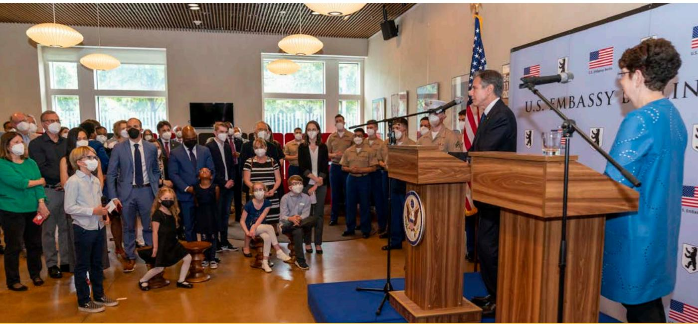

> **AI Description:**
> **Source:** `assets/_page_10_Figure_0.jpg`
> 
> **Generated:** 2026-05-18 11:43:11
> 
> ---
> 
> The image is a photograph of a formal event taking place at the U.S. Embassy in Berlin. It shows a man standing at a podium with a microphone, speaking to an audience. The audience consists of adults and children, some of whom are wearing face masks. The backdrop features the U.S. Embassy Berlin logo and the American flag. The setting appears to be an indoor room with large windows allowing natural light to enter. The overall atmosphere suggests a diplomatic or official gathering.

Secretary Blinken holds a meet and greet with U.S. Mission Germany in Berlin, Germany, June 24, 2021. Department of State

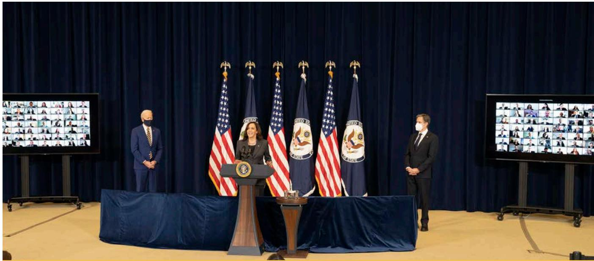

> **AI Description:**
> **Source:** `assets/_page_11_Figure_0.jpg`
> 
> **Generated:** 2026-05-18 11:40:02
> 
> ---
> 
> The image is a photograph of a formal event. It features a podium with a U.S. flag and an official seal, indicating a government or official setting. A person is standing at the podium, likely delivering a speech or statement. Behind the person are four U.S. flags and two additional flags, one of which appears to be the flag of the U.S. Department of State. Two individuals are standing on either side of the person at the podium, and there are large screens on either side displaying a grid of faces, suggesting a virtual audience or participants in a video conference. The setting appears to be a formal government or official event, possibly a press conference or a virtual meeting.

Vice President Harris, with President Biden and Secretary Blinken, delivers remarks to State Department employees in Washington, D.C., February 4, 2021. Department of State

## These impacts include:

We support American citizens abroad. We provide emergency assistance to U.S. citizens in countries experiencing natural disasters or civil unrest. We assist with intercountry adoptions and work on international parental child abductions. In 2020, there were 1,622 adoptions to the United States, and 42 adoptions from the United States to other countries. In calendar year 2020, there were 896 children reported abducted to and from the United States, and we assisted in the return of 182 children to the United States.

2. We create American jobs. We directly support millions of U.S. jobs by promoting new and open markets for U.S. firms, protecting intellectual property, negotiating new U.S. airline routes worldwide, and helping American companies compete for foreign government and private contracts.

3. We promote democracy and foster stability around the world. Stable democracies are less likely to pose a threat to their neighbors or to the United States. We partner with the public and private sectors in countries in conflict to foster democracy and peace.

4. We help to make the world a safer place. Under the New Strategic Arms Reduction Treaty, we are reducing the number of deployed nuclear weapons to levels not seen since the 1950s. The Department has helped over 40 post-conflict countries clear millions of square meters of landmines and unexploded ordnance. We also work with foreign partners to strengthen international aviation and maritime safety and security.

5. We save lives. Strong bipartisan support for U.S. global health investments has led to worldwide progress against HIV/AIDS, tuberculosis, malaria, and polio. Better health abroad reduces the risk of instability and enhances our national security.

6. We help countries feed themselves. We help other countries plant the right seeds in the right way and get crops to markets to feed more people. Strong agricultural sectors lead to more stable countries.

7. We help in times of crisis. From natural disasters to famine to epidemics, our dedicated emergency professionals deliver assistance to those who need it most.

8. We promote the rule of law and protect human dignity. We help people in other countries find freedom and shape their own destinies. We advocate for the release of prisoners of conscience, prevent political activists from suffering abuse, train police officers to combat sex trafficking, and equip journalists to hold their governments accountable.

9. We help Americans see the world. The Department’s Bureau of Consular Affairs supports and protects the American public. In 2021, we issued 15.5 million passports and passport cards for Americans to travel abroad. We facilitate the lawful travel of international students, tourists, and business people to the United States, adding greatly to our economy. We provide information to help U.S. citizens assess risks of international travel and learn about steps to take to ensure their safety when traveling abroad.

## 10. We are the face of America overseas.

Our diplomats, development experts, and the programs they implement are the source of American leadership around the world. They are the embodiments of our American values abroad and a force for good in the world.

The Secretary of State is supported by two Deputy Secretaries, the Executive Secretariat, the Office of Foreign Assistance, the Counselor and Chief of Staff, six Under Secretaries, and over 30 functional and management bureaus and offices. The Deputy Secretary of State (D) serves as the principal deputy, adviser, and alter ego to the Secretary of State. The Deputy Secretary of State for Management and Resources (D-MR) serves as the Department’s Chief Operating Officer. The Under Secretaries have been established for Political Affairs; Economic Growth, Energy and Environment; Arms Control and International Security Affairs; Public Diplomacy and Public Affairs; Management; and Civilian Security, Democracy and Human Rights. The Under Secretary for Management (M) also serves as the CFO for the Department. The Comptroller has delegated authority for many of the activities and responsibilities mandated as CFO functions, including preparation of the AFR.

Six regional bureaus support the Department’s political affairs mission – each is responsible for a specific geographic region of the world. These include:

# Did You Know?

Daniel Webster served two terms as Secretary of State. He was the 14th and 19th Secretary of State. He served under Presidents Harrison, Tyler, and Fillmore.

More information on former Secretaries can be found at: https://history.state.gov/ departmenthistory/people/secretaries

1 Bureau of African Affairs,

ƒ Bureau of European and Eurasian Affairs,

ƒ Bureau of East Asian and Pacific Affairs,

Bureau of Near Eastern Affairs,

ƒ Bureau of South and Central Asian Affairs, and

ƒ Bureau of Western Hemisphere Affairs.

The Department also includes the Bureau of International Organization Affairs. This Bureau develops and implements U.S. policy in the United Nations, its specialized and voluntary agencies, and other international organizations. The Department’s organization chart can be found at https://www.state.gov/department-of-state-organization-chart.

> **AI Description:**
> **Source:** `assets/_page_12_Figure_1.jpg`
> 
> **Generated:** 2026-05-18 11:20:13
> 
> ---
> 
> The image is a photograph of a formal gathering in a room with ornate decor, including chandeliers and a large painting on the wall. The room is filled with people seated in folding chairs, many wearing masks. The attendees appear to be engaged in a discussion or presentation, with some individuals standing in the background. The setting suggests a professional or governmental event, possibly related to public health or policy given the mask-wearing and formal attire.

Secretary Blinken meets with U.S. Embassy Kabul staff in Washington, D.C., September 3, 2021. Department of State

## Our Work at Home and Overseas

At home, the passport process is often the primary contact most U.S. citizens have with the Department of State. There are 29 domestic passport agencies and centers, and approximately 7,600 public and 600 Federal and military passport acceptance facilities. The Department designates many post offices, clerks of court, public libraries and other state, county, township, and municipal government offices to accept passport applications on its behalf.

Overseas, in each Embassy, the Chief of Mission (COM) (usually an Ambassador) is responsible for executing U.S. foreign policy aims, as well as coordinating and managing all U.S. Government functions in the host country. The President appoints each COM, who is then confirmed by the Senate. The COM reports directly to the President through the Secretary of State. The U.S. Mission is also the primary U.S. Government point of contact for Americans overseas and foreign nationals of the host country.

The Mission serves the needs of Americans traveling, working, and studying abroad, and supports Presidential and Congressional delegations visiting the country.

Every diplomatic mission in the world operates under a security program designed and maintained by the Department’s Bureau of Diplomatic Security (DS). In the United States, DS investigates passport and visa fraud, conducts personnel security investigations, and protects the Secretary of State and high-ranking foreign dignitaries and visiting officials. An “In Focus” view of our global visa fraud investigations is shown below.

Additionally, the Department utilizes a wide variety of technology tools to further enhance its effectiveness and magnify its efficiency. Today, most offices increasingly rely on digital video conferences, virtual presence posts, and websites to support their missions. The Department also leverages social networking Web tools to engage in dialogue with a broader audience. See the inside back cover for Department websites of interest.

# FOCUS

## Number of Visa Crime Investigations Opened Globally

T he Bureau of Diplomatic Security (DS) is the security and law enforcement arm of the Department. Visa crimes are international offenses that may start overseas but can threaten public FY2 safety inside the United FY 20 States if offenders are not interdicted with aggressive and FY20 coordinated law enforcement FY20 action. DS agents and analysts observe, detect, identify, and FY neutralize networks that exploit international travel vulnerabilities. In 2021, 804 new cases were opened. In addition, 726 cases were closed and DS made 31 arrests.

DS investigated a case involving fraudulent diplomatic and personal passport applications. On September 10, 2021, a federal jury found Laura Gallagher, a Foreign Service Officer with the U.S. Department of State and Andrey Kalugin, her ex-husband and a Russian National, guilty of conspiring to commit naturalization fraud among related charges. The couple conspired together to obtain lawful permanent residence and U.S. citizenship for Kalugin through his marriage to Gallagher. More information on the case can be found at: https://www.justice.gov/usao-edva/pr/ jury-convicts-foreign-service-officer-and-formerspouse-obtaining-us-citizenship-fraud.

Source: U.S. Department of State, Bureau of Diplomatic Security.

# Using Diplomacy to Make Americans’ Lives Better and Safer: Pittsburgh Visit Summary

ecretary Blinken, joined by Secretary of Commerce Gina Raimondo and United States Trade Representative Katherine Tai, co-chaired the inaugural U.S.-EU Trade and Technology Council (TTC) Ministerial in Pittsburgh, Pennsylvania on September 29-30. The Council’s agenda and the Secretary’s engagements in Pittsburgh highlighted the degree to which our domestic competitiveness, our national security, and a thriving middle class are mutually reinforcing.

In two days of discussions, the Council agreed on several significant steps, including to: develop and implement uses of artificial intelligence that drive innovation, that strengthen privacy, and respect democratic values and human rights; deepen cooperation on investment screening; work together on effective export control on the most sensitive technologies and products; strengthen cooperation on supply chain security and resilience; pursue common strategies to try to mitigate and respond to non-market distortive policies and practices; and to protect worker and labor rights, and combat forced and child labor. Through forums like the TTC, and engagement with critical allies, partners, and international institutions, American diplomacy can ensure the United States will remain the world’s innovation leader and standard setter and shape the digital revolution in a way that serves our people, protects our interests, and upholds our economy.

The Secretary’s meetings reinforced that message and allowed him to hear from Americans with a profound stake in the work of American diplomacy. The Secretary visited Argo AI, an autonomous driving technology. He also visited the University of Pittsburgh’s Center for Vaccine Research to learn about the critical role of U.S. research and innovation, and international partnerships, in combatting the COVID-19 pandemic and strengthen global health

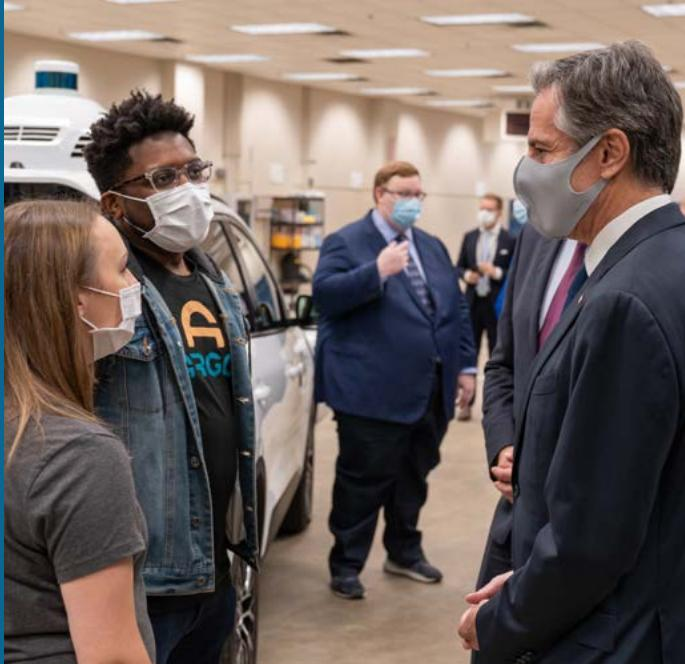

> **AI Description:**
> **Source:** `assets/_page_14_Figure_0.jpg`
> 
> **Generated:** 2026-05-18 11:23:16
> 
> ---
> 
> The image is a photograph showing a group of individuals in what appears to be a garage or workshop setting. Two individuals in the foreground are wearing face masks and appear to be engaged in a conversation with a man in a suit. The man in the suit is also wearing a face mask and is gesturing with his hand as if explaining something. In the background, another man in a suit is also wearing a face mask and appears to be observing the interaction. The setting includes a vehicle and some shelving units, suggesting a technical or automotive environment. The individuals are dressed casually, with one person wearing a denim jacket and another in a suit, indicating a mix of roles or purposes in the scene.

Secretary Blinken tours Argo AI in Pittsburgh, Pennsylvania, September 30, 2021. Department of State

security. And he met with local labor leaders at International Brotherhood of Electrical Workers Local #5 to hear their perspectives on issues such as trade, workforce development, green technology, and the digital economy.

Domestic engagements like Pittsburgh are key to enhancing and elevating partnerships with stakeholders throughout the American public, including civil society, the private sector, and state and local government. As Secretary Blinken has made clear, this is not a messaging exercise – it’s not about selling what we’re already doing. This is about the other side of communication: listening. It’s about understanding and identifying new ways that we can use diplomacy to make Americans’ lives better and safer.

# The National Museum of American Diplomacy: A Partnership for the American People

> **AI Description:**
> **Source:** `assets/_page_15_Figure_0.jpg`
> 
> **Generated:** 2026-05-18 11:19:37
> 
> ---
> 
> The image depicts a building with a modern architectural design, featuring large glass windows and a beige facade. Two flags are visible: the American flag and another flag with a blue background and white emblem. The entrance area is bustling with people, suggesting a busy and active environment. The reflection in the glass windows shows trees and a clear sky, indicating the photo was taken during the day. The overall scene conveys a sense of official or governmental activity.

The National Museum of American Diplomacy in Washington, D.C. Department of State

T he National Museum of American Diplomacy tells the story of the history, practice, and challenges of American diplomacy. We invite the public to discover diplomacy and how it shapes their lives every day. Located in Washington, D.C. on the east side of the main State Department complex, the National Museum of American Diplomacy (NMAD) is a public-private partnership between the U.S. Department of State and the museum’s independent Diplomacy Center Foundation. It is the only museum in the United States dedicated to the subject of diplomacy. No other museum brings diplomatic history to the forefront in its exhibits; no other institution is solely dedicated to collecting the artifacts of diplomacy. NMAD is uniquely poised to offer visitors an opportunity to “stand in the shoes’’ of professional diplomats and learn why

diplomacy matters to every American. Through exhibits and programs on-site and online, visitors will be inspired to learn more about diplomacy, understand why diplomacy is important, and discover how diplomacy impacts their lives every day.

Personal narratives, unique artifacts, interactive experiences, and original videos will create surprising connections for the visitor. Changing exhibits on special topics of diplomacy will entice new and returning guests. Visitors will participate in diplomatic simulations where they can test their knowledge in a “real life” negotiating situation. They will see what it takes to become a Foreign Service officer and hear directly from the experts themselves. Visitors will explore the many ways the United States works with partner nations and international organizations to advance U.S. foreign policy, protect national security, and to promote shared goals for security, prosperity, democracy, and sustainable development. When completed, four exhibition halls comprising approximately 40,000 square feet, plus a 1,300-square-foot Mezzanine Gallery, will provide the complete visitor experience.

> **AI Description:**
> **Source:** `assets/_page_15_Figure_1.jpg`
> 
> **Generated:** 2026-05-18 11:20:25
> 
> ---
> 
> The image contains a photograph of an indoor space, likely a museum or exhibition area. The space features a glass railing in the foreground with text that reads "FOUNDRING AMBASSADORS CONCOURSE" and "HILLARY RODHAM CLINTON PAVILION." Behind the railing, there are two large portraits of individuals, one on each side, placed on stands. The background includes a variety of colorful abstract art pieces and informational kiosks. The overall setting suggests a curated exhibit space with a focus on historical or political figures.

The National Museum of American Diplomacy exhibit Diplomacy Is Our Mission. Department of State

# Strategic Goals and Government-wide Management Initiatives

## Managing for Results: Planning, Budgeting, Managing, and Learning

T he Department of State advanced the Administration’spolicy priorities by strengthening program and project policy priorities by strengthening program and project design, tracking key performance metrics, and using strategic reviews to assess progress. The Managing for Results framework fosters enterprise-wide linkages between strategic planning, budgeting, managing, and learning. Bureaus and missions achieved more successful outcomes using evidence to inform policy, resource, and program decisions.

## Joint State-USAID Strategic Goals

The Department’s strategic planning is implemented at three organizational levels:

ƒ The State/USAID Joint Strategic Plan (JSP) – a fouryear Agency level strategic plan that outlines State and USAID’s overarching goals and objectives for U.S. diplomacy and development, guides bureau and mission planning, and informs annual budget decisions.

Bureau Strategies

» Joint Regional Strategies – the four-year strategic plan for each geographic region that sets joint State and USAID priorities and guides partnered planning at the bureau and mission level.

» Functional Bureau Strategies – the four-year strategic plan that sets priorities for each State functional bureau and guides bureau- and mission-level planning with key partners.

ƒ Integrated Country Strategies – the four-year strategic plan for each overseas diplomatic mission that articulates policy priorities through a whole-ofgovernment approach.

The FY 2018-2022 JSP contains four goals and 16 strategic objectives that directly support objectives of the 2017 National Security Strategy. These are found in the “State-USAID Joint Strategic Goal Framework” in the Performance Summary and Highlights section, along with a discussion of 2020 performance results for each strategic goal. The JSP was developed through policy guidance from the Secretary of State, USAID Administrator, and the National Security Council. The FY 2018-2022 JSP further guided annual performance reporting in the Department’s 2021 Agency Financial Report and serves as the final year of reporting for this JSP cycle.

Managing for Results Framework

The Department of State and USAID are currently developing the FY 2022-2026 JSP, which will establish new strategic goals, strategic objectives, performance goals, metrics, and targets to advance the Administration’s foreign policy and foreign assistance priorities. Scheduled for release in February 2022, the JSP’s goals and objectives will provide a roadmap for the policies and strategic planning that inform the new Joint Regional Strategy, the Functional Bureau and Independent Office Strategies, and Integrated Country Strategies. Current bureaus and country strategies are available to the public through the Department’s website at https://www.state.gov/plans-performance-budget/.

## Agency Priority Goals

Agency Priority Goals (APG) are a performance accountability component of the Government Performance Results Modernization Act of 2010. They serve to focus leadership priorities, set outcomes, and measure results, especially where agencies need to drive significant progress and change. APGs are intended to demonstrate quarterly progress on near-term results or achievements the agency seeks to accomplish within 24 months. State’s FY 2020- 2021 APGs included:

ƒ Data Informed Diplomacy: By September 2021, we will align and augment a data and analytics cadre that can harness data and apply cutting-edge analytics processes and products to foreign policy and operational challenges and fulfill the requirements of the Federal Data Strategy to include building the first Department Data Strategy and enterprise Data Catalog.

ƒ IT Modernization: By September 30, 2021, the Department will satisfy Field Enabling IT baseline levels for capability and performance at all field locations; modernize its suite of core, mission-aligned IT systems incorporating a Cloud Smart approach that enables the Department to share resources and measure efficiencies gained via common cloud platform environments; and achieve a continuous cyber risk diagnostics and monitoring capability that embeds security equities throughout the full lifecycle of all IT systems within every sponsored environment.

## Cross-Agency Priority Goals

The President’s Management Agenda lays out a long-term vision for modernizing the Federal Government in areas where implementation requires active collaboration amongst multiple agencies. To drive these management priorities, the Administration leverages Cross-Agency Priority (CAP) goals to coordinate and publicly track implementation across Federal agencies. Because CAP goals are updated

ƒ Enhancing Security Monitoring Solutions: By September 30, 2021, upgrade 20 percent of Department of State facilities’ security monitoring solutions.

ƒ Category Management: By September 30, 2021, meet or exceed Federal targets for managed spending (identifying and proactively managing key vendors and contracts) as determined by the President’s Management Agenda.

The latest reporting on FY 2020-2021 APGs can be found in the archive section on Performance.gov at https:// trumpadministration.archives.performance.gov/state/APG\_ state\_1.html.

The Department will publish FY 2022-2023 APG goal statements concurrent with the 2023 President’s Budget in February 2022 and first quarter progress in April 2022, on Performance.gov.

and/or revised every four years with each presidential Administration term, public reporting on the previous Administration’s CAP goals was discontinued in February 2021. Once the Biden-Harris Administration releases the new President’s Management Agenda and its associated CAP Goals, the Department will publish progress updates on Performance.gov at https://www.performance.gov/.

> **AI Description:**
> **Source:** `assets/_page_17_Figure_0.jpg`
> 
> **Generated:** 2026-05-18 11:43:43
> 
> ---
> 
> The image is a photograph showing two individuals standing in a formal setting. They are positioned in front of two flags: the American flag on the left and a flag with a blue background and an eagle emblem on the right, which appears to be the flag of the United States Department of State. The individuals are dressed formally, with one wearing a dark jacket and the other in a blue top. The background includes a fireplace and decorative elements, suggesting an official or diplomatic environment.

Deputy Secretary of State Wendy Sherman meets with U.S. Representative to the United Nations, Ambassador Linda Thomas-Greenfield in Washington, D.C., June 10, 2021. Department of State

# Performance Summary and Highlights

## Performance Reporting

The Department of State reports annual progress and results toward achieving the strategic objectives and performance goals articulated in the JSP via the Annual Performance Plan/Annual Performance Report (APP/APR).

The latest reporting on the JSP – including performance goals, performance indicators, and a narrative explanation of progress – can be found in the 2020 APR at https:// www.state.gov/plans-performance-budget/performanceplans-and-reports/. Because the annual performance data for 2021 is collected in the first and second quarters of

### Full Page Description (Page 19)

**Source:** `assets/_page_19_Asset_1.jpg`

**Generated:** 2026-05-18 11:22:02

---

The image is a pie chart with three segments, each representing a different category and its corresponding percentage. The chart is divided into three sections:

1. **43% Ahead**: Represented by a light blue segment.
2. **35% Behind**: Represented by a dark blue segment.
3. **22% On Target**: Represented by a gray segment.

The chart visually compares the proportions of each category, with the largest segment being "Ahead," followed by "Behind," and the smallest being "On Target." The percentages are clearly labeled next to each segment, providing a clear representation of the distribution.

### Full Page Description (Page 19)

**Source:** `assets/_page_19_Asset_0.jpg`

**Generated:** 2026-05-18 11:22:36

---

The image is a pie chart with four segments, each representing a different category and its corresponding percentage. The categories and their percentages are as follows: "Behind" at 39%, "On Target" at 25%, "Ahead" at 25%, and "No Data" at 11%. The chart visually represents the distribution of these categories, with each segment's size proportional to its percentage. The chart uses distinct colors for each category to differentiate them.

2022, the summary that represents State and USAID’s joint progress results reflects 2020. These are the most complete results to date. The 2021 APR will reflect our interagency progress and results against the FY 2018-2022 JSP and will be published on state.gov no later than March 31, 2022.

The Department of State continually reviews performance progress against the JSP’s strategic objectives in a variety of complementary fora throughout the year, including the Data Quality Assessment and the annual strategic reviews with Office of Management and Budget (OMB). The Department leverages data and evidence from these reviews to continually improve planning, performance, evaluation, and budgeting processes. These cumulative reviews foster a culture of continuous learning and improvement.

The next section provides an overview of major program areas that are aligned with the four strategic goals of the FY 2018-2022 State-USAID Joint Strategic Plan. These programs are also included in the Financial Section, Section II of this AFR, on the Consolidated Statement of Net Cost.

## Major Program Areas

## Strategic Goal 1: Protect America’s Security at Home and Abroad

The United States faces ever evolving and multi-dimensional security challenges. To meet these challenges, we support and collaborate with both new and old partners to defend shared interests and to adapt to the changing international environment.

In 2020, out of 28 performance metrics, 50 percent achieved or exceeded their targets, 39 percent fell behind their targets and no performance data was available on 11 percent of metrics at the time of 2020 APR publication.

## 2020 Highlights:

ƒ State conducted 300 enhanced diplomatic engagements on cybersecurity issues, surpassing the 2020 target by 175 engagements.

ƒ U.S. Government programs trained 2,179 criminal justice personnel in antitrafficking techniques.

ƒ 21,067 women participated in U.S. supported peacebuilding processes in 2020, a substantial increase from 4,422 in 2019.

## Strategic Goal 2: Renew America’s Competitive Advantage for Sustained Economic Growth and Job Creation

American national security requires sustained economic prosperity. As new challenges and opportunities emerge in a changing international landscape, our economic engagement with the world must be comprehensive, forward-looking, and flexible.

In 2020, out of 37 performance metrics, 65 percent achieved or exceeded their targets and 35 percent fell short.

## 2020 Highlights:

Reduced climate risk through better management practices over 5.7 hectares.

ƒ Created 173 legal instruments improving prevention and response to sexual and gender-based violence, an increase from 77 in 2019.

ƒ Engaged with 65 countries to address air pollution, a 30 percent increase over the established target.

### Full Page Description (Page 20)

**Source:** `assets/_page_20_Asset_0.jpg`

**Generated:** 2026-05-18 11:45:52

---

The image is a pie chart with four segments, each representing a different category and its percentage of the total. The categories and their percentages are as follows: "Ahead" at 44%, "Behind" at 26%, "On Target" at 19%, and "No Data" at 11%. The chart visually represents the distribution of these categories, with the largest segment being "Ahead" and the smallest being "No Data." The chart uses distinct colors for each category to differentiate them.

### Full Page Description (Page 20)

**Source:** `assets/_page_20_Asset_1.jpg`

**Generated:** 2026-05-18 11:48:10

---

The image is a pie chart with four segments, each representing a different category and its corresponding percentage. The categories and their percentages are: "Behind" at 40%, "On Target" at 25%, "Ahead" at 20%, and "No Data" at 15%. The chart visually represents the distribution of these categories, with the largest segment being "Behind" and the smallest being "No Data." The chart uses distinct colors for each category to differentiate them.

## Strategic Goal 3: Promote American Leadership through Balanced Engagement

America First does not mean America alone. The United States is a beacon of liberty, freedom, and opportunity. Since the conclusion of the Second World War, the United States has led the development of a rules-based international order that allows nations to compete peacefully and cooperate more effectively with one another.

In 2020, out of 27 performance metrics, 63 percent achieved or exceeded their targets, 26 percent fell behind their targets and no performance data was available on 11 percent of metrics at the time of 2020 APR publication.

2020 PERFORMANCE MEASURE SUMMARY FOR STRATEGIC GOAL 3:

2020 Highlights:

ƒ Provided government funding to 7,012 civil society organizations promoting advocacy interventions.

ƒ Hosted 37.7 million exchange program visitors at American spaces.

■ Non-government entities committed \$56.364 billion in support of U.S. foreign policy goals.

## Strategic Goal 4: Ensure Effectiveness and Accountability to the American Taxpayer

The Federal Government can and should operate more effectively, efficiently, and securely. As such, the Administration set goals in areas that are critical to improving the Federal Government’s effectiveness, efficiency, cybersecurity, and accountability.

In this strategic goal, the Department made significant investments in advancing the use of data as a tool for decision making. At the strategic planning level,

Department developed performance metrics to measure progress in support of these strategic objectives: strengthen the effectiveness and sustainability of our diplomacy and development investments; provide modern and secure infrastructure and operational capabilities to support effective diplomacy and development; enhance workforce performance, leadership, engagement, and accountability to execute our mission effectively and efficiently; strengthen security and safety of workforce and physical assets.

In 2020, out of 40 performance metrics, 45 percent achieved or exceeded their targets, 40 percent fell behind their targets and no performance data was available on 15 percent of metrics at the time of 2020 APR publication.

2020 Highlights:

ƒ State achieved \$15.702 million in supply chain cost savings, an increase by \$5 million in savings between 2019 and 2020.

ƒ Enrolled 62 key mission data sets, a major increase from target of 24, into the Enterprise Data Catalog that supports Department’s data strategy.

ƒ Trained 2,135 employees in State’s in-house and partner-endorsed data analytics courses that teaches cadre in how to apply the cutting-edge analytics processes and products.

## Program and Project Design, Monitoring, and Evaluation Policy

The Department is committed to using data and evidence to ensure we are using best practices in program and project design, monitoring, evaluation, and data analysis to achieve the most effective U.S. foreign policy outcomes for, and greater accountability to, the American people.

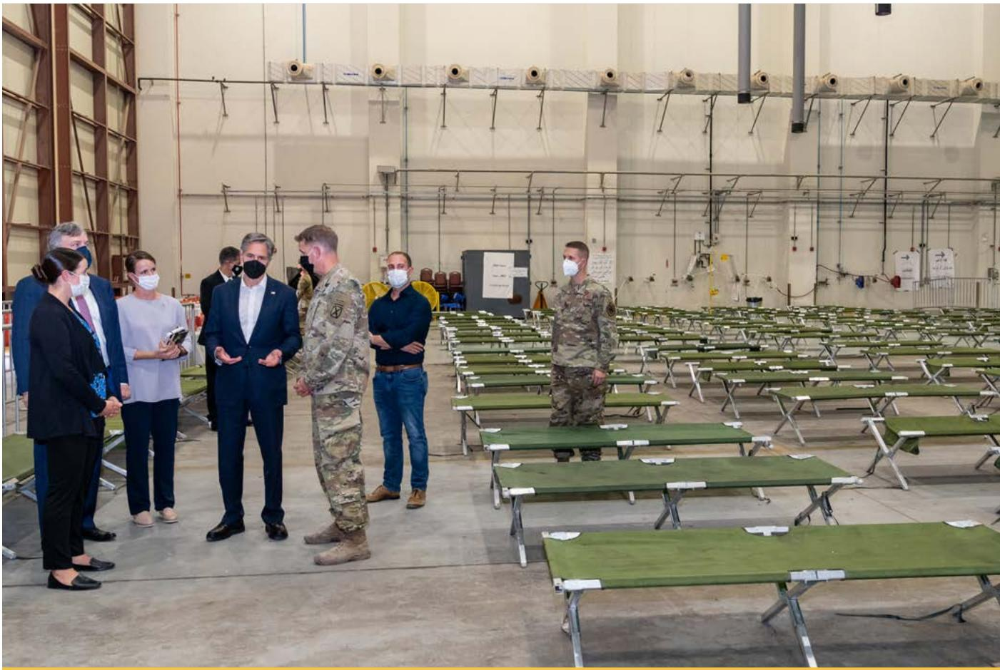

> **AI Description:**
> **Source:** `assets/_page_21_Figure_0.jpg`
> 
> **Generated:** 2026-05-18 11:47:50
> 
> ---
> 
> The image is a photograph showing a group of people, including military personnel and civilians, standing in a large indoor space with rows of folding cots. The setting appears to be a temporary or emergency accommodation area, possibly a field hospital or shelter. The individuals are engaged in a discussion, with some wearing face masks. The background includes industrial equipment and signage, suggesting a functional and utilitarian environment. The presence of the military personnel and civilians indicates a collaborative effort, likely related to a response to an event or situation requiring temporary housing or medical facilities.

Secretary Blinken tours an In-Processing Center in Doha, Qatar, September 7, 2021. Department of State

In response to requirements contained in the Foreign Aid Transparency and Accountability Act, the Foundations for Evidence-Based Policymaking Act and the Program Management Improvement and Accountability Act, the Department updated its evaluation policy to encompass the full spectrum of performance management and evaluation activities including program design, monitoring, evaluation, analysis, and learning. The Department established guidance for implementing the updated policy and is working with bureaus and offices to complete program and project design steps for their major lines of effort. Bureaus responded to this updated and expanded policy by putting in place performance management documents and practices, including the use of logic models, theories of change, performance metrics, monitoring structures, and other foundational components.

## Maximizing America’s Investment Through Analysis and Evidence

## Evidence and Evaluation

The Department supports the analysis and use of evidence in policymaking by training staff, creating groups for knowledge sharing, establishing, and monitoring evaluation requirements, providing funding opportunities to gather better evidence, and maintaining a central database to manage and share evaluations. The Department continues efforts to strengthen the use of data and evidence to drive better decision making, achieve greater impacts, and more effectively and efficiently achieve U.S. foreign policy objectives.

One of the efforts includes the Department of State’s internal annual Strategy and Resource reviews. These strategic discussions allow Department leadership to monitor progress against strategic priorities, consider emerging challenges, and inform resource decisions.

Other examples of ongoing efforts to bolster the Department’s ability to plan, execute, monitor, and evaluate programs and projects in a way that encourages learning and adapting include:

Evidence Act Implementation
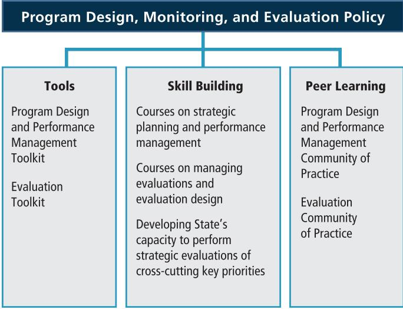

> **AI Description:**
> **Source:** `assets/_page_22_Figure_0.jpg`
> 
> **Generated:** 2026-05-18 11:23:44
> 
> ---
> 
> The image is a flowchart titled "Program Design, Monitoring, and Evaluation Policy." It is divided into three main sections: Tools, Skill Building, and Peer Learning. Each section lists specific components under these headings. The Tools section includes the "Program Design and Performance Management Toolkit" and the "Evaluation Toolkit." The Skill Building section outlines courses on strategic planning and performance management, managing evaluations and evaluation design, and developing the State's capacity to perform strategic evaluations of cross-cutting key priorities. The Peer Learning section mentions the "Program Design and Performance Management Community of Practice" and the "Evaluation Community of Practice." The flowchart uses a simple structure with text boxes connected by lines to indicate the relationships between the different components.

In summer 2021, the Department actively engaged the performance and evaluation professionals across the Department, working under the co-Evaluation Officers’ leadership, to implement Title 1 of the Foundations for

Evidence-Based Policymaking Act (Evidence Act; Public Law No. 115-435) to develop the Learning Agenda, Capacity Assessment, and Annual Evaluation Plan. These documents, which catalogue plans for research relevant to the Department’s mission and assess the Department’s ability to carry out evidence-building activities are due to be published in February 2022 along with the Department’s FY 2022-2026 JSP.

As stakeholder and leadership input are key to effective Evidence Act implementation, as well as required by law, the Department carried out an extensive stakeholder analysis and developed a stakeholder engagement plan. This ensured transparent engagement with stakeholders throughout the enterprise and across leadership and working level staff. The Department’s Performance Improvement Officer, Director of Foreign Assistance, Chief Data Officer, and Statistical Official are an integral part of the Evidence Act implementation activities through frequent consultations and meetings with the co-Evaluation Officers in implementing the required deliverables of the Evidence Act.

The Department is also implementing Title 2 of the Evidence Act, Open Government Data Act, and Title 3 of the Evidence Act the Confidential Information Protection and Statistical Efficiency Act which cover data and privacy activities.

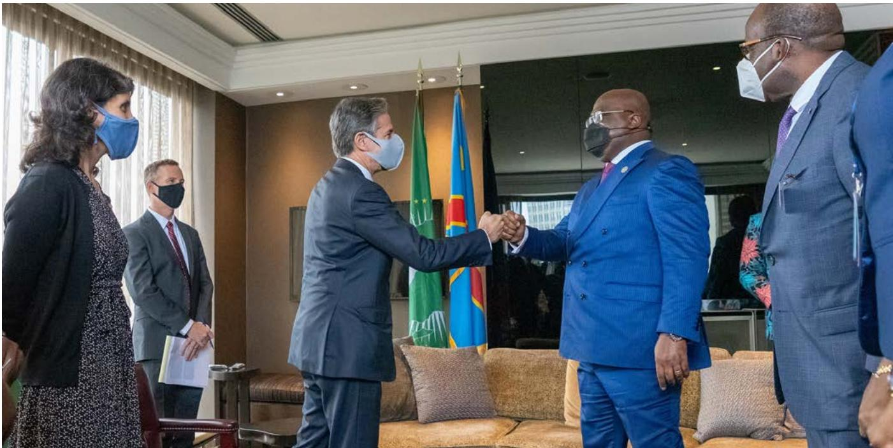

> **AI Description:**
> **Source:** `assets/_page_22_Figure_1.jpg`
> 
> **Generated:** 2026-05-18 11:24:46
> 
> ---
> 
> The image is a photograph showing two men in formal attire shaking hands in a formal setting. They are wearing face masks, and there are flags in the background, including one with a blue and red design. Other individuals are present in the background, some also wearing face masks. The setting appears to be a professional or diplomatic environment.

Secretary Blinken meets with Democratic Republic of the Congo President Félix Tshisekedi in New York, New York, September 23, 2021. Department of State

# Diplomacy 101: The Building Blocks of the State Department

T he National Museum of American Diplomacy seeks to help the American public gain a better understanding of the mission of the U.S. Department of State and the work the agency does to support the nation. The U.S. Department of State works to provide global stability and build thriving, stable economies that are vital to ensuring the security and welfare of all Americans. American diplomacy is founded on four key pillars:

ƒ Security: Establishing and maintain security within and among nations in order to respond to challenges and opportunities

1 Prosperity: Creating political, economic, and financial foundations that allow for investment, trade, and entrepreneurship

Democracy: Working to expand transparent, responsible, and responsive governments that support human rights and equality

Development: Collaborating with nations and communities to meet the needs of citizens through better access to health care, education, and economic opportunity.

The people who work to uphold the pillars of American diplomacy are called diplomats. U.S. diplomats’ primary mission is to carry out the foreign policy of the United States. They do this by using personal and professional relationships with officials and citizens of the host country to advocate for American interests, to work together on common causes, and to explain American society and values.

Diplomats work in a variety of locations, both domestic and international. An embassy is an international location where a diplomat may work. An embassy is the headquarters for U.S. Government representatives serving in a foreign country.

> **AI Description:**
> **Source:** `assets/_page_23_Figure_0.jpg`
> 
> **Generated:** 2026-05-18 11:21:53
> 
> ---
> 
> The image is a photograph of a group of people, likely in a classroom or educational setting, with a woman in the center smiling and posing with a group of individuals who appear to be students or participants. The background shows a yellow wall with some text partially visible, and the ceiling is tiled. The individuals are dressed in colorful traditional attire, suggesting a cultural or educational context. The image conveys a sense of community and learning.

GROUPE RADIO KANKA RADIO MILOFM SIGUIRI STUDIO IO ENREGISTREMENT 9.5 95.5 VENTE W-SAT VENTE ET GRAVUR DECD DISTRIBUTION PGETELEPHONIQOE

Assistant Public Affairs Officer Emily Green (center) poses with the local radio station staff members, who helped combat the local stigma around the Ebola epidemic, Guinea, 2014. Department of State

The primary purpose of an embassy is to assist American citizens who travel to or live in the host country, but it is also wher e U.S. Foreign Service Officers interview citizens of the host country who wish to travel to the United States. Embassy staff interact with representatives of the host government, local businesses, nongovernmental organizations, the media, and educational institutions, as well as private citizens to increase understanding of the United States and its policies and to collaborate on shared interests.

## Financial Summary and Highlights

T he financial summary and highlights that follow provide an overview of the 2021 financial statements of the Department of State (the Department). The independent auditor, Kearney & Company, audited the Depart Department of State (the Department).The independent auditor, Kearney & Company, audited the Department's Consolidated Balance Sheet for the fiscal years ending September 30, 2021 and 2020, along with the Consolidated Statements of Net Cost and Changes in Net Position, and the Combined Statement of Budgetary Resources1. The Department received an unmodified (“clean”) audit opinion on both its 2021 and 2020 financial statements. A summary of key financial measures from the Balance Sheet and Statements of Net Cost and Budgetary Resources is provided in the table below. The complete financial statements, including the independent auditor’s reports, notes, and required supplementary information, are presented in Section II: Financial Information.

Summary Table of Key Financial Measures (dollars in billions)

1 Hereafter, in this section, the principal financial statements will be referred to as: Balance Sheet, Statement of Net Cost, Statement of Changes in Net Position, and Combined Statement of Budgetary Resources.

### Full Page Description (Page 25)

**Source:** `assets/_page_25_Asset_1.jpg`

**Generated:** 2026-05-18 11:39:21

---

The image is a bar chart showing the value of a variable from 2016 to 2021. The bars represent the following values: $93.8 in 2016, $100.6 in 2017, $105.6 in 2018, $109.0 in 2019, $109.7 in 2020, and $111.9 in 2021. The chart indicates a general upward trend in the variable over the years, with a slight dip in 2020 before continuing to rise in 2021.

### Full Page Description (Page 25)

**Source:** `assets/_page_25_Asset_0.jpg`

**Generated:** 2026-05-18 11:39:04

---

The image is an infographic combining text with a circular chart. The chart visually represents the breakdown of total assets of $111.9. The assets are divided into four categories: General Property and Equipment, Net (24% or $27.3); Investments (18% or $20.6); Fund Balance with Treasury (55% or $60.8); and Other Assets (3% or $3.2). The chart uses different colors to distinguish each category and includes percentages and dollar amounts for clarity.

To help readers understand the Department’s principal financial statements, this section is organized as follows:

ƒ Balance Sheet: Overview of Financial Position,

ƒ Statement of Net Cost: Yearly Results of Operations,

ƒ Statement of Changes in Net Position: Cumulative Overview,

ƒ Combined Statement of Budgetary Resources,

The Department’s Budgetary Position,

ƒ Impact of COVID-19, and

ƒ Limitation of Financial Statements.

## Balance Sheet:

## Overview of Financial Position

The Balance Sheet provides a snapshot of the Department’s financial position. It displays, as of a specific time, amounts of current and future economic benefits owned or managed by the reporting entity (Assets), amounts owed (Liabilities), and amounts which comprise the difference (Net Position) at the end of the fiscal year.

Assets. The Department’s total assets were \$111.9 billion at September 30, 2021, an increase of \$2.0 billion (2 percent) over the 2020 total. Fund Balance with Treasury increased \$1.2 billion (2 percent). Property and Equipment increased by \$992 million (4 percent) from September 30, 2020. New buildings, structures, and improvements accounted for most of this increase with the top 10 New Embassy Compound projects accounting for \$726 million of the increase. The six-year trend in the Department’s total assets is presented in the “Trend in Total Assets” bar chart.

Many Heritage Assets, including art, historic American furnishings, rare books and cultural objects, are not reflected as assets on the Department’s Balance Sheet. Federal accounting standards attempt to match costs to accomplishments in operating performance, and have deemed that the allocation of historical cost through depreciation of a national treasure or other priceless item intended to be preserved forever as part of our American heritage would not contribute to performance cost measurement. Thus the acquisition cost of heritage assets is expensed not capitalized. The maintenance costs of these heritage assets are expensed as incurred, since it is part of the government’s role to maintain them in good condition. All of the embassies and other properties on the Secretary of State’s Register of Culturally Significant Property, however, do appear as assets on the Balance Sheet, since they are used in the day-to-day operations of the Department.

Liabilities. The Department’s total liabilities were \$35.8 billion at September 30, 2021, an increase of \$2.8 billion (8 percent) between 2020 and 2021. Federal Employee and Veteran Benefits Liability increased \$2.5 billion (9 percent) from 2020. The six-year trend in the Department’s total liabilities is presented in the “Trend in Total Liabilities” bar chart.

### Full Page Description (Page 26)

**Source:** `assets/_page_26_Asset_0.jpg`

**Generated:** 2026-05-18 11:38:49

---

The image is an infographic with a circular chart that breaks down the total liabilities of a specific entity. The total liabilities are $35.8. The chart is divided into four segments, each representing a different category of liability and its percentage of the total liabilities:

1. **Federal Employee and Veteran Benefit Liability**: 81% of the total liabilities, amounting to $29.2.
2. **Accounts Payable**: 8% of the total liabilities, amounting to $2.7.
3. **International Organizations Liability**: 7% of the total liabilities, amounting to $2.4.
4. **Other Liabilities**: 4% of the total liabilities, amounting to $1.5.

The chart visually represents the proportion of each liability category relative to the total liabilities, making it easier to understand the distribution of the total financial obligations.

LIABILITIES BY TYPE 2021 (dollars in billions)

Ending Net Position. The Department’s net position, comprised of Unexpended Appropriations and the Cumulative Results of Operations, decreased \$592 million (1 percent) between 2020 and 2021. Cumulative Results of Operations increased \$356 million and Unexpended Appropriations were down \$948 million due in part to the budgetary financing sources used to purchase property and equipment.

## Statement of Net Cost: Yearly Results of Operations

The Statement of Net Cost presents the Department’s net cost of operations by strategic goal. Net cost is the total program cost incurred less any exchange (i.e., earned) revenue. The presentation of program results is based on the Department’s major goals established pursuant to the Government Performance and Results Act (GPRA) of 1993 and the GPRA Modernization Act of 2010. The total net cost of operations in 2021 equaled \$38.4 billion, an increase of \$5.8 billion (18 percent) from 2020. This increase of net costs was mainly due to increases in costs for global health programs to combat the global coronavirus pandemic and increases in spending for humanitarian efforts. In addition, actuarial costs increased in the Foreign Service Retirement and Disability Fund (FSRDF) due to actuarial assumption changes.

The six-year trend in the Department’s net cost of operations is presented in the “Trend in Net Cost of Operations” bar chart. There is an increase from 2016 to 2021 of \$11 billion. Increases from 2016 generally reflect costs associated with new program areas related to countering security threats, sustaining stable states, and the coronavirus pandemic, as well as the higher cost of day-to-day operations such as inflation and increased global presence.

TREND IN NET COST OF OPERATIONS (2016-2021) (dollars in billions)

The “Net Cost of Operations by Strategic Goal” pie chart illustrates the results of operations by strategic goal, as reported on the Statement of Net Cost. As shown, net costs associated with two of the strategic goals (Strategic Goal 3: Promote American Leadership through Balanced Engagement) and (Strategic Goal 4: Ensure Effectiveness and Accountability to the American Taxpayer) represents the largest net costs in 2021 – a combined \$30.7 billion (80 percent). The largest increase was in Strategic Goal 3: Promote American Leadership through Balanced Engagement. The net cost increased \$5.2 billion resulting from an increase in spending on humanitarian relief and global health programs due to the coronavirus pandemic.

### Full Page Description (Page 27)

**Source:** `assets/_page_27_Asset_1.jpg`

**Generated:** 2026-05-18 11:20:34

---

The image is an infographic combining text with a circular chart. It presents the total earned revenues of $7.4 million, broken down into five categories: Consular Fees (39%), Reimbursable Agreements (30%), International Cooperative Administrative Support Services (15%), Foreign Service Retirement and Disability Fund (8%), and Other (8%). The chart visually represents the proportion of each category's contribution to the total revenue.

### Full Page Description (Page 27)

**Source:** `assets/_page_27_Asset_0.jpg`

**Generated:** 2026-05-18 11:19:26

---

The image is a pie chart with a central label indicating a "TOTAL NET COST" of $38.4. The chart is divided into four segments, each representing a different category (SG1, SG2, SG3, and SG4) with their respective percentages and costs. SG3 accounts for the largest portion at 52% with a cost of $19.8, followed by SG4 at 28% with a cost of $10.9. SG1 and SG2 make up smaller portions at 15% and 5% respectively, with costs of $5.7 and $2.0. The chart visually represents the distribution of the total net cost across these categories.

## NET COST OF OPERATIONS BY STRATEGIC GOAL 2021 (dollars in billions)

## Earned Revenues

Earned revenues occur when the Department provides goods or services to another Federal entity or the public. The Department reports earned revenues regardless of whether it is permitted to retain the revenue or remit it to Treasury. Revenue from other Federal agencies must be established and billed based on actual costs, without profit. Revenue from the public, in the form of fees for service (e.g., visa issuance), is also without profit. Consular fees are established on a cost-recovery basis and determined by periodic cost studies. Certain fees, such as the machine readable Border Crossing Cards, are determined statutorily. Revenue from reimbursable agreements is received to perform services overseas for other Federal agencies. The FSRDF receives revenue from employee/employer contributions, a U.S. Government contribution, and investment interest. Other revenues come from ICASS billings and Working Capital Fund earnings.

Earned revenues totaled \$7.4 billion in 2021, and are depicted, by program source, in the “Earned Revenues by Program Source” pie chart. The major sources of revenue were from consular fees (\$2.9 billion or 39 percent), reimbursable agreements (\$2.2 billion or 30 percent), and ICASS earnings (\$1.1 billion or 15 percent). These revenue sources totaled \$6.2 billion (84 percent). Overall, revenue increased by 9 percent – \$.6 billion from 2020 to 2021. This increase is primarily a result of an increase in revenue from consular fees due to an increase in travel as a result of restrictions easing from the coronavirus pandemic.

■SG1: Protect America's Security at Home and Abroad

SG2: Renew America's Competitive Advantage for Sustained Economic Growth and Job Creation

■ SG3: Promote American Leadership through Balanced Engagement

SG4: Ensure Effectiveness and Accountability to the American Taxpayer

EARNED REVENUES BY PROGRAM SOURCE 2021 (dollars in billions)

## Statement of Changes in Net Position: Cumulative Overview

The Statement of Changes in Net Position identifies all financing sources available to, or used by, the Department to support its net cost of operations and the net change in its financial position. The sum of these components, Cumulative Results of Operations and Unexpended Appropriations, equals the Net Position at year-end. The Department’s net position at the end of 2021 was \$76.0 billion, a \$592 million (.77 percent) decrease from the prior fiscal year. This change resulted from the \$948 million decrease in Unexpended Appropriations and a \$356 million increase in Cumulative Results of Operations.

### Full Page Description (Page 28)

**Source:** `assets/_page_28_Asset_0.jpg`

**Generated:** 2026-05-18 11:28:07

---

The image is a stacked bar chart showing the total budget authority, unobligated balance from prior year budget authority, net offsetting collections, and appropriations for the years 2016 to 2021. The chart breaks down the total budget authority into three components: the unobligated balance from the prior year, net offsetting collections, and appropriations. The total budget authority increases from $69.3 billion in 2016 to $80.1 billion in 2021. The unobligated balance from the prior year shows a slight increase over the years, while the appropriations show a consistent increase. The net offsetting collections remain relatively stable throughout the period.

## Combined Statement of Budgetary Resources

The Combined Statement of Budgetary Resources (SBR) summarizes budgetary resources available to the Department at the fiscal year-end.

The Department’s budgetary resources consist primarily of appropriations, spending authority from offsetting collections, and unobligated balances brought forward from prior years. The “Trend in Total Budgetary Resources” bar chart highlights the budgetary trend over the fiscal years 2016 through 2021. A comparison of the two most recent years shows a \$3.0 billion (4 percent) increase in total resources since 2020. This change resulted from a decrease in unobligated balances from prior year budget authority (\$2.8 billion) and increases in offsetting collections (\$0.7 billion) and appropriations (\$5.1 billion).

## The Department’s Budgetary Position

The Department’s budgetary resources are drawn from two broad categories – Diplomatic Engagement and Foreign Assistance. The budgetary position descriptions and tables in this section provide a detailed discussion of the two categories of funding.

For 2021, \$76.6 billion of the Department’s \$109.6 billion in total funding was provided by the Department of State, Foreign Operations, and Related Programs Appropriations Act, 2021 (Division K, Public Law No. 116-260) (the “FY 2021 Act”) enacted on December 27, 2020. Of that total funding amount, a net \$33.0 billion remained available for obligation in 2021 from prior years, and \$10.8 billion for Coronavirus response was provided by the American Rescue Plan (ARP) Act of 2021 (Public Law No. 117-2). The Bureau of Budget and Planning manages the Diplomatic Engagement portion of the budget (\$38.6 billion, including \$14.8 billion in prior year funding that remained available for obligation in 2021), and the Office of Foreign Assistance manages foreign assistance funds (\$71.0 billion, including \$18.2 billion in prior year funding that remained available for obligation in 2021).

The 2021 Department of State Budget funded the Administration’s highest foreign policy priorities by positioning America to address challenges such as terrorism, international health and humanitarian disasters, bolster support for the Indo-Pacific region, and counter malign Chinese, Russian, and Iranian influence. The Department’s Budget advanced a range of strategic goals and objectives, including to:

ƒ Protect America’s Security at home and abroad by supporting and collaborating with both new and old partners to defend shared interests and to adapt to the changing international environment;

ƒ Renew America’s competitive advantage for sustained economic growth and job creation with comprehensive, forward-looking, and flexible economic engagement with the world;

ƒ Promote American leadership through balanced engagement that allows nations to compete peacefully and cooperate more effectively with one another; and

ƒ Ensure effectiveness and accountability to the American taxpayer by making significant investments in advancing the use of data as a tool for decision making.

## Budgetary Position for Diplomatic Engagement

New 2021 funding enacted for Diplomatic Engagement totaled \$23.8 billion, which included: \$12.0 billion in appropriated Enduring funds and \$3.5 billion in appropriated Overseas Contingency Operations (OCO) funds included in Title I of the FY 2021 Act, \$158.9 million in mandatory appropriations for the Foreign Service Retirement and Disability Fund, pursuant to the Foreign Service Act of 1980; a cumulative \$504 million for Coronavirus response (\$300 million in Title IX of the 2021 bill for Consular Border and Security Programs (CBSP), and \$204 million in ARP funding); and a onetime appropriation of \$150 million in Title IX emergency funding that will remain available for up to 10 years to provide compensation to the individuals specified

> **AI Description:**
> **Source:** `assets/_page_29_Figure_0.jpg`
> 
> **Generated:** 2026-05-18 11:29:12
> 
> ---
> 
> The image contains a photograph of three individuals seated at a long table with microphones in front of them. The table is adorned with nameplates and small flags representing various countries. The individuals are wearing face masks and appear to be in a formal setting, possibly a diplomatic or governmental meeting. The flags behind them include those of NATO and other European countries, suggesting an international or NATO-related event. The individuals are dressed in formal attire, with one wearing a suit and tie, another in a military uniform, and the third in a suit. The setting appears to be a conference room or a similar official venue.

Secretary Blinken and Secretary of Defense Lloyd Austin participate in a North Atlantic Council meeting in Brussels, Belgium, April 14, 2021. Department of State

in section 7(b)(1) of the Sudan Claims Resolution Act (Public Law No. 116-260, Division FF, Title XVII). In addition, \$7.6 billion non-appropriated funds were also included in the new funding available for obligation in 2021. This includes \$2.2 billion in non-appropriated retained fee revenue collected in the CBSP account, \$1.7 billion in the Working Capital Fund, and \$3.7 billion for International Cooperative Administrative Support Services (ICASS). These funds support the people and programs that carry out U.S. foreign policy, advancing U.S. national security, political, and economic interests at 276 posts in 195 countries around the world. These funds also maintain and secure the U.S. diplomatic infrastructure platform from which U.S. Government agencies operate overseas.

In addition to the \$23.8 billion in new 2021 funding, \$14.8 billion in prior year Diplomatic Engagement funding remained available for obligation in 2021.

As noted above, in 2021, the Department earned and retained \$2.2 billion in new user fee revenue derived from passport and visa processing, including Machine Readable Visa fees, Immigrant Visa fees, the Western Hemisphere Travel Initiative surcharge, Visa Fraud Prevention and Detection fees, and other fee and surcharge revenues for the Consular and Border Security Program. CBSP funds support programs that provide protection to U.S. citizens overseas and contribute to national security and economic growth. These programs are a core element of the national effort to deny individuals who threaten the country entry into the United States while assisting and facilitating the entry of legitimate travelers and promoting tourism. As noted above, the CBSP program received \$300 million in emergency appropriations in 2021 to sustain consular operations impacted by the plummet in global travel and the loss of passport, visa, and other revenues due to the Coronavirus pandemic. In addition, \$150 million from the ARP was made available for consular activities through the Diplomatic Programs account.

## 2022 Diplomatic Engagement Request

The total projected available funding for 2022 is \$26.5 billion, of which \$17.3 billion is requested appropriated funding and \$9.2 billion is the projected revenue total (\$1.6 billion in the Working Capital Fund, \$4.0 billion in ICASS, and \$3.6 billion in CBSP). The 2022 estimate for consular fee revenue to support CBSP has been revised upwards to \$3.6 billion, an increase of \$0.8 billion from the 2022 President’s Budget request due to continued recovery from the pandemic resulting in increased visa and passport demand.

## Budgetary Position for Foreign Assistance

For 2021, foreign assistance funding for the Department of State and USAID totaled \$52.8 billion, provided through two laws: \$42.2 billion in the Department of State, Foreign Operations, and Related Programs Appropriations Act, 2021 (Division K, Public Law No. 116-260) (the “FY 2021 Act”) enacted on December 27, 2020, and \$10.6 billion in the American Rescue Plan (ARP) Act of 2021 (Public Law No. 117-2). Title IX of the 2021 appropriations bill included a one-time appropriation of \$4.7 billion in emergency funding for Sudan and Gavi, the Vaccine Alliance.

As of October 2021, the carryover of unobligated 2020 foreign assistance balances into 2021 totaled \$18.2 billion.

## Foreign Assistance Accounts Fully Implemented by the Department of State

Of the 2021 funds provided by Congress, the foreign assistance accounts fully managed by the Department of State totaled \$19.8 billion, approximately a third of the foreign assistance budget. State fully implements the following security assistance accounts: Foreign Military Financing (FMF); International Military Education and Training; International Narcotics Control and Law Enforcement; Nonproliferation, Antiterrorism, Demining, and Related Programs; and Peacekeeping Operations. Of the \$9.0 billion security assistance total provided by Congress in 2021, \$6.2 billion in FMF was for countries in the Middle East and North Africa, including \$3.3 billion for Israel.

In 2021, the portion of humanitarian assistance managed by the Department through the Migration and Refugee Assistance (MRA) and U.S. Emergency Refugee and Migration Assistance accounts totaled \$3.9 billion, of which \$1.7 billion was Overseas Contingency Operations (OCO) funding and \$500 million was provided in the ARP. These funds provided humanitarian assistance and resettlement opportunities for refugees and conflict victims around the globe and contributed to key multilateral and non-governmental organizations that address pressing humanitarian needs overseas. Additionally, MRA funding provided in the ARP will be used to help prevent, prepare for, and respond to COVID-19 in existing complex emergency responses, and to address the potential humanitarian consequences of the pandemic.

In 2021, the portion of the Global Health Programs appropriation managed by the Department totaled \$5.9 billion. This is the primary source of funding for the President’s Emergency Plan for AIDS Relief. These funds are used to control the epidemic through data-driven investments that strategically target geographic areas and population where the initiative can achieve the most impact for its investments.

The 2021 International Organizations and Programs (IO&P) totaled \$967.5 million, \$387.5 million in enduring funding and \$580.0 million provided in the ARP. It provided international organizations voluntary contributions that advanced U.S. strategic goals by supporting and enhancing international consultation and coordination. This approach is required in transnational areas where solutions to problems are best addressed globally, such as protecting the ozone layer or safeguarding international air traffic. In other areas, the United States can multiply its influence and effectiveness through support for international programs.

## Foreign Assistance Accounts Fully Implemented by USAID

USAID fully implements the following accounts: Global Health Programs-USAID, International Disaster Assistance, Food for Peace, Development Assistance, Transition Initiatives, Complex Crises Fund, and USAID Administrative accounts, including Operating Expenses, the Capital Investment Fund, and the Office of the Inspector General. The 2021 appropriated total for those accounts is \$19.6 billion.

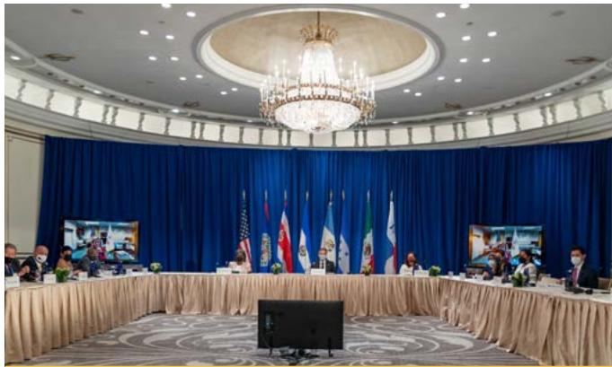

> **AI Description:**
> **Source:** `assets/_page_30_Figure_0.jpg`
> 
> **Generated:** 2026-05-18 11:25:58
> 
> ---
> 
> The image depicts a formal meeting room with a large, round table draped in a beige tablecloth. The room is well-lit with a chandelier hanging from the ceiling and blue curtains in the background. Several individuals are seated around the table, which is equipped with microphones and nameplates. Flags of different countries are displayed on the wall behind the table, suggesting an international or regional meeting. The setting appears formal and official, likely a diplomatic or governmental conference.

Secretary Blinken meets with the Foreign Ministers of Central American Nations and Mexico on Shared Migration Challenges at the Palace Hotel in New York City, New York, September 23, 2021. Department of State

## Jointly Implemented Foreign Assistance Accounts

The Department and USAID jointly implement funds from the Assistance for Europe, Eurasia, and Central Asia and the Economic Support Fund (ESF) accounts. Congress provided \$13.3 billion for these two accounts in 2021 to advance national security and support programs focused on democracy, anti-corruption, and rule of law. This total includes \$8.7 billion in funding under ESF authorities in the ARP for COVID response. This funding also helps countries of strategic importance meet near- and long-term political, economic, development, and security needs.

Another jointly managed account is the Democracy Fund account. The Democracy Fund appropriation totaled \$290.7 million in 2021; the funds are split and made available for both the Department and USAID. Funding in this account promotes democracy in priority countries where egregious human rights violations occur, democracy and human rights advocates are under pressure, governments are not democratic or are in transition, where there is growing demand for human rights and democracy, and for programs promoting Internet Freedom.

## 2022 Foreign Assistance Request

The President’s 2022 Request for foreign assistance for the Department of State and USAID is currently under congressional consideration. The State and USAID request for foreign assistance is \$43.0 billion to support all core programs; no OCO funding is requested. The total includes \$1.8 billion in continuing resolution anomalies for disaster relief for Afghan evacuees. Taken together, the Department of State fully managed accounts sum to \$21.1 billion or roughly half of the total request.

Department of State and USAID Budget by Account for Diplomatic Engagement1

Department of State and USAID Budget by Account for Foreign Assistance1

3 Amounts are shown for informational purposes only and are not included in the totals presented.
2 Total New Budget Authority includes revenue generated for Non-Appropriated accounts.
1 The numbering hierarchy is provided for illustrative purposes of the AFR.

> **AI Description:**
> **Source:** `assets/_page_33_Figure_0.jpg`
> 
> **Generated:** 2026-05-18 11:45:21
> 
> ---
> 
> The image contains a photograph of three individuals participating in a ceremony. They are holding a box labeled "COVAX," which is associated with the Global Alliance for Vaccines and Immunization (GAVI), the Coalition for Epidemic Preparedness Innovations (CEPI), and the World Health Organization (WHO). The background features flags of various countries, including the United States and Ethiopia, along with text indicating the distribution of COVID-19 vaccines from the United States to Ethiopia through the COVAX initiative. The individuals are wearing face masks, and the setting appears to be outdoors.

The United States delivers 655,200 COVID-19 vaccine doses to Ethiopia, September 23, 2021. Department of State

## Impact of COVID-19

In 2021, the Department of State maintained its focus on response and recovery related to the COVID-19 global pandemic. The Department marshalled resources to inform and safeguard U.S. citizens overseas and advance the Administration’s commitment to end the COVID-19 pandemic, mitigate its wider harms to people and societies, and strengthen the global recovery and readiness for future pandemic threats.

The Department’s 2021 funding included supplemental resources for COVID-19 response. For Diplomatic Engagement, this included a cumulative \$504 million (\$300 million in Title IX of the 2021 appropriations bill for CBSP, and \$204 million in ARP funding). The CBSP funds maintained consular operations, including services to American citizens, offsetting the impact of reduced visa and passport revenues that remained well below pre-pandemic levels. A portion of the ARP funding strengthened the Department’s global capacity for medical response, diagnosis, and treatment of its workforce, including provision of COVID-19 vaccines. ARP funding also mitigated the profound impact of the COVID-19 pandemic on the Department’s permanent change of station costs for employees traveling to and/or from post. Internally, in September 2021, the Department replaced its Diplomacy Strong framework, a phased approach and methodology for COVID-19 mitigation in our domestic and overseas operations and facilities, with the COVID-19 Mitigation Process as the Department’s framework for determining an appropriate onsite work posture and correlated mitigation actions.

In 2021, visa and passport fee-based revenue continued to recover from the precipitous decline in 2020 but remained below pre-pandemic levels. In addition to the funding noted above, Congress renewed expanded expenditure authority for the passport security surcharge and the immigrant visa security surcharge, and enacted temporary expanded expenditure authority for the Western Hemisphere Travel Initiative surcharge and fraud prevention and detection fees. These expenses have previously been covered by Machine Readable Visa fees generated from non-immigrant visa applications, but there were insufficient collections available in 2021.

Department of State-led foreign assistance programming has played a key role in mitigating COVID-19 impacts among vulnerable populations, including migrants and host communities; and addressed urgent HIV/AIDS anti-retroviral commodities-related needs of clients exacerbated by COVID-19 disruptions. The Department also strengthened the capacity of international organizations to help end the COVID-19 pandemic and provide urgent relief in line with the priorities and objectives of the UN Global Humanitarian Response Plan for COVID-19.

## Limitation of Financial Statements

Management prepares the accompanying financial statements to report the financial position and results of operations for the Department of State pursuant to the requirements of Chapter 31 of the U.S. Code Section 3515(b). While these statements have been prepared from the books and records of the Department in accordance with FASAB standards using OMB Circular A-136, Financial Reporting Requirements, revised, and other applicable authority, these statements are in addition to the financial reports, prepared from the same books and records, used to monitor and control the budgetary resources. These statements should be read with the understanding that they are for a component of the U.S. Government, a sovereign entity.

# FOCUS

# Diplomacy Simulation Program

> **AI Description:**
> **Source:** `assets/_page_34_Figure_0.jpg`
> 
> **Generated:** 2026-05-18 11:46:19
> 
> ---
> 
> The image contains a group of individuals gathered around a table, engaged in a collaborative activity. They appear to be working on a project or discussion, with papers and documents spread out on the table. The setting suggests a professional or educational environment, possibly a workshop or seminar. The individuals are focused on the materials in front of them, indicating a collaborative and interactive session.

High school students work together to solve a freshwater crisis in a diplomacy simulation. Department of State

T he National Museum of American Diplomacyhas developed educational programming to hel has developed educational programming to help students better understand diplomacy and the work of diplomats. These resources show students that many of the opportunities and challenges before the United States are global in source, scope, and solution.

NMAD’s signature educational resource is the Diplomacy Simulation Program. These simulations showcase the work of the U.S. Department of State and how diplomats engage in global issues. Aimed at high school and college students, the simulation connects with the world of American diplomacy, increasing an understanding of diplomacy and inspiring students to be involved in foreign affairs.

The program teaches students the practice of diplomacy as both a concept and a practical set of 21st Century skills. Stepping into the role of diplomats and working in teams, students build rapport with others, present clear arguments, negotiate, find common ground, and compromise to find a potential solution. Through negotiating, they implement the skills and tools of diplomacy used by professional diplomats that can also apply to everyday life. Facilitators guide the students through a hypothetical or historical global crisis, to introduce the ways that foreign policy is crafted and to the art and challenge of working with global partners to address important issues

All educational materials, including simulations and training guides, are available for free at www.diplomacy.state.gov/.

# Analysis of Systems, Control, and Legal Compliance

## Management Assurances

T he Department’s Management Control policy is comprehensive and requires all Department managers to establish cost-effective systems of management controls to ensure U.S. Government activities are managed effectively, cost-effective systems of management controls to ensure U.S. Government activities are managed effectively, efficiently, economically, and with integrity. All levels of management are responsible for ensuring adequate controls over all Department operations.

## Departmental Governance

## Management Control Program

The Federal Managers’ Financial Integrity Act (FMFIA) requires the head of each agency to conduct an annual evaluation in accordance with prescribed guidelines, and provide a Statement of Assurance (SoA) to the President and Congress. As such, the Department’s management is responsible for managing risks and maintaining effective internal control.

The FMFIA requires the Government Accountability Office (GAO) to prescribe standards of internal control in the Federal Government, which is titled GAO’s Standards for Internal Control in the Federal Government (Green Book). Commonly known as the Green Book, these standards provide the internal control framework and criteria Federal managers must use in designing, implementing, and operating an effective system of internal control. The Green Book defines internal control as a process effected by an entity’s oversight body, management, and other personnel that provides reasonable assurance that the objectives of an entity are achieved. These objectives and related risks can be broadly classified into one or more of the following categories:

1 Effectiveness and efficiency of operations,

ƒ Compliance with applicable laws and regulations, and

1 Reliability of reporting for internal and external use.

OMB Circular A-123, Management’s Responsibility for Enterprise Risk Management and Internal Control provides implementation guidance to Federal managers on improving the accountability and effectiveness of Federal programs and operations by identifying and managing risks, establishing requirements to assess, correct, and report

## Federal Managers’ Financial Integrity Act

T he Department of State’s (the Department’s)management is responsible for managing ris management is responsible for managing risks and maintaining effective internal control to meet the objectives of Sections 2 and 4 of the Federal Managers’ Financial Integrity Act. The Department conducted its assessment of risk and internal control in accordance with OMB Circular No. A-123, Management’s Responsibility for Enterprise Risk Management and Internal Control. Based on the results of the assessment, the Department can provide reasonable assurance that internal control over operations, reporting, and compliance was operating effectively as of September 30, 2021.

As a result of its inherent limitations, internal control over financial reporting, no matter how well designed, cannot provide absolute assurance of achieving financial reporting objectives and may not prevent or detect misstatements. Therefore, even if the internal control over financial reporting is determined to be effective, it can provide only reasonable assurance with respect to the preparation and presentation of financial statements. Projections of any evaluation of effectiveness to future periods are subject to the risk that controls may become inadequate because of changes in conditions or that the degree of compliance with the policies or procedures may deteriorate.

Antony J. Blinken Secretary of State November 15, 2021

on the effectiveness of internal controls. OMB Circular A-123 implements the FMFIA and GAO’s Green Book requirements. FMFIA also requires management to include assurance on whether the agency’s financial management systems comply with Government-wide requirements. The financial management systems requirements are directed by Section 803(a) of the FFMIA and Appendix D to OMB Circular A-123, Compliance with the Federal Financial Management Improvement Act of 1996. The 2021 results are discussed in the section titled “Federal Financial Management Improvement Act.”

The Secretary of State’s 2021 Statement of Assurance for FMFIA is provided on the previous page. We have also provided a Summary of Financial Statement Audits and Management Assurances as required by OMB Circular A-136, Financial Reporting Requirements, revised, in the Other Information section of this report. In addition, there are no individual areas for the Department currently on GAO’s bi-annual High-Risk List.

The Department’s Management Control Steering Committee (MCSC) oversees the Department’s management control program. The MCSC is chaired by the Comptroller, and is comprised of eight Assistant Secretaries, in addition to the Chief Information Officer, the Deputy Comptroller, the Deputy Legal Adviser, the Director for the Office of Budget and Planning, the Director for Global Talent Management, the Director for Management Strategy and Solutions, the Director for the Office of Overseas Buildings Operations, and the Inspector General (non-voting). Individual SoAs from Ambassadors assigned overseas and Assistant Secretaries in Washington, D.C. serve as the primary basis for the Department’s FMFIA SoA issued by the Secretary. The SoAs are based on information gathered from various sources including managers’ personal knowledge of day-to-day operations and existing controls, management program reviews, and other managementinitiated evaluations. In addition, the Office of Inspector General, the Special Inspector General for Afghanistan Reconstruction, and the Government Accountability Office conduct reviews, audits, inspections, and investigations that are considered by management.

The Senior Assessment Team (SAT) provided oversight during 2021 for the internal controls over reporting program in place to meet Appendix A to OMB Circular A-123 requirements. The SAT reports to the MCSC, is chaired by the Deputy Comptroller, and is comprised of 12 senior executives from bureaus that have significant responsibilities relative to the Department’s financial resources, processes, and reporting. The SAT also includes executives from the Office of the Legal Adviser and the Office of Inspector General (non-voting). The Department employs a risk-based approach in evaluating internal controls over reporting on a multi-year rotating basis, which has proven to be efficient. Due to the broad knowledge of management involved with the Appendix A assessment, along with the extensive work performed by the Office of Management Controls, the Department evaluated issues on a detailed level.

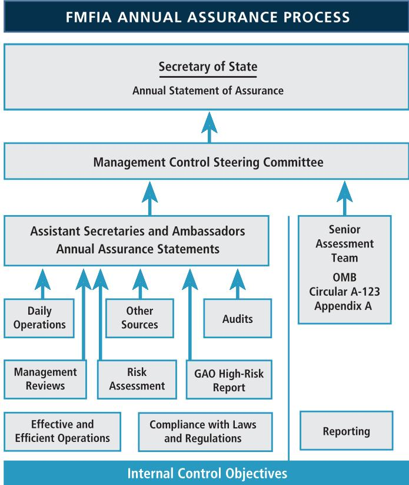

> **AI Description:**
> **Source:** `assets/_page_36_Figure_0.jpg`
> 
> **Generated:** 2026-05-18 11:20:58
> 
> ---
> 
> The image is a flowchart titled "FMFIA ANNUAL ASSURANCE PROCESS." It illustrates the steps involved in the annual assurance process for the Foreign Military Financing Act (FMFIA). The flowchart starts with the "Secretary of State" at the top, leading to the "Management Control Steering Committee," which then branches out to the "Assistant Secretaries and Ambassadors Annual Assurance Statements" and the "Senior Assessment Team." The flowchart includes various inputs such as "Daily Operations," "Management Reviews," "Other Sources," "Risk Assessment," "Audits," and "GAO High-Risk Report," which feed into the assessment process. The bottom of the flowchart lists "Internal Control Objectives," including "Effective and Efficient Operations" and "Compliance with Laws and Regulations." The chart visually represents the hierarchical and interconnected nature of the assurance process, emphasizing the flow of information and the roles of different entities involved.

The Department’s management controls program is designed to ensure full compliance with the goals, objectives, and requirements of the FMFIA and various Federal laws and regulations. To that end, the Department has dedicated considerable resources to administer a successful management control program. The Department’s Office of Management Controls employs an integrated process to perform the work necessary to meet the requirements of OMB Circular A-123’s Appendix A and Appendix C (regarding Payment Integrity), the FMFIA, and the GAO’s Green Book. Green Book requirements directly relate to testing entity-level controls, which is a primary step in operating an effective system of internal control. Entity-level controls reside in the control environment, risk assessment, control activities, information and communication, and monitoring components of internal control in the Green Book, which are further required to be analyzed by 17 underlying principles of internal control.

For the Department, all five components and 17 principles were operating effectively and supported the Department’s FY 2021 unmodified Statement of Assurance. The 2021 Circular A-123 Appendix A assessment did not identify any material weaknesses in the design or operation of the internal control over reporting. The assessment did identify several significant deficiencies in internal control over reporting that management is closely monitoring. The Department complied with the requirements in OMB Circular A-123 during 2021 while working to evolve our existing internal control framework to be more value-added and provide for stronger risk management for the purpose of improving mission delivery.

The Department also places emphasis on the importance of continuous monitoring. It is the Department’s policy that any organization with a material weakness or significant deficiency must prepare and implement a corrective action plan to fix the weakness. The plan combined with the individual SoAs and Appendix A assessments provide the framework for monitoring and improving the Department’s management controls on a continuous basis. Management will continue to direct and focus efforts to resolve significant deficiencies in internal control identified by management and auditors.

During 2021, the Department continued taking important steps to advance its Enterprise Risk Management (ERM) program. The Enterprise Governance Board (EGB), which is comprised of the Deputy Secretary and all Under Secretaries, serves as the Enterprise Risk Management Council. In this capacity, the EGB reviews the Department’s risk profile at least once per year. The Department’s Office of Management Strategy and Solutions serves as the Executive Secretariat to the EGB and manages the Department’s overall risk management program. It is the Department’s policy that advancement of U.S. foreign policy objectives inherently involves diverse types of risk, and the Department recognizes that taking considered risks can be essential to creating value for our stakeholders.

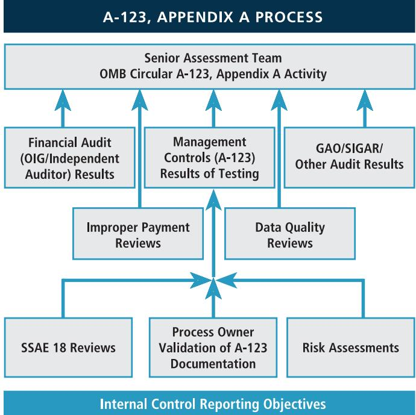

> **AI Description:**
> **Source:** `assets/_page_37_Figure_0.jpg`
> 
> **Generated:** 2026-05-18 11:26:13
> 
> ---
> 
> The image is a flowchart titled "A-123, Appendix A Process." It outlines the process for the Senior Assessment Team under OMB Circular A-123, Appendix A Activity. The flowchart includes several input sources such as Financial Audit (OIG/Independent Auditor) Results, Management Controls (A-123) Results of Testing, GAO/SIGAR/Other Audit Results, Improper Payment Reviews, Data Quality Reviews, SSAE 18 Reviews, Process Owner Validation of A-123 Documentation, and Risk Assessments. These inputs are directed towards the Internal Control Reporting Objectives. The flowchart visually represents the interconnectedness of these components and their role in the assessment process.

In October 2021, the Secretary stated as part of his Modernizing American Diplomacy agenda that “a world of zero risk is not a world in which American diplomacy can deliver. We have to accept risk, and manage it smartly.” The Enterprise Governance Board reviewed the Department’s risk management processes and risk posture during 2021. The EGB sets the tone and direction for risk management policies, communications, and training throughout the organization, and is considering ways to advance the Department’s risk culture through improved policies and procedures; and employee engagement. The EGB affirmed that Bureaus have risk management activities built into a wide range of existing procedures and manage risk in a variety of ways, and incorporate mitigation strategies into strategic planning processes. The Department looks forward to continued development of risk management processes in 2022.

## Federal Financial Management Improvement Act

The purpose of the Federal Financial Management Improvement Act of 1996 (FFMIA) is to advance Federal financial management by ensuring that Federal financial management systems generate timely, accurate, and useful information with which management can make informed decisions and to ensure accountability on an ongoing basis.

OMB Circular A-123, Appendix D, Compliance with the Federal Financial Management Improvement Act of 1996, provides guidance the Department used in determining compliance with FFMIA. The Department considered results of OIG and GAO audit reports, annual financial statement audits, and other relevant information. The Department’s assessment also relies upon evaluations and assurances under the Federal Managers’ Financial Integrity Act of 1982 (FMFIA), including assessments performed to meet the requirements of OMB Circular A-123 Appendix A. When applicable, particular importance is given to any reported material weakness and material non-conformance identified during these internal control assessments. The Department has made it a priority to meet the objectives of the FFMIA.

## Federal Financial Management Improvement Act

T he Federal Financial Management Improvement Act of 1996 (FFMIA) requires agencies to implement and maintain financial management systems that are in substantial compliance with Federal financial management system requirements, Federal accounting standards, and the U.S. Standard General Ledger at the transaction level. The Department conducted its evaluation of financial management systems for compliance with FFMIA in accordance with OMB Circular A‐123, Appendix D. Based on the results of this assessment, the Department can provide reasonable assurance that its overall financial management systems substantially comply with principles, standards, and requirements prescribed by the FFMIA as of September 30, 2021.

Antony J. Blinken Secretary of State November 15, 2021

In its Report on Compliance with Laws, Regulations, Contracts, and Grant Agreements, the Independent Auditor identified instances of substantial noncompliance with Federal financial management systems requirements. The Independent Auditors asserted that the Department’s financial management systems inherit certain controls from the overall information security program as identified in the FISMA audit, and that these weaknesses support a non-compliance finding. The Department acknowledges these weaknesses in our financial management systems that were described in the FISMA report. OMB’s Appendix D provides a revised compliance model that entails a risk-and outcome-based approach to assess FFMIA compliance. In our assessments and evaluations, the Department identified similar weaknesses, e.g., the Department has multiple low value financial systems that do not have current Authorizations-to-Operate on file. However, applying the guidance and the assessment framework noted in Appendix D to OMB Circular A-123, the Department considers them deficiencies versus substantial non-conformances relative to substantial compliance with the requirements of the FFMIA. Nonetheless, the Department is committed to continuing to work to address all identified financial management system deficiencies that are beneficial and cost-effective use of government funds.

## Federal Information Security Modernization Act

The Federal Information Security Modernization Act of 2014 (FISMA) requires Federal agencies to develop, document, and implement an agency-wide program to protect government information and information systems that support the operations and assets of the agency. FISMA authorized the Department of Homeland Security (DHS) to take a leadership and oversight role in this effort, created cyber breach notification requirements, and modified the scope of reportable information from primarily policies and financial information to specific information about threats, security incidents, and compliance with security requirements.

The Department remains committed to adopting the best cybersecurity practices and embedding them into the agency’s culture. As a result, the agency continues to improve its cybersecurity posture and provide transparency internally and with external partners in other Federal agencies.

The Department’s 2021 Annual FISMA Report demonstrates the Department’s continued efforts to improve IT security by prioritizing and aligning initiatives with Executive Order 14028. The Department is investing in a Zero Trust architecture, expanding the number of systems utilizing secure cloud capabilities, and implementing Multi-Factor Authentication and encryption of data-at-rest and data-in-transit across the enterprise. The Department is also establishing the National Institute of Standards and Technology Supply Chain Risk Management Framework to identify critical software and secure IT hardware and software purchases to further enhance its IT security environment. The Department plans to continue refining and implementing risk management indicators, developing cybersecurity governance policies, and collaborating with partners across the Federal Government to guide investment and leadership decisions and enhance the overall cybersecurity posture.

The Department is pleased to point out that out of 10 Cross-Agency Priority Goal Evaluations, the Department maintains good statistics in 8 areas including Software Access Management, Hardware Access Management, Mobile Device Management, Privileged Network Access Management, Automated Access Management, Intrusion Detection and Prevention, Exfiltration and Enhanced Defenses, and Data Protection. There are two areas requiring attention including System Authorization and HVA Access Management.

Focus areas for improvement that will need additional support in the coming fiscal year include both shortterm (one year effort) and long-term (multi-year effort) authorization remediation actions. The Department has authorized 87 percent of High Value Asset (HVA) systems at this time and expects to have this metric at 100 percent by April 2022.

Other areas of focus include improving (1) authorization of moderate impact systems currently at 63 percent, (2) HVA encrypted data-at-rest currently at 37 percent encryption, and (3) HVAs reconfigure or disable upon detection of a security violation currently at 23 percent. While improvements in statistics are likely to occur in the next fiscal year, these efforts will require multi-year attention.

## Resource Management Systems Summary

Other Information, Section III of this AFR, provides an overview of the Department’s current and future resource management systems framework and systems critical to effective agency-wide financial management operations, financial reporting, internal controls, and interagency administrative support cost sharing. This summary presents the Department’s resource management systems strategy and how it will improve financial and budget management across the agency. This overview also contains a synopsis of critical projects and remediation activities that are planned or currently underway. These projects are intended to modernize and consolidate Department resource management systems.

## Anti-Deficiency Act

The Anti-Deficiency Act (ADA) was enacted to prevent Federal agencies from incurring obligations or making expenditures in excess or in advance of amounts made available through appropriations or from accepting voluntary services.

The Department accounts and reports on 530 Treasury Account Fund Symbols (TAFS) annually. In addition, the Department operates in a complex financial environment with cash transactions processed all over the world in multiple foreign currencies. Consequently, there are instances where a Department TAFS has a negative Fund Balance with Treasury. These situations are considered potential violations of the ADA until fully investigated by the Department. Since 2009, 24 TAFS have been reported with negative balances. Of these, 19 have been resolved with no ADA violation and 5 remain under investigation at the end of 2021. Amounts outstanding and reported as negative TAFS at the end of 2021 were immaterial to the Department’s financial statements. The Department is committed to strengthening existing controls and reconciliation efforts around the use of appropriated funds and that any violation of the ADA, if confirmed, will be reported to Congress, GAO, and the President.

## Prompt Payment Act

The Prompt Payment Act (PPA) requires Federal agencies to make payments in a timely manner, pay interest penalties when payments are late, and take discounts only when payments are made within the discount period. While the Department maintains a high PPA compliance rate for domestic vendor payments, it does not consistently calculate or pay interest penalties for overdue payments to overseas vendors. This is due to the complexity and challenges that the Department faces as we operate in over 270 locations in over 180 countries, often in hostile environments, while conducting business in over 135 currencies. Regardless, the Department will make efforts in 2022 and beyond to achieve the highest standard of PPA compliance with overseas vendors while working to accommodate host country and local laws and conventions as well as critical mission needs.

## Management Challenges: Providing an Independent Statement of the Agency

In the 2021 annual statement, the Department’s Office of Inspector General (OIG) identified the most serious management and performance challenges for the Department. These challenges were identified in the areas of: protection of people and facilities; management and oversight of contracts, grants, and foreign assistance; information security and management; financial and property management; operating in contingency and critical environments; workforce management; and promoting accountability through internal coordination and clear lines of authority.

The OIG statement may be found in the Other Information section of this report (see pages 117-126). In response to the OIG’s recommendations, the Department took a number of corrective actions. Information on management’s assessment of the challenge and a summary of actions taken may also be found in the Other Information section.

# Forward-Looking Information

## Climate Change

President Biden has declared combating the global climate crisis as one of the four “historic” crises confronting the United States, and reasserting U.S. leadership on climate as one of his highest international priorities. On January 27, 2021, he issued Executive Order 14008 on Tackling the Climate Crisis at Home and Abroad, which committed the Administration to “put the climate crisis at the center of foreign policy and national security.”

Under this Order, the President created the position of the Special Presidential Envoy for Climate (SPEC). He named former Secretary of State John Kerry to hold the position with a mandate to lead diplomatic engagement on the climate crisis, exercise climate leadership in international fora, increase international climate ambition and ensure that climate change is integrated into all elements of the Administration’s foreign policy-making processes. The SPEC office is playing a leadership and coordinating role across all relevant U.S. agencies and elements of the Department, including the Department’s existing climate diplomacy structures, to execute the climate diplomacy mission.

The Bureau of Oceans and International Environmental and Scientific Affairs (OES) Office of Global Change (OES/EGC) has been the Department’s long-running permanent program office for climate issues. SPEC Kerry, the SPEC staff office, and OES/EGC staff are fully integrated and coordinated in advancing the Administration’s international climate policy strategy.

In response to Executive Order 14008, the Department also created the Climate Adaptation and Resilience Plan (CARP) to be reviewed and updated annually. Under this plan, the Department has three overarching climate adaptation and resilience goals: (1) protect the health and safety of personnel; (2) adapt Department facilities, operations, and mission-critical services to be more resilient to the impacts of climate change; and (3) lead by example through showcasing climate adaptation and resilience solutions.

The CARP identifies five priority areas for action over the course of the next fiscal year to meet these overarching goals: (1) enabling mobility in the workforce; (2) incorporating climate hazards into emergency planning and training; (3) building programs to support climate-ready sites and facilities; (4) evaluating climate risks in supply chain and procurement; and (5) improving local infrastructure through host country engagement. The Department is well under way in terms of making the workforce more mobile and thus resilient to the impacts of climate change. Staff are equipped with mobile software and hardware and these programs are expanding, while telework policies have been modified and updated. Under priority 3, the Department will conduct an initial overseas portfolio baseline screening to identify at-risk facilities that are at-risk to natural hazards, using the output to prioritize the most vulnerable facilities for greater assessment and/or adaptation efforts. Under priority 4, the Department will leverage the General Service Administration’s Supply Chain Climate Risk Management Framework to assess mission critical supply chains for vulnerabilities and update guidance for procurement specialists and program offices. The 2021 CARP can be found at https://www.state.gov/office-of-management-strategyand-solutions/reports-and-scorecards/.

## Impact of the Suspension of Operations in Afghanistan

The U.S. Embassy in Kabul suspended all operations on August 31, 2021. Now that American staff have departed Afghanistan, a new chapter of America’s engagement with Afghanistan has begun. The Department will use every diplomatic, economic, political, and assistance tool at our disposal to uphold the basic rights of all Afghans; support continued humanitarian access to the country; and ensure the Taliban honors its commitments. The Department of State has no higher priority than the safety and security of U.S. citizens overseas. The United States is also taking every available measure to assist Afghans who are at risk, particularly those who worked for or with the United States or have supported international efforts, utilizing established mechanisms to help Afghans at risk receive protection from potential retaliation or harm.

> **AI Description:**
> **Source:** `assets/_page_41_Figure_0.jpg`
> 
> **Generated:** 2026-05-18 11:23:03
> 
> ---
> 
> The image contains a photograph of a person standing at a podium with the seal of the United States Department of State. The person is wearing a dark suit and tie, and there is a microphone attached to the podium. The background features trees with yellow foliage and a body of water, suggesting an outdoor setting. The seal on the podium indicates the official nature of the event, likely a press conference or official statement.

Secretary Blinken delivers a speech on American Leadership on Climate in Annapolis, Maryland, April 19, 2021. Department of State

The suspension of operations meant the Department had to review all active contracts and grants, unliquidated obligations, and personal and real property including some leased properties in order to determine what, if any, impact the suspension would have on the Department’s financial position as stated in the AFR. The Department undertook a challenging and labor-intensive process to evaluate the appropriate scope of contracts and grants, focusing on which items to de-obligate. Additionally, the Department focused on the possible effects of any disposals and impairments to property. Appropriate adjusting accounting entries were made to personal property that was disposed as a result of suspension of operations. At this time, the Department has not made a decision to dispose of or abandon real property assets in Kabul as the Department intends to resume its diplomatic functions in the future (these functions are currently being performed from another location). The Department did analyze the present risks to Kabul real property and concluded that a revision in its useful life was appropriate. As conditions change, the Department will re-evaluate Embassy property and adjust accounting treatment as appropriate.

## The Future of Data for Diplomacy

The Department endeavors to adapt to an ever-evolving global landscape, and the need for data-driven insights and increase in technological innovation is key in this effort. The Department’s first-ever Enterprise Data Strategy (EDS) represents the dedicated efforts of a diverse team across the Department of State that will guide our digital transformation efforts in the years to come. The Enterprise Data Council led the year-long effort to develop the first EDS which involved more than 20 bureaus across the Department and 25 Chief Data Officers from other Federal agencies as well as the private sector. In order to ensure the EDS is actionable and relevant to the core priorities of the Department, the Enterprise Data Council will oversee the implementation of the EDS over the next three years. This approach will bolster data analytics and management with a focus on two major themes (Diversity, Equity, Inclusion, and Accessibility and Strategic Competition) every six months. The Deputy Secretary of State for Management and Resources Brian P. McKeon sees this strategy as a catalyst for cultural change in the Department toward harnessing the power of data for diplomacy. Not only does the EDS ensure data is used as an instrument of diplomacy, it also fulfills mandates in Federal Data Strategy and Evidence Act. The full EDS can be found at https://www.state.gov/thedepartment-unveils-its-first-ever-enterprise-data-strategy/.

# Kate Koob: A Diplomat’s Courage and Composure

> **AI Description:**
> **Source:** `assets/_page_42_Figure_0.jpg`
> 
> **Generated:** 2026-05-18 11:43:20
> 
> ---
> 
> The image contains a cross-shaped pendant with the words "FAITH," "HOPE," and "PEACE" inscribed on it. The cross is attached to a silver chain, which is resting on a clear glass surface. The pendant is the central focus of the image, and the text on it is the primary visual information. The cross design and the inscriptions suggest a religious or spiritual theme.

“Hostage Cross.” Gift of Kathryn L. Koob. Department of State

athryn (Kate) Koob grew up on a 200-acre farm in Jubilee, Iowa, in a large and devoutly Christian family. Her interest in other cultures and travel motivated her to take the Foreign Service exam. In 1969, Koob moved to Washington, D.C. to begin her Foreign Service career with the U.S. Information Agency. In July 1979 she arrived in Iran – a country in the throes of a massive political and social revolution. Koob brought her faith with her into the Foreign Service and that shaped her approach to the experiences she encountered in Iran.

After being taken hostage on November 5, 1979, Koob was determined to stay mentally and physically strong. Along with a routine of regular calisthenics, she set up a regular contemplative routine to get her through each day that included purposeful prayer and meditation.

“The biggest fear was not knowing what the future held and not knowing what was happening to my colleagues.” Kate Koob

Koob and her colleagues’ ordeal as hostages would last for over a year. Following intensive negotiations, they were released on January 20, 1981. The plane carrying the hostages home made a refueling stop in Ireland. During the layover, Koob bought a wool beret and wore it during the many welcome-home events held for the returning hostages. She donated her beret to the National Museum of American Diplomacy (NMAD) collection in 2019. In addition to the beret, Koob gave NMAD a cross necklace, a replica of what became known as the “Hostage Cross.” A member of Koob’s former congregation in Alexandria, Virginia, designed the cross for the season of Lent and sent a copy to Kate and one of her colleagues during their captivity.

Following her captivity, Koob resumed her Foreign Service career. She retired in 1996. Koob regularly talks about her experience as a hostage, especially with school-aged children. “When they study history, they need to know it happened to real people.” Kate Koob’s story continues to be an excellent example of American diplomatic courage and composure.

> **AI Description:**
> **Source:** `assets/_page_42_Figure_1.jpg`
> 
> **Generated:** 2026-05-18 11:44:08
> 
> ---
> 
> The image is a photograph showing a group of people, likely at an airport or similar setting. There are individuals in military uniforms and others in civilian attire. The scene appears to be a gathering or a public event, possibly involving a dignitary or notable person, as there are several individuals in formal or semi-formal clothing. The background suggests an open area, possibly a tarmac or a similar outdoor space. The image captures a moment of interaction or arrival, with some individuals shaking hands or engaging in conversation.

Freed Iranian hostage Kathryn Koob reaches out to shake hands with the receiving line after her arrival at Andrews Air Force Base, Md., January 27, 1981. She is followed by her parents, Elsie and Harold Koob of Jesup, Iowa, and former hostage Sgt. Steve Kirtley of Little Rock, Arkansas. ©AP Image

# Diplomacy is Our Mission: Clearing the Air

> **AI Description:**
> **Source:** `assets/_page_43_Figure_0.jpg`
> 
> **Generated:** 2026-05-18 11:39:34
> 
> ---
> 
> The image is a photograph of a group of ten individuals posing outdoors on a rooftop. The group is arranged in two rows, with five people in the front row and five in the back row. The individuals appear to be dressed in business or semi-formal attire, suggesting a professional setting. The background shows a clear sky and some buildings, indicating an urban environment. There are no charts, graphs, or other visual elements present in the image.

The air quality monitoring team at the U.S. Embassy in Beijing, led by Erica Keen Thomas (top center), helps put pressure on the Chinese government to increase its standards for measuring air pollution. Department of State

W hat could be more important than the air we breathe? Air pollution, composed of fine parti culate matter, noxious gases, dust, and soot, is a serious issue around the world. It harms the environment and our health. Despite these threats, air pollution levels are not monitored in many countries. The State Department is helping to change that.

In 2008, State Department staff at the U.S. Embassy in Beijing launched a pilot program to monitor air quality prior to the Summer Olympics. Since then, the program has expanded to more than 65 locations around the world, ensuring that millions of people have access to reliable air quality data. After her arrival in Beijing in 2011, Environment, Science, Technology, and Health

Officer Erica Keen Thomas expanded the State Department’s air quality monitoring program from Beijing to other major cities in China. Despite objections from Chinese authorities, U.S. posts continued to publish air quality data, which Chinese citizens shared on social media. These actions persuaded China to adopt more stringent monitoring standards and allow increased public access to air quality data.

“I’ve never seen an initiative of the U.S. government have such an immediate, dramatic impact in a country.” ar Locke, U.S. Ambassador to China (2011–2014)

Thomas’s success convinced the State Department to expand the program globally, in partnership with the U.S. Environmental Protection Agency. From its initial launch at Embassy Beijing in 2008, the Air Quality Monitoring Program – now called DOSAir – has grown into a global venture as part of the Department’s Greening Diplomacy Initiative.

> **AI Description:**
> **Source:** `assets/_page_43_Figure_1.jpg`
> 
> **Generated:** 2026-05-18 11:39:12
> 
> ---
> 
> The image shows a mechanical device, likely a part of a laboratory or industrial setup. The device appears to be a type of dispenser or metering system, possibly used for measuring or dispensing a substance. It has a cylindrical body with a conical top, which is likely the part that holds the substance. There are various components attached to the main body, including a small cylindrical container and a valve or control mechanism. The device is mounted on a stand, suggesting it is designed for stationary use. The background appears to be a laboratory or workshop setting, with some equipment and materials visible.

Original air quality monitoring device installed on the roof of the U.S. Embassy in Beijing in 2008. Instruments like this are now used at many U.S. embassies and consulates around the world to sample the air hourly and measure the level of particulate matter. Department of State

> **AI Description:**
> **Source:** `assets/_page_44_Figure_0.jpg`
> 
> **Generated:** 2026-05-18 11:40:56
> 
> ---
> 
> The image is a photograph showing two individuals, one in a blue jacket and the other in a dark suit, standing on a rooftop with a cityscape in the background. The cityscape includes various buildings, greenery, and a prominent tower structure. The individuals appear to be engaged in a conversation, with one person holding a small object in their hands. The setting suggests a formal or diplomatic context, possibly related to a meeting or discussion.

Secretary Blinken meets with German Chancellor Angela Merkel in Berlin, Germany, June 23, 2021. Department of State

# Section II: Financial Section

# Message from the Comptroller

he fiscal year (FY) 2021 Agency Financial Report (AFR) reflects the   
Department of State’s steadfast   
commitment to deliver the   
highest standard of financial   
accountability and transparency   
to the American people. The   
FY 2021 financial statements   
demonstrate the care taken to   
manage the finite resources   
entrusted to the Department

to lead America’s global diplomatic and development efforts. The AFR is our principal financial report to the President, Congress, and the American people. The theme of this year’s AFR, Foreign Policy for the American People, underscores the importance of the last of these relationships. We value our role in providing this accountability to the American people, and we take pride in knowing strong financial stewardship furthers the Department’s essential foreign policy mission. We understand the importance of our stewardship responsibilities and the information contained in this AFR represents the diligence and dedication of the Department’s professionals around the world.

The Department operates in more than 270 embassies and consulates around the world. We conduct business on a 24/7 basis in over 135 currencies; account for more than \$80 billion in budgetary resources and nearly \$112 billion in assets in over 500 separate fiscal accounts; and manage real and personal property assets with historical costs of more than \$42 billion. We provide the shared administrative operating platform for more than 45 other U.S. Government entities overseas; and pay more than 100,000 Foreign and Civil Service, Locally Employed Staff, and Foreign Service annuitants. The Department in

2021 continued to confront the challenges of the global pandemic affecting our operations. The partnerships, innovation, and amazing resilience across the Department’s management platform allowed us to continue delivering programs and services while maintaining strong financial management controls.

We continue to implement vital investments in transformative financial systems and operations to improve our global financial operations, reporting, and compliance. These investments provide a cost-effective enterprise-wide financial framework able to generate accurate and timely financial data. Further use of data as a resource, enterprise system integration, and robotic process automation will drive State’s ongoing transformational efforts in ways that improve accountability, improve performance, and foster data-informed decision making. Our support of these efforts, together with our need to be responsible stewards of data, requires that we continuously enhance our financial systems and data. To that end, as required by the Digital Accountability and Transparency Act of 2014 (DATA Act), the Department reports financial and payment information on the Department’s spending to the public using USASpending.gov, and continues to work to achieve 100 percent accuracy of this data. Our ISO 9001 certified operations and Capability Maturity Model Integration (CMMI) standard for financial systems development help us deliver quality financial services. These quality management programs allow us to continuously improve our services and drive new automation and efficiencies into mission furthering support services.

We know strong and effective internal controls are fundamental to our success, and we embrace our Department-wide leadership role in promoting them. We are pleased to report that the Department maintains a comprehensive, sound internal controls system, which is validated by senior leadership. For 2021, no material weaknesses in internal controls were identified by the Senior Assessment Team or the Management Control Steering Committee. As a result, the Secretary was able to provide reasonable assurance on the effectiveness of the Department’s internal controls in accordance with the Federal Managers’ Financial Integrity Act (FMFIA). The Secretary also provided assurance that the Department’s financial systems were in substantial compliance with the Federal Financial Management Improvement Act (FFMIA). As highlighted in the AFR, the Department does not have any programs at risk for making significant improper payments. We continuously conduct payment risk assessments and recapture audits, as well as verifications against Treasury’s Do Not Pay databases. In its most recent annual assessment, the OIG found the Department’s improper payments program to be in compliance with the Payment Integrity Information Act (PIIA). Finally, I am pleased to report the Association of Government Accountants again awarded the Department the prestigious Certificate of Excellence in Accountability Reporting in recognition of the exceptional quality of our 2020 AFR.

The annual independent audit is another essential element of our commitment to strong corporate governance and effective internal controls. The audited Financial Statements in the following pages represent the culmination of a rigorous process with our partners: the Office of the

Inspector General (OIG) and the independent auditor, Kearney & Company. Given the financial complexities and unpredictability of the global operating environment in 2021, there are always opportunities to improve, challenges to address, and issues that require further clarification as we meet Government-wide compliance and accounting standards.

For 2021, the Department received an unmodified (“clean”) audit opinion on its 2021 and 2020 financial statements, with no material weaknesses in internal controls over financial reporting identified by the Independent Auditor. This result is gratifying, and I congratulate the Department’s outstanding team of professionals around the world and in the Bureau of the Comptroller and Global Financial Services. We, nonetheless, recognize there are several items noted in the independent auditor’s report that require our additional focus. I am confident the Department’s financial management team will address these identified matters and continue to deliver for the American people.

Sincerely,

Jeffrey C. Mounts

Comptroller

November 15, 2021

# Office of Inspector General United States Department of State

UNCLASSIFIED

November 15, 2021

INFORMATION MEMO FOR THE SECRETARY

FROM: OIG – Diana R. Shaw

SUBJECT: Independent Auditor’s Report on the U.S. Department of State FY 2021 and FY 2020 Financial Statements (AUD-FM-22-10)

An independent external auditor, Kearney & Company, P.C., was engaged to audit the financial statements of the U.S. Department of State (Department) as of September 30, 2021 and 2020, and for the years then ended; to provide a report on internal control over financial reporting; to report on whether the Department’s financial management systems substantially complied with the requirements of the Federal Financial Management Improvement Act of 1996 (FFMIA); and to report any reportable noncompliance with laws, regulations, contracts, and grant agreements it tested. The contract required that the audit be performed in accordance with auditing standards generally accepted in the United States of America and Office of Management and Budget audit guidance.

In its audit of the Department’s FY 2021 and FY 2020 financial statements, Kearney & Company found

the financial statements present fairly, in all material respects, the financial position of the Department as of September 30, 2021 and 2020, and its net cost of operations, changes in net position, and budgetary resources for the years then ended, in accordance with accounting principles generally accepted in the United States of America;

• no material weaknesses1 in internal control over financial reporting;

five significant deficiencies2 in internal control, specifically related to property and equipment, budgetary accounting, validity and accuracy of unliquidated obligations, financial reporting, and information technology; and

three instances of reportable noncompliance with certain provisions of laws, regulations, contracts, and grant agreements tested, specifically the Antideficiency Act, the Prompt Payment Act, and FFMIA.

## UNCLASSIFIED

Kearney & Company is responsible for the attached auditor’s report, which includes the Independent Auditor’s Report; the Report on Internal Control Over Financial Reporting; and the Report on Compliance With Laws, Regulations, Contracts, and Grant Agreements, dated November 15, 2021; and the conclusions expressed in the report. The Office of Inspector General (OIG) does not express an opinion on the Department’s financial statements or conclusions on internal control over financial reporting and compliance with laws, regulations, contracts, and grant agreements, including whether the Department’s financial management systems substantially complied with FFMIA.

The Bureau of the Comptroller and Global Financial Services’ response is reprinted in its entirety as an appendix to the auditor’s report.

OIG appreciates the cooperation extended to it and Kearney & Company by Department managers and staff during the conduct of this audit.

Attachment: As stated.

1701 Duke Street, Suite 500, Alexandria, VA 22314 PH: 703.931.5600, FX: 703.931.3655, www.kearneyco.com

## INDEPENDENT AUDITOR’S REPORT AUD-FM-22-10

To the Secretary of the U.S. Department of State and the Acting Inspector General

## Report on the Financial Statements

We have audited the accompanying financial statements of the U.S. Department of State (Department), which comprise the consolidated balance sheets as of September 30, 2021 and 2020; the related consolidated statements of net cost and changes in net position and the combined statements of budgetary resources for the years then ended; and the related notes to the financial statements.

## Management’s Responsibility for the Financial Statements

Management is responsible for the preparation and fair presentation of these financial statements in accordance with accounting principles generally accepted in the United States of America; this includes the design, implementation, and maintenance of internal control relevant to the preparation and fair presentation of financial statements that are free from material misstatement, whether due to fraud or error. Management is also responsible for preparing, measuring, and presenting the required supplementary information in accordance with accounting principles generally accepted in the United States of America; preparing and presenting other information included in documents containing the audited financial statements and auditor’s report; and ensuring the consistency of that information with the audited financial statements and the required supplementary information.

## Auditor’s Responsibility

Our responsibility is to express an opinion on these financial statements based on our audits. We conducted our audits in accordance with auditing standards generally accepted in the United States of America; the standards applicable to financial audits contained in Government Auditing Standards, issued by the Comptroller General of the United States; and Office of Management and Budget (OMB) Bulletin No. 21-04, “Audit Requirements for Federal Financial Statements.” Those standards and OMB Bulletin No. 21-04 require that we plan and perform the audit to obtain reasonable assurance about whether the financial statements are free from material misstatement.

An audit of financial statements involves performing procedures to obtain audit evidence about the amounts and disclosures in the financial statements. The procedures selected depend on the auditor’s judgment, including the assessment of the risks of material misstatement of the financial statements, whether due to fraud or error. In making those risk assessments, the auditor considers internal control relevant to the entity’s preparation and fair presentation of the financial statements in order to design audit procedures that are appropriate under the circumstances, but not for the purpose of expressing an opinion on the effectiveness of the entity’s internal control.

## KEARNEY& COMPANY

Accordingly, we express no such opinion. An audit of financial statements also includes evaluating the appropriateness of accounting policies used and the reasonableness of significant accounting estimates made by management, as well as evaluating the overall presentation of the financial statements. Our audits also included performing such other procedures as we considered necessary in the circumstances.

We believe that the audit evidence we have obtained is sufficient and appropriate to provide a basis for our audit opinion.

## Opinion on the Financial Statements

In our opinion, the financial statements referred to above present fairly, in all material respects, the financial position of the Department as of September 30, 2021 and 2020, and its net cost of operations, changes in net position, and budgetary resources for the years then ended, in accordance with accounting principles generally accepted in the United States of America.

## Other Matters

## Required Supplementary Information

Accounting principles generally accepted in the United States of America require that the Management’s Discussion and Analysis, Combining Statement of Budgetary Resources, Condition of Heritage Assets, and Deferred Maintenance and Repairs (hereinafter referred to as “required supplementary information”) be presented to supplement the financial statements. Such information, although not a part of the financial statements, is required by OMB Circular A-136, “Financial Reporting Requirements,” and the Federal Accounting Standards Advisory Board, which consider the information to be an essential part of financial reporting for placing the financial statements in an appropriate operational, economic, or historical context. We have applied certain limited procedures to the required supplementary information in accordance with auditing standards generally accepted in the United States of America, which consisted of making inquiries of management about the methods of preparing the information and comparing the information for consistency with management’s responses to our inquiries, the financial statements, and other knowledge we obtained during our audits of the financial statements. We did not audit and we do not express an opinion or provide any assurance on the information because the limited procedures do not provide us with sufficient evidence to express an opinion or provide any assurance.

## Other Information

Our audits were conducted for the purpose of forming an opinion on the financial statements as a whole. The information in the Introduction, Message from the Secretary, Message from the Comptroller, Section III: Other Information, and Appendices as listed in the Table of Contents of the Department’s Agency Financial Report (also known as “other information”), is presented for purposes of additional analysis and is not a required part of the financial statements or the required supplementary information. We read the other information included in the Agency Financial Report to identify material inconsistencies, if any, with the audited financial

## KEARNEY& COMPANY

statements. We did not audit and do not express an opinion or provide any assurance on the other information.

## Other Reporting Required by Government Auditing Standards

In accordance with Government Auditing Standards and OMB Bulletin No. 21-04, we have also issued reports, dated November 15, 2021, on our consideration of the Department’s internal control over financial reporting and on our tests of the Department’s compliance with certain provisions of applicable laws, regulations, contracts, and grant agreements for the year ended September 30, 2021. The purpose of those reports is to describe the scope of our testing of internal control over financial reporting and compliance and the results of that testing and not to provide an opinion on internal control over financial reporting or on compliance. Those reports are an integral part of an audit performed in accordance with Government Auditing Standards and OMB Bulletin No. 21-04 and should be considered in assessing the results of our audits.

Alexandria, Virginia

November 15, 2021

1701 Duke Street, Suite 500, Alexandria, VA 22314 www.kearneyco.comPH: 703.931.5600, FX: 703.931.3655,

## INDEPENDENT AUDITOR’S REPORT ON INTERNAL CONTROL OVERFINANCIAL REPORTING

To the Secretary of the U.S. Department of State and the Acting Inspector General

We have audited, in accordance with auditing standards generally accepted in the United States of America; the standards applicable to financial audits contained in Government Auditing Standards, issued by the Comptroller General of the United States; and Office of Management and Budget (OMB) Bulletin No. 21-04, “Audit Requirements for Federal Financial Statements,” the financial statements and the related notes to the financial statements of the U.S. Department of State (Department) as of and for the year ended September 30, 2021, and we have issued our report thereon dated November 15, 2021.

## Internal Control Over Financial Reporting

In planning and performing our audit of the financial statements, we considered the Department’s internal control over financial reporting (internal control) to determine the audit procedures that are appropriate in the circumstances for the purpose of expressing our opinions on the financial statements, but not for the purpose of expressing an opinion on the effectiveness of the Department’s internal control. Accordingly, we do not express an opinion on the effectiveness of the Department’s internal control. We limited our internal control testing to those controls necessary to achieve the objectives described in OMB Bulletin No. 21-04. We did not test all internal controls relevant to operating objectives as broadly defined by the Federal Managers’ Financial Integrity Act of 1982,1 such as those controls relevant to ensuring efficient operations.

A deficiency in internal control exists when the design or operation of a control does not allow management or employees, in the normal course of performing their assigned functions, to prevent, or detect and correct, misstatements on a timely basis. A material weakness is a deficiency, or combination of deficiencies, in internal control such that there is a reasonable possibility that a material misstatement of the entity’s financial statements will not be prevented or detected and corrected on a timely basis. A significant deficiency is a deficiency, or a combination of deficiencies, in internal control that is less severe than a material weakness, yet important enough to merit attention by those charged with governance.

Our consideration of internal control was for the limited purpose described in the first paragraph of this section and was not designed to identify all deficiencies in internal control that might be material weaknesses or significant deficiencies and therefore, material weaknesses or significant deficiencies may exist that have not been identified. Given these limitations, during our audit we did not identify any deficiencies in internal control that we consider to be material weaknesses. We identified certain deficiencies in internal control, described below, as items that we consider to be significant deficiencies.

## KEARNEY& COMPANY

## Significant Deficiencies

## I. Property and Equipment

The Department reported more than \$27 billion in net property and equipment on its FY 2021 consolidated balance sheet. Real and leased property consisted primarily of residential and functional facilities and capital improvements to these facilities. Personal property consisted of several asset categories, including aircraft, vehicles, security equipment, communication equipment, and software. Weaknesses in property and equipment were initially reported in the report related to the audit of the Department’s FY 2005 financial statements and subsequent audit reports. In FY 2021, the Department’s internal control structure continued to exhibit several deficiencies that negatively affected the Department’s ability to account for real and personal property in a complete, accurate, and timely manner. We concluded that the combination of property-related control deficiencies was a significant deficiency. The individual deficiencies we identified are summarized as follows:

Overseas Real Property – The Department operates at more than 270 posts in more than 180 countries around the world and is primarily responsible for acquiring and managing real property in foreign countries on behalf of the U.S. Government. We identified real property acquisitions and disposals overseas that were not recorded by the Department in a timely manner. Although the Department implemented certain controls, such as a quarterly data call, to identify acquisitions and disposals related to overseas real property, the controls did not always ensure that all real property transactions were recorded in the proper fiscal year. The untimely processing of property acquisitions and disposals resulted in misstatements in the Department’s asset and expense balances.

Domestic Construction Projects – The Department currently manages more than \$178 million in domestic construction projects2 relating to Department-owned properties and properties under capital lease. Construction projects should be tracked as construction-inprogress (CIP), an asset account, until the project reaches substantial completion. Once a construction project is substantially complete, it should be transferred to a different asset account, so it can be depreciated. The Department uses project codes in its accounting system to automatically capture costs associated with construction projects. We identified domestic construction projects that were substantially complete prior to FY 2021 but were continuing to be tracked in the CIP account. The Department did not always use a unique project code to track construction costs for each individual construction project. Because only one project code was used, the Department continued to report construction costs as CIP until construction related to the final asset was complete. The untimely transfer of costs related to domestic construction projects resulted in misstatements in the Department’s asset and expense balances.

In addition to construction projects for property that the Department owns or for which it has capital leases, under some circumstances, the Department pays for the renovation or

## KEARNEY& COMPANY

improvement of facilities that are occupied by the Department but that are managed3 by the General Services Administration (GSA). The Department’s policies require the capitalization of major real property renovations or leasehold improvements of \$1 million or more. For construction projects in buildings that were occupied by the Department but were managed by other Federal agencies, such as GSA, we found that the Department recorded construction costs as operating expenses rather than CIP, even when the costs exceeded \$1 million (the capitalization threshold). The Department does not have sufficient policy and procedures specific to the accounting treatment for improvements to domestic real property managed by other Federal agencies. Without policy and procedures, the Department may not appropriately and consistently account for domestic real property transactions, which would misstate assets and expenses in the Department’s financial statements.

Leases – The Department manages approximately 17,750 overseas real property leases. The majority of the Department’s leases are short-term operating leases. The Department must disclose the future minimum lease payments (FMLP) related to the Department’s operating lease obligations in the notes related to the financial statements. We found numerous recorded lease terms that did not agree with supporting documentation and errors in the Department’s FMLP calculations. The Department’s processes to record lease information and to ensure the accuracy of FMLP calculations were not always effective. The errors resulted in misstatements in the Department’s notes related to the financial statements.

Personal Property – The Department uses several nonintegrated systems to track, manage, and record personal property transactions. Information in the property systems is periodically merged or reconciled with the financial management system to centrally account for the acquisition, disposal, and transfer of personal property. We identified a significant number of personal property transactions from prior years that were not recorded in the correct fiscal year. In addition, we found that the acquisition value for numerous tested items could not be supported or was incorrect. Furthermore, we found that the gains or losses recorded for some personal property disposals were not recorded properly. The Department’s internal control structure did not ensure that personal property acquisitions and disposals were recorded in a complete, timely, and accurate manner. In addition, the Department’s monitoring activities were not effective to ensure proper financial reporting for personal property. The errors resulted in misstatements to the Department’s financial statements. The lack of effective control may result in the loss of accountability for asset custodianship, which could lead to undetected theft or waste.

Software – Federal agencies use various types of software applications, called internal use software, to conduct business. Applications in the development phase are considered software in development (SID). Agencies are required to report software as property in their financial statements. We identified numerous instances in which the data recorded for SID were unsupported. We also identified some instances in which completed projects were not transferred from SID to the internal use software account. Finally, we

## KEARNEY&ICOMPANY

identified instances in which costs related to software projects that should have been capitalized were improperly reported as expenses. Although the Department performs a quarterly data call to obtain software costs from bureau project managers, this process was not sufficient because it relied on the responsiveness and understanding of individual project managers, not all of whom understood the accounting requirements for reporting SID. Additionally, the Department did not have an effective process to confirm that information provided by project managers was complete or accurate. Finally, the Department lacked an effective process to ensure that software costs that meet the Department’s criteria for capitalization were properly classified upon commencement of the project. The errors resulted in misstatements to the Department’s financial statements. Without an effective process to obtain complete and accurate information pertaining to software applications, the Department may continue to misstate its financial statements.

## II. Budgetary Accounting

The Department lacked sufficient reliable funds control over its accounting and business processes to ensure budgetary transactions were properly recorded, monitored, and reported. Beginning in our report on the Department’s FY 2010 financial statements, we identified budgetary accounting as a significant deficiency. During FY 2021, the audit continued to identify control limitations, and we concluded that the combination of control deficiencies remained a significant deficiency. The individual deficiencies we identified are summarized as follows:

Support of Obligations – Obligations are definite commitments that create a legal liability of the Government for payment. The Department should record only legitimate obligations, which include a reasonable estimate of potential future outlays. We identified numerous low-value obligations (i.e., obligations that are \$5 or less) for which the Department could not provide evidence of a binding agreement. The Department’s financial system is designed to reject payments for invoices without established obligations. As in past years, we found that allotment holders did not always record valid and accurate obligations prior to the receipt of goods and services; therefore, the Department established low-value obligations that allowed invoices to be paid in compliance with the Prompt Payment Act. 4 This process effectively bypassed system controls. The continued use of this practice could lead to a violation of the Antideficiency Act5 and increases the risk of fraud, misuse, and waste.

Timeliness of Obligations – The Department should record an obligation in its financial management system when it enters into an agreement, such as a contract or a purchase order, to purchase goods and services. During the audit, we identified several obligations that were not recorded within 15 days of executing the obligating document and that were recorded in the financial management system prior to the execution of the obligating document. We also noted instances in which goods and services were received, or periods of performance began, prior to the execution of a proper obligating document. The Department did not have an adequate process in place to ensure that its employees

## KEARNEY& COMPANY

complied with policies and procedures related to the creation, approval, and timely recording of obligations. Obligations that are not recorded in a timely manner increase the risk of violations of the Antideficiency Act6 and the Prompt Payment Act.7

Capital Lease Obligations – The Department must obligate funds to cover the net present value of the total estimated legal obligation over the life of a capital lease contract. However, the Department annually obligates funds equal to 1 year of the capital lease cost rather than the entire anticipated lease period. The Department obligates leases on an annual basis rather than for the entire lease agreement period because that is the manner in which funds are budgeted and appropriated. Because of the unrecorded obligation, the Department’s financial statements were misstated.

Allotment Controls – Federal agencies use allotments to allocate funds in accordance with statutory authority. Allotments provide authority to agency officials to incur obligations as long as those obligations are within the scope and terms of the allotment authority. We identified systemic issues in the Department’s use of overrides that allowed officials to exceed allotments. The Department did not have an automated control to prevent users from recording obligations that exceeded allotment amounts. Department management stated that such an automated control is not reasonable because of instances in which an allotment may need to be exceeded; however, the Department had not formally identified and documented the circumstances under which an allotment override is acceptable. Overriding allotment controls could lead to a violation of the Antideficiency Act. 8

## III. Validity and Accuracy of Unliquidated Obligations

Unliquidated obligations (ULO) represent the cumulative amount of orders, contracts, and other binding agreements for which the goods and services that were ordered have not been received or the goods and services have been received but payment has not yet been made. The Department’s policies and procedures provide guidance that requires allotment holders to perform at least monthly reviews of ULOs. Weaknesses in controls over ULOs were initially reported during the audit of the Department’s FY 1997 financial statements. We continued to identify a significant number and amount of invalid ULOs based on expired periods of performance, inactivity, lack of supporting documentation, and the inability to support bona fide need.

Additionally, in August 2021, the Department evacuated Embassy Kabul, Afghanistan, based on security concerns. At the time of evacuation, the Department reported a significant amount in open obligations related to the Department’s mission in Afghanistan. Because the Department suspended operations in Afghanistan, there was an increased risk that there was no longer a bona fide need for some of the obligations. We identified a significant number and amount of invalid ULOs related to Afghanistan, based on inquiries with Department officials and supporting

## KEARNEY& COMPANY

documentation regarding the impact of the withdrawal on the continuing bona fide need for the ULOs.

Although the Department takes steps to remediate long-standing ULO validity issues through its annual ULO review, the scope of the review does not include all ULOs. Overseas ULOs and domestic ULOs that do not meet the annual domestic review categories established by the Department continue to be a risk for invalidity. Furthermore, not all allotment holders were performing periodic reviews of ULO balances as required. Finally, the Department did not develop and implement a process to assess how an extraordinary event, such as an evacuation of a large post, impacted financial reporting related to ULOs. As a result of the invalid ULOs that were identified by our audit, the Department adjusted its FY 2021 financial statements. In addition, funds that could have been used for other purposes may have remained open as invalid ULOs, and the risk of duplicate or fraudulent payments increased.

## IV. Financial Reporting

Weaknesses in controls over financial reporting were initially reported during the audit of the Department’s FY 2019 financial statements. During FY 2021, the audit continued to identify control limitations, and we concluded that financial reporting remained a significant deficiency.

In some cases, appropriated funds are required to be transferred to another agency for programmatic execution (referred to as “child funds”). Despite transferring these funds to another agency, the Department is required to report on the use and status of child funds in its financial statements. During FY 2021, the Department made significant child fund transfers to three agencies. To obtain audit coverage of the Department’s most significant child funds, we requested that the financial statements auditors of two of the three agencies perform certain audit steps. Those other auditors identified numerous invalid ULOs. We also requested detailed financial information from the third agency, which received a less significant amount of child funds from the Department. However, the third agency was not able to provide complete and accurate transaction-level data that reconciled to its trial balance data. Therefore, we were unable to validate the information provided. The Department did not have an effective, routine process to ensure that amounts reported by agencies receiving child funds were accurate. For example, the Department did not communicate effectively with child fund agencies to ensure that the validity of ULOs was reviewed periodically. In addition, the Department did not have a routine process to ensure that transaction-level details were readily available from the other agencies and were auditable. The Department adjusted its FY 2021 financial statements to correct the errors identified. However, without an effective process to accurately monitor child funds, there is a risk of errors in the Department’s future financial statements.

## V. Information Technology

The Department’s information systems and electronic data depend on the confidentiality, integrity, and availability of the Department’s comprehensive and interconnected IT infrastructure using various technologies around the globe. Therefore, it is critical that the Department manage information security risks effectively throughout the organization. The Department uses several financial management systems to compile information for financial

## KEARNEY& COMPANY

reporting purposes. The Department’s general support system, a component of its information security program, is the gateway for all the Department’s systems, including its financial management systems. Generally, control deficiencies noted in the information security program are inherited by the systems that reside in it.

On behalf of the Office of Inspector General, we performed an audit of the Department’s FY 2021 information security program, in accordance with the Federal Information Security Modernization Act of 2014 (FISMA).9 During that audit,10 we concluded that the Department did not have an effective organization-wide information security program. Specifically, we determined that eight of nine domains included in the “FY 2021 Inspector General Federal Information Security Modernization Act of 2014 (FISMA) Reporting Metrics, Version 1.1” were operating below an effective level. Some of the deficiencies identified that we determined had an impact on internal controls related to financial reporting were:

Lack of an effective process to timely authorize and reauthorize the Department’s information systems to operate.11

• Incomplete and ineffective periodic reviews of privileged user accounts.12

• Inconsistent and ineffective scanning processes to identify and remediate vulnerabilities.

Without an effective information security program, the Department remains vulnerable to IT-centered attacks and threats to its critical mission-related functions. Information security program weaknesses can affect the integrity of financial applications, which increases the risk that sensitive financial information could be accessed by unauthorized individuals or that financial transactions could be altered, either accidentally or intentionally. Information security program weaknesses and deficiencies increase the risk that the Department will be unable to report financial data accurately.

We considered the weaknesses and deficiencies identified during the FISMA audit to be a significant deficiency within the scope of the FY 2021 financial statements audit. We have reported weaknesses and deficiencies in IT security controls as a significant deficiency in each audit since our audit of the Department’s FY 2009 financial statements.

During the audit, we noted certain additional matters involving internal control over financial reporting that we will report to Department management in a separate letter.

## KEARNEY&ICOMPANY

## Status of Prior Year Findings

In the Independent Auditor’s Report on Internal Control Over Financial Reporting that was included in the audit report on the Department’s FY 2020 financial statements,13 we noted several issues that were related to internal control over financial reporting. The status of the FY 2020 internal control findings is summarized in Table 1.

Table 1. Status of Prior Year Findings

## Department’s Response to Findings

The Department provided its response to our findings in a separate letter included in this report as Appendix A. We did not audit management’s response, and accordingly, we express no opinion on it.

## Purpose of This Report

The purpose of this report is solely to describe the scope of our testing of internal control over financial reporting and the results of that testing and not to provide an opinion on the effectiveness of the Department’s internal control. This report is an integral part of an audit performed in accordance with Government Auditing Standards and OMB Bulletin No. 21-04 in considering the entity’s internal control over financial reporting. Accordingly, this report is not suitable for any other purpose.

Alexandria, Virginia

November 15, 2021

1701 Duke Street, Suite 500, Alexandria, VA 22314 PH: 703.931.5600, FX: 703.931.3655, www.kearneyco.com

## INDEPENDENT AUDITOR’S REPORT ON COMPLIANCE WITH LAWS, REGULATIONS, CONTRACTS, AND GRANT AGREEMENTS

To the Secretary of the U.S. Department of State and the Acting Inspector General

We have audited, in accordance with auditing standards generally accepted in the United States of America; the standards applicable to financial audits contained in Government Auditing Standards, issued by the Comptroller General of the United States; and Office of Management and Budget (OMB) Bulletin No. 21-04, “Audit Requirements for Federal Financial Statements,” the financial statements and the related notes to the financial statements, of the U.S. Department of State (Department) as of and for the year ended September 30, 2021, and we have issued our report thereon dated November 15, 2021.

## Compliance

As part of obtaining reasonable assurance about whether the Department’s financial statements are free from material misstatement, we performed tests of the Department’s compliance with certain provisions of laws, regulations, contracts, and grant agreements, noncompliance with which could have a direct and material effect on the determination of financial statement amounts, including the provisions referred to in Section 803(a) of the Federal Financial Management Improvement Act of 1996 (FFMIA),1 that we determined were applicable. We limited our tests of compliance to these provisions and did not test compliance with all laws, regulations, contracts, and grant agreements applicable to the Department. However, providing an opinion on compliance with those provisions was not an objective of our audit, and accordingly, we do not express such an opinion.

The results of our tests, exclusive of those related to FFMIA, disclosed instances of noncompliance or potential noncompliance that are required to be reported under Government Auditing Standards and OMB Bulletin No. 21-04 and which are summarized as follows:

Antideficiency Act. 2 This Act prohibits the Department from (1) making or authorizing an expenditure from, or creating or authorizing an obligation under, any appropriation or fund in excess of the amount available in the appropriation or fund unless authorized by law; (2) involving the Government in any obligation to pay money before funds have been appropriated for that purpose, unless otherwise allowed by law; or (3) making obligations or expenditures in excess of an apportionment or reapportionment, or in excess of the amount permitted by agency regulations. Our audit procedures identified Department of the Treasury account fund symbols with negative balances that were potentially in violation of the Antideficiency Act. We also identified systemic issues in the Department’s use of allotment overrides to exceed available allotment authority. Establishing obligations that exceed available allotment authority increases the risk of

## KEARNEY& COMPANY

noncompliance with the Antideficiency Act. Conditions impacting the Department’s compliance with the Antideficiency Act have been reported annually since our FY 2009 audit.

Prompt Payment Act. 3 This Act requires Federal agencies to make payments in a timely manner, pay interest penalties when payments are late, and take discounts only when payments are made within the discount period. We found that the Department did not consistently calculate or pay interest penalties for overdue payments to overseas vendors or international organizations. The Department was unable to provide legal justification exempting the Department from paying interest penalties for payments to these types of entities. Conditions impacting the Department’s compliance with the Prompt Payment Act have been reported annually since our FY 2009 audit.

Under FFMIA,4 we are required to report whether the Department’s financial management systems substantially comply with Federal financial management systems requirements, applicable Federal accounting standards, and the U.S. Standard General Ledger (USSGL) at the transaction level. Although we did not identify any instances of substantial noncompliance with Federal accounting standards or with the application of the USSGL at the transaction level, we identified instances, when combined, in which the Department’s financial management systems and related controls did not comply substantially with certain Federal financial management system requirements.

## Federal Financial Management Systems Requirements

The Department has long-standing weaknesses in its financial management systems regarding its capacity to account for and record financial information. For instance, the Department had significant deficiencies relating to property and equipment, budgetary accounting, unliquidated obligations, and financial reporting.

During our audit of the Department’s information security program, as required by the Federal Information Security Modernization Act of 2014 (FISMA), we concluded that the Department did not have an effective organization-wide information security program. Specifically, we determined that eight of nine domains included in the “FY 2021 Inspector General Federal Information Security Modernization Act of 2014 (FISMA) Reporting Metrics, Version 1.1” were operating below an effective level.5 The Department’s financial management systems inherit certain controls from the overall information security program. Therefore, several of the control weaknesses identified during the FISMA audit impact the Department’s financial management systems. Examples of deficiencies that we consider to be significant for our determination of FFMIA compliance include:

## KEARNEY& COMPANY

o Lack of an effective process to timely authorize and re-authorize the Department’s information systems to operate. 6

o Incomplete and ineffective periodic reviews of privileged user7 accounts.

o Inconsistent and ineffective scanning processes to identify and remediate vulnerabilities.

The Department did not maintain effective administrative control of funds. Specifically, obligations were not created in a timely manner or were recorded in advance of an executed obligating document. In addition, there were systemic issues identified in the Department’s use of allotment overrides that allowed officials to exceed allotments.

The Department did not always minimize waste, loss, unauthorized use, or misappropriation of Federal funds. For example, the Office of Inspector General reported a significant amount of questioned costs and funds put to better use during FY 2021.

The previously reported matters related to the Antideficiency Act and the Prompt Payment Act impact the Department’s compliance with FFMIA.

The Department had not implemented and enforced systematic financial management controls to ensure substantial compliance with FFMIA. The Department’s ability to meet Federal financial management systems requirements was hindered by limitations in systems and processes. The Bureau of the Comptroller and Global Financial Services (CGFS) performed an analysis to assess the Department’s compliance with FFMIA but had not developed remediation plans to address instances of noncompliance. Although CGFS generally agreed with the deficiencies that we identified, CGFS did not conclude that the deficiencies rose to the level of substantial noncompliance. Since our FY 2009 audit, we have reported annually that the Department did not substantially comply with all requirements of FFMIA.

During the audit, we noted certain additional matters involving compliance that we will report to Department management in a separate letter.

## Department’s Response to Findings

The Department provided its response to our findings in a separate letter included in this report as Appendix A. We did not audit management’s response, and accordingly, we express no opinion on it.

## KEARNEY& COMPANY

## Purpose of This Report

The purpose of this report is solely to describe the scope of our testing of compliance with laws, regulations, contracts, and grant agreements and the results of that testing and not to provide an opinion on the effectiveness of the entity’s compliance. This report is an integral part of an audit performed in accordance with Government Auditing Standards and OMB Bulletin No. 21-04 in considering the entity’s compliance. Accordingly, this report is not suitable for any other purpose.

Alexandria, Virginia

November 15, 2021

Appendix A

United States Department of State

Comptroller

Washington, DC 20520

November 14, 2021

UNCLASSIFIED MEMORANDUM

TO: OIG – Diana Shaw, Deputy Inspector General

FROM: CGFS – Jeffery C. Mounts, Comptroller

SUBJECT: Draft Report on the Department of State’s Fiscal Year 2021 Financial Statements

This memo is in response to your request for comments on the Draft Report of the Independent Auditor’s Report on Internal Control Over Financial Reporting, and Report on Compliance with Applicable Provisions of Laws, Regulations, Contracts, and Grant Agreements.

As you are aware, the scale and complexity of Department activities and corresponding financial management operations and requirements are immense. The Department does business in more than 270 locations. The more than 180 countries in which we operate include some extraordinarily challenging environments. These factors are a backdrop as we work diligently to maintain and operate an efficient and transparent financial management platform in support of the Department’s and U.S. Government’s essential foreign affairs mission.

We value accountability in all we do, and the discipline of the annual external audit process and the issuance of the Department’s audited financial statements represents our commitment to this accountability to the American people. I’m sure that few outside the financial management community fully realize the time and effort that go into producing the audit and the Agency Financial Report (AFR). We may not agree on every aspect of the process and findings, however, we extend our sincere thanks for the commitment by all parties, including the OIG and Kearney & Company, to work together constructively and within a concentrated timeframe to complete the comprehensive audit process. We know there always will be new challenges and concerns given our global operating environment and scope of compliance requirements. The ongoing global pandemic and the suspension of embassy operations in Afghanistan have demanded especially dedicated and thoughtful effort this year by all stakeholders. I’m grateful for the resilience and flexibility demonstrated by all parties. The overall results of the audit reflect the continuous improvement and strong performance we strive to achieve in the Bureau of the Comptroller and Global Financial Services (CGFS) and across the Department’s financial management community.

We are pleased to learn the Independent Auditor’s Report concludes the Department has received an unmodified (“clean”) audit opinion on its FY 2020 and FY 2021 principal financial statements. Moreover, the audit reflects no material weaknesses.

## UNCLASSIFIED

We remain committed to strong corporate governance and internal controls as demonstrated by our robust system of internal controls. This framework is overseen by our Senior Assessment Team (SAT) and Management Control Steering Committee (MCSC), with senior leadership providing validation. We appreciate the OIG’s participation in both the SAT and MCSC discussions. For FY 2021, no material management control issues or material weaknesses in internal controls over financial reporting were identified by senior leadership. As a result, the Secretary was able to provide an unmodified Statement of Assurance for the Department’s overall internal controls and internal controls over financial reporting in accordance with the Federal Managers’ Financial Integrity Act.

We recognize there is more to be done, and the items identified in the Draft Report will demand additional action to achieve further improvement. We look forward to working with you, Kearney & Company, and other stakeholders addressing these issues in the coming year.

# Introducing the Principal Financial Statements

T he Principal Financial Statements (Statements) havebeen prepared to report the financial position and been prepared to report the financial position and results of operations of the U.S. Department of State (Department). The Statements have been prepared from the books and records of the Department in accordance with formats prescribed by the Office of Management and Budget (OMB) in OMB Circular A-136, Financial Reporting Requirements, revised. The Statements are in addition to financial reports prepared by the Department in accordance with OMB and U.S. Department of the Treasury (Treasury) directives to monitor and control the status and use of budgetary resources, which are prepared from the same books and records. The Statements should be read with the understanding that they are for a component of the U.S. Government, a sovereign entity. The Department has no authority to pay liabilities not covered by budgetary resources. Liquidation of such liabilities requires enactment of an appropriation. Comparative data for 2020 are included.

Unless otherwise designated all use of a year indicates fiscal year, e.g., 2021 equals Fiscal Year 2021.

The Consolidated Balance Sheet provides information on assets, liabilities, and net position similar to balance sheets reported in the private sector. Intra-departmental balances have been eliminated from the amounts presented.

The Consolidated Statement of Net Cost reports the components of the net costs of the Department’s operations for the period. The net cost of operations consists of the gross cost incurred by the Department less any exchange (i.e., earned) revenue from our activities. Intra-departmental balances have been eliminated from the amounts presented.

The Consolidated Statement of Changes in Net Position reports the beginning net position, the transactions that affect net position for the period, and the ending net position. The intra-departmental transactions are eliminated from the combined total amounts presented.

The Combined Statement of Budgetary Resources provides information on how budgetary resources were made available and their status at the end of the year. Information in this statement is reported on the budgetary basis of accounting. Intra-departmental transactions have not been eliminated from the amounts presented.

Required Supplementary Information contains a Combining Statement of Budgetary Resources, the condition of heritage assets held by the Department, and information on deferred maintenance and repairs. The Combining Statement of Budgetary Resources provides additional information on amounts presented in the Combined Statement of Budgetary Resources.

The accompanying notes are an integral part of this financial statement.

The format of the Balance Sheet has changed to reflect more detail for certain line items, as required for all significant reporting entities by OMB Circular A-136. This change does not affect totals for assets, liabilities, or net position and is intended to allow readers of this Report to see how the amounts shown on the Balance Sheet are reflected on the Government-wide Balance Sheet, thereby supporting the preparation and audit of the Financial Report of the United States Government. The presentation of the fiscal year 2020 Balance Sheet was modified to be consistent with the fiscal year 2021 presentation.

CONSOLIDATED STATEMENT OF NET COST (NOTE 14) (dollars in millions)

The accompanying notes are an integral part of this financial statement.

## CONSOLIDATED STATEMENT OF CHANGES IN NET POSITION (dollars in millions)

The accompanying notes are an integral part of this financial statement.

The accompanying notes are an integral part of this financial statement.

# Notes to the Principal Financial Statements

## Organization

Congress established the U.S. Department of State (Department of State or Department), the senior Executive Branch department of the United States Government in 1789. The Department advises the President in the formulation and execution of U.S. foreign policy. The head of the Department, the Secretary of State, is the President’s principal advisor on foreign affairs.

## 1  Summary of Significant Accounting Policies

## A. Reporting Entity and Basis of Consolidation

The accompanying principal financial statements present the financial activities and position of the Department of State. The Statements include all General, Special, Revolving, Trust, and Deposit funds established at the Department of the Treasury (Treasury) to account for the resources entrusted to Department management, or for which the Department acts as a fiscal agent or custodian (except fiduciary funds, see Note 18).

Included in the Department’s reporting entity as a consolidation entity is the U.S. Section of the International Boundary and Water Commission (IBWC). Treaties in 1848, 1853, and 1970 established the boundary between the United States and Mexico that extends 1,954 miles, beginning at the Gulf of Mexico, following the Rio Grande a distance of 1,255 miles and eventually ending at the Pacific Ocean below California. Established in 1889, the IBWC is responsible for applying the boundary and water treaties between the United States and Mexico and settling differences that may arise in their application. Additionally, the following organizations are consolidated in these financial statements: International Joint Commission, International Boundary Commission, and the International Center. The Department has determined there are no disclosure entities to report.

Statement of Federal Financial Accounting Standards (SFFAS) No. 47, Reporting Entity, requires disclosure of significant Related Party relationships. Large international organizations, while not controlled by the United States, are often significantly SFFAS No. 47. In many cases, the United States participates in the policy discussion of the organization through the United States’ involvement on boards and counsels. Note

10, International Organizations Liability, discusses the Department’s funding, payments, and open liabilities to these organizations.

The East-West Center (EWC) is a Congressionallyauthorized non-profit organization dedicated to educational and policy engagement on substantive issues between the United States and the Asia Pacific region. Established by Congress in 1960, for more than 50 years the EWC has been promoting better relations and understanding among the people and nations of the United States, Asia, and the Pacific through cooperation study, research, and dialogue. Approximately half of EWC’s annual revenues comes from the Department which received an annual appropriation of \$19.7 million for EWC in 2021. The EWC Board of Governors consists of 18 members, including five appointed by the Secretary of State and the Assistant Secretary of State for Educational and Cultural Affairs.

The Department receives an annual appropriation and provides monies to several International Fisheries Commissions to fund the U.S. share of operating expenses for 10 international fisheries commissions including the Great Lakes Fishery Commission, International Pacific Halibut Commission, and Pacific Salmon Commission. Each commission facilitates international cooperation by conducting and coordinating scientific studies of fish stocks and other marine resources and their habitats. Many also oversee the allocation of fishing rights to their members. Amounts provided maintain voting privileges and influence in the commissions and organizations to advance the economic and conservation interests of the United States. The Department provided approximately \$62 million for the year ended September 30, 2021.

## B. Basis of Presentation and Accounting

The statements are prepared as required by the Chief Financial Officers (CFO) Act of 1990, as amended by the Government Management Reform Act of 1994. They are presented in accordance with the form and content requirements of the Office of Management and Budget (OMB) Circular A-136, Financial Reporting Requirements, revised.

The statements have been prepared from the Department’s books and records, and are in accordance with the Department’s Accounting Policies (the significant policies are summarized in this Note). The Department’s Accounting Policies follow U.S. generally accepted accounting principles (GAAP) for Federal entities, as prescribed by the Federal Accounting Standards Advisory Board (FASAB). FASAB’s SFFAS No. 34, The Hierarchy of Generally Accepted Accounting Principles, Including the Application of Standards Issued by the Financial Accounting Standards Board, incorporates the GAAP hierarchy into FASAB’s authoritative literature.

Throughout the financial statements and notes, certain assets, liabilities, earned revenue, and costs have been classified as intragovernmental, which is defined as transactions made between two reporting entities within the Federal Government.

Transactions are recorded on both an accrual and budgetary basis. Under the accrual method of accounting, revenues are recognized when earned and expenses are recognized when incurred without regard to receipt or payment of cash. Budgetary accounting principles, on the other hand, are designed to facilitate compliance with legal requirements and controls over the use of Federal funds.

Accounting standards require all reporting entities to disclose that accounting standards allow certain presentations and disclosures to be modified, if needed, to prevent the disclosure of classified information.

## C. Revenues and Other Financing Sources

As a component of the Government-wide reporting entity, the Department is subject to the Federal budget process, which involves appropriations that are provided annually and appropriations that are provided on a permanent basis. The financial transactions that are supported by budgetary resources, which include appropriations, are generally the same transactions reflected in agency and the Government-wide financial reports.

Secretary Blinken delivers remarks at the National Security Commission on Artificial Intelligence’s Global Emerging Technology Summit from the Mayflower Hotel in Washington, D.C., July 13, 2021. Department of State

The reporting entity’s budgetary resources reflect past congressional action and enable the entity to incur budgetary obligations, but they do not reflect assets to the Government as a whole. Budgetary obligations are legal obligations for goods, services, or amounts to be paid based on statutory provisions. After budgetary obligations are incurred, Treasury will make disbursements to liquidate the budgetary obligations and finance those disbursements in the same way it finances all disbursements, using some combination of receipts, other inflows, and borrowing from the public if there is a budget deficit.

Department operations are financed through appropriations, reimbursement for the provision of goods or services to other Federal agencies, proceeds from the sale of property, certain consular-related and other fees, and donations. In addition, the Department collects passport, visa, and other consular fees that are not retained by the Department. These fees are deposited directly to a Treasury account. The passport and visa fees are reported as earned revenues on the Statement of Net Cost with offsetting non-entity collections in other financing sources on the Statement of Changes in Net Position.

Congress annually enacts one-year and multi-year appropriations that provide the Department with the authority to obligate funds within the respective fiscal years for necessary expenses to carry out mandated program activities. In addition, Congress enacts appropriations that are available until expended. All appropriations

are subject to congressional restrictions and most appropriations are subject to OMB apportionment. For financial statement purposes, appropriations are recorded as a financing source (i.e., Appropriations Used) and reported on the Statement of Changes in Net Position at the time they are recognized as expenditures. Appropriations expended for capitalized property and equipment are recognized when the asset is purchased.

Work performed for other Federal agencies under reimbursable agreements is financed through the account providing the service and reimbursements are recognized as revenue when earned. Deferred revenue consists of monies received for goods and services that have not yet been provided or rendered by the Department. Administrative support services at overseas posts are provided to other Federal agencies through the International Cooperative Administrative Support Services (ICASS). ICASS bills for the services it provides to agencies at overseas posts. These billings are recorded as revenue to ICASS and must cover overhead costs, operating expenses, and replacement costs for capital assets needed to carry on the operation. Proceeds from the sale of real property, vehicles, and other personal property are recognized as revenue when the proceeds are credited to the account that funded the asset. For noncapitalized property, the full amount realized is recognized as revenue. For capitalized property, gain or loss is determined by whether the proceeds received were more or less than the net book value of the asset sold. The Department retains proceeds of sale, which are available for purchase of the same or similar category of property.

The Department is authorized to collect and retain certain user fees for machine-readable visas, expedited passport processing, and fingerprint checks on immigrant visa applicants. The Department is also authorized to credit the respective appropriations with (1) fees for the use of Blair House; (2) lease payments and transfers from the International Center Chancery Fees Held in Trust to the International Center Project; (3) registration fees for the Office of Defense Trade Controls; (4) reimbursement for international litigation expenses; and (5) reimbursement for training foreign government officials at the Foreign Service Institute.

Generally, donations received in the form of cash or financial instruments are recognized as revenue at their fair value in the period received. Contributions of services are recognized if the services received (1) create or enhance non-financial assets, or (2) require specialized skills that

are provided by individuals possessing those skills, which would typically need to be purchased if not donated. Works of art, historical treasures, and similar assets that are added to collections are not recognized as revenue at the time of donation because they are heritage assets. If subsequently sold, proceeds from the sale of these items are recognized in the year of sale. More information on earned revenues can be found in Note 14.

## D. Allocation Transfers

Allocation transfers are legal delegations by one Federal agency of its authority to obligate budget authority and outlay funds to another agency. The Department processes allocation transfers with other Federal agencies as both a transferring (parent) agency of budget authority to a receiving (child) entity and as a receiving (child) agency of budget authority from a transferring (parent) entity. A separate fund account (allocation account) is created in the Treasury as a subset of the parent fund account for tracking and reporting purposes. Subsequent obligations and outlays incurred by the child agency are charged to this allocation account as they execute the delegated activity on behalf of the parent agency.

Generally, all financial activities related to allocation transfers (e.g., budget authority, obligations, and outlays) are reported in the financial statements of the parent agency. Transfers from the Executive Office of the President, for which the Department is the receiving agency, is an exception to this rule. Per OMB guidance, the Department reports all activity relative to these allocation transfers in its financial statements. The Department allocates funds, as the parent, to the Departments of Defense, Labor (DOL), Health and Human Services (HHS); the Peace Corps; Millennium Challenge Corporation; and the U.S. Agency for International Development (USAID). In addition, the Department receives allocation transfers, as the child, from USAID.

## E. Fund Balance with Treasury and Cash and Other Monetary Assets

Fund Balance with Treasury is an asset of the Department and a liability of the General Fund. The amount is the unexpended balances of appropriation accounts, trust accounts, and revolving funds. It is available to finance authorized commitments relative to goods, services, and benefits, but it does not represent net assets to the Government as a whole. The Department does not maintain cash in commercial bank accounts for the funds reported in the Consolidated Balance Sheet, except for the Emergencies in the Diplomatic and Consular Services and the Foreign Service National Defined Contributions Retirement Fund. Treasury processes domestic cash receipts and disbursements on behalf of the Department and the Department’s accounting records are reconciled with those of Treasury on a monthly basis.

The Department operates two Financial Service Centers located in Bangkok, Thailand and Charleston, South Carolina. These provide financial support for the Department and other Federal agencies’ operations overseas. The U.S. disbursing officer at each Center has the delegated authority to disburse funds on behalf of the Treasury. See Notes 2 and 5.

## F. Accounts Receivable

Accounts Receivable consist of Intragovernmental Accounts Receivable and non-Federal Accounts Receivable. Intragovernmental Accounts Receivable are amounts owed the Department principally from other Federal agencies for ICASS services, reimbursable agreements, and Working Capital Fund services. Accounts Receivable from non-Federal entities primarily consist of amounts owed the Department for civil monetary fines and penalties, Value Added Tax (VAT) reimbursements not yet received, and IBWC receivables for Mexico’s share of IBWC activities. Civil monetary fines and penalties are assessed on individuals for such infractions as violating the terms and munitions licenses, exporting unauthorized defense articles and services, and violation of manufacturing licenses agreements. VAT receivables are for taxes paid on purchases overseas in which the Department has reimbursable agreements with the country for taxes it pays. The U.S. and Mexican governments generally share the total costs of IBWC projects in proportion to their respective benefits in cases of projects for mutual control and utilization of the waters of a boundary river, unless the Governments have predetermined by treaty the division of costs according to the nature of a project.

Accounts Receivable from non-Federal entities are subject to the full debt collection cycle and mechanisms, e.g., salary offset, referral to collection agents, and Treasury offset. In addition, Accounts Receivable from non-Federal entities are assessed interest, penalties, and administrative fees if they become delinquent. Interest and penalties are assessed at the Current Value of Funds Rate established by Treasury. Accounts Receivable is reduced to net realizable value by an Allowance for Uncollectible Accounts. This allowance is recorded using aging methodologies based on an analysis of past collections and write-offs. See Note 4 for more information on Accounts Receivable, Net.

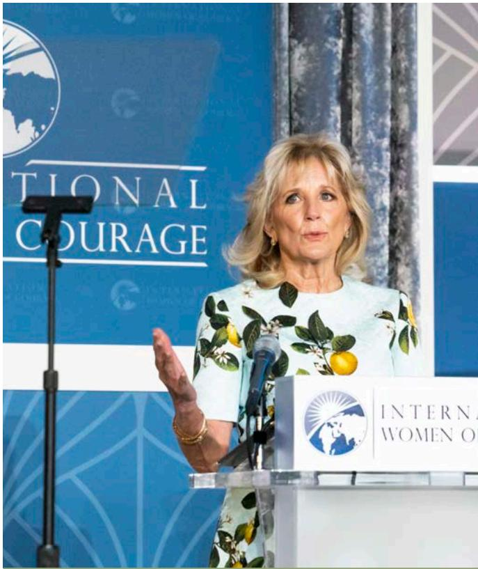

> **AI Description:**
> **Source:** `assets/_page_74_Figure_0.jpg`
> 
> **Generated:** 2026-05-18 11:47:08
> 
> ---
> 
> The image contains a photograph of a woman standing at a podium, speaking at an event. The podium has a logo and text that reads "INTERNATIONAL WOMEN OF COURAGE." The background features a blue banner with the same logo and text. The woman is wearing a light blue dress with a floral pattern. The setting appears to be a formal event or conference.

First Lady of the United States Dr. Jill Biden delivers remarks at the 2021 International Women of Courage Awards virtual ceremony in Washington, D.C., March 8, 2021. Department of State

## G. Loans Receivable

Loans Receivable from non-Federal entities primarily consist of amounts owed the Department for repatriation loans due. The Department provides repatriation loans for destitute American citizens overseas whereby the Department becomes the lender of last resort. These loans provide assistance to pay for return transportation, food and lodging, and medical expenses. The borrower executes a promissory note without collateral. Consequently, the loans are made anticipating a low rate of recovery. Interest, penalties, and administrative fees are assessed if the loan becomes delinquent. Loans Receivable from non-Federal entities are subject to the full debt collection cycle and mechanisms, e.g., salary offset, referral to collection agents, and Treasury offset.

## H. Interest Receivable

Interest earned on investments, but not received as of September 30, is recognized as interest receivable.

## I. Advances and Prepayments

Payments made in advance of the receipt of goods and services are recorded as advances or prepayments, and recognized as expenses when the related goods and services are received. Prepayments are made principally to other Federal entities or lease holders for future services. Advances are made to Department employees for official travel, salary advances to Department employees transferring to overseas assignments, and other miscellaneous prepayments and advances for future services. Typically, USAID Federal assistance results in a net advance. Additional information may be found in Note 7.

## J. Investments

The Department has several accounts that have the authority to invest cash resources. For these accounts, the cash resources not required to meet current expenditures are invested in interest-bearing obligations of the U.S. Government. These investments consist of U.S. Treasury special issues and securities. Special issues are unique public debt obligations for purchase exclusively by the Foreign Service Retirement and Disability Fund and for which interest is computed and paid semi-annually on June 30 and December 31. They are purchased and redeemed at par, which is their carrying value on the Consolidated Balance Sheet.

Investments by the Department’s Foreign Service National Defined Contribution Fund, Gift, Israeli Arab Scholarship, Eisenhower Exchange Fellowship, Middle Eastern-Western Dialogue, and International Center accounts are in U.S. Treasury securities. Interest on these investments is paid semi-annually at various rates. These investments are reported at acquisition cost, which equals the face value net of unamortized discounts or premiums. Discounts and premiums are amortized over the life of the security using the straight-line method for Gift Funds investments, and effective interest method for the other accounts. Additional information on Investments can be found in Note 3.

## K. General Property and Equipment

## Real Property

Real property assets primarily consist of facilities used for U.S. diplomatic missions abroad and capital improvements to these facilities, including unimproved land; residential and functional-use buildings such as embassy/consulate

office buildings; office annexes and support facilities; and construction-in-progress. Title to these properties is held under various conditions including fee simple, restricted use, crown lease, and deed of use agreement. Some of these properties are considered historical treasures and are considered multi-use heritage assets. These items are reported on the Consolidated Balance Sheet, in Note 6 to the financial statements, and in the Heritage Assets Section.

The Department also owns several domestic real properties, including the International Center (Washington, D.C.); the Charleston Financial Services Center (S.C.); the Beltsville Information Management Center (Md.); the Florida Regional Center (Ft. Lauderdale); and consular centers in Charleston, S.C. and Williamsburg, Ky. The Foreign Missions Act authorizes the Department to facilitate the secure and efficient operation in the United States of foreign missions. The Act established the Office of Foreign Missions to manage acquisitions, including leases, additions, and sales of real property by foreign missions. In certain cases, based on reciprocity, the Department owns real property in the United States that is used by foreign missions for diplomatic purposes. The IBWC owns buildings and structures related to its boundary preservation, flood control, and sanitation programs.

Buildings and structures are carried principally at either actual or estimated historical cost. Buildings and structures received by donation are recorded at estimated fair market value. The Department capitalizes all costs for constructing new buildings and building acquisitions regardless of cost, and all other improvements of \$1 million or more. Costs incurred for constructing new facilities, major rehabilitations, or other improvements in the design or construction stage are recorded as construction-in-progress. After these projects are substantially complete, costs are transferred to Buildings and Structures or Leasehold Improvements, as appropriate. Depreciation is computed on a straight-line basis over the asset’s estimated life and begins when the property is placed into service. The estimated useful lives for real property are as follows:

## Personal Property

Personal property consists of several asset categories including aircraft, vehicles, security equipment, communication equipment, automated data processing (ADP) equipment, reproduction equipment, and software. The Department holds title to these assets, some of which are operated in unusual conditions, as described below.

The Department’s Bureau of International Narcotics and Law Enforcement (INL) uses aircraft to help eradicate and stop the flow of illegal drugs. To accomplish its mission, INL maintains an aircraft fleet that is one of the largest Federal, nonmilitary fleets. Most of the aircraft are under direct INL air wing management. However, a number of aircraft are managed by host-countries. The Department holds title to most of the aircraft under these programs and requires congressional notification to transfer title for any aircraft to foreign governments. INL contracts with firms to provide maintenance support depending on whether the aircraft are INL air wing managed or host-country managed. INL air wing managed aircraft are maintained to Federal Aviation Administration standards that involve routine inspection, as well as scheduled maintenance and replacements of certain parts after given hours of use. Host-country managed aircraft are maintained to host-country requirements.

The Department also maintains a large vehicle fleet that operates overseas. Many vehicles require armoring for security reasons. For some locations, large utility vehicles are used instead of conventional sedans. In addition, the Department contracts with firms to provide support in strife-torn areas, such as Iraq and Afghanistan. Contractor support includes the purchase and operation of armored vehicles. Under the terms of the contracts, the Department has title to the contractor-held vehicles. In 2021, personal property assets located in Afghanistan were either temporarily transferred to other locations or disposed.

Personal property and equipment with an acquisition cost of \$25,000 or more, and a useful life of two or more years, is capitalized at cost. Additionally, all vehicles are capitalized, as well as internal use software with cost of \$500,000 or more. Except for contractor-held vehicles in Iraq and Afghanistan, depreciation is calculated on a straight-line basis over the asset’s estimated life and begins when the property is placed into service. Contractor-held vehicles in Iraq and Afghanistan, due to the harsh operating conditions, are depreciated on a double-declining balance basis. The estimated useful lives for personal property are as follows:

See Note 6, General Property and Equipment, Net, for additional information.

## Capital Leases

Leases are accounted for as capital leases if the value is \$1 million or more and they meet one of the following criteria: (1) the lease transfers ownership of the property by the end of the lease term; (2) the lease contains an option to purchase the property at a bargain price; (3) the lease term is equal to or greater than 75 percent of the estimated useful life of the property; or (4) at the inception of the lease, the present value of the minimum lease payment equals or exceeds 90 percent of the fair value of the leased property. The initial recording of a lease’s value (with a corresponding liability) is the lesser of the net present value of the lease payments or the fair value of the leased property. Capital leases that meet criteria (1) or (2) are depreciated over the useful life of the asset (30 years). Capital leases that meet criteria (3) or (4) are depreciated over the term of the lease. Capital lease liabilities are amortized over the term of the lease; if the lease has an indefinite term, the term is capped at 50 years. Additional information on capital leases is disclosed in Note 11, Leases.

## Stewardship Property and Equipment – Heritage Assets

Stewardship Property and Equipment, or Heritage Assets, are assets that have historical or natural significance; are of cultural, educational, or artistic importance; or have significant architectural characteristics. They are generally considered priceless and are expected to be preserved indefinitely. As such, these assets are reported in terms of physical units rather than cost or other monetary values. See Note 6.

## L. Grants

The Department awards educational, cultural exchange, and refugee assistance grants to various individuals, universities, and non-profit organizations. Budgetary obligations are recorded when grants are awarded. Grant funds are disbursed in two ways: grantees draw funds commensurate with their immediate cash needs via HHS’ Payment Management System; or grantees request reimbursement for their expenditures.

## M. Accounts Payable

Accounts payable represent the amounts accrued for contracts for goods and services received but unpaid at the end of the fiscal year and unreimbursed grant expenditures. In addition to accounts payables recorded through normal business activities, unbilled payables are estimated based on historical data.

## N. Accrued Annual, Sick, and Other Leave

Annual leave is accrued as it is earned by Department employees, and the accrual is reduced as leave is taken. Throughout the year, the balance in the accrued annual leave liability account is adjusted to reflect current pay rates. The amount of the adjustment is recorded as an expense. Current or prior year appropriations are not available to fund annual leave earned but not taken. Funding occurs in the year the leave is taken and payment is made. Sick leave and other types of non-vested leave are expensed as taken.

## O. Employee Benefit Plans

Retirement Plans: Civil Service employees participate in either the Civil Service Retirement System (CSRS) or the Federal Employees Retirement System (FERS). Members of the Foreign Service participate in either the Foreign Service Retirement and Disability System (FSRDS) or the Foreign Service Pension System (FSPS).

Employees covered under CSRS contribute 7 percent of their salary; the Department contributes 7 percent. Employees covered under CSRS also contribute 1.45 percent of their salary to Medicare insurance; the Department makes a matching contribution. On January 1, 1987, FERS went into effect pursuant to Public Law No. 99-335. Most employees hired after December 31, 1983, are automatically covered by FERS and Social Security. Employees hired prior to January 1, 1984, were allowed to join FERS or remain in CSRS. Employees participating in FERS contribute 0.8 percent, 3.1 percent, or 4.4 percent (depending on date of hire) of their salary, with the Department making contributions of 17.3 percent or 15.5 percent. FERS employees also contribute 6.2 percent to Social Security and 1.45 percent to Medicare insurance. The Department makes matching contributions to both. A primary feature of FERS is that it offers a Thrift Savings Plan (TSP) into which the Department automatically contributes 1 percent of pay and matches employee contributions up to an additional 4 percent.

Foreign Service employees hired prior to January 1, 1984 participate in FSRDS, with certain exceptions. FSPS was established pursuant to Section 415 of Public Law No. 99-335, which became effective June 6, 1986. Foreign Service employees hired after December 31, 1983 participate in FSPS with certain exceptions. FSRDS employees contribute 7.25 percent of their salary; the Department contributes 7.25 percent. FSPS employees contribute 1.35 percent, 3.65 percent, or 4.95 percent of their base salary depending on their start date; the Department contributes 20.22 percent or 17.92 percent. FSRDS and FSPS employees contribute 1.45 percent of their salary to Medicare; the Department matches their contribution. FSPS employees also contribute 6.2 percent to Social Security; the Department makes a matching contribution. Similar to FERS, FSPS also offers the TSP.

Foreign Service National (FSN) employees at overseas posts who were hired prior to January 1, 1984, are covered under CSRS. FSN employees hired after that date are covered under a variety of local government plans in compliance with the host country’s laws and regulations. In cases where the host country does not mandate plans or the plans are inadequate, employees are covered by plans that conform to the prevailing practices of comparable employers.

Health Insurance: Most American employees participate in the Federal Employees Health Benefits Program (FEHBP), a voluntary program that provides protection for enrollees and eligible family members in cases of illness and/or accident. Under FEHBP, the Department contributes the employer’s share of the premium as determined by the U.S. Office of Personnel Management (OPM).

Life Insurance: Unless specifically waived, employees are covered by the Federal Employees Group Life Insurance Program (FEGLIP). FEGLIP automatically covers eligible employees for basic life insurance in amounts equivalent to an employee’s annual pay, rounded up to the next thousand dollars plus \$2,000. The Department pays one-third and employees pay two-thirds of the premium. Enrollees and their family members are eligible for additional insurance coverage, but the enrollee is responsible for the cost of the additional coverage.

Other Post Employment Benefits: The Department does not report CSRS, FERS, FEHBP, or FEGLIP assets, accumulated plan benefits, or unfunded liabilities applicable to its employees; OPM reports this information. As required by SFFAS No. 5, Accounting for Liabilities of the Federal Government, the Department reports the full cost of employee benefits for the programs that OPM administers. The Department recognizes an imputed cost and imputed financing source for the annualized unfunded portion of CSRS, post-retirement health benefits, and life insurance for employees covered by these programs.

## P. Future Workers’ Compensation Benefits

The Federal Employees’ Compensation Act (FECA) provides income and medical cost protection to cover Federal employees injured on the job or who have incurred a work-related occupational disease, and beneficiaries of employees whose death is attributable to job-related injury or occupational disease. The DOL administers the FECA program. DOL initially pays valid claims and bills the employing Federal agency. DOL calculates the actuarial liability for future workers’ compensation benefits and reports to each agency its share of the liability.

## Q. Foreign Service Retirement and Disability Fund

The Department manages the Foreign Service Retirement and Disability Fund (FSRDF). To ensure it operates on a sound financial basis, the Department retains an actuarial firm to perform a valuation to project if the Fund’s assets together with the expected future contributions are adequate to cover the value of future promised benefits. To perform this valuation the actuary projects the expected value of future benefits and the stream of expected future employer and employee contributions. The valuation serves as a basis for the determination of the needed employer contributions to the retirement fund and is based on a wide variety of economic assumptions, such as merit salary increases and demographic assumptions, such as rates of mortality. Since both the economic and demographic experience change over time, it is essential to conduct periodic reviews of the actual experience and to adjust the assumptions in the valuation, as appropriate. The Department’s actuary completes an Actuarial Experience Study approximately every five years to ensure the assumptions reflect the most recent experience and future expectations. The Department’s last study was completed in 2018. The economic assumptions changes from the experience study are different from the economic assumptions changes determined under SFFAS No. 33 Pensions, Other Retirement Benefits, and Other Postemployment Benefits. See Note 9, After-Employment Benefit Liability, for the Department’s accounting policy for FSRDF retirement-related benefits and the associated actuarial present value of projected plan benefits.

> **AI Description:**
> **Source:** `assets/_page_78_Figure_0.jpg`
> 
> **Generated:** 2026-05-18 11:37:57
> 
> ---
> 
> The image is a photograph showing a group of people in what appears to be a classroom or community setting. A young girl in a purple dress is playing a violin, while another child in a blue shirt is holding a violin bow. An adult in a suit is seated at a table, possibly a judge or observer, and is wearing a face mask. In the background, there are two adults standing, also wearing face masks, and a foosball table is visible. The setting suggests a music performance or competition, possibly during a pandemic given the use of face masks.

Secretary Blinken tours Civic Center Desamparados in connection with the Sembremos Seguridad initiative in San José, Costa Rica, June 2, 2021. Department of State

## R. Foreign Service Nationals’ After-Employment Benefits

Defined Contributions Fund (DCF): This fund provides retirement benefits for FSN employees in countries where the Department has made a public interest determination to discontinue participation in the Local Social Security System (LSSS) or deviate from other prevailing local practices. Title 22, Foreign Relations and Intercourse, Section 3968, Local Compensation Plans, provides the authority to the Department to establish such benefits as art of a total compensation plan for these employees.

Defined Benefit Plans: The Department has implemented various arrangements for defined benefit pension plans in other countries, for the benefit of some FSN employees. Some of these plans supplement the host country’s equivalent to U.S. social security, others do not. While none of these supplemental plans are mandated by the host country, some are substitutes for optional tiers of a host country’s social security system. The Department accounts for these plans under the provisions and guidance contained in International Accounting Standards (IAS) No. 19, Employee Benefits. IAS No. 19 provides a better structure for the reporting of these plans which are established in accordance with local practices in countries overseas.

Lump Sum Retirement and Severance: Under some local compensation plans, FSN employees are entitled to receive a lump-sum separation payment when they resign, retire, or otherwise separate through no fault of their own. The amount of the payment is generally based on length of service, rate of pay at the time of separation, and the type of separation.

## S. International Organizations Liability

The United States is a member of the United Nations (UN) and other international organizations and supports UN peacekeeping operations. As such, the United States either contributes to voluntary funds or an assessed share of the budgets and expenses of these organizations and activities. These payments are funded through congressional appropriations to the Department. The purpose of these appropriations is to ensure continued American leadership within those organizations and activities that serve important U.S. interests. Funding by appropriations for dues assessed for certain international organizations is not received until the fiscal year following assessment. These commitments are regarded as funded only when monies are authorized and appropriated by Congress. For financial reporting purposes, the amounts assessed, pledged, and unpaid are reported as liabilities of the Department. Additional information is disclosed in Note 10.

## T. Contingent Liabilities

Contingent liabilities are liabilities where the existence or amount of the liability cannot be determined with certainty pending the outcome of future events. The Department recognizes contingent liabilities when the liability is probable and reasonably estimable. See Notes 8 and 12.

## U. Funds from Dedicated Collections

Funds from Dedicated Collections are financed by specifically identified revenues, often supplemented by other financing sources, which remain available over time. These specifically identified revenues and other financing sources are required by statute to be used for designated activities or purposes and must be accounted for separately from the Government’s general revenues. Additional information is disclosed in Notes 3 and 13.

> **AI Description:**
> **Source:** `assets/_page_79_Figure_0.jpg`
> 
> **Generated:** 2026-05-18 11:34:24
> 
> ---
> 
> The image shows a formal meeting setting with individuals seated around a long table. The table is equipped with microphones, nameplates, and some documents, suggesting a diplomatic or official discussion. Two flags are visible in the background, one of which is the American flag, indicating the presence of American officials. The individuals are dressed in formal attire, and some are wearing face masks, reflecting the context of the meeting during the COVID-19 pandemic. The setting appears to be a large, formal room with a carpeted floor and large doors in the background.

Secretary Blinken meets with Republic of Korea Foreign Minister Chung Eui-yong in London, United Kingdom, May 3, 2021. Department of State

## V. Net Position

The Department’s net position contains the following components:

Unexpended Appropriations: Unexpended appropriations is the sum of undelivered orders and unobligated balances. Undelivered orders represent the amount of obligations incurred for goods or services ordered, but not yet received. An unobligated balance is the amount available after deducting cumulative obligations from total budgetary resources. As obligations for goods or services are incurred, the available balance is reduced.

Cumulative Results of Operations: The cumulative results of operations include the accumulated difference between revenues and financing sources less expenses since inception and donations.

Net position of funds from dedicated collections is separately disclosed. See Note 13.

## W. Foreign Currency

Accounting records for the Department are maintained in U.S. dollars, while a significant amount of the Department’s overseas expenditures are in foreign currencies. For accounting purposes, overseas obligations and disbursements are recorded in U.S. dollars based on the rate of exchange as of the date of the transaction. Foreign currency payments are made by the U.S. Disbursing Office.

## X. Fiduciary Activities

Fiduciary activities are the collection or receipt, and the management, protection, accounting, investment, and disposition by the Federal Government of cash or other assets in which non-Federal individuals or entities have an ownership interest that the Federal Government

must uphold. The Department’s fiduciary activities are not recognized on the principal financial statements, but are reported on schedules as a note to the financial statements. The Department’s fiduciary activities include receiving contributions from donors for the purpose of providing compensation for certain claims within the scope of an established agreement, investment of contributions into Treasury securities, and disbursement of contributions received within the scope of the established agreement. See Note 18.

## Y. Use of Estimates

The preparation of financial statements in conformity with GAAP requires management to make estimates and assumptions, and exercise judgment that affects the reported amounts of assets, liabilities, net position, and disclosure of contingent liabilities as of the date of the financial statements, and the reported amounts of revenues, financing sources, expenses, and obligations incurred during the reporting period. These estimates are based on management’s best knowledge of current events, historical experience, actions the Department may take in the future, and various other assumptions that are believed to be reasonable under the circumstances. Due to the size and complexity of many of the Department’s programs, the estimates are subject to a wide range of variables, including assumptions on future economic and financial events. Accordingly, actual results could differ from those estimates.

## Z. Comparative Data

Certain 2020 amounts have been reclassified to conform to the 2021 presentation. The Consolidated Balance Sheet and Note 8, Other Liabilities, presentation has been updated to conform to OMB Circular A-136, Financial Reporting Requirements, revised.

## 2  Fund Balance with Treasury

Fund Balance with Treasury at September 30, 2021, and 2020, is summarized below (dollars in millions).

## 3  Investments

Investments at September 30, 2021 and 2020, are summarized below (dollars in millions). All investments are classified as Intragovernmental Securities.

(continued on next page)

## NOTE 3: Investments (continued)

The Department’s activities that have the authority to invest cash resources are comprised of Funds from Dedicated Collections (see Note 13) and pension and retirement plans administered by the Department (see Note 9). The U.S. Government does not set aside assets to pay future benefits or other expenditures associated with these activities. Rather, the cash receipts collected are deposited in the Treasury, which uses the cash for general U.S. Government purposes. Treasury securities are issued to the Department as evidence of its receipts. Treasury securities are an asset to the Department and a liability to the Treasury. Because the Department and the Treasury are both parts of the U.S. Government, these assets and liabilities offset each other

from the standpoint of the U.S. Government as a whole. For this reason, they do not represent an asset or a liability in the U.S. Government-wide financial statements.

Treasury securities provide the Department with authority to draw upon the Treasury to make future benefit payments or other expenditures. When the Department requires redemption of these securities to make expenditures, the U.S. Government finances those expenditures out of accumulated cash balances, by raising taxes or other receipts, by borrowing from the public or repaying less debt, or by curtailing other expenditures. The U.S. Government finances most expenditures in this way.

## 4  Accounts Receivable, Net

The Department’s Accounts Receivable, Net at September 30, 2021 and 2020, are summarized below (dollars in millions). All are entity receivables.
2021
2020

The Accounts Receivable, Net of allowance for uncollectible accounts as of September 30, 2021 and 2020, is \$187 million and \$229 million, respectively. The allowance for uncollectible accounts are recorded using aging methodologies based on analysis of historical collections and write-offs. The allowance recognition for intragovernmental receivables does not alter the statutory requirement for the Department to collect payment.

The Intragovernmental Accounts Receivable are amounts owed to the Department from other Federal agencies for reimbursement for goods and services. The Accounts Receivable with the public are amounts due from foreign governments and the public for value added taxes, emergency COVID-19 evacuations, IBWC receivables for Mexico’s share of activities, civil monetary fines and penalties, and repatriation loan interest, penalties, and associated administrative fees (see Accounts Receivable in Note 1.F).

In 2021, the Department estimated \$4 million in accounts receivable to be collectible for criminal restitution.

## 5  Cash and Other Monetary Assets

The Cash and Other Monetary Assets at September 30, 2021 and 2020, are summarized below (dollars in millions).   
There are no restrictions on entity cash.

## Foreign Service National After-Employment Benefit Assets

The Defined Contributions Fund (FSN DCF) provides retirement benefits for FSN employees in countries where the Department has made a public interest determination to discontinue participation in the LSSS or deviate from other prevailing local practices. Title 22, Foreign Relations and Intercourse, Section 3968, Local Compensation Plans, provides the authority to the Department to establish such benefits and identifies as part of a total compensation plan for these employees. The FSN DCF finances the Defined Contribution Plan (DCP) which is administered by a third party who invests excess funds in Treasury securities on behalf of the Department. The other monetary assets reported for the FSN DCP is \$261 million and \$238 million as of September 30, 2021 and 2020, respectively.

> **AI Description:**
> **Source:** `assets/_page_83_Figure_0.jpg`
> 
> **Generated:** 2026-05-18 11:29:00
> 
> ---
> 
> The image depicts a formal meeting setting in a room with ornate walls and furniture. Two individuals are seated at a long wooden table, facing each other. The table is equipped with microphones, nameplates, and water glasses. The nameplates indicate the presence of Philippe REKKER and Emmanuel MACRON. The room has a sophisticated ambiance with decorative elements on the walls. The image captures a professional interaction, likely a political or governmental meeting.

Secretary Blinken meets with French President Emmanuel Macron in Paris, France, June 25, 2021. Department of State

## 6  General Property and Equipment, Net

General Property and Equipment, Net balances at September 30, 2021 and 2020, are shown in the following table (dollars in millions).

General Property and Equipment, Net activities during 2021 and 2020 are shown in the following table (dollars in millions).

The U.S. Embassy in Kabul and adjacent compounds were evacuated, and operations suspended on August 31, 2021. As a result, personal property assets located in Kabul were either temporarily transferred to other locations or disposed and reported as dispositions. The Department’s real property holdings, including the U.S. Embassy in Kabul,

were reviewed to determine the values for reporting these assets. The Department has not disposed or transferred any of its real property holdings in Kabul; however, ongoing projects for new construction-in-progress were terminated. As a result of increased risks to the security and environment for these properties, the Department reduced the useful life of its buildings and structures in Kabul from 30 years to 20 years and reduced the useful life of building improvements to zero. Further, the Department was granted additional property in Kabul shortly before operations were suspended. Due to the proximity of the property grant to the suspension of operations and the current uncertainty in the real estate market in Kabul, the Department has used alternative valuations to estimate and report the fair value of this property. The overall financial impact to the Department’s General Property and Equipment, Net, as a result of the suspension of the U.S. Embassy in Kabul and South Compound grant, is a decrease in the net book value of \$93 million.

## NOTE 6: General Property and Equipment, Net (continued)

## Stewardship Property and Equipment – Heritage Assets

The Department maintains collections of art, furnishings and real property (Culturally Significant Property) that are held for public exhibition, education and official functions for visiting chiefs of State, heads of government, foreign ministers and other distinguished foreign and American guests. As the lead institution conducting American diplomacy, the Department uses this property to promote national pride and the distinct cultural diversity of American artists, as well as to recognize the historical, architectural and cultural significance of America’s holdings overseas.

There are nine separate collections of art and furnishings: the Diplomatic Reception Rooms Collection, the Art Bank Program, the Art in Embassies Program, the Cultural Heritage Collection, the Library Rare and Special Book Collection, the Secretary of State’s Register of Culturally

Significant Property, the National Museum of American Diplomacy, the Blair House, and the International Boundary and Water Commission. The collections, activity of which is shown in the following table and described more fully in the Required Supplementary Information and Other Information sections of this report, consist of items that were donated or purchased using donated or appropriated funds. The Department provides protection and preservation services to maintain all Heritage Assets in the best possible condition as part of America’s history. The Department’s deferred maintenance policy within the RSI includes analysis of Heritage Assets on the Secretary of State’s Register of Culturally Significant Property list. The following table contains unaudited data as discussed in the Independent Auditor’s Report.

HERITAGE ASSETS For the Years Ended September 30, 2020 and 2021

(continued on next page)

> **AI Description:**
> **Source:** `assets/_page_86_Figure_0.jpg`
> 
> **Generated:** 2026-05-18 11:33:57
> 
> ---
> 
> The image depicts a well-organized room with a large bookshelf filled with books. Above the bookshelf, there are two framed portraits of individuals, a bust sculpture, and a few smaller framed pictures. The room is lit by two table lamps with pleated shades, and there is a vase of white roses on a small table to the right. The curtains are partially drawn, allowing natural light to filter into the room. The overall setting suggests a study or library with a classical and formal atmosphere.

The Blair House Library is part of the principal suite during foreign visits, where world leaders have private meetings and meals. Department of State

HERITAGE ASSETS (continued) For the Years Ended September 30, 2020 and 2021

## 7  Advances and Prepayments

The Department’s Advances and Prepayments are payments made in advance of the receipt of goods and services and recognized as expenses when the related goods and services are received (see Advances and Prepayments in Note 1.I) The majority of Intragovernmental Advances and Prepayments are to USAID in support of the Global Health and Child Survival program and the Defense Security Cooperation Agency in support of Peacekeeping Operations and the Pakistan Counterinsurgency Capability programs. The Advances and Prepayments with the public are predominantly to support the Overseas Buildings Operations bureau with real property rent and acquisitions. Other Advances and Prepayments with the public include payments to grantees in support of the Global Health and Child Survival program and the Population, Refugee and Migration Assistance program.

The Department’s Advances and Prepayments as of September 30, 2021 and 2020, are summarized below (dollars in millions).

## 8  Other Liabilities

The Department’s Other Liabilities at September 30, 2021 and 2020, are summarized below (dollars in millions).

## Environmental Liability Associated with Asbestos Cleanup and Other

The Department has estimated both friable, \$5 million, and nonfriable, \$46 million, asbestos-related cleanup costs and recognized a liability and related expense for those costs that are both probable and reasonably estimable as of September 30, 2021, consistent with the current guidance in the Statement of Federal Financial Accounting Standards (SFFAS) No. 5, Accounting for Liabilities of the Federal Government; SFFAS No. 6, Accounting for Property, Plant, and Equipment, Chapter 4: Cleanup Costs; and Technical Release 2, Determining Probable and Reasonably Estimable for Environmental Liabilities in the Federal Government. The remaining \$1 million in environmental liability is non-asbestos related cleanup costs for lead based paint.

> **AI Description:**
> **Source:** `assets/_page_88_Figure_0.jpg`
> 
> **Generated:** 2026-05-18 11:23:33
> 
> ---
> 
> The image shows a person seated inside an aircraft, wearing a headset and looking at a device that appears to be a communication or control panel. The background includes aircraft windows and a partial view of a U.S. government emblem. The person is wearing a dark jacket and appears to be engaged in some form of communication or operation. The image does not contain any charts, graphs, or other visual elements beyond the text on the device and the emblem.

Secretary Blinken makes calls to several foreign leaders during his travel, May 16, 2021. Department of State

NOTE 8: Other Liabilities (continued)

## Liabilities Not Covered by Budgetary Resources

The Department’s liabilities are classified as liabilities covered by budgetary resources, liabilities not covered by budgetary resources, or liabilities not requiring budgetary resources. Liabilities not covered by budgetary resources result from the receipt of goods and services, or occurrence of eligible events in the current or prior periods, for which revenue or other funds to pay the liabilities have not been made available through appropriations or current earnings of the

Department. Liabilities not requiring budgetary resources are for liabilities that have not in the past required and will not in the future require the use of budgetary resources. This includes liabilities for clearing accounts, non-fiduciary deposit funds, custodial collections, and general fund receipts. The liabilities in this category at September 30, 2021 and 2020 are summarized in the Schedule of Liabilities Not Covered by Budgetary Resources (dollars in millions).

## 9  Federal Employee and Veteran Benefits Payable

The Department of State provides Federal Employee and Veteran Benefits to its employees, serving both domestically and abroad. In addition to participation in other agency administered benefit plans, such as the Federal Employees’ Compensation Act (FECA), the Department also administers several retirements plans for both Foreign Service Officers (FSOs) and Foreign Service Nationals (FSNs). FSOs participate in the Foreign Service Retirement and Disability pension plans. FSN employees participate in a variety of plans established by the Department in each country based upon prevailing compensation practices in the host country. The table below summarizes the liability associated with these benefits (dollars in millions).

Details for the Actuarial Liabilities for Pension and Retirement Plans Administered by the Department are as follows:

## Foreign Service Retirement and Disability Fund

The FSRDF finances the operations of the FSRDS and the FSPS. The FSRDS and the FSPS are defined-benefit, single-employer plans. FSRDS was originally established in 1924; FSPS in 1986. The FSRDS is a single-benefit retirement plan. Retirees receive a monthly annuity from FSRDS for the rest of their lives. FSPS provides benefits from three sources: a basic benefit (annuity) from FSPS, Social Security, and the TSP.

The Department’s financial statements present the Pension Actuarial Liability of the Foreign Service Retirement and Disability Program (the “Plan”) as the actuarial present value of projected plan benefits, as required by the SFFAS No. 33, Pensions, Other Retirement Benefits, and other Post Employment Benefits: Reporting the Gains and Losses from Changes in Assumptions and Selecting Discount Rates and Valuation Dates. The Pension Actuarial Liability represents the future periodic payments provided for current employee and retired Plan participants, less the future employee and employing Federal agency contributions, stated in current dollars.

Future periodic payments include benefits expected to be paid to (1) retired or terminated employees or their beneficiaries; (2) beneficiaries of employees who have died; and (3) present employees or their beneficiaries, including refunds of employee contributions as specified by Plan provisions. Total projected service is used to determine eligibility for retirement benefits. The value of voluntary, involuntary, and deferred retirement benefits is based on projected service and assumed salary increases. The value of benefits for disabled employees or survivors of employees is determined by multiplying the benefit the employee or survivor would receive on the date of disability or death, by a ratio of service at the valuation date to projected service at the time of disability or death.

The Pension Actuarial Liability is calculated by applying actuarial assumptions to adjust the projected plan benefits to reflect the discounted time value of money and the probability of payment (by means of decrements such as death, disability, withdrawal or retirement) between the valuation date and the expected date of payment. The Plan uses the aggregate entry age normal actuarial cost method, whereby the present value of projected benefits for each employee is allocated on a level basis (such as a constant percentage of salary) over the employee’s service between entry age and assumed exit age. The portion of the present value allocated to each year is referred to as the normal cost.

The table below presents the normal costs for 2021 and 2020.

Actuarial assumptions are based on the presumption that the Plan will continue. If the Plan terminates, different actuarial assumptions and other factors might be applicable for determining the actuarial present value of accumulated plan benefits. The assumption changes arise in connection with the annual valuation and follow the guidelines of SFFAS No. 33. The following table presents the calculation of the combined FSRDS and FSPS Pension Actuarial Liability and the assumptions used in computing it for the years ended September 30, 2021 and 2020 (dollars in millions).

Net Assets Available for Benefits at September 30, 2021 and 2020, consist of the following (dollars in millions).

## Foreign Service Nationals’ After-Employment Benefit Liabilities

The Department of State operates overseas in over 180 countries and employs a significant number of local nationals, currently over 50,000, known as Foreign Service Nationals (FSNs).

FSNs hired after January 1, 1984 do not qualify for any Federal civilian benefits (and therefore cannot participate) in any of the Federal civilian pension systems (e.g., Civil Service Retirement System (CSRS), FSRDS, TSP, etc.). By statute, the Department is required to establish compensation plans for FSNs in its employ in foreign countries. The plans are based upon prevailing wage and compensation practices in the locality of employment, unless the Department makes a public interest determination to do otherwise. In general, the Department follows host country (i.e., local) practices and conventions in compensating FSNs. The end result is that compensation for FSNs is often not in accord with what would otherwise be offered or required by statute and regulations for Federal civilian employees.

In each country, FSN after-employment benefits are included in the Post’s Local Compensation Plan. Depending on the local practice, the Department offers defined benefit plans, defined contribution plans, and retirement and voluntary severance lump sum payment plans. These plans are typically in addition to or in lieu of participating in the host country’s LSSS. These benefits form an important part of the Department’s total compensation and benefits program that is designed to attract and retain highly skilled and talented FSN employees.

## FSN Defined Contributions Fund (FSN DCF)

The Department’s FSN DCF finances two FSN afteremployment plans, the FSN Defined Contribution Plan (DCP) and the Variable Contribution Plan (VCP).

The Department’s FSN DCP and VCP provide afteremployment benefits for FSN employees in countries where the Department has made a public interest determination to discontinue participation in the LSSS or deviate from other prevailing local practices. Title 22, Foreign Relations and Intercourse, Section 3968, Local Compensation Plans, provides the authority to the Department to establish such benefits and identifies as part of a total compensation plan for these employees.

The Department contributes 12 percent of each participant’s base salary to the FSN DCP. Participants are not allowed to make contributions to the Plan. The amount of after-employment benefit received by the employee is determined by the amount of the contributions made by the Department along with investment returns and administrative fees. The Department’s obligation is determined by the contributions for the period, and no actuarial assumptions are required to measure the obligation or the expense. The FSN DCP is administered by a third party who invests contributions in U.S. Treasury securities on behalf of the Department. Payroll contributions are sent to the third party administrator, while separation benefits are processed by the Department upon receipt of funds from the third party. As of September 30, 2021, approximately 13,000 FSNs in 31 countries participate in the FSN DCP.

The Department records expense for contributions to the FSN DCP when the employee renders service to the Department, coinciding with the cash contributions to the FSN DCP. Total contributions by the Department in 2021 and 2020 were \$32.0 million and \$30.0 million, respectively. Total liability reported for the FSN DCP is \$260 million and \$240 million as of September 30, 2021 and 2020, respectively.

The FSN VCP reported employee and employer contributions of \$13.3 million and \$10.2 million as of September 30, 2021 and 2020, respectively. The total liability reported for the FSN VCP is \$47 million and \$33 million as of September 30, 2021 and 2020, respectively.

## Local Defined Contribution Plans

In 50 countries, the Department has implemented various local arrangements, primarily with third party providers, for defined contribution plans for the benefit of FSNs. Total contributions to these plans by the Department in 2021 and 2020 were \$32 million and \$28 million, respectively.

## Defined Benefit Plans

In 12 countries, involving over 3,600 FSNs, the Department has implemented various arrangements for defined benefit pension plans for the benefit of FSNs. Some of these plans supplement the host country’s equivalent to U.S. social security, others do not. While none of these supplemental plans are mandated by the host country, some are substitutes for optional tiers of a host country’s social security system. Such arrangements include (but are not limited to) conventional defined benefit plans with assets held in the name of trustees of the plan who engage plan

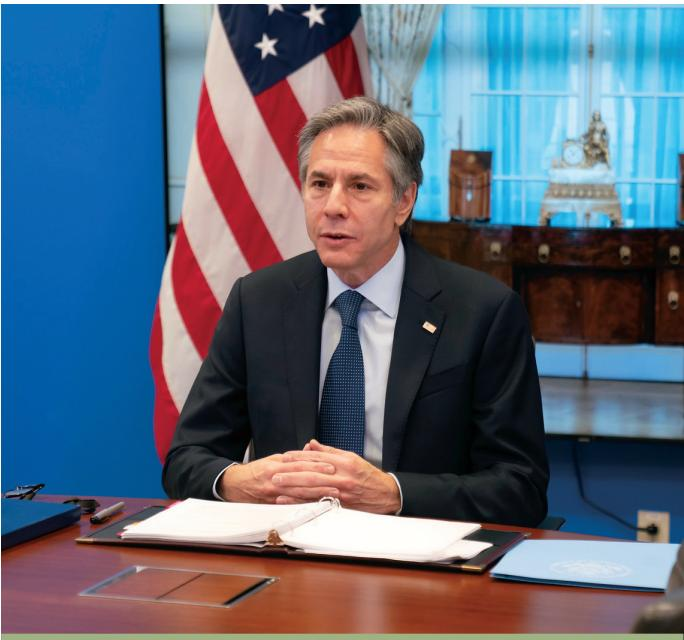

> **AI Description:**
> **Source:** `assets/_page_91_Figure_0.jpg`
> 
> **Generated:** 2026-05-18 11:31:28
> 
> ---
> 
> The image is a photograph of a man seated at a desk in an official setting, likely a government or diplomatic office. He is wearing a dark suit and tie, with a small American flag pin on his lapel. The background features an American flag and a wooden desk with various items, including what appears to be a ceremonial mace. The setting suggests a formal or official environment, possibly related to government or diplomatic affairs.

Secretary Blinken participates in a virtual Ministerial with Central Asian countries and the United States in Washington, D.C., April 23, 2021. Department of State

administrators, investment advisors and actuaries, and plans offered by insurance companies at predetermined rates or with annual adjustments to premiums. The Department deposits funds under various fiduciary-type arrangements, purchases annuities under group insurance contracts or provides reserves to these plans. Benefits under the defined benefit plans are typically based either on years of service and/or the employee’s compensation (generally during a fixed number of years immediately before retirement). The range of assumptions that are used for the defined benefit plans reflect the different economic and regulatory environments within the various countries.

As discussed in Note 1.R, the Department accounts for these plans under guidance contained in International Accounting Standards (IAS) No. 19, Employee Benefits. In accordance with IAS No. 19, the Department reported the net defined benefit liability of \$20 million and \$19 million as of September 30, 2021 and 2020, respectively. There was an increase of \$1 million in 2021 and a decrease of \$29 million in 2020.

The material FSN defined benefit plans include plans in Germany and the United Kingdom (UK) which represent 80 percent of total assets, 77 percent of total projected benefit obligations, and five percent of the net defined benefit liability as of September 30, 2021. The Germany Plan’s most recent evaluation report, dated August 6, 2021, is as of July 1, 2021. The UK Plan’s most recent evaluation, dated March 15, 2021, is as of April 5, 2020.

For the Germany Plan the change in the net defined benefit liability was an increase of \$3 million in 2021 and a increase of \$0.4 million in 2020, while for the UK plan the change was a decrease of \$19 million in 2021 and a decrease of \$23 million in 2020.

For Germany, the increase in the net defined benefit liability in 2021 was primarily due to actuarial losses due to a combination of a change in the discount rate and losses due to experience. The increase in 2020 was primarily due to actuarial losses due to experience.

For the UK plan in 2021, the decrease in the net defined benefit liability was primarily due to investment returns on plan assets. The decrease in 2020 was primarily due to a lump-sum contribution to fund the deficit.

The tables below show the changes in the projected benefit obligation and plan assets during 2021 and 2020 for the Germany and UK plans (dollars in millions).

The table below shows the allocation of the plan assets by category during 2021 and 2020 for the German and UK plans.

The principal actuarial assumptions used for 2021 and 2020 for the Germany and UK plans are presented below:

## Retirement and Voluntary Severance Lump Sum Payments

In 76 countries, FSN employees are provided a lump-sum separation payment when they resign, retire, or otherwise separate through no fault of their own. The amount of the payment is generally based on length of service, rate of pay at the time of separation, and the type of separation. As of September 30, 2021, approximately 24,000 FSNs participate in such plans.

The cost method used for the valuation of the liabilities associated with these plans is the Projected Unit Credit actuarial cost method. The participant’s benefit is first determined using both their projected service and salary at the retirement date. The projected benefit is then multiplied by the ratio of current service to projected service at retirement in order to determine an allocated benefit. The Projected Benefit Obligation (PBO) for the entire plan is calculated as the sum of the individual PBO amounts for each active member. Further, this calculation requires certain actuarial assumptions be made, such as voluntary withdraws, assumed retirement age, death and disability, as well as economic assumptions. For economic assumptions, available market data was scarce for many of the countries where eligible posts are located. Due to the lack of creditable global market data, an approach consistent with that used for the September 30, 2021, FSRDF valuations under SFFAS No. 33 was adopted. Using this approach, the economic assumptions used for the Retirement and Voluntary Severance Lump Sum Payment liability as of September 30, 2021 and 2020, are:

In 2021, there was a change in the methodology for developing actuarial assumptions. As a result, the salary increase rates no longer include an explicit rate of inflation. The current salary increase rates are assumed to implicitly reflect both merit and local inflation.

Based upon the projection, the total liability reported for the Retirement and Voluntary Severance Lump Sum Payment is \$692 million and \$593 million as of September 30, 2021 and 2020, respectively, as shown below (dollars in millions):

The September 30, 2021 total PBO of \$692 million represents a \$99 million increase compared to the September 30, 2020 total PBO of \$593 million. Changes to the discount rate, merit salary increase, and inflation assumptions increased total PBO by about \$96 million. Changes to the withdrawal and retirement assumptions decreased total PBO by about \$39 million.

The table below shows the changes in the projected benefit obligation during 2021 and 2020 (dollars in millions):

## 10  International Organizations Liability

The Department’s Bureau of International Organization Affairs (IO) is responsible for the administration, development, and implementation of the United States’ policies in the United Nations (UN), international organizations, and UN peacekeeping operations. The United States contributes either to voluntary funds or an assessed share of the budgets and expenses of these organizations and activities. These missions are supported through Congressional appropriation to the Department’s Contributions to International Organizations (CIO), Contributions for International Peacekeeping Activities (CIPA), and International Organizations and Programs (IO&P) accounts.

A liability is established for assessments received and unpaid and for pledges made and accepted by an international organization. Congress has mandated withholding the payments of dues because of policy restrictions or caps on the percentage of the organization’s operating costs financed by the United States. Without authorization from Congress, the Department cannot pay certain assessed amounts. The amounts of mandated withholdings that will likely not be authorized to be paid in the future do not appear as liabilities on the Balance Sheet of the Department.

Amounts presented in the table represent amounts that are paid through the CIO, CIPA, and IO&P accounts and administered by IO. Payables to international organizations by the Department that are funded through other appropriations are included in Accounts Payable to the extent such payables exist at September 30, 2021 and 2020.

Further information about the Department’s mission to the UN is at usun.state.gov. Details of the IO Liability follow (dollars in millions):

> **AI Description:**
> **Source:** `assets/_page_94_Figure_0.jpg`
> 
> **Generated:** 2026-05-18 11:35:03
> 
> ---
> 
> The image depicts an elegant dining room with a classical design. The room features arched windows with tall, slender panes, allowing ample natural light to enter. The walls are adorned with intricate murals and a large oval mirror, adding a touch of sophistication. The room is set for a formal event, with tables dressed in white tablecloths and blue napkins, accompanied by wooden chairs. A chandelier hangs from the ceiling, and a fireplace with decorative items is visible on the left side of the room. The overall ambiance is refined and inviting, suitable for a special occasion or formal gathering.

Blair House’s elegant Garden Room welcomes diplomatic guests for dining, meetings, and special events throughout the year, indoors and outside in season. Department of State

## 11  Leases

The Department is committed to over 10,000 leases, which cover office and functional properties, and residential units for diplomatic missions. The majority of these leases are short-term operating leases. In most cases, management expects that the leases will be renewed or replaced by other

## Capital Leases

The Department has various leases for real property that meet the criteria as a capital lease in accordance with SFFAS No. 6, Accounting for Property, Plant, and Equipment. Assets that meet the definition of a capital lease and their related lease liability are initially recorded at the present value of the future minimum lease payments or fair market value, whichever is lower. In general, capital leases are depreciated over the estimated useful life or lease terms depending upon which capitalization criteria the capital lease meets at inception. The related liability is amortized over the term of the lease, which can result in a different value in the asset versus the liability.

leases. Personnel from other U.S. Government agencies occupy some of the leased facilities (both residential and non-residential). These agencies reimburse the Department for the use of the properties. Reimbursements are received for approximately \$98 million of the lease costs.

The following is a summary of Net Assets under Capital Leases and Future Minimum Lease Payments as of September 30, 2021 and 2020 (dollars in millions). Lease liabilities are not covered by budgetary resources.

Future Minimum Lease Payments:

2021
2020

## Operating Leases

The Department leases real property under operating leases. These leases are with the public and expire in various years. Future minimum lease payments under operating leases have remaining terms in excess of one year as of September 30, 2021 and 2020 for each of the next 5 years and in aggregate are as follows (dollars in millions):

## 12  Contingencies and Commitments

## Contingencies

The Department is a party in various material legal matters (litigation, claims, assessments, including pending or threatened litigation, unasserted claims, and claims that may derive from treaties or international agreements) brought against it. We periodically review these matters pending against us. As a result of these reviews, we classify and adjust our contingent liability when we think it is probable that there will be an unfavorable outcome and when a reasonable estimate of the amount can be made.

Additionally, as part of our continuing evaluation of estimates required in the preparation of our financial statements, we evaluated the materiality of cases determined to have either a probable or reasonably possible chance of an adverse outcome.

As a result of these reviews, the Department believes that claims considered probable could result in estimable losses of \$72 to \$236 million and reasonably possible claims could result in potential estimable losses of \$13 to \$121 million if the outcomes were unfavorable to the Department. The probable cases involve claims related to international claims made against the United States, Equal Employment Opportunity Commission claims, grievances, consulate construction, Equal Access to Justice, Freedom of Information, and contract appeals. The reasonably possible cases involve contract disputes, claims related to embassy construction, sale of United States real property overseas dispute, Equal Employment Opportunity Commission claims, and international claims made against the United States being litigated by the Department.

Certain legal matters to which the Department is a party are administered and, in some instances, litigated and paid by other U.S. Government agencies. Generally, amounts to be paid under any decision, settlement, or award pertaining to these legal matters are funded from the Judgment Fund.

Payments made by the Judgment Fund for cases covered under the Contract Disputes Act and Notification and Federal Employees Antidiscrimination and Retaliation Act of 2002 on behalf of the Department totaled under \$1 million and \$5 million as of September 30, 2021 and 2020, respectively.

As a part of our continuing evaluation of estimates required for the preparation of our financial statements, we recognize settlements of claims and lawsuits and revised other estimates in our contingent liabilities. Management and the Legal Advisor believe we have made adequate provision for the amounts that may become due under the suits, claims, and proceedings we have discussed here.

In addition, the Department is responsible for environmental cleanup costs associated with asbestos and lead based paint. A liability is recognized for those costs that are both probable and reasonably estimable (see Note 8, Other Liabilities, for additional information). The following tables show each type of contingency, the likelihood of future events occurring, and the potential estimable range of losses at September 30, 2021 and 2020 (dollars in millions).

2021

## Commitments

In addition to the future lease commitments discussed in Note 11, Leases, the Department is committed under obligations for goods and services which have been ordered but not yet received at fiscal year end; these are termed undelivered orders (see Note 15, Combined Statement of Budgetary Resources).

Rewards Programs: Under 22 U.S.C. 2708, the Department has the authority to operate rewards programs that are critical to combating international terrorism, narcotics trafficking, war crimes, and transnational organized crime.

Rewards for Justice (RFJ), operated out of the Bureau of Diplomatic Security, is a 21st Century national security tool that is leveraged by the White House, the Department of State, and interagency partners throughout the U.S. Government. In 2020, RFJ became an office commensurate with its level of increased responsibilities. RFJ’s traditional mission since the 1980’s, counterterrorism, was dramatically expanded by Congress in 2017 to include countering malicious cyber activity and Democratic People’s Republic of Korea sanctions violators, essentially tripling the size of Rewards for Justice’s mandate and scope of the program. See further details at www.rewardsforjustice.net.

The Narcotics Rewards Program (NRP), operated out of the Bureau of International Narcotics and Law Enforcement, was created through a legislative amendment to 22 U.S.C. 2708 in 1986. Since that time, under its authority to offer rewards for information leading to the arrest or conviction in any country of persons committing major foreign violations of U.S. narcotics laws or the killing or kidnapping of U.S. narcotics law enforcement officers or their family members (in connection with the enforcement of U.S. narcotics laws), more than 75 transnational criminals and major narcotics traffickers have been brought to justice.

The War Crimes Rewards Program is operated out of the Office of Global Criminal Justice. It offers rewards for information that leads to the arrest or conviction in any country, or the transfer or conviction by an international, hybrid, or mixed tribunal of foreign nationals accused of war crimes, genocide, or crimes against humanity as defined under the statute of such a tribunal. The War Crimes Rewards Program has contributed to more than twenty prosecutions of fugitives accused of these crimes.

The Transnational Organized Crime Rewards Program (TOCRP), operated out of the Bureau of International Narcotics and Law Enforcement, was created through another legislative amendment in 2013. Based on the successes of the RFJ and the NRP, the TOCRP was provided authority to complement the offering of rewards for information leading to the arrest or conviction like the NRP (beyond narcotics trafficking), but with the broader authorities provided to the RFJ to include offering rewards for information leading to the identification or location of an individual who holds a key leadership position in a transnational organized crime (TOC) group, and the disruption of financial mechanisms of a TOC group. The TOCRP allows the offering of rewards to address significant transnational criminals involved in an array of

## 13   Funds from Dedicated Collections

The Department administers 10 Funds from Dedicated Collections as listed below. They are presented in accordance with SFFAS No. 43, Funds from Dedicated Collections: Amending Statement of Federal Financial Accounting

transnational crime, including but not limited to human smuggling and human trafficking, cyber crime, arms trafficking, import/export violations, money laundering, and wildlife trafficking.

Pending reward offers under the four programs total \$1.4 billion. Under the programs, we have paid out \$374 million since 2003. Reward payments are funded from Diplomatic and Consular Programs prior year expired, unobligated balances using available transfer authorities as necessary. Management and the Legal Advisor believe there is adequate funding for the amounts that may become due under the Rewards Program.

Standards 27, Identifying and Reporting Earmarked Funds. There are no intra-departmental transactions between the various funds from dedicated collections.

Consular and Border Security Programs

The Consular and Border Security Programs fund (CBSP) uses consular fee and surcharge revenue collected from the public to fund CBSP programs and activities, consistent with applicable statutory authorities. These fees and surcharges include Machine Readable Visa fees, Western Hemisphere Travel Initiative surcharges, Passport Security surcharges, Immigrant Visa Security surcharges, Diversity Visa Lottery fees, and Affidavit of Support fees. The CBSP fund is the largest dedicated collections program managed by the Department and is presented in a separate column in the table on the following page.

In 2018 and prior years, these fees and surcharges were credited in the Diplomatic and Consular Programs

fund as spending authority from offsetting collections. The Consolidated Appropriations Act of FY 2017 (Public Law No. 115-31) enacted a new stand-alone fund beginning in 2019 to display fee-funded consular programs independent of the larger Diplomatic Programs (formerly Diplomatic and Consular Programs) fund. In 2021, unobligated balances totaling \$218.6 million related to the fees and surcharges were transferred from the former fund to the CBSP. Additionally, \$300 million was received in direct appropriations related to the Coronavirus Preparedness and Response Supplemental Appropriations (CARES) Act (see Note 19, COVID-19 Activity). This change enables the Department to provide greater transparency and

accountability in financial reporting on these fees and surcharges, facilitate budget estimates for these fees and surcharges, and more easily make the information available to users of budget information and other stakeholders.

The table below displays the dedicated collection amounts on a combined basis as of September 30, 2021 and 2020 (dollars in millions).

The table below summarizes the combined Funds from Dedicated Collections and all Other Funds, less intra-departmental eliminations to arrive at the consolidated net position totals as presented on the Balance Sheet.

> **AI Description:**
> **Source:** `assets/_page_99_Figure_0.jpg`
> 
> **Generated:** 2026-05-18 11:45:44
> 
> ---
> 
> The image is a photograph of a man standing at a podium with the U.S. Department of State seal on it, delivering a speech. Behind him, there are numerous flags representing various countries, including NATO member states and others. The setting appears to be a modern, glass-walled building, possibly a conference or meeting room. The flags are arranged in a row, and the man is dressed in a suit, indicating a formal or official event.

Secretary Blinken delivers a speech on “Reaffirming and Reimagining America’s Alliances” in Brussels, Belgium, March 24, 2021. Department of State

## 14 Statement of Net Cost

The Consolidated Statement of Net Cost reports the Department’s gross cost and net cost by strategic goal. The net cost of operations is the gross (i.e., total) cost incurred by the Department, less any exchange (i.e., earned) revenue.

The Consolidating Schedule of Net Cost categorizes costs and revenues by major program and responsibility segment. A responsibility segment is the component that carries out a mission or major line of activity, and whose managers report directly to top management. For the Department, a Bureau (e.g., Bureau of African Affairs) is considered a responsibility segment. For presentation purposes, Bureaus have been summarized and reported at the Under Secretary level (e.g., Under Secretary for Political Affairs).

## CONSOLIDATING SCHEDULE OF NET COST

The presentation of program results by strategic goals is based on the Department’s current Strategic Plan, established pursuant to the Government Performance and Results Act (GPRA) of 1993 and the GPRA Modernization Act of 2010. The Department’s strategic goals and strategic priorities are defined in the Management‘s Discussion and Analysis section of this report.

> **AI Description:**
> **Source:** `assets/_page_101_Figure_0.jpg`
> 
> **Generated:** 2026-05-18 11:36:23
> 
> ---
> 
> The image contains a photograph of a man in a suit standing on a paved walkway, facing a sculpture. The sculpture appears to be made of metal and is mounted on a green pedestal. Next to the sculpture is a wooden plaque with text, though the content of the text is not legible in the image. The background features a modern building with large glass windows. The setting appears to be an outdoor area, possibly a public space or an institution.

Secretary Blinken reflects at the NATO 9/11 Memorial in Brussels, Belgium, March 25, 2021. Department of State

Since the costs incurred by the Under Secretary for Management and the Secretariat are primarily support costs, these costs were distributed to the other Under Secretaries to show the full costs under the responsibility segments that have direct control over the Department’s programs. One exception within the Under Secretary for Management is the Bureau of Consular Affairs, which is responsible for the Achieving Consular Excellence program. As a result, these costs were not allocated and continue to be reported as the Under Secretary for Management.

The Under Secretary for Management/Secretariat costs (except for the Bureau of Consular Affairs) were allocated to the other Department responsibility segments based on the percentage of total costs by organization for each program. The allocation of these costs to the other Under Secretaries and to the Bureau of Consular Affairs in 2021 and 2020 was as follows (dollars in millions):

Inter-Entity Costs and Imputed Financing: Full cost includes the costs of goods or services received from other Federal entities (referred to as inter-entity costs) regardless if the Department reimburses that entity. To measure the full cost of activities, SFFAS No. 4, Managerial Cost Accounting, and SFFAS No. 55, Amending Inter-entity Cost Provisions, require that total costs of programs include costs that are paid by other U.S. Government entities, if material.

As provided by SFFAS No. 4, OMB issued a Memorandum in April 1998, entitled “Technical Guidance on the Implementation of Managerial Cost Accounting Standards for the Government.” In that Memorandum, OMB established that reporting entities should recognize interentity costs for (1) employees’ pension benefits; (2) health insurance, life insurance, and other benefits for retired employees; (3) other post-retirement benefits for retired, terminated and inactive employees, including severance payments, training and counseling, continued health care, and unemployment and workers’ compensation under the Federal Employees’ Compensation Act; and (4) payments made in litigation proceedings.

The Department recognizes an imputed financing source on the Statement of Changes in Net Position for the value of inter-entity costs paid by other U.S. Government entities. This consists of all inter-entity amounts as reported below, except for the Federal Workers’ Compensation Benefits (FWCB). For FWCB, the Department recognizes its share of the change in the actuarial liability for FWCB as determined by the Department of Labor (DOL). The Department reimburses DOL for FWCB paid to current and former Department employees. Unreimbursed costs of goods and services other than those identified above are not included in our financial statements.

The following inter-entity costs and imputed financing sources were recognized in the Statement of Net Cost and Statement of Changes in Net Position, for the years ended September 30, 2021 and 2020 (dollars in millions):

Intra-departmental Eliminations: Intra-departmental eliminations of cost and revenue were recorded against the program that provided the service. Therefore, the full program cost was reported by leaving the reporting of cost with the program that received the service.

## Earned Revenues

Earned revenues occur when the Department provides goods or services to the public or another Federal entity. Earned revenues are reported regardless of whether the Department is permitted to retain all or part of the revenue. Specifically, the Department collects, but does not retain passport, visa, and certain other consular fees.

Earned revenues for the years ended September 30, 2021 and 2020, consist of the following (dollars in millions):

## Pricing Policies

Generally, a Federal agency may not earn revenue from outside sources unless it obtains specific statutory authority. Accordingly, the pricing policy for any earned revenue depends on the revenue’s nature, and the statutory authority under which the Department is allowed to earn and retain (or not retain) the revenue. Earned revenue that the Department is not authorized to retain is deposited into the Treasury’s General Fund.

The FSRDF finances the operations of the FSRDS and the FSPS. The FSRDF receives revenue from employee/ employer contributions, a U.S. Government contribution, and interest on investments. By law, FSRDS participants contribute 7.25 percent of their base salary, and each employing agency contributes 7.25 percent; FSPS participants contribute 1.35 percent, 3.65 percent, or 4.95 percent of their base salary depending on their start date and each employing agency contributes 20.22 percent or 17.92 percent. Employing agencies report employee/ employer contributions biweekly. Total employee/employer contributions for 2021 and 2020 were \$428 million and \$416 million, respectively.

The FSRDF also receives a U.S. Government contribution to finance (1) FSRDS benefits not funded by employee/ employer contributions; (2) interest on FSRDS unfunded liability; (3) FSRDS disbursements attributable to military service; and (4) FSPS supplemental liability payment. The U.S. Government contributions for 2021 and 2020 were \$481 million and \$456 million, respectively. FSRDF cash resources are invested in special non-marketable securities issued by the Treasury. Total interest earned on these investments for 2021 and 2020 were \$473 million and \$552 million, respectively.

Consular Fees are established primarily on a cost-recovery basis and are determined by periodic cost studies. Certain fees, such as the machine readable Border Crossing Cards, are determined statutorily. Reimbursable Agreements with Federal agencies are established and billed on a cost-recovery basis. ICASS billings are computed on a cost-recovery basis; billings are calculated to cover all operating, overhead, and replacement costs of capital assets, based on budget submissions, budget updates, and other factors. In addition to services covered under ICASS, the Department provides administrative support to other agencies overseas for which the Department does

not charge. Areas of support primarily include buildings and facilities, diplomatic security (other than the local guard program), overseas employment, communications, diplomatic pouch, receptionist and selected information management activities. The Department receives direct appropriations to provide this support.

## 15 Combined Statement of Budgetary Resources

The Combined Statement of Budgetary Resources reports information on how budgetary resources were made available and their status as of and for the years ended September 30, 2021 and 2020. Intra-departmental transactions have not been eliminated in the amounts presented.

The Budgetary Resources section presents the total budgetary resources available to the Department. For the years ended September 30, 2021 and 2020, the Department received approximately \$80.1 billion and \$77.1 billion in budgetary resources, respectively, primarily consisting of the following:

## Status of Undelivered Orders

Undelivered Orders (UDO) represents the amount of goods and/or services ordered, which have not been actually or constructively received. This amount includes any orders which may have been prepaid or advanced but for which delivery or performance has not yet occurred.

The amount of budgetary resources obligated for UDO for all activities as of September 30, 2021 and 2020, was approximately \$30.1 billion and \$31.9 billion, respectively.

This includes amounts of \$2.8 billion for September 30, 2021 and \$3.0 billion for September 30, 2020, pertaining to revolving funds, trust funds, and substantial commercial activities. Of the budgetary resources obligated for UDO for all activities as of September 30, 2021, \$27.3 billion is for undelivered, unpaid orders and \$2.8 billion is for undelivered, paid orders. The amounts for both Federal and Non-Federal undelivered orders at September 30, 2021 are as follows:

Undelivered Orders at September 30, 2021

## Permanent Indefinite Appropriations

A permanent indefinite appropriation is open-ended as to both its period of availability (amount of time the agency has to spend the funds) and its amount. The Department received permanent indefinite appropriations of \$322 million and \$297 million for 2021 and 2020, respectively. The permanent indefinite appropriation provides payments to the FSRDF to finance the interest on the unfunded pension liability for the year, Foreign Service Pension System, and disbursements attributable to liability from military service.

## Reconciliation of the Combined Statement of Budgetary Resources to the Budget of the U.S. Government

The reconciliation of the Combined Statement of Budgetary Resources and the actual amounts reported in the Budget of the U.S. Government (Budget) as of September 30, 2020 is presented in the table below. Since these financial statements are published before the Budget, this reconciliation is based on the 2020 Combined Statement of Budgetary Resources because actual amounts for 2020 are in the most recently published Budget (i.e., 2022). The Budget with actual numbers for September 30, 2021 will be published in the 2023 Budget and available in early February 2022. The Department of State’s Budget

Appendix includes this information and is available on OMB’s website (http://www.whitehouse.gov/omb/budget).

As shown in the table below, Expired Funds are not included in the Budget of the United States. Additionally, the International Assistance Program, included in these financial statements, is reported separately in the Budget of the United States. Other differences represent financial statement adjustments, timing differences, and other immaterial differences between amounts reported in the Department’s Combined SBR and the Budget of the United States.

## 16 Custodial Activity

The Department administers certain custodial activities associated with the collection of non-exchange revenues. The revenues consist of interest, penalties and handling fees on accounts receivable, fines, civil penalties and forfeitures, taxes, and other miscellaneous receipts. The Department does not retain the amounts collected. Accordingly, these amounts are not reported as financial or budgetary resources for the

Department. At the end of each fiscal year, the accounts close and the balances are deposited and recorded directly to the General Fund of the Treasury. The custodial revenue amounts are considered immaterial and incidental to the Department’s mission. In 2021 and 2020, the Department collected \$22 million and \$16 million, respectively, in custodial revenues that were transferred to Treasury.

> **AI Description:**
> **Source:** `assets/_page_104_Figure_0.jpg`
> 
> **Generated:** 2026-05-18 11:27:00
> 
> ---
> 
> The image is a photograph showing a group of individuals in formal attire, likely in a professional setting. They are standing on a staircase in what appears to be an office or institutional building. The individuals are dressed in suits, and the setting includes modern architectural elements such as glass walls and wooden paneling. The lighting is bright, suggesting it is daytime. There is a sign on the right side of the image that reads "PREVENT INFECTION," indicating a focus on health and safety protocols. The individuals are arranged in a way that suggests a formal group photo, possibly for a professional or organizational purpose.

Secretary Blinken poses for a photo with Marine Security Guards in Copenhagen, Denmark, May 17, 2021. Department of State

## 17  Reconciliation of Net Cost to Net Outlays

The reconciliation of the net cost of operations to the budgetary outlays is required by SFFAS No. 53, Budget and Accrual Reconciliation, amended SFFAS No. 7, Accounting for Revenue and Other Financing Sources and Concepts for Reconciling Budgetary and Financial Accounting and SFFAS No. 24, Selected Standards for the Consolidated Financial Report of the United States Government, and rescinded SFFAS No. 22, Change in Certain Requirements for Reconciling Obligations and Net Cost of Operations. Budgetary accounting used to prepare the Statement of Budgetary Resources and proprietary accounting used to prepare the other principal financial statements are complementary, but both types of information about assets, liabilities, net cost of operations and the timing

of their recognition are different. The reconciliation of net outlays and net cost clarifies the relationship between budgetary and financial accounting information. The reconciliation starts with the net cost of operations as reported on the Statement of Net Cost and adjusted by components of net cost that are not part of net outlays. The first section of the reconciliation below presents components of net cost that are not part of net outlays. Common components can include depreciation, imputed costs, or changes in assets and liabilities. The second section adjusts the budget outlays that are not part of net operating cost. Components of budget outlays that are not part of net operating cost include acquisition of capital assets, inventory, and other assets.

## 18  Fiduciary Activities

The Resolution of the Iraqi Claims deposit fund 19X6038, Republic of Sudan Claims deposit fund 19X6223, Libyan Claims deposit fund 19X6224, the Saudi Arabia Claims deposit fund 19X6225, the France Holocaust Deportation Claims deposit fund 19X6226, and the Belgium Pension Claims Settlement deposit fund 19X6227 are presented in accordance with SFFAS No. 31, Accounting for Fiduciary Activities, and OMB Circular A-136, Financial Reporting Requirements, revised. These deposit funds were authorized by claims settlement agreements between the United States of America and the Governments of Iraq, Sudan, Libya, Saudi Arabia, France, and Belgium. The agreements authorized the Department to collect contributions from donors for the purpose of providing compensation for certain claims within the scope of the agreements, investment of contributions into Treasury securities, and disbursement of contributions received in accordance with the agreements. As specified in the agreements, donors could include governments, institutions, entities, corporations, associations, and individuals. The Department manages these funds in a fiduciary capacity and does not have ownership rights against its contributions and investments; the assets and activities summarized in the schedules below do not appear in the financial statements. The Department’s fiduciary activities are disclosed in this footnote.

Schedule of Fiduciary Activity

## 19  COVID-19 Activity

The Department’s budgetary resources to prevent, prepare for, and respond to the coronavirus pandemic consist of appropriations from the Coronavirus Preparedness and Response Supplemental Appropriations Act, 2020 (Public Law No. 116-123), the Coronavirus Aid, Relief, and Economic Security Act, 2020 (Public Law No. 116-136), the Consolidated Appropriations Act, 2021 (Public Law No. 116-260), and the American Rescue Plan Act, 2021 (Public Law No. 117-2). The Department received \$699 million, \$674 million, \$4.3 billion, and \$1.3 billion from Public Law Nos. 116-123, 116-136, 116-260, and 117-2, respectively, for maintaining consular operations, reimbursement of evacuation expenses, and emergency preparedness for Diplomatic Programs, and to prevent, prepare for, and respond to coronavirus for Global Health and Migration and Refugee Assistance Programs. Total budgetary resources, the status of resources, outlays, and net cost at September 30, 2021 and 2020, are summarized below (dollars in millions).

2021

(continued on next page)

(continued from previous page)

> **AI Description:**
> **Source:** `assets/_page_108_Figure_0.jpg`
> 
> **Generated:** 2026-05-18 11:21:26
> 
> ---
> 
> The image depicts an outdoor gathering in a garden setting. There are several people seated at small round tables, engaged in conversation. The environment is lush with greenery, and there are string lights providing ambient lighting. The attendees are dressed in business attire, suggesting a formal or professional event. The setting appears to be a private or semi-private space, possibly for a conference, seminar, or networking event.

Secretary Blinken participates in a Youth Outreach Event with German Foreign Minister Heiko Maas in Berlin, Germany, June 24, 2021. Department of State

## 20  Reclassification of Statement of Net Cost and Statement of Changes in Net Position

To prepare the Financial Report of the U.S. Government (FR), the Department of the Treasury requires agencies to submit an adjusted trial balance, which is a listing of amounts by U.S. Standard General Ledger account that appear in the financial statements. Treasury uses the trial balance information reported in the Governmentwide Treasury Account Symbol Adjusted Trial Balance System (GTAS) to develop a Reclassified Statement of Net Cost and a Reclassified Statement of Changes in

Net Position for each agency, which are accessed using GTAS. Treasury eliminates all intragovernmental balances from the reclassified statements and aggregates lines with the same title to develop the FR statements. This note shows the Department of State’s financial statements and the U.S. Government-wide reclassified statements prior to elimination of intragovernmental balances and prior to aggregation of repeated FR line items.

2021 Statement of Net Cost
2021 Government-wide Reclassified Statement of Net Cost

(continued from previous page)
2021 Government-wide Reclassified Statement of Changes in Net Position

# The Signature Segment of the Berlin Wall

rom 1961 to 1989, the Berlin Wall served both as a physical barrier as well as a symbol of division and repression. Families, friends, and communities were cut off from each other. And those who dared to cross from communist East Berlin to democratic West Berlin risked their lives. By the late 1980s, however, the communist hold over Eastern Europe was slipping, and residents of East Berlin, yearning for freedom, began to demonstrate for their rights. On the night of November 9, 1989, some courageous ones breached the wall. Thousands followed over the next two days, and international media captured unforgettable images of them crossing peacefully into West Berlin. For many, those images mark the end of the Cold War and the victory of democracy over communism.

Today, the National Museum of American Diplomacy (NMAD) is home to the “Signature Segment” of the Berlin Wall. This 13-foot high, nearly three-ton piece of the wall has been signed by 27 leaders who played a significant role in advancing German reunification. They include U.S. President George H. W. Bush, U.S. Secretary of State James Baker, German Chancellor Helmut Kohl, Soviet Premier Mikhail Gorbachev, and Polish labor union leader and Nobel Peace Prize Laureate Lech Walesa, among others. Leipzig artist Michael Fischer-Art painted this segment, depicting protesters during that city’s own “Peaceful Revolution” demonstrations in 1988-89. Fischer-Art had created many of the original banners that protesters carried as they chanted, “Wir sind das Volk” (“We are the People”), “Freiheit” (“Freedom”), and other pro-democracy messages.

The “Signature Segment” is one of the first objects visitors encounter as they enter the NMAD. Visitors will see the historic signatures on one side and the powerful symbols on the other. Highlighting the important roles diplomacy and the courage of individuals played in ending t he Cold War, the “Signature Segment” has pride of place in the first museum dedicated to telling the story of American diplomacy.

The Signature Segment of the Berlin Wall was installed at the National Museum of American Diplomacy in October 2015. The front side features signatures of public officials and Michael Fischer-Art’s prominent “Wir sind das Volk” (“We are the People”) banner. Department of State

The back side of the Signature Segment contains additional artwork and slogans by Fischer-Art. Department of State

## Required Supplementary Information

## COMBINING STATEMENT OF BUDGETARY RESOURCES For the Year Ended September 30, 2021 (dollars in millions)

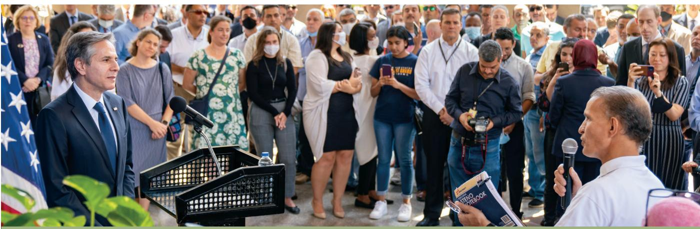

> **AI Description:**
> **Source:** `assets/_page_112_Figure_0.jpg`
> 
> **Generated:** 2026-05-18 11:33:34
> 
> ---
> 
> The image is a photograph of a public event. It shows a man in a suit standing at a podium with a microphone, addressing a crowd of people. The crowd appears to be engaged, with some individuals holding cameras and others holding microphones, suggesting they are reporters or attendees taking notes. The setting includes an American flag on the left side of the image, indicating a formal or official event. The audience is diverse in terms of age and attire, with some wearing masks. The overall scene suggests a press conference or public address.

Secretary Blinken holds a meet and greet with U.S. Embassy Cairo in Cairo, Egypt, May 26, 2021. Department of State

## Heritage Assets

The condition of the Department’s heritage assets is based on professional conservation standards. The Department performs periodic condition surveys to ensure heritage assets are documented and preserved for future generations. Once these objects are conserved, regular follow-up inspections and periodic maintenance treatments are essential for their preservation. The categories of condition are Poor, Good, and Excellent.

## Condition of Heritage Assets As of September 30, 2021

## Deferred Maintenance and Repairs

Deferred Maintenance and Repairs (DM&R) are maintenance and repairs that were not performed when they should have been, that were scheduled and not performed, or that were delayed for a future period. Maintenance and repairs are activities directed towards keeping General Property and Equipment in acceptable operating condition. These activities include preventive maintenance, normal repairs, replacement of parts and structural components, and other activities needed to preserve the asset so that it can deliver acceptable performance and achieve its expected life. Maintenance and repairs exclude activities aimed at expanding the capacity of an asset or otherwise upgrading it to serve needs different from, or significantly greater, than those originally intended. The Department occupies more than 8,500 Government-owned or long-term leased real properties at more than 270 overseas locations, numerous domestic locations, and at the IBWC.

## Deferred Maintenance and Repairs Policy – Measuring, Ranking and Prioritizing

The methodology for calculating DM&R is based on the Facility Condition Index (FCI). This methodology accounts for all facilities globally without the reliance on a response through a manual data call process, allowing for a more complete DM&R estimate. FCI is the ratio of repair needs to the replacement value of a facility as calculated by:

$$
\mathrm { F C I } = 1 \mathrm { ~ - ~ } \frac { \mathrm { ~ \$  R e p a i r ~ N e e d s } } { \mathrm { ~ \oint ~ R e p l a c e m e n t ~ V a l u e } } \mathrm { ~ X ~ } 1 0 0 \%
$$

Repair need is defined as the non-recurring costs that reflect the amount necessary to ensure that a constructed asset is restored to a condition substantially equivalent to the originally intended and designed capacity, efficiency, or capability.

In accordance with the Federal Real Property Portfolio definition of repair need, the Department uses repair needs identified by overseas facilities managers. Since this process does not identity repair need costs for all 8,500+ properties, the Department also uses parametric modeling to supplement these results. Based on the ages and expected useful life of individual systems and documented FCI results, the FCI parametric model uses deterioration curves to reflect how systems deteriorate over time.

Replacement value is defined as the cost to design, acquire, and construct an asset to replace an existing asset of the same functionality, size, and in the same location using current costs, building codes and standards. Neither the current condition of the asset nor the future need for the asset is a factor in the replacement value estimate. The Department uses construction “unit rates” determined by its Office of Cost Management for each property use code recorded in its Real Property Application. The Department multiplies these unit rates by the size of each property to determine replacement values.

Deferred Maintenance & Repairs are based on the FCI. An FCI score of 100 percent indicates a facility that is in a condition substantially equivalent to the originally intended and designed capacity, efficiency, or capability. Statements of Federal Financial Accounting Standards (SFFAS) No. 42 defines maintenance and repairs as activities directed toward keeping fixed assets in an “acceptable condition” and specifies management should determine which methods to apply and what condition standards are acceptable.

Applying these definitions, the Department’s management has determined that an FCI score of 70 percent indicates “acceptable condition”.

While the Department’s average FCI for its worldwide asset inventory is 80 percent, the large number of new facilities constructed over the past 20 years greatly influences this result. The proportion of properties with an FCI score below 70 percent increases for those that are older.

The Department’s DM&R is the total repair need to bring all owned and capital leased properties up to an acceptable FCI score of 70 percent.

## Factors Considered in Determining Acceptable Condition

The Department’s General Property and Equipment mission is to provide secure, safe, functional, and sustainable facilities that represent the U.S. Government and provide the physical platform for U.S. Government employees at our embassies, consulates and domestic locations as they work to achieve U.S. foreign policy objectives.

The facility management of U.S. diplomatic and consular properties overseas is complex, which impacts the success and failure of properties and infrastructure on human life, welfare, morale, safety, and the provision of essential operations and services. Facility management also has a large impact on the environment and on budgets, requiring a resilient approach that results in buildings and infrastructure that are efficient, reliable, cost effective, and sustainable over their life cycle. This occurs at properties of varying age, configuration, and construction quality in every climate and culture in the world. Some posts have the task of keeping an aging or historic property in good working order; while others must operate a complex new building that may be the most technologically advanced in the country.

The beginning and ending balances in the “Deferred Maintenance and Repairs” table were calculated using the FCI methodology.

Deferred Maintenance and Repairs (dollars in millions)

> **AI Description:**
> **Source:** `assets/_page_114_Figure_0.jpg`
> 
> **Generated:** 2026-05-18 11:37:46
> 
> ---
> 
> The image depicts a formal meeting in a well-decorated room with classical architectural elements. A group of individuals, dressed in business attire, are seated around a long table, engaged in what appears to be a diplomatic or political discussion. The table is set with nameplates, microphones, and refreshments. The room is adorned with portraits, flags, and ornate furniture, suggesting a setting of significance, possibly a government or official building. The individuals are focused, with some taking notes, indicating the importance of the meeting.

Secretary Blinken meets with Jordanian King Abdullah II in Washington, D.C., July 20, 2021. Department of State

# Diplomacy is Our Mission: Combating Illegal Drug Trafficking

> **AI Description:**
> **Source:** `assets/_page_115_Figure_0.jpg`
> 
> **Generated:** 2026-05-18 11:34:35
> 
> ---
> 
> The image is a photograph showing two individuals working in a lush, green outdoor environment. They are wearing protective gear, including helmets and orange bandanas, and are using tools to clear vegetation. The person in the foreground is actively using a tool to cut or uproot plants, while the person in the background is also engaged in similar activity. The setting appears to be a dense, natural area, possibly for land clearing or agricultural purposes. The individuals are dressed in practical, earth-toned clothing suitable for outdoor labor.

A Peruvian worker uses a cococho tool to uproot illegal coca plants. The United States helped Peru eradicate more than 14,000 hectares of coca cultivation in 2012 – an area more than twice the size of Manhattan. ©AP Image

T he international illegal drug trade endangers the healthand lives of U.S. citizens now more than ever. In 2017 and lives of U.S. citizens now more than ever. In 2017 alone, as U.S. communities suffered through an opioid crisis with overseas roots, more than 70,000 Americans died from drug overdoses. Drug trafficking funds international organized crime, corruption, and terrorism, threatening U.S. interests around the world. In 2017, the illegal drug trade was estimated to be worth around \$500 billion – more than the gross domestic product of Belgium.

The State Department’s Bureau of International Narcotics and Law Enforcement Affairs combats drug trafficking in many countries , including Peru – one of the world’s largest producers of cocaine. Cocaine-related deaths in the United States are on the rise, with deadly synthetic opioids like fentanyl being cut into cocaine. American diplomats provide training and assistance to foreign police and prosecutors working to detect, intercept, and seize narcotics. They also support drug use prevention and treatment efforts to reduce demand.

“Our counter-narcotics efforts have to be done together with development activities and access to government services for this cycle to end.” — Jimmy Story, Foreign Service Officer

By helping other countries reduce illegal drug production, diplomats support international stability while also strengthening our own national security. 8

# The Fall of Saigon: The Bravery of American Diplomats and Refugees

> **AI Description:**
> **Source:** `assets/_page_116_Figure_0.jpg`
> 
> **Generated:** 2026-05-18 11:27:48
> 
> ---
> 
> The image is a photograph showing a group of people on a boat. The boat appears to be a military or rescue vessel, as there are armed individuals on board. The people on the boat are dressed in casual clothing, and some are wearing hats. The background suggests the boat is on a body of water, possibly a river or lake. The image captures a moment that seems to be related to a rescue or evacuation operation.

Consul General Francis Terry McNamara (behind the two armed guards) captains a barge of American and Vietnamese refugees out of Cần Thơ. Department of State

O n April 30, 1975, the South Vietnamese capital of Saigon fell to the North Vietnamese Army effective Saigon fellto the North Vietnamese Army efectively ending the Vietnam War. In the days before, U.S. forces evacuated thousands of Americans and South Vietnamese. American diplomats were on the frontlines, organizing what would be the most ambitious helicopter evacuation in history. The logistics of issuing visas and evacuating these Vietnamese and American citizens were not glamorous but were essential.

While Saigon was falling, the rest of South Vietnam also was evacuating as quickly as possible. Approximately 100 miles away in Cần Thơ, one diplomat saved hundreds of Vietnamese refugees by devising and leading a risky evacuation. Francis Terry McNamara served as Consul General in Cần Thơ, Vietnam at the time of the U.S. evacuation. The U.S. Embassy for expediency and security reasons was only going to provide helicopters with enough room to evacuate the 18 or so American employees. McNamara said Saigon could have the consulate’s

helicopters now, rather than in six hours after evacuating Americans, if McNamara could evacuate everyone, including Vietnamese staff, by boat.

Utilizing his skills as a former sailor, McNamara commandeered some barges with help from a USAID colleague. McNamara captained the convoy down a Mekong Delta tributary, at one point being stopped by the South Vietnamese Navy and taking fire from Viet Cong troops. The barge bobbed in the open sea for a few hours until lights could be seen. They were from an American freighter contracted by the CIA for evacuations. However, those on board had no idea who McNamara and his band of about 300 Vietnamese and Americans were. They were finally convinced to take everyone on board to safety.

In 2019, Ambassador McNamara donated the U.S. flag and the Consular flags, taken from the consulate building as they evacuated and then subsequently flown on the barge he commanded during the evacuation.

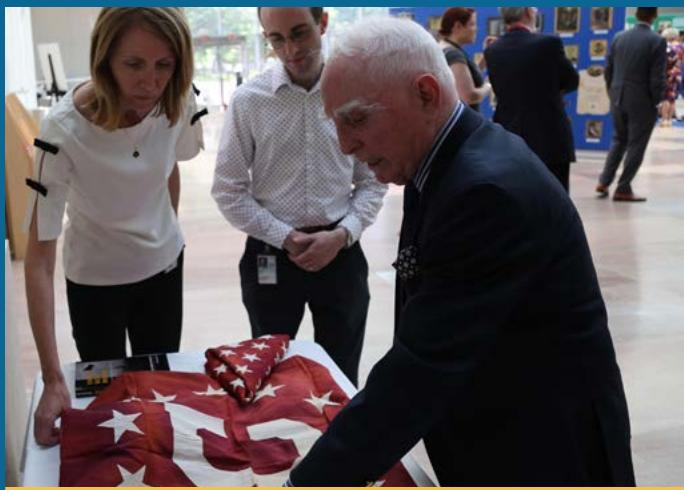

> **AI Description:**
> **Source:** `assets/_page_116_Figure_1.jpg`
> 
> **Generated:** 2026-05-18 11:26:23
> 
> ---
> 
> The image contains a photograph of three individuals in a formal setting, possibly a museum or gallery, examining a folded American flag. The flag is prominently displayed on a table in front of them. The individuals appear to be engaged in a discussion or observation of the flag, with one person leaning over it closely. The background includes other people and what appears to be informational displays or artwork on the walls. The setting suggests a formal or ceremonial context, possibly related to a historical or commemorative event.

Ambassador McNamara (right) describes the evacuation in Cần Thơ to NMAD staff. McNamara donated the flags pictured here to the museum, which were from the consulate building and which he subsequently flew on the barge. Department of State

> **AI Description:**
> **Source:** `assets/_page_117_Figure_0.jpg`
> 
> **Generated:** 2026-05-18 11:30:05
> 
> ---
> 
> The image is a photograph showing two individuals in formal attire seated in a room with ornate decor. They are engaged in a conversation, with one person gesturing with their hands. The room features a large, intricately carved fireplace, a small wooden table with two glasses, and a parquet floor. The setting appears to be a formal meeting or diplomatic discussion.

Secretary Blinken meets with United Kingdom Prime Minister Boris Johnson in London, United Kingdom, May 4, 2021. Department of State

# Inspector General’s Statement on the Department’s Major Management and Performance Challenges

## Introduction

> **AI Description:**
> **Source:** `assets/_page_118_Figure_1.jpg`
> 
> **Generated:** 2026-05-18 11:46:24
> 
> ---
> 
> The image is a photograph of a person with shoulder-length hair, wearing a dark blazer over a patterned top. The background is a plain, light color, and the image appears to be a professional headshot. There are no charts, graphs, or other visual elements present in the image.

Acting Inspector General, Diana R. Shaw

This report is provided in accordance with the Reports Consolidation Act of 20001. Each year, the Office of Inspector General (OIG) for the Department of State (Department) identifies the most significant management and performance challenges facing the Department and provides a brief assessment of the

Department’s progress in addressing those challenges. We assess progress primarily through our compliance process, which relates to individual and often targeted recommendations. Our oversight work often provides a unique window into common and emergent issues.

Throughout FY 2021, the Coronavirus (COVID-19) pandemic continued to affect OIG’s operations, requiring that we adapt our programs and processes to ensure our critical functions continue. Nonetheless, we issued

97 reports in FY 2021. Based on these reports and our previous work, OIG identified the following major management and performance challenges facing the Department in FY 2021:

1. 1 Protection of people and facilities

2. 2 Management and oversight of contracts, grants, and foreign assistance

3. 3 Information security and management

4. 4 Financial and property management

5. 5 Operating in contingency and critical environments

6. 6 Workforce management

7. 7 Promoting accountability through internal coordination and clear lines of authority

This document includes examples of reports and findings that illustrate these challenge areas. In addition to publicly available work, OIG issues a number of Sensitive But Unclassified2 and Classified reports throughout the year. Many of the findings in those reports reinforce our assessment of these management challenges, particularly

as they relate to protection of people and facilities and information security and management.

Continued attention to these management challenges will improve the Department’s capacity to fulfill its mission while exhibiting good stewardship of public resources. OIG encourages the Department to consider ways that specific recommendations might be applied broadly to make systemic improvements that will result in meaningful change.

## 1 Protection of People and Facilities

The Department’s global presence and the continued threat of physical violence overseas makes the protection of people and facilities the Department’s perennial top management challenge. A vivid reminder of this threat was the dangerous circumstances under which the Department withdrew the U.S. diplomatic presence from Afghanistan this year. While the Department strives to prioritize the safety and security of its personnel and facilities, all U.S. diplomatic facilities face some level of risk. Additionally, natural disasters, environmental hazards, and ordinary crime continually pose risks to the health and safety of Department personnel and their families serving abroad. Much of OIG’s work identifies risks to the protection of Department personnel and facilities and provides recommendations to address those risks.

As it did for much of FY 2020, throughout FY 2021 the Department has endured the added burden of operating during the outbreak of COVID-19. Maximum telework has been encouraged for both domestic and overseas staff members throughout much of the pandemic and the Department has regularly provided staff with information that addresses common concerns and details best practices for returning to the office.

## Constructing and Maintaining Safe and Secure Diplomatic Facilities

The construction and maintenance of safe and secure diplomatic facilities is an ongoing component of this challenge, which may result in particularly severe consequences in regions affected by conflict and humanitarian crises.

In one report, OIG found that the Bureau of Consular Affairs did not collect comprehensive data to track deficiencies at consular facilities. Such deficiencies involved line of sight over consular workspace, handicapped accessible facilities, privacy booths for conducting sensitive interviews, signage to provide the public with directions and information about consular services, and canopies or other types of shelters. The absence of a database limited the ability of the Department to identify and correct such deficiencies systematically.3

## Passports Not Surrendered Upon Separation

Misusing a passport has the potential to place people in danger. OIG was alerted that a former Department employee allegedly did not surrender a diplomatic passport upon separation from the Department and wanted to use it in a new role with another U.S. Government organization.4 OIG selected a sample of 134 official and diplomatic passports issued to employees who subsequently separated from the Department between November 2017 and September 2020. OIG found that the Department did not electronically cancel 57 of 134 (43 percent) passports after the employees separated. Moreover, of the 57 that were not electronically cancelled, 47 (82 percent) of the passports had not expired as of February 1, 2021, meaning they could still be valid. When an employee’s entitlement to an official or diplomatic passport ends, but the passport is not surrendered or cancelled, the individual could misuse the passport, such as misrepresenting themselves as a representative of the U.S. Government.5

## Ensuring the Health and Safety of Personnel Abroad

As in previous years, we highlight the Department’s challenge of ensuring the health and safety of its personnel abroad. To this end, the Bureau of Diplomatic Security (DS) created the Post Security Program Reviews (PSPR) program in 2008 to evaluate overseas posts’ level of compliance with selected requirements on topics such as life safety and emergency preparedness. In an audit of PSPRs, OIG found that DS did not conduct PSPRs at high-threat, high-risk posts within the required timeframes in 22 of 27 instances (81 percent).6

By not conducting timely PSPRs, DS has limited assurance that posts are competently managing aspects of their programs and operations that implicate life safety. Additionally, OIG found that, of 146 PSPR recommendations made to high threat posts, DS officials could not provide OIG with post responses to 39 (20 percent) of the recommendations. Furthermore, DS officials did not always track when compliance responses were due or have a formal process in place to follow up on overdue responses.

Also related to this challenge, we note the following three areas for improvement: residential safety, operation of official vehicles overseas, and emergency preparedness.

## Residential Safety

Our inspection report findings show that the failure of overseas posts to fully complete residential safety inspections could expose Department employees and their families to unsafe residences and hazards that could lead to injuries and fatalities. For instance, an inspection of the Bureau of Overseas Buildings Operations’ (OBO) Office of Safety, Health, and Environmental Management (SHEM) found that 264 of 284 overseas posts (93 percent) had not fully completed or entered safety certifications for all residences into the database, as required. The database showed that only six overseas posts fully met residential safety standards.7

## Operation of Official Vehicles Overseas

Another inspection showed that although DS’s Special Program for Embassy Augmentation and Response (ATA-SPEAR)—a program designed to enhance the security of high-threat, high-risk posts by providing training and equipment to host nations—has 253 drivers worldwide, none had taken the required safe driver training approved by SHEM. In addition, OIG found instances at three overseas posts where ATA-SPEAR vehicle mishaps were not reported to the Post Occupational Safety and Health Officer, as required. Multiple embassies did not know that the safe driver training and vehicle mishap reporting requirements applied to ATA-SPEAR units.8

## Emergency Preparedness

Department guidelines require U.S. embassies to maintain post-specific emergency action plans to respond to situations such as bombs, fires, civil disorder, or natural disasters. Although we frequently find substantial compliance with emergency planning standards, we continue to highlight deficiencies that we identify because of their significant implications for life and safety.

One inspection noted insufficient internal control procedures on fire protection at overseas posts. The same report notes that low participation in fire prevention training at overseas posts hindered the effectiveness of the OBO Directorate of Operations, Office of Fire Protection’s (OBO/OPS/FIRE) fire protection program. According to the Department, often fewer than 20 percent of personnel assigned to overseas posts attend fire prevention training provided by fire marshals. Of particular concern to OBO/ OPS/FIRE officials was the low participation rate of American employees despite statistics showing that 61 percent of fires had occurred in these employees’ residences over the last 5 years.9

## 2 Management and Oversight of Contracts, Grants, and Foreign Assistance

Domestically and abroad, Department entities did not consistently and adequately ensure that foreign assistance programs achieve intended objectives and policy goals, monitor and document contractor performance, conduct thorough invoice reviews, and oversee construction contracts.

## Designing/Ensuring Foreign Assistance Programs That Achieve Intended Objectives and Policy Goals

The Department has made progress but still faces obstacles in designing and administering foreign assistance programs that will achieve desired results.10 For example, a recent inspection showed that the Bureau of Oceans and International Environmental and Scientific Affairs (OES) lacked communication among its offices that managed

foreign assistance programs, as well as clearly defined roles and responsibilities related to the management of foreign assistance, which led to inconsistent management practices. At the time of the inspection, seven OES offices managed foreign assistance programs, with some having multiple functional teams separately managing programs related to their specialized areas of expertise. The management techniques which the offices used to monitor and evaluate their foreign assistance programs also remained inconsistent. For example, not all offices tracked the timely receipt and review of the reporting by implementing partners. In addition, the bureau lacked consistent reporting templates. These inconsistencies contributed to the shortcomings in OES’s management of Federal assistance awards and interagency agreements described in this report.11

In another inspection, OIG found the Libya External Office did not regularly assess the effectiveness of its foreign assistance programs and had inconsistent approaches to monitoring and risk management of the programs.12

## Monitoring and Documenting Contractor and Grantee Performance

The Department continues to face challenges in properly overseeing contractor performance.13 Oversight personnel must monitor and document performance, confirm that work has been conducted in accordance with the terms of a contract, hold contractors accountable for nonperformance, and ensure that costs are effectively contained. Our FY 2021 work uncovered several deficiencies in the performance of these duties.

For example, grants officers in the Department’s Office of Acquisitions Management did not regularly perform postaward management tasks for the Federal assistance awards they issued. Grants officer involvement in the post-award management of awards is necessary to ensure awards achieve programmatic objectives and that recipients use funds in accordance with Federal regulations. OIG noted, however, the officers did not maintain the required postaward documentation in the award files. OIG found that in its review of 27 award files totaling more than \$100 million, 12 had partial documentation and 5 had no documentation at all.

Moreover, the grants officers told OIG they generally did not review implementer reporting or written evaluations of implementer performance produced by grants officer representative (GORs). Instead, they relied on GORs to bring issues to their attention.14

A management assistance report on foreign assistance in Somalia focused on deficiencies identified with the Bureau of Administration, Office of the Procurement Executive; Bureau of African Affairs; and Bureau of Counterterrorism financial monitoring procedures for four selected awards. Award recipients did not always submit financial reports by required deadlines and the Department did not always review the reports once they were submitted. OIG determined that there were expenses that should not have been paid and questioned \$3.78 million paid to one contractor.15

In an inspection of the Department’s Office of Fire Protection, OIG also noted contract oversight deficiencies. Specifically, the office’s six contracting officer’s representatives oversaw 18 contracts valued at a total of \$49.9 million. OIG found several missing documents in its review of 4 of 18 contracting officer’s representative files valued at \$30.3 million.16

An audit at Embassy Kabul, found that while the embassy’s Public Affairs Section (PAS) obtained performance and financial reports for most awards OIG reviewed, six awards were missing at least one performance report, and three awards were missing one or more financial reports. Lastly, PAS conducted evaluations of some of its awards but did not comply with requirements to assess whether all of its awards met the Department’s definition of “large” programs for the purpose of conducting evaluations. The evaluations are an important tool for management to determine appropriate corrective actions for any deficiencies identified in a timely manner. Because PAS did not determine whether evaluations should have been conducted, PAS officials may have missed opportunities to identify and correct deficiencies during award implementation.17

## 3 Information Security and Management

The Department depends on information systems to function, and the security of these systems is vital to protecting national and economic security, public safety, and the flow of commerce. The Department acknowledges that its information systems and networks are subject to serious threats that can exploit and compromise sensitive information, and it has taken some steps to address these concerns. However, despite the Department’s expenditure of substantial resources on information system security, OIG continues to identify significant issues that put its information at risk.

## Strengthening Cybersecurity Performance

Although the Department took steps to improve its information security program, as in prior years, OIG’s annual assessment of the Department’s information security program identified numerous control weaknesses that affected program effectiveness and increased the Department’s vulnerability to cyberattacks and threats. Specifically, an FY 2020 audit found that the Department did not have a fully-developed and implemented information security program based on evidence of security weaknesses identified in seven of eight metric domains (risk management, configuration management, identity and access management, data protection and privacy, security training, information security continuous monitoring, and contingency planning). For example, according to the Department’s records, 128 (26 percent) of 487 “reportable systems” did not have a current authorization to operate, contrary to Department standards.18

One reason for the deficiencies identified was the Department did not consistently prioritize implementation of its policies and procedures. Another contributing factor was the challenges encountered with the COVID-19 pandemic. The loss of confidentiality, integrity, or availability of the systems and their data could be expected to have a serious adverse effect on organizational operations, organizational assets, or individuals.19

Another report identified continued deficiencies in the performance of information systems security officer (ISSO) duties, which places the Department’s computer systems and data at risk. For example, ISSOs did not perform random reviews of user accounts or assist with the remediation of identified vulnerabilities as required by Department standards; did not review and analyze information systems audit logs for inappropriate or unusual activity; and did not ensure systems for which they are responsible are configured, operated, and maintained in accordance with standards. OIG reviewed 51 overseas inspection reports issued from October 1, 2016, to September 30, 2019, and identified deficiencies in ISSO performance in 25 (49 percent) of reviewed reports. This reflects an increase from the 2017 Management Assistance Report where OIG found 33 percent of reviewed reports contained deficiencies in ISSO performance.20

## Selecting and Approving IT Investments

OIG continued to identify issues related to how the Department selects and approves IT investments. During a compliance follow-up audit, OIG found that the Department took some actions to address open recommendations related to IT investments, but further improvements are needed. Specifically, the Department had not developed and implemented policies and procedures related to reviewing IT portfolio reorganizations. In addition, although the Department developed and implemented a process to compare requests for new IT investments to the existing IT portfolio to help identify duplicative systems, it had not performed a benchmark assessment of the entire IT portfolio. Furthermore, although the Department designed and implemented a process to review and approve bureau-funded IT contracts, OIG found that not all IT procurements were appropriately routed to the Chief Information Officer for review and approval.

Until actions are taken, the Department will not be able to fully identify duplicative systems and related cost-saving opportunities, optimize its IT investments, or promote shared services.21

## Overseeing Records Management in Accordance with Standards

Records management deficiencies persisted in FY 2021. For example, one embassy failed to archive principal officers’ and program files going back to 2016. Embassy staff also failed to properly archive diplomatic notes as required and, despite moving embassy shared files to a Department centralized, cloud-based SharePoint platform in September 2020, embassy sections continued to create and save documents on the local file server in addition to the cloud. The lack of a compliant records management program can result in the loss of important data for historical insight into policy analysis, decision-making, and archival research.22

## 4 Financial and Property Management

Financial management has historically been a challenge for the Department, and, as described below, OIG continued to identify concerns related to this issue in FY 2021. OIG also notes several continued difficulties on the related issue of property management.

## Financial Management

An audit showed that although the Department used the majority of its appropriated funds that canceled in FY 2019 within the period of availability, it did not have an established process to quantify and analyze funds that were scheduled to be canceled. Inadequate oversight of obligations, which is a longstanding issue reported by OIG, negatively impacted the Department’s fund management efforts. The Department lost the use of some funds because of the deficiencies identified. In addition, OIG identified 29 potentially invalid obligations, totaling \$34.7 million, that have funds that might be able to be put to better use if the funds were deobligated.23 Additionally, the audit of the Department’s FY 2020 financial statements continued to find a significant deficiency related to the Department’s oversight of unliquidated obligations.24

Improper monitoring can also result in unspent funds. For example, in one inspection OIG found that the Office of Global Women’s Issues returned more than \$300,000 in canceled foreign assistance funds to the Department of the Treasury (Treasury) in FY 2019. The office returned these funds despite having statutory reclassification authority to extend the period of availability for most foreign assistance appropriations. At the time of the inspection, the office had unliquidated balances exceeding \$3.5 million that were at risk of being returned to the Treasury if not expended by the end of FY 2020.25

The Bureau of Oceans and International Environmental and Scientific Affairs returned nearly \$5.4 million in canceled foreign assistance funds to the Treasury between FY 2018 and FY 2020. This happened because the bureau lacked procedures to systematically identify and reclassify foreign assistance funds and despite the bureau having statutory reclassification authority to extend the period of availability for most foreign assistance appropriations.26

One significant component of the Department’s financial management challenge that OIG has highlighted in the past27 is related to deficiencies in analyzing and employing financial information. During an audit of the Department’s efforts to establish foreign per diem rates for all Federal employees travelling overseas, OIG found that the Bureau of Administration did not implement processes to establish foreign per diem rates in accordance with Department requirements and Bureau of Administration’s Office of Allowances standard operating procedures. OIG also identified errors in the Bureau of Administration’s calculations of foreign per diem rates. Furthermore, exchange rates were not always applied due to issues with a web-based application. In addition, the Bureau of Administration’s methodology to establish foreign per diem rates needs improvement to adequately cover the cost of U.S. Government employees and eligible dependents traveling overseas. The deficiencies identified occurred, at least in part, because the Bureau of Administration

did not implement sufficient internal controls. In addition, the Bureau of Administration used an inefficient methodology to calculate the rates. Improving controls and the methodology would reduce the need for manual data collection and calculations, leading to workload efficiencies, while also potentially resulting in rates that would better reflect current market conditions.28

## Property Management

OIG continued to report property management as a significant deficiency during its audit of the Department’s FY 2020 financial statements. Specifically, the audit identified significant issues with overseas real property, overseas and domestic construction projects, leases, personal property, contractor-held property, and software.29

In Libya, the Department continued to pay \$3.5 million annually to lease an interim embassy compound in Tripoli despite not being able to use or control the compound. The Department renewed the leases for the compound, which consisted of 11 leased properties, in 2016 and 2017 for a period of 5 years without a prior process to determine whether the leases aligned with foreign policy or operational needs. At \$3.5 million in annual lease costs and 2 years remaining on the leases, the Department could spend up to \$7 million before the leases expire.30

The Department operates a worldwide fleet of motor vehicles, but in a comprehensive audit of the unarmored portion of its fleet, OIG found that the Bureau of Administration was not administering it in accordance with requirements. Specifically, OIG found that the Bureau of Administration had not developed and implemented an internal control environment to successfully manage the acquisition, use, maintenance, and disposal of the Department’s overseas vehicle fleet. OIG also found that posts were not always properly tracking vehicles in the inventory system, maintaining vehicles, or disposing of vehicles. These deficiencies occurred, in part, because the Bureau of Administration had not developed and

communicated a structured, detailed vehicle program plan or standard operating procedures, had not established and implemented processes to obtain reliable data regarding its vehicle fleet, or established a methodology to enforce overseas post compliance with fleet management guidelines.31

In a separate review, OIG examined 61 overseas inspection reports issued from October 1, 2016, to June 30, 2020, and identified 17 findings related to expendable property management issues. In these reports, OIG found that overseas posts did not account for all expendable property using the Department’s mandated system of record, the Integrated Logistics Management System. In this review, OIG identified Department-level issues that contributed to or caused the issues in expendable property management, including outdated guidance and insufficient internal controls procedures. These issues could increase the risk of theft, mismanagement, and understatement of assets.32

Also, in Cabo Verde, the embassy did not enter all the required motor vehicle operational costs into the Fleet Management Information System. OIG found missing data on daily trips, fuel costs, and preventive maintenance. The embassy also lacked adequate internal controls over its facility management expendable supplies (building materials and spare parts).33 In Libya, the Libya External Office could not account for \$9.2 million in vehicles, IT equipment, and other property left at the embassy compound in 2014 and had not conducted the required annual inventory of the property in Tripoli since the 2014 evacuation due to lack of access to the compound.34

## 5 Operating in Contingency and Critical Environments

Programs and posts operating in contingency and critical environments must adapt to constant change, pervasive security concerns, dramatic swings in personnel and funding, and widespread reliance on contractors and grantees. The withdrawal of Department personnel and ongoing humanitarian crisis in Afghanistan amplified such issues in FY 2021.

A report on establishing and operating remote diplomatic missions shows that the Department had not instituted formal protocols and guidance to inform decisions regarding when and how remote missions should be established, or a methodology to identify and provide resources to support mission essential functions and guide daily operations. When operations were suspended at several embassies reviewed in an FY 2021 audit, all of the U.S. direct-hire staff employed at the embassies left the country, leaving behind evacuated embassy buildings, facilities, and equipment. At the same time, some locally employed (LE) staff remained behind and continued to work in the host country supporting the newly established remote mission. This situation created operational and management challenges for the remote mission. Because there is no Foreign Affairs Manual (FAM) provision providing criteria for when and how a remote mission should be established and instituted, OIG found that the Department’s regional bureaus typically collaborated with each other, relying on informal advice, and utilizing ad hoc approaches when establishing remote missions.35

Another issue OIG identified related to the operations of remote missions was access to training.36 Although the Department’s Office of Overseas Employment has some guidance on how remote missions should manage and support LE staff who continue to work in the host country following a suspension of operations, LE staff working for remote missions continue to face challenges accessing mandatory training, largely due to the fact that they do not have access to OpenNet, the Department’s Sensitive But Unclassified computer network.

Challenges regarding contract oversight also persist in programs and posts operating in contingency and critical environments. For example, a report on the Bureau of Near Eastern Affairs (NEA) showed that NEA could improve the nomination and selection of personnel to oversee contracts in Iraq. Although the bureau had determined the appropriate certification level needed to oversee contracts in Iraq, it had not established the level of technical expertise needed for contracting officer’s representatives and government technical monitors assigned. In addition, OIG discovered during this audit that NEA continued to nominate contracting officers and monitors who were not appropriately certified and did not demonstrate technical expertise in the contract subject matter.37

In another report, OIG found that short-term contracts awarded on a sole-source basis as “bridge contracts” were frequently used in Afghanistan and Iraq over multiple years to noncompetitively extend contract services beyond the expiration of an original contract. The Department’s practice of using a short-term contract awarded on a sole-source basis to the incumbent contractor over several years limits the Department’s ability to realize potential cost savings by maximizing full and open competition. For example, in one instance the contract was recompeted and resulted in saving the Department \$6.8 million. The lack of full and open competition is also contrary to the Competition in Contracting Act of 1984, which requires contracting officers to promote and provide for full and open competition.38

## Similarly, OIG found that the Department

noncompetitively continued Operations and Maintenance Support Services (OMSS) and Baghdad Life Support Services (BLiSS) contracts excessively and unjustifiably used a Federal Acquisition Regulation (FAR) exception for other than full and open competition. Specifically, the Department executed 65 noncompetitive contract actions that spanned approximately 3 years valued at approximately \$663 million to continue OMSS and BLiSS services, citing “unusual and compelling urgency” under the FAR as justification. Instead, OIG found that poor planning, poor coordination, and a lack of internal controls necessitated the contract actions. OIG questioned the full value of the OMSS and BLiSS noncompetitive contract actions, approximately \$663 million, because Federal law does not permit poor planning as justification for the use of noncompetitive contracts.39

## 6 Workforce Management

Staff members are considered the Department’s greatest asset. Accordingly, the Department expends substantial resources on recruiting, training, and retaining a diverse, talented workforce capable of carrying out the Department’s foreign policy goals and priorities. However, OIG’s work finds that staffing gaps, frequent turnover, poor leadership, and inexperienced and undertrained staff frequently contribute to the Department’s other management challenges.

## Maintaining Adequate Staffing Levels to Meet Operational Needs

As highlighted during an audit within the Bureau of Global Talent Management (GTM), the bureau took steps to address many of the challenges it encountered after the Department lifted its hiring freeze in May 2018. Specifically, it began to cross-train personnel to process multiple types of hiring actions, increased the number of staff, and worked to reduce the recruitment case backlog. However, more needs to be done to consistently fulfill human resources services requirements and to help recruit, classify, and fill missioncritical positions within the Department. For example, recruitment efforts were not always completed within the 80-day timeline established by the Office of Personnel Management; new position description classification actions were not always completed in a timely manner; agreed-upon reports and client bureau meeting minutes could not be located; and GTM did not sufficiently plan for the caseload surge once the Department hiring freeze was lifted.40

In addition, an inspection in the Bureau of Administration revealed that 11 of 43 (25 percent) authorized positions were vacant in a division that oversees DS contracts, leading to a high workload for individual contracting officers and specialists. In the local guard force section, for example, two of the contracting officers managed a combined 91 contracts with a total value of roughly \$6.8 billion. The volume and complexity of the division’s workload made this situation especially challenging. In interviews with OIG, employees in the division consistently said that insufficient staffing levels impeded their ability to carry out core duties. For example, staff struggled to complete tasks such as contractor performance assessments and contract file management.41

## Providing Appropriate Training/Ensuring Staff Are Appropriately Qualified

In addition to low staff numbers, undertrained staffing also leads to difficulties in managing and overseeing contracts. For example, a report on undefinitized contract actions (UCA)42 noted that contracting officers did not receive preapproval from the head of the contracting activity before awarding 8 of 12 (67 percent) of the letter contracts, nor did they create a definitization schedule for 5 of 12 (42 percent) of the letter contracts, as required. Additionally, 3 of 12 (25 percent) of the letter contracts exceeded the 180-day limit for definitization by an average of 143 days. Deficiencies could be attributed to limited Department training while personnel did not always understand and follow UCA requirements.43

Another report noted that neither the Department’s Foreign Service Institute nor the Bureau of Consular Affairs had developed and delivered any training on management of consular physical space. For example, the Foreign Service Institute’s mandatory course for first-time consular managers did not include information on consular physical space standards.44 In addition, while the Office of Safety, Health, and Environmental Management provided training programs for Post Occupational Safety and Health Officers and for employees operating motor vehicles in high-risk areas, it did not establish a training program for new employees and supervisors, or employees working in other areas at overseas posts.45

## Holding Leadership Accountable to Department Principles

Leadership must set an example and adhere to the leadership principles outlined in the FAM.46 Although OIG often finds that the leaders at Department bureaus and posts generally set the appropriate tone at the top, in several reports this year, OIG found challenges in this area.47

In a recent Management Assistance Report based on a review of 52 overseas inspection reports and interviews with staff, OIG found that in 67 percent of inspected missions (35 of 52), chiefs of mission (COM) set a positive, inclusive, and professional tone for their missions consistent with the Department’s leadership and management principles. However, OIG also found that in 33 percent of inspected missions (17 of 52), the COM was deficient in one or more of the leadership and management principles. Specifically, OIG found that COMs in 14 of the 17 missions failed to provide a clear focus, be decisive, offer and solicit constructive feedback, be proactive in soliciting varying points of view, establish constructive working relationships with all mission elements, manage conflict, or model ethical behavior. This report also noted that a lack of clarity in some COM and deputy COM relationships impeded embassy operations.48

Additionally, while inspecting another office, OIG found the Office Director did not fully model the Department’s leadership and management principles especially with regard to communication, self-awareness, and managing conflict. In OIG interviews, staff described the director’s leadership style as difficult and said the director had a propensity for favoritism toward some employees.49

In a special review of allegations of misuse of Department resources, OIG found numerous instances in which Department employees were asked to undertake tasks of a personal nature by the former Secretary of State and his spouse. For example, employees were asked to pick up personal items, plan events unrelated to the Department’s mission, and conduct such personal business as pet care and mailing personal Christmas cards.50 OIG found that such requests were inconsistent with Department ethics rules and the Standards of Ethical Conduct for Employees of the Executive Branch.51

## 7 Promoting Accountability Through Internal Coordination And Clear Lines of Authority

Poor coordination and vague or dispersed authority continue to be at the root of some of the Department’s deficiencies. Multiple Department functions are impacted, contributing to longstanding and systemic difficulties, such as ensuring physical and information safety. It is important that leadership take a proactive role in ensuring a structure is in place to efficiently run operations. However, uncertainty about office roles and insufficient office management was cited as an issue in OIG’s FY 2021 reports.52

For example, an inspection of the Office of Global Criminal Justice (GCJ) revealed that there was no strategic plan in place to establish goals, objectives, and sub-objectives or to align resources with policy priorities. Instead, several staff members described the office’s goal setting as an ad hoc process. The lack of a formal structure to align resources with priorities was caused in part because the Department did not require the office to prepare a Functional Bureau Strategy and in part because office leadership was unfamiliar with Department requirements for strategic plans. In interviews with OIG, employees in at least five other bureaus reported occasional friction with GCJ, partly as a result of the office’s responsibilities not being fully defined. Without a strategic plan the office lacked a framework for identifying its priorities, measuring the effectiveness of its operations, and prioritizing its policy and program work .53

HELP FIGHT FRAUD, WASTE, AND ABUSE 1-800-409-9926 stateOIG.gov/HOTLINE

If you fear reprisal, contact the OIG Whistleblower Coordinator to learn more about your rights.

WPEAOmbuds@stateoig.gov

# Management’s Response to Inspector General

D espite the unique challenges of adapting the Department of State to operate during the COVID-19 pandemic, the Department achieved significant progress in its management of the organization during 2021. The Department’s workforce continued to demonstrate its resiliency, agility, and teamwork as we welcomed a new Administration, Department achieved significant progres in its management of the organization during 2021. The Department's workforce continued to demonstrate its resiliency,agilityand teamwork as we welcomed a new Administration, established the Secretary’s priorities, and made advances to the management platform, all while functioning in a largely remote work environment.

From a management perspective, Department leadership is committed to ensuring that we retain, to the greatest extent possible, the workplace flexibilities we have successfully adopted since the start of the pandemic. Doing so is critical to the Department’s efforts to be an employer of choice in the 21st Century. In July 2021, the Department launched its new Mobility Assessment Tool to help supervisors quantify those work functions that can be accomplished remotely versus onsite. The initial results from the assessment have shown us that the Department may benefit from a hybrid model of both remote and on-site work. Not only has the Department’s flexibility allowed us to continue operating during the pandemic, but a flexible workforce also will help us recruit and retain top talent moving forward. Also, in 2021 the Department launched Agility@State, an internal site for employees to explore temporary duty, detail, and flexible work opportunities.

In that vein, as the President has emphasized in National Security Memorandum 3 on Revitalizing the Foreign Policy and National Security Workforce, we are developing programs to recruit and develop new skill sets, expanding training and other professional development opportunities, and instituting a more family-friendly workplace culture to ensure we continue to attract and retain the most talented Americans dedicated to serving national interests. The Deputy Secretary for Management and Resources resumed the meetings of the Enterprise Governance Board (EGB) to address top Departmentwide issues. The EGB will focus and facilitate the necessary work the Secretary has prioritized with respect to investing in our people and improving our processes and technology to enable the Department’s success in achieving our foreign policy mission.

The Department is making significant strides to ensure our workforce is diverse and reflects the country’s full depth and breadth of talent. The Secretary appointed Ambassador Gina Abercrombie-Winstanley as the Chief Diversity and Inclusion Officer. The Ambassador’s team is developing the Department’s first Diversity, Equity, Inclusion, and Accessibility strategic plan to build a workplace where all employees have equal access to job opportunities and support and everyone’s contributions are seen and respected. The Department also established an Agency Equity Team to address expanding diversity, equity, inclusion, and accessibility initiatives in our foreign affairs work and to emphasize respect and equity in our day-to-day operations. We are developing a long-term action plan, as we aim to eliminate inequity, racism, and discrimination around the world.

This year, the Department released its Climate Adaptation and Resilience Plan to address risks in our overseas operations, both internally and in cooperation with host governments. With over 270 diplomatic missions and 180 countries, our personnel, facilities, and operations are exposed to a wide range of climate risks brought on by extreme weather events and rising temperatures. We have the unique opportunity to model U.S. climate leadership and innovation through our management operations. Integrating climate hazards into our operational planning today ensures that the Department leadership of tomorrow will continue to conduct foreign policy on behalf of the American people.

The Department launched its first Enterprise Data Strategy to empower its global workforce with the tools and skills to use data as a critical instrument of diplomacy and improve our management operations. The strategy provides the framework for how the Department will leverage data to shape American foreign policy while upholding the highest levels of scientific and data integrity. Evidence-based decisions are critical to protecting the values, security, prosperity, and foreign interests of the American people.

Finally, this year, in coordination with the Department of Defense, we conducted a significant noncombatant evacuation of more than 100,000 American citizens, third-country nationals, and at-risk Afghans from Afghanistan. Department of State personnel performed admirably to engage in dangerous work under highly challenging circumstances.

In 2021, the Department of State’s Office of Inspector General (OIG) identified management and performance challenges in the areas of: protection of people and facilities; management and oversight of contracts, grants, and foreign assistance; information security and management; financial and property management; operating in contingency and critical environments; workforce management; and promoting accountability through internal coordination and clear lines of authority. The Department promptly takes corrective actions in response to OIG findings and recommendations. Highlights are summarized below.

## 1 Protection of People and Facilities

The protection of people and facilities remains of utmost importance for the Department as we execute U.S. foreign policy. Below is additional information about specific issues raised by OIG and improvements the Department has made in its systems for protecting people and facilities.

## Constructing and Maintaining Safe and Secure Diplomatic Facilities

The Department continues to build more secure facilities, moving 997 people to safer facilities in 2021. COVID-19 had a significant impact on global construction sites, which led to the suspension of projects worldwide on a country-by-country basis, as well as impacting timely completions due to procurement delays, critical materials shipment stoppages, and travel restrictions.

Looking toward the future, the Department plans to optimize business operations to enhance resilience of the design and construction programs to meet current modernization demands and future industry challenges.

The Department appreciates OIG’s continued support in ensuring that diplomatic facilities remain safe and secure. The Bureau of Overseas Buildings Operations (OBO) and the Bureau of Consular Affairs (CA) are working to address deficiencies at consular facilities via:

ƒ CA-OBO Working Group, which continuously identifies and rectifies consular issues in the OBO Design Standards;

ƒ Consular Affairs Small Projects, which addresses issues within existing facilities;

ƒ A targeted Acoustic, Lighting, and Ergonomic Study, which will address issues in OBO’s standard documents focused on those areas that have been identified as most hindering consular operations; and

ƒ The 2020 Consular Package, Part II, which collects information on deficiencies, e.g., lack of interview windows meeting ADA standards, no potable water, lack of a privacy booth and line of sight issues.

The 2022 OBO Design Standards include specific circumstances under which canopies and shelter will be included in consular infrastructure improvement projects. The relevant Foreign Affairs Handbook chapter will be updated as well.

## Passports Not Surrendered Upon Separation

OIG highlighted times in the past where official and diplomatic passports have been misused in the last few years. To address OIG’s concerns, CA has updated:

ƒ The Department’s Foreign Affairs Manual (FAM) subchapters 3 FAM 2512 and 8 FAM 901.1-5(a), which relate to employee separation and passport issuance, respectively. The Department expects final publication in 2022;

The Special Issuance Passport Program template, which assists Department employees in issuing passports; and

ƒ The Cancellation and Destruction Standard Operating Procedure to include guidance on the appropriate cancellation of separating employees’ special issuance passports.

## Ensuring the Health and Safety of Personnel Abroad

In a Management Assistance Report (MAR) review conducted in 2021, OIG highlighted the Department’s challenges in conducting Post Security Program Reviews (PSPRs) at five high-threat, high-risk posts. Since publication of this report, the Bureau of Diplomatic Security (DS) has conducted an extensive review of its PSPR Program and taken corrective action. One MAR recommendation has been closed. DS anticipates that the second MAR recommendation will be fully closed in early 2022.

## Residential Safety

Though the Department continues to face extraordinary challenges due to the COVID-19 pandemic, OBO remains committed to serving the diplomatic community with a laser focus on security, resiliency, and stewardship. In the Management Challenges Report, OIG highlighted instances where overseas posts had not completed residential safety inspections. OBO is working to transform its building program through continuous improvements made across a project’s lifecycle, including improved cost and schedule performance on overseas projects.

OBO appreciates its symbiotic relationship with OIG, with each entity collaborating with the other to achieve its individual mission with the common goal of improving government operations. This was evidenced by OIG’s 2021 Inspection of the Office of Safety, Health, and Environmental Management. Bolstered by the visibility of OIG’s report, OBO and the Department’s regional bureaus are working to improve safety compliance by ensuring posts complete inspection of residential properties and record the findings in the Post Occupational Safety and Health Officer (POSHO) Certification system. Working closely with the regional bureaus and posts, OBO increased the percentage of POSHO-certified residences from 30 percent to 75 percent during the current calendar year.

## Operation of Official Vehicles Overseas

One of OIG’s inspections is related to DS’ Special Program for Embassy Augmentation and Response (ATA-SPEAR), a program designed to enhance the security of high-threat, high-risk posts by providing training and loaning equipment to host nations and their personnel. DS is working with the Bureau of Administration not only to inventory all ATA-SPEAR loaned vehicles, but also to update the guidance to posts regarding the management of vehicles. Additionally, DS, in coordination with OBO, has issued guidance to all posts regarding the motor vehicle safety requirements for ATA-SPEAR operators and vehicles.

## Emergency Preparedness

Emergency planning at the Department, both at home and abroad, is a key factor in the success of the Department’s ability to prepare for and handle emergencies of all types. OIG’s 2021 Inspection of the OBO Office of Fire Protection (OBO/ OPS/FIRE) emphasized the importance of continuing efforts to promote awareness and increase employee participation in fire protection training at overseas posts. OBO/OPS/FIRE has initiated an aggressive Fire Prevention Week program for the Department, sending more than 260 banners and 3,900 posters to missions worldwide, including domestic facilities. Additionally, OBO/OPS/FIRE coordinated with the Foreign Service Institute (FSI) to complete the development of a distance learning training course.

## 2 Management and Oversight of Contracts, Grants, and Foreign Assistance

## Designing/Ensuring Foreign Assistance Programs That Achieve Intended Objectives and Policy Goals

The Department understands the value and importance of proper management of foreign assistance programs. This includes monitoring and documenting contractor performance, conducting thorough invoice reviews, and overseeing construction contracts. One OIG inspection showed that the Bureau of Oceans and International Environmental and

Scientific Affairs (OES) lacked communication among its offices that manage foreign assistance programs. OES is resolving OIG’s recommendations to improve its Management and Oversight of Contracts, Grants, and Foreign Assistance by conducting an internal assessment of the foreign assistance awarding process chain across the bureau to identify where office expectations and management techniques are not uniform. OES will standardize the expectation of duties by ensuring a standard operating procedure is reflected in OES Program and Policy Notices and is readily available and referenced by the program teams.

OIG’s Management Challenges statement also references that the Libya External Office had not regularly assessed the effectiveness of its foreign assistance programs and had inconsistent approaches to monitoring and risk management of the programs. To resolve this issue, the Libya External Office is working to update its policy recommendations to include guidance for monitoring foreign assistance programs that benefit Libya.

## Monitoring and Documenting Contractor and Grantee Performance

The Department has been working to address OIG’s recommendation to bring its contract administration into compliance with Department standards, as noted in the Inspection of OBO/OPS/FIRE. OBO/OPS/FIRE has coordinated with the Bureau of Administration, Office of Acquisitions Management, to review all contracts and requirements related to the OBO/OPS/FIRE program. As of September 2021, all Contractor Performance Assessment Reporting System (CPARS) records are up to date and all Contracting Officers Representatives (COR) have completed or are scheduled for follow-on CPARS training. These CORs have also established electronic contract files with their respective contracting officer.

The Grants Management Specialist in the Bureau of African Affairs (AF) is responsible for drafting and managing grants and agreements, providing oversight for grant budgets, and ensuring award recipients comply with Federal rules and regulations for grants management including timely financial reporting. To address OIG concerns with deficiencies in financial management procedures, the AF Monitoring and Evaluation Officer in the Office of Economic and Regional Affairs has developed and implemented an evaluation plan for measuring the impact and performance of awards administered that AF administers.

## 3 Information Security and Management

## Strengthening Cybersecurity Performance

The Department continues to work to counter adversaries in the cyber realm; this is one of the Department’s highest priorities. OIG’s annual assessment of the Department’s information security program identified control weaknesses that affected program effectiveness and increased the Department’s vulnerability to malicious cyber activity and threats. The Bureau of Information Resource Management (IRM) has established the Office of the Enterprise Chief Information Security Officer, which has responsibility for cybersecurity oversight, planning, policy, operations, practices, resourcing, and performance across the Department of State. This Office is also directing and reporting agency-wide compliance with Federal and legislative cybersecurity mandates.

OIG noted continued deficiencies in the performance of Information Systems Security Officer duties. IRM is collaborating with the Bureau of Global Talent Management (GTM) to conduct an organizational assessment of the Information Systems Security Officer program and determining the feasibility of creating full-time overseas positions.

## Selecting and Approving IT Investments

OIG identified issues related to how the Department selects and approves IT investments. IRM is working to strengthen the Department’s selection and management of information technology (IT) investments. During OIG’s compliance follow-up audit, OIG found that IRM adopted relevant Office of Management and Budget (OMB) guidance and updated internal policies and procedures, as needed, to reflect OMB guidance for IT investment tracking. OIG also found that IRM took actions to address open recommendations, but further improvements are needed. IRM continues to inform the OIG of improvements to address the OIG’s concerns. Since 2016, IRM has significantly bolstered its processes by:

Revamping the process bureaus use to request IT resources and aligning capital planning and investment controls activities to governance and budget activities;

ƒ Identifying new investments in IT by requiring Chief Information Officer approval of IT acquisition actions exceeding \$10,000;

ƒ Implementing reviews to prevent duplication;

ƒ Developing new training and enhancing existing training to offer better support for investment managers and their integrated program/project teams;

Requiring training before users can gain access to the Department’s IT portfolio management system;

ƒ Developing resources such as checklists, data validations, and data completeness checks to ensure bureaus understand and are fully addressing capital planning requirements;

ƒ Providing guidance to bureaus that source documents must be uploaded in iMatrix and conducting routine reviews that leverage source documents to assess compliance and risk;

Implementing processes to ensure bureau executives certify their IT plans for the Department’s budget request submission to OMB;

Implementing reviews to ensure bureaus adopt Department standards and follow best practices to achieve high performance and proactively mitigate risks; and

ƒ Maintaining a process for major investments to update budget, performance, and risk information monthly, and transitioning from annual to quarterly updates for all other types of investments.

## Overseeing Records Management in Accordance with Standards

Records Management remains critical to the Department for the sake of historical insight into policy analysis, decisionmaking, and archival research. During their inspections, OIG observed certain records management deficiencies in particular areas and highlighted them for Department attention. The Department continues to work towards 100 percent compliance of the archival of diplomatic notes as well as principal officers’ and program files, as required.

## 4 Financial and Property Management

## Financial Management

The Department operates in a complex global environment and manages one of the U.S. Government’s most complex financial operations. OIG’s Audit of Department of State Use of Appropriated Funds Prior to Expiration and Cancellation showed that the Department did not have an established process to quantify and analyze funds that were scheduled to be cancelled. In response to consistent dialogue with OIG on this audit throughout the year, the Department took immediate measures to address the findings and recommendations that were published in its final report. The Bureau of Budget and Planning developed, issued, and implemented fund management monitoring procedures requiring bureaus and offices to confirm the amount of cancelling funds, and developed guidance requiring that bureaus and offices analyze and quantify funds that have expired and are at risk of being returned to the Department of the Treasury.

## Property Management

OBO manages a property portfolio of over 25,000 facilities worldwide and is working to improve data capacity and develop cloud-ready IT systems and business intelligence tools to manage the portfolio more effectively. By using data and analytics to create a common operating picture, OBO can make data-driven decisions through process innovation, enhanced data governance, standardization, and centralization. Improved platforms and automation will also collect critical data for utility consumption, sustainability, and safety.

The Department is appreciative of OIG’s careful review of real property management, as exemplified in its Inspection of the Libya External Office. Post, in coordination with OBO, the Bureau of Near Eastern Affairs (NEA) and the Assistant Legal

Adviser, Buildings and Acquisitions successfully negotiated the termination of each of the 11 leased properties at the interim embassy compound in Tripoli, saving the Department over \$3.3 million in annual lease costs.

## 5 Operating in Contingency and Critical Environments

In some cases, the Department must operate in critical environments, or areas that experience various challenges is the form of conflict, instability, disease, or natural disasters. These pose their own set of problems and contribute to existing challenges. The Department has faced significant challenges operating in contingency and critical environments in 2021, including through our withdrawal from Afghanistan.

In particular, the Department appreciated OIG’s audit on establishing and operating in remote missions. To address the recommendations in the report, the Department immediately established a Remote Missions Working group to review the practice of establishing remote missions, including the consideration of developing and implementing guidance regarding day-to-day operations at such missions. Based on collective input from the working group, which includes Department senior leadership, functional, and regional bureaus, the Department is drafting guidelines to address gaps that will both improve management functions and satisfy the open OIG recommendations.

Operating in these types of critical environments often creates a stressful shift in responsibilities for the Department’s Locally Employed (LE) Staff. As OIG discussed in their Management Challenge Report, LE Staff will often remain in the host country following a suspension of operations. This poses special challenges, particularly due to limited access to Department computer networks. GTM, in consultation with FSI, updated their policy guidance in early 2021 to make U.S. direct hire supervisors of LE Staff aware of these hurdles and provide workarounds accordingly.

Contracts in contingency and critical environments are difficult. An OIG audit on contracts in Iraq questioned the Department for its use of noncompetitive bids. NEA recognizes that full and open competition for contracts is preferable to noncompetitive bids. However, the ongoing security environment in Iraq necessitates that Baghdad remains on ordered departure. Therefore, in accordance with the Federal Acquisition Regulations, the Department extended the current contracts to ensure continuity of operations. The Department will resume with the contracting process when both pandemic and security conditions to Iraq, as identified by NEA and Embassy Baghdad, have improved sufficiently to allow normal operations and to permit an orderly transition between service providers.

## 6 Workforce Management

## Maintaining Adequate Staffing Levels to Meet Operational Needs

The Department values its employees and understands they are its greatest asset. GTM has gone to great lengths to combat the many challenges the Department has faced since the hiring freeze that lasted from January 2017 through May 2018. GTM has:

ƒ Conducted extensive recruitment to fill positions vacated during the freeze and those that were not successfully filled prior to the freeze;

ƒ Effectively eliminated the Civil Service hiring backlog contributing to a net gain of 500 Civil Service hires and 13 months of uninterrupted growth in Civil Service hires;

Simplified its time to hire, reducing both its Civil Service and Foreign Service time-to-hire by approximately 20 days and 45 days, respectively. GTM exceeded the 2020 Foreign Service hiring targets by 14 percent and had the largest intake of Foreign Service Specialists since 2014. In 2021, intake for the Foreign Service exceeded initial targets by 4 percent and Foreign Service Specialists by 10 percent. Also of note, the Department significantly increased our fellowships, which provide a path to entry into the Foreign Service: the number of Pickering and Rangel Fellows increased by 50 percent (from 60 total to 90 total), while the number of Foreign Affairs IT Fellows tripled (from five to 15); and

ƒ Piloted expedited and increased veteran hiring for select IT, GTM, and Freedom of Information Act positions as well as expanded the talent bank of candidates with disabilities available for non-competitive hiring.

In addition, GTM is planning a Civil Service fellowship and internship program with a focus on diversity in recruitment, further demonstrating the Department’s commitment to the President’s Executive Order 14035.

The Department has also focused significant effort in retaining talent. For example, the launch of TalentCare has coordinated resources and expertise from across the Department and integrated programs to support employee resilience. The Department has also implemented paid parental leave for U.S. direct hires and U.S. personal services contractors. Other initiatives to make working at State more attractive include increasing Total Family Income threshold to qualify for the Child Care Subsidy Program, increasing student loan repayment program eligibility and maximums, and establishing the New Child Emergency Visitation Travel for U.S. direct hires and U.S. personal services contractors, a travel benefit to cover the cost of round-trip transportation for a non-birth parent. The Department has also developed special pay incentives for cyber IT employees to compete for the best talent available. The Department has also instituted a centralized exit survey to inform retention strategies.

GTM is also working to improve workforce management from a policy perspective, scrutinizing and eliminating Department-wide redundancies and unnecessary procedures. For example, the Department has been marketing the benefits of using shared hiring certificates, which allows the Department to avoid creating individual vacancy announcements and instead work to fill many positions using fewer certificates. GTM also is educating hiring managers to focus recruitment on the most advantageous area of consideration, rather than multiple, simultaneous recruitment sources.

## Providing Appropriate Training/Ensuring Staff Are Appropriately Qualified

The Department continues to expand communication of relevant training programs to address workforce skill gaps that OIG has identified in its reports. For example, in response to OIG’s Inspection of the OBO Office of Safety, Health, and Environmental Management, OBO developed a list of training requirements based on the employee’s job, identified acceptable internal and external training courses, and plans to post a matrix on its SharePoint site to use as a resource. These courses will ensure that not only POSHOs are trained in safety orientations but also new employees and supervisors, as well as employees working in other areas at overseas posts.

Additionally, CA and FSI created a module on consular facilities, available as a recorded presentation for virtual sessions with a live question and answer session. This was introduced in April 2021 and will be available as a prerecorded or live session for future use.

## Holding Leadership Accountable to Department Principles

The Department relies on all employees to represent the American people in carrying out our foreign policy mission. OIG noted that, in few cases, they believed Department personnel did not fully embody the Department’s leadership and management principles. The Department quickly worked to respond to OIG, noting it agreed to take action on recommendations to ensure ethics and travel guidelines are made more clearly. Department leadership consistently continues to model the leadership and management principles and commits to communicating the importance of strong leadership and management actions in our daily work.

## 7 Promoting Accountability Through Internal Coordination and Clear Lines of Authority

The Department acknowledges that clear lines of authority are necessary to accomplish our foreign policy goals. A large organization diverse in missions requires a great deal of coordination between internal and external partners.

As noted by OIG, OIG provided the Office of Global Criminal Justice (GCJ) with several recommendations to better strengthen their coordination efforts. To that end, GCJ developed a strategic plan which has been approved by the Office of U.S. Foreign Assistance for use as an Interim Functional Bureau Strategy until the Department’s bureau strategy development process is completed in November 2021. Additionally, GCJ has published a functional statement delineating its roles and responsibilities in the Foreign Affairs Manual (1 FAM 045.8).

# Hometown Diplomats Connect with the American People: Meet Kelley Whitson

> **AI Description:**
> **Source:** `assets/_page_135_Figure_0.jpg`
> 
> **Generated:** 2026-05-18 11:28:16
> 
> ---
> 
> The image is a photograph of a person standing in front of a brick wall. The individual has curly hair with a mix of dark and light brown tones. They are wearing a black blazer over a light pink top. The background is a simple, unadorned brick wall. There are no charts, graphs, or other visual elements present in the image.

Kelley Whitson. Department of State

or nearly two   
decades, the   
Hometown Diplomats Program has helped   
the State Department   
enact Foreign Policy for the American People.   
Participating State   
professionals connect   
with local communities and explain how foreign policy activities, while focused overseas,   
support peace and   
prosperity at home.   
The Bureau of Global

Public Affairs’ Public Liaison office currently supports Civil and Foreign Service volunteers on trips to their hometowns to speak with local organizations, schools, government officials, and local media. Since the beginning of the pandemic, the program increasingly has organized virtual events. Please read further on this page and on pages 135 and 149 to learn more about some examples of Hometown Diplomats.

Kelley Whitson joined the U.S. Department of State in 2014 and currently covers gender equality, entrepreneurship, and health for the Bureau of African Affairs. Kelley previously worked as a staff assistant in the African Affairs Front Office. She completed two overseas tours i n Copenhagen, Denmark and Monterrey, Mexico. Prior to joining the Department of State, Kelley worked as a community planner at the Department of Transportation and completed a Fulbright English Teaching Assistantship in Malaysia. Kelley holds a master’s degree in International Development from American University and a bachelor’s degree in International Studies from Spelman College.

We asked Kelley a few questions about her experience participating in the Hometown Diplomat Program. Read her responses below.

Please share your career experience and personal journey that led to your current position.

“I have always been interested in foreign affairs, but never knew what my career options could be. I learned about the Foreign Service when I participated in the Rangel Summer Enrichment Program. The program laid the foundation, and I later joined the Foreign Service in 2014. My interest in foreign affairs continued to grow while I was a student at Spelman College, during my time in Malaysia, and continues to grow with every Foreign Service tour. I graduated from a women’s college and am an Economicconed officer, so it was a natural fit to work as the Gender, Entrepreneurship, and Health Officer for the Bureau of African Affairs.”

Why did you want to be a part of the Hometown Diplomat Program?

“I wanted to be a part of the Hometown Diplomat program 1 because I am proud of the work that we do at the State Department. I think it is important to share our work with the local community to clear up misconceptions and to explain how everything we do is in service our country. Serving as a link between my community in my hometown and the Department is a very rewarding experience.”

# Meet Hometown Diplomat Peter Winter

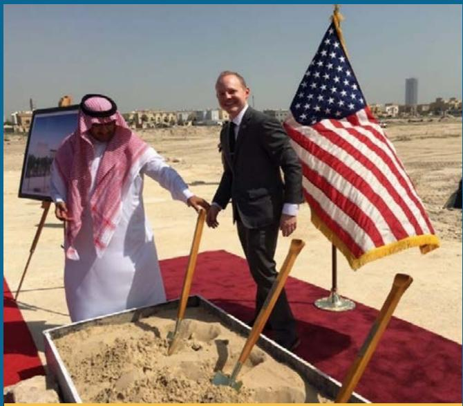

> **AI Description:**
> **Source:** `assets/_page_136_Figure_0.jpg`
> 
> **Generated:** 2026-05-18 11:35:16
> 
> ---
> 
> The image is a photograph showing two individuals participating in a groundbreaking ceremony. One individual is dressed in traditional Middle Eastern attire, while the other is in a suit. They are holding shovels and standing on a red carpet. In the foreground, there is a box filled with sand and a U.S. flag is visible to the right. The background shows an open, sandy area with some buildings in the distance. The image captures a formal event, likely related to the construction or inauguration of a project.

Peter Winter (right) participates in groundbreaking ceremony for the new U.S. Consulate General in Dhahran, Saudi Arabia, March 28, 2017. Department of State

P eter Winter is a Special Assistant in the Office of the Under Secretary for Public Diplomacy and Public Affairs. He previously has served overseas in Islamabad, Pakistan; Dhahran, Saudi Arabia; and Shanghai, China. Prior to joining the State Department, he worked for the USA Pavilions at two World Expos (World’s Fairs). He graduated from the University of Southern California with a Master’s in Public Diplomacy and a Bachelor’s in International Relations and East Asian Languages. He also has a certificate in Mandarin Chinese from Peking University in Beijing. Peter is originally from Taos, New Mexico.

Why did you want to be a part of the Hometown Diplomat Program?

Put simply, I am proud of our work at the State Department and want more people from my hometown to consider international careers or study abroad.

Can you explain the Taos Diplomats Scholarship and how your Hometown Diplomat Engagement led to its creation?

As in many small towns, it just takes a small push for young people to expand their horizons. My high school has long run a community scholarship program where local businesses and civic groups can support graduating seniors at any financial level.

After meeting with local education organizations during my Hometown Diplomats experience, I was energized to do more. I started the Taos Diplomats Scholarship with the modest goal of providing an opportunity for Taos students to study more about the world around them. Scholarship funds could be used in any manner to further a student’s exploration of the world: pay for classes, buy a plane ticket, get a new camera for their adventures. The only requirement was that recipients must use the funds to “elevate their global thinking.”

Since inception, 20 students, many of whom are firstgeneration college students, have received support through the scholarship. It has helped Taoseños interested in international careers and world affairs to reach that next level.

# Summary of Financial Statement Audit and Management Assurances

A s described in this report’s section called Departmental Governance, the Department tracks audit material weaknesses as well as other requirements of the Federal Manager’s Financial Integrity Act of 1982 (FMFIA). Below is management’s summary of these matters as required by OMB Circular A-136, Financial Reporting Requirements, revised.

## Summary of Financial Statement Audit

## Summary of Management Assurances

<table><tr><td>DEFINITION OF TERMS</td></tr><tr><td>Beginning Balance: The beginning balance must agree with the ending balance from the prior year.</td></tr><tr><td>New:The total number of material weaknesses/non-conformances identified during the current year.</td></tr><tr><td>Resolved:Thetotalnumberofmaterialweaknesses/non-conformancesthatdroppedbelowtheevelofmaterialityinthecuentear.</td></tr><tr><td>Consolidated: The combining of two or more findings.</td></tr><tr><td>Ressesed:Teoalofgotrbutabltectics aageteaateddetedtatgd</td></tr><tr><td>not meet the criteria for materiality or is redefined as more correctly classified under another heading).</td></tr><tr><td>Ending Balance: The year-end balance that will be the beginning balance next year.</td></tr></table>

# Payment Integrity Information Act Reporting

O ver the past decade, laws and regulationsgoverning the identification and recoveryimproper payments have evolved to stren governing the identification and recovery of improper payments have evolved to strengthen improvements in payment accuracy and raise public confidence in Federal programs. The Improper Payments Information Act of 2002 (IPIA), as amended and expanded by other related laws, collectively required agencies to periodically review all programs and activities to identify those susceptible to significant improper payments, to conduct payment recapture audits, and to leverage Government-wide Do Not Pay initiatives. The IPIA regulations also required extensive reporting requirements. In recent years, OMB transformed the improper payment compliance framework to create a more unified, comprehensive, and less burdensome set of requirements. IPIA was repealed and replaced by the Payment Integrity Information Act of 2019 (PIIA), which was passed on March 2, 2020. The PIIA modified and restructured existing improper payments laws to help agencies better identify and reduce any money wasted as a result of improper government payments. Not all improper payments are fraud, and not all improper payments represent a loss to the government. Generally, an improper payment is any payment that should not have been made or that was made in an incorrect amount under a statutory, contractual, and administrative or other legally applicable requirement.

The Department defines its programs and activities in alignment with the manner of funding received through appropriations, as further subdivided into funding for operations carried out around the world. Risk assessments over all programs are done every three years. In the interim years, risk assessments evaluating programs that experience any significant legislative changes and/or significant increase in funding will be done to determine if the Department continues to be at low risk for making significant improper payments at or above the threshold levels set by OMB. The Department conducted a risk assessment of all programs and activities in 2019. During 2021, the Department conducted risk assessments of the following programs: American Compensation; Voluntary Contributions; Assessed Contributions; Diplomatic Policy and Support; Diplomatic and Consular, Other Programs; Embassy Operations; and Construction. After performing risk assessments for these programs, the Department determined that none of its programs in 2021 were risk-susceptible for making significant improper payments at or above the threshold levels set by OMB.

Annually, the Department submits data to OMB that is collected and presented on https://paymentaccuracy.gov/ by individual agency or on a Government-wide consolidated basis. This website contains current and historical information about improper payments made under Federal programs, as well as extensive information about how improper payments are defined and tracked. Please refer to the https://paymentaccuracy.gov/ website for detailed results from the Department's efforts in 2021 to comply with PIIA.

> **AI Description:**
> **Source:** `assets/_page_138_Figure_0.jpg`
> 
> **Generated:** 2026-05-18 11:22:21
> 
> ---
> 
> The image is a photograph of a formal meeting taking place in a well-decorated room. Several individuals are seated around a long table, engaged in discussion. The table is set with water bottles, nameplates, and a floral centerpiece. The setting includes flags, one of which is the American flag, and another is the Israeli flag, indicating an international diplomatic context. The individuals are dressed in formal attire, suggesting the importance of the meeting. The room has a classic design with a fireplace and ornate decorations, adding to the formal atmosphere.

Secretary Blinken meets with Israeli Foreign Minister Yair Lapid in Rome, Italy, June 27, 2021. Department of State

## Grants Programs

he Department understands the importance of timely closeout of grants and cooperative agreements to promote the financial accountability of grants programs. The Department continues to strengthen enforcement of the closeout requirements across domestic bureaus and overseas posts. Use of a standardized Federal assistance management system (State Assistance Management System (SAMS)), coupled with updates to Department Federal assistance policies, has enabled the Department to better monitor, analyze, and report on the closeout of awards.

However, the Department still faces challenges in efficiently closing awards in a timely manner. While data passes electronically between SAMS, the Department’s financial systems, and the Health and Human Services Payment Management System (PMS), some critical closeout tasks remain a manual process in the payment system. The manual steps required to reconcile differences between systems can be labor-intensive, especially in PMS, and the Department has taken numerous steps to mitigate and resolve these issues. SAMS requires the use of a standardized closeout checklist and offers reporting capabilities to

help identify awards awaiting closeout. Additionally, the Department utilizes the Department of the Interior to negotiate indirect cost rates, which facilitates timelier award closeout. The Department’s publication of a Federal assistance Human Capital Plan has resulted in increased training and guidance on Federal assistance management, including closeout requirements and procedures.

In December 2020, the Foreign Assistance Data Review (FADR) initiative was implemented to provide more streamlined tracking of Federal Assistance data. FADR aims to advance the Foreign Aid Transparency and Accountability Act of 2016, a law that mandates that all Federal departments or agencies administering U.S. foreign development and economic assistance to provide quarterly, comprehensive information about such programs.

The “Expired Federal Grants and Cooperative Agreements Summary” table shows the 993 awards totaling \$30,946,810 for which closeout has not yet occurred, but for which the period of performance has elapsed by two years or more prior to September 30, 2021.

EXPIRED FEDERAL GRANTS AND COOPERATIVE AGREEMENTS SUMMARY

# Federal Civil Penalties Inflation Adjustment Act

he Federal Civil Penalties Inflation Adjustment Act of 1990 established annual reporting requirements for civil monetary penalties assessed and collected   
by Federal agencies. The Department assesses civil fines and   
penalties on individuals for such infractions as violating the   
terms of munitions licenses, exporting unauthorized defense   
articles and services, and valuation of manufacturing license

agreements. In 2021, the Department assessed \$19.6 million in penalties against two companies, and collected \$11.8 million of outstanding penalties from six companies. The balance outstanding as of September 30, 2021, was \$12.6 million. The “Federal Civil Penalties Inflation Adjustments” table list the current penalty level for infractions governed by the Department.

# Resource Management Systems Summary

## Introduction

T he financial activities of the Department of State (the Department or DOS) occur in approximatel (the Department or DOS) occur in approximately 270 locations in 180 countries. We conduct business transactions in over 135 currencies and even more languages and cultures. Hundreds of financial and management professionals around the globe allocate, disburse, and account for billions of dollars in annual appropriations, revenues, and assets. The Department is at the forefront of Federal Government efforts to achieve cost savings by engaging in shared services. Indeed, the Department’s financial management customers include 45 U.S. Government agencies in every corner of the world, served 24 hours a day, seven days a week. Another illustration of the Department’s commitment to shared services is its hosting at its Charleston, S.C. financial center of USAID’s core financial system. This system, known as Phoenix, makes use of the same commercial off-the-shelf (COTS) software as the Department’s core system, thereby promoting smooth interaction between the two agencies.

The Department’s financial management efforts are guided by three overarching goals: delivering world-class financial services and systems to our customers effectively and efficiently; establishing and administering an accountable, transparent, and prudent rigorous internal control, compliance and financial reporting environment; and facilitating interagency coordination and liaison activities that support Department operations.

The nonprofit independent firm that conducts the Department’s annual survey of overseas users of financial operations and systems is one of the leading proponents of benchmarking and best practices in business research. The firm noted that the Department’s Bureau of the Comptroller and Global Financial Services (CGFS) set its overall performance target for customer satisfaction at 80 percent for all services, a goal considerably higher than what many Government agencies and private sector financial institutions achieve. Not only has CGFS set such high goals, it has consistently surpassed these marks for overall satisfaction and satisfaction with the majority of its individual systems. In our most recent survey, for the first time all nine financial systems received a satisfaction rating of 80 or higher from overseas users. Such scores exceed benchmark averages from financial services customers of 64 for Federal Government agencies and 75 for private sector providers. CGFS viewed this improvement as particularly meaningful as it was driven by an increase in both the response rate and average satisfaction scores provided by financial management officers.

Continued standardization and consolidation of financial activities and leveraging investments in financial systems to improve our financial business processes will lead to greater efficiencies and effectiveness. This change is not always easy with the decentralized post-level financial services model that exists for the Department’s worldwide operations. In addition, over the next several years, we will need to leverage upgrades in our core financial system software, locally employed (LE) staff and American payroll and time and attendance (T&A) deployments, and integration with other Department corporate systems to improve our processes in ways that better support financial operations. Besides seeking greater linkages within our systems, we also are seeking additional opportunities to improve our shared service efficiencies in ways that help us serve our customer agencies and lower overall costs to the U.S. Government.

We have made significant progress in modernizing and consolidating Department resource management systems. In response to cybersecurity concerns, our development efforts in all lines of business increasingly emphasize the need to reduce vulnerabilities within systems and to be mindful of potential threats to unauthorized access and to the integrity of data within our systems. This focus seeks to protect both the Department and its employees. CGFS’ financial systems development activities continue to be operated under Capability Maturity Model Integration (CMMI) industry standards.

We continue to make use of proven COTS software in delivering resource management systems to the Department and our serviced customers. We have pushed to consolidate these systems to the CGFS platform with the goals of meeting user requirements, sharing a common platform and architecture, reflecting rationalized standard business processes, and ensuring secure and compliant systems. A COTS solution is the platform for our Global Foreign Affairs Compensation Systems (GFACS). By managing the process in this manner, we can deliver products that are compliant, controlled, and secure. OMB continues its initiative to standardize Government-wide business processes to address the Federal Government’s long-term need to improve financial management. Also, over the next several years, several new Federal accounting and information technology standards, many driven by the Department of the Treasury, will become effective. These include Government-wide projects to standardize business requirements and processes, establish and implement a government-wide accounting classification, and support the replacement of financial statement and budgetary reporting. The Department’s implementation of new standards and Government-wide reporting will strengthen both our financial and information technology management practices.

The Department uses financial management systems that are critical to effective agency-wide financial management, financial reporting, and financial control. These systems are included in various programs. An overview of these programs follows.

## Financial Systems Program

The financial systems program includes the Global Financial Management System (GFMS), the Regional Financial Management System (RFMS), RFMS Overseas Acquisition Integration, and the Consolidated Overseas Accountability Support Toolbox (COAST).

The Global Financial Management System. GFMS centrally accounts for billions of dollars recorded through over 8 million transactions annually. GFMS has over 2,700 users and over 25 “handshakes” with other internal and external systems. GFMS is critical to the Department’s day-to-day operations. It supports the execution of the Department’s mission by effectively accounting for business activities and recording the associated financial information, including obligations and costs, receivables, interagency agreements, and other data. GFMS supports the Department’s domestic offices and serves as the agency’s repository of corporate data.

During 2021, the Department completed the domestic rollout the rollout of the OMB mandated Invoice Processing

# Did You Know?

James Gillespie Blaine served two terms as Secretary of State. He was the 28th and 31st Secretary of State. He served under Presidents Garfield, Arthur, and Harrison.

More information on former Secretaries can be found at: https://history.state.gov/ departmenthistory/people/secretaries

Platform (IPP), which is a shared service provided by the Department of the Treasury. Use of the IPP allows DOS to streamline domestic invoice processing. The Department and vendors have access to the IPP platform to exchange data on orders, invoices, and payments. Internal controls ensure that invoices are reviewed and approved in IPP by using configurable standard workflows. During 2021, implementation was completed in all Department bureaus with over 1,100 IPP users. Over 62,000 orders have been converted to the IPP and over 86,000 vendor payments have been processed in IPP to date.

DOS continues efforts to improve methods to track Buyerside Interagency Agreements (IAAs) in GFMS, including providing the ability to create 7600A and 7600B forms directly from GFMS. Signed IAAs (for non-classified agreements) must be attached to the GFMS transactions, providing for a central repository for IAAs. In 2020, all bureaus were required to use the new process. Cumulatively, bureaus have processed over 4,000 IAA transactions in GFMS using the new process.

The Department has also completed the development and system configuration of a new accounting model for sellerside IAA Advance processes, started a pilot in 2021, with the full implementation planned for 2022.

This IAA implementation in GFMS introduces critical business process changes that will help facilitate adoption of the Government-wide G-Invoicing platform by 2023.

The Regional Financial Management System. RFMS is the global accounting and payment system that has been implemented for posts around the world. RFMS includes a common accounting system for funds management and transaction processing. In 2021, the core Momentum software platform that RFMS operates on was updated from version 7.0.5 to 7.7. This platform had not been updated since 2013. To improve the accuracy of the Department’s residential and operational leases, posts started using Regional Financial Management System/Momentum (RFMS/M) Property related Obligation and Payment (PrOPP) functionality. PrOPP provides an automated tool to set up recurring profiles for obligations and payments related to leases and other recurring payments and includes reports and queries for managing future lease transactions. There are 104 posts that are currently live on PrOPP. The Department analyzed integrating the Real Property Application and RFMS, and this analysis continues as the Department is exploring various options.

RFMS Overseas Acquisition Integration. During 2021, in an effort to improve government efficiency and in support of OMB memorandum M-19-16 that requires agencies to centralize mission support functions, the Department implemented Momentum for contract writing purposes overseas. Momentum is already in use domestically and the overseas user community will adopt the same model for its usage, firstly as it relates to regionalizing procurement. An initial pilot launched during 2021 with further rollout now planned for 2022. This initiative also establishes the groundwork to align domestic and overseas procurement models and centralize its approach to meet Digital Accountability and Transparency (DATA) Act reporting requirements across domestic and overseas procurement data. Historically, DOS struggles to certify its overseas procurement data as specified by the DATA Act, a major deficiency in their quarterly submissions to Treasury that represents an audit finding and can result in lower funding and/or full-time equivalent levels for the agency. The pilot phase is a major step in mitigating this risk and to achieving a single, unified procurement approach that standardizes procurement procedures and policy globally while increasing data accuracy, auditability, and transparency for data reporting compliance (present and future needs).

## The Consolidated Overseas Accountability Support

Toolbox. COAST is an application suite deployed to more than 180 posts around the world as well as to Department of State and other agency headquarters offices domestically. COAST captures and maintains accurate, meaningful financial information, and provides it to decision makers in a timely fashion. The current COAST suite consists of COAST Cashiering, COAST Reporting, and COAST Payroll Reporting. In 2021, the Department continued with the RFMS/Cashiering (RFMS/C) project to replace

COAST Cashiering with a centralized, web-based cashiering application installed in a single location. With RFMS/C, transactions integrate with RFMS/M in real time. This will replace the existing COAST Cashiering process of sending transactions to RFMS/M through a batch file. RFMS/C was successfully implemented in four locations during a planned pilot phase. Implementations of RFMS/C continue in November 2021 as a multi-year project to replace COAST Cashiering. COAST Reporting and COAST Payroll Reporting capabilities will be discussed in more detail under the Business Intelligence Program.

## Planning and Budget Systems Program

In 2021, the Budget System Modernization (BSM) project completed the fourth significant milestone to standardize, consolidate, and simplify the budgeting systems within the Department with completion of the new releases of the Integrated Budget Intelligence System (IBIS) and Global Business Intelligence (BI) features to provide foreign currency projections and proposed adjustments to manage overseas budget impacts for the current year. This completes the transition of all functions of the legacy Central Resource Management System to IBIS. In addition, IBIS budgetary data has been made available within the Global BI reporting platform to support an expanded planned versus actual and other budgetary reporting previously unavailable to the agency in a central location.

In 2021, the BSM project also completed three of the six major milestones of the IBIS overseas initiative, which when completed, will produce a unified global budgeting system, encompassing domestic and overseas budgeting processes. The first milestone introduced and standardized capabilities for regional bureaus and posts to communicate budget targets and associated post target reporting. The second IBIS overseas milestone introduced a layered global security platform to allow for all posts, overseas organization support divisions, and domestic users to utilize one centralized system. The third milestone completed in 2020 allows for submission and approval of unfunded priority requests, and other data calls by posts to regional bureaus. The latter functionality was introduced into the platform late in the fiscal year and will be rolled out to the user community in 2021.

In 2021, the BSM project worked towards completing the final three milestones of the IBIS overseas rollout. The fourth milestone involving financial plan review with execution analysis was completed and expansion of the

functional bureau budgeting at post began and will continue into 2022 by incorporating other budgetary functionality from existing legacy systems such as Web Resource Allocation and Budget Integration Tool (WebRABIT) completing mid-year fiscal year 2023. WebRABIT is an application used by regional and some functional bureaus for tracking modifications of execution year budgets to their posts. WebRABIT is currently in an operations and maintenance mode, with resources being aligned at a lower level of activity. The BSM project is part of the long-term strategy to provide a unified budgetary Department-wide solution for the Department.

Web International Cooperative Administrative Support Services is the principal means by which the U.S. Government shares the cost of common administrative support at its more than 270 diplomatic and consular posts overseas. The Department has statutory authority to serve as the primary overseas shared service provider to other agencies.

## Travel Systems Program

In 2016, the Department successfully transitioned to the next generation of the E-Government Travel Services (ETS2) contract with Carlson Wagonlit Travel. In 2016, the Department also implemented the Local Travel

module allowing for the submission of local travel claims for expenses incurred in and around the vicinity of a duty station. The Department expanded the use of the Local Travel feature to also accommodate non-travel employee claims previously submitted through an OF-1164. In the Local Travel module, approvers will electronically approve claims and provide reimbursement to the employee’s bank account via EFT. The Department has completed this implementation for all posts overseas.

The Department continues to work with our bureaus and posts to identify improvements that can be made to the travel system. The Department also participates with other agencies to prioritize travel system enhancements across the Federal Government landscape. The Department worked with Carlson Wagonlit Travel to improve Local Travel routing rules and improve Search capabilities within E2. The Department continues to work with Carlson Wagonlit Travel on enhancements to support integration improvements with our financial systems. The Department also continues to work with Carlson Wagonlit Travel on enhancements to support the implementation of split disbursements for direct payments of individually billed account charges, the Local Payments module domestically, and initiated work to implement Carlson Wagonlit Travel’s Mission Insight dashboarding tool.

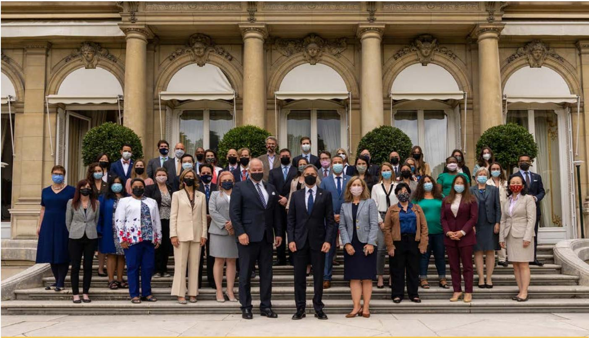

> **AI Description:**
> **Source:** `assets/_page_144_Figure_0.jpg`
> 
> **Generated:** 2026-05-18 11:27:34
> 
> ---
> 
> The image is a photograph of a group of individuals, likely a professional or political gathering, standing in front of an ornate building with columns and arched windows. The group is composed of men and women dressed in formal attire, with many wearing face masks. The setting appears to be formal and possibly related to a diplomatic or governmental event. The individuals are arranged in a tiered formation, with some standing on steps leading up to the building.

Secretary Blinken holds a meet and greet with U.S. Mission France in Paris, France, June 25, 2021. Department of State

## Compensation Systems Program

The Department serves as one of five payroll shared service providers on behalf of Federal agencies. Shared service providers process payroll annually for some 2.3 million employees worldwide, or about 99 percent of the Federal civilian workforce.

The Department continued to execute a phased deployment strategy, replacing six legacy payroll systems with a single, COTS-based solution to address the widely diverse payroll requirements of the Foreign Service, Civil Service, LE staff, and retirees of the Department and the other 45 civilian agencies serviced. The “Global Compensation System Vision” diagram highlights how past and future changes involve simplifying and consolidating our systems. The Global Foreign Affairs Compensation System (GFACS) leverages a rules-based, table-driven architecture to promote compliance with the complex statutes found across the Foreign and Civil Service Acts and local laws and practices applicable to all the countries in which civilian agencies operate.

In 2021, the legacy Consolidated American Payroll Processing System (CAPPS) was replaced with the GFACS

American Payroll application. Future changes will include the web-based global time and attendance product using the same rules-based technology as GFACS. GFACS Time and Labor will have the capability of remote accessibility, electronic routing and approval, and self-service features. As a result, it will bring a more efficient and modern time keeping process to the Department’s workforce.

## Business Intelligence Program

The Department’s Business Intelligence program consists of the COAST Reporting, COAST Payroll Reporting, and the Global BI Reporting. Global BI enables users to access financial information from standard, prepared reports, and customized queries. Global BI is also updated multiple times per day with current, critical financial information from the Department’s financial management applications.

In 2017, the Department implemented the Global BI application, building on the infrastructure being used for the Data Warehouse, and adding an in-memory appliance and a new data analytics tool. In 2018, the Global BI application continued to be used to import, reconcile, and export data that meets the requirements of the DATA Act and Foreign Assistance Data Review. The Global BI application was

GLOBAL COMPENSATION SYSTEM VISION
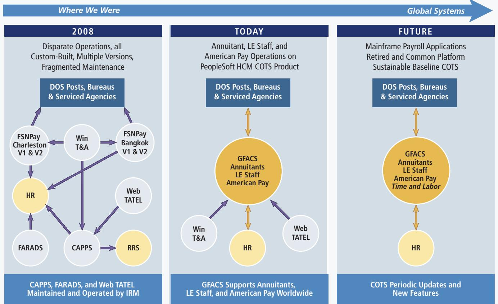

> **AI Description:**
> **Source:** `assets/_page_145_Figure_0.jpg`
> 
> **Generated:** 2026-05-18 11:30:53
> 
> ---
> 
> The image is a flowchart that illustrates the evolution of payroll systems from 2008 to the future. It shows three main sections: "Where We Were" in 2008, "Today," and "Future." The flowchart uses arrows to depict the flow of data and processes. Key elements include:
> 
> - In 2008, there were disparate operations with custom-built systems and multiple versions, leading to fragmented maintenance.
> - Today, the system uses PeopleSoft HCM COTS Product for annuitants, LE staff, and American pay operations.
> - The future vision is a sustainable baseline COTS system with periodic updates and new features.
> 
> The flowchart highlights the transition from multiple, custom-built systems to a unified and sustainable platform, emphasizing the shift towards global systems and improved maintenance.

> **AI Description:**
> **Source:** `assets/_page_146_Figure_0.jpg`
> 
> **Generated:** 2026-05-18 11:38:32
> 
> ---
> 
> The image depicts a formal meeting setting with a large U-shaped conference table. The table is divided into two sections, with one side labeled with the American flag and the other with the Iraqi flag. Individuals are seated around the table, some wearing face masks, indicating a meeting during a time when health precautions were in place. The table is adorned with green floral arrangements, and there are microphones and nameplates on each participant's seat. The seating arrangement suggests a structured diplomatic or governmental discussion.

Secretary Blinken meets with Iraqi Foreign Minister Dr. Fuad Hussein in Washington, D.C., July 23, 2021. Department of State

updated to complete the full suite of financial reports for overseas posts as well as a second set of analytics dashboards for posts to drill into their overseas transactional data. The Department continues to utilize an agile-like process incorporating a collection of overseas posts, a regional bureau, and accounting support staff in Charleston, S.C. to finalize overseas report and dashboard requirements and report functionality. For the suite of Overseas Analytics, training has been formally conducted for about 140 posts in all regions. The domestic bureaus have also been trained. In 2021, the Global BI application was updated to include versions of the payroll reports from COAST. Engaging with the overseas user community, new reports and functionality were added to the overseas analytics suite as well as releasing required updates for the RFMS Update. New Exchange Rate Tracking reporting and Plan versus Actual reporting was also implemented for the Budget and Planning bureau. Global BI was also updated in 2021 for the implementation of a new Unliquidated Obligation and Funds Lifecycle Management dashboards for domestic Bureau use. Data loading frequency to Global BI was increased to four times a day for the overseas community and twice a day for the domestic community.

In 2022, work will begin on new Financial Asset reporting utilizing data from multiple sources. Global BI will also support an improved GTAS reporting process. New GFACS LE reports will be developed in Global BI and new GFMS and RFMS combined reporting and dashboards will be implemented to support global financial reporting. Updates to the data load and reporting will also be completed in association with planned RFMS and GFMS Updates.

## Heritage Assets

T he Department has collections of art objects,furnishings, books, and buildings that are furnishings, books,and buildings that are considered heritage or multi-use heritage assets. These collections are housed in the Diplomatic Reception Rooms, senior staff offices in the Secretary’s suite, offices, reception areas, conference rooms, the cafeteria and related areas, and embassies throughout the world. The items have been acquired as donations, are on loan from the owners, or were purchased using gift and appropriated funds. The assets are classified into nine categories: the Diplomatic Reception Rooms Collection, the Art Bank Program, the Library Rare & Special Book Collection, the Cultural Heritage Collection, the Secretary of State’s Register of Culturally Significant Property, the National Museum of American Diplomacy, the Art in Embassies Program, the International Boundary and Water Commission, and the Blair House. Items in the Register of Culturally Significant Property category are classified as multi-use heritage assets due to their use in general government operations.

## Diplomatic Reception Rooms Collection

In 1961, the State Department’s Office of Fine Arts began the privately-funded Americana Project to remodel and redecorate the 42 Diplomatic Reception Rooms – including the offices of the Secretary of State – on the seventh and eighth floors of the Harry S Truman Building. The Secretary of State, the President, and Senior Government Officials use the rooms for official functions promoting American values through diplomacy. The rooms reflect American art and architecture from the time of our country’s founding and its formative years, 1740 – 1840. The rooms also contain one of the most important collections of early Americana in the nation, with over 5,000 objects, including museum-quality furniture, rugs, paintings, and silver. These items have been acquired through donations or purchases funded through gifts from private citizens, foundations, and corporations. No tax dollars have been used to acquire or maintain the collection. There are three public tours each day.

> **AI Description:**
> **Source:** `assets/_page_147_Figure_0.jpg`
> 
> **Generated:** 2026-05-18 11:33:20
> 
> ---
> 
> The image depicts a grand, ornate building with classical architectural features, including a symmetrical facade, multiple levels, and decorative elements such as columns and pediments. The structure is surrounded by a well-maintained garden with neatly trimmed grass and blooming flowers, suggesting a formal and luxurious setting. The sky is partly cloudy, indicating a pleasant day. The building appears to be a significant historical or residential property, possibly a mansion or a hotel, given its grandeur and the manicured grounds.

Hôtel Rothschild, the official residence of the U.S. Ambassador to France and Monaco was constructed between 1852 and 1855. It measures over 7,000 square meters and occupies a 1.2 hectare site at 41 Rue du Faubourg Saint Honoré in Paris, a short distance from the U.S. Embassy and the home and offices of the French President, the Élysée Palace. Department of State/OBO

## Art Bank Program

The Art Bank Program was established in 1984 to acquire artworks that could be displayed throughout the Department’s offices and annexes. The works of art are displayed in staff offices, reception areas, conference rooms, the cafeteria, and related public areas. The collection consists of original works on paper (watercolors and pastels) as well as limited edition prints, such as lithographs, woodcuts, intaglios, and silk-screens. These items are acquired through purchases funded by contributions from each participating bureau.

## Rare & Special Book Collection

In recent years, the Ralph J. Bunche Library has identified books that require special care or preservation. Many of these publications have been placed in the Rare Books and Special Collections Room, which is located adjacent to the Reading Room. Among the treasures is a copy of the Nuremberg Chronicles, which was printed in 1493; volumes signed by Thomas Jefferson; and books written by Foreign Service authors.

## Cultural Heritage Collection

The Cultural Heritage Collection, which is managed by the Bureau of Overseas Buildings Operations, Office of Residential Design and Cultural Heritage, is responsible for identifying and maintaining cultural objects owned by the Department in its properties abroad. The collections are identified based upon their historic importance, antiquity, or intrinsic value.

## Secretary of State’s Register of Culturally Significant Property

The Secretary of State’s Register of Culturally Significant Property was established in January 2001 to recognize the Department’s owned properties overseas that have historical, architectural, or cultural significance. Properties in this category include chanceries, consulates, and residences. All of these properties are used predominantly in general government operations and are thus classified as multi-use heritage assets. Financial information for multi-use heritage assets is presented in the principal statements. The register is managed by the Bureau of Overseas Buildings Operations, Office of Residential Design and Cultural Heritage.

Benjamin Franklin Medal of the Congress, 1956. It was struck in honor of the 250th anniversary of Franklin’s birth and distributed to organizations which are part of Franklin’s legacy. Department of State

## National Museum of American Diplomacy

The National Museum of American Diplomacy is a unique education and exhibition venue at the Department of State that tells the story of the history, practice, and challenges of American diplomacy. It is a place that fosters a greater understanding of the role of American diplomacy, past, present, and future, and is an educational resource for students and teachers in the United States and around the globe. Exhibitions and programs inspire visitors to make diplomacy a part of their lives. The National Museum of American Diplomacy actively collects artifacts for exhibitions.

## Art in Embassies Program

The Art in Embassies Program was established in 1964 to promote national pride and the distinct cultural identity of America’s arts and its artists. The program, which is managed by the Bureau of Overseas Buildings Operations, provides original U.S. works of art for the representational rooms of United States ambassadorial residences worldwide. The works of art were purchased or are on loan from individuals, organizations, or museums.

## International Boundary and Water Commission

One of the IBWC’s primary mission requirements is the demarcation and preservation of the international boundary between the United States and Mexico (see Reporting Entity in Note 1.A). Roughly 1,300 miles of this border are demarcated by the Rio Grande and the Colorado River, and the other 700 miles of border are demarcated by 276 monuments along the land boundary, which extends from the Pacific Ocean to the Rio Grande. These monuments are jointly owned and maintained by the United States and Mexico. The United States is responsible for 138 monuments and considers them heritage assets. In addition, the IBWC is responsible for the Falcon International Storage Dam and Hydroelectric Power Plant. These were constructed jointly by the United States and Mexico pursuant to Water Treaty of 1944 for the mission purposes of flood control, water conservation, and hydroelectric power generation. Both were dedicated by U.S. President Dwight D. Eisenhower and President Adolfo Ruiz Cortines, of Mexico to the residents of both countries. Falcon is located about 75 miles downstream (southeast) of Laredo, Texas and about 150 miles above the mouth of the Rio Grande. They are considered multi-use heritage assets.

## Blair House

Composed of four historic landmark buildings owned by GSA, Blair House, the President’s Guest House, operates under the stewardship of the Department of State’s Office of the Chief of Protocol and has accommodated official guests of the President of the United States since 1942. In 2012, these buildings were added to the Secretary’s Register of Culturally Significant Property for their important role in U.S. history and the conduct of diplomacy over time. Its many elegant rooms are furnished with collections of predominantly American and English fine and decorative arts, historical artifacts, other cultural objects, rare books, and archival materials documenting the Blair family and buildings history from 1824 to the present. Objects are acquired via purchase, donation or transfer through the private non-profit Blair House Restoration Fund; transfers may also be received through the State Department’s Office of Fine Arts and Office of the Chief of Protocol. Collections are managed by the Office of the Curator at Blair House, which operates under the Office of Fine Arts.

> **AI Description:**
> **Source:** `assets/_page_149_Figure_0.jpg`
> 
> **Generated:** 2026-05-18 11:24:15
> 
> ---
> 
> The image contains a photograph of a virtual meeting setup. It features a large, curved wooden table with a central greenery display, around which several individuals are seated. The background includes a large screen displaying multiple video feeds of other participants in the meeting. The setting appears to be a formal conference or summit, as indicated by the text "Leaders Summit on Climate" on the screens and backdrop. The individuals at the table are engaged in discussion, with papers and microphones in front of them. The overall scene suggests a hybrid meeting format, combining in-person and virtual participants.

Secretary of the Treasury Janet Yellen, Special Presidential Envoy John Kerry, and National Economic Council Director Brian Deese participate in Session 2 on Investing in Climate Solutions at the virtual Leaders Summit on Climate in Washington, D.C., April 22, 2021. Department of State

# Meet Hometown Diplomat Eduardo Belalcazar

> **AI Description:**
> **Source:** `assets/_page_150_Figure_0.jpg`
> 
> **Generated:** 2026-05-18 11:31:18
> 
> ---
> 
> The image contains a photograph of a person standing in front of a large, pink, rectangular object that resembles a trailer or container. The person is dressed in a pink suit and is positioned on a street with parked cars and palm trees in the background. The setting appears to be a sunny day with clear skies. The pink object is the most prominent feature in the image, and its size relative to the person suggests it is quite large.

Diplomat Eduardo Belalcazar back home in Houston, Texas. Department of State

duardo Belalcazar joined the Department of State as a Spanish language Consular Fellow in 2020. He   
currently is assigned to the U.S. Consulate General in   
Tijuana, Mexico, where he works in the American Citizen   
Services section and volunteers his time to support his fellow   
employees, including by serving as the American Foreign   
Service Association post representative. Eduardo received   
his Bachelor of Arts in International Relations and Global   
Studies, a Business Foundations Certificate and a Certificate

in Human Rights and Social Justice from the University of Texas at Austin. As an undergraduate, Eduardo received a Department of State Gilman Grant to study Spanish and social justice in Nicaragua, as well as a Boren Scholarship to study Portuguese and racial justice in Brazil. These opportunities cemented his desire to become a diplomat.

Has the Hometown Diplomat Program left an imprint on your personal and professional success? If so, how would you articulate that impact to a perspective applicant?

When I joined the Hometown Diplomats program, I did not realize all the amazing opportunities it would help me create for myself. I did several presentations about diplomacy to middle school and high school students at Chinquapin Preparatory School in Houston. I recorded presentations not only on what diplomacy is, but also on different pathways, such as the privately funded Texas-based Terry Foundation Scholarship, that can lead to a career in diplomacy. I developed a virtual 5K, which raised more than \$3,000 for scholarships for seniors at Chinquapin. I accomplished all of this in my first year as a U.S. diplomat.

How would you describe the feeling of talking about your career and presenting to your community?

It is surreal to talk to students across various age groups from the same communities as my own. I often wonder how much sooner I would have been able to join the Department if I had found a mentor in this field.

## U.S. Secretaries of State Past and Present

Thomas Jefferson (1790-1793)

Edmund Jennings   
Randolph   
(1794-1795)

Timothy Pickering (1795-1800)

John Marshall (1800-1801)

James Madison (1801-1809)

> **AI Description:**
> **Source:** `assets/_page_151_Figure_6.jpg`
> 
> **Generated:** 2026-05-18 11:30:58
> 
> ---
> 
> The image is a portrait of a man with a white collar, likely from the 18th or 19th century, based on the style of clothing. The portrait is a painting, and the number "7" is marked in the bottom right corner of the image. The man appears to be of significance, possibly a historical figure, given the style of the portrait and the marking of the number.

Robert Smith (1809-1811)

James Monroe (1811-1817)

John Quincy Adams (1817-1825)

Henry Clay (1825-1829)

Martin Van Buren (1829-1831)

Edward Livingston (1831-1833)

Louis McLane (1833-1834)

John Forsyth (1834-1841)

Daniel Webster (1841-1843)

Abel Parker Upshur(1843-1844)

John Caldwell Calhoun (1844-1845)

James Buchanan (1845-1849)

John Middleton Clayton (1849-1850)

Daniel Webster (1850-1852)

Edward Everett(1852-1853)

William Learned Marcy (1853-1857)

Lewis Cass (1857-1860)

Jeremiah Sullivan   
Black   
(1860-1861)

William Henry Seward (1861-1869)

Elihu Benjamin Washburne (1869-1869)

Hamilton Fish (1869-1877)

William Maxwell Evarts (1877-1881)

James Gillespie Blaine (1881-1881)

Frederick Theodore Frelinghuysen (1881-1885)

Thomas Francis Bayard (1885-1889)

James Gillespie Blaine (1889-1892)

John Watson Foster (1892-1893)

Walter Quintin Gresham (1893-1895)

Richard Olney (1895-1897)

John Sherman (1897-1898)

William Rufus Day (1898-1898)

John Milton Hay (1898-1905)

Elihu Root (1905-1909)

43

Bainbridge Colby (1920-1921)

50

George Catlett Marshall (1947-1949)

Cyrus Roberts Vance (1977-1980)

Madeleine Korbel   
Albright   
(1997-2001)

Antony Blinken (2021-Present)

44

Charles Evans Hughes (1921-1925)

Dean Gooderham   
Acheson   
(1949-1953)

Frank Billings Kellogg (1925-1929)

Edmund Sixtus Muskie (1980-1981)

John Foster Dulles (1953-1959)

Colin Luther Powell (2001-2005)

Alexander Meigs Haig (1981-1982)

Condoleezza Rice (2005-2009)

Robert Bacon (1909-1909)

Philander ChaseKnox(1909-1913)

Henry Lewis Stimson (1929-1933)

47

Christian Archibald  
Herter  
(1959-1961)

Cordell Hull (1933-1944)

George Pratt Shultz (1982-1989)

William Jennings Bryan (1913-1915)

Hillary Rodham Clinton (2009-2013)

Edward Reilly Stettinius Jr. (1944-1945)

David Dean Rusk (1961-1969)

William Pierce Rogers (1969-1973)

James Addison Baker (1989-1992)

Lawrence Sidney Eagleburger (1992-1993)

John Forbes Kerry (2013-2017)

Rex Wayne Tillerson

More information on former Secretaries can be found at: https://history.state.gov/departmenthistory/people/secretaries

Robert Lansing (1915-1920)

49

James Francis Byrnes (1945-1947)

Henry A. Kissinger (1973-1977)

Warren Minor Christopher (1993-1997)

Michael R. Pompeo (2018-2021)

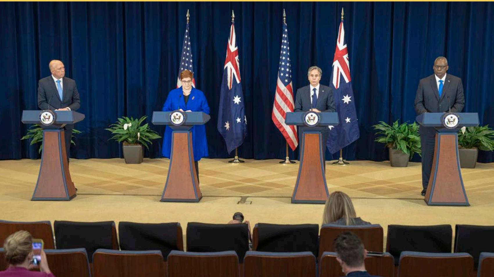

> **AI Description:**
> **Source:** `assets/_page_153_Figure_0.jpg`
> 
> **Generated:** 2026-05-18 11:36:13
> 
> ---
> 
> The image contains a photograph of four individuals standing at podiums on a stage. Each person is positioned behind a podium with the U.S. flag and an Australian flag behind them. The individuals appear to be participating in a formal event or press conference. The stage is set with a dark blue curtain backdrop and there are potted plants placed between the podiums. The audience is seated in the foreground, with some individuals visible taking photos or recording the event.

Secretary Blinken holds a joint press conference with Secretary of Defense Lloyd Austin, Australian Foreign Minister Marise Payne, and Australian Defence Minister Peter Dutton in Washington D.C., September 16, 2021. Department of State

# Appendices

## Appendix A: Abbreviations and Acronyms

ADA Anti-Deficiency Act   
ADP Automated Data Processing   
AF Bureau of African Affairs (DOS)   
AFR Agency Financial Report   
AGA Association of Government Accountants   
AIDS Acquired Immunodeficiency Syndrome   
APG Agency Priority Goal   
APP Annual Performance Plan   
ASEAN Association of Southeast Asian Nations   
APR Annual Performance Report   
Appendix A OMB Circular A-123, Appendix A   
ARP American Rescue Plan   
ATA-SPEAR Antiterrorism Assistance-Special Program for Embassy Augmentation and Response   
BI Business Intelligence   
BLiSS Baghdad Life Support Services   
BSM Budget System Modernization   
CA Bureau of Consular Affairs (DOS)   
CAP Cross-Agency Priority   
CAPPS Consolidated American Payroll Processing System (DOS)   
CARES Act Coronavirus Preparedness and Response Supplemental Appropriations Act   
CARP Climate Adaptation and Resilience Plan   
CBSP Consular and Border Security Programs (DOS)   
CEAR Certificate of Excellence in Accountability Reporting   
CFO Chief Financial Officer   
C.F.R. Code of Federal Regulations   
CGFS Bureau of the Comptroller and Global Financial Services (DOS)   
CIO Contributions to International Organizations   
CIP Construction-In-Progress   
CIPA Contributions for International Peacekeeping Activities   
CMMI Capability Maturity Model Integration   
COAST Consolidated Overseas Accountability Support Toolbox   
COM Chief of Mission   
COR Contracting Officer Representative   
COTS Commercial Off-the-Shelf   
COVID-19 Coronavirus Disease 2019   
CPARS Contractor Performance Assessment Reporting System   
CSRS Civil Service Retirement System   
D Deputy Secretary of State (DOS)   
DATA Act Digital Accountability and Transparency Act   
DCF Defined Contributions Fund   
DCP Defined Contribution Plan   
Department U.S. Department of State   
DHS Department of Homeland Security   
D-MR Deputy Secretary of State for Management and Resources (DOS)   
NEA Bureau of Near Eastern Affairs (DOS)   
OAS Organization of American States   
OBO Bureau of Overseas Buildings Operations (DOS)   
OBO/OPS/   
FIRE Office of Fire Protection (DOS)   
OCO Overseas Contingency Operations (DOS)   
OECD Organization for Economic Cooperation and Development   
OES Bureau of Oceans and International Environmental and Scientific Affairs (DOS)   
OIG Office of Inspector General (DOS)   
OMB U.S. Office of Management and Budget   
OMSS Operations and Maintenance Support Services   
OPM U.S. Office of Personnel Management   
OSCE Organization for Security and Co-operation in Europe   
PAS Public Affairs Section (DOS)   
PBO Projected Benefit Obligation   
PIIA Payment Integrity Information Act of 2019   
PMS Payment Management System (HHS)   
POSHO Post Occupational Safety and Health Officer   
PPA Prompt Payment Act   
PrOPP Property related Obligation and Payment   
PSPR Post Security Program Reviews   
RFJ Rewards for Justice   
RFMS Regional Financial Management System   
RFMS/C Regional Financial Management System/ Cashiering   
RFMS/M Regional Financial Management System/ Momentum   
RMF Risk Management Framework   
RRS Retirement Records System   
SAMS State Assistance Management System   
SAT Senior Assessment Team   
SBR Statement of Budgetary Resources   
SFFAS Statements of Federal Financial Accounting Standards   
SHEM Office of Safety, Health, and Environmental Management (DOS)   
SID Software in Development   
SoA Statement of Assurance   
SPEC Special Presidential Envoy for Climate   
SSAE Statement on Standards for Attestation Engagements   
T&A Time and Attendance   
TAFS Treasury Account Fund Symbols   
TOC Transnational Organized Crime   
TOCRP Transnational Organized Crime Rewards Program   
Treasury U.S. Department of the Treasury   
TSP Thrift Savings Plan   
TTC Trade and Technology Council   
UCA Undefinitized Contract Actions   
U.S.C. United States Code   
UDO Undelivered Orders   
UK United Kingdom   
ULO Unliquidated Obligation   
UN United Nations   
UNEP United Nations Environment Programme (UN)   
UN-HABITAT United Nations Human Settlements Programme (UN)   
UNVIE U.S. Mission to International Organizations in Vienna   
USAID U.S. Agency for International Development   
USSGL U.S. Standard General Ledger   
VAT Value Added Tax   
VCP Variable Contribution Plan   
Web Tatel Web-based Time and Attendance Telecommunications Line   
WebRABIT Web Resource Allocation and Budget Integration Tool   
WMD Weapons of Mass Destruction

# Appendix B: Department of State Locations

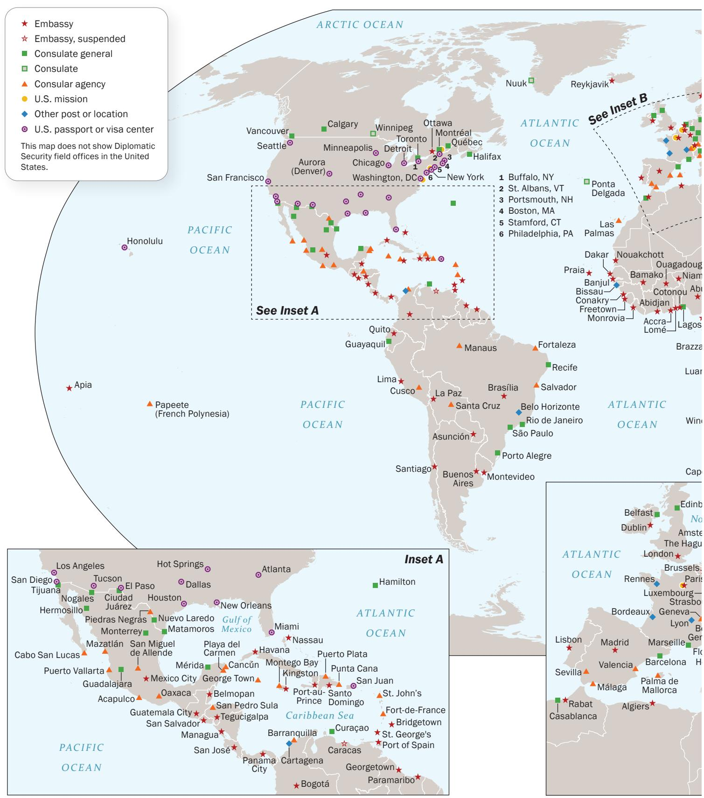

> **AI Description:**
> **Source:** `assets/_page_157_Figure_0.jpg`
> 
> **Generated:** 2026-05-18 11:32:31
> 
> ---
> 
> The image is an infographic combining text with a world map. It presents information about U.S. diplomatic and consular missions worldwide. The map includes various symbols representing different types of diplomatic posts such as embassies, consulates, and consular agencies. The symbols are color-coded and annotated with labels for specific locations. The map highlights the locations of these missions in North America, South America, Europe, Africa, and parts of Asia and the Pacific. The legend on the left explains the meaning of each symbol used on the map.

Locations shown based on latest available data. Boundary representation is not necessarily authoritative.

2482 10-21 STATE (INR)

## Acknowledgements

This Agency Financial Report (AFR) was produced with the energies and talents of Department of State staff in Washington, D.C. and our offices and posts around the world. We offer our sincerest thanks and acknowledgement. In particular, we recognize the following individuals and organizations for their contributions:

Office of the Comptroller:

Jeffrey Mounts, Comptroller William Davisson, Deputy Comptroller (Charleston) Cecilia Coates, Deputy Comptroller (DC) Carmen Castro, Associate Comptroller

Kerry Neal, Managing Director of Financial Policy, Reporting & Analysis

Joan Lugo, Managing Director of Global Financial Operations

Carole Clay, Director of Office of Management Controls

Paul McVicker, Director of Office of Financial Coordination and Reports for Oversight, Management & Analysis

Donald Wood, Director of Office of Financial Reporting and Analysis

Monika Moore, AFR Editor Stefanie Harris, Senior Advisor

Carl Biggs, Lance Binford, Bradley Biondi, Marcus Bowman, Nadine Bradley, Alexis Brown, Jorelys Burgos, Zachary Coho, John Coyle, Amanda Dombrowski, Justin Endy, Cindy Fleming, Kyle Grindstaff, Amanda Heredia, Matthew H. Johnson, Gregory Jones, Dong Kim, Ashley Knode, Yen Le, St. John Leck, Trevor McNamara, Janet Morgan, Kanetha Peters, Jenn Ross, Meredith Shears, Minura Silva, Melissa Sizemore, William Truman, and Alexander Williams.

The Agency Financial Report for Fiscal Year 2021 is published by the

U.S. Department of State

Bureau of the Comptroller and Global Financial Services Office of Financial Policy, Reporting and Analysis

An electronic version is available on the World Wide Web at http://ww.state.gov/plans-performance-budget/agencyfinancial-reports

Please call (202) 261-8620 with comments, suggestions, or requests.

U.S. Department of State Publication Bureau of Global Public Affairs November 2021

Global Financial Services personnel in Charleston, Bangkok, Paris, Manila, Sofia, and Washington, D.C.

Finally, thanks to all of the Department’s financial and management personnel at home and around the world providing accountability and effective stewardship over Department resources.

Other Contributors:

Iryna Bilous, Christine Jacobs, and Andrew Mosley.

We would also like to acknowledge the Office of Inspector General for their objective review of the Department’s performance and Kearney & Company for the professional manner in which they conducted the audit of the 2021 financial statements.

We would also like to acknowledge Jessica Kerns of Guidehouse for her contribution to our report.

We offer special thanks to our designers of Schatz Publishing Group, LLC.

## 2021 Image Credits

Associated Press (AP): Pages 41, 114

Department of State: Table of Contents, pages 3, 4, 7, 9, 10, 11, 13, 14, 16, 20, 21, 22, 28, 29, 32, 33, 40, 41, 42, 43, 71, 73, 77, 78, 82, 85, 87, 90, 93, 98, 100, 103, 107, 110, 111, 113, 114, 115, 116, 134, 135, 137, 143, 145, 146, 147, 148, 149, 152

UNICEF: Cover

## In Memoriam to Harold “Hal” Steinberg

The Federal financial community lost one of its most devoted champions in 2021 – Harold ‘Hal’ Steinberg. Hal made substantial contributions to the accounting profession during his time at OMB, FASAB, and AGA. He spent his long career working tirelessly to improve the quality of government performance and management. He was an expert in state, local, and Federal accounting, who happily shared his knowledge and talents with a wide audience. Under any accounting, he would be on the ‘Mt. Rushmore’ of Federal financial management. The Department would like to acknowledge the tremendous benefits received from Hal’s personal feedback on our AFR through the Certificate in Excellence and Accountability Reporting program that Hal pioneered and sustained for many years late in his superlative career.

## Websites of Interest

DipNote Blog: blogs.state.gov

Facebook: www.facebook.com/statedept

Flickr: www.flickr.com/photos/statephotos

> **AI Description:**
> **Source:** `assets/_page_160_Figure_3.jpg`
> 
> **Generated:** 2026-05-18 11:27:51
> 
> ---
> 
> The image contains a simple icon of a camera with the word "Camera" written below it. The icon is circular with a blue and white color scheme, and the text is in a sans-serif font. There are no charts, graphs, or other visual elements present in the image.

Instagram: www.instagram.com/statedept

> **AI Description:**
> **Source:** `assets/_page_160_Figure_4.jpg`
> 
> **Generated:** 2026-05-18 11:28:20
> 
> ---
> 
> The image contains a single icon that resembles the logo for the RSS (Really Simple Syndication) feed. The icon is a circular shape with a white background and a blue outline. The design is simple and minimalistic, representing a common symbol used to indicate a feed or subscription to content updates.

RSS Feeds: www.state.gov/rss-feeds/

> **AI Description:**
> **Source:** `assets/_page_160_Figure_5.jpg`
> 
> **Generated:** 2026-05-18 11:32:34
> 
> ---
> 
> The image contains a circular icon with a white background and a blue border. At the center of the icon is a white silhouette of a bird, which is the logo of the social media platform Twitter. The icon is designed to represent the Twitter brand and is commonly used to denote the platform in various digital contexts.

Twitter: www.twitter.com/StateDept

U.S. Department of State: www.state.gov

YouTube: www.youtube.com/user/statevideo

T hank you for your interest in the U.S. Department of State and its Fiscal Year 2021 Agency Financial Report. Electronic copies of this report and prior years’ reports are Agency Financial Report. Electronic copies of this report and prior years' reports are available through the Department’s website: www.state.gov.

You may also stay connected with the Department via social media and multimedia platforms listed above.

In addition, the Department publishes State Magazine monthly, except bimonthly in July and August. This magazine facilitates communication between management and employees at home and abroad and acquaints employees with developments that may affect operations or personnel. The magazine is also available to persons interested in working for the Department of State and to the general public. State Magazine may be found online at: statemag.state.gov.