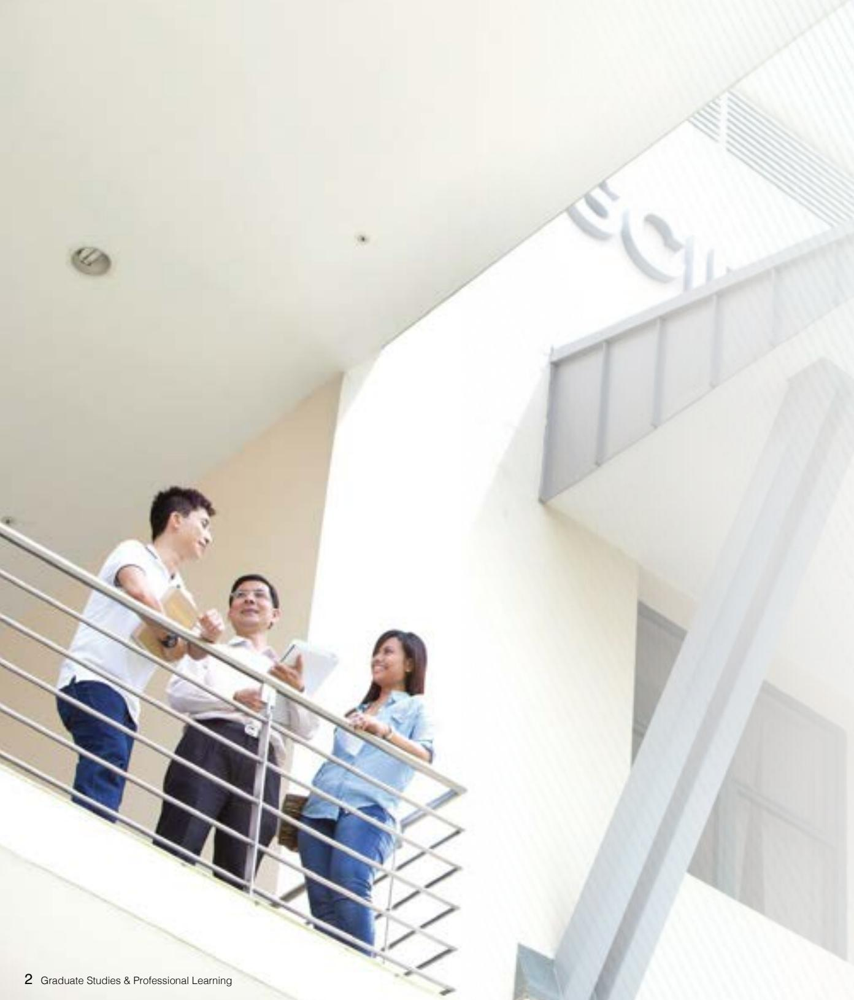
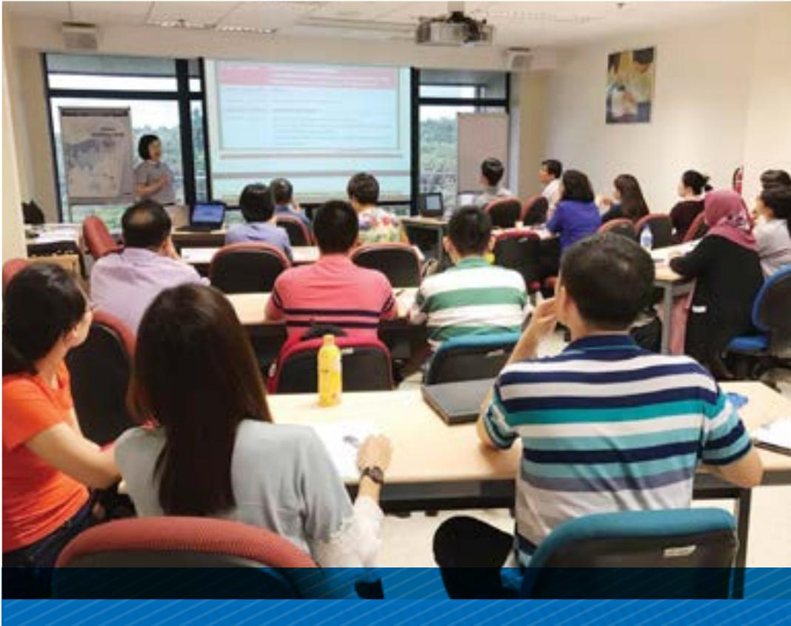
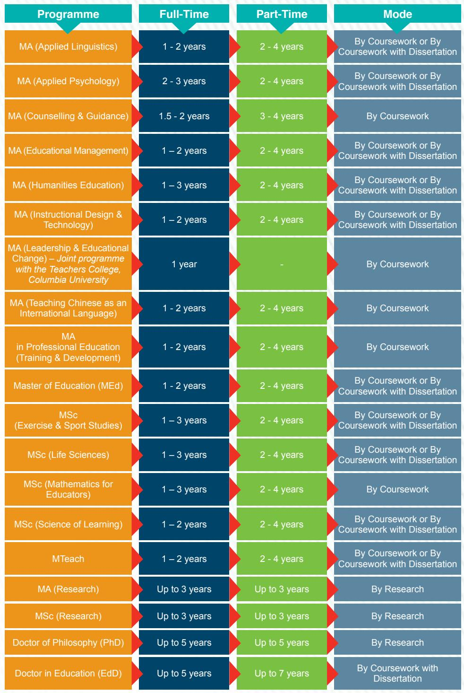
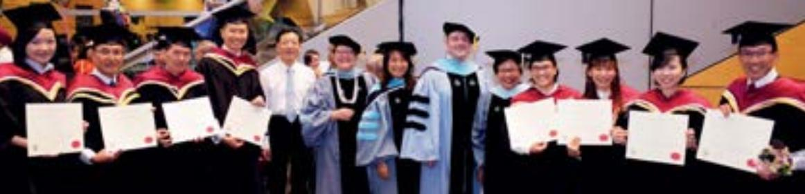
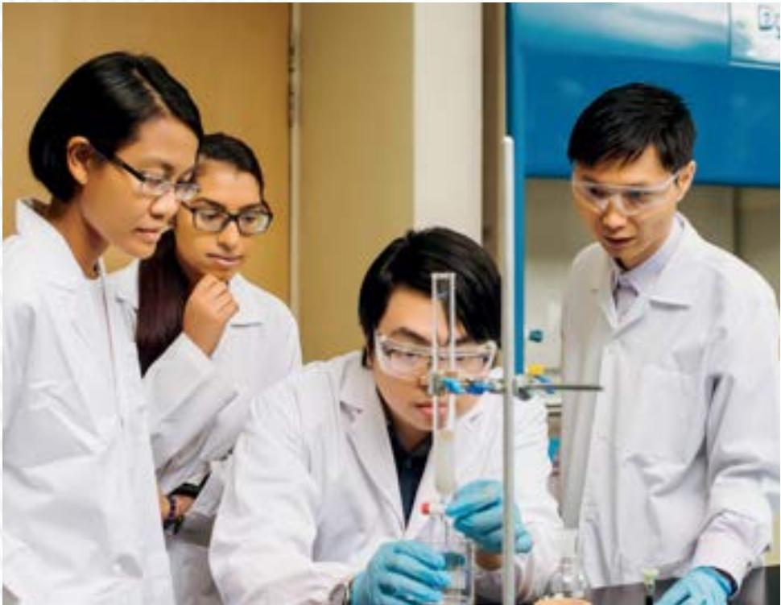
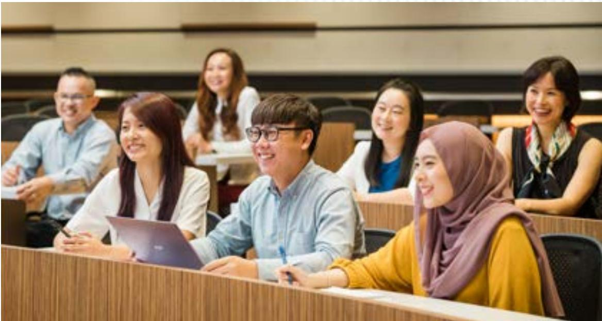
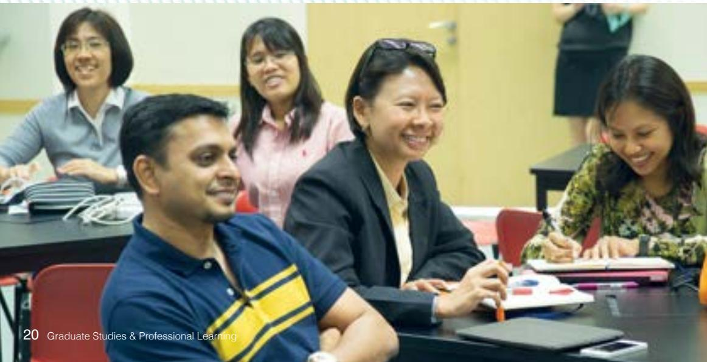
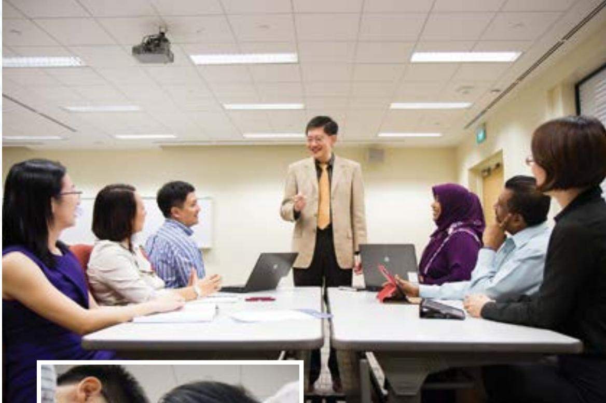

## GRADUATE STUDIES PROFESSIONAL LEARNING

## VISION

An Institute of Distinction: Leading the Future of Education

## MISSION

Inspiring Learning, Transforming Teaching, Advancing Research

## CONTENTS:

Dean's Message

Why NIE?

Graduate Programmes

16Leadership Programmes

21Professional Development Programmes and Courses

## DEAN'S MESSAGE

The National Institute of Education (NIE)，aninstitute of Nanyang Technological University， Singapore is one of the leading teacher preparation institutions in the world, and has been an integral part of Singapore's education system since it was first established as the Teachers' Training Colege in 1950. NIE has a strong reputation for evidence-informed graduate， executive leadership and professional development programmes and courses for teachers， educators, researchers, policy makers, and other professions. These are delivered through the Office of Graduate Studies and Professonal Learning (GPL) with the support of the Academic Groups that represent a range of disciplines.

Our faculty members are deeply passionate about teaching and learning. They are experts in education and many are also internationally renowned in their respective academic fields. Our aim is for our students and course participants to become thought leaders， skilful teachers, disciplinary experts and good researchers who can bring critical change in their respective professional contexts and academic fields. This aspiration is embodied in our philosophical statement of “Learning Differently, Leading Change".

We look forward to you joining us in one or more of our programmes as you embark on thenext stageof yourlifelong learning journey

Associate Professor Ang Keng Cheng Dean, Graduate Studies & Professional Learning

> **AI Description:**
> **Source:** `assets/_page_2_Figure_0.jpg`
> 
> **Generated:** 2026-05-18 11:57:31
> 
> ---
> 
> The image contains a photograph of three individuals standing on a balcony of a modern building. The building has a clean, contemporary design with large windows and a minimalist aesthetic. The individuals appear to be engaged in a discussion, with one person holding a tablet and another holding a piece of paper. The text "Graduate Studies & Professional Learning" is visible at the bottom of the image, suggesting the context of the image is related to educational or professional development. The overall scene conveys a sense of collaboration and learning in a professional environment.

## WHY NIE?

## Top Education Institute

As an autonomous institute of Nanyang Technological University, NIE has been consistently ranked in the world's top 20 education institutions and top 3 in Asia based on Quacquareli Symonds (QS) ranking by subjects.

## Teaching Talents

NIE is the heart of Singapore's teacher education and education research. We are committed to delivering quality education for educators and providing an array of graduate and professionai development programmes and courses for educators seeking further career advancement. We prepare educators from the initial teacher preparation through to the teacher professional development phase. We also provide quality graduate studies and lifelong learning to the public, partnering with them in developing new competencies.

Our faculty have over the years won numerous awards and accolades for excellence in teaching and research， as well as received prestigious fellowships and scholarships from international organisations.

In addition to our 10 Academic Groups' academic staff who provide the disciplinary rigour and depth, NIE regularly invites distinguished professors to share their knowledge and expertise as well as to participate in collaborative projects. These professors hail from renowned universities such as Teachers College, Columbia University, Stanford University, Harvard Graduate School of Education, Boston College， University of Sydney, University of Toronto, University College London and the Hong Kong Institute of Education.

## Global Partnerships

To broaden its reach in developing new competencies, NlE actively seeks strategic partnerships and collaborations with top institutes around the world. These global partnerships pave the way for research collborations, staff and student exchanges and joint programmes for professional development and postgraduate research. These partnerships also provide the platform for NIE to keep abreast of global developments in the educational landscape and to share expertise.

NIE is also a founding member of the International Network of Educational Institutions (INEl),formerly known as International Aliance of Leading Education Institutes (IALEl). Established in 2007, the INEl is a consortium of 10 education institutes that seek to enhance the quality of education in their own countries and to provide leadership for educational development internationally. It acts as a think-tank which draws together existing expertise and research in education to generate ideas, identify trends, and serve as a collective voice on important educational issues, thus influencing policy and practice in education.

## Research Excellence

Research excellence is a driving force that energises knowledge creation. Renowned for its teacher education and education research, NIE also aspires to excel as a world-class institute of higher learning. Researchers are given the chance to engage in cutting-edge researches and pedagogy courses in various areas. Some of the research centres and labs in NlE include:

· Centre for Arts Research in Education (CARE)

·Mediated Learning Laboratory (MLL)

·Motivation in Educational Research Laboratory (MERL)

·Plasma Sources and Applications Centre (PSAC)

Multi-centric Education， Research & Industry Science， Technology， Engineering， and Mathematics Centre (meriSTEM)

> **AI Description:**
> **Source:** `assets/_page_3_Figure_0.jpg`
> 
> **Generated:** 2026-05-18 12:00:24
> 
> ---
> 
> The image is a photograph showing three women engaged in what appears to be a collaborative activity, possibly a study or professional learning session. They are seated at a table with books and a tablet in front of them. The woman on the left is wearing a hijab, the middle woman is wearing glasses and a red top, and the woman on the right is wearing a pink top with a braid. The setting appears to be an indoor space with large windows in the background. The text "4 Graduate Studies & Professional Learning" is visible at the bottom of the image, indicating the context of the image.

> **AI Description:**
> **Source:** `assets/_page_3_Figure_1.jpg`
> 
> **Generated:** 2026-05-18 12:00:48
> 
> ---
> 
> The image shows a classroom setting with a group of people seated at desks, facing a presenter standing at the front of the room. The presenter appears to be giving a presentation, as there is a large screen displaying text and images. The audience is engaged, with some taking notes and others listening attentively. The room has large windows, allowing natural light to enter, and there are posters on the walls. The overall setting suggests an educational or professional training session.

## Graduate Research and Academic Development (GRAD) Centre

The GRAD Centre provides support for NIE graduate students to develop into effective writers in their specialisations. It also offers training in writing and professional presentation, skills that are transferrable to their careers. In the GRAD Centre, graduate students can receive feedback and guidance for written \_assignments from our English language consultants and trained PhD student tutors. The centre strives to provide an environment in NiE where the students can receive specific ideas to improve their academic writing, professional conference presentation, and statistical analysis skills.

## GRADUATE PROGRAMMES

NIE offers a wide range of graduate programmes that can enhance your competence and knowledge as you strive to meet the new and changing demands of your career. These programmes have specially-designed curicula and are delivered through a schedule of lectures/ seminars and tutorials.

## Masters Programmes (by Coursework and Research)

## Research

Master of Arts (MA)

Master of Science (MSc)

## Coursework

## Disciplinary Content

·MA (Applied Linguistics)

·MA (Humanities Education)

MSc (Exercise & Sport Studies)

·MSc (Life Sciences)

MSc (Mathematics for Educators)

MA in Professional Education (Training & Development)

## Doctoral Programmes

Doctor of Philosophy (PhD)

Doctor in Education (EdD)

## DURATION AND MODE OF STUDY

> **AI Description:**
> **Source:** `assets/_page_4_Figure_0.jpg`
> 
> **Generated:** 2026-05-18 11:59:53
> 
> ---
> 
> The image is a chart presenting information about various academic programs, their full-time and part-time durations, and the mode of study. The chart is divided into three main sections: "Programme," "Full-Time," "Part-Time," and "Mode." Each program is listed in the "Programme" column, with corresponding durations in the "Full-Time" and "Part-Time" columns. The "Mode" column specifies whether the program is offered by coursework or by coursework with a dissertation. The chart includes a variety of programs such as MA (Applied Linguistics), MA (Applied Psychology), MA (Counselling & Guidance), and others, up to the Doctor of Philosophy (PhD) and Doctor in Education (EdD). The chart uses color coding to distinguish between different program categories and provides a clear visual representation of the study options available.

# BRIEF DESCRIPTIONS OF PROGRAMMES

## a. Master of Arts (Applied Linguistics)

For Primarily for English language teaching professionals who wish to strengthen their academic qualifications for career advancement, but it is also suitable for people with a keen interest in language related issues.

Outline A broad-based course of study in the field of applied linguistics, mainly within the fields of language education and discourse studies,balancing theoretical knowledge with practical application.

## d. Master of Arts (Educational Management)

For Educational leaders and professionals who wish to develop their skils and knowledge required to lead schools to new realms of educational excellence.

Outline It equips candidates with the necessary knowledge, skils and capability to lead their organisations effectively at a time of rapid change. It also provides an excellent opportunity for in-depth study of some of the key strategic and current issues in the management of education and training programmes.

> **AI Description:**
> **Source:** `assets/_page_5_Figure_0.jpg`
> 
> **Generated:** 2026-05-18 11:58:03
> 
> ---
> 
> The image contains a collage of four photographs. The first photo shows two individuals engaged in conversation, with one person holding a smartphone. The second photo depicts three people smiling and interacting outdoors. The third photo shows the exterior of a building with a sign reading "Office of Graduate Studies & Professional Learning." The fourth photo features a group of people sitting outdoors, engaged in conversation, with one person holding a book or brochure. The images collectively represent various aspects of educational and professional learning environments.

## b. Master of Arts (Applied Psychology)

For Psychologists， counsellrs\_and educators who are motivated to acquire knowledge and skils in the field of psychological service.

Outline Gain theoretical knowledge， research insights and practical skills to train as specialists in the field of Educational Psychology or Counseling Psychology.

## c. Master of Arts (Counselling & Guidance)

For New entrants into the fields of counselling and guidance, and professional counsellors seeking higher qualification to be a highly competent and caring counsellor.

Outline Gain skils and knowledge in various counselling core areas, appreciate diversity, understand ethical and legal issues, and learn to apply theories and techniques, thus leading to efective individual and group counselling.

## e. Master of Arts (Humanities Education)

For Humanities educators and educational leaders who are interested in advancing theirprofessional knowledge through disciplinary and interdisciplinary explorations of humanities education.

Outline Extensive range of courses focused on both classroom pedagogy and disciplinary content relevant to History， Geography and Sociai Studies educators and curriculum specialists.

## f. Master of Arts (lnstructional Design & Technology)

For Educators and professionals who wish to enhance their capacities in instructional design and technology in corporate training/industry settings,and those who wish to advance their capacities with a focus on technology-enhanced learning in formal education institutions.

Outline Specifically concerned with solving instructional problems，as well as the application, development, and management of various information technologies, including e-learning.

> **AI Description:**
> **Source:** `assets/_page_6_Figure_0.jpg`
> 
> **Generated:** 2026-05-18 11:52:26
> 
> ---
> 
> The image contains a group of individuals in academic regalia, likely graduates, holding certificates. They are standing in a line, smiling, and appear to be at a graduation ceremony. The individuals are wearing caps and gowns of various colors, including black, red, and blue. The setting appears to be indoors, possibly in a hall or auditorium, with a staircase and a large window in the background. The image captures a moment of celebration and achievement.

g Master of Arts (Leadership and Educational Change) - Joint programme with the Teachers College, Columbia University

For Educators and educational leaders who are interested to learn about the interrelationships between curriculum, leadership and change and who aspire to lead curriculum, innovation and educational change in schools and other organisations.

Outline The programme has a dual focus on organisational and curriculum leadership. It aims to prepare educational leaders with formal and informal leadership experience to go beyond organisational leadership and towards leadership capacities in curriculum, teaching and learning. Opportunities are provided to build new cross-national learning communities and fraternities steeped in both local and global perspectives.

## h. Master of Arts (Teaching Chinese as an International Language)

For Educators who desire to specialise in the theory and practice of teaching Chinese as a foreign/second/international language to learners whose first language is English (CIL learners).

Outline The programme is NIE's strategic response to the sharp increase in demand within the international market for more educators who are properly trained to teach Chinese in English-speaking regions. Some key programme features include an introduction to the correct use of English as an aid to help the learners master Chinese and a combination of theory and practice, emphasising classroom training to ensure graduates are competent in teaching Chinese in an English language teaching environment.

## i. Master of Arts in Professional Education (Training & Development)

For Experienced professionals involved in staff development, facilitating Professional Learning Communities (PLCs)， mentoring and coaching， managing training and professional development organisations， managing teams of adult educators, leading adult education project teams, policy-making for institutions and professional bodies and researching in higher education, and adult and lifelong learning.

Outline This programme aims to provide a rigorous understanding of educational practices and systems from social， philosophical, psychological, cross-national and normative perspectives. It also seeks to foster an understanding of central issues in learning and development， education and training， and educational leadership in the various professional contexts. Its specific objective is to educate professional educators with values and beliefs as well as equipping them with a distinct set of skills to drive mentoring and coaching， innovative training， assessment and design practices.

## j. Master of Education

For Educators and university graduates with a background in education who wish to advance their knowledge and skills in education.

Outline Offering 16 areas of specialisation:

· Art

·Chinese Language

· High Ability Studies

·Learning Sciences & Technologies

· Curriculum & Teaching

·Developmental Psychology

· Malay Language

· Drama

· Mathematics

· Music

·Early Childhood

· Science

· Educational Assessment

· English

·Special Education

· Tamil Language

## k. Master of Science (Exercise & Sport Studies)

For Individuals with an interest in physical education, sports，fitness, health and wellness.

Outline It provides a balanced coverage of pedagogy, psychosocial, management and scientific aspects of human movement. It also aims to enable professionals to upgrade their qualifications either for career advancement in schools or to qualify them to work in other sport science and management positions.

> **AI Description:**
> **Source:** `assets/_page_6_Figure_1.jpg`
> 
> **Generated:** 2026-05-18 11:52:44
> 
> ---
> 
> The image is a photograph showing a group of people, likely students, participating in a physical activity on a sports field. They are wearing yellow shirts and black shorts, and one person is wearing an orange shirt, possibly a coach or instructor. The setting appears to be an outdoor sports area with a building and trees in the background. The individuals are engaged in a playful or instructional activity, as one person is holding a green frisbee. The overall scene conveys a sense of physical education or team sports.

> **AI Description:**
> **Source:** `assets/_page_7_Figure_0.jpg`
> 
> **Generated:** 2026-05-18 11:53:32
> 
> ---
> 
> The image contains a photograph of four individuals in a laboratory setting. They are wearing white lab coats and safety goggles, indicating a scientific or research environment. One person is actively engaged in an experiment, handling a pipette and a test tube, while the others observe attentively. The background includes laboratory equipment and a blue wall, suggesting a controlled and professional research space. The image captures a moment of collaboration and scientific inquiry.

## I. Master of Science (Life Sciences)

For Educators， science graduates or professionals interested in life sciences， by addressing not only the knowledge base, but also the necessary experimental skills required.

Outline Without sacrificing the necessary breadth and depth of the multi-disciplinary nature of the life sciences, we offer you a highly personalised roadmap in which the most recent scientific developments are taught, and social and bioethical issues are discussed. The programme ofers three areas of specialisation in:

·Chemistry

· Clean Energy Physics

·Environmental Biology

## m. Master of Science (Mathematics for Educators)

ForMathematics educators and other professionals.

Outline This programme differentiates itself from others inthat the acquisition of wide and in-depth knowledge in mathematics is emphasised along with its connection to mathematics teaching.

n Master of Science (Science of Learning) - in partnership with Lee Kong Chian School of Medicine

For Experienced professionals in Early childhood, K12, Tertiary, and Adult education, Healthcare education, Professional and staff development, Quality assurance and regulation of educational institutions, and Continuing education and training (CET).

Outline Advances in biology and neuroscience show how our brains and cognitive development are shaped by learning experiences and the environment. The MSL is a distinctive programme where students will acquire a strong foundation in science of learning and development, and learn how the latest advancements inneuroscience， cognitive science， and technologies bear on fundamental questions of education--how people learn and the tools we can use to optimise learning.

## o. Master of Teaching

For Professionals across the wide range of educational and education-related contexts, who are commited to high quality teaching.

Outline The Master of Teaching (MTeach) is a practice-oriented programme designed for professionals across the wide range of education and education-related contexts, who are committed to sharpen their professional expertise in delivering high quality teaching to diverse learners of today through the bridging of practice and research.

> **AI Description:**
> **Source:** `assets/_page_7_Figure_1.jpg`
> 
> **Generated:** 2026-05-18 11:53:13
> 
> ---
> 
> The image contains a group of people sitting in a classroom or lecture hall setting. They appear to be engaged in a discussion or lecture, with some individuals smiling and others looking attentive. The setting includes desks and chairs, and the individuals are dressed in casual or business casual attire. The image captures a moment of interaction and learning in a professional or educational environment.

> **AI Description:**
> **Source:** `assets/_page_8_Figure_0.jpg`
> 
> **Generated:** 2026-05-18 11:54:17
> 
> ---
> 
> The image contains a photograph of four individuals sitting together, smiling and looking at a tablet device. The setting appears to be a casual indoor environment, possibly a café or a study area. The individuals are engaged in a collaborative activity, suggesting a social or educational context. The image conveys a sense of teamwork and shared focus.

p. Master of Arts q. Master of Science r. Doctor of Philosophy (PhD)

## ForThose who would ike to pursue afocused research on atopic in the following areas:

·Asian Languages and Cultures

·English Language and Literature

·Humanities and Social Studies Education

· Learning Sciences and Assessment

·Mathematics and Mathematics Education

· Natural Sciences and Science Education

·Physical Education and Sports Science

·Policy, Curriculum and Leadership

·Psychology and Child & Human Development

·Visual and Performing Arts

Outline You willhave to complete a fixed number of courses that can contribute to your understanding of the field and the methodology relevant to your study. Guided by a research-active supervisor, you will develop advanced skils and knowledge to address and investigate academic discipline-related or educational problems and issues.

## s. Doctor in Education (EdD)

For Professionals who would like to extend their expertise and training, as wel as develop skills in research, evaluation and reflection on practice.

Outline EdD has the rigour and expectations of a PhD, but with a professonal focus. One of the major aims of the EdD is to develop professional leaders who are able to identify and solve complex field-based problems. Professional doctorates stress the application of research, development of professional knowledge and creation

> **AI Description:**
> **Source:** `assets/_page_8_Figure_1.jpg`
> 
> **Generated:** 2026-05-18 11:55:24
> 
> ---
> 
> The image contains a photograph of three individuals in a modern office setting. Two men and one woman are seated at a table, engaged in a discussion. The woman is pointing at a laptop screen, which is open in front of them. The office environment includes a large glass wall in the background, a potted plant, and some office furniture. The individuals appear to be collaborating on a project or reviewing information on the laptop. The setting suggests a professional and collaborative atmosphere.

## APPLYING TO OUR GRADUATE PROGRAMMES

Before you apply， you are advised to visit the programme webpages to view more details such as the programme structure， research areasand entry requirements. Applications are to be submitted online. You must upload electronic copies of your supporting documents via the online application system.

## General Entry Requirements

Specified below are the minimum requirements for admission into NIE/NTU. In addition to the admission requirements, there are additional requirements for your programme of choice. Please refer to the relevant programme webpages for full information on the requirements for individual programmes.

## Masters by Coursework

·Agood Bachelor's degree from a recognised university

Other qualifications or working experience as specified for each programme

## PhD and Masters by Research

·A Bachelor's degree with honours

A Master's degree in the relevant areas (for those pursuing PhD)

Ability to pursue research in the proposed field of advanced study

You are advised to contact a potential supervisor before making a formal application. As a guide, you may wish to briefly introduce yourself, explain your research interests and mention the potential supervisor's research that you find interesting.

## Doctor in Education (EdD)

· A Bachelor's and Master's degree with good grades from a recognised university

·Relevant working experience

You will be required to state your approved Research Topic and name of EdD Supervisor in your application document. Before you submit a formal application, please identify your prospective supervisor in your desired research.

> **AI Description:**
> **Source:** `assets/_page_9_Figure_0.jpg`
> 
> **Generated:** 2026-05-18 11:54:05
> 
> ---
> 
> The image contains two photographs. The top photograph shows three individuals in a classroom setting, with one person holding a tablet and another person leaning in to discuss something with the third person who is seated. The bottom photograph shows a group of children in a classroom, with an adult male holding a syringe and explaining something to the children. The children are attentively looking at the syringe. The setting appears to be educational, possibly a science lesson.

## TOEFL/IELTS /GRE Requirements

International applicants whose first language is not English and graduates of universities with non-English medium of instruction are required to submit an official Test of English as a Foreign Language (TOEFL) or International English Language Testing System (IELTS) score. These tests dates must be no more than two years before the date of application.

Applicants pursuing research programmes, except for graduates of the Autonomous Universities in Singapore， are required to submit a good Graduate Record Examination (GRE) score. In lieu of GRE, applicants from India may use the Graduate Aptitude Test in Engineering (GATE) score of at least 90%.

## When to Apply

There are two intakes a year (January and August). Please note that not all programmes and specialisations are available for application for each intake.

For Coursework programmes, applications willopen in April/May for admission in January in the following year and in November/ December for admission in August the following year.

Research programmes have two intakes a year (January and August). Applications willopen in May and October respectively for about two months before the cut-off date for submission of application for each intake in January and August.

For the EdD programme， application is open in April for admission in January the following year.

It is important for the applicant to check the NlE's website and other relevant media regularly to confirm if the programmes will be open for application at any particular intake.

## Fees

Our tuition fees are subject to revision every academic year. For more information on the current tuition fees, please visit www.nie.edu.sg/gpl/fees.

## Further Queries

For more information， please visit www.nie.edu.sg/gpl/ge or e-mail us at nieadmpp@nie.edu.sg (for administrative enquiries related to admissions and application) and gradstudies@nie.edu.sg (for administrative matters related to programme matters such as time-table, study plans).

## LEADERSHIP PROGRAMMES

Leadership learning is an integral part of the education system. The purpose of leadership learning is to develop school leaders' capacity to meet the challenges of a complex and dynamic education system. One of our flagship programmes， Leaders in Education Programme has won admiration from educators in many parts of the world. It is a huge resource investment on the part of Singapore，as the nation's leaders believe that high quality school leadership learning willenable its school leaders to lead schools to new levels of educational excellence.

Programme

Full-Time

Leaders in Education Programme

7 months

Management and Leadership in Schools Programme

17 weeks

Building Educational Bridges: Innovation for School Leaders

2 weeks

> **AI Description:**
> **Source:** `assets/_page_10_Figure_0.jpg`
> 
> **Generated:** 2026-05-18 11:59:05
> 
> ---
> 
> The image contains a group of individuals in a professional setting, likely a meeting or presentation. The individuals are dressed in business attire, and one person is standing while the others are seated around a table. The standing individual appears to be addressing the seated group, and all are smiling, suggesting a positive and collaborative atmosphere. The text at the bottom indicates it is related to "Graduate Studies & Professional Learning," with page numbers 18 and 19.

# BRIEF DESCRIPTIONS OF PROGRAMMES

## a. Leaders in Education Programme

ForFor selected education offcers to prepare them for school leadership.

Outline The programme aims to develop school leaders who are values-based, purposeful, innovative and forward-looking, anchored on strong self and people leadership, curriculum and instructional as well as strategic management skills. Through the programme, school leaders gain a deeper appreciation of how principals can work effectively in an increasingly complex environment.

## b. Management and Leadership in Schools Programme

For Middle level leaders to hone curriculum leadership skills within and beyond their particular domains as well as to enhance their competency in leading teachers and supporting school principals in improving teaching and learning in school.

Outline The programme aims to create new knowledge in generative and collaborative learning and beyond single discipline/subject. It enhances capacity of the middle level leaders to lead teaching and learning through the creation of learning teams with the focus on continual improvement in the curriculum and to develop them to better support their principals in school reform.

## c. Building Educational Bridges: Innovation for School Leaders

For Selected school leaders to engage in issues relating to the countries' unique educational systems.

Outline The programme is jointly conducted at both NIE and various international institutions. It focuses on innovative and high performing education systems and offers experienced and successful school leaders the opportunity to explore key leadership issues in national and international contexts.

> **AI Description:**
> **Source:** `assets/_page_11_Figure_0.jpg`
> 
> **Generated:** 2026-05-18 11:56:05
> 
> ---
> 
> The image contains a photograph of a group of people in what appears to be a classroom or meeting setting. The individuals are seated at tables, some smiling and engaged, while others are focused on writing or using tablets. The environment suggests a professional or educational setting. The bottom left corner includes text that reads "20 Graduate Studies & Professional Learning," indicating the context of the image. The photo captures a moment of interaction and learning, with a focus on collaboration and engagement.

> **AI Description:**
> **Source:** `assets/_page_11_Figure_1.jpg`
> 
> **Generated:** 2026-05-18 11:55:46
> 
> ---
> 
> The image depicts a classroom or meeting room setting with a group of people seated around a table. A man stands at the front, gesturing as if leading a discussion or presentation. The participants appear engaged, with some taking notes and others listening attentively. The room has a projector mounted on the ceiling, and the participants are using laptops, suggesting a professional or educational environment. The overall scene conveys a collaborative and interactive atmosphere.

> **AI Description:**
> **Source:** `assets/_page_11_Figure_2.jpg`
> 
> **Generated:** 2026-05-18 11:56:14
> 
> ---
> 
> The image contains a photograph of a group of people engaged in a collaborative activity. They are focused on building a tower with wooden blocks. The individuals are dressed in business casual attire, suggesting a professional or educational setting. The image captures a moment of teamwork and problem-solving, with participants actively involved in the task. The setting appears to be indoors, possibly a classroom or office environment.

## APPLYING TO OUR LEADERSHIP PROGRAMMES

Our leadership programmes are mainly open to officers nominated by the Ministry of Education (MOE)， Singapore. Non-MOE participants who wish to attend any of our leadership programmes may write in directly to us at leadership.programmes@nie.edu.sg.

## Further Queries

For more information, pleasevisit www.nie.edu.sg/gpl/ll ore-mail us at leadership.programmes@nie.edu.sg.

> **AI Description:**
> **Source:** `assets/_page_12_Figure_0.jpg`
> 
> **Generated:** 2026-05-18 11:52:17
> 
> ---
> 
> The image contains a photograph of three individuals engaged in a discussion around a table. One person is holding a tablet, and the others are looking at it and pointing at the screen. The setting appears to be a casual, indoor environment with a large plant in the background. The individuals are dressed in casual to semi-casual attire. The bottom of the image includes a page number and text indicating "Graduate Studies & Professional Learning," suggesting an educational or professional context.

# PROFESSIONAL DEVELOPMENT PROGRAMMES AND COURSES

We offer courses for professional development， some of which can be accredited into our Advanced Diploma programmes. Designed and developed in collaboration with the Ministry of Education, Singapore, these courses can be broadly categorised as follows:

·Pedagogical Skills

· Content Knowledge

Our range of Advanced Diploma and certification programmes are as follows:

· Advanced Diploma in Primary Art Education

·Advanced Diploma in Primary English Language Education

·Advanced Diploma in Primary Mathematics Education

·Advanced Diploma in Primary Music Education

·Advanced Diploma in Primary Science Education

·Advanced Diploma in Special Learning and Behavioural Needs

·Advanced Diploma in Teaching Early Primary School Years

·Advanced Diploma in Special Education

Certificate in Differentiating Curriculum and Instruction for High Ability Learners

·Certificate in Educational Assessment

·Certificate in Educational Support

·Certificate in English Language Subject Content Knowledge for Teachers (Basic Level)

·Certificate in Special Needs Support

·Certificate in Teaching Physical Education in Special Education Schools

·Certificate in Teaching Students with Autism in Special Education Schools

·Certificate in Teaching Students with Hearing Loss

·Certificate in Teaching Students with Intellectual Disabilities in Special Education Schools

·Certification in ICT Leadership Programme

## BRIEF DESCRIPTIONS OF PROGRAMMES

## a. Advanced Diploma in Primary Art Education

ForPrimary Art teachers.

Outline It provides teachers with a framework of knowledge and skils in art; provides perspectives on the change and development of theories and trends in art and art education for teachers to reflect, re-examine and to draw inferences about their classroom practices; and enables teachers to develop competencies in the evaluation and planning of effective art curriculum and programme in their schools.

## b. Advanced Diploma in Primary English Language Education

ForPrimary English Language teachers.

Outline It provides teachers with a framework of knowledge and skils in teaching primary english language; provides perspectives\_ on the change and development in the primary english language curriculum for teachers to reflect, re-examine and refine their classroom practices; and enables teachers to develop competencies in the design and practice of assessment and evaluation.

## c. Advanced Diploma in Primary Mathematics Education

## ForPrimary Mathematics teachers.

Outline It provides teachers with a framework of knowledge and skils in the teaching of primary mathematics; provides perspectives on the change and development in primary mathematics curriculum for teachers to reflect, re-examine and refine their classroom practices; and enables teachers to develop competencies in the design and practice of assessment and evaluation.

## d. Advanced Diploma in Primary Music Education

## ForPrimary Music teachers.

Outline It provides teachers with a framework of knowledge and skils in music; apprises music teachers of current thinking and practice in music and music education that will provide opportunities for teachers to reflect on and re-examine their classroom practices; and enables teachers to develop competencies in the evaluation and planning of efective music curicula and programmes in their own schools.

## e. Advanced Diploma in Primary Science Education

For Primary Science teachers.

Outline It provides a framework of knowledge and skils in the teaching of primary science; provides perspectives on the change and development in primary science curriculum for teachers to reflect, re-examine and refine their classroom practices; and enables teachers to develop competencies in the design and practice of assessment and evaluation.

## f. Advanced Diploma in Special Learning and Behavioural Needs

## For Educators interested in special learning and behavioural needs.

Outline It provides a framework of knowledge and skills and inculcates attitudes which are important to the education of students with special needs; examines the range of factors that facilitate or hinder the learning of a student with special needs in mainstream schools; enables educators to develop competencies in assessing， planning， implementing， and evaluating\_programmes for students with special needs; and provides educators with basic knowledge and skills for supporting students with various types of disabilities.

## g. Advanced Diploma in Teaching Early Primary School Years

## For Primary school teachers with three years of experience teaching lower primary levels.

Outline Closely coordinated with various MOE initiatives, this programme seeks to develop professional competence and expertise'in teaching lower primary children. It willhelp teachers understand how children learn and develop; create a learning environment to keep children safe and support engaging activities that promote quality learning; develop efective and age-appropriate strategies to promote children's learning; understand goals, benefits and uses of systematic observations and varied forms of assessment to impact the development of children; understand strategies of family and community engagement to promote positive learning outcomes for children; deepen their understanding of how children's language skills and numeracy develop in the lower primary and to develop engaging teaching and learning activities to foster these skills; and to broaden their leadership potential and expand their professional confidence and impact as teacher leaders.

> **AI Description:**
> **Source:** `assets/_page_14_Figure_0.jpg`
> 
> **Generated:** 2026-05-18 11:52:56
> 
> ---
> 
> The image shows three individuals seated around a wooden table in what appears to be a casual meeting or brainstorming session. The table has a laptop, a tablet, and a notepad with a pen. The individuals are engaged in discussion or collaboration, with one person leaning forward as if explaining something. The setting is indoors, with a tiled wall in the background. The image captures a moment of teamwork or problem-solving in a professional or educational environment.

## h. Advanced Diploma in Special Education

For Allied Educators\_and teachers from Special schools who hold the one year Diploma in Special Education programme.

Outline This programme will focus on enhancing the capacities, skills and practices of the Allied Educators (Learning and Behavioural Support) and Special School Teachers using a “reflective-practitioner” and “concerns-based” approach to develop appropriate classroom-based and school-level supports for pupils with special needs in either mainstream or special schools.

i. Certificate in Diferentiating Curriculum and Instruction for High Ability Learners

For Educators working with high ability learners.

Outline This certificate programme seeks to provide teachers from independent schools as well as those working in various educational setings with further professional development opportunities to enhance their knowledge and skils in meeting the needs of learners who have been identified as high ability learners (HAL). Targeted at a wide range of educators, from those working in the early childhood sector to those in institutions of higher learning to facilitate and develop a continuum of educational support for HALs.

## j. Certificate in Educational Assessment

For Educators with two years of teaching experience and are looking to enhance their assessment competencies.

Outline This certificate programme seeks to provide participants with a strong grounding in both the theories and methods of assessment in order that they can conceptualise and review assessment practices.

## k. Certificate in Educational Support

ForEducators with two years of teaching experience in the Normal Stream.

Outline The programme aims to deepen the professional knowledge and skils\_of participants in relation to supporting the specific socio-emotional needs of the low progress learners, and learning needs of the low progress learners.

## I. Certificate in English Language Subject Content Knowledge for Teachers (Basic Level)

For Teachers with two years of teaching experience but no prior training in teaching English language.

Outline This certificate programme seeks to provide participants with an understanding of key concepts and theories within the fields of English Language Studies and English Language Teaching that willequip them to implement the MOE English Language syllabus more effectively.

## m. Certificate in Special Needs Support

For Teachers with existing teaching qualifications.

Outline This professional development in-service training serves to provide mainstream teachers in the primary and secondary schools with more in-depth knowledge， skills and understanding of the special needs of diverse learners and foster the development of teachers' education.

## n. Certificate in Teaching Physical Education in Special Education Schools

For Educators teaching Physical Education in SPED Schools.

Outline The programme aims to \_provide\_ participants with foundational content and pedagogical knowledgein\_teachingPhysical Education\_(PE) and equip participants with practical skils for planning and delivering PE lessons.

o. Certificate in Teaching Students with Autism in Special Education Schools

For Teachers teaching students with autism.

Outline The programme willfocus on enhancing the capacities, skills and practices of the teachers teaching students with autism. It provides knowledge of autism and the developmental trajectory of individuals with autism through their lifespan. Equipping teachers with the pedagogical knowledge and skills to teach students with autism.

## p. Certificate in Teaching Students with Hearing Loss

For Education interpreters and teachers teaching students with hearing loss.

OutlineThe programme willalow teachers to have greater knowledge of the impact of hearing loss on learning and the approaches in supporting these students in the classroom. The landscape in the education for students with hearing loss has also changed with a new initiative of including students who use sign language in the mainstream schools.

## q. Certificate in Teaching Students with Intellectual Disabilities in Special Education Schools

For Educators teaching students with Intellectual Disabilities.

OutlineThis programme aims to deepen participants'knowledge of Intellectual Disabilities (ID) as wellas the co-existence of ID with other types of disabilities with a positive disability\_ perspective to professional practice. It equips \_participants with the pedagogical knowledge and skills in identifying and applying evidence-based practices to support students with ID. It develops participants' knowledge and skillsin the areas of assessment tools and intervention practices,as wellas using data to develop, design and implement intervention plans for students with ID.

## r. Certification in ICT Leadership Programme

For Educators with a year of teaching experience and looking to develop their competencies in leading,planning and designing technology-mediated learning.

Outline The programme aims to strengthen participants’ theory-practice\_ nexus\_in implementing and leading ICT initiatives in the educational context. It provides participants with a strong foundation in leadership approaches，theories and methods integrating educational technology to support conceptualisation，and review of E-pedagogy in technology-mediated educational contexts.

## APPLYING TO OUR PROFESSIONAL DEVELOPMENT PROGRAMMES AND COUSES

Our formal certification programmes\_ are mainly open to participants from the Ministry of Education (MOE), Singapore. For MOE participants, you are advised to apply via OPAL or register directly with us (for courses with no OPAL codes).

Our short courses are open to MOE, Singapore, and members of the public. Some of our courses enjoy subsidises given by SkillFuture Singapore (SSG). You are advised to visit our PLaCE website regularly for updates of our programmes and courses.

> **AI Description:**
> **Source:** `assets/_page_15_Figure_0.jpg`
> 
> **Generated:** 2026-05-18 11:50:59
> 
> ---
> 
> The image contains a group of individuals posing outdoors on a grassy field. They are dressed in athletic attire, with some wearing shirts that appear to have the text "Physical Education & Sports Science." The group is arranged in a semi-circle, with some individuals kneeling and others standing. The background shows a white building and some greenery. The top of the image includes a text overlay with contact information for further queries.

Office of Graduate Studies   
&Professional Learning   
National Institute of Education   
Block 7 Level 3   
1 Nanyang Walk Singapore 637616   
www.nie.edu.sg/gpl

Follow us on +  @

Disclaimer: Information iscorrect asat July 2021
