
Nottingham Trent University

Guide for International Students 2024

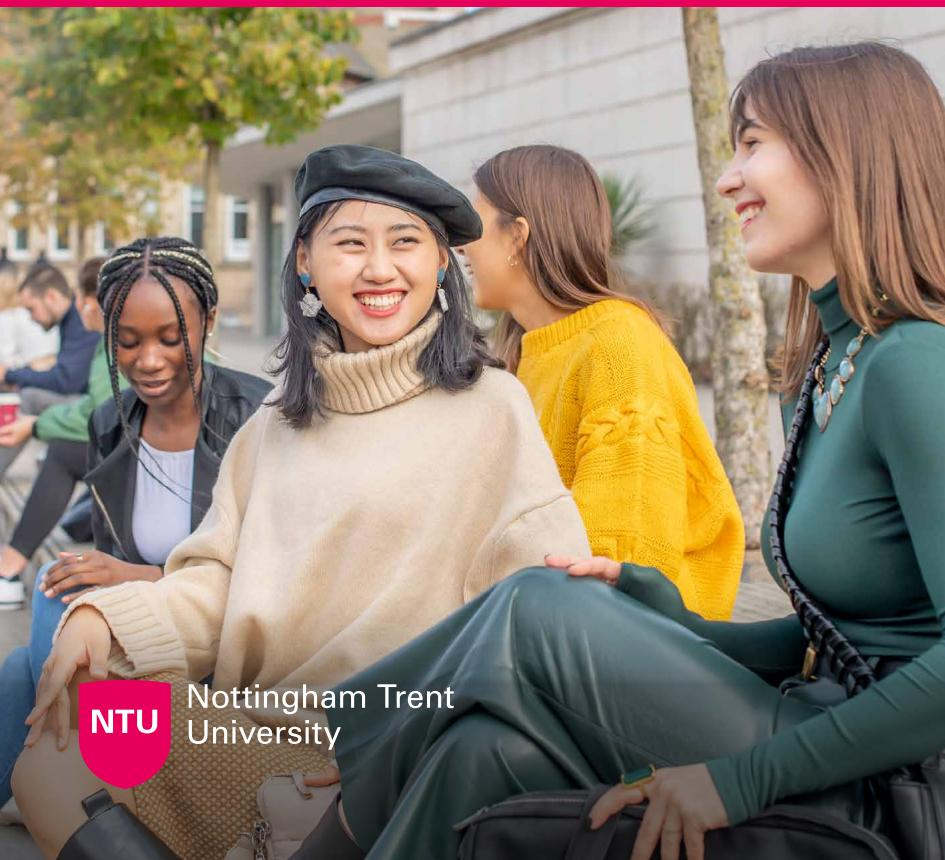

> **AI Description:**
> **Source:** `assets/_page_0_Figure_0.jpg`
> 
> **Generated:** 2026-05-18 12:13:59
> 
> ---
> 
> The image is a photograph showing a group of four individuals sitting outdoors. They appear to be students, dressed in casual and warm clothing, suggesting it might be a cool day. The background includes a building and some trees, indicating an urban or campus setting. The image has a logo and text in the bottom left corner that reads "NTU Nottingham Trent University," indicating the affiliation of the individuals or the location. The photo captures a moment of social interaction, with the individuals smiling and engaged in conversation.

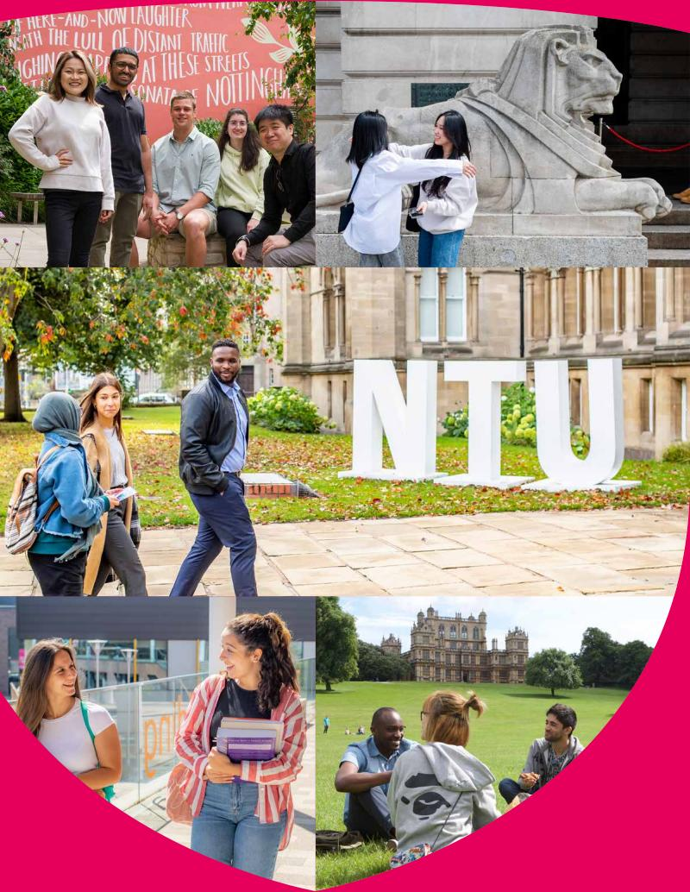

> **AI Description:**
> **Source:** `assets/_page_1_Figure_0.jpg`
> 
> **Generated:** 2026-05-18 12:08:57
> 
> ---
> 
> The image is a collage of photographs showing various scenes from what appears to be a university campus. Key elements include:
> 
> 1. A group of students sitting together in a park-like setting.
> 2. Two individuals interacting with a large stone sphinx.
> 3. A group of students walking on a paved path with a large "NTU" sign in the background.
> 4. Two students standing in front of a modern building with a glass facade.
> 5. A group of students sitting on the grass in a large open area with a historic building in the background.
> 
> The images collectively depict a lively and diverse student environment, with a focus on the university's campus and its surroundings.

## Contents

4 NTU’s reputation and   
what our students say   
Your career6   
8 Supporting you with   
your studies   
8 Meet your International Office   
country advisors   
10 Support services, health, and   
wellbeing   
Advice for parents and 12   
family of international   
students   
Your course14   
14 Course list for 2024 entry   
24 New courses at Confetti campuses   
January start postgraduate 26   
courses   
Foundation and 30   
Pre-Masters courses   
Pre-sessional English 32   
courses   
34 More about NTU   
Campuses34   
University Language 38   
Programme   
Teaching quality39   
Facilities40   
43 Global Summer School   
Academic Schools46   
Accommodation54   
Living in Nottingham58   
Scholarships and other 62   
money matters   
Scholarships62   
Tuition fees and payments66   
Student living costs68   
Entry requirements70   
How to apply71   
Keeping in contact 72   
with NTU International

At NTU you’ll be part of a truly international community, with students and staff from over 160 countries. Nottingham is a welcoming and diverse student city, and we know you’ll make friends for life here.

We’ve designed this guide so that you can easily find the information and advice you need to research your study plans on the web. You’ll find information about:

International Office regional teams

Advice for your parents and family

Course list

Scholarships and money matters

Campuses and Academic Schools

How to apply

If you need advice we're always happy to help.

International Office Team

> **AI Description:**
> **Source:** `assets/_page_4_Figure_0.jpg`
> 
> **Generated:** 2026-05-18 12:25:06
> 
> ---
> 
> The image is a photograph of a person sitting outdoors in a park-like setting. The individual is wearing a colorful, patterned jacket with a pink collar and white shirt underneath. The background features wooden benches, some greenery, and a few other people sitting and standing. The setting appears to be a public space with a building visible in the distance. The overall atmosphere is casual and relaxed.

Roof top garden, Boots library

We hope you’ll find a course that’s just right for you. We look forward to welcoming you to the University soon.

# A student experience like no other. But don’t just take our word for it…

Modern University   
of the Year   
2023

The Times and Sunday Times Good University Guide 2023 “I can say that all the way to graduation, the lecturers were supportive – a big thank you to them for that.”

Hathaichanok Pora, Thailand

#1 uni

for student life and international study

Whatuni Student Choice Awards 2022

> **AI Description:**
> **Source:** `assets/_page_5_Figure_2.jpg`
> 
> **Generated:** 2026-05-18 12:18:41
> 
> ---
> 
> The image contains a simple icon of two hands holding a heart. The hands are depicted in a stylized manner, with the fingers gently cradling the heart. The heart is a solid shape, and the entire icon is colored in a single shade of pink. This icon is commonly used to represent themes of care, love, or support.

Winner

University of the Year

Whatuni Student Choice Awards 2023

Top 2

most sustainable university in the world

2022 UI GreenMetric World University Rankings

> **AI Description:**
> **Source:** `assets/_page_5_Figure_4.jpg`
> 
> **Generated:** 2026-05-18 12:23:25
> 
> ---
> 
> The image contains a photograph of a group of people in what appears to be a modern, open-plan office or co-working space. The setting includes large windows with a view of the street outside, and the interior features green armchairs and a long table. The individuals are engaged in conversation, with some standing and others seated. The overall atmosphere suggests a collaborative or casual meeting environment.

Top 3

UK student city

StudentCrowd user reviews 2021

> **AI Description:**
> **Source:** `assets/_page_6_Figure_1.jpg`
> 
> **Generated:** 2026-05-18 12:10:03
> 
> ---
> 
> The image contains a series of five pink stars arranged in a horizontal line against a light pink background. The stars are evenly spaced and appear to be identical in size and shape. There are no labels, text, or additional elements present in the image. The image is purely decorative and does not convey any specific data or information beyond the visual representation of the stars.

## 5-star rating

A sign of quality teaching, facilities, and employability prospects

QS 2022

88%

of NTU students would recommend studying at NTU

Postgraduate Taught Experience Survey 2023

“Nothing compares to the pure joy you’ll feel when you’ve got used to your new life here – you have embarked on one of the best journeys of your life.”

Rucsandra-Ioana Moldoveanu, Romania, 2023

> **AI Description:**
> **Source:** `assets/_page_6_Figure_4.jpg`
> 
> **Generated:** 2026-05-18 12:12:21
> 
> ---
> 
> The image is a simple icon depicting a person with arms raised, possibly symbolizing celebration, victory, or joy. The icon is a single color with no additional text or labels. It is a straightforward visual representation without any complex data or information.

“I’ve been able to interact with exceptional students from across the world, use world-class facilities in modern interactive study spaces and participate in exiting events which make for a life-changing experience. NTU offers support, including mental and physical health, the employability team is dedicated to helping students with placements and work, and the Global Lounge is the cherry on top! For me, NTU’s assistance started when I landed at Heathrow, and it continues to this day.”

Muhammad Fahd-Un-Nabi Khan, Pakistan, 2023

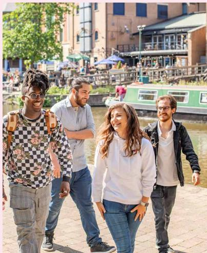

> **AI Description:**
> **Source:** `assets/_page_6_Figure_5.jpg`
> 
> **Generated:** 2026-05-18 12:10:51
> 
> ---
> 
> The image is a photograph showing four individuals walking along a canal with a green canal boat in the background. The setting appears to be a lively urban area with buildings, shops, and people in the distance. The individuals are dressed casually, and the overall atmosphere suggests a pleasant day out in a city with waterways.

## Your career

Your NTU experience will be packed with opportunities and support that set you up for success in the UK and around the world.

## Specialist employability support

Our Employability team offer tailored support throughout your studies. Get one-to-one advice, visit careers fairs and access our global employer networks.

Get recognition for the experiences and skills you gain with our Global Employability Award.

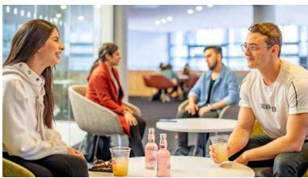

> **AI Description:**
> **Source:** `assets/_page_7_Figure_0.jpg`
> 
> **Generated:** 2026-05-18 12:13:34
> 
> ---
> 
> The image contains a photograph of a group of people sitting in a casual setting, possibly a café or a lounge area. There are two individuals in the foreground engaged in conversation, with drinks and a pink beverage bottle on the table between them. In the background, other people are seated and appear to be engaged in their own conversations. The setting is well-lit, suggesting a daytime scene, and the overall atmosphere seems relaxed and social.

You can also get advice on working in the UK after you graduate.

## Every NTU course has opportunities to gain work-like, practical skills and experience.

## Top 5 for one-year work placements

Many courses (including postgraduate) offer a one-year placement giving you invaluable experience. We’re in the top 5 UK universities for the number of undergraduate students on one-year placements (HESA 2021/22).

## Shorter work placements and employer projects

Other courses offer shorter placements and projects. You’ll work directly with employers, contribute your knowledge and help solve problems.

## Develop your professional skills

Whatever your course you’ll learn desirable skills like planning, communication, analysis, creativity, cooperation and problem-solving.

66

The Graduate route visa is a great facilitator for international students. It allowed me to move from university straight into an administration role and later into a role in the legal field, where I work now.

The International Student Support team provides invaluable information and support through 1:1s and group meetings about the visa, before and after the application process.

NTU in 3 words? Inclusive.   
Progressive. Hospitable.

Natalia Antoine, Dominica, LLB Law Thompsons Solicitors

> **AI Description:**
> **Source:** `assets/_page_9_Figure_0.jpg`
> 
> **Generated:** 2026-05-18 12:17:16
> 
> ---
> 
> The image contains a photograph of a student participating in an online counseling session. The student is smiling and wearing glasses and headphones. The screen displays a video call interface with the text "Supporting your studies" at the top. The bottom of the screen shows a label indicating "Student in online counselling session." The image also includes a timestamp and weather information at the bottom of the screen.

# Meet your International Office country advisors

Our friendly, specialist regional teams and country advisors offer advice to future international students, and their families – we also have members of staff based in China, India, Nigeria, Pakistan and Vietnam. If you would like to discuss your study plans, visit our website at ntu.ac.uk/mycountry to contact your team.

We work very closely with a worldwide network of Education Counsellors who can give advice on any aspect of studying at NTU. Visit ntu.ac.uk/representatives to find one near you.

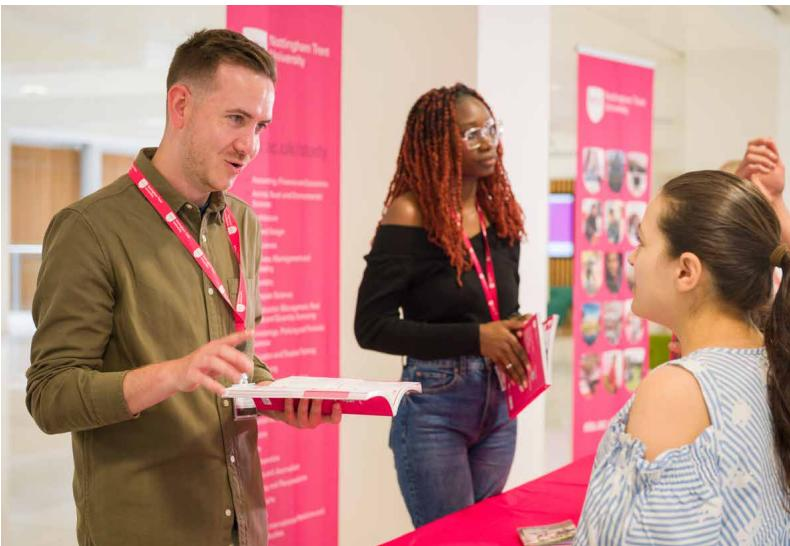

> **AI Description:**
> **Source:** `assets/_page_10_Figure_0.jpg`
> 
> **Generated:** 2026-05-18 12:23:17
> 
> ---
> 
> The image contains a photograph of a university event, likely a student recruitment or information session. The setting includes a table with a red cloth, and individuals are interacting. One person is holding a booklet and appears to be explaining something to another person. In the background, there are two banners with the university's logo and some text, though the specific details are not fully legible. The overall scene suggests a professional and educational environment.

## Helping you to find out more about NTU

## Latest news

Be sure to sign up to receive updates and the latest university news from our international team, including scholarship information and live events.

> **AI Description:**
> **Source:** `assets/_page_10_Figure_2.jpg`
> 
> **Generated:** 2026-05-18 12:27:08
> 
> ---
> 
> The image contains a simple icon of a person with a speech bubble above their head. The icon is pink and appears to represent a user or individual with the ability to communicate or speak. There are no charts, graphs, or other visual elements present in the image.

## Meet us

Meet us in your country – check our schedule of events on our website. We’d love to meet you in person or online where we can give you and your family all the advice you need to take the next step.

> **AI Description:**
> **Source:** `assets/_page_10_Figure_3.jpg`
> 
> **Generated:** 2026-05-18 12:24:25
> 
> ---
> 
> The image contains a simple diagram of a circle with three smaller circles connected to it, each containing a stylized human figure. This suggests a concept of a central entity or group interacting with three other entities or individuals. The design is minimalistic and likely represents a social network, team structure, or a process involving a leader and three followers or team members.

## Counselling

You can request an online counselling session with your country advisor or an NTU education counsellor.

# Support services, health and wellbeing

Settling in a new country involves going through many changes – environment, climate, food, and culture. It's important that you take care of your health and wellbeing and we are here to support you every step of the way.

Outstanding Support for Students THE Awards 2020

As an international student, you’ll need to pay the Immigration Health Surcharge (IHS) as part of your visa application in order to be entitled to free healthcare through the National Health Service (NHS). Free healthcare includes:

consulting a doctor (also known as a general practitioner or GP); and

treatment in a hospital, including emergency treatment.

We strongly encourage you to register with a GP doctor soon after you arrive in Nottingham. You can do this online, or in person. We have medical centres on the City and Clifton campuses, and students at Brackenhurst campus register with the local medical centre in the nearby town of Southwell.

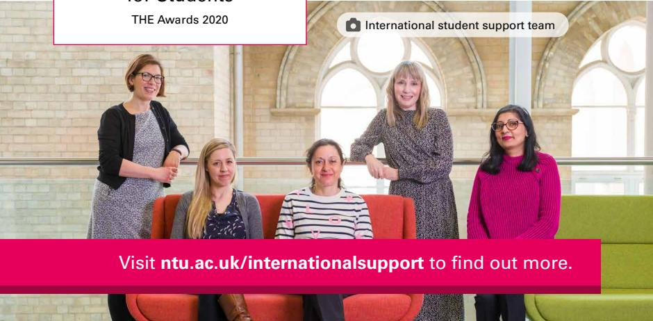

> **AI Description:**
> **Source:** `assets/_page_11_Figure_0.jpg`
> 
> **Generated:** 2026-05-18 12:19:48
> 
> ---
> 
> The image contains a photograph of five individuals, presumably part of the "International student support team," as indicated by the text overlay. The individuals are seated and standing in a modern indoor setting with large windows in the background. The image also includes a banner at the bottom with the text "Visit ntu.ac.uk/internationalsupport to find out more." The overall context suggests this is an advertisement or informational piece related to student support services at a university.

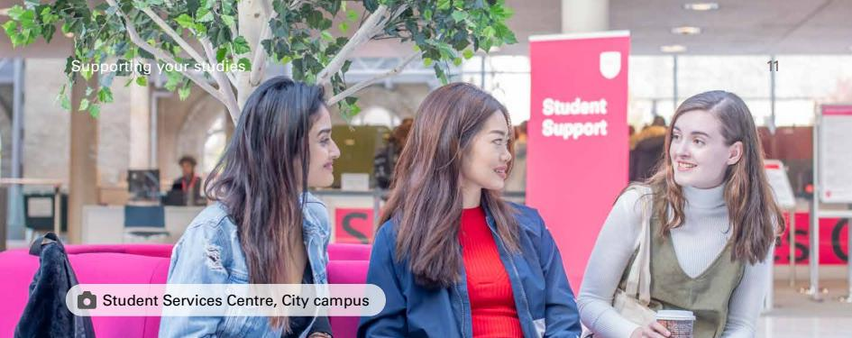

> **AI Description:**
> **Source:** `assets/_page_12_Figure_0.jpg`
> 
> **Generated:** 2026-05-18 12:07:25
> 
> ---
> 
> The image contains a photograph of three individuals sitting together in what appears to be a student services area, likely within a university or college campus. The setting includes a pink seating area, a tree, and a red sign with the text "Student Support" and "Student Services Centre, City campus." The individuals are engaged in conversation, suggesting a supportive and collaborative environment. The image is accompanied by text overlays that provide context about the location and the purpose of the space.

Our team is dedicated to the needs of international students. We are a specialist visa team and can advise on all aspects of visa application, including the Graduate route visa and working in the UK.

> **AI Description:**
> **Source:** `assets/_page_12_Figure_1.jpg`
> 
> **Generated:** 2026-05-18 12:07:47
> 
> ---
> 
> The image contains a photograph of two individuals engaged in a conversation. The person on the right is smiling and appears to be speaking, while the person on the left is facing away from the camera, suggesting they are listening. The setting appears to be an indoor space, possibly an office or a public area, with a modern and clean design. The individuals are dressed in business casual attire, indicating a professional or semi-formal environment.

> **AI Description:**
> **Source:** `assets/_page_12_Figure_2.jpg`
> 
> **Generated:** 2026-05-18 12:09:42
> 
> ---
> 
> The image contains a simple icon representing a group of people with a speech bubble above them. This icon is commonly used to symbolize communication or discussion among individuals. The icon does not provide any specific data or trends, but it visually represents the concept of group communication or collaboration.

Did you know, you can get language support as a postgraduate or undergraduate student here, including academic writing. This is free of charge and delivered by our expert language teachers.

> **AI Description:**
> **Source:** `assets/_page_12_Figure_3.jpg`
> 
> **Generated:** 2026-05-18 12:09:33
> 
> ---
> 
> The image contains a simple icon of three speech bubbles in a pink color. The icon is commonly used to represent communication, chat, or messaging. There are no charts, graphs, or other visual elements present in the image. The icon is a single, static image with no additional text or annotations.

We also offer guidance on a range of issues, including:

settling into student life, recognising cultural changes

living in Nottingham, including advice on opening a UK bank account

• disability services

• health services, including NHS and mental health

• academic issues

• pastoral support

Our team are some of the very first people you’ll meet when you arrive, as we run a series of welcome events and activities to help all international students settle into the University.

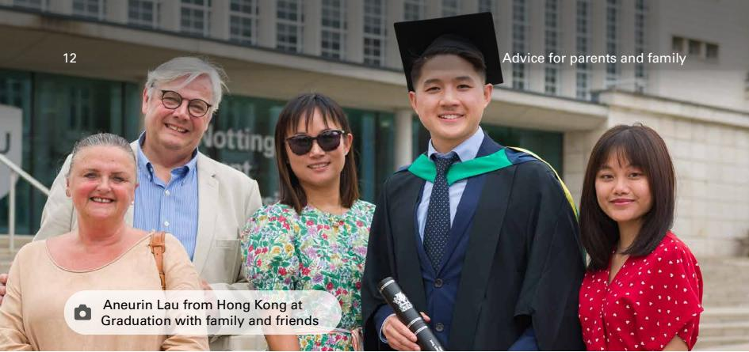

> **AI Description:**
> **Source:** `assets/_page_13_Figure_0.jpg`
> 
> **Generated:** 2026-05-18 12:12:16
> 
> ---
> 
> The image is a photograph of a group of people, including a graduate in academic regalia, standing in front of a building with a sign that reads "Nottingham." The text overlay identifies the graduate as Aneurin Lau from Hong Kong, who is at graduation with family and friends. The image also includes the text "Advice for parents and family" in the top right corner. The photograph captures a celebratory moment, likely at a university graduation ceremony.

# Advice for parents and family of international students

If a member of your family is considering studying with us, we are here to offer you advice and information to support them through that life-changing decision.

Our specialist Country Advisors in the International Office can give you, and your son or daughter, advice on any aspect of studying at NTU, so that you'll feel able to fully support them with their study plans.

You could also speak to one of our NTU Education Counsellors. These are external agencies based all over the world, with whom we have a very good relationship. They can give your family helpful advice on the application process, and they are best placed to advise on visa applications in your country.

## Student support at NTU

We are very fortunate to have a dedicated International Student Support team here at the University. They can help with any problems and offer truly excellent services, including visa application advice (Student visa, Graduate route, and visa extension) and support with all aspects of settling into life as a student in Nottingham.

They are based on all campuses and are available to contact face-to-face, by email, or by making a one-to-one appointment.

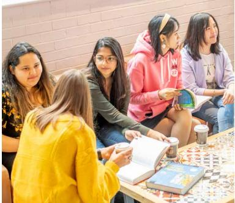

> **AI Description:**
> **Source:** `assets/_page_14_Figure_0.jpg`
> 
> **Generated:** 2026-05-18 12:12:33
> 
> ---
> 
> The image contains a photograph of a group of five individuals sitting together in what appears to be a casual setting, possibly a café or a study area. They are engaged in conversation and appear to be reading or discussing a book. The individuals are dressed in casual attire, with some wearing hoodies and others in jackets. The table in front of them has a book, a cup, and some papers, suggesting a collaborative or study environment. The background features a brick wall, adding to the casual and relaxed atmosphere of the scene.

> **AI Description:**
> **Source:** `assets/_page_14_Figure_1.jpg`
> 
> **Generated:** 2026-05-18 12:10:32
> 
> ---
> 
> The image contains a simple icon of a house on a laptop, which suggests a concept related to home computing or online real estate. The icon is stylized and does not include any text or additional visual elements.

Visit our parents and family web page for information on:

International Office regional teams

Student support and making friends

• Safety on campus

• Health and wellbeing (NHS)

• Living in Nottingham

• Faith

Application and travel advice

Video tour of NTU accommodation “Since studying at NTU our daughter has changed a lot. She has become so responsible and so focused. For her to study at NTU of course we had to let go – we need to have more confidence in our children! She has done it and done it very well – we are so proud of her.”

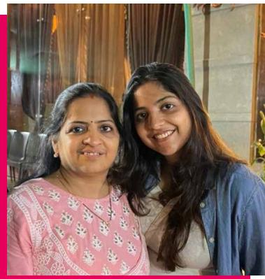

> **AI Description:**
> **Source:** `assets/_page_14_Figure_2.jpg`
> 
> **Generated:** 2026-05-18 12:13:03
> 
> ---
> 
> The image contains a photograph of two individuals standing together, smiling. The person on the left is wearing a pink outfit with a pattern, while the person on the right is wearing a blue shirt. The background appears to be an indoor setting with curtains and some greenery visible. The image is framed with a pink border.

Jyoti Pareek (left) with daughter Ekta who studied MSc Marketing.

> **AI Description:**
> **Source:** `assets/_page_14_Figure_3.jpg`
> 
> **Generated:** 2026-05-18 12:14:20
> 
> ---
> 
> The image contains a photograph of a meal spread on a wooden table. The spread includes a variety of dishes such as a burger, fries, a bowl of rice with meat and vegetables, a plate of grilled meat, and a salad. There are also drinks with straws and a glass of orange juice. The food appears to be a mix of Western and possibly Asian-inspired dishes, suggesting a fusion or international cuisine. The setting looks casual and inviting, likely from a restaurant or a home dining setup.

It's not hard for your relative to find tastes from home here. View our international food guide on our family web page.

## Your course

We offer over 500 full-time courses at NTU, most are listed here by subject area for your reference.

Our undergraduate courses, and some of our Masters, include an option to apply for a work placement. All courses include work-like, practical experience.

We also offer:

Foundation and Pre-Masters courses (page 30)

Pre-sessional English for Academic Purposes (page 32)

New courses at Confetti campuses (page 24)

• Masters starting in January (page 26)

• Work placement opportunity

Turn to page 71 for advice on how to apply.

## Undergraduate courses

Bachelors – BA, BSc, LLB. These take 3 years, or 4 years with a work placement.

## Postgraduate courses

Masters – MA, MSc, LLM. These take 1 year, or 2 years with a work placement.

## PhDs and Research

We offer expertise and research opportunities in the following areas:

• Health and Wellbeing

• Medical Technologies and Advanced Materials

Safety and Security of Citizens and Society

• Sustainable Futures

• Global Heritage

Visit at ntu.ac.uk/research

## Course list 2024

## Accounting, finance and economics

MSc Economics

MSc Economics, Banking and Finance

> **AI Description:**
> **Source:** `assets/_page_16_Figure_0.jpg`
> 
> **Generated:** 2026-05-18 12:19:32
> 
> ---
> 
> The image contains a single icon of a briefcase. There is no text or other visual elements present. The briefcase icon is a simple, flat design with a handle on top and a clasp in the center.

MSc Finance

MSc Finance and Accounting

MSc Finance and Investment Banking

> **AI Description:**
> **Source:** `assets/_page_16_Figure_2.jpg`
> 
> **Generated:** 2026-05-18 12:20:59
> 
> ---
> 
> The image contains a simple icon of a briefcase. It is a single, flat image with no additional visual elements, text, or annotations. The briefcase icon is a standard symbol used to represent professional or business-related contexts.

MSc FinTech and Financial Markets

BSc (Hons) Accounting and Finance

BSc (Hons) Economics

BSc (Hons) Economics with Business

BSc (Hons) Economics with International Finance and Banking

## Animal, equine and wildlife

MSc / MRes Biodiversity Conservation

MSc / MRes Endangered Species Recovery and Conservation

MSc / MRes Equine Performance, Health and Welfare

BSc (Hons) Animal Biology

BSc (Hons) Zoo Biology

BSc (Hons) Equine Behaviour, Health and Welfare

BSc (Hons) Equine Sports Science

BSc (Hons) Wildlife Conservation

BSc (Hons) Zoology

BSc Artisan Food Production NEW

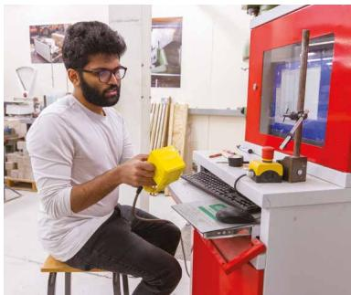

> **AI Description:**
> **Source:** `assets/_page_16_Figure_3.jpg`
> 
> **Generated:** 2026-05-18 12:21:56
> 
> ---
> 
> The image contains a photograph of a person sitting on a stool, operating a CNC machine. The individual is holding a handheld device, possibly a remote control or measurement tool, and appears to be focused on the machine's display. The machine has a red front panel with a digital screen and various buttons and controls. The setting appears to be a workshop or manufacturing environment, with shelves and other equipment visible in the background.

## Architecture and civil engineering

MArch Architecture

MA Interior Architecture and Design

MSc Digital Architecture and Construction

MSc Civil Engineering

MSc Structural Engineering with Materials

MSc Structural Engineering with Management

MEng (Hons) Civil Engineering Design and Construction

BA (Hons) Interior Architecture and Design

BArch (Hons) Architecture

BSc (Hons) Architectural Technology

BEng (Hons) Civil Engineering

BSc (Hons) Civil Engineering

## Business, management and marketing

> **AI Description:**
> **Source:** `assets/_page_18_Figure_1.jpg`
> 
> **Generated:** 2026-05-18 12:16:22
> 
> ---
> 
> The image contains a simple icon of a briefcase. It is a single, flat, two-dimensional graphic with no additional text or elements. The briefcase icon is commonly used to represent business, work, or professional matters.

MSc International Business   
MSc International Business (Dual   
Degree)   
MSc Human Resource Management   
MSc Advertising and Marketing   
Communications   
MSc Digital Marketing   
MSc Marketing   
MSc Marketing and Brand Management   
MSc Marketing and Data Analytics   
MSc Project Management   
MSc Management   
MSc Management and Finance   
MSc Management and Marketing   
MSc Management and International   
Business   
MSc Management and Global Supply   
Chain Management   
MSc Management and Business   
Analytics   
MSc Innovation Management and   
Entrepreneurship   
MSc Business Transformation NEW   
MBA Global Executive NEW   
MBA Master of Business   
Administration   
BSc (Hons) Management   
BA (Hons) Business   
BA (Hons) Business Management   
(Accelerated)   
BA (Hons) Business Management and   
Accounting and Finance   
BA (Hons) Business Management and   
Economics   
BA (Hons) Business Management and   
Entrepreneurship   
BA (Hons) Business Management and   
Human Resources   
BA (Hons) Business Management and   
Marketing   
BA (Hons) International Business   
BA (Hons) International Business   
with Spanish   
BA (Hons) International Business   
with French   
BA (Hons) Marketing

> **AI Description:**
> **Source:** `assets/_page_18_Figure_2.jpg`
> 
> **Generated:** 2026-05-18 12:15:41
> 
> ---
> 
> Error analyzing image: model runner has unexpectedly stopped, this may be due to resource limitations or an internal error, check ollama server logs for details (status code: 500)

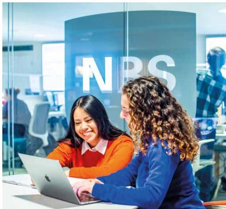

> **AI Description:**
> **Source:** `assets/_page_18_Figure_3.jpg`
> 
> **Generated:** 2026-05-18 12:15:59
> 
> ---
> 
> The image contains a photograph of two individuals in an office setting. They are seated at a desk, looking at a laptop together and smiling. The office has glass walls with the letters "NPS" prominently displayed. The environment appears professional and collaborative.

## Computing, engineering, maths and other technologies

MSc Cloud and Enterprise Computing   
MSc Artificial Intelligence NEW   
MSc Cyber Security NEW   
MSc Software Engineering NEW   
MSc Computer Science   
MSc Data Science NEW   
MSc Engineering (Electronics)   
MRes Mathematical Sciences   
MSc Engineering Management   
MSc Transport Systems   
MSc Medical Engineering   
MSc Sustainable   
Engineering: Energy   
BEng (Hons) / MEng (Hons) / with   
Foundation Year Biomedical Engineering   
BEng (Hons) / MEng (Hons) / with   
Foundation Year Electronic and Electrical   
Engineering   
BEng (Hons) / MEng (Hons) / with   
Foundation Year Sport Engineering   
BEng (Hons) / MEng (Hons) / with   
Foundation Year Mechanical Engineering   
BEng (Hons) / MEng (Hons)   
/ with foundation year Aerospace   
Engineering NEW   
BSc (Hons) / with Foundation year   
Data Science   
BSc (Hons) / MMath (Hons) / with   
Foundation year Mathematics   
BSc (Hons) / with Foundation year   
Mathematics with Statistics   
BSc (Hons) / with Foundation year   
Financial Mathematics   
BSc (Hons) / with Foundation year   
Computer Science and Mathematics   
BSc (Hons) / MComp (Hons) / with   
Foundation Year Computer Science   
BSc (Hons) / with Foundation Year   
Computer Science (Games Technology)   
BSc (Hons) / with Foundation Year Computer   
Science (Artificial Intelligence) NEW   
BSc (Hons) / with Foundation Year   
Cyber Security   
BSc (Hons) / with Foundation Year Computing   
BSc (Hons) Games Design NEW   
BSc (Hons) / with Foundation Year   
Software Engineering   
BA (Hons) / BSc Product Design   
BSc (Hons) Furniture and Product Design

## English, history and philosophy

MA Creative Writing   
MRes English Literary Research   
MA Museum and Heritage Development   
MA Philosophy (by research)   
MA Holocaust and Genocide (by research)   
MA History   
BA (Hons) English   
BA (Hons) Creative Writing   
BA (Hons) English Language and   
Linguistics NEW   
BA (Hons) Humanities Joint Honours   
(areas include English, History,   
Philosophy, Linguistics, etc.)   
BA (Hons) History   
BA (Hons) History with International   
Relations NEW   
BA (Hons) History with Politics NEW

## Geography, horticulture and environment

MSc/MRes Applied Ecology and Geospatial Techniques NEW

BSc (Hons) Agriculture

BSc (Hons) Ecology and Conservation

BSc (Hons) Environmental Science

BSc (Hons) Food Science and Technology

BSc (Hons) Geography

BSc (Hons) Horticulture (one-year top-up)

BA (Hons) Global Development NEW

## Languages and linguistics

MA TESOL (Teaching English to Speakers of Other Languages)

MA Linguistics (by research)

BA (Hons) Humanities joint honours (areas include English, linguistics, etc).

## Law, criminology and justice

LLM Master of Laws (General)

LLM Sports Law

LLM Health Law

LLM Human Rights

LLM International Commercial Law

LLM International Energy Law

LLM Technology Law

LLM Corporate Law

LLM International Legal Studies

SQE Preparation courses:

LLM Law and Legal Practice: SQE 1

LLM Professional Legal Practice: SQE 1

LLM Advanced Professional Legal Practice: SQE 1 and SQE 2

LLM Law and Legal Practice: Barristers Training Course

LLM Legal Practice Course

LLM Barristers Training Course (BTC)

Postgraduate Diploma in Law

MA Criminology

MSc International Law Enforcement

LLB (Hons) Law

LLB (Hons) Business Law

LLB (Hons) International Law

LLB (Hons) Law Senior Status

LLB (Hons) Law with Business /

Criminology / Psychology

BA (Hons) Criminology

BA (Hons) Professional Policing

BA (Hons) Youth Justice

> **AI Description:**
> **Source:** `assets/_page_20_Figure_0.jpg`
> 
> **Generated:** 2026-05-18 12:20:44
> 
> ---
> 
> The image depicts a courtroom scene. A person wearing a traditional barrister's wig and gown is holding a document, seemingly reading from it. In the background, there are several individuals seated, likely representing the jury or other participants in the legal proceedings. The setting appears formal and is indicative of a legal or judicial environment.

## Media, journalism and communication

MA Broadcast Journalism

MA Magazine Journalism

MA Journalism NEW

MA Sports Journalism NEW

MA Global Media and Communications NEW

BA (Hons) Broadcast Journalism

BA (Hons) Journalism

BA (Hons) Media Communications and Culture

BA (Hons) Media Production

BA (Hons) Media and Film & Television

BA (Hons) Humanities Joint Honours (areas include English, Media, Film and TV, Communications, etc.)

## Politics and international studies

MA Politics

MA International Development

MA International Relations

MA Security Studies

MA International Relations and Security

MSc Public Policy

MSc Politics and Public Policy

BA (Hons) Politics and International Relations

BA (Hons) Politics

BA (Hons) International Relations

BA (Hons) Global Development NEW

> **AI Description:**
> **Source:** `assets/_page_21_Figure_0.jpg`
> 
> **Generated:** 2026-05-18 12:26:05
> 
> ---
> 
> The image contains a photograph of a group of people seated in what appears to be a studio setting, possibly for a news or talk show. The camera in the foreground displays a smaller image of the same group, indicating that this is a live broadcast or recording. The text "CAM 02" is visible on the camera, suggesting this is footage from a specific camera angle. The setting includes a modern studio design with blue lighting and a professional atmosphere.

Visit ntu.ac.uk/courses to view course modules.

> **AI Description:**
> **Source:** `assets/_page_22_Figure_0.jpg`
> 
> **Generated:** 2026-05-18 12:13:12
> 
> ---
> 
> The image shows a person sitting at a desk with a computer monitor in front of them. The individual is wearing a head-mounted device that appears to be an electroencephalogram (EEG) cap, which is used to measure brain activity. The person is holding a stylus and seems to be interacting with a graphics tablet, possibly for a task related to brain-computer interface research or neurofeedback. The environment is dimly lit, with the focus on the person and the equipment they are using.

## Property, construction and surveying

MSc Construction Management

MSc Project Management (Construction)

MSc Quantity Surveying

MSc Building Surveying

MSc International Real Estate Investment and Finance

MSc Property Development and Planning MSc Real Estate

BSc (Hons) Building Surveying

BSc (Hons) Construction Management

BSc (Hons) Property Development and Planning

BSc (Hons) Property Finance and Investment

BSc (Hons) Real Estate

BSc (Hons) Quantity Surveying and Commercial Management

## Psychology, sociology, health and social care

MSc Cyberpsychology   
MSc Applied Child Psychology   
MSc / MRes Psychological Research Methods   
MSc Psychological Wellbeing and   
Mental Health   
MSc Forensic Mental Health   
MSc Forensic Psychology   
MA Sociology   
MSc Occupational Psychology   
MSc Psychology   
MA Public Health

BA (Hons) Health and Social Care

BSc (Hons) Psychology, including specialist routes of Cognition and Neuroscience and Social and Cultural Psychology

BSc (Hons) Psychology with Criminology

BSc (Hons) Psychology with Sociology

BA (Hons) Social Work

BA (Hons) Sociology

BA (Hons) Sociology and Criminology

BSc (Hons) Psychology with Counselling

BSc (Hons) Psychology (Mental Health)

BSc (Hons) Psychology (Forensic Psychology)

BSc (Hons) Psychology (Educational Developmental Psychology)

## Sciences, including sport science

MRes Advanced Materials Chemistry   
MRes Analytical Chemistry   
MSc Biomedical Science by Flexible Learning   
MSc Biomedical Science   
MSc / MRes Biotechnology   
MRes Cancer Biology   
MRes Cell Biology   
MRes Chemistry   
MSc Chemistry / MSc Chemistry   
(Professional Practice)   
MSc Forensic Science   
MRes Molecular Biology   
MSc / MRes Molecular Microbiology   
MSc / MRes Pharmacology   
MSc / MRes Neuropharmacology   
MSc Molecular Cell Biology   
MRes Pharmaceutical Analysis   
MRes Pharmaceutical and Medicinal   
Science   
MRes Medical Imaging   
MSc / MRes Physics   
MRes Performance Analysis   
MRes Sport Science   
MRes Sport and Exercise Psychology   
MRes Exercise Physiology

BSc (Hons) / with foundation year Biomedical Science

BSc (Hons) / with foundation year Biological Sciences

BSc (Hons) / MBiol (Hons) / with foundation year Biochemistry

BSc (Hons) / MBiol (Hons) / with foundation year Microbiology

BSc (Hons) / MBiol (Hons) / with foundation year Pharmacology

BSc (Hons) / MChem (Hons) / with foundation year Chemistry

BSc (Hons) / MChem (Hons) Medicinal Chemistry

BSc (Hons) / MSci (Hons) Forensic Chemistry

BSc (Hons) / MSci (Hons) / with

BSc (Hons) / MSci (Hons) / with foundation year Physics

BSc (Hons) Physics with Nuclear Technology

BSc (Hons) Physics with Astrophysics

BSc (Hons) Medical Physics NEW

BSc (Hons) / with foundation year Physics and Mathematics

BSc (Hons) / with foundation year Sport Science and Mathematics

BSc (Hons) Sport Science and Coaching

BSc (Hons) Sport Science and Management

BSc (Hons) Sport and Exercise Science

BSc (Hons) Sport Science, Health and Nutrition

## Nursing and Paramedicine (at Clifton campus)

BSc (Hons) Nursing (Adult) BSc (Hons) Nursing (Mental Health) BSc (Hons) Nursing (Learning Disabilities) BSc (Hons) Paramedic Science

## Teacher training, education, and childhood and youth studies

MA Career Guidance and Leadership

MA Education

MA Educational Leadership

and Management

MA Special and Inclusive Education

BA (Hons) Childhood (areas include Health and Wellbeing, Psychology, Society)

BA (Hons) Early Childhood Studies

BA (Hons) Education (areas include Psychology, Special Educational Needs, Disability and Inclusion)

BA (Hons) Primary Education

BA (Hons) English / Physics / Maths / Chemistry / Computing with Secondary Education

BA (Hons) Youth Work

New courses for careers in entertainment, creative and digital industries - see page 24.

Please note that this course list is correct at the time of going to print. Always check our website at ntu.ac.uk/courses for the most up-to-date information.

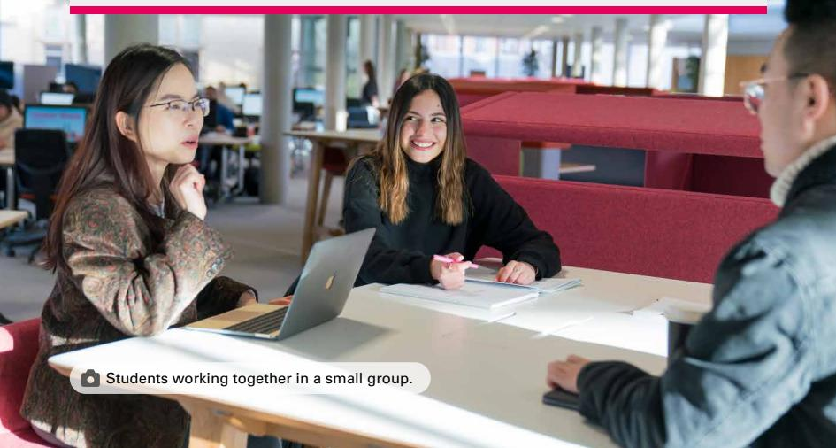

> **AI Description:**
> **Source:** `assets/_page_24_Figure_0.jpg`
> 
> **Generated:** 2026-05-18 12:10:15
> 
> ---
> 
> The image contains a photograph of three students working together in a small group in what appears to be a library or study area. The students are seated at a table with laptops and papers, engaged in discussion. The environment includes red cushioned seating and other students working in the background. The text at the bottom of the image reads, "Students working together in a small group."

# New courses for entertainment, creative media and digital careers

We’re delighted to offer a range of exciting new courses for careers in the entertainment, creative media and digital industries. Based at our Confetti London campus or our Confetti Nottingham campus (a short walk from NTU’s City Campus), we offer pioneering education and world-class facilities. Our staff and technical teams work in these industries and are expert teachers.

You will be taught the skills, knowledge and real-world experience you need to graduate with a competitive edge for employment within a range of organisations, industries and professions.

## Undergraduate courses

BA Music Performance

BSc Sound Engineering and Audio Production

BA Music Production

BA Music Business

BSc Event Production

BA Event Management

BSc Esports Production

BA Content Creation

BSc Virtual Production

Please note that this course list is correct at the time of going to print. Always check our website at ntu.ac.uk/courses for the most up-to-date information.

## Postgraduate courses

MA Music Performance\*

MSc Sound Engineering and Audio Production\*

MA Music Production\*

MA Music Business\*

MSc Event Production\*

MA Event Management\*

MSc Esports Production\*

MA Content Creation\*

MSc Virtual Production\*

\*Includes a January start option (London only).

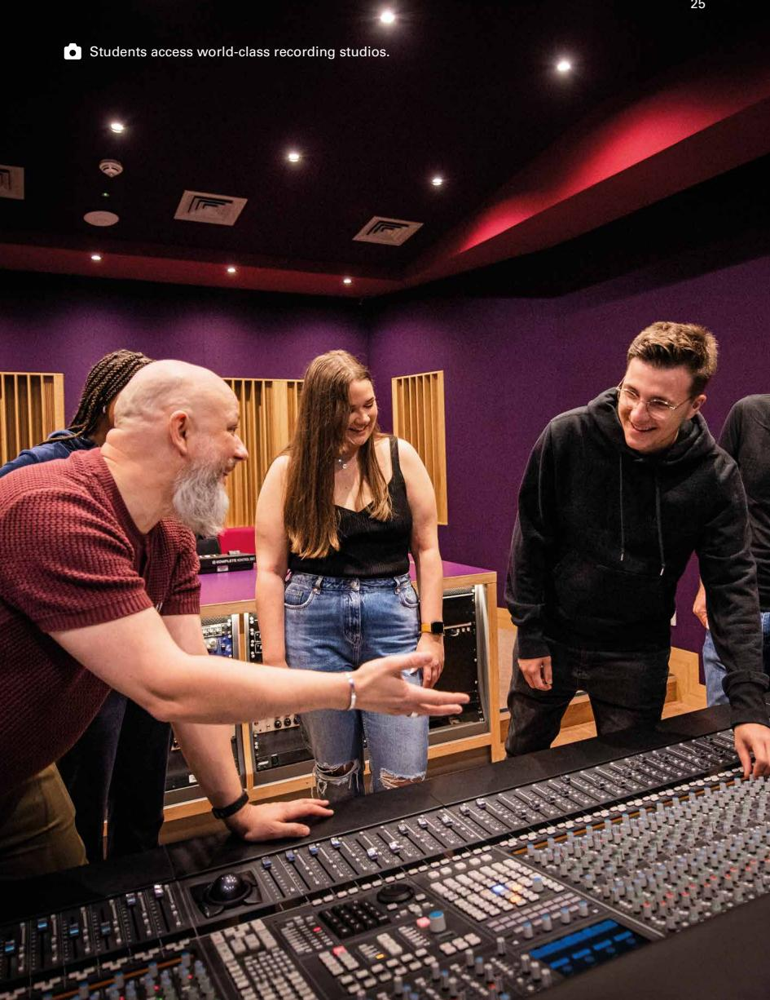

> **AI Description:**
> **Source:** `assets/_page_26_Figure_0.jpg`
> 
> **Generated:** 2026-05-18 12:26:47
> 
> ---
> 
> The image contains a photograph of a group of people in a recording studio. The setting includes a large mixing console in the foreground, with various knobs and sliders visible. The individuals appear to be engaged in a discussion, with one person leaning over the console, gesturing towards it. The background features purple walls and soundproofing panels, indicating a professional recording environment. The text at the top of the image states, "Students access world-class recording studios," suggesting the image is related to educational opportunities in a music or audio production program.

# January start courses

We offer a wide range of postgraduate courses with the added flexibility of a January start. Some offer a work placement opportunity, just like our September courses, and these are marked with a in this list.

These courses are perfect if you haven’t found the right course in September or need a bit more time to get your qualifications or visa confirmed. Our international teams are ready to advise if you would like to find out more about your study options for this time of the year.

> **AI Description:**
> **Source:** `assets/_page_27_Figure_0.jpg`
> 
> **Generated:** 2026-05-18 12:20:39
> 
> ---
> 
> The image is a photograph showing two individuals outdoors, likely in a campus setting, given the stone building and greenery in the background. The person on the left is wearing a hijab and glasses, and the person on the right has long brown hair. Both are smiling and appear to be engaged in a conversation. The person on the left is holding a pink object that looks like a student card or ticket. The image captures a moment of interaction and happiness, with a focus on the individuals and their surroundings.

Visit ntu.ac.uk/january to find out more.

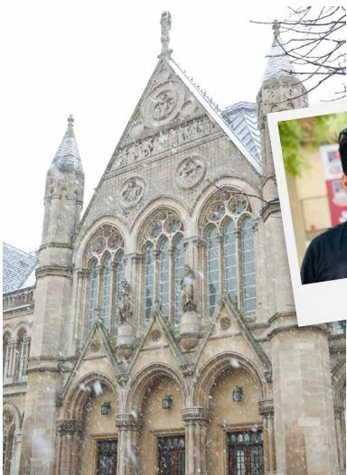

> **AI Description:**
> **Source:** `assets/_page_28_Figure_0.jpg`
> 
> **Generated:** 2026-05-18 12:15:26
> 
> ---
> 
> The image contains a photograph of a grand, historic building with intricate architectural details, including ornate stonework, large arched windows, and spires. The building appears to be made of stone and has a Gothic or Romanesque architectural style. The photo is taken on a snowy day, as evidenced by the snowflakes visible in the foreground. In the top right corner of the image, there is a smaller inset photo of a person, which seems to be unrelated to the main building image.

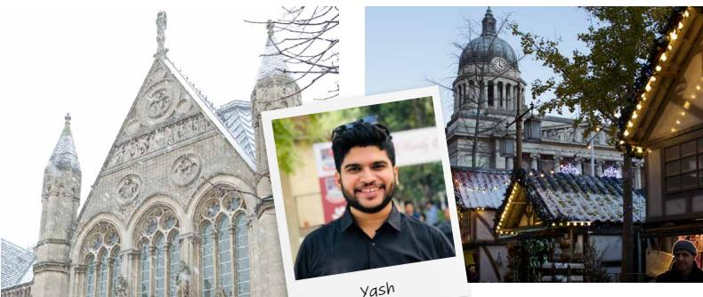

> **AI Description:**
> **Source:** `assets/_page_28_Figure_1.jpg`
> 
> **Generated:** 2026-05-18 12:14:35
> 
> ---
> 
> The image contains a collage of three distinct photographs. The first photograph on the left shows a detailed view of a historical building with ornate architectural features, including pointed arches and decorative stonework. The second photograph in the center is a portrait of a smiling individual with the name "Yash" written below the image. The third photograph on the right depicts a festive market scene with illuminated stalls and a clock tower in the background, suggesting a holiday or fair atmosphere. The collage combines architectural, personal, and cultural elements.

“I was a little worried to start in January, but it was indeed a spectacular experience for me. The teaching staff were really supportive, and I never felt left out.

> **AI Description:**
> **Source:** `assets/_page_28_Figure_2.jpg`
> 
> **Generated:** 2026-05-18 12:15:29
> 
> ---
> 
> The image contains a simple pink icon of an airplane. It is a single, solid-colored graphic with no additional text or elements. The icon represents an airplane, likely used to symbolize air travel or aviation-related concepts.

We run an airport transfer service from Heathrow for our students arriving in September and January.

I had a good time on campus and enjoyed the practical learning approaches. I found another home in the NTU Global Lounge which is a hub for international students to socialise and hang out.”

“NTU in 3 words? Diversity. Engaging. Innovative.”

Yash Shah, India MSc Project Management (Construction), January 2021

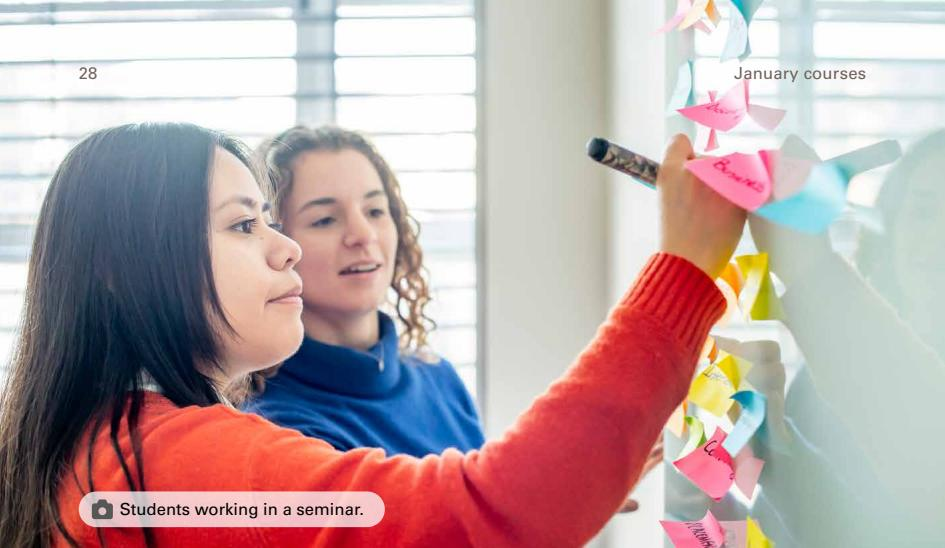

> **AI Description:**
> **Source:** `assets/_page_29_Figure_0.jpg`
> 
> **Generated:** 2026-05-18 12:15:54
> 
> ---
> 
> The image contains a photograph of two individuals working together in a seminar setting. One person is holding a marker and appears to be writing on a colorful paper chain hanging on a wall. The text "January courses" is visible in the upper right corner, and the bottom left corner includes the caption "Students working in a seminar." The image captures a collaborative and educational environment, with the focus on the interaction between the two individuals and the visual aid they are using.

## Business, finance, management and marketing

MSc Management

MSc Management and International Business

MSc Marketing

MSc Finance

MSc Marketing and Brand Management

Online Master of Business Administration (MBA) / + Data Analytics / + Fast Track

## Computing and Engineering

MSc Engineering Management MSc Engineering (Electronics) MSc Cyber Security NEW

MSc Transport Systems MSc Medical Engineering MSc Sustainable Engineering: Energy

> **AI Description:**
> **Source:** `assets/_page_29_Figure_5.jpg`
> 
> **Generated:** 2026-05-18 12:15:33
> 
> ---
> 
> The image contains a simple icon of a briefcase. It is a single, flat, two-dimensional representation of a briefcase, likely used to symbolize professional or business-related content. There are no additional visual elements or text annotations present in the image.

work placement opportunity

> **AI Description:**
> **Source:** `assets/_page_29_Figure_7.jpg`
> 
> **Generated:** 2026-05-18 12:15:17
> 
> ---
> 
> The image contains a simple icon of a house with a heart inside it. The house is outlined in pink, and the heart is also pink, filling the interior of the house. The icon is a single, static image with no additional text or data.

We offer flexible accommodation contracts – perfect if you’re starting in January.

## Sciences

MSc Biomedical Science

MSc Pharmacology

MSc Molecular Cell Biology

MSc Molecular Microbiology

MSc Biotechnology ：

MSc Chemistry

MSc Chemistry Professional Practice

> **AI Description:**
> **Source:** `assets/_page_30_Figure_2.jpg`
> 
> **Generated:** 2026-05-18 12:10:54
> 
> ---
> 
> The image contains a simple icon of a briefcase. It is a single, flat, two-dimensional representation of a briefcase, commonly used to symbolize professional or business-related contexts. There are no additional visual elements, charts, or annotations present in the image.

MRes Analytical Chemistry

MRes Pharmaceutical Analysis

MRes Pharmaceutical and Medicinal Science

MRes Chemistry

MRes Advanced Materials Chemistry

MSc Neuropharmacology

MSc Biomedical Science (flexible learning)

MRes Medical Imaging

## Nursing and Paramedicine

MSc Nursing (Adult)

MSc Nursing (Learning Disabilities)

MSc Nursing (Mental Health)

MSc Paramedic Science

## Health and Social Care

MA Social Work

New courses for careers in entertainment, creative and digital industries - see page 24.

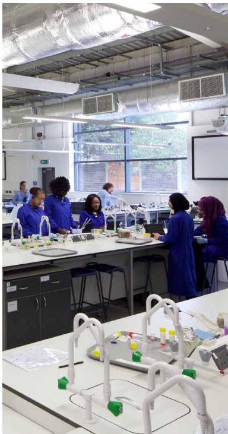

> **AI Description:**
> **Source:** `assets/_page_30_Figure_4.jpg`
> 
> **Generated:** 2026-05-18 12:06:57
> 
> ---
> 
> The image depicts a laboratory setting with several individuals engaged in scientific activities. The room is well-lit with natural light coming through large windows. The individuals are wearing blue lab coats and are working at lab benches equipped with various scientific apparatus such as beakers, flasks, and pipettes. The environment appears organized and professional, suggesting a research or educational laboratory.

Interdisciplinary Biomedical Research Facility, Clifton campus.

Please note that this course list is correct at the time of going to print. Always check our website at ntu.ac.uk/courses for the most up-to-date information.

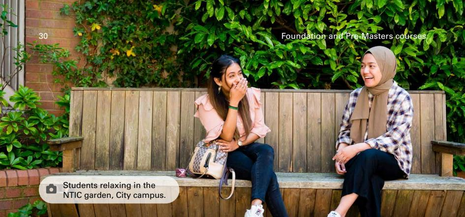

> **AI Description:**
> **Source:** `assets/_page_31_Figure_0.jpg`
> 
> **Generated:** 2026-05-18 12:09:26
> 
> ---
> 
> The image contains a photograph of two students sitting on a wooden bench in an outdoor garden setting. The garden is lush with greenery, and the students appear to be engaged in a conversation, with one student laughing and covering her mouth. The text overlay indicates that the students are relaxing in the NTIC garden at the City campus. The image also includes a label at the top right corner mentioning "Foundation and Pre-Masters courses," suggesting the context of the students' academic pursuits.

## University preparation courses

If you don’t meet the entry requirements for your NTU course, you may want to do one of our preparation courses at our on-campus partner institution – Nottingham Trent International College (NTIC).

Our Foundation Certificate, International Year One and pre-Masters courses cover a range of subject areas, including:

Art, Design and Media

Business, Law and Social Sciences

Computing

Science and Engineering

As an NTIC student, you'll have access to all University facilities and can enjoy guaranteed entry to NTU when you pass your NTIC course at the required level with good attendance.

> **AI Description:**
> **Source:** `assets/_page_31_Figure_1.jpg`
> 
> **Generated:** 2026-05-18 12:09:48
> 
> ---
> 
> The image contains a photograph of two individuals engaged in conversation outdoors. The setting appears to be an urban environment with brick buildings in the background. The individuals are casually dressed, and their body language suggests an animated discussion. The image captures a moment of interaction, possibly in a social or professional context.

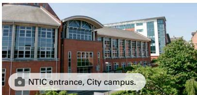

> **AI Description:**
> **Source:** `assets/_page_31_Figure_2.jpg`
> 
> **Generated:** 2026-05-18 12:07:52
> 
> ---
> 
> The image is a photograph of the entrance to the NTIC (National Technical Institute of Creativity) on the City campus. The building features a red brick facade with large windows and a curved roofline. The surrounding area includes greenery and other buildings in the background. The text overlay identifies the location as the NTIC entrance on the City campus.

“Before I progressed to NTU, I studied the foundation course at NTIC. I think it prepared me well for my university course. It gave me time to adapt to the teaching habits, learning atmosphere and living environment in the UK in advance. In my first year at the University, I think I adapted to NTU and life in the UK much better than other international students who had not done a preparation course.”

Terry Tan, China   
NTIC Foundation course, progressing   
to BSc Sports Science and   
Management

“Looking back, I can say my experience on the Foundation year at NTIC was the most fun year I have ever had! The sense of community was great, and it was very diverse and inclusive. It was very easy for me to feel part of the community, and I keep in touch with my NTIC friends.

Being part of NTIC made my transition to university much easier. They made my transition to university smooth; they provided great support and the team was very approachable and helpful during my transition to NTU.”

Jannah Aboelghar NTIC Foundation course, progressing to BSc (Hons) Ecology and Conservation

## Contact NTIC

Nottingham Trent International College (part of Kaplan International)

Tel: +44 (0)20 7045 4925

Email: ntic@kaplan.com

Search NTIC Nottingham

> **AI Description:**
> **Source:** `assets/_page_32_Figure_2.jpg`
> 
> **Generated:** 2026-05-18 12:19:08
> 
> ---
> 
> The image contains four icons representing social media platforms: Facebook, Instagram, Twitter, and SoundCloud. These icons are pink squares with their respective logos and names. There is no additional text or visual content beyond these four icons.

> **AI Description:**
> **Source:** `assets/_page_33_Figure_0.jpg`
> 
> **Generated:** 2026-05-18 12:24:38
> 
> ---
> 
> The image contains a photograph of four individuals walking in what appears to be a modern indoor setting, possibly a university or office building. Two women are in the foreground, engaged in conversation, while two men are walking behind them. One of the men is holding a coffee cup. The setting includes a staircase and a wall with a sign that reads "Pre-sessional English courses." The image conveys a casual, social atmosphere and provides context for the location and activity.

# Pre-sessional English for Academic Purposes (PEAP)

If you need help achieving our English language requirements, we may offer you a place on the condition that you successfully complete a PEAP course at the University before your course begins.

The length and cost of your PEAP course will depend on your current level of English. Our courses range from 6 to 15 weeks.

Our staff are very experienced and the course is designed to develop the academic English language and study skills needed to study at NTU.

Your tutors will give you the support you need so that you’re well prepared for assessments and your follow-on degree course.

forthe teaching of English in the UK

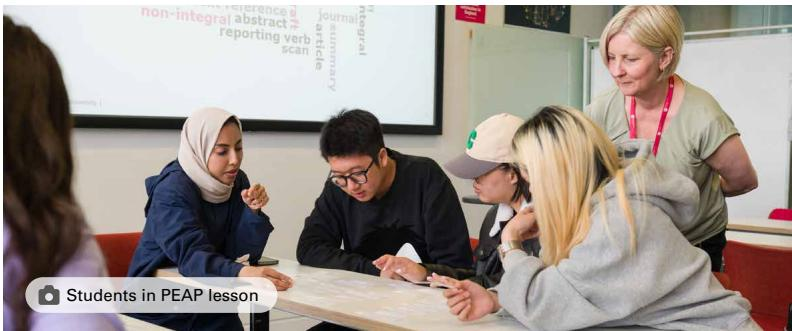

> **AI Description:**
> **Source:** `assets/_page_34_Figure_0.jpg`
> 
> **Generated:** 2026-05-18 12:24:53
> 
> ---
> 
> The image is a photograph of a group of students engaged in a PEAP (Pre-Intermediate English as a Second Language) lesson. The students are seated around a table, appearing to work on a collaborative activity. The teacher is standing nearby, observing their progress. In the background, there is a whiteboard with various words and phrases written on it, such as "non-integral," "abstract," "reporting verb," and "scan," which seem to be related to language learning or vocabulary. The setting appears to be a classroom environment.

# More than just a language course

• You’ll make substantial gains in language development in a short time.

• Everything you learn will be relevant to your studies.

• Learning takes place through collaborative tasks in small groups.

• You’ll become more confident and familiar with the ‘NTU way of doing things’.

Course dates and fees for 2024

## What our students say

“I had an IELTS grade 6 and experience of IELTS preparation English classes. Confidently, I can say that PEAP was better, and a totally different experience compared with my local English classes.

It was like a university preparation class that not only increased my academic English skills but also helped me to be more familiar with the university tasks and the environment. I made friendships which helped me to not feel alone and met lovely people.

The best bits about the course were friendly environment, fantastic student support system, kind and knowledgeable tutors.”

## Saba Darouei Haghighi, Iran

## Campuses

We have eight Academic Schools located over our City, Clifton and Brackenhurst campuses – plus our Confetti campuses in Nottingham and London.

Each school has its own friendly community and character, built on enthusiasm, expertise, opportunities and award-winning support. You can find out more about them on pages 46-53.

## City Campus

A cosmopolitan, bustling campus right in the city centre. Only five minutes’ walk to the shops and all the excitement of a busy student city.

Nottingham Business School

Nottingham School of Art & Design

• School of Architecture, Design and the Built Environment

Nottingham Law School

School of Social Sciences

Journalism and Media Hub

Confetti Institute of Creative Technologies

Nottingham Institute for Languages and Intercultural Communication (NILIC)

Nottingham Trent International College (NTIC)

> **AI Description:**
> **Source:** `assets/_page_35_Figure_0.jpg`
> 
> **Generated:** 2026-05-18 12:21:12
> 
> ---
> 
> The image contains a simple diagram of a person with circular arrows around them. The person is represented by a basic stick figure, and the circular arrows suggest movement or rotation around the person. This could symbolize a process involving the person or a cycle involving the person.

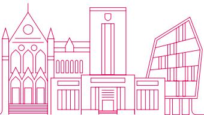

> **AI Description:**
> **Source:** `assets/_page_35_Figure_1.jpg`
> 
> **Generated:** 2026-05-18 12:21:08
> 
> ---
> 
> The image is a line drawing of a cityscape featuring a variety of architectural styles. It includes a gothic-style church with a pointed roof and a tall tower, a modern building with a flat roof and a central tower, and a contemporary structure with a unique angular design. The buildings are drawn in a simple, minimalist style with clean lines and no shading or color. The image does not contain any text or additional labels.

Take a virtual tour around the University campuses at explore.ntu.ac.uk

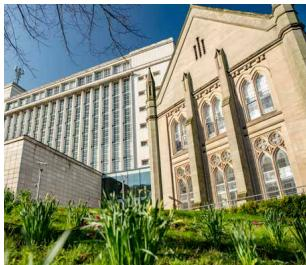

> **AI Description:**
> **Source:** `assets/_page_35_Figure_2.jpg`
> 
> **Generated:** 2026-05-18 12:19:24
> 
> ---
> 
> The image contains a photograph of a building with a modern architectural style on the left and a historic church with ornate stained glass windows on the right. The foreground features green grass and daffodils, suggesting a springtime setting. The juxtaposition of the two structures highlights a contrast between contemporary and traditional architecture.

Arkwright and Newton building, City Campus

## Clifton Campus

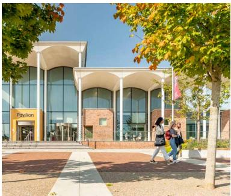

> **AI Description:**
> **Source:** `assets/_page_36_Figure_0.jpg`
> 
> **Generated:** 2026-05-18 12:09:14
> 
> ---
> 
> The image is a photograph of a modern building with a glass facade and a curved roof structure. The building has large windows and a brick base. There are two people walking in front of the building, carrying shopping bags. The word "Pavilion" is visible on the building's facade. The scene is set outdoors with trees and a clear blue sky in the background.

Pavilion, Clifton Campus

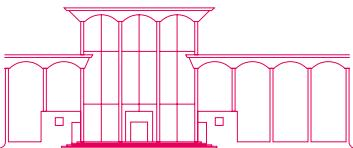

> **AI Description:**
> **Source:** `assets/_page_36_Figure_1.jpg`
> 
> **Generated:** 2026-05-18 12:09:59
> 
> ---
> 
> The image is a line drawing of a building facade. It features a central entrance with a triangular pediment above it, flanked by two symmetrical sections with arched windows. The drawing is in a simple line art style, with no shading or color. The overall design suggests a classical or neoclassical architectural style.

A friendly, vibrant student village with all the facilities you need in one place. Just six kilometres from the centre of Nottingham, with a bus service to the City Campus every 10 minutes.

School of Arts and Humanities

School of Science and Technology

Nottingham Institute of Education

Institute for Health and Allied Professions

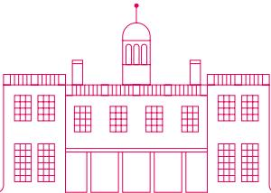

> **AI Description:**
> **Source:** `assets/_page_36_Figure_2.jpg`
> 
> **Generated:** 2026-05-18 12:08:03
> 
> ---
> 
> The image is a simple line drawing of a building. It features a multi-story structure with a central tower that has a dome and a spire on top. The building has a symmetrical design with evenly spaced windows on each floor. The windows are rectangular and arranged in a grid pattern. There are also chimneys on the roof, and the overall style is minimalist and geometric.

## Brackenhurst Campus

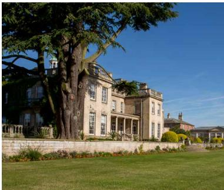

> **AI Description:**
> **Source:** `assets/_page_36_Figure_3.jpg`
> 
> **Generated:** 2026-05-18 12:07:05
> 
> ---
> 
> The image contains a photograph of a large, elegant building with classical architectural features, including columns and a balcony. The structure is surrounded by a well-maintained lawn and a tall tree, suggesting a serene and possibly historic setting. The sky is clear and blue, indicating a sunny day. The building appears to be a mansion or estate, possibly used for events or as a private residence.

> **AI Description:**
> **Source:** `assets/_page_36_Figure_4.jpg`
> 
> **Generated:** 2026-05-18 12:11:32
> 
> ---
> 
> The image contains a simple line drawing of three trees. The trees are identical in shape and size, with a rounded top and a straight trunk. The lines are pink and the trees are evenly spaced against a plain background. There are no labels or text annotations present in the image.

Brackenhurst Hall

A beautiful campus in the countryside, about 45 minutes’ drive from Nottingham with a regular bus service. If you’re with the School of Animal, Rural and Environmental Sciences, you’ll be studying here.

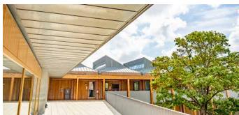

> **AI Description:**
> **Source:** `assets/_page_36_Figure_5.jpg`
> 
> **Generated:** 2026-05-18 12:10:59
> 
> ---
> 
> The image is a photograph of an outdoor area of a building. The structure features a modern design with a flat roof supported by wooden beams. The building has a series of rectangular windows and doors, and the walls appear to be made of wood. There is a tree in the foreground on the right side of the image, and the sky is partly cloudy. The overall scene suggests a calm and serene environment, possibly part of a school or community center.

Lyth building

Visit ntu.ac.uk/campus for more information.

## Confetti Campuses

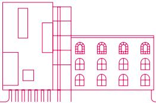

> **AI Description:**
> **Source:** `assets/_page_37_Figure_0.jpg`
> 
> **Generated:** 2026-05-18 12:14:27
> 
> ---
> 
> The image is a simple line drawing of a multi-story building. It features a rectangular structure with a series of windows along the front facade. There are also smaller rectangular shapes and lines that might represent additional architectural details or features of the building. The drawing is minimalistic and lacks color, focusing solely on the outline of the structure.

## Confetti Nottingham

Study in Nottingham’s flourishing Creative Quarter, right in the city centre and just a short walk from NTU City Campus and all the shops and attractions.

## Confetti London

Opening in September 2023, our brand-new London site is situated in Whitechapel, East London. Based here you are not far from iconic areas like Brick Lane, the Tower of London, and Tower Bridge.

## confetti institute of creative technologies

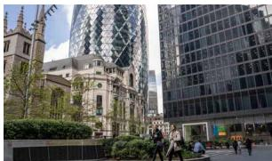

> **AI Description:**
> **Source:** `assets/_page_37_Figure_3.jpg`
> 
> **Generated:** 2026-05-18 12:12:47
> 
> ---
> 
> The image contains a photograph of an urban scene. It features a mix of modern and traditional architecture, with a prominent glass building on the right and a historic-looking building with a red brick facade on the left. There are people walking in the foreground, suggesting a busy city environment. The juxtaposition of the old and new structures highlights the blend of historical and contemporary elements in the cityscape.

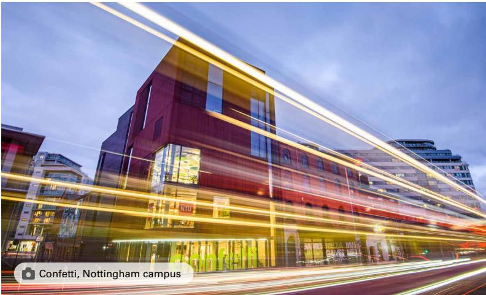

> **AI Description:**
> **Source:** `assets/_page_37_Figure_4.jpg`
> 
> **Generated:** 2026-05-18 12:06:47
> 
> ---
> 
> The image is a photograph of the Confetti building on the Nottingham campus. The photo captures the building at dusk or early evening, with long exposure light trails suggesting motion, possibly from vehicles or pedestrians. The building has a modern design with large windows and a mix of red and dark-colored panels. The text "Confetti, Nottingham campus" is overlaid at the bottom of the image.

Visit ntu.ac.uk/confetti to find out more.

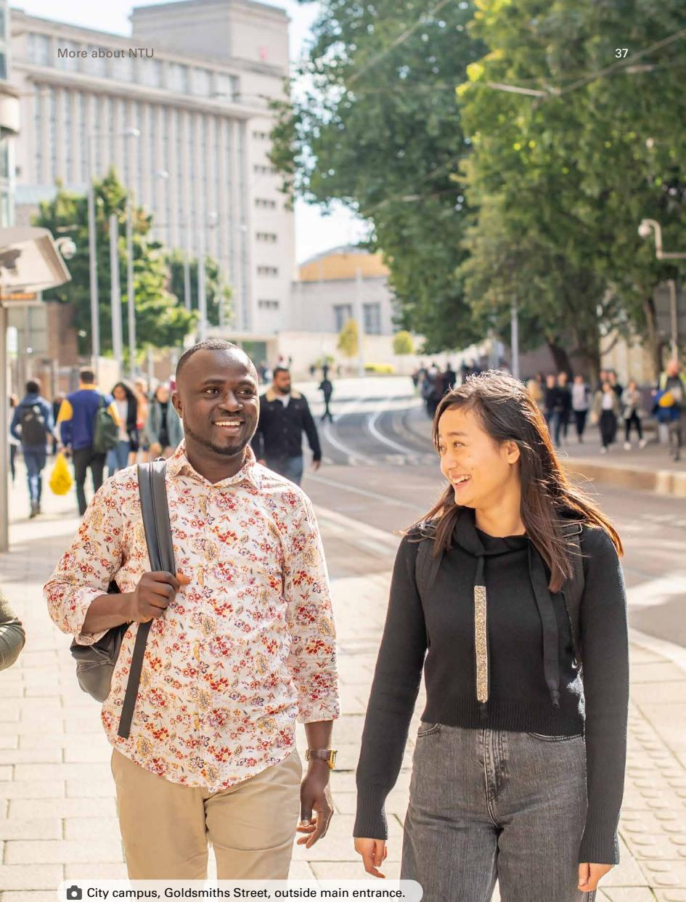

> **AI Description:**
> **Source:** `assets/_page_38_Figure_0.jpg`
> 
> **Generated:** 2026-05-18 12:18:00
> 
> ---
> 
> The image is a photograph showing two individuals walking on a paved path in an urban setting. The person on the left is wearing a floral-patterned shirt and carrying a bag, while the person on the right is dressed in a black top and jeans. The background includes other people walking, trees, and a large building, suggesting a campus or city environment. The text at the bottom of the image indicates the location as "City campus, Goldsmiths Street, outside main entrance." The image also includes a page number "37" and a caption "More about NTU," which suggests it is part of a larger document or publication.

你好 hallo ciao

Chlctlt salut

## University Language Programme

## Learn a language for free while you study.

That’s right! As a student at NTU, you can learn a new language or improve your existing language skills whether you’re an absolute beginner, already have some skills, or are at an advanced level. It’s no extra cost. You pay a small refundable deposit which you get back after you finish the course.

Study for 2 hours a week or more – it’s up to you.

Why ULP?

Language skills are a great addition to your CV.

Relax and make friends outside your degree. You’ll practise with students and staff from across the University, and members of the public.

Language learning facilitates critical thinking, asking about differences, looking for equivalents in your first language and culture.

It can also help with finding work after graduation – a certified level of proficiency can help to distinguish you from other applicants.

## Choose from French, Spanish, Chinese, Japanese, Arabic, German or Italian.

Visit ntu.ac.uk/ulp to find out more.

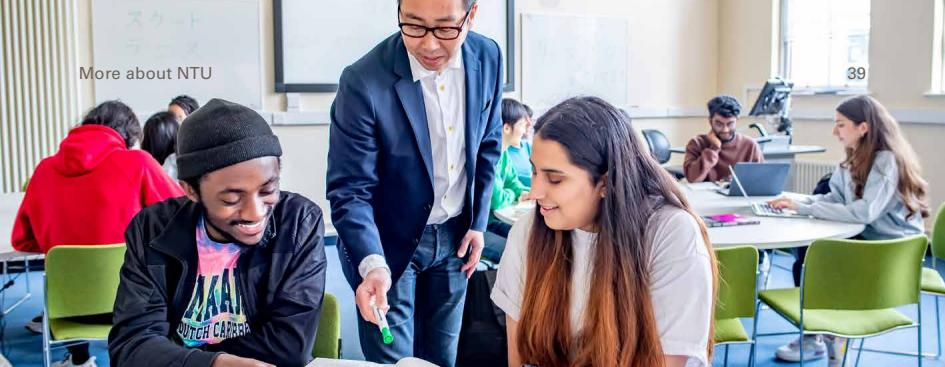

> **AI Description:**
> **Source:** `assets/_page_40_Figure_0.jpg`
> 
> **Generated:** 2026-05-18 12:07:15
> 
> ---
> 
> The image contains a photograph of a classroom setting. It shows a group of students and a teacher engaged in a collaborative activity. The students are seated at a table, with one student holding a green marker and appearing to explain or demonstrate something to the others. The teacher is standing and observing the interaction. In the background, other students are seated at tables, some using laptops. The classroom has a whiteboard with text on it, and the text reads "More about NTU," indicating that the setting might be a university or educational institution. The overall scene suggests an interactive and collaborative learning environment.

## Learning with the best

You’ll enjoy the highest standards of teaching during your studies. Our lecturers have extensive experience in industry, research and the professions, so you can be sure that our teaching is of the highest quality in the UK.

You’ll learn so much about the theory and the practice of your subject. You’ll also benefit from inspirational guest lecturers and speakers who’ll bring your subject to life.

Whatever course you do, you’ll find new and exciting ideas. And you’ll develop your confidence further by getting practical experience.

> **AI Description:**
> **Source:** `assets/_page_40_Figure_1.jpg`
> 
> **Generated:** 2026-05-18 12:07:58
> 
> ---
> 
> The image is a photograph of a classroom setting. It shows three individuals, two students and a teacher, engaged in an educational activity. The teacher is assisting one of the students with a task on a computer screen. The students are focused on their work, with one student leaning forward and the other sitting upright. The classroom has multiple desks and chairs, and there are other students in the background, suggesting a collaborative learning environment. The overall scene conveys a sense of active learning and support.

ntu.ac.uk/about-us/teaching

> **AI Description:**
> **Source:** `assets/_page_40_Figure_2.jpg`
> 
> **Generated:** 2026-05-18 12:09:51
> 
> ---
> 
> The image contains a simple icon of two hands cupping a heart. The hands are depicted in a light pink or magenta color, and the heart is a darker shade of pink. This icon is commonly used to represent themes of care, love, or support.

## You are valued

Our teachers really value international students like you, for the contributions you make, and for the challenges, fresh ideas and new perspectives you bring to our courses.

# Facilities and resources

We’ve invested over £450 million in our facilities and campuses in the last 15 years and we continue to invest heavily. You’ll enjoy inspiring spaces and first-class learning and teaching facilities at NTU.

Whatever subject you're studying, you’ll have access to a huge range of facilities and resources for your specialist subject area.

Here are just some of the other facilities you’ll enjoy.

## Award-winning libraries

Access to over 650,000 electronic books and journals and approximately 300,000 printed books, open 24 / 7 during term time.

> **AI Description:**
> **Source:** `assets/_page_41_Figure_0.jpg`
> 
> **Generated:** 2026-05-18 12:12:26
> 
> ---
> 
> The image contains a photograph of a student sitting at a desk in a classroom setting. The student is focused on writing or taking notes on a piece of paper. On the desk, there is a laptop, a black mug with an orange lid, and some papers with printed text. The background shows other students and a classroom environment with desks and chairs. The overall scene suggests an academic or study setting.

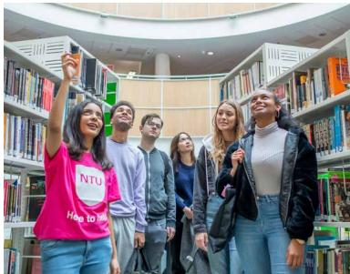

> **AI Description:**
> **Source:** `assets/_page_41_Figure_1.jpg`
> 
> **Generated:** 2026-05-18 12:10:45
> 
> ---
> 
> The image contains a photograph of a group of six individuals in what appears to be a library or bookstore setting. The person on the left is wearing a pink t-shirt with "NTU" and "Help to Read" printed on it, suggesting a connection to Nottingham Trent University. The group is standing in front of bookshelves filled with books, and one person is holding up a smartphone, possibly taking a selfie or recording a video. The individuals are dressed casually, and the environment suggests a relaxed and social atmosphere.

Boots library, City Campus

## IT facilities

Loan laptops, group and individual study spaces, thousands of computers, 24-hour access, and specialist course-related software.

## Global Lounges

Global Lounges are very special spaces; a place where you can meet other students, relax, and hang out. You’ll find them on our City and Clifton campuses. For many students, visiting the Global Lounge is the first step to settling into student life here:

language practice opportunities

communal area to relax

cultural events

resource centre

always a friendly face

You’ll be welcome any time – you don’t need an appointment.

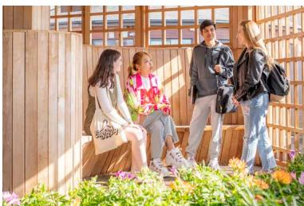

> **AI Description:**
> **Source:** `assets/_page_42_Figure_0.jpg`
> 
> **Generated:** 2026-05-18 12:23:30
> 
> ---
> 
> The image is a photograph showing four individuals engaged in conversation in an outdoor setting. The environment features wooden paneling and a variety of colorful flowers in the foreground, suggesting a garden or park-like area. The individuals are casually dressed, and one person is holding a drink, indicating a relaxed and social atmosphere. The lighting is natural, with sunlight filtering through, creating a warm and inviting ambiance.

Rooftop garden, Boots library, City campus.

## Green spaces

Our greatest resource: all our campuses have green spaces outside for you to enjoy some fresh air and a peaceful atmosphere.

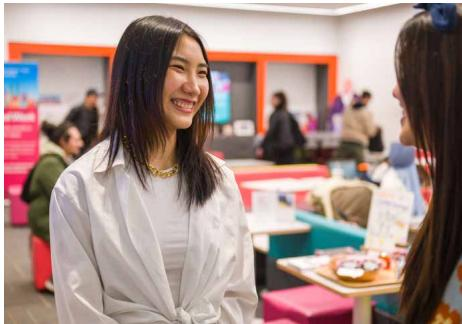

> **AI Description:**
> **Source:** `assets/_page_42_Figure_1.jpg`
> 
> **Generated:** 2026-05-18 12:24:12
> 
> ---
> 
> The image contains a photograph of a person smiling and interacting with another individual in what appears to be a social or professional setting. The background shows a room with tables, chairs, and some people in the distance, suggesting a casual or networking environment. The person in the foreground is wearing a white blouse and has long dark hair. The setting includes colorful furniture and some signage, indicating a lively and possibly educational or corporate event.

Relaxing in the Global Lounge

## Faith and spirituality

Our Chaplaincy team provides pastoral support, social encounters and opportunities for prayer, meditation, and reflection in our prayer spaces. The team has Jewish, Muslim, Catholic and Methodist chaplains and we have Muslim prayer rooms across all our campuses.

> **AI Description:**
> **Source:** `assets/_page_42_Figure_2.jpg`
> 
> **Generated:** 2026-05-18 12:27:02
> 
> ---
> 
> The image is a photograph of a person sitting at a table, smiling. The person is wearing a black T-shirt with white text that reads "FAITH AMBASSAD." The background includes a blurred setting with some red and white elements, possibly part of a poster or banner. The table in front of the person has a clear glass and a bouquet of white flowers. The overall setting appears to be indoors, possibly at an event or gathering.

Student faith ambassador

## Sport

Amazing sport facilities including 100-station gyms, fitness studios, outdoor sports pitches, an indoor tennis centre, a sports therapy suite, sports halls, a dance studio, and a 10m climbing wall.

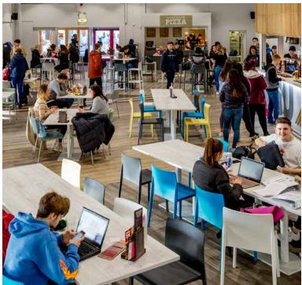

> **AI Description:**
> **Source:** `assets/_page_43_Figure_0.jpg`
> 
> **Generated:** 2026-05-18 12:19:38
> 
> ---
> 
> The image is a photograph of a busy indoor space, likely a food court or café. It shows multiple people seated at tables, some working on laptops while others appear to be eating or conversing. The tables are white, and the chairs are a mix of blue and white. The background includes a counter with a sign that reads "Pizza," and there are other people standing and walking around. The overall atmosphere suggests a casual and social environment.

## Music

Dedicated music practice space for all abilities and musical interests.

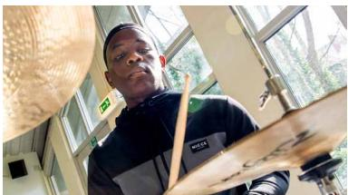

> **AI Description:**
> **Source:** `assets/_page_43_Figure_1.jpg`
> 
> **Generated:** 2026-05-18 12:19:18
> 
> ---
> 
> The image is a photograph of a person playing a drum set. The person is wearing a dark-colored shirt and is positioned in front of a drum kit with cymbals and drums visible. The background shows a window with natural light coming through, and there is a sign on the wall that appears to be a fire exit sign. The image captures a moment of musical performance or practice.

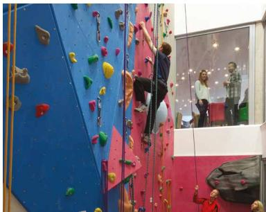

> **AI Description:**
> **Source:** `assets/_page_43_Figure_2.jpg`
> 
> **Generated:** 2026-05-18 12:20:56
> 
> ---
> 
> The image depicts an indoor climbing wall with a person actively climbing on it. The wall is divided into sections of blue and pink, each adorned with variously shaped and colored climbing holds. The climber is wearing a blue shirt and dark pants, and is using a rope for safety. In the background, there are two individuals observing the climber, one of whom is holding a camera. The setting appears to be a climbing gym or recreational facility.

Climbing wall, Students' Union

## Your Students’ Union

An incredible range of venues, societies, sports clubs, events and initiatives on all campuses for you to enjoy with your fellow students.

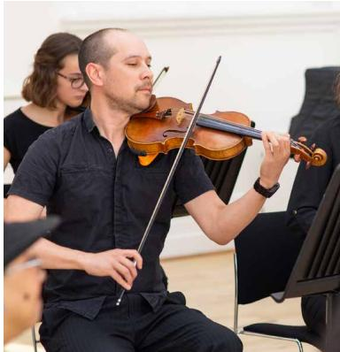

> **AI Description:**
> **Source:** `assets/_page_43_Figure_3.jpg`
> 
> **Generated:** 2026-05-18 12:22:02
> 
> ---
> 
> The image is a photograph of a person playing the violin in what appears to be a musical performance or rehearsal. The individual is seated and wearing a dark shirt, with a violin and bow in hand. The background shows other musicians, some also seated and playing string instruments, suggesting a chamber music or orchestral setting. The environment appears to be a rehearsal or performance space with a plain backdrop and wooden flooring.

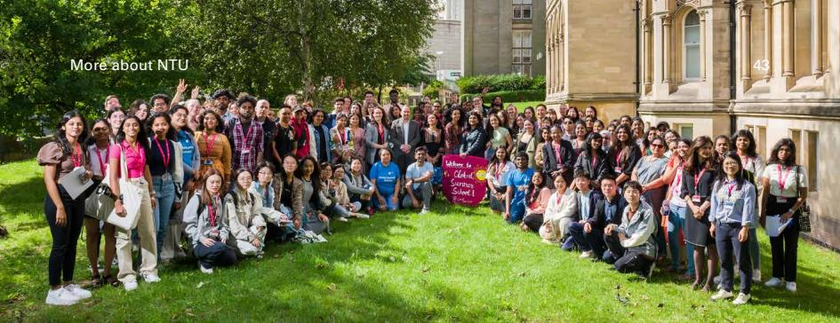

> **AI Description:**
> **Source:** `assets/_page_44_Figure_0.jpg`
> 
> **Generated:** 2026-05-18 12:20:00
> 
> ---
> 
> The image is a photograph of a group of people gathered outdoors on a grassy area in front of a building. The group appears to be diverse in terms of age and attire, suggesting a mix of students and possibly faculty or staff. Some individuals are wearing lanyards, which might indicate a formal event or organized gathering. A sign in the foreground reads "Welcome to Global Summer School," indicating the context of the event. The text "More about NTU" is visible in the top left corner, suggesting the image is related to Nottingham Trent University (NTU). The setting is sunny and green, with trees and the building in the background, giving a pleasant and welcoming atmosphere.

## Global Summer School

Learn something new, meet friends from around the world and experience Nottingham.

Our Global Summer School has something for everyone. Join a community of students from around the world to learn from our outstanding academics. Choose a course from a range of subjects to extend and expand your current learning, share your culture, get to know others, and enjoy exploring Nottingham and the UK.

You’ll also get UK credits when you complete your course.

> **AI Description:**
> **Source:** `assets/_page_44_Figure_1.jpg`
> 
> **Generated:** 2026-05-18 12:19:04
> 
> ---
> 
> The image contains a photograph of a group of people, likely in a social or educational setting. The individuals appear to be engaged in a conversation or activity, with one person holding a smartphone. The image captures a candid moment of interaction, with the focus on the expressions and body language of the individuals. The setting seems to be indoors, possibly a classroom or conference room, given the presence of other people in the background.

“Getting to work on projects with people from other nations is an absolutely amazing experience, much needed for future global citizens.” 99

Kunwar Thapar, Design and Innovation in Business, 2022

> **AI Description:**
> **Source:** `assets/_page_45_Figure_0.jpg`
> 
> **Generated:** 2026-05-18 12:23:07
> 
> ---
> 
> The image contains a photograph of three individuals sitting in a modern, brightly colored indoor setting. The person on the left is wearing a maroon shirt and jeans, the person in the middle is dressed in a green sweater and brown pants, and the person on the right is wearing a floral-patterned cardigan and jeans. They appear to be engaged in a conversation, with one person smiling and looking towards the other two. The background features orange walls, green plants, and a small table with a coffee cup on it. The setting suggests a casual, relaxed environment, possibly a cafe or a lounge area.

Take a virtual tour at explore.ntu.ac.uk

> **AI Description:**
> **Source:** `assets/_page_46_Figure_0.jpg`
> 
> **Generated:** 2026-05-18 12:12:06
> 
> ---
> 
> The image is a photograph of a group of four individuals sitting in a café setting, engaged in conversation. They are seated on cushioned chairs, with a small table in front of them holding coffee cups and a smartphone. The café has a modern and cozy ambiance, featuring potted plants and a sign that reads "World Kitchen" in the background. The individuals appear relaxed and are enjoying their time together. The text overlay at the top of the image reads, "Students enjoying a coffee in the World Kitchen cafe, City campus."

Visit ntu.ac.uk for more information.

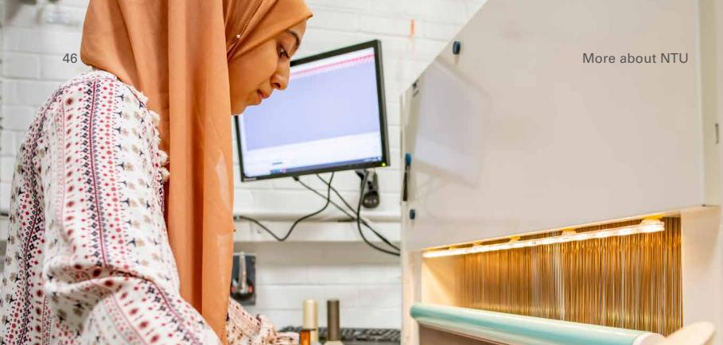

> **AI Description:**
> **Source:** `assets/_page_47_Figure_0.jpg`
> 
> **Generated:** 2026-05-18 12:07:35
> 
> ---
> 
> The image contains a photograph of a person in a laboratory setting. The individual is wearing a hijab and a patterned outfit, and appears to be observing or working with a piece of equipment that has a lighted compartment. The equipment is likely used for scientific research or analysis. The background includes a computer monitor and some laboratory equipment, indicating a research or educational environment. The text "More about NTU" is visible in the top right corner, suggesting a connection to Nanyang Technological University.

# Nottingham School of Art & Design City Campus

We’ve been teaching art and design since 1843. Today, we’re one of the UK’s most established, well-known and respected creative universities.

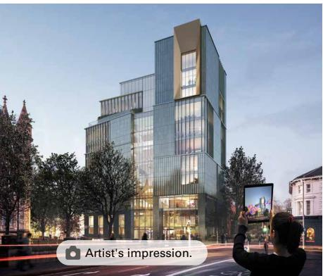

> **AI Description:**
> **Source:** `assets/_page_47_Figure_1.jpg`
> 
> **Generated:** 2026-05-18 12:07:42
> 
> ---
> 
> The image contains an artist's impression of a modern building with a glass facade and a distinctive angular design. The building is situated in an urban environment, with trees and other buildings visible in the background. The image is accompanied by the text "Artist's impression." which indicates that this is a conceptual rendering of the building rather than a photograph. The image is likely used for architectural or urban planning purposes to visualize the proposed design.

> **AI Description:**
> **Source:** `assets/_page_47_Figure_2.jpg`
> 
> **Generated:** 2026-05-18 12:09:39
> 
> ---
> 
> The image contains a simple icon of a trophy with a star in the center. The icon is outlined in pink and has a white fill. It is a single, flat design with no additional text or elements. The icon is likely used to represent achievement or victory.

Among the top 10% of art and design providers in the QS World University Rankings.

Launching in 2024, the new Design and Digital Arts building on City Campus.

Visit ntu.ac.uk/art for more on this subject area.

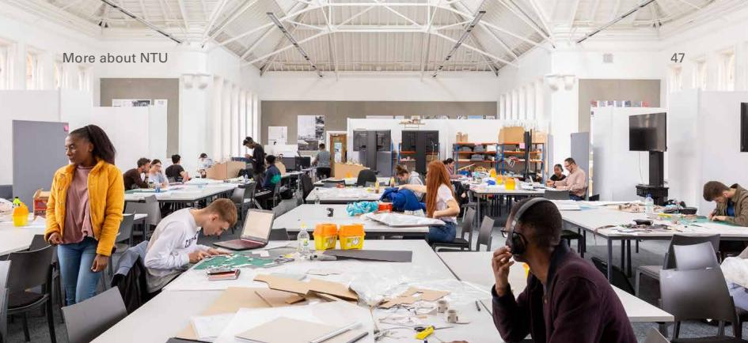

> **AI Description:**
> **Source:** `assets/_page_48_Figure_0.jpg`
> 
> **Generated:** 2026-05-18 12:17:30
> 
> ---
> 
> The image depicts a busy workshop or classroom environment, likely at Nottingham Trent University (NTU), as indicated by the text in the top left corner. The space is filled with students and staff engaged in various activities, working at individual tables. The tables are cluttered with materials such as papers, tools, and equipment, suggesting a hands-on learning or project-based setting. The room has a high ceiling with exposed beams and large windows, allowing natural light to fill the space. The overall atmosphere appears to be collaborative and focused on creative or technical work.

# School of Architecture, Design and the Built Environment

## City Campus

Our industry-focused courses combine theory, expert insight and experience.

Professional accreditations:

RIBA海

The Institution of StructuraEngineers

cabe

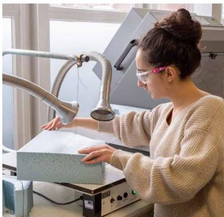

> **AI Description:**
> **Source:** `assets/_page_48_Figure_12.jpg`
> 
> **Generated:** 2026-05-18 12:10:38
> 
> ---
> 
> The image contains a photograph of a person working with a piece of equipment. The individual is wearing safety goggles and appears to be handling a rectangular object, possibly a sample or a piece of material, on a workbench. The equipment includes a lamp and a vacuum or exhaust system, suggesting a laboratory or workshop setting. The person is focused on the task at hand, indicating a process that requires precision and care.

Visit ntu.ac.uk/adbe for more on this subject area.

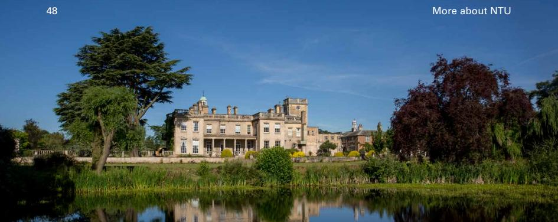

> **AI Description:**
> **Source:** `assets/_page_49_Figure_0.jpg`
> 
> **Generated:** 2026-05-18 12:18:22
> 
> ---
> 
> The image is a photograph of a grand, historic building, possibly a mansion or estate, situated by a calm body of water. The building features multiple stories with a symmetrical design, featuring numerous windows and a central tower. The surrounding area is lush with greenery, including large trees and manicured lawns, reflecting the building and trees in the water. The sky is clear and blue, indicating a sunny day. The image includes text in the top left corner that reads "48" and in the top right corner that says "More about NTU," suggesting this image might be part of a presentation or document related to Nottingham Trent University.

# School of Animal, Rural and Environmental Sciences

## Brackenhurst Campus

We empower our staff and students to have a positive impact on our planet, through improving the health and wellbeing of environments, animals, plants and people.

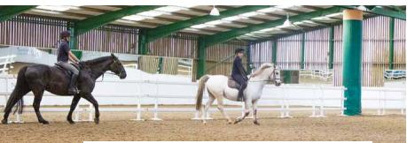

> **AI Description:**
> **Source:** `assets/_page_49_Figure_2.jpg`
> 
> **Generated:** 2026-05-18 12:18:11
> 
> ---
> 
> The image is a photograph of two individuals riding horses in an indoor arena. The arena has a white fence and green structural supports. The rider on the left is on a dark-colored horse, while the rider on the right is on a light-colored horse. Both riders are wearing helmets and appear to be engaged in a riding lesson or practice session. The setting suggests an equestrian training environment.

Our Equestrian Centre has extensive and unique facilities, including indoor and outdoor riding and research arenas.

> **AI Description:**
> **Source:** `assets/_page_49_Figure_3.jpg`
> 
> **Generated:** 2026-05-18 12:18:04
> 
> ---
> 
> The image contains a simple icon of a trophy with a star on top. The trophy is depicted in a stylized manner, with a cup-like shape and a handle. The star is placed at the top of the trophy, indicating a first-place or winner's award. The icon is colored in a gradient of pink shades, giving it a vibrant and eye-catching appearance.

Top 20 in the UK for Food Science in the Times Good University Guide 2023.

One of the leading centres in the UK for animal and environmental sciences.

Visit ntu.ac.uk/ares for more on this subject area.

> **AI Description:**
> **Source:** `assets/_page_50_Figure_0.jpg`
> 
> **Generated:** 2026-05-18 12:24:00
> 
> ---
> 
> The image shows a person operating a video editing or broadcasting control panel. The setup includes multiple monitors displaying video feeds and control interfaces. The person is using a large, multi-button control panel with illuminated buttons, likely for adjusting video settings and managing multiple camera feeds. The monitors show different video streams, suggesting a multi-camera setup for live broadcasting or video editing. The text "More about NTU" appears in the top left corner, indicating a possible connection to a university or educational institution. The image is primarily focused on the technical equipment and the operator's interaction with it.

## School of Arts and Humanities

## Clifton and City Campuses

We can offer you dynamic courses, expert teaching, international opportunities and hands-on workplace training on all of our courses.

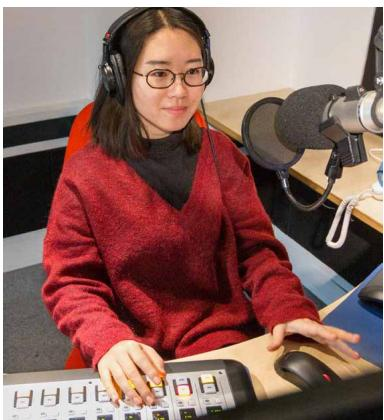

> **AI Description:**
> **Source:** `assets/_page_50_Figure_2.jpg`
> 
> **Generated:** 2026-05-18 12:24:58
> 
> ---
> 
> The image contains a photograph of a person sitting at a radio or podcast recording setup. The individual is wearing a red sweater and headphones, and is positioned in front of a microphone and a control panel with various buttons and knobs. The setting suggests a professional recording environment, likely for audio production or broadcasting.

> **AI Description:**
> **Source:** `assets/_page_50_Figure_3.jpg`
> 
> **Generated:** 2026-05-18 12:26:50
> 
> ---
> 
> The image contains a simple icon of a trophy with a star on top. The trophy is pink and has a single star at the apex. There are no charts, graphs, or other visual elements present in the image. The icon is a single, static image with no additional text or annotations.

Top 10 in the UK for Creative Writing in the Times Good University Guide 2023.

Our journalism courses are highly   
regarded within the profession. With our industry-standard   
facilities and resources on offer,   
it's as close to the real thing as you can get.

Visit ntu.ac.uk/hum for more on this subject area.

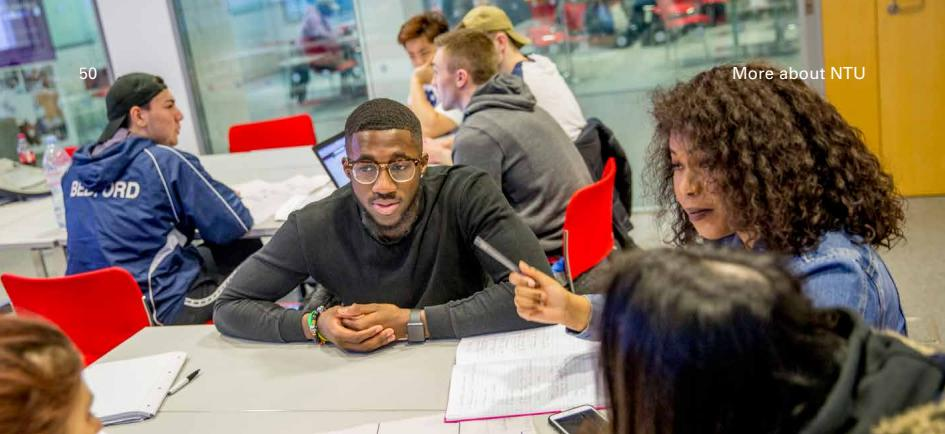

> **AI Description:**
> **Source:** `assets/_page_51_Figure_0.jpg`
> 
> **Generated:** 2026-05-18 12:18:37
> 
> ---
> 
> The image is a photograph showing a group of students in a classroom or study area. The students are seated around a table with papers, notebooks, and a laptop, suggesting they are engaged in a collaborative learning activity or discussion. The text "50" is visible in the top left corner, and "More about NTU" is in the top right corner, indicating the image might be part of a presentation or promotional material related to Nottingham Trent University (NTU). The setting appears to be a modern educational environment with large windows and a view of outdoor machinery or equipment.

## Nottingham Business School

## City Campus

NBS has an unrivalled level of engagement with business, public and voluntary organisations. Our students benefit from an education which combines academic excellence with world leading experiential learning.

## Professional accreditations:

> **AI Description:**
> **Source:** `assets/_page_51_Figure_13.jpg`
> 
> **Generated:** 2026-05-18 12:15:41
> 
> ---
> 
> The image contains a simple icon of a pink ribbon with a checkmark inside it. This icon is commonly used to represent approval, success, or completion. There are no charts, graphs, or other visual elements present in the image.

> **AI Description:**
> **Source:** `assets/_page_51_Figure_14.jpg`
> 
> **Generated:** 2026-05-18 12:16:19
> 
> ---
> 
> The image is a simple diagram featuring a stylized human figure walking upwards on a staircase. The figure is depicted in a pink color, and the staircase is represented by a series of steps leading upwards. There are no labels or text annotations within the image. The diagram appears to symbolize progress or advancement.

Dedicated approach to personalised and experiential learning.

Visit ntu.ac.uk/nbs for more on this subject area.

> **AI Description:**
> **Source:** `assets/_page_52_Figure_0.jpg`
> 
> **Generated:** 2026-05-18 12:08:13
> 
> ---
> 
> The image contains a photograph of two individuals in a library setting. The person on the left is wearing glasses and a white shirt, while the person on the right has dark hair and a beard, wearing a brown jacket over a white shirt. They are both smiling and appear to be engaged in a conversation or study session. The background features shelves filled with red books, indicating a library environment. The text "More about NTU" is visible in the top left corner, suggesting the image is related to Nottingham Trent University (NTU).

## Nottingham Law School

## City Campus

We have an outstanding and long-established reputation for delivering excellent legal education. It’s been built through close relationships with the legal and other professions, our strength in legal research, and our excellent facilities.

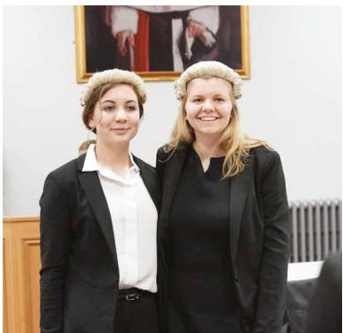

> **AI Description:**
> **Source:** `assets/_page_52_Figure_2.jpg`
> 
> **Generated:** 2026-05-18 12:09:09
> 
> ---
> 
> The image contains a photograph of two individuals standing side by side. Both are wearing formal attire, including black suits and white shirts. The person on the left is wearing a white wig, while the person on the right is wearing a black wig. In the background, there is a framed picture of a person in a white wig, which appears to be a portrait. The setting suggests a formal or professional environment, possibly related to law or judiciary.

Many of our staff are experienced lawyers, and some are still in practice.

Our award-winning Legal Advice Centre gives our students the chance to work with qualified solicitors on real-life cases with members of the public.

Visit ntu.ac.uk/law for more on this subject area.

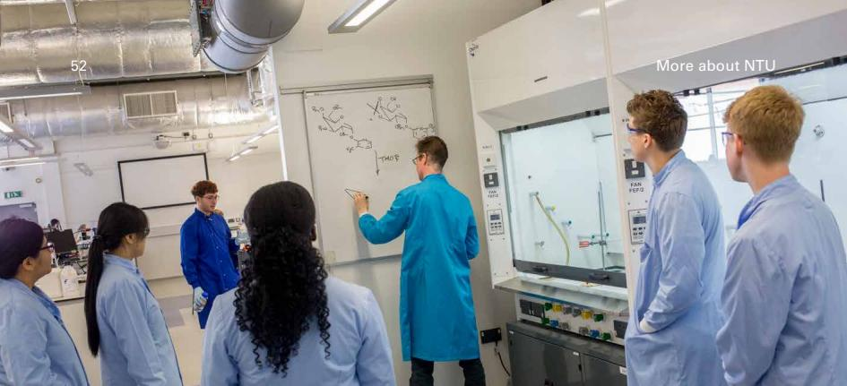

> **AI Description:**
> **Source:** `assets/_page_53_Figure_0.jpg`
> 
> **Generated:** 2026-05-18 12:11:25
> 
> ---
> 
> The image shows a group of individuals in a laboratory setting, with one person in a blue lab coat writing on a whiteboard. The whiteboard contains a chemical diagram and text, including "TMG" and "TMO". The individuals are wearing blue lab coats, and the laboratory is equipped with various scientific instruments and safety equipment. The text "More about NTU" is visible in the top right corner, indicating a possible affiliation with Nanyang Technological University. The image captures a moment of teaching or discussion in a scientific environment.

## School of Science and Technology O Clifton Campus

We’re one of the UK’s most pioneering science and technology schools. We teach our courses in an inspiring environment, which is innovative in its design and relevant to industry.

Professional accreditations:

RSCI Adeanicingthe Chemical Sciences

IOP Institute of Physics

One of the best teaching and research laboratories in the UK.

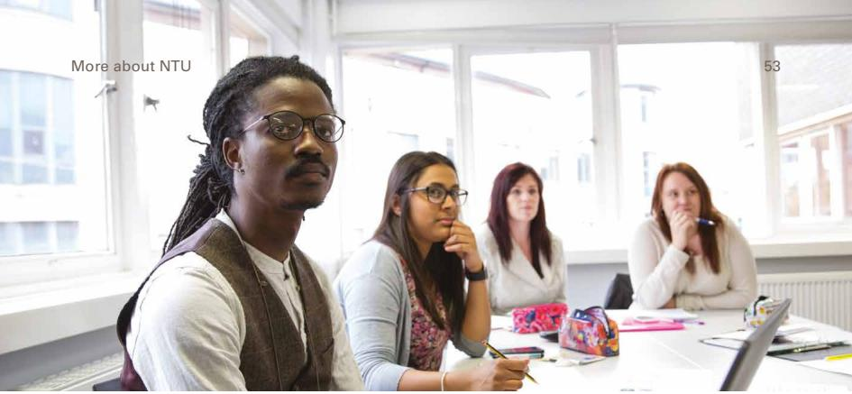

> **AI Description:**
> **Source:** `assets/_page_54_Figure_0.jpg`
> 
> **Generated:** 2026-05-18 12:11:10
> 
> ---
> 
> The image contains a photograph of four individuals sitting at a table in what appears to be a classroom or meeting room setting. The individuals are engaged in a discussion or presentation. The room has large windows allowing natural light to enter. The text "More about NTU" is visible in the top left corner, and the number "53" is in the top right corner. The individuals are dressed in casual to semi-formal attire, and there are notebooks, pens, and other items on the table in front of them.

## School of Social Sciences, including Nottingham Institute of Education

## City and Clifton Campus

We're characterised by our diversity and dynamism; the scope and standards of our courses; our globally acclaimed research; and our reputation for delivering well-trained, highly skilled graduates into key frontline services like social work, policing, nursing, and teaching.

> **AI Description:**
> **Source:** `assets/_page_54_Figure_2.jpg`
> 
> **Generated:** 2026-05-18 12:13:38
> 
> ---
> 
> The image contains a simple diagram with a pink icon representing a group of people. The icon is a stylized representation of a person with their arms raised, possibly indicating a presentation or a group activity. The icon is surrounded by four smaller icons of people, suggesting a team or a group. There are no labels or text annotations within the image.

Courses designed with professionals, and with public organisations.

We have a large psychology department with over 150 academics, and some of our courses are accredited by the British Psychological Society (BPS).

Visit ntu.ac.uk/soc for more on this subject area.

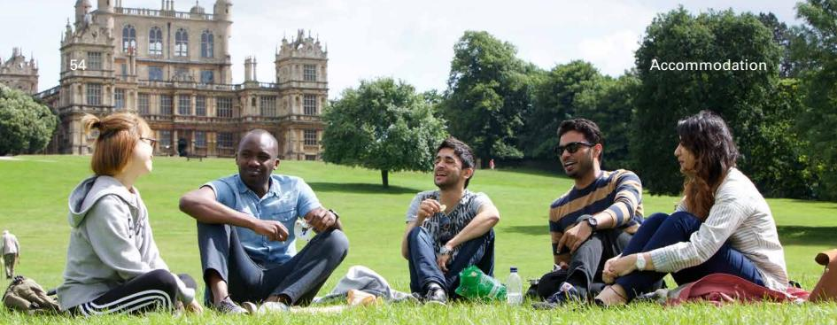

> **AI Description:**
> **Source:** `assets/_page_55_Figure_0.jpg`
> 
> **Generated:** 2026-05-18 12:08:25
> 
> ---
> 
> The image is a photograph showing a group of five individuals sitting on the grass in a park-like setting. They appear to be engaged in a casual conversation. In the background, there is a large, historic-looking building with multiple windows and architectural details, suggesting it might be a university or similar institution. The text "Accommodation" is visible in the top right corner, indicating that the image might be related to housing options. The number "54" is also present in the top left corner, which could be a page number or reference number. The overall scene conveys a relaxed and social atmosphere.

# Your home away from home

Being happy where you’re living is such an important part of your student experience. That’s why we have a fantastic choice of accommodation available for you, and it’s really important to start your research early.

We offer a huge range of both University and private accommodation to suit every budget. All our accommodation is high quality, modern, and meets high safety standards. And it is located in convenient locations on – or close to – campus.

We can offer flexible accommodation contracts, perfect if you’re a Pre-sessional English (PEAP) student or if you’re starting a Masters in January.

Staying in NTU accommodation, you can count on:

> **AI Description:**
> **Source:** `assets/_page_55_Figure_2.jpg`
> 
> **Generated:** 2026-05-18 12:09:00
> 
> ---
> 
> The image contains a single icon of a shield with a lock inside it. The shield is pink, and the lock is white. This icon is commonly used to represent security, privacy, or protection.

Safety and security

> **AI Description:**
> **Source:** `assets/_page_55_Figure_3.jpg`
> 
> **Generated:** 2026-05-18 12:10:28
> 
> ---
> 
> The image contains a simple icon of a sink with a faucet and a showerhead, indicating a bathroom fixture. The icon is red and is likely used to represent a sink or a bathroom in a user interface or infographic.

A choice of en suite or shared facilities

Great locations on or close to campus

> **AI Description:**
> **Source:** `assets/_page_55_Figure_5.jpg`
> 
> **Generated:** 2026-05-18 12:14:14
> 
> ---
> 
> The image contains a simple icon of a house with a Wi-Fi symbol inside it. This icon is commonly used to represent smart home technology or internet connectivity within a home environment. The icon does not provide specific data or trends but is a visual representation of a concept related to home automation or wireless network access in a residential setting.

Free Wi-Fi, and your utility bills included in your rent

> **AI Description:**
> **Source:** `assets/_page_55_Figure_6.jpg`
> 
> **Generated:** 2026-05-18 12:12:37
> 
> ---
> 
> The image contains a simple icon of two human figures with speech bubbles above their heads, indicating communication or dialogue. The icon is stylized and uses a pink color. There are no charts, graphs, or other visual elements present in the image. The icon is likely used to represent a concept of interaction or conversation in a digital or graphic design context.

Easy access to all our support services

Visit ntu.ac.uk/accommodation to start your research.

While deciding what sort of accommodation you want, you may want to consider:

sharing an apartment or a house with other students;

• having an en-suite bathroom or shared facilities;

• the cost, and whether utility bills (such as electricity and gas) are included;

the length of the contract (university contracts include the Christmas and Easter holidays).

> **AI Description:**
> **Source:** `assets/_page_56_Figure_0.jpg`
> 
> **Generated:** 2026-05-18 12:18:58
> 
> ---
> 
> The image is a photograph of a person with shoulder-length orange hair, smiling. The person is wearing a light pink V-neck shirt and a light gray zip-up jacket over it. They are also wearing blue jeans and carrying a black shoulder bag. The background appears to be an outdoor setting with a blurred figure in the distance. The number "55" is visible in the top right corner of the image.

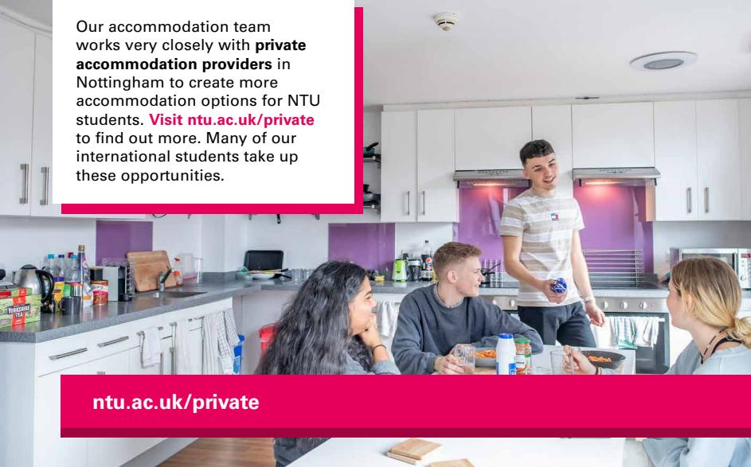

> **AI Description:**
> **Source:** `assets/_page_56_Figure_1.jpg`
> 
> **Generated:** 2026-05-18 12:20:13
> 
> ---
> 
> The image contains a photograph of a group of four people in a kitchen setting, engaging in conversation. The kitchen has white cabinets, a purple backsplash, and various kitchen appliances and items on the countertops. The text overlay provides information about NTU's accommodation team collaborating with private providers in Nottingham to offer more accommodation options for students. It includes a website link for more information.

# Start house-hunting online

Our accommodation books up fast so it’s important to start looking early and to reserve as soon as our booking system opens.

Our website is a great place to start your research – find out more about the locations and what’s included in the cost. Our accommodation team are experienced in helping international students so please contact them if you need help.

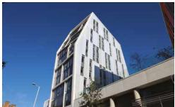

> **AI Description:**
> **Source:** `assets/_page_57_Figure_0.jpg`
> 
> **Generated:** 2026-05-18 12:23:49
> 
> ---
> 
> The image is a photograph of a modern building with a unique architectural design. The building features a white facade with large windows and a triangular roof. The structure appears to be multi-storied, with a mix of geometric shapes and angles. The sky is clear and blue, indicating a sunny day. There are some trees and a streetlight visible in the foreground, suggesting an urban setting.

Byron residence City Campus

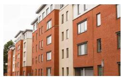

> **AI Description:**
> **Source:** `assets/_page_57_Figure_1.jpg`
> 
> **Generated:** 2026-05-18 12:23:42
> 
> ---
> 
> The image depicts a row of residential buildings. The buildings are multi-story with a modern architectural design. The facades are primarily composed of red brick, with some sections featuring lighter-colored panels. The buildings have a mix of windows, some of which are rectangular and others appear to be larger, possibly for balconies or larger windows. The overall appearance suggests a contemporary urban or suburban residential area.

O Gill Street North City Campus

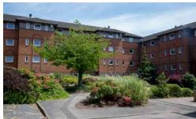

> **AI Description:**
> **Source:** `assets/_page_57_Figure_2.jpg`
> 
> **Generated:** 2026-05-18 12:25:10
> 
> ---
> 
> The image is a photograph of a residential complex. It shows a brick building with multiple stories and windows, surrounded by a landscaped area with trees and shrubs. The foreground includes a paved area, possibly a driveway or parking space. The overall scene suggests a calm and orderly neighborhood setting.

Meridian court City Campus

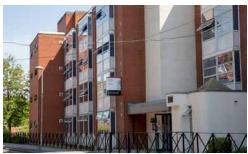

> **AI Description:**
> **Source:** `assets/_page_57_Figure_3.jpg`
> 
> **Generated:** 2026-05-18 12:26:10
> 
> ---
> 
> The image shows a photograph of a building with multiple floors. The building appears to be residential or possibly an apartment complex, with windows visible on each floor. There is a sign on the building, but the text is not clearly legible. The building is surrounded by greenery, indicating it is located in an area with some vegetation. The entrance to the building is visible, with a door and a small area in front of it.

Sandby City Campus

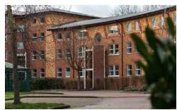

> **AI Description:**
> **Source:** `assets/_page_57_Figure_4.jpg`
> 
> **Generated:** 2026-05-18 12:21:03
> 
> ---
> 
> The image is a photograph of a brick building with multiple windows and a central entrance. The building appears to be a residential or institutional structure, possibly an apartment complex or a dormitory. The surrounding area includes a paved pathway and some greenery, indicating a maintained outdoor space. The architecture suggests a utilitarian design, typical of mid-20th century construction.

Peverell Clifton Campus

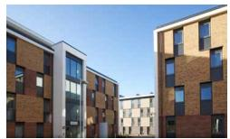

> **AI Description:**
> **Source:** `assets/_page_57_Figure_5.jpg`
> 
> **Generated:** 2026-05-18 12:22:06
> 
> ---
> 
> The image is a photograph of a modern residential building complex. The buildings feature a mix of brick and glass facades, with multiple windows and balconies. The architecture suggests a contemporary design, with a clear sky in the background indicating a sunny day. The image captures the exterior of the buildings, showcasing their structure and design.

New Hall Clifton Campus

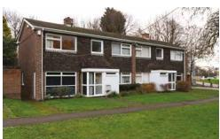

> **AI Description:**
> **Source:** `assets/_page_57_Figure_6.jpg`
> 
> **Generated:** 2026-05-18 12:19:29
> 
> ---
> 
> The image shows a two-story residential house with a sloped roof and a front porch. The house has a brick exterior and multiple windows. The surrounding area includes a grassy lawn and trees, indicating a suburban setting. There are no charts, diagrams, or text annotations present in the image.

。 College Drive Clifton Campus

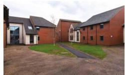

> **AI Description:**
> **Source:** `assets/_page_57_Figure_7.jpg`
> 
> **Generated:** 2026-05-18 12:19:13
> 
> ---
> 
> The image shows a photograph of a residential area with several brick houses. The houses are arranged in a row, and there is a paved pathway leading to the entrance of one of the houses. The area is surrounded by a grassy lawn, and there are no visible charts, graphs, or technical illustrations. The image primarily depicts a real estate setting.

Brackenhurst Brackenhurst Campus

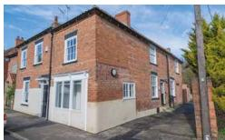

> **AI Description:**
> **Source:** `assets/_page_57_Figure_8.jpg`
> 
> **Generated:** 2026-05-18 12:11:15
> 
> ---
> 
> The image is a photograph of a two-story brick house with a white front door and a small porch. The house has a chimney on the right side and a window on the left side. The surrounding area includes a paved driveway and some trees.

Bramley Cottages Brackenhurst Campus

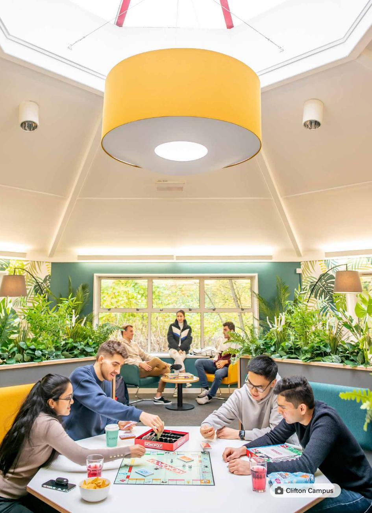

> **AI Description:**
> **Source:** `assets/_page_58_Figure_0.jpg`
> 
> **Generated:** 2026-05-18 12:16:59
> 
> ---
> 
> The image is a photograph of a group of people gathered in a modern, well-lit room with a high ceiling and large windows. The room is decorated with green plants and has a cozy, inviting atmosphere. The people are engaged in playing a board game, specifically Monopoly, as evidenced by the game board and pieces visible on the table. The room has a casual and social setting, with additional seating and a relaxed environment. The text "Clifton Campus" is visible in the bottom right corner, indicating the location or affiliation of the image.

# Explore Nottingham

Nottingham’s a great city to be a student. There are over 70,000 students living here from all over the world. Over 39,000 of these are studying at NTU!

Students are attracted to Nottingham for a variety of reasons. The cost of living is very reasonable and it's a friendly, welcoming, and diverse student city.

Another great feature of Nottingham is that everything’s really close. Unlike in bigger cities like London, for example, you can easily walk from NTU’s City Campus to the shops and attractions in just a few minutes. And the regular buses and trams mean you can quickly reach other parts of Nottingham too.

Visit ntu.ac.uk/nottingham to find out more.

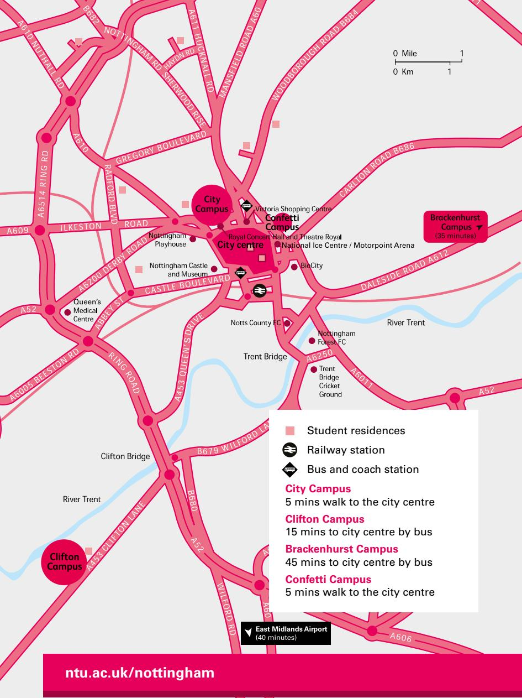

> **AI Description:**
> **Source:** `assets/_page_60_Figure_0.jpg`
> 
> **Generated:** 2026-05-18 12:21:49
> 
> ---
> 
> The image is a map of Nottingham, England, highlighting the locations of various campuses and key landmarks. It includes the City Campus, Clifton Campus, Confetti Campus, and Brackenhurst Campus, with distances to the city centre indicated. The map also shows the location of the City centre, Victoria Shopping Centre, Royal Concert Hall and Theatre Royal, National Ice Centre/Motorpoint Arena, and Nottingham Castle and Museum. The River Trent is marked, and the map includes a legend explaining symbols for student residences, railway stations, bus and coach stations, and the distance to the city centre for each campus. The map also notes the location of East Midlands Airport and provides a scale for distance.

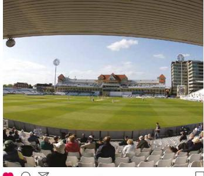

> **AI Description:**
> **Source:** `assets/_page_61_Figure_0.jpg`
> 
> **Generated:** 2026-05-18 12:24:44
> 
> ---
> 
> The image is a photograph of a cricket stadium. It shows a wide view of the field, with the stands in the foreground and a crowd of spectators seated. The field is well-maintained with green grass, and the stadium has a modern design with a curved roof structure. In the background, there are tall buildings and a few structures that appear to be part of the stadium complex. The sky is partly cloudy, suggesting it might be a pleasant day for a cricket match.

What a day! #trentbridge #ntuinternational

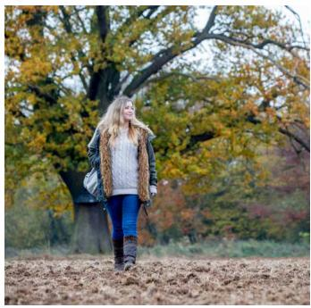

> **AI Description:**
> **Source:** `assets/_page_61_Figure_1.jpg`
> 
> **Generated:** 2026-05-18 12:26:56
> 
> ---
> 
> The image is a photograph of a person walking outdoors in a natural setting. The individual is dressed in a fur-lined jacket, a white knitted sweater, blue jeans, and boots, suggesting a cool or cold weather setting. The background features autumnal trees with yellow and orange leaves, indicating the season. The ground appears to be a plowed field or garden bed, with soil visible. The overall scene conveys a serene, rural atmosphere.

Free time in the fresh air. #Nottingham

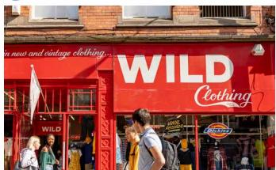

> **AI Description:**
> **Source:** `assets/_page_61_Figure_2.jpg`
> 
> **Generated:** 2026-05-18 12:24:06
> 
> ---
> 
> The image contains a photograph of a storefront with the word "WILD" prominently displayed in large white letters on a red background. Below the main text, the word "Clothing" is written in a smaller cursive font. The storefront appears to be a clothing store, as indicated by the text and the visible clothing items and accessories displayed outside. The image also shows a few people standing in front of the store, suggesting it is open and in operation. The overall design is simple and eye-catching, with the red and white color scheme drawing attention to the store's name and purpose.

## Home to sport

Whatever sport you’re interested in, as a participant or a spectator, you’ll find it here. We’re home to world-famous sporting venues, such as the Trent Bridge cricket ground and Premier League football at City Ground home of Nottingham Forest.

## A breath of fresh air

Over 20% of Nottingham city is devoted to green spaces, such as public parks and gardens. You can easily go for a relaxing walk or cycle. You’ll also have easy access to beautiful green countryside – the world-famous Peak District, for example, or the iconic Wollaton Hall Park.

## Shopping heaven

If you like shopping, you’ll love Nottingham! It’s a big city shopping experience in a compact city centre. From Primark and Zara, to Urban Outfitters and Dr Martens, you’ll find high street brands for every budget.

We’ve got iconic labels, too – Vivienne Westwood, Paul Smith and Diesel all have homes here, and our students love the independent vintage and charity shops in the Creative Quarter.

Visit ntu.ac.uk/nottingham to find out more.

## Arts, culture and heritage

Whether you’re into art galleries, music, cinema or theatre you’ll find it all in Nottingham, home to the legendary Robin Hood.

New tastes

Worried about not liking British food? No problem! There’s a great range of international food stores here in Nottingham – you can become an expert cook in no time. There are also a lot of supermarkets, restaurants, and tea and coffee shops. You’ll be surprised, ‘British’ food is a mix of food from all over the world, and it’s pretty good!

nottinghamtrentuni
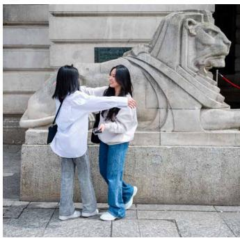

> **AI Description:**
> **Source:** `assets/_page_62_Figure_1.jpg`
> 
> **Generated:** 2026-05-18 12:12:55
> 
> ---
> 
> The image is a photograph showing two individuals standing in front of a large stone sphinx. The sphinx appears to be part of a historical or architectural structure, possibly a museum or government building. The individuals are dressed casually, with one wearing a white shirt and jeans, and the other in a light-colored jacket and jeans. They are positioned close to each other, with their arms around each other, suggesting a friendly or intimate interaction. The background includes a stone wall and a section of red rope barrier, indicating that the sphinx is a point of interest or a restricted area.

Meet you by the lions! #marketsquare #showusyourNTU

> **AI Description:**
> **Source:** `assets/_page_62_Figure_2.jpg`
> 
> **Generated:** 2026-05-18 12:10:29
> 
> ---
> 
> Error analyzing image: model runner has unexpectedly stopped, this may be due to resource limitations or an internal error, check ollama server logs for details (status code: 500)

## ntu.ac.uk/nottingham

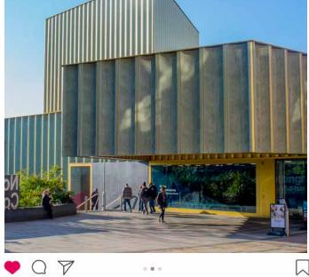

> **AI Description:**
> **Source:** `assets/_page_62_Figure_3.jpg`
> 
> **Generated:** 2026-05-18 12:12:43
> 
> ---
> 
> The image shows a modern building with a distinctive architectural design. The structure features a combination of vertical and horizontal lines, with a prominent use of metal panels. The building has a large glass entrance area, and there are several people walking in front of it. The sky is clear and blue, indicating a sunny day. The image also includes a small section of text on the left side of the building, but it is not fully legible.

ntuinternational
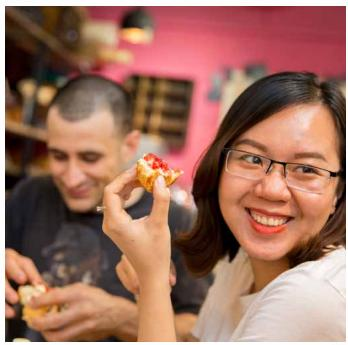

> **AI Description:**
> **Source:** `assets/_page_62_Figure_5.jpg`
> 
> **Generated:** 2026-05-18 12:08:31
> 
> ---
> 
> The image is a photograph of two individuals enjoying food. The person on the right is holding a piece of food with a red topping, possibly a dessert or pastry, and is smiling at the camera. The person on the left is also smiling and appears to be eating a similar type of food. The background is slightly blurred, showing shelves and a pink wall, suggesting the setting might be a café or a small restaurant. The image conveys a casual and happy dining experience.

Café culture #afternoontea #showusyourNTU

> **AI Description:**
> **Source:** `assets/_page_62_Figure_6.jpg`
> 
> **Generated:** 2026-05-18 12:10:28
> 
> ---
> 
> Error analyzing image: model runner has unexpectedly stopped, this may be due to resource limitations or an internal error, check ollama server logs for details (status code: 500)

## nottinghamtrentuni

> **AI Description:**
> **Source:** `assets/_page_62_Figure_8.jpg`
> 
> **Generated:** 2026-05-18 12:24:21
> 
> ---
> 
> The image contains a photograph of a group of six individuals standing in front of a statue. The statue appears to depict a historical figure holding a bow and arrow. The group consists of four women and two men, all dressed in casual attire. The background features a stone wall, suggesting the location might be a historical site or a park. The individuals are smiling and seem to be posing for the photo, indicating a casual and friendly atmosphere.

## International Scholarships

We award many scholarships to international students who have offers to study at NTU. These are highly prestigious, competitive awards, worth up to half of your tuition fee. Our scholars have gone on to become strong and highly valued ambassadors for the University.

All scholarships available are listed on our website, with application advice and deadlines. If you're progressing from one of our partner universities, you may be eligible for a partner progression discount. You can still apply for a scholarship, but you won’t be awarded both – the higher amount would be deducted from your tuition fees.

“How did I feel when I won an NTU scholarship?

I was overwhelmed with joy and excitement.

This has opened new opportunities to finally achieve my dreams of becoming an engineer. And it has reduced some of the financial constraints significantly for my family and I.”

Tremaine Maskall, Belize

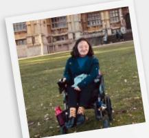

> **AI Description:**
> **Source:** `assets/_page_63_Figure_1.jpg`
> 
> **Generated:** 2026-05-18 12:09:55
> 
> ---
> 
> The image is a photograph of a person sitting in a wheelchair outdoors. The background shows a building with large windows and some greenery. The person appears to be in a grassy area, possibly a park or campus. The image captures a moment of the individual in a relaxed setting.

wen Shou-Yu

“My parents were very excited and surprised when they knew I got the scholarship. They said I was so lucky, and they appreciated NTU for providing me with the scholarship.”

Wen Shou-Yu, Taiwan

Visit ntu.ac.uk/internationalscholarships to find out more.

Last year we   
awarded   
1,092   
scholarships   
to students   
from   
65   
countries.

“We are all different. Writing about our dreams and accolades in a motivational letter is challenging. Do not be afraid to brag about your achievements, take pride in who you are and show just how big you can dream.”

Rumbidzai Davidzo Mudzamiri, Zimbabwe

“I felt satisfaction when I was awarded a scholarship and this was fundamental for me to take the decision to move here. It's not hard to apply, my main advice is to find your motivation and just apply.”

Nicolas Nieto, Colombia

# Benefits of an NTU scholarship

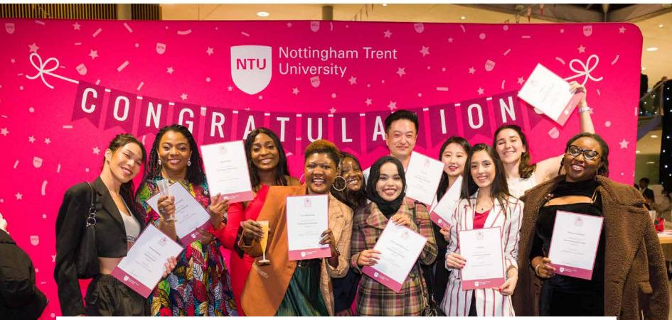

> **AI Description:**
> **Source:** `assets/_page_65_Figure_0.jpg`
> 
> **Generated:** 2026-05-18 12:14:09
> 
> ---
> 
> The image contains a group of people holding certificates in front of a large pink banner with the text "CONGRATULATIONS" and the logo of Nottingham Trent University. The banner also features decorative elements such as stars and gift icons. The people in the image appear to be celebrating an achievement, likely related to their graduation or an award ceremony at the university. The setting suggests a formal event with a celebratory atmosphere.

A scholarship brings many benefits, including:

a formal recognition of your achievements;

a reduction on your tuition fees;

access to a new friendly community for networking and socialising.

Students enjoying the NTU Scholarship Awards Celebration.

> **AI Description:**
> **Source:** `assets/_page_65_Figure_2.jpg`
> 
> **Generated:** 2026-05-18 12:10:54
> 
> ---
> 
> Error analyzing image: model runner has unexpectedly stopped, this may be due to resource limitations or an internal error, check ollama server logs for details (status code: 500)

ntu.ac.uk/internationalscholarships

## Application advice

You’ll need an offer to study at NTU in order to apply. Remember to:

be yourself – this is all about you;

spend good time on your application;

express your interests and your achievements;

believe in yourself – nobody thinks they are good enough until they apply.

> **AI Description:**
> **Source:** `assets/_page_66_Figure_4.jpg`
> 
> **Generated:** 2026-05-18 12:20:17
> 
> ---
> 
> The image is a photograph of two individuals standing on a balcony. The setting appears to be an indoor space with white columns and a decorative railing. The individuals are casually dressed, with one wearing a pink top and jeans, and the other in a yellow top and jeans. They are engaged in conversation, and the overall atmosphere suggests a relaxed and friendly interaction.

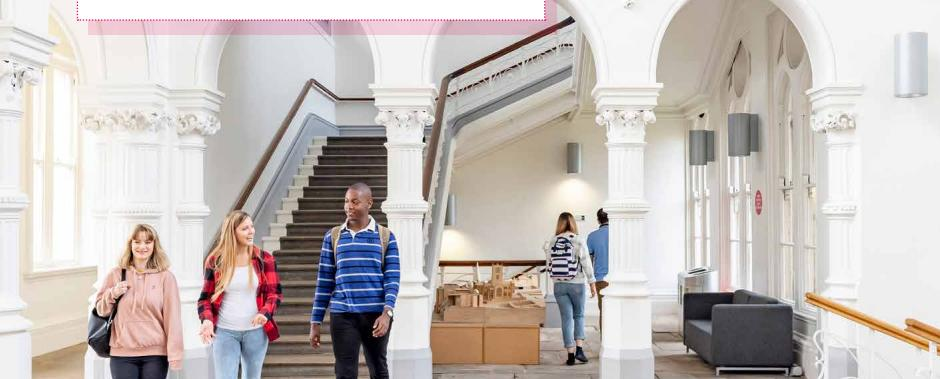

> **AI Description:**
> **Source:** `assets/_page_66_Figure_5.jpg`
> 
> **Generated:** 2026-05-18 12:18:50
> 
> ---
> 
> The image is a photograph of a group of students walking through an indoor space with classical architectural features. The setting appears to be a university or educational institution, as indicated by the presence of a staircase, columns, and a model of a building in the background. The students are casually dressed, suggesting a relaxed and informal atmosphere. The image captures a moment of everyday life within an academic environment.

“For me, a scholarship is more about the value of the education I get. A lot of people around the world do not have that chance.

I remember phoning my mum and dad – it was my father’s dream for me to study abroad – both were screaming: ‘Yeah! He got the scholarship!’ ”

Rezhyar Hamad Ameen, Iraq BA (Hons) History and International Relations

> **AI Description:**
> **Source:** `assets/_page_67_Figure_0.jpg`
> 
> **Generated:** 2026-05-18 12:22:20
> 
> ---
> 
> The image shows a person sitting at a desk in a modern office environment, working on a laptop. The individual is wearing a white long-sleeve top and denim overalls. The background is slightly blurred, featuring other individuals and office furniture, including cubicles and desks. The text "Scholarships and other money matters" is visible in the upper right corner of the image, suggesting the context of the image is related to financial aid or educational funding.

# Tuition fees and making payments

We publish our fees on our website – please check your course web page at ntu.ac.uk/courses or ntu.ac.uk/internationalfees for this information.

## International payments

NTU’s international bank transfer platform is Convera.

This service offers you and your family the opportunity to securely send transfers for paying your advanced payment (deposit) and your tuition/accommodation fees in your local currency.

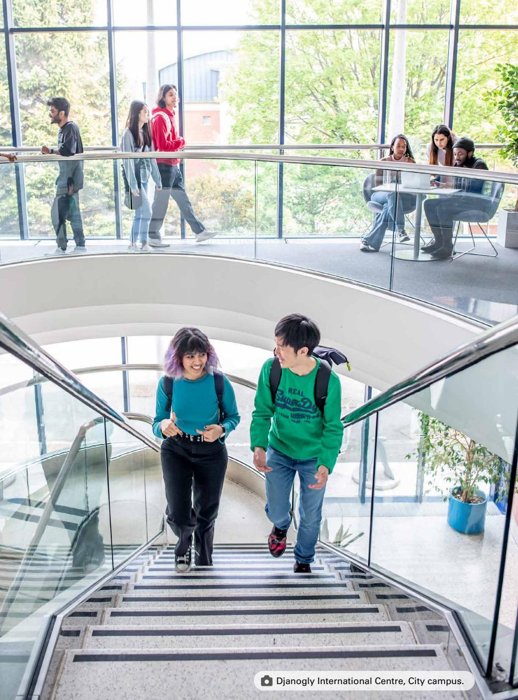

> **AI Description:**
> **Source:** `assets/_page_68_Figure_0.jpg`
> 
> **Generated:** 2026-05-18 12:15:13
> 
> ---
> 
> The image is a photograph of a modern indoor setting, likely a university or college campus. It features a spiral staircase with glass railings, and several individuals are present. Two students are walking up the stairs, one wearing a teal shirt and the other in a green sweatshirt. In the background, other students are seen walking on an upper level and sitting at a table. The setting is well-lit with natural light coming through large windows, and there are trees visible outside. The text at the bottom of the image identifies the location as the Djanogly International Centre, City campus.

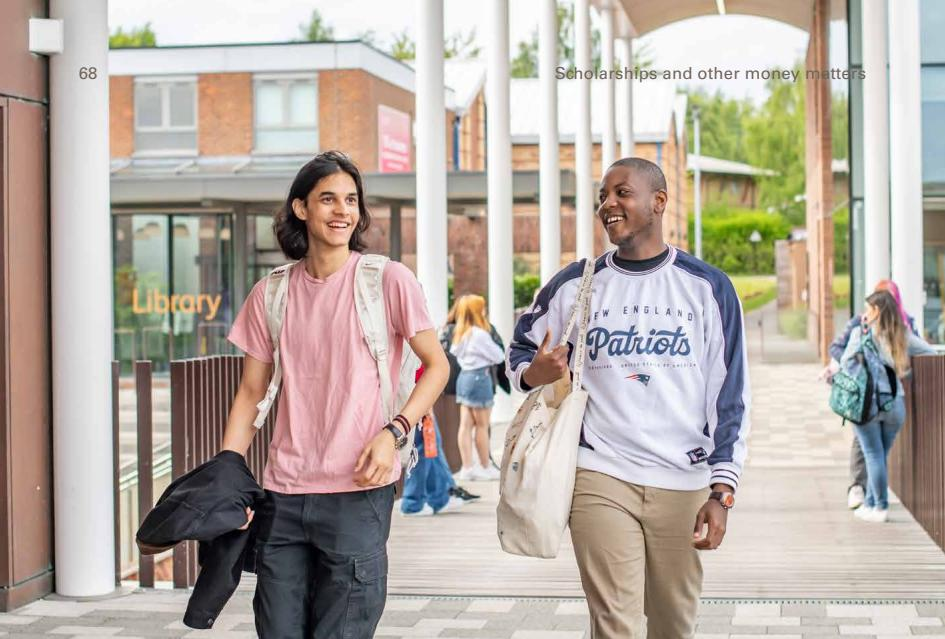

> **AI Description:**
> **Source:** `assets/_page_69_Figure_0.jpg`
> 
> **Generated:** 2026-05-18 12:16:16
> 
> ---
> 
> The image is a photograph showing two individuals walking on a campus pathway. One is wearing a pink t-shirt and carrying a backpack, while the other is in a New England Patriots sweatshirt and holding a bag. The background includes a building labeled "Library" and other students walking in the distance. The text "Scholarships and other money matters" is visible in the upper right corner, along with the number "68" in the upper left corner. The image appears to be related to a discussion about financial aid and student life.

Clifton campus, outside library and Pavilion.

## Student living costs

Living in Nottingham as a student is cheaper than in bigger UK cities, such as Manchester, Birmingham, or London. You may find that the cost of goods and services in the UK is quite different to your own country.

How much you spend of course depends on your own lifestyle, but here is an approximate guide to what you can expect to pay as a student at NTU.

If you plan to study at Confetti London visit confetti.ac.uk/london for advice on costs and accommodation.

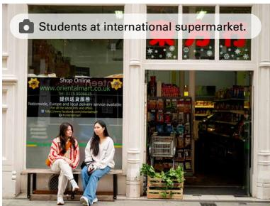

> **AI Description:**
> **Source:** `assets/_page_70_Figure_0.jpg`
> 
> **Generated:** 2026-05-18 12:13:18
> 
> ---
> 
> The image contains a photograph of two individuals sitting on a bench outside an international supermarket. The storefront has a sign with the URL "www.orientalmart.co.uk" and mentions online shopping and delivery services. The window displays a sign indicating "Students at international supermarket." The setting appears to be urban, and the individuals are casually dressed.

## Budgeting

There are many ways to save money while you’re here – using your student card for discounts in shops and on transport, for example.

Some of our international students choose to work part-time to get some extra income while gaining valuable experience.

Your daily, weekly and monthly costs will mostly be for your accommodation, food, entertainment and bills. It’s important to be prepared and to budget carefully – you’ll find more advice on our website.

## Approximate costs of studying in Nottingham per month:

Based on National Student Money Survey 2022

You will need to bring enough money to cover your living costs at least equivalent to the £1,023 per month required for visa application purposes (£1,334 for London Confetti campus).

> **AI Description:**
> **Source:** `assets/_page_70_Figure_1.jpg`
> 
> **Generated:** 2026-05-18 12:13:29
> 
> ---
> 
> The image is a photograph of two people sitting outside a café. The café has a window display with handwritten chalkboard menus listing items such as "Fried Egg & Chips," "Bread & Butter," and "Cappuccino." The people are seated at a small table with cups, suggesting they are enjoying a drink. The setting appears to be a sunny day, and the café has a cozy, inviting atmosphere.

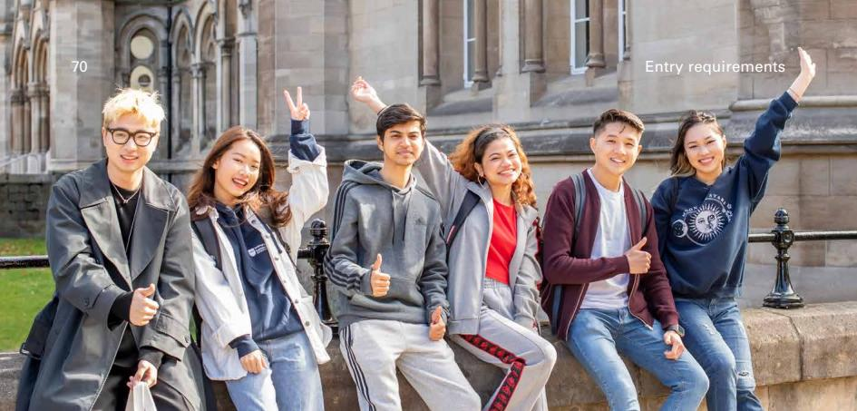

> **AI Description:**
> **Source:** `assets/_page_71_Figure_0.jpg`
> 
> **Generated:** 2026-05-18 12:10:25
> 
> ---
> 
> The image contains a photograph of a group of six individuals sitting on a stone ledge in front of a building with classical architecture. The individuals are smiling and appear to be posing for the photo. Some are making hand gestures, such as peace signs and thumbs-up. The text "Entry requirements" is visible in the upper right corner of the image, along with the number "70" in the upper left corner. The image is likely related to educational or institutional content, possibly indicating a page number and a section title.

## Entry requirements

We accept qualifications from all over the world. Visit our website for a guide on how your qualifications match our entry criteria.

We always recommend that you also check the entry requirements on the web page of the course you want to study. Some courses have additional requirements, such as a portfolio of work, or relevant experience.

## English language entry requirements

You’ll need to show that your language skills are strong enough for intensive academic study if English is not your first language.

Visit ntu.ac.uk/englishlanguage for your options; this includes a list of the English language tests we accept.

Our courses are popular and some may close early - make sure you apply as soon as you can!

## How to apply

Undergraduate courses (Bachelors – BSc, BA, LLB)

Undergraduate courses awarded at Masters level (MChem, MSci, MComp, MMath, MGeog, MBiol, MEng, MArch)

Postgraduate courses (Masters – MSc, MA, MRes, LLM)

PhDs and Research

Foundation and Pre-Masters courses

Confetti Institute of Creative Technologies courses

Apply through UCAS at ucas.com by June.

> **AI Description:**
> **Source:** `assets/_page_72_Figure_0.jpg`
> 
> **Generated:** 2026-05-18 12:20:39
> 
> ---
> 
> Error analyzing image: model runner has unexpectedly stopped, this may be due to resource limitations or an internal error, check ollama server logs for details (status code: 500)

Students from partner universities

If you’re only applying to NTU you can visit ntu.ac.uk/apply to apply online using the NTU Applicant Portal.

> **AI Description:**
> **Source:** `assets/_page_72_Figure_1.jpg`
> 
> **Generated:** 2026-05-18 12:22:27
> 
> ---
> 
> Error analyzing image: model runner has unexpectedly stopped, this may be due to resource limitations or an internal error, check ollama server logs for details (status code: 500)

Visit ntu.ac.uk/research to download an application form.

Visit ntu.ac.uk/apply to apply online using the NTU Applicant Portal.

Visit ntu.ac.uk/ntic to contact → Nottingham Trent International College directly.

> **AI Description:**
> **Source:** `assets/_page_72_Figure_2.jpg`
> 
> **Generated:** 2026-05-18 12:20:13
> 
> ---
> 
> Error analyzing image: model runner has unexpectedly stopped, this may be due to resource limitations or an internal error, check ollama server logs for details (status code: 500)

Pre-sessional English for Academic Purposes (PEAP)

Follow advice for NTU undergraduate and postgraduate courses.

> **AI Description:**
> **Source:** `assets/_page_72_Figure_3.jpg`
> 
> **Generated:** 2026-05-18 12:18:41
> 
> ---
> 
> Error analyzing image: model runner has unexpectedly stopped, this may be due to resource limitations or an internal error, check ollama server logs for details (status code: 500)

Applying for a Student visa

> **AI Description:**
> **Source:** `assets/_page_72_Figure_4.jpg`
> 
> **Generated:** 2026-05-18 12:24:12
> 
> ---
> 
> Error analyzing image: model runner has unexpectedly stopped, this may be due to resource limitations or an internal error, check ollama server logs for details (status code: 500)

Please get in touch at ntuglobal@ntu.ac.uk for the appropriate application process.

Visit ntu.ac.uk/apply to apply online using the NTU Applicant Portal.

NTU is a highly trusted sponsor with the UK Visas and Immigration Office 个 (UKVI). Visit ntu.ac.uk/visa for advice on making a successful application.

Visit ntu.ac.uk/myapplication for more advice.

# Keeping in contact with NTU International

There are lots of ways for you to get in touch with us and find out more about studying at NTU.

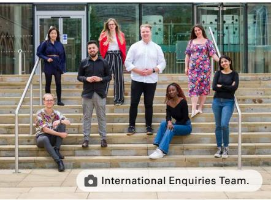

> **AI Description:**
> **Source:** `assets/_page_73_Figure_0.jpg`
> 
> **Generated:** 2026-05-18 12:26:18
> 
> ---
> 
> The image is a photograph of a group of eight individuals standing and sitting on a set of stairs in front of a modern building. The group appears to be a team, as indicated by the text overlay at the bottom of the image which reads "International Enquiries Team." The individuals are dressed in a mix of professional and casual attire, suggesting a diverse and collaborative team. The setting appears to be an institutional or corporate environment, possibly a university or a similar organization. The photograph is well-lit and the individuals are positioned to highlight their group identity.

## Sign up to receive messages

Visit ntu.ac.uk/messages to register your contact details.

A member of our international team will contact you to discuss your study options, and we'll keep in touch with regular news and updates.

## Get your questions answered

Our international enquiries team are highly experienced in answering questions from international students and their families. You can email them at international@ntu.ac.uk.

Visit ntu.ac.uk/questions to find answers to things we get asked a lot throughout the year. You can also live chat with the team on this page.

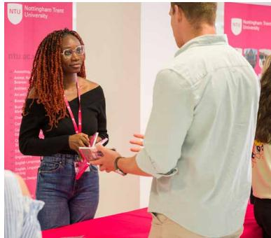

> **AI Description:**
> **Source:** `assets/_page_73_Figure_2.jpg`
> 
> **Generated:** 2026-05-18 12:23:37
> 
> ---
> 
> The image contains a photograph of a person at a university event, specifically at Nottingham Trent University. The individual is wearing a lanyard and appears to be interacting with another person, possibly a student or visitor. The background features a banner with the university's logo and name, along with some text related to the university's programs and courses. The setting suggests a promotional or informational event at the university.

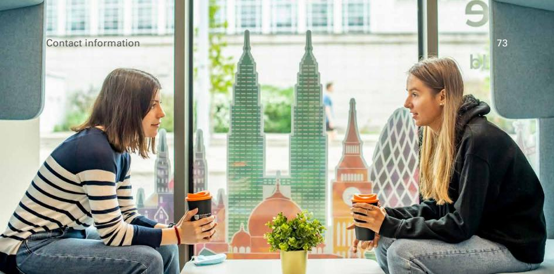

> **AI Description:**
> **Source:** `assets/_page_74_Figure_0.jpg`
> 
> **Generated:** 2026-05-18 12:25:54
> 
> ---
> 
> The image contains a photograph of two individuals sitting in a modern, well-lit space with large windows. They are holding coffee cups and appear to be engaged in conversation. The background features a decorative cityscape design with stylized buildings, adding a creative and urban aesthetic to the setting. The text "Contact information" is visible in the upper left corner, suggesting the image might be part of a brochure or informational material. The overall scene conveys a casual and professional atmosphere.

## ntuinternational

## Follow NTU

• Join live Q&A sessions with current students and staff.

• Post your questions.

• Meet offer holders and alumni from your country.

• Get the latest news.

• Make friends and become part of the NTU community.

## ntu.ac.uk/social

## Contact your NTU Country Advisor

They're the best people to talk to about coming to study here, from your country. You'll find yours at ntu.ac.uk/mycountry.

## Chat with students and staff on Unibuddy

Visit ntu.ac.uk/chat to chat online;   
a great way to find out more.

> **AI Description:**
> **Source:** `assets/_page_74_Figure_10.jpg`
> 
> **Generated:** 2026-05-18 12:22:32
> 
> ---
> 
> The image contains a simple icon of a pink telephone receiver. There is no text or additional visual content beyond this single icon.

## Get contacted by an international student

We often ask our current international students to call or live chat with applicants. It’s a great opportunity for you to ask more detailed questions, so remember to add your telephone number to your application.

International Development Office Tel: +44 (0)115 848 8175 Email: international@ntu.ac.uk

NTU Global (partner universities) Email: ntuglobal@ntu.ac.uk

Find out more at ntu.ac.uk/ international

Nottingham Trent University   
50 Shakespeare Street   
Nottingham   
NG1 4BU

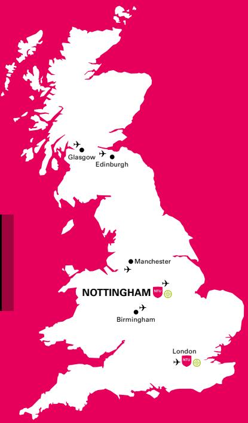

> **AI Description:**
> **Source:** `assets/_page_75_Figure_1.jpg`
> 
> **Generated:** 2026-05-18 12:22:27
> 
> ---
> 
> The image is a map of the United Kingdom with a pink background. It highlights several cities and includes symbols representing airports. The cities marked are Glasgow, Edinburgh, Manchester, Birmingham, and London. Nottingham is specifically labeled and marked with a symbol indicating it is a university city. The map uses a simple color scheme with white landmasses and pink background to distinguish the UK.

This information can be made available in alternative formats.

Please note that whilst the University has taken all reasonable steps to ensure the accuracy of the content within this brochure at the time of printing, the University reserves the right to remove, vary or amend the content of the brochure at any time. For avoidance of doubt, the information provided within the content of this brochure is for guidance purposes.

© Nottingham Trent University and may not be reproduced or transmitted in any form in whole or in part without the prior written consent of Nottingham Trent University.