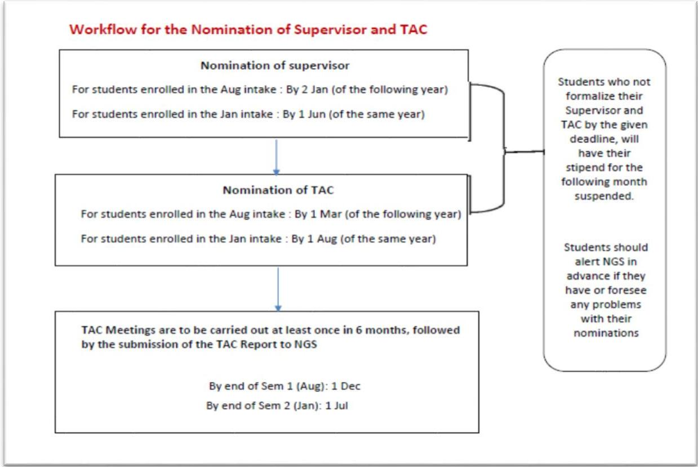

## ISEP STUDENT GUIDE

> **AI Description:**
> **Source:** `assets/_page_0_Figure_0.jpg`
> 
> **Generated:** 2026-05-19 19:27:54
> 
> ---
> 
> The image contains a photograph of three individuals sitting outdoors, engaged in what appears to be a collaborative discussion or meeting. They are seated on a low wall, with one person holding a laptop. The setting includes greenery and a structure with a roof, suggesting a casual or semi-formal outdoor workspace. The individuals are dressed in business casual attire, indicating a professional context. The image conveys a sense of teamwork and productivity in a relaxed environment.

2020

> **AI Description:**
> **Source:** `assets/_page_0_Figure_1.jpg`
> 
> **Generated:** 2026-05-19 19:27:21
> 
> ---
> 
> The image contains a photograph of a person wearing a lab coat and using a microscope. The background shows other individuals in a laboratory setting, suggesting a scientific or research environment. The image is circular and has a gradient background with a pattern of circles.

NUS Graduate School

Integrative Sciences & Engineering Programme

Table of Contents   
Coursework Requirements   
Transfer of Credits.. .5   
Academic Performance Criteria .... ..6   
CAP Requirements and Policies .. ..6   
Grading System and the Cumulative Average Point .. ..7   
Teaching Hours .... ..9   
Graduate Assistantship Programme . .11   
Nomination of Research Supervisor .. .12   
Thesis Advisory Committee (TAC).. .13   
Composition of TAC.. ..13   
Roles of TAC .... ..14   
PhD Qualifying Examination.. .14   
Guidelines, Requirements and Policies.. .14   
Procedures ... .16   
PhD Thesis Examination.. .17   
Process of Thesis Examination .. ..18   
Award of Degree .... ..20   
Assistance for Students.. ..20   
Student Health and Well-being... ..20   
Activities for ISEP students .21   
Annex 1 . .22   
ISEP Compulsory Modules . .22   
Annex 2 .. ..23

Coursework Requirements

## Transfer of Credits

The application for credit transfer has to be submitted to ISEP within the first semester of enrolment. For students admitted in January, transfer of credit request to ISEP has to be submitted latest by July; Students admitted in August, transfer of credit request to ISEP has to be to be submitted latest by December. Applications received thereafter will not be entertained.

Request of Transfer of Credits or Exemption of modules will be reviewed by the ISEP Director before any approval is granted.

1. Credit transfer may be allowed for NUS modules that have NOT been used towards another degree (can be pre-taken during undergraduate study or from withdrawn or terminated graduate study), under the following conditions:

Modules are identical to, or are relevant & have comparable content and level of difficulty as existing ISEP/NUS modules at level 5000 or level 6000.

 Modules are completed less than (<) 5 years before date of admission to the ISEP programme.

 The maximum number of modular credits allowed for credit transfer is 12 MCs.

Modules approved for transfer would count towards the student’s CAP.

2. Credit transfer may be allowed for non-NUS modules that have NOT been used towards another degree (can be pretaken during undergraduate study or from withdrawn or terminated graduate study), under the same conditions listed for (1) above. However, the modules will not be counted towards CAP but will be reflected in the transcript as “Exempted (EXE).”

For modules which have been approved for exemption, they will count towards the 12 MCs (or 3 modules) which ISEP allows for S/U modules. For example, 2 modules have been approved for exemption, the student would only be allowed to read 1 more module on S/U grading basis.

## Academic Performance Criteria

## CAP Requirements and Policies

## Effective from AY2011/12 Semester 1 (August 2011)

1. CAP review for students will be done at the end of every Semester 1 & 2 of the Academic Year (AY) after the official release of the examination results (excluding Special Term 3 & 4).

2. ISEP does not practice the Best Cap Calculation policy. All modules read will be used for the computation of the students' CAP, unless the module(s) is graded as S/U or CS/CU.

3. Students whose performance is under review by ISEP are required to read at least 1 module every semester.

4. For students who fail to meet the CAP requirement of 3.80 for every semester, appropriate actions will be taken as follows:

## 1st academic warning:

 A warning letter will be issued via email (cc. supervisor)

## 2nd academic warning:

 A warning letter will be issued via email (cc. supervisor).

 Educational Allowances (EA) will be suspended.

## 3rd academic warning:

 A warning letter will be issued via email (cc. supervisor).

Educational Allowances (EA) will be suspended.

For students with:

o CAP between 3.50 - 3.79

Reduction of Research Scholarship (RS) stipend to faculty level:

S\$2000 per month for International Student

S\$2200 per month for Singapore Permanent Resident

S\$2700 per month for Singapore Citizen

o CAP below 3.50

Termination of RS and Candidature by Registrar's Office (RO).

\* ISEP will not consider any appeal from students under the 2nd and 3rd academic warnings for waiver of any penalty as stated above.

For students who have already been warned 3 times (with CAP between 3.50 to 3.79 and RS stipend at Faculty level) and achieve a CAP of less than 3.80 in the 4th semester:

1. Termination of RS and Candidature by Registrar's Office (RO).

\*RO will send a dismissal letter to student (cc to supervisor).

## Notes:

1. The suspension of the EA and the reduction of RS stipend will take effect from the date of release of the exam results of the previous semester to the date of release of the next exam results in the following semester of the academic year.

2. For students who are funded by other sources - ISEP will notify the relevant funding body to recommend similar penalties.

Appeal Procedures for Re-instatement of Candidature - applicable to only dismissed/terminated students with CAP between 3.50 to 3.79

1. Students who were dismissed from their candidature due to poor academic standing and who wish to appeal for re-instatement, should submit their appeal to ISEP within two calendar weeks of the last day of the release of each semester’s examination results (with support from supervisor, providing information on research performance, publications list and any other relevant information to support the appeal). ISEP will not consider any appeals after that.

2. Students with potential to be considered for re-instatement will be asked to attend an interview.

3. Students will be notified of decision by ISEP. RO will write to inform the student on the re-instatement of candidature and the student must accept the offer for re-instatement and reply to RO by the deadline given in the letter, failure of which will cause the offer to lapse.

## Conditions for Re-instatement of Candidature

1. ISEP will not provide Research Scholarship (RS) stipend.

2. ISEP will not provide Tuition Fee (TF) subsidy.

3. ISEP will not provide Educational Allowances (EA).

4. Students who are re-instated should still be reading course(s) in the current semester to improve on their CAP to >3.8, failure of which will result in a 2nd dismissal (with no appeal for second re-instatement). The student will have to achieve the minimum CAP required for continuation and graduation in the current semester.

For students who have improved their CAP to >3.8, ISEP will consider on a case-by-case basis to re-instate their RS/TF/EA.

Refer to Annex 2 for the Performance Review Flowchart.

Grading System and the Cumulative Average Point

## Grade Points

Students receive letter grades for each module taken, except for the cases listed below. Each grade corresponds to a grade point as shown below:

As the above table indicates, a plus (+) or minus (-) suffix added to a grade raises or lowers the grade point value, except in the case of A+, which carries the same grade points as the A grade.

## Cumulative Average Point (CAP)

Academic progress is tracked by the CAP, which is the weighted average grade point of all modules taken by a student. Therefore, a student’s CAP is the sum of the module grade points multiplied by the number of MCs for the corresponding module, divided by the total number of MCs. This is represented as follows:

sum (module grade point x MCs assigned to module) CAP = sum (MCs assigned to all modules used in calculating the numerator)

Online CAP calculator - https://inetapps.nus.edu.sg/capcalc/cap\_calculator.aspx.

Average grade simulator - https://inetapps.nus.edu.sg/capcalc/avg\_grd\_simulator.aspx.

Modules with no assigned MCs or grade points are excluded from the calculation of CAP.

There are a number of situations for which no grade points are assigned:

## Completed Satisfactorily/Completed Unsatisfactorily (CS/CU)

A module may be graded on a ‘CS/CU’ basis, i.e., whether the module has been ‘Completed Satisfactorily’ (CS) or ‘Completed Unsatisfactorily’ (CU). CS/CU modules are typically industrial attachment, internship or enrichment modules. Modular credits will be given for modules that are completed satisfactorily, although no grade point will be assigned. A module is designated ‘CS/CU’; unlike modules graded on an S/U basis, it is not an option.

## Exempted (EXE)

This grade is awarded when a student is exempted from or given credit for a module under the Advanced Placement process. This refers to transfer of credits without grade or exemption of modules.

## Incomplete (IC)

The ‘IC’ grade is assigned when a student’s work is of passing quality but is incomplete for good reasons (e.g., illness during the official examination period). However, even such good reasons will not warrant an ‘IC’ grade if the work already completed for the module is clearly not of passing quality; instead, students should note that the ‘F’ grade will be assigned in such cases. A module assigned an ‘IC’ grade normally cannot be used to fulfil the pre-requisite of a higher-level module. Should a student choose to repeat the module in a subsequent semester, none of the work done previously may be carried forward for assessment purposes.

## In Progress (IP)

For a module that extends beyond more than one semester, evaluation of a student’s performance is deferred until the completion of the module. The provisional grade of ‘IP’ is assigned in the intervening semesters. This is replaced with the final grade when the student completes the module.

## Satisfactory/Unsatisfactory (S/U)

Students may elect to have certain modules graded on a ‘Satisfactory/Unsatisfactory’ (S/U) basis.

## Withdrawn (W)

When a student withdraws from a module between the first day of Week 3 of the instructional period and the last day of the Recess Week, a ‘W’ grade will be recorded in the transcript. Withdrawals after this period (i.e. from the first day of Week 7 of the instructional period) will result in an ‘F’ grade, which will be included in the computation of the CAP and will not be eligible for the S/U option.

## Teaching Hours

All ISEP students have to fulfil teaching duties as part of their coursework requirement.

ISEP students who are Singaporeans and Singapore PRs have to fulfil a total of 40 hours of teaching duties. This is normally to be completed by the end of the 2nd year of enrolment at ISEP. The teaching requirements should be fulfilled within the academic settings of NUS or where appropriate and subject to approval, other institutions within Singapore. There are different options of clocking the teaching hours, as listed in Table 1.

ISEP students who are International Students are required to perform duties of 312 hours, under the Graduate Assistantship Programme (GAP). Please refer to Table 2, which shows the maximum hours that can be clocked under the respective categories.

## TABLE 1

Note for (4) – (6), up to 5 teaching hours could be claimed for each of the above approved academic/educational activities. Any claim of number of teaching hours exceeding the 5-hour cap for any of the activities above is subject to review and approval by the ISEP Director.

## Graduate Assistantship Programme

Since AY2014/2015, all international students awarded the ISEP Scholarship are required to perform duties under the Graduate Assistantship Programme as set out in the table below.

<table><tr><td>Total Hours Required to Serve during Candidature</td></tr><tr><td>312 hours</td></tr></table>

The below table sets out the maximum hours that can be clocked under the respective categories:

TABLE 2

1. The awardee will not be paid any remuneration for the hours clocked under the Graduate Assistantship Programme.
2. The awardee should work with the supervisor(s) on the plan to fulfil the required hours on a yearly (Academic Year) basis.

3. The awardees have to complete at least half of the required hours (156) by PQE (2-year point) or 208 hours by the end of the 3rd year.”

4. The duties can only be clocked for work done deemed satisfactory by the University.

5. If the required hours are not met according to the annual plan or the quality of the work done is unsatisfactory, ISEP can

reduce or withhold the stipend, and/or the tuition fee subsidy, and/or terminate the Scholarship; and or

withhold the transcript (both official and unofficial) and student status letter, conferment letter until the requirements are met.

## Nomination of Research Supervisor

Students are given up to 5 months from their candidature start date to nominate a main supervisor.

For students in the August intake, they have to confirm their supervisor nomination by 02 January of the following year; students enrolled in the January intake, they have to confirm their supervisor nomination by 01 June of the same year.

Supervisor nomination is only formalized once the student submits the “Nomination of Supervisor Form” to ISEP, and an official approval from ISEP in the form of an email, copied to the student and supervisor has been given.

AGS students may only select either a supervisor from NUS or the Research Institutes (RIs). The Supervisor from the RI needs to be an approved member of ISEP. Please refer to https://isep.nus.edu.sg/choose-a-supervisor/ for a list of RI supervisors.

ISEP students should select a main supervisor from NUS, who is ISEP-approved. A supervisor from the RI is only possible if he/she is jointly appointed by NUS and the RI, and is ISEP-approved.

The nomination of a co-supervisor is optional. However, should a co-supervisor be appointed, he/she should be either an ISEP-NUS faculty, or a non-ISEP NUS faculty who is approved by the Deanery based on supervisory needs of a candidate. A cosupervisor from ASTAR institutes must be a full-fledged AGA supervisor. No person who is a non-NUS faculty or non-AGA supervisor should be supervising an ISEP/AGS student as either supervisors or co-supervisors.

ISEP has imposed a quota on the number of students a supervisor may have as a main supervisor or co-supervisor. Prior to the nomination of a supervisor, students are advised to check with ISEP or the respective supervisor on whether he/she can accept any more student(s). The workflow for nomination of supervisor and TAC is enclosed.

> **AI Description:**
> **Source:** `assets/_page_12_Figure_0.jpg`
> 
> **Generated:** 2026-05-19 19:27:16
> 
> ---
> 
> The image is a flowchart titled "Workflow for the Nomination of Supervisor and TAC." It outlines the process and deadlines for nominating a supervisor and a TAC (Thesis Advisory Committee) for students enrolled in either the August or January intake. The flowchart includes specific deadlines for nominations and the submission of TAC reports to NGS. It also notes that students who do not formalize their nominations by the given deadlines will have their stipends suspended for the following month. Additionally, it advises students to alert NGS in advance if they foresee any problems with their nominations.

## Thesis Advisory Committee (TAC)

The Thesis Advisory Committee must be formed within 2 months after the student has confirmed his/her supervisor. For students enrolled in the Aug intake, it is 01 Mar (of the following year); For students in the Jan intake, it is 01 Aug of the same year.

## Composition of TAC

1. The TAC should consist of the supervisor, co-supervisor (if any) and at least two other non-supervisory members (capped at 5 persons in the TAC).

The possible compositions of a TAC are listed in the table below.

2. At least one member of the TAC should be from a different Faculty/School to that of the student/supervisor.
3. Both the supervisor and student are jointly responsible for the timely formation of the TAC.
4. No-one directly involved in supervising the student shall act as the Chair of the TAC. ISEP would review and appoint the nominee. The Chair should be appointed before the first formal meeting with the student.
5. The Chair of the TAC should be nominated by the supervisor and the Chairperson has to be an ISEP supervisor.

ONLY for AGS students:

6. Members of the TAC shall be proposed by the main supervisor, and must be approved by ISEP and A\*STAR. They need not be “official” co-supervisors from A\*STAR.

a. If the supervisor is from an RI, there must be at least one TAC member from NUS.

b. If the supervisor is from NUS, there must be at least one TAC member from an RI.

c. At least one member (ideally two) must not be directly involved in the supervision of the students.

d. Joint Supervision of students between NUS staff and RIs is encouraged but is not mandatory.

## Roles of TAC

1. The TAC is responsible for monitoring the student’s progress.

2. The student should meet with the Thesis Advisory Committee (TAC) at least once every 6 months or once every semester. There should be a minimum of 2 TAC meetings prior to the PQE, and there should be a final meeting no later than 3 months prior to the submission of the thesis.

3. The student or Chair of the TAC may call for the TAC meetings on a regular basis as indicated in (2) above, but meetings may be held more frequently if the student is known to be having problems

4. It is strongly advisable to have all TAC members, including supervisor and co-supervisor (if applicable) present at all TAC meetings. If this is not possible, at least two-thirds of the TAC members must be present per meeting. The student must seek input from those absent after the meeting at their earliest availability, with the supplementary meetings duly documented.

5. The Chair of the TAC has to complete an Online TAC Report Form after the meeting. Note that the form (Click HERE) is only accessible to the Chair of the TAC. Therefore, ONLY the Chair of the TAC may access the form, to fill and submit it.

Note: The Chair of the TAC may have up to 2 weeks (from the date of the TAC Meeting) to complete the submission of the form.

6. The Chair of the TAC should communicate the discussion and comments of the meeting to the student. To do that, the Chair of the TAC can download a PDF copy of the TAC Report and email it to the student for his/her reference.

7. The outcome of the meetings may be incorporated into the student's 6-monthly online progress reports in January and August of every year, by the main supervisor on behalf of the TAC members.

8. The Chair of the TAC should inform ISEP of any cases of serious project related or personal difficulties encountered by the student, so that additional oversight and assistance could be provided.

9. PhD Qualifying Examinations

a. If a student fails to apply for the PhD Qualifying Exam (PQE) by 18-24 months into his/her PhD programme, a TAC meeting should be convened immediately to determine the reasons for this

b. In cases where the student has made little or no progress with the thesis project by the 18-20-month mark, and the student appears to be at risk of not obtaining a PhD, the TAC will refer the student’s case to ISEP.

## PhD Qualifying Examination

Students must take a PhD Qualifying Examination (PQE) to assess their fitness to progress to the PhD degree not later than 24 months from the time of registration / enrolment. There must be at least 2 TAC meetings before a student is allowed to attempt a PQE.

Guidelines, Requirements and Policies

## PhD Thesis Examination

## a) General Guidelines on Format of Thesis

Candidates should refer to the University's Handouts for Thesis Examination (available at myPortal@NUS) for more information for general guidelines on format of thesis. Candidates who wish to apply for an extension of the word limit for their theses will have to seek approval from their supervisors and ISEP.

Permission or license for reproduction must be obtained for any figures, captions or other materials taken from published or online sources, and such permissions/licenses should be explicit stated in the text in an appropriate format sanctioned by the copyright owner/publisher. The candidate should include, as far as possible, only his/her own work in the thesis. Work done by others could be included, with explicit acknowledgement, under the sections of Introduction, Discussion or Appendix, only if these aid logical flow of the writing and would facilitate a more wholesome understanding of the research. Presentation of work done by co-workers in the "Results" section should be avoided. However, if this is necessary, explicit acknowledgement should be made, and permissions to quote or reproduce results from co-workers should be obtained and clearly stated.

Candidates whose thesis format is likely to significantly deviate from the above should seek the approval and support of the Thesis Advisory Committee, and consult the ISEP examination office. If the TAC is agreeable with the proposed format, candidates are to submit an appeal for the Board of Examiners' consideration, at least two months before the expected thesis submission.

## b) Deadline for Submission

Candidates have to submit their theses for examination (after being approved by their supervisor(s) and Head of Department) by the maximum period of candidature or such date as stipulated by the supervisor(s) or the University, whichever date is earlier.

Application for extension of candidature is only applicable to candidates who need more time beyond five (5) years. In such a case, candidates who wish to apply for extension of candidature need to complete the Extension of Candidature Form (available at myPortal@NUS) and submit it through the supervisor(s), preferably three (3) months before the expiry date of their candidature, for consideration by ISEP. For students who do not require an extension of candidature beyond five (5) years, but need a grace period of up to two (2) weeks to submit their thesis for examination, may request permission from ISEP to do so. The request for the grace period has to be submitted to ISEP before the expiry of the candidature and has to be supported by the main supervisor. Note that the request for grace period is NOT applicable to students who have been granted prior candidature extension(s) nor students who are submitting their revised/final approved thesis. Any late request would be considered as reinstatement of candidature and an administrative fee of S\$250 will be imposed for all successful reinstatements.

Candidates who have been given the two (2) weeks grace period but are still unable to submit their theses should consult their supervisor(s) first before applying for any reinstatement-extension of candidature.

Candidates who wish to submit their theses before the minimum residency period must submit a written request to ISEP, through the supervisor(s), for approval before submission.

## c) Thesis Submission Date & Fees Payable

Tuition and miscellaneous fees are payable until the thesis is submitted for examination. However, the insurance premium will continue to be payable for full-time students unless the candidate converts his/her candidature to part-time. A candidate who converts his/her candidature to part-time after Instructional Week 2 is liable to pay the insurance premium for that semester.

The tuition fees payable for the semester in which the thesis is submitted for examination depends on the thesis submission date (i.e. the date of receipt by the ISEP Office).

Exemption of fees will take effect from the semester after the thesis is submitted for examination, except if the thesis is submitted within Instructional Week 2 of the semester

Note: For current research scholars, the last day of award will be the date of receipt of the Thesis Submission Form by the ISEP Office. If the research scholar did not submit the form to ISEP as soon as he/she could have, ISEP can terminate the scholarship earlier than the date the form is received.

## d) Thesis Check and Copyright Issues

Students, who are submitting their PhD thesis, are strongly encouraged to put their drafts through the plagiarism check link at iThenticate.

Please note that all ISEP students are subscribed to the usage of this site. This site should be used strictly for checking of PhD thesis and PQE report drafts only, not term papers or other module assignments. The latter should be performed using their respective module links.

Students are also reminded to: -

1. check out all potential copyright issues in the thesis by ensuring that permissions for reproduction of all materials taken from others (be it personal communications or from public domains) have been obtained in writing.

2. ensure that the source of any material(s) taken from others, reproduction permission aside, is explicitly acknowledged so that it would not constitute as plagiarism.

## e) Procedures for First Submission of Thesis for Examination

Candidates have to log in to myEduRec (navigate to Academics > Graduate Research > Submit Thesis) once the thesis is ready for submission:

Complete the online Thesis Submission Form.

Upload a soft-copy (PDF format) of the thesis.

Prepare a printed soft-bound copy of the thesis and submit to ISEP if requested by the administrator.

## \* Note for Payment:

Please refer to http://www.nus.edu.sg/registrar/edu/gd-fees.html for implications of outstanding fees.

For research scholars who have received excess Research Scholarship stipend and have yet to refund the excess, the University reserves the right to withhold student status letters, results slips or transcripts, status letters, thesis examination and the confirmation of the award of the degree.

## Process of Thesis Examination

Important: Candidate should not, under any circumstances, communicate with any examiner on matters related to the thesis examination.

## a) Nomination of Thesis Examiners

Candidates should maintain close contact with their supervisors, so that the main supervisor is aware of their progress and will initiate the nomination of examiners process via EduRec, typically one month before the thesis is expected to be submitted for examination.

Supervisors are required to nominate a minimum of 2 internal examiners. Examiners must be internationally-recognized scientists in the field identified by the usual criteria (research output, citations, etc). Supervisors can request to appoint an external examiner in the event that the supervisor believes that potential reviewers within the university lack the necessary expertise to evaluate the PhD candidate’s thesis. The external examiner appointed can be in addition to, or in lieu of, one of the internal examiners, to fulfil the requirement of a minimum of two examiners.

External examiners who have to examine a thesis with patentable/confidential materials will need to read and agree to the Terms & Conditions on the Non-Disclosure Agreement (NDA) form before the thesis is sent to him/her. (Candidates and supervisors are reminded that proprietary/confidential information which is not critical to the thesis for which consent has not been granted should be excluded from the thesis.)

## b) Period of Thesis Examination

Examiners are given seven weeks from the date thesis is sent to them, to complete the examination of the thesis and submit an evaluation report. Reminders will be sent by ISEP to examiners before the deadline and those who fail to submit their evaluation reports by the deadline.

Candidates are required to attend their oral examination physically in Singapore after the theses have been examined.   
(Candidates are to bring a copy of the thesis for the oral examination).

## c) Oral Examination

After all the examiners' reports are received:

## Ph.D. thesis

If there are no / minor amendments, the candidate will be notified of the confirmed oral examination date. A copy of the Faculty's guidelines on the oral presentation will also be given to the candidate.

Candidate is strongly advised, with the assistance of the supervisor(s), to identify and respond to major issues and criticisms raised by all examiners in their reports.

These responses could be drafted in a form of a concise point-to-point written rebuttal that could be communicated to the examiners before the viva, or on the day itself, through ISEP. Candidates and supervisors are reminded that they should not communicate directly with any of the examiners.

However, the candidate may be asked to revise and resubmit the thesis for further examination before the oral examination is scheduled.

## Oral Examination Format

The Oral Examination Panel will be chaired by the Chair of the students' Thesis Advisory Committee (TAC). Along with him/her will be the internal examiners who would form the examination panel. In some cases, ISEP will nominate additional ISEP supervisors to participate in the examination. External examiner(s) may be present but this is not mandatory.

The examination comprises the following components:

Open Seminar, of approximately 45 minutes (together with examiners)

Question & Answer Session, of approximately 15 minutes for general audience to ask questions

 Closed-Door Examination (with examiners only)

## The candidate should: -

Give a brief overview of the thesis;

Discuss key findings and new contributions made to the field;

Justify the methodology and theoretical framework used; and

Analyze the implications of study for future research or applications.

The candidate is expected to answer satisfactorily any questions raised on the subject matter of the research thesis and related subjects by the oral panel, who will then discuss the merit of the PhD in private and reach a decision.

## d) Outcome of Thesis Examination

After the oral examination, the candidate will be informed by the Oral Panel of the outcome, on the amendments to the thesis and the person(s) to advise the candidate on the amendments, if applicable.

Please note that if major revisions to the thesis are required, the candidate may have to pay fees for 1 semester, even if the period granted to do the revision is less than six months. If the candidate is unable to complete the revisions in six months, s/he will be required to pay another semester's fees. The total revision period cannot exceed 12 months.

After examination/re-examination, the following must be submitted to ISEP Office by the stipulated deadline: -

1. Report Form on Amended PhD Thesis (ISEP/F/016/07) duly signed and completed

2. Detailed summary of amendments made (if applicable)

3. Electronic Thesis / Dissertation Submission Form (RO/667) duly signed and completed

4. Feedback on Research Guidance Form

5. Updated list of publications

The final approved thesis must be uploaded electronically. (Please refer to guide - Instructions to Higher Degree (by Research) Students on Submission of Electronic Thesis.) The candidate will be notified via email when the system is open for a week for him/her to upload the thesis. The candidate is required to check and ensure that the uploaded thesis is the final, complete and correct version. The uploaded electronic thesis will be accepted without any further verification from the host department or supervisor(s). Therefore, the candidate must be responsible in ensuring that the correct version is uploaded onto the system.

One copy (in any form agreed with the supervisors) of the final approved thesis should be submitted to the supervisor(s).

## Award of Degree

The candidate will be considered for award of the degree by the Board of Graduate Studies if all minor/major revisions are incorporated in the thesis to the satisfaction of the supervisor(s) and the Oral Panel member (if applicable); and after the uploaded electronic thesis has been verified by the host department.

After the degree has been awarded by the Board of Graduate Studies, the Chancellor's approval will be sought for the degree to be conferred in writing. The approximate timeframe for approval by Board of Graduate Studies and Chancellor is about two months after the thesis has been uploaded onto the system.

## IMPORTANT NOTE:

The candidate should inform the Registrar's Office of any change in mailing address by updating it via EduRec so that the outcome of the thesis examination can be communicated promptly.

## Assistance for Students

Prior to matriculation, incoming students are strongly advised to familiarize themselves with the requirements of the ISEP PhD program. They should contact potential thesis advisors early and consider which labs to carry out their lab rotations in. Students can email ISEP program administrators for questions related to the program.

International students would also need to make arrangements for long-term accommodation on- and off-campus.

Students can approach the Office of Student Services (OSA) on student-related issues. These include immigration matters and accommodation advice for international students. More information can be found on the OSA website (https://nus.edu.sg/osa/)

Students can visit the Student Service Centre at Yusof Ishak House Level 1 for information and services related to academic transcripts, tuition fees and financial matters.

## Student Health and Well-being

The University Health Centre (UHC) provides comprehensive outpatient medical treatment to all students at a minimal charge.   
More information can be found at the UHC website (http://www.nus.edu.sg/uhc/).

The University Counselling Services (UCS) offers a wide range of services such as individual counselling and crisis intervention. It is located at level 2 of the UHC. A 24-hour hotline is available for students in extreme distress and cannot wait for a scheduled appointment. Students can call LifeLine NUS at 6516 7777 for immediate assistance or contact Dr Joan Lee at ngslscj@nus.edu.sg.

Students are welcome to use the sports facilities on campus. More information can be found at https://uci.nus.edu.sg/suu/facilities/about-suu-sports-facilities/.

## Activities for ISEP students

ISEP students are encouraged to foster professional and social connections with each other. Senior students are expected to guide the juniors and take a leadership role in organizing and running various activities for students. Activities include research updates, book clubs and regular online/physical informal meetings. Students can join one of the Student Research Communities, Student Support Groups and interest groups e.g. sports, performing arts etc. to forge meaningful ties with other students. Throughout the year, the program will support ad-hoc events such as Movie Night and Community Engagement Day. The University also organizes wellness activities and career enhancement workshops for the student body.

## GS5002 (Academic Professional skills and Techniques), 4 MCs

The module equips students with the academic know-how to succeed in graduate school. Students shall be introduced to the school's academic structure, aspirations and expectations, with advice from faculty research directors and prominent ISEP alumni in a workshop. Students shall be coached on their academic writing and presentation skills. They shall engage in indepth research discussions and learn how to conduct a scientific dialogue, and to make impressive presentations at meetings and conference. Students shall be lectured by university experts on the process of scientific publication, as well as to intellectual property and patent issues. The within-discipline and cross-discipline journal club components shall provide intense training in scientific assessment and critique on topics within and outside a student's original discipline, at an advanced level with instructors and peers in a small group setting.

## GS6001 (Research Ethics and Scientific Integrity)

## 4 MCs (module taken prior to AY2021/2022 Sem 2) or 2 MCs (module taken in AY2021/2022 Sem 2)

The module covers issues that any graduate student in science and engineering shall face at some point during their PhD candidature and in their subsequent academic careers. Through lectures, discussions and presentations, students shall ponder on and analyse ethical issues and dilemmas associated with data archival, mentoring, authorship, credit sharing and conflicts of interest. They shall rationalise internationally sanctioned rules and regulations in dealing with ethically sensitive research subjects. They shall be taught sensible and appropriate approaches in dealing with incidents of scientific misconduct, and how ethical integrity should and could be maintained in spite of research intensity and competition.

## GS6883A (Interface Sciences and Engineering), 2 MCs (CS/CU)

The module consists of a series of lectures and discussions/presentations that would provide students with an interdisciplinary exposure and knowledge foundation for selected research areas/themes that are of prime importance to humankind, and where interdisciplinary science and engineering are frequently practiced. Some of these areas are traditional strategic areas which NUS have great research strength in, and others are emerging areas of intense interest. Each theme is taught and coordinated by two instructors, who will contribute to different, yet complementary, perspectives of the theme. The areas/themes shall include "infectious agents and global pandemics", "Omics", "Renewable Energy", "Human-Computer Interactions" and "Environmental problems/climate change".

## GS5101 Research Immersion Module (2 MCs, CS/CU)

Students will complete two lab rotations in their first semester with ISEP. Each rotation will last for at least 2 months. At the end of each lab rotation, students will submit a lab rotation report that includes a description of the research project that the student has worked on and the supervisor’s assessment of the student’s performance and commitment during the lab rotation. Students will attend a workshop, facilitated by the principal lecturers, before they start their second lab rotation. They will discuss research mentorship, research planning and management and articulate the learning experiences gleaned from their first lab rotation. Modular credits and a ‘Completed Satisfactory (CS)/Unsatisfactory (CU)’ grade are awarded on the basis of satisfactory performance for both rotations, completion of two lab rotation reports and attendance of the workshop.

## GS6889B Academic Skills and Research Ethics (2 MCs, CS/CU) (ONLY for SCELSE/IDS/MBI students)

The module equips students with the academic know-how to succeed in graduate school. Students shall be coached by university experts on their academic writing and presentation skills and receive guidance on the process of scientific publication, as well as to intellectual property and patent issues. Students shall participate in a two-day ethics workshop, where they will analyze ethical issues and dilemmas associated with mentoring, authorship, conflicts of interest and dealing with ethically sensitive research subjects.

## Annex 2

Flowchart for Performance Review:

## NUS Graduate School

## Integrative Sciences & Engineering Programme

Integrative Sciences &

Engineering Programme

University Hall, #05-03,

Tan Chin Tuan Wing Level 5,

21 Lower Kent Ridge Road,

Singapore 119077