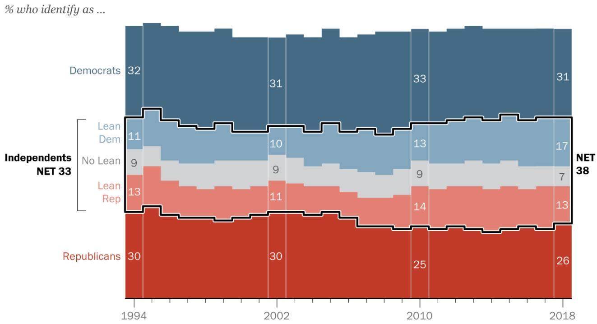
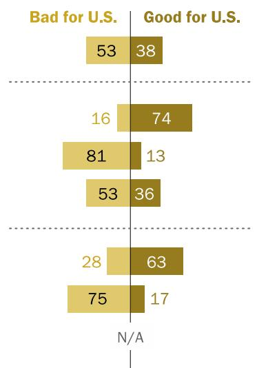
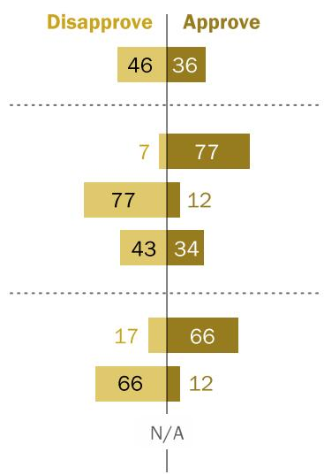
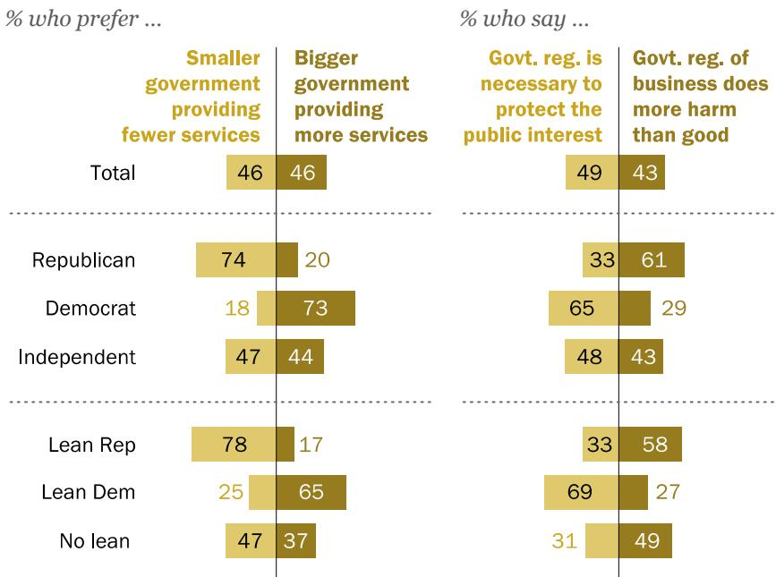
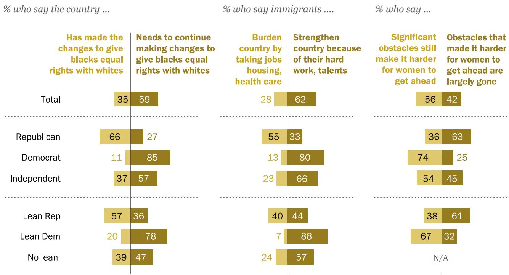

# Political Independents: Who They Are,What They Think

Most "lean' toward a party;'true'independents tend to avoid politics

FOR MEDIA OR OTHER INQUIRIES:

Carroll Doherty, Director of Political Research Jocelyn Kiley, Associate Director, Research

Bridget Johnson, Communications Manager

202.419.4372

www.pewresearch.org

RECOMMENDED CITATION Pew Research Center, March, 2019, “Political Independents: Who They Are, What They Think”

## About Pew Research Center

Pew Research Center is a nonpartisan fact tank that informs the public about the issues, attitudes and trends shaping America and the world. It does not take policy positions. It conducts public opinion polling, demographic research, content analysis and other data-driven social science research. The Center studies U.S. politics and policy; journalism and media; internet, science and technology; religion and public life; Hispanic trends; global attitudes and trends; and U.S. social and demographic trends. All of the Center’s reports are available at www.pewresearch.org. Pew Research Center is a subsidiary of The Pew Charitable Trusts, its primary funder.

© Pew Research Center 2019

# Political Independents: Who They Are, What They Think

Most lean'toward a party; 'true'independents tend to avoid politics

Independents often are portrayed as political free agents with the potential to alleviate the nation’s rigid partisan divisions. Yet the reality is that most independents are not all that “independent” politically. And the small share of Americans who are truly independent – less than 10% of the public has no partisan leaning – stand out for their low level of interest in politics.

Among the public overall, 38% describe themselves as independents, while 31% are Democrats and 26% call themselves Republicans, according to Pew Research Center surveys conducted in 2018. These shares have changed only modestly in recent years, but the proportion of independents is higher than it was from 2000-2008, when no more than about a third of the

Independents outnumber Republicans and Democrats, but few are truly independent

> **AI Description:**
> **Source:** `assets/_page_2_Figure_0.jpg`
> 
> **Generated:** 2026-05-19 19:34:22
> 
> ---
> 
> The image is a stacked area chart showing the percentage of individuals who identify as Democrats, Independents, and Republicans from 1994 to 2018. The chart is divided into three main categories: Democrats, Independents, and Republicans, with further breakdowns for Independents into "Lean Dem," "No Lean," and "Lean Rep." The chart displays a fluctuating trend over the years, with the percentage of Democrats and Republicans generally remaining stable, while the percentage of Independents shows more variability. The net percentage of Independents is consistently around 33% throughout the period.

Note: Other party/Don’t know responses not shown.
Source: Annual totals of Pew Research Center survey data (U.S. adults).

## PEW RESEARCH CENTER

### Full Page Description (Page 3)

**Source:** `assets/_page_3_Asset_0.jpg`

**Generated:** 2026-05-19 19:33:15

---

The image is a bar chart with a title "80% registered" at the top. It presents data on voter turnout among Independents, categorized by their political leanings. The chart includes four categories: Republican, Lean Rep, No Lean, Lean Dem, and Democrat. Each category has two bars: the top bar represents the percentage of registered voters, and the bottom bar represents the percentage of those who voted. The percentages are as follows: Republican (61% voted, 73% registered), Lean Rep (54% voted, 73% registered), No Lean (33% voted, 61% registered), Lean Dem (48% voted, 62% registered), and Democrat (59% voted, 76% registered). The chart visually compares voter turnout across these categories, highlighting the differences in participation rates.

public identified as independents. (For more on partisan identification over time, see the 2018 report “Wide Gender Gap, Growing Educational Divide in Voters’ Party Identification.”)

An overwhelming majority of independents (81%) continue to “lean” toward either the Republican Party or the Democratic Party. Among the public overall, 17% are Democratic-leaning independents, while 13% lean toward the Republican Party. Just 7% of Americans decline to lean toward a party, a share that has changed little in recent years. This is a long-standing dynamic that has been the subject of past analyses, both by Pew Research Center and others.

In their political attitudes and views of most issues, independents who lean toward a party are in general agreement with those who affiliate with the same party. For example, Republican-leaning independents are less supportive of Donald Trump than are Republican identifiers. Still, about 70% of GOP leaners approved of his job performance during his first two years in office. Democratic leaners, like Democrats, overwhelmingly disapprove of the president.

There are some issues on which partisan leaners – especially those who lean toward the GOP – differ substantially from partisans. While a narrow majority of Republicans (54%) opposed same-sex-marriage in 2017, nearly sixin-ten Republican-leaning independents (58%) favored allowing gays and lesbians to marry legally.

Yet independents who lean toward one of the two parties have a strong partisan imprint. Majorities of Republican and Democratic leaners have a favorable opinion of their own party, and they are almost as likely as Republican and Democratic identifiers to have an unfavorable opinion of the opposing party.

Independents stand out from partisans in several important ways. They are less politically engaged than Republicans or Democrats – and this is especially the case among independents who do not lean to a party.

Independents who do not lean to a party less likely to say they voted in 2018

% who say they …

PEW RESEARCH CENTER

In a survey conducted last fall, shortly after the midterm elections, partisan leaners were less likely than partisans to say they registered to vote and voted in the congressional elections. About half of Democratic-leaning independents (48%) said they voted, compared with 59% of Democrats. The differences were comparable between GOP leaners (54% said they voted) and Republicans (61%).

Those who do not lean toward a party – a group that consistently expresses less interest in politics than partisan leaners – were less likely to say they had registered to vote and much less likely to say they voted. In fact, just a third said they voted in the midterms.

In addition, independents differ demographically from partisans. Men constitute a majority (56%) of independents. That is higher than the share of men among Republican identifiers (51% are men) and much higher than the share of men among Democrats (just 40%).

Among independents, men make up a sizable share (64%) of Republican leaners and a smaller majority (55%) of independents who do not lean. Democratic leaners include roughly equal shares of men (51%) and women (49%).

Independents also are younger on average than are partisans. Fewer than half of independents (37%) are ages 50 and older; among those who identify as Democrats, 48% are 50 and older, as are a majority (54%) of those who identify as Republicans.

Democratic-leaning independents are younger than other independents or partisans. Nearly a third (31%) are younger than 30, compared with 21% of Republican-leaning independents and just 19% and 14%, respectively, among those who identify as Democrats and Republicans.

### Full Page Description (Page 5)

**Source:** `assets/_page_5_Asset_0.jpg`

**Generated:** 2026-05-19 19:34:43

---

The image contains a series of line graphs comparing the approval ratings of four U.S. presidents (Clinton, G.W. Bush, Obama, and Trump) across different political affiliations: Democrats, Lean Democrats, All Independents, Lean Republicans, and Republicans. The graphs display approval ratings over time, with data points marked for specific years. The visual trends show fluctuations in approval ratings for each president, with notable drops and increases in popularity among different political groups. The graphs are color-coded to distinguish between the presidents and their respective affiliations.

## Trump divides partisans and partisan leaners alike

As Pew Research Center reported last year, Donald Trump’s job approval rating during the early stage of his presidency is more polarized along partisan lines than any president in the past six decades. In addition, Trump’s rating has been more stable than prior presidents.

During his first two years in office, Trump’s job rating among members of his own party was relatively high compared with recent presidents. In 2017, 85% of those who identify as Republicans approved of Trump’s job performance, based on an average of Pew Research Center surveys. His job rating among Republicans was about as high (84%) in 2018. Trump’s early job rating among members of the opposing party (7%) was much lower than those of three prior presidents (Barack Obama, George W. Bush and Bill Clinton).

Trump’s job rating among independents for his first two years in office also was lower than his recent predecessors; his average job rating among independents was 34% in both 2017 and 2018. Obama’s average rating was 50% during his first year (2009); it fell to 42% in his second year.

During his first two years in office, Trump’s job rating as low among Democratic-leaning independents as among Democrats

% approving of each president’s job performance

## PEW RESEARCH CENTER

Trump’s early rating among independents is closest to Clinton’s, whose job approval averaged about 42% during his first two years in office. Bush, whose overall job rating approached 90% in his first year following the 9/11 terrorist attacks, had approval ratings above 60% among independents in his first two years.

Trump’s job rating among independents, like his overall rating, breaks down along partisan lines. His rating among GOP-leaning independents (72% in 2017, 69% in 2018) was not markedly different from Obama’s and Clinton’s ratings among Democratic-leaning independents during their first two years in office (though much lower than Bush’s among Republican leaners).

Yet Trump’s rating among independents who lean to the opposing party – like his rating among members of the opposing party – was much lower than recent presidents’. In fact, his rating among Democratic-leaning independents during his first two years was about as low as his rating among Democrats (7% in 2017, 9% in 2018).

Trump’s rating also was low among independents who have no partisan leanings. Only about a quarter of non-leaners approved of Trump’s job performance during his first two years, while about six-in-ten (58%) disapproved.

### Full Page Description (Page 7)

**Source:** `assets/_page_7_Asset_0.jpg`

**Generated:** 2026-05-19 19:31:43

---

The image is a table presenting survey data on political leanings and opinions. It categorizes respondents into four groups: Republican, Democrat, Independent, and those who lean towards Republican or Democrat, as well as those who have no lean. The table shows the percentage of respondents who either "Oppose" or "Favor" a particular stance. Key trends include a high opposition among Democrats and a strong favor among Republicans. The table also includes a total row summarizing the overall percentages for the entire group.

## Independents' views ofU.S.-Mexico border wall, other key issues

On most issues, independents’ attitudes mirror the views of the overall public. Independents who lean toward a party are usually on the same side as those who identify with the same party, but the level of agreement between leaners and partisans varies depending on the issue.

By a wide margin (62% to 36%), independents oppose Trump’s signature policy proposal, an expansion of the U.S.-Mexico border wall. Democratic-leaning independents overwhelmingly oppose the border wall (95% disapprove), as do Democratic identifiers (92%).

Republican-leaning independents favor expanding the border wall, though by a smaller margin than Republicans identifiers. GOP leaners favor substantially expanding the wall along the U.S.- Mexico border by roughly three-to-one (75% to 23%). Among those who affiliate with the Republican Party, the margin is nearly eight-to-one (87% to 11%).

Overwhelming opposition to expanding U.S.-Mexico border wall among both Democrats and Democratic-leaning independents

% who \_\_ substantially expanding the wall along the U.S. border with Mexico

> **AI Description:**
> **Source:** `assets/_page_7_Figure_0.jpg`
> 
> **Generated:** 2026-05-19 19:32:18
> 
> ---
> 
> The image is a chart with a grid layout. It compares opinions on whether something is "Bad for U.S." or "Good for U.S." for different groups. The chart includes numerical values in each cell, representing percentages. The groups are not explicitly named, but they are divided into two categories: "Bad for U.S." and "Good for U.S." The percentages range from 13 to 81, with some cells marked as "N/A." The chart uses a color scheme where "Bad for U.S." is represented by a lighter color and "Good for U.S." by a darker color.

% who \_\_ of the tax law passed by Trump and Congress

> **AI Description:**
> **Source:** `assets/_page_7_Figure_1.jpg`
> 
> **Generated:** 2026-05-19 19:32:09
> 
> ---
> 
> The image contains a bar chart with two sets of bars, one for "Disapprove" and one for "Approve," categorized into five groups. The bars are color-coded, with "Disapprove" in yellow and "Approve" in brown. The numbers above each bar represent the percentage of responses for each category. The groups are labeled as follows: the top group has 46% disapprove and 36% approve; the second group has 7% disapprove and 77% approve; the third group has 77% disapprove and 12% approve; the fourth group has 43% disapprove and 34% approve; and the fifth group has 17% disapprove and 66% approve. The last group is labeled "N/A" and has 66% disapprove and 12% approve.

Notes: Don’t know responses not shown. For wall, small sample size of non-leaning independents [N=88]. For tariffs and tax law, sample size of non-leaning independents insufficient for analysis. Source: Surveys of U.S. adults conducted Sept. 18-24, 2018, and Jan. 9-14, 2019.

## PEW RESEARCH CENTER

Independents also have a negative view of increased tariffs between the U.S. and its trading partners (53% say they will be bad for the U.S., 36% good for the U.S.). Independents’ views on the 2017 tax bill are more divided: 34% approve of the tax law and 43% disapprove.

As with the border wall, Democratic-leaning independents are more likely to view increased tariffs negatively (75% say they will be bad for the U.S.) than Republican-leaning independents are to view them positively (66% say they will be good). On taxes, two-thirds of GOP leaners approve of the tax law, while an identical share of Democratic leaners disapprove.

Overall, independents are divided in preferences about the size of government and views about government regulation of business.

Republican-leaning independents largely prefer a smaller government providing fewer services; 78% favor smaller government, compared with just 17% who favor bigger government with more services.

The views of GOP leaners are nearly identical to the opinions of those who affiliate with the GOP (74% prefer smaller government). Like Democrats, most Democratic-leaning independents prefer bigger government.

Independents divided in opinions about the size of government, government regulation of business

> **AI Description:**
> **Source:** `assets/_page_9_Figure_0.jpg`
> 
> **Generated:** 2026-05-19 19:32:43
> 
> ---
> 
> The image contains a table with data presented in a tabular format. It compares preferences for government size and regulation across different political affiliations. The table includes percentages for three categories: "Smaller government providing fewer services," "Bigger government providing more services," "Gov't. reg. is necessary to protect the public interest," and "Gov't. reg. of business does more harm than good." The data is broken down by political affiliation, including Republicans, Democrats, Independents, Lean Republicans, Lean Democrats, and those with no lean affiliation. The table highlights significant differences in opinions among these groups, with Republicans and Lean Republicans showing a strong preference for smaller government and more regulation, while Democrats and Lean Democrats favor bigger government and less regulation.

Notes: Don’t know responses not shown. For government size, small sample of non-leaning independents [N=93].

## PEW RESEARCH CENTER

Source: Surveys of U.S. adults conducted April 25-May 1, 2018, and Sept. 18-24, 2018.

### Full Page Description (Page 10)

**Source:** `assets/_page_10_Asset_0.jpg`

**Generated:** 2026-05-19 19:32:26

---

The image is a bar chart with a split for each political affiliation and leaners, showing the percentage of people who believe the system unfairly favors powerful interests versus those who think it is generally fair to most Americans. The chart includes categories for total respondents, Republicans, Democrats, Independents, Lean Republican, Lean Democrat, and No Lean. The data shows a significant disparity in views between Democrats and Republicans, with Democrats overwhelmingly believing the system favors powerful interests, while Republicans are more evenly split.

Democrats and Democratic leaners are in sync in opinions about whether the nation’s economic system is generally fair. But there are sharper differences in the views of Republicans and GOP leaners.

A 63% majority of those who identify as Republicans say the U.S. economic system is fair to most Americans; fewer than half as many (29%) say the system unfairly favors powerful interests. GOP leaners are divided: 49% say the system is generally fair, while nearly as many (46%) say it unfairly favors powerful interests.

Large majorities of both Democrats (85%) and Democratic leaners (81%) say the U.S. economic system unfairly favors powerful interests. Most independents who do not lean toward a party share this view (70%).

GOP leaners, Republicans differ on fairness of U.S. economic system

% who say the economic system in this country …

Note: Don’t know responses not shown. Source: Survey of U.S. adults conducted Sept. 18-24, 2018.

## PEW RESEARCH CENTER

## Independents' views ofrace,immigrants, gender

Majorities of independents say the U.S. needs to continue to make changes to give blacks equal rights with whites (57%) and that significant obstacles still make it harder for women to get ahead (54%). In addition, far more independents say immigrants do more to strengthen (66%) than burden (23%) the country.

In views of racial equality and women’s progress, the views of partisan leaners are comparable to those of partisans. Large majorities of Democrats and Democratic leaners say the U.S. needs to make more changes to give blacks equal rights and that significant obstacles stand in the way of women. Most Republicans and Republican leaners say the country has made needed changes to give blacks equal rights with whites, and that the obstacles blocking women’s progress are largely gone.

Republicans are more likely than Republican-leaning independents to view immigrants as a ‘burden’ on the country

> **AI Description:**
> **Source:** `assets/_page_11_Figure_0.jpg`
> 
> **Generated:** 2026-05-19 19:33:52
> 
> ---
> 
> The image contains a series of bar charts and text annotations, presenting survey data on various political and social issues. The key information includes percentages of respondents from different political affiliations (Republican, Democrat, Independent, Lean Republican, Lean Democrat, and No Lean) who hold certain views on racial equality, the impact of immigrants, and gender equality. The main trends show significant differences in opinions between political groups, with Democrats and Lean Democrats being more likely to believe that the country has made changes to give blacks equal rights and that immigrants strengthen the country. Conversely, Republicans and Lean Republicans are more likely to believe that the country still needs to make changes to give blacks equal rights and that immigrants are a burden. The data also highlights that Democrats and Lean Democrats are more likely to believe that significant obstacles still make it harder for women to get ahead, while Republicans and Lean Republicans are more likely to believe that obstacles for women are largely gone.

Notes: Don’t know responses not shown. Survey that asked about obstacles facing women conducted via the online American Trends Panel. For women facing obstacles, sample size of non-leaning independents insufficient for analysis. For immigrants, small sample size of nonleaning independents [N=88].
Source: Surveys of U.S. adults conducted Feb. 26-March 11, 2018; Sept. 18-24, 2018; Jan. 9-14, 2019.

## PEW RESEARCH CENTER

However, Republican-leaning independents differ from Republicans in their views of immigrants’ impact on the country. Among GOP leaners, 44% say immigrants strengthen the country because of their hard work and talents; 40% say they are a burden on the country because they take jobs, housing and health care. A majority of those who identify as Republicans (55%) say immigrants burden the country.

Views of immigrants’ impact on the country are largely positive among Democratic-leaning independents (88% say they strengthen the U.S.) and those who identify as Democrats (80%).

## Broad support among independents for same-sex marriage, marijuana legalization

Public support for same-sex marriage has grown rapidly over the past decade. In June 2017, a majority of adults (62%) favored allowing gays and lesbians to marry legally, while just 32% were opposed.

Independents’ views of same-sex-marriage were similar to Democrats’: 73% of Democrats favored gay marriage, as did 70% of independents. Among those who identified as Republicans, just 40% favored same-sex marriage, while 54% were opposed.

In contrast to Republicans, Republican-leaning independents favored same-sex marriage (58%

were in favor, 37% were opposed). Support for samesex marriage was higher among Democratic-leaning independents than among Democrats (82% vs. 73%).

Public support for legalizing marijuana use has followed a similar upward trajectory in recent years. Currently, 62% of the public says the use of marijuana should be made legal, while 34% say it should be illegal.

Majorities of both Democrats (69%) and independents (68%) favor legalizing marijuana; Republicans are divided, with 45% supportive

Independents about as supportive as Democrats of allowing same-sex marriage, legalizing marijuana use

% who \_\_ allowing gays and lesbians to marry legally …

Do you think the use of marijuana should be made legal, or not? (%)

Note: Don’t know responses not shown.   
Source: Surveys conducted June 8-18 and June 27-July 9, 2017; Sept. 18-24, 2018. PEW RESEARCH CENTER

of legalization and 51% opposed. Among GOP-leaning independents, a 60% majority favors legalizing marijuana. And a large majority of Democratic-leaning independents (75%) also favors marijuana legalization.

Independents who do not lean to a party widely favored same-sex marriage (65% favor this), while 70% say the use of marijuana should be legal.

### Full Page Description (Page 15)

**Source:** `assets/_page_15_Asset_0.jpg`

**Generated:** 2026-05-19 19:31:13

---

The image is a line graph showing the percentage of individuals identifying as Republican, Lean Republican, All Independents, and Lean Democrat from 2000 to 2018. The graph is divided into two sections: the top section shows the percentage of individuals identifying as Republican and Lean Republican, both of which show an upward trend over the years. The Republican percentage starts at 60% in 2000 and increases to 72% in 2018. The Lean Republican percentage starts at 42% in 2000 and increases to 51% in 2018. The bottom section of the graph shows the percentage of All Independents and Lean Democrat, which both show a downward trend. The All Independents percentage starts at 28% in 2000 and decreases to 29% in 2018. The Lean Democrat percentage starts at 17% in 2000 and decreases to 14% in 2018. The graph is labeled with the term "Conservative" at the top.

### Full Page Description (Page 15)

**Source:** `assets/_page_15_Asset_1.jpg`

**Generated:** 2026-05-19 19:30:59

---

The image is a line graph with the title "Moderate" at the top. It appears to represent data trends over time, with the x-axis labeled from 2000 to 2018, marked in increments of 4 years. There are three lines in the graph, each representing a different category or variable. The lines are colored blue, red, and black, with the blue line starting at 45 and ending at 45, the red line starting at 43 and ending at 39, and the black line starting at 41 and ending at 43. The y-axis is not labeled, but the values at the ends of the lines are indicated. The graph shows fluctuations in the data over the years, with the blue line remaining relatively stable, the red line showing a slight decline, and the black line also showing a decline.

### Full Page Description (Page 15)

**Source:** `assets/_page_15_Asset_2.jpg`

**Generated:** 2026-05-19 19:31:23

---

The image is a line graph with the title "Liberal." It appears to represent data over time, with the x-axis labeled with years from 2000 to 2018. The y-axis is not labeled, but it seems to represent some form of measurement or count. There are three lines on the graph, each representing a different category or group, indicated by different colors and markers. The lines show fluctuations over the years, with some categories showing an upward trend while others show a downward trend. The highest point on the graph is labeled as 47, and the lowest as 3. The graph includes a dotted line, which may represent a different set of data or a trend line.

## More partisans and partisan leaners embrace ideological labels

As in the past, more independents describe their political views as moderate (43%) than conservative (29%) or liberal (24%). These shares have changed little in recent years.

Increasing shares of Republicans and GOP leaners describe their views as conservative; more Democrats and Democratic leaners say they are liberal

% who say they are …

Since 2000, there have been sizable increases in the shares of both Republicans and Republicanleaning independents who identify as conservative. Today, more Republican-leaning independents describe themselves as conservatives (51%) than as moderates (39%) or liberals (8%). In 2000, GOP leaners included almost identical shares of conservatives (42%) and moderates (43%); 11% described their views as liberal.

Over the same period, there has been growth in the shares of Democrats and Democratic leaners identifying as liberal. Among Democratic-leaning independents, slightly more identify as moderates (45%) than as liberals (39%), while 14% are conservatives. But the gap has narrowed since 2000, when moderates outnumbered liberals, 50% to 30%.

By contrast, moderates continue to make up the largest share of independents who do not lean to a party. Nearly half of independents who do not lean to a party describe their views as moderate, while 24% are conservatives and 18% are liberals. These numbers have changed little since 2000.

### Full Page Description (Page 17)

**Source:** `assets/_page_17_Asset_1.jpg`

**Generated:** 2026-05-19 19:33:26

---

The image is a line graph showing trends in public opinion regarding favorability towards both political parties over time. The x-axis represents years from 1994 to 2018, while the y-axis represents percentages. Two lines are plotted: one for "Favorable to both parties" and another for "Unfavorable to both parties." The graph indicates a general decline in favorability towards both parties over the years, with the "Favorable to both parties" line starting at 32% in 1994 and decreasing to 17% in 2018, and the "Unfavorable to both parties" line starting at 6% in 1994 and increasing to 12% in 2018. The graph shows fluctuations in both lines but a clear downward trend in favorability.

## How independents view the political parties

In a two-party system, it is not surprising that most Americans view their own party favorably while viewing the opposing party unfavorably. Two-thirds of Americans (66%) view one party favorably while expressing an unfavorable opinion of the other party. About one-in-five (17%) feel unfavorably toward both parties, while 12% feel favorably toward both.

The share of Americans who have a positive view of one party and a negative view of the other has increased since 2015 (from 58%). Over the same period, there has been a decline in the share expressing a negative view of both parties, from 23% in 2015 to 17% currently.

Most Americans feel favorably toward one party, unfavorably toward the other

% who are …

## PEW RESEARCH CENTER

### Full Page Description (Page 18)

**Source:** `assets/_page_18_Asset_0.jpg`

**Generated:** 2026-05-19 19:33:01

---

The image is a bar chart from the Pew Research Center, presenting data on political party favorability among U.S. adults in 2018. It categorizes respondents into four groups: Republican, Democrat, Independent, Lean Republican, Lean Democrat, and No Lean. The chart shows the percentage of each group that is favorable to the Republican Party, unfavorable to the Democratic Party, and unfavorable to both parties. Notable trends include a higher percentage of Republicans and Democrats being favorable to their respective parties, while Independents and Lean groups show more mixed opinions. The chart also includes a note indicating that "Don't know" responses are not shown.

Independents who lean toward a party are less likely than partisans to view their party favorably.

In addition, far more independents (28%) than Republicans (10%) or Democrats (9%) have an unfavorable opinion of both parties.

Still, the share of independents who view both parties negatively has declined in recent years. At one point in 2015, more than a third of independents (36%) viewed both parties unfavorably.

Most of the change since then has come among Republicanleaning independents, who feel much more positively about the GOP than they did then. In July 2015, just 44% of GOP leaners had a favorable opinion of the Republican

## Independents who do not lean toward a party are more likely to have unfavorable views of both parties

% who are …

Party; 47% had an unfavorable view of both parties. Today, a majority of GOP leaners view the Republican Party favorably (55%), while just 24% view both parties unfavorably.

Independents who do not lean to a party are most likely to have an unfavorable opinion of both parties (37%). Another 22% have favorable opinions of both parties. Just 11% of independents who do not lean to a party view the Democratic Party favorably, while about as many (9%) have a favorable view of the GOP.

### Full Page Description (Page 19)

**Source:** `assets/_page_19_Asset_1.jpg`

**Generated:** 2026-05-19 19:31:34

---

The image contains a line graph with four distinct lines representing different data series over time, spanning from 1994 to 2018. The lines are color-coded and labeled with specific values at certain points on the graph. The data series appear to represent trends in various metrics, with the top line showing the highest values and the bottom line the lowest. The graph includes a legend indicating the color and corresponding label for each data series. The overall trend for the top two lines shows an increase over time, while the bottom two lines show more fluctuating patterns.

### Full Page Description (Page 19)

**Source:** `assets/_page_19_Asset_0.jpg`

**Generated:** 2026-05-19 19:31:58

---

The image is a line graph titled "Republican Party" that tracks the percentage of individuals identifying as Democrats, Republicans, and Independents from 1994 to 2018. The graph includes four lines: "Democrat," "Lean Dem," "All Independents," and "Lean Rep." The "Republican" line shows a fluctuating trend with a peak around 2008 and a significant decline towards 2018. The "Lean Rep" line shows a steady increase over the same period. The "All Independents" line fluctuates more than the other two, with a noticeable rise after 2002. The "Lean Dem" line shows a general upward trend with some fluctuations. The data points at the end of the graph indicate percentages for each group in 2018: 88% for Democrats, 84% for All Independents, 28% for Lean Reps, and 12% for Republicans.

## Growing partisan antipathy among partisans and leaners

Over the past two decades, Republicans and Democrats have come to view the opposing party more negatively. The same trend is evident among independents who lean toward a party.

Currently, 87% of those who identify with the Republican Party view the Democratic Party unfavorably; Republican-leaning independents are almost as likely to view the Democratic Party negatively (81% unfavorable). Opinions among Democrats and Democratic leaners are nearly the mirror image: 88% of Democrats and 84% of Democratic leaners view the GOP unfavorably. In both parties, the shares of partisan identifiers and leaners with unfavorable impressions of the opposition party are at or near all-time highs.

Perhaps more important, intense dislike of the opposing party, which has surged over the past two decades among partisans, has followed a similar trajectory among independents who lean toward the Republican and Democratic parties.

## Among both partisans and leaners, unfavorable views of the opposing party have increased

% with an unfavorable view of the …

## PEW RESEARCH CENTER

Source: Annual totals of Pew Research Center survey data (U.S. adults).

The share of Democratic-leaning independents with a very unfavorable opinion of the Republican Party has more than quadrupled between 1994 and 2018 (from 8% to 37%). There has been a similar trend in how Republican leaners view the Democratic Party; very unfavorable opinions have increased from 15% in 1994 to 39% in 2018.

## Compared with partisans, independents are younger and more likely to be men

% of each group who are (figures read down)

Source: Annual total of 2018 Pew Research Center survey data (U.S. adults).

## PEW RESEARCH CENTER

## Acknowledgements

This report is a collaborative effort based on the input and analysis of the following individuals:

## Research team

Carroll Doherty, Director, Political Research

Jocelyn Kiley, Associate Director, Political Research

Alec Tyson, Senior Researcher

Bradley Jones, Research Associate

Baxter Oliphant, Research Associate

Hannah Hartig, Research Analyst

Amina Dunn, Research Assistant

John LaLoggia, Research Assistant

Haley Davie, Intern

Communications and editorial

Bridget Johnson, Communications Manager

Graphic design and web publishing

Alissa Scheller, Information Graphics Designer