
## The future is clear

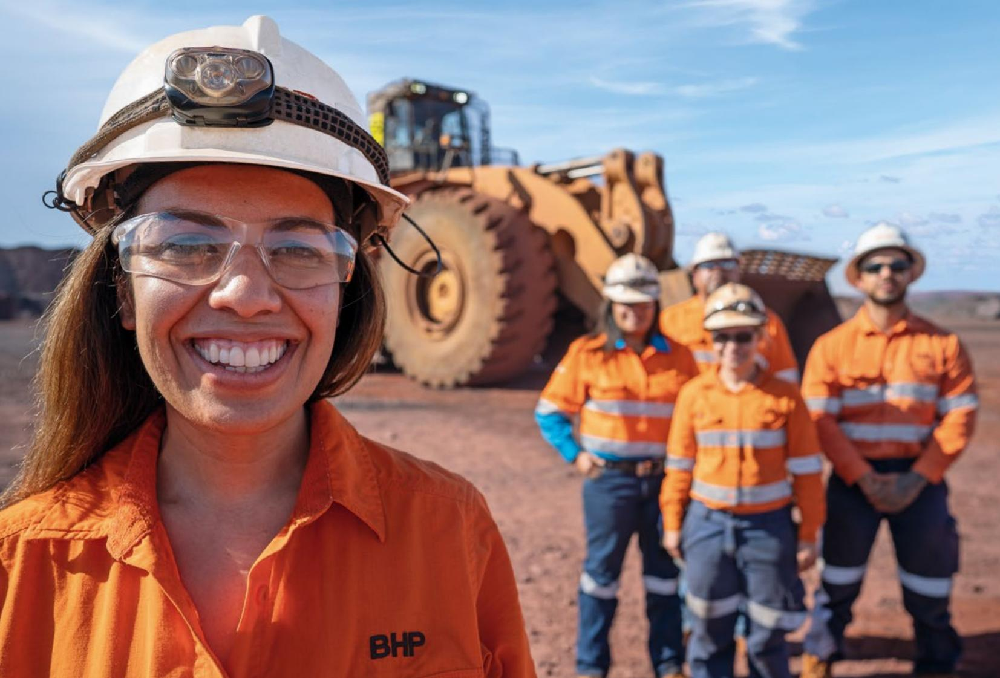

> **AI Description:**
> **Source:** `assets/_page_0_Figure_0.jpg`
> 
> **Generated:** 2026-05-19 06:43:55
> 
> ---
> 
> The image is a photograph of a group of workers in an outdoor mining environment. The foreground features a woman wearing a white hard hat with a headlamp, safety glasses, and an orange shirt with "BHP" written on it. Behind her, four other workers in similar orange uniforms and hard hats are standing, with a large mining excavator in the background. The setting appears to be a dry, open landscape, likely a mining site. The image conveys a sense of teamwork and industrial work.

## Strategic Report

Chief Executive Officer’s review

Financial Statements

## The Annual Report 2021 is available online at bhp.com

Company details and terms of reference refer to section 1.18.1

Forward-looking statements refer to section 1.18.2

## We are BHP, a leading global resources company.

## Our Purpose

Our purpose is to bring people and resources together to build a better world.

## Our Values

## Sustainability

Putting health and safety first, being environmentally responsible and supporting our communities.

## Integrity

Doing what is right and doing what we say we will do.

## Respect

Embracing openness, trust, teamwork, diversity and relationships that are mutually beneficial.

## Performance

Achieving superior business results by stretching our capabilities.

## Simplicity

Focusing our efforts on the things that matter most. Accountability

Defining and accepting responsibility and delivering on our commitments.

We are successful when:

– Our people start each day with a sense of purpose and end the day with a sense of accomplishment.

– Our teams are inclusive and diverse.

– Our communities, customers and suppliers value their relationships with us and are better off for our presence.

– Our asset portfolio is world class and sustainably developed.

– Our operational discipline and financial strength enables our future growth.

– Our shareholders receive a superior return on their investment.

– Our commodities support continued economic growth and decarbonisation.

## 1.1 Our highlights

> **AI Description:**
> **Source:** `assets/_page_3_Figure_0.jpg`
> 
> **Generated:** 2026-05-19 06:56:17
> 
> ---
> 
> The image contains a photograph of three individuals wearing safety gear, including hard hats and high-visibility jackets. The text "Operational" is displayed at the top left corner of the image. The individuals appear to be in a work environment, possibly related to mining or construction, as indicated by the BHP branding on their hard hats. The image serves as a visual representation of operational personnel, likely for a company or organization.

No fatalities for a second consecutive year; total recordable injury frequency decreased 11% to 3.7 per million hours worked

Four major projects delivered on time and on budget, including the Spence Growth Project in Copper and South Flank in Iron Ore

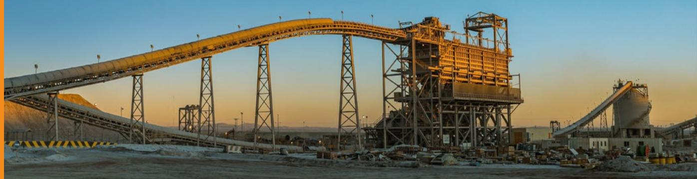

> **AI Description:**
> **Source:** `assets/_page_3_Figure_1.jpg`
> 
> **Generated:** 2026-05-19 06:56:30
> 
> ---
> 
> The image is a photograph of an industrial facility, likely a mining or processing plant. It features large conveyor belts and a complex structure with multiple levels and platforms. The facility is set against a backdrop of a clear sky during what appears to be either sunrise or sunset, casting a warm glow over the scene. The ground around the facility is partially covered with snow, indicating a cold climate. The image captures the scale and complexity of industrial operations, showcasing the infrastructure used for material handling and processing.

Record volumes at Western Australia Iron Ore (WAIO), Goonyella and Olympic Dam, and Escondida maintained average concentrator throughput at record levels

> **AI Description:**
> **Source:** `assets/_page_3_Figure_2.jpg`
> 
> **Generated:** 2026-05-19 06:54:10
> 
> ---
> 
> The image contains a photograph of a person wearing safety gear, including a high-visibility orange jacket with reflective stripes, gloves, and a hard hat with the BHP logo. The person is standing outdoors in a grassy area with some industrial structures in the background. The image appears to be related to a mining or construction setting, as indicated by the safety equipment and the industrial backdrop.

> **AI Description:**
> **Source:** `assets/_page_3_Figure_3.jpg`
> 
> **Generated:** 2026-05-19 06:53:57
> 
> ---
> 
> The image contains a photograph of two large mining trucks in an open-pit mine setting. The trucks are yellow and appear to be heavy-duty dump trucks, commonly used in mining operations. The foreground is filled with rocks and gravel, emphasizing the mining environment. The sky is clear and blue, indicating good weather conditions. The trucks are positioned side by side, with one slightly ahead of the other, suggesting they are either in motion or parked. The image captures the scale and nature of mining operations, highlighting the machinery and the rugged terrain.

Investment in Jansen Stage 1 potash project; agreement to pursue a merger of our Petroleum business with Woodside; intention to unify our corporate structure under BHP’s existing Australian parent company

## Social value

29.8% female workplace representation at the end of FY2021, a 3.3 percentage point increase from the start of the year

Principles on Cultural Heritage in Australia jointly developed with First Nations Heritage Protection Alliance

27% freshwater withdrawal reduction from FY2017 baseline, with 11% reduction achieved in FY2021

Commitment to create 2,500 new Australian apprenticeships and training positions over the next five years through the BHP FutureFit Academy, and a further 1,000 skills development opportunities in Australian regional areas. Around 80% of the Academy’s graduates in FY2021 were female

## Financial

US\$25.9 bn 80%

Profit from operations

US\$4.12 bn 66%

Net debt

Operational greenhouse gas (GHG) emissions on track to be reduced by at least 30% by FY2030 (from FY2020 levels)

Indigenous peoples workforce representation at the end of FY2021 was 7.2% in Australia, 7.5% in Chile and 13.7% in Canada

US\$175 million invested in environmenta and social programs, including a US\$50 million donation to the BHP Foundation

Partnerships to support our Scope 3 GHG emissions goals for FY2030 progressed with three major steelmakers who together represent around 10% of global steel production

## 301USc (120USc in FY2020)

Shareholder dividends per share

32.5% (16.9% in FY2020)

Underlying return on capital employed

## 1.2 Chair’s review

## Dear Shareholders,

I am pleased to provide our Annual Report for FY2021.

In a year that has seen COVID-19 continue to challenge the lives and livelihoods of so many, I am proud of the resilience and commitment our people have demonstrated to deliver an outstanding set of results in FY2021.

The strong operational performance driven by our teams across the world, combined with a diversified portfolio and disciplined approach to capital allocation, has seen the Board determine a dividend of US\$3.01 per share for FY2021. This means we have returned US\$15 billion to shareholders this year, and more than US\$38 billion over the past three years. In a year of significant financial disruption across the globe, these results demonstrate the health of your company.

BHP is in a strong position and it is against this backdrop that we are making transformative changes.

We have announced our intention to unify BHP’s corporate structure to a single listing on the Australian Securities Exchange. Creating one BHP today positions the company to deliver on our strategy in the future. We will be more agile, efficient and flexible, while still enabling BHP shareholders around the world to support the company as they have done for decades.

We have also announced a number of strategic steps towards the future of your company, as we continue to grow our portfolio in future facing commodities. We have announced a US\$5.7 billion investment in Jansen Stage 1, a top tier potash asset in Canada. BHP has also announced our intention to merge our Petroleum assets with Woodside. The resulting global top 10 independent oil and gas company will have the resilience and optionality to succeed in the energy transition.

The essential resources we produce at BHP are not only fundamental to the way we live now, they are fundamental to the way we will live in the future.

Based on the climate change scenario analysis we undertook last year, we believe that the more action the world takes to limit climate change, the better it will be for BHP.

Commodities like copper, nickel and iron ore will be essential for building the infrastructure and technology that will aid the world’s decarbonisation ambitions, and potash will help feed the world’s growing population.

Investing in future facing commodities creates great opportunities for BHP – it means our strategic goals align with our climate goals – but it also creates a challenge. The world needs to increase production of commodities that support the transition and do so ever more sustainably. BHP has made progress against our greenhouse gas emissions reductions targets and goals, but we intend to continue to challenge ourselves to reduce our own emissions, and work in partnership with our customers and suppliers to reduce emissions along the value chain.

Our response to climate change and the decarbonisation challenge is just one aspect of our broader commitment to deliver social value. Social value is the positive contribution we make to the environment and society. It goes hand in hand with financial value in our decision-making, and we believe this approach is in the long-term best interests of shareholders. We have been able to provide significant support to the communities in which we operate. This includes US\$11.1 billion in taxes, royalties and other payments to governments in FY2021 – and US\$84.0 billion over the past 10 years.

In FY2021, we continued to broaden our relationships with our Indigenous partners on whose land our operated assets lie. Our Cultural Heritage team has worked to ensure our operational decision-making is informed by reliable and contemporary heritage information, and any decision regarding cultural heritage is made by the most senior site leadership. We have also set out Regional Indigenous Peoples Plans that outline our commitment to agreement-making, Indigenous procurement, employment and social investment.

The delivery of the South Flank project was an important milestone for the Group in FY2021, and we would like to acknowledge the support of the Banjima people in helping us to deliver the project.

Our Board renewal process continued this year as we welcomed Xiaoqun Clever and Christine O’Reilly as independent Non-executive Directors in October 2020. We are pleased that Michelle Hinchliffe will join the BHP Board on 1 March 2022. Michelle has significant expertise in financial risk management and strong global experience, and we look forward to welcoming Michelle early next year.

We have also announced that Anita Frew and Susan Kilsby will retire from the BHP Board at the end of the 2021 Annual General Meetings. Both Anita and Susan have recently accepted Chair roles at significant international companies, and we wish them well. I thank Anita and Susan for the invaluable contribution they have made to BHP. Gary Goldberg has replaced Susan as BHP’s Senior Independent Director, and Christine O’Reilly has been appointed Chair of the Remuneration Committee.

Finally, we achieve nothing unless we do it safely. While we are pleased that it has now been over two years since the last fatality at our operated assets, we know that a commitment to health and safety requires more than this. We are committed to stamping out sexual assault and harassment at all our sites. This is a critical issue for BHP and for our industry. We have been working on this for some time, but we know we must do more to make our workplaces safe and inclusive for everyone.

I am confident the decisions we are making to build our company for the future, together with continued strong operational performance and commitment to those who rely on us, will see us continue to grow BHP and create value for our shareholders and our broader stakeholders for decades to come.

Thank you for your continued support of BHP.

Ken MacKenzie

“The strong operational performance driven by our teams across the world, combined with a diversified portfolio and disciplined approach to capital allocation, has seen the Board determine a dividend of US\$3.01 per share for FY2021.”

Chair

## 1.3 Chief Executive Officer’s review

## Dear Shareholders,

I am pleased to report that BHP performed strongly in FY2021, with no one fatally injured across BHP’s global operations, and record production and throughput in a number of businesses. We completed four major capital projects on time and on budget, a notable feat given the pandemic context, and our approach to capital allocation remained disciplined, generating strong returns for shareholders. I want to thank our employees and all those who supported us in delivering these outcomes.

Our operational and financial results provide the strong foundation upon which we have announced our investment in the Jansen Stage 1 potash project, the intended merger of BHP’s Petroleum business with Woodside Petroleum Ltd. (Woodside), and the intention to unify the BHP corporate structure under a single primary listing in Australia. These strategic steps are intended to underpin BHP’s ability to continue to grow shareholder value in the coming decades.

The future is clear. We believe that the world is going to need increasing supply of the essential commodities BHP produces in order to sustain global economic growth and in order to decarbonise the global economy. It is important for the world that this growing demand is met sustainably, and BHP is ideally positioned to do so given our portfolio of existing assets, our strong track record on sustainability and social value creation, our operating and financial discipline, and most importantly our people.

The intended unification of BHP’s corporate structure will position us even more strongly to be able to continue growing shareholder value. We will be a simpler, more efficient and more agile company. This is expected to enable us to be more competitive and to more quickly create and capitalise on opportunities to continue to grow value.

The intended merger of BHP’s Petroleum business with Woodside will create a global top 10 independent exploration and production company, with increased scale and resilience. We expect shareholders to benefit from significant synergies arising from the intended merger, and they will have greater choice in how to shape the relative commodity exposures in their own portfolios.

The decision to proceed with the Jansen Stage 1 potash project in Canada is a significant milestone for BHP. Potash is a future facing commodity that enables more efficient and sustainable farming, which will be increasingly important in feeding a growing global population and in meeting the world’s need to decarbonise. Jansen Stage 1 also opens up a new front for future growth for BHP. We will be ideally positioned to meet potential future growth in global demand for potash with Jansen Stages 2 through 4, which we anticipate will offer high returns and faster paybacks.

These decisions and intended steps are anticipated to result in around half of BHP’s revenues being derived from the future facing commodities of copper, potash and nickel by the end of this decade. We also expect the other half, comprising iron ore and higherquality coking coal, to see upside as the world decarbonises.

BHP continues to take action on climate change. In the past year we announced a new suite of climate change related targets and goals, together with an assessment of the performance of BHP’s portfolio under different climate scenarios. The latter indicated that BHP’s overall portfolio is resilient and, in fact, many of our commodities would perform best under our Paris-aligned scenario that sees more rapid decarbonisation and an increase in average global temperature of no more than 1.5°C.

We progressed towards our operational emissions reduction targets and goal by entering into renewable power supply agreements for our Kwinana nickel refinery and Queensland Coal operations – adding to the Escondida and Spence copper mine agreements announced in FY2020.

With a focus on Scope 3 emissions, we entered into partnerships with major steel producers in China and Japan, targeting technologies to reduce emissions from steel making.

The combined output of these steel companies equates to around 10 per cent of reported global steel production. We also entered into a series of innovative initiatives that seek to help reduce emissions in bulk shipping.

Finally, we continue to invest in people. In FY2021, we trained more than 500 apprentices and trainees through our FutureFit Academy in Australia, and have committed to creating 2,500 new Australian apprenticeship and trainee positions over the next five years. We have continued our progress towards gender balance and female participation in our workforce increased to 29.8 per cent during the year, complementing our already gender-balanced Executive Leadership Team. Our Indigenous participation rate has also increased to 7.2 per cent in Australia and 7.5 per cent in Chile. We are leading the way in building the workforce of the future.

I hope that you can see that this has been a very good year for BHP. We have taken action to shape BHP’s future, while delivering very strong operational and financial results.

The combination of a clear strategic outlook, increasing operational excellence and greater exposure to future facing commodities is expected to enable us to deliver positive returns and grow more value for all of our stakeholders in the years ahead.

Thank you for your ongoing support.

Mike Henry

Chief Executive Officer

“I am pleased to report that BHP performed strongly in FY2021, with no one fatally injured across BHP’s global operations, and record production and throughput in a number of businesses. We completed four major capital projects on time and on budget.”

## 1.4 Our business today

## Our purpose is to bring people and resources together to build a better world.

Our strategy is to deliver long-term value and returns through the cycle. We aim to do this through owning a portfolio of world class assets with exposure to highly attractive commodities that benefit from the mega-trends playing out in the world around us, by operating them exceptionally well, by maintaining a disciplined approach to capital allocation and through being industry leaders in sustainability and the creation of social value.

We are a global business with over 9,000 suppliers around the world, many of which are small to medium-sized businesses that are local to our assets.

We have approximately 80,000 employees and contractors who work in more than 17 countries around the world.

The essential resources we produce are critical for continued economic growth and decarbonisation and we are committed to supplying them more safely, responsibly and efficiently.

## In FY2021, we produced:

– the commodities to create the steel that goes into the infrastructure needed for growing cities around the world, including to support the energy transition

– the copper and nickel required for electrification, such as copper-intensive electric vehicles and nickel-intensive batteries that can reduce the need for fossil fuels and support decarbonisation

– the energy that heats homes, enables transport and powers many of the household products we use every day

Copper

> **AI Description:**
> **Source:** `assets/_page_7_Figure_0.jpg`
> 
> **Generated:** 2026-05-19 06:42:49
> 
> ---
> 
> The image contains a simple icon of a stack of papers within an orange circle. The icon is a visual representation of documents or files, likely used in a digital interface or application to symbolize a folder or a collection of documents.

FY2021 production 1,635.7 kt

Traditional usage Wiring, power cables, cars, smartphones, televisions, laptops, air conditioners

## Future facing commodities

## Nickel

> **AI Description:**
> **Source:** `assets/_page_7_Figure_1.jpg`
> 
> **Generated:** 2026-05-19 06:42:26
> 
> ---
> 
> The image contains a simple icon of a conveyor belt with a series of dots representing items being transported. The icon is enclosed in an orange circle with a white background. The dots on the conveyor belt suggest a continuous process, possibly indicating a production or assembly line.

FY2021 production 89.0 kt

Traditional usage Stainless steel, refrigerators, cookware, homeware, medical equipment

Emerging usage Electrification mega trends Wind turbines, electric vehicles, solar panels, battery charging, electric vehicle batteries, grid storage solutions

> **AI Description:**
> **Source:** `assets/_page_7_Figure_2.jpg`
> 
> **Generated:** 2026-05-19 06:40:39
> 
> ---
> 
> The image shows a white electric vehicle connected to a charging station. The charging station is mounted on a pole and has a green logo on it. The vehicle's charging port is open, and a charging cable is plugged into it. The scene suggests the vehicle is in the process of being charged.

## Steelmaking commodities

Iron ore

> **AI Description:**
> **Source:** `assets/_page_7_Figure_3.jpg`
> 
> **Generated:** 2026-05-19 06:41:03
> 
> ---
> 
> The image contains a simple icon with a circular design. The circle is divided into two sections: the upper half features a stylized leaf, and the lower half shows a small building or structure. The icon is orange with a white background, and there is no text or additional visual elements present. The icon likely represents a concept related to sustainability or green building.

FY2021 production 253.5 Mt

Metallurgical coal\*

> **AI Description:**
> **Source:** `assets/_page_7_Figure_4.jpg`
> 
> **Generated:** 2026-05-19 06:36:45
> 
> ---
> 
> The image contains a simple orange icon of a dump truck within a white circle. The icon is a flat, two-dimensional representation with no additional text or labels. It appears to be a symbol or logo, possibly representing construction or heavy-duty transportation.

FY2021 production 40.6 Mt

Cities, hospitals, schools, houses, bridges, trains, cars, smartphones

\* Metallurgical coal is also known as steelmaking coal.

## Oil & Gas

Petroleum

> **AI Description:**
> **Source:** `assets/_page_7_Figure_5.jpg`
> 
> **Generated:** 2026-05-19 06:37:06
> 
> ---
> 
> The image contains a simple orange circle with a white background. Inside the circle, there is a stylized icon of a ship with sails. The ship appears to be in motion, with the sails angled as if catching wind. There are no labels or text annotations within the image. The icon likely represents a maritime or shipping-related theme.

FY2021 production 102.8 MMboe

Driving, air travel, heating, generating electricity, cleaning products, medical and hygiene products, roads

## Emerging usage Supporting development and clean energy transition

Wind turbines, carbon capture infrastructure and climate adaption to adjust to current or expected climate change and its effects

> **AI Description:**
> **Source:** `assets/_page_7_Figure_6.jpg`
> 
> **Generated:** 2026-05-19 06:39:02
> 
> ---
> 
> The image shows a series of green and transparent cylindrical structures arranged in parallel rows. These structures appear to be part of a larger installation, possibly related to aquaculture or a similar field, given their design and arrangement. The background suggests an outdoor setting with a clear sky and a paved walkway between the rows. The image does not contain any text or labels that provide additional context.

Supporting mobility and modern life Low-emissions shipping, technologyrelated materials, pairing with renewables, and the transportation impacts of the e-commerce revolution

> **AI Description:**
> **Source:** `assets/_page_7_Figure_7.jpg`
> 
> **Generated:** 2026-05-19 06:38:47
> 
> ---
> 
> The image depicts a large ship, likely a cargo or tanker vessel, with a prominent blue hull and white superstructure. The ship is positioned on water, with the sun shining brightly in the background, creating lens flares. The ship's design suggests it is built for maritime transport, possibly for carrying bulk goods or liquids. The image is a photograph, capturing the ship in a natural setting, with no additional text or annotations visible.

## 1.5 Positioning for the future

## Growing value and positioning for the future

In August 2021, we announced proposed changes to our portfolio and corporate structure to position BHP for the future. These portfolio and capability changes are intended to enable us to even more strongly grow long-term value by sustainably producing the commodities the world needs for continued economic growth and decarbonisation. We seek to grow value while continuing to provide climate leadership and considering social value and financial value in the decisions we make.

## Petroleum business merger proposal – creating a global top 10 independent energy company

BHP and Woodside have entered into a merger commitment deed to combine their respective oil and gas portfolios by an all-stock merger. The proposed merger would create a global top 10 independent energy company by production, with a global top 10 position in the liquefied natural gas (LNG) industry, and would be the largest energy company listed on the Australian Securities Exchange (ASX).

With the combination of two high-quality asset portfolios, the combined business would have a high-margin oil portfolio, long-life LNG assets and the financial resilience to help supply the energy needed for global growth and development over the energy transition.

The proposed merger is subject to confirmatory due diligence, negotiation and execution of full form transaction documents, and satisfaction of conditions precedent, including shareholder, regulatory and other approvals.

The proposed merger is expected to be completed in the first half of CY2022. On completion, it is expected that Woodside would be owned approximately 52 per cent and 48 per cent by existing Woodside and BHP shareholders respectively. The Woodside shares would be immediately distributed to BHP shareholders. Woodside intends to remain listed on the ASX with listings on additional exchanges being considered.

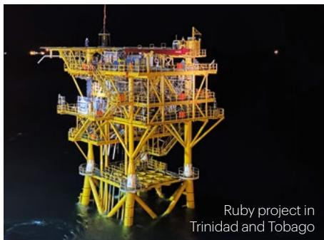

> **AI Description:**
> **Source:** `assets/_page_8_Figure_0.jpg`
> 
> **Generated:** 2026-05-19 06:49:42
> 
> ---
> 
> The image is a photograph of an offshore oil rig at night. The rig is brightly lit, with multiple levels and platforms, and is situated in a body of water. The text in the bottom right corner identifies the project as "Ruby project in Trinidad and Tobago." The rig appears to be a complex structure with various equipment and platforms, indicating its use in oil and gas extraction operations.

# Jansen Stage 1 potash project – entry into a top-tier potash basin

BHP’s Board approved a US\$5.7 billion investment in Jansen Stage 1 in Canada, which is aligned with our strategy of growing our exposure to future facing commodities in world class assets. The project is expected to produce 4.35 million tonnes of potash per year with initial production targeted for 2027, ramping up to full production over two years.

Jansen is located in the world’s best potash basin and is in an attractive investment jurisdiction. It opens up a new front for growth for BHP and is an expandable resource that can support a century or more of operations. Potash provides us with greater diversification by commodity, country, and customer.

Potash is a potassium-rich salt mainly used in fertiliser and potassium is an essential nutrient for plant growth.

## A unified corporate structure – flexibility for the future

BHP currently operates as a Dual Listed Company with two parent entities, both holding primary listings: BHP Group Limited (BHP Ltd) in Australia and BHP Group Plc (BHP Plc) in the United Kingdom.

We are proposing to adopt a single company structure under BHP Ltd, with a primary listing on the ASX. The company would hold a standard listing on the London Stock Exchange, a secondary listing on the Johannesburg Stock Exchange and an American Depositary Receipt program listed on the New York Stock Exchange.

We believe a simplified corporate structure would be more efficient and agile, better positioning the company for continued performance and growth. One-off unification costs are expected to range between US\$400 to US\$500 million.

If a unified model is implemented, eligible BHP Plc shareholders would receive one share in BHP Ltd for each BHP Plc share they hold. The holdings of BHP Ltd shareholders would not change. BHP’s dividend policy and ability to distribute fully franked dividends also would not change.

Subject to final Board approval, BHP shareholders are expected to vote on unification at shareholder meetings planned for the first half of CY2022.

Potash demand is underpinned by a growing global population and the requirement for more productive farming with a lower environmental footprint.

Jansen Stage 1 is expected to be low cost and one of the world’s most sustainable potash mines, designed for a low-carbon footprint and low water intensity.

Jansen Stage 1 is expected to create 3,500 jobs during peak construction and 600 jobs in ongoing operations, and opportunities for local and Indigenous businesses. Our goal is for the Jansen workforce to be gender balanced and for First Nations employees to make up 20 per cent of the team. In the first of their kind in the potash industry, we have signed Opportunity Agreements with six First Nations communities around the site.

## Adding to our early stage options in future facing commodities

Consistent with our strategy to secure further growth opportunities in future facing commodities, in July 2021 we made a public all-cash offer to acquire Noront Resources to gain access to a highly prospective nickel basin in an attractive region in Canada, following which Noront’s Board recommended shareholders accept BHP’s offer. During the year, we also signed an agreement for a nickel exploration alliance with Midland Exploration in Canada and exercised an option to sign a farm-in agreement with Encounter Resources for the Elliott copper project in Australia.

## Update on our non-core coal divestment process

In August 2020, we announced plans to divest our interests in BHP Mitsui Coal (BMC), New South Wales Energy Coal and Cerrejón to focus our coal portfolio on higher-quality metallurgical coals used in steelmaking.

In June 2021, we announced the signing of a Sale and Purchase Agreement to divest our 33.3 per cent interest in Cerrejón for US\$294 million cash consideration. Subject to the satisfaction of customary competition and regulatory requirements, this is expected to complete in the second half of FY2022.

The process for BMC and New South Wales Energy Coal is progressing, in line with the two-year timeframe set last year. We remain open to all options and continue consultation with relevant stakeholders.

## 1.6 Delivering value

## 1.6.1 Our business model

We are committed to creating long-term value for our shareholders and consider social value and financial value in the decisions we make.

## What we do

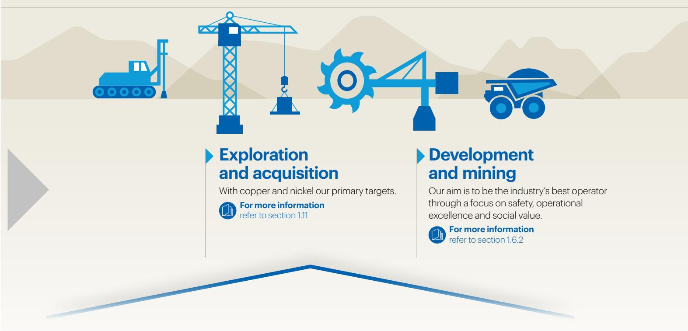

> **AI Description:**
> **Source:** `assets/_page_9_Figure_0.jpg`
> 
> **Generated:** 2026-05-19 06:46:53
> 
> ---
> 
> The image is an infographic combining text with visual elements. It features illustrations of mining equipment such as a drilling rig, a crane, a conveyor belt, and a dump truck, set against a backdrop of mountains. The infographic is divided into two main sections: "Exploration and acquisition" and "Development and mining." The text provides information about the company's focus on copper and nickel exploration, and its aim to be the industry's best operator through safety, operational excellence, and social value. The text also includes references to sections 1.11 and 1.6.2 for more information.

## What we need

## High performing culture and leading capability

Our aim is for our around 80,000 employees and contractors to work in safer, more flexible and productive ways. Our investment in technology, autonomy, recruitment and training means our teams are more skilled, diverse and capable of unlocking future performance.

For more information refer to section 1.12

## World class assets

We have a diverse portfolio of Tier 1 assets that are largely located in low-risk locations.

For more information refer to section 1.10

## Exceptional knowledge

We combine our detailed understanding of our assets with technology and unique market insights.

For more information

refer to sections 1.6.2 and 1.10.5

## Disciplined use of capital

Our Capital Allocation Framework helps us to effectively and efficiently deploy capital to maintain our assets, balance sheet and reward shareholders.

refer to section 1.6.2

## Effective risk management

Our Risk Framework helps us protect and create value.

## Strong, mutually beneficial relationships

We work with customers, suppliers, business partners and community stakeholders to help create value beyond the life of our assets. We need appropriate policy settings with countries and governments that enable us to develop resources.

refer to sections 1.10.5 and 1.13

## Responsible natural resource management

We seek to efficiently and responsibly manage water and power to actively manage the drawdown on natural resources and to be long-term custodians of 8 million hectares of land and sea.

refer to section 1.13

> **AI Description:**
> **Source:** `assets/_page_10_Figure_0.jpg`
> 
> **Generated:** 2026-05-19 06:53:22
> 
> ---
> 
> The image contains a computer monitor displaying a spreadsheet with various charts and graphs, including bar charts and a pie chart. The background features a stylized cityscape with tall buildings. The visual elements suggest a focus on data analysis or business-related information.

> **AI Description:**
> **Source:** `assets/_page_10_Figure_1.jpg`
> 
> **Generated:** 2026-05-19 06:54:46
> 
> ---
> 
> The image contains a combination of silhouettes and a cityscape. It features two human figures, one wearing a suit and the other in a construction uniform with a hard hat. The background includes stylized representations of buildings, a hospital with a cross symbol, and a tree. The overall theme suggests a professional or urban setting, possibly related to construction or urban planning.

## Process and logistics

We process and refine ore, strive to safely manage waste, and aim to efficiently and sustainably transport our products to customer markets.

refer to sections 1.10, 1.13.7 and 1.13.15

## Sales and marketing

We seek to maximise value through our commercial expertise, customer insights and proactive risk management.

For more information refer to section 1.10.5

> **AI Description:**
> **Source:** `assets/_page_10_Figure_4.jpg`
> 
> **Generated:** 2026-05-19 06:53:15
> 
> ---
> 
> The image is a simple illustration of a landscape. It features blue hills and trees, with a light beige background. The trees are stylized with varying shapes and sizes, and there are a few white clouds in the sky. The overall style is minimalistic and does not contain any text or labels.

## Closure and rehabilitation

Are considered throughout the asset lifecycle, to help minimise our impact and optimise post-closure value for all.

> **AI Description:**
> **Source:** `assets/_page_10_Figure_5.jpg`
> 
> **Generated:** 2026-05-19 06:51:46
> 
> ---
> 
> The image contains a blue circular icon with a white silhouette of a building inside it. The icon appears to represent a generic symbol for a building or structure. There is no text or additional visual information beyond the icon itself.

refer to section 1.13.14

## Value outcomes

## For our people

We paid US\$4.4 billion in FY2021 in salary, wages and incentives, and sought to provide the opportunities and environment to empower and inspire our people to be the best they can be at BHP.

refer to section 1.12

## For our business

We continued to make our workplaces safer and more productive.

refer to sections 1.6 and 1.13

## For our shareholders

Following a strong operational and financial performance, the Board announced a record final dividend of 200 US cents per share, bringing BHP’s returns to shareholders to more than US\$15 billion for the full year.

refer to section 1.2

## For our suppliers and customers

We spent US\$16.5 billion with our suppliers in FY2021, with US\$2.1 billion, or 12.7 per cent, spent with local suppliers, and sought new solutions with some of our steelmaking customers to reduce Scope 3 emissions.

## For more information

refer to the BHP Economic Contribution Report and section 1.13.7

## For community stakeholders

We worked closely with Indigenous stakeholders to ensure their rights are respected and that intergenerational social and economic outcomes are realised as a result of our presence on their traditional lands. We invested US\$175 million in community initiatives in FY2021, contributing to the resilience of the communities and environments where we have a presence.

## For more information

refer to sections 1.13.8 and 1.13.10

## For the economies where we operate

Our total economic contribution was US\$40.9 billion in FY2021, including US\$11.1 billion globally in taxes, royalties and other payments.

## For more information

refer to the BHP Economic Contribution Report

## From reducing our environmental footprint

We continued to transition to renewable power in Australia and Chile and remain on track to meet our FY2030 operational emissions target.

refer to section 1.13.7

## From the use of our products

Many of our products are essential for a decarbonising world. We estimate the world will need considerably more copper, nickel and steel than it consumes today to achieve the Paris Agreement goals.

refer to section 1.6.3

## 1.6.2 How we deliver value

## Our people

Our global workforce is the foundation of our business. Supporting our people is vital for high performance and for furthering our competitive advantage. For more information on our culture, including our aspirational target of a gender-balanced workforce and progress in FY2021, refer to section 1.12.

> **AI Description:**
> **Source:** `assets/_page_11_Figure_0.jpg`
> 
> **Generated:** 2026-05-19 06:51:28
> 
> ---
> 
> The image contains a photograph of a person standing in front of a large orange mining locomotive. The person is wearing a white hard hat with "BHP" written on it, an orange high-visibility shirt, and blue work pants. The locomotive has "BHP" written on its side, and the number "44" is visible on the front. The setting appears to be an outdoor mining or industrial environment.

## Social value

## Our strategic capabilities

To deliver on our strategy we need outstanding strategic capabilities in areas where we can generate maximum value.

The strategic capabilities we are focused on includ

– discovering and appraising resources

– acquiring the right assets and asset options

– defining the optimal ways to develop our resources

– optimising our use of capital

– continuous improvement and innovation

We are committed to creating long-term value for our shareholders and consider social value and financial value in the decisions we make. Social value is our positive contribution to society – to our people, partners, economy, environment and local communities. We know that when we consider social impacts in our decision-making and when we build respectful and mutually beneficial relationships, we create value for all of our stakeholders and in particular for our shareholders.

– establishing and maintaining mutually beneficial stakeholder relationships

Pursuing operational excellence

Our exploration program is focused on copper and nickel to grow our future facing resource portfolio and replenish our resource base. It is designed to enable us to generate attractive, low-cost, value-accretive options for our business and to position BHP for the best future access to our preferred resources. We use new technology and innovation in our exploration activities.

## Exploration

> **AI Description:**
> **Source:** `assets/_page_11_Figure_2.jpg`
> 
> **Generated:** 2026-05-19 06:52:31
> 
> ---
> 
> The image contains a photograph of a person wearing a white hard hat with "BHP" written on it, along with safety goggles and an orange safety vest. The individual appears to be in an industrial or construction setting, as suggested by the hard hat and safety gear. The person is holding a black clipboard, indicating they might be taking notes or reviewing information. The background is slightly blurred, focusing attention on the individual and their attire.

For more information refer to section 1.11

> **AI Description:**
> **Source:** `assets/_page_11_Figure_3.jpg`
> 
> **Generated:** 2026-05-19 06:53:04
> 
> ---
> 
> The image shows a group of people working on assembling a jigsaw puzzle. The puzzle pieces are large and have a distinctive design with a blue background and white and black patterns. The puzzle appears to be a map or a detailed illustration, possibly related to a specific location or theme. The hands of the individuals are visible as they fit the pieces together, indicating an interactive and collaborative activity.

We consider our social value work to be successful when the societies where we operate are better off through our presence; the communities we are part of are resilient and thriving, even in the face of change; our shareholders receive a superior return on their investment; and we are a partner of choice for governments, investors, employees, communities, suppliers and customers.

Our commitment to continuous improvement supports our pursuit of operational excellence. Our current and developing strengths include:

– the principles, practices and tools of the BHP Operating System (BOS), BHP’s way of working that makes continuous improvement part of what we do in our business every day

– the capabilities and standards housed in our technical functions, which includes Technology and our Centres of Excellence, which are designed to help deliver improved safety, productivity and sustainability outcomes

– our internal venture capital unit, BHP Ventures, which looks to invest in emerging companies with gamechanging technologies and management teams to help drive innovation and provide us with a valuable portfolio of growth options

Examples in FY2021 included multi-team and cross-functional approaches to achieve:

– an increase of over 1,000 productive hours a year for the automated truck fleet at our Jimblebar iron ore operation in Western Australia

– improvements in the refining process at Olympic Dam in South Australia resulting in a copper recovery rate from scrap copper that was 25 per cent above the budgeted target for FY2021 and a record for scrap copper recovery at Olympic Dam

Governance 2

3 Financial Statements

4 Additional Information

## Technology

> **AI Description:**
> **Source:** `assets/_page_12_Figure_0.jpg`
> 
> **Generated:** 2026-05-19 06:36:54
> 
> ---
> 
> The image shows a person working at a control room station with multiple computer monitors displaying various types of data and visualizations. The monitors appear to show different systems or processes, with some displaying maps, others showing numerical data, and some showing more complex diagrams or schematics. The person is wearing a headset, suggesting they are communicating with others or monitoring the systems. The environment suggests a technical or industrial setting where real-time monitoring and control are crucial.

Technology helps us to improve frontline safety, increase productivity, reduce cost, build capability and accelerate value creation. We are leveraging technologies such as cloud computing, cloud storage and smart analytics to enhance decision-making and advance mining technologies to automate equipment.

## Highlights in FY2021 included:

– the development of an in-house machine learning tool, Trident, at Escondida that uses real-time data analytics to optimise vessel scheduling and improve the revenue per tonne from copper concentrate sales. The tool is being implemented across our other copper concentrate assets, including Spence

– the use of machine learning and optimisation techniques at our Western Australia Iron Ore (WAIO) rail network to refine WAIO’s rail track grinding plan, which has simultaneously resulted in significantly increased grinding compliance and a reduction in hours lost

– at our WAIO shipping facilities at Port Hedland, data scientists and mathematicians worked alongside the operations team on the ground to develop algorithms that lifted our port outflow capacity by more than 1.4 Mtpa, by helping to optimise transport routes to reduce dump times and vessel line-up

## Capital discipline

We use the Capital Allocation Framework (CAF) to assess the most effective and efficient way to deploy capital. This helps us to maintain safe and reliable operations, meet our social value and greenhouse gas emissions reduction commitments, keep our balance sheet strong, and deliver strong growth and returns to our shareholders.

We then look at what would be the most valuable risk-adjusted use for any excess capital.

We evaluate the range of investment opportunities and aim to optimise the portfolio based on our assessment of risk, returns and future optionality. We then develop a long-term capital plan and guidance for the Group.

> **AI Description:**
> **Source:** `assets/_page_12_Figure_1.jpg`
> 
> **Generated:** 2026-05-19 06:37:02
> 
> ---
> 
> The image contains a man in a light blue shirt standing in front of a whiteboard. He is drawing a line graph on the whiteboard with a marker. The graph appears to represent a fluctuating trend, with peaks and troughs, and includes a dotted line at the bottom. The man is actively engaged in explaining or presenting the graph, suggesting it is part of a presentation or educational session.

## 1.6.3 How our choice of commodities and assets helps deliver value

## Our purpose is to bring together people and resources to build a better world.

Building a better world requires the decarbonisation of the global economy and the protection and improvement of the quality of life of people everywhere. The world needs sustainable industries and products, cleaner infrastructure and more of the types of jobs people aspire to. This transformation cannot happen without resources and companies like BHP that seek to produce them more safely, responsibly and efficiently.

Under our Paris-aligned 1.5°C scenario,(1) we expect demand for many of our commodities to be driven by continued growth in population and the global economy, decarbonisation and electrification. In our 1.5°C scenario, we anticipate demand for primary copper almost doubling and demand for primary nickel almost quadrupling over the next 30 years, compared to the past 30 years. We also expect demand for steel to almost double in the same period. We believe a wholesale shift away from blast furnace steelmaking, which depends on metallurgical coal, is still decades in the future.

However, we are moving to concentrate our coal portfolio on higher-grade coals used for steelmaking (metallurgical coal) that have the greatest potential upside for quality premiums as steelmakers seek to improve blast furnace utilisation and reduce emissions intensity.

Potash is expected to become vital for more efficient agricultural practices as governments and industry seek more efficient and environmentally sustainable agriculture, as well as to ease pressure on increasingly scarce land for farming.

As the shift to cleaner energy sources occurs, we expect the world will still need oil and gas to power mobility and everyday life on the pathway to decarbonisation. We see oil and gas remaining attractive in terms of their investment fundamentals for at least the next decade.

There is no easy path to achieving net zero emissions, but we believe the world has a responsibility to meet this challenge. The task of reducing emissions is more difficult in some sectors and countries, and that activities that reduce or remove carbon, such as natural climate solutions or carbon capture, use and storage, will be required to offset those carbonemitting activities that are harder to abate, such as industrial processes like steel and cement manufacturing, as the world aims for net zero emissions.

We are taking action to play our part in operating more responsibly to provide essential resources. We have been taking action on climate for decades and continue to work towards our target of reducing operational emissions by at least 30 per cent by FY2030 (from FY2020 levels(2)) and our goal of achieving net zero operational emissions by 2050.(3) We are working to support the acceleration of decarbonisation in our value chain, including in the hard to abate steelmaking sector. And we will continue to progress work to assess the potential physical impacts of climate change and what will be required to build resilience. For more information regarding our goals to reduce our emissions, refer to section 1.13.7.

Through our focus on operational and financial excellence, ever more sustainable production and use of our commodities, and the creation of broader social value, we believe BHP will play an important role in achieving a cleaner and more prosperous world, while creating greater value for our stakeholders through doing so.

## 1.6 Delivering value continued

## Our portfolio

We are actively managing our portfolio for value creation to maximise the opportunity to yield financial returns for shareholders and to create greater value for our partners, communities and all other stakeholders. Following our Board’s approval to invest in Jansen Stage 1, the proposed merger of Petroleum and the proposed exit of our non-core coal assets, BHP will be focused on producing higher-quality iron ore and metallurgical coal for steelmaking, copper for electrification and renewable energy, nickel for batteries and potash to make food production and land use more efficient. We will also continue to create and secure further options in future facing commodities.

## Iron ore

> **AI Description:**
> **Source:** `assets/_page_13_Figure_0.jpg`
> 
> **Generated:** 2026-05-19 06:41:27
> 
> ---
> 
> The image is a photograph showing two individuals in high-visibility orange work uniforms standing in an open, arid landscape. The person in the foreground is holding a tablet and appears to be interacting with the person in the background, who is smiling and looking towards the camera. In the background, there is a piece of heavy machinery, possibly a drilling rig, and a communication tower with antennas. The setting suggests a mining or construction site in a desert environment.

Metallurgical coal
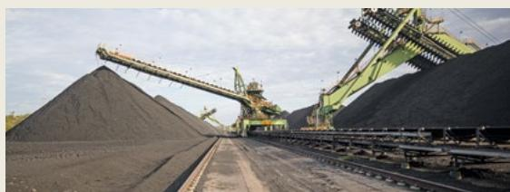

> **AI Description:**
> **Source:** `assets/_page_13_Figure_1.jpg`
> 
> **Generated:** 2026-05-19 06:40:17
> 
> ---
> 
> The image depicts a coal processing facility. It shows large piles of coal on either side of a railway track, with conveyor belts and machinery in the background. The conveyor belts are used to transport the coal, and the machinery appears to be part of the coal handling and processing equipment. The scene suggests an industrial setting where coal is being moved and possibly sorted or prepared for transport.

## Copper

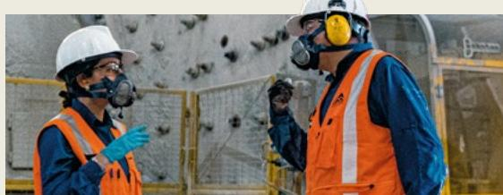

> **AI Description:**
> **Source:** `assets/_page_13_Figure_2.jpg`
> 
> **Generated:** 2026-05-19 06:41:40
> 
> ---
> 
> The image is a photograph showing two individuals in a construction or industrial setting. Both are wearing hard hats, safety vests, and respirator masks. The person on the left is gesturing with their hands while speaking, and the person on the right is listening attentively. The background includes industrial equipment and a yellow safety barrier, indicating a work environment where safety precautions are being taken.

## Nickel

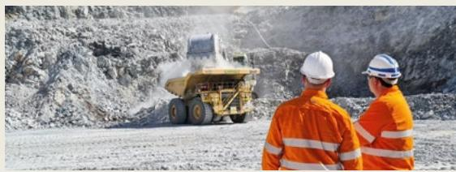

> **AI Description:**
> **Source:** `assets/_page_13_Figure_3.jpg`
> 
> **Generated:** 2026-05-19 06:44:01
> 
> ---
> 
> The image contains a photograph of two individuals wearing orange safety jackets and white hard hats, standing in front of a large yellow mining truck. The truck appears to be in the process of loading or unloading material, likely in an open-pit mining operation. The background shows a rugged, rocky terrain typical of a mining site. The individuals seem to be observing the truck's operation, possibly as part of a safety inspection or monitoring process.

## Potash

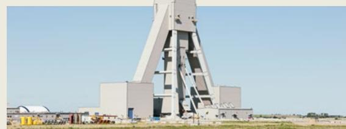

> **AI Description:**
> **Source:** `assets/_page_13_Figure_4.jpg`
> 
> **Generated:** 2026-05-19 06:38:28
> 
> ---
> 
> The image shows a large industrial structure, possibly a launch pad or a similar facility, with a tall, gray, triangular-shaped tower. The structure appears to be under construction or maintenance, as there are some yellow and red containers and equipment in the foreground. The sky is clear and blue, indicating a sunny day. The image does not contain any text or additional labels that provide specific information about the structure or its purpose.

## Petroleum

> **AI Description:**
> **Source:** `assets/_page_13_Figure_5.jpg`
> 
> **Generated:** 2026-05-19 06:39:21
> 
> ---
> 
> The image depicts an offshore oil rig situated in the ocean. The rig is equipped with various structures and cranes, likely used for drilling and extracting oil or gas from the seabed. The surrounding water is visibly blue and appears to be somewhat choppy, indicating a marine environment. The rig's design suggests it is a semi-submersible or jack-up type, commonly used in offshore drilling operations.

## Lowest-cost iron ore majors globally,(1) with improved product quality

– Record annual production at WAIO in FY2021.

– South Flank sustaining project in Western Australia achieved first ore in May 2021 and is expected to enhance our product mix in FY2022.

– WAIO is among the world’s lowest carbon emissions intensity iron ore producers.

## World class resource with a focus on higher-quality product

– Seeking value growth by enhancing productivity and focusing on higher-grade coal with greatest potential for quality premiums.

– Implementing technology applications to improve safety and productivity.

– Renewable power purchasing agreement in September 2020 to supply up to half of the electricity needs of our Queensland Coal operations from low-emissions sources.

## Growth at some of the largest(2) and most sustainable copper mines globally

– Securing more copper resources through exploration and early-stage entry options.

– Pursuing technical innovation to unlock value.

– Escondida and Spence on track for 100 per cent renewable electricity supply by the mid-2020s with four renewable power contracts to commence from FY2022.

## Options to grow from the second-largest nickel sulphide resource globally

– One of the lowest carbon emissions nickel miners in the world.

– Transitioning to new mines and focusing on higher-margin products and technical innovation.

– Seeking more resources through exploration, acquisition and early-stage options.

## Developing a potash business with embedded optionality

– Approved a US\$5.7bn investment in the Jansen Stage 1 potash project in the world’s best potash basin in Canada.

– Expected to be one of the world’s most sustainable potash mines, with a low carbon footprint and low water intensity.

– Goal for a gender-balanced workforce and for First Nations employees to make up around 20 per cent of the team.

## Creation of a global top 10 independent energy company

– Proposed merger of our Petroleum business with Woodside expected to unlock synergies, value and choice for BHP shareholders.

– On completion, existing BHP shareholders would own approximately 48 per cent of the combined business.

– Combined business expected to benefit from a high-margin oil portfolio, long-life LNG assets and the financial resilience to help supply the energy needed for global growth over the energy transition.

(1) Based on published unit costs by major iron ore producers. There may be differences in the manner that third parties calculate or report unit costs data compared to BHP, which means that third party data may not be comparable to our data.

(2) Based on published production figures.

## 1.7 Chief Financial Officer’s review

## Dear Shareholder,

I am pleased to report on BHP’s financial results for FY2021.

I feel privileged to be back at BHP after more than 15 years to continue the work and build on the significant contribution of my predecessor, Peter Beaven.

BHP delivered excellent financial results in FY2021, supported by strong operational performance, disciplined capital investment and our Marketing team’s ability to negotiate competitive commercial terms for our products.

US\$40.9bn

Our total economic contribution for FY2021

## US\$11.1bn

Tax, royalty and other payments to governments in FY2021

## 301 US cents

Shareholder dividends

per share

Our operational performance, when combined with higher iron ore and copper prices, drove underlying EBITDA up 69 per cent to US\$37.4 billion – at a margin of 64 per cent. Underlying attributable profit increased by 88 per cent to US\$17.1 billion.

The shareholder dividend for the first half was 101 US cents per share. Combined with 200 US cents per share in the second half, the total return for the year was a record 301 US cents per share. This represents an 89 per cent payout ratio.

Our total direct economic contribution for FY2021 was US\$40.9 billion. This includes payments to suppliers, wages and benefits for our approximately 80,000 employees and contractors, dividends, taxes and royalties, and voluntary investment in social projects across the communities where we operate.

In FY2021, our tax, royalty and other payments to governments totalled US\$11.1 billion. Of this, 84.7 per cent or US\$9.4 billion was paid in Australia. Our global adjusted effective tax rate in FY2021 was 34.1 per cent, which is broadly in line with our average adjusted effective tax rate over the past decade of 33.4 per cent. Once royalties are included, our FY2021 rate increases to 40.7 per cent.

We have continued to apply the Capital Allocation Framework to direct cash where it can generate the best returns. Over the year, underlying Return on Capital Employed strengthened to 32.5 per cent.

The Western Australia Iron Ore underlying Return on Capital Employed of 89 per cent is an outstanding result, helped by higher iron ore prices but also record production. Our copper assets are showing the benefits of capital investment and higher prices. Our focus remains on improving returns in other parts of the business.

Based on the consistent performance of the past five years, and despite the cyclical nature of our industry, our earnings and returns are reflective of our high-quality stable business. These FY2021 results demonstrate the resilience of our diversified portfolio.

Thank you for your continued support of BHP. I look forward to speaking with more of our shareholders in the months ahead.

David Lamont

Chief Financial Officer

“Our operational performance, when combined with higher iron ore and copper prices, drove underlying EBITDA up 69 per cent to US\$37.4 billion – at a margin of 64 per cent. Underlying attributable profit increased by 88 per cent to US\$17.1 billion.”

### Full Page Description (Page 15)

**Source:** `assets/_page_15_Asset_0.jpg`

**Generated:** 2026-05-19 06:37:22

---

The image is a bar chart with a vertical orientation. It presents data across fiscal years (FY) from 2017 to 2021. Each bar represents a different year, with the height of the bar indicating a value. The values for each year are labeled at the top of the corresponding bar. The bar for FY2021 is colored orange and is significantly taller than the others, indicating a higher value. The chart uses a color gradient for the bars, with FY2021 being the only one in a distinct color. The y-axis is labeled with numerical values, suggesting the data is measured in a specific unit.

### Full Page Description (Page 15)

**Source:** `assets/_page_15_Asset_1.jpg`

**Generated:** 2026-05-19 06:35:59

---

The image is a bar chart showing data for fiscal years FY2017 to FY2021. The bars are divided into two segments: the lower segment represents a value and the upper segment represents another value. The values for FY2017 to FY2020 are stacked, while FY2021 is shown as a single bar with a different color. The values for FY2021 are labeled as 37.4. The chart appears to be comparing two different metrics across the fiscal years, with FY2021 having the highest value.

### Full Page Description (Page 15)

**Source:** `assets/_page_15_Asset_2.jpg`

**Generated:** 2026-05-19 06:38:37

---

The image is a bar chart with data presented for fiscal years FY2017 through FY2021. The bars are divided into two segments, representing different categories. The darker segment at the bottom of each bar represents the value for the first category, while the lighter segment at the top represents the second category. The chart shows a significant increase in the second category's value in FY2021, which is highlighted in orange. The values for the first category in each fiscal year are as follows: FY2017 (16.8), FY2018 (18.5), FY2019 (17.9), FY2020 (15.7), and FY2021 (27.2).

### Full Page Description (Page 15)

**Source:** `assets/_page_15_Asset_3.jpg`

**Generated:** 2026-05-19 06:39:15

---

The image is a bar chart showing data as a percentage for fiscal years FY2017 through FY2021. The chart uses a gradient color scheme, with the bars transitioning from light gray to orange. The percentages for each fiscal year are labeled on the bars: 9.8% for FY2017, 14.2% for FY2018, 16.1% for FY2019, 16.9% for FY2020, and 32.5% for FY2021. The y-axis is labeled "Per cent," indicating the percentage values represented by each bar. The chart highlights a significant increase in the percentage from FY2020 to FY2021, with FY2021 showing the highest percentage at 32.5%.

## 1.8 Financial review

## 1.8.1 Group overview

We prepare our Consolidated Financial Statements in accordance with International Financial Reporting Standards (IFRS), as issued by the International Accounting Standards Board.

We publish our Consolidated Financial Statements in US dollars. All Consolidated Income Statement, Consolidated Balance Sheet and Consolidated Cash Flow Statement information below has been derived from audited Financial Statements.

## For more information refer to section 3

We use various Alternative Performance Measures (APMs) to reflect our underlying performance. These APMs are not defined or specified under the requirements of IFRS, but are derived from the Group’s Consolidated Financial Statements prepared in accordance with IFRS. The APMs are consistent with how management reviews financial performance of the Group with the Board and the investment community. Section 4.2, which is incorporated into the Strategic Report by reference, includes our APMs and section 4.2.1 outlines why we believe the APMs are useful and the calculation methodology. We believe these APMs provide useful information, but they should not be considered as an indication of, or as a substitute for statutory measures as an indicator of actual operating performance (such as profit or net operating cash flow) or any other measure of financial performance or position presented in accordance with IFRS, or as a measure of a company’s profitability, liquidity or financial position.

## 1.8.2 Key performance indicators

Our key performance indicators (KPIs) enable us to measure our sustainable development and financial performance.

These KPIs are used to assess performance of our people throughout the Group.

For information on our approach to performance and reward refer to section 2

For information on our overall approach to executive remuneration, including remuneration policies and remuneration outcomes refer to section 2

Following BHP’s sale of the Onshore US assets, the contribution of these assets to the Group’s results is presented in this Annual Report as Discontinued operations.

To enable more meaningful comparisons with prior year disclosures and in some cases to comply with applicable statutory requirements, the data in section 1.8.2, except for Underlying EBITDA, has been presented to include Onshore US assets.

Summary of financial measures

(1) All comparative periods have been restated to reflect changes to the Group’s accounting policy following a decision by the IFRS Interpretations Committee on IAS 12 ‘Income Taxes’, resulting in the retrospective recognition of US\$950 million of goodwill at Olympic Dam (included in the Copper segment) and an offsetting US\$1,021 million increase in deferred tax liabilities. Refer to note 39 ‘New and amended accounting standards and interpretations and changes to accounting policies’ in section 3 for further information.

For more selected consolidated financial information derived from the historical audited Consolidated Financial Statements of the group refer to section 4.1

Footnotes to tables and infographics indicate whether data presented in section 1.8.2 is inclusive or exclusive of Onshore US. Details of the contribution of the Onshore US assets to the Group’s results are disclosed in note 29 ‘Discontinued operations’ in section 3.

Reconciling our financial results to our key performance indicators

## 1.8.3 Financial results

The following table provides more information on the revenue and expenses of the Group in FY2021:

(1) Includes the sale of third-party products.

## 1.8 Financial review continued

Profit after taxation attributable to BHP shareholders increased from a profit of US\$8.0 billion in FY2020 to a profit of US\$11.3 billion in FY2021. Attributable profit of US\$11.3 billion in FY2021 includes an exceptional loss of US\$5.8 billion (after tax), compared to an attributable profit of US\$8.0 billion, including an exceptional loss of US\$1.1 billion (after tax) in the prior period. The FY2021 exceptional loss mainly relates to impairment charges recognised in relation to the Group’s energy coal and Potash assets as well as the Samarco dam failure.

## For more information on Exceptional items refer to note 3 ‘Exceptional items’ in section 3

Revenue of US\$60.8 billion increased by US\$17.9 billion, or 42 per cent, from FY2020. This increase was primarily attributable to higher average realised prices for iron ore, copper, nickel, oil, natural gas and thermal coal, partially offset by lower average realised prices for metallurgical coal and LNG. Record volumes achieved at WAIO, along with the highest annual production at Olympic Dam since our acquisition in 2005, were more than offset by the impacts of expected grade declines at Escondida and Spence, natural field decline in Petroleum and adverse weather events.

For information on our average realised prices and production of our commodities refer to section 1.17

Total expenses excluding net finance costs of US\$34.5 billion increased by US\$5.7 billion, or 20 per cent, from FY2020. This includes a US\$2.0 billion increase of net impairment charges recognised against the Group’s Potash assets of US\$1.3 billion and at NSWEC of US\$1.1 billion recognised in FY2021 compared to US\$0.4 billion at Cerro Colorado in FY2020. The increase also included higher price linked costs of US\$0.9 billion reflecting higher royalties due to higher realised prices for iron ore and US\$0.5 billion of higher third party concentrate purchase costs. Depreciation and amortisation expense increased by US\$0.7 billion reflecting a decrease in estimated remaining reserves at Bass Strait due to underperformance of the reservoir in the Turrum field and lower overall condensate and natural gas liquids (NGL) recovery from the Bass Strait gas fields and higher depreciation at WAIO due to a change in Yandi’s life of mine. This was combined with higher foreign exchange losses of US\$1.6 billion reflecting the impact of the stronger Australian dollar and Chilean peso against the US dollar on our cost base.

Loss from equity accounted investments, related impairments and expenses of US\$(0.9) billion in FY2021, increased by US\$0.4 billion from FY2020. The increase was primarily due to unfavourable foreign exchange impacts in relation to the Samarco dam failure provision of US\$0.5 billion combined with a US\$0.5 billion impairment charge at Cerrejón, partially offset by higher current year profits from Antamina of US\$0.4 billion primarily due to higher prices. Further information on the total impact of the Samarco dam failure provision and impairment charges connected with equity accounted investments, can be found at note 3 ‘Exceptional items’ in section 3 and note 13 ‘Impairment of non-current assets’ in section 3 respectively.

Net finance costs of US\$1.3 billion increased by US\$0.4 billion, or 43 per cent, from FY2020. This was primarily attributable to premiums of US\$395 million paid as part of the value accretive multi-currency hybrid debt repurchase programs completed during the year.

## For more information on net finance costs refer to section 1.8.4 and note 22 ‘Net finance costs’ in section 3

Total taxation expense of US\$11.2 billion increased by US\$6.4 billion from FY2020. The increase was primarily due to significantly higher profits and higher withholding tax on dividends, mostly driven by higher commodity prices.

For more information on income tax expense refer to note 6 ‘Income tax expense’ in section 3

## Principal factors that affect Underlying EBITDA

The following table and commentary describes the impact of the principal factors(1) that affected Underlying EBITDA for FY2021 compared with FY2020:

(1) For information on the method of calculation of the principal factors that affect Underlying EBITDA, refer to section 4.2.2.

## Cash flow

The following table provides a summary of the Consolidated Cash Flow Statement contained in section 3.1.4:

## Net operating cash inflows of US\$27.2 billion

increased by US\$11.5 billion. This reflects stronger iron ore and copper commodity prices and strong operational performance across the Group’s portfolio partially offset by the impacts of a stronger Australian dollar and Chilean peso against the US dollar, lower grades at Escondida and Spence, natural field decline at Petroleum and adverse weather events.

## Net investing cash outflows of US\$7.8 billion

increased by US\$0.2 billion. This reflects the investment in an additional 28 per cent working interest in Shenzi from Hess Corporation of US\$0.5 billion, increasing our share from 44 per cent to 72 per cent; partially offset by lower purchases of property plant and equipment of US\$0.3 billion as the Group commissioned SGO and South Flank in FY2021.

## For more information and a

breakdown of capital and exploration expenditure on a commodity basis refer to section 1.17

## Net financing cash outflows of US\$17.9 billion

increased by US\$8.2 billion. This reflects the higher repayment of interest bearing liabilities of US\$6.0 billion mainly due to bond repayments on maturity of US\$3.5 billion and early repurchase of hybrid bonds of US\$3.4 billion. This was combined with higher dividends paid in FY2021 of US\$1.0 billion reflecting the record half year dividend and higher dividends paid to noncontrolling interests of US\$1.1 billion driven by higher profits achieved at Escondida.

## For more information

refer to section 1.8.4 and note 20 ‘Net debt’ in section 3

## Underlying Return on Capital Employed

(ROCE) of 32.5 per cent increased by 15.6 percentage points (FY2020: 16.9 per cent) reflecting the significant increase in profit after taxation excluding net finance costs and exceptional items of US\$9.5 billion. The Underlying ROCE in FY2021 includes US\$12.1 billion of Assets under Construction (average of ending balances for FY2021 of US\$10.4 billion and FY2020 of US\$13.8 billion) including major projects in Potash and Mad Dog Phase Two, that are not yet producing their planned contribution to earnings.

Assets under Construction refer to note 11 ‘Property, plant and equipment’ in section 3

## 1.8.4 Debt and sources of liquidity

Our policies on debt and liquidity management have the following objectives:

– a strong balance sheet through the cycle

– diversification of funding sources

– maintain borrowings and excess cash predominantly in US dollars

## Interest bearing liabilities, net debt and gearing

At the end of FY2021, Interest bearing liabilities were US\$21.0 billion (FY2020: US\$27.0 billion) and Cash and cash equivalents were US\$15.2 billion (FY2020: US\$13.4 billion). This resulted in Net debt(1) of US\$4.1 billion, which represented a decrease of US\$7.9 billion compared with the net debt position at 30 June 2020.

This was primarily due to the significant operating cash flow generated from strong financial and operational performance, and the favourable commodity price environment experienced during the year. Gearing, which is the ratio of Net debt to Net debt plus Net assets, was 6.9 per cent at 30 June 2021, compared with 18.8 per cent at 30 June 2020.

During FY2021, two multi-currency hybrid debt repurchase programs were completed (US\$1.7 billion on 17 September 2020 and US\$1.1 billion on 23 November 2020) and were funded from surplus cash. The Group also redeemed US\$1.0 billion of 6.250 per cent hybrid notes on 19 October 2020, US\$0.3 billion of 6.750 per cent hybrid notes on 30 December 2020 (the balance following the repurchase programs), and €1.25 billion of 4.750 per cent hybrid notes on 22 April 2021 using surplus cash.

At the subsidiary level, Escondida borrowed US\$550 million to refinance maturing long-term debt during FY2021.

## 1.8 Financial review continued

## Funding sources

No new Group-level debt was issued in FY2021 and debt that matured during the year was not refinanced. These actions enhanced BHP’s capital structure and extended BHP’s average debt maturity.

Our Group-level borrowing facilities are not subject to financial covenants. Certain specific financing facilities in relation to specific assets are the subject of financial covenants that vary from facility to facility, as is considered normal for such facilities. In addition to the Group’s uncommitted debt issuance programs, we hold the following committed standby facility:

(1) During the year we completed a one-year extension of the facility which is now due to mature on 10 October 2025. The committed US\$5.5 billion revolving credit facility operates as a backstop to the Group’s uncommitted commercial paper program. The combined amount drawn under the facility or as commercial paper will not exceed US\$5.5 billion. As at 30 June 2021, US\$ nil commercial paper was drawn (FY2020: US\$ nil), therefore US\$5.5 billion of committed facility was available to use (FY2020: US\$5.5 billion). A commitment fee is payable on the undrawn balance and an interest rate comprising an interbank rate plus a margin applies to any drawn balance. The agreed margins are typical for a credit facility extended to a company with BHP’s credit rating.

For more information on the maturity profile of our debt obligations and details of our standby and support agreements

refer to note 23 ‘Financial risk management’ in section 3

In our opinion, working capital is sufficient for our present requirements. Our Moody’s credit rating has remained at A2/P-1 outlook stable (long-term/ short-term) throughout FY2021. Moody’s affirmed its credit rating on 31 May 2021. Our Standard & Poor’s rating changed from A/A-1 outlook stable (longterm/short-term) to A/A-1 CreditWatch negative (long-term/short-term) on 23 August 2021. Credit ratings are forward-looking opinions on credit risk. Standard & Poor’s and Moody’s credit ratings express the opinion of each agency on the ability and willingness of BHP to meet its financial obligations in full and on time. A credit rating is not a recommendation to buy, sell or hold securities and may be subject to suspension, reduction or withdrawal at any time by an assigning rating agency. Any rating should be evaluated independently of any other information.

The following table expands on the net debt, to provide more information on the cash and non-cash movements in FY2021:

(1) Other financing activities mainly comprises purchases of shares by Employee Share Option Plan trusts of US\$234 million (FY2020: US\$143 million).

(2) The Group hedges against the volatility in both exchange and interest rates on debt, and also exchange on cash, with associated movements in derivatives reported in Other financial assets/liabilities as effective hedged derivatives (cross currency and interest rate swaps), in accordance with accounting standards. For more information, refer to note 23 ‘Financial risk management’ in section 3.

## Dividends

Our dividend policy provides for a minimum 50 per cent payout of Underlying attributable profit at every reporting period. The minimum dividend payment for the second half of FY2021 was US cents 109 per share. Recognising the importance of cash returns to shareholders, the Board determined to pay an additional amount of US cents 91 per share, taking the final dividend to US cents 200 per share (US\$10.1 billion). Total dividends of US\$15.2 billion (US\$3.01 per share) have been determined for FY2021, including an additional amount of US\$6.7 billion above the minimum payout policy. These returns are covered by total free cash flow of US\$19.4 billion in FY2021.

## 1.9 How we manage risk

# Risk management helps us to protect and create value, and is central to achieving our purpose and strategic objectives.

Our Risk Framework has four pillars: risk strategy, risk governance, risk process and risk intelligence.

## Risk strategy

## Risk classification

We classify all risks to which BHP is exposed using our Group Risk Architecture. This is a tool designed to identify, analyse, monitor and report risk, which provides a platform to understand and manage risks. Similar risks are considered together in groups and categories. This gives the Board and management visibility over the aggregate exposure to risks on a Group-wide basis and supports performance monitoring and reporting against BHP’s risk appetite.

## Risk appetite

BHP’s Risk Appetite Statement is approved by the Board and is a foundational element of our Risk Framework. It provides guidance to management on the amount and type of risk we seek to take in pursuing our objectives.

## Key risk indicators

Key risk indicators (KRIs) are set by management to help monitor performance against our risk appetite. They also support decision-making by providing management with information about financial and non-financial risk exposure at a Group level. Each KRI has a target, or optimal level of risk we seek to take, as well as upper and lower limits. Where either limit is exceeded, management will review potential causes to understand if BHP may be taking too little or too much risk and to identify whether further action is required.

## Risk culture

Our risk management approach is underpinned by a risk culture that supports decision-making in accordance with BHP’s values, objectives and risk appetite.

We use a common foundation across BHP to build the tools and capabilities required to enable us to understand, monitor and manage our risk culture. These include tailored cultural assessments, Group-wide risk culture dashboards and the inclusion of behavioural auditing in our internal audit plan.

## Strategic business decisions

Strategic business decisions and the pursuit of our strategic objectives can inform, create or affect risks to which BHP is exposed. These risks may represent opportunities as well as threats. Our Risk Appetite Statement and KRIs assist in determining whether a proposed course of action is within BHP’s risk appetite.

Our focus when managing risks associated with strategic business decisions is to enable the pursuit of high-reward strategies. Therefore, as well as having controls designed to protect BHP from threats, we seek to implement controls to enhance and/or increase the likelihood of opportunities being realised. For example, we might establish additional governance, oversight or reporting to help ensure new initiatives remain on track.

## Risk governance

## Three lines model

BHP uses the ‘three lines model’ of risk governance and management to define the role of different teams across the organisation in managing risk. This approach sets clear accountabilities for risk management and provides appropriate ‘checks and balances’ to support us in protecting and growing value.

The first line is provided by our frontline staff, operational management and people in functional roles – anyone who makes decisions, deploys resources or contributes to an outcome is responsible for identifying and managing the associated risks. The Risk team and other second-line functions are responsible for providing expertise, support, monitoring and challenge on risk-related matters, including by defining Group-wide minimum standards. The third line, our Internal Audit and Advisory team, is responsible for providing independent and objective assurance over the control environment (governance, risk management and internal controls) to the Board and Executive Leadership Team. Additional assurance may also be provided by external providers, such as our External Auditor.

## BHP Board and Committees

effectiveness of the Group’s systems of financial and non-financial risk management and internal control. The broad range of skills, experience and knowledge of the Board assists in providing a diverse view on risk management. The Risk and Audit Committee (RAC) and Sustainability Committee assist the Board by reviewing and considering BHP’s risk profile (covering operational, strategic and emerging risks) on a biannual basis.

## For more information refer to sections 2.1.7, 2.1.10 and 2.1.11

Performance against risk appetite is monitored and reported to the RAC, as well as the Sustainability Committee for HSEC matters, enabling the Board to challenge and hold management to account where necessary.

Second-line risk-based reviews are undertaken to provide greater oversight and enhance our understanding and management of the Group’s most significant risks, with outcomes reported to management, the RAC and Sustainability Committee. These outcomes may be used to develop remediation plans, adjust BHP’s Risk Appetite Statement or KRIs, enhance our Risk Framework or inform strategic decisions.

Additional information on risk management and internal controls is shared between the Board, the RAC and, for HSEC matters, the Sustainability Committee, and is provided by the Business Risk and Audit Committees (covering each business region), management committees, our Internal Audit and Advisory team and our External Auditor.

For more information refer to section 2.1

## Risk process

Our Risk Framework requires identification and management of risks (both threats and opportunities) to be embedded in business activities through the following process:

– Risk identification – threats and opportunities are identified and each is assigned an owner, or accountable individual.

– Risk assessments – risks are assessed using appropriate and internationally recognised techniques to determine their potential impacts and likelihood, prioritise them and inform risk treatment options.

– Risk treatment – controls are implemented to prevent, reduce or mitigate threats, and enable or enhance opportunities.

– Monitoring and review – risks and controls are reviewed periodically and on an ad hoc basis (including where there are highpotential events or changes in the external environment) to evaluate performance.

Our Risk Framework includes requirements and guidance on the tools and process to manage current and emerging risks.

## Current risks

Current risks are risks that could impact BHP today or in the near future, and comprise current operational risks (risks that have their origin inside BHP or occur as a result of our activities) and current strategic risks (risks that may enhance or impede the achievement of our strategic objectives).

Current risks include material and non-material risks (as defined by our Risk Framework). The materiality of a current risk is determined by estimating the maximum foreseeable loss (MFL) if that risk was to materialise. The MFL is the estimated impact to BHP in a worst-case scenario without regard to probability and assuming all risk controls, including insurance and hedging contracts, are ineffective.

are described in section 1.16

## 1.9 How we manage risk continued

Our focus for current risks is to prevent their occurrence or minimise their impact should they occur, but we also consider how to maximise possible benefits that might be associated with strategic risks (as described in the ‘Risk strategy’ section). Current material risks are required to be evaluated once a year at a minimum to determine whether our exposure to the risk is within our risk appetite.

## Emerging risks

Emerging risks are newly developing or changing risks that are highly uncertain and difficult to quantify. They are generally driven by external influences and often cannot be prevented.

BHP maintains a ‘watch list’ of emerging themes that provides an evolving view of the changing external environment and how it might impact our business. We use the watch list to support the identification and management of emerging risks, as well as to inform and test our corporate strategy.

Once identified, our focus for emerging risks is on structured monitoring of the external environment, advocacy efforts to reduce the likelihood of the threats manifesting and identifying options to increase our resilience to these threats.

## Risk intelligence

The Risk team provides the Board and senior management with insights on trends and aggregate exposure for our most significant risks, as well as performance against risk appetite. Risk reports may also provide an update on the Risk Framework, overview of (and material changes in) the risk profile and updates on emerging risk themes and risk culture. They are supported by an opinion from the Chief Risk Officer (or other relevant individual).

We maintain a risk insights dashboard designed to provide current, data-driven and actionable risk intelligence to our people at all levels of the business to support decision-making. This tool empowers the business to manage risks more effectively, with increased accuracy and transparency.

The Board also receives reports from other teams to support its robust assessment of BHP’s emerging and principal risks, including internal audit reports, ethics and compliance reports and the Chief Executive Officer’s report.

For information on our principal risks, and robust risk assessment and viability statement refer to section 1.16

## 1.10 Our business 1.10.1 Locations

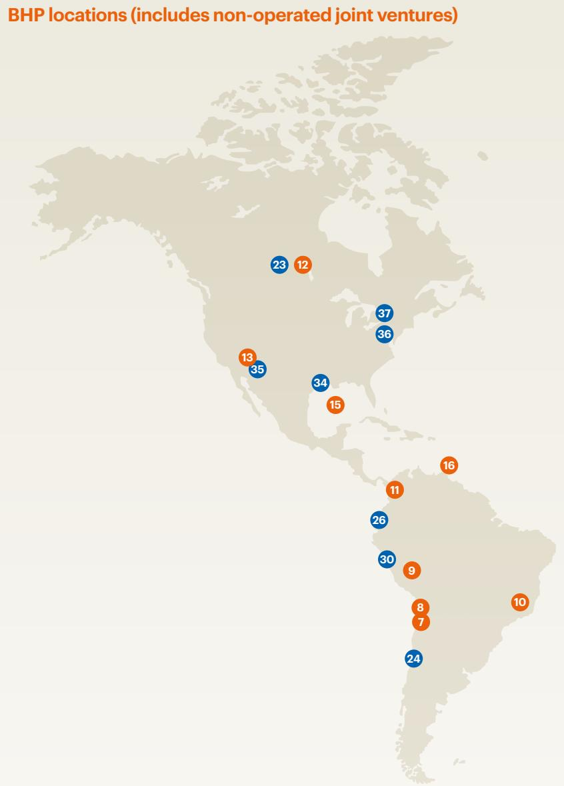

> **AI Description:**
> **Source:** `assets/_page_21_Figure_1.jpg`
> 
> **Generated:** 2026-05-19 06:56:07
> 
> ---
> 
> The image is a map of North and South America, displaying the locations of BHP (BHP Billiton) operations, including non-operated joint ventures. The map uses a color-coded system with blue and orange markers to indicate different locations. Each marker is numbered, suggesting a reference to a specific location or project. The map highlights the geographical spread of BHP's operations across the continent, with a concentration of locations in South America and a smaller distribution in North America.

> **AI Description:**
> **Source:** `assets/_page_21_Figure_2.jpg`
> 
> **Generated:** 2026-05-19 06:53:45
> 
> ---
> 
> The image contains a simple graphic of the outline of Australia. It is a white silhouette of the country's shape set against an orange circular background. There are no text annotations or additional visual elements present. The image is a straightforward representation of Australia's geographical outline.

## Minerals Australia

Olympic Dam Australia

2 Western Australia Iron OreAustralia

3 New South Wales Energy Coal Australia

4 BHP MitsubishiAllianceAustralia

## Minerals Americas

5 BHP Mitsui Coal Australia

6 Nickel West Australia

EscondidaChile

8 Pampa Norte Chile

9 Antamina (1) Peru

10 Samarco (1) Brazil

11 Cerrejón (1) Colombia

For more information refer to section 1.10.2

12 Jansen Canada

13 Resolution Copper (1) US

For more information refer to section 1.10.3

(1) Non-operated joint venture.

> **AI Description:**
> **Source:** `assets/_page_22_Figure_1.jpg`
> 
> **Generated:** 2026-05-19 06:42:58
> 
> ---
> 
> The image contains a simple diagram of an oil rig. It is a white silhouette of an oil rig structure on a bright orange background. The diagram is minimalistic and does not include any text or additional labels. It is a straightforward representation of an oil rig, likely used to symbolize the oil and gas industry.

## Petroleum

14 Australia Production Unit Australia

15 Gulf of Mexico Production Unit Gulf of Mexico Joint Interest Unit (1) US

16 Trinidad and Tobago Production Unit Trinidad and Tobago

17 Algeria Joint Interest Unit (1) Algeria

18 Australia Joint Interest Unit (1) Australia

## BHP principal office locations

19 Minerals Australia office Adelaide, Australia

20 Minerals Australia office Brisbane, Australia

21 Global headquarters Melbourne, Australia

22 Minerals Australia office Perth, Australia

23 Minerals Americas office Saskatoon, Canada

24 Minerals Americas office Santiago, Chile

25 Corporate office Shanghai, China

26 Metals exploration office Quito, Ecuador

27 Corporate office New Delhi, India

29 Global Business Services Kuala Lumpur, Malaysia

30 Metals exploration office Lima, Peru

31 Global Business Services Manila, Philippines

32 Marketing and corporate office Singapore, Singapore

33 Corporate office London, UK

34 Petroleum office Houston, US

35 Metals exploration office Tucson, US

36 Corporate office Washington DC, US

37 Corporate office Toronto, Canada

28 Corporate office Tokyo, Japan

> **AI Description:**
> **Source:** `assets/_page_23_Figure_0.jpg`
> 
> **Generated:** 2026-05-19 06:39:39
> 
> ---
> 
> The image contains a simple graphic of a white outline of the continent of Australia within an orange circle. There are no charts, graphs, or other visual elements present. The image is a straightforward representation of the continent's shape, with no additional annotations or text.

## 1.10.2 Minerals Australia

Minerals Australia includes operated assets in Western Australia, Queensland, New South Wales and South Australia, focused on iron ore, metallurgical coal, copper, nickel and energy coal. The commodities produced by our Minerals Australia assets are transported by rail to port and exported to our global customers.

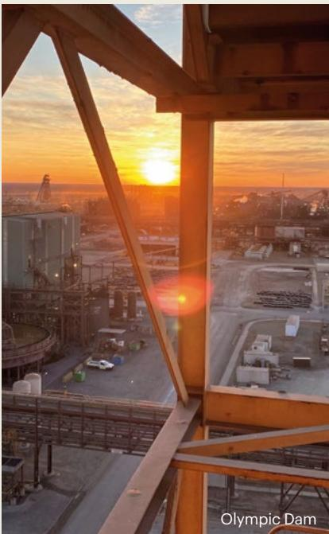

> **AI Description:**
> **Source:** `assets/_page_23_Figure_1.jpg`
> 
> **Generated:** 2026-05-19 06:38:07
> 
> ---
> 
> The image is a photograph of a sunset over an industrial area. The sun is low on the horizon, casting a warm glow over the scene. The foreground features structural elements of a large industrial facility, possibly a mining or processing plant, with various buildings and equipment visible. The text "Olympic Dam" is visible in the bottom right corner, indicating the location of the image. The overall scene conveys a sense of industrial activity set against the backdrop of a natural sunset.

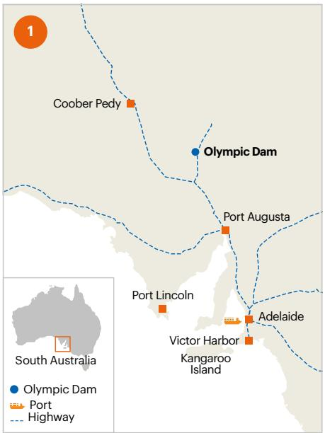

> **AI Description:**
> **Source:** `assets/_page_23_Figure_2.jpg`
> 
> **Generated:** 2026-05-19 06:35:41
> 
> ---
> 
> The image is a map of South Australia, highlighting various locations and infrastructure. It includes a legend indicating the symbols for Olympic Dam, ports, and highways. The map shows the locations of Coober Pedy, Olympic Dam, Port Augusta, Port Lincoln, Adelaide, Victor Harbor, and Kangaroo Island. The highways are represented by dashed blue lines, and the ports are marked with orange squares. The map provides a clear geographical layout of these locations and their connections.

## Copper

## 1 Olympic Dam

## Overview

Located in South Australia, Olympic Dam (BHP ownership: 100 per cent) is one of the world’s most significant deposits of copper, gold, silver and uranium. It comprises underground and surface operations, and is a fully integrated processing facility from ore to metal.

Ore mined underground is hauled by an automated train system to crushing, storage and ore hoisting facilities or trucked directly to the surface.

Olympic Dam has a fully integrated metallurgical complex with a grinding and concentrating circuit, a hydrometallurgical plant incorporating solvent extraction circuits for copper and uranium, a copper smelter, a copper refinery, including an electro-refinery and an electrowinning-refinery, and a recovery circuit for precious metals.

## Key developments in FY2021

Copper production increased by 20 per cent to 205 kilotonnes (kt) (172 kt in FY2020), reflecting improved smelter performance and strong underground mine performance. This was the highest annual copper production since Olympic Dam was acquired in 2005. Record gold production of 146 thousand troy ounces (koz) was also achieved.

The short-term focus remains on completing the multi-year asset integrity program designed to improve the reliability of operations, which is on track heading into a planned major smelter maintenance campaign in FY2022. A new refinery crane commenced operation in FY2021 to improve stability and reliability at the electrorefinery. At Oak Dam, next stage resource definition drilling commenced in May 2021 to inform resource characterisation and potential development pathways.

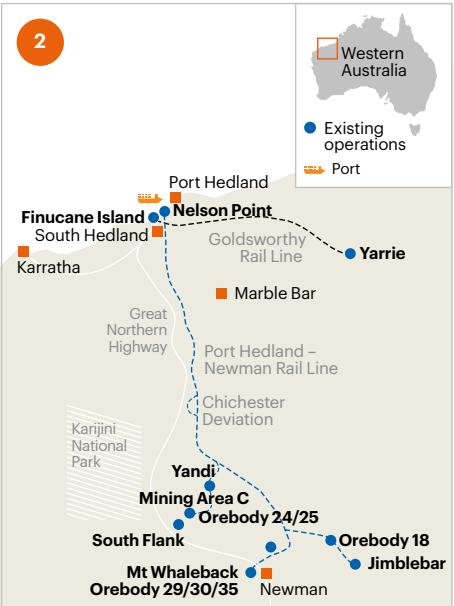

> **AI Description:**
> **Source:** `assets/_page_23_Figure_3.jpg`
> 
> **Generated:** 2026-05-19 06:37:59
> 
> ---
> 
> The image is a map of Western Australia, highlighting existing operations and ports. It includes labels for various locations such as Finucane Island, Nelson Point, Port Hedland, Yarrie, and Newman. The map also shows the Great Northern Highway, the Port Hedland-Newman Rail Line, and the Chichester Deviation. Key areas of interest are marked with blue dots, representing existing operations, and orange squares, indicating ports. The map provides a geographical overview of the region, focusing on mining and transportation infrastructure.

> **AI Description:**
> **Source:** `assets/_page_23_Figure_4.jpg`
> 
> **Generated:** 2026-05-19 06:40:10
> 
> ---
> 
> The image depicts a piece of industrial equipment, likely a conveyor system, used in the processing or handling of materials. The equipment is elevated and appears to be part of a larger mining or processing facility. The foreground shows a large pile of reddish-brown material, possibly iron ore or another type of mineral. The structure includes a platform with railings, suggesting a maintenance or operational area. The overall scene suggests an industrial setting focused on material handling and processing.

## Iron ore

## 2 Western Australia Iron Ore

## Overview

Western Australia Iron Ore (WAIO) is an integrated system of four processing hubs and six open-cut mines in the Pilbara region of northern Western Australia, connected by more than 1,000 kilometres of rail infrastructure and port facilities.

WAIO’s Pilbara reserve base is relatively concentrated, allowing development through integrated mining hubs connected to the mines and satellite orebodies by conveyors or spur lines. This approach seeks to maximise the value of installed infrastructure by using the same processing plant and rail infrastructure for several orebodies.

Ore is crushed, beneficiated (where necessary) and blended at the processing hubs – Mt Newman operations, Yandi, Mining Area C and Jimblebar

– to create lump and fines products that are transported along the Port Hedland–Mt Newman rail line to the Finucane Island and Nelson Point port facilities at Port Hedland.

There are four main WAIO joint ventures (JVs): Mt Newman, Yandi, Mt Goldsworthy (which includes the new South Flank mining hub) and Jimblebar. BHP’s interest in each is 85 per cent, with Mitsui and ITOCHU owning the remaining 15 per cent. The joint ventures are unincorporated, except Jimblebar.

BHP, Mitsui, ITOCHU and POSCO are also participants in the POSMAC JV. BHP’s interest in POSMAC is 65 per cent. The ore from the POSMAC JV is sold to the main joint ventures.

All ore is transported on the Mt Newman JV and Mt Goldsworthy JV rail lines. The Nelson Point port facility is owned by the Mt Newman JV and the Finucane Island facility is owned by the Mt Goldsworthy JV. WAIO’s current licensed export capacity is 290 million tonnes per annum (Mtpa).

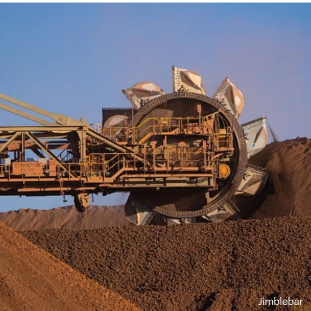

> **AI Description:**
> **Source:** `assets/_page_24_Figure_0.jpg`
> 
> **Generated:** 2026-05-19 06:39:32
> 
> ---
> 
> The image contains a photograph of a mining or industrial conveyor system. The conveyor belt is large and circular, with a mechanism that appears to be used for sorting or processing material. The conveyor is surrounded by piles of reddish-brown material, likely iron ore or another type of mineral. The sky in the background is clear and blue, indicating that the photo was taken during the day. The word "Jimblebar" is visible in the bottom right corner, which might be a location or company name.

## Key developments in FY2021

WAIO production increased by 1 per cent to a record 252 million tonnes (Mt) (248 Mt in FY2020), or 284 Mt on a 100 per cent basis (281 Mt in FY2020), reflecting record production at Jimblebar and Mining Area C, which included first ore from South Flank in May 2021. This was achieved despite significant wet weather impacts, temporary rail labour shortages due to COVID-19 related border restrictions and the planned tie-in activity to integrate South Flank with the Mining Area C processing hub. Strong operational performance across the supply chain reflected continued improvements in car dumper performance and reliability, and improved train cycle times.

Yandi commenced its end-of-life ramp-down as South Flank ramped up. Yandi is expected to provide supply chain flexibility with a lower level of production to continue for a few years.

South Flank is scheduled to ramp up to full production capacity of 80 Mtpa (100 per cent basis) over three years. South Flank’s high-quality ore is expected to increase WAIO’s average iron ore grade from 61 to 62 per cent, and the overall proportion of lump from 25 to between 30 and 33 per cent, once fully ramped up. South Flank iron ore will be transported (eight to 16 kilometres) by overland conveyors to the Mining Area C processing hub.

## Metallurgical coal

## 4 5 Queensland Coal

Queensland Coal comprises the BHP Mitsubishi Alliance (BMA) (BHP ownership: 50 per cent) and BHP Mitsui Coal (BMC) (BHP ownership: 80 per cent) assets in the Bowen Basin, Queensland. It has access to infrastructure in the Bowen Basin, including a modern, multi-user rail network and its own coal-loading terminal at Hay Point, near Mackay. Queensland Coal also has contracted capacity at three other multi-user port facilities – the Port of Gladstone (RG Tanna Coal Terminal), Dalrymple Bay Coal Terminal and North Queensland Export Terminal (formerly known as Abbot Point Coal Terminal).

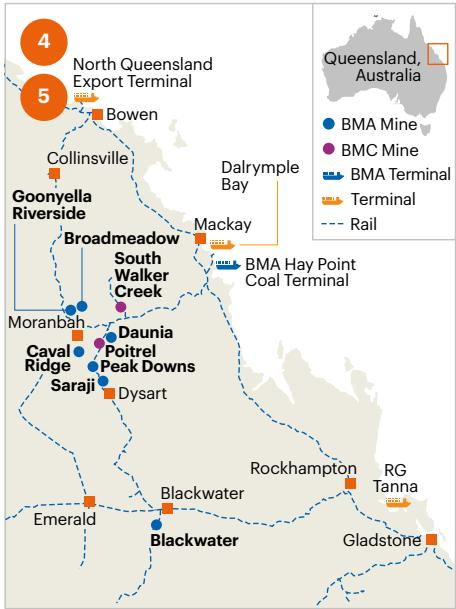

> **AI Description:**
> **Source:** `assets/_page_24_Figure_1.jpg`
> 
> **Generated:** 2026-05-19 06:38:21
> 
> ---
> 
> The image is a map of Queensland, Australia, focusing on the coal mining and export infrastructure. It includes various locations such as coal mines, terminals, and export points. The map uses different symbols to represent BMA Mines, BMC Mines, BMA Terminals, and Terminals. Notable locations include North Queensland Export Terminal, Goonyella Riverside, and the BMA Hay Point Coal Terminal. The map also highlights the rail network connecting these locations. The map provides a clear overview of the coal industry's layout and infrastructure in Queensland.

BMA operates seven metallurgical coal mines – Goonyella Riverside, Broadmeadow, Daunia, Peak Downs, Saraji, Blackwater and Caval Ridge. With the exception of the Broadmeadow underground longwall operation, BMA’s mines are open cut. BMA also owns and operates the Hay Point Coal Terminal near Mackay.

## Overview

BMC owns and operates two open-cut metallurgical coal mines – South Walker Creek and Poitrel.

## Key developments in FY2021

The divestment process for our interests in BMC that was announced in August 2020 is progressing, in line with the two-year timeframe we set last year. We remain open to all options and continue consultation with relevant stakeholders.

Queensland Coal’s metallurgical coal production was 41 Mt (41 Mt in FY2020), reflecting a strong operational performance including record production at Goonyella and record tonnes from Broadmeadow, but offset by operational delays due to significant wet weather impacts and planned wash plant maintenance at Saraji and Caval Ridge. At South Walker Creek, despite record stripping, production decreased as a result of higher strip ratios due to ongoing impacts from geotechnical constraints and lower yields.

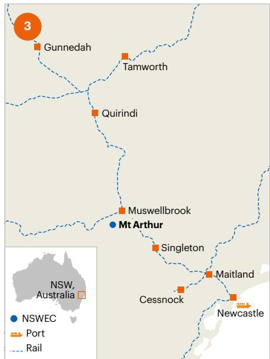

> **AI Description:**
> **Source:** `assets/_page_24_Figure_2.jpg`
> 
> **Generated:** 2026-05-19 06:35:51
> 
> ---
> 
> The image is a map of a region in New South Wales, Australia, highlighting various locations and transportation routes. It includes a legend indicating the symbols for NSWEC (likely a company or organization), ports, and rail routes. The map shows several towns and cities such as Gunnedah, Tamworth, Quirindi, Muswellbrook, Singleton, Cessnock, Maitland, and Newcastle. The rail routes are depicted with a dashed blue line, and the ports are marked with an orange square. The map also includes a smaller inset showing the location of New South Wales within Australia.

## Energy coal

## 3 New South Wales Energy Coal

## Overview

New South Wales Energy Coal (NSWEC) (BHP ownership: 100 per cent) comprises the Mt Arthur Coal open-cut energy coal mine in the Hunter Valley. It has access to infrastructure in the Hunter Region, including a multi-user rail network and coal loading terminal access at the Port of Newcastle through Newcastle Coal Infrastructure Group (28 per cent owned by BHP) and Port Waratah Coal Services.

## Key developments in FY2021

NSWEC production decreased by 11 per cent to 14 Mt (16 Mt in FY2020) reflecting operational delays due to significant weather impacts and higher strip ratios, as well as lower volumes due to an increased proportion of washed coal. This was due to our strategy to focus on higher-quality products in response to increased price premiums for these products, and reduced port capacity following damage to a shiploader at the Newcastle port in November 2020. The shiploader returned to operation in July 2021.

The divestment process for NSWEC that was announced in August 2020 is progressing, in line with the two-year timeframe we set last year. We remain open to all options and continue consultation with relevant stakeholders.

## Nickel

## 6 Nickel West

## Overview

Nickel West (BHP ownership: 100 per cent) is a fully integrated nickel business located in Western Australia, with three streams of concentrate. It comprises open-cut and underground mines, concentrators, a smelter and refinery.

Disseminated sulphide ore is mined at the Mt Keith open-pit operation and crushed and processed onsite to produce nickel concentrate. Nickel sulphide ore is mined at the Cliffs and Leinster underground mines and Rocky’s Reward open-pit mine and processed through a concentrator and dryer at Leinster.

A concentrator plant in Kambalda processes ore and concentrate purchased from third parties.
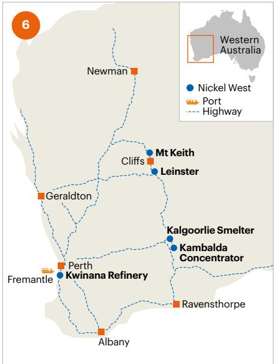

> **AI Description:**
> **Source:** `assets/_page_25_Figure_0.jpg`
> 
> **Generated:** 2026-05-19 06:42:40
> 
> ---
> 
> The image is a map of Western Australia, highlighting various locations and facilities related to nickel production and processing. Key features include:
> 
> 1. **Facilities and Locations**: The map identifies several nickel-related facilities such as Mt Keith, Cliffs, Leinster, Kalgoorlie Smelter, Kambalda Concentrator, and Kwinana Refinery. It also marks the port cities of Fremantle and Albany.
> 
> 2. **Infrastructure**: The map includes highways and ports, indicated by dashed lines and orange icons, respectively. The location of Newman, Geraldton, and Ravensthorpe is also marked.
> 
> 3. **Legend**: A legend in the top right corner explains the symbols used: blue circles for Nickel West facilities, orange squares for ports, and dashed lines for highways.
> 
> 4. **Geographical Context**: The map provides a geographical overview of Western Australia, showing the relative positions of the mentioned locations and facilities.
> 
> The map is a useful visual representation for understanding the geographical and infrastructural context of nickel production and processing in Western Australia.

The three streams feed the Kalgoorlie nickel smelter, which uses a flash furnace to produce nickel matte. The Kwinana nickel refinery then turns this into nickel powder and briquettes.

## Key developments in FY2021

Nickel West production increased by 11 per cent to 89 kt (80 kt in FY2020) reflecting strong performances from the Mt Keith Satellite mine (Yakabindie) and Venus underground mine (part of the Leinster underground mine complex) which reached full production.

Construction of a nickel sulphate plant at the Kwinana nickel refinery is in the final stages of commissioning, with first production expected in the September 2021 quarter. The plant is expected to produce at least 100 kilotonnes per annum (ktpa) of nickel sulphate for the lithium-ion battery industry.

A power purchase agreement with Southern Cross Energy for Nickel West’s Goldfields-based operations was extended to 2038, adding flexibility for renewable power generation. Nickel West also entered into a renewable power purchasing agreement to supply up to 50 per cent of the power for its Kwinana refinery operations from Merredin Solar Farm. These two agreements are expected to improve BHP’s position as one of the lowest-carbon nickel miners in the world. Nickel West is constructing a 38-megawatt solar farm and battery energy storage system for its Mt Keith and Leinster operations.

Nickel West completed the acquisition of the Honeymoon Well development project and the remaining 50 per cent interest in the Albion Downs North and Jericho exploration joint ventures, located about 50 kilometres from Mt Keith.

> **AI Description:**
> **Source:** `assets/_page_25_Figure_1.jpg`
> 
> **Generated:** 2026-05-19 06:42:47
> 
> ---
> 
> The image is a simple graphic representation of the world, focusing on the Americas. It is a stylized map with North and South America highlighted in orange, while the rest of the world is in a lighter color. The image does not contain any text or additional visual elements beyond the map itself.

# 1.10.3 Minerals Americas

The Minerals Americas asset group includes projects, operated assets and nonoperated joint ventures in Canada, Chile, Peru, the United States, Colombia and Brazil.

Our operated copper assets in the Americas, Escondida and Pampa Norte, are open-cut mines that produce copper concentrate and copper cathodes. The non-operated assets in the Minerals Americas portfolio are open-cut mines that produce copper (Antamina), iron ore (Samarco) and energy coal (Cerrejón). The commodities produced by our Minerals Americas assets are transported to port by pipeline, rail or road and exported to customers around the world.

In FY2021, our Chilean assets operated with a substantial reduction in their operational workforces due to preventative measures implemented to mitigate the impact of COVID-19. We expect the operating environment across our Chilean assets to remain challenging, with reductions in our on-site workforce expected to continue in FY2022.

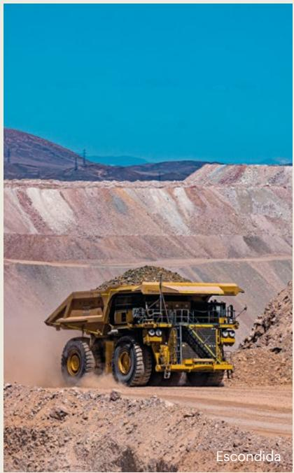

> **AI Description:**
> **Source:** `assets/_page_25_Figure_2.jpg`
> 
> **Generated:** 2026-05-19 06:40:58
> 
> ---
> 
> The image is a photograph of a large yellow mining truck driving on a dirt road in a mining operation. The background shows a large, open-pit mine with layered earth and some distant hills under a clear blue sky. The truck is carrying a load of material, likely ore or rock, and is kicking up dust as it moves. The word "Escondida" is visible in the bottom right corner, which could indicate the name of the mine or the company operating it.

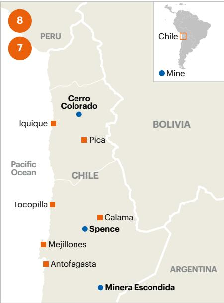

> **AI Description:**
> **Source:** `assets/_page_25_Figure_3.jpg`
> 
> **Generated:** 2026-05-19 06:40:48
> 
> ---
> 
> The image is a map of Chile and parts of Peru and Bolivia. It includes several labeled locations, such as Cerro Colorado, Iquique, Pica, Calama, Spence, Tocopilla, Mejillones, and Antofagasta. There are also two orange circles labeled "8" and "7" near Peru, and a blue dot labeled "Minera Escondida" near Calama. The map highlights the geographical location of these places and includes a small inset map of South America with labels for Chile and Bolivia.

## Copper

## 7 Escondida

## Overview

Escondida (BHP ownership: 57.5 per cent) is a leading producer of copper concentrate and cathodes located in the Atacama Desert in northern Chile.

Escondida’s two pits feed three concentrator plants, as well as two leaching operations (oxide and sulphide).

## Key developments in FY2021

Escondida copper production decreased by 10 per cent to 1,068 kt (1,185 kt in FY2020), as continued strong concentrator throughput of 371 kilotonnes per day (ktpd), at record levels was more than offset by the impact of lower concentrator feed grade and lower cathode production, due to reduced operational workforce associated with COVID-19 restrictions.

## 8 Pampa Norte

## Overview

Pampa Norte (BHP ownership: 100 per cent) consists of two assets in the Atacama Desert in northern Chile – Spence and Cerro Colorado.

Spence produces copper cathodes and, since December 2020, copper concentrate.

Cerro Colorado produces copper cathodes. Its current environmental licence expires at the end of CY2023.

## Key developments in FY2021

Pampa Norte copper production decreased by 10 per cent to 218 kt (243 kt in FY2020) largely due to a decline in stacking feed grade at Spence of 11 per cent, planned maintenance at Spence and the impact of a reduced operational workforce because of COVID-19 restrictions.

The Spence Growth Option (SGO) produced first copper concentrate in December 2020 and is in the process of ramping-up to full capacity.

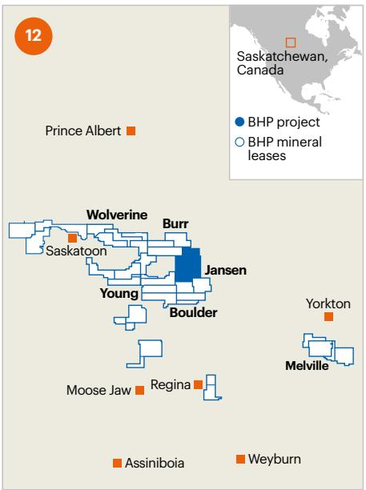

> **AI Description:**
> **Source:** `assets/_page_26_Figure_0.jpg`
> 
> **Generated:** 2026-05-19 06:56:44
> 
> ---
> 
> The image is a map of Saskatchewan, Canada, highlighting BHP projects and mineral leases. It includes several labeled locations such as Prince Albert, Regina, Yorkton, and Melville. The map uses two types of markers: blue squares for BHP projects and orange squares for BHP mineral leases. The map also includes a legend in the top right corner to distinguish between the two types of markers. The map provides a geographical representation of BHP's mining activities in the region.

## Potash

## 12 Jansen Potash Project

## Overview

The Jansen Potash Project (BHP ownership: 100 per cent) is located about 140 kilometres east of Saskatoon, Canada.

Jansen’s large resource provides the opportunity to develop it in stages, with Jansen Stage 1 (Jansen S1) expected to produce approximately 4.35 Mt of potash per annum on completion, and sequenced brownfield expansions of up to 12 Mtpa (approximately 4 Mtpa per stage).

BHP holds mineral leases covering around 9,600 square kilometres in the Saskatchewan potash basin.

## Key developments in FY2021

The focus was on installing watertight steel and concrete final liners in the production and service shafts, and continuing the installation of essential surface infrastructure and utilities, with current scope of work 93 per cent complete at the end of FY2021.

On 17 August 2021, BHP approved US\$5.7 billion (C\$7.5 billion) in capital expenditure for the Jansen S1 potash project in the province of Saskatchewan, Canada. Jansen S1 includes the design, engineering and construction of an underground potash mine and surface infrastructure including a processing facility, a product storage building, and a continuous automated rail loading system. Jansen S1 product will be shipped to export markets through Westshore, in Delta, British Columbia and the project includes funding for the required port infrastructure.

First ore is targeted in the CY2027 calendar year, with construction expected to take approximately six years, followed by a ramp up period of two years.

## Copper

## 9 Antamina

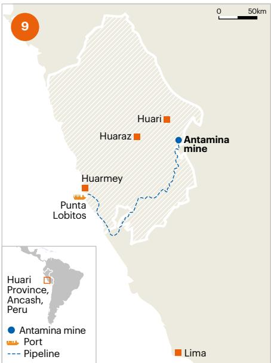

> **AI Description:**
> **Source:** `assets/_page_26_Figure_1.jpg`
> 
> **Generated:** 2026-05-19 06:55:35
> 
> ---
> 
> The image is a map of Huari Province, Ancash, Peru, highlighting the Antamina mine, Punta Lobitos port, and the pipeline connecting them. The map includes key locations such as Huari, Huaraz, and Huarmey. The Antamina mine is marked with a blue dot, the port with an orange square, and the pipeline with a dashed blue line. The map also includes a scale bar indicating 50 km and a legend explaining the symbols used. The image effectively visualizes the geographical layout and infrastructure related to the Antamina mine and its port in Peru.

## Overview

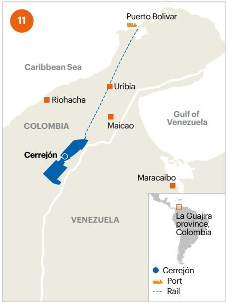

> **AI Description:**
> **Source:** `assets/_page_26_Figure_2.jpg`
> 
> **Generated:** 2026-05-19 06:53:41
> 
> ---
> 
> The image is a map highlighting the Cerrejón coal mine and its surrounding regions in Colombia and Venezuela. It includes labels for major cities and geographical features such as the Caribbean Sea, Gulf of Venezuela, and Maracaibo. The map uses different colors to represent Cerrejón (blue), ports (orange), and rail routes (dashed blue line). The map also includes a legend explaining the symbols used.

Antamina (BHP ownership: 33.75 per cent) is a large, low-cost copper and zinc mine in north central Peru with by-products including molybdenum and silver. Antamina owns integrated pipeline and port facilities and is operated independently by Compañía Minera Antamina S.A.

## Key developments in FY2021

Antamina copper production increased by 16 per cent to 144 kt (125 kt in FY2020) and zinc increased by 64 per cent to 145 kt due to higher concentrator throughput and higher zinc grades. During FY2021, Antamina continued with a strong focus on developing improvement opportunities to maintain productivity and progressing on its modified environmental impact assessment for its life extension project from CY2028 to CY2036, which includes extension of current approved tailings capacity, additional waste dumps and new pit design.

## 13 Resolution Copper

## Overview

Resolution Copper (BHP ownership: 45 per cent), located in the US state of Arizona, is operated by Rio Tinto (55 per cent ownership interest). Resolution Copper is one of the largest undeveloped copper projects in the world and has the potential to become the largest copper producer in North America. The Resolution Copper deposit lies more than 1,600 metres beneath the surface.

## Key developments in FY2021

In FY2021, Resolution progressed its prefeasibility study and safely completed the shaft No. 9 work (November 2020). The shaft No. 9 project involved deepening the historic shaft from its original depth at 1,460 metres below the surface to a final depth of 2,086 metres and linking it with the existing No. 10 shaft via development activities underground.

The Resolution Copper project is subject to a federal permitting process in the US (the National Environmental Policy Act (NEPA)). The Forest Service published the Final Environmental Impact Statement (FEIS) on 15 January 2021. On 1 March 2021, the US Department of Agriculture (USDA) directed the Forest Service to rescind the FEIS. BHP supports meaningful consultation with local communities and Native American Tribes as Resolution continues to study the project.

## For more information refer to section 1.13.10

## Energy coal

## 11 Cerrejón

## Overview

Cerrejón (BHP ownership: 33.33 per cent) owns, operates and markets (through an independent company) one of the world’s largest open-cut energy coal mines, located in the La Guajira province of Colombia. Cerrejón owns integrated rail and port facilities.

## Key developments in FY2021

Cerrejón production declined by 30 per cent to approximately 5 Mt (7 Mt in FY2020). This was mainly due to a 91-day strike and subsequent delays to the restart of production as well as the impact of a reduced operational workforce associated with COVID-19 restrictions.

Cerrejón maintained its focus on higher-quality products and maintained lower operational costs through the implementation of a transformation program, which allowed it to remain cash flow positive despite the volume decline.

In June 2021, BHP entered into a sale and purchase agreement with Glencore to divest our 33.3 per cent interest in Cerrejón for US\$294 million cash consideration. The transaction has an effective economic date of 31 December 2020. The purchase price is subject to adjustments at transaction completion, which may include an adjustment for any dividends paid by Cerrejón to BHP during the period from signing to completion. Subject to the satisfaction of competition and regulatory requirements, we expect completion to occur in the first half of CY2022.

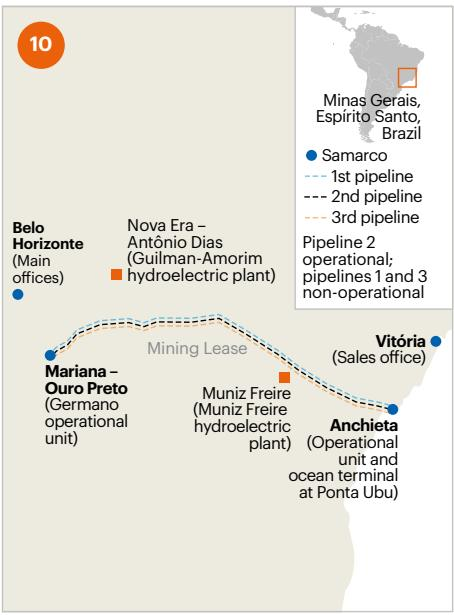

> **AI Description:**
> **Source:** `assets/_page_27_Figure_0.jpg`
> 
> **Generated:** 2026-05-19 06:52:19
> 
> ---
> 
> The image is a map with a diagram illustrating the geographical layout of Samarcos' operations in Brazil. It includes:
> 
> 1. A map of Brazil with key locations marked, such as Belo Horizonte, Mariana-Ouro Preto, Muniz Freire, Nova Era - Antônio Dias, and Vitória.
> 2. A legend indicating the locations of Samarcos' main offices, operational units, and sales offices.
> 3. The map highlights the mining lease area and the locations of hydroelectric plants.
> 4. It shows the operational status of pipelines, with Pipeline 2 being operational while pipelines 1 and 3 are non-operational.
> 
> The diagram effectively visualizes the spatial distribution of Samarcos' infrastructure and operations across Brazil.

## Iron ore

## 10 Samarco

## Overview

Samarco (BHP ownership: 50 per cent) comprises a mine and three concentrators located in the Brazilian state of Minas Gerais, four pellet plants and a port located in Anchieta in the state of Espírito Santo. Three 400-kilometre pipelines connect the mine site to the pelletising facilities.

Samarco is operated independently by Samarco Mineração S.A. Samarco’s main product is iron ore pellets. Pellets are independently marketed by Samarco and sold to customers around the world.

## Key developments in FY2021

Having met the licensing requirements, Samarco restarted iron ore pellet production at one concentrator in December 2020 and produced 1.9 Mt of iron ore pellets in FY2021.

For further information on the Fundão dam failure refer to section 1.15

> **AI Description:**
> **Source:** `assets/_page_27_Figure_2.jpg`
> 
> **Generated:** 2026-05-19 06:51:35
> 
> ---
> 
> The image is a simple icon depicting an oil rig on a platform. The icon is white on an orange background, and it appears to represent an oil drilling or extraction operation. There are no charts, graphs, or other visual elements present in the image. The icon is a single, static image without any text or additional information.

# Petroleum

Our Petroleum unit comprises conventional oil and gas assets located in the US Gulf of Mexico, Australia, Trinidad and Tobago, Algeria and Mexico, and appraisal and exploration options in Trinidad and Tobago, central and western US Gulf of Mexico, eastern Canada and Barbados.

The crude oil and condensate, gas and natural gas liquids (NGLs) produced by our Petroleum assets are sold on the international spot market or domestic market.

On 17 August 2021, BHP and Woodside entered into a merger commitment deed to combine their respective oil and gas portfolios by an all-stock merger. The merger is subject to confirmatory due diligence, negotiation and execution of full form transaction documents, and satisfaction of conditions precedent including shareholder, regulatory and other approvals.

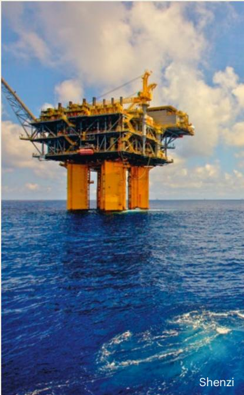

> **AI Description:**
> **Source:** `assets/_page_27_Figure_3.jpg`
> 
> **Generated:** 2026-05-19 06:50:27
> 
> ---
> 
> The image is a photograph of an offshore oil rig situated in the ocean. The rig is a large, complex structure with multiple levels and platforms, supported by robust腿脚. The surrounding water is deep blue, and the sky is partly cloudy. The text "Shenzi" is visible in the bottom right corner of the image.

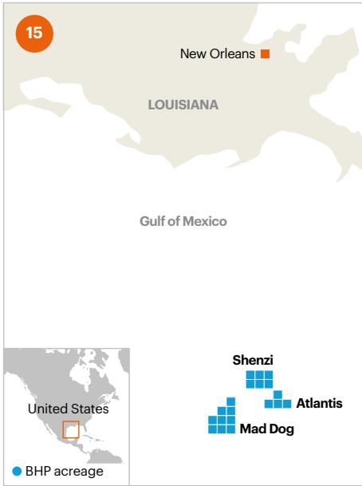

> **AI Description:**
> **Source:** `assets/_page_27_Figure_4.jpg`
> 
> **Generated:** 2026-05-19 06:54:41
> 
> ---
> 
> The image is a map of the United States, specifically highlighting the Gulf of Mexico region. It includes a legend indicating "BHP acreage" with blue squares representing the BHP acreage. The map shows the location of New Orleans in Louisiana and the Gulf of Mexico. Additionally, there are three labeled locations: Shenzi, Atlantis, and Mad Dog, which appear to be oil or gas fields, as indicated by the blue squares. The number "15" is located in the top left corner, possibly indicating a category or reference number.

## United States

## 15 Gulf of Mexico

## Overview

Our producing fields include our operated asset Shenzi (BHP ownership: 72 per cent) and our nonoperated assets, Atlantis (BHP ownership: 44 per cent) and Mad Dog (BHP ownership: 23.9 per cent). They are located between 155 and 210 kilometres offshore from the US state of Louisiana.

We also own 25 per cent and 22 per cent respectively of the companies that own and operate the Caesar oil pipeline and the Cleopatra gas pipeline.

These pipelines transport oil and gas from the Green Canyon area, where our fields are located, to connecting pipelines that transport product onshore.

## Key developments for FY2021

– The Atlantis Phase 3 project, a new subsea production system that ties back to the Atlantis facility, achieved first production in July 2020. Atlantis Phase 3 is expected to have the capacity to produce up to 38,000 gross barrels of oil equivalent per day.

On 6 November 2020, BHP finalised a membership interest purchase and sale agreement with Hess Corporation to acquire an additional 28 per cent working interest in Shenzi for US\$480 million, which brings our working interest to 72 per cent.

– The Mad Dog Phase 2 project achieved a major milestone in April 2021 as the semi-submersible floating production platform, Argos, arrived in the US from South Korea. First production from Mad Dog Phase 2 is expected in the middle of the CY2022.

– On 20 May 2021, BHP finalised a purchase and sale agreement with EnVen Energy Ventures, LLC to divest our interest in and operation of Neptune.

On 5 August 2021, the Board approved the funding to develop the Shenzi North Project, a two-well subsea tie-in to the Shenzi platform. First production is targeted in CY2024.

Governance 2

3 Financial Statements

4 Additional Information

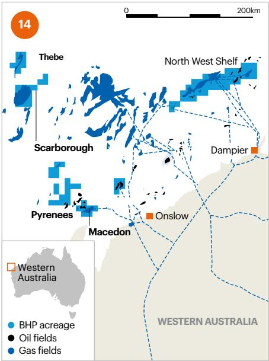

> **AI Description:**
> **Source:** `assets/_page_28_Figure_0.jpg`
> 
> **Generated:** 2026-05-19 06:44:49
> 
> ---
> 
> The image is a map of Western Australia, specifically highlighting the location of BHP's acreage, oil fields, and gas fields. It includes labels for various locations such as Thebe, Scarborough, Pyrenees, Macedon, Onslow, and Dampier. The map uses different colors to distinguish between BHP acreage (blue), oil fields (black), and gas fields (blue with a white outline). There is also a scale bar at the top indicating 0 to 200 kilometers. The map provides a clear visual representation of the geographical distribution of BHP's holdings and the locations of its energy resources in Western Australia.

## Overview

We operate Macedon (BHP ownership: 71.43 per cent) which is an offshore gas field located around 75 kilometres west of Onslow, Western Australia and an onshore gas processing facility located around 17 kilometres southwest of Onslow. The operation produces gas from four subsea wells, with gas piped onshore to the processing plant.

We operate Pyrenees (BHP ownership: 39.99– 71.43 per cent), which is a floating production, storage and off-take facility, located about 23 kilometres off Northwest Cape, Western Australia. The facility produces oil from six offshore fields.

We have a 32.5–50 per cent non-operated interest in Bass Strait, which is a collection of offshore installations and onshore processing facilities producing oil and gas. It is located between 25 and 80 kilometres off the southeastern coast of Australia and onshore Victoria. Gas is piped from offshore fields to the onshore Longford processing facility for processing with liquefied petroleum gas transported to market by pipeline, road tanker or ship and ethane by pipeline.

We have a 12.5–16.67 per cent non-operated interest in the North West Shelf project, which comprises offshore oil and gas fields, with onshore gas processing infrastructure to produce oil, LNG, condensate, LPG and domestic gas. The offshore facilities are located about 125 kilometres northwest of Dampier in Western Australia. Gas is piped from offshore platforms to the onshore Karratha Gas Plant for processing, with LNG and all liquefied products exported to market by ship, and domestic gas transported by pipeline.

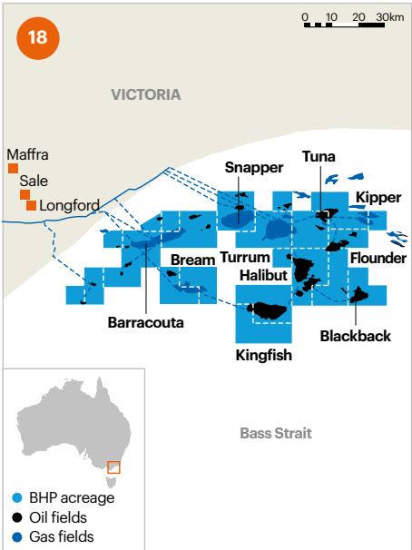

> **AI Description:**
> **Source:** `assets/_page_28_Figure_2.jpg`
> 
> **Generated:** 2026-05-19 06:44:59
> 
> ---
> 
> The image is a map of Victoria, Australia, showing the distribution of BHP acreage, oil fields, and gas fields. It includes labels for various locations such as Maffra, Sale, Longford, and Bass Strait. The map also highlights different types of fish species found in the area, such as Barracouta, Bream, Turrum, Halibut, Kingfish, Tuna, Kipper, Flounder, and Blackback. The map uses blue squares to represent BHP acreage, black dots for oil fields, and blue dots for gas fields. A scale in the top right corner indicates the distance in kilometers.

## Key developments in FY2021

In December 2020, BHP and the North West Shelf joint venture partners executed fully termed gas processing agreements for processing third-party gas from the Pluto and Waitsia projects through the North West Shelf facilities, extending the life of the asset.

The Bass Strait West Barracouta gas project achieved first production in April 2021.

## Rest of world

## Overview

BHP operates Ruby (BHP ownership: 68.46 per cent) and Greater Angostura (BHP ownership: 45 per cent interest in a production sharing contract) fields, which form part of our Trinidad and Tobago operations – an integrated oil and gas development consisting of two fields located between 40 and 45 kilometres offshore east of Trinidad.

BHP has a non-operated interest in an onshore integrated development, the Rhourde Ouled Djemma (ROD) Integrated Development (BHP ownership: 28.85 per cent effective interest), that produces oil and is located 900 kilometres southeast of Algiers. It comprises six satellite oil fields that pump oil back to a dedicated processing train.

## Key developments in FY2021

Ruby achieved first oil production in May 2021 ahead of schedule and on budget. Drilling and completion of the remaining wells at Ruby is ongoing with subsequent wells expected to be placed into production in CY2021 and project completion expected in the first half of CY2022.

## 1.10.5 Commercial

BHP’s Commercial function seeks to maximise commercial value across our end-to-end supply chain and provides improved service levels to our assets and customers through subjectmatter expertise, simplified processes and the centralisation of standardised activities.

The function is organised around the following core activities in our value chain, supported by business partnering, credit and market risk management, and strategy and planning activities.

## Sales and Marketing

Connects BHP’s resources to market through commercial expertise, sales and operations planning, customer insights and proactive risk management. It presents a single face to markets across multiple assets, with a view to realising maximum value for our products and supporting sustainability initiatives in our downstream supply chain.

## Maritime and Supply Chain Excellence

Manages BHP’s enterprise-wide maritime transportation strategy and the chartering of ocean freight to meet BHP’s inbound and outbound transportation needs. It focuses on supply chain excellence and sourcing sustainable, cost-efficient marine freight. We seek to mitigate supply chain risk by vetting the safety performance of the ships loading BHP cargo.

## Procurement

Purchases the goods and services used by our projects, assets and functions globally. Procurement works to help optimise equipment performance, reduce operating costs, improve working capital and create social value. It manages supply chain risk, fosters supplier innovation and develops sustainable relationships with global suppliers and local businesses in the communities where we operate.

## Warehousing, Inventory, Logistics and Property

Designs and operates our inbound supply chain networks for the delivery and warehousing of spare parts, operating supplies and consumables, and designs and operates our office workspaces globally.

## Market Analysis and Economics

Develops BHP’s proprietary view on the outlook for commodity demand and prices, as well as our input costs, the world economy, climate change and financial markets. The team works with our Procurement, Maritime, and Sales and Marketing sub-functions to help optimise end-to-end commercial value, and with the Portfolio Strategy and Development and External Affairs functions to identify and respond to long-run strategic changes in our operating environment.

## Global Business Services

Global Business Services (GBS) unites common shared services across the Group into a single operation with capabilities focused on transaction efficiency, process intelligence and automation. GBS manages end-to-end functional processes designed to deliver continuous process improvement and a better customer experience.

## 1.11 Exploration

## Our exploration program is focused on copper and nickel to replenish our resource base and enhance our portfolio.

The purpose is to generate attractive, lowcost, value-accretive options by leveraging our competitive strengths. For the first time, the Petroleum and Metals teams partnered together on a Joint Global Endowment study to explore future growth opportunities and global, yet-to-find volume and metal accumulations through the use of data analytics and augmented intelligence. The study is expected to create a competitive advantage and position BHP for future access to new search spaces.

Following exploration results in previous drilling phases, which confirmed mineralised intercepts of copper with associated gold, uranium and silver, in May 2021 the Oak Dam copper discovery in South Australia commenced the next stage of definition drilling to inform future design of the

deposit. Elsewhere during the year, we continued to seek, secure and test concessions in regions such as Ecuador, south-western United States, South Australia, Chile and Peru. Greenfield nickel exploration activities were initiated in Western Australia and we started to look beyond Australia for new nickel opportunities through a partnership in Canada.

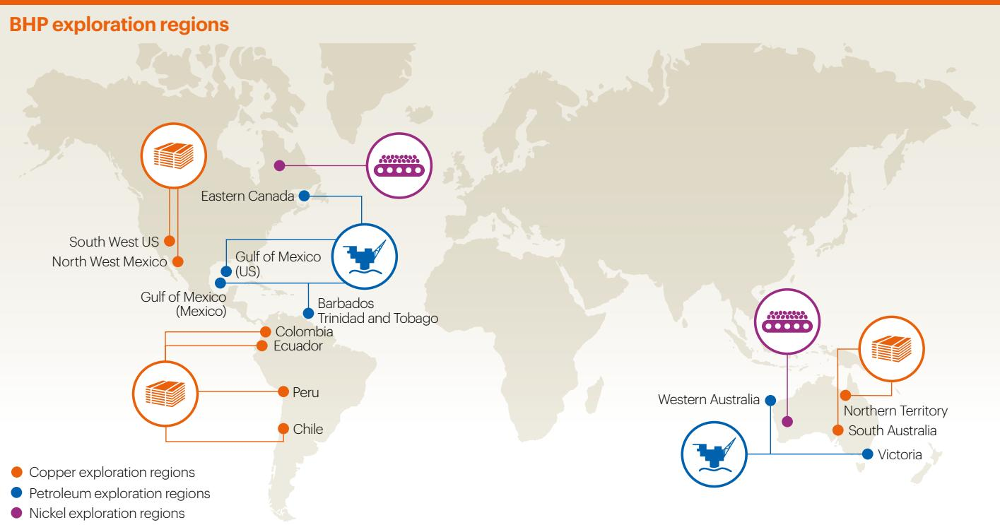

> **AI Description:**
> **Source:** `assets/_page_29_Figure_0.jpg`
> 
> **Generated:** 2026-05-19 06:45:41
> 
> ---
> 
> The image is an infographic combining text with visual elements. It presents a world map highlighting the exploration regions of BHP (BHP Billiton). The map uses icons and colors to differentiate between copper exploration regions (orange), petroleum exploration regions (blue), and nickel exploration regions (purple). Key regions are labeled, such as South West US, North West Mexico, Gulf of Mexico (US and Mexico), Gulf of Mexico (Mexico), Colombia, Ecuador, Peru, Chile, Eastern Canada, Barbados, Trinidad and Tobago, Western Australia, Northern Territory, South Australia, and Victoria. The map visually represents the global distribution of BHP's exploration activities in these minerals.

## Exploration in FY2021

## Metals (copper, nickel)

The Metals Exploration teams are focused on identifying and gaining access to new search spaces to test the best targets capable of delivering large, high-quality, Tier 1 deposits and maintaining research and technology activities aligned with our exploration strategy. Despite the slowdown and restrictions on movement due to the COVID-19 pandemic, the field teams were active in Chile, Peru, Ecuador, the United States and Australia. These activities involved early stage reconnaissance work through target definition and drill testing. With the addition of nickel to the exploration portfolio, the sphere of work expanded into Western Australia, where BHP holds a significant land position and drill programs are scheduled pending appropriate clearances. Metals Exploration also extended its partnership with Midland Exploration, a Canadian company with interests in copper and nickel projects in northern Québec in Canada, to generate nickel targets in Québec, including the completion of a regional airborne electromagnetic survey. We initiated a global assessment of new nickel opportunities to further strengthen the pipeline.

Technology collaboration and research partnerships are key to our metals exploration strategy. In particular, we are focused on developing and deploying technologies that will allow us to get to the ‘Next 400’ (that is below the first 400 metres of the Earth’s surface). Similarly, we are conducting research in collaboration with university groups to determine controls on high-grade mineralisation and undertaking programs in Chile and the United States to further our own exploration effort under cover. These two elements are intended to allow us to continue to be successful in discovery within the areas where we operate that are often incorrectly considered mature.

Our business partnerships continue to deliver encouraging results as we continued to add to our early stage options in future facing commodities. During FY2021, we advanced our earn-in with Luminex in Ecuador, undertaking drilling at our Tarqui project. Elsewhere in Ecuador, we maintained a 13.6 per cent ownership in SolGold plc, the majority owner and operator of the Alpala porphyry coppergold project. We also own a 5 per cent interest in Midland Exploration Inc., a mineral exploration company in Canada. In Mexico, the team continued the financial agreement with Riverside Resources, which exposes BHP to new search spaces and exploration opportunities. In Australia, we committed to a partnership with Encounter Resources to explore for sediment-hosted copper deposits in the Northern Territory of Australia.

In addition, on 27 July 2021, we entered into a definitive Support Agreement with Noront Resources (Noront) to extend the Company an allcash takeover offer, following which Noront’s Board of Directors recommended shareholders accept BHP’s offer. Noront owns the Eagles Nest nickelcopper deposit in the James Bay Lowlands, Ontario, in an area highly prospective for nickel known as the Ring of Fire.

## Petroleum

In FY2021, Petroleum continued to add to and mature the exploration potential of our portfolio.

In the US Gulf of Mexico, we expanded our acreage positions through lease sale participation. In July 2020, the regulator awarded BHP two blocks(1) in Green Canyon, central Gulf of Mexico and three blocks(2) in the western Gulf of Mexico. We additionally progressed our partnering strategy in the Gulf of Mexico through lease exchange agreements with Chevron, expanding our portfolio in the central Gulf of Mexico.

> **AI Description:**
> **Source:** `assets/_page_30_Figure_0.jpg`
> 
> **Generated:** 2026-05-19 06:44:26
> 
> ---
> 
> The image is a photograph showing two individuals in a mountainous, grassy landscape. One person is wearing a dark jacket and a hat, holding a clipboard and appears to be taking notes or recording data. The other person is wearing a backpack and a hat, and is bent over, possibly examining something on the ground. The background features a vast expanse of clouds and distant mountains, indicating a high-altitude location. The text in the bottom right corner reads "Metals Exploration team at work in Ecuador," suggesting that the individuals are part of a geological or environmental exploration team in Ecuador.

In Mexico, we commenced an Ocean Bottom Node seismic acquisition over the Trion field in November 2020, as part of our ongoing evaluation and analysis. The survey was completed in the March 2021 quarter. The results will be incorporated into the current evaluation of the Trion opportunity. In addition, we received formal approval for a 124-day extension for the evaluation and exploration periods through 1 July 2021 and 1 July 2022 respectively, because of the suspension of activities in 2020 due to COVID-19 restrictions.

In Trinidad and Tobago, we drilled the Broadside-1 exploration well on Block 3, which fully satisfied the remaining drilling obligations on the Southern exploration licenses. The Broadside-1 well reached the main reservoir on 22 October 2020 and did not encounter hydrocarbons. The well was a dry hole and was plugged and abandoned on 8 November 2020. The Southern licenses expired in June 2021, and BHP elected to participate in a Market Development Phase (MDP) for Block 5 to retain the acreage around the LeClerc and Victoria discoveries. The proposed MDP is pending regulatory approval. The Transocean drilling rig arrived on location and commenced drilling of two Calypso gas appraisal wells for our northern licenses in July 2021.

In Australia, BHP participated in a multi-client 3D seismic acquisition in the Gippsland Basin that was completed in September 2020. Analysis will continue through FY2022 and will inform us of the prospectivity in this area.

Exploration and appraisal wells drilled, or in the process of drilling, during the year included:

## Exploration expenditure

Our resource assessment exploration expenditure increased by 5 per cent in FY2021 to US\$138 million, while our greenfield expenditure increased by 23 per cent to US\$54 million. Expenditure on resources assessment and greenfield exploration over the last three financial years is set out below.

## Petroleum exploration and appraisal

Petroleum exploration expenditure for FY2021 was US\$322 million, of which US\$296 million was expensed. Expenditure on petroleum exploration over the last three financial years is set out below.

Our petroleum exploration program prioritised drilling commitments for development wells and strategic partnering in FY2021. A US\$540 million exploration program is planned for FY2022 as we progress testing of our future growth opportunities and evaluate potential new basins for future entries.

## Exploration expense

Exploration expense represents that portion of exploration expenditure that is not capitalised in accordance with our accounting policies, as set out in note 11 ‘Property, plant and equipment’ in section 3.

Exploration expense for each segment over the last three financial years is set out below.

(1) Includes US\$86 million (FY2020: US\$ nil; FY2019: US\$21 million) exploration expense previously capitalised, written off as impaired.
(2) Group and unallocated items includes functions, other unallocated operations, including Potash, Nickel West and legacy assets (previously disclosed as closed mines in the Petroleum reportable segment), and consolidation adjustments.

## 1.12 People and culture

## We aim to recruit and retain the best people ensuring we deliver our strategy and run our operations safely and productively.

Around 80,000 employees and contractors work for us globally; they are the foundation of our business. We create and promote an inclusive and diverse environment where the safety and wellbeing of our people is the highest priority. To enable our people to perform at their best, we continue to invest in technology and innovative ways to manage risk, streamline processes and improve productivity. We also offer competitive remuneration that rewards expertise and invest in the development of our people to build capability and improve performance.

## Developing our capabilities and an enabled culture

To drive continuous improvement, we respect people’s differences and encourage self-accountability, a hunger to learn and a commercial mindset.

One of the ways we achieve this is by applying the BHP Operating System (BOS) practices to help build leader capability. BOS is a way of leading and working that focuses on the safety of our people, value for our customers and a mindset of zero waste. In FY2021, we continued to train our leaders through BOS learning academies to improve operational capability and culture.

We also deploy a simplified Engagement and Perception Survey (EPS) three times a year. After each EPS, leaders are accountable for identifying actions to address improvement areas, as shaped by employee feedback, in the following 90 days. With a strong response rate (81 per cent) and overall engagement scores of 84 per cent, two to three percentage points under top decile of global organisation benchmarks provided by Qualtrics, we believe our overall workforce feels supported and engaged.

## In 2018, we created a new business unit,

Operations Services, to provide maintenance and production services across our Minerals Australia assets. Operations Services employs its people on a permanent basis and supports skill building through a structured coaching and in-field training program designed to enable the workforce to deliver consistent equipment operation and maintenance that balances safety, maximum productivity and equipment reliability. As at 30 June 2021, Operations Services employed more than 3,700 employees and is expected to continue to grow.

As part of a new national training program to help bolster Australia’s skills base and create new career pathways into the mining sector, the BHP FutureFit Academy (FFA) provides a pathway to join Operations Services through either an accredited maintenance traineeship or a trade apprenticeship. Once trained and qualified, employees move to a job at one of our Australian operations. In FY2021, the FFA trained more than 500 apprentices and trainees as the first cohort graduated (163 graduates in FY2021).

> **AI Description:**
> **Source:** `assets/_page_31_Figure_0.jpg`
> 
> **Generated:** 2026-05-19 06:38:41
> 
> ---
> 
> The image contains a simple icon of a computer mouse with an orange circle surrounding it. The icon is minimalistic and does not include any text or additional visual elements.

For more information on BHP’s FutureFit Academy see our case study at bhp.com/people

## Inclusion and diversity

An inclusive and diverse workforce promotes safety, productivity and wellbeing, and underpins our ability to attract new employees. We employ, develop and promote based on people’s strengths and do not tolerate any form of discrimination, bullying, harassment, exclusion or victimisation. Our systems, processes and practices are designed to support fair treatment for all of our people. In July 2020, we published our Inclusion and Diversity Statement confirming our vision, commitment and contributions to inclusion and diversity.

Our employees are encouraged to celebrate diversity and to speak up if they encounter behaviours inconsistent with our values and expectations. To help mitigate gender pay disparities, we have taken steps to reduce potential bias in recruitment and conduct an annual gender pay review, the results of which are reported to the BHP Remuneration Committee.

Respect is one of Our Charter values and is fundamental to building stronger teams and being an inclusive and diverse workplace. For some people, this has not been their experience of working at BHP. We are determined to address this.

## For information on our approach to addressing sexual harassment and sexual assault refer to section 1.13.4

Our ambition to achieve a more diverse and inclusive workplace is focused on four areas:

embedding flexibility in the way we work

– encouraging and working with our supply chain partners to support our commitment to inclusion and diversity

– uncovering and taking steps to mitigate potential bias in our behaviours, systems, policies and processes

– ensuring our brand and workplaces are attractive to a diverse range of people

## Gender balance(1)

In 2016 we publicly announced our aspiration to achieve gender balance within our employee workforce globally by the end of FY2025.

At the end of FY2021 we had 5,257 more female employees than reported in 2016. In FY2021, we increased the representation of women working at BHP by 2.7 per cent. Overall, women represent 29.8 per cent of our employee workforce including employees on extended absence such as parental leave. The Executive Leadership Team is confident of achieving 40 per cent female representation by the end of FY2025, meeting the definition of gender balance used by entities such as the International Labor Organization and HESTA, which consider balance to be a minimum of 40 per cent women and 40 per cent men.

The percentage of employees newly hired to work for BHP in FY2021 was 52.1 per cent male and 47.9 per cent female. This is a marked increase on our FY2015 baseline for our aspirational goal, which was 10.4 per cent female.

We also improved our representation of women in leadership by 2.8 percentage points compared to FY2020, with 25.2 per cent female leaders as at the end of FY2021.

To further accelerate female representation in FY2021, we worked to:

– improve employment messaging to target diverse audiences about why they should work for BHP

progress market mapping to proactively target people or groups of people not actively looking to work for BHP or our industry

– broaden our employment and brand reach across social, digital and traditional media channels

– enhance our workforce development and retention through coaching and support materials for leaders

– develop a Ways of Working Framework to guide employees and leaders to ‘Work where you get great outcomes’

– implement mentoring and support networks for women

The table below shows the gender composition of our employees, senior leaders and the Board over the last three financial years.

(1) Based on a ‘point in time’ snapshot of employees as at 30 June 2021, as used in internal management reporting for the purposes of monitoring progress against our goals. This does not include contractors. For the first time this includes employees on extended absence (660 at 30 June 2021), who were previously not included in the active headcount.

(2) FY2021 employee numbers based on actual numbers at BHP operated location as at 30 June 2021, not 10-month averages. FY2020 and FY2019 are based on the average of the number of employees at the last day of each calendar month for a 10-month period from July to April which is then used to calculate a weighted average for the year to 30 June and adjusted based on BHP ownership. Data includes Continuing and Discontinued operations (Onshore US assets) for the financial years being reported.

(3) Based on actual numbers as at 30 June 2021, not 10-month averages.

(4) For the purposes of the UK Companies Act 2006, we are required to show information for ‘senior managers’, which are defined to include both senior leaders and any persons who are directors of any subsidiary company, even if they are not senior leaders. In FY2021, there were 297 senior leaders at BHP. There are 18 Directors of subsidiary companies who are not senior leaders, comprising 14 men and 4 women. Therefore, for UK law purposes, the total number of senior managers was 203 men and 94 women (31.6 per cent women) in FY2021.

## Indigenous employment

Indigenous peoples are critical partners and stakeholders for many of BHP’s operations around the world. BHP recognises, as part of our Global Indigenous Peoples Strategy, that we can contribute to the economic empowerment of Indigenous peoples through providing opportunities for employment, training, procurement and supporting Indigenous enterprises. Pre-employment training, employment, career development and retention of Indigenous employees are key to this.

We have set targets to achieve Indigenous employment of 8 per cent in our Australian workforce by the end of FY2025, 10 per cent in our workforce in Chile by the end of FY2026 and 20 per cent in our Potash workforce in Canada by the end of FY2027.

Indigenous employment within our employee and contractor workforce(5) as at 30 June 2021 was 7.2 per cent in Australia, 7.5 per cent at our operations in Chile and 13.7 per cent at our Jansen Potash Project in Canada.

## LGBT+ inclusion

Our LGBT+ ally employee inclusion group, Jasper, was established in 2017 as a natural extension of our inclusion and diversity aspirations and to reflect Our Charter value of respect. The membership base of LGBT+ employees and allies has grown substantially with eight regional chapters globally.

In February 2021, we launched our Gender Affirmation Policy and leader toolkit outlining how we will support employees affirming their gender.

## Flexible working

Our focus on flexible working over the past few years assisted our office-based workers to adapt to remote working requirements caused by the COVID-19 pandemic.

We expect to maintain a hybrid working model for employees based in corporate offices, allowing office and home-based working arrangements, while requiring 30 to 50 per cent of their work to be based in the office (excluding times when COVID-19-related workplace restrictions are in place) depending on the nature of their work.

We also understand many site-based employees are in roles that by their very nature cannot be performed remotely. We will continue to seek to provide flexible working through part-time and

Our Charter is the foundation of the work we do at BHP. It describes our purpose, our values, how we measure our success, who we are, what we do and what we stand for.

Our Code of Conduct demonstrates how to practically apply the commitments and values set out in Our Charter and reflects many of the standards and procedures we apply throughout BHP.

## Our people policies

job-share arrangements, flexible rosters and career breaks.

## Employee relations

Our four key focus areas for employee relations are:

Through these documents, we make it clear that discrimination on any basis is not acceptable and we give full and fair consideration to applications for employment received from all candidates, having regard to their particular aptitudes and abilities.

– ensuring we comply with legal obligations and regional labour regulations

– negotiating where there are requirements to collectively bargain

– closing out agreements with our workforce in South America and Australia, with no lost time due to industrial action, to the extent possible – creating solid relations with our workforce based on a culture of trust and cooperation

During FY2021, Minerals Americas participated in seven collective bargaining processes, which were important to enable our business objectives in relation to financial performance, organisational capabilities, culture change and behaviour management.

Escondida signed three collective bargaining agreements: with the supervisors’ union for 36 months (1 October 2020 to 30 September 2023), the Intermel (Operators and Maintainers) union for 24 months (1 April 2021 to 31 March 2023) and Escondida and Union No. 1 (Operators and Maintainers) for 36 months (2 August 2021 to 1 August 2024). Spence signed two 36-month collective bargaining agreements: with the supervisors’ union (1 December 2020 to 30 November 2023) and the Operator and Maintainers union (1 June 2021 to 31 May 2024). Cerro Colorado executed a collective agreement for 36 months with the supervisors’ union (1 June 2021 to 31 May 2024).

The Specialists and Supervisors Union for BHP Chile Inc. invoked article 342 of the Chilean Labor Code, under which employees had their current entitlements under existing collective agreement preserved for the next 18 months (June 2021 to December 2022). In the collective bargaining between BHP Chile Inc. and the Specialists and Supervisors Union, there were 13 days of legal strike action (27 May 2021 to 8 June 2021). Contingency plans were put in place to hand over management of the control rooms back to the operations and planned maintenance activities were undertaken ahead of time, resulting in no operational downtime due to this strike.

## For information on the impact of COVID-19 to our workforce refer to section 1.13.5

(5) Based on a ‘point in time’ snapshot of employees and labour hire contractors as at 30 June 2021.

In instances where employees require support for a disability, we work with them to identify roles that meet their skills, experience and capability, and offer retraining where required.

Our Human Rights Policy Statement outlines our commitment to respecting human rights, which includes rights related to workplace health, safety and labour. We commit to operating in a manner consistent with the terms of the International Labour Organization Declaration on Fundamental Principles and Rights at Work.

Negotiations to renew the collective agreements with Cerro Colorado Operators and Maintainers union is expected to be completed in the first quarter of FY2022.

With state border closures restricting the mobilisation of employees and contractors to our operating sites in Australia, changes to rosters and hours of work were made to ensure operational requirements for essential work were met. There has also been a further extension of flexible work options for employees and contractors in Australia in response to government-imposed lockdowns preventing them from attending their normal place of work. These flexible work options included staggered start times, working from home and reduced working hours. Our contractor workforce was reduced after the Spence Growth Option (SGO) transitioned to the operation.

## Impacts and challenges from COVID-19 related to our people

The impact of COVID-19 and the resulting measures taken by governments within Australia to control its spread, resulted in changes to working patterns for our employees and contractors. In Australia and Chile, there was an increase in unplanned absenteeism due to COVID-19 restrictions. As a result of the COVID-19 restrictions, we implemented a range of employee measures across our business to reduce the number of workers required onsite, such as remote working arrangements, increased health and safety requirements, vaccination campaigns and hybrid working.

The Our Requirements standards outline the mandatory minimum standards we expect of those who work for or on behalf of BHP.

Some of those standards relate to people activities, such as recruitment and talent retention.

Our all-employee share purchase plan, Shareplus, is available to all permanent full-time and part-time employees and those on fixed-term contracts, except where local regulations limit operation of the scheme. In these instances, alternative arrangements are in place.

> **AI Description:**
> **Source:** `assets/_page_32_Figure_0.jpg`
> 
> **Generated:** 2026-05-19 06:52:54
> 
> ---
> 
> The image contains a simple icon of a hand cursor pointing to a circular shape. The icon is orange and appears to be a standard representation of a mouse cursor in a graphical user interface. There are no charts, graphs, or other visual elements present in the image. The icon is the sole focus and does not convey any specific information or data.

More information on people is available at bhp.com/people

## 1.13 Sustainability

# Our commitment to sustainability starts with our purpose – to bring people and resources together to build a better world.

## 1.13.1 Our sustainability approach

Our products support global development and many aspects of modern life, and we expect many will play an essential role as the world decarbonises. We also understand there will be times when we must make difficult choices involving trade-offs, some of which may lead to differences of opinion and concern among some stakeholders. While we seek to gain and maintain the support of all our stakeholders, we also respect the right of every stakeholder to disagree with a decision or choice we may make.

There may be adverse impacts in the production and use of our products, and while our aim is to avoid them, the nature of our activities and products means this will not always be possible. We seek to minimise and mitigate these impacts where we can and look for ways to contribute to the long-term health of society and the natural environment.

We view our management of sustainability as core to our efforts to generate social value including:

– putting the health and safety of our people first

– being environmentally responsible

– respecting human rights

– supporting the communities where we operate

We recognise sustainability is integral to the work we do at BHP. We believe it leads to higher performance by making us more productive and safe.

Our approach to sustainability is defined by Our Charter and governed through the Our Requirements standards. These standards describe our mandatory minimum performance requirements and provide the foundation to develop and implement management systems at our operated assets.

Across the Group, we embed sustainability performance measures through our public five-year sustainability targets. Achieving these targets and working towards our goals aligns with our commitments to the Paris Agreement goals and the United Nations Sustainable Development Goals (UNSDGs). It also drives improvement in our sustainability performance. Our current five-year public sustainability targets conclude at the end of FY2022, and we are developing new targets. We have already set a climate change target to reduce operational greenhouse gas (GHG) emissions (Scope 1 and Scope 2 from our operated assets) by at least 30 per cent from FY2020 levels(1) by FY2030. Our long-term goal is to achieve net zero(2) operational emissions by 2050.(3)

We commit to several sustainability frameworks, standards and initiatives and disclose data according to their requirements. Our sustainability reporting, including on our website is prepared in accordance with the

Global Reporting Initiative (GRI) Standards comprehensive-level reporting,(4) the International Council on Mining and Metals (ICMM) Sustainable Development Framework, the Task Force on Climate-related Financial Disclosures (TCFD) recommendations and the Sustainability Accounting Standards Board (SASB) Metals and Mining standard. It also serves as our United Nations Global Compact (UNGC) Communication on Progress on implementation of the UNGC Ten Principles and support for its broader development objectives.

BHP’s Board oversees our approach to sustainability. The Board’s Sustainability Committee has oversight of health, safety, environmental and community (HSEC) matters and assists the Board with governance and monitoring.

## For more information about the Sustainability Committee and its work refer to section 2.1.11

There is a growing number of sustainability standards we commit to voluntarily or as part of our memberships. In FY2021, we completed a number of self-assessments across different operated assets for the ICMM Mining Principles and associated performance expectations. In October 2020, BHP signed a letter of commitment to the CopperMark(5) assurance process for our copper producing assets (Olympic Dam, Escondida and Spence) and completed self-assessments as part of this commitment.

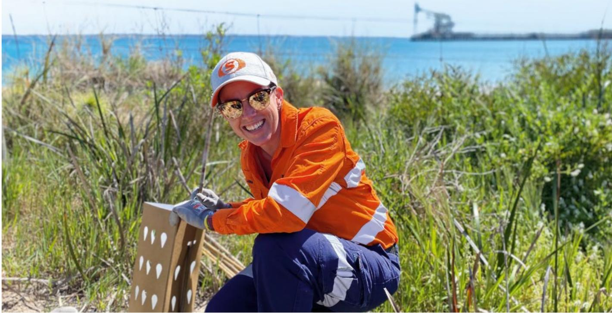

> **AI Description:**
> **Source:** `assets/_page_33_Figure_0.jpg`
> 
> **Generated:** 2026-05-19 06:55:19
> 
> ---
> 
> The image is a photograph of a person outdoors, likely engaged in some form of environmental or conservation work. The individual is wearing a bright orange high-visibility jacket with reflective stripes, a white cap with a logo, and sunglasses. They are kneeling on grass near a body of water, possibly a beach or coastal area, with some vegetation and a structure in the background that could be an oil rig or similar industrial equipment. The person appears to be holding or working with a wooden structure that has holes in it, possibly related to wildlife or environmental monitoring. The setting suggests a focus on outdoor work, possibly related to marine or coastal conservation.

(1) The FY2020 baseline will be adjusted for any material acquisitions and divestments based on greenhouse gas emissions at the time of the transaction. Carbon offsets will be used as required.

## 1.13.2 Our material sustainability issues

## Sustainability materiality assessment

Each year we identify the sustainability issues most material to our business and stakeholders. We use this assessment to help inform our sustainability strategies and to ensure the sustainability disclosures in our Annual Report include the issues of most interest to our business and stakeholders in line with the GRI Standards Reporting Principles.

The materiality assessment considers internal and external stakeholder perspectives and the economic, social, environmental and cultural impacts of our activities. We identified over 30 material sustainability issues as part of our materiality assessment in FY2021.

Of those, the issues shown below and disclosed in this Annual Report were identified as the most material issues to BHP and our stakeholders. The below table also covers our requirements under the UK Companies Act 2006.(1)

More information about our materiality assessment is available at bhp.com/materialityassessment

Material sustainability issues

(1) We comply with the Non-financial Reporting Directive requirements and therefore report sustainability matters from sections 414CA and 414CB of the UK Companies Act 2006. This table sets out where relevant information is located in this Annual Report.
(3) For further information on BHP’s principal risks, refer to section 1.16.
(2) Although these standards are for internal use, we have made the HSEC-related elements of several of the Our Requirements standards and related documents publicly available at bhp.com.

## 1.13.3 Our sustainability performance: Non-financial KPIs

Our five-year sustainability targets and FY2021 performance

(1) FY2018 and FY2019 data includes Continuing and Discontinued operations (Onshore US assets to 28 February 2019).
(2) FY2019 data includes Discontinued operations (Onshore US assets) to 28 February 2019 and Continuing operations.
(3) The sum of (fatalities + lost-time cases + restricted work cases + medical treatment cases) multiplied by 1 million/actual hours worked by our employees and contractors. Stated in units of per million hours worked. We adopt the US Government’s Occupational Safety and Health Administration Guidelines for the recording and reporting of occupational injuries and illnesses.
(4) FY2017 and FY2018 TRIF data includes Continuing and Discontinued operations (Onshore US assets).
(5) FY2019 TRIF data includes Discontinued operations (Onshore US assets) to 28 February 2019 and Continuing operations.
(6) For exposures exceeding our FY2017 baseline occupational exposure limits discounting the use of personal protective equipment, where required. The baseline exposure profile (as at 30 June 2017) is derived through a combination of quantitative exposure measurements and qualitative assessments undertaken by specialist occupational hygienists consistent with best practice as defined by the American Industrial Hygiene Association.
(7) New FY2017 baseline due to the removal of 98 exposures attributed to the Onshore US assets.
(8) Data excludes Discontinued operations (Onshore US assets).
(9) As of FY2021, the Occupational Exposure Limit for Coal was reduced to 1.5 mg/m3 compared to 2.0 mg/m3 in previous years.
(10) A significant event resulting from BHP operated activities is one with an actual severity rating of four or above, based on our internal severity rating scale (tiered from one to five by increasing severity) as defined in our mandatory minimum performance requirements for risk management.
(11) Our voluntary social investment is calculated as 1 per cent of the average of the previous three years’ pre-tax profit.
(12) Expenditure includes BHP’s equity share for operated and non-operated joint ventures, and comprises cash, administrative costs, including costs to facilitate the operation of the BHP Foundation.
(13) FY2017 and FY2018 social investment figures includes Discontinued operations (Onshore US assets).
(14) FY2019 social investment figure includes Discontinued operations (Onshore US assets) to 31 October 2018 and Continuing operations.
(15) FY2017 will be adjusted for any material acquisitions and divestments based on GHG emissions at the time of the transaction. Carbon offsets will be used as required. FY2017 baseline is on a Continuing operations basis and has been adjusted for divestme
(16) FY2018 GHG data includes Continuing operations and Discontinued operations (Onshore US assets). FY2019 GHG data includes Discontinued operations (Onshore US assets) to 31 October 2018 and Continuing operations and has been restated. FY2020 data has been restated.
(17) Where ‘withdrawal’ is defined as water withdrawn and intended for use (in accordance with ‘A Practical Guide to Consistent Water Reporting’, ICMM (2017)).
‘Fresh water’ is defined as waters other than seawater, wastewater from third parties and hypersaline groundwater. Freshwater withdrawal also excludes entrained water that would not be available for other uses. These exclusions have been made to align with the target’s intent to reduce the use of freshwater sources subject to competition from other users or the environment.
(18) The FY2017 baseline data has been adjusted to account for: the materiality of the strike affecting water withdrawals at Escondida in FY2017 and improvements to water balance methodologies at WAIO, BMA and BMC and exclusion of hypersaline, wastewater, entrainment, supplies from desalination and Discontinued operations (Onshore US assets) in FY2019 and FY2020.

## 1.13.4 Safety

Our highest priority is the safety of our workforce and the communities where we operate.

## Our safety performance

In FY2021, we continued to focus on strong safety performance:

– no fatalities at our operated assets

– a decrease of 17 per cent in high-potential injury frequency rate from FY2020. The highest number of events with potential for one or more fatalities were related to vehicle and mobile equipment accidents. High-potential injury trends will remain a primary focus to assess progress against our most important safety objective, eliminating fatalities

– a decrease in total recordable injury frequency (TRIF) of 11 per cent from FY2020. The highest number of injuries is related to slips, trips and falls for both employees and contractors

– an increase in field leadership activities, which occurred at a sustainable frequency rate of 9,400 activities per million hours worked with over 1,573,000 activities completed in the period and over 44,000 employees and contractors participating in the program at least once. Scheduled activities compared to non-scheduled activities increased by 72 per cent from FY2020 and coaching increased by 5 per cent

– we took a number of significant steps to improve our controls to address sexual assault and sexual harassment, however we have further to go to fully stop this behaviour from occurring across BHP

– no safety fines were received at our operated assets in FY2021

Our results were achieved through a sustained focus on improving our management of risk through new and existing programs including:

– Fatality Elimination Program

– Integrated Contractor Management Program

– Field Leadership Program

## Fatality Elimination Program

In FY2021, we introduced our Fatality Elimination Program to enable a step change towards our goal of no fatalities across our business.

Fatality elimination is not a new priority for us. We have been seeking to improve our safety performance over a number of years and more recently, have considerably reduced high potential injuries. However, there is more to do and we are taking additional steps to systematise a common set of controls. In FY2021, the Fatality Elimination Program:

– engaged subject-matter experts and mining, equipment, technology and services (METS) organisations to provide control solutions to our top 10 safety risks

– identified over 60 recommended controls for our top 10 safety risks, including new controls and material improvements to existing controls

– conducted assessments at our operated assets and relevant functions against the recommended controls to determine the actions that need to be taken

– established a global project team to prioritise and deliver a global five-year fatality elimination roadmap

– commenced planning to update the Our Requirements for Safety standard and coordinate a selection of control and human performance improvement initiatives in FY2022

## Integrated Contractor Management Program

Our Integrated Contractor Management Program is designed to make it safer and easier for our contractors to work with us. Introduced in FY2020, the program is focused on building long-term mutually beneficial relationships with our contractors, integrating and simplifying processes and systems, and creating an inclusive, respectful and caring workforce culture.

In 2021, we launched our new global contractor performance standard, establishing global requirements for how we work with contractors (including subcontractors and consultants).

## Performance data – workforce health and safety for FY2021(1)

High-potential injury events(2)

(1) FY2019 data includes Discontinued operations (Onshore US assets) to 28 February 2019 and Continuing operations. Due to the lag nature of incident reporting and subsequent verification, final results may vary post reporting. Prior year data has not been adjusted.

(2) High-potential injury includes injuries with fatality potential. The basis of calculation revised in FY2020 from event count to injury count as part of a safety reporting methodology improvement.

(3) Employee and contractor frequency per 200,000 hours worked.

(4) Combined employee and contractor frequency per 1 million hours worked.

This replaced existing local frameworks and provides a standardised way of working with contractors to drive best practice. To embed the standard, a number of initiatives and tools have been developed:

– Our Scope of Work Library is an online resource containing best practice examples for different types of contractor engagements. This assists our contractor partners to better understand the work required at our sites, enabling them to assign contractors with the right skills and competencies to perform the work.

– To assist in defining the minimum requirements for key roles, governance and process routines, we introduced an operational tiering model. The model factors in work scope, operational safety risks and contract arrangements to inform the robustness of process requirements, including key performance indicators.

– We developed a specific contractor perception survey to ensure we receive contractor feedback on our culture and their experience working at BHP.

– We developed systems to support the contractor management process to improve supervision and training of contractors across our operated assets. A pilot was conducted at one of our Australian operated assets to ensure the system was fit-for-purpose before broader implementation.

## Field Leadership Program

Leaders spending time in the field is vital to maintaining safe operations. Our global Field Leadership Program involves leaders engaging with workers in the field to drive a common approach to improving health, safety and environment (HSE) performance. These engagements are used to verify critical safety controls are in place, being applied and are effective in reducing the risk of fatalities.

The program encourages the workforce to provide feedback to their leaders about safety and to look out for the safety of themselves and their colleagues.

## In FY2021 we:

– increased supervisor time in the field through the BHP Operating System (BOS) and reduced the large spans of control that some supervisors had over their teams

– continued to improve the quality of field leadership activities by increasing coaching and delivery of field leadership engagements at our operated assets

– focused on ensuring our leaders were proactively scheduling field leadership activities and executing them to plan to ensure adequate verification of all fatality risks across our operated assets

– developed a global, standardised field leadership procedure designed to increase the effectiveness of field leadership activities by reducing variances in practices across the business

### Full Page Description (Page 37)

**Source:** `assets/_page_37_Asset_0.jpg`

**Generated:** 2026-05-19 06:41:20

---

The image is a bar chart titled "Occupational illness" and shows the number of occupational illnesses per million employee hours worked from fiscal years 2017 to 2021. The chart uses orange bars to represent the total number of occupational illnesses, with a smaller gray section at the top indicating the number of occupational illnesses per million employee hours worked. The data for each fiscal year is clearly labeled on the bars. The main trend is a slight decrease in the number of occupational illnesses per million employee hours worked over the five-year period.

### Full Page Description (Page 37)

**Source:** `assets/_page_37_Asset_1.jpg`

**Generated:** 2026-05-19 06:40:29

---

The image is a bar chart titled "Occupational illness" and shows the rate of occupational illness per million contractor hours worked from FY2017 to FY2021. The chart uses stacked bars to represent the data, with the orange portion representing the number of occupational illnesses and the gray portion representing the number of contractor hours worked. The data shows a general upward trend in the number of occupational illnesses over the years, with a slight decrease in the number of contractor hours worked.

## 1.13 Sustainability continued

– conducted field leadership on COVID-19 controls, which increased our understanding of control application and effectiveness by engaging our workforce for direct feedback

– introduced sexual harassment field leadership activities, which provided information on progress and areas for improvement in this space

## Sexual assault and sexual harassment

Our position on sexual assault and sexual harassment is clear. This conduct is completely unacceptable, contrary to our values and unlawful. Over a number of years, we have taken action to prevent sexual harassment including through education, encouraging reporting and security measures. While we have made important progress, this continues to be an issue at BHP and, as long as it does, we must and will do more and we continue to focus and invest in preventing this behaviour.

In 2018, we formally defined sexual assault and sexual harassment as a health and safety risk. As part of the risk assessment processes, we engaged experts in health and safety, harassment and inclusion and diversity. We introduced a range of controls including security measures such as on-site security guards, additional CCTV, increased security patrols in public areas and improved lighting, with a further AU\$300 million for planned improvements to occur in FY2022. We have also introduced trauma informed emergency response, victim-centric investigations and a dedicated support service that provides end-to end assistance and advice to anyone impacted by sexual assault and sexual harassment. We are committed to the full implementation of all requisite controls in FY2022, and have tied completion of actions to executive and employee remuneration. We also recognise that we can improve the coordination of our work to address this issue and have set up a project management office for this purpose.

Sexual assault and sexual harassment are risks for BHP and the industry, and we are working with others in the industry to address these risks, as we have done with other health and safety matters. We participated in the Minerals Council of Australia Taskforce that developed and released an industry statement and Code of Conduct aimed at eradicating sexual assault and sexual harassment from our industry. We also made a submission to the Inquiry in Western Australia into sexual harassment against women in the FIFO mining industry to contribute to the industry addressing this issue which can be found at BHP Submission – WA Inquiry in relation to Sexual Harassment in FIFO mining industry.pdf (parliament.wa.gov.au).

For more information on reported cases refer to section 1.13.6

More information on safety is available at bhp.com/safety

## 1.13.5 Health

We are committed to protecting the health and wellbeing of our employees and contractors.

We set clear mandatory minimum standards to identify and assess health risks, manage their impact and monitor the health of our people.

## Occupational illness

The reported incidence of occupational illness(1) for employees in FY2021 was 308 which was 4.36 per million hours worked, representing a minor increase compared to FY2020 which was 4.30 per million hours worked.

For our contractor workforce, the reported incidence of occupational illness was 180 which was 1.87 per million hours worked, an increase of 31 per cent compared with FY2020. Due to regulatory regimes and limited access to data, we do not have full oversight of the incidence of contractor noise-induced hearing loss (NIHL) cases.

Musculoskeletal illness accounts for the majority of our reported occupational illnesses.

## These are conditions impacting the

musculoskeletal system and connective tissues caused by repetitive work-related stress or strain or exposure over time. Musculoskeletal illness does not include disorders caused by slips, trips, falls or similar incidents.

The main change in the incidence of occupational illness in FY2021 as compared to FY2020 was an increase in the rate of employee cases of NIHL reported by our operated assets in South America. This was due to an increase in testing for noise induced hearing loss this year because of a suspension of testing activities due to COVID-19 impacts last year.

Our occupational illness data excludes cases of COVID-19 among our employees and contractors. In settings of high levels of community transmission and with an evolving understanding of the epidemiological criteria for infection and emerging COVID-19 variants with evidence of increased transmission, it is difficult to conclude, with reasonable certainty, that a person was infected because of workrelated activities or exposure. For information on our response to COVID-19, refer to the ‘COVID-19’ section on the next page.

## Occupational illness

## Occupational exposures

Occupational exposure limits (OELs) for our most material exposures are set according to the latest scientific evidence, which for a number of agents, such as diesel particulate matter (DPM), resulted in lower limits than the then regulatory requirements. Where exposures potentially exceed regulatory limits or our stricter limits, respiratory protective equipment is required.

For our most material exposures to DPM, silica and coal mine dust, we have a five-year target to achieve, by FY2022, a 50 per cent reduction in the number of workers potentially exposed(1) as compared to our 30 June 2017 baseline exposure profile.(2)(3) In FY2016, we committed to applying an OEL of 0.03 mg/m3 for DPM and in FY2017, we committed to applying OELs of 1.5 mg/m3 for respirable coal mine dust by 1 July 2020 and 0.05 mg/m3 for silica by 1 July 2021. Exposure data in this Annual Report is based on these limits and in all cases discounts the effect of personal protective equipment.

In FY2021, material exposures overall reduced by 70 per cent compared to the adjusted FY2017 baseline which is better than our FY2020 target. This includes a reduction of 29 per cent compared to FY2020 in the number of workers potentially exposed to silica in excess of our OEL and this reduction was largely due to reduction in exposures by our Minerals Americas operated assets where there was a 35 per cent reduction compared to the previous year.

In addition, work to control exposure to DPM at Nickel West and Olympic Dam resulted in a 12 per cent reduction compared to FY2020 in the number of workers potentially exposed to DPM. No potential exposures in excess of our OEL for respirable coal mine dust were reported in FY2020; however, in FY2021 we have identified a workgroup as being potentially exposed in excess of our OEL at one of our coal operated assets. We are committed to reducing this potential exposure to below the OEL in the next reporting period.

## Coal mine dust lung disease

In FY2021, there were four coal mine dust lung disease (CMDLD)(4) claims accepted, which consisted of two current workers and two former workers at our BMA asset.

## Mental health

The mental health of our people continues to be a focus. In FY2021, good progress was made with implementing our Group-wide Mental Health Framework to raise awareness of mental wellbeing, reduce stigma and increase the capacity of our leaders to recognise and support individuals experiencing mental illness.

We also became a founding member of the Global Business Collaboration for Better Workplace Mental Health, which seeks to advance progress across the globe by committing senior leaders to a pledge to create mentally healthy workplaces.

To support the proactive management of mental wellbeing and give our workforce the tools and skills they need to build resilience and positive mental health, we provide and promote the Employee Assistance Program, our mental health toolkit, Thrive, education and awareness campaigns (including stigma reduction) and the BHP Resilience Program.

In May 2021, we held our inaugural Mental Health month, with the aim of increasing mental wellbeing in the communities where we operate and encouraging everyone to support and look out for one another. We also continue to support global mental health campaigns, including World Mental Health Day, R U OK? Day and Movember.

We plan to progress our efforts in FY2022 by addressing psychosocial hazards in the workplace using a risk management approach to further support better workplace mental health.

## COVID-19

Throughout FY2021, we continued to navigate the challenges of the global COVID-19 pandemic and prioritise the health and safety of our people and workplaces. This included the removal of vulnerable workers from the workplace and an increase in testing regimes for site-based workforce during periods of high community transmissions.

Across BHP’s global workforce,(5) we estimated there were as many as 5,000 confirmed(6) COVID-19 cases including three deaths, with with around 1,100 of those confirmed cases potentially infectious while at work(7) (figures for persons potentially infectious while at work are included irrespective of where infection may have occurred). We recognise the significant impact COVID-19 has had on the daily lives of our people and the communities where we operate and we offer our deep sympathies to the families of our colleagues who tragically were amongst the many people who have lost their lives to COVID-19. Almost all confirmed cases were from people in our Minerals Americas workforce.

We conduct COVID-19 tests as part of our workplace entry screening, which includes mainly polymerase chain reaction (PCR) testing and a small percentage of antigen testing. In FY2021, we conducted 27,261 tests in our Petroleum operated assets and 440,000 tests in our Minerals Americas operated assets and identified 248 and 2,277 confirmed cases respectively. This included symptomatic and asymptomatic cases that may not have been identified otherwise.

Our support extended to areas impacted by high community transmissions and reduced local medical capabilities. This included establishing telehealth services, in-home PCR testing, emergency ambulance support, mental wellness support and provision of medical support (e.g. procurement of oxygen concentrators in India) to support ill workers and their family members.

More information on health including a case study on how we supported our people and the communities where we operate through COVID-19 is available at   
bhp.com/health

## 1.13.6 Ethics and business conduct

## Our conduct

Our Code of Conduct (Our Code)(8) brings our values to life so we can make the right choices every day. It applies to everyone who works for us or on our behalf. To ensure everyone understands how Our Code applies and the standards of behaviour we expect, annual training is mandatory for all employees and contractors. There are also consequences for breaching Our Code and we encourage people to speak up where a decision or action is not in line with Our Code or Our Charter.

> **AI Description:**
> **Source:** `assets/_page_38_Figure_1.jpg`
> 
> **Generated:** 2026-05-19 06:49:50
> 
> ---
> 
> The image contains a simple icon of a computer mouse pointer with a looped line, suggesting a connection or interaction. There is no text or additional visual content beyond this icon.

## and accessible at bhp.com

EthicsPoint is our confidential reporting tool that is accessible to all, including external stakeholders and the public, to report conduct that may be unethical, illegal or inconsistent with Our Code.

In 2021, 4,162 reports were received into EthicsPoint (of these 3,541 were classified as business conduct concerns(9)), representing an increase of 52 per cent from FY2020. This increase coincides with enhanced training on Our Code and efforts to increase awareness of the requirement for line leaders to log all concerns relating to Our Code in EthicsPoint. Of the reports received, 42 per cent were made anonymously,(10) compared with 53 per cent in FY2020, a reduction from FY2020, which may indicate that reporters have greater confidence in the EthicsPoint process. Of the total reports received, 38 per cent contained one or more substantiated allegations.(11)

### Full Page Description (Page 39)

**Source:** `assets/_page_39_Asset_0.jpg`

**Generated:** 2026-05-19 06:50:54

---

The image is a circular chart divided into segments, with a large orange section occupying the majority of the circle. The remaining segments are smaller and colored in shades of blue, gray, and orange. The chart appears to represent a pie chart or a donut chart, with the orange section likely indicating a significant portion of the total, possibly over 50%. The smaller segments represent smaller categories or components of the whole.

Business conduct cases by issue type FY2021

Harassment and bullying, including 61% sexual harassment and sexual assault

Discrimination 8%

Health, safety or environment breach 6%

(1) Inclusions are anti-competitive behaviour; attempts to identify an anonymous reporter, community relations or human rights breach; cybersecurity or data privacy breach; deficiencies in a business conduct investigation; improper political or governmental conduct; inappropriate or unauthorised external communication; information on other support service providers; physical violence; and trade control breach.

## Transparency and accountability

We understand the connection between:

– the disclosures we make about the taxes and royalties we pay to governments, which enable the public to see what we have paid

– transparency of the contracts we have with governments which allows comparison of our actual payments against what is required to be paid

We support initiatives by governments of the countries where we operate to publicly disclose the content of our licences or contracts for the development and production of oil, gas or minerals that form the basis of our payments to government, as outlined in the Extractive Industries Transparency Initiative (EITI) Standard.

Other key initiatives include our work in partnership with Transparency International, our representation on the Board of the EITI, our support for ultimate beneficial ownership transparency, our financial support for and Steering Committee membership of the Bribery Prevention Network (in Australia) and our funding of the BHP Foundation, including its Natural Resource Governance Global Program. We believe these transparency initiatives will reduce corruption risk and improve our ability to operate and compete for resources.

## Anti-corruption

We are determined to play a significant role in the global fight against corruption in the resources industry. Our Charter and Our Code provide the framework for our anti-corruption compliance program. All activities that potentially involve higher risks of exposure to corruption require review or approval by our Ethics and Compliance function.

This function has a mandate to design and govern our compliance frameworks for key compliance risks, including anti-bribery and corruption. The function is independent of our assets and regions, and reports to the Chief Legal Governance and External Affairs Officer. The Chief Compliance Officer reports quarterly to the Risk and Audit Committee on ethics and compliance issues and meets at least annually with the Committee Chair.

Our Ethics and Compliance function also participates in all risk assessments in respect of operated assets or functions that are considered to carry material anti-corruption risks. In FY2021, the Ethics and Compliance team provided input into 41 risk assessments.

As part of our commitment to anti-corruption, we prohibit authorising, offering, giving or promising anything of value directly or indirectly to a government official to influence official action, or to anyone to encourage them to perform their work disloyally or otherwise improperly. We also prohibit facilitation payments, which are payments to government officials for routine government actions. Our people must take care that third parties acting on our behalf do not violate anti-corruption laws. Disciplinary action, including dismissal or termination of contractual relationships, may follow from a breach of these requirements.

We regularly review our anti-corruption compliance program to ensure it meets the requirements of the US Foreign Corrupt Practices Act, the UK Bribery Act, the Australian Criminal Code and the applicable laws and regulatory developments of all places where we do business. These laws are consistent with the standards of the OECD Convention on Combating Bribery of Foreign Public Officials in International Business Transactions. Recognising the challenges posed to normal ways of working by COVID-19, in FY2021 we increased the frequency of our compliance monitoring to support the timely identification of activities that could potentially present an enhanced compliance risk. By regularly calibrating our compliance processes, we work to ensure optimal resource allocation to areas presenting the highest corruption risks to our business. Our efforts are complementary to the BHP Foundation’s global partnership with Transparency International, which is supporting governments to identify and address corruption risks in mining licencing processes.

Anti-corruption training is provided to all employees and contractors as part of mandatory annual training on Our Code. In FY2021, additional risk-based anti-corruption training was also undertaken by 3,879 employees and contractors, as well as employees of certain of our business partners and community partners.

More information on ethics and business conduct is available at bhp.com/ethics

## 1.13.7 Climate change and portfolio resilience

We believe the world must pursue the Paris Agreement goals with increased levels of national and global ambition to limit the impacts of climate change. Providing access to affordable and clean energy and other products is essential to meet sustainable development goals. At BHP, we advocate for effective actions in line with the Paris Agreement goals while recognising the challenge of achieving these goals is of global scale and historic complexity.

In September 2021, BHP published its Climate Transition Action Plan 2021, which sets out our strategic approach to our goal to reduce operational GHG emissions (Scope 1 and Scope 2 from our operated assets) to net zero(2) by 2050, and our enhanced Scope 3 position for GHG emissions in our value chain. The Plan, together with more information on our climate commitments, actions and performance, including our Climate Change Report 2020, is available at bhp.com/climate.

More information on our climate commitments, actions and performance, including our Climate Change Report 2020, is available at bhp.com/climate

## Governance and management

Climate change is a material governance and strategic issue for us. Our Board is actively engaged in the governance of climate change issues, including our strategic approach and performance against our commitments, supported by the Sustainability Committee and the Risk and Audit Committee (for more information, refer to section 2.1).

Below the level of the Board, key management decisions are made by the CEO and management, in accordance with their delegated authority. Management has primary responsibility for the design and implementation of our climate change strategy and execution of that strategy is overseen by the Climate Change Steering Committee. BHP has a dedicated Climate Change Team that is responsible for advising the Executive Leadership Team. The team collaborates with BHP’s functions and asset teams, external partners and industry to develop practical climate change solutions, designed to preserve and unlock long-term value for BHP. It regularly prepares information and advice for the Executive Leadership Team, Sustainability Committee, Risk and Audit Committee and the Board on climate-related strategy, risks and performance against climate-related metrics. It also monitors key indicators and signposts against our appetite for climate change-related risks (both threats and opportunities).

## Addressing climate risks

BHP applies a single, Group-wide approach to the management of risk, known as the Risk Framework. When new and emerging risks are identified, each is assigned an owner in the part of the business where the risk occurs. Risks are assessed to determine their potential impacts and likelihood, enable prioritisation and determine risk treatment options. We then implement controls designed to prevent, reduce or mitigate downside risks and increase the likelihood of opportunities being realised. Risks and controls are reviewed periodically and on an ad-hoc basis to evaluate performance of the controls against the risks.

Climate-related risks can be grouped in two categories: transition risk and physical risk.

Transition risks arise from policy, regulatory, legal, technological, market and other societal responses to the challenges posed by climate change and the transition to a low-carbon economy. For more information on BHP’s exposure to and management of transition risks, refer to section 1.16.

Physical risks refer to acute risks that are eventdriven, including increased severity of extreme weather events, and chronic risks resulting from longer-term changes in climate patterns. For more information on BHP’s exposure to and management of physical risks, refer to ‘Adaptation to physical risks’ below in this section and to section 1.16.

## Adaptation to physical risks

BHP’s vision for adapting to the physical risks of climate change is to take a proactive and collaborative approach to building the climate resilience of our operated assets, investments, portfolio, supply chain, communities and ecosystems, to achieve mutually beneficial outcomes for our stakeholders.

In FY2021, following external benchmarking and internal engagement, we finalised our updated Adaptation Strategy as set out below.

The focus in FY2021 was on enhancing governance structures, developing a more consistent and comprehensive approach to the use of climate data, and improving how we integrate physical climate risk within the existing risk management process in order to identify and resource priority actions.

In FY2022, we intend to build these priority actions into planning and capital allocation processes, and continue to analyse identified risks in more detail. This will provide the basis from which we can develop our ability to report on specific material physical risks and their potential financial impacts (including material expenditure on climate change adaptation) in later years.

## Portfolio analysis and capital alignment

The world must undergo multiple transitions arising from commitments to reduce GHG emissions. These transitions are complex, multifaceted and could reasonably be expected to manifest in unique ways across different regions, reflecting heterogeneous local conditions. However, we believe that together they comprise a global transition to a lower-carbon economy that can mitigate the impacts of climate change. We see steps towards these transitions in the emergence of electric mobility and the rapid cost declines of renewable power generation. Global accords such as the Paris Agreement and subsequent government commitments suggest these transitions are likely to accelerate.

The Paris Agreement has set an ambition to pursue efforts to limit global temperature increases to 1.5°C above pre-industrial levels, which will require aggressive action to reduce GHG emissions. Abatement commensurate with limiting temperature increases to 1.5°C would reduce the potential physical impact of climate change on our assets, our employees, our communities and our markets, and potentially generate significant value for our portfolio.

In the BHP Climate Change Report 2020,(1) we described the impact on our business of four divergent scenarios(2) across a range of temperature outcomes, including our Parisaligned 1.5°C scenario.(3) Our most recent portfolio analysis indicated that under our 1.5°C scenario, the world would need around twice as much steel and copper, and four times as much nickel in the next 30 years as it did in the last 30. Potash demand, required for higher agricultural yields due to land use competition, also grows under that scenario.

Today’s signposts do not yet indicate that the appropriate measures are in place to drive decarbonisation at the pace or scale required to achieve the Paris Agreement goals. However, as governments, institutions, companies and society increasingly focus on addressing climate change, the potential for a non-linear transition and the subsequent impact on opportunities and risk increases.

We intend to systematically integrate one or more Paris-aligned scenarios (including 1.5°C scenarios) into our strategy and capital prioritisation processes beginning in FY2022. This will enhance our current approach, in which our 1.5°C scenario is used to inform and test strategic portfolio decisions.

## More information on the BHP Climate Transition Plan 2021, is available at bhp.com/climate

## Building blocks of our Climate Change Adaptation Strategy (FY2021 – 2025)

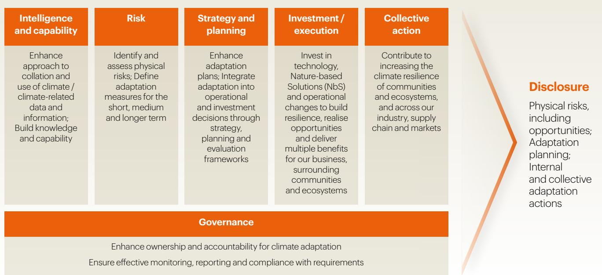

> **AI Description:**
> **Source:** `assets/_page_40_Figure_0.jpg`
> 
> **Generated:** 2026-05-19 06:36:25
> 
> ---
> 
> The image contains a structured infographic with a focus on climate adaptation strategies. It is divided into five main sections: Intelligence and capability, Risk, Strategy and planning, Investment/execution, and Collective action. Each section outlines specific actions and objectives related to climate resilience and adaptation. The infographic also includes a governance section emphasizing the importance of enhancing ownership and accountability for climate adaptation, ensuring effective monitoring, reporting, and compliance. The right side of the image highlights key disclosures related to physical risks, adaptation planning, and collective adaptation actions. The design uses a combination of text and color-coded sections to organize the information clearly.

## 1.13 Sustainability continued

## Operational greenhouse gas emissions and energy consumption

Our long-term goal is to achieve net zero(1) operational GHG emissions by 2050. We have also set a medium-term target to reduce operational GHG emissions by at least 30 per cent from FY2020 levels(2) by FY2030.(3) This reflects our commitment to decarbonising BHP’s operations and a recognition that we have a part to play in accelerating the global pathway to decarbonisation.

We are also working to achieve our shortterm target for FY2022 to maintain our total operational GHG emissions at or below FY2017 levels(4) while continuing to grow our business.

Our operational GHG emissions are measured against our target performance based on an operational control, market-based methodology. We also disclose operational GHG emissions by equity share and financial control in section 4.8.5.

In FY2021, total operational energy consumption increased 3 per cent from FY2020 due to increased drilling activity in our Trinidad and Tobago operations, the use of diesel generators to provide power to our Angostura facility during the Ruby project tie-in and increased diesel usage at our Queensland Coal operated assets. Building on our Light Electric Vehicle (LEV) trials at Olympic Dam and Queensland Coal, we have commenced LEV trials at Nickel West using onboard battery power. This trial is anticipated to reduce noise, heat and diesel particulate matter, as well as consumption of fossil fuel. We have increased the renewable component of our energy consumption in FY2021 due to the start of the renewable power purchasing agreement (PPA) at Queensland Coal.

In FY2021, operational GHG emissions were 11 per cent higher than the adjusted FY2017 baseline of 14.6 MtCO2-e on a Continuing operations basis, reflecting increased production at our Minerals Australia operated assets since FY2017. However, as a result of actions taken in FY2020 and FY2021, particularly securing the supply of renewable energy at some operations, our forecasted operational GHG emissions are currently tracking in line with our FY2022 and FY2030 targets (see Progress on decarbonisation, below).

## Progress on decarbonisation In FY2021:

– We signed a renewable PPA to supply up to 50 per cent of our electricity needs at the Nickel West Kwinana Refinery from the Merredin Solar Farm.

– We secured firm renewable electricity via a PPA to meet half of the electricity needs across Queensland Coal mines from lowemissions sources.

- (1) Net zero includes the use of carbon offsets as required.
- (2) FY2020 baseline will be adjusted for any material acquisitions and divestments based on GHG emissions at the time of the transaction. Carbon offsets will be used as required.
- (3) These positions are expressed using terms that are defined in the Glossary, including the terms ‘net zero’, ‘target’ and ‘goal’.
- (4) FY2017 will be adjusted for any material acquisitions and divestments based on GHG emissions at the time of the transaction. Carbon offsets will be used as required.

Operational energy consumption by source (TWh)(1)(2)

Operational GHG emissions by source (MtCO2-e)(1)(2)(4)(5)(11)

(1) Unless otherwise noted, FY2019 data includes Continuing operations and Discontinued operations (Onshore US assets) to 31 October 2018. Data in italics indicates that data has been adjusted since it was previously reported. FY2020 originally reported data that has been restated is 9.5 MtCO2-e for Scope 1 GHG emissions and 15.8 MtCO2-e for total operational GHG emissions, due to minor amendments to fugitive emissions from the coal operated assets as part of the annual reconciliation process for Australian regulatory reporting purposes. FY2019 data that has been restated is 6.1 MtCO2-e for Scope 2 GHG emissions, 15.8 MtCO2-e for total operational GHG emissions, and 15.3 MtCO2-e for total operational GHG emissions (adjusted for Discontinued operations) due to minor amendments to market-based emission factors for Minerals Americas operated assets. Additionally, non-material adjustments in prior year asset-level data and changes to presentation of the data has, in certain instances, resulted in minor impacts to the rounding of data since it was previously reported.

(2) Calculated based on an operational control approach in line with World Resources Institute/World Business Council for Sustainable Development guidance. Consumption of fuel and consumption of electricity refers to annual quantity of energy consumed from the combustion of fuel; and the operation of any facility; and energy consumed resulting from the purchase of electricity, heat, steam or cooling by the company for its own use. Over 99.9 per cent of BHP's energy consumption and operational GHG emissions occurs outside the UK and offshore area (as defined in the relevant UK reporting regulations). UK energy consumption of 99,762 kWh and GHG emissions of 21 tCO2-e is associated with electricity consumption from our office in London. One TWh equals 1,000,000,000 kWh. Data has been rounded to the nearest 1 PJ or 0.1 TWh to be consistent with asset/regional energy information in this Annual Report. In some instances, the sum of totals for sources, commodities and assets may differ due to rounding.

(3) In FY2021 we have revised and tightened the definition of renewable energy consumption for our operations to better align with our market-based GHG emissions reporting. This resulted in the restatement of operational consumption from renewable energy sources figures. Previously reported numbers for FY2020 and FY2019 for this data were 0.01 TWh for both years.

(4) BHP currently uses Global Warming Potentials (GWP) from the Intergovernmental Panel on Climate Change (IPCC) Assessment Report 5 (AR5) based on a 100-year timeframe for Minerals Australia and Petroleum. Minerals Americas currently use IPCC Assessment Report 4 (AR4) GWP and will be transitioning to AR5 GWP in FY2022.

(5) Scope 1 and Scope 2 GHG emissions have been calculated based on an operational control approach (unless otherwise stated) in line with the Greenhouse Gas Protocol Corporate Accounting and Reporting Standard. For more information, see BHP Scope 1, 2 and 3 GHG Emissions Calculation Methodology, available at bhp.com/climate. Data has been rounded to the nearest 10 ktCO2-e or 0.1 MtCO2-e to be consistent with asset/regional GHG emissions information in this Annual Report. In some instances, the sum of totals for sources, commodities and assets may differ due to rounding.

(6) Scope 1 refers to direct GHG emissions from operated assets.

(7) Scope 2 refers to indirect GHG emissions from the generation of purchased or acquired electricity, steam, heat or cooling that is consumed by operated assets. Our Scope 2 GHG emissions have been calculated using the market-based method using supplier specific emission factors, in line with the Greenhouse Gas Protocol Scope 2 Guidance unless otherwise specified. A residual mix emission factor is currently unavailable to account for grid electricity emissions remaining after removal of quantities directly contracted between parties; this may result in double counting of low emissions or renewable electricity contributions across gridsupplied consumers.

(8) Excludes Onshore US assets, which were divested in FY2019. Non-material acquisitions and divestments have not been included in discontinued operations and are included in the Total.

(9) For this purpose, copper equivalent production has been calculated based on FY2021 average realised product prices for FY2021 production, FY2020 average realised product prices for FY2020 production and FY2019 average realised product prices for FY2019 production. Production figures used are consistent with energy and GHG emissions reporting boundaries (i.e. BHP operational control) and are taken on 100 per cent basis.

(10) Scope 1 GHG emissions from BHP's facilities covered by the Safeguard Mechanism administered by the Clean Energy Regulator in Australia and the distillate and gasoline GHG emissions from turbine boilers at the cathode plant at Escondida covered by the Green Tax legislation in Chile.

(11) More information on the calculation methodologies, assumptions and key references used in the preparation of our Scope 1 and Scope 2 GHG emissions data can be found in the BHP Scope 1, 2 and 3 GHG Emissions Calculation Methodology, available at bhp.com/climate. More information on our strategy to further reduce GHG emissions, including our investments in low-emissions technology and natural climate solutions, is available in the BHP Climate Change Report 2020 and the BHP Climate Transition Action Plan 2021 at bhp.com/climate.

(12) In FY2021, we have calculated an additional operational GHG emissions total for the reporting year including contributions from the retirement of a quantity of carbon offsets. This figure has been calculated by subtracting the number of carbon offsets retired (each equivalent to a single tonne of CO2-e reduced or ‘removed’ from the atmosphere) from the total GHG emissions reported under our operational control boundary for the year. This is not intended to establish a recurrent approach. Further detail on our approach to carbon offset use, and the specifics of the carbon offsets retired in FY2021, is provided at bhp.com/offsets-2021.

– We continued to implement PPAs for renewable electricity commencing from FY2022 at our Chilean copper operated assets, Escondida and Spence, which are on track to reach net zero Scope 2 GHG emissions by the mid-2020s.

These agreements are intended to help meet our FY2022 and FY2030 operational GHG emissions targets. We regularly monitor our forecasted GHG emissions to check we are on track.

In FY2021, we partnered with Rio Tinto and Vale to launch the ‘Charge on Innovation Challenge’, a mining truck electrification initiative, facilitated by Austmine. The initiative aims to develop innovative charging infrastructure in parallel with the development of battery-electric trucks.

In August 2021, BHP became a founding member of Komatsu’s GHG Alliance, which aims to develop commercially viable zero-GHG emissions haul trucks. BHP will provide engineering and technical resources to Komatsu, enabling BHP’s real-time access to technology in development and giving Komatsu the opportunity to draw on BHP’s mining expertise to accelerate its path to market. Also in August 2021, BHP and TransAlta announced plans to build two solar farms and a battery storage system to help power the Mt Keith and Leinster operations at Nickel West.

In FY2022, we intend to look for further opportunities to collaborate with original equipment manufacturers, source renewable electricity for our Australian operated assets and progress studies for diesel displacement at our operated assets.

## Value chain emissions

We recognise the importance of supporting efforts to reduce emissions in our value chain. In 2020, BHP set Scope 3 emissions goals for 2030 for processing of our steelmaking products and maritime transportation of our products, supported by an action plan and aligned to a long-term vision to support the economy-wide transition necessary to meet the Paris Agreement goals by working with customers and suppliers to achieve sectoral decarbonisation.

Those goals are to:

– Support industry to develop technologies and pathways capable of 30 per cent emissions intensity reduction in integrated steelmaking, with widespread adoption expected post 2030;

– Support 40 per cent emissions intensity reduction of BHP-chartered shipping of our products.

In our Climate Transition Action Plan 2021, we are building on these medium-term goals. Our position reflects the challenges and opportunities in line with our strategy for increasing long-term portfolio exposure towards future facing commodities. Our recent proposed portfolio changes(1) are aligned with our strategic approach to manage risk and maximise value. While these decisions were not made for the purpose of setting a future Scope 3 position, upon completion, the changes would lower our total Scope 3 emissions inventory.

As we shape our portfolio for the future, we are announcing our enhanced Scope 3 position.(2)

While we cannot ensure the outcome alone, for our reshaped portfolio,(3) we are pursuing the long-term goal of net zero(4) Scope 3 GHG emissions by 2050 to support the transition that the world must make. To progress towards this goal:

– we are targeting net zero for the operational GHG emissions of our direct suppliers(5) and the emissions from maritime transport of our products; and

– recognising the particular challenge of a net zero pathway for customers’ processing of our products,(6) which is dependent on the development and downstream deployment of solutions and supportive policy, we cannot set a target, but will continue to partner with customers and others to accelerate the transition to carbon neutral(7) steelmaking and other downstream processes. We will also support the value chain by pursuing carbon neutral production of our future facing commodities, such as copper, nickel and potash, to provide the essential building blocks of a net zero transition.

We have therefore set these Scope 3 targets:(8)

– We will target net zero(9) by 2050 for the operational GHG emissions of our direct suppliers,(10) subject to the widespread availability of carbon neutral(11) goods and services to meet our requirements.

– We will target net zero(12) by 2050 for GHG emissions from all shipping(13) of our products,(14) subject to the widespread availability of carbon-neutral(15) solutions including low/zero-emission technology on board suitable ships and low/zero-emission marine fuels.

## Action on our value chain GHG emissions goals in FY2021 Steelmaking

In FY2021, BHP signed memoranda of understanding for partnerships with three of our customers, China Baowu, JFE and HBIS, to invest up to a total of US\$65 million in research and development of steel decarbonisation pathways. We also established a research program with the University of Newcastle in Australia to study raw material properties in lowcarbon iron and steelmaking. Additionally, BHP Ventures is strategically investing in a range of emerging companies, including some focused on low- or no-carbon steelmaking.

In FY2022, we intend to progress research and development and develop plans for operational testing and trials under the three steelmaking partnerships. We also plan to explore new steelmaking partnerships to jointly study lowcarbon steelmaking technologies.

## Maritime

In FY2021, BHP committed to becoming one of the founding members of the Global Centre for Maritime Decarbonisation. The Centre is to be set up in Singapore and act as a focal point for the global maritime industry’s efforts in decarbonisation and innovation. In April 2021, we participated in the first marine biofuel trial involving an ocean-going vessel bunkering in Singapore in collaboration with Oldendorff Carriers and GoodFuels, and supported by the Maritime and Port Authority of Singapore. BHP also issued and awarded

## 1.13 Sustainability continued

the world’s first LNG-fuelled Newcastlemax bulk carrier vessel tender in FY2021, with the aim of significantly reducing GHG emissions per voyage. In FY2022, we intend to begin to integrate the use of LNG-fuelled bulk carriers into our maritime operations and assess the suitability of a range of routes for LNG or biofuelled bulk carriers. We are also developing a sustainability analytics platform to analyse the operational energy efficiency and emissions of BHP-chartered vessels. This will enable more energy-efficient vessel selection, as well as more targeted emissions reduction insights and actions that can be pursued with our shipping partners.

## Scope 3 GHG emissions performance

The most significant contributions to BHP’s total reported Scope 3 emissions inventory come from the downstream processing of our products, in particular from the GHG emissions generated by steelmaking through the processing of iron ore and metallurgical coal. Our analysis indicates that in FY2021, GHG emissions associated with the processing of our commodities (primarily iron ore and metallurgical coal to steel; together with copper concentrate and cathode to copper wire) were 306 MtCO2-e. GHG emissions associated with the use of our energy products (energy coal, oil and gas)(1) were 76 MtCO2-e.

While we have worked to eliminate major ‘double-counting’ in our Scope 3 inventory of GHG emissions from iron ore and metallurgical coal used in steelmaking, a degree of overlap in reporting boundaries still occurs due to our involvement at multiple points in the life cycle of the commodities we produce and consume. Refer to footnotes (1) and (7) to the table to the side for more information.

We continue to consider ways to understand different metrics for measuring Scopes 1, 2 and 3 GHG emissions intensity and tracking their impact on long-term decarbonisation. To this end, in FY2021 we continued to engage with Climate Action 100+ (CA100+) and the Transition Pathway Initiative on their methodology for the diversified mining sector. We also progressed pilot traceability studies in copper and nickel that measure the value-chain GHG emissions of our products.

## Investing in decarbonisation

In FY2020, we announced a commitment of at least US\$400 million to invest in GHG emissions reduction across our operated assets and value chain over the five-year life of our Climate Investment Program. In FY2021, we spent US\$29 million under this program, targeting operational, maritime, steelmaking and BHP Ventures investments, and committed to spend significantly more, including up to US\$65 million over coming years towards partnerships with our customers in the steel sector.

Scope 3 GHG emissions by category (MtCO2-e)(1)

(1) Scope 3 GHG emissions have been calculated using methodologies consistent with the Greenhouse Gas Protocol Corporate Value Chain (Scope 3) Accounting and Reporting Standard (Scope 3 Standard). Scope 3 GHG emissions reporting necessarily requires a degree of overlap in reporting boundaries due to our involvement at multiple points in the life cycle of the commodities we produce and consume. More information on the calculation methodologies, assumptions and key references used in the preparation of our Scope 3 GHG emissions data can be found in the BHP Scope 1, 2 and 3 GHG Emissions Calculation Methodology, available at bhp.com/climate.

(2) In FY2021, we have made improvements in how we calculate Scope 3 GHG emissions associated with the purchased goods and services category by assigning more accurate emission factors to some procurement categories and improving the accuracy of spend data. Previously reported GHG emissions for the ‘Purchased goods and services (including capital goods)’ category are 16.9 MtCO2-e in FY2020 and 17.3 MtCO2-e in FY2019. Previously reported GHG emissions for FY2019 are 0.1 MtCO2-e in the ‘Business travel’ category and <0.1 MtCO2-e for the ‘Employee commuting’ category. Emissions in FY2020 did not materially change as a result of the improved methodology.

(3) In FY2021, we have made improvements in how we calculate Scope 3 GHG emissions associated with the Fuel and Energy related activities by removing the Scope 3 GHG emissions associated with natural gas consumption at our Petroleum operations as the majority of those GHG emissions would be captured in our Scope 1 GHG emissions. Previously reported GHG emissions for the ‘Fuel and Energy related activities’ category are 1.3 MtCO2-e in FY2020 and also in FY2019.   
(4) Includes product transport where freight costs are covered by BHP, for example under Cost and Freight (CFR) or similar terms, as well as purchased transport services for process inputs to our operations.

(5) Product transport where freight costs are not covered by BHP, for example under Free on Board (FOB) or similar terms.

(6) For BHP, this category covers the Scope 1 and Scope 2 GHG emissions (on an equity basis) from our assets that are owned as a joint venture but not operated by BHP. In FY2021, GHG emissions estimates from non-operated assets were developed from data provided directly by operators. GHG emissions from our non-operated Kelar Power Station asset are reported as Scope 2 GHG emissions at the Minerals Americas operated assets supplied by the facility and therefore excluded from our Scope 3 GHG emissions totals. The previous FY2020 value of 3.9 MtCO2-e has been restated to remove GHG emissions from the Kelar Power Station and include updated Scope 3 GHG emissions estimates for non-operated assets for which data was previously unavailable from operators. FY2021 Scope 1 and Scope 2 emissions (on an equity basis) from Cerrejón are only accounted for H1FY2021 due to the effective economic date of 31 December 2020 for sale of BHP’s interest in Cerrejón.

(7) All iron ore production and metallurgical coal is assumed to be processed into steel and all copper metal production is assumed to be processed into copper wire for end use. Processing of nickel, zinc, gold, silver, ethane and uranium oxide is not currently included, as production volumes are much lower than iron ore and copper and a large range of possible end uses apply or downstream emissions are estimated to be immaterial. Processing/refining of petroleum products is also excluded as these emissions are considered immaterial compared to the end-use product combustion reported in the ‘Use of sold products’ category.

(8) In FY2021, we have addressed some key limitations associated with estimating Scope 3 GHG emissions. We have worked to eliminate double counting in our reported inventory in relation to GHG emissions from processing of iron ore and metallurgical coal in steelmaking, by allocating GHG emissions between the two and reporting a single total Scope 3 GHG emissions figure for GHG emissions from steelmaking. Allocation of steelmaking GHG emissions to BHP’s metallurgical coal is based on the global average input mass ration of metallurgical vs iron ore to the blast furnace-basic oxygen furnace (BF-BOF) steelmaking route. This approach to improving accuracy is consistent with the Scope 3 Standard. We have also improved the accuracy of the GHG emission factor used to estimate Scope 3 GHG emissions by reflecting the blast furnace integrated steelmaking route into which the majority of BHP’s steelmaking raw materials portfolio is sold. The improved estimation also considers BHP iron ore product quality and its impact on the amount of ore required to produce steel. As our product evolves in its quality and flow through to other pathways (such as direct reduced iron electric arc furnace (DRI-EAF)), we will adjust the balance of intensity factors to reflect these changes. Previously reported numbers for iron ore processing are 205.6-322.6 MtCO2-e for FY2020 and 197.2-299.6 MtCO2-e for FY2019. Previously reported numbers for metallurgical coal are 33.7-108.2 MtCO2-e for FY2020 and 34.7-111.4 MtCO2-e for FY2019.

(9) All crude oil and condensates are conservatively assumed to be refined and combusted as diesel. Energy coal, natural gas and natural gas liquids are assumed to be combusted. FY2021 Scope 3 GHG emissions associated with energy coal products from Cerrejón are only accounted for H1FY2021 due to the effective economic date of 31 December 2020 for sale of BHP’s interest in Cerrejón.

(10) We reported a total figure for the Scope 3 GHG emissions inventory this year as major double counting of GHG emissions from the processing of iron ore and metallurgical coal in steelmaking was removed, however a degree of overlap in reporting boundaries still occurs due to our involvement at multiple points in the life cycle of the commodities we produce and consume.

We estimate potential spend of between US\$100 and US\$200 million per year over the next five years in support of operational decarbonisation at our operated assets. This estimate has been included in existing capital guidance. Going forward, as our climate response is further integrated into business-as-usual planning, our spending on climate initiatives is expected to become increasingly indistinguishable from normal business spending.

We assess and rank each decarbonisation project across our operated assets through our Capital Allocation Framework, where our decarbonisation commitments rank alongside maintenance capital in the hierarchy of our capital allocation. Through our studies and investment governance process, we seek to optimise the risk and reward proposition for these projects to allocate capital and optimise decarbonisation at a portfolio level. We have developed an internal marginal abatement cost curve designed to support the allocation of capital towards the most economically efficient and effective decarbonisation projects.

We include regional carbon price forecasts in our assessment of all projects in the Capital Allocation Framework. In recognition that explicit carbon pricing regimes in many instances do not fully reflect the implicit regulatory risk and value of carbon across our value chain, we are developing additional qualitative and quantitative metrics to better capture the future cost and value of GHG emissions abatement to inform corporate strategy and core business decisions.

## Green revenue

Green revenue is intended as a measure of the extent to which products and services contribute to the transition to a green economy.(1) While these contributions will be measured on a range of important indicators (including water conservation, biodiversity or reforestation), much of the discussion about green revenue is focused around the contribution to the transition to renewable energy that is vital for climate change mitigation.

There is no settled methodology for classifying green revenue in the resources sector. In response to increased investor interest in the concept, in FY2021 BHP reviewed potential approaches to classification and measurement of green revenue, starting with consideration of how our products contribute to addressing the challenge of climate change.

We expect many of our commodities to be important to the energy transition. For example, the International Energy Agency’s ‘The Role of Critical Minerals in Clean Energy Transitions’ report(2) highlights the critical role of copper and nickel, and BHP’s 1.5°C scenario(3) indicates that the case for copper, nickel and potash could be even more compelling as the world takes action to decarbonise. Iron ore also fares slightly better under our 1.5°C scenario versus other scenarios, as steel requirements of the energy transition are expected to be considerable. The most commonly used measure for green revenue is based on end use of products. However, this measure is not straightforward, for two reasons:

– Identifying the end use of some commodities is challenging. Copper and iron ore, in particular, undergo multiple stages of processing and have a diverse range of end uses.

– The way in which commodities are produced is not captured by end use measures. However, production methods for the resource sector can in themselves be an important contributor to achieving a green economy. For example, our Chilean copper operated asset at Escondida is on track to have 100 per cent renewable electricity supply by the mid-2020s and source desalinated water for operational purposes, minimising water extraction from sensitive Andean aquifers.

End use may therefore not be the sole appropriate measure of products’ contribution to the energy transition, and other measures (such as how they are produced) may also be useful, and even more appropriate in some circumstances.

In FY2021, we have applied an approach to green revenue based on end use, using nickel and uranium by way of illustration. At this stage, these are the most straightforward of our commodities for which to determine contribution to the energy transition from their end use. In FY2022, we intend to continue to consult with investors, industry and standard setters to explore ways of establishing clear methodologies for classification and measurement of green revenue. We also plan to work with our customers, suppliers and others in our value chain to improve the traceability of our products and the GHG emissions produced by their use.

Battery manufacture contributes to climate change mitigation.(4) Therefore, for illustrative purposes,(5) we have measured the revenue from our sales to battery materials suppliers as green revenue. Seventy-two per cent of BHP’s battery-suitable nickel metal(6) was sold to global battery material suppliers in FY2021.(7) For FY2021, BHP’s green revenue from battery-suitable nickel metal amounted to US\$760 million.(8)

Australian uranium is sold for nuclear power generation only, a low emissions source of electricity, and therefore, also for illustrative purposes, we have measured all revenue from uranium as green revenue. For FY2021, BHP’s green revenue from uranium amounted to US\$249 million.

## Carbon offsets

BHP’s approach to carbon offsetting is to prioritise emission reduction projects at our operated assets, with investments in external carbon offset projects considered complementary to this ‘structural abatement’. We work with others to promote the development of carbon market mechanisms, particularly for natural climate solutions.

Although we prioritise our internal emission reduction projects, we acknowledge a role for high-quality offsets in a temporary or transitional capacity while abatement options are being studied, as well as for ‘hard to abate’ emissions with limited or no current technological solutions.

In FY2021, we retired 0.3 million carbon offsets in the form of verified carbon units equivalent to the net increase in our FY2021 operational GHG emissions from FY2020. The offsets were sourced from high-quality projects, such as the Cordillera Azul National Park REDD+Project and the Kasigau Corridor REDD Project,(9) representing additional, permanent and otherwise unclaimed emission reductions from activities designed to avoid contributing to social or environmental harms.

## For more information on how BHP manages offsets refer to bhp.com/offsets-2021

## Natural climate solutions

Investing in natural ecosystems is a costeffective and immediately available solution to mitigate climate change that often provides sustainability co-benefits, such as biodiversity conservation, improved water quality or support for local communities. We work to support the development of market mechanisms that channel private sector finance into projects that increase carbon storage or avoid GHG emissions through conservation, restoration and improved management of terrestrial landscapes, wetlands and coastal and marine

## 1.13 Sustainability continued

ecosystems (e.g. mangroves, tidal marshes, seagrasses and seaweed, generally referred to as ‘blue’ carbon ecosystems). We focus on project support, governance, knowledge and innovation, and market stimulation for carbon credits generated by these projects.

For more informationsee bhp.com/climate

## Just transition

There are communities around the world that rely on mining certain commodities, which therefore risk being disproportionately impacted by the transition to a low-carbon economy. Solutions will require a multi-stakeholder approach including the local community, investors and financiers, government at all levels and, of course, resource companies such as BHP.

In FY2022, we plan to develop our approach to ‘Just Transition’ taking into consideration the evolving Climate Action 100+ Net-Zero Company Benchmark (NZCB).

## Engagement and disclosure

Achieving the Paris Agreement goals will require supportive policy across jurisdictions globally. The policy-making process is complex and change is unlikely to be smooth or linear. We believe BHP can best support policy development by ensuring we meet our own climate commitments, continuing to make the case for the economic opportunities arising from the energy transition, and focusing on those policy areas where we are likely to have the greatest ability to influence change. We engage on policy matters directly with government and through our membership of industry associations and issuespecific coalitions and initiatives.

Our Global Climate Policy Standards clarify how our policy positions on climate change should be reflected in our own advocacy and that of associations to which we belong, globally. Over the past five years, BHP has introduced a range of measures to strengthen the Company’s governance of its member associations and their climate change advocacy.

## Further information on our approach to industry associations can be found at bhp.com/our-approach/operating-withintegrity/industry-associations-bhps-approach/

BHP was one of the first companies to align its climate-related disclosures with the recommendations of the Financial Stability Board’s Task Force on Climate-related Financial Disclosures (TCFD). In FY2021, we published our Climate Change Report 2020, and also participated in the CA100+ NZCB, which assesses the world's largest corporate GHG emitters on their progress in the transition to the net zero future.

In September 2021, we published the BHP Climate Transition Action Plan 2021, which sets out the steps BHP intends to take with the goal of reducing GHG emissions to net zero within our own operations by 2050 and pursuing net zero across our value chain. As responding to climate change is an integral part of our

strategy and operations, our TCFD-aligned disclosures and information in support of our NZCB assessment can be found throughout this Annual Report, in our BHP Climate Change Report 2020 and at bhp.com. A navigator showing where to find relevant information in relation to the TCFD recommendations is available at bhp.com.

## 1.13.8 Community Making a positive contribution to the communities where we operate

To make a positive contribution to the social and economic wellbeing of the communities where we operate requires long-term partnerships based on respect, honesty, transparency and trust. Our actions and approach to community engagement, social investment, cultural heritage, working with Indigenous peoples and human rights practices are governed by Our Code.

We understand our activities have potential social, cultural, environmental and human rights impacts. We assess those impacts and consider external factors such as changing sociopolitical and economic content and societal expectations and community concerns.

To gain a deeper understanding of the context in which we operate, our operated assets are required to conduct periodic social research activities. We seek to implement and conduct these planned activities in a culturally sensitive and socially inclusive manner which can include social baseline analysis, social impact and opportunity assessments, human rights impact assessments, stakeholder mapping and community perception surveys. Through these activities, we seek to better understand social and reputational impacts, threats and opportunities and make more informed decisions.

We provide a range of opportunities for communities to express their views, experiences, concerns and complaints. The Our Requirements for Community standard requires all operated assets to have culturally appropriate complaint and grievance mechanisms in place which are accessible to all stakeholders, including Indigenous peoples.

To further strengthen these mechanisms, we have established globally consistent principles aligned with the UN Guiding Principles on Business and Human Rights to be applied across each of our operated assets.

In FY2021:

– Community perception research was conducted at 11 of our operated assets providing an aggregated view of local community perceptions and a valuable input into asset planning.

– All of our operated assets had a stakeholder engagement plan in place and conducted regular stakeholder engagement activities, including one-on-one meetings, dialogue tables (multi-issue, multi-stakeholder), consultation groups (issue based), written communications and open days.

– The primary concerns of community members, as reported to our operated assets, largely related to community support (including economic contribution, capacity building, resilience and social inclusion), environmental sustainability and a desire for more communications or engagement from BHP.

– Complaints and grievance mechanisms were in place across all our operated assets. – 103 community complaints (four classified as grievances(1)) were received globally across our operated assets. While this was a 10 per cent decrease in community complaints compared to FY2020, we are revising our approach to reporting to ensure we capture and record all concerns, complaints and grievances received through our community engagement channels.

– No significant community incidents were recorded, meeting our five-year public target of no significant community events between FY2017 and FY2022.(2)

– No artisanal or small-scale mining on or adjacent to our operations was reported.

As part of our commitment to respecting human rights, we recognise water access, sanitation and hygiene as fundamental human rights and acknowledge traditional, spiritual and cultural connections to water. Engaging with communities on water challenges is a component of our water stewardship work outlined in our Water Stewardship Position Statement. In FY2021, we sought to strengthen our engagement with stakeholders on water-related threats and opportunities at the community and catchment levels through the commencement of Water Resource Situation Analysis projects, to identify the shared water challenges and collective action opportunities across the catchment.

More information on community 由 is available at bhp.com/community

## 1.13.9 Human rights

We are committed to respecting internationally recognised human rights as set out in the Universal Declaration on Human Rights and the Voluntary Principles on Security and Human Rights, and operating in a way that is consistent with the UN Guiding Principles on Business and Human Rights and the UNGC Ten Principles.

Our commitments are implemented through Our Charter values, Our Code of Conduct, the Human Rights Policy Statement (HRPS) and the Our Requirements standards. We seek to meet those commitments through policies and processes, due diligence activities, training and by monitoring activities that may have human rights impacts.

BHP’s HRPS sets out our expectations of our people, business partners and other relevant parties to respect human rights. In FY2021, our annual review of the HRPS identified two areas in which stakeholders are seeking greater transparency and a more explicit commitment:

– labour rights, specifically to operate consistently with the terms of the International Labor Organization (ILO) Declaration on Fundamental Principles and Rights at Work, including the four core labour standards

– human rights requirements of the Global Industry Standard on Tailings Management

The HRPS was updated to reflect these commitments and has been endorsed by relevant members of our Executive Leadership Team. It is available at bhp.com.

## In FY2021:

– A total of 610 employees completed human rights training,(1) including teams across Corporate Affairs and Commercial functions. The training is publicly available at bhp.com

– Our human rights impact assessment (HRIA) pilot project was finalised resulting in a globally consistent methodology for HRIAs to be applied across our operated assets.

– HRIAs were conducted by an external consultant across Minerals Australia and Minerals Americas, with self-assessments conducted at each of these operated assets. A HRIA was also conducted for the Jansen Potash Project in Canada. The Our Requirements standards require operated assets to complete a HRIA at least every three years and review whenever there are changes that may affect the impact profile.

– No resettlements or physical or economic displacement of families or communities occurred as a result of the activities of our operated assets.

In Australia, the most salient human rights related risks reported in the HRIA include sexual assault and sexual harassment, mental health, and fair and equitable treatment (for example, discrimination, inclusion and diversity and equal pay for equal work).

These findings align with responses to existing risks currently managed across our business through measures including the introduction of a sexual assault and sexual harassment support line, our ongoing focus on mental health and our commitment to inclusion and diversity. Human rights related risks to communities, including those related to the environment, Indigenous peoples and access to remedy, were also identified. The most salient human rights related risks reported in the HRIA for Chile were access to remedy for employees and contractors, fair and equitable treatment, occupational health and safety, access to remedy for communities where we operate, water and the impacts of COVID-19. Additional human rights risks relating to security, cumulative impacts on communities and working conditions were identified across our operated assets in Chile.

The outcomes of the HRIA pilot are expected to strengthen our approach to managing and monitoring human rights related risks. In FY2022, our operated assets and functions intend to use a risk-based approach to determine when a HRIA needs to be reviewed or conducted. Results of the HRIAs are also expected to be better integrated into our existing risk assessment processes to enhance our understanding of the full spectrum of identified risks, and where required, develop additional controls. Social value assessments are intended to include HRIA results to ensure our operated assets have a deep understanding of their operating context and external environment as inputs into their business planning.

During FY2021, we reviewed the risk of an actual or perceived failure to prevent or mitigate an adverse human rights impact linked to our supply chain (directly or indirectly), including maritime activities. We continued to focus on embedding and building the maturity of our supply chain due diligence program taking a risk-based approach to assessing potential human rights breaches by our suppliers, including extended due diligence for high or very high risk suppliers based on our initial risk rating processes.

In FY2021, we started to align our supply chain due diligence with the OECD Due Diligence Guidance on Conflict-Affected and High Risk Areas. This work is to be completed by the end of FY2022 with an update on alignment activities planned for inclusion in our FY2022 Modern Slavery Statement.

## Modern slavery

Our Modern Slavery Statement FY2021, prepared under the UK Modern Slavery Act (2015) and the Australian Modern Slavery Act (2018), is available at bhp.com.

More information on our approach to human rights is available at bhp.com/humanrights

## 1.13.10 Indigenous peoples

We respect the rights of Indigenous peoples and acknowledge their right to maintain their culture, identity, traditions and customs. We also recognise the significant contribution Indigenous peoples make to national and international economic prosperity brought about by mining.

Many of our operated assets around the world are located on or near the traditional lands of Indigenous peoples. We believe this establishes a fundamental relationship with Indigenous peoples who are critical partners and, in many jurisdictions, rights-holders under law. As global events of the past 18 months have reinforced, the continued success of BHP and the industry more broadly is dependent on having strong and trusting relationships with Indigenous peoples.

In FY2021, we established a new global Indigenous Engagement team to lead Indigenous engagement, agreement-making and advocacy to enhance our focus on our engagement with Indigenous peoples. We also continued our focus on cultural heritage management practices. Our Cultural Heritage team has enhanced our systems and processes to ensure operational decisionmaking is informed by the most up to date heritage information.

This program of work commenced with enhancements to Western Australia Iron Ore’s cultural heritage databases and information systems, enabling us to better integrate cultural heritage considerations into our mine planning processes. As a result, we can better understand and engage with Traditional Owners on cultural heritage sites that may be impacted by our activities earlier in the planning process. A staged rollout across Minerals Australia will continue in FY2022, with relevant lessons to be applied beyond Australia.

We further strengthened our engagement with Traditional Owners and other representative Indigenous bodies during the year. This includes the introduction of a set of Principles on Cultural Heritage in Australia agreed with the First Nations Heritage Protection Alliance. The Principles are jointly developed to guide and inform BHP’s approach to Indigenous cultural heritage in Australia. The Principles represent an important, further contribution to BHP’s commitments in relation to Indigenous peoples, agreement-making and cultural heritage and will apply in addition to the existing requirements in relation to Indigenous engagement and cultural heritage set out in BHP’s agreements with Traditional Owners.

Beyond cultural heritage engagement, we implement Regional Indigenous Peoples Plans, which set expectations for our relationships with Indigenous peoples across our operated assets. We believe we are well positioned to bring economic participation opportunities to Indigenous communities where we operate and through these plans, we articulate our approach to agreement-making, Indigenous procurement, employment and social investment, which are core components of our Indigenous Peoples Strategy.

Our efforts are complementary to the BHP Foundation’s global programs supporting Indigenous peoples. These include the landmark ‘10 Deserts’ project in Australia that has enabled and supported Indigenous land management activities across 35 per cent of the Australian landmass, and similar projects supporting Indigenous peoples’ participation in the management and protection of traditional lands in the Boreal Forest of Canada and the Peruvian Amazon.

## Minerals Australia

There has been broad support and wideranging community efforts to further strengthen the laws, policies and practices regulating how Aboriginal and Torres Strait Islander cultural heritage values are managed in Australia.

## 1.13 Sustainability continued

We participated in the Joint Standing Committee on Northern Australia’s inquiry into matters relevant to the Juukan Gorge events in the Pilbara region of Western Australia. The Committee’s Terms of Reference include considering the effectiveness and adequacy of state and federal laws in relation to Aboriginal and Torres Strait Islander cultural heritage in each jurisdiction. In December 2020, the Committee released its Interim Report with recommendations calling for stronger cultural heritage protection legislation and noting the Western Australian Government is in the process of progressing heritage law reform.

Consultation with Aboriginal people, industry representatives, heritage professionals and the broader community on Western Australia’s Aboriginal Cultural Heritage Bill 2020 (WA) concluded in FY2021. The passage of new legislation remains subject to parliamentary processes.

A Heritage Advisory Council comprising Banjima Elders and senior BHP representatives has been established to provide input into mine planning at South Flank. The Council has convened on several occasions and is a vital forum for ongoing high-level dialogue on important cultural heritage and related matters. This Council and corresponding forums seek to enable a critical exchange for appropriate understanding and management of cultural heritage so concerns can be raised and addressed.

In January 2021, as part of routine monitoring at Mining Area C in the Pilbara region of Western Australia, we identified a rock fall at a registered Banjima heritage site. Since that time, we have been working closely with the Banjima community, via an independent investigation conducted by a team of external experts, to understand how the rock fall occurred. The key findings of the investigation will be released publicly. We continue to be committed to working in partnership with the Banjima community to responsibly manage heritage and further strengthen our processes as we learn from this event.

Upholding our commitment to Australian Indigenous peoples requires Group-wide awareness and commitment. In FY2021:

– We developed an Australian Indigenous Cultural Respect Framework, including developing a package of additional Aboriginal and Torres Strait Islander training and awareness sessions targeted at our leaders and employees, which is intended to be delivered in partnership with Traditional Owner groups where possible. Elements of the framework were delivered in FY2021, with further rollouts scheduled for FY2022.

– We provided a submission to the Australian Government’s Indigenous Voice co-design consultation process outlining support for Aboriginal and Torres Strait Islander

people to have a greater voice on the laws, policies and services that impact them, their communities and their lives. This submission is consistent with our broader support for the Uluru Statement from the Heart. The Uluru Statement calls for meaningful structural reforms designed to enable a new relationship between First Nations and the Australian nation based on justice and self-determination.

– BMC and the Barada Barna people negotiated an Indigenous Land Use Agreement to provide BMC with consents for past, current and future acts associated with the South Walker Creek mine and deliver a comprehensive benefits package for immediate and intergenerational benefits to the Barada Barna people. In conjunction, a Cultural Heritage Management Plan was agreed, providing for the protection and appropriate management of Aboriginal cultural heritage at the mine. Further work is underway with the Widi people in relation to shared country at South Walker Creek.

In FY2021, Minerals Australia saw a 17 per cent increase, to A\$114.6 million, in our direct spend with Indigenous businesses across our operated assets as compared to FY2020 levels. Of this A\$48.4 million was with BHP Considered Traditional Owner Businesses.(1) Compared to FY2020 levels, we also increased the number of Indigenous businesses we directly procure from by 35 per cent.

## Minerals Americas

In line with our Indigenous Peoples Plan for South America, we seek to work closely with the communities where we operate to make a positive contribution, including through key agreement-making with local communities.

We reviewed our cultural heritage risks in FY2021 and are continuing work to improve our processes for the management of cultural heritage across all our activities and supporting the work being undertaken by our non-operated joint ventures where we have the opportunity to do so. We established a permanent Minerals Americas Indigenous Engagement team to enhance our work and have sought to use our Indigenous peoples global working group to better ensure alignment and sharing of leading practices.

In Chile, our operated asset Escondida, the Attorney General’s Office, the Peine Atacamanian Indigenous community and the Council of Atacamanian Peoples recently entered into an agreement to improve the environmental sustainability of the Salar de Punta Negra following the settlement of a legal claim. For more information, refer to section 1.13.13.

During FY2021, we refreshed most of our Opportunity Agreements with our Jansen Potash Project Indigenous partners in Canada. In December 2020, we signed our first Opportunity Agreement with the

George Gordon First Nation. The refresh of two remaining Opportunity Agreements is expected to be completed in FY2022.

## Non-operated joint ventures – Resolution

Resolution Copper Mining is jointly owned by Rio Tinto (55 per cent) and BHP (45 per cent) and managed by Rio Tinto. In January 2021, the Final Environmental Impact Statement (FEIS) was published, part of an independent governmental, social and environmental assessment and licensing process led by the United States Forest Service (USFS) under the National Environmental Policy Act. In March 2021, the US Department of Agriculture directed the USFS to rescind the FEIS.

We recognise the Resolution Copper project area includes sites of cultural significance for Native American Tribes and their members. Resolution Copper Mining has indicated it intends to continue to engage in the regulatory processes determined by the United States Government and has publicly stated its commitment to ongoing engagement with Native American Tribes. Resolution Copper is working to seek consent before any decision is made on the development of the project, consistent with the ICMM Position Statement on Indigenous Peoples and Mining.(2) We are monitoring and supporting Resolution Copper Mining’s engagement with Native American Tribes through ongoing good-faith dialogue.

Our funding decisions in relation to Resolution Copper will be contingent upon the project satisfying commercial considerations and alignment with our values, policies and practices concerning the rights of Indigenous peoples.

> **AI Description:**
> **Source:** `assets/_page_47_Figure_0.jpg`
> 
> **Generated:** 2026-05-19 06:36:56
> 
> ---
> 
> The image contains a simple icon of a computer mouse pointer. It is a circular shape with a white mouse pointer inside an orange circle. There is no text or additional visual elements present.

More information on Indigenous peoples is available at bhp.com/indigenous

## 1.13.11 Social investment

Social investment is a tool in our overall approach to create social value and contribute to the resilience of communities and the environment, in line with our broader business priorities. Our long-standing commitment is to invest not less than 1 per cent of pre-tax profits(3) in voluntary social and environmental initiatives.

In FY2021, our voluntary social investment totalled US\$174.84 million, an increase of 17 per cent compared with FY2020. This investment consisted of US\$100.41 million in direct community development and environmental projects and donations, US\$7.96 million equity share to non-operated joint venture social investment programs and a US\$50 million donation to the BHP Foundation and US\$2.08 million under the Matched Giving Program. Administrative costs(4) to facilitate direct social investment activities totalled US\$12.53 million and US\$1.86 million supported the operations of the BHP Foundation.

The BHP Foundation is a charitable organisation established and funded by BHP that addresses some of the world’s most critical sustainable development challenges relevant to the resources sector. The Foundation partners with the NGO’s and international institutions to drive systemic change.

For example, its partnership with the NGO Open Contracting Partnership has led to reforms in public procurement in Colombia resulting in improved school meals for 700,000 children; and in Chile where open contracting reforms contributed to a reduction in the cost of medicines, improved citizen access to affordable healthcare and resulted in government savings of an estimated US\$9 million.

## More information is available at bhp.com/foundation

In March 2020, we established the Vital Resources Fund (VRF) with a commitment of A\$50 million to support response and recovery efforts associated with the impact of the COVID-19 pandemic. Since that time, the funds have been invested to address immediate community need, support remote Indigenous communities and complement government investment as well as supporting the pandemic recovery phase to meet emerging needs and impacts across the key areas of employment and training, technology and wellbeing. Over 850,000 people have so far directly benefited from the donations and more than one-third of funding was invested specifically to support Indigenous communities.

More information on the VRF, including a case study and other initiatives to support communities where we operate that are experiencing the impact of COVID-19, is available at bhp.com

## Social Investment Framework

## Supporting local economic growth

To support the growth of local communities we aim to source and promote locally available products and services as an important part of our external expenditure. Our operated assets develop local procurement plans designed to identify opportunities for local suppliers, including small businesses, to deliver capacity building and employment.

In FY2021, 13 per cent of our external expenditure of US\$16.9 billion was with local suppliers with an additional 83 per cent of our expenditure made within the regions where we operate, while 4 per cent was from suppliers external to the home country of operation. Of the US\$16.9 billion paid to more than 9,000 suppliers across the globe, US\$2.1 billion was paid to local suppliers in the communities where we operate.

Our expenditure with local suppliers in FY2021 was primarily in Chile (17 per cent), Australia (12 per cent), the United States (8 per cent) and Trinidad and Tobago (1 per cent). These percentages are of our total external expenditure.

More information on social investment is available at bhp.com/socialinvestment

## 1.13.12 Environment

We are committed to minimising our adverse environmental impacts. Our operations and growth strategy depend on obtaining and maintaining the right to access environmental resources. However, with growing pressure on, and competition for these resources, and with climate change amplifying certain sensitivities of our natural systems, our environmental performance and management of our environmental impacts on the communities where we operate are critical to creating social value.

At every stage in the life cycle of our operated assets, we seek to avoid, minimise and mitigate our adverse environmental impacts in line with our defined risk appetite. We recognise our activities have an environmental footprint and commit to making voluntary contributions to support environmental resilience across the regions where we operate. Our Group-wide approach to environmental management is set out in the Our Requirements for Environment and Climate Change standard and our mandatory minimum performance requirements for risk management. These standards have been designed taking account of the ISO management system requirements, including ISO14001 for Environmental Management, and set the basis for how we manage risk, including realising opportunities, to achieve our environmental objectives.

The Our Requirements for Environment and Climate Change standard requires us to take an integrated, risk-based approach to managing any actual or reasonably foreseeable operational impacts (direct, indirect and cumulative) on land, biodiversity, water and air. This includes establishing and implementing environmental risk monitoring and review practices throughout our business planning and project evaluation cycles. In addition to the broader environmentspecific components, the standard includes climate change related requirements for our operated assets.

To support continuous improvement, each of our operated assets is required to have an Environmental Management System (EMS) that aligns with ISO14001 standards and set target environmental outcomes for land, biodiversity, air and water resources that are consistent with the assessed risks and potential impacts. Target environmental outcomes are included in the life of asset plan and approved by the relevant Asset President or equivalent.

### Full Page Description (Page 49)

**Source:** `assets/_page_49_Asset_0.jpg`

**Generated:** 2026-05-19 06:51:19

---

The image is a bar chart titled "Performance against freshwater withdrawal reduction target." It displays data in megalitres for fiscal years FY2017 through FY2021. The chart shows a consistent downward trend in freshwater withdrawal reduction, with the target line remaining constant at approximately 130,000 megalitres. The bars for each fiscal year are partially filled, indicating the actual performance against the target. The chart uses a color gradient to differentiate between the target and the actual performance, with the target line marked by a white circle.

## 1.13 Sustainability continued

We verify our EMS by ISO14001 certification (for sites currently holding ISO14001 certification) or through our internal assurance processes.

More information on our environmental approach, the Our Requirements for Environment and Climate Change standard, and our environmental management and governance processes is available at bhp.com/sustainability

## Contributing to a resilient environment

Biodiversity is essential to maintain healthy ecosystems and the clean air, water and productive landscapes and seascapes we all need to survive and thrive. We are seeing an increasing societal focus on the urgent need to reverse current trends in biodiversity loss, and as a global resources company, we acknowledge we have a role to play in contributing to environmental resilience. We do this through our social investment strategy and our work with strategic partners and communities.

Our work with strategic partners, including Conservation International, and local communities is focused on contributing to enduring environmental and social benefits through biodiversity conservation and ecosystem restoration, water stewardship and climate change mitigation and adaptation. Our preference is to invest in projects that contribute to cultural, economic and community benefits in addition to environmental resilience. Since FY2011, we have invested more than US\$85 million in environmental resilience initiatives.

## More information on the environment and our environmental projects is available at bhp.com/environment

Our focus on environmental resilience is complementary to the work of the BHP Foundation.

More information is available at bhp.com/foundation

## 1.13.13 Water

Access to safe, clean water is a basic human right and essential to maintaining healthy ecosystems. Water is also integral to what we do and we cannot operate without it. In FY2017, we adopted a Water Stewardship Strategy to improve our management of water, increase transparency and contribute to the resolution of shared water challenges. Our Water Stewardship Position Statement was developed in FY2019 and outlines our 2030 vision.

## More information is available at bhp.com/water

We recognise our responsibility to effectively manage our interactions with and minimise our adverse impacts on water resources. Effective water stewardship begins within our operations. We use water in a number of ways, including but not limited to: extracting it for ore processing and to access ore; dust suppression; processing mine tailings; providing drinking water and sanitation facilities; and using marine water for desalination. By improving water management and stewardship within our operations, we can more credibly collaborate with others to find solutions for water challenges and opportunities, including water scarcity or high variability in water supply. We work to identify and assess opportunities to reduce stress on water resources as a result of our operations and implement actions where appropriate.

Key opportunities identified during FY2020 and FY2021 included working with stakeholders to identify shared water challenges through Water Resource Situation Analysis (WRSAs) and ongoing engagements and adoption of new water technologies. The outcomes of the WRSAs will be publicly available to support continued collaboration between stakeholders who share the same water resources we use in our operations.

During FY2021, we focused on better understanding our catchment-level risks, developing long-term water strategies at our operated assets and setting performance standards for operational water-related risk. We also commenced a pilot program

focused on catchment-level WRSAs to inform development of new public context-based water targets for our operated assets.

We have made progress on our current public target for water. In FY2017, we announced a five-year water target of reducing FY2022 freshwater withdrawal(1) by 15 per cent from FY2017 levels(2) across our operated assets. In FY2021, freshwater withdrawal decreased by 11 per cent (113,444 megalitres compared to 126,997 megalitres in FY2020). Our FY2021 result also represents a 27 per cent reduction on the adjusted FY2017 baseline, exceeding our 15 per cent reduction target.

Progress on the target is primarily due to ongoing reduction of groundwater withdrawal over the last five years, and from the cessation of groundwater withdrawal for operational consumption purposes from the Salar Punta Negra and Monturaqui aquifers at Escondida in December 2019. We remain on track to sustain reductions and meet the 15 per cent reduction target by the end of FY2022.

Our global freshwater withdrawals from FY2017 to FY2021 are shown in the chart below.

All water performance data presented in this Annual Report is from operated assets during FY2021. For a year-on-year comparison of data related to operated assets and further analysis of our water data and performance, refer to section 4.8.6. We report on the water metrics, risks and management, as described in section 4.8, in the ICMM ‘A Practical Guide to Consistent Water Reporting’ (ICMM guidance), and the Minerals Council of Australia’s Water Accounting Framework (WAF). Generally, these align with the reporting requirements documented in the GRI Standards and the CEO Water Mandate. Currently, water withdrawal data reported is considered to be at a high accuracy level based on WAF determination. This is predominately driven by a high degree of accurately measured withdrawal quantity data at our Escondida desalination facility which represents just over half of our water withdrawal volumes. For more information about water accounting, including accuracy levels with respect to our discharge volumes and water data quality, refer to section 4.8.6 and bhp.com/water.

In FY2021, we began to report on water volumes for those operated assets classed by the WWF Water Risk Filter(3) as being located in high or extremely high water stress areas. The disclosure of water data in high-stress areas is required by numerous reporting frameworks, including the ICMM Water Reporting: Good practice guide (2nd Edition).

(3) https://waterriskfilter.panda.org/

BHP has a commitment to contribute to improved mining sector water reporting through strengthened ICMM guidance, aligned with GRI requirements. In FY2021 we collated information on change in water storage as described in the revised ICMM Water Reporting Guidance and used it to support further assessment of the validity of assumptions underpinning asset water models and water balances. Water modelling contains a degree of uncertainty due to inclusion of estimates and assumptions. The collation of information to inform reporting of change in water storage has identified areas for improvement in the estimated and simulated data within the water models as currently used at our Coal assets.

We intend to undertake work during FY2022 to assess underlying assumptions in an effort to improve the water modelling at those assets, as well as further maturing the measurement of changes in water storage across the Group. For this reason, we have not included change in water storage data in our reporting for FY2021.

We seek to minimise our withdrawal of highquality fresh water. Seawater continues to be our largest source of water withdrawal, representing more than half of total withdrawals, predominantly for desalination at Escondida and use of seawater in our Petroleum operated assets. Groundwater is our most significant freshwater source, at close to one-quarter of total water withdrawals. In FY2021, approximately 80 per cent of our water withdrawals consisted of water classified as low quality. The definitions for water quality types are provided in section 4.11.4 and a detailed description is available in section 2.4 of the WAF.

Beyond our operational activities, we have committed to engaging across communities, government, business and civil society with the aim of catalysing actions to improve water governance, increase recognition of water’s diverse values and advance sustainable solutions. We continue to collaborate with the CEO Water Mandate to support harmonisation of water accounting standards as part of our commitment to strengthen transparency and collaboration across all sectors for improved water governance.

In the context of an environmental damage lawsuit in relation to the Salar de Punta Negra (SPN), Escondida, the Attorney General Office, the Indigenous Community of Peine and the Council of Atacamanian Peoples reached an environmental agreement that considers the implementation of a longterm environmental management plan, as well as a series of compensation and repair measures. A participatory governance arrangement, comprising representatives of all the involved parties, will work together for the implementation of the plan. Escondida stopped extracting water in SPN in 2017 and then completely ceased the use of groundwater from the SPN and Monturaqui Andean aquifers in 2019.

Following a court ruling regarding Cerro Colorado’s main environmental licence in January 2021, the Chilean Environmental Authority is re-evaluating the licence

conditions permitting Cerro Colorado to extract water from the Lagunillas aquifer, and is carrying out a consultation process with an Indigenous community to assess potential environmental impacts.

In August 2021 an individual commenced a legal action through the First Environmental Court of Antofagasta (Court) that alleges Cerro Colorado’s water extraction from the Lagunillas aquifer has caused damage to the Lagunillas aquifer, the Huantija lagoon, and nearby wetlands. The Court granted an injunction requiring Cerro Colorado to suspend water extraction from the Lagunillas aquifer commencing on 1 October 2021 for a period of ninety days which may be extended. Cerro Colorado is evaluating its legal and operational options.

For more information on our approach to water stewardship, progress against our water strategy, water performance in FY2021 and case studies on activities we are taking to progress towards meeting our water stewardship vision, refer to section 4.8.6 and bhp.com/water.

## 1.13.14 Land and biodiversity

The nature of our activities means we have a significant responsibility for land and biodiversity management. We own or manage more than 8 million hectares of land and sea; however, only 2 per cent is disturbed (physical or chemical alteration that substantially disrupts the pre-existing habitats and land cover) for our operational activities.

At each of our operated assets, we look to manage threats and realise opportunities to achieve our environmental objectives. We apply the mitigation hierarchy (avoid, mitigate, rehabilitate and, where appropriate, apply compensatory measures) to any potential or residual adverse impacts on marine or terrestrial ecosystems.

We respect legally designated protected areas and commit to avoiding areas or activities where we consider the environmental risk is outside our risk appetite. As part of our commitments:

– We do not explore or extract resources within the boundaries of World Heritage listed properties.

– We do not explore or extract resources adjacent to World Heritage listed properties, unless the proposed activity is compatible with the outstanding universal values for which the World Heritage property is listed.

– We do not explore or extract resources within or adjacent to the boundaries of the International Union for Conservation of Nature (IUCN) Protected Areas Categories I to IV, unless a plan is implemented that meets regulatory requirements, takes into account stakeholder expectations and contributes to the values for which the protected area is listed.

– We do not operate where there is a risk of direct impacts to ecosystems that could result in the extinction of an IUCN Red List Threatened Species in the wild.

– We do not dispose of mined waste rock or tailings into a river or marine environment.

Our operated assets are required to have plans and processes that reflect local biodiversity risks and regulatory requirements. In FY2021, we prepared internal guidance on biodiversityrelated elements of the Our Requirements for Environment and Climate Change standard to support more consistent interpretation and application of those standards at our operated assets. We have a five-year target to improve marine and terrestrial biodiversity outcomes by developing a framework by the end of FY2022. This will enable us to better monitor the impacts of our activities on biodiversity and to avoid, reduce and offset adverse impacts in a coordinated way.

Development of the framework started in FY2018 and we are progressing this work with Conservation International and Proteus, a voluntary partnership between the UN Environment Programme World Conservation Monitoring Centre (UNEP WCMC) and 12 extractive industry companies.

During FY2021, we assessed all our operated assets using an early stage methodology developed by UNEP WCMC and developed a prototype scorecard based on this methodology to test and refine how we track biodiversity status and trends at our operated assets. The framework will be used to track achievement of our long-term biodiversity goal: that by FY2030, we will have made a measurable contribution to the conservation, restoration and sustainable use of marine and terrestrial ecosystems in all regions where we operate in line with UNSDGs 14 and 15.

More information on our approach to biodiversity and land management and current performance, including operated assets owned, leased, managed in or adjacent to protected areas and areas of high biodiversity value outside protected areas is available in Section 4.8.4 Environment – performance data and at bhp.com/biodiversity.

## Closure

We recognise the potentially significant social, environmental and financial risks associated with future closure of our operations. We seek to integrate closure into our planning, decisionmaking and operations through the entire life cycle of our operated assets.

As a global leader in the development of natural resources, we have a responsibility to demonstrate a planned and purposeful approach to closure through the life cycle of our operated assets. This process requires the consideration of threats and opportunities for the communities and environment in which we operate, as well as our workforce and shareholder value. It drives towards optimised closure outcomes for our sites by balancing our values, obligations, safety, costs and the expectations of external stakeholders to enable an outcome that involves one or a combination of alternative land uses, ongoing management, relinquishment or responsible divestment.

## 1.13 Sustainability continued

Each of our operations (whether projects, producing, in care and maintenance or a closed site) must have a closure management plan, documenting the implementation of the closure management process. This process includes collating relevant knowledge and data, undertaking risk and opportunity assessments, framing and comparing alternative closure options, and selecting the optimised closure outcomes. Closure management plans are required to be supported by stakeholder engagement across the life cycle of the site, and should balance business and stakeholder needs while meeting the following objectives:

– comply with legal requirements and obligations, and our mandatory minimum performance requirements for closure

– achieve safe and stable outcomes and meet approved environment outcomes

– manage pre and post-closure risks (including opportunities)

– progressively reduce obligations, including progressive closure of the area disturbed by our operational footprint

– manage and optimise closure costs

Closure management plans are also required to include long-term monitoring to verify any controls implemented to manage closure risks and and seek to realise opportunities throughout the life of our operations, including closure and post-closure, are effective, and that performance standards are achieved and maintained after operations cease.

Progressive closure of areas no longer required for operational purposes is included in our closure management plans and integrated into operational plans. Our closure management plans are regularly reviewed to reflect updated asset planning and include current knowledge obtained from onsite experience, locally, across our business and globally across the industry.

Information about our financial provision related to closure and rehabilitation liabilities is available in note 15 'Closure and rehabilitation provisions' in section 3.

We report annually on the status of land disturbance and rehabilitation.

More information is available in section 4.8.4

> **AI Description:**
> **Source:** `assets/_page_51_Figure_1.jpg`
> 
> **Generated:** 2026-05-19 06:51:39
> 
> ---
> 
> The image contains a simple icon of a computer mouse with an orange arrow pointing to it. The icon is likely used to represent a click or interaction with a computer mouse. There is no additional text or visual content beyond the icon itself.

More information on our approach to closure is available at bhp.com/ sustainability/environment/closure

## 1.13.15 Tailings storage facilities

Ensuring the integrity of our tailings storage facilities (TSFs) is a primary focus across our business. Our aspiration is to achieve zero harm from tailings and we will continue to work with others and share our progress in an effort to make this a reality.

In 2015, after the tragic failure of the Fundão dam at Samarco BHP immediately initiated a Dam Risk Review to assess the management of major TSFs. The catastrophic failure of the Brumadinho dam at Vale’s operation in Brazil in January 2019 further strengthened our resolve to reduce tailings failure risk.

## For information about the Samarco tragedy and our progress with the response, refer to section 1.15

In CY2019 we created a Tailings Taskforce (TTF) team reporting to the Executive Leadership Team and the Board’s Sustainability Committee. The TTF, accountable for accelerating our short-, medium- and long-term strategies and embedding leading practice, was integrated into the Resource Centre of Excellence at the end of FY2021 to create a permanent Tailings Excellence team.

## Governance

In FY2021, we further strengthened the governance and assurance of our operated TSFs. We updated our mandatory minimum performance requirements for the effective management of TSF failure risks, aligning our internal requirements to the Global Industry Standard on Tailings Management (GISTM). This is intended to ensure our technical TSF and cross-functional guidance is consistent with the GISTM and the requirements are embedded across the business.

Our focus is on gap assessments against the GISTM, completing corporate, asset and TSFlevel evaluations to inform our implementation planning towards conformance within the timelines outlined by the ICMM. A BHP Tailings Storage Facility Policy Statement has been published on our website, outlining our Board of Directors’ commitment to the safe management of TSFs, emergency preparedness and response, recovery in the event of a failure and transparency. We also defined our Accountable Executive (AE) positions, who are direct reports of the BHP Chief Executive Officer and answerable to the BHP Board’s Sustainability Committee in conformance with GISTM requirements. The AE roles include an AE accountable for the companywide TSF governance framework, and AEs accountable for the safety of TSFs, tasked with avoiding or minimising the potential environmental and social impacts of a TSF failure, tailings management training and emergency preparedness and response. Their responsibilities will include having regular communication with TSF operational and technical employees.

In FY2021, we continued to progress critical work on TSF failure risk management. We completed the independent reviews of TSF failure risks across our operations with findings incorporated into risk remediation plans. These reviews partner leading industry experts with our technical leads to review and enhance our global tailings governance framework. The process is in addition to other governance activities, including Dam Safety Reviews, Independent Tailings Review Boards and project specific Independent Peer Reviews. Key risk indicators (KRIs) set by management help to monitor the performance in dam integrity and design, overtopping/flood management and emergency response planning. These KRIs have been updated to align to the GISTM.

We engaged in a partnership with Rio Tinto and the University of Western Australia to support the Future Tails Initiative, focused on training, education, research and best-practice guides in the tailings management space. This is a major step towards supporting safe stewardship of TSFs for the industry and we intend to continue this collaboration to build capacity and knowledge within the industry.

## Strategy

Our short-term strategy continues to focus on improving KRI performance in line with defined targets. We are completing studies at all our operated assets focused on reducing and mitigating potential downstream impacts particularly to populations at risk (PAR). Most assets have completed these studies resulting in a diverse range of options to reduce the PAR exposure at our TSF sites or mitigate TSF failure risk. In some cases, we have elected to proactively eliminate the risk of catastrophic failure. For example, we have relocated a TSF at a Legacy Asset (an operated asset, or part thereof, located in the Americas that is in the closure phase) site in Miami, Arizona, to a nearby depression on the interior of the mine site which is expected to eliminate the risk of failure to people in the potential impact zone.

Our medium- and long-term strategies focus on the development of technologies to improve tailings management storage, which we believe are important to achieving our aspiration of zero harm from tailings. Asset-specific strategies have been developed for all of our operated and legacy assets and seek longterm alternative tailings solutions. In addition, while our non-operated joint ventures (NOJVs) are independently controlled and have their own operating and management standards, we encourage NOJVs to consider long-term alternative tailings solutions as an option in asset planning.

## Transparency

We fully support the GISTM and are working towards implementation at our sites. We have prioritised and actioned a phased disclosure approach to support our journey towards conformance, starting with an update to our previously published Church of England Disclosure. We have contributed to improvements in tailings storage management across the mining industry, including through the ICMM Tailings Working Group. We are participants in other tailings working groups globally, including those associated with the Canadian Dam Association, Australian National Committee on Large Dams, Australasian Institute of Mining and Metallurgy, Minerals Council of Australia, Society for Mining, Metallurgy and Exploration, and Fundación Chile. We have continued to participate in the Investor Mining and Tailings Safety Initiative, an investor-led engagement convening institutional investors active in extractive industries, including major asset owners and asset managers.

### Full Page Description (Page 52)

**Source:** `assets/_page_52_Asset_3.jpg`

**Generated:** 2026-05-19 06:40:34

---

The image contains a simple bar chart with four categories: Centreline, Downstream, Upstream, and Other. Each category is represented by a different color and has a corresponding numerical value. The Centreline has a value of 7, Downstream has 19, Upstream has 29, and Other has 17. The chart uses a color-coded legend to distinguish between the categories.

### Full Page Description (Page 52)

**Source:** `assets/_page_52_Asset_2.jpg`

**Generated:** 2026-05-19 06:41:09

---

The image is a circular diagram divided into four segments. The segments are colored in shades of gray and orange, with the orange segments occupying a larger portion of the circle. The diagram appears to represent a pie chart or a segmented circle, possibly used to illustrate a distribution or allocation of something, such as a budget, resources, or data categories. The segments are not labeled, so the specific data they represent is not clear from the image alone.

### Full Page Description (Page 52)

**Source:** `assets/_page_52_Asset_4.jpg`

**Generated:** 2026-05-19 06:37:13

---

The image is a simple circular diagram divided into two sections. The outer ring is gray, and the inner section is orange. The orange section occupies approximately one-quarter of the circle, indicating a small portion of the whole. There are no labels or text annotations present in the image.

### Full Page Description (Page 52)

**Source:** `assets/_page_52_Asset_0.jpg`

**Generated:** 2026-05-19 06:42:21

---

The image is a circular chart divided into four segments, each with a distinct color: dark blue, light blue, orange, and gray. The segments appear to represent different categories or proportions, though the specific data or labels for each segment are not provided. The chart is likely used to illustrate a distribution or comparison of four distinct elements or categories.

## Operated and non-operated tailings portfolio

The classifications described in this Annual Report align to the Canadian Dam Association (CDA) classification system. It is important to note the TSF classification is one element of TSF risk management, but does not represent risk itself. It reflects the modelled, hypothetical most significant possible failure and consequences without controls. It does not reflect the current physical stability of the TSF and it is possible for TSF classifications to change over time, for example, following changes to the operating context of a dam. As such, this data represents the status of the portfolio as at 30 June 2021. The TSF classification informs the design, surveillance and review components of risk management. Therefore, TSFs with a higherlevel classification will have more rigorous requirements than TSFs that have a lower level of classification.

In total, there are 72 TSFs(1) at our operated assets, 29 of which are of upstream design. Of the 72 operated facilities, three are classified as extreme and a further 17 classified as very high. Fourteen of our operated facilities are active. A substantial portion of our inactive portfolio (58) at our assets is due largely to the number of historic tailings facilities associated with our North American legacy assets portfolio. Further detail of the risk reduction work underway for high consequence classification facilities is provided above in the Strategy and Governance sections and online at our case studies.

There are 12 TSFs at our non-operated joint ventures, which are all located in the Americas. The four active tailings facilities are located in Antamina in Peru, which is of downstream construction, Patilla Norte Pit, an in-pit TSF at Cerrejón in Colombia, and two TSFs at Samarco in Brazil, Alegria Sul TSF, which is co-mingled dry stack, and Alegria Sul Pit, an in-pit TSF.

In addition, there are eight inactive facilities. These comprise of two upstream facilities at Samarco (Germano) in Brazil being decommissioned following the February 2019 rulings by the Brazilian Government on upstream dams in Brazil; three upstream inactive facilities and one inactive modified centreline facility at Resolution Copper in the United States; one downstream inactive facility at Bullmoose in Canada and one inactive downstream facility, Cantor TSF, at Cerrejón in Colombia.

More information on our management of TSFs and global governance strategy is available at bhp.com/tailings

# 1.13.16 Independent Assurance Report to the Management and Directors of BHP Group Limited and BHP Group Plc (BHP)

## What we assured

Ernst & Young (EY) was engaged by BHP to provide limited assurance over certain sustainability data and disclosures in BHP’s Annual Report for the year ended 30 June 2021 (‘FY21 Annual Report’) and online, in accordance with the noted criteria, as defined in the following table:

## Our Conclusions

## – Limited Assurance

Based on the procedures we have performed and the evidence we have obtained, nothing has come to our attention that suggests that BHP’s sustainability data and disclosures and asset level water stewardship disclosures reported in sections 1.12, 1.13 and 4.8 of the FY21 Annual Report have not been prepared, in all material respects, in accordance with the Criteria defined above.

## – Reasonable Assurance

In our opinion, the Scope 1 and 2 greenhouse gas emissions, as reported in section 1.13.7 and 4.8.5 of the FY21 Annual Report are prepared, in all material respects, in accordance with the Criteria defined above.

## Emphasis of Matter

We draw attention to section 4.8.6 in the FY21 Annual Report and online at bhp.com/water, in which BHP discloses performance metrics as it relates to water withdrawals, consumption and discharges. The collation of water storage data during FY21 has identified uncertainty in the water models currently used at BHP’s Coal Assets (BMA, BMC and NSW Energy Coal). As a result, the disclosed water performance data for the Coal Assets is subject to estimation uncertainty but is based on the best information available at the time of reporting. Our conclusion is not modified in respect of this matter.

## Key responsibilities

## EY’s responsibility and independence

Our responsibility was to express limited and reasonable assurance conclusions on the noted subject matter as defined in the ‘what we assured’ column in the tables above (Subject Matter).

We were also responsible for maintaining our independence and confirm that we have met the requirements of the APES 110 Code of Ethics for Professional Accountants (including Independence Standards) and have the required competencies and experience to conduct this assurance engagement.

## BHP’s responsibility

BHP’s management was responsible for selecting the Criteria and preparing and fairly presenting information presented and referenced in the FY21 Annual Report in accordance with that Criteria. This responsibility includes establishing and maintaining internal controls, adequate records and making estimates that are reasonable in the circumstances.

## Our approach to conducting the Review

We conducted our procedures in accordance with the International Federation of Accountants' International Standard for Assurance Engagements Other Than Audits or Reviews of Historical Financial Information (ISAE 3000), the Standard for Assurance on Greenhouse Gas Statements (ISAE 3410) and the terms of reference for this engagement as agreed with BHP on 27 January 2021.

We adapted our approach to undertaking our review procedures in response to the COVID-19 travel restrictions and social distancing requirements. We visited one BHP site in person with the remaining ‘site visits’ undertaken virtually by phone and video-conference.

The performance of the year end corporate review procedures at head office was also required to be conducted remotely and was supported through the use of collaboration platforms for discussions and delivery of requested evidence.

The procedures we performed were based on our professional judgement and included, but were not limited to

– Interviewing select corporate and site personnel to understand the reporting process at group, business, asset and site level, including management’s processes to identify BHP’s material issues

Reviewing BHP policies and management standards to determine alignment with the ICMM’s 10 Sustainable Development principles and position statements

– Checking the FY21 Annual Report to understand how BHP’s identified material risks and opportunities are reflected within the qualitative disclosures

– Evaluating whether the information disclosed in the FY21 Annual Report and related disclosures is consistent with our understanding of sustainability management and performance at BHP

Building a better workingworld

– Evaluating the suitability and application of the Criteria and that the Criteria have been applied appropriately to the Subject Matter

Conducting a mix of virtual and in-person site procedures at eight BHP locations to evidence site level data collection and reporting to Group as well as to identify completeness of reported water and emission sources

– Undertaking analytical procedures of the quantitative disclosures in the FY21 Annual Report and related online disclosures

– Reviewing data, information or explanation about the sustainability performance data and statements included in the FY21 Annual Report and related online disclosures

– Reviewing other information within the FY21 Annual Report for consistency and alignment with our assurance subject matter

– On a judgemental sample basis, re-performing calculations to check accuracy of claims in the FY21 Annual Report

– Checking the water balance for each asset and judgementally selecting a sample of water streams for further testing

– On a sample basis, based on our professional judgement, agreeing claims to source information to check accuracy and completeness of claims, which included invoices, incident reports, meter calibration records, and meter data

– For our reasonable assurance of Greenhouse Gas emissions, selecting key items and representative sampling, based on statistical audit sampling tables and agreeing to source information to check accuracy and completeness of performance data, which included invoices, metre calibration records and metre data.

We believe that the evidence obtained is sufficient and appropriate to provide a basis for our reasonable and limited assurance conclusions

## Other Matters

We have not performed assurance procedures in respect of any information relating to prior reporting periods, including those presented in the FY21 Annual Report, other than sustainability data and disclosures relating to BHP’s Annual Report for the year ended 30 June 2020. Our report does not extend to any disclosures or assertions made by BHP relating to case studies and future performance plans and/or strategies disclosed in the FY21 Annual Report. While we considered the effectiveness of management’s internal controls when determining the nature and extent of our procedures, our assurance engagement was not designed to provide assurance on internal controls. Our procedures did not include testing controls or performing procedures relating to checking aggregation or calculation of data within IT systems.

## Limited and Reasonable Assurance

Procedures performed in a limited assurance engagement vary in nature and timing from, and are less in extent than for, a reasonable assurance engagement. Consequently, the level of assurance obtained in a limited assurance engagement is substantially lower than the assurance that would have been obtained had a reasonable assurance engagement been performed. While our procedures performed for our reasonable assurance engagement are of a higher level of assurance, due to the use of sampling techniques, it is not a guarantee that it will always detect material misstatements.

## Use of our Assurance Statement

We disclaim any assumption of responsibility for any reliance on this assurance report to any persons other than management and the directors of BHP, or for any purpose other than that for which it was prepared.

## Ernst & Young

Melbourne, Australia

Mathew Nelson

Partner

2 September 2021

## 1.14 Section 172 statement

# We are committed to continuing to deliver strong value to shareholders and to growing value for other stakeholders who depend on and support BHP.

## We believe this focus will be a long-term source of competitive advantage. Our Directors communicate with stakeholder groups to understand their interests and priorities through various channels, including via direct engagement and delegated committees and forums.

The UK Companies Act 2006 (CA 2006) sets out a number of general duties that directors owe to the company, including the duty to promote the success of the company, while having regard to the factors, including stakeholder factors, set out in section 172(1)(a) to (f) of the CA 2006. Our Section 172 Statement sets out at a high-level how the Board considers the interests of a range of stakeholders in its discussions, decision-making and implementation of BHP’s strategy and purpose.

In addition, the Board considers the likely consequences of decisions in the long term and the importance of maintaining a reputation for high standards of business conduct.

For more information on the Board’s decision-making process refer to section 2.1.3

## Workforce

The Board uses a range of formal and informal communication channels and reporting methods to understand the views of the workforce. Key focus areas include health, safety and wellbeing matters, opportunities for career development and progression, as well as the Group’s culture and purpose.

For more information refer to sections 1.12 and 2.1.6

## How we engage and communicate

## Direct engagement

Directors hear from employees up to several levels below the CEO, at Board and Board Committee meetings, and at virtual and physical site visits. Issues raised by employees in these sessions have included the impact of COVID-19 in relation to mental health and fatigue management (due to quarantine requirements), views on the effectiveness of health and safety initiatives, and engagement activities with local communities.

## Webcasts

Webcasts are used by the CEO to deliver key messages to the workforce on topics such as financial results, strategy, health and safety performance, confirming our zero tolerance for sexual assault and sexual harassment and our COVID-19 response; as well as for live Q&A and town hall sessions with members of management.

## Engagement and Perception Survey (EPS) and Culture Dashboard

These results provide insight to the Board on our culture and areas of focus, including where we are lagging in certain measures. The EPS survey was redesigned in FY2021 to include more targeted questions and a new survey platform to provide leaders with greater insight into the key metrics related to Safety, Engagement and Enablement, which were identified as critical foundations for our performance culture.

For more information refer to section 1.12

## EthicsPoint

Our 24-hour speak-up helpline enables employees and other stakeholders to raise matters of concern. This helps to ensure Board oversight of culture and management response to any alleged serious conduct contrary to Our Charter and Our Code of Conduct.

For more information on EthicsPoint refer to section 2.1.15

## Impact of our engagement on decision-making, strategy and purpose

## Inclusion and diversity

The Board considers and discusses progress against agreed inclusion and diversity objectives and endorses inclusion and diversity scorecard KPIs.

For more information refer to section 2.1.9

## Culture and capability

The Board considers the capabilities and culture required for the effective execution of our strategy. These considerations are reflected in organisational structure decisions (including the design of our Executive Leadership Team, for example, the two new roles of Chief Technical Officer and the Chief Development Officer); as well as training, development and succession planning.

## Mental and physical health and wellbeing

Feedback from the workforce is taken into consideration as part of health and wellbeing initiatives, such as the measures implemented in response to the COVID-19 pandemic for people on-site and those working from home. Consistent with our focus on mental health within our business and recognising the particular challenges faced by the resources industry, BHP was a founding member of the Global Business Initiative for Workplace Mental Health.

For more information refer to section 1.13.5

## Community and government

We recognise mutually beneficial relationships with communities and governments are crucial to our strategy and building social value. Key focus areas include the Group’s economic and social contribution, Indigenous relations and our approach to sustainability and environmental matters.

For more information refer to section 1.13

## How we engage and communicate

Forum on Corporate Responsibility (FCR) The Sustainability Committee and other members of the Board meet with members of the FCR, which comprises civil society leaders in various fields of sustainability, to discuss FCR members’ views on societal trends and how these may influence BHP’s emerging risks.

## EthicsPoint

Our 24-hour speak-up helpline can also be used by external stakeholders to raise matters of concern.

## Cultural heritage practices

The Board and Sustainability Committee receive updates on BHP’s cultural heritage management, including in relation to actions to enhance our systems, processes and capability. The Chair and CEO also engaged directly with the First Nations Heritage Protection Alliance. We are focused on continuing to develop our relationships with Traditional Owners, for example, in September 2020, we further strengthened our 20-year partnership with the Banjima people in Western Australia through the establishment of the South Flank Heritage Advisory Council. This is intended to ensure ongoing high-level dialogue between us on important cultural heritage and other matters.

## Impact of our engagement on decision-making, strategy and purpose

## Relationships with Traditional Owners in Australia

In FY2021, we established a new global Indigenous Engagement team to lead Indigenous engagement, agreement-making and advocacy to enhance our focus on our engagement with Indigenous peoples.

For more information on the improvements J to our systems and processes to reflect engagement with Traditional Owners refer to section 1.13.10

First Nations Heritage Protection Alliance BHP and the First Nations Heritage Protection Alliance jointly designed a set of shared principles, which reaffirm BHP’s commitment to Free, Prior and Informed Consent in agreement- making.

For more information refer to section 1.13.10

## 1.14 Section 172 statement continued

## Social value

We are embedding the consideration of social value creation across BHP, including in relevant Group targets, policies and investment decision-making processes, as well as in planning cycles for our operated assets.

## Social investment commitment

This is aligned with our broader business priorities and supports projects and provides donations with the primary purpose of contributing to the resilience of the communities and environment where we have a presence.

refer to section 1.13.11

## Climate policy and other ESG issues

The Board takes into account community and expert external views, including the FCR, in considering climate policy and other ESG issues.

## Investors

## Part of the Board’s commitment to high-

quality governance is expressed through the approach BHP takes to engaging and communicating with our investors. Key focus areas include the Group’s overall strategy, capital allocation, social value and our financial and operational performance.

refer to section 2.1.6

## How we engage and communicate Investor meetings

We engage regularly with investors on key areas of market interest, including heritage protection, industry associations and climate matters and feedback from these meetings is shared with the Board.

## Question and answer sessions

These sessions provide shareholders the opportunity to ask BHP leaders about the topics most important to them with answers webcast via BHP’s website.

## Review of investor perspectives

The Board receives regular feedback on investor perceptions and opinions, including through independent survey results and associated analysis.

## Annual General Meetings (AGMs)

All Board members attended the 2020 BHP Group Limited AGM virtually to engage directly with shareholders. A virtual forum for BHP Group Plc shareholders was also held as an opportunity to hear from the Chair and CEO, and to ask questions via a live text facility.

## Industry associations

We engaged with investors to discuss their views on industry associations in advance of and subsequent to the 2020 AGMs.

For more information refer to section 2.1.6

## Impact of our engagement on decision-making, strategy and purpose

## Consideration of ESG issues

Given investor interest in ESG issues, including related financial threats and opportunities the Board considers these during its strategy

sessions when assessing our portfolio positions, including opportunities to create more options in future facing commodities.

## Portfolio considerations

Creating and securing more options in future facing commodities remains a priority in order to strengthen our portfolio and protect and grow value over the long term. In FY2021, this included our intention to exit from our energy coal assets and non-core metallurgical coal assets, and the agreement to sell our stake in Colombian energy coal mine Cerrejón.

## Industry associations

Investor feedback has been a key input to BHP’s reforms announced in August 2020 and the active role BHP plays in shaping the policy advocacy of industry associations in which it participates.

## Suppliers and customers

We seek to build authentic, collaborative relationships with our local, regional and global suppliers and customers to create shared value. We see respecting human rights as critical for our ability to contribute meaningful and ongoing social value to our stakeholders. We expect businesses we work with to respect human rights throughout the value chain. Key focus areas include the Group’s supply chain management and our approach to procurement and sales.

## For more information refer to section 1.13.9

## How we engage and communicate

## Supply chain human rights

The Sustainability Committee considers BHP’s approach to policy developments in and management of human rights. The Board and Sustainability Committee review our approach to managing human rights risks in the supply chain through the discussion and approval of our annual Modern Slavery Statement.

refer to section 1.13.9

## Climate change

We are engaging with our customers and progressively with our suppliers, on opportunities to reduce Scope 3 GHG emissions.

refer to section 1.13.7

## Impact of our engagement on decision-making, strategy and purpose

## Emissions reduction partnerships

We established emissions reduction partnerships with three major steelmakers in China and Japan whose combined output equates to around 10 per cent of global steel production.

## Payment terms

From 1 July 2021, BHP implemented sevenday payment terms for all small, local and Indigenous businesses across our global operations. The move followed positive feedback on quicker payment terms

implemented by BHP for several months in CY2020 as a temporary COVID-19 support measure.

## Environment

## The Board and its Committees consider a range of environmental matters

## How we engage and communicate

## Climate change

Our purpose and our strategy provide a clear direction for our climate change strategy. The Board and its relevant Committees consider climate change, including the external landscape in relation to climate risks and expectations, progress against BHP’s climate change commitments and our climate risk exposure.

refer to section 1.13.7

## Health, safety, environment

## and community (HSEC) targets

The Sustainability Committee receives updates on how we are performing against our public HSEC targets and longer-term goals, including in relation to water and biodiversity.

refer to sections 1.13.4 and 2.1.11

## Environmental performance

The Sustainability Committee considers reports from the HSE Officer covering environmental performance at every meeting and reports to the Board on its discussions.

## Impact of our engagement on decision-making, strategy and purpose

## Climate change commitments

The Board approved commitments, including setting a medium-term target for operational (Scope 1 and Scope 2) emissions, Scope 3 emissions goals and the link between emissions performance and executive remuneration. The Board considered stakeholder feedback and views as part of its decision-making process.

## Capital allocation

In addressing our Scope 1 and Scope 2 emissions, as with all capital investments, we assess and rank each decarbonisation project through the rigour of our Capital Allocation Framework. Achieving our Scope 1 and Scope 2 emissions reduction targets and goal ranks alongside maintenance capital in the hierarchy of our decisions.

## Renewable power contracts

In keeping with our target to reduce operational emissions by at least 30 per cent from FY2020 levels(1) by FY2030 and our long-term goal to achieve net zero operational emissions by 2050, we established renewable power contracts for our coal operations in Queensland and nickel operations in Western Australia.

## 1.15 Samarco

## The Fundão dam failure

On 5 November 2015, the Fundão tailings dam operated by Samarco Mineração S.A. (Samarco) failed. Samarco is a non-operated joint venture (NOJV) owned by BHP Billiton Brasil Ltda (BHP Brasil) and Vale S.A. (Vale), with each having a 50 per cent shareholding.

A significant volume of tailings (39.2 million cubic metres) resulting from the iron ore beneficiation process was released. Tragically, 19 people died – five community members and 14 people who were working on the dam. The communities of Bento Rodrigues, Gesteira and Paracatu de Baixo were flooded and other communities and the environment downstream in the Rio Doce basin were also affected.

In December 2020, Samarco restarted its operations at a reduced production level

For information on Samarco’s restart   
and its operations   
refer to section 1.10.3

## Our response and support for Fundação Renova

BHP Brasil has been and remains fully committed to supporting the extensive ongoing remediation and compensation efforts of the Fundação Renova in Brazil.

The Framework Agreement entered into between Samarco, Vale and BHP Brasil and the relevant Brazilian authorities in March 2016 established Fundação Renova, a not-for-profit, private foundation that is implementing 42 remediation and compensatory programs. BHP Brasil provides support to Fundação Renova, including through representation on the foundation’s governance structures.

BHP Brasil has provided US\$1.6 billion(1) to fund Framework Agreement programs when Samarco has been unable to do so.

## Fundação Renova

## Resettlement

One of Fundação Renova’s priorities is the resettlement of the communities of Bento Rodrigues, Paracatu de Baixo and Gesteira. This involves ongoing engagement and consultation with a large number of stakeholders, including the affected community members, their technical advisers, state prosecutors, municipal leaders, regulators and other interested parties.

The resettlement process for Bento Rodrigues and Paracatu de Baixo involves designing new towns on land that has been chosen by the communities, to be as close as possible to the previous layout, attending to the wishes and needs of the families and communities, while also meeting permitting requirements.

In Bento Rodrigues and Paracatu de Baixo, the implementation of precautionary measures in response to COVID-19, including a suspension of works between March and June 2020, as well as increases to the technical scope for resettlement of the communities and permitting delays have impacted the timeline for completion.

Resettlement works resumed from mid-June 2020 and are continuing with a reduced workforce. Currently, there is no schedule to return to full workforce capacity given COVID-19 restrictions. At Bento Rodrigues, the construction of the public school, healthcare facilities and public infrastructure has been completed and the construction of housing is continuing to progress. At Paracatu, infrastructure works and the construction of some public buildings (such as the public school) were completed and the first houses are underway.

In addition to the community resettlements, some families from the rural area chose to rebuild their houses on their previous property. Some other families have chosen not to join the resettlement of their previous community and Fundação Renova is assisting them to purchase properties.

At Gesteira, Fundação Renova offered the families a payment solution in which they would be able to purchase property through a ‘letter of credit’. Most families of Gesteira have chosen this option and the agreements are being ratified by the 12th Federal Court.

Updates on the progress of Fundação Renova’s resettlement program are available at fundacaorenova.org/en/repair-data/ resettlement-and-infrastructure.

## Compensation and financial assistance

Fundação Renova continues to provide fair compensation to people impacted by the dam failure.

Compensation and financial assistance of approximately R\$4.7 billion (approximately US\$1.1 billion(1)) has been paid to support approximately 336,000 people affected by the dam failure up until 30 June 2021.

More than 10,500 general damages claims have been resolved and more than 270,000 people have been paid a total of approximately R\$280 million (approximately US\$65 million(1)) for temporary water interruption. The general damages component includes loss of life, injury, property damage, business impacts, loss of income and moral damages. Fundação Renova continues to provide financial assistance cards and other income support to those whose livelihoods continue to be impacted by the dam failure, including fisherfolk whose activities are affected by fishing restrictions.

In addition, approximately R\$1.6 billion (approximately US\$300 million(1)) was paid to more than 17,000 people under the courtmandated simplified indemnity system (known as the ‘Novel’ system), which is designed to provide compensation for informal workers who have had difficulty proving the damages they suffered, such as cart drivers, sand miners, artisanal miners and street vendors.

Updates on the progress of the compensation program are available at fundacaorenova.org/ en/repair-data/indemnities-and-productiveresumption.

## Other socio-economic programs

Fundação Renova continues to implement a wide range of socio-economic programs in addition to the resettlement and compensation programs. These programs cover health and infrastructure projects in the Rio Doce basin, promotion of economic development in the impacted communities and sewage treatment facilities to improve the water quality in the Rio Doce.

## Environmental remediation

Since December 2019, the riverbanks and floodplains have been vegetated, river margins stabilised and in general, water quality and sediment qualities have returned to historic levels. Long-term remediation work is continuing to re-establish agriculture and native vegetation.

A ban on fishing activities along the coast of Espírito Santo and a precautionary conservation restriction preventing fishing for native fish species in the Rio Doce in Minas Gerais remain in place. Fundação Renova continues to support the recovery of habitats and aquatic ecology and engage with the authorities with the goal of lifting the restrictions.

## Legal proceedings

BHP Group Limited, BHP Group Plc and BHP Brasil are involved in legal proceedings relating to the Samarco dam failure.

For more information on the significant legal proceedings involving BHP refer to section 4.9

## 1.16 Risk factors

## Our principal risks are described below and may occur as a result of our activities globally, including in connection with our operated and non-operated assets, third parties engaged by BHP or through our value chain.

Our principal risks, individually or collectively, could threaten our viability, strategy, business model, future performance, solvency or liquidity and reputation. They could also materially and adversely affect the health and safety of our people or members of the public, the environment, the communities in which we or our third-party partners operate, or the interests of our stakeholders leading to litigation (including class actions) or a loss of stakeholder and/or investor confidence. References to ‘financial performance’ includes our financial condition and liquidity, including due to decreased profitability or increased operating costs, capital spend, remediation costs or contingent liabilities. While the risks described in this section represent our principal risks, BHP is also exposed to other risks that are not described in this section.

Each of our principal risks may present opportunities as well as threats. We take risk for strategic reward in the pursuit of our strategy and purpose, including to grow our asset portfolio and develop the right capabilities for the future of our business. Potential threats and opportunities associated with each of our principal risks are described below, along with the key controls to manage them. These controls are not exhaustive and many Group-wide controls (such as Our Code of Conduct, Risk Framework, mandatory minimum performance requirements for risk management, health, safety and other matters, dedicated non-operated joint venture teams and our Contractor Management Framework) help to support effective and efficient management of all risks in line with our risk appetite. While we implement preventative and/or mitigating controls designed to reduce the likelihood of a threat from occurring and minimise the impacts if it does, these may not be effective.

Key changes to our principal risks in FY2021 are the introduction of risks associated with inadequate business resilience and adopting technologies. The way in which we articulate our other principal risks has also changed since our FY2020 Annual Report. For example, risks associated with operational events have been consolidated into a single risk factor rather than being discussed across two risk factors. We have also disaggregated and combined elements of principal risks. For example, risks associated with third-party performance are embedded throughout our principal risks and climate change risks have been separated to provide a greater focus on transition risks, while risks associated with the potential physical impacts of climate change are addressed alongside other business resilience risks (as well as across other relevant principal risks).

We have also simplified the presentation of our principal risks. These changes are designed to provide greater accessibility and value to stakeholders in understanding our principal risks.

With the exception of risks associated with operational events, exposure to all of our principal risks increased in FY2021. These increases were largely driven by uncertainties in the external environment, such as the continuing global impacts of the COVID-19 pandemic, heightened geopolitical tensions and societal and stakeholder expectations of business (including in relation to social, environmental and climate-related risks), and increasing frequency and sophistication of cyberattacks against companies in the resources industry and governments. While our influence over most of these aspects of our external environment is limited, we continue to monitor signals and review our control environment to improve management of associated risks.

## Operational events

## Risks associated with operational events in connection with our activities globally, resulting in significant adverse impacts on our people, communities, the environment or our business.

## Why is this important to BHP?

We engage in activities that have the potential to cause harm to our people and assets, and/or communities and the environment, including serious injuries, illness and fatalities, loss of infrastructure, amenities and livelihood and damage to sites of cultural significance. An operational event at our operated or nonoperated assets or through our value chain could also cause damage or disruptions to our assets and operations, impact our financial performance, result in litigation or class actions and cause long-term damage to our licence to operate and reputation. The potential physical impacts of climate change could increase the likelihood and/or severity of risks associated with operational events. Impacts of operational events may also be amplified if we fail to respond in a way that is consistent with our corporate values and stakeholder expectations.

## Examples of potential threats

– An offshore well blow out, including at one of our assets in the US Gulf of Mexico, Australia, Trinidad and Tobago or Algeria, or at one of our appraisal and exploration options in Mexico, Trinidad and Tobago, Western and Central Gulf of Mexico or Australia.

– Failure of a water or tailings storage facility, such as the tragic failure of the Fundão dam at Samarco in 2015 or a failure at one of our facilities in Australia, Chile, Colombia, Peru, the United States, Canada or Brazil.

– Unplanned fire events or explosions (on the surface and underground).

– Geotechnical stability events (such as an unexpected and large fall of ground at our underground or open pit mines, or potential interaction between our mining activities and community infrastructure or natural systems), including at our underground mines in Australia, the United States and Canada.

– Air, land (road and rail) and marine transportation events (such as aircraft crashes or vessel collisions, groundings or hydrocarbon release) that occur while transporting people, supplies or products to exploration, operation or customer locations, which include remote and environmentally sensitive areas in Australia, South America, Asia and the United States.

– Critical infrastructure or hazardous materials containment failures, other occupational or process safety events, or workplace exposures.

– Operational events experienced by third parties, which may result in unavailability of shared critical infrastructure (such as railway lines or ports) or transportation routes (such as the Port Hedland channel in Western Australia).

## Examples of potential opportunities

– Our focus on safety and the welfare of our people, communities and the environment may increase workforce and other stakeholder confidence, enhancing our ability to attract and retain talent and access (or lower the cost of) capital.

– Collaborating with industry peers and relevant organisations on minimum standards (such as the Global Industry Standard on Tailings Management and Large Open Pit Project guidelines on open-pit mining design and management) supports improvements to wider industry management of operational risks and may also identify opportunities to improve our own practices.

## Key management actions

– Planning, designing, constructing, operating, maintaining and monitoring surface and underground mines, water and tailings storage facilities, wells and other infrastructure and equipment in a manner designed to maintain structural integrity, prevent incidents and protect our people, assets, communities, the environment and other stakeholders.

– Specifying minimum requirements and technical specifications, such as for transportation (including high-occupancy vehicles, aircraft and their operators), and compliance with operating specifications, industry codes and other relevant standards, including BHP’s mandatory minimum performance requirements.

– Defining key accountable roles, such as a dam owner (an internal BHP individual who is accountable for maintaining effective governance and integrity of each tailings storage facility), and providing training and qualifications for our people.

– Inspections, reviews, audits and other assurance activities, such as independent dam safety reviews and geotechnical review boards.

– Maintaining evacuation routes, supporting equipment, continuity plans and crisis and emergency response plans.

– Incorporating future climate projections into operational event risks through ongoing assessment of potential physical climate change risks.

## FY2021 insights

While our overall exposure to risks associated with operational events remained relatively stable in FY2021, our risk profile has adapted to changes in our operating context. For example, a greater focus on exploration has increased our use of helicopters to conduct geophysical surveys and transport personnel. We have also had to adapt the way we transport people to and from work due to the COVID-19 pandemic (for example, more buses have been scheduled due to social distancing requirements).

Safety section 1.13.4

Tailings storage facilities section 1.13.15   
Samarco section 1.15

> **AI Description:**
> **Source:** `assets/_page_58_Figure_1.jpg`
> 
> **Generated:** 2026-05-19 06:45:59
> 
> ---
> 
> The image contains a simple icon of a mouse cursor with an orange circle surrounding it. The icon is a standard representation of a computer mouse pointer, commonly used in user interface design to indicate a clickable or interactive element. There are no additional visual elements or text annotations present in the image.

## bhp.com/sustainability

## Accessing key markets

## Risks associated with market concentration and our ability to sell and deliver products into existing and future key markets, impacting our economic efficiency.

## Why is this important to BHP?

We rely on the sale and delivery of the commodities we produce to customers around the world. Changes to laws, international trade arrangements, contractual terms or other requirements and/or geopolitical developments could result in physical, logistical or other disruptions to our operations in, or the sale or delivery of our commodities to, key markets. These disruptions could affect sales volumes or prices obtained for our products, adversely impacting our financial performance, results of operations and growth prospects.

## Examples of potential threats

– Government actions, including economic sanctions, tariffs or other trade restrictions, imposed by or on countries where we operate or into which we sell or deliver our products may prevent BHP from trading or make it more difficult for BHP to trade in key markets. For example, China has imposed import restrictions and tariffs on some Australian exports, including energy and metallurgical coal. The imposition of further tariffs or other restrictions on any of our other products could adversely affect our financial performance.

– Physical disruptions to the delivery of our products to customers in key markets including due to the disruption of shipping routes, closure or blockage of ports or land logistics (road or rail) or military conflict. In some cases, physical disruptions may be driven or intensified by weather, climate variability or climate change.

– Legal or regulatory changes (such as royalties or taxes, port or import restrictions or customs requirements, shipping/ maritime regulatory changes, restrictions on movements or imposition of quarantines, or changing environmental restrictions or regulations, including measures with respect to carbon-intensive imports) and commercial changes (such as changes to the standards and requirements of customers) may adversely impact our ability to sell or deliver, or realise full market value for, our products.

– Failure to maintain strong relationships with customers, or changes to customer demands for our products (such as vertical integration), may reduce our market share or adversely impact our financial performance.

– Increasing geopolitical tensions may adversely affect our strategic and business planning decisions and/or increase the time it takes us to manage our access to key markets, particularly if we fail to detect or anticipate deviations in the geopolitical environment in a timely manner.

## Examples of potential opportunities

– Monitoring macroeconomic, geopolitical and policy developments and trends may reveal new markets or identify opportunities to strengthen secondary markets for existing products.

– Leveraging the opportunity to create value by developing strategic partnerships and strong, mutually beneficial relationships with our customers.

– Building a deep understanding of the geopolitical risks faced by BHP and their potential impacts on our business could enhance our strategy, business planning and response, providing a potential competitive advantage.

– Identifying the potential for weather, climate variability or climate change to disrupt delivery of products and implementing management measures may increase the resilience of our operations and supply chain.

– Signal monitoring and building relationships with and understanding the perspectives of influential stakeholders may improve our ability to understand, respond to and manage any impacts from policy changes (such as trade policies).

## Key management actions

– Monitoring and assessing our ability to access key markets, and maintaining sales plans, product placement and business resilience strategies and relationships with relevant stakeholders (such as the Chinese, United States and Australian Governments, and our customers in China and elsewhere).

– Maintaining response plans for various scenarios (including physical disruptions of logistics) to mitigate disruptions to our ability to access key markets.

– Monitoring geopolitical and macroeconomic developments and trends, including through signal monitoring and our enterprise-level watch list of emerging themes, to provide an early indication of events that could impact our ability to access key markets.

– Identifying weather and/or climate-related vulnerabilities and implementing controls to mitigate disruptions to our ability to physically access key markets.

– Diversification of our asset and commodity portfolio, such as our ongoing investment in potash through the Jansen Potash Project, to reduce exposure to market concentration risks.

## FY2021 insights

Exposure to risks associated with our access to key markets increased in FY2021 as a result of tensions between Australia, the United States and China, and import restrictions and tariffs imposed by China on some Australian exports (including energy and metallurgical coal). Although our influence over these aspects of our external environment is limited, adjustments to our portfolio may reduce exposure to market concentration risk in the longer term.

## Shareholder information – Markets section 4.10.2

## Optimising portfolio returns and managing commodity price movements

Risks associated with our ability to position our asset portfolio to generate returns and value for shareholders (including securing growth options in future facing commodities) and to manage adverse impacts of short- and long-term movements in commodity prices.

## Why is this important to BHP?

We take decisions and actions in pursuit of our strategy to optimise our asset portfolio and to secure and create growth options in future facing commodities (such as copper, nickel and potash). A strategy that does not support BHP’s objectives and/or ill-timed execution of our strategy (including as a result of not having sector-leading capabilities) or other circumstances, may lead to a loss of value that impacts our ability to deliver returns to shareholders and fund our investment and expansion opportunities. It may also result in our asset portfolio being less resilient to fluctuations in commodity prices, which are determined by or linked to prices in world markets. In the short term, this may reduce our cash flow, ability to access capital and our dividends. A failure to optimise our asset portfolio for structural movements in commodity prices over the long term may result in asset impairments and could adversely affect the results of our operations, our financial performance, and returns to investors.

## Examples of potential threats

– Failure to optimise our portfolio through effective and efficient acquisitions, exploration, large project delivery, mergers, divestments or expansion of existing assets.

– Failure to identify potential changes in commodity attractiveness and missed entry or commodity exit opportunities, resulting in decreased return on capital spend for, or overpayment to acquire or invest in, new assets or projects, stranded assets or reduced divestment proceeds.

## 1.16 Risk factors continued

– Failure to achieve expected commercial objectives from assets or investments, such as cost savings, sales revenues or operational performance (including as a result of inaccurate commodity price assumptions or resources and reserves estimates), may result in returns that are lower than anticipated and loss of value (such as that experienced with US shale).

– Renegotiation or nullification of permits, increased royalties, or expropriation or nationalisation of our assets, or other legal, regulatory, political, judicial or fiscal or monetary policy instability may adversely impact our ability to achieve expected commercial objectives from assets or investments, access reserves, develop, maintain or operate our assets, or otherwise optimise our portfolio.

– Inability to predict long-term trends in the supply, demand and price of commodities and optimise our asset portfolio accordingly may restrict our ability to generate long-term returns from the portfolio.

– Commodity prices have historically been and may continue to be subject to significant volatility, including due to global economic and geopolitical factors, industrial activity, commodity supply and demand (including inventory levels), technological change, product substitution, tariffs and exchange rate fluctuations. Our usual policy and practice is to sell our products at prevailing market prices and as such fluctuations in commodity prices may affect our financial performance. For example, a US\$1 per tonne decline in the average iron ore price and US\$1 per barrel decline in the average oil price would have an estimated impact on FY2021 profit after taxation of US\$163 million and US\$24 million, respectively. Long-term price volatility or sustained low prices may adversely impact our financial performance as we do not generally have the ability to offset costs through price increases.

## Examples of potential opportunities

– Acquisition of new resources in future facing commodities may strengthen our portfolio and protect and grow value over the long term.

– Ability to predict long-term commodity demand, supply and price trends may lead to BHP being able to identify and acquire new future facing commodities and assets ahead of our competitors or exit from declining commodities in a timely manner, strengthening our portfolio and leading to long-term portfolio returns.

– BHP may be perceived as a welcome and valued or preferred partner for the development of new resource opportunities, enabling us to secure new assets or exploration opportunities to create long-term optionality in the portfolio.

## Key management actions

– Strategies, processes and frameworks to grow and protect our portfolio and to assist in delivering ongoing returns to shareholders include:

– our exploration and business development programs, which focus on replenishing our resource base and enhancing our portfolio (including creating and securing more options in future facing commodities)

– our long-term strategic outlook and ongoing strategic processes to assess our competitive advantage and enable the identification of threats to or opportunities for our portfolio through forecasting and scenario modelling

– monitoring signals to interpret external events and trends, and designing commodity strategies and price protocols that are reviewed by management and the Board

– our Capital Allocation Framework, corporate planning processes, investment approval processes and annual reviews (including resilience testing) of portfolio valuations

– our balance sheet and liquidity framework, which is designed to maintain a robust balance sheet with sufficient liquidity and access to diverse sources of funding

– Pursuing a considered approach to new country entry, including development of capability to operate in higher-risk jurisdictions, in order to support portfolio opportunities in new jurisdictions.

– Further developing BHP’s social value proposition to position BHP as a preferred partner for the development of resource opportunities in line with the expectations of local communities, host governments and other global stakeholders.

– Managing commodity price exposure through the diversity of commodities, markets, geographies and currencies provided by our portfolio, as well as our financial risk management practices in relation to our commercial activities.

## FY2021 insights

Our exposure to risks associated with optimising our portfolio and managing commodity price movements increased in FY2021 as a result of volatility and uncertainty across global economies, including due to the continuing effects of the COVID-19 pandemic. We announced the sale of Cerrejón in June 2021 as part of our intention to consolidate our portfolio of coal assets to higher-quality metallurgical coal, and remain open to all options for BMC and NSWEC. Heightened societal expectations regarding the use of coal will continue to be a portfolio consideration. On 17 August 2021, we also announced our intention to merge our Petroleum assets with Woodside(1), which is designed to unlock synergies and increase value and choice for BHP’s shareholders.

## Positioning for future section 1.5

Performance by commodity section 1.17 Note 23 ‘Financial risk management’ in section 3

## Significant social or environmental impacts

Risks associated with significant impacts of our operations on and contributions to communities and environments throughout the life cycle of our assets and across our value chain.

## Why is this important to BHP?

The long-term viability of our business is closely connected to the wellbeing of the communities and environments where we have a presence. At any stage of the asset life cycle, our activities and operations may have or be seen to have significant adverse impacts on communities and environments. In these circumstances, we may fail to meet the evolving expectations of our stakeholders (including investors, governments, employees, suppliers, customers and community members) whose support is needed to realise our strategy and purpose. This could lead to loss of stakeholder support or regulatory approvals, increased taxes and regulation, enforcement action, litigation or class actions, or otherwise impact our licence to operate and adversely affect our reputation, ability to attract and retain talent, operational continuity and financial performance.

## Examples of potential threats

– Engaging in or being associated with activities (including through our nonoperated joint ventures and value chain) that have or are perceived to have individual or cumulative adverse impacts on the environment, biodiversity and land management, water access and management, human rights or cultural heritage.

Failing to meet stakeholder expectations in connection with our legal and regulatory obligations, relationships with Indigenous peoples, community wellbeing and the way we invest in communities.

– Political, regulatory and judicial developments (such as constitutional reform in Chile that could result in adjustments to water and other resource rights, or the Dasgupta Review in the United Kingdom that could result in government actions that impact the management of biodiversity and ecosystems) or changing stakeholder expectations could result in more stringent operating requirements on our business. For example, changes to regulations or stakeholder expectations may delay the timing or increase costs associated with closure and rehabilitation of assets, or expose BHP to unanticipated environmental or other legacy liabilities.

– Failing to identify and manage potential physical climate change risks to communities, biodiversity and ecosystems. For example, changes to species habitat or distribution as a result of sustained higher temperatures could result in land access restrictions or litigation, or limit our access to new opportunities.

## Examples of potential opportunities

– Our support for responsible stewardship of natural resources may enhance the resilience of environments and communities to potential threats (including the potential physical impacts of climate change).

– Strong social performance, including sustainable mining and a focus on the wellbeing of communities, could generate competitive advantage in the jurisdictions where we operate.

– Our global social value strategy may improve stakeholder relations, build community trust and increase investor confidence and demand for our commodities.

– Greater clarity, transparency and standards associated with regulatory regimes that support and protect communities and the environment may increase requirements across our sector, generating competitive advantage for companies that have already invested in social performance.

## Key management actions

– Our Requirements for Community and Our Requirements for Environment and Climate Change standards provide requirements and practices that are designed to strengthen our social, human rights and environmental performance. Our Human Rights Policy Statement, Water Stewardship Position Statement, Climate Change Position Statement and Indigenous Peoples Policy Statement set out our commitments and approach to these matters.

– Engaging in regular, open and honest dialogue with stakeholders to better understand their expectations, concerns and interests, and undertaking research to better understand stakeholder perceptions.

– Building social value into our decision-making process, along with financial considerations.

– Building stakeholder trust and contributing to environmental and community resilience, including through collaborating on shared challenges (such as climate change and water stewardship), enhanced external reporting of our operated assets’ potential impacts on biodiversity and maximising the value of social investments through our social investment strategy.

– Conducting regular research and impact assessments for operated assets to better understand the social, environmental, human rights and economic context. This supports us to identify and analyse stakeholder, community and human rights impacts, including modern slavery risks and emerging issues. We also complete due diligence screening on suppliers through our Ethical Supply Chain and Transparency program.

– Integrating closure into our planning, decision-making and other activities through the life cycle of our operated assets, as set out in our mandatory minimum performance requirements for closure.

## FY2021 insights

Our exposure to risks with potentially significant social or environmental impacts increased in FY2021 due to environmental, political and regulatory developments, and increasing societal expectations, including of regulators and other stakeholders on Indigenous peoples’ rights and potential impacts of our operations throughout the asset life cycle. We believe the nexus between water, climate change, biodiversity and society is becoming increasingly clear as a driver of social expectations.

Indigenous peoples section 1.13.10

Social investment section 1.13.11

Environment section 1.13.12

Water section 1.13.13

Land and biodiversity section 1.13.14

## bhp.com/sustainability

## Low-carbon transition

## Risks associated with the transition to a low-carbon economy.

## Why is this important to BHP?

Transition risks arise from policy, regulatory, legal, technological, market and other societal responses to the challenges posed by climate change and the transition to a low-carbon economy. As a world-leading resources company, BHP is exposed to a range of transition risks that could affect the execution of our strategy or our operational efficiency, asset values and growth options, resulting in a material adverse impact on our financial performance, share price or reputation, including litigation. The complex and pervasive nature of climate change means transition risks are interconnected with and may amplify our other principal risks. Additionally, the inherent uncertainty of potential societal responses to climate change may create a systemic risk to the global economy.

## Examples of potential threats

– Introduction or improvement of low-carbon technologies or changes in customer preference for products that support the transition to a low-carbon economy may decrease demand for some of our products (which may be abrupt or unanticipated), increase our costs or decrease the availability of key inputs to production. For example:

– ‘Green steel’ technologies may reduce demand for our metallurgical coal or iron ore, or electric vehicle penetration may reduce demand for our petroleum products.

– Implementing low-carbon processes or new investments to respond to market demand for products that support a low-carbon economy (such as potential capital spend at our Jansen Potash Project to deliver fertiliser products or at our Nickel West asset to supply the battery market) may increase operating or development costs.

– Failure to address investor concerns on the potential impact of climate change on and from BHP’s portfolio and operations may result in reduced investor confidence and/or investor actions seeking to influence BHP’s climate strategy.

– Social concerns around climate change may result in investors divesting our securities, pressure on BHP to divest or close remaining fossil fuel assets and on financial institutions not to provide financing for our fossil fuel assets, or otherwise adversely impact our ability to optimise our portfolio.

– Perceived or actual misalignment of the resources industry’s or BHP’s climate actions (goals, targets and performance) with societal and investor expectations, or a failure to deliver our climate actions, may result in damage to our reputation, climaterelated litigation (including class actions) or give rise to other adverse regulatory, legal or market responses.

– Changes in laws, regulations, policies, obligations, government actions, and our ability to anticipate and respond to such changes (which may be abrupt or unanticipated), including emission targets, restrictive licencing, carbon taxes, border adjustments or the addition or removal of subsidies, may give rise to adverse regulatory, legal or market responses.

## Examples of potential opportunities

– Our copper, nickel, iron ore and metallurgical coal provide essential building blocks for renewable power generation and electric vehicles, and can play an important part in the transition to a low-carbon economy.

– Our potash fertiliser options can promote more efficient and more profitable agriculture and alleviate the increased competition for arable land.

– Increased collaboration with customers and original equipment manufacturers, such as BHP’s partnerships with each of China Baowu, JFE and HBIS for research and development of steel decarbonisation pathways, can provide opportunities for development of new products and markets.

## Key management actions

– Establishing public views and commitments on, and mandatory minimum performance requirements for managing, climate change threats and opportunities, which are set out in our Climate Change Position Statement, our Climate Change Report 2020, our Climate Transition Action Plan 2021 and the Our Requirements for Environment and Climate Change standard.

– Using climate-related scenarios, themes and signposts (such as monitoring policy, regulatory, legal, technological, market and other societal developments) to evaluate the resilience of our portfolio and inform our strategy.

– Considering transition risks (including carbon prices) when making capital expenditure decisions or allocating capital through our Capital Allocation Framework, supporting the prioritisation of capital and investment approval processes.

## 1.16 Risk factors continued

– Seeking to mitigate our exposure to risks arising from policy and regulation in our operating jurisdictions and markets by reducing our operational emissions and taking a product stewardship approach to emissions in our value chain.

– Advocating for the introduction of an effective, long-term policy framework that can deliver a measured transition to a low-carbon economy.

## FY2021 insights

Our exposure to transition risks increased in FY2021 due primarily to political developments – with the Biden administration renewing the United States’ focus on climate and net zero goals set by China, Japan and the European Union – and greater investor and other stakeholder interest in understanding how climate change might impact our strategy and portfolio.

## Sensitivity of our portfolio to demand for fossil fuels

We acknowledge there is a range of possible energy transition scenarios, including those aligned with the Paris Agreement goals, that may indicate different outcomes for our individual commodities. Our most recent portfolio analysis published in our Climate Change Report 2020 demonstrates the Group can continue to thrive over the next 30 years, as the global community takes action to decarbonise, even under our Paris-aligned 1.5°C trajectory.(1)

There are inherent limitations with scenario analysis and it is difficult to predict which, if any, of the scenarios might eventuate and none of the scenarios considered constitutes a definitive outcome for the Group.

The long-term commodity price outlooks under our 1.5°C Paris-aligned scenario are either largely consistent with or favourable to, the price outlooks in our current planning cases, with the exception of energy coal, oil and natural gas.

The long-term commodity price outlooks under our 1.5°C Paris-aligned scenario, excluding energy coal, oil and natural gas, reflect:

– copper and nickel benefiting from the dramatic pace of electrification over and above our current planning cases

– iron ore growth underpinned by the benefit to steel demand from the construction of renewables, particularly wind power.

– potash growth reflecting the potential for greater penetration of biofuels

– metallurgical coal supported by the limited alternatives in steelmaking over the scenario timeframe

Stakeholder expectations of BHP regarding disclosure of climate change-related information have grown accordingly (for example, Climate Action 100+ requested information from BHP to conduct its first net zero company benchmark in FY2021). Actions by investors and proxy advisers seeking to hold companies accountable for their climate strategies also accelerated during FY2021.

We anticipate these and potentially other factors will continue to affect transition risks in FY2022, following publication in August 2021 of the first part of the Intergovernmental Panel on Climate Change’s Sixth Assessment Report, Climate Change 2021: The Physical Science Basis. However, our recent proposed portfolio changes would, subject to their completion, reduce our exposure to certain transition risks.

Positioning for future section 1.5   
Climate change and portfolio resilience   
section 1.13.7   
BHP Climate Change Report 2020   
BHP Climate Transition Action Plan 2021

bhp.com/climate

Given these positive long-term price outlooks, a material adverse change is not expected under our 1.5°C Paris-aligned scenario to the carrying values of our assets and liabilities related to these commodities, including property, plant and equipment and closure and rehabilitation provisions.

For energy coal, oil and natural gas, longterm commodity price outlooks under our 1.5°C Paris-aligned scenario are unfavourable compared to the price outlooks in our current planning cases. Price outlooks for these commodities published in the International Energy Agency’s (IEA) Net Zero by 2050: A Roadmap for the Global Energy Sector Special Report (May 2021) (IEA NZE) are also unfavourable to the price outlooks in our current planning cases.

Despite recent progress, all 1.5°C pathways to 2050 represent a major departure from today’s global trajectory and we do not believe the technological, regulatory, or economic foundations for a rapid transition to net zero emissions are currently in place. Therefore, a 1.5°C Paris-aligned scenario is currently not an input into our planning cases. This is consistent with the IAE’s acknowledgement that the window for its Net Zero by 2050 roadmap is narrow, albeit still achievable.

While the price outlooks under the IEA NZE and our 1.5°C Paris-aligned scenario are unfavourable compared to the price outlooks in our current planning cases, recent portfolio announcements and impairments recognised in FY2021 limit the exposure of the carrying value of our assets to long-term commodity prices for energy coal, oil and natural gas, as

– On 17 August 2021, we announced the proposed merger of our Petroleum assets with Woodside. The merger is subject to

## Adopting technologies and maintaining digital security

Risks associated with adopting and implementing new technologies, and maintaining the effectiveness of our existing digital landscape (including cyber defences) across our value chain.

## Why is this important to BHP?

Our business and operational processes across our value chain are dependent on the effective application of technology, which we use as a lever to deliver on our current and future operational, financial and social objectives. This exposes BHP to risks originating from adopting or implementing new technologies, or failing to take appropriate action to position BHP for the digital future, which may impact the capabilities we require, the effectiveness and efficiency of our operations and our ability to compete effectively. We may also fail to maintain the effectiveness of our existing and future digital landscape, including cyber defences, exposing us to technology availability, reliability and cybersecurity risks.

confirmatory due diligence, negotiation and execution of full form transaction documents, and satisfaction of conditions precedent including shareholder, regulatory and other approvals. The preliminary terms of the merger did not provide an indicator of impairment for our Petroleum assets at 30 June 2021. The merger is expected to be completed during the first half of CY2022, following which, the Group’s revenue would no longer be directly exposed to long-term oil and gas prices, including those under 1.5°C scenarios.

– In June 2021, we entered into a Sale and Purchase Agreement to divest our 33.3 per cent interest in the Cerrejón energy coal joint venture in Colombia, subject to the satisfaction of customary competition and regulatory requirements. The divestment is expected to complete in the second half of FY2022;

– Following the write downs taken by the Group in FY2021, the carrying value of our NSWEC assets is no longer material. Further, the profitability and cash flow of NSWEC assets are immaterial to the Group in FY2021.

In relation to New South Wales Energy Coal (NSWEC), closure and rehabilitation provisions may be susceptible to the long-term impacts of our 1.5°C Paris-aligned scenario. In isolation, and without considering the impact of changes management would make to operating and investment plans, bringing forward the majority of rehabilitation activities by one year could increase the closure and rehabilitation provision at NSWEC by approximately US\$10 million.

These could lead to operational events, commercial disruption (such as an inability to process or ship our products), corruption or loss of system data, a misappropriation or loss of funds, unintended disclosure of commercial or personal information, enforcement action or litigation. An inability to adequately implement new technology, or any sustained disruption to our existing technology, may also adversely affect our licence to operate, reputation, results of operations and financial performance.

As we continue to leverage technology to improve productivity and safety, we expect the importance of safe, secure and reliable technology to our business will continue to grow.

## Examples of potential threats

– Failure to achieve efficiencies through our investment in technologies, or to keep pace with advancements in technology, resulting in an inability to access systems or digital infrastructure required to support our operations or customers’ and other stakeholders’ evolving expectations. For example, delays, costs and failures to achieve efficiencies arising from difficulties in integrating new technologies with existing technologies, or from failures of new technology to perform as expected.

– Failing to identify, access and secure necessary infrastructure and key inputs (including electricity, internet bandwidth, data, software, licences or other rights in intellectual property, hardware and talent) to support new technology innovations and advanced technologies may adversely affect our ability to operate or adopt those technologies. This includes artificial intelligence and machine learning, process automation, robotics, data analytics, cloud computing, smart devices and remote working. For example, adopting new technology to reduce emissions through the use of alternative energy sources may require new infrastructure (such as at our mines and ports), and effective implementation of new digital technologies will be heavily dependent on access to relevant data.

Failure or outage of our existing or future information and operating technology systems.

– Cyber events or attacks (including ransomware, state-sponsored and other cyberattacks) on our existing or future information and operating technology systems, including on third-party partners and suppliers (such as our cloud service providers). For example, a cyberattack on our autonomous systems for haulage and drilling may reduce operational productivity and/or adversely impact safety.

## Examples of potential opportunities

– Application of digital solutions across our operations and value chain may unlock greater productivity and safety performance. For example, using predictive analytics to enable operations to identify asset condition and efficiencies may improve safety, production and equipment availability, and reduce maintenance and other costs.

– Technology solutions to reduce emissions may support BHP and our suppliers and customers in achieving climate action targets. For example, BHP is collaborating with other miners and suppliers to develop new technology to electrify haul trucks.

– Developing and applying artificial intelligence in mine planning, remote operation and advanced robotic technologies may identify or provide access to previously unknown or inaccessible deposits and development of end-to-end autonomous mining systems.

– Using digital simulations and predictive trend modelling may enable us to optimise the deployment of new technologies, such as automation and electrification, support early identification of process variances and faults, and support the marketing of our products to customers.

## Key management actions

– Our assets, functions and projects are responsible for managing localised or project-specific exposure to technology risks. Enterprise-level risks that are specific to technology, such as those that pose a greater threat to our wider business and strategic opportunities, are generally managed by our global Technology team and other relevant stakeholders to support delivery of our technology strategy.

– We collaborate with industry and research partners to develop technological solutions.

– Our Technology Risk Committee oversees the management and improvement of technology risks and controls, and supports the embedment of a sustainable risk culture in our Technology team.

– We employ a number of measures designed to protect against, detect and respond to cyber events or attacks, including BHP’s mandatory minimum performance requirements for technology and cybersecurity, cybersecurity performance requirements for suppliers, cybersecurity strategy and resilience programs, an enterprise security framework and cybersecurity standards, cybersecurity awareness plans and training, security assessments and monitoring, restricted physical access to hardware and crisis management plans.

## FY2021 insights

Risks associated with technology and the pace of technological innovation continue to evolve rapidly. The Group’s exposure to technology risks increased in FY2021 due primarily to an increase in the frequency and sophistication of cyberattacks against companies in the resources industry and governments. BHP continues to leverage technology to deliver value while taking actions to manage associated risks and strengthening cyber capabilities. During FY2021, we implemented programs to enable rapid technology development, improve operational performance and to create new analytic capabilities.

## How we deliver value – Technology section 1.6.2

## Ethical misconduct

Risks associated with actual or alleged deviation from societal or business expectations of ethical behaviour (including breaches of laws or regulations) and wider or cumulative organisational cultural failings, resulting in significant reputational impacts.

## Why is this important to BHP?

The conduct of BHP or our people or third-party partners could result in an actual or alleged deviation from expectations of ethical behaviour or breaches of laws and regulations. This may include fraud, corruption, anti-competitive behaviour, money laundering, breaching trade or financial sanctions, market manipulation, privacy breaches, ethical misconduct and wider organisational cultural failings. A failure to act ethically or legally may result in negative publicity (including on social media), investigations, public inquiries, regulatory enforcement action (including fines), litigation or other civil or criminal proceedings, or increased regulation. It could also threaten the validity of our tenements or permits, or adversely impact our reputation, results of operations, financial performance or share price. Impacts may be amplified if our senior leaders fail to uphold BHP’s values or address actual or alleged misconduct in a way that is consistent with societal and stakeholder expectations, and our workplace culture may also be eroded, adversely affecting our ability to attract and retain talent. Ethical misconduct risks and impacts are heightened by the complex and continuously evolving legal and regulatory frameworks that apply to the jurisdictions where we operate and potentially conflicting obligations under different national laws.

## Examples of potential threats

– Failing to prevent breaches of international standards, laws, regulations or other legal, regulatory, ethical, environmental, governance or compliance obligations, such as external misstatements, inaccurate financial or operational reporting or a breach of our continuous disclosure obligations.

– Corruption (particularly in high-risk or less economically developed jurisdictions), market conduct or anti-competitive behaviour, including in relation to our joint venture operations.

– Failing to comply with trade or financial sanctions (which are subject to rapid change and may potentially result in conflicting obligations), health, safety and environmental laws and regulations, native title and other land right or tax or royalty obligations.

– Failing to protect our people from harm (including to mental and physical health) due to the misconduct of others that takes place in connection with their work, such as discrimination or sexual harassment and assault.

## 1.16 Risk factors continued

## Examples of potential opportunities

– Our capability to manage ethical misconduct risks may expand portfolio growth options by providing greater assurance that we can operate legally and ethically in highrisk jurisdictions.

– Managing ethical risks in line with societal and stakeholder expectations may distinguish BHP from competitors and enhance our ability to raise capital, attract and retain talent, obtain permits, partner with external organisations or suppliers, or market our products to customers.

## Key management actions

– Setting the ‘tone from the top’ through Our Charter, which is central to our business and describes our purpose, values and how we measure success.

– Implementing internal policies, standards, systems and processes for governance and compliance to support an appropriate culture at BHP, including:

– Our Code of Conduct and BHP’s mandatory minimum performance requirements for business conduct, market disclosure and other matters

– training on Our Code of Conduct and in relation to anti-corruption, market conduct and competition

– ring fencing protocols to separate potentially competitive businesses within BHP

– governance and compliance processes, including classification of sensitive transactions, as well as accounting, procurement and other internal controls, and tailored monitoring of control effectiveness

– oversight and engagement with highrisk areas by our Ethics and Compliance function, Internal Audit and Advisory team and the Disclosure Committee

– review and endorsement by our Ethics and Compliance function of the highest-risk transactions, such as gifts and hospitality, engagement of third parties, community donations and sponsorships above defined thresholds

– automated counterparty and transaction screening against lists of entities subject to trade sanctions

– our EthicsPoint anonymous reporting service, supported by an ethics and investigations framework and central investigations team

– Continuing to enforce Our Code of Conduct via appropriate investigations and responses including disciplinary action, in addition to deployment of appropriate safety controls to prevent harm.

## FY2021 insights

Our exposure to ethical misconduct risks increased in FY2021, including due to continued exploration of potential growth options in high-risk or less economically developed jurisdictions and escalating trade sanctions or equivalent measures (in particular, among China and Australia and the United States). Societal expectations have also increased

– stakeholder dissatisfaction in response to other companies’ executive misconduct and failures to uphold corporate or societal values demonstrate the importance of implementing and maintaining effective preventative controls and responding to inappropriate conduct in a timely manner.

Our Charter and Our Code of Conduct Our conduct – EthicsPoint section 2.1.15 Corporate Governance Statement section 2.1 Safety – Sexual assault and sexual harassment section 1.13.4 Ethics and business conduct section 1.13.6

## Inadequate business resilience

Risks associated with unanticipated or unforeseeable adverse events and a failure of planning and preparedness to respond to, manage and recover from adverse events (including potential physical impacts of climate change).

## Why is this important to BHP?

In addition to the threats described in our other risk factors, our business could experience unanticipated, unforeseeable or other adverse events (internal or external) that could harm our people, disrupt our operations or value chain, or damage our assets or corporate offices, including our non-operated assets over which BHP has less control. A failure to identify or understand exposure, adequately prepare for these events (including maintaining business continuity plans) or build wider organisational resilience may inhibit our (or our third-party partners’) ability to respond and recover in an effective and efficient manner. This could cause material adverse impacts on our business, such as reduced ability to access resources, markets and the operational or other inputs required by our business, reduced production or sales of commodities, or increased regulation, which could adversely impact our financial performance, share price or reputation, and could lead to litigation or class actions.

## Examples of potential threats

– Geopolitical, global economic, regional or local developments or adverse events, such as social unrest, strikes, work stoppages, labour disruptions, social activism, terrorism, bomb threats, economic slowdown, acts of war or other significant disruptions in areas where we operate or have interests (for example, in FY2020, stoppages associated with social unrest in Chile impacted copper production at Escondida).

Natural events, including earthquakes, tsunamis, hurricanes, cyclones, fires, solar flares and pandemics (for example, earthquakes may affect the Andes region in South America where we undertake exploration activities and have operated and non-operated assets).

– Potential physical impacts of climate change, such as acute risks that are event-driven (including increased severity of extreme weather events) and chronic risks resulting from longer-term changes in climate patterns. Hazards and impacts may include changes in precipitation patterns, water shortages, rising sea levels, increased storm intensity, prolonged extreme temperatures and increased drought, fire and tidal flooding.

– Failure by suppliers, contractors or joint venture partners to perform existing contracts or obligations (including due to insolvency), such as construction of large projects or supply of key inputs to our business (for example, consumables for our mining equipment).

– Failure of our risk management or other processes (including controls) to prepare for or manage any of the risks discussed in this ‘Risk factors’ section may inhibit our (or our third party partners’) ability to manage any resulting adverse events and may disrupt our operations or adversely impact our financial performance or reputation.

## Examples of potential opportunities

– Risk identification and management supports proactive, focused and prioritised deployment of resources to reduce exposure to adverse events. It may be used to inform priorities and strategies across BHP, supporting a proportionate and cost-effective response, which could provide a competitive advantage at a regional or global level. Building wider organisational resilience may help us to mitigate the impacts of unforeseeable adverse events. For example, processes may be redesigned to enhance resilience to adverse events, such as pandemics.

– Adapting to climate change across our operations and value chain could position BHP as a supplier of choice and provide competitive advantage (for example, by fulfilling our commitment to security of supply). Support for climate vulnerable communities and ecosystems may also improve our social value proposition.

## Key management actions

– Implementing Group-wide controls to enhance business resilience, including BHP’s mandatory minimum performance requirements for security, crisis and emergency management and business continuity plans.

– Monitoring our current state of readiness (preparedness, redundancy and resilience), including through scenario analysis, to respond to and recover from adverse events to support organisational capability in our operations, functions and senior management to effectively and efficiently respond to events should they materialise.

– Monitoring the external environment, including political and economic factors through signal monitoring, our geopolitical monitoring and public policy frameworks and our enterprise-level watch list of emerging themes, to support early identification of policy changes or adverse events for which we may need to increase preparedness.

– Identifying security threats that could directly or indirectly impact our operations and people in countries of interest to BHP. For example, a review of BHP’s global security program was undertaken in FY2021 to better understand our security position and identify potential improvements.

– Implementing our Climate Change Adaptation Strategy, including requiring operated assets and functions to identify and progressively assess potential physical climate change risks (including to our value chain) and build climate change adaptation into their plans, activities and investments.

## FY2021 insights

Our exposure to risks associated with inadequate business resilience grew in FY2021 due to the increasing frequency and scale of crisis events, such as extreme temperatures and weather events being experienced globally and the continuing global impacts of the COVID-19 pandemic. While the impacts on BHP have been relatively minor to date, sustained or increased geopolitical tensions, the pandemic and nationalist sentiment may exacerbate the drivers of conflict, instability and unrest, including existing inequality within and between nations. This could increase the likelihood of more significant events that can have a greater impact on our business, such as social unrest and conflict (including war and terrorism).

## bhp.com/climate

## Robust risk assessment and viability statement

The Board has carried out a robust assessment of BHP’s emerging and principal risks, including those that could result in events or circumstances that might threaten BHP’s business model, future performance, solvency or liquidity and reputation.

The Board has assessed the prospects of BHP over the next three years, taking into account our current position and principal risks.

The Board believes a three-year viability assessment period is appropriate for the following reasons. BHP has a two-year budget, a five-year plan and a longer-term life of asset outlook. As highlighted in the ‘Risk factors’ section, there is considerable uncertainty in the external environment (which has been amplified by the COVID-19 pandemic), including due to political and policy uncertainty, evolving stakeholder expectations (for example, in relation to the environment, climate change and human rights), civil unrest or reform in some countries in which we operate, continued market volatility and geopolitical tensions that could affect our ability to access key markets.

This could lead to changes to our regulatory environment and stakeholder expectations of our business, increase the risk of commodity price volatility and also affect the longer-term supply, demand and price of our commodities. These factors result in variability in plans and budgets. A three-year period strikes an appropriate balance between long and shortterm influences on performance.

The viability assessment took into account, among other things:

– BHP’s commodity price protocols

– the latest funding and liquidity update – the long-dated maturity profile of BHP’s debt and the maximum debt maturing in any one year

– the flexibility in BHP’s capital and exploration expenditure programs under the Capital Allocation Framework

– the reserve life of BHP’s minerals assets and the reserves-to-production life of BHP’s oil and gas assets

– the Group-level material risk profile (including climate-related risks) and the mitigating actions available should particular risks materialise

– any actual and further anticipated impacts of the COVID-19 pandemic on BHP’s two-year budget and five-year plan

The Board’s assessment also took into account reverse stress testing of the Group’s balance sheet to determine the additional levels of debt it could support on forecast commodity prices, as well as the cyclical low price case used in monthly balance sheet stress testing. Results were compared against assessed financial impacts for all material risks recorded on the Group’s risk profile, enabling the Board to consider the resilience of the balance sheet in the context of identified threats.

In addition, the balance sheet was stress tested against three hypothetical scenarios. Each scenario modelled two or three hypothetical events, based on our principal risks, occurring simultaneously towards the start of FY2022. Scenarios were designed without regard to the effectiveness of preventative controls and reflect market, operational, and a combination of market and operational risks. The simultaneous occurrence of all four events was not considered plausible. Further details are set out in the table below.

A number of our other principal risks may have impacts that are embedded in these scenarios. For example, a cyber event or attack may lead to an operational event, while responses of governments and other stakeholders to a pandemic may result in an economic slowdown and low commodity price environment. For further information on our principal risks, see the ‘Risk factors’ section.

While scenario modelling was undertaken for the duration of BHP’s five-year plan, confidence is higher in the first three years. Stress testing demonstrated the Group’s balance sheet was put under the greatest stress by Scenario C, which reflects both market and operational risks, with net debt expected to increase to approximately US\$48 billion over FY2022 to FY2024 (assuming dividends would be suspended in accordance with our Capital Allocation Framework). In such circumstances, the Board considered that the Group would have a number of further mitigating actions available to it which would be expected to allow the Group to limit net debt to approximately US\$30 billion over that period, including deferral of discretionary capital expenditure and divestment of certain assets. BHP would also have access to US\$5.5 billion of credit through its revolving credit facility. These mitigating actions would be expected to be sufficient to support minimum investment-grade credit ratings over FY2022 to FY2024.

For the purposes of stress testing, the Board made certain key assumptions regarding management of the portfolio, the alignment of production, capital expenditure and operating expenditure with five-year plan forecasts and the alignment of prices with the cyclical low price case used in monthly balance sheet stress testing.

In making this viability statement, the Board was also mindful of other relevant factors, including key risk indicator performance, monthly balance sheet stress testing against the cyclical low price case, the assessment of the Group’s portfolio against scenarios as part of BHP’s strategy and corporate planning processes, a Board-level risk identification session to help identify key uncertainties facing the Group, and the proposed changes to the Group’s portfolio which are currently expected to complete in FY2022.(1)

Taking account of these matters (including the assumptions) and our current position and principal risks, the Board has a reasonable expectation that BHP will be able to continue in operation and meet its liabilities as they fall due over the next three years.

(1) Refer to section 1.5 Positioning for the future, Petroleum business merger proposal and Update on our non-core coal divestment process.

## 1.17 Performance by commodity

Management believes the following information presented by commodity provides a meaningful indication of the underlying financial and operating performance of the assets, including equity accounted investments, of each reportable segment.

Information relating to assets that are accounted for as equity accounted investments is shown to reflect BHP’s share, unless otherwise noted, to provide insight into the drivers of these assets.

For the purposes of this financial information, segments are reported on a statutory basis in accordance with IFRS 8 ‘Operating Segments’. The tables for each commodity include an ‘adjustment for equity accounted investments’ to reconcile the equity accounted results to the statutory segment results.

For a reconciliation of alternative performance measures to their respective IFRS measure and an explanation as to the use of Underlying EBITDA in assessing our performance, refer to section 4.2. For the definition and method of calculation of alternative performance measures, refer to section 4.2.1. For more information as to the statutory determination of our reportable segments, refer to note 1 ‘Segment reporting’ in section 3.

Unit costs(1) is one of the financial measures used to monitor the performance of our individual assets and is included in the analysis of each reportable segment.

## 1.17.1 Petroleum

Detailed below is financial and operating information for Petroleum comparing FY2021 to FY2020

For more detailed financial information   
on our Petroleum assets   
refer to section 4.4.1

## Key drivers of Petroleum’s financial results

## Price overview

Trends in each of the major markets are outlined as follows:

## Crude oil

Our average realised sales price for crude oil for FY2021 was US\$52.56 per barrel (FY2020: US\$49.53 per barrel). Brent crude oil prices steadily increased through FY2021, rising from around US\$40/bbl at the beginning of FY2021 to around US\$75/bbl at the close. A recovery in business activity and mobility as economies reduced COVID-19 controls has supported oil demand.

(1) For more information on Alternative Performance Measures, refer to section 4.2.

Supply side curtailments from OPEC+ and capital restraint from US operators have supported oil inventories to rebalance globally. Demand is expected to continue its recovery to pre-COVID-19 levels in FY2022. The rate at which currently curtailed supply is expected to come back onstream is uncertain. Longer term, we believe oil will remain attractive, even under a plausible low price, for a considerable time to come.

## Liquefied natural gas

Our average realised sales price for LNG for FY2021 was US\$5.63 per Mcf (FY2020: US\$7.26 per Mcf). The Japan-Korea Marker (JKM) price for LNG performed strongly in FY2021, hitting an all-time high in January 2021 supported by cold weather, recovery in China, high European gas prices, unplanned outages and less incremental supply coming online. Longer term, we expect the commodity to offer a combination of systematic base decline and an attractive demand trajectory, with new supply likely to be required to balance the market in the middle of this decade, or slightly later. However, gas resource is currently abundant and liquefaction infrastructure comes with large upfront costs and extended pay backs. Within global gas, LNG is expected to gain share. Against this backdrop, LNG assets advantaged by their proximity to existing infrastructure or customers, or both, in addition to being at the lower end of the emissions intensity curve, are expected to remain attractive.

## Production

Total Petroleum production for FY2021 decreased by 6 per cent to 103 MMboe.

Crude oil, condensate and natural gas liquids production decreased by 6 per cent to 46 MMboe due to natural field decline across the portfolio, a highly active hurricane season in the Gulf of Mexico in the first half of the year and downtime at Atlantis, with tie-in activity in the first half of the year and unplanned downtime in the March 2021 quarter. These impacts were partially offset by the earlier than scheduled achievement of first production from the Atlantis Phase 3 project in July 2020 and the additional working interest acquired in Shenzi, completed on 6 November 2020.

Natural gas production decreased by 5 per cent to 341 bcf, reflecting planned shutdowns at Angostura related to the Ruby tie-in, lower gas demand at Bass Strait and natural field decline across the portfolio. The decline was partially offset by improved reliability at Bass Strait and higher domestic gas sales at Macedon.

For more information on individual asset production in FY2021, FY2020 and FY2019 refer to section 4.5

## Other information

## Financial results

Petroleum revenue for FY2021 decreased by US\$0.1 billion to US\$3.9 billion reflecting lower production offset by higher average realised prices. Underlying EBITDA for Petroleum increased by US\$0.1 billion to US\$2.3 billion. Price impacts, net of price-linked costs, increased Underlying EBITDA by US\$0.3 billion but were partially offset by the impacts of lower production of US\$0.2 billion. Controllable cash costs decreased by US\$43 million reflecting lower maintenance activity at our Australian assets due to COVID-19 restrictions and lower exploration seismic activity. This was partially offset by higher workover activity at Atlantis, restructuring costs related to improving future competitiveness and increased business development activity in Mexico due to Trion progressing into pre-feasibility.

Petroleum unit costs increased by 11 per cent to US\$10.83 per barrel of oil equivalent due to lower volumes and unfavourable exchange rate movements, partially offset by a reduction in price-linked costs. The calculation of petroleum unit costs is set out in the table below:

(1) Other includes non-cash profit on sales of assets, inventory movements, foreign exchange, provision for onerous lease contracts and the impact from revaluation of embedded derivatives in the Trinidad and Tobago gas contract.

(2) FY2021 based on an exchange rate of AUD/USD 0.75.

(3) FY2021 excludes COVID-19 related costs of US\$0.27 per barrel of oil equivalent that are reported as exceptional items.

## Delivery commitments

We have delivery commitments of natural gas and LNG of approximately 1.1 billion Mcf through 2031 and Crude commitments of 9 million barrels through 2024. We have sufficient proved reserves and production capacity to fulfil these delivery commitments.

We have obligation commitments of US\$41 million for contracted capacity on transportation pipelines and gathering systems through FY2025, on which we are the shipper. The agreements have annual escalation clauses.

## Drilling

The number of wells in the process of drilling and/or completion as of 30 June 2021 was as follows:

(1) Represents our share of the gross well count.
(2) Other is comprised of Trinidad and Tobago.

## Petroleum

BHP’s net share of capital development expenditure in FY2021, which is presented on a cash basis within this section, was US\$994 million (FY2020: US\$909 million). While the majority of the expenditure in FY2021 was incurred by operating partners at our Australian and Gulf of Mexico non-operated assets, we also incurred capital expenditure at our operated Australian, Gulf of Mexico, and Trinidad and Tobago assets.

## Australia

BHP’s net share of capital development expenditure in FY2021 was US\$197 million. The expenditure was primarily related to:

– Scarborough gas field development

– North West Shelf: Greater Western Flank 3 and Lambert Deep subsea tie back development, Karratha Gas Plant refurbishment projects and facility integrity projects

– Bass Strait: West Barracouta subsea tie back development

## Gulf of Mexico

BHP’s net share of capital development expenditure in FY2021 was US\$599 million. The expenditure was primarily related to:

– Atlantis: execution of approved development on Atlantis Phase 3 Project and Brownfield subsea tie back to existing Atlantis facility in Gulf of Mexico

– Mad Dog: execution phase of Phase 2 development

– Shenzi: Drilling of Shenzi North and ongoing infill drilling

## Trinidad and Tobago

BHP’s net share of capital development expenditure in FY2021 was US\$152 million. The expenditure was primarily related to:

– Ruby: execution of approved development of Block 3a resources in the Ruby and Delaware reservoirs

## Outlook

Production is expected to be between 99 and 106 MMboe in FY2022, reflecting a full year of the additional 28 per cent working interest acquired in Shenzi, increased production at Shenzi from infill wells and increased volumes from Ruby following first production in May 2021, offset by natural field decline across the portfolio.

Unit costs in FY2022 are expected to be between US\$11 and US\$12 per barrel (based on an exchange rate of AUD/USD 0.78) reflecting the expected impact of an increase in exchange rate and expected higher price-linked costs. In the medium term, we expect an increase in unit costs to be maintained at less than US\$13 per barrel (based on an exchange rate of AUD/ USD 0.78) primarily as a result of expected natural field decline.

Petroleum capital and exploration expenditure of approximately US\$2.3 billion is planned in FY2022.

On 17 August 2021, the Group announced the proposed merger of our Petroleum assets with

Woodside. On completion of the proposed transaction, BHP’s oil and gas business would merge with Woodside, and Woodside would issue new shares to be distributed to BHP shareholders, at which time it is expected that Woodside would be owned 52 per cent and 48 per cent by existing Woodside and BHP shareholders, respectively. The merger, which has a proposed effective date of 1 July 2021, is subject to confirmatory due diligence, negotiation and execution of full form transaction documents, and satisfaction of conditions precedent including shareholder, regulatory and other approvals. The Group continues to assess the full financial reporting impacts of the proposed merger. However, the preliminary terms of the merger did not provide an indicator of impairment for our Petroleum assets at 30 June 2021. The merger is expected to be completed during the first half of CY2022, at which time, we would derecognise the carrying value of our Petroleum assets, which at 30 June 2021 included, but was not limited to, property plant and equipment and closure and rehabilitation provisions of approximately US\$11.9 billion and US\$3.9 billion, respectively. The outlook for our expected production, unit costs and capital and exploration expenditure in FY2022 does not take into account the proposed merger with Woodside.

## 1.17.2 Copper

Detailed below is financial and operating information for our Copper assets comparing FY2021 to FY2020

For more detailed financial information   
on our Copper assets   
refer to section 4.4.2

## Key drivers of Copper’s financial results

## Price overview

Our average realised sales price for FY2021 was US\$3.81 per pound (FY2020: US\$2.50 per pound). Copper rode a wave of investor optimism for much of FY2021, hitting an all-time high in May. We believe mine supply and scrap collection will both need to rise to meet demand growth in the medium term. Longer term, traditional end-use demand is expected to be solid, while broad exposure to the electrification mega-trend offers attractive upside. Prices are expected to rise compared to historical averages in the long term due to grade decline, resource depletion, increased input costs, water constraints, rising ESG standards, and a scarcity of high-quality future development opportunities after a poor decade for industry-wide exploration. Regulatory risk is an emerging theme across the industry.

## Production

Total Copper production for FY2021 decreased by 5 per cent to 1,636 kt.

Escondida copper production decreased by 10 per cent to 1,068 kt as continued strong concentrator throughput of 371 ktpd, at record levels, was more than offset by the impact of expected lower concentrator feed grade and lower cathode production as a result of a reduced operational workforce due to COVID-19 restrictions.

Pampa Norte copper production decreased by 10 per cent to 218 kt largely due to a decline in stacking feed grade at Spence of 11 per cent, planned maintenance at Spence and the impact of a reduced operational workforce as a result of COVID-19 restrictions partially offset by the new stream of concentrate production from the Spence Growth Option that came online in December 2020.

Olympic Dam copper production increased by 20 per cent to 205 kt, the highest annual production achieved since our acquisition in 2005, reflecting improved smelter stability and strong underground mine performance. Olympic Dam also achieved record gold production of 146 koz.

Antamina copper production increased 16 per cent to 144 kt and zinc production increased 64 per cent to a record 145 Kt, reflecting both higher copper and zinc head grades.

For more information on individual asset production in FY2021, FY2020 and FY2019

refer to section 4.5

## Financial results

Copper revenue increased by US\$5.1 billion to US\$15.7 billion in FY2021 due to higher average realised Copper prices offset by lower production.

Underlying EBITDA for Copper increased by US\$4.1 billion to US\$8.5 billion. Price impacts, net of price-linked costs, increased Underlying EBITDA by US\$4.3 billion. Lower volumes decreased Underlying EBITDA by US\$258 million.

Controllable cash costs increased by US\$106 million, due to higher inventory drawdowns at Olympic Dam, from stronger mill and smelter performance compared to the prior period, and at Escondida to offset lower material mined during the period due to a reduced operational workforce. This was partially offset by strong cost performance at Escondida, a US\$99 million gain from the optimised outcome from renegotiation of cancelled power contracts at Escondida and Spence, and favourable leach pad inventory movements at Escondida and Spence.

Non-cash costs decreased by US\$273 million due to lower deferred stripping depletion at Escondida, reflecting the planned development phase of the mines. Inflation and foreign exchange rate negatively impacted Underlying EBITDA by US\$514 million which was offset by increased equity accounted investment profits attributable to Antamina of US\$411 million.

## 1.17 Performance by commodity continued

Unit costs at Escondida decreased by 1 per cent to US\$1.00 per pound, reflecting continued strong concentrator throughput, at record levels, as well as lower deferred stripping costs and higher by-product credits. This also reflects a one-off gain from the optimisation of a settlement outcome for the cancellation of power contracts as part of a shift towards 100 per cent renewable energy at Escondida. The strong unit cost result was achieved despite the impact of unfavourable exchange rate movements, a 4 per cent decline in copper concentrate feed grade and lower cathode volumes as a result of a reduced operational workforce due to COVID-19 restrictions. The calculation of Escondida unit costs is set out in the table below:

(1) FY2021 based on average exchange rates of USD/CLP 746.
(2) FY2021 excludes COVID-19-related costs of US\$0.03 per pound that are reported as exceptional items. (3) FY2021 includes a (one off) gain from the optimised outcome from renegotiation of cancelled power contracts of US\$0.04 per pound.

## Outlook

We expect the operating environment across our Chilean assets to remain challenging, with reductions in our on-site workforce expected to continue in FY2022.

Total Copper production of between 1,590 and 1,760 kt is expected in FY2022. Escondida production of between 1,000 and 1,080 kt is expected in FY2022, reflecting a continuing need to catch up on mine development due to reduced material movement in FY2021, as well as uncertainty around COVID-19 impacts. Decline in the copper grade of concentrator feed in FY2022 is expected to be approximately 2 per cent. Production at Pampa Norte is expected to increase by more than 50 per cent to be between 330 and 370 kt in FY2022, reflecting the continued ramp-up of the Spence Growth Option (SGO), partially offset by an expected decline in stacking feed grade at Pampa Norte of approximately 9 per cent. The ramp-up to full production capacity at SGO is still expected to take approximately 12 months from first production in December 2020, following which Spence is currently planned to average 300 ktpa of production (including cathodes) over the first four years of operation. At Olympic Dam, production is expected to be between 140 and 170 kt in FY2022 as a result of the planned major smelter maintenance campaign and subsequent rampup planned between August 2021 and February 2022. Antamina Copper production is expected between 120 and 140 kt in FY2022.

Escondida unit costs in FY2022 are expected to be between US\$1.20 and US\$1.40 per pound (based on an average exchange rate of USD/

CLP 727) reflecting expected lower by-product credits, expected higher costs associated with an approximately 20 per cent increase in material mined required to catch up on mine development due to reduced material movement in FY2021 and study costs to increase optionality at Escondida longer term. This also reflects the inclusion of COVID-19 costs (treated as an exceptional item in FY2021) and a further decline in concentrator feed grade of approximately 2 per cent. In the medium term, unit cost guidance remains unchanged at less than US\$1.10 per pound (based on an exchange rate of USD/CLP 727).

## 1.17.3 Iron Ore

Detailed below is financial and operating information for our Iron Ore assets comparing FY2021 to FY2020.

For more detailed financial information   
on our Iron Ore assets   
refer to section 4.4.3

## Key drivers of Iron Ore’s financial results

## Price overview

Iron Ore’s average realised sales price for FY2021 was US\$130.56 per wet metric tonne (wmt) (FY2020: US\$77.36 per wmt). Iron ore prices were elevated throughout FY2021, hitting record highs in the second half. Forces contributing to price gains included strong Chinese pig iron production, a rapid recovery in global markets excluding China and a shortage of branded fines products as some iron ore mining companies have been producing towards their lower end of guidance. Medium term, we believe China’s demand for iron ore is expected to be lower than it is today as crude steel production plateaus and the scrap-to-steel ratio rises. In the long term, we believe prices are expected to be determined by high cost production, on a value-in-use adjusted basis, from Australia or Brazil. Quality differentiation is expected to remain a factor in determining iron ore prices as steelmakers prefer high-quality raw materials for higher productivity and lower-emissions intensity.

## Production

Total Iron Ore production increased by 2 per cent to 254 Mt.

WAIO production increased by 1 per cent to a record 252 Mt (284 Mt on a 100% basis) reflecting record production at Jimblebar and Mining Area C, which included first ore from South Flank in May 2021. This was combined with strong operational performance across the supply chain reflecting continued improvements in car dumper performance and reliability, and improved train cycle times. This was achieved despite significant weather impacts, temporary rail labour shortages due to COVID-19 related border restrictions and the planned Mining Area C and South Flank major tie-in activity to integrate South Flank with the Mining Area C processing hub.

Samarco production was 1.9 Mt following the recommencement of iron ore pellet production at one concentrator in December 2020.

For more information on individual asset production in FY2021, FY2020 and FY2019   
refer to section 4.5

## Financial results

Total Iron Ore revenue increased by US\$13.7 billion to US\$34.5 billion in FY2021 reflecting higher average realised prices and production. Underlying EBITDA for Iron Ore increased by US\$11.7 billion to US\$26.3 billion including favourable price impacts, net of pricelinked costs, of US\$12.1 billion. Higher volumes increased Underlying EBITDA by US\$148 million. This was partially offset by unfavourable foreign exchange impacts of US\$416 million. Other items such as inflation and one-off items negatively impacted Underlying EBITDA by US\$63 million.

WAIO unit costs increased by 17 per cent to US\$14.82 per tonne due to the impact of a 12 per cent stronger Australian dollar, higher third-party royalties related to higher iron ore prices, incremental costs relating to the rampup of South Flank and higher labour costs relating to increased planned maintenance partially offset by record production and continued production improvements across the supply chain. The calculation of WAIO unit costs is set out in the table below:

(1) FY2021 based on an average exchange rate of AUD/USD 0.75.

(2) FY2021 excludes COVID-19 related costs of US\$0.51 per tonne (including US\$0.25 per tonne relating to operations and US\$0.26 per tonne of demurrage) that are reported as exceptional items. An additional US\$0.12 per tonne relating to capital projects is also reported as an exceptional item.

## Outlook

WAIO production of between 246 and 255 Mt, or between 278 and 288 Mt on a 100 per cent basis, is expected in FY2022 as WAIO looks to focus on incremental volume growth through productivity improvements. We continue with our program to further improve port reliability and this includes a major maintenance campaign on car dumper one planned for the September 2021 quarter. The Yandi resource has commenced its end-of-life ramp-down as South Flank ramps up, and this is expected to continue to provide supply chain flexibility with a lower level of production to continue for a few years.

Samarco production of between 3 and 4 Mt (BHP share) is expected in FY2022.

WAIO unit costs in FY2022 are expected to be between US\$17.50 and US\$18.50 per tonne reflecting updated guidance exchange rates (based on an exchange rate of AUD/USD 0.78), expected costs associated with the ramp up of South Flank and ramp-down of Yandi, and elevated third-party royalties. This also reflects the inclusion of COVID-19 costs (treated as an exceptional item in FY2021). In the medium term, unit costs have been revised to less than US\$16 per tonne predominately reflecting a number of uncontrollable factors including updated guidance exchange rates (based on an exchange rate of AUD/USD 0.78), expected higher thirdparty royalties and forecast higher diesel prices.

## 1.17.4 Coal

Detailed below is financial and operating information for our Coal assets comparing FY2021 to FY2020.

For more detailed financial information   
on our Coal assets   
refer to section 4.4.4

## Key drivers of Coal’s financial results

## Price overview

## Metallurgical coal

Our average realised sales price for FY2021 was US\$112.72 per tonne for hard coking coal (HCC) (FY2020: US\$143.65 per tonne) and US\$89.62 per tonne for weak coking coal (WCC) (FY2020: US\$92.59 per tonne). Metallurgical coal prices faced by Australian producers in the free-onboard (FOB) market were weak for most of FY2021. A spike in uncertainty regarding China’s import policy on Australia origin coals distorted the usual trade flows and had a key influence on the market. Demand outside China has been promising supported by strong recovery in the steel sector. Prices rebounded sharply towards the end of FY2021, on multi-regional supply disruptions and trade flow rebalancing. Going forward, while trade flow from Australia into China is inhibited, the metallurgical coal industry could face an uncertain and challenging period ahead. Over time, premium quality coking coals are expected to be particularly advantaged given the drive by steelmakers to improve blast furnace productivity, partly to reduce emissions intensity. We believe a wholesale shift away from blast furnace steelmaking, which requires metallurgical coal, is still decades in the future given the high cost of conversion and operation associated with alternative steelmaking technologies.

## Energy coal

Our average realised sales price for FY2021 was US\$58.42 per tonne (FY2020: US\$57.10 per tonne). The Newcastle 6,000 kcal/kg price reached its high for the financial year in June 2021 amid strong demand and disrupted supply. Newcastle 5,500 kcal/kg coal found demand in India and North Asia given import restrictions into China. Longer term, our base case is that total primary energy derived from coal (power and non-power) is expected to modestly grow at a compound rate slower than that of global population growth. Under deep decarbonisation scenarios, demand is expected to decline in absolute terms.

## Production

Metallurgical coal production decreased by 1 per cent to 41 Mt (73 Mt on a 100 per cent basis). At Queensland Coal strong operational performance, including record production at Goonyella facilitated by record tonnes from Broadmeadow mine, was offset by significant weather impacts across most operations earlier in the year, as well as planned wash plant maintenance at Saraji and Caval Ridge in the first half of the year. At South Walker Creek, despite record stripping, production decreased as a result of higher strip ratios due to ongoing impacts from geotechnical constraints and lower yields.

Energy coal production decreased by 17 per cent to 19 Mt. NSWEC production decreased by 11 per cent to 14 Mt despite increased stripping. This decrease reflects significant weather impacts and higher strip ratios, as well as lower volumes due to an increased proportion of washed coal in response to widening price quality differentials consistent with our strategy to focus on higher quality products, and reduced port capacity following damage to a shiploader at the Newcastle port in November 2020. Cerrejón production decreased by 30 per cent to 5 Mt mainly as a result of a 91-day strike in the first half of the year and subsequent delays to the restart of production, as well as the impact of a reduced operational workforce due to COVID-19 restrictions.

For more information on individual asset production in FY2021, FY2020 and FY2019 refer to section 4.5

## Financial results

Coal revenue decreased by US\$1.1 billion to US\$5.2 billion in FY2021 due to lower average realised prices and production.

Underlying EBITDA for Coal decreased by US\$1.3 billion to US\$288 million including lower price impacts, net of price-linked costs, of US\$0.7 billion. Lower volumes decreased Underlying EBITDA by US\$168 million. Controllable cash costs increased by US\$102 million driven by increased maintenance costs at Queensland Coal (earth moving equipment maintenance and shiploader maintenance at Hay Point port) as well as increased stripping volumes, which was partially offset by cost reduction initiatives at both Queensland Coal and NSWEC.

Other items including lower fuel and energy prices favourably impacted Underlying EBITDA by US\$93 million, but were more than offset by US\$512 million of foreign exchange losses.

Queensland Coal unit costs increased by 21 per cent to US\$82 per tonne, due to the impact of a 12 per cent stronger Australian dollar, higher planned maintenance in the first half of the year, shiploader maintenance at Hay Point, and lower yields and increased stripping volumes at Poitrel and South Walker Creek. This was partially offset by lower fuel and energy costs, driven by lower diesel prices, and cost reduction initiatives.

NSWEC unit costs increased by 14 per cent to US\$64 per tonne, due to the impact of a stronger Australian dollar and lower volumes as a result of significant weather impacts, higher strip ratios, an increased proportion of washed coal in response to widening price quality differentials and reduced port capacity following damage to a shiploader at the Newcastle port in November 2020. This was partially offset by lower fuel and energy costs, driven by lower diesel prices, as well as cost reduction initiatives.

The calculation of Queensland Coal’s and NSWEC’s unit costs is set out in the table below:

## Outlook

Metallurgical coal production is expected to be between 39 and 44 Mt, or 70 and 78 Mt on a 100 per cent basis, in FY2022, as we expect restrictions on coal imports into China to remain for a number of years. Production is expected to be weighted to the second half of the year due to planned wash plant maintenance in the first half of the year.

(1) FY2021 based on an average exchange rate of AUD/USD 0.75.
(2) FY2021 excludes COVID-19 related costs of US\$0.91 per tonne and US\$0.40 per tonne that are reported as exceptional items relating to Queensland Coal and NSWEC respectively.

## 1.17 Performance by commodity continued

Energy coal production is expected to be between 13 and 15 Mt in FY2022, reflecting the announced divestment of our interest in Cerrejón in June 2021 and that Cerrejón volumes will now be separately reported from 1 July 2021 until transaction completion.

Queensland Coal unit costs are expected to be between US\$80 and US\$90 per tonne (based on an average exchange rate of AUD/ USD 0.78) in FY2022 as a result of expected higher diesel prices, with mine plan optimisation and efficiency uplifts expected to largely offset increased stripping requirements. We remain focused on cost reduction and productivity initiatives, however given the ongoing uncertainty regarding restrictions on coal imports into China we are unable to provide medium-term volume and unit cost guidance.

NSWEC unit costs are expected to be between US\$62 and US\$70 per tonne (based on an average exchange rate of AUD/USD 0.78) in FY2022 reflecting a continued focus on higher quality products, mine plan optimisation, productivity improvements and cost reduction initiatives.

## 1.17.5 Other assets

Detailed below is an analysis of Other assets’ financial and operating performance comparing FY2021 to FY2020.

For more detailed financial information   
on our Other assets   
refer to section 4.4.5

Nickel West

Key drivers of Nickel West’s financial results

## Price overview

Our average realised sales price for FY2021 was US\$16,250 per tonne (FY2020: US\$13,860 per tonne). In FY2021, the nickel price benefitted from positive investor sentiment amidst a strong, geographically diverse rebound in end-use demand. An announcement by a major nickel producer during the period that it intends to convert some nickel pig iron to nickel matte in Indonesia, thereby making it suitable for use in the battery supply chain, led to a brief correction in March. Prices subsequently rebounded supported by strong demand, multiregion supply disruptions and falling London Metal Exchange stocks.

Longer term, we believe that nickel will be a substantial beneficiary of the global electrification mega-trend and that nickel sulphides will be particularly attractive. This is due to their relatively lower cost of production of battery-suitable class-1 nickel than for laterites, and the favourable position of integrated sulphide operations on the emission intensity curve.

## Production

Nickel West production in FY2021 increased by 11 per cent to 89 kt reflecting strong performance from the new mines and improved operational stability following major quadrennial maintenance shutdowns in the prior year.

refer to section 4.5

## Financial results

Higher production combined with higher average realised sales prices resulted in revenue increasing by US\$356 million to US\$1.5 billion in FY2021.

Underlying EBITDA for Nickel West increased by US\$296 million to US\$259 million in FY2021 reflecting higher prices and volumes, and lower maintenance costs following the major quadrennial shutdowns in the prior year, as well as lower contractor costs following the transition and ramp-up of new mines. This was partially offset by unfavourable exchange rate movements and the adverse impacts of the stronger nickel price on third-party concentrate purchase costs.

## Potash

Potash recorded an Underlying EBITDA loss of US\$167 million in FY2021, and a loss of US\$127 million in FY2020.

## 1.17.6 Impact of changes to commodity prices

The prices we obtain for our products are a key driver of value for BHP. Fluctuations in these commodity prices affect our results, including cash flows and asset values. The estimated impact of changes in commodity prices in FY2021 on our key financial measures is set out below.

## 1.18 Other information 1.18.1 Company details and terms of reference

BHP Group Limited is registered in Australia. Registered office: 171 Collins Street, Melbourne, Victoria 3000, Australia. BHP Group Plc. Registration number 3196209. Registered in England and Wales. Registered office: Nova South, 160 Victoria Street London SW1E 5LB United Kingdom. Each of BHP Group Limited and BHP Group Plc is a member of the Group. BHP is a Dual Listed Company structure comprising BHP Group Limited and BHP Group Plc. The two entities continue to exist as separate companies but operate as a combined group known as BHP.

The headquarters of BHP Group Limited and the global headquarters of the combined Group are located in Melbourne, Australia. The headquarters of BHP Group Plc are located in London, United Kingdom. Both companies have identical Boards of Directors and are run by a unified management team. Throughout this publication, the Boards are referred to collectively as the Board. Shareholders in each company have equivalent economic and voting rights in the Group as a whole.

In this Annual Report, the terms ‘BHP’, the ‘Company’, the ‘Group’, ‘our business’, ‘organisation’, ‘we’, ‘us’, ‘our’ and ‘ourselves’ refer to BHP Group Limited, BHP Group Plc and, except where the context otherwise requires, their respective subsidiaries as defined in note 13 ‘Related undertakings of the Group’ in section 3.2 of this Annual Report. Those terms do not include non-operated assets.

This Annual Report covers BHP’s assets (including those under exploration, projects in development or execution phases, sites and closed operations) that have been wholly owned and/or operated by BHP and that have been owned as a joint venture(1) operated by BHP (referred to in this Annual Report as ‘operated assets’ or ‘operations’) during the period from 1 July 2020 to 30 June 2021. Our functions are also included.

BHP also holds interests in assets that are owned as a joint venture but not operated by BHP (referred to in this Annual Report as ‘non-operated joint ventures’ or ‘non-operated assets’). Notwithstanding that this Annual Report may include production, financial and other information from non-operated assets, non-operated assets are not included in the BHP Group and, as a result, statements regarding our operations, assets and values apply only to our operated assets unless stated otherwise.

On 17 August 2021, we announced our proposal to adopt a single company structure under BHP Group Ltd, with a primary listing on the Australian Securities Exchange (ASX).

The company would also hold a standard listing on the London Stock Exchange (LSE), a secondary listing on the Johannesburg Stock Exchange (JSE) and an ADR program listed on the New York Stock Exchange (NYSE). If implemented, eligible BHP Group Plc shareholders would receive one share in BHP Group Ltd for each BHP Group Plc share they hold.

The holdings of BHP Group Ltd shareholders would not change. BHP’s dividend policy and ability to distribute fully franked dividends also would not change. Subject to final Board approval, BHP shareholders are expected to vote on unification at shareholder meetings planned for the first half of CY2022.

## 1.18.2 Forward-looking statements

This Annual Report contains forward-looking statements, including: statements regarding trends in commodity prices and currency exchange rates; demand for commodities; reserves and production forecasts; plans, strategies and objectives of management; climate scenarios; approval of certain projects and consummation of certain transactions; closure or divestment of certain assets, operations or facilities (including associated costs); anticipated production or construction commencement dates; capital costs and scheduling; operating costs and supply of materials and skilled employees; anticipated productive lives of projects, mines and facilities; provisions and contingent liabilities; and tax and regulatory developments.

Forward-looking statements may be identified by the use of terminology including, but not limited to, ‘intend’, ‘aim’, ‘project’, ‘see’, ‘anticipate’, ‘estimate’, ‘plan’, ‘objective’, ‘believe’, ‘expect’, ‘commit’, ‘may’, ‘should’, ‘need’, ‘must’, ‘will’, ‘would’, ‘continue’, ‘forecast’, ‘guidance’, ‘trend’ or similar words. These statements discuss future expectations concerning the results of assets or financial conditions, or provide other forward-looking information.

Examples of forward-looking statements contained in this Annual Report include, without limitation, statements describing:

(i) our strategy, our values and how we define our success;

(ii) the emerging uses of and our expectations regarding future demand for certain commodities, in particular copper, nickel, iron ore, metallurgical coal, steel, oil and gas and potash, and our intentions, commitments or expectations with respect to our supply of certain commodities;

(iii) our expectations of a competitive advantage in certain commodities, in particular in copper, nickel and potash;

(iv) the perceived synergies and other benefits of the proposed transaction between BHP and Woodside;

(v) our future exploration and partnerships plans and the structure of our portfolio; (vi) our outlook for long-term economic growth and other macroeconomic and industry trends; (vii) our projected and expected production levels and development projects across our portfolio of assets;

(viii) our reserves and resources;

(ix) our plans for our major projects and related budget allocations;

(x) our expectations and objectives with respect to decarbonisation, climate change resilience and timelines to achieve such objectives, including our Climate Transition Action Plan, Climate Change Adaptation Strategy and goals, targets and strategies to seek to reduce or support the reduction of greenhouse gas emissions, and related perceived opportunities for BHP;

(xi) the assumptions, beliefs and conclusions in our climate change-related statements and strategies, including in our Climate Change Report 2020, for example, in respect of future temperatures, energy consumption and greenhouse gas emissions, and climaterelated impacts;

(xii) our commitment to generating social value; (xiii) our commitments under sustainability frameworks, standards and initiatives; (xiv) our intention to improve tailings storage management;

(xv) our intention to achieve certain inclusion and diversity targets; and

(xvi) our intention to achieve certain targets and outcomes with respect to Indigenous peoples.

Forward-looking statements are based on management’s current expectations and reflect judgments, assumptions, estimates and other information available as at the date of this Annual Report and/or the date of BHP’s planning or scenario analysis processes. These statements do not represent guarantees or predictions of future financial or operational performance and involve known and unknown risks, uncertainties and other factors, many of which are beyond our control and which may cause actual results to differ materially from those expressed in the statements contained in this Annual Report. BHP cautions against reliance on any forward-looking statements or guidance, including in light of the current economic climate and the significant volatility, uncertainty and disruption arising in connection with COVID-19.

For example, our future revenues from our assets, projects or mines described in this Annual Report will be based, in part, on the market price of the minerals, metals or petroleum produced, which may vary significantly from current levels. These variations, if materially adverse, may affect the timing or the feasibility of the development of a particular project, the expansion of certain facilities or mines, or the continuation of existing assets.

Other factors that may affect the actual construction or production commencement dates, revenues, costs or production output and anticipated lives of assets, mines or facilities include:

(i) our ability to profitably produce and transport the minerals, petroleum and/or metals extracted to applicable markets;

(ii) the impact of foreign currency exchange rates on the market prices of the minerals, petroleum or metals we produce;

(iii) activities of government authorities in the countries where we sell our products and in the countries where we are exploring or developing projects, facilities or mines, including increases in taxes;

(iv) changes in environmental and other regulations;

(v) the duration and severity of the COVID-19 pandemic and its impact on our business;

(vi) political or geopolitical uncertainty;

(vii) labour unrest; and

(viii) other factors identified in the risk factors set out in section 1.16.

Except as required by applicable regulations or by law, BHP does not undertake to publicly update or review any forward-looking statements, whether as a result of new information or future events.

Past performance cannot be relied on as a guide to future performance.

## Emissions and energy consumption data

Due to the inherent uncertainty and limitations in measuring greenhouse gas (GHG) emissions and operational energy consumption under the calculation methodologies used in the preparation of such data, all GHG emissions and operational energy consumption data or references to GHG emissions and operational energy consumption volumes (including ratios or percentages) in this Annual Report are estimates. There may also be differences in the manner that third parties calculate or report GHG emissions or operational energy consumption data compared to BHP, which means that third party data may not be comparable to our data. For information on how we calculate our GHG emissions and operational energy consumption data, see our Methodology tab in our ESG Standards and Databook.

The Strategic Report is made in accordance with a resolution of the Board.

Ken MacKenzie Chair

2 September 2021

## Governance

In this section:

# 2.1 Corporate Governance Statement

## 2.1.1 Chair’s letter

## Dear Shareholder,

This year BHP achieved some outstanding results, underpinned by strong operational performance and disciplined capital allocation. For the second consecutive year, there were no fatalities at our operated assets. We also created more value for shareholders and continued to contribute to the communities and partners who support our work.

## Strategy and portfolio

Our purpose is to bring people and resources together to build a better world. Our objective is to deliver sustainable long-term value and returns. We do this by owning a portfolio of world class assets in attractive commodities, operating them exceptionally well, maintaining a disciplined approach to capital allocation and being leaders in sustainability and creating social value.

We are proactively positioning the company for the future with a portfolio and capabilities that will enable us to grow long-term value – the commodities we supply are essential to the world now and in the future. We recently announced an investment of US\$5.7 billion in the Jansen Stage 1 potash project in Canada, which opens up a new growth front for BHP. We also announced our intention to merge BHP’s Petroleum business with Woodside to create a top 10 independent oil and gas company with the capability to support the world’s energy needs through the energy transition.

As well as positioning our portfolio for future growth, we have also announced our intention to move from a Dual Listed Company with two parent entities, to a single company structure under BHP Ltd with a primary listing on the Australian Securities Exchange. We believe unification will make BHP more efficient and agile, and better position the company for continued performance and growth.

## Culture and capability

Successful delivery of our strategy relies on workforce capability and a strong culture. We believe that supporting our people’s wellbeing, creating and promoting an inclusive and diverse environment for our people to work, and keeping them safe in the workplace is critically important. It is core to our values.

In FY2021, this has taken on an even greater emphasis as our workforce and their families and communities have adapted to new ways of working as a result of the pandemic.

This year we have created a simpler Engagement and Perception Survey that runs in 100-day culture improvement cycles. The Board regularly reviews the results of these surveys and any actions that are taken as a result. We also continue to invest in our leaders and in new talent, through programs like our BHP Operating System learning academies, Operations Services and the FutureFit Academies which have seen us recruit hundreds of new apprentices and trainees into our operations in Australia.

## Board composition

In FY2021, we continued to renew our Board through our structured Board succession process. The Board regularly assesses its current skills and expected requirements for the future and uses that analysis to establish clear succession plans. In October 2020, Christine O’Reilly and Xiaoqun Clever were appointed to the Board as independent Non-executive Directors.

Xiaoqun Clever has more than 20 years’ experience in technology with a focus on software engineering, data and analytics, cyber security and digitalisation. She held various roles with SAP SE, Ringier AG and ProSiebenSat.1 Media SE. She currently serves on the boards of Capgemini SE, Infineon Technologies AG and Amadeus IT Group SA.

Christine O’Reilly has more than 30 years’ experience in finance, public policy and transformational strategy. She held various roles with GasNet Australia Group and Colonial First State Global Asset Management. She currently serves on the boards of Stockland Limited, Medibank Private Limited, Baker Heart and Diabetes Institute, and will join the board of Australia and New Zealand Banking Group Limited from November 2021.

We have also announced the appointment of Michelle Hinchliffe as an independent Non-executive Director from 1 March 2022. Ms Hinchliffe has over 30 years’ experience in KPMG’s financial services division and has spent time as a partner and member of the Board of KPMG’s Australian and UK practices. She is currently the UK Chair of Audit for KPMG and will retire from KPMG prior to her appointment.

Susan Kilsby and Anita Frew will retire as BHP Directors at the end of the 2021 Annual General Meetings (AGMs). Susan was appointed as Chair of Fortune Brands in January 2021 and Anita has joined the board of Rolls-Royce Holdings Plc and will become Chair from 1 October 2021. Both directors have stepped down due to the time commitments associated with these new chair roles. I would like to acknowledge and thank both Susan and Anita for their counsel and contribution to BHP and the Board.

We are continuing our renewal process and will look to add a further independent director in 2022.

## Shareholder engagement

We are committed to communicating with our shareholders and hearing your views on the company’s performance. We do this through our AGMs, shareholder forums and investor meetings where we engage with investors on key areas of market interest.

Shareholders also have the opportunity to ask questions directly of the Chief Executive Officer, Mike Henry, through shareholder question and answer sessions webcast through BHP’s website.

The Board also engages with investors and considers their perspectives, including through independent survey results, and regularly seeks feedback from other external stakeholders, such as the Forum on Corporate Responsibility, to ensure it is considering all perspectives and effecting positive change.

## Conclusion

I am proud that BHP’s people and operations have been resilient, and continued to create value for our shareholders, communities, customers, suppliers and partners.

I look forward to our upcoming AGMs and to engaging with as many shareholders as I can, institutional and retail, throughout the year to hear your views and feedback.

On behalf of the Board, thank you for your continued support.

Ken MacKenzie Chair

“This year BHP achieved some outstanding results, underpinned by strong operational performance and disciplined capital allocation. For the second consecutive year, there were no fatalities at our operated assets. We also created more value for shareholders and continued to contribute to the communities and partners who support our work.”

## 2.1.2 Board of Directors and Executive Leadership Team Board of Directors

## Ken MacKenzie

## BEng, FIEA, FAICD 57

Independent Non-executive Director since September 2016.

Chair since 1 September 2017.

Mr MacKenzie has extensive global and executive experience and a deeply strategic approach, with a focus on operational excellence, capital discipline and the creation of long-term shareholder value. Ken has insight and understanding in relation to organisational culture, the external environment, and emerging issues related to the creation of social value.

Ken was the Managing Director and Chief Executive Officer of Amcor Limited, a global packaging company with operations in over 40 countries, from 2005 until 2015. During his 23-year career with Amcor, Ken gained extensive experience across all of Amcor’s major business segments in developed and emerging markets in the Americas, Australia, Asia and Europe. Ken currently sits on the Advisory Board of American Securities Capital Partners LLC (since January 2016) and is a part-time advisor at Barrenjoey (since April 2021).

## Mike Henry

## BSc (Chemistry) 55

Non-independent Director since January 2020.   
Chief Executive Officer since 1 January 2020.

Mr Henry has over 30 years’ experience in the global mining and petroleum industry, spanning operational, commercial, safety, technology and marketing roles.

Mike joined BHP in 2003, initially in business development and then in marketing and trading of a range of mineral and petroleum commodities based in The Hague, where he was also accountable for BHP’s ocean freight operations. He went on to hold various positions in BHP, including President Operations Minerals Australia, President Coal, President HSE, Marketing and Technology, and Chief Marketing Officer. Mike was appointed Chief Executive Officer on 1 January 2020 and has been a member of the Executive Leadership Team since 2011.

Prior to joining BHP, Mike worked in the resources industry in Canada, Japan and Australia.

## BAcct, FCPA, MAICD 54

Mr Bowen has significant executive experience across a range of diversified industries. He has deep financial expertise, and extensive experience in capital allocation discipline, commodity value chains and strategy.

## Terry Bowen

Terry was formerly Managing Partner and Head of Operations at BGH Capital and an Executive Director and Finance Director of Wesfarmers Limited. Prior to this, Terry held various senior executive roles within Wesfarmers, including as Finance Director of Coles, Managing Director of Industrial and Safety and Finance Director of Wesfarmers Landmark. Terry is also a former Director of Gresham Partners and past President of the National Executive of the Group of 100 Inc. Terry is currently Chair of the Operations Group at BGH Capital, and a Director of Transurban Group (since February 2020), Navitas Pty Limited and West Coast Eagles Football Club.

## Malcolm Broomhead

Mr Broomhead has extensive experience as a non-executive director of global organisations, and as a chief executive of large global industrial and mining companies. Malcolm has a broad strategic perspective and understanding of the long-term cyclical nature of the resources industry and commodity value chains, with proven health, safety and environment, and capital allocation performance.

Malcolm was Managing Director and Chief Executive Officer of Orica Limited from 2001 until September 2005. Prior to joining Orica, he held a number of senior positions at North Limited, including Managing Director and Chief Executive Officer and, prior to that, held senior management positions with Halcrow (UK), MIM Holdings, Peko Wallsend and Industrial Equity.

## AO, MBA, BE, FAICD 69

Independent Non-executive Director since March 2010.

Malcolm is currently Chair of Orica Limited (since January 2016, having served on the board since December 2015). He is also a Director of the Walter and Eliza Hall Institute of Medical Research (since July 2014).

## Xiaoqun Clever

## Diploma in Computer Science and International Marketing, MBA 51

Independent Non-executive Director since October 2020.

Ms Clever has over 20 years’ experience in technology with a focus on software engineering, data and analytics, cybersecurity and digitalisation.

She is currently a Non-executive Director of Capgemini SE (since May 2019) and Amadeus IT Group SA (since June 2020) and on the Supervisory Board of Infineon Technologies AG (since February 2020). She is also a member of the Administrative Board of Cornelsen Group (since October 2019) and the Advisory Board of Nuremberg Institute for Market Decisions e.V. (since June 2019). Xiaoqun is also the Co-Founder and Chief Executive Officer of LuxNova Suisse GmbH (since April 2018).

Xiaoqun was formerly Chief Technology Officer of Ringier AG and ProSiebenSat.1 Media SE. Xiaoqun previously held various roles with SAP SE from 1997 to 2013, including Chief Operating Officer of Technology and Innovation. Xiaoqun was formerly a member of the Supervisory Board of Allianz Elementar Versicherungs and Lebensversicherungs AG (from January 2015 to August 2020).

Independent Non-executive Director since October 2017.

## Key to Committee membership

Committee Chair

## Ian Cockerill

## MSc (Mining and Mineral Engineering), BSc (Hons.) (Geology), AMP – Oxford Templeton College 67

Ian previously served as Chair of BlackRock World Mining Trust plc (from 2016 to May 2019, having served on the board since September 2013), Lead Independent Director of Ivanhoe Mines Ltd (from 2012 to June 2019, having served on the board since August 2011), and a Non-executive Director of Orica Limited (from July 2010 to August 2019) and Endeavour Mining Corporation (from September 2013 to March 2019). Ian was formerly the Chief Executive Officer of Anglo American Coal and Chief Executive Officer and President of Gold Fields Limited, and a senior executive with AngloGold Ashanti and Anglo American Group.

Independent Non-executive Director since April 2019.

Mr Cockerill has extensive global mining operational, project and executive experience having initially trained as a geologist.

He is currently the Chair of Polymetal International plc (since April 2019) and a Non-executive Director of I-Pulse Inc (since September 2010). Ian is a Director of the Leadership for Conservation in Africa and is the Chair of Conservation 360, a Botswanan conservation NGO dealing with antipoaching initiatives.

## Anita Frew

BA (Hons), MRes, Hon. D.Sc 64

Independent Non-executive Director since September 2015.

Ms Frew has an extensive breadth of nonexecutive experience in diverse industries, including chemicals, engineering, industrial and finance. In particular, Anita has valuable insight and experience in the creation of value, organisational change, mergers and acquisitions, financial and non-financial risk, and health, safety and environment.

Anita was previously the Deputy Chair (from December 2014 to May 2020), Senior Independent Director (from May 2017 to December 2019) and Non-executive Director (from 2010 to May 2020) of Lloyds Banking Group plc. She also previously held the roles of Chair of Victrex Plc and Senior Independent Director of Aberdeen Asset Management Plc and IMI Plc.

Anita is currently the Chair of Croda International Plc (since September 2015, having joined the Board in March 2015). She is a Non-executive Director (since 1 July 2021) and Chair designate (commencing from 1 October 2021) of Rolls-Royce Holdings Plc.

Mr Mogford has significant global executive experience, including in oil and gas, capital allocation discipline, commodity value chains and health, safety and environment. John has also held roles as a non-executive director on a number of boards.

John spent the majority of his career in various leadership, technical and operational roles at BP Plc. He was the Managing Director and an Operating Partner of First Reserve, a large global energy focused private equity firm, from 2009 until 2015, during which he served on the boards of First Reserve’s investee companies, including as Chair of Amromco Energy LLC and White Rose Energy Ventures LLP. John retired from the boards of Weir Group Plc and one of First Reserve’s portfolio companies, DOF Subsea AS, in 2018. John is currently a Non-executive Director of ERM Worldwide Group Limited (since 2015).

## Gary Goldberg

Independent Non-executive Director since October 2017.

## BS (Mining Engineering), MBA 62

## John Mogford

Senior Independent Director of BHP Group Plc since December 2020.

Mr Goldberg has over 35 years of global executive experience, including deep experience in mining, strategy, risk, commodity value chain, capital allocation discipline and public policy.

Independent Non-executive Director since February 2020.

Gary served as the Chief Executive Officer of one of the largest gold producers, Newmont Corporation, from 2013 until October 2019. Prior to joining Newmont, Gary was President and Chief Executive Officer of Rio Tinto Minerals, and served in executive leadership roles in Rio Tinto’s coal, gold, copper and industrial minerals businesses. Gary previously served as Vice Chair of the World Gold Council, Treasurer of the International Council on Mining and Metals, and Chair of the National Mining Association in the United States. Gary also has non-executive director experience, having previously served on the board of Port Waratah Coal Services Limited and Rio Tinto Zimbabwe.

BEng 68

## Christine O’Reilly

BBus 60

Independent Non-executive Director since October 2020.

Ms O’Reilly has extensive experience in both executive and non-executive roles with deep financial and public policy expertise, as well as valuable experience in large-scale capital projects and transformational strategy. She has over 30 years’ executive experience in the financial and infrastructure sectors, including as the Chief Executive Officer of the GasNet Australia Group and as Co-Head of Unlisted Infrastructure Investments at Colonial First State Global Asset Management.

Christine served as a Non-executive Director of Transurban Group (from April 2012 to October 2020), CSL Limited (from February 2011 to October 2020) and Energy Australia Holdings Limited (from September 2012 to August 2018).

Christine is currently a Non-executive Director of Stockland Limited (since August 2018), Medibank Private Limited (since March 2014) and Baker Heart and Diabetes Institute (since June 2013), and will join the board of Australia and New Zealand Banking Group Limited from November 2021.

## Susan Kilsby

MBA, BA 62

Independent Non-executive Director since April 2019.

From 1996 to 2014, Susan held senior executive roles at Credit Suisse, including as a Senior Advisor, and Chair of EMEA Mergers and Acquisitions. Susan also has non-executive director experience across multiple industries. She was previously the Chair of Shire plc (from 2014 to January 2019, having served on the board since September 2011) and the Senior Independent Director at BBA Aviation plc (from 2016 to 2019, having served on the Board from April 2012).

Ms Kilsby has extensive experience in mergers and acquisitions, and finance and strategy, having held several roles in global investment banking.

Susan is currently the Senior Independent Director of Diageo plc (since October 2019 having served on the board since April 2018), Chair of Fortune Brands Home & Security Inc (since January 2021 having served on the board since July 2015) and a Nonexecutive Director of Unilever plc (since August 2019) and NHS England (since January 2021).

## Dion Weisler

BASc (Computing), Honorary Doctor of Laws 54 Independent Non-executive Director since June 2020.

Mr Weisler has extensive global executive experience, including in chief executive officer and operational roles. In particular, Dion has valuable transformation and commercial experience in the global information technology sector, a focus on capital discipline, as well as perspectives on current and emerging ESG issues.

Dion served as the President and Chief Executive Officer of HP Inc. from 2015 to 2019, and continued as a Director and Senior Executive Adviser until May 2020. Dion previously held a number of senior executive roles at Lenovo Group Limited. Prior to this, Dion was General Manager Conferencing and Collaboration at Telstra Corporation, and held various positions at Acer Inc., including as Managing Director, Acer UK.

Dion is currently a Non-executive Director of Intel Corporation (since June 2020) and Thermo Fisher Scientific Inc. (since March 2017).

## Stefanie Wilkinson

## BA, LLB (Hons), LLM 43

Group Company Secretary since March 2021.

Ms Wilkinson was appointed Group Company Secretary effective March 2021. Prior to joining BHP, Stefanie was a Partner at Herbert Smith Freehills, a firm she was with for 15 years, specialising in corporate law and governance for listed companies. Earlier in her career, Stefanie was a solicitor at Allen & Overy in the Middle East. Stefanie is a fellow of the Governance Institute of Australia.

> **AI Description:**
> **Source:** `assets/_page_74_Figure_11.jpg`
> 
> **Generated:** 2026-05-19 06:51:44
> 
> ---
> 
> The image contains a photograph of a person with shoulder-length blonde hair, wearing a dark blazer over a light blue shirt. The background is plain white, and the person is smiling. There are no charts, graphs, or other visual elements present in the image.

## Executive Leadership Team

## Athalie Williams

Chief People Officer BA (Hons), FAHRI 51

Ms Williams joined BHP in 2007 and was appointed Chief People Officer in January 2015. Athalie is responsible for delivering innovative people and culture strategies, programs and policies for the Group globally, and ensuring BHP has the right people and capabilities to deliver its strategy. Prior to joining BHP, Athalie was the General Manager Cultural Transformation at NAB and an organisation strategy adviser with Accenture (formerly Andersen Consulting).

## Edgar Basto

President Minerals Australia BSc, Metallurgy 54

Mr Basto joined BHP in 1989 and was appointed President Minerals Australia in July 2020. Edgar is responsible for BHP’s iron ore and nickel operations in Western Australia, metallurgical and energy coal in Queensland and New South Wales, and copper in South Australia. Edgar has held key leadership roles across a range of commodities, including as Asset President of Western Australia Iron Ore (WAIO) from March 2016 and Asset President Escondida (Chile) from 2009.

## Laura Tyler

Chief Technical Officer

BSc (Geology (Hons)), MSc (Mining Engineering) 54

Ms Tyler joined BHP in 2004 and was appointed Chief Technical Officer in September 2020. Laura has 17 years of experience with BHP, most recently as Chief Geoscientist and Asset President of Olympic Dam. Prior to joining BHP, Laura worked for Western Mining Corporation, Newcrest Mining and Mount Isa Mines in various technical and operational roles.

## Caroline Cox

Chief Legal, Governance and External Affairs Officer BA (Hons), MA, LLB, BCL 51

Ms Cox was appointed Chief Legal, Governance and External Affairs Officer in November 2020. Caroline joined BHP in 2014 as Vice President Legal and was appointed Group General Counsel in 2016 and Group General Counsel & Company Secretary from March 2019. Prior to joining BHP, Caroline was a Partner at Herbert Smith Freehills, a firm she was with for 11 years, specialising in cross-border transactions, disputes and regulatory investigations.

## Geraldine Slattery

President Petroleum

BSc, Physics, MSc, International Management (Oil & Gas) 52

Ms Slattery joined BHP in 1994 and was appointed President Operations, Petroleum in March 2019. Geraldine has more than 25 years of experience with BHP, most recently as Asset President Conventional and prior to that in several senior operational and business leadership roles across the Petroleum business in the United Kingdom, Australia and the United States.

## Ragnar Udd

President Minerals Americas

BAppSc (Mining Engineering), MEng, MBA 49

Mr Udd joined BHP in 1997 and was appointed President Minerals Americas in November 2020. Ragnar has held a number of senior leadership positions across BHP in operations, logistics, projects and technology, including most recently as Acting Chief Technology Officer and Asset President of BHP Mitsubishi Alliance (BMA).

## David Lamont

Chief Financial Officer

BComm, CA 56

Mr Lamont was appointed Chief Financial Officer in December 2020. Prior to joining BHP David was the Chief Financial Officer of ASX-listed global biotech company CSL Limited. He has also held the positions of CFO and Executive Director at Minerals and Metals Group and has previously served as CFO at OZ Minerals Limited, PaperlinX Limited and Incitec Limited. David held senior roles at BHP between 2001 and 2006, including as CFO of its Carbon Steel Materials and Energy Coal businesses.

> **AI Description:**
> **Source:** `assets/_page_75_Figure_7.jpg`
> 
> **Generated:** 2026-05-19 06:56:49
> 
> ---
> 
> The image contains a photograph of a person wearing a suit and smiling. The background is plain and light-colored, focusing attention on the individual. There are no charts, graphs, or other visual elements present in the image.

## Johan van Jaarsveld

Chief Development Officer

B.Eng (Chem), MCom, Applied Finance, PhD (Eng), Extractive Metallurgy 49

Mr van Jaarsveld joined BHP in 2016 and was appointed Chief Development Officer in September 2020. Johan is responsible for strategy, acquisitions and divestments, securing early-stage growth options in future facing commodities, ventures and innovation. Prior to joining BHP, Johan held executive positions in resources and finance, including at Barrick Gold Corporation, Goldman Sachs and The Blackstone Group.

## Vandita Pant

Chief Commercial Officer

BCom (Hons), MBA, Business Administration 51

Ms Pant joined BHP in 2016 and was appointed Chief Commercial Officer in July 2019. Her global accountabilities include Marketing, Procurement, Maritime, Logistics, Global Business Services, and developing BHP’s views on global commodities markets. Prior to this role she was Group Treasurer and Head of Europe. Prior to joining BHP, Vandita held a wide range of executive roles with ABN Amro and Royal Bank of Scotland and has lived and worked in India, Singapore, Japan and the United Kingdom.

## 2.1.3 BHP governance structure

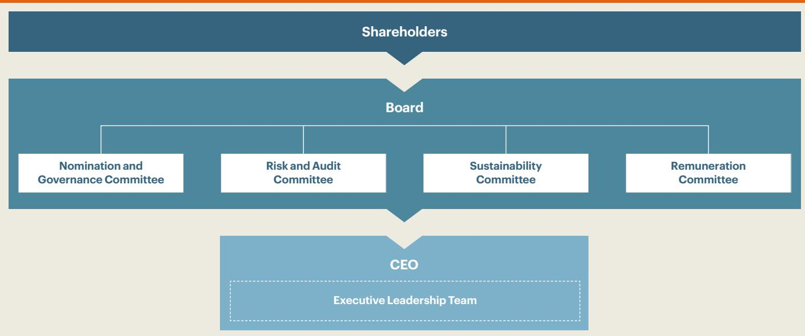

> **AI Description:**
> **Source:** `assets/_page_76_Figure_0.jpg`
> 
> **Generated:** 2026-05-19 06:40:00
> 
> ---
> 
> The image is a diagram illustrating the governance structure of a company. It shows a hierarchical flow from shareholders at the top, through the Board, to the CEO and Executive Leadership Team at the bottom. The Board is divided into four committees: Nomination and Governance Committee, Risk and Audit Committee, Sustainability Committee, and Remuneration Committee. The diagram uses a combination of text labels and arrows to indicate the flow of authority and decision-making within the organization.

The Board currently has 12 members. The Directors of BHP, along with their profiles, are listed in section 2.1.2.

The Board believes there is an appropriate combination of Executive and Non-executive Directors to promote shareholder interests and govern BHP effectively. The Board has fewer Executive Directors than is common for UK-listed companies, but its composition is considered appropriate for the Dual Listed Company structure and is in line with Australian-listed company practice.

The Board has extensive access to members of senior management who frequently attend Board meetings. Management makes presentations and engages in discussions with Directors, answers questions and provides input and perspective on their areas of responsibility. The Chief Executive Officer (CEO) is accountable to the Board for the authority that is delegated to the CEO and for the performance of the Group. The CEO works in a constructive partnership with the Board and is required to report regularly to the Board on progress. The Chief Financial Officer (CFO) also attends all Board meetings. The Board, led by the Chair, also holds discussions in the absence of management at each Board meeting.

The Chair is responsible for leading the Board and ensuring it operates to the highest governance standards. In particular, the Chair facilitates constructive Board relations and the effective contribution of all Non-executive Directors.

The Group Company Secretary is accountable to the Board and advises the Chair and, through the Chair, the Board and individual Directors on all matters of governance process.

The role of the Board, as set out in the Board Governance Document, is to represent shareholders and promote and protect the interests of BHP in the short and long term. The Board considers the interests of the Group’s shareholders as a whole and the interests of other relevant stakeholders.

The Board Governance Document is a statement of the practices and processes the Board has adopted to fulfil its responsibilities. It includes the processes the Board has implemented to undertake its own tasks and activities; the matters it has reserved for its own consideration and decisionmaking; the authority it has delegated to the CEO, including the limits on the way the CEO can execute that authority; and guidance on the relationship between the Board and the CEO.

The matters reserved for the Board include:

– CEO appointment and determination of the terms of the appointment

– approval of the appointment of Executive Leadership Team (ELT) members, and material changes to the organisational structure involving direct reports to the CEO

– strategy, annual budgets, balance sheet management and funding strategy

– determination of commitments, capital and non-capital items, acquisitions and divestments above specified limits

– performance assessment of the CEO and the Group

– approving the Group’s values, Our Code of Conduct, purpose and risk appetite

– management of Board composition, processes and performance

– determination and adoption of documents (including the publication of reports and statements to shareholders) that are required by the Group’s constitutional documents, statute or by other external regulation

The Board has established Committees to assist it in exercising its authority, including monitoring the performance of BHP to gain assurance that progress is being made towards our purpose within the limits imposed by the Board. These Committees include the Risk and Audit Committee, the Nomination and Governance Committee, the Remuneration Committee and the Sustainability Committee. Each of these permanent Committees has terms of reference under which authority is delegated by the Board. These are available at bhp.com/governance. Reports from these Committees are set out at sections 2.1.9 to 2.1.12.

## 2.1 Corporate Governance Statement continued

## 2.1.4 Board and Committee meetings and attendance

The Board meets as often as required. During FY2021, the Board met 12 times. The normal schedule, which includes Board meetings in the United Kingdom and in another global office location, was disrupted due to the impacts of the COVID-19 pandemic. During FY2021, all Board meetings were held virtually. An additional ad hoc meeting was held in FY2021.

Members of the ELT and other members of senior management attend meetings of the Board by invitation, with the CFO attending each meeting.

Each Board Committee provides a standing invitation for any Non-executive Director to attend Committee meetings (rather than just limiting attendance to Committee members). Committee agendas and papers are provided to all Directors to ensure they are aware of matters to be considered.

## Board and Board Committee attendance in FY2021

Table indicates the number of scheduled and ad hoc meetings attended and held during the period the Director was a member of the Board and/ or Committee.
(1) Terry Bowen became a member of the Nomination and Governance Committee on 2 December 2020.
(2) Xiaoqun Clever became a member of the Board and the Risk and Audit Committee on 1 October 2020.
(3) Gary Goldberg became a member of the Nomination and Governance Committee on 1 March 2021.
(4) Susan Kilsby was unable to attend the Board meeting on 5 May 2021 as the meeting time was rescheduled and Susan had a pre-existing Board commitment. Susan provided detailed comments to the Chair in advance of the meeting.
(5) Susan Kilsby ceased being a member of the Nomination and Governance Committee on 1 March 2021, and was replaced as Chair of the Remuneration Committee by Christine O’Reilly effective 1 March 2021.
(6) Lindsay Maxsted retired as a member of the Board and the Risk and Audit Committee on 4 September 2020.
(7) John Mogford became a member of the Nomination and Governance Committee on 2 December 2020.
(8) Christine O’Reilly became a member of the Board, the Risk and Audit Committee and the Remuneration Committee on 12 October 2020, and a member of the Nomination and Governance Committee on 1 March 2021.
(9) Shriti Vadera retired as a member of the Board, the Nomination and Governance Committee and the Remuneration Committee on 15 October 2020. The October Board meeting was held over two days on 13 and 16 October, and Shriti attended the first session prior to her retirement.
(10) Shriti Vadera was unable to attend the Remuneration Committee meeting on 23 September 2020 due to pre-existing Board commitments. Shriti provided detailed comments to the Chair of the Committee ahead of the meeting.

## 2.1.5 Key Board activities during FY2021

Key matters considered by the Board during FY2021 are outlined below.

## 2.1 Corporate Governance Statement continued

## Policies and procedures

During FY2021, we transitioned to full compliance with the fourth edition of the ASX Corporate Governance Principles and Recommendations (ASX Fourth Edition) published by the ASX Corporate Governance Council.

We implemented new arrangements in line with the ASX Fourth Edition and reviewed them to ensure they remained in line with the 2018 edition of the UK Corporate Governance Code (UK Code).

In line with the ASX Fourth Edition, BHP also disclosed its Periodic Disclosure – Disclosure Controls policy, which sets out our process to verify the integrity of the periodic corporate reports we release to the market, including those that are not audited or reviewed by the external auditor.

## For more information

refer to section 2.1.16

## ELT succession

A critical component of succession at the Executive Leadership Team (ELT) level and below is the existence of a robust senior leadership program that operates across multiple organisational levels to build, develop, renew, recruit and promote our leaders. The Board is actively engaged and oversees the development of the senior leadership team.

On 1 December 2020, David Lamont’s appointment as Chief Financial Officer (CFO) took effect. Peter Beaven continued as CFO until 30 November 2020 to provide ongoing leadership through to David’s commencement, and supported David with handover into early CY2021.

In August 2020, the Board approved new roles and appointments on the ELT. Ragnar Udd became President Minerals Americas, effective 1 November 2020, replacing Daniel Malchuk. Daniel continued in the role until that time and left BHP at the end of CY2020. Laura Tyler commenced in the new role of Chief Technical Officer on 1 September 2020. This role is an expansion of her previous position on the ELT as Chief Geoscientist. She relinquished her role as Asset President Olympic Dam. Caroline Cox became Chief Legal, Governance and External Affairs Officer, effective 1 November 2020, replacing Geoff Healy. Geoff continued in the role until that time and left BHP at the end of CY2020. Johan van Jaarsveld commenced in the new role of Chief Development Officer on 1 September 2020.

## Culture

The delivery of our strategy is predicated on our culture and capability. The Board, supported by the Committees, considers a range of qualitative and quantitative information in relation to culture at BHP and monitors and assesses culture on an ongoing basis for alignment with our strategy, purpose and values. Board and Committee papers include workforce planning in the context of COVID-19, EPS results, inclusion and diversity update, Risk and Audit Committee report-outs on Our Code of Conduct investigations, the culture and capability required to execute our strategy, and culture as a part of asset reviews. Recognising our culture cannot be measured using a single number or index, a culture dashboard was developed in FY2021 to provide the Board with an additional tool to monitor our culture. The dashboard includes simple measures to provide key signposts on the health of our culture. This data combined with the EPS results provides the Board with insight on safety, engagement and enablement. The culture dashboard will be further developed over the next year to provide insight into the execution of our strategy.

Directors also gain insights into culture through direct engagement with a cross-section of the workforce where they can gain direct feedback on a range of issues, including COVID-19 impacts, diversity, health, safety, environment and community (HSEC) topics and social value.

## For more information

refer to sections 1.14, 2.1.6 and 1.12

## Climate change

Climate change is a material governance and strategic issue and is routinely on the Board agenda, including as part of strategy discussions, portfolio reviews and investment decisions, risk management oversight and monitoring, and performance against our commitments. The Sustainability Committee assists the Board in overseeing the Group’s climate change performance and governance responsibilities. The Risk and Audit Committee and Sustainability Committee assist the Board with the oversight of climate-related risk management, although the Board retains overall accountability for BHP’s risk profile. Below the level of the Board, key management decisions are made by the CEO and management, in accordance with their delegated authority.

Following discussion by the ELT and Sustainability Committee, in August 2020 the Board approved our medium-term target, Scope 3 emissions goals and the strengthening of links between executive remuneration and climate change performance measures.

For information regarding our approach to climate change and sustainability refer to sections 1.13.7 and 1.13.1

## 2.1.6

## Stakeholder engagement

There are multiple ways the views of stakeholders, beyond shareholders, are brought to the Board and its Committees. For example, HSEC updates, site visits (physical and virtual where necessary) involving engagement with community members and government, and engagement with the Forum on Corporate Responsibility. In addition, the Risk and Audit Committee receives reports on engagement with regulators. It also receives reports on material litigation and disputes with third parties and complaints raised through the speak-up hotline, EthicsPoint, which allows our workforce to raise concerns in confidence. The strategic framework, focus on social value, our purpose and Risk Appetite Statement reflect the significance of external stakeholders in decision-making.

The Annual Report includes additional information on our stakeholders, including non-governmental organisations, how we have elicited the views of stakeholders and the outcomes of our engagements with stakeholders, in particular in relation to the Board’s decision-making.

## For more information

refer to sections 1.12, 1.13 and 1.14

## Shareholder engagement

Part of the Board’s commitment to high-quality governance is expressed through the approach BHP takes to engaging and communicating with our shareholders. As part of our investor relations program to facilitate effective two-way communication with investors, the Board uses formal and informal communication channels to understand and take into account the views of shareholders. BHP provides information about itself and its governance to investors via its website at bhp.com.

## Investor engagement in FY2021

## Chair investor meetings

The Chair regularly meets with investors to discuss Board priorities and seek shareholder feedback.

## FY2021 activity

Virtual meetings were held in July 2020 between the Chair and investors in Australia, the US, the UK and mainland Europe, with additional meetings held in June 2021. The Chair also held a UK Virtual Shareholder Forum with the CEO in September 2020 to allow shareholders to ask questions in advance of the AGMs. This was arranged after consultation with the UK Shareholders’ Association and ShareSoc.

## Live webcasts and Q&A sessions

Provides a forum to update shareholders on results or other key announcements.

## FY2021 activity

Annual and half-year results, as well as key announcements are webcast and the materials are made available on our website. The CEO held a shareholder question and answer session in August 2020 via webcast in relation to BHP’s FY2020 performance.

## Presentations and briefings

Presentation materials are set out on the BHP website.

## FY2021 activity

Presentations delivered relating to our climate change strategy in September 2020, cultural heritage in October 2020, decarbonising steel in November 2020 and tailings storage facilities in June 2021.

## Direct engagement

Provides a conduit to enable the Board and its Committees to be up to date with investor expectations and continuously improve the governance processes of BHP. We also engage with other capital providers, for example, through meetings with bondholders.

## FY2021 activity

The CEO, CFO, senior management and Investor Relations team held virtual meetings with investors worldwide, including: Australia, Canada, Germany, Hong Kong SAR (China), Japan, Malaysia, Singapore, South Africa, Sweden, United Arab Emirates, the UK and the US. Topics covered include corporate governance and ESG matters, strategy, finance and operating performance. We engaged with investors on cultural heritage issues, including the withdrawn shareholder resolution and our updated approach. This included a number of presentations and investor one-on-one meetings through the first half of FY2021 to set out the detail of our approach to cultural heritage both in the Pilbara and worldwide.

We engaged regularly with the Climate Action 100+ lead investors and the broader investor group of the CA100+ on a range of decarbonisation and emissions related topics. We also engaged with the Transparency Pathway Initiative and FTSE Russell about their methodologies relating to the transition and approach to mined commodities.

## Annual General Meetings

The CEO had a series of meetings with the CEOs and chief investment officers of major investors globally to discuss a range of topics including decarbonisation and the criticality of minerals and metals to the transition.

In addition, we engaged with a range of ESG data providers about their methodologies and responded to enquiries on topics including cultural heritage, industry associations, thermal coal, decarbonisation, Scope 3 emissions, diversity and inclusion, tailings dams, Samarco, non-operated joint ventures, biodiversity, water stewardship and COVID-19.

Our AGMs provide an opportunity for all investors to question and engage with the Board.

The Risk and Audit Committee considered and oversaw management work in relation to a letter from the Institutional Investors Group on Climate Change (IIGCC) setting out ‘investor expectations for Paris-aligned accounts’.

The Remuneration Committee also engages with investors on remunerationrelated matters. The Chair of the Remuneration Committee wrote an open letter to shareholders and proxy advisers in September 2020, summarising key aspects of BHP’s FY2020 remuneration outcomes and welcoming investor feedback. This letter was published on BHP’s website.

Information on our AGMs is available at bhp.com/meetings

## FY2021 activity

Due to COVID-19 restrictions, the BHP Group Limited AGM for FY2020 was held as a virtual meeting and the BHP Group Plc AGM for FY2020 was held as a closed meeting. A virtual forum for BHP Group Plc shareholders was held in September 2020 to provide an opportunity to hear from the Chair and CEO and to ask questions via a live text facility. BHP Group Plc shareholders were also invited to attend the BHP Group Limited AGM virtually.

## 2.1 Corporate Governance Statement continued

We encourage shareholders to make their views known to us. Shareholders can contact us at any time through our Investor Relations team, with contact details available at bhp.com. In addition, shareholders can communicate with us and our registrar electronically.

We facilitate and encourage shareholder participation at our AGMs. These meetings provide an update for shareholders on our performance and offer an opportunity for shareholders to ask questions and vote. Before an AGM, shareholders are provided with all material information in BHP’s possession relevant to their decision on whether or not to elect or re-elect a Director.

Proceedings at shareholder meetings are webcast live from our website. Copies of the speeches delivered by the Chair and CEO at the AGMs are released to the relevant stock exchanges and posted on our website. A summary of proceedings and the outcome of voting on the items of business are released to the relevant stock exchanges and posted on our website as soon as they are available. The External Auditor will also be available to answer questions at the AGMs.

At our AGMs in 2020, resolution 25 (a shareholder-requisitioned resolution to suspend memberships of industry associations that are involved in COVID-19-related advocacy that is inconsistent with the goals of the Paris Agreement) received the support of 22 per cent of votes cast.

The key messages received from engagement with shareholders include:

– an emphasis that BHP constructively influence its trade associations to further enhance the global energy transition

ensuring the COVID-19 pandemic was not used (or seen to be used) as a rationale by associations to impede progress on alignment with the Paris Agreement goals and that the economic recovery measures being considered present a unique opportunity to accelerate clean energy innovation

enhancing transparency on the alignment between the policy positions held by BHP and those of industry associations of which BHP is a member is important but not sufficient. If an industry association is advocating for policy changes inconsistent with the goals of the Paris Agreement, companies must take tangible action to drive consistency

We are confident our existing processes, combined with the reforms outlined below, provide strengthened oversight over industry association advocacy and will help ensure our commitment to responsible and constructive advocacy is shared by the associations of which we are a member.

Prior to the 2020 AGMs, BHP announced a series of industry association reforms, including a new set of Global Climate Policy Standards (applicable to BHP in its direct advocacy and also to the associations of which we are a member) and disclosure enhancements, such as publishing a list of material association memberships (including membership fees) on our website. Since the AGMs, BHP has continued to work to implement the reforms announced in August 2020. This has included:

working with the minerals sector associations of which BHP is a member in Australia (i.e. the Minerals Council of Australia (MCA) and the various statebased minerals sector associations) to develop and agree an advocacy protocol. This protocol delineates the policy areas on which the associations will advocate, having regard to their jurisdictional responsibilities

working with the key associations of which BHP is a member in Australia (i.e. the MCA, the various state-based minerals sector associations, the Australian Petroleum Production and Exploration Association (APPEA) and the Business Council of Australia (BCA)) to develop plans outlining their expected advocacy priorities and activities for the coming year. These plans are now available on the websites of the respective associations or will soon be available pending board approval by the relevant associations

– implementing BHP’s new model of disclosing material departures from our Global Climate Policy Standards in ‘real time’ on the BHP website

BHP has also played an active role in shaping the policy advocacy of its industry associations. This has included working with other members to:

– change the American Petroleum Institute’s position on methane regulation and carbon pricing

– update the APPEA’s climate change policy principles (which now call for Australia to achieve net zero emissions by 2050)

enable the BCA to provide in-principle support for the Climate Change (National Framework for Adaptation and Mitigation) Bill 2020 that was introduced before the Australian Parliament in November 2020

We will be conducting our next industry association review in CY2022. Consistent with BHP’s culture of continuous improvement, we will work to strengthen the review process. More information on our approach to industry associations is available at bhp.com.

## Workforce engagement

Our global workforce is the foundation of our business and we believe supporting the wellbeing of our people and promoting an inclusive and diverse culture are vital for maintaining a competitive advantage. The Board considers effective workforce engagement a key element of its governance and oversight role.

The Board has arrangements in place for managing workforce engagement. The Board and its Committees receive information related to the workforce through a range of channels, including direct engagement at Board and Committee meetings and site visits, the Employee Perception Survey (EPS) findings, culture dashboard insights, gender pay gap reports and updates from the Chief Executive Officer and the Chief People Officer.

Alongside section 1.14, the table below further describes the ways the Board engaged with our workforce in FY2021 and how workforce considerations impacted key decisions.

Having reviewed these workforce engagement arrangements in FY2021, the Board considers these arrangements to be effective as they enable the Board to hear first-hand from a cross-section of the workforce and to engage with them interactively (e.g. during site visits and Board and Committee meetings), with the opportunity to consider the feedback received in subsequent Board discussions.

## Workforce engagement practices

## Site visits

Directors participated in site visits (many of these were virtual in FY2021 due to COVID-19 travel restrictions) to engage directly with a crosssection of the workforce.

These engagements deliberately included a cross-section of staff in various regions and provide insight into matters that are front of mind for Directors and the workforce.

## Board and Committee meetings

Directors hear from employees, up to several levels below the CEO, at each Board and Committee meeting. Topics raised by employees include the health and safety of our people, culture, ethics and compliance, workforce relations, sexual assault and sexual harassment, response to COVID-19, our purpose, social value, conduct concerns and diversity.

## EthicsPoint

For more information on refer to sections 1.13.6 and 2.1.15

Members of our workforce are able to raise matters of concern through our 24-hour speak-up helpline, EthicsPoint.

This helps to ensure Board oversight of culture and management response to serious conduct contrary to Our Charter and Our Code of Conduct.

## Employee survey results and culture dashboard

Metrics from the EPS and culture dashboard provide Directors with insight into our culture and areas of focus, including where we are lagging in certain measures.

The EPS was redesigned in FY2021 to include more targeted questions and a new survey platform to provide leaders with greater insight into the key metrics related to safety, engagement and enablement, which were identified as critical foundations for our performance culture. The culture dashboard was also developed in FY2021 to provide key signposts on the health of our culture.

## Management engagement through webcasts, Q&A sessions and emails

Management regularly engages with the workforce through a range of formal and informal channels, including webcasts, live Q&A sessions and emails from the CEO and other ELT members. Live Q&A sessions were particularly helpful in providing an opportunity for employees to ask questions of our leaders and receive responses in real time.

## 2.1.7 Director skills, experience and attributes

## Overarching statement of Board requirements

The BHP Board will be diverse in terms of gender, nationality, geography, age, personal strengths and social and ethnic backgrounds. The Board will comprise Directors who have proven past performance and the level of business, executive and non-executive experience required to:

– provide the breadth and depth of understanding necessary to effectively create long-term shareholder value

– protect and promote the interests of BHP and its social licence to operate

– ensure the talent, capability and culture of BHP to support the long-term delivery of our strategy

## Attributes and commitment to role

All Directors are expected to comply with Our Code of Conduct, act with integrity, lead by example and promote the desired culture.

The Board believes each Non-executive Director has demonstrated the attributes of sufficient time to undertake the responsibilities of the role; honesty and integrity; and a preparedness to question, challenge and critique throughout the year through their participation in Board meetings, as well as the other activities that they have undertaken in their roles.

In accordance with provision 15 of the UK Code, during FY2021 the Board considered Ken MacKenzie’s appointment as a part-time adviser at Barrenjoey and approved it on the basis that it did not consider it adversely impacted his role or commitment to BHP. In particular, the Board noted it was not an executive role and Mr MacKenzie committed to the Board that BHP would remain Mr MacKenzie’s number one priority. It was also agreed that Barrenjoey will not advise BHP and that Mr MacKenzie himself will not advise on transactions or advise BHP competitors or our significant customers or suppliers.

## Skills matrix

The Board skills matrix identifies the skills and experience the Board needs for the next period of BHP’s development, considering BHP’s circumstances and the changing external environment as referred to above.

The Board collectively possesses all the skills and experience set out in the skills matrix, and each Director satisfies the Board requirements and attributes discussed above. For more information on the individual skills and attributes of the Directors, refer to section 2.1.2.

(1) Twelve Directors meet the criteria of financial expertise outlined above. The Risk and Audit Committee Report contains details of how its members meet the relevant legal and regulatory requirements in relation to financial experience.

### Full Page Description (Page 84)

**Source:** `assets/_page_84_Asset_0.jpg`

**Generated:** 2026-05-19 06:36:42

---

The image contains three pie charts with textual annotations. The first chart, labeled "Tenure," shows the distribution of individuals based on their employment duration, with categories of 0-3 years, 3-6 years, 6-9 years, and 9+ years. The second chart, labeled "Region of nationality," displays the percentage of individuals from different regions, including Australia, Europe/UK, and North America. The third chart, labeled "Gender diversity," indicates the percentage of females and males, with 33% female and 67% male. The visual elements effectively summarize demographic data in a clear and concise manner.

## Board skills and experience: Climate change

Board members bring experience from a range of sectors, including resources, energy, finance, technology and public policy. The Board also seeks the input of management and other independent advisers. This equips them to consider potential implications of climate change on BHP and its operational capacity, as well as understand the nature of the debate and the international policy response as it develops. In addition, there is a deep understanding of systemic risk and the potential impacts on our portfolio.

The Board has taken measures designed to ensure its decisions are informed by climate change science and expert advisers. The Board seeks the input of management (including Dr Fiona Wild, our Vice President Sustainability and Climate Change) and other independent advisers. In addition, our Forum on Corporate Responsibility (which includes Don Henry, former CEO of the Australian Conservation Foundation and Changhua Wu, former Greater China Director, the Climate Group) advises operational management teams and engages with the Sustainability Committee and the Board as appropriate.

For more information refer to section 1.13.7

## 2.1.8 Board evaluation

The Board is committed to transparency in assessing the performance of Directors. The Board conducts regular evaluations of its performance, the performance of its Committees, the Group Chair, Directors and the governance processes that support the Board’s work.

The evaluation considers the balance of skills, experience, independence and knowledge of the Group and the Board, its diversity, including gender diversity, and how the Board works together as a unit.

An evaluation was conducted during the year in accordance with this process. More information is provided below.

## Director review

In FY2021, an assessment was conducted of Directors’ performance with the assistance of an external service provider (Lintstock). Lintstock does not have any other connection with the Group or individual Directors.

The assessment of Directors focused on the contribution of each Director to the work of the Board and its Committees, and the expectations of Directors as set out in BHP’s governance framework. In addition, the assessment focused on how each Director contributes to Board cohesion and effective relationships with fellow Directors, commits the time required to fulfil their role and effectively performs their responsibilities. Directors were asked to comment on areas where their fellow Directors contribute the greatest value and on potential areas for development. With the introduction of virtual Board and Committee meetings (as a consequence of COVID-19 health and safety protocols), the assessment also focused on the effectiveness of the Board’s virtual interactions.

Lintstock provided feedback received to the Chair, which was then discussed with Directors. Feedback relating to the Chair was discussed with the Chair by the Senior Independent Director. As a result of these outcomes, the review supported the Board’s decision to endorse those Directors standing for re-election.

## Committee assessments

Following an assessment of its work, each Committee concluded that it had met its terms of reference in FY2021.

## External Board review

The Board conducted an external evaluation in FY2019 using Consilium Board Review, which considered Board, Committee and Chair effectiveness, and assessed the Directors’ contributions. The review was concluded in FY2020 and the Nomination and Governance Committee considered the status of implementation of the review findings in FY2021.

In accordance with the UK Code, the Board intends to conduct an external Board review in FY2022.

## 2.1.9

## Nomination and Governance Committee Report

Ken MacKenzie

Chair, Nomination and Governance Committee

## Role and focus

The Nomination and Governance Committee oversees and monitors renewal and succession planning, Board and Director performance evaluation, Director training and development, and advises and makes recommendations on the Group’s governance practices.

More information on the role and responsibilities of the Nomination and Governance Committee can be found in its terms of reference, which are available at bhp.com/governance.

Committee activities in FY2021 included:

## Succession planning processes

– Implementation of the skills and experience matrix

– Identification of suitable Non-executive Director candidates

– Board and Committee succession

– Partnering with search firms regarding candidate searches

## Evaluation and training

– Board evaluation and Director development

– 2021 training and development program

– Director induction

## Corporate governance practices

– Independence of Non-executive Directors

– Authorisation of situations of actual or potential conflict

– Crisis management

## Policy on inclusion and diversity

The Board and management believe diversity is required to meet our purpose and strategy, which is outlined in section 1.4. Diversity is key to ensuring the Board and its Committees have the right blend of perspectives so that the Board oversees BHP effectively for shareholders. In FY2021, we adopted an Inclusion and Diversity Position Statement, which sets out our diversity policy in relation to the Board, senior management and our workforce, and our priorities to accelerate the development of a more inclusive work environment and enhanced overall workplace diversity. The Inclusion and Diversity Position Statement is available at bhp.com/careers/diversity-and-inclusion/our-approach/ and is summarised in section 1.12.

As described in our Inclusion and Diversity Position Statement, our aspiration is to achieve gender balance on our Board, among our senior executives and across our workforce by CY2025. Our aspiration includes a fixed target of maintaining the level of Board diversity above 33 per cent, which we achieved last year and we continue to maintain. We therefore satisfy the guidance of having at least 30 per cent of Directors of each gender in accordance with the ASX Fourth Edition and the target set by the Hampton-Alexander Review in the United Kingdom for all FTSE 100 Boards to have at least 33 per cent female representation by the end of CY2020.

We also welcome the final Parker Report into ethnic diversity of UK boards and continue to seek additional ethnic diversity on our Board and throughout BHP. Our Board meets the target of having ‘at least one Director of colour by 2021’ as recommended by the Parker Review.

In accordance with the UK Code, our gender diversity among senior management (defined as the ELT plus the Company Secretary and their direct reports) was 36 per cent.

Part of the Board’s role continues to be to consider and approve BHP’s measurable objectives for workforce diversity each financial year and to oversee our progress in achieving those objectives.

For more information, including our progress against our FY2021 measurable objectives and our employee profile more generally refer to section 1.12

## Board appointments and succession planning

When considering new appointments, the Board’s Nomination and Governance Committee takes the following approach:

## A copy of the terms of appointment for Non-executive Directors is available at bhp.com/governance

## Senior management succession

A robust senior management succession process is also conducted to ensure pipeline stability for critical roles. A talent deep dive is conducted by the Board at least once a year to evaluate these pipelines, including the diversity of the pipeline.

Senior management succession is viewed from a five-year perspective that considers the readiness of successors across time horizons, contexts and future capability demands. Select Board members are involved in the interview process for executive-level appointments one level below the CEO, and occasionally for roles two levels below the CEO. Appropriate checks are undertaken before appointing a member of the ELT. BHP has a written agreement with each ELT member setting out the terms of their appointment. For more information about CEO and ELT succession, refer to section 2.1.5.

## External recruitment specialists

The Committee retained the services of external recruitment specialists. Russell Reynolds and MWM Consulting assisted with Non-executive Director candidate searches during FY2021. These recruitment specialists do not have any connection with the Group or any Director.

## Director induction, training and development

Upon appointment, each new Non-executive Director undertakes an induction program tailored to their needs.

Following the induction program, Non-executive Directors participate in continuous improvement activities (training and development program), which are overseen by the Nomination and Governance Committee. The training and development program covers matters of a business nature, including environmental, social and governance matters and provides updates on BHP’s assets, commodities, geographies and markets. Programs are designed and periodically reviewed to maximise effectiveness, and the results of Director performance evaluations are incorporated into these programs.

## 2.1 Corporate Governance Statement continued

Training and development in FY2021

Throughout the year, the Chair discusses development areas with each Director. Board Committees review and agree their needs for more briefings. The benefit of this approach is that induction and learning opportunities can be tailored to Directors’ Committee memberships, as well as the Board’s specific areas of focus. This approach also ensures a coordinated process on succession planning, Board renewal, training and development and Committee composition. These processes are all relevant to the Nomination and Governance Committee’s role in identifying appropriate Nonexecutive Director candidates.

## Independence

The Board is committed to ensuring a majority of Directors are independent.

The Board has adopted a policy that it uses to determine the independence of its Directors. This determination is carried out upon appointment, annually and at any other time where the change in circumstances of a Director warrant reconsideration. The Board confirms that it considers all of the current Non-executive Directors, including the Chair, to be independent of management and free from any business relationship or other circumstance that could materially interfere with the exercise of objective, unfettered or independent judgement.

> **AI Description:**
> **Source:** `assets/_page_87_Figure_0.jpg`
> 
> **Generated:** 2026-05-19 06:49:46
> 
> ---
> 
> The image contains a simple icon of a computer mouse cursor. It is a single, flat, orange circle with a white arrow pointing to the right, representing a mouse pointer. There is no text or additional visual content beyond this icon.

A copy of the policy on Independence of Directors is available at

bhp.com/governance

## Tenure

At the end of FY2021, Malcolm Broomhead, who was appointed in March 2010, had served on the Board for more than nine years. In light of the retirement of both Susan Kilsby and Anita Frew at the end of the 2021 AGMs, the Board has requested that Mr Broomhead seek re-election at the 2021 AGMs for a further year. Mr Broomhead would step down from the Sustainability Committee and Nomination and Governance Committee following the AGMs but remain on the Board. The Board supports Mr Broomhead’s re-election given his extensive knowledge of BHP and the mining and resources sector and the proposed corporate transaction that the Group is undertaking at this time. The Board does not believe his tenure interferes with his ability to act in the best interests of BHP. The Board believes he continues to demonstrate strong independence of character and judgement, and has not formed associations with management (or others) that might compromise his ability to exercise independent judgement or act in the best interests of the Group. The Board has been undergoing a process of renewal and, recognising the importance of continuity on the Board and Mr Broomhead’s expertise, considers his continued service to be in the best interests of shareholders.

## Relationships and associations

Some of the Directors hold or have previously held positions in companies that BHP has commercial relationships with. Those positions and companies are listed in the Director profiles in section 2.1.2 and in past Annual Reports. The Board has assessed the relationships between the Group and the companies in which our Directors hold or held positions and has concluded that the relationships do not interfere with the Directors’ exercise of objective, unfettered or independent judgement or their ability to act in the best interests of BHP.

For example, Mr Broomhead was a Director of Orica Limited (a company BHP has commercial dealings with) during FY2021, and Mr Cockerill was also a Director of Orica until August 2019. Orica provides commercial explosives, blasting systems and mineral processing chemicals and services to the mining and resources industry, among others. Mr Cockerill was appointed to the Orica Board in 2010 (prior to his appointment to the BHP Board) and Mr Broomhead was appointed to the Orica Board in 2016 (after his appointment to the BHP Board). At the time of Mr Broomhead’s appointment to the Board of Orica, and at the time of Mr Cockerill’s appointment to the Board of BHP, the BHP Board assessed the relationship between BHP and Orica and determined (and remains satisfied) that Mr Broomhead and Mr Cockerill were (and Mr Broomhead remains during FY2021) able to apply objective, unfettered and independent judgement and to act in the best interests of BHP.

## Conflicts of interest

BHP Group Plc’s Articles of Association allow the Directors to authorise conflicts and potential conflicts where appropriate. A procedure operates to ensure the disclosure of conflicts and for the consideration and, if appropriate, the authorisation of those conflicts by non-conflicted Directors. The Nomination and Governance Committee supports the Board in this process by reviewing requests from Directors for authorisation of situations of actual or potential conflict and making recommendations to the Board. It also regularly reviews any situations of actual or potential conflict that have previously been authorised by the Board and makes recommendations on whether the authorisation remains appropriate. In addition, in accordance with Australian law, if a situation arises for consideration where a Director has a material personal interest, the affected Director takes no part in decisionmaking unless authorised by non-interested Directors. Provisions for Directors’ interests are set out in the Constitution of BHP Group Limited.

## 2.1.10

## Risk and Audit Committee Report

Terry Bowen

Chair, Risk and Audit Committee

## Role and focus

The Risk and Audit Committee (RAC) oversees and monitors financial reporting, other periodic reporting, external and internal audit, capital management, and risk (including effectiveness of the systems of risk management and internal control).

More information on the role and responsibilities of the Risk and Audit Committee can be found in its terms of reference, which are available at bhp.com/governance.

## UK committee membership requirements

The Board is satisfied that Terry Bowen meets the criteria for recent and relevant financial experience as outlined in the UK Code, the competence in accounting and auditing as required by the Financial Conduct Authority (FCA) Disclosure Guidance and Transparency Rules and the audit committee financial expert requirements under the US Securities and Exchange Commission Rules. In addition, he is the Board’s nominated ‘audit committee financial expert’ for the purposes of the US Securities and Exchange Commission Rules.

The Board is satisfied that the members of the Committee as a whole have competence relevant to the mining sector for the purposes of the FCA Disclosure Guidance and Transparency Rules. The Board is also satisfied that the Committee meets the independence criteria under Rule 10A-3 of the Exchange Act. For information on Committee members’ qualifications, which include competence relevant to the mining sector, refer to section 2.1.2.

Committee activities in FY2021 included:

<table><tr><td>Integrity of Financial Statements and funding matters ：Accounting matters for consideration, materiality limits, half-year and full- year results Sarbanes-Oxley Act of 2002 (SOX) compliance Financial governance procedures - Funding, loans and guarantees updates</td><td>External auditor and integrity of the audit process ：External audit report - Management and external auditor closed sessions Audit plan, review of performance and quality of service - External auditor independence and non-audit services</td><td>Effectiveness of systems of internal control and risk management Material risk reports and consideration of approach to emerging risks Group risk profile and monitoring performance against risk appetite through key risk indicators Internal audit reports, annual internal audit plan and review of performance of the Internal Audit and Advisory team Ethics and Investigations reports including on sexual harassment, compliance reports, and grievance and investigation processes</td><td>Risks of climate change and its potential impacts on measurement in the financial statements Climate change financial statement disclosures Climate change considerations in key judgements and estimates Consistency between narrative reporting on climate risks with the accounting assumptions</td><td>Other governance matters - Samarco dam failure provision, closure and rehabilitation provision Disputes and litigation updates Closure,rehabilitation and reserves and resources updates</td></tr></table>

## Fair, balanced and understandable

The RAC confirmed its view to the Board that BHP’s 2021 Annual Report taken as a whole is fair, balanced and understandable. For the Board’s statement on the Annual Report, refer to the Directors’ Report in section 2.3.

In making this assessment, the RAC considers the substantial governance framework that is in place for the Annual Report. This includes management representation letters, certifications, RAC oversight of the Financial Statements and other financial governance procedures focused on the financial section of the Annual Report, together with verification procedures for the narrative reporting section of the Annual Report.

## Integrity of Financial Statements

The RAC assists the Board in assuring the integrity of the Financial Statements. The RAC evaluates and makes recommendations to the Board about the appropriateness of accounting policies and practices, areas of judgement, compliance with accounting standards, stock exchange and legal requirements and the results of the external audit.

## 2.1 Corporate Governance Statement continued

## CEO and CFO assurance

For the FY2021 full year and half year, the CEO and CFO have certified that in their opinion, BHP’s financial records have been properly maintained and the FY2021 Financial Statements present a true and fair view of our financial condition and operating results and are in accordance with accounting standards and applicable regulatory requirements.

The CEO and CFO have also certified to the Board that this opinion was formed on the basis of a sound system of risk management and internal control and the system is operating efficiently and effectively. The RAC considered these certifications when recommending the Financial Statements to the Board for approval.

## Significant issues

In addition to the Group’s key judgements and estimates disclosed throughout the FY2021 Financial Statements, the Committee also considered the following significant issues relating to financial reporting:

## Divestment of interests in certain of the Group’s assets

The Committee examined management’s review of impairment triggers and potential impairment charges for certain of the Group’s assets that were subject to divestment processes throughout the year. While the processes were underway, prior to receipt of bids, considerations were consistent with the approach to the Group’s other long-term assets as presented below.

The Committee concurred with management’s conclusion on significant impairments recognised in relation to New South Wales Energy Coal and Cerrejón, including associated deferred tax assets.

The Committee also reviewed other potential Financial Statements impacts, including classification and disclosure as assets held for sale and Discontinued operations.

Conclusions from these reviews are reflected in notes 3 ‘Exceptional items’, 13 ‘Impairment of non-current assets’ and 31 ‘Investments accounted for using the equity method’ in section 3.

## Carrying value of other long-term assets

The assessment of carrying values of long-term assets uses a number of significant judgements and estimates.

The Committee examined management’s review of impairment triggers and potential impairment charges or reversals for the Group’s cash generating units.

Specific consideration was given to market conditions for the Group’s commodities, including the impacts of climate change, along with key assumptions underpinning asset valuations. Assumptions include the most recent short, medium and long-term price forecasts, expected production volumes and updated development plans, operating and capital costs, discount rates and other market indicators of fair value.

The Committee concurred with management’s conclusion on the significant impairment recognised in relation to the Group’s Potash assets, including associated deferred tax assets, and that no impairment reversals were appropriate.

The results of the Olympic Dam impairment assessment were reviewed and the Committee concurred with management that no impairment was required.

Conclusions from these reviews are reflected in note 13 ‘Impairment of non-current assets’ in section 3.

## Climate change in financial reporting

While the Group’s understanding of evolving climate risks continues to develop, the potential financial implications, along with appropriate disclosure, are an area of focus for the Committee.

The Committee was informed of and acknowledged global trends, including increased disclosure within financial statements and more broadly. Specifically, the Committee considered a request from the Institutional Investors Group on Climate Change (IIGCC) for Paris-aligned financial statements and disclosure of material climate risks and the potential impacts to financial statements.

The Committee considered financial statement disclosures and how the Group’s greenhouse gas emissions reduction commitments and climate change scenarios, including those aligned with the Paris Agreement goals, are reflected in the Group’s key judgements and estimates used in the preparation of the Group’s FY2021 finance statements. This included consideration of portfolio impacts, demand for the Group’s commodities and associated price outlooks, costs of decarbonisation and Scope 3 emissions considerations. Specific focus was also given to the potential impact on impairment assessments and the expected timing and cost of closure activities.

The Committee reviewed the approach proposed by management to provide additional disclosure in relation to the potential financial statement impacts of climate change, including under a Paris-aligned 1.5°C scenario.

The Committee, recognising the evolving nature of climate change risks and responses, concluded that climate change has been appropriately considered by management in key judgements and estimates and concurred with the disclosures proposed by management.

## For more information

refer to the Basis of Preparation in section 3 and the Climate change risk factor in section 1.16

## Samarco dam failure

On 5 November 2015, the Samarco Mineração S.A (Samarco) iron ore operation in Minas Gerais, Brazil experienced a tailings dam failure that resulted in a release of mine tailings, flooding the community of Bento Rodrigues and impacting other communities downstream. Samarco is jointly owned by BHP Brasil and Vale S.A.

BHP Brasil’s 50 per cent interest in Samarco is accounted for as an equity accounted joint venture investment.

## Samarco’s provisions and contingent liabilities

The Committee reviewed updates to matters relating to the Samarco dam failure, including developments on existing and new legal proceedings, judicial reorganisation and changes to the estimated costs of remediation and compensation.

BHP Brasil’s loss from Equity Accounted Investments includes impairments arising from working capital funding provided to Samarco and revisions to the Samarco dam failure and Germano decommissioning provisions during the year ended 30 June 2021.

Potential direct financial impacts to BHP Brasil

## The Committee considered:

– changes to the estimated cost of remediation and compensatory programs under the Framework Agreement

– developments in existing and new legal proceedings, including judicial reorganisation, on the provision related to the Samarco dam failure and related disclosures

– the provisions recognised and contingent liabilities disclosed by BHP Brasil or other BHP entities

Based on currently available information, the Committee concluded that the accounting for the equity investment in Samarco, the provision recognised by BHP Brasil (including the decommissioning of the Germano tailings dam complex) and contingent liabilities disclosed in the Group’s Financial Statements are appropriate.

## For more information

U refer to note 4 ‘Significant events – Samarco dam failure’ in section 3

## Closure and rehabilitation provisions

Determining the closure and rehabilitation provision is a complex area requiring significant judgement and estimates, particularly given the timing and quantum of future costs, the unique nature of each site and the long timescales involved.

The Committee considered the various changes in estimates for closure and rehabilitation provisions recognised during the year, including a reduction to the discount rates applied.

Specific consideration was given to ongoing and recently completed study, survey and characterisation activity, changes to current cost estimates and the expected timing of closure activities. The Committee concluded that the assumptions and inputs for closure and rehabilitation cost estimates were reasonable and the related provisions recorded were appropriate.

## For more information

refer to note 15 ‘Closure and rehabilitation provisions’ in section 3

## Impact of amended accounting standards and changes to accounting policies

The Group implemented the IFRS Interpretations Committee agenda decision ‘Income Taxes – Multiple tax consequences of recovering an asset’ on a retrospective basis. The Committee reviewed management’s analysis of the accounting outcomes, including the recognition of goodwill relating to Olympic Dam.

In addition, the Committee considered and approved the early adoption, for FY2021, of further amendments to certain accounting standards relating to interest rate benchmark reforms.

## For more information

refer to note 39 ‘New and amended accounting standards and interpretations and changes to accounting policies’ in section 3

## Impact of COVID-19

The Committee considered the impacts of the global COVID-19 pandemic on the Group’s FY2021 financial reporting, including the recognition and disclosure of costs incurred by the Group that are directly attributable to COVID-19.

The Committee concluded that the disclosure of costs directly attributable to COVID-19 was appropriate.

## For more information

refer to note 3 ‘Exceptional items’ in section 3

## 2.1 Corporate Governance Statement continued

## United Kingdom (UK) Financial Reporting Council (FRC) reviews

## Audit Quality Review of the audit of the Company’s 2019 Financial Statements

During 2020, the Audit Quality Review Team (AQRT) from the UK FRC undertook a review of KPMG LLP’s (KPMG) audit of BHP Group Plc’s financial statements for the year ended 30 June 2019. KPMG were the auditors of BHP Group prior to Ernst & Young (EY). There were no key findings arising from the AQRT’s review. The review findings, which were not considered to be significant, were discussed with KPMG. The company made EY aware of the actions that KPMG had proposed to implement had they still been the auditors of the company and if similar circumstances were to prevail.

## Review of BHP Group’s Annual Report and Accounts

The UK FRC carried out a review of the Group’s published Annual Report and Accounts for the year ended 30 June 2020. This review considered compliance with reporting requirements and, given the inherent limitations of the review, provided no assurance that the Annual Report and Accounts were correct in all material respects. There were no exchanges of substantive correspondence as a result of this review and the FRC confirmed, based on the review performed, it had no questions or queries that it wished to raise.

## External Auditor

The RAC manages the relationship with the External Auditor on behalf of the Board. It considers the independence and reappointment of the External Auditor each year, as well as remuneration and other terms of engagement and makes a recommendation to the Board.

## Audit tender and transition

BHP confirms that during FY2021, it was in compliance with the provisions of The Statutory Audit Services for Large Companies Market Investigation (Mandatory Use of Competitive Tender Processes and Audit Committee Responsibilities) Order 2014.

Consistent with the UK and EU requirements in regard to audit firm tender and rotation, the Committee conducted an audit tender process during FY2017 to appoint a new external auditor to replace KPMG, resulting in the appointment of EY in 2019.

## Evaluation of External Auditor and external audit process

The RAC evaluates the objectivity and independence of the External Auditor and the quality and effectiveness of the external audit arrangements. As part of this evaluation, the RAC considers specified criteria, including delivering value to shareholders and BHP, and also assesses the adequacy of the external audit process with emphasis on quality, effectiveness and performance. It does so through a range of means, including:

– the Committee considers the External Audit Plan, in particular to gain assurance that it is tailored to reflect changes in circumstances from the prior year

– throughout the year, the Committee meets with the audit partners, particularly the lead Australian and UK audit engagement partners, without management present

following the completion of the audit, the Committee considers the quality of the External Auditor’s performance drawing on survey results. The survey is based on a two-way feedback model where the BHP and EY teams assess each other against a range of criteria. The criteria against which the BHP team evaluates EY’s performance include ethics and integrity, insight, service quality, communication, reporting and responsiveness

– reviewing the terms of engagement of the External Auditor

– discussing with the audit engagement partners the skills and experience of the broader audit team

– reviewing audit quality inspection reports on EY published by the UK Financial Reporting Council in considering the effectiveness of the audit

In addition, the RAC reviews the integrity, independence and objectivity of the External Auditor and assesses whether there is any element of the relationship that impairs or appears to impair the External Auditor’s judgement or independence. The External Auditor also certifies its independence to the RAC.

## Non-audit services

Although the External Auditor does provide some non-audit services, the objectivity and independence of the External Auditor are safeguarded through restrictions on the provision of these services with some services prohibited from being undertaken.

## Pre-approved services

The RAC has adopted a policy entitled ‘Provision of Audit and Other Services by the External Auditor’ covering the RAC’s pre-approval policies and procedures to maintain the independence of the External Auditor, which reflects the requirements for External Auditors contained in the Ethical Standards published by the UK Financial Reporting Council.

The categories of ‘pre-approved’ services are:

– Audit services – work that constitutes the agreed scope of the statutory audit and includes the statutory audits of BHP and its entities (including interim reviews). This category also includes work that is reasonably related to the performance of an audit or review and is a logical extension of the audit or review scope. The RAC monitors the audit services engagements and if necessary, approves any changes in terms and conditions resulting from changes in audit scope, Group structure or other relevant events.

– Audit-related and other assurance services – work that is outside the scope of the statutory audit but is consistent with the role of the external statutory auditor, is of an assurance or compliance nature, is work the External Auditor must or is best placed to undertake and is permissible under the relevant applicable standard.

Activities outside the scope of the categories above are not ‘pre-approved’ and must be approved by the RAC prior to engagement, regardless of the dollar value involved. In addition, any engagement for other services with a value over US\$100,000, even if listed as a ‘pre-approved’ service, requires the approval of the RAC.

All engagements for other services whether ‘pre-approved’ or not and regardless of the dollar value involved are reported quarterly to the RAC. While not prohibited by BHP’s policy, any proposed non-audit engagement of the External Auditor relating to internal control (such as a review of internal controls) requires specific prior approval from the RAC. With the exception of the external audit of BHP’s Financial Statements, any engagement identified that contains an internal control-related element is not considered to be pre-approved. In addition, while the categories of ‘pre-approved’ services include a list of certain pre-approved services, the use of the External Auditor to perform these services will always be subject to our overriding governance practices as articulated in the policy.

In addition, the RAC did not approve any services during the year ended 30 June 2021 pursuant to paragraph (c)(7)(i)(C) of Rule 2-01 of SEC Regulation S-X (provision of services other than audit).

Fees paid to BHP’s external auditor during FY2021 for audit and other services were US\$15.5 million, of which 77 per cent comprised audit fees (including in relation to SOX matters), 11 per cent for audit-related fees and 12 per cent for all other fees. No fees were paid in relation to tax services. Details of the fees paid are set out in note 36 ‘Auditor’s remuneration’ in section 3.

Our policy on Provision of Audit and Other Services by the External Auditor is available at bhp.com/governance

## Business Risk and Audit Committees

Business Risk and Audit Committees (Business RACs), covering each asset group, assist management in providing the information to enable the RAC to fulfil its responsibilities. They are management committees and perform an important monitoring function in the governance of BHP. Meetings take place annually as part of our financial governance framework.

As management committees, the appropriate member of the ELT participates, but the Committee is chaired by a member of the RAC. Each Committee also includes the Group Financial Controller, the Chief Risk Officer and the Group Assurance Officer.

Significant operational and risk matters raised at Business RAC meetings are reported to the RAC by management.

## Risk function

The Risk function’s role is to create and maintain the Group’s Risk Framework, and to support, verify, oversee and provide insight on the effective application of the Risk Framework for all risks, including strategic, operational and emerging risks.

The RAC assists the Board with the oversight of risk management, although the Board retains accountability for BHP’s risk profile. In addition, the Board requires the CEO to implement a system of control for identifying and managing risk. The Directors, through the RAC, review the systems that have been established, regularly review the effectiveness of those systems and monitor that necessary actions have been taken to remedy any significant failings or weaknesses identified from that review. The RAC regularly reports to the Board to enable the Board to review our Risk Framework at least annually to confirm that the Risk Framework continues to be sound and that BHP is operating with regard to the risk appetite set by the Board. A review was undertaken during FY2021, resulting in refinements to BHP’s Risk Framework. For more information, refer to section 1.9.

## Internal Audit

The Internal Audit function is carried out by the Internal Audit and Advisory team (IAA). IAA provides assurance on whether risk management, internal control and governance processes are adequate and functioning. The Internal Audit function is independent of the External Auditor. The RAC evaluates and, if thought fit, approves the terms of reference of IAA, the staffing levels and its scope of work to ensure it is appropriate in light of the key risks we face. It also reviews and approves the annual internal audit plan and monitors and reviews the effectiveness of the internal audit activities.

The RAC approves the appointment and dismissal of the Group Assurance Officer and assesses their performance, independence and objectivity. During FY2021, the Group Assurance Officer reported directly to the RAC, and functional oversight of IAA was provided by the Chief Legal, Governance and External Affairs Officer.

## Effectiveness of systems of internal control and risk management (RAC and Board)

In delegating authority to the CEO, the Board has established CEO limits, outlined in the Board Governance Document. Limits on the CEO’s authority require the CEO to ensure there is a system of control in place for identifying and managing risk in BHP. Through the RAC, the Directors regularly review these systems for their effectiveness. These reviews include assessing whether processes continue to meet evolving external governance requirements.

The RAC oversees and reviews the internal controls and risk management systems (including procedures, processes and systems for, among other things, budgeting and forecasting, provisions, financial controls, financial reporting and reporting of reserves and resources, compliance, preventing fraud and serious breaches of business conduct and whistle-blowing procedures, protecting information and data systems, and operational effectiveness of the Business RAC structures). Any material breaches of Our Code of Conduct, including breaches of our anti-bribery and corruption requirements, as well as any material incidents reported under our ‘speaking up with confidence’ requirements are reported quarterly to the RAC by the Chief Compliance Officer. These reports are then communicated to the Board through the report-out process

## 2.1 Corporate Governance Statement continued

During FY2021, management presented an assessment of the material risks facing BHP and the level of effectiveness of risk management over the material business risks. The reviews were overseen by the RAC, with findings and recommendations reported to the Board. In addition to considering key risks facing BHP, the Board assessed the effectiveness of internal controls over key risks identified through the work of the Board Committees.

Having carried out a review during FY2021, the Board is satisfied with the effectiveness of risk management and internal control systems.

## Management’s assessment of internal control over financial reporting

Management is responsible for establishing and maintaining adequate internal control over financial reporting (as defined in Rule 13a-15(f) and Rule 15d-15(f) under the Exchange Act).

Because of its inherent limitations, internal control over financial reporting may not prevent or detect misstatements and, even when determined to be effective, can only provide reasonable assurance with respect to financial statement preparation and presentation. Projections of any evaluation of effectiveness to future periods are subject to the risk that controls may become inadequate because of changes in conditions, or the degree of compliance with the policies or procedures may deteriorate.

Under the supervision and with the participation of our management, including our CEO and CFO, the effectiveness of BHP’s internal control over financial reporting was evaluated based on the framework and criteria established in Internal Controls – Integrated Framework (2013), issued by the Committee of the Sponsoring Organizations of the Treadway Commission. Based on this evaluation, management concluded that internal control over financial reporting was effective as at 30 June 2021. There were no material weaknesses in BHP’s internal controls over financial reporting identified by management as at 30 June 2021.

BHP has engaged our independent registered public accounting firm, EY, to issue an audit report on our internal control over financial reporting for inclusion in the Financial Statements section of the Annual Report and the Annual Report on Form 20-F as filed with the Securities Exchange Commission (SEC).

There were no changes in our internal control over financial reporting during FY2021 that materially affected or were reasonably likely to materially affect our internal control over financial reporting. This included COVID-19, which only had a minor impact on internal controls over financial reporting in relation to the number and nature of controls that were impacted.

During FY2021, the RAC reviewed our compliance with the obligations imposed by SOX, including evaluating and documenting internal controls as required by section 404 of SOX.

## Management’s assessment of disclosure controls and procedures

Management, with the participation of our CEO and CFO, performed an evaluation of the effectiveness of the design and operation of our disclosure controls and procedures as at 30 June 2021. Disclosure controls and procedures are designed to provide reasonable assurance that the material financial and non-financial information required to be disclosed by BHP, including in the reports it files or submits under the Exchange Act, is recorded, processed, summarised and reported on a timely basis. This information is accumulated and communicated to BHP’s management, including our CEO and CFO, as appropriate, to allow timely decisions regarding required disclosure. Based on the evaluation, management (including the CEO and CFO) concluded that, as at 30 June 2021, our disclosure controls and procedures are effective in providing that reasonable assurance.

There are inherent limitations to the effectiveness of any system of disclosure controls and procedures, including the possibility of human error and the circumvention or overriding of the controls and procedures. Even effective disclosure controls and procedures can only provide reasonable assurance of achieving their control objectives.

In the design and evaluation of our disclosure controls and procedures, management was required to apply its judgement in evaluating the cost-benefit relationship of possible controls and procedures.

## 2.1.11

## Sustainability Committee Report

John Mogford

Chair, Sustainability Committee

## Role and focus

The Sustainability Committee oversees and monitors material HSEC matters, including the adequacy of the Group’s HSEC Framework and HSEC Management Systems, and the Group’s HSEC reporting and performance. This includes consideration of existing HSEC issues, such as climate, safety and Indigenous and human rights, as well as emerging areas of HSEC risk for the Group.

More information on the role and responsibilities of the Sustainability Committee can be found in its terms of reference, which are available at bhp.com/governance.

## HSEC Framework

The Group’s HSEC Framework consists of:

– the Sustainability Committee, which is responsible for assisting the Board in overseeing the adequacy of the Group’s HSEC Framework and HSEC Management Systems (among other things)

– the Board Governance Document, which establishes the remit of the Board and delegates authority to the CEO, including in respect of the HSEC Management Systems

– the HSEC Management Systems, established by management in accordance with the CEO’s delegated authority. The HSEC Management Systems provide the processes, resources, structures and performance standards for the identification, management and reporting of HSEC risks and the investigation of any HSEC incidents

– a robust and independent internal audit process overseen by the RAC, in accordance with its terms of reference

– independent advice on HSEC matters, which may be requested by the Board and its Committees where deemed necessary in order to meet their respective obligations

Our approach to sustainability is reflected in Our Charter, which defines our values, purpose and how we measure success, and in our sustainability performance targets, which define our public commitments to HSEC. HSEC considerations are also taken into account in employee and executive remuneration. For more information, refer to Sustainability in section 1.13 and section 2.2.

Committee activities in FY2021 included:

## Assurance and adequacy of HSEC Framework and HSEC Management Systems

– Key HSEC risks, including tailings storage facility failure, climate change-related risks, fatalities, aviation and underground fire or explosion

– Asset deep dives providing updates on key HSEC matters and HSEC performance

– Audit planning and reporting on HSEC risks and processes

– Review of the HSE function and Group HSE Officer

## Compliance and reporting

– Compliance with HSEC legal and regulatory requirements and updates on key legal and regulatory changes

– Sustainability reporting, including consideration of processes for preparation and assurance provided by EY

– Modern Slavery Statement

– Social value metrics

## Performance

– Performance of BHP on HSEC matters, including cultural heritage, community relations, emissions targets, closure and rehabilitation, biodiversity, and human rights

– Monitoring against the FY2018–FY2022 HSEC performance targets and goals

– Performance outcomes under the HSEC performance targets and setting targets for FY2021

## Other governance matters

– Training and development of Committee members

– Updates to the Committee’s terms of reference

Members of the Sustainability Committee also participated in several site visits during FY2021. Where not limited by COVID-19 travel restrictions, these were in-person site visits, but otherwise were attended virtually. During these site visits, Committee members received briefings on HSEC matters and the management of material HSEC risks, and met with key personnel. These visits offer access to a diverse cross-section of the workforce from frontline through to the leadership team, including, where possible, risk and control owners.

For information on the key areas of focus for the Committee, management and the HSE and Community functions

## Sustainability disclosures

The Sustainability Committee oversees the preparation and presentation of sustainability disclosures by management. This year, BHP has again included material sustainability content in this Annual Report. The Sustainability Committee reviewed and recommended to the Board the approval of these disclosures in section 1.12 and 1.13, along with the FY2021 Modern Slavery Statement. These disclosures identify our targets for HSEC matters and our performance against those targets. Our targets rely on fact-based measurement and quality data, and reflect a desire to move BHP to a position of industry leadership.

Our sustainability reporting, including additional case studies and a databook of key ESG and sustainability data is available at bhp.com

For information on our material exposure to environmental and social risks and how we manage or intend to manage those risks refer to sections 1.9 and 1.16

## 2.1.12

## Remuneration Committee Report

Christine O’Reilly

Chair, Remuneration Committee

## Role and focus

The Remuneration Committee oversees and monitors remuneration policy and practices (including the adoption of incentive plans and levels of reward for the CEO and other ELT members), compliance with applicable requirements associated with remuneration matters and the review, at least annually, of remuneration by gender.

More information on the role and responsibilities of the Remuneration Committee can be found in its terms of reference, which are available at bhp.com/governance.

## UK committee membership requirements

Christine O’Reilly was appointed Chair of the Remuneration Committee with effect from 1 March 2021. She served on the Committee from her appointment to the Board in October 2020, which provided an appropriate transition to become Chair. She has relevant skills and experience, including her former appointment as a member of the Human Resources and Remuneration Committee of CSL Limited. She therefore satisfies the position in the UK Code that the incoming Chair should have served on a remuneration committee for at least 12 months.

Committee activities in FY2021 included:

## Remuneration of the ELT and the Board

– Remuneration of the CEO, other ELT members and the Group Company Secretary

– Remuneration arrangements for new ELT mem bers

– The impact of the COVID-19 pandemic on rem neration

Performance measures, performance levels and incentive award outcomes

– Long-Term Incentive Plan sector peer grou

## Other remuneration matters

– Chair fees

– Workforce remuneration, policies, practices and engagement

– Remuneration by gender

– Annual remuneration report

– Shareholder engagement

– Corporate Governance Code provisions compliance

– Shareplus enrolment update

## Other

– Induction, training and development program

– Board Committee procedures, including closed sessions

– Update of the Committee terms of refer ce

The Sustainability Committee and the RAC assist the Remuneration Committee in determining appropriate HSEC and financial metrics, respectively, to be included in senior executive scorecards and in assessing performance against those measures.

For more information on the Committee’s work

refer to the Remuneration Report in section 2.2

## 2.1.13 Risk management governance structure

Identifying and managing risk are central to achieving our purpose.

For information on our approach to risk and risk governance, including the role of the BHP Board and its Committees refer to section 1.9

## 2.1.14 Management

Below the level of the Board, key management decisions are made by the CEO, the ELT, management committees and members of management who have delegated authority.

Management committees consider BHP’s risks and controls. Strategic risks (threats and opportunities) arising from changes in our business environment are regularly reviewed by the ELT and discussed by the Board.

## Performance evaluation for executives

The performance of executives and other senior employees is reviewed on an annual basis. For the members of the ELT, this review includes their contribution, engagement and interaction at Board level. The annual performance review process considers the performance of executives against criteria designed to capture ‘what’ is achieved and ‘how’ it is achieved. All performance assessments of executives include how effective they have been in undertaking their role; what they have achieved against their specified key performance indicators; how they match up to the behaviours prescribed in our leadership model; and how those behaviours align with Our Charter values.

A performance evaluation was conducted for all members of the ELT during FY2021. For the CEO, the performance evaluation was led by the Chair of the Board on behalf of all the Non-executive Directors, and was discussed with the Remuneration Committee.

## CEO and management committee responsibilities

Holds delegated authority from the Board to achieve the corporate purpose

– Established by the CEO, the ELT has responsibility for the day-to-day management of BHP

## Chief Executive Officer

Authority extends to all matters except those reserved for the Board’s decision

## Executive Leadership Team

– Purpose is to provide leadership to BHP, determining its priorities and the way it is to operate, thereby assisting the CEO in pursuing the corporate purpose

CEO has delegated authority to management committees and individual members of management – but CEO remains accountable to the Board for all authority delegated to him

– Is a forum to debate high-level matters important to BHP and ensure consistent developments of BHP’s strategy

## Financial Risk Management Committee

Purpose is to assist the CEO to monitor and oversee the management of the financial risks faced by BHP, including:

commodity price risk

– counterparty credit risk

– currency risk

financing risk

– interest rate risk

insurance

## Group Investment Review Committee

Purpose is to assist the CEO in assessing investment decisions using a transparent and rigorous governance process, such that:

investments are aligned with BHP’s purpose, strategy and Our Charter values as well as the Group’s capital priorities and plans

– key risks and opportunities are identified and managed

– shareholder value is optimised, on a risk adjusted basis

## Disclosure Committee

Purpose is to assist the CEO to overseeing BHP’s compliance with securities dealing and continuous and periodic disclosure requirements, including:

– reviewing information that may require disclosure to stock exchanges

– overseeing disclosure processes to ensure information disclosed is timely, accurate and complete

## 2.1.15 Our conduct

## Our Code of Conduct and Our Charter

Our Code of Conduct (Our Code) is based on Our Charter values. Our Code sets out standards of behaviour for our people and includes our policies on speaking up, anti-bribery and corruption.

Our Code and Our Charter are accessible to all our people and external stakeholders at bhp.com

## BHP’s EthicsPoint

We have mechanisms in place for anyone to raise a query about Our Code, or make a report if they feel Our Code has been breached.

EthicsPoint is our system for reporting misconduct and can be used by employees, contractors and external stakeholders, including members of the public to raise concerns about misconduct that has either happened to them or they have witnessed. Reports can be raised in EthicsPoint directly, via an employee or contractor’s line leader or via the 24-hour, multilingual call service. Reporters of misconduct can choose to raise their concern anonymously.

Reports received are assigned by the Ethics Team to an investigator, line leader or team for investigation or resolution as appropriate, in accordance with internal policy and process documents. The reporting and investigations processes are transparent and summary information is accessible to all BHP employees via BHP’s intranet.

All reports received in EthicsPoint are reviewed and categorised by the Ethics Team. Once categorised, reports are assigned in accordance with internal policy and processes to an investigator, line leader or appropriate team for resolution. The processes for reporting and investigation are transparent and BHP employees and contractors can access this information via BHP’s intranet. External stakeholders can access this via the BHP website.

Reports raised via EthicsPoint provide valuable insight into culture and organisational learning. All significant Code of Conduct matters and key trends from investigations are reported to the RAC. These are then reported to the Board as part of its report-out as set out in section 2.1.5. The most serious breaches of Our Code are also reported to the Integrity Working Group, which is accountable for oversight of the operational effectiveness of the Investigations Framework, including oversight of investigations completed by the Central Investigations team. The Integrity Working Group is chaired by the Chief Compliance Officer and comprises of a number of senior leaders across BHP.

## 2.1 Corporate Governance Statement continued

## 2.1.16 Market disclosure

We have disclosure controls in place for periodic disclosures, including the Operational Review, our results announcements, debt investor documents (such as the prospectus for the Euro or Australian Medium Term Notes) and Annual Report documents, which must comply with relevant regulatory requirements.

> **AI Description:**
> **Source:** `assets/_page_97_Figure_0.jpg`
> 
> **Generated:** 2026-05-19 06:44:33
> 
> ---
> 
> The image contains a simple icon of a computer mouse with a circular outline. The icon is orange and appears to be a placeholder or a symbol representing a computer mouse. There are no charts, graphs, or other visual elements present in the image.

More information about these verification processes can be found in the Periodic Disclosure – Disclosure Controls document available atbhp.com/governance

To safeguard the effective dissemination of information, we have developed mandatory minimum performance requirements for market disclosure, which outline how we identify and distribute information to shareholders and market participants and sets out the role of the Disclosure Committee in managing compliance with market disclosure obligations. In addition, where an announcement is determined to be material by the Disclosure Committee, the Board receives a copy promptly after it has been made. Where BHP gives a new and substantive investor or analyst presentation, it releases a copy of the presentation materials on the ASX Market Announcements Platform ahead of the presentation.

In response to COVID-19, we have introduced extra monitoring and disclosure controls. These have included: increasing the regularity and breadth of information gathered from management (including the Finance, Supply, Marketing, Legal, and Operational teams); more regular updates to the Disclosure Committee; and more regular discussions with UBS (our corporate broker in the UK), as well as our Investor Relations team. This enables BHP to assess the materiality of developments and stay across market expectations, dynamics and emerging best practice.

> **AI Description:**
> **Source:** `assets/_page_97_Figure_1.jpg`
> 
> **Generated:** 2026-05-19 06:44:38
> 
> ---
> 
> The image contains a simple icon of a computer mouse with an orange circle surrounding it. The icon is a graphical representation of a mouse pointer, commonly used in computer interfaces to indicate user interaction. There is no text or additional visual information beyond the icon itself.

A copy of the market disclosure and communications document is available at

Copies of announcements to the stock exchanges on which BHP is listed, investor briefings, Financial Statements, the Annual Report and other relevant information can be found at bhp.com. To receive email alerts of news releases, subscribe at bhp.com.

## 2.1.17 Conformance with corporate governance standards

Our compliance with the governance standards in our home jurisdictions of Australia and the United Kingdom, and with the governance requirements that apply to us as a result of our New York Stock Exchange (NYSE) listing and our registration with the Securities Exchange Commission (SEC) in the United States is summarised in this Corporate Governance Statement, the Remuneration Report, the Directors’ Report and the Financial Statements.

The UK Code (available at frc.org.uk) and the ASX Principles and Recommendations (available at asx.com.au) require the Board to consider the application of the relevant corporate governance principles, while recognising departures from those principles are appropriate in some circumstances. The Board considers that during FY2021 it applied the Principles and complied with the provisions set out in the 2018 edition of the UK Code and complied with the ASX Fourth Edition, with no exceptions.

Our Appendix 4G, which summarises our compliance with the ASX Fourth Edition is available at bhp.com/governance

BHP Group Limited and BHP Group Plc are registrants with the SEC in the United States. Each company is classified as a foreign private issuer and each has American Depositary Shares listed on the NYSE.

We have reviewed the governance requirements applicable to foreign private issuers under SOX, including the rules promulgated by the SEC and the rules of the NYSE, and are satisfied that we comply with those requirements.

Under NYSE rules, foreign private issuers such as BHP are required to disclose any significant ways our corporate governance practices differ from those followed by US companies under the NYSE corporate governance standards. After a comparison of our corporate governance practices with the requirements of Section 303A of the NYSE-Listed Company Manual followed by US companies, a significant difference was identified:

Rule 10A-3 of the Exchange Act requires NYSE-listed companies to ensure their audit committees are directly responsible for the appointment, compensation, retention and oversight of the work of the External Auditor unless the company’s governing law or documents or other home country legal requirements require or permit shareholders to ultimately vote on or approve these matters. While the RAC is directly responsible for remuneration and oversight of the External Auditor, the ultimate responsibility for appointment and retention of the External Auditor rests with our shareholders, in accordance with UK law and our constitutional documents. However, the RAC does make recommendations to the Board on these matters, which are reported to shareholders.

## Compliance with the UK Code

## 2.1.18 Additional UK disclosure

The information specified in the UK FCA Disclosure Guidance and Transparency Rules, DTR 7.2.6, is located elsewhere in this Annual Report.   
The Directors’ Report in section 2.3 provides cross-references to where the information is located.

This Corporate Governance Statement was current and approved by the Board on 2 September 2021 and signed on its behalf by:

Ken MacKenzie Chair

2 September 2021

## 2.2 Remuneration Report

This Remuneration Report describes the remuneration policies, practices, outcomes and governance for the KMP of BHP.

BHP’s DLC structure means that we are subject to remuneration disclosure requirements in the United Kingdom and Australia. This results in some complexity in our disclosures, as there are some key differences in the requirements and the information that must be disclosed. For example, UK requirements give shareholders the right to a binding vote on the remuneration policy every three years and as a result, the remuneration policy needs to be described in a separate section in the Remuneration Report. Our remuneration policy is set out in section 2.2.2. In Australia, BHP is required to make certain disclosures for KMP as defined by the Australian Corporations Act 2001, Australian Accounting Standards and IFRS.

The UK requirements focus on the remuneration of Executive and Non-executive Directors. At BHP, this is our Board, including the CEO, who is our sole Executive Director. In contrast, the Australian requirements focus on the remuneration of KMP, defined as those who have authority and responsibility for planning, directing and controlling the activities of the Group directly or indirectly. KMP includes the Board, as well as certain members of our senior executive team.

After due consideration, the Committee has determined the KMP for FY2021 comprised the following roles: all Non-executive Directors, the CEO, the Chief Financial Officer, the President Minerals Australia, the President Minerals Americas, and the President Petroleum.

The following individuals have held their positions and were KMP for the whole of FY2021, unless stated otherwise:

– Mike Henry, CEO and Executive Director

– Edgar Basto, President Minerals Australia

– Peter Beaven, Chief Financial Officer (to 30 November 2020)

– David Lamont, Chief Financial Officer (from 1 December 2020)

– Daniel Malchuk, President Minerals Americas (to 31 October 2020)

– Geraldine Slattery, President Petroleum

– Ragnar Udd, President Minerals Americas (from 1 November 2020)

– Non-executive Directors – see ‘Remuneration for Non-executive Directors’ in section 2.2.3 for details of the Non-executive Directors, including dates of appointment or cessation (where relevant)

## 2.2.1

# Annual statement by the Remuneration Committee Chair

Christine O’Reilly

Chair, Remuneration Committee

> **AI Description:**
> **Source:** `assets/_page_100_Figure_0.jpg`
> 
> **Generated:** 2026-05-19 06:46:22
> 
> ---
> 
> The image contains a photograph of a person with short, styled hair, wearing glasses, a white scarf, and a dark jacket. The background is plain and light-colored, providing a neutral backdrop that highlights the subject. There are no charts, graphs, or other visual elements present in the image.

## Dear Shareholders,

I am pleased to introduce BHP’s Remuneration Report for the financial year to 30 June 2021, my first as Chair of BHP’s Remuneration Committee. During FY2021, the Committee continued its focus on achieving remuneration outcomes that fairly reflect the performance of BHP and the contribution of our employees, and which are aligned to the interests of shareholders and other key stakeholders.

During FY2021, COVID-19 has remained a significant source of uncertainty across the world. While the emergence and deployment of successful vaccines is reason for optimism, the pandemic continues to have widespread impacts on lives, society and the global economy. In the face of this, BHP employees have operated in line with our purpose and values, working effectively to keep the business performing strongly, and keeping each other safe.

## Our approach

Our Charter sets out our values, placing health and safety first, upon which the Remuneration Committee places great weight in the determination of performance-based remuneration outcomes for BHP executives. Our Charter also sets out our purpose, our strategy and how we measure success. The Committee is guided by Our Charter and aims to support our executives in taking a long-term approach to decision-making in order to build a sustainable and value-adding business.

The Committee is focused on having and applying a remuneration policy and approach that supports the Group’s strategy and enables us to attract, retain and motivate the executives in different geographies critical to delivering the best outcomes for all BHP stakeholders. In addition, as BHP is a global organisation, the Committee is cognisant of the need to navigate the priorities and expectations of multiple jurisdictions.

Our policy and approach to remuneration remains unchanged; however, we continue to strive for simplification in our programs. We were pleased to again receive strong support for our remuneration policy at the 2020 AGMs, with over 95 per cent voting ‘for’ the Remuneration Report, and, on average, over 96 per cent support over the past five years. The Committee and the Board continue to incorporate shareholder feedback into our deliberations on pay to ensure it supports BHP’s strategy.

## Remuneration policy

FY2021 represents the second year of application of the revised remuneration policy, which was approved by shareholders at the 2019 AGMs with almost 94 per cent of votes in favour. We believe the policy is serving stakeholders well. The key changes approved in 2019 for the CEO, which took effect from 1 July 2019, were:

– a change in the balance of incentive arrangements comprising:

– a significantly reduced LTIP grant size of 200 per cent of base salary (on a face value basis), down from 400 per cent

– a rebalancing to a CDP award with a longer term focus than the former STIP. The CDP outcome is delivered one-third as a cash award, with twothirds delivered in equity, as two-year and five-year deferred share awards each of equivalent value to the cash award. This aligns participants’ incentive remuneration with performance over the short, medium and long-term

– this rebalancing from LTIP to CDP reduced the leverage in the overall pay arrangements resulting in a 12 per cent reduction in the maximum remuneration for a year

– a significant reduction in the pension contribution rate to 10 per cent of base salary, down from 25 per cent (noting the estimated workforce average is approximately 11.5 per cent of base salary). As a result of this change, fixed remuneration for the CEO role was reduced by 12 per cent and overall target remuneration reduced by 4 per cent

– the introduction of a two-year post-retirement shareholding requirement for the CEO

A consequence of the transition to the revised remuneration policy is that the FY2021 single total figure of remuneration for the CEO under UK requirements requires disclosure of the total amount of the CDP award earned during FY2021 (i.e. irrespective that some elements of the CDP award are deferred and five-year deferred shares were not a feature of the former STIP), together with the full amount of the pre-existing LTIP award vesting at the end of FY2021, which was granted in 2016 when the CEO was President Operations, Minerals Australia (i.e. when the LTIP award size was double the current grant size). This legacy consequence of remuneration policy transition will continue each year through to FY2024.

The Committee strives to implement the remuneration policy in a considered way. We test the CEO’s remuneration against CEO roles in other global companies of similar complexity, size, reach and industry. The remuneration also reflects the CEO’s responsibilities, location, skills, performance, qualifications and experience. This detailed benchmarking ensures BHP’s executive remuneration packages are competitive enough to attract and retain talented executives, without being excessive. External benchmarking shows the CEO’s target remuneration package is below the average for similar global companies. Importantly, a significant portion of the CEO’s target remuneration package can only be realised as actual remuneration if performance targets are met.

In addition, the CEO’s remuneration is deliberately tied to the performance of the business, with the majority of the remuneration package intended to be delivered in BHP equity, not cash. The CEO also has a minimum shareholding requirement of five times pre-tax base salary, which continues for two years post-retirement. This aligns the CEO to the experience of BHP’s shareholders.

## 2.2 Remuneration Report continued

## Business performance

Given the strong link at BHP between executive remuneration and performance, I am pleased to be able to report BHP has performed strongly across a wide range of areas in FY2021.

Our people have continued their focus on safety. Our global safety improvement programs are progressing well and our safety leading indicators have continued a strong positive trend underpinning the current safety performance. We have now had over two and a half years without a fatality at our operated assets and we continue to focus on fostering a culture of respect and ensuring our workplace is safe at all times.

We have delivered strong underlying operational performance during the year, with record volumes achieved at Western Australia Iron Ore, Goonyella and Olympic Dam, and Escondida maintained average concentrator throughput at record levels. We successfully achieved first production at four major development projects: South Flank, Spence Growth Option, Atlantis Phase 3 and Ruby, all of which were delivered on or ahead of schedule and on budget. We have also progressed significant strategic initiatives during FY2021, including preparing for the investment in Jansen Stage 1, pursuing a merger of our Petroleum business with Woodside, and unifying our corporate structure.

We have made strong progress on actions required to meet our commitments to reduce operational GHG emissions. We have established significant renewable power supply agreements for our Kwinana nickel refinery, Queensland Coal operations, and Escondida and Spence copper mines. We have established emissions reduction partnerships with three major steelmakers in China and Japan whose combined output equates to around 10 per cent of global steel production. In shipping, we have also taken a number of actions to help reduce emissions in our value chain: awarded the world’s first liquified natural gas fuelled bulk carriers contract and took part in a successful marine biofuel trial.

With respect to COVID-19, we remain vigilant and will continue with social distancing and hygiene practices, and other additional protocols as appropriate to protect our workforce and communities. Our Australian operations have effectively managed the rapidly changing environment relating to interstate travel and border access. In Chile, the operating environment is expected to continue to be challenging. The Remuneration Committee is proud of the way BHP’s employees have continued to collaborate to solve problems and support each other and their communities.

Despite the challenges the COVID-19 pandemic has presented, in FY2021 BHP has again not needed to furlough any employees without pay, did not seek any government assistance, and did not raise additional equity. In addition, BHP’s strong, safe operational performance through this year, together with strong profitability, enabled the Board to announce record dividends for FY2021. This continues the delivery of strong and consistent returns to shareholders.

## Activities of the Committee

I would like to thank all members of the Remuneration Committee for their contributions during the past year. In particular, I would like to express my appreciation to my predecessor as Chair, Susan Kilsby, who has provided strong leadership and guidance during her term, as BHP navigated one of the most tumultuous periods in our history.

A key element of the Committee’s work during the year was the remuneration implications of changes to the BHP ELT, with a number of appointments and departures taking place. David Lamont, Edgar Basto and Ragnar Udd join Mike Henry and Geraldine Slattery as Executive KMP for the purposes of this Remuneration Report, and Peter Beaven and Daniel Malchuk departed BHP having been Executive KMP during FY2021. Information on remuneration arrangements for David, Edgar and Ragnar and the departure arrangements for Peter and Daniel is set out in ‘Arrangements for KMP leaving and joining the Group’ and ‘Executive KMP remuneration table’ in section 2.2.3.

Other key decisions and activities of the Committee during FY2021 included:

– considering remuneration for members of the ELT and the Group Company Secretary

– setting targets for and reviewing outcomes against performance measures and conditions of relevant incentive plans, including the Committee considering its discretion over FY2021 plan outcomes

– reviewing the fee for the BHP Chair, which remains unchanged

– commencing early preparations for the re-approval of the remuneration policy at the 2022 AGMs

– reviewing and adopting changes and improvements flowing from regulatory requirements and guidance, which in turn helps us improve our processes and approaches

– engaging with shareholders and other key stakeholders

– undertaking regular reviews of workforce engagement, workforce remuneration and related policies, remuneration by gender and the annual Shareplus enrolment

## FY2021 CDP

The scorecard against which Mike Henry’s annual performance as BHP’s CEO is assessed comprises stretching performance measures, including HSEC, financial and individual performance elements. For FY2021, the Remuneration Committee has assessed the CEO’s performance and determined a CDP outcome of 115 per cent, against the target of 100 per cent (and the maximum of 150 per cent).

These outcomes took into account BHP’s strong HSEC performance during the year, with no fatalities recorded, and good progress against our Fatality Elimination Program. We also saw positive progress against our climate change targets, which were expanded and strengthened for FY2021 from prior years, and our progress in the management of priority tailings storage facilities was pleasing.

As previously mentioned, Our Charter sets out our values, placing health and safety first, upon which the Remuneration Committee places great weight in determining performance-based remuneration outcomes for BHP executives. Good progress has been made at BHP through significant efforts since 2018 to address sexual assault and sexual harassment in the workplace, and completion of work to implement controls has been incorporated into the FY2022 CDP HSEC scorecard. The Committee considers that the efforts to address the risk of sexual assault and sexual harassment could have been further accelerated through stronger coordination of work streams and integrated planning. Accordingly, the Committee has exercised its discretion to make a downwards adjustment to the HSEC outcome of the CDP scorecard by 10 per cent from an initial 33 per cent to a final outcome of 30 per cent out of a target of 25 per cent. This downwards adjustment was applied to the CEO and all other ELT members.

Financial and operating performance was strong, even after fully eliminating the very positive impacts of commodity prices during the year, particularly for iron ore. Accordingly, performance was better than the stretching targets set at the commencement of the year.

### Full Page Description (Page 102)

**Source:** `assets/_page_102_Asset_0.jpg`

**Generated:** 2026-05-19 06:37:45

---

The image is a bar chart showing the percentage of vesting years for a specific period. The x-axis represents the vesting years from 2009 to 2021, and the y-axis represents the percentage. The bars are color-coded, with orange representing certain years and gray representing others. Key data points include:

- From 2009 to 2012, the percentage is consistently at 100%.
- In 2013, the percentage drops to -35%, which seems unusual and might be a data entry error.
- In 2014, the percentage is 58%.
- From 2015 to 2019, the percentage is 0%.
- In 2020, the percentage is 48%.
- In 2021, the percentage is 100%.

The chart appears to show a significant drop in percentage in 2013, followed by a return to 100% in 2021. The data for 2013 and 2020 are highlighted with different colors, possibly indicating a different category or context.

While the COVID-19 pandemic continued to impact BHP, society and the global economy, the Group maintained continuity of operations while keeping employees healthy and safe. Despite this, as occurred in FY2020, there were costs and other impacts of COVID-19 to BHP’s financial results for FY2021. The direct costs have been recorded as an exceptional item in the Financial Statements, as they were in FY2020. Nevertheless, the Committee concluded that, to the extent the COVID-19 related costs were higher than those included in the approved budget, they should flow through to the financial measures for CDP scorecard purposes, thereby reducing the remuneration outcome for executives from what they would have otherwise been. The Committee considered this was appropriate in light of the global impacts of the COVID-19 pandemic. The CDP outcome for the financial measure was 60 per cent out of a target of 50 per cent.

The Committee also considered Mike’s performance against his individual objectives. These included projects and initiatives in respect of performance (material improvement in the system that supports exceptional performance), social value (long-term growth in value and returns for all stakeholders), people (right people, right skills, coming together in the right way to support exceptional performance) and portfolio (progress on our strategic objectives to create a winning portfolio and set BHP up for the next 20 years). The Committee considered Mike’s performance against his individual objectives to be in line with the target of 25 per cent.

While the CEO’s CDP scorecard outcome was determined at 115 per cent of target, the CDP scorecard outcomes for other Executive KMP were also on average ahead of target. Likewise, the short-term incentive pool applicable to the majority of BHP employees below the ELT level was above target. These outcomes were considered appropriate and due recognition, given the excellent performance across BHP’s whole workforce in the face of the continuing COVID-19 pandemic, where strong safety performance and operational continuity were achieved during FY2021.

## 2016 LTIP award

The vesting outcome for the 2016 LTIP award against the relative TSR performance conditions was 100 per cent. BHP outperformed both the sector peer group and the MSCI World Index significantly. This 100 per cent level of vesting is aligned with the projected vesting outcome communicated to shareholders in the 2019 Remuneration Report at the time of the changes to our remuneration policy, which were approved by shareholders at the 2019 AGMs, and is set out in the chart below.

## LTIP vesting

As shareholders will recall, one of the key elements of our revised remuneration policy was to reduce the weighting of future LTIP grants as part of the overall CEO remuneration package; however, pre-existing grants would stay on foot and their vesting would be determined with existing service and performance conditions.

The Committee is conscious that the granting of the 2016 LTIP awards and the early part of the five-year performance period coincided with a period of lower share prices, driven in part by the Samarco dam failure having occurred on 5 November 2015.

At the time of the grant of the 2016 LTIP award, the Committee sought to ensure the Samarco dam failure did not result in an inappropriate LTIP award size due to the lower share price, and reduced the number of awards by 26 per cent from that which would have resulted from the standard grant size calculation. The Committee has reviewed this approach and concluded it was appropriate. In reaching this conclusion, the Committee noted the positive feedback received from shareholders and other investor groups in 2016 on the approach adopted.

Having considered the LTIP grant size, the Committee undertook a further exercise to satisfy itself that the TSR performance, which formulaically would result in 100 per cent vesting, had not been inappropriately enhanced by the starting position of the performance period being lower as a consequence of a fall in share price following the Samarco dam failure. This analysis included estimating and removing the impact of the dam failure from the start of the performance period (i.e. removing the impact this would have otherwise had on the TSR outcome due to the lower starting position), reducing the TSR outcome for estimated payments in relation to the Samarco dam failure that may take place beyond the end of the performance period and examining the construct of the comparator group against which TSR performance is measured.

While this analysis uses inputs and assumptions that are theoretical, the Committee concluded the analysis was sufficiently robust to provide confidence that the underlying TSR performance was sufficient to support the formulaic vesting of the 2016 LTIP award at 100 per cent.

The Committee notes the value of the vested 2016 LTIP award is higher than the value of the award at the time it was granted. With the share price having risen appreciably during the five-year period and strong dividends, 36 per cent of the value realised is the value at grant time and 64 per cent of the value realised is due to share price appreciation and dividends. This value increment due to share price appreciation and dividends is consistent with the experience of shareholders over the period.

Consistent with prior practice, the Board and Committee has also conducted a holistic review of business performance over the five years since grant to ensure this level of vesting was appropriate. More information on the 2016 LTIP vesting outcome, including the five-year holistic business review covering HSEC performance, profitability, cash flow, balance sheet health, returns to shareholders, corporate governance and conduct, is included in ‘LTIP performance outcomes’ and ‘Overarching discretion and vesting underpin’ in section 2.2.3.

## 2.2 Remuneration Report continued

More information on the overall remuneration outcomes for the CEO for the year, and how the outcomes are aligned to performance during FY2021, is provided in ‘Single total figure of remuneration’ in section 2.2.3. Having considered the overall remuneration outcomes for the CEO carefully, as set out above and in section 2.2.3, the Committee concluded it was a fair reflection of performance and the experience of shareholders, and the application of any downwards discretion was not warranted. As at the date of this Report, the CEO’s BHP shareholding is in excess of his minimum shareholding requirement of five times pre-tax base salary.

## FY2022 remuneration

For FY2022, the Committee determined that the CEO’s base salary remains unchanged at US\$1.700 million per annum, as it was at the time of his appointment at the beginning of 2020. In addition, the other components of his total target remuneration (pension contributions, benefits, CDP and LTIP) also remain unchanged. A summary of the CEO’s arrangements for FY2022 is set out below.

The Committee has also reviewed the base salaries and total target remuneration packages for other Executive KMP and determined there would be no changes to base salaries in September 2021, and other aspects of their remuneration arrangements would also remain unchanged.

## Remuneration outcomes for the Chair and Non-executive Directors

Fees for the Chair and Non-executive Directors are reviewed annually and are benchmarked against peer companies. No changes to the Chair’s fee will be made for FY2022. This follows a review in 2017, where a decision was made to reduce the Chair’s annual fee by approximately 8 per cent from US\$0.960 million to US\$0.880 million with effect from 1 July 2017, which followed an earlier reduction, effective 1 July 2015, of approximately 13 per cent from US\$1.100 million to US\$0.960 million.

Base fee levels for Non-executive Directors will also remain unchanged, after they were also reduced effective 1 July 2015 by approximately 6 per cent, from US\$0.170 million to US\$0.160 million per annum. Prior to the above reductions in fee levels for the Chair and Non-executive Directors, their fees had remained unchanged since 2011.

## Summary

It is with much pleasure that I note the strong performance by BHP across a wide range of areas during FY2021. We deliberately align our executive remuneration outcomes to performance – in particular, in our incentive plans where executives’ variable remuneration will reflect circumstances where shareholders have been rewarded very well, as delivered this year and measured in share price and dividend performance. As such, the remuneration outcomes for our executives in FY2021 reflect BHP’s strong performance, even after favourable commodity price movements for the year are backed out in full under the CDP. Given our need to attract, retain and motivate the executives critical to delivering the best outcomes for all BHP stakeholders, this is an especially pleasing result this year for all concerned, after recent years where the variable pay outcomes have been at the lower end for our executive team.

With the COVID-19 pandemic continuing to impact this year, not only for BHP, but also for many other companies, governments, employees, families and communities across the world, I note the ongoing challenges. On behalf of the Remuneration Committee, I would like to recognise the hard work, dedication and sacrifices of our employees. Through their steadfast commitment, they have remained safe and healthy, continued to support their communities, and enabled BHP to generate strong results for all stakeholders.

The Committee believes the remuneration outcomes for FY2021 are aligned with BHP’s performance and the experience of shareholders, and are also fair in terms of the wider context of global circumstances. We are confident shareholders will recognise this as a continuation of our long-held approach. We look forward to ongoing dialogue with and the support of BHP’s shareholders, and I very much look forward to meeting shareholders face-to-face when we are able to do so. As always, we welcome your feedback and comments on any aspect of this Report.

Christine O’Reilly

2 September 2021

Chair, Remuneration Committee

## 2.2.2 Remuneration policy report

BHP has an overarching remuneration policy that guides the Remuneration Committee’s decisions. Under UK legislation, shareholders have the opportunity to vote on our remuneration policy every three years, with binding effect in regard to the Directors (including the CEO). Under Australian legislation, shareholders also have the opportunity to vote on our remuneration policy in conjunction with the broader Remuneration Report each year at the AGMs as it applies to all KMP under a non-binding advisory vote. Our remuneration policy, which was approved by shareholders at the 2019 AGMs, has not changed and is repeated below.

## Remuneration policy for the Executive Director

This section only refers to the remuneration policy for our CEO, who is our sole Executive Director. If any other executive were to be appointed an Executive Director, this remuneration policy would apply to that new role.

## Components of remuneration

The following table shows the components of total remuneration, the link to strategy, the applicable operation and performance frameworks, and the maximum opportunity for each component.

(1) UK regulations require the disclosure of the maximum that may be paid in respect of each remuneration component. Where that is expressed as a maximum annual percentage increase that is annualised it should not be interpreted that it is BHP’s current intention to award an increase of that size in total in any one year, or in each year, and instead it is a maximum required to be disclosed under the regulations.

(2) Pension contributions maximum column wording has been updated to reflect the leadership transition of Executive Director and CEO on 1 January 2020 and the current application of policy with respect to pension contribution rate for Mike Henry. The FY2019 remuneration report policy table wording reflected the application of Andrew Mackenzie’s contribution rate: ’For the existing CEO, the current pension contribution rate of 25 per cent of base salary will reduce as follows: 25 per cent of base salary to 30 June 2020; 20 per cent of base salary from 1 July 2020; 15 per cent of base salary from 1 July 2021; 10 per cent of base salary from 1 July 2022 onwards. For a new appointment, the pension contribution rate will be 10 per cent of base salary immediately.’ (3) BHP’s TSR is a weighted average of the TSRs of BHP Group Limited and BHP Group Plc.

(4) Maximum vesting is determined with reference to a position against each comparator group.

(5) Fair value is calculated by the Committee’s independent adviser and is different to fair value used for IFRS disclosures (which do not take into account forfeiture conditions on the awards). It reflects outcomes weighted by probability, taking into account the difficulty of achieving the performance conditions and the correlation between these and share price appreciation, together with other factors, including volatility and forfeiture risks. The current fair value is 41 per cent of the face value of an award, which may change should the Committee vary elements (such as adding a performance measure or altering the level of relative TSR outperformance).

(6) In order to ensure there was a fair transitional outcome for participants, the LTIP grant made in late CY2019 was based on 400 per cent face value basis in accordance with the remuneration policy approved by shareholders in 2017, with potential vesting five years later in mid-CY2024. The first five-year deferred shares that result from performance under the CDP for FY2020 were granted in late CY2020 and will first vest five years later in mid-CY2025. The LTIP grant in late CY2020 was made on the reduced 200 per cent face value basis, with potential vesting five years later in mid-CY2025.

The Remuneration Committee’s discretion in respect of each remuneration component applies up to the maximum shown in the table above. Any remuneration elements awarded or granted under the previous remuneration policies approved by shareholders in 2014 and 2017, but which have not yet vested or been awarded or paid, shall continue to be capable of vesting, awarded or payment made on their existing terms.

### Full Page Description (Page 106)

**Source:** `assets/_page_106_Asset_0.jpg`

**Generated:** 2026-05-19 06:46:15

---

The image is a horizontal bar chart with three categories: Minimum, Target, and Maximum. The x-axis represents total remuneration in US$'000, ranging from 0 to 12,000. The y-axis lists the categories. Each category has a corresponding bar divided into three segments, each representing a percentage: 100%, 27%, and 17% for the Minimum; 18%, 36%, and 18% for the Target; and 36%, 29%, and 17% for the Maximum. The bar lengths are proportional to the total remuneration values, with the Maximum category having the longest bar, indicating the highest remuneration range.

## Malus and clawback

The CDP, STIP and LTIP rule provisions allow the Committee to reduce or clawback awards in the following circumstances:

– the participant acting fraudulently or dishonestly or being in material breach of their obligations to the Group

– where BHP becomes aware of a material misstatement or omission in the Financial Statements of a Group company or the Group

– any circumstances occur that the Committee determines in good faith to have resulted in an unfair benefit to the participant

These malus and clawback provisions apply whether or not awards are made in the form of cash or equity, whether or not the equity has vested, and whether or not employment is ongoing.

## Potential remuneration outcomes

The Remuneration Committee recognises market forces necessarily influence remuneration practices and it strongly believes the fundamental driver of remuneration outcomes should be business performance. It also believes overall remuneration should be fair to the individual, such that remuneration levels accurately reflect the CEO’s responsibilities and contributions, and align with the expectations of our shareholders, while considering the positioning and relativities of pay and employment conditions across the wider BHP workforce.

The amount of remuneration actually received each year depends on the achievement of superior business and individual performance generating sustained shareholder value. Before deciding on the final incentive outcomes for the CEO, the Committee first considers the achievement against the pre-determined performance conditions. The Committee then applies its overarching discretion on the basis of what it considers to be a fair and commensurate remuneration level to decide if the outcome should be reduced. When the CEO was appointed in January 2020 the Board advised him the Committee would exercise its discretion on the basis of what it considered to be a fair and commensurate remuneration level to decide if the outcome should be reduced.

In this way, the Committee believes it can set a remuneration level for the CEO that is sufficient to incentivise him and is also fair to him and commensurate with shareholder expectations and prevailing market conditions.

The diagram below provides the scenario for the potential total remuneration of the CEO at different levels of performance.

Minimum: consists of fixed remuneration, which comprises base salary (US\$1.700 million), pension contributions (10 per cent of base salary) and other benefits (notional 10 per cent of base salary).

Target: consists of fixed remuneration, target CDP (a cash award of 80 per cent of base salary plus two awards of deferred shares each of equivalent value to the cash award, vesting in two and five years respectively) and target LTIP. The LTIP target value is based on the fair value of the award, which is 41 per cent of the face value of 200 per cent of base salary. The potential impact of future share price movements is not included in the value of deferred CDP awards or LTIP awards.

Maximum: consists of fixed remuneration, maximum CDP (a cash award of 120 per cent of base salary plus two awards of deferred shares each of equivalent value to the cash award, vesting in two and five years respectively), and maximum LTIP (face value of 200 per cent of base salary). The potential impact of future share price movements is not included in the value of deferred CDP awards or LTIP awards. All other things being equal, if the share price at vesting of LTIP awards was 50 per cent higher than the share price at grant, then the total maximum value would be US\$13.260 million.

The maximum opportunity represented above is the most that could potentially be paid of each remuneration component, as required by UK regulations. It does not reflect any intention by the Group to award that amount. The Remuneration Committee reviews relevant benchmarking data and industry practices, and believes the maximum remuneration opportunity is appropriate.

## Approach to recruitment and promotion remuneration

The remuneration policy as set out in ‘Components of remuneration’ in this section 2.2.2 will apply to the remuneration arrangements for a newly recruited or promoted CEO, or for another Executive Director should one be appointed. A market-competitive level of base salary will be provided. The pension contributions, benefits and variable pay will be in accordance with the remuneration policy table in ‘Components of remuneration’ in this section 2.2.2.

For external appointments, the Remuneration Committee may determine that it is appropriate to provide additional cash and/or equity components to replace any remuneration forfeited or not received from a former employer. It is anticipated any foregone equity awards would be replaced by equity. The value of the replacement remuneration would not be any greater than the fair value of the awards foregone or not received (as determined by the Committee’s independent adviser). The Committee would determine appropriate service conditions and performance conditions within BHP’s framework, taking into account the conditions attached to the foregone awards. The Committee is mindful of limiting such payments and not providing any more compensation than is necessary. For any internal CEO (or another Executive Director) appointment, any entitlements provided under former arrangements will be honoured according to their existing terms.

## Service contracts and policy on loss of office

The terms of employment for the CEO are formalised in his employment contract. Key terms of the current contract and relevant payments on loss of office are shown below. If a new CEO or another Executive Director was appointed, similar contractual terms would apply, other than where the Remuneration Committee determines that different terms should apply for reasons specific to the individual or circumstances.

## 2.2 Remuneration Report continued

The CEO’s current contract has no fixed term. It can be terminated by BHP on 12 months’ notice. BHP can terminate the contract immediately by paying base salary plus pension contributions for the notice period. The CEO must give 12 months’ notice for voluntary resignation(1). The table below sets out the basis on which payments on loss of office may be made.

## Remuneration policy for Non-executive Directors

Our Non-executive Directors are paid in line with the UK Corporate Governance Code (2018 edition) and the Australian Securities Exchange Corporate Governance Council’s Principles and Recommendations (3rd Edition).

## Components of remuneration

The following table shows the components of total remuneration, the link to strategy, the applicable operation and performance frameworks, and the maximum opportunity for each component.

(1) UK regulations require the disclosure of the maximum that may be paid in respect of each remuneration component. Where that is expressed as a maximum annual percentage increase that is annualised it should not be interpreted that it is BHP’s current intention to award an increase of that size in total in any one year, or in each year, and instead it is a maximum required to be disclosed under the regulations.

## Approach to recruitment remuneration

The ongoing remuneration arrangements for a newly recruited Non-executive Director will reflect the remuneration policy in place for other Nonexecutive Directors, comprising fees and benefits as set out in the table above. No variable remuneration (CDP and LTIP award arrangements) will be provided to newly recruited Non-executive Directors.

## Letters of appointment and policy on loss of office

The standard letter of appointment for Non-executive Directors is available on our website. The Board has adopted a policy consistent with the UK Corporate Governance Code, under which all Non-executive Directors must seek re-election by shareholders annually if they wish to remain on the Board. As such, no Non-executive Directors seeking re-election have an unexpired term in their letter of appointment. A Non-executive Director may resign on reasonable notice. No payments are made to Non-executive Directors on loss of office.

## How remuneration policy is set

The Remuneration Committee sets the remuneration policy for the CEO and other Executive KMP. The Committee is briefed on and considers prevailing market conditions, the competitive environment and the positioning and relativities of pay and employment conditions across the wider BHP workforce. The Committee takes into account the annual base salary increases for our employee population when determining any change in the CEO’s base salary. Salary increases in Australia, where the CEO is located, are particularly relevant as they reflect the local economic conditions.

The principles that underpin the remuneration policy for the CEO are the same as those that apply to other employees, although the CEO’s arrangements have a greater emphasis on and a higher proportion of remuneration in the form of performance-related variable pay. Similarly, the performance measures used to determine variable pay outcomes for the CEO and all other employees are linked to the delivery of our strategy and behaviours that are aligned to the values in Our Charter.

Although BHP does not consult directly with employees on CEO and other Executive KMP remuneration, the Group conducts regular employee engagement surveys that give employees an opportunity to provide feedback on a wide range of employee matters. Further, many employees are ordinary shareholders through our all-employee share purchase plan, Shareplus, and therefore have the opportunity to vote on AGM resolutions. In addition, in line with changes to the UK Corporate Governance Code, the Remuneration Committee is considering additional means of engaging with the workforce to explain how executive remuneration aligns with wider Group pay policy.

As part of the Board’s commitment to good governance, the Committee also considers shareholder views, together with those of the wider community, when setting the remuneration policy for the CEO and other Executive KMP. We are committed to engaging and communicating with shareholders regularly and, as our shareholders are spread across the globe, we are proactive with our engagement on remuneration and governance matters with institutional shareholders and investor representative organisations. Feedback from shareholders and investors is shared with and used as input into decision-making by the Board and Remuneration Committee in respect of our remuneration policy and its application. The Committee considers that this approach provides a robust mechanism to ensure Directors are aware of matters raised, have a good understanding of current shareholder views and can formulate policy and make decisions as appropriate. We encourage shareholders to always make their views known to us by directly contacting our Investor Relations team (contact details available at bhp.com).

## 2.2.3 Annual report on remuneration

This section of the Report shows the impact of the remuneration policy in FY2021 and how remuneration outcomes are linked to actual performance.

## Remuneration for the Executive Directors (the CEOs)

## Single total figure of remuneration

This section shows a single total figure of remuneration as prescribed under UK requirements. It is a measure of actual remuneration received, rather than a figure calculated in accordance with IFRS (which is detailed in note 24 ‘Employee share ownership plan’ in section 3.1). The components of remuneration are detailed in the remuneration policy table in section 2.2.2.

(1) Includes private family health insurance, spouse business-related travel, car parking and personal tax return preparation in required countries.

(2) Mike Henry’s FY2021 and FY2020 pension contributions were made in accordance with the remuneration policy approved by shareholders in 2019 (i.e. based on 10 per cent of base salary which applied for a new Executive Director appointment). Pension contributions for Andrew Mackenzie in FY2020 (until the date he ceased as CEO and Executive Director) were also made in accordance with the remuneration policy approved by shareholders in 2019 (i.e. based on 25 per cent of base salary). Pension contributions for both were made into an international retirement plan.

(3) FY2021 CDP award is provided one-third in cash and two-thirds in deferred equity (on the terms of the CDP) as shown in the table below. No discretion was applied to STIP awards when determining vesting of awards in FY2021 or FY2020.

(4) Mike Henry’s LTIP award value for FY2021 is based on the full award he received in 2016 when he was President Operations, Minerals Australia (prior to becoming, and with no proration applied for time as, CEO and Executive Director). The value is based on 100 per cent of the award vesting, including a DEP amount of US\$1.291 million paid in shares. The value delivered through share price appreciation between the date of grant and the vesting date as prescribed under UK requirements was US\$3.800 million. Mike Henry’s LTIP award value for FY2020 is based on the full award he received in 2015 when he was President Coal (prior to becoming, and with no proration applied for time as, CEO and Executive Director). The value is based on 48 per cent of the award vesting, including a DEP amount of US\$0.548 million paid in shares. The value delivered through share price appreciation between the date of grant and the vesting date was US\$0.774 million.

(5) For Mike Henry, the single total figure of remuneration is calculated on the basis of his appointment on 1 January 2020. There have been no changes to his base salary, benefit entitlements or pension contributions since that date. For Andrew Mackenzie, the single total figure of remuneration is calculated on the basis of his period as CEO and Executive Director up until 31 December 2019. There were no changes to his base salary, benefit entitlements or pension contributions prior to the date of his cessation as CEO and Executive Director.

A consequence of the transition to the revised remuneration policy approved by shareholders at the 2019 AGMs which took effect from 1 July 2019, is that the FY2021 single total figure of remuneration for Mike Henry requires disclosure of the full amount of the CDP award earned during FY2021 (i.e. irrespective that some elements of the CDP award are deferred and five-year deferred shares were not a feature of the former STIP) together with the full amount of the pre-existing LTIP award vesting at the end of FY2021 which was granted in 2016 (i.e. when the LTIP award size was double the current grant size). Had the current approved remuneration policy been in place when Mike’s 2016 LTIP grant was made, the reported LTIP value for FY2021 would have been US\$3.970 million (instead of US\$7.939 million in the table above) and the reported single total figure of remuneration for FY2021 would have been US\$10.552 million (instead of US\$14.521 million in the table above).

Changes from prior year outcomes of CDP/STIP and LTIP are set out below.

## FY2021 CDP performance outcomes

The Board and Remuneration Committee assessed the CEO’s CDP outcome in light of the Group’s performance in FY2021, taking into account the CEO’s performance against the KPIs in his CDP scorecard. Having recorded strong safety, operational and financial performance in FY2021 (after fully eliminating the very positive impacts of commodity prices during the year, particularly for iron ore), when assessing performance against the targets set at the commencement of the year the Board and Committee determined the CDP outcome for the CEO for FY2021 at 115 per cent against the target of 100 per cent (which represents an outcome of 77 per cent against maximum). The Board and Committee believe this outcome is appropriately aligned with the shareholder experience and the interests of the Group’s other stakeholders.

The CEO’s CDP scorecard outcomes for FY2021 are summarised in the following tables, including a narrative description of each performance measure and the CEO’s level of achievement, as determined by the Remuneration Committee and approved by the Board. The level of performance for each measure is determined based on a range of threshold (the minimum necessary to qualify for any reward outcome), target (where the performance requirements are met), and maximum (where the performance requirements are significantly exceeded).

Summary of outcomes for the CEO

## HSEC

The HSEC targets for the CEO are aligned to the Group’s suite of HSEC five-year public targets as set out in section 1.13. As it has done for several years, the Remuneration Committee seeks guidance each year from the Sustainability Committee when assessing HSEC performance against scorecard targets. The Remuneration Committee has taken a holistic view of Group performance in critical areas, including any matters outside the scorecard targets that the Sustainability Committee considers relevant.

The performance commentary below is provided against the HSEC scorecard targets, which were updated in FY2021 as a consequence of our commitment to clarify and strengthen the links between climate change and executive remuneration. This resulted in a weighting for climate change of 10 per cent under the CDP, which compares to around 4 per cent allocated to climate change in the prior STIP. The targets were set on the basis of operated assets only.

The initial outcome against the HSEC KPI for FY2021 was 33 per cent out of the target of 25 per cent.

However, having assessed performance against the FY2021 HSEC KPI, the Sustainability Committee also considered sexual assault and sexual harassment and noted:

– Good progress has been made in relation to preventing, managing and responding to risks of sexual assault and sexual harassment through significant efforts since 2018, including enhancing controls to prevent incidents, improved reporting processes and in the creation and commencement of a dedicated support service to assist impacted persons.

– Management acknowledges there were areas where coordination of work streams and integrated planning in relation to work regarding sexual assault and sexual harassment could have been improved, and this may have allowed certain actions to have been taken sooner, including the introduction of increased alcohol restrictions in camps.

– Aligned targets for implementation of controls have been incorporated into the FY2022 CDP HSEC scorecard with support from a dedicated project management office.

In recognition of the opportunity to have enhanced coordination of work streams and integrated planning in relation to sexual assault and sexual harassment, and with the Remuneration Committee being mindful that this is a critical health and safety matter, the Committee, upon the recommendation of the Sustainability Committee, determined a 10 per cent reduction in the overall FY2021 CDP HSEC KPI outcome from 33 per cent to a final outcome of 30 per cent out of the target of 25 per cent.

## 2.2 Remuneration Report continued

## Financial

ROCE is underlying profit after taxation (excluding after-taxation finance costs and exceptional items) divided by average capital employed. ROCE is the key financial KPI against which CDP outcomes for our senior executives are measured and is, in our view, a relevant measure to assess the financial performance of the Group for this purpose. While ROCE excludes exceptional items, the Remuneration Committee reviews each exceptional item to assess if it should be included in the result for the purposes of deriving the ROCE CDP outcome.

When we are assessing management’s performance, we make adjustments to the ROCE result to allow for changes in commodity prices, foreign exchange movements and other material items to ensure the assessment appropriately measures outcomes that are within the control and influence of the Group and its executives. Of these, changes in commodity prices have historically been the most material due to volatility in prices and the impact on Group revenue and ROCE.

## Individual measures for the CEO

Individual measures for the CEO are determined at the commencement of the financial year. The application of personal measures remains an important element of effective performance management. These measures seek to provide a balance between the financial and non-financial performance requirements that maintain our position as a leader in our industry. The CEO’s individual measures for FY2021 included contribution to BHP’s overall performance and the management team, and also the delivery of projects and initiatives within the scope of the CEO role as specified by the Board, as set out in the table below.

Overall, it was considered the performance of the CEO against the individual measures KPI for FY2021 warranted an outcome at the target of 25 per cent.

## LTIP performance outcomes

## LTIP vesting based on performance to June 2021

The five-year performance period for the 2016 LTIP award ended on 30 June 2021. The CEO’s 2016 LTIP award comprised 192,360 awards (granted as President Operations, Minerals Australia prior to his appointment as CEO). Vesting is subject to achievement of the relative TSR performance conditions and any discretion applied by the Remuneration Committee (see ‘Overarching discretion and vesting underpin’ in this section 2.2.3).

## Testing the performance condition

For the award to vest in full, TSR must exceed the Peer Group TSR (for 67 per cent of the award) and the Index TSR (for 33 per cent of the award) by an average of 5.5 per cent per year for five years, being 30.7 per cent in total compounded over the performance period from 1 July 2016 to 30 June 2021. TSR includes returns to BHP shareholders in the form of share price movements along with dividends paid and reinvested in BHP (including cash and in-specie dividends).

BHP’s TSR performance was positive 266.5 per cent over the five-year period from 1 July 2016 to 30 June 2021. This is above the weighted median Peer Group TSR of positive 213.9 per cent and above the Index TSR of positive 99.8 per cent over the same period. This level of performance results in 100 per cent vesting for the 2016 LTIP award. The value of the CEO’s vested 2016 LTIP award has been reported in ‘Single total figure of remuneration’ in this section 2.2.3.

### Full Page Description (Page 113)

**Source:** `assets/_page_113_Asset_1.jpg`

**Generated:** 2026-05-19 06:47:37

---

The image is a bar chart titled "CEO 2016 LTIP award outcome." It presents data in US dollars (US$m) for various components of a Long-Term Incentive Plan (LTIP) award. The chart includes the following categories:

1. Notional value: 10.7 US$m
2. Grant reduction: -26% of notional value (7.9 US$m)
3. Vested value: 7.9 US$m
4. Share price appreciation and dividends: 64% of vested value (5.1 US$m)
5. Grant value: 36% of vested value (2.8 US$m)

The chart visually represents the breakdown of the LTIP award, showing the reduction in grant value, the vested portion, and the share price appreciation and dividends. The use of orange and gray bars helps distinguish between the different components.

### Full Page Description (Page 113)

**Source:** `assets/_page_113_Asset_0.jpg`

**Generated:** 2026-05-19 06:47:58

---

The image is a line graph titled "BHP vs. Peer Group and Index TSR over the 2016 LTIP cycle." It displays the total shareholder return (TSR) since 1 July 2016 in percentage terms for the years ending 30 June. The graph includes three lines representing BHP, a peer group, and an index. The data shows a general upward trend for all three lines, with BHP and the peer group outperforming the index in most years. Notably, BHP and the peer group both show significant growth from 2016 to 2021, with BHP surpassing the peer group and the index in the latter years.

## 2.2 Remuneration Report continued

The graph below shows BHP’s performance relative to comparator groups.

The Committee is conscious the granting of the 2016 LTIP awards and the early part of the five-year performance period coincided with a period of share price reductions, driven in part by the Samarco dam failure having occurred on 5 November 2015.

The number of LTIP awards to be granted in December 2016 was to be determined using the share price and US\$/A\$ exchange rate over the 12 months up to and including 30 June 2016. Using a 12-month average share price of A\$20.3326 and a 12-month average US\$/A\$ exchange rate of 0.728415 (each up to and including 30 June 2016), the number of LTIP awards derived for Mike Henry was 259,982. However, to ensure Mike (and other Executive KMP) did not receive a larger number of awards as a result of the lower BHP share price since the Samarco dam failure in Brazil on 5 November 2015, as the Committee was conscious of shareholder expectations in this respect, the Committee instead granted 192,360 LTIP awards to Mike in December 2016, a reduction of 26 per cent. This was the same number that was granted to Mike in the prior year in December 2015, which in itself had been reduced from the formulaically derived amount to ensure the Samarco dam failure did not inflate the 2015 LTIP award grant size. The Committee has reviewed this approach and concluded it was appropriate.

Having considered the LTIP grant size, the Committee undertook a further exercise to satisfy itself that the TSR performance, which formulaically would result in 100 per cent vesting, had not been inappropriately enhanced by the starting position of the performance period being lower as a consequence of a fall in share price following the Samarco dam failure. This analysis included estimating and removing the impact of the dam failure from the start of the performance period (i.e. removing the impact this would have otherwise had on the TSR outcome due to the lower starting position), reducing the TSR outcome for estimated payments in relation to the Samarco dam failure that may take place beyond the end of the performance period and examining the construct of the comparator group against which TSR performance is measured.

While this analysis uses inputs and assumptions that are theoretical, the Committee concluded the analysis was sufficiently robust to provide confidence that the underlying TSR performance was sufficient to support the formulaic vesting of the 2016 LTIP award at 100 per cent.

The value of the vested 2016 LTIP award is higher than the value of the award at the time it was granted. With the share price having risen appreciably during the five-year period and strong dividends, 36 per cent of the value realised is the value at grant time and 64 per cent of the value realised is due to share price appreciation and dividends. This value increment due to share price appreciation and dividends is consistent with the experience of shareholders over the period.

The following chart shows the cumulative outcomes of the decisions above, with the original notional grant size as if it had vested in full, the grant size reduction due to the Samarco dam failure, and the final vested value of US\$7.939 million, split between the original grant value and share price appreciation and dividends.

## LTIP allocated during FY2021

Following shareholder approval at the 2020 AGMs, LTIP awards (in the form of performance rights) were granted to Mike Henry on 20 October 2020.

The face value and fair value of the awards granted on 20 October 2020 are shown in the table below. The face value of Mike’s award was 200 per cent of his base salary of US\$1.700 million at the time of grant.

The fair value of the awards is ordinarily calculated by multiplying the face value of the award by the fair value factor of 41 per cent (for the current plan design, as determined by the independent adviser to the Committee). The number of LTIP awards for Mike as detailed below was determined based on the US\$ face value of the LTIP awards and calculated using the average share price and US\$/A\$ exchange rate over the 12 months up to and including 30 June 2020.

(1) The allocation is 100 per cent of the maximum award that was permitted under the remuneration policy approved by shareholders at the 2019 AGMs.

## Terms of the LTIP award

In addition to those LTIP terms set in the remuneration policy for the CEO approved by shareholders in 2019, the Remuneration Committee has determined:

(1) Sector peer group companies are selected by the Committee on the basis of the commodities they produce and their market capitalisations, such that the sector peer group as a whole, to the extent practical, reflects the weighting of the value of commodities produced by BHP. The targeted outcome is that, to the extent practical, the vesting outcome is driven by BHP’s performance excluding movements in commodity prices over the five-year performance period.

(2) From December 2016, BG Group and Peabody Energy were removed from the comparator group. BG Group was acquired by Royal Dutch Shell and Peabody Energy had become a significantly less comparable peer.

(3) From November 2018, CONSOL Energy was removed from the comparator group, as due to its internal restructuring it had become a less comparable peer.

## Overarching discretion and vesting underpin

The rules of the CDP, STIP and LTIP and the terms and conditions of the awards give the Committee an overarching discretion to reduce the number of awards that will vest, notwithstanding the fact that the performance condition for partial or full vesting, as tested following the end of the performance period, or the relevant service conditions, have been met. This holistic, qualitative judgement, which is applied as an underpin test before final vesting is confirmed, is an important risk management tool to ensure vesting is not simply driven by a formula or the passage of time that may give unexpected or unintended remuneration outcomes.

The Committee considers its discretion carefully each year ahead of the scheduled vesting of equity awards in August. It considers performance holistically over the five-year period, including a five-year ’look back’ on HSEC performance, profitability, cash flow, balance sheet health, returns to shareholders, corporate governance and conduct. For the five years from FY2017 to FY2021, the Committee noted BHP’s continued improvement in HSEC outcomes, strong operational performance with improving production and cost performance, and significant returns to shareholders, together with no governance or conduct issues of note.

Accordingly, in respect of the STIP two-year deferred shares (granted in November 2019 in respect of performance in FY2019), the Committee chose not to exercise its discretion and allowed the STIP awards to vest in full. In addition, in respect of the LTIP five-year performance shares (granted in December 2016), the formulaic outcome of the 2016 LTIP was a 100 per cent vesting. Having undertaken the ‘look back’ review described above and the assessment of the estimated impact on TSR performance of the Samarco dam failure, the Committee concluded the vesting outcome was appropriate given Group and individual performance, and chose not to exercise its discretion and allowed 100 per cent of the LTIP awards to vest. There is no upwards discretion available to the Remuneration Committee in respect of the LTIP, as the overarching discretion may only reduce the number of awards that may vest.

## CEO remuneration and returns to shareholders

## 10-year CEO remuneration

The table below shows the single total figure of remuneration for Mike Henry, Andrew Mackenzie and Marius Kloppers over the last 10 years along with the proportion of maximum opportunity earned for each type of incentive.

(1) As Mike Henry assumed the role of CEO and Executive Director in January 2020, the FY2020 single total figure of remuneration shown includes remuneration relevant to that role for the period 1 January 2020 to 30 June 2020. The FY2020 single total figure of remuneration for Andrew Mackenzie includes remuneration relevant to his role as CEO and Executive Director for the period 1 July 2019 to 31 December 2019. The value of Mike’s vested 2015 LTIP award is included in full, while Andrew’s vested 2015 LTIP award (with a value of US\$5.317 million and which vested after Andrew stepped down from his role as CEO and Executive Director) was reported in section 3.3.24 of the 2020 Annual Report.

### Full Page Description (Page 115)

**Source:** `assets/_page_115_Asset_0.jpg`

**Generated:** 2026-05-19 06:52:08

---

The image is a line graph showing the value of US$100 invested over a 10-year period ending on 30 June 2021, with dividends reinvested. The graph includes three lines representing different investments: one in orange, one in blue, and one in black. The x-axis represents the years from 2011 to 2021, and the y-axis represents the value of the investment in US dollars. The graph illustrates fluctuations in the investment values over the years, with the orange line showing the highest growth, followed by the blue and black lines. Notable features include a general upward trend in the orange line, a dip in the blue line around 2016, and a significant increase in all lines in 2021.

## 2.2 Remuneration Report continued

## 10-year TSR

The graph below shows BHP’s TSR against the performance of relevant indices over the same 10-year period. The indices shown in the graph were chosen as being broad market indices, which include companies of a comparable size and complexity to BHP.

## Changes in Directors’ remuneration from FY2019 to FY2021

The table below sets out the percentage change in remuneration from FY2019 to FY2021 for the CEOs (for the time they were CEO) and Non-executive Directors, compared to the average change in each remuneration element for employees in Australia (being approximately 24,000 employees) over the same period. This has been chosen by the Committee as the most appropriate comparison, as Australia has the largest employee base, and the Committee considers remuneration levels in Australia when setting salaries and fees for Executive and Non-executive Directors and the CEO is located in Australia. The CEOs’ and Non-executive Directors’ remuneration described in the table align to what is disclosed in ‘Single total figure of remuneration’ (Executive Directors and Non-executive Directors) in this section 2.2.3.

(1) The per cent changes for Mike Henry from FY2019 to FY2020 are zero due to his appointment as CEO on 1 January 2020. The per cent changes for Mike Henry from FY2020 to FY2021 are based on annualised FY2020 figures. The per cent changes for Andrew Mackenzie from FY2019 to FY2020 are based on annualised FY2020 figures.
(2) The per cent changes in remuneration from FY2019 to FY2020 are zero as there were no changes made to the remuneration of Non-executive Directors who joined the Board during FY2019 (Ian Cockerill and Susan Kilsby both joined on 1 April 2019). The per cent changes in remuneration from FY2020 to FY2021 are zero as there were no changes made to the remuneration of Non-executive Directors who joined the Board in FY2021 (Xiaoqun Clever and Christine O’Reilly joined on 1 October 2020 and 12 October 2020 respectively). The per cent changes for Gary Goldberg and Dion Weisler from FY2020 to FY2021 are based on annualised FY2020 figures as they joined the Board on 1 February 2020 and 1 June 2020 respectively.
(3) The per cent changes in remuneration from FY2019 to FY2020 for Carolyn Hewson are zero as there were no changes made to her remuneration up to the date of her retirement from the Board on 7 November 2019. The per cent changes for Lindsay Maxsted and Shriti Vadera from FY2020 to FY2021 are zero as there were no changes made to their remuneration up to the date of their retirement from the Board on 4 September 2020 and 15 October 2020 respectively.

(4) The majority of the amounts disclosed for benefits for Non-executive Directors are usually travel allowances (amounts of between US\$ nil and US\$90,000 for FY2020), however, the COVID-19 pandemic restricted Non-executive Director travel during FY2021.

## CEO pay ratio disclosure

As BHP is a global company and our UK employees represent less than 1 per cent of all of our employees worldwide, these disclosures are voluntary, and we have chosen to amend the comparison to all employees, an approach that is still compliant with UK requirements.

The table below shows the CEO pay ratios, calculated using the reported single total figure of remuneration, and compared to employees at the 25th percentile, Median and 75th percentile using Option A methodology as set out under UK requirements.

Option A uses the full-time equivalent base salary and benefits paid during the year as it is the most accurate reflection of employee pay as a direct comparison to the single total figure of remuneration for the CEO. The FY2021 CEO remuneration used in the calculation is the reported single total figure of remuneration data for Mike Henry. The remuneration calculation for all employees is based on actual earnings for the 12 months to 31 March

2021, including annual incentive payments for employees calculated using the Group performance outcome, and vested equity received if applicable. Pension contributions are calculated as the total cost of contributions made by the Group over the 12-month period. Employees on international assignments have been excluded from the analysis as their remuneration structures are generally not consistent with the single total figure of remuneration for the CEO. The FY2020 CEO remuneration used in the calculation is a combination of reported single total figure of remuneration data for Mike Henry and Andrew Mackenzie, recognising the transition in CEO leadership during FY2020.

The FY2021 ratio of 129:1 at the median compared to the FY2020 ratio of 81:1 reflects the proportion of the CEO’s pay being more heavily weighted to variable pay, including share-based long-term incentives, than for other employees. Specifically, the change from FY2020 to FY2021 is driven by a higher FY2021 CDP outcome of 115 per cent against a target of 100 per cent compared to the CDP outcome of 96 per cent in FY2020, together with the 100 per cent LTIP vesting for FY2021 at a BHP Group Limited share price of A\$47.70 per share, whereas there was 48 per cent LTIP vesting for FY2020 at a BHP Group Limited share price of A\$39.06 per share.

The Group believes the median pay ratio reflects the diversity of our global business footprint and employee population. BHP’s remuneration policies and practices are based on a high degree of alignment and consistency, with total remuneration at all levels providing a competitive package that enables the attraction and retention of talent while also providing at-risk remuneration based on performance.

## Remuneration for the CEO in FY2022

The remuneration for the CEO in FY2022 will be in accordance with the remuneration policy approved by shareholders at the AGMs in 2019.

## Base salary review

Base salary is reviewed annually and increases are applicable from 1 September. The CEO commenced in the role on 1 January 2020 and did not receive a base salary increase in September 2021 and it will remain unchanged at US\$1.700 million per annum for FY2022. The CEO’s base salary will be kept under review in future years to ensure it remains competitive, especially in light of recent movement in exchange rates against the US dollar.

## FY2022 CDP performance measures

For FY2022, the Remuneration Committee has set the following CDP scorecard performance measures:

## FY2022 LTIP award

The maximum face value of the CEO’s LTIP award under the remuneration policy approved by shareholders at the 2019 AGMs is US\$3.400 million, being 200 per cent of the CEO’s base salary. The number of LTIP awards in FY2022 has been determined using the share price and US\$/A\$ exchange rate over the 12 months up to and including 30 June 2021. Based on this, a FY2022 grant of 107,183 LTIP awards is proposed and approval for this LTIP grant will be sought from shareholders at the 2021 AGMs. If approved, the award will be granted following the AGMs (i.e. in or around November/December 2021 subject to securities dealing considerations). The FY2022 LTIP award will use the same performance and service conditions and comparator groups as the FY2021 LTIP award.

## Remuneration for other Executive KMP (excluding the CEO)

The information in this section contains details of the remuneration policy that guided the Remuneration Committee’s decisions and resulted in the remuneration outcomes for other Executive KMP (excluding the CEO). The remuneration policy and structures for other Executive KMP are essentially the same as those already described for the CEO in previous sections of the Remuneration Report, including the treatment of remuneration on loss of office as detailed in ‘Service contracts and policy on loss of office’ in section 2.2.2.

## Components of remuneration

The components of remuneration for other Executive KMP are the same as for the CEO, with any differences described below.

## CDP

The CDP performance measures for other Executive KMP for FY2021 are similar to those of the CEO, which are outlined in ‘FY2021 CDP performance outcomes’ in this section 2.2.3; however, the weighting of each performance measure will vary to reflect the focus required from each Executive KMP role.

Individual performance measures are determined at the start of the financial year. These include the other Executive KMP’s contribution to the delivery of projects and initiatives within the scope of their role and the overall performance of the Group. Individual performance of other Executive KMP was reviewed against these measures by the Committee and, on average, was considered slightly above target.

### Full Page Description (Page 117)

**Source:** `assets/_page_117_Asset_0.jpg`

**Generated:** 2026-05-19 06:38:57

---

The image is a bar chart that visually represents the distribution of total remuneration components across three categories: Minimum, Target, and Maximum. The chart uses different colors to represent various components: Base salary, Retirement benefits, Other benefits, CDP (cash), CDP (deferred shares), and LTIP. The x-axis represents the percentage share of total remuneration, ranging from 0% to 100%. The y-axis lists the three categories (Minimum, Target, Maximum). The chart provides a clear comparison of the relative proportions of each component within the three remuneration categories, highlighting the varying contributions of each element.

## 2.2 Remuneration Report continued

The diagram below represents the FY2021 CDP weightings and outcomes against the original scorecard.

BHP Minerals Australia Minerals America Petroleum

## LTIP

LTIP awards granted to other Executive KMP for FY2022 will be calculated in accordance with the remuneration policy approved by shareholders in 2019. Awards for other Executive KMP will have a maximum face value of 175 per cent of base salary, which is a fair value of 72 per cent of base salary under the current plan design (with a fair value of 41 per cent, taking into account the performance condition: 175 per cent x 41 per cent = 72 per cent). Other Executive KMP who were promoted from executive roles within BHP may hold MAP awards that were granted to them in respect of their service in non-KMP roles.

## Shareplus

Other Executive KMP are eligible to participate in Shareplus. For administrative simplicity, Executive KMP, including the CEO, do not currently participate in Shareplus. No Executive KMP, including the CEO, had any holdings under the Shareplus program during FY2021.

## Remuneration mix

A significant portion of other Executive KMP remuneration is at-risk, in order to provide strong alignment between remuneration outcomes and the interests of BHP shareholders.

The diagram below sets out the relative mix of each remuneration component for the other Executive KMP for FY2021. Each component is determined as a percentage of base salary (at the minimum, target and maximum levels of performance-based remuneration).

Remuneration mix for the other Executive KMP

The percentage numbers in the bars represent the percentage of base salary

(2) Retirement benefits are 10 per cent of base salary for other Executive KMP, with the exception of Geraldine Slattery. From FY2021, contribution rates for Geraldine reduced to 20 per cent of base salary in accordance with the remuneration policy approved by shareholders at the 2019 AGMs (progressive reduction to 10 per cent of base salary as follows: 15 per cent of base salary from 1 July 2021; and 10 per cent of base salary from 1 July 2022 onwards). For any new Executive KMP appointments, the pension contribution rate will be 10 per cent of base salary immediately.

(3) Other benefits are based on a notional 10 per cent of base salary.

(4) As for the CEO, the minimum CDP award is zero, with a cash award of 80 per cent of base salary plus two awards of deferred shares each of equivalent value to the cash award, vesting in two and five years respectively, for target performance on all measures, and a maximum cash award of 120 per cent base salary plus two awards of deferred shares each of equivalent value to the cash award, vesting in two and five years respectively.

(5) Other Executive KMP have a maximum LTIP award with a face value of 175 per cent of base salary.

## Employment contracts

The terms of employment for other Executive KMP are formalised in employment contracts, which have no fixed term. They typically outline the components of remuneration paid to the individual, but do not prescribe how remuneration levels are to be modified from year to year. Other Executive KMP’s employment contracts may be terminated by BHP on up to 12 months’ notice or can be terminated immediately by BHP making a payment of up to 12 months’ base salary plus pension contributions for the relevant period. Other Executive KMP must give up to 12 months’ notice for voluntary resignation.

## Arrangements for KMP leaving and joining the Group

## KMP leaving the Group

The arrangements for Executive KMP leaving the Group are within the approval provided by shareholders at the 2020 AGMs in regard to Australian termination benefits legislation, including the provision of performance-based remuneration in accordance with the rules of the relevant incentive plans.

Peter Beaven stepped down from his role as Chief Financial Officer on 30 November 2020 and exited BHP on 28 February 2021. Daniel Malchuk stepped down from his role as President Minerals Americas on 31 October 2020 and exited BHP on 31 December 2020. Peter and Daniel received base salary, pension contributions, prorated CDP, statutory leave entitlements and applicable benefits up to the dates of their exit from BHP.

Peter and Daniel received a part payment in lieu of notice upon exit and have been paid or will receive in the future the value of pension funds that they have accumulated during their service with the Group. When determining the Executive KMP CDP awards for FY2021, the Remuneration Committee resolved that Peter and Daniel would each receive a prorated FY2021 CDP award in the form of cash based on their performance (covering the cash and two-year deferred share components, but not the five-year deferred share component). No deferral period will apply in respect of these CDP awards.

All unvested FY2019 STIP and FY2020 CDP two-year deferred share awards allocated to Peter and Daniel remained on foot on termination. FY2019 STIP deferred share awards vested in August 2021 and FY2020 CDP two-year deferred share awards will not vest until August 2022. Peter’s and Daniel’s unvested LTIP awards and CDP five-year deferred shares were prorated to reflect the percentage of the performance period to 28 February 2021 for Peter and 31 December 2020 for Daniel. The vesting of the retained prorated LTIP awards will be determined by the Committee at the relevant time in future years and will only vest to the extent the performance conditions are met at the end of each five-year performance period. The vesting of LTIP awards and CDP five-year deferred share awards are subject to the Committee’s ability to reduce vesting through its discretion under the plan rules.

## KMP joining the Group

David Lamont joined BHP as Chief Financial Officer on 1 December 2020. David left his former employer, CSL Limited, a major Australian company listed on the Australian Stock Exchange, on 30 October 2020. As a consequence of his resignation certain CSL incentive awards, which were expected to have been paid or vested in 2021 and beyond, were foregone.

Replacement BHP awards have been provided in accordance with BHP’s remuneration policy (approved by shareholders in 2019 with almost 94 per cent support) under which a new senior executive appointed from outside BHP can be provided cash and/or BHP equity awards to replace any remuneration forfeited or not received from the former employer. In accordance with that policy, remuneration that David forfeited or did not receive as a consequence of leaving CSL to join BHP has been partly replaced as set out in the table below.

The value of the BHP awards is less than the fair value of the awards foregone (as confirmed by the Committee’s independent adviser), and the duration of the BHP awards is longer, on average, than those they replace. The Committee has determined appropriate service and performance conditions within BHP’s framework, considering the vesting status of the conditions attached to the foregone awards. As always, the Committee has been mindful of limiting such payments and not providing any more compensation than is necessary and, under BHP’s incentive plans, retains the right to adjust vesting outcomes where an inappropriate benefit would be received.

The BHP awards provided are set out in the table below.

(1) Should David voluntarily resign or retire during the holding lock period, or be terminated for cause, the cash payment would become repayable on a pro-rata basis.
(2) Upon performance shares vesting in August 2022, a holding lock will apply to the vested shares until August 2023, at which time they will be released to David. Should David voluntarily resign or retire during the holding lock period, or be terminated for cause, the shares subject to the holding lock will be forfeited.

## Remuneration for Non-executive Directors

The remuneration outcomes described below have been provided in accordance with the remuneration policy approved by shareholders at the 2019 AGMs. The maximum aggregate fees payable to Non-executive Directors (including the Chair) were approved by shareholders at the 2008 AGMs at US\$3.800 million per annum. This sum includes base fees, Committee fees and pension contributions. Travel allowances and non-monetary benefits are not included in this limit.

## Single total figure of remuneration

This section shows a single total figure of remuneration as prescribed under UK requirements. It is a measure of actual remuneration. Fees include the annual base fee, plus additional fees as applicable for the Senior Independent Director, Committee Chair and Committee memberships. Non-executive Directors do not have any performance-based at-risk remuneration or receive any equity awards as part of their remuneration, therefore the totals shown below are total remuneration and total fixed fees. This table also meets the requirements of the Australian Corporations Act 2001 and relevant accounting standards.

(1) The majority of the amounts disclosed for benefits for Non-executive Directors are usually travel allowances (amounts of between US\$ nil and US\$90,000 for FY2020) however, the COVID-19 pandemic restricted Non-executive Director travel during FY2021. For FY2021, amounts of between US\$ nil and US\$3,500 are included in respect of tax return preparation; and amounts of between US\$ nil and US\$2,500 are included in respect of the reimbursement of the tax cost associated with the provision of taxable benefits.
(2) BHP Group Limited made minimum superannuation contributions of up to 9.5 per cent of fees for FY2021 in accordance with Australian superannuation legislation. No other pension contributions were paid.
(3) The FY2020 remuneration for Gary Goldberg and Dion Weisler relates to part of the year only, as they joined the Board on 1 February 2020 and 1 June 2020 respectively. The FY2021 remuneration for Xiaoqun Clever and Christine O’Reilly relates to part of the year only, as they joined the Board on 1 October 2020 and 12 October 2020 respectively.
(4) The FY2020 remuneration for Carolyn Hewson relates to part of the year only, as she retired from the Board on 7 November 2019. The FY2021 remuneration for Lindsay Maxsted and Shriti Vadera relates to part of the year only, as they retired from the Board on 4 September 2020 and 15 October 2020 respectively.

## 2.2 Remuneration Report continued

## Non-executive Directors’ remuneration in FY2022

In FY2022, the remuneration for the Non-executive Directors will be paid in accordance with the remuneration policy approved by shareholders at the 2019 AGMs (which is unchanged from the remuneration policy for Non-executive Directors approved by shareholders at the 2017 AGMs). Fee levels for the Nonexecutive Directors and the Chair are reviewed annually. The review includes benchmarking against peer companies, with the assistance of external advisers. From 1 July 2017, the Chair’s annual fee was reduced by approximately 8 per cent from US\$0.960 million to US\$0.880 million and will remain at that level for FY2022. This fee reduction was in addition to the reduction of approximately 13 per cent from US\$1.100 million to US\$0.960 million effective 1 July 2015. Base fee levels for Non-executive Directors will remain at the reduced levels that took effect from 1 July 2015, at which time they were reduced by approximately 6 per cent from US\$0.170 million to US\$0.160 million per annum. The below table sets out the annualised fee levels for FY2022.

(1) In relation to travel for Board business, the time thresholds relate to the flight time to travel to the meeting location (i.e. one way flight time). Only one travel allowance is paid per round trip.

## Remuneration governance

## Board oversight and the Remuneration Committee

## Board

The Board is responsible for ensuring the Group’s remuneration arrangements are equitable and aligned with the long-term interests of BHP and its shareholders. In performing this function, it is critical the Board is independent of management when making decisions affecting remuneration of the CEO, other Executive KMP and the Group’s employees. The Board has therefore established a Remuneration Committee to assist it in making such decisions. The Committee is comprised solely of Non-executive Directors, all of whom are independent. To ensure it is fully informed, the Committee regularly invites members of management to attend meetings to provide reports and updates; however, members of management are not present when decisions are considered or taken concerning their own remuneration. The Committee can draw on services from a range of external sources, including remuneration advisers.

## Remuneration Committee

The activities of the Remuneration Committee are governed by Terms of Reference (updated version approved by the Board in April 2021), which are available at bhp.com. The current members of the Remuneration Committee are: Christine O’Reilly (Remuneration Committee Chair), Anita Frew, Gary Goldberg, Susan Kilsby, and Dion Weisler. The role and focus of the Committee and details of meeting attendances can be found in section 2.1. Other Directors and employees who regularly attended meetings were: Ken MacKenzie (Chair), Mike Henry (CEO), Athalie Williams (Chief People Officer), Andrew Fitzgerald (Vice President Reward), Caroline Cox (Group Company Secretary to 31 October 2020), Stefanie Wilkinson (Group Company Secretary from 1 March 2021), Geof Stapledon (Vice President Governance to 31 March 2021), and Prakash Kakkad (Head of Group Governance from 1 June 2021). These individuals were not present when decisions regarding their own remuneration were considered or taken.

When determining executive director remuneration practices, the Remuneration Committee considers any decisions in the context of the principles of the 2018 UK Corporate Governance Code, including:

## Engagement of independent remuneration advisers

The Committee seeks and considers advice from independent remuneration advisers where appropriate. Remuneration consultants are engaged by and report directly to the Committee. Potential conflicts of interest are taken into account when remuneration consultants are selected and their terms of engagement regulate their level of access to, and require their independence from BHP’s management.

PricewaterhouseCoopers was appointed by the Committee in March 2016 to act as an independent remuneration adviser. The PricewaterhouseCoopers team that advises the Remuneration Committee does not provide any other services to the Group. Other PricewaterhouseCoopers teams provide services to the Group in the areas of forensic and general technology, internal audit and international assignment solutions. Processes and arrangements are in place to protect independence (for example, ring-fencing of teams) and to manage any conflicts of interest that may arise. PricewaterhouseCoopers is currently the only remuneration adviser appointed by the Committee. In that capacity, they may provide remuneration recommendations in relation to KMP; however, they did not do so in FY2021.

Total fees paid to the PricewaterhouseCoopers team advising the Committee on remuneration-related matters for FY2021 were £177,300. These fees are based on an agreed fee for regular items with additional work charged at agreed rates. Total fees paid to PricewaterhouseCoopers for other services rendered to the Group for FY2021 were approximately US\$31 million.

## Statement of voting at the 2020 AGMs

BHP’s remuneration resolutions have attracted a high level of support by shareholders. Voting in regard to those resolutions put to shareholders at the 2020 AGMs is shown below.

(1) The sum of votes marked ‘Vote withheld’ at BHP Group Plc’s 2020 AGM and votes marked ‘Abstain’ at BHP Group Limited’s 2020 AGM.
(2) The UK requirement for approval of the remuneration policy was met at the 2019 AGMs, where the following outcomes were recorded: a 93.5 per cent vote ‘for’, a 6.5 per cent vote ‘against’ with 23,166,578 votes withheld. This resolution was not required in 2020.

## Other statutory disclosures

This section provides details of any additional statutory disclosures required by Australian or UK regulations that have not been included in the previous sections of the Remuneration Report.

## Executive KMP remuneration table

The table below has been prepared in accordance with relevant accounting standards and remuneration data for Executive KMP are for the periods of FY2020 and FY2021 that they were KMP. More information on the policy and operation of each element of remuneration is provided in previous sections of this Report.

## Share-based payments

The figures included in the shaded columns of the statutory table below for share-based payments were not actually provided to the KMP during FY2021 or FY2020. These amounts are calculated in accordance with accounting standards and are the amortised IFRS fair values of equity and equity-related instruments that have been granted to the executives. For information on awards that were allocated and vested during FY2021 and FY2020, refer to ‘Equity awards’ in this section 2.2.3.

(1) Base salaries shown in this table reflect the amounts paid over the 12-month period from 1 July 2020 to 30 June 2021 for each Executive KMP. There were no changes to Executive KMP base salaries during the year except for Edgar Basto who was appointed as President Minerals Australia on 1 July 2020 on an annual base salary of US\$0.950 million, Ragnar Udd who was appointed as President Minerals Americas on 1 November 2020 on an annual base salary of US\$0.850 million, David Lamont who was appointed as Chief Financial Officer on 1 December 2020 on an annual base salary of US\$0.950 million, and Geraldine Slattery whose salary changed to US\$0.850 million on 1 January 2021. Geraldine’s base salary was set by the Remuneration Committee in March 2019 upon her appointment as President Petroleum at US\$0.750 million per annum, which was 25 per cent below that of Geraldine’s predecessor. In December 2020, the Committee assessed Geraldine’s performance as President Petroleum and it was confirmed that Geraldine was performing and developing strongly in role. The Committee also considered market factors, job relativities and contribution in the role in reaching its decision that Geraldine’s base salary would be increased to US\$0.850 million per annum on 1 January 2021. The base salaries for Executive KMP will be kept under review in future years to ensure they remain competitive, especially in light of recent movement in exchange rates against the US dollar.

(2) Annual cash incentive in this table is the cash portion of CDP awards earned in respect of performance during each financial year for each executive. CDP is provided one-third in cash and two-thirds in deferred equity (which are included in the Share-based payments columns of the table). The cash portion of CDP awards is paid to Executive KMP in September of the year following the relevant financial year. The minimum possible value awarded to each individual is nil and the maximum is 360 per cent of base salary (120 per cent in cash and 240 per cent in deferred equity). For FY2021, Executive KMP earned the following CDP awards as a percentage of the maximum (the remaining portion has been forfeited): Mike Henry 77 per cent, Edgar Basto 76 per cent, Peter Beaven 80 per cent (for the time served as Chief Financial Officer), David Lamont 77 per cent (for the time served as Chief Financial Officer), Daniel Malchuk 77 per cent (for the time served as President Minerals Americas), Geraldine Slattery 83 per cent and Ragnar Udd 77 per cent (for the time served as President Minerals Americas). Andrew’s FY2020 CDP and Peter’s and Daniel’s FY2021 CDP was paid in cash and prorated to reflect the period served until they ceased to be KMP on 31 December 2019, 30 November 2020 and 31 October 2020 respectively, as noted for Andrew in ‘Single total figure of remuneration’ in this section 2.2.3, with 50 per cent of the total CDP award included in the Annual cash incentive column, and 50 per cent in the Value of CDP/STIP awards column.

(3) Non-monetary benefits are non-pensionable and include items such as net leave accruals, health and other insurances, fees for tax return preparation (if required in multiple jurisdictions), car parking and travel costs.

(4) Other benefits are non-pensionable and include a one-off relocation allowance (with no trailing entitlements) provided to Ragnar Udd in FY2021 relating to his international relocation from Australia to Chile. (5) In FY2021, retirement benefits were 20 per cent of base salary for each Executive KMP except for Mike Henry, who was appointed CEO on 1 January 2020, Edgar Basto, who was appointed as President Minerals Australia on 1 July 2020, David Lamont, who was appointed as Chief Financial Officer on 1 December 2020, and Ragnar Udd, who was appointed as President Minerals Americas on 1 November 2020, each with a pension contribution rate of 10 per cent of base salary as per the remuneration policy approved at the 2019 AGMs.

(6) The IFRS fair value of CDP, STIP and LTIP awards is estimated at grant date. Refer to note 25 ‘Employee share ownership plans’ in section 3 for more information on IFRS.

(7) The remuneration reported for Andrew Mackenzie, Peter Beaven and Daniel Malchuk reflects service as Executive KMP up to 31 December 2019, 30 November 2020 and 31 October 2020 respectively.

## 2.2 Remuneration Report continued

## Equity awards

The interests held by Executive KMP under the Group’s employee equity plans are set out below. Each equity award is a right to acquire one ordinary share in BHP Group Limited or in BHP Group Plc upon satisfaction of the vesting conditions. BHP Group Limited share awards are shown in Australian dollars. BHP Group Plc awards are shown in Pounds Sterling. Our mandatory minimum performance requirements for securities dealing governs and restricts dealing arrangements and the provision of shares on vesting or exercise of awards. No interests under the Group’s employee equity plans are held by related parties of Executive KMP.

## Dividend Equivalent Payments

DEP applies to awards provided to Executive KMP under the CDP, STIP and LTIP as detailed in ‘Components of remuneration’ in section 2.2.2. No DEP is payable on MAP awards previously provided to Executive KMP.

## Equity awards provided for Executive KMP service

## Awards under the CDP, STIP, and LTIP

Executive KMP received or will receive awards under the CDP, STIP and LTIP. The terms and conditions of CDP, STIP and LTIP awards, including the performance conditions, are described in ‘Components of remuneration’ in section 2.2.2. The LTIP rules are available at bhp.com.

## Equity awards provided prior to Executive KMP service

## Awards under the MAP

BHP senior management who are not KMP receive awards under the MAP. While no MAP awards were granted to Executive KMP after becoming KMP, Edgar Basto, Geraldine Slattery and Ragnar Udd still hold MAP awards that were allocated to them prior to commencing their Executive KMP service.

(1) Where the vesting date is not yet known, the estimated vesting month is shown. Where awards lapse, the lapse date is shown. If the vesting conditions are met, awards will vest on or as soon as practicable after the first non-prohibited period date occurring after 30 June of the preceding year of vest. The year of vesting is the second (STIP and CDP two-year awards), third (MAP), fourth (MAP) or fifth (MAP, CDP five-year awards and LTIP) financial year after grant. All awards are conditional awards and have no exercise period, exercise price or expiry date; instead ordinary fully paid shares are automatically delivered upon the vesting conditions being met. Where vesting conditions are not met, the conditional awards will immediately lapse.
(2) The market price shown is the closing price of BHP shares on the relevant date of grant. No price is payable by the individual to receive a grant of awards. The IFRS fair value of the CDP and LTIP awards granted in FY2021 at the grant date of 20 October 2020 are as follows: CDP – A\$35.90 and LTIP – A\$20.98. The IFRS fair value of the LTIP awards granted in FY2021 at the grant date of 2 November 2020 and 1 December 2020 are A\$18.61 and A\$20.85 respectively. The IFRS fair value of David Lamont’s performance shares at the grant date of 1 December 2020 is A\$38.56. (3)Th o.tb ofPHDel de
(3) The market price shown is the closing price of BHP shares on the relevant date of vest.
(4) The gain on awards is calculated using the market price on date of vesting or exercise (as applicable) less any exercise price payable. The amounts that vested and were lapsed for the awards during FY2021 are as follows: STIP – 100 per cent vested; LTIP – 48 per cent vested and 52 per cent lapsed; MAP – 100 per cent vested.
(5) The opening balances of awards for Edgar Basto, David Lamont and Ragnar Udd reflect their holdings on the date that each became KMP, being 1 July 2020, 1 December 2020 and 1 November 2020 respectively.
(6) Awards shown as held by Peter Beaven and Daniel Malchuk at 30 June 2021 are their balances at the date they ceased being KMP (30 November 2020 and 31 October 2020, respectively). The subsequent treatment of their awards is set out in ‘Arrangements for KMP leaving and joining the Group’ in this section 2.2.3.

## Estimated value range of equity awards

The current face value (and estimate of the maximum possible total value) of equity awards allocated during FY2021 and yet to vest are the awards as set out in the previous table multiplied by the current share price of BHP Group Limited or BHP Group Plc as applicable. The minimum possible total value of the awards is nil.

The actual value that may be received by participants in the future cannot be determined as it is dependent on and therefore fluctuates with the share prices of BHP Group Limited and BHP Group Plc at the date that any particular award vests or is exercised. The table below provides five-year share price history for BHP Group Limited and BHP Group Plc, history of dividends paid and the Group’s earnings.

Five-year share price, dividend and earnings history

(1) The FY2019 dividends paid includes A\$1.41 or £0.80 in respect of the special dividend associated with the divestment of Onshore US.
The highest share prices during FY2021 were A\$51.65 for BHP Group Limited shares and £23.76 for BHP Group Plc shares. The lowest share prices during FY2021 were A\$33.78 and £14.90 respectively.

## Ordinary share holdings and transactions

The number of ordinary shares in BHP Group Limited or in BHP Group Plc held directly, indirectly or beneficially, by each individual (including shares held in the name of all close members of the Director’s or Executive KMP’s family and entities over which either the Director or Executive KMP or the family member has, directly or indirectly, control, joint control or significant influence) are shown below. No shares are held nominally by any KMP or their related parties. There have been no changes in the interests of any Directors in the period to 1 September 2021 (being not less than one month prior to the date of the notice of the 2021 AGMs), except as noted below. These are ordinary shares held without performance conditions or restrictions and are included in MSR calculations for each individual.

The interests of Directors and Executive KMP in the ordinary shares of each of BHP Group Limited and BHP Group Plc as at 30 June 2021 did not exceed on an individual basis or in the aggregate 1 per cent of BHP Group Limited’s or BHP Group Plc’s issued ordinary shares.

## 2.2 Remuneration Report continued

(1) Includes DEP in the form of shares on equity awards vesting as disclosed in ‘Equity awards’ in this section 2.2.3.

## Prohibition on hedging of BHP Group shares and equity instruments

The CEO and other Executive KMP may not use unvested BHP equity awards as collateral or protect the value of any unvested BHP equity awards or the value of shares and securities held as part of meeting the MSR.

Any securities that have vested and are no longer subject to restrictions may be subject to hedging arrangements or used as collateral, provided that prior consent is obtained.

## Share ownership guidelines and the MSR

The share ownership guidelines and the MSR help to ensure the interests of Directors, executives and shareholders remain aligned.

The CEO and other Executive KMP are expected to grow their holdings to the MSR from the scheduled vesting of their employee awards over time. The MSR is tested at the time that shares are to be sold. Shares may be sold to satisfy tax obligations arising from the granting, holding, vesting, exercise or sale of the employee awards or the underlying shares whether the MSR is satisfied at that time or not.

## For FY2021:

– The MSR for the CEO was five times annual pre-tax base salary. At the end of FY2021, the CEO met the MSR.

– The MSR for other Executive KMP was three times annual pre-tax base salary. At the end of FY2021, the other Executive KMP met the MSR, except for David Lamont, as he was appointed as Executive KMP on 1 December 2020.

– No other Executive KMP sold or purchased shares during FY2021, other than sales to satisfy taxation obligations and a net immaterial purchase for Edgar Basto.

Effective 1 July 2020, a two-year post-retirement shareholding requirement for the CEO applies from the date of retirement, which will be the lower of the CEO’s MSR or the CEO’s actual shareholding at the date of retirement.

Subject to securities dealing constraints, Non-executive Directors have agreed to apply at least 25 per cent of their remuneration (base fees plus Committee fees) to the purchase of BHP shares until they achieve an MSR equivalent in value to one year of remuneration (base fees plus Committee fees). Thereafter, they must maintain at least that level of shareholding throughout their tenure. At the end of FY2021, each Non-executive Director met the MSR with the exception of Susan Kilsby, Dion Weisler and Christine O’Reilly as they only recently joined the Board on 1 April 2019, 1 June 2020 and 12 October 2020, respectively. As at the date of this Report, Susan, Dion and Christine each met the MSR.

## Payments to past Directors and for loss of office

UK regulations require the inclusion in the Remuneration Report of certain payments to past Directors and payments made for loss of office.

The following payments were made to Andrew Mackenzie for FY2021 that relate to the period when he was no longer an Executive Director and CEO and which have not been reported elsewhere in this section 2.2.3:

– 100 per cent of the 254,815 retained LTIP awards granted in 2016, reduced from 339,753 awards originally granted and prorated for time served at the time of departure, vested on 18 August 2021. The value of these awards for Andrew was US\$10.517 million, including a related DEP of US\$1.710 million which was paid in shares.

– During FY2021, Andrew was provided tax return preparation services of US\$0.073 million in respect of his tax obligations in multiple jurisdictions for BHP employment income in accordance with contractual and termination arrangements.

The Remuneration Committee has adopted a de minimis threshold of US\$7,500 for disclosure of payments to past Directors under UK requirements.

There were no payments made for loss of office in FY2021.

## Relative importance of spend on pay

The table below sets out the total spend for Continuing operations on employee remuneration during FY2021 (and the prior year) compared with other significant expenditure items, and includes items as prescribed in the UK requirements. BHP has included tax payments and purchases of property, plant and equipment being the most significant other outgoings in monetary terms.

(1) There were no share buybacks in FY2021 or FY2020.

## Transactions with KMP

During the financial year, there were no transactions between the Group and its subsidiaries and KMP (including their related parties) (2020: US\$ nil;   
2019: US\$ nil). There were no amounts payable by or loans with KMP (including their related parties) at 30 June 2021 (2020: US\$ nil).

A number of KMP hold or have held positions in other companies (i.e. personally related entities) where it is considered they control or significantly influence the financial or operating policies of those entities. There have been no transactions with those entities and no amounts were owed by the Group to personally related entities or any other related parties (2020: US\$ nil; 2019: US\$ nil).

This Remuneration Report was approved by the Board on 2 September 2021 and signed on its behalf by:

Christine O’Reilly

Chair, Remuneration Committee

2 September 2021

## 2.3 Directors’ Report

## The information presented by the Directors in this Directors’ Report relates to BHP Group Limited, BHP Group Plc and their respective subsidiaries.

Section 1 ‘Strategic Report’ (which includes the Chair’s review in section 1.2 and the Chief Executive Officer’s review in section 1.3, and incorporates the operating and financial review), section 2.1 ‘Corporate Governance Statement’, section 2.2 ‘Remuneration Report’, section 3.5 ‘Lead Auditor’s Independence Declaration’ and section 4 ‘Additional information’ are each incorporated by reference into, and form part of, this Directors’ Report. In addition, for the purposes of UK law, the Strategic Report in section 1 and the Remuneration Report in section 2.2 form separate reports and have been separately approved by the Board for that purpose.

For the purpose of the Financial Conduct Authority’s (FCA) Listing Rule 9.8.4C R, the applicable information required to be disclosed in accordance with FCA Listing Rule 9.8.4 R is set out in the sections below.

<table><tr><td></td><td></td></tr><tr><td></td><td>Section3,note</td></tr></table>

Paragraphs (2), (4), (5), (6), (7), (8), (9), (10), (11), (12), (13) and (14) of Listing Rule 9.8.4 R are not applicable.

The Directors confirm, on the advice of the Risk and Audit Committee (RAC), that they consider the Annual Report (including the Financial Statements), taken as a whole, is fair, balanced and understandable, and provides the information necessary for shareholders to assess BHP’s position, performance, business model and strategy.

## 2.3.1 Review of operations, principal activities and state of affairs

A review of the operations of BHP during FY2021, the results of those operations during FY2021 and the expected results of those operations in future financial years are set out in section 1, in particular in 1.2 to 1.15, 1.17 and 1.18 and in other material in this Annual Report. Information on the development of BHP and likely developments in future years also appears in those sections. We have excluded certain information from the Strategic Report in section 1 (which forms part of this Directors’ Report), to the extent permitted by UK and Australian law, on the basis that such information relates to impending developments or matters in the course of negotiation and disclosure would be seriously prejudicial to the interests of BHP. This is because such disclosure could be misleading due to the fact it is premature or preliminary in nature, relates to commercially sensitive contracts, would undermine confidentiality between BHP and our suppliers and clients, or would otherwise unreasonably damage BHP. The categories of information omitted include forward looking estimates and projections prepared for internal management purposes, information regarding BHP’s assets and projects, which is developing and susceptible to change, and information relating to commercial contracts and pricing modules.

Our principal activities during FY2021 are disclosed in section 1. We are among the world’s top producers of major commodities, including iron ore, metallurgical coal and copper. We also have substantial interests in oil, gas and energy coal. No significant changes in the nature of BHP’s principal activities occurred during FY2021 other than as disclosed in section 1. There were no significant changes in BHP’s state of affairs that occurred during FY2021 and no significant post balance date events other than as disclosed in section 1 and note 35 ‘Subsequent events’ in section 3. No other matter or circumstance has arisen since the end of FY2021 that has significantly affected or is expected to significantly affect the operations, the results of operations or state of affairs of BHP in future years.

## 2.3.2 Share capital and buy-back programs

At the Annual General Meetings held in 2019 and 2020, shareholders authorised BHP Group Plc to make on-market purchases of up to 211,207,180 of its ordinary shares, representing 10 per cent of BHP Group Plc’s issued share capital at that time. During FY2021, we did not make any on-market or offmarket purchases of BHP Group Limited or BHP Group Plc shares under any share buy-back program. As at the date of this Directors’ Report, there were no current on-market buy-backs. Shareholders will be asked at the 2021 Annual General Meetings to renew this authority. As at the date of this Directors’ Report, there is no intention to exercise this authority.

Some of our executives receive rights over BHP shares as part of their remuneration arrangements. Entitlements may be satisfied by the transfer of existing shares, which are acquired on-market by the Employee Share Ownership Plan (ESOP) Trusts or, in respect of some entitlements, by the issue of shares.

The number of shares referred to in column A below were purchased to satisfy awards made under the various BHP Group Limited and BHP Group Plc employee share schemes during FY2021.

(1) The shares were purchased in the currency of the stock exchange on which the purchase took place and the sale price has been converted into US dollars at the exchange rate on the day of purchase. (2) BHP Group Limited is able to buy-back and cancel BHP Group Limited shares within the ‘10/12 limit’ without shareholder approval in accordance with section 257B of the Australian Corporations Act 2001. Any future on-market share buy-back program would be conducted in accordance with the Australian Corporations Act 2001 and with the ASX Listing Rules.
(3) At the Annual General Meetings held during 2019 and 2020, shareholders authorised BHP Group Plc to make on-market purchases of up to 211,207,180 of its ordinary shares, representing 10 per cent of BHP Group Plc’s issued capital at the time.

## 2.3.3 Results, financial instruments and going concern

Information about the Group’s financial position and financial results is included in the Financial Statements in this Annual Report. The Consolidated Income Statement shows profit attributable to BHP members of US\$11.3 billion in FY2021, compared with a profit of US\$8.0 billion in FY2020.

BHP’s business activities, together with the factors likely to affect its future development, performance and position, are discussed in section 1. In addition, sections 1.3 to 1.9 and 2.1.13, and note 23 ‘Financial risk management’ in section 3 outline BHP’s capital management objectives, its approach to financial risk management and exposure to financial risks, liquidity and borrowing facilities.

The Directors, having made appropriate enquiries, have a reasonable expectation that BHP has adequate resources to continue in operational existence for the foreseeable future. Therefore, they continue to adopt the going concern basis of accounting in preparing the annual Financial Statements.

## 2.3.4 Directors

The Directors who served at any time during FY2021 or up until the date of this Directors’ Report were Ken MacKenzie, Mike Henry, Terry Bowen, Malcolm Broomhead, Xiaoqun Clever, Ian Cockerill, Anita Frew, Gary Goldberg, Susan Kilsby, Lindsay Maxsted, John Mogford, Christine O’Reilly, Shriti Vadera and Dion Weisler. For information on the current Directors of BHP Group Limited and BHP Group Plc, refer to section 2.1.2. These details include the period for which each Director held office up to the date of this Directors’ Report, their qualifications, experience and particular responsibilities, the directorships held in other listed companies since 1 July 2018 and the period for which each directorship has been held.

Shriti Vadera served as a Non-executive Director of BHP Group Limited and BHP Group Plc from January 2011 until her retirement on 15 October 2020. Lindsay Maxsted served as a Non-executive Director of BHP Group Limited and BHP Group Plc from March 2011 until his retirement on 4 September 2020.

Xiaoqun Clever and Christine O’Reilly were appointed as Non-executive Directors of BHP Group Limited and BHP Group Plc with effect from 1 October 2020 and 12 October 2020 respectively and were elected at the 2020 Annual General Meetings.

The number of meetings of the Board and its Committees held during the year and each Director’s attendance at those meetings are set out in section 2.1.4.

## 2.3.5 Remuneration and share interests

## Remuneration

The policy for determining the nature and amount of emoluments of the Executive Key Management Personnel (KMP) (including the Executive Director) and the Non-executive Directors, and information about the relationship between that policy and BHP’s performance are set out in sections 2.2.2 and 2.2.3.

The remuneration tables contained in section 2.2.3 set out the remuneration of members of the Executive KMP (including the Executive Director) and the Non-executive Directors.

## Directors

‘Ordinary share holdings and transactions’ in section 2.2.3 sets out the relevant interests in shares in BHP Group Limited and BHP Group Plc of the Directors who held office during FY2021, at the beginning and end of FY2021. No rights or options over shares in BHP Group Limited and BHP Group Plc are held by any of the Non-executive Directors. Interests held by the Executive Director under employee equity plans as at 30 June 2021 are set out in the tables showing interests in incentive plans contained in ‘Equity awards’ in section 2.2.3. Except for Mike Henry, as at the date of this Directors’ Report, the information pertaining to shares in BHP Group Limited and BHP Group Plc held directly, indirectly or beneficially by Directors is the same as set out in the table in ‘Ordinary share holdings and transactions’ in section 2.2.3. Where applicable, the information includes shares held in the name of a spouse, superannuation fund, nominee and/or other controlled entities.

Non-executive Directors have agreed to apply at least 25 per cent of their remuneration (base fees plus committee fees) to the purchase of shares in BHP Group Limited and BHP Group Plc until they achieve a shareholding equivalent in value to one year’s remuneration (base fees plus committee fees). Thereafter, Non-executive Directors must maintain at least that level of shareholding throughout their tenure. All dealings by Directors are subject to mandatory minimum performance requirements for securities dealing and are reported to the Board and to the stock exchanges. Information on our policy governing the use of hedging arrangements over shares in BHP by Directors and other members of the KMP is set out in ‘Prohibition on hedging of BHP Group shares and equity instruments’ in section 2.2.3.

As at the date of this Directors’ Report, Mike Henry held:

– (either directly, indirectly or beneficially) 196,262 shares in BHP Group Plc and 325,330 shares in BHP Group Limited

– rights and options over nil shares in BHP Group Plc and 772,999 shares in BHP Group Limited

We have not made available to any Directors any interest in a registered scheme.

## Key Management Personnel

‘Ordinary share holdings and transactions’ in section 2.2.3 sets out the relevant interests in shares in BHP Group Limited and BHP Group Plc held directly, indirectly or beneficially at the beginning and end of FY2021 by those senior executives who were Executive KMP (other than the Executive Director) during FY2021. Where applicable, the information includes shares held in the name of a spouse, superannuation fund, nominee and/or other controlled entities. Interests held by members of the Executive KMP under employee equity plans as at 30 June 2021 are set out in the tables contained in ‘Equity awards’ in section 2.2.3.

## 2.3 Directors’ Report continued

The table below sets out the relevant interests in shares in BHP Group Limited and BHP Group Plc held directly, indirectly or beneficially, as at the date of this Directors’ Report by those senior executives who were Executive KMP (other than the Executive Director) on that date. Where applicable, the information also includes shares held in the name of a spouse, superannuation fund, nominee and/or other controlled entities.

## 2.3.6 Secretaries

Stefanie Wilkinson is the Group Company Secretary. For details of her qualifications and experience, refer to section 2.1.2. The following people also acted during FY2021 as Company Secretaries of BHP Group Limited and BHP Group Plc: Caroline Cox BA (Hons), MA, LLB, BCL until 1 March 2021, Rachel Agnew, BComm (Economics), LLB (Hons), GAICD, until 1 September 2020 and Geof Stapledon, BEc, LLB (Hons), DPhil, FCIS.

Geof Stapledon resigned as Company Secretary of BHP Group Limited and BHP Group Plc with effect from 7 July 2021. Prakash Kakkad, LLB, LPC was appointed as a Company Secretary of BHP Group Limited and BHP Group Plc and John-Paul Santamaria, BEng (Civil) (Hons), LLB was appointed as a Company Secretary of BHP Group Limited, in each case with effect from 7 July 2021.

Each individual has experience in a company secretariat role or other relevant fields arising from time spent in roles within BHP, other large listed companies or other relevant entities.

## 2.3.7 Indemnities and insurance

Rule 146 of the BHP Group Limited Constitution and Article 146 of the BHP Group Plc Articles of Association require each company to indemnify, to the extent permitted by law, each Officer of BHP Group Limited and BHP Group Plc, respectively, against liability incurred in, or arising out of, the conduct of the business of BHP or the discharge of the duties of the Officer. The Directors named in section 2.1.2, the Company Secretaries and other Officers of BHP Group Limited and BHP Group Plc have the benefit of this requirement, as do individuals who formerly held one of those positions.

In accordance with this requirement, BHP Group Limited and BHP Group Plc have entered into Deeds of Indemnity, Access and Insurance (Deeds of Indemnity) with each of their respective Directors. The Deeds of Indemnity are qualifying third party indemnity provisions for the purposes of the UK Companies Act 2006 and each of these qualifying third party indemnities was in force as at the date of this Directors’ Report.

We have a policy that BHP will, as a general rule, support and hold harmless an employee, including an employee appointed as a Director of a subsidiary who, while acting in good faith, incurs personal liability to others as a result of working for BHP.

In addition, as part of the arrangements to effect the demerger of South32, we agreed to indemnify certain former Officers of BHP who transitioned to South32 from certain claims and liabilities incurred in their capacity as Directors or Officers of South32.

From time to time, we engage our External Auditor, Ernst & Young (EY), to conduct non-statutory audit work and provide other services in accordance with our policy on the provision of other services by the External Auditor. The terms of engagement in the United Kingdom include that we must compensate and reimburse EY LLP for, and protect EY LLP against, any loss, damage, expense, or liability incurred by EY LLP in respect of third party claims arising from a breach by BHP of any obligation under the engagement terms. In Australia, the terms of engagement for certain services include that we must compensate and reimburse EY for, and protect EY against, any loss, damage, expense, or liability incurred by EY in respect of third party claims arising from a breach by BHP of any obligation under the engagement terms.

We have insured against amounts that we may be liable to pay to Directors, Company Secretaries or certain employees (including former Officers) pursuant to Rule 146 of the Constitution of BHP Group Limited and Article 146 of the Articles of Association of BHP Group Plc or that we otherwise agree to pay by way of indemnity. The insurance policy also insures Directors, Company Secretaries and some employees (including former Officers) against certain liabilities (including legal costs) they may incur in carrying out their duties. For this Directors’ and Officers’ insurance, we paid premiums of US\$24,114,600 excluding taxes during FY2021.

During FY2021, BHP paid legal defence costs for certain current and former employees of BHP or BHP Brasil in relation to the criminal charges filed by the Federal Prosecutors’ Office in Brazil. In addition, BHP paid legal defence costs for Roger Gilbertson, a former BHP Bolivia country manager, in connection with the Bolivian authorities’ decision to criminally prosecute two former presidents of Bolivia and a number of former international oil company executives in relation to exploration and production contracts entered into between 1994 and 1997.

Other than as set out above, no indemnity in favour of a current or former officer of BHP Group Limited or BHP Group Plc, or in favour of the External Auditor, was called on during FY2021.

## 2.3.8 Employee policies

Our people are fundamental to our success. We are committed to shaping a culture where our employees are provided with opportunities to develop, are valued and encouraged to contribute towards making work safer, simpler and more productive. We strongly believe that having employees who are engaged and connected to BHP reinforces our shared purpose aligned to Our Charter and will result in a more productive workplace.

For more information on employee engagement and employee policies, including communications and regarding disabilities refer to section 1.14, 1.12 and in ‘Workforce engagement’ in section 2.1.6

## 2.3.9 Corporate governance

The FCA’s Disclosure Guidance and Transparency Rules (DTR 7.2) require that certain information be included in a corporate governance statement. BHP has an existing practice of issuing a corporate governance statement as part of our Annual Report that is incorporated into the Directors’ Report by reference. The information required by the Disclosure Guidance and Transparency Rules and the FCA’s Listing Rules (LR 9.8.6) is located in section 2, with the exception of the information referred to in LR 9.8.6 (1), (3) and (4) and DTR 7.2.6, which is located in sections 2.3.2, 2.3.3, ‘Directors’ in section 2.3.5 and 2.3.18.

## 2.3.10 Dividends

A final dividend of 200 US cents per share will be paid on 21 September 2021, resulting in total dividends determined in respect of FY2021 of 301 US cents per share. For information on the dividends paid, refer to notes 16 ‘Share capital’ and 18 ‘Dividends’ in section 3.

For information on the Group’s dividend policy

refer to section 4.10.7

## 2.3.11 Auditors

A copy of the declaration given by our External Auditor to the Directors in relation to the auditors’ compliance with the independence requirements of the Australian Corporations Act 2001 and the Professional Code of Conduct for External Auditors is set out in section 3.5.

No current officer of BHP has held the role of director or partner of the Group’s current external auditor. During FY2021, Lindsay Maxsted was the only officer of BHP who, prior to his appointment as an officer of BHP, previously held the role of director or partner of the Group’s former external auditor, at a time when the Group’s former external auditor conducted an audit of BHP. KPMG resigned as BHP’s external auditor on 7 November 2019 following the conclusion of the 2019 AGMs, in order to comply with UK and EU requirements on auditor tenure. Lindsay Maxsted was not part of the KPMG audit practice after 1980 and, while at KPMG, was not in any way involved in, or able to influence, any audit activity associated with BHP. Lindsay Maxsted retired as a Non-executive Director of BHP Group Limited and BHP Group Plc on 4 September 2020.

Each person who held the office of Director at the date the Board approved this Directors’ Report made the following statements:

– so far as the Director is aware, there is no relevant audit information of which BHP’s External Auditor is unaware

– the Director has taken all steps that he or she ought to have taken as a Director to make him or herself aware of any relevant audit information and to establish that BHP’s External Auditor is aware of that information

This confirmation is given pursuant to section 418 of the UK Companies Act 2006 and should be interpreted in accordance with, and subject to, those provisions.

Consistent with the then applicable UK and EU requirements in regard to audit firm tender and rotation, BHP conducted an audit tender during FY2017.

After a comprehensive tender process, at a meeting held on 16 August 2017, the Board selected EY as its independent registered public accounting firm from the financial year beginning 1 July 2019, and our shareholders approved EY’s appointment at the Annual General Meetings in 2019.

## 2.3.12 Non-audit services

Information on the non-audit services undertaken by BHP’s External Auditor, including the amounts paid for non-audit services, refer to note 36 ‘Auditor’s remuneration’ in section 3. All non-audit services were approved in accordance with the process set out in the Policy on Provision of Audit and Other Services by the External Auditor. No non-audit services were carried out that were specifically excluded by the Policy on Provision of Audit and Other Services by the External Auditor. Based on advice provided by the RAC, the Directors have formed the view that the provision of non-audit services is compatible with the general standard of independence for auditors, and that the nature of non-audit services means that auditor independence was not compromised. For a statement of the reasons for this view and for more information about our policy in relation to the provision of non-audit services by the auditor, refer to section 2.1.10.

## 2.3.13 Political donations

We maintain a position of impartiality with respect to party politics and do not make political contributions or expenditure/donations for political purposes to any political party, politician, elected official or candidate for public office. We do, however, contribute to the public debate of policy issues that may affect BHP in the countries in which we operate.

No political contributions/donations for political purposes were made by BHP to any political party, politician, elected official or candidate for public office during FY2021.(1)

## 2.3.14 Exploration, research and development

Companies within the Group carry out exploration and research and development necessary to support their activities. Details are provided in sections 1.10 to 1.17 and 4.6.

## 2.3.15 ASIC Instrument 2016/191

BHP Group Limited is an entity to which Australian Securities and Investments Commission (ASIC) Corporations (Rounding in Financial/Directors’ Reports) Instrument 2016/191 dated 24 March 2016 applies. Amounts in this Directors’ Report and the Financial Statements, except estimates of future expenditure or where otherwise indicated, have been rounded to the nearest million dollars in accordance with ASIC Instrument 2016/191.

## 2.3.16 Proceedings on behalf of BHP Group Limited

No proceedings have been brought on behalf of BHP Group Limited, nor has any application been made, under section 237 of the Australian Corporations Act 2001.

## 2.3.17 Performance in relation to environmental regulation

BHP seeks to be compliant with all applicable environmental laws and regulations relevant to its operations. We monitor compliance on a regular basis, including through external and internal means, to minimise the risk of non-compliance. For more information on BHP’s performance in relation to health, safety and the environment, refer to section 1.13.

## Fines and prosecutions

For the purposes of section 299 (1)(f) of the Australian Corporations Act 2001, in FY2021 BHP was levied four fines in relation to environmental laws and regulations at our operated assets, the total amount payable being US\$35,526. Three fines were received in Australia: the first fine was received at the Caval Ridge Mine for mine affected water release (US\$10,187), the second fine was received at the Poitrel Mine for unverified environmental monitoring data (US\$10,329) and the third fine was received at Ripstone Dam for water monitoring telemetry system failure (US\$10,417). One fine was received in South America, at the Spence Mine for incorrect waste storage (US\$4,593).

## Greenhouse gas emissions and energy consumption

Regulations made under the UK Companies Act 2006 require BHP, to the extent practicable, to obtain relevant information on the Group’s annual quantity of greenhouse gas emissions, which is reported in tonnes of carbon dioxide equivalent, and the Group’s energy consumption. In accordance with those UK requirements, information on BHP’s total FY2021 greenhouse gas emissions and intensity and energy consumption has been included in sections 1.13.7 and 4.8.

For more information on environmental performance, including environmental regulation, refer to section 1.13

## 2.3.18 Share capital, restrictions on transfer of shares and other additional information

Information relating to BHP Group Plc’s share capital structure, restrictions on the holding or transfer of its securities or on the exercise of voting rights attaching to such securities, certain agreements triggered on a change of control and the existence of branches of BHP outside of the United Kingdom, is set out in the following sections:

– section 1.10.1 (Locations)

– section 2.3.2 (Share capital and buy-back programs)

– section 4.10.3 (Organisational structure)

– section 4.10.4 (Material contracts)

– section 4.10.5 (Constitution)

– section 4.10.6 (Share ownership)

– section 4.10.9 (Government regulations)

– note 16 ‘Share capital’ and note 25 ‘Employee share ownership plans’ in section 3

As at the date of this Directors’ Report, there were 13,607,440 unvested equity awards outstanding in relation to BHP Group Limited ordinary shares held by 18,942 holders and 324,504 unvested equity awards outstanding in relation to BHP Group Plc ordinary shares held by 1,015 holders. The expiry dates of these unvested equity awards range between February 2022 and August 2025 and there is no exercise price. 4,155 options over unissued shares or unissued interests in BHP have been granted during or since the end of FY2021 and 4,096,660 shares or interests were issued as a result of the exercise of an option over unissued shares or interests during or since the end of FY2021. For more information, refer to note 25 ‘Employee share ownership plans’ in section 3. For information on movements in share capital during and since the end of FY2021, refer to note 16 ‘Share capital’ in section 3.

The Directors’ Report is approved in accordance with a resolution of the Board.

Ken MacKenzie Chair

Mike Henry

Dated: 2 September 2021

Chief Executive Officer

## Financial Statements

In this section:
Performance

## Notes to the Financial Statements

## About these Financial Statements

## Reporting entity

BHP Group Limited, an incorporated Australian-listed company, and BHP Group Plc, an incorporated UK-listed company, form a Dual Listed Company (DLC). These entities and their subsidiaries operate together as a single forprofit economic entity (referred to as ‘BHP’ or ‘the Group’) with a common Board of Directors, unified management structure and joint objectives. In effect, the DLC structure provides the same voting rights and dividend entitlements from BHP Group Limited and BHP Group Plc irrespective of whether investors hold shares in BHP Group Limited or BHP Group Plc.

Group and related party information is presented in note 33 ‘Related party transactions’ in section 3.1. This details transactions between the Group’s subsidiaries, associates, joint arrangements and other related parties. The nature of the operations and principal activities of the Group are described in the segment information (refer to note 1 ‘Segment reporting’ in section 3.1).

## Presentation of the Consolidated Financial Statements

BHP Group Limited and BHP Group Plc Directors have included information in this report they deem to be material and relevant to the understanding of the Consolidated Financial Statements (the Financial Statements). Disclosure may be considered material and relevant if the dollar amount is significant due to its size or nature, or the information is important to understand the:

– Group’s current year results

– impact of significant changes in the Group’s business or

– aspects of the Group’s operations that are important to future performance

These Financial Statements were approved by the Board of Directors on 2 September 2021. The Directors have the authority to amend the Financial Statements after issuance.

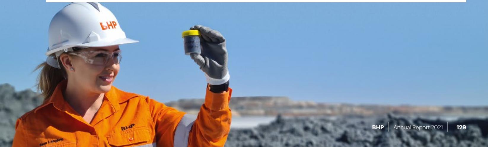

> **AI Description:**
> **Source:** `assets/_page_130_Figure_0.jpg`
> 
> **Generated:** 2026-05-19 06:50:15
> 
> ---
> 
> The image is a photograph of a person wearing a hard hat and safety glasses, holding a small container with a sample. The individual is dressed in an orange work uniform with the BHP logo. The background shows an outdoor setting with a clear blue sky and what appears to be a mining or industrial site. The image is from BHP's Annual Report 2021, as indicated by the text in the bottom right corner.

## 3.1 Consolidated Financial Statements

## 3.1.1 Consolidated Income Statement for the year ended 30 June 2021

The accompanying notes form part of these Financial Statements.

## 3.1.2 Consolidated Statement of Comprehensive Income for the year ended 30 June 2021

The accompanying notes form part of these Financial Statements.

3.1.3 Consolidated Balance Sheet as at 30 June 2021

The accompanying notes form part of these Financial Statements.
The Financial Statements were approved by the Board of Directors on 2 September 2021 and signed on its behalf by:

Ken MacKenzie Chair

Mike Henry Chief Executive Officer

3.1.4 Consolidated Cash Flow Statement for the year ended 30 June 2021

The accompanying notes form part of these Financial Statements.

3.1.5 Consolidated Statement of Changes in Equity for the year ended 30 June 2021

The accompanying notes form part of these Financial Statements.

## Basis of preparation

The Group’s Financial Statements as at and for the year ended 30 June 2021:

– are a consolidated general purpose financial report

– have been prepared in accordance with the requirements of the:

– Australian Corporations Act 2001

– UK Companies Act 2006

– have been prepared in accordance with accounting standards and interpretations collectively referred to as ‘IFRS’ in this report, which encompass the:

– International Financial Reporting Standards and interpretations as issued by the International Accounting Standards Board

– Australian Accounting Standards, being Australian equivalents to International Financial Reporting Standards and interpretations as issued by the Australian Accounting Standards Board (AASB)

– International Accounting Standards in conformity with the requirements of the UK Companies Act 2006 and International Financial Reporting Standards adopted pursuant to Regulation (EC) No. 1606/2002 as it applies in the European Union (EU)

– International Accounting Standards adopted for use within the UK

– are prepared on a going concern basis as the Directors:

– have made an assessment of the Group’s ability to continue as a going concern over the period to 30 September 2022 (the ‘going concern period’)

– consider it appropriate to adopt the going concern basis of accounting in preparing the Group’s Financial Statements – measure items on the basis of historical cost principles, except for the following items:

– derivative financial instruments and certain other financial assets and liabilities, which are carried at fair value

– non-current assets or disposal groups that are classified as heldfor-sale or held-for-distribution, which are measured at the lower of carrying amount and fair value less costs to sell

– include significant accounting policies in the notes to the Financial Statements that summarise the recognition and measurement basis used and are relevant to an understanding of the Financial Statements

– include selected financial information of the BHP Group Limited parent entity in note 37 ‘BHP Group Limited’. Financial Statements of the BHP Group Plc parent entity are presented in section 3.2 ‘BHP Group Plc’

– apply a presentation currency of US dollars, consistent with the predominant functional currency of the Group’s operations. Amounts are rounded to the nearest million dollars, unless otherwise stated, in accordance with ASIC (Rounding in Financial/Directors’ Reports) Instrument 2016/191

– present reclassified comparative information where required for consistency with the current year’s presentation

– adopt all new and amended standards and interpretations under IFRS issued by the relevant bodies (listed above), that are mandatory for application in periods beginning on 1 July 2020. Those new and amended standards and interpretations did not require restatement of prior period financial information

– early adopt amendments to IFRS 9/AASB 9 ‘Financial Instruments’ (IFRS 9), IAS 39/AASB 139 ‘Financial Instruments: Recognition and Measurement’ (IAS 39); IFRS 7/AASB 7 ‘Financial Instruments: Disclosures’ (IFRS 7); IFRS 4/AASB 4 ‘Insurance Contracts’ (IFRS 4) and IFRS 16/AASB 16 ‘Leases’ (IFRS 16) in relation to Interest Rate Benchmark Reform

– apply accounting policies consistently in all prior years presented including retrospective application of the Group’s accounting policy change relating to Income Taxes. Refer to note 39 ‘New and amended accounting standards and interpretations and changes to accounting policies’ for the impact on the Financial Statements

– have not early adopted any other standards and interpretations that have been issued or amended but are not yet effective

The accounting policies are consistently applied by all entities included in the Financial Statements.

## Principles of consolidation

In preparing the Financial Statements the effects of all intragroup balances and transactions have been eliminated.

A list of significant entities in the Group, including subsidiaries, joint arrangements and associates at year-end is contained in note 30 ‘Subsidiaries’, note 31 ‘Investments accounted for using the equity method’ and note 32 ‘Interests in joint operations’.

Subsidiaries: The Financial Statements of the Group include the consolidation of BHP Group Limited, BHP Group Plc and their respective subsidiaries, being the entities controlled by the parent entities during the year. Control exists where the Group:

– is exposed to, or has rights to, variable returns from its involvement with the entity

– has the ability to affect those returns through its power to direct the activities of the entity

The ability to approve the operating and capital budget of a subsidiary and the ability to appoint key management personnel are decisions that demonstrate that the Group has the existing rights to direct the relevant activities of a subsidiary. Where the Group’s interest is less than 100 per cent, the interest attributable to outside shareholders is reflected in noncontrolling interests. The Financial Statements of subsidiaries are prepared for the same reporting period as the Group. The acquisition method of accounting is used to account for the Group’s business combinations.

Joint arrangements: The Group undertakes a number of business activities through joint arrangements, which exist when two or more parties have joint control. Joint arrangements are classified as either joint operations or joint ventures, based on the contractual rights and obligations between the parties to the arrangement:

– Joint operations: A joint operation is an arrangement in which the Group shares joint control, primarily via contractual arrangements with other parties. In a joint operation, the Group has rights to the assets and obligations for the liabilities relating to the arrangement. This includes situations where the parties benefit from the joint activity through a share of the output, rather than by receiving a share of the results of trading. In relation to the Group’s interest in a joint operation, the Group recognises: its assets and liabilities, including its share of any assets and liabilities held or incurred jointly; revenue from the sale of its share of the output and its share of any revenue generated from the sale of the output by the joint operation; and its expenses including its share of expenses incurred jointly. All such amounts are measured in accordance with the terms of the arrangement, which is usually in proportion to the Group’s interest in the joint operation.

– Joint ventures: A joint venture is a joint arrangement in which the parties that share joint control have rights to the net assets of the arrangement. A separate vehicle, not the parties, will have the rights to the assets and obligations for the liabilities relating to the arrangement. More than an insignificant share of output from a joint venture is sold to third parties, which indicates the joint venture is not dependent on the parties to the arrangement for funding, nor do the parties have an obligation for the liabilities of the arrangement. Joint ventures are accounted for using the equity accounting method.

Associates: The Group accounts for investments in associates using the equity accounting method. An entity is considered an associate where the Group is deemed to have significant influence but not control or joint control. Significant influence is presumed to exist where the Group:

– has over 20 per cent but less than 50 per cent of the voting rights of an entity, unless it can be clearly demonstrated that this is not the case or

– holds less than 20 per cent of the voting rights of an entity; however, has the power to participate in the financial and operating policy decisions affecting the entity

The Group uses the term ‘equity accounted investments’ to refer to joint ventures and associates collectively.

## Foreign currencies

Transactions related to the Group’s worldwide operations are conducted in a number of foreign currencies. The majority of the subsidiaries, joint arrangements and associates within each of the operations have assessed US dollars as the functional currency, however, some subsidiaries, joint arrangements and associates have functional currencies other than US dollars.

Transactions and monetary items denominated in foreign currencies are translated into US dollars as follows:

Foreign exchange gains and losses resulting from translation are recognised in the income statement, except for qualifying cash flow hedges (which are deferred to equity) and foreign exchange gains or losses on foreign currency provisions for site closure and rehabilitation costs (which are capitalised in property, plant and equipment for operating sites).

On consolidation, the assets, liabilities, income and expenses of non-US dollar denominated functional currency entities are translated into US dollars using the following applicable exchange rates:

Foreign exchange differences resulting from translation are initially recognised in the foreign currency translation reserve and subsequently transferred to the income statement on disposal of a foreign operation.

## Significant accounting policies, judgements and estimates

The Group has identified a number of accounting policies under which significant judgements, estimates and assumptions are made. All judgements, estimates and assumptions are based on the most current facts and circumstances and are reassessed on an ongoing basis. Actual results in future reporting periods may differ for these estimates under different assumptions and conditions.

Significant judgements and key estimates and assumptions made in applying these accounting policies are embedded within the following notes:

The Samarco dam failure, impairment assessments and closure and rehabilitation provisions have been identified as areas involving significant judgement and where changes to key estimates and assumptions may materially affect financial results and the carrying amount of assets and liabilities to be reported in the next reporting period. Additional information including sensitivity analysis, where appropriate, has been provided in the relevant notes to enhance an understanding of the impact of key estimates and assumptions on the Group’s financial position and performance.

## Reserve estimates

Reserves are estimates of the amount of product that can be demonstrated to be able to be economically and legally extracted from the Group’s properties. In order to estimate reserves, assumptions are required about a range of technical and economic factors, including

## Impact of COVID-19 pandemic

The Group continues to actively monitor the impact of the COVID-19 pandemic, including the impact on economic activity and financial reporting. During the period the Group continued to experience lower volumes at certain of our operated assets and to incur incremental directly attributable costs including those associated with the increased provision of health and hygiene services, the impacts of maintaining social distancing requirements and demurrage and other standby charges related to delays caused by COVID-19. These incremental costs have been classified as an exceptional item, as outlined in note 3 ‘Exceptional items’.

As the pandemic continues to evolve, with the extent and timing of impacts varying across the Group’s key operating locations, it remains difficult to predict the full extent and duration of resulting operational and economic impacts for the Group. This uncertainty impacts judgements made by the Group, including those relating to assessing collectability of receivables and determining the recoverable values of the Group’s non-current assets as outlined in notes 8 ‘Trade and other receivables’ and 13 ‘Impairment of non-current assets’, respectively. Given the uncertainty associated with the pandemic, management assesses the appropriate financial treatment and disclosure of COVID-19 impacts each reporting period.

The ongoing uncertainty has also been considered in the Group’s assessment of the appropriateness of adopting the going concern basis of preparation of the Consolidated Financial Statements. In assessing the appropriateness of the going concern assumption over the going concern period, management have stress tested BHP’s most recent financial projections to incorporate a range of potential future outcomes by considering BHP’s principal risks. The Group’s financial forecasts, including downside commodity price and production scenarios, demonstrate that the Group believes that it has sufficient financial resources to meet its obligations as they fall due throughout the going concern period. As such, the Consolidated Financial Statements continue to be prepared on the going concern basis.

quantities, qualities, production techniques, recovery efficiency, production and transport costs, commodity supply and demand, commodity prices and exchange rates.

Estimating the quantity and/or quality of reserves requires the size, shape and depth of ore bodies or oil and gas reservoirs to be determined by analysing geological data, such as drilling samples and geophysical survey interpretations. Economic assumptions used to estimate reserves change from period-to-period as additional technical and operational data is generated. This process may require complex and difficult geological judgements to interpret the data.

Additional information on the Group’s mineral and oil and gas reserves and resources can be viewed within section 4.6.

Section 4.6 is unaudited and does not form part of these Financial Statements.

## Reserve impact on financial reporting

Estimates of reserves may change from period-to-period as the economic assumptions used to estimate reserves change and additional geological data is generated during the course of operations. Changes in reserves may affect the Group’s financial results and financial position in a number of ways, including:

asset carrying values may be affected due to changes in estimated future production levels

– depreciation, depletion and amortisation charged in the income statement may change where such charges are determined on the units of production basis, or where the useful economic lives of assets change

– overburden removal costs recorded on the balance sheet or charged to the income statement may change due to changes in stripping ratios or the units of production basis of depreciation

– closure and rehabilitation provisions may change where changes in estimated reserves affect expectations about the timing or cost of these activities

– the carrying amount of deferred tax assets may change due to changes in estimates of the likely recovery of the tax benefits

## Climate change

The Group continues to develop its assessment of the potential impacts of climate change and the transition to a low carbon economy. The Group’s current climate change strategy focuses on reducing operational greenhouse gas (GHG) emissions, investing in low emissions technologies, supporting emissions reductions in our value chain and promoting product stewardship, managing climate-related risk and opportunity, and working with others to enhance the global policy and market response. Future changes to the Group’s climate change strategy or global decarbonisation signposts may impact the Group’s significant judgements and key estimates and result in material changes to financial results and the carrying values of certain assets and liabilities in future reporting periods.

The Group’s current climate change strategy is reflected in the Group’s significant judgements and key estimates, and therefore the Financial Statements, as follows:

## Transition risks

## The Group’s targets and goals

As part of its response to the Paris Agreement goals, the Group has set a target to reduce its operational GHG emissions (Scope 1 and Scope 2 from our operated assets) by at least 30 per cent from FY2020 levels by FY2030 and a goal to achieve net zero operational GHG emissions by 2050. For the FY2030 target, the FY2020 baseline will be adjusted for any material acquisitions and divestments based on GHG emissions at the time of the transaction, and carbon offsets will be used as required. Emissions reduction projects aimed at contributing to the achievement of the Group’s operational GHG emissions target and goal have been incorporated into the forecast cash flows of the Group’s assets.

The Group’s offset strategy is currently being managed at a consolidated Group level and therefore is not currently incorporated into the forecast cash flows of individual assets. Any change to the Group’s climate change strategy could impact these forecasts and the Group’s significant judgements and key estimates.

The Group continues to invest, including in partnership with others, in emissions reduction projects and technology innovation and development in its value chain to support reductions to its total reported Scope 3 GHG emissions inventory. However, while we seek to influence, Scope 3 emissions occur outside of our direct control. Reduction pathways are dependent on the development and upstream or downstream deployment of solutions and/or supportive policy. It is therefore currently not possible to reliably estimate or measure the full potential financial statement impacts of the Group’s pursuit of its Scope 3 goals and targets.

Expenditure under the Climate Investment Program (CIP) which, as announced by the Group in July 2019, aims to invest at least US\$400 million over the CIP’s five-year life in emissions reduction projects across the Group’s operated assets and value chain, is recognised in the relevant year of expenditure.

## Global transition signposts and commodity impacts

In addition to the Group’s targets and goals, significant judgements and key estimates are also impacted by the Group’s current assessment of the range of economic and climate related conditions that could exist in transitioning to a low carbon economy, considering the current trajectory of society and the global economy as a whole. Despite recent progress, all 1.5°C pathways to 2050 represent a major departure from today’s global trajectory and the Group does not believe the technological, regulatory, or economic foundations for a rapid transition to net zero emissions are currently in place. Acknowledging these signposts, the Group’s current best estimate of the potential impacts of climate change and the transition to a low carbon economy are reflected in the following two scenarios, which consider existing policies, trends and commitments and the Group’s view of the most likely range of futures for the global economy and associated sub-systems:

– Central Energy View: reflects, and is periodically updated to respond to, existing policy trends and commitments and currently tracks to approximately 3°C temperature increase above pre-industrial levels by 2100

– Lower Carbon View: currently tracks to approximately 2.5°C temperature increase by 2100, and accelerates decarbonisation trends and policies, particularly in easier-to-abate sectors such as power generation and light duty vehicles

These two scenarios are reviewed periodically to reflect new information.

These scenarios are currently being used as inputs to the Group’s planning cases, informing updates to the Group’s supply, demand and price forecasts, capital allocation and portfolio decisions. As such, these scenarios impact certain significant judgements and key estimates, including the determination of the valuation of assets and potential impairment charges (notes 11 ‘Property, plant and equipment’ and 13 ‘Impairment of non-current assets’), the estimation of the remaining useful economic life of assets for depreciation purposes (note 11 ‘Property, plant and equipment’), the timing of closure and rehabilitation activities (note 15 ‘Closure and rehabilitation provisions’) and the recoverability of certain deferred tax assets (note 14 ‘Deferred tax balances’).

The Group continues to monitor global decarbonisation signposts and update its planning cases accordingly. Where such signposts indicate the appropriate measures are in place for achievement of a 1.5ºC Parisaligned scenario, this will be reflected in the Group’s planning cases.

## Sensitivity to demand for fossil fuels

The Group acknowledges that there are a range of possible energy transition scenarios, including those that are aligned with the Paris Agreement goals, that may indicate different outcomes for individual commodities. While not currently an input to the Group’s planning cases, the resilience of the Group’s portfolio to a 1.5°C Paris-aligned scenario (the Group’s 1.5°C Paris-aligned scenario) has been considered, including the impact of Paris-aligned commodity price outlooks under that scenario on the Group’s latest asset plans.

Although all potential financial reporting consequences under the Group’s 1.5°C Paris-aligned scenario are currently impracticable to fully assess, the long-term commodity price outlooks under this scenario are either largely consistent with or favourable to the price outlooks in the Group’s current planning cases, with the exception of energy coal, oil and natural gas.

There are inherent limitations with scenario analysis and it is difficult to predict which, if any, of the scenarios might eventuate and none of the scenarios considered constitutes a definitive outcome for the Group.

The long-term commodity price outlooks under the Group’s 1.5°C Parisaligned scenario, excluding energy coal, oil and natural gas, reflect:

– Copper and nickel benefiting from the dramatic pace of electrification over and above the Group’s current planning cases

– Iron ore growth underpinned by the benefit to steel demand from the construction of renewables, particularly wind power

– Potash growth reflecting the potential for greater penetration of biofuels

– Metallurgical coal supported by the limited alternatives in steelmaking over the scenario timeframe

Given the positive long-term price outlooks for these commodities, the Group currently considers that a material adverse change is not expected to the valuation, and remaining useful life, of assets and discounting of closure and rehabilitation provisions for assets relating to these commodities under its 1.5°C Paris-aligned scenario.

For energy coal, oil and natural gas, long-term commodity price outlooks under the Group’s 1.5°C Paris-aligned scenario are unfavourable to the price outlooks in the Group’s current planning cases. However, recent portfolio announcements and impairments recognised in FY2021 limit the exposure of the carrying value of the Group’s assets to long-term commodity prices for energy coal, oil and natural gas, as:

– the Group has announced a merger proposal to combine the Group’s petroleum business with Woodside

– the Group has announced the signing of a Sale and Purchase Agreement to divest the Group’s 33.3 per cent interest in Cerrejón

– following impairments recognised in FY2021, the carrying value of the Group’s NSWEC assets is no longer material

Further, as management would alter its operating and investment plans in such a pricing environment for these assets to mitigate cash flow and valuation impacts, it is currently impracticable to fully assess the potential impacts on the significant judgements and key estimates used in the preparation of the Group’s Financial Statements. However, given the factors outlined above, NSWEC closure provisions are considered the liabilities most susceptible to the long-term impacts of the Group’s 1.5°C Paris-aligned scenario as reserves and resources may become incapable of extraction in an economically viable fashion prior to the current best estimate of remaining useful life. In such a scenario, closure activity may be performed earlier than the Group’s current best estimate, impacting the closure provision.

## Physical risks

The Group is progressing work to assess the potential impact of physical risks of climate change in line with the Group’s Risk Management Framework. Given the ongoing nature of the Group’s physical risk assessment process, inclusion of adaptation risk in the Group’s operating plans, and associated asset valuations, is currently limited. As the Group progresses its adaptation strategy, the identification of additional risks or the detailed development of the Group’s response may result in material changes to financial results and the carrying values of assets and liabilities in future reporting periods.

## 3.1.6 Notes to the Financial Statements

## Performance

## 1 Segment reporting

## Reportable segments

The Group operated four reportable segments during FY2021, which are aligned with the commodities that are extracted and marketed and reflect the structure used by the Group’s management to assess the performance of the Group.

Unless otherwise noted, the segment reporting information for the year ended 30 June 2019 excludes Discontinued operations, being the Petroleum Onshore US operations comprising the Eagle Ford, Haynesville, Permian and Fayetteville oil and gas assets.

Group and unallocated items includes functions, other unallocated operations including Potash, Nickel West and legacy assets, and consolidation adjustments. Revenue not attributable to reportable segments comprises the sale of freight and fuel to third parties, as well as revenues from unallocated operations. Exploration and technology activities are recognised within relevant segments.

Total assets and total liabilities for FY2020 and FY2019 have been restated to reflect changes to the Group’s accounting policy following a decision by the IFRS Interpretations Committee on IAS 12/AASB 112 ‘Income Taxes’ (IAS 12), resulting in the retrospective recognition of US\$950 million of Goodwill at Olympic Dam (included in the Copper Segment) and an offsetting US\$1,021 million increase in Deferred tax liabilities (included in Group and unallocated). Refer to note 39 ‘New and amended accounting standards and interpretations and changes to accounting policies’ for further information.

## 1 Segment reporting continued

(1) Impairment losses exclude exceptional items of US\$2,371 million (2020: US\$409 million; 2019: US\$ nil).

(2) Exceptional items reported in Group and unallocated include Samarco dam failure costs of US\$(14) million (2020: US\$(32) million; 2019: US\$(31) million) and Samarco related other income of US\$34 million (2020: US\$489 million; 2019: US\$50 million). Refer to note 3 ‘Exceptional items’ for further information.

(3) Total assets and total liabilities of FY2020 and FY2019 have been restated to reflect changes to the Group’s accounting policy. Refer to note 39 ‘New and amended accounting standards and interpretations and changes to accounting policies’ for further information.

## Geographical information

(1) FY2020 and FY2019 have been restated to reflect changes to the Group’s accounting policy following a decision by the IFRS Interpretations Committee on IAS 12 ‘Income Taxes’, resulting in the retrospective recognition of US\$950 million of Goodwill at Olympic Dam. Refer to note 39 ‘New and amended accounting standards and interpretations and changes to accounting policies’ for further information.
(2) Unallocated assets comprise deferred tax assets and other financial assets.

## Underlying EBITDA

Underlying EBITDA is earnings before net finance costs, depreciation, amortisation and impairments, taxation expense, Discontinued operations and any exceptional items. Underlying EBITDA includes BHP’s share of profit/(loss) from investments accounted for using the equity method including net finance costs, depreciation, amortisation and impairments and taxation expense/(benefit).

Exceptional items are excluded from Underlying EBITDA in order to enhance the comparability of such measures from period-to-period and provide investors with further clarity in order to assess the performance of the Group’s operations. Management monitors exceptional items separately. Refer to note 3 ‘Exceptional items’ for additional detail.

## Segment assets and liabilities

Total segment assets and liabilities of reportable segments represents operating assets and operating liabilities, including the carrying amount of equity accounted investments and predominantly excludes cash balances, loans to associates, interest bearing liabilities and deferred tax balances. The carrying value of investments accounted for using the equity method represents the balance of the Group’s investment in equity accounted investments, with no adjustment for any cash balances, interest bearing liabilities or deferred tax balances of the equity accounted investment.

## 2 Revenue

Revenue by segment and asset

(1) Total Petroleum revenue includes: crude oil US\$2,013 million (2020: US\$2,033 million; 2019: US\$3,171 million), natural gas US\$977 million (2020: US\$980 million; 2019: US\$1,259 million), LNG US\$682 million (2020: US\$774 million; 2019: US\$1,179 million), NGL US\$212 million (2020: US\$198 million; 2019: US\$263 million) and other US\$62 million (2020: US\$85 million; 2019: US\$58 million).

(2) Total Copper revenue includes: copper US\$14,812 million (2020: US\$10,044 million; 2019: US\$10,215 million) and other US\$914 million (2020: US\$622 million; 2019: US\$623 million). Other consists of silver, zinc, molybdenum, uranium and gold.

(3) Total Coal revenue includes: metallurgical coal US\$4,260 million (2020: US\$5,311 million; 2019: US\$7,568 million) and energy coal US\$894 million (2020: US\$931 million; 2019: US\$1,553 million).

(4) Group and unallocated items revenue includes: Nickel West US\$1,545 million (2020: US\$1,189 million; 2019: US\$1,193 million) and other revenue US\$22 million (2020: US\$30 million; 2019: US\$32 million).

Revenue consists of revenue from contracts with customers of US\$59,302 million (2020: US\$43,087 million; 2019: US\$44,361 million) and other revenue of US\$1,515 million (2020: US\$(156) million; 2019: US\$(73) million).

## Recognition and measurement

The Group generates revenue from the production and sale of commodities. Revenue is recognised when or as control of the promised goods or services passes to the customer. In most instances, control passes when the goods are delivered to a destination specified by the customer, typically on board the customer’s appointed vessel. Revenue from the provision of services is recognised over time, but does not represent a significant proportion of total revenue and is aggregated with the respective asset and product revenue for disclosure purposes. The amount of revenue recognised reflects the consideration to which the Group expects to be entitled in exchange for the goods or services.

Where the Group’s sales are provisionally priced, the final price depends on future index prices. The amount of revenue initially recognised is based on the relevant forward market price. Adjustments between the provisional and final price are accounted for under IFRS 9/AASB 9 ‘Financial Instruments’ (IFRS 9) and separately recorded as other revenue. The period between provisional pricing and final invoicing is typically between 60 and 120 days.

Revenue from concentrate is net of treatment costs and refining charges.

Revenue from the sale of significant by-products is included within revenue. Where a by-product is not significant, revenue is credited against costs.

The Group applies the practical expedient to not adjust the expected consideration for the effects of the time value of money if the period between the delivery and when the customer pays for the promised good or service is one year or less.

For commodity sales contracts, each individual metric unit is a separate performance obligation. Where the Group has contracts with unfulfilled performance obligations at period-end, it is required to disclose the transaction price allocated to these performance obligations. The Group applies the practical expedient to not disclose this information for contracts with an expected duration of one year or less. The Group has a number of longterm contracts which are primarily priced on variable terms, based on quoted index prices near the time of delivery, and at times include fixed pricing components. Fixed pricing components, such as premiums and other charges, do not represent a significant proportion of the total price. Any estimate of the future transaction price would exclude estimated amounts of variable consideration. The amount of future consideration from fixed pricing components has not been disclosed, as the Group does not consider this relevant or useful information.

## 3 Exceptional items

Exceptional items are those gains or losses where their nature, including the expected frequency of the events giving rise to them, and impact is considered material to the Financial Statements. Such items included within the Group’s profit from Continuing operations for the year are detailed below.

## Samarco Mineração S.A. (Samarco) dam failure

The FY2021 exceptional loss of US\$1,158 million (after tax) related to the Samarco dam failure in November 2015 comprises the following:

(1) Refer to note 4 ‘Significant events – Samarco dam failure’ for further information.

## COVID-19 related costs

COVID-19 is considered a single protracted globally pervasive event with financial impacts being experienced over a number of reporting periods. The exceptional item reflects the directly attributable COVID-19 pandemic related additional costs for the Group for the year ended 30 June 2021, including costs associated with the increased provision of health and hygiene services, the impacts of maintaining social distancing requirements and demurrage and other standby charges related to delays caused by COVID-19.

## Impairment of Energy coal assets

The Group recognised an impairment charge of US\$1,704 million (after tax) in relation to New South Wales Energy Coal (NSWEC) reflecting the status of the divestment process and current market conditions for thermal coal, the strengthening Australian dollar and changes to the mine plan. In addition, the Group recognised an impairment charge of US\$470 million (after tax) for Cerrejón, reflecting the expected net sales proceeds. Refer to note 13 ‘Impairment of non-current assets’ for further information on the pre-tax impairment.

## Impairment of Potash assets

The Group recognised an impairment charge of US\$2,065 million (after tax) in relation to Potash. The impairment charge reflects an analysis of recent market perspectives and the value that we would now expect a market participant to attribute to our investments to date. Refer to note 13 ‘Impairment of non-current assets’ for further information on the pre-tax impairment.

The exceptional items relating to the year ended 30 June 2020 and the year ended 30 June 2019 are detailed below.

## 3 Exceptional items continued

## Samarco Mineração S.A. (Samarco) dam failure

The FY2020 exceptional loss of US\$176 million related to the Samarco dam failure in November 2015 comprises the following:

(1) Refer to note 4 ‘Significant events – Samarco dam failure’ for further information.

## Cancellation of power contracts

Reflects an onerous contract provision in relation to the cancellation of power contracts at the Group’s Escondida and Spence operations, as part of the shift towards 100 per cent renewable energy supply contracts.

## COVID-19 related costs

COVID-19 can be considered a single protracted globally pervasive event with financial impacts expected over a number of reporting periods. The exceptional item reflects the directly attributable COVID-19 pandemic related additional costs for the Group for FY2020, including costs associated with the increased provision of health and hygiene services and the impacts of maintaining social distancing requirements.

## Cerro Colorado impairment

The Group recognised an impairment charge of US\$492 million (after tax) in relation to Cerro Colorado. This reflects the decision taken by the Group to reduce Cerro Colorado’s throughput for the remaining period of its current environmental licence, which expires at the end of CY2023.

## 30 June 2019

## Samarco Mineração S.A. (Samarco) dam failure

The FY2019 exceptional loss of US\$1,060 million related to the Samarco dam failure in November 2015 comprises the following:

(1) Refer to note 4 ‘Significant events – Samarco dam failure’ for further information.

## Global taxation matters

Global taxation matters includes amounts released from provisions for tax matters and other claims resolved during the period.

## 4 Significant events – Samarco dam failure

On 5 November 2015, the Samarco Mineração S.A. (Samarco) iron ore operation in Minas Gerais, Brazil, experienced a tailings dam failure that resulted in a release of mine tailings, flooding the communities of Bento Rodrigues, Gesteira and Paracatu and impacting other communities downstream (the Samarco dam failure). Refer to section 1.15 ‘Samarco’.

Samarco is jointly owned by BHP Billiton Brasil Ltda (BHP Brasil) and Vale S.A. (Vale). BHP Brasil’s 50 per cent interest is accounted for as an equity accounted joint venture investment. BHP Brasil does not separately recognise its share of the underlying assets and liabilities of Samarco, but instead records the investment as one line on the balance sheet. Each period, BHP Brasil recognises its 50 per cent share of Samarco’s profit or loss and adjusts the carrying value of the investment in Samarco accordingly. Such adjustment continues until the investment carrying value is reduced to US\$ nil, with any additional share of Samarco losses only recognised to the extent that BHP Brasil has an obligation to fund the losses. After applying equity accounting, any remaining carrying value of the investment is tested for impairment.

Any charges relating to the Samarco dam failure incurred directly by BHP Brasil or other BHP entities are recognised 100 per cent in the Group’s results.

## 4 Significant events – Samarco dam failure continued

The financial impacts of the Samarco dam failure on the Group’s income statement, balance sheet and cash flow statement for the year ended 30 June 2021 are shown in the tables below and have been treated as an exceptional item.

(1) Proceeds from insurance settlements.
(2) Includes legal and advisor costs incurred.
(3) Impairment expense from working capital funding provided during the period.
(4) US\$(6) million (2020: US\$37 million; 2019: US\$263 million) change in estimate and US\$21 million (2020: US\$(83) million; 2019: US\$ nil) exchange translation.
(5) US\$842 million (2020: US\$916 million; 2019: US\$579 million) change in estimate and US\$158 million (2020: US\$(457) million; 2019: US\$7 million) exchange translation.
(6) During the period the Group entered into forward exchange contracts to limit the Brazilian reais exposure on the dam failure provisions. While not applying hedge accounting, the fair value changes in the forward exchange instruments are recorded within Loss from equity accounted investments, related impairments and expenses in the Income Statement. (7) Amortisation of discounting of provision.
(8) Includes tax on forward exchange derivatives and other taxes incurred during the period.
(9) Includes US\$(111) million (2020: US\$(95) million; 2019: US\$(96) million) funding provided during the period, US\$(351) million (2020: US\$(365) million; 2019: US\$(328) million) utilisation of the Samarco dam failure provision, and US\$(8) million (2020: US\$(4) million; 2019: US\$ nil) utilisation of the Samarco Germano decommissioning provision.

## Equity accounted investment in Samarco

BHP Brasil’s investment in Samarco remains at US\$ nil. BHP Brasil provided US\$111 million funding under a working capital facility during the period and recognised impairment losses of US\$111 million. No dividends have been received by BHP Brasil from Samarco during the period and Samarco currently does not have profits available for distribution.

## 4 Significant events – Samarco dam failure continued

## Provisions related to the Samarco dam failure

Samarco dam failure provisions and contingencies
As at 30 June 2021, BHP Brasil has identified provisions and contingent liabilities arising as a consequence of the Samarco dam failure as follows:

## Provisions

Provision for Samarco dam failure

On 2 March 2016, BHP Brasil, Samarco and Vale, entered into a Framework Agreement with the Federal Government of Brazil, the states of Espírito Santo and Minas Gerais and certain other public authorities to establish a foundation (Fundação Renova) that is developing and executing environmental and socio-economic programs (Programs) to remediate and provide compensation for damage caused by the Samarco dam failure. Key Programs include those for financial assistance and compensation of impacted persons, including fisherfolk impacted by the dam failure, and those for remediation of impacted areas and resettlement of impacted communities. A committee (Interfederative Committee) comprising representatives from the Brazilian Federal and State Governments, local municipalities, environmental agencies, impacted communities and Public Defence Office oversees the activities of the Fundação Renova in order to monitor, guide and assess the progress of actions agreed in the Framework Agreement. In addition, the 12th Federal Court is supervising the work of the Fundação Renova and the Court’s decisions have been considered in the Samarco dam failure provision change in estimate. Any future decisions will be analysed for impacts on the provision at the time of any decision.

The term of the Framework Agreement is 15 years, renewable for periods of one year successively until all obligations under the Framework Agreement have been performed. Under the Framework Agreement, Samarco has primary responsibility for funding Fundação Renova’s annual calendar year budget for the duration of the Framework Agreement. The funding amounts for each calendar year will be dependent on the remediation and compensation projects to be undertaken in a particular year. Annual contributions may be reviewed under the Framework Agreement. To the extent that Samarco does not meet its funding obligations, each of BHP Brasil and Vale have secondary funding obligations under the Framework Agreement in proportion to its 50 per cent shareholding in Samarco.

Samarco began to gradually recommence operations in December 2020, however, there remains significant uncertainty regarding Samarco’s longterm cash flow generation. In light of these uncertainties and based on currently available information, BHP Brasil’s provision for its obligations under the Framework Agreement Programs is US\$2.6 billion before tax and after discounting at 30 June 2021 (30 June 2020: US\$1.8 billion).

Under a Governance Agreement ratified on 8 August 2018, BHP Brasil, Samarco and Vale were to establish a process to renegotiate the Programs over two years to progress settlement of the R\$155 billion (approximately US\$30 billion) Federal Public Prosecution Office claim (described below). Pre-requisites established in the Governance Agreement, for re-negotiation of the Framework Agreement were not implemented during the two year period and on 30 September 2020, Brazilian Federal and State prosecutors and public defenders filed a request for the immediate resumption of the R\$155 billion (approximately US\$30 billion) claim, which has been suspended from the date of ratification of the Governance Agreement. The claim remains suspended after the parties to the claim agreed to continue the suspension on 19 March 2021. BHP Brasil, Samarco, Vale and Federal and State prosecutors have been engaging in negotiations to seek a definitive and substantive settlement of the obligations under the Framework Agreement and the R\$155 billion (approximately US\$30 billion) Federal Public Prosecution Office claim. It is not possible to provide a range of outcomes or a reliable estimate of potential settlement outcomes and there is a risk that a negotiated outcome may be materially higher than amounts currently reflected in the Samarco dam failure provision. Until any revisions to the Programs are agreed, Fundação Renova will continue to implement the Programs in accordance with the terms of the Framework Agreement and the Governance Agreement.

BHP Brasil, Samarco and Vale are required to maintain security of an amount equal to the Fundação Renova’s annual budget up to a limit of R\$2.2 billion (approximately US\$440 million). The security currently comprises R\$1.3 billion (approximately US\$260 million) in insurance bonds and a charge of R\$800 million (approximately US\$160 million) over Samarco’s assets. A further R\$100 million (approximately US\$20 million) in liquid assets previously maintained as security was released for COVID-19 related response efforts in Brazil.

## Samarco Germano dam decommissioning

Samarco is currently progressing plans for the accelerated decommissioning of its upstream tailings dams (the Germano dam complex). Given the significant uncertainties surrounding Samarco’s long-term cash flow generation, BHP Brasil’s provision for a 50 per cent share of the expected Germano decommissioning costs is US\$232 million (30 June 2020: US\$227 million). The decommissioning is at an early stage and as a result, further engineering work and required validation by Brazilian authorities could lead to changes to estimates in future reporting periods.

## 4 Significant events – Samarco dam failure continued

## Key judgements and estimates

Judgements: The outcomes of litigation are inherently difficult to predict and significant judgement has been applied in assessing the likely outcome of legal claims and determining which legal claims require recognition of a provision or disclosure of a contingent liability. The facts and circumstances relating to these cases are regularly evaluated in determining whether a provision for any specific claim is required.

Management has determined that a provision can only be recognised for obligations under the Framework Agreement and Samarco Germano dam decommissioning as at 30 June 2021. It is not yet possible to provide a range of possible outcomes or a reliable estimate of potential future exposures to BHP in connection to the contingent liabilities noted below, given their status.

Estimates: The provisions for Samarco dam failure and Samarco Germano dam decommissioning currently reflect the estimated remaining costs to complete Programs under the Framework Agreement and estimated costs to complete the Germano dam decommissioning and require the use of significant judgements, estimates and assumptions. Based on current estimates, it is expected that approximately 85 per cent of remaining costs for Programs under the Framework Agreement will be incurred by December 2023.

While the provisions have been measured based on latest information available, likely changes in facts and circumstances in future reporting periods may lead to material revisions to these estimates. However, it is currently not possible to determine what facts and circumstances may change, therefore revisions in future reporting periods due to the key estimates and factors outlined below cannot be reliably measured.

The key estimates that may have a material impact upon the provisions in the next and future reporting periods include:

– number of people eligible for financial assistance and compensation and the corresponding amount of expected compensation

costs to complete key infrastructure programs, including resettlement of the Bento Rodrigues, Gesteira and Paracatu communities

The provisions may also be affected by factors including but not

– resolution of existing and potential legal claims in Brazil and other jurisdictions, including the impact of ongoing settlement negotiations and outcome of the United Kingdom group action complaint

– potential changes in scope of work and funding amounts required under the Framework Agreement including the impact of the decisions of the Interfederative Committee along with further technical analysis, community participation required under the Governance Agreement and rulings made by the 12th Federal Court

– the outcome of ongoing negotiations with State and Federal Prosecutors, including review of Fundação Renova’s Programs as provided in the Governance Agreement

– actual costs incurred

– resolution of uncertainty in respect of the nature and extent of Samarco’s long-term cash generation

– costs to complete the Germano dam decommissioning

– updates to discount and foreign exchange rates

– the outcomes of Samarco’s judicial reorganisation (defined below)

Given these factors, future actual expenditures may differ from the amounts currently provided and changes to key assumptions and estimates could result in a material impact to the provision in the next and future reporting periods.

## Contingent liabilities

The following matters are disclosed as contingent liabilities and given the status of proceedings it is not possible to provide a range of possible outcomes or a reliable estimate of potential future exposures for BHP, unless otherwise stated. Ultimately, all the legal matters disclosed as contingent liabilities could have a material adverse impact on BHP’s business, competitive position, cash flows, prospects, liquidity and shareholder returns.

## Federal Public Prosecution Office claim

BHP Brasil is among the defendants named in a claim brought by the Federal Public Prosecution Office on 3 May 2016, seeking R\$155 billion (approximately US\$30 billion) for reparation, compensation and moral damages in relation to the Samarco dam failure.

The 12th Federal Court previously suspended the Federal Public Prosecution Office claim, including a R\$7.7 billion (approximately US\$1.5 billion) injunction request. On 30 September 2020, Brazilian Federal and State prosecutors and public defenders filed a request for the immediate resumption of the R\$155 billion (approximately US\$30 billion) claim, which has been suspended since the date of ratification of the Governance Agreement. The claim remains suspended after the parties to the claim agreed to continue the suspension on 19 March 2021.

BHP Brasil, Samarco, Vale and Federal and State prosecutors have been engaging in negotiations to seek a definitive and substantive settlement of the obligations under the Framework Agreement and the R\$155 billion (approximately US\$30 billion) Federal Public Prosecution Office claim. It is not possible to provide a range of outcomes or a reliable estimate of potential settlement outcomes and there is a risk that a negotiated outcome may be materially higher than amounts currently reflected in the Samarco dam failure provision.

## United States class action complaint – Samarco bond holders

On 14 November 2016, a putative class action complaint (Bondholder Complaint) was filed in the U.S. District Court for the Southern District of New York on behalf of purchasers of Samarco’s ten-year bond notes due 2022-2024 between 31 October 2012 and 30 November 2015. The Bondholder Complaint was initially filed against Samarco and the former chief executive officer of Samarco.

The Bondholder Complaint was subsequently amended to include BHP Group Ltd, BHP Group Plc, BHP Brasil, Vale and officers of Samarco, including four of Vale and BHP Brasil’s nominees to the Samarco Board. On 5 April 2017, the plaintiff discontinued its claims against the individual defendants.

The complaint, along with a second amended complaint, had previously been dismissed by the court. The plaintiff filed a motion for reconsideration, or leave to file a third amended complaint, which was denied by the court on 30 October 2019. The plaintiff appealed this decision, which was affirmed by the court of appeals in March 2021.

## Australian class action complaint

BHP Group Ltd is named as a defendant in a shareholder class action filed in the Federal Court of Australia on behalf of persons who acquired shares in BHP Group Ltd on the Australian Securities Exchange or shares in BHP Group Plc on the London Stock Exchange and Johannesburg Stock Exchange in periods prior to the Samarco dam failure. The amount of damages sought is unspecified.

## United Kingdom group action complaint

BHP Group Plc and BHP Group Ltd were named as defendants in group action claims for damages filed in the courts of England. These claims were filed on behalf of certain individuals, governments, businesses and communities in Brazil allegedly impacted by the Samarco dam failure. The amount of damages sought in these claims is unspecified. The complaint and a subsequent application for permission to appeal have been dismissed by the court, however an application by the claimants to reopen the proceedings was granted in July 2021, allowing the claimants to appeal previous dismissals of the claim.

## Criminal charges

The Federal Prosecutors’ Office has filed criminal charges against BHP Brasil, Samarco and Vale and certain employees and former employees of BHP Brasil (Affected Individuals) in the Federal Court of Ponte Nova, Minas Gerais. On 3 March 2017, BHP Brasil filed its preliminary defences.

## 4 Significant events – Samarco dam failure continued

The Federal Court terminated the charges against eight of the Affected Individuals. The Federal Prosecutors’ Office has appealed seven of those decisions with hearings of the appeals still pending. BHP Brasil rejects outright the charges against the company and the Affected Individuals and will defend the charges and fully support each of the Affected Individuals in their defence of the charges.

## Other claims

Civil public actions filed by State Prosecutors in Minas Gerais (claiming damages of approximately R\$7.5 billion, US\$1.5 billion), State Prosecutors in Espírito Santo (claiming damages of approximately R\$2 billion, US\$400 million), and public defenders in Minas Gerais (claiming damages of approximately R\$10 billion, US\$2 billion), have been consolidated before the 12th Federal Court and suspended. The Governance Agreement provides for a process to review whether these civil public claims should be terminated or suspended.

BHP Brasil is among the companies named as defendants in a number of legal proceedings initiated by individuals, non-governmental organisations, corporations and governmental entities in Brazilian Federal and State courts following the Samarco dam failure. The other defendants include Vale, Samarco and Fundação Renova. The lawsuits include claims for compensation, environmental rehabilitation and violations of Brazilian environmental and other laws, among other matters. The lawsuits seek various remedies including rehabilitation costs, compensation to injured individuals and families of the deceased, recovery of personal and property losses, moral damages and injunctive relief. In addition, government inquiries and investigations relating to the Samarco dam failure have been commenced by numerous agencies of the Brazilian government and are ongoing.

Additional lawsuits and government investigations relating to the Samarco dam failure could be brought against BHP Brasil and possibly other BHP entities in Brazil or other jurisdictions.

## BHP insurance

BHP has various third party general liability and directors and officers insurances for claims related to the Samarco dam failure made directly against BHP Brasil or other BHP entities, their directors and officers, including class actions. External insurers have been notified of the Samarco dam failure along with the third party claims and class actions referred to above. In the period since the dam failure to 30 June 2021, the Group has recognised US\$573 million other income from general liability insurance proceeds relating to the dam failure. Recoveries related to general liability insurance are now considered complete.

As at 30 June 2021, an insurance receivable has not been recognised for any potential recoveries in respect of ongoing matters.

## Commitments

Under the terms of the Samarco joint venture agreement, BHP Brasil does not have an existing obligation to fund Samarco.

BHP has agreed to fund a total of up to US\$765 million for the Fundação Renova programs and Samarco’s working capital during calendar year 2021. This comprises up to US\$725 million relating to Fundação Renova programs until 31 December 2021, which will be offset against the Group’s provision for the Samarco dam failure, and a short-term working capital facility of up to US\$40 million to be made available to Samarco until 31 December 2021. Amounts related to Fundação Renova and Samarco working capital incurred in the six months to 30 June 2021 have been reflected in the utilisation of the provision and impairment expense respectively disclosed above. Any additional requests for funding or future investment provided would be subject to a future decision by BHP, accounted for at that time.

## Samarco judicial reorganisation

Samarco filed for judicial reorganisation (JR) in April 2021, with the Commercial Courts of Belo Horizonte, State of Minas Gerais, Brazil (JR Court), after multiple enforcement actions taken by certain creditors of Samarco. Samarco’s JR filing followed unsuccessful attempts to negotiate a debt restructure with certain financial creditors and multiple legal actions filed by those creditors which threatened Samarco’s operations. The JR is an insolvency proceeding with a means for Samarco to seek to restructure its financial debts and establish a sustainable financial position that allows Samarco to continue to rebuild its operations and strengthen its ability to meet its Fundação Renova funding obligations. Samarco’s

operations are expected to continue during the JR and restructure process. The JR is not expected to affect Samarco’s obligation or commitment to make full redress for the 2015 Fundão dam failure, and is not expected to impact Fundação Renova’s ability to undertake that remediation and compensation. It is not possible to determine the outcomes of the JR or estimate any impact that the reorganisation may have for BHP Brasil, including its share of the Samarco dam failure provisions.

The following section includes disclosure required by IFRS of Samarco’s provisions, contingencies and other matters arising from the dam failure for matters in addition to the above-mentioned claims to which Samarco is a party.

## Samarco

## Dam failure related provisions and contingencies

In addition to its obligations under the Framework Agreement as at 30 June 2021, Samarco has recognised provisions of US\$0.2 billion (30 June 2020: US\$0.2 billion), based on currently available information. The magnitude, scope and timing of these additional costs are subject to a high degree of uncertainty and Samarco has indicated that it anticipates that it will incur future costs beyond those provided. These uncertainties are likely to continue for a significant period and changes to key assumptions could result in a material change to the amount of the provision in future reporting periods. Any such unrecognised obligations are therefore contingent liabilities and, at present, it is not practicable to estimate their magnitude or possible timing of payment. Accordingly, it is also not possible to provide a range of possible outcomes or a reliable estimate of total potential future exposures at this time.

Samarco is also named as a defendant in a number of other legal proceedings initiated by individuals, non-governmental organisations, corporations and governmental entities in Brazilian Federal and State courts following the Samarco dam failure. The lawsuits include claims for compensation, environmental rehabilitation and violations of Brazilian environmental and other laws, among other matters. The lawsuits seek various remedies including rehabilitation costs, compensation to injured individuals and families of the deceased, recovery of personal and property losses, moral damages and injunctive relief. In addition, government inquiries and investigations relating to the Samarco dam failure have been commenced by numerous agencies of the Brazilian government and are ongoing. Given the status of proceedings it is not possible to provide a range of possible outcomes or a reliable estimate of total potential future exposures to Samarco.

Additional lawsuits and government investigations relating to the Samarco dam failure could be brought against Samarco.

## Samarco insurance

Samarco has standalone insurance policies in place with Brazilian and global insurers. Insurers’ loss adjusters or claims representatives continue to investigate and assist with the claims process for matters not yet settled. As at 30 June 2021, an insurance receivable has not been recognised by Samarco in respect of ongoing matters.

## Samarco commitments

At 30 June 2021, Samarco has commitments of US\$0.7 billion (30 June 2020: US\$0.4 billion). Following the dam failure Samarco invoked force majeure clauses in a number of long-term contracts with suppliers and service providers to suspend contractual obligations.

## Samarco non-dam failure related contingent liabilities

The following non-dam failure related contingent liabilities pre-date and are unrelated to the Samarco dam failure. Samarco is currently contesting both of these matters in the Brazilian courts. Given the status of these tax matters, the timing of resolution and potential economic outflow for Samarco is uncertain.

## Brazilian Social Contribution Levy

Samarco has received tax assessments for the alleged non-payment of Brazilian Social Contribution Levy for the calendar years 2007-2014 totalling approximately R\$5.9 billion (approximately US\$1.2 billion).

## Brazilian corporate income tax rate

Samarco has received tax assessments for alleged incorrect calculation of Corporate Income Tax (IRPJ) in respect of the 2000-2003 and 2007-2014 income years totalling approximately R\$4.6 billion (approximately US\$0.9 billion).

5 Expenses and other income

(1) Fair value change on derivatives is principally related to commodity price contracts, foreign exchange contracts and embedded derivatives used in the ordinary course of business as well as derivatives used as part of the funding of dividends.
(2) Insurance recoveries is principally related to claims received from Samarco dam failure. Refer to note 4 ‘Significant events – Samarco dam failure’ for further information.
(3) Other income is generally income earned from transactions outside the course of the Group’s ordinary activities and may include certain management fees from noncontrolling interests and joint arrangements, dividend income, royalties, commission income and gains or losses on divestment of subsidiaries or operations.

## Recognition and measurement

Income is recognised when it is probable that the economic benefits associated with a transaction will flow to the Group and can be reliably measured.   
Dividends are recognised upon declaration.

6 Income tax expense

(1) Includes the tax impacts related to the exceptional impairments of NSWEC and Potash in the year ended 30 June 2021 and Cerro Colorado in the year ended 30 June 2020, as presented in note 3 ‘Exceptional items’. There were no exceptional impairments in the year ended 30 June 2019.

(2) The loss from equity accounted investments, related impairments and expenses is net of income tax, with the exception of the Samarco forward exchange derivatives described in note 4 ‘Significant events – Samarco dam failure’. This item removes the prima facie tax effect on such loss, related impairments and expenses, excluding the impact of the Samarco forward exchange derivatives which are taxable.

Income tax recognised in other comprehensive income is as follows:

(1) Included within total income tax relating to components of other comprehensive income is US\$(28) million relating to deferred taxes and US\$ nil relating to current taxes (2020: US\$31 million and US\$ nil; 2019: US\$15 million and US\$12 million).

## 6 Income tax expense continued

## Recognition and measurement

Taxation on the profit/(loss) for the year comprises current and deferred tax. Taxation is recognised in the income statement except to the extent that it relates to items recognised directly in equity or other comprehensive income, in which case the tax effect is also recognised in equity or other comprehensive income.

## Uncertain tax and royalty matters

The Group operates across many tax jurisdictions. Application of tax law can be complex and requires judgement to assess risk and estimate outcomes, particularly in relation to the Group’s cross-border operations and transactions. The evaluation of tax risks considers both amended assessments received and potential sources of challenge from tax authorities. The status of proceedings for these matters will impact the ability to determine the potential exposure and in some cases, it may not be possible to determine a range of possible outcomes or a reliable estimate of the potential exposure.

The Group has unresolved tax and royalty matters for which the timing of resolution and potential economic outflow are uncertain. Tax and royalty matters with uncertain outcomes arise in the normal course of business and occur due to changes in tax law, changes in interpretation of tax law, periodic challenges and disagreements with tax authorities and legal proceedings.

Tax and royalty obligations assessed as having probable future economic outflows capable of reliable measurement are provided for as at 30 June 2021. Matters with a possible economic outflow and/or presently incapable of being measured reliably are contingent liabilities and disclosed in note 34 ‘Contingent liabilities’. Details of uncertain tax and royalty matters relating to Samarco are disclosed in note 4 ‘Significant events – Samarco dam failure’.

## 6 Income tax expense continued

## Key judgements and estimates

## Income tax classification

Judgements: The Group’s accounting policy for taxation, including royalty-related taxation, requires management’s judgement as to the types of arrangements considered to be a tax on income in contrast to an operating cost.

## Deferred tax

Judgements: Judgement is required to determine the amount of deferred tax assets that are recognised based on the likely timing and the level of future taxable profits. Judgement is applied in recognising deferred tax liabilities arising from temporary differences in investments. These deferred tax liabilities caused principally by retained earnings held in foreign tax jurisdictions are recognised unless repatriation of retained earnings can be controlled and is not expected to occur in the foreseeable future.

Estimates: The Group assesses the recoverability of recognised and unrecognised deferred taxes, including losses in Australia, the United States and Canada on a consistent basis. Estimates and assumptions relating to projected earnings and cash flows as applied in the Group impairment process are used for operating assets.

## Uncertain tax matters

Judgements: Management applies judgements about the application of income tax legislation and its interaction with income tax accounting principles. These judgements are subject to risk and uncertainty, hence there is a possibility that changes in circumstances will alter expectations, which may impact the amount of tax assets and tax liabilities, including deferred tax, recognised on the balance sheet and the amount of other tax losses and temporary differences not yet recognised.

Where the final tax outcomes are different from the amounts that were initially recorded, these differences impact the current and deferred tax provisions in the period in which the determination is made.

Measurement of uncertain tax and royalty matters considers a range of possible outcomes, including assessments received from tax authorities. Where management is of the view that potential liabilities have a low probability of crystallising, or it is not possible to quantify them reliably, they are disclosed as contingent liabilities (refer to note 34 ‘Contingent liabilities’).

## 7 Earnings per share

Refer to note 29 ‘Discontinued operations’ for basic earnings per share and diluted earnings per share for Discontinued operations.

Earnings on American Depositary Shares represent twice the earnings for BHP Group Limited or BHP Group Plc ordinary shares.

Headline earnings is a Johannesburg Stock Exchange defined performance measure and is reconciled from earnings attributable to ordinary shareholders as follows:

(1) Included in other income.
(2) Mainly represent BHP share of impairment embedded in the statutory income statement of the Group’s equity accounted investments.

## 7 Earnings per share continued

## Recognition and measurement

Diluted earnings attributable to BHP shareholders are equal to the earnings attributable to BHP shareholders.

The calculation of the number of ordinary shares used in the computation of basic earnings per share is the aggregate of the weighted average number of ordinary shares of BHP Group Limited and BHP Group Plc outstanding during the period after deduction of the number of shares held by the Billiton Employee Share Ownership Trust and the BHP Billiton Limited Employee Equity Trust.

During December 2018, 266 million BHP Group Limited shares were bought back and then cancelled during the period following an off-market buyback program of US\$5.2 billion related to the disbursement of proceeds from the disposal of Onshore US.

For the purposes of calculating diluted earnings per share, the effect of 11 million dilutive shares has been taken into account for the year ended 30 June 2021 (2020: 12 million shares; 2019: 13 million shares). The Group’s only potential dilutive ordinary shares are share awards granted under the employee share ownership plans for which terms and conditions are described in note 25 ‘Employee share ownership plans’. Diluted earnings per share calculation excludes instruments which are considered antidilutive.

At 30 June 2021, there are no instruments which are considered antidilutive (2020: nil; 2019: nil).

## Working capital

## 8 Trade and other receivables

## Recognition and measurement

Trade receivables are recognised initially at their transaction price or, for those receivables containing a significant financing component, at fair value. Trade receivables are subsequently measured at amortised cost using the effective interest method, less an allowance for impairment, except for provisionally priced receivables which are subsequently measured at fair value through the income statement under IFRS 9.

The collectability of trade receivables is assessed continuously. At the reporting date, specific allowances are made for any expected credit losses based on a review of all outstanding amounts at reporting period-end. Individual receivables are written off when management deems them unrecoverable. The net carrying amount of trade and other receivables approximates their fair values.

## Credit risk

Trade receivables generally have terms of less than 30 days. The Group has no material concentration of credit risk with any single counterparty and is not dominantly exposed to any individual industry.

Credit risk can arise from the non-performance by counterparties of their contractual financial obligations towards the Group. To manage credit risk, the Group maintains Group-wide procedures covering the application for credit approvals, granting and renewal of counterparty limits, proactive monitoring of exposures against these limits and requirements triggering secured payment terms. As part of these processes, the credit exposures with all counterparties are regularly monitored and assessed on a timely basis. The credit quality of the Group’s customers is reviewed and the solvency of each debtor and their ability to pay the receivable is considered in assessing receivables for impairment.

The 10 largest customers represented 31 per cent (2020: 32 per cent) of total credit risk exposures managed by the Group.

Receivables are deemed to be past due or impaired in accordance with the Group’s terms and conditions. These terms and conditions are determined on a case-by-case basis with reference to the customer’s credit quality, payment performance and prevailing market conditions. As at 30 June 2021, trade receivables of US\$68 million (2020: US\$23 million) were past due but not impaired. The majority of these receivables were less than 30 days overdue.

The assessment of recoverability of trade receivables at 30 June 2021 has considered the impacts of COVID-19 and no material recoverability issues have been identified. As COVID-19 continues to impact key markets in Asia, Europe and the United States, the Group continues to perform enhanced credit monitoring of commercial counterparties.

At 30 June 2021, trade receivables are stated net of provisions for expected credit losses of US\$3 million (2020: US\$2 million).

The Group may accelerate trade receivables through Letters of Credit programs to collect receipts from debtors earlier than contractual sales terms but elected not to do so as at 30 June 2021.

## 9 Trade and other payables

## 10 Inventories

(1) Inventory write-downs of US\$58 million were recognised during the year (2020: US\$37 million; 2019: US\$16 million). Inventory write-downs of US\$27 million made in previous periods were reversed during the year (2020: US\$13 million; 2019: US\$21 million).

## Recognition and measurement

Regardless of the type of inventory and its stage in the production process, inventories are valued at the lower of cost and net realisable value. Cost is determined primarily on the basis of average costs. For processed inventories, cost is derived on an absorption costing basis. Cost comprises costs of purchasing raw materials and costs of production, including attributable mining and manufacturing overheads taking into consideration normal operating capacity.

Minerals inventory quantities are assessed primarily through surveys and assays, while petroleum inventory quantities are derived through flow rate or tank volume measurement and the composition is derived via sample analysis.

## Key estimates

Accounting for inventory involves the use of estimates, particularly related to the measurement and valuation of inventory on hand within the production process. Key estimates, including expected metal recoveries and work in progress volumes, are calculated by engineers using available industry, engineering and scientific data. Estimates used are periodically reassessed by the Group taking into account technical analysis and historical performance. Changes in estimates are adjusted for on a prospective basis.

## Resource assets

11 Property, plant and equipment

(1) Includes change in estimates and net foreign exchange gains/(losses) related to the closure and rehabilitation provisions for operating sites. Refer to note 15 ‘Closure and rehabilitation provisions’.
(2) Relates to the acquisition of an additional 28 per cent working interest in Shenzi.
(3) Relates to remeasurements of index-linked freight contracts including continuous voyage charters (CVCs). Refer to note 21 ‘Leases’.
(4) Refer to note 13 ‘Impairment of non-current assets’ for information on impairments.
(5) Relates to the sale of the Neptune asset in Gulf of Mexico.
(6) Includes the carrying value of the Group’s right-of-use assets relating to land and buildings and plant and equipment of US\$3,350 million (2020: US\$3,047 million). Refer to note 21 ‘Leases’ for the movement of the right-of-use assets.

## 11 Property, plant and equipment continued

## Recognition and measurement

Property, plant and equipment

Property, plant and equipment is recorded at cost less accumulated depreciation and impairment charges. Cost is the fair value of consideration given to acquire the asset at the time of its acquisition or construction and includes the direct costs of bringing the asset to the location and the condition necessary for operation and the estimated future costs of closure and rehabilitation of the facility.

Right-of-use assets are measured at cost, less any accumulated depreciation and impairment losses, and adjusted for any remeasurement of lease liabilities. Refer to note 21 ‘Leases’ for details.

## Exploration and evaluation

Exploration costs are incurred to discover mineral and petroleum resources. Evaluation costs are incurred to assess the technical feasibility and commercial viability of resources found.

Exploration and evaluation expenditure is charged to the income statement as incurred, except in the following circumstances in which case the expenditure may be capitalised:

In respect of minerals activities:

– the exploration and evaluation activity is within an area of interest that was previously acquired as an asset acquisition or in a business combination and measured at fair value on acquisition or

– the existence of a commercially viable mineral deposit has been established

In respect of petroleum activities:

– the exploration and evaluation activity is within an area of interest for which it is expected that the expenditure will be recouped by future exploitation or sale or

– exploration and evaluation activity has not reached a stage that permits a reasonable assessment of the existence of commercially recoverable reserves

A regular review of each area of interest is undertaken to determine the appropriateness of continuing to carry forward costs in relation to that area. Capitalised costs are only carried forward to the extent that they are expected to be recovered through the successful exploitation of the area of interest or alternatively by its sale. To the extent that capitalised expenditure is no longer expected to be recovered, it is charged to the income statement.

## Key judgements and estimates

Judgements: Exploration and evaluation expenditure results in certain items of expenditure being capitalised for an area of interest where a judgement is made that it is likely to be recoverable by future exploitation or sale, or where the activities are judged not to have reached a stage that permits a reasonable assessment of the existence of reserves.

Estimates: Management makes certain estimates and assumptions as to future events and circumstances, in particular when making quantitative assessment of whether an economically viable extraction operation can be established. These estimates and assumptions may change as new information becomes available. If, after having capitalised the expenditure under the policy, new information suggests that recovery of the expenditure is unlikely, the relevant capitalised amount is charged to the income statement.

## Development expenditure

When proven mineral reserves are determined and development is sanctioned, capitalised exploration and evaluation expenditure is reclassified as assets under construction within property, plant and equipment. All subsequent development expenditure is capitalised and classified as assets under construction, provided commercial viability conditions continue to be satisfied.

The Group may use funds sourced from external parties to finance the acquisition and development of assets and operations. Finance costs are expensed as incurred, except where they relate to the financing of construction or development of qualifying assets. Borrowing costs directly attributable to acquiring or constructing a qualifying asset are capitalised during the development phase. Development expenditure is net of proceeds from the saleable material extracted during the development phase. On completion of development, all assets included in assets under construction are reclassified as either plant and equipment or other mineral assets and depreciation commences.

## Key judgements and estimates

Judgements: Development activities commence after project sanctioning by the appropriate level of management. Judgement is applied by management in determining when a project is economically viable.

Estimates: In determining whether a project is economically viable, management is required to make certain estimates and assumptions as to future events and circumstances, including reserve estimates, existence of an accessible market and forecast prices and cash flows. Estimates and assumptions may change as new information becomes available. If, after having commenced the development activity, new information suggests that a development asset is impaired, the appropriate amount is charged to the income statement.

## Other mineral assets

Other mineral assets comprise:

– capitalised exploration, evaluation and development expenditure for assets in production

– mineral rights and petroleum interests acquired

– capitalised development and production stripping costs

Overburden removal costs

The process of removing overburden and other waste materials to access mineral deposits is referred to as stripping. Stripping is necessary to obtain access to mineral deposits and occurs throughout the life of an open-pit mine. Development and production stripping costs are classified as other mineral assets in property, plant and equipment.

Stripping costs are accounted for separately for individual components of an ore body. The determination of components is dependent on the mine plan and other factors, including the size, shape and geotechnical aspects of an ore body. The Group accounts for stripping activities as follows:

## Development stripping costs

These are initial overburden removal costs incurred to obtain access to mineral deposits that will be commercially produced. These costs are capitalised when it is probable that future economic benefits (access to mineral ores) will flow to the Group and costs can be measured reliably.

Once the production phase begins, capitalised development stripping costs are depreciated using the units of production method based on the proven and probable reserves of the relevant identified component of the ore body which the initial stripping activity benefits.

## 11 Property, plant and equipment continued

## Production stripping costs

These are post initial overburden removal costs incurred during the normal course of production activity, which commences after the first saleable minerals have been extracted from the component. Production stripping costs can give rise to two benefits, the accounting for which is outlined below:

## Key judgements and estimates

Judgements: Judgement is applied by management in determining the components of an ore body.

Estimates: Estimates are used in the determination of stripping ratios and mineral reserves by component. Changes to estimates related to lifeof-component waste-to-ore (or mineral contained) strip ratios and the expected ore production from identified components are accounted for prospectively and may affect depreciation rates and asset carrying values.

## Depreciation

Depreciation of assets, other than land, assets under construction and capitalised exploration and evaluation that are not depreciated, is calculated using either the straight-line (SL) method or units of production (UoP) method, net of residual values, over the estimated useful lives of specific assets. The depreciation method and rates applied to specific assets reflect the pattern in which the asset’s benefits are expected to be used by the Group. The Group’s proved reserves for petroleum assets and proved and probable reserves for minerals assets are used to determine UoP depreciation unless doing so results in depreciation charges that do not reflect the asset’s useful life. Where this occurs, alternative approaches to determining reserves are applied, such as using management’s expectations of future oil and gas prices rather than yearly average prices, to provide a phasing of periodic depreciation charges that better reflects the asset’s expected useful life.

Where assets are dedicated to a mine or petroleum lease, the useful lives below are subject to the lesser of the asset category’s useful life and the life of the mine or petroleum lease, unless those assets are readily transferable to another productive mine or lease.

## Key estimates

The determination of useful lives, residual values and depreciation methods involves estimates and assumptions and is reviewed annually. Any changes to useful lives or any other estimates or assumptions may affect prospective depreciation rates and asset carrying values. The table below summarises the principal depreciation methods and rates applied to major asset categories by the Group.

## Commitments

The Group’s commitments for capital expenditure were US\$2,469 million as at 30 June 2021 (2020: US\$2,585 million). The Group’s commitments related to leases are included in note 21 ‘Leases’.

12 Intangible assets

(1) Intangible assets has been restated to reflect changes to the Group’s accounting policy following a decision by the IFRS Interpretations Committee on IAS 12 ‘Income Taxes’, resulting in the retrospective recognition of US\$950 million of Goodwill at Olympic Dam. Refer to note 39 ‘New and amended accounting standards and interpretations and changes to accounting policies’ for further information.
(2) Refer to note 13 ‘Impairment of non-current assets’ for information on impairments.

## Recognition and measurement

## Goodwill

Where the fair value of the consideration paid for a business acquisition exceeds the fair value of the identifiable assets, liabilities and contingent liabilities acquired, the difference is treated as goodwill. Where consideration is less than the fair value of acquired net assets, the difference is recognised immediately in the income statement. Goodwill is not amortised and is measured at cost less any impairment losses.

## Other intangibles

The Group capitalises amounts paid for the acquisition of identifiable intangible assets, such as software, licences and initial payments for the acquisition of mineral lease assets, where it is considered that they will contribute to future periods through revenue generation or reductions in cost. These assets, classified as finite life intangible assets, are carried in the balance sheet at the fair value of consideration paid less accumulated amortisation and impairment charges. Intangible assets with finite useful lives are amortised on a straight-line basis over their useful lives. The estimated useful lives are generally no greater than eight years.

Initial payments for the acquisition of intangible mineral lease assets are capitalised and amortised over the term of the permit. A regular review is undertaken of each area of interest to determine the appropriateness of continuing to carry forward costs in relation to that area. Capitalised costs are only carried forward to the extent that they are expected to be recovered through the successful exploitation of the area of interest or alternatively by its sale. To the extent that capitalised expenditure is no longer expected to be recovered, it is charged to the income statement.

## 13 Impairment of non-current assets

## 13 Impairment of non-current assets continued

## Recognition and measurement

Impairment tests for all assets are performed when there is an indication of impairment, although goodwill is tested at least annually. If the carrying amount of the asset exceeds its recoverable amount, the asset is impaired and an impairment loss is charged to the income statement so as to reduce the carrying amount in the balance sheet to its recoverable amount.

Previously impaired assets (excluding goodwill) are reviewed for possible reversal of previous impairment at each reporting date. Impairment reversal cannot exceed the carrying amount that would have been determined (net of depreciation) had no impairment loss been recognised for the asset or cash generating units (CGUs). There were no reversals of impairment in the current or prior year.

## How recoverable amount is calculated

The recoverable amount is the higher of an asset’s or CGU’s fair value less cost of disposal (FVLCD) and its value in use (VIU). For the purposes of assessing impairment, assets are grouped at the lowest levels for which there are separately identifiable cash flows.

## Valuation methods

Fair value less cost of disposal

FVLCD is an estimate of the amount that a market participant would pay for an asset or CGU, less the cost of disposal. FVLCD for mineral and petroleum assets is generally determined using independent market assumptions to calculate the present value of the estimated future post-tax cash flows expected to arise from the continued use of the asset, including the anticipated cash flow effects of any capital expenditure to enhance production or reduce cost, and its eventual disposal where a market participant may take a consistent view. Cash flows are discounted using an appropriate posttax market discount rate to arrive at a net present value of the asset, which is compared against the asset’s carrying value. FVLCD may also take into consideration other market-based indicators of fair value.

## Value in use

VIU is determined as the present value of the estimated future cash flows expected to arise from the continued use of the asset in its present form and its eventual disposal or closure. VIU is determined by applying assumptions specific to the Group’s continued use and cannot take into account future development. These assumptions are different to those used in calculating FVLCD and consequently the VIU calculation is likely to give a different result (usually lower) to a FVLCD calculation.

## Impairment of non-current assets (excluding goodwill)

The Group recognised the following impairments to non-current assets during the year:

(1) Valuations are based primarily on Level 3 inputs as defined in note 23 ‘Financial risk management’.

## 13 Impairment of non-current assets continued

## Impairment test for goodwill

The carrying amount of goodwill has been allocated to the CGUs, or groups of CGUs, as follows:

(1) Goodwill has been restated to reflect changes to the Group’s accounting policy following a decision by the IFRS Interpretations Committee on IAS 12 ‘Income Taxes’, resulting in the retrospective recognition of US\$950 million of Goodwill at Olympic Dam. Refer to note 39 ‘New and amended accounting standards and interpretations and changes to accounting policies’ for further information.

For the purpose of impairment testing, goodwill has been allocated to CGUs or groups of CGUs, that are expected to benefit from the synergies of previous business combinations, which represent the level at which management will monitor and manage goodwill. Olympic Dam goodwill is the most significant goodwill balance.

## Other goodwill

Goodwill held by other CGUs is US\$187 million (2020: US\$187 million). This represents less than one per cent of net assets at 30 June 2021 (2020: less than one per cent). There was no impairment of other goodwill in the year to 30 June 2021 (2020: US\$ nil).

## 13 Impairment of non-current assets continued

## Key judgements and estimates

Judgements: Assessment of indicators of impairment or impairment reversal and the determination of CGUs for impairment purposes require significant management judgement.

Indicators of impairment may include changes in the Group’s operating and economic assumptions, including those arising from changes in reserves or mine planning, updates to the Group’s commodity supply, demand and price forecasts, or the possible additional impacts from emerging risks such as those related to climate change and the transition to a low carbon economy and pandemics similar to COVID-19.

## Climate change

Impacts related to climate change and the transition to a lower carbon economy may include:

– demand for the Group’s commodities decreasing, due to policy, regulatory (including carbon pricing mechanisms), legal, technological, market or societal responses to climate change, resulting in a proportion of a CGU’s reserves becoming incapable of extraction in an economically viable fashion

– physical impacts related to acute risks resulting from increased severity of extreme weather events, and those related to chronic risks resulting from longer-term changes in climate patterns

The Group continues to develop its assessment of the potential impacts of climate change and the transition to a low carbon economy. As outlined in the Basis of Preparation, where sufficiently developed, the potential financial impacts on the Group of climate change and the transition to a low carbon economy have been considered in the assessment of indicators of impairment, including:

– the Group’s current assumptions relating to demand for commodities and carbon pricing, including their impact on the Group’s long-term price forecasts

– the Group’s operational emissions reduction strategy

## COVID-19

The macro economic disruptions relating to COVID-19 and mitigating actions enforced by health authorities create uncertainty in the Group’s operating and economic assumptions, including commodity prices, demand and supply volumes, operating costs, and discount rates. However, given the long-lived nature of the majority of the Group’s assets, COVID-19 did not, in isolation, result in the identification of indicators of impairment for the Group’s asset values at 30 June 2021. Due to ongoing uncertainty as to the extent and duration of COVID-19 restrictions and the overall impact on economic activity, actual experience may materially differ from internal forecasts and may result in the reassessment of indicators of impairment for the Group’s assets in future reporting periods.

Estimates: The Group performs a recoverable amount determination for an asset or CGU when there is an indication of impairment or impairment reversal.

When the recoverable amount is measured by reference to FVLCD, in the absence of quoted market prices or binding sale agreement, estimates are made regarding the present value of future post-tax cash flows. These estimates are made from the perspective of a market participant and include prices, future production volumes, operating costs, capital expenditure, closure and rehabilitation costs, tax attributes, risking factors applied to cash flows and discount rates. The cash flow forecasts may include net cash flows expected from the extraction, processing and sale of material that does not currently qualify for inclusion in ore reserves. Reserves and resources are included in the assessment of FVLCD to the extent that it is considered probable that a market participant would attribute value to them.

When recoverable amount is measured using VIU, estimates are made regarding the present value of future cash flows based on internal budgets and forecasts and life of asset plans. Key estimates are similar to those identified for FVLCD, although some assumptions and values may differ as they reflect the perspective of management rather than a market participant.

All estimates require management judgements and assumptions and are subject to risk and uncertainty that may be beyond the control of the Group; hence, there is a possibility that changes in circumstances will materially alter projections, which may impact the recoverable amount of assets/CGUs at each reporting date.

The most significant estimates impacting the Group’s recoverable amount determinations:

## Commodity prices

Commodity prices were based on latest internal forecasts which assume short-term market prices will revert to the Group’s assessment of long-term price. These price forecasts reflect management’s longterm views of global supply and demand, built upon past experience of the commodity markets and are benchmarked with external sources of information such as analyst forecasts. Prices are adjusted based upon premiums or discounts applied to global price markers based on the location, nature and quality produced, or to take into account contracted prices.

## Future production volumes

Estimated production volumes were based on detailed data and took into account development plans established by management as part of the Group’s long-term planning process. When estimating FVLCD, assumptions reflect all reserves and resources that a market participant would consider when valuing the respective CGU, which in some cases are broader in scope than the reserves that would be used in a VIU test. In determining FVLCD, risk factors may be applied to reserves and resources which do not meet the criteria to be treated as proved.

## Operating costs and capital expenditure

Operating costs and capital expenditure were based on internal budgets and forecasts and life of asset plans. Cost assumptions reflect management experience and expectations. In the case of FVLCD, cash flow projections include the anticipated cash flow effects of any capital expenditure to enhance production or reduce cost where a market participant may take a consistent view. VIU does not take into account future development.

## Discount rates

The Group uses real post-tax discount rates applied to real post-tax cash flows. The discount rates are derived using the weighted average cost of capital methodology. Adjustments to the rates are made for any risks that are not reflected in the underlying cash flows, including country risk.

## 14 Deferred tax balances

The movement for the year in the Group’s net deferred tax position is as follows:

(1) Deferred tax has been restated to reflect changes to the Group’s accounting policy following a decision by the IFRS Interpretations Committee on IAS 12 ‘Income Taxes’, resulting in the retrospective recognition of US\$1,021 million of Deferred tax. Refer to note 39 ‘New and amended accounting standards and interpretations and changes to accounting policies’ for further information.

(2) Includes Discontinued operations income tax credit to the income statement of US\$ nil (2020: US\$ nil; 2019: US\$40 million).

For recognition and measurement refer to note 6 ‘Income tax expense’.

The composition of the Group’s net deferred tax assets and liabilities recognised in the balance sheet and the deferred tax expense charged/(credited) to the income statement is as follows:

(1) Includes deferred tax associated with the recognition of right-of-use assets and lease liabilities on adoption of IFRS 16. Refer to note 21 ‘Leases’.
(2) FY2020 has been restated to reflect the impact of the change to the Group’s accounting policy following a decision by the IFRS Interpretations Committee on IAS 12 ‘Income Taxes’. Refer to note 39 ‘New and amended accounting standards and interpretations and changes to accounting policies’ for further information.

The amount of deferred tax assets dependent on future taxable profits not arising from the reversal of existing deferred tax liabilities, and which relate to tax jurisdictions where the taxable entity has suffered a loss in the current or preceding year, was US\$1,675 million at 30 June 2021 (2020: US\$2,865 million). For operating assets, the group assesses the recoverability of these deferred tax assets using estimates and assumptions relating to projected earnings and cash flows as applied in the Group impairment process for associated operations. Further information on the key judgements and estimates relating to the recognition of deferred tax assets is provided in note 6 ‘Income tax expense’.

The composition of the Group’s unrecognised deferred tax assets and liabilities is as follows:

(1) At 30 June 2021, the Group had income and capital tax losses with a tax benefit of US\$3,569 million (2020: US\$2,405 million) and tax credits of US\$2,375 million (2020: US\$1,683 million), which are not recognised as deferred tax assets, because it is not probable that future taxable profits or capital gains will be available against which the Group can utilise the benefits.

## 14 Deferred tax balances continued

The gross amount of tax losses carried forward that have not been recognised is as follows:

Of the US\$2,375 million of tax credits, US\$1,805 million expires not later than 10 years and US\$570 million expires later than 10 years and not later than 20 years.

(3) The Group had unrecognised deferred tax assets relating to Australian Petroleum Resource Rent Tax (PRRT). Recognition of a deferred tax asset for PRRT depends on benefits expected to be obtained from the deduction against PRRT liabilities. As PRRT payments are deductible for income tax purposes, to the extent these PRRT deferred tax assets are recognised this would give rise to a corresponding deferred tax liability for income tax (presented as the future taxable temporary differences relating to the unrecognised PRRT deferred tax assets).

(4) The Group had deductible temporary differences relating to mineral rights for which deferred tax assets had not been recognised because it is not probable that future capital gains will be available against which the Group can utilise the benefits. The deductible temporary differences do not expire under current tax legislation.

(5) The Group had other deductible temporary differences for which deferred tax assets had not been recognised because it is not probable that future taxable profits will be available against which the Group can utilise the benefits. The deductible temporary differences do not expire under current tax legislation.

## 15 Closure and rehabilitation provisions

The Group is required to rehabilitate sites and associated facilities at the end of or, in some cases, during the course of production to a condition acceptable to the relevant authorities, as specified in licence requirements and the Group’s environmental performance requirements as set out within Our Charter.

The key components of closure and rehabilitation activities are:

– the removal of all unwanted infrastructure associated with an operation

– the return of disturbed areas to a safe, stable, productive and self-sustaining condition, consistent with the agreed end land use

## Recognition and measurement

Provisions for closure and rehabilitation are recognised by the Group when:

– it has a present legal or constructive obligation as a result of past events

– it is more likely than not that an outflow of resources will be required to settle the obligation

– the amount can be reliably estimated

## 15 Closure and rehabilitation provisions continued

## Initial recognition

## Subsequent remeasurement

## Closed sites

Where future economic benefits are no longer expected to be derived through operation, changes to the associated closure and remediation costs are charged to the income statement in the period identified. This amounted to US\$483 million in the year ended 30 June 2021 (2020: US\$669 million; 2019: US\$251 million).

## Key estimates

The recognition and measurement of closure and rehabilitation provisions requires the use of significant estimates and assumptions, including, but not limited to:

– the extent (due to legal or constructive obligations) of potential activities required for the removal of infrastructure and rehabilitation activities

– costs associated with future rehabilitation activities

– applicable discount rates

– the timing of cash flows and ultimate closure of operations

The extent and cost of future rehabilitation activities may also be impacted by the potential physical impacts of climate change. In estimating the potential cost of closure activities, the Group considers factors such as long-term weather outlooks, for example forecast changes in rainfall patterns, and the impact of the Group’s energy transition strategy on the costs of performing rehabilitation activities.

While progressive closure is performed across a number of operations, significant rehabilitation activities are generally undertaken at the end of the production life at the individual sites, the estimated timing of which is informed by the Group’s current assumptions relating to demand for commodities and carbon pricing, and their impact on the Group’s longterm price forecasts. Remaining production lives range from 3-91 years with an average for all sites, weighted by current closure provision, of approximately 27 years. The discount rates applied to the Group’s closure and rehabilitation provisions are determined by reference to the currency of the closure cash flows, the period over which the cash flows will be incurred and prevailing market interest rates (where available). The rates were revised during the year to reflect decreases in market interest rates. The effect of changes to discount rates was an increase of approximatively US\$1,085 million in the closure and rehabilitation provision of which

approximately US\$210 million in respect of closed sites was recognised in the income statement.

While the closure and rehabilitation provisions reflect management’s best estimates based on current knowledge and information, further studies and detailed analysis of the closure activities for individual assets will be performed as the assets near the end of their operational life and/or detailed closure plans are required to be submitted to relevant regulatory authorities. Such studies and analysis can impact the estimated costs of closure activities. Estimates can also be impacted by the emergence of new restoration techniques, changes in regulatory requirements for rehabilitation, risks relating to climate change and the transition to a low carbon economy, and experience at other operations. These uncertainties may result in future actual expenditure differing from the amounts currently provided for in the balance sheet.

## Sensitivity

A further 0.5 per cent decrease in the discount rates applied at 30 June 2021 would result in an increase to the closure and rehabilitation provision of approximately US\$1,075 million, an increase in property, plant and equipment of approximately US\$820 million in relation to operating sites and an income statement charge of approximately US\$255 million in respect of closed sites. In addition, the change would result in an increase of approximately US\$115 million to depreciation expense and a US\$25 million reduction in net finance costs for the year ending 30 June 2022.

Given the long-lived nature of the majority of the Group’s assets, closure activities are generally not expected to occur for a significant period of time. A one-year acceleration in forecast cash flows of the Group’s closure and rehabilitation provisions, in isolation, would result in an increase to the provision of approximately US\$230 million, an increase in property, plant and equipment of US\$180 million in relation to operating sites and an income statement charge of US\$50 million in respect of closed sites.

Capital structure 16 Share capital

(1) During December 2018, BHP completed an off-market buy-back program of US\$5.2 billion of BHP Group Limited shares related to the disbursement of proceeds from the disposal of Onshore US.
(2) 4,400,000 fully paid ordinary shares in BHP Group Limited were issued in order to satisfy the exercise of employee share awards during the period 1 July 2021 to 2 September 2021.

## Recognition and measurement

Share capital of BHP Group Limited and BHP Group Plc is composed of the following classes of shares:

## Ordinary shares fully paid

BHP Group Limited ordinary shares fully paid and BHP Group Plc ordinary shares fully paid of US\$0.50 par value, represent 99.99 per cent of the total number of shares. Any profit remaining after payment of preferred distributions is available for distribution to the holders of BHP Group Limited and BHP Group Plc ordinary shares in equal amounts per share.

## DLC Dividend share

The DLC Dividend share supports the Dual Listed Company (DLC) equalisation principles in place since the merger in 2001, including the requirement that ordinary shareholders of BHP Group Plc and BHP Group Limited are paid equal cash dividends per share. This share enables efficient and flexible capital management across the DLC and was issued on 23 February 2016 at par value of US\$10. On 16 September 2020 and on 17 March 2021, BHP Group Limited paid dividends of US\$1,915 million and US\$1,610 million respectively to BHP (AUS) DDS Pty Ltd under the DLC dividend share arrangements. These dividends are eliminated on consolidation.

## Special Voting shares

Each of BHP Group Limited and BHP Group Plc issued one Special Voting share to facilitate joint voting by shareholders of BHP Group Limited and BHP Group Plc on Joint Electorate Actions. There has been no movement in these shares.

## Treasury shares

Treasury shares are shares of BHP Group Limited and BHP Group Plc and are held by the ESOP Trusts for the purpose of issuing shares to employees under the Group’s Employee Share Plans. Treasury shares are recognised at cost and deducted from equity, net of any income tax effects. When the treasury shares are subsequently sold or reissued, any consideration received, net of any directly attributable costs and income tax effects, is recognised as an increase in equity. Any difference between the carrying amount and the consideration, if reissued, is recognised in retained earnings.

## Preference shares

Preference shares have the right to repayment of the amount paid up on the nominal value and any unpaid dividends in priority to the holders of any other class of shares in BHP Group Plc on a return of capital or winding up. The holders of preference shares have limited voting rights if payment of the preference dividends are six months or more in arrears or a resolution is passed changing the rights of the preference shareholders. There has been no movement in these shares, all of which are held by JP Morgan Limited.

17 Other equity

Summarised financial information relating to each of the Group’s subsidiaries with non-controlling interests (NCI) that are material to the Group before any intra-group eliminations is shown below:

While the Group controls Minera Escondida Limitada, the non-controlling interests hold certain protective rights that restrict the Group’s ability to sell assets held by Minera Escondida Limitada, or use the assets in other subsidiaries and operations owned by the Group. Minera Escondida Limitada is also restricted from paying dividends without the approval of the non-controlling interests.

18 Dividends

(1) 5.5 per cent dividend on 50,000 preference shares of £1 each determined and paid annually (2020: 5.5 per cent; 2019: 5.5 per cent).

Dividends paid during the period differs from the amount of dividends paid in the Cash Flow Statement as a result of foreign exchange gains and losses relating to the timing of equity distributions between the record date and the payment date. Additional derivative proceeds of US\$8 million were received as part of the funding of the interim dividend and is disclosed in (Settlements)/proceeds of cash management related instruments in the Cash Flow Statement.

The Dual Listed Company merger terms require that ordinary shareholders of BHP Group Limited and BHP Group Plc are paid equal cash dividends on a per share basis. Each American Depositary Share (ADS) represents two ordinary shares of BHP Group Limited or BHP Group Plc. Dividends determined on each ADS represent twice the dividend determined on BHP Group Limited or BHP Group Plc ordinary shares.

Dividends are determined after period-end and announced with the results for the period. Interim dividends are determined in February and paid in March. Final dividends are determined in August and paid in September. Dividends determined are not recorded as a liability at the end of the period to which they relate. Subsequent to year-end, on 17 August 2021, BHP Group Limited and BHP Group Plc determined a final dividend of 200 US cents per share (US\$10,114 million), which will be paid on 21 September 2021 (30 June 2020: final dividend of 55 US cents per share – US\$2,782 million; 30 June 2019: final dividend of 78 US cents per share – US\$3,944 million).

BHP Group Limited dividends for all periods presented are, or will be, fully franked based on a tax rate of 30 per cent.

(1) The payment of the final 2021 dividend determined after 30 June 2021 will reduce the franking account balance by US\$2,525 million.

## 19 Provisions for dividends and other liabilities

The disclosure below excludes closure and rehabilitation provisions (refer to note 15 ‘Closure and rehabilitation provisions’), employee benefits, restructuring and post-retirement employee benefits provisions (refer to note 26 ‘Employee benefits, restructuring and post-retirement employee benefits provisions’) and provisions related to the Samarco dam failure (refer to note 4 ‘Significant events – Samarco dam failure’).

## Financial management

## 20 Net debt

The Group seeks to maintain a strong balance sheet and deploys its capital with reference to the Capital Allocation Framework.

The Group monitors capital using the net debt balance and the gearing ratio, being the ratio of net debt to net debt plus net assets.

The net debt definition includes the fair value of derivative financial instruments used to hedge cash and borrowings which reflects the Group’s risk management strategy of reducing the volatility of net debt caused by fluctuations in foreign exchange and interest rates.

Vessel lease contracts, under IFRS 16, are required to be remeasured at each reporting date to the prevailing freight index. While these liabilities are included in the Group interest bearing liabilities, they are excluded from the net debt calculation as they do not align with how the Group assesses net debt for decision making in relation to the Capital Allocation Framework. In addition, the freight index has historically been volatile which creates significant short-term fluctuation in these liabilities.

(3) 30 June 2020 net assets have been restated to reflect changes to the Group’s accounting policy following a decision by the IFRS Interpretations Committee on IAS 12 ‘Income Taxes’ resulting in a retrospective decrease of US\$71 million. Refer to note 39 ‘New and amended accounting standards and interpretations and changes to accounting policies’.

Cash and short-term deposits are disclosed in the cash flow statement net of bank overdrafts and interest bearing liabilities at call.

## Recognition and measurement

Cash and short-term deposits in the balance sheet comprise cash at bank and on hand and highly liquid cash deposits with short-term maturities that are readily convertible to known amounts of cash with insignificant risk of change in value. The Group considers that the carrying value of cash and cash equivalents approximate fair value due to their short-term to maturity.

Cash and cash equivalents includes US\$159 million (2020: US\$96 million) restricted by legal or contractual arrangements.

Interest bearing liabilities and cash and cash equivalents include balances denominated in the following currencies:

The Group enters into derivative transactions to convert the majority of its exposures above into US dollars. Further information on the Group’s risk management activities relating to these balances is provided in note 23 ‘Financial risk management’.

## Liquidity risk

The Group’s liquidity risk arises from the possibility that it may not be able to settle or meet its obligations as they fall due and is managed as part of the portfolio risk management strategy. Operational, capital and regulatory requirements are considered in the management of liquidity risk, in conjunction with short-term and long-term forecast information.

## 20 Net debt continued

Recognising the cyclical volatility of operating cash flows, the Group has defined minimum target cash and liquidity buffers to be maintained to mitigate liquidity risk and support operations through the cycle.

The Group’s strong credit profile, diversified funding sources, its minimum cash buffer and its committed credit facilities ensure that sufficient liquid funds are maintained to meet its daily cash requirements.

The Group’s Moody’s credit rating has remained at A2/P-1 outlook stable (long-term/short-term) throughout FY2021. Moody’s affirmed its credit rating on 31 May 2021. The Group’s Standard & Poor’s rating changed from A/A-1 outlook stable (long-term/short-term) to A/A-1 CreditWatch negative (long-term/ short-term) on 23 August 2021.

There were no defaults on the Group’s liabilities during the period.

## Counterparty risk

The Group is exposed to credit risk from its financing activities, including short-term cash investments such as deposits with banks and derivative contracts. This risk is managed by Group Treasury in line with the counterparty risk framework, which aims to minimise the exposure to a counterparty and mitigate the risk of financial loss through counterparty failure.

Exposure to counterparties is monitored at a Group level across all products and includes exposure with derivatives and cash investments.

Investments and derivatives are only transacted with approved counterparties who have been assigned specific limits based on a quantitative credit risk model.   
These limits are updated at least bi-annually. Additionally, derivatives are subject to tenor limits and investments are subject to concentration limits by rating.

Derivative fair values are inclusive of valuation adjustments that take into account both the counterparty and the Group’s risk of default.

## Standby arrangements and unused credit facilities

The Group’s committed revolving credit facility operates as a back-stop to the Group’s uncommitted commercial paper program. The combined amount drawn under the facility or as commercial paper will not exceed US\$5.5 billion. As at 30 June 2021, US\$ nil commercial paper was drawn (2020: US\$ nil). During the year, the Group completed a one-year extension to the facility which is now due to mature on 10 October 2025. A commitment fee is payable on the undrawn balance and an interest rate comprising an interbank rate plus a margin applies to any drawn balance. The agreed margins are typical for a credit facility extended to a company with the Group’s credit rating.

## Maturity profile of financial liabilities

The maturity profile of the Group’s financial liabilities based on the undiscounted contractual amounts, taking into account the derivatives related to debt, is as follows:

(1) Excludes input taxes of US\$176 million (2020: US\$145 million) included in other payables. Refer to note 9 ‘Trade and other payables’.

## 21 Leases

Movements in the Group’s lease liabilities during the year are as follows:

(1) Lease liability at the beginning of FY2020 relates to existing finance leases under IAS 17/AASB 117 ‘Leases’ (IAS 17) at 1 July 2019.

## 21 Leases continued

A significant proportion by value of the Group’s lease contracts relate to plant facilities, office buildings and vessels. Lease terms for plant facilities and office buildings typically run for over 10 years and vessels for four to 10 years. Other leases include port facilities, various equipment and vehicles. The lease contracts contain a wide range of different terms and conditions including extension and termination options and variable lease payments.

The Group’s lease obligations are included in the Group’s Interest bearing liabilities and, with the exception of vessel lease contracts that are priced with reference to a freight index, form part of the Group’s net debt.

The maturity profile of lease liabilities based on the undiscounted contractual amounts is as follows:

(1) Include US\$878 million (2020: US\$302 million) due for payment in more than ten years.

At 30 June 2021, commitments for leases not yet commenced based on undiscounted contractual amounts were US\$457 million (2020: US\$1,458 million);   
and commitments relating to short-term leases were US\$171 million (2020: US\$103 million).

Movements in the Group’s right-of-use assets during the year are as follows:

(1) Right-of-use assets at the beginning of FY2020 relates to assets previously held under finance leases under IAS 17 at 1 July 2019.

Right-of-use assets are included within the underlying asset classes in Property, plant and equipment. Refer to note 11 ‘Property, plant and equipment’.

Amounts recorded in the income statement and the cash flow statement for the year were:

(1) Relates to US\$546 million of variable lease costs (2020: US\$438 million), US\$316 million of short-term lease costs (2020: US\$211 million) and US\$33 million of low-value lease costs (2020: US\$26 million). Variable lease costs include contracts for hire of mining service equipment, drill rigs and transportation services. These contracts contain variable lease payments based on usage and asset performance.

## Recognition and measurement

All leases with the exception of short-term (under 12 months) and low-value leases are recognised on the balance sheet, as a right-of-use asset and a corresponding interest bearing liability. Lease liabilities are initially measured at the present value of the future lease payments from the lease commencement date and are subsequently adjusted to reflect the interest on lease liabilities, lease payments and any remeasurements due to, for example, lease modifications or a change to future lease payments linked to an index or rate. Lease payments are discounted using the interest rate implicit in the lease, where this is readily determinable. Where the implicit interest rate is not readily determinable, the interest payments are discounted at the Group’s incremental borrowing rate, adjusted to reflect factors specific to the lease, including where relevant the currency, tenor and location of the lease.

In addition to containing a lease, the Group’s contractual arrangements may include non-lease components. For example, certain mining services arrangements involve the provision of additional services, including maintenance, drilling activities and the supply of personnel. The Group has elected to separate these non-lease components from the lease components in measuring lease liabilities.

## 21 Leases continued

Low-value and short-term leases continue to be expensed to the income statement. Variable lease payments not dependent on an index or rate are excluded from lease liabilities, and expensed to the income statement.

Right-of-use assets are measured at cost, less any accumulated depreciation and impairment losses, and adjusted for any remeasurement of lease liabilities. The cost will initially correspond to the lease liability, adjusted for initial direct costs, lease payments made prior to lease commencement, capitalised provisions for closure and rehabilitation and any lease incentives.

The lease asset and liability associated with all index-linked freight contracts, including continuous voyage charters (CVCs), are measured at each reporting date based on the prevailing freight index (generally the Baltic C5 index).

Lease costs are recognised in the income statement over the lease term in the form of depreciation on the right-of-use asset and finance charges representing the unwind of the discount on the lease liability. Lease costs for the year ended 30 June 2019 represent operating lease expenses previously reported under IAS 17.

Where the Group is the operator of an unincorporated joint operation and all investors are parties to a lease, the Group recognises its proportionate share of the lease liability and associated right-of-use asset. In the event the Group is the sole signatory to a lease, and therefore has the sole legal obligation to make lease payments, the lease liability is recognised in full. Where the associated right-of-use asset is sub-leased (under a finance sublease) to a joint operation, for instance where it is dedicated to a single operation and the joint operation has the right to direct the use of the asset, the Group recognises its proportionate share of the right-of-use asset and a net investment in the lease, representing amounts to be recovered from the other parties to the joint operation. If the Group is not party to the lease contract but sub-leases the associated right-of-use asset, it recognises its proportionate share of the right-of-use asset and a lease liability which is payable to the operator.

## Key judgements and estimates

Judgements: Certain contractual arrangements not in the form of a lease require the Group to apply significant judgement in evaluating whether the Group controls the right to direct the use of assets and therefore whether the contract contains a lease. Management considers all facts and circumstances in determining whether the Group or the supplier has the rights to direct how, and for what purpose, the underlying assets are used in certain mining contracts and other arrangements, including outsourcing arrangements, shipping arrangements and power purchase agreements. Judgement is used to assess which decision-making rights mostly affect the benefits of use of the assets for each arrangement.

Where a contract includes the provision of non-lease services, judgement is required to identify the lease and non-lease components.

Estimates: Where the Group cannot readily determine the interest rate implicit in the lease, estimation is involved in the determination of the weighted average incremental borrowing rate to measure lease liabilities. The incremental borrowing rate reflects the rates of interest a lessee would have to pay to borrow over a similar term, with similar security, the funds necessary to obtain an asset of similar value to the right-of-use asset in a similar economic environment. Under the Group’s portfolio approach to debt management, the Group does not specifically borrow for asset purchases. Therefore, the incremental borrowing rate is estimated with reference to the Group’s corporate borrowing portfolio, adjusted to reflect the terms and conditions of the lease (including the impact of currency, credit rating of subsidiary entering into the lease and the term of the lease), at the inception of the lease arrangement or the time of lease modification.

The Group estimates stand-alone prices, where such prices are not readily observable, in order to allocate the contractual payments between lease and non-lease components.

## 22 Net finance costs

(1) Interest has been capitalised at the rate of interest applicable to the specific borrowings financing the assets under construction or, where financed through general borrowings, at a capitalisation rate representing the average interest rate on such borrowings. Tax relief for capitalised interest is approximately US\$74 million (2020: US\$92 million; 2019: US\$74 million).

(2) Relates to the additional cost on settlement of two multi-currency hybrid debt repurchase programs and the unwind of the associated hedges, included in a total cash payment of US\$3,402 million disclosed in repayment of interest bearing liabilities in the Consolidated Cash Flow Statement.

## Recognition and measurement

Interest income is accrued using the effective interest rate method. Finance costs are expensed as incurred, except where they relate to the financing of construction or development of qualifying assets.

## 23 Financial risk management

## 23.1 Financial risks

## Financial and capital risk management strategy

The financial risks arising from the Group’s operations comprise market, liquidity and credit risk. These risks arise in the normal course of business and the Group manages its exposure to them in accordance with the Group’s portfolio risk management strategy. The objective of the strategy is to support the delivery of the Group’s financial targets, while protecting its future financial security and flexibility by taking advantage of the natural diversification provided by the scale, diversity and flexibility of the Group’s operations and activities.

As part of the risk management strategy, the Group monitors target gearing levels and credit rating metrics under a range of different stress test scenarios incorporating operational and macroeconomic factors (refer to 1.16 ‘Robust risk assessment and viability statement’).

## Market risk management

The Group’s activities expose it to market risks associated with movements in interest rates, foreign currencies and commodity prices. Under the strategy outlined above, the Group seeks to achieve financing costs, currency impacts, input costs and commodity prices on a floating or index basis. This strategy gives rise to a risk of variability in earnings, which is measured under the Cash Flow at Risk (CFaR) framework.

In executing the strategy, financial instruments are potentially employed in three distinct but related activities. The following table summarises these activities and the key risk management processes:

Primary responsibility for the identification and control of financial risks, including authorising and monitoring the use of financial instruments for the above activities and stipulating policy thereon, rests with the Financial Risk Management Committee under authority delegated by the Chief Executive Officer.

## Interest rate risk

The Group is exposed to interest rate risk on its outstanding borrowings and short-term cash deposits from the possibility that changes in interest rates will affect future cash flows or the fair value of fixed interest rate financial instruments. Interest rate risk is managed as part of the portfolio risk management strategy.

The majority of the Group’s debt is issued at fixed interest rates. The Group has entered into interest rate swaps and cross currency interest rate swaps to convert most of its fixed interest rate exposure to floating US dollar interest rate exposure. As at 30 June 2021, 82 per cent of the Group’s borrowings were exposed to floating interest rates inclusive of the effect of swaps (2020: 87 per cent).

The fair value of interest rate swaps and cross currency interest rate swaps in hedge relationships used to hedge both interest rate and foreign currency risks are shown in the valuation hierarchy of this note.

Based on the net debt position as at 30 June 2021, taking into account interest rate swaps and cross currency interest rate swaps, it is estimated that a one percentage point increase in the US LIBOR interest rate will increase the Group’s equity and profit after taxation by US\$7 million (2020: decrease of US\$47 million). This assumes the change in interest rates is effective from the beginning of the financial year and the fixed/floating mix and balances are constant over the year.

## Interest Rate Benchmark Reform

The London Interbank Offered Rate (LIBOR) and other benchmark interest rates are expected to be replaced by alternative risk-free rates (ARR) by the end of CY2021 as part of inter-bank offer rate (IBOR) reform. The Group has established a project to assess the implications of IBOR reform across the Group, and to manage and execute the transition from current discontinuing IBORs rates to ARR, including updating policies, systems and processes. A detailed due diligence review has identified a range of contracts that reference IBORs, including derivative instruments, money market deposits, lease agreements, supply contracts and joint venture agreements. The Group is in the process of developing action plans for each of these arrangements to ensure a smooth transition to ARR.

The Group has early adopted amendments to IFRS 9 ‘Financial Instruments’, IFRS 7 ‘Financial Instruments: Disclosures’ and IFRS 16 ‘Leases’ in relation to IBOR reform (refer to note 39 ‘New and amended accounting standards and interpretations and changes to accounting policies’). In particular, the IBOR reform impacts the Group’s interest rate swaps, which reference US LIBOR, and the associated hedge accounting. Refer to section 23.4 ‘Derivatives and hedge accounting’ for further information.

## 23 Financial risk management continued

## Currency risk

The US dollar is the predominant functional currency within the Group and as a result, currency exposures arise from transactions and balances in currencies other than the US dollar. The Group’s potential currency exposures comprise:

– translational exposure in respect of non-functional currency monetary items

– transactional exposure in respect of non-functional currency expenditure and revenues

The Group’s foreign currency risk is managed as part of the portfolio risk management strategy.

Translational exposure in respect of non-functional currency monetary items

Monetary items, including financial assets and liabilities, denominated in currencies other than the functional currency of an operation are periodically restated to US dollar equivalents and the associated gain or loss is taken to the income statement. The exception is foreign exchange gains or losses on foreign currency denominated provisions for closure and rehabilitation at operating sites, which are capitalised in property, plant and equipment.

The Group has entered into cross currency interest rate swaps and foreign exchange forwards to convert its significant foreign currency exposures in respect of monetary items into US dollars. Fluctuations in foreign exchange rates are therefore not expected to have a significant impact on equity and profit after tax.

The following table shows the foreign currency risk arising from financial assets and liabilities, which are denominated in currencies other than the US dollar:

The principal non-functional currencies to which the Group is exposed are the Australian dollar, the Chilean peso, the Pound sterling and the Euro. Based on the Group’s net financial assets and liabilities as at 30 June 2021, a weakening of the US dollar against these currencies (one cent strengthening in Australian dollar, 10 pesos strengthening in Chilean peso, one penny strengthening in Pound sterling and one cent strengthening in Euro), with all other variables held constant, would decrease the Group’s equity and profit after taxation by US\$21 million (2020: decrease of US\$12 million).

Transactional exposure in respect of non-functional currency expenditure and revenues

Certain operating and capital expenditure is incurred in currencies other than an operation’s functional currency. To a lesser extent, certain sales revenue is earned in currencies other than the functional currency of operations and certain exchange control restrictions may require that funds be maintained in currencies other than the functional currency of the operation. These currency risks are managed as part of the portfolio risk management strategy. The Group may enter into forward exchange contracts when required under this strategy.

## Commodity price risk

The risk associated with commodity prices is managed as part of the portfolio risk management strategy. Substantially all of the Group’s commodity production is sold on market-based index pricing terms, with derivatives used from time to time to achieve a specific outcome.

Financial instruments with commodity price risk comprise forward commodity and other derivative contracts with a net assets fair value of US\$138 million (2020: US\$159 million). Significant commodity price risk instruments within other derivative balances include derivatives embedded in physical commodity purchase and sales contracts of gas in Trinidad and Tobago with a net assets fair value of US\$121 million (2020: US\$180 million). These are included within other derivatives and fair value measurement related to these resulted in an expense of US\$59 million (2020: expense of US\$22 million).

The potential effect on these derivatives’ fair values of using reasonably possible alternative assumptions in the valuation models, based on a change in the most significant input, such as commodity prices, by 10 per cent with all other factors held constant (including the pricing on underlying physical exposures), would increase or decrease profit after taxation by US\$26 million (2020: US\$8 million).

Provisionally priced commodity sales and purchases contracts

Provisionally priced sales or purchases volumes are those for which price finalisation, referenced to the relevant index, is outstanding at the reporting date. Provisional pricing mechanisms within these sales and purchases arrangements have the character of a commodity derivative. Trade receivables or payables under these contracts are carried at fair value through profit and loss using a method categorised as Level 2 based on forecast selling prices in the quotation period. The Group’s exposure at 30 June 2021 to the impact of movements in commodity prices upon provisionally invoiced sales and purchases volumes was predominately around copper.

The Group had 254 thousand tonnes of copper exposure as at 30 June 2021 (2020: 301 thousand tonnes) that was provisionally priced. The final price of these sales and purchases volumes will be determined during the first half of FY2022. A 10 per cent change in the price of copper realised on the provisionally priced sales, with all other factors held constant, would increase or decrease profit after taxation by US\$166 million (2020: US\$134 million).

The relationship between commodity prices and foreign currencies is complex and movements in foreign exchange rates can impact commodity prices.

## Liquidity risk

Refer to note 20 ‘Net debt’ for details on the Group’s liquidity risk.

## Credit risk

Credit risk is the risk that a counterparty will not meet its obligations under a financial instrument or customer contract, leading to a financial loss. The Group is exposed to credit risk from its operating activities (primarily from customer receivables) and from its financing activities, including deposits with banks and financial institutions, other short-term investments, interest rate and currency derivative contracts and other financial instruments.

Refer to note 8 ‘Trade and other receivables’ and note 20 ‘Net debt’ for details on the Group credit risk.

## 23 Financial risk management continued

## 23.2 Recognition and measurement

All financial assets and liabilities, other than derivatives and trade receivables, are initially recognised at the fair value of consideration paid or received, net of transaction costs as appropriate. Financial assets are initially recognised on their trade date.

Financial assets are subsequently carried at fair value or amortised cost based on:

– the Group’s purpose, or business model, for holding the financial asset

– whether the financial asset’s contractual terms give rise to cash flows that are solely payments of principal and interest

The resulting Financial Statements classifications of financial assets can be summarised as follows:

Solely principal and interest refers to the Group receiving returns only for the time value of money and the credit risk of the counterparty for financial assets held. The main exceptions for the Group are provisionally priced receivables and derivatives which are measured at fair value through the income statement under IFRS 9.

The Group has the intention of collecting payment directly from its customers in most cases, however the Group also participates in receivables financing programs in respect of selected customers. Receivables in these portfolios which are classified as ‘hold in order to sell’, are provisionally priced receivables and are therefore held at fair value through profit or loss prior to sale to the financial institution.

With the exception of derivative contracts and provisionally priced trade payables, the Group’s financial liabilities are classified as subsequently measured at amortised cost.

The Group may in addition elect to designate certain financial assets or liabilities at fair value through profit or loss or to apply hedge accounting where they are not mandatorily held at fair value through profit or loss.

Derivatives are initially recognised at fair value on the date the contract is entered into and are subsequently remeasured at their fair value.

## Fair value measurement

The carrying amount of financial assets and liabilities measured at fair value is principally calculated based on inputs other than quoted prices that are observable for these financial assets or liabilities, either directly (i.e. as unquoted prices) or indirectly (i.e. derived from prices). Where no price information is available from a quoted market source, alternative market mechanisms or recent comparable transactions, fair value is estimated based on the Group’s views on relevant future prices, net of valuation allowances to accommodate liquidity, modelling and other risks implicit in such estimates.

The inputs used in fair value calculations are determined by the relevant segment or function. The functions support the assets and operate under a defined set of accountabilities authorised by the Executive Leadership Team. Movements in the fair value of financial assets and liabilities may be recognised through the income statement or in other comprehensive income.

For financial assets and liabilities carried at fair value, the Group uses the following to categorise the method used based on the lowest level input that is significant to the fair value measurement as a whole:

## 23 Financial risk management continued

## 23.3 Financial assets and liabilities

The financial assets and liabilities are presented by class in the table below at their carrying amounts.

(1) All of the Group’s financial assets and financial liabilities recognised at fair value were valued using market observable inputs categorised as Level 2 with the exception of the specified items in the following footnotes.
(2) Cross currency and interest rate swaps are valued using market data including interest rate curves (which include the base LIBOR rate and swap rates) and foreign exchange rates. A discounted cash flow approach is used to derive the fair value of cross currency and interest rate swaps at the reporting date.
(3) Includes other derivative contracts of US\$121 million (2020: US\$179 million) categorised as Level 3. Significant items are derivatives embedded in physical commodity purchase and sales contracts of gas in Trinidad and Tobago with net assets fair value of US\$121 million (2020: US\$180 million).
(4) Includes investments held by BHP Billiton Foundation which are restricted and not available for general use by the Group of US\$260 million (2020: US\$296 million) of which other investment (US Treasury Notes) of US\$72 million categorised as Level 1 (2020: US\$87 million).
(5) Includes other investments of US\$46 million (2020: US\$47 million) categorised as Level 3.
(6) Excludes input taxes of US\$486 million (2020: US\$478 million) included in other receivables.
(7) Includes the discounted settlement liability in relation to the cancellation of power contracts at the Group’s Escondida operations.
(8) Excludes input taxes of US\$176 million (2020: US\$145 million) included in other payables.
(9) All interest bearing liabilities, excluding lease liabilities, are unsecured.

The carrying amounts in the table above generally approximate to fair value. In the case of US\$3,018 million (2020: US\$3,019 million) of fixed rate debt not swapped to floating rate, the fair value at 30 June 2021 was US\$4,052 million (2020: US\$4,114 million). The fair value is determined using a method that can be categorised as Level 2 and uses inputs based on benchmark interest rates, alternative market mechanisms or recent comparable transactions.

For financial instruments that are carried at fair value on a recurring basis, the Group determines whether transfers have occurred between levels in the hierarchy by reassessing categorisation at the end of each reporting period. There were no transfers between categories during the period.

## Offsetting financial assets and liabilities

The Group enters into money market deposits and derivative transactions under International Swaps and Derivatives Association master netting agreements that do not meet the criteria for offsetting, but allow for the related amounts to be set-off in certain circumstances. The amounts set out as cross currency and interest rate swaps in the table above represent the derivative financial assets and liabilities of the Group that may be subject to the above arrangements and are presented on a gross basis.

## 23.4 Derivatives and hedge accounting

The Group uses derivatives to hedge its exposure to certain market risks and may elect to apply hedge accounting.

## Hedge accounting

Derivatives are included within financial assets or liabilities at fair value through profit or loss unless they are designated as effective hedging instruments. Financial instruments in this category are classified as current if they are expected to be settled within 12 months otherwise they are classified as non-current.

## 23 Financial risk management continued

Where hedge accounting is applied, at the start of the transaction, the Group documents the type of hedge, the relationship between the hedging instrument and hedged items and its risk management objective and strategy for undertaking various hedge transactions. The documentation also demonstrates that the hedge is expected to be effective.

The Group applies the following types of hedge accounting to its derivatives hedging the interest rate and currency risks in its notes and debentures:

Fair value hedges – the fair value gain or loss on interest rate and cross currency swaps relating to interest rate risk, together with the change in the fair value of the hedged fixed rate borrowings attributable to interest rate risk are recognised immediately in the income statement. If the hedge no longer meets the criteria for hedge accounting, the fair value adjustment on the note or debenture is amortised to the income statement over the period to maturity using a recalculated effective interest rate.

Cash flow hedges – changes in the fair value of cross currency interest rate swaps which hedge foreign currency cash flows on the notes and debentures are recognised directly in other comprehensive income and accumulated in the cash flow hedging reserve. To the extent a hedge is ineffective, changes in fair value are recognised immediately in the income statement.

When a hedging instrument expires, or is sold, terminated or exercised, or when a hedge no longer meets the criteria for hedge accounting, any cumulative gain or loss existing in equity at that time remains in equity and is amortised to the income statement over the period to the hedged item’s maturity.

When hedged, the Group hedges the full notional value of notes or debentures. However, certain components of the fair value of derivatives are not permitted under IFRS 9 to be included in the hedge accounting above. Certain costs of hedging are permitted to be recognised in other comprehensive income. Any change in the fair value of a derivative that does not qualify for hedge accounting, or is ineffective in hedging the designated risk due to contractual differences between the hedged item and hedging instrument, is recognised immediately in the income statement.

The table below shows the carrying amounts of the Group’s notes and debentures by currency and the derivatives which hedge them:

– The carrying amount of the notes and debentures includes foreign exchange remeasurement to period-end rates and fair value adjustments when included in a fair value hedge.

The breakdown of the hedging derivatives includes remeasurement of foreign currency notional values at period-end rates, fair value movements due to interest rate risk, foreign currency cash flows designated into cash flow hedges, costs of hedging recognised in other comprehensive income, ineffectiveness recognised in the income statement and accruals or prepayments.

– The hedged value of notes and debentures includes their carrying amounts adjusted for the offsetting derivative fair value movements due to foreign currency and interest rate risk remeasurement.

Fair value of derivatives

(1) Predominantly related to ineffectiveness.
(2) Includes US\$3,018 million (2020: US\$3,019 million) of fixed rate debt not swapped to floating rate that is not in a hedging relationship.

The weighted average interest rate payable is USD LIBOR + 2.18 per cent (2020: USD LIBOR + 2.95 per cent). Refer to note 22 ‘Net finance costs’ for details of net finance costs for the year.

## Interest Rate Benchmark Reform

IBOR reform impacts the Group’s interest rate swaps, which reference 3-month US LIBOR, and the associated hedge accounting. At 30 June 2021, the notional value of hedging instruments that reference 3-month US LIBOR is US\$16.8 billion. It is anticipated that the Secured Overnight Financing Rate (SOFR) benchmark rate will be widely adopted by market participants and effectively replace US LIBOR in new contracts during FY2022. However, a number of US LIBOR settings, including 3-month US LIBOR, will continue to be published until 30 June 2023. Accordingly, absent of any agreement with counterparties to transition to an alternative risk-free rate before this date, the Group’s existing interest rate swaps with maturity dates beyond 30 June 2023 will only transition to ARR once US LIBOR publication ceases. As at 30 June 2021, the Group has not transitioned any of its existing interest rate swaps to alternative risk-free rates.

## 23 Financial risk management continued

In addition, the Group has other arrangements which reference 3-month US LIBOR benchmarks and extend beyond 2021. These include USD bank loans of US\$2.3 billion and an undrawn revolving credit facility (refer to note 20 ‘Net debt’).

The Group has early adopted amendments to IFRS 9 ‘Financial Instruments’ and IFRS 7 ‘Financial Instruments: Disclosures’ in relation to IBOR Reform (refer to note 39 ‘New and amended accounting standards and interpretations and changes to accounting policies’). These amendments provide reliefs from applying specific hedge accounting requirements to hedging arrangements directly impacted by these reforms. In particular, where changes to the Group’s instruments arise solely as a result of IBOR reform and do not change the economic substance of the Group’s arrangements, the Group is able to maintain its existing hedge relationships and accounting. The Group has applied these reliefs resulting in no impact on the Group’s hedge accounting. Upon transition to alternative risk-free rates, the Group will seek to apply further reliefs in IFRS 9 and continue to apply hedge accounting to its hedging arrangements.

## Movements in reserves relating to hedge accounting

The following table shows a reconciliation of the components of equity and an analysis of the movements in reserves for all hedges. For a description of these reserves, refer to note 17 ‘Other equity’.

Changes in interest bearing liabilities and related derivatives resulting from financing activities The movement in the year in the Group’s interest bearing liabilities and related derivatives are as follows:

## 23 Financial risk management continued

## Employee matters

## 24 Key management personnel

Key management personnel compensation comprises:

Key Management Personnel (KMP) includes the roles which have the authority and responsibility for planning, directing and controlling the activities of BHP. These are Non-executive Directors, the CEO, the Chief Financial Officer, the President Minerals Australia, the President Minerals Americas and the President Petroleum.

## Transactions and outstanding loans/amounts with key management personnel

There were no purchases by key management personnel from the Group during FY2021 (2020: US\$ nil; 2019: US\$ nil).

There were no amounts payable by key management personnel at 30 June 2021 (2020: US\$ nil; 2019: US\$ nil).

There were no loans receivable from or payable to key management personnel at 30 June 2021 (2020: US\$ nil; 2019: US\$ nil).

## Transactions with personally related entities

A number of Directors of the Group hold or have held positions in other companies (personally related entities) where it is considered they control or significantly influence the financial or operating policies of those entities. There were no reportable transactions with those entities and no amounts were owed by the Group to personally related entities at 30 June 2021 (2020: US\$ nil; 2019: US\$ nil).

For more information on remuneration and transactions with key management personnel, refer to section 2.2.

## 25 Employee share ownership plans

Awards, in the form of the right to receive ordinary shares in either BHP Group Limited or BHP Group Plc, have been granted under the following employee share ownership plans: Cash and Deferred Plan (CDP), Short-Term Incentive Plan (STIP), Long-Term Incentive Plan (LTIP), Management Award Plan (MAP), Transitional and Commencement KMP awards and the all-employee share plan, Shareplus.

Some awards are eligible to receive a cash payment, or the equivalent value in shares, equal to the dividend amount that would have been earned on the underlying shares awarded to those participants (the Dividend Equivalent Payment, or DEP). The DEP is provided to the participants once the underlying shares are allocated or transferred to them. Awards under the plans do not confer any rights to participate in a share issue; however, there is discretion under each of the plans to adjust the awards in response to a variation in the share capital of BHP Group Limited or BHP Group Plc.

## 25 Employee share ownership plans continued

The table below provides a description of each of the plans.

(1) BHP’s TSR is the weighted average of the TSRs of BHP Group Limited and BHP Group Plc.

## 25 Employee share ownership plans continued

Employee share awards

(1) Short-term incentive awards that were granted to BHP senior management who were not KMP. Awards were last granted in FY2018. All awards had vested or lapsed at 30 June 2021.

Employee share awards pre-tax expense is US\$123.525 million (2020: US\$128.999 million; 2019: US\$138.275 million).

Fair value and assumptions in the calculation of fair value for awards issued

(1) Includes LTIP awards granted on 20 October 2020, 2 November 2020 and 1 December 2020.
(2) Includes MAP awards granted on 21 August 2020, 24 September 2020, 20 October 2020 and 7 April 2021.

## Recognition and measurement

The fair value at grant date of equity-settled share awards is charged to the income statement over the period for which the benefits of employee services are expected to be derived. The fair values of awards granted were estimated using a Monte Carlo simulation methodology and Black-Scholes option pricing technique and consider the following factors:

– exercise price

– expected life of the award

– current market price of the underlying shares

– expected volatility using an analysis of historic volatility over different rolling periods. For the LTIP, it is calculated for all sector comparators and the published MSCI World index

– expected dividends

– risk-free interest rate, which is an applicable government bond rate

– market-based performance hurdles

– non-vesting conditions

Where awards are forfeited because non-market-based vesting conditions are not satisfied, the expense previously recognised is proportionately reversed. The tax effect of awards granted is recognised in income tax expense, except to the extent that the total tax deductions are expected to exceed the cumulative remuneration expense. In this situation, the excess of the associated current or deferred tax is recognised in equity and forms part of the employee share awards reserve. The fair value of awards as presented in the tables above represents the fair value at grant date.

In respect of employee share awards, the Group utilises the Billiton Employee Share Ownership Trust and the BHP Billiton Limited Employee Equity Trust. The trustees of these trusts are independent companies, resident in Jersey. The trusts use funds provided by the Group to acquire ordinary shares to enable awards to be made or satisfied. The ordinary shares may be acquired by purchase in the market or by subscription at not less than nominal value.

26 Employee benefits, restructuring and post-retirement employee benefits provisions

(1) The expenditure associated with total employee benefits will occur in a pattern consistent with when employees choose to exercise their entitlement to benefits.
(2) Total restructuring provisions include provisions for terminations and office closures.
(3) Refer to note 27 ‘Pension and other post-retirement obligations’.

## Recognition and measurement

Provisions are recognised by the Group when:

– there is a present legal or constructive obligation as a result of past events

– it is more likely than not that a permanent outflow of resources will be required to settle the obligation

– the amount can be reliably estimated and measured at the present value of management’s best estimate of the cash outflow required to settle the obligation at reporting date

## 27 Pension and other post-retirement obligations

The Group operates or participates in a number of pension (including superannuation) schemes throughout the world. The funding of the schemes complies with local regulations. The assets of the schemes are generally held separately from those of the Group and are administered by trustees or management boards.

## Risk

The Group’s defined benefit schemes/obligations expose the Group to a number of risks, including asset value volatility, interest rate variations, inflation, longevity and medical expense inflation risk.

Recognising this, the Group has adopted an approach of moving away from providing defined benefit pensions. The majority of Group-sponsored defined benefit pension schemes have been closed to new entrants for many years. Existing benefit schemes and the terms of employee participation in these schemes are reviewed on a regular basis.

## Fund assets

The Group follows a coordinated strategy for the funding and investment of its defined benefit pension schemes (subject to meeting all local requirements). The Group’s aim is for the value of defined benefit pension scheme assets to be maintained at close to the value of the corresponding benefit obligations, allowing for some short-term volatility. Scheme assets are invested in a diversified range of asset classes, predominantly comprising bonds and equities.

The Group’s aim is to progressively shift defined benefit pension scheme assets towards investments that match the anticipated profile of the benefit obligations, as funding levels improve and benefit obligations mature. Over time, this is expected to result in a further reduction in the total exposure of pension scheme assets to equity markets. For pension schemes that pay lifetime benefits, the Group may consider and support the purchase of annuities to back these benefit obligations if it is commercially sensible to do so.

## Net liability recognised in the Consolidated Balance Sheet

The net liability recognised in the Consolidated Balance Sheet is as follows:

The Group has no legal obligation to settle these liabilities with any immediate contributions or additional one-off contributions. The Group intends to continue to contribute to each defined benefit pension and post-retirement medical scheme in accordance with the latest recommendations of each scheme actuary.

## 28 Employees

(1) Average employee numbers include the Executive Director and 100 per cent of employees of subsidiary companies. Employees of equity accounted investments and joint operations are not included. Part-time employees are included on a full-time equivalent basis. Employees of businesses disposed of during the year are included for the period of ownership. Contractors are not included.

## Group and related party information

## 29 Discontinued operations

On 28 September 2018, BHP completed the sale of 100 per cent of the issued share capital of BHP Billiton Petroleum (Arkansas) Inc. and 100 per cent of the membership interests in BHP Billiton Petroleum (Fayetteville) LLC, which held the Fayetteville assets, for a gross cash consideration of US\$0.3 billion.

On 31 October 2018, BHP completed the sale of 100 per cent of the issued share capital of Petrohawk Energy Corporation, the BHP subsidiary which held the Eagle Ford (being Black Hawk and Hawkville), Haynesville and Permian assets, for a gross cash consideration of US\$10.3 billion (net of customary completion adjustments of US\$0.2 billion).

While the effective date at which the right to economic profits transferred to the purchasers was 1 July 2018, the Group continued to control the Onshore US assets until the completion dates of their respective transactions. As such the Group continued to recognise its share of revenue, expenses, net finance costs and associated income tax expense related to the operation until the completion date. In addition, the Group provided transitional services to the buyer, which ceased in July 2019.

The completion adjustments included a reduction in sale proceeds, based on the operating cash generated and retained by the Group in the period prior to completion, in order to transfer the economic profits from 1 July 2018 to completion date to the buyers. Therefore, the pre-tax profit from operating the assets is largely offset by a pre-tax loss on disposal. Accordingly, the net loss from Discontinued operations predominantly relates to incremental costs arising as a consequence of the divestment, including restructuring costs and provisions for surplus office accommodation, and tax expenses largely triggered by the completion of the transactions.

There was no contribution of Discontinued operations for the year ended 30 June 2021 and the year ended 30 June 2020. The contribution of Discontinued operations included within the Group’s profit and cash flows for the year ended 30 June 2019 are detailed below:

Income statement – Discontinued operations

The total comprehensive income attributable to BHP shareholders from Discontinued operations was a loss of US\$342 million in FY2019.

The conversion of options and share rights would decrease the loss per share for the year ended 30 June 2019 and therefore its impact has been excluded from the diluted earnings per share calculation.

## Cash flows from Discontinued operations

(1) Includes purchases of property, plant and equipment of US\$443 million.
(2) Includes net repayment of interest bearing liabilities of US\$6 million and dividends paid to non-controlling interests of US\$7 million.

## 29 Discontinued operations continued

## Net loss on disposal of Discontinued operations

Details of the net loss on disposal for the year ended 30 June 2019 is presented in the table below:

## 30 Subsidiaries

Significant subsidiaries of the Group are those with the most significant contribution to the Group’s net profit or net assets. The Group’s interest in the subsidiaries’ results are listed in the table below. For a complete list of the Group’s subsidiaries, refer to note 13 ‘Related undertakings of the Group’ in section 3.2.

(1) As the Group has the ability to direct the relevant activities at Minera Escondida Ltda, it has control over the entity. The assessment of the most relevant activity in this contractual arrangement is subject to judgement. The Group establishes the mine plan and the operating budget and has the ability to appoint the key management personnel, demonstrating that the Group has the existing rights to direct the relevant activities of Minera Escondida Ltda.

(2) The Group has an effective interest of 92.5 per cent in BHP Iron Ore (Jimblebar) Pty Ltd; however, by virtue of the shareholder agreement with ITOCHU Iron Ore Australia Pty Ltd and Mitsui & Co. Iron Ore Exploration & Mining Pty Ltd, the Group’s interest in the Jimblebar mining operation is 85 per cent, which is consistent with the other respective contractual arrangements at Western Australia Iron Ore.

## 31 Investments accounted for using the equity method

Significant interests in equity accounted investments of the Group are those with the most significant contribution to the Group’s net profit or net assets. The Group’s ownership interest in equity accounted investments results are listed in the table below. For a complete list of the Group’s associates and joint ventures, refer to note 13 ‘Related undertakings of the Group’ in section 3.2.

Voting in relation to relevant activities in Antamina and Cerrejón, determined to be the approval of the operating and capital budgets, does not require unanimous consent of all participants to the arrangement, therefore joint control does not exist. Instead, because the Group has the power to participate in the financial and operating policies of the investee, these investments are accounted for as associates.

## 31 Investments accounted for using the equity method continued

Samarco is jointly owned by BHP Billiton Brasil Ltda (BHP Brasil) and Vale S.A. (Vale). As the Samarco entity has the rights to the assets and obligations to the liabilities relating to the joint arrangement and not its owners, this investment is accounted for as a joint venture.

The Group is restricted in its ability to make dividend payments from its investments in associates and joint ventures as any such payments require the approval of all investors in the associates and joint ventures. The ownership interest at the Group’s and the associates’ or joint ventures’ reporting dates are the same. When the annual financial reporting date is different to the Group’s, financial information is obtained as at 30 June in order to report on an annual basis consistent with the Group’s reporting date.

The movement for the year in the Group’s investments accounted for using the equity method is as follows:

(1) US\$(990) million represents US\$(111) million impairment relating to US\$(111) million funding provided during the period, US\$(1,000) million movement in the Samarco dam failure provision including US\$(842) million change in estimate and US\$(158) million exchange translation, US\$(15) million movement in provisions related to the Samarco Germano dam decommissioning provision including US\$6 million change in estimate and US\$(21) million exchange translation and US\$136 million fair value change on forward exchange derivatives. Refer to note 4 ‘Significant events – Samarco dam failure’ for further information.

(2) On 28 June 2021, the Group announced the divestment of its 33.3 per cent interest in Cerrejón to Glencore, for US\$294 million cash consideration. The transaction has an effective economic date of 31 December 2020. The purchase price is subject to adjustments at transaction completion which may include an adjustment for the dividends paid by Cerrejón to the Group during the period from signing to completion. An impairment charge of US\$466 million (before tax) was recognised in the year ended 30 June 2021 reducing the carrying value of the Group’s investment in Cerrejón at 30 June 2021 to US\$284 million, being the agreed sale proceeds of US\$294 million adjusted for expected transaction costs. Refer to note 13 ‘Impairment of non-current assets’ for details.

At 30 June 2021, the Group’s investment of US\$284 million in Cerrejón along with a loan due from Cerrejón of US\$40 million, has been classified as ‘Assets held for sale’. Payables owed to Cerrejón of US\$17 million have been classified as ‘Liabilities directly associated with the assets held for sale’. Subject to the satisfaction of customary competition and regulatory requirements, the transaction is expected to be completed within 12 months from the balance sheet date.

The following table summarises the financial information relating to each of the Group’s significant equity accounted investments. Information of the Group’s investment in Cerrejón has not been included for FY2021 following its classification as ‘Assets held for sale’. BHP Brasil’s 50 per cent portion of Samarco’s commitments, for which BHP Brasil has no funding obligation, is US\$350 million (2020: US\$200 million).

31 Investments accounted for using the equity method continued

(1) The unrecognised share of loss for the period was US\$40 million (2020: unrecognised share of loss for the period was US\$12 million), which increased the cumulative losses to US\$233 million (2020: increase to US\$193 million).
(2) Refer to note 4 ‘Significant events – Samarco dam failure’ for further information regarding the financial impact of the Samarco dam failure in November 2015 on BHP Brasil’s share of Samarco’s losses.
(3) Includes cash and cash equivalents of US\$134 million (2020: US\$15 million).
(4) Includes current financial liabilities (excluding trade and other payables and provisions) of US\$6,567 million (2020: US\$6,023 million).
(5) Relates mainly to dividends declared by Samarco that remain unpaid at balance date and which, in accordance with the Group’s accounting policy, are recognised when received not receivable.
(6) Working capital funding provided to Samarco during the period is capitalised as part of the Group’s investments in joint ventures and disclosed as an impairment included within the Samarco impairment expense line item.
(7) In the year ended 30 June 2016 BHP Brasil adjusted its investment in Samarco to US\$ nil (resulting from US\$(655) million share of loss from Samarco and US\$(525) million impairment). Additional cumulative impairment losses relating to working capital funding of US\$(516) million have also been recognised.
(8) BHP Brasil has recognised accumulated additional share of Samarco losses of US\$(4,442) million resulting from US\$(3,945) million provisions relating to the Samarco dam failure, including US\$(497) million recognised as net finance costs.
(9) Share of Samarco’s losses for which BHP Brasil does not have an obligation to fund.
(10)Includes depreciation and amortisation of US\$154 million (2020: US\$84 million; 2019: US\$85 million), interest income of US\$1 million (2020: US\$16 million; 2019: US\$22 million), interest expense of US\$492 million (2020: US\$588 million; 2019: US\$342 million) and income tax (expense)/benefit of US\$(303) million (2020: US\$(256) million; 2019: US\$52 million).
(11) Includes accounting policy adjustments mainly related to the removal of foreign exchange gains on excluded dividends payable.

## 32 Interests in joint operations

Significant joint operations of the Group are those with the most significant contributions to the Group’s net profit or net assets. The Group’s interest in the joint operations results are listed in the table below. For a complete list of the Group’s investments in joint operations, refer to note 13 ‘Related undertakings of the Group’ in section 3.2.

(1) While the Group may hold a greater than 50 per cent interest in these joint operations, all the participants in these joint operations approve the operating and capital budgets and therefore the Group has joint control over the relevant activities of these arrangements.

(2) Group interest reflects the working interest and may vary year-on-year based on the Group’s effective interest in producing wells.

(3) Increase in Group interest reflects the acquisition of an additional 28 per cent working interest in Shenzi. The transaction was completed on 6 November 2020 for a purchase price of US\$480 million after customary post-closing adjustments. Shenzi continues to be accounted for as a joint operation because BHP continues to have joint decisionmaking rights with the other joint venture partner (Repsol). The assets and liabilities related to the acquired interests have been accounted for in line with the principles of IFRS 3/AASB 3 ‘Business Combinations’ with no remeasurement of the Group’s previous interest. The acquisition resulted in increases to property plant and equipment of US\$642 million, inventory of US\$17 million and closure and rehabilitation liabilities of US\$179 million. Fair value of the identifiable assets and liabilities approximate the consideration paid and therefore no goodwill or bargain purchase gain has been recognised for the acquisition.

(4) Trinidad/Tobago joint operations include Greater Angostura and Ruby.

(5) These contractual arrangements are controlled by the Group and do not meet the definition of joint operations. However, as they are formed by contractual arrangement and are not entities, the Group recognises its share of assets, liabilities, revenue and expenses arising from these arrangements.

Assets held in joint operations subject to significant restrictions are as follows:

(1) While the Group is unrestricted in its ability to sell a share of its interest in these joint operations, it does not have the right to sell individual assets that are used in these joint operations without the unanimous consent of the other participants. The assets in these joint operations are also restricted to the extent that they are only available to be used by the joint operation itself and not by other operations of the Group.

## 33 Related party transactions

The Group’s related parties are predominantly subsidiaries, associates and joint ventures and key management personnel of the Group.

Disclosures relating to key management personnel are set out in note 24 ‘Key management personnel’. Transactions between each parent company and its subsidiaries are eliminated on consolidation and are not disclosed in this note.

– All transactions to/ from related parties are made at arm’s length, i.e. at normal market prices and rates and on normal commercial terms.

– Outstanding balances at year-end are unsecured and settlement occurs in cash. Loan amounts owing from related parties represent secured loans made to associates and joint ventures under co-funding arrangements. Such loans are made on an arm’s length basis.

– No guarantees are provided or received for any related party receivables or payables.

– No provision for expected credit losses has been recognised in relation to any outstanding balances and no expense has been recognised in respect of expected credit losses due from related parties.

There were no other related party transactions in the year ended 30 June 2021 (2020: US\$ nil), other than those with post-employment benefit plans for the benefit of Group employees. These are shown in note 27 ‘Pension and other post-retirement obligations’.

– Related party transactions with Samarco are described in note 4 ‘Significant events – Samarco dam failure’.

## 33 Related party transactions continued

Further disclosures related to related party transactions are as follows:

Transactions with related parties

Outstanding balances with related parties

Unrecognised items and uncertain events

(1) There are a number of matters, for which it is not possible at this time to provide a range of possible outcomes or a reliable estimate of potential future exposures, and for which no amounts have been included in the table above.

A contingent liability is a possible obligation arising from past events and whose existence will be confirmed only by occurrence or non-occurrence of one or more uncertain future events not wholly within the control of the Group. A contingent liability may also be a present obligation arising from past events but is not recognised on the basis that an outflow of economic resources to settle the obligation is not viewed as probable, or the amount of the obligation cannot be reliably measured.

When the Group has a present obligation, an outflow of economic resources is assessed as probable and the Group can reliably measure the obligation, a provision is recognised.

The Group has entered into various counter-indemnities of bank and performance guarantees related to its own future performance, which are in the normal course of business. The likelihood of these guarantees being called upon is considered remote.

The Group presently has tax matters, litigation and other claims, for which the timing of resolution and potential economic outflow are uncertain. Obligations assessed as having probable future economic outflows capable of reliable measurement are provided at reporting date and matters assessed as having possible future economic outflows capable of reliable measurement are included in the total amount of contingent liabilities above.

Individually significant matters, including narrative on potential future exposures incapable of reliable measurement, are disclosed below, to the extent that disclosure does not prejudice the Group.

## 35 Subsequent events

On 27 July 2021, the Group entered into a definitive Support Agreement with Noront Resources (Noront) to make an all-cash takeover offer for Noront. On 17 August 2021, the Group announced a major growth investment of US\$5.7 billion (C\$7.5 billion) in the Jansen Stage 1 potash project, which is aligned with its strategy of growing its exposure to future facing commodities in world class assets.

On 17 August 2021, the Group announced the proposed merger of our Petroleum assets with Woodside. On completion of the proposed transaction, BHP’s oil and gas business would merge with Woodside, and Woodside would issue new shares to be distributed to BHP shareholders, at which time it is expected that Woodside would be owned 52 per cent and 48 per cent by existing Woodside and BHP shareholders, respectively. The merger, which has a proposed effective date of 1 July 2021, is subject to confirmatory due diligence, negotiation and execution of full form transaction documents, and satisfaction of conditions precedent including shareholder, regulatory and other approvals. The Group continues to assess the full financial reporting impacts of the proposed merger. However, the preliminary terms of the merger did not provide an indicator of impairment for our Petroleum assets at 30 June 2021. The merger is expected to be completed during the first half of CY2022, at which time, we would derecognise the carrying value of our Petroleum assets, which at 30 June 2021 included, but was not limited to, property plant and equipment and closure and rehabilitation provisions of approximately US\$11.9 billion and US\$3.9 billion, respectively.

On 17 August 2021, the Group announced its intention to realise simplification and enhanced strategic flexibility benefits through unifying its corporate structure under its existing Australian parent company.

Other than the matters outlined above, no matters or circumstances have arisen since the end of the financial year that have significantly affected, or may significantly affect, the operations, results of operations or state of affairs of the Group in subsequent accounting periods.

## Other items

## 36 Auditor’s remuneration

In each of FY2021 and FY2020, all amounts were paid to EY or EY affiliated firms. Fees are determined, and predominantly billed, in US dollars. In FY2019, all amounts were paid to KPMG or KPMG affiliated firms, being the Group’s auditors for the financial year. Fees were determined in local currencies and predominantly billed in US dollars based on the exchange rate at the beginning of the financial year.

## Fees payable to the Group’s auditors for assurance services

For all periods disclosed, no fees are payable in respect of the audit of pension funds.

Audit of the Group’s Annual Report comprises fees for auditing the statutory financial report of the Group and includes audit work in relation to compliance with section 404 of the US Sarbanes-Oxley Act.

Audit-related assurance services required by legislation to be provided by the auditors mainly comprises review of half-year reports.

Other assurance services comprise assurance in respect of the Group’s sustainability reporting, economic contribution reporting, and comfort letters.

## Fees payable to the Group’s auditors for other services

No amounts were payable for other services in FY2021. In prior years, amounts for other services comprised tax compliance services (2020: US\$0.269 million; 2019: US\$0.013 million) and tax advisory services of (2020: US\$0.131 million; 2019: US\$ nil).

## 37 BHP Group Limited

BHP Group Limited does not present unconsolidated parent company Financial Statements. Selected financial information of the BHP Group Limited parent company is as follows:

## Parent company guarantees

BHP Group Limited has guaranteed certain financing arrangements available to subsidiaries of US\$7,879 million at 30 June 2021 (2020: US\$13,404 million). Under the terms of a Deed Poll Guarantee, BHP Group Limited has guaranteed certain current and future liabilities of BHP Group Plc. The guaranteed liabilities at 30 June 2021 amounted to US\$10 million (2020: US\$8 million).

BHP Group Limited and BHP Group Plc have severally, fully and unconditionally guaranteed the payment of the principal and premium, if any, and interest, including certain additional amounts that may be payable in respect of the notes issued by 100 per cent owned finance subsidiary, BHP Billiton Finance (USA) Ltd. BHP Group Limited and BHP Group Plc have guaranteed the payment of such amounts when they become due and payable, whether on an interest payment date, at the stated maturity of the notes, by declaration or acceleration, call for redemption or otherwise. The guaranteed liabilities at 30 June 2021 amounted to US\$5,466 million (2020: US\$5,466 million). In addition, BHP Group Limited and BHP Group Plc have severally guaranteed a Group Revolving Credit Facility of US\$5,500 million (2020: US\$5,500 million), which remains undrawn.

## 38 Deed of Cross Guarantee

BHP Group Limited together with certain wholly owned subsidiaries as identified in note 13 ‘Related undertakings of the Group’ in section 3.2 have entered into a Deed of Cross Guarantee (Deed) dated 6 June 2016. The effect of the Deed is that BHP Group Limited has guaranteed to pay any outstanding liabilities upon the winding up of any wholly owned subsidiary that is party to the Deed. Wholly owned subsidiaries that are party to the Deed have also given a similar guarantee in the event that BHP Group Limited or another party to the Deed is wound up.

The wholly owned Australian subsidiaries identified in note 13 ‘Related undertakings of the Group’ in section 3.2 are relieved from the requirements to prepare and lodge audited financial reports.

A Consolidated Statement of Comprehensive Income and Retained Earnings and Consolidated Balance Sheet, comprising BHP Group Limited and the wholly owned subsidiaries that are party to the Deed for the years ended 30 June 2021 and 30 June 2020 are as follows:

38 Deed of Cross Guarantee continued

## 39 New and amended accounting standards and interpretations and changes to accounting policies

## Amended accounting standards

The adoption of amendments and revisions to accounting pronouncements applicable from 1 July 2020, including the change in definition of a business under the amendments to IFRS 3/AASB 3 ‘Business Combinations’ and revisions to the Conceptual Framework for Financial Reporting did not have a significant impact on the Group’s Financial Statements.

The Group has early adopted ‘Interest Rate Benchmark (IBOR) Reform – Phase 2 (Amendments to IFRS 9/AASB 9 ‘Financial Instruments’, IAS 39/AASB 139 ‘Financial Instruments: Recognition and Measurement’; IFRS 7/AASB 7 ‘Financial Instruments: Disclosures’; IFRS 4/AASB 4 ‘Insurance Contracts’ and IFRS 16/AASB 16 ‘Leases’). These amendments address the financial reporting impacts from IBOR reform and supplement the IBOR Reform Phase 1 amendments to IFRS 7 and IFRS 9 which were early adopted by the Group in the financial year ended 30 June 2020. Refer to note 23 ‘Financial risk management’ for information on IBOR reform.

## Issued not yet effective

A number of other accounting standards and interpretations, have been issued and will be applicable in future periods. While these remain subject to ongoing assessment, no significant impacts have been identified to date. These standards have not been applied in the preparation of these Financial Statements.

## Changes in accounting policies

On 29 April 2020, the IFRS Interpretations Committee issued a decision on the application of IAS 12 ‘Income Taxes’ when the recovery of the carrying amount of an asset gives rise to multiple tax consequences, concluding that an entity must account for distinct tax consequences separately. As a result, the Group has changed its accounting policy for assets that have no deductible or depreciable amount for income tax purposes, but do have a deductible amount for capital gains tax (CGT) when determining deferred tax. The Group’s policy had been to use only the amount deductible for CGT purposes whereas the Group will now account for the distinct income tax and CGT consequences arising from the expected manner of recovery. The assets impacted by the change predominately relate to mineral rights.

Retrospective application of the accounting policy change has resulted in the following adjustments:

## Consolidated Balance Sheet

The consolidated balance sheet as at 1 July 2019 has been updated for the following:

The goodwill recognised as a result of the change in accounting policy relates to Olympic Dam and has been tested for impairment in the period, with no impairment charge being required. Refer to note 13 ‘Impairment of non-current assets’ for information on impairments. The comparative balance sheet as at 30 June 2020 has been restated to reflect these amounts.

## Consolidated Statement of Changes in Equity

The consolidated statement of changes in equity as at 1 July 2018 and 1 July 2019 has been updated to reflect the reduction in retained earnings of US\$71 million.

## Consolidated Income Statement, Consolidated Statement of Comprehensive Income

The impact of the accounting policy change on the consolidated income statement and consolidated statement of comprehensive income is de minimus and therefore the comparative information has not been restated.

## Consolidated Cash Flow Statement

The change in accounting policy has no impact on the consolidated cash flow statement.

## 3.2 BHP Group Plc

BHP Group Plc is required to present its unconsolidated parent company balance sheet and certain notes to the balance sheet on a stand-alone basis as at 30 June 2021 and 2020. The BHP Group Plc Financial Statements have been prepared in accordance with Financial Reporting Standard 101 ‘Reduced Disclosure Framework’ (FRS 101). Refer to note 1 ‘Principal accounting policies’ for information on the principal accounting policies.

## Parent company Financial Statements of BHP Group Plc

## BHP Group Plc Balance Sheet as at 30 June 2021

The accompanying notes form part of these Parent company Financial Statements.

Profit after tax for the year amounted to US\$1,933 million (2020: US\$1,054 million). BHP Group Plc is exempt from presenting an unconsolidated parent company profit and loss account in accordance with section 408 of the UK Companies Act 2006.

The Parent company Financial Statements of BHP Group Plc, registration number 3196209, were approved by the Board of Directors on 2 September 2021 and signed on its behalf by:

Ken MacKenzie Chair

Mike Henry Chief Executive Officer

BHP Group Plc Statement of Changes in Equity for the year ended 30 June 2021

(1) Shares held by the Billiton Employee Share Ownership Trust as at 30 June 2021 were 14,181 shares with a market value of US\$1 million (2020: 2,771 shares with a market value below US\$1 million).

The accompanying notes form part of these Parent company Financial Statements.

## 1 Principal accounting policies

## BHP Group Plc company information

BHP Group Plc is a public company limited by shares, registered in England and Wales and with a registered office located at Nova South, 160 Victoria Street, London SW1E 5LB, United Kingdom. BHP Group Plc has a premium listing on the UK Listing Authority’s Official List and its ordinary shares are admitted to trading on the London Stock Exchange in the United Kingdom and have a secondary listing on the Johannesburg Stock Exchange in South Africa.

## Basis of preparation

BHP Group Plc meets the definition of a qualifying entity under Financial Reporting Standard 100 ‘Application of Financial Reporting Requirements’ (FRS 100) as issued by the Financial Reporting Council.

The BHP Group Plc Parent company Financial Statements are:

– unconsolidated Financial Statements of the stand-alone company

– prepared in accordance with the provisions of the UK Companies Act 2006

– presented in accordance with Financial Reporting Standard 101 ‘Reduced Disclosure Framework’ (FRS 101)

– prepared on a going concern basis as the Directors:

– have made an assessment of the Group’s ability to continue as a going concern over the period to 30 September 2022 (the ‘going concern period’) – Consider it appropriate to adopt the going concern basis of accounting in preparing the BHP Group Plc Parent company’s Financial Statements

– using historical cost principles as modified by the revaluation of certain financial assets and liabilities in accordance with the UK Companies Act 2006

presented in US dollars, which is the functional currency of BHP Group Plc. Amounts are rounded to the nearest million dollars, unless otherwise stated early adopting the 2020 amendments to FRS 101 reflecting the changes in UK company law following the UK exit from the European Union which are applicable for accounting periods beginning on or after 1 January 2021. The adoption of these amendments did not have a significant impact on the Parent Company Financial Statements

The principal accounting policies applied in the preparation of these Parent company Financial Statements are set out below. These have been applied consistently to all periods presented. The following disclosure exemptions have been applied under FRS 101:

paragraphs 45(b) and 46-52 of IFRS 2 ‘Share-based Payment’ (details of number and weighted average exercise price of share options, and how the fair value of goods or services received was determined)

– the requirements of IFRS 7 ‘Financial Instruments: Disclosures’

– paragraphs 91–99 of IFRS 13 ‘Fair Value Measurement’ (disclosure of valuation techniques and inputs used for fair value measurement of assets and liabilities)

– paragraph 38 of IAS 1 ‘Presentation of Financial Statements’ (comparative financial information in respect of paragraph 79(a)(iv) of IAS 1)

– disclosure of the following requirements of IAS 1 ‘Presentation of Financial Statements’:

– 10(d) – A statement of cash flows for the period

– 16 – A statement that the Financial Statements are in compliance with all IFRSs

– 38A – Requirement for a minimum of two primary statements including cash flow statements

– 38 B-D – Comparative information

– 111 – Cash flow statement information

– 134-136 – Capital management disclosures

– IAS 7 ‘Statement of Cash Flows’

– paragraphs 30 and 31 of IAS 8 ‘Accounting Policies and Changes in Accounting Estimates and Errors’ (disclosure of information when an entity has not applied a new IFRS that has been issued and is not yet effective)

– paragraphs 17 and 18A of IAS 24 ‘Related Party Disclosures’ (key management compensation)

– the requirements of IAS 24 ‘Related Party Disclosures’ (disclosure of related party transactions entered into between two or more members of a group)

## Judgements in applying accounting policies and key sources of estimation uncertainties

The preparation of Financial Statements in conformity with FRS 101 requires the use of critical accounting estimates, and requires the application of judgement in applying BHP Group Plc’s accounting policies. Significant judgements and estimates applied in the preparation of these Parent company Financial Statements have been identified and disclosed throughout.

## Foreign currencies

The accounting policy is consistent with the Group’s policy on ‘Foreign currencies’ as set out in section 3.1.

## Investments in subsidiaries (Group undertakings)

Investments in subsidiaries are stated at cost less provisions for impairments. Investments in subsidiaries are reviewed for impairment where events or changes in circumstances indicate that the carrying amount of the investment may not be recoverable.

If any such indication exists, BHP Group Plc makes an assessment of the recoverable amount. If the asset is determined to be impaired, an impairment loss will be recorded and the asset written down based on the amount by which the asset carrying amount exceeds the higher of fair value less cost of disposal and value in use. An impairment loss is recognised immediately in the income statement.

## Key judgements and estimates

Judgements: Assessment of indicators of impairment of investments requires significant management judgement.

Estimates: Assumptions in relation to the underlying cash flow forecasts used in determining the recoverable value of investments are consistent with those used to assess the recoverable amount of individual cash generating units in the Consolidated Financial Statements.

Refer to note 13 ‘Impairment of non-current assets’ in Section 3.1 for further details on the Group’s impairment assessments, including key judgements and estimates.

## 1 Principal accounting policies continued

## Taxation

The accounting policy is consistent with the Group’s policy set out in note 6 ‘Income tax expense’ in section 3.1.

## Share-based payments

The accounting policy is consistent with the Group’s policy set out in note 25 ‘Employee share ownership plans’ in section 3.1 and is applied with respect to all rights and options granted over BHP Group Plc shares, including those granted to employees of other Group companies. However, the cost of rights and options granted is recovered from subsidiaries of the Group where the participants are employed.

BHP Group Plc is the Billiton Employee Share Ownership Trust’s sponsoring company and therefore the Parent company’s Financial Statements of BHP Group Plc represent the combined Financial Statements of BHP Group Plc and the Trust.

Disclosures related to the share-based payment plans are disclosed in note 25 ‘Employee share ownership plans’ in section 3.1, including a description of the schemes.

## Revenue recognition

Interest income is recognised on an accruals basis using the effective interest method. Dividend income is recognised when the right to receive payment is established, typically on declaration by subsidiaries.

## Treasury shares

The consideration paid for the repurchase of BHP Group Plc shares that are held as treasury shares is recognised as a reduction in shareholders’ funds and represents a reduction in distributable reserves.

## Pension costs and other post-retirement benefits

The accounting policy is consistent with the Group’s policy set out in note 27 ‘Pension and other post-retirement obligations’ in section 3.1.

## Financial guarantees

Financial guarantees issued by BHP Group Plc are contracts that require a payment to be made to reimburse the holder for a loss it incurs because the specified debtor fails to comply with the terms of the debt instrument. Financial guarantees are recognised initially as a liability at fair value less transaction costs as appropriate. Subsequently, the liability is measured at the higher of the amount of expected credit losses (ECL) and the amount initially recognised less cumulative amortisation.

## 2 Trade and other receivables – Amounts owed by Group undertakings

The amounts due from Group undertakings primarily relate to unsecured receivable balances that are at call.

## 3 Investments in subsidiaries

BHP Group Plc had the following principal subsidiary undertakings as at 30 June 2021:

BHP Billiton Group Limited, BHP Billiton Finance Plc and BHP (AUS) DDS Pty Ltd are included in the consolidation of the Group.

At 30 June 2021, BHP Group Plc recognised an impairment charge of US\$1,510 million (after tax) in relation to its investment in BHP Billiton Group Limited, a holding company that has ownership interests in the Group’s energy coal assets including New South Wales Energy Coal (NSWEC), Cerrejón, and copper assets including Spence, Cerro Colorado and Antamina. The impairment charge is based on an equity valuation of BHP Billiton Group Limited and primarily reflects the deterioration in value of NSWEC and Cerrejón during the year. Refer to note 13 ‘Impairment of non-current assets’ in Section 3.1 for further details on the impairment assessment of these assets.

The impairment charge reflects recoverable amount based on fair value less costs of disposal, applying discounted cash flow techniques (predominantly at a post-tax real discount rate of 6.5 per cent) and using Level 3 inputs. The valuation is most sensitive to changes in commodity prices, estimated future production volumes and discount rates.

During the year, BHP Group Plc received dividends of US\$ nil (2020: US\$1,000 million) from BHP Billiton Group Limited and dividends of US\$3,525 million (2020: US\$ nil) were received from BHP (AUS) DDS Pty Ltd.

In accordance with section 409 of the UK Companies Act 2006, a full list of related undertakings is disclosed in note 13 ‘Related undertakings of the Group’ in this section.

## 4 Deferred tax assets

The UK Budget 2021 announcements included measures to support economic recovery as a result of the ongoing COVID-19 pandemic. These measures included an increase in the UK’s main corporation tax rate from 19% to 25%, which is due to take effect from 1 April 2023. The increase in rate was substantively enacted on 24 May 2021 and therefore has been reflected in the measurement of the unrecognised deferred tax asset below.

As at 30 June 2021, BHP Group Plc had unused income tax losses of US\$744 million (2020: US\$658 million), with an associated income tax benefit of US\$186 million (2020: US\$125 million), and other deductible temporary differences of US\$17 million (2020: US\$14 million) with an associated income tax benefit of US\$4 million (2020: US\$3 million). A deferred tax asset has not been recognised in relation to these losses and other deductible temporary differences, as it is not probable that future tax profits will be available against which they can be utilised.

## 5 Trade and other payables – Amounts owed to Group undertakings

The amounts owed to Group undertakings are unsecured and repayable on demand.

## 6 Provisions

## 7 Pension liabilities

The Group operates the UK Executive fund in the United Kingdom. A full actuarial valuation is prepared by the independent actuary to the fund as at 30 June 2021. The Group operates final salary schemes that provide final salary benefits only, non-salary related schemes that provide flat dollar benefits and mixed benefit schemes that consist of a final salary defined benefit portion and a defined contribution portion.

The defined benefit pension scheme exposes BHP Group Plc to a number of risks, including asset value volatility, interest rate, inflation, longevity and medical expense inflation risk.

The Group follows a coordinated strategy for the funding and investment of its defined benefit pension schemes (subject to meeting all local requirements).   
Scheme assets are predominantly invested in bonds and equities.

Amounts recognised in the BHP Group Plc balance sheet are as follows:

## 8 Share capital

(1) The total number of BHP Group Plc shares for all classes is 2,112,121,797 of which 99.99 per cent are ordinary shares with a par value of US\$0.50.

Refer to note 16 ‘Share capital’ in section 3.1 for descriptions of the nature of share capital held.

## 9 Employee numbers

The number above represents a Director of BHP Group Plc. The Directors are remunerated by BHP Group Plc for their services to the Group as a whole. No remuneration was paid to them specifically in respect of their services to BHP Group Plc. Details of the Directors’ remuneration are disclosed in section 2.2.3 ‘Annual report on remuneration’.

## 10 Financial guarantees

Under the terms of a Deed Poll Guarantee, BHP Group Plc has guaranteed certain current and future liabilities of BHP Group Limited. At 30 June 2021, the guaranteed liabilities amounted to US\$10,976 million (2020: US\$15,230 million).

BHP Group Plc and BHP Group Limited have severally, fully and unconditionally guaranteed the payment of the principal and premium, if any, and interest, including certain additional amounts that may be payable in respect of the notes issued by 100 per cent owned finance subsidiary BHP Billiton Finance (USA) Ltd. BHP Group Plc and BHP Group Limited have guaranteed the payment of such amounts when they become due and payable, whether on an interest payment date, at the stated maturity of the notes, by declaration or acceleration, call for redemption or otherwise. At 30 June 2021, the guaranteed liabilities amounted to US\$5,466 million (2020: US\$5,466 million). Further, BHP Group Plc and BHP Group Limited have severally guaranteed a Group Revolving Credit Facility of US\$5,500 million (2020: US\$5,500 million), which remains undrawn.

At 30 June 2021, the liability recognised for financial guarantees was US\$ nil (2020: US\$ nil).

## 11 Financing facilities

BHP Group Plc is a party to a revolving credit facility. Refer to note 20 ‘Net debt’ in section 3.1.

## 12 Other matters

Note 36 ‘Auditor’s remuneration’ in section 3.1 provides details of the remuneration of BHP Group Plc’s auditor on a Group basis.

BHP Group Plc had no capital or lease commitments as at 30 June 2021 (2020: US\$ nil).

## 13 Related undertakings of the Group

In accordance with Section 409 of the UK Companies Act 2006 the following tables disclose a full list of related undertakings, the country of incorporation, the registered office address and the effective percentage of equity owned as at 30 June 2021.

Unless otherwise stated, the share capital disclosed comprises ordinary or common shares, which are held by subsidiaries of the Group. Refer to notes 30 ‘Subsidiaries’, 31 ‘Investments accounted for using the equity method’ and 32 ‘Interests in joint operations’ in section 3.1 for undertakings that have a significant contribution to the Group’s net profit or net assets.

## Wholly owned subsidiaries (a)

<table><tr><td>Bermuda</td></tr><tr><td>Victoria Place,31Victoria Street, Hamilton, HM1O,Bermuda</td></tr><tr><td>BHP Petroleum (Tankers) Limited</td></tr></table>

13 Related undertakings of the Group continued

13 Related undertakings of the Group continued
<table><tr><td rowspan=1 colspan=1> Panama</td></tr><tr><td rowspan=1 colspan=1>Plaza PwC,Piso7,Cale58E yAve.RicardoArangoaioPanama City, Panama</td></tr><tr><td rowspan=1 colspan=1>Marcona International S.A. (9)(h)</td></tr><tr><td></td></tr><tr><td rowspan=1 colspan=1>Saint Lucia</td></tr><tr><td rowspan=1 colspan=1>PointeSeraphine, Castries, StLucia</td></tr><tr><td rowspan=1 colspan=1>BHP(Trinidad) Holdings Ltd</td></tr><tr><td></td></tr><tr><td rowspan=1 colspan=1> Singapore</td></tr><tr><td rowspan=1 colspan=1>10 Marina Boulevard,#18-O1Marina Bay Financial Centre Tower 2,018983, Singapore</td></tr><tr><td rowspan=1 colspan=1>BHP Biliton Freight Singapore Pte Limited</td></tr><tr><td rowspan=1 colspan=1>BHP Biliton Marketing Asia Pte Ltd</td></tr><tr><td rowspan=1 colspan=1>BHP Biliton SSM Indonesia Pte Ltd</td></tr><tr><td></td></tr><tr><td rowspan=1 colspan=1>8 Marina View,#O9-05 Asia Square Tower1,O18960,Singapore</td></tr><tr><td rowspan=1 colspan=1> Westminer Insurance Pte Ltd ⑩</td></tr><tr><td></td></tr><tr><td rowspan=1 colspan=1> South Africa</td></tr><tr><td rowspan=1 colspan=1>7 West Street, Houghton,2198,South Africa</td></tr><tr><td rowspan=1 colspan=1>Phoenix Mining Finance Company Proprietary Limited</td></tr><tr><td></td></tr><tr><td rowspan=1 colspan=1>Unit GO5 Century Gate Office Park, Corner Bosmansdam Road and CenturyWay, Century City, Cape Town, Western Cape,7441,South Africa</td></tr><tr><td rowspan=1 colspan=1>Consolidated Nominees Proprietary Limited</td></tr><tr><td></td></tr><tr><td rowspan=1 colspan=1>Switzerland</td></tr><tr><td rowspan=1 colspan=1>Joechlerweg2, CH-6340, Baar,Switzrland</td></tr><tr><td rowspan=1 colspan=1>BHP Billiton Marketing AG</td></tr><tr><td></td></tr><tr><td rowspan=1 colspan=1>Trinidad and Tobago</td></tr><tr><td rowspan=1 colspan=1>Invaders BayTower, Invaders Bay,offAudrey Jeffers HighwayPortof Spain,Trinidad,TrinidadandTobago</td></tr><tr><td rowspan=1 colspan=1>BHP (Trinidad-3A) Ltd</td></tr><tr><td></td></tr><tr><td rowspan=1 colspan=1>United Kingdom</td></tr><tr><td rowspan=1 colspan=1>36 East StockwellStreet, Colchester, Essex,CO11, England,United Kingdom</td></tr><tr><td rowspan=1 colspan=1>Billiton Executive Pension Scheme Trustee Limited</td></tr></table>

13 Related undertakings of the Group continued

<table><tr><td>Ecuador</td></tr><tr><td>Av.SimonBolivarSN,InterseccionViaANayon,Quito,Pichincha, Ecuador</td></tr><tr><td>Cerro-Yatsur S.A. (51%)</td></tr></table>

13 Related undertakings of the Group continued
<table><tr><td rowspan=1 colspan=1> Singapore</td></tr><tr><td rowspan=1 colspan=1>10 Marina Boulevard,#18-O1Marina Bay Financial Centre Tower 2,018983,Singapore</td></tr><tr><td rowspan=1 colspan=1>BM Alliance Marketing Pte Ltd (50%)</td></tr><tr><td></td></tr><tr><td rowspan=1 colspan=1>Trinidad and Tobago</td></tr><tr><td rowspan=1 colspan=1>48-50 Sackvilltreet,Portofpain,rinidad,TrinidadandToago</td></tr><tr><td rowspan=1 colspan=1>Greater Angostura (45%)()</td></tr><tr><td></td></tr><tr><td rowspan=1 colspan=1> United States of America</td></tr><tr><td rowspan=1 colspan=1>1209 OrangeStreet,Wilmington,DE,19801, United States of America</td></tr><tr><td rowspan=1 colspan=1>Gulf of Mexico (23.9-44%) (p)</td></tr><tr><td rowspan=1 colspan=1> Joint ventures and associates (d)</td></tr><tr><td rowspan=1 colspan=1>Country ofincorporationAnguilla</td></tr><tr><td rowspan=1 colspan=1>Registered office addressHarlawChambers,TheValley,Anguilla</td></tr><tr><td rowspan=1 colspan=1> Company Name</td></tr><tr><td rowspan=1 colspan=1>Carbones del Cerrejon Limited (33.33%)</td></tr><tr><td></td></tr><tr><td rowspan=1 colspan=1>Australia</td></tr><tr><td rowspan=1 colspan=1>30 RavenSt,Kooragang,NSW2304,Australia</td></tr><tr><td rowspan=1 colspan=1>NCIG Holdings PtyLtd (27.98%)</td></tr><tr><td></td></tr><tr><td rowspan=1 colspan=1>Level20,5iseetboe</td></tr><tr><td rowspan=1 colspan=1>Rightship Pty Limited (33.33%)</td></tr><tr><td></td></tr><tr><td rowspan=1 colspan=1>Brazil</td></tr><tr><td rowspan=1 colspan=1>Rua Paraiba,112ondarloHorzote,il</td></tr><tr><td rowspan=1 colspan=1>Samarco Mineragao S.A. (50%)</td></tr><tr><td></td></tr><tr><td rowspan=1 colspan=1>Colombia</td></tr><tr><td rowspan=1 colspan=1>Calle100,No.19-54,Bogota,Colombia</td></tr><tr><td rowspan=1 colspan=1>Cerrejon Zona Norte S.A. (33.33%)</td></tr><tr><td></td></tr><tr><td rowspan=1 colspan=1>Ireland</td></tr><tr><td rowspan=1 colspan=1>FurnballySquare, New Street, DUB8,Ireland</td></tr><tr><td rowspan=1 colspan=1>CMC-Coal Marketing DAC (33.33%)</td></tr><tr><td></td></tr><tr><td rowspan=1 colspan=1>Netherlands</td></tr><tr><td rowspan=1 colspan=1>Herikerbergweg 238,AMS,1101CM,TheNetherlands</td></tr><tr><td rowspan=1 colspan=1>Global HubCo B.V. (33.33%)(m)</td></tr><tr><td></td></tr><tr><td rowspan=1 colspan=1>Peru</td></tr><tr><td rowspan=1 colspan=1>Av El DerbyN°O55 Torre1Of 801, Santiago delSurco, Lima, Peru</td></tr><tr><td rowspan=1 colspan=1>Compania Minera Antamina S.A. (33.75%)</td></tr><tr><td></td></tr><tr><td rowspan=1 colspan=1>United Kingdom</td></tr><tr><td rowspan=1 colspan=1>201Bishopsgate,London,EC2M3AB,UnitedKingdom</td></tr><tr><td rowspan=1 colspan=1>SolGold Plc (13.56%)</td></tr><tr><td></td></tr><tr><td rowspan=1 colspan=1>United States of America</td></tr><tr><td rowspan=1 colspan=1>1209 OrangeStreet,Wilmington,19801 United States of America</td></tr><tr><td rowspan=1 colspan=1>Caesar Oil Ppeline Company LLC (25%) ?)</td></tr><tr><td rowspan=1 colspan=1>Cleopatra Gas Gathering Company LLC (22%) (k)</td></tr><tr><td></td></tr><tr><td rowspan=1 colspan=1>2711Centervildtengto80 United States of America</td></tr><tr><td rowspan=1 colspan=1>Resolution Copper Mining LLC (45%)</td></tr><tr><td></td></tr><tr><td rowspan=1 colspan=1>9807KatyFreewayuiteO,Houton2United States of America</td></tr><tr><td rowspan=1 colspan=1>Marine Well Containment Company LLC (10%) k)</td></tr></table>

(a) Wholly owned 100 per cent subsidiary consolidated by the Group.

(b) Subsidiaries where the effective interest is less than 100 per cent but controlled by the Group.

(c) Interests in joint operations. The Consolidated Financial Statements include the Group’s share of the assets in joint operations, together with its share of the liabilities, revenues and expenses arising jointly or otherwise from those operations and its revenue derived from the sale of its share of output from the joint operation.

(d) Investments accounted for using the equity method.

(e) Minority investments which represent a non-controlling interest held by the Group.

(f) Ownership held in ordinary and preference shares.

(g) Ownership held in class A shares.

(h) Ownership held in class B shares.

(i) Capital injection, no shares.

(j) Ownership held in redeemable preference, class A and class B shares.

(k) Ownership in Membership interest.

(l) Ownership in ordinary redeemable preference shares.

(m) Ownership held in class A common shares.

(n) Ownership in preference B shares.

(o) Ownership in ordinary and special share classes L and M.

(p) Joint operation held by a subsidiary of the Group.

(q) The Group has an effective interest of 92.5 per cent in BHP Iron Ore (Jimblebar) Pty Ltd, however by virtue of the shareholder agreement with ITOCHU Iron Ore Australia Pty Ltd and Mitsui & Co. Iron Ore Exploration & Mining Pty Ltd, the Group’s interest in the Jimblebar mining operation is 85 per cent which is consistent with the other respective contractual arrangements at Western Australia Iron Ore.

(r) Directly held by BHP Group Ltd.

(s) Directly held by BHP Group Plc.

(t) These companies are parties to the Limited Deed of Cross Guarantee (Deed) and members of the Closed Group as at 30 June 2021. These companies originally entered into the Deed on 6 June 2016 or have subsequently joined the deed by way of an Assumption Deed.

(u) These companies are parties to the Deed and are relieved from the Corporations Act 2001 requirements for preparation, audit and lodgement of financial reports and Directors’ reports.

(v) The company is eligible for relief from the Corporations Act 2001 requirements for preparation, audit and lodgement of financial reports and Directors’ reports as at 30 June 2021 and was not eligible for relief as at 30 June 2020.

## 3.3 Directors’ declaration

In accordance with a resolution of the Directors of BHP Group Limited and BHP Group Plc, the Directors declare that:

(a) in the Directors’ opinion and to the best of their knowledge the Financial Statements and notes, set out in sections 3.1 and 3.2, are in accordance with the UK Companies Act 2006 and the Australian Corporations Act 2001, including:

(i) complying with the applicable Accounting Standards

(ii) giving a true and fair view of the assets, liabilities, financial position and profit or loss of each of BHP Group Limited, BHP Group Plc, the Group and the undertakings included in the consolidation taken as a whole as at 30 June 2021 and of their performance for the year ended 30 June 2021

(b) the Financial Statements also comply with International Financial Reporting Standards, as disclosed in section 3.1

(c) to the best of the Directors’ knowledge, the management report (comprising the Strategic Report and Directors’ Report) includes a fair review of the development and performance of the business and the position of the Group and the undertakings included in the consolidation taken as a whole, together with a description of the principal risks and uncertainties that the Group faces

(d) in the Directors’ opinion there are reasonable grounds to believe that each of BHP Group Limited, BHP Group Plc and the Group will be able to pay its debts as and when they become due and payable

(e) as at the date of this declaration, there are reasonable grounds to believe that BHP Group Limited and each of the Closed Group entities identified in note 13 in section 3.2 will be able to meet any liabilities to which they are, or may become, subject because of the Deed of Cross Guarantee between BHP Group Limited and those group entities pursuant to ASIC Corporations (Wholly-owned Companies) Instrument 2016/785

(f) the Directors have been given the declarations required by Section 295A of the Australian Corporations Act 2001 from the Chief Executive Officer and Chief Financial Officer for the financial year ended 30 June 2021

Signed in accordance with a resolution of the Board of Directors.

Ken MacKenzie

Chair

Mike Henry

Dated this 2nd day of September 2021

## 3.4 Statement of Directors’ responsibilities in respect of the Annual Report and the Financial Statements

The Directors are responsible for preparing the Annual Report and the Group and Parent Company Financial Statements in accordance with applicable law and regulations. References to the ‘Group and Parent Company Financial Statements’ are made in relation to the Group and individual Parent Company Financial Statements of BHP Group Plc.

UK company law requires the Directors to prepare Group and Parent company Financial Statements for each financial year. The Directors are required to prepare the Group Financial Statements in accordance with International Accounting Standards in conformity with the requirements of the UK Companies Act 2006 and have elected to prepare the Parent company Financial Statements in accordance with UK Accounting Standards and applicable law (UK Generally Accepted Accounting Practice), including Financial Reporting Standard 101 Reduced Disclosure Framework (‘FRS 101’).

Under UK company law the Directors must not approve the Group Financial Statements unless they are satisfied that they give a true and fair view of the state of affairs of the Group and the Parent Company and of the profit or loss of the Group and the Parent Company for that period.

Under the Financial Conduct Authority’s Disclosure Guidance and Transparency Rules, Group Financial Statements are required to be prepared in accordance with IFRSs adopted pursuant to Regulation (EC) No 1606/2002 as it applies in the European Union.

In preparing each of the Group and Parent company Financial Statements, the Directors are required to:

– select suitable accounting policies in accordance with IAS 8 ‘Accounting Policies, Changes in Accounting Estimates and Errors’ and then apply them consistently

– make judgements and accounting estimates that are reasonable and prudent

– present information, including accounting policies, in a manner that provides relevant, reliable, comparable and understandable information

– provide additional disclosures when compliance with the specific requirements in IFRSs (or in respect of the Parent Company Financial Statements, FRS 101) is insufficient to enable users to understand the impact of particular transactions, other events and conditions on the Group’s financial position and financial performance

– for the Group Financial Statements, state whether International Accounting Standards in conformity with the requirements of the Companies Act 2006 and IFRSs adopted pursuant to Regulation(EC) No 1606/2002 as it applies in the European Union have been followed, subject to any material departures disclosed and explained in the Financial Statements

– for the Parent Company Financial Statements, state whether applicable UK Accounting Standards, including FRS 101, have been followed, subject to any material departures disclosed and explained in the Parent Company Financial Statements

– assess the Group and parent company’s ability to continue as a going concern, disclosing, as applicable, related matters

– use the going concern basis of accounting unless they either intend to liquidate the Group or the parent company or to cease operations, or have no realistic alternative but to do so

The Directors are responsible for keeping adequate accounting records that are sufficient to show and explain the Parent Company’s and Group’s transactions and disclose with reasonable accuracy at any time the financial position of the Parent Company and the Group and enable them to ensure that the Financial Statements comply with the UK Companies Act 2006. They are responsible for such internal control as they determine is necessary to enable the preparation of Financial Statements that are free from material misstatement, whether due to fraud or error, and have general responsibility for taking such steps as are reasonably open to them to safeguard the assets of the Group and the Parent Company and to prevent and detect fraud and other irregularities.

Under applicable law and regulations, the Directors are also responsible for preparing a Strategic Report, Directors’ Report, Directors’ Remuneration Report and Corporate Governance Statement that complies with that law and those regulations.

The Directors are responsible for the maintenance and integrity of the corporate and financial information included on the Group’s website. Legislation in the United Kingdom governing the preparation and dissemination of Financial Statements may differ from legislation in other jurisdictions.

# 3.5 Lead Auditor’s Independence Declaration under Section 307C of the Australian Corporations Act 2001

## Auditor’s Independence Declaration to the Directors of BHP Group Limited

As lead auditor for the audit of the financial report of BHP Group Limited for the financial year ended 30 June 2021, I declare to the best of my knowledge and belief, there have been:

a) no contraventions of the auditor independence requirements of the Corporations Act 2001 in relation to the audit; and

b) no contraventions of any applicable code of professional conduct in relation to the audit.

This declaration is in respect of BHP Group Limited and the entities it controlled during the financial year.

Ernst & Young

Tim Wallace

Partner

2 September 2021

A member firm of Ernst & Young Global Limited

Liability limited by a scheme approved under Professional Standards Legislation

## 3.6 Independent Auditors’ reports

## Independent Auditors’ Reports of Ernst & Young (‘EY Australia’) to the members of BHP Group Limited and Ernst & Young LLP (‘EY UK’) to the members of BHP Group Plc

For the purpose of these reports, and unless otherwise stated to denote either EY Australia or EY UK specifically, the terms ‘we’ and ‘our’ denote both (i) EY Australia in relation to Australian responsibilities and reporting obligations to the members of BHP Group Limited, and (ii) EY UK in relation to United Kingdom responsibilities and reporting obligations to the members of BHP Group Plc.

Building a better workingworld

BHP (or ‘the Group’) consists of BHP Group Limited, BHP Group Plc and the entities they controlled during the year ended 30 June 2021.

## 1. Our opinions arising from our audits

## 1.1 What we have audited

We have audited the Consolidated Financial Statements of the Group which comprise:

<table><tr><td rowspan=1 colspan=1>The Group</td></tr><tr><td rowspan=1 colspan=1>Consolidated balance sheet as at 3O June 2021</td></tr><tr><td rowspan=1 colspan=1>Consolidated income statement for the year then ended</td></tr><tr><td rowspan=1 colspan=1>Consolidated statement of comprehensive incomefor the year then ended</td></tr><tr><td rowspan=1 colspan=1>Consolidated statement of changes in equity for the year then ended</td></tr><tr><td rowspan=1 colspan=1>Consolidated cash flow statement for the year then ended</td></tr><tr><td rowspan=1 colspan=1>Notes1to 39 to the Consolidated Financial Statements,including asummaryof significantaccounting policies</td></tr></table>

The Directors’ Declaration is considered to be part of the Consolidated Financial Statements for the purposes of EY Australia’s audit opinion.

EY UK has audited the Parent Company Financial Statements of BHP Group Plc (‘Parent Company’) which comprise:

## Parent Company

Balance sheet as at 30 June 2021

Statement of changes in equity for the year then ended

Notes 1 to 13 to the Parent Company Financial Statements including a summary of significant accounting policies

The financial reporting framework that has been applied in the preparation of the Consolidated Financial Statements is the Australian Corporations Act 2001, the UK Companies Act 2006, Australian Accounting Standards, International Accounting Standards in conformity with the requirements of the UK Companies Act 2006, International Financial Reporting Standards (IFRSs) adopted pursuant to Regulation (EC) No. 1606/2002 as it applies in the European Union and IFRSs as issued by the International Accounting Standards Board (IASB). The financial reporting framework that has been applied in the preparation of the Parent Company Financial Statements is applicable laws and United Kingdom Accounting Standards, including FRS 101 “Reduced Disclosure Framework” (United Kingdom Generally Accepted Accounting Practice).

## 1.2 Our opinions

## 1.2.1 EY Australia

In the opinion of EY Australia, the accompanying Consolidated Financial Statements of the Group are in accordance with the Australian Corporations Act 2001, including:

– giving a true and fair view of the consolidated financial position of the Group as at 30 June 2021 and of its consolidated financial performance for the year ended on that date; and

– complying with Australian Accounting Standards and the Australian Corporations Regulations 2001.

## 1.2.2 EY UK

In the opinion of EY UK:

– BHP Group Plc’s Consolidated Financial Statements and Parent Company Financial Statements give a true and fair view of the state of the Group’s and of the Parent Company’s affairs as at 30 June 2021 and of the Group’s profit for the year then ended;

the Consolidated Financial Statements have been properly prepared in accordance with International Accounting Standards in conformity with the requirements of the UK Companies Act 2006, IFRSs adopted pursuant to Regulation (EC) No. 1606/2002 as it applies in the European Union and IFRSs as issued by the IASB;

– the Parent Company Financial Statements have been properly prepared in accordance with United Kingdom Generally Accepted Accounting Practice; and

– the Consolidated Financial Statements and the Parent Company Financial Statements have been prepared in accordance with the requirements of the UK Companies Act 2006.

## 2. Basis for our opinions

We, both EY Australia and EY UK, conducted our audits in accordance with Australian Auditing Standards and International Standards on Auditing (UK) (ISAs (UK)) and applicable law. Our responsibilities under those standards are further described in Section 12 of this report, titled Auditors’ responsibilities for the audit of the financial statements.

We are independent of the Group in accordance with the auditor independence requirements of the Australian Corporations Act 2001 and the ethical requirements of the Accounting Professional and Ethical Standards Board’s APES 110 Code of Ethics for Professional Accountants (including Independence Standards) (the Code) that are relevant to our audit of the financial report in Australia. We have also fulfilled our other ethical responsibilities in accordance with the Code.

We are also independent of the Group and the Parent Company in accordance with the ethical requirements that are relevant to our audit of the financial statements in the UK, including the Financial Reporting Council’s (FRC) Ethical Standard as applied to listed public interest entities. We have fulfilled our other ethical responsibilities in accordance with these requirements.

We believe that the audit evidence we have obtained is sufficient and appropriate to provide a basis for our opinions.

## 3. Our assessment of key audit matters

Key audit matters are those matters that, in our professional judgement, were of most significance in our audit of the financial statements of the current year and include the most significant assessed risks of material misstatement (whether or not due to fraud) that we identified. These matters included those which had the greatest effect on the overall audit strategy, the allocation of resources in the audit, and directing the efforts of the engagement team.

These matters were addressed in the context of our audit on the financial statements as a whole, and in forming our opinions thereon, and we do not provide separate opinions on these matters. For each matter below, our description of how our audit addressed the matter is provided in that context.

We have fulfilled the responsibilities described in Section 12 titled Auditors’ Responsibilities for the Audit of the Financial Statements of our report, including in relation to these matters. Accordingly, our audit included the performance of procedures designed to respond to our assessment of the risks of material misstatement of the financial report. The results of our audit procedures, including the procedures performed to address the matters below, provide the basis for our audit opinion on the accompanying financial report.

## Assessment of the carrying value of non-current assets

Property, plant and equipment: US\$73.8 billion (2020: US\$72.4 billion)

Intangible assets: US\$1.4 billion (2020: US\$1.6 billion)

Investments accounted for using the equity method: US\$1.7 billion (2020: US\$2.6 billion)

Impairment of property, plant and equipment: US\$2.6 billion (2020: US\$0.5 billion)

Impairment of equity accounted associates US\$0.5 billion (2020: US\$nil)

BHP Group plc

Investments in subsidiaries US\$1.6 billion (2020: US\$3.1 billion)

Impairment of investments in subsidiaries: US\$1.5 billion (2020: US\$nil)

## Why significant

Refer to Note 3 ‘Exceptional items’, Note 11 ‘Property, plant and equipment’, Note 12 ‘Intangible assets’, Note 13 ‘Impairment of non-current assets’, Note 31 ‘Investments accounted for using the equity method’ and Note 3 of section 3.2 ‘Investments in subsidiaries’.

Accounting standards require an assessment of indicators of impairment annually or more frequently if indicators of impairment exist, for each cash generating unit (CGU), including BHP Group Plc’s investments in subsidiaries.

The Group’s assessment of impairment indicators included an evaluation of the ongoing impact of the COVID-19 pandemic, macro-economic disruptions, commodity price forecasts and asset operating performance.

During the year, the Group determined that indicators of impairment existed for the Potash, New South Wales Energy Coal (NSWEC), Olympic Dam and Cerrejón CGUs, requiring an impairment test to determine the recoverable amount of these CGU’s, as disclosed in Note 13 to the financial statements.

The Group assessed the recoverable amount of the Potash, Olympic Dam and Cerrejon CGU’s using a Fair Value Less Cost to Dispose methodology (FVLCD). The recoverable amount of NSWEC was assessed using the Value in Use (VIU) methodology, as disclosed in Note 13 to the financial statements.

An impairment charge of US\$4,239 million (including related tax impacts) was recorded for Potash (US\$2,065 million), NSWEC (US\$1,704 million) and Cerrejón (US\$470 million).

No impairment charge was required following the assessment of the recoverable amount for Olympic Dam.

The principal driver of the recoverable amount of investment in subsidiaries is the estimated value of underlying operating assets held by the Group’s subsidiaries. BHP Group Plc’s investment in subsidiaries was impaired by US\$1,510 million primarily as a result of the NSWEC and Cerrejón impairment charges.

## How our audit addressed the key audit matter

The primary audit procedures we performed, amongst others, included the following:

– We evaluated the design of, and tested the operating effectiveness of the internal controls over the Group’s processes of assessment for indicators of impairment, and the assessment of the recoverable amount of the CGU’s for which an indicator of impairment was identified.

– We performed an independent analysis for indicators of impairment, which included considering the performance of the assets and external market conditions. Our procedures involved assessing the key inputs such as commodity price forecasts, discount rates and reserve estimation.

– We considered the impact of COVID-19, macro-economic disruptions through evaluation of operating performance of the CGU’s.

– We assessed commodity price forecasts assumed by the Group against comparable market data.

– We involved our valuation specialists to assist in evaluating, amongst other things, the discount rates applied and commodity price forecasts.

Our procedures to address the recoverable amounts of the Potash, NSWEC, Cerrejón and Olympic Dam CGU’s included:

– Evaluation of whether the methodology applied complied with the requirements of the relevant accounting standards;

– Assessment of the commodity price forecasts adopted with reference to broker and analyst data and publicly available peer company information;

– Assessment of the discount rate adopted, with reference to external market data including government bond rates and other relevant companies data;

– Determination of whether the cash flow projections agreed to approved plans, capital allocations, budgets and forecasts and assessment of the reasonableness of the forecast cashflows against the past performance of the CGUs;

– Evaluation of the historical accuracy of prior year’s forecasted cashflows by comparing to current year’s actual cash flows;

– For those CGU’s assessed under a FVLCD methodology, in assessing how a market participant would attribute value, we evaluated comparable transaction data and related market participant information;

– Performance of sensitivity analysis to evaluate the impact of reasonably possible changes in key assumptions such as commodity price forecasts, discount rates, production, operating costs and capital expenditure; and

## 3. Our assessment of key audit matters continued

Assessment of the carrying value of non-current assets continued

## Why significant

The assessment of the recoverable amount of these CGUs and consequently, BHP Group Plc’s investments in subsidiaries were considered to be a key audit matter as it involves significant judgement. Auditing the recoverable amount of CGU’s is complex and subjective due to the use of forward-looking estimates, which are inherently difficult to determine with precision. There is also a level of judgement applied by the Group in determining the key inputs into these forward-looking estimates.

The key estimates in the Group’s determination of the recoverable amount, which influence whether or not an impairment charge or reversal is recognised, were as follows:

– Commodity prices: the Group’s commodity price forecasts have a significant impact on CGU impairment assessments, and these are inherently uncertain. There is a risk that these commodity price forecasts are not reasonable and may not appropriately reflect changes in supply and demand, including the impact of climate change and energy transition, leading to a material misstatement.

– Reserves: auditing the estimation of reserves is complex as there is significant estimation uncertainty in assessing the quantities of reserves, and the amount that will be recovered based on future production estimates.

– Discount rates: given the long life of the Group’s assets, recoverable amounts are sensitive to the discount rate applied. Determining the appropriate discount rate to apply to a CGU is judgemental.

– Estimating FVLCD: given that this approach uses relevant information generated by transactions involving comparable assets, determining the perspectives of relevant market participants is judgemental.

The Group’s assessment of the potential financial impacts of climate change and transition to a low carbon economy are disclosed in Note 13 to the financial statements.

## Key observations communicated to the Risk and Audit Committee

## How our audit addressed the key audit matter

The Group uses internal and external experts to provide geological, metallurgical, mine planning, commodity price forecasts and technological information to support key assumptions in the impairment models. With assistance from our mining and oil and gas reserves experts, we examined the information provided by the Group’s experts, including assessment of the reserve estimation methodology against the relevant industry and regulatory guidance. We also assessed the qualifications, competence and the objectivity of the internal and external experts.

With the assistance of our climate change and valuation specialists we have also evaluated how the Group’s response to climate change had been reflected in the assessment of asset carrying values, by way of commodity price forecasts, climate related commitments and carbon prices.

We assessed the adequacy of the disclosures included in Notes 11, 12, 13 and 31 to the financial statements.

Our procedures were performed by the Group engagement team as well as our local audit team in Australia.

Procedures performed over the investment in subsidiaries of BHP Group Plc:

We assessed the impact of changes in the estimated future cash flows on the recoverable amount of BHP Group Plc’s investments in subsidiaries.

– We reported that the estimated recoverable amounts for Potash, NSWEC and Cerrejón were reasonable and that the impairment charge was appropriately recorded in the financial year ended 30 June 2021.

We concluded that the recoverable amount of Olympic Dam was appropriately supported, and consequently no impairment was required. We are satisfied that management has reflected their best estimate of the impacts of climate change in the impairment indicator assessment and determination of the recoverable amounts for CGUs, including climate related commitments, such as planned transition to renewable energy arrangements and the assessment of climate considerations on commodity price forecasts.

– We concluded that the impairment charge reflected in the BHP Group Plc financial statements is appropriate.

## 3. Our assessment of key audit matters continued

### Full Page Description (Page 209)

**Source:** `assets/_page_209_Asset_1.jpg`

**Generated:** 2026-05-19 06:53:30

---

The image is a circular chart divided into sections with different colors. The largest section is yellow, representing a significant portion of the circle. Smaller sections are gray and dark gray, indicating smaller proportions. The chart appears to represent a pie chart or a donut chart, with the yellow section occupying the majority of the circle. The dark gray and gray sections are smaller and less prominent.

### Full Page Description (Page 209)

**Source:** `assets/_page_209_Asset_0.jpg`

**Generated:** 2026-05-19 06:54:30

---

The image is a circular progress bar with a yellow outer ring and a smaller inner ring divided into segments. The segments are colored in shades of gray and black, indicating a loading or progress status. The outer yellow ring suggests that the loading process is complete or nearly complete, while the inner segments represent the portion of the process that is still in progress. The image does not contain any text or additional labels.

### Full Page Description (Page 209)

**Source:** `assets/_page_209_Asset_3.jpg`

**Generated:** 2026-05-19 06:56:57

---

The image is a circular progress bar with a yellow outer ring and a smaller inner section divided into three segments. The segments are colored gray, dark gray, and light gray, representing different proportions of the circle. The yellow section occupies the largest portion of the circle, indicating a significant progress or completion level. The dark gray and light gray sections represent smaller portions, possibly indicating incomplete or partially completed tasks. The design is simple and clear, effectively conveying the status of a process or task.

Profit before tax

## 5. Our consideration of climate change related risks

The financial impacts on the Group of climate change and the transition to a low carbon economy (“climate change”) were considered in our audit where they have the potential to directly or indirectly impact key judgements and estimates within the financial statements.

The Group continues to develop its assessment of the potential impacts of climate change which is currently premised upon two scenarios; the Central Energy View and the Lower Carbon view, as explained in the Climate change section within the Basis of preparation of the financial statements.

Climate risks have the potential to materially impact the key judgements and estimates within the financial report. Our audit considered those risks that could be material to the key judgement and estimates in the assessment of the carrying value of non-current assets and closure and rehabilitation provisions.

The key judgements and estimates included in the financial statements incorporate actions and strategies, to the extent they have been approved and can be reliably estimated in accordance with the Group’s accounting policies.

Accordingly, our key audit matters address how we have assessed the Group’s climate related assumptions to the extent they impact each key audit matter. Our audit procedures were performed with the involvement of our climate change and valuation specialists.

## 6. Our application of materiality

We apply the concept of materiality in planning and performing the audit, in evaluating the effect of identified misstatements on the audit and in forming our audit opinions.

## 9. EY UK’s reporting on specific sections of the other information

In section 9 ‘we’, ‘us’ and ‘our’ refer to EY UK only.

## 9.1 EY UK’s conclusions relating to going concern

In auditing the financial statements, we have concluded that the directors’ use of the going concern basis of accounting in the preparation of the Consolidated and Parent Company Financial Statements is appropriate. Our evaluation of the directors’ assessment of the Group and Parent Company’s ability to continue to adopt the going concern basis of accounting included the following:

– we obtained an understanding of the process over management’s going concern assessment. We then evaluated the design of the controls around the budgeting process, being the basis of the going concern assessment, and tested their operating effectiveness.

– we obtained management’s going concern model and reconciled the output of such model to management’s going concern and viability paper presented to the Board and Risk and Audit Committee. We confirmed that the method used in management’s model is appropriate and checked its clerical accuracy.

– we assessed the information used in the going concern assessment for consistency with the information obtained through auditing other areas of the business and challenged the assumptions, including those relating to commodity prices, production, operating costs, debt repayments and climate risk.

– given that management prepare forecasts for other business purposes that go beyond the going concern period, we have used such forecasts in our management challenge process and considered whether events and conditions beyond the period of management’s assessment may cast significant doubt over the Group’s and Parent Company’s ability to continue as going concern; and

– we tested management’s severe but plausible scenario to determine if under such conditions BHP could potentially experience a liquidity shortfall.

Based on the work we have performed, we have not identified any material uncertainties relating to events or conditions that, individually or collectively, may cast significant doubt on the Group’s and Parent Company’s ability to continue as a going concern over the period to 30 September 2022.

In relation to the Group and Parent Company’s reporting on how they have applied the UK Corporate Governance Code, we have nothing material to add or draw attention to in relation to the directors’ statement in the financial statements about whether the directors considered it appropriate to adopt the going concern basis of accounting.

Our responsibilities and the responsibilities of the directors with respect to going concern are described in the relevant sections of this report. However, because not all future events or conditions can be predicted, this statement is not a guarantee as to the Group’s and Parent Company’s ability to continue as a going concern.

## 9.2 EY UK’s opinion on other matters prescribed by the UK Companies Act 2006

In our opinion, based on the work undertaken in the course of the audit:

– the information given in the strategic report and the directors’ report for the financial year for which the financial statements are prepared is consistent with the financial statements; and

– the strategic report and the directors’ report have been prepared in accordance with applicable legal requirements.

## 9.3 EY UK’s Corporate Governance Statement

The Listing Rules require us to review the directors’ statement in relation to going concern, longer-term viability and that part of the Corporate Governance Statement relating to the Group’s and Parent Company’s compliance with the provisions of the UK Corporate Governance Code specified for our review.

Based on the work undertaken as part of our audit, we have concluded that each of the following elements of the Corporate Governance Statement is materially consistent with the financial statements or our knowledge obtained during the audit:

– Directors’ statement with regards to the appropriateness of adopting the going concern basis of accounting and any material uncertainties identified set out in section 2.3.3;

– Directors’ explanation as to its assessment of the company’s prospects, the period this assessment covers and why the period is appropriate set out in section 2.1.10;

– Directors’ statement on fair, balanced and understandable set out in section 2.1.10;

– Board’s confirmation that it has carried out a robust assessment of the emerging and principal risks set out in sections 1.10, 2.1.5, 2.1.10 and 2.1.11;

– The section of the Annual Report that describes the review of effectiveness of risk management and internal control systems set out in section 2.1.10; and

– The section describing the work of the Risk and Audit Committee set out in section set out in section 2.1.10.

## 10. Other matters which EY UK is required to report by exception

In section 10 ‘we’ and ‘our’ refer to EY UK only.

In light of the knowledge and understanding of the Group and the Parent Company and its environment obtained in the course of the audit, EY UK has not identified material misstatements in the strategic report or the directors’ report.

EY UK has nothing to report in respect of the following matters in relation to which the UK Companies Act 2006 requires us to report to you if, in our opinion:

– adequate accounting records have not been kept by the Parent Company, or returns adequate for our audit have not been received from branches not visited by us; or

– the Parent Company financial statements and the part of the Remuneration Report to be audited are not in agreement with the accounting records and returns; or

– certain disclosures of directors’ remuneration specified by law are not made; or

– we have not received all the information and explanations we require for our audit.

## 11. Responsibilities of directors

As explained more fully in the directors’ responsibilities statement set out in section 3.4, the directors of the Group are responsible for the preparation of the financial statements and for being satisfied that they give a true and fair view in accordance with the relevant financial reporting frameworks, and for such internal control as the directors determine is necessary to enable the preparation of financial statements that give a true and fair view and are free from material misstatement, whether due to fraud or error.

In preparing the financial statements, the directors are responsible for assessing the Group and Parent Company’s ability to continue as a going concern, disclosing, as applicable, matters related to going concern and using the going concern basis of accounting, unless the directors either intend to liquidate the Group or the Parent Company or to cease operations, or have no realistic alternative but to do so.

## 12. Auditors’ responsibilities for the audits of the financial statements

Our objectives are to obtain reasonable assurance about whether the financial statements as a whole are free from material misstatement, whether due to fraud or error, and to issue an auditors’ report that includes our opinion. Reasonable assurance is a high level of assurance, but is not a guarantee that an audit conducted in accordance with Australian Auditing Standards and ISAs (UK) will always detect a material misstatement when it exists. Misstatements can arise from fraud or error and are considered material if, individually or in the aggregate, they could reasonably be expected to influence the economic decisions of users taken on the basis of these financial statements.

A further description of EY Australia’s responsibilities for the audit of the Consolidated Financial Statements together with the Directors’ Declaration is located at the Auditing and Assurance Standards Board website at https://www.auasb.gov.au/admin/file/content102/c3/ ar1\_2020.pdf. This description forms part of EY Australia auditor’s report.

A further description of EY UK’s responsibilities for the audit of the Consolidated Financial Statements and Parent Financial Statements is located on the UK FRC’s website at https://www.frc.org.uk/auditorsresponsibilities. This description forms part of EY UK auditor’s report.

## 13. Other matters EY UK are required to address In section 13 ‘we’ and ‘our’ refer to EY UK only.

## 13.1 Explanation as to what extent the audit was considered capable of detecting irregularities, including fraud

Irregularities, including fraud, are instances of non-compliance with laws and regulations. We design procedures in line with our responsibilities, outlined above, to detect irregularities, including fraud. The risk of not detecting a material misstatement due to fraud is higher than the risk of not detecting one resulting from error, as fraud may involve deliberate concealment by, for example, forgery or intentional misrepresentations, or through collusion.

The extent to which our procedures are capable of detecting irregularities, including fraud is detailed below. However, the primary responsibility for the prevention and detection of fraud rests with both those charged with governance of the company and management.

## Our approach was as follows:

– We obtained an understanding of the legal and regulatory frameworks that are applicable to the Group and determined that the most significant are those that relate to the reporting framework (including IFRSs, Australian Accounting Standards, the Australian Corporations Act 2001, International Accounting Standards adopted for use within the UK, UK Companies Act 2006, the UK Corporate Governance Code, the US Securities Exchange Act of 1934 and the Listing Rules of the UK Listing Authority) and the relevant tax compliance regulations in the jurisdictions in which BHP operates. In addition, we concluded that there are certain significant laws and regulations that may have an effect on the determination of the amounts and disclosures in the financial statements, mainly relating to health and safety, employee matters, bribery and corruption practices, environmental and certain aspects of company legislation recognising the regulated nature of the Group’s mining and oil and gas activities and its legal form.

– We understood how BHP is complying with those frameworks by making enquiries of management, internal audit, those responsible for legal and compliance procedures and the Company Secretary. We corroborated our enquiries through our review of Board minutes, papers provided to the Group’s Risk and Audit Committee and the Sustainability Committee and correspondence received from regulatory bodies and noted that there was no contradictory evidence.

– We assessed the susceptibility of the Group’s financial statements to material misstatement, including how fraud might occur. Our forensic specialists reviewed the BHP Ethics and Compliance fraud analytics, which were undertaken to respond to the risk of potential fraudulent or corrupt payments made to third parties. We also considered the risk of fraud through management override and, in response, incorporated data analytics across manual journal entries into our audit approach.

– Based on this understanding we designed our audit procedures to identify non-compliance with such laws and regulations. Our procedures involved journal entry testing, with a focus on journals meeting our defined risk criteria based on our understanding of the business; enquiries of the legal counsel, external legal advisers, group management, internal audit and all full and specific scope management; review of Board and Risk and Audit Committee reporting and review of the volume and nature of complaints received by the EthicsPoint anonymous reporting service during the year.

– If any instances of non-compliance with laws and regulations were identified, these were communicated to the relevant local EY teams who performed sufficient and appropriate audit procedures, supplemented by audit procedures performed at the Group level.

– We ensured our global audit team has deep industry experience through working for many years on relevant audits, including experience of mining and oil and gas. Our audit planning included considering external market factors, for example geopolitical risk, the potential impact of climate change, commodity price risk and major trends in the industry.

## 13.2 Other matters

– Following the recommendation from the Risk and Audit Committee we were appointed by the company on 7 November 2019 to audit the financial statements for the year ending 30 June 2020 and subsequent financial periods. The period of total uninterrupted engagement including previous renewals and reappointments is two years covering the years ended 30 June 2020 and 30 June 2021.

– The non-audit services prohibited by the FRC’s Ethical Standard were not provided to the Group or the Parent Company and we remain independent of the Group and the Parent Company in conducting the audit.

– Our audit opinion is consistent with our report to the Risk and Audit Committee explaining the results of our audit.

## 14. Use of EY’s reports

EY Australia’s report is made solely to BHP Group Limited members, as a body, in accordance with the Australian Corporations Act 2001. EY UK’s report is made solely to the BHP Group Plc’s members, as a body, in accordance with Chapter 3 of Part 16 of the UK Companies Act 2006. Our audit work has been undertaken so that we might state to the companies’ members those matters we are required to state to them in an auditor’s report and for no other purpose. Accordingly, each of EY Australia and EY UK makes the following statement: to the fullest extent permitted by law, we do not accept or assume responsibility to anyone other than the respective company and the company’s members as a body, for our audit work, for this report, or for the opinions we have formed.

Tim Wallace Partner

Gary Donald

Senior Statutory Auditor for and on behalf of

Ernst & Young

Melbourne

Ernst & Young LLP

2 September 2021

London

2 September 2021

In respect of BHP Group Limited

In respect of BHP Group Plc

Ernst & Young, an Australian partnership and Ernst & Young LLP, a limited liability partnership registered in England and Wales, are member firms of Ernst & Young Global Limited.

Ernst & Young Australia liability limited by a scheme approved under Professional Standards Legislation.

## 3.7 Supplementary oil and gas information – unaudited

In accordance with the requirements of the Financial Accounting Standards Board (FASB) Accounting Standard Codification ‘Extractive Activities-Oil and Gas’ (Topic 932) and SEC requirements set out in Subpart 1200 of Regulation S-K, the Group is presenting certain disclosures about its oil and gas activities. These disclosures are presented below as supplementary oil and gas information, in addition to information disclosed in section 1.17.1 ‘Petroleum’ and section 4.6.1 ‘Petroleum reserves’.

The information set out in this section is referred to as unaudited as it is not included in the scope of the audit opinion of the independent auditor on the Financial Statements, refer to section 3.6 ‘Independent Auditors’ reports’.

## Reserves and production

Proved oil and gas reserves and net crude oil and condensate, natural gas, LNG and NGL production information is included in section 4.5.2 ‘Production – Petroleum’ and section 4.6.1 ‘Petroleum reserves’.

## Capitalised costs relating to oil and gas production activities

The following table shows the aggregate capitalised costs relating to oil and gas exploration and production activities and related accumulated depreciation, depletion, amortisation and valuation provisions.

(1) Other is primarily comprised of Algeria, Mexico and Trinidad and Tobago.

## Costs incurred relating to oil and gas property acquisition, exploration and development activities

The following table shows costs incurred relating to oil and gas property acquisition, exploration and development activities (whether charged to expense or capitalised). Amounts shown include interest capitalised.

(1) Represents gross exploration expenditure, including capitalised exploration expenditure, geological and geophysical expenditure and development evaluation costs charged to income as incurred.
(2) Total costs include US\$1,160 million (2020: US\$1,178 million; 2019: US\$1,275 million) capitalised during the year.
(3) Total costs include Onshore US assets of US\$ nil (2020: US\$ nil; 2019: US\$331 million).
(4) Other is primarily comprised of Algeria, Canada, Mexico and Trinidad and Tobago.

## Results of operations from oil and gas producing activities

The following information is similar to the disclosures in note 1 ‘Segment reporting’ in section 3.1, but differs in several respects as to the level of detail and geographic information. Amounts shown in the following table exclude financial income, financial expenses, and general corporate overheads. Further, the amounts shown below include Onshore US however the disclosures in note 1 ‘Segment reporting’ in Section 3.1 do not.

Income taxes were determined by applying the applicable statutory rates to pre-tax income with adjustments for permanent differences and tax credits.

(1) Includes sales to affiliated companies of US\$51 million (2020: US\$62 million; 2019: US\$75 million).
(2) Includes valuation provision of US\$101 million (2020: US\$12 million; 2019: US\$21 million).
(3) Includes royalties and excise duty.
(4) Represents the unwinding of the discount on the closure and rehabilitation provision.
(5) Includes petroleum resource rent tax and petroleum revenue tax where applicable.
(6) Amounts shown exclude financial income, financial expenses and general corporate overheads and, accordingly, do not represent all of the operations attributable to the Petroleum segment presented in note 1 ‘Segment reporting’ in section 3.1.
(7) Results of oil and gas producing activities includes Onshore US assets of US\$ nil (2020: US\$ nil; 2019: US\$431 million).
(8) Other is primarily comprised of Algeria, Canada, Mexico, Trinidad and Tobago and the United Kingdom (divested 30 November 2018).

## Standardised measure of discounted future net cash flows relating to proved oil and gas reserves (Standardised measure)

The following tables set out the standardised measure of discounted future net cash flows, and changes therein, related to the Group’s estimated proved reserves as presented in section 4.6.1 Petroleum reserves, and should be read in conjunction with that disclosure.

The analysis is prepared in compliance with FASB Oil and Gas Disclosure requirements, applying certain prescribed assumptions under Topic 932 including the use of unweighted average first-day-of-the-month market prices for the previous 12-months, year-end cost factors, currently enacted tax rates and an annual discount factor of 10 per cent to year-end quantities of net proved reserves.

Certain key assumptions prescribed under Topic 932 are arbitrary in nature and may not prove to be accurate. The reserve estimates on which the Standard measure is based are subject to revision as further technical information becomes available or economic conditions change.

Discounted future net cash flows like those shown below are not intended to represent estimates of fair value. An estimate of fair value would also take into account, among other things, the expected recovery of reserves in excess of proved reserves, anticipated future changes in commodity prices, exchange rates, development and production costs as well as alternative discount factors representing the time value of money and adjustments for risk inherent in producing oil and gas.

(1) Other is primarily comprised of Algeria and Trinidad and Tobago.

(2) Future income taxes include credits to be received as a result of oil and gas operations and the utilisation of future tax losses by the Group.

Changes in the Standardised measure are presented in the following table.

(2) Onshore US assets disposal in 2019.

(1) Changes in reserves quantities are shown in the Petroleum reserves tables in section 4.6.1.

## Accounting for suspended exploratory well costs

Refer to note 11 ‘Property, plant and equipment’ in section 3.1 for a discussion of the accounting policy applied to the cost of exploratory wells.   
Suspended wells are also reviewed in this context.

The following table provides the changes to capitalised exploratory well costs that were pending the determination of proved reserves for the three years ended 30 June 2021, 30 June 2020 and 30 June 2019.

The following table provides an ageing of capitalised exploratory well costs, based on the date the drilling was completed, and the number of projects for which exploratory well costs has been capitalised for a period greater than one year since the completion of drilling.

Exploration activity typically involves drilling multiple wells, over a number of years, to fully evaluate and appraise a project. The term ‘project’ as used in this disclosure refers primarily to individual wells and associated exploratory activities.

Drilling and other exploratory and development activities

The number of crude oil and natural gas wells drilled and completed for each of the last three years was as follows:

(1) Includes Onshore US assets net productive development wells of nil (2020: nil; 2019: 33). Includes Onshore US assets net exploratory wells of nil for 2021, 2020 and 2019.   
(2) Other is primarily comprised of Algeria, Mexico and Trinidad and Tobago.

The number of wells drilled refers to the number of wells completed at any time during the respective year, regardless of when drilling was initiated. Completion refers to the installation of permanent equipment for production of oil or gas, or, in the case of a dry well, to reporting to the appropriate authority that the well has been abandoned.

An exploratory well is a well drilled to find oil or gas in a new field or to find a new reservoir in a field previously found to be productive of oil or gas in another reservoir. A development well is a well drilled within the limits of a known oil or gas reservoir to the depth of a stratigraphic horizon known to be productive.

A productive well is an exploratory, development or extension well that is not a dry well. Productive wells include wells in which hydrocarbons were encountered and the drilling or completion of which, in the case of exploratory wells, has been suspended pending further drilling or evaluation. A dry well (hole) is an exploratory, development, or extension well that proves to be incapable of producing either oil or gas in sufficient quantities to justify completion as an oil or gas well.

## Oil and gas properties, wells, operations, and acreage

The following tables show the number of gross and net productive crude oil and natural gas wells and total gross and net developed and undeveloped oil and natural gas acreage as at 30 June 2021. A gross well or acre is one in which a working interest is owned, while a net well or acre exists when the sum of fractional working interests owned in gross wells or acres equals one. Productive wells are producing wells and wells mechanically capable of production. Developed acreage is comprised of leased acres that are within an area by or assignable to a productive well. Undeveloped acreage is comprised of leased acres on which wells have not been drilled or completed to a point that would permit the production of economic quantities of oil and gas, regardless of whether such acres contain proved reserves.

The number of productive crude oil and natural gas wells in which the Group held an interest at 30 June 2021 was as follows:

(1) Other is primarily comprised of Algeria and Trinidad and Tobago.

Of the productive crude oil and natural gas wells, 131 (net: 60) operated wells had multiple completions.

Developed and undeveloped acreage (including both leases and concessions) held at 30 June 2021 was as follows:

(1) Developed acreage in Other primarily consists of Algeria and Trinidad and Tobago.

(2) Undeveloped acreage in Other primarily consists of Barbados, Canada, Mexico and Trinidad and Tobago.

Approximately 139 thousand gross acres (22 thousand net acres), 386 thousand gross acres (241 thousand net acres) and 121 thousand gross acres (103 thousand net acres) of undeveloped acreage will expire in the years ending 30 June 2022, 2023 and 2024 respectively, if the Group does not establish production or take any other action to extend the terms of the licences and concessions.

## Section 4

## Additional information

In this section:   
4.1 Financial information summary 219   
4.2 Alternative Performance Measures 219   
4.3 Information on mining operations 229   
4.4 Financial Information by commodity 239   
4.5 Production 242   
4.6 Resources and Reserves 245   
4.7 Major projects 268   
4.8 Sustainability – performance data 269   
4.9 Legal proceedings 291   
4.10 Shareholder information 293   
4.10.1 History and development 293   
4.10.2 Markets 293   
4.10.3 Organisational structure 293   
4.10.4 Material contracts 295   
4.10.5 Constitution 295   
4.10.6 Share ownership 298   
4.10.7 Dividends 300   
4.10.8 American Depositary Receipts fees and charges 300   
4.10.9 Government regulations 301   
4.10.10 Ancillary information for our shareholders 303   
4.11 Glossary 304

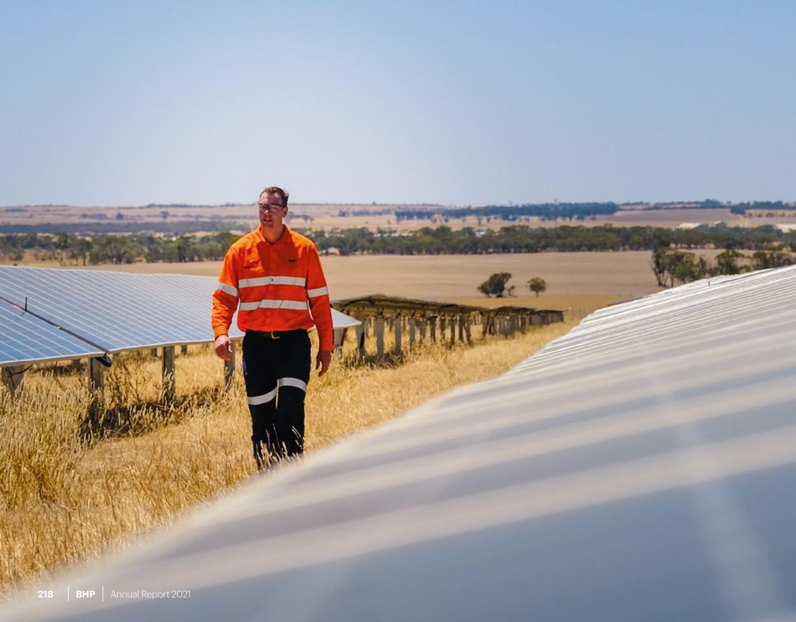

> **AI Description:**
> **Source:** `assets/_page_219_Figure_0.jpg`
> 
> **Generated:** 2026-05-19 06:49:19
> 
> ---
> 
> The image contains a photograph of a person walking between rows of solar panels in an open field. The individual is wearing an orange high-visibility jacket and black pants. The background features a clear blue sky and a distant view of trees and hills. The bottom left corner of the image includes a reference to "BHP Annual Report 2021," indicating the image is likely from a corporate report.

## 4.1 Financial information summary

We prepare our Consolidated Financial Statements in accordance with International Financial Reporting Standards (IFRS), as issued by the International Accounting Standards Board. We publish our Consolidated Financial Statements in US dollars. All Consolidated Income Statement, Consolidated Balance Sheet and Consolidated Cash Flow Statement information below has been derived from audited Financial Statements. For more information, refer to section 3.

Information in this section has been presented on a Continuing operations basis to exclude the contribution from Onshore US assets, unless otherwise noted.

## Details of the contribution of the Onshore US assets to the Group’s results are disclosed in note 29 ‘Discontinued operations’ in section 3

(1) Includes Loss after taxation from Discontinued operations attributable to BHP shareholders.
(2) For more information on earnings per share, refer to note 7 ‘Earnings per share’ in section 3.
(3) The Consolidated Balance Sheet includes the associated assets and liabilities held for sale in relation to Cerrejón for FY2021 and Onshore US for FY2018 as IFRS 5/AASB 5 ‘‘Non-current Assets Held for Sale and Discontinued Operations’ does not require the Consolidated Balance Sheet to be restated for comparative periods.
(4) All comparative periods have been restated to reflect changes to the Group’s accounting policy following a decision by the IFRS Interpretations Committee on IAS 12 ‘Income Taxes’, resulting in the retrospective recognition of US\$950 million of goodwill at Olympic Dam (included in the Copper segment) and an offsetting US\$1,021 million increase in deferred tax liabilities. Refer to note 39 ‘New and amended accounting standards and interpretations and changes to accounting policies’ in section 3 for further information.
(5) Net operating cash flows are after dividends received, net interest paid, proceeds and settlements of cash management related instruments, net taxation paid and includes Net operating cash flows from Discontinued operations.
(6) Capital and exploration expenditure is presented on a cash basis and represents purchases of property, plant and equipment plus exploration expenditure from the Consolidated Cash Flow Statement in section 3 and includes purchases of property, plant and equipment plus exploration expenditure from Discontinued operations. For more information, refer to note 29 ‘Discontinued operations’ in section 3. Purchase of property, plant and equipment includes capitalised deferred stripping of US\$810 million for FY2021 (FY2020: US\$698 million) and excludes capitalised interest. Exploration expenditure is capitalised in accordance with our accounting policies, as set out in note 11 ‘Property, plant and equipment’ in section 3.
(7) We use Alternative Performance Measures (APMs) to reflect the underlying performance of the Group. Underlying attributable profit, Underlying basic earnings per share and Underlying return on capital employed includes Continuing and Discontinued operations. Refer to section 4.2 for a reconciliation of APMs to their respective IFRS measure. Refer to section 4.2.1 for the definition and method of calculation of APMs. Refer to note 20 ‘Net debt’ in section 3 for the composition of Net debt.

## 4.2 Alternative Performance Measures

We use various Alternative Performance Measures (APMs) to reflect our underlying financial performance.

These APMs are not defined or specified under the requirements of IFRS, but are derived from the Group’s Consolidated Financial Statements prepared in accordance with IFRS. The APMs are consistent with how management review the financial performance of the Group with the Board and the investment community.

Sections 4.2.1 and 4.2.2 outline why we believe the APMs are useful and the calculation methodology. We believe these APMs provide useful information, but they should not be considered as an indication of or as a substitute for statutory measures as an indicator of actual operating performance (such as profit or net operating cash flow) or any other measure of financial performance or position presented in accordance with IFRS, or as a measure of a company’s profitability, liquidity or financial position.

## 4.2 Alternative Performance Measures continued

The following tables provide reconciliations between the APMs and their nearest respective IFRS measure.

The measures and reconciliations below included in this section for the year ended 30 June 2021 and comparative periods are unaudited and have been derived from the Group’s Consolidated Financial Statements.

## Exceptional items

To improve the comparability of underlying financial performance between reporting periods, some of our APMs adjust the relevant IFRS measures for exceptional items.

## For more information on exceptional items, refer to note 3 ‘Exceptional items’ in section 3.1

Exceptional items are those gains or losses where their nature, including the expected frequency of the events giving rise to them, and impact is considered material to the Group’s Consolidated Financial Statements. The exceptional items included within the Group’s profit from Continuing and Discontinued operations for the financial years are detailed below.

## APMs derived from Consolidated Income Statement

(1) For more information, refer to note 3 ‘Exceptional items’ in section 3.1.

(1) For more information, refer to note 3 ‘Exceptional items’ in section 3.1.

(1) For more information, refer to note 3 ‘Exceptional items’ in section 3.1.

## Underlying EBITDA

(1) For more information, refer to note 3 ‘Exceptional items’ in section 3.1.

## Underlying EBITDA – Segment

(1) For more information, refer to note 3 ‘Exceptional items’ in section 3.1.

(2) Group and unallocated items includes functions, other unallocated operations, including Potash, Nickel West, legacy assets, and consolidation adjustments.

## 4.2 Alternative Performance Measures continued

(1) For more information, refer to note 3 ‘Exceptional items’ in section 3.1.

## Underlying EBITDA margin

(1) We differentiate sales of our production from sales of third-party products to better measure the operational profitability of our operations as a percentage of revenue. These tables show the breakdown between our production and third-party products, which is necessary for the calculation of the Underlying EBITDA margin and margin on third-party products. We engage in third-party trading for the following reasons:

• Production variability and occasional shortfalls from our assets means that we sometimes source third-party materials to ensure a steady supply of product to our customers.   
• To optimise our supply chain outcomes, we may buy physical product from third-parties.

• To support the development of liquid markets, we will sometimes source third-party physical products and manage risk through both the physical and financial markets.

(2) Percentage contribution to Group Underlying EBITDA, excluding Group and unallocated items.

(3) Underlying EBITDA margin excludes third-party products.

(4) Group and unallocated items includes functions, other unallocated operations, including Potash, Nickel West, legacy assets, and consolidation adjustments. Revenue not attributable to reportable segments comprises the sale of freight and fuel to third parties. Exploration and technology activities are recognised within relevant segments.

Effective tax rate

(1) For more information, refer to note 3 ‘Exceptional items’ in section 3.1.

## APMs derived from Consolidated Cash Flow Statement

Capital and exploration expenditure

Free cash flow – Continuing operations

## APMs derived from Consolidated Balance Sheet

Net debt and gearing ratio

(1) Represents the net cross currency and interest rate swaps included within current and non-current other financial assets and liabilities.

## 4.2 Alternative Performance Measures continued

## Net operating assets

The following table reconciles Net operating assets for the Group to Net assets on the Consolidated Balance Sheet:

(1) 30 June 2020 balances have been restated to reflect changes to the Group’s accounting policy following a decision by the IFRS Interpretations Committee on IAS 12 ‘Income Taxes’, resulting in the retrospective recognition of US\$950 million of goodwill at Olympic Dam (included in the Copper segment) and an offsetting US\$1,021 million increase in deferred tax liabilities. Refer to note 39 ‘New and amended accounting standards and interpretations and changes to accounting policies’ in section 3.1 for further information.
(2) Represents loans to associates, external finance receivable and accrued interest receivable included within other receivables.
(3) Represents cross currency and interest rate swaps, forward exchange contracts related to cash management and investment in shares and other investments.
(4) Represents accrued interest payable included within other payables.
(5) Represents cross currency and interest rate swaps and forward exchange contracts related to cash management.
(6) Group and unallocated items include functions, other unallocated operations including Potash, Nickel West, legacy assets, and consolidation adjustments.

## Other APM

## Principal factors that affect Revenue, Profit from operations and Underlying EBITDA

The following table describes the impact of the principal factors that affected Revenue, Profit from operations and Underlying EBITDA for FY2021 and relates them back to our Consolidated Income Statement. For information on the method of calculation of the principal factors that affect Revenue, Profit from operations and Underlying EBITDA, refer to section 4.2.2.

(1) Depreciation and impairments that we classify as exceptional items are excluded from depreciation, amortisation and impairments. Depreciation, amortisation and impairments includes non-exceptional impairments of US\$264 million (FY2020: US\$85 million).

(2) Collectively, we refer to the change in operating cash costs and change in exploration and business development as Change in controllable cash costs. Operating cash costs by definition do not include non-cash costs. The change in operating cash costs also excludes the impact of exchange rates and inflation, changes in fuel and energy costs, changes in exploration and business development costs and one-off items. These items are excluded so as to provide a consistent measurement of changes in costs across all segments, based on the factors that are within the control and responsibility of the segment. Change in controllable cash costs and change in operating cash costs are not measures that are recognised by IFRS. They may differ from similarly titled measures reported by other companies.

## 4.2 Alternative Performance Measures continued

## Underlying Return on Capital Employed (ROCE)

(1) For more information, refer to note 3 ‘Exceptional items’ in section 3.1.
(2) The Underlying ROCE calculation uses restated net assets for the comparative periods.

## 4.2.1 Definition and calculation of Alternative Performance Measures

## 4.2 Alternative Performance Measures continued

## 4.2.2 Definition and calculation of principal factors

The method of calculation of the principal factors that affect the period on period movements of Revenue, Profit from operations and Underlying EBITDA are as follows:

## 4.3 Information on mining operations

## Minerals Australia

## Copper mining operations

The following table contains additional details of our mining operations. This table should be read in conjunction with the production table (refer to section 4.5.1) and reserves table (refer to section 4.6.2).

## Iron ore mining operations

The following table contains additional details of our iron ore mining operations. This table should be read in conjunction with the production table (refer  to section 4.5.1) and reserves table (refer to section 4.6.2).

## 4.3 Information on mining operations continued

## Coal mining operations

The following table contains additional details of our mining operations. This table should be read in conjunction with the production table (refer to section 4.5.1) and reserves table (refer to section 4.6.2).

## 4.3 Information on mining operations continued

## Nickel mining operations

The following table contains additional details of our mining operations. This table should be read in conjunction with the production table (refer to section 4.5.1) and reserves table (refer to section 4.6.2).

Nickel smelters, refineries and processing plants

## 4.3 Information on mining operations continued

## Minerals Americas

## Copper mining operations

The following table contains additional details of our mining operations. This table should be read in conjunction with the production table (refer to section 4.5.1) and reserves table (refer to section 4.6.2).

## Pampa Norte Spence

## Iron ore mining operations

The following table contains additional details of our mining operations. This table should be read in conjunction with the production table (refer to section 4.5.1) and reserves table (refer to section 4.6.2).

## 4.3 Information on mining operations continued

## Coal mining operations

The following table contains additional details of our mining operations. This table should be read in conjunction with the production table (refer to section 4.5.1) and reserves table (refer to section 4.6.2).

## 4.3.1 Information on oil and gas operations

## Petroleum operations

The following table contains additional details of our petroleum operations. This table should be read in conjunction with the production table (refer to section 4.5.2) and reserves table (refer to section 4.6.1).

## 4.3.1 Information on oil and gas operations continued

Other production operations

## 4.4 Financial Information by commodity

Management believes the following financial information presented by commodity provides a meaningful indication of the underlying financial performance of the assets, including equity accounted investments, of each reportable segment. Information relating to assets that are accounted for as equity accounted investments is shown to reflect BHP’s share, unless otherwise noted, to provide insight into the drivers of these assets.

For the purposes of this financial information, segments are reported on a statutory basis in accordance with IFRS 8 ‘Operating Segments’. The tables for each commodity include an ‘adjustment for equity accounted investments’ to reconcile the equity accounted results to the statutory segment results.

For a reconciliation of alternative performance measures to their respective IFRS measure and an explanation as to the use of Underlying EBITDA in assessing our performance, refer to section 4.2. For the definition and method of calculation of alternative performance measures, refer to section 4.2.1. For more information as to the statutory determination of our reportable segments, refer to note 1 ‘Segment reporting’ in section 3.1.

## 4.4.1 Petroleum

Detailed below is financial information for our Petroleum assets for FY2021 and FY2020.

(1) Australia Production Unit includes Macedon, Pyrenees and Minerva (divested in December 2019).
(2) Predominantly divisional activities, business development and Neptune (sale finalised in May 2021). Also includes the Caesar oil pipeline and the Cleopatra gas pipeline, which are equity accounted investments. The financial information for the Caesar oil pipeline and the Cleopatra gas pipeline presented above, with the exception of net operating assets, reflects BHP’s share. (3) Total Petroleum statutory result revenue excludes US\$12 million (FY2020: US\$16 million) revenue related to the Caesar oil pipeline and the Cleopatra gas pipeline. Total Petroleum statutory result Underlying EBITDA includes US\$3 million (FY2020: US\$3 million) D&A related to the Caesar oil pipeline and the Cleopatra gas pipeline.
(4) Total Petroleum statutory result revenue includes: crude oil US\$2,013 million (FY2020: US\$2,033 million), natural gas US\$977 million (FY2020: US\$980 million), LNG US\$682 million (FY2020: US\$774 million), NGL US\$212 million (FY2020: US\$198 million) and other US\$62 million (FY2020: US\$85 million) which includes third-party products.
(5) Includes US\$26 million of capitalised exploration (FY2020: US\$170 million).
(6) Includes US\$86 million of exploration expenditure previously capitalised, written off as impaired (included in depreciation and amortisation) (FY2020: US\$ nil).

## 4.4 Financial Information by Commodity continued

## 4.4.2 Copper

Detailed below is financial information for our Copper assets for FY2021 and FY2020.

(1) Escondida is consolidated under IFRS 10 and reported on a 100 per cent basis.
(2) Includes Spence and Cerro Colorado.
(3) Antamina, SolGold and Resolution are equity accounted investments and their financial information presented above with the exception of net operating assets reflects BHP Group’s share. (4) Predominantly comprises divisional activities, greenfield exploration and business development. Includes Resolution and SolGold.
(5) Total Copper statutory result revenue excludes US\$1,627 million (FY2020: US\$832 million) revenue related to Antamina. Total Copper statutory result Underlying EBITDA includes US\$144 million (FY2020: US\$165 million) D&A and US\$394 million (FY2020: US\$141 million) net finance costs and taxation expense related to Antamina, Resolution and SolGold that are also included in Underlying EBIT. Total Copper Capital expenditure excludes US\$237 million (FY2020: US\$205 million) related to Antamina and US\$1 million (FY2020: US\$ nil) related to SolGold. Exploration gross excludes US\$9 million (FY2020: US\$8 million) related to SolGold of which US\$5 million (FY2020: US\$3 million) was expensed.

(6) Net operating assets has been restated to reflect changes to the Group’s accounting policy following a decision by the IFRS Interpretations Committee on IAS 12 ‘Income Taxes’, resulting in the retrospective recognition of US\$950 million of Goodwill at Olympic Dam. Note, an offsetting increase in Deferred tax liabilities of US\$1,021 million which is not included in Net Operating Assets above. Refer to note 39 ‘New and amended accounting standards and interpretations and changes to accounting policies’ in section 3.1 for further information.

## 4.4.3 Iron Ore

Detailed below is financial information for our Iron Ore assets for FY2021 and FY2020.

(1) Samarco is an equity accounted investment and its financial information presented above, with the exception of net operating assets, reflects BHP Billiton Brasil Ltda’s share. All financial impacts following the Samarco dam failure have been reported as exceptional items in both reporting periods.
(2) Predominantly comprises divisional activities, towage services, business development and ceased operations.
(3) Includes inter-segment and external sales of contracted gas purchases.
(4) Includes US\$45 million of capitalised exploration (FY2020: US\$40 million).

## 4.4.4 Coal

Detailed below is financial information for our Coal assets for FY2021 and FY2020.

(1) Newcastle Coal Infrastructure Group and Cerrejón are equity accounted investments and their financial information presented above with the exception of net operating assets reflects BHP Group’s share.
(2) Predominantly comprises divisional activities and ceased operations.

## 4.4.5 Other assets

Detailed below is financial information for our Other assets for FY2021 and FY2020.

## 4.5 Production

## 4.5.1 Production – Minerals

The table below details our mineral and derivative product production for all operations (except Petroleum) for the three years ended 30 June 2021, 2020 and 2019. Unless otherwise stated, the production numbers represent our share of production and include BHP’s share of production from which profit is derived from our equity accounted investments. Production information for equity accounted investments is included to provide insight into the operational performance of these entities. For discussion of minerals pricing during the past three years, refer to section 1.17.

(1) BHP share of production includes the Group’s share of production for which profit is derived from our equity accounted investments, unless otherwise stated.
(2) Metal production is reported on the basis of payable metal.
(3) Shown on 100 per cent basis. BHP interest in saleable production is 57.5 per cent.
(4) For statutory financial reporting purposes, this is an equity accounted investment. We have included production numbers from our equity accounted investments as the level of production and operating performance from these operations impacts Underlying EBITDA of the Group. Our use of Underlying EBITDA is explained in section 1.8.3.
(6) Iron ore production is reported on a wet tonnes basis.
(7) Shown on 100 per cent basis. BHP interest in saleable production is 85 per cent.
(8) Metallurgical coal production is reported on the basis of saleable product. Production figures include some thermal coal.
(9) Shown on 100 per cent basis. BHP interest in saleable production is 80 per cent.
(10) Nickel contained in refined nickel metal, including briquette and power, matte and by-product streams.

## 4.5.2 Production – Petroleum

The table below details Petroleum’s historical net crude oil and condensate, natural gas and natural gas liquids production, primarily by geographic segment, for each of the three years ended 30 June 2021, 2020 and 2019. We have shown volumes of marketable production after deduction of applicable royalties, fuel and flare. We have included in the table average production costs per unit of production and average sales prices for oil and condensate and natural gas for each of those periods.

(2) Other comprises Algeria, Trinidad and Tobago, and the United Kingdom (divested 30 November 2018).
(1) Production for Onshore US assets is shown through the closing date of the divestment in FY2019. Production for Eagle Ford, Permian and Haynesville assets is shown through 31 October 2018 and production for Fayetteville is shown through 28 September 2018.
(3) LPG and ethane are reported as natural gas liquids (NGL).
(4) Total barrels of oil equivalent (boe) conversion is based on the following: 6,000 standard cubic feet (scf) of natural gas equals one boe.
(5) Average production costs include direct and indirect costs relating to the production of hydrocarbons and the foreign exchange effect of translating local currency denominated costs into US dollars, but excludes ad valorem and severance taxes, and the cost to transport our produced hydrocarbons to the point of sale.

## 4.6 Resources and Reserves

Resources are the estimated quantities of material that can potentially be commercially recovered from BHP’s properties. Reserves are a subset of resources that can be demonstrated to be able to be economically and legally extracted. In order to estimate reserves, assumptions are required about a range of technical and economic factors, including quantities, qualities, production techniques, recovery efficiency, production and transport costs, commodity supply and demand, commodity prices and exchange rates.

Estimating the quantity and/or quality of reserves requires the size, shape and depth of ore bodies or oil and gas reservoirs to be determined by analysing geological data, such as drilling samples and geophysical survey interpretations. Economic assumptions used to estimate reserves change from period to period as additional technical and operational data is generated.

## 4.6.1 Petroleum reserves

Estimates of oil and gas reserves involve some degree of uncertainty, are inherently imprecise, require the application of judgement and are subject to future revision. Accordingly, financial and accounting measures (such as the standardised measure of discounted cash flows, depreciation, depletion and amortisation charges, the assessment of impairments and the assessment of valuation allowances against deferred tax assets) that are based on reserve estimates are also subject to change.

## How we estimate and report reserves

Petroleum’s reserves are estimated as of 30 June each year. Reported reserves include both Conventional Petroleum reserves and Onshore US reserves for FY2018 and are included in the opening balances in the accompanying tables. Footnotes have been included with the tables to identify the contribution of the Discontinued operations (Onshore US) for this period. The sale of Petroleum’s interests in Onshore US reserves was completed in FY2019. Remaining reserves at the end of FY2019, FY2020 and FY2021 reflect the Continuing operations only.

Our proved reserves are estimated and reported on a net interest basis according to the US Securities and Exchange Commission (SEC) regulations and have been determined in accordance with SEC Rule 4-10(a) of Regulation S-X.

## Proved oil and gas reserves

Proved oil and gas reserves are those quantities of crude oil, natural gas and natural gas liquids (NGL) that, by analysis of geoscience and engineering data, can be estimated with reasonable certainty to be economically producible from a given date forward from known reservoirs and under existing economic conditions, operating methods, operating contracts and government regulations. Unless evidence indicates that renewal of existing operating contracts is reasonably certain, estimates of economically producible reserves reflect only the period before the contracts expire. The project to extract the hydrocarbons must have commenced or the operator must be reasonably certain that it will commence within a reasonable time. As specified in SEC Rule 4-10(a) of Regulation S-X, oil and gas prices are taken as the unweighted average of the corresponding first day of the month prices for the 12 months prior to the ending date of the period covered.

Proved reserves were estimated by reference to available well and reservoir information, including but not limited to well logs, well test data, core data, production and pressure data, geologic data, seismic data and in some cases, to similar data from analogous, producing reservoirs. A wide range of engineering and geoscience methods, including performance analysis, numerical simulation, well analogues and geologic studies were used to estimate high confidence proved developed and undeveloped reserves in accordance with SEC regulations.

Proved reserve estimates were attributed to future development projects only where there is a significant commitment to project funding and execution and for which applicable government and regulatory approvals have been secured or are reasonably certain to be secured. Furthermore, estimates of proved reserves include only volumes for which access to market is assured with reasonable certainty. All proved reserve estimates are subject to revision (either upward or downward) based on new information, such as from development drilling and production activities or from changes in economic factors, including product prices, contract terms or development plans.

## Developed oil and gas reserves

Proved developed oil and gas reserves are reserves that can be expected to be recovered through:

– existing wells with existing equipment and operating methods

– installed extraction equipment and infrastructure operational at the time of the reserve estimate if the extraction is by means not involving a well

Performance-derived reserve assessments for producing wells were primarily based on the following manner:

– for our conventional operations, reserves were estimated using rate and pressure decline methods, including material balance, supplemented by reservoir simulation models where appropriate

– for our Discontinued operations (Onshore US) reported for FY2018, reserves were estimated using rate-transient analysis and decline curve analysis methods

– for wells that lacked sufficient production history, reserves were estimated using performance-based type curves and offset location analogues with similar geologic and reservoir characteristics

## Proved undeveloped reserves

Proved undeveloped oil and gas reserves are reserves that are expected to be recovered from new wells on undrilled acreage where commitment has been made to commence development within five years from first reporting or from existing wells where a relatively major expenditure is required for recompletion.

A combination of geologic and engineering data and where appropriate, statistical analysis was used to support the assignment of proved undeveloped reserves when assessing planned drilling locations. Performance data along with log and core data was used to delineate consistent, continuous reservoir characteristics in core areas of the development. Proved undeveloped locations were included in core areas between known data and adjacent to productive wells using performance-based type curves and offset location analogues with similar geologic and reservoir characteristics. Locations where a high degree of certainty could not be demonstrated using the above technologies and techniques were not categorised as proved.

## Methodology used to estimate reserves

Reserves have been estimated with deterministic methodology, with the exception of the North West Shelf gas operation in Australia, where probabilistic methodology has been used to estimate and aggregate reserves for the reservoirs dedicated to the gas project only. The probabilistic-based portion of these reserves totals 6 million barrels of oil equivalent (MMboe) in FY2021, 12 MMboe in FY2020 and 16 MMboe in FY2019. These amounts represent approximately 1 per cent of our total reported proved reserves in FY2021, and approximately 2 per cent in each of FY2020 and FY2019. Total boe conversion is based on the following: 6,000 standard cubic feet (scf) of natural gas equals 1 boe. Aggregation of proved reserves beyond the field/project level has been performed by arithmetic summation. Due to portfolio effects, aggregates of proved reserves may be conservative. The custody transfer point(s) or point(s) of sale applicable for each field or project are the reference point for reserves. The reserves replacement ratio is the change in reserves during the year excluding production, divided by the production during the year and stated as a percentage.

## 4.6 Resources and Reserves continued

## Governance

The Petroleum Reserves Group (PRG) is a dedicated group that provides oversight of the reserves’ assessment and reporting processes. It is independent of the various operation teams directly responsible for development and production activities. The PRG is staffed by individuals averaging more than 30 years’ experience in the oil and gas industry. The manager of the PRG, Abhijit Gadgil, is a full-time employee of BHP and is responsible for overseeing the preparation of the reserve estimates and compiling the information for inclusion in this Annual Report. He has an advanced degree in engineering and more than 40 years of diversified industry experience in reservoir engineering, reserves assessment, field development and technical management. He is a 40-year member of the Society of Petroleum Engineers (SPE). He has also served on the Society of Petroleum Engineers Oil and Gas Reserves Committee. Mr Gadgil has the qualifications and experience required to act as a qualified petroleum reserves evaluator under the Australian Securities Exchange (ASX) Listing Rules. The estimates of petroleum reserves are based on and fairly represent information and supporting documentation prepared under the supervision of Mr Gadgil. He has reviewed and agrees with the information included in section 4.6.1 and has given his prior written consent for its publication. No part of the individual compensation for members of the PRG is dependent on reported reserves.

Reserve assessments for all Petroleum operations were conducted by technical staff within the operating organisation. These individuals meet the professional qualifications outlined by the SPE, are trained in the fundamentals of SEC reserves reporting and the reserves processes and are endorsed by the PRG. Each reserve assessment is reviewed annually by the PRG to ensure technical quality, adherence to internally published Petroleum guidelines and compliance with SEC reporting requirements. Once endorsed by the PRG, all reserves receive final endorsement by senior management and the Risk and Audit Committee prior to public reporting. Our Internal Audit and Advisory function provides secondary assurance of the oil and gas reserve reporting processes through the testing of the effectiveness of key controls that have been implemented as required by the US Sarbanes-Oxley Act of 2002. For more information on our risk management governance, refer to section 2.1.10.

## FY2021 proved reserves

Production for FY2021 totalled 103 MMboe in sales with an additional 5 MMboe in non-sales production, which was used primarily for fuel consumed in operations. Total production of 108 Mmboe was approximately 6 MMboe lower than in FY2020. The decrease was primarily due to natural declines in mature fields.

Net additions to reserves totalled 25 MMboe, driven primarily by the acquisition of additional working interest in the Shenzi field and partially offset by a negative performance revision in the Atlantis field in the US Gulf of Mexico. The net additions replaced 23 per cent of production. As of 30 June 2021, proved reserves totalled 665 MMboe.

Reserves have been calculated using the economic interest method and represent net revenue interest volumes after deduction of applicable royalties owned by others. Reserves of 61 MMboe were in production and risk-sharing arrangements where BHP has a revenue interest in production without transfer of ownership of the products. At 30 June 2021, approximately 9 per cent of the proved reserves were attributable to these arrangements.

## Extensions and discoveries

In the Atlantis field in the US Gulf of Mexico, Phase 3 development drilling in the South West region of the field added approximately 1 MMboe by extending the previously recognised proved reservoir limit.

## Revisions

In Australia, revisions increased proved reserves by 4 MMboe, primarily due to strong performance in the Macedon field. Small increases in the Bass Strait and Pyrenees fields were offset by negative performance revisions in the North West Shelf fields.

In the US Gulf of Mexico, revisions decreased reserves by 11 MMboe overall, primarily driven by reductions related to lower than expected well performance in the Atlantis and Mad Dog fields of 19 MMboe and 4 MMboe respectively. Approval of the Shenzi Subsea Multi Phase Pump Project added 6 MMboe, while strong performance in the Eastern area of the Shenzi field increased reserves by a further 5 MMboe

In Trinidad and Tobago, continued strong performance in the Angostura field added 6 MMboe to proved reserves. This addition was partially offset by a price-related reduction of approximately 1 MMboe.

## Improved recovery revisions

There were no improved recovery revisions during the year.

## Purchases and sales

In November 2020, BHP acquired Hess Corporation’s 28 per cent interest in the Shenzi field located in the Gulf of Mexico. The acquisition resulted in the addition of approximately 27 MMboe to proved reserves. BHP also divested its 35 per cent interest in the Neptune field in May 2021 which reduced reserves by approximately 1 MMboe. Overall, net additions from Purchases and Sales were 26 MMboe.

## FY2020 proved reserves

Production for FY2020 totalled 109 MMboe in sales with an additional 5 MMboe in non-sales production, which was used primarily for fuel consumed in operations. Total production was approximately 13 MMboe lower than conventional production in FY2019. The decrease was due to a number of factors, including natural declines in mature fields, weather events that necessitated precautionary shut ins and lower demand as a consequence of the COVID-19 pandemic, (refer to section 4.5.2 for more information). Discoveries, extensions and revisions to reserves added a total of 21 MMboe, which replaced 19 per cent of production. As of 30 June 2020, proved reserves totalled 748 MMboe.

Reserves have been calculated using the economic interest method and represent net interest volumes after deduction of applicable royalty. Reserves of 69 MMboe are in two production and risk-sharing arrangements where BHP has a revenue interest in production without transfer of ownership of the products. At 30 June 2020, approximately 9 per cent of the proved reserves were attributable to such arrangements.

## Extensions and discoveries

Board approval of the North West Shelf Greater Western Flank Phase 3 project in Australia added 12 MMboe for development of the Goodwyn South and Lambert Deep fields. Board approval of the Ruby development project in Trinidad and Tobago during the September 2019 quarter also added 19 MMboe to proved reserves. The Ruby project is comprised of the Ruby oil field and the Delaware gas field.

## Revisions

In Australia, reserves decreased by 35 MMboe overall due to downward revisions. This reduction was primarily in the Bass Strait due to poor reservoir performance in the Turrum field and lower overall condensate and natural gas liquids (NGL) recovery from the Bass Strait gas fields totalling 40 MMboe. Included in this reduction was a decrease of 4 MMboe due to lower product prices. Improved reservoir performance in the Pyrenees operated field added 5 MMboe partially offsetting the Bass Strait reduction. In the North West Shelf fields, reserves increased 4 MMboe for better performance and other revisions, however, this increase was offset by product price-related reductions of 4 MMboe. In the US Gulf of Mexico, strong reservoir performance and technical studies in the Atlantis, Shenzi and Mad Dog fields added a total of 25 MMboe to proved reserves.

In the Angostura field in Trinidad and Tobago and the ROD integrated development in Algeria, increases of 1 MMboe were offset by product price-related reductions of approximately 1 MMboe.

During FY2020, net revisions reduced reserves by a total of 10 MMboe overall.

## Improved recovery revisions

There were no improved recovery revisions during the year.

## Purchases and sales

There were no purchases or sales during the year.

## FY2019 proved reserves

Production for FY2019 totalled 147 MMboe in sales, which was comprised of 121 MMboe for our conventional fields and 26 MMboe that was produced from our US Onshore fields prior to the closure of the divestment agreements. In comparison, our conventional fields produced approximately 1 MMboe more than in FY2018. This increase was due to a number of factors, including start-up of the Greater Western Flank Phase B project in the North West Shelf in Australia and higher uptime in several fields, which more than offset natural production declines in more mature fields (refer to section 4.5.2 for more information). There was also an additional 5 MMboe in non-sales production, primarily for fuel consumed in our Petroleum operations. The combined sales and nonsales production totalled 152 MMboe for FY2019. For our conventional fields, additions and revisions to reserves added 57 MMboe, which replaced 45 per cent of the production in FY2019. As of 30 June 2019, our proved reserves totalled 841 MMboe.

Reserves have been calculated using the economic interest method and represent net interest volumes after deduction of applicable royalty. Reserves of 64 MMboe are in two production and risk-sharing arrangements where BHP has a revenue interest in production without transfer of ownership of the products. At 30 June 2019, approximately 8 per cent of the proved reserves were attributable to such arrangements.

## Extensions and discoveries

Extensions added a total of approximately 2 MMboe to proved reserves, of which 1 MMboe was added for the Atlantis field in the US Gulf of Mexico with the balance being added in the Snapper field in the Bass Strait in Australia.

## Improved recovery revisions

There were no improved recovery revisions during the year.

## Revisions

Revisions for FY2019 added a total of 56 MMboe. The largest addition was in the Atlantis field where 28 MMboe was added for performance and approval of Phase 3 infill drilling. Other revisions, primarily in the Mad Dog field, brought the total revisions for our US Gulf of Mexico assets to 29 MMboe. Additions through revisions in Australia totalled 22 MMboe, with the North West Shelf project adding 11 MMboe. The Goodwyn field was the largest component of this change adding 10 MMboe for strong performance. In the Bass Strait, 11 MMboe was added with the largest changes occurring in the Snapper and Turrum fields, which added 5 MMboe and 2 MMboe, respectively. In Other(1) geographic areas, 4 MMboe was added for better performance in the Offshore Angostura project in Trinidad and Tobago, while 1 MMboe was added for improved performance in the ROD integrated development in Algeria.

## Purchases and sales

The sale of Petroleum’s interests in the US Onshore Permian, Eagle Ford, Haynesville and Fayetteville fields accounted for reported sales of approximately 464 MMboe. There were no purchases during FY2019.

These results are summarised in the following tables, which detail estimated oil, condensate, NGL and natural gas reserves at 30 June 2021, 30 June 2020 and 30 June 2019, with a reconciliation of the changes in each year.

4.6 Resources and Reserves continued

(b) ‘Other’ comprises Algeria, Trinidad and Tobago and the United Kingdom (sold in FY2019).

(a) Small differences are due to rounding to first decimal place.

(c) For FY2018 amounts include 86.1 million barrels attributable to Discontinued operations of Onshore US.

(a) Small differences are due to rounding to first decimal place.

(b) ‘Other’ comprises Algeria, Trinidad and Tobago and the United Kingdom (sold in FY2019).

(c) For FY2018 amounts include 62.2 million barrels attributable to Discontinued operations of Onshore US.

(d) For FY2018 amounts include 2.5 million barrels consumed as fuel for Discontinued operations of Onshore US.

4.6 Resources and Reserves continued

(a) Small differences are due to rounding to first decimal place.
(b) Production includes volumes consumed by operations.
(c) Production for Australia includes gas sold as LNG.
(d) ‘Other’ comprises Algeria, Trinidad and Tobago and the United Kingdom (sold in FY2019).
(e) For FY2018, FY2019, FY2020 and FY2021 amounts include 295, 268, 246 and 204 billion cubic feet respectively, which are anticipated to be consumed as fuel in operations in Australia.
(f) For FY2018, FY2019, FY2020 and FY2021 amounts include 160, 64, 65 and 67 billion cubic feet respectively, which are anticipated to be consumed as fuel in operations in the United States.
(g) For FY2018, FY2019, FY2020 and FY2021 amounts include 16, 14, 17 and 13 billion cubic feet respectively, which are anticipated to be consumed as fuel in operations in Other areas.
(h) For FY2018, FY2019, FY2020 and FY2021 amounts include 472, 346, 327 and 284 billion cubic feet respectively, which are anticipated to be consumed as fuel in operations.
(i) For FY2018 amounts include 2049 billion cubic feet attributable to Discontinued operations of Onshore US.

(a) Barrel oil equivalent conversion based on 6,000 scf of natural gas equals 1 boe.
(b) Small differences are due to rounding to first decimal place.
(c) Production includes volumes consumed by operations.
(d) ‘Other’ comprises Algeria, Trinidad and Tobago and the United Kingdom (sold in FY2019).

(e) For FY2018, FY2019, FY2020 and FY2021 amounts include 49, 45, 41 and 34 million barrels equivalent respectively, which are anticipated to be consumed as fuel in operations in Australia.

(f) For FY2018, FY2019, FY2020 and FY2021 amounts include 29, 11, 11 and 11 million barrels equivalent respectively, which are anticipated to be consumed as fuel in operations in the United States.

(g) For FY2018, FY2019, FY2020 and FY2021 amounts include 3, 2, 3 and 2 million barrels equivalent respectively, which are anticipated to be consumed as fuel in operations in Other areas.

(h) For FY2018, FY2019, FY2020 and FY2021 amounts include 81, 58, 55 and 47 million barrels equivalent respectively, which are anticipated to be consumed as fuel in operations.

(i) For FY2018 amounts include 490 million barrels equivalent attributable to Discontinued operations of Onshore US.

## 4.6 Resources and Reserves continued

## FY2021 proved undeveloped reserves

At 30 June 2021, Petroleum had 200 MMboe of proved undeveloped reserves, which corresponds to 30 per cent of the reported proved reserves of 665 MMboe. This represents a decrease of 38 MMboe from the 238 MMboe at 30 June 2020.

During FY2021, a total of 44 MMboe proved undeveloped reserves were converted to proved developed reserves through development activities. This was driven by the following four projects: the Barracouta West development in the Bass Strait in Australia (14 MMboe), a gas delivery pressure and compressor re-staging study in the Macedon field in Offshore Western Australia (14 MMboe) and the Atlantis Phase 3 development in the US Gulf of Mexico (14 MMboe). Start-up of the Ruby development project in Offshore Trinidad and Tobago also converted 3 MMboe to proved developed with first oil production. Increases to proved undeveloped reserves included approval of the Shenzi Subsurface Multi-Phase Pump project which added 6 MMboe. The effect of commodity prices relative to FY2020 resulted in the addition of 5 MMboe to proved undeveloped reserves while the acquisition of additional interest in the Shenzi field in the US Gulf of Mexico increased proved undeveloped reserves by 3 MMboe. Technical studies, revisions to expected performance and other changes reduced proved undeveloped reserves by 2 Mmboe.

Over the past three years, the conversion of proved undeveloped reserves to developed status has totalled 93 MMboe, averaging 31 MMboe per year. At 30 June 2021, a total of 114 MMboe proved undeveloped reserves have been reported for five or more years. Approximately 101 MMboe of this amount is associated with the Mad Dog Phase 2 development which is anticipated to produce first oil in CY2022. The remaining 13 MMboe is in our currently producing fields and will be developed and brought on stream in a phased manner to best optimise the use of production facilities and to meet sales commitments.

During FY2021, Petroleum spent US\$1.1 billion on development activities worldwide. Of this amount:

– US\$0.9 billion was spent progressing the conversion of proved undeveloped reserves for projects where developed status was achieved in FY2021 or will be achieved when development is completed in the future

– US\$0.2 billion represented other development expenditures, including compliance and infrastructure improvement

## FY2020 proved undeveloped reserves

At 30 June 2020, Petroleum had 238 MMboe of proved undeveloped reserves, which corresponds to 32 per cent of the reported proved reserves of 748 MMboe. This represents an increase of 19 MMboe from the 219 MMboe at 30 June 2019.

The most significant drivers of this increase were the additions of 19 MMboe for the Ruby development project in Offshore Trinidad and Tobago and 12 MMboe for the Greater Western Flank Phase 3 development project in Australia as extensions and discoveries.

Reclassifications from proved undeveloped to proved developed occurred in Australia in the Macedon field (7 MMboe), the Cobia field in Bass Strait (2 MMboe) and in the Offshore US Gulf of Mexico in the Mad Dog Spar A field (3 MMboe). In the Shenzi field, the need to perform

a producer redrill resulted in the reclassification of 4 MMboe proved developed into proved undeveloped.

In Australia, in the Bass Strait, 18 MMboe was moved into proved undeveloped for the Turrum field as a result of the reservoir performance reassessment, while in the Kipper field, a reduction of the gas delivery pressure requirements enabled more gas to be delivered prior to the installation of compression. This resulted in the movement of 16 MMboe from proved undeveloped to proved developed reserves. Bass Strait proved undeveloped fuel was also increased by 3 MMboe as a result of a fuel utilisation study. Performance revisions in the Mad Dog Spar A and the Shenzi fields in the US Gulf of Mexico reduced proved undeveloped by 6 MMboe.

Lower commodity prices resulted in a 4 MMboe reduction to proved undeveloped reserves.

Over the past three years, the conversion of proved undeveloped reserves to developed status has totalled 98 MMboe, averaging 33 MMboe per year. At 30 June 2020, a total of 30 MMboe proved undeveloped reserves have been reported for five or more years. These reserves are in our currently producing fields and will be developed and brought on stream in a phased manner to best optimise the use of production facilities and to meet sales commitments. During FY2020, Petroleum spent US\$1.0 billion on development activities worldwide. Of this amount:

– US\$0.8 billion was spent progressing the conversion of proved undeveloped reserves for conventional projects where developed status was achieved in FY2020 or will be achieved when development is completed in the future

– US\$0.2 billion represented other development expenditures, including compliance and infrastructure improvements

## FY2019 proved undeveloped reserves

At 30 June 2019, Petroleum had 219 MMboe of proved undeveloped reserves, which corresponds to 26 per cent of the reported proved reserves of 841 MMboe. This represents a reduction in proved undeveloped reserves of 202 MMboe from the 421 MMboe at 30 June 2018. The largest element of this reduction was 185 MMboe, which occurred with the divestment of unconventional Onshore US assets. A reclassification from proved undeveloped to proved developed status of approximately 40 MMboe that occurred in the North West Shelf, Australia, with the completion of development and the start of production from the Greater Western Flank Phase B project, also contributed to the reduction. An additional 1 MMboe was also reclassified from proved undeveloped to proved developed status with the completion of an infill well in the ROD integrated development in Algeria. Partially offsetting these reductions were revisions for technical studies of 10 MMboe for the Kipper field in the Bass Strait, Australia. Additions following the approval of the Atlantis Phase 3 project in the Offshore US Gulf of Mexico added 8 MMboe for development plan changes, 7 MMboe for performance and 1 MMboe as an extension. A performance reduction of 2 MMboe in the Mad Dog field partially offset the Atlantis performance addition.

The changes in proved undeveloped reserves in FY2021, FY2020 and FY2019 are summarised by change category in the table below. Additional information detailing the effect of price, performance, changes in capital development plans and technical studies are also provided for revisions.

(a) Small differences are due to rounding.

## 4.6.2 Mineral Resources and Ore Reserves

The statement of Mineral Resources and Ore Reserves presented in this Annual Report has been produced in accordance with the Australian Securities Exchange (ASX) Listing Rules Chapter 5, December 2019 and the Australasian Code for Reporting of Exploration Results, Mineral Resources and Ore Reserves, December 2012 (JORC Code).

Predicted sales prices, based on supply and demand forecast and current and long-term historical average price trends, have been used. The Ore Reserves tabulated are held within existing, permitted mining tenements. Mineral leases are of sufficient duration (or convey a legal right to renew for sufficient duration) to enable all reserves on the leased properties to be mined in accordance with current production schedules. Ore Reserves may include areas where some additional approvals remain outstanding, however it is anticipated such approvals will be obtained within the time frame required by the current life-of-mine schedule.

## Declaration tables

– All Mineral Resources and Ore Reserves presented are reported in 100 per cent terms (unless otherwise stated) and represent estimates at 30 June 2021.

– Tonnes are reported as dry metric tonnes (unless otherwise stated). All tonnes and grade/quality information have been rounded, so small differences may be present in the totals.

– The Measured and Indicated Mineral Resources are inclusive of those Mineral Resources modified to produce the Ore Reserves.

## Competent Persons

This statement is based on and fairly represents information and supporting documentation compiled by Competent Persons (as defined in the JORC Code). All Competent Persons have, at the time of reporting, sufficient experience relevant to the style of mineralisation and type of deposit under consideration and to the activity they are undertaking to qualify as a Competent Person.

Each Competent Person listed is an employee of BHP or a company in which BHP has a controlling interest (unless otherwise stated) and declares they have no issues that could be perceived by investors as a material conflict of interest in preparing the reported information. All Competent Persons are a Member or Fellow of the AusIMM or AIG or a Recognised Professional Organisation. Each Competent Person consents to the inclusion in this Annual Report of the matters based on his or her information in the form and context in which it appears.

## Other reporting jurisdictions

The information contained in this document may differ from that reported to the SEC. Reserve reporting requirements for SEC filings in the United States are specified in Industry Guide 7, with economic assumptions based on current economic conditions that may differ to the JORC Code’s reasonable investment assumptions. Accordingly, a SEC pricing assumptions test is performed with reserve estimates derived under the JORC Code compared to those derived assuming ‘current economic conditions’. Reserves disclosed in the United States will differ if the SEC pricing assumption test indicates reserves lower than those reported under the JORC Code in Australia and the United Kingdom and/or Inferred Mineral Resources are included in the mine plan.

## Assurance and verification

Assurance programs are undertaken to verify the estimates and estimation processes for Mineral Resources and Ore Reserves. The Resource Centre of Excellence manages assurance and functional leadership for the reporting of Mineral Resources and Ore Reserves supported by the following controls:

– standard BHP procedures for public reporting aligned with current regulatory requirements

– independent audits or reviews of new and materially changed estimates

– annual reconciliation performance metrics to validate reserves estimates for operating mines

– internal technical assessments of resource and reserve estimates conducted on a frequency that is informed by asset materiality and annual risk reviews

## Competent Persons

## Copper

Mineral Resources

Escondida, Pampa Escondida, Pinta Verde and Chimborazo: R Maureira (MAusIMM) employed by Minera Escondida Limitada   
Cerro Colorado: H Matias (MAusIMM)   
Spence: R Ferrer (MAusIMM)   
Olympic Dam: K Ehrig (FAusIMM), D Clarke (MAusIMM)   
Antamina: L Canchis (FAusIMM) employed by Compañía Minera   
Antamina S.A.

## Ore Reserves

Escondida: J Quiroz (MAusIMM) employed by Minera Escondida Limitada Cerro Colorado: H Martinez (MAusIMM)   
Spence: C Araya (MAusIMM)   
Olympic Dam: D Tucker (MAusIMM)   
Antamina: F Angeles (PEGBC) employed by Compañía Minera   
Antamina S.A.

## Iron ore

Mineral Resources

WAIO: F Muller (MAusIMM)

Samarco: L Bonfioli (MAusIMM) employed by Samarco Mineração S.A.

## Ore Reserves

WAIO: P K Chhajer (MAusIMM), A Greaves (MAusIMM), A McLean (MAusIMM), C Burke (MAusIMM)

## Coal

Coal Resources

Goonyella Riverside, Broadmeadow, Red Hill and Bee Creek: R   
Macpherson (MAIG)   
Peak Downs, Norwich Park, Nebo West and Wards Well: C Williams   
(MAusIMM)   
Caval Ridge, Blackwater and Togara South: M Godfrey (MAIG)   
Saraji, South Walker Creek and Saraji East: R Saha (MAusIMM)   
Daunia: B Wesley (MAusIMM)   
Poitrel: S Cutler (MAusIMM)   
Mt Arthur Coal: J James (MAusIMM)   
Cerrejón: G Hernandez (MGSSA) employed by Carbones del   
Cerrejón LLC, D Lawrence (MAusIMM) employed by DJL Geological   
Consulting Limited

## Coal Reserves

Goonyella Riverside: V Grajdan (MAusIMM)   
Broadmeadow: C McGahan (MAusIMM)   
Peak Downs: P Gupta (MAusIMM)   
Caval Ridge : H Mirabediny (MAusIMM)   
Saraji and Norwich Park: N Mohtaj (MAusIMM)   
Blackwater: A Hardy (MAusIMM)   
Daunia: I Ferdowsi (MAusIMM)   
Poitrel: K Nott (MAusIMM)   
South Walker Creek: G Bustos (MAusIMM)   
Mt Arthur Coal: D Perkins (MAusIMM)   
Cerrejón: S Chaudari (MAusIMM) employed by Carbones del   
Cerrejón LLC, D Lawrence (MAusIMM) employed by DJL Geological   
Consulting Limited

## Potash

Mineral Resources

Jansen: B Németh (MAusIMM), O Turkekul (APEGS)

## Nickel

Mineral Resources

Leinster and Honeymoon Well: R Finch (MAusIMM), M Hope (MAusIMM) Mt Keith, Cliffs, Yakabindie, Venus and Jericho: R Finch (MAusIMM) West Jordan: M Hope (MAusIMM)

## Ore Reserves

Leinster, Cliffs and Venus: C Barclay (MAusIMM) Mt Keith and Yakabindie: C Barclay (MAusIMM), D Brosztl (MAusIMM)

S Broun (MAusIMM)

## Copper

Mineral Resources

Antamina – All metals used in net value calculations are assumed to be recovered into concentrate and sold.
(2) Escondida – The decrease in Oxide and Mixed ore types was due to depletion partially offset by an update in the resource estimate supported by additional drilling.
(3) Cerro Colorado – The increase in Hypogene Sulphide ore type was mainly due to changes in economic assumptions used to define Mineral Resources.
(4) Spence – The decrease in Oxide and Supergene Sulphide ore types was mainly due to depletion. The decrease in Low-grade Oxide and Transitional Sulphide ore types was mainly due to depletion and an increase in cut-off grade. The increase in Hypogene Sulphide ore type was mainly due to an update in the resource estimate supported by additional drilling and mining factor adjustments.
(5) Antamina – The decrease in UG Sulphide Cu only ore type was mainly due to an update in the resource estimate supported by additional drilling.

## Copper continued

Ore Reserves

(6) Approximate drill hole spacings used to classify the reserves were:

(7) Ore delivered to process plant.

(10) Escondida – Oxide and Sulphide Leach ore types contribute 13 years and 27 years respectively to the reported reserve life.
(11) Cerro Colorado – The decrease in Ore Reserves was mainly due to depletion and a reduction in the nominated production rate with reserve life constrained by mining permit expiry in 2023.
(12) Spence – The decrease in Oxide and Transitional Sulphide ore types was mainly due to depletion. The increase in Supergene Sulphide and Hypogene Sulphide ore types was mainly due to an update in the resource estimate supported by additional drilling and updated mine design, resulting with an increase in reserve life.
(13) Olympic Dam – The decrease in UG Sulphide ore type and reduction in reserve life was due to updated mine stope designs and depletion partially offset by an updated resource estimate supported by additional drilling.
(14) Antamina – The decrease in Ore Reserves and reduction in reserve life was mainly due to depletion.

## Iron ore

## Mineral Resources

## Ore Reserves

(1) The Mineral Resources and Ore Reserves qualities listed refer to in situ mass percentage on a dry weight basis. Wet tonnes are reported for WAIO deposits and Samarco, including moisture contents for WAIO: BKM – Brockman 3%, BKM Bene – Brockman Beneficiation 3%, CID – Channel Iron Deposits 8%, DID – Detrital Iron Deposits 4%, MM – Marra Mamba 4%, NIM – Nimingarra 3.5% and Samarco: ROM – 6.5%.

(2) A single cut-off grade was applied in WAIO per deposit ranging from 50-58%Fe with an additional threshold of <6%Al203 applied to the DID ore type. For Samarco the cut-off grade was 22%Fe.

(3) WAIO – Mineral Resources and Ore Reserves are reported on a Pilbara basis by ore type to align with our production of blended lump products which comprises BKM, BKM Bene and MM ore types and blended fines products including CID. This also reflects our single logistics chain and associated management system.

(5) WAIO – First time reporting of DID ore type.

(6) WAIO – The increase in Mineral Resources was due to updated resource estimates supported by additional drilling partially offset by depletion.

(7) WAIO – Mineral Resources are restricted to areas which have been identified for inclusion based on a risk assessment, including heritage sites.

(8) Samarco – The decrease in Mineral Resources was due to changes in geotechnical parameters and increased stand-off distances from natural drainage. Operations have recommenced and an Ore Reserves estimate is in progress.

(9) Approximate drill hole spacings used to classify the reserves were:

(10) WAIO – Recovery was 100%, except for BKM Bene where Whaleback beneficiation plant recovery was 88% (tonnage basis).

(11) WAIO – Iron ore is marketed for WAIO as Lump (direct blast furnace feed) and Fines (sinter plant feed).

(12) WAIO – Cut-off grades used to estimate Ore Reserves range from 50–62%Fe for all material types. Ore delivered to process facility.

(13) WAIO – Ore Reserves are all located on State Agreement mining leases that guarantee the right to mine. Across WAIO, State Government approvals (including environmental and heritage clearances) are required before commencing mining operations in a particular area. Included in the Ore Reserves are select areas where one or more approvals remain outstanding, but where, based on the technical investigations carried out as part of the mine planning process and company knowledge and experience of the approvals process, it is expected that such approvals will be obtained as part of the normal course of business and within the time frame required by the current mine schedule.

(14) WAIO – The decrease in CID ore type was due to depletion.

## Metallurgical coal

(1) Tonnages are reported on an in situ moisture basis. Coal qualities are for a potential product on an air-dried basis.

(3) Daunia – The decrease in Coal Resources was due to depletion. Change in coal type from Met and PCI to Met/PCI.

## Metallurgical coal continued

(6) Product recoveries for the operations were:

(7) Total Coal Reserves were at the moisture content when mined (4% CQCA JV and BHP Mitsui Coal). Total Marketable Reserves were at a product specification moisture content (9.5-10% Goonyella Riverside Broadmeadow; 9.5% Peak Downs; 10% Caval Ridge; 10.1% Saraji; 10-11% Norwich Park; 7.5-11.5% Blackwater; 10-10.5% Daunia; 9% South Walker Creek; 10-12% Poitrel) and at an air-dried quality basis for sale after the beneficiation of the Total Coal Reserves.
(8) Coal delivered to handling plant.
(9) Goonyella Riverside and Broadmeadow deposits use the same infrastructure and reserve life applies to both. The decrease in reserve life was mainly due to depletion and an increase in nominated production rate.
(10) Percentage of secondary thermal products for Coal Reserves with coal type Met/Th are: Peak Downs 1.7%; Saraji 1.0%; Blackwater 14%. Contributions may vary year on year based on market demand.
(11) Peak Downs – The increase in Coal Reserves and reserve life was mainly due to conversion of tenure from an exploration lease to a mining lease.
(12) Saraji – The decrease in Coal Reserves and reserve life was mainly due to depletion.
(13) Norwich Park – Remains on care and maintenance.
(14) Blackwater – The decrease in Coal Reserves was mainly due to depletion and exclusion of reserves to allow for in-pit tailings storage.
(15) Daunia – The decrease in Coal Reserves and reserve life was mainly due to depletion and changes in the mine plan.
(16) South Walker Creek – The decrease in reserve life was due to depletion.
(17) Poitrel – The decrease in Coal Reserves and reserve life was due to depletion.

## Energy coal

## (1) Cut-off criteria:

(4) Cerrejón – The Coal Resources are restricted to areas which have been identified for inclusion by BHP based on a risk assessment.

(5) Togara South – The decrease in Coal Resources was due to an updated resource estimate including changes in cut-off criteria and resource classification.

(6) Approximate drill hole spacings used to classify the reserves were:

(7) Overall product recoveries for the operations were:

(8) Total Coal Reserves were at the moisture content when mined (8.5% Mt Arthur Coal; 12.4% Cerrejón). Total Marketable Reserves were at a product specific moisture content (9.5% Mt Arthur Coal; 12.9% Cerrejón) and at an as received quality basis for Mt Arthur Coal and at a total moisture quality basis for Cerrejón.
(9) Mt Arthur Coal – Coal is delivered to handling plant.
(10) Mt Arthur Coal – The decrease in Marketable Coal Reserves and reserve life was mainly due to changes in geotechnical parameters, costs and lower commodity prices impacting mine design.
(11) Cerrejón – The increase in Marketable Coal Reserves was due to changes in mine design and an increase in nominated annual production rate. Coal is beneficiated by exception.
(12) Cerrejón – In response to ongoing local community legal challenges, some permits remain suspended. BHP continues to monitor the situation for potential impact on mining.

## Mineral Resources

(1) The Mineral Resources are stated for the Lower Patience Lake (LPL) potash unit. A seam thickness of 3.96m from the top of 406 clay seam was applied.
(2) 25.6%K O grade is equivalent to 40.5%KCl content using the mineralogical conversion factor of 1.583.
2(3) %MgO is used as a measure of carnallite (KCl.MgCl .6H O) content where per cent carnallite equivalent = %MgO × 6.8918.
2 2(4) Measured Resources grade has been assigned to Inferred Resources.
(5) Tonnages are reported on an in situ moisture content basis, estimated to be 0.3%.

## Mineral Resources

## Ore Reserves

(2) All Mineral Resources ore types were changed to include mining method for alignment with the Ore Reserves ore types.
(3) Leinster – The decrease in OC Disseminated Sulphide and OC Massive Sulphide ore types was due to an update in the resource estimate. The increase in SP ore type was due to movement of extracted ore onto stockpiles.
(4) Mt Keith – The decrease in SP ore type was due to depletion.
(5) Cliffs – The decrease in Mineral Resources was mainly due to depletion and an update in the resource estimate supported by additional drilling.
(6) Yakabindie – First time reporting of SP ore type. Change in Mineral Resources cut-off criteria aligned to Ore Reserves cut-off criteria.
(7) Venus – The decrease in UG Disseminated Sulphide ore type was due to depletion. The increase in UG Massive Sulphide ore type was mainly due to an update in the resource estimate supported by additional drilling.
(8) Change of ownership of Jericho to 100% and first-time reporting of Mineral Resources for Honeymoon Well and West Jordan deposits following the acquisition of the deposits.

(9) Approximate drill hole spacings used to classify the reserves were:

(10) Ore delivered to the process plant.

(11) Metallurgical recoveries for the operations were:

(13) Leinster – Ore Reserves includes operations and projects.
(14) Leinster – The decrease in OC ore type was due to depletion. The increase in SP ore type was due to movement of extracted ore onto stockpiles. The increase in the reserve life was due to a decrease in the nominated annual production rate. OC and UG ore types contribute 6 years and 9 years respectively to the reported reserve life.
(15) Mt Keith – The decrease in SP ore type was due to depletion.
(16) Cliffs – The decrease in UG ore type and reserve life was due to depletion partially offset by an updated resource estimate.
(17) Yakabindie – First time reporting of SP ore type. The increase in the OC ore type and reserve life was due to changes in processing parameters.
(18) Venus – The decrease in Ore Reserves and reserve life was due to depletion.

## 4.7 Major projects

Capital and exploration expenditure of US\$7.1 billion in FY2021 was in line with guidance. This included maintenance(1) expenditure of US\$2.3 billion and exploration expenditure of US\$514 million.

Capital and exploration expenditure of approximately US\$6.7 billion for minerals and US\$2.3 billion for petroleum is expected in FY2022. In total, this is US\$0.5 billion higher than previous guidance predominantly due to unfavourable impacts of a stronger Australian dollar. Guidance is subject to exchange rate movements.

This guidance includes a US\$800 million exploration program in FY2022, with approximately US\$260 million for our minerals exploration program and approximately US\$540 million for our petroleum exploration and appraisal program.

In August 2021, the BHP Board approved two major projects:

– an investment of US\$5.7 billion (C\$7.5 billion) for the Jansen Stage 1 Potash Project in the province of Saskatchewan, Canada; and

an investment of US\$544 million for the Shenzi North development in the US Gulf of Mexico, following the successful acquisition of an additional 28 per cent working interest in Shenzi in November 2020. The capital expenditure approved represents a 100 per cent share interest. BHP is operator and holds a 72 per cent share in Shenzi North. Repsol holds the remaining 28 per cent working interest and is expected to make a Final Investment Decision later this calendar year

At the end of the 2021 financial year, BHP had two major projects under development, which were Mad Dog Phase 2 in petroleum and Jansen mine shafts in potash. Both of these projects are tracking to plan.

Projects in execution at the end of FY2021

(3) Capital expenditure of approximately US\$100 million (related to the above scope) is expected for FY2022.
(1) Maintenance capital includes non-discretionary spend for the following purposes: deferred development and production stripping; risk reduction, compliance and asset integrity.
(2) Unless noted otherwise, references to capacity are on a 100 per cent basis, references to capital expenditure from subsidiaries are reported on a 100 per cent basis and references to capital expenditure from joint operations reflect BHP’s share.

## 4.8 Sustainability – performance data

## Definition and calculation of sustainability performance metrics

We use sustainability performance metrics (SPMs) to assess progress against our sustainability commitments and targets. These metrics are commonly used by many of our stakeholders and most are industry standard.

Management also uses the SPMs to evaluate our sustainability performance against the positive and negative impacts of our operational activities.

We align our SPMs with credible international standards, such as the Global Reporting Initiative (GRI) sustainability reporting standards, to ensure our performance is relevant and assessed against a range of reporting.

The SPMs listed in the tables below relate to each SPM for the year ended 30 June 2021. We have obtained external limited assurance over our disclosures in this section as well as in section 1.12 People and culture and 1.13 Sustainability. A copy of the EY assurance statement is available in section 1.13.16.

A definition and explanation that outlines why we believe the SPMs are useful to the Board, management, investors and other stakeholders, and the methodology behind our most material SPMs is provided in our methodology tables disclosed in our online ESG Standards and Databook.

## 4.8.1 People – performance data FY2021(1)(2)

Workforce data and diversity by region for FY2021

Employees by category and diversity for FY2021

Turnover and new hires for FY2021

## 4.8 Sustainability – performance data continued

Employee parental leave for FY2020(7)

Employee regular performance discussion records for FY2021(8)

Active employee workforce globally on collective bargaining agreements(9)

(1) Proportional data in the People section are based on the average of the number of employees at the last day of each calendar month for a 10-month period which calculates the average for the year with the exception of the average number (and %) of employees in the data tables by region which shows the weighted average number of employees based on BHP ownership. There is no significant seasonal variation in employment numbers.

(2) Contractor data is collected from internal surveys and the organisation systems and averages for a 10-month period.

(3) Absenteeism comprises sick leave, hospitalisation leave, injury on duty, short-term disability, unauthorised absence, industrial action, union absence, leave without pay, unpaid absence and workers’ compensation.

(4) The salary increase ratio represents the percentage increase in annual total compensation for the highest-paid individual to the median percentage increase in annual total compensation for all employees (excluding the highest-paid individual) in the same location for each significant region. Salary increases do not include promotional increases. Contractors are excluded from the remuneration data.

(5) Individuals classified as entry level are those in operations and general support roles and have been with the company for less than one year. Minimum wage is determined for all locations with the exception of Singapore and Switzerland as they do not have a minimum wage mandated by their respective governments and therefore have been excluded from the calculation. Contractors are excluded from the remuneration data.

(6) The number of training hours has been annualised using data from a 10-month period, July to April, to determine a total for the year. Percentages are calculated using the average of the number of employees at the last day of each calendar month for the same 10-month period. This data includes the training provided to apprentices and trainees as part of the FutureFit Academy in Australia during FY2021, which totals more than 500,000 hours (on average over 1,100 hours per employee).

(7) The calculation includes primary parental leave only and does not include secondary parental leave. Secondary parental leave is a two-week parental leave benefit for the non-primary caregiver. All BHP employees are eligible for parental leave. Retention rate for employees that returned from Parental leave in FY2020 calculated as at least 12 months from date of return.

(8) Data reflects the number of employees as at 30 June 2021 that have at least one performance review record in our core HR system for performance review records. Performance review records for some employees at operations in Chile and Australia are not recorded in the core HR system and not captured in this data.

(9) Data at 30 April 2021, no major fluctuation in workforce throughout the year.

## 4.8.2 Health and Safety – performance data FY2021

## Regional summary for FY2021(1) Per 1,000,000 hours worked

(1) Due to the lag nature of incident reporting and subsequent verification, final results may vary post reporting.

(2) Occupational illnesses excludes COVID-19 related data.

(3) High potential injuries (HPI) are recordable injuries and first aid cases where there was the potential for a fatality.

## Injury rates for FY2021(1)

SASB basis – per 200,000 hours worked

(1) Due to the lag nature of incident reporting and subsequent verification, final results may vary post reporting.

(2) Occupational illnesses excludes COVID-19 related data.

(3) High potential injuries (HPI) are recordable injuries and first aid cases where there was the potential for a fatality

## Average hours of health, safety and emergency response training

<table><tr><td>Type Average number of hours</td></tr><tr><td>Employee 11.45</td></tr></table>

The number of training hours has been annualised using data from a 10-month period, July to April, to determine a total for the year. Percentages are calculated using the average of the number of employees at the last day of each calendar month for the same 10-month period. The training relates to the health, safety, or emergency preparedness of employees with respect to occupational risks or hazards to which employees are reasonably likely to be exposed as assessed by BHP. This includes training related to general health and safety behavioral expectations covered in Our Code of Conduct, inductions and general leadership courses.

Significant fines for non-compliance with health, safety and environmental laws and/or regulations

(1) Does not include the dam failure at Samarco, our non-operated minerals joint venture.

(2) Includes a fine at Escondida relating to a building permit under general construction and town planning laws (US\$340).

## 4.8 Sustainability – performance data continued

## 4.8.3 Society – performance data FY2021

Community complaints

Indigenous peoples territories(1)

(1) The term Operations includes proved and probable reserves.

4.8.4 Environment – performance data(1)

(1) FY2019 data includes Continuing and Discontinued operations (Onshore US assets) and FY2019 data includes Discontinued operations (Onshore US assets) to 28 February 2019 and Continuing operations unless otherwise stated. Data in italics indicates that data has been adjusted since it was previously reported. Water restatements are a result of external assurance outcomes and ongoing improvements in data quality.
(2) Land data is calculated as the total land area at the time of reporting.
(3) Data does not include land managed for rehabilitation or conservation as part of social investment.
(4) Material contributor (38,022 ha) includes the Emerald Springs Significant Environment Benefit credit area approved by the South Australian Government.
(5) Data has been rounded to the nearest 10 megalitres to be consistent with asset/regional water information in this Annual Report. In some instances the sum of totals for quality, source and destination may differ due to rounding. All water performance data excludes Discontinued operations (Onshore US assets, divested in FY2019).
(6) Third-party water withdrawals have been reported as a distinct category in FY2021 to align with external reporting frameworks (e.g. GRI/SASB). These volumes were included under the originating source in prior years.
(7) Data includes rainfall and run-off volumes captured and used during the reporting year; rainfall and run-off volumes that have been captured and stored are excluded and will be reported in the future year of use.
(8) Data for water consumption metrics was collected for the first time in FY2019 across all operations.
(9) Based on the physical risk rating from the WWF Water Risk filter and the definition of water stress in the CEO Water Mandate’s ‘Corporate Water Disclosure Guidelines (2014)’.
(10) For tailings related minerals waste these figures represent the total deposited in the reporting year.
(11) Data reported for environmentally significant incidents.
(12) Does not include the dam failure at Samarco, our non-operated minerals joint venture.
(13) Data drawn from Australian NPI and US EPA Emission Factors and represent emissions over CY2021 for all assets except Olympic Dam and US Petroleum, which report emissions for FY2021.

## 4.8 Sustainability – performance data continued

Operated assets owned, leased or managed in, or adjacent to protected areas, or areas of high biodiversity value outside protected areas, as at 30 June 2021.

Designated Protected Area (DPAs) and areas of high biodiversity value (HBVA) were identified using the Integrated Biodiversity Assessment Tool (IBA) accessed via Proteus Partners in June 2021. Analysis was undertaken utilising ArcGIS by identifying all tenure that overlaps with or occurs within 500 metres of a DPA or HBVA. For the purposes of this table, operated assets were defined as sites for which current, future or historic activities have been undertaken and where revenue has been received by BHP for these activities. Exploration activities are not included unless future operations have been announced, i.e. permits have been received from mining operations. DPAs and HBVAs are only included if they are listed on IBAT.

## 4.8 Sustainability – performance data continued

Total number of International Union for Conservation of Nature (IUCN) Red List species and national conservation list species with habitats in areas affected by the operated assets of BHP as at 30 June 2021

Species distributions for IUCN, listed species were downloaded from the Integrated Biodiversity Assessment Tool (IBAT), accessed via Proteus Partners, in June 2021. Analysis was undertaken utilising ArcGIS by identifying all species that occur within the area of influence of BHP’s operated assets, or areas where disturbance activities associated with exploration have been undertaken in the previous 12 months. Lists of species protected under national legislation were identified from relevant national databases where available. Where national databases were not available, species lists were compiled from in-house impact assessment reports and/or management plans. Where information or in-house expertise was available, a screening assessment was undertaken to remove any species that occur in biomes or habitats not impacted by the operated asset, or where the operation occurs outside of the known distribution for the species, or where surveys/monitoring has determined the species or its habitat does not occur. Where national classifications differ to that utilised by the IUCN, species have been attributed to the category that most closely aligns to their national ranking. In Canada, species may occur under more than one category. In these instances, the higher ranking has been reported. This information is correct as of 30 June 2021 and is subject to change as more information is obtained about species ranges, habitats and impacts from operated assets.

In FY2021, 0.074 km2 of disturbance was associated with exploration activities in Chile, Ecuador, Peru and USA. As per BHP’s Our Requirements for Environment and Climate Change standard baseline biodiversity studies were undertaken prior to exploration activities to identify key species and habitats. The mitigation hierarchy was implemented to avoid, minimise and rehabilitate impacts from the activities. Due to the small amount of disturbance over a short time period, species potentially impacted by these activities are not included.

## 4.8.5 Climate change – performance data(1)

## Energy consumption(2)

Operational energy consumption by source

Operational energy consumption by commodity (PJ)

Operational Scope 1 GHG emissions from Petroleum operations by source (ktCO2-e)(13)

Operational Scope 1 GHG emissions by source (MtCO2-e)

## 4.8 Sustainability – performance data continued

Operational GHG emissions by source, commodity and asset (ktCO2-e)

4.8 Sustainability – performance data continued

Financial control GHG emissions by commodity and asset (ktCO2-e)(5)(19)

## 4.8 Sustainability – performance data continued

## Scope 3 GHG emissions by category(21)

(1) Unless otherwise noted, FY2019 data includes Continuing operations and Discontinued operations (Onshore US assets) to 31 October 2018. Data in italics indicates that data has been adjusted since it was previously reported. FY2020 originally reported data that has been restated is 9.5 MtCO2-e for Scope 1 GHG emissions and 15.8 MtCO2-e for total operational GHG emissions, due to minor amendments to fugitive emissions from the coal operated assets as part of the annual reconciliation process for Australian regulatory reporting purposes. FY2019 data that has been restated is 6.1 MtCO2-e for Scope 2 GHG emissions, 15.8 MtCO2-e for total operational GHG emissions, and 15.3 MtCO2-e for total operational GHG emissions (adjusted for Discontinued operations) due to minor amendments to market-based emission factors for Minerals Americas operated assets. Additionally, non-material adjustments in prior year asset-level data and changes to presentation of the data has, in certain instances, resulted in minor impacts to the rounding of data since it was previously reported.

(2) Calculated based on an operational control approach in line with World Resources Institute/World Business Council for Sustainable Development guidance. Consumption of fuel and consumption of electricity refers to annual quantity of energy consumed from the combustion of fuel; and the operation of any facility; and energy consumed resulting from the purchase of electricity, heat, steam or cooling by the company for its own use. Over 99.9 per cent of BHP’s energy consumption and operational GHG emissions occurs outside the UK and offshore area (as defined in the relevant UK reporting regulations). UK energy consumption of 99,762 kWh and GHG emissions of 21 tCO2-e is associated with electricity consumption from our office in London. One TWh equals 1,000,000,000 kWh. Data has been rounded to the nearest 1 PJ or 0.1 TWh to be consistent with asset/regional energy information in this Annual Report. In some instances, the sum of totals for sources, commodities, and assets may differ due to rounding.

(3) In FY2021, we revised and tightened the definition of renewable energy consumption for our operations to better align with our market-based GHG emissions reporting. This has resulted in the restatement of operational consumption from renewable energy sources figures. Previously reported numbers for FY2020 and FY2019 for this data were 0.01 TWh for both years.

(4) For this purpose, copper equivalent production has been calculated based on FY2021 average realised product prices for FY2021 production, FY2020 average realised product prices for FY2020 production and FY2019 average realised product prices for FY2019 production. Production figures used are consistent with energy and GHG emissions reporting boundaries (i.e. BHP operational control) and are taken on 100 per cent basis.

(5) BHP currently uses Global Warming Potentials (GWP) from the Intergovernmental Panel on Climate Change (IPCC) Assessment Report 5 (AR5) based on a 100-year timeframe for Minerals Australia and Petroleum. Minerals Americas currently use IPCC Assessment Report 4 (AR4) and will be transitioning to AR5 GWP in FY2022.

(6) Scope 1 and Scope 2 GHG emissions have been calculated based on an operational control approach (unless otherwise stated) in line with the Greenhouse Gas Protocol Corporate Accounting and Reporting Standard. For more information, see BHP Scope 1, 2 and 3 GHG Emissions Calculation Methodology, available at bhp.com/climate. Data has been rounded to the nearest 10 ktCO2-e or 0.1 MtCO2-e to be consistent with asset/regional GHG emissions information in this Annual Report. In some instances, the sum of totals for sources, commodities and assets may differ due to rounding.

(7) Scope 1 refers to direct GHG emissions from operated assets.

(8) Scope 2 refers to indirect GHG emissions from the generation of purchased or acquired electricity, steam, heat or cooling that is consumed by operated assets. Our Scope 2 GHG emissions have been calculated using the market-based method using supplier specific emission factors, in line with the Greenhouse Gas Protocol Scope 2 Guidance unless otherwise specified. A residual mix emission factor is currently unavailable to account for grid electricity emissions remaining after removal of quantities directly contracted between parties; this may result in double counting of low emissions or renewable electricity contributions across grid-supplied consumers.

(9) Scope 1 GHG emissions from BHP’s facilities covered by the Safeguard Mechanism administered by the Clean Energy Regulator in Australia and the distillate and gasoline GHG emissions from turbine boilers at the cathode plant at Escondida covered by the Green Tax legislation in Chile.

(10) In the absence of a residual mix default emission factor for Queensland, the default grid factor has been applied for volumes supplied under contracts without generation mix specifications. This may result in some double-counting between electricity consumers in the region. We are continuing to evaluate options to improve the accuracy of our Scope 2 GHG emissions reporting and may refine this approach in future years.

(11) Although we prioritise our internal GHG emission reduction projects, we acknowledge a role for high-quality offsets in a temporary or transitional capacity while abatement options are being studied, as well as for ‘hard to abate’ emissions with limited or no current technological solutions. In this context, we retired a quantity of high-quality carbon offsets in FY2021 equivalent to the net increase in our total Scope 1 and Scope 2 GHG emissions from FY2020 to FY2021. Further detail on our approach to carbon offset use is provided in this Annual Report including information on the projects from which retired carbon offsets were sourced.

(12) In FY2021, we have calculated an additional operational GHG emissions total for the reporting year including contributions from the retirement of a quantity of carbon offsets. This figure has been calculated by subtracting the number of carbon offsets retired (each equivalent to a single tonne of CO2-e reduced or ‘removed’ from the atmosphere) from the total GHG emissions reported under our operational control boundary for the year. We do not intend to establish a consistent or ongoing approach to the use of carbon offsets towards delivery of our operational GHG emissions targets and as such this carbon offset retirement is not integrated into the FY2021 Scope 1 and Scope 2 GHG emissions totals used to assess performance against these targets. Instead, we may retire offsets as a viable low-cost abatement option during some reporting periods in the short term while we pursue material decarbonisation opportunities with medium to long-term implementation timeframes. Further detail on our approach to carbon offset use, and the specifics of the carbon offsets retired in FY2021, is provided at bhp.com/ offsets-2021.

(13) GHG emissions from flared hydrocarbons are included in fugitive GHG emissions.

(14) Based on FY2021, FY2020 and FY2019 production figures. Production figures used are consistent with the GHG emissions reporting boundary (i.e. BHP operational control and are taken on a 100 per cent basis). Production data for Copper assets does not include gold, silver or uranium in the calculation. Saleable production data is used for Nickel West.

(15) The methodology for capturing this data is currently under review. A correction to this data may be made in the next reporting period.

(16) Total includes functions, projects, exploration, legacy assets and consolidation adjustments. Excludes material acquisitions and divestments.

(17) For the operational control organisational boundary, excludes Onshore US assets, which were divested in FY2019. For the equity share and financial control organisational boundaries, FY2021 Scope 1 and Scope 2 GHG emissions (on equity basis) from Cerrejón are only accounted for H1FY2021 due to the effective economic date of 31 December 2020 for sale of BHP’s interest in Cerrejón. Non-material acquisitions and divestments have not been included in Discontinued operations and are included in the Total.

(18) The equity share approach to calculate GHG emissions reflects BHP’s equity share in the operations as defined under the Greenhouse Gas Protocol Corporate Accounting and Reporting Standard. As BHP does not control or have access to the data from all operations in which it holds equity, certain assumptions have been made to estimate equity share GHG emissions from operations not under BHP’s operational control. Details on assumptions and operations included are provided in note (20). Comparison of year-on-year equity share GHG emissions may not be possible due to the assumptions made.

(19) The financial control approach to report GHG emissions is based on the accounting treatment in the company’s consolidated financial statements, as follows: 100 per cent for operations accounted for as subsidiaries, regardless of equity interest owned; and for operations accounted for as a joint operation, the company’s interest in the operation. This approach does not report GHG emissions from operations which are accounted for using the equity method in the company’s financial statements. As BHP does not control or have access to the data from all operations in which it holds equity, certain assumptions have been made to estimate equity share GHG emissions from operations not under BHP’s operational control. Details are provided in note (20). Comparison of year on year financial control GHG emissions may not be possible due to the assumptions made.

(20) Non-operated assets include Antamina, Cerrejón, the Kelar Power Station and the Petroleum assets in Australia, USA and Algeria. Samarco is excluded as operations re-commenced in FY2021 and Samarco has not published their latest data and prior year data will not reflect Samarco becoming operational in FY2021. GHG emissions data was sourced directly from the operator in the first instance and, where not readily available for the current reporting year, FY2020 or CY2020 data was extrapolated to reflect FY2021 production levels. This allowed recalculation of prior year GHG emissions for some assets which were previously estimated using GHG emissions intensities based on analogous BHP operations. For equity share reporting of GHG emissions from non-operated assets, FY2020 originally reported data that is restated on this basis is 3,800 ktCO2-e for Scope 1 GHG emissions, 130 ktCO2-e for Scope 2 GHG emissions and 3,930 ktCO2-e for total GHG emissions. For financial control based GHG emissions reported from non-operated assets, FY2020 originally reported data that is restated is 3,430 ktCO2-e for Scope 1 GHG emissions, 10 ktCO2-e for Scope 2 GHG emissions and 3,440 ktCO2-e for total GHG emissions. Non-operated assets’ GHG emissions are based on third party (operators’) estimates and are therefore not subject to the same level of review and assurance by BHP as GHG emissions within BHP’s operational control boundary.

(21) Scope 3 GHG emissions have been calculated using methodologies consistent with the Greenhouse Gas Protocol Corporate Value Chain (Scope 3) Accounting and Reporting Standard (Scope 3 Standard). Scope 3 GHG emissions reporting necessarily requires a degree of overlap in reporting boundaries due to our involvement at multiple points in the life cycle of the commodities we produce and consume. More information on the calculation methodologies, assumptions and key references used in the preparation of our Scope 3 GHG emissions data can be found in the associated BHP Scope 1, 2 and 3 GHG Emissions Calculation Methodology, available at bhp.com/climate.

(22) In FY2021, we have made improvements in how we calculate Scope 3 GHG emissions associated with the purchased goods and services category by assigning more accurate emission factors to some procurement categories and improving the accuracy of spend data. Previously reported GHG emissions for the ‘Purchased goods and services (including capital goods)’ category are 16.9 MtCO2-e in FY2020 and 17.3 MtCO2-e in FY2019. Previously reported emissions for FY2019 are 0.1 MtCO2-e in the ‘Business travel’ category and <0.1 MtCO2-e for the ‘Employee commuting’ category. GHG emissions in FY2020 did not materially change as a result of the improved methodology.

(23) In FY2021, we have made improvements in how we calculate Scope 3 GHG emissions associated with the ‘Fuel and Energy related activities’ category by removing the Scope 3 GHG emissions associated with natural gas consumption at our Petroleum operations as the majority of those emissions would be captured in our Scope 1 GHG emissions. Previously reported GHG emissions for the ‘Fuel and Energy related activities’ category are 1.3 MtCO2-e in FY2020 and also in FY2019.

(24) Includes product transport where freight costs are covered by BHP, for example under Cost and Freight (CFR) or similar terms, as well as purchased transport services for process inputs to our operations.

## (25) Product transport where freight costs are not covered by BHP, for example under Free on Board (FOB) or similar terms.

(26) For BHP, this category covers the Scope 1 and Scope 2 GHG emissions (on an equity basis) from our assets that are owned as a joint venture but not operated by BHP. In FY2021, GHG emissions estimates from non-operated assets were developed from data provided directly by operators. GHG emissions from our non-operated Kelar Power Station asset are reported as Scope 2 GHG emissions at the Minerals Americas operated assets supplied by the facility and therefore excluded from our Scope 3 GHG emissions totals. The previous FY2020 value of 3.9 MtCO2-e has been restated to remove GHG emissions from the Kelar Power Station and include updated Scope 3 GHG emissions estimates for non-operated assets for which data was previously unavailable from operators. FY2021 Scope 1 and Scope 2 GHG emissions (on an equity basis) from Cerrejón are only accounted for H1FY2021 due to the effective economic date of 31 December 2020 for sale of BHP’s interest in Cerrejón. Details on assumptions and operations included are provided in note (20).

(27) All iron ore production and metallurgical coal is assumed to be processed into steel and all copper metal production is assumed to be processed into copper wire for end use. Processing of nickel, zinc, gold, silver, ethane and uranium oxide is not currently included, as production volumes are much lower than iron ore and copper and a large range of possible end uses apply or downstream GHG emissions are estimated to be immaterial. Processing/refining of petroleum products is also excluded as these GHG emissions are considered immaterial compared to the end-use product combustion reported in the ‘Use of sold products’ category.

(28) In FY2021, we have addressed some key limitations associated with estimating Scope 3 GHG emissions. We have worked to eliminate double counting in our reported inventory in relation to GHG emissions from the processing of iron ore and metallurgical coal in steelmaking, by allocating GHG emissions between the two and reporting a single total Scope 3 GHG emissions figure for GHG emissions from steelmaking. Allocation of steelmaking GHG emissions to BHP’s metallurgical coal is based on the global average input mass ration of metallurgical vs iron ore to the blast furnace-basic oxygen furnace (BF-BOF) steelmaking route. This approach to improving accuracy is consistent with the Scope 3 Standard. We have also improved the accuracy of the emission factor used to estimate Scope 3 GHG emissions by reflecting the blast furnace integrated steelmaking route into which the majority of BHP’s steelmaking raw materials portfolio is sold. The improved estimation also considers BHP iron ore product quality and its impact on the amount of ore required to produce steel. As our product evolves in its quality and flow through to other pathways (such as direct reduced iron electric arc furnace (DRI-EAF)), we will adjust the balance of intensity factors to reflect these changes. Previously reported numbers for iron ore processing are 205.6-322.6 MtCO2-e for FY2020 and 197.2-299.6 MtCO2-e for FY2019. Previously reported numbers for metallurgical coal are 33.7-108.2 MtCO2-e for FY2020 and 34.7–111.4 MtCO2-e for FY2019.

(29) All crude oil and condensates are conservatively assumed to be refined and combusted as diesel. Energy coal, natural gas and natural gas liquids are assumed to be combusted. FY2021 Scope 3 GHG emissions associated with energy coal products from Cerrejón are only accounted for H1FY2021 due to the effective economic date of 31 December 2020 for sale of BHP’s interest in Cerrejón.

(30)We reported a total figure for the Scope 3 GHG emissions inventory this year as major double counting of GHG emissions from the processing of iron ore and metallurgical coal in steelmaking was removed, however a degree of overlap in reporting boundaries still occurs due to our involvement at multiple points in the life cycle of the commodities we produce and consume.

### Full Page Description (Page 287)

**Source:** `assets/_page_287_Asset_1.jpg`

**Generated:** 2026-05-19 06:49:31

---

The image is a bar chart titled "FY2017 – FY2021 Withdrawals (by quality)." It shows the volume of withdrawals in megalitres for three different types of water quality (Type 1, Type 2, and Type 3) over the years 2017 to 2021. The chart uses a color-coded legend to differentiate between the types of water quality. Type 3 is represented by orange, Type 2 by a lighter orange, and Type 1 by gray. The data indicates an overall increase in withdrawals over the years, with Type 3 consistently having the highest volume and Type 1 the lowest.

### Full Page Description (Page 287)

**Source:** `assets/_page_287_Asset_0.jpg`

**Generated:** 2026-05-19 06:47:16

---

The image is a bar chart showing water withdrawals from different sources (seawater, groundwater, surface water, and third-party water) from fiscal year 2017 to 2021. The chart is labeled "FY2017 – FY2021 Withdrawals (by source)" and the y-axis represents the volume in megalitres. Each bar is divided into segments representing the different water sources, with seawater in orange, groundwater in orange, surface water in grey, and third-party water in blue. The chart shows an overall increase in total water withdrawals over the five years, with seawater and groundwater contributing the most to the total.

### Full Page Description (Page 287)

**Source:** `assets/_page_287_Asset_2.jpg`

**Generated:** 2026-05-19 06:47:04

---

The image is a bar chart with a horizontal orientation. It presents data in megalitres for various categories labeled on the x-axis, such as Escondida, Petroleum, WAIO, BMA, Nickel West, Olympic Dam, Pampa Norte, Energy Coal, New South Wales, BMC, Legacy assets, Project, and Jansen Potash. The y-axis represents the volume in megalitres. The chart uses different colors to represent different types of water sources: Seawater (orange), Groundwater (light orange), Surface Water (dark gray), and Third party water (light gray). The Escondida category has the highest volume, significantly higher than the others.

## 4.8 Sustainability – performance data continued

## 4.8.6 Water – performance data

This section provides detailed disclosure of our various water metrics in line with the International Council on Mining and Metals (ICMM) Guidelines. All water performance data presented in this Report are from operated assets during FY2021 and exclude Discontinued operations (Onshore US assets).

Definitions of water metrics, sources and types are provided in our online ESG Standards and Databook and in section 4.11.4.

BHP has continued to classify water quality into three categories in line with the Minerals Council of Australia’s Water Accounting Framework (WAF) as this provides more granularity. Type 1 and Type 2 equate to high-quality water, while Type 3 equates to low-quality water under the International Council on Mining and Metals (ICMM) Guidelines.

In FY2021, BHP commenced use of the WWF Water Risk Filter(1) for our disclosures of basin risk for our operated assets. Using the WWF Water Risk Filter, it was found that two of our operated assets (approximately 18 per cent), as of the end of FY2021, are classified as being under high or very high water stress due to location. These are shown in the Asset Summary Table.

## Water withdrawals

Water withdrawals represent the volume of water, in megalitres (ML) received and intended for use by the operated asset from the water environment and/or a third-party supplier.(2)(3) Third-party water withdrawals were reported by source in prior years however from FY2021 we have reported as a distinct category to align with reporting frameworks such as ICMM guidelines and GRI.

(2) These withdrawal volumes include rainfall and runoff volumes captured and used during the reporting year but exclude rainfall and runoff volumes that have been captured and stored, and will be reported in the future year of use.

(3) Volumes of withdrawal by source have been updated for FY2019, FY2018 and FY2017 for the Nickel West operated asset at Kwinana. Previously, the total volumes of water suppled to the site by a third party, Water Corporation, was proportionately to source in alignment with the public information (48 per cent from seawater, 42 per cent from groundwater and 10 per cent from surface water). In FY2020, Water Corporation supplied BHP site-specific proportions of water sources for our Kwinana operations for the FY2017 to FY2020 period and will continue to do so.

Water withdrawals for FY2021 across our operations increased by 15 per cent from FY2020 (from 380,330 ML to 438,660 ML) due primarily to increased withdrawal of seawater at Escondida and our Petroleum operated assets. The large increase (33,500 ML) in Petroleum seawater withdrawals results from a decision to include the water withdrawals resulting from our well and seismic operations from FY2021. BHP deemed it has operational control while well and seismic activities are undertaken by us. Minor increases at other assets (e.g. Olympic Dam and WAIO) were offset by a minor decrease in withdrawal at our BMA and BMC operated assets and at our Nickel West operations. Despite the 15 per cent increase in water withdrawal, our withdrawal of high-quality water (Type 1 and Type 2) increased by less than 5 per cent from 87,280 ML in FY2020 to 91,280 ML in FY2021. Total water withdrawals from operated assets located in high or very high water-stressed areas (as determined by WWF water risk filter) was 233,190 ML.

The majority of our water withdrawals (65 per cent) come from seawater. Escondida stopped drawing groundwater from the Monturaqui borefield in the second half of FY2020. Currently, the majority of Escondida’s operational water consumption is met by desalinated water.(4) The proportion of withdrawals relating to groundwater across BHP reduced from 33 per cent of withdrawals in FY2020 to 23 per cent of withdrawals in FY2021, in part due to the reporting of third-party withdrawals as a distinct category. WAIO, BMA and BMC account for more than half of terrestrial water withdrawal across our business.

(4) Small quantities of groundwater are extracted for pit dewatering to allow safe mining.

### Full Page Description (Page 288)

**Source:** `assets/_page_288_Asset_1.jpg`

**Generated:** 2026-05-19 06:50:42

---

The image is a bar chart titled "FY2017 – FY2021 Total discharges (by quality)" with the y-axis labeled "Megalitres." The chart displays the total discharges in megalitres for three categories: Type 1 (gray), Type 2 (orange), and Type 3 (dark orange), over the years 2017 to 2021. The data shows an overall increase in total discharges from 2017 to 2021, with Type 3 discharges consistently being the highest, followed by Type 2, and Type 1 having the lowest discharges.

### Full Page Description (Page 288)

**Source:** `assets/_page_288_Asset_0.jpg`

**Generated:** 2026-05-19 06:51:05

---

The image is a stacked bar chart titled "FY2017 – FY2021 Total discharges (by destination)" and it shows the total discharges in megalitres for the years 2017 to 2021. The chart is divided into four categories: Seawater (orange), Groundwater (light orange), Surface water (gray), and Third party water (dark blue). The data shows a general increase in total discharges over the years, with Seawater being the largest contributor and Third party water being the smallest.

### Full Page Description (Page 288)

**Source:** `assets/_page_288_Asset_2.jpg`

**Generated:** 2026-05-19 06:52:44

---

The image is a bar chart titled "FY2021 Discharges by asset (by destination)" and it shows the discharge of water in megalitres for various assets. The chart uses different colors to represent different types of water discharges: orange for seawater, yellow for groundwater, gray for surface water, and blue for third-party water. The x-axis lists the assets, and the y-axis represents the discharge in megalitres. The chart highlights that the "Escondida" asset has the highest discharge, followed by "Petroleum." The other assets have significantly lower discharges, with some having no discharge at all.

Freshwater(5) withdrawal decreased 11 per cent in FY2021 compared to FY2020 and 27 per cent compared to our FY2017 baseline. The withdrawals, and the material contributors to these, were within expectations for FY2021 and in line with our ambition to minimise our withdrawal of high-quality fresh water and replace these with seawater/ low-quality withdrawals where feasible. As the results are within expectations, there are no implications for current commitments, strategy and costs for the business with respect to water withdrawals. For more information on freshwater withdrawal, refer to section 1.13.13.

## Water discharges

Water discharges includes water that has been removed from the operated asset and returned to the environment or distributed to a third party. This includes seepage from tailings dams to groundwater, discharges from operations to surface waters (which are also affected by periods of higher rainfall) and discharges to seawater. Water we treat and then on-supply to third parties is captured as diverted water consistent with ICMM Guidelines as it is not intended for operational purposes.

Total water discharges for FY2021 were 203,450 ML, an increase from 147,850 in FY2020 as expected due to the increased throughput of the desalination facility at our Escondida asset and inclusion of well and seismic operations for our Petroleum operated asset. Total water discharges in high or very high water-stressed areas was 123,200 ML. The majority of water discharges are to seawater at over 93 per cent, with Escondida (which accounts for approximately 60 per cent of our discharges) and Petroleum being the largest contributors. The secondlargest discharge volume is to groundwater, the majority of which is Type 3 water that is withdrawn as a by-product during the recovery of hydrocarbons from below the seabed (and therefore classed as groundwater in the ICMM, GRI and WAF guidance) and which is returned by re-injection to below the seabed or to the ocean.

Discharges to surface water (usually riverine systems) are influenced by climatic conditions such as rainfall and occurrence of extreme weather events, therefore are subject to higher variability and less predictable. Our water management practices at the operated assets where this may occur are designed to accommodate this variability and therefore the occurrence of such events does not affect our current management activities and strategy or result in elevated risks.

Approximately 45 per cent of our assets do not have any water discharges due to water being either consumed in operational activities or reused/ recycled. This is similar to previous years, but note that prior to FY2019, the definition of water discharges included water that was evaporated or entrained. This is now reported as consumption, in line with ICMM Guidelines. The extent of this change is shown in the data tables in section 4.8.4.

## Water recycled/reused

The ICMM Guidance defines reused water as water that has previously been used at the operated asset that is used again without further treatment and recycled water is water that is reused but is treated before it is used again.

During FY2021, the total volume of water recycled/reused was 262,430 ML.

The ability of our operated assets to reuse and recycle water varies depending on the recovery processes used and the water quality requirements. The accuracy of the recycled/reused metric currently varies depending on the complexity of the process and how closely water movements are measured and understood. As our data collection and analysis improves, we can more robustly assess opportunities to recycle or reuse water.

### Full Page Description (Page 289)

**Source:** `assets/_page_289_Asset_0.jpg`

**Generated:** 2026-05-19 06:45:54

---

The image is a bar chart titled "FY2021 Consumption by asset" with the units in Megalitres. It displays the consumption of water by different assets, categorized into three types: Evaporation, Entrainment, and Other. The assets are listed on the x-axis, and the y-axis represents the consumption in Megalitres. The chart shows that Escondida has the highest consumption, followed by WAIO and BMA. The other assets have significantly lower consumption, with some barely visible on the chart. The legend at the bottom indicates the color coding for each category of consumption.

## 4.8 Sustainability – performance data continued

## Water diversions

Diverted water is water that is actively managed by an operated asset but not used for any operational purposes. For example, we withdraw water and treat it for use as drinking water by local communities, such as in the town of Roxby Downs in South Australia. In FY2021, 103,220 ML of water was withdrawn without any intention to be used at BHP operated assets with 1,130 ML diverted in high or very high water-stressed areas. Diversions predominantly relate to water that is treated by our legacy assets in North America, and by dewatering for WAIO, and described further in the our sustainability case studies.

As the withdrawal of diverted water may occur in a different annual reporting period to its discharge, in any given annual period there may be a differential between withdrawal and discharge volumes for diverted water.

Under ICMM Water Reporting: Good practice guide (2nd Edition), diversions need to be reported as ‘Other managed water’. From FY2022, we will update our reporting and data in line with this proposed change in terminology.

## Water consumption

In FY2021, evaporation and entrainment remained the most significant contributors to consumption. Evaporation occurs during a number of operational activities including dust suppression, storage of tailings and storage of water.

Evaporation consumption is inherently linked with climatic conditions during the reporting period. Evaporation data is estimated or simulated using average climatic conditions and therefore consumption due to evaporation should remain relatively stable. Due to the link with climatic conditions, the volumes consumed via evaporation are predominately outside of BHP’s direct control.

Entrained water includes water incorporated into product and/ or waste streams, such as tailings, that cannot be easily recovered. Entrainment may show variability due to the type and location of ore during any given reporting period. The use of water in our processing facilities, or for reducing dust release during storage of product, can result in entrainment of water.

The category of ‘other’ for consumption includes several uses, the most significant being water used by people for drinking or ablutions at operated assets.

The collation and disclosure of consumption will assist in identifying areas for improvements in data accuracy for entrainment and evaporation, and assist with identifying opportunities to reduce, where possible, loss of water.

Total consumption in FY2021 was 267,130 ML and 106,950 ML in high or very high water-stressed locations respectively. The operated assets in FY2021 that consumed the most water were Escondida, WAIO and BMA. Entrainment of water in tailings is the largest contributor to consumption at Escondida, whereas evaporation is the key driver of consumption at WAIO. Entrainment in ore during processing, as well as evaporation from dust suppression and tailings and water storage all contribute to consumption at BMA. It should be noted that in any given reporting period, consumption and discharge volumes might be higher than withdrawals as evaporation can occur from water that has been captured and stored during previous periods.

## Changes in water storage

BHP has a commitment to contribute to improved mining sector water reporting through strengthened ICMM guidance, aligned with GRI requirements. In FY2021 we collated information on change in water storage as described in the revised ICMM Water Reporting Guidance and used it to support further assessment of the validity of assumptions underpinning asset water models and water balances. Water modelling contains a degree of uncertainty due to inclusion of estimates and assumptions. The collation of information to inform reporting of change in water storage has identified areas for improvement in the estimated and simulated data within the water models as currently used at our coal assets. We intend to undertake work during FY2022 to assess underlying assumptions in an effort to improve the water modelling at our coal assets, as well as further maturing the measurement of changes in water storage across the Group. For this reason, we have not included change in water storage data in our reporting for FY2021.

## Water-related legal performance

During FY2021 we had three incidents of water-related non-compliance that resulted in a formal enforcement action. These all occurred in our Minerals Australia assets with two at BMA and one at BMC. None of these were associated with non-compliance with discharge limits set by regulatory permits.

Progress against our Water Stewardship Strategy

## 4.8 Sustainability – performance data continued

Asset summary table FY2021

(1) Data has been rounded to the nearest ten. In some instances the sum of totals for quality, source and destination may differ due to rounding.
(2) Petroleum assets have been grouped due to their relatively lower volumes of water withdrawals, discharges and consumption compared to the mining assets.
(3) Based on the physical risk rating from the WWF Water Risk filter and is based on the definition of water stress in the CEO Water Mandate’s ‘Corporate Water Disclosure Guidelines (2014)’. Those assets with a high or very high physical risk rating are defined as being located in a ‘water-stressed area’.
(4) Includes rainfall and run-off volumes captured and used during the reporting year. Rainfall and run-off volumes that have been captured and stored are excluded and will be reported in the future year of use.
(5) Third-party water withdrawals were reported by source in prior years however have been reported as a distinct category in FY2021 for transparency.
(6) This third-party water is sourced from a combination of seawater (desalination), groundwater and surface water sources in varying proportions across the reporting period.
(7) This volume was discharged as water supply to a neighbouring organisation.
(8) This volume was discharged from BMA and supplied to BMC and is therefore not considered as water supplied to another organisation.

## 4.9 Legal proceedings

The Group is involved from time to time in legal proceedings and governmental investigations of a character normally incidental to our business, including claims and pending actions against it seeking damages, or clarification or prosecution of legal rights and regulatory inquiries regarding business practices. Insurance or other indemnification protection may offset the financial impact on the Group of a successful claim.

This section summarises the significant legal proceedings and investigations and associated matters in which the Group is currently involved or has finalised since our last Annual Report. The timing of many of the legal proceedings and investigations continue to be delayed or uncertain as a result of court closures or delays in response to the COVID-19 pandemic.

## Legal proceedings relating to the failure of the Fundão tailings dam at the Samarco iron ore operations in Minas Gerais and Espírito Santo (Samarco dam failure)

The Group is engaged in numerous legal proceedings relating to the Samarco dam failure. While there has been progress in priority areas, such as individual compensation and indemnification for the damage caused by the dam failure, it is not possible at this time to provide a range of possible outcomes for all proceedings or a reliable estimate of potential future exposures. There are numerous additional lawsuits against Samarco relating to the dam failure to which the Group is not party. Currently, there are approximately 50 ongoing public civil claims and 20 that are suspended. The most significant of these proceedings are summarised below.

## R\$20 billion public civil claim commenced by the Federal

## Government of Brazil, states of Espírito Santo and Minas Gerais and other authorities (R\$20 billion Public Civil Claim)

On 30 November 2015, the Federal Government of Brazil, states of Espírito Santo and Minas Gerais and other public authorities collectively filed a public civil claim before the 12th Federal Court of Belo Horizonte against Samarco and its shareholders, BHP Billiton Brasil Ltda. (BHP Brasil) and Vale, seeking the establishment of a fund of up to R\$20 billion (approximately US\$4 billion) in aggregate for clean-up costs and damages.

On 2 March 2016, BHP Brasil, together with Vale and Samarco, entered into a Framework Agreement with the states of Espírito Santo and Minas Gerais and other public authorities to establish a foundation (Fundação Renova) to develop and execute environmental and socioeconomic programs (Programs) to remediate and provide compensation for damage caused by the Samarco dam failure.

The term of the Framework Agreement is 15 years, renewable for periods of one year successively until all obligations under the Framework Agreement have been performed. Under the Framework Agreement, Samarco is responsible, as a primary obligor, for funding Fundação Renova’s annual calendar year budget for the duration of the Framework Agreement. The amount of funding for each calendar year will be dependent on the remediation and compensation projects to be undertaken in a particular year. To the extent that Samarco does not meet its funding obligations under the Framework Agreement, each of Vale and BHP Brasil has funding obligations under the Framework Agreement, as secondary obligors, in proportion to its 50 per cent shareholding in Samarco.

## R\$155 billion public civil claim commenced by the Federal Public Prosecutors’ Office (R\$155 billion Federal Public Prosecutors’ Office claim)

On 3 May 2016, the Brazilian Federal Public Prosecutors’ Office filed a public civil claim before the 12th Federal Court of Belo Horizonte against BHP Brasil, Vale and Samarco – as well as 18 other public entities (which has since been reduced to five defendants(1) by the 12th Federal Court) – seeking R\$155 billion (approximately US\$30 billion) for reparation, compensation and collective moral damages in relation to the Samarco dam failure.

This public civil claim and the R\$20 billion Public Civil Claim are broad claims that encompass the majority of the public civil claims filed against BHP Brasil, Samarco and Vale. For this reason, the 12th Federal Court has suspended other public civil claims while negotiations continue in relation to the settlement of the R\$155 billion Federal Public Prosecutors’ Office claim.

Despite suspension of this public civil claim being for a period of two years from the date of ratification of the Governance Agreement (described below) on 8 August 2018 the claim has not been resumed. On 19 March

2021, the parties to the case agreed to extend the suspension of this case until 27 April 2021. Although the stay period has formally elapsed, neither party has made any filings to date, and the parties are engaged in negotiations to seek a definitive settlement (summarised below).

## Governance Agreement

On 25 June 2018, BHP Brasil, Vale, Samarco, the other parties to the Framework Agreement, the Public Prosecutors’ Office(2) and the Public Defense Office(3) entered into a Governance Agreement, which settled the R\$20 billion Public Civil Claim and established a process to renegotiate the Programs over two years to progress settlement of the R\$155 billion Federal Public Prosecutors’ Office claim.

Under the Governance Agreement, renegotiation of the Programs will be based on certain agreed principles, including full reparation consistent with Brazilian law, the requirement for a technical basis for any proposed changes, consideration of findings from experts appointed by BHP Brasil, Samarco and Vale, consideration of findings from experts appointed by prosecutors and consideration of feedback from impacted communities.

Since early CY2021, the parties have been engaging in negotiations, to seek a definitive and substantive settlement of claims relating to the dam failure. The mediation is ongoing as at the date of this Report. It is not possible to provide a range of outcomes or a reliable estimate of potential settlement outcomes and there is a risk that a negotiated outcome may be materially higher than amounts currently reflected in the Samarco dam failure provision. Until revisions to the Programs are agreed, Fundação Renova will continue to implement the Programs in accordance with the terms of the Framework Agreement and the Governance Agreement.

## Enforcement Proceedings

Since 7 January 2020, the 12th Federal Court of Belo Horizonte has issued several decisions creating 13 enforcement proceedings (Enforcement Proceedings) linked to the R\$20 billion Public Civil Claim and R\$155 billion Federal Public Prosecutors’ Office claim described above. The 13 Enforcement Proceedings seek to expedite the remediation process related to the Samarco dam failure. No substantive new claims were made under these proceedings.

Issues covered by these Enforcement Proceedings include environmental recovery, human health risk and ecological risk, resettlement of affected communities, infrastructure and development, registration of certain impacted individuals under the Programs and indemnities for people impacted by the dam failure, resumption of economic activities, water supply for human consumption and hiring of technical advisers to impacted people, and restructuring Fundação Renova’s management system, among other key delivery areas.

In the context of these Enforcement Proceedings, BHP Brasil, Samarco and Vale are seeking determinations, including the repealing of fishing bans ordered by the courts or administration entities, set-off of compensation paid against future damages that may need to be paid, and determination regarding the hiring and supervision of technical assistants to impacted people.

## Samarco’s judicial reorganisation

On 9 April 2021, Samarco filed for judicial reorganisation (JR) with the Second Business State Court for the Belo Horizonte District of Minas Gerais (JR Court). The JR proceeding seeks to enable Samarco to negotiate and implement an orderly restructuring of its financial indebtedness in order to establish a sustainable financial position for Samarco, among other things, to continue to rebuild its operations and meet its Fundação Renova obligations. Samarco filed for JR following multiple enforcement actions filed by Samarco’s creditors that threatened its operations. The JR Court granted Samarco’s JR petition on 12 April 2021 and granted a stay of the enforcement actions.

On 10 June 2021, Samarco submitted its first proposed Plan of Reorganisation (Plan) to the JR Court. Certain of Samarco’s creditors have submitted formal objections to the Plan. It is expected that a general meeting of creditors will be convened for creditors to vote on whether to approve, reject or modify the Plan.

According to the list of creditors filed with the JR Court by the Judicial Administrators (who are in charge of a first review of the list of creditors

## 4.9 Legal proceedings continued

filed by Samarco), Fundação Renova’s funding obligations undertaken by Samarco are not subject to the JR, although some financial creditors of Samarco have objected to this position. It is expected that such creditors will challenge the list of creditors filed by the Judicial Administrators, in order to, among other things, prevent Samarco from funding Fundação Renova. It is also expected that such creditors will litigate against Samarco and its shareholders over the course of the JR proceeding, particularly with respect to the treatment of Samarco’s Fundação Renova obligations. Such lenders have objected to the financing that BHP Brasil and Vale have offered to Samarco on a super-priority basis, known as debtor-in-possession funding.

No BHP entity is a debtor in Samarco’s judicial reorganisation case. BHP Brasil is participating in Samarco’s JR proceeding in its capacities as a shareholder and creditor.

## United States Chapter 15 Case

On 19 April 2021, Samarco filed a petition with the U.S. Bankruptcy Court for the Southern District of New York seeking recognition of the JR proceeding under Chapter 15 of the U.S. Bankruptcy Code. On 13 May 2021, the U.S. bankruptcy court granted recognition of the JR proceeding as a ‘foreign main proceeding’ and accordingly stayed enforcement actions against Samarco in the U.S. territory. No BHP entity is a debtor in Samarco’s Chapter 15 case. BHP Brasil is participating in Samarco’s Chapter 15 proceeding in its capacities as a shareholder and creditor of Samarco.

## Civil public actions commenced by the State Prosecutors’ Office in the state of Minas Gerais (Mariana CPA cases)

The State Prosecutors of Mariana have commenced several civil public actions (CPA) against BHP Brasil, Samarco and Vale.

On 10 December 2015, the State Prosecutors’ Office in the state of Minas Gerais filed a CPA against Samarco, BHP Brasil and Vale before the State Court in Mariana claiming indemnification (amount not specified) for moral and material damages to an unspecified group of individuals affected by the Samarco dam failure, including the payment of costs for housing and social and economic assistance (CPA Mariana I).

On 2 October 2018, the parties reached a settlement dismissing the claim, which was ratified by the Court. Under this settlement, Fundação Renova has reached more than 85 individual agreements with impacted families in Mariana for the payment of damages.

In connection with CPA Mariana I, the State Prosecutors (Minas Gerais) started four enforcement proceedings against Samarco, BHP Brasil and Vale seeking to set a deadline for completion of resettlement and for fines to be imposed for delays to resettlement and for payment of compensation to affected individuals for delivery of houses below standard.

In addition to CPA Mariana I, the State Prosecutors (Minas Gerais) commenced eight other CPAs in Mariana against Samarco, BHP Brasil, Vale and, in some cases, Fundação Renova. The claims presented in those CPAs are related to damages that, according to the State Prosecutors, are not covered by CPA Mariana I.

The remaining CPAs have either been settled by the parties, including BHP, or the claims to which the CPAs relate have been dismissed (though the decisions are not yet final). Fundação Renova is responsible for any pending obligations set forth in the settlement agreements relating to the CPAs.

## Fundação Renova dissolution lawsuit

On 24 February 2021, the Minas Gerais State Prosecutor filed a CPA against Samarco, BHP Brasil, Vale and Fundação Renova seeking the dissolution of Fundação Renova. The plaintiffs are seeking R\$10 billion (approximately US\$2 billion) for moral damages and an injunction for the immediate intervention of Fundação Renova was also made, alleging the need to preserve information and documents produced by Fundação Renova to evaluate criminal and civil responsibilities. On 25 May 2021, the Superior Court of Justice granted urgent relief to suspend the lawsuit. As at the date of this Report, the Court’s decision regarding the merits remains pending.

Civil public action commenced by the State Prosecutors’ Office in the state of Espírito Santo and Minas Gerais (CPA Advertising) On 11 May 2021, Federal and State Prosecutors (Minas Gerais and Espírito Santo) filed a CPA against Fundação Renova, Samarco, BHP Brasil and Vale, challenging Fundação Renova’s advertising

expenditures. The plaintiffs requested injunctive relief for Fundação Renova to cease advertisements and stop incurring new expenses on advertising. The plaintiffs requested payment of approximately R\$56 million (approximately US\$11 million) to be paid as compensation to the communities and approximately R\$28 million (approximately US\$6 million) to be spent on execution of Fundação Renova’s socioeconomic and socio-environmental programs. A ruling is still pending.

## Public civil claims currently suspended

Approximately 20 of the proceedings to which BHP Brasil is a party are currently suspended due to their connection with R\$20 billion Public Civil Claim and R\$155 billion Federal Public Prosecutors’ Office claim. There has not yet been a ruling in these cases.

The suspended proceedings include proceedings commenced by the State Prosecutors (Minas Gerais and Espírito Santo), Public Defenders (Minas Gerais and Espírito Santo), and the states of Minas Gerais and Espírito Santo against Samarco, BHP Brasil, Vale and Fundação Renova. The claims relate to environmental remediation measures, compensation for the impacts of the dam failure, including moral damages, reconstruction of properties and populations, including historical, religious, cultural, social, environmental and intangible heritages affected by the dam failure, and suspension of public water supply, among others.

## Other civil proceedings in Brazil

As noted above, BHP Brasil has been named as a defendant in numerous lawsuits relating to the Samarco dam failure. In addition, government inquiries and investigations relating to the Samarco dam failure have been commenced by numerous agencies of the Brazilian Government and are ongoing, including criminal investigations by the federal and state police, and by federal prosecutors.

BHP Brasil’s potential liabilities, if any, resulting from other pending and future claims, lawsuits and enforcement actions relating to the Samarco dam failure, together with the potential cost of implementing remedies sought in the various proceedings, cannot be reliably estimated at this time and therefore a provision has not been recognised and nor has any contingent liability been quantified for these matters. Ultimately, these could have a material adverse impact on BHP’s business, competitive position, cash flows, prospects, liquidity and shareholder returns. For more information on the Samarco dam failure, refer to section 1.15.

As at June 2021, Samarco had been named as a defendant in more than 80,000 small claims for moral damages in which people argue their public water service was interrupted for between five and 10 days. BHP Brasil is a co-defendant in more than 24,000 of these cases. More than 270,000 people have received moral damages related to the temporary suspension of public water supply through settlements reached with Fundação Renova.

The Brazilian Code of Civil Procedure provides that repetitive claims can be settled through a system known as Incident of Resolution of Repetitive Demands (IRDR). Under the IRDR, a court will hear a ‘pilot case’ representative of a recurring claim and the judgment in that decision will set a precedent for the resolution of similar cases in that jurisdiction. An IRDR has been established in Minas Gerais and the court in the pilot case has ruled that the mandatory parameter for resolution of claims will be the payment of R\$2,000 per individual claim for moral damages due to the suspension and quality of public water supply. That decision is pending an appeal before higher courts. Meanwhile, Samarco has reached settlement in more than 5,300 individual cases.

## Criminal charges

On 20 October 2016, the Federal Prosecutors’ Office in Brazil filed criminal charges against Samarco, BHP Brasil, Vale and certain employees and former employees of BHP Brasil (Affected Individuals) in the Federal Court of Ponte Nova, Minas Gerais. On 3 March 2017, BHP Brasil and the Affected Individuals filed their preliminary defences. The Federal Court granted Habeas Corpus petitions in favour of eight of the Affected Individuals terminating the charges against those individuals. The Federal Prosecutors’ Office appealed seven of the decisions with hearings of the appeals still pending. BHP Brasil rejects outright the charges against BHP Brasil and the Affected Individuals and will defend the charges and fully support each of the Affected Individuals in their defences of the charges.

## United States class action complaint – bondholders

On 14 November 2016, a putative class action complaint (Bondholder Complaint) was filed in the U.S. District Court for the Southern District of New York on behalf of purchasers of Samarco’s 10-year bond notes due 2022–2024 between 31 October 2012 and 30 November 2015. The Bondholder Complaint was initially filed against Samarco and the former Chief Executive Officer of Samarco. The Bondholder Complaint asserted claims under the U.S. federal securities laws and indicated that the plaintiff would seek certification to proceed as a class action.

The Bondholder Complaint was subsequently amended to include BHP Group Limited, BHP Group Plc, BHP Brasil, Vale and officers of Samarco, including four of Vale and BHP Brasil’s nominees to the Samarco Board. On 5 April 2017, the plaintiff discontinued its claims against the individual defendants. The amount of damages sought by the putative class was unspecified.

On 7 March 2018, the District Court granted a joint motion from the remaining corporate defendants to dismiss the Bondholder Complaint. A second amended Bondholder Complaint was also dismissed by the Court on 18 June 2019. On 9 July 2019, the plaintiff filed a motion for reconsideration of that decision or for leave to file a third amended complaint. On 30 October 2019, the District Court denied the plaintiff’s motion for reconsideration and for leave to amend its complaint. On 4 March 2021, the U.S. Court of Appeals for the Second Circuit affirmed the dismissal with prejudice and the plaintiff did not seek any further review of that decision.

## Australian class action complaint

BHP Group Limited is named as a defendant in a shareholder class action in the Federal Court of Australia on behalf of persons who acquired shares in BHP Group Limited on the Australian Securities Exchange or shares in BHP Group Plc on the London Stock Exchange and Johannesburg Stock Exchange in periods prior to the Samarco dam failure. The amount of damages sought in the class action is unspecified.

On 12 May 2020, BHP Group Limited filed an application seeking declaratory relief which, if successful, would narrow the group of claimants in the class action. BHP Group Limited was unsuccessful at first instance and on appeal to the Full Court of the Federal Court of Australia. BHP Group Limited has now sought leave to appeal the decision of the Full Court to the High Court of Australia.

## United Kingdom group action complaint

BHP Group Plc and BHP Group Limited are named as defendants in group action claims for damages that have been filed in the courts of England. These claims have been filed on behalf of certain individuals, governments, businesses and communities in Brazil allegedly impacted by the Samarco dam failure.

On 7 August 2019, the BHP parties filed a preliminary application to strike out or stay this action on jurisdictional and other procedural grounds. That application was successful and the action was dismissed. The claimants sought and were denied permission to appeal the dismissal decision.

On 29 April 2021, the claimants applied to reopen the action. The Court of Appeal heard this application on 22 June 2021 and gave judgment on 27 July 2021, allowing the claimants to reopen the action and granting them permission to appeal the dismissal decision. A date for this appeal has not yet been set.

## 4.10 Shareholder information

## 4.10.1 History and development

BHP Group Limited (formerly BHP Billiton Limited, then BHP Limited and, before that, The Broken Hill Proprietary Company Limited) was incorporated in 1885 and is registered in Australia with ABN 49 004 028 077. BHP Group Plc (formerly BHP Billiton Plc, and before that Billiton Plc) was incorporated in 1996 and is registered in England and Wales with registration number 3196209. Successive predecessor entities to BHP Group Plc have operated since 1860.

We have operated under a Dual Listed Company (DLC) structure since 29 June 2001. Under the DLC structure, the two parent companies, BHP Group Limited and BHP Group Plc, operate as a single economic entity, run by a unified Board and senior executive management team. For more information on the DLC structure, refer to section 4.10.3.

## 4.10.2 Markets

As at the date of this Annual Report, BHP Group Limited has a primary listing on the Australian Securities Exchange (ASX) (ticker BHP) in Australia and BHP Group Plc has a premium listing on the UK FCA’s Official List and its ordinary shares are admitted to trading on the London Stock Exchange (LSE) (ticker BHP). BHP Group Plc also has a secondary listing on the Johannesburg Stock Exchange (JSE) (ticker BHP) in South Africa.

In addition, BHP Group Limited and BHP Group Plc are listed on the New York Stock Exchange (NYSE) in the United States. Trading on the NYSE is via American Depositary Receipts (ADRs) evidencing American Depositary Shares (ADSs), with each ADS representing two ordinary shares of BHP Group Limited or BHP Group Plc. Citibank N.A. (Citibank) is the Depositary for both ADS programs. BHP Group Limited’s ADSs have been listed for trading on the NYSE (ticker BHP) since 28 May 1987 and BHP Group Plc’s since 25 June 2003 (ticker BBL).

## 4.10.3 Organisational structure General

BHP consists of BHP Group Limited and BHP Group Plc, operating as a single unified economic entity, following the completion of the DLC merger in June 2001 (the DLC merger). For a full list of BHP Group Limited and BHP Group Plc subsidiaries, refer to note 13 ‘Related undertakings of the Group’ in section 3.2.

On 17 August 2021, BHP announced its intention to unify its current DLC structure. For further details of the unification proposal, see section 1.5.

## DLC structure

BHP shareholders approved the DLC merger in 2001, which was designed to place ordinary shareholders of both companies in a position where they have economic and voting interests in a single group.

The principles of the BHP DLC structure are reflected in the DLC Structure Sharing Agreement and include the following:

– The two companies must operate as if they are a single unified economic entity, through Boards of Directors that comprise the same individuals and a unified senior executive management team.

– The Directors of both companies will, in addition to their duties to the company concerned, have regard to the interests of the ordinary shareholders in the two companies as if the two companies were a single unified economic entity and, for that purpose, the Directors of each company take into account in the exercise of their powers the interests of the shareholders of the other.

– Certain DLC equalisation principles must be observed. These are designed to ensure that for so long as the Equalisation Ratio between a BHP Group Limited ordinary share and a BHP Group Plc ordinary share is 1:1, the economic and voting interests resulting from holding one BHP Group Limited ordinary share and one BHP Group Plc ordinary share are, so far as practicable, equivalent. For more information, refer to sub-section ‘Equalisation of economic and voting rights’ below.

## 4.10 Shareholder information continued

## Australian Foreign Investment Review Board conditions

The Treasurer of Australia approved the DLC merger subject to certain conditions, the effect of which was to require that, among other things, BHP Group Limited continues to:

– be an Australian company, which is headquartered in Australia

– ultimately manage and control the companies that conducted the businesses that were conducted by its subsidiaries at the time of the DLC merger for as long as those businesses form part of BHP

The conditions also require the global headquarters of BHP to be in Australia.

The conditions have effect indefinitely, subject to amendment of the Australian Foreign Acquisitions and Takeovers Act 1975 (FATA) or any revocation or amendment by the Treasurer of Australia. If BHP Group Limited no longer wishes to comply with these conditions, it must obtain the prior approval of the Treasurer. Failure to comply with the conditions results in substantial penalties under the FATA.

## Equalisation of economic and voting rights

The economic and voting interests attached to each BHP Group Limited ordinary share relative to each BHP Group Plc ordinary share are determined by a ratio known as the Equalisation Ratio.

The Equalisation Ratio is currently 1:1, meaning one BHP Group Limited ordinary share currently has the same economic and voting interests as one BHP Group Plc ordinary share.

The Equalisation Ratio governs the proportions in which dividends and capital distributions are paid on the ordinary shares in each company relative to the other. Given the current Equalisation Ratio of 1:1, the amount of any cash dividend paid by BHP Group Limited on each BHP Group Limited ordinary share must be matched by an equivalent cash dividend by BHP Group Plc on each BHP Group Plc ordinary share, and vice versa. If one company is prohibited by applicable law or is otherwise unable to pay a matching dividend, the DLC Structure Sharing Agreement requires that BHP Group Limited and BHP Group Plc will, as far as practicable, enter into such transactions with each other as their Boards agree to be necessary or desirable to enable both companies to pay matching dividends at the same time. These transactions may include BHP Group Limited or BHP Group Plc making a payment to the other company or paying a dividend on the DLC Dividend Share held by the other company (or a subsidiary of it). The DLC Dividend Share may be used to ensure that the need to trigger the matching dividend mechanism does not arise. BHP Group Limited issued a DLC Dividend Share on 23 February 2016. No DLC Dividend Share has been issued by BHP Group Plc.

For more information on the DLC Dividend Share, refer to ‘DLC Dividend Share’ sub-section below and section 4.10.5.

The Equalisation Ratio may be adjusted to maintain economic equivalence between an ordinary share in each of the two companies where, broadly speaking (and subject to certain exceptions):

– a distribution or action affecting the amount or nature of issued share capital is proposed by one of BHP Group Limited and BHP Group Plc and that distribution or action would result in the ratio of economic returns on, or voting rights in relation to Joint Electorate Actions (see below) of, a BHP Group Limited ordinary share to a BHP Group Plc ordinary share not being the same, or would benefit the holders of ordinary shares in one company relative to the holders of ordinary shares in the other company

– no ‘matching action’ is taken by the other company. A matching action is a distribution or action affecting the amount or nature of issued share capital in relation to the holders of ordinary shares in the other company, which ensures that the economic and voting rights of a BHP Group Limited ordinary share and BHP Group Plc ordinary share are maintained in proportion to the Equalisation Ratio

For example, an adjustment would be required if there were to be a capital issue or distribution by one company to its ordinary shareholders that does not give equivalent value (before tax) on a per share basis to the ordinary shareholders of the other company and no matching action was undertaken. Since the establishment of the DLC structure in 2001, no adjustment to the Equalisation Ratio has ever been made.

## DLC Dividend Share

Each of BHP Group Limited and BHP Group Plc is authorised to issue a DLC Dividend Share to the other company or a wholly owned subsidiary of it. In effect, only that other company or a wholly owned subsidiary of it may be the holder of the share. The share is redeemable.

The holder of the share is entitled to be paid such dividends as the Board may decide to pay on that DLC Dividend Share provided that:

– the amount of the dividend does not exceed the cap mentioned below

– the Board of the issuing company in good faith considers paying the dividend to be in furtherance of any of the DLC principles, including the principle of BHP Group Limited and BHP Group Plc operating as a single unified economic entity

The amounts that may be paid as dividends on a DLC Dividend Share are capped. Broadly speaking, the cap is the total amount of the preceding ordinary cash dividend (whether interim or final) paid on BHP Group Limited ordinary shares or BHP Group Plc ordinary shares, whichever is greater. The cap will not apply to any dividend paid on a DLC Dividend Share if the proceeds of that dividend are to be used to pay a special cash dividend on ordinary shares.

A DLC Dividend Share otherwise has limited rights and does not carry a right to vote. DLC Dividend Shares cannot be used to transfer funds outside of BHP as the terms of issue contain structural safeguards to ensure that a DLC Dividend Share may only be used to pay dividends within the Group. For more information on the rights attaching to and terms of DLC Dividend Shares, refer to section 4.10.5, the Constitution of BHP Group Limited and the Articles of Association of BHP Group Plc.

## Joint Electorate Actions

Under the terms of the DLC agreements, BHP Group Limited and BHP Group Plc have implemented special voting arrangements so that the ordinary shareholders of both companies vote together as a single decision-making body on matters that affect the ordinary shareholders of each company in similar ways. These are referred to as Joint Electorate Actions. For so long as the Equalisation Ratio remains 1:1, each BHP Group Limited ordinary share will effectively have the same voting rights as each BHP Group Plc ordinary share on Joint Electorate Actions.

A Joint Electorate Action requires approval by ordinary resolution (or special resolution if required by statute, regulation, applicable listing rules or other applicable requirements) of BHP Group Limited and BHP Group Plc. In the case of BHP Group Limited, both the BHP Group Limited ordinary shareholders and the holder of the BHP Group Limited Special Voting Share vote as a single class and, in the case of BHP Group Plc, the BHP Group Plc ordinary shareholders and the holder of the BHP Group Plc Special Voting Share vote as a single class.

## Class Rights Actions

Matters on which ordinary shareholders of BHP Group Limited may have divergent interests from the ordinary shareholders of BHP Group Plc are referred to as Class Rights Actions. The company wishing to carry out the Class Rights Action requires the prior approval of the ordinary shareholders in the other company voting separately and, where appropriate, the approval of its own ordinary shareholders voting separately. Depending on the type of Class Rights Action undertaken, the approval required is either an ordinary or special resolution of the relevant company.

The Joint Electorate Action and Class Rights Action voting arrangements are secured through the constitutional documents of the two companies, the DLC Structure Sharing Agreement, the BHP Special Voting Shares Deed and rights attaching to a specially created Special Voting Share issued by each company and held in each case by a special voting company. The shares in the special voting companies are held legally and beneficially by Law Debenture Trust Corporation Plc.

## Cross guarantees

BHP Group Limited and BHP Group Plc have each executed a Deed Poll Guarantee in favour of the creditors of the other company. Under the Deed Poll Guarantees, each company has guaranteed certain contractual obligations of the other company. This means that creditors entitled to the benefit of the BHP Group Limited Deed Poll Guarantee and the BHP Group Plc Deed Poll Guarantee will, to the extent possible, be placed in the same position as if the relevant debts were owed by both BHP Group Limited and BHP Group Plc on a combined basis.

## Restrictions on takeovers of one company only

The BHP Group Limited Constitution and the BHP Group Plc Articles of Association have been drafted to ensure that, except with the consent of the Board, a person cannot gain control of one company without having made an equivalent offer to the ordinary shareholders of both companies on equivalent terms. Sanctions for breach of these provisions would include withholding of dividends, voting restrictions and the compulsory divestment of shares to the extent a shareholder and its associates exceed the relevant threshold.

## 4.10.4 Material contracts

## DLC structure agreements

BHP Group Limited (then known as BHP Limited) and BHP Group Plc (then known as Billiton Plc) merged by way of a DLC structure on 29 June 2001. To effect the DLC structure, BHP Limited and Billiton Plc (as they were then known) entered into the following contractual agreements:

– BHP Billiton DLC Structure Sharing Agreement

– BHP Billiton Special Voting Shares Deed

– BHP Billiton Limited Deed Poll Guarantee

– BHP Billiton Plc Deed Poll Guarantee

For information on the effect of each of these agreements, refer to section 4.10.3.

## Framework Agreement

On 2 March 2016, BHP Brasil together with Vale and Samarco, entered into a Framework Agreement with the Federal Government of Brazil, states of Espírito Santo and Minas Gerais and certain other authorities to establish a foundation (Fundação Renova) that will develop and execute environmental and socio-economic programs to remediate and provide compensation for damage caused by the Samarco dam failure. For a description of the terms of the Framework Agreement, refer to section 4.9.

## 4.10.5 Constitution

This section sets out a summary of the Constitution of BHP Group Limited and the Articles of Association of BHP Group Plc. Where the term ‘BHP’ is used in this section, it can mean either BHP Group Limited or BHP Group Plc.

Provisions of the Constitution of BHP Group Limited and the Articles of Association of BHP Group Plc can be amended only where such amendment is approved by special resolution either:

– by approval as a Class Rights Action, where the amendment results in a change to an ‘Entrenched Provision’, or

– otherwise, as a Joint Electorate Action

In 2015, shareholders approved a number of amendments to our constitutional documents to amend the terms of the Equalisation Shares (which were renamed as DLC Dividend Shares) and to facilitate the more streamlined conduct of simultaneous general meetings.

For a description of Joint Electorate Actions and Class Rights Actions, refer to ‘DLC structure’ in section 4.10.3.

## Directors

The Board may exercise all powers of BHP, other than those that are reserved for BHP shareholders to exercise in a general meeting.

## Power to issue securities

Under the Constitution and Articles of Association, the Board of Directors has the power to issue any BHP shares or other securities (including redeemable shares) with preferred, deferred or other special rights, obligations or restrictions. The Board may issue shares on any terms it considers appropriate, provided that:

– the issue does not affect any special rights of shareholders

– if required, the issue is approved by shareholders

– if the issue is of a class other than ordinary shares, the rights attaching to the class are expressed at the date of issue

## Restrictions on voting by Directors

A Director may not vote in respect of any contract or arrangement or any other proposal in which they have a material personal interest except in certain prescribed circumstances, including (subject to applicable laws) where the material personal interest:

– arises because the Director is a shareholder of BHP and is held in common with the other shareholders of BHP

– arises in relation to the Director’s remuneration as a Director of BHP

– relates to a contract BHP is proposing to enter into that is subject to approval by the shareholders and will not impose any obligation on BHP if it is not approved by the shareholders

– arises merely because the Director is a guarantor or has given an indemnity or security for all or part of a loan, or proposed loan, to BHP

– arises merely because the Director has a right of subrogation in relation to a guarantee or indemnity referred to above

– relates to a contract that insures, or would insure, the Director against liabilities the Director incurs as an officer of BHP, but only if the contract does not make BHP or a related body corporate the insurer

– relates to any payment by BHP or a related body corporate in respect of an indemnity permitted by law, or any contract relating to such an indemnity, or

– is in a contract, or proposed contract with, or for the benefit of, or on behalf of, a related body corporate and arises merely because the Director is a director of a related body corporate

If a Director has a material personal interest and is not entitled to vote on a proposal, they will not be counted in the quorum for any vote on a resolution concerning the material personal interest.

In addition, under the UK Companies Act 2006, a Director has a duty to avoid conflicts of interest between their interests and the interests of the company. The duty is not breached if, among other things, the conflict of interest is authorised by non-interested Directors. The Articles of Association of BHP Group Plc enable the Board to authorise a matter that might otherwise involve a Director breaching their duty to avoid conflicts of interest. An interested Director may not vote or be counted towards a quorum for a resolution authorising a conflict of interest. Where the Board authorises a conflict of interest, the Board may prohibit the relevant Director from voting on any matter relating to the conflict. The Board has adopted procedures to manage these voting restrictions.

## Loans by Directors

Any Director may lend money to BHP at interest with or without security or may, for a commission or profit, guarantee the repayment of any money borrowed by BHP and underwrite or guarantee the subscription of shares or securities of BHP or of any corporation in which BHP may be interested without being disqualified as a Director and without being liable to account to BHP for any commission or profit.

## Appointment and retirement of Directors

## Appointment of Directors

The Constitution and Articles of Association provide that a person may be appointed as a Director of BHP by the existing Directors of BHP or may be elected by the shareholders in a general meeting.

Any person appointed as a Director of BHP by the existing Directors will hold office only until the next general meeting that includes an election of Directors.

A person may be nominated by shareholders as a Director of BHP if:

– a shareholder provides a valid written notice of the nomination

– the person nominated by the shareholder satisfies candidature for the office and consents in writing to his or her nomination as a Director

in each case, at least 40 business days before the earlier of the date of the general meeting of BHP Group Plc and the corresponding general meeting of BHP Group Limited. The person nominated as a Director may be elected to the Board by ordinary resolution passed in a general meeting.

Under the Articles of Association, if a person is validly nominated for election as a Director at a general meeting of BHP Group Limited, the Directors of BHP Group Plc must nominate that person as a Director at the corresponding general meeting of BHP Group Plc. An equivalent requirement is included in the Constitution, which requires any person validly nominated for election as a Director of BHP Group Plc to be nominated as a Director of BHP Group Limited.

## 4.10 Shareholder information continued

## Retirement of Directors

The Board has a policy consistent with the UK Corporate Governance Code under which all Directors must, if they wish to remain on the Board, seek re-election by shareholders annually. This policy took effect from the 2011 Annual General Meetings (AGMs) and replaced the previous system that required Directors to submit themselves to shareholders for re-election at least every three years.

A Director may be removed by BHP in accordance with applicable law and must vacate his or her office as a Director in certain circumstances set out in the Constitution and Articles of Association. There is no requirement for a Director to retire on reaching a certain age.

## Rights attaching to shares

## Dividend rights

Under English law, dividends on shares may only be paid out of profits available for distribution. Under Australian law, dividends on shares may be paid only if the company’s assets exceed its liabilities immediately before the dividend is determined and the excess is sufficient for payment of the dividend, the payment of the dividend is fair and reasonable to the company’s shareholders as a whole and the payment of the dividend does not materially prejudice the company’s ability to pay its creditors.

The Constitution and Articles of Association provide that payment of any dividend may be made in any manner, by any means and in any currency determined by the Board.

All unclaimed dividends may be invested or otherwise used by the Board for the benefit of whichever of BHP Group Limited or BHP Group Plc determined that dividend, until claimed or, in the case of BHP Group Limited, otherwise disposed of according to law. BHP Group Limited is governed by the Victorian unclaimed monies legislation, which requires BHP Group Limited to pay to the State Revenue Office any unclaimed dividend payments of A\$20 or more that have remained unclaimed for over 12 months.

In the case of BHP Group Plc, any dividend unclaimed after a period of 12 years from the date the dividend was determined or became due for payment will be forfeited and returned to BHP Group Plc.

## Voting rights

Generally, matters considered by shareholders at an AGM of BHP Group Limited or BHP Group Plc constitute Joint Electorate Actions or Class Rights Actions and must be decided on a poll and in the manner described under the headings ‘Joint Electorate Actions’ and ‘Class Rights Actions’ in ‘DLC structure’ in section 4.10.3.

This means that, in practice, most items of business at AGMs are decided by way of a poll even though the Constitution and Articles of Association generally permit voting to be conducted by a show of hands in the first instance.

In addition, at any general meeting, a resolution, other than a procedural resolution, put to the vote of the meeting on which the holder of the relevant BHP Special Voting Share is entitled to vote must be decided on a poll.

For the purposes of determining which shareholders are entitled to attend or vote at a meeting of BHP Group Plc or BHP Group Limited, and how many votes such shareholder may cast, the Notice of Meeting will specify when a shareholder must be entered on the Register of Shareholders in order to have the right to attend or vote at the meeting. The specified time must be not more than 48 hours before the time of the meeting.

Shareholders who wish to appoint a proxy to attend, vote or speak at a meeting of BHP Group Plc or BHP Group Limited (as appropriate) on their behalf must deposit the relevant form appointing a proxy so that it is received by that company not less than 48 hours before the time of the meeting.

## Rights to share in BHP Group Limited’s profits

The rights attached to the ordinary shares of BHP Group Limited, as regards the participation in the profits available for distribution that the Board determines to distribute, are as follows:

– The holders of any preference shares will be entitled, in priority to any payment of dividend to the holders of any other class of shares, to a preferred right to participate as regards dividends up to but not beyond a specified amount in distribution.

– Subject to the special rights attaching to any preference shares, but in priority to any payment of dividends on all other classes of shares, the holder of the DLC Dividend Share (if any) will be entitled to be paid such non-cumulative dividends as the Board may, subject to the cap referred to in ‘DLC structure’ in section 4.10.3 and the DLC Dividend Share being held by BHP Group Plc or a wholly owned member of its group, decide to pay on that DLC Dividend Share.

– Any surplus remaining after payment of the distributions above will be payable to the holders of BHP Group Limited ordinary shares and the BHP Group Limited Special Voting Share in equal amounts per share.

## Rights to share in BHP Group Plc’s profits

The rights attached to the ordinary shares of BHP Group Plc, in relation to the participation in the profits available for distribution that the Board determines to distribute, are as follows:

– The holders of the cumulative preference shares will be entitled, in priority to any payment of dividend to the holders of any other class of shares, to be paid a fixed cumulative preferential dividend (Preferential Dividend) at a rate of 5.5 per cent per annum, to be paid annually in arrears on 31 July in each year or, if any such date will be a Saturday, Sunday or public holiday in England, on the first business day following such date in each year. Payments of Preferential Dividends will be made to holders on the register at any date selected by the Directors up to 42 days prior to the relevant fixed dividend date.

– Subject to the rights attaching to the cumulative preference shares, but in priority to any payment of dividends on all other classes of shares, the holder of the BHP Group Plc Special Voting Share will be entitled to be paid a fixed dividend of US\$0.01 per annum, payable annually in arrears on 31 July.

Subject to the rights attaching to the cumulative preference shares and the BHP Group Plc Special Voting Share, but in priority to any payment of dividends on all other classes of shares, the holder of the DLC Dividend Share will be entitled to be paid such non-cumulative dividends as the Board may, subject to the cap referred to in ‘DLC structure’ in section 4.10.3 and the DLC Dividend Share being held by BHP Group Limited or a wholly owned member of its group, decide to pay on that DLC Dividend Share.

– Any surplus remaining after payment of the distributions above will be payable to the holders of the BHP Group Plc ordinary shares in equal amounts per BHP Group Plc ordinary share.

## DLC Dividend Share

As set out in ‘DLC structure’ in section 4.10.3, each of BHP Group Limited and BHP Group Plc is authorised to issue a DLC Dividend Share to the other company or a wholly owned subsidiary of it.

The dividend rights attaching to a DLC Dividend Share are described above and in ‘DLC structure’ in section 4.10.3. The DLC Dividend Share issued by BHP Group Limited (BHP Group Limited DLC Dividend Share) and the DLC Dividend Share that may be issued by BHP Group Plc (BHP Group Plc DLC Dividend Share) have no voting rights and, as set out in ‘Rights on return of assets on liquidation’ below, very limited rights to a return of capital on a winding-up. A DLC Dividend Share may be redeemed at any time, and must be redeemed if a person other than:

– in the case of the BHP Group Limited DLC Dividend Share, BHP Group Plc or a wholly owned member of its group

– in the case of the BHP Group Plc DLC Dividend Share, BHP Group Limited or a wholly owned member of its group

becomes the beneficial owner of the DLC Dividend Share.

## Rights on return of assets on liquidation

Under the DLC structure, there are special provisions designed to ensure that, as far as practicable, the holders of ordinary shares in BHP Group Limited and holders of ordinary shares in BHP Group Plc are treated equitably having regard to the Equalisation Ratio. These special provisions would apply in the event of an insolvency of either or both companies.

On a return of assets on liquidation of BHP Group Limited, the assets of BHP Group Limited remaining available for distribution among shareholders after the payment of all prior ranking amounts owed to all creditors and holders of preference shares, and to all prior ranking statutory entitlements, are to be applied subject to the special provisions referred to above in paying to the holders of the BHP Group Limited Special Voting Share and the DLC Dividend Share of an amount of up to A\$2.00 on each such share, on an equal priority with any amount paid to the holders of BHP Group Limited ordinary shares, and any surplus remaining is to be applied in making payments solely to the holders of BHP Group Limited ordinary shares in accordance with their entitlements.

On a return of assets on liquidation of BHP Group Plc, subject to the payment of all amounts payable under the special provisions referred to earlier, prior ranking amounts owed to the creditors of BHP Group Plc and to all prior ranking statutory entitlements, the assets of BHP Group Plc to be distributed on a winding-up are to be distributed to the holders of shares in the following order of priority:

– To the holders of the cumulative preference shares, the repayment of a sum equal to the nominal capital paid up or credited as paid up on the cumulative preference shares held by them and any accrued Preferential Dividend, whether or not such dividend has been earned or declared, calculated up to the date of commencement of the winding-up.

– To the holders of the BHP Group Plc ordinary shares and to the holders of the BHP Group Plc Special Voting Share and the DLC Dividend Share, the payment out of surplus, if any, remaining after the distribution above of an equal amount for each BHP Group Plc ordinary share, the BHP Group Plc Special Voting Share and the DLC Dividend Share subject to a maximum in the case of the BHP Group Plc Special Voting Share and the DLC Dividend Share of the nominal capital paid up on such shares.

## Redemption of preference shares

If BHP Group Limited at any time proposes to create and issue any preference shares, the terms of the preference shares may give either or both of BHP Group Limited and the holder the right to redeem the preference shares.

The preference shares terms may also give the holder the right to convert the preference shares into ordinary shares.

Under the Constitution, the preference shares must give the holders:

– the right (on redemption and on a winding-up) to payment in cash in priority to any other class of shares of (i) the amount paid or agreed to be considered as paid on each of the preference shares; and (ii) the amount, if any, equal to the aggregate of any dividends accrued but unpaid and of any arrears of dividends

– the right, in priority to any payment of dividend on any other class of shares, to the preferential dividend

There is no equivalent provision in the Articles of Association of BHP Group Plc, although as noted above in ‘Power to issue securities’, BHP can issue preference shares that are subject to a right of redemption on terms the Board considers appropriate.

## Capital calls

Subject to the terms on which any shares may have been issued, the Board may make calls on the shareholders in respect of all monies unpaid on their shares. BHP has a lien on every partly paid share for all amounts payable in respect of that share. Each shareholder is liable to pay the amount of each call in the manner, at the time and at the place specified by the Board (subject to receiving at least 14 days’ notice specifying the time and place for payment). A call is considered to have been made at the time when the resolution of the Board authorising the call was passed.

## Borrowing powers

Subject to relevant law, the Directors may exercise all powers of BHP to borrow money, and to mortgage or charge its undertaking, property, assets (both present and future) and all uncalled capital or any part or parts thereof and to issue debentures and other securities, whether outright or as collateral security for any debt, liability or obligation of BHP or of any third party.

Rights attached to any class of shares issued by either BHP Group Limited or BHP Group Plc can only be varied (whether as a Joint Electorate Action or a Class Rights Action) where such variation is approved by:

– the company that issued the relevant shares, as a special resolution

– the holders of the issued shares of the affected class, either by a special resolution passed at a separate meeting of the holders of the issued shares of the class affected, or with the written consent of members with at least 75 per cent of the votes of that class

## Annual General Meetings

The AGMs provide a forum to facilitate the sharing of shareholder views and are important events in the BHP calendar. These meetings provide an update for shareholders on our performance and offer an opportunity for shareholders to ask questions and vote. To vote at an AGM, a shareholder must be a registered holder of BHP Group Limited shares (in the case of the AGM of BHP Group Limited) or a registered holder of BHP Group Plc shares (in the case of the AGM of BHP Group Plc) at a designated time before the relevant AGM.

Key members of management, including the CEO and CFO, are present and available to answer questions. The External Auditor will also be available to answer questions.

Proceedings at shareholder meetings are webcast live from our website. Copies of the speeches delivered by the Chair and CEO to the AGMs are released to the relevant stock exchanges and posted on our website. The outcome of voting on the items of business are released to the relevant stock exchanges and posted on our website as soon as they are available following completion of the BHP Group Limited AGM and finalisation of the polls.

More information on our AGMs is available at bhp.com/meetings.

## Conditions governing general meetings

The Board may, and must on requisition in accordance with applicable laws, call a general meeting of the shareholders at the time and place or places and in the manner determined by the Board. No shareholder may convene a general meeting of BHP except where entitled under law to do so. Any Director may convene a general meeting whenever the Director thinks fit. General meetings can also be cancelled, postponed or adjourned, where permitted by law or the Constitution or Articles of Association. Notice of a general meeting must be given to each shareholder entitled to vote at the meeting and such notice of meeting must be given in the form and manner in which the Board thinks fit subject to any applicable law. Five shareholders of the relevant company present in person or by proxy constitute a quorum for a meeting. A shareholder who is entitled to attend and cast a vote at a general meeting of BHP may appoint a person as a proxy to attend and vote for the shareholder in accordance with applicable law. All provisions relating to general meetings apply with any necessary modifications to any special meeting of any class of shareholders that may be held.

## Limitations of rights to own securities

There are no limitations under the Constitution or the Articles of Association restricting the right to own BHP shares or other securities other than restrictions that reflect the takeovers codes under relevant Australian and English law. In addition, the Australian Foreign Acquisitions and Takeovers Act 1975 imposes a number of conditions that restrict foreign ownership of Australian-based companies.

For information on share control limits imposed by the Constitution and the Articles of Association, as well as relevant laws, refer to sections 4.10.9 and ‘DLC structure’ in section 4.10.3.

## Documents on display

Documents filed by BHP Group Limited on the Australian Securities Exchange (ASX) are available at asx.com.au and documents filed on the London Stock Exchange (LSE) by BHP Group Plc are available at https://data. fca.org.uk/#/nsm/nationalstoragemechanism. Documents filed on the ASX, or on the LSE are not incorporated by reference into this Annual Report. The documents referred to in this Annual Report as being available on our website, bhp.com, are not incorporated by reference and do not form part of this Annual Report.

BHP Group Limited and BHP Group Plc both file Annual Reports and other reports and information with the US Securities and Exchange Commission (SEC). These filings are available on the SEC website at sec.gov.

## 4.10.6 Share ownership

## Share capital

The details of the share capital for both BHP Group Limited and BHP Group Plc are presented in note 16 ‘Share capital’ in section 3 and remain current as at 20 August 2021.

## Major shareholders

The table in ‘Ordinary share holdings and transactions’ in section 2.2.3 and the information set out ‘Key Management Personnel’ in section 2.3.5 present information pertaining to the shares in BHP Group Limited and BHP Group Plc held by Directors and members of the Key Management Personnel (KMP).

Neither BHP Group Limited nor BHP Group Plc is directly or indirectly controlled by another corporation or by any government. Other than as described in ‘DLC Structure’ in section 4.10.3, no shareholder possesses voting rights that differ from those attaching to all of BHP Group Limited and BHP Group Plc’s voting securities

## Substantial shareholders in BHP Group Limited

The following table shows holdings of 5 per cent or more of voting rights in BHP Group Limited’s shares as notified to BHP Group Limited under the Australian Corporations Act 2001, Section 671B as at 30 June 2021.(1)

(2) The percentages quoted are based on the total voting rights conferred by ordinary shares in BHP Group Limited as at 20 August 2021 of 2,950,251,394.

## Substantial shareholders in BHP Group Plc

The following table shows holdings of 3 per cent or more of voting rights conferred by BHP Group Plc’s ordinary shares as notified to BHP Group Plc under the UK Disclosure and Transparency Rule 5 as at 30 June 2021.(1)

(1) No changes in the holdings of 3 per cent or more of voting rights in BHP Group Plc’s shares have been notified to BHP Group Plc between 1 July 2021 and 20 August 2021.
(2) The percentages quoted are based on the total voting rights conferred by ordinary shares in BHP Group Plc as at 20 August 2021 of 2,112,071,796.

(3) The TR-1 notification of major holdings form dated 1 December 2009 showed, as at that date, an interest in 213,014,043 shares which amounted to 9.65 per cent of the BHP Group Plc issued share capital. Changes in the share capital of BHP Group Plc since the TR1 was received on 3 December 2009, including certain share buy-backs conducted by BHP Group Plc, indicated a formulaic holding above 10 per cent; however, given no revised TR1 has been received by BHP Group Plc, the BlackRock holding is considered to be below 10 per cent.   
(4) Holding is made up of 4.66 per cent ordinary shares and 0.41 per cent by financial instruments. (4)Holding is made up of 4.66 per cent ordinary shares and O.41 per cent by financial instruments.

(5) Holding is made up of 5.01 per cent ordinary shares and 0.001 per cent by financial instruments.

Twenty largest shareholders as at 20 August 2021 (as named on the Register of Shareholders)(1)

(1) Many of the 20 largest shareholders shown for BHP Group Limited and BHP Group Plc hold shares as a nominee or custodian. In accordance with the reporting requirements, the tables reflect the legal ownership of shares and not the details of the underlying beneficial holders.
(2) The largest holder on the South African register of BHP Group Plc is the Strate nominee in which the majority of shares in South Africa (including some of the shareholders included in this list) are held in dematerialised form.

US share ownership as at 20 August 2021

(1) These shares translate to 114,447,617 ADRs.

(2) These shares translate to 60,550,101 ADRs.

Geographical distribution of shareholders and shareholdings as at 20 August 2021

Distribution of shareholdings by size as at 20 August 2021

(1) One ordinary share entitles the holder to one vote.

(2) The number of BHP Group Limited shareholders holding less than a marketable parcel (A\$500) based on the market price of A\$44.34 as at 20 August 2021 was 5,703.

## 4.10.7 Dividends

## Policy

The Group adopted a dividend policy in February 2016 that provides for a minimum 50 per cent payout of Underlying attributable profit at every reporting period. For information on Underlying attributable profit for FY2021, refer to section 1.8.1.

The Board will assess, at every reporting period, the ability to pay amounts additional to the minimum payment, in accordance with the Capital Allocation Framework, as described in section 1.6.

In FY2021, we determined our dividends and other distributions in US dollars as it is our main functional currency. BHP Group Limited paid its dividends in Australian dollars, UK pounds sterling, New Zealand dollars and US dollars. BHP Group Plc paid its dividends in UK pounds sterling (or US dollars, if elected) to shareholders registered on its principal register in the United Kingdom and in South African rand to shareholders registered on its branch register in South Africa.

Currency conversions are based on foreign currency exchange rates on a single day or an average for a period of days ending on or before the dividend record date. Different periods are used for each currency, based on the size of the dividend and each currency’s liquidity and market dynamics.

Setting currency conversion rates based on a single day or over a range of days helps to reduce the Group’s exposure to movements in exchange rates, while optimising currency market liquidity to accommodate potential larger dividend currency requirements.

## Payments

BHP Group Limited shareholders may currently have their cash dividends paid directly into their bank account in Australian dollars, UK pounds sterling, New Zealand dollars or US dollars, provided they have submitted direct credit details and if required, a valid currency election nominating a financial institution to the BHP Share Registrar in Australia no later than close of business on the dividend reinvestment plan election date. BHP Group Limited shareholders who do not provide their direct credit details will receive dividend payments by way of a cheque in Australian dollars.

BHP Group Plc shareholders on the UK register who wish to receive their dividends in US dollars must complete the appropriate election form and return it to the BHP Share Registrar in the United Kingdom no later than close of business on the dividend reinvestment plan election date. BHP Group Plc shareholders may have their cash dividends paid directly into a bank or building society by completing a dividend mandate form, which is available from the BHP Share Registrar in the United Kingdom or South Africa.

## Dividend reinvestment plan

BHP offers a dividend reinvestment plan to registered shareholders, which provides the opportunity to use cash dividends to purchase BHP shares in the market.

## 4.10.8 American Depositary Receipts fees and charges

We have American Depositary Receipts (ADR) programs for BHP Group Limited and BHP Group Plc. Both of the ADR programs have a 2:1 ordinary shares to American Depositary Share (ADS) ratio.

## Depositary fees

Citibank serves as the depositary bank for both of our ADR programs. ADR holders agree to the terms in the deposit agreement filed with the SEC for depositing ADSs or surrendering the ADSs for cancellation and for certain services as provided by Citibank. Holders are required to pay all fees for general depositary services provided by Citibank in each of our ADR programs, as set forth in the tables below.

## Standard depositary fees:

Corporate actions depositary fees:

## Fees payable by the Depositary to the Issuer

Citibank has provided BHP net reimbursement of US\$1,157,500 in FY2021 for ADR program-related expenses for both of BHP’s ADR programs (FY2020 US\$1,157,500). ADR program-related expenses include legal and accounting fees, listing fees, expenses related to investor relations in the United States, fees payable to service providers for the distribution of material to ADR holders, expenses of Citibank as administrator of the ADS Direct Plan and expenses to remain in compliance with applicable laws.

Citibank has further agreed to waive other ADR program-related expenses for FY2021, amounting to US\$24,189.85 (BHP Group Limited: US\$17,663.41; BHP Group Plc: \$6,526.44) which are associated with the administration of the ADR programs (FY2020 less than US\$0.03 million).

The ADSs issued under our ADR programs trade on the NYSE under the stock tickers BHP and BBL for the BHP Group Limited and BHP Group Plc programs, respectively. As of 20 August 2021, there were 114,447,617 ADSs on issue and outstanding in the BHP Group Limited ADR program and 60,550,101 ADSs on issue and outstanding in the BHP Group Plc ADR program.

## 4.10.9 Government regulations

Our assets are subject to a broad range of laws and regulations imposed by governments and regulatory bodies. These regulations touch all aspects of our assets, including how we extract, process and explore for minerals, oil and natural gas and how we conduct our business, including regulations governing matters such as environmental protection, land rehabilitation, occupational health and safety, human rights, the rights and interests of Indigenous peoples, competition, foreign investment, export, marketing of minerals, oil and natural gas and taxes.

The ability to extract and process minerals, oil and natural gas is fundamental to BHP. In most jurisdictions, the rights to extract mineral or petroleum deposits are owned by the government. We obtain the right to access the land and extract the product by entering into licences or leases with the government that owns the mineral, oil or natural gas deposit. We also rely on governments to grant the rights necessary to transport and treat the extracted material to prepare it for sale. The terms of the lease or licence, including the time period of the lease or licence, vary depending on the laws of the relevant government or terms negotiated with the relevant government. Generally, we own the product we extract and we are required to pay royalties or other taxes to the government.

The rights to explore for minerals, oil and natural gas are granted to us by the government that owns the natural resources we wish to explore. Usually, the right to explore carries with it the obligation to spend a defined amount of money on the exploration, or to undertake particular exploration activities.

In certain jurisdictions where we have assets, such as Trinidad and Tobago, a production sharing contract (PSC) governs the relationship between the government and companies concerning how much of the oil and gas extracted from the country each party will receive. In PSCs, the government awards rights for the execution of exploration, development and production activities to the company. The company bears the financial risk of the initiative and explores, develops and ultimately produces the field as required. When successful, the company is permitted to use the money from a certain set percentage of produced oil and gas to recover its capital and operational expenditures, known as ‘cost oil’. The remaining production is known as ‘profit oil’ and is split between the government and the company at a rate determined by the government and set out in the PSC.

Environmental protection, mine closure and land rehabilitation, and occupational health and safety are principally regulated by governments and to a lesser degree, if applicable, by leases. These obligations often require us to make substantial expenditures to minimise or remediate the environmental impact of our assets and to ensure the safety of our employees and contractors and the communities where we operate. Regulations setting emissions standards for fuels used to power vehicles and equipment at our assets and the modes of transport used in our supply chains can also have a substantial impact, both directly and indirectly, on the markets for these products, with flow-on impacts on our costs. For more information on these types of obligations, refer to section 1.13.

The Western Australia Government is currently progressing the Aboriginal Cultural Heritage Bill 2020 (ACH Bill), which, if passed into law, is expected to strengthen the government’s authority to regulate land use including mining activities, and the consultation process in relation to Aboriginal cultural heritage sites in Western Australia. For more information, refer to section 1.13.10.

From time to time, certain trade sanctions are adopted by the United Nations (UN) Security Council and/or various governments, including in the United Kingdom, the United States, the European Union (EU), China and Australia against certain countries, entities or individuals, that may restrict our ability to sell extracted minerals, oil or natural gas to, and/or our ability to purchase goods or services from, these countries, entities or individuals.

## Disclosure of Iran-related activities pursuant to section 13(r) of the US Securities Exchange Act of 1934

Section 13(r) of the US Securities Exchange Act of 1934, as amended (the Exchange Act) requires an issuer to disclose in its annual reports whether it or any of its affiliates knowingly engaged in certain activities, transactions or dealings relating to Iran. If applicable, disclosure is required even where the activities, transactions or dealings are conducted outside the United States by non-U.S. persons in compliance with applicable law, and whether or not the activities are sanctionable under U.S. law. Provided in this section is certain information concerning activities of certain affiliates of BHP that took place in FY2021. BHP believes that these activities are not sanctionable either as being outside the scope of U.S. sanctions, or within the scope of a specific licence issued by the U.S. Department of the Treasury‘s Office of Foreign Assets Control (OFAC).

On 30 November 2018, BHP Billiton Petroleum Great Britain Ltd (BHP GB), a wholly owned subsidiary of BHP, and its co-venturers in the Bruce and Keith gas and oil fields offshore United Kingdom (BP Exploration Operating Company (BP), Marubeni Oil & Gas (UK) Limited (Marubeni) and Total E&P UK Limited (Total)) completed the sale of their interests in the Bruce and Keith gas and oil fields to Serica Energy (UK) Limited (Serica) (the Bruce and Keith Transaction). BHP divested its entire licence interests in Bruce and Keith but retained the obligation to fund decommissioning in accordance with its previous licence interest.

The transfer of licence interests and retention of decommissioning liabilities for the Bruce and Keith co-venturers in the respective gas and oil fields is described below:

## 4.10 Shareholder information continued

While the sale closed on 30 November 2018, it was effective in economic terms as of 1 January 2018. In addition to initial cash consideration received from Serica at completion, BHP subsequently received, and will continue to receive:

– a share of pre-tax net cash flow attributable to its historic interest in the Bruce and Keith gas and oil fields of 60 per cent during December 2018, 50 per cent in CY2019 and 40 per cent in each of CY2020 and CY2021 under a Net Cash Flow Sharing Deed; and

– a share of projected decommissioning costs up to a specified cap

The Bruce platform provides transportation and processing services to the nearby Rhum gas field pursuant to a contract between the Bruce owners and Rhum owners (the Bruce-Rhum Agreement). At the same time as the Bruce and Keith Transaction, Serica acquired from BP its 50 per cent interest and operatorship of the Rhum gas field. The Rhum gas field is now owned by a 50:50 unincorporated joint venture arrangement between Serica and Iranian Oil Company (UK) Limited (IOC). IOC is an indirect subsidiary of the National Iranian Oil Company (NIOC), which is a corporation owned by the Government of Iran.

OFAC issued licence No. IA-2018-352294-2 (the OFAC Licence) authorising BP, Serica and all U.S. persons and U.S.-owned or controlled foreign entities identified in the licence application to provide goods, services and support for the operation, maintenance and production of the Rhum gas field, and goods, services and support to the Bruce platform for a period from 2 November 2018 through 31 October 2019. On 22 October 2019, OFAC renewed this licence through to 28 February 2021, and on 19 January 2021, OFAC renewed the license through to 31 January 2023. OFAC also provided an assurance that non-U.S. persons would not be exposed to U.S. secondary sanctions for engaging in these activities and transactions involving Rhum or the Bruce platform, namely providing goods, services, and support to the Rhum field.

BHP continues to monitor developments concerning U.S. sanctions with respect to Iran to maintain compliance with applicable sanctions laws and requirements. Although BHP has no ongoing direct dealings with any Iranian party, because BHP will receive ongoing consideration from Serica related to the sale of its interest in the Bruce-Rhum Agreement, BHP has included this disclosure.

BHP recognised the following transactions in FY2021 related to the Bruce-Rhum Agreement. For the period 1 July 2020 to 30 June 2021, BHP received US\$2.2 million from Serica under the Net Cash Flow Sharing Deed.

## Uranium production in Australia

To mine, process, transport and sell uranium from within Australia, we are required to hold possession and export permissions, which are also subject to regulation by the Australian Government or bodies that report to the Australian Government.

To possess nuclear material, such as uranium, in Australia, a Permit to Possess Nuclear Materials (Possession Permit) must be held pursuant to the Australian Nuclear Non-Proliferation (Safeguards) Act 1987 (Non-Proliferation Act). A Possession Permit is issued by the Australian Minister for Foreign Affairs. Compliance with the Non-Proliferation Act is monitored by the Australian Safeguards and Non-Proliferation Office, an office established under the Non-Proliferation Act, which administers Australia’s domestic nuclear safeguards requirements and reports to the Australian Government.

To export uranium from Australia, a Permit to Export Natural Uranium (Export Permit) must be held pursuant to the Australian Customs (Prohibited Exports) Regulations 1958. The Export Permit is issued by the Minister with responsibility for Resources and Energy.

A special permit to transport nuclear material is required under the Non-Proliferation Act by a party that transports nuclear material from one specified location to another specified location. Each of the service providers we engage to transport uranium is required to hold a permit to transport nuclear material issued by the Australian Safeguards and Non-Proliferation Office.

## Shareholding limits

## BHP Group Plc

There are no laws or regulations currently in force in the United Kingdom that restrict the export or import of capital or the payment of dividends to non-resident holders of BHP Group Plc’s shares, although the Group does operate in some other jurisdictions where the payment of dividends could be affected by exchange control approvals.

From time to time, certain sanctions are adopted by the UN Security Council and/or various governments, including in the United Kingdom, the United States, the EU and Australia against certain countries, entities or individuals that may restrict the export or import of capital or the remittance of dividends to certain non-resident holders of BHP Group Plc’s shares.

There are no restrictions under BHP Group Plc’s Articles of Association or (subject to the effect of any sanctions) under English law that limit the right of non-resident or foreign owners to hold or vote BHP Group Plc’s shares.

There are certain restrictions on shareholding levels under BHP Group Plc’s Articles of Association described below.

## BHP Group Limited

Under current Australian legislation, the payment of any dividends, interest or other payments by BHP Group Limited to non-resident holders of BHP Group Limited’s shares is not restricted by exchange controls or other limitations, except that, in certain circumstances, BHP Group Limited may be required to withhold Australian taxes.

From time to time, certain sanctions are adopted by the UN Security Council and/or various governments, including in the United Kingdom, the United States, the EU and Australia. Those sanctions prohibit or, in some cases, impose certain approval and reporting requirements on transactions involving sanctioned countries, entities and individuals and/or assets controlled or owned by them. Certain transfers into or out of Australia of amounts greater than A\$10,000 in any currency may also be subject to reporting requirements.

The Australian Foreign Acquisitions and Takeovers Act 1975 (the FATA) restricts certain acquisitions of interests in securities in Australian companies, including BHP Group Limited. Generally, under the FATA, the prior approval of the Australian Treasurer must be obtained for proposals by a foreign person (either alone or together with its associates) to acquire 20 per cent or more of the voting power or issued securities in an Australian company. Lower approval thresholds apply in certain circumstances, including for acquisitions by a foreign government investor of voting power or issued securities in an Australian company.

The FATA also empowers the Treasurer to make certain orders prohibiting acquisitions by foreign persons in Australian companies, including BHP Group Limited (and requiring divestiture if the acquisition has occurred) where the Treasurer considers the acquisition to be contrary to national security or the national interest. Such orders may also be made in respect of acquisitions by foreign persons where two or more foreign persons (and their associates) in aggregate already control 40 per cent or more of the issued securities or voting power in an Australian company, including BHP Group Limited.

The restrictions in the FATA on acquisitions of securities in BHP Group Limited described above apply equally to acquisitions of securities in BHP Group Plc because BHP Group Limited and BHP Group Plc are dual listed entities.

Except for the restrictions under the FATA, there are no limitations, either under Australian law or under the Constitution of BHP Group Limited, on the right of non-residents to hold or vote BHP Group Limited ordinary shares.

## Shareholding limits under the Constitution and Articles of Association

There are certain other statutory restrictions and restrictions that are reflected in BHP Group Limited’s Constitution and BHP Group Plc’s Articles of Association that apply generally to acquisitions of shares in BHP Group Limited and BHP Group Plc (i.e. the restrictions are not targeted at foreign persons only). These include restrictions on a person (and associates) breaching a voting power threshold of:

– above 20 per cent in relation to BHP Group Limited on a ‘stand-alone’ basis (i.e. calculated as if there were no Special Voting Share and only counting BHP Group Limited’s ordinary shares)

– 30 per cent of BHP Group Plc. This is the threshold for a mandatory offer under Rule 9 of the UK takeover code and this threshold applies to all voting rights of BHP Group Plc (therefore including voting rights attached to the BHP Group Plc Special Voting Share)

– 30 per cent in relation to BHP Group Plc on a ‘stand-alone’ basis (i.e. calculated as if there were no Special Voting Share and only counting BHP Group Plc’s ordinary shares)

– above 20 per cent in relation to BHP Group Plc, calculated having regard to all the voting power on a joint electorate basis (i.e. calculated on the aggregate of BHP Group Limited’s and BHP Group Plc’s ordinary shares)

Under BHP Group Limited’s Constitution and BHP Group Plc’s Articles of Association, sanctions for breach of any of these thresholds, other than by means of certain ‘permitted acquisitions’, include withholding of dividends, voting restrictions and compulsory divestment of shares to the extent a shareholder and its associates exceed the relevant threshold.

## 4.10.10 Ancillary information for our shareholders

This Annual Report provides the detailed financial data and information on BHP’s performance required to comply with the reporting regimes in Australia, the United Kingdom and the United States.

Shareholders of BHP Group Limited and BHP Group Plc will receive a copy of the Annual Report if they have requested a copy. ADR holders may view all documents at bhp.com or opt to receive a hard copy by accessing https://app.irdirect.net/company/0/hotline/or calling Citibank Shareholder Services during normal business hours using the details listed in the Corporate directory at the end of this Annual Report.

## Change of shareholder details and enquiries

Shareholders wishing to contact BHP on any matter relating to their shares or ADR holdings are invited to telephone the appropriate office of the BHP Share Registrar or Transfer Office listed in the Corporate directory at the end of this Annual Report.

Any change in shareholding details should be notified by the shareholder to the relevant Registrar in a timely manner.

Shareholders can also access their current shareholding details and change many of those details at bhp.com. The website requires shareholders to quote their Shareholder Reference Number (SRN) or Holder Identification Number (HIN) in order to access this information.

## Alternative access to the Annual Report

We offer an alternative for all shareholders who wish to be advised of the availability of the Annual Report through our website via an email notification. By providing an email address through our website, shareholders will be notified by email when the Annual Report has been released. Shareholders will also receive notification of other major BHP announcements by email. Shareholders requiring further information or wishing to make use of this service should visit bhp.com.

ADR holders wishing to receive a hard copy of the Annual Report 2021 can do so by accessing https://app.irdirect.net/company/0/hotline/ or calling Citibank Shareholder Services during normal business hours. ADR holders may also contact the adviser that administers their investments. Holders of BHP Group Plc shares dematerialised into Strate should liaise directly with their Central Securities Depository Participant (CSDP) or broker

## Key dates for shareholders

The following table sets out future dates in the next financial and calendar year of interest to our shareholders. If there are any changes to these dates or times, all relevant stock exchanges (see section 4.10.2) will be notified.

## 4.11 Glossary

# 4.11.1 Mining, oil and gas-related terms

## 2D

Two dimensional.

## 3D

Three dimensional.

## AIG

The Australian Institute of Geoscientists.

## Anthracite

Coal of high rank with the highest carbon content. APEGS

Association of Professional Engineers and Geoscientists of Saskatchewan.

## AusIMM

The Australasian Institute of Mining and Metallurgy.

## Beneficiation

The process of physically separating ore from waste material prior to subsequent processing of the improved ore.

## Bituminous

Coal of intermediate rank with relatively high carbon content.

## Brownfield

The development or exploration located inside the area of influence of existing mine operations which can share infrastructure/management.

## Butane

A component of natural gas. Where sold separately, is largely butane gas that has been liquefied through pressurisation. One tonne of butane is approximately equivalent to 14,000 cubic feet of gas.

## Coal Reserves

Equivalent to Ore Reserves, but specifically concerning coal. CoalP

## Coal Resources

Equivalent to Mineral Resources, but specifically concerning coal.

## Coking coal

Used in the manufacture of coke, which is used in the steelmaking process by virtue of its carbonisation properties. Coking coal may also be referred to as metallurgical coal.

## Competent Person

A minerals industry professional who is a Member or Fellow of The Australasian Institute of Mining and Metallurgy, or of the Australian Institute of Geoscientists, or of a ‘Recognised Professional Organisation’ (RPO), as included in a list available on the JORC and ASX websites. These organisations have enforceable disciplinary processes, including the powers to suspend or expel a member. A Competent Person must have a minimum of five years’ relevant experience in the style of mineralisation or type of deposit under consideration and in the activity that the person is undertaking (JORC Code, 2012 Edition).

## Condensate

A mixture of hydrocarbons that exist in gaseous form in natural underground reservoirs, but which condense to form a liquid at atmospheric conditions.

## Conventional Petroleum Resources

Hydrocarbon accumulations that can be produced by a well drilled into a geologic formation in which the reservoir and fluid characteristics permit the hydrocarbons to readily flow to the wellbore without the use of specialised extraction technologies.

## Copper cathode

Electrolytically refined copper that has been deposited on the cathode of an electrolytic bath of acidified copper sulphate solution. The refined copper may also be produced through leaching and electrowinning.

## Crude oil

A mixture of hydrocarbons that exist in liquid form in natural underground reservoirs and remain liquid at atmospheric pressure after being produced at the well head and passing through surface separating facilities.

## Cut-off grade

A nominated grade above which an Ore Reserve or Mineral Resource is defined. For example, the lowest grade of mineralised material that qualifies as economic for estimating an Ore Reserve.

## Dated Brent

A benchmark price assessment as of a specified date of the spot market value of physical cargoes of North Sea light sweet crude oil.

## Electrowinning/electrowon

An electrochemical process in which metal is recovered by dissolving a metal within an electrolyte and plating it onto an electrode.

## Energy coal

Used as a fuel source in electrical power generation, cement manufacture and various industrial applications. Energy coal may also be referred to as steaming or thermal coal.

## Ethane

A component of natural gas. Where sold separately, is largely ethane gas that has been liquefied through pressurisation. One tonne of ethane is approximately equivalent to 28,000 cubic feet of gas.

## FAusIMM

Fellow of the Australasian Institute of Mining and Metallurgy. Field

An area consisting of a single reservoir or multiple reservoirs all grouped on or related to the same individual geological structural feature and/or stratigraphic condition. There may be two or more reservoirs in a field that are separated vertically by intervening impervious strata, or laterally by local geologic barriers, or by both. Reservoirs that are associated by being in overlapping or adjacent fields may be treated as a single or common operational field.

The geological terms ‘structural feature’ and ‘stratigraphic condition’ are intended to identify localised geological features as opposed to the broader terms of basins, trends, provinces, plays, areas-of-interest, etc. (per SEC Regulation S-X, Rule 4-10).

## Flotation

A method of selectively recovering minerals from finely ground ore using a froth created in water by specific reagents. In the flotation process, certain mineral particles are induced to float by becoming attached to bubbles of froth and the unwanted mineral particles sink.

## Fly ash

The finer particle fraction of coal ash.

## FPSO (floating production, storage and off-take)

A floating vessel used by the offshore oil and gas industry for the processing of hydrocarbons and for storage of oil. An FPSO vessel is designed to receive hydrocarbons produced from nearby platforms or subsea templates, process them and store oil until it can be offloaded onto a tanker.

## Grade or Quality

Any physical or chemical measurement of the characteristics of the material of interest in samples or product.

## Greenfield

The development or exploration located outside the area of influence of existing mine operations/infrastructure.

## Heap leach(ing)

A process used for the recovery of metals such as copper, nickel, uranium and gold from low-grade ores. The crushed material is laid on a slightly sloping, impermeable pad and leached by uniformly trickling (gravity fed) a chemical solution through the beds to ponds. The metals are recovered from the solution.

## Hypogene Sulphide

Hypogene mineralisation is formed by fluids at high temperature and pressure derived from magmatic activity. Copper in Hypogene Sulphide is mainly provident from the copper bearing mineral chalcopyrite and higher metal recoveries are achieved via grinding/flotation concentration processes.

## Indicated Mineral Resources

That part of a Mineral Resource for which quantity, grade (or quality), densities, shape and physical characteristics are estimated with sufficient confidence to allow the application of Modifying Factors in sufficient detail to support mine planning and evaluation of the economic viability of the deposit (JORC Code, 2012 Edition).

## Inferred Mineral Resources

That part of a Mineral Resource for which quantity and grade (or quality) are estimated on the basis of limited geological evidence and sampling. Geological evidence is sufficient to imply but not verify geological and grade (or quality) continuity (JORC Code, 2012 Edition).

## Joint Ore Reserves Committee (JORC) Code

A set of minimum standards, recommendations and guidelines for public reporting in Australasia of Exploration Results, Mineral Resources and Ore Reserves. The guidelines are defined by the Australasian Joint Ore Reserves Committee (JORC), which is sponsored by the Australian mining industry and its professional organisations.

## Leaching

The process by which a soluble metal can be economically recovered from minerals in ore by dissolution.

## LNG (liquefied natural gas)

Consists largely of methane that has been liquefied through chilling and pressurisation. One tonne of LNG is approximately equivalent to 46,000 cubic feet of natural gas.

## LOI (loss on ignition)

A measure of the percentage of volatile matter (liquid or gas) contained within a mineral or rock. LOI is determined to calculate loss in mass when subjected to high temperatures.

## LPG (liquefied petroleum gas)

Consists of propane and butane and a small amount (less than 2 per cent) of ethane that has been liquefied through pressurisation. One tonne of LPG is approximately equivalent to 12 barrels of oil.

## MAIG

Member of the Australian Institute of Geoscientists.

## Marketable Coal Reserves

Represents beneficiated or otherwise enhanced coal product where modifications due to mining, dilution and processing have been considered, must be publicly reported in conjunction with, but not instead of, reports of Coal Reserves. The basis of the predicted yield to achieve Marketable Coal Reserves must be stated (JORC Code, 2012).

## MAusIMM

Member of the Australasian Institute of Mining and Metallurgy.

## Measured Mineral Resources

That part of a Mineral Resource for which quantity, grade (or quality), densities, shape and physical characteristics are estimated with confidence sufficient to allow the application of Modifying Factors to support detailed mine planning and final evaluation of the economic viability of the deposit (JORC Code, 2012 Edition).

## Metallurgical coal

A broader term than coking coal, which includes all coals used in steelmaking, such as coal used for the pulverised coal injection process.

## MGSSA

Member of the Geological Society of South Africa.

## Mineral Resources

A concentration or occurrence of solid material of economic interest in or on the Earth’s crust in such form, grade (or quality) and quantity that there are reasonable prospects for eventual economic extraction. The location, quantity, grade (or quality), continuity and other geological characteristics of a Mineral Resource are known, estimated or interpreted from specific geological evidence and knowledge, including sampling (JORC Code, 2012 Edition).

## Mineralisation

Any single mineral or combination of minerals occurring in a mass, or deposit, of economic interest.

## Modifying Factors

Considerations used to convert Mineral Resources to Ore Reserves. These include, but are not restricted to, mining, processing, metallurgical, infrastructure, economic, marketing, legal, environmental, social and governmental factors.

## NGL (natural gas liquids)

Consists of propane, butane and ethane – individually or as a mixture.

## Nominated production rate

The approved average production rate for the remainder of the life-of-asset plan or five-year plan production rate if significantly different to life-of-asset production rate.

## OC (open-cut)

Surface working in which the working area is kept open to the sky.

## Ore Reserves

The economically mineable part of a Measured and/or Indicated Mineral Resource. It includes diluting materials and allowances for losses, which may occur when the material is mined or extracted and is defined by studies at Pre-Feasibility or Feasibility level as appropriate that include application of Modifying Factors. Such studies demonstrate that, at the time of reporting, extraction could reasonably be justified (JORC Code, 2012 Edition).

## PCI

Pulverised coal injection.

## PEGBC

Association of Professional Engineers and Geoscientists of the Province of British Columbia.

## Probable Ore Reserves

The economically mineable part of an Indicated and, in some circumstances, a Measured Mineral Resource. The confidence in the Modifying Factors applying to a Probable Ore Reserve is lower than that applying to a Proved Ore Reserve. Consideration of the confidence level of the Modifying Factors is important in conversion of Mineral Resources to Ore Reserves. A Probable Ore Reserve has a lower level of confidence than a Proved Ore Reserve but is of sufficient quality to serve as the basis for a decision on the development of the deposit (JORC Code, 2012 Edition).

## Propane

A component of natural gas. Where sold separately, is largely propane gas that has been liquefied through pressurisation. One tonne of propane is approximately equivalent to 19,000 cubic feet of gas.

## Proved oil and gas reserves

Those quantities of oil, gas and natural gas liquids, which by analysis of geoscience and engineering data can be estimated with reasonable certainty to be economically producible – from a given date forward, from known reservoirs, and under existing economic conditions, operating methods, and government regulations – prior to the time at which contracts providing the right to operate expire, unless evidence indicates that renewal is reasonably certain, regardless of whether deterministic or probabilistic methods are used for the estimation (from SEC

Modernization of Oil and Gas Reporting, 2009, 17 CFR Parts 210, 211, 229 and 249).

## Proved Ore Reserves

The economically mineable part of a Measured Mineral Resource. A Proved Ore Reserve implies a high degree of confidence in the Modifying Factors. A Proved Ore Reserve represents the highest confidence category of reserve estimate and implies a high degree of confidence in geological and grade continuity, and the consideration of the Modifying Factors. The style of mineralisation or other factors could mean that Proved Ore Reserves are not achievable in some deposits (JORC Code, 2012 Edition).

Qualified petroleum reserves and resources evaluator A qualified petroleum reserves and resources evaluator, as defined in Chapter 19 of the ASX Listing Rules.

## Reserve Life

Current stated Ore Reserves estimate divided by the current approved nominated production rate as at the end of the financial year.

## ROM (run of mine)

Run of mine product mined in the course of regular mining activities. Tonnes include allowances for diluting materials and for losses that occur when the material is mined.

## Slag

A by-product of smelting after the desired metal has been extracted from its ore.

## Slimes

A mixture of liquid and the finer particle sized fraction of minerals, typically related to tailings.

## Sludge

A thick, soft, wet mud or similar viscous mixture of liquid and solid components, especially the product of minerals processing or refining activities.

## Smelting

The process of extracting metal from its ore by heating and melting.

## Solvent extraction

A method of separating one or more metals from a leach solution by treating with a solvent that will extract the required metal, leaving the others. The metal is recovered from the solvent by further treatment.

## SP (stockpile)

An accumulation of ore or mineral built up when demand slackens or when the treatment plant or beneficiation equipment is incomplete or temporarily unable to process the mine output; any heap of material formed to create a buffer for loading or other purposes or material dug and piled for future use.

## Spud

Commence drilling of an oil or gas well.

## Supergene Sulphide

Supergene is a term used to describe near-surface processes and their products, formed at low temperature and pressure by the activity of meteoric or surface water. Copper in Supergene Sulphide is mainly provident from the copper bearing minerals chalcocite and covellite and is amenable to both grinding/flotation concentration and leaching processes.

## Tailings

Those portions of washed or milled ore that are too poor to be treated further or remain after the required metals and minerals have been extracted.

## TLP (tension leg platform)

A vertically moored floating facility for production of oil and gas.

## Total Mineral Resources

The sum of Inferred, Indicated and Measured Mineral Resources.

## Total Ore Reserves

The sum of Proved and Probable Ore Reserves.

## Transitional Sulphide

Transitional Sulphide is a term used to describe the zone of mineralisation that is a gradation between Supergene Sulphide and Hypogene Sulphide resulting from the incomplete development of the former as it overprints the latter. This results in a more irregular distribution of the three main copper bearing minerals and is amenable to both grinding/flotation concentration and leaching processes.

## UG (underground)

Below the surface mining activities.

## Wet tonnes

Production is usually quoted in terms of wet metric tonnes (wmt). To adjust from wmt to dry metric tonnes (dmt) a factor is applied based on moisture content.

# 4.11.2 Terms used in reserves and resources

## Ag

silver

AI2O3 alumina

Anth anthracite

## Ash

inorganic material remaining after combustion

## Au

gold

## Cu

copper

CV calorific value

## Fe

Insol. insolubles

2potassium oxide

## KCl

potassium chloride

loss on ignition

metallurgical coal

magnesium oxide

molybdenum

nickel

## P

phosphorous

## Pc

phosphorous in concentrate

pulverised coal injection

## S

sulphur

SCu soluble copper

TCu total copper

## Th

thermal coal

U3O8 uranium oxide

## VM

volatile matter

## Yield

## Zn

the percentage of material of interest that is extracted during mining and/or processing

zinc

## 4.11.3 Units of measure

percentage or per cent

## bbl

barrel (containing 42 US gallons)

## bbl/d

barrels per day

## Bcf

## %

billion cubic feet (measured at the pressure bases set by the regulator)

## boe

barrels of oil equivalent – 6,000 scf of natural gas equals 1 boe

## CO2-e

carbon dioxide equivalent

## dmt

dry metric tonne

## GJ

## GL

gigajoule

gigalitre

g/t   
grams per tonne   
ha   
hectare   
kcal/kg   
kilocalories per kilogram   
kg/tonne or kg/t   
kilograms per tonne   
km   
kilometre   
koz   
thousand troy ounces   
kt   
kilotonnes   
ktpa   
kilotonnes per annum   
ktpd   
kilotonnes per day   
kV   
kilovolt   
kW   
kilowatt   
kWh   
kilowatt hour   
lb   
pound   
m   
metre   
m3   
cubic metre   
Mbbl/d   
thousand barrels per day

## Mcf

thousand cubic feet (measured at the pressure bases set by the regulator)

## ML

megalitre

millimetre

## MMbbl/d

million barrels per day (measured at the pressure bases set by the regulator)

## MMboe

million barrels of oil equivalent

## MMBtu

million British thermal units – 1 scf of natural gas equals approximately 1,010 Btu

## MMcf/d

million cubic feet per day

## Mscf

thousand standard cubic feet

## Mt

million tonnes

## Mtpa

million tonnes per annum

## MW

Megawatt

## oz

troy ounce

## ppm

parts per million

## PJ

petajoules

## scf

standard cubic feet

## t

tonne

tCO2-e tonne of carbon dioxide equivalent

## TJ

terajoule

TJ/d terajoules per day

## TW

terawatt

TWh terawatt hour

## tpa

tonnes per annum

## tpd

tonnes per day

t/h tonnes per hour

wmtwet metric tonnes

## 4.11 Glossary continued

## 4.11.4 Other terms

## AASB (Australian Accounting Standards Board)

Accounting standards as issued by the Australian Accounting Standards Board.

## Activity data

A quantitative measure of a level of activity that results in greenhouse gas emissions. Activity data is multiplied by an energy and/or emissions factor to derive the energy consumption and greenhouse gas emissions associated with a process or an operation. Examples of activity data include kilowatt-hours of electricity used, quantity of fuel used, output of a process, hours equipment is operated, distance travelled and floor area of a building.

## ADR (American Depositary Receipt)

An instrument evidencing American Depositary Shares or ADSs, which trades on a stock exchange in the United States.

## ADS (American Depositary Share)

A share issued under a deposit agreement that has been created to permit US-resident investors to hold shares in non-US companies and, if listed, trade them on the stock exchanges in the United States.

ADSs are evidenced by American Depositary Receipts, or ADRs, which are the instruments that, if listed, trade on a stock exchange in the United States.

## ASIC (Australian Securities and

## Investments Commission)

The Australian Government agency that enforces laws relating to companies, securities, financial services and credit in order to protect consumers, investors and creditors.

## Assets

Assets are a set of one or more geographically proximate operations (including open-cut mines, underground mines, and onshore and offshore oil and gas production and production facilities). Assets include our operated and non-operated assets.

## Asset groups

We group our assets into geographic regions in order to provide effective governance and accelerate performance improvement. Minerals assets are grouped under Minerals Australia or Minerals Americas based on their geographic location. Oil, gas and petroleum assets are grouped together as Petroleum.

## ASX (Australian Securities Exchange)

ASX is a multi-asset class vertically integrated exchange group that functions as a market operator, clearing house and payments system facilitator. It oversees compliance with its operating rules, promotes standards of corporate governance among Australia’s listed companies and helps educate retail investors.

## BHP

Both companies in the DLC structure, being BHP Group Limited and BHP Group Plc and their respective subsidiaries.

## BHP Group Limited

BHP Group Limited and its subsidiaries.

## BHP Group Limited share

A fully paid ordinary share in the capital of BHP Group Limited.

## BHP Group Limited shareholders

The holders of BHP Group Limited shares.

## BHP Group Limited Special Voting Share

A single voting share issued to facilitate joint voting by shareholders of BHP Group Limited on Joint Electorate Actions.

## BHP Group Plc

BHP Group Plc and its subsidiaries.

## BHP Group Plc share

A fully paid ordinary share in the capital of BHP Group Plc.

## BHP Group Plc shareholders

The holders of BHP Group Plc shares.

## BHP Group Plc Special Voting Share

A single voting share issued to facilitate joint voting by shareholders of BHP Group Plc on Joint Electorate Actions.

## BHP shareholders

In the context of BHP’s financial results, BHP shareholders refers to the holders of shares in BHP Group Limited and BHP Group Plc.

## Board

The Board of Directors of BHP.

## Canadian Greenhouse Gas Reporting Program

The Greenhouse Gas Reporting Program (GHGRP) collects information on greenhouse gas (GHG) emissions annually from facilities across Canada.

## Carbon dioxide equivalent (CO2-e)

The universal unit of measurement to indicate the global warming potential (GWP) of each greenhouse gas, expressed in terms of the GWP of one unit of carbon dioxide. It is used to evaluate releasing (or avoiding releasing) different greenhouse gases against a common basis.

## Carbon offsets

The central purpose of a carbon offset for an organisation is to substitute for internal GHG emission reductions. Offsets may be generated through projects in which GHG emissions are avoided, reduced, removed from the atmosphere or permanently stored (sequestration). Carbon offsets are generally created and independently verified in accordance with either a voluntary program or under a regulatory program. The purchaser of a carbon offset can ‘retire’ or ‘surrender’ it to claim the underlying reduction towards their own GHG emissions reduction targets or goals or to meet legal obligations.

## CQCA

Central Queensland Coal Associates.

## Commercial

Our Commercial function seeks to maximise commercial value across our end-to-end supply chain. It provides effective and efficient service levels to our assets and customers through world class insights and market intelligence, deep subject-matter expertise, simple processes and centralised standard activities. The function is organised around the core activities in our inbound and outbound value chains, supported by business partnering, credit and market risk management, and strategy and planning activities.

## Company

BHP Group Limited, BHP Group Plc and their respective subsidiaries.

## Continuing operations

Assets/operations/entities that are owned and/or operated by BHP, excluding major assets/operations/entities classified as Discontinued Operations.

## Discontinued operations

Major assets/operations/entities that have either been disposed of or are classified as held for sale in accordance with IFRS 5/AASB 5 Non-current Assets Held for Sale and Discontinued Operations.

## Dividend record date

The date, determined by a company’s board of directors, by when an investor must be recorded as an owner of shares in order to qualify for a forthcoming dividend.

## DLC Dividend Share

A share to enable a dividend to be paid by BHP Group Plc to BHP Group Limited or by BHP Group Limited to BHP Group Plc (as applicable).

## DLC (Dual Listed Company)

BHP’s Dual Listed Company structure has two parent companies (BHP Group Limited and BHP Group Plc) operating as a single economic entity as a result of the DLC merger.

## DLC merger

The Dual Listed Company merger between BHP Group Limited and BHP Group Plc on 29 June 2001.

## Emission factor

A factor that converts activity data into greenhouse gas emissions data (e.g. kgCO2-e emitted per GJ of fuel consumed, kgCO2-e emitted per KWh of electricity used).

## Equity share approach

A consolidation approach whereby a company accounts for greenhouse gas emissions from operations according to its share of equity in the operation. The equity share reflects economic interest, which is the extent of rights a company has to the risks and rewards flowing from an operation. Also see the definition for ‘Operational control approach’.

## ELT (Executive Leadership Team)

The Executive Leadership Team directly reports to the Chief Executive Officer and is responsible for the day-today management of BHP and leading the delivery of our strategic objectives.

## Energy

Energy means all forms of energy products where ‘energy products’ means combustible fuels, heat, renewable energy, electricity, or any other form of energy from operations that are owned or controlled by BHP. The primary sources of energy consumption come from fuel consumed by haul trucks at our operated assets, as well as purchased electricity used at our operated assets.

## Energy content factor

The energy content of a fuel is an inherent chemical property that is a function of the number and types of chemical bonds in the fuel.

## Entrained water

Entrained water includes water incorporated into product and/or waste streams, such as tailings, that cannot be easily recovered.

## EPA (Environmental Protection Agency)

The EPA is a government regulator working to protect the environment through regulation of pollution and waste.

## Evaporation volume

Volumes of water that are consumed via evaporation of water from water storage facilities and for dust suppression activities. Evaporation volumes are calculated using both climate and physical information. Evaporation may be calculated by multiplying the evaporation rate (measured through on-site instruments or sourced from meteorological authorities) by the surface areas of the water body, or it may be estimated from the change in stored water volumes when the other inputs and outputs are directly measured.

## Executive KMP (Key Management Personnel)

Executive KMP includes the Executive Director (our CEO), the Chief Financial Officer, the President Operations (Minerals Australia), the President Operations (Minerals Americas), and the President Operations (Petroleum). It does not include the Non-Executive Directors (our Board).

## Financial control approach

A consolidation approach whereby a company reports greenhouse gas emissions based on the accounting treatment in the company’s consolidated financial statements, as follows:

– 100 per cent for operations accounted for as subsidiaries, regardless of the equity interest owned – for operations accounted for as a joint operation, the company’s interest in the operations

It does not report greenhouse gas emissions from operations that are accounted for using the equity method in the company’s financial statements.

## Functions

Functions operate along global reporting lines to provide support to all areas of the organisation. Functions have specific accountabilities and deep expertise in areas such as finance, legal, governance, technology, human resources, corporate affairs, health, safety and community.

## Gearing ratio

The ratio of net debt to net debt plus net assets.

## GHG (greenhouse gas)

For BHP reporting purposes, these are the aggregate anthropogenic carbon dioxide equivalent emissions of carbon dioxide (CO2), methane (CH ), nitrous oxide (N O), hydrofluorocarbons (HFCs), perfluorocarbons (PFCs) and sulphur hexafluoride (SF ). Nitrogen trifluoride (NF ) GHG emissions are currently not relevant for BHP reporting purposes

## Goal (in respect of greenhouse gas emissions)

An ambition to seek an outcome for which there is no current pathway(s), but for which efforts will be pursued towards addressing that challenge, subject to certain assumptions or conditions.

## GRI (Global Reporting Initiative)

GRI works with businesses and governments to understand and communicate their impact on critical sustainability issues.

## Groundwater

Water beneath the earth’s surface, including beneath the seabed, which fills pores or cracks between porous media such as soil, rock, coal, and sand, often forming aquifers. For accounting purposes, water that is entrained in the ore can be considered as groundwater (e.g. dewatering, abstraction from bore field, ore entrainment).

## Group

BHP Group Limited, BHP Group Plc and their respective subsidiaries.

## GWP (global warming potential)

A factor describing the radiative forcing impact (degree of harm to the atmosphere) of one unit of a given greenhouse gas relative to one unit of CO2. BHP currently uses GWP from the Intergovernmental Panel on Climate Change (IPCC) Assessment Report 4 (AR4) based on 100-year timeframe.

## Henry Hub

A natural gas pipeline located in Erath, Louisiana that serves as the official delivery location for futures contracts on the New York Mercantile Exchange.

## HPI (high-potential injuries)

High-potential injuries (HPI) are recordable injuries and first aid cases where there was the potential for a fatality.

## ICMM (International Council on Mining and Metals)

The International Council on Mining and Metals is an international organisation dedicated to a safe, fair and sustainable mining and metals industry.

IFRS (International Financial Reporting Standards) Accounting standards as issued by the International Accounting Standards Board.

## IPCC (Intergovernmental Panel on Climate Change)

The Intergovernmental Panel on Climate Change (IPCC) is the United Nations body for assessing the science related to climate change.

IUCN (International Union for Conservation of Nature) The International Union for Conservation of Nature is an international organisation working in the field of nature conservation and sustainable use of natural resources.

## KMP (Key Management Personnel)

Persons having authority and responsibility for planning, directing and controlling the activities of the Group, directly or indirectly.

For BHP, KMP includes the Executive Director (our CEO), the Non-Executive Directors (our Board), as well as the Chief Financial Officer, the President, Minerals Australia, the President, Minerals Americas, and the President, Petroleum.

## KPI (key performance indicator)

Used to measure the performance of the Group, individual businesses and executives in any one year.

## Legacy assets

Legacy assets refer to those BHP-operated assets, or part thereof, located in the Americas that are in the closure phase.

## LME (London Metal Exchange)

A major futures exchange for the trading of industrial metals.

## Location-based reporting

Scope 2 greenhouse gas emissions based on average energy generation emission factors for defined geographic locations, including local, subnational, or national boundaries (i.e. grid factors). In the case of a direct line transfer, the location-based emissions are equivalent to the market-based emissions.

## Market-based reporting

Scope 2 greenhouse gas emissions based on the generators (and therefore the generation fuel mix from which the reporter contractually purchases electricity and/ or is directly provided electricity via a direct line transfer).

## Minerals Americas

A group of assets located in Brazil, Canada, Chile, Colombia, Peru and the United States (see ‘Asset groups’) focusing on copper, zinc, iron ore, energy coal and potash.

## Minerals Australia

A group of assets located in Australia (see ‘Asset groups’). Minerals Australia includes operations in Western Australia, Queensland, New South Wales and South Australia, focusing on iron ore, copper, metallurgical, and energy coal and nickel.

## Net zero (for a BHP greenhouse gas goal,

Net zero includes the use of carbon offsets as required.

## Net zero (for industry sectors, the global economy, transition or future, or similar)

Net zero refers to a state in which the greenhouse gases (as defined in this Glossary) going into the atmosphere are balanced by removal out of the atmosphere.

## NGER (National Greenhouse and Energy Reporting Scheme)

The Australian National Greenhouse and Energy Reporting (NGER) scheme is a single national framework for reporting and disseminating company information about greenhouse gas emissions, energy production, energy consumption and other information specified under NGER legislation.

## Non-operated asset/non-operated joint venture (NOJV)

Non-operated assets/non-operated joint ventures include interests in assets that are owned as a joint venture but not operated by BHP. References in this Annual Report to a ‘joint venture’ are used for convenience to collectively describe assets that are not wholly owned by BHP. Such references are not intended to characterise the legal relationship between the owners of the asset.

## Occupational illness

An illness that occurs as a consequence of work-related activities or exposure. It includes acute or chronic illnesses or diseases, which may be caused by inhalation, absorption, ingestion or direct contact.

## OELs (occupational exposure limits)

An occupational exposure limit is an upper limit on the acceptable concentration of a hazardous substance in workplace air for a particular material or class of materials. OELs may also be set for exposure to physical agents such as noise, vibration or radiation.

## OMC (Operations Management Committee)

Prior to FY2018, the Operations Management Committee had responsibility for planning, directing and controlling the activities of BHP under the authorities that have been delegated to it by the Board. This included key strategic, investment and operational decisions, and recommendations to the Board.

During FY2018 the OMC was dissolved and the Remuneration Committee re-examined the classification of KMP for FY2018 to determine which persons have the authority and responsibility for planning, directing and controlling the activities of BHP. After due consideration, the Remuneration Committee determined the KMP for FY2018 comprised of all Non-executive Directors (the Board), the Executive Director (the CEO), the Chief Financial Officer, the President Operations, Minerals Australia, the President Operations, Minerals Americas, and the President Operations, Petroleum. The Committee also determined that, effective 1 July 2017, the Chief External Affairs Officer and Chief People Officer roles are no longer considered KMP.

## Onshore US

BHP’s petroleum asset (divested in the year ended 30 June 2019) in four US shale areas (Eagle Ford, Permian, Haynesville and Fayetteville), where we produced oil, condensate, gas and natural gas liquids.

## OPEC (Organization of the Petroleum Exporting Countries)

OPEC is a permanent intergovernmental organisation of 13 oil-exporting developing nations that coordinates and unifies the petroleum policies of its Member Countries.

## Operated assets

Operated assets include assets that are wholly owned and operated by BHP and assets that are owned as a joint venture and operated by BHP. References in this Annual Report to a ‘joint venture’ are used for convenience to collectively describe assets that are not wholly owned by BHP. Such references are not intended to characterise the legal relationship between the owners of the asset.

## Operational control approach

A consolidation approach whereby a company accounts for 100 per cent of the greenhouse gas emissions over which it has operational control (a company is considered to have operational control over an operation if it or one of its subsidiaries has the full authority to introduce and implement its operating policies at the operation). It does not account for greenhouse gas emissions from operations in which it owns an interest but does not have operational control. Also see the definition for ‘Equity share approach’.

## Operations

Open-cut mines, underground mines, offshore oil and gas production and processing facilities.

## Operating Model

The Operating Model outlines how BHP is organised, works and measures performance and includes mandatory performance requirements and common systems, processes and planning. The Operating Model has been simplified and BHP is organised by assets, asset groups, Commercial, and functions.

## OSHA (Occupational Safety and Health Administration)

The Occupational Safety and Health Administration is an agency of the United States Department of Labor that regulates workplace health and safety.

## Other (with respect to water consumption volumes)

This includes water volumes used for purposes such as potable water consumption and amenity facilities at our operated assets.

## Paris Agreement

The Paris Agreement is an agreement between countries party to the United Nations Framework Convention on Climate Change (UNFCC) to strengthen efforts to combat climate change and adapt to its effects, with enhanced support to assist developing countries to do so.

## Paris Agreement goals

The central objective of the Paris Agreement is its longterm temperature goal to hold global average temperature increase to well below 2°C above pre-industrial levels and pursue efforts to limit the temperature increase to 1.5°C above pre-industrial levels.

## Paris-aligned

Aligned to the Paris Agreement goals.

## Petroleum (asset group)

A group of oil and gas assets (see ‘Asset groups’). Petroleum’s core production operations are located in the US Gulf of Mexico, Australia and Trinidad and Tobago. Petroleum produces crude oil and condensate, gas and natural gas liquids.

## PPE (personal protective equipment)

PPE means anything used or worn to minimise risk to worker’s health and safety, including air supplied respiratory equipment.

## Quoted

In the context of American Depositary Shares (ADS) and listed investments, the term ‘quoted’ means ‘traded’ on the relevant exchange.

## Residual mix

The mix of energy generation resources and associated attributes such as greenhouse gas emissions in a defined geographic boundary left after contractual instruments have been claimed/retired/cancelled. The residual mix can provide an emission factor for companies without contractual instruments to use in a market-based method calculation. A residual mix is currently unavailable to account for voluntary purchases and this may result in double counting between electricity consumers.

## SASB (Sustainability Accounting Standards Board)

The Sustainability Accounting Standards Board is a nonprofit organisation that develops standards focused on the financial impacts of sustainability.

## Scope 1 greenhouse gas emissions

Scope 1 greenhouse gas emissions are direct emissions from operations that are owned or controlled by the reporting company. For BHP, these are primarily emissions from fuel consumed by haul trucks at our operated assets, as well as fugitive methane emissions from coal and petroleum production at our operated assets.

## Scope 2 greenhouse gas emissions

Scope 2 greenhouse gas emissions are indirect emissions from the generation of purchased or acquired electricity, steam, heat or cooling that is consumed by operations that are owned or controlled by the reporting company. BHP’s Scope 2 emissions have been calculated using the marketbased method using supplier specific emissions factors unless otherwise specified.

## Scope 3 greenhouse gas emissions

Scope 3 greenhouse gas emissions are all other indirect emissions (not included in Scope 2) that occur in the reporting company’s value chain. For BHP, these are primarily emissions resulting from our customers using and processing the commodities we sell, as well as upstream emissions associated with the extraction, production and transportation of the goods, services, fuels and energy we purchase for use at our operations; emissions resulting from the transportation and distribution of our products; and operational emissions (on an equity basis) from our non-operated joint ventures.

## Seawater

Water from oceans, seas and estuaries.

## SEC (United States Securities and Exchange Commission)

The US regulatory commission that aims to protect investors, maintain fair, orderly and efficient markets and facilitate capital formation.

## Senior manager

An employee who has responsibility for planning, directing or controlling the activities of the entity or a strategically significant part of it. In the Strategic Report, senior manager includes senior leaders and any persons who are directors of any subsidiary company even if they are not senior leaders.

## 4.11 Glossary continued

## Shareplus

All-employee share purchase plan.

## Social investment

Social investment is our voluntary contribution towards projects or donations with the primary purpose of contributing to the resilience of the communities where we operate and the environment, aligned with our broader business priorities. BHP’s targeted level of contribution is 1 per cent of pre-tax profit calculated on the average of the previous three years’ pre-tax profit as reported.

## South32

During FY2015, BHP demerged a selection of our alumina, aluminium, coal, manganese, nickel, silver, lead and zinc assets into a new company – South32 Limited.

## SPM (sustainability performance metric)

The sustainability performance metrics are the metrics used to measure and evaluate our sustainability performance.

## Strate

South Africa’s Central Securities Depositary for the electronic settlement of financial instruments.

## Surface water

All water naturally open to the atmosphere, except for water from oceans, seas and estuaries (e.g. precipitation and runoff, including snow and hail), rivers and creeks and external water dams.

## Target (in respect of greenhouse gas emissions)

An intended outcome in relation to which we have identified one or more pathways for delivery of that outcome, subject to certain assumptions or conditions.

## Third-party water

Water supplied by an entity external to the operational facility. Third-party water contains water from the other three sources, surface water, groundwater and seawater.

## Tier 1 asset

An asset that we believe is large, long life and low cost.

## TRIF (total recordable injury frequency)

The sum of (fatalities + lost-time cases + restricted work cases + medical treatment cases) x 1,000,000 ÷ actual hours worked.

Stated in units of per million hours worked. BHP adopts the US Government Occupational Safety and Health Administration guidelines for the recording and reporting of occupational injury and illnesses. TRIF statistics exclude non-operated assets.

## TSR (total shareholder return)

TSR measures the return delivered to shareholders over a certain period through the movements in share price and dividends paid (which are assumed to be reinvested). It is the measure used to compare BHP’s performance to that of other relevant companies under the Long-Term Incentive Plan.

## UKLA (United Kingdom Listing Authority)

Term used when the UK Financial Conduct Authority (FCA) acts as the competent authority under Part VI of the UK Financial Services and Markets Act (FSMA).

## Underlying attributable profit

Profit/(loss) after taxation attributable to BHP shareholders excluding any exceptional items attributable to BHP shareholders as described in note 3 ‘Exceptional items’ in section 3. Refer to section 4.2 for further information.

## Underlying EBIT

Underlying EBITDA, including depreciation, amortisation and impairments. Refer to section 4.2 for further information.

## Underlying EBITDA

Earnings before net finance costs, depreciation, amortisation and impairments, taxation expense, Discontinued operations and exceptional items. Refer to section 4.2 for further information.

## Unit costs

One of the financial measures BHP uses to monitor the performance of individual assets. Unit costs are calculated as ratio of net costs of the assets to the equity share of sales tonnage. Net costs is defined as revenue less Underlying EBITDA excluding freight and other costs, depending on the nature of each asset. Petroleum unit costs exclude exploration and development and evaluation expense and other costs that do not represent underlying cost performance of the business; Western Australia Iron Ore, Queensland Coal and New South Wales Energy Coal unit costs exclude royalties; Escondida unit costs exclude by-product credits.

## WAF (Water Accounting Framework)

The Water Accounting Framework is a common mining and metals industry approach to water accounting in Australia.

## Water quality – Type 1

Water of high quality that would require minimal (if any) treatment to meet drinking water standards. This water is considered high-quality/high-grade in the International Council on Mining and Metals (ICMM) ‘A Practical Guide to Consistent Water Reporting’.

## Water quality – Type 2

Water of medium quality that would require moderate treatment to meet drinking water standards (it may have a high salinity threshold of no higher than 5,000 milligrams per litre total dissolved solids and other individual constituents). This water is considered high-quality/highgrade in the International Council on Mining and Metals (ICMM) ‘A Practical Guide to Consistent Water Reporting’.

## Water quality – Type 3

Water of low quality that would require significant treatment to meet drinking water standards. It may have individual constituents with high values of total dissolved solids, elevated levels of metals or extreme levels of pH. This type of water also includes seawater. This water is considered low-quality/low-grade in the International Council on Mining and Metals (ICMM) ‘A Practical Guide to Consistent Water Reporting’.

## WRSA (Water Resource Situational Analysis)

A situational analysis is an analysis of the water resources and catchments that the operated asset interacts with, including assessment of: (i) the sustainability of the volume and quality of the water resources taking into account interactions of all other parties and climate change forecasts; (ii) BHP’s direct, indirect and cumulative impacts on the sustainability of the volume and quality of the water resources and any related environmental, social or cultural values, taking into account climate change forecasts in accordance with the Water Management Standard; (iii) the state of water infrastructure, water access, sanitation and hygiene of local communities; (iv) the environmental health of the water catchments that feed the water resources taking into account the extent of vegetation, runoff, and any conservation of the area; (v) external water governance arrangements and their effectiveness.

## Corporate directory

## BHP Registered Offices

BHP Group Limited Australia   
171 Collins Street   
Melbourne VIC 3000   
Telephone Australia 1300 55 47 57   
Telephone International +61 3 9609 3333   
Facsimile +61 3 9609 3015

BHP Group Plc United Kingdom Nova South, 160 Victoria Street London SW1E 5LB Telephone +44 20 7802 4000 Facsimile +44 20 7802 4111

## Group Company Secretary

Stefanie Wilkinson

## BHP Corporate Centres

Chile   
Cerro El Plomo 6000   
Piso 15   
Las Condes 7560623   
Santiago

Telephone +56 2 2579 5000   
Facsimile +56 2 2207 6517

## United States

1500 Post Oak Boulevard, Houston TX 77056-3004

Telephone +1 713 961 8500   
Facsimile +1 713 961 8400

## Commercial Office

## Singapore

10 Marina Boulevard, #18-01   
Marina Bay Financial Centre, Tower 2   
Singapore 018983   
Telephone +65 6421 6000   
Facsimile +65 6421 6800

## Share Registrars and Transfer Offices

## Australia

BHP Group   
Limited Registrar   
Computershare Investor   
Services Pty Limited   
Yarra Falls, 452   
Johnston Street   
Abbotsford VIC 3067   
Postal address – GPO   
Box 2975   
Melbourne VIC 3001

Telephone 1300 656 780 (within Australia) +61 3 9415 4020 (outside Australia)

Facsimile +61 3 9473 2460

Email enquiries: investorcentre.com/bhp

## United Kingdom

BHP Group Plc Registrar   
Computershare Investor   
Services PLC   
The Pavilions,   
Bridgwater Road   
Bristol BS13 8AE   
Postal address (for   
general enquiries)   
The Pavilions,   
Bridgwater Road   
Bristol BS99 6ZZ

Telephone +44 344 472 7001

Facsimile   
+44 370 703 6101   
Email enquiries:   
investorcentre.co.uk/   
contactus

## South Africa

BHP Group Plc   
Branch Register   
and Transfer Secretary   
Computershare Investor Services (Pty) Limited   
Rosebank Towers   
15 Biermann Avenue   
Rosebank 2196   
South Africa   
Postal address – Private   
Bag X9000   
Saxonwold 2132   
South Africa   
Telephone   
+27 11 373 0033   
Facsimile   
+27 11 688 5217   
Email enquiries:   
web.queries@   
computershare.co.za   
Holders of shares   
dematerialised into Strate should contact their CSDP or stockbroker.

## New Zealand

Computershare Investor   
Services Limited   
Level 2/159   
Hurstmere Road   
Takapuna Auckland 0622   
Postal address – Private   
Bag 92119   
Auckland 1142

Telephone +64 9 488 8777

Facsimile +64 9 488 8787

Email enquiries: enquiry@ computershare.co.nz

## How to access information on BHP

BHP produces a range of publications, which are available to download at bhp.com. If you are a shareholder, you can also elect to receive a paper copy of the Annual Report through one of the Share Registrars listed above.

Read our reports at bhp.com

Economic Contribution Report 202

Modern Slavery Statement 2021
Printed in Australia by IVE on FSC® certified paper. IVE Environmental Management System is certified to ISO 14001. 100% of the inks used are vegetable oil based. This document is printed on Hanno Silk and Sumo Offset, both papers containing fibre sourced from well managed, responsible, FSC® certified forests. The pulp used in this product is bleached using an elemental chlorine free (ECF) process.

## United States

Computershare Trust Company, N.A. 150 Royall Street Canton MA 02021

Postal address – PO Box 43078 Providence RI 02940-3078

Telephone +1 888 404 6340 (toll-free within US)

Facsimile +1 312 601 4331

ADR Depositary,   
Transfer Agent   
and Registrar   
Citibank   
Shareholder Services   
PO Box 43077   
Providence   
RI 02940-3077   
Climate   
Transition Action   
Plan 2021

Telephone +1 781 575 4555 (outside of US) +1 877 248 4237 (+1-877-CITIADR) (toll-free within US)

Facsimile+1 201 324 3284

Email enquiries: citibank@shareholders -online.com

Website: citi.com/dr

Cover image: Jimblebar by Evan Collis (photographer)

## BHP