<span id="page-0-0"></span>
Congratulations, you and your MacBook Air were made for each other.

<span id="page-1-0"></span>
Built-in iSight camera Video chat with up to three friends anywhere in the world at the same time.

www.apple.com/macbookair

Mac Help isight


> **AI Description:**
> **Source:** `assets/_page_1_Figure_0.jpg`
> 
> **Generated:** 2026-05-19 07:08:06
> 
> ---
> 
> The image contains a simple circular icon with a central black circle and a smaller white circle inside it. The design is minimalistic and appears to be a stylized representation of a camera lens or a similar circular object. There are no labels, text, or additional visual elements present in the image.


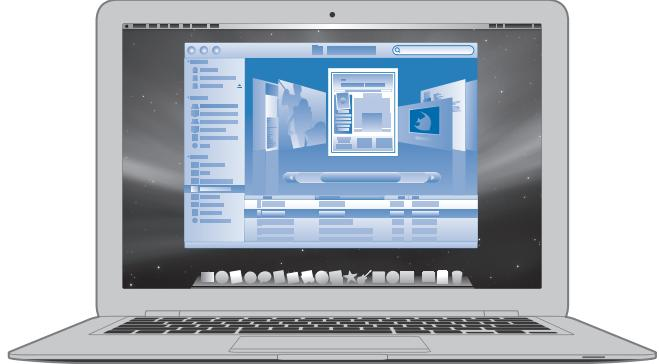

> **AI Description:**
> **Source:** `assets/_page_1_Figure_1.jpg`
> 
> **Generated:** 2026-05-19 07:08:20
> 
> ---
> 
> The image depicts a laptop screen displaying a user interface that appears to be a web browser or a software application with multiple windows open. The interface includes various icons and panels, suggesting a desktop environment or a software development tool. The screen shows a blue and white color scheme with a focus on the central window, which seems to be the active one. The surrounding panels and icons suggest functionality for navigation, file management, or application management.


> **AI Description:**
> **Source:** `assets/_page_1_Figure_2.jpg`
> 
> **Generated:** 2026-05-19 07:08:03
> 
> ---
> 
> The image contains a simple icon of a stylized face with a sad expression, set against a gradient background. The face has a frown, two eyes, and a mouth that is downturned, conveying a sense of sadness or distress. The icon is commonly associated with the Mac operating system, specifically the "Sad Face" emoji used in older versions of the operating system.


Browse the contents of your computer using Cover Flow.

www.apple.com/macosx


> **AI Description:**
> **Source:** `assets/_page_1_Figure_3.jpg`
> 
> **Generated:** 2026-05-19 07:07:53
> 
> ---
> 
> The image contains a circular icon with a clock symbol inside it, indicating a refresh or update function. The icon is metallic with a gradient effect, suggesting it is a digital or software interface element. The design is simple and modern, likely used to represent a function related to refreshing or updating data or content.


Time Machine Automatically back up your files to an extra hard drive.

www.apple.com/macosx

Mac Help time machine

<span id="page-2-0"></span>


> **AI Description:**
> **Source:** `assets/_page_2_Figure_0.jpg`
> 
> **Generated:** 2026-05-19 07:10:38
> 
> ---
> 
> The image contains a single, stylized star with a camera icon in the center. The star appears to be a graphic element, possibly representing a symbol for media, photography, or content creation. The camera icon suggests a focus on visual media or photography. The star's design is simple and geometric, with no additional text or labels.


## iMovie

Collect all your video in one library. Create and share movies in minutes.

www.apple.com/ilife/imovie

iMovie Help movie


## iPhoto

Organize all your photos with Events. Publish to a Web Gallery with a click.

www.apple.com/ilife/iphoto

iPhoto Help photo

iLife

## GarageBand

Create music by adding musicians to a virtual stage. Enhance your song to sound like a pro.

www.apple.com/ilife/garageband

## iWeb

Create beautiful websites with photos, movies, blogs, podcasts, and dynamic web widgets.

<span id="page-4-0"></span>
## Contents

Chapter 1: Ready, Set Up, Go   
8 Welcome   
9 What’s in the Box   
10 Setting Up Your MacBook Air   
15 Setting Up DVD or CD Sharing   
16 Migrating Information to Your MacBook Air   
19 Getting Additional Information onto Your MacBook Air   
22 Putting Your MacBook Air to Sleep or Shutting It Down   
Chapter 2: Life with Your MacBook Air   
26 Basic Features of Your MacBook Air   
28 Keyboard Features of Your MacBook Air   
30 Ports on Your MacBook Air   
32 Using the Trackpad and Keyboard   
34 Running Your MacBook Air on Battery Power   
35 Getting Answers   
Chapter 3: Problem, Meet Solution   
40 Problems That Prevent You from Using Your MacBook Air   
44 Using Apple Hardware Test

<span id="page-5-0"></span>
45 Reinstalling Software Using Remote Install Mac OS X

49 Reinstalling Software Using the MacBook Air SuperDrive

51 Problems with AirPort Extreme Wireless Communication

51 Problems with Your Internet Connection

53 Keeping Your Software Up to Date

53 Learning More, Service, and Support

56 Locating Your Product Serial Number

## Chapter 4: Last, but Not Least

58 Important Safety Information

60 Important Handling Information

62 Understanding Ergonomics

64 Apple and the Environment

65 Regulatory Compliance Information

## Looking for Something?

70 Index

<span id="page-6-0"></span>
## 1 Ready, Set Up, Go

<span id="page-7-0"></span>
## Welcome

Congratulations on purchasing a MacBook Air. Your MacBook Air is streamlined for portability and a completely wireless experience. Read this chapter for help getting started setting up and using your MacBook Air.

 If you know you will primarily be downloading applications and content from the Internet and not migrating information from another Mac, you can follow the basic instructions to set up your MacBook Air quickly.

 If you want to migrate information from another Mac or get content from CDs or DVDs onto your MacBook Air, you can identify one or more Mac or Windows computers to partner with your MacBook Air.

Important: Read all the installation instructions (and the safety information starting on page 57) carefully before you first use your computer.

Many answers to questions can be found on your computer in Mac Help. For information about getting Mac Help, see “Getting Answers” on page 35. Apple may release new versions and updates to its system software, so the images shown in this book may be slightly different from what you see onscreen.

<span id="page-8-0"></span>
## What’s in the Box

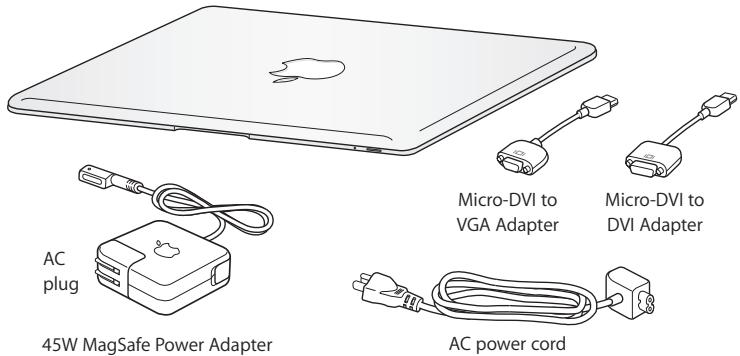

> **AI Description:**
> **Source:** `assets/_page_8_Figure_0.jpg`
> 
> **Generated:** 2026-05-19 07:09:38
> 
> ---
> 
> The image is a technical illustration showing various components related to a MacBook, including an AC plug, a 45W MagSafe Power Adapter, an AC power cord, a Micro-DVI to VGA Adapter, and a Micro-DVI to DVI Adapter. The illustration is designed to visually represent the different parts that come with or can be used with a MacBook, providing a clear and concise visual reference for the user.


Important: Remove the protective film covering the 45W MagSafe Power Adapter before setting up your MacBook Air.

## About Optical Discs

Although your MacBook Air doesn’t have an optical disc drive, it does include DVD discs with important software. You can easily access this software, as well as install applications and access data from other optical discs, using the optical disc drive on another Mac or Windows computer. You can also use the optional MacBook Air SuperDrive, an external optical disc drive.

<span id="page-9-0"></span>
## Setting Up Your MacBook Air

Your MacBook Air is designed so that you can set it up quickly and start using it right away. The following pages take you through the setup process, including these tasks:

 Plugging in the 45W MagSafe Power Adapter

 Turning on your MacBook Air and using the trackpad

 Using Setup Assistant to access a network and configure a user account and other settings

 Setting up the Mac OS X desktop and preferences

Step 1: Plug in the 45W MagSafe Power Adapter to provide power to the MacBook Air and charge the battery.

Insert the AC plug of your power adapter into a power outlet and the MagSafe connector into the MagSafe power port, located on the back left side of your MacBook Air. As the MagSafe connector gets close to the port, you’ll feel a magnetic pull drawing it in.

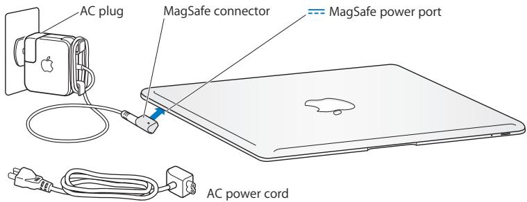

> **AI Description:**
> **Source:** `assets/_page_9_Figure_0.jpg`
> 
> **Generated:** 2026-05-19 07:09:31
> 
> ---
> 
> The image is a technical illustration showing the components of a MacBook's power supply setup. It includes an AC plug, a MagSafe connector, and a MagSafe power port. The illustration also depicts an AC power cord, which is connected to the AC plug and the MagSafe connector. The diagram is designed to help users understand how to properly connect the power supply to their MacBook.


<span id="page-10-0"></span>
To extend the reach of your power adapter, replace the AC plug with the AC power cord. First pull the AC plug up to remove it from the adapter, and then attach the included AC power cord to the adapter, making sure it is seated firmly. Plug the other end into a power outlet.

When disconnecting the power adapter from an outlet or from the computer, pull the plug, not the cord.

When you first connect the power adapter to your MacBook Air, an indicator light on the MagSafe connector starts to glow. An amber light indicates that the battery is charging. A green light indicates that the battery is fully charged. If you don’t see a light, make sure the connector is seated properly and the power adapter is plugged into a power outlet.

<span id="page-11-0"></span>
Step 2: Press the power (®) button briefly to turn on your MacBook Air. You will hear a tone when you turn on the computer.
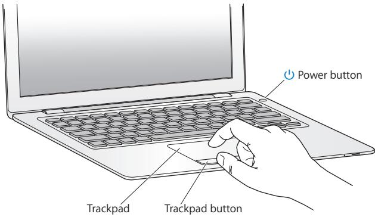

> **AI Description:**
> **Source:** `assets/_page_11_Figure_0.jpg`
> 
> **Generated:** 2026-05-19 07:09:58
> 
> ---
> 
> The image is a technical illustration of a laptop. It shows a hand interacting with the laptop, specifically pointing at the trackpad and trackpad button. The illustration highlights the power button on the right side of the laptop. The image includes labels for the power button, trackpad, and trackpad button, indicating their locations on the laptop. The illustration is designed to guide users on how to use these specific components of the laptop.

It takes the computer a few moments to start up. After it starts up, Setup Assistant opens automatically.
If your computer doesn’t turn on, see “If your MacBook Air doesn’t turn on or start up” on page 42.

<span id="page-12-0"></span>
## Step 3: Configure your MacBook Air with Setup Assistant

The first time you turn on your MacBook Air, Setup Assistant starts. Setup Assistant helps you enter your Internet information and set up a user account on your MacBook Air. You can also migrate information from another Mac during setup.

Note: If you don’t use Setup Assistant to transfer information when you first start up your MacBook Air, you can do it later using Migration Assistant. Go to the Applications folder, open Utilities, and double-click Migration Assistant.

## To set up your MacBook Air:

1 In the Setup Assistant, follow the onscreen instructions until you get to the “Do You Already Own a Mac?” screen.

2 Do a basic setup or a setup with migration:

 To do a basic setup, select “Do not transfer my information now” and click Continue. Follow the remaining prompts to select your wireless network, set up an account, and exit Setup Assistant.

 To do a setup with migration, first set up another Mac that has an optical disc drive to partner with (see “Setting Up DVD or CD Sharing” on page 15). Then go to page 16, “Migrating Information to Your MacBook Air.”

Note: If you’ve already started Setup Assistant on your MacBook Air, you can leave it mid-process without quitting, move to the other computer to install the DVD or CD Sharing Setup software, and then return to your MacBook Air to complete the setup.

<span id="page-13-0"></span>
Step 4: Customize the Mac OS X desktop and set preferences.

You can quickly make the desktop look the way you want using System Preferences. Choose Apple () > System Preferences from the menu bar or click the System Preferences icon in the Dock. System Preferences is your command center for most settings on your MacBook Air.

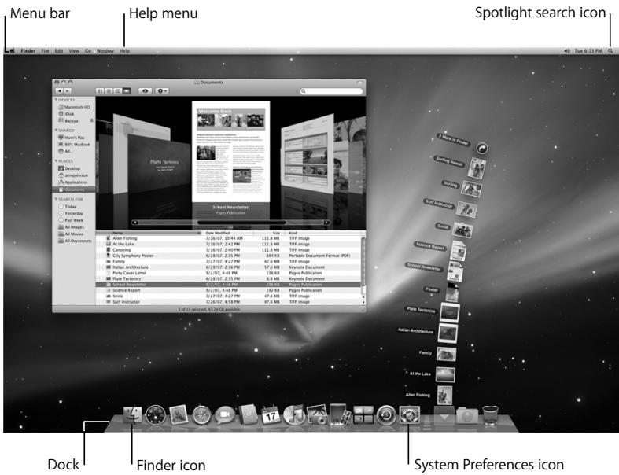

> **AI Description:**
> **Source:** `assets/_page_13_Figure_0.jpg`
> 
> **Generated:** 2026-05-19 07:08:36
> 
> ---
> 
> The image is a screenshot of a computer desktop with various elements labeled. It includes a menu bar at the top with options like "Finder," "File," "Edit," "View," "Go," "Window," and "Help." Below the menu bar is a Finder window displaying a folder named "Documents," showing a list of files and folders. The desktop background is a starry night sky. At the bottom of the screen is a dock with several application icons, including the Finder icon and the System Preferences icon. The image also highlights the Spotlight search icon in the menu bar and the Dock.


<span id="page-14-0"></span>
## Setting Up DVD or CD Sharing

You can partner your MacBook Air with another Mac or Windows computer that has an optical disc drive and is on the same wired or wireless network. Use this other computer to:

 Migrate information to your MacBook Air, if the other computer is a Mac (see “Migrating Information to Your MacBook Air” on page 16)

 Share the contents of DVDs or CDs (see “Sharing Discs with DVD or CD Sharing” on page 19)

 Remotely install Mac OS X (see “Reinstalling Software Using Remote Install Mac OS X” on page 45) or use Disk Utility (see “Using Disk Utility” on page 49)

The computer with the optical drive can be a Mac with Mac OS X v10.4.10 or later, or a Windows XP or Windows Vista computer. You can partner with more than one other computer.

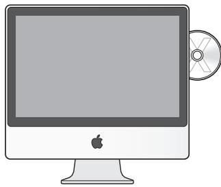

> **AI Description:**
> **Source:** `assets/_page_14_Figure_0.jpg`
> 
> **Generated:** 2026-05-19 07:08:41
> 
> ---
> 
> The image is a simple line drawing of an Apple iMac computer. The iMac is depicted with a monitor, a stand, and a CD or DVD disc partially inserted into the disc drive. The Apple logo is visible on the front of the monitor. The image is a technical illustration and does not contain any text or additional visual elements beyond the basic outline and components of the iMac.

Mac or Windows computer

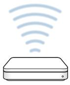

> **AI Description:**
> **Source:** `assets/_page_14_Figure_1.jpg`
> 
> **Generated:** 2026-05-19 07:08:23
> 
> ---
> 
> The image is a simple technical illustration. It depicts a device, likely a router or modem, with a series of curved lines emanating from it. These lines represent wireless signals, indicating the device's capability to transmit or receive wireless communications. The illustration is minimalistic, focusing on the concept of wireless connectivity rather than detailed technical specifications.


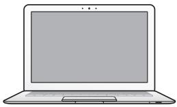

> **AI Description:**
> **Source:** `assets/_page_14_Figure_2.jpg`
> 
> **Generated:** 2026-05-19 07:08:49
> 
> ---
> 
> The image depicts a simplified illustration of a laptop. The laptop is shown in a side profile, with the screen facing forward. The screen is blank, and there are no additional details or annotations present. The image is a simple line drawing with no photographic or other visual elements.

MacBook Air

<span id="page-15-0"></span>
Insert the Mac OS X Install Disc 1 that came with your MacBook Air to install the DVD or CD Sharing Setup, which includes software for DVD or CD Sharing, Migration Assistant, and Remote Install Mac OS X:

 If the other computer is a Mac, double-click the DVD or CD Sharing Setup package on the Mac OS X Install Disc 1.

 If the other computer is a Windows computer, choose “DVD or CD Sharing” from the Install Assistant that starts automatically.

## Migrating Information to Your MacBook Air

You can migrate existing user accounts, files, applications, and other information from another Mac computer.

## To migrate information to your MacBook Air:

Configure the other Mac (see page 15), and then make sure that it is turned on and that it is on the same wired or wireless network as your MacBook Air.

Check the AirPort (Z) status icon in the menu bar at the top of the other Mac screen to see what wireless network you’re connected to. Choose the same network for your MacBook Air during setup.

2 On your MacBook Air, follow the Setup Assistant onscreen instructions until you get to the “Do You Already Own a Mac?” screen. Select “from another Mac” as the source of the information you want to transfer. On the next screen, choose your wireless network, and then click Continue.

<span id="page-16-0"></span>
## 3 When you see the Connect To Your Other Mac screen with a passcode displayed, do the remaining steps on the other Mac. You will enter the passcode in Migration Assistant on the other Mac.

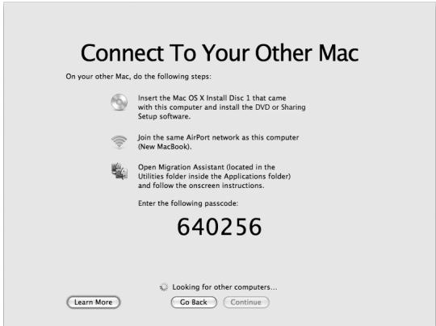

> **AI Description:**
> **Source:** `assets/_page_16_Figure_0.jpg`
> 
> **Generated:** 2026-05-19 07:09:47
> 
> ---
> 
> The image contains a text-based instruction screen for connecting to another Mac using Migration Assistant. It includes a list of steps with icons representing each action: inserting an Install Disc, joining an AirPort network, and entering a passcode. The text provides details on how to proceed with the migration process, including the passcode "640256". The screen also displays a progress message "Looking for other computers..." and buttons labeled "Learn More", "Go Back", and "Continue".


4 On the other Mac, open Migration Assistant (located in /Applications/Utilities/), and then click Continue.

5 When you are prompted for a migration method, select “To another Mac”, and then click Continue.

6 On the other Mac, quit any other open applications and then click Continue.

<span id="page-17-0"></span>
## 7 On the other Mac, enter the six-digit passcode displayed in Setup Assistant on your MacBook Air.

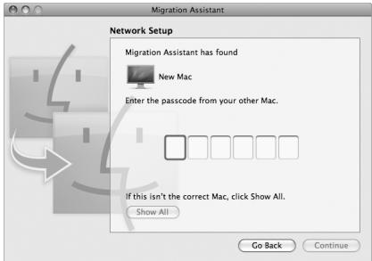

> **AI Description:**
> **Source:** `assets/_page_17_Figure_0.jpg`
> 
> **Generated:** 2026-05-19 07:10:53
> 
> ---
> 
> The image is a screenshot of a Migration Assistant window from a Mac operating system. It displays a Network Setup screen where the Migration Assistant has found a "New Mac" and prompts the user to enter the passcode from their other Mac. The screen includes a visual representation of a Mac icon with arrows pointing to it, indicating the migration process. There is also a button labeled "Show All" and two buttons at the bottom labeled "Go Back" and "Continue." The text and visual elements together guide the user through the migration process.

8 Click Continue to start the migration.

Important: Don’t use the other Mac for anything else until the migration is complete.

<span id="page-18-0"></span>
## Getting Additional Information onto Your MacBook Air

Your MacBook Air comes with several applications installed, including the iLife ’08 suite. Many other applications can be downloaded from the Internet. If you want to install third-party applications from CD or DVD, you can:

 Install applications onto your MacBook Air using the optical disc drive on another Mac or Windows computer (if DVD or CD Sharing is set up and enabled). Read the next section for more information.

 Attach the MacBook Air SuperDrive (an external USB optical disc drive available separately at www.apple.com/store) to the USB port on your MacBook Air, and insert your installation disc.

## Sharing Discs with DVD or CD Sharing

You can enable DVD or CD Sharing on a Mac or Windows computer so that your MacBook Air can share the discs you insert into the optical disc drive of the other computer. Some discs, such as DVD movies and game discs, may be copy-protected and therefore unusable through DVD or CD Sharing.

Make sure you first install the DVD or CD Sharing Setup software on any Mac or Windows computer you want to partner with. See page 15 for more information.

## To enable DVD or CD Sharing, if your other computer is a Mac:

1 Make sure the other Mac and your MacBook Air are on the same wireless network. Check the AirPort (Z) status icon in the menu bar to see what network you’re connected to.

<span id="page-19-0"></span>
2 On the other Mac, choose Apple () > System Preferences and then open Sharing.

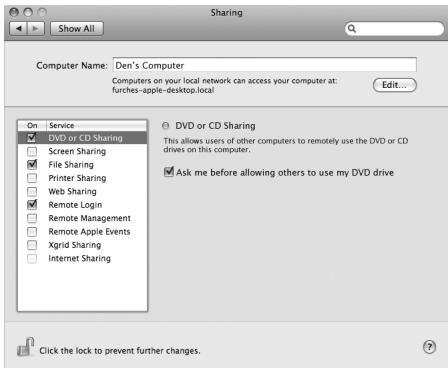

> **AI Description:**
> **Source:** `assets/_page_19_Figure_0.jpg`
> 
> **Generated:** 2026-05-19 07:09:14
> 
> ---
> 
> The image is a screenshot of a computer's Sharing settings window, likely from a Mac operating system. It displays a list of sharing services that can be enabled or disabled. The services listed include Screen Sharing, File Sharing, Printer Sharing, Web Sharing, Remote Login, Remote Management, Remote Apple Events, Xgrid Sharing, and Internet Sharing. The service "DVD or CD Sharing" is highlighted and has a checkbox next to it, indicating it is enabled. There is also a checkbox option to "Ask me before allowing others to use my DVD drive," which is checked. The top of the window shows the computer name as "Den's Computer," and a network address is provided for accessing the computer on the local network.


3 In the Sharing panel, select “DVD or CD Sharing” in the Service list. If you want other users to request permission to share a DVD or CD, select “Ask me before allowing others to use my DVD drive.”

To enable DVD or CD Sharing, if your other computer is a Windows computer:

1 Make sure your MacBook Air and the Windows computer are on the same wireless network.

<span id="page-20-0"></span>
2 On the Windows computer, open the DVD or CD Sharing control panel.

```
DVD or CD Sharing ×   
Enable DVD or CD Sharing   
This alows users ofother computers to use this computer's DVD   
or CD drives remotely.   
Ask me before alowing others to use my DVD drive
```

3 Select “Enable DVD or CD Sharing.” If you want other users to request permission to share a DVD or CD, select “Ask me before allowing others to use my DVD drive.”

To use a shared DVD or CD:

1 On the other computer, insert a DVD or CD into the optical disc drive.

2 On your MacBook Air, select the Remote Disc when it appears under Devices in the Finder sidebar. If you see the “Ask to use” button, click it.

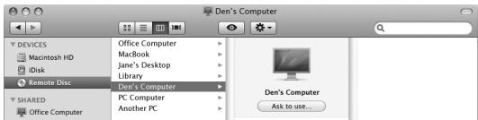

> **AI Description:**
> **Source:** `assets/_page_20_Figure_0.jpg`
> 
> **Generated:** 2026-05-19 07:10:17
> 
> ---
> 
> The image is a screenshot of a file management interface, likely from a Mac operating system. It displays a sidebar with various devices and shared folders. The main section shows a list of connected computers, with "Den's Computer" being highlighted. The interface includes icons and labels for different types of devices and folders, such as "Macintosh HD," "iDisk," "Library," and "Remote Disc." The highlighted "Den's Computer" has an option to "Ask to use..." indicating that it is a remote connection. The top of the window shows the title "Den's Computer" and includes standard menu icons for file operations.


3 On the other computer, when prompted, click Accept to allow your MacBook Air to use the DVD or CD.

4 On your MacBook Air, use the disc as you normally would once it becomes available.

If you try to shut down the other computer or eject the shared DVD or CD while your MacBook Air is using it, you’ll see a message telling you that the disc is in use. To proceed, click Continue.

<span id="page-21-0"></span>
Putting Your MacBook Air to Sleep or Shutting It Down When you finish working with your MacBook Air, you can put it to sleep or shut it down.

## Putting Your MacBook Air to Sleep

If you’ll be away from your MacBook Air for only a short time, put it to sleep. When the computer is in sleep, you can quickly wake it and bypass the startup process.

To put your MacBook Air to sleep, do one of the following:

 Close the display.

 Choose Apple () > Sleep from the menu bar.

 Press the power (®) button and click Sleep in the dialog that appears.

 Choose Apple () > System Preferences, click Energy Saver, and set a sleep timer.

NOTICE: Wait a few seconds until the sleep indicator light on the front of your MacBook Air starts pulsing (indicating that the computer is in sleep and the hard disk has stopped spinning) before you move your MacBook Air. Moving your computer while the hard disk is spinning can damage it, causing loss of data or the inability to start up from the hard disk.

To wake your MacBook Air:

 If the display is closed, simply open it to wake your MacBook Air.

 If the display is already open, press the power (®) button or any key on the keyboard.

When your MacBook Air wakes from sleep, your applications, documents, and computer settings are exactly as you left them.

<span id="page-22-0"></span>
## Shutting Down Your MacBook Air

If you aren’t going to use your MacBook Air for a day or two, it’s best to shut it down.   
The sleep indicator light goes on briefly during the shutdown process.

To shut down your MacBook Air, do one of the following:

 Choose Apple () > Shut Down from the menu bar.

 Press the power (®) button and click Shut Down in the dialog that appears.

If you plan to store your MacBook Air for an extended period of time, see “Important Handling Information” on page 60 for information about how to prevent your battery from draining completely.

<span id="page-24-0"></span>
## 2 Life with Your MacBook Air

<span id="page-25-0"></span>
## Basic Features of Your MacBook Air

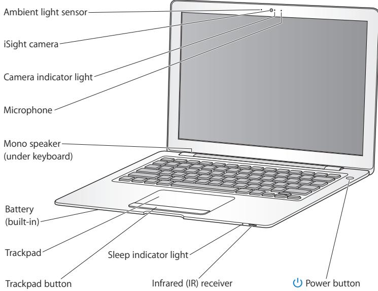

> **AI Description:**
> **Source:** `assets/_page_25_Figure_0.jpg`
> 
> **Generated:** 2026-05-19 07:09:00
> 
> ---
> 
> The image is a technical illustration of a laptop, showcasing various components and their locations. It includes labels for the ambient light sensor, iSight camera, camera indicator light, microphone, mono speaker (under the keyboard), battery (built-in), trackpad, trackpad button, sleep indicator light, infrared (IR) receiver, and power button. The illustration is a diagram designed to help users identify and locate the different parts of the laptop.


<span id="page-26-0"></span>


<span id="page-27-0"></span>
Keyboard Features of Your MacBook Air

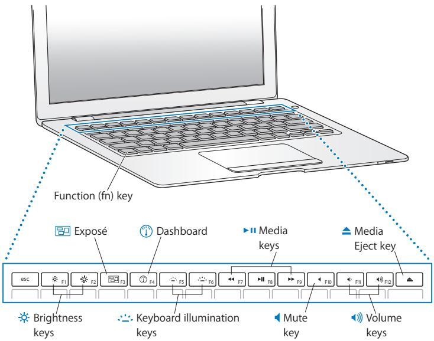

> **AI Description:**
> **Source:** `assets/_page_27_Figure_0.jpg`
> 
> **Generated:** 2026-05-19 07:10:09
> 
> ---
> 
> The image is a technical illustration of a laptop's keyboard and function keys. It includes labels for various keys and their functions, such as the Function (fn) key, Exposé, Dashboard, Media keys, Media Eject key, Brightness keys, Keyboard illumination keys, Mute key, and Volume keys. The illustration is accompanied by dotted lines pointing to the corresponding keys on the laptop, providing a clear visual guide for their location and purpose.


<span id="page-28-0"></span>


<span id="page-29-0"></span>
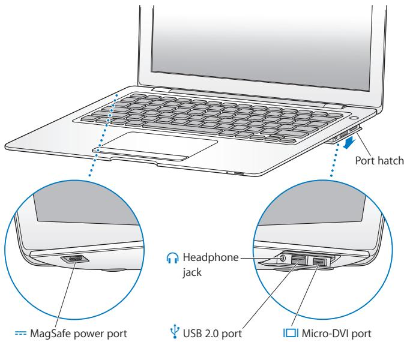

> **AI Description:**
> **Source:** `assets/_page_29_Figure_0.jpg`
> 
> **Generated:** 2026-05-19 07:09:24
> 
> ---
> 
> The image is a technical illustration of a laptop's port configuration. It includes a diagram of the laptop with labels pointing to specific ports and jacks. The image highlights the MagSafe power port, the headphone jack, the USB 2.0 port, and the Micro-DVI port. The illustration is accompanied by close-up insets showing the locations of these ports and jacks on the laptop's side. The image is designed to provide a clear visual guide for identifying and using the various ports on a laptop.


<span id="page-30-0"></span>


<span id="page-31-0"></span>
## Using the Trackpad and Keyboard

Use the trackpad to move the pointer and to scroll, tap, double-tap, and drag. How far the pointer moves onscreen is affected by how quickly you move your finger across the trackpad. To move the pointer a short distance, move your finger slowly across the trackpad; the faster you move your finger, the farther the pointer moves. To fine-tune the tracking speed and set other trackpad options, choose Apple () > System Preferences, click Keyboard & Mouse, and then click Trackpad.

Here are some useful keyboard and trackpad tips and shortcuts:

 Forward deleting deletes characters to the right of the insertion point. Pressing the Delete key deletes characters to the left of the insertion point.

To forward delete, hold down the Function (fn) key while you press the Delete key.

 Secondary clicking or “right-clicking” lets you access shortcut menu commands.

To secondary click, place two fingers on the trackpad while clicking the trackpad button. If Tap to Click is enabled, just tap two fingers on the trackpad.

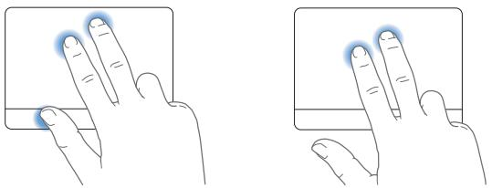

> **AI Description:**
> **Source:** `assets/_page_31_Figure_0.jpg`
> 
> **Generated:** 2026-05-19 07:08:12
> 
> ---
> 
> The image contains a technical illustration showing two hand gestures. The left side depicts a hand with fingers spread out, touching a rectangular surface, while the right side shows a hand with fingers slightly curled, also touching a similar rectangular surface. Both hands have blue dots on the tips of the fingers, likely indicating points of contact or interaction with the surface. The illustration is likely used to demonstrate a user interface or interaction technique, possibly for a touch screen or similar device.

You can also secondary click by holding down the Control key while you click.

<span id="page-32-0"></span>
 Two-finger scrolling lets you drag to scroll quickly up, down, or sideways in the active window. This option is on by default.

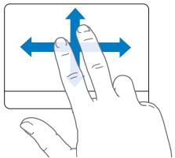

> **AI Description:**
> **Source:** `assets/_page_32_Figure_0.jpg`
> 
> **Generated:** 2026-05-19 07:10:31
> 
> ---
> 
> The image is a diagram illustrating a finger gesture on a touchscreen interface. It shows a hand with fingers extended, demonstrating a swipe gesture. The thumb and index finger are positioned at the top and bottom of the screen, respectively, with arrows indicating the direction of the swipe. The arrows are blue and point to the left, suggesting the swipe action moves from right to left. This type of diagram is commonly used in user interface design to demonstrate how to interact with a touchscreen device.


The following trackpad gestures work in certain applications, such as Preview or iPhoto. For more information, choose Help > Mac Help and search for “trackpad.”

 Two-finger pinching lets you zoom in or out on PDFs, images, photos, and more.

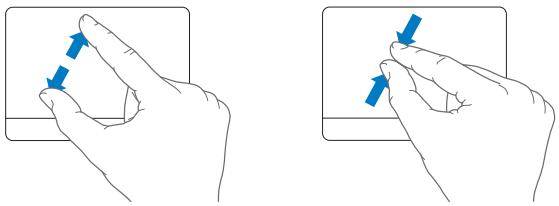

> **AI Description:**
> **Source:** `assets/_page_32_Figure_1.jpg`
> 
> **Generated:** 2026-05-19 07:10:26
> 
> ---
> 
> The image contains two diagrams illustrating hand gestures. The left diagram shows a hand with fingers extended, with arrows indicating a motion from the top left to the bottom right. The right diagram depicts a hand holding a small object, with arrows showing a motion from the top right to the bottom left. Both diagrams are simple line drawings with blue arrows to indicate the direction of movement.


<span id="page-33-0"></span>
 Two-finger rotating lets you rotate photos, pages, and more.

 Three-finger swiping lets you rapidly page through documents, move to the previous or next photo, and more.

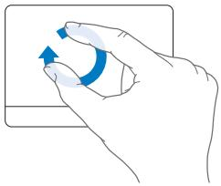

> **AI Description:**
> **Source:** `assets/_page_33_Figure_0.jpg`
> 
> **Generated:** 2026-05-19 07:10:59
> 
> ---
> 
> The image is a technical illustration showing a hand performing a specific gesture. The hand is positioned as if it is interacting with a touchscreen or a similar device. The gesture involves a circular motion with the thumb and index finger, suggesting a pinch or zoom action commonly used in touch-based interfaces. The blue arrows indicate the direction of the motion, emphasizing the circular nature of the gesture.


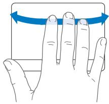

> **AI Description:**
> **Source:** `assets/_page_33_Figure_1.jpg`
> 
> **Generated:** 2026-05-19 07:11:16
> 
> ---
> 
> The image is a diagram illustrating a hand gesture. It shows a hand with fingers extended, and a blue arrow is drawn above the hand, indicating a motion or action. The arrow suggests that the hand is meant to be moved or manipulated in a specific direction, likely as part of a gesture or interaction. The image is simple and does not contain any additional text or labels.


## Running Your MacBook Air on Battery Power

When the 45W MagSafe Power Adapter is not connected, your MacBook Air draws power from its built-in rechargeable battery. The length of time that you can run your MacBook Air varies, depending on the applications you use and the external devices connected to your MacBook Air. Turning off features such as AirPort Extreme or Bluetooth® wireless technology can help conserve battery charge.

If the battery runs low while you are working, attach the power adapter that came with your MacBook Air and let the battery recharge. When the power adapter is connected, the battery recharges whether the computer is on, off, or in sleep. The battery recharges more quickly, however, when the computer is off or in sleep.

You can determine whether the battery needs charging by looking at the indicator light on the MagSafe connector. If the light is glowing amber, the battery needs to be charged. If the light is glowing green, the battery is fully charged.

<span id="page-34-0"></span>
You can also check the amount of battery charge left by viewing the Battery ( ) status icon in the menu bar. The battery charge level displayed is based on the amount of power left in the battery with the applications, peripheral devices, and system settings you are currently using.

To conserve battery power, close applications and disconnect peripheral devices not in use, and adjust your Energy Saver settings. For more information about battery conservation and performance tips, go to www.apple.com/batteries/notebooks.html.

Important: The battery is replaceable only by an Apple Authorized Service Provider.

## Getting Answers

Much more information about using your MacBook Air is available in Mac Help and on the Internet at www.apple.com/support/macbookair.

## To get Mac Help:

1 Click the Finder icon in the Dock (the bar of icons along the edge of the screen).


> **AI Description:**
> **Source:** `assets/_page_34_Figure_0.jpg`
> 
> **Generated:** 2026-05-19 07:11:06
> 
> ---
> 
> The image contains a simple icon of a smiling face with a black line across the eyes, resembling a sad or angry expression. The icon is gray with a white background. There are no charts, graphs, or other visual elements present in the image.


2 Click the Help menu in the menu bar and do one of the following:

a Type a question or term in the Search field, and select a topic from the returned list or select Show All Results to see all topics.

b Choose Mac Help to open the Mac Help window, where you can click links or type a search question.

<span id="page-35-0"></span>
## More Information

For more information about using your MacBook Air, see the following:


<span id="page-38-0"></span>
## 3 Problem, Meet Solution

<span id="page-39-0"></span>
Occasionally you may have a problem while working with your MacBook Air. Read on to find some solutions to try when you have a problem. You can also find more troubleshooting information in Mac Help and on the MacBook Air Support website at www.apple.com/support/macbookair.

If you experience a problem with your MacBook Air, there’s usually a simple and quick solution. Think about the conditions that led up to the problem. Making a note of things you did before the problem occurred will help you narrow down possible causes and find the answers you need. Things to note include:

 The applications you were using when the problem occurred. Problems that occur only with a specific application might indicate that the application is not compatible with the version of the Mac OS installed on your computer.

 Any new software that you installed, especially software that added items to the System folder.

## Problems That Prevent You from Using Your MacBook Air

## If your MacBook Air doesn’t respond or the pointer doesn’t move

On rare occasions, an application might “freeze” on the screen. Mac OS X provides a way to quit a frozen application without restarting your computer. Quitting a frozen application might allow you to save your work in other open applications.

## To force an application to quit:

1 Press Command (x)-Option-Esc or choose Apple () > Force Quit from the menu bar. The Force Quit Applications dialog appears with the application selected.

## 2 Click Force Quit.

<span id="page-40-0"></span>
The application quits, leaving all other applications open.

If you need to, you can also restart the Finder from this dialog.

Next, save your work in any open applications and restart the computer to make sure the problem is entirely cleared up.

If you are unable to force the application to quit, press and hold the power (®) button for a few seconds until the computer shuts itself down. Wait 10 seconds and then turn on the computer.

If the problem occurs frequently, choose Help > Mac Help from the menu bar at the top of the screen. Search for the word “freeze” to get help for instances when the computer freezes or doesn’t respond.

If the problem occurs only when you use a particular application, check with the application’s manufacturer to see if it is compatible with your computer. To get support and contact information for the software that came with your MacBook Air, go to www.apple.com/guide.

If you know an application is compatible, you might need to reinstall your computer’s system software. See “Reinstalling the Software That Came with Your MacBook Air” on page 47.

If your MacBook Air freezes during startup, or you see a flashing question mark, or the display is dark and the sleep indicator light is glowing steadily (not in sleep) The flashing question mark usually means that the computer can’t find the system software on the hard disk or on any disks attached to the computer.

<span id="page-41-0"></span>
 Wait a few seconds. If the computer still doesn’t start up, shut it down by pressing and holding the power (®) button for about 8 to 10 seconds. Disconnect all external peripherals and try restarting by pressing the power (®) button while holding down the Option key. When your computer starts up, click the hard disk icon, and then click the right arrow. After the computer starts up, open System Preferences and click Startup Disk. Select a local Mac OS X System folder.

 If that doesn’t work, try using Disk Utility to repair the disk. For more information, see “Using Disk Utility” on page 49.

## If your MacBook Air doesn’t turn on or start up

Try the following suggestions in order until your computer turns on:

 Make sure the power adapter is plugged into the computer and into a functioning power outlet. Be sure to use the 45W MagSafe Power Adapter that came with your MacBook Air. If the power adapter stops charging and you don’t see the indicator light on the power adapter turn on when you plug in the power cord, try unplugging and replugging the power cord to reseat it.

 Check whether the battery needs to be recharged. If the light on the power adapter glows amber, the battery is charging. See “Running Your MacBook Air on Battery Power” on page 34.

 If the problem persists, return the computer to its factory settings by pressing the left Shift key, left Option (alt) key, left Control key, and the power (®) button simultaneously for five seconds.

 Press and release the power (®) button and immediately hold down the Command (x), Option, P, and R keys simultaneously until you hear the startup sound a second time. This resets the parameter RAM (PRAM).

<span id="page-42-0"></span>
 If you still can’t start up your MacBook Air, see “Learning More, Service, and Support” on page 53 for information about contacting Apple for service.

If the display suddenly goes black or your MacBook Air freezes

Try restarting your MacBook Air.

Unplug any devices that are connected to your MacBook Air, except the power adapter.

2 Press the power (®) button to restart the system.

3 Let the battery charge to at least 10 percent before plugging in any external devices and resuming your work.

To see how much the battery has charged, look at the Battery ( ) status icon in the menu bar.

The display might also darken if you have energy saver features set for the battery.

If your MacBook Air can’t connect to another computer’s optical disc drive To use services such as Migration Assistant, DVD or CD Sharing, Remote Install Mac OS X, and iTunes music sharing, both your MacBook Air and the other computer must be connected to the same network. If your MacBook Air is connected wirelessly and the other computer is connected to a third-party router by Ethernet, check your router documentation to make sure it supports bridging a wireless to wired connection.

<span id="page-43-0"></span>
## Using Apple Hardware Test

If you suspect a problem with the MacBook Air hardware, you can use the Apple Hardware Test application to help determine if there’s a problem with one of the computer’s components, such as the memory or processor.

## To use Apple Hardware Test on your MacBook Air:

1 Disconnect all external devices from your computer except the power adapter.

2 Restart your MacBook Air while holding down the D key.

3 When the Apple Hardware Test chooser screen appears, select the language for your location.

4 Press the Return key or click the right arrow button.

5 When the Apple Hardware Test main screen appears (after about 45 seconds), follow the onscreen instructions.

6 If Apple Hardware Test detects a problem, it displays an error code. Make a note of the error code before pursuing support options. If Apple Hardware Test doesn’t detect a hardware failure, the problem may be software related.

For more information about Apple Hardware Test, see the Apple Hardware Test Read Me file on the Mac OS X Install Disc 1.

<span id="page-44-0"></span>
## Reinstalling Software Using Remote Install Mac OS X

Use Remote Install Mac OS X on the partner computer whose optical disc drive you want to share (installation instructions for this and other components of the DVD or CD Sharing Setup software are on page 15) when you want to do one of the following tasks on your MacBook Air:

 Reinstall Mac OS X and other software that came with your MacBook Air

 Reset your password

 Use Disk Utility to repair the MacBook Air hard disk

Note: You can also do these tasks using a MacBook Air SuperDrive (available separately at www.apple.com/store). See page 49.

<span id="page-45-0"></span>
## To use Remote Install Mac OS X:

1 Insert the Mac OS X Install Disc 1 into the optical disc drive of the other computer.

2 If the other computer is a Mac, open /Applications/Utilities/Remote Install Mac OS X. On Windows, choose “Remote Install Mac OS X” from the Install Assistant.

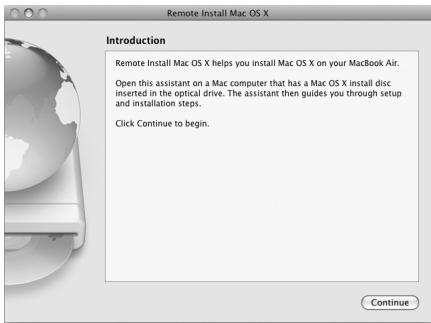

> **AI Description:**
> **Source:** `assets/_page_45_Figure_0.jpg`
> 
> **Generated:** 2026-05-19 07:10:46
> 
> ---
> 
> The image is a screenshot of a Mac OS X installation assistant window. It contains text explaining the purpose of the Remote Install Mac OS X assistant, which helps users install Mac OS X on their MacBook Air. The text indicates that the assistant should be used on a Mac computer with a Mac OS X install disc in the optical drive. The assistant guides users through setup and installation steps. The image includes a "Continue" button at the bottom right corner, suggesting the user should click it to proceed. The visual elements are minimal, primarily consisting of text and a small icon of a globe and disc, which are part of the Mac OS X interface.


3 Read the introduction and click Continue.

4 Choose the install disc you want to use, and click Continue.

5 Choose a network connection: AirPort, if you are using an AirPort network, or Ethernet, if the other computer is on an Ethernet network and you have an optional Apple USB Ethernet Adapter connecting your MacBook Air to the same network. Click Continue.

6 Restart your MacBook Air and hold down the Option key as it starts up, until you see a list of available startup disks.

7 Click Continue in Remote Install Mac OS X.

<span id="page-46-0"></span>
8 If you chose AirPort as your network in step 5, on your MacBook Air choose your AirPort network from the pop-up list.

If the network is secure, you are prompted for a password. You can enter a private network name by choosing the ellipsis (...) and typing the name.

9 If you chose AirPort as your network in step 5, when you see the AirPort status icon indicating signal strength, click Continue in Remote Install Mac OS X.

10 On your MacBook Air, click the arrow button beneath the installer icon and then do one of the following:

 If you want to reinstall Mac OS X or iLife ’08 applications, go to “Reinstalling the Software That Came with Your MacBook Air” on page 47.

 If you forgot your password and need to reset it, go to “Resetting Your Password” on page 48.

 If you want to run Disk Utility, go to “Using Disk Utility” on page 49.

## Reinstalling the Software That Came with Your MacBook Air

## Before you install:

## 1 Back up your essential files.

Apple recommends that you back up the information on your hard disk before restoring software. You can do this by connecting the MacBook Air SuperDrive and burning important information to DVDs or CDs, or by attaching an external hard drive to the USB port on your MacBook Air. Apple is not responsible for any lost data.

2 Make sure your power adapter is connected and plugged in.

<span id="page-47-0"></span>
To install Mac OS X and the applications that came with your MacBook Air, using a partner computer:

1 Follow the procedure for using Remote Install Mac OS X beginning on page 46.

2 Click Continue in Remote Install Mac OS X. Status messages appear on the other computer’s screen during installation.

3 Click Customize to select what to install (Mac OS X and Bundled Software, or Bundled Software Only), or click Install to perform a basic installation. To install iCal, iChat AV, iSync, iTunes, Safari, and the iLife ’08 applications, you need to select Install Mac OS X and Bundled Software.

4 Follow the onscreen instructions, selecting your MacBook Air as the destination volume for installation.

Note: To restore Mac OS X on your computer to the original factory settings, click Options in the “Select a Destination” pane of the Installer, and then select “Erase and Install.” This option erases your MacBook Air hard disk, so be sure you’ve backed up important information.

5 Click OK in Remote Install Mac OS X, and, when installation is done, click Quit to exit Remote Install Mac OS X.

## Resetting Your Password

You can reset your administrator password and passwords for all other accounts.

To reset your password, using a partner computer and Remote Install Mac OS X: 1 Follow the procedure for using Remote Install Mac OS X beginning on page 46.

2 Click Continue in Remote Install Mac OS X.

<span id="page-48-0"></span>
3 On your MacBook Air, choose Utilities > Reset Password from the menu bar and follow the onscreen instructions. When you finish, quit Mac OS X Installer.

4 On the other computer, click Quit to exit Remote Install Mac OS X.

## Using Disk Utility

When you need to repair, verify, or erase your MacBook Air hard disk, use Disk Utility by sharing the optical disc drive of another computer.

## To use Disk Utility from a partner computer:

1 Follow the procedure for using Remote Install Mac OS X beginning on page 46.

2 Click Continue in Remote Install Mac OS X.

3 On your MacBook Air, choose Installer > Open Disk Utility and then follow the instructions in the First Aid pane to see if Disk Utility can repair the disk. When you finish, quit Mac OS X Installer on your MacBook Air.

4 On the other computer, click Quit to exit Remote Install Mac OS X.

If using Disk Utility doesn’t help, try reinstalling your computer’s system software. See “Reinstalling the Software That Came with Your MacBook Air” on page 47.

## Reinstalling Software Using the MacBook Air SuperDrive

To install Mac OS X and the applications that came with your MacBook Air, using a MacBook Air SuperDrive:

Connect the MacBook Air SuperDrive to your MacBook Air and insert the Mac OS X Install Disc 1.

2 Double-click “Install Mac OS X and Bundled Software.” To install just applications, select Install Bundled Software Only.

<span id="page-49-0"></span>
To install iCal, iChat AV, iSync, iTunes, Safari, and the iLife ’08 applications, you need to select “Install Mac OS X and Bundled Software.”

3 Follow the onscreen instructions, selecting your MacBook Air as the destination volume for installation.

Note: To restore Mac OS X on your computer to the original factory settings, click Options in the “Select a Destination” pane of the Installer, and then select “Erase and Install.”

To reset your password, using a MacBook Air SuperDrive:

Connect the MacBook Air SuperDrive to your MacBook Air and insert the Mac OS X Install Disc 1.

2 Restart your MacBook Air and hold down the C key as it starts up.

3 Choose Utilities > Reset Password from the menu bar. Follow the onscreen instructions.

To use Disk Utility from a MacBook Air SuperDrive:

Connect the MacBook Air SuperDrive to your MacBook Air and insert the Mac OS X Install Disc 1.

2 Restart your MacBook Air and hold down the C key as it starts up.

3 Choose Installer > Open Disk Utility. When Disk Utility opens, follow the instructions in the First Aid pane.

<span id="page-50-0"></span>
## Problems with AirPort Extreme Wireless Communication

If you have trouble using AirPort Extreme wireless communication:

 Make sure the computer or network you are trying to connect to is running and has a wireless access point.

 Make sure you have properly configured the software according to the instructions that came with your base station or access point.

 Make sure you are within range of the other computer or the network. Nearby electronic devices or metal structures can interfere with wireless communication and reduce this range. Repositioning or rotating the computer might improve reception.

 Check the AirPort (Z) status icon in the menu bar. Up to four bars appear, indicating signal strength. If signal strength is low, try changing your location.

 See AirPort Help (choose Help > Mac Help, and then choose Library > AirPort Help from the menu bar). Also see the instructions that came with the wireless device for more information.

## Problems with Your Internet Connection

Your MacBook Air has a Network Setup Assistant application to help you set up an Internet connection. Open System Preferences and click Network. Click the “Assist me” button to open Network Setup Assistant.

If you have trouble with your Internet connection, try using Network Diagnostics.

<span id="page-51-0"></span>
To use Network Diagnostics:

1 Choose Apple () > System Preferences.

2 Click Network and then click “Assist me.”

3 Click Diagnostics to open Network Diagnostics.

4 Follow the onscreen instructions.

If Network Diagnostics can’t resolve the problem, there may be a problem with the Internet service provider (ISP) you are trying to connect to, with an external device you are using to connect to your ISP, or with the server you are trying to access.

If you have two or more computers sharing an Internet connection, be sure that your wireless network is set up properly. You need to know if your ISP provides only one IP address or if it provides multiple IP addresses, one for each computer.

If only one IP address is provided, then you must have a router capable of sharing the connection, also known as network address translation (NAT) or “IP masquerading.” For setup information, check the documentation provided with your router or ask the person who set up your network. You can use an AirPort Base Station to share one IP address among multiple computers. For information about using an AirPort Base Station, check Mac Help or visit the Apple AirPort website at   
www.apple.com/support/airport.

If you cannot resolve the issue using these steps, contact your ISP or network administrator.

<span id="page-52-0"></span>
## Keeping Your Software Up to Date

You can connect to the Internet and automatically download and install the latest free software versions, drivers, and other enhancements from Apple.

When you are connected to the Internet, Software Update checks Apple’s Internet servers to see if any updates are available for your computer. You can set your MacBook Air to check the Apple servers periodically, and download and install updated software.

## To check for updated software:

1 Open System Preferences.

2 Click the Software Update icon and follow the instructions on the screen.

 For more information, search for “Software Update” in Mac Help.

 For the latest information about Mac OS X, go to www.apple.com/macosx.

## Learning More, Service, and Support

Your MacBook Air does not have any user-serviceable or user-replaceable parts. If you need service, contact Apple or take your MacBook Air to an Apple Authorized Service Provider. You can find more information about the MacBook Air through online resources, onscreen help, System Profiler, or Apple Hardware Test.

## Online Resources

For online service and support information, go to www.apple.com/support. Choose your country from the pop-up menu. You can search the AppleCare Knowledge Base, check for software updates, or get help on Apple’s discussion forums.

<span id="page-53-0"></span>
## Onscreen Help

You can often find answers to your questions, as well as instructions and troubleshooting information, in Mac Help. Choose Help > Mac Help.

## System Profiler

To get information about your MacBook Air, use System Profiler. It shows you what hardware and software is installed, the serial number and operating system version, how much memory is installed, and more. To open System Profiler, choose Apple () > About This Mac from the menu bar and then click More Info.

## AppleCare Service and Support

Your MacBook Air comes with 90 days of technical support and one year of hardware repair warranty coverage at an Apple Store retail location or an Apple-authorized repair center, such as an Apple Authorized Service Provider. You can extend your coverage by purchasing the AppleCare Protection Plan. For information, visit www.apple.com/support/products or visit the website address for your country listed below.

If you need assistance, AppleCare telephone support representatives can help you with installing and opening applications, and basic troubleshooting. Call the support center number nearest you (the first 90 days are complimentary). Have the purchase date and your MacBook Air serial number ready when you call.

<span id="page-54-0"></span>
Your 90 days of complimentary telephone support begins on the date of purchase and telephone fees may apply.


Telephone numbers are subject to change, and local and national telephone rates may apply. A complete list is available on the web:

<span id="page-55-0"></span>
## Locating Your Product Serial Number

Use one of these methods to find your computer’s serial number:

 Turn your MacBook Air over. The serial number is etched into the case, near the hinge.

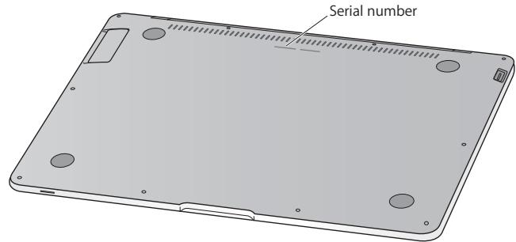

> **AI Description:**
> **Source:** `assets/_page_55_Figure_0.jpg`
> 
> **Generated:** 2026-05-19 07:07:59
> 
> ---
> 
> The image is a technical illustration of the bottom of a laptop, showing the back panel with various components. It includes a label pointing to the "Serial number" area, indicating where this information can be found on the device. The illustration is clean and minimalistic, focusing on the laptop's back panel and its features.


 Choose Apple () > About This Mac and then click the version number beneath the words “Mac OS X.” Clicking cycles between the Mac OS X version number, the build version, and the serial number.

 Open System Profiler (in /Applications/Utilities/) and click Hardware.

<span id="page-56-0"></span>
## 4 Last, but Not Least

www.apple.com/environment

<span id="page-57-0"></span>
For your safety and that of your equipment, follow these rules for handling and cleaning your MacBook Air and for working more comfortably. Keep these instructions handy for reference by you and others.

## Important Safety Information

WARNING: Failure to follow these safety instructions could result in fire, electric shock, or other injury or damage.

Avoiding water and wet locations Keep your computer away from sources of liquid, such as drinks, washbasins, bathtubs, shower stalls, and so on. Protect your computer from dampness or wet weather, such as rain, snow, and fog.

Handling your MacBook Air Set up your MacBook Air on a stable work surface that allows for adequate air circulation under and around the computer. Do not operate your MacBook Air on a pillow or other soft material, as the material can block the airflow vents. Never place anything over the keyboard when operating your computer. Never push objects into the ventilation openings.

The bottom of your MacBook Air may become very warm during normal use. If your MacBook Air is on your lap and gets uncomfortably warm, remove it from your lap and place it on a stable work surface.

<span id="page-58-0"></span>
Using the 45W MagSafe Power Adapter Make sure the AC plug or AC power cord is fully inserted into the power adapter and the electrical prongs on your AC plug are in their completely extended position before plugging the adapter into a power outlet. Use only the power adapter that came with your MacBook Air, or an Apple-authorized power adapter that is compatible with this product. The AC power cord provides a grounded connection. The power adapter may become very warm during normal use. Always put the power adapter directly into a power outlet, or place it on the floor in a well-ventilated location.

Disconnect the power adapter and disconnect any other cables if any of the following conditions exists:

 You want to clean the case (use only the recommended procedure described on page 61).

 The power cord or plug becomes frayed or otherwise damaged.

 Your MacBook Air or power adapter is exposed to rain, excessive moisture, or liquid spilled into the case.

 Your MacBook Air or power adapter has been dropped, the case has been damaged, or you suspect that service or repair is required.

The MagSafe power port contains a magnet that can erase data on a credit card, iPod, or other device. To preserve your data, do not place these and other magnetically sensitive material or devices within 1 inch (25 mm) of this port.

If debris gets into the MagSafe power port, remove it gently with a dry cotton swab.

<span id="page-59-0"></span>
Using the battery Discontinue use of your battery if it has been dropped, crushed, bent, or deformed. Do not expose the battery to temperatures above 212° F or 100° C. Do not remove the battery from your MacBook Air. The battery should be replaced only by an Apple Authorized Service Provider.

Avoiding hearing damage Permanent hearing loss may occur if earbuds or headphones are used at high volume. You can adapt over time to a higher volume of sound that may sound normal but can be damaging to your hearing. If you experience ringing in your ears or muffled speech, stop listening and have your hearing checked. The louder the volume, the less time is required before your hearing could be affected. Hearing experts suggest that to protect your hearing:

 Limit the amount of time you use earbuds or headphones at high volume.

 Avoid turning up the volume to block out noisy surroundings.

 Turn the volume down if you can’t hear people speaking near you.

High-risk activities This computer system is not intended for use in the operation of nuclear facilities, aircraft navigation or communications systems, air traffic control systems, or for any other uses where the failure of the computer system could lead to death, personal injury, or severe environmental damage.

## Important Handling Information

NOTICE: Failure to follow these handling instructions could result in damage to your MacBook Air or other property.

<span id="page-60-0"></span>
Carrying your MacBook Air If you carry your MacBook Air in a bag or briefcase, make sure that there are no loose items (such as paper clips or coins) that could accidentally get inside the computer through vent openings or get stuck inside a port. Also, keep magnetically sensitive items away from the MagSafe power port.

Using connectors and ports Never force a connector into a port. When connecting a device, make sure the port is free of debris, that the connector matches the port, and that you have positioned the connector correctly in relation to the port.

Storing your MacBook Air If you are going to store your MacBook Air for an extended period of time, keep it in a cool location (ideally, 71° F or $2 2 ^ { \circ } \mathsf { C }$ and discharge the battery to 50 percent. When storing your computer for longer than five months, discharge the battery to approximately 50 percent. To maintain the capacity of the battery, recharge the battery to 50 percent every six months or so.

Cleaning your MacBook Air When cleaning the outside of your computer and its components, first shut down your MacBook Air, and then unplug the power adapter. Then use a damp, soft, lint-free cloth to clean the computer’s exterior. Avoid getting moisture in any openings. Do not spray liquid directly on the computer. Do not use aerosol sprays, solvents, or abrasives that might damage the finish.

Cleaning your MacBook Air screen To clean your MacBook Air screen, first shut down your MacBook Air and unplug the power adapter. Then use the cleaning cloth that came with your MacBook Air to wipe the screen. Dampen the cloth with water if necessary. Do not spray liquid directly on the screen.

<span id="page-61-0"></span>
## Understanding Ergonomics

Here are some tips for setting up a healthy work environment.

## Keyboard and Trackpad

When you use the keyboard and trackpad, your shoulders should be relaxed. Your upper arm and forearm should form an angle that is slightly greater than a right angle, with your wrist and hand in roughly a straight line.

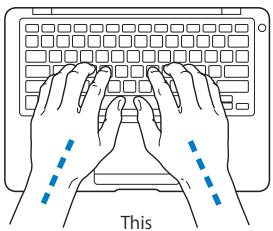

> **AI Description:**
> **Source:** `assets/_page_61_Figure_0.jpg`
> 
> **Generated:** 2026-05-19 07:11:03
> 
> ---
> 
> The image is a diagram of hands typing on a keyboard. It includes dashed lines indicating the movement of the fingers as they type. The text "This" is present at the bottom of the image, likely indicating a label or title for the diagram. The diagram is a technical illustration used to demonstrate proper typing technique.


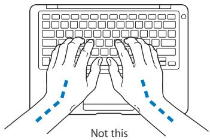

> **AI Description:**
> **Source:** `assets/_page_61_Figure_1.jpg`
> 
> **Generated:** 2026-05-19 07:11:11
> 
> ---
> 
> The image is a diagram illustrating a typing position. It shows two hands placed on a keyboard with the thumbs positioned on the spacebar. The image includes dashed lines indicating the incorrect placement of the thumbs, with the text "Not this" below the diagram. The diagram is designed to demonstrate the proper and improper positions for typing, emphasizing the incorrect placement of the thumbs on the spacebar.


<span id="page-62-0"></span>
Use a light touch when typing or using the trackpad and keep your hands and fingers relaxed. Avoid rolling your thumbs under your palms.

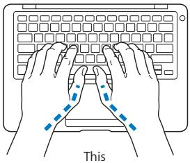

> **AI Description:**
> **Source:** `assets/_page_62_Figure_0.jpg`
> 
> **Generated:** 2026-05-19 07:09:06
> 
> ---
> 
> The image is a diagram of a keyboard with hands positioned in a typing stance. The hands are placed on the keyboard with the thumbs resting on the spacebar and the fingers on the home row keys (as indicated by the dashed lines). The image includes the word "This" at the bottom, likely indicating a reference or label for the typing position shown.


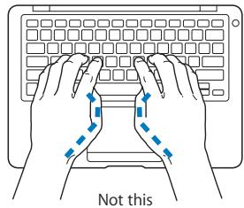

> **AI Description:**
> **Source:** `assets/_page_62_Figure_1.jpg`
> 
> **Generated:** 2026-05-19 07:08:46
> 
> ---
> 
> The image is a diagram illustrating a correct typing posture. It shows two hands positioned on a keyboard with dashed lines indicating the movement of the fingers. The text "Not this" is displayed below the hands, suggesting that the depicted posture is incorrect. The diagram is a technical illustration used to convey proper typing technique.


Change hand positions often to avoid fatigue. Some computer users might develop discomfort in their hands, wrists, or arms after intensive work without breaks. If you begin to develop chronic pain or discomfort in your hands, wrists, or arms, consult a qualified health specialist.

## External Mouse

If you use an external mouse, position the mouse at the same height as the keyboard and within a comfortable reach.

## Chair

An adjustable chair that provides firm, comfortable support is best. Adjust the height of the chair so your thighs are horizontal and your feet are flat on the floor. The back of the chair should support your lower back (lumbar region). Follow the manufacturer’s instructions for adjusting the backrest to fit your body properly.

<span id="page-63-0"></span>
You might have to raise your chair so that your forearms and hands are at the proper angle to the keyboard. If this makes it impossible to rest your feet flat on the floor, you can use a footrest with adjustable height and tilt to make up for any gap between the floor and your feet. Or you can lower the desktop to eliminate the need for a footrest. Another option is to use a desk with a keyboard tray that’s lower than the regular work surface.

## Built-in Display

Adjust the angle of the display to minimize glare and reflections from overhead lights and windows. Do not force the display if you meet resistance. The display is not meant to open past 125 degrees.

You can adjust the brightness of the screen when you take the computer from one work location to another, or if the lighting in your work area changes.

More information about ergonomics is available on the web:

www.apple.com/about/ergonomics

## Apple and the Environment

Apple Inc. recognizes its responsibility to minimize the environmental impacts of its operations and products.

More information is available on the web:

www.apple.com/environment

<span id="page-64-0"></span>
## Regulatory Compliance Information

## FCC Compliance Statement

This device complies with part 15 of the FCC rules. Operation is subject to the following two conditions: (1) This device may not cause harmful interference, and (2) this device must accept any interference received, including interference that may cause undesired operation. See instructions if interference to radio or television reception is suspected.

L‘utilisation de ce dispositif est autorisée seulement aux conditions suivantes: (1) il ne doit pas produire de brouillage et (2) l’utilisateur du dispositif doit étre prêt à accepter tout brouillage radioélectrique reçu, même si ce brouillage est susceptible de compromettre le fonctionnement du dispositif.

## Radio and Television Interference

This computer equipment generates, uses, and can radiate radio-frequency energy. If it is not installed and used properly—that is, in strict accordance with Apple’s instructions—it may cause interference with radio and television reception.

This equipment has been tested and found to comply with the limits for a Class B digital device in accordance with the specifications in Part 15 of FCC rules. These specifications are designed to provide reasonable protection against such interference in a residential installation. However, there is no guarantee that interference will not occur in a particular installation.

You can determine whether your computer system is causing interference by turning it off. If the interference stops, it was probably caused by the computer or one of the peripheral devices.

If your computer system does cause interference to radio or television reception, try to correct the interference by using one or more of the following measures:

 Turn the television or radio antenna until the interference stops.

 Move the computer to one side or the other of the television or radio.

 Move the computer farther away from the television or radio.

 Plug the computer in to an outlet that is on a different circuit from the television or radio. (That is, make certain the computer and the television or radio are on circuits controlled by different circuit breakers or fuses.)

If necessary, consult an Apple Authorized Service Provider or Apple. See the service and support information that came with your Apple product. Or consult an experienced radio/television technician for additional suggestions.

Important: Changes or modifications to this product not authorized by Apple Inc., could void the EMC compliance and negate your authority to operate the product.

This product has demonstrated EMC compliance under conditions that included the use of compliant peripheral devices and shielded cables (including Ethernet network cables) between system components. It is important that you use compliant peripheral devices and shielded cables between system components to reduce the possibility of causing interference to radios, television sets, and other electronic devices.

<span id="page-65-0"></span>
Responsible party (contact for FCC matters only):   
Apple Inc. Corporate Compliance   
1 Infinite Loop M/S 26-A   
Cupertino, CA 95014-2084

## Wireless Radio Use

This device is restricted to indoor use when operating in the 5.15 to 5.25 GHz frequency band.

Cet appareil doit être utilisé à l’intérieur.

## Exposure to Radio Frequency Energy

The radiated output power of the AirPort Extreme technology is below the FCC radio frequency exposure limits. Nevertheless, it is advised to use the wireless equipment in such a manner that the potential for human contact during normal operation is minimized.

## FCC Bluetooth Wireless Compliance

The antenna used with this transmitter must not be collocated or operated in conjunction with any other antenna or transmitter subject to the conditions of the FCC Grant.

## Bluetooth Industry Canada Statement

This Class B device meets all requirements of the Canadian interference-causing equipment regulations.

Cet appareil numérique de la Class B respecte toutes les exigences du Règlement sur le matériel brouilleur du Canada.

## Industry Canada Statement

Complies with the Canadian ICES-003 Class B specifications. Cet appareil numérique de la classe B est conforme à la norme NMB-003 du Canada. This device complies with RSS 210 of Industry Canada.

## Europe—EU Declaration of Conformity

See: www.apple.com/euro/compliance

## Korea Statements

## B (

## Singapore Wireless Certification

Complies with IDA Standards DB00063

## Taiwan Wireless Statements

## 於2.4GHz區域内操作之無線設備的警告聲明

經型式認證合格之低功率射頻電機·非經許可·公司、商號或使用者均不得擅自變更頻率、加大功率或變更原設計之特性及功能。低功率射頻電機之使用不得影響飛航安全及干擾合法通信：經發現有干擾現象時·應立即停用·並改善至無干擾時方得繼續使用。前項合法通信指依電信法規定作業之無線電通信。低功率射頻電機須忍受合法通信或工業、科學及醫療用電波輻射性電機設備之干擾。

工作頻率5.250～5.350GHz該频段限於室内使用。

## Taiwan Class B Statement

Class B設備的警告聲明 NIL

## Russia


ME67

<span id="page-66-0"></span>
## VCCI Class B Statement

情報处理装置等電波障害自主規制にい

乙の装置は、情報处理装置等電波障害自主規制協議会(VCC)の基準に基<クB情報技術装置。の装置は家庭環境使用る的しい、装置がラ受信機に近接使用されると、受信障害を引起とかあります。

取报說明書に従て正しい取报をしてだい。

## External USB Modem Information

When connecting your MacBook Air to the phone line using an external USB modem, refer to the telecommunications agency information in the documentation that came with your modem.

## ENERGY STAR® Compliance


As an ENERGY STAR® partner, Apple has determined that standard configurations of this product meet the ENERGY STAR® guidelines for energy efficiency. The ENERGY STAR® program is a partnership with electronic equipment manufacturers to promote energy-efficient products. Reducing energy consumption of products saves money and helps conserve valuable resources.

This computer is shipped with power management enabled with the computer set to sleep after 10 minutes of user inactivity. To wake your computer, click the mouse or trackpad button or press any key on the keyboard.

For more information about ENERGY STAR®, visit: www.energystar.gov

中国


O:表示该有毒有害物质在该部件所有均质材料中的含量均在SJ/T11363-2006规定的限量要求以下。
X:表示该有毒有害物质至少在该部件的某一均质材料中的含量超出SJ/T11363-2006规定的限量要求。

根据中国电子行业标准SJ/T11364-2006和相关的中国政府法规，本产品及其某些内部或外部组件上可能带有环保使用期限标识。取决于组件和组件制造商，产品及其组件上的使用期限标识可能有所不同。组件上的使用期限标识优先于产品上任何与之相冲突的或不同的环保使用期限标识。

<span id="page-67-0"></span>
## Disposal and Recycling Information


> **AI Description:**
> **Source:** `assets/_page_67_Figure_0.jpg`
> 
> **Generated:** 2026-05-19 07:10:35
> 
> ---
> 
> The image contains a simple icon with a trash can crossed out by a diagonal line, indicating that the item represented by the trash can should not be disposed of in the regular trash. This is commonly used to signify that the item is hazardous waste and should be disposed of separately.


This symbol indicates that your product must be disposed of properly according to local laws and regulations. When your product reaches its end of life, contact Apple or your local authorities to learn about recycling options.

For information about Apple’s recycling program, go to www.apple.com/environment/recycling.

## Battery Disposal Information

Dispose of batteries according to your local environmental laws and guidelines.

Nederlands: Gebruikte batterijen kunnen worden ingeleverd bij de chemokar of in een speciale batterijcontainer voor klein chemisch afval (kca) worden gedeponeerd.


> **AI Description:**
> **Source:** `assets/_page_67_Figure_1.jpg`
> 
> **Generated:** 2026-05-19 07:10:21
> 
> ---
> 
> The image contains a simple line drawing of a shopping cart with a single item inside. The cart is depicted in a minimalist style, with a black outline and no additional colors or shading. The item inside the cart is not detailed, appearing as a simple shape. There are no labels or text annotations within the image.


Deutschland: Dieses Gerät enthält Batterien. Bitte nicht in den Hausmüll werfen. Entsorgen Sie dieses Gerätes am Ende seines Lebenszyklus entsprechend der maßgeblichen gesetzlichen Regelungen.

Taiwan:


廢電池請回收

## European Union—Disposal Information:


> **AI Description:**
> **Source:** `assets/_page_67_Figure_3.jpg`
> 
> **Generated:** 2026-05-19 07:09:51
> 
> ---
> 
> The image contains a simple icon with a crossed-out trash can and a crossed-out wheelie bin. This symbol is commonly used to indicate that the item represented by the icon should not be disposed of in regular waste bins. It suggests that the item should be recycled or disposed of in a specific manner, such as through a recycling program or designated waste collection.


The symbol above means that according to local laws and regulations your product should be disposed of separately from household waste. When this product reaches its end of life, take it to a collection point designated by local authorities. Some collection points accept products for free. The separate collection and recycling of your product at the time of disposal will help conserve natural resources and ensure that it is recycled in a manner that protects human health and the environment.

<span id="page-68-0"></span>
Looking for Something?

<span id="page-69-0"></span>
## Index

## A

AC plug 10, 11   
AC power adapter. See power adapter   
AC power cord 11   
adjusting your display 29   
AirPort Extreme troubleshooting 51   
ambient light sensor 27   
AppleCare 54   
Apple Hardware Test, using 44   
Apple Remote 27, 37   
application freeze 40   
applications Front Row 27, 37 iChat AV 27 iLife ’08 36 Keynote 27

## B

battery charging 34 location 27 performance 34 storing 61   
blinking question mark 41   
brightness keys 29

built-in speaker 27   
button, power 12, 27

C   
camera. See iSight video camera   
carrying your computer 61   
changing the desktop 14 password 48, 50 System Preferences 14   
charging the battery 34   
cleaning the display 61 your computer 61   
cleaning cloth 61   
computer disposal 68 freezes 41 putting to sleep 22 shutting down 23 turning on 12 won’t turn on 42   
connection problems with another computer 43   
Control-click 32   
cord, AC power 11

## D

Dashboard 29   
desktop, customizing 14   
Disk Utility 49, 50   
display adjusting settings 29 cleaning 61 external 31 goes black 43   
disposing of your computer 68   
Dock 35   
downloading software 53   
DVD or CD Sharing 19, 20   
DVD or CD Sharing Setup software, installing 16   
DVDs in package 9

## E

environmental impact 64   
erasing a disk 49   
ergonomics 62   
Exposé All Windows key 29   
external display port 31

F F1 to F12 function keys 29 Fast-forward key 29

<span id="page-70-0"></span>
flashing question mark 41   
Force Quit 40   
forward delete 32   
Front Row application 27, 37   
frozen application 40   
Function (fn) key 29

## H

hand positions 62   
headphone jack 31   
Help, finding answers 35

## I

iChat AV application 27   
iLife ’08 applications 36   
illuminated keyboard 27   
infrared receiver (IR) 27   
installation discs 9   
installing DVD or CD Sharing   
Setup 16   
iSight video camera 27

## K

keyboard ALS sensor 27 ergonomics 62 features 28 shortcuts 32 See also keys   
keyboard illumination keys 29   
Keynote application 27   
keys

brightness 29   
Dashboard 29   
Exposé 29   
function 29   
keyboard illumination 29   
media 29   
Media Eject 29   
Mute 29   
volume control 29

## L

lights, sleep indicator 27

M   
Mac Help 35   
Mac OS X installation discs 9   
Mac OS X website 36   
MagSafe power adapter. See power adapter   
MagSafe power port 31   
Media Eject key 29   
media keys 29   
micro-DVI port 31   
microphone 27   
migrating information 16   
Migration Assistant 16   
mouse 31, 63 See also trackpad   
Mute key 29   
N   
Network Diagnostics 51

Network Setup Assistant 51

## O

online resources 53   
optical discs for system software 9, 69   
optical disc sharing. See DVD or CD Sharing

## P

paging through documents using trackpad 34   
partner computer connection problems 43 Disk Utility 49 DVD or CD Sharing Setup software 16 installing Mac OS X 45 resetting your password 48   
password, resetting 48, 50   
pinching to zoom 33   
Play/Pause key 29   
plug, AC 10, 11   
port hatch 31   
ports hatch 31 headphone 31 MagSafe power 31 micro-DVI 31 USB 2.0 31   
power adapter plugging in 59

<span id="page-71-0"></span>
## Q

R   
rechargeable battery 34   
Remote DVD or CD 19, 20   
Remote Install Mac OS X Disk Utility 49 installing Mac OS X 45 resetting your password 48   
repairing a disk 49   
resetting your password 48, 50   
Rewind key 29   
right click 32   
rotating objects using trackpad 34   
S   
safety general safety instructions 58 important information 8 power adapter 59   
scrolling trackpad feature 27   
scrolling with two fingers 33   
secondary click 32   
serial number, locating 56   
service and support 54   
Setup Assistant 13   
shared optical disc 19, 20   
sharing files 19, 20   
shutting down 23   
sleep mode indicator light 27 putting computer to sleep 22   
software, updating 53   
Software Update preferences 53   
speaker 27   
specifications 37   
stopping an application 40 the computer 23   
storing your computer 61   
support 54   
swiping to move quickly through documents 34   
System Preferences customizing the desktop 14 Energy Saver 22 Software Update 53   
System Profiler 54   
T   
three-finger swiping 34   
trackpad location 27 paging 34 scrolling 27 shortcuts 32 swiping 34 zooming 27   
troubleshooting AirPort 51 AppleCare 54 computer freezes 41 computer won’t turn on 42 display goes black 43 hardware problems 44 partner computer 43 pointer won’t move 40 service and support 53 using Mac Help 54 See also problems   
turning on your computer 12   
two-finger pinching 33   
two-finger rotating 34   
typing position 62

<span id="page-72-0"></span>
## U

updating software 53   
USB connections 37 ports 31

## V

verifying a disk 49   
video camera indicator light 27 micro-DVI port 31   
volume control keys 29

W waking your computer 22

## Z

zooming using the trackpad 27, 33

<span id="page-74-0"></span>
## K Apple Inc.

© 2008 Apple Inc. All rights reserved. Under the copyright laws, this manual may not be copied, in whole or in part, without the written consent of Apple.

Every effort has been made to ensure that the information in this manual is accurate. Apple is not responsible for printing or clerical errors.

Apple   
1 Infinite Loop   
Cupertino, CA 95014-2084   
408-996-1010   
www.apple.com

Apple, the Apple logo, AirPort, AirPort Extreme, Cover Flow, Exposé, iCal, iChat, iLife, iMovie, iPhoto, iPod, iSight, iTunes, Keynote, Mac, Macintosh, Mac OS, MacBook, and MagSafe are trademarks of Apple Inc., registered in the U.S. and other countries.

Finder, iPhone, Safari, and Spotlight are trademarks of Apple Inc.

AppleCare and Apple Store are service marks of Apple Inc., registered in the U.S. and other countries.

ENERGY STAR® is a U.S. registered trademark.

Intel, Intel Core, and Xeon are trademarks of Intel Corp.   
in the U.S. and other countries.

The Bluetooth® word mark and logos are owned by the Bluetooth SIG, Inc. and any use of such marks by Apple Inc. is under license.

Other company and product names mentioned herein are trademarks of their respective companies. Mention of third-party products is for informational purposes only and constitutes neither an endorsement nor a recommendation. Apple assumes no responsibility with regard to the performance or use of these products.

Manufactured under license from Dolby Laboratories. “Dolby,” “Pro Logic,” and the double-D symbol are trademarks of Dolby Laboratories. Confidential Unpublished Works, © 1992–1997 Dolby Laboratories, Inc. All rights reserved.

The product described in this manual incorporates copyright protection technology that is protected by method claims of certain U.S. patents and other intellectual property rights owned by Macrovision Corporation and other rights owners. Use of this copyright protection technology must be authorized by Macrovision Corporation and is intended for home and other limited viewing uses only unless otherwise authorized by Macrovision Corporation. Reverse engineering or disassembly is prohibited.

Apparatus Claims of U.S. Patent Nos. 4,631,603, 4,577,216, 4,819,098 and 4,907,093 licensed for limited viewing uses only.

Simultaneously published in the United States and Canada.