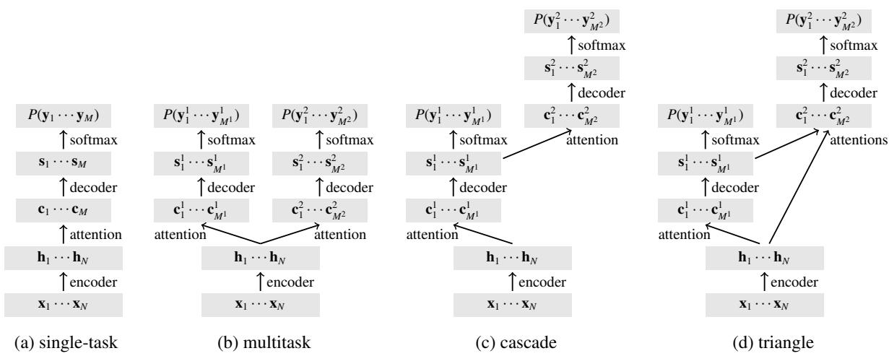

# Tied Multitask Learning for Neural Speech Translation

Antonios Anastasopoulos and David Chiang Department of Computer Science and Engineeering University of Notre Dame {aanastas,dchiang}@nd.edu

## Abstract

We explore multitask models for neural translation of speech, augmenting them in order to reflect two intuitive notions. First, we introduce a model where the second task decoder receives information from the decoder of the first task, since higher-level intermediate representations should provide useful information. Second, we apply regularization that encourages transitivity and invertibility. We show that the application of these notions on jointly trained models improves performance on the tasks of low-resource speech transcription and translation. It also leads to better performance when using attention information for word discovery over unsegmented input.

## 1 Introduction

Recent efforts in endangered language documentation focus on collecting spoken language resources, accompanied by spoken translations in a high resource language to make the resource interpretable (Bird et al., 2014a). For example, the BULB project (Adda et al., 2016) used the LIG-Aikuma mobile app (Bird et al., 2014b; Blachon et al., 2016) to collect parallel speech corpora between three Bantu languages and French. Since it’s common for speakers of endangered languages to speak one or more additional languages, collection of such a resource is a realistic goal.

Speech can be interpreted either by transcription in the original language or translation to another language. Since the size of the data is extremely small, multitask models that jointly train a model for both tasks can take advantage of both signals. Our contribution lies in improving the sequence-to-sequence multitask learning paradigm, by drawing on two intuitive notions: that higher-level representations are more useful than lower-level representations, and that translation should be both transitive and invertible.

Higher-level intermediate representations, such as transcriptions, should in principle carry information useful for an end task like speech translation. A typical multitask setup (Weiss et al., 2017) shares information at the level of encoded frames, but intuitively, a human translating speech must work from a higher level of representation, at least at the level of phonemes if not syntax or semantics. Thus, we present a novel architecture for tied multitask learning with sequence-to-sequence models, in which the decoder of the second task receives information not only from the encoder, but also from the decoder of the first task.

In addition, transitivity and invertibility are two properties that should hold when mapping between levels of representation or across languages. We demonstrate how these two notions can be implemented through regularization of the attention matrices, and how they lead to further improved performance.

We evaluate our models in three experiment settings: low-resource speech transcription and translation, word discovery on unsegmented input, and high-resource text translation. Our highresource experiments are performed on English, French, and German. Our low-resource speech experiments cover a wider range of linguistic diversity: Spanish-English, Mboshi-French, and Ainu-English.

In the speech transcription and translation tasks, our proposed model leads to improved performance against all baselines as well as previous multitask architectures. We observe improvements of up to 5% character error rate in the transcription task, and up to 2.8% character-level BLEU in the translation task. However, we didn’t observe similar improvements in the text translation experiments. Finally, on the word discovery task, we improve upon previous work by about 3% F-score on both tokens and types.

## 2 Model

Our models are based on a sequence-to-sequence model with attention (Bahdanau et al., 2015). In general, this type of model is composed of three parts: a recurrent encoder, the attention, and a recurrent decoder (see Figure 1a).1

The encoder transforms an input sequence of words or feature frames $\mathbf { x } _ { 1 } , \ldots , \mathbf { x } _ { N }$ into a sequence of input states $\mathbf { h } _ { 1 } , \ldots , \mathbf { h } _ { N } ;$

$$
\begin{array} { r } { \mathbf h _ { n } = \operatorname { e n c } ( \mathbf h _ { n - 1 } , \mathbf x _ { n } ) . } \end{array}
$$

The attention transforms the input states into a sequence of context vectors via a matrix of attention weights:

$$
\mathbf { c } _ { m } = \sum _ { n } \alpha _ { m n } \mathbf { h } _ { n } .
$$

Finally, the decoder computes a sequence of output states from which a probability distribution over output words can be computed.

$$
\begin{array} { c } { \mathbf { s } _ { m } = \operatorname* { d e c } ( \mathbf { s } _ { m - 1 } , \mathbf { c } _ { m } , \mathbf { y } _ { m - 1 } ) } \\ { P ( \mathbf { y } _ { m } ) = \operatorname { s o f t m a x } ( \mathbf { s } _ { m } ) . } \end{array}
$$

In a standard encoder-decoder multitask model (Figure 1b) (Dong et al., 2015; Weiss et al., 2017), we jointly model two output sequences using a shared encoder, but separate attentions and decoders:

$$
\begin{array} { l } { \displaystyle { { \bf { c } } _ { m } ^ { 1 } = \sum _ { n } \alpha _ { m n } ^ { 1 } { \bf { h } } _ { n } } \ ~ } \\ { \displaystyle { { \bf { s } } _ { m } ^ { 1 } = \mathrm { d e c } ^ { 1 } ( { \bf { s } } _ { m - 1 } ^ { 1 } , { \bf { c } } _ { m } ^ { 1 } , { \bf { y } } _ { m - 1 } ^ { 1 } ) } \ ~ } \\ { \displaystyle { P ( { \bf { y } } _ { m } ^ { 1 } ) = \mathrm { s o f t m a x } ( { \bf { s } } _ { m } ^ { 1 } ) } } \end{array}
$$

and

$$
\begin{array} { c } { { \displaystyle { \bf c } _ { m } ^ { 2 } = \sum _ { n } \alpha _ { m n } ^ { 2 } { \bf h } _ { n } } } \\ { { \displaystyle { \bf s } _ { m } ^ { 2 } = \mathrm { d e c } ^ { 2 } ( { \bf s } _ { m - 1 } ^ { 2 } , { \bf c } _ { m } ^ { 2 } , { \bf y } _ { m - 1 } ^ { 2 } ) } } \\ { { P ( { \bf y } _ { m } ^ { 2 } ) = \mathrm { s o f t m a x } ( { \bf s } _ { m } ^ { 2 } ) . } } \end{array}
$$

We can also arrange the decoders in a cascade (Figure 1c), in which the second decoder attends only to the output states of the first decoder:

$$
\begin{array} { r } { \ c { \mathbf { c } } _ { m } ^ { 2 } = \displaystyle \sum _ { m ^ { \prime } } \alpha _ { m m ^ { \prime } } ^ { 1 2 } \mathbf { s } _ { m ^ { \prime } } ^ { 1 } \qquad } \\ { \displaystyle \mathbf { s } _ { m } ^ { 2 } = \operatorname* { d e c } ^ { 2 } ( \mathbf { s } _ { m - 1 } ^ { 2 } , \mathbf { c } _ { m } ^ { 2 } , \mathbf { y } _ { m - 1 } ^ { 2 } ) \qquad } \\ { P ( \mathbf { y } _ { m } ^ { 2 } ) = \mathrm { s o f t m a x } ( \mathbf { s } _ { m } ^ { 2 } ) . \qquad } \end{array}
$$

Tu et al. (2017) use exactly this architecture to train on bitext by setting the second output sequence to be equal to the input sequence $( \mathbf { y } _ { i } ^ { 2 } = \mathbf { x } _ { i } )$

In our proposed triangle model (Figure 1d), the first decoder is as above, but the second decoder has two attentions, one for the input states of the encoder and one for the output states of the first decoder:

$$
\begin{array} { c } { { \displaystyle { \bf c } _ { m } ^ { 2 } = \left[ \sum _ { m ^ { \prime } } \alpha _ { m m ^ { \prime } } ^ { 1 2 } { \bf s } _ { m ^ { \prime } } ^ { 1 } \quad \sum _ { n } \alpha _ { m n } ^ { 2 } { \bf h } _ { n } \right] } } \\ { { \displaystyle { \bf s } _ { m } ^ { 2 } = \mathrm { d e c } ^ { 2 } ( { \bf s } _ { m - 1 } ^ { 2 } , { \bf c } _ { m } ^ { 2 } , { \bf y } _ { m - 1 } ^ { 2 } ) } } \\ { { P ( { \bf y } _ { m } ^ { 2 } ) = \mathrm { s o f t m a x } ( { \bf s } _ { m } ^ { 2 } ) . } } \end{array}
$$

Note that the context vectors resulting from the two attentions are concatenated, not added.

## 3 Learning and Inference

For compactness, we will write X for the matrix whose rows are the $\mathbf { X } _ { n } .$ and similarly H, C, and so on. We also write A for the matrix of attention weights: $[ \mathbf { A } ] _ { i j } = \alpha _ { i j }$

Let θ be the parameters of our model, which we train on sentence triples $( { \bf X } , { \bf Y } ^ { 1 } , { \bf Y } ^ { 2 } )$ .

## 3.1 Maximum likelihood estimation

Define the score of a sentence triple to be a loglinear interpolation of the two decoders’ probabilities:

$$
\begin{array} { r } { \mathrm { s c o r e } ( \mathbf { Y } ^ { 1 } , \mathbf { Y } ^ { 2 } \mid \mathbf { X } ; \theta ) = \lambda \log P ( \mathbf { Y } ^ { 1 } \mid \mathbf { X } ; \theta ) + \right. \left. \right. } \\ { \left. \left. ( 1 - \lambda ) \log P ( \mathbf { Y } ^ { 2 } \mid \mathbf { X } , \mathbf { S } ^ { 1 } ; \theta ) \right. } \end{array}
$$

where λ is a parameter that controls the importance of each sub-task. In all our experiments, we set λ to 0.5. We then train the model to maximize

$$
\mathcal { L } ( \boldsymbol { \theta } ) = \sum \operatorname { s c o r e } ( \mathbf { Y } ^ { 1 } , \mathbf { Y } ^ { 2 } \mid \mathbf { X } ; \boldsymbol { \theta } ) ,
$$

where the summation is over all sentence triples in the training data.

## 3.2 Regularization

We can optionally add a regularization term to the objective function, in order to encourage our attention mechanisms to conform to two intuitive principles of machine translation: transitivity and invertibility.

Transitivity attention regularizer To a first approximation, the translation relation should be transitive (Wang et al., 2006; Levinboim and Chiang, 2015): If source word $\mathbf { X } _ { i }$ aligns to target word $\mathbf { y } _ { j } ^ { 1 }$ and ${ \bf y } _ { j } ^ { 1 }$ aligns to target word $\mathbf { y } _ { k } ^ { 2 } .$ , then $\mathbf { X } _ { i }$ should also probably align to $\mathbf { y } _ { k } ^ { 2 } .$ . To encourage the model to preserve this relationship, we add the following transitivity regularizer to the loss function of the triangle models with a small weight $\lambda _ { \mathrm { t r a n s } } = 0 . 2 $

Figure 1: Variations on the standard attentional model. In the standard single-task model, the decoder attends to the encoder’s states. In a typical multitask setup, two decoders attend to the encoder’s states. In the cascade (Tu et al., 2017), the second decoder attends to the first decoder’s states. In our proposed triangle model, the second decoder attends to both the encoder’s states and the first decoder’s states. Note that for clarity’s sake there are dependencies not shown.

> **AI Description:**
> **Source:** `assets/_page_2_Figure_0.jpg`
> 
> **Generated:** 2026-05-19 07:18:59
> 
> ---
> 
> The image contains a series of four diagrams labeled (a) single-task, (b) multitask, (c) cascade, and (d) triangle. Each diagram illustrates a different model architecture for a machine learning task, specifically for sequence-to-sequence modeling. The diagrams show the flow of information through an encoder, decoder, and attention mechanisms. Key components include input sequences (x1...xN), hidden states (h1...hN), context vectors (c1...cM), and output sequences (y1...yM). The diagrams highlight how different models handle multiple tasks or sequences, with the single-task model focusing on a single sequence, the multitask model handling multiple tasks, the cascade model processing tasks sequentially, and the triangle model potentially handling multiple tasks in a more complex manner.

$$
\mathcal { L } _ { \mathrm { t r a n s } } = \mathrm { s c o r e } ( \mathbf { Y } ^ { 1 } , \mathbf { Y } ^ { 2 } ) - \lambda _ { \mathrm { t r a n s } } \left\| \mathbf { A } ^ { 1 2 } \mathbf { A } ^ { 1 } - \mathbf { A } ^ { 2 } \right\| _ { 2 } ^ { 2 } .
$$

Invertibility attention regularizer The translation relation also ought to be roughly invertible (Levinboim et al., 2015): if, in the reconstruction version of the cascade model, source word $\mathbf { x } _ { i }$ aligns to target word ${ \bf y } _ { j } ^ { 1 }$ , then it stands to reason that $\mathbf { y } _ { j }$ is likely to align to xi. So, whereas Tu et al. (2017) let the attentions of the translator and the reconstructor be unrelated, we try adding the following invertibility regularizer to encourage the attentions to each be the inverse of the other, again with a weight $\lambda _ { \mathrm { i n v } } = 0 . 2$

$$
\mathcal { L } _ { \mathrm { { i n v } } } = \operatorname { s c o r e } ( \mathbf { Y } ^ { 1 } , \mathbf { Y } ^ { 2 } ) - \lambda _ { \mathrm { { i n v } } } \left\| \mathbf { A } ^ { 1 } \mathbf { A } ^ { 1 2 } - \mathbf { I } \right\| _ { 2 } ^ { 2 } .
$$

## 3.3 Decoding

Since we have two decoders, we now need to employ a two-phase beam search, following Tu et al. (2017):

1. The first decoder produces, through standard beam search, a set of triples each consisting of a candidate transcription ${ \hat { \mathbf { Y } } } ^ { 1 }$ , a score $P ( \hat { \mathbf { Y } } ^ { 1 } )$ , and a hidden state sequence Sˆ .

2. For each transcription candidate from the first decoder, the second decoder now produces through beam search a set of candidate translations ${ \hat { \mathbf { Y } } } ^ { 2 }$ , each with a score $P ( \hat { \mathbf { Y } } ^ { 2 } )$ ).

Table 1: Statistics on our speech datasets.

3. We then output the combination that yields the highest total score(Y1, Y2).

## 3.4 Implementation

All our models are implemented in DyNet (Neubig et al., 2017).2 We use a dropout of 0.2, and train using Adam with initial learning rate of 0.0002 for a maximum of 500 epochs. For testing, we select the model with the best performance on dev. At inference time, we use a beam size of 4 for each decoder (due to GPU memory constraints), and the beam scores include length normalization (Wu et al., 2016) with a weight of 0.8, which Nguyen and Chiang (2017) found to work well for lowresource NMT.

## 4 Speech Transcription and Translation

We focus on speech transcription and translation of endangered languages, using three different cor-

Table 2: The multitask models outperform the baseline single-task model and the pivot approach (auto/text) on all language pairs tested. The triangle model also outperforms the simple multitask models on both tasks in almost all cases. The best results for each dataset and task are highlighted.

pora on three different language directions: Spanish (es) to English (en), Ainu (ai) to English, and Mboshi (mb) to French (fr).

## 4.1 Data

Spanish is, of course, not an endangered language, but the availability of the CALLHOME Spanish Speech dataset (LDC2014T23) with English translations (Post et al., 2013) makes it a convenient language to work with, as has been done in almost all previous work in this area. It consists of telephone conversations between relatives (about 20 total hours of audio) with more than 240 speakers. We use the original train-dev-test split, with the training set comprised of 80 conversations and dev and test of 20 conversations each.

Hokkaido Ainu is the sole surviving member of the Ainu language family and is generally considered a language isolate. As of 2007, only ten native speakers were alive. The Glossed Audio Corpus of Ainu Folklore provides 10 narratives with audio (about 2.5 hours of audio) and translations in Japanese and English.3 Since there does not exist a standard train-dev-test split, we employ a cross validation scheme for evaluation purposes. In each fold, one of the 10 narratives becomes the test set, with the previous one (mod 10) becoming the dev set, and the remaining 8 narratives becoming the training set. The models for each of the 10 folds are trained and tested separately. On average, for each fold, we train on about 2000 utterances; the dev and test sets consist of about 270 utterances.

We report results on the concatenation of all folds. The Ainu text is split into characters, except for the equals (=) and underscore ( ) characters, which are used as phonological or structural markers and are thus merged with the following character.4

Mboshi (Bantu C25 in the Guthrie classification) is a language spoken in Congo-Brazzaville, without standard orthography. We use a corpus (Godard et al., 2017) of 5517 parallel utterances (about 4.4 hours of audio) collected from three native speakers. The corpus provides non-standard grapheme transcriptions (close to the language phonology) produced by linguists, as well as French translations. We sampled 100 segments from the training set to be our dev set, and used the original dev set (514 sentences) as our test set.

## 4.2 Implementation

We employ a 3-layer speech encoding scheme similar to that of Duong et al. (2016). The first bidirectional layer receives the audio sequence in the form of 39-dimensional Perceptual Linear Predictive (PLP) features (Hermansky, 1990) computed over overlapping 25ms-wide windows every 10ms. The second and third layers consist of LSTMs with hidden state sizes of 128 and 512 respectively. Each layer encodes every second output of the previous layer. Thus, the sequence is downsampled by a factor of 4, decreasing the computation load for the attention mechanism and the decoders. In the speech experiments, the decoders output the sequences at the grapheme level, so the output embedding size is set to 64.

We found that this simpler speech encoder works well for our extremely small datasets. Applying our models to larger datasets with many more speakers would most likely require a more sophisticated speech encoder, such as the one used by Weiss et al. (2017).

## 4.3 Results

In Table 2, we present results on three small datasets that demonstrate the efficacy of our models. We compare our proposed models against three baselines and one “skyline.” The first baseline is a traditional pivot approach (line 1), where the ASR output, a sequence of characters, is the input to a character-based NMT system (trained on gold transcriptions). The “skyline” model (line 2) is the same NMT system, but tested on gold transcriptions instead of ASR output. The second baseline is translation directly from source speech to target text (line 3). The last baseline is the standard multitask model (line 4), which is similar to the model of Weiss et al. (2017).

The cascade model (line 5) outperforms the baselines on the translation task, while only falling behind the multitask model in the transcription task. On all three datasets, the triangle model (lines 6, 7) outperforms all baselines, including the standard multitask model. On Ainu-English, we even obtain translations that are comparable to the “skyline” model, which is tested on gold Ainu transcriptions.

Comparing the performance of all models across the three datasets, there are two notable trends that verify common intuitions regarding the speech transcription and translation tasks. First, an increase in the number of speakers hurts the performance of the speech transcription tasks. The character error rates for Ainu are smaller than the CER in Mboshi, which in turn are smaller than the CER in CALLHOME. Second, the character-level BLEU scores increase as the amount of training data increases, with our smallest dataset (Ainu) having the lowest BLEU scores, and the largest dataset (CALLHOME) having the highest BLEU scores. This is expected, as more training data means that the translation decoder learns a more informed character-level language model for the target language.

Note that Weiss et al. (2017) report much higher

BLEU scores on CALLHOME: our model underperforms theirs by almost 9 word-level BLEU points. However, their model has significantly more parameters and is trained on 10 times more data than ours. Such an amount of data would never be available in our endangered languages scenario. When calculated on the wordlevel, all our models’ BLEU scores are between 3 and 7 points for the extremely low resource datasets (Mboshi-French and Ainu-English), and between 7 and 10 for CALLHOME. Clearly, the size of the training data in our experiments is not enough for producing high quality speech translations, but we plan to investigate the performance of our proposed models on larger datasets as part of our future work.

To evaluate the effect of using the combined score from both decoders at decoding time, we evaluated the triangle models using only the 1-best output from the speech model (lines 8, 9). One would expect that this would favor speech at the expense of translation. In transcription accuracy, we indeed observed improvements across the board. In translation accuracy, we observed a surprisingly large drop on Mboshi-French, but surprisingly little effect on the other language pairs – in fact, BLEU scores tended to go up slightly, but not significantly.

Finally, Figure 2 visualizes the attention matrices for one utterance from the baseline multitask model and our proposed triangle model. It is clear that our intuition was correct: the translation decoder receives most of its context from the transcription decoder, as indicated by the higher attention weights of ${ \bf A } ^ { 1 2 }$ . Ideally, the area under the red squares (gold alignments) would account for 100% of the attention mass of ${ \bf A } ^ { 1 2 }$ . In our triangle model, the total mass under the red squares is 34%, whereas the multitask model’s correct attentions amount to only 21% of the attention mass.

## 5 Word Discovery

Although the above results show that our model gives large performance improvements, in absolute terms, its performance on such low-resource tasks leaves a lot of room for future improvement. A possible more realistic application of our methods is word discovery, that is, finding word boundaries in unsegmented phonetic transcriptions.

After training an attentional encoder-decoder model between Mboshi unsegmented phonetic sequences and French word sequences, the attention weights can be thought of as soft alignments, which allow us to project the French word boundaries onto Mboshi. Although we could in principle perform word discovery directly on speech, we leave this for future work, and only explore singletask and reconstruction models.

### Full Page Description (Page 5)

**Source:** `assets/_page_5_Asset_1.jpg`

**Generated:** 2026-05-19 07:19:15

---

The image contains a heat map labeled as \( \mathbf{A}^2 \), which appears to represent a matrix or a similarity matrix. The heat map shows a range of values, with darker shades indicating higher values and lighter shades indicating lower values. The text "je me suis blessé à la lèvre" is aligned vertically on the left side of the heat map, suggesting it may be related to the data being visualized. The bottom of the image shows an audio waveform, indicating that the data might be related to speech or audio processing. The red rectangles highlight specific areas within the heat map, possibly indicating regions of interest or anomalies in the data.

### Full Page Description (Page 5)

**Source:** `assets/_page_5_Asset_0.jpg`

**Generated:** 2026-05-19 07:19:06

---

The image contains a heatmap with a red line plotted on it. The heatmap appears to represent some form of correlation or similarity matrix, with the x-axis and y-axis labeled with what seems to be a mix of numerical and possibly categorical data. The red line, which is a step function, likely represents a path or sequence through the matrix, highlighting specific cells or data points. The cells are color-coded, suggesting varying levels of correlation or intensity, with darker shades indicating higher values. The overall layout and style suggest this is a data visualization tool used for analyzing and visualizing complex datasets.

### Full Page Description (Page 5)

**Source:** `assets/_page_5_Asset_3.jpg`

**Generated:** 2026-05-19 07:19:24

---

The image contains a spectrogram of audio data, which is a visual representation of the spectrum of frequencies in a sound over time. The spectrogram is labeled with the text "A²" at the top, indicating it is the second power of a matrix A. The text "je me suis blessé à la lèvre" is displayed vertically on the left side, which appears to be the French phrase "I hurt myself on my lip." The spectrogram shows the intensity of frequencies over time, with the red boxes highlighting specific areas of interest or analysis within the audio signal. The bottom of the image shows a waveform of the audio signal, which is a graphical representation of the sound's amplitude over time.

### Full Page Description (Page 5)

**Source:** `assets/_page_5_Asset_2.jpg`

**Generated:** 2026-05-19 07:19:31

---

The image contains a heat map with a red line plotted across it. The heat map has a grid of cells, each cell containing a color intensity that represents a value. The red line appears to follow a diagonal path across the map, indicating a specific sequence or pattern. The text at the top of the image seems to be a label or title for the heat map. The red line's path suggests a correlation or relationship between the values in the cells, possibly highlighting a specific trend or data point of interest.

## 5.1 Data

We use the same Mboshi-French corpus as in Section $^ { 4 , }$ but with the original training set of 4617 utterances and the dev set of 514 utterances. Our parallel data consist of the unsegmented phonetic Mboshi transcriptions, along with the word-level French translations.

## 5.2 Implementation

We first replicate the model of Boito et al. (2017), with a single-layer bidirectional encoder and single layer decoder, using an embedding and hidden size of 12 for the base model, and an embedding and hidden state size of 64 for the reverse model. In our own models, we set the embedding size to 32 for Mboshi characters, 64 for French words, and the hidden state size to 64. We smooth the attention weights A using the method of Duong et al. (2016) with a temperature T = 10 for the softmax computation of the attention mechanism.

Following Boito et al. (2017), we train models both on the base Mboshi-to-French direction, as well as the reverse (French-to-Mboshi) direction, with and without this smoothing operation. We further smooth the computed soft alignments of all models so that $a _ { m n } = ( a _ { m n - 1 } + a _ { m n } + a _ { m n + 1 } ) / 3$ as a post-processing step. From the single-task models we extract the ${ \bf A } ^ { 1 }$ attention matrices. We also train reconstruction models on both directions, with and without the invertibility regularizer, extracting both ${ \bf A } ^ { 1 }$ and ${ \bf A } ^ { 1 2 }$ matrices. The two matrices are then combined so that $\mathbf { A } = \mathbf { A } ^ { 1 } + ( \mathbf { A } ^ { 1 2 } ) ^ { T }$

## 5.3 Results

Evaluation is done both at the token and the type level, by computing precision, recall, and Fscore over the discovered segmentation, with the best results shown in Table 3. We reimplemented the base (Mboshi-French) and reverse (French-Mboshi) models from Boito et al. (2017), and the performance of the base model was comparable to the one reported. However, we were unable to reproduce the significant gains that were reported when using the reverse model (italicized in Table 3). Also, our version of both the base and reverse singletask models performed better than our reimplementation of the baseline.

Table 3: The reconstruction model with the invertibility regularizer produces more informed attentions that result in better word discovery for Mboshi with an Mboshi-French model. Scores reported by previous work are in italics and best scores from our experiments are in bold.

Furthermore, we found that we were able to obtain even better performance at the type level by combining the attention matrices of a reconstruction model trained with the invertibility regularizer. Boito et al. (2017) reported that combining the attention matrices of a base and a reverse model significantly reduced performance, but they trained the two models separately. In contrast, we obtain the base $( \mathbf { A } ^ { 1 } )$ and the reverse attention matrices $( \mathbf { A } ^ { 1 2 } )$ from a model that trains them jointly, while also tying them together through the invertibility regularizer. Using the regularizer is key to the improvements; in fact, we did not observe any improvements when we trained the reconstruction models without the regularizer.

## 6 Negative Results: High-Resource Text Translation

## 6.1 Data

For evaluating our models on text translation, we use the Europarl corpus which provides parallel sentences across several European languages. We extracted 1,450,890 three-way parallel sentences on English, French, and German. The concatenation of the newstest 2011–2013 sets (8,017 sentences) is our dev set, and our test set is the concatenation of the newstest 2014 and 2015 sets (6,003 sentences). We test all architectures on the six possible translation directions between English (en), French (fr) and German (de). All the sequences are represented by subword units with byte-pair encoding (BPE) (Sennrich et al., 2016) trained on each language with 32000 operations.

## 6.2 Experimental Setup

On all experiments, the encoder and the decoder(s) have 2 layers of LSTM units with hidden state size and attention size of 1024, and embedding size of 1024. For this high resource scenario, we only train for a maximum of 40 epochs.

## 6.3 Results

The accuracy of all the models on all six language pair directions is shown in Table 4. In all cases, the best models are the baseline single-task or simple multitask models. There are some instances, such as English-German, where the reconstruction or the triangle models are not statistically significantly different from the best model. The reason for this, we believe, is that in the case of text translation between so linguistically close languages, the lower level representations (the output of the encoder) provide as much information as the higher level ones, without the search errors that are introduced during inference.

A notable outcome of this experiment is that we do not observe the significant improvements with the reconstruction models that Tu et al. (2017) observed. A few possible differences between our experiment and theirs are: our models are BPEbased, theirs are word-based; we use Adam for optimization, they use Adadelta; our model has slightly fewer parameters than theirs; we test on less typologically different language pairs than

Table 4: BLEU scores for each model and translation direction $s \  \ t .$ In the multitask, cascade, and triangle models, x stands for the third language, other than s and t. In each column, the best results are highlighted. The non-highlighted results are statistically significantly worse than the single-task baseline.

English-Chinese.

However, we also observe that in most cases our proposed regularizers lead to increased performance. The invertibility regularizer aids the reconstruction models in achiev slightly higher BLEU scores in 3 out of the 6 cases. The transitivity regularizer is even more effective: in 9 out the 12 source-target language combinations, the triangle models achieve higher performance when trained using the regularizer. Some of them are statistical significant improvements, as in the case of French to English where English is the intermediate target language and German is the final target.

## 7 Related Work

The speech translation problem has been traditionally approached by using the output of an ASR system as input to a MT system. For example, Ney (1999) and Matusov et al. (2005) use ASR output lattices as input to translation models, integrating speech recognition uncertainty into the translation model. Recent work has focused more on modelling speech translation without explicit access to transcriptions. Duong et al. (2016) introduced a sequence-to-sequence model for speech translation without transcriptions but only evaluated on alignment, while Anastasopoulos et al. (2016) presented an unsupervised alignment method for speech-to-translation alignment. Bansal et al. (2017) used an unsupervised term discovery system (Jansen et al., 2010) to cluster recurring audio segments into pseudowords and translate speech using a bag-of-words model. Berard et al. ´ (2016) translated synthesized speech data using a model similar to the Listen Attend and Spell model (Chan et al., 2016). A larger-scale study (Berard et al.´ , 2018) used an end-to-end neural system system for translating audio books between French and English. On a different line of work, Boito et al. (2017) used the attentions of a sequence-to-sequence model for word discovery.

Multitask learning (Caruana, 1998) has found extensive use across several machine learning and NLP fields. For example, Luong et al. (2016) and Eriguchi et al. (2017) jointly learn to parse and translate; Kim et al. (2017) combine CTC- and attention-based models using multitask models for speech transcription; Dong et al. (2015) use multitask learning for multiple language translation. Toshniwal et al. (2017) apply multitask learning to neural speech recognition in a less traditional fashion: the lower-level outputs of the speech encoder are used for fine-grained auxiliary tasks such as predicting HMM states or phonemes, while the final output of the encoder is passed to a characterlevel decoder.

Our work is most similar to the work of Weiss et al. (2017). They used sequence-to-sequence models to transcribe Spanish speech and translate it in English, by jointly training the two tasks in a multitask scenario where the decoders share the encoder. In contrast to our work, they use a large corpus for training the model on roughly 163 hours of data, using the Spanish Fisher and CALL-

HOME conversational speech corpora. The parameter number of their model is significantly larger than ours, as they use 8 encoder layers, and 4 layers for each decoder. This allows their model to adequately learn from such a large amount of data and deal well with speaker variation. However, training such a large model on endangered language datasets would be infeasible.

Our model also bears similarities to the architecture of the model proposed by Tu et al. (2017). They report significant gains in Chinese-English translation by adding an additional reconstruction decoder that attends on the last states of the translation decoder, mainly inspired by auto-encoders.

## 8 Conclusion

We presented a novel architecture for multitask learning that provides the second task with higherlevel representations produced from the first task decoder. Our model outperforms both the singletask models as well as traditional multitask architectures. Evaluating on extremely low-resource settings, our model improves on both speech transcription and translation. By augmenting our models with regularizers that implement transitivity and invertibility, we obtain further improvements on all low-resource tasks.

These results will hopefully lead to new tools for endangered language documentation. Projects like BULB aim to collect about 100 hours of audio with translations, but it may be impractical to transcribe this much audio for many languages. For future work, we aim to extend these methods to settings where we don’t necessarily have sentence triples, but where some audio is only transcribed and some audio is only translated.

Acknowledgements This work was generously supported by NSF Award 1464553. We are grateful to the anonymous reviewers for their useful comments.

## References

- Gilles Adda, Sebastian Stuker, Martine Adda-Decker, ¨ Odette Ambouroue, Laurent Besacier, David Blachon, Hel´ ene Bonneau-Maynard, Pierre Godard, Fa-\` tima Hamlaoui, Dmitry Idiatov, et al. 2016. Breaking the unwritten language barrier: The BULB project. Procedia Computer Science, 81:8–14.
- Antonios Anastasopoulos, David Chiang, and Long Duong. 2016. An unsupervised probability model
- for speech-to-translation alignment of low-resource languages. In Proc. EMNLP.
- Dzmitry Bahdanau, Kyunghyun Cho, and Yoshua Bengio. 2015. Neural machine translation by jointly learning to align and translate. In Proc. ICLR.
- Sameer Bansal, Herman Kamper, Adam Lopez, and Sharon Goldwater. 2017. Towards speech-to-text translation without speech recognition. In Proc. EACL.
- Alexandre Berard, Laurent Besacier, Ali Can Ko-´ cabiyikoglu, and Olivier Pietquin. 2018. End-toend automatic speech translation of audiobooks. arXiv:1802.04200.
- Alexandre Berard, Olivier Pietquin, Christophe Servan, ´ and Laurent Besacier. 2016. Listen and translate: A proof of concept for end-to-end speech-to-text translation. In Proc. NIPS Workshop on End-to-end Learning for Speech and Audio Processing.
- Steven Bird, Lauren Gawne, Katie Gelbart, and Isaac McAlister. 2014a. Collecting bilingual audio in remote indigenous communities. In Proc. COLING.
- Steven Bird, Florian R. Hanke, Oliver Adams, and Haejoong Lee. 2014b. Aikuma: A mobile app for collaborative language documentation. In Proc. of the 2014 Workshop on the Use of Computational Methods in the Study of Endangered Languages.
- David Blachon, Elodie Gauthier, Laurent Besacier, Guy-Noel Kouarata, Martine Adda-Decker, and An- ¨ nie Rialland. 2016. Parallel speech collection for under-resourced language studies using the LIG-Aikuma mobile device app. In Proc. SLTU (Spoken Language Technologies for Under-Resourced Languages), volume 81.
- Marcely Zanon Boito, Alexandre Berard, Aline Villav- ´ icencio, and Laurent Besacier. 2017. Unwritten languages demand attention too! word discovery with encoder-decoder models. arXiv:1709.05631.
- Rich Caruana. 1998. Multitask learning. In Learning to learn, pages 95–133. Springer.
- William Chan, Navdeep Jaitly, Quoc Le, and Oriol Vinyals. 2016. Listen, attend and spell: A neural network for large vocabulary conversational speech recognition. In Proc. ICASSP, pages 4960–4964. IEEE.
- Daxiang Dong, Hua Wu, Wei He, Dianhai Yu, and Haifeng Wang. 2015. Multi-task learning for multiple language translation. In Proc. ACL-IJCNLP.
- Long Duong, Antonios Anastasopoulos, David Chiang, Steven Bird, and Trevor Cohn. 2016. An attentional model for speech translation without transcription. In Proc. NAACL HLT.
- Akiko Eriguchi, Yoshimasa Tsuruoka, and Kyunghyun Cho. 2017. Learning to parse and translate improves neural machine translation. In Proc. ACL.

- P. Godard, G. Adda, M. Adda-Decker, J. Benjumea, L. Besacier, J. Cooper-Leavitt, G-N. Kouarata, L. Lamel, H. Maynard, M. Mueller, et al. 2017. A very low resource language speech corpus for computational language documentation experiments. arXiv:1710.03501.
- Hynek Hermansky. 1990. Perceptual linear predictive (PLP) analysis of speech. J. Acoustical Society of America, 87(4):1738–1752.
- Aren Jansen, Kenneth Church, and Hynek Hermansky. 2010. Towards spoken term discovery at scale with zero resources. In Proc. INTERSPEECH.
- Suyoun Kim, Takaaki Hori, and Shinji Watanabe. 2017. Joint CTC-attention based end-to-end speech recognition using multi-task learning. In Proc. ICASSP.
- Tomer Levinboim and David Chiang. 2015. Multi-task word alignment triangulation for low-resource languages. In Proc. NAACL HLT.
- Tomer Levinboim, Ashish Vaswani, and David Chiang. 2015. Model invertibility regularization: Sequence alignment with or without parallel data. In Proc. NAACL HLT.
- Minh-Thang Luong, Quoc V Le, Ilya Sutskever, Oriol Vinyals, and Lukasz Kaiser. 2016. Multi-task sequence to sequence learning. In Proc. ICLR.
- Evgeny Matusov, Stephan Kanthak, and Hermann Ney. 2005. On the integration of speech recognition and statistical machine translation. In Ninth European Conference on Speech Communication and Technology.
- Graham Neubig, Chris Dyer, Yoav Goldberg, Austin Matthews, Waleed Ammar, Antonios Anastasopoulos, Miguel Ballesteros, David Chiang, Daniel Clothiaux, Trevor Cohn, et al. 2017. DyNet: The dynamic neural network toolkit. arXiv:1701.03980.
- Hermann Ney. 1999. Speech translation: Coupling of recognition and translation. In Proc. ICASSP, volume 1.
- Toan Q. Nguyen and David Chiang. 2017. Transfer learning across low-resource related languages for neural machine translation. In Proc. IJCNLP.
- Matt Post, Gaurav Kumar, Adam Lopez, Damianos Karakos, Chris Callison-Burch, and Sanjeev Khudanpur. 2013. Improved speech-to-text translation with the Fisher and Callhome Spanish-English speech translation corpus. In Proc. IWSLT.
- Rico Sennrich, Barry Haddow, and Alexandra Birch. 2016. Neural machine translation of rare words with subword units. In Proc. ACL.
- Shubham Toshniwal, Hao Tang, Liang Lu, and Karen Livescu. 2017. Multitask learning with low-level auxiliary tasks for encoder-decoder based speech recognition. In Proc. Interspeech.
- Zhaopeng Tu, Yang Liu, Lifeng Shang, Xiaohua Liu, and Hang Li. 2017. Neural machine translation with reconstruction. In Proc. AAAI.
- Haifeng Wang, Hua Wu, and Zhanyi Liu. 2006. Word alignment for languages with scarce resources using bilingual corpora of other language pairs. In Proc. COLING/ACL, pages 874–881.
- Ron J. Weiss, Jan Chorowski, Navdeep Jaitly, Yonghui Wu, and Zhifeng Chen. 2017. Sequence-tosequence models can directly transcribe foreign speech. In Proc. INTERSPEECH.
- Yonghui Wu, Mike Schuster, Zhifeng Chen, Quoc V. Le, Mohammad Norouzi, Wolfgang Macherey, Maxim Krikun, Yuan Cao, Qin Gao, Klaus Macherey, et al. 2016. Google’s neural machine translation system: Bridging the gap between human and machine translation. arXiv:1609.08144.