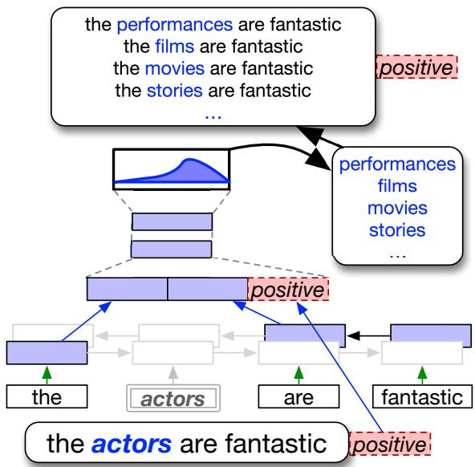

# Contextual Augmentation: Data Augmentation by Words with Paradigmatic Relations

Sosuke Kobayashi Preferred Networks, Inc., Japan sosk@preferred.jp

## Abstract

We propose a novel data augmentation for labeled sentences called contextual augmentation. We assume an invariance that sentences are natural even if the words in the sentences are replaced with other words with paradigmatic relations. We stochastically replace words with other words that are predicted by a bi-directional language model at the word positions. Words predicted according to a context are numerous but appropriate for the augmentation of the original words. Furthermore, we retrofit a language model with a label-conditional architecture, which allows the model to augment sentences without breaking the label-compatibility. Through the experiments for six various different text classification tasks, we demonstrate that the proposed method improves classifiers based on the convolutional or recurrent neural networks.

## 1 Introduction

Neural network-based models for NLP have been growing with state-of-the-art results in various tasks, e.g., dependency parsing (Dyer et al., 2015), text classification (Socher et al., 2013; Kim, 2014), machine translation (Sutskever et al., 2014). However, machine learning models often overfit the training data by losing their generalization. Generalization performance highly depends on the size and quality of the training data and regularizations. Preparing a large annotated dataset is very time-consuming. Instead, automatic data augmentation is popular, particularly in the areas of vision (Simard et al., 1998; Krizhevsky et al., 2012; Szegedy et al., 2015) and speech (Jaitly and Hinton, 2015; Ko et al., 2015). Data augmentation is basically performed based on human knowledge on invariances, rules, or heuristics, e.g., “even if a picture is flipped, the class of an object should be unchanged”.

Figure 1: Contextual augmentation with a bidirectional RNN language model, when a sentence “the actors are fantastic” is augmented by replacing only actors with words predicted based on the context.

> **AI Description:**
> **Source:** `assets/_page_0_Figure_0.jpg`
> 
> **Generated:** 2026-05-19 07:39:46
> 
> ---
> 
> The image contains a diagram illustrating a machine learning or natural language processing concept. It shows a flowchart with text and graphical elements. The top section lists phrases like "the performances are fantastic," "the films are fantastic," and "the movies are fantastic," which are categorized as positive sentiments. The middle section represents a neural network or a similar computational model with layers and connections. The bottom section highlights the phrase "the actors are fantastic," which is also categorized as positive. The diagram uses arrows to indicate the flow of information or the process of sentiment analysis.

However, usage of data augmentation for NLP has been limited. In natural languages, it is very difficult to obtain universal rules for transformations which assure the quality of the produced data and are easy to apply automatically in various domains. A common approach for such a transformation is to replace words with their synonyms selected from a handcrafted ontology such as Word-Net (Miller, 1995; Zhang et al., 2015) or word similarity calculation (Wang and Yang, 2015). Because words having exactly or nearly the same meanings are very few, synonym-based augmentation can be applied to only a small percentage of the vocabulary. Other augmentation methods are known but are often developed for specific domains with handcrafted rules or pipelines, with the loss of generality.

In this paper, we propose a novel data augmentation method called contextual augmentation. Our method offers a wider range of substitute words by using words predicted by a bidirectional language model (LM) according to the context, as shown in Figure 1. This contextual prediction suggests various words that have paradigmatic relations (Saussure and Riedlinger, 1916) with the original words. Such words can also be good substitutes for augmentation. Furthermore, to prevent word replacement that is incompatible with the annotated labels of the original sentences, we retrofit the LM with a label-conditional architecture. Through the experiment, we demonstrate that the proposed conditional LM produces good words for augmentation, and contextual augmentation improves classifiers using recurrent or convolutional neural networks (RNN or CNN) in various classification tasks.

## 2 Proposed Method

For performing data augmentation by replacing words in a text with other words, prior works (Zhang et al., 2015; Wang and Yang, 2015) used synonyms as substitute words for the original words. However, synonyms are very limited and the synonym-based augmentation cannot produce numerous different patterns from the original texts. We propose contextual augmentation, a novel method to augment words with more varied words. Instead of the synonyms, we use words that are predicted by a LM given the context surrounding the original words to be augmented, as shown in Figure 1.

## 2.1 Motivation

First, we explain the motivation of our proposed method by referring to an example with a sentence from the Stanford Sentiment Treebank (SST) (Socher et al., 2013), which is a dataset of sentiment-labeled movie reviews. The sentence, “the actors are fantastic.”, is annotated with a positive label. When augmentation is performed for the word (position) “actors”, how widely can we augment it? According to the prior works, we can use words from a synset for the word actor obtained from WordNet (histrion, player, thespian, and role player). The synset contains words that have meanings similar to the word actor on average.1 However, for data augmentation, the word actors can be further replaced with non-synonym words such as characters, movies, stories, and songs or various other nouns, while retaining the positive sentiment and naturalness. Considering the generalization, training with maximum patterns will boost the model performance more.

We propose using numerous words that have the paradigmatic relations with the original words. A LM has the desirable property to assign high probabilities to such words, even if the words themselves are not similar to the original word to be replaced.

## 2.2 Word Prediction based on Context

For our proposed method, we requires a LM for calculating the word probability at a position i based on its context. The context is a sequence of words surrounding an original word $w _ { i }$ in a sentence S, i.e., cloze sentence $S \backslash \{ w _ { i } \}$ . The calculated probability is $p ( \cdot | S \backslash \{ w _ { i } \} )$ . Specifically, we use a bi-directional LSTM-RNN (Hochreiter and Schmidhuber, 1997) LM. For prediction at position i, the model encodes the surrounding words individually rightward and leftward (see Figure 1). As well as typical uni-directional RNN LMs, the outputs from adjacent positions are used for calculating the probability at target position i. The outputs from both the directions are concatenated and fed into the following feed-forward neural network, which produces words with a probability distribution over the vocabulary.

In contextual augmentation, new substitutes for word $w _ { i }$ can be smoothly sampled from a given probability distribution, $p ( \cdot | S \backslash \{ w _ { i } \} )$ , while prior works selected top-K words conclusively. In this study, we sample words for augmentation at each update during the training of a model. To control the strength of augmentation, we introduce temperature parameter τ and use an annealed distribution $p _ { \tau } ( \cdot | S \backslash \{ w _ { i } \} ) \propto p ( \cdot | S \backslash \{ w _ { i } \} ) ^ { 1 / \tau }$ . If the temperature becomes infinity $( \tau \to \infty )$ , the words are sampled from a uniform distribution. 2 If it becomes zero $( \tau  0 )$ , the augmentation words are always words predicted with the highest probability. The sampled words can be obtained at one time at each word position in the sentences. We replace each word simultaneously with a probability as well as Wang and Yang (2015) for efficiency.

## 2.3 Conditional Constraint

Finally, we introduce a novel approach to address the issue that context-aware augmentation is not always compatible with annotated labels. For understanding the issue, again, consider the example, “the actors are fantastic.”, which is annotated with a positive label. If contextual augmentation, as described so far, is simply performed for the word (position of) fantastic, a LM often assigns high probabilities to words such as bad or terrible as well as good or entertaining, although they are mutually contradictory to the annotated labels of positive or negative. Thus, such a simple augmentation can possibly generate sentences that are implausible with respect to their original labels and harmful for model training.

To address this issue, we introduce a conditional constraint that controls the replacement of words to prevent the generated words from reversing the information related to the labels of the sentences. We alter a LM to a label-conditional LM, i.e., for position i in sentence S with label y, we aim to calculate $p _ { \tau } ( \cdot | y , S \backslash \{ w _ { i } \} )$ instead of the default $p _ { \tau } ( \cdot | S \backslash \{ w _ { i } \} )$ within the model. Specifically, we concatenate each embedded label y with a hidden layer of the feed-forward network in the bidirectional LM, so that the output is calculated from a mixture of information from both the label and context.

## 3 Experiment

## 3.1 Settings

We tested combinations of three augmentation methods for two types of neural models through six text classification tasks. The corresponding code is implemented by Chainer (Tokui et al., 2015) and available 3.

The benchmark datasets used are as follows: (1, 2) SST is a dataset for sentiment classification on movie reviews, which were annotated with five or two labels (SST5, SST2) (Socher et al., 2013). (3) Subjectivity dataset (Subj) was annotated with whether a sentence was subjective or objective (Pang and Lee, 2004). (4) MPQA is an opinion polarity detection dataset of short phrases rather than sentences (Wiebe et al., 2005). (5) RT is another movie review sentiment dataset (Pang and Lee, 2005). (6) TREC is a dataset for classification of the six question types (e.g., person, location) (Li and Roth, 2002). For a dataset without development data, we use 10% of its training set for the validation set as well as Kim (2014).

We tested classifiers using the LSTM-RNN or CNN, and both have exhibited good performances. We used typical architectures of classifiers based on the LSTM or CNN with dropout using hyperparameters found in preliminary experiments. 4 The reported accuracies of the models were averaged over eight models trained from different seeds.

The tested augmentation methods are: (1) synonym-based augmentation, and (2, 3) contextual augmentation with or without a labelconditional architecture. The hyperparameters of the augmentation (temperature τ and probability of word replacement) were also selected by a gridsearch using validation set, while retaining the hyperparameters of the models. For contextual augmentation, we first pretrained a bi-directional LSTM LM without the label-conditional architecture, on WikiText-103 corpus (Merity et al., 2017) from a subset of English Wikipedia articles. After the pretraining, the models are further trained on each labeled dataset with newly introduced labelconditional architectures.

## 3.2 Results

Table 1 lists the accuracies of the models with or without augmentation. The results show that our contextual augmentation improves the model performances for various datasets from different domains more significantly than the prior synonymbased augmentation does. Furthermore, our labelconditional architecture boosted the performances on average and achieved the best accuracies. Our methods are effective even for datasets with more than two types of labels, SST5 and TREC.

Table 1: Accuracies of the models for various benchmarks. The accuracies are averaged over eight models trained from different seeds.

For investigating our label-conditional bidirectional LM, we show in Figure 2 the top-10 word predictions by the model for a sentence from the SST dataset. Each word in the sentence is frequently replaced with various words that are not always synonyms. We present two types of predictions depending on the label fed into the conditional LM. With a positive label, the word “fantastic” is frequently replaced with funny, honest, good, and entertaining, which are also positive expressions. In contrast, with a negative label, the word “fantastic” is frequently replaced with tired, forgettable, bad, and dull, which reflect a negative sentiment. At another position, the word “the” can be replaced with “no” (with the seventh highest probability), so that the whole sentence becomes “no actors are fantastic.”, which seems negative as a whole. Aside from such inversions caused by labels, the parts unrelated to the labels (e.g., “actors”) are not very different in the positive or negative predictions. These results also demonstrated that conditional architectures are effective.

## 4 Related Work

Some works tried text data augmentation by using synonym lists (Zhang et al., 2015; Wang and Yang, 2015), grammar induction (Jia and Liang, 2016), task-specific heuristic rules (Furstenau ¨ and Lapata, 2009; Kafle et al., 2017; Silfverberg et al., 2017), or neural decoders of autoencoders (Bergmanis et al., 2017; Xu et al., 2017; Hu et al., 2017) or encoder-decoder models (Kim and Rush, 2016; Sennrich et al., 2016; Xia et al., 2017). The works most similar to our research are Kolomiyets et al. (2011) and Fadaee et al. (2017). In a task of time expression recognition, Kolomiyets et al. replaced only the headwords under a task-specific assumption that temporal trigger words usually occur as headwords. They selected substitute words with top-K scores given by the Latent Words LM (Deschacht and Moens, 2009), which is a LM based on fixedlength contexts. Fadaee et al. (2017), focusing on the rare word problem in machine translation, replaced words in a source sentence with only rare words, which both of rightward and leftward LSTM LMs independently predict with top-K confidences. A word in the translated sentence is also replaced using a word alignment method and a rightward LM. These two works share the idea of the usage of language models with our method. We used a bi-directional LSTM LM which captures variable-length contexts with considering both the directions jointly. More importantly, we proposed a label-conditional architecture and demonstrated its effect both qualitatively and quantitatively. Our method is independent of any task-specific knowledge, and effective for classification tasks in various domains.

Figure 2: Words predicted with the ten highest probabilities by the conditional bi-directional LM applied to the sentence “the actors are fantastic”. The squares above the sentence list the words predicted with a positive label. The squares below list the words predicted with a negative label.

We use a label-conditional fill-in-the-blank context for data augmentation. Neural models using the fill-in-the-blank context have been invested in other applications. Kobayashi et al. (2016, 2017) proposed to extract and organize information about each entity in a discourse using the context. Fedus et al. (2018) proposed GAN (Goodfellow et al., 2014) for text generation and demonstrated that the mode collapse and training instability can be relieved by in-filling-task training.

## 5 Conclusion

We proposed a novel data augmentation using numerous words given by a bi-directional LM, and further introduced a label-conditional architecture into the LM. Experimentally, our method produced various words compatibly with the labels of original texts and improved neural classifiers more than the synonym-based augmentation. Our method is independent of any task-specific knowledge or rules, and can be generally and easily used for classification tasks in various domains.

On the other hand, the improvement by our method is sometimes marginal. Future work will explore comparison and combination with other generalization methods exploiting datasets deeply as well as our method.

## Acknowledgments

I would like to thank the members of Preferred Networks, Inc., especially Takeru Miyato and Yuta Tsuboi, for helpful comments. I would also like to thank anonymous reviewers for helpful comments.

## References

- Samy Bengio, Oriol Vinyals, Navdeep Jaitly, and Noam Shazeer. 2015. Scheduled sampling for sequence prediction with recurrent neural networks. In NIPS, pages 1171–1179.
- Toms Bergmanis, Katharina Kann, Hinrich Schutze, ¨ and Sharon Goldwater. 2017. Training data augmentation for low-resource morphological inflection. In CoNLL SIGMORPHON, pages 31–39.
- Koen Deschacht and Marie-Francine Moens. 2009. Semi-supervised semantic role labeling using the latent words language model. In EMNLP, pages 21– 29.
- Chris Dyer, Miguel Ballesteros, Wang Ling, Austin Matthews, and Noah A. Smith. 2015. Transitionbased dependency parsing with stack long shortterm memory. In ACL, pages 334–343.
- Marzieh Fadaee, Arianna Bisazza, and Christof Monz. 2017. Data augmentation for low-resource neural machine translation. In ACL, pages 567–573.
- William Fedus, Ian Goodfellow, and Andrew M. Dai. 2018. MaskGAN: Better text generation via filling in the In ICLR.
- Hagen Furstenau and Mirella Lapata. 2009. ¨ Semisupervised semantic role labeling. In EACL, pages 220–228.
- Ian Goodfellow, Jean Pouget-Abadie, Mehdi Mirza, Bing Xu, David Warde-Farley, Sherjil Ozair, Aaron Courville, and Yoshua Bengio. 2014. Generative adversarial nets. In NIPS, pages 2672–2680.
- Sepp Hochreiter and Jurgen Schmidhuber. 1997. ¨ Long short-term memory. Neural computation, 9(8):1735–1780.
- Zhiting Hu, Zichao Yang, Xiaodan Liang, Ruslan Salakhutdinov, and Eric P. Xing. 2017. Toward controlled generation of text. In ICML, pages 1587– 1596.
- Navdeep Jaitly and Geoffrey E Hinton. 2015. Vocal tract length perturbation (vtlp) improves speech recognition. In ICML.
- Robin Jia and Percy Liang. 2016. Data recombination for neural semantic parsing. In ACL, pages 12–22.
- Kushal Kafle, Mohammed Yousefhussien, and Christopher Kanan. 2017. Data augmentation for visual question answering. In INLG, pages 198–202.
- Yoon Kim. 2014. Convolutional neural networks for sentence classification. In EMNLP, pages 1746– 1751.
- Yoon Kim and Alexander M. Rush. 2016. Sequencelevel knowledge distillation. In EMNLP, pages 1317–1327.
- Tom Ko, Vijayaditya Peddinti, Daniel Povey, and Sanjeev Khudanpur. 2015. Audio augmentation for speech recognition. In INTERSPEECH, pages 3586–3589.
- Sosuke Kobayashi, Naoaki Okazaki, and Kentaro Inui. 2017. A neural language model for dynamically representing the meanings of unknown words and entities in a discourse. In IJCNLP, pages 473–483.
- Sosuke Kobayashi, Ran Tian, Naoaki Okazaki, and Kentaro Inui. 2016. Dynamic entity representation with max-pooling improves machine reading. In Proceedings of NAACL-HLT, pages 850–855.
- Oleksandr Kolomiyets, Steven Bethard, and Marie-Francine Moens. 2011. Model-portability experiments for textual temporal analysis. In ACL, pages 271–276.
- Alex Krizhevsky, Ilya Sutskever, and Geoffrey E Hinton. 2012. Imagenet classification with deep convolutional neural networks. In NIPS, pages 1097– 1105.
- Xin Li and Dan Roth. 2002. Learning question classifiers. In COLING, pages 1–7.
- Stephen Merity, Caiming Xiong, James Bradbury, and Richard Socher. 2017. Pointer sentinel mixture models. In ICLR.
- George A. Miller. 1995. Wordnet: A lexical database for english. Commun. ACM, 38(11):39–41.

- Bo Pang and Lillian Lee. 2004. A sentimental education: Sentiment analysis using subjectivity summarization based on minimum cuts. In ACL.
- Bo Pang and Lillian Lee. 2005. Seeing stars: Exploiting class relationships for sentiment categorization with respect to rating scales. In ACL, pages 115– 124.
- Charles Bally Albert Sechehaye Saussure, Ferdinand de and Albert Riedlinger. 1916. Cours de linguistique generale. Lausanne: Payot.
- Rico Sennrich, Barry Haddow, and Alexandra Birch. 2016. Improving neural machine translation models with monolingual data. In ACL, pages 86–96.
- Miikka Silfverberg, Adam Wiemerslage, Ling Liu, and Lingshuang Jack Mao. 2017. Data augmentation for morphological reinflection. In CoNLL SIGMOR-PHON, pages 90–99.
- Patrice Y. Simard, Yann A. LeCun, John S. Denker, and Bernard Victorri. 1998. Transformation Invariance in Pattern Recognition — Tangent Distance and Tangent Propagation. Springer Berlin Heidelberg.
- Richard Socher, Alex Perelygin, Jean Wu, Jason Chuang, Christopher D. Manning, Andrew Ng, and Christopher Potts. 2013. Recursive deep models for semantic compositionality over a sentiment treebank. In EMNLP, pages 1631–1642.
- Ilya Sutskever, Oriol Vinyals, and Quoc V Le. 2014. Sequence to sequence learning with neural networks. In NIPS, pages 3104–3112.
- Christian Szegedy, Wei Liu, Yangqing Jia, Pierre Sermanet, Scott Reed, Dragomir Anguelov, Dumitru Erhan, Vincent Vanhoucke, and Andrew Rabinovich. 2015. Going deeper with convolutions. In CVPR.
- Seiya Tokui, Kenta Oono, Shohei Hido, and Justin Clayton. 2015. Chainer: a next-generation open source framework for deep learning. In Proceedings of Workshop on LearningSys in NIPS 28.
- William Yang Wang and Diyi Yang. 2015. That’s so annoying!!!: A lexical and frame-semantic embedding based data augmentation approach to automatic categorization of annoying behaviors using #petpeeve tweets. In EMNLP, pages 2557–2563.
- Janyce Wiebe, Theresa Wilson, and Claire Cardie. 2005. Annotating expressions of opinions and emotions in language. Language Resources and Evaluation, 39(2):165–210.
- Yingce Xia, Tao Qin, Wei Chen, Jiang Bian, Nenghai Yu, and Tie-Yan Liu. 2017. Dual supervised learning. In ICML, pages 3789–3798.
- Weidi Xu, Haoze Sun, Chao Deng, and Ying Tan. 2017. Variational autoencoder for semi-supervised text classification. In AAAI, pages 3358–3364.
- Xiang Zhang, Junbo Zhao, and Yann LeCun. 2015. Character-level convolutional networks for text classification. In NIPS, pages 649–657.