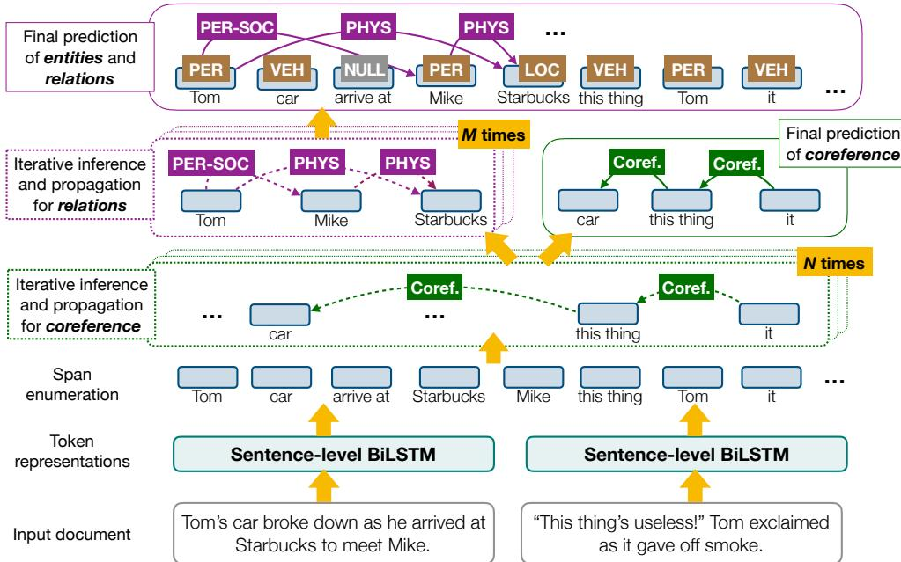

# A General Framework for Information Extraction using Dynamic Span Graphs

Yi Luan† Dave Wadden† Luheng He‡ Amy Shah†

Mari Ostendorf† Hannaneh Hajishirzi†∗

†University of Washington

∗Allen Institute for Artificial Intelligence

{luanyi, dwadden, amyshah, ostendor, hannaneh}@uw.edu luheng@google.com

## Abstract

We introduce a general framework for several information extraction tasks that share span representations using dynamically constructed span graphs. The graphs are constructed by selecting the most confident entity spans and linking these nodes with confidenceweighted relation types and coreferences. The dynamic span graph allows coreference and relation type confidences to propagate through the graph to iteratively refine the span representations. This is unlike previous multitask frameworks for information extraction in which the only interaction between tasks is in the shared first-layer LSTM. Our framework significantly outperforms the state-of-the-art on multiple information extraction tasks across multiple datasets reflecting different domains. We further observe that the span enumeration approach is good at detecting nested span entities, with significant F1 score improvement on the ACE dataset.1

## 1 Introduction

Most Information Extraction (IE) tasks require identifying and categorizing phrase spans, some of which might be nested. For example, entity recognition involves assigning an entity label to a phrase span. Relation Extraction (RE) involves assigning a relation type between pairs of spans. Coreference resolution groups spans referring to the same entity into one cluster. Thus, we might expect that knowledge learned from one task might benefit another.

Most previous work in IE (e.g., (Nadeau and Sekine, 2007; Chan and Roth, 2011)) employs a pipeline approach, first detecting entities and then using the detected entity spans for relation extraction and coreference resolution. To avoid cascading errors introduced by pipeline-style systems, recent work has focused on coupling different IE tasks as in joint modeling of entities and relations (Miwa and Bansal, 2016; Zhang et al., 2017), entities and coreferences (Hajishirzi et al., 2013; Durrett and Klein, 2014), joint inference (Singh et al., 2013) or multi-task (entity/relation/coreference) learning (Luan et al., 2018a). These models mostly rely on the first layer LSTM to share span representations between different tasks and are usually designed for specific domains.

Figure 1: A text passage illustrating interactions between entities, relations and coreference links. Some relation and coreference links are omitted.

In this paper, we introduce a general framework Dynamic Graph IE (DYGIE) for coupling multiple information extraction tasks through shared span representations which are refined leveraging contextualized information from relations and coreferences. Our framework is effective in several domains, demonstrating a benefit from incorporating broader context learned from relation and coreference annotations.

Figure 1 shows an example illustrating the potential benefits of entity, relation, and coreference contexts. It is impossible to predict the entity labels for This thing and it from within-sentence context alone. However, the antecedent car strongly suggests that these two entities have a VEH type. Similarly, the fact that Tom is located at Starbucks and Mike has a relation to Tom provides support for the fact that Mike is located at Starbucks.

DYGIE uses multi-task learning to identify entities, relations, and coreferences through shared span representations using dynamically constructed span graphs. The nodes in the graph are dynamically selected from a beam of highly-confident mentions, and the edges are weighted according to the confidence scores of relation types or coreferences. Unlike the multi-task method that only shares span representations from the local context (Luan et al., 2018a), our framework leverages rich contextual span representations by propagating information through coreference and relation links. Unlike previous BIO-based entity recognition systems (Collobert and Weston, 2008; Lample et al., 2016; Ma and Hovy, 2016) that assign a text span to at most one entity, our framework enumerates and represents all possible spans to recognize arbitrarily overlapping entities.

We evaluate DYGIE on several datasets spanning many domains (including news, scientific articles, and wet lab experimental protocols), achieving state-of-the-art performance across all tasks and domains and demonstrating the value of coupling related tasks to learn richer span representations. For example, DYGIE achieves relative improvements of 5.7% and 9.9% over state of the art on the ACE05 entity and relation extraction tasks, and an 11.3% relative improvement on the ACE05 overlapping entity extraction task.

The contributions of this paper are threefold. 1) We introduce the dynamic span graph framework as a method to propagate global contextual information, making the code publicly available. 2) We demonstrate that our framework significantly outperforms the state-of-the-art on joint entity and relation detection tasks across four datasets: ACE 2004, ACE 2005, SciERC and the Wet Lab Protocol Corpus. 3) We further show that our approach excels at detecting entities with overlapping spans, achieving an improvement of up to 8 F1 points on three benchmarks annotated with overlapped spans: ACE 2004, ACE 2005 and GENIA.

## 2 Related Work

Previous studies have explored joint modeling (Miwa and Bansal, 2016; Zhang et al., 2017; Singh et al., 2013; Yang and Mitchell, 2016)) and multi-task learning (Peng and Dredze, 2015; Peng et al., 2017; Luan et al., 2018a, 2017a) as methods to share representational strength across related information extraction tasks. The most similar to ours is the work in Luan et al. (2018a) that takes a multi-task learning approach to entity, relation, and coreference extraction. In this model, the different tasks share span representations that only incorporate broader context indirectly via the gradients passed back to the LSTM layer. In contrast, DYGIE uses dynamic graph propagation to explicitly incorporate rich contextual information into the span representations.

Entity recognition has commonly been cast as a sequence labeling problem, and has benefited substantially from the use of neural architectures (Collobert et al., 2011; Lample et al., 2016; Ma and Hovy, 2016; Luan et al., 2017b, 2018b). However, most systems based on sequence labeling suffer from an inability to extract entities with overlapping spans. Recently Katiyar and Cardie (2018) and Wang and Lu (2018) have presented methods enabling neural models to extract overlapping entities, applying hypergraph-based representations on top of sequence labeling systems. Our framework offers an alternative approach, forgoing sequence labeling entirely and simply considering all possible spans as candidate entities.

Neural graph-based models have achieved significant improvements over traditional featurebased approaches on several graph modeling tasks. Knowledge graph completion (Yang et al., 2015; Bordes et al., 2013) is one prominent example. For relation extraction tasks, graphs have been used primarily as a means to incorporate pipelined features such as syntactic or discourse relations (Peng et al., 2017; Song et al., 2018; Zhang et al., 2018). Christopoulou et al. (2018) models all possible paths between entities as a graph, and refines pair-wise embeddings by performing a walk on the graph structure. All these previous works assume that the nodes of the graph (i.e. the entity candidates to be considered during relation extraction) are predefined and fixed throughout the learning process. On the other hand, our framework does not require a fixed set of entity boundaries as an input for graph construction. Motivated by state-ofthe-art span-based approaches to coreference resolution (Lee et al., 2017, 2018) and semantic role labeling (He et al., 2018), the model uses a beam pruning strategy to dynamically select high-quality spans, and constructs a graph using the selected spans as nodes.

Many state-of-the-art RE models rely upon domain-specific external syntactic tools to construct dependency paths between the entities in a sentence (Li and Ji, 2014; Xu et al., 2015; Miwa and Bansal, 2016; Zhang et al., 2017). These systems suffer from cascading errors from these tools and are hard to generalize to different domains. To make the model more general, we combine the multitask learning framework with ELMo embeddings (Peters et al., 2018) without relying on external syntactic tools and risking the cascading errors that accompany them, and improve the interaction between tasks through dynamic graph propagation. While the performance of DyGIE benefits from ELMo, it advances over some systems (Luan et al., 2018a; Sanh et al., 2019) that also incorporate ELMo. The analyses presented here give insights into the benefits of joint modeling.

## 3 Model

Problem Definition The input is a document represented as a sequence of words $D ,$ from which we derive $S = \{ s _ { 1 } , . . . , s _ { T } \}$ , the set of all possible within-sentence word sequence spans (up to length L) in the document. The output contains three structures: the entity types E for all spans S, the relations R for all span pairs $S \times S$ within the same sentence, and the coreference links C for all spans in $S$ across sentences. We consider two primary tasks. First, Entity Recognition is the task of predicting the best entity type labels $e _ { i }$ for each span $s _ { i } .$ Second, Relation Extraction involves predicting the best relation type $r _ { i j }$ for all span pairs $( s _ { i } , s _ { j } )$ We provide additional supervision by also training our model to perform a third, auxiliary task: Coreference resolution. For this task we predict the best antecedent $c _ { i }$ for each span $s _ { i } .$

Our Model We develop a general information extraction framework (DYGIE) to identify and classify entities, relations, and coreference in a multi-task setup. DYGIE first enumerates all text spans in each sentence, and computes a locallycontextualized vector space representation of each span. The model then employs a dynamic span graph to incorporate global information into its span representations, as follows. At each training step, the model identifies the text spans that are most likely to represent entities, and treats these spans as nodes in a graph structure. It constructs confidence-weighted arcs for each node according to its predicted coreference and relation links with the other nodes in the graph. Then, the span representations are refined using broader context from gated updates propagated from neighboring relation types and co-referred entities. These refined span representations are used in a multi-task framework to predict entity types, relation types, and coreference links.

## 3.1 Model Architecture

In this section, we give an overview of the main components and layers of the DYGIE framework, as illustrated in Figure 2. Details of the graph construction and refinement process will be presented in the next section.

Token Representation Layer We apply a bidirectional LSTM over the input tokens. The input for each token is a concatenation of the character reprensetation, GLoVe (Pennington et al., 2014) word embeddings, and ELMo embeddings (Peters et al., 2018). The output token representations are obtained by stacking the forward and backward LSTM hidden states.

Span Representation Layer For each span $s _ { i } ,$ its initial vector representation $\mathbf { g } _ { i } ^ { 0 }$ is obtained by concatenating BiLSTM outputs at the left and right end points of $s _ { i }$ an attention-based soft “headword,” and an embedded span width feature, following Lee et al. (2017).

Coreference Propagation Layer The propagation process starts from the span representations $\mathbf { g } _ { i } ^ { 0 }$ . At each iteration $t ,$ we first compute an update vector ${ \mathbf { u } _ { C } ^ { t } }$ for each span $s _ { i }$ . Then we use ${ \mathbf { u } _ { C } ^ { t } }$ to update the current representation $\mathbf { g } _ { i } ^ { t }$ , producing the next span representation $\mathbf { g } _ { i } ^ { t + 1 }$ . By repeating this process N times, the final span representations $\mathbf { g } _ { i } ^ { N }$ share contextual information across spans that are likely to be antecedents in the coreference graph, similar to the process in (Lee et al., 2018).

Relation Propagation Layer The outputs $\mathbf { g } _ { i } ^ { N }$ from the coreference propagation layer are passed as inputs to the relation propagation layer. Similar to the coreference propagation process, at each iteration t, we first compute the update vectors ${ \bf u } _ { R } ^ { t }$ for each span $s _ { i } ,$ then use it to compute $\mathbf { g } _ { i } ^ { t + 1 }$ . Information can be integrated from multiple relation paths by repeating this process M times.

Final Prediction Layer We use the outputs of the relation graph layer $\mathbf { g } _ { i } ^ { N + M }$ to predict the entity labels E and relation labels R. For entities, we pass $\mathbf { g } _ { i } ^ { N + M }$ to a feed-forward network (FFNN) to produce per-class scores ${ \bf P } _ { E } ( i )$ for span $s _ { i } .$ For relations, we pass the concatenation of $\mathbf { g } _ { i } ^ { N + M }$ and $\mathbf { g } _ { j } ^ { N + M }$ to a FFNN to produce per-class relation scores $\mathbf { P } _ { R } ( i , j )$ between spans $s _ { i }$ and $s _ { j }$ . Entity and relation scores are normalized across the label space, similar to Luan et al. (2018a). For coreference, the scores between span pairs $( s _ { i } , s _ { j } )$ are computed from the coreference graph layer outputs $( \mathbf { g } _ { i } ^ { N } , \mathbf { g } _ { j } ^ { N } )$ , and then normalized across all possible antecedents, similar to Lee et al. (2018).

Figure 2: Overview of our DYGIE model. Dotted arcs indicate confidence weighted graph edges. Solid lines indicate the final predictions.

> **AI Description:**
> **Source:** `assets/_page_3_Figure_0.jpg`
> 
> **Generated:** 2026-05-19 08:47:07
> 
> ---
> 
> The image is a detailed diagram illustrating a process for predicting entities, relations, and coreference in a natural language processing task. It includes a flowchart with labeled steps and components such as "Sentence-level BiLSTM," "Span enumeration," "Token representations," and "Final prediction of entities and relations." The diagram outlines iterative inference and propagation for relations and coreference, with arrows indicating the flow of information between different stages. Key terms like "PER-SOC," "PHYS," "Coref.," and "M times" and "N times" are used to describe the relationships and iterations involved in the process. The image effectively visualizes the computational steps and decision-making processes in a complex NLP task.

## 3.2 Dynamic Graph Construction and Span Refinement

The dynamic span graph facilitates propagating broader contexts through soft coreference and relation links to refine span representations. The nodes in the graph are spans $s _ { i }$ with vector representations $\mathbf { g } _ { i } ^ { t } \in \mathbb { R } ^ { d }$ for the t-th iteration. The edges are weighted by the coreference and relation scores, which are trained according to the neural architecture explained in Section 3.1. In this section, we explain how coreference and relation links can update span representations.

Coreference Propagation Similar to (Luan et al., 2018a), we define a beam $B _ { C }$ consisting of $b _ { c }$ spans that are most likely to be in a coreference chain. We consider $\mathbf { P } _ { C } ^ { t }$ to be a matrix of real values that indicate coreference confidence scores between these spans at the t-th iteration. $\mathbf { P } _ { C } ^ { t }$ is of size $b _ { c } \times K$ , where K is the maximum number of antecedents considered. For the coreference graph, an edge in the graph is single directional, connecting the current span $s _ { i }$ with all its potential antecedents $s _ { j }$ in the coreference beam, where $j < i .$ The edge between $s _ { i }$ and $s _ { j }$ is weighted by coreference confidence score at the current iteration $P _ { C } ^ { t } ( i , j )$ . The span update vector ${ \mathbf { u } } _ { C } ^ { t } ( i ) \in \mathbb { R } ^ { d }$ is computed by aggregating the neighboring span representations $\mathbf { g } _ { j } ^ { t }$ , weighted by their coreference scores $P _ { C } ^ { t } ( i , j )$

$$
\mathbf { u } _ { C } ^ { t } ( i ) = \sum _ { j \in B _ { \mathrm { C } } ( i ) } P _ { C } ^ { t } ( i , j ) \mathbf { g } _ { j } ^ { t }\tag{1}
$$

where $B _ { C } ( i )$ is the set of K spans that are antecedents of $s _ { i }$

$$
P _ { C } ^ { t } ( i , j ) = \frac { \exp ( V _ { C } ^ { t } ( i , j ) ) } { \sum _ { j ^ { \prime } \in B _ { C } ( i ) } \exp ( V _ { C } ^ { t } ( i , j ) ) }\tag{2}
$$

$V _ { C } ^ { t } ( i , j )$ is a scalar score computed by concatenating the span representations $[ \mathbf { g } _ { i } ^ { t } , \mathbf { g } _ { j } ^ { t } , \mathbf { g } _ { i } ^ { t } \odot \mathbf { g } _ { j } ^ { t } ]$ ， where  is element-wise multiplication. The concatenated vector is then fed as input to a FFNN, similar to (Lee et al., 2018).

Relation Propagation For each sentence, we define a beam $B _ { R }$ consisting of $b _ { r }$ entity spans that are mostly likely to be involved in a relation. Unlike the coreference graph, the weights of relation edges capture different relation types. Therefore, for the t-th iteration, we use a tensor $\mathbf { V } _ { R } ^ { t } \in \mathbb { R } ^ { b _ { R } \times b _ { R } \times L _ { R } }$ to capture scores of each of the $L _ { R }$ relation types. In other words, each edge in the relation graph connects two entity spans $s _ { i }$ and $s _ { j }$ in the relation beam $B _ { R } . \mathbf { V } _ { R } ^ { t } ( i , j )$ is a LR-length vector of relation scores, computed with a FFNN with $[ \mathbf { g } _ { i } ^ { t } , \mathbf { g } _ { j } ^ { t } ]$ as the input. The relation update vector ${ \bf u } _ { R } ^ { t } ( i ) \in \mathbb { R } ^ { d }$ is computed by aggregating neighboring span representations on the relation graph:

$$
\mathbf { u } _ { R } ^ { t } ( i ) = \sum _ { j \in B _ { \mathrm { R } } } f ( \mathbf { V } _ { R } ^ { t } ( i , j ) ) \mathbf { A } _ { R } \odot \mathbf { g } _ { j } ^ { t } ,\tag{3}
$$

where $\mathbf { A } _ { R } \in \mathbb { R } ^ { L _ { R } \times d }$ is a trainable linear projection matrix, f is a non-linear function to select the most important relations. Because only a small number of entities in the relation beam are actually linked to the target span, propagation among all possible span pairs would introduce too much noise to the new representation. Therefore, we choose $f$ to be the ReLU function to remove the effect of unlikely relations by setting the all negative relation scores to 0. Unlike coreference connections, two spans linked via a relation are not expected to have similar representations, so the matrix $\mathbf { A } _ { R }$ helps to transform the embedding $\mathbf { g } _ { j } ^ { t }$ according to each relation type.

Updating Span Representations with Gating To compute the span representations for the next iteration $t \in \{ 1 , \ldots , N + M \}$ , we define a gating vector $\mathbf { f } _ { x } ^ { t } ( i ) \in \mathbb { R } ^ { d }$ , where $x \in \{ C , R \}$ , to determine whether to keep the previous span representation $\mathbf { g } _ { i } ^ { t }$ or to integrate new information from the coreference or relation update vectors ${ \bf { u } } _ { x } ^ { t } ( i )$ . Formally,

$$
\begin{array} { r l r } { \mathbf { f } _ { x } ^ { t } ( i ) } & { = } & { g ( \mathbf { W } _ { x } ^ { \mathrm { { f } } } [ \mathbf { g } _ { i } ^ { t } , \mathbf { u } _ { x } ^ { t } ( i ) ] ) \quad \quad \quad \quad \quad \quad \quad ( } \\ { \mathbf { g } _ { i } ^ { t + 1 } } & { = } & { \mathbf { f } _ { x } ^ { t } ( i ) \odot \mathbf { g } _ { i } ^ { t } + ( 1 - \mathbf { f } _ { x } ^ { t } ( i ) ) \odot \mathbf { u } _ { x } ^ { t } ( i ) , } \end{array}\tag{4}
$$

where $\mathbf { W } _ { x } ^ { \mathrm { f } } \in \mathbb { R } ^ { d \times 2 d }$ are trainable parameters, and $g$ is an element-wise sigmoid function.

## 3.3 Training

The loss function is defined as a weighted sum of the log-likelihood of all three tasks:

$$
\begin{array} { l } { { \displaystyle \sum _ { ( D , R ^ { * } , E ^ { * } , C ^ { * } ) \in { \cal D } } \left\{ \lambda _ { \mathrm { E } } \log P ( E ^ { * } \mid C , R , D ) \right. \ ~ } ^ { \displaystyle ( \mathfrak { L } ) } \ ~ } ^ { \displaystyle ( \mathfrak { L } ) }  \\ { { \displaystyle + \left. \lambda _ { \mathrm { R } } \log P ( R ^ { * } \mid C , D ) + \lambda _ { \mathrm { C } } \log P ( C ^ { * } \mid D ) \right\} } } \end{array}\tag{}
$$

where $E ^ { * } , R ^ { * }$ and $C ^ { * }$ are gold structures of the entity types, relations and coreference, respectively. D is the collection of all training documents D. The task weights $\lambda _ { \mathrm { E } } , \lambda _ { \mathrm { R } } .$ , and $\lambda _ { \mathrm { C } }$ are hyperparameters to control the importance of each task.

Table 1: Datasets for joint entity and relation extraction and their statistics. Ent: Number of entity categories. Rel: Number of relation categories.

We use a 1 layer BiLSTM with 200-dimensional hidden layers. All the feed-forward functions have 2 hidden layers of 150 dimensions each. We use 0.4 variational dropout (Gal and Ghahramani, 2016) for the LSTMs, 0.4 dropout for the FFNNs, and 0.5 dropout for the input embeddings. The hidden layer dimensions and dropout rates are chosen based on the development set performance in multiple domains. The task weights, learning rate, maximum span length, number of propagation iterations and beam size are tuned specifically for each dataset using development data.

## 4 Experiments

DYGIE is a general IE framework that can be applied to multiple tasks. We evaluate the performance of DYGIE against models from two lines of work: combined entity and relation extraction, and overlapping entity extraction.

## 4.1 Entity and relation extraction

For the entity and relation extraction task, we test the performance of DYGIE on four different datasets: ACE2004, ACE2005, SciERC and the Wet Lab Protocol Corpus. We include the relation graph propagation layer in our models for all datasets. We include the coreference graph propagation layer on the data sets that have coreference annotations available.

Data All four data sets are annotated with entity and relation labels. Only a small fraction of entities (< 3% of total) in these data sets have a text span that overlaps the span of another entity. Statistics on all four data sets are displayed in Table 1.

The ACE2004 and ACE2005 corpora provide entity and relation labels for a collection of documents from a variety of domains, such as newswire and online forums. We use the same entity and relation types, data splits, and preprocessing as Miwa and Bansal (2016) and Li and Ji (2014). Following the convention established in this line of work, an entity prediction is considered correct if its type label and head region match those of a gold entity. We will refer to this version of the ACE2004 and ACE2005 data as ACE04 and ACE05. Since the domain and mention span annotations in the ACE datasets are very similar to those of OntoNotes (Pradhan et al., 2012), and OntoNotes contains significantly more documents with coreference annotations, we use OntoNotes to train the parameters for the auxiliary coreference task. The OntoNotes corpus contains 3493 documents, averaging roughly 450 words in length.

Table 2: F1 scores on the joint entity and relation extraction task on each test set, compared against the previous best systems. \* indicates relation extraction system that takes gold entity boundary as input.

The SciERC corpus (Luan et al., 2018a) provides entity, coreference and relation annotations for a collection of documents from 500 AI paper abstracts. The dataset defines scientific term types and relation types specially designed for AI domain knowledge graph construction. An entity prediction is considered correct if its label and span match with a gold entity.

The Wet Lab Protocol Corpus (WLPC) provides entity, relation, and event annotations for 622 wet lab protocols (Kulkarni et al., 2018). A wet lab protocol is a series of instructions specifying how to perform a biological experiment. Following the procedure in Kulkarni et al. (2018), we perform entity recognition on the union of entity tags and event trigger tags, and relation extraction on the union of entity-entity relations and entity-trigger event roles. Coreference annotations are not available for this dataset.

Baselines We compare DYGIE with current state of the art methods in different datasets. Miwa and Bansal (2016) provide the current state of the art on ACE04. They construct a Tree LSTM using dependency parse information, and use the representations learned by the tree structure as features for relation classification. Bekoulis et al. (2018) use adversarial training as regularization for a neural model. Zhang et al. (2017) cast joint entity and relation extraction as a table filling problem and build a globally optimized neural model incorporating syntactic representations from a dependency parser. Similar to DYGIE, Sanh et al. (2019) and Luan et al. (2018a) use a multi-task learning framework for extracting entity, relation and coreference labels. Sanh et al. (2019) improved the state of the art on ACE05 using multi-task, hierarchical supervised training with a set of low level tasks at the bottom layers of the model and more complex tasks at the top layers of the model. Luan et al. (2018a) previously achieved the state of the art on SciERC and use a span-based neural model like our DYGIE. Kulkarni et al. (2018) provide a baseline for the WLPC data set. They employ an LSTM-CRF for entity recognition, following Lample et al. (2016). For relation extraction, they assume the presence of gold entities and train a maximum-entropy classifier using features from the labeled entities.

Results Table 2 shows test set F1 on the joint entity and relation extraction task. We observe that DYGIE achieves substantial improvements on both entity recognition and relation extraction across the four data sets and three domains, all in the realistic setting where no “gold” entity labels are supplied at test time. DYGIE achieves 7.1% and 7.0% relative improvements over the state of the art on NER for ACE04 and ACE05, respectively. For the relation extraction task, DYGIE attains 25.8% relative improvement over SOTA on ACE04 and 13.7% relative improvement on ACE05. For ACE05, the best entity extraction performance is obtained by switching the order between CorefProp and RelProp (RelProp first then CorefProp).

On SciERC, DYGIE advances the state of the art by 5.9% and 1.9% for relation extraction and NER, respectively. The improvement of DYGIE over the previous SciERC model underscores the ability of coreference and relation propagation to construct rich contextualized representations.

The results from Kulkarni et al. (2018) establish a baseline for IE on the WLPC. In that work, relation extraction is performed using gold entity boundaries as input. Without using any gold entity information, DYGIE improves on the baselines by 16.8% for relation extraction and 2.2% for NER.

Table 3: Datasets for overlapping entity extraction and their statistics. Ent: Number of entity categories. Overlap: Percentage of sentences that contain overlapping entities.

On the OntoNotes data set used for the auxiliary coreference task with ACE05, our model achieves coreference test set performance of 70.4 F1, which is competitive with the state-of-the-art performance reported in Lee et al. (2017).

## 4.2 Overlapping Entity Extraction

There are many applications where the correct identification of overlapping entities is crucial for correct document understanding. For instance, in the biomedical domain, a BRCA1 mutation carrier could refer to a patient taking part in a clinical trial, while BRCA1 is the name of a gene.

We evaluate the performance of DYGIE on overlapping entity extraction in three datasets: ACE2004, ACE2005 and GENIA. Since relation annotations are not available for these datasets, we include the coreference propagation layer in our models but not the relation layer.2

Data Statistics on our three datasets are listed in Table 3. All three have a substantial number (> 20% of total) of overlapping entities, making them appropriate for this task.

As in the joint case, we evaluate our model on ACE2004 and ACE2005, but here we follow the same data preprocessing and evaluation scheme as Wang and Lu (2018). We refer to these data sets as ACE04-O and ACE05-O. Unlike the joint entity and relation task in Sec. 4.1, where only the entity head span need be predicted, an entity prediction is considered correct in these experiments if both its entity label and its full text span match a gold prediction. This is a more stringent evaluation criterion than the one used in Section 4.1. As before, we use the OntoNotes annotations to train the parameters of the coreference layer.

The GENIA corpus (Kim et al., 2003) provides entity tags and coreferences for 1999 abstracts from the biomedical research literature. We only use the IDENT label to extract coreference clusters.

Table 4: Performance on the overlapping entity extraction task, compared to previous best systems. We report F1 of extracted entities on the test sets.
Table 5: Ablations on the ACE05 development set with different graph propagation setups. −CorefProp ablates the coreference propagation layers, while −RelProp ablates the relation propagation layers. Base is the system without any propagation.

We use the same data set split and preprocessing procedure as Wang and Lu (2018) for overlapping entity recognition.

Baselines The current state-of-the-art approach on all three data sets is Wang and Lu (2018), which uses a segmental hypergraph coupled with neural networks for feature learning. Katiyar and Cardie (2018) also propose a hypergraph approach using a recurrent neural network as a feature extractor.

Results Table 4 presents the results of our overlapping entity extraction experiments on the different datsets. DYGIE improves 11.6% on the state of the art for ACE04-O and 11.3% for ACE05-O. DY-GIE also advances the state of the art on GENIA, albeit by a more modest 1.5%. Together these results suggest that DYGIE can be utilized fruitfully for information extraction across different domains with overlapped entities, such as bio-medicine.

## 5 Analysis of Graph Propagation

We use the dev sets of ACE2005 and SciERC to analyze the effect of different model components.

## 5.1 Coreference and Relation Graph Layers

Tables 5 and 6 show the effects of graph propagation on entity and relation prediction accuracy, where −CorefProp and −RelProp denote ablating the propagation process by setting N = 0 or $M = 0 ,$ respectively. Base is the base model without any propagation. For ACE05, we observe that coreference propagation is mainly helpful for entities; it appears to hurt relation extraction. On SciIE, coreference propagation gives a small benefit on both tasks. Relation propagation significantly benefits both entity and relation extraction in both domains. In particular, there are a large portion of sentences with multiple relation instances across different entities in both ACE05 and Sci-ERC, which is the scenario in which we expect relation propagation to help.

### Full Page Description (Page 7)

**Source:** `assets/_page_7_Asset_1.jpg`

**Generated:** 2026-05-19 08:46:36

---

The image is a line graph with the title "Relation F1" on the y-axis and "Num. iterations M" on the x-axis. The graph shows the relationship between the number of iterations (M) and the Relation F1 metric. There are four data points plotted, with the Relation F1 values increasing from approximately 57 to 60 as the number of iterations increases from 0 to 2. After 2 iterations, the Relation F1 value slightly decreases to around 58 for 3 iterations. The graph suggests an initial improvement in Relation F1 with increasing iterations, followed by a slight decline.

### Full Page Description (Page 7)

**Source:** `assets/_page_7_Asset_0.jpg`

**Generated:** 2026-05-19 08:46:29

---

The image is a line graph with the title "Entity F1" on the y-axis and "Num. iterations N" on the x-axis. The graph shows the Entity F1 score for different numbers of iterations, ranging from 0 to 3. The data points indicate that the Entity F1 score increases slightly with each additional iteration, peaking at approximately 87 for 2 iterations and then slightly decreasing to around 86 for 3 iterations. The graph uses a blue line with circular markers to represent the data points.

Since coreference propagation has more effect on entity extraction and relation propagation has more effect on relation extraction, we mainly focus on ablating the effect of coreference propagation on entity extraction and relation propagation on relation extraction in the following subsections.

## 5.2 Coreference Propagation and Entities

A major challenge of ACE05 is to disambiguate the entity class for pronominal mentions, which requires reasoning with cross-sentence contexts. For example, in a sentence from ACE05 dataset, “One of [them]PER, from a very close friend of [ours]ORG.” It is impossible to identity whether them and ours is a person (PER) or organization (ORG) unless we have read previous sentences. We hypothesize that this is a context where coreference propagation can help. Table 7 shows the effect of the coreference layer for entity categorization of pronouns.3 DYGIE has 6.6% improvement on pronoun performance, confirming our hypothesis.

Table 7: Entity extraction performance on pronouns in ACE05. CorefProp significantly increases entity extraction F1 on hard-to-disambiguate pronouns by allowing the model to leverage cross-sentence contexts.

Looking further, Table 8 shows the impact on all entity categories, giving the difference between the confusion matrix entries with and without CorefProp. The frequent confusions associated with pronouns (GPE/PER and PER/ORG, where GPE is a geopolitical entity) greatly improve, but the benefit of CorefProp extends to most categories.

Of course, there are a few instances where CorefProp causes errors in entity extraction. For example, in the sentence “[They]ORGPER might have been using Northshore...”, DYGIE predicted They to be of ORG type because the most confident antecedent is those companies in the previous sentence: “The money was invested in those companies.” However, They is actually referring to these fund managers earlier in the document, which belongs to PER category.

In the SciERC dataset, the pronouns are uniformly assigned with a Generic label, which explains why CorefProp does not have much effect on entity extraction performance.

The Figure 3a shows the effect of number of iterations for coreference propagation in the entity extraction task. The figure shows that coreference layer obtains the best performance on the second iteration (N = 2).

## 5.3 Relation Propagation Impact

Figure 4 shows relation scores as a function of number of entities in sentence for DYGIE and DYGIE without relation propagation on ACE05. The figure indicates that relation propagation achieves significant improvement in sentences with more entities, where one might expect that using broader context

### Full Page Description (Page 8)

**Source:** `assets/_page_8_Asset_0.jpg`

**Generated:** 2026-05-19 08:46:47

---

The image is a line graph with two sets of data points, representing the Relation F1 scores for two different models: DyGIE and DyGIE-RelProp. The x-axis represents the number of entities in a sentence, ranging from 2 to 12, with a category labeled "12-max" indicating the maximum number of entities. The y-axis represents the Relation F1 score, which ranges from 50 to 70. The graph shows that both models' scores decrease as the number of entities increases, with DyGIE-RelProp consistently performing slightly better than DyGIE across all entity counts.

Table 8: Difference in the confusion matrix counts for ACE05 entity extraction associated with adding CorefProp.

could have more impact.

Figure 3b shows the effect of number of iterations for relation propagation in the relation extraction task. Our model achieves the best performance on the second iteration (M = 2).

## 6 Conclusion

We have introduced DYGIE as a general information extraction framework, and have demonstrated that our system achieves state-of-the art results on entity recognition and relation extraction tasks across a diverse range of domains. The key contribution of our model is the dynamic span graph approach, which enhance interaction across tasks that allows the model to learn useful information from broader context. Unlike many IE frameworks, our model does not require any preprocessing using syntactic tools, and has significant improvement across different IE tasks including entity, relation extraction and overlapping entity extraction. The addition of co-reference and relation propagation across sentences adds only a small computation cost to inference; the memory cost is controlled by beam search. These added costs are small relative to those of the baseline span-based model. We welcome the community to test our model on different information extraction tasks. Future directions include extending the framework to encompass more structural IE tasks such as event extraction.

## Acknowledgments

This research was supported by the Office of Naval Research under the MURI grant N00014-18-1- 2670, NSF (IIS 1616112, III 1703166), Allen Distinguished Investigator Award, Samsung GRO and gifts from Allen Institute for AI, Google, Amazon, and Bloomberg. We also thank the anonymous reviewers and the UW-NLP group for their helpful comments.

## References

- Giannis Bekoulis, Johannes Deleu, Thomas Demeester, and Chris Develder. 2018. Adversarial training for multi-context joint entity and relation extraction. In Proc. Conf. Empirical Methods Natural Language Process. (EMNLP), pages 2830–2836.
- Antoine Bordes, Nicolas Usunier, Alberto Garcia-Duran, Jason Weston, and Oksana Yakhnenko. 2013. Translating embeddings for modeling multirelational data. In Advances in neural information processing systems.
- Yee Seng Chan and Dan Roth. 2011. Exploiting syntactico-semantic structures for relation extraction. In Proc. Annu. Meeting Assoc. for Computational Linguistics (ACL).
- Fenia Christopoulou, Makoto Miwa, and Sophia Ananiadou. 2018. A walk-based model on entity graphs for relation extraction. In Proc. Annu. Meeting Assoc. for Computational Linguistics (ACL), volume 2, pages 81–88.
- Ronan Collobert and Jason Weston. 2008. A unified architecture for natural language processing: Deep neural networks with multitask learning. In Proc. Int. Conf. Machine Learning (ICML), pages 160– 167.
- Ronan Collobert, Jason Weston, Leon Bottou, Michael´ Karlen, Koray Kavukcuoglu, and Pavel Kuksa. 2011. Natural language processing (almost) from scratch. J. Machine Learning Research, 12(Aug):2493– 2537.
- Greg Durrett and Dan Klein. 2014. A joint model for entity analysis: Coreference, typing, and linking. Trans. Assoc. for Computational Linguistics (TACL), 2:477–490.
- Yarin Gal and Zoubin Ghahramani. 2016. A theoretically grounded application of dropout in recurrent neural networks. In Proc. Annu. Conf. Neural Inform. Process. Syst. (NIPS).
- Hannaneh Hajishirzi, Leila Zilles, Daniel S Weld, and Luke Zettlemoyer. 2013. Joint coreference resolution and named-entity linking with multi-pass sieves. In Proc. Conf. Empirical Methods Natural Language Process. (EMNLP), pages 289–299.

- Luheng He, Kenton Lee, Omer Levy, and Luke Zettlemoyer. 2018. Jointly predicting predicates and arguments in neural semantic role labeling. In ACL.
- Arzoo Katiyar and Claire Cardie. 2018. Nested named entity recognition revisited. In Proc. Conf. North American Assoc. for Computational Linguistics (NAACL).
- Jin-Dong Kim, Tomoko Ohta, Yuka Tateisi, and Jun’ichi Tsujii. 2003. Genia corpus - a semantically annotated corpus for bio-textmining. Bioinformatics, 19 Suppl 1:i180–2.
- Chaitanya Kulkarni, Wei Xu, Alan Ritter, and Raghu Machiraju. 2018. An annotated corpus for machine reading of instructions in wet lab protocols. In NAACL-HLT.
- Guillaume Lample, Miguel Ballesteros, Sandeep Subramanian, Kazuya Kawakami, and Chris Dyer. 2016. Neural architectures for named entity recognition. In Proc. Conf. North American Assoc. for Computational Linguistics (NAACL).
- Kenton Lee, Luheng He, Mike Lewis, and Luke S. Zettlemoyer. 2017. End-to-end neural coreference resolution. In EMNLP.
- Kenton Lee, Luheng He, and Luke Zettlemoyer. 2018. Higher-order coreference resolution with coarse-tofine inference. In NAACL.
- Qi Li and Heng Ji. 2014. Incremental joint extraction of entity mentions and relations. In Proc. Annu. Meeting Assoc. for Computational Linguistics (ACL), volume 1, pages 402–412.
- Yi Luan, Chris Brockett, Bill Dolan, Jianfeng Gao, and Michel Galley. 2017a. Multi-task learning for speaker-role adaptation in neural conversation models. In Proc. IJCNLP.
- Yi Luan, Luheng He, Mari Ostendorf, and Hannaneh Hajishirzi. 2018a. Multi-task identification of entities, relations, and coreference for scientific knowledge graph construction. In Proc. Conf. Empirical Methods Natural Language Process. (EMNLP).
- Yi Luan, Mari Ostendorf, and Hannaneh Hajishirzi. 2017b. Scientific information extraction with semisupervised neural tagging. In Proc. Conf. Empirical Methods Natural Language Process. (EMNLP).
- Yi Luan, Mari Ostendorf, and Hannaneh Hajishirzi. 2018b. The uwnlp system at semeval-2018 task 7: Neural relation extraction model with selectively incorporated concept embeddings. In Proc. Int. Workshop on Semantic Evaluation (SemEval), pages 788– 792.
- Xuezhe Ma and Eduard Hovy. 2016. End-to-end sequence labeling via bi-directional LSTM-CNNs-CRF. In Proc. Annu. Meeting Assoc. for Computational Linguistics (ACL).
- Makoto Miwa and Mohit Bansal. 2016. End-to-end relation extraction using lstms on sequences and tree structures. In Proc. Annu. Meeting Assoc. for Computational Linguistics (ACL), pages 1105–1116.
- David Nadeau and Satoshi Sekine. 2007. A survey of named entity recognition and classification. Lingvisticae Investigationes, 30(1):3–26.
- Nanyun Peng and Mark Dredze. 2015. Named entity recognition for chinese social media with jointly trained embeddings. In Proc. Conf. Empirical Methods Natural Language Process. (EMNLP), pages 548–554.
- Nanyun Peng, Hoifung Poon, Chris Quirk, Kristina Toutanova, and Wen-tau Yih. 2017. Cross-sentence n-ary relation extraction with graph lstms. Trans. Assoc. for Computational Linguistics (TACL), 5:101– 115.
- Jeffrey Pennington, Richard Socher, and Christopher D Manning. 2014. Glove: Global vectors for word representation. In Proc. Conf. Empirical Methods Natural Language Process. (EMNLP), volume 14, pages 1532–1543.
- Matthew E. Peters, Mark Neumann, Mohit Iyyer, Matt Gardner, Christopher Clark, Kenton Lee, and Luke Zettlemoyer. 2018. Deep contextualized word representations. In NAACL.
- Sameer Pradhan, Alessandro Moschitti, Nianwen Xue, Olga Uryupina, and Yuchen Zhang. 2012. Conll-2012 shared task: Modeling multilingual unrestricted coreference in ontonotes. In Joint Conference on EMNLP and CoNLL-Shared Task, pages 1– 40. Association for Computational Linguistics.
- Victor Sanh, Thomas Wolf, and Sebastian Ruder. 2019. A hierarchical multi-task approach for learning embeddings from semantic tasks. AAAI.
- Sameer Singh, Sebastian Riedel, Brian Martin, Jiaping Zheng, and Andrew McCallum. 2013. Joint inference of entities, relations, and coreference. In Proc. of the 2013 workshop on Automated knowledge base construction, pages 1–6. ACM.
- Linfeng Song, Yue Zhang, Zhiguo Wang, and Daniel Gildea. 2018. N-ary relation extraction using graphstate lstm. In Proc. Conf. Empirical Methods Natural Language Process. (EMNLP), pages 2226–2235.
- Bailin Wang and Wei Lu. 2018. Neural segmental hypergraphs for overlapping mention recognition. In EMNLP.
- Kun Xu, Yansong Feng, Songfang Huang, and Dongyan Zhao. 2015. Semantic relation classification via convolutional neural networks with simple negative sampling. In Proc. Conf. Empirical Methods Natural Language Process. (EMNLP), pages 536–540.

- Bishan Yang and Tom M Mitchell. 2016. Joint extraction of events and entities within a document context. In Proceedings of the 2016 Conference of the North American Chapter of the Association for Computational Linguistics: Human Language Technologies, pages 289–299.
- Bishan Yang, Wen-tau Yih, Xiaodong He, Jianfeng Gao, and Li Deng. 2015. Embedding entities and relations for learning and inference in knowledge bases. In Proc. Int. Conf. Learning Representations (ICLR).
- Meishan Zhang, Yue Zhang, and Guohong Fu. 2017. End-to-end neural relation extraction with global optimization. In Proc. Conf. Empirical Methods Natural Language Process. (EMNLP), pages 1730–1740.
- Yuhao Zhang, Peng Qi, and Christopher D Manning. 2018. Graph convolution over pruned dependency trees improves relation extraction. In Proc. Conf. Empirical Methods Natural Language Process. (EMNLP).