
# U.S. SECURITIES AND EXCHANGE COMMISSION Washington, D.C. 20549 FORM 10-K

(Mark One) þ ANNUAL REPORT PURSUANT TO SECTION 13 OR 15(d) OF THE SECURITIES EXCHANGE ACT OF 1934

For the Fiscal Year Ended December 31, 2020

o TRANSITION REPORT PURSUANT TO SECTION 13 OR 15(d) OF THE SECURITIES EXCHANGE ACT OF 1934

Commission File Number 000-55191

Brazil Minerals, Inc.

(Exact name of registrant as specified in its charter)

Nevada (State or other jurisdiction of incorporation or organization)

39-2078861 (IRS Employer Identification No.)

Rua Vereador João Alves Praes, nº 95-A Olhos D’Água, MG 39398-000, Brazil (Address of principal executive offices)

Issuer’s telephone number, including area code: (833) 661-7900

Securities registered pursuant to Section 12(b) of the Act: None.

Securities registered pursuant to Section 12(g) of the Act: Common Stock, par value \$0.001 per share

Indicate by check mark if the registrant is a well-known seasoned issuer, as defined in Rule 405 of the Securities Act. Yes o No þ

Indicate by check mark if the registrant is not required to file reports pursuant to Section 13 or Section 15(d) of the Act. Yes o No þ

Indicate by check mark whether the registrant (1) has filed all reports required to be filed by Section 13 or 15(d) of the Securities Exchange Act of 1934 during the preceding 12 months (or for such shorter period that the registrant was required to file such reports), and (2) has been subject to such filing requirements for the past 90 days. Yes þ No o

Indicate by check mark whether the registrant has submitted electronically and posted on its corporate Web site, if any, every Interactive Data File required to be submitted and posted pursuant to Rule 405 of Regulation S-T (§232.405 of this chapter) during the preceding 12 months (or for such shorter period that the registrant was required to submit and post such files). Yes þ No o

Indicate by check mark if disclosure of delinquent filers pursuant to Item 405 of Regulation S-K is not contained herein, and will not be contained, to the best of registrant’s knowledge, in definitive proxy or information statements incorporated by reference in Part III of this Form 10-K or any amendment to this Form 10-K þ

Indicate by check mark whether the registrant is a large accelerated filer, an accelerated filer, a non-accelerated filer, a smaller reporting company or, an emerging growth company. See the definitions of “large accelerated filer,” “accelerated filer”, “smaller reporting company”, and “emerging growth company”, in Rule 12b-2 of the Exchange Act.

Large accelerated filer o Non-accelerated filer þ

Accelerated filer o Smaller reporting company þ Emerging growth company o

If an emerging growth company, indicate by check mark if the registrant has elected not to use the extended transition period for complying with any new or revised financial accounting standards provided pursuant to Section 13(a) of the Exchange Act. o

Indicate by check mark whether the registrant is a shell company (as defined in Rule 12b-2 of the Act). Yes o No þ

As of June 30, 2020, the last business day of the Registrant’s most recently completed second fiscal quarter, the aggregate market value of the Registrant’s common stock held by non-affiliates (based on the closing sales price of such shares on such date as reported by otcmarkets.com) was approximately \$1,188,000. For the purpose of this report it has been assumed that all officers and directors of the Registrant, as well as all stockholders holding 10% or more of the Registrant’s stock, are affiliates of the Registrant.

As of March 26, 2021, there were outstanding 2,498,625,381 shares of the registrant’s common stock.

Documents incorporated by reference: None.

TABLE OF CONTENTS

## FORWARD LOOKING STATEMENTS

This Annual Report contains forward-looking statements. Forward-looking statements for Brazil Minerals, Inc. reflect current expectations, as of the date of this Annual Report, and involve certain risks and uncertainties. Actual results could differ materially from those anticipated in these forward-looking statements as a result of various factors. Factors that could cause future results to materially differ from the recent results or those projected in forwardlooking statements include, among others: unprofitable efforts resulting not only from the failure to discover mineral deposits, but also from finding mineral deposits that, though present, are insufficient in quantity and quality to return a profit from production; market fluctuations; government regulations, including regulations relating to royalties, allowable production, importing and exporting of minerals, and environmental protection; competition; the loss of services of key personnel; unusual or infrequent weather phenomena, sabotage, government or other interference in the maintenance or provision of infrastructure as well as general economic conditions.

# PART I

## Item 1. Business.

## Overview

Brazil Minerals, Inc.

with its subsidiaries (“Brazil Minerals”, the “Company”, “we”, “us”, or “our”) is a mineral exploration company currently primarily focused on the development of its two 100%-owned hard-rock lithium projects. Our initial goal is to be able to enter commercial production of spodumene concentrate, a lithium bearing commodity.

We also have 100%-ownership of projects in other highly strategic minerals: rare earths, titanium, and nickel/cobalt. We have mining concessions and other mineral rights for alluvial gold and diamonds and in one of these areas we also mine and sell sand for construction usage, which currently is our primary revenue producer.

As of the date of this Annual Report on Form 10-K (“Annual Report”), we own approximately 60% of Apollo Resources Corporation, a private company currently primarily focused on the development of its initial iron mine. We own 30% of Jupiter Gold Corporation, a company focused on the development of gold projects and of a quartzite mine, and whose common shares are quoted on otcmarkets.com under the symbol “JUPGF”.

We have consolidated our results as of December 31, 2020 in this Annual Report. All of our mineral properties are in Brazil. Our common shares are quoted on otcmarkets.com under the symbol “BMIX”.

## Markets

In 2020, we increased our transition the development of mining sites for gold and diamond to the exploration of recently acquired mineral rights for strategic minerals, including lithium, rare earths, titanium, nickel, and cobalt. We believe that strategic minerals give us a higher return potential, particularly because such minerals are scarce and in demand, in particular for high growth areas such as batteries for electric vehicles and other high technology applications.

## Lithium

Lithium is on the list of the 35 minerals considered critical to the economic and national security of the United States as first published by the U.S.   
Department of the Interior on May 18, 2018.

The only lithium production in the United States is from a brine operation in Nevada. Two companies produce a wide range of downstream lithium compounds in the United States from domestic or imported lithium carbonate, lithium chloride, and lithium hydroxide. Although lithium markets vary by location, the top global end-use markets are estimated as follows: 71% for batteries and 14% for ceramics and glass. Lithium consumption for batteries has increased significantly in recent years because rechargeable lithium batteries are used extensively in the growing market for portable electronic devices and increasingly are used in electric tools, electric vehicles, and grid storage applications. Lithium minerals were used directly as ore concentrates in ceramics and glass applications.

Lithium supply security has become a top priority for technology companies in the United States and Asia. Strategic alliances and joint ventures among technology companies and exploration companies continued to be established to ensure a reliable, diversified supply of lithium for battery suppliers and vehicle manufacturers.

Source: Lithium – Mineral Commodity Summary 2021, U.S. Geological Service

## Table of Contents

## Rare Earths

The rare earth elements (“REE”) are also on the list of the 35 minerals considered critical to the economic and national security of the United States as first published by the U.S. Department of the Interior on May 18, 2018.

REEs consist of the lanthanide series (lanthanum, cerium, praseodymium, neodymium, promethium, samarium, europium, gadolinium, terbium, dysprosium, holmium, erbium, thulium, ytterbium, and lutetium) as well as scandium and yttrium.

REEs are classified as “light” and “heavy” based on atomic number. Light REEs (LREEs): lanthanum through gadolinium (atomic numbers 57 through 64). Heavy REEs (HREEs): terbium through lutetium (atomic numbers 65 through 71) and yttrium (atomic number 39), which has similar chemical and physical attributes with the other heavy REEs.

Neodymium and praseodymium (LREEs) are key critical materials in the manufacturing of neodymium-iron-boron (NdFeB) magnets. NdFeB magnets have the highest magnetic strength (energy product) among commercially available magnets and enable high energy density and high energy efficiency in energy technologies. Dysprosium and terbium (HREEs) are key critical materials often added to the NdFeB alloy to increase the operating temperature of the magnets. HREEs tend to be less abundant and more expensive than LREEs. The deployment of energy technologies such as wind turbines and electric vehicles (EVs) could lead to imbalances of supply and demand for these key materials.

Source: “Critical Materials Rare Earths Supply Chain: A Situational White Paper”, U.S. Department of Energy, April 2020.

## Titanium

Titanium is also on the list of the 35 minerals considered critical to the economic and national security of the United States as first published by the U.S.   
Department of the Interior on May 18, 2018.

The electronics and automotive sectors offer an abundance of opportunities for the titanium metal market where its ability to withstand high temperatures and non-magnetic nature which prevents interference with data storage are fundamental. Regulations which emphasize the production of fuel-efficient vehicles should increase demand for titanium.

Source: “Titanium Metal Market Research Report - Global Forecast till 2023", Market Research Future.

## Table of Contents

## Nickel & Cobalt

Nickel and cobalt are key battery metals needed for the growth phase in electric vehicle (EV) production world-wide. Cobalt is also on the list of the 35 minerals considered critical to the economic and national security of the United States as first published by the U.S. Department of the Interior on May 18, 2018.

The greater the amount of nickel and cobalt, the greater the energy density of an electric vehicle battery, a factor that contributes to the storage of more energy, according to its real weight. A practical example: vehicles whose batteries have a higher energy density can run more kilometers than a lower energy density.

Source: Translated and adapted from “Recursos Minerais de Minas Gerais”, CODEMGE report, Brazil, 2019.

## Demand for Potential Products

We have received an unsolicited indication of interest from a potential buyer of spodumene concentrate. We expect the demand for our strategic minerals, once in production, to be facilitated by Brazil’s strong mining tradition and its substantial annual trade with China, the United States, and the European Union, all likely sources of buyers. We intend on utilizing intermediaries for sales as to focus on our core competencies of exploration and extraction.

## Raw Materials

We do not have any material dependence on any raw materials or raw material supplier. All of the raw materials that we need are available from numerous suppliers and at market-driven prices.

## Intellectual Property

We do not own or license any intellectual property which we consider to be material.

## Table of Contents

## Government Regulation

## Mining Regulation and Compliance

Mining regulation in Brazil is carried out by the mining department, a federal entity, and each state in Brazil has an office of this federal entity. For each mineral right that we own, we file any paperwork related to it in the office of the mining department in the state in which such mineral right is located. We believe that we maintain a good relationship with the mining department and that our methods of monitoring are adequate for our current needs.

The mining department normally inspects our operations once a year via an unannounced visit. We estimate that it costs us \$5,000-\$10,000 annually to maintain compliance with various mining regulations.

## Environmental Regulation and Compliance

Environmental regulation in Brazil is carried out by a state-level agency, which may have multiple offices, one for each region of the state. For each mineral right that we own, we file any paperwork related to it in the local office of the environmental agency that has the applicable geographical jurisdiction. We believe that we maintain a good relationship with the offices of the environmental agency and believe that our methods of monitoring are adequate for our current needs.

The environmental agency normally inspects our operations once every one or two years which is the standard practice for companies in good standing. We estimate that it costs us \$25,000-\$50,000 annually to maintain compliance with various environmental regulations.

Surface disturbance from any open pit mining performed by us is in full compliance with our mining plan as approved the local regulatory agencies. We regularly recuperate areas that have been exploited. The current environmental regulations state that after all mining has ceased (however long that may take), there would still be five years of available time for any necessary recuperation to be performed. Our mining and recovery processing for diamonds and gold does not use any chemical products. Tests are conducted regularly and there are no records of groundwater contamination.

## Employees and Independent Contractors

As of the date of this Annual Report, we have 11 full-time employees. We also retain consultants to provide specific services deemed necessary. We consider our employee relations to be very good.

## Form and Year of Organization & History to Date

We were incorporated in the State of Nevada on December 15, 2011 under the name Flux Technologies, Corp. From inception until December 2012, we were focused in the software business, which was discontinued when the current management team and business focus began. The Company changed its name to Brazil Minerals, Inc. in December 2012.

## Available Information

We maintain a website at www.brazil-minerals.com. We make available free of charge, through the Public Filings section of the Investors tab on our website, our Annual Reports on Form 10-K, Quarterly Reports on Form 10-Q, Current Reports on Form 8-K, and all amendments to those reports filed or furnished pursuant to Section 13(a) or 15(d) of the Securities Exchange Act of 1934 (the “Exchange Act”), as soon as reasonably practicable after such material is electronically filed with, or furnished to, the Securities and Exchange Commission (the “SEC”). The information on our website is not, and shall not be deemed to be, a part hereof or incorporated into this or any of our other filings with the SEC.

Our SEC filings are available from the SEC’s internet website at www.sec.gov which contains reports, proxy and information statements and other information regarding issuers that file electronically. These reports, proxy statements and other information may also be inspected and copied at the SEC’s Public Reference Room at 100 F Street, NE, Washington, D.C. 20549.

## Table of Contents

## Item 1A. Risk Factors.

Some, but not all, of our operating risk factors and the risks of any investment in our stock are listed below.

## Risks Related to Our Operations

## We have a limited operating history.

Investors should evaluate an investment in us in light of the uncertainties encountered by developing companies in a competitive environment. Our business is dependent upon the implementation of our business plan. There can be no assurance that our efforts will be successful or that we will ultimately be able to attain profitability.

## Our ability to execute our business plan depends primarily on the continuation of a favorable mining environment in Brazil.

Mining operations in Brazil are heavily regulated. Any significant change in mining legislation or other changes in Brazil’s current mining environment may slow down or alter our business prospects.

## We may be unable to find sources of funding if and when needed, resulting in the failure of our business.

As of today, we need additional equity or debt financing beyond our existing cash to operate. This additional financing may not become available and, if available, may not be available on terms that are acceptable to us. If we do obtain acceptable funding, the terms and conditions of receiving such capital would likely result in further dilution. If we are not successful in raising capital or sufficient capital, we will have to modify our business plans and substantially reduce or eliminate operations, or as an extreme measure seek reorganization. In these events, the holders of our securities could lose a substantial part or all of their investment.

## Our quarterly and annual operating and financial results and our revenue are likely to fluctuate significantly in future periods.

Our quarterly and annual operating and financial results are difficult to predict and may fluctuate significantly from period to period. Our revenues, net income, and results of operations may fluctuate as a result of a variety of factors that are outside our control including, but not limited to, lack of sufficient working capital, equipment malfunction and breakdowns, inability to timely find spare machines or parts to fix the broken equipment, regulatory or licensing delays, and severe weather phenomena.

We do not intend to pay regular future dividends on our common stock and thus stockholders must look to appreciation of our common stock to realize a gain on their investments.

We have never paid a dividend and we do not have any plans to pay dividends in the foreseeable future. Our future dividend policy is within the discretion of our Board of Directors and will depend upon various factors, including future earnings, if any, our capital requirements and general financial condition, and other factors. Accordingly, stockholders must look solely to appreciation of our common stock to realize a gain on their investment. This appreciation may not occur, or may occur over a longer timeframe that is less interesting to short-term oriented investors.

## We depend upon Marc Fogassa, our Chief Executive Officer and Chairman.

Our success is largely dependent upon the personal efforts of Marc Fogassa. Currently he is our only management team member that is fluent and fully conversant in both Portuguese, the language of Brazil, and English. The loss of the services of Mr. Fogassa would have a material adverse effect on our business and prospects. We maintain key-man life insurance on the life of Mr. Fogassa.

## Table of Contents

## Risks Related to Our Capital Stock

## Our Series A Preferred Stock has the effect of concentrating voting control over us in Marc Fogassa, our Chairman and Chief Executive Officer.

One share of our Series A Preferred Stock is issued, outstanding and held since 2012 by Marc Fogassa, our Chairman and Chief Executive Officer. The Certificate of Designations, Preferences and Rights of our Series A Convertible Preferred provides that for so long as Series A Preferred Stock is issued and outstanding, the holders of Series A Preferred Stock shall vote together as a single class with the holders of our Common Stock, with the holders of Series A Preferred Stock being entitled to 51% of the total votes on all matters regardless of the actual number of shares of Series A Preferred Stock then outstanding, and the holders of Common Stock and any other class or series of capital stock entitled to vote with the Common Stock being entitled to their proportional share of the remaining 49% of the total votes based on their respective voting power.

## Our stock price may be volatile.

The market price of our Common Stock has been and is likely to continue to be volatile and could fluctuate in price in response to various factors, many of which are beyond our control, including the following:

(1) our ability to grow and/or maintain revenue;

(2) our ability to achieve profitability;

(3) our ability to raise capital when needed;

(4) our sales of our common stock;

(5) our ability to execute our business plan;

(6) our ability to acquire additional mineral properties;

(7) legislative, regulatory, and competitive developments; and

(8) economic and other external factors.

In addition, the securities markets have from time to time experienced significant price and volume fluctuations that are unrelated to the operating performance of particular companies. These market fluctuations may also materially and adversely affect the market price of our common stock.

Because our common stock trades on the over-the-counter (OTC) market, you may not be able to buy and sell our common stock at optimum prices and you may face liquidity issues.

The trading and quotation of our common stock on otcmarkets.com imposes, among others, the following risks:

Availability of quotes and order information

● Liquidity risks

Dealer’s spreads

## Our convertible debt securities outstanding may adversely affect the market price for our common stock.

To the extent that any remaining convertible debt securities are converted into our common stock, the existing stockholder percentage ownership will be diluted and any sales in the public market of the common stock underlying such options may adversely affect prevailing market prices for our common stock. A similar situation occurs if our outstanding options and warrants are exercised.

We may seek to raise additional funds, finance acquisitions or develop strategic relationships by issuing capital stock that would dilute your ownership.

We may largely finance our operations by issuing equity securities, which would materially reduce the percentage ownership of our existing stockholders. Furthermore, any newly issued securities could have rights, preferences, and privileges senior to those of our existing common stock. Moreover, any issuances by us of equity securities may be at or below the prevailing market price of our stock and in any event may have a dilutive impact on ownership interest of existing common stockholders, which could cause the market price of stock to decline. We may also raise additional funds through the incurrence of debt or the issuance or sale of other securities or instruments senior to our common shares. The holders of any debt securities or instruments we may issue could have rights superior to the rights of our common stockholders.

Our common stock is currently defined as “penny stock” and the rules imposed on the sale of the shares may affect your ability to resell any shares you may purchase, if at all.

Our common stock has traded below \$5 and is therefore defined as a “penny stock” under the Securities Exchange Act of 1934, as amended (the “Exchange Act”) and rules of the SEC. The Exchange Act and such penny stock rules generally impose additional sales practice and disclosure requirements on broker-dealers who sell our securities to persons other than certain accredited investors who are, generally, institutions with assets in excess of \$5,000,000 or individuals with a net worth in excess of \$1,000,000 or annual income exceeding \$200,000, or \$300,000 jointly with spouse, or in transactions not recommended by the broker-dealer. For transactions covered by the penny stock rules, a broker-dealer must make a suitability determination for each purchaser and receive the purchaser’s written agreement prior to the sale. In addition, the broker-dealer must make certain mandated disclosures in penny stock transactions, including the actual sale or purchase price and actual bid and offer quotations, the compensation to be received by the broker-dealer and certain associated persons, and deliver certain disclosures required by the SEC. Consequently, the penny stock rules may affect the ability of broker-dealers to make a market in or trade our common stock and may also affect a stockholder’s ability to resell any of our shares in the public markets.

Item 1B. Unresolved Staff Comments.

None.

Item 2. Properties.

Mineral Properties

Our mineral properties are listed in the following table and summarized below.

None of our projects currently has “reserves” in accordance with the definition of such term by the SEC. One of our projects has had an NI 43-101 technical report issued (see details below).

The projects owned by Jupiter Gold Corporation (an approximately 30% owned subsidiary) are summarized in the table below. Jupiter Gold provides details of its properties in its Annual Report on Form 20-F filed with the SEC.

None of the Jupiter Gold Corporation projects currently has “reserves” in accordance with the definition of such term by the SEC.

The projects owned by Apollo Resources Corporation (an approximately 60% owned subsidiary) are summarized in the table below.

None of the Apollo Resources Corporation projects currently has “reserves” in accordance with the definition of such term by the SEC.

Details of our properties follow below.

Table of Contents

## Minas Gerais Lithium Project

Overview:

Our Minas Gerais Lithium Project encompasses 43 mineral rights for lithium in the Brazilian Western Pegmatite Province in the municipalities of Araçuai, Coronel Murta, Itinga, Rubelita, Taiobeiras, and Virgem da Lapa. Mineralizations are described in metric to decametric pegmatite bodies, with tear geometry, with well-defined zoning, accessible both on surface and in galleries. The lithium ore occurs as crystals of centimetric to metric sizes of spodumene among masses of lepidolite and albite. We have a dedicated exploratory geology team responsible for the detailed mapping, systematic sampling and analysis of the pegmatite occurrences within our project area.

Commodity: Lithium

Ownership: 100%

Location: State of Minas Gerais

Infrastructure: Paved highway, water, nearby electrical power grid

Size: 57,855 acres

Geology:

In our Minas Gerais Lithium Project area there are schist and meta-gravels of the Salinas Formation as well as schist of the Chapada Acauã Formation outcrop, both with occurrence of cordierite and andalusite. These rocks are arranged in structures accommodating the deformation imposed by t granitic intrusions, which would be the parent material in which the fluid responsible for the lithium mineralization’s was derived. The structures to which the rocks of Fm. Salinas and Fm. Chapada Acauã are conditioned, are the same responsible for the transport, accommodation, and accumulation of the fluids responsible for the lithium mineralization. Our project areas are marked by numerous occurrences of gemological and industrial spodumene and has a decades-long history of mining in the region.

Map:
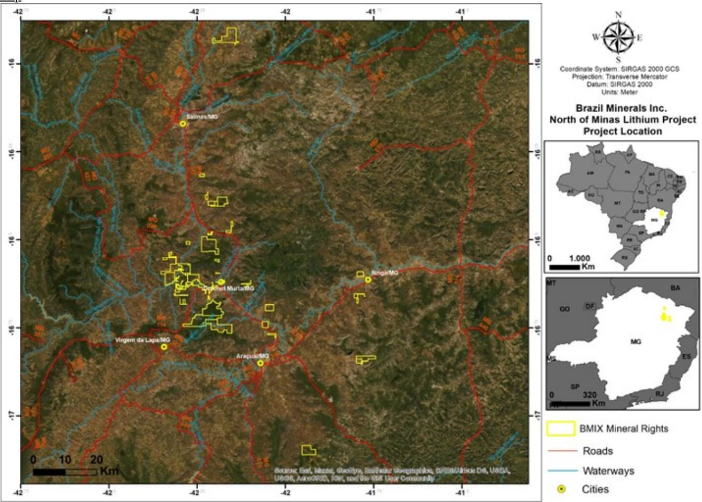

> **AI Description:**
> **Source:** `assets/_page_11_Figure_0.jpg`
> 
> **Generated:** 2026-05-19 20:46:16
> 
> ---
> 
> The image contains a satellite map of a specific region in Brazil, highlighting the location of the North of Minas Lithium Project by Brazil Minerals Inc. The map includes various geographical features such as roads, waterways, and cities, with distinct color coding for each. The map also includes a legend explaining the symbols used, such as yellow squares for BMIX Mineral Rights, red lines for roads, blue lines for waterways, and yellow dots for cities. The map is oriented with a compass and includes a scale bar for distance measurement. The image also features a smaller map of Brazil with the project location marked, providing a broader context within the country.

Table of Contents

Northeast Lithium Project

Overview:

Our Northeast Lithium Project encompasses 7 mineral rights for lithium in the surroundings of Parelhas and Jardim do Seridó, State of Rio Grande do Norte, and São José do Sabugi, State of Paraíba in Brazil. The Borborema Province located in the Northeast Region of Brazil has a wide variety of geological / tectonic environments that contain different types of mineral deposits, varying between the classes of metals, non-metals, gems and precious metals. The pegmatitic province of Seridó corresponds to an important mining district located in the northeast of Brazil between the states of Paraíba and Rio Grande do Norte. This province is characterized by important mineral occurrences, which include several minerals with industrial application.

Commodity: Lithium

Ownership: 100%

Location: States of Rio Grande do Norte and Paraíba

Infrastructure: Paved highway, water, nearby electrical power grid

Size: 23,079 acres

Geology:

In our Northeast Lithium Project mineralizations are described in metric to decametric pegmatite bodies with exotic geometry, accessible both at surface and in underground galleries. Lithium ore occurs as crystals of varying size of spodumene and ambligonite, rarely petalite, these develop in varying paragenesis. In general, the fertile pegmatite bodies occur horst in the metasedimentary rocks of the Seridó Formation and Equador Formation, the latter being responsible for sustaining the relief. Our project is located within the Borborema Province, a macroregion of continental deformation accommodation, our mineral rights are arranged along large dome structures generated at the time of ascent of lithium fertile bodies. These structures are the same ones that condition the accommodation of the pegmatite bodies containing lithium mineralization. Our Northeast Lithium Project is marked by numerous occurrences of industrial spodumene, which is treated as tailings from gem mines in the region.

Map:

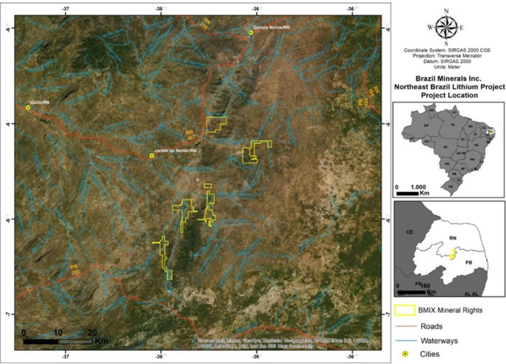

> **AI Description:**
> **Source:** `assets/_page_12_Figure_0.jpg`
> 
> **Generated:** 2026-05-19 20:43:28
> 
> ---
> 
> The image contains a satellite map of a specific region in Brazil, highlighting the Northeast Brazil Lithium Project. It includes a coordinate system (SIRGAS 2000 CGS) and projection (Transverse Mercator) with a datum of SIRGAS 2000. The map is labeled with BMIX Mineral Rights, roads, waterways, and cities. The map also includes a legend and two insets showing the location of the project within Brazil and a zoomed-in view of the northeastern region. The map provides a geographical representation of the project area, including its proximity to major cities and transportation routes.

Table of Contents

Goiás/Tocantins Rare Earths Project

Overview:

The Goiás/Tocantins Rare Earths Project is located within the states of Goiás and Tocantins in the Center-West of Brazil. This Project is further divided into 2 component projects according to the local geology, Serra Dourada and Serra do Mendes. The Serra Dourada Project comprises three mineral rights. One located SW of the state of TO, and one NW of the GO state. We have confirmed presence of all rare earth elements via geochemical sample testing. The Serra do Mendes Project contains a mineral right located in the NE region of the GO state.

Commodity: Rare Earths

Ownership: 100%

Location: States of Goiás and Tocantins

Infrastructure: Paved highway, water, nearby electrical power grid

Size: 15,810 acres

Geology:

The Goiás/Tocantins Rare Earth Elements Project is inserted within the Goiás Tin Province (PEG), which is developed within the geological province of the Goiás Magmatic Arc. The region is marked by numerous magmatic events that developed in an orchestrated manner by the tectonics of the time. The PEG is characterized by a zone with type A granitic intrusions rich in tin and rare earth elements. These fertile granites are responsible for the formation of supergene deposits with exotic minerals such as fluocerite-Ce, ETR oxifluorides, bastnaesite, monazite, allanite, solid solutions of zircon-torite and xenotite-torite in addition to apatite, rich in rare earth elements (REE). PREG/T targets regions bordering the dome of these granites, since it is understood that the REE-enriched deposits would form as regolith of the generating fertile granite, being formed by sediments, transported and deposited in nearby depressions. The area has a history of Sn deposits in PEG, so its potential for REE was not explored until the last decade, after which the region’s potential for world-class deposits was understood.

## Map:

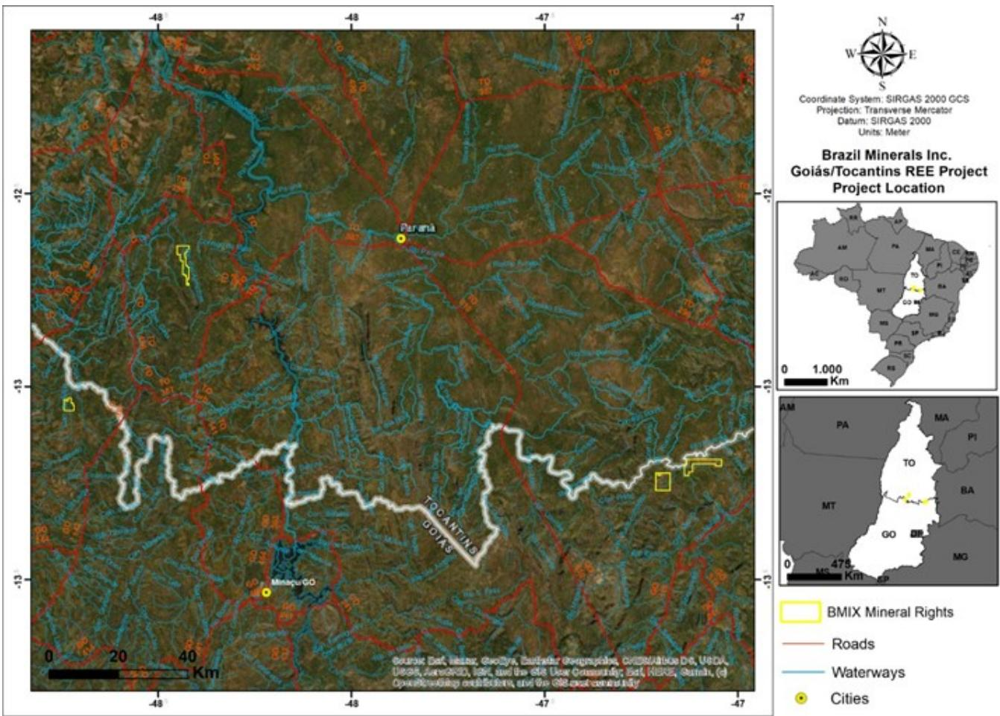

> **AI Description:**
> **Source:** `assets/_page_13_Figure_0.jpg`
> 
> **Generated:** 2026-05-19 20:44:00
> 
> ---
> 
> The image is a map showing the location of the Brazil Minerals Inc. Goiás/Tocantins Rare Earth Elements (REE) Project. It includes a satellite view of the area, with roads, waterways, and cities marked. The map is labeled with the coordinate system, projection, and datum used. There are two insets: one showing the location of the project within Brazil, and another highlighting the specific area of interest with BMIX mineral rights. The map uses color coding to differentiate between roads, waterways, and cities.

Table of Contents

Bahia Rare Earths Project

Overview:

The Project is located in the SW portion of State of Bahia in the Northeast Region of Brazil. The Project comprises a total of 5 mineral rights.

Commodity: Rare Earths

Ownership: 100%

Location: State of Bahia

Infrastructure: Paved highway, water, nearby electrical power grid

Size: 24,162 acres

Geology:

The Bahia Rare Earth Elements Project is inserted within the regions of Serra do Ramalho and Serra Pitarana which are located in the São Francisco sedimentary basin, an extensive Proterozoic cover of the São Francisco Craton, where the Bambuí Group, which is part of the upper part of the São Francisco Supergroup, is represented by a thick carbonatic-pelitic sequence. The Bambuí Group sits directly on a gneissic–migmatitic base of the ancient Archean crust, occurring sub-horizontally in the center-north portion of the area. Serra do Ramalho stands out as one of the main geomorphological features of the region. It has a relatively flat top and steep flanks, with ruiniform or “lapiês” erosional structures typical of the calcitic limestone dissolution processes, supported by the Sete Lagoas Formation limestone units.

Map:

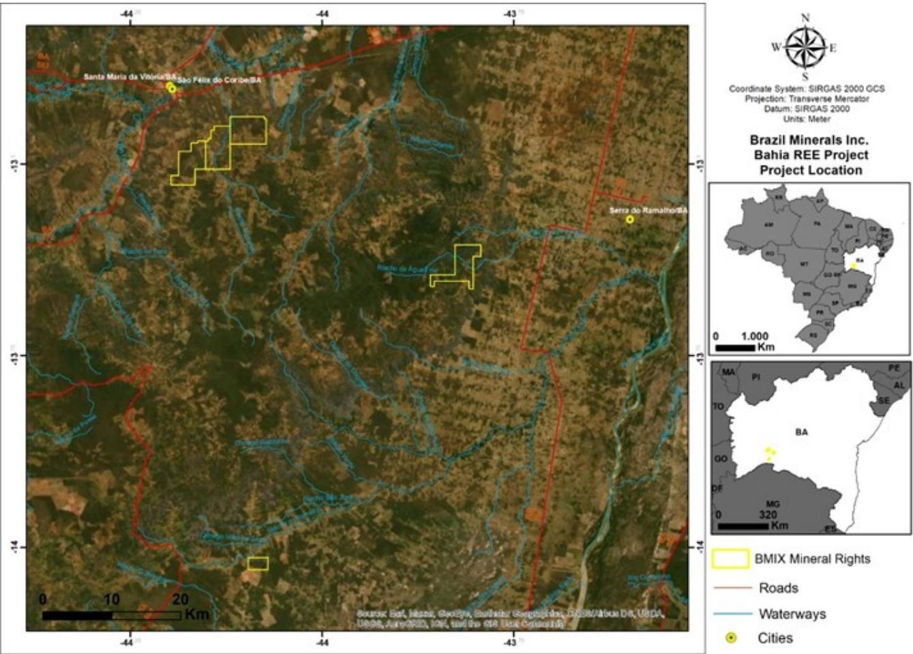

> **AI Description:**
> **Source:** `assets/_page_14_Figure_0.jpg`
> 
> **Generated:** 2026-05-19 20:44:39
> 
> ---
> 
> The image contains a satellite map of a specific region in Brazil, highlighting the location of the Bahia Rare Earth Elements (REE) Project by Brazil Minerals Inc. The map includes several key elements:
> 
> 1. **Satellite Imagery**: The main part of the image is a satellite view of the area, showing terrain, waterways, and roads.
> 2. **Geographical Features**: The map includes labeled cities such as Santa Maria da Vitória and São Félix do Coribe, as well as the Serro do Ramalho.
> 3. **Project Boundaries**: Yellow squares indicate the areas where Brazil Minerals Inc. holds mineral rights.
> 4. **Legend**: A legend in the bottom right corner explains the color coding: yellow for mineral rights, red for roads, blue for waterways, and yellow dots for cities.
> 5. **Coordinate System and Scale**: The map includes a compass, coordinate system details (SIRGAS 2000 GCS), projection type (Transverse Mercator), datum (SIRGAS 2000), and units (Meter). A scale bar is also present to indicate distances in kilometers.
> 
> The image effectively combines satellite imagery with textual and graphical annotations to provide a clear representation of the project's location and relevant geographical features.

Table of Contents

Titanium Project

Overview:

Our Titanium Project is located in the central-western region of the state of Minas Gerais in Brazil, and is composed of 5 mineral rights.

Commodity: Titanium

Ownership: 100%

Location: State of Minas Gerais

Infrastructure: Paved highway, water, nearby electrical power grid

Size: 13,810 acres

Geology:

Our Titanium Project’s target region is situated within the São Francisco Basin and approximately 60km from the alkaline carbonate complex of Alto Paranaíba. The complex is formed by carbonatitic intrusions of exotic chemistry associated with a local paleo hotspot, this igneous activity influenced the percolation of fluids into the subsequent sediments generating the basic to ultrabasic complexes of the Mata da Corda Group host in the rocks of the Bambuí Group (São Francisco Basin). It is the rocks of this igneous complex (Mata da Corda Group) that host ilmenite mineralizations and form titanium deposits.

Map:

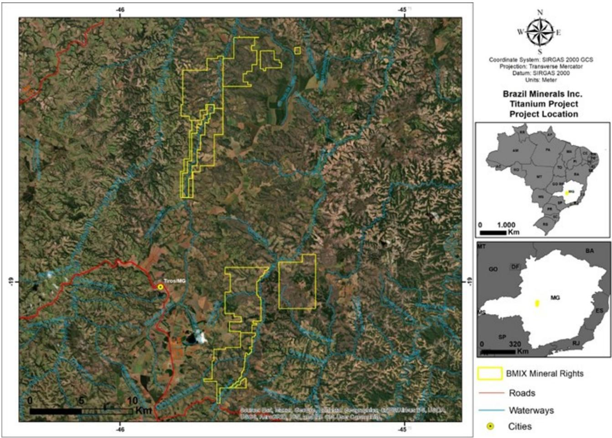

> **AI Description:**
> **Source:** `assets/_page_15_Figure_0.jpg`
> 
> **Generated:** 2026-05-19 20:42:56
> 
> ---
> 
> The image contains a satellite map with various geographical features and annotations. It includes a detailed map of a specific region in Brazil, highlighting the location of a titanium project by Brazil Minerals Inc. The map is marked with yellow lines representing BMIX Mineral Rights, red lines for roads, blue lines for waterways, and a yellow dot indicating cities. The map also includes a compass rose, a scale bar, and a legend explaining the symbols used. Additionally, there are two smaller maps showing the location of the project within Brazil and a larger context map of Brazil. The image provides a clear geographical representation of the project area and its surroundings.

Table of Contents

Nickel/Cobalt Project

Overview:

Our Nickel/Cobalt Project is located in the states of Goiás and Piauí in Brazil, and composed of 3 mineral rights.

Commodity: Nickel and Cobalt

Ownership: 100%

Location: States of Goiás and Piauí

Infrastructure: Paved highway, water, nearby electrical power grid

Size: 9,553 acres

Geology:

Our Nickel/Cobalt Project’s target region in the Goiás magmatic arc. The region is marked by numerous intrusions enriched in heavy elements. The deposit is formed through supergene enrichment and soil formation, derived from ultramafic rocks from mantle intrusions and therefore forms metric layers of soil with high Nickel and Cobalt contents. Access to the mineralized layers occurs on surface, facilitating blasting and exploitation operations. In Piauí, the nickel deposits occur constrained to the fold belts Riacho do Pontal. This geological structure depicts tectonic stresses responsible for the rise of basic to ultrabasic fluids that crystallize element-rich minerals such as Nickel and Cobalt. The presence of these mineralized rocks added to the arid climate of the region results in the formation of soil layers enriched in these elements, such as in Goiás.

Maps:

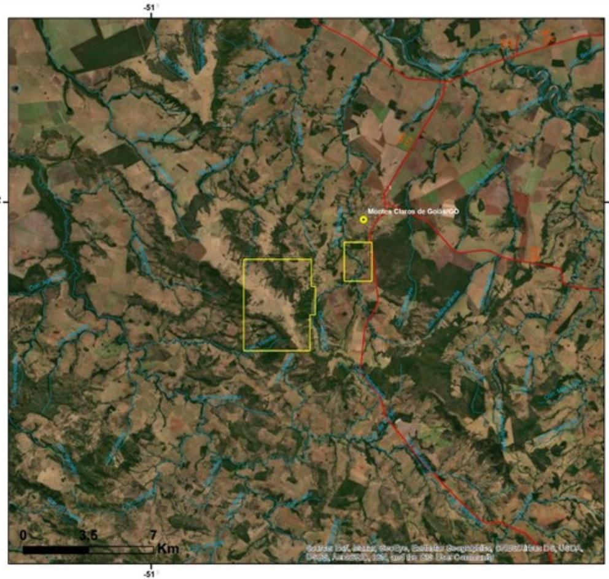

> **AI Description:**
> **Source:** `assets/_page_16_Figure_0.jpg`
> 
> **Generated:** 2026-05-19 20:45:43
> 
> ---
> 
> The image is a satellite map with geographical features such as rivers, fields, and roads. It includes two yellow rectangular boxes highlighting specific areas within the map. The map also contains a scale bar indicating 0 to 7 kilometers and a location marker labeled "Mocas Claros de Goiás/GO." The map appears to be used for geographical or environmental analysis, possibly for land use or resource management purposes.

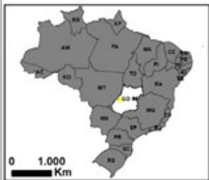

> **AI Description:**
> **Source:** `assets/_page_16_Figure_1.jpg`
> 
> **Generated:** 2026-05-19 20:45:18
> 
> ---
> 
> The image is a map of Brazil, showing the country's states and their abbreviations. The states are shaded in gray, and the abbreviation for each state is written in the corresponding region. The map includes a scale bar at the bottom indicating 1,000 kilometers. The abbreviation "GO" is highlighted in yellow, which likely corresponds to the state of Goiás.

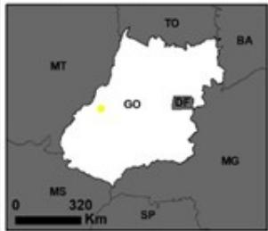

> **AI Description:**
> **Source:** `assets/_page_16_Figure_2.jpg`
> 
> **Generated:** 2026-05-19 20:46:53
> 
> ---
> 
> The image is a map of a region, likely in Brazil, as indicated by the abbreviations and the shape of the states. The map includes state abbreviations such as GO, DF, BA, MG, MT, SP, and TO. The abbreviation "GO" is highlighted in yellow, suggesting it might be the focus of the map. The scale at the bottom indicates the distance in kilometers, with 320 km marked. The map appears to be a simplified representation of the region, possibly for educational or geographical purposes.

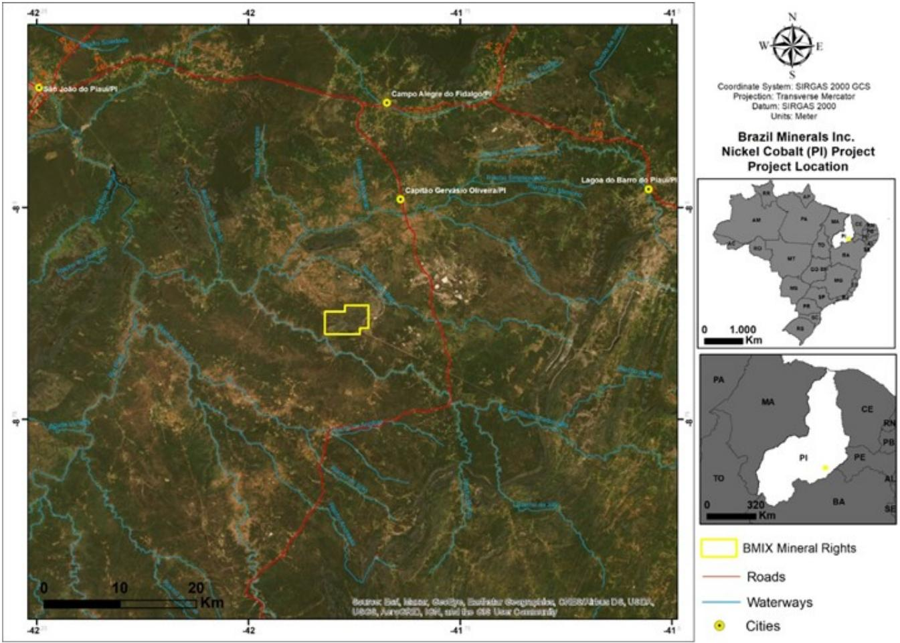

> **AI Description:**
> **Source:** `assets/_page_17_Figure_0.jpg`
> 
> **Generated:** 2026-05-19 20:47:25
> 
> ---
> 
> The image contains a satellite map of a specific region in Brazil, highlighting the location of the Brazil Minerals Inc. Nickel Cobalt (PI) Project. The map includes a legend indicating the location of BMIX Mineral Rights, roads, waterways, and cities. The map is overlaid with a compass rose and a coordinate system reference, providing geographical context. The image also includes a smaller map of Brazil, zooming in on the state of Piauí (PI), with the project location marked. The map uses color coding and symbols to represent different geographical and project-related features.

Table of Contents

## Diamond Project

Overview:

Our Diamond Project is located in the State of Minas Gerais and comprises a total of 24 mineral rights, including 10 mining concessions, the highest level of mining title in Brazil. All our diamond rights are located along the banks of the Jequitinhonha River in the northern part of Minas Gerais. This river rises within the Diamantina Plateau, a region where more than alluvial diamond produced in the world for more than 200 years. The Diamantina region stands out not only for being the place where diamonds were first discovered in the country, in 1714, but also for being responsible for most of the Brazilian production to date.

Commodity: Diamonds

Ownership: 100%

Location: State of Minas Gerais

Infrastructure: Paved highway, water, nearby electrical power grid

Size: 21,871 acres

Geology:

Serra do Espinhaço is a mountain range that extends for more than 1,000 km, in a south-north direction, from the east of the Quadrilátero Ferrífero (central region of Minas Gerais) to the border of the states of Bahia with Piauí. Throughout this extension, diamonds occur in several locations, in addition to involving Chapada Diamantina, in the state of Bahia. In this province, the diamond “districts” of Diamantina, Grão Mogol, Serra do Cabral and Itacambira are included.

Serra do Espinhaço is mostly supported by quartzites, with subordinated phyllites and conglomeratic rocks, in addition to local occurrences of metamagmatic rocks, all members of the Espinhaço Supergroup. In the Diamantina region, the Espinhaço Supergroup is subdivided into the Diamantina and Conselheiro Mata groups; the first consisting mainly of continental sedimentary deposits and the upper, by deposits of marine origin. Such sedimentation occurred in a rift-type basin, which evolved during the Paleoproterozoic and Mesoproterozoic periods.

The diamonds in the latter area originated from the conglomeratic rocks of the Sopa-Brumadinho Formation, one of the units of the Diamantina Group. Primary rocks such as kimberlites or lamproites, even if metamorphosed, are not known along the mountain spike. The main diamond rocks are conglomerates and loopholes in that formation, which flourishes mainly in the highest mountain portions. Such rocks were sedimented in fluvial and alluvial fan systems, which probably collected diamonds from some area west of the mountain, where the São Francisco River basin is currently located.

From an original distribution of kimberlitic or lamproitic rocks, still unknown, the diamonds were initially invested in the conglomerates and crevices of the Sopa-Brumadinho Formation. From Proterozoic to recent, a complex multiphase evolutionary history of diamond deposits present in this province can be summarized from data compiled from studies by several authors. Although some of these ages are not absolute, most of them are well established by radiometric dating (case of proterozoic deposits) or by fossils and inferences about major climatic events at the regional level (case of phanerozoic deposits).

Map:

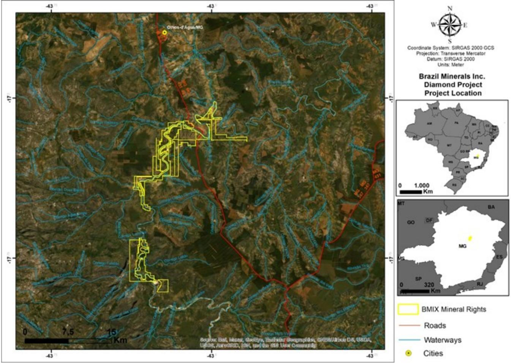

> **AI Description:**
> **Source:** `assets/_page_19_Figure_0.jpg`
> 
> **Generated:** 2026-05-19 20:45:13
> 
> ---
> 
> The image contains a satellite map of a specific region in Brazil, highlighting the location of a diamond project by Brazil Minerals Inc. The map includes several key elements: 
> 
> 1. **BMIX Mineral Rights**: These are marked in yellow on the map, indicating the areas where Brazil Minerals Inc. holds mineral rights.
> 2. **Roads**: Red lines on the map represent roads in the area.
> 3. **Waterways**: Blue lines indicate waterways.
> 4. **Cities**: Yellow dots represent cities in the region.
> 
> The map also includes a legend and a scale bar to help interpret the map. The top right corner provides additional information about the coordinate system and projection used for the map. The image effectively combines geographical data with visual elements to provide a clear representation of the project's location and surrounding infrastructure.

## Sand Project

Overview:

Our sand deposits are located on the banks and on the Jequitinhonha River in the state of Minas Gerais. High-quality, commercial grade sand for construction use is found in our deposits. A professional mining engineer surveyor measured one of our deposits to contain 1,140,400 cubic meters of sand in the surveyed area, with an average modeled body thickness of 3.07 m, very close to the average of 3.19 m found in the 13 sampled holes. Several other deposits of similar size are thought to exist in our overall project area.

Commodity: Sand

Ownership: 100%

Location: State of Minas Gerais

Infrastructure: Paved highway, water, nearby electrical power grid

Size: 23,363 acres

Map:

Item 3. Legal Proceedings.
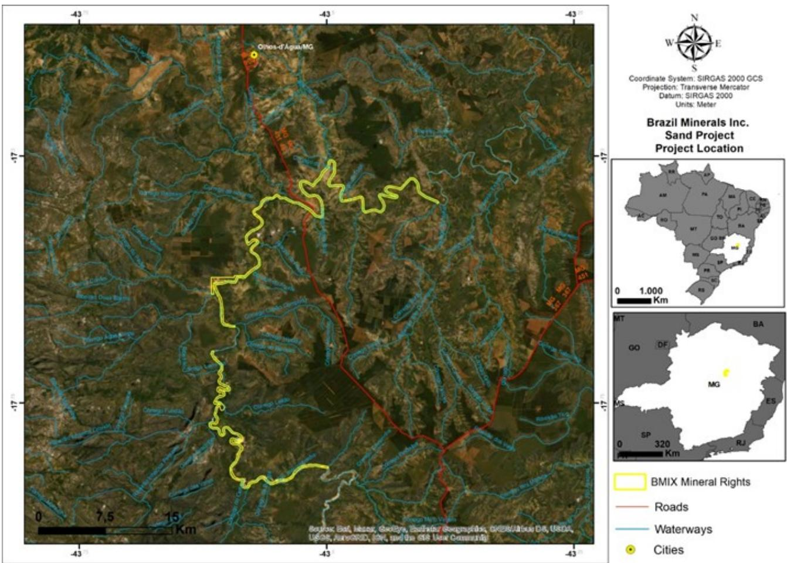

> **AI Description:**
> **Source:** `assets/_page_20_Figure_0.jpg`
> 
> **Generated:** 2026-05-19 20:46:47
> 
> ---
> 
> The image contains a satellite map of a specific area in Brazil, highlighting the location of the Brazil Minerals Inc. Sand Project. The map includes a yellow outline marking the BMIX Mineral Rights area, red lines representing roads, blue lines indicating waterways, and a yellow dot marking cities. The map also includes a compass rose and a legend explaining the symbols used. The image provides geographical context and project location details.

We are not a party to any pending legal proceedings which we consider to be material.

Item 4. Mine Safety Disclosures.

Not applicable.

## PART II

Item 5. Market for Registrant’s Common Equity, Related Stockholder Matters and Issuer Purchases of Equity Securities.

Market Information and Current Stockholders

Our common stock is traded under the symbol “BMIX” and quotations for our common stock are available on otcmarkets.com. The following table sets forth, for each of the quarterly periods indicated, the range of high and low sales prices, in U.S. dollars, for our common stock for each quarter in 2019 and 2020.

As of March 26, 2021, we had 202 holders of record of our common stock as such term is defined in SEC rules, according to records maintained by our transfer agent.

## Dividends

We have not paid any cash dividends since our inception and do not expect to declare any cash dividends in the foreseeable future.

## Table of Contents

## Equity Compensation Plan

In 2017, our Board of Directors approved our 2017 Stock Incentive Plan under which we can offer eligible employees, consultants, and non-employee directors cash and stock-based compensation and/or incentives to compensate, attract, retain, or reward such individuals. We have no other equity compensation plan. The table below sets forth certain information as of December 31, 2020 with respect to the 2017 Stock Incentive Plan.

Item 6. Selected Financial Data.

Not applicable.

Item 7. Management’s Discussion and Analysis of Financial Condition and Results of Operation.

The following discussion of our financial condition and results of operations should be read in conjunction with our audited consolidated financial statements and the notes to those financial statements appearing elsewhere in this Annual Report.

This Annual Report contains forward-looking statements. Forward-looking statements for Brazil Minerals, Inc. reflect current expectations, as of the date of this Annual Report, and involve certain risks and uncertainties. Actual results could differ materially from those anticipated in these forward- looking statements as a result of various factors. Factors that could cause future results to materially differ from the recent results or those projected in forwardlooking statements include, among others: unprofitable efforts resulting not only from the failure to discover mineral deposits, but also from finding mineral deposits that, though present, are insufficient in quantity and quality to return a profit from production; market fluctuations; government regulations, including regulations relating to royalties, allowable production, importing and exporting of minerals, and environmental protection; competition; the loss of services of key personnel; unusual or infrequent weather phenomena, sabotage, government or other interference in the maintenance or provision of infrastructure as well as general economic conditions.

## Overview

Brazil Minerals, Inc. with its subsidiaries (“Brazil Minerals”, the “Company”, “we”, “us”, or “our”) is a mineral exploration company currently primarily focused on the development of our two 100%-owned hard-rock lithium projects.. Our initial goal is to be able to enter commercial production of spodumene concentrate, a lithium bearing commodity.

We also have 100%-ownership of projects in other highly strategic minerals: rare earths, titanium, and nickel/cobalt. We have mining concessions and other mineral rights for diamonds, and in one of these areas we also mine and sell sand for construction usage, which was our primary source of our revenues in 2020.

As of the date of this Annual Report, we own approximately 60% of Apollo Resources Corporation, a private company primarily focused on the development of its initial iron mine. We own approximately 30% of Jupiter Gold Corporation, a company focused on the development of gold projects and of a quartzite mine, and whose common shares are quoted on otcmarkets.com under the symbol “JUPGF”.

We have consolidated our results as of December 31, 2020 in this Annual Report. All of our mineral properties are in Brazil. Our common stock is quoted on otcmarkets.com under the symbol “BMIX”.

None of our projects currently has “reserves” in accordance with the definition of such term by the SEC. One of our projects has had an NI 43-101 technical report issued (see details below).

The projects owned by Jupiter Gold Corporation are summarized in the table below. Jupiter Gold provides details of its properties in its Annual Report on Form 20-F filed with the SEC. We currently own approximately 30% of Jupiter Gold Corporation.

None of the Jupiter Gold Corporation projects currently has “reserves” in accordance with the definition of such term by the SEC.

The projects owned by Apollo Resources Corporation are summarized in the table below. We currently own approximately 60% of Apollo Resources Corporation.

## Table of Contents

None of the Apollo Resources Corporation projects currently has “reserves” in accordance with the definition of such term by the SEC.

During the year 2020 and in 2021 to the date of this Annual Report, we strengthened our mineral property portfolio significantly. Some of the highlights are as follows:

Lithium: we increased our portfolio of hard-rock lithium properties by 463% from 17,487 acres to an aggregate of 80,934 acres by increasing the size of our original project (in the State of Minas Gerais) and adding a second project in the Northeast of Brazil (in the States of Rio Grande do Norte and Paraíba). Both projects are located in areas rich in pegmatites which contain spodumene as the primary lithium-bearing mineral. Spodumene has an 8.03% lithium content.

Rare Earths: we increased our portfolio of rare earths properties by 363% from 11,001 acres to 39,972 acres by adding a second project in the State of Bahia.

Nickel/Cobalt: we increased our portfolio of rare earths properties by 191% from 4,991 acres to 9,553 acres by adding a second project in the State of Bahia.

Iron: we acquired and currently own approximately 60% of Apollo Resources Corporation, a private company which is developing its first iron mine.

## Results of Operations

## Fiscal Year Ended December 31, 2020 Compared to Fiscal Year Ended December 31, 2019

Revenue for the year ended December 31, 2020 totaled \$23,446, compared to revenue of \$15,393 during the year ended December 31, 2019 representing an increase of 52.3%. We anticipate that revenues will begin to increase with the licensing of new high-quality areas for production in future periods.

Cost of goods sold for the year ended December 31, 2020 totaled \$129,943, compared to cost of goods sold of \$182,168 during the year ended December 31, 2019 representing a decrease of 28.7%. Cost of goods sold is primarily comprised of labor, fuel, and repairs and maintenance on our mining equipment. The decrease is explained by reduced costs resulting from more efficient mining activities and the risks and uncertainties surrounding COVID-19.

Gross loss for the year ended December 31, 2020 totaled \$106,497, compared to gross loss of \$166,775 for the year ended December 31, 2019 representing a decrease of 36.1%.

Operating expenses for the year ended December 31, 2020 totaled \$1,175,056, compared to operating expenses of \$1,097,569 for the year ended December 31, 2019 representing an increase of \$77,487 or 7.1%. This increase was primarily caused by increased general and administrative expenses and professional services.

Other expenses for the year ended December 31, 2020 totaled \$264,482, compared to other expenses of \$821,537 for the year ended December 31, 2019 representing a decrease of \$557,055 or 67.8%. The decrease was primarily the result of lower amortization expense related to debt discounts and the relief of \$238,151 in interest expense accrued against a convertible note, offset in part by a \$76,926 loss due to a fair market value adjustment provision included in a share exchange agreement with a related party.

## Table of Contents

As a result, we incurred a net loss attributable to our shareholders of \$1,141,663, or approximately \$0.00 per share, for the year ended December 31, 2020, compared to a net loss attributable to our shareholders of \$1,862,077, or approximately \$0.00 per share, for the year ended December 31, 2019.

## Liquidity and Capital Resources

As of December 31, 2020, we had total current assets of \$305,145 compared to total current liabilities of \$2,326,890 for a current ratio of 0.13 to one and a working capital deficit of \$2,021,745. By comparison we had total current assets of \$193,777 compared to current liabilities of \$2,154,356 for a current ratio of 0.09 to one and a working capital deficit of \$1,960,579 as of December 31, 2019. Our principal sources of liquidity were from the sale of equity and issuance of debt for the years ended December 31, 2020 and 2019.

Net cash used in operating activities totaled \$996,781 for the year ended December 31, 2020, compared to \$791,072 for the year ended December 31, 2019 representing an increase in cash used of \$205,709 or 26.0%. Net cash used in investing activities totaled \$13,643 for the year ended December 31, 2020, compared to \$677 for the year ended December 31, 2019 representing a decrease of \$12,966 or 1,915.2%. Net cash provided by financing activities totaled \$1,104,549 for the year ended December 31, 2020, as compared to \$941,852 for the year ended December 31, 2019 representing an increase of \$162,697 or 17.3%.

During the year ended December 31, 2020, our sources of liquidity were primarily derived from the proceeds of equity sales by the Company and two of its subsidiaries. Our ability to continue as a going concern is dependent upon our capability to generate cash flows from operations and successfully raise new capital through debt issuances and sales of our equity. We believe that we will be successful in the execution of our initiatives, but there can be no assurance. We have no plans for any significant cash acquisitions in the foreseeable future.

## Recent Developments

On March 3, 2021, we provided the necessary 60-day notice of intent to fully redeem a note issued by us in 2014 with \$244,000 in original principal and held by a Trust. After such redemption, past-maturity third-party convertible debt remaining would aggregate \$186,736 in principal and we intend to fully extinguish it within the second quarter of 2021.

## Going Concern

The accompanying consolidated financial statements have been prepared assuming we will continue as a going concern, which contemplates realization of assets and the satisfaction of liabilities in the normal course of business for the twelve-month period following the date of these financial statements. The Company has limited working capital, has incurred losses in each of the past two years, and has not yet received material revenues from sales of products or services. These factors create substantial doubt about the Company’s ability to continue as a going concern. The consolidated financial statements do not include any adjustment that might be necessary if the Company is unable to continue as a going concern.

## Off-Balance Sheet Arrangements

The Company currently has no off-balance sheet arrangements.

## Table of Contents

## Critical Accounting Policies and Estimates

## Use of Estimates

The preparation of financial statements in conformity with generally accepted accounting principles requires management to make estimates and assumptions that affect the reported amounts of assets and liabilities and disclosure of contingencies at the date of the financial statements and the reported amount of revenues and expenses during the reporting period. Actual results may differ from those estimates.

## Fair Value of Financial Instruments

We follow the guidance of Accounting Standards Codification (“ASC”) Topic 820 – Fair Value Measurement and Disclosure. Fair value is defined as the exit price, or the amount that would be received to sell an asset or paid to transfer a liability in an orderly transaction between market participants as of the measurement date. The guidance also establishes a hierarchy for inputs used in measuring fair value that maximizes the use of observable inputs and minimizes the use of unobservable inputs by requiring that the most observable inputs be used when available. Observable inputs are inputs market participants would use in valuing the asset or liability and are developed based on market data obtained from sources independent of us. Unobservable inputs are inputs that reflect our assumptions about the factors market participants would use in valuing the asset or liability. The guidance establishes three levels of inputs that may be used to measure fair value:

Level 1. Observable inputs such as quoted prices in active markets;

Level 2. Inputs, other than the quoted prices in active markets, that are observable either directly or indirectly; and

Level 3. Unobservable inputs in which there is little or no market data, which require the reporting entity to develop its own assumptions.

As of December 31, 2020 and 2019, our derivative liabilities were considered a level 2 liability. We do not have any level 3 assets or liabilities.

Our financial instruments consist of cash and cash equivalents, accounts receivable, taxes receivable, prepaid expenses, deposits and other assets, accounts payable, accrued expenses and convertible notes payable. The carrying amount of these financial instruments approximates fair value due to either length of maturity or interest rates that approximate prevailing market rates unless otherwise disclosed in these consolidated financial statements.

## Property and Equipment

Property and equipment are stated at cost, net of accumulated depreciation. Major improvements and betterments are capitalized. Maintenance and repairs are expensed as incurred. Depreciation is computed using the straight-line method over the estimated useful life. At the time of retirement or other disposition of property and equipment, the cost and accumulated depreciation are removed from the accounts and any resulting gain or loss is reflected in the statements of operations as other gain or loss, net.

The diamond and gold processing plant and other machinery are depreciated over an estimated useful life of ten years; vehicles are depreciated over an estimated life of four years; and computer and other office equipment over an estimated useful life of three years.

## Mineral Properties

Costs of exploration, carrying and retaining unproven mineral lease properties are expensed as incurred. Mineral property acquisition costs, including licenses and lease payments, are capitalized. Although we have taken steps to verify title to mineral properties in which it has an interest, these procedures do not guarantee our rights. Such properties may be subject to prior agreements or transfers and title may be affected by undetected defects.

Impairment losses are recorded on mineral properties used in operations when indicators of impairment are present and the undiscounted cash flows estimated to be generated by those assets are less than the assets’ carrying amount. As of December 31, 2020 and 2019, we did not recognize any impairment losses related to mineral properties held.

## Impairment of Intangible Assets with Indefinite Useful Lives

We account for intangible assets in accordance with Accounting Standards Codification (“ASC”) 350, Intangibles – Goodwill and Other (“ASC 350”). ASC 350 requires that intangible assets with indefinite useful lives no longer be amortized, but instead be evaluated for impairment at least annually. On an annual basis, in the fourth quarter of the fiscal year, we review our intangible assets with indefinite useful lives for impairment by first assessing qualitative factors to determine whether the existence of events or circumstances makes it more-likely-than-not that the fair value of an intangible asset is less than its carrying amount. If it is determined that it is more-likely-than-not that the fair value of an intangible asset is less than its carrying amount, the intangible asset is further tested for impairment by comparing the carrying amount to its estimated fair value using a discounted cash flow. Impairment, if any, is measured as the amount by which an indefinite-lived intangible asset’s carrying amount exceeds its fair value.

Application of impairment tests requires significant management judgment, including the determination of fair value of each indefinite-lived intangible asset. Judgment applied when performing the qualitative analysis includes consideration of macroeconomic, industry and market conditions, overall financial performance of the entity, composition, or strategy changes affecting the recoverability of asset groups. Judgments applied when performing the quantitative analysis includes estimating future cash flows, determining appropriate discount rates and making other assumptions. Changes in these judgments, estimates and assumptions could materially affect the determination of fair value for each indefinite-lived intangible asset.

## Impairment of Long-Lived Assets

For long-lived assets, such as property and equipment and intangible assets subject to amortization, we continually monitor events and changes in circumstances that could indicate carrying amounts of long-lived assets may not be recoverable. When such events or changes in circumstances are present, we assess the recoverability of long-lived assets by determining whether the carrying value of such assets will be recovered through undiscounted expected future cash flows. If the total of the future cash flows is less than the carrying amount of those assets, we recognize an impairment loss based on the excess of the carrying amount over the fair value of the assets. Assets to be disposed of are reported at the lower of the carrying amount or the fair value less costs to sell.

## Table of Contents

## Convertible Instruments

We evaluate and account for conversion options embedded in convertible instruments in accordance with ASC 470-20, “Debt with Conversion and Other Options”.

Applicable GAAP requires companies to bifurcate conversion options from their host instruments and account for them as free-standing derivative financial instruments according to certain criteria. The criteria include circumstances in which (a) the economic characteristics and risks of the embedded derivative instrument are not clearly and closely related to the economic characteristics and risks of the host contract, (b) the hybrid instrument that embodies both the embedded derivative instrument and the host contract is not re-measured at fair value under other GAAP with changes in fair value reported in earnings as they occur and (c) a separate instrument with the same terms as the embedded derivative instrument would be considered a derivative instrument.

We account for convertible instruments (when it has been determined that the embedded conversion options should not be bifurcated from their host instruments) by recording, when necessary, discounts to convertible notes for the intrinsic value of conversion options embedded in debt instruments based upon the differences between the fair value of the underlying common stock at the commitment date of the note transaction and the effective conversion price embedded in the note. Debt discounts under these arrangements are amortized over the term of the related debt to their stated date of redemption.

## Variable Interest Entities

We determine at the inception of each arrangement whether an entity in which we hold an investment or in which we have other variable interests in is considered a variable interest entity. We consolidate VIEs when we are the primary beneficiary. The primary beneficiary of a VIE is the party that meets both of the following criteria: (1) has the power to make decisions that most significantly affect the economic performance of the VIE; and (2) has the obligation to absorb losses or the right to receive benefits that in either case could potentially be significant to the VIE. Periodically, we assess whether any changes in the interest or relationship with the entity affect the determination of whether the entity is still a VIE and, if so, whether we are the primary beneficiary. If we are not the primary beneficiary in a VIE, we account for the investment under the equity method or cost method in accordance with the applicable GAAP.

We have concluded that Apollo Resources, Jupiter Gold and their subsidiaries are VIEs in accordance with applicable accounting standards and guidance; and although the operations of Apollo Resources and Jupiter Gold are independent of ours, through governance rights, we have the power to direct the activities that are most significant to Apollo Resources and Jupiter Gold. Therefore, we concluded that we are the primary beneficiary of both Apollo Resources and Jupiter Gold.

## Table of Contents

## Stock-Based Compensation

We record stock-based compensation in accordance with ASC Topic 718, Compensation - Stock Compensation. ASC 718 requires companies to measure compensation cost for stock-based employee compensation at fair value at the grant date and recognize the expense over the employee’s requisite service period. Under ASC 718, volatility is based on the historical volatility of our stock or the expected volatility of the stock of similar companies. The expected life assumption is primarily based on historical exercise patterns and employee post-vesting termination behavior. The risk-free interest rate for the expected term of the option is based on the U.S. Treasury yield curve in effect at the time of grant.

We utilize the Black-Scholes option-pricing model, which was developed for use in estimating the fair value of options. Option-pricing models require the input of highly complex and subjective variables including the expected life of options granted and the expected volatility of our stock price over a period equal to or greater than the expected life of the options. Because changes in the subjective assumptions can materially affect the estimated value of our employee stock options, it is management’s opinion that the Black-Scholes option-pricing model may not provide an accurate measure of the fair value of our employee stock options. Although the fair value of employee stock options is determined in accordance with ASC Topic 718 using an option-pricing model, that value may not be indicative of the fair value observed in a willing buyer/willing seller market transaction.

On June 20, 2018, the FASB issued ASU 2018-07 which simplifies the accounting for share-based payments granted to nonemployees for goods and services. Under the ASU, most of the guidance on such payments to nonemployees would be aligned with the requirements for share-based payments granted to employees. Equity classified share-based payments for employees was fixed at the time of grant. Equity-classified nonemployee share-based payment awards are measured at the grant date of the award which is the same as share-based payments for employees. We adopted the requirements of the new rule as of January 1, 2019, the effective date of the new guidance.

## Foreign Currency

Our foreign subsidiaries use a local currency as the functional currency. Resulting translation gains or losses are recognized as a component of accumulated other comprehensive income. Transaction gains or losses related to balances denominated in a currency other than the functional currency are recognized in the consolidated statements of operations. Net foreign currency transaction losses included in our consolidated statements of operations were negligible for all periods presented.

## Reclassifications

Certain prior year amounts have been reclassified to conform to the current period presentation. These reclassifications had no impact on net earnings (loss) or and financial position.

## Recent Accounting Pronouncements

Our consolidated financial statements are prepared in accordance with U.S. generally accepted accounting principles. Our significant accounting policies are described in Note 1 of the financial statements. We have reviewed all recent accounting pronouncements issued to the date of the issuance of these financial statements, and we do not believe any of these pronouncements will have a material impact on us.

## Item 7A. Quantitative and Qualitative Disclosures About Market Risk.

The information to be reported under this Item is not required of smaller reporting companies.

## Item 8. Financial Statements and Supplementary Data.

Our financial statements, including the notes thereto, together with the report from our independent registered public accounting firm are presented beginning at page F-1.

## Item 9. Changes in and Disagreements with Accountants on Accounting and Financial Disclosure.

None.

Item 9A. Controls and Procedures.

## (a) Evaluation of Disclosure Controls and Procedures

The Company’s management, with the participation of the Company’s Principal Executive Officer and Principal Financial Officer, has evaluated the design, operation, and effectiveness of the Company’s disclosure controls and procedures, as defined in Rules 13a-15(e) and 15d-15(e) of the Exchange Act as of December 31, 2020. On the basis of that evaluation, management concluded that the Company’s disclosure controls and procedures are designed, and are effective, to provide reasonable assurance that the information required to be disclosed in reports filed or submitted pursuant to the Exchange Act is recorded, processed, summarized, and reported within the time periods specified in the rules and forms of the Commission, and that such information is accumulated and communicated to management, including its Principal Executive Officer and Principal Financial Officer as appropriate, to allow timely decisions regarding required disclosure.

## (b) Management’s Report on Internal Control Over Financial Reporting

Management is responsible for establishing and maintaining adequate internal control over financial reporting, as such term is defined in Exchange Act Rule 13a-15(f). The Company’s internal control system is designed to provide reasonable assurance to management and to the Company’s Board of Directors regarding the preparation and fair presentation of published financial statements. Under the supervision and with the participation of management, including the Company’s Principal Executive Officer and Principal Financial Officer, management conducted an evaluation of the effectiveness of the Company’s internal control over financial reporting based on the framework in Internal Control—Integrated Framework issued by the Committee of Sponsoring Organizations of the Treadway Commission. Based on management’s evaluation under the framework in Internal Control— Integrated Framework, management concluded that the Company’s internal control over financial reporting was effective as of December 31, 2020.

This Annual Report does not include an attestation report of the Company’s registered public accounting firm regarding internal control over financial reporting. Since the Company is a non-accelerated filer, management’s report is not subject to attestation by the Company’s registered public accounting firm pursuant to Section 404(b) of the Sarbanes-Oxley Act of 2002. As a result, this Annual Report contains only management’s report on internal controls.

## (c) Changes in Internal Control over Financial Reporting

There were no changes in the Company’s internal control over financial reporting that occurred in the fourth quarter of 2020 that materially affected, or would be reasonably likely to materially affect, the Company’s internal control over financial reporting.

## (d) Limitations of the Effectiveness of Internal Controls

The effectiveness of the Company’s system of disclosure controls and procedures and internal control over financial reporting is subject to certain limitations, including the exercise of judgment in designing, implementing and evaluating the control system, the assumptions used in identifying the likelihood of future events, and the inability to eliminate fraud and misconduct completely. As a result, there can be no assurance that the Company’s disclosure controls and procedures and internal control over financial reporting will detect all errors or fraud. However, the Company’s control systems have been designed to provide reasonable assurance of achieving their objectives, and the Company’s Principal Executive Officer and Principal Financial Officer have concluded that the Company’s disclosure controls and procedures and internal control over financial reporting are effective at the reasonable assurance level. The Company has utilized the 1992 Committee of Sponsoring Organizations of the Treadway Commission’s internal control framework.

## Item 9B. Other Information.

None.

## PART III

## Item 10. Directors, Executive Officers and Corporate Governance.

The following table sets forth certain information as of March 26, 2020 concerning our directors and executive officers:

Marc Fogassa, age 54, has been a director and our Chairman and Chief Executive Officer since 2012. He is also the Chairman and Chief Executive Officer of Jupiter Gold Corporation, one of our subsidiaries. He has over 17 years of investment experience in venture capital, and private and public equity investing, and has served on boards of directors of multiple private companies. Mr. Fogassa has been invited numerous times to speak about investment issues, particularly as related to Brazil. Mr. Fogassa double majored at the Massachusetts Institute of Technology (M.I.T.), graduating with two Bachelor of Science degrees in 1990. He later graduated from the Harvard Medical School with a Doctor of Medicine degree in 1995, and also from the Harvard Business School with a Master in Business Administration degree in 1999. Mr. Fogassa was born in Brazil and is fluent in Portuguese and English. We appointed Mr. Fogassa as a director and our Chairman of the Board and President because of his substantial management and fundraising skills, prior experience as a director of several private companies, venture capital and private equity experience, judgment and his knowledge of, and contacts in, Brazil.

Ambassador Roger Noriega, age 61, has been a director since 2012. He has extensive experience in Latin America. Ambassador Noriega was appointed by President George W. Bush and confirmed by the U.S. Congress as U.S. Assistant Secretary of State, and served from July 2003 to October 2005. In that capacity, Ambassador Noriega managed a 3,000-person team of professionals in Washington and in 50 diplomatic posts to design and implement political and economic strategies in Canada, Latin America, and the Caribbean. Prior to this assignment, Ambassador Noriega served as U.S. Ambassador to the Organization of American States (“OAS”) from August 2001 to July 2003. Since February 2009 Ambassador Noriega has been the Managing Director of Vision Americas, a Latin America-focused consulting group that he founded. Ambassador Noriega has a Bachelor of Arts degree from Washburn University of Topeka, Kansas. We appointed Ambassador Noriega as a director because of his extensive experience in Latin America, business and government contacts, management skills and judgment.

## Table of Contents

Brian W. Bernier, age 63, has been a consultant to us since 2019 and became our Vice-President, Business Development and Investor Relations in 2020. Mr. Bernier has worked in the business development and investor relations sector for over three decades, and was most recently at a regional investment bank. He graduated with a degree in Management from Boston University.

Joel de Paiva Monteiro, Esq., age 31, has been a consultant to us since 2017 and became our Vice-President, Administration and Operations, in 2020. Previously he was a partner of the Brazilian law firm PRA Advogados - Pimenta da Rocha Andrade, with three offices and headquarters in Belo Horizonte, state of Minas Gerais. Mr. Monteiro has worked with all aspects of Brazilian business law, and has extensive experience in a wide range of areas from strategic business planning to litigation. His prior clients included large corporations in a variety of economic sectors in diverse states in Brazil. Mr. Monteiro has a law degree from the Milton Campos Faculty in Belo Horizonte, Brazil. Subsequently he achieved a post-graduate degree in Business and Civil Law from the Pontifical Catholic University of Minas Gerais. Mr. Monteiro is also a director of Jupiter Gold Corporation and of Apollo Resources Corporation.

Areli Nogueira da Silva Júnior, age 41, has been a consultant to us since 2018 and became our Vice-President, Mineral Exploration, in 2021. He is the Founder and was the Chief Technical Officer of MineXplore, a consultancy focused on mineral rights in Brazil. Mr. da Silva Júnior has been a consultant geologist with GeoEspinhaço, a firm that undertakes geological studies in a variety of minerals across Brazil. Mr. da Silva Júnior has also been a college faculty member teaching geology. Previously, he worked at the Brazilian mining department) and before that as a geologist at Usimimas Mineração. Mr. da Silva Júnior has a Master of Geology degree from the Federal University of Rio de Janeiro, and an undergraduate degree in Geological Engineering from the School of Mines of the Federal University of Ouro Preto, a premier and the oldest mining-focused college in Brazil. Mr. da Silva is also a director of Jupiter Gold Corporation.

## Board Composition

Our Board of Directors is currently composed of two members, Marc Fogassa and Ambassador Roger Noriega.

There are no family relationships among our directors and executive officers. There is no arrangement or understanding between or among our executive officers and directors pursuant to which any director or officer was or is to be selected as a director or officer, and there is no arrangement, plan, or understanding as to whether non-management shareholders will exercise their voting rights to continue to elect the current board of directors.

Our directors and executive officers have not, during the past ten years:

had any bankruptcy petition filed by or against any business of which such person was a general partner or executive officer, either at the time of the bankruptcy or within two years prior to that time,

been convicted in a criminal proceeding and is not subject to a pending criminal proceeding,

been subject to any order, judgment, or decree, not subsequently reversed, suspended, or vacated, of any court of competent jurisdiction, permanently, or temporarily enjoining, barring, suspending, or otherwise limiting his involvement in any type of business, securities, futures, commodities, or banking activities; or

been found by a court of competent jurisdiction (in a civil action), the Securities Exchange Commission, or the Commodity Futures Trading Commission to have violated a federal or state securities or commodities law, and the judgment has not been reversed, suspended, or vacated.

We do not have standing audit, nominating, or compensation committees. Currently, our entire Board of Directors is responsible for the functions that would otherwise be handled by these committees.

## Code of Ethics

Our Board of Directors will adopt a new code of ethics that applies to all of our directors, officers, and employees, including our principal executive officer, principal financial officer, and principal accounting officer. The new code will address, among other things, honesty and ethical conduct, conflicts of interest, compliance with laws, regulations and policies, including disclosure requirements under the federal securities laws, confidentiality, trading on inside information, and reporting of violations of the code.

## Audit Committee Financial Expert

Our entire Board of Directors currently acts as our audit committee. We do not currently have an independent member of our Board of Directors who qualifies as an “audit committee financial expert” as defined in Item 407(e)(5) of Regulation S-K.

## Item 11. Executive Compensation.

The following table sets forth information concerning cash and non-cash compensation paid by us to our Chief Executive Officer for each of the two years ended December 31, 2019 and 2020. No employee or independent contractor received compensation in excess of \$100,000 for either of those two years.

## Director Compensation

The following table sets forth a summary of compensation for the fiscal year ended December 31, 2020 that we paid to each director other than its Chief Executive Officer, whose compensation is fully reflected in the Summary Compensation Table. We do not sponsor a pension benefits plan, a non-qualified deferred compensation plan, or a non-equity incentive plan for directors; therefore, these columns have been omitted from the following table. No other or additional compensation for services were paid to any of the directors.

(1) The amounts in this column reflect the aggregate grant date fair value of stock options granted in 2020 to each director calculated in accordance with FASB ASC Topic 718. See the notes to our consolidated financial statements included in this Annual Report on Form 10-K for the year ended December 31, 2020 for a discussion of all assumptions made in the calculation of this amount.

## Item 12. Security Ownership of Certain Beneficial Owners and Management and Related Stockholder Matters.

The following table sets forth information regarding beneficial ownership of our Common Stock and Series A Preferred Stock as of March 26, 2021 by (i) any person or group with more than 5% of any class of voting securities, (ii) each director, (iii) our chief executive officer and each other executive officer whose cash compensation for the most recent fiscal year exceeded \$100,000 and (iv) all executive officers and directors as a group. Except as indicated in the footnotes to this table and subject to applicable community property laws, the persons named in the table to our knowledge have sole voting and investment power with respect to all shares of securities shown as beneficially owned by them. The Certificate of Designations, Preferences and Rights of our Series A Convertible Preferred provides that for so long as Series A Preferred Stock is issued and outstanding, the holders of Series A Preferred Stock shall vote together as a single class with the holders of our Common Stock, with the holders of Series A Preferred Stock being entitled to 51% of the total votes on all matters regardless of the actual number of shares of Series A Preferred Stock then outstanding, and the holders of Common Stock being entitled to their proportional share of the remaining 49% of the total votes based on their respective voting power.

(1) The mailing address of each of the officers, directors, and affiliates set forth below is c/o Brazil Minerals, Inc., Rua Vereador João Alves Praes nº 95- A, Olhos D’Agua, MG 39.398-000, Brazil.

(2) Beneficial ownership is determined in accordance with rules promulgated by the SEC.

(3) Based on 2,498,625,381 shares of common stock issued and outstanding as of March 26, 2021 and additional shares issuable in accordance with rules promulgated by the SEC.

(4) The holders of our Series A Stock vote together as a single class with the holders of our Common Stock, with the holders of Series A Stock being entitled to 51% of the total votes on all matters regardless of the actual number of shares of Series A Stock then outstanding, and the holders of Common Stock being entitled to their proportional share of the remaining 49% of the total votes based on their respective voting power. Based on their beneficial ownership of shares of Series A Stock and Common Stock as of April 10, 2019, each person set forth in the table had the approximate percentage of the voting power of the common and preferred stock voting together as a single class as of such date set forth opposite their name.

## Item 13. Certain Relationships and Related Transactions, and Director Independence.

## Director Independence

We believe that Ambassador Roger Noriega is “independent” as such term is defined with respect to directors by the NASDAQ Stock Market Rules.

Item 14. Principal Accounting Fees and Services.

## Audit Fees

In December 2020, the Company engaged BF Borgers CPA PC (“Borgers”) as the Company’s independent registered public accounting firm for the audit of the Company’s financial statements as of December 31, 2020. Borgers was also retained as the Company’s independent registered public accounting firm for the audit of the Company’s financial statements as of December 31, 2019. The fee that was billed by Borgers for the audit of our financial statements as of December 31, 2019 and for quarterly reviews during such year was \$44,820. The Company expects that the total fees payable to Borgers for the audit of the Company’s financial statements and for quarterly reviews during the year ended December 31, 2020 will be \$44,820.

## Audit-Related Fees

During 2019 or 2020, there were no fees paid to Borgers in connection with our compliance with Section 404 of the Sarbanes-Oxley Act of 2002.

No other fees were billed by Borgers for the last two years that were reasonably related to the performance of the audit or review of our financial statements and not reported under “Audit Fees” above.

## Tax Fees

There were no fees billed by Borgers during the last two fiscal years for professional services rendered for tax compliance, tax advice, or tax planning.   
Accordingly, none of such services were approved pursuant to pre-approval procedures or permitted waivers thereof.

## All Other Fees

There were no other non-audit-related fees billed to us by Borgers in 2019 or 2020.

## Table of Contents

## Pre-Approval Policies and Procedures

Engagement of accounting services by us is not made pursuant to any pre-approval policies and procedures. Rather, we believe that our accounting firm is independent because all of its engagements by us are approved by our Board of Directors prior to any such engagement.

Our Board of Directors will meet periodically to review and approve the scope of the services to be provided to us by its independent registered public accounting firm, as well as to review and discuss any issues that may arise during an engagement. The Board is responsible for the prior approval of every engagement of our independent registered public accounting firm to perform audit and permissible non-audit services for us, such as quarterly financial reviews, tax matters, and consultation on new accounting and disclosure standards.

Before the auditors are engaged to provide those services, our Chief Financial Officer and Controller will make a recommendation to the Board of Directors regarding each of the services to be performed, including the fees to be charged for such services. At the request of the Board of Directors, the independent registered public accounting firm and/or management shall periodically report to the Board of Directors regarding the extent of services being provided by the independent registered public accounting firm, and the fees for the services performed to date.

## PART IV

## Item 15. Exhibits, Financial Statement Schedules

## BRAZIL MINERALS, INC.

## TABLE OF CONTENTS DECEMBER 31, 2020

Report of Independent Registered Public Accounting Firm F-1   
Consolidated Balance Sheets as of December 31, 2020 and 2019 F-2   
Consolidated Statements of Operations and Comprehensive Loss for the Years Ended December 31, 2020 and 2019 F-3   
Consolidated Statement of Stockholders’ Deficit F-4   
Consolidated Statements of Cash Flows for the Years Ended December 31, 2020 and 2019 F-5   
Notes to the Consolidated Financial Statements F-6   
35

# Report of Independent Registered Public Accounting Firm

To the shareholders and the board of directors of Brazil Minerals, Inc.

## Opinion on the Financial Statements

We have audited the accompanying consolidated balance sheets of Brazil Minerals, Inc. (the "Company") as of December 31, 2020 and 2019, the related consolidated statements of operations and comprehensive loss, stockholders' equity (deficit), and cash flows for each of the two years in the period ended December 31, 2020, and the related notes (collectively referred to as the "financial statements"). In our opinion, the financial statements present fairly, in all material respects, the financial position of the Company as of December 31, 2020 and 2019, and the results of its operations and its cash flows for each of the two years in the period ended December 31, 2020, in conformity with accounting principles generally accepted in the United States.

## Going Concern Uncertainty

The accompanying financial statements have been prepared assuming that the Company will continue as a going concern. As discussed in Note 1 to the financial statements, the Company has suffered recurring losses from operations and has a net capital deficiency that raise substantial doubt about its ability to continue as a going concern. Management’s plans in regard to these matters are also described in Note 1. The financial statements do not include any adjustments that might result from the outcome of this uncertainty.

## Basis for Opinion

These financial statements are the responsibility of the Company's management. Our responsibility is to express an opinion on the Company's financial statements based on our audits. We are a public accounting firm registered with the Public Company Accounting Oversight Board (United States) ("PCAOB") and are required to be independent with respect to the Company in accordance with the U.S. federal securities laws and the applicable rules and regulations of the Securities and Exchange Commission and the PCAOB.

We conducted our audits in accordance with the standards of the PCAOB. Those standards require that we plan and perform the audit to obtain reasonable assurance about whether the financial statements are free of material misstatement, whether due to error or fraud. The Company is not required to have, nor were we engaged to perform, an audit of its internal control over financial reporting. As part of our audits we are required to obtain an understanding of internal control over financial reporting but not for the purpose of expressing an opinion on the effectiveness of the Company’s internal control over financial reporting. Accordingly, we express no such opinion.

Our audits included performing procedures to assess the risks of material misstatement of the financial statements, whether due to error or fraud, and performing procedures that respond to those risks. Such procedures included examining, on a test basis, evidence regarding the amounts and disclosures in the financial statements. Our audits also included evaluating the accounting principles used and significant estimates made by management, as well as evaluating the overall presentation of the financial statements. We believe that our audits provide a reasonable basis for our opinion.

## Critical Audit Matter

The critical audit matter communicated below is a matter arising from the current period audit of the consolidated financial statements that was communicated or required to be communicated to the audit committee and that: (1) relate to accounts or disclosures that are material to the consolidated financial statements and (2) involved our especially challenging, subjective or complex judgments. The communication of the critical audit matter does not alter in any way our opinion on the consolidated financial statements, taken as a whole, and we are not, by communicating the critical audit matter below, providing separate opinions on the critical audit matter or on the accounts or disclosures to which they relate.

## Valuation of long-lived assets

As described in the Note 1 to the financial statements, the Company continually monitors events and changes in circumstances that could indicate carrying amounts of long-lived assets, including property and equipment and definite-life intangible assets, may not be recoverable. In addition, the Company review the impairment of indefinite-life intangible assets at least annually, or more frequent when impairment indicators are present. As of December 31, 2020, carrying value of property and equipment and intangible assets were \$89,726 and \$407,467, respectively.

Auditing the valuation of long-lived assets involved complex judgment due to the significant estimation required in determining the recoverability or fair value of the long-lived assets. Specifically, the cash flow forecasts were sensitive to significant assumptions about future market and economic conditions. Significant assumptions used in the Company’s fair value estimates included sales volume, pricing, cost of labor, marketing spending, general and administrative expenses, tax rates, as applicable.

We obtained an understanding of the controls over the Company’s annual impairment assessments for long-lived assets and tested the future cash flows of the long-lived assets based on our risk assessments. Our audit procedures included, among others, comparing significant inputs to observable third party and industrial sources, and evaluating the reasonableness of management’s projected financial information by comparing to observable average market prices of the Company’s products. We reviewed most recent available technical reports about the Company’s mineral projects. We performed sensitivity analyses of significant assumptions to evaluate the change in the cash flow or fair value of the long-lived assets and assessed the historical accuracy of management’s estimates. We also assessed the Company’s disclosure of its annual impairment assessments included in Note 1.

## /s/ BF Borgers CPA PC

We have served as the Company's auditor since 2015.

Lakewood, Colorado March 31, 2021

BRAZIL MINERALS, INC. CONSOLIDATED BALANCE SHEETS AS OF DECEMBER 31, 2020 AND 2019

The accompanying notes are an integral part of these consolidated financial statements.

BRAZIL MINERALS, INC.
CONSOLIDATED STATEMENTS OF OPERATIONS AND COMPREHENSIVE LOSSFOR THE YEARS ENDED DECEMBER 31, 2020 AND 2019

BRAZIL MINERALS, INC. CONSOLIDATED STATEMENTS OF STOCKHOLDERS’ EQUITY (DEFICIT) FOR THE YEARS ENDED DECEMBER 31, 2020 AND 2019

The accompanying notes are an integral part of these consolidated financial statements.

BRAZIL MINERALS, INC. CONSOLIDATED STATEMENTS OF CASH FLOWS FOR THE YEARS ENDED DECEMBER 31, 2020 AND 2019

The accompanying notes are an integral part of these consolidated financial statements.

# BRAZIL MINERALS, INC. NOTES TO THE CONSOLIDATED FINANCIAL STATEMENTS

## NOTE 1 – ORGANIZATION, BUSINESS AND SUMMARY OF SIGNIFICANT ACCOUNTING POLICIES

## Organization and Description of Business

Brazil Minerals, Inc. (“Brazil Minerals” or the “Company”) was incorporated as Flux Technologies, Corp. under the laws of the State of Nevada, U.S. on December 15, 2011. The Company changed its management and business on December 18, 2012, to focus on mineral exploration. Brazil Minerals, through subsidiaries, owns mineral rights in Brazil for gold, diamonds, lithium, rare earths, titanium, iron, nickel, and sand.

## Basis of Presentation

The consolidated financial statements of the Company have been prepared in accordance with generally accepted accounting principles (“GAAP”) of the United States of America and are expressed in United States dollars. For the years ended December 31, 2020 and 2019, the consolidated financial statements include the accounts of the Company; its 99.99% owned subsidiary, BMIX Participações Ltda. (“BMIXP”), which includes the accounts of BMIXP’s wholly-owned subsidiary, Mineração Duas Barras Ltda. (“MDB”), and BMIXP’s 50% owned subsidiary, RST Recursos Minerais Ltda. (“RST”); its 99.99% owned subsidiary, Hercules Resources Corporation (“HRC”), which includes the accounts of HRC’s wholly-owned subsidiary, Hercules Brasil Comercio e Transportes Ltda. (“Hercules Brasil”); its 30.1% equity interest in Apollo Resources Corporation (“Apollo Resources”) and its subsidiary Mineração Apollo, Ltda.; and its 10.6% equity interest in Jupiter Gold Corporation (“Jupiter Gold”), which includes the accounts of Jupiter Gold’s whollyowned subsidiary, Mineração Jupiter Ltda. The Company has concluded that Apollo Resources, Jupiter Gold and their subsidiaries are variable interest entities (“VIE”) in accordance with applicable accounting standards and guidance. As such, the accounts and results of Apollo Resources, Jupiter Gold and their subsidiaries have been included in the Company’s consolidated financial statements.

All material intercompany accounts and transactions have been eliminated in consolidation.

## Use of Estimates

The preparation of financial statements in conformity with generally accepted accounting principles requires management to make estimates and assumptions that affect the reported amounts of assets and liabilities and disclosure of contingencies at the date of the financial statements and the reported amount of revenues and expenses during the reporting period. Actual results may differ from those estimates.

## Going Concern

The consolidated financial statements have been prepared on a going concern basis which contemplates the realization of assets and the settlement of liabilities in the normal course of business. The Company has limited working capital, has incurred losses in each of the past two years, and has not yet received material revenues from sales of products or services. These factors create substantial doubt about the Company’s ability to continue as a going concern. The consolidated financial statements do not include any adjustment that might be necessary if the Company is unable to continue as a going concern.

# BRAZIL MINERALS, INC. NOTES TO THE CONSOLIDATED FINANCIAL STATEMENTS

## Fair Value of Financial Instruments

The Company follows the guidance of Accounting Standards Codification (“ASC”) Topic 820 – Fair Value Measurement and Disclosure. Fair value is defined as the exit price, or the amount that would be received to sell an asset or paid to transfer a liability in an orderly transaction between market participants as of the measurement date. The guidance also establishes a hierarchy for inputs used in measuring fair value that maximizes the use of observable inputs and minimizes the use of unobservable inputs by requiring that the most observable inputs be used when available. Observable inputs are inputs market participants would use in valuing the asset or liability and are developed based on market data obtained from sources independent of our Company. Unobservable inputs are inputs that reflect our Company’s assumptions about the factors market participants would use in valuing the asset or liability. The guidance establishes three levels of inputs that may be used to measure fair value:

Level 1. Observable inputs such as quoted prices in active markets;

Level 2. Inputs, other than the quoted prices in active markets, that are observable either directly or indirectly; and

Level 3. Unobservable inputs in which there is little or no market data, which require the reporting entity to develop its own assumptions.

As of December 31, 2020 and 2019, the Company’s derivative liabilities were considered a level 2 liability. See Note 4 for a discussion regarding the determination of the fair market value. The Company does not have any level 3 assets or liabilities.

The Company’s financial instruments consist of cash and cash equivalents, accounts receivable, taxes receivable, prepaid expenses, deposits and other assets, accounts payable, accrued expenses and convertible notes payable. The carrying amount of these financial instruments approximates fair value due to either length of maturity or interest rates that approximate prevailing market rates unless otherwise disclosed in these consolidated financial statements.

## Cash and Cash Equivalents

The Company considers all highly liquid instruments purchased with a maturity of three months or less to be cash equivalents to the extent that the funds are not being held for investment purposes. The Company’s bank accounts are deposited in FDIC insured institutions. Funds held in U.S. banks are insured up to \$250,000 and funds held in Brazilian banks are insured up to \$250,000 Brazilian Reais (translating into approximately \$48,107 as of December 31, 2020).

## Accounts Receivable

Accounts receivable are customer obligations due under normal trade terms which are recorded at net realizable value. The Company establishes an allowance for doubtful accounts based on management’s assessment of the collectability of trade receivables. A considerable amount of judgment is required in assessing the amount of the allowance. The Company makes judgments about the creditworthiness of each customer based on ongoing credit evaluations and monitors current economic trends that might impact the level of credit losses in the future. If the financial condition of the customers were to deteriorate, resulting in their inability to make payments, a specific allowance will be required.

Recovery of bad debt amounts previously written off is recorded as a reduction of bad debt expense in the period the payment is collected. If the Company’s actual collection experience changes, revisions to its allowance may be required. After all attempts to collect a receivable have failed, the receivable is written off against the allowance.

## Inventory

Inventory for the Company consists of ore stockpile, containing auriferous and diamondiferous gravel, which after processing in a recovery plant yields diamonds and gold, and is stated at lower of cost or market. No value was placed on sand. The amount of any write-down of inventories to net realizable value and all losses, are recognized in the period the write-down of loss occurs. At December 31, 2020 and 2019, inventory consisted primarily of rough ore stockpiled for further gold and diamonds recovery. During the years ended December 31, 2020 and 2019, the Company recorded write-downs of \$0 and \$17,166, respectively, against the value of its inventory.

## Taxes Receivable

The Company records a receivable for value added taxes receivable from Brazilian authorities on goods and services purchased by its Brazilian subsidiaries. The Company intends to recover the taxes through the acquisition of capital equipment from sellers who accept tax credits as payments.

# BRAZIL MINERALS, INC. NOTES TO THE CONSOLIDATED FINANCIAL STATEMENTS

## Property and Equipment

Property and equipment are stated at cost, net of accumulated depreciation. Major improvements and betterments are capitalized. Maintenance and repairs are expensed as incurred. Depreciation is computed using the straight-line method over the estimated useful life. At the time of retirement or other disposition of property and equipment, the cost and accumulated depreciation are removed from the accounts and any resulting gain or loss is reflected in the statements of operations as other gain or loss, net.

The diamond and gold processing plant and other machinery are depreciated over an estimated useful life of ten years; vehicles are depreciated over an estimated life of four years; and computer and other office equipment over an estimated useful life of three years.

## Mineral Properties

Costs of exploration, carrying and retaining unproven mineral lease properties are expensed as incurred. Mineral property acquisition costs, including licenses and lease payments, are capitalized. Although the Company has taken steps to verify title to mineral properties in which it has an interest, these procedures do not guarantee the Company’s rights. Such properties may be subject to prior agreements or transfers and title may be affected by undetected defects.

Impairment losses are recorded on mineral properties used in operations when indicators of impairment are present and the undiscounted cash flows estimated to be generated by those assets are less than the assets’ carrying amount. As of December 31, 2020 and 2019, the Company did not recognize any impairment losses related to mineral properties held.

## Intangible Assets

For intangible assets purchased in a business combination, the estimated fair values of the assets received are used to establish their recorded values. For intangible assets acquired in a non-monetary exchange, the estimated fair values of the assets transferred (or the estimated fair values of the assets received, if more clearly evident) are used to establish their recorded values, unless the values of neither the assets received nor the assets transferred are determinable within reasonable limits, in which case the assets received are measured based on the carrying values of the assets transferred. Valuation techniques consistent with the market approach, income approach and/or cost approach are used to measure fair value. Intangible assets consist of mineral rights awarded by the Brazilian national mining department and held by the Company’s subsidiaries.

## Impairment of Intangible Assets with Indefinite Useful Lives

The Company accounts for intangible assets in accordance with Accounting Standards Codification (“ASC”) 350, Intangibles – Goodwill and Other (“ASC 350”). ASC 350 requires that intangible assets with indefinite useful lives no longer be amortized, but instead be evaluated for impairment at least annually. On an annual basis, in the fourth quarter of the fiscal year, management reviews intangible assets with indefinite useful lives for impairment by first assessing qualitative factors to determine whether the existence of events or circumstances makes it more-likely-than-not that the fair value of an intangible asset is less than its carrying amount. If it is determined that it is more-likely-than-not that the fair value of an intangible asset is less than its carrying amount, the intangible asset is further tested for impairment by comparing the carrying amount to its estimated fair value using a discounted cash flow. Impairment, if any, is measured as the amount by which an indefinite-lived intangible asset’s carrying amount exceeds its fair value.

Application of impairment tests requires significant management judgment, including the determination of fair value of each indefinite-lived intangible asset. Judgment applied when performing the qualitative analysis includes consideration of macroeconomic, industry and market conditions, overall financial performance of the entity, composition, or strategy changes affecting the recoverability of asset groups. Judgments applied when performing the quantitative analysis includes estimating future cash flows, determining appropriate discount rates and making other assumptions. Changes in these judgments, estimates and assumptions could materially affect the determination of fair value for each indefinite-lived intangible asset.

## Impairment of Long-Lived Assets

For long-lived assets, such as property and equipment and intangible assets subject to amortization, the Company continually monitors events and changes in circumstances that could indicate carrying amounts of long-lived assets may not be recoverable. When such events or changes in circumstances are present, the Company assesses the recoverability of long-lived assets by determining whether the carrying value of such assets will be recovered through undiscounted expected future cash flows. If the total of the future cash flows is less than the carrying amount of those assets, the Company recognizes an impairment loss based on the excess of the carrying amount over the fair value of the assets. Assets to be disposed of are reported at the lower of the carrying amount or the fair value less costs to sell.

## Convertible Instruments

The Company evaluates and account for conversion options embedded in convertible instruments in accordance with ASC 470-20, “Debt with Conversion and Other Options”.

Applicable GAAP requires companies to bifurcate conversion options from their host instruments and account for them as free-standing derivative financial instruments according to certain criteria. The criteria include circumstances in which (a) the economic characteristics and risks of the embedded derivative instrument are not clearly and closely related to the economic characteristics and risks of the host contract, (b) the hybrid instrument that embodies both the embedded derivative instrument and the host contract is not re-measured at fair value under other GAAP with changes in fair value reported in earnings as they occur and (c) a separate instrument with the same terms as the embedded derivative instrument would be considered a derivative instrument.

# BRAZIL MINERALS, INC. NOTES TO THE CONSOLIDATED FINANCIAL STATEMENTS

The Company accounts for convertible instruments (when it has been determined that the embedded conversion options should not be bifurcated from their host instruments) by recording, when necessary, discounts to convertible notes for the intrinsic value of conversion options embedded in debt instruments based upon the differences between the fair value of the underlying common stock at the commitment date of the note transaction and the effective conversion price embedded in the note. Debt discounts under these arrangements are amortized over the term of the related debt to their stated date of redemption.

## Variable Interest Entities

The Company determines at the inception of each arrangement whether an entity in which the Company holds an investment or in which the Company has other variable interests in is considered a variable interest entity. The Company consolidates VIEs when it is the primary beneficiary. The primary beneficiary of a VIE is the party that meets both of the following criteria: (1) has the power to make decisions that most significantly affect the economic performance of the VIE; and (2) has the obligation to absorb losses or the right to receive benefits that in either case could potentially be significant to the VIE. Periodically, the Company assesses whether any changes in the interest or relationship with the entity affect the determination of whether the entity is still a VIE and, if so, whether the Company is the primary beneficiary. If the Company is not the primary beneficiary in a VIE, the Company accounts for the investment under the equity method or cost method in accordance with the applicable GAAP.

The Company has concluded that Apollo Resources, Jupiter Gold and their subsidiaries are VIEs in accordance with applicable accounting standards and guidance; and although the operations of Apollo Resources and Jupiter Gold are independent of the Company, through governance rights, the Company has the power to direct the activities that are most significant to Apollo Resources and Jupiter Gold. Therefore, the Company concluded that it is the primary beneficiary of both Apollo Resources and Jupiter Gold.

## Revenue Recognition

The Company recognizes revenue under ASC Topic 606, Revenue from Contracts with Customers (“ASC 606”). The core principle of the new revenue standard is that a company should recognize revenue to depict the transfer of promised goods or services to customers in an amount that reflects the consideration to which the company expects to be entitled in exchange for those goods or services. The following five steps are applied to achieve that core principle:

Step 1: Identify the contract with the customer

Step 2: Identify the performance obligations in the contract

Step 3: Determine the transaction price

Step 4: Allocate the transaction price to the performance obligations in the contract

Step 5: Recognize revenue when the company satisfies a performance obligation

In order to identify the performance obligations in a contract with a customer, a company must assess the promised goods or services in the contract and identify each promised good or service that is distinct. A performance obligation meets ASC 606’s definition of a “distinct” good or service (or bundle of goods or services) if both of the following criteria are met:

The customer can benefit from the good or service either on its own or together with other resources that are readily available to the customer

● The entity’s promise to transfer the good or service to the customer is separately identifiable from other promises in the contract (i.e.,

If a good or service is not distinct, the good or service is combined with other promised goods or services until a bundle of goods or services is identified that is distinct.

# BRAZIL MINERALS, INC. NOTES TO THE CONSOLIDATED FINANCIAL STATEMENTS

The transaction price is the amount of consideration to which an entity expects to be entitled in exchange for transferring promised goods or services to a customer. The consideration promised in a contract with a customer may include fixed amounts, variable amounts, or both. When determining the transaction price, an entity must consider the effects of all of the following:

Variable consideration

Constraining estimates of variable consideration

The existence of a significant financing component in the contract

Noncash consideration

Consideration payable to a customer

Variable consideration is included in the transaction price only to the extent that it is probable that a significant reversal in the amount of cumulative revenue recognized will not occur when the uncertainty associated with the variable consideration is subsequently resolved.

The transaction price is allocated to each performance obligation on a relative standalone selling price basis.

The transaction price allocated to each performance obligation is recognized when that performance obligation is satisfied, at a point in time or over time as appropriate.

## Costs of Goods Sold

Included within costs of goods sold are the costs of cutting and polishing rough diamonds and costs of production such as diesel fuel, labor, and transportation.

## Stock-Based Compensation

The Company records stock-based compensation in accordance with ASC Topic 718, Compensation - Stock Compensation. ASC 718 requires companies to measure compensation cost for stock-based employee compensation at fair value at the grant date and recognize the expense over the employee’s requisite service period. Under ASC 718, volatility is based on the historical volatility of our stock or the expected volatility of the stock of similar companies. The expected life assumption is primarily based on historical exercise patterns and employee post-vesting termination behavior. The risk-free interest rate for the expected term of the option is based on the U.S. Treasury yield curve in effect at the time of grant.

The Company utilizes the Black-Scholes option-pricing model, which was developed for use in estimating the fair value of options. Option-pricing models require the input of highly complex and subjective variables including the expected life of options granted and the expected volatility of our stock price over a period equal to or greater than the expected life of the options. Because changes in the subjective assumptions can materially affect the estimated value of our employee stock options, it is management’s opinion that the Black-Scholes option-pricing model may not provide an accurate measure of the fair value of our employee stock options. Although the fair value of employee stock options is determined in accordance with ASC Topic 718 using an option-pricing model, that value may not be indicative of the fair value observed in a willing buyer/willing seller market transaction.

On June 20, 2018, the FASB issued ASU 2018-07 which simplifies the accounting for share-based payments granted to nonemployees for goods and services. Under the ASU, most of the guidance on such payments to nonemployees would be aligned with the requirements for share-based payments granted to employees. Equity classified share-based payments for employees was fixed at the time of grant. Equity-classified nonemployee share-based payment awards are measured at the grant date of the award which is the same as share-based payments for employees. The Company adopted the requirements of the new rule as of January 1, 2019, the effective date of the new guidance.

# BRAZIL MINERALS, INC. NOTES TO THE CONSOLIDATED FINANCIAL STATEMENTS

## Foreign Currency

The Company’s foreign subsidiaries use a local currency as the functional currency. Resulting translation gains or losses are recognized as a component of accumulated other comprehensive income. Transaction gains or losses related to balances denominated in a currency other than the functional currency are recognized in the consolidated statements of operations. Net foreign currency transaction losses included in the Company’s consolidated statements of operations were negligible for all periods presented.

## Income Taxes

The Company accounts for income taxes in accordance with ASC Topic 740, Income Taxes. ASC 740 requires a company to use the asset and liability method of accounting for income taxes, whereby deferred tax assets are recognized for deductible temporary differences, and deferred tax liabilities are recognized for taxable temporary differences. Temporary differences are the differences between the reported amounts of assets and liabilities and their tax bases. Deferred tax assets are reduced by a valuation allowance when, in the opinion of management, it is more likely than not that some portion, or all of, the deferred tax assets will not be realized. Deferred tax assets and liabilities are adjusted for the effects of changes in tax laws and rates on the date of enactment. As of December 31, 2020 and 2019, the Company’s deferred tax assets had a full valuation allowance.

Under ASC 740, a tax position is recognized as a benefit only if it is “more likely than not” that the tax position would be sustained in a tax examination being presumed to occur. The amount recognized is the largest amount of tax benefit that is greater than 50% likely of being realized on examination. For tax positions not meeting the “more likely than not” test, no tax benefit is recorded. The Company has identified the United States Federal tax returns as its “major” tax jurisdiction.

On December 22, 2017, the United States enacted the Tax Cuts and Jobs Act (“TCJA”), which instituted fundamental changes to the taxation of multinational corporations, including a reduction the U.S. corporate income tax rate to 21% beginning in 2018.

The TCJA also requires a one-time transition tax on the mandatory deemed repatriation of the cumulative earnings of certain of the Company’s foreign subsidiaries as of December 31, 2017. To determine the amount of this transition tax, the Company must determine the amount of earnings generated since inception by the relevant foreign subsidiaries, as well as the amount of non-U.S. income taxes paid on such earnings, in addition to potentially other factors. The Company believes that no such tax will be due since its Brazilian subsidiaries have, when required, paid taxes locally and that they have incurred a cumulative operating deficit since inception.

## Basic Income (Loss) Per Share

The Company computes loss per share in accordance with ASC Topic 260, Earnings per Share, which requires presentation of both basic and diluted earnings per share on the face of the statement of operations. Basic loss per share is computed by dividing net loss available to common shareholders by the weighted average number of outstanding common shares during the period. Diluted loss per share gives effect to all dilutive potential common shares outstanding during the period. As of December 31, 2020, the Company’s potentially dilutive securities relate to common stock issuable in connection with convertible notes payable, options and warrants. As of December 31, 2020, if all holders of preferred stock, convertible notes payable, options and warrants exercised their right to convert their securities to common stock, the common stock issuable would be in excess of the Company’s authorized, but unissued shares of common stock.

## Other Comprehensive Income

Other comprehensive income is defined as the change in equity of a business enterprise during a period from transactions and other events and circumstances from non-owner sources, other than net income and including foreign currency translation adjustments.

## Reclassifications

Certain prior year amounts have been reclassified to conform to the current period presentation. These reclassifications had no impact on net earnings (loss) or and financial position.

# BRAZIL MINERALS, INC. NOTES TO THE CONSOLIDATED FINANCIAL STATEMENTS

## Recent Accounting Pronouncements

The Company has implemented all new accounting pronouncements that are in effect and that may impact its financial statements and does not believe that there are any other new pronouncements that have been issued that might have a material impact on its financial position or results of operations except as noted below:

In August 2020, the FASB issued ASU No. 2020-06, Debt - Debt with Conversion and Other Options (Subtopic 470-20) and Derivatives and Hedging - Contracts in Entity’s Own Equity (Subtopic 815-40): Accounting for Convertible Instruments and Contracts in an Entity’s Own Equity. ASU 2020-06 will simplify the accounting for convertible instruments by reducing the number of accounting models for convertible debt instruments and convertible preferred stock. Limiting the accounting models will result in fewer embedded conversion features being separately recognized from the host contract as compared with current GAAP. Convertible instruments that continue to be subject to separation models are (1) those with embedded conversion features that are not clearly and closely related to the host contract, that meet the definition of a derivative, and that do not qualify for a scope exception from derivative accounting and (2) convertible debt instruments issued with substantial premiums for which the premiums are recorded as paid-in capital. ASU 2020-06 also amends the guidance for the derivatives scope exception for contracts in an entity’s own equity to reduce form-over-substance-based accounting conclusions. ASU 2020-06 will be effective January 1, 2024, for the Company. Early adoption is permitted, but no earlier than January 1, 2021, including interim periods within that year. The Company is evaluating the effect of the adoption of ASU 2020-06 on the consolidated financial statements, but currently does not believe ASU 2020-06 will have a significant impact on the Company’s accounting for its convertible debt instruments. The effect will largely depend on the composition and terms of the financial instruments at the time of adoption.

In February 2020, the FASB issued ASU 2020-02, Financial Instruments-Credit Losses (Topic 326) and Leases (Topic 842) - Amendments to SEC Paragraphs Pursuant to SEC Staff Accounting Bulletin No. 119 and Update to SEC Section on Effective Date Related to Accounting Standards Update No. 2016-02, Leases (Topic 842), which amends the effective date of the original pronouncement for smaller reporting companies. ASU 2016-13 and its amendments will be effective for the Company for interim and annual periods in fiscal years beginning after December 15, 2022. The Company believes the adoption will modify the way the Company analyzes financial instruments, but it does not anticipate a material impact on results of operations. The Company is in the process of determining the effects adoption will have on its consolidated financial statements.

## NOTE 2 – COMPOSITION OF CERTAIN FINANCIAL STATEMENT ITEMS

## Property and Equipment, Net

The following table sets forth the components of the Company’s property and equipment at December 31, 2020 and December 31, 2019:

For the years ended December 31, 2020 and 2019, the Company recorded depreciation expense of \$47,765 and \$63,457, respectively.

## Intangible Assets

Intangible assets consist of mining rights are not amortized as the mining rights are perpetual. The carrying value was \$407,467 and \$509,862 at December 31, 2020 and 2019, respectively.

# BRAZIL MINERALS, INC. NOTES TO THE CONSOLIDATED FINANCIAL STATEMENTS

## Equity Investments without Readily Determinable Fair Values

On October 2, 2017, the Company entered into an exchange agreement whereby it issued 25,000,000 shares of its common stock in exchange for 500,000 shares of Ares Resources Corporation. The Company’s chief executive officer also serves as an officer of Ares Resources Corporation, thus making it a related party under common ownership and control. The shares were recorded at \$150,000, or \$0.006 per share. The shares were valued based upon the lowest market price of the Company’s common stock on the date the agreement.

On March 11, 2020, the Company issued 53,947,368 shares of common stock to Lancaster Brazil Fund pursuant to an addendum to the share exchange agreement dated September 28, 2018. The Company recorded a loss on exchange of equity with a related party of \$76,926 representing the fair value of the additional shares of common stock issued.

Under ASC 321-10, the Company elected to use a measurement alternative for its equity investment that does not have a readily determinable fair value. As such, the Company measured its investment at cost, less any impairment, plus or minus any changes resulting from observable price changes in orderly transactions for an identical or similar investment of the same issuer. The Company owns less than 5% of the total shares outstanding of Ares Resources Corporation.

Accounts Payable and Accrued Liabilities

## NOTE 3 – CONVERTIBLE PROMISSORY NOTES PAYABLE

The following tables set forth the components of the Company’s convertible debentures as of December 31, 2020 and December 31, 2019:

The following table sets forth a summary of change in our convertible notes payable for the years ended December 31, 2020 and 2019:

# BRAZIL MINERALS, INC. NOTES TO THE CONSOLIDATED FINANCIAL STATEMENTS

## Convertible Notes Payable - Fixed Conversion Price

On January 7, 2014, the Company issued to a family trust a senior secured convertible promissory note in the principal amount, and received gross proceeds, of \$244,000 and warrants to purchase an aggregate of 488,000 shares of the Company’s common stock at an exercise price of \$62.50 per share through December 26, 2018. The Company received gross proceeds of \$244,000 for the sale of such securities. The outstanding principal of the note bears interest at the rate of 12% per annum. The note is convertible at the option of the holder into common stock of the Company at a conversion rate of one share for each \$50.00 of principal and interest converted. As of December 31, 2020, all warrants issued in connection with this note had expired.

The outstanding principal on the note was payable on March 31, 2015, which as of the date of these financial statements is past due and in technical default. The Company is in negotiations with the note holder to satisfy, amend the terms or otherwise resolve the obligation in default. No demand for payment has been made. In December 2020, the lender agreed to reduce the interest rate from the default rate of 30% to the stated rate of 10% retroactively. As a result, the Company recorded gain of \$238,151 from the relief of interest expense to other income. Interest was payable on September 30, 2014 and on the maturity date. As of December 31, 2020, the Company has accrued interest payable totaling \$170,258 in connection with this note.

## Convertible Notes Payable - Variable Conversion Price

At various times to fund operations, the Company issues convertible notes payable in which the conversion features are variable. In addition, some of these convertible notes payable have on issuance discounts and other fees withheld.

During the year ended December 31, 2016, the Company issued to one noteholder, in various transactions, \$242,144 in convertible promissory notes with fixed floors and received an aggregate of \$232,344 in proceeds. The convertible promissory notes each bear interest at 8.0% per annum and mature one year from issuance ranging from July to December 2017. After six months from issuance, each convertible promissory note is convertible at the option of the holder at a 50% discount to the lowest traded price of the Company’s common stock over the previous 20 days. In addition, each note’s conversion rate has a floor of \$0.0001. Total debt discounts related to the beneficial conversion features of \$241,852 were recorded and are being amortized over the life of the notes. During the year ended December 31, 2020, the Company issued 238,500,335 shares of its common stock upon the conversion of \$75,783 and \$23,519, respectively, in note principal and accrued interest. As of December 31, 2020, the outstanding principal balance on these notes total \$115,500, and all discounts were fully amortized.

During the year ended December 31, 2017, the Company issued to one noteholder in various transactions \$477,609 in convertible promissory notes with fixed floors and received an aggregate of \$454,584 in proceeds. The convertible promissory notes each bear interest at 8.0% per annum and mature one year from issuance ranging from January to August 2018. After six months from issuance, each convertible promissory note is convertible at the option of the holder at a 50% discount to the lowest traded price of the Company’s common stock over the previous 20 days. In addition, each note’s conversion rate has a floor of \$0.0001. Total debt discounts related to the beneficial conversion features of \$447,272 were recorded and are being amortized over the life of the notes. During the year ended December 31, 2020, the Company issued 158,645,272 shares of its common stock upon the conversion of \$51,425 and \$ 14,097, respectively, in note principal and accrued interest. As of December 31, 2020, the outstanding principal balance on these notes total \$102,000, and all discounts were fully amortized.

During the year ended December 31, 2018, the Company issued to one noteholder in various transactions \$137,306 in convertible promissory notes with fixed floors and received an aggregate of \$130,556 in proceeds. The convertible promissory notes each bear interest at 8.0% per annum and mature one year from issuance ranging from August 2018 to April 2019. After six months from issuance, each convertible promissory note is convertible at the option of the holder at a 50% discount to the lowest traded price of the Company’s common stock over the previous 20 days. In addition, each note’s conversion rate has a floor of \$0.0001. Total debt discounts related to the beneficial conversion features of \$122,755 were recorded and are being amortized over the life of the notes. As of December 31, 2020, the outstanding principal balance on these notes total \$129,220, and all discounts were fully amortized.

During the year ended December 31, 2020, the Company issued to one noteholder in various transactions \$282,000 in convertible promissory notes with fixed floors and received an aggregate of \$276,000 in proceeds. The convertible promissory notes each bear interest at 8.0% per annum and mature one year from issuance in July 2020. After six months from issuance, each convertible promissory note is convertible at the option of the holder at a 50% discount to the lowest traded price of the Company’s common stock over the previous 20 days. In addition, each note’s conversion rate has a floor of \$0.0001. Total debt discounts related to the beneficial conversion features of \$276,000 and \$6,000 for issuance costs were recorded and are being amortized over the life of the notes. As of December 31, 2020, the outstanding principal balance on these notes total \$282,000, and all discounts were fully amortized.

# BRAZIL MINERALS, INC. NOTES TO THE CONSOLIDATED FINANCIAL STATEMENTS

While many of these convertible notes are past their original maturity dates, the Company continues to maintain a favorable relationship and work with the lender with regard to financing its working capital needs.

As of December 31, 2020, the Company has accrued interest payable totaling \$128,904 in connection with these variable convertible notes.

During the years ended December 31, 2020 and 2019, \$153,000 and \$137,300 of the discounts were amortized to interest expense, respectively.

During the years ended December 31, 2020 and 2019, the Company issued 397,145,607 and 501,802,789 shares of common stock upon conversion of \$164,815 and \$228,598, respectively, in notes payable and accrued interest.

## Future Potential Dilution

Most of the Company’s convertible notes payable contain adjustable conversion terms with significant discounts to market. As of December 31, 2020, the Company’s convertible notes are convertible into an aggregate of approximately 1,499,154,286 shares of common stock. Due to the variable conversion prices on some of the Company’s convertible notes, the number of common shares issuable is dependent upon the traded price of the Company’s common stock.

## NOTE 4 – LOANS PAYABLE

During the years ended December 31, 2020 and 2019, the Company received bridge loan proceeds aggregating \$26,180 and \$202,920, respectively, from one lender in various transactions. The loans payable bear interest at 8.0% per annum. The loans are payable upon demand.

On July 8, 2019, the Company repaid \$222,112 of bridge loan principal and \$17,888 of accrued interest.

As of December 31, 2020 and 2019, the principal balance outstanding on the loans payable totaled \$235,308 and \$209,128, respectively, and the Company accrued interest payable totaling \$25,253 and \$7,007, respectively, in connection with the loans payable.

## NOTE 5 – OTHER NONCURRENT LIABILITIES

Other noncurrent liabilities are comprised solely of social contributions and other employee-related costs at our operating subsidiaries located in Brazil. The Company has been funding these amounts upon the termination of a worker or employee. The balance of these employee related costs as of December 31, 2020 and December 31, 2019 amounted to \$121,250 and \$192,729, respectively.

## NOTE 6 – STOCKHOLDERS’ DEFICIT

## Authorized and Amendments

As of December 31, 2020, the Company had 2,000,000,000 common shares authorized with a par value of \$0.001 per share. On January 11, 2021, the Company amended its charter filed with the Secretary of State of Nevada to increase the number of authorized common shares to 2,500,000,000 with a par value of \$0.001 per share.

## Series A Preferred Stock

On December 18, 2012, the Company filed with the Nevada Secretary of State a Certificate of Designations, Preferences and Rights of Series A Convertible Preferred Stock (“Series A Stock”) to designate one share of a new series of preferred stock. The Certificate of Designations, Preferences and Rights of Series A Convertible Preferred Stock provides that for so long as Series A Stock is issued and outstanding, the holders of Series A Stock shall vote together as a single class with the holders of the Company’s Common Stock, with the holders of Series A Stock being entitled to 51% of the total votes on all such matters regardless of the actual number of shares of Series A Stock then outstanding, and the holders of Common Stock are entitled to their proportional share of the remaining 49% of the total votes based on their respective voting power.

# BRAZIL MINERALS, INC. NOTES TO THE CONSOLIDATED FINANCIAL STATEMENTS

## Year Ended December 31, 2020 Transactions

During the year ended December 31, 2020, the Company received \$320,000 in gross proceeds from the sale of 415,000,000 shares of its common stock to accredited investors. Additionally, the Company issued 5,000,000 shares of common stock to an accredited investor pursuant to a subscription agreement dated April 18, 2018 for which the funds were received in a prior period.

During the year ended December 31, 2020, the Company issued 32,565,515 shares of common stock valued at \$43,658 to non-employees for services rendered. Additionally, the Company issued 397,145,607 shares of common stock upon conversion of \$164,820 in convertible notes payable and accrued interest.

During the year ended December 31, 2020, the Company exchanged 200,000,000 shares of common stock returned by an accredited investor for 150,000 shares of Jupiter Gold’s common stock held as an investment by the Company. The Company used the quoted fair value of each entity’s common stock on the dates of exchange to determine the exchange ratio.

See Note 8 – Related Party Transactions for additional disclosures of common stock issuances.

## Year Ended December 31, 2019 Transactions

During the year ended December 31, 2019, the Company received \$652,500 in gross proceeds from the sale of units consisting of common stock of its subsidiary, Jupiter Gold, and warrants to purchase the Company’s common stock to accredited investors. In aggregate, the securities the Company sold were 846,828 shares of Jupiter Gold and two-year warrants to purchase a total of 241,000,000 shares of Brazil Minerals at prices ranging from \$0.0012 to \$0.004 per share.

During the year ended December 31, 2019, the Company received \$5,000 in gross proceeds from the sale of 10,000 shares of Jupiter Gold common stock to an accredited investor.

During the year ended December 31, 2019, the Company received \$123,500 in gross proceeds from the sale of 235,584,906 shares of our common stock to accredited investors.

During the year ended December 31, 2019, the Company issued 501,802,789 shares of common stock upon conversion of \$228,598 in convertible notes payable and accrued interest.

During the year ended December 31, 2019, the Company issued 1,787,041 shares of common stock valued at \$4,327 in exchange for consulting, professional and other services. Additionally, the Company issued 5,492 shares of Jupiter Gold common stock valued at \$5,000 in exchange for consulting, professional and other services.

## Common Stock Options

During the year ended December 31, 2020, the Company granted options to purchase an aggregate of 43,915,500 shares of common stock to nonmanagement directors. The options were valued at \$50,000 in total. The options were valued using the Black-Scholes option pricing model with the following average assumptions: our stock price on the date of the grant which ranged between \$0.0009 and \$0.0014, expected dividend yield of 0.0%, historical volatility calculated between 135.35% and 221.07%, risk-free interest rate between 0.28% and 0.38%, and an expected term of 5 years.

During the year ended December 31, 2019, the Company granted options to purchase an aggregate of 37,285,500 shares of common stock to nonmanagement directors. The options were valued at \$50,000 in total. The options were valued using the Black-Scholes option pricing model with the following average assumptions: our stock price on the date of the grant which (\$0.0009 to \$0.0037), expected dividend yield of 0%, historical volatility calculated between a range of 199.2% to 223.2%, risk-free interest rate between a range of 1.55% to 2.31%, and an expected term of 5 years.

As of December 31, 2020, the Company had 119,917,140 common stock options outstanding with a weighted average life of 3.6 years at an average exercise price of \$0.0025.

See Note 8 – Related Party Transactions for additional common stock option disclosures.

# BRAZIL MINERALS, INC. NOTES TO THE CONSOLIDATED FINANCIAL STATEMENTS

## NOTE 7 – COMMITMENTS AND CONTINGENCIES

## Operating Leases

The Company leases office space as its principal executive offices in Pasadena, California for approximately \$5,750 on a month-to-month basis. The Company also leases office space in the municipality of Olhos D’Agua, Brazil. Such costs are immaterial to the consolidated financial statements.

## NOTE 8 - RELATED PARTY TRANSACTIONS

## Chief Executive Officer

The following tables set forth the components of the Company’s related party payables as of December 31, 2020 and December 31, 2019:

Effective June 30, 2018, the Company issued a convertible promissory note in the principal amount of \$445,628 to its Chief Executive Officer against a portion of these unpaid compensatory balances. The note bears no interest and is payable on demand. The note is convertible at the option of the holder at the lower of (i) the average of the five lowest bid prices of the Company’s common stock over the previous 20 trading days or (ii) the lowest price per share at which the Company sold its common stock in a transaction with a person who is not a manager, officer, or director of the Company during the period from the date hereof until the giving of notice of the election to convert or the lowest price per share at which a noteholder who is not a manager, officer, or director of the Company converted any debt of the Company into shares of the Company during the period from the date hereof until the giving of notice of the election to convert. The note’s conversion rate has a floor of \$0.0001. Total debt discounts related to the beneficial conversion features of \$445,628 were recorded and are being amortized over a one-year period consistent with the maturity dates of convertible notes issued to third party holders. As of December 31, 2020, all discounts were fully amortized.

On April 7, 2019, the Company’s board of directors approved the issuance of a convertible note in the principal amount of \$261,631 to its Chief Executive Officer against a portion of these unpaid compensatory balances. The note bears interest at an annual rate of 6.0% and is payable on demand. The note is convertible at the option of the holder at the lower of (i) \$0.00045 or (ii) the lowest price per share at which a noteholder who is not a manager, officer, or director of the Company converted any debt of the Company into common stock of the Company during the period from the date hereof until the giving of notice of the election to convert. Total debt discounts related to the beneficial conversion features of \$261,631 were recorded and are being amortized over a one-year period consistent with the maturity dates of convertible notes issued to third party holders. As of December 31, 2020, all discounts were fully amortized.

On April 7, 2019, the Company’s board of directors approved the exchange, initiated by a formal notice of conversion dated February 19, 2019, of \$202,240 of convertible note principal due to its Chief Executive Officer for five-year stock options to purchase 224,711,111 shares of Brazil Minerals at an exercise price of \$0.00001 and 505,600 shares of common stock of Jupiter Gold at an exercise price of \$0.001. Per the terms of the convertible note agreement, the conversion notification permitted the holder, at his election, to receive either an issuance of 224,711,111 shares of Brazil Minerals and 505,600 shares of Jupiter Gold, or an issuance of stock options to purchase the same numbers of shares at a nominal exercise price. The options were valued at \$270,255 in total. The options were valued using the Black-Scholes option pricing model with the following average assumptions: our stock price on date of grant of \$0.0012, expected dividend yield of 0%, historical volatility ranging from 230.1% to 1,271.2%, risk-free interest rate of 2.50%, and an expected term of 5.00 years. In connection with the exchange, the Company recorded a loss on the extinguishment of debt totaling \$68,015.

# BRAZIL MINERALS, INC. NOTES TO THE CONSOLIDATED FINANCIAL STATEMENTS

On June 30, 2019, the Company’s board of directors approved the issuance of a convertible note in the principal amount of \$61,724 to its Chief Executive Officer against a portion of these unpaid compensatory balances. The note bears interest at an annual rate of 6.0% and is payable on demand. The note is convertible at the option of the holder at the lower of (i) \$0.0003 or (ii) the lowest price per share at which a noteholder who is not a manager, officer, or director of the Company converted any debt of the Company into common stock of the Company during the period from the date hereof until the giving of notice of the election to convert. Total debt discounts related to the beneficial conversion features of \$61,724 were recorded and are being amortized over a one-year period consistent with the maturity dates of convertible notes issued to third party holders. As of December 31, 2020, there were unamortized debt discounts of \$30,862 related to this note.

On March 11, 2020, the Company issued 200,000 shares of its common stock with a fair value of \$280, or \$0.0014 per share, to its Chief Executive Officer in lieu of cash for loans payable and other accrued obligations.

On December 3, 2020, the Company issued 161,636,427 shares of common stock to its Chief Executive Officer in connection with the exercise stock options acquired on February 19, 2019 as described above.

## Jupiter Gold Corporation

During the year ended December 31, 2019, Jupiter Gold granted options to purchase an aggregate of 360,000 shares of its common stock to Marc Fogassa at a price of \$1.00 per share. The options were valued at \$116,095 and recorded to stock-based compensation. The options were valued using the Black-Scholes option pricing model with the following average assumptions: the Company’s stock price on the date of the grant (\$0.275 to \$1.125), expected dividend yield of 0%, historical volatility calculated between a range of 63.1%, risk-free interest rate between a range of 1.39% to 2.56%, and an expected term of 5 years.

On February 12, 2020, the Company sold 900,000 shares of Jupiter Gold common stock that it held as an investment, 180,500 warrants to purchase up to 180,500 shares of Jupiter Gold common stock at \$0.60 per share, and 50,000,000 warrants to purchase up to 50,000,000 shares of Brazil Minerals common stock at \$0.0015 per share for gross proceeds of \$250,000 to an accredited investor.

On February 14, 2020, the Company loaned \$225,000 to Jupiter Gold in the form of a convertible promissory note. The note bears interest at 6.0% per annum and matures on December 31, 2023. As an inducement to enter into the transaction, the Company received 67,000 warrants to purchase up to 67,000 shares of Jupiter Gold common stock at a price of \$0.60 per share. At any time after issuance, the note is convertible at the option of the holder at a rate of one share of Jupiter Gold common stock for each \$0.60 of loan principal. The impact of transaction on the Company’s accounts was eliminated in consolidation. On February 15, 2020, the Company converted the promissory note in return for 375,000 shares of Jupiter Gold common stock.

During the year ended December 31, 2020, Jupiter Gold granted options to purchase an aggregate of 375,000 shares of its common stock to Marc Fogassa at prices ranging between \$0.01 to \$1.04 per share. The options were valued at \$74,357 and recorded to stock-based compensation. The options were valued using the Black-Scholes option pricing model with the following average assumptions: the Company’s stock price on the date of the grant (\$0.30 to \$0.53), expected dividend yield of 0%, historical volatility calculated between a range of 63.1%, risk-free interest rate between a range of 0.21% to 1.69%, and an expected term of 5 years.

As of December 31, 2020, Jupiter Gold had 2,295,000 common stock options outstanding with a weighted average life of 2.5 years at an average exercise price of \$1.00.

## Investment in Ares Resources Corporation’s Common Stock

On October 2, 2017, the Company entered into a share exchange agreement with Ares Resources Corporation. The Company’s chief executive officer also serves as an officer of Ares Resources Corporation, thus making it a related party under common ownership and control. Refer to “Note 2 – Composition of Certain Financial Statement Items” for additional information.

On March 11, 2020, the Company issued 53,947,368 shares of common stock to Lancaster Brazil Fund pursuant to an addendum to the share exchange agreement dated September 28, 2018. The Company recorded a loss on exchange of equity with a related party of \$76,926 representing the fair value of the additional shares of common stock issued.

As of December 31, 2020, no change in the value of the Ares common stock was recorded as the recorded value still approximated fair value.

# BRAZIL MINERALS, INC. NOTES TO THE CONSOLIDATED FINANCIAL STATEMENTS

## NOTE 9 – RISKS AND UNCERTAINTIES

In light of the SEC’s Division of Corporate Finance Disclosure Guidance Topic Number 9, dated March 25, 2020, on the impact of COVID-19, the Company notes the following as of March 31, 2021:

The Company has not had any reports of COVID-19 among its workforce;

● The Company has been able to continue local operations of the Company in Brazil as they are located in a rural area currently unaffected by any lockdown restrictions implemented elsewhere in Brazil;

● Travel between the U.S. and Brazil has essentially ceased; this is mitigated by the use of live streaming video and other methods as needed;

Some exploratory research of some of the Company’s projects have been delayed as certain municipalities in Brazil have unilaterally restricted the entry of outside persons; these actions are being legally challenged by branches of the state administration and the Company is monitoring all new developments;

The Company has postponed any expenses which are not critical to it at the moment.

## Currency Risk

The Company operates primarily in Brazil which exposes it to currency risks. The Company’s business activities may generate intercompany receivables or payables that are in a currency other than the functional currency of the entity. Changes in exchange rates from the time the activity occurs to the time payments are made may result in the Company receiving either more or less in local currency than the local currency equivalent at the time of the original activity.

The Company’s consolidated financial statements are denominated in U.S. dollars. Accordingly, changes in exchange rates between the applicable foreign currency and the U.S. dollar affect the translation of each foreign subsidiary’s financial results into U.S. dollars for purposes of reporting in the consolidated financial statements. The Company’s foreign subsidiaries translate their financial results from the local currency into U.S. dollars in the following manner: (a) income statement accounts are translated at average exchange rates for the period; (b) balance sheet asset and liability accounts are translated at end of period exchange rates; and (c) equity accounts are translated at historical exchange rates. Translation in this manner affects the shareholders’ equity account referred to as the foreign currency translation adjustment account. This account exists only in the foreign subsidiaries’ U.S. dollar balance sheets and is necessary to keep the foreign subsidiaries’ balance sheets in agreement.

## NOTE 10 - SUBSEQUENT EVENTS

In accordance with FASB ASC 855-10 Subsequent Events, the Company has analyzed its operations subsequent to December 31, 2020 to the date these consolidated financial statements were issued, and has determined that it does not have any material subsequent events to disclose in these consolidated financial statements.

## SIGNATURES

Pursuant to the requirements of Section 13 or 15(d) of the Securities Exchange Act of 1934, the Registrant has duly caused this report to be signed on its behalf by the undersigned, thereunto duly authorized.

<table><tr><td>BRAZIL MINERALS, INC.</td></tr><tr><td>By:/s/Marc Fogassa</td></tr><tr><td>Marc Fogassa</td></tr><tr><td>Date:March 31,2021 Chief Executive Officer</td></tr></table>

Pursuant to the requirements of the Securities Exchange Act of 1934, this report has been signed below by the following persons on behalf of the Registrant and in the capacities and on the dates indicated.

EXHIBIT INDEX

List of Subsidiaries (as of 03/26/2021)

USEBLACKINKONLY-DONOTHGHUGHT

ABOVE SPACE IS FOR OFFICE USE ONLY

Certificateof AmendmenttoArticlesofIncorporation ForNevadaProfitCorporations (PursuanttoNRS78.385and78.390-AfterlssuanceofStock)

1.Name of corporation

Brazil Minerals,Inc.

2.Thearticleshavebeenamendedasfollows:(providearticlenumbers,ifavailable)

InSection3,onlythetotalnumberofshares ofCommon Stock ismodifiedtoreadasfollws(allelseis thesame):"ThetotalnumberofsharesofCommonStockthatthecorporationshallhavetheauthorityto issueisonebillionfivehundredfiftymillion(1,550,Ooo,0o0)shares,parvalue\$0.00lpershare.Thetotal numberofsharesofPreferredStockthatthecorporationshallhavetheauthoritytoissueistenmillion (10,000,0o0)shares,parvalue\$0.0olpershare.ThePreferedStockmaybeissuedinoneormoreseries, eachseriestobeappropriatelydesignatedbyadistinguishinglettrortitle,priortotheissuanceofany sharesthereof.Thevotingpowers,designations,preferences,limitations,restrictions,andrelative, participating,optional andotherrights,andthequalifications,limitations,orrestrictionsthereof,ofthe PreferredStockshallhereunderbeprescribedbyresolutionoftheboardofdirectorspursuantheret."

3.Thevote by which the stockholders holding shares in the corporation entitling them to exercise atleastamajority of the voting power，orsuch greaterproportionof the voting powerasmay be requiredin the case ofa vote byclasses orseries,orasmay berequired by theprovisions of the articlesof incorporation\*havevotedinfavorof theamendmentis: 51/

4.Effective date and time of filing:(optional)

Date:

Time:

5.Signature：(requiped)

(mustnotbeaterthandterthcertfeisled)

## X

signature of9ce

fanyprogsedmendmentwouldaerohangeanypreferenceoranyrelatveorherightgiventoanyclassseriesof utstandipsaesthenteendmentmusteapprovedbythevoteindintotetevoteeieeqdf theholdersofsharesrepresentingamajontyofthevotingpowerofeachlassrseresfectedbythemendmentegdled tionsorrestrictionsonthe votingpowerthereof.

IMPORTANT：Fauretoincludeanyoftheaboveinformationandsubmitwiththeproperfeesmaycausethisflingtoberejected This forrmust be accompenied by appropriate fees. NeSeetfSed Rd:1-5-15

# CERTIFICATION

I, Marc Fogassa, certify that:

(1) I have reviewed this Annual Report on Form 10-K for the fiscal year ended December 31, 2020 of Brazil Minerals, Inc.;

(2) Based on my knowledge, this report does not contain any untrue statement of a material fact or omit to state a material fact necessary to make the statements made, in light of the circumstances under which such statements were made, not misleading with respect to the period covered by this report;

(3) Based on my knowledge, the financial statements, and other financial information included in this report, fairly present in all material respects the financial condition, results of operations and cash flows of the company as of, and for, the periods presented in this report;

(4) I am responsible for establishing and maintaining disclosure controls and procedures (as defined in Exchange Act Rules 13a-15(e) and 15d-15(e)) and internal control over financial reporting (as defined in Exchange Act Rules 13a-15(f) and 15d-15(f)) for the company and have:

(a) Designed such disclosure controls and procedures, or caused such disclosure controls and procedures to be designed under our supervision, to ensure that material information relating to the company, including its consolidated subsidiaries, is made known to us by others within those entities, particularly during the period in which this report is being prepared;

(b) Designed such internal control over financial reporting, or caused such internal control over financial reporting to be designed under their supervision, to provide reasonable assurance regarding the reliability of financial reporting and the preparation of financial statements for external purposes in accordance with generally accepted accounting principles;

(c) Evaluated the effectiveness of the company’s disclosure controls and procedures and presented in this report our conclusions about the effectiveness of the disclosure controls and procedures, as of the end of the period covered by this report based on such evaluation; and

(d) Disclosed in this report any change in the company’s internal control over financial reporting that occurred during the company’s most recent fiscal quarter (the company’s fourth fiscal quarter in the case of an annual report) that has materially affected, or is reasonably likely to materially affect, the company’s internal control over financial reporting; and

(5) I have disclosed, based on our most recent evaluation of internal control over financial reporting, to the company’s auditors and the audit committee of the company’s board of directors (or persons performing the equivalent functions):

(a) All significant deficiencies and material weaknesses in the design or operation of internal control over financial reporting which are reasonably likely to adversely affect the company’s ability to record, process, summarize and report financial information; and

(b) Any fraud, whether or not material, that involves management or other employees who have a significant role in the company’s internal control over financial reporting.

Date: March 31, 2021

/s/ Marc Fogassa

Marc Fogassa Chief Executive Officer (principal executive officer)

# CERTIFICATION

I, Marc Fogassa, certify that:

(1) I have reviewed this Annual Report on Form 10-K for the fiscal year ended December 31, 2020 of Brazil Minerals, Inc.;

(2) Based on my knowledge, this report does not contain any untrue statement of a material fact or omit to state a material fact necessary to make the statements made, in light of the circumstances under which such statements were made, not misleading with respect to the period covered by this report;

(3) Based on my knowledge, the financial statements, and other financial information included in this report, fairly present in all material respects the financial condition, results of operations and cash flows of the company as of, and for, the periods presented in this report;

(4) I am responsible for establishing and maintaining disclosure controls and procedures (as defined in Exchange Act Rules 13a-15(e) and 15d-15(e)) and internal control over financial reporting (as defined in Exchange Act Rules 13a-15(f) and 15d-15(f)) for the company and have:

(a) Designed such disclosure controls and procedures, or caused such disclosure controls and procedures to be designed under our supervision, to ensure that material information relating to the company, including its consolidated subsidiaries, is made known to us by others within those entities, particularly during the period in which this report is being prepared;

(b) Designed such internal control over financial reporting, or caused such internal control over financial reporting to be designed under their supervision, to provide reasonable assurance regarding the reliability of financial reporting and the preparation of financial statements for external purposes in accordance with generally accepted accounting principles;

(c) Evaluated the effectiveness of the company’s disclosure controls and procedures and presented in this report our conclusions about the effectiveness of the disclosure controls and procedures, as of the end of the period covered by this report based on such evaluation; and

(d) Disclosed in this report any change in the company’s internal control over financial reporting that occurred during the company’s most recent fiscal quarter (the company’s fourth fiscal quarter in the case of an annual report) that has materially affected, or is reasonably likely to materially affect, the company’s internal control over financial reporting; and

(5) I have disclosed, based on our most recent evaluation of internal control over financial reporting, to the company’s auditors and the audit committee of the company’s board of directors (or persons performing the equivalent functions):

(a) All significant deficiencies and material weaknesses in the design or operation of internal control over financial reporting which are reasonably likely to adversely affect the company’s ability to record, process, summarize and report financial information; and

(b) Any fraud, whether or not material, that involves management or other employees who have a significant role in the company’s internal control over financial reporting.

Date: March 31, 2021

/s/ Marc Fogassa

Marc Fogassa   
Chief Financial Officer   
(principal financial and accounting officer)

# Certification of Chief Executive Officer and Principal Financial Officer Pursuant to 18 U.S.C. Section 1350, as adopted pursuant to Section 906 of the Sarbanes-Oxley Act of 2002

I, Marc Fogassa, certify pursuant to Section 906 of the Sarbanes-Oxley Act of 2002, that the Annual Report on Form 10-K of Brazil Minerals, Inc. for the fiscal year ended December 31, 2020 fully complies with the requirements of Section 13(a) or Section 15(d) of the Securities Exchange Act of 1934, as amended, and the information contained in the Report fairly presents, in all material respects, the financial condition and results of operations of the Company.

Date: March 31, 2021

By: /s/ Marc Fogassa

Marc Fogassa

Chief Executive Officer

and Chief Financial Officer

(principal executive officer

And principal accounting and financial officer)

A signed original of this written statement required by Section 906 has been provided to the Company and will be retained by the Company and furnished to the Securities and Exchange Commission or its staff upon request.