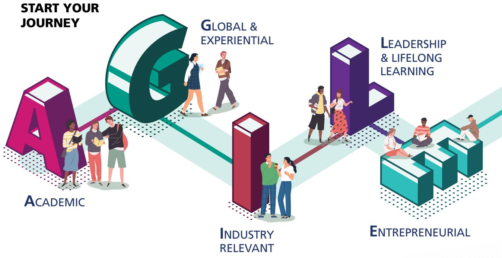
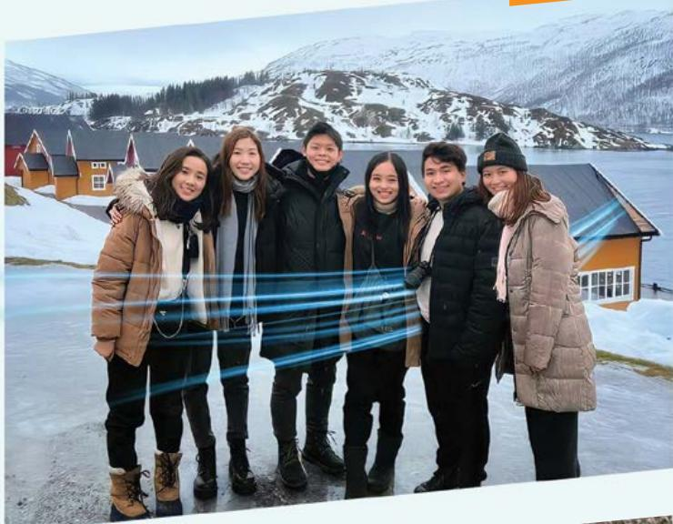
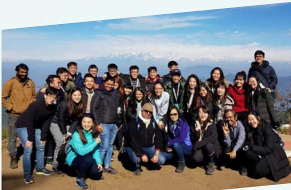
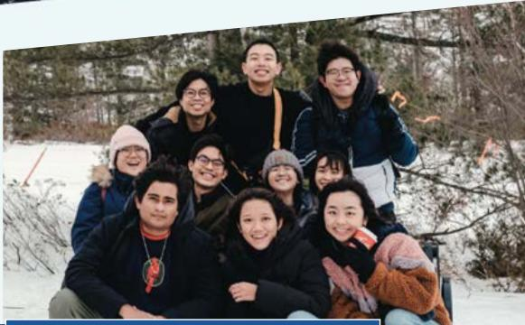
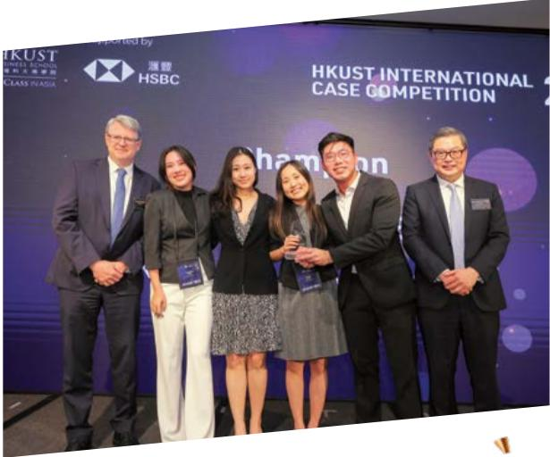
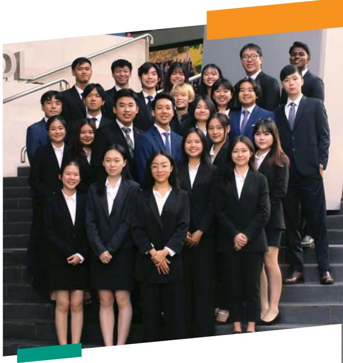
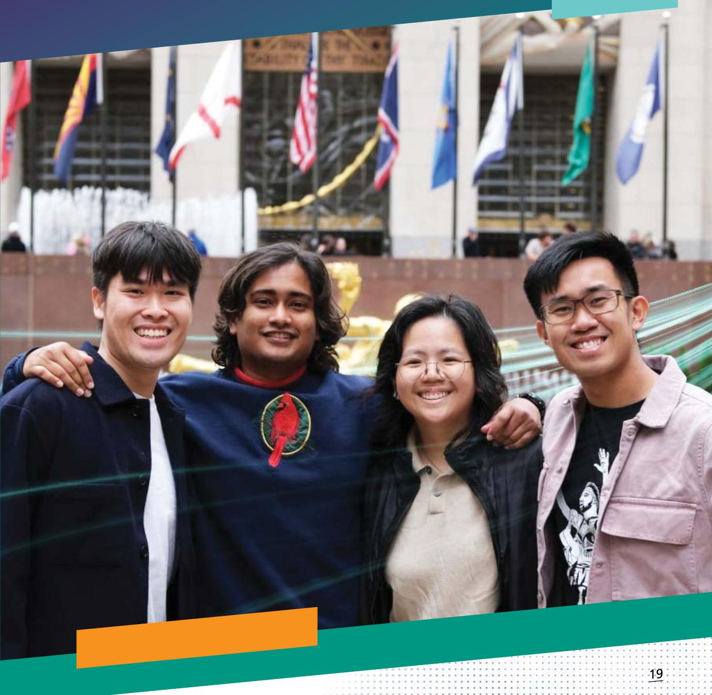
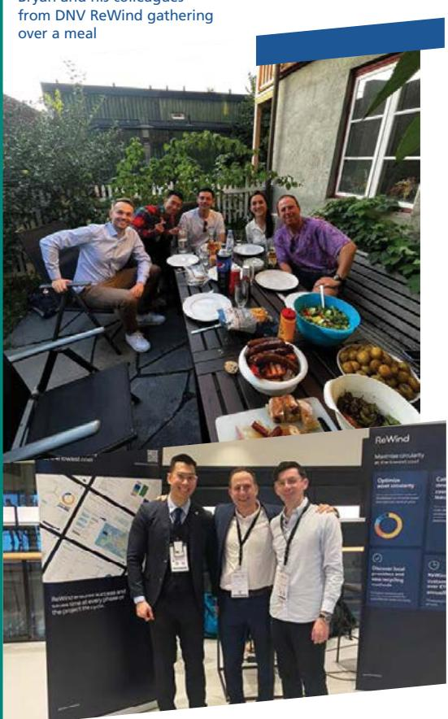
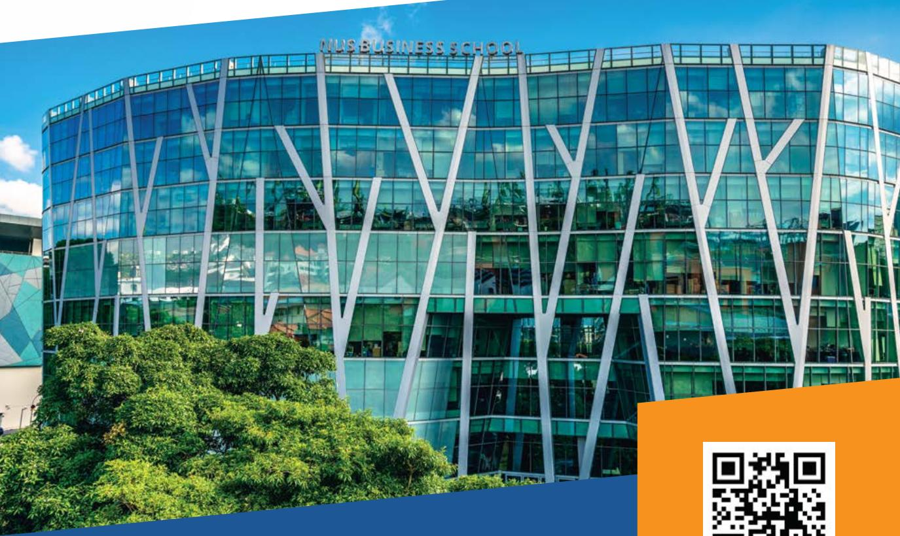

MBARK ON WITH   
YOUR JOURNEY SCHOOL   
NUS USINESS NISTRATION USINESS   
HELOR OF

AGILE, Be YOU

## WHY

## S BUSINESS?

At A Glance 01   
You Deserve The Best 02   
An Agile Experience 03   
Academic 04   
Curriculum Roadmap 05   
Nine Majors, Infinite Possibilities 06   
2nd Majors and Minors 07   
Global & Experiential 09   
Global Immersion 10   
Case Competitions 11   
Campus Living & Bizad Club 12   
Industry Relevant 13   
What Our Graduates Do 16   
Leadership & Lifelong Learning   
Entrepreneurial 19   
Be An Entrepreneur 20   
Admissions, Scholarships & Financial Aids

### Full Page Description (Page 2)

**Source:** `assets/_page_2_Asset_0.jpg`

**Generated:** 2026-05-22 03:12:00

---

The image contains a horizontal bar chart with five bars, each representing a different value. The bars are color-coded and labeled with monetary amounts. The values range from $4,062 to $6,026. The chart appears to be comparing different categories or data points, but without additional context, the specific purpose or meaning of the data is unclear.

### Full Page Description (Page 2)

**Source:** `assets/_page_2_Asset_1.jpg`

**Generated:** 2026-05-22 03:12:11

---

The image contains a bar chart with five horizontal bars, each representing a percentage value. The percentages are as follows: 97.1%, 87.9%, 99.3%, 93.3%, and 99.0%. The bars are color-coded, with each color corresponding to a specific percentage. The chart appears to be comparing different categories or data points, with the purple bar representing the highest percentage at 99.3%, followed closely by the blue bar at 99.0%. The red bar represents the lowest percentage at 87.9%.

# AT A GLANCE

Embark on a rewarding journey at NUS Business School and surround yourself in a community of vibrant, diverse, and passionate individuals. Enjoy the prestige and pride of learning alongside bright and dedicated people who constantly strive to push boundaries in business ideation. Being part of NUS Business School is more than just an education - it could be a life-changing experience.

FINDINGS FROM 2022 GRADUATE EMPLOYMENT SURVEY\*

\*For this graduate cohort, the three degree programmes were accounted for separately as Bachelor of Business Administration, Bachelor of Business Administration (Accountancy) and Bachelor of Science (Real Estate). From 2024, all students will be enrolled into the Bachelor of Business Administration degree through a common admission.

GROSS MONTHLY SALARY FOR GRADUATE YEAR 2022 (MEAN)

> **AI Description:**
> **Source:** `assets/_page_2_Figure_0.jpg`
> 
> **Generated:** 2026-05-22 03:18:19
> 
> ---
> 
> The image contains a simple diagram of three stylized human figures, each with a blue body and orange tie. The figures are arranged in a horizontal line, suggesting a group or team. There are no labels or text annotations within the image. The visual elements are minimalistic and represent a conceptual or symbolic group.

4,350

TOTAL BBA STUDENTS

> **AI Description:**
> **Source:** `assets/_page_2_Figure_1.jpg`
> 
> **Generated:** 2026-05-22 03:17:13
> 
> ---
> 
> The image contains a single visual element: a graduation cap. The cap is blue with a yellow tassel hanging from the front. There are no charts, graphs, or other visual elements present. The image is a simple illustration of a graduation cap, commonly associated with educational achievements or the completion of a degree.

OVER   
55,000   
STRONG ALUMNI   
NETWORK

59 YEARS OF DEVELOPING BUSINESS LEADERS

# YOU DESERVE THE BEST

We are a highly-ranked business school that provides each student the best preparation and springboard towards a promising career.

NUS BUSINESS Ranked among the world’s best

1st

IN ASIA according to the QS World University rankings for 2024.

## TIMES HIGHER EDUCATIONUNIVERSITY RANKING 2023

QS WORLD UNIVERSITY RANKINGS 2023

1st IN ASIA

## US NEWS & WORLD REPORT 2023

2nd IN ASIA

## BUSINESS SUBJECT RANKINGS

## TIMES HIGHEREDUCATIONWORLD UNIVERSITYRANKING 2023

th

BUSINESS & ECONOMICS

## THE WORLD UNIVERSITY RANKINGS (IN ASIA) BY SUBJECTS 2022

1st

ACCOUNTING & FINANCE

BUSINESS & MANAGEMENT STUDIES

NUS MBA

IN ASIA

## QS BUSINESS MASTERS RANKINGS

10th

GLOBAL

## QS GLOBAL MBA RANKINGS

24th

GLOBAL

## QS WORLD UNIVERSITY RANKINGS (GLOBALLY BY SUBJECTS 2023)

10th

BUSINESS ANALYTICS

13th   
BUSINESS &   
MANAGEMENT STUDIES

14th

ACCOUNTING & FINANCE

## MBA PROGRAMME RANKINGS

UCLA-NUS JOINT PROGRAMMES QS

## POETS & QUANTS INTERNATIONAL MBA RANKINGS 2022 -2023

IN EMBA 2023

## FINANCIAL TIMES MBA RANKINGS

IN ASIA

25th

IN MBA 2023

GLOBAL

# AN AGILE EXPERIENCE

## YOUR AGILE APPROACH TO EDUCATIONAL EXCELLENCE!

Be equipped with A.G.I.L.E. capabilities tailored for the demands of a Volatile, Uncertain, Complex, and Ambiguous (VUCA) world. You get to cultivate various skill sets across the many disciplines, empowering you with the expertise to navigate and address new business challenges.

JOIN US and thrive in the face of volatility with the confidence and competence instilled by NUS Business School.

> **AI Description:**
> **Source:** `assets/_page_4_Figure_1.jpg`
> 
> **Generated:** 2026-05-22 03:19:06
> 
> ---
> 
> The image is an infographic combining text with visual elements. It features a large letter "G" with the text "GLOBAL & EXPERIENTIAL" above it, and four smaller blocks labeled "ACADEMIC," "INDUSTRY RELEVANT," "ENTREPRENEURIAL," and "LEADERSHIP & LIFELONG LEARNING." Each block contains illustrations of people engaged in various activities, such as studying, collaborating, and discussing. The overall design is colorful and uses a clean, modern style to convey the message of a holistic educational journey.

## AC ADEMIC

2n Our d major and curriculum minor promises ith skills spanning , a ost customisability, s well as ross-disciplinary s professional fields. studies. Upon with option s to pursue a graduation, yo u will be equipped

# CURRICULUM ROADMAP

## General Education Courses 24 Units

• Cultures and Connections

Critique and Expression

COMMON  
CURRICULUM  
52 UNITS

• Data Literacy

Digital Literacy

Singapore Studies

Communities and Engagement

## Cross Disciplinary Course

\- Field Service Project 8 Units

## Work Experience Milestone

## Level 2000, 3000 and 4000 Cou rses:

Business   
Communication for   
Leaders

> **AI Description:**
> **Source:** `assets/_page_6_Figure_1.jpg`
> 
> **Generated:** 2026-05-22 03:12:13
> 
> ---
> 
> The image contains a simple icon consisting of a graduation cap placed above two stacked books. The icon is in a solid pink color with white outlines. This icon is commonly used to represent education, learning, or academic achievement.

## Business Environment Courses 20 Units

MAJORCURRICULUM

Business Economics\*

Business Majors\* 60 UNITS

Legal Environment of Business

Accountancy

Innovation & Entrepreneurship\*

Accountancy Major 68 UNITS

Applied Business Analytics\*

Decision Analytics using Spreadsheets

Real Estate Major 64 UNITS

• Managerial Economics

Finance\*

Leadership & Human Capital Management\*

Marketing\*

Operations & Supply Chain Management\*

Real Estate

## Embark with us on an A.G.I.L.E. journey with multiple opportunities to acquire both in-depth business and cross-disciplinary expertise.

Introduction to Real Estate

Ethics in Business

## Global Experience Milestone

UNRESTRICTED ELECTIVE COURSES

Business Majors 48 UNITS

Accountancy Major 40 UNITS

Real Estate Major 44 UNITS

With a curriculum that is at least a quarter of unrestricted electives, students have a higher degree of freedom to broaden their university education and enhance their learning experience.

# NINE MAJORS, INFINITE POSSIBILITIES:

## SHAPE YOUR EDUCATION, SHAPE YOUR FUTURE!

## ACCOUNTANCY

Managerial Accounting

Corporate Accounting & Reporting

Accounting Information Syste

Assurance and Attestation

Corporate and Securities Law

Taxation

Governance, Risk Management and Sustainability

Advanced Corporate Accounting and Reporting

Accounting Analytics and AI

## APPLIED BUSINESS ANALYTICS

Predictive Analytics in Business

Stochastic Models in Management

Statistical Learning for Managerial Decision

Analytical Tools for Consulting

Marketing Analysis and Decision-making

Big Data Techniques and Technologies

Social Media Network Analysis

## BUSINESS ECONOMICS

Macroeconomic Principles in the Global Economy

Econometrics for Business I

Innovation & Productivity

Predictive Analytics in Business

Game Theory & Strategic Analysis

Business-driven Technology

Psychology and Economics

## FINANCE

Investment Analysis & Portfolio Management

International Financial Management

Options and Futures

Risk and Insurance

Financial Markets

AI Blockchain and Quantum Computing

## INNOVATION & ENTREPRENEURSHIP

Technological Innovation

New Venture Creation

Entrepreneurial Strategy

Social Entrepreneurship

New Product Development

Innovation & Intellectual Property

## LEADERSHIP & HUMAN CAPITAL MANAGEMENT

Leading in the 21st Century

Organisational Effectiveness

Business with a Social Conscience

Leading Across Borders

HR Analytics and Machine Learning

## MARKETING

Marketing Strategy: Analysis and Practice

Consumer Behaviour

Product & Brand Management

Services Marketing

SME Marketing Strategy

Advertising & Promotion Management

AI in Marketing

## OPERATIONS & SUPPLYCHAIN MANAGEMENT

Service Operations Management

Physical Distribution Management

Sustainable Operations Management

Strategic Information Systems

Supply Chain Management

## REAL ESTATE

Land Law

Urban Economics

Real Estate Investment Analysis

Urban Planning

Principles of Real Estate Valuation

REIT and Business Trust Management

> **AI Description:**
> **Source:** `assets/_page_7_Figure_0.jpg`
> 
> **Generated:** 2026-05-22 03:14:03
> 
> ---
> 
> The image is a photograph of two individuals walking outdoors. One person is wearing a gray shirt and carrying a black backpack, while the other is dressed in a pink shirt and blue jeans, holding a brown folder. The background shows a covered walkway with metal beams and some greenery visible on the right side. The image appears to be taken in a casual, everyday setting, possibly on a campus or near a building.

### Full Page Description (Page 8)

**Source:** `assets/_page_8_Asset_0.jpg`

**Generated:** 2026-05-22 03:15:08

---

The image is a circular diagram with sections representing different academic majors and minors. It includes a central title "Some illustrations of 2nd Majors and Minors" and various colored segments indicating primary majors (BIZ), second majors (BIZ), and minors (non-BIZ). Each segment lists specific academic fields such as Business Economics, Finance, Applied Business Analytics, and Leadership & Human Capital Management. The diagram visually organizes the academic options, highlighting the flexibility in choosing majors and minors.

# 2ND MAJORS AND MINORS

## WHAT POSSIBILITIES ARE THERE?

Our students have the capacity to pursue more possibilities of cross-disciplinary studies within the standard candidature using their pool of unrestricted elective units. They can embark on a second major and/or minors within or outside of NUS Business School. Give it a try!

NUS has a grade-free scheme where you can ensure your grades don’t impact your GPA for that semester. This allows for our students to transit into university life academically and socially.

## DOUBLE DEGREE PROGRAMME

Are you a highly motivated student with an interest in two complementing disciplines? You may consider the Double Degree programme (DDP). Choose from the following options:

Business Analytics

Information Systems

Communications & New Media

Law

Computer Science

NUS – PKU Extended Exchange

Economics

Others\*

Engineering

\* Students may apply to pursue self-initiated DDP combinations after the first year of study.

? https://bba.nus.edu.sg/academic-programmes/dcdp/ddp/ad-hoc-double-degrees/

## CONCURRENT DEGREE PROGRAMME

The Concurrent Degree programme (CDP) is similar to the Double Degree programme in duration. In a DDP, the student is awarded two Bachelor degrees upon graduation. However, for a CDP, the student is awarded a Bachelor and a Master’s degree upon completion. A student may choose from the following options:

## BACHELOR & MASTERS DEGREE

Master in Public Policy (with Lee Kuan Yew School of Public Policy)

Master of Science in Management

> **AI Description:**
> **Source:** `assets/_page_9_Figure_1.jpg`
> 
> **Generated:** 2026-05-22 03:16:17
> 
> ---
> 
> The image contains a photograph of two individuals sitting at a table, each using a laptop. The setting appears to be a classroom or study area. The individuals are engaged in what seems to be a collaborative activity, possibly related to academic work. The image includes a QR code and text that directs viewers to a website for more information on the curriculum. The QR code is located in the bottom left corner of the image, and the text is prominently displayed in the bottom left corner as well.

## LOBAL & PERIENTIAL

As required culturally to t o meaningfull thrive in highly awar component y expand e individuals diverse heir horizons s in the work , who BBA nvironments. hav curriculum e gained , and graduate relevan , student as global-minded, t work s wil l be able experience

Work Experience Milestone

Career Compass Starter Workshops

One Internship

0 Units

Field Service   
Project   
A team consulting practicum that   
allows students to solve real world   
business problems 8 Units

ear 1

Year 1 in he BBA Programme

Year 4

Year 4 in the BBA rogramme

Global Experience Milestone Students will have to undertake an overseas experience. 0 Units

# GLOBAL IMMERSION

## STUDENT EXCHANGE PROGRAMME (SEP)

Students spend a semester reading courses at an overseas partner university, and in doing so, gain invaluable experiences abroad in a different cultural environment that broadens their outlook and approach to doing business. Students can also choose from a wide array of summer or winter programmes which are shorter in duration than SEP.

> **AI Description:**
> **Source:** `assets/_page_11_Figure_0.jpg`
> 
> **Generated:** 2026-05-22 03:17:09
> 
> ---
> 
> The image contains a group of six individuals standing in front of a backdrop featuring a snowy landscape with houses and a body of water. The individuals are dressed in winter clothing, suggesting cold weather conditions. The backdrop appears to be a digital or printed image rather than a real photograph. The group is posing for a photo, and the image seems to be a casual snapshot rather than a professional or formal photograph.

> **AI Description:**
> **Source:** `assets/_page_11_Figure_1.jpg`
> 
> **Generated:** 2026-05-22 03:16:28
> 
> ---
> 
> The image is a photograph of a group of people posing for a photo outdoors. The group appears to be diverse in age and attire, suggesting a casual gathering or team event. The background features a scenic view of a mountain range under a clear blue sky, indicating the photo was taken at a high elevation or in a mountainous area. The people are dressed in jackets and scarves, suggesting cooler weather. The overall mood of the image is cheerful and social, with some individuals smiling and others making playful gestures.

STEER PROGRAMME

The STEER programme is designed to build and cultivate familiarity and interests in burgeoning economies in India, the Middle East, Vietnam, China and Brazil.

https://www.nus.edu.sg/gro/global-programmes/specialglobal-programmes/steer

> **AI Description:**
> **Source:** `assets/_page_11_Figure_2.jpg`
> 
> **Generated:** 2026-05-22 03:18:11
> 
> ---
> 
> The image is a photograph of a group of people posing outdoors in a snowy environment. The group appears to consist of young adults, with some wearing winter clothing and hats. They are standing and sitting together, smiling, and seem to be enjoying a winter outing. The background shows snow-covered ground and trees, indicating a cold, wintry setting. The image captures a moment of camaraderie and enjoyment in a natural, outdoor setting.

NUS OVERSEAS COLLEGE

A prestigious entrepreneurship development programme that gives NUS students opportunities to work and study in leading entrepreneurial and academic hubs for up to a year.

https://bba.nus.edu.sg/academic-programmes/specialprogrammes/nus-overseas-colleges/

# CASE COMPETITIONS

## GROWING FROM STRENGTH TO STRENGTH

## HOME-GROWN COMPETITIONS

NUS Business School hosts our very own competitions on a local and international scale. These competitions engage students from local and overseas universities, and are excellent focal points for students to congregate, exchange and share inspiring ideas across borders.

## ACROSS THE YEARS,

WE HAVE PARTICIPATED IN:

NUS-Shell Case Competition

UOB-NUS International Case Competition

BI Norwegian Business School Case Competition

CBS Case Competition

Belgrade International Business Case Competition

NUS-SP Group Case Competition

Nestle-NUS Innovation Challenge

John Molson Undergraduate Case Competition

RSM STAR Case Competition

International Case Competition @ Maastricht

> **AI Description:**
> **Source:** `assets/_page_12_Figure_0.jpg`
> 
> **Generated:** 2026-05-22 03:11:23
> 
> ---
> 
> The image contains a group of people posing for a photograph at the HKUST International Case Competition. The background features a banner with the competition's name and sponsors' logos, including HSBC. The individuals are dressed formally, with some holding awards. The image captures a celebratory moment, likely after a competition victory.

## CAMPUS LIVING

Immerse yourself in a dynamic campus life brimming with a diverse range of residential options and programmes tailored just for you. Discover countless opportunities that not only enrich your education but also connect you to vibrant communities. Forge lifelong friendships that will support and accompany you on your unique path through both life and career adventures. Your extraordinary experience begins here!

## HALLS & RESIDENCES:

Eusoff Hall

Kent Ridge Hall

King Edward VII Hall

Prince George’s Park Residences & Houses

Raffles Hall

Sheares Hall

Temasek Hall

## BIZAD CLUB

Step into a world crafted just for you by becoming a part of the NUS Students’ Business Club – your gateway to an exceptional student experience! As the ultimate student organisational hub, we offer you the ideal platform to cultivate lifelong skills and build meaningful connections. Immerse yourself in the excitement of flagship events like the Bizad Charity Run and Freshmen Orientation Projects, designed to infuse energy into your student life. Join us on this journey of empowerment, where every moment is dedicated to enhancing your personal and professional growth.

## RESIDENTIAL PROGRAMMES:

College of Alice and Peter Tan (CAPT)

NUS College (NUSC)

Residential College 4

Ridge View Residential College

Tembusu College

> **AI Description:**
> **Source:** `assets/_page_13_Figure_1.jpg`
> 
> **Generated:** 2026-05-22 03:12:56
> 
> ---
> 
> The image is a photograph of a group of individuals, likely students, dressed in formal attire, posing for a group photo. They are standing on a set of stairs, with a building and some greenery visible in the background. The individuals are arranged in a tiered formation, with some standing on the steps and others standing on the ground. The image appears to be taken in a professional or academic setting.

hop where you gain D interview and resume w ive into an immersive ternships and ork-stu Career ompass Starter ket-ready and a highly ether with industry- y programmes. focused experiences nsures you emerge ynamic combination ht-after job candidate. sought-after job ( ca pme designed to set you signed to set you

s with a programme apart and Your journey to open doors to success exciting pportunities!

> **AI Description:**
> **Source:** `assets/_page_14_Figure_0.jpg`
> 
> **Generated:** 2026-05-22 03:13:52
> 
> ---
> 
> The image contains a photograph of a career fair or job fair event. It shows a large indoor space with multiple booths set up, each representing different companies or organizations. Attendees, likely students or professionals, are interacting with representatives at these booths. The image includes various banners and signs with company names and slogans, such as "Deloitte" and "Abdul Latif Jameel." The setting appears to be a modern building with a staircase in the background. The image conveys a sense of activity and networking, with people moving between booths and engaging in conversations.

## BUSINESS SCHOOL BIZCAREERS

NUS Business School students are highly sought after by global and local companies. Our BIZCareers team works closely with students to help them achieve their career objectives, while actively engaging and fostering close partnerships with recruiters across the major industries to bring meaningful opportunities to our students.

Alumni Sharing Sessions

Booster Skills Workshops

Company Visits

Career & Recruitment Talks

Career & Internship Fairs

Internship & Job Search Briefings

Industry Awareness Series

> **AI Description:**
> **Source:** `assets/_page_15_Figure_0.jpg`
> 
> **Generated:** 2026-05-22 03:11:16
> 
> ---
> 
> The image is a photograph showing a group of individuals, likely at a professional or social event, as indicated by the "KPMG" sign in the background. The individuals are engaged in looking at their smartphones, suggesting they might be checking messages, browsing the internet, or participating in an activity related to their devices. The setting appears to be indoors, possibly a conference or networking event, given the formal attire and the presence of a professional sign. The individuals are wearing masks, indicating the image was taken during a time when health precautions were in place, likely during the COVID-19 pandemic.

Industry Specific Skills Workshops

Individual Career Advisory sessions

Individual Mock Interview sessions

Individual Internship & Job Search Strategies

Career Guides

## INTERNSHIPS

Internships are a crucial part of university education. Students are encouraged to embark on internships with many taking up at least two internships during their time at NUS.

At NUS Business School, an internship will be a graduation requirement for students under the new curriculum. Students will gain real world industry experience, with the option to obtain units or not.

## Credit-bearing Internships:

BI3704

8-week internship

BI3708 16-week internship

BI3712 24-week internship

## BI3003

8-week internship   
(for non-business/accounting/real estate   
related internships)

https://bba.nus.edu.sg/academic-programmes/generalacademic-matters/business-internship-courses/

## CAREER COMPASS STARTER WORKSHOPS

Unlock your future potential with the Career Compass Starter Workshops as we guide you in cultivating the skills essential for your career. Tailored to your needs, we are here to support you on your journey, empowering you to achieve your unique career goals.

## Year 1

Strategic Career Planning

Resume & Cover letter Writing

Personal Branding

Networking Skills

Interviewing Skills

Dealing with Others in the Workplace

Year 2 (led by Career Advisors)

Small Group Resume Clinics

Small Group Mock Interview Clinics

> **AI Description:**
> **Source:** `assets/_page_15_Figure_6.jpg`
> 
> **Generated:** 2026-05-22 03:13:03
> 
> ---
> 
> The image contains a photograph of a group of people at what appears to be a networking or job fair event. The individuals are standing around a table with a laptop, name tags, and some promotional materials. The setting suggests a professional environment, possibly related to business or consulting, as indicated by the "Deloitte" sign in the background. The people are engaged in conversation, and the atmosphere appears to be lively and interactive.

## FIELD SERVICE PROJECT

The Field Service Project (FSP) course is all about teaming up for a hands-on learning adventure. Imagine working with an organisation in Singapore, or beyond, and getting insights straight from the CEOs and industry leaders themselves. It’s not your typical classroom experience; handling real-world business issues, diving into business challenges beyond your regular NUS lessons.

For FSP, you immerse yourself in an organisation’s business model, grasp their value propositions, and witness the intricate workings of their operations. However, it goes beyond mere tasks. FSP becomes your backstage pass to awesome networking. You’re not just there to observe, but instead you will actively participate, lending your contribution through a perceptive report guided by a supervisor. This is your opportunity to assist them in navigating the complexities of today’s business landscape. Will you grab it?

## WORK STUDY INTERNSHIP PROGRAMME

Work Study Internship Programme (WSIP) isn’t your typical learning experience; it’s a uniquely tailored, hands-on opportunity designed specifically for business students like yourself. Imagine this: instead of sticking to traditional classrooms and textbooks, you’re enrolled in a long-term, credit-bearing workstudy programme. What sets it apart? It’s a personalized journey crafted in collaboration with professional and commercial organisations. While excelling in classroom courses, WSIP immerses you in the real-world action with structured work placements at actual companies.

But wait, there’s more! During your WSIP adventure, you’ll connect with workplace mentors, delve into your chosen field, and gain a wealth of real-world experience. Some students may even enjoy progressive stipends, job rotations, and a fast track to entry-level career options upon graduation. Ready to transform your education into an exciting adventure? Let’s dive in!

# WHAT OUR GRADUATES DO

## ACCOUNTANCY

Accountant

Auditor

Forensic Accountant

Risk Advisory

Tax Advisory

## EVENTS & HOSPITALITY

Accounts Executive

Conference Management

Marketing Executive

Optimisation Analyst

## E-COMMERCE

Analyst, Branding & Marketing

Executive Enterprise Sales Account

Management Associate

Onboarding & Team Coordinator

Regional Operations Associate

## HUMAN CAPITAL MANAGEMENT

Executive Search

Management Associate

Talent Acquisition

## OTHER SECTORS

Civil and Public Service

Healthcare

Marine

Aviation

FinTech

Telecommunications

## CONSULTING

Business Analyst

Clients & Markets Analyst

Consulting Analyst

HR Analyst

Management Consultant

Programmer Analyst

Research Consultant

Strategy Analyst

Transaction Advisory Associate

## CONSUMER GOODS

Advertising Brand Manager

Content Executive

Digital Marketing Executive

Marketing and Communications Executive

Sales and Marketing Executive

## TECHNOLOGY

Business Operations & Strategy

Data Analyst

Google Squared Data and Analytics Programme

Order Management Specialist

Partner Manager

Product Messaging Analyst

Project Executive

Purchasing Analyst

R&D Engineer

## LOGISTICS, MANUFACTURING & SUPPLY CHAIN

Operations Associate

Accounts Coordinator

Business Development

Inventory Management

Market Intelligence

## FINANCE & BANKING

Analyst for Commercial Banking

Credit

Global Investment Management

Global Transaction Services

Global Markets

Investment Banking

Macro Sales

Operations & Technology

Trade Solutions

Treasury

Venture Capital

Commodity Associate

Global Markets Trader

Investment Support

Wealth Management

## REAL ESTATE

Real Estate Finance & Investment

Real Estate Fund Management - Business Development, Acquisitions & Deal Structuring

Real Estate Investment Trusts

Town Planning & Urban Management

Asset Management

Corporate Real Estate Management

Real Estate Development & Entrepreneurship

Real Estate Consultancy, Valuation & Marketing

Property & Facilities Management

, students ster leadership es in the fast-changing t learning rporate world opportunities to develop learners To fo d in a wide range of ro s also eeks to make lifelo wil er in each of them. of every student , armed with chool cquisition skills and a hu continually grow.

> **AI Description:**
> **Source:** `assets/_page_18_Figure_0.jpg`
> 
> **Generated:** 2026-05-22 03:16:00
> 
> ---
> 
> The image contains a photograph of four individuals standing outdoors in front of a building. They are wearing T-shirts with "NUS Business" and "National University of Singapore" printed on them. The background includes a modern building with large windows and some greenery. The image is overlaid with colorful, abstract lines and a purple and orange border at the bottom. The text "to continually grow" is partially visible at the top left corner of the image.

> **AI Description:**
> **Source:** `assets/_page_19_Figure_0.jpg`
> 
> **Generated:** 2026-05-22 03:14:31
> 
> ---
> 
> The image contains a group of six individuals standing on a stage, clapping and smiling. They are dressed in formal attire, with some wearing suits and others in blazers. The background features a large banner with the text "CASE COMPETITION" prominently displayed. The individuals appear to be celebrating or acknowledging an achievement, as one person is holding a trophy or award. The setting suggests a formal event or competition, likely related to business or academic case studies.

## NURTURING AGILE LEADERS WITH MARKETPLACE IMPACT AND DRIVE FOR LIFELONG LEARNING

## COURSES ON LEADERSHIP

> **AI Description:**
> **Source:** `assets/_page_19_Figure_1.jpg`
> 
> **Generated:** 2026-05-22 03:14:34
> 
> ---
> 
> The image contains a simple icon of a gear with a lightbulb inside it. The gear is orange, and the lightbulb is white with a yellow interior. This icon is commonly associated with ideas, innovation, or problem-solving.

Leadership & Decision Making under Certainty

> **AI Description:**
> **Source:** `assets/_page_19_Figure_2.jpg`
> 
> **Generated:** 2026-05-22 03:14:14
> 
> ---
> 
> The image contains a simple diagram. It features a group of three stylized human figures holding a flag, with arrows pointing upwards. The figures are represented by orange circles with blue lines extending from them, symbolizing teamwork or progress. The flag is yellow with a red stripe at the bottom, and the arrows above the figures indicate movement or advancement. The overall image conveys a theme of collaboration and upward progress.

Leading in the 21st Century

> **AI Description:**
> **Source:** `assets/_page_19_Figure_3.jpg`
> 
> **Generated:** 2026-05-22 03:14:09
> 
> ---
> 
> The image contains a simple diagram of a target with an arrow hitting the center. The target has concentric circles divided into quadrants, and the arrow is positioned in the center of the target, indicating a successful hit. The design is minimalistic, using only lines and a small arrow to convey the concept of achieving a goal or objective.

Leading Accross Bo

> **AI Description:**
> **Source:** `assets/_page_19_Figure_4.jpg`
> 
> **Generated:** 2026-05-22 03:14:38
> 
> ---
> 
> The image contains a simple icon of a hand holding three people. The icon is likely used to represent a concept such as support, teamwork, or collaboration. The hand symbolizes assistance or care, while the three people represent individuals or a group. This icon is commonly used in business or organizational contexts to convey the idea of collective effort or mutual support.

Business with a Social Conscience

## MAJOR IN LEADERSHIP & HUMAN CAPITAL MANAGEMENT

In this major, you become the linchpin of organisations and teams. Understand leadership and position yourself at the central node of influence. Inspire people, shape organisational outcomes, and unlock the full potential of human capital–all within your grasp. This places you in the driver’s seat of leadership, where you catalyse change and drive success.

## NUS LIFELONG LEARNING

As part of the NUS Lifelong Learners programme, student enrolment is valid for 20 years from the point of undergraduate/ postgraduate admission. As such, all current and future students are automatically eligible for the NUS Lifelong Learning programme upon graduation and may also take a series of courses to earn higher qualifications such as Graduate Diplomas, second Bachelor’s and Master’s Degrees.

## 5 E EPRENEURIAL

younger generation, e amongst t students Full he curriculum y embracing , an d facilitate i the s designed repreneurial cultur the both to generation bring of new ntrepreneurial spirit in busines s ideas.

> **AI Description:**
> **Source:** `assets/_page_20_Figure_0.jpg`
> 
> **Generated:** 2026-05-22 03:18:04
> 
> ---
> 
> The image contains a photograph of four individuals standing together in front of a building with multiple flags. The individuals are smiling and appear to be posing for the photo. The background includes a large, ornate structure with a golden statue and several flags representing different countries. The image has a teal and orange border with a page number "19" in the bottom right corner.

# BE AN ENTREPRENEUR

Get a taste of entrepreneurship at NUS Business School, where you get to take center stage in one of our newer majors. Equip yourself with expansive theoretical insights, empowering you to lead change effectively—whether you’re venturing into an entrepreneurial startup or navigating the landscape of a large multinational corporation. Previous batches of students, who were just like you, have already launched successful businesses in Singapore, with names like Carousell, Playmoolah, and Moovaz making an impact.

BRYAN VOON, Year 4 Business Student who went for NOC, Norway.

How has your experience in NOC been so far? And how has it impacted you? It is difficult to understate how enriching and instructive NOC has been with professional and personal impacts. With the former being to look beyond the usual fields most business students consider when job seeking (e.g., finance, marketing, consulting) while the latter being a future outside of Singapore; a possibility would not have entertained if it was not for NOC Norway.

Do you have any advice for your juniors applying to NUS Business School and NOC? Keep an open mind and remember that some of the most valuable sources of learning happens outside of the classrooms with programmes such as NOC which will do nothing but enrich your NUS experience.

Flip to Page 10, and you will discover the NUS Overseas Colleges (NOC) programme, aimed to cultivate your entrepreneurial spirit. Immerse yourself in this transformative experience — intern in a technology-based startup, while concurrently pursuing part-time courses at reputable universities. It’s your opportunity to shape your entrepreneurial journey and make an impact on a global scale.

Bryan and his colleagues from DNV ReWind gathering over a meal

> **AI Description:**
> **Source:** `assets/_page_21_Figure_1.jpg`
> 
> **Generated:** 2026-05-22 03:18:40
> 
> ---
> 
> The image contains two distinct visual elements. The top part shows a group of people gathered around a table outdoors, enjoying a meal together. The table is set with various dishes, including what appears to be seafood and a salad. The setting suggests a casual and friendly atmosphere. The bottom part of the image features three individuals standing in front of a display board. The board contains text and graphics related to "ReWind," which seems to be a project or initiative focused on circular economy principles. The text on the board mentions optimizing water circularity and discovering local processing and recycling resources.

Bryan and his team attending EoLIS 2023 Conference @ Rotterdam, Netherlands

Apart from numerous NUS-level scholarships, the NUS Business School also offers many of its own scholarships to local and international students.

To ensure that no deserving student is denied higher education due to financial need, financial aid is offered to eligible students. This can take the form of a loan, bursaries, or work-study assistance.

TUITION FEES

For more information on tuition fees, please refer to the link below.

## FOR MORE ON FINANCIAL AID, SCAN HERE!

## ADMISSIONS

SCAN HERE TO APPLY TO NUS BBA!

## NUS BUSINESS SCHOOL

## LEADING FROM ASIA

At NUS Business School, students take a transformative journey, and make an A.G.I.L.E leap forward through the Academically rigorous and flexible curriculum, diversity of Global and experiential opportunities, Industry-relevant infrastructure, varied options for Leadership development and highly Entrepreneurial environment. Through the full BBA experience, they forge ahead with confidence and future-readiness, prepared to make the most of an increasingly dynamic and unpredictable world.

> **AI Description:**
> **Source:** `assets/_page_23_Figure_0.jpg`
> 
> **Generated:** 2026-05-22 03:12:44
> 
> ---
> 
> The image shows a modern glass building with the text "NUS Business School" prominently displayed at the top. The architecture features a unique design with intersecting white structural elements. The building is surrounded by greenery, and the sky is clear with some clouds visible in the reflection on the glass facade. The bottom right corner of the image includes an orange section with a QR code.

bba.nus.edu.sg

facebook.com/NUSBusinessSchool/

@nus\_bba

https://www.youtube.com/c/NUSBizSchool

NUS Business School BIZ2 Building Level 5-0, 1 Business Link, Singapore 117592

SCAN HERE TO FIND OUT MORE