
# GRADUATE STUDIES

at the FACULTY OF ARTS AND SOCIAL SCIENCES

The information in this guide is mainly for students seeking admission to the graduate programmesattheFaculty of Arts and Social Sciences (FASS),National University of Singapore(NUs).

Other undergraduate/ studyabroad/student exchange programmesare also available and can be viewedat fass.nus.edu.sg

INTRODUCTION IntroductiontotheNational UniversityofSingapore p1   
2. FASS Why theFaculty of Artsand Social Sciences p2   
3. GRADUATE STUDIES / Graduate Studies @ FASS p3   
4 OPTIONS StudyAbroadandJoint/Double DegreeOptions p5   
5. RESEARCH Research Clusters @FASS p9   
6 FINANCIAL Money Mattersand Accommodation p10   
7ADMISSION Admission and Application Procedures p12   
8. CONTACT Contact Us p15   
9. PROGRAMMES Research and Coursework Programmes@FASS p18   
Chinese Studies   
Communicationsand New Media   
Comparative Asian Studies   
Cultural Studies in Asia   
Economics   
English Languageand Literature   
Geography   
History   
Japanese Studies   
Malay Studies   
Philosophy   
Political Science   
Psychology   
/ Social Work   
/ Sociology   
South Asian Studies   
1 Southeast Asian Studies

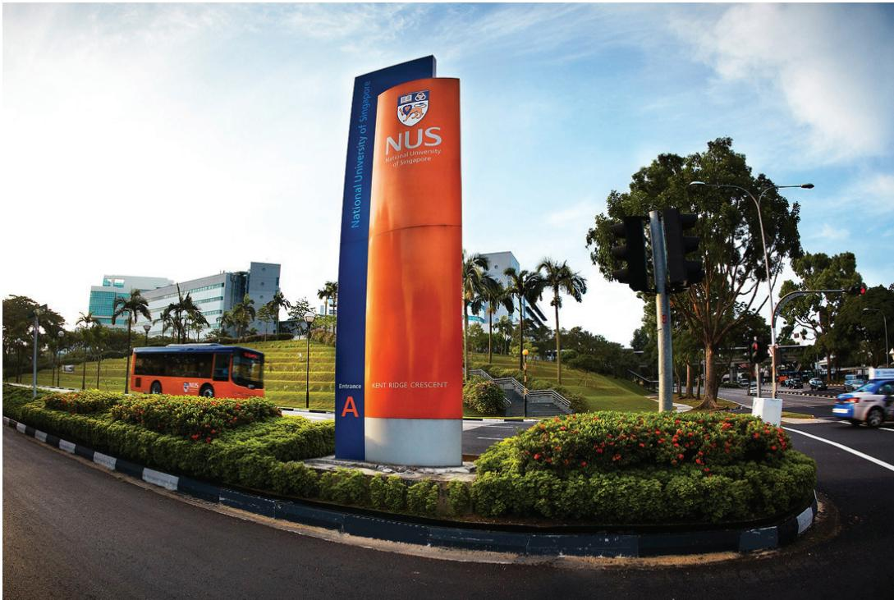

> **AI Description:**
> **Source:** `assets/_page_2_Figure_0.jpg`
> 
> **Generated:** 2026-05-22 03:35:22
> 
> ---
> 
> The image contains a large signpost for the National University of Singapore (NUS) located at Kent Ridge Crescent. The signpost is prominently displayed in a landscaped area with shrubs and palm trees. The sign features the NUS logo and name in bold white letters against a blue and orange background. The entrance letter "A" is also visible on the sign. The surrounding area includes a road with a bus and a traffic light, indicating a busy urban environment. The image captures a clear day with a blue sky and some clouds.

## Introduction to the National University of Singapore

From its modest infancy as a medical school founded in 1905, the National University of Singapore (NUs) has grown steadily and significantly and has been consistently rated as one of Asia's top universities,enjoying international recognition for its academic and research contributions from both faculty members and students alike.

Asa comprehensive university， NUs has 17 faculties and schools, including a music conservatory. It has nine leading entrepreneurial hotspots across the globe - Beijing, Israel, Lausanne，Munich，New York，Shanghai， Silicon Valley, Singapore and Stockholm.The University has over 38,000 students from 100 countries to enrich the community with their diverse social and cultural perspectives,making campus life vibrant and exciting.

## SO WHY NUS?

Set on the rolling hills of Kent Ridge, the main NUS campus consists of 150 hectares of buildings nestled in soothing greenery. The University is:

· A leading global university centred in Asia

·A leading researchintensive university

· A key knowledge hub for critical issues relating to Asia

# WHY FACULTY OF THE ARTS AND SOCIAL SCIENCES

The Faculty of Arts and Social Sciences (FASS) is one of the earliest established faculties in the University with its origins dating back to 1929. Since then, the Faculty has grown to be one of the largest at NUS,comprising about 6,000 undergraduates and 1,oo0 graduate students.

## Currently, FASS has:

Excellent Global Rankings- consistently placed amongst leading universities

The most comprehensive range of Humanities and Social Sciences subjects not only in Singapore but in the region

17 Departments /Programmes,20 areas of study,13 languages as well as cross-faculty options,special degree options and overseas opportunities

Leading faculty members, strong funding support and excellent research facilities and opportunities

A Centre for Language Studies allowing students to learn many Asian and European languages

An active student community

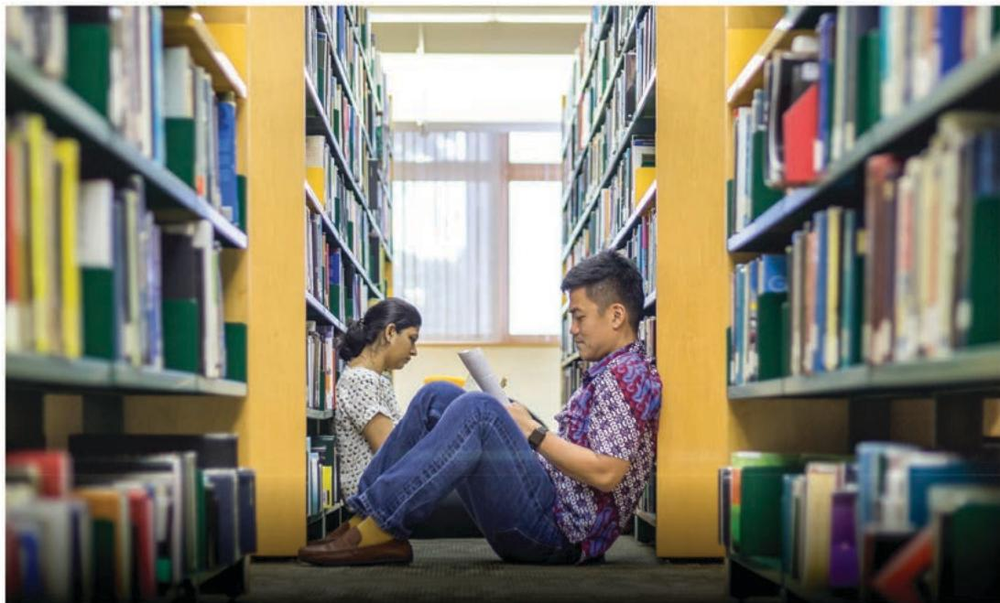

> **AI Description:**
> **Source:** `assets/_page_3_Figure_0.jpg`
> 
> **Generated:** 2026-05-22 03:37:03
> 
> ---
> 
> The image depicts a library setting with two individuals sitting on the floor amidst bookshelves. The person on the left is seated with their back against the bookshelf, while the person on the right is sitting cross-legged, holding a book. The bookshelves are filled with books of various colors, indicating a diverse collection. The lighting appears natural, coming from a window at the far end of the aisle, creating a calm and studious atmosphere.

# Graduate Studies @FASS

FASSoffersawiderange of graduateprogrammes through courseworkand research,cateringtoavarietyof interests.Theseprogrammesofferexcellent opportunitiesforstudentstofurtherdeveloptheir potential asintellectual leaders inmany fields.

Programmes by coursework are designed for professional developmentand leadtoaGraduateDiploma,Doctoral orMasters.Programmesbyresearch equipstudents to work at great depth at the frontiers of knowledge creation. Theseprogrammes，whichinclude both coursework and a thesis,leadtoa Mastersor PhDdegree.

> **AI Description:**
> **Source:** `assets/_page_3_Figure_1.jpg`
> 
> **Generated:** 2026-05-22 03:37:06
> 
> ---
> 
> The image contains a simple icon of a clipboard with a list of items. The list includes three green checkmarks and three corresponding gray lines, indicating a checklist or to-do list. The visual elements suggest a focus on task completion or a series of steps to be followed.

Forsomedisciplines,PhDstudentsmay submit anarticle-based PhDthesisasan alternative route to completinga PhDthesis.Depending on the department, studentswillberequiredtosubmittwotothreejournal articlesandananalytical commentary of8,0oo-12,0o0words,more informationcan beobtained from:

fass.nus.edu.sg/graduate

Thecoursework/research programmesavailableare listed below:

\*Theseareavailableonly forthosepursuing PhDstudies.

## Study Abroad Joint /Double Degree Options

## The Faculty offers joint/double degree programmes for Masters and PhD students.

These degrees enable students to enhance their training and research workas they benefit from the teachingand resources of two institutions.

Bothtypes of degree programmes offer jointly supervised and assessed degree(s)conferinga doubly validated qualification.These programmes enable students to take advantage of the complementary academic strengthsof ourpartneruniversities.They alsoallowinternational experience tobe fully integrated intoa student'sresearchtraining with theopportunitytostretch theiracademiccapabilities.FASS expectsto attract good studentsand hopesto playa majorrole in developing the next generation of researchersacross Southeast Asia.

Programme Available:

Joint PhD (King'sCollege London)

## Joint Scholarship Programme for PhD students with Harvard-Yenching Institute (HYI)

The Harvard-Yenching Institute (HYl)-NUsJoint Scholarship Programme is for young facultyat HYI partner institutions in Vietnam,Thailandand Cambodia tocompletea PhDat NUs,with 10months of dissertation research at Harvard.Candidates'research should focus on East and Southeast Asian Studies.

FormoreinformationontheHY-NUSJoint5cholarshipProgramme

## Student Exchange Programme

## North America

1.Harvard-Yenching Institute (JointScholarship for PhD Studies)

## Europe

1.King's College,University of London (Joint PhD Programmeand PhD Exchange Programme)

2.University of Manchester, Faculty of Humanities(PhD Exchange Agreement)

3.London School of Economics (PhD Exchange Programme)

4.Sciences Po (PhD Exchange Programme)

5.Leiden UniversityFaculty of Humanities (Graduate Exchange Programme)

6.Georg-August University of Gottingen (Graduate Exchange Programme)

Graduate students canapply to go for an exchange programme at a partner university for three months or more as part of their graduate research programme.These exchange programmes enable studentsto receive supervisionand guidance from professors in our partner universities, gainaccessto data thatmay not be readilyavailable in NUs,as wellasbe exposed to graduate training beyond NUs.

Furthermore,theyallowstudentstoexpandtheirnetworksforfutureacademiccollaboration and career development.

> **AI Description:**
> **Source:** `assets/_page_5_Figure_0.jpg`
> 
> **Generated:** 2026-05-22 03:35:32
> 
> ---
> 
> The image is a stylized map of Southeast Asia, featuring a geometric design with triangular shapes in varying shades of blue. The map outlines the countries of Southeast Asia, including Indonesia, Malaysia, Singapore, Thailand, and parts of the Philippines. The design is abstract and artistic, focusing on the geographical layout rather than detailed geographical features or political boundaries.

## Asia

1.Fudan University (Graduate Exchange withLiterature,School of Social Developmentand Public Policy)

2.Shanghai Jiao Tong University (Graduate Exchange with School of Internationaland PublicAffairs, School of Media and Design)

3.University of Hong Kong (Graduate Exchange with Faculty of Social Sciences)

4.Hokkaido University (Graduate Exchange Programme)

5.Kwansei Gakuin University (Graduate Exchange Programme)

6.Rikkyo University (Graduate Exchange Programme)

7.Ritsumeikan University (Graduate Exchange Programme)

8.National Chengchi University (Graduate Exchange Programme)

9.Ateneo de Manila University (Graduate Exchange with School of Humanitiesand School of Social Sciences)

10.Ewha Womans University (Graduate Exchange Programme)

11.Korea University (Graduate Exchange with Division of International Studies, Graduate School of International Studiesand College of Political Science and Economics)

## Research Clusters @FASS

Theinterdisciplinary Research Clustersbring intellectual excitementand vibrancy to theFASs community.These Clusters integrate graduate students into the FASs research communityas theyparticipate in the reading groups,seminars, workshops and conferences organised by the Clusters.

Formore information on the Research Clusters: fass.nus.edu.sg/research-clusters/

The Research Clusters at FASS:

Belt&Road Initiative

Gender&Sexuality

·Language& Linguistics

## Money Matters & Accommodation

## Tuition Fees

FASSoffers different kinds of graduate programmes and tuition fees vary from programme to programme.Thefeerange(perannum)bynationalityforboth Courseworkand Research Programmesislistedasareference:

> **AI Description:**
> **Source:** `assets/_page_6_Figure_0.jpg`
> 
> **Generated:** 2026-05-22 03:30:59
> 
> ---
> 
> The image contains a simple cartoon illustration of a person holding a dollar bill and looking confused, with question marks above their head. The person is wearing a green shirt and blue pants. The image uses a minimalistic style with no additional text or complex elements. The main focus is on the expression of the character and the dollar bill, suggesting a theme of uncertainty or confusion related to money.

AllSingaporeansaged25andabovecanusetheirS\$5o0SkilsFutureCreditfromthegovernmenttopayforawide rangeofapproved skils-related courses.Visit theSkilsFuture Credit website(www.skillsfuture.sg/credit)to choosefromthecoursesavailableontheSkilsFutureCredit coursedirectory.

PleasecheckwiththerespectivedepartmentontheapplicabililtyoftheSkilsFutureCredittotheir programme.

Detailed fee information on specific programmes aswellasself-funded/government subsidised fee schemes/sponsorships/medical benefit schemesand othermiscellaneous student feescan be found at: fass.nus.edu.sg/graduate/

## Research Centres & Groups @FASS

TheCentre for Familyand Population Research （CFPR)

The Social Service Research Centre (SSR)

·The Next Age Institute(NAl)

SingaporeCentrefor Appliedand Policy Economics(SCAPE)

The Global Production Networks Centre at NUS(GPN@NUS)

Max Weber Foundation Research Groupon Borders,Mobilityand New Infrastructures

Cultural Research Centre

Wan Boo Sow Research Centre

## The Singapore Research Nexus

TheSingapore Research Nexus (SRN) servesasa showcase forpast research,aresource for current researchandaplatform for futureresearch on Singapore.Itprovidesauseful tool foracademics, policymakers and those witha generalinterest in how research has helped shape thestory of Singapore.

Formore information on the Singapore Research Nexus: fass.nus.edu.sg/srn/

## Scholarships and Financial Assistance

Thereareseveral differenttypesof scholarshipsavailable for graduatestudents.These scholarships arehighly competitiveand aregiven to students who haveattainedan excellentacademic record. Applying for these scholarships isdone concurrently with the application foradmission to the graduateprogramme.

Theamountofscholarshipsandtheapplicationrequirementsvary.Studentswhoareunable toqualify forsuch scholarshipscanalsoapply for study loans or part-time teaching/researchappointments.

Thefull list of scholarships and other financial assistance schemes can be found at: fass.nus.edu.sg/graduate/

## Accommodation

Housingfacilitiesareavailableat variousparts of the NUscampus.Graduate Residenceat UTown provides diferent options foraccommodation and a chance to meet other graduate students ina studentcommunitycharacterisedbyculturaldiversity.

Look out for the timelines ofapplication for student accommodation oncampus at: nus.edu.sg/osa/student-services/hostel-admission/graduate

## WHAT OUR STUDENTS SAY

## ROZANA BINTE MOHAMED

The opportunity to return to FASs for my graduate studies is one l will always cherish.Whilelchose to pursuea course

Masters student in Applied Geographic Information Systems

which is quite different from my undergrad days,returning to the same faculty gavea sense of familiarity and I thoroughly enjoyed learning new things as part of the MScin Applied Geographic Information Systems (GIs).The course has enriched myknowledge about location dataand therichness of itsapplications,including emergency response,public health,and city planning.Shuttling between the Gls Laband the canteen(s) becamea dailyaffair but through this,lmadea lot of new friends from whom l learned a lot as well.Fresh perspectives about GlS were shared, making me feel enriched and energised.l can't wait toapply the skils l've learnt in this course!

> **AI Description:**
> **Source:** `assets/_page_7_Figure_1.jpg`
> 
> **Generated:** 2026-05-22 03:32:19
> 
> ---
> 
> The image contains a photograph of a person wearing a black t-shirt with the text "URban basic" printed on it. The person is giving a thumbs-up gesture with both hands. The background is plain white, and there are no charts, graphs, or other visual elements present in the image.

Current Masters student in Economics

Every economist needs to have a solid foundation in the fundamentals of economic theory and econometrics.The need for economists capable of utilising the necessary analysis tools to resolve complex challenges in today's world cannot be under-emphasised; and you get this solid foundation right here at the FASs Department of Economics.The Graduate Research Programme here in FASs falls short of nothing other than to give you that most amazing holistic experience you would ever crave for,and to establish those solid fundamentals thatthese analyses use.l made the right choice,would you?

## Admission and Application Procedures

## Admission Information

> **AI Description:**
> **Source:** `assets/_page_7_Figure_2.jpg`
> 
> **Generated:** 2026-05-22 03:31:36
> 
> ---
> 
> The image depicts a simple illustration of a door partially open. The door is a solid, dark blue color with a white handle located near the center. The door is slightly ajar, revealing a white interior space. There are no additional labels, text, or other elements present in the image.

TheFASsminimumcriterion for admission intothegraduateprogrammes isagoodMastersdegreein arelevantdiscipline(for PhD)oran NUsHonoursdegree(Merit/Second Classandabove)orequivalent (e.g.,afour-year Bachelorsdegreewithat leastanaverage gradeofB)inarelevant discipline(for Masters).

Fordetailed requirements of specificprogrammes,please refer to the websiteat: fass.nus.edu.sg/graduate

## English Language Requirement (TOEFL/IELTS)

Applicants whose native tongueandmedium of previousuniversityinstructionarenot English should submittheTOEFL(Test of Englishasa Foreign Language)or IELTs(international English Language Testing System) scoreas evidence of their proficiency.

The following minimum ToEFL score is required:

85

fortheinternet-basedtest(withaminimumscoreof22forthewriting section);or

237

forthecomputer-based test

## Alternativelyan IELTS result of 6.0 is required

TOEFLand IELTSareonlyvalidfortwo yearsafterthe testandthevalidity should not expirebefore thebeginning of the application period for the graduateprogramme.

TheEducational Testing Service(ETS)hasindicated that scorereportsarevalidonlyifour University receives them directly from ETS.

TheFaculty's TOEFLinstitution code is9081.

## NOTE:

1.SomeDepartments/Programmesmaysethigherrequirementsthanthosestatedabove;forexample,theMaster ofSocialWorkcourseworkprogrammerequiresaminimum IELTSscoreof6.5whilethegraduateresearch programmesrequireaminimum IELTSscoreof7.0.

2.GraduateRecord Examination(GRE)reportsarenecessaryforadmissionintotheDepartmentofPoliticalScience, Department of Psychology and Departmentof Social Work.

cont'd

> **AI Description:**
> **Source:** `assets/_page_8_Figure_0.jpg`
> 
> **Generated:** 2026-05-22 03:33:46
> 
> ---
> 
> The image shows a person typing on a laptop keyboard. The setting appears to be a workspace with a desk, a notebook, and some papers in the background. The lighting suggests it is either early morning or late afternoon, with sunlight streaming through a window. The person is wearing a watch on their left wrist. The image conveys a sense of productivity and focus on digital work or study.

## Application into the Programme

Applications can bepaper-based ormade online butonline applications are STRoNGLY preferred.

TheGraduate Admission System for Coursework/Research enablescandidates toapplyfor admission intothegraduatecoursework/research programmesoffered by FASSat:

https://inetapps.nus.edu.sg/GDA2/Home.aspx

## Application Fee

Applicantsarerequiredtopaya non-refundableapplication fee of S\$5owhenanapplication issubmitted.

## Application Documents

Although anapplication issubmitted online,relevant supporting documentsmust besent via post (except forselecteddepartments).Inorder fortheapplicanttobeconsidered foraspecific intake, theonlineapplication,paymentandavailable supporting documentsmust reach the office by the relevantdeadlines.Pleaserefertothewebsitefordetails.

Formore information about applications,pleasevisit our websiteat: fass.nus.edu.sg/graduate

## There are two intakes per academic year:

SEMESTERI(August)

> **AI Description:**
> **Source:** `assets/_page_8_Figure_1.jpg`
> 
> **Generated:** 2026-05-22 03:33:50
> 
> ---
> 
> The image contains a calendar icon with a red highlight on a date, indicating a specific day. The calendar is a graphical representation of a monthly calendar layout, with days of the week and dates arranged in a grid format. The red highlight suggests a focus on a particular date, which could be used to denote an important event or reminder.

·SEMESTER II (January)

## For Coursework Programmes,the application periods are:

SEMESTERI(August)

## For Research Programmes,the application periods are:

SEMESTERI(August)

SEMESTER I (January)

## Processing Time:

SEMESTERI(August)-By31stMAY

SEMESTERI（January)-By31stOCT

Foranup-to-dateanddetailedoverviewoftheabove,please visit: fass.nus.edu.sg/graduate

# CONTACT US

GRADUATE STUDIES DIVISION Dean's Office,Faculty of Artsand Social Sciences

National University of Singapore The Shaw Foundation Building AS7,Level6,5ArtsLink Singapore 117570 Tel:+6566012588(Coursework)/+6566013448（Research) fass.nus.edu.sg

FAQS

You can find the list of questions frequentlyaskedby students on our website:

Coursework fass.nus.edu.sg/prospective-students/graduate/coursework-programmes/ frequently-asked-questions-gradcoursework/

Research fass.nus.edu.sg/prospective-students/graduate/research/ frequently-asked-questions/

If you cannot find theanswer toyour question there, youcancontact theGraduateStudies Division by email:

Coursework-fasbox4@nus.edu.sg

Research-fasbox3@nus.edu.sg

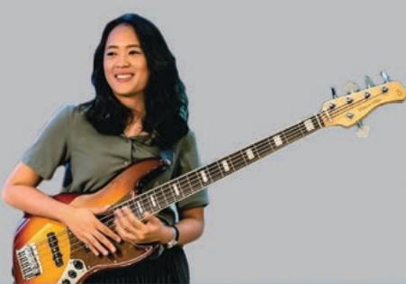

> **AI Description:**
> **Source:** `assets/_page_9_Figure_0.jpg`
> 
> **Generated:** 2026-05-22 03:33:36
> 
> ---
> 
> The image contains a photograph of a person playing a bass guitar. The person is wearing a casual outfit and is smiling while holding the instrument. The bass guitar is a four-string model with a distinctive wood finish and a pickguard. The image captures a moment of musical performance or practice.

WHAT OUR STUDENTS SAY

## NURSTASHA ARIFIN WONG JI HAN

Current Masters student in Political Science

Prior to joining FASs,lwasa Recording Artsand Science majorat the NUs Yong Siew Toh Conservatory of Music.

Coming from a vastly different academic discipline has been challenging,but undoubtedlyimmensely rewarding because of the guidance of my professors and the larger faculty.Through their encouragement,I've found that nothing goes to waste-Artisanother (equally valid) way of knowing,andthe fieldof political science is diverse enough for contributions to be made via other knowledge ontologies.Through their invaluable counsel,l've learned new frameworks for deconstructing problems relating tomy new research interests,governance networks for climate change and natural resource management,as well as empirical methods to test knowledge that we take to be true.

The Master of Social Work programme enables me to think and reflect more critically about social work as l grow asa practitioner.Through invigorating discussions with the lecturers,most of them senior practitioners in the field,are immediately applicable to ground practices.The diversity of experiences ranging from senior directors to newly-minted social workers across

Medical Social Worker, National CancerCentreSingapore

sectors within the programme provides a profoundly enriching and rewarding learning experience both in and out of the classroom.With opportunities available to conduct practice research with the guidance of deeply experienced academics to generate important social work knowledge for local practice,Ifeel that my confidence is multiplied while workingalongsidemyclientsand fellow colleagues to effect positive change.

DEPARTMENTOF

# Chinese Studies

TheDepartment is one of the leading centres forChinese Studiesin Asia.Home to a team ofdedicatedresearchersfromprestigious universities in different parts ofthe world,the Department playsan important roleinbridging Chinesecultural heritageandmodern Singapore, promoting cutting-edge research in Chinese studies and linguistics,aswell asproviding effective academic training to students from different cultural backgrounds.

Ourcoursesand researchareascovera broad academic spectrum,including Chinese philosophypre-modernand modern history

Department of Chinese Studies   
Facultyof Arts&Social Sciences   
National Universityof Singapore   
BlkAS8,Level5,10KentRidgeCrescent,   
Singapore119260   
Tel:+6565163900/7178   
Fax:+6567794167   
Email: chssec@nus.edu.sg   
fass.nus.edu.sg/chs

traditional and modern literature,cultural studies,Chinese Diaspora and overseas Chinese, religious studies,cognitive linguistics,historical linguistics,pragmatics，lexical semantics,first language acquisition,and translation studies.

OurDepartment hassixresearch groups,namely theSoutheast Asian Chineseand Modern China, Chinese Linguistics,Ming-Qing,Print& Popular Culture,Chinese Religions,and Classical Chinese Literature& Thoughtwhich are very active in nurturing academic interests and organising scholastic events.

## The Department offersthe following programmes:

Masterof Artsby Coursework

-MA(Chinese Culture& Language)

Masterof Artsby Research

PhD

## DEAN WANG

## (PhD,NUs,2020) Researcher&Co-Principal Investigatorfor MandarinDatabaseProject,National itage Board(Language Division)

Owingtothe strategiclocation of Singapore,the Department hasalways beenanactivesiteofcultural andintellectual exchangeintheregion. "Chinese Studies"isnotonly about China.The vibrantand unique structure oftheDepartment,including therich resourcesavailable,have undoubtedly broadened graduates'research insightsand worldview.

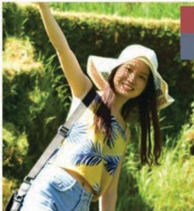

> **AI Description:**
> **Source:** `assets/_page_11_Figure_2.jpg`
> 
> **Generated:** 2026-05-22 03:34:47
> 
> ---
> 
> The image contains a photograph of a person outdoors in a natural setting. The individual is wearing a yellow and blue patterned top, blue jeans, and a white straw hat. They are holding a strap, possibly from a bag or camera, and appear to be in a cheerful mood, with one arm raised. The background consists of greenery, suggesting a park or garden environment.

## HU YA

## (PhD,NUs,9)Lecturerhoolofiterature,apitalNormalUsity

ThePhD programme in the Department of Chinese Studies has provided mewith great opportunitiesto communicate withworld-renowned scholars,which broadensmy research horizon and enrichesmy research experiences.Iwould liketoexpressmyappreciationtomy supervisoraswell asotherprofessors in the department for their patient guidance,consistent encouragementand constructive suggestions.My student lifein NUSisvery rewarding and unforgettable.

## XU RUI

## Current Masters Student in Chinese Studies

Itwassuchamemorablejourneyto studyandmeetamazing peopleand teachersat NUs,Department of ChineseStudies.Professors encouraged discussionand active participation which gave usthe absolute freedomto discussand present inclass.l,therefore,was given opportunities toshare ideasopenly with other outstanding classmates fromaround theworld while learning toappreciate the uniquenessof Chineseculture in Singapore. Thisprogram successfully combined lectures with group field researchand independentresearch,which took myacademicabilitytothenext level.I sincerelyappreciatetheafter-classconversationswithprofessors,whichwere alwayswarmlywelcomed.Thanksto their helpand guidance,ldid polish myunderstanding of linguisticsand received excellent exposure to research training.lalso usedthis timetodiscoverthebeauty of Singaporeandwas attracted deeply bythe charisma of this Lion City.

> **AI Description:**
> **Source:** `assets/_page_12_Figure_0.jpg`
> 
> **Generated:** 2026-05-22 03:30:41
> 
> ---
> 
> The image contains a central illustration of a hand holding a transparent globe, surrounded by smaller circular icons connected by lines. Each icon represents different themes or concepts, such as people, graphs, and technological elements. The overall design suggests a global network or interconnected systems, possibly related to technology, communication, or international collaboration. The visual elements are designed to convey a sense of global connectivity and interdependence.

DEPARTMENT OF

# Communications and New Media

The Department of Communications and New Media(CNM）at the National University of Singapore,ranked among the top threein Asia,is the only department in SoutheastAsia whichoffersmedia studies,interactivemedia design,cultural studies,and communication managementwith a focus on newmedia.CNM educates and nurtures future public relations, media,art,design,finance,policycivil society,health,and political communication professionalsusinganintegratedand multidisciplinaryapproachthatreflectstoday's connected,converged,rapidlytransforming, andmulti-platform media environment. Students in CNMcan take courses in advertising, journalism,health and sciencecommunication, andpublic relations(traditionally offered incommunicationprogrammes),artand visual design(traditionallyofferedinarts programmes),game designand human computerinteraction(traditionallyoffered incomputer sciences),and cultural studies within one academic department,crafting programmes of studythat are responsiveto theirstrengths and aspirations.Students can alsotake courses in new media regulation

Departmentof   
Communications and New Media   
Facultyof Arts&Social Sciences   
National University of Singapore   
BlkAS6,#03-41,11Computing Drive,   
Singapore 117416   
Tel:+6565164671   
Fax:+6567794911   
Email:cnm.graduate@nus.edu.sg   
fass.nus.edu.sg/cnm

andpolicysocial psychology,and the culture industriesas wellassociologypolitical science, history,philosophycomputer sciencesand business.

Ourmultidisciplinarytheory-centred,practicebasedapproach offers students opportunitiesin experiential learning through industry-driven classroomprojects,international and local competitions in communication campaigns and digital design,student-led publicexhibitions ofinteractive digital work,student-led social media campaigns,service-based projects that collaboratewithexternalclients,international student exchanges,and interactionswith industry practitioners.With faculty members hailingfrom topcommunication,art,and designschools fromaround the world,bringing withthem innovative methods of teaching, studentsbenefit from an understanding of trends coupled withan eye on the evolving industry.Our Industry Advisory Councilof topdigital and media practitioners from the region shape our dynamic curriculum thatis consistently rankedatthetop by the industry.

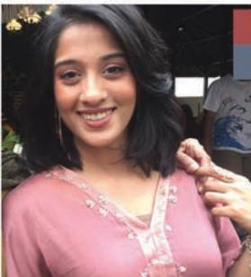

> **AI Description:**
> **Source:** `assets/_page_12_Figure_1.jpg`
> 
> **Generated:** 2026-05-22 03:30:46
> 
> ---
> 
> The image contains a photograph of a person wearing a pink top with a white lace trim. The background appears to be an outdoor setting with some greenery and a person partially visible in the background. The person is smiling and has short, dark hair. There are no charts, graphs, or other visual elements present in the image.

## FARAH BINTE GULAM HUSSAIN BAWANYKUND FLORIAN Current Masters student in Communicationsand New Media

Having had the pleasure of being in CNMforoveradecade,firstas anundergraduate,and then,asa full-time TAand nowasa graduate student,I've hadtheprivilege to have grownwiththedepartment through threeerasof leadership.Asa graduate student,Ifindmyself thoroughly enjoying classesand benefitingimmenselyfroma dynamic andeffervescentcultureofmulti-disciplinary researchandwriting.I'm alsomost grateful fortheacademic supervision l've received,which has beeninstrumentalinmeltingawaymy hesitationanddoubts,giving way instead tocuriosity,confidenceanddetermination.Almamater translates literallyto'nourishingmother';and that'sexactlywhatCNM hasbeentome.It'sbeenmore thanaschool,more thanjustajob. CNMistrulya homeaway from home,andallthe talentedfolk here arefamilytome-andlcouldn'timagine lifeany otherway!

## AARON NG YI KAI

## Current PhD student in Communicationsand New Media

The graduateprogrammeat CNMistrulymultidisciplinary.The breadthof theresearch interests of theacademicfaculty isreallywide,includinggame design,user experienceresearch,cultural studies,political communication, healthcommunication,publicrelations,e-learningandbigdataanalysis.The widerange ofresearch interestsand expertise in thedepartmentallowed meto proposea research project thatdoes not fit neatly into the confines ofatraditional disciplineaslcantapon theexpertise of faculty from vastly differentbackgrounds inthesamedepartment.Asagraduate student in CNM,lhavealso benefited from theease inwhichlcould takecoursesfrom other schools or faculties in NUSthat are helpful tomydissertationeven if theyarenot offeredbythedepartment.Ihave takenclassesfromStatistics andApplied Probability,Biological Sciencesand School of Public Health.As myresearch interest crosses disciplinary boundaries,CNM is therightchoice becauseitishighlysupportiveofmultidisciplinaryresearch.Anyonewhohas aresearch interest innewmedia should seriously consider CNMforaPhD because ofthesupportive intellectual environment.

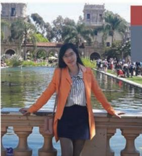

> **AI Description:**
> **Source:** `assets/_page_12_Figure_3.jpg`
> 
> **Generated:** 2026-05-22 03:31:07
> 
> ---
> 
> The image is a photograph of a person standing by a railing near a water feature, possibly a fountain, with a building in the background that appears to be Balboa Park in San Diego. The person is wearing a bright orange jacket over a striped shirt and a dark skirt. The setting suggests a sunny day, and the background includes other people and palm trees, indicating a public park or tourist area.

## DRWANG YANG

## (PhD,NUs,9)Postdoctoral researchellowatthe LeeKuan Yew Centrefor Innovative Cities

Myfour-yearstudyintheCommunicationsandNewMedia PhDProgrammeat NUSwasan enjoyableand rewarding journey which prepared meforfuture academiccareer.Asa graduatestudentandjunior scholar today,Ibenefited alotfromtheenrichedmodulesand interdisciplinaryresearch community of theprogramme.Mysupervisorsand otherprofessors intheprogramme notonly impartedmeknowledgeandskills,butalsotrainedmeincritical thinking,innovativenessand collaborative teamwork inresearch projects.The programme,thefacultyand the universityprovideda highlysupportiveand friendlyatmosphereformy academicand everyday lifein NUs.

# Comparative Asian Studies PhD PROGRAMME

Officially launched in2013,the Comparative AsianStudies (CAS)PhD programme offersan intensive course of study that promotesa transregional understanding of Asia.Students will beexposed to ideas designed to shiftattention beyond the conceptual boundaries ofareastudies scholarship towardsthe dynamicsand processesthat connect the region's vast peoples, cultures,and worldviews.

Qualified candidates will have traininginat leasttwo geographical/cultural areas (South, East,Southeast,ortheast,WestAsia)enabling themto explore the varying methods,debates, andissues that have shaped those respective fieldscomparatively.Every candidatewillalso beexposed to scholarship and conversations drawnfrom Inter-Asia Studies that highlight the interconnectednesswithin the broaderAsia region.

Participating facultymembers, locatedinour

Comparative Asian Studies PhD Programme   
Facultyof Arts&Social Sciences   
National University ofSingapore   
BlkAS8,Level6,10KentRidgeCrescent,   
Singapore119260   
Tel:+6565164640   
Fax:+6567776608   
Email: fasbox58@nus.edu.sg   
fass.nus.edu.sg/cas/

area-studiesdepartments and disciplinarybaseddepartments,represent one of the largest concentrations of Asia-focused scholars inthe world.FAss'sresearch clusters bring togethergraduatestudentsandfaculty regularlytoexplore topicsin (butnot limited to):comparativereligions,transnational flows, andglobal histories.Taken together withthe CASPhD's innovative curriculum,participating candidates have the opportunity to not only engage with leading specialists of Asian Studies, but to contribute to the process of producing knowledgeabout Asia fromwithin the region.

Theprogrammeisunique because itoffers thescope of transnational Asian Studieswhile providing theintensityand focusoffered by area-studies training.This combination of both breadth and depth encourages research that explores the connectedness of Asia without compromising a deep understanding of its various locales.

## Thefoundation of this programme isbased onthree components:

Intensive training in two languages representing twodifferentAsian Studies regionsor twodifferentcultural zones;

Aninnovative courseworkprogramme

Research and writing of a dissertation that is based on research concerning two regions

Studentswhoapply totheprogrammecan look forwardto graduatetraininginoneofAsia'stop universitiesthat is globalinscopebuttailored tothedemandsand dynamicsof theregion.

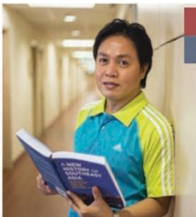

> **AI Description:**
> **Source:** `assets/_page_13_Figure_1.jpg`
> 
> **Generated:** 2026-05-22 03:31:30
> 
> ---
> 
> The image contains a photograph of a person standing in a hallway, holding an open book. The book appears to have text on its cover, but the specific content is not legible in the image. The person is wearing a blue and yellow striped shirt. The hallway has a neutral color scheme with a visible door and a wall with a small section of a red and blue flag or sign.

## CARLO SAMSON GUTIERREZ Current CAS PhD Student

TheComparative Asian Studiesprogrammeprovidesa unique vantage point toconceiveand behold Asian discoursesand social science in general.Its intricateadvantage istherequisite towardsaminimum bilingualismandin realitythemultilingual demands.Thenicething is itembracesallstudents of society whoare interested inengaging withtheissueof Asia-which isextremely timelyandrelevantinrecent years.Thechallenge itposes,in addition,isthe transformativenatureofeverywilled-engagement;as the programmes isrelativelynovel,allresearchagendawill ultimatelyreflect whatCAswillook like.Itisa demanding,interesting,new,andanallencompassing programme open toall!

## MAGDALENA MARIA JEZIORNA-SURKHA Current CAS PhD Student

Ihavealways beenagreat believer inthe idea of studying Asia inAsiaand by coming toNUs,hopedtocultivateless Eurocentric approachtomy research.Theprogrammeenabledmetodoso byprovidingalargerAsiancontext formyproject.Myteaching experience too contributed greatlyto my understanding ofAsia and has beena source of true joyand inspiration.

## SHRUTI GUPTA Current CAS PhD student

Thestructure,focusand orientation of the CAS coursework hasallowed me torethink the traditional framingsofAsia.Ithasbroughttomyattention thevast interconnections,similaritiesand pluralitiesthat constituteAsiaasa geographical and cultural entity.Since the course draws faculty fromacross disciplinaryandarea-studiesdepartments,itenablesstudentstodevelop adynamicperspective.Itallows usto transcend national borders while being rooted locally intheuniqueness of our fields.The CAS programme pushes boundaries by giving students theopportunity to unlearn and toreconceptualise both historical and contemporary areas,peoplesand cultures of Asia.

> **AI Description:**
> **Source:** `assets/_page_14_Figure_0.jpg`
> 
> **Generated:** 2026-05-22 03:31:58
> 
> ---
> 
> The image is a photograph of a person sitting amidst a display of offerings, likely for a religious or ceremonial purpose. The offerings include a variety of fruits, flowers, and other items arranged in decorative baskets. The person is wearing traditional attire, suggesting cultural significance. The background is filled with more offerings, indicating a market or ceremonial setting. The image captures a moment of cultural and religious practice, with a focus on the offerings and the individual.

# Cultural Studies in Asia

PROGRAMME

Cultural Studies in Asia Programme   
Faculty of Arts&Social Sciences   
National University of Singapore   
BlkAS6,#03-41,11Computing Drive,Singapore117416   
Tel:+6565164671   
Fax:+6567794911   
Email:cnm.graduate@nus.edu.sg   
fass.nus.edu.sg/cnm/phd-cultural-studies-in-asia/

TheCultural Studiesin Asia (CSA)PhD Programmewasestablished in2009andisthe only such programme taught in English in Asia.Itis housed in the Department of Communicationsand NewMedia.

## What is Cultural Studies in Asia?

Adopting an interdisciplinary approach,the CSA-PhD aims to provide teaching and research skills inthe analysis of the flowsand exchanges ofpopular culturalpracticesin contemporary Asia.The Programme taps the rich pool of over 300 humanities and social science professors in theFaculty of Artsand Social Sciences (FASS) toenable candidates to tailor their studies according to their research interests.Students could choose their dissertation supervisorsand enrol inrelevantmodulesfromall departments inFASS.

Anumber of core modulestaught by specialists inthe field provide the common grounding in thetheory and practice of Cultural Studies. Studentstherefore benefit from learning witha widerange of theoretical,methodological and substantive expertsin a multidisciplinaryand interdisciplinarymanner.

## Core Research Areas

Theresearch interests undertaken byour candidates range from the politics of pop music, museum and nation building; documentary filmsof Thailand;political and intellectual biographies of Indonesian revolutionarywriters; urbanimaginariesof Dhaka;heritage spatial politics in Malaysia;community activismand dance in India,and;Southeast Asian visual artists'aestheticengagement withhistory.In theseprojects,supervisors for the dissertation research have beendrawn from thedepartments ofSoutheastAsian Studies,Sociology,Geography, English Literature,Chinese Studies,andSchoolof Architecture.

## Academic Exchanges

TheCSA-PhD Programme participatesactively intheInter-Asia Cultural Studies Society (http:// culturalstudies.asia)and isa member of the ConsortiumofInter-Asia Cultural Studies Institutions (http://culturalstudies.asia/ciacsi/). The Society,and its Consortium of institutions offeringpostgraduate programmes,organises regular events bringing cultural studies scholars and students in Asia and fromaround the world together in Asian cities to discuss pertinent issuesrelating to the knowledge conditionsof politics,power and practices in the region.Our

CSA-PhD students would have the opportunity toattend the biannual SummerSchool to take extracoursesand the biannual Conference to present theirwork.

The CSA-PhD Programme hoststheWilliam Lim SiewWai Fellowship.Every year,we invite one eminent professor to visit our Programmeto teachatwo-month special topicmoduleunder thisFellowship.Past visiting Fellowsinclude Professors Maila Stivens,Mike Featherstone, Petervan derVeerMeaghanMorris,John Nguyet Erniand Audrey Yue.

66 Asagraduate studentand today asa junior scholar,Ihave found theCultural Studies in Asia PhDProgrammeat NUSand its Inter-Asia Cultural Studies Society networkto be indispensable formy academic trajectory.Themodulesand theprofessrstrainedmeincriticalthinking andcultural theories.Thefreedomtotakemodules from different departments in theFaculty ofArtsand Social Scienceswasalso key to focusingmyresearch interests.Theprogramme'sfocusonAsiaallows meto learn aboutand further investigate importantdevelopments anddynamicsin Asiancontext.Theprogramme,thefaculty,and the university have been very supportivetoan interdisciplinary student like me.The scholarship scheme,campus facilities,aswellaseventsand seminarsorganised intheuniversity havefacilitatedmy intellectual growthand provided themost vital contributionsl needasa young scholar.

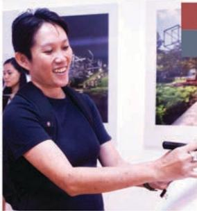

> **AI Description:**
> **Source:** `assets/_page_14_Figure_2.jpg`
> 
> **Generated:** 2026-05-22 03:32:03
> 
> ---
> 
> The image contains a photograph of a person standing in front of a display. The individual is wearing a dark-colored shirt and appears to be interacting with the display, possibly using a device or pointing at something. The background includes a poster or photograph of an outdoor scene, which seems to depict a park or garden with trees and a basketball hoop. The setting suggests an exhibition or presentation environment.

## FELICIA LOW

## (PhD,NUs,5)rectorommunityulturalevelopment(ingae)

Ifeel privileged to have been part of the Cultural Studies in Asia PhD programme.Asa practising artist,it provided me withamuch needed socio-political lens which could be used to analyse the significance of arts practiceswith communities in Singapore.This tookmy work beyond a level of programmesand projects,enablingmeto becritical and more conscious of the meaning that canbe constructed through projects whichultimately came to represent segmentsof society in Singapore. Italso brought outanacademic part ofme,whichwould have been dormantand undiscovered,and openedadifferentworld formetobe part of.lappreciate thecourse and NUs foracceptingmyartistic practice onthe ground and recognising its place in academia.9

cont'd

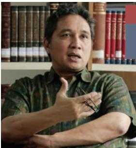

> **AI Description:**
> **Source:** `assets/_page_15_Figure_0.jpg`
> 
> **Generated:** 2026-05-22 03:30:32
> 
> ---
> 
> The image contains a photograph of a person gesturing with their hands, likely in the middle of a conversation or explanation. The background features a bookshelf filled with books, suggesting an academic or intellectual setting. The person is wearing a patterned shirt and appears to be engaged in a discussion or presentation. There are no charts, graphs, or other visual elements present in the image.

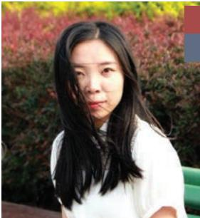

> **AI Description:**
> **Source:** `assets/_page_15_Figure_1.jpg`
> 
> **Generated:** 2026-05-22 03:30:52
> 
> ---
> 
> The image contains a photograph of a person with long dark hair, wearing a white shirt. The background features greenery and red foliage, suggesting an outdoor setting. The image appears to be a casual portrait with no additional text or annotations.

## HILMARFARID

## (PhD, NUs,2018) Director General for Culture at the Ministry of Education and Culture of the Republic of Indonesia

66 The Cultural Studies in Asia programme has provided important training to hone my sense of capability and qualification as a scholar, and supported my professional development.The programme has also allowed me to cultivate an extensive network of people to reach out to for advice,collaboration,and knowledge exchange at any stage of my career. Ultimately, the theoretical,methodological,and analytical lenses in Cultural Studies that I have been exposed to at NUS have been valuable resources that inform my perspective as both a scholar and practitioner in the realm of cultural activism and policy making in Indonesia．9

## GAO XUEYING

## Current PhD student in Cultural Studies in Asia programme

66 The Cultural Studies in Asia programme offers me new perspectives to rethink about the meaning of contemporary Asia.As a field of research, Cultural Studies in Asia is very inspiring - it challenges conventional disciplinary boundaries and regional cultural boundaries.We are lucky to have eminent visiting scholars frequently coming to the department to share their passionate and inspiring thoughts with us.The programme is dynamic and interesting,and Iam fortunate to be part of it.

## NGUYEN HANG PHUNG DUNG

Current Masters student in English Language and Linguistics

Doing the Masters in English Language and Linguistics at FASS under the financial support

of NUS GSA Scholarship has been an amazing opportunity for me to pursue my passion in language and linguistics.I had a wonderful time participating in seminars and projects with professors who are world-class experts in their field and who were always supportive and accessible to their students. The program has immensely widened my knowledge on the most significant and current linguistics issues set in the context of multilingual Singapore. I thoroughly enjoyed engaging in the exciting academic work, getting to know amazing faculty and fellow graduate students, and at the same time immersing in the vibrant culture of Singapore. Coming to FASS and NUS for my graduate studies has been one of the best decisions in my life.

It isan immense privilege for an international student not to worry about one's tuition fees and living expenses. I can only thank the countless sacrifices made to make my stay at NUS possible. FASS has created the environment and provided me with the resources to pave my academic path. Trying to incorporate the history and the cultural reception of mathematics into literary studies is not easy， but l am receiving invaluable support from the professors and fellow students in my department. They have always been willing to share their knowledge and perspectives to enlarge mine.

> **AI Description:**
> **Source:** `assets/_page_16_Figure_0.jpg`
> 
> **Generated:** 2026-05-22 03:34:11
> 
> ---
> 
> The image contains a close-up photograph of a calculator and a highlighter pen resting on what appears to be a printed document or paper. The calculator has a digital display and a keypad with blue buttons. The highlighter is orange and positioned to the right of the calculator. The document underneath has printed text and lines, but the focus is on the calculator and highlighter. There are no charts, graphs, or other visual elements beyond the text on the paper.

Department of Economics   
Facultyof Arts&Social Sciences   
National Universityof Singapore   
BlkAS2,Level6,1ArtsLink   
Singapore117570   
Tel:+6565166013/1304   
Fax:+6567752646   
Email:ecsbox2@nus.edu.sg   
ecsbox1@nus.edu.sg   
fass.nus.edu.sg/ecs

TheDepartment of Economics,setupin1934,hasanestablished reputationasone of thelargestand leadingdepartmentsof EconomicsintheAsia-Pacificregion.Programmesofered bythe Department:

## Coursework

## Research

Career-Oriented Track

Master of Economics (Applied Economics)

Master of Social Sciences

·Doctorof Philosophy

Academic-Focused Track

Master of Economics(Quantitative Economics)

TheDepartment of Economicsat NUS consistently ranksas one of the top programmesinthe Asia-Pacific region.The Economics graduate programmepreparesstudentsforemployment in universities,government,business and financial sectors.Recent graduates of the Department havebeen placed in well-known universities suchas Monash University and University of Western Australia,aswellas leading investment institutions such as Citibank,Credit Suisse,DBS Bank,and TCCapital.

Facultymembers'research areasspanawide rangeof economic fields，with strength in the coreareasofmicroeconomics,macroeconomics andeconometrics,aswell asin particularfields suchas game theoryand industrial organisation, laboureconomics,education,financialeconomics, and growththeoryand developmentwith special reference to Asia.

## VANINDER SINGH （MAE,NUS,2017)

ThebiggesttestamenttotheAppliednatureoftheprogramme isthat evenaslstudied thevarious subjects lcould see thosecoursesadding value tomy professional life;lamapracticing economist working fora global investment bank.More than thecoreeconomics subjects,it is the eclecticmix of electives on offer that haveprovidedme withmy biggest take-aways.Tonamejustafew:Chineseeconomy,Urban Economicsand Applied Macroeconomics have been some of the coursesthatlhavebeen abletoapply inmy everyday work.Asapart-timestudent,the factthatthe programme structure isquiteflexible hasbeencrucial formeto beable to absorb the most from my studies.

## CAI XIQIAN

## （PhD,NU)isity

lamglad that Ihad thechance to study in the Economics graduate programme.Imet students whocamefromall around theworld.During theyearslwasinFAss,allofuswereabletosharenotonlyourknowledge andexperience,but to share our cultureand enjoy lots of wonderful memories.Theprofessorsarenotonlyqualifiedand knowledgeable;they arealso very nicepeople.lapproachedthemwheneverlfaced difficulties inunderstanding certain topics.lwould certainlyrecommend the graduate programme to prospective students lookingto gainadeeperknowledge in Economics.

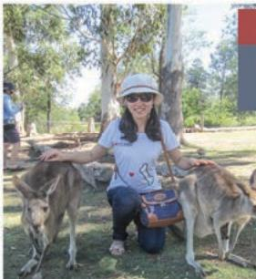

> **AI Description:**
> **Source:** `assets/_page_16_Figure_3.jpg`
> 
> **Generated:** 2026-05-22 03:34:54
> 
> ---
> 
> The image contains a photograph of a person sitting on the ground with two kangaroos. The person is wearing a white shirt, a hat, and a crossbody bag. The setting appears to be outdoors, with trees and grass visible in the background. The kangaroos are standing close to the person, and the overall scene suggests a casual interaction between the person and the animals.

## LIUXUYUAN

## (PhD,NUsl National University of Singapore

Studying inthe FASs Departmentof Economicswasa remarkable experience forme.The graduateresearch programmeenabledmeto get full rounded experiences in analysing various economicsmodels,which establishedmy solid foundationofanalytical and quantitative skill.

> **AI Description:**
> **Source:** `assets/_page_17_Figure_0.jpg`
> 
> **Generated:** 2026-05-22 03:36:27
> 
> ---
> 
> The image shows a close-up of a person's hands writing in a notebook with a blue pen. The notebook is open on a wooden surface, and the text is partially visible, appearing to be handwritten notes. The focus is on the hands and the writing process, with no other significant visual elements or charts present.

DEPARTMENT OF

# English Language and Literature

Singaporeisasmall,moderncity-state, accessible from anywhere in the world.The country offers rich opportunities forthe student oflanguage,literature or theatre.It has four official languages,aswellasmany other smaller languagecommunities.Thismakesitanideal placetostudy important linguistictopics such as languagecontact,languagevariation,language planning,and languageand identities.

Singapore also hasasignificant literary tradition within the broader context of the literatures and cultures of the Asia-Pacific.Its location

Department of English Language   
andLiterature   
Facultyof Arts&Social Sciences   
National University of Singapore   
BlkAS5,Level6,7ArtsLink   
Singapore117570   
Tel:+6565163915(Coursework)   
Tel:+6565163917（Research)   
Fax:+6567732981   
Email:ellbox1@nus.edu.sg(Research)   
ellbox3@nus.edu.sg(Coursework)   
fass.nus.edu.sg/ell

modernityandhistorymakeitideal forthestudy of theregion's writingand cultures,of diaspora and of postcoloniality.

Theatre Studiesisknown forits cuttingedgescholarshipintheatre and performance concerned with the aesthetic expressions, cultural dynamics and social forces ofa diverse andfast-changing contemporary Asia.Inter-Asiancross-culturalcurrentsand Asianmodernity areat the core of our critical enquiry in theatre and performance studies.

## TheDepartment offers graduate degrees in three areas:

·English Language and Linguistics

·Literary Studies

Theatre and Performance Studies

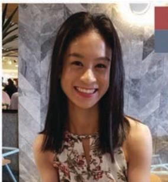

> **AI Description:**
> **Source:** `assets/_page_17_Figure_2.jpg`
> 
> **Generated:** 2026-05-22 03:37:29
> 
> ---
> 
> The image is a photograph of a person sitting indoors. The individual is wearing a floral top and has shoulder-length hair. The background appears to be a modern interior space with a mix of neutral tones and some blurred elements that suggest a casual setting, possibly a café or restaurant. There are no charts, graphs, or other visual elements present in the image.

## at three levels

·MAbycoursework(in English Languageand Linguistics,and Literary Studies)

MAbyresearch(inEnglishLanguageandLinguistics,EnglishLiterature,andTheatreandPerformanceStudies)

PhD(in English Languageand Linguistics,English Literature,and TheatreandPerformanceStudies)

## LAUREN YEO

Research Assistant, English Languageand Literature Academic Group, National Instituteof Education&Part-Time Tutor, Centrefor English Language Communication,NUs

MyEnglish Language programme provided me withcountless opportunitiesto honemy skillsandfurthermyacademicinterests. Thankstothe supportand guidance of my many wonderful professors,Iwas well-equipped to take on various professional researchandteachingroles upon graduation.Mytimeatthe departmentwasa truly enriching and enjoyable one!

## ROWEENA YIP LEILENG

## Current PhD candidate in Theatreand Performance Studies

Myexperience pursuinga PhDin Theatreand Performance Studiesin NUS has beenveryenriching,bothintelectuallyandpersonally.Ireceivedbothmy undergraduatedegreein EnglishLiteratureandMastersdegreein Renaissance Literature fromthe Universityof Edinburgh (United Kingdom), andmovedto Singaporewiththe hopeof developingmeaningful research whilebeing based in SoutheastAsia.Graduate trainingat NUs isrigorous and comprehensive,with a focus on professionalisation and expanding opportunitiesforresearch.Mytransitionfromliterature intotheatrestudies wasencouraged by facultymembersand fellowstudents within Theatre Studies,whocontinueto supportmy ongoing research in the intersections between intercultural Shakespeare in Asia and feminist theory.The communityinTS isvibrantand dynamic,withawiderange of researchbeing conducted by facultyand graduatestudents,and opportunities todiscussour workat the end of every semester duringTS Research Day.

## TAN TECK HENG

## (PhD,JDKCLU1) Lecture,Languageand Communication Centre,NTU

Ihavestudied EnglishLiteratureatNUSsince2oo9,andthedepartment's support hasbeen immense,frommy undergraduateyearstomy Mastersand now,ajoint PhDwithKing's College London.lreceivedexcellent supervision andmentorship,and was givenopportunitiesto teach and lead seminars acrossvarious levels.MytrainingatNUs preparedmewellforthenew challengesatKing'sComparativeLiteraturedepartment,whereltaughtin adifferent environment,gainedaccessto British networksand resources, andlearntfrom scholars working inanadjacent discipline.Nearer to home, thedepartment hasforged connectionswith entitiesincludingtheCoalition of English Departments inAsia,and theModernistStudiesIn Asia Network. Such international presence has enhancedmyresearch onanglophone modernism and modern Chinese writing.Beyond the top-notch quality of the programme,lamalso grateful formyscholarshipand fundingsupport,which allowedme to pursuemy ambitionswith peace of mind.

> **AI Description:**
> **Source:** `assets/_page_18_Figure_0.jpg`
> 
> **Generated:** 2026-05-22 03:33:28
> 
> ---
> 
> The image shows a close-up view of a vintage-style globe. The globe is focused on the European and North African continents, with detailed geographical features and country names visible. The map is color-coded, with different shades representing various regions. A compass rose is present at the bottom center of the globe, indicating cardinal directions. The overall design suggests an educational or historical representation of the world.

# Geography

TheDepartmentof Geographyatthe National University of Singapore isrankedamongthe topten Geography departments intheworld, andnumber one in Asia.Withmore than30 full-time faculty members,the Department offersresearch-based graduateprogrammes

Departmentof Geography   
Faculty of Arts&Social Sciences   
National University of Singapore   
BlkAS2，#0-11Artsink,entidge   
Singapore 117570   
Tel:+6565163856   
Fax:+6567773091   
Email: geobox1@nus.edu.sg   
fass.nus.edu.sg/geog

inboth human and physical geography，witha particular focus on Asia and the tropical world. Thegraduate programmein Geography plays acentral role in keeping the Departmentat theforefront of geographical education and research internationally.

Ourresearch interestsareclustered into three groups,each coveringarangeof morespecific themes and topics forwhich we welcome graduate research applications:

## Social and Cultural Geographies

Childrenand young people'sgeographies

·Cultural/heritage landscapes

Developmentgeographies

Geographies of urban life

·Migration and transnationalism

Tourism geographies

## Politics,

·Financialisation inAsia

Global production networks

·Nature and society

Politics of economic development

Transnationalcorporations fromAsia

·Technologies and innovations

## Tropical Environmental Change

Dynamicenvironmentalprocesses,includingclimatechange,biogeochemicalcycling,land cover transformations,extremehydrological events

Environmental consequences ofrapid economicdevelopmentand high levelsof consumption, including pollution

Human-environment interactions,includinghazards,naturalresourceexploitation,conservation

## Master of Science in Applied Geographic Information Systems

Theprogramme of Master of Science in Applied Geographic Information Systems (hereafterMSc inApplied GIs),a single-degree coursework Mastersprogramme hosted intheDepartment ofGeography at NUs,is designed to reflect thecutting-edge technologies and latest developments in GlS and itsapplications with the reputation of NUs Geographyas one of the top tengeographydepartmentsaroundtheworld. Thisinnovativeprogrammeprovidesanexciting opportunity for the prospective students to studyat NUs,oneofthe top university in Asia, asapathwaytoaPhDor further practical career inapplied GIS or related disciplines.

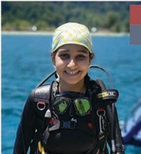

> **AI Description:**
> **Source:** `assets/_page_18_Figure_1.jpg`
> 
> **Generated:** 2026-05-22 03:33:17
> 
> ---
> 
> The image contains a photograph of a person wearing scuba diving gear, including a diving mask, a wetsuit, and a scuba tank. The individual is outdoors, with a body of water and a distant shoreline visible in the background. The person is also wearing a patterned head covering. The image captures a moment of leisure or recreational diving.

## RADHIKA BHARGAVA Current PhD candidate in Geography

Myeducational journey has taken mefrom India to the USwherelgota BS atthe University ofCincinnatiandan MSat the University of San Francisco, thento Turksand CaicosIslandswherelstudied marineecologyandfinally toSingapore.Mypersonal and professional goals ledmeto theNUs DepartmentofGeographywhichofferedmeaterrificopportunitytonot onlywidenmy skill set but also growinthe company and under the mentorshipofanextraordinary group.lamcurrentlya fourth-year PhD studentbutdue tothepandemic,l havebeenaway foralmost two years now.Alot hashappened-multiple fieldworkcancellationsexpiredand renewedfieldwork permits,suddencancellations of travelplans,evacuation fromthefield site,changesto fieldworkand research questions,expiring scholarshipsand grants,getting infected with covid-19,and losing near and dear onesto the diseaseallwhile staying in India,one of the countries that wereaffected themost due to thepandemic.Having overcomeall these difficulties,todaylstand confidentand determined for thepersonal and professional goals with which l joined the department.Building resilience to faceand planfor uncertainscenarioswaskey during this time.Thiswas only possible because of the support,motivation,training,and guidance from everyoneat NUSandmy family.lam looking forward tothecomingyearof working hard onmythesisasan NUsstudentand2021National Geographic Explorer.99

## RACHEL KOH

## (M.Soc.SciU9)

## WWF-SGoevionagerot

My jobinvolves working together with otherWWF officestoco-develop andmanageconservationprogrammesthat supportforestconservationin Southeast Asia.lalso foster partnershipswithkey conservationstaff in the WWF-Networkand with other conservation NGO partners,government agenciesand academic institutionstocoordinate programmesand stay abreastofemerging conservation prioritiesand opportunities.The cross-disciplinary nature of the NusGeographyprogrammehas equipped mewith a deep understanding of the interactions between human and natural systemsand has helpedme toachieve goodalignment in the strategiesand goalsofaconservationorgansation-balancing Humanand Nature needs.

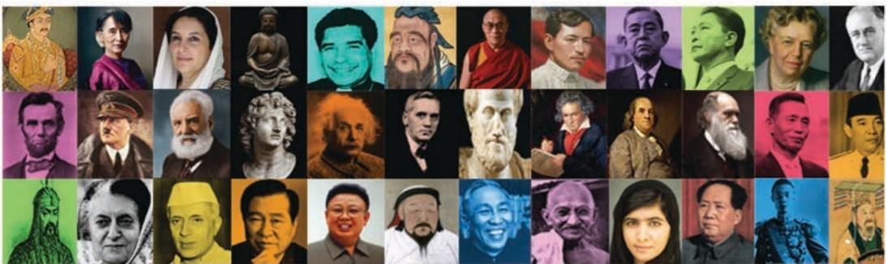

> **AI Description:**
> **Source:** `assets/_page_19_Figure_0.jpg`
> 
> **Generated:** 2026-05-22 03:32:57
> 
> ---
> 
> The image contains a collage of various historical and contemporary figures. It includes photographs and statues of prominent individuals from different cultures and time periods. The figures represent a diverse range of people, including political leaders, scientists, philosophers, and cultural icons. The image is designed to highlight the diversity of influential figures across history and different fields of expertise.

DEPARTMENT OF

# History

TheDepartment of History offers degrees by researchand dissertationatboth the MAand PhDlevels.TheDepartment isespeciallywellknown for itsconcentration in Asian history, notably Southeast and East Asian.Faculty members also supervise cutting-edge research inEuropean,American,and SouthAsian history, aswell asinsuch thematic fieldsasmilitary

Department of History   
Facultyof Arts&Social Sciences   
National Universityof Singapore   
BlkAS1,#05-27,11ArtsLink   
Singapore117573   
Tel:+6565163838   
Fax:+6567742528   
Email: hisbox1@nus.edu.sg   
fass.nus.edu.sg/hist

history,thehistory ofart,business,andsience& technology,among others.Graduates fromthe Department havesecured tenure-trackpositions inprestigious universitiesin North America, Europe,Singapore,China,andmany otherAsian countries;many Honours and MA graduates have been admitted with scholarship to top graduate schools acrossthe world.

TheDepartment of History alsooffersmaster's degreecoursework programmesintwo designated areas.Applied and Public History offersmaster's degree to those who plan to applythe appropriateuse ofhistoryto professional careers in diverse fields such asthe arts,business,government,andother sectorsof society.We seek to train candidatesto appropriately use history toanticipateand exploittrends,craft policies,make decisions,and pursue their endeavours.Asian and Global History isdesignedfor thosewho plantto study thehistory of diverse cultures and societies acrossAsiaand the world.They will also acquire in-depthknowledgeof Singaporean historyand understand the dynamic narratives that shape thenation-state'snationalidentity.

## TheDepartment offersthe following coursework programmes:

Master of Arts(Applied and Public History)

Master of Arts(Asianand Global History)

·Graduate Diploma in Appliedand Public History

·Graduate Diploma in Asian and Global History

Graduate Certificate in Appliedand Public History

Graduate Certificatein Asian and Global History

## CAO YIN

## (PHDNUste Tsinghua University,eiing,ina

Beforelcame to Singapore to pursuemy PhDdegreeinthe Department ofHistoryNus,Ihadvery limitedknowledgeofSoutheastandSouth Asianhistory.The cosmopolitan atmosphere inthedepartment (we have graduate studentsandfacultymembersfrommorethantencountrieswith research topicsranging fromancient Champa archaeology tothe twentieth century United Statespopular culture) offered mea greatchance to broaden my understanding ofculturesand historiesacrossthe globe. Thankstotheconversations,talks,and sometimes even quarrelswith these excellent colleaguesduringmy stayinthedepartment,Ihave successfully transformed myself froma narrow-minded student who knew nothing morethan his own research subject toa global scholar based in Asia.

Thedepartment also provided me bountiful grantsandfellowships tofacilitatemyfieldwork inHong KongandShanghaiaswellasmy participation in international conferencesin North America.Faculty members of the department,my supervisor and thesiscommitteemembers inparticular,werealwayshelpfulandsupportiveatevery stageofmy study.lwas,am,and willalwaysbe proud to bea memberof the history department community.

## LAU YU CHING

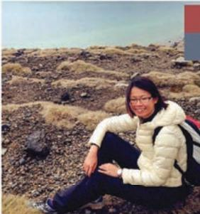

> **AI Description:**
> **Source:** `assets/_page_19_Figure_2.jpg`
> 
> **Generated:** 2026-05-22 03:32:36
> 
> ---
> 
> The image is a photograph of a person sitting outdoors on a rocky terrain. The person is wearing a white puffer jacket, dark pants, and glasses. They have a backpack with a red and blue strap visible on their back. The background consists of a flat, rocky landscape with sparse vegetation. The sky is clear with a gradient from light blue to a slightly darker hue at the horizon.

## (MA,NU)ureeeeic

Looking back,these two yearsat the NUs Department of History was whenlfeltmostfreeand creative.Thefacultymembers including my supervisorempoweredandencouragedmetoexploremydiverseacademic interestswhile ensuring that there was stillsomestructure tomy learning. Thecourseworkmodules were challenging butthey havestretched my imagination on therange of scholarshippossible.I greatlyappreciate the department'smulti-disciplinary approach to studying the past,aswe learnt howanthropology,architecture,literatureandfilmspoketohistoriography and viceversa.There werealso regular seminarswherewe gotthe chance tohearfromand interactwithworld-renowned scholars.Through tutoring inundergraduatemodulesandexperiencingthe inspiringpedagogiesfrom theprofessors,l havealso found my calling in teaching.Thecherry that reallytopped thecakewasthesupportive graduatecommunity-their diverseworldviewsand personalities broughtmuch cheer to themany late nightsspentworking on my thesis in the graduateroom.lam grateful to havehad sucharichandfulfilling time in NUs.

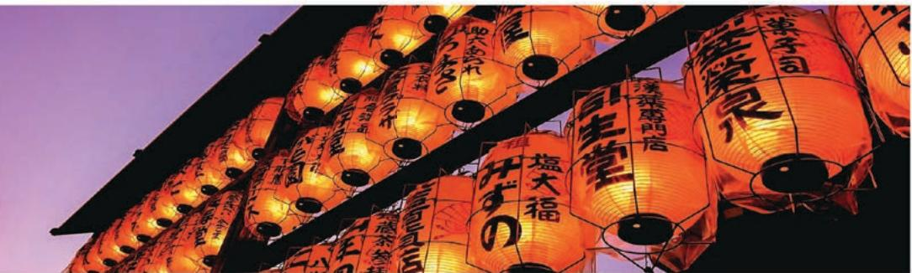

> **AI Description:**
> **Source:** `assets/_page_20_Figure_0.jpg`
> 
> **Generated:** 2026-05-22 03:34:42
> 
> ---
> 
> The image contains a series of illuminated lanterns with Japanese characters written on them. The lanterns are arranged in a diagonal pattern, creating a visually striking effect against a dark background. The warm glow of the lanterns contrasts with the cool purple hues of the sky, suggesting the image was taken during twilight or early evening. The text on the lanterns appears to be promotional or informational, possibly indicating the names of businesses or events. The overall composition evokes a sense of cultural celebration or festival atmosphere.

DEPARTMENT OF

# Japanese Studies

TheDepartment of Japanese Studies offers bothMastersand PhD programmes.Candidates have to do coursework and submit an original research dissertationtobeawarded thedegree. Facultymembersatthe Department ofJapanese Studies specialise in a wide array of disciplines and graduate students will work closely with specificprofessor(s) inthe area oftheir research. Wewant students who are well-versed in the

Department of Japanese Studies   
Facultyof Arts&Social Sciences   
National UniversityofSingapore   
BlkAS8，#05-01,10KentRidgeCrescent   
Singapore119260   
Tel:+6565167178   
Fax:+6567761409   
Email: fasbox61@nus.edu.sg   
fass.nus.edu.sg/jps

disciplineand in their understanding of Japan and thuswe expect students to also take courses inthe disciplinary departments.Students will normally spend timein Japan for fieldwork or archival studies.Being located in Singapore,we especially invite studentswho work on topics thatdeal withJapan'srelationshipwith Asia,be that ineconomics,politics orculture.

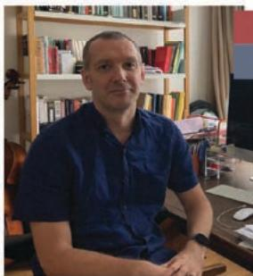

> **AI Description:**
> **Source:** `assets/_page_20_Figure_1.jpg`
> 
> **Generated:** 2026-05-22 03:35:01
> 
> ---
> 
> The image contains a photograph of a person sitting in a room with a bookshelf in the background. The person is wearing a dark blue shirt and appears to be in a casual setting, possibly a home office or study area. The bookshelf behind the person is filled with various books and items, suggesting a personal or professional space.

## ROBERT ST JOHN COULTON CRAWFORD Current PhD Student in Japanese Studies

Thereareawiderangeofcoursesavailabletohelpgraduatesbuildastrong foundationintheir chosen researcharea not only within Japanese Studiesbutacross theUniversity.The Department doesa great job of helping fellow graduatesmeetand share their research interests,issuesand providepeer feedback onacademicwork.Aboveall,Ihave been immensely impressed and gratefulfortheway the Department,and in particularmyadvisorDr.

Amos,has goneoutof itswaytoprovidesupportformystudies.Ihaveparticipatedinacademicconferences, beenprovidedopportunitiestopublishresearch,lectureandgettogripswiththeintricaciesof19thcentury writtenJapanese.IthinkitwouldbeastruggletofindmanyotherJapaneseDepartmentsacrosstheglobe that arewillingandabletoprovidethatrangeofopportunity.IfyouarepassionateaboutJapanthenlthoroughly recommend applying to NUs.Itwillbeable toprovideyouanabsolutelyworld classexperience.

## EVE LOH KAZUHARA Current PhD Student in Japanese Studies

Ifirstjoined theMA programmeat thedepartment of Japanese Studies (Js) whilstworkingfull-timeatanationalart institution.Withmy background inarthistory,lwaslookingtocomplementthiswithfurtherknowledge inarea-studies.Innotime,Ifoundmysupervisor,AssociateProfessorLim Beng Choo,whowelcomed mewarmly intothedepartmentand gotmeup tospeed inmattersof researchand coursework.Academically,there were manyopportunitiesto learn beyondmy field,throughthecoursesoffered atJSand within NUs.lalsoparticularly enjoyed theguestlectureseries,

seminarsandcultureworkshopshostedbyJS.Weareaclose-knitcommunityofgraduatestudentsandprofessors whoprovidemuchcamaraderieandintellctualengagement.Itwasajugglingactwiththestudiesworkingfulltime(andbeingamumtoanewbornbaby!)butlwouldnothavesucceededwithoutthetremendoussupport andunderstandingofthefaculty.MyexperienceherewassopositivethatIwasinspiredtocontinueontoaPhD programme.lamincrediblyluckytohavebeenofferedafullscholarshipandwasabletocustomisemy graduate educationthroughdepartmentandfacultyresources.Additionally,theexpertiseofanimpresivethesisadvisory committeehereatNUS hasguidedmetothinkcriticallyaboutmyresearchinabroaderJapaneseand East Asian context.lam excited to advance to the next stage inmy candidature.

## SATOSHI INUZUKA Current PhD Student in Japanese Studies

Having just completedmy first yearasa PhDcandidatein the Department ofJapanese Studies,Ifeel thattheDepartmentandtheUniversityhave provided me with the best experience thatlcan think of to growasa scholarandateacher.Housed ina brand-newglassed-inbuildingadjacent tothelibrary,theDepartmentofJapaneseStudieshas verysupportive administrative staf,incrediblycaring facultyand encouraging fellow graduatestudents.Therelative smallnessof theJapanese Studies (Js) community allowsfor close interactions.Every JS graduatestudent is

expectedtoattendaweeklygraduatestudentseminar，wherewe,through exchangingfeedback,refineour paperstowardanannual JSgraduate students conferenceattheacademic year-end.Therich opportunitiesto workwithfirstratescholarsforwritingthesis,fortutorialandwhiletakingmodules,werepreciousandthat, aboveall,mademegrowasascholar themost.MysupervisorDr.HendrikMeyer-Ohle,whilegrantingfreedom formyacademicpursuit,givesmeinvaluableadviceand guidancewheneverlneededit.Besidestheseexperiences asascholarlhadpreciousexperiencetoserveasatutorforthedepartment.Being thebestuniversityinAsia NUSattractsadiversebodyofimpressivestudents.Itwassuchaprivilegetoteachfortheintelligent,upright, andsurprisinglyhard-workingstudentswhodidinspiremetostudyharder.Theuniversity'sannualtutortraining sessionand the semester-end student feedback schemeare also helpfulfor makingadjustments.9

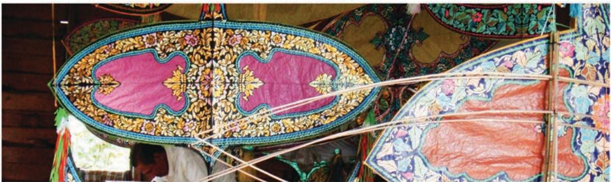

> **AI Description:**
> **Source:** `assets/_page_21_Figure_0.jpg`
> 
> **Generated:** 2026-05-22 03:37:16
> 
> ---
> 
> The image contains a photograph of a traditional kite with intricate patterns and vibrant colors. The kite features symmetrical designs with floral motifs and geometric shapes in shades of pink, blue, and gold. The kite is displayed indoors, possibly in a museum or exhibition setting, as suggested by the wooden structure and other decorative items in the background. The kite's craftsmanship and detailed artwork suggest it may be a cultural or historical artifact.

DEPARTMENT OF

# Malay Studies

Department of Malay Studies   
Faculty of Arts&Social Sciences   
National University ofSingapore   
BlkAS8,Level6,10KentRidgeCrescent   
Singapore119260   
Tel:+6565164640   
Fax:+6567776608   
Email:fasbox58@nus.edu.sg   
fass.nus.edu.sg/mls

TheDepartmentrunsa Graduate Programme forMasters byresearch and PhD Graduate courses that cover theoretical frameworksas wellas more in-depth examination of specific issuespertainingto Malaysand Malay societies. These modules expose students to ideasand perspectives which they canapply inthe course oftheir independent research.The Department welcomes studentswitha good honoursdegree inMalay Studies or other relevant disciplines suchas Historyolitical ience,ociology,oial Work,Linguistics,Literature and Southeast AsianStudies.Since a good working knowledge ofMalay isrequired inorderto conduct research onthe Malays,studentswill be required to take aMalay/lndonesian languagecourse if theyhave notdone so.This could be done either beforeor during the course of their research.

FromLiteratureand Arttostudying theeliteand intellectualsinMalay society,understanding the changeofmodernisationfacedbyMalaysaswell asexamining thedevelopment ofcapitalismand Malay cultureare some of the key areas of this programme.Aforum isalsomadeavailablefor students to sharetheir research and toengage oneanother in discussion of their research projects.

66 BeingaMalay Studies graduatestudent has beenanimmensely fulfilling experience.Frombeingpushed to think outsidethebox,toconstantly reminding me to question myassumptions,the guidance and academic tutorshiplhavereceivedattheDepartment isunparalleled.Nomatter howtough the topic of choice,be it for anessay ora thesis,the professors haveneverdiscouragedmeortriedtodivertmyattentiontowardseasier ormorefamiliarpaths.Instead,they haveencouragedmetotranscend thelimits of my boundariesand toconstantly strive for excellence beyond whatisexpected ofme.MytimeatMalayStudieswasalso enriched dueto thediversity of topics explored and theways in which were continuously exhorted tothinkabouttheapplicability of thediscussionsbeyond the classroomsetting.Thefieldtripsand studytrips conducted bythepassionate professorsalsoallowedme to explore the knowledge learnt inawiderand morerelevant context.

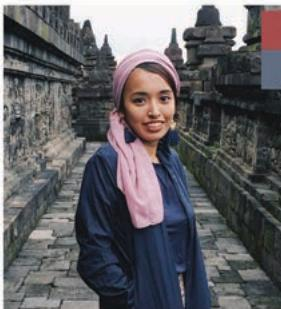

> **AI Description:**
> **Source:** `assets/_page_21_Figure_2.jpg`
> 
> **Generated:** 2026-05-22 03:36:34
> 
> ---
> 
> The image is a photograph of a person standing in front of a historical stone structure, likely a temple or monument, with intricate carvings. The individual is wearing a dark jacket and a light pink scarf. The background features a series of stone steps and arches, suggesting the location is an ancient or culturally significant site. The image captures the person in a casual pose, possibly during a visit to the site.

## MYSARA BINTEMOHAMAD ALJARU Current Masters studentin Malay Studies

Priortopursuingmy Masters,lwasacurrentafairsjournalistand producer working on local stories.l knewlwanted tojoinafaculty that studies thehistorical and lived socioeconomicrealities of the Malay community criticallyso MalayStudieswasan obviouschoice.It hasalso allowed me to questionmy own understanding of issuesand to relookandunderstand them inamorecritical manner,whichlcan thenapply inmy workwhether it'sacademia,journalismorfilms.

The professorsare encouragingand often push me to achieve more than whatlthoughtlcould.They havealsoalwaysbeen friendlyand opento conversationsand thought-provoking discussions.Whilemoving from journalismto social sciencesmight havebeenabig jump,theMalay Studies Department hasalwaysmademefeel rightat homeand itwasdefinitely theright choice forme.

## SYED MUHAMMAD HAFIZ BIN SYED NASIR Current PhD student in Malay Studies

Having worked in theartsand museum industry for the past 10 years, coming to NUStopursuemy PhDwasa welcomerespite inmy professional development.TheMalay Studies Department hasbeen very supportiveof myintellectualpursuitsand crucialin further enhancing my understanding ofcultural issueswithintheMalay World.I lookforwardtomore productive engagement with thedepartmentand hope thatlcan contribute tothe largeracademicenvironment in NUS.

> **AI Description:**
> **Source:** `assets/_page_22_Figure_0.jpg`
> 
> **Generated:** 2026-05-22 03:32:14
> 
> ---
> 
> The image is a painting depicting a scene of philosophers and scholars engaged in discussion and study. The setting appears to be an ancient Greek or Roman library or school, with columns and statues in the background. The figures are dressed in classical attire, and some are seated at tables with scrolls and tablets, suggesting they are engaged in scholarly activities. The painting is rich in detail, with multiple figures interacting and contributing to the intellectual atmosphere of the scene.

DEPARTMENT OF

# Philosophy

TheDepartment of Philosophy at NUS isone ofthevery fewdepartmentsin the world that offersspecialisation at the graduate level in fourindependent traditions of philosophical research:Anglo-American (Analytic) Philosophy, Continental (European)Philosophy,Chinese Philosophy,and Indian Philosophy.Ourrecent graduate students have completed thesesina diverse array of topics cutting across the East-Westdivide,ranging froma Confucianapproach tothe tragedy of the commons to the political implications of Kantian ethics and to David

Department of Philosophy   
Facultyof Arts&Social Sciences   
National Universityof Singapore   
BlkAS3,Level5,3ArtsLink   
Singapore117570   
Tel:+6565163891   
Fax:+6567779514   
Email: philsjm@nus.edu.sg   
fass.nus.edu.sg/philo

Lewis'modal realism.Though the faculty's research and teaching interests coverawide variety of topics,the Department hasparticular strengthsin normative philosophy (both ethics and political philosophy),classical Confucianism, philosophyof language,epistemology，mind, andphilosophy of science andtechnology. Ourstudents hail from different regionsof the world,thusmaking the Department especially attractive to those students who would like to studyin Asia inacosmopolitanenvironment.

## GABRIELELEONIEESCOFFIER

## CurrentPhdent,eptmtofoohy,

NUSdynamicandmulticultural background isa fantasticresearch environment.Asastudent inChinese Philosophy,lcanspecialize inmy fieldwhilemeeting constant opportunitiesto broadenand enrichmy philosophical interests.

## DARYL OOI SHEN

## Currenttrsdet,tmtofoy,

Readingphilosophy allowed me to thinkmoredeeply about questionsl think many ofus have had since we were young-what is the nature of rightand wrong,what is themeaning of life,how dolknowwhetherwhat Ibelieve is true.

## LOO WEI ING,JANE

## （MA,NU5)ty

Myprofessorsmadeallthedifference tostudying Philosophy.Theyinstilled inmealove forthesubject andadesireto keep learning.They werealways availableforachat,beitaboutcoursework,applyingtograduateschool,or getting published ina journal.

> **AI Description:**
> **Source:** `assets/_page_23_Figure_0.jpg`
> 
> **Generated:** 2026-05-22 03:31:23
> 
> ---
> 
> The image contains a collection of flags from various countries, displayed on flagpoles against a clear blue sky. The flags are arranged in a horizontal row, each representing a different nation. The flags feature a variety of colors and designs, including red, blue, green, yellow, and white, as well as different patterns and symbols. The image is a photograph and does not contain any text or additional visual elements beyond the flags themselves.

DEPARTMENT OF

# Political Science

TheDepartment of Political Science isrecognised globally forthe qualityof its faculty.Students benefit from working closely with such a large and growing pool of faculty members who are internationally prominent researchersaswell as committed teachers.

Ourgraduate modules stress theoretical and conceptual analyses,provide practical research skills，and allowdiversemethodological choices.Studentsare encouraged to adopt amultidisciplinary approach and think how

Department of Political Science   
Faculty of Arts&Social Sciences   
National University of Singapore   
BlkAS1,#04-10,11ArtsLink   
Singapore117573   
Tel:+65 65166067   
Fax:+6567796185   
Email: polbox1@nus.edu.sg   
fass.nus.edu.sg/pol

politicsconnectstosociety,theeconomy,cuture, religion,morality,and otheraspirations.

TheDepartmentisparticularlystronginthestudy ofAsian politics,governance and international relations with specific focus on China and SoutheastAsia.However,thecurriculum covers many other subjects suchasdemocratic theory, political economy，publicpolicyinternational security,state-societyrelations,political thought (Westernand Eastern),anddevelopment studies.

Itofferscomprehensiveeducationand systematictraining in fourareas or subfields-Comparative Politics,International Relations,Governance&PublicPolicy,andPolitical Theory.

1.ComparativePolitics deals with thepolitical systems within individual countriesas well as crossnational comparisons.Comparativists seek to understand howthedomesticpolitical systemsand institutionswork in specificcountries,including Singapore.Modulesare focused on themajor worldregions or specificthemes that arerelevant acrossmultiple contexts.

2.International Relations is the study of political and diplomatic relationships among countries.In dealing with issues related to the governing of theglobal order of nation-states,thesubfield coversthemessuchasconflict,security,diplomacy,internationaleconomy,internatioal organisations,and globalisation and thestate.

3.Governance&Public Policy represents theapplied domains of state politics,policyand administration.Itdealswith institutionsandactivities involved inpublicbureaucracy, government organisations,and publicpolicy.While focused specifically on Asian regions or countries(including Singapore),the subfield highlights the significance of interregional and cross-national comparison.

4. Political Theory coversmajor thinkersand texts ofmajor philosophical traditions;political ideologiesand their comparison;and constitutional practicesand debates.Italso deals with the dissemination of political ideas throughpersuasion;theembeddednessof politicsincultural means(artsandmusic);and the implications of political and normative aspirations suchas human rightsperspectives.

## GEORGE EDWARD MAY Current PhD student in Political Science

TheNUsPolitical Sciencedepartment hasprovided an intellectually nourishing environment in which l have grown more confident and competentasaresearcherandteacher.Theacademicstaff inPolitical Scienceand across FASs have drivenme toread,think,critique,andwrite morebroadlyanddeeplythanlhaveelsewhere.Coursework moduleshave introduced me to aspects of social sciencelwould not have encountered hadlremained intheUK,aswell asadeeper understandingof how myinterests-which originate in IR-relate to other sub-disciplinesin Political Science.AsagatewaytoSoutheastAsia,NUS hasprovided the idealbase from which toundertakeextended fieldwork in theregion. Theopportunitiesthedepartment have provided for teaching-and the inspiring studentsl have had thechance to work with-have been truly enriching,professionallyand personally.Lastbut not least,mypeers in FASShavebeenavital sourceof inspiration,motivation,andcomradery through tougher times.

## MARYANN JOY QUIRAPASFRANCO Researchllow,ergydeste

Foryears,lworked asa policy practitionerand researcher.MyPhD experienceat NUs has givenmefurther skilsandknowledge to conduct betterresearch.Themodulesstressed the importanceof theoretical foundationsand methodological rigour beforeanypractical applications of political science concepts.The programalso gives me the opportunities toexpandmy professional network through summer schools,overseas workshops,and field research tripsthat arealways helpfulin buildinga successful careerafterobtaininga PhD.Finally，whatlreally valuemost withthe whole experience isthe peoplelmeet during programme-the faculty,fellow graduatestudentsandadministrativestaff.Themeaningful discussionsand lasting friendships withthemmake the PhD programmore fruitful andmemorable.

# DEPARTMENT OF Psychology

Department of Psychology   
Facultyof Arts&Social Sciences   
National UniversityofSingapore   
BlkAS4,#02-07,9ArtsLink   
Singapore117570   
Tel:+6565163749   
Email:psybox2@nus.edu.sg (Research Programmes)   
Email:psybox6@nus.edu.sg(Clinical Programmes)   
fass.nus.edu.sg/psy

TheDepartment of Psychology oferstwo research graduateprogrammesandaclinical graduate programme.

## Research Graduate Programmes

TheDepartment'stwo research programmes comprise specialisationsin sixmajorpsychological disciplines:

1.Clinical Scienceand Health Psychology

2.Cognition

3.Developmental Psychology

5.Social and Cognitive Neuroscience

4.Quantitative Psychology

Trainingin these specialisations comprises coursework and a research thesis conducted under the guidance of an academic supervisor. Degreesare offered at the Masters and PhD levels.Scholarshipsand other forms of financial supportareavailableonacompetitivebasis.The Department hasalso introduced a Concurrent Degree Programme [B.Soc.Sci.(Hons.)andM.Soc. Sci.]which enables psychology majors to make aseamless transition from the undergraduate programme to the graduate programme,and earnboth an honours degree and a Master's degree in five years.

OurDepartment'scoreresearchareas

6. Social,Poitydl Organisational Psychology

largelyoverlapwith the areasof graduate specialisation.Across these specialisations,we have several areas of strength,two ofwhich areasfollows.First,anumber of our staffare studying language and speech.Apart from accessto special populations such as children orindividualswith languageimpairments,the multilingual context of Singapore makes this workparticularlyattractive.Emotion research formsa second area of strength.Here,our staff are exploring the relationships between emotionsand mental orphysical health,therole ofemotions in social interactions and decision makingaswellastheneuronal processesthat mediate emotional experiences.These,and otherresearchareas,leverageona supportive research infrastructure that enablesaccess to state-of-the-arttechnology and equipment forpsychophysiological measurement(e.g. electroencephalography,heartratemonitoring), eye-tracking,andfunctionalmagneticresonance imaging.Our Department also housesa suiteof

## Clinical GraduateProgramme

OurDepartment offersagraduate degree programme in Clinical Psychology.The two-year programmeconsists ofacombinationof coursework,research and practical placement experience.Completion ofrequirementsis recognised witha Master of Psychology(Clinical) Degree.The programme isbased onthe scientist-practitionermodel and buildsonthe theoretical knowledgeand core competencies forclinical practice.It provides entry-level training for students who seeka professional careerin Clinical Psychology.The programme has itsannual intake in August.

Applicantscanapply for thescholarships listed below:

·MOH Holdings(MOHH) Healthcare Graduate StudiesAward

NCSS Social Service Scholarship

·NUS-Mental Health Counselling Scholarship

NUS HealthandWell-BeingScholarship

\*Kindly note for NUs scholarshipsonly applicants who had secured aplacein the programme will beeligible to apply. Applicants may also check with their respective organisation dedicatedlabsandcommonspaceforbehavioural observation and psychological testing.Staff research projects and collaborationsinvolve otherresearch institutes within and outside Singapore,including the Duke/NUs Graduate Medical School,the Institute of Mental Health, andA\*Star.

TheClinical and Health Psychology Centre (CHPC)providesanarrayofspecialised psychology services to the public.It is the training clinic for the NUsMasterof Psychology (Clinical) programme.Thus,the Centre isstaffed byclinical psychology interns who are under the supervision ofmaster/ doctoral-level clinical psychologists.Theexternal clinical training sites include thehospitals,communityservices, ministries,and private practices.Across the placements,students will gaina broad range of skills to work with children and adults.

Studentsare required to undertakeresearch as partofprogrammerequirements.Thereare usuallyseveral researchprojectsthatareoffered bytheclinical and non-clinical faculty as wellas external supervisors.Our clinical facultystaff haveawide range of interests spanning from Obsessive Compulsive Disorder, Body DysmorphicDisorder,Emotional Regulationand Parenting, SchizophreniatoIntellectual Disability.

## WEWALAARACHCHITHILANGA DILUM

## (PhD,NU9)odoctoalllowetmtofogyU

Withthe scholasticresources offered bythe PhD Psychology programme inNUs,lwas able topursuemy research passion indevelopmental psycholinguistics.Myresearch interests lieintheareaof lexical toneand bilingual languageacquisition,whichmade Singapore the perfect place todothisresearch.lamparticularly grateful tothestrong emphasis and importance given toresearch excellence in NUs,which hasbeen instrumental inmy growth asascholar.

cont'd

## WANG YUSHI

## (MA,NUs, 2019) Teaching Assistant,Department of Psychology, NUs

66 Being part of the Concurrent Degree Programme was a very fulfilling and enriching experience.The academic rigor of the program facilitated my intellectual growth,and also rendered me with greater confidence at being prepared to join the workforce.One of the greatest highlights of my time in the programme was being able to present findings from my integrated thesis ata conference in Paris-a destination on my bucket list! 99

## WONG TAK WEE CHRIS

## (M.Psych (Clinical), NUs, 2016) Clinical Psychologist, Community Psychology Hub Singapore

The two years in the programme had been a wonderful journey of personal and professional growth.Lasting friendships and memories were forged, and a robust training in the scientist-practitioner approach has equipped me with the knowledge, skills,and experience necessary to continue developing as a clinical psychologist.

## TAN SZE YING CHRISTIE

(M.Psych (Clinical), NUs, 2016) Clinical Psychologist, Psychological Services Unit, AMKFSC Community Services Ltd. Singapore

66 The "trials and tribulations"of the programme helped me develop a strong foundation in my clinical and research skills.Additionally, there were many wonderful memories created together with the rest of my cohort mates,which were invaluable in my personal growth. 2

# WHAT OUR STUDENTS SAY

## LAVANYA BALACHANDRAN

Graduated in 2017 with a PhD in Sociology

We have an excellent Singaporean and foreign faculty who are not only prolific academics in their own right but are also wellversed in the local

context. FASs,NUS scores highly in terms of global ranking.My prior engagement with the faculty members in the Department of Sociology,and in particular my thesis supervisor, assured me that my graduate training would be nothing short of comprehensive and one that would include an appreciation of Singapore as a subject of sociological inquiry given that my research field is also located here. FASs, NUS offers a competitive stipend. There are also several opportunities for graduate students to come together to form reading groups,to organise workshops and seminars all of which provide an enriching learning experience.

The Faculty of Arts and Social Sciences at NUS has been a great place to study. As part of my PhD research,Iwasable to be part of other research projects, to teach things I'm passionate about and to go on field trips to Indonesia, which was a fundamental part of my research project. I was very happy to be able to talk to researchers from other fields and attend talks by experts from many

different places.I also had access to great resources at the library. Overall,it was the perfect place to conduct research,share it with others and get feedback.

> **AI Description:**
> **Source:** `assets/_page_26_Figure_0.jpg`
> 
> **Generated:** 2026-05-22 03:37:24
> 
> ---
> 
> The image contains a series of paper cutouts of children holding hands in a line. The cutouts are colorful and appear to be made from different types of paper, each with a unique pattern or texture. The children are arranged in a sequence, with the focus on the front row, and the background is blurred, emphasizing the children in the foreground. The image conveys a sense of unity and community.

# Social Work

SocialWork asa subject in the University firststarted in 1952,whenit offered the firstprofessional social work qualificationin Singapore,the two-yearGraduate Diplomain Social Work.Since then,it has evolvedwith the changing times,circumstancesand requirements ofthe country into its present form.

Atthe graduate level,the Mastersand PhD degreesoffergraduate students,depending on the course theyare enrolled in,arange ofmodules foradvanced direct and indirect

Department of Social Work   
Facultyof Arts&Social Sciences   
National Universityof Singapore   
BlkAS3,Level4,3ArtsLink   
Singapore117570   
Tel:+6565164472   
FaX:+6567781213   
Email:swkbox1@nus.edu.sg (Research)   
Email:swkbox3@nus.edu.sg(Coursework)   
fass.nus.edu.sg/swk

social work practice that includes clinical social work intervention with specific client groups, policyanalysisand social planning,agency managementandprogrammedevelopment, socialworkresearchandprogrammeevaluation. TheMaster of Social Work programmeaims to produce the leaders of social work profession indirect practice,social policyand research, and social administration and development.In addition,the GraduateDiploma in Social Work enables non-social work degree graduatesto pursue professional social work education.

## Core Research Areas

·Ageing

Community and Social Development

End-of-lifeandPalliativeCare

·Family and Community

Research in the Department of Social Workis integrated with our practice and teaching of social work.Many of our research projectsare collaborations with local community partners andinternational researchers.The projects analyse trends on issuesof societal concern, andevaluatepolicies,programmes and direct

Offender Rehabilitation

·ProgrammeDevelopmentand Evaluation

Social Work Practice

practice for populationsin need with a focus onenhancing social work theory,practice skills, critical thinking and policy contribution in the social services.Research also provides hands-on learning to students who are engaged in the projects

## ANG CHAI YUN RACHEL (M.Soc. Department of Social Work,NUs

Oneday,whileinaclassabout social theory insocial work,Ilookedoutof ourseminarroom windowand sawthatthe theories provided windows from whichto look at thecurrent landscapeof social work practice.This, istheethos of the Social Work educationat the National University of Singapore (NUs)-amarriage ofacademic rigourand practicerelevance. Havingreceivedmy Bachelorof Social Sciences(Hons)inSocial Workfrom theSocial Work DepartmentatNUS in 2010and nowpursuingmyMasterof SocialWork (byresearch)inthesamedepartment,thedepartmentislikemy

secondhome.lhavebenefittedfromthementorshipofmanyrenownedSocial Workeducators,bothprofesionally andpersonally.Asafulltimemaster'sstudentandgraduateteachingfellow,lamgratefulfortheexposureto academiclifeandthevariousopportunitiestodeepenmyresearchknowledgeandskilssuchasconductingmy research project throughtheindependentstudymoduleand participating inthebrownbagresearch seminars conductedbythedepartment.Theseexperiences haveignitedmyintelectualcuriosityamplifiedmycritical thinking,andnourishedmetobeamoreindependentresearcher.Theteaching experiencehasbeenimmensely gratifyingandenriching.Gratifyingbecauselgettosharemyknowledgeandexperiencetothenextpotential generationofsocialworkers;enrichingbecauseoften,llearnfromthemasmuchaslteach.Overall,Istrongly believethattheexemplaryworldclasseducationlamreceiving，willallowmetocontributeandvalueadd toany path that lwill pursue.9

## MICHELLE SHANTHINI GUNASILAN Masters student in Social Work

Theopportunityto undertake theMasterof SocialWorkprogrammeat NUShasbeenanexperiencethatlamgratefulfor.Themodulesthatlhave undertaken haveallowed me to deepen my clinical skillswhile providing mewithopportunities to enlargemy viewsabout social work leadership andmanagement.Throughvariousmodalities,thelecturerscreated learning environmentsthat supported livelydiscussions,promoted critical analysisand creativewaysofaddressing social issues.Ihavealso enjoyed theopportunitiesto learn frommyclassmates from differentprofessional

fieldswhocontributed towardsachalengingyetnurturing learningjourney.Thisprogrammehasenrichedmy professionaldevelopmentandhasequippedmewithknowledgeandskilsthatIhopecanvalueaddtothesocial work sector.

## NG SIANG KIAT

## Current PhD student in Social Work

ThePhD journey is hardgoing.lhad to constantly jugglemy PhD studies withbeinga stay-at-homemumto three school-going children,active involvement inchurchand counselling inmy private practice.Taking up this endeavour isnothing shortof calling.So when purpose transcends present circumstances,it helpsme look beyond challengesto find meaning inthe research topic,infieldwork experience with participantsand fulfilment in beingavoicefor themarginalised intheworld of social workpracticeand research.

> **AI Description:**
> **Source:** `assets/_page_27_Figure_0.jpg`
> 
> **Generated:** 2026-05-22 03:34:32
> 
> ---
> 
> The image is a photograph of a large crowd of people gathered together. The perspective is from above, showing a top-down view of the crowd. The individuals are densely packed, and the image captures a sense of a large public gathering or event. There are no visible labels, text, or other annotations within the image. The focus is entirely on the visual representation of the crowd.

DEPARTMENT OF

# Sociology

TheDepartment of Sociology at NUs has been ranked first in Asia,and among the top20 in theworld (Qs World University Rankings for Sociology).With over30 staff members,we arealso one of the largest departmentsin theFASSat NUs.From itsearliest beginnings, ourDepartment has combined the disciplines

Department of Sociology   
Faculty of Arts&Social Sciences   
National Universityof Singapore   
BlkAS1,#03-06,11ArtsLink   
Singapore117570   
Tel:+6565163822   
Fax:+6567779579   
Email: socbox1@nus.edu.sg   
fass.nus.edu.sg

ofSociology and Anthropology.Students thereforebenefitfrom learningawiderange oftheoretical and methodological approaches within both disciplines.Teaching and research inthe sociology and anthropology of Asiais one of our major strengths.

## Thedepartment offersthree research programmes:

## 1.Master ofSocial Sciences in Sociology

## 3.Doctorof Philosophy in Anthropology

TheDeparment'sresearchand teaching interests arewide-ranging.While many of our staff specialisein research on Singapore society and culture,anumberarealsoengagedin comparative research on other Asian countries, including China,HongKong,India,Indonesia Korea，Malaysia，Myanmar，SriLanka,Taiwan, Thailand,and Vietnam.Ourmainresearchareas

## 2.Doctor of Philosophy in Sociology

include:deploying diverse research methods suchas ethnography,focus group interviewsand statistical analyses of survey.Ourmain research areasinclude:ageing,demograhy,familyand kinship,genderand sexuality,health,mediaand popular culture,migration,politicsand power, raceand ethnicity,social networks,and urbanism.

TheDepartmentofSociologyservesasanexcellentbasetodeepenone'sknowledgeaboutthediscipline.Highly integratedintoadynamicandfast-growingregion,andfueledbyfacultyandgraduatestudentsfromaroundthe world,NUsisanintelectualhotspotthatinspiresnewwaysofthinkingaboutoursociety.Assomeonewhostudies SoutheastAsia,theabilitytotravelthroughouttheregionandengagewithlocaly-basedscholarsmadestudying andworkinginSingaporeideal.ButmoreimportantlyassomeonewhowasbornandeducatedintheUnited StatesstudyinginSingaporehasshiftedmyworldviewandhastrainedmetoseeissuesfromacompletely different,moreglobalperspective.IhighlyencouragethoseinterestedinchalengingthemselvestopursueaPhD in ourdepartment.9

## HU SHU

Head,ologyge olofHumantiesandBehaviouralSciences Singapore University of Social Sciences

Ijoined the Department of Sociologyat NUSasa PhD student in 2010. Thesefiveyearshavebeen fulfillingandmemorableforme.The scholarship,fieldwork funding,and conference funding have enabled me toconcentrate on studying and researching and toattend international conferencesandtrainingprogramme.TheNUsCentral Libraryhasa fantastic colection of books and arich subscription to electronic journals, databases,andother resources,whichhasbeenextremelyhelpful to mycourseworkand research.lhavealso learnta lotfrom the seminars, talks,and conferences organised bytheDepartmentof Sociology,Asia Research Institute,Centrefor Familyand Population Research,andother departmentsandresearch institutes of NUs.Daily interactionswith myfellow graduatestudents of various national,ethnic,religious,and cultural originshave broadened my horizons.Someof them have become my closest friendsand the time we spent togetherareand shallremainmy fondest memories of NUs graduate student life.

## CHONG WULING

## (PhD,NU4)eireureUveityfaia

66 Iamgratefultothe NUsfor offeringmea Research Scholarshipto pursue myPhDstudy in Sociology.llearned howto conductresearch effectively and writeagood thesis,thanks to the guidance of my supervisorand otherlecturersintheNUswhowereknowledgeableand helpful.Ihad alsobenefiteda lotfrom therich collectionof theNUsLibrary.Overall, Igaineda lotof invaluableexperience that isessential tomy academic careerthroughout the period ofmy study in the NUs.

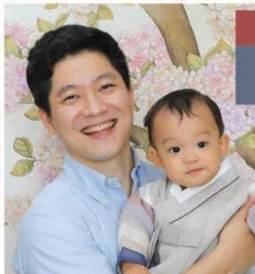

> **AI Description:**
> **Source:** `assets/_page_27_Figure_3.jpg`
> 
> **Generated:** 2026-05-22 03:33:55
> 
> ---
> 
> The image contains a photograph of a man holding a baby. The man is smiling and appears to be in a casual setting, possibly a home or a studio. The baby is also smiling and is dressed in light-colored clothing. The background features a decorative wall with floral patterns and what appears to be a framed picture or artwork. The image captures a warm and happy moment between the man and the baby.

## Pildoo Sung

## (PhD,Nus)echlowtreoeng and Education,Duke-NUs Medical School

ljoinedtheDepartmentofSociologyin2015.Firstofal,myPhDjourney would not have been possible without the research scholarship from the National Universityof Singapore.Duringtheprogramme,Ihavelearnt in-depthknowledgeand skillsfrom introductoryand advanced modules fromsociology,aswellasfromthe teaching assistant experience.The interdisciplinarycoursesofferedbyotherdepartments(psychology, business,communicationand newmedia,and economics),and seminars organised bydepartmentand Centrefor Familyand Population Research broadened my intellectual capacity.Also,theconference fundingallowed metoattend an international conferencein Toronto.Lastand foremost, guidancefrommysupervisorand dissertation committeemembershas beenaninvaluableassetformy academiccareer.

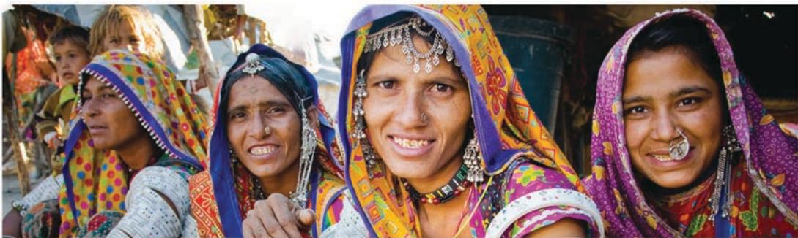

> **AI Description:**
> **Source:** `assets/_page_28_Figure_0.jpg`
> 
> **Generated:** 2026-05-22 03:32:46
> 
> ---
> 
> The image is a photograph featuring four women dressed in traditional attire, likely from a cultural or ethnic group. They are wearing colorful headscarves and intricate jewelry, including nose rings and necklaces. The women are smiling and appear to be in a social or communal setting, possibly at a festival or gathering. The background includes other people and what seems to be a tent-like structure, suggesting an outdoor event. The image captures a moment of cultural celebration and community.

# South Asian Studies

PROGRAMME

TheSouth Asian StudiesProgramme(SAsP)atthe NUSoffersdegrees byresearchand dissertation atboththe MA and PhD levels.The scope for research is extensive and the interests and backgrounds of the supervising teaching staff arewide-ranging and eclectic.Fluency in English isessential,asall thesesmust be presentedin thatlanguage,butthe Programme encourages and supportsthe use of researchmaterialswhich drawsupon South Asian languages.

TheProgramme hasa particular focus on topics whichrelate to contemporary South Asia.The academic staff includes specialistsworking inthedisciplines of Contemporary History Political Economy and Development,Religious Studiesand Anthropology and Diaspora and Trans-national Studies.An idea of the scope oftheProgramme'srangeofinterestsmaybe

South Asian Studies Programme   
Facultyof Arts&Social Sciences   
National UniversityofSingapore   
BlockAS8,Level6,10KentRidgeCrescent   
Singapore119260   
Tel:+6565164640   
Fax:+6567776608   
Email:fasbox58@nus.edu.sg   
fass.nus.edu.sg/sas

gained fromitslistoffacultymembersand their specialities.The cohort of studentsin SASPis highly cosmopolitanand studentshave come topursue graduate studies from South Korea, China,Pakistan,Sri Lanka,the Philippines, Bangladesh,Germany，Italy,the USAand India. Graduatealumniof the NUs South Asian Studies Programmehave foundrewardingcareer opportunities in university teaching,themedia, thecivil service,policy think-tanks,consulting andindependentresearchand writing.

TheUniversity's Central Library has extensive holdings on South Asia.There isalsoa significant collection of digital and microfilm holdings,in addition toa significant collection of secondary materials which include printed booksand journals.

Funding opportunitiesareavailable,thoughbya highlycompetitiveselectionprocess.

## PRISCILLA ANN VINCENT

(MA,NU New Delhi,India

66 Thecourses you will doatthe South Asian Studies Programme willexcite you.Themoduleswillinformyouofthedynamism,paradoxes,mysteries, uniquenessand challenges within theregion.Iwas so inspired by the Programme thatIreturnedtodomyMasterswith them.Theknowledge andexposure gained,hasallowed thisSingaporean towork well withboth theprivatesectorand Government in India.The bestpart isthe long lasting friendshipsthatI haveformed withfellowstudentsandprofessorsatthe Programme.Westillkeepin touch,sharing ouradventuresand explorations from time totime!

SOJIN SHIN

AssistantProeositeeatey Tokyo International University

Thefive years of my learning in South Asian Studies were intensiveand extensive.lnotonlytrainedrigorouslywithapoliticalscientistformy doctoral research,butalso travelled to variousacademicsubjects in the differingregionsof South Asiawith historians,anthropologists,and sociologists.TheSouth Asian Studiesat NUswould bea good placewhere onecan advanceamultidisciplinaryapproach with great supportand encouragementfrom seniorfacultymembershaving excellentacademic backgrounds.South Asian Studiesat NUSwasaworthy challenge formeto change thesubstantial level of understanding politics,society,development, andcultureinSouthAsia.lamveryproudtobean Indiaspecialist through the training. 99

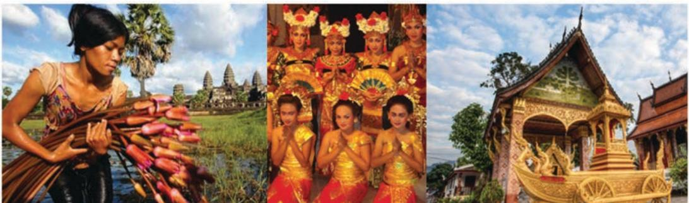

> **AI Description:**
> **Source:** `assets/_page_29_Figure_0.jpg`
> 
> **Generated:** 2026-05-22 03:33:10
> 
> ---
> 
> The image contains three distinct photographs. The first photograph on the left shows a person in traditional attire holding a bundle of reeds, with a temple in the background. The middle photograph features a group of individuals dressed in vibrant, ceremonial attire, performing a traditional dance. The third photograph on the right depicts a beautifully ornate temple structure with intricate details and golden decorations. These images collectively showcase cultural and historical elements from different regions.

DEPARTMENT OF

# Southeast Asian Studies

TheMastersof Arts(MA)and Doctor of Philosophy (PhD)research programme provide postgraduate training for individuals who will contribute to knowledge production in and about Southeast Asia.Studentswillbe taughtby highlyrated staff whoseexpertise lies in fieldsrangingfrom history, economicsand political science toanthropology, cultural studies and archaeology. Our inter-disciplinary structure exposesstudentstothe latesttheoretical and methodological issueswhile also ensuring deepimmersion inregional specificities.Graduatesare prepared foracademic careers and employment in research intensive professions with working knowledge of Southeast Asian languages

Department of Southeast Asian Studies   
Facultyof Arts&Social Sciences   
National University ofSingapore   
BlkAS8,Level6,10KentRidgeCrescent   
Singapore 117569   
Tel:+6565164640   
Fax:+6567776608   
Email:fasbox58@nus.edu.sg   
fass.nus.edu.sg/sea

## SOLDOROTEA ROSALESIGLESIAS(PhD,UJUULLabs,ingaore

Withprior training inpoliticalscienceatthe graduatelevel,pursuing mydoctorate in Southeast Asian studies opened newvistas into thinking aboutmymainsubject (the Philippines)comparatively.Imean thisboth interms of comparisonswithintheregionaswellasthrough insights fromother disciplines such as sociology,anthropology and history.lhave greatlybenefitedfromthedifferentkindsofexpertisethatourFaculty hasto offer,aswellastheconsiderabletimeandthoughtful effortthat theyput into guiding our research.Moreover,Singapore isan ideal base fromwhich to study the rest of the region.

VILASHINI SOMIAH

## (PhD,NUs,9)eiorue Facultyoftocvesit

66 Whilstresearching fortherightPhDprogramme several yearsago,I wastold to look forone that could both enrichand challengemeasa scholarand also wheretheprofessors recognisedme formy abilities andpotential,aswellas to question,shapeandmotivate.It wasat theDepartment of Southeast Asian Studiesat NUS thatIwasable to findall of this.Every semesterlwas presented with biggerand better opportunities thatallowedmetoprogressand improveas scholar through departmental lectures byvisiting professors,regional language programmes,conferencesand workshops.Thisis indeed anexemplary world class department in an envious position andlconsider myself privileged to be given the opportunityto join itsranks.

## GRADUATESTUDIESDIVISION

FacultyofArts&ocialSciences,NUs heShawFoundationBuilding AS7,5Artke70