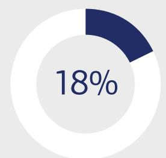
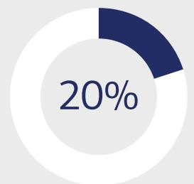
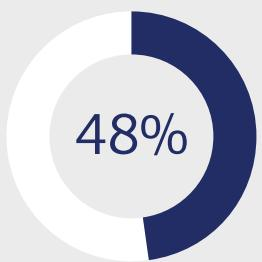
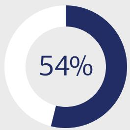
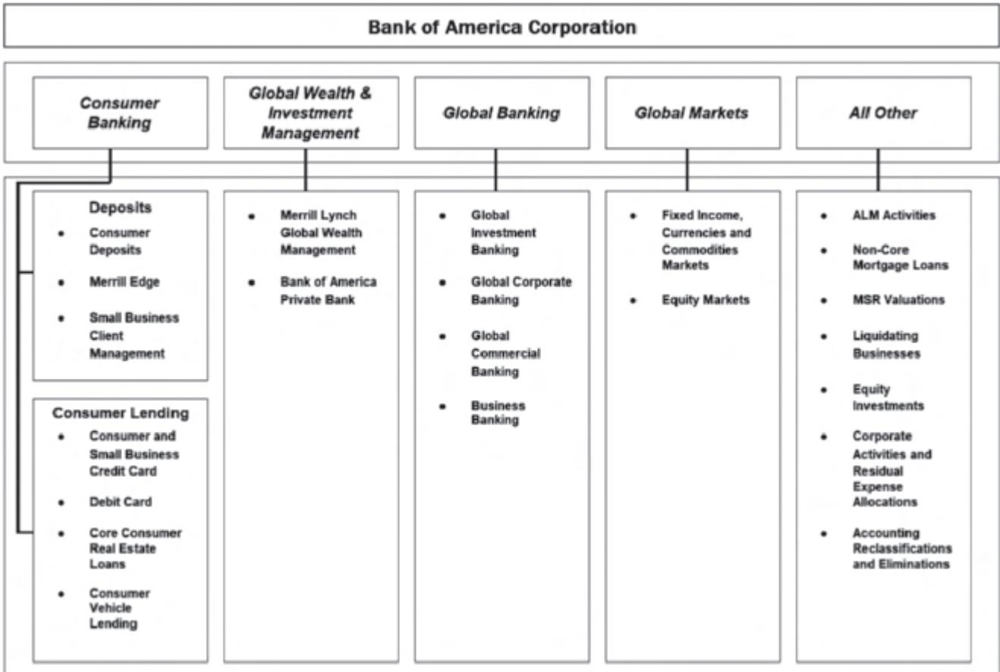
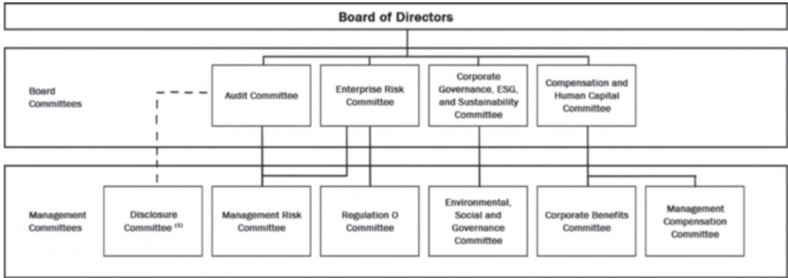

> **AI Description:**
> **Source:** `assets/_page_0_Figure_0.jpg`
> 
> **Generated:** 2026-05-22 22:53:16
> 
> ---
> 
> The image contains a photograph of two children, one holding the other. The child in the foreground is pointing upwards with a thumbs-up gesture, while the child in the background appears to be looking at something off-camera with a surprised expression. The text "Coming together in new ways" is overlaid on the image, and "Annual Report 2020" is written at the bottom. The image conveys a sense of community and positive interaction.

## CONTENTS

> **AI Description:**
> **Source:** `assets/_page_1_Figure_1.jpg`
> 
> **Generated:** 2026-05-22 22:51:22
> 
> ---
> 
> The image is a photograph of a group of seven individuals standing in front of a building with a sign that appears to be a bank or financial institution. The individuals are dressed in business attire, with some wearing suits and others in blazers. They are all wearing face masks. The background includes the building's entrance and signage. The image does not contain any charts, graphs, or other visual elements beyond the photograph itself.

> **AI Description:**
> **Source:** `assets/_page_1_Figure_2.jpg`
> 
> **Generated:** 2026-05-22 22:50:03
> 
> ---
> 
> The image contains a photograph of a smiling individual in a professional setting. The person is wearing a suit and tie, suggesting a formal or business environment. The background appears to be indoors, possibly an office or conference room, with warm lighting and blurred elements that indicate depth of field. The image conveys a positive and professional atmosphere.

A letter from Chairman and CEO Brian Moynihan

10 Measuring stakeholder capitalism

11 A messge from outgoing Lead Independent Director Jack Bovender

11A message from incoming Lead Independent Director Lionel Nowell

14 Addressing a global health crisis as one company

18 Q&A with D. Steve Boland and Aron Levine: Working together to meet clients'changing needs in a challenging year

19 Growth of digital banking,lending and investing at Bank of America

20 Q&A with Matthew Koder: Delivering for our clients with defining differentiators

21 A message from Bernie Mensah: Making significant progress internationally

22Delivering innovative wealth solutions and exceptional client service

23 What sets us apart: BofA Global Research

24 Serving our clientsand communities through technology

25Market Presidentsdeliver our global company to each client, employee and community

26A message from Sheri Bronstein: Being a great place for our teammates to work

28 Driving meaningful change when the world needs it most

29 Supporting emotional wellness and mental health

30 Continuing to be a workplace where all teammates can grow and thrive

32 Being a great place to work-2020 highlights

33 Investing \$1 billion over four years to advance racial equality and economic opportunity

34 A conversation with Anne Finucane and Karen Fang: Addressing the world's challenges through sustainable finance

36 2020 ESG highlights

38 Financial highlights

39 Recognition

40 Stakeholder Capitalism Metrics

### Full Page Description (Page 2)

**Source:** `assets/_page_2_Asset_0.jpg`

**Generated:** 2026-05-22 22:50:31

---

The image contains a line graph with two distinct sections, each representing different time periods and trends in quarterly net income. The graph is divided by a vertical dashed line, with the left side labeled "2010 to 2014: Dramatic net income volatility (billions)" and the right side labeled "2015 to 2020: Net income reflecting Responsible Growth (billions)." The left section shows fluctuating net income values, with significant peaks and troughs, while the right section displays a more stable and upward trend in net income, culminating in a value of $5.5 billion by 2020. The graph uses two different colors to differentiate between the two time periods, with red for the earlier period and blue for the later period.

# A letter from Chairman and CEO Brian Moynihan

To our shareholders and clients, To my teammates, To leaders and partners in the communities we serve across the U.S.and around the world,

## I hope this finds you safe and well.

It is my pleasure to share with you the 2O2O Bank of America Annual Report. Our report documents how your company responded to the impacts—both humanitarian and financial—of the global health crisis. It describes how we responded to the social and racial justice issues that moved to the forefront in 2020.The pages also tell the story of how our company came together in new ways to deliver for our shareholders,our teammates,our clients, our communities and to help address society's biggest challenges.

I begin this letter by thanking my 213,000 teammates and our senior management team. Ithank them for their extraordinary efforts over the past 12 months,and for everything they do to support our clients,and each other,every day.

I would also like to thank our Board of Directors for their leadership and guidance throughout 2020. In particular,Iwould like to extend my gratitude to our outgoing Lead Independent Director,Jack Bovender, for all he has done for our company and those we serve.As we announced in September 2O2O, Lionel NowellIll takes over this important role.Lionel is an experienced leader and has been a valued member of our Board for the past eight years.Jack and Lionel share their perspectives on the past year,and what lies ahead, on page 11.

Looking at our 2O2O results,one thing is clear: Our decade-long focus on Responsible Growth prepared us well for this crisis. It allowed us to be a source of stability for our customers and clients during challenging times,to continue supporting the communities in which we work and live and deliver more consistent results for our shareholders through a well-understood risk framework. You can see the impact of Responsible Growth in the chart below.

Despite the impacts of the global health crisis, which resulted in a historically low interest rate environment and a period of market volatility,your company earned \$17.9 billion in net income,or \$1.87 per share. Moreover,we ended 2O2O with more capital, more deposits, record liquidity and improved capital ratios.We did this while increasing support for our clients.

### Full Page Description (Page 3)

**Source:** `assets/_page_3_Asset_1.jpg`

**Generated:** 2026-05-22 22:55:34

---

The image is a bar chart comparing three categories: BAC, BKX Index, and U.S. LC Peers. The BAC category has the highest value at 98.7%, followed by U.S. LC Peers at 64.7%, and BKX Index at 53.1%. The chart uses dark blue, light gray, and medium gray bars to represent each category. The percentages are clearly labeled above each bar, and the abbreviations are explained in the legend at the bottom.

### Full Page Description (Page 3)

**Source:** `assets/_page_3_Asset_0.jpg`

**Generated:** 2026-05-22 22:55:47

---

The image contains a bar chart with three vertical bars representing different categories: BAC, BKX Index, and U.S. LC Peers. The BAC bar is the tallest, with a value of 80.1%, while the U.S. LC Peers bar is the shortest, with a value of 45.8%. The BKX Index bar is in the middle, with a value of 34.0%. The chart uses a gradient background for each bar, with the BAC bar in dark blue, the BKX Index bar in gray, and the U.S. LC Peers bar in a lighter gray.

In March of 2O2O,the stock price for banks in general saw a sharp drop as the health crisis unfolded and investors contemplated potentially large credit losses and revenue declines from interest rates and a paucity of economic activity. From those lows,bank stocks made a steady recovery as fears moderated,ending the year modestly down from the start of the year.

Our stock price declined 49% in March from the beginning of 2020 and then saw a 68% recovery,ending the year down 14%.This was in line with the broader bank index but below the broader market rise of 16%. Despite the 202O decline, our stock price has outperformed the broader bank index on a 3-year and 5-year basis.As we prepare to issue this report in late February 2O21,the price is up 14% this year,reflecting the improved economic outlook.

During 2O2O,we delivered \$12 billion in capital back to shareholders through dividends and net share repurchases.We did this even as we halted share repurchases late in the first quarter of 2O2O in line with additional federal bank regulatory restrictions.We have resumed share repurchases in the first quarter of 2O21 from a position of strength with \$36 billion of capital above our minimum regulatory requirements.

Our results in 2O2O built onto a solid foundation established by focusing on Responsible Growth for the past decade.We have a strong balance sheet,a best-in-class suite of products and capabilities—including our industry-leading digital capabilities一and a global team of dedicated professionals that is second to none.We are well-positioned to continue delivering for our shareholders,and all those we serve, in 2021 and beyond.

We believe we must continue to deliver these strong results and help make progress on important societal priorities.That is core to how we run our business and drive Responsible Growth.

In 2020,we also continued to make meaningful progress on important issues that affect us all. During the year, we accelerated our longstanding work to promote racial equality and economic opportunity,with a \$1 billion,four-year commitment aimed at supporting jobs, healthcare,housing and businesses.While we were pleased to see commitments being made by other companies and organizations, we have moved quickly to get money moving to our priority areas of focus.So far,we have invested in jobs and skills training at 11 historically Black colleges and universities and 11 community colleges.We have delivered over 2O million masks and other personal protective equipment (PPE) to

5-year stock performance

community partners,nonprofits,and other venues.We have invested in 14 Minority Depository Institutions (MDls) to help them grow and serve their communities.We have increased our overall commitment to Community Development Financial Institutions (CDFls) to \$1.7 billion—making Bank of America the largest private sector CDFl funder. And, we have agreed to invest in 61 minority-owned or -focused venture capital or private equity funds in communities around the U.S.,which will deliver more equity into thousands of minority-owned small businesses.You can find out more about our commitment to racial equality and economic opportunity on page 33.

We also continued to support the transition to a low-carbon, sustainable economy, through our operations,our business activities and our partnerships.This includes our commitment to a goal of achieving net-zero carbon emissions by 2050.

There are four pillars to Responsible Growth.

## Responsible Growth

·We must grow in the market, no excuses.

·We must grow with a customer focus.

·We must grow within our risk framework.

·We must grow in a sustainable manner.

I'll discuss each of these in turn,and the ways our team in 2020 delivered on these pillars.

## Grow in the market, no excuses

What could we do in an economy to help our clients and grow?

We supported our clients in lockdown with our various customer assistance programs.We supported small businesses with Paycheck Protection Program (PPP) loans.We supported wealth management clients with advice,expertise and execution in

### Full Page Description (Page 5)

**Source:** `assets/_page_5_Asset_1.jpg`

**Generated:** 2026-05-22 23:01:17

---

The image is a pie chart with four segments, each representing a different category and its corresponding value in billions of dollars. The categories are "Global Markets" with $5.2B, "Consumer" with $6.5B, "Global Banking" with $3.5B, and "GWIM" with $3.1B. The total value represented by the entire pie chart is $17.9B. The chart uses distinct colors for each category to differentiate them visually.

### Full Page Description (Page 5)

**Source:** `assets/_page_5_Asset_0.jpg`

**Generated:** 2026-05-22 23:01:01

---

The image contains a pie chart with four segments, each representing a different category and its corresponding value in billions of dollars. The categories are:

1. Consumer: $33.3B
2. Global Markets: $18.8B
3. Global Banking: $19.0B
4. GWIM: $18.6B

The total value represented by the pie chart is $85.5B, as indicated in the center of the chart. The segments are color-coded for easy differentiation.

volatile markets.We supported commercial clients with our strong balance sheet that provided more than \$7O billion in loans in a few-week period,and raised \$772 billion in capital over the course of the year.For institutional investors,it meant having the market expertise and insights,trading capabilities and access to enable them to navigate through.

But we believe it was our planning and investments over the past decade that made this all work.We supplied needed capital and liquidity to borrowers. Our investments in digital client interfaces across our client groups allowed us to maintain a close relationship with our clients,as they moved seamlessly to digital check deposits, payments,banking and investing. On the commercial side,we had invested in our CashPro application, which allowed our clients to safely and securely move billions of dollars every day.We used automated signature capabilities to allow clients to complete estate plans,borrow or invest—all with the same security as doing it in person.With institutional investors,we moved quickly to supply liquidity and a strong and resilient platform to support their activitiesand help assure stability of the financial system.

All of this,and more,allowed us to continue to serve clients relatively uninterrupted by the pandemic,even as volumes surged.We played our part,with our industry colleagues,in helping ensure economies around the world,and here in the U.S., recover more quickly. In the end, that is the role of the bank.Your company executed that role well.

## And we grew.

In 2020,average deposits increased 18% year-over-year to approximately \$1.6 trillion. In Consumer Banking,we added \$115 billion in average deposits during the year, cementing our position as the #1 bank in the U.S.by retail deposits. We leveraged our leading digital capabilities to serve our consumer clients how, when and where they chose to bank with us. Across all consumer sales in 2020,42% of sales came through digital channels.

During the year,we also enrolled more than one million clients into our flagship loyalty program,Preferred Rewards,driving total membership to 7.2 million. Preferred Rewards recognizes and rewards clients for their entire relationship with us,and we continue to see 99% retention rates from our members.

We brought our top retail bank brand to new markets in the U.S.,including markets in Ohio and Utah,while building our presence in existing markets.According to our internal research,we continued to gain share in key markets. In 25 of the top 3O markets across America—representing over half of the U.S. population—we now hold the #1,#2 or #3 position. That is twice as many markets as our closest peer and includes 14 markets in which we hold the #1 position.

During the year,our wealth management team found new ways to connect with,and deliver for,our Merrill and Private Bank clients. On page 22,we take a closer look at how our advisors continued to support clients and helped them navigate a changing environment. We added roughly 22,0O0 Merrilland 1,8O0 Private Bank relationships in 202O,and ended the year with client balances at all-time highs of \$3.3 trillion.

For the companies we serve,we begin with our small business clients.Apart from the role we played as the largest lender in the federal government's PPP by number of loans,we also continued as the largest small business lender in the country overall,ending the year with more than \$32 billion in small business loan balances.We also deployed our new merchant services capabilities.

For our commercial clients,the year was difficult as they had to absorb massive changes to the business cycle brought by the health crisis.We were there for them. Early in the year, we supported their borrowing rush as they sought liquidity in February, March and April.As conditions stabilized,we helped with market access for them to raise needed and permanent capital.We continued to bring digital capabilities to ensure their businesses could run smoothly, even in a work-from-home environment.The results for us were a surge in loans to these businesses.We peaked at \$585 billion in commercial loans; by year-end those were down to \$499 billion.

Our investment banking team recorded \$7 billion in total investment banking fees and posted three of the strongest investment banking quarters in our history. Our performance in this business helped us gain market share and retain the #3 market position, thanks to the efforts of our talented team.Matthew Koder, President of Global Corporate & Investment Banking, looks back on his team's accomplishments on page 20.

In Global Markets, full-year sales and trading revenue for 2020 increased 18% year-over-year to \$15 billion. During the year we continued to push our innovative capabilities in electronic trading forward to help win mindshare with some of our largest clients.At the same time,our own research team was again ranked as one of the top Global Research Firms by Institutional

Investor—placing as one of the top two firms for each of the past 1O years. You can read more about our award-winning research capabilities on page 23.

Each of our businesses contributed to our results,and the diversity of our offerings served us well through a dynamic market environment. It will continue to serve us well as we look forward.

## Grow by focusing on our clients

Last year, thanks to the commitment of our teammates, the strength of our platform and our focus on Responsible Growth, we achieved the highest client satisfaction scores in company history.That is a credit to each and every member of our global team,who work hard to serve our customers and clients一and exceed their expectations—in every interaction.

In 202O, that included far-ranging measures to support those impacted by the health crisis,through our own relief programs and those provided by the federal government.We processed approximately2 million payment deferral requests as part of our Client Assistance Program.We processed more than 16 million Economic Impact Payments (EIP),totaling more than \$26 billion in the initial round of U.S.government stimulus payments一and continued processing additional payments following subsequent relief legislation.

As the largest PPP lender by number of PPP loans in the first three rounds of the program, in 2O2O we helped more than 343,000 small business clients—in every industry, every market—receive PPP loans,delivering more than \$25 billion in PPP loan funds to businesses in need. We began accepting applications for PPP loans once again in January 2021,in line with a new round of federal PPP lending. Once again, we are among the top lenders in the program.

At the same time, we remained focused on supporting the everyday financial needs of millions of clients.With additional health and safety measures in place,our teams continued to serve individuals and businesses across our nationwide network of approximately 4,30O financial centers and 17,0o0 ATMs. I'd like to offer a special thanks to my teammates in the financial centers who have played an essential role for our clients and communities through this health crisis.

Not surprisingly, we also saw a growing number of clients choose to connect with us digitally during 2O2O. Our ten-plus years of sustained investment into technology一such as

39.3M

digital customers at year-end,up 3% over 2019

artificial intelligence (Al)一and our award-winning digital platforms ensured we could continue to serve our clients when they needed us most.

In Consumer Banking,we ended 2020 with 39.3 million digital customers,up 3% over 2O19.They connected with us nearly 11 billion times.Our roughly 13 million active Zelle@ users,both consumers and small businesses,sent approximately \$141 billion in transfers in 2O2O.To put that into perspective,that's almost 50% of the payments made by our 38 million consumers and small businesses using their credit cards.

More than 17 million of our digital banking clients use Erica@, our Al-based virtual financial assistant,to do everything from checking their balances to paying their bills. Erica will also reach out to help if,for example,a client's balance isat risk of going below \$O in the next week,or if a merchant charges them twice. Erica continues to gain knowledge and evolve in response to client needs.For example,at the beginning of the health crisis, Erica learned 6O,ooO new pandemic-related intents in a matter of days.In 2O2O alone, Erica completed 135 million client requests.

In September,we launched LifePlan@,which gives clients the power to select what's most important to them and receive personalized insights—through both high-tech and high-touch interactions—to help them achieve their financial needs and goals. By the end of 2O2O,our clients had created more than 2 million plans,one of the fastest product rollouts in our history.

Our digital platforms also allow us to extend further into our communities,allowing millions of clients to access services and connect into the broader economy. In 2O2O,we added Balance AssistM,a low-cost,digital-only alternative to payday-type loans. Balance Assist,which allows clients to borrow up to \$500 for a \$5 flat fee, joins our existing suite of safe banking solutions,including SafeBalanceTM and Secured Card.D.Steve Boland, President of Retail, joins Aron Levine,President of Preferred and Consumer Banking & Investments, to discuss how these products can help provide financial freedom and stability for clients on page 18.

## \$1B

In 2020,our team generated more than 1,700 ideas to drive operational excellence, saving the company nearly \$1 billion.

Digital connectivity was also fundamental to our success in wealth management,and we saw digital engagement for wealth management clients climb to record levels.By the end of 2O20,77% of Merrill Lynch households and Private Bank clients were using online or mobile banking. Our digital platforms also allowed for effective advisor-client communications,which became a critical part of relationship building as the pandemic continued.

In Global Banking,our CashPro@ platform helped more CFOs and other business leaders efficiently and securely manage their cash flow from their offices and homes一and on their mobile devices. Our roughly 5Oo,OOO CashPro users drove a 40% increase in platform sign-ins in 2020. Here,too, we applied the power of Al for our clients,digitally matching 19 million incoming receivables in a 12-month period using our Intelligent Receivables? solution.

Stepping back, what we saw in 2O2O was the impact of years of investment in capabilities and digital access across our platform and our businesses. And what was unique is that even in areas where we had heretofore experienced customers or employees traditionally preferringto operate ina face-to-face, physical world,we saw dramatic changes.We had a record year in new \$1O million or higher relationships in Global Wealth & Investment Management (GWIM),yet we were unable to have many face-to-face meetings.We had a record year in investment banking fees,yet all of our“pitch"meetings with clients were virtual.We saw record movement in money by our consumer customers yet we had up to 3O% of our financial centers closed for safety.The implications for the long term are yet to be borne out. But we are confident that the investments we have made set us on the correct course.

l want to call out our technology and operations team, who showed creativity and excellence in execution by positioning all of our client-facing teammates to be able to operate in a workfrom-home environment. In four weeks,our tech and ops team deployed 1OO,OoO computers and screens to those teammates. It was no small task,and it enabled us to continue to serve clients who themselves were adjusting to the pandemic conditions.

## Grow within our risk framework

Growing within our established risk framework is integral to how we drive Responsible Growth. Our principled approach to risk management allowed us to continue supporting our customers and clients against the backdrop of one of the worst economic declines in U.S. history,driven by the global pandemic.

At the onset on the health crisis,we took immediate action to strengthen our reserves for credit losses.We ended 2O2O with nearly \$21 billion in credit reserves,more than twice what we had at the end of 2O19.Together with our existing capital, we have substantial reserves available to manage potential losses. Credit losses were much lower than many expected,but we were confident our underwriting would hold up,and it did. In fact,our actual charge-offs moved from \$3.6 billion in 2019 to \$4.1 billion in 2020,a slight increase.

On the markets side,our team led by Tom Montag and Jim DeMare navigated the markets very well and we had a strong year of trading revenue.More importantly,we provided support for our institutional clients.And we had only a handful of days with trading losses.

We continue to actively monitor and assess the impacts—both direct and indirect—of the health crisis and other potential risks through our risk management framework. And we continue to drive out operational risk from the company through our focus on operational excellence.

## Grow in a sustainable manner

To drive Responsible Growth,we must ensure that our growth is sustainable.There are three complementary and interdependent tenets to how we approach sustainable growth: driving operational excellence, being the best place for teammates to work and sharing our success with our communities.

## Driving operational excellence

While“operational excellence,”“organizational health,” “simplify and improve"and other terms we use may sound a little mechanical, they are instrumental to our success. In 2015,your company had \$57 billion in expenses. In 2020, we had \$55 billion, including roughly \$1.5 billion in net coronavirus-related costs.Compared with 2O15,we have more customers and clients and more transactions—so more work. Yet costs are down and headcount is down. During those six years,we invested about \$18 billion in technology initiatives,added 15% more sales teammates,opened 300 financial centers and refurbished 2,ooO more.All of these investments were made while costs came down.We continue to apply the practice of operational excellence to enable us to produce strong returns above our cost of capital while investing back into our company and our capabilities.This will provide powerful leverage as interest rates rise and the economy continues to recover and grow.

Operational excellence is as much a mindset as it is a program. It describes the ways in which we drive continuous improvement, reduce operational risk and seek to find faster,simpler and more efficient ways of working and serving our clients.

This work is fueled by the ingenuity and creativity of our teammates,who continuously look for ways we can do things better.In total, we've approved nearly 8,6OO of their ideas, which commit to delivering bilions in expense savings.In 2020 alone,our team generated more than 1,7OO ideas that helped us define commitments to save nearly \$1 billion.We reinvested those savings back into our team,our capabilities,our client experience,our communities and our shareholders.

For example, savings from operational excellence help fund the ongoing modernization of sites across our real estate portfolio,including renovating our financial centers to deliver a client-focused interior and exterior design and full support for digital transactions.

It's important to note we made investments like these in 202O—and many more described throughout this report—while at the same time returning \$12 billion in net capital to our shareholders.And—as you will see discussed elsewhere in this report—we invested in our team,including the fourth consecutive year of company-wide supplemental bonuses, increasing our minimum hourly rate of pay for U.S.employees and keeping medical expenses down for our lesser-paid teammates.

## Being a great place to work for our teammates

Attracting and retaining the best talent is key to driving Responsible Growth and one of our top priorities.It helps us manage our operations,provide the best service for our clients and support our communities.

We strive to make Bank of America a great place to work for all teammates.And we fulfill this commitment by being a diverse and inclusive workplace,attracting and developing talent,recognizing and rewarding performance and supporting teammates'physical, emotional and financial wellness.On page 26, Sheri Bronstein, our Chief Human Resources Officer, shares her thoughts on our progress in 2020 and what it means for the future.

Our workforce must reflect the communities we serve. As highlighted in our 2O2O Human Capital Management Report,we have continued to make progress in our goal to ensure diverse representation at all levels of our company.Fifty percent of our management team is diverse,and Bank of America is one of only five S&P 1OO companies with six or more women on the Board.And over the past decade, the number of people of color we hire in the U.S.from universities has increased by 50%.

## 1of 5

Bank of America is one of only five S&P 100 companies with six or more women on the Board.

\$20

In 2020, we raised our minimum hourly rate of pay for U.S. teammates to \$20.

We want our teammates to build long-term careers with Bank of America. And that starts with a competitive starting wage and benefits. We moved to our minimum hourly rate of pay for U.S.teammates of \$20—roughly \$42,0o0 per year—one year earlier than planned.And we offer ongoing training and development resources to help those teammates grow and thrive within our organization.We hire with a career mindset. And we work to reskill our teammates.

For teammates earning lower salaries,we provide higher company subsidies for medical premiums. Since 2O12, there has been no increase in medical premiums for teammates earning less than \$50,000.

To support our teammates during the health crisis,at work and at home,we expanded many of our benefits and resources. This included additional support for mental health,free virtual consultations and no-cost coronavirus testing.

As the pandemic hit, we knew our teammates were going to be under pressure at home. For most of them, home was their workplace.For our 4O,OoO teammates with children, home was often a school or daycare. For many teammates with aging parents, home became an assisted living space. Our teammates needed help.We offered them \$1OO per day to hire that help. More than 3 million days of care have been provided.This helped our teammates immensely—they have told us.And it also allowed them to serve our clients better.

In 2020,we came together to support one another like never before.It was a great reflection of the commitments, the compassion and the people that make our company a great place to work.

## \$2B

We issued a \$2 billion equality progress sustainability bond designed to advance racial equality, economic opportunity and environmental sustainability.

\$1B

We launched a \$1 billion   
corporate social bond, the first   
issued bya U.S.commercial   
bank to entirely focus on fighting   
the pandemic.

## Sharing our success with our communities

One of the ways we ensure our growth is sustainable is by sharing our success with the communities in which we work and live.We invest significant time and money to help address issues facing our local communities and society at large,and commit all of our business activities and operations to the task.

This begins with our \$25O million in annual corporate philanthropy.To this,we added another \$1OO million in 2020 to increase access to food and medical supplies in local communities.

Individual giving by my teammates,combined with matching gifts from Bank of America,amounted to more than \$65 million in additional philanthropic support in 2O2O.To maximize the impact of each employee gift,we lowered the employee matching gift minimum to \$1 and doubled our match for employee donations to 17 organizations through 2020.

We also support our communities through our lending and investing activities.In 2O2O,for example,we provided a record \$5.87 billion in loans,tax credit equity investments and other real estate development solutions,and deployed \$3.62 billion in debt commitments and \$2.25 bilion in investments to help build strong,sustainable communities by financing affordable housing and economic development across the country. Between 2005 and 2020,we financed more than 215,000 affordable housing units.

In May of 2O2O,we launched a \$1 billion corporate social bond,the first issued bya U.S.commercial bank to entirely focus on fighting the pandemic.We followed that up with an industry-first \$2 billion equality progress sustainability bond designed to advance racial equality,economic opportunity and environmental sustainability.

Our commitment to racial equality and economic opportunity demonstrates the way in which we approach major societal issuesand align all of our resources to help drive progress locally. Our investments and partnerships in this work are targeted at strategicareas in which we already are a leader: jobs, healthcare, housing and businesses. By providing even sharper focus,we seek to make a lasting impact on underserved minority entrepreneurs and communities.You can read more about how we are executing on our \$1 billion commitment and a broader update on our work in sustainable finance in the discussion between Vice Chairman Anne Finucane and Global Sustainable Finance Executive Karen Fang on pages 33-35.

The most important way we shape our engagement in local communities is through our market president organization. Our network of 9O presidents is responsible for leadingan integrated team to deliver for clients,teammates and the community, serving as the chief executive for Bank of America in that market. We talk more about how our presidents support our clients and communities on page 25.

### Full Page Description (Page 10)

**Source:** `assets/_page_10_Asset_1.jpg`

**Generated:** 2026-05-22 22:51:59

---

The image is a bar chart showing the total deposits in trillions of dollars from 2016 to 2020. The chart includes data points for each year, with the following values: $1.26 trillion in 2016, $1.31 trillion in 2017, $1.38 trillion in 2018, $1.43 trillion in 2019, and $1.80 trillion in 2020. The chart visually represents a significant increase in total deposits over the five-year period, with the highest value in 2020. The chart also includes a large text at the bottom stating "$1.8T," which likely refers to the total deposits in 2020.

### Full Page Description (Page 10)

**Source:** `assets/_page_10_Asset_0.jpg`

**Generated:** 2026-05-22 22:53:53

---

The image is a bar chart showing the value in trillions for the years 2016 to 2020. The chart includes data points for each year, with the values increasing from $2.19 trillion in 2016 to $2.82 trillion in 2020. The bar for 2020 is the tallest, indicating the highest value among the years shown. The chart is labeled with the unit "trillions" at the top, and the total value for 2020 is emphasized at the bottom as "$2.8T".

## Driving profits and purpose

The principles of stakeholder capitalism are embedded in Responsible Growth.We deliver for our clients,our employees, our communities and our shareholders and,at the same time, do our part to deliver progress against society's biggest challenges.This includes our work to support the health and safety of our teammates,the many ways we help the communities we serve grow and prosper,our efforts to promote racial equality and economic opportunity and our ongoing drive toward a clean energy future.

Stakeholder capitalism is not a new concept,even if its recent focus makes it seem that way. As a financial institution, our success has always been tied to the success of the communities and markets we serve.In recent years,business organizations including the U.S. Business Roundtable, the World Economic Forum and others have helped create broader awareness of the ways that companies must think about delivering long-term value—for shareholders,of course,but for all of our other stakeholders,too.

Helping address societal issues can stimulate the commitment of private sector capital to help drive even more progress. And there's growing evidence to back that up.As our Global Research team has found,companies that pay close attention to environmental, social and governance (ESG) priorities are much less likely to fail than companies that do not,giving

Total assets (trillions)

investors a significant opportunity to build investment portfolios for the long-term. And—through research and our own lived experience—we know that ESG commitments can translate into a better brand,more client favorability and a better place for our teammates to work.

There is an important discussion underway about the role capitalism plays in our society and the ways in which it must evolve to ensure all participants in our economic system are treated fairly and rewards are available equitably. Public companies have an important role to play to help drive that discussion.At Bank of America,we embrace our dual responsibility to drive both profits and purpose.And we work with organizations and leaders around the world to champion these ideals and drive meaningful progress.We need a way to measure that and in 2O2O we made substantial progress on that front, too.

## Measuring and delivering long-term value

To help society make progress toward important goals you need to know two things.

First,you need to understand what society's priorities are. And we do.The countries of the world identified those priorities in 2O15,when nearly 2OO countries agreed to the United Nations (U.N.) Sustainable Development Goals (SDGs). The SDGs reflect 17 categories of societal priorities that

## Measuring stakeholder capitalism

The International Business Council, with the collaboration of the accounting firms Deloitte, KPMG, PwC and EY, compiled a set of common ESG Stakeholder Capitalism Metrics disclosures. These metrics are compiled from leading ESG standards-setters, including the Task Force on Climate-related Disclosures (TCFD), the Sustainability Accounting Standards Board (SASB), the Global Reporting Initiative (GRl) and others. As discussed in CEO Brian Moynihan’s shareholder letter in this report, the goal of the Stakeholder Capitalism Metrics is to provide investorsandotherstakeholdersacommonset of standards by which to evaluate the progress the company is making to address the societal priorities agreed to in the SDGs. The metrics include non-financial disclosures in four categories: people, planet, prosperity and principles of governance.

Nearly 7O global companies have agreed to begin using the Stakeholder Capitalism Metrics,and many more are evaluating them for their own use. Bank of America is a founding member of His Royal Highness the Prince of Wales'Sustainable Markets Initiative (SMl),which seeks to harness the creativity, the innovation and the balance sheets of businesses around the world to help drive long-term growth in a globally sustainable fashion. In December 2020, under the guidance of His Holiness Pope Francis and His Eminence Cardinal Peter Turkson, Bank of America joined an alliance of business leaders and companies around the world as part of the Vatican's Council for Inclusive Capitalism (VCIC). Comprising companies that collectively have more than 200 million employees from over 163 countries, the VCIC illustrates how capitalism can take the lead in creating economic growth that is fair, responsible, trusted, dynamic and sustainable. The SMl, the VCIC, and similar organizations recognize the Stakeholder Capitalism Metrics as an important step toward providing the disclosures needed to measure the progress that private sector capitalism can help deliver in addressing important societal priorities.

Given the cross-industry application of this set of common metrics, not each standard will apply to each company that is disclosing. Where a disclosure is not provided or not linked to another Bank of America disclosure, we provide a brief explanation. We share the long-term objective of other companies, asset owners and asset managers, key government regulators and the standards-setters themselves that eventually there will be a single set of non-financial ESG disclosure standards to help stakeholders evaluate companies in the same fashion that standard financial disclosures now permit.

address equality of opportunity,affordable housing, prosperity,access to clean water, renewable energy,and other priorities,with specific goals to be met.Leaders in each country agreed these goals are the ones we need to address to build a sustainable future and create opportunity and prosperity for all.

Second, you need to know how to measure progress. The International Business Council (IBC),which i am privileged to chair, has compiled a set of Stakeholder Capitalism Metrics aligned to the SDGs.These metrics create a consistent way of measuring companies' long-term value, across industries.This,in turn, helps direct investment toward high performers and align capital to progress on the SDG and ultimately defines stakeholder capitalism. It also aligns capitalism's innovation,its entrepreneurship and its massive resources to the progress,which won't be made without the private sector.

In September,the IBC—working with the accounting firms Deloitte, EY, KPMG and PwC-released a set of 21 core metrics,and 34 expanded metrics,aligned to the themes of people,planet,prosperity and principles of governance.As of January 2O21, Bank of America and nearly 7O other global corporations have agreed to implement reporting on the Stakeholder Capitalism Metrics,and the coalition continues to grow. Later in this Annual Report you can see our initial set of Stakeholder Capitalism Metrics disclosures.

At Bank of America,we drive progress on the SDGs through all of our efforts and activities.We do so through our operations,our philanthropy,our human resources practices,our client financing capabilities and the guidance we provide to investor clients.We bring our \$2.8 trillion balance sheet,our \$55 billion expense base and the trillions of dollars we raise each year for our clients to the task.And,critically, we commit the considerable ingenuity, innovation and passion of our team.

For over a decade,we have focused on driving Responsible Growth so that we can create value for every stakeholder and for society—through every economic environment. Our focus on Responsible Growth positioned us well as we faced the unforeseen challenges of 202O,and positions us well as we look to the future. We remain committed to delivering for our shareholders, our teammates,our clients,our communities and to making a positive impact on the world for years to come.

On behalf of my 213,0oO teammates,our management team and the Board of Directors,I thank you for your support of Bank of America.

Brian Moynihan

March 1,2021

# A message from outgoing Lead Independent Director Jack Bovender

## Dear shareholders:

Thank you for investing in Bank of America. The directors bring independent and diverse perspectives to our task of helping create long-term value for you. We represent a range of expertise, backgrounds and skills, including chief executives and others who have served in senior risk, operations, finance, technology and human resources positions.

This mix of expertise and experience is beneficial throughout the year, including in the fall when the management team presents the company strategy for the board to review and approve. We oversee the execution of the strategy through regular, systematic interaction with company management. In performing our duties,we are mindful of developments in the markets, the economy and geopolitical issues that may impact the execution of the strategy.

Our responsibility is to assess opportunities and risks and determine how well the company is adhering to the tenets of Responsible Growth that drive the company's strategy. CEO Brian Moynihan discusses this in greater detail in his nearby letter and you will see it brought to life in the articles and disclosures throughout this report. The tenets of Responsible Growth include the company's ESG practices. Our Corporate Governance, ESG and Sustainability Committee reviews and reports to the board on the company's activities in these areas. This includes, for instance, the company's recently announced commitment to net-zero greenhouse gas emissions by 2050.

As many of you know,I will be retiring from our board at the time of the annual meeting. Since becoming the Lead Independent Director of Bank of America, I have had the privilege of meeting annually with many of our shareholders.The feedback from these meetings has been invaluable and I have routinely shared it with the board. It has significantly shaped our approach to fulfilling our governance responsibilities. For more detailed information, please review this 2020 Annual Report,our 2021 Proxy Statement and our Human Capital Management Report.

At the annual meeting, Lionel Nowell will assume the role of Lead Independent Director. Lionel is totally committed to his new role and will continue our practice of meeting regularly with our shareholders.

It has been both an honor and pleasure to serve as Lead Independent Director. On behalf of Brian, Lionel and the other directors,thank you for investing in Bank of America.

## A message from incoming Lead Independent Director Lionel Nowell

> **AI Description:**
> **Source:** `assets/_page_12_Figure_1.jpg`
> 
> **Generated:** 2026-05-22 22:49:56
> 
> ---
> 
> The image contains a photograph of a person wearing a dark suit and tie. The background is a plain, dark color, which contrasts with the subject's attire. The person appears to be smiling and is looking directly at the camera. There are no charts, graphs, or other visual elements present in the image.

## To my fellow shareholders:

I join Brian Moynihan, Jack Bovender and the other directors in thanking you for choosing to invest in Bank of America. I began my service as a Bank of America director in January 2013,and I have appreciated the opportunity to oversee the development and execution of the company's strategy for long-term Responsible Growth. Fifteen of the company's 16 directors are independent and we bring our unique perspectives to each of our board and committee meetings.

Our discussions among ourselves and with the company's management are grounded in facts and data. I am particularly pleased with the level of detail we regularly disclose to our investors, including in the 2020 Human

Capital Management Report and other non-financial disclosures we make to give you as clear a picture of our company as we can.

I also value the insights I receive when I speak with shareholders; l intend to maintain a consistent rhythm of engagement in the same fashion as my predecessor, Jack Bovender. l want to thank Jack for his impressive leadership as our Lead Independent Director,and I look forward to assuming those responsibilities after the 2021 annual meeting.

Thank you again for your investment in our cor

## Bank of America Board of Directors

Brian T.Moynihan Chairman of the Board and Chief Executive Officer

Sharon L. Allen

Susan S. Bies

Jack O. Bovender, Jr.

Frank P. Bramble, Sr.

Pierre J.P.de Weck

Arnold W. Donald

Linda P. Hudson

Monica C. Lozano

Thomas J. May

Lionel L. Nowell IIl

> **AI Description:**
> **Source:** `assets/_page_13_Figure_11.jpg`
> 
> **Generated:** 2026-05-22 22:55:52
> 
> ---
> 
> The image contains a photograph of a person with blonde hair, smiling. The background is plain and does not contain any additional visual elements or text.

Denise L. Ramos

Clayton S. Rose

Michael D.White

Thomas D.Woods

R. David Yost

Maria T.Zuber

We set the tone at the top through oversight by our Board of Directors,who oversee our corporate strategy. In addition, the heads of our eight lines of business as well as key leadership for International and our institutional client base make up our Executive Management Team.

## Bank of America Executive Management Team

Brian T.Moynihan Chairman of the Board and Chief Executive Officer

Raul A. Anaya President, Business Banking

Dean C.Athanasia President,Retail and Prefered & Small Business Banking
Catherine P. Bessant Chief Operations and Technology Officer

Alastair M.Borthwick President, Global Commercial Banking

Sheri B. Bronstein Chief Human Resources Officer

JamesP.DeMare President, Global Markets
D. Steve Boland President, Retail

Geoffrey S. Greener Chief Risk Officer

Christine P. Katziff Chief Audit Executive

Kathleen A. Knox President, Private Bank
Paul M. Donofrio Chief Financial Officer
BernardA.Mensah President,International

Aron D. Levine President, Preferred and Consumer Banking & Investments

Matthew M.Koder President, Global Corporate & Investment Banking
Thomas K. Montag Chief Operating Officer
Bruce R.Thompson Vice Chairman, Bank of America

Andrea B.Smith Chief Administrative Officer

Sanaz Zaimi Head of Global Fixed Income, Currencies and Commodities Sales; CEO of BofA Securities Europe SA,and Country Executive for France

Anne M.Finucane Vice Chairman, Bank of America
Thong M. Nguyen Vice Chairman, Bank of America
David G. Leitch Global General Counsel

Andrew M. Sieg President, Merrill Lynch Wealth Management

# Addressing a global health crisisas one company

We're united in helping our teammates, clients and communities-when and where they need us most.

In 2020, our company ralied as we never have before-across every business and in cities and towns around the world—to respond to the health and humanitarian crisis affecting individuals, families and business owners in the communities where we live and work. Our services are essential to our clients and to the economy. Through our global presence and longstanding focus on addressing critical social issues, we've taken care of our teammates and their families, delivered for our clients when and where they needed it most and supported relief efforts around the world. And, together, we ended 2020 stronger and more committed to the people and causes we care about.

> **AI Description:**
> **Source:** `assets/_page_15_Figure_0.jpg`
> 
> **Generated:** 2026-05-22 22:49:46
> 
> ---
> 
> The image contains a photograph of a professional setting, likely a bank or financial institution, as indicated by the signage. The environment is modern and clean, with a glass partition and a sleek counter. A woman is standing behind the counter, wearing a yellow blazer and a face mask, suggesting a current health protocol. The background includes a large screen displaying the text "Insights & guidance," which implies a focus on providing information and support. The overall scene conveys a professional and welcoming atmosphere.

> **AI Description:**
> **Source:** `assets/_page_16_Figure_0.jpg`
> 
> **Generated:** 2026-05-22 22:56:35
> 
> ---
> 
> The image contains a photograph of five individuals in a bank setting, likely representing staff members. They are all wearing face masks and making heart shapes with their hands. The background includes a promotional banner for Bank of America, advertising "cash rewards" and featuring images of people and children. The setting appears to be a bank lobby or customer service area, with a counter and a recycling bin visible. The individuals are dressed in business casual attire, and the overall scene conveys a professional and health-conscious environment.

## Supporting the health and safety of our teammates

Our teammates'health and safety is always our top priority. Since the coronavirus was first identified,we have taken many broad-ranging steps to protect all of our teammates and to support their families.

·We seamlessly transitioned about 85% of our employees to work from home,including any teammate who identified as high-risk. For employees who identify as high-risk, many have been redeployed to roles they can perform remotely.

·To ensure our employees maintain access to critical medical resources,we have provided no-cost telehealth resources with 24/7 virtual access to general medicine doctors and mental health specialists,home delivery service of preventative prescription medications with a temporarily waived refill waiting period and no-cost coronavirus testing.

·To help address the personal impacts the environment has had on teammates and their families,we have expanded our back-up childcare for employees in the U.S., including providing nearly three million days of back-up child and adult care and an investment of nearly \$3OO million in child and adult care reimbursements in 2O2O to help offset costs for our teammates.We have continued that support in 2021.

·Additionally,we have provided a variety of resources to help parents and caregivers as their children return to school (whether in-person or virtually),including a dedicated back-to-school website with webinars,articles,weekly tips and discounts on computers,devices and school supplies.

·We also have added new physical and mental health resources,such as training for stress management, resiliency and mindfulness—and provided additional vacation and personal day flexibility.

·We have expanded our dedicated team of Life Event Services (LES) specialists to provide personalized support to teammates impacted by the coronavirus,and we continue to offer 24/7 confidential counseling through our Employee Assistance Program (EAP) for teammates and their immediate family members.

Additionally, we have taken specific actions to support the health of our thousands of teammates working in the office—in our financial centers,operations centers and trading floors一and to recognize allour employees are doing in support of our clients,including:

·Temperature checks,daily health screenings and onsite nurses at many of our sites.We will continue to expand these measures prior to additional employees returning to the office.

· Onsite coronavirus testing introduced for employees working in our financial centers and administrative buildings with more than 1OO employees working in the office

·Enhanced deep cleanings of our facilities, installing thousands of wellness barriers and putting physical distancing markings in place for our employees and clients

·Special compensation programs, including supplemental pay,enhanced overtime pay and other special incentives for employees working in our offices and buildings to serve clients

·Transportation and meal subsidies, delivering more than three million meals to employees to-date

These are just some examples of how we have supported our teammates and their families during this critical time. For more information on these and other programs and benefits we provide,read about our response to the coronavirus in our 202O Human Capital Management Report.

> **AI Description:**
> **Source:** `assets/_page_17_Figure_0.jpg`
> 
> **Generated:** 2026-05-22 23:00:44
> 
> ---
> 
> The image contains a photograph of a professional setting. A woman is standing in what appears to be an office or corporate environment, holding a tablet. She is dressed in a business suit and has a name tag on her jacket. The background features a large screen with a logo that includes the letters "II" in blue and red, suggesting it might be related to a financial or corporate organization. The image captures a moment of interaction, possibly a meeting or presentation.

## Delivering for our clients

When our clients needed us most,our teammates redoubled efforts to help clients navigate the changes and challenges of 2020 in new and creative ways: transitioning from in-person to virtual interactions, using new technologies and launching client relief efforts.

Employees around the world continued to provide advice, guidance and access to all our capabilities to help clients meet their financial needs. In particular, teammates have been proactively reaching out to clients across all businesses, including by sending millions of emails and placing outbound calls to Consumer& Smal Business clients,holding thousands of calls, meetings and broadcasts to actively advise and connect with Merrill Lynch Wealth Management and Private Bank clients,and issuing proactive guidance and market insight from our BofA Global Research and Investment Insights teams through multiple channels,including virtual investor conferences.

Our employees have also delivered critical financial relief for clients through our programs as well as efforts launched by the federal government.

Specifically,we helped 343,OOO small business clients receive loans through the Small Business Administration's Paycheck Protection Program—extending more than \$25 billion—and processed more than \$26 billion of EIP for clients in 2020.We also processed nearly two million payment deferral requests.

343,000

We have helped 343,000 small business clients receive loans through the Small Business Administration's PPP.

## Investing in our communities

Additionally, to help address the impact of the coronavirus in our communities,we donated important PPE to communities across the U.S.,including more than 22 millon face covering, nearly 3 million gloves and more than 17,OoO cases of sanitizer through early February 2021.

We pledged \$1OO million toward medical supplies, food security and other vital support,and an additional \$25O million to community development financial institutions (CDFls) to provide more companies and not-for-profits access to important capital.

And, in recognition of the broad and deep impact the humanitarian crisis is having on communities and people of color,we have made a \$1 billion, four-year commitment to accelerate work underway to help advance racial equality and economic opportunity—specifically focused on workforce development, healthcare, housing and small-business assistance.

> **AI Description:**
> **Source:** `assets/_page_18_Figure_0.jpg`
> 
> **Generated:** 2026-05-22 22:55:17
> 
> ---
> 
> The image contains a photograph of a man standing in front of a wall with a poster. The poster features colorful hand prints and the text "HANDS ARE NOT FOR HITTING" in bold, with additional words "Signs," "Playing," and "Worship" below the hands. The man is wearing a suit and a face mask. In front of him, there are several boxes filled with what appear to be medical supplies or donations. The image combines text with a photograph and includes a message promoting non-violent communication.

Donating PPE in our communities

22M+

face coverings

3M

gloves

17,000+

cases of hand sanitizer

Investing in our communities

\$100M

toward medical supplies, food security and other vital support

\$250M

to CDFls to provide more companies and not-for-profits access to important capital

\$1B

4-year commitment to accelerate work underway to help advance racial equality and economic opportunity

## Looking ahead to 2021

While we made a tremendous impact in supporting our teammates,clients and communities in 2O2O,our work isn't finished.The health crisis continues to affect the global economy as well as individuals and communities around the world. Our focus now is what else we can do—and how we can do it better.Throughout 2O21 and beyond,we remain resolute in how we meet our clients'changing needs,how we take care of our teammates and how we help our communities move forward in meaningful ways.

> **AI Description:**
> **Source:** `assets/_page_18_Figure_1.jpg`
> 
> **Generated:** 2026-05-22 22:55:06
> 
> ---
> 
> The image contains a photograph of a group of seven individuals standing in front of the entrance to the Bank of America Tower at 111 North Wacker Drive. The individuals are dressed in business attire and are wearing face masks. The image also includes the building's name and address prominently displayed on the glass facade. The photograph appears to be taken during the daytime, with the entrance and surrounding area visible.

# Working together to meet clients' changing needs in a challenging year

Q&A with D. Steve Boland, President, Retail and Aron Levine, President, Preferred and Consumer Banking & Investments

In 2020, Steve and Aron worked together to deliver exceptional service and a fullsuite of products and platforms to help make our clients' financial lives better.

> **AI Description:**
> **Source:** `assets/_page_19_Figure_0.jpg`
> 
> **Generated:** 2026-05-22 22:54:24
> 
> ---
> 
> The image contains a photograph of a person wearing a white shirt and a dark tie with a pattern. The individual is seated and appears to be in a professional setting, possibly an office or conference room, as suggested by the blurred background which includes what looks like glass panels or windows. The person is smiling and has their arms crossed, giving a confident and approachable demeanor. There are no charts, graphs, or other visual elements present in the image.

> **AI Description:**
> **Source:** `assets/_page_19_Figure_1.jpg`
> 
> **Generated:** 2026-05-22 22:54:31
> 
> ---
> 
> The image contains a photograph of a person wearing a suit and glasses, standing in front of a glass wall. The individual appears to be in a professional setting, possibly an office or corporate environment. The image is clear and well-lit, with a focus on the person's upper body and face.

## Q. What did you learn from clients last year,and how did you respond to their changing needs?

Steve: Our clients needed to know that we would stand by them and help provide safe and reliable ways to help them manage their finances any time and any way they choose. We found that the best way to do this-and what our clients are most comfortable with—is through our awardwinning digital capabilities. Our high-tech and high-touch approach means that between our full-featured mobile and online platforms and the expert, personal service we offer in our financial centers,we believe we can quickly adapt and respond to clients'evolving needs. In 2O2O,we used our Client Assistance Program to help clients experiencing hardships related to the impact of the coronavirus and provided financial relief through the Coronavirus Aid, Relief and Economic Security Act and the PPP,as well as by processing EIP.

## Q. How is Bank of America meeting the needs of today's mass affluent clients?

Aron: Mass affluent clients have more diverse needs than ever before and are looking for advice and education to help them meet their banking,lending and investing goals. Our Preferred business is designed to provide these clients with streamlined ways to manage their finances and obtain advice and guidance when and wherever they want.We provide extensive rewards and benefits across their entire relationship with us—the more they do with us,the more their benefits grow.Throughout 2O2O,our high-tech digital capabilities together with our personalized high-touch approach allowed us to deliver a more intuitive and efficient banking experience for our clients across all of our channels,providing the expertise of financial professionals in our financial centers,Merrill offices,digitally and over the phone.

## Q. Bank of America launched Balance Assist last year. What is it, and why was it the right thing to do?

Steve: Balance Assist provides a unique low-cost, digital way for our clients to manage their short-term liquidity needs, borrowing only the amount they need,up to \$5OO.We believe people want the power to achieve financial freedom and stability,and are seeking simple, clear solutions and advice

## "We're in an advantageous position to provide the solutions and advice our clients need while helping them build their financial acumen."

### Full Page Description (Page 20)

**Source:** `assets/_page_20_Asset_0.jpg`

**Generated:** 2026-05-22 23:01:48

---

The image is a bar chart comparing the values of two entities, Zelle and Erica, over three years: 2018, 2019, and 2020. The chart uses dark blue bars for Zelle and light blue bars for Erica. The values for Zelle are 6.7 in 2018, 9.7 in 2019, and 12.9 in 2020. For Erica, the values are 4.8 in 2018, 10.3 in 2019, and 17.2 in 2020. There is a clear upward trend for both entities, with Erica consistently having higher values than Zelle.

to help them along the way. Balance Assist is the latest in a set of transparent,easy-to-use solutions to help our clients budget,save,spend and borrow carefully and confidently. With solutions like SafeBalance Banking@,the Keep the Change@ savings program,our secured credit cards and our affordable homeownership options,we're in an advantageous position to provide the solutions and advice our clients need while helping them build their financial acumen.

Q. Clients often begin a financial relationship with Bank of America as young adults then progress to Retail, Preferred and beyond. How is Bank of America equipped to help clients at every stage of life?

Aron: We are committed to meeting the full range of our clients'needs,at every stage of their financial lives.To do so, we strive to develop strong partnerships across our Retail and Preferred businesses,as well as with Merrill and the Private Bank,to serve the needs of our clients along the full wealth spectrum.We introduced Bank of America Life Plan@ to help clients set and track progress on their short-and long-term financial goals based on their life prioritiesand relationship with us.We've also invested heavily in providing quality financial education and developing industry-leading tools and resources,like Better Money Habits? and our new ldea Builder to help ensure clients are banking and investing with their financial goals in mind.Together,we offer a comprehensive relationship,and provide a streamlined way for clients to manage their finances with advice and guidance that grows along with them.

Growth in Zelle and Erica users (millions)

"We are committed to meeting the full range of our clients' needs,at every stage of their financial lives."

# Growth of digital banking, lending and investing at Bank of America

In 2020,our clients depended on our digital capabilities more than ever before, with 69% of our Consumer, Small Business and Wealth Management households generating nine billion logins.

To better serve our clients, we invested in new technologies and enhanced our industry-leading digital capabilities, developed and deployed by Head of Digital David Tyrie and his team, in partnership with Chief Information Officer and Head of Consumer, Smal Business & Wealth Management Technology Aditya Bhasin and his organization in Global Technology & Operations.

Digital accounted for 42% of consumer sales,and our Consumer & Small Business households were reliant on our core digital capabilities,such as our digital financial assistant Erica@, Zelle® and Mobile Check Deposit,among many others,as well as our virtual (phone, video and chat) channels. The number of Erica users grew 67% over the course of the year,and Erica has helped clients with over 2OO million requests since launch in 2O18. Notably, Zelle transaction volume grew 71% year-over-year. Our automated channels (mobile, online and ATMs) accounted for 84% of deposits in 2020, up from 78% in 2019.

We deliver a wealth of services through our mobile and online banking, ATM and Erica platforms,and are constantly exploring ways to expand, interconnect and perfect these tools to deliver a more seamless, personalized experience for each client that spans and supports their entire relationship with us.

> **AI Description:**
> **Source:** `assets/_page_21_Figure_0.jpg`
> 
> **Generated:** 2026-05-22 23:03:01
> 
> ---
> 
> The image contains a photograph of a man in professional attire, including a suit and tie. He is smiling and appears to be in a formal setting, possibly an office or conference room. The background is neutral and blurred, focusing attention on the individual. There are no charts, graphs, or other visual elements present in the image.

Delivering for our clients with defining differentiators

Q&Awith Matthew Koder

President, Global Corporate & Investment Banking

For our Global Corporate & Investment Banking teammates and operational specialists, close coordination and enhanced communication was key to providing optimal financing and Strategic solutions for clients while winning their confidence in 2020.

## Q. How did your business stand out in 2020?

Matthew: Despite last year's unprecedented uncertain market environment,we were relentless in helping our clients and distinguishing our business with many leading,innovative solutions.We provided support by advising across the entire capital structure and executing transactions across loans, bonds,convertibles,follow-ons,IPOs,private capital markets, mergers and acquisitions and more.Through it all,we believe the high volume of deals and transactions we completed on behalf of our clients repeatedly showed we had their trust and that our integrated corporate banking,investment banking and capital market services一along with the bank's strong balance sheet, highly developed global platform and innovative solutions—were our defining differentiators.

While 2O2O may have physically separated us from our clients, it didn't dampen the opportunity to stay connected,deepen relationships and drive enhanced value.We significantly increased the level of our communications with our clients and expanded our client base by leveraging local coverage teams and cross-business integration opportunities.We believe the more clients do with us, the more value we can offer them from our integrated resources and expertise. In addition, despite the complexities of the environment, we continued to enhance our client-facing platforms ata record pace to drive connectivity and efficiency and deliver smarter, faster and more secure digital experiences for clients.

## Q. What were some of your key accomplishments in 2020?

Matthew: When our clients needed a strong financial partner through the crisis,we were committed to be there一approving over \$100 billion in credit across approximately 5O0 requests. In addition,our team's resilience and the seamless strength of our connections positioned us as the industry leader in re-opening the capital marketsafter the initial market dislocation resulting from the pandemic. By the end of 2020, we helped raise approximately \$772 billion of capital in the

global capital markets.This leadership and experience further provided us with critical insight into investor receptivity,which allowed us to advise our clients on optimal financing solutions across products,markets and geographies throughout the year.

We believe all of these efforts resonated with our clients and translated into our ability to increase our investment banking fees by 27% in 202O.This resulted ina total of \$7.2 billion in fees,which was a record fora full-year and also included three of the strongest quarters in our company's history. In addition,we increased our investment banking industry ranking to #3 and grew our market share by 7O bps—including our highest ever share in equity capital markets and mergers and acquisitions.We see all of these as valuable indicators of our clients'confidence in our people and capabilities.

## Q.What impact did your business make on sustainable finance in 2020?

Matthew: Leadership in ESG and sustainable finance are valuable competitive differentiators for Bank of America.We're always looking for innovative solutions for investors to support social and environmental change.The past year was particularly meaningful to us because our bankers and operations teams drove a number of industry-leading achievements.

For example,we were the #1 global underwriter of corporate ESG-related bonds.In addition,we helped launch the world's first sustainability-linked bond and led the first green convertible bond in the U.S.with a designated green use of proceeds.This particular accomplishment represented an important, innovative landmark,as it was the first time sustainable finance tools crossed over into the equity-linked market. We also underwrote nearly \$5O billion in coronavirusrelated social bonds,helpinga broad audience from corporations to national governments finance their pandemic responses.

Strong interest from our clients in these bonds shows that companies can do good and do well. There is a growing desire around the globe to support investments that have a positive societal impact. And,we're proud to be at the forefront in delivering these solutions.

## Q. Looking to 2O21 and beyond, what do you want your clients to know?

Matthew: That we will continue to be there for them. In the long shadow of the health crisis and amidst so many transformational changes,we will continue to be there for our clients as their steadfast and trusted partner. We are committed to leveraging our resources and franchise to deliver for them一and grow with them一as the recovery takes root.

# Making significant progress internationally

## A message from Bernie Mensah President, International

Our international presence,which spans approximately 35 countries and territories, is vital to the thousands of corporate and institutional clients that we serve. We strive to provide rapid, on-the-ground access to our expansive platform and capabilities, exceptional market insight and a talented, diverse and dedicated employee base. Never has this been more important than in 2020,a year of significant progress for our company internationally, notwithstanding the challenges of the health crisis.

In Asia Pacific, we generated record revenues participating in the rapid growth of capital markets in the region and connecting investment capital to significant opportunities presented in many of the world's fastest growing large economies. From China to Australia,and India to Japan,we provided critical advice on multiple transactions, helping clients to access primary capital and market liquidity as needed.

In Europe, Africa and the Middle East, despite the backdrop of more challenging economic conditions and political uncertainties, we continued to see our franchise advance with important new client gains in many product areas. In addition,after nearly four years of preparation, we successfully completed our thorough Brexit planning, making the necessary adjustments to ensure we could continue to seamlessly and efficiently service all clients in both the E.U.and the U.K. from our key hubs in Dublin, Paris and London and additional local offices. With Brexit uncertainties behind us, we now look forward to continuing to expand our market share across all our lines of business in the region.

We now are focused on building on our current momentum by continuing to drive Responsible Growth globally and meeting client needs in the year ahead.

# Delivering innovative wealth solutions and exceptional client service

Our focus on supporting our clients in Merill Lynch Wealth Management and Bank of America Private Bank is stronger —and more important- than ever before. To meet clients' diverse needs and maintain the highest level of service as we helped them navigate the changes 2020 presented, our advisors created new ways to deliver innovative solutions and the power of Bank of America's capabilities and technology. As a result, we forged even deeper, more meaningful connections with our existing clients, while adding thousands of new relationships-and improving client satisfaction across the board.

## Running a relationship business when people can't come together

As the environment changed, our wealth management businesses quickly transitioned to connecting with clients in new ways, including meeting virtually. Through rapid deployment of Webex video conferencing, 25,000 wealth teammates held approximately 375,OOO virtual client meetings-five times more than the year before一 engaging clients in wealth, estate and philanthropic planning conversations. Our teams also stayed connected virtually, setting strategy, sharing peer-to-peer learning and insights and recognizing success in new ways.

Expanding digital capabilities to meet clients' needs Throughout the year, we added a steady stream of digital enhancements to transform how we deliver advice and service. Working closely with our clients,we empowered them to embrace our digital innovations so they could access information, execute transactions and seamlessly collaborate with their advisors.

For example, clients now use Mobile Easy Sign digital signatures for more than 8O% of account opening and maintenance tasks. Through the Client Engagement Work Station,advisors can view all critical information regarding clients'accounts which helps deliver a great experience. Another innovation, the Personal Wealth Analysis, is a single tool connecting clients' goals to investment solutions.

The bank's digital leadership also made it easier for us to provide more comprehensive service. With one click, clients can deposit checks, make transfers,pay their mortgage and see their credit card activity. During 2020, 77% of wealth management clients used our online or mobile platforms and opened 107,0o0 bank accounts.

## The importance of advice and guidance in a changing environment

Throughout 2O20, our clients and families expressed a greater need for comprehensive and personalized financial advice than at any time in the past. Our Chief Investment Office helped answer the call by providing valuable insights through its rapid-response commentaries, as wellas through its industry-leading thought leadership and investment strategies, the latter comprising more than 100 managed investment platforms.

## Building wealth management for the future

In 2020,we continued to carry out our vision to be our clients' trusted partners—providing support, helping them meet their needs and achieve their goals by providing helpful advice and service at every stage of their financial lives. We are led by advisor teams with a passion to serve and excel. Our exceptional colleagues are winning more top rankings than any other firm and multiple awards for their customer service and philanthropy expertise. And we are becoming more diverse, better reflecting the families, enterprises, institutions and communities we serve.

We believe Bank of America's wealth management businesses are strongly positioned for the future, ready to answer the next set of challenging questions that comes. We will continue to strive to be an industry leader, and we will judge our performance on our success in helping our clients achieve their goals.

> **AI Description:**
> **Source:** `assets/_page_23_Figure_0.jpg`
> 
> **Generated:** 2026-05-22 22:51:29
> 
> ---
> 
> The image contains a photograph of a person wearing a blue face mask and a professional suit, sitting at a desk with a laptop. The setting appears to be an office environment, with blurred office furniture and plants in the background. The individual is focused on the laptop screen, suggesting they are engaged in work or study. The image conveys a professional and health-conscious atmosphere, likely during a time when health safety measures are being observed.

# What sets us apart: BofA Global Research

Candace Browning Headof Global Research

Under the leadership of Candace Browning, BofA Global Research is constantly evolving with a singular focus—to best serve the needs of our clients.The division was named Top Global Research Firm by Institutional Investor magazine from 2011-2016 and in 2019, and the No.2 firm in 2017,2018 and 2020. More information about these awards can be found at https://go.bofa.com/awards.

A team of more than 675 analysts located in 20 countries provides recommendations on 3,3oo stocks and 1,350 corporate bond issuers globally across 24 sectors,as well as forecasts for 56 economies,forecasts for 26 commodities and recommendations on 47 currencies.The goal is to create innovative,collaborative and forward-looking research and deliver it in a variety of ways that suit our clients.

44,000+

Delivered more than 44,000 research reports

“Through strategic innovation and collaboration across regions, sectors and disciplines,our mission is to transform information into actionable investment insight,”said Browning.

From major world events to deep-dives into sectors and industry-leading research on ESG impacts,the team leverages its knowledge,relationships and cutting-edge technology to uncover insights and trends.

In 202O,during a year of unprecedented market volatility, BofA Global Research demonstrated its commitment to our clients by delivering more than 44,OoO research reports and hosting nearly 3,OoO conference calls.

> **AI Description:**
> **Source:** `assets/_page_24_Figure_0.jpg`
> 
> **Generated:** 2026-05-22 22:51:15
> 
> ---
> 
> The image is a photograph of a person with shoulder-length blonde hair, wearing a dark, textured blazer. The background is a gradient of dark red to brown, providing a neutral backdrop that highlights the subject. The person is smiling and appears to be in a professional setting.

# Serving our clients and communities through technology

Through our Global Technology & Operations team, we're providing industry-leading capabilities to drive client service and deepen relationships,faster and better.

There is no question that the events of the past year accelerated the use of digital capabilities by our clients across every line of business, with nine billion online and mobile logins in our consumer and wealth management businesses alone.We saw record-setting levels of use of our digital and electronic channels to conduct every element of our clients'business—investing, savings,all the way up to our large institutional customers.

People are interested in virtual connectivity and its ability to augment and, in some cases, replace physical connectivity. Add in the fact that we had no choice but to connect virtually,and our digital capabilities really worked to our advantage. 2O2O has shown us that digital adoption will continue to grow.

Our clients' rapid adoption of digital capabilities was made possible by work we began a decade ago. Back then, we started to simplify and modernize our technology and infrastructure,an intensive transformation that would support our businesses, help reduce risk and improve our competitive cost position. Through that work, we removed \$2 billion annually from our operating expenses while replacing core platforms to create modern operations.

“Merrill benefits tremendously from the technology investments made by Bank of America over the past several years,”said Andy Sieg, president of Meril Lynch Wealth Management.“Our best-in-industry digital capabilities continue to set Merrill apart from the competition, enabling clients to work with us when they want, how they want, while providing the seamless experience they demand."

Shared platforms and a common infrastructure across the enterprise brought together company data and emerging technology to improve service, drive speed to market and increase data accuracy, while decreasing risk and improving cost to serve our clients. Our modern infrastructure and simplified operations underscore the importance of smart investments. We continue to investapproximatelyS3billionanuall intechnology growth-especiall indigital,mobile and online platforms.

Further driving the digital transformation is our culture of innovation.Last year, the bank ranked 1O8th on the Intellectual Property Owners Association's list of the top 300 U.S. organizations receiving patents, our highest ranking ever. That ranking reflects our company's record-high 443 patents for innovations related to money transfers,bill payments, ATM transactions, check verification using augmented reality and authentication technology. The bank's patent portfolio consists of more than 4,6OO patents and applications, resulting from the work of more than 5,700 inventors from 12 countries.

“Innovating is essential to making life easier for our clients,” said Cathy Bessant, chief operations and technology officer.“We do not have an innovation lab or an innovation team, because it's everyone's job. These numbers demonstrate our unmatched commitment to making sure innovation is part of our DNA."

During the world health crisis this past year, we realized the importance of connectivity, bandwidth and technical tools. We are using technology to bridge divides by helping to make sure connectivity is universal and equally available to all.We believe equity of access and service will drive economic mobility and equality going frward, and Bank of America will strive to be at the forefront of that change.

> **AI Description:**
> **Source:** `assets/_page_25_Figure_0.jpg`
> 
> **Generated:** 2026-05-22 22:52:10
> 
> ---
> 
> The image contains a photograph of two individuals sitting at a table, looking at a laptop together. The setting appears to be a modern, well-lit room with large windows in the background. The individuals seem engaged in a discussion or collaborative activity on the laptop. The image conveys a sense of teamwork or shared focus on a task or project.

> **AI Description:**
> **Source:** `assets/_page_26_Figure_0.jpg`
> 
> **Generated:** 2026-05-22 23:03:31
> 
> ---
> 
> The image contains a photograph of two individuals engaged in a conversation. The person on the right is smiling and appears to be speaking, while the person on the left is partially out of focus and seems to be listening. The setting appears to be an indoor environment, possibly an office or meeting room, with a blurred background that includes some greenery and a whiteboard or screen. The image conveys a sense of interaction and communication between the two individuals.

# Market Presidentsdeliver our global company to each client, employee and community

## Hong Ogle

President, Bank of America Houston

In cities and towns across the U.S., Bank of America's more than 90 market presidents and their teams lead the local work of the company to serve clients, support teammates and strengthen communities.In 202O, the efforts of our market presidents were more critical than ever, particularly in cities like Houston, Texas, that faced challenges on multiple fronts.

“2020 will be a year to remember,” said Hong Ogle, president of Bank of America Houston,who also leads the Central South Division for the Private Bank region, overseeing offices in Texas,Kansas,Oklahoma,Arkansas and the surrounding states.“In addition to the health crisis,oil and gas price volatility added extra stress on Houston, the energy capital of the world.And,being the hometown to George Floyd pushed our city to the front lines of the racial justice movement."

Through it all, Hong says,the team remained undeterred, rising to the challenge to support teammates,serve clients and help the Houston community. Hong is especially complimentary of the financial center teammates who expertly cared for clients who needed our support and services throughout the health crisis and of commercial banking client managers, financial advisors and personal bankers who ralied to help their clients manage through changing conditions.

Integrating our full capabilities for the benefit of each client is among the chief responsibilities of our market presidents,who help to ensure all lines of business are working together seamlessly.

For example, last year, Houston teammates in Business Banking and the Private Bank came together to help a 20-year, Houston-based client sell their company to another client in Ohio.The Houston-based client manager connected the Texas client to a local Private Bank advisor,ultimately helping them entrust the proceeds of the sale,along with other assets,to the Private Bank.This interaction highlights the value and importance of integration across our businesses in markets across the country.

Integrating our capabilities and expertise influences how market presidents and their teams address challenges facing their communities.After our four-year, \$1 billion commitment to drive racial equality and economic opportunity was announced,the Houston team went to work,partnering with local elected officials and community leaders to help ensure the collective resources were spent wisely.

Hong also feels a personal connection to the commitment the company has made to driving equality and helps further these efforts locally in the Houston community. She came to the U.S.from China when she was24,and is a leader in several company diversity groups as well as the city's Greater Houston Partnership Racial Equity Committee.“I feel a strong responsibility to help make sure dollars are spent where it makes a difference,”she said.“It's not just about giving money一it's helping people and communities. And it's helping not just those individuals who benefit directly from these programs; it's also helping their families and future generations."

This focus on clients and community led Bank of America to be named Large Corporation of the Year by the Association of Fundraising Professionals Greater Houston and Hong to be recognized as a Houston Business Journal Most Admired CEO in 2019,accolades that reflect the team's work carrying forward the bank's mission while making an impact locally.

> **AI Description:**
> **Source:** `assets/_page_27_Figure_0.jpg`
> 
> **Generated:** 2026-05-22 22:58:38
> 
> ---
> 
> The image shows a group of people in a meeting setting. The central figure is a woman smiling and holding a document, suggesting a professional or business environment. The background includes other individuals, some of whom are also smiling, indicating a positive and engaged atmosphere. The table in front of them has water bottles and papers, further reinforcing the idea of a meeting or conference. The image captures a moment of interaction and collaboration.

Being a great place for our teammates to work

## A message from Sheri Bronstein Chief Human Resources Officer

We know 2020 will be remembered for many reasons,including the global health crisis and the social and racial inequalities that were exacerbated by it. At Bank of America, it was a year that strengthened our resolve to identify additional opportunities to support our teammates and address societal issues. Together, we continued driving progress,and we have much to be hopeful for as we look ahead. And importantly, in 202O we were reminded how critical it is that we take care of ourselves,our families,our clients,our communities and each other.

As a company,we have a long history of supporting our teammates and their families by investing in their physical, emotional and financial well-being. In response to the global health crisis,we took significant steps to provide enhanced resources and benefits to help our teammates stay healthy and balance the competing priorities of work and home.Those benefits include access to virtual medical and behavioral consultations, robust emotional wellness training through our partnership with Thrive Global and child and adult care resources designed to help our teammates ensure their loved ones were cared for.You can read more about our support for teammates on page 15.

We also felt the urgency to address the ongoing impacts of racial inequality in the communities where we live and work. While diversity and inclusion is and has been core to our values as a company for multiple decades,it was a year in which we needed to bring together our efforts with our teammates and marry those with the work we do with our communities and clients. Our courageous conversations series served as a foundation for dialogue amongst our leaders,our teammates, visiting speakers and authors,and gave a platform for our \$25 million charitable donation to the Smithsonian so they could facilitate conversations on race across our country through the eyes of one of our most important educational

museums and institutions. Our longstanding efforts to drive economic opportunity and upward mobility provided the foundation for us to quickly accelerate efforts we had underway to create greater opportunities for people and communities of color.While we have much more to do, l am proud of the initiatives we're advancing in connection to our \$1 billion, four-year initiative focused on addressing systemic gaps in education, healthcare,workforce development, housing and other important areas.You can learn more about these efforts on page 33.

lalso encourage you to read about our efforts to support the health and safety of our teammates as well as the work we're doing to advance racial equality and economic opportunity in our 2O2O Human Capital Management Report. We initially launched this report in 2O19 as a means to provide transparency into our employee practices,our workforce diversity metrics and all that we do for our teammates to be a great place to work.It was the first-of-its-kind in the industry and has been met with overwhelmingly positive responses fromour shareholders,our teammates and our clients.

Our deep appreciation for our teammates,their dedication to living our purpose and their support for each other remained at the core of every decision we made in 2O2O.And from last year,we learned incredible lessons: thanks to our teammates, our ability to remain resilient and the importance of our decade-long commitment to Responsible Growth,we were able to serve our clients and communities when they needed us most. As we begin a new year,our focus on supporting our teammates,their families and the clients and communities we serve will continue to guide everything we do.

200,000+

We support our more than 200,000 global teammates and their families through comprehensive benefits, programs and resources.

## 2020 Human Capital Management Report

In November,we released our 2020 Human Capital Management Report, which continues our efforts to provide clarity and transparency around all we do to be a great place to work and to support our more than 200,oo0 teammates and their families. Building on our inaugural Human Capital Management Report from 2019,our 2020 report shares the many programs and resources,as well as supporting data, in our primary focus areas: being a diverse and inclusive workplace; attracting and retaining exceptional talent; providing holistic benefits supporting our teammates' physical, emotional and financial wellness; and recognizing and rewarding performance.

New in this year's report is information on the many unprecedented steps we have taken during the ongoing health crisis and to advance work underway to drive racial equality and economic opportunity. In addition, we continue to share metrics on diverse representation across our company,a practice we have had in place for many years. We will continue to report on these items and the progress we're making as part of our ongoing focus on driving Responsible Growth and making this the best place for our teammates to work.

> **AI Description:**
> **Source:** `assets/_page_29_Figure_0.jpg`
> 
> **Generated:** 2026-05-22 22:54:59
> 
> ---
> 
> The image contains a photograph of a person holding a sign. The sign reads "love has no labels" with the hashtag "#LoveHasNoLabels" and features the Bank of America logo. The background shows a sunny outdoor setting with trees and some people in the distance. The sign and the text on it are the main visual elements, conveying a message about inclusivity and love.

Driving meaningful change when the world needs it most

Our ongoing work to foster a diverse and inclusive environment took on greater meaning for our more than 200,000 global teammates during a year that brought issues of racial inequality and social injustice to the forefront.The global health crisis has exposed longstanding disparities in our society and inspired one of the greatest social justice movements in modern history.

These realities strengthened our resolve and inspired our work to right the injustices we've witnessed.We have a greater clarity of purpose for where we want to go as a company and in the communities where we live and work一as well as the work we need to do to get there.

This starts with being a great place for our teammates to work,which is foundational to continuing to drive Responsible Growth.We know we must reflect the diversity of the clients and communities we serve and continue to take meaningful steps to ensure diverse representation atall levels of our company. Attracting diverse talent is a priority,and we achieve this through a variety of recruiting efforts,including through internships and campus programs,targeted partnerships with diverse organizations,support for military and veterans,and hiring and reskilling individuals from low-and-moderate income (LMI) communities.“We know that just because you have diversity in representation does not mean you have inclusion. That's why we continue to work to ensure we have a culture where our teammates feel comfortable bringing who they are to work each day and why we offer equal access to opportunity at all levels of our company,” says our Chief Diversity & Inclusion and Talent Acquisition Officer Cynthia Bowman.

We also look to address societal priorities that impact communities around the world. In 2O2O,building on longstanding work underway,we made a \$1 billion, four-year commitment to help drive racial equality and economic opportunity for people and communities of color with a focus on healthcare, jobs, small businesses and housing.We've also continued to deploy capital to businesses and communities in need of economic revitalization through CDFls and issuing social bonds.

Another way we actively promote these principles is by engaging each other through courageous conversations— sharing perspectives on our differences and establishing connections to create greater empathy and understanding. Last year, we held courageous conversations, reaching more than 165,0OO employees with civil rights,social justice and inclusion leaders focused on racial, social and economic injustices.

As we look to the work and road ahead,investing in our teammates,our clients and communities will always be core to who we are and how we drive Responsible Growth. By first looking inward and holding ourselves accountable to increasing diversity across our teams,we will continue taking steps forward to help drive inclusion and meaningful progress in the communities we serve.

# Supporting emotional wellness and mental health

Supporting our teammates'emotional wellness and mental health has always been a critical focus for us.In 2O2O, people's daily lives and routines were impacted in many ways, bringing the conversation of emotional wellness and mental health to the forefront. Given the new stressors and demands our teammates faced over the year,it was important employees understood the range of resources available to support their emotional wellness and mental health.We enhanced our ongoing offerings to include innovative,industry-leading and flexible programs and resources to help our teammates and their families.

In 202O,we provided no-cost consultations with Teladoc's? behavioral health specialists for employees on a national U.S. bank medical plan.We also expanded training and education to help teammates build key skills to enhance their wel-being. Additionally, through our partnership with Thrive Global, a corporate and consumer well-being firm,we launched emotional wellness and resiliency training for employees. These virtual courses address stress management as well as ways to build resiliency and avoid burnout. Our mindfulness daily practice sessions and introductory courses hosted by internal specialists help teammates create and maintain peace of mind. In addition, ongoing mental health tips from experts, mindfulness apps and open conversations about mental health helped teammates prioritize their own wellness.

Our ongoing work to care for our teammates' emotional wellness and mental health includes confidential counseling and unlimited telephone consultations,available 24/7,through our Employee Assistance Programs for both teammates and members of their household.And, for support for major life events,our internal, highly specialized Life Event Services team connects employees to resources,benefits and counseling.

“The last year taught us that prioritizing our emotional wellness and mental health was incredibly important. It was critical to ensure that our employees knew they, and their loved ones,were supported. As we move into 2021,our focus will stay the same一offering benefits, programs and resources to meet their diverse needs.

> **AI Description:**
> **Source:** `assets/_page_30_Figure_0.jpg`
> 
> **Generated:** 2026-05-22 22:53:44
> 
> ---
> 
> The image is a photograph taken at a pumpkin patch or fall festival. It shows three individuals wearing face masks, standing in front of a display of flowers and pumpkins. The background features rows of pumpkins on hay bales, indicating a seasonal setting. The individuals appear to be enjoying the autumn atmosphere, with the pumpkins and flowers suggesting a harvest or fall theme.

# Continuing to be a workplace where all teammates can grow and thrive

In a year unlike any before,the diversity and broad perspectives of our teammates enabled us to make a positive impact for our clients and communities.We continue to invest heavily in our people-bringing diverse talent to our company, supporting their wel-being and giving opportunities to grow and develop. Meet four exceptional women who bring their diversity of thought and experiences to life across our company.

> **AI Description:**
> **Source:** `assets/_page_31_Figure_0.jpg`
> 
> **Generated:** 2026-05-22 22:50:42
> 
> ---
> 
> The image is a photograph of a person with shoulder-length brown hair, smiling. The background appears to be an outdoor setting with blurred trees and branches. The person is wearing a red patterned top. There are no charts, graphs, or other visual elements present in the image.

Helping teammates care for their families

> **AI Description:**
> **Source:** `assets/_page_31_Figure_1.jpg`
> 
> **Generated:** 2026-05-22 22:50:48
> 
> ---
> 
> The image is a photograph of a person with short dark hair, wearing a black top with a floral design. The background is plain white. The image does not contain any text or additional visual elements.

Hiring the next generation of leaders

Jessica Cullen

Global Banking&Markets

Global Commercial Banking Relationship Manager

Reena Shukla

Jessica Cullen,a relationship manager in Global Commercial Banking,and her husband started working from home in early 2O2O due to the health crisis,while also caring for their two young daughters.With daycare centers closed, Jessica needed care for her children while working from home, so she looked into Bank of America's expanded childcare benefits after hearing about them from her manager. Eligible teammates can take advantage of the bank's expanded back-up care benefits,which include reimbursement of up to \$1OO a day when securing their own care provider.“lt was super easy to sign up for the childcare benefit,and the reimbursement process is quick,”explains Jessica. She took advantage of the opportunity to hire someone from her personal network,and was thrilled to be able to help one of the teachers at her daughters'daycare center who had lost income due to the coronavirus-related closures.“It's good for her and good for us,”Jessica said.“The best part is my entire management team has been extremely supportive. The resources and empathy toward working parents make me really proud to work for Bank of America."

Global Technology & Operations

EMEA Operations Executive

London-based Reena Shukla believes exceptional talent can be found at all levels.After completing Merrill's graduate recruitment program,she has grown her career and is now a managing director,leading the EMEA Client Services team for Global Markets. Reena is passionate about recruiting others early in their careers whose contributions can challenge the status quo and inspire new ways of thinking to strengthen our teams and client relationships一something she can relate to given her own experience with the bank's recruiting efforts. Reena is focused on hiring teammates who demonstrate a natural curiosity to learn and challenge themselves.“Recruiting fresh talent pushes boundaries within our teams and enables new ideas for the ways we serve our clients,”explains Reena.Through Bank of America's Africa recruitment initiative and the U.K. government apprenticeship program, Reena has built a balanced team with both experienced and new talent, with each providing significant contributions for future success. “Hiring talent early in their careers helps develop our future leaders,something that I have experienced firsthand at our company."

Leading the way to a more inclusive environment

Adrienne Hughes

> **AI Description:**
> **Source:** `assets/_page_32_Figure_1.jpg`
> 
> **Generated:** 2026-05-22 22:58:58
> 
> ---
> 
> The image contains a photograph of a person with a professional appearance. The individual is smiling and wearing a white blazer. The background appears to be a neutral, possibly office-like setting with vertical blinds. The image is clear and focused on the individual, suggesting it may be used for professional or personal identification purposes.

Helping teammates grow and develop fulfilling careers

Evelyn Castillo

Merrill

Client Experience Executive

Consumer & Small Business

As Merill's client experience executive,Adrienne Hughes recognizes the power of strong,authentic connections.She is personally committed to creating an inclusive culture that values,encourages and leverages the strength of our diversity.“Inclusion comes from celebrating our uniqueness and creating an environment where people are valued and encouraged to bring who they are to the workplace 一 creatively collaborating to strengthen our business,”says Adrienne. Involved in several Bank of America Employee Networks,which help teammates be heard,develop leadership skills,build ties with peers and local communities and advance diversity recruitment, Adrienne has embraced her advocacy for inclusion in the workplace by using her voice and encouraging others to do the same. She has taken advantage of Bank of America's passion for open and honest discussions and hosted several courageous conversations around race,equality and economic opportunity in the Chicago market.As a member of our Women's Leadership Council and the Multicultural Women Ready to Lead Initiative,Adrienne also continues to bea leader for women's equality in the workplace.“l am proud to work for a company that invests in creating a culture where every individual is valued.I'm inspired to lead by example and drive that commitment forward."

Consumer Banking Region Executive

After joining Bank of America in 2OO9,Evelyn Castillo,a Consumer Banking region executive, never imagined she would still be working at the same company nearly a decade later. Motivated by support from mentors as well as the many development opportunities she's discovered, Evelyn has grown her career at Bank of America in a way that takes advantage of her strengths and builds new skills.“l have been blessed to have great leaders and mentors who invested in me and my abilities.I see the impact this has had on my career,and I want to give that same opportunity to others,”says Evelyn. Inspired by her experiences at the bank,she has made it her mission to mentor her teammates and develop their leadership skills.By takingadvantage of the bank's many career development resources, Evelyn has been able to help develop and promote the next generation of leaders.Additionally,asa market president lead for Consumer & Small Business and member of the Hispanic/ Latino Organization for Leadership and Advancement Employee Network, Evelyn is able to interact with diverse employees and connect them to areas of interest. “Making connections enables career mobility,which helps retain our talent.I'm proof you can have a lifelong career at Bank of America.”

## Representation of people of color across our company

> **AI Description:**
> **Source:** `assets/_page_32_Figure_2.jpg`
> 
> **Generated:** 2026-05-22 22:56:00
> 
> ---
> 
> The image contains a pie chart with a dark blue section representing 18% of the total. The chart is simple, with a white background and a clear indication of the percentage in the center of the blue section. There are no other visual elements or annotations beyond the percentage and the color coding.

of our management team are people of color

> **AI Description:**
> **Source:** `assets/_page_32_Figure_3.jpg`
> 
> **Generated:** 2026-05-22 22:57:57
> 
> ---
> 
> The image is a pie chart with a dark blue section representing 20% of the total. The remaining 80% is represented by the white space in the circle. The chart is simple and uses a single color to indicate the portion of the whole that is 20%.

of our management levels 1-3 are people of color

> **AI Description:**
> **Source:** `assets/_page_32_Figure_4.jpg`
> 
> **Generated:** 2026-05-22 23:00:52
> 
> ---
> 
> The image is a pie chart with a dark blue section representing 48% of the total. The remaining portion is white, indicating the remaining 52%. The chart is simple and uses a two-color scheme to represent the percentage.

of our U.S.workforce are people of color

> **AI Description:**
> **Source:** `assets/_page_32_Figure_5.jpg`
> 
> **Generated:** 2026-05-22 23:01:08
> 
> ---
> 
> The image is a pie chart with a dark blue section representing 54% of the total. The remaining portion is white, indicating the remaining 46%. The chart is simple and uses a two-color scheme to represent the data. The percentage is clearly labeled within the dark blue section.

of our full-time campus hires are people of color

# Being a great place to work一2O20 highlights

A critical component of how we drive Responsible Growth is making Bank of America a great place to work. See how we fulfill that commitment to our employees.

## Hired 10K+ military veterans

We surpassed our goal of hiring over 10,000 military veterans,achieving our five-year commitment, with plans to maintain hiring momentum for the future.

> **AI Description:**
> **Source:** `assets/_page_33_Figure_0.jpg`
> 
> **Generated:** 2026-05-22 23:01:38
> 
> ---
> 
> The image contains a photograph of a person in a professional setting. The individual is wearing a dark blazer over a light-colored blouse and is smiling. The background appears to be an office or business environment with glass partitions and some furniture visible. The person is holding a tablet or similar device in their hands.

## Supporting career development

We provide an extensive portfolio of learning and leadership development opportunities to our more than 200,000 employees, including foundational and skills-based training and an enterprise-wide focus on manager development.

## Hiring 10K+ from LMl communities

We hired more than 10,000 employees from LMl communities since 2018- ahead of our commitment to do so by 2023.

## Up to \$7,500 in tuition reimbursement

Through our tuition reimbursement program, we provide up to \$7,500 (up to \$5,250 tax-free) annually for eligible undergraduate or graduate courses.

> **AI Description:**
> **Source:** `assets/_page_33_Figure_1.jpg`
> 
> **Generated:** 2026-05-22 23:03:40
> 
> ---
> 
> The image is a photograph showing a group of six individuals, likely in a professional setting. They are dressed in business attire, with some wearing face masks. The individuals are arranged in two rows; the front row consists of three women and the back row consists of three men. The setting appears to be an office or a conference room, with chairs and a table visible in the background. The individuals are smiling and appear to be posing for the photo.

## \$20 minimum hourly rate

In the first quarter of 202O, we raised our minimum hourly rate of pay for U.S. employees to \$20,one year earlier than planned.

## Medical premiums for employees

Since 2012, there has been no increase in medical premiums for employees earning less than \$50,000.

> **AI Description:**
> **Source:** `assets/_page_33_Figure_2.jpg`
> 
> **Generated:** 2026-05-22 23:01:29
> 
> ---
> 
> The image is a photograph of a person working at a computer in what appears to be an office setting. The individual is seated and appears to be engaged with the computer screen, which displays some text and possibly a spreadsheet or document. The background shows office furniture and equipment, indicating a professional environment. The person is wearing a black top and has short, styled hair.

## Sharing our success

For the fourth time since 2017, we recognized teammates with a special award in cash or restricted stock. In the first quarter of 2021,approximately 97% of teammates received a Delivering Together award, in addition to any regular annual incentives.

## Equal pay for equal work

For teammates in comparable positions, compensation received by women, on average, was greater than 99% of that received by men; and compensation received by people of color was, on average, greater than 99% of that received by teammates who are not people of color.

> **AI Description:**
> **Source:** `assets/_page_33_Figure_3.jpg`
> 
> **Generated:** 2026-05-22 23:00:09
> 
> ---
> 
> The image contains a photograph of two individuals practicing yoga outdoors. Both are wearing face masks and are seated in a cross-legged position with their hands in a prayer position. The person on the left has their hair tied back and is wearing a pink top, while the person on the right is wearing a red shirt. The background shows a grassy area with a blurred view of a road and some trees, suggesting a park setting. The image conveys a sense of outdoor activity and health and wellness practices during a time when face masks are commonly worn.

## \$500 wellness credit

We provide a \$50O credit toward medical plan premiums following completion of a wellness screening and questionnaire (or \$1,0oO if a covered spouse or partner also completes).

> **AI Description:**
> **Source:** `assets/_page_33_Figure_4.jpg`
> 
> **Generated:** 2026-05-22 22:58:06
> 
> ---
> 
> The image is a photograph showing a man and a young girl in a kitchen setting. The man is leaning forward, smiling, and appears to be interacting with the girl who is holding a sippy cup. The kitchen background includes a microwave and other appliances. The scene conveys a warm, familial moment.

## Employee Relief Fund

Employees can receive up to \$2,500 in financial assistance through our Employee Relief Fund for a qualified disaster and up to \$5,000 for an emergency hardship.

# Investing \$1 billion over four years to advance racial equality and economic opportunity

In 2020,we saw intensified passion to address the obstacles to true racial equality in the U.S.In response,we accelerated work already underway to announce a \$1 billion,four-year initiative to help advance racial equality and economic opportunity with a focus on four areas:

· Jobs and reskilling the workforce

· Supporting minority small business owners

· Making home ownership and rental housing more affordable

· Addressing inequities in health services

This work is being ledbyVice Chairman Anne Finucaneanddeveloped byacross-functionalteam ledby Global Headof ESG AndrewPleplerwiththeexpertiseandperspectiveof thecompany's Blackand HispanicLeadershipcouncils,our localmarketteams andotherbusinessleaders.Itrecognizesthatissuesofracialequalityandeconomicopportunityaredeeplyconnected,and that understandingthepast isciticaltochartingapathforward.Ourobjectiveistoaddresssystemicbarierswheretheyexistand help drive more opportunity and sustained progress.

Already,we'veallocated more than 3OO millon (orone-third)across 91 marketsand globall,including:

> **AI Description:**
> **Source:** `assets/_page_34_Figure_0.jpg`
> 
> **Generated:** 2026-05-22 23:01:52
> 
> ---
> 
> The image contains a simple circular icon with a white pie chart symbol on a dark blue background. The icon represents a pie chart, which is a type of chart that displays data as a slice of a circle. The icon does not provide specific numerical data or percentages, but it visually conveys the concept of a pie chart, which is often used to show proportions or parts of a whole.

Investments in 61 private equity funds across the U.S.

\$150 million in funds focused on minority entrepreneurs and predominantly led by diverse fund managers

Expanding opportunities for 50,000 women

> **AI Description:**
> **Source:** `assets/_page_34_Figure_1.jpg`
> 
> **Generated:** 2026-05-22 23:03:35
> 
> ---
> 
> The image is a simple icon of a person's head and shoulders within a circular blue background. The icon is a line drawing and does not contain any text or additional visual elements.

Bank of America Institute for Women's Entrepreneurship at Cornell,with a focus on women of color

> **AI Description:**
> **Source:** `assets/_page_34_Figure_2.jpg`
> 
> **Generated:** 2026-05-22 23:01:22
> 
> ---
> 
> The image contains a simple icon of two hands shaking, set against a dark blue circular background. The icon is a symbol commonly used to represent agreement, partnership, or collaboration. There are no charts, graphs, or other visual elements present in the image.

Partnerships with more than 20 higher education institutions and major employers

Jobs initiatives with community colleges,historically Black colleges and universities and Hispanic-serving institutions to connect students to career success

> **AI Description:**
> **Source:** `assets/_page_34_Figure_3.jpg`
> 
> **Generated:** 2026-05-22 23:00:47
> 
> ---
> 
> The image contains a simple icon of a house with a dollar sign inside it, set against a dark blue circular background. The icon suggests a concept related to real estate or property investment.

Capital investments in 14 MDls and CDFl banks

> **AI Description:**
> **Source:** `assets/_page_34_Figure_4.jpg`
> 
> **Generated:** 2026-05-22 22:58:01
> 
> ---
> 
> The image is a simple icon depicting three human figures in a circular arrangement. The figures are stylized and appear to represent a family or group of people. The icon is likely used to symbolize family, teamwork, or a group dynamic.

Toward lending,housing, neighborhood revitalization and other banking services

Launched Smithsonian's “Race, Community and Our Shared Future"

Program to deliver thought leadership on civil rights, social justice and economic mobility to communities across the country

> **AI Description:**
> **Source:** `assets/_page_34_Figure_5.jpg`
> 
> **Generated:** 2026-05-22 22:55:56
> 
> ---
> 
> The image contains a simple icon of a shield with a white cross in the center, set against a dark blue circular background. The icon is a universal symbol often used to represent health, safety, or protection. There are no charts, graphs, or other visual elements present in the image.

Partnerships with CVS Health and local nonprofits

Flu vaccine vouchers in underresourced communities and donations of PPE to community partners across the country

“We must not let the current intense demand for action die down. And we will not. Our management team,our market presidents and market executives, leaders of our company at every level, all of us can and willdo more.”-CEo Brian Moynihan

> **AI Description:**
> **Source:** `assets/_page_35_Figure_0.jpg`
> 
> **Generated:** 2026-05-22 22:59:28
> 
> ---
> 
> The image contains a photograph of a person sitting in a chair, wearing a black jacket with a pattern and large hoop earrings. The background is a solid blue color with a geometric design. The person appears to be speaking or presenting, as suggested by their hand gestures and facial expression.

## Addressing the world's challenges through sustainable finance

## A conversation with Anne Finucane, Vice Chairman and Karen Fang, Global Head of Sustainable Finance

At Bank of America, sustainability is embedded in our operating model.This extends to how we support our clients through core lending and investments; equity and debt capital markets activities; the advisory services we offer; how we manage our supply chain and how we conduct our own operations.In 2O2O,after meeting our goal to be carbon-neutral a year early,we finalized our commitment to achieve net-zero greenhouse gas (GHG) emissions before 2050 across all scopes of emissions including those from our operations,financing activities and supply chain.

Central to our purpose as a financial services company, we will need to assist our clients in their own carbon reduction journey.To accelerate our sustainable finance work and help create a consistent perspective across all of our capabilities and product offerings,in January 2O2O,we established the Sustainable Markets Committee,which l co-chair along with Chief Operating Officer Tom Montag.To lead this effort,we named Karen Fang as the Global Head of Sustainable Finance. Karen and l sat down recently to talk about our progress, the business,and our goals for 2021.

Anne: Karen,we have developed a leadership position in clean energy finance,and we will discuss that later.This year, though,we saw particular interest in other aspects of sustainable finance,against a backdrop of economic and social challenges during the global health crisis.We mobilized and deployed approximately \$1oo billion of sustainable finance capital aligned with the United Nations (U.N.) SDGs in 2020,a significant increase from 2O19 despite the global challenges, with approximately \$55 billion allocated to climate finance. In addition,approximately \$45 billion was allocated to Inclusive Development.This includes our significant lending and investing in affordable housing, healthcare,education and other social infrastructure as a part of our support for local communities across the U.S.Also included are the deposits and equity capital we provided to CDFls and MDls,and equity and fund investments into minority-owned businesses as a part of our \$1 billion racial equality and economic opportunity initiative. And the global health crisis and associated challenges did offer the opportunity for some unique offerings by our company. Can you discuss that a little bit?

Karen: Yes,we are particularly proud of two innovative transactions we completed in 2O2O for Bank of America that demonstrate the creativity and strength of collboration across many of our lines of business in an effort to deliver for our clients.In May 2O2O,we issued a \$1 billion corporate social bond focused on the coronavirus response,the first such

“The Sustainable Markets Committee gathers our capabilities across every line of business and puts them to work for our clients who are innovating and investing in the low carbon, sustainable economy."

\- Tom Montag, Chief Operating Officer

offering bya U.S.bank.This bond was designed to provide targeted lending to healthcare institutions that are on the front lines of combatting the health crisis,and it paved the way for Bank of America to underwrite and distribute more than \$5O billion of social bonds for numerous governments, agencies and public companies.This speaks to our ability to scale capital deployment for important societal needs.

In September 2020,we issued a \$2 billion equality progress sustainability bond to advance racial equality, economic opportunity and environmental sustainability.The social side of the proceeds were exclusively allocated to make new and impactful investments and lending in affordable housing, healthcare,and small businesses in Black and Hispanic-Latino communities.This first-of-its-kind transaction again inspired other issuers to follow similar approaches,scaling capital for wealth creation and socioeconomic empowerment of these communities.

Some highlights on the environmental transition side include underwriting and distributing green and sustainability bonds, completing some of the largest asset finance transactions for renewable energy generation and providing financing and leasing solutions for energy efficiency projects and electric vehicles (EVs).

Bank of America's commitment to sustainable finance runs deeper than just doing transactions.Thanks to the commitment and leadership from you,our whole Management Team and all of our teammates,we are at the forefront of climate change thought leadership.We are key members of various global alliances focused on sustainable development, such as the U.N. Global Investors for Sustainable Development, the World Economic Forum Net-Zero Transition Finance Committee, His Royal Highness the Prince of Wales' Sustainable Markets Initiative,the Rocky Mountain Institute Center for Climate Aligned Finance and the It.org U.S. Steering Council,among others.

Anne: Let's talk a little more about“traditional" sustainable finance,if l can use that term since we've been at it now for so many years.We reached carbon neutrality in our own footprint and are on a path toward net-zero before 2O50.We have reduced our energy use by 4O% and our location-based GHG emissions by 5O%,sourced renewable energy to power our facilities,and purchased and retired carbon offsets for those final amounts of unavoidable emissions. In keeping with our focus on the environment,we even erected the first platinum Leadership in Energy and Environmental Design (LEED) skyscraper and continue to make progress in our own real estate footprint.So our own track record means we are well positioned to (i) have a comprehensive discussion with our clients about carbon neutrality and net-zero as a business imperative;(i) encourage clients to establish a concrete and credible glide path plan to reduce their own carbon footprints; and (ii) offer clients advisory services and financial tools to support their decarbonization efforts toward net-zero.

Karen: Exactly. In 2O2O,we developed the“4 R's"approach to decarbonization for our corporate clients: Reduce, Renew, Retire,and Realign.We financed energy efficiency projects that helped clients reduce their energy usage; we helped shift clients'electricity footprints from fossil fuels to renewable energy by providing debt financing,tax equity and leasing capital for wind and solar power generation; we mobilized capital for more EV production and leasing; and we financed LEED-certified construction of office facilities and manufacturing sites.We are also helping develop a more robust,voluntary carbon-offset market.

Anne:Whether it is Environmental Transition or Inclusive Development,our business focus has been to expand current activities and innovate to help advance emerging technologies.New domains and possibilities seem to be emergingat an ever faster pace.In the area of Environmental Transition,we are looking at solutions for the next frontier beyond wind,solar,and EVs including (i) clean hydrogen, fuel cells,sustainable aviation fuels and waste-to-energy; (ii) EV charging and battery infrastructure; (ii) nature and engineered solutions for carbon capture and offsets;and (iv) sustainable agriculture and better water infrastructure. Let's talk about what we're focused on in the Inclusive Development side of things.

Karen: We'll continue to help advance racial and gender equality,support healthcare as we focus on continued coronavirus response and vaccine delivery,and investing in job training and reskilling. Certain projects that we are pursuing include working with developers to create affordable housing projects that incorporate more environmental and social sustainability features and materials.Also,we are expanding our supply chain financing and banking services to more minority-owned and operated businesses.

> **AI Description:**
> **Source:** `assets/_page_36_Figure_0.jpg`
> 
> **Generated:** 2026-05-22 22:50:37
> 
> ---
> 
> The image is a photograph of a person with shoulder-length brown hair, wearing a dark blazer over a light-colored top. The background is a plain, neutral gray. The person is smiling and appears to be in a professional setting.

## 2020 ESG highlights

Our strong focus on environmental, social and governance (ESG) is key to how we drive Responsible Growth. We're addressing society's greatest challenges through our investments, philanthropy and responsible business operations.This helps us to serve clients,deliver returns for our shareholders and contribute to a more sustainable future.

## Sustainable finance

We mobilized and deployed approximately \$100 billion in capital to support the environmental transition to a low-carbon economy,as well as inclusive development focusing on affordable housing, healthcare, education and racial/gender equality.

## Environmental business commitment

Our Environmental Business Initiative will direct at least \$445 billion to low-carbon, sustainable business activities by 2030. Since 2007 when it was launched, we have mobilized more than \$2O0 billion to these efforts across the globe.

## Tax equity for renewables

We have been the top tax equity investor in the U.S. since 2015. Our Tax Equity renewable energy portfolio at the end of 2020 was approximately \$10.1 billion. Our investments have contributed to the development of approximately 17% (33GW) of total installed renewable wind and solar energy capacity in the U.S.

## Blended Finance Catalyst Pool

Our Blended Finance Catalyst Pool will provide \$60 million from Bank of America to leverage additional private capital to help address the U.N. SDGs. We finalized commitments totaling \$15 million in four different blended finance vehicles that will help mobilize more than \$5OO million in total investor funds.

> **AI Description:**
> **Source:** `assets/_page_37_Figure_4.jpg`
> 
> **Generated:** 2026-05-22 22:48:52
> 
> ---
> 
> The image contains a simple red outline of a house. There are no charts, graphs, or other visual elements present. The image is a basic illustration of a house with a door and window, but it does not convey any specific data or trends.

## Affordable homeownership

Having surpassed our initial commitment, we tripled our Bank of America Community Homeownership Commitment@ to \$15 billion through 2025,aiming to help more than 60,000 LMl individuals and families purchase a home. Since 2019, the initiative has helped nearly 21,000 individuals and families purchase a home and over \$180 million in down payment and closing cost grants.

## Community Development Banking

We provided a record \$5.87 billion in loans, tax credit equity investments and other real estate development solutions through \$3.62 billion in debt commitments and \$2.25 billion in investments to help build strong, sustainable communities by financing affordable housing and economic development across the country. Between 2005 and 2020, we financed more than 215,000 affordable housing units.

## Community development financial institutions (CDFl) lending

We originated over \$394 million in loans and investments as part of our more than \$1.8 billion portfolio in 256 CDFls to finance affordable housing,economic development projects, small businesses, healthcare centers, charter schools,and other community facilities and services.

> **AI Description:**
> **Source:** `assets/_page_37_Figure_7.jpg`
> 
> **Generated:** 2026-05-22 22:50:08
> 
> ---
> 
> The image contains a simple icon of a storefront with a red awning and a window. The icon is a flat, two-dimensional representation commonly used in digital interfaces or as a logo. It does not contain any text or additional visual elements beyond the basic outline and colors of the storefront.

## Small business lending

We provide dedicated support to meet the needs of our 13 million small business owners and are a top lender in the SBA's 504 and 7(a) programs, according to the FDlC. More than half (54%) of all small business loans booked in 2020 were made to LMl borrowers.

## Sustainable client balances

We have \$36.8 billion in assets in our wealth management business with a clearly defined ESG investment approach.

## Green, social and sustainability bonds

We issued a \$1 billion corporate social bond to support those on the front lines of the health crisis; and a firstof-its kind \$2 billion equality progress sustainability bond to help advance racial equality, economic opportunity and environmental sustainability. Since 2013, Bank of America has issued \$9.85 billion in eight corporate Green, Social and Sustainability Bonds. We havealso beena leader in ESG-themed bond underwriting globally since 2007,having underwritten more than \$75 billion on behalf of more than 225 clients, supported more than 400 deals and provided critical funding to environmental and social projects.

> **AI Description:**
> **Source:** `assets/_page_38_Figure_0.jpg`
> 
> **Generated:** 2026-05-22 22:55:37
> 
> ---
> 
> The image contains a simple red plug icon. It is a single, solid red shape resembling an electrical plug, commonly used in diagrams or illustrations to represent an electrical outlet or connection. There are no additional labels, text, or other visual elements present.

## Net-zero commitment

We are carbon neutral and purchase 100% renewable electricity. We have committed to achieving net-zero greenhouse gas emissions in our financing activities, operations and supply chain before 2050.

> **AI Description:**
> **Source:** `assets/_page_38_Figure_1.jpg`
> 
> **Generated:** 2026-05-22 22:55:40
> 
> ---
> 
> The image contains a simple icon of a cloud with a lightning bolt inside it. This icon is commonly used to represent weather conditions, specifically thunderstorms or lightning. The icon does not contain any text or additional visual elements beyond the cloud and lightning bolt.

## Climate risk and ESG disclosure

We disclose our risk and governance practices under several frameworks. On page 40, we have reported under new ESG Stakeholder Capitalism Metrics developed by the World Economic Forum's International Business Council. We issued our first report under the recommendations of the TCFD,and our first SASB report. This is in addition to publicly disclosed information about how we manage climate risk in the Management Discussion & Analysis section of our Annual Report on Form 10-K and reporting through the GRl and CDP (formerly known as Carbon Disclosure Project) global disclosure system.We also disclose our ESG strategy, policies and practices in our Environmental and Social Risk Policy Framework and Human Capital Management Report.

## Arts and culture

We remain steadfast in our support of arts and culture, providing more than \$50 million in support to arts and culture nonprofits around the world last year. We fulfilled all commitments in 2020, whether or not partners were open and/ or their programming had been digitized, postponed or canceled.

## Women's economic empowerment

We expanded opportunities for 50,000 women entrepreneurs, with a focus on women of color, to participate in the Bank of America Institute for Women's Entrepreneurship at Cornell, the only online Ivy League certificate program for women business owners in the world. More than 20,0o0 women are currently enrolled, representing over 85 countries, including the U.S..

> **AI Description:**
> **Source:** `assets/_page_38_Figure_4.jpg`
> 
> **Generated:** 2026-05-22 22:55:27
> 
> ---
> 
> The image contains a simple red icon of two hands shaking, symbolizing a handshake or agreement. There are no charts, graphs, or other visual elements present. The icon is a flat, two-dimensional representation with no additional text or annotations.

## Philanthropic giving

We increased our philanthropy to more than \$350 million, including \$100 million to support communities impacted by the health and humanitarian crisis and \$250 million to drive economic mobility and social progress in the communities we serve.We continue to advance economic mobility and nonprofit leadership through our Neighborhood Builders and Neighborhood Champions programs, investing \$256 million to support more than 1,Oo0 nonprofits and 2,000 nonprofit executives since 2004. Last year, through local partnerships and our own Student Leaders program, we connected more than 4,000 young people to early employment.

> **AI Description:**
> **Source:** `assets/_page_38_Figure_5.jpg`
> 
> **Generated:** 2026-05-22 22:55:24
> 
> ---
> 
> The image contains a simple line drawing of two hands shaking. It is a minimalist representation of a handshake, commonly used to symbolize agreement, greeting, or conclusion of a deal. There are no additional visual elements or text annotations in the image.

## Employee giving and volunteering

In response to the health and humanitarian crisis and the need to advance racial equality, we lowered our matching gift minimum to \$1 and doubled our match for donations to

17 organizations focused on racial equality and economic opportunity. Last year, despite shifting to a virtual environment, our employees volunteered over 1.1 million hours and directed \$65 million to communities through individual giving and the bank's matching gifts program.

## Pathways

Since 2018, Bank of America's Pathways program has fueled our enterprise-wide talent pipeline, hiring more than 10,000 employees from LMI neighborhoods—well ahead of our commitment to do so by 2023. We do this through partnerships with community colleges and long-time partners such as Year Up, UnidosUS and the National Urban League.

> **AI Description:**
> **Source:** `assets/_page_38_Figure_7.jpg`
> 
> **Generated:** 2026-05-22 22:55:22
> 
> ---
> 
> The image contains a simple icon of a red envelope with a white wheelchair symbol inside it. This icon is commonly used to represent accessibility or inclusion for people with disabilities. The red color of the envelope is often associated with urgency or importance, suggesting that the message inside is significant for individuals with disabilities.

## Better Money Habits?

Through our Better Money Habits platform, we continue to connect people to relevant advice, tools and guidance that empowers them to take control of their finances. Content on the Better Money Habitswebsite wasaccessed for free over 6 million times,and consumers clicked through to make an appointment more than 23,0o0 times. Mejores Habitos Financieros, our Spanish site, was accessed more than 1 million times. To further extend these resources in LMl communities, more than 4,300 employee volunteersserveas Better Money Habits Volunteer Champions, delivering financial know-how in partnership with local nonprofits across the U.S.

### Full Page Description (Page 39)

**Source:** `assets/_page_39_Asset_0.jpg`

**Generated:** 2026-05-22 22:56:16

---

The image is a line graph with three lines representing different data series over the years 2015 to 2020. The y-axis is labeled with dollar amounts ranging from $0 to $250, and the x-axis represents the years from 2015 to 2020. The red line shows the highest values, peaking in 2019, while the blue line shows the lowest values, with a slight increase towards the end of the period. The gray line is in the middle, showing a general upward trend with some fluctuations. The graph provides a clear comparison of the three data series over time.

### Full Page Description (Page 39)

**Source:** `assets/_page_39_Asset_2.jpg`

**Generated:** 2026-05-22 22:59:08

---

The image is a bar chart showing the Book Value Per Share and Tangible Book Value Per Share for the years 2016 to 2020. The chart uses two sets of bars, with dark blue bars representing the Book Value Per Share and light blue bars representing the Tangible Book Value Per Share. The values for each year are clearly labeled at the top of each bar. There is a noticeable increase in both values over the years, with the Book Value Per Share showing a steady growth from $23.97 in 2016 to $28.72 in 2020, and the Tangible Book Value Per Share also increasing from $16.89 in 2016 to $20.60 in 2020.

## Bank of America Corporation—Financial highlights

Bank of America Corporation (NYSE: BAC)is headquartered in Charlote,North Carolina.Asof December31,2020,we operatedacrossthe United States,its teritoriesand more than 35countries.Through ourbankingand various nonbank subsidiaries throughout the United States and in international markets,we provide a diversified range of banking and nonbank financial services and products through four business segments: Consumer Banking,Global Wealth and Investment Management, Global Banking and Global Markets.

## Financial highlights (S in millions,except per share information)

## Recognition

Wearehonoredtoberecognizedbyorganizationsandmediaaroundtheworldforourwork indriving ResponsibleGrowth,including our ESG commitments and initiatives and our efforts to be a great place to work.

In2020,we wererecognizedbyFortuneasoneoftheir1BestCompaniestoWorkFor,WorkingMotherasthenumber-onebest companyforDadsand Euromoneyasthe World's Best Bank forCorporateResponsibilityamong severalothers.Beloware some of our most recent awards.

## Fortune

100 Best Companies to Work For (2020,2019) Best Big Companies to Work For (2020,2019) only financial services company recognized two years in a row

Best Workplaces for Women (2020,2019)

Best Workplaces in Financial Services & Insurance (2020,2019)

Best Workplaces for Diversity (2019)

Best Workplaces for Parents (2020,2019)

Best Workplaces for Giving Back (2018)

Change the World (2020,2019) named the top global bank two years ina row

Euromoney   
World's Best Bank for Corporate Responsibility (2020)   
Excellence in Leadership—North America (2020)

Best Digital Bank—North America (2020)

Best Bank for Small and Medium-Sized Enterprises-North America (2020)

World's Best Bank for Diversity and Inclusion (2019)

World's Best Bank (2018)

World's Best Bank for Corporate Social Responsibility (2017)

Asia's Best Bank for Corporate Social Responsibility (2019)

Barron's 100 Most Sustainable Companies (2020)

Top Women Advisors (2020) recognized for the 15th consecutive year

Linkedln 50 Top Companies in the U.S. (2019) top ranking financial institution

Working Mother Top Wealth Advisor Moms (2020) 125 Merrll advisors recognized

100 Best Companies (32 consecutive years)

Best Companies for Multicultural Women (2020,2019)

Best Companies for Dads (2020,2019) Diversity Best Practices Inclusion Index (2020)

U.S. Environmental Protection Agency EPA Green Power Leadership Award for Excellence in Green Power (2019)

## The Banker

Most Innovative Investment Bank of the Year for Corporate Social Responsibility (2019)

Climate Leadership Awards Innovative Partnership Certificate (2019)

Investing in Women Initiative Catalyst Award Winner (2019)

Forbes Corporate Responders (2020)

Top Women Advisors (2020) 240 Merrill advisors recognized

World's Best Employers (2019)

Bloomberg   
Gender-Equality Index (2019)   
Financial Services Gender-Equality Index (2017)   
Brandon Hall   
25 Human Capital Management Excellence   
Awards (2020)

RateMyPlacement 100 Undergraduate Employers (2019-2020)

PEOPLE Magazine Companies that Care (2020,2019)

AnitaB.org Top Companies for Women Technologists (2019)

Diversity MBA Magazine 50 Out Front: Best Places for Women & Diverse Managers to Work (2020,2019)

JUST Capital   
America's Most JUST Companies (2020,2019)   
JUST 100 (2020)

Military Times Best for Vets: Employers (2020,2019)

Stonewall UK Workplace Equality Index (2020,2019)

Fatherly Certified Best Place to Work for Dads (2019)

American Council on Renewable Energy (ACORE) Renewable Energy Leadership Award (2019)

Dow Jones Sustainability Index World Index (top 10% of banks) (2019)

North America Index (top 2O% of banks) (2019)

UK Armed Forces Covenant Employer Recognition Scheme Gold Award (2016-2020)

U.S. Veterans Magazine Top Veteran-Friendly Company (2020)

## Equileap

U.S.and Global Gender Equality Reports (2019) named the leading company in U.S.for gender equality

Black Enterprise 50 Best Companies for Diversity (2018)

Dave Thomas Foundation for Adoption 100 Best Adoption-Friendly Workplace (2020,2019)

Disability:IN and the American Association of People with Disabilities Disability Equality Index (202O) scored 100%

Global Employer of the Year (2019)

National Association of Asian American Professionals   
Milestone Honor Award (Asian Leadership Network,2016)

Global Finance Magazine Best Bank in the United States (2020)

Best Bank in North America (2020)

Best Consumer Digital Bank in the United States (2020)

Best Bank in the World (2019)

LATINA Style Company of the Year (2020)

Top 50 Best Companies for Latinas to Work for in the U.S. (21 consecutive years)

Top 12 Companies of the Year (2019)

Top 12 Employee Resource Groups of the Year (Hispanic-Latino Organization for Leadership & Advancement,2019)

National Association for Female Executives (NAFE) Top Companies for Executive Women (12 years)

PR News CSR Award for Employee Relations (2019)

CDP A list named for the ninth year (2019) Supplier Engagement Leaderboard (2019)

Center for Political Accountability Trendsetter on CPA-Zicklin Index of Corporate Political Disclosure and Accountability (2016-2019)

Theindexreflectsourreportinalignment withthe Stakeholder CapitalismMetrics(the Metrics)publishedbythe International Business Councilofthe World EconomicForum.We believethese Metrics help todemonstrate howoursustainable business model drivesprogresstowardsinclusivecapitalismandthe U.N'sSustainable Development Goals.Inthis index,weeithereference existingdisclosuresorresponddirectly.WecurentlydonotreportonallofteMetricsbutwillcontinue toevaluatebothcore andexpanded metricsforpotentialfutureaditionaldisclosure.Ourcommitmentistoprovide investors withuseful,relevantand meaningfulsustainabilityinformationandweexpectourdisclosurestoevolveovertime.Allreporteddata isasofandforyear end December 31,2020, unless otherwise noted.

## INDICATES CORE METRIC

Principles of Governance

\*2020 Environmental Data will be published in Q2 2021.

2020 Financial Review

## Financial Review Table of Contents

Page   
Executive Summary 47   
Recent Developments 48   
Financial Highlights 50   
Balance Sheet Overview 52   
Supplemental Financial Data 54   
Business Segment Operations 59   
Consumer Banking 60   
Global Wealth & Investment Management 63   
Global Banking 65   
Global Markets 67   
All Other 68   
Off-Balance Sheet Arrangements and Contractual Obligations 69   
Managing Risk 70   
Strategic Risk Management 73   
Capital Management 73   
Liquidity Risk 80   
Credit Risk Management 84   
Consumer Portfolio Credit Risk Management 85   
Commercial Portfolio Credit Risk Management 91   
Non-U.S. Portfolio 97   
Allowance for Credit Losses 99   
Market Risk Management 101   
Trading Risk Management 102   
Interest Rate Risk Management for the Banking Book 105   
Mortgage Banking Risk Management 107   
Compliance and Operational Risk Management 107   
Reputational Risk Management 108   
Climate Risk Management 108   
Complex Accounting Estimates 108   
Non-GAAP Reconciliations 111   
Statistical Tables 112

## Management's Discussion and Analysis of Financial Condition and Results of Operations

BankofAmerica Corporation(the“Corporation"）andits management may make certain statements that constitute “forward-looking statements”within the meaning of the Private Securities Litigation Reform Act of 1995.These statements can beidentified by the fact that they do not relate strictly to historical or current facts.Forward-looking statements often use wordssuchas“anticipates,”“targets,”“expects,”“hopes,” “estimates,”“intends,”“plans,”“goals,”“believes,”“continue”and other similar expressions or future or conditional verbs such as “will”“may,”“might,”“should,”“would”and“could.”ForwardlookingstatementsrepresenttheCorporation'scurrent expectations,plans or forecasts of its future results,revenues, provision forcredit losses，expenses，efficiency ratio，capital measures,strategyand future business and economic conditions more generally,and other future matters.These statements are not guarantees of future results or performance and involve certain known and unknown risks,uncertainties and assumptions thatare difficult to predictand are often beyond the Corporation's control.Actual outcomesand results may differ materially from those expressed in,or implied by，any of these forward-looking statements.

You should not place undue reliance on any forward-looking statement and should consider the following uncertainties and risks,as well as the risks and uncertainties more fully discussed under Item 1A.Risk Factors of our 2020 Annual Report on Form 10-K:the Corporation's potential judgments,damages,penalties, fines and reputational damage resulting from pending or future litigation,regulatory proceedings and enforcement actions； the possibility that the Corporation's future liabilities may bein excess of its recorded liabilityand estimated range of possible loss for litigation，and regulatory and government actions, including as a result of our participation in and execution of government programs related to the Coronavirus Disease 2019 (COVID-19） pandemic;the possibility that the Corporation could face increased claims from one or more parties involved in mortgage securitizations； the Corporation's ability to resolve representations and warranties repurchase and related claims; therisks related to the discontinuation of the London Interbank Offered Rate and other reference rates，including increased expenses and litigation and the effectiveness of hedging strategies;uncertainties about the financial stabilityand growth rates of non-U.S.jurisdictions，the risk that those jurisdictions may face difficulties servicing their sovereign debt,and related stresses on financial markets，currencies and trade，and the Corporation's exposures to such risks，including direct，indirect and operational; the impact of U.S.and global interest rates, inflation，currency exchange rates，economic conditions，trade policiesand tensions,including tariffs,and potential geopolitical instability; the impact of the interest rate environment on the Corporation'sbusiness，financialconditionandresultsof operations; the possibility that future credit losses may be higher thancurrently expected due to changesin economic assumptions，customer behavior，adverse developments with respect to U.S.or global economic conditions and other uncertainties;the Corporation's concentration of credit risk;the Corporation'sabilitytoachieveitsexpensetargetsand expectations regarding revenue,net interest income,provision for credit losses，net charge-offs,effective tax rate,loan growth or other projections；adverse changes to the Corporation's credit ratings from the major credit rating agencies；aninability to access capital markets or maintain deposits or borrowing costs; estimates of the fair value and other accounting values,subject to impairment assessments,of certain of the Corporation's assets and liabilities；the estimated or actual impact of changes in accountingstandardsorassumptionsinapplyingthose standards;uncertainty regarding the content, timing and impact of regulatory capital and liquidity requirements;the impact of adverse changes to total loss-absorbing capacity requirements, stress capital buffer requirements and/or global systemically important bank surcharges; the potential impact of actions of the Board of Governors of the Federal Reserve System on the Corporation's capital plans;the effect of regulations，other guidance or additional information on the impact from the Tax Cuts and Jobs Act; the impact of implementation and compliance with U.S.and international laws，regulations and regulatory interpretations，including，but not limited to，recoveryand resolution planning requirements，Federal Deposit Insurance Corporation assessments,the Volcker Rule,fiduciary standards, derivatives regulations and the Coronavirus Aid，Relief，and Economic Security Act and any similar or related rules and regulations;afailure ordisruptioninorbreachofthe Corporation's operational or security systems or infrastructure,or those of third parties,includingas a result of cyber attacks or campaigns;the impact on the Corporation's business,financial condition and results of operations from the United Kingdom's exit from the European Union; the impact of climate change; the impact of any future federal government shutdownand uncertainty regarding the federal government's debt limit or changes to the U.S.presidential administration and Congress; the emergence of widespread health emergencies or pandemics, including the magnitude and duration of the COviD-19 pandemic and its impact on the U.S.and/or global，financial market conditions and our business，results of operations，financial condition and prospects; the impact of natural disasters,extreme weather events，military conflict,terrorism or other geopolitical events;and other matters.

Forward-looking statements speak onlyas of the date theyare made，and the Corporation undertakes no obligation to update anyforward-looking statement toreflect theimpactof circumstances or events that arise after the date the forwardlooking statement was made.

Notes to the Consolidated Financial Statements referred to inthe Management's Discussion and Analysis of Financial Condition and Results of Operations (MD&A) are incorporated by reference into the MD&A.Certain prior-year amounts have been reclassified to conform to current-year presentation.Throughout the MD&A， the Corporation uses certain acronymsand abbreviations which are defined in the Glossary.

## Executive Summary

## Business Overview

The Corporation isa Delaware corporation，a bank holding company (BHC) and a financial holding company.When used in this report，“the Corporation,”“we,”“us”and“our”may refer to Bank of America Corporation individually，Bank of America Corporation and its subsidiaries,or certain of Bank of America Corporation's subsidiaries or affiliates.Our principal executive offices are located in Charlotte，North Carolina.Through our various bank and nonbank subsidiaries throughout the U.S.and ininternational markets，we provide a diversified range of banking and nonbank financial services and products through four business segments: Consumer Banking，Global Wealth & Investment Management (GWiM)，Global Banking and Global Markets,with the remaining operations recorded in All Other.We operate our banking activities primarily under the Bank of

America,National Association (Bank of America,N.A.or BANA) charter.At December 31，202O，the Corporation had \$2.8 trillion in assets and a headcount of approximately 213,000 employees.

Asof December 31，2020，we served clients through operations across the U.S.,its territories and approximately 35 countries.Our retail banking footprint covers all major markets in the U.S.，and we serve approximately 66 million consumer and small business clients with approximately 4,3oO retail financial centers，approximately17,ooo ATMs，and leading digital banking platforms (www.bankofamerica.com） with more than 39 million active users,including approximately 31 million active mobile users.We offer industry-leading support to approximately three million small business households.Our GWIM businesses,with client balances of \$3.3 trillion，provide tailored solutions to meet client needs through a full set of investmentmanagement，brokerage， banking， trustand retirement products.We are a global leader in corporate and investment banking and trading across a broad range of asset classes serving corporations，governments，institutionsand individuals around the world.

## Recent Developments

## Capital Management

In June 2O2O,the Board of Governors of the Federal Reserve System(Federal Reserve) notified BHCs of their 2020 Comprehensive Capital Analysis and Review (CCAR) supervisory stress test results.Due to economic uncertainty resulting from the Coronavirus Disease 2019 (COVID-19） pandemic (the pandemic)，the Federal Reserve required all large banks to update and resubmit their capital plans in November 2020 based on the Federal Reserve's updated supervisory stress test scenarios.The results of the additional supervisory stress tests were published in December 2020.

The Federal Reserve also required large banks to suspend share repurchase programs during the second half of 2020, except for repurchases to offset shares awarded under equitybased compensation plans， and to limit common stock dividends to existing rates that did not exceed the average of the last four quarters’net income.In December 2O2O，the Federal Reserve announced that beginning in the first quarter of 2021，large banks would be permitted to pay common stock dividends at existing rates and to repurchase shares inan amount that，when combined with dividends paid，does not exceed the average of net income over the last four quarters.

On January 19,2021，we announced that the Board of Directors (the Board）declared a quarterly common stock dividend of \$0.18 per share，payable on March 26,2021 to shareholders of record as ofMarch 5，2021.We also announced that the Board authorized the repurchase of \$2.9 billion in common stock through March 31，2021，plus repurchases to offset shares awarded under equity-based compensation plans during the same period,estimated to be approximately \$3oO million．This authorization equals the maximum amount allowed by the Federal Reserve for the period. For more information,see Capital Management on page 73.

## COVID-19 Pandemic

In the first quarter of 2O2O，the World Health Organization declared the outbreak of COvID-19 a pandemic.In an attempt to contain the spread and impact of the pandemic, travel bans and restrictions， quarantines，shelter-in-placeordersandother limitations on business activity were implemented.Additionally, there has been a decline in global economic activity，reduced U.S.and global economic output and a deteriorationin macroeconomic conditions in the U.S.and globally. This has resulted in,among other things,higher rates of unemployment and underemployment and caused volatility and disruptions in theglobal financial markets，including the energyand commodity markets.Although vaccines have been approved for immunization against CoviD-19 in certain countriesand restrictivemeasureshave been eased incertain areas, COVID-19 cases have significantly increased in recent months in the U.S.and many regions of the world compared to earlier levels.Businesses,market participants,our counterparties and clients，and the U.S.and global economies have been negatively impacted and are likely to be so for an extended period of time,as there remains significant uncertainty about the timing and strength of an economic recovery.

To address the economic impact in the U.S.,in March and April 202O,four economic stimulus packages were enacted to provide relief to businesses and individuals，including the Coronavirus Aid,Relief,and Economic Security Act (CARES Act). Among other measures,the CARES Act established the Small Business Administration (SBA） Paycheck Protection Program (PPP)，which provides loans to small businesses to keep their employees on payroll and make other eligible payments.The original funding for the PPP under the CARES Act was fully allocated by mid-April 202O，with additional funding made available on April 24，202O under the Paycheck Protection Program and Health Care Enhancement Act.In December 2020, an additional economic stimulus package was included as part ofthe Consolidated Appropriations Act of 2021 (the Consolidated Appropriations Act)，which providesreliefto individuals and businesses.This relief included additional funding for the PPP under the Economic Aid to Hard-Hit Small Businesses,Nonprofits,and Venues Act (the Economic Aid Act).

Inresponse to the pandemic， the Corporationhas implemented protocols and processes to execute its business continuity plans and help protect its employees and support its clients.The Corporation is managing its response to the pandemic according to its Enterprise Response Framework, which invokes centralized management of the crisis event and the integration of its response.The CEO and key members of the Corporation's management team meet regularly with coleaders of the Executive Response Team,which is composed of senior executives across the Corporation， to help drive decisions,communications and consistency of response across all businesses and functions.We are also coordinating with global，regional and local authoritiesand health experts, including the U.S.Centers for Disease Control and Prevention (CDC)and the World Health Organization.

Additionally,we have implemented a number of measures to assist our employees,clients and the communities we serve as discussed below.

## Employees

We are providing support to our teammates to help promote the health and safety of our employees and help to ensure our protocols remain aligned to current guidance by monitoring guidance from the CDC,medical boards and health authorities and sharing such guidance with our employees.We are also operating our businesses from remote locations and leveraging our business continuity plans and capabilities.

The Corporation has globally implemented a work-from-home posture，which has resulted in the substantial majority of our employees working from home，and pre-planned contingency strategiesforsite-basedoperationsforourremaining employees.We continue to evaluate our continuity plans and work-from-home strategy in an effort to best protect the health and safety of our employees.

## Clients

We continue to leverage our business continuity plans and capabilities to service our clients and meet our clients'financial needs by offering assistance to clients affected by the pandemic， including providing access to credit and the important financial services on which our clients rely.We are also participating in the programs created by the CARES Act and Federal Reserve lending programs for businesses，including originating PPP loans.We have also participated in the Main Street Lending Program,which ended on January 8,2O21.While most of our deferral programs expired in the third quarter of 2020,we continue to offer assistance on a case-by-case basis when requested by clients affected by the pandemic.

As of December 31,2020,we had approximately 332,000 PPP loans outstanding with a carrying value of \$22.7 billion, which were recorded in the Consumer,GWiM and Global Banking segments.Since the PPP's inception through February 17, 2021,borrowers have submitted applications for forgiveness to us for approximately 113,Ooo PPP loans with balances totaling \$10.9 billion.We have submitted approximately 72,Ooo PPP loans with balances totaling \$8.5 billion to the SBA for repayment,of which we have received to date \$5.4 billion in repayment from the SBA.Additionally,as of February 17,2021, we have originated \$4.1 billion in PPP loans under the Economic Aid Act. For more information on PPP loans，see Credit Risk Management on page 84，and for more informationon accounting for PPP loans and loan modifications under the CARES Act，see Note 1 - Summary of Significant Accounting Principles to the Consolidated Financial Statements.

## Community Partners

We continue to support the communities where we live and work byengaging in various initiatives to help those affected by COVID-19.These initiatives include committing resources to provide medical supplies,food and other necessities for those in need．We are also supporting racial equality，economic opportunity and environmental sustainability through direct equity investments in minority-owned depository institutions, equity investments in minority entrepreneurs,businesses and funds,as well as other initiatives.

## Risk Management

We continue to manage the increased operational risk related to the execution of our business continuity plans in accordance with our Enterprise Response Framework,Risk Framework and Operational Risk Management Program.For more information, see Managing Risk on page 70.

## Loan Modifications

The Corporation has implemented various consumerand commercial loan modification programs to provide its borrowers relief from the economic impacts of COvID-19.Based on guidance in the CARES Act that the Corporation adopted, COVID-19 related modifications to consumer and commercial loans that were current as of December 31,2019 are exempt from troubled debt restructuring (TDR） classification under accounting principles generally accepted in the United States of America (GAAP).In addition，thebank regulatory agencies issued interagency guidance stating that COvID-19 related short-term modifications (i.e.，six months or less） granted to consumer or commercial loans that were current as of the loan modification program implementation date are not TDRs. In December 2O2O,the Consolidated Appropriations Act amended the CARES Act by extending the exemption from TDR classification for COvID-19 related modifications from December 31,202O to the earlier of January 1,2022 or 6O days after the national emergency has ended.For more information,see Note

1 - Summary of Significant Accounting Principles and Note 5- Outstanding Loans and Leases and Allowance for Credit Losses to the Consolidated Financial Statements.

We have provided borrowers with relief from the economic impacts of COviD-19 through payment deferral and forbearance programs.A significant portion of deferrals expired during the second half of 2O2O,reflecting a decline in customer requests forassistance.As of February 17，2O21，deferred consumer and small business loans recorded on the Consolidated Balance Sheet totaled \$6.8 billion，predominantly consisting of \$6.4 billion of residential mortgage and home equity loans,including loans serviced by others,that are well-collateralized.

## OtherRelated Matters

Although the macroeconomic outlook improved modestly during the second half of 2o2O,the future direct and indirect impact of COVID-19 on our businesses,results of operations and financial condition of the Corporation remains highly uncertain. Should current economicconditionspersist ordeteriorate， this macroeconomic environment will have a continued adverse effect on our businesses and results of operations and could havean adverse effect on our financial condition．For more information on how the risks related to the pandemic may adversely affect our businesses,results of operations and financial condition，see Item 1A.Risk Factors of our 2020 Annual Report on Form 10-K.

## LIBOR and Other Benchmark Rates

Following the 2O17 announcement by the U.K.'s Financial Conduct Authority (FCA） that it would no longer compel participating banks to submit rates for the London Interbank Offered Rate (LIBOR) after 2021,regulators,trade associations andfinancialindustryworkinggroupshaveidentified recommended replacement rates for LIBOR,as well as other InterbankOfferedRates(IBORs)， andhavepublished recommended conventions to allow new and existing products toincorporate fallbacks or that reference these Alternative Reference Rates (ARRs).The continuation of all British Pound Sterling，Euro,Swiss Franc and Japanese Yen LIBOR settings and one-week and two-month U.S.dollar LIBOR settings on the current basis are expected to terminate at the end of December 2021，and the remaining U.S.dollar LIBOR settings (i.e., overnight,one month,three month,six month and 12 month) are expected to terminate at the end of June 2023.

Asa result of this and other announcements，financial benchmark reforms,regulatory guidance and changes in shortterminterbank lending markets more generally，amajor transition is in progress in global financial markets with respect to the replacement of IBoRs and certain benchmarks.The transition of IBORs to ARRs is a complex process impacting a variety of global financial markets and our business and operations.

IBORs are used in many of the Corporation's products and contracts，including derivatives，consumer and commercial loans,mortgages,floating-rate notes and other adjustable-rate products and financial instruments.The discontinuation of IBORs requires us to transition a significant number of IBORbasedproductsand contracts，including related hedging arrangements.In response，the Corporation established an enterprise-wideIBORtransitionprogramledbysenior management in early 2O18.This program，which is led by the Corporation'sChiefOperatingOfficer，includesactive involvement of senior management and regular reports to the Enterprise Risk Committee (ERC). The program is intended to address the Corporation's industry and regulatory engagement, client and financial contract changes,internal and external communications， technologyandoperationsmodifications, introduction of new products,migration of existing clients,and program strategy and governance.In addition,the program is designed to monitora variety of scenarios,including operational risks associated with insufficient preparation by individual market participants or the overall market ecosystem，volatility along the Secured Overnight Financing Rate (SOFR） curve, development and adoption of credit-sensitive and other rates, regulatory and legal uncertainty with respect to various matters including contract continuity，access by market participants to liquidity in certain products，and IBOR continuity beyond December 2021.

Asof February 1，2021，a significant majority of the aggregate notional amount of our LIBOR-based products and contracts maturing after 2O21 include or have been updated to include fallbacks to ARRs based on market driven protocols, regulatoryguidanceandindustry-recommendedfallback provisions and related mechanisms.For certain of the remaining products and contracts,the transition will be more complex, particularly where there is no industry-wide protocol or similar mechanism.The Corporation is executing transition plans that are intended to be in line with applicable major industry-wide IBOR product cessation and launch milestones recommended by the Alternative Reference Rates Committee，a group of private market participants and official sector entities convened by the Federal Reserve and the Federal Reserve Bank of New York,and the Bank of England Sterling Risk Free Rate Working Group,other than the cessation of LIBoR-based adjustable-rate consumer mortgages.The Corporation plans to no longer offer thesemortgagesand launch SOFR-based adjustable-rate consumer mortgages by the end of the first quarter of 2021.

The Corporation is executing product and client roadmaps that it believes align with industry-recommended and regulatory milestones，and the Corporation has developed employee training programs as well as other internal and external sources of information on the various challenges and opportunities that the replacement of IBORs presents.As the transition to ARRs evolves,the Corporation continues to monitor and participate in the development and usage of certain ARRs,including SOFR, the Euro Short Term Rate and the Sterling Overnight Index Average (SONIA).The Corporation's key transition efforts to date include issuances of debt and deposits linked to SOFR and SONIA by the Corporation,facilitating debt issuances linked to ARRsby clients and secondary market liquidity for products linked to ARRs,originating and arranging loans linked to ARRs, includinghedging arrangements，executing，trading，market making and clearing ARR-based derivatives，and launching capabilities and services to support the issuance and trading in products indexed to certain ARRs.The Corporation updated its operationalmodels，systems，proceduresandinternal infrastructure in connection with the transition to ARRs by the centralclearingcounterparties. In October2O20， the Corporation and certain of its subsidiaries adhered to the International Swaps and Derivatives Association， Inc．2020 IBOR Fallbacks Protocol，effective January 25，2021，which provides a mechanism to enable market participants to incorporate fallbacks for certain legacy non-cleared derivatives linked to certain IBORs.

Additionally， the Corporation iscontinuing to evaluate potential regulatory，tax and accounting impacts ofthe transition,including guidance published and/or proposed by the Internal Revenue Service and Financial Accounting Standards Board,engage impacted clients in connection with the transition to ARRs and work actively with global regulators，industry working groups and trade associations to develop strategies for an effective transition to ARRs.For more information on the expected replacement of LIBOR and other benchmark rates,see Item 1A.Risk Factors of our 202O Annual Report on Form 10-K.

## U.K. Exit from the EU

On January 31，202O,the U.K.formally exited the European Union (EU),and a transition period began during which time the U.K.and the EU negotiated a trade agreement and other terms associated with their future relationship.The transition period ended on December 31,2020.

We conduct business in Europe,the Middle East and Africa primarily through our subsidiaries in the U.K., Ireland and France and implemented changes to enable us to continue to operate in the region,including establishing a bank and broker-dealer in the EU,as well as minimize the potential for any operational disruption.As the global economic impact of the U.K.'s withdrawal from the EU remains uncertain and could result in regional and global financial market disruptions,we continue to assess potential operational，regulatoryand legal risks.For more information,see Item 1A.Risk Factors of our 202O Annual Report on Form 10-K.

## Financial Highlights

Effective January 1，202O，we adopted the new accounting standard on current expected credit losses (CECL),under which the allowance is measured based on management's best estimate of lifetime expected credit losses (ECL).Prior-year periods presented reflect measurement of the allowance based on management's estimate of probable incurred credit losses. For more information，see Note 1 - Summary of Significant Accounting Principles to the Consolidated Financial Statements.

Table1 Summary Income Statement and Selected Financial Data

(1)Fordefinitions,see Key Metricsonpage196.
(2)RetumonaveragetangiblecommonshareholdersequityisanonGAPfinancialmeasure For more information and a corresponding reconciliation to the most closely related financial measures defined by accounting principles generally accepted in the United States of America, see Non-GAAP Reconciliations on page 111.

Net income was \$17.9 billion or \$1.87 per diluted share in 2020 compared to \$27.4 billion or \$2.75 per diluted share in 2019.The decline in net income was primarily due to higher provision for credit losses driven by the weaker economic outlook related to COvID-19 and lower net interest income.

Fordiscussion and analysis of our consolidated and business segment results of operations for 2O19 compared to 2018，see the Financial Highlights and Business Segment Operations sections in the MD&A of the Corporation's 2019 Annual Report on Form 10-K.

## Net Interest Income

Net interest income decreased \$5.5 billion to \$43.4 billion in 2020 compared to 2019.Net interest yield on a fully taxableequivalent (FTE) basis decreased 53 basis points (bps) to 1.90 percent for 2O2O.The decrease in net interest income was primarilydriven by lower interest rates，partially offset by reduced deposit and funding costs,the deployment of excess deposits into securities and an additional day of interest accrual.Assuming continued economic improvement and based on the forward interest rate curve as of January 19,2O21,when weannounced quarterly and annual results for the periods ended December 31,202O,we expect net interest income to be higher in the second half of 2O21 as compared to both the second half of 202O and the first half of 2021.For more information on net interest yield and the FTE basis，see Supplemental Financial Data on page 54，and for more information on interest rate risk management,see Interest Rate Risk Management for the Banking Book on page 105.

## Noninterest Income

Table 2 Noninterest Income

Noninterest income decreased \$185 million to \$42.2 billion in 2020 compared to 2O19.The following highlights the significant changes.

Card income decreased \$141 million primarily due to lower levels of consumer spending driven by the impact of COVID-19，partially offset by higher income related to the processing of unemployment insurance.

Service charges decreased \$533 million primarily due to higher deposit balances and lower client activity due to the impact of COVID-19.

Investment and brokerage services income increased \$672 million primarily due to higher client transactional activity, higher market valuations and assets under management (AUM) flows,partially offset by declines in AUM pricing.

Investment banking fees increased \$1.5 billon primarily driven by higher equity issuance fees.

Market making and similar activities decreased \$679 million primarily due to the impact of lower U.S.interest rates on certain"risk management derivatives，partially ofset by increased client activity and strong trading performance in fixed income,currencies and commodities (FICC).

. Other income decreased \$1.O billion primarily due to lower equity investment income,higher partnership losses on tax creditinvestments， primarilyaffordablehousingand renewable energy，partiallyoffsetby higher gains on loan salesand sales of debt securities.

## Provision for Credit Losses

The provision for credit losses increased \$7.7 billion to \$11.3 billion in 202O compared to 2019 primarily driven by higher ECL due to a weaker economic outlook related to COvID-19.For more information on the provision for credit losses，see Allowance for Credit Losses on page 99.

## Noninterest Expense

Table 3 Noninterest Expense

Noninterest expense increased \$313 million to \$55.2 billion in 2020 compared to 2019.The increase was primarily due to higher operating costs related to COvID-19,merchant services expenses,which were previously recorded in other income as part of joint venture net earnings，and higher activity-based expenses due to increased client activity，partially ofset by a \$2.1 billion pretax impairment charge related to the notice of termination of the merchant services joint venture in 2019.

## Income Tax Expense

## Table 4 Income Tax Expense

Income tax expense was \$1.1 billion for 202O compared to \$5.3 billion in 2O19,resulting in an effective tax rate of 5.8 percent compared to 16.3 percent.

The change in the effective tax rate for 2O2O was driven by the impact of our recurring tax preference benefits on lower levels of pretax income.These benefits primarily consist of tax credits from environmental， social and governance (ESG) investmentsinaffordable housing and renewableenergy, aligning with our responsible growth strategy to address global sustainability challenges.Excluding tax credits related to our ESG investment activity, the effective tax rate for 2O2O would have been 21 percent.

The 2O2O rate also included the impact of the U.K.tax law change,whereby on July 22,202O, the U.K.enacted a repeal of the final two percent of scheduled decreases in the U.K. corporation tax rate，which had been previously enacted.This change will unfavorably affect income tax expense on future U.K.

earnings,and requires a reversal of the adjustment to the U.K. net deferred tax assets recognized at the time the tax rate decreases were originally enacted.Accordingly，during the third quarter of 2o2O, the Corporation recorded an income tax benefit of approximately \$7oo million along with a corresponding increase to the U.K.net deferred taxassets.

The effective tax rate for 2O19 included net tax benefits primarily related to the resolution of various tax controversy matters.

Absent unusual items,we expect the effective tax rate for 2021 to be in the range of 1O - 12 percent，reflecting tax credits related to our ESG investment activity.

## Balance Sheet Overview

## Table 5 Selected Balance Sheet Data

## Assets

At December 31,2020,total assets were approximately \$2.8 trillion，up \$385.5 billion from December 31，2019．The increase in assets was primarily due to higher cash held at central banks that was primarily funded by deposit growth and debt securities,partially offset by a decline in loans and leases.

## Cash and Cash Equivalents

Cash and cash equivalents increased \$218.9 billion driven by deposit growth.

## Federal Funds Sold and Securities Borrowed or Purchased UnderAgreements to Resell

Federal funds transactions involve lending reserve balances on a short-term basis.Securities borrowed or purchased under agreements to resell are collateralized lending transactions utilized to accommodate customer transactions，earn interest rate spreads，and obtain securities for settlement and for collateral. Federal funds sold and securities borrowedor purchased under agreements to resell increased \$29.5 billion primarily due to deployment of deposit inflows.

## Trading Account Assets

Trading account assets consist primarily of long positions in equity and fixed-income securities including U.S.government and agency securities， corporate securitiesand non-U.S. sovereign debt.Trading account assets decreased \$31.O billion due to a decline in inventory within Global Markets.

## Debt Securities

Debt securities primarily include U.S. Treasury and agency securities,mortgage-backed securities (MBS)，principally agency MBS,non-U.S.bonds,corporate bonds and municipal debt.We use the debt securities portfolio primarily to manage interest rate and liquidity risk and to take advantage of market conditions that create economically attractive returns on these investments.Debt securities increased \$212.7 billion primarily drivenby the deployment ofdeposit inflows. For more information on debt securities,see Note 4- Securities to the Consolidated Financial Statements.

## Loans and Leases

Loans and leases decreased \$55.6 billion primarily driven by commercial loan paydowns,lower credit card spending and lower residential mortgages due to higher paydowns and a decline in originations.For more information on the loan portfolio,see Credit Risk Management on page 84.

## Allowance for Loan and Lease Losses

The allowance for loan and lease losses increased \$9.4 billion primarily due to the weaker economic outlook related to COVID-19 and the impact of the adoption of the new credit loss accounting standard.For more information,see Allowance for Credit Losses on page 99.

## Liabilities

At December 31,202O,total liabilities were approximately \$2.5 trillion，up \$377.4 billion from December 31，2019，primarily due to deposit growth.

## Deposits

Deposits increased \$36o.7 billion primarily due to an increase in retail and wholesale deposits.

## Federal Funds Purchased and Securities Loaned or Sold Under Agreements to Repurchase

Federal funds transactions involve borrowing reserve balances ona short-term basis. Securities loaned or sold under agreementstorepurchasearecollateralizedborrowing transactions utilized to accommodate customer transactions, earn interest rate spreads and finance assets on the balance sheet.Federal funds purchased and securities loaned or sold underagreements to repurchase increased \$5.2 billion primarily driven by client activity within Global Markets.

## Trading Account Liabilities

Trading account liabilities consist primarily of short positions in equity and fixed-income securities including U.S.Treasury and agency securities,corporate securities and non-U.S.sovereign debt. Trading account liabilities decreased \$12.O billion primarily due to lower levels of short positions within Global Markets.

## Short-term Borrowings

Short-term borrowings provide an additional funding source and primarily consist of Federal Home Loan Bank (FHLB) short-term borrowings，notes payable and various other borrowings that generally have maturities of one year or less. Short-term borrowings decreased \$4.9 billion due to higher deposit levels. For more information on short-term borrowings,see Note 10 - FederalFundsSold orPurchased， SecuritiesFinancing Agreements,Short-term Borrowings and Restricted Cash to the Consolidated Financial Statements.

## Long-term Debt

Long-term debt increased \$22.1 billion primarily due to debt issuancesand valuation adjustments， partially offsetby maturities and redemptions.For more information on long-term debt，see Note 11 - Long-term Debt to the Consolidated Financial Statements.

## Shareholders'Equity

Shareholders’equity increased \$8.1 billion driven by net income， market valueincreases on debtsecuritiesand issuances of preferred and common stock,partially offset by the return of capital to shareholders totaling \$14.7 billion through share repurchases and common and preferred stock dividends, as well as the impact of the adoption of the new credit loss accounting standard and the redemption of preferred stock.

## Cash Flows Overview

The Corporation's operating assets and liabilities support our global markets and lending activities.We believe that cash flows from operations,available cash balances and our ability to generate cash through short-and long-term debt are sufficient to fund our operating liquidity needs.Our investing activities primarily include the debt securities portfolio and loans and leases.Our financing activities reflect cash flows primarily related to customer deposits，securities financing agreements and long-term debt.For more information on liquidity，see Liquidity Risk on page 80.

## Supplemental Financial Data

## Non-GAAP Financial Measures

In this Form 1O-K，we present certain non-GAAP financial measures.Non-GAAP financial measures exclude certain items or otherwise include components that differ from the most directly comparable measures calculated in accordance with GAAP.Non-GAAP financial measures are provided as additional useful information to assess our financial condition,results of operations (including period-to-period operating performance)or compliance with prospective regulatory requirements.These non-GAAP financial measures are not intended as a substitute for GAAP financial measures and may not be defined or calculated the same way as non-GAAP financial measures used by other companies.

We view net interest income and related ratios and analyses on an FTE basis,which when presented on a consolidated basis are non-GAAP financial measures.To derive the FTE basis,net interest income is adjusted to reflect tax-exempt income on an equivalent before-tax basis with a corresponding increase in income tax expense.For purposes of this calculation，we use the federal statutory tax rate of 21 percent and a representative state tax rate.Net interest yield，which measures the basis points we earn over the cost of funds,utilizes net interest income on an FTE basis.We believe that presentation of these items on an FTE basis allows for comparison of amounts from both taxable and tax-exempt sources and is consistent with industry practices.

We may present certain key performance indicators and ratios excluding certain items (e.g.，debit valuation adjustment (DVA）gains(losses)）which result in non-GAAPfinancial measures.We believe that the presentation of measures that exclude these items is useful because such measures provide additional information to assess the underlying operational performance and trends of our businesses and to allow better comparison of period-to-period operating performance.

We also evaluate our business based on certain ratios that utilize tangible equity,a non-GAAP financial measure.Tangible equity represents shareholders' equity or common shareholders'equity reduced by goodwill and intangible assets (excluding mortgage servicing rights (MSRs))，net of related deferred tax liabilities("adjusted"shareholders'equityor common shareholders'equity). These measures are used to evaluate our use of equity.In addition，profitability,relationship and investment models use both return on average tangible common shareholders'equity and return on average tangible shareholders'equity as key measures to support our overall growth objectives.These ratios are as follows:

Return on average tangible common shareholders'equity measuresournetincomeapplicabletocommon shareholders as a percentage of adjusted average common shareholders’equity.The tangible common equity ratio represents adjusted ending common shareholders’equity divided by total tangible assets.

Return on average tangible shareholders'equity measures our net income as a percentage of adjusted average total shareholders'equity.The tangible equity ratio represents adjusted ending shareholders’equitydivided by total tangible assets.

Tangible book value per common share represents adjusted ending common shareholders’equity divided by ending common shares outstanding.

We believe ratios utilizing tangible equity provide additional useful information because they present measures of those assets that can generate income.Tangible book value per common share provides additional useful information about the level of tangible assets in relation to outstanding shares of common stock.

The aforementioned supplemental data and performance measures are presented in Tables 6 and 7.

For more information on the reconciliation of these non-GAAP financialmeasures to the corresponding GAAP financial measures,see Non-GAAP Reconciliations on page 111.

## Key Performance Indicators

We present certain key financial and nonfinancial performance indicators (key performance indicators) that management uses when assessing our consolidated and/or segment results.We believe they are useful to investors because they provide additionalinformationaboutourunderlyingoperational performance and trends.These key performance indicators (KPls)may not be defined or calculated in the same way as similar KPls used by other companies.For information on how these metrics are defined,see Key Metrics on page 196.

Our consolidated key performance indicators,which include various equity and credit metrics,are presented in Table 1on page 50 and/or Tables 6and 7 on pages 55 and 56.

For information on key segment performance metrics，see Business Segment Operations on page 59.

Table 6 Five-year Summary of Selected Financial Data

(1)For defitions,see KeyMetrics onpage196
ls financial measures,see Supplemental Financial Data on page 54 and Non-GAAP Reconciliations on page 111.
e 2017.
(4)Includes thealowanceforloanand leases losses andthereserveforunfunded lendingcommitments.

informationincuingwhichapproachisusedtossesscapitaladequacyseeCapitalManagementonge73. n/a = not applicable

Table 7 Selected Quarterly Financial Data

(1)Fordefinitions,see KeyMetricsonpage196.
(2Calculatedastotalneticomeforfouronsecutivequartersdividedbyannualizedaverageassetsforfourconsecutivequarters.
financial measures,see Supplemental Financial Data on page 54 and Non-GAAP Reconciliations on page 111. （4）.
(4)Includes thealowanceforloanandleaselossesandthereserveforunfundedlendingcommitments.
Cei -Nonperforming Commercial Loans,Leasesand Foreclosed Properties Activity on page 95and corresponding Table 35.
(6)Formoreiforatioicdingicapproachissedtsspitaladeqacyapitalanagementoge73.

Table 8 Average Balances and Interest Rates - FTE Basis

cdestmaciteetatcfasatfo.
(3IncludesnoUoumasf\$2.9o\$.9liod\$.8lofnd8sctivel
(4)Certainpriorperodamountsfor19aveeeeclassfedtocofotourentperiodprentation.
and 2018,respectively.
(6)Includes\$34.llon\$5.5liand.iftrucurdtesdltfd18tivel
(7）Netinterstiomeiuesjusmetsf\$499ili595milond6millof9d8ectively.

Table 9 Analysis of Changes in Net Interest Income - FTE Basis

varianceirateforthatcategory.heunalocatedchangeinrateorvolumevarianceisalocatedbetweentherateandvolumevariances.

## Business Segment Operations

## Segment Description and Basis of Presentation

Wereportourresultsofoperations through fourbusinesssegments:Consumer Banking,GWIM,Global BankingandGlobal Markets, withtheremainingoperationsrecordedinAllOther.Wemanageoursegmentsandreport teirresultsonanFTEbasis.The primary activities,products and businesses of the business segments and All Other are shown below.

> **AI Description:**
> **Source:** `assets/_page_60_Figure_0.jpg`
> 
> **Generated:** 2026-05-22 22:59:56
> 
> ---
> 
> The image is a flowchart representing the organizational structure of Bank of America Corporation. It categorizes the company's operations into five main segments: Consumer Banking, Global Wealth & Investment Management, Global Banking, Global Markets, and All Other. Each segment is further divided into specific business units or departments, such as Deposits, Consumer Lending, Merrill Lynch Global Wealth Management, Global Investment Banking, and Fixed Income, Currencies and Commodities Markets. The flowchart visually organizes the various business activities and their respective divisions within the corporation.

We periodically review capital allocated to our businesses and allocate capital annually during the strategic and capital planning processes.We utilize a methodology that considers the effect of regulatory capital requirements in addition to internal risk-based capital models.Our internal risk-based capital models use a risk-adjusted methodology incorporating each segment'scredit，market,interestrate，businessand operational risk components.For more information on the nature of these risks，see Managing Risk on page 7O.The capital allocated to the business segments is referred to as allocated capital．Allocated equity in the reporting unitsis comprised of allocated capital plus capital for the portion of goodwill and intangibles specifically assigned to the reporting unit.For more information,including the definition of a reporting unit，see Note 7 - Goodwill and Intangible Assets to the Consolidated Financial Statements.

Formore information on our presentation of financial information on an FTE basis,see Supplemental Financial Data onpage 54，and for reconciliations to consolidated total revenue,net income and period-end total assets,see Note 23 - Business Segment Information to the Consolidated Financial Statements.

## Key Performance Indicators

We present certain key financial and nonfinancial performance indicators that management uses when evaluating segment results.We believe they are useful to investors because they provide additional information about our segments'operational performance,customer trends and business growth.

Consumer Banking

(1）Estimatedatthesegment level only.
shareholders'equity.Asaresult,totalearningassetsandtotalasetsofthe businesses maynotequaltotal ConsumerBanking.

Consumer Banking，whichis comprised of Depositsand Consumer Lending,offers a diversified range of credit,banking and investment products and services to consumers and small businesses.Deposits and Consumer Lending include the net impact of migrating customers and their related deposit, brokerageassetandloanbalancesbetweenDeposits, Consumer Lending and GWiM,as well as other client-managed businesses.Our customers and clients have access to a coast to coast network including financial centers in 38 states and the District of Columbia.Our network includes approximately 4,300 financial centers,approximately 17,Ooo ATMS,nationwide call centers and leading digital banking platforms with more than 39million active users，including approximately 31 million active mobile users.

## Consumer Banking Results.

Net income for Consumer Banking decreased \$6.5 billion to \$6.5 billion in 202O compared to 2019 primarily due to lower revenue,higher provision for credit losses and higher expenses. Net interest income decreased \$3.5 billion to \$24.7 billion primarily due to lower rates，partially offset by the benefit of higher deposit andloanbalances. Noninterestincome decreased \$1.9 billion to \$8.6 billion driven by a decline in service charges primarily due to higher deposit balances and lower card income due to decreased client activity,as well as lower other income due to the allocation of asset and liability management (ALM) results.

The provision for credit losses increased \$2.O billion to \$5.8 billion primarily due to the weaker economic outlook related to COVID-19.Noninterest expense increased \$1.2 billion to \$18.9 billion primarily driven by incremental expense to support customers and employees during the pandemic,as well as the cost of increased client activity and continued investments for business growth,including the merchant services platform.

The return on average allocated capital was 17 percent, down from 35 percent,driven by lower net income and,to a lesser extent,an increase inallocated capital.For information on capital allocated to the business segments,see Business Segment Operations on page 59.

## Deposits

Deposits includes the results of consumer deposit activities which consist of a comprehensive range of products provided to consumers and small businesses.Our deposit products include traditional savings accounts,money market savings accounts, CDs and IRAs,and noninterest- and interest-bearing checking accounts,as well as investment accounts and products.Net interest income is allocated to the deposit products using our funds transfer pricing process that matches assets and liabilities with similar interest rate sensitivity and maturity characteristics.Deposits generates fees such as account service fees,non-sufficient funds fees,overdraft charges and ATM fees,as well as investment and brokerage fees from Merill Edge accounts.Merrill Edge is an integrated investing and banking service targeted at customers with less than \$250,000 ininvestable assets.Merill Edge provides investment advice and guidance，client brokerage asset services，a self-directed online investing platform and key banking capabilities including access to the Corporation's network of financial centers and ATMs.

Net income for Deposits decreased \$4.1 billion to \$4.2 billion primarily driven by lower revenue.Net interest income declined \$3.2 billion to \$13.7 billion primarily due to lower interest rates，partially offset by the benefit of growth in deposits.Noninterest income decreased \$1.3 billion to \$3.7 billion primarily driven by lower service charges due to higher deposit balances and lower client activity related to the impact of COvID-19,as well as lower other income due to the allocation of ALM results.

The provision for credit losses increased \$11O million to \$379 million in 202O due to the weaker economic outlook related to COvID-19.Noninterest expense increased \$790 million to \$11.5 billion driven by continued investments in the business and incremental expense to support customers and employees during the pandemic.

Average deposits increased \$114.O billion to \$817.O billion in 202O driven by strong organic growth of \$79.3 billion in checking and time deposits and \$34.4 billion in traditional savings and money market savings.

The following table provides key performance indicators for Deposits.Management uses these metrics,and we believe they areuseful to investors because they provide additional information to evaluate our deposit profitability and digital/ mobile trends.

(1)Includesdeposits held in Consumer Lending.
(2）Includes clientbrokerage assets,deposit sweepbalancesandAUMin Consumer Banking.
(3)Activedigitalbankingusersrepresentsmobileand/orolineusersatpidend.
(4)Active mobile banking users represents mobile users atperiodend.

Consumer investment assets increased \$66.O billion in 2020 driven by market performance and client flows.Active mobile banking users increased approximately two million reflecting continuing changesin our customers’banking preferences.We had a net increase of 12 financial centersas we continued to optimize our consumer banking network.

## Consumer Lending

Consumer Lending offers products to consumers and small businesses across the U.S.The products offered include credit and debit cards,residential mortgages and home equity loans, and direct and indirect loans such as automotive,recreational vehicle and consumer personal loans.In addition to earning net interest spread revenue on its lending activities，Consumer Lending generates interchange revenue from credit and debit card transactions,late fees,cash advance fees,annual credit cardfees， mortgagebankingfeeincomeandother miscellaneous fees.Consumer Lending products are available to our customers through our retail network,direct telephone, and online and mobile channels.Consumer Lending results also include the impact of servicing residential mortgages and home equity loans in the core portfolio,including loans held on the balance sheet of Consumer Lending and loans serviced for others.

Net income for Consumer Lending was \$2.3 billion，a decrease of \$2.4 billion，primarily due to higher provision for credit losses.Net interest income declined \$295 million to \$11.O billion primarily due to lower interest rates,partially offset by loan growth.Noninterest income decreased \$555 million to \$4.9billion primarily driven by lower card income due to lower client activity，as well as lower other income due to the allocation of ALM results.

The provision for credit losses increased \$1.9 billion to \$5.4 billion primarily due to the weaker economic outlook related to COVID-19.Noninterest expense increased \$442 million to \$7.4 billion primarily driven by investments in the business and incremental expense to support customers and employees during the pandemic.

Average loans increased \$14.9 billion to \$310.4 billion primarily driven by an increase in residential mortgages and PPP loans,partially offset bya decline in credit cards.

The following table provides key performance indicators for Consumer Lending.Management uses these metrics,and we believe they are useful to investors because they provide additional information about loan growth and profitability.

Key Statistics - Consumer Lending
<table><tr><td>(Dollars in millions)</td></tr><tr><td>2020 2019 Total credit card (1)</td></tr><tr><td>Gross interest yield (2) 10.27% 10.76%</td></tr><tr><td>Risk-adjusted margin (3) 9.16 8.28</td></tr><tr><td>New accounts (in thousands) 2,505 4,320</td></tr><tr><td>Purchase volumes $ 251,599 $ 277,852</td></tr><tr><td>Debit card purchase volumes $ 384,503 $ 360,672</td></tr></table>
(1）IncludesGWM'screditcardportfolio
(3)Calculatedasthediferencebetweentotalrevenue,netofinterest expense,andnetcredit losses divided by average loans.
(2)Calculatedsteeffetiveaalperetaratediviedbyls.

During 2O2O,the total risk-adjusted margin increased 88 bps compared to 2O19 driven by a lower mix of customer balancesatpromotionalrates， thelower interestrate environment and lower net credit losses.Total credit card purchase volumes declined \$26.3 billion to \$251.6 billion.The decline in credit card purchase volumes was driven by the impact of COvID-19.While overall spending improved during the second half of 2O2O，spending for travel and entertainment remained lower compared to 2019.During 2020，debit card purchase volumes increased \$23.8 billion to \$384.5 billion, despite COvID-19 impacts. Debit card purchase volumes improved in the second half of 2o2O as businesses reopened and spending improved.

Key Statistics - Residential Mortgage Loan Production (1)

(1)The loan productionamountsrepresent the unpaid principal balanceof loansand,in the case of home equity, the principal amount of the total line of credit.
(2）Inaditiontoloanproductionin Consumer Banking,thereisalsofirstmortgageand home equity loan production in GWIM.

First mortgage loan originations in Consumer Banking and for the total Corporation decreased \$6.O billion and \$3.4 billion in 2020primarilydrivenbyadeclineinnonconforming applications.

Home equity production in Consumer Banking and for the total Corporation decreased \$2.8 billion and \$3.O billion in 2020 primarily driven by a decline in applications.

Global Wealth & Investment Management

n/m = not meaningful

GWIM consists of two primary businesses:Merrill Lynch Global Wealth Management (MLGWM) and Bank of America Private Bank.

MLGWM's advisory business provides a high-touch client experience through a network of financial advisors focused on clients with over \$25O,OoO in total investable assets.MLGWM provides tailored solutions to meet clients'needs through a full set of investment management， brokerage，bankingand retirement products.

Bank of America Private Bank，together with MLGWM's Private Wealth Management business,provides comprehensive wealth management solutions targeted to high net worth and ultra high net worth clients,as well as customized solutions to meet clients'wealth structuring,investment management, trust and banking needs，including specialty asset management services.

Net income for GWiM decreased \$1.2 billion to \$3.1 billion primarily due to lower net interest income,higher noninterest expense and higher provision for credit losses.

Net interest income decreased \$1.O billion to \$5.5 billion due to the impact of lower interest rates,partially offset by the benefit of strong deposit and loan growth.

Noninterest income,which primarily includes investment and brokerage services income，increased \$82 million to \$13.1 billion primarily due to higher market valuations and positive AUM flows,largely offset by declines in AUM pricing as well as lower other income due to the allocation of ALM results.

The provision for credit losses increased \$275 million to \$357 million primarily due to the weaker economic outlook related to COvID-19.Noninterest expense increased \$329 million to \$14.2 billion primarily driven by higher investments in primary sales professionals and revenue-related incentives.

The return on average allocated capital was 21 percent, down from 29 percent,due to lower net income and,to a lesser extent,a small increase in allocated capital.

Average loans increased \$14.5 billion to \$183.4 billion primarily driven by residential mortgage and custom lending. Average deposits increased \$30.6 billion to \$287.1 billion primarily driven by inflows resulting from client responses to market volatility and lower spending.

MLGWM revenue of \$15.3 billion decreased five percent primarily driven by the impact of lower interest rates，partially offset by the benefits of higher market valuations and positive AUM flows.

Bank of America Private Bank revenue of \$3.3 billion decreased four percent primarily driven by the impact of lower interest rates.

(1)Includes marginreceivables whichareclassfiedincustomerandotherreceivablesontheConsolidatedBalance Sheet.
(2）Foradefinition,see KeyMetricsonpage196.

## Client Balances

Client balances managed under advisory and/or discretion of GWIM are AUM and are typically held in diversified portfolios. Fees earned on AUM are calculated as a percentage of clients' AUM balances.The asset management fees charged to clients per year depend on various factors,but are commonly driven by the breadth of the client's relationship.The net client AUM flows represent the net change in clients’AUM balances over a specified period of time，excluding market appreciation/ depreciation and other adjustments.

Client balances increased \$3o2.O billion,or 1O percent,to \$3.3 trillion at December 31,2020 compared to December 31, 2019.The increase in client balances was primarily due to higher market valuations and positive client flows.

Global Banking

n/m = not meaningful

Global Banking,which includes Global Corporate Banking,Global Commercial Banking，Business Banking and Global Investment Banking，provides a wide range of lending-related products and services,integrated working capital management and treasury solutions，and underwriting and advisory services through our network of offices and client relationship teams.Our lending products and servicesinclude commercial loans，leases, commitment facilities，trade finance，commercial real estate lending and asset-based lending.Our treasury solutions business includes treasury management, foreign exchange, short-term investing options and merchant services.We also provide investment banking products to our clients such as debt and equity underwriting and distribution,and merger-related and other advisory services. Underwriting debt and equity issuances, fixed-income and equity research，and certain market-based activitiesareexecutedthrough ourglobal broker-dealer affiliates,which are our primary dealers in several countries. WithinGlobal Banking，Global Corporate Banking clients generally include large global corporations,financial institutions and leasing clients. Global Commercial Banking clients generally include middle-market companies，commercial real estate firms and not-for-profit companies. Business Banking clientsinclude mid-sized U.S.-based businessesrequiring customized and integrated financial advice and solutions.

Net income for Global Banking decreased \$4.6 billion to \$3.5 billion primarily driven by higher provision for credit losses as well as lower revenue.

Revenue decreased \$1.5 billion to \$19.O billion driven by lower net interest income.Net interest income decreased \$1.7 billion to \$9.O billion primarily driven by lower interest rates, partially offset by higher loan and deposit balances.

Noninterest income of \$1O.O billion increased \$166 million driven by higher investment banking fees，partially offset by lowervaluation driven adjustments on the fair value loan portfolio,debt securities and leveraged loans,as well as the allocation of ALM results.

The provision for credit losses increased \$4.5 billion to \$4.9 billion primarily due to the weaker economic outlook related to COVID-19.Noninterest expense increased \$326 million primarily due to continued investments in the business,partially offset by lower revenue-related incentives.

The return on average allocated capital was eight percent in 2020 compared to 2O percent in 2019 due to lower net income and,to a lesser extent,an increase in allocated capital.For information on capital allocated to the business segments,see Business Segment Operations on page 59.

## Global Corporate, Global Commercial and Business Banking

Global Corporate，Global Commercial and Business Banking each include Business Lending and Global Transaction Services activities.Business Lending includes various lending-related products and services,and related hedging activities,including commercial loans,leases,commitment facilities,trade finance, real estate lending and asset-based lending.Global Transaction Services includes deposits,treasury management,credit card, foreign exchange and short-term investment products.

Thetablebelowand folowingdiscussionpresentasummaryoftheresults,which excludecertain investmentbanking,merchant services and PPP activities in Global Banking.

## Global Corporate, Global Commercial and Business Banking

Business Lending revenue decreased \$933 million in 2020 compared to 2O19.The decrease was primarily driven by lower interest rates.

Global Transaction Services revenue decreased \$1.5 billion in 2020 compared to 2O19 driven by the allocation of ALM results,partially offset by the impact of higher deposit balances.

Average loans and leases were relatively flat in 2020 compared to 2019.Average deposits increased 26 percent primarilyduetoclient responses to market volatility, government stimulus and placement of credit draws.

## Global Investment Banking

Client teams and product specialists underwrite and distribute debt,equity and loan products,and provide advisory services and tailored risk management solutions.The economics of certain investment banking and underwriting activitiesare shared primarily between Global Banking and Global Markets underan internal revenue-sharing arrangement. Global Banking originates certain deal-related transactions with our corporate and commercial clients that are executed and distributed by Global Markets.To provide a complete discussion of our consolidated investment banking fees，the following table presents total Corporation investment banking fees and the portion attributable to Global Banking.

## Investment Banking Fees

Total Corporation investment banking fees,excluding self-led deals,of \$7.2 billion,which are primarily included within Global Banking and Global Markets，increased 27 percent primarily driven by higher equity issuance fees.

Global Markets

n/m = not meaningful

Global Markets offers sales and trading services and research services to institutional clients across fixed-income，credit, currency，commodity and equity businesses.Global Markets product coverage includes securities and derivative products in both the primary and secondary markets.Global Markets providesmarket-making，financing，securitiesclearing, settlement and custody services globally to our institutional investor clients in support of their investing and trading activities.We also work with our commercial and corporate clients to provide risk management products using interest rate, equity，credit，currency and commodity derivatives，foreign exchange，fixed-income and mortgage-related products.Asa result of our market-making activities in these products,we may berequired to manage risk in a broad range of financial products including government securities,equity and equitylinked securities，high-grade and high-yield corporate debt securities，syndicated loans，MBS,commodities and assetbacked securities.The economics of certain investment banking and underwriting activities are shared primarily between Global Markets and Global Banking under an internal revenue-sharing arrangement. Global Banking originates certain deal-related transactions with our corporate and commercial clients that are executed and distributed by Global Markets.For information on investment banking fees on a consolidated basis,see page 66.

The following explanations for year-over-year changes for Global Markets，including those disclosed under Sales and Trading Revenue，are the same for amounts including and excluding net DVA.Amounts excluding net DVA are a non-GAAP financial measure.For more information on net DVA，see Supplemental Financial Data on page 54.

Net income for Global Markets increased \$1.7 billion to \$5.2 billion.Net DVA losses were \$133 million compared to losses of\$222 million in 2019．Excluding net DvA，net income increased \$1.7 billion to \$5.4 billion.These increases were primarily driven by higher revenue，partially offset by higher noninterest expense and provision for credit losses.

Revenue increased \$3.2 billion to \$18.8 billion primarily driven by higher sales and trading revenue and investment banking fees.Sales and trading revenue increased \$2.3 billion, and excluding net DvA,increased \$2.2 billion.These increases were driven by higher revenue across FlCC and Equities.

Theprovision for credit losses increased \$26O million primarily due to the weaker economic outlook related to COVID-19．Noninterest expense increased \$694 million to \$11.4 billion driven by higher activity-based expenses for both card and trading.

Average total assets increased \$5.7 billion to \$685.O billion driven by higher client balances in Global Equities.Year-end total assets decreased \$25.2 billion to \$616.6 billion driven by lower levels of inventory in FlCC and increased hedging of client activity in Equities with derivative transactions relative to stock positions.

The return on average allocated capital was 15 percent,up from1O percent,reflecting higher net income,partially offset by an increase in allocated capital.

## Sales and Trading Revenue

Sales and trading revenue includes unrealized and realized gains and losses on trading and other assets which are included in market making and similar activities,net interest income，and feesprimarily from commissionson equity securities.Sales and trading revenue is segregated into fixedincome (government debt obligations，investment and noninvestment grade corporate debt obligations,commercial MBS, residentialmortgage-backedsecurities，collateralizedloan obligations， interest rate and creditderivative contracts), currencies(interest rate and foreign exchange contracts), commodities (primarily futures，forwards,swaps and options) and equities (equity-linked derivatives and cash equity activity). The following table and related discussion present sales and trading revenue,substantially all of which is in Global Markets, with the remainder in Global Banking.In addition,the following table and related discussion present sales and trading revenue, excluding net DVA,which is a non-GAAP financial measure.For more information on net DVA,see Supplemental Financial Data on page 54.

## Sales and Trading Revenue (1,2,3)

(1)Formore informationonsalesand trading revenue,see Note3- Derivatives to the Consolidated Financial Statements.
(2）Includes FEadjustments of\$196millonand\$187 millonfor202and2019.
(3)IncludesGlobai Bankingsalesand tradingrevenueof \$478millonand\$538millin for 2020 and 2019.
(4)FICCandEquitiessalesandtradingrevenue,excludingnetDVA,isanon-GAAPfinancial measure.FICC net DVA losses were \$13O million and \$208 million for 2020 and 2019. Equities net DvA losses were \$3 million and \$14 million for 2020 and 2019.

FICC revenue increased \$1.3 billion driven by increased client activity and improved market-making conditions across macro products.Equities revenue increased \$918 million driven byincreased clientactivityand a strong trading performance ina morevolatile market environment.

## All Other

billion at December 31,2020 and 2019.

All Other consists of ALM activities,equity investments，noncoremortgage loansandservicingactivities，liquidating businesses and certain expenses not otherwise allocated to a business segment.ALM activities encompass certain residential mortgages，debt securities，and interest rate and foreign currency risk management activities.Substantially all of the results of ALM activities are allocated to ourbusiness segments.For more information on our ALM activities,see Note

23- Business Segment Information to the Consolidated Financial Statements.

Residential mortgage loans that are held for ALM purposes, including interest rate or liquidity risk management，are classified as core and are presented on the balance sheet of All Other.During 2O2O,residential mortgage loans held for ALM activities decreased \$12.7 billion to \$9.O billion due primarily to loan sales.Non-core residential mortgage and home equity loans,which are principally runoff portfolios,are also held in All

Other. During 202O,total non-core loans decreased \$3.O billion to \$12.6 billion due primarily to payoffs and paydowns,as well as Federal Housing Administration (FHA) loan conveyances and sales,partially offset by repurchases.For more information on the composition of the core and non-core portfolios，see Consumer Portfolio Credit Risk Management on page 85.

The net loss for All Other decreased \$949 million to a net loss of \$4O7 million，primarily due to a \$2.1 billion pretax impairment charge related to the notice of termination of the merchant services joint venture in 2O19,partially offset by lower revenue and higher provision for credit losses.

Revenuedecreased\$1.2billionprimarilydueto extinguishment losses on certain structured liabilities，higher client-driven ESG investment activity，resultinginhigher partnership losses on these tax-advantaged investments，and lower net interest income,partially offset bya gain on sales of mortgage loans.

The provision for credit losses increased \$719 million to \$50 million from a provision benefit of \$669 million in 2019, primarily due to recoveries from sales of previously charged-off non-core consumer real estate loans in 2O19,as well as the weaker economic outlook related to COvID-19.

Noninterest expense decreased \$2.3 billion to \$1.4 billion primarily due to the \$2.1 billon pretax impairment charge in 2019,partially offset by higher litigation expense.

The income tax benefit increased \$589 million primarily driven by the impact of the U.K. tax law change and a higher level of income tax credits related to our ESG investment activity，partially offset by the positive impact fromthe resolution of various tax controversy matters in 2O19.Both years included income tax benefit adjustments to eliminate the FTE treatment of certain tax credits recorded in Global Banking.

## Off-Balance Sheet Arrangements and Contractual Obligations

We have contractual obligations to make future payments on debt and lease agreements.Additionally,in the normal course of business,we enter into contractual arrangements whereby we commit to future purchases of products or services from unaffiliatedparties. Purchase obligations are definedas obligations that are legally binding agreements whereby we agree to purchase products or services with a specific minimum quantity at a fixed,minimum or variable price over a specified period of time.Included in purchase obligations are vendor contracts, the most significant of which include communication services，processing services and software contracts.Debt, lease and other obligations are more fully discussed in Note 11 -Long-term Debt and Note 12 - Commitments and Contingencies to the Consolidated Financial Statements.

Other long-term liabilities include our contractual funding obligations related to theNon-U.S. Pension Plansand Nonqualified and Other Pension Plans (together， the Plans). Obligations to the Plans are based on the current and projected obligations of the Plans,performance of the Plans'assets,and any participant contributions，if applicable．During 2O2O and 2019，we contributed \$115 million and \$135 million to the Plans，and we expect to make \$136 million of contributions during 2O21. The Plans are more fully discussed in Note 17 - Employee Benefit Plans tothe Consolidated Financial Statements.

We enter into commitments to extend credit such as loan commitments,standby letters of credit (SBLCs) and commercial letters of credit to meet the financing needs of our customers. Fora summary of the total unfunded,or off-balance sheet,credit extension commitment amounts by expiration date，see Credit Extension Commitments in Note 12- Commitmentsand Contingencies to the Consolidated Financial Statements.

We also utilize variable interest entities (VIEs) in the ordinary course of business to support our financing and investing needs as well as those of our customers.For more information on our involvement with unconsolidated VIEs， see Note6 Securitizations and Other Variable Interest Entities to the Consolidated Financial Statements.

Table 1O includes certain contractual obligations at December 31,2020 and 2019.

Table 10 Contractual Obligations

of each liability,and are net of derivative hedges,where applicable.

## Representations and Warranties Obligations

Forinformationonrepresentationsand warantiesobligationsinconnection withthesaleof mortgage loans，see Note12- Commitments and Contingencies to the Consolidated Financial Statements.

## Managing Risk

Risk is inherent in all our business activities.Sound risk management enables us to serve our customers and deliver for our shareholders.If not managed well，risks can result in financial loss,regulatory sanctions and penalties,and damage to our reputation,each of which may adversely impact our ability to execute our business strategies.We take a comprehensive approach to risk management with a defined Risk Framework and an articulated Risk Appetite Statement,which are approved annually by the ERC and the Board.

The seven key types of risk faced by the Corporation are strategic,credit,market,liquidity,compliance，operational and reputational.

Strategic risk is the risk to current or projected financial condition arising from incorrect assumptions about external or internal factors,inappropriate business plans,ineffective business strategy execution,or failure to respond in a timely manner to changes in the regulatory，macroeconomic or competitive environments in the geographic locations in which we operate.

Credit risk is the risk of loss arising from the inability or failure of a borrower or counterparty to meet its obligations.

Market risk is the risk that changes in market conditions may adversely impact the value of assets or liabilities,or otherwise negatively impact earnings. Marketriskis composed of price risk and interest rate risk.

Liquidity risk is the inability to meet expected or unexpected cash flow and collateral needs while continuing to support our businesses and customers under a range of economic conditions.

. Compliance risk is the risk of legal or regulatory sanctions, material financial loss or damage to the reputation of the Corporation arising from the failure of the Corporation to comply with the requirements of applicable laws,rules and regulations and our internal policies and procedures.

Operational risk is the risk of loss resulting from inadequate or failed processes，people and systems，or from external events.

Reputational risk is the risk that negative perceptions of the Corporation's conduct or business practices may adversely impact its profitability or operations.

The following sections address in more detail the specific procedures,measures and analyses of the major categories of risk.This discussion of managing risk focuses on the current Risk Framework that,as part of its annual review process,was approved by the ERC and the Board.

As set forth in our Risk Framework,a culture of managing risk well is fundamental to fulfilling our purpose and our values and delivering responsible growth.It requires us to focus on risk inall activities and encourages the necessary mindset and behavior to enable effective risk management，and promotes sound risk-taking within our risk appetite.Sustaining a culture of managing risk well throughout the organization is critical to our successandisaclearexpectationofourexecutive management team and the Board.

Our Risk Framework serves as the foundation for the consistent and effective management of risks facing the Corporation.The Risk Framework sets forth clear roles, responsibilities and accountability for the management of risk and provides a blueprint for how the Board,through delegation of authority to committees and executive officers,establishes risk appetite and associated limits for our activities.

Executive management assesses,with Board oversight,the risk-adjusted returns of each business.Management reviews and approves the strategic and financial operating plans,as well asthe capital plan and Risk Appetite Statement， and recommends them annually to the Board for approval.Our strategic plan takes into consideration return objectives and financial resources,which must align with risk capacity and risk appetite. Management sets financial objectives for each business by allocating capital and setting a target for return on capital for each business.Capital allocations and operating limitsare regularly evaluated as part of our overall governance processes as the businesses and the economic environment in which we operate continue to evolve.For more information regarding capital allocations,see Business Segment Operations on page 59.

The Corporation's risk appetite indicates the amount of capital，earnings or liquidity we are willing to put at risk to achieve our strategic objectives and business plans,consistent withapplicable regulatoryrequirements.Our risk appetite provides a common and comparable set of measures for senior management and the Board to clearly indicate our aggregate level of risk and to monitor whether the Corporation's risk profile remains in alignment with our strategic and capital plans.Our risk appetite is formally articulated in the Risk Appetite Statement，which includes both qualitative components and quantitative limits.

Our overall capacity to take risk is limited; therefore，we prioritize the risks we take in order to maintain a strong and flexible financial position so we can withstand chalenging economic conditions and take advantage of organic growth opportunities.Therefore，we set objectives and targets for capital and liquidity that are intended to permit us to continue to operate in a safe and sound manner,including during periods of stress.

Our lines of business operate with risk limits (which may include credit，market and/or operational limits,as applicable) that align with the Corporation's risk appetite. Executive managementisresponsiblefortrackingandreporting performance measurements as well as any exceptions to guidelines or limits.The Board，and its committees when appropriate，oversee financial performance，execution of the strategic and financial operating plans，adherence to risk appetite limits and the adequacy of internal controls.

Foramore detailed discussion of our risk management activities,see the discussion below and pages 73 through 108.

For more information about the Corporation's risks related to the pandemic,see Item 1A.Risk Factors of our 202O Annual Report on Form 1O-K.These COVID-19 related risks are being managed within our Risk Framework and supportingrisk management programs.

## Risk Management Governance

The Risk Framework describes delegations of authority whereby the Board and its committees may delegate authority to management-level committees or executive officers.Such delegations may authorize certain decision-making and approval functions,which may be evidenced in,for example,committee charters,job descriptions,meeting minutes and resolutions.

The chart below ilustrates the inter-relationship among the Board，Board committees and management committees that have the majority of risk oversight responsibilities for the Corporation.

Thechartbelowillustrates theinter-relationshipamong the Board,Boardcommiteesandmanagementcommittees that have the majority of risk oversight responsibilities for the Corporation.

( Reports to the CEO and CFO with oversight by the Audit Committe

> **AI Description:**
> **Source:** `assets/_page_72_Figure_0.jpg`
> 
> **Generated:** 2026-05-22 22:58:53
> 
> ---
> 
> The image is a flowchart depicting the organizational structure of a company's governance committees. It shows the Board of Directors at the top, with four main committees branching out from it: Audit Committee, Enterprise Risk Committee, Corporate Governance, ESG, and Sustainability Committee, and Compensation and Human Capital Committee. Each of these main committees further divides into sub-committees, such as the Disclosure Committee, Management Risk Committee, Regulation O Committee, Environmental, Social and Governance Committee, Corporate Benefits Committee, and Management Compensation Committee. The flowchart uses lines and boxes to represent the hierarchical relationships between the committees and the Board of Directors.

## Board of Directors and Board Commitees

The Board is composed of 17 directors,all but one of whom are independent.The Board authorizes management to maintain an effective Risk Framework，and oversees compliance with safe and sound banking practices.In addition，the Board or its committees conduct inquiries of,and receive reports from management on risk-related matters to assess scopeor resource limitations that could impede the ability of Independent Risk Management (IRM) and/or Corporate Audit to execute its responsibilities.The Board committees discussed below have the principal responsibility for enterprise-wide oversight of our risk management activities.Through these activities,the Board and applicable committees are provided with information on our risk profile and oversee executive management addressing key risks we face.Other Board committees，as described below, provide additional oversight of specific risks.

Each of the committees shown on the above chart regularly reports to the Board on risk-related matters within the committee's responsibilities，which is intended to collectively provide the Board with integrated insight about our management of enterprise-wide risks.

## Audit Committee

The Audit Committee oversees the qualifications，performance andindependence of the Independent Registered Public Accounting Firm，the performance of our corporateaudit function,the integrity of our consolidated financial statements, our compliance with legal and regulatory requirements,and makes inquiries of management or the Chief Audit Executive (CAE) to determine whether there are scope or resource limitations that impede the ability of Corporate Audit to execute its responsibilities.The Audit Committee is also responsible for overseeing compliance risk pursuant to the New York Stock Exchange listing standards.

## Enterprise Risk Committee

The ERC has primary responsibility for oversight of the Risk Framework and key risks we face and of the Corporation's overall risk appetite.It approves the Risk Framework and the Risk Appetite Statement and further recommends these documents to the Board for approval.The ERC oversees senior management'sresponsibilitiesfortheidentification, measurement,monitoring and control of key risks we face.The

ERC may consult with other Board committees on risk-related matters.

## Other Board Committees

Our Corporate Governance,ESG,and Sustainability Committee oversees our Board's governance processes，identifies and reviewsthequalificationsofpotentialBoardmembers, recommends nominees for election to our Board,recommends committee appointments for Board approval and reviews our Environmental， Social andGovernanceandstockholder engagement activities.

Our Compensation and Human Capital Committee oversees establishing，maintaining and administering our compensation programs and employee benefit plans,including approving and recommending our Chief Executive Officer's (CEO) compensation to our Board for further approval by all independent directors; reviewingandapprovingallofourexecutiveofficers' compensation，as well as compensation for non-management directors；andreviewingcertainotherhumancapital management topics.

## Management Committees

Management committees may receive their authority from the Board,a Board committee,another management committee or from one or more executive officers.Our primary management level risk committee is the Management Risk Committee (MRC). Subject to Board oversight， the MRC is responsible for management oversight of key risks facing the Corporation.This includes providing management oversight of our compliance and operationalriskprograms，balancesheetandcapital management，funding activities and other liquidity activities, stresstesting， trading activities，recovery and resolution planning，model risk，subsidiary governance and activities between member banks and their nonbank affiliates pursuant to Federal Reserve rules and regulations,among other things.

## Lines of Defense

We have clear ownership and accountability across three lines of defense:Front Line Units (FLUs),IRM and Corporate Audit. We also have control functions outside of FLUs and IRM (e.g, Legal and Global Human Resources).The three lines of defense are integrated into our management-level governance structure. Each of these functional roles is further described in this section.

## Executive Officers

Executive officers lead various functions representing the functional roles.Authority for functional roles may be delegated to executive officers from the Board，Board committees or management-level committees.Executive officers,in turn，may furtherdelegateresponsibilities，asappropriate, to management level committees， managementroutinesor individuals.Executiveofficersreviewouractivitiesfor consistency with our Risk Framework,Risk Appetite Statement and applicable strategic,capital and financial operating plans, aswell as applicable policies，standards，procedures and processes. Executive officers and other employees make decisions individually on a day-to-day basis,consistent with the authority they have been delegated.Executive officers and other employees may also serve on committees and participate in committee decisions.

## Front Line Units

FLUs,which include the lines of business as well as the Global TechnologyandOperationsGroup，areresponsiblefor appropriately assessingand effectively managingall of the risks associated with their activities.

Three organizational units that include FLU activities and control function activities,but are not part of IRM are first, the Chief Financial Officer (CFO） Group；second，Environmental, Social and Governance (ESG)，Capital Deployment (CD）and Public Policy (PP)；and third，the Chief Administrative Officer (CAO) Group.

## Independent Risk Management

IRM is part of our control functions and includes Global Risk Management.We have other control functions that are not part of IRM (other control functions may also provide oversight to FLU activities)， including Legal,Global Human Resources and certain activities within the CFO Group;ESG,CD and PP；and CAO Group．IRM，led by the Chief Risk Officer (CRO)，is responsible for independently assessing and overseeing risks within FLUs and other control functions.IRM establishes written enterprise policies and procedures that include concentration risk limits，where appropriate.Such policies and procedures outline how aggregate risks are identified,measured,monitored and controlled.

The CRO has the stature，authority and independence to developandimplement a meaningful riskmanagement framework.The CRO has unrestricted access to the Board and reports directly to both the ERC and to the CEO.Global Risk Management is organized into horizontal risk teams that cover a specific risk area and vertical CRO teams that covera particular frontlineunit orcontrol function.Theseteamswork collaboratively in executing their respective duties.

## Corporate Audit

Corporate Audit and the CAE maintain their independence from the FLUs,IRM and other control functions by reporting directly to the Audit Committee or the Board.The CAE administratively reports to the CEO.Corporate Audit provides independent assessment and validation through testing of key processes and controls across the Corporation.Corporate Audit includes Credit Review which periodically tests and examines credit portfolios and processes.

## Risk Management Processes

The Risk Framework requires that strong risk management practices are integrated in key strategic,capital and financial planning processes and in day-to-day business processes across the Corporation，with a goal of ensuring risks are appropriately considered，evaluated and responded to ina timely manner.We employ our risk management process, referred to as ldentify,Measure,Monitor and Control,as part of our daily activities.

Identify - To be effectively managed，risks must be clearly defined and proactively identified.Proper risk identification focuses on recognizing and understanding key risks inherent in our business activities or key risks that may arise from external factors.Each employee is expected to identify and escalate risks promptly.Risk identification is an ongoing process,incorporating input from FLUs and control functions, designed to be forward looking and capture relevant risk factors across all of our lines of business.

Measure - Once a risk is identified,it must be prioritized and accurately measured through a systematic risk quantification process including quantitative and qualitative components. Risk is measured at various levels including，but not limited to,risk type,FLU,legal entity and onan aggregate basis.This risk quantification process helps to capture changes in our riskprofileduetochangesinstrategicdirection, concentrations，portfolio quality and the overall economic environment. Seniormanagementconsidershowrisk exposures might evolve under a variety of stress scenarios.

Monitor-We monitor risk levels regularly to track adherence to risk appetite,policies,standards,procedures and processes. We also regularly update risk assessments and review risk exposures.Through our monitoring，we can determine our level of risk relative to limits and can take action in a timely manner.We also can determine when risk limits are breached and have processes to appropriately report and escalate exceptions.This includes requests for approval to managers and alerts to executive management， management-level committees or the Board (directly or through an appropriate committee).

Control-We establish and communicate risk limits and controls through policies,standards，procedures and processes that define the responsibilities and authority for risk-taking.The limits and controls can be adjusted by the Board or management when conditions or risk tolerances warrant. These limits may be absolute (e.g.，loan amount，trading volume） or relative (e.g.，percentage of loan book in higherrisk categories). Our lines of business are held accountable to perform within the established limits.

The formal processes used to manage risk represent a part of ouroverall risk management process.We instill a strong and comprehensivecultureofmanagingriskwellthrough communications， training, policies, procedures and organizational roles and responsibilities.Establishing a culture reflective of our purpose to help make our customers'financial lives better and delivering our responsible growth strategy is also critical to effective risk management.We understand that improperactions，behaviorsorpracticesthat areillegal, unethical or contrary to our core values could result in harm to the Corporation，our shareholders or our customers,damage the integrity of the financial markets,or negatively impact our reputation,and have established protocols and structures so that such conduct risk is governed and reported across the Corporation．Specifically，our Code of Conduct providesa framework for all of our employees to conduct themselves with the highest integrity.Additionally,we continue to strengthen the link between the employee performance management process and individual compensation to encourage employees to work toward enterprise-wide risk goals.

## Corporation-wide Stress Testing

Integral to our Capital Planning, Financial Planning and Strategic Planning processes，we conduct capital scenario management and stress forecasting on a periodic basis to better understand balance sheet，earnings and capital sensitivities to certain economic and business scenarios，including economic and market conditions that are more severe than anticipated.These stress forecasts provide an understanding of the potential impacts from our risk profile on the balance sheet,earnings and capital,and serve as a key component of our capital and risk management practices.The intent of stress testing is to develop a comprehensive understanding of potential impacts of on- and offbalance sheet risks at the Corporation and how they impact financialresiliency，whichprovidesconfidenceto management,regulators and our investors.

## Contingency Planning

We have developed and maintain contingency plans that are designed to prepare us in advance to respond in the event of potential adverse economic,financial or market stress.These contingency plans include our Capital Contingency Plan and Financial Contingencyand Recovery Plan，whichprovide monitoring,escalation,actions and routines designed to enable us to increase capital,access funding sources and reduce risk through consideration of potential options that include asset sales，business sales,capital or debt issuances,or other derisking strategies.We also maintain a Resolution Plan to limit adverse systemic impacts that could be associated with a potential resolution of Bank of America.

## Strategic Risk Management

Strategic risk is embedded in every business and is one of the majorrisk categoriesalong with credit，market，liquidity, compliance,operational and reputational risks.This risk results from incorrect assumptions about external or internal factors, inappropriate business plans，ineffective business strategy execution,or failure to respond in a timely manner to changes in the regulatory，macroeconomic or competitive environments in the geographic locationsin which we operate， suchas competitor actions，changing customer preferences，product obsolescence and technology developments. Our strategic plan is consistent with our risk appetite,capital plan and liquidity requirements and specifically addresses strategic risks.

Onan annual basis,the Board reviews and approves the strategic plan，capital plan，financial operating plan and Risk Appetite Statement.With oversight by the Board，executive management directs the lines of business to execute our strategic plan consistent with our core operating principles and riskappetite. The executive management team monitors business performance throughout the year and provides the Board with regular progress reports on whether strategic objectives and timelines are being met，including reports on strategic risks and if additional or alternative actions need to be considered or implemented.The regular executive reviews focus on assessing forecasted earnings and returns on capital, the current risk profile，current capital and liquidity requirements, staffing levels and changes required to support the strategic plan,stress testing results,and other qualitative factors such as market growth rates and peer analysis.

Significant strategic actions， such ascapital actions, material acquisitions or divestitures,and resolution plans are reviewed and approved by the Board.At the business level, processes are in place to discuss the strategic risk implications of new,expanded or modified businesses,products or services and other strategic initiatives,and to provide formal review and approval where required.With oversight by the Board and the ERC，executivemanagementperformssimilaranalyses throughout the year and evaluates changes to the financial forecast or the risk,capital or liquidity positions as deemed appropriate to balance and optimize achieving the targeted risk appetite，shareholder returns and maintaining the targeted financial strength.Proprietary models are used to measure the capital requirements for credit,country,market,operational and strategic risks.The allocated capital assigned to each business is based on its unique risk profile.With oversight by the Board, executive management assesses the risk-adjusted returns of each business in approving strategic and financial operating plans.The businesses use allocated capital to define business strategies and price products and transactions.

## Capital Management

The Corporation manages its capital position so that its capital is more than adequate to support its business activities and alignswithrisk，riskappetiteandstrategicplanning. Additionally，we seek to maintain safety and soundness at all times,even under adverse scenarios,take advantage of organic growthopportunities， meet obligationstocreditorsand counterparties，maintain ready access to financial markets, continue to serve as a credit intermediary,remain a source of strength for our subsidiaries,and satisfy current and future regulatorycapitalrequirements. Capitalmanagementis integrated into our risk and governance processes,as capital is a key consideration in the development of our strategic plan, risk appetite and risk limits.

We conduct an Internal Capital Adequacy Assessment Process (ICAAP)on a periodic basis.The ICAAP is a forwardlooking assessment of our projected capital needsand resources，incorporating earnings，balance sheet andrisk forecasts under baseline and adverse economic and market conditions.We utilize periodic stress tests to assess the potential impacts to our balance sheet，earnings，regulatory capital and liquidity under a variety of stress scenarios.We perform qualitative risk assessments to identify and assess material risks not fully captured in our forecasts or stress tests. We assess the potential capital impacts of proposed changes to regulatory capital requirements.Management assesses ICAAP results and provides documented quarterly assessments of the adequacy of our capital guidelines and capital position to the Board or its committees.

We periodically review capital allocated to our businesses and allocate capital annually during the strategic and capital planningprocesses.Formore information， seeBusiness Segment Operations on page 59.

## CCAR and Capital Planning

The Federal Reserve requires BHCs to submit a capital plan and planned capital actions on an annual basis,consistent with the rules governing the CCAR capital plan.

Based on the results of our 2O2O CCAR supervisory stress test that was submitted to the Federal Reserve in the second quarter of 202O,we are subject to a 2.5 percent stress capital buffer (SCB) for the period beginning October 1，2020 and ending on September 30，2021.Our Common equity tier 1 (CET1） capitai ratio under the Standardized approach must remain above 9.5 percent during this period (the sum of our CET1 capital ratio minimum of 4.5 percent,global systemically important bank(G-SiB) surcharge of 2.5 percent and our SCB of 2.5 percent) in order to avoid restrictions on capital distributions and discretionary bonus payments.

Due to economic uncertainty resulting from the pandemic, the Federal Reserve required all large banks to update and resubmit their capital plans in November 2O2O based on the Federal Reserve's updated supervisory stress test scenarios. The results of the additional supervisory stress tests were published in December 2020.

The Federal Reserve also required large banks to suspend share repurchase programs during the second half of 2020, except for repurchases to offset shares awarded under equitybased compensation plans， and to limit common stock dividends to existing rates that did not exceed the average of the last four quarters’net income.The Federal Reserve's directives regarding share repurchases aligned with our decision to voluntarily suspend our general common stock repurchase program during the first half of 2O2O.The suspension of our repurchases did not include repurchases to offset shares awarded under our equity-based compensation plans.Pursuant to the Board's authorization，we repurchased \$7.O billion of common stock during 2020.

In December 2O2O，the Federal Reserve announced that beginning in the first quarter of 2O21,large banks would be permitted to pay common stock dividends at existing rates and to repurchase shares in an amount that,when combined with dividends paid,does not exceed the average of net income over the last four quarters.

On January 19，2021，we announced that the Board declared a quarterly common stock dividend of \$O.18 per share, payable on March 26,2021 to shareholders of record as of March 5,2o21.We also announced that the Board authorized the repurchase of \$2.9 billion in common stock through March 31,2021，plus repurchases to offset shares awarded under equity-based compensation plans during the same period, estimated to be approximately \$3oO million.This authorization equals the maximum amount allowed by the Federal Reserve for the period.

Our stock repurchase program is subject to various factors, including the Corporation's capital position，liquidity，financial performance and alternative uses of capital,stock trading price and general market conditions,and may be suspended at any time.Such repurchases may be effected through open market purchasesorprivatelynegotiatedtransactions,including repurchase plans that satisfy the conditions of Rule 1Ob5-1 of the Securities Exchange Act of 1934，as amended (Exchange Act).

## Regulatory Capital

Asa financial services holding company，we are subject to regulatory capital rules，including Basel 3，issued by U.S. banking regulators.Basel 3 established minimum capital ratios andbufferrequirements and outlined two methodsof calculatingrisk-weighted assets(RWA)， theStandardized approach and the Advanced approaches.The Standardized approach relies primarily on supervisory risk weights based on exposure type，and the Advanced approaches determine risk weights based on internal models.

The Corporation's depository institution subsidiaries are also subject to the Prompt Corrective Action (PCA) framework.The Corporation and its primary affliated banking entity，BANA,are Advanced approaches institutions under Basel 3 and are required to report regulatory risk-based capital ratios and RWA under both the Standardized and Advanced approaches.The approach that yields the lower ratio is used to assess capital adequacy including under the PCA framework. Asof December 31,202O,the CET1,Tier1 capital and Total capital ratios for the Corporation were lower under the Standardized approach.

## Minimum Capital Requirements

Inorder to avoid restrictions on capital distributionsand discretionary bonus payments,the Corporation must meet riskbased capital ratio requirements that include acapital conservation buffer greater than 2.5percent， plusany applicable countercyclical capital buffer and a G-SlB surcharge. OnOctober 1，202O，the capital conservation buffer was replaced by the SCB for the Corporation's Standardized approach ratio requirements.The buffers and surcharge must be comprised solely of CET1 capital.

The Corporation is also required to maintain a minimum supplementary leverage ratio (SLR)of 3.O percent plusa leverage buffer of 2.O percent in order to avoid certain restrictions on capital distributions and discretionary bonus payments.Our insured depository institution subsidiaries are required to maintain a minimum 6.O percent SLR to be considered well capitalized under the PCA framework.The numerator of the SLR is quarter-end Basel 3 Tier1 capital.The denominator is total leverage exposure based on the daily average of the sum of on-balance sheet exposures less permitted deductions and applicable temporary exclusions，as well as the simple average of certain off-balance sheet exposures,as of the end of each month in a quarter. For more information，seeCapitalManagement- Regulatory Developments on page 78.

## Capital Composition and Ratios

Table 11 presents Bank of America Corporation's capital ratios andrelatedinformationinaccordancewithBasel3 Standardized and Advanced approaches as measured at December 31，202O and 2019.For the periods presented herein，the Corporation met the definition of well capitalized under current regulatory requirements.

Table 11 Bank of America Corporation Regulatory Capital under Basel 3

Asfii
e 2019.
tai
(5）Reflects totalaverageassetsadjustedforcertainTier1capitaldeductions.
(6)SupplemetaeraepeaeetstmpUsuuridsidan

At December 31,2020,CET1 capital was \$176.7 billion,an increase of \$9.9 billion from December 31，2019，driven by earnings and net unrealized gains on available-for-sale (AFS) debt securities included in accumulated other comprehensive income (OCl),partially offset by common stock repurchases and dividends.Total capital under the Standardized approach increased \$16.7 billion primarily driven by the same factors as CET1 capital,an increase in the adjusted allowance for credit losses included in Tier 2 capital and the issuance of preferred stock.RWA under the Standardized approach,which yielded the lower CET1 capital ratio at December 31，202O，decreased \$13.7 billion during 2020 to \$1,480 billion primarily due to lower commercial and consumer lending exposures，partially offset by investments of excess deposits in securities.Table 12 shows the capital composition at December 31，202O and 2019.

Table 12 Capital Composition under Basel 3

allowance for credit losses from January 1,2020 through December 31,2020.
(2）ThebalanceatDecember31,2020includes theimpactoftransitionprovisionsrelatedtothenewCECLaccountingstandard.

Table 13 shows the components of RWA as measured under Basel 3 at December 31,202O and 2019.

## Table 13 Risk-weighted Assets under Basel 3

2019.
(2) December31,2020 includes theefects ofanupdate madetoouroperational rskRWAmodelduring thethirdquarterof 020. n/a = not applicable

Table14 presentsregulatorycapital information forBANAinacordance with Basel3 StandardizedandAdvancedapproachesas measuredat December31,2020and2019.BANAmet thedefinitionofwellcapitalizedunderthePCAframeworkforbothperiods.

Table 14 Bank of America, N.A. Regulatory Capital under Basel 3

sfecii
e 2019.
se minimumsforteleverageratiosasofbothperiodendsaretepercentrequiredtobeconsideredwellcapitaliedunderthePCAframework.
t losses.
(5）Reflects totalaverageassetsadjustedforcertainTier1capitaldeductions.

## Total Loss-Absorbing Capacity Requirements

Totalloss-absorbingcapacity(TLAC）consistsofthe Corporation's Tier1 capital and eligible long-term debt issued directly by the Corporation.Eligible long-term debt for TLAC ratios is comprised of unsecured debt that has a remaining maturity ofat least one year and satisfies additional requirements as prescribed in the TLAC final rule.As with the risk-based capital ratios and SLR，the Corporation is required to maintain TLAC ratios in excess of minimum requirements plusapplicablebuffersto avoidrestrictionsoncapital distributions and discretionary bonus payments.Table 15 presents the Corporation's TLAC and long-term debt ratios and related information as of December 31,2020 and 2019.

Table 15 Bank of America Corporation Total Loss-Absorbing Capacity and Long-Term Debt

(AsfDetiar
fro comprised solely of CET1 capital and Tier1 capital, respectively.
leverageexposureregulatoryminimumis4.5percent.
4pa
(5Supplemetaereureaebtsepifrdepoisatdera
2019.

## Regulatory Developments

## Revisions to Basel 3 to Address Current Expected Credit Loss Accounting

On January 1，2020， the Corporation adopted thenew accounting standard that requires the measurement of the allowance for credit losses to be based on management's best estimate of lifetime ECL inherent in the Corporation's relevant financial assets.For more information,see Note 1- Summary of Significant Accounting Principles to the Consolidated Financial Statements.During the first quarter of 2O2O,in accordance with an interim final rule issued by U.S.banking regulators that was finalized on August 26,202O,the Corporation delayed for two years the initial adoption impact of CECL on regulatory capital, followed by a three-year transition period to phase out the aggregate amount of the capital benefit provided during 2020 and 2021 (i.e.,a five-year transition period). During the two-year delay,the Corporation will add back to CET1 capital 1OO percent of the initial adoption impact of CECL plus 25 percent of the cumulative quarterly changes in the allowance for credit losses (i.e.,quarterly transitional amounts). After two years,starting on January 1,2022,the quarterly transitional amounts along with the initial adoption impact of CECL will be phased out of CET1 capital over the three-year period.

## Stress Capital Buffer

On March 4,2O2O,the Federal Reserve issued a final rule that integrates the annual quantitative assessment of the CCAR program with the buffer requirements in the U.S.Basel 3 Final Rule.The new approach replaced the static 2.5 percent capital conservation buffer forBasel 3Standardized approach requirements with a SCB,calculated as the decline in the CET1 capital ratio under the supervisory severely adverse scenario plus four quarters of planned common stock dividends,floored at 2.5 percent.Based on the CCAR 2O2O supervisory stress test results,the Corporation is subject to a 2.5 percent SCB for the period beginning October 1,202O and ending on September 30,2021.

In conjunction with this new requirement， the Federal Reserve has removed the annual CCAR quantitative objection process beginning with CCAR 2O2O．While the final rule continues to require that the Corporation describe its planned capital distributions in its CCAR capital plan,the Corporation is no longer required to seek prior approval if it makes capital distributions in excess of those included in its CCAR capital plan.The Corporationisinstead subject toautomatic distribution limitations if its capital ratios fall below its buffer requirements,which include the SCB.

## Eligible Retained Income

On March 17,202O,in response to the economic impact of the pandemic,the U.S.banking regulators issued an interim final rule that revises the definition of eligible retained income to be based on average net income over the prior four quarters.This change，which was finalized on August 26，202O，more gradually phases in automatic distribution restrictions to the extent capital buffers are breached.

## Supplementary Leverage Ratio

On April 1,202O,in response to the economic impact of the pandemic,the Federal Reserve issued an interim final rule to temporarily exclude the on-balance sheet amounts of U.S. Treasury securities and deposits at Federal Reserve Banks from the calculation of supplementary leverage exposure for bank holding companies.The rule is effective for June 3O，2020 through March 31，2021 reports.As of December 31，2020, temporary exclusions improved the SLR by 1.O percent to 7.2 percent.

On May 15,202O,the U.S.banking regulators issued an interim final rule that provides a similar temporary exclusion to depository institutions，effective from the beginning of the second quarter of 202O through March 31，2021；however, institutions must elect the relief.Beginning in the third quarter of 202O,a depository institution electing to apply the exclusion must receive approval from its primary regulator prior to making any capital distributions as long as the exclusion is in effect.As of December 31，202O,the Corporation's insured depository institution subsidiaries have not elected the exclusion.

## Paycheck Protection Program Loans

On April 9,2020,in response to the economic impact of the pandemic,the U.S.banking regulators issued an interim final rule that,among other things,stipulates PPP loans,which are guaranteed by the SBA,will receive a zero percent risk weight under the Basel 3 Advanced and Standardized approaches.The rulewas later finalized by the U.S.banking regulators on October 28，2020.For more information on the PPP，see Executive Summary - Recent Developments - COVID-19 Pandemic on page 48 and Note 1 - Summary of Significant Accounting Principles to the Consolidated Financial Statements.

Standardized Approach for Measuring Counterparty Credit Risk

On June 30，2020 the Corporation adopted the new standardized approach for measuring counterparty credit risk (SA-CCR)，which replaces the current exposure method for calculating the exposure amount of derivative contracts for riskweightedassetsandsupplementaryleverageexposure. Adoption of SA-CCR resulted in a decrease of approximately \$15 billion in the Corporation's Standardized RWA,and a \$66 billion decrease in supplementary leverage exposure.

## Swap Dealer Capital Requirements

On July 22，2020，the U.S．Commodity Futures Trading Commission (CFTC) issued a final rule to establish capital requirements for swap dealers and major swap participants that are not subject to existing U.S.prudential regulation.Under the rule，applicable subsidiaries of the Corporation wouldbe permitted to elect one of two approaches to compute their regulatory capital.The first approach is a bank-based capital approach，which requires that firms maintain CET1 capital greater than or equal to 6.5 percent of the entity's RWA as calculated under Basel 3,Total capital greater than or equal to 8.0 percent of the entity's RWA as calculated under Basel 3 and Total capital greater than or equal to 8.O percent of the entity's uncleared swap margin.The second approach is based on net liquid assets and requires that a firm maintain net capital greater than or equal to 2.O percent of its uncleared swap margin.The final rule also includes reporting requirements.The impact on the Corporation is not expected to be significant.

## Deduction of Unsecured Debt of G-SIBs

OnOctober 2O，2O2O，the Federal Reserve，Federal Deposit Insurance Corporation (FDlC) and the Office of the Comptroller of the Currency(U.S.Agencies） finalized a rule requiring Advanced approaches institutions to deduct from regulatory capital certain investments in TLAC-eligible long-term debt and other pari passu or subordinated debt instruments issued by G-SIBs above a specified threshold.The final rule is intended to limittheinterconnectednessbetweenG-SIBsandis complementary to existing regulatory capital requirements that generally require banks to deduct investments in the regulatory capital of financial institutions.The final rule is effective April 1, 2021.The impact to the Corporation is not expected to be significant.

## Volcker Rule

Effective January 1，202O，we became subject to certain changes to the Volcker Rule,including removing the requirement forbanking organizations to deduct from Tier 1 capital ownership interests of covered funds acquired or retained under the underwriting or market-making exemptions of the Volcker Rule,which the banking entity did not organize or offer.

## Single-Counterparty Credit Limits

The Federal Reserve established single-counterparty credit limits (SCCL) for BHCs with total consolidated assets of \$25O billion or more.The SCCL rule is designed to ensure that the maximum possible loss that a BHC could incur due to the default of a single counterparty or a group of connected counterparties would not endanger the BHC's survival,thereby reducing the probability of future financial crises.Beginning January 1,2020, G-SIBs must calculate SCCL on a daily basis by dividing the aggregate net credit exposure to a given counterparty by the G-SIB's Tier 1 capital,ensuring that exposures to other G-SIBs and nonbank financial institutions regulated by the Federal Reserve do not breach 15 percent of Tier 1 capital and exposures to most other counterparties do not breach 25 percent of Tier1 capital.Certain exposures,including exposures to the U.S.government，U.S.government-sponsored entities and qualifying central counterparties,are exempt from the credit limits.

## Regulatory Capital and Securities Regulation

The Corporation's principal U.S.broker-dealer subsidiaries are BofA Securities,Inc. (BofAS),Merrill Lynch Professional Clearing Corp.(MLPCC）and Merrill Lynch，Pierce，Fenner& Smith Incorporated (MLPF&S)．The Corporation's principal European broker-dealer subsidiaries are Merrill Lynch International (MLl) and BofA Securities Europe SA (BofASE).

The U.S.broker-dealer subsidiaries are subject to the net capital requirements of Rule 15c3-1 under the Exchange Act. BofAS computes its minimum capital requirements asan alternative net capital broker-dealer under Rule 15c3-1e，and MLPCCandMLPF&Scomputetheirminimumcapital requirements in accordance with the alternative standard under Rule 15c3-1.BofAS and MLPCC are also registered as futures commission merchants and are subject to CFTC Regulation 1.17.The U.S.broker-dealer subsidiaries are also registered with the Financial Industry Regulatory Authority， Inc.(FINRA). Pursuant to FINRA Rule 411O,FINRA may impose higher net capital requirements than Rule 15c3-1 under the Exchange Act with respect to each of the broker-dealers.

BofAS provides institutional services,and in accordance with the alternative net capital requirements,is required to maintain tentative net capital in excess of \$1.O billion and net capital in excess of the greater of \$5oO million ora certain percentage of its reserve requirement.BofAS must also notify the Securities and Exchange Commission (SEC) in the event its tentative net capital is less than \$5.O billion.BofAS is also required to hold a certain percentage of its customers'and affiliates'risk-based margin in order to meet its CFTC minimum net capital requirement.At December 31,202O,BofAS had tentative net capital of \$16.8 billion.BofAS also had regulatory net capital of \$14.1 billion,which exceeded the minimum requirement of \$2.9 billion.

MLPCC isa fuly-guaranteed subsidiary of BofASand provides clearing and settlement services as well as prime brokerage and arranged financing services for institutional clients.At December 31,202O,MLPCC's regulatory net capital of \$8.6 billion exceeded the minimum requirement of \$1.4 billion.

MLPF&S provides retail services.At December 31，2020, MLPF&S' regulatory net capital was \$3.6 billion,which exceeded the minimum requirement of \$18O million.

Our European broker-dealers are regulated by non-U.S. regulators.MLl,a U.K.investment firm，is regulated by the Prudential Regulation Authority and the FCA and is subject to certain regulatory capital requirements.At December 31,2020, MLl's capital resources were \$34.1 billion,which exceeded the minimum Pillar1 requirement of \$14.7 billion.BofASE,a French investment firm，is regulated by the Autorité de Controle Prudentiel et de Résolution and the Autorité des Marchés Financiers， andissubjecttocertainregulatorycapital requirements．At December 31，202O， BofASE's capital resources were \$6.2 billion,which exceeded the minimum Pillar 1 requirement of \$1.9 billion.

## Liquidity Risk

## Funding and Liquidity Risk Management

Our primary liquidity risk management objective is to meet expected or unexpected cash flow and collateral needs while continuing to support our businesses and customers under a range of economic conditions.To achieve that objective，we analyze and monitor our liquidity risk under expected and stressed conditions,maintain liquidity and access to diverse funding sources,including our stable deposit base,and seek to align liquidity-related incentives and risks.These liquidity risk management practices have allowed us to effectively manage the market stress from the pandemic that began in the first quarter of 2020.For more information on the effects of the pandemic,see Item 1A.Risk Factors of our 202O Annual Report on Form 1O-K and Executive Summary - Recent Developments - COVID-19 Pandemic on page 48.

We define liquidity as readily available assets，limited to cash and high-quality,liquid,unencumbered securities that we can use to meet our contractual and contingent financial obligations as those obligations arise.We manage our liquidity position through line-of-business and ALM activities,as well as through our legal entity funding strategy,on both a forward and current (including intraday)basis under both expected and stressed conditions.We believe that a centralized approach to funding and liquidity management enhances our ability to monitor liquidity requirements,maximizes access to funding sources，minimizes borrowing costs and facilitates timely responses to liquidity events.

The Board approves our liquidity risk policy and the Financial Contingency and Recovery Plan．The ERC establishesour liquidity risk tolerance levels．The MRC is responsible for overseeing liquidity risks and directing management to maintain exposures within the established tolerance levels.The MRC reviews and monitors our liquidity position and stress testing results,approves certain liquidity risk limits and reviews the impact of strategic decisions on our liquidity.For more information，see Managing Risk onpage 7O． Under this governance framework,we have developed certain funding and liquidity risk management practices which include:maintaining liquidity at the parent company and selected subsidiaries, including our bank subsidiaries and other regulated entities; determining what amounts of liquidity are appropriate for these entities based on analysis of debt maturities and other potential cash outflows,including those that we may experience during stressed market conditions； diversifying funding sources, considering our asset profile and legal entity structure；and performing contingency planning.

## NB Holdings Corporation

Wehaveintercompanyarrangementswithcertainkey subsidiaries under which we transferred certain assets of Bank of America Corporation，as the parent company，which is a separate and distinct legal entity from our bank and nonbank subsidiaries,and agreed to transfer certain additional parent company assets not needed to satisfy anticipated near-term expenditures，to NB Holdings Corporation，a wholly-owned holding company subsidiary (NB Holdings).The parent company is expected to continue to have access to the same flow of dividends，interest and other amounts of cash necessary to service its debt,pay dividends and perform other obligations as it would have had if it had not entered into these arrangements and transferred any assets.

In consideration for the transfer of assets，NB Holdings issued a subordinated note to the parent company in a principal amount equal to the value of the transferred assets.The aggregate principal amount of the note will increase by the amount of any future asset transfers.NB Holdings also provided the parent company with a committed line of credit that allows the parent company to draw funds necessary to service nearterm cash needs.These arrangements support our preferred single point of entry resolution strategy，under which only the parent company would be resolved under the U.S.Bankruptcy Code.These arrangements include provisions to terminate the line of credit，forgive the subordinated note and require the parent company to transfer its remaining financial assets to NB Holdings if our projected liquidity resources deteriorate so severely that resolution of the parent company becomes imminent.

Global Liquidity Sources and Other Unencumbered Assets We maintain liquidity available to the Corporation,including the parent company and selected subsidiaries,in the form of cash and high-quality，liquid,unencumbered securities.Our liquidity buffer，referred to as Global Liquidity Sources (GLS)，is comprised of assets that are readily available to the parent company and selected subsidiaries,including holding company, bankand broker-dealer subsidiaries，even during stressed market conditions.Our cash is primarily on deposit with the Federal Reserve Bank and,to a lesser extent,central banks outside of the U.S.We limit the composition of high-quality, liquid,unencumbered securities to U.S.government securities, U.S.agency securities,U.S.agency MBS and a select group of non-U.S.government securities.We can quickly obtain cash for thesesecurities， eveninstressedconditions， through repurchase agreements or outright sales.We hold our GLS in legal entities that allow us to meet the liquidity requirements of our global businesses,and we consider the impact of potential regulatory,tax,legal and other restrictions that could limit the transferability of funds among entities.

Table 16 presents average GLS for the three months ended December 31,2020 and 2019.

## Table 16 Average Global Liquidity Sources

( Nonbank includes Parent,NB Holdings and otherregulated entities.

Our bank subsidiaries'liquidity is primarily driven by deposit and lending activity,as well as securities valuation and net debt activity. Bank subsidiaries can also generate incremental liquidity by pledging a range of unencumbered loansand securities to certain FHLBs and the Federal Reserve Discount Window.The cash we could have obtained by borrowing against this pool of specifically-identified eligible assets was \$306 billion and \$372 billion at December 31,2020 and 2019.We have established operational procedures to enable us to borrow against these assets，including regularly monitoring our total pool of eligible loans and securities collateral．Eligibility is defined in guidelines from the FHLBs and the Federal Reserve and is subject to change at their discretion. Due to regulatory restrictions，liquidity generated by the bank subsidiaries can generally be used only to fund obligations within the bank subsidiaries,and transfers to the parent company or nonbank subsidiaries may be subject to prior regulatory approval.

Liquidity is also held in nonbank entities,including the Parent，NB Holdings and other regulated entities.Parent company and NB Holdings liquidity is typically in the form of cash deposited at BANA and is excluded from the liquidity at bank subsidiaries.Liquidity held in other regulated entities, comprised primarily of broker-dealer subsidiaries，is primarily available to meet the obligations of that entity,and transfers to the parent company or to any other subsidiary may be subject to prior regulatory approval due to regulatory restrictionsand minimum requirements.Our other regulated entities also hold unencumbered investment-grade securities and equities that we believe could be used to generate additional liquidity.

Table 17 presents the composition of average GLS for the three months ended December 31,202O and 2019.

Table 17 Average Global Liquidity Sources Composition

Our GLS are substantially the same in composition to what qualifies as High Quality Liquid Assets (HQLA) under the final U.S.Liquidity Coverage Ratio (LCR） rules.However，HQLA for purposes of calculating LCR is not reported at market value,but ata lower value that incorporates regulatory deductions and the exclusion of excess liquidity held at certain subsidiaries.The LCR is calculated as the amount of a financial institution's unencumbered HQLA relative to the estimated net cash outflows the institution could encounter over a 3O-day periodof significant liquidity stress，expressed as a percentage.Our average consolidated HQLA,on a net basis，was \$584 billion and \$464 billion for the three months ended December 31, 2020and 2019．For the same periods， the average consolidated LCR was 122 percent and 116 percent.Our LCR fluctuates due to normal business flows from customer activity.

## Liquidity Stress Analysis

We utilize liquidity stress analysis to assist us in determining the appropriate amounts of liquidity to maintain at the parent company and our subsidiaries to meet contractual and contingent cash outflows under a range of scenarios.The scenarios we consider and utilize incorporate market-wide and Corporation-specific events，including potential credit rating downgrades for the parent company and our subsidiaries,and more severe events including potential resolution scenarios. Thescenariosarebased onourhistorical experience, experience of distressed and failed financial institutions, regulatory guidance,and both expected and unexpected future events.

The types of potential contractual and contingent cash outflows we consider in our scenarios may include,but are not limited to,upcoming contractual maturities of unsecured debt and reductions in new debt issuances;diminished access to secured financing markets； potential deposit withdrawals; increased draws on loan commitments，liquidity facilities and letters of credit；additional collateral that counterparties could call if our credit ratings were downgraded; collateral and margin requirements arising from market value changes;and potential liquidity required to maintain businesses and finance customer activities.Changes in certain market factors,including,but not limited to，credit rating downgrades，could negatively impact potential contractual and contingent outflows and the related financial instruments,and in some cases these impacts could be material to our financial results.

We consider all sources of funds that we could access during each stress scenario and focus particularly on matching available sources with corresponding liquidity requirements by legal entity.We also use the stress modeling results to manage ourasset and liability profile and establish limits and guidelines on certain funding sources and businesses.

## Net Stable Funding Ratio Final Rule

On October 20，202O，the U.S．Agencies finalized the Net Stable Funding Ratio (NSFR)，a rule requiring large banks to maintain a minimum level of stable funding over a one-year period.The final rule is intended to support the ability of banks to lend to households and businesses in both normal and adverse economic conditions and is complementary to the LCR rule,which focuses on short-term liquidity risks.The final rule is effective July 1，2021．The U.S．NSFR would apply to the Corporation on a consolidated basis and to our insured depository institutions．The Corporation expects to bein compliance within the final NSFR rule in the regulatory timeline provided and does not expect any significant impacts to the Corporation.

## Diversified Funding Sources

We fund our assets primarily with a mix of deposits，and secured and unsecured liabilities through a centralized,globally coordinated funding approach diversified acrossproducts, programs,markets,currencies and investor groups.

The primary benefits of our centralized funding approach include greater control，reduced funding costs，wider name recognition by investors and greater flexibility to meet the variablefundingrequirementsofsubsidiaries.Where regulations，timezonedifferencesorotherbusiness considerations makeparent company funding impractical, certain other subsidiaries may issue their own debt.

We fund a substantial portion of our lending activities through our deposits，which were \$1.8O trillion and \$1.43 trillion at December 31,2020 and 2019.Deposits are primarily generated by our Consumer Banking,GWiM and Global Banking segments.These deposits are diversified by clients，product type and geography,and the majority of our U.S.deposits are insured by the FDlC.We consider a substantial portion of our deposits to be a stable,low-cost and consistent source of funding.We believe this deposit funding is generally less sensitive to interest rate changes,market volatility or changes in our credit ratings than wholesale funding sources.Our lending activities may also be financed through secured borrowings, including credit card securitizations and securitizations with government-sponsored enterprises (GSE),the FHA and privatelabel investors,as well as FHLB loans.

Our trading activities in other regulated entities are primarily funded on a secured basis through securities lending and repurchase agreements,and these amounts will vary based on customer activity and market conditions.We believe funding these activities in the secured financing markets is more costefficient and less sensitive to changes in our credit ratings than unsecured financing.Repurchase agreements are generally short-term and often overnight. Disruptions in secured financing markets for financial institutions have occurred in prior market cycles which resulted in adverse changes in terms or significant reductions in the availability of such financing.We manage the liquidity risks arising from secured funding by sourcing funding globally from a diverse group of counterparties，providing a range of securities collateral and pursuing longer durations, whenappropriate.For more information on secured financing agreements,see Note 1O- Federal Funds Sold or Purchased, Securities Financing Agreements，Short-term Borrowingsand Restricted Cash to the Consolidated Financial Statements.

Total long-term debt increased \$22.1 billion to \$262.9 billion during 2O2O，primarily due to debt issuances and valuation adjustments， partially offset by maturitiesand redemptions.We may,from time to time,purchase outstanding debt instruments in various transactions,depending on market conditions，liquidity and other factors．Our other regulated entities may also make markets in our debt instruments to provide liquidity for investors.

During 2020，we issued \$56.9 billion of long-term debt consisting of \$43.8 billion of notes issued by Bank of America Corporation,substantially all of which was TLAC compliant,\$4.8 billion of notes issued by Bank of America,N.A.and \$8.3 billion of other debt.During 2019,we issued \$52.5 billion of long-term debt consisting of \$29.3 billion of notes issued by Bank of America Corporation，substantially all of which was TLAC compliant，\$io.9 billion of notes issued by Bank of America, N.A.and \$12.3 billion of other debt.

During 2O2O,we had total long-term debt maturities and redemptions in the aggregate of \$47.1 billion consisting of \$22.6 billion for Bank of America Corporation，\$11.5 billion for Bank of America，N.A.and \$13.O billion of other debt.During 2019,we had total long-term debt maturities and redemptions in the aggregate of \$5o.6 billion consisting of \$21.1 billion for Bank of America Corporation,\$19.9 billion for Bank of America, N.A.and \$9.6 billion of other debt.

At December 31，2020，Bank of America Corporation's senior notes of \$191.2 billion included \$146.6 billion of outstanding notes that are both TLAC eligible and callable at least one year before their stated maturities.Of these senior notes,\$12.O billion will be callable and become TLAC ineligible during 2021,and \$15.3 billion,\$14.6 billion,\$11.7 billion and \$13.2 billion will do so during each of 2022 through 2025, respectively,and \$79.8 billion thereafter.

We issue long-term unsecured debt in a variety of maturities and currencies to achieve cost-efficient funding and to maintain an appropriate maturity profile.While the cost and availability of unsecured funding may be negatively impacted by general market conditions or by matters specific to the financial services industry or the Corporation，we seek to mitigate refinancing risk by actively managing the amount ofour borrowings that we anticipate will mature within any month or quarter.We may issue unsecured debt in the form of structured notes for client purposes，certain of which qualify as TLACeligible debt. During 202O,we issued \$7.3 billion of structured notes,which are unsecured debt obligations that pay investors returns linked to other debt or equity securities，indices, currencies or commodities.We typically hedge the returns we are obligated to pay on these liabilities with derivatives and/or investments in the underlying instruments，so that from a funding perspective,the cost is similar to our other unsecured long-term debt.We could be required to settle certain structured note obligations for cash or other securities prior to maturity under certain circumstances，which we consider for liquidity planning purposes.We believe,however,that a portion of such borrowings will remain outstanding beyond the earliest put or redemption date.

Substantially all of our senior and subordinated debt obligationscontainnoprovisionsthatcouldtriggera requirement for an early repayment,require additional collateral support，result in changes to terms，accelerate maturity or create additional financial obligations upon an adverse change inour credit ratings,financial ratios,earnings,cash flows or stock price.For more information on long-term debt funding, including issuances and maturities and redemptions,see Note 11-Long-term Debt to the Consolidated Financial Statements.

Weuse derivative transactions to manage the duration, interest rate and currency risks of our borrowings,considering the characteristics of the assets they are funding.For more information on our ALM activities，see Interest Rate Risk Management for the Banking Book on page 105.

## Contingency Planning

We maintain contingency funding plans that outline our potential responses to liquidity stress events at various levels of severity. These policies and plans are based on stress scenarios and include potential funding strategies and communication and notification procedures that we would implement in the event we experienced stressed liquidity conditions.We periodically review and test the contingency funding plans to validate efficacy and assess readiness.

Our U.S.bank subsidiaries can access contingency funding through the Federal Reserve Discount Window.Certain non-U.S. subsidiaries have access to central bank facilities in the jurisdictions in which they operate.While we do not rely on these sources in our liquidity modeling，we maintain the policies，procedures and governance processes that would enable us to access these sources if necessary.

## Credit Ratings

Our borrowing costs and ability to raise funds are impacted by our credit ratings.In addition,credit ratings may be important to customers or counterparties when we compete in certain markets and when we seek to engage in certain transactions, including over-the-counter(OTC）derivatives．Thus，it isour objectivetomaintainhigh-qualitycreditratings，and management maintains an active dialogue with the major rating agencies.

Credit ratings and outlooks are opinions expressed by rating agencies on our creditworthiness and that of our obligations or securities，including long-term debt，short-termborrowings, preferredstock andothersecurities，includingasset securitizations.Our credit ratings are subject to ongoing review by the rating agencies,and they consider a number of factors, including our own financial strength，performance，prospects and operations as well as factors not under our control.The rating agencies could make adjustments to our ratings at any time,and they provide no assurances that they will maintain our ratings at current levels.

Other factors that influence our credit ratings include changes to the rating agencies’methodologies for our industry or certain security types；the rating agencies’assessment of thegeneral operating environment for financial services companies;our relative positions in the markets in which we compete；our various risk exposures and risk management policiesandactivities；pendinglitigationandother contingencies or potential tail risks;our reputation; our liquidity position，diversity of funding sources and funding costs； the current and expected level and volatility of our earnings；our capital position and capital management practices； our corporate governance;the sovereign credit ratings of the U.S. government； currentorfutureregulatoryandlegislative initiatives;and the agencies’views on whether the U.S. government would providemeaningfulsupport tothe Corporation or its subsidiaries in a crisis.

On April 22,202O,Fitch Ratings (Fitch) completed its review of large,complex securities trading and universal banks in the U.S.，including Bank of America，in response to declining economic activity from the pandemic.The agency affirmed its long-term and short-term senior debt ratings for the Corporation and all of its rated subsidiaries,except for select issuer and instrument-level ratings that had previously been placed under criteria observation on March 4,202O,following changes in the agency's bank rating criteria on February 28,2020.

Concurrently，Fitch reached a conclusion on select undercriteria-observationdesignationsfor theCorporationand upgraded its long-term and short-term senior debt ratings of MLl and BofASE by one notch to AA-/F1+.The agency also upgraded its preferred stock rating for the Corporation by one notch to BBB and downgraded its subordinated debt rating for the Corporation by one notch to A-.According to Fitch，rating changes under criteria observation are the sole result of bank rating criteria changes and do not reflect a change in the underlying fundamentals of the institution.Fitch's outlook for all of our long-term ratings is currently Stable.

On June 9，2020，Fitch affirmed its rating for the subordinated debt of BANA at A.This rating had remained under criteria observation following Fitch's broader rating actions.

OnNovember18，2020，Moody'sInvestors Service (Moody's) afirmed its long-term and short-term debt ratings for the Corporation and all of its rated subsidiaries,which did not change during 2O2O.Moody's outlook for all of our long-term ratings is currently Stable.

The current ratings and Stable outlooks for the Corporation and its subsidiaries from Standard & Poor's Global Ratings also did not change during 2020.

Table18 presents the Corporation's current long-term/shortterm senior debt ratings and outlooks expressed by the rating agencies.

Table 18 Senior Debt Ratings

NR = not rated

A reduction in certain of our credit ratings or the ratings of certain asset-backed securitizations may have a material adverse effect on our liquidity，potential loss of access to credit markets，the related cost of funds,our businesses and on certainrevenues， particularly in those businesseswhere counterparty creditworthiness is critical.In addition，under the terms of certain OTC derivative contracts and other trading agreements,in the event of downgrades of our or our rated subsidiaries’creditratings， thecounterpartiestothose agreements may require us to provide additional collateral, or to terminate these contracts or agreements,which could cause us to sustain losses and/or adversely impact our liquidity. If the short-term credit ratings of our parent company,bank or brokerdealer subsidiaries were downgraded by one or more levels,the potential loss of access to short-term funding sources such as repo financing and the effect on our incremental cost of funds could be material.

Whilecertainpotential impactsarecontractualand quantifiable，the full scope of the consequences of a credit ratingdowngradetoafinancialinstitutionisinherently uncertain,as it depends upon numerous dynamic,complex and inter-related factors and assumptions，including whether any downgrade of a company's long-term credit ratings precipitates downgrades to its short-term credit ratings,and assumptions about the potential behaviors of various customers,investors and counterparties.For more information on potential impacts of credit rating downgrades,see Liquidity Risk - Liquidity Stress Analysis on page 81.

Formore information on additional collateral and termination payments that could be required in connection with certain overthe-counter derivative contracts and other trading agreements in the event ofa credit ratingdowngrade,see Note3-Derivatives to the Consolidated Financial Statements and Item 1A.Risk Factors of our 202O Annual Report on Form 10-K.

## Common Stock Dividends

Fora summary of our declared quarterly cash dividends on common stock during 2020 and through February 24，2021, see Note 13 - Shareholders’Equity to the Consolidated Financial Statements.

## Finance Subsidiary lssuers and Parent Guarantor

BofA Finance LLC,a Delaware limited liability company (BofA Finance),is a consolidated finance subsidiary of the Corporation that has issued and sold,and is expected to continue to issue and sell，its senior unsecured debt securities (Guaranteed Notes)，that are fully and unconditionally guaranteed by the Corporation.The Corporation guarantees the due and punctual payment,on demand,of amounts payable on the Guaranteed Notes if not paid by BofA Finance.In addition，each of BAC Capital Trust XIl and BAC Capital Trust XIV,Delaware statutory trusts (collectively, the Trusts),is a 1OO percent owned finance subsidiary of the Corporation that has issued and sold trust preferred securities (the Trust Preferred Securities and, together with the Guaranteed Notes，the Guaranteed Securities) that remained outstanding at December 31,2O2O.The Corporation guarantees the payment of amounts and distributions with respect to the Trust Preferred Securities if not paid by the Trusts，to the extent of funds held by the Trusts,and this guarantee,together with the Corporation's other obligations with respect to the Trust Preferred Securities,effectively constitutes a full and unconditional guarantee of the Trusts’payment obligations on the Trust Preferred Securities. No other subsidiary of the Corporation guarantees the Guaranteed Securities.

BofAFinance and each of the Trusts are finance subsidiaries，havenoindependentassets，revenuesor operations and are dependent upon the Corporation and/or the Corporation's other subsidiaries tomeet theirrespective obligations under the Guaranteed Securities in the ordinary course.If holders of the Guaranteed Securities make claims on their Guaranteed Securities in a bankruptcy，resolutionor similar proceeding，any recoveries on those claims will be limited to those available under the applicable guarantee by the Corporation,as described above.

The Corporation is a holding company and depends upon its subsidiaries for liquidity. Applicable laws and regulations and intercompany arrangements entered into in connection with the Corporation's resolution plan could restrict the availability of funds from subsidiaries to the Corporation，which could adversely affect the Corporation's ability to make payments underitsguarantees. In addition， the obligations of the Corporation under the guarantees of the Guaranteed Securities will be structurally subordinated to all existing and future liabilities of its subsidiaries,and claimants should look only to assets of the Corporation for payments.If the Corporation，as guarantor of the Guaranteed Notes,transfers all or substantially all of its assets to one or more direct or indirect majority-owned subsidiaries，under the indenture governing the Guaranteed Notes，the subsidiary or subsidiaries will not be required to assume the Corporation's obligations under its guarantee of the Guaranteed Notes.

For more information on factors that may affect payments to holders of the Guaranteed Securities,see Liquidity Risk - NB Holdings Corporation in this section,see Item 1.Business of our 202O Annual Report on Form 1O-K and Item 1A.Risk Factors of our 2020 Annual Report on Form 10-K.

## Credit Risk Management

Credit risk is the risk of loss arising from the inability or failure of a borrower or counterparty to meet its obligations.Credit risk canalso arise from operational failures that result inan erroneous advance,commitment or investment of funds.We define the credit exposure to a borrower or counterparty as the loss potential arising from all product classifications including loans and leases,deposit overdrafts,derivatives,assets heldfor-sale and unfunded lending commitments which include loan commitments， letters of credit and financial guarantees. Derivative positions are recorded at fair value and assets heldfor-sale are recorded at either fair value or the lower of cost or fair value.Certain loans and unfunded commitments are accounted for under the fair value option.Credit risk for categories of assets carried at fair value is not accounted for as part of the allowance for credit losses but as part of the fair valueadjustmentsrecordedinearnings.Forderivative positions,our credit risk is measured as the net cost in the event the counterparties with contracts in which we are in a gain position fail to perform under the terms of those contracts.We use the current fair value to represent credit exposure without giving consideration to future mark-to-market changes.The credit risk amounts take into consideration the effects of legally enforceable master netting agreements and cash collateral. Our consumerandcommercialcredit extensionandreview procedures encompass funded and unfunded credit exposures. Formore information on derivatives and credit extension commitments， see Note 3 - Derivatives and Note 12 - Commitments and Contingencies to the Consolidated Financial Statements.

We manage credit risk based on the risk profile of the borrower or counterparty，repayment sources,the nature of underlying collateral，and other support given current events, conditions and expectations.We classify our portfolios as either consumer or commercial and monitor credit risk in each as discussed below.

We refine our underwriting and credit risk management practices as well as credit standards to meet the changing economic environment. To mitigate losses and enhance customer support in our consumer businesses，we have in place collection programs and loan modification and customer assistance infrastructures.We utilize a number of actions to mitigate losses in the commercial businessesincluding increasing the frequency and intensity of portfolio monitoring, hedging activity and our practice of transferring management of deteriorating commercial exposures to independent special asset officers as credits enter criticized categories.

For information on our credit risk management activities,see Consumer Portfolio Credit Risk Management below,Commercial Portfolio Credit Risk Management on page 91，Non-U.S. Portfolio on page 97,Allowance for Credit Losses on page 99, and Note 5- Outstanding Loans and Leases and Allowance for Credit Losses to the Consolidated Financial Statements.

During 202O,the pandemic negatively impacted economic activity in the U.S.and around the world.In particular, beginning in the latter portion of the first quarter of 2O2O,the pandemic resulted in changes to consumer and business behaviors and restrictions on economic activity.These restrictions gave rise to increased unemployment and underemployment, lower business profits，increasedbusinessclosuresandbankruptcies, fluctuations and disruptions to commercial and consumer spending and markets，and lower global GDP，all of which negatively impacted our consumer and commercial credit portfolio.

To provide relief to individuals and businesses in the U.S., economic stimulus packages were enacted throughout 2020, including the CARES Act,an executive order signed in August 2020 to establish the Lost Wage Assistance Program,and most recently， the Consolidated Appropriations Act enactedin December 202O．In addition，U.S.bank regulatory agencies issued interagency guidance to financial institutions that have worked with and continue to work with borrowers affected by COVID-19.

To support our customers，we implemented various loan modification programs and other forms of support beginning in March2O2O，including offeringloanpaymentdeferrals, refunding certain fees,and pausing foreclosure sales,evictions and repossessions.Since June 2o2O,we have experienced a decline in the need for customer assistance as the number of customer accountsand balances on deferral decreased significantly.For informationon the accounting for loan modifications related to the pandemic,see Note1- Summary of Significant Accounting Principles to the Consolidated Financial Statements.

Furthermore， asCOvID-19caseseasedandinitial restrictions lifted，the global economy began to improve.This improvement,coupled with the aforementioned relief,facilitated economic recovery，with unemployment dropping from doubledigit highs in the second quarter of 2O2O and GDP significantly rebounding in the third quarter of 2020.

However，economic recovery remains uneven，with certain sectors of the economy more significantly impacted from the pandemic (e.g., travel and entertainment).As a result,we have experienced increasesin commercial reservable criticized utilized exposures driven by industries most heavily impacted by COVID-19.Also， wehaveseenmodestincreasesin nonperforming loans driven by commercial loans and consumer real estate customer deferral activities，though consumer charge-offs remained low during 202O due to payment deferrals and government stimulus benefits.

The pandemic and its full impact on the global economy continue to be highly uncertain．While COvID-19 cases have begun to ease from their January 2O21 peak,the spread of new,more contagious variants could impact the magnitude and durationofthishealthcrisis.However，ongoingvirus containment efforts and vaccination progress，as well as the possibility of further government stimulus,could accelerate the macroeconomic recovery.For more information on how the pandemic may affect our operations,see Executive Summary - Recent Developments - COvID-19 Pandemic on page 48 and Item 1A. Risk Factors of our 202O Annual Report on Form 10-K.

## Consumer Portfolio Credit Risk Management

Credit risk management for the consumer portfolio begins with initial underwriting and continues throughout a borrower's credit cycle.Statistical techniques in conjunction with experiential judgment are used in all aspects of portfolio management including underwriting，product pricing，risk appetite，setting credit limits,and establishing operating processes and metrics to quantify and balance risks and returns.Statistical models are built using detailed behavioral information from external sources such as credit bureaus and/or internal historical experience and area component of our consumer credit risk management process.These models are used in part to assist in making both new and ongoing credit decisions，as well as portfolio management strategies,includingauthorizations and line management， collectionpracticesandstrategies,and determination of the allowance for loan and lease losses and allocated capital forcredit risk.

## Consumer Credit Portfolio

While COvID-19 is severely impacting economic activity，and is contributing to increasing nonperforming loans within certain consumer portfolios，it did not have a significant impact on consumer portfolio charge-offs during 2O2O due to payment deferrals and government stimulus benefits. However, COviD-19 could lead to adverse impacts to credit quality metrics in future periods if negative economic conditions continue or worsen. During 2020,net charge-offs decreased \$334 million to \$2.7 billion primarily due to lower credit card losses.

The consumer allowance for loan and lease losses increased \$5.5 billion in 202O to \$10.1 billion due to the adoption of the new CECL accounting standard and deterioration in the economic outlook resulting from the impact of COviD-19. For more information,see Allowance for Credit Losses on page 99.

For more information on our accounting policies regarding delinquencies,nonperforming status,charge-offs,TDRs for the consumer portfolio,as well as interest accrual policies and delinquency status for loan modifications related to the pandemic，see Note 1 - Summary of Significant Accounting Principles and Note 5 - Outstanding Loans and Leases and Allowance for Credit Losses to the Consolidated Financial Statements.

Table 19 presents our outstanding consumer loans and leases，consumer nonperforming loans and accruing consumer loans past due 9O days or more.

Table 19 Consumer Credit Quality

still accruing.
consumer loans of \$3.0 billion and \$2.8 billion at December 31,2020 and 2019.
December,dO9.Forrefomatioothefaietio,Nte-FaireOtiototeCosolidatedFnancaStateets.
n/a = not applicable
Table 2O presents net charge-offs and related ratios for consumer loans and leases.

Table 2O Consumer Net Charge-offs and Related Ratios

fi n/m = not meaningful

Table 21 presents outstandings，nonperforming balances, net charge-offs,allowance for credit losses and provision for credit losses for the core and non-core portfolios within the consumer real estate portfolio.We categorize consumer real estate loans as core and non-core based on loan and customer characteristics such as origination date，product type,loan-to value (LTV),Fair Isaac Corporation (FIcO) score and delinquency status consistent with our current consumer and mortgage servicing strategy.Generally, loans that were originated after January 1,2O1O,qualified under GSE underwriting guidelines, or otherwise met our underwriting guidelines in place in 2015 are characterized as core loans.All other loans are generally characterized as non-core loans and represent runoff portfolios. Core loans as reported in Table 21 include loans held in the Consumer Banking and GWiM segments,as well as loans held for ALM activities in All Other.

As shown in Table 21，outstanding core consumer real estate loans decreased \$15.4 billon during 2O2O driven by a decrease of \$1o.5 billion in residential mortgage and a \$4.9 billion decrease in home equity.

Table 21 Consumer Real Estate Portfolio (1)

\$98o Consolidated Financial Statements.
(2Tomeeityloaceisigatieoatcembeaitideexpectedecoversofmoutsprevosldf.
(3）Homeequityallowance incudesareserveforunfunddlendingcommitmentsof\$17millonatDecember3220.

We believe that the presentation of information adjusted to exclude the impact of the fully-insured loan portfolio and loans accounted for under the fair value option is more representative of the ongoing operations and credit quality of the business.As aresult，in the following tables and discussions of the residential mortgage and home equity portfolios,we exclude loans accounted for under the fair value option and provide information that excludes the impact of the fully-insured loan portfolio in certain credit quality statistics.

## Residential Mortgage

Theresidential mortgage portfolio made up the largest percentage of our consumer loan portfolio at 52 percent of consumer loans and leasesat December 31， 2020. Approximately 52 percent of the residential mortgage portfolio was in Consumer Banking and 4O percent was in GWiM.The remaining portion was in All Other and was comprised of loans used in our overall ALM activities，delinquent FHA loans repurchased pursuant to our servicing agreements with the Government National Mortgage Association as well as loans repurchased related to our representations and warranties.

Outstanding balances in the residential mortgage portfolio decreased \$12.6 billion in 202O as both loan sales and paydowns were partially offset by originations.

At December 31,2020 and 2019,the residential mortgage portfolio included \$11.8 billion and \$18.7 billion of outstanding fully-insured loans,of which \$2.8 billion and \$11.2 billion had FHA insurance，with the remainder protected by Fannie Mae long-term standby agreements.The decline was primarily driven by sales of loans with FHA insurance during 2020.

Table 22 presents certain residential mortgage key credit statistics on both a reported basis and excluding the fullyinsured loan portfolio.The following discussion presents the residential mortgage portfolio excluding the fully-insured loan portfolio.

Table 22 Residential Mortgage - Key Credit Statistics

/1 delinqn
demonstrated a sustained period of payment performance following a TDR.
esev

Nonperforming outstanding balancesin the residential mortgage portfolio increased \$535 million in 202O primarily driven by COviD-19 deferral activity,as well as the inclusion of certain loans that，upon adoption of the new credit loss standard,became accounted for on an individual basis，which previously had been accounted for under a pool basis.Of the nonperforming residential mortgage loans at December 31, 2020,\$892 million,or 45 percent,were current on contractual payments.Loans accruing past due 3O days or more decreased \$72 million.

Net charge-offs increased \$17 million to a net recovery of \$30 million in 202O compared to a net recovery of \$47 million in 2019.This increase is due largely to lower recoveries from the sales of previously charged-off loans.

Of the \$211.7 billion in total residential mortgage loans outstanding at December 31,202O,as shown in Table 22,27 percent were originated as interest-only loans.The outstanding balance of interest-only residential mortgage loans that have entered the amortization period was \$5.9 billion,or 1O percent, at December 31,2020.Residential mortgage loans that have entered the amortization period generally have experienced a higher rate of early stage delinquencies and nonperforming status compared to the residential mortgage portfolio asa whole.At December 31,2020,\$113 million,or two percent of outstanding interest-only residential mortgages that had entered the amortization period were accruing past due 3O days or more compared to \$1.2 billion，or less than one percent，for the entireresidentialmortgageportfolio.Inaddition，at December31，2020，\$356million，orsixpercent，of outstanding interest-only residential mortgage loans that had entered the amortization period were nonperforming，of which \$96 million were contractually current, compared to \$2.O billion, orone percent，for the entire residential mortgage portfolio. Loans that have yet to enter the amortization period in our interest-only residential mortgage portfolio are primarily wellcollateralized loans to our wealth management clients and have an interest-only period of three to ten years.Approximately 98 percent of these loans that have yet to enter the amortization period will not be required to make a fully-amortizing payment until 2022 or later.

Table 23 presents outstandings，nonperforming loans and net charge-offsby certain state concentrationsfor the residential mortgage portfolio.The Los Angeles-Long Beach-Santa Ana Metropolitan Statistical Area (MSA) within California represented 16 percent of outstandings at both December 31, 2020 and 2O19. In the New York area,the New York-Northern New Jersey-Long Island MSA made up 14 percent and 13 percent of outstandings at December 31,2020 and 2019.

Table 23 Residential Mortgage State Concentrations

(1)Outstandingsandnonperformingloansexcludeloansaccountedforunderthefairvalueoption.

## Home Equity

At December 31,2020,the home equity portfolio made up eight percent of the consumer portfolio and was comprised of home equity lines of credit (HELOCs),home equity loans and reverse mortgages.HELOCs generally have an initial draw period of 10 years,and after the initial draw period ends,the loans generally convert to 15- or 2O-year amortizing loans.We no longer originate home equity loans or reverse mortgages.

At December 31，2020，80 percent of the home equity portfolio was in Consumer Banking,12 percent was in All Other and the remainder of the portfolio was primarily in GWiM. Outstanding balances in the home equity portfolio decreased \$5.9 billion in 202O primarily due to paydowns outpacing new originations and draws on existing lines.Of the total home equity portfolio at December 31,2020 and 2019,\$13.8 billion, or 4O percent,and \$15.O billion,or 37 percent,were in first-lien positions.At December 31,202O,outstanding balances in the home equity portfolio that were in a second-lien or more juniorlien position and where we also held the first-lien loan totaled \$5.9 billion,or17 percent,of our total home equity portfolio.

Unused HELOCs totaled \$42.3 billion and \$43.6 billion at December 31,202O and 2019.The HELOC utilization rate was 43 percent and 46 percent at December 31,2020 and 2019.

Table 24 presents certain home equity portfolio key credit statistics.

## Table 24 Home Equity - Key Credit Statistics (1)

delinq
December 31,2020 and 2019.
e underlingfistoellsosdddfta
(4Thesevintagesofloansaccoutedfor36percentand34percent ofnonperforming homeequityloansatDecember31,2020and2019.

Nonperforming outstanding balances in the home equity portfolio increased \$113 million during 202O primarily driven by COVID-19 deferral activity.Of the nonperforming home equity loans at December 31,2020,\$259 million,or 40 percent,were current on contractual payments.In addition，\$237 million，or 36 percent,of nonperforming home equity loans were 18O days or more past due and had been written down to the estimated fair value of the collateral, less costs to sell.Accruing loans that were 3O days or more past due decreased \$32 million in 2020.

Net charge-offs increased \$285 million to a net recovery of \$73 million in 202O compared to a net recovery of \$358 million in 2019 as the prior-year period included recoveries from noncore home equity loan sales.

Ofthe\$34.3billion in total home equity portfolio outstandings at December 31,202O,as shown in Table 24,15 percent require interest-only payments.The outstanding balance of HELOCs that have reached the end of their draw period and have entered the amortization period was \$9.2 billion at December 31，2020．The HELOCs that have entered the amortization period have experienced a higher percentage of early stage delinquencies and nonperforming status when compared to the HELOC portfolio as a whole.At December 31, 2020,\$121 million,or one percent of outstanding HELOCs that had entered the amortization period were accruing past due 30 days or more.In addition,at December 31,2020,\$477 million, or five percent，were nonperforming.Loans that have yet to enter the amortization period in our interest-only portfolio are primarily post-2oo8 vintages and generally have better credit quality than the previous vintages that had entered the amortization period.We communicate to contractually current customers more than a year prior to the end of their draw period to inform them of the potential change to the payment structure before entering the amortization period,and provide payment options to customers prior to the end of the draw period.

Although we do not actively track how many of our home equity customers pay only the minimum amount due on their home equity loans and lines，we can infer some of this information through a review of our HELOC portfolio that we service and that is still in its revolving period.During 2O2O,nine percent of these customers with an outstanding balance did not pay any principal on their HELOCs.

Table 25 presents outstandings, nonperforming balances and net charge-offs by certain state concentrations for the home equity portfolio.In the New York area,the New York-Northern New Jersey-Long Island MSA made up 13 percent of the outstanding home equity portfolio at both December 31,2020 and 2O19.The Los Angeles-Long Beach-Santa Ana MSA within California made up 11 percent of the outstanding home equity portfolio at both December 31,2020 and 2019.

Table 25 Home Equity State Concentrations

(1)Outstandingsandnonperformingloans exclude loansacountedforunderthefairvalueption

## Credit Card

At December 31,202O,97 percent of the credit card portfolio was managed in Consumer Banking with the remainder in GWIM. Outstandings in the credit card portfolio decreased \$18.9 billion in 2020 to \$78.7 billion due to lower retail spending and higher payments.Net charge-offs decreased \$599 million to \$2.3 billion during 202O compared to net charge-offs of \$2.9 billion in 2019 due to government stimulus benefits and payment deferrals associated with COvID-19.Credit card loans 3O days ormore past due and still accruing interest decreased \$346 million,and loans 9O days or more past due and still accruing interest decreased \$139 million primarily due to government stimulus benefits and declines in loan balances.

Unused lines of credit for credit card increased to \$342.4 billion at December 31,2020 from \$336.9 billion in 2019.

Table 26 presents certain state concentrations for the credit card portfolio.

## Table 26 Credit Card State Concentrations

Consolidated Financial Statements.

## Direct/Indirect Consumer

At December 31，202O，51 percent of the direct/indirect portfolio was included in Consumer Banking (consumer auto and recreational vehicle lending) and 49 percent was included in GWIM (principally securities-based lending loans). Outstandings in the direct/indirect portfolio increased \$365 million in 2020 to \$91.4billion primarily due to increases in securities-based lending offset by lower originations in Auto.

Table 27 presents certain state concentrations for the direct/indirect consumer loan portfolio.

Table 27 Direct/Indirect State Concentrations

Consolidated Financial Statements.

## Nonperforming Consumer Loans,Leases and Foreclosed Properties Activity

Table 28 presents nonperforming consumer loans,leases and foreclosed properties activity during 202O and 2019.During 2020,nonperforming consumer loans increased \$672 million to \$2.7 billion primarily driven by COvID-19 deferral activity,as wel as the inclusion of \$144 million of certain loans that were previously classified as purchased credit-impaired loans and accounted for undera pool basis.

At December 31，2020，\$892 million，or 33 percent of nonperforming loans were 18O days or more past due and had been written down to their estimated property value less costs to sell. In addition,at December 31,202O,\$1.2 billion,or 45 percent of nonperforming consumer loans were modified and are now current after successful trial periods，or are current loans classified as nonperforming loans in accordance with applicable policies.

Foreclosed properties decreased \$1O6 million in 2020 to \$123 million as the Corporation has paused formal loan foreclosure proceedings and foreclosure sales for occupied properties during 2020.

Nonperforming loans also include certain loans that have been modified in TDRs where economic concessions have been grantedtoborrowersexperiencingfinancialdifficulties. Nonperforming TDRs are included in Table 28.For more information on our loan modification programs offeredin response to the pandemic，most of which are not TDRs,see Executive Summary - Recent Developments- COVID-19 Pandemic on page 48 and Note 1 - Summary of Significant Accounting Principles to the Consolidated Financial Statements.

Table 28 Nonperforming Consumer Loans, Leases and Foreclosed Properties Activity

otherwise becomes well-secured and is in the process of collection.
(3)Outstandingconsumerloansandleases excludeloansaccountedforunderthefairvalueoption

Table 29 presentsTDRs fortheconsumerrealestateportfolio.PerformingTDRbalancesareexcludedfrom nonperforming loans andleases inTable28.Formoreinformationonourloanmodification programsofered inresponse tothepandemic,mostofwhich are notTDRs,see Executive Summary-Recent Developments-COVID-19 Pandemic onpage 48and Note1- Summaryof Significant Accounting Principles to the Consolidated Financial Statements.

Table 29 Consumer Real Estate Troubled Debt Restructurings

nonperforming and \$361 million and \$468 million of loans classified as performing.
(2AtDecemb31ndsidentialortgeperfoingside\$1.5ilond\$.iloofastatefulred
teb nonperformingand\$191 millionand \$233 milionof loans classifedas performing.

In addition to modifying consumer real estate loans,we work with customers who are experiencing financial difficultyby modifying credit card and other consumer loans.Credit card and other consumer loan modifications generally involve a reduction in the customer's interest rate on the account and placing the customer on a fixed payment plan not exceeding 6O months.

Modifications of credit card and other consumer loans are made through programs utilizing direct customer contact,but mayalso utilize external programs.At December 31,202O and 2019，our credit card and other consumer TDR portfolio was \$701 million and \$679 million,of which \$614 million and \$570 million were current or less than 3O days past due under the modified terms.

## Commercial Portfolio Credit Risk Management

Credit risk management for the commercial portfolio begins with anassessment of the credit risk profile of the borrower or counterparty based on an analysis of its financial position.As part of the overall credit risk assessment,our commercial credit exposures are assigned a risk ratingand are subject to approval based on defined credit approval standards.Subsequent to loan origination,risk ratings are monitored on an ongoing basis,and if necessary，adjusted to reflect changes in the financial condition，cash flow，risk profile or outlook of a borrower or counterparty. In making credit decisions,we consider risk rating, collateral,country, industry and single-name concentration limits while also balancing these considerations with the total borrower or counterparty relationship.We use a variety of tools to continuously monitor the ability of a borrower or counterparty to perform under its obligations.We use risk rating aggregations to measure and evaluate concentrations within portfolios.In addition，risk ratings are a factor in determining the level of allocated capital and the allowance for credit losses.

As part of our ongoing risk mitigation initiatives,we attempt to work with clients experiencing financial difficulty to modify their loans to terms that better align with their current ability to pay.In situations where an economic concession has been granted to a borrower experiencing financial difficulty,we identify these loans as TDRs.For more information on our accounting policies regarding delinquencies,nonperforming status and net charge-offs for the commercial portfolio,see Note 1- Summary of Significant Accounting Principles to the Consolidated Financial Statements.

## Management of Commercial Credit Risk Concentrations

Commercial credit risk is evaluated and managed with the goal that concentrations of credit exposure continue to be aligned with our risk appetite.We review，measure and manage concentrationsofcredit exposurebyindustry， product, geography,customer relationship and loan size.We also review, measure and manage commercial real estate loansby geographic location and property type.In addition，within our non-U.S.portfolio，we evaluate exposures by region and by country. Tables 34,37 and 4O summarize our concentrations. Wealso utilize syndications of exposure to third parties,loan sales,hedging and other risk mitigation techniques to manage the size and risk profile of the commercial credit portfolio.For moreinformationonourindustryconcentrations，see Commercial Portfolio Credit Risk Management - Industry Concentrations on page 95 and Table 37.

We account for certain large corporate loans and loan commitments,including issued but unfunded letters of credit whichare considered utilized for credit risk management purposes,that exceed our single-name credit risk concentration guidelines under the fair value option.Lending commitments, bothfunded and unfunded， are actively managedand monitored，and as appropriate，credit risk for these lending relationships may be mitigated through the use of credit derivatives，with our credit view and market perspectives determining the size and timing of the hedging activity. In addition，we purchase credit protection to cover the funded portion as well as the unfunded portion of certain other credit exposures.To lessen the cost of obtaining our desired credit protection levels，credit exposure may be added within an industry，borrower or counterparty group by selling protection. These credit derivatives do not meet the requirements for treatment as accounting hedges.They are carried at fair value with changes in fair value recorded in other income.

In addition，we are a member of various securities and derivative exchanges and clearinghouses,both in the U.S.and other countries.As a member,we may be required to pay a prorata share of the lossesincurred by some ofthese organizations as a result of another member default and under other loss scenarios.For more information，see Note 12 - Commitments and Contingencies to the Consolidated Financial Statements.

## Commercial Credit Portfolio

During 2o2O,commercial asset qualityweakened asa result of the economic impact from COvID-19. However, there were also positive signs during this period.The draws by large corporate and commercial clients contributing to the \$67.2 billion loan growth in the first quarter of 2O2O have largely been repaid,as emergency or contingent funding was no longer needed or clients were able to access capital markets.Additionally,as part of the CARES Act，we had \$22.7 billion of PPP loans outstanding with our small business clients at December 31, 2020,which are included in U.S.small business commercial in the tables in this section.For more information on PPP loans, see Note 1- Summary of Significant Accounting Principles to the Consolidated Financial Statements.

Credit quality of commercial real estate borrowers has begun tostabilize in many sectors as certain economies have reopened.Certain sectors，including hospitality and retail, continue to be negatively impacted as a result of COVID-19. Moreover，many real estate markets,while improving，are still experiencing somedisruptionsindemand， supply chain challenges and tenant difficulties.

The commercial allowance for loan and lease losses increased \$3.9 billion during 202O to \$8.7 billion due to the deterioration in the economic outlook resulting from the impact of COvID-19.For more information，see Allowance for Credit Losses on page 99.

Total commercial utilized credit exposure decreased \$15.0 billion during 202O to \$62O.3 billion driven by lower loans and leases.The utilization rate for loans and leases,SBLCs and financial guarantees,and commercial letters of credit,in the aggregate，was 57 percent at December 31，202O and 58 percentat December 31,2019.

Table 3O presents commercial credit exposure by type for utilized,unfunded and total binding committed credit exposure. Commercial utilized credit exposure includes SBLCsand financial guarantees and commercial letters of credit that have been issued and for which we are legally bound to advance funds under prescribed conditions during a specified time period，and excludes exposure related to trading account assets.Although funds have not yet been advanced，these exposuretypesareconsideredutilizedforcreditrisk management purposes.

## Table 30 Commercial Credit Exposure by Type

e option at December 31,2020 and 2019.

Outstanding commercial loans and leases decreased \$18.6 billion during 2O2O primarily driven by repayments due in part to reduced working capital needs and a favorable capital markets environment，partially offset by \$22.7 billion of PPP loans outstanding at December 31,2O2O.Nonperforming commercial loans increased \$728 million across industries,and commercial reservable criticized utilized exposure increased \$27.2 billion spreadacrossseveralindustries，includingtraveland entertainment，asa result of weaker economic conditions arising from COVID-19.Table 31 presents our commercial loans and leases portfolio and related credit quality information at December 31,2020 and 2019.

## Table 31 Commercial Credit Quality

(1）Includes card-related products.
2020and2O19.Formoreinformationonthefairvalueoption,seeNote 1-Fair ValueOptiontotheConsolidatedFinancial Statements.
Consolidated Financial Statements.

Table 32 presents net charge-ofs and related ratios for our commercial loans and leases for 2O2O and 2019.
Table 32 Commercial Net Charge-offs and Related Ratios

Netaffie

Table33presentscommercialreservablecriticizedutlizedexposurebyoan type.Criticizedexposurecorrespondstothe Special Mention,SubstandardandDoubtfulassetcategoriesasdefinedbyregulatoryauthorities.Totalcommercialreservablecriticized utiliedexposureincreased\$27.2bilionduring202O，whichwasspreadacrossseveralindustries，includingtraveland entertainment,asaresultofweakereconomicconditionsarisingfromCOVID-19.AtDecember31,202and2019,79percentand 90 percent of commercial reservable criticized utilized exposure was secured.

## Table 33 Commercial Reservable Criticized Utilized Exposure (1, 2)

t December 31,2020 and 2019.

## Commercial and Industrial

Commercial and industrial loans include U.S.commercial and non-U.S.commercial portfolios.

## U.S. Commercial

At December 31,2020,65 percent of the U.S.commercial loan portfolio,excluding small business，was managed in Global Banking,18 percent in Global Markets，15 percent in GWIM (generally business-purpose loans for high net worth clients) and theremainder primarily in Consumer Banking.U.S.commercial loans decreased \$18.3 billion during 2020 driven by Global Banking. Reservable criticized utilized exposure increased \$13.1 billion，which was spread across several industries，including travel and entertainment，asa result of weaker economic conditions arising from CoviD-19.

## Non-U.S. Commercial

At December 31,2020,79 percent of the non-U.S.commercial loan portfolio was managed in Global Banking and 21 percent in Global Markets.Non-U.S.commercial loans decreased \$14.5 billion during 2O2O,primarily in Global Banking.For information on the non-U.S.commercial portfolio,see Non-U.S.Portfolio on page 97.

## Commercial Real Estate

Commercial real estate primarily includes commercial loans secured by non-owner-occupied real estate and is dependent on the sale or lease of the real estate as the primary source of repayment.Outstanding loans declined by \$2.3 billion during

2020as paydowns exceeded new originations.Reservable criticized utilized exposure increased \$9.1 billion to \$10.2 billion from \$1.1 billion，or 16.42 and 1.75 percent of the commercial real estate portfolio at December 31，202O and 2019,due to downgrades driven by the impact of COvID-19 across industries,primarily hotels.Although we have observed property-level improvements in a number of the most impacted sectors,the length of time for recovery has been slower than originallyanticipated，whichhaspromptedadditional downgrades.The portfolio remains diversified across property types and geographic regions.California represented the largest state concentration at 23 percent and 24 percent of the commercial real estate portfolio at December 31，202O and 2019.The commercial real estate portfolio is predominantly managed in Global Banking and consists of loans made primarily to public and private developers,and commercial real estate firms.

During 2O2O，we continued to see low default rates and varying degrees of improvement in the portfolio.We use a number ofproactive risk mitigation initiativesto reduce adversely rated exposure in the commercial real estate portfolio, including transfers of deteriorating exposures to management by independent special asset officers and the pursuit of loan restructurings or asset sales to achieve the best results for our customers and the Corporation.

Table 34 presents outstanding commercial real estate loans by geographic region，based on the geographic location of the collateral,and by property type.

## Table 34 Outstanding Commercial Real Estate Loans

Utah, Hawai, Wyoming and Montana.

## U.S.Small Business Commercial

The U.S.small business commercial loan portfolio is comprised of small business card loans and small business loans primarily managed in Consumer Banking,and includes \$22.7 billion of PPP loans outstanding at December 31,2020.Excluding PPP, credit card-related products were 5O percent and 52 percent of the U.S.small business commercial portfolio at December 31,

2020 and 2019.Of the U.S.small business commercial net charge-offs,91 percent and 94 percent were credit card-related products in 2020 and 2019.

## Nonperforming Commercial Loans, Leases and Foreclosed Properties Activity

Table 35 presents the nonperforming commercial loans,leases and foreclosed properties activity during 202O and 2019.

Nonperforming loans do not include loans accounted for under the fair value option.During 2O2O,nonperforming commercial loansand leases increased \$728 million to \$2.2 billion, primarily driven by the impact of COVID-19.At December 31, 2020,84 percent of commercial nonperforming loans，leases and foreclosed properties were secured and 66 percent were contractually current. Commercial nonperforming loans were carried at 81 percent of their unpaid principal balance before consideration of the allowance for loan and lease losses,as the carrying value of these loans has been reduced to the estimated collateral value less costs to sell.

Table 35 Nonperforming Commercial Loans, Leases and Foreclosed Properties Activity (1, 2)

1Balances donotincudenonperformingloans heldforsaleof\$359millonand\$239millonatDecember31202and2019.
(2)Includes US.smallbusinessommercialactitySmallbusinesscardloansareexcudedastheyareotasifedasopefing.
t
(4)Outstanding commercial loans exclude loans accounted forunder thefair valueoption.

Table 36 presents our commercial TDRs by product type and performing status.U.S.small business commercial TDRs are comprised of renegotiated small business card loans and small business loans.The renegotiated small business card loans are not classified as nonperforming as they are charged off no later than the end of the month in which the loan becomes 18o days past due． For more information on TDRs，see Note 5-

Outstanding Loans and Leases and Allowance for Credit Losses to the Consolidated Financial Statements.For more information on our loan modification programs offered in response to the pandemic,most of which are not TDRs,see Executive Summary - Recent Developments - COVID-19 Pandemic on page 48 and Note1- Summary of Significant Accounting Principles to the Consolidated Financial Statements.

Table 36 Commercial Troubled Debt Restructurings

## Industry Concentrations

Table 37 presents commercial committed and utilized credit exposure by industry and the total net credit default protection purchased to cover the funded and unfunded portions of certain credit exposures.Our commercial credit exposure is diversified across a broad range of industries.Total commercial committed exposure decreased \$22.1 billion，or two percent,during 2020 to\$1.O trillion．The decrease in commercial committed exposure was concentrated in the Global commercial banks, Asset managers and funds,Utilities,and Real estate industry sectors.Decreases were partially offset by increased exposure to the Finance companies and Automobiles and components industry sectors.

Industry limits are used internally to manage industry concentrations and are based on committed exposure that is determined on an industry-by-industry basis.A risk management framework is in place to set and approve industry limits as well as to provide ongoing monitoring.The MRC oversees industry limit governance.

Asset managers and funds,our largest industry concentration with committed exposure of \$1O1.5 billion，decreased \$8.5 billion,or eight percent,during 2020.

Real estate，our second largest industry concentration with committed exposure of \$92.4 billion,decreased \$4.O billion,or fourpercent，during 2O2O．Formore information on the commercial real estate and related portfolios,see Commercial Portfolio Credit Risk Management- Commercial Real Estate on page 94.

Capital goods，our third largest industry concentration with committed exposure of \$81.O billion，remained flat during 2020.

Given the widespread impact of the pandemic on the U.S. and global economy,a number of industries have been and will likely continue to be adversely impacted.We continue to monitor allindustries，particularly higher risk industries whichare experiencing or could experience a more significant impact to their financial condition.The impact of the pandemic has also placed significant stress on global demand for oil.Our energy-

Table 37 Commercial Credit Exposure by Industry (1)

related committed exposure decreased \$3.3 billion，or nine percent，during 202O to \$33.O billion，driven by declines in exploration and production，refining and marketing exposure, energy equipment and services,partially offset by an increase inour integrated client exposure.For more information on COVID-19，see Executive Summary - Recent Developments - COVID-19 Pandemic on page 48.

(4)IncludesUS.smalluinesscommerciaexpure.
were \$10.5 billion and \$10.6 billion at December 31,2020 and 2019.
borrowers or counterparties using operating cash flows and primary source of repayment as key factors.
e information, see Commercial Portfolio Credit Risk Management - Risk Mitigation.

## Risk Mitigation

We purchase credit protection to cover the funded portion as well as the unfunded portion of certain credit exposures.To lower the cost of obtaining our desired credit protection levels, we may add credit exposure within an industry，borrower or counterparty group by selling protection.

At December 31,202O and 2019,net notional credit default protection purchased in our credit derivatives portfolio to hedge our funded and unfunded exposures for which we elected the fair value option,as well as certain other credit exposures,was \$4.2 billion and \$3.3 billion.We recorded net losses of \$240 million in 202O compared to net losses of \$145 million in 2019 for these same positions.The gains and losses on these instruments were offset by gains and losses on the related exposures.The Value-at-Risk (VaR) results for these exposures are included in the fair value option portfolio information in Table 44.For more information,see Trading Risk Management on page 102.

Tables 38 and 39 present the maturity profiles and the credit exposure debt ratings of the net credit default protection portfolio at December 31,2020 and 2019.

Table 38 Net Credit Default Protection by Maturity

Table 39 Net Credit Default Protection by Credit Exposure Debt Rating

(d)Represents netcredit default protectionpurchased.
(2)Ratingsare refreshedonaquarterly basis.
(3)RatingsofBB-orhigherareconsideredtomeetthedefinitionofinvestmentgrade.
(4)NRiscomprisedofindex positions heldandanynames thathavenotbeenrated.

In addition to our net notional credit default protection purchased to cover the funded and unfunded portion of certain credit exposures,credit derivatives are used for market-making activities for clients and establishing positions intended to profit from directional or relative value changes.We execute the majority of our credit derivative trades in the OTC market with large， multinational financial institutions,includingbrokerdealers and，to a lesser degree，with a variety of other investors.Because these transactions are executed in the OTC market,we are subject to settlement risk.We are also subject to credit risk in the event that these counterparties fail to perform under the terms of these contracts.In order to properly reflect counterparty credit risk,we record counterparty credit risk valuation adjustments on certain derivative assets,including our purchased credit default protection． In most cases，credit derivative transactions are executed on a daily margin basis. Therefore,events such as a credit downgrade,depending on the ultimate rating level，or a breach of credit covenants would typically require an increase in the amount of collateral required by the counterparty,where applicable,and/or allow us to take additional protective measures such as early termination of all trades.For moreinformation on credit derivativesand counterparty credit risk valuation adjustments，see Note 3 - Derivatives to the Consolidated Financial Statements.

## Non-U.S. Portfolio

Our non-U.S.credit and trading portfolios are subject to country risk.We define country risk as the risk of loss from unfavorable economic and political conditions，currency fluctuations,social instabilityand changesingovernmentpolicies.Arisk management framework is in place to measure，monitor and manage non-U.S.risk and exposures.In addition to the direct risk of doing business in a country，we also are exposed to indirect country risks (e.g.,related to the collateral received on secured financing transactions or related to client clearing activities).These indirect exposures are managed in the normal course of business through credit，market and operational risk governance,rather than through country risk governance.

Table 40 presents our 2O largest non-U.S.country exposures at December 31，2020.These exposures accounted for 90 percent and 88 percent of our total non-U.S.exposure at December 31,2020 and 2019.Net country exposure for these 20 countries increased \$21.2 billion in 202O.The majority of the increase was due to higher deposits with central banks in Germany and Japan.

Non-U.S.exposureispresentedonaninternalrisk management basis and includes sovereign and non-sovereign credit exposure,securities and other investments issued by or domiciled in countries other than the U.S.

Funded loans and loan equivalents include loans,leases, and other extensions of credit and funds,including letters of credit and due from placements.Unfunded commitments are the undrawn portion of legally binding commitments related to loans and loan equivalents.Net counterparty exposure includes the fair value of derivatives，including the counterparty risk associated with credit default swaps (CDS)，and secured financing transactions.Securities and other investments are carried at fair value and long securities exposures are netted against short exposures with the same underlying issuer to,but not below，zero．Net country exposure represents country exposure less hedges and credit default protection purchased, net of credit default protection sold.

Table 40 Top 20 Non-U.S. Countries Exposure

Our largest non-U.S.country exposure at December 31,2020 was the U.K.with net exposure of \$59.5 billion，which represents a \$3.6 billion increase from December 31，2019. Our second largest non-U.S.country exposure was Germany with net exposure of \$44.9 billion at December 31,202O,a \$14.1 billion increase from December 31，2O19.The increase in Germany was primarily driven by an increase in deposits with the central bank.

In light of the global pandemic,we are monitoring our non-U.S.exposure closely,particularly in countries where restrictions on certain activities,in an attempt to contain the spread and impact of the virus，have affected and will likely continue to adversely affect economic activity.We are managing the impact to our international business operations as part of our overall response framework and are taking actions to manage exposure carefully in impacted regions while supporting the needs of our clients.The magnitude and duration of the pandemic and its full impact on the global economy continue to be highly uncertain.

The impact of COVID-19 could have an adverse impact on the global economy for a prolonged period of time.For more information on how the pandemic may affect our operations, see Executive Summary - Recent Developments - COVID-19 Pandemic on page 48 and Item 1A.Risk Factors of our 2020 Annual Report on Form 10-K.

Table 41 presents countries that had total cross-border exposure,including the notional amount of cash loaned under secured financing agreements，exceeding one percent of our total assets at December 31,2O2O.Local exposure,defined as exposure booked in local offices of a respective country with clients in the same country，is excluded.At December 31, 2020, the U.K.and France were the only countries where their respective total cross-border exposures exceeded one percent of our total assets.No other countries had total cross-border exposure that exceeded O.75 percent of our total assets at December 31,2020.

Table 41 Total Cross-border Exposure Exceeding One Percent of Total Assets

## Allowance for Credit Losses

On January 1，202O，the Corporation adopted the new accounting standard that requires the measurement of the allowance for credit losses to be based on management's best estimate of lifetime ECL inherent in the Corporation's relevant financial assets. Upon adoption of the new accounting standard, the Corporation recorded a net increase of \$3.3 billion in the allowance for credit losses which was comprised of a net increase of \$2.9 billion in the allowance for loan and lease losses and an increase of \$31O million in the reserve for unfunded lending commitments.The net increase was primarily driven by a \$3.1 billion increase related to the credit card portfolio.

The allowance for credit losses further increased by \$7.2 billion from January 1,202O to \$20.7 billion at December 31, 2020,which included a \$5.O billion reserve increase related to the commercial portfolio and a \$2.2 billion reserve increase related to the consumer portfolio.The increases were driven by deterioration in the economic outlook resulting from the impact of COVID-19.

The following table presents an allocation of the allowance for credit losses by product type for December 31，2020, January 1,2020 and December 31,2019 (prior to the adoption of the CECL accounting standard).

Table 42 Allocation of the Allowance for Credit Losses by Product Type

acot eit c \$3.1billionatDecember31,January1,andDecember3119.
2019.
n/m = not meaningful

Net charge-offs for 202O were \$4.1 billion compared to \$3.6 billion in 2O19 driven by increases in commercial losses.The provision for credit losses increased \$7.7 billion to \$11.3 billion during 2020 compared to 2019.The allowance for credit losses included a reserve build of \$7.2 billion for 2O2O,excluding the impact of the new accounting standard，primarily due to the deterioration in the economic outlook resulting from the impact of COvID-19 on both the consumer and commercial portfolios. The provision for credit losses for the consumer portfolio, including unfunded lending commitments,increased \$2.O billion to \$4.9 billion during 2020 compared to 2019.The provision for credit losses for the commercial portfolio,including unfunded lending commitments，increased \$5.7 billion to \$6.5 billion during 2020 compared to 2019.

The following table presents a rollforward of the allowance for credit losses,including certain loan and allowance ratios for 2020，noting that measurement of the allowance for credit losses for 2019 was based on management's estimate of probableincurredlosses. Formoreinformationonthe Corporation's credit loss accounting policies and activity related to the allowance for credit losses,see Note 1- Summary of Significant Accounting Principlesand Note5-Outstanding Loans and Leases and Allowance for Credit Losses to the Consolidated Financial Statements.

Table 43 Allowance for Credit Losses

(1Includes US.smallbusiesscommrcialchargeofsof\$32milloin2comparedt\$32miloi19.
(2）IncludesU.S.smallbusinesscommercial recoveriesof \$54millonin22comparedto \$48millonin019.
accounted for under the fair value option were \$8.2 billion in 2O2O compared to \$6.8 billion in 2019.
(4)Excludesconsumerloansaccountedforunderthefairvaleotionof\$735miliand\$594millonatDcember31202and2019.
(5）Excludescommercialloansaccountedforundetfirvalueotionof\$5.9bilioand\$7bilioatDecember3122and219.
(6)PrimarilyicudesamountsrelatedtoeditcardandunsecuredconsumerlendingportfliosinConsumerBaking.

## Market Risk Management

Market risk is the risk that changes in market conditions may adversely impact the value of assets or liabilities,or otherwise negatively impact earnings.This risk is inherent in the financial instruments associated with our operations,primarily within our Global Markets segment.We are also exposed to these risks in otherareas of the Corporation (e.g.，our ALM activities). In the event of market stress，these risks could have a material impact on our results.For more information,see Interest Rate Risk Management for the Banking Book on page 105.

We have been affected，and expect to continue to be affected，by market stress resulting from the pandemic that began in the first quarter of 2O2O.For more information on the effects ofthe pandemic，see Executive Summary - Recent Developments - COvID-19 Pandemic on page 48.

Our traditional banking loan and deposit products are nontrading positions and are generally reported at amortized cost for assets or the amount owed for liabilities (historical cost). However，these positions are still subject to changes in economic value based on varying market conditions,with one of the primary risks being changes in the levels of interest rates. The risk of adverse changes in the economic value of our nontrading positions arising from changes in interest ratesis managed through our ALM activities.We have elected to account for certain assets and liabilities under the fair value option.

Our trading positions are reported at fair value with changes reflected in income.Trading positions are subject to various changes in market-based risk factors.The majority of this risk is generated by ouractivities in the interest rate,foreign exchange, credit,equity and commodities markets.In addition,the values of assets and liabilities could change due to market liquidity, correlations acrossmarketsand expectations ofmarket volatility.We seek to manage these risk exposures by using a variety of techniques that encompass a broad range of financial instruments. Thekey riskmanagement techniquesare discussed in more detail in the Trading Risk Management section.

Global Risk Management is responsible for providing senior management with a clear and comprehensive understanding of thetradingriskstowhichweareexposed. These responsibilitiesincludeownershipofmarketriskpolicy, developing and maintaining quantitative risk models,calculating aggregated risk measures,establishing and monitoring position limits consistent with risk appetite,conducting daily reviews and analysis of trading inventory,approving material risk exposures and fulfilling regulatory requirements.Market risks that impact businesses outside of Global Markets are monitored and governed by their respective governance functions.

Model risk is the potential for adverse consequences from decisions based on incorrect or misused model outputs and reports.Given that models are used across the Corporation, model risk impacts all risk types including credit,market and operational risks．The Enterprise Model Risk Policy defines model risk standards,consistent with our risk framework and risk appetite，prevailing regulatory guidance and industry best practice.All models,including risk management,valuation and regulatory capital models,must meet certain validation criteria, including effective challenge of the conceptual soundness of the model，independent model testing and ongoing monitoring through outcomes analysis and benchmarking.The Enterprise Model Risk Committee (EMRC)，a subcommittee of the MRC, oversees that model standards are consistent with model risk requirements and monitors the effective challenge in the model validation process across the Corporation.

## Interest Rate Risk

Interest rate risk represents exposures to instruments whose values vary with the level or volatility of interest rates.These instruments include，but are not limited to，loans，debt securities，certaintrading-relatedassetsandliabilities, deposits,borrowings and derivatives.Hedging instruments used to mitigate these risks include derivatives such as options, futures,forwards and swaps.

## Foreign Exchange Risk

Foreign exchange risk represents exposures to changes in the values of current holdings and future cash flows denominated in currencies other than the U.S.dollar.The types of instruments exposedtothisriskincludeinvestmentsinnon-U.S. subsidiaries,foreign currency-denominated loans and securities, future cash flows in foreign currencies arising from foreign exchange transactions，foreign currency-denominated debt and various foreign exchange derivatives whose values fluctuate with changes in the level or volatility of currency exchange rates or non-U.S.interest rates.Hedging instruments used to mitigate this risk include foreign exchange options，currency swaps, futures，forwards，and foreign currency-denominated debt and deposits.

## Mortgage Risk

Mortgage risk represents exposures to changes in the values of mortgage-related instruments.The values of these instruments are sensitive to prepayment rates,mortgage rates,agency debt ratings,default，market liquidity，government participation and interest rate volatility. Our exposure to these instruments takes several forms.For example，we trade and engage in marketmaking activities in a variety of mortgage securities including whole loans，pass-through certificates，commercial mortgages and collateralized mortgage obligations including collateralized debt obligations using mortgages as underlying collateral. In addition，we originate a variety of MBS,which involves the accumulation ofmortgage-related loansin anticipationof eventual securitization,and we may hold positions in mortgage securities and residential mortgage loans as part of the ALM portfolio.We also record MSRs as part of our mortgage origination activities.Hedging instruments used to mitigate this risk include derivatives such as options,swaps,futures and forwards as well as securities including MBS and U.S.Treasury securities.For more information，see Mortgage Banking Risk Management on page 107.

## Equity Market Risk

Equity market risk represents exposures to securities that represent an ownership interest in a corporation in the form of domestic and foreign common stock or other equity-linked instruments. Instruments that would lead to this exposure include，but are not limited to,the following:common stock, exchange-tradedfunds，AmericanDepositaryReceipts, convertible bonds，listed equity options (puts and calls)，OTC equity options,equity total return swaps,equity index futures and other equity derivative products.Hedging instruments used to mitigate this risk include options,futures,swaps,convertible bonds and cash positions.

## Commodity Risk

Commodity risk represents exposures to instruments traded in the petroleum,natural gas,power and metals markets.These instruments consist primarily of futures，forwards,swaps and options.Hedging instruments used to mitigate this risk include options，futures and swaps in the same or similar commodity product,as well as cash positions.

## Issuer Credit Risk

Issuer credit risk represents exposures to changes in the creditworthiness of individual issuers or groups of issuers.Our portfolio is exposed to issuer credit risk where the value of an asset may be adversely impacted by changes in the levels of credit spreads，by credit migration or by defaults.Hedging instruments used to mitigate this risk include bonds,CDS and other credit fixed-income instruments.

## Market Liquidity Risk

Market liquidity risk represents the risk that the level of expected market activity changes dramatically and，in certain cases,may even cease.This exposes us to the risk that we will not be able to transact business and execute trades in an orderly manner which may impact our results.This impact could befurtherexacerbated ifexpectedhedgingorpricing correlations are compromised by disproportionate demand or lack of demand for certain instruments.We utilize various risk mitigating techniques as discussed in more detail in Trading Risk Management.

## Trading Risk Management

To evaluate risks in our trading activities,we focus on the actual and potential volatility of revenues generated by individual positions as well as portfolios of positions.Various techniques and procedures are utilized to enable the most complete understanding of these risks.Quantitative measures of market risk are evaluated on a daily basis from a single position to the portfoliooftheCorporation.Thesemeasuresinclude sensitivities of positions to various market risk factors,such as the potential impact on revenue from a one basis point change in interest rates,and statistical measures utilizing both actual and hypothetical market moves，such as VaR and stress testing.Periods of extreme market stress influence the reliability of these techniques to varying degrees.Qualitative evaluations of market risk utilize the suite of quantitative risk measureswhileunderstandingeach oftheirrespective limitations.Additionally，risk managers independently evaluate the risk of the portfolios under the current market environment and potential future environments.

VaR is a common statistic used to measure market risk as it allows the aggregation of market risk factors，including the effects of portfolio diversification.A VaR model simulates the value of a portfolio under a range of scenarios in order to generate a distribution of potential gains and losses.VaR represents the loss a portfolio is not expected to exceed more than a certain number of times per period,based on a specified holding period，confidence level and window of historical data. Weuse one VaR model consistently across the trading portfolios and it uses a historical simulation approach based on a three-year window of historical data.Our primary VaR statistic is equivalent to a 99 percent confidence level，which means that fora VaR with a one-day holding period,there should not be losses in excess of VaR，on average，99 out of 100 trading days.

Within any VaR model, there are significant and numerous assumptions that will differ from company to company.The accuracy of a VaR model depends on the availability and quality of historical data for each of the risk factors in the portfolio.A VaR model may require additional modeling assumptions for new products that do not have the necessary historical market data or for less liquid positions for which accurate daily prices are not consistently available.For positions with insufficient historical data for the VaR calculation，the processfor establishing an appropriate proxy is based on fundamental and statistical analysis of the new product or less liquid position. Thisanalysis identifies reasonable alternatives that replicate both the expected volatility and correlation to other market risk factors that the missing data would be expected to experience.

VaR may not be indicative of realized revenue volatility as changes in market conditions or in the composition of the portfolio can have a material impact on the results.In particular, the historical data used for the VaR calculation might indicate higher or lower levels of portfolio diversification than will be experienced.In order for the VaR model to reflect current market conditions，we update the historical data underlying our VaR model on a weekly basis,or more frequently during periods of market stress,and regularly review the assumptions underlying the model.A minor portion of risks related to our trading positions is not included in VaR.These risks are reviewed as part of our ICAAP.For more information regarding ICAAP，see Capital Management on page 73.

Global Risk Management continually reviews,evaluatesand enhances our VaR model so that it reflects the material risks in our trading portfolio.Changes to the VaR model are reviewed and approved prior to implementation and any material changes arereportedtomanagement through the appropriate management committees.

Trading limits on quantitative risk measures,including VaR, are independently set by Global Markets Risk Management and reviewed on a regular basis so that trading limits remain relevant and within our overall risk appetite for market risks. Trading limits are reviewed in the context of market liquidity, volatility and strategic business priorities.Trading limits are set at both a granular level to allow for extensive coverage of risks aswell as at aggregated portfolios to account for correlations among risk factors.All trading limits are approved at least annually.Approved trading limits are stored and tracked in a centralized limits management system.Trading limit excesses arecommunicated to management forreview. Certain quantitative market risk measures and corresponding limits have been identified as critical in the Corporation's Risk Appetite Statement.These risk appetite limits are reported on a daily basis and are approved at least annually by the ERC and the Board.

In periods of market stress,Global Markets senior leadership communicates daily to discuss losses，key risk positions and any limit excesses.As a result of this process,the businesses may selectively reduce risk.

Table 44 presents the total market-based portfolio VaR which is the combination of the total covered positions (and less liquid trading positions）portfolio and the fair value option portfolio. Covered positions are defined by regulatory standards as trading assets and liabilities,both on-and off-balance sheet, that meet a defined set of specifications.These specifications identify the most liquid trading positions which are intended to be held for a short-term horizon and where we are able to hedge the material risk elements in a two-way market. Positions in less liquid markets,or where there are restrictions on the ability to trade the positions，typically do not qualify as covered positions. Foreignexchangeandcommoditypositionsarealways considered covered positions，except for structural foreign currency positions that are excluded with prior regulatory approval. In addition，Table 44 presents our fair value option portfolio，which includes substantially all of the funded and unfunded exposures for which we elect the fair value option,and their corresponding hedges．Additionally，market risk VaR for trading activities as presented in Table 44 differs from VaR used for regulatory capital calculations due to the holding period being used.The holding period for VaR used for regulatory capital calculations is 1O days,while for the market risk VaR presented below,it is one day.Both measures utilize the same process and methodology.

### Full Page Description (Page 104)

**Source:** `assets/_page_104_Asset_0.jpg`

**Generated:** 2026-05-22 22:54:11

---

The image contains a line graph titled "Daily Total Covered Positions and Less Liquid Trading Portfolio VaR History." The graph displays data in millions of dollars, with the x-axis representing dates from December 31, 2019, to December 31, 2020, and the y-axis representing the value in millions. The line represents the daily total covered positions and less liquid trading portfolio Value at Risk (VaR) over this period. The graph shows fluctuations in the VaR values, with a significant peak around March 31, 2020, and a general upward trend followed by some fluctuations until the end of the year.

The total market-based portfolio VaR results in Table 44 include market risk to which we are exposed from all business segments,excluding credit valuation adjustment (CVA),DVA and related hedges.The majority of this portfolio is within the Global Markets segment.

Table 44 presents year-end，average，high and low daily trading VaR for 202O and 2019 using a 99 percent confidence level.The amounts disclosed in Table 44 and Table 45 align to the view of covered positions used in the Basel 3 capital calculations.Foreign exchange and commodity positions are always considered covered positions，regardless of trading or banking treatment for the trade，except for structural foreign currency positions that are excluded with prior regulatory approval.

The annual average of total covered positions and less liquid trading positions portfolio VaR increased for 2O2O compared to 2019 primarily due to the impact of market volatility related to the pandemic in the VaR look back period.

Table 44 Market Risk VaR for Trading Activities

i portfoliodiversification,hichistediferencebetweentetotalportfolioadthesmoftheindividualcompoents,soteleant.

Thegraph belowpresentsthedailycovered positionsandless liquid tradingpositionsportfolioVaRfor2O20,corespondingto thedatainTable44.PeakVaRinmid-March2O2Owasdrivenbyincreasedmarketrealizedvolatilityandhigherimpliedvolatites.

### Full Page Description (Page 105)

**Source:** `assets/_page_105_Asset_0.jpg`

**Generated:** 2026-05-22 23:03:12

---

The image is a histogram titled "Histogram of Daily Trading-related Revenue." It displays the number of days with daily trading-related revenue in millions, categorized into ranges such as "-00 to -75," "-75 to -60," and so on, up to "greater than 100." The histogram uses two sets of bars, one for the year ended December 31, 2019, and the other for the year ended December 31, 2020, to compare the distribution of daily trading-related revenue across these two years. The data shows a higher concentration of days with revenue in the range of "25 to 50" for both years, with a slight increase in the number of days with revenue in the "50 to 75" range for the year 2020.

Table 45 Average Market Risk VaR for Trading Activities - 99 percent and 95 percent VaR Statistics

## Backtesting

The accuracy of the VaR methodology is evaluatedby backtesting，which compares the daily VaR results，utilizing a one-day holding period,against a comparable subset of trading revenue.A backtesting excess occurs when a trading loss exceeds the VaR for the corresponding day.These excesses are evaluated to understand the positions and market moves that produced the trading loss with a goal to ensure that the VaR methodology accurately represents those losses.We expect the frequency of trading losses in excess of VaR to be in line with the confidence level of the VaR statistic being tested.For example，with a 99 percent confidence level，we expect one trading loss in excess of VaR every 1Oo days or between two to three trading losses in excess of VaR over the course of a year. The number of backtesting excesses observed can differ from the statistically expected number of excesses if the current level of market volatility is materially different than the level of market volatility that existed during the three years of historical data used in the VaR calculation.

The trading revenue used for backtesting is defined by regulatory agencies in order to most closely align with the VaR component of the regulatory capital calculation.This revenue differs from total trading-related revenue in that it excludes revenue from trading activities that either do not generate market risk or the market risk cannot be included in VaR.Some examples of the types of revenue excluded for backtesting are fees,commissions,reserves,net interest income and intra-day trading revenues.

We conduct daily backtesting on the VaR results used for regulatory capital calculations as well as the VaR results for key legal entities，regions and risk factors.These resultsare reportedtoseniormarketriskmanagement. Senior management regularly reviews and evaluates the results of these tests.

During 2O2O,there were seven days where this subset of trading revenue had losses that exceeded our total covered portfolio VaR,utilizing a one-day holding period.

## Total Trading-related Revenue

Total trading-related revenue，excluding brokerage fees，and CVA，DVA and funding valuation adjustment gains (losses), represents the total amount earned from trading positions, including market-based net interest income,which are taken in a diverse range of financial instruments and markets.For more information on fair value， see Note 2O - FairValue Measurements to the Consolidated Financial Statements.

Trading-related revenue can be volatile and is largely driven by general market conditions and customer demand.Also,tradingrelated revenue is dependent on the volume and type of transactions,the level of risk assumed,and the volatility of price and rate movements at any given time within the everchanging market environment. Significant daily revenue by business is monitored and the primary drivers of these are reviewed.

The following histogram is a graphic depiction of trading volatilityand illustrates the daily level of trading-related revenue for 2020 and 2019．During 2020，positive trading-related revenue was recorded for 98 percent of the trading days，of which 87 percent were daily trading gains of over \$25 million, and the largest loss was \$9o million.This compares to 2019 where positive trading-related revenue was recorded for 98 percent of the trading days，of which 8O percent were daily trading gains of over \$25 million,and the largest loss was \$35 million.

## Trading Portfolio Stress Testing

Because the very nature of a VaR model suggests results can exceed our estimates and it is dependent on a limited historical window，we also stress test our portfolio using scenario analysis.This analysis estimates the change in the value of our trading portfolio that may result from abnormalmarket movements.

Aset of scenarios，categorized as either historical or hypothetical,are computed daily for the overall trading portfolio and individual businesses.These scenarios include shocks to underlying market risk factors that may be well beyond the shocks found in the historical data used to calculate VaR. Historical scenarios simulate the impact of the market moves that occurred during a period of extended historical market stress.Generally，a multi-week period representing the most severe point during a crisis is selected for each historical scenario. Hypothetical scenarios provide estimated portfolio impacts from potential future market stress events.Scenarios are reviewed and updated in response to changing positions and new economic or political information.In addition,new or ad hoc scenarios are developed to address specific potential market events or particular vulnerabilities in the portfolio.The stress tests are reviewed on a regular basis and the results are presented to senior management.

Stress testing for the trading portfolio is integrated with enterprise-wide stress testing and incorporated into the limits framework.The macroeconomic scenarios used for enterprisewide stress testing purposes differ from the typical trading portfolio scenarios in that they have a longer time horizon and the results are forecasted over multiple periods for use in consolidatedcapitalandliquidityplanning.Formore information,see Managing Risk on page 70.

## Interest Rate Risk Management for the Banking Book

The following discussion presents net interest income for banking book activities.

Interest rate risk represents the most significant market risk exposure to our banking book balance sheet. Interest rate risk is measured as the potential change in net interest income caused by movements in market interest rates.Client-facing activities，primarily lending and deposit-taking，create interest rate sensitive positions on our balance sheet.

We prepare forward-looking forecasts of net interest income. The baseline forecast takes into consideration expected future business growth,ALM positioning -and the direction of interest ratemovementsas implied by the market-based forward curve.

We then measure and evaluate the impact that alternative interest rate scenarios have on the baseline forecast in order to assess interest rate sensitivity under varied conditions.The net interest income forecast is frequently updated for changing assumptions and differing outlooks based on economic trends, market conditions and business strategies.Thus,we continually monitor our balance sheet position in order to maintain an acceptable level of exposure to interest rate changes.

The interest rate scenarios that we analyze incorporate balance sheet assumptions such as loan and deposit growth and pricing,changes in funding mix，product repricing，maturity characteristics and investment securities premium amortization. Our overall goal is to manage interest rate risk so that movements in interest rates do not significantly adversely affect earnings and capital.

Table 46 presents the spot and 12-month forward rates used in our baseline forecasts at December 31,202O and 2019.

Table 46 Forward Rates

Table 47 shows the pretax impact to forecasted net interest income over the next 12 months from December 31,202O and 2019 resulting from instantaneous parallel and non-parallel shocks to the market-based forward curve.Periodicallywe evaluate the scenarios presented so that they are meaningful in the context of the current rate environment.The interest rate scenariosalso assume U.S.dollar ratesare flooredat zero.

During 2o2O，the asset sensitivity of our balance sheet increased in both up-rate and down-rate scenarios primarily due to continued deposit growth invested in long-term securities.We continue to be asset sensitive to a parallel upward move in interest rates with the majority of that impact coming from the short end of the yield curve.Additionally，higher interest rates impact the fair value of debt securities and,accordingly，for debtsecuritiesclassified asAFS，may adverselyaffect accumulated OCl and thus capital levels under the Basel 3 capital rules.Under instantaneous upward parallel shifts,the near-term adverse impact to Basel 3 capital is reduced over time by offsetting positive impacts to net interest income.For more information on Basel3， see Capital Management - Regulatory Capital on page 74.

Table 47 Estimated Banking Book Net Interest Income Sensitivity to Curve Changes

The sensitivity analysis in Table 47 assumes that we take no action in response to these rate shocks and does not assume anychangein othermacroeconomicvariablesnormally correlated with changes in interest rates.As part of our ALM activities,we use securities,certain residential mortgages,and interest rate and foreign exchange derivatives in managing interest rate sensitivity.

The behavior of our deposits portfolio in the baseline forecast and in alternate interest rate scenarios is a key assumption in our projected estimates of net interest income. The sensitivity analysis in Table 47 assumes no change in deposit portfolio size or mix from the baseline forecast in alternate rate environments. In higher rate scenarios，any customer activity resulting in the replacement of low-cost or noninterest-bearing deposits with higher yielding deposits or marketbased funding would reduce our benefit in those scenarios.

## Interest Rate and Foreign Exchange Derivative Contracts

Interest rate and foreign exchange derivative contractsare utilized in our ALM activities and serve as an efficient tool to manage our interest rate and foreign exchange risk.We use derivatives to hedge the variability in cash flows or changes in fair value on our balance sheet due to interest rate and foreign exchange components.For more information on our hedging activities,see Note3- Derivatives to the Consolidated Financial Statements.

Ourinterest rate contracts are generally non-leveraged generic interest rate and foreign exchange basis swaps, options，futures and forwards.In addition，we use foreign exchange contracts， including cross-currency interest rate swaps，foreign currency futures contracts，foreign currency forward contracts and options to mitigate the foreign exchange risk associated with foreign currency-denominated assets and liabilities.

Changes to the composition of our derivatives portfolio during 2O2O reflect actions taken for interest rate and foreign exchange rate risk management.The decisions to reposition our derivatives portfolio are based on the current assessment of economic and financial conditions including the interest rate and foreign currency environments,balance sheet composition and trends,and the relative mix of our cash and derivative positions.

Weuse interest rate derivative instruments to hedge the variability in the cash flows of our assets and liabilities and other forecasted transactions (collectively referred to as cash flow hedges).The net results on both open and terminated cash flow hedge derivative instruments recorded in accumulated OCl were a gain of \$58O million and a loss of \$496 million，on a pretax basis，at December 31，202O and 2019.These gains and losses are expected to be reclassified into earnings in the same period as the hedged cash flows affect earnings and will decrease income or increase expense on the respective hedged cash flows.Assuming no change in open cash flow derivative hedge positions and no changes in prices or interest rates beyond what is implied in forward yield curves at December 31, 2020,the after-tax net gains are expected to be reclassified into earnings as follows:a gain of \$187 million within the next year,a gain of \$358 million in years two through five,a loss of \$59 million in years six through ten,with the remaining loss of \$50 million thereafter.For more information on derivatives designated as cash flow hedges,see Note 3- Derivatives to the Consolidated Financial Statements.

Wehedge our net investment in non-U.S.operations determined to have functional currencies other than the U.S. dollar using forward foreign exchange contracts that typically settle in less than 18O days,cross-currency basis swaps and foreign exchange options.We recorded net after-tax losses on derivatives in accumulated OCl associated with net investment hedges which were offset by gains on our net investments in consolidated non-U.S.entitiesat December 31,2020.

Table 48 presents derivatives utilized in our ALM activities and shows the notional amount，fair value，weighted-average receive-fixed and pay-fixed rates,expected maturity and average estimated durationsofouropenALM derivativesat December 31,202O and 2019.These amounts do not include derivative hedges on our MSRs.During 2O2O,the fair value of receive-fixed interest rate swaps increased while pay-fixed interest swaps decreased,primarily driven by lower swap rates on hedges of U.S.dollar long-term debt.

Table 48 Asset and Liability Management Interest Rate and Foreign Exchange Contracts

in which both sides of the swapare in the same currency.
(3Foreignesssasuieteepaaecief
a foreguc
(6)Reflects theetof longandshortpositions.Amountsshownasnegativereflectanetshortposition.

## Mortgage Banking Risk Management

We originate,fund and service mortgage loans,which subject us to credit，liquidity and interest rate risks,among others.We determine whether loans will be held for investment or held for sale at the time of commitment and manage credit and liquidity risks by selling or securitizing a portion of the loans we originate.

Interest rate risk and market risk can be substantial in the mortgage business.Changes in interest rates and other market factors impact the volume of mortgage originations.Changes in interest rates also impact the value of interest rate lock commitments (IRLCs) and the related residential first mortgage loans held-for-sale (LHFS) between the date of the IRLC and the date the loans are sold to the secondary market.An increase in mortgage interest rates typically leads to a decrease in the value of these instruments.Conversely，when there isan increase in interest rates,the value of the MSRs will increase driven by lower prepayment expectations. Because the interest rate risks of these hedged items offset,we combine them into one overall hedged item with one combined economic hedge portfolio consisting of derivative contracts and securities.

During 2020,2019 and 2018,we recorded gains of \$321 million，\$291 million and \$244 million related to the change in fair value of the MSRs,IRLCs and LHFS,net of gains and losses on the hedge portfolio.For more information on MSRs,see Note 20- Fair Value Measurements to the Consolidated Financial Statements.

## Compliance and Operational Risk Management

Compliance risk is the risk of legal or regulatory sanctions, material financial loss or damage to the reputation of the Corporation arising from the failure of the Corporation to comply with the requirements of applicable laws,rules,regulations and ourinternal policies and procedures (collectively，applicable laws,rules and regulations).

Operational risk is the risk of loss resulting from inadequate orfailed processes，people and systems or from external events.Operational risk may occur anywhere in the Corporation, including third-party business processes,and is not limited to operations functions. Effects may extend beyond financial losses and may result in reputational risk impacts.Operational risk includes legal risk．Additionally，operational riskisa component in the calculation of total RWA used in the Basel 3 capitalcalculation. FormoreinformationonBasel3 calculations,see Capital Management on page 73.

FLUs and control functions are first and foremost responsible for managing all aspects of their businesses,including their compliance and operational risk.FLUs and control functions are required to understand their business processes and related risks and controls，including third-party dependencies，the related regulatory requirements,and monitor and report on the effectiveness of the control environment.In order to actively monitor and assess the performance of their processes and controls,they must conduct comprehensive quality assurance activities and identify issues and risks to remediate control gaps and weaknesses.FLUs and control functions must also adhere to compliance and operational risk appetite limits to meet strategic,capital and financial planning objectives.Finally, FLUs and control functions are responsible for the proactive identification，management and escalation of compliance and operational risks across the Corporation.

GlobalComplianceandOperationalRiskteams independently assess compliance and operational risk,monitor business activities and processes and evaluate FLUsand control functions for adherence to applicable laws,rules and regulations,including identifying issues and risks,determining and developing tests to be conducted by the Enterprise Independent Testing unit，and reporting on the state of the control environment.EnterpriseIndependent Testing，an independent testing function within IRM，works with Global Compliance and Operational Risk， the FLUs and control functions in the identification of testing needs and test design, and is accountable for test execution,reporting and analysis of results.

Corporate Audit provides independent assessment and validation through testing of key compliance and operational risk processes and controls across the Corporation.

The Corporation's Global Compliance Enterprise Policy and Operational Risk Management - Enterprise Policy set the requirements forreporting compliance and operational risk information to executive management as well as the Board or appropriate Board-level committeesin support of Global ComplianceandOperationalRisk'sresponsibilitiesfor conducting independent oversight of our complianceand operational risk management activities.The Board provides oversight of compliance risk through its Audit Committee and the ERC,and operational risk through the ERC.

A key operational risk facing the Corporation is information security，whichincludescybersecurity.Cybersecurityrisk represents，among other things，exposureto failuresor interruptions of service or breaches of security,including as a result of malicious technological attacks，that impact the confidentiality，availabilityorintegrityofour，orthird parties'(including their downstream service providers，the financial services industry and financial data aggregators) operations,systems or data,including sensitive corporate and customer information.The Corporation manages information security risk in accordance with internal policies which govern our comprehensive information security program designed to protect the Corporation by enabling preventative,detective and responsive measures to combat information and cybersecurity risks.The Board and the ERC provide cybersecurityand information security risk oversight for the Corporation，and our Global Information Security Team manages the day-to-day implementation of our information security program.

## Reputational Risk Management

Reputational risk is the risk that negative perceptions of the Corporation's conduct or business practices may adversely impact its profitability or operations.Reputational risk may result from many of the Corporation's activities,including those related to the management of our strategic，operational, compliance and credit risks.

TheCorporationmanagesreputationalriskthrough established policies and controls in its businesses and risk management processes to mitigate reputational risks in a timely manner and through proactive monitoring and identification of potential reputational risk events.If reputational risk events occur,we focus on remediating the underlying issue and taking action to minimize damage to the Corporation's reputation.The Corporation has processes and procedures in place to respond to events that give rise to reputational risk,including educating individuals and organizations that influence public opinion, implementing external communication strategies to mitigate the risk，and informing key stakeholders of potential reputational risks.The Corporation's organization and governance structure provides oversight of reputational risks,and reputational risk reporting is provided regularly and directly to management and the ERC,which provides primary oversight of reputational risk. Inaddition，each FLU has a committee，which includes representatives from Compliance，Legal and Risk，that is responsible for theoversight ofreputational risk. Such committees'oversight includes providing approval for business activities that present elevated levels of reputational risks.

## Climate Risk Management

Climate-related risks are divided into two major categories: (1) risks related to the transition to a low-carbon economy，which mayentail extensive policy，legal，technology and market changes,and (2) risks related to the physical impacts of climate change,driven by extreme weather events,such as hurricanes and floods，as well as chronic longer-term shifts，such as temperature increases and sea level rises.These changesand events can have broad impacts on operations,supply chains, distributionnetworks， customers,and markets andare otherwise referred to，respectively，as transition riskand physical risk.The financial impacts of transition risk can lead to and amplify credit risk.Physical risk can also lead to increased credit risk by diminishing borrowers'repayment capacity or collateral values.

As climate risk is interconnected with all key risk types,we have developed and continue to enhance processes to embed climate risk considerations into our Risk Framework and risk management programs established for strategic,credit,market, liquidity,compliance，operational and reputational risks.A key element ofhow wemanage climaterisk is the Risk ldentification process through which climate and other risks are identified across all FLUs and control functions,prioritized in our risk inventory and evaluated to determine estimated severity and likelihood of occurrence.Once identified,climate risks are assessed for potential impacts and incorporated into the design of macroeconomic scenarios to generate loss forecasts and assess how climate-related impacts could affect us and our clients.

Our governance framework establishes oversight of climate risk practices and strategies by the Board，supported by its Corporate Governance,ESG,and Sustainability Committee, the ERC and the Global Environmental，Social and Governance Committee,a management-level committee comprised of senior leaders across every major FLU and control function.The Climate Risk Steering Council oversees our climaterisk management practices， shapes our approach to managing climate-related risks in line with our Risk Framework and meets monthly. In 202O，the climate risk management effort was bolstered through the appointment of a Global Climate Risk Executive who reports to the CRO,and establishment of a new division within our Global Risk organization to drive execution of the climate risk management program with the support of FLUs, Technology & Operations and Risk partners．For additional information about climate risk,see the Bank of America website (the content of which is not incorporated by reference into this Annual Report on Form 10-K).

## Complex Accounting Estimates

Our significant accounting principles,as described in Note 1 - Summary of Significant Accounting Principles to the Consolidated Financial Statements,are essential in understanding the MD&A. Many of our significant accounting principles require complex judgments to estimate the values of assets and liabilities.We have procedures and processes in place to facilitate making these judgments.

The more judgmental estimates are summarized in the following discussion.We have identified and described the development of the variables most important in the estimation processes that involve mathematical models to derive the estimates.In many cases，there are numerous alternative judgments that could be used in the process of determining the inputs to the models.Where alternatives exist,we have used the factors that we believe represent the most reasonable value in developing the inputs.Actual performance that differs from our estimates of the key variables could materially impact our results of operations.Separate from the possible future impact to our results of operations from input and model variables,the value of our lending portfolio and market-sensitive assets and liabilities may change subsequent to the balance sheet date, often significantly,due to the nature and magnitude of future credit and market conditions.Such credit and market conditions may change quickly and in unforeseen ways and the resulting volatility could have a significant，negative effect on future operating results.These fluctuations would not be indicative of deficiencies in our models or inputs.

## Allowance for Credit Losses

On January 1，202O， the Corporation adopted the new accounting standard that requires the measurement of the allowance for credit losses，which includes the allowance for loan and lease losses and the reserve for unfunded lending commitments,to be based on management's best estimate of lifetime ECL inherent in the Corporation's relevant financial assets.

The Corporation's estimate of lifetime ECL includes the use ofquantitativemodelsthatincorporateforward-looking macroeconomic scenarios that are applied over the contractual life of the loan portfolios，adjusted for expected prepayments and borrower-controlled extension options. These macroeconomicscenariosincludevariablesthathave historically been key drivers of increases and decreases in credit losses.These variables include,but are not limited to, unemployment rates,real estate prices,gross domestic product and corporate bond spreads.As any one economic outlook is inherentlyuncertain， theCorporationleveragesmultiple scenarios.The scenarios that are chosen each quarter and the amount of weighting given to each scenario depend on a variety of factors including recent economic events,leading economic indicators，views of internal and third-party economists and industry trends.

The Corporation also includes qualitative reserves to cover losses that are expected but,in the Corporation's assessment, may not be adequately reflected in the economic assumptions described above. Forexample，factorsthe Corporation considers include changes in lending policies and procedures, business conditions，the nature and size of the portfolio, portfolio concentrations,the volume and severity of past due loans and nonaccrual loans,the effect of external factors such as competition and legal and regulatory requirements，among others． Further， the Corporationconsiderstheinherent uncertainty in quantitative models that are built on historical data.

The allowance for credit losses can also be impacted by unanticipated changes in asset quality of the portfolio,such as increases in risk rating downgrades in our commercial portfolio, deterioration in borrower delinquencies or credit scores in our credit card portfolio or increases in LTVs in our consumer real estate portfolio.In addition，while we have incorporated our estimated impact of COviD-19 into our allowance for credit losses,the ultimate impact of the pandemic is still unknown, including how long economic activities will be impacted and what effect the unprecedented levels of government fiscal and monetary actions will have on the economy and our credit losses.

As described above, the process to determine the allowance forcreditlossesrequiresnumerousestimatesand assumptions,some of which require a high degree of judgment and are often interrelated.Changes in the estimates and assumptions can result in significant changes in the allowance for credit losses.Our process for determining the allowance for credit losses is further discussed in Note 1- Summary of Significant Accounting Principles and Note 5-Outstanding Loans and Leases and Allowance for Credit Losses to the Consolidated Financial Statements.

## Fair Value of Financial Instruments

Under applicable accounting standards，we are required to maximize the use of observable inputs and minimize the use of unobservable inputs in measuring fair value.We classify fair value measurements of financial instruments and MSRs based onthe three-level fair value hierarchy in the accounting standards.

Thefair values of assets and liabilities may include adjustments,such as market liquidity and credit quality,where appropriate.Valuations of products using models or other techniques are sensitive to assumptions used for the significant inputs.Where market data is available,the inputs used for valuation reflect that information as of our valuation date. Inputs to valuation models are considered unobservable if they are supported by little or no market activity.In periods of extreme volatility, lessened liquidity or in iliquid markets,there may be more variability in market pricing ora lack of market data to use in the valuation process.In keeping with the prudent application of estimates and management judgment in determining the fair value of assets and liabilities,we have in place various processes and controls that include:a model validationpolicythatrequiresreviewandapprovalof quantitative models used for deal pricing,financial statement fair value determination and risk quantification;a trading product valuation policy that requires verification of all traded product valuations;and a periodic review and substantiation of daily profit and loss reporting for all traded products.Primarily through validation controls，we utilize both broker and pricing service inputs which can and do include both market-observable and internally-modeled values and/or valuation inputs.Our reliance on this information is affected by our understanding of how the broker and/or pricing service develops its data with a higher degree of reliance applied to those that are more directly observable and lesser reliance applied to those developed through their own internal modeling.For example,broker quotes in less active markets may only be indicative and therefore less reliable.Theseprocessesandcontrolsareperformed independently of the business.For more information,see Note 20 - Fair Value Measurements and Note 21- Fair Value Option to the Consolidated Financial Statements.

## Level3Assetsand Liabilities

Financial assets and liabilities,and MSRs，where values are based on valuation techniques that require inputs that are both unobservable and are significant to the overall fair value measurement are classified as Level 3 under the fair value hierarchy established in applicable accounting standards.The fair value of these Level 3 financial assets and liabilities and MSRs is determined using pricing models,discounted cash flow methodologies or similar techniques for which the determination offair value requires significant management judgment or estimation.

Level 3 financial instruments may be hedged with derivatives classified as Level1 or2; therefore,gains or losses associated with Level 3 financial instruments may be offset by gains or losses associated with financial instruments classified in other levels of the fair value hierarchy.The Level 3 gains and losses recorded in earnings did not have a significant impact on our liquidity or capital.We conduct a review of our fair value hierarchy classifications on a quarterly basis.Transfers into or out of Level 3 are made if the significant inputs used in the financial models measuring the fair values of the assets and liabilities became unobservable or observable，respectively,in the current marketplace.For more information on transfers into and out of Level 3 during 2020,2019 and 2018,see Note 20 - FairValue Measurements to the Consolidated Financial Statements.

## Accrued Income Taxes and Deferred Tax Assets

Accrued income taxes,reported as a component of either other assets or accrued expenses and other liabilities on the Consolidated Balance Sheet，represent the net amount of current income taxes we expect to pay to or receive from various taxing jurisdictions attributable to our operations to date.We currently file income tax returns in more than 100 jurisdictions and consider many factors，including statutory, judicial and regulatory guidance,in estimating the appropriate accrued income taxes for each jurisdiction.

Net deferred tax assets,reported as a component of other assets on the Consolidated Balance Sheet,represent the net decrease in taxes expected to be paid in the future because of net operating loss (NOL）and tax credit carryforwards and because of future reversals of temporary differences in the bases of assets and liabilities as measured by tax laws and their bases as reported in the financial statements.NOL and tax credit carryforwards result in reductions to future tax liabilities, and many of these attributes can expire if not utilized within certain periods.We consider the need for valuation allowances to reduce net deferred tax assets to the amounts that we estimate are more likely than not to be realized.

Consistent with the applicable accounting guidance，we monitor relevant tax authorities and change our estimates of accrued income taxes and/or net deferred tax assets due to changes in income tax laws and their interpretation by the courts and regulatory authorities．These revisions ofour estimates,which also may result from our income tax planning and from the resolution of income tax audit matters,may be material to our operating results forany given period.

See Note 19- Income Taxes to the Consolidated Financial Statements for a table of significant tax attributesand additional information.For more information,see Item 1A.Risk Factors of our 202O Annual Report on Form 10-K.

## Goodwill and Intangible Assets

The nature of and accounting for goodwill and intangible assets are discussed in Note 1- Summary of Significant Accounting Principles,and Note 7- Goodwill and Intangible Assets to the Consolidated Financial Statements.

We completed our annual goodwill impairment test as of June 3O,202O.In performing that test，we compared the fair value of each reporting unit to its estimated carrying value as measured by allocated equity.We estimated the fair value of eachreporting unit based on the income approach (which utilizes the present value of cash flows to estimate fair value) and the market multiplier approach (which utilizes observable market prices and metrics of peer companies to estimate fair value).

Our discounted cash flows were generally based on the Corporation's three-year internal forecasts with a long-term growth rate of 3.68 percent.Our estimated cash flows considered the current challenging global industry and market conditions related to the pandemic,including the low interest rate environment.The cash flows were discounted using rates that ranged from 9 percent to 12 percent,which were derived from a capital asset pricing model that incorporates the risk and uncertainty in the cash flow forecasts,the financial markets and industries similar to each of the reporting units.

Under the market multiplier approach,we estimated the fair value of the individual reporting units utilizing various market multiples,primarily various pricing multiples，from comparable publicly-traded companies in industries similar to the reporting unit and then factored in a control premium based upon observed comparablepremiumspaid for change-in-control transactions for financial institutions.

Based on the results of the test,we determined that each reporting unit's estimated fair value exceeded its respective carrying value and that the goodwill assigned to each reporting unit was not impaired.The fair values of the reporting units as a percentage of their carrying values ranged from 1O9 percent to 213 percent.It currently remains difficult to estimate the future economic impacts related to the pandemic.If economic and market conditions (both in theU.S.and internationally) deteriorate，our reporting units could be negatively impacted, which could change our key assumptions and related estimates and may result in a future impairment charge.

## Certain Contingent Liabilities

For more information on the complex judgments associated with certain contingent liabilities,see Note 12- Commitments and Contingencies to the Consolidated Financial Statements.

## Table 49 Five-year Reconciliations to GAAP Financial Measures (1)

r Corporation,see Supplemental Financial Data onpage 54.

## Table 50 Quarterly Reconciliations to GAAP Financial Measures (1)

Corporation,see Supplemental Financial Data on page 54.

## Statistical Tables Table of Contents

TablelOutstanding Loans and Leases

2018,2017and 2016,respectively.
a milion.
t and \$3.1 billion at December 31,2020,2019,2018,2017 and 2016,respectively.
\$4.2 billion,\$3.5 billionand \$3.1 billionat December 31,2020,2019,2018,2017and 2016,respectively.
(5）Includescard-relatedproducts.
(6)RepresentsoUeditardasicreicuedinaesofbusinseldfeothosolidatedBlac

Table Il Nonperforming Loans, Leases and Foreclosed Properties (1)

million and \$1.2 bilion at December 31,2020,2019,2018,2017and 2016,respectively.
ta included in interest income for 2020.
ia included in interest income for 2020.

## Table Ill Accruing Loans and Leases Past Due 9O Days or More (1)

(2Balancesarefuly-isurlas.

## Table IV Selected Loan Maturity Data (1,2)

(1Loan maturitiesare basedonthe remaining maturities undercontractual terms.
(2）Includes loansaccountedforunderthe fairvalue option.
(3）Loanmaturities include non-U.S.commercialandcommercialrealestate loans.

## Table V Allowance for Credit Losses (1)

commitmentsb\$ilooefoiotumrfiiatoistoosdaat (2
(2)Represents amounts relatedto thenon-U.S.credit card loan portfolio,which wassold in 2017.
r adjustments, transfers to held for sale and certain other reclassifications.
(6）Represents alowancerelatedto thenon-U.S.creditcard loanportfoliowhichwassoldin2017.

Table V Allowance for Credit Losses (continued)

2017.
in 2020,2019,2018,2017 and 2016,respectively.
2016,respectively.
respectively.

Table VIAllocation of the Allowance for Credit Losses by Product Type (1)

2018,2017d6,esctiely.
(3) Represents alowance forloanand lease losses relatedtothenon-US.creditcardloan portfolio,which was soldin 2017.

## Financial Statements and Notes Table of Contents

Page   
Consolidated Statement of Income 120   
Consolidated Statement of Comprehensive Income 120   
Consolidated Balance Sheet 121   
Consolidated Statement of Changes in Shareholders' Equity 122   
Consolidated Statement of Cash Flows 123   
Note1- Summary of Significant Accounting Principles 124   
Note 2- Net Interest Income and Noninterest Income 133   
Note3-Derivatives 134   
Note 4- Securities 141   
Note 5 - Outstanding Loans and Leases and Allowance for Credit Losses 144   
Note 6 - Securitizations and Other Variable Interest Entities 152   
Note 7- Goodwill and Intangible Assets 156   
Note 8- Leases 157   
Note 9 - Deposits 157   
Note 10-Federal Funds Sold or Purchased,Securities Financing Agreements,Short-term Borrowings   
and Restricted Cash 158   
Note 11- Long-term Debt 160   
Note 12- Commitments and Contingencies 161   
Note 13- Shareholders' Equity 166   
Note 14- Accumulated Other Comprehensive Income 168   
Note 15- Earnings Per Common Share 168   
Note 16- Regulatory Requirements and Restrictions 169   
Note 17- Employee Benefit Plans 170   
Note 18- Stock-based Compensation Plans 175   
Note 19- Income Taxes 175   
Note 20 - Fair Value Measurements 177   
Note 21-Fair Value Option 186   
Note 22- Fair Value of Financial Instruments 188   
Note 23- Business Segment Information 189   
Note 24-Parent Company Information 192   
Note 25- Performance by Geographical Area 194   
Glossary 195   
Acronyms 197

# Report of Management on Internal Control Over Financial Reporting

## Bank of America Corporation and Subsidiaries

The management of Bank of America Corporation is responsible for establishing and maintaining adequate internal control over financial reporting.

The Corporation's internal control over financial reporting is a process designed to provide reasonable assurance regarding the reliability of financial reporting and the preparation of financial statements for external purposes in accordance with accounting principles generally accepted in the United States of America．TheCorporation'sinternalcontrol over financial reporting includes those policies and procedures that (i) pertain tothe maintenance of records that，in reasonable detail, accurately and fairly reflect the transactions and dispositions of the assets of the Corporation; (ii) provide reasonable assurance that transactions are recorded asnecessarytopermit preparationoffinancialstatementsinaccordancewith accounting principles generally accepted in the United States of America,and that receipts and expenditures of the Corporation arebeing made only in accordance with authorizations of management and directors of the Corporation； and (ii) provide reasonable assurance regarding prevention or timely detection ofunauthorized acquisition，use，ordisposition ofthe Corporation's assets that could have a material effect on the financial statements.

Because of its inherent limitations，internal control over financial reporting may not prevent or detect misstatements. Also，projections of any evaluation of effectiveness to future periods are subject to the risk that controls may become inadequate because of changes in conditions，or that the degree of compliance with the policies or procedures may deteriorate.

Managementassessedtheeffectivenessofthe Corporation's internal control over financial reporting asof December 31,202O based on the framework set forth by the Committee of Sponsoring Organizations of the Treadway Commission in Internal Control - Integrated Framework (2013). Based on that assessment,management concluded that,as of December 31，2020，the Corporation's internal control over financial reporting is effective.

The Corporation's internal control over financial reporting as ofDecember31， 2020 has been auditedby PricewaterhouseCoopers,LLP,an independent registered public accounting firm,as stated in their accompanying report which expresses an unqualified opinion on the effectiveness of the Corporation's internal control over financial reporting as of December 31,2020.

Brian T. Moynihan

Chairman,Chief Executive Officer and President

Paul M. Donofrio

Chief Financial Officer

# Report of Independent Registered Public Accounting Firm

## Bank of America Corporation and Subsidiaries

To the Board of Directors and Shareholders of Bank of America Corporation:

## Opinions on the Financial Statements and Internal Control over Financial Reporting

Wehave audited the accompanying consolidated balance sheets of Bank of America Corporation and its subsidiaries (the “Corporation"）as of December 31,202O and 2019,and the related consolidated statements of income，comprehensive income，changes in shareholders’equity and cash flows for each of the three years in the period ended December 31, 2020,including the related notes (collectively referred to as the “consolidated financial statements").We also have audited the Corporation's internal control over financial reporting asof December 31,2O2O,based on criteria established in Internal Control - Integrated Framework (2013) issued by the Committee ofSponsoring Organizations of the Treadway Commission (COSO).

Inour opinion， the consolidated financial statements referred to above present fairly，in all material respects,the financial position of the Corporation as of December 31,2020 and 2o19,and the results of its operations and its cash flows for each of the three years in the period ended December 31, 2020in conformitywith accountingprinciplesgenerally accepted in the United States of America.Also in our opinion, the Corporation maintained,in all material respects,effective internal control over financial reporting as of December 31, 2020，based on criteria established in Internal Control - Integrated Framework (2013) issued by the COS0.

## Change in Accounting Principle

Asdiscussed in Note 1 to the consolidated financial statements,the Corporation changed the manner in which it accounts for credit losses on certain financial instruments in 2020.

## Basis for Opinions

The Corporation'smanagementisresponsible forthese consolidated financial statements，for maintaining effective internal control over financial reporting,and for its assessment of the effectiveness of internal control over financial reporting, included in the accompanying Report of Management on Internal Control Over Financial Reporting.Our responsibility is to express opinions on the Corporation's consolidated financial statements and on the Corporation's internal control over financial reporting based on our audits.We are a public accounting firm registered with the Public Company Accounting Oversight Board (United States)(PCAOB)and are required to be independent with respect to the Corporation in accordance with the U.S.federal securities laws and the applicable rules and regulations of the Securities and Exchange Commission and the PCAOB.

We conducted our audits in accordance with the standards of the PCAOB.Those standards require that we plan and perform the audits to obtain reasonable assurance about whether the consolidated financial statements are free of material misstatement，whether due to error or fraud，and whether effective internal control over financial reporting was maintained in allmaterial respects.Ouraudits ofthe consolidatedfinancialstatementsincludedperforming procedures to assess the risks of material misstatement of the consolidated financial statements，whether due to error or fraud,and performing procedures that respond to those risks. Such procedures included examining,on a test basis,evidence regarding the amounts and disclosures in the consolidated financial statements.Our audits also included evaluating the accounting principles used and significant estimates made by management,as well as evaluating the overall presentation of the consolidated financial statements.Our audit of internal controloverfinancialreportingincludedobtainingan understandingofinternal control over financial reporting, assessing the risk that a material weakness exists,and testing and evaluating the design and operating effectiveness of internal control based on the assessed risk.Our audits also included performing such other procedures as we considered necessary in the circumstances.We believe that our audits provide a reasonable basis for our opinions.

## Definition and Limitations of Internal Control over Financial Reporting

A company's internal control over financial reporting isa process designed to provide reasonable assurance regarding thereliability of financial reporting and the preparation of financial statements for external purposes in accordance with generally accepted accounting principles.A company's internal control over financial reporting includes those policies and procedures that (i) pertain to the maintenance of records that,in reasonable detail,accurately and fairly reflect the transactions and dispositions of the assets of the company; (ii） provide reasonableassurancethat transactions arerecordedas necessary to permit preparation of financial statements in accordance with generally accepted accounting principles，and that receipts and expenditures of the company are being made only in accordance with authorizations of management and directors of the company;and (ii) provide reasonable assurance regardingprevention or timely detection ofunauthorized acquisition，use,or disposition of the company's assets that could have a material effect on the financial statements.

Because of its inherent limitations，internal control over financial reporting may not prevent or detect misstatements. Also，projections of any evaluation of effectiveness to future periods are subject to the risk that controls may become inadequate because of changes in conditions,or that the degree of compliance with the policies or procedures may deteriorate.

## Critical Audit Matters

The critical audit matters communicated below are matters arising from the current period audit of the consolidated financial statements that were communicated or required to be communicated to the audit committee and that (i) relate to accounts or disclosures that are material to the consolidated financial statements and (ii) involved our especially challenging, subjective,or complex judgments.The communication of critical audit matters does not alter in any way our opinion on the consolidated financial statements,taken as a whole,and we are not，by communicating the critical audit matters below, providing separate opinions on the critical audit matters or on the accounts or disclosures to which they relate.

## Allowance for Loan and Lease Losses - Commercial and Consumer Card Loans

As described in Notes 1 and 5 to the consolidated financial statements,the allowance for loan and lease losses represents management's estimate of the expected credit losses in the Corporation's loan and lease portfolio，excluding loans and unfunded lending commitments accounted for under the fair value option.As of December 31,202O, the allowance for loan and lease losses was \$18.8 billion on total loans and leases of \$921.2 billion，which excludes loans accounted for under the fair value option.For commercial and consumer card loans,the expected credit loss is estimated using quantitative methods that consider a variety of factors such as historical loss experience,the current credit quality of the portfolio as well as an economic outlook over the life of the loan．In its loss forecasting framework，the Corporation incorporates forward lookinginformationthroughtheuseofmacroeconomic scenarios applied over the forecasted life of the assets.These macroeconomicscenariosincludevariablesthathave historically been key drivers of increases and decreases in credit losses.These variables include，but are not limited to, unemployment rates,real estate prices,gross domestic product levels and corporate bond spreads.The scenarios that are chosen and the amount of weighting given to each scenario depend on a variety of factors including recent economic events, leading economic indicators,views of internal as well as thirdparty economists and industry trends.Also included in the allowance for loan losses are qualitative reserves to cover losses that are expected but,in the Corporation's assessment, may not be adequately reflected in the quantitative methods or theeconomic assumptions.Factors that the Corporation considers include changes in lending policies and procedures, business conditions，the nature and size of the portfolio, portfolio concentrations,the volume and severity of past due loans and nonaccrual loans,the effect of external factors such as competition，and legal and regulatory requirements,among others． Further， the Corporation considerstheinherent uncertainty in quantitative models that are built on historical data.

Theprincipal considerations for our determination that performing procedures relating to the allowance for loan and lease losses for the commercial and consumer card portfolios is a critical audit matter are (i) the significant judgment and estimation by management in developing lifetime economic forecast scenarios，related weightings to each scenario and certain qualitative reserves,which in turn led to a high degree of auditorjudgment，subjectivityandeffortin performing procedures and in evaluating audit evidence obtained,and (ii) the audit effort involved professionals with specialized skill and knowledge to assist in evaluating certain audit evidence.

Addressing the matter involved performing procedures and evaluating audit evidence in connection with forming our overall opinion on the consolidated financial statements. These procedures included testing the effectiveness of controls relating to the allowance for loan and lease losses,including controls over the evaluation and approval of models,forecast scenarios and related weightings，and qualitative reserves. Theseproceduresalsoincluded，among others， testing management's process for estimating the allowance for loan losses,including (i) evaluating the appropriateness of the loss forecastmodelsandmethodology，(ii）evaluatingthe reasonablenessofcertainmacroeconomicvariables，(iii) evaluating the reasonableness of management's development, selection and weighting of economic forecast scenarios used in the loss forecast models,(iv) testing the completeness and accuracy of data used in the estimate,and (v) evaluating certain qualitative reserves made to the model output results to determine the overall allowance for loan losses.The procedures also included the involvement of professionals with specialized skill and knowledge to assist in evaluating the appropriateness ofcertain loss forecast models，thereasonablenessof economic forecast scenarios and related weightings and the reasonableness of certain qualitative reserves.

## Valuation of Certain Level 3 Financial Instruments

As described in Notes 1 and 2O to the consolidated financial statements，theCorporationcarriescertainfinancial instruments at fair value,which includes \$1O.O billion of assets and\$7.4 billion of liabilities classified as Level 3 fair value measurements on a recurring basis and \$1.7 billion of assets classified as Level 3 fair value measurements on a nonrecuring basis，for which the determination of fair value requires significantmanagementjudgmentorestimation.The Corporation determines the fair value of Level 3 financial instrumentsusing pricingmodels， discounted cashflow methodologies,or similar techniques that require inputs that areboth unobservable and are significant to the overall fair value measurement. Unobservable inputs,such as volatility or price, may bedeterminedusingquantitative-based extrapolations or other internal methodologies which incorporate management estimates and available market information.

Theprincipal considerations for our determination that performing procedures relating to the valuation of certain Level 3financial instruments isa critical audit matter are the significant judgment and estimation used by management to determine the fair value of these financial instruments,which in turn led to a high degree of auditor judgment and effort in performingprocedures，includingtheinvolvementof professionals with specialized skill and knowledge to assist in evaluating certain audit evidence.

Addressing the matter involved performing procedures and evaluating audit evidence in connection with forming our overall opinion on the consolidated financial statements.These procedures included testing the effectiveness of controls relating to the valuation of financial instruments，including controls related to valuation models，significant unobservable inputs，and data.These procedures also included，among others,the involvement of professionals with specialized skill and knowledge to assist in developing an independent estimate offair value fora sample of these certain financial instruments andcomparisonofmanagement'sestimatetothe independently developed estimate of fair value.Developing the independent estimate involved testing the completeness and accuracy of data provided by management and evaluating the reasonableness of management's assumptions used to develop the significant unobservable inputs.

Hiceatuusecoopas Cp

Charlotte,North Carolina

February 24,2021

We have served as the Corporation's auditor since 1958.

## Bank of America Corporation and Subsidiaries

## Consolidated Statement of Income

## Consolidated Statement of Comprehensive Income

Bank of America Corporation and Subsidiaries
Consolidated Balance Sheet

## Bank of America Corporation and Subsidiaries

## Consolidated Statement of Changes in Shareholders' Equity

## Consolidated Statement of Cash Flows

Bank of America Corporation and Subsidiaries Notes to Consolidated Financial Statements

## NOTE 1 Summary of Significant Accounting Principles

Bank of America Corporation,a bank holding company and a financial holding company，provides a diverse range of financial services and products throughout the U.S.and in certain international markets.The term“the Corporation” as used herein may refer to Bank of America Corporation,individually, Bank of America Corporation and its subsidiaries,or certain of Bank of America Corporation's subsidiaries or afiliates.

## Principles of Consolidation and Basis of Presentation

The Consolidated Financial Statements include the accounts of the Corporation and its majority-owned subsidiaries and those variable interest entities (VIEs)where the Corporation is the primary beneficiary. Intercompany accounts and transactions havebeen eliminated.Results of operations of acquired companies are included from the dates of acquisition,and for VIEs,from the dates that the Corporation became the primary beneficiary.Assets held in an agency or fiduciary capacityare not included in the Consolidated Financial Statements.The Corporation accounts for investments in companies for which it owns a voting interest and for which it has the ability to exercise significant influence over operating and financing decisions using the equity method of accounting.These investments are included in other assets.Equity method investments are subject toimpairment testing，and the Corporation's proportionate share of income or loss is included in other income.

The preparation of the Consolidated Financial Statements in conformity with accounting principles generally accepted in the United States of America requires management to make estimates and assumptions that affect reported amounts and disclosures.Actual results could materially differ from those estimates and assumptions.Certain prior-period amounts have been reclassified to conform to current period presentation.

## New Accounting Standards

## Accounting for Financial Instruments- Credit Losses

OnJanuary 1，202O， the Corporation adopted the new accounting standard that requires the measurement of the allowance for credit losses to be based on management's best estimate of lifetime expected credit losses (ECL) inherent in the Corporation's relevant financial assets.Upon adoption of the standard on January 1,202O, the Corporation recorded a \$3.3 billion，or 32 percent，increase to the allowance for credit losses.After adjusting for deferred taxes and other adoption effects，a \$2.4 billion decrease was recorded in retained earnings through a cumulative-effect adjustment. Prior to January 1，2020， the allowance for credit losseswas determined based on management's estimate of probable incurred losses.

## Reference Rate Reform

The Financial Accounting Standards Board (FASB) issued a new accounting standard in March 2O2O,which was subsequently amended in January 2O21，related to contracts or hedging relationships that reference London Interbank Offered Rate (LIBOR)or other reference rates that are expected to be discontinued due to reference rate reform.The new standard provides for optional expedients and other guidance regarding the accounting related to modifications of contracts，hedging relationships and other transactions affected by reference rate reform.The Corporation has elected to retrospectively adopt the new standard as of January 1,2O2O.The adoption did not have amaterial accounting impact on the Corporation's consolidated financial position or results of operations;however,it did ease the administrative burden in accounting for certain effects of referenceratereform.

## Significant Accounting Principles

## Cash and Cash Equivalents

Cash and cash equivalents include cash on hand,cash items in the process of collection，cash segregated under federal and otherbrokerageregulations，andamountsduefrom correspondent banks，the Federal Reserve Bank and certain non-U.S.central banks.Certain cash balances are restricted as to withdrawal or usage by legally binding contractual agreements or regulatory requirements.

## Securities Financing Agreements

Securities borrowed or purchased under agreements to resell and securities loaned or sold under agreements to repurchase (securities financing agreements）are treated as collateralized financing transactions except in instances where the transaction isrequired to be accounted for as individual sale and purchase transactions.Generally，these agreements are recorded at acquisition or sale price plus accrued interest，except for securities financing agreements that the Corporation accounts forunder the fair value option.Changes in the fair value of securities financing agreements that are accounted for under the fair value option are recorded in market making and similar activities in the Consolidated Statement of Income.

The Corporation's policy is to monitor the market value of the principal amount loaned under resale agreements and obtaincollateralfromorreturncollateralpledgedto counterpartieswhenappropriate.Securitiesfinancing agreements do not create material credit risk due to these collateral provisions; therefore,an allowance for loan losses is not necessary.

In transactions where the Corporation acts as the lender in a securities lending agreement and receives securities that can be pledged or sold as collateral,it recognizes an asset on the Consolidated Balance Sheet at fair value，representing the securities received,and a liability,representing the obligation to return those securities.

## Collateral

The Corporation accepts securities and loans as collateral that it is permitted by contract or practice to sell or repledge.At December 31,2020 and 2019,the fair value of this collateral was \$812.4 billion and \$693.0 billion,of which \$758.5 billion and \$593.8 billion were sold or repledged.The primary source of this collateral is securities borrowed or purchased under agreements to resell.

The Corporation also pledges company-owned securities and loans as collateral in transactions that include repurchase agreements，securities loaned，public and trust deposits,U.S. Treasury tax and loan notes，and short-term borrowings.This collateral,which in some cases can be sold or repledged by the counterparties to the transactions,is parenthetically disclosed on the Consolidated Balance Sheet.

In certain cases,the Corporation has transferred assets to consolidated VIEs where those restricted assets serve as collateral for the interests issued by the VIEs.These assets are included on the Consolidated Balance Sheet in Assets of Consolidated VIEs.

Inaddition, the Corporation obtains collateral in connection with its derivative contracts.Required collateral levels vary depending on the credit risk rating and the type of counterparty. Generally，the Corporation accepts collateral in the form of cash,U.S.Treasury securities and other marketable securities. Based on provisions contained in master netting agreements, the Corporation nets cash collateral received against derivative assets.The Corporation also pledges collateral on itsown derivative positions which can be applied against derivative liabilities.

## Trading Instruments

Financial instruments utilized in trading activities are carried at fair value.Fair value is generally based on quoted market prices for the same or similar assets and liabilities.If these market prices are not available,fairvalues are estimated based on dealerquotes，pricingmodels， discountedcashflow methodologies,or similar techniques where the determination of fair value may require significant management judgment or estimation.Realized gains and losses are recorded on a tradedate basis.Realized and unrealized gains and losses are recognized in market making and similar activities.

## Derivativesand Hedging Activities

Derivatives are entered into on behalf of customers,for trading or to support risk management activities.Derivatives used in risk management activities include derivatives that are both designated in qualifying accounting hedge relationships and derivatives used to hedge market risks in relationships that are not designated in qualifying accounting hedge relationships (referred to asotherriskmanagement activities).The Corporationmanagesinterestrateand foreign currency exchange rate sensitivity predominantly through the use of derivatives．Derivatives utilized by the Corporation include swaps,futures and forward settlement contracts，and option contracts.

All derivatives are recorded on the Consolidated Balance Sheet at fair value，taking into consideration the effects of legally enforceable master netting agreements that allow the Corporation to settle positive and negative positions and offset cash collateral held with the same counterparty on a net basis. For exchange-traded contracts,fair value is based on quoted market prices in active or inactive markets or is derived from observable market-based pricing parameters，similar to those applied to over-the-counter (OTC） derivatives.For non-exchange traded contracts,fair value is based on dealer quotes，pricing models， discounted cash flowmethodologies or similar techniques for which the determination of fair value may require significant management judgment or estimation.

Valuations of derivative assets and liabilities reflect the value of the instrument including counterparty credit risk.These values also take into account the Corporation's own credit standing.

TradingDerivativesand OtherRiskManagement Activities Derivatives held for trading purposes are included in derivative assets or derivative liabilities on the Consolidated Balance Sheet with changes in fair value included in market makingand similar activities.

Derivatives used for other risk management activities are included in derivative assets or derivative liabilities.Derivatives used in other risk management activities have not been designated in qualifying accounting hedge relationships because they did not qualify or the risk that is being mitigated pertains to an item that is reported at fair value through earnings so that the effect of measuring the derivative instrument and the asset or liability to which the risk exposure pertains will offset in the Consolidated Statement of Income to the extent effective.The changes in the fair value of derivatives that serve to mitigate certain risks associated with mortgage servicing rights (MSRs), interest rate lock commitments (IRLCs) and first-lien mortgage loans held-for-sale (LHFS) that are originated by the Corporation arerecorded in other income.Changes in the fair value of derivatives that serve to mitigate interest rate risk and foreign currency risk are included inmarket making and similar activities.Credit derivatives are also used by the Corporation to mitigate the risk associated with various credit exposures.The changes in the fair value of these derivatives are included in market making and similar activities and other income.

## Derivatives Used For Hedge Accounting Purposes (Accounting Hedges)

For accounting hedges,the Corporation formally documents at inception all relationships between hedging instruments and hedged items,as well as the risk management objectives and strategiesforundertakingvariousaccountinghedges. Additionally, the Corporation primarily uses regression analysis at the inception of a hedge and for each reporting period thereafter to assess whether the derivative used inan accounting hedge transaction is expected to be and has been highly effective in offsetting changes in the fair value or cash flowsofahedgeditem or forecasted transaction.The Corporationdiscontinueshedgeaccountingwhenitis determined that a derivative is not expected to be or has ceased to be highly effective as a hedge，and then reflects changes in fair value of the derivative in earningsafter termination of the hedge relationship.

Fair value hedges are used to protect against changes in the fair value of the Corporation's assets and liabilities that are attributable to interest rate or foreign exchange volatility. Changes in the fair value of derivatives designated as fair value hedges are recorded in earnings，together and in the same income statement line item with changes in the fair value of the related hedged item.If a derivative instrument in a fair value hedge is terminated or the hedge designation removed，the previous adjustments to the carrying value of the hedged asset or liability are subsequently accounted for in the same manner as other components of the carrying value of that asset or liability.Forinterest-earningassetsandinterest-bearing liabilities,such adjustments are amortized to earnings over the remaining life of the respective asset or liability.

Cash flow hedges are used primarily to minimize the variability in cash flows of assets and liabilities or forecasted transactions caused by interest rate or foreign exchange rate fluctuations.The Corporation also uses cash flow hedges to hedge the price risk associated with deferred compensation. Changes in the fair value of derivatives used in cash flow hedges are recorded in accumulated other comprehensive income (OCl) and are reclassified into the line item in the income statement in which the hedged item is recorded in the same period the hedged item affects earnings.Components of a derivative that are excluded in assessing hedge effectiveness are recorded in the same income statement line item as the hedged item.

Net investment hedges are used to manage the foreign exchange rate sensitivity arising from a net investment in a foreign operation. Changes in the spot prices of derivatives that are designated as net investment hedges of foreign operations arerecorded as a component of accumulated OCl.The remaining components of these derivatives are excluded in assessing hedge effectiveness and are recorded in market making and similar activities.

## Securities

Debt securities are reported on the Consolidated Balance Sheet at their trade date.Their classification is dependent on the purpose for which the securities were acquired. Debt securities purchased for use in the Corporation's trading activities are reported in trading account assets at fair value with unrealized gains and losses included in market making and similar activities.Substantially all other debt securities purchased are used in the Corporation's asset and liability management (ALM) activities and are reported on the Consolidated Balance Sheet aseither debt securities carried at fair value or as held-tomaturity (HTM) debt securities.Debt securities carried at fair valueareeitheravailable-for-sale(AFS) securitieswith unrealized gains and losses net-of-tax included in accumulated OCl or carried at fair value with unrealized gains and losses reported in market making and similar activities.HTM debt securities are debt securities that management has the intent and ability to hold to maturity and are reported at amortized cost.

The Corporation evaluates each AFS security where the value has declined below amortized cost.If the Corporation intends to sell or believes it is more likely than not that it will be required to sell the debt security,it is written down to fair value through earnings.For AFS debt securities the Corporation intends to hold,the Corporation evaluates the debt securities for ECL except for debt securities that are guaranteed by the U.S. Treasury, U.S.government agencies or sovereign entities of high credit quality where the Corporation applies a zero credit loss assumption.For the remaining AFS debt securities， the Corporation considers qualitative parameters such as internal and external credit ratings and the value of underlying collateral. If an AFS debt security fails any of the qualitative parameters,a discounted cash flow analysis is used by the Corporation to determine if a portion of the unrealized loss is a result of an expected credit loss.The Corporation will then recognize either credit loss expense or a reversal of credit loss expense in other income for the amount necessary to adjust the debt securities valuation allowance to its current estimate of excepted credit losses.Cash flows expected to be collected are estimated using all relevant information available such as remaining payment terms,prepayment speeds,the financial condition of the issuer,expected defaults and the value of the underlying collateral.If any of the decline in fair value is related to market factors，that amount is recognized in accumulated OCl.In certain instances,the credit loss may exceed the total decline in fair value,in which case,the allowance recorded is limited to the difference between the amortized cost and the fair value of the asset.

The Corporation separately evaluates its HTM debt securities for any credit losses,of which substantially all qualify for the zero loss assumption．For the remaining securities， the Corporation performs a discounted cash flow analysis to estimate any credit losses which are then recognized as part of the allowance for credit losses.

Interest ondebt securities，including amortizationof premiums and accretion of discounts,is included in interest income.Premiums and discounts are amortized or accreted to interest income ata constant effective yield over the contractual lives of the securities.Realized gains and losses from the sales ofdebtsecuritiesaredeterminedusingthespecific identification method.

Equity securities with readily determinable fair values that are not held for trading purposes are carried at fair value with unrealized gains and losses included in other income.Equity securities that do not have readily determinable fair values are recorded at cost less impairment，if any，plus or minus qualifying observable price changes.These securitiesare reported in otherassets.

## Loans and Leases

Loans,with the exception of loans accounted for under the fair value option,are measured at historical cost and reported at their outstanding principal balances net of any unearned income，charge-offs，unamortized deferred fees and costs on originated loans，and for purchased loans，net ofany unamortized premiums or discounts.Loan origination fees and certain direct origination costs are deferred and recognized as adjustments to interest income over the lives of the related loans.Unearned income， discountsandpremiumsare amortized to interest income using a level yield methodology. The Corporation elects to account for certain consumer and commercial loans under the fair value option with interest reported in interest income and changes in fair value reported in market making and similar activities or other income.

Underapplicableaccountingguidance，forreporting purposes,the loan and lease portfolio is categorized by portfolio segment and，within each portfolio segment，by class of financing receivables.A portfolio segment is defined as the level at which an entity develops and documents a systematic methodology to determine the allowance for credit losses,and a class of financing receivablesis defined as the level of disaggregation of portfolio segments based on the initial measurement attribute，risk characteristics and methods for assessing risk.The Corporation's three portfolio segments are Consumer Real Estate,Credit Card and Other Consumer，and Commercial. The classes within the Consumer Real Estate portfolio segment are residential mortgage and home equity. The classes within the Credit Card and Other Consumer portfolio segment are credit card，direct/indirect consumer and other consumer.The classes within the Commercial portfolio segment are U.S.commercial，non-U.S.commercial，commercial real estate，commercial lease financing and U.S.small business commercial.

## Leases

The Corporation provides equipment financing to its customers througha variety of lessor arrangements.Direct financing leases and sales-type leases are cared at the aggregate of lease payments receivable plus the estimated residual value of the leased property less unearned income,which is accreted to interest income over the lease terms using methods that approximate the interest method.Operating lease income is recognized on a straight-line basis.The Corporation's lease arrangements generally do not contain non-lease components.

## Allowance for Credit Losses

The allowance for credit losses includes both the allowance for loan and lease losses and the reserve for unfunded lending commitments and represents management's estimate of the ECL in the Corporation's loan and lease portfolio,excluding loans and unfunded lending commitments accounted for under the fair value option.The ECL on funded consumer and commercial loans and leases is referred to as theallowance for loan and lease losses and is reported separately as a contraasset to loans and leases on the Consolidated Balance Sheet. The ECL for unfunded lending commitments,including home equity lines of credit (HELOCs),standby letters of credit (SBLCs) and binding unfunded loan commitments is reported on the Consolidated Balance Sheet in accrued expenses and other liabilities.The provision for credit losses related to the loan and lease portfolio and unfunded lending commitments is reported in the Consolidated Statement of Income.

For loans and leases,the ECL is typically estimated using quantitative methods that consider a variety of factors such as historical loss experience，the current credit quality of the portfolio as well as an economic outlook over the life of the loan.The life of the loan for closed-ended products is based on the contractual maturity of the loan adjusted for any expected prepayments.The contractual maturity includes any extension options that are at the sole discretion of the borrower.For openended products (e.g.，lines of credit)，the ECL is determined based on the maximum repayment term associated with future draws from credit lines unless those lines of credit are unconditionally cancellable (e.g.,credit cards) in which case the Corporation does not record any allowance.

Initslossforecastingframework， theCorporation incorporates forward-looking information through the use of macroeconomic scenarios applied over the forecasted life of the assets.These macroeconomic scenarios include variables that have historically been key drivers of increases and decreases in credit losses.These variables include，but are not limited to, unemployment rates,real estate prices,gross domestic product levels and corporate bond spreads.As any one economic outlook isinherentlyuncertain，the Corporation leverages multiple scenarios.The scenarios that are chosen each quarter and the weighting given to each scenario depend on a variety of factors including recent economic events，leading economic indicators，views of internal and third-party economists and industry trends.

The estimate of credit losses includes expected recoveries of amounts previously charged off (i.e.,negative allowance).If a loan has been charged off,the expected cash flows on the loan are not limited by the current amortized cost balance.Instead, expected cash flows can be assumed up to the unpaid principal balance immediately prior to the charge-off.

The allowance for loan and lease losses for troubled debt restructurings (TDR) is measured based on the present value of projected future lifetime principal and interest cash flows discounted at the loan's original effective interest rate,or in cases where foreclosure is probable or the loan is collateral dependent，at the loan's collateral value or its observable market price，if available.The measurement of ECL for the renegotiated consumer credit card TDR portfolio is based on the present value of projected cash flows discounted using the average TDR portfolio contractual interest rate，excluding promotionally priced loans，in effect prior to restructuring. Projected cash flows for TDRs use the same economic outlook as discussed above.For purposes of computing this specific loss component of the allowance，larger impaired loans are evaluated individually and smaller impaired loans are evaluated as a pool.

Also included in the allowance for loan and lease losses are qualitative reserves to cover losses that are expected but, in the Corporation's assessment,may not be adequately reflected in thequantitative methods or the economic assumptions described above．For example，factors that the Corporation considers include changes in lending policies and procedures, business conditions，the nature and size of the portfolio, portfolio concentrations,the volume and severity of past due loans and nonaccrual loans,the effect of external factors such as competition,and legal and regulatory requirements,among others． Further，the Corporationconsiderstheinherent uncertainty in quantitative models that are built on historical data.

With the exception of the Corporation's credit card portfolio, the Corporation does not include reserves for interest receivable in the measurement of the allowance for credit losses as the Corporationgenerallyclassifiesconsumer loans as nonperforming at 9O days past due and reverses interest income for these loans at that time.For credit card loans,the Corporation reserves for interest and fees as part of the allowance for loan and lease losses. Upon charge-off of a credit card loan,the Corporation reverses the interest and fee income against the income statement line item where it was originally recorded.

The Corporation has identified the following three portfolio segments and measures the allowance for credit losses using the following methods.

## Consumer Real Estate

To estimate ECL for consumer loans secured by residential real estate,the Corporation estimates the number of loans that will default over the life of the existing portfolio,after factoring in estimatedprepayments, usingquantitative modeling methodologies.The attributes that are most significant in estimating the Corporation's ECL include refreshed loan-to-value (LTV)or,in the case of a subordinated lien,refreshed combined LTV (CLTV),borrower credit score,months since origination and geography，all of which are further broken down by present collection status (whether the loan is current,delinquent,in default，or in bankruptcy).The estimates are based on the Corporation's historical experiencewith the loan portfolio, adjusted to reflect the economic outlook.The outlook on the unemployment rate and consumer real estate prices are key factors that impact the frequency and severity of loss estimates. The Corporation does not reserve for credit losses on the unpaid principal balance of loans insured by the Federal Housing Administration (FHA) and long-term standby loans,as these loans are fully insured.The Corporation records a reserve for unfunded lending commitments for the ECL associated with the undrawn portion of the Corporation's HELOCs，which can only be canceled by the Corporation if certain criteria are met. The ECL associated with these unfunded lending commitments is calculated using the same models and methodologies noted above and incorporate utilization assumptions at time of default.

For loans that are more than 18O days past due and collateral-dependent TDRs,the Corporation bases the allowance on the estimated fair value of the underlying collateral as of the reporting date less costs to sell.The fair value of the collateral securing these loans isgenerally determined usingan automated valuation model (AvM) that estimates the value of a property by reference to market data including salesof comparable properties and price trends specific to the Metropolitan Statistical Area in which the property being valued is located.In the event that an AVM value is not available, the Corporation utilizes publicized indices or if these methods provide less reliable valuations,the Corporation uses appraisals or broker price opinions to estimate the fair value of the collateral.While thereisinherent imprecisionin these valuations,the Corporation believes that theyare representative of this portfolio in the aggregate.

For loans that are more than 18O days past due and collateral-dependentTDRs，withtheexceptionofthe Corporation's fully insured portfolio,the outstanding balance of loans that is in excess of the estimated property value after adjusting for costs to sell is charged off.If the estimated property value decreases in periods subsequent to the initial charge-off,the Corporation will record an additional charge-off; however,if the value increases in periods subsequent to the charge-off,the Corporation will adjust the allowance to account for the increase but not to a level above the cumulative chargeoff amount.

## Credit Cards and Other Consumer

Credit cards are revolving lines of credit without a defined maturity date.The estimated life of a credit card receivable is determined by estimating the amount and timing of expected futurepayments(e.g.， borrowersmakingfullpayments, minimum payments or somewhere in between) that it will take for a receivable balance to pay off.The ECL on the future payments incorporates the spending behavior of a borrower through time using key borrower-specific factors and the economic outlook described above.The Corporation applies all expected payments in accordance with the Credit Card Accountability Responsibility and Disclosure Act of 2O09 (i.e., paying down the highest interest rate bucket first)．Then forecasted future payments are prioritized to pay off the oldest balance until it is brought to zero or an expected charge-off amount.Unemployment rate outlook，borrower credit score, delinquency status and historical payment behavior are all key inputs into the credit card receivable loss forecasting model. Future draws on the credit card lines are excluded from the ECL as they are unconditionally cancellable.

The ECL for the consumer vehicle lending portfolio is also determined using quantitative methods supplemented with qualitative analysis.The quantitative model estimates ECL giving consideration to key borrower and loan characteristics such as delinquency status,borrower credit score，LTV ratio, underlying collateral type and collateral value.

## Commercial

The ECL on commercial loans is forecasted using models that estimate credit losses over the loan's contractual life at an individual loan level.The models use the contractual terms to forecast future principal cash flows while also considering expected prepayments.For open-ended commitments such as revolving lines of credit,changes in funded balance are captured by forecasting a borrower's draw and payment behavior over the remaining life of the commitment.For loans collateralized with commercial real estate and for which the underlying asset is the primary source of repayment，the loss forecasting models consider key loan and customer attributes such as LTV ratio, net operating income and debt service coverage，and captures variations in behavior according to property type and region.The outlook on the unemployment rate,gross domestic product,and forecasted real estate prices are utilized to determine indicators such as rent levels and vacancy rates，which impact the ECL estimate.For all other commercial loans and leases,the loss forecasting model determines the probabilities of transition to different credit risk ratings or default at each point over the life of the asset based on the borrower's current credit risk rating, industry sector, size of the exposure and the geographic market. The severity of loss is determined based on the type of collateral securing the exposure,the size of the exposure,the borrower's industry sector，any guarantors and the geographic market.Assumptions of expected loss are conditioned to the economic outlook，and the model considers key economic variables such as unemployment rate,gross domestic product, corporate bond spreads,real estate and other asset prices and equity market returns.

In addition to the allowance for loan and lease losses,the Corporation also estimates ECL related to unfunded lending commitments such as letters of credit，financial guarantees, unfunded bankers acceptances and binding loan commitments, excluding commitments accounted for under the fair value option. Reserves are estimated for the unfunded exposure using the same models and methodologies as the funded exposure andarereportedasreservesforunfundedlending commitments.

## Nonperforming Loans and Leases, Charge-offs and Delinquencies

Nonperforming loans and leases generally include loansand leases that have been placed on nonaccrual status.Loans accounted for under the fair value option and LHFS are not reported as nonperforming.

In accordance with the Corporation's policies,consumer real estate-secured loans,including residential mortgages and home equity loans,are generally placed on nonaccrual status and classified as nonperforming at 9O days past due unless repayment of the loan is insured by the FHA or through individually insured long-term standby agreements with Fannie Mae (FNMA) or Freddie Mac (FHLMC) (the fully-insured portfolio). Residential mortgage loans in the fully-insured portfolio are not placed on nonaccrual status and,therefore,are not reported as nonperforming. Junior-lien home equity loans are placed on nonaccrual status and classified as nonperforming when the underlying first-lien mortgage loan becomes 9O days past due even if the junior-lien loan is current.The outstanding balance of real estate-secured loans that is in excess of the estimated property value less costs to sell is charged off no later than the end of the month in which the loan becomes 18O days past due unless the loan is fully insured,or for loans in bankruptcy,within 60 days of receipt of notification of filing，with the remaining balance classified as nonperforming.

Consumer loans secured by personal property，credit card loans and other unsecured consumer loans are not placed on nonaccrual status prior to charge-off and，therefore，are not reported as nonperforming loans，except for certain secured consumer loans,including those that have been modified in a TDR.Personal property-secured loans (including auto loans)are charged off to collateral value no later than the end of the month in which the account becomes 12O days past due,or upon repossession of an auto or,for loans in bankruptcy,within 60 days of receipt of notification of filing.Credit card and other unsecured customer loans are charged off no later than the end of the month in which the account becomes 18o days past due, within 6O days after receipt of notification of deathor bankruptcy,or upon confirmation of fraud.

Commercial loans and leases，excluding business card loans,that are past due 9O days or more as to principal or interest，or where reasonable doubt exists asto timely collection，including loans that are individually identified as being impaired,are generally placed on nonaccrual status and classified as nonperforming unless well-secured and in the process of collection.

Business card loans are charged off in the same manner as consumer credit card loans. Other commercial loans and leases are generally charged off when all or a portion of the principal amount is determined to be uncollectible.

The entire balance of a consumer loan or commercial loan or lease is contractually delinquent if the minimum payment is not received by the specified due date on the customer's billing statement.Interest and fees continue to accrue on past due loans and leases until the date the loan is placed on nonaccrual status，if applicable.Accrued interest receivable is reversed when loans and leases are placed on nonaccrual status. Interest collections on nonaccruing loans and leases for which the ultimate collectability of principal is uncertain are applied as principal reductions;otherwise,such collections are credited to income when received.Loans and leases may be restored to accrual status when all principal and interest is current and full repayment of the remaining contractual principal and interest is expected.

## Troubled Debt Restructurings

Consumer and commercial loans and leases whose contractual terms have been restructured in a manner that grants a concession to a borrower experiencing financial difficulties are classified as TDRs.Concessions could include a reduction in the interest rate to a rate that is below market on the loan, payment extensions，forgiveness of principal，forbearance or otheractions designed to maximize collections.Loans that are carried at fair value and LHFS are not classified as TDRs.

Loansand leases whose contractual terms have been modified in a TDR and are current at the time of restructuring mayremain on accrual status if there is demonstrated performance prior to the restructuring and payment in full under the restructured terms is expected.Otherwise,the loans are placed on nonaccrual status and reported as nonperforming, except for fully-insured consumer real estate loans,until there is sustained repayment performance for a reasonable period, generaly six months.If accruing TDRs cease to perform in accordance with their modified contractual terms，they are placed on nonaccrual status and reported as nonperforming TDRs.

Secured consumer loans that have been discharged in Chapter 7 bankruptcy and have not been reaffirmed by the borrower are classified as TDRs at the time of discharge.Such loans are placed on nonaccrual status and written down to the estimated collateral value less costs to sell no later than at the time of discharge.If these loans are contractually current, interest collections are generally recorded in interest income on a cash basis.Consumer real estate-secured loans for which a binding offer to restructure has been extended are also classified as TDRs.Credit card and other unsecured consumer loans that have been renegotiated in a TDR generally remain on accrual status until the loan is either paid in full or charged off, which occurs no later than the end of the month in which the loan becomes 18O days past due or,for loans that have been placed ona fixed payment plan,12O days past due.

A loan that had previously been modified in a TDR and is subsequently refinanced under current underwriting standards at a market rate with no concessionary terms is accounted for as a new loan and is no longer reported as a TDR.

## COVID-19 Programs

The Corporation has implemented various consumer and commercial loan modification programs to provide its borrowers relief from the economic impacts of the COVID-19 pandemic (the pandemic). In accordance with the Coronavirus Aid,Relief,and Economic Security Act (CARES Act),the Corporation has elected to not apply TDR classification to eligible COVID-19 related loan modifications that were performed after March1,202O to loans that were current as of December 31,2O19.Accordingly, these restructurings are not classified as TDRs.The availability of this election expires upon the earlier of January 1,2O22 or 6O days after the national emergency related to COvID-19 terminates.In addition, for loans modified in response to the pandemic that do not meet the above criteria (e.g.，current payment status at December 31,2019),the Corporation is applying the guidance included in an interagency statement issued by the bank regulatoryagencies.Thisguidancestatesthatloan modifications performed in light of the pandemic,including loan payment deferrals that are up to six months in duration,that were granted to borrowers who were current as of the implementation date ofa loan modification programor modifications granted under government mandated modification programs,are not TDRs.For loan modifications that include a payment deferral and are not TDRs,the borrowers'past due and nonaccrual status have not been impacted during the deferral period.The Corporation has continued to accrue interest during the deferral period using a constant effective yield method.For most mortgage,HELOC and commercial loan modifications,the contractual interest that accrued during the deferral period is payable at the maturity of the loan.The Corporation includes these amounts with the unpaid principal balancewhen computing its allowance for credit losses.Amounts that are subsequently deemed uncollectible are written off against the allowance for credit losses.

## Loans Held-for-sale

Loans that the Corporation intends to sell in the foreseeable future,including residential mortgages,loan syndications,and toa lesser degree,commercial real estate,consumer finance and other loans,are reported as LHFS and are carried at the lower of aggregate cost or fair value.The Corporation accounts for certain LHFS,including residential mortgage LHFS,under the fair value option. Loan origination costs for LHFS carried at the lower of cost or fair value are capitalized as part of the carrying value of the loans and,upon the sale of a loan,are recognized as part of the gain or loss in noninterest income.LHFS that are on nonaccrual status and are reported as nonperforming，as defined in the policy herein，are reported separately from nonperforming loans and leases.

## Premises and Equipment

Premises and equipment are carried at cost less accumulated depreciation and amortization.Depreciation and amortization are recognized using the straight-line method over the estimated useful lives of the assets.Estimated lives range up to 4O years for buildings,up to 12 years for furniture and equipment,and the shorter of lease term or estimated useful life for leasehold improvements.

## Other Assets

For the Corporation's financial assets that are measured at amortized cost and are not included in debt securities or loans and leases on the Consolidated Balance Sheet, the Corporation evaluates these assets for ECL using various techniques.For assets that are subject to collateral maintenance provisions, including federal funds sold and securities borrowedor purchased under agreements to resell，where the collateral consists of daily margining of liquid and marketable assets where the margining is expected to be maintained into the foreseeable future，the expected losses are assumed to be zero.For all other assets,the Corporation performs qualitative analyses，including consideration of historical lossesand current economic conditions,to estimate any ECL which are then included in a valuation account that is recorded as a contra-asset against the amortized cost basis of the financial asset.

## Lessee Arrangements

Substantially all of the Corporation's lessee arrangements are operating leases. Under these arrangements,the Corporation recordsright-of-use assets and lease liabilitiesat lease commencement. Right-of-use assets are reported in other assets on the Consolidated Balance Sheet，and the related lease liabilities are reported in accrued expenses and other liabilities.All leases are recorded on the Consolidated Balance Sheet except leases with an initial term less than 12 months for which the Corporation made the short-term lease election. Lease expense is recognized on a straight-line basis over the lease term and is recorded in occupancy and equipment expense in the Consolidated Statement of Income.

The Corporation made an accounting policy election not to separate lease and non-lease components of a contract that is or contains a lease for its real estate and equipment leases.As such，lease payments represent payments on both lease and non-lease components. Atlease commencement， lease liabilities are recognized based on the present value of the remainingleasepaymentsanddiscountedusingthe Corporation's incremental borrowing rate.Right-of-use assets initially equal the lease liability,adjusted for any lease payments madeprior to lease commencement and for any lease incentives.

## Goodwill and Intangible Assets

Goodwill is the purchase premium after adjusting for the fair value of net assets acquired. Goodwill is not amortized but is reviewed for potential impairment on an annual basis,or when events or circumstances indicate a potential impairment,at the reporting unit level.A reporting unit isa business segment or one level below a business segment.

The Corporation assesses the fair value of each reporting unit against its carrying value,including goodwill,as measured by allocated equity. For purposes of goodwillimpairment testing, the Corporation utilizes allocated equity as a proxy for the carrying value of its reporting units.Allocated equity in the reporting units is comprised of allocated capital plus capital for the portion of goodwill and intangibles specifically assigned to the reporting unit.

Inperformingitsgoodwillimpairmenttesting， the Corporation first assesses qualitative factors to determine whether it is more likely than not that the fair value of a reporting unit is less than its carrying value.Qualitative factors include，amongotherthings，macroeconomicconditions, industry and market considerations,financial performance of therespective reporting unit and other relevant entity- and reporting-unit specific considerations.

If the Corporation concludes it is more likely than not that the fair value of a reporting unit is less than its carrying value,a quantitative assessment is performed.The Corporation has an unconditional option to bypass the qualitative assessment for any reporting unit in any period and proceed directly to performing the quantitative goodwill impairment test.The Corporation may resume performing the qualitative assessment in any subsequent period.

When performing the quantitative assessment，if the fair value of the reporting unit exceeds its carrying value,goodwill of the reporting unit would not be considered impaired.If the carrying value of the reporting unit exceeds its fair value，a goodwill impairment loss would be recognized for the amount by which the reporting unit's allocated equity exceeds its fair value. An impairment loss recognized cannot exceed the amount of goodwill assigned to a reporting unit.An impairment loss establishes a new basis in the goodwill，and subsequent reversals of goodwill impairment losses are not permitted under applicable accounting guidance.

For intangible assets subject to amortization,an impairment loss is recognized if the carrying value of the intangible asset is not recoverable and exceeds fair value.The carrying value of the intangible asset is considered not recoverable if it exceeds the sum of the undiscounted cash flows expected to result from the use of the asset.Intangible assets deemed to have indefinite useful lives are not subject to amortization.An impairment loss is recognized if the carrying value of the intangible asset with an indefinite life exceeds its fairvalue.

## Variable Interest Entities

A VIE is an entity that lacks equity investors or whose equity investors do not have a controlling financial interest in the entity through their equity investments.The Corporation consolidates a VIE if it has both the power to direct the activities of the VIE that most significantly impact the VIE's economic performance and an obligation to absorb losses or the right to receive benefits that could potentially be significant to the VIE.On a quarterly basis,the Corporation reassesses its involvement with the VIE and evaluates the impact of changes in governing documents and its financial interestsin theViE.The consolidation status of the VIEs with which the Corporation is involved may change as a result of such reassessments.

The Corporation primarily uses VIEs for its securitization activities,in which the Corporation transfers whole loans or debt securities into a trust or other vehicle.When the Corporation is the servicer of whole loans held in a securitization trust, including non-agency residential mortgages,home equity loans, credit cards,and other loans,the Corporation has the power to direct the most significant activities of the trust.The Corporation generally does not have the power to direct the most significant activities of a residential mortgage agency trust except in certain circumstances in which the Corporation holds substantially all of the issued securities and has the unilateral right to liquidate the trust.The power to direct the most significant activities of a commercial mortgage securitization trust is typically held by the special servicer or by the party holding specific subordinate securitieswhichembodycertaincontrollingrights.The Corporation consolidates a whole-loan securitization trust if it has the power to direct the most significant activities and also holds securities issued by the trust or has other contractual arrangements， otherthanstandardrepresentationsand warranties,that could potentially be significant to the trust.

The Corporation may also transfer trading account securities and AFS securities into municipal bond or resecuritization trusts．The Corporation consolidates a municipal bond or resecuritization trust if it has control over the ongoing activities of the trust such as the remarketing of the trust's liabilities or,if there are no ongoing activities,sole discretion over the design of the trust，including the identification of securities to be transferred in and the structure of securities to be issued,and also retains securities or has liquidity or other commitments that could potentially be significant to the trust.The Corporation does not consolidate a municipal bond or resecuritization trust if oneor alimited numberof third-party investorsshare responsibility for the design of the trust or have control over the significant activities of the trust through liquidation or other substantive rights.

Other VIEs used by the Corporation include collateralized debt obligations (CDOs),investment vehicles created on behalf of customers and other investment vehicles.The Corporation does not routinely serve as collateral manager for CDOs and, therefore，does not typically have the power to direct the activitiesthatmostsignificantlyimpactthe economic performance of a CDO.However,following an event of default, if the Corporation is a majority holder of senior securities issued by a CDO and acquires the power to manage its assets,the Corporation consolidates the CDO.

TheCorporationconsolidatesacustomerorother investment vehicle if it has control over the initial design of the vehicle or manages the assets in the vehicle and also absorbs potentially significant gains or losses through an investment in the vehicle，derivative contracts or other arrangements.The Corporation does not consolidate an investment vehicle if a single investor controlled the initial design of the vehicle or manages the assets in the vehicles or if the Corporation does not have a variable interest that could potentially be significant to the vehicle.

Retained interests in securitized assets are initially recorded at fair value.In addition,the Corporation may invest in debt securities issued by unconsolidated VIEs.Fair values of these debt securities,which are classified as trading account assets, debtsecurities carriedat fairvalue or HTMsecurities,are based primarily on quoted market prices in active or inactive markets. Generally,quoted market prices for retained residual interests arenot available；therefore，the Corporation estimates fair values based on the present value of the associated expected future cash flows.

## Fair Value

The Corporation measures the fair values of its assets and liabilities，where applicable，inaccordance with accounting guidance that requires an entity to base fair value on exit price. Under this guidance,an entity is required to maximize the use of observable inputs and minimize the use of unobservable inputs in measuring fair value. Under applicable accounting standards,fair value measurements are categorized into one of three levels based on the inputs to the valuation technique with the highest priority given to unadjusted quoted prices in active markets and the lowest priority given to unobservable inputs. The Corporation categorizes its fair value measurements of financial instruments based on this three-level hierarchy.

Level1 Unadjusted quoted prices in active markets for identical assets or liabilities.Level 1 assets and liabilities include debt and equity securities and derivative contracts that are traded in an active exchange market，as well as certain U.S.Treasury securities that are highly liquid and are actively traded in OTC markets.

Level 2 Observable inputs other than Level 1 prices,such as quoted prices for similar assets or liabilities,quoted prices in markets that are not active,or other inputs that are observable or canbe corroborated by observable market data for substantially the full term of the assets or liabilities.Level 2 assets and liabilities include debt securities with quoted prices that are traded less frequently than exchange-traded instruments and derivative contracts where fair value is determined using a pricing model with inputs that are observable in the market or can be derived principally from or corroborated by observable market data.This category generallyincludesU.S. governmentand agency mortgage-backed(MBS） and asset-backed securities (ABS)，corporate debt securities，derivative contracts,certain loans and LHFS.

Level 3Unobservable inputs that are supported by little or no market activity and that are significant to the overall fairvalue of the assets or liabilities.Level 3 assets and liabilities include financial instruments for which the determination of fair value requires significant management judgment or estimation.The fair value for suchassets and liabilities is generally determined usingpricingmodels，discountedcashflow methodologies or similar techniques that incorporate the assumptions a market participant would use in pricing the asset or liability.This category generally includes retained residual interests in securitizations, consumerMSRs， certain ABS， highly structured, complex or long-dated derivative contracts，certain loans and LHFS，IRLCs and certain CDOs where independent pricing information cannot be obtained for a significant portion of the underlying assets.

## Income Taxes

There are two components of income tax expense: current and deferred. Current income tax expense reflects taxes to be paid or refunded for the current period. Deferred income tax expense results from changes in deferred tax assets and liabilities between periods.These gross deferred tax assets and liabilities represent decreases or increases in taxes expected to be paid inthe future because of future reversals of temporary differences in the bases of assets and liabilities as measured by tax laws and their bases as reported in the financial statements.Deferred tax assets are also recognized for tax attributes such as net operating loss carryforwards and tax credit carryforwards.Valuation allowancesare recorded to reduce deferred tax assets to the amounts management concludes are more likely than not to be realized.

Income tax benefits are recognized and measured based upon a two-step model: first,a tax position must be more likely than not to be sustained based solely on its technical merits in order to be recognized,and second,the benefit is measured as the largest dollar amount of that position that is more likely than not to be sustained upon settlement.The difference between the benefit recognized and the tax benefit claimed on a tax return is referred to as an unrecognized tax benefit.The Corporation records income tax-related interest and penalties,if applicable,within income tax expense.

## Revenue Recognition

The following summarizes the Corporation's revenue recognition accounting policies for certain noninterest income activities.

## Card Income

Card income includes annual, late and over-limit fees as well as interchange，cash advances and other miscellaneous items from credit and debit card transactions and from processing card transactions for merchants.Card income is presented net ofdirect costs. Interchange feesare recognized upon settlement of the credit and debit card payment transactions and are generally determined on a percentage basis for credit cards andfixedratesfor debitcardsbased onthe corresponding payment network's rates.Substantially all card fees are recognized at the transaction date,except for certain time-based fees such as annual fees,which are recognized over 12 months.Fees charged to cardholders and merchants that are estimated to be uncollectible are reserved in the allowance for loan and lease losses.Included in direct cost are rewards and credit card partner payments.Rewards paid to cardholders are related to points earned by the cardholder that can be redeemed for a broad range of rewards including cash,travel and gift cards.The points to be redeemed are estimated based onpast redemption behavior，card product type，account transaction activity and other historical card performance.The liability is reduced as the points are redeemed.The Corporation also makes payments to credit card partners.The payments are based on revenue-sharing agreements that are generally driven by cardholder transactions and partner sales volumes.As part of the revenue-sharing agreements，the credit card partner provides the Corporation exclusive rights to market to the credit cardpartner's members or customers on behalf of the Corporation.

## Service Charges

Service charges include deposit and lending-related fees. Deposit-related fees consist of fees earned on consumer and commercial deposit activities and are generally recognized when the transactions occur or as the service is performed.Consumer fees are earned on consumer deposit accounts for account maintenance and various transaction-based services，such as ATM transactions，wire transfer activities，check and money order processing and insufficient funds/overdraft transactions. Commercial deposit-related fees are from the Corporation's Global Transaction Services business and consist of commercial deposit and treasury management services,including account maintenance and other services，such aspayroll，sweep account and other cash management services.Lending-related feesgenerally represent transactional fees earned from certain loan commitments,financial guarantees and SBLCs.

## Investmentand Brokerage Services

Investmentandbrokerageservicesconsistofasset management and brokerage fees.Asset management fees are earned from the management of client assets under advisory agreements or the full discretion of the Corporation's financial advisors (collectively referred to as assets under management (AUM)).Asset management fees are earned as a percentage of the client's AUM and generally range from 5O basis points (bps) to 150 bps of the AUM.In cases where a third party is used to obtain a client's investment allocation,the fee remitted to the third party is recorded net and is not reflected in the transaction price,as the Corporation is an agent for those services.

Brokerage fees include income earned from transactionbased services that are performed as part of investment management services and are based on a fixed price per unit or as a percentage of the total transaction amount. Brokerage fees also include distribution fees and sales commissions that are primarily in the Global Wealth& Investment Management (GWIM) segment and are earned over time.In addition,primarily in the Global Markets segment,brokerage fees are earned when the Corporation fills customer orders to buy or sell various financial products or when it acknowledges,affirms,settles and clears transactionsand/orsubmitstradeinformationtothe appropriate clearing broker.Certain customers pay brokerage, clearing and/or exchange fees imposed by relevant regulatory bodies or exchanges in order to execute or clear trades.These feesare recorded net and are not reflected in the transaction price,as the Corporation is an agent for those services.

## Investment Banking Income

Investment banking income includes underwriting income and financial advisory services income.Underwriting consists of fees earned for the placement of a customer's debt or equity securities.The revenue isgenerally earned based ona percentage of the fixed number of shares or principal placed. Once the number of shares or notes is determined and the service is completed,the underwriting fees are recognized.The Corporation incurs certain out-of-pocket expenses,such as legal costs，in performing these services.These expensesare recovered through the revenue the Corporation earns from the customer and are included in operating expenses.Syndication feesrepresent fees earned as the agent or lead lender responsible for structuring，arranging and administeringa loan syndication.

Financial advisory services consist of fees earnedfor assisting clients with transactions related to mergers and acquisitionsandfinancialrestructurings.Revenuevaries depending on the size of the transaction and scope of services performed and is generally contingent on successful completion of the transaction．Revenue is typically recognized once the transaction is completed and all services have been rendered. Additionally, the Corporation may earn a fixed fee in merger and acquisition transactions to provide a fairness opinion,with the fees recognized when the opinion is delivered to the client.

## Other Revenue Measurement and Recognition Policies

The Corporation did not disclose the value of any open performance obligations at December 31，202O，asits contracts with customers generally have a fixed term that is less than one year,an open term with a cancellation period that is less than one year,or provisions that allow the Corporation to recognize revenue at the amount it has the right to invoice.

## Earnings Per Common Share

Earnings per common share (EPS) is computed by dividing net income allocated to common shareholders by the weightedaveragecommonshares outstanding，excludingunvested common shares subject to repurchase or cancellation.Net income allocated to common shareholders is net income adjusted for preferred stock dividends including dividends declared，accretion of discounts on preferred stock including accelerated accretion when preferred stock is repaid early,and cumulative dividends related to the current dividend period that have not been declared as of period end,less income allocated to participating securities.Diluted EPS is computed by dividing income allocated to common shareholders plus dividends on dilutive convertible preferred stock and preferred stock that can be tendered to exercise warrants，by the weighted-average common shares outstanding plus amounts representing the dilutive effect of stock options outstanding，restricted stock, restricted stock units (RSUs)，outstanding warrants and the dilution resulting from the conversion of convertible preferred stock,if applicable.

## Foreign Currency Translation

Assets，liabilities and operations of foreign branchesand subsidiaries are recorded based on the functional currency of each entity.When the functional currency of a foreign operation is the local currency,the assets,liabilities and operations are translated,for consolidation purposes,from the local curency to the U.S.dollar reporting currency at period-end rates for assets and liabilities and generallyat average rates for results of operations.The resulting unrealized gains and losses are reported as a component of accumulated OCl,net-of-tax.When the foreign entity's functional currency is the U.S.dollar,the resulting remeasurement gains or losses on foreign currencydenominated assets or liabilities are included in earnings.

## Paycheck Protection Program

The Corporation is participating in the Paycheck Protection Program (PPP),which is a loan program that originated from the CARES Act and was subsequently expanded by the Paycheck Protection Program and Health Care Enhancement Act.The PPP is designed to provide U.S.small businesses with cash-flow assistance through loans fully guaranteed by the Small

Business Administration (SBA). If the borrower meets certain criteria and uses theproceeds towards certain eligible expenses,the borrower's obligation to repay the loan can be forgiven up to the full principal amount of the loan and any accrued interest.Upon borrower forgiveness,the SBA pays the Corporation for the principal and accrued interest owed on the loan.If the full principal of the loan is not forgiven, the loan will operate according to the original loan terms with the 100 percent SBA guaranty remaining.As of December 31,2020, the

Corporation had approximately 332,OOo PPP loans witha carrying value of \$22.7 billion.As compensation for originating the loans,the Corporation received lender processing fees from the SBA,which are capitalized,along with the loan origination costs，and will be amortized over the loans’contractual lives and recognized as interest income.Upon forgiveness of a loan and repayment by the SBA，any unrecognized net capitalized fees and costs related to the loan will be recognized as interest income in that period.

## NOTE 2 Net Interest Income and Noninterest Income

ThetablebelowpresentstheCorporation'snetinterestincomeandnoninterestincomedisaggregatedbyrevenuesourcefor2020, 2019and2O18.Formore information，seeNote1-Summaryof Significant AcountingPrinciples.Foradisaggregationof noninterest income by business segment and All Other,see Note 23- Business Segment Information.

## NOTE 3 Derivatives

## Derivative Balances

Derivatives are entered into on behalf of customers,for trading or to support risk management activities.Derivatives used in risk management activities include derivatives that may or may not be designated in qualifying hedge accounting relationships. Derivatives that arenot designated in qualifying hedge accountingrelationshipsarereferredtoasotherrisk managementderivatives. Formoreinformationonthe

Corporation's derivatives and hedging activities，see Note 1 - Summary of Significant Accounting Principles.The following tablespresentderivativeinstrumentsincludedonthe Consolidated Balance Sheet in derivative assets and liabilities at December 31,2020 and 2019.Balances are presented on a gross basis，prior to the application of counterparty and cash collateral netting.Total derivative assets and liabilitiesare adjusted on an aggregate basis to take into consideration the effects of legally enforceable master netting agreements and have been reduced by cash collateral received or paid.

(1)Representsthetotalcotract/otioalamontofderivativeaeandlabiiesousading.
billion and \$309.7 billion at December 31, 2019.

## Offsetting of Derivatives

The Corporation enters into International Swaps and Derivatives Association,Inc.(ISDA）master netting agreements or similar agreements with substantially all of the Corporation's derivative counterparties.Where legally enforceable,these master netting agreements give the Corporation,in the event of default by the counterparty,the right to liquidate securities held as collateral and to offset receivables and payables with the same counterparty.For purposes of the Consolidated Balance Sheet, the Corporation offsets derivative assets and liabilities and cash collateral held with the same counterparty where it has such a legally enforceable master netting agreement.

The following table presents derivative instruments included in derivative assets and liabilities on the Consolidated Balance

Sheet at December 31,2020 and 2019 by primary risk (e.g., interest rate risk) and the platform,where applicable,on which these derivatives are transacted. Balances are presented on a gross basis,prior to the application of counterparty and cash collateral netting.Total gross derivative assets and liabilities areadjusted on an aggregate basis to take into consideration the effects of legally enforceable master netting agreements which include reducing the balance for counterparty netting and cash collateral received or paid.

For more information on offsetting of securities financing agreements,see Note 1O- Federal Funds Sold or Purchased, Securities Financing Agreements，Short-term Borrowingsand Restricted Cash.

i counterprtyerethetransactionisaedtouhearingoseExcangtradeddrivatiesicudelistedtiotrasactedoaeange.
ssi
e and liabilities.

## ALM and Risk Management Derivatives

The Corporation's ALM and risk management activities include the use of derivatives to mitigate risk to the Corporation including derivatives designated in qualifying hedge accounting relationships and derivatives used in other risk management activities．Interest rate，foreign exchange，equity，commodity and credit contracts are utilized in the Corporation's ALM and risk management activities.

The Corporation maintains an overall interest rate risk management strategy that incorporates the use of interest rate contracts，which are generally non-leveraged generic interest rate and basis swaps，options，futures and forwards，to minimize significant fluctuations in earnings caused by interest rate volatility.The Corporation's goal is to manage interest rate sensitivity and volatility so that movements in interest rates do not significantly adversely affect earnings or capital.As a result ofinterest rate fluctuations，hedged fixed-rate assetsand liabilities appreciate or depreciate in fair value.Gains or losses on the derivative instruments that are linked to the hedged fixed-rate assets and liabilities are expected to substantially offset this unrealized appreciation or depreciation.

Market risk,including interest rate risk,can be substantial in the mortgage business.Market risk in the mortgage business is the risk that values of mortgage assets or revenues will be adversely affected by changes in market conditions such as interest rate movements.To mitigate the interest rate risk in mortgage banking production income，the Corporation utilizes forwardloansalecommitmentsandotherderivative instruments，including purchased options，and certain debt securities.The Corporation also utilizes derivatives such as interest rate options,interest rate swaps,forward settlement contracts and eurodollar futures to hedge certain market risks of MSRs.

The Corporation uses foreign exchange contracts to manage the foreign exchange risk associated with certain foreign currency-denominated assets and liabilities，as well as the Corporation's investments in non-U.S.subsidiaries.Exposure to loss on these contracts will increase or decrease over their respective lives as currency exchange and interest rates fluctuate.

The Corporation purchases credit derivatives to manage credit risk related to certain funded and unfunded credit exposures. Credit derivatives include credit default swaps (CDS),total return swaps and swaptions.These derivatives are recorded on the Consolidated Balance Sheet at fair value with changes in fair value recorded in other income.

## Derivatives Designated as Accounting Hedges

The Corporation uses various types of interest rate and foreign exchange derivative contracts to protect against changes in the fair value of its assets and liabilities due to fluctuations in interest rates and exchange rates (fair value hedges).The Corporation also uses these types of contracts to protect against changes in the cash flows of its assets and liabilities, and other forecasted transactions (cash flow hedges).The Corporation hedges its net investment in consolidated non-U.S. operations determined to have functional currencies other than the U.S.dollar using forward exchange contracts and crosscurrencybasisswaps，andbyissuing foreign currencydenominated debt (net investment hedges).

## Fair Value Hedges

The following table summarizes information related to fair value hedges for 2020,2019 and 2018.

Gains and Losses on Derivatives Designated as Fair Value Hedges

(1)AmountsarerecordedininterestexpenseinteConsolidatedStatementofcome.
ai Consolidated Balance Sheet.
(3)AmountsarerecordedininterestincomeintheConsolidated StatementofIncome.

Thetablebelowsummarizesthecarryingvalueofhedgedassetsandliabilities thataredesignatedandquaifying in fairvalue hedgingrelationshipsalongwiththecumulative amountoffairvaluehedgingadjustmentsincludedinthecaryingvaluethat have benrecordedin thecurrnt hedging relationships.Thesefairvalue hedgingadjustmentsareopen basisadjustments thatare not subject to amortization as long as the hedging relationship remains designated.

## Designated Fair Value Hedged Assets (Liabilities)

()Forassetseeeeastiedfitieeet
dee contractual life of the de-designated hedged items.
(4)Cayingvaluerepresentsamortizedcost.
(5）Represents hdgingactitiesrelatedtopreciousmetals iventor.

## Cash Flow and Net Investment Hedges

The following table summarizes certain information related to cash flow hedges and net investment hedges for 202o,2019 and 2018.Of the \$426 million after-tax net gain (\$566 million pretax) on derivatives in accumulated OCl at December 31, 2020，gains of \$19O million after-tax (\$254 million pretax) related to both open and terminated hedges are expected to be reclassified into earnings in the next 12 months.These net gains reclassified into earnings are expected to primarily increase net interest income related to the respective hedged items.For terminated cash flow hedges,the time period over which the majority of the forecasted transactions are hedged is approximately 3 years，with a maximum length of time for certain forecasted transactions of 16 years.

Gains and Losses on Derivatives Designated as Cash Flow and Net Investment Hedges

(1AmountsreclasifedfromaccumulatedOCareecorddiniterestincomeinteConsolidatedStatementofcome.
(2AmountsreclassifdfromacumulatedClarerecodedincompensationandbeneitsexpenseintheConsolidatedStatemntoflnome.
i and similaractities weregains (osss)of\$(11)millio,\$154millonand\$47millio in0,2019and018,respectively.

## Other Risk Management Derivatives

Other risk management derivatives are used by the Corporation toreduce certain risk exposures by economically hedging various assets and liabilities.The following table presents gains (losses) on these derivatives for 2020,2019 and 2018.These gains (losses）are largely offset by the income or expense recorded on the hedged item.

## Gains and Losses on Other Risk Management Derivatives

(1)Primarilyrelatedtohedgesof interestrateriskonMSRsandIRLCstooriginatemortgage loans that will be held for sale.The net gains on IRLCs,which are not included in the table but are considered derivative instruments, were \$165 million, \$73 million and \$47 million in 2020,2019 and 2018.
(2）Gains (losses)onthesederivativesarerecordedinotherincome.
(3)Gains(losses)onthesederivativesarerecordedinmarketmakingandsimilaracties.
(4)Gains (losss)on thesederivatives are recorded incompensationand benefits expense.

## Transfers of Financial Assets with Risk Retained through Derivatives

The Corporation enters into certain transactions involving the transfer of financial assets that are accounted for as sales where substantially all of the economic exposure to the transferred financial assets is retained through derivatives (e.g., interest rate and/or credit),but the Corporation does not retain control over the assets transferred.At both December 31,2020 and 2019,the Corporation had transferred \$5.2 billion of non-U.S.government-guaranteed mortgage-backed securities to a third-party trust and retained economic exposure to the transferred assets through derivative contracts.In connection with these transfers，the Corporation received gross cash proceeds of \$5.2 billion as of both transfer dates.At December 31,202O and 2O19,the fair value of the transferred securities was \$5.5 billion and \$5.3 billion.

## Sales and Trading Revenue

The Corporation enters into trading derivatives to facilitate client transactions and to manage risk exposures arising from trading account assets and liabilities. It is the Corporation's policy to include these derivative instruments in its trading activities, which include derivatives and non-derivative cash instruments. The resulting risk from these derivatives is managed ona portfolio basis as part of the Corporation's Global Markets business segment.The related sales and trading revenue generated within Global Markets is recorded in various income statement line items，including market making and similar activities and net interest income as well as other revenue categories.

Sales and trading revenue includes changes in the fair value and realized gains and losses on the sales of trading and other assets， netinterestincome，andfeesprimarilyfrom commissions on equity securities.Revenue is generated by the difference in the client price for an instrument and the price at which the trading desk can execute the trade in the dealer market.For equity securities,commissions related to purchases and sales are recorded in the“Other"column in the Sales and Trading Revenue table.Changes in the fair value of these securities are included in market making and similar activities. For debt securities，revenue，with the exception of interest associated with the debt securities，is typically included in market making and similar activities.Unlike commissions for equity securities,the initial revenue related to broker-dealer services for debt securities is typically included in the pricing of the instrument rather than being charged through separate fee arrangements.Therefore，this revenue is recorded in market making and similar activities as part of the initial mark to fair value.For derivatives,the majority of revenueisincludedin market making and similar activities.In transactions where the Corporation acts asagent，which include exchange-traded futures and options,fees are recorded in other income.

The following table,which includes both derivatives and nonderivative cash instruments，identifies the amounts in the respective income statement line items attributable to the Corporation's salesand trading revenue in Global Markets, categorized by primary risk，for 2020，2019 and 2018.This table includes debit valuation adjustment (DvA) and funding valuation adjustment (FVA) gains(losses)．Global Markets results in Note 23 - Business Segment Informationare presented on a fully taxable-equivalent (FTE） basis.The table below is not presented on an FTE basis.

Salesand Trading Revenue

(1)Representsamountsininvestmentandbrokerageservicesandotherincomethatare recorded in Global Markets and included in the definition of sales and trading revenue. Includes investment and brokerage services revenue of \$1.9 bilion, \$1.7 billion and \$1.7 billion in 2020,2019 and 2018,respectively.

## Credit Derivatives

The Corporation enters into credit derivatives primarily to facilitateclient transactions and to manage credit risk exposures. Credit derivatives derive value based onan underlying third-party referenced obligation or a portfolioof referenced obligations and generally require the Corporation,as the seller of credit protection，to make payments to a buyer upon the occurrence of a predefined credit event.Such credit events generally include bankruptcy of the referenced credit entity and failure to pay under the obligation，as well as acceleration of indebtedness and payment repudiationor moratorium.For credit derivatives based on a portfolioof referenced credits or credit indices,the Corporation may not be required to make payment until a specified amount of loss has occurred and/or may only be required to make payment up to a specified amount.

Credit derivatives are classified as investment and noninvestment grade based on the credit quality of the underlying referenced obligation.The Corporation considers ratings of BBBor higher as investment grade.Non-investment grade includes non-ratedcreditderivativeinstruments.The Corporation discloses internal categorizations of investment grade and noninvestment grade consistent with how risk is managed for these instruments.

Credit derivative instruments where the Corporation is the seller of credit protection and their expiration at December 31, 2020 and 2019 are summarized in the following table.

## Credit Derivative Instruments

The notional amount represents the maximum amount payable by the Corporation for most credit derivatives.However, the Corporation does not monitor its exposure to credit derivatives based solely on the notional amount because this measure does not take into consideration the probability of occurrence.As such，the notional amount is not a reliable indicator of the Corporation's exposure to these contracts. Instead,a risk framework is used to define risk tolerances and establish limits so that certain credit risk-related losses occur within acceptable,predefined limits.

Credit-related notes in the table above include investments in securities issued by CDO,collateralized loan obligation (CLO) and credit-linked note vehicles.These instruments are primarily classified as trading securities.The carrying value of these instruments equals the Corporation's maximum exposure to loss.The Corporation is not obligated to make any payments to the entities under the terms of the securities owned.

## Credit-related Contingent Features and Collateral

The Corporation executes the majority of its derivative contracts in the OTC market with large,international financial institutions, including broker-dealers and,toa lesser degree,with a variety ofnon-financial companies.A significant majority of the derivative transactions are executed on a daily margin basis. Therefore,events such as a credit rating downgrade (depending on the ultimate rating level） or a breach of credit covenants would typically require an increase in the amount of collateral required of the counterparty,where applicable,and/or allow the Corporation to take additional protective measures such as early termination of all trades.Further,as previously discussed on page 135,the Corporation enters into legally enforceable master netting agreements that reduce risk by permitting closeout and netting of transactions with the same counterparty upon the occurrence of certain events.

Certain of the Corporation's derivative contracts contain credit risk-related contingent features,primarily in the form of ISDAmasternettingagreements andcreditsupport documentation that enhance the creditworthiness of these instruments compared to other obligations of the respective counterparty with whom the Corporation has transacted.These contingent features may be for the benefit of the Corporation as well as its counterparties with respect to changes in the Corporation's creditworthiness and the mark-to-market exposure under the derivative transactions.At December 31,202O and 2019,the Corporation held cash and securities collateral of \$96.5 billion and \$84.3 billion and posted cash and securities collateral of \$88.6 billion and \$69.1 billion in the normal course ofbusiness under derivative agreements，excluding crossproduct margining agreements where clients are permitted to margin on a net basis for both derivative and secured financing arrangements.

In connection with certain OTC derivative contracts and other trading agreements,the Corporation can be required to provide additional collateral or to terminate transactions with certain counterparties in the event of a downgrade of the senior debt ratings of the Corporation or certain subsidiaries.The amount of additional collateral required depends on the contract and is usuallya fixed incremental amount and/or the market value of the exposure.

At December 31,202O,the amount of collateral,calculated based on the terms of the contracts,that the Corporation and certain subsidiaries could be required to post to counterparties but had not yet posted to counterparties was \$2.6 billion, including \$1.2billion for Bank of America，National Association (BANA).

Somecounterpartiesare currently able to unilaterally terminate certain contracts，or the Corporation or certain subsidiaries may be required to take other action such as find a suitable replacement or obtain a guarantee.At December 31, 2020 and 2o19，the liability recorded for these derivative contracts was not significant.

The following table presents the amount of additional collateral that would have been contractually required by derivativecontractsandothertradingagreementsat December 31,2020 if the rating agencies had downgraded their long-term senior debt ratings for the Corporation or certain subsidiaries by one incremental notch and by an additional second incremental notch.

## Additional Collateral Required to be Posted Upon DowngradeatDecember31,2020

(①Included inBankofAmericaCorporationcolateralrequirements inthis table.

The following table presents the derivative liabilities that would be subject to unilateral termination by counterparties and the amounts of collateral that would have been contractually required at December 31，202O if the long-term senior debt ratings for the Corporation or certain subsidiaries had been lower by one incremental notch and by an additional second incremental notch.

Derivative Liabilities Subjectto Unilateral Termination Upon Downgrade at December 31,2020

## Valuation Adjustments on Derivatives

The Corporation records credit risk valuation adjustments on derivatives in order to properly reflect the credit quality of the counterparties and its own credit quality.The Corporation calculates valuation adjustments on derivatives based ona modeled expected exposure that incorporates current market risk factors.The exposure also takes into consideration credit mitigants such as enforceable master netting agreements and collateral. CDS spread data is used to estimate the default probabilities and severities that are applied to the exposures. Where no observable credit default data is available for counterparties,the Corporation uses proxies and other market data to estimate default probabilities and severity.

The table below presents credit valuation adjustment (CVA), DVA and FVA gains (losses) on derivatives (excluding the effect of any related hedge activities)，which are recorded in market making and similar activities,for 2020,2019 and 2018.CVA gainsreduce the cumulative CVA thereby increasing the derivative assets balance.DVA gains increase the cumulative DVA thereby decreasing the derivative liabilities balance.CVA and DVA losses have the opposite impact.FVA gains related to derivative assets reduce the cumulative FVA thereby increasing the derivative assets balance.FVA gains related to derivative liabilities increase the cumulative FVA thereby decreasing the derivative liabilities balance.FVA losses have the opposite impact.

Valuation Adjustments Gains (Losses) on Derivatives (1)

(1)At December31，2020,2019and2018,cumulativeCVAreducedthederivativeassets balance by \$646 million,\$528 million and \$6OO million,cumulative FVA reduced the net derivatives balance by \$177 million,\$153 million and \$151 million,and cumulative DVA reduced the derivative liabilities balance by \$3o9 million,\$285 million and \$432 million, respectively.

## NOTE 4 Securities

Thetablebelowpresents theamortizedcost,gross unrealizedgainsand losses,andfairvalueofAFSdebtsecurites,otherdebt securities carried at fair value and HTM debt securities at December 31,2O2O and 2019.

At subprime.
(3)Includesseuritespledgedasollateralof\$65.5billod67.0bloatecembr312and9
components,see Note 20 - Fair Value Measurements.

At December 31,202O,the accumulated net unrealized gain on AFS debt securities,excluding the amount related to debt securities previously transferred to held to maturity,included in accumulated OCl was \$4.7 billion,net of the related income tax expense of \$1.6 billion.The Corporation had nonperforming AFS debt securities of \$2O million and \$9 million at December 31, 2020 and 2019.

Effective January 1,2O2O,the Corporation adopted the new accounting standard for credit losses that requires evaluation of AFS and HTM debt securities for any expected losses with recognition of an allowance for credit losses,when applicable. For more information，see Note 1 - Summary of Significant Accounting Principles.At December 31，202O,the Corporation had \$2Oo.O billion in AFS debt securities,which were primarily

U.S.agency and U.S.Treasury securities that have a zero credit loss assumption.For the remaining \$34.5 billion in AFS debt securities,the amount of ECL was insignificant.Substantially all of the Corporation's HTM debt securities are U.S.agency and U.S.Treasury securities and have a zero credit loss assumption.

At December 31，202O and 2019，the Corporation held equity securities at an aggregate fair value of \$769 million and \$891 million and other equity securities,as valued under the measurement alternative，at a carrying value of \$24O million and \$183 million,both of which are included in other assets.At December 31，202O and 2019，the Corporation also held money market investments at a fair value of \$1.6 billion and \$1.0 billion，which are included in time deposits placed and other short-term investments.

Thegrossrealized gainsand losses onsalesofAFS debtsecurities for 2020,2019and 2018arepresented in thetable below.

## Gainsand Losses on Sales of AFS Debt Securities

Thetablebelow presents the fair valueand the associated grossunrealized losses onAFS debt securitiesand whether these securities have had grosunrealizedlosses forlessthan12monthsorfor12 monthsorlongerat December31,202Oand 2019.

Total AFS Debt Securities in a Continuous Unrealized Loss Position

TheremainingcontractualmaturitydistributionandyieldsoftheCorporation'sdebtsecuritescariedatfairvalueandHTMdebt securitiesatDecember31,2O2Oaresummarized inthetable below.Actualdurationandyieldsmaydiferasprepaymentsonthe loans underlying the mortgages or other ABS are passed through to the Corporation.

Maturities of Debt Securities Caried at Fair Value and Held-to-maturity Debt Securities

## NOTE 5 Outstanding Loans and Leases and Allowance for Credit Losses

Thefollowingtables presenttotaloutstanding loansand leasesandanaginganalysis forthe Consumer Real Estate,Credit Card and OtherConsumer,andCommercialportfoliosegments,byclassoffinancing receivables,atDecember31,2020and2019.

fi acrualpolicsnddelinquncystatusfoamodifcioselatedtoheandiceote-maryfgncantAcountingrciple.

f estateloascurrntolsstn3aystdueicdes\$56miliddirectindiectconsumeicds\$5milloofonpefogls.
Value Option.
(4）TotaloutstaningsincudesU.Scommercialrealestatelnsof\$59.0bilonandnon-US.commercialrealestateloansof\$.blion
t potential borrowing capacity with the Federal Reserve Bank and Federal Home Loan Bank.

The Corporation categorizes consumer real estate loans as core and non-core based on loan and customer characteristics such as origination date， product type，LTV，Fair Isaac Corporation (FIcO) score and delinquency status consistent with its current consumer and mortgage servicing strategy.Generally, loans that were originated after January 1，2O1O，qualified under government-sponsored enterprise(GSE） underwriting guidelines，or otherwise met the Corporation's underwriting guidelines in place in 2O15 are characterized as core loans.All other loans are generally characterized as non-core loans and represent runoff portfolios.

The Corporation has entered into long-term credit protection agreements with FNMA and FHLMC on loans totaling \$9.O billion and \$7.5 billion at December 31,2020 and 2019,providing full credit protection on residential mortgage loans that become severely delinquent.All of these loans are individually insured, and therefore the Corporation does not record an allowance for credit losses related to these loans.

## Nonperforming Loans and Leases

Commercial nonperforming loans increased to \$2.2 billion at December 31,2020 from \$1.5 billion at December 31,2019 withbroad-basedincreasesacrossmultipleindustries. Consumer nonperforming loans increased to \$2.7 billion at December 31，2020 from \$2.1 billion at December 31,2019 drivenbydeferral activity，aswell asthe inclusionof \$144 million of certain loans that were previously classified as purchased credit-impaired loans and accounted for under a pool basis.

The table below presents the Corporation's nonperforming loans and leases including nonperforming TDRs，and loans accruing past due 90 days or more at December 31,202O and 2019.Nonperforming LHFS are excluded from nonperforming loans and leases as they are recorded at either fair value or the lowerof cost or fair value.For information on the Corporation's interestaccrualpolicies， delinquencystatusforloan modifications related to the pandemic and the criteria for classification as nonperforming，see Note 1 - Summary of Significant Accounting Principles.

still accruing.
n/a = not applicable

Included in the December 31,2020 nonperforming loans are \$127 million and \$17 million of residential mortgage and home equity loans that prior to the January 1,2O2O adoption of the new credit loss standard were not included in nonperforming loans，as they were previously classified as purchased creditimpaired loans and accounted for under a pool basis.

## Credit Quality Indicators

The Corporation monitors credit quality within its Consumer Real Estate，Credit Card and Other Consumer，and Commercial portfolio segments based on primary credit quality indicators. For more information on the portfolio segments,see Note 1- Summary of Significant Accounting Principles．Withinthe Consumer Real Estate portfolio segment，the primary credit quality indicators are refreshed LTV and refreshed FlCO score. Refreshed LTV measures the carrying value of the loan as a percentage of the value of the property securing the loan, refreshed quarterly. Home equity loans are evaluated using CLTV，which measures the carrying value of the Corporation's loan and available line of credit combined with any outstanding senior liens against the property as a percentage of the value of the property securing the loan,refreshed quarterly.FlCO score measures the creditworthiness of the borrower based on the financial obligations of the borrower and the borrower's credit history.FlCO scores are typically refreshed quarterly or more frequently.Certain borrowers (e.g.，borrowers that have had debts discharged in a bankruptcy proceeding) may not have their FICO scores updated.FlcO scores are also a primary credit quality indicator for the Credit Card and Other Consumer portfolio segment and the business card portfolio within U.S. small business commercial.Within the Commercial portfolio segment, loans are evaluated using the internal classifications of pass rated or reservable criticized as the primary credit quality indicators.The term reservable criticized refers to those commercial loans that are internally classified or listed by the Corporation as Special Mention,Substandard or Doubtful,which areasset quality categories defined by regulatory authorities. These assets have an elevated level of risk and may have a high probability of default or total loss.Pass rated refers to all loans not considered reservable criticized.In addition to these primary credit quality indicators，the Corporation uses other credit quality indicators for certain types of loans.

The following tables present certain credit quality indicators for the Corporation's Consumer Real Estate,Credit Card and Other Consumer，and Commercial portfolio segments by class of financing receivables and year of origination for term loan balances at December 31,202O,including revolving loans that converted to term loans without an additional credit decision after origination or through a TDR.

## Residential Mortgage- Credit Quality Indicators By Vintage

## Home Equity- Credit Quality Indicators

(1)Includesreversemortgasof\$.3bilindomeequityoansof\$885millochrenolongoed.

## Credit Card and Direct/Indirect Consumer- Credit Quality Indicators By Vintage

(1)Otherinteralcredit metricsmayincludedelinquencystatus,geographyorotherfactors.
balance and therefore has minimal credit risk at December 31.2020.
(3)Represents TDRs that were modifiedinto term loans.

Commercial- Credit Quality Indicators By Vintage (1,2)

(1)Excludes \$5.9billonof loansaccountedforunderthefairvalueoptionatDecember312020.
(2）Includes \$58millonof loans thatconvertedfromrevolving toterm loans.
E 680;\$1.7 billion for greater than or equal to 68O and less than 74O;and \$3.9 bilion greater than or equal to 740.

Due to the economic impact of COvID-19,commercial asset quality weakened during 2o2O.Commercial reservable criticized utilized exposure increased to \$38.7 billion at December 31, 2020 from \$11.5 billion (to 7.31 percent from 2.09 percent of total commercial reservable utilized exposure) at December 31, 2019withincreasesspread acrossmultipleindustries, including travel and entertainment.

## Troubled Debt Restructurings

The Corporation has been entering into loan modifications with borrowers in response to the pandemic,most of which are not classified as TDRs，and therefore are not included in the discussion below.For more information on the criteria for classifying loans as TDRs,see Note 1- Summary of Significant Accounting Principles.

## Consumer Real Estate

Modifications of consumer real estate loans are classified as TDRs when the borrower is experiencing financial difficulties and a concession has been granted.Concessions may include reductions in interest rates,capitalization of past due amounts, principal and/orinterest forbearance，payment extensions, principal and/or interest forgiveness，or combinations thereof. Prior to permanently modifying a loan,the Corporation may enter into trial modifications with certain borrowers under both government andproprietary programs. Trial modifications generally represent a three- to four-month period during which the borrower makes monthly payments under the anticipated modified payment terms.Upon successful completion of the trial period,the Corporation and the borrower enter intoa permanentmodification. Bindingtrialmodificationsare classified as TDRs when the trial offer is made and continue to be classified as TDRs regardless of whether the borrower enters into a permanent modification.

Consumer real estate loans of \$372 million that have been discharged in Chapter 7 bankruptcy with no changein repayment terms and not reaffirmed by the borrower were included in TDRs at December 31,202O,of which \$102 million were classified as nonperforming and \$68 million were loans fully insured.

Consumer real estate TDRs are measured primarily based on the net present value of the estimated cash flows discounted at the loan's original effective interest rate.If the carrying value of a TDR exceeds this amount,a specific allowance is recorded as acomponent of the allowance for loan and lease losses. Alternatively,consumer real estate TDRs that are considered to be dependent solely on the collateral for repayment (e.g.,due to the lack of income verification）are measured based on the estimated fair value of the collateral，and a charge-off is recorded if the carrying value exceeds the fair value of the collateral. Consumer real estate loans that reach 18O days past due prior to modification are charged off to their net realizable value,less costs to sell,before they are modified as TDRs in accordance with established policy.Subsequent declines in the fair value of the collateral after a loan has reached 18O days past due are recorded as charge-offs.Fully-insured loans are protected against principal loss,and therefore,the Corporation does not record an allowance for loan and lease losses on the outstanding principal balance，even after they have been modified in a TDR.

At December 31,2020 and 2019,remaining commitments to lend additional funds to debtors whose terms have been modified in a consumer real estate TDR were not significant. Consumer real estate foreclosed properties totaled \$123 million and \$229 million at December 31，2020 and 2019．The carrying value of consumer real estate loans,including fullyinsured loans,for which formal foreclosure proceedings were in process at December 31,2020 was \$1.2 billion.Although the Corporation has paused formal loan foreclosure proceedings and foreclosure sales for occupied properties,during 2O2O, the Corporation reclassified \$182 million of consumer real estate loans completed or which were in process prior to the pause in foreclosures,to foreclosed properties or,for properties acquired uponforeclosure ofcertaingovernment-guaranteed loans (principallyFHA-insuredloans)，tootherassets.The reclassifications represent non-cash investing activities and, accordingly,are not reflected in the Consolidated Statement of Cash Flows.

The table below presents the December 31，2020,2019 and 2O18 unpaid principal balance,carrying value,and average pre-and post-modification interest rates of consumer real estate loans that were modified in TDRs during 202O,2019 and 2018. The following Consumer Real Estate portfolio segment tables include loans that were initially classified as TDRs during the period and also loans that had previously been classified as TDRs and were modified again during the period.

Consumer Real Estate - TDRs Entered into During 2020,2019 and 2018 (1)

Thetable below presents the December 31，2020,2019and 2018caryingvalue for consumerreal estate loansthat were modified in a TDR during 2020,2019 and 2018,by type of modification.

Consumer Real Estate - Modification Programs (1)

Thetablebelow presents thecarryingvalueofconsumerreal estateloans that enteredintopaymentdefaultduring2020,2019 and2018thatweremodifiedinaTDRduring the12monthspreceding paymentdefault.Apaymentdefaultforconsumerrealestate TDRs is recognized when a borrower has missed three monthly payments (not necessarily consecutively) since modification.

Consumer Real Estate -TDRs Entering Payment Default that were Modified During the Preceding12 Months (1)

t
(3）Includestrialmodificationoferstowhichthecustomerdidnotrspond.

## Credit Card and Other Consumer

The Corporation seeksto assist customersthatare experiencing financialdificultybymodifying loanswhile ensuring compliance with federal and local laws and guidelines. Credit card and other consumer loan modifications generally involve reducing the interest rate on the account，placing the customer on a fixed payment plan not exceeding 6O months and canceling the customer's available line of credit,all of which are considered TDRs．The Corporation makes loan modifications directly with borrowers for debt held only by the Corporation (internal programs)．Additionally， the Corporation makes loan modifications for borrowers working with third-party renegotiation agencies that provide solutions to customers'entire unsecured debt structures (external programs).The Corporation classifies other secured consumer loans that have been discharged in Chapter 7 bankruptcy as TDRs，which are written down to collateral value and placed on nonaccrual status no later than the time of discharge.

The table below provides information on the Corporation's Credit Card and Other Consumer TDR portfolio including the December 31, 2020,2019 and 2018 unpaid principal balance, carying value,and average pre- and post-modification interest rates of loans that were modified in TDRs during 2O2O,2019 and 2018.

Credit Card and Other Consumer- TDRs Entered into During 2020,2019 and 2018 (1)

(2)Includesaccrued interestandfees.

Thetable belowpresents the December31,2020,2019and2018carryingvalueforCredit CardandOtherConsumerloans that were modified in a TDR during 2020,2019 and 2018,by program type.

Credit Card and Other Consumer - TDRs by Program Type at December 31 (1)

Summary of Significant Accounting Principles.

Credit card and other consumer loans are deemed to be in payment default during the quarter in which a borrower misses the second of two consecutive payments.Payment defaults are one of the factors considered when projecting future cash flows in the calculation of the allowance for loan and lease losses for credit card and other consumer. Based on historical experience, the Corporation estimates that 13 percent of new credit card TDRs and 19 percent of new direct/indirect consumer TDRs may be in payment default within 12 months after modification.

## Commercial Loans

Modifications of loans to commercial borrowers that are experiencing financial difficulty are designed to reduce the Corporation's loss exposure while providing the borrower with an opportunity to work through financial difficulties,often to avoid foreclosure or bankruptcy.Each modification is unique and reflectstheindividualcircumstancesoftheborrower. Modifications that result in a TDR may include extensions of maturity at a concessionary (below market) rate of interest, payment forbearances or other actions designed to benefit the borrower while mitigating the Corporation's risk exposure. Reductions in interest rates are rare.Instead, the interest rates are typically increased，although the increased rate may not represent a market rate of interest.Infrequently,concessions mayalso include principal forgiveness in connectionwith foreclosure,short sale or other setlement agreements leading to termination or sale of the loan.

At the time of restructuring，the loans are remeasured to reflect the impact,if any,on projected cash flows resulting from the modified terms.If a portion of the loan is deemed to be uncollectible，a charge-off may be recorded at the time of restructuring.Alternatively,a charge-off may have already been recorded in a previous period such that no charge-off is required atthe timeofmodification. Formoreinformationon modifications for the U.S.small business commercial portfolio, see Credit Card and Other Consumer in this Note.

At December 31,2020 and 2019, the Corporation had \$1.7 billion and \$2.2 billion of commercial TDRs with remaining commitments to lend additional funds to debtors of \$402 million and \$445 million.The balance of commercial TDRs in payment default was \$218 million and \$2O7 million at December 31,2020 and 2019.

## Loans Held-for-sale

The Corporation had LHFS of \$9.2 billion at both December 31, 2020 and 2o19.Cash and non-cash proceeds from sales and paydowns of loans originally classified as LHFS were \$20.1 billion，\$30.6 billion and \$29.2 billion for 2020，2019 and 2018,respectively. Cash used for originations and purchases of LHFS totaled approximately \$19.7 billion，\$28.9 billion and \$28.1 billion for 2020,2019 and 2018,respectively.

## Accrued Interest Receivable

Accrued interest receivable for loans and leases and loans heldfor-sale at December 31,2020 and 2019 was \$2.4 billion and \$2.6 billion and is reported in customer and other receivables on the Consolidated Balance Sheet.

Outstanding credit card loan balances include unpaid principal,interest and fees.Credit card loans are not classified as nonperforming but are charged off no later than the end of the month in which the account becomes 18O days past due, within 6O days after receipt of notification of deathor bankruptcy，or upon confirmation of fraud．During 2O2O，the Corporation reversed \$512 million of interest and fee income against the income statement line item in which it was originally recorded upon charge-off of the principal balance of the loan.

Forthe outstanding residential mortgage，home equity, direct/indirect consumerandcommercialloanbalances classified as nonperforming during 2O2O， the Corporation reversed \$44 million of interest and fee income at the time the loans were classified as nonperforming against the income statement line item in which it was originally recorded.For more information on the Corporation's nonperforming loan policies, see Note1- Summary of Significant Accounting Principles.

## Allowance for Credit Losses

On January 1，202O，the Corporation adopted the new accounting standard that requires the measurement of the allowance for credit losses to be based on management's best estimate of lifetime ECL inherent in the Corporation's relevant financial assets. Upon adoption of the new accounting standard, the Corporation recorded a \$3.3 billion,or 32 percent,increase in the allowance for credit losses on January 1,2o2O,which was comprised of a net increase of \$2.9 billion in the allowance for loan and lease losses and a \$31O million increase in the reserve for unfunded lending commitments.The net increase in the allowance for loan and lease losses was primarily driven by a \$3.1 billion increase in credit card as the Corporation now reserves for the life of these receivables.The increase in the reserve for unfunded lending commitments included \$119 million in the consumer portfolio for the undrawn portion of HELOCs and \$191 million in the commercial portfolio.For more information on the Corporation's credit loss accounting policies including the allowance for credit losses see Note 1- Summary of Significant Accounting Principles.

Theallowance for credit lossesis estimated using quantitative and qualitative methods that consider a variety of factors，such as historical loss experience,the current credit quality of the portfolio and an economic outlook over the life of the loan.Qualitative reserves cover losses that are expected but,in the Corporation's assessment，may not be adequately reflectedin the quantitativemethods or the economic assumptions．TheCorporationincorporatesforward-looking informationthrough theuseofseveralmacroeconomic scenarios in determining the weighted economic outlook over the forecasted life of the assets.These scenarios include key macroeconomic variables such as gross domestic product, unemployment rate，real estate prices and corporate bond spreads.The scenarios that are chosen each quarter and the weighting given to each scenario depend ona variety of factors including recent economic events,leading economic indicators, internal and third-party economist views,and industry trends.

As of January1,202O,to determine the allowance for credit losses,the Corporation used a series of economic outlooks that resulted in an economic outlook that was weighted towards the potential of a recession with some expectation of tail risk similar to the severely adverse scenario used in stress testing. Various economic outlooks were also used in the December 31, 2020 estimate for allowance for credit losses that included consensus estimates， multiple downside scenarioswhich assumed a significantly longer period until economic recovery,a tail risk scenario similar to the severely adverse scenario used in stress testing and an upside scenario to reflect the potential for continued improvement in the consensus outlooks.The weightedeconomicoutlookassumesthattheU.S. unemployment rate at the end of 2021 would be relatively consistent with the level as of December 2O2O,slightly above 6.5 percent.Additionally,in this economic outlook,U.S.gross domestic product returns to pre-pandemic levels in the early part of 2022.The allowance for credit losses considers the impact ofenacted government stimulus， including the COVID-19 Emergency Relief Act of 2O2O,and continues to factor in the unprecedented nature of the current health crisis.

The Corporation also factored into its allowance for credit losses an estimated impact from higher-risk segments that included leveraged loans and industries such as travel and entertainment，which have been adversely impacted by the effects of COVID-19，aswell as the energy sector.The Corporation also holds additional reserves for borrowers who requested deferrals that take into account their credit characteristics and payment behavior subsequent to deferral.

The allowance for credit losses at December 31,202O was \$20.7billion，an increase of \$7.2 billion compared to January 1,202O.The increase in the allowance for credit losses was driven by the deterioration in the economic outlook resulting from the impact of COvID-19.The increase in the allowance for credit losses was comprised of a net increase of \$6.4 billion in the allowance for loan and lease losses and a \$755million increase in the reserve for unfunded lending commitments.The increase in the allowance for loan and lease losses was attributed to \$418 million in the consumer real estate portfolio，\$1.8 billion in the credit card and other consumer portfolio,and \$4.2 billion in the commercial portfolio.

Outstanding loans and leases excluding loans accounted for under the fair value option decreased \$53.9 billion in 2020, driven by consumer loans，which decreased \$37.1 billion primarily due toa decline in credit card loans from reduced retail spending and higher payments.

Thechangesinthealowanceforcredit osses,includingnetcharge-ofsand provisionforloanandlease losses,aredetailedin the table below.

r

## NOTE 6 Securitizations and Other Variable Interest Entities

The Corporation utilizes VIEs in the ordinary course of business to support its own and its customers’ financing and investing needs.The Corporation routinely securitizes loans and debt securities using VIEs as a source of funding for the Corporation and as a means of transferring the economic risk of the loans or debt securities to third parties.The assets are transferred into a trust or other securitization vehicle such that the assets are legally isolated from the creditors of the Corporation and are not available to satisfy its obligations.These assets can only be used to settle obligations of the trust or other securitization vehicle.The Corporation also administers,structures or invests inother VIEs including CDOs,investment vehicles and other entities.For more information on the Corporation's use of VlEs, see Note1- Summary of Significant Accounting Principles.

The tables in this Note present the assets and liabilities of consolidated and unconsolidated VIEs at December 31，2020 and 2019 in situations where the Corporation has continuing involvement with transferred assets or if the Corporation otherwise has a variable interest in the ViE.The tables also present the Corporation's maximum loss exposure at December 31，202O and 2019 resulting from itsinvolvement with consolidated VIEs and unconsolidated VIEs in which the Corporationholdsa variableinterest. TheCorporation's maximum loss exposure is based on the unlikely event that all of the assets in the VIEs become worthless and incorporates not only potential losses associated with assets recorded on the Consolidated Balance Sheet but also potential losses associated with off-balance sheet commitments， suchas unfundedliquiditycommitmentsand othercontractual arrangements.The Corporation's maximum loss exposure does not include losses previously recognized through write-downs of assets.

The Corporation invests in ABS issued by third-party VIEs with which it has no other form of involvement and enters into certain commercial lending arrangements that mayalso incorporate the use of VIEs，for example to hold collateral. These securities and loans are included in Note 4- Securities or Note 5- Outstanding Loans and Leases and Allowance for Credit Losses.In addition,the Corporation has used ViEs in connection with its funding activities.

The Corporation did not provide financial support to consolidated or unconsolidated VIEs during 202O，2019 and 2018 that it was not previously contractually required to provide, nor does it intend to do so.

The Corporation had liquidity commitments,including written put options and collateral value guarantees，with certain unconsolidated VIEs of \$929 million and \$1.1 billionat December 31,2020 and 2019.

## First-lien Mortgage Securitizations

Aspart of its mortgage banking activities，the Corporation securitizes a portion of the first-lien residential mortgage loans it originates or purchases from third parties，generally in the formofresidentialmortgage-backedsecurities(RMBS) guaranteed by government-sponsored enterprises，FNMA and FHLMC (collectively the GSEs)，or the Government National Mortgage Association (GNMA） primarily in the case of FHAinsured and U.S. Department of Veterans Affairs(VA)- guaranteed mortgage loans. Securitization usually occurs in conjunction with or shortly after origination or purchase,and the Corporation may also securitize loans held in its residential mortgage portfolio.In addition,the Corporation may,from time totime，securitize commercial mortgagesit originatesor purchases from other entities.The Corporation typically services the loans it securitizes．Further，the Corporation may retain beneficial interests in the securitization trusts including senior and subordinate securities and equity tranches issued by the trusts.Except as described in Note 12 - Commitments and Contingencies,the Corporation does not provide guarantees or recourse to the securitization trusts other than standard representations and warranties.

The table below summarizes select information related to first-lien mortgage securitizations for 2020,2019 and 2018.

First-lien Mortgage Securitizations

SubstantiallalofthesesecuritiesaeclassiedsLevel2ithinthefirueherarchyandae typicallysodsortlyftereceipt.
m securizatio

The Corporation recognizes consumer MSRs from the sale or securitization of consumer real estate loans.The unpaid principal balance of loans serviced for investors，including residential mortgage and home equity loans,totaled \$160.4 billion and \$192.1 billion at December 31，2020 and 2019. Servicing fee and ancillary fee income on serviced loans was \$474 million, \$585 million and \$710 million during 2020, 2019 and 2018,respectively.Servicing advances on serviced loans, including loansserviced for others and loans heldfor investment,were \$2.2 billion and \$2.4 billion at December 31, 2020 and 2019.For more information on MSRs,see Note 20 - Fair Value Measurements.

During 202O,the Corporation completed the sale of \$9.3 billion of consumer real estate loans through GNMA loan securitizations.As part of the securitizations,the Corporation retained \$8.4 billion of MBS，which are classified as debt securities carried at fair value on the Consolidated Balance Sheet.Total gains on loan sales of \$7o4 million were recorded in other income in the Consolidated Statement of Income.

The following table summarizes select information related to first-lien mortgage securitization trusts in which the Corporation held a variable interest at December 31,2O2O and 2019.

First-lien Mortgage VIEs

t Note12- Commitments and Contingenciesand Note 20-Fair Value Measurements.

## Other Asset-backed Securitizations

Thefollowing tablesummarizesselectinformationrelatedtohomeequity，creditcardandotherasset-backedVIEsinwhich the Corporation held a variable interest at December 31,202O and 2019.

Home Equity Loan, Credit Card and Other Asset-backed VIEs

information,see Note 12-Commitments and Contingencies.
(2AtDecemb1dadaioslateeditdtrusied\$lod\$ft
(3)Theretaindseiorsecuritswerevaudusingquotedmarketpricesorbserablemarketiputs(Leve2oftefairuerarc).

## Home Equity Loans

The Corporation retains interests，primarily senior securities,in home equity securitization trusts to which it transferred home equity loans.In addition,the Corporation may be obligated to provide subordinate funding to the trusts during a rapid amortization event.This obligation is included in the maximum lossexposure in the table above．The charges that will ultimately be recorded as a result of the rapid amortization events depend on the undrawn portion of the HELOCs, performance of the loans,the amount of subsequent draws and the timing of related cash flows.

## Credit Card Securitizations

The Corporation securitizes originated and purchased credit card loans.The Corporation's continuinginvolvement withthe securitization trust includes servicing the receivables,retaining an undivided interest (seller's interest) in the receivables,and holding certain retained interests including subordinate interests inaccrued interest and fees on the securitized receivables and cash reserveaccounts.

During 2020,2019 and 2018,the Corporation issued new senior debt securities to third-party investors from the credit card securitization trust of \$1.O billion，\$1.3 billion and \$4.0 billion,respectively.

At December 31，2020 and 2019，the Corporation held subordinate securities issued by the credit card securitization trust with a notional principal amount of \$6.8 billion and \$7.4 billion.These securities serve as a form of credit enhancement to the senior debt securities and have a stated interest rate of zero percent.During 2020，2019 and 2018，the credit card securitization trust issued \$161 million,\$202 million and \$650 million,respectively,of these subordinate securities.

## Resecuritization Trusts

TheCorporationtransferssecurities， typicallyMBS，into resecuritization ViEs generally at the request of customers seeking securities with specific characteristics.Generally, there arenosignificantongoingactivitiesperformedina resecuritization trust,and no single investor has the unilateral ability to liquidate the trust.

The Corporation resecuritized \$39.O billion，\$24.4 billion and \$22.8 billion of securities during 2020,2019 and 2018, respectively. Securities transferred into resecuritization VlEs were measured at fair value with changes in fair value recorded inmarketmakingand similaractivitiespriortothe resecuritization and,accordingly，no gain or loss on sale was recorded.Securities received from the resecuritization VIEs were recognized at their fair value of \$6.1 billion，\$5.2 billion and \$4.1 billion during 2020,2019 and 2018,respectively. In 2019 and 2O18,substantially all of the securities were classified as trading account assets.All of the securities received as resecuritization proceeds during 2O2O were classified as trading account assets.Of the securities received as resecuritizations proceeds during 202O,\$2.4 billion，\$2.1 billion and \$1.7 billion were classified as trading account assets，debt securities carriedatfairvalueandHTM securities， respectively. Substantially all of the trading account securities and debt securities carried at fair value were categorized as Level 2 within the fair value hierarchy.

## Municipal Bond Trusts

The Corporation administers municipal bond trusts that hold highly-rated， long-term，fixed-rate municipal bonds.The trusts obtain financing by issuing floating-rate trust certificates that reprice on a weekly or other short-term basis to third-party investors.

The Corporation's liquidity commitments to unconsolidated municipal bond trusts,including those for which the Corporation wastransferor， totaled \$3.5 billion and \$3.7billionat December 31,2020 and 2019.The weighted-average remaining life of bonds held in the trusts at December 31,202O was 6.8 years.There were no significant write-downs or downgrades of assets or issuers during 2020,2019 and 2018.

## Other Variable Interest Entities

The table below summarizes select information related to other VIEs in which the Corporation held a variable interest at December 31,2020 and 2019.

Other VIEs

(1)Prior-periodamounts have been revised to remove certain entities thatare no longer considered VIEs.

## Customer VIEs

CustomerVIEsincludecredit-linked，equity-linkedand commodity-linked note VIEs，repackaging VIEs andasset acquisition VIEs，which are typically created on behalf of customers who wish to obtain market or credit exposure to a specific company,index,commodity or financial instrument.

The Corporation's maximum loss exposure to consolidated and unconsolidated customer VIEs totaled \$2.3 billion and \$2.2 billion at December 31,2020 and 2019,including the notional amount ofderivativesto whichthe Corporationisa counterparty，net of lossespreviouslyrecorded，and the

Corporation's investment，if any，in securities issued by the VIEs.

## Collateralized Debt Obligation VIEs

The Corporation receives fees for structuring CDO VIEs,which holddiversified pools of fixed-income securities，typically corporate debt or ABS，which the CDO VIEs fund by issuing multiple tranches of debt and equity securities.CDOs are generally managed by third-party portfolio managers.The Corporation typically transfers assets to these CDOs，holds securities issued by the CDOs and may be a derivative counterparty to the CDOs.The Corporation's maximum loss exposure to consolidated and unconsolidated CDOs totaled \$298 million and \$304 million at December 31，2020 and 2019.

## Investment VIEs

The Corporation sponsors，invests in or provides financing, which may be in connection with the sale of assets,to a variety of investment VlEs that hold loans,real estate,debt securities or other financial instruments and are designed to provide the desired investment profile to investors or the Corporation.At December 31,2020 and 2019,the Corporation's consolidated investment VlEs had total assets of \$494 million and \$104 million.TheCorporationalsoheldinvestmentsin unconsolidated ViEs with total assets of \$5.4 billion and \$5.1 billion at December 31，202O and 2019．The Corporation's maximum loss exposure associated with both consolidated and unconsolidated investment ViEs totaled \$1.5 billion and \$1.6 billion at December 31,2020 and 2019 comprised primarily of on-balance sheet assets less non-recourse liabilities.

## Leveraged Lease Trusts

The Corporation's net investment in consolidated leveraged lease trusts totaled \$1.7 billion at both December 31，2020 and 2O19.The trusts hold long-lived equipment such as rail cars， power generation and distribution equipment， and commercial aircraft.The Corporation structures the trusts and holdsa significant residual interest.The net investment represents the Corporation's maximum loss exposure to the trusts in the unlikely event that the leveraged lease investments become worthless.Debt issued by the leveraged lease trusts is non-recourse to the Corporation.

## Tax Credit VIEs

The Corporation holds investments in unconsolidated limited partnerships and similar entities that construct，own and operate affordable housing，wind and solarprojects. An unrelated third party is typically the general partner or managing member and has control over the significant activities of the VIE. The Corporation earns a return primarily through the receipt of tax credits allocated to the projects.The maximum loss exposure included in the Other VlEs table was \$22.O billion and \$18.9billion at December 31，2020 and 2019．The Corporation's risk of loss is generally mitigated by policies requiring that the project qualify for the expected tax credits prior to making its investment.

TheCorporation'sinvestmentsinaffordablehousing partnerships，which are reported in other assets on the Consolidated Balance Sheet，totaled \$11.2 billion and \$10.0 billion，including unfunded commitments to provide capital contributions of \$5.O billion and \$4.3 billion at December 31, 2020 and 2019.The unfunded commitments are expected to be paid over the next five years.During 202O,2019 and 2018, theCorporation recognizedtax creditsand other tax benefits from investments in affordable housing partnerships of \$1.2 billion，\$1.O billion and \$981 million and reported pretax losses in other income of \$1.O billion，\$882 million and \$798 million，respectively.Tax credits are recognized as part of the Corporation's annual effective tax rate used to determine tax expense in a given quarter.Accordingly,the portion of a year's expected tax benefits recognized in any given quarter may differ from 25 percent.The Corporation may from time to time be asked to invest additional amounts to support a troubled affordable housing project.Such additional investments have not been and are not expected to be significant.

## NOTE 7 Goodwil and Intangible Assets

## Goodwill

The table below presents goodwill balances by business segment and All Other at December 31,2020 and 2019.The reporting units utilized for goodwill impairment testing are the operating segments or one level below.

## Goodwill

During 2O2O,the Corporation completed its annual goodwill impairment test as of June 30，202O using a quantitative assessment for all applicable reporting units.Based on the results of the annual goodwill impairment test,the Corporation determined there was no impairment. For more information on the use of quantitative assessments,see Note 1- Summary of Significant Accounting Principles.

## Intangible Assets

At December 31，202O and 2019,the net carrying value of intangible assets was \$2.2 billion and \$1.7 billion. During 2020，the Corporation recognized a \$585 million intangible asset，which is being amortized overa 1O-year life,related to the merchant contracts that were distributed to the Corporation from its merchant servicing joint venture.For more information, see Note 12- Commitments and Contingencies.

At both December 31,2020 and 2019,intangible assets included \$1.6 billion of intangible assets associated with trade names,substantially all of which had an indefinite life and, accordingly,are not being amortized.Amortization of intangibles expense was \$95 million，\$112 million and \$538 million for 2020,2019 and 2018.

## NOTE 8 Leases

The Corporation entersintobothlessorandlessee arrangements.For more information on lease accounting，see Note 1- Summary of Significant Accounting Principles and on lease financing receivables,see Note 5-Outstanding Loans and Leasesand Allowance for Credit Losses.

## Lessor Arrangements

The Corporation's lessor arrangements primarily consist of operating,sales-type and direct financing leases for equipment. Lease agreements may include options to renew and for the lessee to purchase the leased equipment at the end of the lease term.

The following table presents the net investment in sales-type and direct financing leases at December 31,202O and 2019.

## Net Investment (1)

(1)Incertaincases,theCorporationobtainsthirdpartyresidualvalueinsurancetoeduceits residual asset risk.The carrying value of residual assets with third-party residual value insurance for at least a portion of the asset value was \$6.9 billion and \$5.8 billion at December 31,2020 and 2019.

The following table presents lease income at December 31, 2020 and 2019.

## Lease Income

## Lessee Arrangements

The Corporation's lessee arrangements predominantly consist ofoperating leases forpremises andequipment; the Corporation's financing leases are not significant.

Lease terms may contain renewal and extension options and early termination features.Generally，these options do not impact the lease term because the Corporation isnot reasonably certain that it will exercise the options.

The following table provides information on the right-of-use assets,lease liabilities and weighted-average discount rates and lease terms at December 31,202O and 2019.

## Lessee Arrangements

(1Primarilyconsistsofpayments forcommonareamaintenanceandpropertytaxes.
(2Amountsareecodedupacyndepntexpeeinthonsoliatedatent of Income.
(3)Representsctiitdcodglysotefectedinosiatd of Cash Flows.
(4）Representscashpaidforamounts includedinthe measurements of leaseliabites.

## Maturity Analysis

The maturities of lessor and lessee arrangements outstanding at December 31,202O are presented in the table below based on undiscounted cash flows.

## Maturities of Lessor and Lessee Arrangements

(1)Excludes \$885 milinincommitmentsunder lesseearangementsthat havenot yet commenced with lease terms that will begin in 2021.
(2）Includes\$12.7bilionincommerciallease financingreceivablesand\$4.9billonidirect/ indirect consumer lease financing receivables.
(3)Represents leasereceivables for lessorarrngementsand lease liabites forlessee arrangements.

## NOTE 9 Deposits

Thetablebelow presentsinformationabouttheCorporation's timedepositsof \$10o,0ooor moreat December31,2020and 2019.TheCorporationalsoadaggregatetimedepositsof\$10.7billonand\$15.8billonindenominations thatmetorexceeded the Federal Deposit Insurance Corporation (FDIC) insurance limit at December 31,202O and 2019.

## Time Deposits of \$100,000 or More

The scheduled contractual maturities for total ime deposits at December 31,202O are presented in the table below.

NOTE 10 Federal Funds Sold or Purchased, Securities Financing Agreements, Short-term Borrowings and Restricted Cash

Thetablebelowpresents federalfundssoldorpurchased,securitiesfinancingagreements(whichincludesecuritiesborrowedor purchasedunderagreements toresellandsecuries loanedorsoldunderagreementstorepurchase)andshortermborowings. TheCorporationelects toaccountforcertainsecuritiesfinancingagreementsandshorttermborrowings underthefairvalueption. For more information on the fair value option,see Note 21- Fair Value Option.

n/a = not applicable

Bank of America,N.A. maintains a global program to offer up to a maximum of \$75.O billion outstanding at any one time,of bank notes with fixed or floating rates and maturities of at least seven days from the date of issue.Short-term bank notes outstanding under this program totaled \$3.9 billion and \$11.7 billion at December 31,202O and 2019.These short-term bank notes，along with Federal Home Loan Bank advances,U.S. Treasury tax and loan notes,and term federal funds purchased, areincluded in short-term borrowings on the Consolidated Balance Sheet.

## Offseting of Securities Financing Agreements

The Corporation enters into securities financing agreements to accommodate customers (also referred to as“matched-book transactions")，obtain securities to cover short positions and finance inventory positions.Substantially all of the Corporation's securities financing activities are transacted under legally enforceablemasterrepurchaseagreementsorlegally enforceable master securities lending agreements that give the Corporation,in the event of default by the counterparty,the right to liquidate securities held and to offset receivables and payables with the same counterparty.The Corporation offsets securities financing transactions with the same counterparty on the Consolidated Balance Sheet where it has such a legally enforceable master netting agreement and the transactions have the same maturity date.

TheSecuritiesFinancingAgreementstablepresents securities financing agreements included on the Consolidated Balance Sheet in federal funds sold and securities borrowed or purchased under agreements to resell,and in federal funds purchased and securities loaned or sold under agreements to repurchase at December 31，202O and 2019.Balances are presented on a gross basis，prior to the application of counterparty neting.Gross assets and liabilities are adjusted onan aggregate basis to take into consideration the effects of legally enforceable master netting agreements. For more information on the offsetting of derivatives，see Note 3- Derivatives.

## Securities Financing Agreements

Inudesctictsfietsdeo
ee t agreements is uncertain is excluded from the table.
(3Ecdesrepurcctiddsacd
e liability, representing the obligation to return those securities.

## Repurchase Agreements and Securities Loaned Transactions Accounted for as Secured Borrowings

Thefollowingtablespresentsecuriessoldunderagreements torepurchaseandsecuriesloanedbyremainingcontractualtermto maturityandclassofcolateral pledged.Included in“Other”aretransactionswhere theCorporationactsasthe lenderina securitieslendingagreementandreceivessecuritiesthatcanbepledgedascolateralorsold.Certainagreementscontainarightto substitutecolateraland/orterminatetheagreementpriortomaturityattheoptionoftheCorporationorthecounterpartySuch agreements are included in the table below based on the remaining contractual term to maturity.

(1）No agreements have maturities greater than three years.

## ClassofCollateral Pledged

Under repurchase agreements,the Corporation is required to post collateral with a market value equal to or in excess of the principal amount borrowed.For securities loaned transactions, the Corporation receives collateral in the form of cash,letters of credit or other securities.To determine whether the market value of the underlying collateral remains sufficient,collateral is generally valued daily,and the Corporation may be required to deposit additional collateral or may receive or return collateral pledged when appropriate. Repurchaseagreementsand securities loaned transactions are generally either overnight, continuous (i.e.,no stated term) or short-term.The Corporation manages liquidity risks related to these agreements by sourcing funding from a diverse group of counterparties，providing a range of securities collateral and pursuing longer durations, when appropriate.

## Restricted Cash

At December 31，202O and 2019，the Corporation held restricted cash included within cash and cash equivalents on the Consolidated Balance Sheet of \$7.O billion and \$24.4 billion，predominantly related to cash held on deposit with the Federal Reserve Bank and non-U.S.central banks to meet reserve requirements and cash segregated in compliance with securities regulations.

## NOTE 11 Long-term Debt

Long-termdebtconsistsofborowings havinganoriginalmaturityofoneyearormore.Thetablebelowpresents thebalanceoflong termdebtat December31,2O2Oand 2019,andtherelated contractual ratesand maturitydatesasof December31,2020.

(1)Includes total loss-absorbing capacity compliantdebt.
(2）RepresentsliabiliteofconsolidatedVIsinudedintotallongtermdebtonteConsolidatedBalaneSeet.

During 2020,the Corporation issued \$56.9 billion of longterm debt consisting of \$43.8 billion of notes issued by Bank of America Corporation，\$4.8 billion of notes issued by Bank of America,N.A.and \$8.3 billion of other debt. During 2019,the Corporation issued \$52.5 billion of long-term debt consisting of \$29.3 billion of notes issued by Bank of America Corporation, \$10.9 billion of notes issued by Bank of America，N.A.and \$12.3 billion of other debt.

During 2O2O， the Corporation had total long-term debt maturities and redemptions in the aggregate of \$47.1 billion consisting of \$22.6 billion for Bank of America Corporation, \$11.5 billion for Bank of America，N.A.and \$13.O billion of other debt.During 2O19,the Corporation had total long-term debt maturities and redemptions in the aggregate of \$50.6 billion consisting of\$21.1 billion for Bank ofAmerica Corporation，\$19.9 billion for Bank of America,N.A.and \$9.6 billion of other debt.

Bank of America Corporation and Bank of America，N.A. maintain various U.S.and non-U.S.debt programs to offer both senior and subordinated notes.The notes may be denominated in U.S.dollars or foreign currencies.At December 31,202O and 2019， the amount of foreign currency-denominated debt translated into U.S.dollars included in total long-term debt was \$54.6 billion and \$49.6 billion. Foreign currency contracts may be used to convert certain foreign currency-denominated debt into U.S.dollars.

At December 31,202O,long-term debt of consolidated VIEs in the table above included debt from credit card,residential mortgage，home equity and other VIEs of \$6.3 billion，\$491 million，\$178 million and \$111 million，respectively.Long-term debt of VIEs is collateralized by the assets of the VIEs.For more information，see Note 6- Securitizations and Other Variable Interest Entities.

The weighted-average effective interest rates for total longterm debt (excluding senior structured notes),，total fixed-rate debt and total floating-rate debt were 3.O2 percent，3.29 percent and O.71 percent,respectively,at December 31,2020, and 3.26 percent,3.55 percent and 1.92 percent,respectively, at December 31，2019．The Corporation's ALM activities maintain an overall interest rate risk management strategy that incorporates the use of interest rate contracts to manage fluctuations in earnings caused by interest rate volatility.The Corporation's goal is to manage interest rate sensitivity so that movements in interest rates do not have a significantly adverse effect on earnings and capital.The weighted-average rates are the contractual interest rates on the debt and do not reflect the impacts of derivative transactions.

Debt outstanding of \$4.8 billion at December 31,2020 was issued by BofA Finance LLC,a consolidated finance subsidiary of Bank of America Corporation,the parent company,and is fully and unconditionally guaranteed by the parent company.

The table below shows the carying value for aggregate annualcontractualmaturities oflong-term debt asof December 31,202O.Included in the table are certain structured notes issued by the Corporation that contain provisions whereby the borrowings are redeemable at the option of the holder (put options)at specified dates prior to maturity.Other structured notes have coupon orrepayment termslinked tothe performance of debt or equity securities,indices,currencies or commodities,and the maturity may be accelerated based on the value of a referenced index or security.In both cases，the Corporation or a subsidiary may be required to settle the obligation for cash or other securities prior to the contractual maturity date.These borrowings are reflected in the table as maturing at their contractual maturity date.

(1)RepresentsliabitesfconsolidatedVIEsincudedintotallongterdebtonteConsolidatedBalaeSet.

## NOTE 12 Commitments and Contingencies

In the normal course of business,the Corporation enters into a number of off-balance sheet commitments.These commitments expose the Corporation to varying degrees of credit and market risk and are subject to the same credit and market risk limitation reviews as those instrumentsrecorded on the Consolidated Balance Sheet.

## Credit Extension Commitments

The Corporation enters into commitments to extend credit such as loan commitments,SBLCs and commercial letters of credit to meet the financing needs of its customers.The following table includes the notional amount of unfunded legally binding lendingcommitmentsnetofamountsdistributed(i.e., syndicated or participated) to other financial institutions.The distributed amounts were \$1o.5 billion and \$1o.6 billion at December 31，202O and 2019.The carrying value of these commitments at December 31，2020 and 2019，excluding commitments accounted for under the fair value option,was \$1.9 billion and \$829 million，which primarily related to the reserve for unfunded lending commitments.The carrying value of these commitments is classified in accrued expenses and other liabilities on the Consolidated Balance Sheet.

Legally binding commitments to extend credit generally have specified rates and maturities.Certain of these commitments have adverse change clauses that help to protect the Corporation against deterioration in the borrower's ability to pay.

Thetablebelowincludesthenotional amountof commitments of \$4.O billion and \$4.4 billion at December 31, 2020 and 2O19 that are accounted for under the fair value option.However, the table excludes cumulative net fair value of \$99 million and \$90 million at December 31,2020 and 2019 on these commitments,which is classified in accrued expenses andother liabilities.For moreinformation regarding the Corporation's loan commitments accounted for under the fair value option,see Note 21- Fair Value Option.

Credit Extension Commitments

(1）At December31,202and2019,\$4.8billonand\$5.1billonoftheseloancommitments wereheldintheformofasecurity
and \$413 million at December 31,2020 and 2019.
and Other Variable Interest Entities.
(4)Includes business card unused lines f credit.

## Other Commitments

At December 31，2020 and 2019， the Corporation had commitments to purchase loans (e.g.,residential mortgage and commercial real estate)of \$93 million and \$86 million，which upon settlement will be included in trading account assets, loans or LHFS,and commitments to purchase commercial loans of \$645 million and \$1.1 billion,which upon settlement will be included in trading account assets.

At December 31，2020 and 2019，the Corporation had commitments to purchase commodities， primarily liquefied natural gas，of \$582 million and \$830 million，which upon settlement will be included in trading account assets.

At December 31，2020 and 2019，the Corporationhad commitments to enter into resale and forward-dated resale and securities borrowing agreements of \$66.5 billion and \$97.2 billion,and commitments to enter into forward-dated repurchase and securities lending agreements of \$32.1 billion and \$24.9 billion.These commitments generally expire within the next 12 months.

At December 31,2020 and 2019,the Corporation had a commitment to originate or purchase up to \$3.9 billion and \$3.3 billion on a rolling 12-month basis，of auto loans and leases from a strategic partner.This commitment extends through November 2022 and can be terminated with 12 months prior notice.

## Other Guarantees

## Bank-owned Life Insurance Book Value Protection

The Corporation sells products that offer book value protection to insurance carriers who offer group life insurance policies to corporations，primarily banks．At December 31，202Oand 2019,the notional amount of these guarantees totaled \$7.1 billion and \$7.3 billion.At both December 31,2020 and 2019, the Corporation'smaximumexposurerelatedtothese guarantees totaled \$1.1 billion，with estimated maturity dates between 2033 and 2039.

## Indemnifications

In the ordinary course of business,the Corporation enters into various agreements that contain indemnifications,such as tax indemnifications，whereuponpaymentmay become dueif certain external events occur,such as a change in tax law.The indemnification clauses are often standard contractual terms and were entered into in the normal course of business based on an assessment that the risk of loss would be remote.These agreements typically contain an early termination clause that permits the Corporation to exit the agreement upon these events. Themaximumpotential futurepaymentunder indemnification agreements is difficult to assess for several reasons,including the occurrence of an external event，the inability to predict future changes in tax and other laws，the dificulty in determining how such laws would apply to parties in contracts,the absence of exposure limits contained in standard contract language and the timing of any early termination clauses. Historically，anypaymentsmadeunderthese guarantees have been de minimis. The Corporationhas assessed the probability of making such payments in the future as remote.

## Merchant Services

Prior to July 1,2O2O,a significant portion of the Corporation's merchant processing activity was performed by a joint venture in which the Corporation held a 49 percent ownership interest.On July 29,2O19,the Corporation gave notice to the joint venture partner of the termination of the joint venture upon the conclusion of its current term on June 30,202O.Effective July 1，202O，the Corporation received its share of the joint venture's merchant contracts and began performing merchant processing services for these merchants.While merchants bear responsibility for any credit or debit card charges properly reversed by the cardholder，the Corporation，in its role as merchant acquirer,may be held liable for any reversed charges that cannot be collected from the merchants due to，among other things,merchant fraud or insolvency.

The Corporation，as a card network member bank，also sponsors other merchant acquirers，principally its former joint venture partner with respect to merchant contracts distributed to that partner upon the termination of the joint venture.If charges are properly reversed after a purchase and cannot be collected from either the merchants or merchant acquirers,the Corporation may be held liable for these reversed charges.The ability to reverse a charge isprimarily governed by the applicable regulatory and card network rules,which include,but are not limited to,the type of charge,type of payment used and time limits.For the six-months ended December 31,2020, the Corporation processed an aggregate purchase volume of \$339.2 billion．The Corporation's risk in this area primarily relates to circumstances where a cardholder has purchased goods or services for future delivery.The Corporation mitigates this risk by requiring cash deposits,guarantees,letters of credit orother types of collateral from certain merchants.The Corporation's reserves for contingent losses and the losses incurred related to the merchant processing activity were not significant.The Corporation continues to monitor its exposure in this area due to the potential economic impacts of COviD-19.

## Exchange and Clearing House Member Guarantees

The Corporation is a member of various securities and derivative exchanges and clearinghouses，both in the U.S.and other countries.As a member,the Corporation may be required to pay apro-rata share of the losses incurred by some of these organizations as a result of another member default and under other loss scenarios.The Corporation's potential obligations may be limited to its membership interests in such exchanges and clearinghouses， to the amount (or multiple） of the Corporation's contribution to the guarantee fund or,in limited instances,to the full pro-rata share of the residual losses after applying the guarantee fund.The Corporation's maximum potential exposure under these membership agreements is difficult to estimate;however, the Corporation has assessed the probability of making any such payments as remote.

## Prime Brokerage and Securities Clearing Services

In connection with its prime brokerage and clearing businesses, the Corporation performs securities clearance and settlement services with other brokerage firms and clearinghouses on behalf of its clients.Under these arrangements,the Corporation stands ready to meet the obligations of its clients with respect to securities transactions.The Corporation's obligations in this respect are secured by the assets in the clients'accounts and the accounts of their customers as well as by any proceeds received from the transactions cleared and settled by the Corporation on behalf of clients or their customers.The Corporation'smaximumpotential exposureunderthese arrangements is difficult to estimate;however, the potential for the Corporation to incur material losses pursuant to these arrangements is remote.

## Fixed Income Clearing Corporation Sponsored Member Repo Program

The Corporation acts as a sponsoring member in arepo program whereby the Corporation clears certain eligible resale and repurchase agreements through the Government Securities Division of the Fixed Income Clearing Corporation on behalf of clients that are sponsored members in accordance with the Fixed Income Clearing Corporation's rules．As part of this program， the Corporation guarantees thepaymentand performance of its sponsored members to the Fixed Income Clearing Corporation.The Corporation's guarantee obligation is secured bya security interest in cash or high-quality securities collateral placed by clients with the clearinghouse and therefore, the potential for the Corporation to incur significant losses under this arrangement is remote.The Corporation's maximum potential exposure,without taking into consideration the related collateral，was \$22.5 billion and \$9.3 billion at December 31, 2020 and 2019.

## Other Guarantees

TheCorporationhasentered into additionalguarantee agreements and commitments,including sold risk participation swaps， liquidity facilities， lease-end obligationagreements, partial credit guarantees on certain leases，real estate joint venture guarantees,divested business commitments and sold put options that require gross settlement. The maximum potential futurepaymentsunder these agreementsare approximately \$8.8 billion and \$8.7 billion at December 31, 2020 and 2019.The estimated maturity dates of these obligations extend up to 2O49.The Corporation has made no materialpaymentsundertheseguarantees. Formore information on maximum potential future payments under VIErelated liquidity commitments,see Note 6- Securitizations and Other Variable Interest Entities.

In the normal course of business,the Corporation periodically guarantees the obligations of its affiliates in a variety of transactions including ISDA-related transactions and non-lSDA related transactions such as commodities trading，repurchase agreements，primebrokerageagreementsandother transactions.

## Guarantees of Certain Long-term Debt

TheCorporation， astheparentcompany，fullyand unconditionally guarantees the securitiesissued by BofA FinanceLLC，aconsolidated finance subsidiary ofthe Corporation， and effectivelyprovidesforthefulland unconditional guarantee of trust securities issued by certain statutory trust companies that are 1OO percent owned finance subsidiaries of the Corporation.

## Representations and Warranties Obligations and Corporate Guarantees

The Corporation securitizes first-lien residential mortgage loans generally in the form of RMBS guaranteed by the GSEs or by GNMA in the case of FHA-insured，VA-guaranteed and Rural Housing Service-guaranteed mortgage loans,and sells pools of first-lien residential mortgage loans in the form of whole loans. Inaddition，in prioryears， legacy companies and certain subsidiaries sold pools of first-lien residential mortgage loans and home equity loans as private-label securitizations or in the form of whole loans.In connection with these transactions,the Corporation or certain of its subsidiaries or legacy companies make and have made various representations and warranties. Breaches of these representations and warranties have resulted in and may continue to result in the requirement to repurchase mortgage loans or to otherwise make whole or provide indemnification or other remedies tosponsors，investors, securitization trusts，guarantors，insurersorotherparties (collectively,repurchases).

## Unresolved Repurchase Claims

Unresolved representations and warranties repurchase claims represent the notional amount of repurchase claims made by counterparties,typically the outstanding principal balance or the unpaid principal balance at the time of default. In the case of first-lien mortgages,the claim amount is often significantly greater than the expected loss amount due to the benefit of collateral and,in some cases,mortgage insurance or mortgage guarantee payments.

The notional amount of unresolved repurchase claims at December 31，2020 and 2019 was \$8.5 billion and \$10.7 billion.These balances included \$2.9 billion and \$3.7 billion at December 31，2020 and 2019 of claims related to loans in specific private-label securitization groups or tranches where the Corporation owns substantially all of the outstanding securities or will otherwise realize the benefit of any repurchase claims paid.

During 202O，the Corporation received \$89 million in new repurchase claims that were not time-barred.During 2020, \$2.4billion in claims were resolved,including \$168 million of claims that were deemed time-barred.

## Reserveand Related Provision

The reserve for representations and warranties obligations and corporate guarantees was \$1.3 billion and \$1.8 billion at December 31，202O and 2019 and is included in accrued expenses and other liabilities on the Consolidated Balance Sheet and the related provision is included in other income in the Consolidated Statement of Income.The representations and warranties reserve represents the Corporation's best estimate of probable incurred losses，is based on its experience in previous negotiations,and is subject to judgment,a variety of assumptions,and known or unknown uncertainties.Future representations and warranties losses may occur in excess of the amounts recorded for these exposures； however， the Corporation does not expect such amounts to be material to the Corporation's financial condition and liquidity.See Litigation and Regulatory Matters below for the Corporation's combined range of possible loss in excess of the reserve for representations and warranties and the accrued liability for litigation.

## Litigation and Regulatory Matters

In the ordinary course of business，the Corporation and its subsidiaries are routinely defendants in or parties to many pending and threatened legal，regulatory and governmental actions and proceedings.In view of the inherent difficulty of predicting the outcome of such matters,particularly where the claimants seek very large or indeterminate damages or where the matters present novel legal theories or involve a large number of parties,the Corporation generally cannot predict the eventual outcome of the pending matters,timing of the ultimate resolution of these matters,or eventual loss,fines or penalties related to each pending matter.

As a matter develops,the Corporation,in conjunction with any outside counsel handling the matter，evaluates whether such matter presents a loss contingency that is probable and estimable,and,for the matters disclosed in this Note,whether a loss in excess of any accrued liability is reasonably possible in future periods.Once the loss contingency is deemed to be both probable and estimable，the Corporation will establishan accrued liability and record a corresponding amount of litigationrelated expense.The Corporation continues to monitor the matter for further developments that could affect the amount of theaccrued liability that has been previously established. Excluding expenses of internal and external legal service providers,litigation-related expense of \$823 million and \$681 million was recognized in 202O and 2019.

For the matters disclosed in this Note for which a loss in future periods is reasonably possible and estimable (whether in excess of an accrued liability or where there is no accrued liability) and for representations and warranties exposures,the Corporation's estimated range of possible loss is \$O to \$1.3 billion in excess of the accrued liability,if any,as of December 31,2020.

The accrued liability and estimated range of possible loss are based upon currently available information and subject to significant judgment,a variety of assumptions and known and unknown uncertainties.The matters underlying the accrued liability and estimated range of possible loss are unpredictable and may change from time to time,and actual losses may vary significantly from the current estimate and accrual.The estimated range of possible loss does not represent the Corporation's maximum loss exposure.

Information is provided below regarding the nature of the litigation and associated claimed damages.Based on current knowledge，andtakingintoaccountaccruedliabilities, management does not believe that loss contingencies arising from pending matters,including the matters described herein, will have a material adverse effect on the consolidated financial condition or liquidity of the Corporation.However,in light of the significant judgment，variety of assumptions and uncertainties involved in these matters，some of which are beyond the Corporation's control，and the very large orindeterminate damages sought in some of these matters,an adverse outcome in one or more of these matters could be material to the Corporation'sbusinessor resultsof operations forany particular reporting period，or cause significant reputational harm.

## Ambac Bond Insurance Litigation

Ambac Assurance Corporation and the Segregated Account of Ambac Assurance Corporation (together,Ambac) have filed four separate lawsuits against the Corporation and its subsidiaries relating to bond insurance policies Ambac provided on certain securitized pools of HELOCs，first-lien subprime home equity loans，fixed-rate second-lien mortgage loans and negative amortization pay option adjustable-rate mortgage loans.Ambac alleges that they have paid or will pay claims as a result of defaults in the underlying loans and asserts that the defendants misrepresented the characteristics of the underlying loans and/ or breached certain contractual representations and warranties regarding the underwriting and servicing of the loans.In those actions where the Corporation is named as a defendant,Ambac contends the Corporation is liable on various successor and vicariousliability theories.These actions are at various procedural stages with material developments provided below.

## Ambac v. Countrywide I

The Corporation,and several Countrywide entities are named as defendants in an action filed on September 28,201O in New York Supreme Court.Ambac asserts claims for fraudulent inducement as well as breach of contract and seeks damages in excess of \$2.2 billion,plus punitive damages.

On May 16,2017,the First Department issued its decisions on the parties'cross-appeals of the trial court's October 22, 2015summary judgment rulings.Ambac appealed the First Department's rulings requiring Ambac to prove all of the elementsofitsfraudulent inducementclaim，including justifiable reliance and loss causation; restricting Ambac's sole remedy for its breach of contract claims to the repurchase protocol of cure，repurchase or substitution of any materially defectiveloan；anddismissingAmbac'sclaimfor reimbursements of attorneys' fees.On June 27,2018,the New York Court of Appeals affirmed the First Department rulings that Ambac appealed.

On December 4，2020，the New York Supreme Court dismissed Ambac'sfraudulent inducement claim.Ambac appealed the dismissal.

## Ambac v.Countrywide Il

On December 30,2014,Ambac filed a complaint in New York Supreme Court against the same defendants， claiming fraudulent inducement against Countrywide,and successor and vicarious liabilityagainst the Corporation. Ambacseeks damages in excess of \$6oo million,plus punitive damages.

## Ambac v. Countrywide IV

On July 21,2015,Ambac filed an action in New York Supreme Court against Countrywide asserting the same claims for fraudulent inducement that Ambac asserted in the nowdismissed Ambac v.Countrywide Ill.The complaint seeks damages in excess of \$35O million,plus punitive damages.On December 8，202O,the New York Supreme Court dismissed Ambac's complaint.Ambac appealed the dismissal.

## Ambac v.First Franklin

On April 16,2012,Ambac filed an action against BANA，First Franklin and various Merrill Lynch entities，including Merill Lynch，Pierce，Fenner & Smith Incorporated，in New York Supreme Court relating to guaranty insurance Ambac provided on a First Franklin securitization sponsored by Merrill Lynch.The complaint alleges fraudulent inducement and breach of contract, including breach of contract claims against BANA based upon its servicing of the loans in the securitization.Ambac seeks as damages hundreds of millions of dollars that Ambac alleges it has paid or will pay in claims.

## Deposit Insurance Assessment

On January 9,2O17, the FDlC filed suit against BANA in the U.S. District Court for the District of Columbia alleging failure to pay a December 15,2O16 invoice for additional deposit insurance assessments and interest in the amount of \$542 million for the quarters ending June 30,2013 through December 31，2014. On April 7，2017,the FDlC amended its complaint to add a claim for additional deposit insurance and interest in the amount of \$583 million for the quarters ending March 31,2012 through March 31,2013.The FDlC asserts these claims based on BANA's alleged underreporting of counterparty exposures that resulted in underpayment of assessments for those quarters and its Enforcement Section is also conducting a parallel investigation related to the same alleged reporting error. BANA disagrees with the FDlC's interpretation of the regulations as they existed during the relevant time period and is defending itself against the FDlC's claims.Pending final resolution,BANA has pledged security satisfactory to the FDlC related to the disputed additional assessment amounts.On March 27,2018, the U.S.District Court for the District of Columbia denied BANA's partial motion to dismiss certain of the FDlC's claims.

## LIBOR,Other Reference Rates, Foreign Exchange (FX) and Bond Trading Matters

Government authorities in the U.S.and various international jurisdictions continue to conduct investigations of，to make inquiries of,and to pursue proceedings against, the Corporation and its subsidiaries regarding FX and other reference rates as well as government,sovereign,supranational and agency bonds in connection with conduct and systems and controls.The Corporationiscooperatingwiththeseinquiriesand investigations,and responding to the proceedings.

## LIBOR

The Corporation,BANA and certain Merill Lynch entities have been named as defendants along with most of the other LIBOR panel banks in a number of individual and putative class actions by persons alleging they sustained losses on U.S.dollar LIBORbased financial instrumentsasa result ofcollusionor manipulation by defendants regarding the setting of U.S.dollar LIBOR.Plaintiffs assert a variety of claims,including antitrust, Commodity Exchange Act，Racketeer Influenced and Corrupt Organizations (RlcO),Securities Exchange Act of 1934,common lawfraud andbreach ofcontract claims， andseek compensatory，treble and punitive damages，and injunctive relief.All but one of the cases naming the Corporation and its affiliates relating to U.S.dollar LIBOR are pending in the U.S. District Court for the Southern District of New York.

The District Court has dismissed all RlcO claims，and dismissed all manipulation claims against Bank of America entities based on alleged trader conduct.The District Court has also substantially limited the scope of antitrust，Commodity Exchange Act and various other claims,including by dismissing in their entirety certain individual and putative class plaintiffs' antitrust claims for lack of standing and/or personal jurisdiction. Plaintiffs whose antitrust claims were dismissed by the District Court are pursuing appeals in the Second Circuit. Certain individual and putative class actions remain pending against the Corporation,BANA and certain Merrill Lynch entities.

On February 28,2O18,the District Court granted certification of a class of persons that purchased OTC swaps and notes that referenced U.S.dollar LIBOR from one of the U.S.dollar LIBOR panel banks,limited to claims under Section 1 of the Sherman Act.The U.S.Court of Appeals for the Second Circuit subsequently denied a petition filed by the defendants for interlocutory appeal of that ruling.

## U.S.Bank - Harborview and SURF/OWNIT Repurchase Litigation

Beginning in 2011, U.S. Bank, National Association (U.S. Bank), as trustee for the HarborView Mortgage Loan Trust 2Oo5-1O and various SURF/OWNIT RMBS trusts filed complaints against the Corporation，Countrywide entities，Merrill Lynch entities and otheraffiliates in New York Supreme Court alleging breaches of representations and warranties.The defendants and certain certificate-holders in the trusts agreed to settle the respective matters in amounts not material to the Corporation,subject to acceptance by U.S.Bank.The litigations have been stayed pending finalization of the settlements.

## Common Stock

Declared Quarterly Cash Dividends on Common Stock (1)

(1）In 2020,andthrough February 24,2021.

The cash dividends paid per share of common stock were \$0.72 \$0.66 and \$0.54 for 2020,2019 and 2018,respectively.

The following table summarizes common stock repurchases during 2020,2019 and 2018.

Common Stock Repurchase Summary

During 2O2O, the Board of Governors of the Federal Reserve System (Federal Reserve） announced that due to economic uncertainty resulting from COvID-19,all large banks would be required to suspend share repurchase programs in the third and fourth quarters of 2O2O,except for repurchases to offset shares awarded under equity-based compensation plans,and to limit dividends to existing rates that do not exceed the average of the last four quarters'net income.

TheFederalReserve'sdirectivesregardingshare repurchasesalignedwiththe Corporation'sdecisionto voluntarily suspend repurchases during the first half of 2020. Thesuspension of the Corporation's repurchases did not include repurchases to offset shares awarded under its equitybased compensation plans.

During 2O2O,the Corporation repurchased and retired 227 million shares of common stock，which reduced shareholders' equity by \$7.O billion.

During 2O2O,in connection with employee stock plans,the Corporation issued 66 million shares of its common stock and, to satisfy tax withholding obligations,repurchased 26 million shares of its common stock.At December 31，2020，the Corporation had reserved 513 million unissued shares of common stock for future issuances under employee stock plans,convertible notes and preferred stock.

## Preferred Stock

The cash dividends declared on preferred stock were \$1.4 billion，\$1.4 billion and \$1.5 billion for 2020,2019 and 2018, respectively.

On January 24,2020,the Corporation issued 44,000 shares of Fixed-to-Floating Rate Non-Cumulative Preferred Stock,Series MM for \$1.1 bilion. Dividends are paid semi-annually during the fixed-rate period,then quarterly during the floating-rate period. The Series MM preferred stock has a liquidation preference of \$25,00O per share and is subject to certain restrictions in the event the Corporation fails to declare and pay full dividends.

OnOctober 29，2020，the Corporation issued 44,000 shares of 4.375% Non-Cumulative Preferred Stock,Series NN for \$1.1 billion,with quarterly dividend payments commencing in February 2O21.The Series NN preferred stock has a liquidation preference of \$25,OoO per share and is subject to certain restrictions in the event the Corporation fails to declare and pay full dividends.

On January 28,2021,the Corporation issued 36,000 shares of 4.125% Non-Cumulative Preferred Stock，Series PP for \$915million，with quarterly dividends commencing in May 2021.The Series PP preferred stock has a liquidation preference of \$25,Ooo per share and is subject to certain restrictions in the event the Corporation fails to declare and pay full dividends.

In 2020,the Corporation fully redeemed Series Y preferred stock for \$1.1 billion．Additionally，on January 29，2021，the Corporation fully redeemed Series CC preferred stock for \$1.1 billion.

All series of preferred stock in the Preferred Stock Summary table have a par value of \$O.O1 per share,are not subject to the operation of a sinking fund,have no participation rights,and with the exception of the Series L Preferred Stock，are not convertible.The holders of the Series B Preferred Stock and Series 1 through 5 Preferred Stock have general voting rights and vote together with the common stock.The holders of the other series included in the table have no general voting rights. All outstanding series of preferred stock of the Corporation have preference over the Corporation's common stock with respect to the payment of dividends and distribution of the Corporation's assets in the event of a liquidation or dissolution.With the exception of the Series B,F,G and T Preferred Stock,if any dividend payable on these series is in arrears for three or more semi-annual or six or more quarterly dividend periods，as applicable (whether consecutive or not)，the holders of these series and any other class or series of preferred stock ranking equally as to payment of dividends and upon which equivalent voting rights have been conferred and are exercisable (voting as a single class)will be entitled to vote for the election of two additional directors.These voting rights terminate when the Corporation has paid in full dividends on these series for at least two semi-annual or four quarterly dividend periods，as applicable,following the dividend arrearage.

The 7.25% Non-Cumulative Perpetual Convertible Preferred Stock,Series L (Series L Preferred Stock) does not have early redemption/call rights.Each share of the Series L Preferred Stock may be converted at any time,at the option of the holder, into 2O shares of the Corporation's common stock plus cash in lieu of fractional shares.The Corporation may cause some or all of the Series L Preferred Stock,at its option,at any time or from time to time,to be converted into shares of common stock at the then-applicable conversion rate if, for 2O trading days during any period of 3O consecutive trading days,the closing price of common stock exceeds 13O percent of the then-applicable conversion price of the Series L Preferred Stock.Ifa conversion of Series L Preferred Stock occurs at the option of the holder, subsequent to a dividend record date but prior to the dividend payment date，the Corporation will still pay any accrued dividends payable.

## Preferred Stock Summary

(Dollars in millions, except as noted)

and Series L Preferred Stock do not have early redemption/call rights.
e (3）Ssubjectonimtm.
redemption date at which time,itadjusts to a quarterlycash dividend,if and when declared,thereafter.
(6）Subject to 3.00% minimum rate per annum.
n/a = not applicable

## NOTE 14 Accumulated Other Comprehensive Income (Loss)

The table below presents the changes in accumulated OCl after-tax for 2020,2019 and 2018.

Thetable below presents thenetchangein fairvaluerecorded inaccumulatedOCl,netrealized gainsand lossesreclassified into earnings and other changes for each component of OCl pre-and after-tax for 2020,2019 and 2018.

()Reclssifsrsat 2Recssisia

## NOTE 15 Earnings Per Common Share

Thecalculationof EPSanddilutedEPSfor2020,2019and2018ispresentedbelow.Formore informationonthecalculationof EPS,see Note 1 - Summary of Significant Accounting Principles.

(1）Includes incrementaldilutive shares from RSUs,restricted stock andwarrants.

For 2020，2019 and 2018，62 million average dilutive potential common shares associated with the Series L preferred stock were not included in the diluted share count because the result would have been antidilutive under the“if-converted" method.For 2O18,average options to purchase four million shares of common stock were outstanding but not included in the computation of EPS because the result would have been antidilutive under the treasury stock method.For 2O19 and 2018，average warrants to purchase three million and 136 million shares of common stock,respectively，were included in the diluted EPS calculation under the treasury stock method. Substantially all of these warrants were exercised on or before their expiration date of January 16,2019.

## NOTE 16 Regulatory Requirements and Restrictions

The Federal Reserve， Office of the Comptroller of the Currency (OCC）and FDlC(collectively，U.S．banking regulators） jointly establish regulatory capital adequacy rules,including Basel 3, for U.S.banking organizations.As a financial holding company, the Corporation is subject to capital adequacy rules issued by the Federal Reserve.The Corporation's banking entity affiliates are subject to capital adequacy rules issued by the OCC.

The Corporation and its primary banking entity affiliate, BANA,are Advanced approaches institutions under Basel 3.As Advanced approaches institutions，the Corporation and its banking entity afiliates are required to report regulatory riskbased capital ratios and risk-weighted assets under both the Standardized and Advanced approaches.The approach that yields the lower ratio is used to assess capital adequacy, including under the Prompt Corrective Action (PCA) framework.

The Corporation is required to maintain a minimum supplementary leverage ratio (SLR)of 3.O percent plusa leverage buffer of 2.O percent in order to avoid certain restrictions on capital distributions and discretionary bonus payments.The Corporation's insured depository institution subsidiaries are required to maintain a minimum 6.O percent SLR to be considered well capitalized under the PCA framework.

The following table presents capital ratios and related information in accordance with Basel 3 Standardized and Advanced approaches as measured at December 31,202O and 2019 for the Corporation and BANA.

## Regulatory Capital under Basel 3

(Asfeci
e 2019.
includes a leverage buffer of 2.O percent.
ot losses.
(6)Reflects totalaveraeassetsajustdfertapitaleductio

The capital adequacy rules issued by the U.S.banking regulatorsrequireinstitutionstomeet theestablished minimums outlined in the table above.Failure to meet the minimum requirements can lead to certain mandatory and discretionary actions by regulators that could have a material adverse impact on the Corporation's financial position．At December 31, 2020 and 2019,the Corporation and its banking entityaffiliates were well capitalized.

In response to the uncertainty arising from the pandemic, the Federal Reserve required all large banks to suspend share repurchase programs during the second half of 2o2O,except for repurchases to offset shares awarded under equity-based compensation plans,and to limit common stock dividends to existing rates that did not exceed the average of the last four quarters'net income.In December 2O2O,the Federal Reserve announced that beginning in the first quarter of 2O21,large banks would be permitted to pay common stock dividends at existing rates and to repurchase shares in an amount that, when combined with dividends paid，does not exceed the average of net income over the last four quarters.For more information,see Note13-Shareholders'Equity.

## Other Regulatory Matters

TheFederalReserverequirestheCorporation'sbank subsidiaries to maintain reserve requirements based ona percentage of certain deposit liabilities.The average daily reservebalancerequirements，inexcessofvault cash, maintained by the Corporation with the Federal Reserve Bank were\$3.8 billion for 2O2O，reflecting the Federal Reserve's reduction of the reserve requirement to zero in the first quarter due to COvID-19,and \$14.6 billion for 2019.At December 31, 2020and 2019， the Corporation had cash and cash equivalents in the amount of \$4.9 billion and \$6.3 billion,and securities with a fair value of \$16.8 billion and \$14.7 billion that were segregated in compliance with securities regulations. Cash held on deposit with the Federal Reserve Bank to meet reserverequirementsandcashandcashequivalents segregated incompliancewith securities regulationsare components of restricted cash.For more information,see Note 10 - Federal Funds Sold or Purchased，Securities Financing Agreements，Short-term Borrowings and Restricted Cash．In addition,at December 31,202O and 2019,the Corporation had cash deposited with clearing organizations of \$1o.9 billion and \$7.6billion primarily recorded inotherassets onthe Consolidated Balance Sheet.

## Bank Subsidiary Distributions

The primary sources of funds for cash distributions by the Corporation to its shareholders are capital distributions received fromits bank subsidiaries，BANA and Bank ofAmerica California，N.A.In 2O2O,the Corporation received dividends of \$10.3 billion from BANA and \$62 million from Bank of America California,N.A.

The amount of dividends that a subsidiary bank may declare in a calendar year without OCC approval is the subsidiary bank's net profits for that year combined with its retained net profits for the preceding two years.Retained net profits,as defined by the OCC,consist of net income less dividends declared during the period. In 2O21，BANA can declare and pay dividends of approximately \$1O.3 billion to the Corporation plus an additional amount equal to its retained net profits for 2O21 up to the date of any such dividend declaration.Bank of America California, N.A.can pay dividends of \$198 million in 2021 plus an additional amount equal to its retained net profits for 2021 up to the date of any such dividend declaration.

## NOTE 17 Employee Benefit Plans

## Pension and Postretirement Plans

The Corporation sponsors a qualified noncontributory trusteed pensionplan(QualifiedPensionPlan)，anumberof noncontributory nonqualified pension plans,and postretirement health and life plans that cover eligible employees.Non-U.S. pension plans sponsored by the Corporation vary based on the country and local practices.

The Qualified Pension Plan has a balance guarantee feature foraccount balances with participant-selected investments, applied at the time a benefit payment is made from the plan that effectively provides principal protection for participant balances transferred and certain compensation credits.The Corporation is responsible for funding any shortfall on the guarantee feature.

Benefits earned under the Qualified Pension Plan have been frozen.Thereafter, the cash balance accounts continue to earn investment credits or interest credits in accordance with the terms of the plan document.

The Corporation has an annuity contract that guarantees the payment of benefits vested under a terminated U.S.pension plan(OtherPensionPlan)． TheCorporation， undera supplemental agreement,may be responsible for or benefit from actual experience and investment performance of the annuity assets.The Corporation made no contribution under this agreement in 202O or 2019.Contributions may be required in the future under this agreement.

TheCorporation'snoncontributory， nonqualifiedpension plans are unfunded and provide supplemental defined pension benefits to certain eligible employees.

In addition to retirement pension benefits,certain benefitseligible employees may become eligible to continue participation as retirees in health care and/or life insurance plans sponsored by the Corporation.These plans are referred to as the Postretirement Health and Life Plans.

The Pension and Postretirement Plans table summarizes the changes in the fair value of plan assets，changes in the projected benefit obligation (PBO),the funded status of both the accumulated benefit obligation (ABO）and the PBO，and the weighted-average assumptionsused to determine benefit obligations for the pension plans and postretirement plans at December 31，2020 and 2019. The estimate ofthe Corporation's PBO associated with these plans considers variousactuarialassumptions，includingassumptionsfor mortalityratesanddiscount rates.Thediscountrate assumptions are derived from a cash flow matching technique that utilizes rates that are based on Aa-rated corporate bonds with cash flows that match estimated benefit payments of each of the plans.The decreases in the weighted-average discount rates in 202O and 2019 resulted in increases to the PBO of approximately \$1.9 billion and \$2.2 billion at December 31, 2020 and 2o19．Significant gains and losses related to changes in the PBO for 2O2O and 2019 primarily resulted from changes in the discount rate.

Pension and Postretirement Plans (1)

(1)The measurementdate forallftheabove plans wasDecember31ofeach yearreported.
n/a = not applicable

The Corporation's estimate of its contributions to be made to the Non-U.S.Pension Plans,Nonqualified and Other Pension Plans,and Postretirement Health and Life Plans in 2O21 is \$29 million，\$93million and\$14 million，respectively.The Corporation does not expect to make a contribution to the Qualified Pension Planin2O21.It is the policy of the Corporation to fund no less than the minimum funding amount required by the Employee Retirement Income Security Act of 1974 (ERISA).

Pension Plans with ABO and PBO in excess of plan assets as of December 31,202O and 2019 are presented in the table below.For these plans，funding strategies vary due to legal requirements and local practices.

## Plans with ABO and PBO in Excess of Plan Assets

Components of Net Periodic Benefit Cost

n/a = not applicable

The asset valuation method used to calculate the expected return on plan assets component of net periodic benefit cost for the Qualified Pension Plan recognizes 6O percent of the prior year's market gains or losses at the next measurement date with the remaining 4O percent spread equally over the subsequent four years.

Gains and losses for all benefit plans except postretirement health care are recognized in accordance with the standard amortization provisions of the applicable accounting guidance. Net periodic postretirement health and life expense was determined using the“projected unit credit”actuarial method. For the Postretirement Health and Life Plans,5O percent of the unrecognized gain or loss at the beginning of the year (orat subsequent remeasurement） is recognized on a level basis during the year.

Assumedhealthcare cost trend rates affectthe postretirement benefit obligation and benefit cost reported for the Postretirement Health and Life Plans.The assumed health care cost trend rate used to measure the expected cost of benefits covered by the Postretirement Health and Life Plans is 6.25 percent for 2021，reducing in steps to 5.00 percent in 2026 and later years.

The Corporation'snetperiodicbenefit cost(income) recognized for the plans is sensitive to the discount rate and expected return on plan assets.For the Qualified Pension Plan, Non-U.S.Pension Plans,Nonqualified and Other Pension Plans, and Postretirement Health and Life Plans,a 25 bp decline in discount rates and expected return on assets would not have had a significant impact on the net periodic benefit cost for 2020.

## Pretax Amounts included in Accumulated OCl and OCl

## Plan Assets

TheQualified Pension Plan has been established asa retirement vehicle forparticipants，and trusts have been established to secure benefits promised under the Qualified Pension Plan.The Corporation's policy is to invest the trust assets in a prudent manner for the exclusive purpose of providing benefits to participants and defraying reasonable expensesof administration.TheCorporation'sinvestment strategy is designed to provide a total return that,over the long term,increases the ratio of assets to liabilities.The strategy attempts to maximize the investment return on assets at a level of risk deemed appropriate by the Corporation while complying with ERlSA and any applicable regulations and laws．The investment strategy utilizes asset allocation as a principal determinant for establishing the risk/return profile of the assets.Asset allocation ranges are established，periodically reviewedandadjustedasfundinglevelsandliability characteristicschange.Activeandpassiveinvestment managers are employed to help enhance the risk/return profile of the assets.An additional aspect of the investment strategy used to minimize risk (part of the asset allocation plan) includes matching the exposure ofparticipant-selected investment measures.

Theassets of the Non-U.S.Pension Plans are primarily attributable to a U.K.pension plan.This U.K.pension plan's assets are invested prudently so that the benefits promised to members are provided with consideration given to the nature and the duration of the plans'liabilities.The selected asset allocation strategy is designed to achieve a higher return than the lowest risk strategy.

The expected rate of return on plan assets assumption was developed through analysisofhistoricalmarket returns, historical asset class volatility and correlations,current market conditions,anticipated future asset allocations,the funds'past experience and expectations on potential future market returns. The expected return on plan assets assumption is determined using the calculated market-related value for the Qualified Pension Plan and the Other Pension Plan and the fair value for the Non-U.S.Pension Plans and Postretirement Health and Life Plans. The expected return on plan assets assumption represents a long-term average view of the performance of the assets in the Qualified Pension Plan，the Non-U.S.Pension Plans,the Other Pension Plan,and Postretirement Health and Life Plans,a return that may or may not be achieved during any one calendar year.The Other Pension Plan is invested solely in an annuity contract,which is primarily invested in fixed-income securities structured such that asset maturities match the duration of the plan's obligations.

The target allocations for 2021 by asset category for the QualifiedPensionPlan， Non-U.S. PensionPlans，and Nonqualified and Other Pension Plans are presented in the following table.Equity securities for the Qualified Pension Plan include common stock of the Corporation in the amounts of \$274 million (1.26 percent of total plan assets)and \$315 million (1.55 percent of total plan assets)at December 31, 2020 and 2019.

## 2021 Target Allocation

## Fair Value Measurements

For more informationonfairvaluemeasurements,includingdescriptionsofLevel1,2and3ofthefairvaluehierarchyandthe valuationmethodsemployedbytheCorporation,seeNote1-SummaryofignificantAccountingPrinciplesandNote2-FairValue Measurements.Combinedplan investmentassts measuredatfairvaluebylevelandintotalatDecember31,2O2Oand2019are summarized in the Fair Value Measurements table.

## Fair Value Measurements

t million and \$190 million at December 31, 2020 and 2019.

TheLevel3Fair Value Measurements table presents a reconcliationof allplan investment assets measuredat fair value using significant unobservable inputs (Level 3) during 202O,2019 and 2018.

## Level3 Fair Value Measurements

## Projected Benefit Payments

Benefit payments projectedtobemade fromthe Qualified Pension Plan,Non-US.Pension Plans,Nonquaifiedand OtherPension Plans,and Postretirement Health and Life Plans are presented in the table below.

## Projected Benefit Payments

(1) Benefit payments expectedtobe made fromthe plan'sassets.
(2)Benefit paymentsexpectedtobe madefromacombinationoftheplans'andtheCorporation'sassets.
(3Benefitpayments(etofrtirecontributions)expectedtobemadefromacombinationoftheplansandtheCorporation'sassets.

## Defined Contribution Plans

The Corporation maintains qualified and non-qualified defined contribution retirement plans.The Corporation recorded expense of \$1.2 billion,\$1.0 billion and \$1.0 billion in 2020,2019 and 2018 related to the qualified defined contribution plans.At both December 31，2020 and 2019，189 million shares of the Corporation'scommon stock were held by these plans. Payments to the plans for dividends on common stock were \$138 million, \$133 million and \$115 million in 2020, 2019 and 2018,respectively.

Certain non-U.S.employees are covered under defined contribution pension plans that are separately administered in accordance with local laws.

## NOTE 18 Stock-based Compensation Plans

The Corporation administers a number of equity compensation plans,with awards being granted predominantly from the Bank of America Key Employee Equity Plan (KEEP).Under this plan, 600 million shares of the Corporation's common stock are authorized to be used for grants of awards.

During 2020 and 2019,the Corporation granted 86 million and 94 million RSU awards to certain employees under the KEEP.These RSUs were authorized to sette predominantly in shares of common stock of the Corporation.Certain RSUs will be settled in cash or contain settlement provisions that subject these awards to variable accounting whereby compensation expense is adjusted to fair value based on changes in the share price of the Corporation's common stock up to the settlement date.Of the RSUs granted in 202O and 2019,61 million and 71 million will vest predominantly over three years with most vesting occurring in one-third increments on each of the first three anniversaries of the grant date provided that the employee remains continuously employed with the Corporation during that time,and will be expensed ratably over the vesting period,net of estimated forfeitures,for non-retirement eligible employees based on the grant-date fair value of the shares.For RSUs granted to employees who are retirement eligible,the awards are deemed authorized as of the beginning of the year preceding the grant date when the incentive award plans are generally approved.Asa result,the estimated value is expensed ratably over the year preceding the grant date.Additionally,25 million and 23 million of the RSUs granted in 202O and 2019 will vest predominantly over four years with most vesting occuring in one-fourth increments on each of the first four anniversaries of the grant date provided that the employee remains continuously employed with the Corporation during that time，and will be expensed ratably over the vesting period，net of estimated forfeitures,based on the grant-date fair value of the shares.

The compensation cost for the stock-based plans was \$2.1 billion,\$2.1 billion and \$1.8 billion,and the related income tax benefit was \$505 million，\$511 million and \$433 million for

2020，2019 and 2018,respectively.At December 31，2020, there was an estimated \$2.O billion of total unrecognized compensation cost related to certain share-based compensation awards that is expected to be recognized over a period of up to fouryears,witha weighted-average period of 2.2 years.

## Restricted Stock and Restricted Stock Units

The total fair value of restricted stock and restricted stock units vested in 2020,2019 and 2018 was \$2.3 billion，\$2.6 billion and \$2.3 billion，respectively.The table below presents the status at December 31，202O of the share-settled restricted stock and restricted stock units and changes during 2020.

Stock-settled Restricted Stock and Restricted Stock Units

## Cash-settled Restricted Units

At December 31,202O,approximately two million cash-settled restricted units remain outstanding. In 2020,2019 and 2018, the amount of cash paid to sette the RSUs that vested was \$81 million,\$84 million and \$1.3 billion,respectively.

## NOTE 19 Income Taxes

The components of income tax expense for 2020,2019 and 2018 are presented in the table below.

## Income Tax Expense

Total income tax expense does not reflect the tax effects of items that are included in OCl each period.For more information，see Note 14- Accumulated Other Comprehensive Income (Loss).Other tax effects included in OCl each period resulted in an expense of \$1.5 billion and \$1.9 billion in 2020 and 2019 and a benefit of \$1.2 billion in 2018.

Income tax expense for 2020,2019 and 2018 varied from the amount computed by applying the statutory income tax rate toincome before income taxes.The Corporation's federal statutory tax rate was 21 percent for 2020,2019 and 2018.A reconciliation of the expected U.S.federal income tax expense, calculated by applying the federal statutory tax rate，to the Corporation's actual income tax expense,and the effective tax rates for 2020,2019 and 2018 are presented in the table below.

## Reconciliation of Income Tax Expense

The reconciliation of the beginning unrecognized tax benefits (UTB)balance to the ending balance is presented in the following table.

## Reconciliation of the Change in Unrecognized Tax Benefits

(1)Thesumofthepositionstakenduringprioryearsdiffersfromthe\$(41)million\$(613) million and \$144 million in the Reconciliation of Income Tax Expense table due to temporary items,state items and jurisdictional offsets,as well as the inclusion of interest in the Reconciliation of Income Tax Expense table.

At December 31,2020,2019 and 2018,the balance of the Corporation's UTBs which would，if recognized，affect the Corporation's effective tax rate was \$976 million,\$814 million and \$1.6 billion,respectively. Included in the UTB balance are some items the recognition of which would not affect the effective tax rate，such as the tax effect of certain temporary differences,the portion of gross state UTBs that would be offset by the tax benefit of the associated federal deduction and the portion of gross non-U.S.UTBs that would be offset by tax reductions in other jurisdictions.

It is reasonably possible that the UTB balance may decrease by as much as \$166 million during the next 12 months,since resolved items will be removed from the balance whether their resolution results in payment or recognition.

The Corporation recognized interest expense of \$9 million in 2020,an interest benefit of \$19 million in 2O19 and interest expense of \$43 million in 2018.At December 31,2020 and 2019,the Corporation's accrual for interest and penalties that related to income taxes，net of taxes and remittances，was \$130 million and \$147 million.

The Corporation files income tax returns in more than 100 state and non-U.S.jurisdictions each year.The IRS and other tax authorities in countries and states in which the Corporation hassignificant business operations examinetax returns periodically (continuously in some jurisdictions).The following table summarizes the status of examinations bymajor jurisdiction for the Corporation and various subsidiaries at December 31,2020.

Tax Examination Status

(1)Alltax years subsequentto theyears shown remainsubjecttoexamination.
(2）Field examinationfortaxyear2019 tobegin in 2021.

Significant components of the Corporation's net deferred tax assets and liabilities at December 31，202O and 2019 are presented in the following table.

Deferred Tax Assetsand Liabilities

On January 1，202O，the Corporation adopted the CECL accounting standard.The transition adjustment included a tax benefit of \$76O million in retained earnings，which increased deferred tax assets bya corresponding amount.

The table below summarizes the deferred tax assets and related valuation allowances recognized for the net operating loss (NOL) and tax credit carryforwards at December 31,2020.

Net Operating Lossand Tax Credit Carryforward Deferred Tax Assets

(1RepresentsUK.brokerdealernetoperatinglossesthatabecaredforwardinditely.

Management concluded that no valuation allowance was necessary to reduce the deferred tax assets related to the U.K. NOL carryforwards and U.S.federal and certain state NOL carryforwards since estimated future taxable income will be sufficient to utilize these assets prior to their expiration.The majority of the Corporation's U.K.net deferred tax assets,which consist primarily of NOLs,are expected to be realized by certain subsidiaries overan extended number of years.Management's conclusion is supported by financial results,profit forecasts for the relevant entities and the indefinite period to carry forward NOLs.However，a material change in those estimates could lead management to reassesssuch valuation allowance conclusions.

At December 31,2020, U.S.federal income taxes had not been provided onapproximately \$5.O billion of temporary differencesassociatedwithinvestmentsinnon-U.S. subsidiaries that are essentially permanent in duration.If the Corporation were to record the associated deferred tax liability, the amount would be approximately \$1.O billion.

## NOTE 20 Fair Value Measurements

Under applicable accounting standards,fair value is defined as the exchange price that would be received for an asset or paid to transfer a liability (an exit price）in the principal or most advantageous market for the asset or liability in an orderly transaction between market participants on the measurement date.The Corporation determines the fair values of its financial instruments under applicable accounting standards that require an entity to maximize the use of observable inputs and minimize the use of unobservable inputs.The Corporation categorizes its financial instruments into three levels based on the established fair value hierarchy and conducts a review of fair value hierarchy classifications on a quarterly basis.Transfers into or out of fair value hierarchy classifications are made if the significant inputs used in the financial models measuring the fair values of the assets and liabilities become unobservable or observable in the current marketplace.For more information regarding the fair value hierarchy and how the Corporation measures fair value, see Note 1- Summary of Significant Accounting Principles.The Corporation accounts for certain financial instruments under the fair value option.For more information,see Note 21- Fair Value Option.

## Valuation Techniques

The following sections outline the valuation methodologies for the Corporation's assets and liabilities.While the Corporation believes its valuation methods are appropriate and consistent withothermarketparticipants， theuseofdifferent methodologies or assumptions to determine the fair value of certain financial instruments could result in a different estimate of fair value at the reporting date.

During 2O2O,there were no significant changes to valuation approaches or techniques that had,or are expected to have,a material impact on the Corporation's consolidated financial position or results of operations.

Trading Account Assets and Liabilities and Debt Securities The fair values of trading account assets and liabilities are primarily based on actively traded markets where prices are based on either direct market quotes or observed transactions. The fair values of debt securities are generally based on quoted market prices or market prices for similar assets.Liquidity is a significant factor in the determination of the fair values of trading account assetsand liabilities and debt securities. Market price quotes may not be readily available for some positions such as positions within a market sector where trading activity has slowed significantly or ceased.Some of these instruments are valued using a discounted cash flow model，which estimates the fair value of the securities using internal credit risk，and interest rate and prepayment risk models that incorporate management's best estimate of current key assumptions such as default rates，loss severity and prepayment rates. Principal and interest cash flowsare discounted using an observable discount rate for similar instruments with adjustments that management believesa market participant would consider in determining fair value for the specific security. Other instruments are valued using a net asset value approach which considers the value of the underlying securities. Underlying assetsare valued using external pricing services，where available，or matrix pricing based on the vintages and ratings.Situations of illiquidity generally are triggered by the market's perception of credit uncertainty regarding a single company or a specific market sector.In these instances,fair value is determined based on limitedavailablemarketinformationandotherfactors, principally from reviewing the issuer's financial statements and changes in credit ratings made by one or more rating agencies.

## Derivative Assetsand Liabilities

The fair values of derivative assets and liabilities traded in the OTC market are determined using quantitative models that utilize multiple market inputs including interest rates,prices and indices to generate continuous yield or pricing curves and volatility factors to value the position.The majority of market inputs are actively quoted and can be validated through external sources,including brokers，market transactions and third-party pricing services.When third-party pricing services are used, the methods and assumptions are reviewed by the Corporation. Estimation risk isgreater for derivative asset and liability positions that are either option-based or have longer maturity dates where observable market inputs are less readilyavailable, orareunobservable，inwhichcase， quantitative-based extrapolations of rate，price or index scenarios are used in determining fair values.The fair values of derivative assets and liabilities include adjustments for market liquidity，counterparty credit quality and other instrument-specific factors，where appropriate.In addition,the Corporation incorporates within its fairvalue measurementsof OTC derivatives a valuation adjustment to reflect the credit risk associated with the net position.Positions are netted by counterparty,and fair value for net long exposures is adjusted for counterparty credit risk while the fair value for net short exposures is adjusted for the Corporation's own credit risk.The Corporation also incorporates FVA within its fair value measurements to include funding costs onuncollateralized derivatives and derivatives where the Corporation is not permitted to use the collateral it receives.An estimate of severity of loss is also used in the determination of fair value,primarily based on market data.

## Loans and Loan Commitments

The fair values of loans and loan commitments are based on marketprices，where available，ordiscounted cash flow analyses using market-based credit spreads of comparable debt instruments or credit derivatives of the specific borrower or comparableborrowers. Results ofdiscounted cashflow analyses may be adjusted，as appropriate，to reflect other market conditions or the perceived credit risk of the borrower.

## Mortgage ServicingRights

The fair values of MSRs are primarily determined using an option-adjusted spread valuation approach，which factors in prepayment risk to determine the fair value of MSRs.This approach consists of projecting servicing cash flows under multiple interest rate scenarios and discounting these cash flows using risk-adjusted discount rates.

## Loans Held-for-sale

The fair values of LHFS are based on quoted market prices, where available，or are determined by discounting estimated cash flows using interest rates approximating the Corporation's current origination rates for similar loans adjusted to reflect the inherent credit risk.The borrower-specific credit riskis embedded within the quoted market prices or is implied by considering loan performance when selecting comparables.

## Short-term Borrowings and Long-term Debt

The Corporation issues structured liabilities that have coupons or repayment terms linked to the performance of debt or equity securities，interest rates，indices，currencies or commodities. The fair values of these structured liabilities are estimated using quantitative models for the combined derivative and debt portions of the notes.These models incorporate observable and,in some instances,unobservable inputs including security prices，interest rate yield curves，option volatility，currency, commodity or equity rates and correlations among these inputs. The Corporation also considers the impact of its own credit spread in determining the discount rate used to value these liabilities.The credit spread is determined by reference to observable spreads in the secondary bond market.

## Securities Financing Agreements

The fair values of certain reverse repurchase agreements, repurchase agreements and securities borrowed transactions are determined using quantitative models,including discounted cash flow models that require the use of multiple market inputs including interest rates and spreads to generate continuous yield or pricing curves，and volatility factors．The majority of market inputs are actively quoted and can be validated through external sources,including brokers,market transactions and third-party pricing services.

## Deposits

The fair values of deposits are determined using quantitative models,including discounted cash flow models that require the use of multiple market inputs including interest rates and spreads to generate continuous yield or pricing curves，and volatility factors.The majority of market inputs are actively quoted and can be validated through external sources,including brokers，market transactions and third-party pricing services. The Corporation considers the impact of its own credit spread in the valuation of these liabilities.The credit risk is determined by reference to observable credit spreads in the secondary cash market.

## Asset-backed Secured Financings

The fair values of asset-backed secured financings are based on external broker bids,where available，or are determined by discountingestimated cashflowsusinginterestrates approximating the Corporation's current origination rates for similar loans adjusted to reflect the inherent credit risk.

## Recurring Fair Value

AssetsadliabitescarredatfairvalueonarecurrngbasisatDecember31,202and2O19,includingfinancialinstrumentsthat the Corporation accounts for under the fair value option,are summarized in the following tables.

(1Amountsrepretmpactofllforeaegetsdhladoditet
(4)Includes MSRs of \$1.Oblion which are classifiedas Level 3assets.
realizable value, which is the current selling price less any costs to sell.
(otaei

(1Amountsreprtptofglyforblesteeetsltealddithte
(2）Includes \$26.7billonofGSEobligatins.
(4)includes MSRsof\$1.5blion whichareclassifedas Level3assets.
es parenthetical disclosure on the Consolidated Balance Sheet.

The following tables present a reconciliation of all assets and liabilities measured at fair value on a recurring basis using significant unobservable inputs (Level 3) during 202O,2019 and 2018，including net realized and unrealized gains (losses) included in earnings and accumulated OCl.Transfers into Level 3occur primarily due to decreased price observability，and transfers out of Level 3 occur primarily due to increased price observability.Transfers occur on a regular basis for long-term debt instruments due to changes in the impact of unobservable inputs on the value of the embedded derivative in relation to the instrument as a whole.

Level 3 - Fair Value Measurements (1)

(1)Asets(litis).Forasetscrease(ecrease)toeve3ndforabiesreasedreaete3.
e leii similar activities.
acot and 2019.
(5)Amounts represent instruments that are accounted for under the fair value option.
(6)IssuancesrepresentIoanoriginationsandMRsrecognedfollowingsecurizatiosoroleansales.
instruments.

Level 3 - Fair Value Measurements (1)

(1）Assets(liabilities).Forassets,increase (decrease)toLevel3andforliabilities,(increase)decreasetoLevel3.
e forsale-othericome;Othrasets-primarilyericomerelatedtoRs;ongtedebt-rmarilymarketmaingadsimilactiitie.
acountedf
(4Netderivativeassets (liabilities)inciudederivativeassetsof\$3.5billonandderivativeliabitesof\$4.4billion.
(5)TransfersotofAFSdebtsecuitndintotheraesprimarlyelatetteeclassfationofcertainsrties.
(6）Amountsrepresentinstrumentsthatareacountedforunderthefairvalueption.
(7）IssuancesrepresentIoanoriginatinsandMSRsrecognizedfollowingsecurizationsoroleansles.
(8Setlementspmariyeprentetcaeiniofaseetotegniofmodedasfloandtepaafti.

Thefollowing tablespresentinformationaboutsignificantunobservableinputs relatedtotheCorporation's materialcategoriesof Level 3 financial assets and liabilities at December 31,202O and 2019.

## Quantitative Information about Level 3 Fair Value Measurements at December 31,2020

(Dollars in millions)

i
d billion,Loans and leases of \$717 million and LHFS of \$236 million.
(3)Includes models such as Monte Carlo simulation and Black-Scholes.
(4cstei
(5)Theweightedaveragelifeisaproductofcangesinarketatesfiterestprepamentatesandotermodelandcasflowassmptions.
CPR = Constant Prepayment Rate
CDR= Constant Default Rate
MMBtu = Million British thermal units
IR = Interest Rate
FX= Foreign Exchange
n/a = not applicable

## Quantitative Information about Level 3 Fair Value Measurements at December 31,2019

(Dollars in millions)

billion,Loans and leases of \$693 million and LHFS of \$375 million.
(3)Includes modelssuchas MonteCarlosimulation and Black-Scholes.
(cusoteooie
(5)Theweightedaveragelifeisaproductofchangesinmarketratesofiterest,prepamentratesandothrmodelandcashfloasstions.
CPR = Constant Prepayment Rate
CDR= Constant Default Rate
MMBtu = Million British thermal units
IR = Interest Rate
FX = Foreign Exchange
n/a = not applicable

In the previous tables，instruments backed by residential and commercial real estate assets include RMBS,commercial MBS,whole loans and mortgage CDOs.Commercial loans,debt securities and otherinclude corporate CLOs and CDOs, commercial loans and bonds,and securities backed by non-real estate assets.Structured liabilities primarily include equitylinked notes that are accounted for under the fair value option.

The Corporation uses multiple market approaches in valuing certain of its Level 3 financial instruments.For example,market comparables and discounted cash flows are used together.For a given product，such as corporate debt securities，market comparablesmaybe used to estimate some ofthe unobservable inputs and then these inputs are incorporated into adiscounted cash flow model． Therefore， the balances disclosed encompass both of these techniques.

The level of aggregation and diversity within the products disclosed in the tables result in certain ranges of inputs being wideand unevenly distributed across asset and liability categories.

## Uncertainty of Fair Value Measurements from Unobservable Inputs

## Loans and Securities

A significant increase in market yields，default rates，loss severities or duration would have resulted in a significantly lower fair value for long positions.Short positions would have been impacted in a directionally opposite way.The impact of changes in prepayment speeds would have resulted in differing impacts depending on the seniority of the instrument and,in the case of CLOs，whether prepayments can be reinvested.A significant increase in price would have resulted in a significantly higher fair value for long positions,and short positions would have been impacted in a directionally opposite way.

## Structured Liabilitiesand Derivatives

For credit derivatives,a significant increase in market yield, upfront points (i.e.，a single upfront payment made bya protection buyer at inception),credit spreads,default rates or loss severities would have resulted in a significantly lower fair value for protection sellers and higher fair value for protection buyers.The impact of changes in prepayment speeds would have resulted in differing impacts depending on the seniority of the instrument.

Structured creditderivativesareimpactedby credit correlation.Default correlation is a parameter that describes the degree of dependence among credit default rates within a credit portfolio that underlies a credit derivative instrument.The sensitivity of this input on the fair value varies depending on the level of subordination of the tranche.For senior tranches that are net purchases of protection,a significant increase in default correlation would have resulted in a significantly higher fair value.Net short protection positions would have been impacted in a directionally opposite way.

For equity derivatives，commodity derivatives，interest rate derivatives and structured liabilities，a significant change in long-dated rates and volatilities and correlation inputs (i.e.,the degree of correlation between an equity security and an index, between two different commodities，between two different interest rates,or between interest rates and foreign exchange rates）would have resulted in a significant impact to the fair value；however， the magnitude and direction of the impact depend on whether the Corporation is long or short the exposure.For structured liabilities,a significant increase in yield or decrease in price would have resulted in a significantly lower fair value.

## Nonrecurring Fair Value

The Corporation holds certain assets that are measured at fair value only in certain situations (e.g.，the impairment of an asset)，and these measurements are referred to herein as nonrecurring.The amounts below represent assets still held as ofthe reporting date for which a nonrecurring fair value adjustment was recorded during 2020,2019 and 2018.

Assets Measured at Fair Value on a Nonrecurring Basis

cs\$ati
asforeclosdpropertiofredpropeticudlscoddringthfisfetraseofntfreodoeti
Ees

Thetablebelowpresents informationabout significantunobservableinputsutilizedintheCorporation's nonrecurring Level3fair value measurements during 2020 and 2019.

## Quantitative Information about Nonrecurring Level 3 Fair Value Measurements

(1)The weighted average is calculatedbased upon thefair value ofthe loans.
(2)Representsesidentialmortgageseretheloanasbeenwritendowntothefaireoftheuderlyingollteal.
keyassumptionswereheeveeatriatendtediscountrte.Fororeiformation,eoteGoodillandItagblessets.
ee seiesjt

## NOTE 21 Fair Value Option

## Loans and Loan Commitments

The Corporation elects to account for certain loans and loan commitments that exceed the Corporation's single-name credit risk concentration guidelines under the fair value option. Lendingcommitmentsareactivelymanagedand，as appropriate，credit risk for these lending relationships may be mitigated through the use of credit derivatives，with the Corporation's public side credit view and market perspectives determining the size and timing of the hedging activity.These credit derivatives do not meet the requirements for designation as accounting hedges and therefore are cared at fair value. The fair value option allows the Corporation to carry these loans and loan commitments at fair value,which is more consistent with management's view of the underlying economics and the manner in which they are managed.In addition,the fair value option allows the Corporation to reduce the accounting volatility that would otherwise result from the asymmetry created by accounting for the financial instruments at historical cost and the credit derivatives at fair value.

## Loans Held-for-sale

The Corporation elects to account for residential mortgage LHFS,commercial mortgage LHFS and certain other LHFS under the fair value option.These loans are actively managed and monitored and,as appropriate,certain market risks of the loans maybe mitigated through theuse ofderivatives. The Corporation has elected not to designate the derivatives as qualifying accounting hedges,and therefore,they are carried at fair value.The changes in fair value of the loans are largely offset by changes in the fair value of the derivatives.The fair value option allows the Corporation to reduce the accounting volatility that would otherwise result from the asymmetry created by accounting for the financial instruments at the lower of cost or fair value and the derivatives at fair value.The Corporation has not elected to account for certain other LHFS under the fair value option primarily because these loans are floating-rate loans that are not hedged using derivative instruments.

## Loans Reported as Trading Account Assets

The Corporation elects to account for certain loans that are held for the purpose of trading and are risk-managed on a fair value basis under the fair value option.

## Other Assets

The Corporation elects to account for certain long-term fixed-rate margin loans that are hedged with derivatives under the fair value option.Election of the fair value option allows the Corporation to reduce the accounting volatility that would otherwise result from the asymmetry created by accounting for the financial instruments at historical cost and the derivatives at fair value.

## Securities Financing Agreements

The Corporation elects to account for certain securities financingagreements，includingresaleandrepurchase agreements,under the fair value option.These elections include certain agreements collateralized by the U.S.government and itsagencies,which are generally short-dated and have minimal interest rate risk.

## Long-term Deposits

The Corporation elects to account for certain long-term fixed-rate and rate-linked deposits that are hedged with derivatives that do not qualify for hedge accounting. Election of the fair value option allows the Corporation to reduce the accounting volatility that wouldotherwiseresult from the asymmetry createdby accounting for the financial instruments at historical cost and the derivatives at fair value.The Corporation has not elected to carry other long-term deposits at fair value because they are not hedged using derivatives.

## Short-term Borrowings

The Corporation elects to account for certain short-term borrowings，primarily short-term structured liabilities,under the fair value option because this debt is risk-managed on a fair value basis.

The Corporation elects to account for certain asset-backed secured financings，which are also classified in short-term borrowings,under the fair value option. Election of the fair value option allows the Corporation to reduce the accounting volatility that would otherwise result from the asymmetry created by accounting for the asset-backed secured financings at historical cost and the corresponding mortgage LHFS securing these financingsat fair value.

## Long-term Debt

The Corporation elects to account for certain long-term debt, primarily structured liabilities,under the fair value option.This long-term debt is either risk-managed on a fair value basis or the related hedges do not qualify for hedge accounting.

## Fair Value Option Elections

The following tables provide information about the fair value carrying amount and the contractual principal outstanding of assets and liabilities accounted for under the fair value option at December 31,2020 and 2019,and information about where changes in the fair value of assets and liabilities accounted for under the fair value option are included in the Consolidated Statement of Income for2020,2019 and 2018.

## Fair Value Option Elections

near contractual principal outstanding.

Gains (Losses) Relating to Assets and Liabilities Accounted for Under the Fair Value Option

()Tegainsirkemindiiiprilosiaiiate.
(2）Includes the valueof IRLCs on funded loans,including those soldduring the period.
ge CompreensiveceLss)FrrefoatioowtopoaiosoispreditedeeoteFirVuet
i under agreements to repurchase.

Gains(Losses)Related to Borrower-specific Credit Risk for Assets and Liabilities Accounted for Under the Fair Value Option

## NOTE 22 Fair Value of Financial Instruments

Financial instruments are classified within the fair value hierarchy using the methodologies described in Note 2O - Fair Value Measurements.Certain loans，deposits,long-term debt, unfunded lending commitments and other financial instruments are accounted for under the fair value option.For more information，see Note 21 - Fair Value Option.The following disclosures include financial instruments that are not carried at fair value or only a portion of the ending balance is carried at fair value on the Consolidated Balance Sheet.

## Short-term Financial Instruments

The carrying value of short-term financial instruments,including cash and cash equivalents,certain time deposits placed and other short-term investments,federal funds sold and purchased, certain resale and repurchase agreements and short-term borrowings,approximates the fair value of these instruments. These financial instruments generally expose the Corporation to limited credit risk and have no stated maturities or have shorttermmaturities and carry interest rates that approximate market. The Corporation accounts for certain resaleand repurchase agreements under the fair value option.

Under the fair value hierarchy,cash and cash equivalents are classified as Level1.Time deposits placed and other shortterm investments，such as U.S.government securities and short-term commercial paper,are classified as Level 1 or Level 2.Federal funds sold and purchased are classified as Level 2. Resale and repurchase agreements are classified as Level 2 because they are generally short-dated and/orvariable-rate instruments collateralizedby U.S. government or agency securities.Short-term borrowings are classifiedas Level 2.

## Fair Value of Financial Instruments

The carrying values and fair values by fair value hierarchy of certain financial instruments where only a portion of the ending balance was carried at fair value at December 31,2O2O and 2019 are presented in the following table.

## FairValue of Financial Instruments

(1)Includesdemanddepositsof\$799biloand\$545.5billonwithnstatedmaturitat December 31,2020 and 2019.
(2)Thecaingeofommercialunfundedlendincommitmentsisincudedin expenses and other liabilities on the Consolidated Balance Sheet.The Corporation does not estimate the fair value of consumer unfunded lending commitments because,in many instances,the Corporation can reduce or cancel these commitments by providing notice to the borrower.For more information on commitments，see Note 12- Commitments and Contingencies.

## NOTE 23 Business Segment Information

The Corporation reports its results of operations through the following four business segments: Consumer Banking，GWIM, Global Banking and Global Markets，with the remaining operations recorded in Al Other.

## Consumer Banking

Consumer Banking offers a diversified range of credit，banking and investment products and services to consumers and small businesses.Consumer Bankingproduct offeringsinclude traditional savings accounts,money market savings accounts, CDs and IRAs,checking accounts,and investment accounts and products，as well as credit and debit cards，residential mortgages and home equity loans,and direct and indirect loans to consumers and small businesses in the U.S.Consumer Banking includes the impact of servicing residential mortgages and home equity loans in the core portfolio.

## Global Wealth& Investment Management

GWIM providesa high-touch client experience through a network of financial advisors focused on clients with over \$25o,ooo in total investable assets，including tailored solutions to meet clients’needs through a full set of investment management, brokerage，banking and retirementproducts.GWiMalso provides comprehensive wealth management solutions targeted to high net worth and ultra high net worth clients,as well as customized solutions to meet clients’ wealth structuring, investment management， trust and banking needs,including specialtyasset management services.

## Global Banking

Global Banking provides a wide range of lending-related products and services，integrated working capital management and treasury solutions,and underwriting and advisory services through theCorporation'snetwork ofofficesand client relationship teams.Global Banking also provides investment banking products to clients.The economics ofcertain investment banking and underwriting activitiesare shared primarily between Global Banking and Global Markets underan internal revenue-sharing arrangement. Global Banking clients generaly include middle-market companies，commercial real estate firms,not-for-profit companies,large global corporations, financial institutions, leasing clients,and mid-sized U.S.-based businesses requiring customized and integrated financial advice and solutions.

## Global Markets

Global Markets offers sales and trading services and research services to institutional clients across fixed-income，credit, currency，commodity and equity businesses.Global Markets providesmarket-making，financing，securitiesclearing, settlement and custody services globally to institutional investor clients in support of their investing and trading activities.Global Markets product coverage includes securities and derivative products in both the primary and secondary markets.Global Markets also works with commercial and corporate clients to provide risk management products.As a result of marketmaking activities,Global Markets may be required to manage risk in a broad range of financial products.In addition，the economics of certain investment banking and underwriting activities are shared primarily between Global Markets and Global Banking underan internal revenue-sharingarrangement.

## All Other

All Other consists of ALM activities,equity investments，noncoremortgage loansandservicing activities， liquidating businesses and certain expenses not otherwise allocated to businesssegments.ALMactivitiesencompasscertain residential mortgages,debt securities,interest rate and foreign currency risk management activities.Substantially all of the results of ALM activities are allocated to the business segments.

## Basis of Presentation

The management accounting and reporting process derives segmentandbusinessresultsbyutilizingallocation methodologies for revenue and expense.The net income derived for the businesses is dependent upon revenue and cost allocations using an activity-based costing model, funds transfer pricing,and other methodologies and assumptions management believes are appropriate to reflect the results of the business.

Total revenue,net of interest expense,includes net interest income on an FTE basis andnoninterest income.The adjustment of net interest income to an FTE basis results in a corresponding increase in income tax expense.The segment results also reflect certain revenue and expense methodologies that are utilized to determine net income.The net interest income of the businesses includes the results of a funds transfer pricing process that matches assets and liabilities with similar interest rate sensitivity and maturity characteristics. In segments where the total of liabilities and equity exceeds assets，which are generally deposit-taking segments， the Corporation allocates assets to match liabilities.Net interest income of the business segments also includes an allocation of net interest income generated by certain of the Corporation's ALM activities.

The Corporation's ALM activities include an overall interest rate risk management strategy that incorporates the use of variousderivativesandcashinstrumentstomanage fluctuations in earnings and capital that are caused by interest rate volatility.The Corporation's goal is to manage interest rate sensitivity so that movements in interest rates donot significantly adversely affect earnings and capital.The results of substantially all of the Corporation's ALM activities are allocated to the business segments and fluctuate based on the performance of the ALM activities.ALM activities include external product pricing decisions including deposit pricing strategies，the effects of the Corporation's internal funds transfer pricing process and the net effects of other ALM activities.

Certain expenses not directly attributable to a specific business segment are allocated to the segments.The costs of certain centralized or shared functions are allocated based on methodologies that reflect utilization.

The following table presents net income (loss）and the components thereto (with net interest income on an FTE basis for the business segments,All Other and the total Corporation) for 2020,2019 and 2018,and total assets at December 31, 2020 and 2O19 for each business segment，as well as All Other.

## Results of Business Segments and All Other

(1）There were no material intersegment revenues.

Thetable below presents noninterest incomeand the associated componentsfor 2020,2019 and 2018 foreach business segment,AlOtherandthetotal Corporation.Formore information,seeNote2-NetInterestIncomeand NoninterestIncome.

## Noninterest Income by Business Segment and All Other

(1)AllOterincludes elimnationsofitercompanytransactions.

Business Segment Reconciliations

(1)Adjustmentsincudeconsolidatedincome,expenseandassetamountsnotspecicallyaloatedtoindividualbusinesssgments.

## NOTE 24 Parent Company Information

The following tables present the Parent Company-only financial information.

Condensed Balance Sheet

(1）Balanceincludes tipartyashheldof\$milionad\$4millonatecemb122and19.

## Condensed Statement of Cash Flows

## NOTE 25 Performance by Geographical Area

TheCorporation'soperationsarehighlyintegratedwith operations in both U.S.and non-U.S.markets.The non-U.S. business activities are largely conducted in Europe,the Middle East and Africa and in Asia．The Corporation identifies its geographic performance based on the business unit structure used to manage the capital or expense deployed in the region asapplicable.This requires certain judgments related to the allocation of revenue so that revenue can be appropriately matched with the related capital or expense deployed in the region.Certain asset，liability，income and expense amounts have been allocated to arrive at total assets,total revenue,net ofinterest expense，income before income taxes and net income by geographic area as presented below.

## Glossary

Alt-AMortgage- A type of U.S.mortgage that is considered riskier than A-paper,or“prime,”and less risky than“subprime,” theriskiestcategory.Typically，Alt-Amortgagesare characterized by borrowers with less than full documentation, lower credit scores and higher LTVs.

Assets Under Management (AUM)- The total market value of assets under the investment advisory and/or discretion of GWIM which generate asset management fees based on a percentage of the assets'market values.AUM reflects assets that are generally managed for institutional，high net worth and retail clients,and are distributed through various investment products including mutual funds,other commingled vehicles and separate accounts.

Banking Book - All on- and off-balance sheet financial instruments of the Corporation except for those positions that are held for trading purposes.

Brokerage and Other Assets - Non-discretionary client assets which are held in brokerage accounts or held for safekeeping.

Committed Credit Exposure - Any funded portion of a facility plus the unfunded portion of a facility on which the lender is legally bound to advance funds during a specified period under prescribed conditions.

Credit Derivatives- Contractual agreements that provide protection against a specified credit event on one or more referenced obligations.

Credit Valuation Adjustment (CvA）- A portfolio adjustment required to properly reflect the counterparty credit risk exposure as part of the fair value of derivative instruments.

Debit Valuation Adjustment (DvA）- A portfolio adjustment required to properly reflect the Corporation's own credit risk exposure as part of the fair value of derivative instruments and/ or structured liabilities.

Funding Valuation Adjustment (FvA)- A portfolio adjustment required to include funding costs on uncollateralized derivatives and derivatives where the Corporation is not permitted to use the collateral it receives.

Interest Rate Lock Commitment (IRLC)- Commitment with a loan applicant in which the loan terms are guaranteed for a designated period of time subject to credit approval.

Letter of Credit - A document issued on behalf of a customer to a third party promising to pay the third party upon presentation of specified documents.A letter of credit effectively substitutes the issuer's credit for that of the customer.

Loan-to-value (LTV)-A commonly used credit quality metric. LTV is calculated as the outstanding carrying value of the loan divided by the estimated value of the property securing the loan.

Margin Receivable - An extension of credit secured by eligible securities in certain brokerage accounts.

Matched Book - Repurchase and resale agreementsor securities borrowed and loaned transactions where the overall asset and liability position is similar in size and/or maturity. Generally,these are entered into to accommodate customers where the Corporation earns the interest rate spread.

Mortgage Servicing Rights (MSR）- The right to service a mortgage loan when the underlying loan is sold or securitized. Servicing includes collections for principal,interest and escrow payments from borrowers and accounting for and remitting principal and interest payments to investors.

Nonperforming Loans and Leases - Includes loans and leases that havebeenplaced on nonaccrual status， including nonaccruingloanswhose contractual termshavebeen restructured in a manner that grants a concession to a borrower experiencing financial difficulties.

Prompt Corrective Action (PCA)-A framework established by the U.S.banking regulators requiring banks to maintain certain levels of regulatory capital ratios,comprised of five categories of capitalization:“well capitalized,”“adequately capitalized,” “undercapitalized,” “significantly undercapitalized" and “critically undercapitalized.” Insured depository institutions that fail to meet certain of these capital levels are subject to increasingly strict limits on their activities,including their ability to make capital distributions,pay management compensation, grow assets and take other actions.

Subprime Loans - Although a standard industry definition for subprime loans (including subprime mortgage loans) does not exist， the Corporation defines subprime loans as specific product offerings for higher risk borrowers.

Troubled Debt Restructurings (TDRs)- Loans whose contractual terms have been restructured in a manner that grantsa concession to a borrower experiencing financial difficulties. Certain consumer loans for which a binding offer to restructure has been extended are also classified as TDRs.

Value-at-Risk (VaR)-VaR is a model that simulates the value of a portfolio under a range of hypothetical scenarios in order to generate a distribution of potential gains and losses.VaR represents the loss the portfolio is expected to experience with agiven confidence level based on historical data.A VaR model is aneffective tool in estimating ranges of potential gains and losses on our trading portfolios.

## Key Metrics

Active Digital Banking Users- Mobile and/or online users with activity at period end.

Active Mobile Banking Users - Mobile users with activity at period end.

Book Value - Ending common shareholders' equity divided by ending common shares outstanding.

Deposit Spread - Annualized net interest income divided by average deposits.

Efficiency Ratio - Noninterest expense divided by total revenue, net of interest expense.

Financial advisor productivity - Adjusted MLGWM annualized revenue divided byaverage financial advisors.

Gross Interest Yield- Effective annual percentage rate divided by average loans.

Net Interest Yield- Net interest income divided by average total interest-earning assets.

Operating Margin- Income before income taxes divided by total revenue,net of interest expense.

Risk-adjusted Margin- Difference between total revenue,net of interest expense，and net credit losses divided by average loans.

Return on Average Allocated Capital - Adjusted net income divided by allocated capital.

Return on Average Assets - Net income divided by total average assets.

Return on Average Common Shareholders' Equity- Net income applicable to common shareholders divided by average common shareholders'equity.

Return on Average Shareholders' Equity- Net income divided by average shareholders'equity.

## Acronyms

## Disclosure Controls and Procedures

## Bank of America Corporation and Subsidiaries

AsoftheendoftheperiodcoveredbythisreportandpursuanttoRule13a-15oftheSecurities ExchangeActof1934,asamended (ExchangeAct)，BankofAmerica'smanagement,includingtheChief ExecutiveOficerandChiefFinancialOficer，conductedan evaluationof theefectivenessanddesignofourdisclosurecontrolsand procedures (asthat termisdefined inRule13a-15(e)of theExchangeAct)Baseduponthatevaluation,BankofAmerica'sChief ExecutiveOficerandChiefFinancialOficerconcludedthat Bank of America'sdisclosure controlsand procedures were effective,as of the end of the period covered bythis report.

THIS PAGE INTENTIONALLY LEFT BLANK

## Executive Management Team

Brian T.Moynihan\* Chairman of the Board and Chief Executive Officer

Raul A. Anaya President, Business Banking

Dean C.Athanasia\* President,Retail and Preferred & Small Business Banking

Catherine P. Bessant\* Chief Operations and Technology Officer

D. Steve Boland President, Retail

AlastairM.Borthwick President, Global Commercial Banking

Sheri B. Bronstein\* Chief Human Resources Officer

James P.DeMare President, Global Markets

Paul M. Donofrio\* Chief Financial Officer

Anne M.Finucane Vice Chairman, Bank of America

Geoffrey S.Greener\* Chief Risk Officer

Christine P.Katziff Chief Audit Executive

Kathleen A.Knox\* President,Private Bank

Matthew M.Koder President, Global Corporate& Investment Banking

David G. Leitch\* Global General Counsel

Aron D.Levine President, Preferred and Consumer Banking& Investments

Bernard A.Mensah President, International

Thomas K. Montag\* Chief Operating Officer

Thong M. Nguyen\* Vice Chairman, Bank of America

Andrew M. Sieg\*   
President,Merrill Lynch Wealth   
Management

Andrea B.Smith\* Chief Administrative Officer

Bruce R.Thompson Vice Chairman, Bank of America

Sanaz Zaimi Head of Global Fixed Income, Currencies and Commodities Sales; CEO of BofA Securities Europe SA,and Country Executive for France

## Management Committee\*\*

Michael C. Ankrom, Jr. Global Banking Chief Risk Officer, Enterprise Credit Risk and Enterprise Risk Appetite

Keith T. Banks Vice Chairman, Head of Investment Solutions Group

## Aditya Bhasin

Consumer,Small Business & Wealth Management, Global Human Resources, Corporate Audit& Credit Review,Legal Technology,Third-Party Management and Workspace Services Executive

Alexandre Bettamio President,Latin America

Rudolf A. Bless Chief Accounting Officer

Candace E.Browning-Platt Head of Global Research

Sharon L.Miller Head of Small Business

Andrei Magasiner Treasurer

E.Lee McEntire Head of Investor Relations

Global Compliance and Operational Risk Executive

Tram V. Nguyen Global Corporate Strategy Executive

Holly O'Neill Head of Consumer, Small Business & Wealth Management Client Care

## David Reilly

Global Banking& Markets,Enterprise Risk and Finance Technology,and Core Technology Infrastructure Executive

Lorna R. Sabbia   
Head of Retirement and Personal   
Wealth Solutions

Robert A.Schleusner Head of Wholesale Credit

April Schneider   
Head of Consumer & Small Business   
Products

Thomas M. Scrivener Consumer, Small Business & Wealth Management Operations Executive

## Jiro Seguchi

Co-President of Asia Pacific,and Head of Asia Pacific Global Corporate and Investment Banking

## Jin Su

Co-President of Asia Pacific,and Co-Head of Asia Pacific Fixed Income, Currencies& Commodities

David C. Tyrie Head of Digital

Anne Walker   
Global Real Estate and Strategic   
Initiatives Executive

## Board of Directors

Brian T.Moynihan Chairman of the Board and Chief Executive Officer, Bank of America Corporation

Jack O. Bovender, Jr.\* Lead Independent Director, Bank of America Corporation; Former Chairman and Chief Executive Officer, HCA Inc.

Sharon L. Allen Former Chairman,Deloitte

Susan S. Bies   
Former Member, Federal Reserve   
Board of Governors

Frank P. Bramble, Sr. Former Executive Vice Chairman, MBNA Corporation

Pierre J.P.deWeck   
Former Chairman and Global Head of Private Wealth Management, Deutsche Bank   
Arnold W. Donald   
President and Chief Executive Officer,   
Carnival Linda P. Hudson   
Former Chairman and   
Chief Executive Officer,   
The Cardea Group, LLC;   
Former President and Chief Executive Officer, BAE Monica C. Lozano   
Chief Executive Officer, College   
Futures Foundation; Former Chairman, US Hispanic Media Inc.

Thomas J. May Former Chairman,President,and Chief Executive Officer,Eversource Energy

Lionel L. Nowell Ill Lead Independent Director Successor, Bank of America; Former Senior Vice President and Treasurer, PepsiCo, Inc.

Denise L. Ramos   
Former Chief Executive Officer and President, ITT Inc.

Clayton S. Rose President, Bowdoin College

Michael D.White Former Chairman,President,and Chief Executive Officer, DIRECTV; Lead Director, Kimberly-Clark Corporation

Thomas D. Woods Former Vice Chairman and Senior Executive Vice President of CIBC; Former Chairman, Hydro One Limited

R.David Yost Former Chief Executive Officer, AmerisourceBergen Corporation

MariaT.Zuber   
Vice President for Research and   
E.A.Griswold Professor of   
Geophysics, MIT

## Corporate Information Bank of America Corporation

## Headquarters

The principal executive offices of Bank of America Corporation (the Corporation) are located in the Bank of America Corporate Center, 1O0 North Tryon Street, Charlotte, NC 28255.

## Stock Listing

The Corporation's common stock is listed on the New York Stock Exchange (NYSE) under the symbol BAC.The stock is typically listed as BankAm in newspapers.As of December 31,2020, there were 157,293 registered holders of the Corporation's common stock.

## Investor Relations

Analysts,portfolio managers and other investors seeking additional information about Bank of America stock should contact our Equity Investor Relations group at1.704.386.5681ori\_r@bofa.com.For additional information about Bank of America from a credit perspective,including debt and preferred securities, contact our Fixed Income Investor Relations group at 1.866.607.l234 or fixedincomeir@bofa.com.Visit the Investor Relations area of the Bank of America website, http://investor.bankofamerica.com,for stock and dividend information, financial news releases,links to Bank of America SEC filings,electronic versions of our annual reports and other items of interest to the Corporation's shareholders.

## Customers

For assistance with Bank of America products and services, call 1.800.432.1000,or visit the Bank of America website at www.bankofamerica.com.Additional toll-free numbers for specific products and services are listed on our website at www.bankofamerica.com/contact.

## News Media

News media seeking information should visit our online newsroom at http://newsroom.bankofamerica.com for news releases,press kits and other items relating to the Corporation,including a complete list of the Corporation's media relations specialists grouped by business specialty or geography.

## Annual Report on Form 10-K

The Corporation's 2O2O Annual Report on Form 10-K is available at http://investor.bankofamerica.com.The Corporation also will provide a copy of the 2O2O Annual Report on Form 10-K (without exhibits) upon written request addressed to:

Bank of America Corporation   
Office of the Corporate Secretary   
Bank of America Corporate Center   
100 North Tryon Street   
NC1-007-56-06   
Charlotte,NC 28255

## Shareholder Inquiries

For inquiries concerning dividend checks,electronic deposit of dividends,dividend reinvestment,tax statements, electronic delivery,transferring ownership,address changes or lost or stolen stock certificates,contact Bank of America Shareholder Services at Computershare Trust Company, N.A.,via the Internet at www.computershare.com/bac; call 1.800.642.9855;or write to P.O. Box 505005,Louisville, KY 40233.For general shareholder information, contact Bank of America Office of the Corporate Secretary at 1.800.521.3984. Shareholders outside of the United States and Canada may call 1.781.575.2621. Hearing impaired 1.888.403.9700 or outside the United States 1.781.575.4592.

## Electronic Delivery

As part of our ongoing commitment to reduce paper consumption,we offer electronic methods for customer communications and transactions. Customers can sign up to receive online statements through their Bank of America or Merrill Lynch Wealth Management account website. In 2012, we adopted the SEC's Notice and Access rule,which allows certain issuers to inform shareholders of the electronic availability of Proxy materials,including the Annual Report, which significantly reduced the number of printed copies we produce and mail to shareholders.Shareholders stil receiving printed copies can join our efforts by electing to receive an electronic copy of the Annual Report and Proxy materials. If you have an account maintained in your name at Computershare Investor Services,you may sign up for this service at www.computershare.com/bac.If your shares are held by a broker,bank or other nominee,you may elect to receive an electronic copy of the Proxy materials online at www.proxyvote.com,or contact your broker.

Bank of America Corporation ("Bank of America") is a financial holding company that, through its subsidiaries and affiliated companies,provides banking and non-banking financial services.

“Bank of Americaand“BofA Securities”are the marketing names used bythe Global Banking and Global Markets divisions of Bank of America Corporation.Lending,other commercial banking activities,and trading in certain financial instrumentsare performed globally by banking afiliates of Bank of America Corporation,including Bank of America,N.A.,Member FDIC.Trading in securities and financial instruments,and strategic advisory,and other investment banking activities,areperformed globaly by investment banking affiliatesof Bank of America Corporation("Investment Banking Affiliates"),including,in the United States,BofA Securities,Inc.and Meril Lynch Professonal Clearing Corp.,bothof whichare registered broker-dealersand Membersof SIPC,and,inother jurisdictions,by locallyregistered entities.BofA Securities,Inc.and MerrillLynch Professional Clearing Corp.are registered as futures commission merchants with the CFTC and are members of the NFA.

Bank of America isamarketing name for the Retirement Services business of Bank of America Corporation ("BofA Corp.").Banking activities may be performed bywholy owned banking afiliates of BofA Corp.,including Bank of America,N.A.,member FDIC.

Banking products are provided by Bank of America,N.A.,and affiliated banks,Members FDIC,and wholl owned subsidiaries of BofA Corp.

Bank of America Private Bank is a division of Bank of America, N.A., Member FDIC,and a wholly owned subsidiary of Bank of America Corporation.

MerillLynch,Pierce,Fenner &Smith Incorporated (also referred toas“MLPF&S"or“Merill)makes available certain investment products sponsored,managed,distributed or provided by companies that are afiliates of Bank of America Corporation("BofA Corp.").MLPF&S is aregistered broker-dealer,registered investment adviser, Member SIPC,and a wholly owned subsidiary of BofA Corp.

BofA Global Research is research produced by BofA Securities,Inc.("BofAS")and/orone or more of itsaffiliates. BofAS isa registered broker-dealer,Member SIPC,and wholly owned subsidiaryof Bank of America Corporation. Bank of America Private Bank is a division of Bank of America,N.A., Member FDIC,anda wholly owned subsidiary of BofA Corp.

The ranking or ratings shown herein may not be representative of all client experiences because they reflect an average or sampling of the client experiences.These rankings or ratings are not indicative of any future performance or investment outcome.More information can be found at https://ewsroom.bankofamerica.com/ awards.

Investment products:

<table><tr><td>Are Not FDIC Insured</td><td>May Lose Value</td><td>Are Not Bank Guaranteed</td></tr></table>

@ 2021 Bank of America Corporation. All rights reserved.

Printed on 1O%recovered fiber content.By using this paper,Bank of America is helping to reduce greenhouse gas emissions and water consumption.Leaf icon is a registered trademark of Bank of America Corporation.