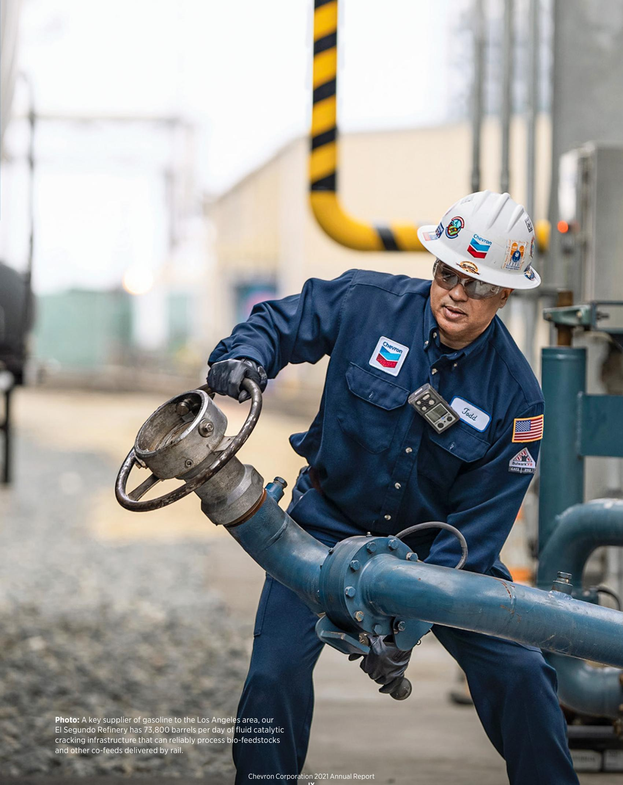
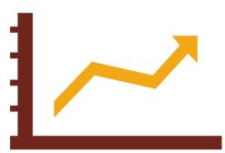
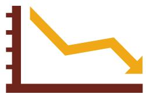
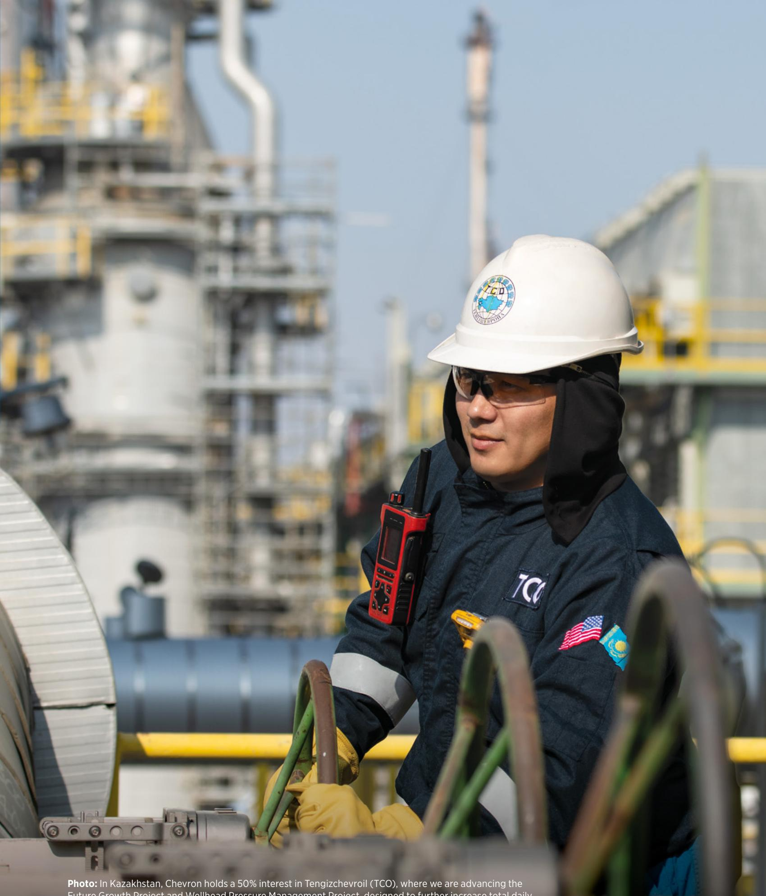
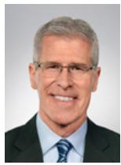
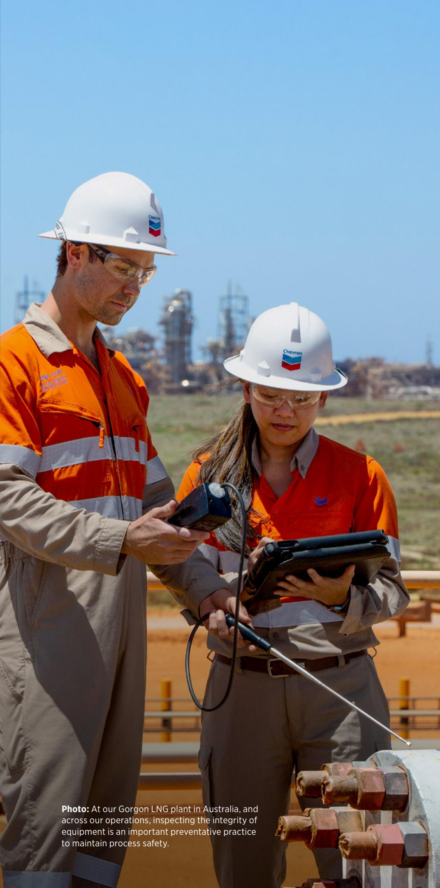

# accelerating progress

asset class: shale and tight

794 MBOED

produced in 2021 from our shale and tight assets

\$4.5 billion

of our 2022 capital budget is focused on shale and tight resources

2.6 million

net acres of shale and tight resources for exploration and production

Photo: The development of oil and gas resources located in shale and tight formations is a key focus area for Chevron. Our shale and tight assets include developments in Colorado, New Mexico and Texas in the United States along with Argentina and Canada. We’re taking an asset class approach to improve our performance. This unified approach allows us to standardize, develop technology and scale solutions faster across the assets.

> **AI Description:**
> **Source:** `assets/_page_1_Figure_0.jpg`
> 
> **Generated:** 2026-05-23 17:42:12
> 
> ---
> 
> The image is a photograph of a person standing on a red metal staircase. The individual is wearing a white hard hat with a logo, a brown jacket, blue jeans, and work boots. They are also wearing a communication device clipped to their jacket. The background shows a clear sky, and part of a structure or equipment is visible in the distance. The person appears to be in an industrial or construction setting.

# our strategy

## leveraging our strengths to deliver lower carbon energy to a growing world

Our capabilities, assets and customers are distinct advantages. We are building on these strengths as we aim to lead in lower carbon intensity oil, products and natural gas and advance new products and solutions that reduce the carbon emissions of major industries.

We’re driving energy progress essential to a growing, dynamic world.

## table of contents

accelerating progress III   
to our stockholders IV   
higher returns, lower carbon X   
our beliefs XII   
lead director: one-on-one XIV   
board of directors XVI   
corporate officers XVIII   
chevron at a glance XX   
chevron stock performance XXII   
financial and operating highlights XXIV   
maintaining process safety XXVI   
financials 31   
glossary of energy and financial terms 110   
stockholder and investor information 112

> **AI Description:**
> **Source:** `assets/_page_3_Figure_0.jpg`
> 
> **Generated:** 2026-05-23 17:57:20
> 
> ---
> 
> The image contains a photograph of a person wearing a blue coverall with an American flag patch on the sleeve, a white hard hat, and a dark face mask. The individual is holding a folder in their left hand and appears to be outdoors, possibly at a industrial or construction site, as indicated by the background structures and the hard hat. The coverall and hard hat suggest the person is engaged in a work environment that requires safety gear.

# accelerating progress

“Accelerating” characterizes the experience of the past year and the call to action shaping the years ahead. As the world emerges from the pandemic, our actions must respond to both the world’s growing energy needs and its expectations for a lower carbon future.

This dual challenge – meeting growing energy demand while reducing greenhouse gas emissions – is profound and complex. We intend to accelerate our progress to meet them both.

“Progress” means doing even more to deliver affordable, reliable and ever-cleaner energy – essential to modern life for billions of people around the world. It means becoming more efficient, returning greater value to our stockholders and growing the capabilities of our people. It means investing and innovating – delivering on the expectations of stakeholders today, while working to transform the energy system of tomorrow.

Progress toward the ambitions of the Paris Agreement will require many different solutions, many different technologies and many different actions. In other words, problem-solving on a global scale. At Chevron, problem-solving defines what we do – and who we are.

We approach the future as optimists, innovators and engineers:

• Adapting to ever-changing markets;

• Leveraging our unique capabilities, assets and customer relationships; and

• Capturing strategic advantage where we can deliver the greatest impact.

Our confidence stems from our core strengths: an advantaged portfolio, improved cost and capital efficiency, strong cash flow and an industry-leading balance sheet. We believe the same strengths that set us apart through market turmoil prime our company for further success.

At the same time, we are reducing greenhouse gas emissions intensity in our oil, products and natural gas businesses and developing lower carbon solutions that we expect to become a bigger part of the energy system in the decades ahead.

We believe this is an exciting time to be in the business of energy. We proudly embrace our role and the challenge of meeting the world’s growing energy demand in a lower carbon future.

## to our stockholders

The critical role energy plays in the global economy was evident in 2021, as world events demonstrated that affordable, reliable and ever-cleaner energy remains vital to progress, prosperity and security. I’m proud of how our people, under challenging circumstances, met the needs of customers and markets around the world.

In addition to meeting the needs of customers, companies must also reward shareholders. Chevron delivered a strong financial performance, achieving best-ever free cash flow and growing shareholder returns once again. We are an even stronger company today than we were just a few years ago.

Our strategy is clear: Leverage our strengths to deliver lower carbon energy to a growing world. Our capabilities, assets and customers are distinct advantages. We’re building on these strengths as we aim to lead in lower carbon intensity oil, products and natural gas and to advance new products and solutions that reduce the carbon emissions of major industries – driving energy progress essential to a dynamic world.

a winning combination Our focus on “higher returns, lower carbon” reflects a firm belief in business resilience – underpinned by operational excellence, cost discipline and capital discipline – and financial strength. Both are essential to any organization aiming to advance meaningful, durable progress in the modern energy economy.

We’re executing a strategy built on strength – and one which positions us differently from others. In 2021, we completed the transformation of our organization and the integration of Noble Energy and delivered on our financial priorities:

• Increased quarterly dividend payout by 4%

. Invested in oil, products, gas and new energy opportunities with discipline

• Strengthened our balance sheet

Reinstated share repurchases

We demonstrated the ability to sustain and grow our business with less capital, generating higher returns and record free cash flow, positioning us to better reward stockholders.

> **AI Description:**
> **Source:** `assets/_page_6_Figure_0.jpg`
> 
> **Generated:** 2026-05-23 17:43:22
> 
> ---
> 
> The image is a photograph of a man wearing a dark blue suit jacket over a light blue dress shirt. He has short, graying hair and is smiling. The background is blurred, showing a natural outdoor setting with greenery and possibly a building. There are no charts, graphs, or text annotations present in the image.

## taking on tomorrow, today

Future progress will require applying our world-class capabilities as we aim to deliver higher returns in a lower carbon world. Some look to the energy transition and describe solutions in the distant future. We’re focused on making progress today. This means setting ambitious targets for emissions intensity reductions, developing new technologies and working with customers to develop solutions that help them lower their emissions.

Having achieved our 2023 carbon intensity reduction goals, we set new targets last year. We’re executing projects to make progress toward our 2050 net zero aspiration for upstream Scope 1 and Scope 2 emissions. As part of these efforts, we’re improving methane detection, rethinking facility designs, optimizing equipment and utilizing more renewable power.

# “we are an even stronger company today than we were just a few years ago”

– mike wirth

Security and reliability of energy supply emerged as a major theme for energy markets in 2021 in places like California, Texas and Europe. Meanwhile, governments representing approximately 92% of global greenhouse gas emissions in 2021 have announced net zero goals or ambitions.

Reaching the ambitions of the Paris Agreement will require innovation, breakthroughs in technology, more ambitious government policy and the ability to attract and forge new partnerships. No one country, no one industry, no one company acting alone can meet the world’s energy and climate goals. That’s why we intend to be the partner of choice for those with complementary strengths.

In our Downstream business, we have the capabilities, assets and supply chains needed to produce and distribute alternative fuels – renewable diesel, sustainable aviation fuel, renewable natural gas and hydrogen. These offer the potential for scalable, lower carbon options for critical segments of the economy that are difficult to decarbonize. Sustainable aviation fuel, for example, can lower emissions by up to 80% on a lifecycle basis compared to traditional jet fuel. It is compatible with modern aircraft engines and airport fueling infrastructure. We’ve produced an initial batch at our El Segundo Refinery that we estimate to lower emissions by 59% on a lifecycle basis.

In 2021, we announced the formation of Chevron New Energies, a new organization dedicated to growing lower carbon businesses in hydrogen; carbon capture, utilization and storage; offsets; and other emerging energies. We’re seeking to accelerate these lower carbon solutions for our customers, such as those in the aviation, marine, heavy-duty transportation and industrial sectors, so they can achieve their emission reduction goals.

In total, Chevron is planning \$10 billion in lower carbon capital investment between 2021 and 2028 with the goal of reducing the carbon intensity of our oil, products and gas business and building new lower carbon energy businesses.

## strengthening the business

Global oil demand rose by 5.5 million barrels per day in 2021 and is expected to return to pre-pandemic levels in 2022. The emergence of new COVID-19 variants in 2021 slowed this recovery in demand, with air travel and jet fuel most affected. Global natural gas demand rose 4.1% in 2021, erasing the losses from 2020.

In Upstream, we produced 3.1 million oilequivalent barrels per day in 2021, a record high and a slight increase from 2020. We added 1.3 billion barrels of net oil-equivalent proved reserves, which equates to approximately 112% of net oil-equivalent production for the year. The largest net additions were from assets in the Permian Basin, the Gulf of Mexico and Australia. The largest net reductions were from assets in Kazakhstan, primarily due to higher prices and their negative effect on reserves.

In Kazakhstan, the Future Growth Project and Wellhead Pressure Management Project is 89% complete. In Australia, we sanctioned the Jansz-Io Compression project, which is expected to support an important source of natural gas to customers in countries across the Asia-Pacific region. We advanced the Anchor project in the U.S. Gulf of Mexico. In addition, we completed the sales of several conventional Permian Basin properties in the second half of 2021.

In Downstream & Chemicals, GS Caltex, a 50% owned affiliate, started up an olefins mixedfeed cracker and associated polyethylene unit at its refinery in Yeosu, South Korea, ahead of schedule and under budget.

We announced an agreement with Neste Oyj to acquire its Group III base oil business and brand and completed the acquisition of an equity interest in American Natural Gas (now Beyond6) and its network of 60 compressed natural gas stations. Our 2022 capital budget excludes expected inorganic capital of \$600 million expected for the formation of a renewable fuel feedstocks joint venture with Bunge.

We completed the acquisition of the publicly held units of Noble Midstream Partners not already owned by Chevron or our affiliates.

# “optimism is the fuel that accelerates progress”

# – mike wirth

We signed a letter of intent with Gevo to jointly produce sustainable aviation fuel (SAF). We tested a batch of SAF with Delta Air Lines and Google and tracked emissions data using cloudbased technology. Chevron and Delta will share results from the SAF pilot with Google to better understand emissions reporting.

We reached separate agreements to collaborate with Caterpillar, Cummins and Toyota to advance our goal of building a commercially viable, large-scale hydrogen business.

With Enterprise Products Partners, we announced a framework to evaluate opportunities for carbon capture, utilization and storage (CCUS) from our respective business operations in the U.S. Midcontinent and Gulf Coast.

And we invested in developing new technologies for geothermal power, floating offshore wind turbines and green ammonia.

## looking ahead

At Chevron, we look to the future with optimism.

We go forward with confidence in the power of human creativity, ingenuity and imagination. We embrace engineering and innovation as a means to develop new solutions, knowing that the prospects for the human condition have never been brighter.

We believe that optimism is the fuel that accelerates progress. It’s the spark of innovation, risk-taking and discovery. If we can harness this powerful force, our human energy, we can overcome the biggest obstacles, solve the most difficult problems and achieve our goals.

Thank you for your support and the trust you place in us.

Sincerely,

Michael K. Wirth

Chairman of the Board and Chief Executive Officer

> **AI Description:**
> **Source:** `assets/_page_10_Figure_0.jpg`
> 
> **Generated:** 2026-05-23 17:55:47
> 
> ---
> 
> The image is a photograph of a worker at an industrial facility, specifically the El Segundo Refinery. The worker is wearing a blue uniform with a hard hat and gloves, and is operating a large valve or control mechanism. The text at the bottom of the image provides information about the refinery's capacity and its role as a key supplier of gasoline to the Los Angeles area. The image effectively conveys the industrial setting and the worker's role in managing the refinery's operations.

# higher returns, lower carbon

We are focused on delivering higher returns, lower carbon and superior shareholder value in any business environment.

Photo: The Angola Liquefied Natural Gas (ALNG) Project commercializes associated natural gas produced by Chevron and other crude oil operators. The plant helps Chevron meet the global demand for natural gas.

Chevron Corporation 2021 Annual Report

> **AI Description:**
> **Source:** `assets/_page_12_Figure_0.jpg`
> 
> **Generated:** 2026-05-23 17:40:41
> 
> ---
> 
> The image shows a close-up view of industrial equipment, likely part of a pipeline or processing system. The foreground features a valve with a red handle and a control panel with a red button labeled "CLC." There are various pipes and fittings in the background, some of which appear to be rusted, indicating potential wear or exposure to the elements. The lighting suggests the photo was taken during sunset, casting a warm glow over the scene. The image provides a detailed view of the machinery, which could be useful for maintenance or operational purposes.

> **AI Description:**
> **Source:** `assets/_page_12_Figure_1.jpg`
> 
> **Generated:** 2026-05-23 17:40:46
> 
> ---
> 
> The image contains a simple line graph with a single orange line that ascends from left to right, indicating a positive trend. The graph has a vertical axis on the left side, marked with intervals, and a horizontal axis at the bottom. The orange line starts at the lower left and moves upward to the upper right, suggesting growth or improvement over time. There are no text annotations or labels within the image itself.

## growing the dividend

Increased quarterly dividend per share 4% in 2021

reinvesting to grow future cash flows

Invested in oil and gas and new energy opportunities with discipline

> **AI Description:**
> **Source:** `assets/_page_12_Figure_3.jpg`
> 
> **Generated:** 2026-05-23 17:43:28
> 
> ---
> 
> The image is a line graph with a downward trend. The x-axis appears to represent time or a sequence of events, while the y-axis likely represents a quantity or value. The graph shows a decline in the value over time, with a few fluctuations. The color of the line is a gradient of yellow, and the graph is set against a dark background with a grid pattern for reference.

## lowering carbon intensity, cost-efficiently

Prioritizing projects expected to return the largest reduction in carbon emissions at the lowest cost, and holding ourselves accountable with transparent targets

strengthening the balance sheet

Lowered net debt ratio from 22.7% to 15.6% in 2021

> **AI Description:**
> **Source:** `assets/_page_12_Figure_5.jpg`
> 
> **Generated:** 2026-05-23 17:46:38
> 
> ---
> 
> The image contains a simple illustration of a dollar bill with an upward-pointing arrow. The dollar bill is orange with a brown border, and the dollar sign is prominently displayed in the center. The arrow is red and points to the right, indicating a positive direction or increase. This visual suggests a concept related to financial growth, profit, or revenue increase.

returning excess cash to stockholders

Repurchased \$1.4 billion in shares

> **AI Description:**
> **Source:** `assets/_page_12_Figure_6.jpg`
> 
> **Generated:** 2026-05-23 17:43:51
> 
> ---
> 
> The image is a simple diagram featuring a cloud with two distinct sections, one yellow and one brown, and a downward-pointing arrow. The cloud appears to represent a concept or process, with the arrow indicating a direction or flow. The colors and shapes suggest a thematic or symbolic representation, possibly related to weather, climate, or environmental processes.

## growing lower carbon businesses

Seeking to grow lower carbon businesses in renewable fuels and products; hydrogen; carbon capture, utilization and storage; offsets; and emerging lower carbon opportunities

# our beliefs

We strive to achieve results the right way. Our actions and investments are guided by a set of beliefs that shape our culture and underpin our commitment to deliver for our stockholders, partners and all our stakeholders.

> **AI Description:**
> **Source:** `assets/_page_13_Figure_0.jpg`
> 
> **Generated:** 2026-05-23 17:43:57
> 
> ---
> 
> The image contains a simple green globe with a network of lines forming a grid pattern. The lines are evenly spaced and create a map-like appearance. The globe is depicted in a two-dimensional style, with no depth or shading, and the lines suggest a representation of latitude and longitude. There are no labels or text annotations present in the image.

## energy is essential to modern life

We work to provide the energy that enables human progress around the world. We live this purpose every day.

> **AI Description:**
> **Source:** `assets/_page_13_Figure_1.jpg`
> 
> **Generated:** 2026-05-23 17:43:45
> 
> ---
> 
> The image is a simple diagram featuring a stylized cloud with a green, leafy top and a downward-pointing arrow. The cloud appears to represent a natural element, possibly symbolizing air or a gas, while the arrow indicates a direction of movement or flow. The overall design is minimalistic and likely used to represent a concept related to environmental processes, such as the cycle of water or air movement.

Our actions can help make energy and global supply chains more sustainable, helping industries and customers who use our products advance a lower carbon world.

> **AI Description:**
> **Source:** `assets/_page_13_Figure_3.jpg`
> 
> **Generated:** 2026-05-23 17:46:45
> 
> ---
> 
> The image is a simple illustration of a light bulb with radiating lines inside, symbolizing an idea or inspiration. The light bulb is green and the radiating lines are also green, creating a cohesive and visually appealing design. The image is likely used to represent concepts such as innovation, creativity, or brainstorming.

The imagination and perseverance of people will deliver solutions to energy’s greatest challenges.

> **AI Description:**
> **Source:** `assets/_page_13_Figure_5.jpg`
> 
> **Generated:** 2026-05-23 17:43:34
> 
> ---
> 
> The image contains a simple diagram of a person standing behind a podium. The person is depicted as a silhouette with a green outline, and the podium is also green. There are no labels or text annotations present in the image. The diagram appears to represent a speaker or presenter at a podium, possibly in a presentation or lecture setting.

Meeting rising expectations demands performance and accountability at the highest level. We aim to deliver industry-leading results.

> **AI Description:**
> **Source:** `assets/_page_14_Figure_0.jpg`
> 
> **Generated:** 2026-05-23 17:45:16
> 
> ---
> 
> The image is a photograph of an individual wearing a white hard hat with a logo, a dark jacket with the letters "TCO" and an American flag patch, and a walkie-talkie. The person is standing in front of an industrial setting, likely an oil or gas facility, with large structures and pipes in the background. The text at the bottom of the image provides information about Chevron's investment in Tengizchevroil (TCO) in Kazakhstan, mentioning the Future Growth Project and Wellhead Pressure Management Project. The image effectively conveys the professional context of the individual and the industrial environment.

Photo: In Kazakhstan, Chevron holds a 50% interest in Tengizchevroil (TCO), where we are advancing the Future Growth Project and Wellhead Pressure Management Project, designed to further increase total daily production from the Tengiz reservoir and maximize the ultimate recovery of resources. A third-generation expansion in a 20-year process, the project was approximately 89% complete by year-end 2021.

lead director:

one-on-one

Lead Independent Director Ronald D. Sugar describes how Chevron’s Board of Directors sees the link between financial results and Chevron’s approach to the energy transition:

Last year in the annual report, I closed my comments with our Board’s mandate to review, test, debate and, where necessary, work with management to adjust the company’s business strategy. Our goal is to most effectively deploy Chevron’s capital and talent to meet rising expectations in a world where financial results and environmental performance – including emission reductions – are inextricably linked.

We regularly meet with investors and other stakeholders to discuss concerns about climate change, to describe our approach to the energy transition and to engage in ongoing dialogue on these critical issues.

> **AI Description:**
> **Source:** `assets/_page_15_Figure_0.jpg`
> 
> **Generated:** 2026-05-23 17:40:21
> 
> ---
> 
> The image contains a photograph of a man in professional attire, wearing a dark suit, white shirt, and a pink tie. He is gesturing with his hands, suggesting he is in the middle of a conversation or presentation. The background is blurred, showing an out-of-focus cityscape, which indicates the photo was taken in an urban setting, possibly from a high vantage point. The man appears to be middle-aged with glasses and is wearing a ring on his left hand. The overall context suggests a formal or professional setting.

## tell us about the strategy behind meeting rising expectations?

The Board has been heavily engaged in support of Chevron’s energy transition strategy. The purpose of the company has been clearly articulated: to provide the affordable, reliable, ever-cleaner energy that enables human progress. And our objective is simply stated – higher returns, lower carbon. Our aim is to lead in lower carbon intensity oil, products and natural gas and to advance new products and solutions that reduce the carbon emissions of major industries. Our strategy leverages the company’s strengths – Chevron’s capabilities, assets and customers – and builds on those strengths to deliver lower carbon energy.

## what lower carbon aspirations did the board adopt last year?

The Board endorsed the adoption of a 2050 Upstream Scope 1 and Scope 2 net zero aspiration. The Board also endorsed new Upstream carbon intensity targets for 2028, having exceeded our 2023 Upstream carbon intensity targets. The company incorporated Scope 3 emissions into greenhouse gas (GHG) intensity targets by establishing a Portfolio Carbon Intensity target. Adopting this methodology provides Chevron the flexibility to grow our Upstream and Downstream businesses provided we remain an increasingly carbon-efficient operator. More information is available in the company’s updated Climate Change Resilience report, which is aligned with the Task Force on Climate-Related Disclosures.

Accomplishing our Upstream net zero aspiration depends on both internal and external factors, including continuing progress on commercially viable technology; government policy; successful negotiations for carbon capture, utilization and storage (CCUS) and nature-based projects; availability of cost-effective, verifiable offsets in the global market; and granting of necessary permits by governing authorities.

## as the world looks to a lower carbon future, how is chevron positioned?

First, our new organization – last year the Board endorsed the formation of Chevron New Energies, an organization focused on areas where we believe the company can build competitive advantages and that target sectors of the economy that cannot be easily decarbonized, such as heavy transportation, aviation and power generation. The company has strong relationships with key customers and partners, which we expect to be critical in developing economic projects that can scale.

Renewable fuels, hydrogen, CCUS and offsets are at the core of this strategy and are an important part of addressing climate change. These businesses support Chevron’s efforts to reduce its GHG emissions intensity, and we believe they could become highgrowth opportunities with the potential to generate accretive returns.

And our business model can evolve to accommodate more rapid growth of Chevron New Energies if the policies, such as economy-wide carbon prices, enable lower carbon solutions to scale faster.

## what climate policies does chevron support?

Public policy is one of the Board’s key focus areas. Chevron supports well-designed policies that achieve emissions reductions as efficiently and effectively as possible. Crafting these policies will require engagement on a transparent and economywide carbon market; on support for precommercial technologies designed to spur innovation across all sectors; and on cost-effective reductions that allocate costs equitably, gradually and predictably.

Chevron supports carbon pricing. Policy makers must balance economic, environmental and energy needs. Policy benefits, costs and trade-offs should be transparently communicated.

As a global company, Chevron operates in many jurisdictions that have enacted lower carbon policies. Under current and potential future market conditions, the Board seeks to understand the impacts of climate-related actions and strategies and to advance opportunities to increase returns to investors in our oil, products, gas and new energies businesses.

## how is the board adapting with the fast pace of change around the world?

The world is rapidly evolving, and so are we. From the recent transformation of our organizational structure, to the acquisition of Noble Energy, to the creation of Chevron New Energies and the continued advancement of our people and leadership, we are proud of the pace at which Chevron continues to respond to change and opportunity. Our Board of Directors has also changed, adding five new directors in the past five years who bring new insights and perspectives to challenge our thinking and shape our point of view.

> **AI Description:**
> **Source:** `assets/_page_17_Figure_0.jpg`
> 
> **Generated:** 2026-05-23 17:55:52
> 
> ---
> 
> The image is a professional portrait of a man. He is wearing a dark blue suit and tie, and is smiling slightly. The background is a plain, light gray color. There are no charts, graphs, or other visual elements present in the image.

## Michael K. (Mike) Wirth, 61

Chairman of the Board and Chief Executive Officer since February 2018. Prior to his current role, Wirth served as Vice Chairman of the Board in 2017 and Executive Vice President of Midstream & Development from 2016 to 2018. In that role, he was responsible for supply and trading, shipping, pipeline and power operating units; corporate strategy; business development; and corporate affairs.

Wirth was Executive Vice President of Downstream & Chemicals from 2006 to 2015. Previously, he served as President of Global Supply and Trading from 2003 to 2006.

Wirth serves on the board of directors of Catalyst, is Chairman of the American Petroleum Institute and is a member of the National Petroleum Council, the Business Roundtable, the World Economic Forum International Business Council and the American Society of Corporate Executives. Wirth joined Chevron in 1982 as a design engineer. He earned a bachelor’s degree in chemical engineering from the University of Colorado.

## Wanda M. Austin, 67

Director since 2016. She holds an adjunct Research Professor appointment at the University of Southern California’s Viterbi School’s Department of Industrial and Systems Engineering. She is a retired President and Chief Executive Officer of The Aerospace Corporation, a leading architect for the United States’ national security space programs. She is a Director of Amgen Inc. and Virgin Galactic Holdings, Inc. (2,3)

## John B. Frank, 65

Director since 2017. He is Vice Chairman of Oaktree Capital Group LLC, a global investment management company with expertise in credit strategies. He is one of four members of Oaktree’s Executive Committee and was previously the firm’s Principal Executive Officer. He is a Director of Daily Journal Corporation and Oaktree Capital Group LLC and its subsidiaries: Oaktree Acquisition Corporation II, Oaktree Acquisition Corporation III and Oaktree Specialty Lending Corporation. (1)

> **AI Description:**
> **Source:** `assets/_page_17_Figure_3.jpg`
> 
> **Generated:** 2026-05-23 17:56:30
> 
> ---
> 
> The image contains a photograph of a person with shoulder-length brown hair, smiling. The person is wearing a dark blazer over a light-colored shirt. There are no charts, graphs, diagrams, or other visual elements present in the image.

## Alice P. Gast, 63

Director since 2012. She is President of Imperial College London, a public research university specializing in science, engineering, medicine and business. Previously, she was President of Lehigh University in Pennsylvania. Prior to that, she was Vice President for Research, Associate Provost and Robert T. Haslam Chair in Chemical Engineering at the Massachusetts Institute of Technology. (2,4)

## Enrique Hernandez, Jr., 66

Director since 2008. He is Executive Chairman of Inter-Con Security Systems Inc., a global provider of security and facility support services to governments, utilities and industrial customers. He is Chairman of the Board of McDonald’s Corporation. (3,4)

# The Board of Directors of Chevron directs the affairs of the corporation and is committed to sound principles of corporate governance. The Directors bring a proven track record of success across a broad range of experiences at the policymaking level.

## Marillyn A. Hewson, 68

Director since 2021. She has been Strategic Advisor to the Chief Executive Officer of Lockheed Martin Corporation, a security and aerospace company, since March 2021. Previously, she was Executive Chairman, Chairman, President and Chief Executive Officer of Lockheed Martin Corporation. She is a Director of Johnson & Johnson. (1)

> **AI Description:**
> **Source:** `assets/_page_18_Figure_1.jpg`
> 
> **Generated:** 2026-05-23 17:49:27
> 
> ---
> 
> The image contains a photograph of a person with long, wavy hair. The background is plain and light-colored, which helps to highlight the subject. There are no charts, graphs, or other visual elements present in the image. The focus is solely on the individual, with no additional text or annotations.

Director since 2018. She is a retired Chairman, Chief Executive Officer and President of Sempra Energy, an energy services holding company. Previously, she was Executive Vice President of Sempra Energy and President and Chief Executive Officer of San Diego Gas & Electric and Southern California Gas Co. She is a Director of Caterpillar Inc. and Lockheed Martin Corporation. (1)

## Jon M. Huntsman Jr., 62

Director since 2020 and from 2014 to 2017 when he resigned to serve as the U.S. Ambassador to Russia. He is Vice Chair of Policy at Ford Motor Company. Previously, he served as U.S. Ambassador to China and was Governor of Utah for two consecutive terms. He is a Director of Ford Motor Company. (3,4)

## Debra Reed-Klages, 65

## Charles W. Moorman, 70

Director since 2012. He is a retired Chairman of the Board, Chief Executive Officer and President of Norfolk Southern Corporation, a freight and transportation company. He is a Senior Advisor to Amtrak, a passenger rail service provider, having previously served as Amtrak’s President and Chief Executive Officer. He is a Director of Oracle Corporation. (2,3)

Director since 2016. She is Co-Principal of Versaca Investments, a family office focused on growth investing globally. Previously, she served as Chief Executive Officer of Mildstorm LLC, focusing on the global economy and international affairs. Prior to that, she worked at Goldman Sachs in various roles and at the World Bank in Washington, D.C. She is the author of four New York Times bestsellers and is a Director of 3M Company. (1)

## Dambisa F. Moyo, 53

## Ronald D. Sugar, 73

Lead Director since 2015 and a Director since 2005. He is a retired Chairman and Chief Executive Officer of Northrop Grumman Corporation, an aerospace and defense company. He is a Senior Advisor to Ares Management LLC; Bain & Company; Temasek Americas Advisory Panel, Singapore; G100 Network; and World 50. He is a Director of Amgen Inc., Apple Inc. and Uber Technologies, Inc. (2,3)

## D. James Umpleby III, 64

Director since 2018. He is Chairman and Chief Executive Officer of Caterpillar Inc., a leading manufacturer of construction and mining equipment, diesel and natural gas engines, industrial gas turbines and diesel-electric locomotives. Previously, he was Group President of Caterpillar’s Energy and Transportation business segment. (2,4)

## Committees of the Board

1 Audit: Debra Reed-Klages, Chair

2 Board Nominating and Governance: Wanda M. Austin, Chair

4 Public Policy and Sustainability: Enrique Hernandez, Jr., Chair

corporate officers

## Paul R. Antebi, 50

Vice President and General Tax Counsel since 2021. Responsible for directing Chevron’s worldwide tax activities. Previously, the company’s Deputy General Tax Counsel. Joined the company in 1998.

## Mary A. Francis, 57 MaryA. cls,57 Corporate Secretary and Chief Governance Corporate Secretary and Chief Governance

Officer since 2015. Responsible for providing advice and counsel to the Board of Directors and senior management on corporate governance matters, managing the company’s corporate governance function, and serving on the Law Function Executive Committee. Previously, Chief Corporate Counsel. Joined the company in 2002.

## Marissa Badenhorst, 46

Vice President, Health, Safety and Environment (HSE) since 2022. Responsible for HSE strategic planning and issues management, compliance assurance and emergency response. Previously, General Manager of Enterprise Process Safety. Prior to that, Technical Manager, Chevron Australia. Joined the company in 2000.

## Jeff B. Gustavson, 49

Vice President, Lower Carbon Energies since 2021. Responsible for accelerating Chevron’s lower carbon businesses in hydrogen, carbon capture, offsets and emerging energies. Previously, Vice President, Mid-Continent Business Unit; and President, Chevron Canada Limited. Joined the company in 1999.

## Eimear P. Bonner, 48

Vice President, President Chevron Technical Center and Chief Technology Officer since 2021. Responsible for leading the Chevron Technical Center, which provides technical expertise to support Chevron’s global operations, develops solutions to transform Chevron’s digital future, and deploys innovative breakthrough technology to support the future of energy. Joined the company in 1998.

## David A. Inchausti, 58

Vice President and Controller since 2019. Responsible for corporatewide accounting, financial reporting and analysis, internal controls, accounting policy, and digital finance. Previously, Deputy Comptroller and Upstream Comptroller. Prior to that, 20 years abroad in multiple business units. Joined the company in 1988.

## Pierre R. Breber, 57

Vice President and Chief Financial Officer since 2019. Responsible for controller, tax, treasury, audit and investor relations activities worldwide. Previously, Executive Vice President of Downstream & Chemicals. Joined the company in 1989.

## James W. Johnson, 63

Executive Vice President, Upstream since 2015. Responsible for Chevron’s global exploration and production activities for crude oil and natural gas. Previously, President, Chevron Europe, Eurasia and Middle East Exploration and Production Company; Managing Director, Eurasia Business Unit; and Managing Director, Australasia Business Unit. Joined the company in 1981.

> **AI Description:**
> **Source:** `assets/_page_20_Figure_0.jpg`
> 
> **Generated:** 2026-05-23 17:53:09
> 
> ---
> 
> The image is a photograph of a person wearing a suit and tie, set against a plain background. The individual appears to be smiling and is positioned in the center of the frame. There are no charts, graphs, or other visual elements present in the image.

Navin K. Mahajan, 55 Vice President and Treasurer since 2019. Responsible for Chevron’s banking, financing, cash management, insurance, pension investments, and credits and receivables activities. Previously, Vice President of Finance for Downstream & Chemicals, Assistant Treasurer of Operating Company Financing, and Chief Compliance Officer. Joined the company in 1996.

## Rhonda J. Morris, 56

Vice President since 2016 and Chief Human Resources Officer since 2019. Responsible for human resources, diversity and inclusion, ombuds, and employee assistance/work life services. Previously, Vice President, Human Resources, Downstream & Chemicals. Joined the company in 1991.

> **AI Description:**
> **Source:** `assets/_page_20_Figure_3.jpg`
> 
> **Generated:** 2026-05-23 17:53:05
> 
> ---
> 
> The image contains a photograph of a man wearing a suit and tie. The background is plain and light-colored, and the image appears to be a professional headshot or portrait. There are no charts, graphs, diagrams, or other visual elements present in the image.

## Mark A. Nelson, 58

> **AI Description:**
> **Source:** `assets/_page_20_Figure_4.jpg`
> 
> **Generated:** 2026-05-23 17:55:57
> 
> ---
> 
> The image contains a photograph of a person. The individual is wearing a suit and tie, and the background is plain and light-colored, likely a professional headshot. There are no charts, graphs, diagrams, or other visual elements present in the image.

Executive Vice President, Downstream & Chemicals since 2019. Responsible for directing the company’s worldwide manufacturing, marketing, lubricants, chemicals and Oronite additives businesses. Also oversees Chevron’s joint venture Chevron Phillips Chemical Company. Previously, Vice President, Midstream, Strategy & Policy. Joined the company in 1985.

## Colin E. Parfitt, 58

## Bruce L. Niemeyer, 60

Vice President, Strategy & Sustainability since 2018. Responsible for guiding development of the company’s key strategies, including capital allocation and sustainability efforts. Previously, Vice President, Mid-Continent Business Unit; Vice President of the Appalachian/Michigan Business Unit; and General Manager of Strategy and Planning for Chevron North America Exploration & Production. Joined the company in 2000.

Vice President, Midstream since 2019. Responsible for Chevron’s Midstream business, including supply and trading activities, shipping, pipeline and power, and energy management. Appointed Chairman of the Board, Noble Midstream Partners GP LLC, in October 2020. Previously, President, Supply and Trading. Joined the company in 1995.

## R. Hewitt Pate, 59

Vice President and General Counsel since 2009. Responsible for directing the company’s worldwide legal affairs. Previously, Chair, Competition Practice, Hunton & Williams LLP, Washington, D.C., and Assistant Attorney General, Antitrust Division, U.S. Department of Justice. Joined the company in 2009.

## Jay R. Pryor, 64

Vice President, Business Development since 2006. Responsible for identifying and developing new, large-scale upstream and downstream business opportunities, including mergers and acquisitions. Previously, Managing Director, Chevron Nigeria Ltd., and Managing Director, Asia South Business Unit and Chevron Offshore (Thailand) Ltd. Joined the company in 1979.

## Albert J. Williams, 53

Vice President, Corporate Affairs since 2021. Responsible for overseeing government affairs, public affairs, social investment and performance, and the company’s worldwide efforts to protect and enhance its reputation. Previously, Managing Director of Chevron Australia and head of the Australasia Business Unit. Joined the company in 1991.

## Retiring Officers

Joseph C. Geagea, retiring effective June 2022; Executive Vice President and Senior Advisor to the Chairman and CEO since 2021; joined the company in 1982.

J. David Payne, retiring effective April 2022; Vice President, Health, Safety and Environment since 2018; joined the company in 1981.

Executive Committee   
Michael K. Wirth, Eimear P. Bonner, Pierre R. Breber, Joseph C. Geagea, James W. Johnson, Rhonda J. Morris, Mark A. Nelson, Colin E. Parfitt, and R. Hewitt Pate.

chevron at a glance

Chevron is one of the world’s leading integrated energy companies. We believe affordable, reliable and ever-cleaner energy is essential to enabling human progress. Chevron produces crude oil and natural gas; manufactures transportation fuels, lubricants, petrochemicals and additives; and develops technologies that enhance our business and the industry. We are focused on lowering the carbon intensity in our operations and seeking to grow lower carbon businesses along with our oil, products and natural gas business lines.

Our success is driven by a dedicated, diverse and highly skilled global workforce united by The Chevron Way, our enduring statement of culture, and our focus on delivering industry-leading results and superior stockholder value.

We aim to lead our industry in health, safety and environmental performance. The protection of people, assets, communities and the environment is our highest priority.

> **AI Description:**
> **Source:** `assets/_page_21_Figure_0.jpg`
> 
> **Generated:** 2026-05-23 17:57:49
> 
> ---
> 
> The image contains a photograph of a metallic pipe with a curved section, likely part of an industrial or mechanical system. The pipe is mounted on a vertical surface, and in the background, there are various mechanical components and equipment, including what appears to be a control panel with switches and a red cylindrical object, possibly a valve or a pressure gauge. The setting suggests a workshop or industrial environment.

> **AI Description:**
> **Source:** `assets/_page_22_Figure_0.jpg`
> 
> **Generated:** 2026-05-23 17:46:34
> 
> ---
> 
> The image contains a photograph of two individuals wearing hard hats and safety goggles, standing in what appears to be an industrial setting. They are dressed in blue uniforms with name tags, and one of them is holding a clipboard. The background shows industrial equipment and piping, suggesting a work environment related to manufacturing or construction. The individuals seem to be engaged in a discussion or review of some kind, possibly related to the work they are performing.

3.10

million barrels

net oil-equivalent daily production1

\$239.5

billion

total assets2

11.3

billion barrels

net oil-equivalent proved reserves2, 3

\$155.6

billion

sales and other operating revenues1

3 For definition of “reserves,” see glossary of energy and financial terms, page 110

### Full Page Description (Page 23)

**Source:** `assets/_page_23_Asset_3.jpg`

**Generated:** 2026-05-23 17:51:18

---

The image is a bar chart comparing the performance of Chevron over a 10-year period to the S&P 500. The chart shows that Chevron's performance was 5.2%, significantly lower than the S&P 500's 16.6%. The chart uses a blue bar for Chevron and a gray bar for the S&P 500, with the S&P 500's performance marked at the top of the chart. The chart is labeled "10-year" at the top, indicating the time frame of the comparison.

### Full Page Description (Page 23)

**Source:** `assets/_page_23_Asset_2.jpg`

**Generated:** 2026-05-23 17:51:10

---

The image is a bar chart with the title "5-year" at the top. It compares the performance of Chevron over a 5-year period against the S&P 500, which is shown at 18.5%. The chart includes two bars: one for Chevron at 4.5% and another for the S&P 500 at 18.5%. The bars are color-coded, with Chevron's bar in blue and the S&P 500's bar in gray. The chart uses a percentage scale on the y-axis, ranging from -5% to 20%. The chart visually represents the relative performance of Chevron compared to the broader market index over the specified period.

### Full Page Description (Page 23)

**Source:** `assets/_page_23_Asset_1.jpg`

**Generated:** 2026-05-23 17:50:37

---

The image is a bar chart with the title "1-year." It compares the performance of Chevron and the S&P 500 over a one-year period. The chart shows that Chevron's performance is significantly higher than the S&P 500, with a 45.9% increase compared to the S&P's 28.7% increase. The bars are color-coded, with Chevron's performance in blue and the S&P's performance in gray. The chart includes a horizontal line at 30% to indicate a benchmark or average performance level.

### Full Page Description (Page 23)

**Source:** `assets/_page_23_Asset_0.jpg`

**Generated:** 2026-05-23 17:50:57

---

The image is a line graph showing the compound annual growth rates of three entities: Chevron, the S&P 500, and a peer group of BP p.l.c., ExxonMobil, Shell p.l.c., and TotalEnergies SE. The graph spans from 2006 to 2021. The S&P 500 and the peer group are represented by green and gray lines, respectively, while Chevron is shown in blue. The blue line for Chevron consistently outperforms the other two lines, indicating a higher compound annual growth rate. The text at the top of the graph states that the compound annual growth rate for CVX (Chevron) is 6.7%. The graph also notes that dividends include both cash and scrip share distributions for European peers.

# chevron stock performance

## Indexed dividend growth

Basis 2006 = 100

### Full Page Description (Page 24)

**Source:** `assets/_page_24_Asset_0.jpg`

**Generated:** 2026-05-23 17:50:16

---

The image is a line graph showing the performance of three entities over the years 2016 to 2021. The entities represented are:

1. Chevron (blue line)
2. S&P 500 (green line)
3. Peer group: BP p.l.c. (ADS), ExxonMobil, Shell p.l.c. (ADS), TotalEnergies SE (ADR) (gray line)

The y-axis represents monetary values in dollars, ranging from $50 to $250. The graph illustrates the following trends:

- The S&P 500 (green line) shows a steady upward trend, with the value increasing from approximately $100 in 2016 to $233 in 2021.
- Chevron (blue line) also shows a general upward trend but with more fluctuations. It starts at around $100 in 2016 and reaches $124 in 2021.
- The Peer group (gray line) shows a more volatile performance, starting at around $100 in 2016 and ending at $104 in 2021.

The graph highlights the performance of these entities relative to the S&P 500 and each other, with the S&P 500 consistently outperforming the other two entities.

## Performance graph

The stock performance graph above shows how an initial investment of \$100 in Chevron stock would have compared with an equal investment in the S&P 500 Index or the Competitor Peer Group. The comparison covers a five-year period beginning December 31, 2016, and ending December 31, 2021, and for the peer group is weighted by market capitalization as of the beginning of each year. It includes the reinvestment of all dividends that an investor would be entitled to receive and is adjusted for stock splits. The interim measurement points show the value of \$100 invested on December 31, 2016, as of the end of each year between 2017 and 2021.

# financial and operating highlights

1 Millions of dollars, except per-share amounts
2 Includes equity in affiliates
3 See pages 46–47 for additional information

### Full Page Description (Page 26)

**Source:** `assets/_page_26_Asset_0.jpg`

**Generated:** 2026-05-23 17:53:01

---

The image is a bar chart with a vertical axis labeled in dollars and a horizontal axis representing years from 2016 to 2021. Each bar represents a value for a given year, with the height of the bar corresponding to the dollar amount. The chart shows fluctuations in values over the years, with the highest value in 2016 at $22 and the lowest in 2021 at $12. The data points for each year are clearly labeled on the bars.

### Full Page Description (Page 26)

**Source:** `assets/_page_26_Asset_1.jpg`

**Generated:** 2026-05-23 17:52:52

---

The image is a bar chart with a vertical axis labeled in increments of $5, ranging from $0 to $30, and a horizontal axis representing years from 2016 to 2021. Each bar corresponds to a year and is labeled with a monetary value. The values for each year are as follows: $25 in 2016, $24 in 2017, $25 in 2018, $26 in 2019, $25 in 2020, and $25 in 2021. The chart shows that the values fluctuate slightly but generally remain around $25, with a peak of $26 in 2019.

<table><tr><td></td></tr></table>
Total capital and exploratory expenditures4 (\$ – Billions)

6 Includes equity in affiliates, except number of employees
7 NGLs = natural gas liquids
8 At year-end
9 2021 excludes 5,097 service station employees

# maintaining process safety

Process safety includes robust risk identification, safeguard management and assurance activities. Maintenance turnarounds are a critical aspect of managing the process safety risks that we identify, assess and prioritize across our assets.

A turnaround is a scheduled shutdown of a process unit to perform maintenance, inspections, upgrades and repairs of equipment. Major maintenance turnarounds are crucial to ensuring our facilities operate with high reliability and integrity. These events provide us with an opportunity to make targeted improvements in reliability and performance.

In 2021, we carried out high-complexity turnarounds at our joint venture upstream operations at Tengiz in Kazakhstan and Gorgon and Wheatstone facilities in Australia and at our downstream operations in Pascagoula, Mississippi, and Salt Lake City, Utah. In a typical year we host 15 major turnarounds across our enterprise, with a third of them being high complexity.

As one of the most challenging undertakings in our business, turnarounds require disciplined and detailed planning to promote safety, predictability and alignment with cost and planned downtime targets.

Our turnaround expertise has evolved into a centralized organization, as part of the Chevron Technical Center, that serves the entire enterprise. The organization provides a turnaround process that is scalable by asset class and enables better long-range planning, detailed contingency and risk mitigation planning, and resource-sharing coordination. We also participate in benchmarking studies to understand our performance relative to industry and to identify improvement opportunities.

Our priorities remain ensuring safe execution, delivering improved asset reliability and integrity, managing costs and optimizing downtime. Our goal is the consistent implementation of our turnaround process – the standards, tools and training/coaching programs – that enables us to improve the consistency in planning, scheduling and executing predictable turnarounds.

> **AI Description:**
> **Source:** `assets/_page_28_Figure_0.jpg`
> 
> **Generated:** 2026-05-23 17:48:18
> 
> ---
> 
> The image is a photograph showing two individuals in safety gear, including hard hats and reflective clothing, working at an industrial site. They are inspecting equipment, with one person holding a handheld device and the other holding a tablet. The background shows industrial structures, likely part of a large facility. The text at the bottom of the image provides context, stating that this is at the Gorgon LNG plant in Australia and emphasizes the importance of inspecting equipment integrity for process safety.

> **AI Description:**
> **Source:** `assets/_page_28_Figure_1.jpg`
> 
> **Generated:** 2026-05-23 17:46:49
> 
> ---
> 
> The image contains a simple calendar icon with a checkmark inside it. The calendar is divided into a grid of squares, representing days of the month. The checkmark indicates a marked or selected date. The icon is designed to represent scheduling or planning, with the checkmark suggesting a task or event has been noted or completed.

High-complexity events scheduled 3+ years out

> **AI Description:**
> **Source:** `assets/_page_28_Figure_3.jpg`
> 
> **Generated:** 2026-05-23 17:48:50
> 
> ---
> 
> The image is a simple icon depicting a person wearing a hard hat and holding a steering wheel. The icon is designed to represent a worker or operator, possibly in a manufacturing or industrial setting. The color scheme is primarily brown and yellow, with the hard hat and steering wheel being the most prominent features. The icon does not contain any text or additional labels.

Standard risk prioritization process applied

> **AI Description:**
> **Source:** `assets/_page_28_Figure_5.jpg`
> 
> **Generated:** 2026-05-23 17:50:21
> 
> ---
> 
> The image is a diagram of a flowchart or process map. It features a series of rectangular boxes connected by arrows, indicating a sequence of steps or stages. The boxes are labeled with text, although the specific content of the labels is not provided. The arrows suggest a directional flow, likely representing a process or workflow. The color scheme uses shades of brown and gold, which may be part of a branding or thematic design.

Resources tracked and shared across enterprise

> **AI Description:**
> **Source:** `assets/_page_28_Figure_7.jpg`
> 
> **Generated:** 2026-05-23 17:48:53
> 
> ---
> 
> The image contains a simple diagram of a wrench with a hexagonal nut. The wrench is depicted in a stylized manner, with a dark red handle and a yellow hexagonal nut. The image is a graphic representation and does not contain any text or additional visual elements.

\~1,000–6,000 personnel per day at large events

> **AI Description:**
> **Source:** `assets/_page_28_Figure_9.jpg`
> 
> **Generated:** 2026-05-23 17:51:02
> 
> ---
> 
> The image contains a simple checklist with three items, each marked with a yellow checkmark. The background is a dark maroon color. The checklist appears to be a visual representation of a task list or a confirmation of completed steps.

Event lessons learned and best practices shared

## financials

Photo: In our Houston, Texas, offices, as in our offices all around the world, we believe innovation happens when we bring different types of people together to solve the greatest challenges of energy.

Management’s Discussion and Analysis of   
Financial Condition and Results of Operations Notes to the Consolidated Financial Statements   
Key Financial Results 32 Note 1 Summary of Significant Accounting Policies 63   
Earnings by Major Operating Area 32 Note 2 Changes in Accumulated Other Comprehensive Losses 66   
Business Environment and Outlook 32 Note 3 Information Relating to the Consolidated Statement of Cash Flows 67   
Operating Developments 37 Note 4 New Accounting Standards 68   
Results of Operations . 38 Note 5 Lease Commitments 68   
Consolidated Statement of Income 40 Note 6 Summarized Financial Data – Chevron U.S.A. Inc. 70   
Selected Operating Data 42 Note 7 Summarized Financial Data – Tengizchevroil LLP 70   
Liquidity and Capital Resources 43 Note 8 Summarized Financial Data - Chevron PhillipsChemical Company LLC . . . . . . . . . . . . . . . . . 70   
Financial Ratios and Metrics 46 Note 9 Fair Value Measurements . 71   
Financial and Derivative Instrument Market Risk . 47 Note 10 Financial and Derivative Instruments 72   
Transactions With Related Parties 48 Note 11 Assets Held for Sale 73   
Litigation and Other Contingencies 48 Note 12 Equity 73   
Environmental Matters 49 Note 13 Earnings Per Share 74   
Critical Accounting Estimates and Assumptions 50 Note 14 Operating Segments and Geographic Data . 74   
New Accounting Standards 53 Note 15 Investments and Advances . 77   
Quarterly Results 54 Note 16 Litigation 78   
Note 17 Taxes 79   
Consolidated Financial Statements Note 18 Properties, Plant and Equipment . 82   
Reports of Management 55 Note 19 Short-Term Debt . 83   
Report of Independent Registered Public Accounting Firm (PCAOB ID: 238) . . . . . . . . . . . . . . . . . . . . . . . . . . . . . . . . . 56 Note 20 Long-Term Debt 84   
Consolidated Statement of Income 58 Note 21 Accounting for Suspended Exploratory Wells 85   
Consolidated Statement of Comprehensive Income 59 Note 22 Stock Options and Other Share-Based Compensation 86   
Consolidated Balance Sheet 60 Note 23 Employee Benefit Plans 87   
Consolidated Statement of Cash Flows 61 Note 24 Other Contingencies and Commitments   
Consolidated Statement of Equity 62 Note 25 Asset Retirement Obligations .   
Note 26 Revenue   
Note 27 Other Financial Information   
Supplemental Information on Oil and Gas Note 28 Financial Instruments - Credit Losses   
Producing Activities 97 Note 29 Acquisition of Noble Energy, Inc.

## CAUTIONARY STATEMENTS RELEVANT TO FORWARD-LOOKING INFORMATION FOR THE PURPOSE OF “SAFE HARBOR” PROVISIONS OF THE PRIVATE SECURITIES LITIGATION REFORM ACT OF 1995

This Annual Report of Chevron Corporation contains forward-looking statements relating to Chevron’s operations and energy transition plans that are based on management’s current expectations, estimates and projections about the petroleum, chemicals and other energy-related industries. Words or phrases such as “anticipates,” “expects,” “intends,” “plans,” “targets,” “advances,” “commits,” “drives,” “aims,” “forecasts,” “projects,” “believes,” “approaches,” “seeks,” “schedules,” “estimates,” “positions,” “pursues,” “may,” “can,” “could,” “should,” “will,” “budgets,” “outlook,” “trends,” “guidance,” “focus,” “on track,” “goals,” “objectives,” “strategies,” “opportunities,” “poised,” “potential,” “ambitions,” “aspires” and similar expressions are intended to identify such forward-looking statements. These statements are not guarantees of future performance and are subject to certain risks, uncertainties and other factors, many of which are beyond the company’s control and are difficult to predict. Therefore, actual outcomes and results may differ materially from what is expressed or forecasted in such forward-looking statements. The reader should not place undue reliance on these forward-looking statements, which speak only as of the date of this report. Unless legally required, Chevron undertakes no obligation to update publicly any forward-looking statements, whether as a result of new information, future events or otherwise.

Among the important factors that could cause actual results to differ materially from those in the forward-looking statements are: changing crude oil and natural gas prices and demand for the company’s products, and production curtailments due to market conditions; crude oil production quotas or other actions that might be imposed by the Organization of Petroleum Exporting Countries and other producing countries; technological advancements; changes to government policies in the countries in which the company operates; public health crises, such as pandemics (including coronavirus (COVID-19)) and epidemics, and any related government policies and actions; disruptions in the company’s global supply chain, including supply chain constraints and escalation of the cost of goods and services; changing economic, regulatory and political environments in the various countries in which the company operates; general domestic and international economic and political conditions; changing refining, marketing and chemicals margins; actions of competitors or regulators; timing of exploration expenses; timing of crude oil liftings; the competitiveness of alternate-energy sources or product substitutes; development of large carbon capture and offset markets; the results of operations and financial condition of the company’s suppliers, vendors, partners and equity affiliates, particularly during the COVID-19 pandemic; the inability or failure of the company’s joint-venture partners to fund their share of operations and development activities; the potential failure to achieve expected net production from existing and future crude oil and natural gas development projects; potential delays in the development, construction or start-up of planned projects; the potential disruption or interruption of the company’s operations due to war, accidents, political events, civil unrest, severe weather, cyber threats, terrorist acts, or other natural or human causes beyond the company’s control; the potential liability for remedial actions or assessments under existing or future environmental regulations and litigation; significant operational, investment or product changes undertaken or required by existing or future environmental statutes and regulations, including international agreements and national or regional legislation and regulatory measures to limit or reduce greenhouse gas emissions; the potential liability resulting from pending or future litigation; the company’s future acquisitions or dispositions of assets or shares or the delay or failure of such transactions to close based on required closing conditions; the potential for gains and losses from asset dispositions or impairments; government mandated sales, divestitures, recapitalizations, taxes and tax audits, tariffs, sanctions, changes in fiscal terms or restrictions on scope of company operations; foreign currency movements compared with the U.S. dollar; material reductions in corporate liquidity and access to debt markets; the receipt of required Board authorizations to implement capital allocation strategies, including future stock repurchase programs and dividend payments; the effects of changed accounting rules under generally accepted accounting principles promulgated by rule-setting bodies; the company’s ability to identify and mitigate the risks and hazards inherent in operating in the global energy industry; and the factors set forth under the heading “Risk Factors” on pages 20 through 25 in the annual report on Form 10-K. Other unpredictable or unknown factors not discussed in this report could also have material adverse effects on forward-looking statements.

Key Financial Results

2 Income net of tax, also referred to as “earnings” in the discussions that follow.
Refer to the “Results of Operations” section beginning on page 38 for a discussion of financial results by major operating area for the three years ended December 31, 2021.

## Business Environment and Outlook

Chevron Corporation is a global energy company with substantial business activities in the following countries: Angola, Argentina, Australia, Bangladesh, Brazil, Canada, China, Egypt, Equatorial Guinea, Israel, Kazakhstan, Kurdistan Region of Iraq, Mexico, Nigeria, the Partitioned Zone between Saudi Arabia and Kuwait, the Philippines, Republic of Congo, Singapore, South Korea, Thailand, the United Kingdom, the United States, and Venezuela.

The company’s objective is to deliver higher returns, lower carbon and superior shareholder value in any business environment. Earnings of the company depend mostly on the profitability of its upstream business segment. The most significant factor affecting the results of operations for the upstream segment is the price of crude oil, which is determined in global markets outside of the company’s control. In the company’s downstream business, crude oil is the largest cost component of refined products. Periods of sustained lower commodity prices could result in the impairment or write-off of specific assets in future periods and cause the company to adjust operating expenses, including employee reductions, and capital and exploratory expenditures, along with other measures intended to improve financial performance.

Governments, companies, communities, and other stakeholders are increasingly supporting efforts to address climate change, recognizing that individuals and society benefit from access to affordable, reliable, and ever-cleaner energy. International initiatives and national, regional and state legislation and regulations that aim to directly or indirectly reduce GHG emissions are in various stages of adoption and implementation. These policies, some of which support the global net zero emissions ambitions of the Paris Agreement, can change the amount of energy consumed, the rate of energy-demand growth, the energy mix, and the relative economics of one fuel versus another. Implementation of these policies can be dependent on, and can affect the pace of, technological advancements, the granting of necessary permits by governing authorities, the availability of cost-effective, verifiable carbon credits, the availability of suppliers that can meet sustainability and other standards, evolving regulatory requirements affecting ESG standards or other disclosures, and evolving standards for tracking and reporting on emissions and emission reductions and removals. Beyond the legislative and regulatory landscape, ever changing customer and consumer behavior can also influence energy demand by affecting preferences and use of the company’s products or competitors’ products, now and in the future.

Chevron supports the Paris Agreement’s global approach to governments addressing climate change and is committed to taking actions to help lower the carbon intensity of its operations while continuing to meet the need for energy that supports society. Chevron integrates climate change-related issues and the regulatory and other responses to these issues into its strategy and planning, capital investment reviews, and risk management tools and processes, where it believes they are applicable. They are also factored into the company’s long-range supply, demand, and energy price forecasts. These forecasts reflect estimates of long-range effects from climate change-related policy actions, such as renewable fuel penetration and energy efficiency standards, and demand response to oil and natural gas prices. The actual level of expenditure required to comply with new or potential climate change-related laws and regulations and amount of additional investments in new or existing technology or facilities, such as carbon capture and storage, is difficult to predict with certainty and is expected to vary depending on the actual laws and regulations enacted or customer and consumer preference in a jurisdiction, the company’s activities in it, and market conditions. As discussed in more detail below, the company has announced planned capital spend of \$10 billion through 2028 in lower carbon investments.

Although the future is uncertain, many published outlooks conclude that fossil fuels will remain a significant part of an energy system that increasingly incorporates lower carbon sources of supply. The company will continue to develop oil and gas resources to meet customers’ demand for energy. At the same time, Chevron believes that the future of energy is lower carbon. The company will continue to maintain flexibility in its portfolio to be responsive to changes in policy, technology, and customer preferences. Chevron aims to grow its traditional oil and gas business, lower the carbon intensity of its operations and grow lower carbon businesses in renewable fuels, hydrogen, carbon capture and offsets. To grow its lower carbon businesses, Chevron plans to target sectors of the economy where emissions are harder to abate or that cannot be easily electrified, while leveraging the company’s capabilities, assets and customer relationships. The company’s traditional oil and gas business may increase or decrease depending upon regulatory or market forces, among other factors.

In 2021, Chevron announced the following aspiration and targets that are aligned with its lower carbon strategy:

2050 Net Zero Upstream Aspiration Chevron aspires to achieve net zero for Upstream production Scope 1 and 2 GHG Emissions on an equity basis by 2050. The company believes accomplishing this aspiration depends on, among other things, partnerships with multiple stakeholders, continuing progress on commercially viable technology, government policy, successful negotiations for carbon capture and storage and nature-based projects, availability of cost-effective, verifiable offsets in the global market, and granting of necessary permits by governing authorities.

2028 Upstream Production GHG Intensity Targets These metrics include Scope 1, direct emissions, and Scope 2, indirect emissions from imported electricity and steam, and are net of emissions from exported electricity and steam. The targeted 2028 reductions from 2016 on an equity ownership basis include a:

• 40 percent reduction in oil production GHG intensity to 24 kilograms (kg) carbon dioxide equivalent per barrel of oil-equivalent $\left( \mathrm { C O } _ { 2 } \mathrm { e } / \mathrm { b o e } \right)$ ,

• 26 percent reduction in gas production GHG intensity to 24 kg CO2e/boe,

53 percent reduction in methane intensity to 2 kg CO2e/boe, and

66 percent reduction in flaring GHG intensity to 3 kg CO2e/boe.

The company also targets no routine flaring by 2030. We have set 2016 as our baseline to align with the year the Paris Agreement entered into force, and the company plans to update the metrics every five years in line with the Paris Agreement stocktakes. We believe these updates will provide additional transparency on the company’s progress toward its net zero aspiration.

2028 Portfolio Carbon Intensity Target The company also introduced a portfolio carbon intensity (PCI) metric, which is a measure of the carbon intensity across the full value chain of Chevron’s entire business. This metric encompasses the company’s Upstream and Downstream business and includes Scope 1 (direct emissions), Scope 2 (indirect emissions from imported electricity and steam), and certain Scope 3 (primarily emissions from use of sold products) emissions. The company’s PCI target is 71 grams (g) carbon dioxide equivalent (CO e) per megajoules (MJ) by 2028, a greater than five percent reduction from 2016.

Planned Lower-Carbon Capital Spend through 2028 The company increased its planned capital spend to approximately \$10 billion through 2028 to advance its lower carbon strategy, which includes approximately \$2 billion to lower the carbon intensity of its traditional oil and gas operations, and approximately \$8 billion for lower carbon investments in renewable fuels, hydrogen and carbon capture and offsets. We anticipate setting additional capital spending targets as the company progresses toward its 2050 Upstream production Scope 1 and 2 net zero aspiration and further grows its lower carbon business lines.

Refer to “Risk Factors” in Part I, Item 1A, on pages 20 through 25 of the company’s Annual Report on Form 10-K for further discussion of greenhouse gas regulation and climate change and the associated risks to Chevron’s business, including the risks impacting Chevron’s lower carbon strategy and its aspirations, targets and plans.

Response to Market Conditions and COVID-19 Commodity prices and demand for most of our products have largely recovered from the impacts of COVID-19 in 2020. However, some countries face a resurgence of the virus and its variants (e.g., Delta, Omicron) that could impact demand for some of our products (e.g., jet fuel), workforce availability, timing of project start-ups and materials movement and pose a risk to our business and future financial results.

Chevron’s operations have continued with a combination of on-site and at-home work, while monitoring local vaccine and transmission rates. In refining, the company continued to take steps to maximize diesel and motor gasoline production, given the decline in jet fuel demand.

In TCO, progress continued on FGP/WPMP. Staffing is at targeted levels and at the end of December 2021, over 90 percent of the TCO workforce on-site was fully vaccinated.

The effective tax rate for the company can change substantially during periods of significant earnings volatility. This is mainly due to mix effects that are impacted both by the absolute level of earnings or losses and whether they arise in higher or lower tax rate jurisdictions. As a result, a decline or increase in the effective income tax rate in one period may not be indicative of expected results in future periods. Note 17 Taxes provides the company’s effective income tax rate for the last three years.

Refer to the “Cautionary Statements Relevant to Forward-Looking Information” on page 2 and to “Risk Factors” in Part I, Item 1A, on pages 20 through 25 of the company’s Annual Report on Form 10-K for a discussion of some of the inherent risks that could materially impact the company’s results of operations or financial condition.

The company continually evaluates opportunities to dispose of assets that are not expected to provide sufficient long-term value and to acquire assets or operations complementary to its asset base to help augment the company’s financial performance and value growth. Asset dispositions and restructurings may result in significant gains or losses in future periods.

The company closely monitors developments in the financial and credit markets, the level of worldwide economic activity, and the implications for the company of movements in prices for crude oil and natural gas. Management takes these developments into account in the conduct of daily operations and for business planning.

Comments related to earnings trends for the company’s major business areas are as follows:

Upstream Earnings for the upstream segment are closely aligned with industry prices for crude oil and natural gas. Crude oil and natural gas prices are subject to external factors over which the company has no control, including product demand connected with global economic conditions, industry production and inventory levels, technology advancements, production quotas or other actions imposed by OPEC+ countries, actions of regulators, weather-related damage and disruptions, competing fuel prices, natural and human causes beyond the company’s control such as the COVID-19 pandemic, and regional supply interruptions or fears thereof that may be caused by military conflicts, civil unrest or political uncertainty. Any of these factors could also inhibit the company’s production capacity in an affected region. The company closely monitors developments in the countries in which it operates and holds investments and seeks to manage risks in operating its facilities and businesses.

The longer-term trend in earnings for the upstream segment is also a function of other factors, including the company’s ability to find or acquire and efficiently produce crude oil and natural gas, changes in fiscal terms of contracts, the pace of energy transition, and changes in tax, environmental and other applicable laws and regulations.

The company is actively managing its schedule of work, contracting, procurement, and supply chain activities to effectively manage costs and ensure supply chain resiliency and continuity in support of operational goals. Third party costs for capital, exploration, and operating expenses can be subject to external factors beyond the company’s control including, but not limited to: severe weather or civil unrest, delays in construction, global and local supply chain distribution issues, the general level of inflation, tariffs or other taxes imposed on goods or services, and market based prices charged by the industry’s material and service providers. Chevron utilizes contracts with various pricing mechanisms, so there may be a lag before the company’s costs reflect changes in market trends.

### Full Page Description (Page 34)

**Source:** `assets/_page_34_Asset_0.jpg`

**Generated:** 2026-05-23 17:48:41

---

The image is a line graph showing the quarterly average spot prices for WTI Crude Oil, Brent Crude Oil, and Henry Hub Natural Gas from 2019 to 2021. The graph uses different line styles and colors to represent each commodity: Brent Crude Oil is shown with a solid blue line, WTI Crude Oil with a dotted black line, and Henry Hub Natural Gas with a dashed gray line. The y-axis on the left represents oil prices in dollars per barrel ($/bbl) for Brent and WTI, while the y-axis on the right represents natural gas prices in dollars per thousand cubic feet ($/mcf) for Henry Hub. The graph highlights a significant drop in oil prices around the second quarter of 2020, followed by a recovery in subsequent quarters. Henry Hub Natural Gas prices remain relatively stable throughout the period.

Prices for goods and services in various sectors have risen over the past year. A key factor behind this trend is the accelerated demand for goods and transportation as companies restock materials and expand working inventories as a hedge against future disruptions. Shifts in the labor market continue to create issues for companies seeking to fill positions. Geographic mismatches between skills required and available labor, reductions in the overall labor supply, and perceptions of working conditions have resulted in tight labor markets.

As U.S. and international drilling activity continues to accelerate, continued upward market pressure is expected for oil and gas industry inputs (such as rigs and well services). The pace of economic growth and shifting spending patterns may lead to more cross-industry competition for resources, which could impact the cost of certain non-oil and gas industry goods and services.

The chart above shows the trend in benchmark prices for Brent crude oil, West Texas Intermediate (WTI) crude oil and U.S. Henry Hub natural gas. The Brent price averaged \$71 per barrel for the full-year 2021, compared to \$42 in 2020. As of mid-February 2022, the Brent price was \$100 per barrel. The WTI price averaged \$68 per barrel for the full-year 2021, compared to \$39 in 2020. As of mid-February 2022, the WTI price was \$95 per barrel. The majority of the company’s equity crude production is priced based on the Brent benchmark.

Crude prices increased in 2021 driven by production curtailment by OPEC+ countries and steadily increasing demand for transportation fuels. The company’s average realization for U.S. crude oil and natural gas liquids in 2021 was \$56 per barrel, up 84 percent from 2020. The company’s average realization for international crude oil and natural gas liquids in 2021 was \$65 per barrel, up 79 percent from 2020.

Prices for natural gas are more closely aligned with seasonal supply-and-demand and infrastructure conditions in local markets. In the United States, prices at Henry Hub averaged \$3.85 per thousand cubic feet (MCF) during 2021, compared with \$1.98 per MCF during 2020. As of mid-February 2022, the Henry Hub spot price was \$3.93 per MCF.

Outside the United States, prices for natural gas depend on a wide range of supply, demand and regulatory circumstances. The company’s long-term contract prices for liquefied natural gas (LNG) are typically linked to crude oil prices. Most of the equity LNG offtake from the operated Australian LNG projects is committed under binding long-term contracts, with some sold in the Asian spot LNG market. International natural gas realizations averaged \$5.93 per MCF during 2021, compared with \$4.59 per MCF during 2020. (See page 42 for the company’s average natural gas realizations for the U.S. and international regions.)

The company’s worldwide net oil-equivalent production in 2021 was a record 3.099 million barrels per day. About 27 percent of the company’s net oil-equivalent production in 2021 occurred in OPEC+ member countries of Angola, Equatorial Guinea, Kazakhstan, Nigeria, the Partitioned Zone between Saudi Arabia and Kuwait and Republic of Congo.

The company estimates that its net oil-equivalent production in 2022 will be flat to down 3 percent compared to 2021, assuming a Brent crude oil price of \$60 per barrel and excluding the impact of asset sales that may close in 2022. This estimate is subject to many factors and uncertainties, including quotas or other actions that may be imposed by OPEC+; price effects on entitlement volumes; changes in fiscal terms or restrictions on the scope of company operations; delays in construction; reservoir performance; greater-than-expected declines in production from mature fields; start-up or ramp-up of projects; fluctuations in demand for crude oil and natural gas in various markets; weather conditions that may shut in production; civil unrest; changing geopolitics; delays in completion of maintenance turnarounds; storage constraints or economic conditions that could lead to shut-in production; or other disruptions to operations. The outlook for future production levels is also affected by the size and number of economic investment opportunities and the time lag between initial exploration and the beginning of production. The company has increased its investment emphasis on short-cycle projects.

### Full Page Description (Page 35)

**Source:** `assets/_page_35_Asset_0.jpg`

**Generated:** 2026-05-23 17:56:27

---

The image contains four bar charts, each representing different types of energy production and reserves. The charts are labeled as "Net liquids production," "Net natural gas production," "Net proved reserves," and "Net proved reserves liquids & natural gas." Each chart uses color-coded bars to represent data for the United States, Europe, Australia, Asia, Africa, Other Americas, and Affiliates. The data is presented in thousands of barrels per day for liquids production, millions of cubic feet per day for natural gas production, and billions of barrels of oil equivalent (BOE) for proved reserves. The years 2019, 2020, and 2021 are displayed on the x-axis for each chart, indicating the time period for the data. The visual elements effectively convey the comparative data across different regions and energy types, allowing for easy comparison of production and reserves over the three years.

In January 2022, Chevron announced its intent to begin the process of exiting from its nonoperated interests in Myanmar.   
At December 31, 2021, the carrying value of the company’s assets was approximately \$200 million.

Net proved reserves for consolidated companies and affiliated companies totaled 11.3 billion barrels of oil-equivalent at year-end 2021, an increase of 1 percent from year-end 2020. The reserve replacement ratio in 2021 was 112 percent. The 5 and 10 year reserve replacement ratios were 103 percent and 100 percent, respectively. Refer to Table V for a tabulation of the company’s proved net oil and gas reserves by geographic area, at the beginning of 2019 and each year-end from 2019 through 2021, and an accompanying discussion of major changes to proved reserves by geographic area for the three-year period ending December 31, 2021.

Refer to the “Results of Operations” section on pages 39 and 40 for additional discussion of the company’s upstream business.

Downstream Earnings for the downstream segment are closely tied to margins on the refining, manufacturing and marketing of products that include gasoline, diesel, jet fuel, lubricants, fuel oil, fuel and lubricant additives, petrochemicals and renewable fuels. Industry margins are sometimes volatile and can be affected by the global and regional supply-anddemand balance for refined products and petrochemicals, and by changes in the price of crude oil, other refinery and petrochemical feedstocks, and natural gas. Industry margins can also be influenced by inventory levels, geopolitical events, costs of materials and services, refinery or chemical plant capacity utilization, maintenance programs, and disruptions at refineries or chemical plants resulting from unplanned outages due to severe weather, fires or other operational events.

Other factors affecting profitability for downstream operations include the reliability and efficiency of the company’s refining, marketing and petrochemical assets, the effectiveness of its crude oil and product supply functions, and the volatility of tanker-charter rates for the company’s shipping operations, which are driven by the industry’s demand for crude oil and product tankers. Other factors beyond the company’s control include the general level of inflation and energy costs to operate the company’s refining, marketing and petrochemical assets, and changes in tax, environmental, and other applicable laws and regulations.

The company’s most significant marketing areas are the West Coast and Gulf Coast of the United States and Asia Pacific. Chevron operates or has significant ownership interests in refineries in each of these areas. Additionally, the company has a small but growing presence in renewable fuels.

Refer to the “Results of Operations” section on page 40 for additional discussion of the company’s downstream operations.

All Other consists of worldwide cash management and debt financing activities, corporate administrative functions, insurance operations, real estate activities and technology companies.

## Operating Developments

Key operating developments and other events during 2021 and early 2022 included the following:

## Upstream

Angola Chevron’s affiliate, Cabinda Gulf Oil Company Limited (CABGOC), signed an agreement to extend the Block 0 concession for 20 years, through 2050.

Australia Sanctioned the Jansz-Io compression project, a part of the Gorgon development and an important source of natural gas supply to the Gorgon LNG facility.

Brazil Completed the sale of the company's 37.5 percent nonoperated interest in the Papa-Terra oil field.

Equatorial Guinea Announced the start-up and first LNG cargo from the Alen Gas Monetization Project.

Japan Announced the signing of a binding Sale and Purchase Agreement with Hokkaido Gas Co., Ltd. for the delivery of about a half million tons of LNG over a period of five years, starting in 2022.

United States Entered FEED for the Ballymore project, which is being developed as a subsea tieback to the existing Blind Faith facility, in the deepwater Gulf of Mexico.

United States Sanctioned the Whale project in the deepwater Gulf of Mexico.

## Downstream

Finland Announced an agreement to acquire Neste Oyj’s Group III base oil business, including its related sales and marketing business, and brand NEXBASETM.

South Korea Chevron’s 50 percent owned affiliate, GS Caltex, started up an olefins mixed-feed cracker and associated polyethylene unit at its Yeosu refinery ahead of schedule and under budget.

United States Announced the commissioning and start-up of the world’s first commercial-scale ISOALKY™ process unit at the Salt Lake City Refinery. This proprietary technology uses ionic liquids to produce a high octane gasoline blending component as a cost-effective alternative to conventional alkylation technologies and offers environmental and process safety advantages.

United States Began producing renewable diesel at the El Segundo, California refinery by co-processing bio-feedstock.

United States Announced establishment of its first branded Compressed Natural Gas (CNG) station, as part of its plan to sell RNG through more than 30 CNG stations in California by 2025.

United States Acquired an equity interest in American Natural Gas LLC (now Beyond6, LLC) and its network of 60 compressed natural gas stations across the United States to grow its RNG value chain.

United States Announced the second expansion of its joint venture, Brightmark RNG Holdings LLC, to own projects across the United States to produce and market dairy biomethane, a RNG. First gas delivery at the Lawnhurst site in New York was announced in November.

United States Announced the launch of Havoline® PRO-RS™ Renewable Full Synthetic Motor Oil made with 25 percent sustainably sourced plant-based oils.

United States Celebrated the opening of the 1,000th ExtraMile Convenience store.

United States Chevron’s 50 percent owned affiliate, CPChem, announced the first commercial sales of their Marlex® Anew™ Circular Polyethylene, which uses advanced recycling technology to process pyrolysis oil, a feedstock made from difficult-to-recycle waste plastics.

United States Announced the signing of definitive transaction agreements to create a joint venture with Bunge North America, Inc., to own and operate soybean processing facilities.

## Other

United States Announced the launch of Chevron’s \$300 million Future Energy Fund II focused on technologies that have the potential to enable affordable, reliable, and ever-cleaner energy for all.

United States Announced plans with partners to develop carbon negative bioenergy in Mendota, California.

United States Announced memorandums of understanding with Toyota Motors North America, Inc. to explore a strategic alliance to catalyze and lead the development of commercially viable, large-scale businesses in hydrogen; with Cummins Inc. to explore a strategic alliance to develop commercially viable business opportunities in hydrogen and other alternative energy sources; with Delta Air Lines, Inc. and Google LLC to track sustainable aviation fuel test batch emissions data using cloud-based technology; and with Progress Rail Locomotive Inc., a Caterpillar company, and BNSF Railway Company to demonstrate hydrogen-fueled locomotives.

United States Acquired all of the publicly held common units representing limited partner interests in Noble Midstream Partners LP not already owned by Chevron and its affiliates.

United States Announced a collaboration agreement with Caterpillar Inc. to develop hydrogen demonstration projects in transportation and stationary power applications, including prime power.

United States Announced a letter of intent with Gevo, Inc. to jointly invest in building and operating one or more new facilities that process inedible corn to produce sustainable aviation fuel.

United States Announced agreement on a framework to acquire an equity interest in ACES Delta, LLC that owns the Advanced Clean Energy Storage project. This project aims to produce, store and transport green hydrogen at utility scale.

United States Announced a framework with Enterprise Product Partners L.P. to study and evaluate opportunities for carbon dioxide capture, utilization, and storage from their respective business operations in the U.S. Midcontinent and Gulf Coast.

United States Invested in companies to access lower-carbon technologies, including Baseload Capital AB (low-temperature geothermal and heat power), Starfire Energy (carbon-free ammonia and carbon-free hydrogen), Ocergy, Inc. (floating offshore and wind turbine technology), Mainspring (lower-carbon generators for electric grids), Raygen (solar-hydro plant with storage), Boomitra (soil carbon offset platform), Natel Energy (hydro-power based technology), Raven SR Inc. (modular waste-to-green hydrogen and renewable synthetic fuel facilities), Sapphire Technologies (waste energy recovery systems), Hydrogenious LOHC Technologies (liquid organic hydrogen carriers), gr3n SA (plastics recycling technology), Malta Inc. (thermal energy storage) and Ionomr Innovations Inc. (ion-exchange membranes and polymers).

Common Stock Dividends The 2021 annual dividend was \$5.31 per share, making 2021 the 34th consecutive year that the company increased its annual per share dividend payout. In January 2022, the company’s Board of Directors increased its quarterly dividend by \$0.08 per share, approximately six percent, to \$1.42 per share payable in March 2022.

Common Stock Repurchase Program The company resumed stock repurchases in third quarter 2021 and purchased \$1.4 billion of its common stock in 2021 under its stock repurchase program. The company currently expects to repurchase \$1.25 billion of its common stock during the first quarter of 2022.

## Results of Operations

The following section presents the results of operations and variances on an after-tax basis for the company’s business segments – Upstream and Downstream – as well as for “All Other.” Earnings are also presented for the U.S. and international geographic areas of the Upstream and Downstream business segments. Refer to Note 14 Operating Segments and Geographic Data for a discussion of the company’s “reportable segments.” This section should also be read in conjunction with the discussion in “Business Environment and Outlook” on pages 32 through 37. Refer to the “Selected Operating Data” table on page 42 for a three-year comparison of production volumes, refined product sales volumes, and refinery inputs. A discussion of variances between 2020 and 2019 can be found in the “Results of Operations” section on pages 37 through 38 of the company’s 2020 Annual Report on Form 10-K filed with the SEC on February 25, 2021.

### Full Page Description (Page 38)

**Source:** `assets/_page_38_Asset_2.jpg`

**Generated:** 2026-05-23 17:49:14

---

The image contains a bar chart with three bars, each representing a different year: 19, 20, and 21. The bars are divided into three segments, each with a different color: blue, green, and gray. The blue segment appears to represent the largest portion of the bar in each year. The numbers 1,139 and 1,000 are displayed above the top of the bars, likely indicating the total values for the respective years. The chart seems to be comparing some metric across these three years, with the year 21 having the highest total value.

### Full Page Description (Page 38)

**Source:** `assets/_page_38_Asset_3.jpg`

**Generated:** 2026-05-23 17:49:01

---

The image is a stacked bar chart with three bars labeled 19, 20, and 21 on the x-axis. The y-axis ranges from 0 to 1,600. Each bar is divided into three segments: blue, green, and gray, representing different categories. The total height of each bar is 1,315. The blue segment appears to be the largest in the 21 bar, while the green and gray segments are smaller. The 20 bar has a similar structure but with slightly different proportions. The 19 bar has the smallest blue segment and the largest green and gray segments.

### Full Page Description (Page 38)

**Source:** `assets/_page_38_Asset_0.jpg`

**Generated:** 2026-05-23 17:49:23

---

The image contains a bar chart with three vertical bars, each representing a different year: 19, 20, and 21. The bars are divided into two colors: dark blue and light blue. The dark blue portion of the bar for 21 is labeled with the value "$15.8". The y-axis is labeled with numerical values ranging from -5.0 to 20.0, indicating a possible range of data values. The chart appears to be showing some form of data comparison or trend over the years 19, 20, and 21.

### Full Page Description (Page 38)

**Source:** `assets/_page_38_Asset_1.jpg`

**Generated:** 2026-05-23 17:49:38

---

The image contains a bar chart with two bars representing data for the years 19, 20, and 21. The x-axis represents the years, and the y-axis represents a numerical value. The bars are divided into two segments: a lower blue segment and an upper cyan segment. The total value for the year 21 is $2.9, with the blue segment being approximately $2.0 and the cyan segment being approximately $0.9. The chart visually compares the values across the three years, showing a slight increase from 19 to 21.

Worldwide Upstream earnings Billions of dollars

## U.S. Upstream

U.S. upstream reported earnings of \$7.3 billion in 2021, compared with a loss of \$1.6 billion in 2020. The increase was due to higher realizations of \$6.9 billion, the absence of 2020 impairments and write-offs of \$1.2 billion, higher sales volumes of \$760 million, and higher asset sales gains of \$640 million.

The company’s average realization for U.S. crude oil and natural gas liquids in 2021 was \$56.06 per barrel compared with \$30.53 in 2020. The average natural gas realization was \$3.11 per thousand cubic feet in 2021, compared with \$0.98 in 2020.

Net oil-equivalent production in 2021 averaged 1.14 million barrels per day, up 8 percent from 2020. The increase was due to an additional 162,000 barrels per day of production from the Noble Energy acquisition, partially offset by a 63,000 barrels per day decrease related to the Appalachian asset sale.

The net liquids component of oil-equivalent production for 2021 averaged 858,000 barrels per day, up 9 percent from 2020.   
Net natural gas production averaged 1.69 billion cubic feet per day in 2021, an increase of 5 percent from 2020.

## International Upstream

International upstream reported earnings of \$8.5 billion in 2021, compared with a loss of \$825 million in 2020. The increase was primarily due to higher realizations of \$7.6 billion, along with the absence of 2020 impairments and write-offs of \$3.6 billion and severance charges of \$290 million. Partially offsetting these increases are higher tax charges of \$630 million, the absence of 2020 asset sales gains of \$550 million, and higher depreciation expenses of \$670 million and lower sales volumes of \$540 million. Foreign currency effects had a favorable impact on earnings of \$587 million between periods.

The company’s average realization for international crude oil and natural gas liquids in 2021 was \$64.53 per barrel compared with \$36.07 in 2020. The average natural gas realization was \$5.93 per thousand cubic feet in 2021 compared with \$4.59 in 2020.

International net oil-equivalent production was 1.96 million barrels per day in 2021, down 3 percent from 2020. The decrease was primarily due to the absence of 69,000 barrels per day following expiration of the Rokan concession in

Indonesia, unfavorable entitlement effects, normal field declines and the effect of asset sales, partially offset by 113,000 barrels per day associated with the Noble Energy acquisition and lower production curtailments.

The net liquids component of international oil-equivalent production was 956,000 barrels per day in 2021, a decrease of 11 percent from 2020. International net natural gas production of 6.02 billion cubic feet per day in 2021 increased 6 percent from 2020.

## U.S. Downstream

U.S. downstream reported earnings of \$2.4 billion in 2021, compared with a loss of \$571 million in 2020. The increase was primarily due to higher margins on refined product sales of \$1.6 billion, higher earnings from 50 percent-owned CPChem of \$1.0 billion and higher sales volumes of \$470 million, partially offset by higher operating expenses of \$150 million.

Total refined product sales of 1.14 million barrels per day in 2021 increased 14 percent from 2020, mainly due to higher gasoline, jet fuel, and diesel demand as travel restrictions associated with the COVID-19 pandemic continue to ease.

## International Downstream

International downstream earned \$525 million in 2021, compared with \$618 million in 2020. The decrease in earnings was largely due to lower margins on refined product sales of \$330 million and higher operating expenses of \$100 million, partially offset by a favorable swing in foreign currency effects of \$337 million between periods.

Total refined product sales of 1.32 million barrels per day in 2021 were up 8 percent from 2020, mainly due to the second quarter 2020 acquisition of Puma Energy (Australia) Holdings Pty Ltd. and higher diesel and gasoline demand, partially offset by lower jet fuel demand.

## All Other

All Other consists of worldwide cash management and debt financing activities, corporate administrative functions, insurance operations, real estate activities, and technology companies.

Net charges in 2021 decreased \$50 million from 2020. The change between periods was mainly due to the absence of 2020 severance, Noble acquisition and mining remediation costs, and lower corporate charges, partially offset by higher employee benefit costs and a loss on early retirement of debt. Foreign currency effects decreased net charges by \$27 million between periods.

## Consolidated Statement of Income

Comparative amounts for certain income statement categories are shown below. A discussion of variances between 2020 and 2019 can be found in the “Consolidated Statement of Income” section on pages 39 and 40 of the company’s 2020 Annual Report on Form 10-K.

Sales and other operating revenues increased in 2021 mainly due to higher refined product, crude oil, and natural gas prices and sales volumes.

Income from equity affiliates improved in 2021 mainly due to the absence of the full impairment of Petropiar and Petroboscan in Venezuela in 2020, higher upstream-related earnings from Tengizchevroil in Kazakhstan and Angola LNG, and higher downstream-related earnings from CPChem and GS Caltex in Korea.

Refer to Note 15 Investments and Advances for a discussion of Chevron’s investments in affiliated companies.

Other income increased in 2021 mainly due to a favorable swing in foreign currency effects and higher gains on asset sales, partially offset by losses on the early retirement of debt.

Crude oil and product purchases increased in 2021 primarily due to higher crude oil, natural gas, and refined product prices and higher refined product volumes.

Operating, selling, general and administrative expenses increased in 2021 primarily due to higher employee benefit and transportation costs partially offset by the absence of 2020 severance accruals.

Exploration expenses in 2021 decreased primarily due to lower charges for well write-offs.

Depreciation, depletion and amortization expenses decreased in 2021 primarily due to lower impairment charges, partially offset by higher rates and production.

Taxes other than on income increased in 2021 primarily due to higher regulatory expenses, taxes on production and excise taxes, which was primarily driven by higher refined product sales in Australia.

Interest and debt expenses increased in 2021 mainly due to interest expense associated with debt acquired in the Noble Energy acquisition.

Other components of net periodic benefit costs decreased in 2021 primarily due to lower interest costs.

The increase in income tax expense in 2021 of \$7.84 billion is due to the increase in total income before tax for the company of \$29.09 billion. The increase in income before taxes for the company is primarily the result of higher upstream realizations, the absence of 2020 impairments and write-offs, and higher downstream margins.

U.S. income before tax increased from a loss of \$5.70 billion in 2020 to income of \$9.67 billion in 2021. This \$15.37 billion increase in income was primarily driven by higher upstream realizations, higher downstream margins and the absence of 2020 impairments and write-offs. The increase in income had a direct impact on the company’s U.S. income tax resulting in an increase to tax expense of \$3.18 billion between year-over-year periods, from a tax benefit of \$1.58 billion in 2020 to a charge of \$1.60 billion in 2021.

International income before tax increased from a loss of \$1.75 billion in 2020 to income of \$11.97 billion in 2021. This \$13.72 billion increase in income was primarily driven by higher upstream realizations and the absence of 2020 impairments and write-offs. The increased income primarily drove the \$4.66 billion increase in international income tax expense between year-over-year periods, from a tax benefit of \$308 million in 2020 to a charge of \$4.35 billion in 2021.

Refer also to the discussion of the effective income tax rate in Note 17 Taxes.

Selected Operating Data1,2

1 Includes company share of equity affiliates.
MBPD – thousands of barrels per day; MMCFPD – millions of cubic feet per day; MBOEPD – thousands of barrels of oil-equivalents per day; Bbl – barrel; MCF – thousands of cubic feet. Oil-equivalent gas (OEG) conversion ratio is 6,000 cubic feet of natural gas = 1 barrel of crude oil.

### Full Page Description (Page 42)

**Source:** `assets/_page_42_Asset_0.jpg`

**Generated:** 2026-05-23 17:43:41

---

The image is a bar chart with four categories: Stock repurchases, Dividends, Capital expenditures, and Cash from operating activities. The chart compares data for the years 19, 20, and 21. The height of each bar represents the total amount for each category, with the segments divided by color to represent the different categories. The chart shows a significant increase in Cash from operating activities from 19 to 21, with a notable decrease in Dividends and a slight increase in Stock repurchases.

### Full Page Description (Page 42)

**Source:** `assets/_page_42_Asset_1.jpg`

**Generated:** 2026-05-23 17:42:19

---

The image is a bar chart with three vertical bars labeled 19, 20, and 21, representing different years. Each bar is divided into three segments: "All Other" (light gray), "Downstream" (dark blue), and "Upstream" (light blue). The total value for each year is indicated at the top of the corresponding bar. The year 2021 has a total value of $11.7. The chart includes a note at the bottom stating that the equity share in affiliates is included.

### Full Page Description (Page 42)

**Source:** `assets/_page_42_Asset_2.jpg`

**Generated:** 2026-05-23 17:39:28

---

The image contains a bar chart with the title "Total debt at year-end" and the y-axis labeled "Billions of dollars." The x-axis represents the years 19, 20, and 21. There are three blue bars corresponding to each year, showing the total debt in billions of dollars. The bar for the year 20 reaches the highest value, indicating the highest total debt among the three years. The bar for the year 21 is slightly lower than the bar for the year 19, suggesting a decrease in total debt from the previous year.

### Full Page Description (Page 42)

**Source:** `assets/_page_42_Asset_3.jpg`

**Generated:** 2026-05-23 17:40:56

---

The image contains a bar chart with three vertical bars, each representing a different year: 19, 20, and 21. The y-axis is labeled with numerical values ranging from 0.0 to 25.0. The bar for the year 20 has the highest value, reaching approximately 25.0. The bar for the year 21 has a value of 18.4%, as indicated by the text annotation next to it. The bar for the year 19 has a value around 15.0. The chart appears to be comparing some metric across these three years, with a clear trend showing a peak in the year 20 and a decline in the year 21.

## Liquidity and Capital Resources

Sources and Uses of Cash The strength of the company’s balance sheet enables it to fund any timing differences throughout the year between cash inflows and outflows.

Cash, Cash Equivalents and Marketable Securities Total balances were \$5.7 billion and \$5.6 billion at December 31, 2021 and 2020, respectively. Cash provided by operating activities in 2021 was \$29.2 billion, compared to \$10.6 billion in 2020, primarily due to higher crude oil and natural gas prices. Cash provided by operating activities was net of contributions to employee pension plans of approximately \$1.8 billion in 2021 and \$1.2 billion in 2020. Cash provided by investing activities included proceeds and deposits related to asset sales of \$1.4 billion in 2021 and \$2.9 billion in 2020.

Restricted cash of \$1.2 billion and \$1.1 billion at December 31, 2021 and 2020, respectively, was held in cash and shortterm marketable securities and recorded as “Deferred charges and other assets” and “Prepaid expenses and other current assets” on the Consolidated Balance Sheet. These amounts are generally associated with upstream decommissioning activities, tax payments and funds held in escrow for tax-deferred exchanges.

Dividends Dividends paid to common stockholders were \$10.2 billion in 2021 and \$9.7 billion in 2020.

Debt and Finance Lease Liabilities Total debt and finance lease liabilities were \$31.4 billion at December 31, 2021, down from \$44.3 billion at year-end 2020.

The \$12.9 billion decrease in total debt and finance lease liabilities during 2021 was primarily due to the repayment of long-term notes that matured during the year, the early retirement of long-term notes and the credit facility held by Noble Midstream Partners LP, and the elimination of borrowings under the company’s commercial paper program. The company completed a tender offer, with the objective of lowering future interest expenses, and redeemed bonds with a book value (including fair market price adjustments) of \$3.4 billion in October 2021. The company’s debt and finance lease liabilities due within one year, consisting primarily of the current portion of long-term debt and redeemable long-term obligations, totaled \$8.0 billion at December 31, 2021, compared with \$11.4 billion at year-end 2020. Of these amounts, \$7.8 billion and \$9.8 billion were reclassified to long-term debt at the end of 2021 and 2020, respectively.

At year-end 2021, settlement of these obligations was not expected to require the use of working capital in 2022, as the company had the intent and the ability, as evidenced by committed credit facilities, to refinance them on a long-term basis.

The company has an automatic shelf registration statement that expires in August 2023 for an unspecified amount of nonconvertible debt securities issued by Chevron Corporation or CUSA.

Cash from operating activities compared with capital expenditures& shareholderdistributions Billions of dollars

The major debt rating agencies routinely evaluate the company’s debt, and the company’s cost of borrowing can increase or decrease depending on these debt ratings. The company has outstanding public bonds issued by Chevron Corporation,

CUSA, Noble, and Texaco Capital Inc. Most of these securities are the obligations of, or guaranteed by, Chevron Corporation and are rated AA- by Standard and Poor’s Corporation and Aa2 by Moody’s Investors Service. The company’s U.S. commercial paper is rated A-1+ by Standard and Poor’s and P-1 by Moody’s. All of these ratings denote high-quality, investment-grade securities.

The company’s future debt level is dependent primarily on results of operations, cash that may be generated from asset dispositions, the capital program, lending commitments to affiliates and shareholder distributions. Based on its high-quality debt ratings, the company believes that it has substantial borrowing capacity to meet unanticipated cash requirements. During extended periods of low prices for crude oil and natural gas and narrow margins for refined products and commodity chemicals, the company has the ability to modify its capital spending plans and discontinue or curtail the stock repurchase program. This provides the flexibility to continue paying the common stock dividend and remain committed to retaining the company’s high-quality debt ratings.

Committed Credit Facilities Information related to committed credit facilities is included in Note 19 Short-Term Debt.

Summarized Financial Information for Guarantee of Securities of Subsidiaries CUSA issued bonds that are fully and unconditionally guaranteed on an unsecured basis by Chevron Corporation (together, the “Obligor Group”). The tables below contain summary financial information for Chevron Corporation, as Guarantor, excluding its consolidated subsidiaries, and CUSA, as the issuer, excluding its consolidated subsidiaries. The summary financial information of the Obligor Group is presented on a combined basis, and transactions between the combined entities have been eliminated. Financial information for non-guarantor entities has been excluded.

Common Stock Repurchase Program The Board of Directors authorized a stock repurchase program in 2019, with a maximum dollar limit of \$25 billion and no set term limits. During 2021, the company purchased 12.9 million shares for \$1.4 billion under the program. As of December 31, 2021, the company had purchased a total of 61.5 million shares for \$6.8 billion, resulting in \$18.2 billion remaining under the program. The company currently expects to repurchase \$1.25 billion of its common stock during the first quarter of 2022.

Repurchases may be made from time to time in the open market, by block purchases, in privately negotiated transactions, or in such other manner as determined by the company. The timing of the repurchases and the actual amount repurchased will depend on a variety of factors, including the market price of the company’s shares, general market and economic conditions, and other factors. The stock repurchase program does not obligate the company to acquire any particular amount of common stock, and it may be suspended or discontinued at any time.

## Capital and Exploratory Expenditures

Capital and exploratory expenditures by business segment for 2021, 2020 and 2019 are as follows:

Total reported expenditures for 2021 were \$11.7 billion, including \$3.2 billion for the company’s share of equity-affiliate expenditures, which did not require cash outlays by the company. In 2020, expenditures were \$13.5 billion, including the company’s share of affiliates’ expenditures of \$4.0 billion. The acquisition of Noble is not included in the company’s capital and exploratory expenditures.

Of the \$11.7 billion of expenditures in 2021, 82 percent, or \$9.6 billion, related to upstream activities. Approximately 81 percent was expended for upstream operations in 2020. International upstream accounted for 51 percent of the worldwide upstream investment in 2021 and 53 percent in 2020.

The company estimates that 2022 organic capital and exploratory expenditures will be approximately \$15 billion, including \$3.6 billion of spending by affiliates, an increase of over 25 percent from 2021 expenditures. This includes approximately \$800 million in lower carbon spending that aims to reduce the carbon intensity of the company’s operations and grow its lower carbon businesses.

In the upstream business, approximately \$8 billion is allocated to currently producing assets, including about \$3 billion for Permian Basin unconventional development and approximately \$1.5 billion for other shale and tight assets worldwide. Additionally, \$3 billion of the upstream program is planned for major capital projects underway, of which about \$2 billion is associated with the FGP/WPMP at the Tengiz field in Kazakhstan. Finally, approximately \$1.5 billion is allocated to exploration, early-stage development projects, midstream activities and carbon reduction opportunities.

Worldwide downstream spending in 2022 is estimated to be \$2.3 billion, including capital targeted to grow renewable fuels and products businesses. Investments in technology businesses and other corporate operations in 2022 are budgeted at \$0.4 billion.

The company monitors crude oil market conditions and can adjust future capital outlays should oil price conditions deteriorate.

Noncontrolling Interests The company had noncontrolling interests of \$873 million at December 31, 2021 and \$1.0 billion at December 31, 2020. Distributions to noncontrolling interests net of contributions totaled \$36 million and \$24 million in 2021 and 2020, respectively. Included within noncontrolling interests at December 31, 2021 is \$135 million of redeemable noncontrolling interest.

Pension Obligations Information related to pension plan contributions is included in Note 23 Employee Benefit Plans, under the heading “Cash Contributions and Benefit Payments.”

Contractual Obligations Information related to the company’s significant contractual obligations is included in Note 19 Short-Term Debt, in Note 20 Long-Term Debt and in Note 5 Lease Commitments. The aggregate amount of interest due on these obligations, excluding leases, is: 2022 – \$683; 2023 – \$533; 2024 – \$447; 2025 – \$388; 2026 – \$305; after 2026 – \$3,143.

Long-Term Unconditional Purchase Obligations and Commitments, Including Throughput and Take-or-Pay Agreements Information related to these off-balance sheet matters is included in Note 24 Other Contingencies and Commitments, under the heading “Long-Term Unconditional Purchase Obligations and Commitments, Including Throughput and Take-or-Pay Agreements.”

Direct Guarantees Information related to guarantees is included in Note 24 Other Contingencies and Commitments under the heading “Guarantees.”

Indemnifications Information related to indemnifications is included in Note 24 Other Contingencies and Commitments under the heading “Indemnifications.”

## Financial Ratios and Metrics

The following represent several metrics the company believes are useful measures to monitor the financial health of the company and its performance over time:

Current Ratio Current assets divided by current liabilities, which indicates the company’s ability to repay its short-term liabilities with short-term assets. The current ratio in all periods was adversely affected by the fact that Chevron’s inventories are valued on a last-in, first-out basis. At year-end 2021, the book value of inventory was lower than replacement costs, based on average acquisition costs during the year, by approximately \$5.6 billion.

Interest Coverage Ratio Income before income tax expense, plus interest and debt expense and amortization of capitalized interest, less net income attributable to noncontrolling interests, divided by before-tax interest costs. This ratio indicates the company’s ability to pay interest on outstanding debt. The company’s interest coverage ratio in 2021 was higher than 2020 due to higher income.

Free Cash Flow The cash provided by operating activities less cash capital expenditures, which represents the cash available to creditors and investors after investing in the business.

Debt Ratio Total debt as a percentage of total debt plus Chevron Corporation Stockholders’ Equity, which indicates the company’s leverage.

Net Debt Ratio Total debt less cash and cash equivalents and marketable securities as a percentage of total debt less cash and cash equivalents and marketable securities, plus Chevron Corporation Stockholders’ Equity, which indicates the company’s leverage, net of its cash balances.

Capital Employed The sum of Chevron Corporation Stockholders’ Equity, total debt and noncontrolling interests, which represents the net investment in the business.

Return on Average Capital Employed (ROCE) Net income attributable to Chevron (adjusted for after-tax interest expense and noncontrolling interest) divided by average capital employed. Average capital employed is computed by averaging the sum of capital employed at the beginning and end of the year. ROCE is a ratio intended to measure annual earnings as a percentage of historical investments in the business.

Return on Stockholders’ Equity (ROSE) Net income attributable to Chevron divided by average Chevron Corporation Stockholders’ Equity. Average stockholders’ equity is computed by averaging the sum of stockholders’ equity at the beginning and end of the year. ROSE is a ratio intended to measure earnings as a percentage of shareholder investments.

## Financial and Derivative Instrument Market Risk

The market risk associated with the company’s portfolio of financial and derivative instruments is discussed below. The estimates of financial exposure to market risk do not represent the company’s projection of future market changes. The actual impact of future market changes could differ materially due to factors discussed elsewhere in this report, including those set forth under the heading “Risk Factors” in Part I, Item 1A of the company’s Annual Report on Form 10-K.

Derivative Commodity Instruments Chevron is exposed to market risks related to the price volatility of crude oil, refined products, natural gas, natural gas liquids, liquefied natural gas and refinery feedstocks. The company uses derivative commodity instruments to manage these exposures on a portion of its activity, including firm commitments and anticipated transactions for the purchase, sale and storage of crude oil, refined products, natural gas, natural gas liquids, liquefied natural gas and feedstock for company refineries. The company also uses derivative commodity instruments for limited trading purposes. The results of these activities were not material to the company’s financial position, results of operations or cash flows in 2021.

The company’s market exposure positions are monitored on a daily basis by an internal Risk Control group in accordance with the company’s risk management policies. The company’s risk management practices and its compliance with policies are reviewed by the Audit Committee of the company’s Board of Directors.

Derivatives beyond those designated as normal purchase and normal sale contracts are recorded at fair value on the Consolidated Balance Sheet with resulting gains and losses reflected in income. Fair values are derived principally from published market quotes and other independent third-party quotes. The change in fair value of Chevron’s derivative commodity instruments in 2021 was not material to the company’s results of operations.

The company uses the Monte Carlo simulation method as its Value-at-Risk (VaR) model to estimate the maximum potential loss in fair value, at the 95 percent confidence level with a one-day holding period, from the effect of adverse changes in market conditions on derivative commodity instruments held or issued. Based on these inputs, the VaR for the company’s primary risk exposures in the area of derivative commodity instruments at December 31, 2021 and 2020 was not material to the company’s cash flows or results of operations.

Foreign Currency The company may enter into foreign currency derivative contracts to manage some of its foreign currency exposures. These exposures include revenue and anticipated purchase transactions, including foreign currency capital expenditures and lease commitments. The foreign currency derivative contracts, if any, are recorded at fair value on the balance sheet with resulting gains and losses reflected in income. There were no material open foreign currency derivative contracts at December 31, 2021.

Interest Rates The company may enter into interest rate swaps from time to time as part of its overall strategy to manage the interest rate risk on its debt. Interest rate swaps, if any, are recorded at fair value on the balance sheet with resulting gains and losses reflected in income. At year-end 2021, the company had no interest rate swaps.

## Transactions With Related Parties

Chevron enters into a number of business arrangements with related parties, principally its equity affiliates. These arrangements include long-term supply or offtake agreements and long-term purchase agreements. Refer to “Other Information” in Note 15 Investments and Advances for further discussion. Management believes these agreements have been negotiated on terms consistent with those that would have been negotiated with an unrelated party.

## Litigation and Other Contingencies

Ecuador Information related to Ecuador matters is included in Note 16 Litigation under the heading “Ecuador.”

Climate Change Information related to climate change-related matters is included in Note 16 Litigation under the heading “Climate Change.”

Louisiana Information related to Louisiana coastal matters is included in Note 16 Litigation under the heading “Louisiana.”

Environmental The following table displays the annual changes to the company’s before-tax environmental remediation reserves, including those for U.S. federal Superfund sites and analogous sites under state laws.

The company records asset retirement obligations when there is a legal obligation associated with the retirement of longlived assets and the liability can be reasonably estimated. These asset retirement obligations include costs related to environmental issues. The liability balance of approximately \$12.8 billion for asset retirement obligations at year-end 2021 is related primarily to upstream properties.

For the company’s other ongoing operating assets, such as refineries and chemicals facilities, no provisions are made for exit or cleanup costs that may be required when such assets reach the end of their useful lives unless a decision to sell or otherwise decommission the facility has been made, as the indeterminate settlement dates for the asset retirements prevent estimation of the fair value of the asset retirement obligation.

Refer to the discussion below for additional information on environmental matters and their impact on Chevron, and on the company’s 2021 environmental expenditures. Refer to Note 24 Other Contingencies and Commitments under the heading “Environmental” for additional discussion of environmental remediation provisions and year-end reserves. Refer also to Note 25 Asset Retirement Obligations for additional discussion of the company’s asset retirement obligations.

Suspended Wells Information related to suspended wells is included in Note 21 Accounting for Suspended Exploratory Wells.

Income Taxes Information related to income tax contingencies is included in Note 17 Taxes and in Note 24 Other Contingencies and Commitments under the heading “Income Taxes.”

Other Contingencies Information related to other contingencies is included in Note 24 Other Contingencies and Commitments under the heading “Other Contingencies.”

## Environmental Matters

The company is subject to various international, federal, state and local environmental, health and safety laws, regulations and market-based programs. These laws, regulations and programs continue to evolve and are expected to increase in both number and complexity over time and govern not only the manner in which the company conducts its operations, but also the products it sells. For example, international agreements and national, regional, and state legislation and regulatory measures that aim to limit or reduce greenhouse gas (GHG) emissions are currently in various stages of implementation. Consideration of GHG issues and the responses to those issues through international agreements and national, regional or state legislation or regulations are integrated into the company’s strategy and planning, capital investment reviews and risk management tools and processes, where applicable. They are also factored into the company’s long-range supply, demand and energy price forecasts. These forecasts reflect long-range effects from renewable fuel penetration, energy efficiency standards, climate-related policy actions, and demand response to oil and natural gas prices. In addition, legislation and regulations intended to address hydraulic fracturing also continue to evolve in many jurisdictions where we operate. Refer to “Risk Factors” in Part I, Item 1A, on pages 20 through 25 of the company’s Annual Report on Form 10-K for a discussion of some of the inherent risks of increasingly restrictive environmental and other regulation that could materially impact the company’s results of operations or financial condition.

Most of the costs of complying with existing laws and regulations pertaining to company operations and products are embedded in the normal costs of doing business. However, it is not possible to predict with certainty the amount of additional investments in new or existing technology or facilities or the amounts of increased operating costs to be incurred in the future to: prevent, control, reduce or eliminate releases of hazardous materials or other pollutants into the environment; remediate and restore areas damaged by prior releases of hazardous materials; or comply with new environmental laws or regulations. Although these costs may be significant to the results of operations in any single period, the company does not presently expect them to have a material adverse effect on the company’s liquidity or financial position.

Accidental leaks and spills requiring cleanup may occur in the ordinary course of business. The company may incur expenses for corrective actions at various owned and previously owned facilities and at third-party-owned waste disposal sites used by the company. An obligation may arise when operations are closed or sold or at non-Chevron sites where company products have been handled or disposed of. Most of the expenditures to fulfill these obligations relate to facilities and sites where past operations followed practices and procedures that were considered acceptable at the time but now require investigative or remedial work or both to meet current standards.

Using definitions and guidelines established by the American Petroleum Institute, Chevron estimated its worldwide environmental spending in 2021 at approximately \$1.9 billion for its consolidated companies. Included in these expenditures were approximately \$0.3 billion of environmental capital expenditures and \$1.6 billion of costs associated with the prevention, control, abatement or elimination of hazardous substances and pollutants from operating, closed or divested sites, and the decommissioning and restoration of sites.

For 2022, total worldwide environmental capital expenditures are estimated at \$0.5 billion. These capital costs are in addition to the ongoing costs of complying with environmental regulations and the costs to remediate previously contaminated sites.

## Critical Accounting Estimates and Assumptions

Management makes many estimates and assumptions in the application of accounting principles generally accepted in the United States of America (GAAP) that may have a material impact on the company’s consolidated financial statements and related disclosures and on the comparability of such information over different reporting periods. Such estimates and assumptions affect reported amounts of assets, liabilities, revenues and expenses, as well as disclosures of contingent assets and liabilities. Estimates and assumptions are based on management’s experience and other information available prior to the issuance of the financial statements. Materially different results can occur as circumstances change and additional information becomes known.

The discussion in this section of “critical” accounting estimates and assumptions is according to the disclosure guidelines of the SEC, wherein:

1. the nature of the estimates and assumptions is material due to the levels of subjectivity and judgment necessary to account for highly uncertain matters, or the susceptibility of such matters to change; and

2. the impact of the estimates and assumptions on the company’s financial condition or operating performance is material.

The development and selection of accounting estimates and assumptions, including those deemed “critical,” and the associated disclosures in this discussion have been discussed by management with the Audit Committee of the Board of Directors. The areas of accounting and the associated “critical” estimates and assumptions made by the company are as follows:

Oil and Gas Reserves Crude oil and natural gas reserves are estimates of future production that impact certain asset and expense accounts included in the Consolidated Financial Statements. Proved reserves are the estimated quantities of oil and gas that geoscience and engineering data demonstrate with reasonable certainty to be economically producible in the future under existing economic conditions, operating methods and government regulations. Proved reserves include both developed and undeveloped volumes. Proved developed reserves represent volumes expected to be recovered through existing wells with existing equipment and operating methods. Proved undeveloped reserves are volumes expected to be recovered from new wells on undrilled proved acreage, or from existing wells where a relatively major expenditure is required for recompletion. Variables impacting Chevron’s estimated volumes of crude oil and natural gas reserves include field performance, available technology, commodity prices, and development, production and carbon costs.

The estimates of crude oil and natural gas reserves are important to the timing of expense recognition for costs incurred and to the valuation of certain oil and gas producing assets. Impacts of oil and gas reserves on Chevron’s Consolidated Financial Statements, using the successful efforts method of accounting, include the following:

1. Amortization - Capitalized exploratory drilling and development costs are depreciated on a unit-of-production (UOP) basis using proved developed reserves. Acquisition costs of proved properties are amortized on a UOP basis using total proved reserves. During 2021, Chevron’s UOP Depreciation, Depletion and Amortization (DD&A) for oil and gas properties was \$13.7 billion, and proved developed reserves at the beginning of 2021 were 6.9 billion barrels for consolidated companies. If the estimates of proved reserves used in the UOP calculations for consolidated operations had been lower by five percent across all oil and gas properties, UOP DD&A in 2021 would have increased by approximately \$700 million.

2. Impairment - Oil and gas reserves are used in assessing oil and gas producing properties for impairment. A significant reduction in the estimated reserves of a property would trigger an impairment review. Proved reserves (and, in some cases, a portion of unproved resources) are used to estimate future production volumes in the cash flow model. For a further discussion of estimates and assumptions used in impairment assessments, see Impairment of Properties, Plant and Equipment and Investments in Affiliates below.

Refer to Table V, “Reserve Quantity Information,”, for the changes in proved reserve estimates for the three years ended December 31, 2021, and to Table VII, “Changes in the Standardized Measure of Discounted Future Net Cash Flows From Proved Reserves” for estimates of proved reserve values for each of the three years ended December 31, 2021.

This Oil and Gas Reserves commentary should be read in conjunction with the Properties, Plant and Equipment section of Note 1 Summary of Significant Accounting Policies, which includes a description of the “successful efforts” method of accounting for oil and gas exploration and production activities.

Impairment of Properties, Plant and Equipment and Investments in Affiliates The company assesses its properties, plant and equipment (PP&E) for possible impairment whenever events or changes in circumstances indicate that the carrying value of the assets may not be recoverable. If the carrying value of an asset exceeds the future undiscounted cash flows expected from the asset, an impairment charge is recorded for the excess of the carrying value of the asset over its estimated fair value.

Determination as to whether and how much an asset is impaired involves management estimates on highly uncertain matters, such as future commodity prices, operating expenses, carbon costs, production profiles, the pace of the energy transition, and the outlook for global or regional market supply-and-demand conditions for crude oil, natural gas, commodity chemicals and refined products. However, the impairment reviews and calculations are based on assumptions that are generally consistent with the company’s business plans and long-term investment decisions. Refer also to the discussion of impairments of properties, plant and equipment in Note 18 Properties, Plant and Equipment and to the section on Properties, Plant and Equipment in Note 1 Summary of Significant Accounting Policies.

The company performs impairment assessments when triggering events arise to determine whether any write-down in the carrying value of an asset or asset group is required. For example, when significant downward revisions to crude oil and natural gas reserves are made for any single field or concession, an impairment review is performed to determine if the carrying value of the asset remains recoverable. Similarly, a significant downward revision in the company’s crude oil or natural gas price outlook would trigger impairment reviews for impacted upstream assets. In addition, impairments could occur due to changes in national, state or local environmental regulations or laws, including those designed to stop or impede the development or production of oil and gas. Also, if the expectation of sale of a particular asset or asset group in any period has been deemed more likely than not, an impairment review is performed, and if the estimated net proceeds exceed the carrying value of the asset or asset group, no impairment charge is required. Such calculations are reviewed each period until the asset or asset group is disposed. Assets that are not impaired on a held-and-used basis could possibly become impaired if a decision is made to sell such assets. That is, the assets would be impaired if they are classified as held-for-sale and the estimated proceeds from the sale, less costs to sell, are less than the assets’ associated carrying values.

Investments in common stock of affiliates that are accounted for under the equity method, as well as investments in other securities of these equity investees, are reviewed for impairment when the fair value of the investment falls below the company’s carrying value. When this occurs, a determination must be made as to whether this loss is other-than-temporary, in which case the investment is impaired. Because of the number of differing assumptions potentially affecting whether an investment is impaired in any period or the amount of the impairment, a sensitivity analysis is not practicable.

A sensitivity analysis of the impact on earnings for these periods if other assumptions had been used in impairment reviews and impairment calculations is not practicable, given the broad range of the company’s PP&E and the number of assumptions involved in the estimates. That is, favorable changes to some assumptions might have avoided the need to impair any assets in these periods, whereas unfavorable changes might have caused an additional unknown number of other assets to become impaired, or resulted in larger impacts on impaired assets.

Asset Retirement Obligations In the determination of fair value for an asset retirement obligation (ARO), the company uses various assumptions and judgments, including such factors as the existence of a legal obligation, estimated amounts and timing of settlements, discount and inflation rates, and the expected impact of advances in technology and process improvements. A sensitivity analysis of the ARO impact on earnings for 2021 is not practicable, given the broad range of the company’s long-lived assets and the number of assumptions involved in the estimates. That is, favorable changes to some assumptions would have reduced estimated future obligations, thereby lowering accretion expense and amortization costs, whereas unfavorable changes would have the opposite effect. Refer to Note 25 Asset Retirement Obligations for additional discussions on asset retirement obligations.

Pension and Other Postretirement Benefit Plans Note 23 Employee Benefit Plans includes information on the funded status of the company’s pension and other postretirement benefit (OPEB) plans reflected on the Consolidated Balance Sheet; the components of pension and OPEB expense reflected on the Consolidated Statement of Income; and the related underlying assumptions.

The determination of pension plan expense and obligations is based on a number of actuarial assumptions. Two critical assumptions are the expected long-term rate of return on plan assets and the discount rate applied to pension plan obligations. Critical assumptions in determining expense and obligations for OPEB plans, which provide for certain health care and life insurance benefits for qualifying retired employees and which are not funded, are the discount rate and the assumed health care cost-trend rates. Information related to the company’s processes to develop these assumptions is included in Note 23 Employee Benefit Plans under the relevant headings. Actual rates may vary significantly from estimates because of unanticipated changes beyond the company’s control.

For 2021, the company used an expected long-term rate of return of 6.5 percent and a discount rate for service costs of 3.0 percent and a discount rate for interest cost of 1.9 percent for the primary U.S. pension plan. The actual return for 2021 was 11.2 percent. For the 10 years ended December 31, 2021, actual asset returns averaged 9.8 percent for this plan. Additionally, with the exception of two years within this 10-year period, actual asset returns for this plan equaled or exceeded 6.5 percent during each year.

Total pension expense for 2021 was \$1.2 billion. An increase in the expected long-term return on plan assets or the discount rate would reduce pension plan expense, and vice versa. As an indication of the sensitivity of pension expense to the long-term rate of return assumption, a 1 percent increase in this assumption for the company’s primary U.S. pension plan, which accounted for about 67 percent of companywide pension expense, would have reduced total pension plan expense for 2021 by approximately \$81 million. A 1 percent increase in the discount rates for this same plan would have reduced pension expense for 2021 by approximately \$357 million.

The aggregate funded status recognized at December 31, 2021, was a net liability of approximately \$3.4 billion. An increase in the discount rate would decrease the pension obligation, thus changing the funded status of a plan. At December 31, 2021, the company used a discount rate of 2.8 percent to measure the obligations for the primary U.S. pension plan. As an indication of the sensitivity of pension liabilities to the discount rate assumption, a 0.25 percent increase in the discount rate applied to the company’s primary U.S. pension plan, which accounted for about 60 percent of the companywide pension obligation, would have reduced the plan obligation by approximately \$425 million, and would have decreased the plan’s underfunded status from approximately \$1.2 billion to \$800 million.

For the company’s OPEB plans, expense for 2021 was \$85 million, and the total liability, all unfunded at the end of 2021, was \$2.5 billion. For the primary U.S. OPEB plan, the company used a discount rate for service cost of 2.9 percent and a discount rate for interest cost of 1.6 percent to measure expense in 2021, and a 2.8 percent discount rate to measure the benefit obligations at December 31, 2021. Discount rate changes, similar to those used in the pension sensitivity analysis, resulted in an immaterial impact on 2021 OPEB expense and OPEB liabilities at the end of 2021.

Differences between the various assumptions used to determine expense and the funded status of each plan and actual experience are included in actuarial gain/loss. Refer to page 88 in Note 23 Employee Benefit Plans for more information on the \$5.1 billion of before-tax actuarial losses recorded by the company as of December 31, 2021. In addition, information related to company contributions is included on page 91 in Note 23 Employee Benefit Plans under the heading “Cash Contributions and Benefit Payments.”

Contingent Losses Management also makes judgments and estimates in recording liabilities for claims, litigation, tax matters and environmental remediation. Actual costs can frequently vary from estimates for a variety of reasons. For example, the costs for settlement of claims and litigation can vary from estimates based on differing interpretations of laws, opinions on culpability and assessments on the amount of damages. Similarly, liabilities for environmental remediation are subject to change because of changes in laws, regulations and their interpretation, the determination of additional information on the extent and nature of site contamination, and improvements in technology.

Under the accounting rules, a liability is generally recorded for these types of contingencies if management determines the loss to be both probable and estimable. The company generally reports these losses as “Operating expenses” or “Selling, general and administrative expenses” on the Consolidated Statement of Income. An exception to this handling is for income tax matters, for which benefits are recognized only if management determines the tax position is “more likely than not” (i.e., likelihood greater than 50 percent) to be allowed by the tax jurisdiction. For additional discussion of income tax uncertainties, refer to Note 24 Other Contingencies and Commitments under the heading Income Taxes. Refer also to the business segment discussions elsewhere in this section for the effect on earnings from losses associated with certain litigation, environmental remediation and tax matters for the three years ended December 31, 2021.

An estimate as to the sensitivity to earnings for these periods if other assumptions had been used in recording these liabilities is not practicable because of the number of contingencies that must be assessed, the number of underlying assumptions and the wide range of reasonably possible outcomes, both in terms of the probability of loss and the estimates of such loss. For further information, refer to “Changes in management’s estimates and assumptions may have a material impact on the company’s consolidated financial statements and financial or operational performance in any given period” in “Risk Factors” in Part I, Item 1A, on pages 24 and 25 of the company’s Annual Report on Form 10-K.

## New Accounting Standards

Refer to Note 4 New Accounting Standards for information regarding new accounting standards.

## Management’s Responsibility for Financial Statements

## To the Stockholders of Chevron Corporation

Management of Chevron Corporation is responsible for preparing the accompanying consolidated financial statements and the related information appearing in this report. The statements were prepared in accordance with accounting principles generally accepted in the United States of America and fairly represent the transactions and financial Management’s Responsibility for Financial Statements position of the company. The financial statements include amounts that are based on management’s best estimates and To the Stockholders of Chevron Corporation judgments.

As stated in its report included herein, the independent registered public accounting firm of PricewaterhouseCoopers the related information appearing in this report. The statements were prepared in accordance with accounting principle LLP has audited the company’s consolidated financial statements in accordance with the standards of the Public generally accepted in the United States of America and fairly represent the transactions and financial position of th Company Accounting Oversight Board (United States).company. The financial statements include amounts that

The Board of Directors of Chevron has an Audit Committee composed of directors who are not officers or employees As stated in its report included herein, the independent registered public accounting firm of PricewaterhouseCoopers LL of the company. The Audit Committee meets regularly with members of management, the internal auditors and the has audited the company’s consolidated financial statements in accordance with the standards of the Public Compan independent registered public accounting firm to review accounting, internal control, auditing and financial reporting Accounting Oversight Board (United States). matters. Both the internal auditors and the independent registered public accounting firm have free and direct access to The Board of Directors of Chevron has an Audit Committee composed of directors who are not officers or employees the Audit Committee without the presence of management.the company. The Audit Committee meets regularly w

The company’s management has evaluated, with the participation of the Chief Executive Officer and Chief Financial Officer, the effectiveness of the company’s disclosure controls and procedures (as defined in the Exchange Act Rules                   Audit Committee without the presence of management. 13a-15(e) and 15d-15(e)) as of December 31, 2021. Based on that evaluation, management concluded that the company’s disclosure controls are effective in ensuring that information required to be recorded, processed, The company’s management has evaluated, with the participation of the Chief Executive Officer and Chief Financi summarized and reported, are done within the time periods specified in the U.S. Securities and Exchange Officer, the effectiveness of the company’s disclosure controls and procedures (as defined in the Exchange Act Rul Commission’s rules and forms.13a-15(e) and 15d-15(e)) as of

## Management’s Report on Internal Control Over Financial Reportingreported, are done within the time periods specified in the U.S. Securities and Ex

The company’s management is responsible for establishing and maintaining adequate internal control over financial reporting, as defined in the Exchange Act Rules 13a-15(f) and 15d-15(f). The company’s management, including the Management’s Report on Internal Control Over Financial Reporting Chief Executive Officer and Chief Financial Officer, conducted an evaluation of the effectiveness of the company’s The company’s management is responsible for establishing and maintaining adequate internal control over financi internal control over financial reporting based on the Internal Control – Integrated Framework (2013) issued by the reporting, as defined in the Exchange Act Rules 13a-15(f) and 15d-15(f). The company’s management, including t Committee of Sponsoring Organizations of the Treadway Commission (COSO). Based on the results of this Chief Executive Officer and Chief Financial Officer, conducted an evaluation of the effectiveness of the company evaluation, the company’s management concluded that internal control over financial reporting was effective as of internal control over financial reporting based on the Internal Control – Integrated Framework (2013) issued by th December 31, 2021.Committee of Spon

The effectiveness of the company’s internal control over financial reporting as of December 31, 2021, has been audited by PricewaterhouseCoopers LLP, an independent registered public accounting firm, as stated in its report included herein.The company e

Michael K. Wirth Chairman of the

Pierre R. Breber Vice Presiden

David A. InchaustiVice President

Chairman of the Board and Chief Executive O

Vice President and Chief Fi

Vice Presidentand Controller

and Chief Executive Officer

and Chief Financial Officer

and Controller

February 24, 2022

## Report of Independent Registered Public Accounting Firm

## To the Board of Directors and Stockholders of Chevron Corporation

## Opinions on the Financial Statements and Internal Control over Financial Reporting

We have audited the accompanying consolidated balance sheet of Chevron Corporation and its subsidiaries (the “Company”) as of December 31, 2021 and 2020, and the related consolidated statements of income, of comprehensive income, of equity and of cash flows for each of the three years in the period ended December 31, 2021, including the related notes (collectively referred to as the “consolidated financial statements”). We also have audited the Company's internal control over financial reporting as of December 31, 2021, based on criteria established in Internal Control - Integrated Framework (2013) issued by the Committee of Sponsoring Organizations of the Treadway Commission (COSO).

In our opinion, the consolidated financial statements referred to above present fairly, in all material respects, the financial position of the Company as of December 31, 2021 and 2020, and the results of its operations and its cash flows for each of the three years in the period ended December 31, 2021 in conformity with accounting principles generally accepted in the United States of America. Also in our opinion, the Company maintained, in all material respects, effective internal control over financial reporting as of December 31, 2021, based on criteria established in Internal Control - Integrated Framework (2013) issued by the COSO.

## Basis for Opinions

The Company's management is responsible for these consolidated financial statements, for maintaining effective internal control over financial reporting, and for its assessment of the effectiveness of internal control over financial reporting, included in the accompanying Management’s Report on Internal Control Over Financial Reporting. Our responsibility is to express opinions on the Company’s consolidated financial statements and on the Company's internal control over financial reporting based on our audits. We are a public accounting firm registered with the Public Company Accounting Oversight Board (United States) (PCAOB) and are required to be independent with respect to the Company in accordance with the U.S. federal securities laws and the applicable rules and regulations of the Securities and Exchange Commission and the PCAOB.

We conducted our audits in accordance with the standards of the PCAOB. Those standards require that we plan and perform the audits to obtain reasonable assurance about whether the consolidated financial statements are free of material misstatement, whether due to error or fraud, and whether effective internal control over financial reporting was maintained in all material respects.

Our audits of the consolidated financial statements included performing procedures to assess the risks of material misstatement of the consolidated financial statements, whether due to error or fraud, and performing procedures that respond to those risks. Such procedures included examining, on a test basis, evidence regarding the amounts and disclosures in the consolidated financial statements. Our audits also included evaluating the accounting principles used and significant estimates made by management, as well as evaluating the overall presentation of the consolidated financial statements. Our audit of internal control over financial reporting included obtaining an understanding of internal control over financial reporting, assessing the risk that a material weakness exists, and testing and evaluating the design and operating effectiveness of internal control based on the assessed risk. Our audits also included performing such other procedures as we considered necessary in the circumstances. We believe that our audits provide a reasonable basis for our opinions.

## Definition and Limitations of Internal Control over Financial Reporting

A company’s internal control over financial reporting is a process designed to provide reasonable assurance regarding the reliability of financial reporting and the preparation of financial statements for external purposes in accordance with generally accepted accounting principles. A company’s internal control over financial reporting includes those policies and procedures that (i) pertain to the maintenance of records that, in reasonable detail, accurately and fairly reflect the transactions and dispositions of the assets of the company; (ii) provide reasonable assurance that transactions are recorded as necessary to permit preparation of financial statements in accordance with generally accepted accounting principles, and that receipts and expenditures of the company are being made only in accordance with authorizations of management and directors of the company; and (iii) provide reasonable assurance regarding prevention or timely detection of unauthorized acquisition, use, or disposition of the company’s assets that could have a material effect on the financial statements.

Because of its inherent limitations, internal control over financial reporting may not prevent or detect misstatements. Also, projections of any evaluation of effectiveness to future periods are subject to the risk that controls may become inadequate because of changes in conditions, or that the degree of compliance with the policies or procedures may deteriorate.

## Critical Audit Matters

The critical audit matter communicated below is a matter arising from the current period audit of the consolidated financial statements that was communicated or required to be communicated to the audit committee and that (i) relates to accounts or disclosures that are material to the consolidated financial statements and (ii) involved our especially challenging, subjective, or complex judgments. The communication of critical audit matters does not alter in any way our opinion on the consolidated financial statements, taken as a whole, and we are not, by communicating the critical audit matter below, providing a separate opinion on the critical audit matter or on the accounts or disclosures to which it relates.

## The Impact of Proved Crude Oil and Natural Gas Reserves on Upstream Property, Plant, and Equipment, Net

As described in Notes 1 and 18 to the consolidated financial statements, the Company’s upstream property, plant and equipment, net balance was \$130.8 billion as of December 31, 2021, and depreciation, depletion and amortization expense was \$16.5 billion for the year ended December 31, 2021. The Company follows the successful efforts method of accounting for crude oil and natural gas exploration and production activities. Depreciation and depletion of all capitalized costs of proved crude oil and natural gas producing properties, except mineral interests, are expensed using the unit-of-production method, generally by individual field, as the proved developed reserves are produced. Depletion expenses for capitalized costs of proved mineral interests are recognized using the unit-of-production method by individual field as the related proved reserves are produced. As disclosed by management, variables impacting the Company’s estimated volumes of crude oil and natural gas reserves include field performance, available technology, commodity prices, and development, production and carbon costs. Reserves are estimated by Company asset teams composed of earth scientists and engineers. As part of the internal control process related to reserves estimation, the Company maintains a Reserves Advisory Committee (RAC) (the Company’s earth scientists, engineers and RAC are collectively referred to as “management’s specialists”).

The principal considerations for our determination that performing procedures relating to the impact of proved crude oil and natural gas reserves on upstream property, plant, and equipment, net is a critical audit matter are (i) the significant judgment by management, including the use of management’s specialists, when developing the estimates of proved crude oil and natural gas reserve volumes, which in turn led to (ii) a high degree of auditor judgment, subjectivity, and effort in performing procedures and evaluating audit evidence obtained related to the data, methods and assumptions used by management and its specialists in developing the estimates of proved crude oil and natural gas reserve volumes.

Addressing the matter involved performing procedures and evaluating audit evidence in connection with forming our overall opinion on the consolidated financial statements. These procedures included testing the effectiveness of controls relating to management’s estimates of proved crude oil and natural gas reserve volumes. The work of management’s specialists was used in performing the procedures to evaluate the reasonableness of the proved crude oil and natural gas reserve volumes. As a basis for using this work, the specialists’ qualifications were understood and the Company’s relationship with the specialists was assessed. The procedures performed also included evaluation of the methods and assumptions used by the specialists, tests of the data used by the specialists and an evaluation of the specialists’ findings.

San Francisco, California

February 24, 2022

We have served as the Company’s auditor since 1935.

## Consolidated Statement of Income Millions of dollars, except per-share amounts

See accompanying Notes to the Consolidated Financial Statements.

## Consolidated Statement of Comprehensive Income Millions of dollars

See accompanying Notes to the Consolidated Financial Statements.

Consolidated Balance Sheet Millions of dollars, except per-share amounts

1 Includes finance lease liabilities of \$449 and \$447 at December 31, 2021 and 2020, respectively.
2 Refer to Note 24 Other Contingencies and Commitments.
See accompanying Notes to the Consolidated Financial Statements.

See accompanying Notes to the Consolidated Financial Statements.

Consolidated Statement of Equity Amounts in millions of dollars

Beginning and ending balances for all periods include capital in excess of par, common stock issued at par for \$1,832, and \$(240) associated with Chevron’s Benefit Plan Trust. Changes reflect capital in excess of par.
2 Includes \$120 redeemable noncontrolling interest.
3 Beginning and ending total issued share balances include 14,168,000 shares associated with Chevron’s Benefit Plan Trust.
See accompanying Notes to the Consolidated Financial Statements.

## Note 1

## Summary of Significant Accounting Policies

General The company’s Consolidated Financial Statements are prepared in accordance with accounting principles generally accepted in the United States of America. These require the use of estimates and assumptions that affect the assets, liabilities, revenues and expenses reported in the financial statements, as well as amounts included in the notes thereto, including discussion and disclosure of contingent liabilities. Although the company uses its best estimates and judgments, actual results could differ from these estimates as circumstances change and additional information becomes known.

Subsidiary and Affiliated Companies The Consolidated Financial Statements include the accounts of controlled subsidiary companies more than 50 percent-owned and any variable interest entities in which the company is the primary beneficiary. Undivided interests in oil and gas joint ventures and certain other assets are consolidated on a proportionate basis. Investments in and advances to affiliates in which the company has a substantial ownership interest of approximately 20 percent to 50 percent, or for which the company exercises significant influence but not control over policy decisions, are accounted for by the equity method.

Investments in affiliates are assessed for possible impairment when events indicate that the fair value of the investment may be below the company’s carrying value. When such a condition is deemed to be other than temporary, the carrying value of the investment is written down to its fair value, and the amount of the write-down is included in net income. In making the determination as to whether a decline is other than temporary, the company considers such factors as the duration and extent of the decline, the investee’s financial performance, and the company’s ability and intention to retain its investment for a period that will be sufficient to allow for any anticipated recovery in the investment’s market value. The new cost basis of investments in these equity investees is not changed for subsequent recoveries in fair value.

Differences between the company’s carrying value of an equity investment and its underlying equity in the net assets of the affiliate are assigned to the extent practicable to specific assets and liabilities based on the company’s analysis of the various factors giving rise to the difference. When appropriate, the company’s share of the affiliate’s reported earnings is adjusted quarterly to reflect the difference between these allocated values and the affiliate’s historical book values.

Noncontrolling Interests Ownership interests in the company’s subsidiaries held by parties other than the parent are presented separately from the parent’s equity on the Consolidated Balance Sheet. The amount of consolidated net income attributable to the parent and the noncontrolling interests are both presented on the face of the Consolidated Statement of Income and Consolidated Statement of Equity. Included within noncontrolling interest is redeemable noncontrolling interest.

Fair Value Measurements The three levels of the fair value hierarchy of inputs the company uses to measure the fair value of an asset or a liability are as follows. Level 1 inputs are quoted prices in active markets for identical assets or liabilities. Level 2 inputs are inputs other than quoted prices included within Level 1 that are directly or indirectly observable for the asset or liability. Level 3 inputs are inputs that are not observable in the market.

Derivatives The majority of the company’s activity in derivative commodity instruments is intended to manage the financial risk posed by physical transactions. For some of this derivative activity, the company may elect to apply fair value or cash flow hedge accounting with changes in fair value recorded as components of accumulated other comprehensive income (loss). For other similar derivative instruments, generally because of the short-term nature of the contracts or their limited use, the company does not apply hedge accounting, and changes in the fair value of those contracts are reflected in current income. For the company’s commodity trading activity, gains and losses from derivative instruments are reported in current income. The company may enter into interest rate swaps from time to time as part of its overall strategy to manage the interest rate risk on its debt. Interest rate swaps related to a portion of the company’s fixed-rate debt, if any, may be accounted for as fair value hedges. Interest rate swaps related to floating-rate debt, if any, are recorded at fair value on the balance sheet with resulting gains and losses reflected in income. Where Chevron is a party to master netting arrangements, fair value receivable and payable amounts recognized for derivative instruments executed with the same counterparty are generally offset on the balance sheet.

Inventories Crude oil, petroleum products and chemicals inventories are generally stated at cost, using a last-in, first-out method. In the aggregate, these costs are below market. “Materials, supplies and other” inventories are primarily stated at cost or net realizable value.

Properties, Plant and Equipment The successful efforts method is used for crude oil and natural gas exploration and production activities. All costs for development wells, related plant and equipment, proved mineral interests in crude oil and natural gas properties, and related asset retirement obligation (ARO) assets are capitalized. Costs of exploratory wells are capitalized pending determination of whether the wells found proved reserves. Costs of wells that are assigned proved reserves remain capitalized. Costs also are capitalized for exploratory wells that have found crude oil and natural gas reserves even if the reserves cannot be classified as proved when the drilling is completed, provided the exploratory well has found a sufficient quantity of reserves to justify its completion as a producing well and the company is making sufficient progress assessing the reserves and the economic and operating viability of the project. All other exploratory wells and costs are expensed. Refer to Note 21 Accounting for Suspended Exploratory Wells for additional discussion of accounting for suspended exploratory well costs.

Long-lived assets to be held and used, including proved crude oil and natural gas properties, are assessed for possible impairment by comparing their carrying values with their associated undiscounted, future net cash flows. Events that can trigger assessments for possible impairments include write-downs of proved reserves based on field performance, significant decreases in the market value of an asset (including changes to the commodity price forecast or carbon costs), significant change in the extent or manner of use of or a physical change in an asset, and a more-likely-than-not expectation that a long-lived asset or asset group will be sold or otherwise disposed of significantly sooner than the end of its previously estimated useful life. Impaired assets are written down to their estimated fair values, generally their discounted, future net cash flows. For proved crude oil and natural gas properties, the company performs impairment reviews on a country, concession, PSC, development area or field basis, as appropriate. In Downstream, impairment reviews are performed on the basis of a refinery, a plant, a marketing/lubricants area or distribution area, as appropriate. Impairment amounts are recorded as incremental “Depreciation, depletion and amortization” expense.

Long-lived assets that are held for sale are evaluated for possible impairment by comparing the carrying value of the asset with its fair value less the cost to sell. If the net book value exceeds the fair value less cost to sell, the asset is considered impaired and adjusted to the lower value. Refer to Note 9 Fair Value Measurements relating to fair value measurements. The fair value of a liability for an ARO is recorded as an asset and a liability when there is a legal obligation associated with the retirement of a long-lived asset and the amount can be reasonably estimated. Refer also to Note 25 Asset Retirement Obligations relating to AROs.

Depreciation and depletion of all capitalized costs of proved crude oil and natural gas producing properties, except mineral interests, are expensed using the unit-of-production method, generally by individual field, as the proved developed reserves are produced. Depletion expenses for capitalized costs of proved mineral interests are recognized using the unit-ofproduction method by individual field as the related proved reserves are produced. Impairments of capitalized costs of unproved mineral interests are expensed.

The capitalized costs of all other plant and equipment are depreciated or amortized over their estimated useful lives. In general, the declining-balance method is used to depreciate plant and equipment in the United States; the straight-line method is generally used to depreciate international plant and equipment and to amortize finance lease right-of-use assets.

Gains or losses are not recognized for normal retirements of properties, plant and equipment subject to composite group amortization or depreciation. Gains or losses from abnormal retirements are recorded as expenses, and from sales as “Other income.”

Expenditures for maintenance (including those for planned major maintenance projects), repairs and minor renewals to maintain facilities in operating condition are generally expensed as incurred. Major replacements and renewals are capitalized.

Leases Leases are classified as operating or finance leases. Both operating and finance leases recognize lease liabilities and associated right-of-use assets. The company has elected the short-term lease exception and therefore only recognizes rightof-use assets and lease liabilities for leases with a term greater than one year. The company has elected the practical expedient to not separate non-lease components from lease components for most asset classes except for certain asset classes that have significant non-lease (i.e., service) components.

Where leases are used in joint ventures, the company recognizes 100 percent of the right-of-use assets and lease liabilities when the company is the sole signatory for the lease (in most cases, where the company is the operator of a joint venture). Lease costs reflect only the costs associated with the operator’s working interest share. The lease term includes the committed lease term identified in the contract, taking into account renewal and termination options that management is reasonably certain to exercise. The company uses its incremental borrowing rate as a proxy for the discount rate based on the term of the lease unless the implicit rate is available.

Goodwill Goodwill resulting from a business combination is not subject to amortization. The company tests such goodwill at the reporting unit level for impairment annually at December 31, or more frequently if an event occurs or circumstances change that would more likely than not reduce the fair value of the reporting unit below its carrying amount.

Environmental Expenditures Environmental expenditures that relate to ongoing operations or to conditions caused by past operations are expensed. Expenditures that create future benefits or contribute to future revenue generation are capitalized.

Liabilities related to future remediation costs are recorded when environmental assessments or cleanups or both are probable and the costs can be reasonably estimated. For crude oil, natural gas and mineral-producing properties, a liability for an ARO is made in accordance with accounting standards for asset retirement and environmental obligations. Refer to Note 25 Asset Retirement Obligations for a discussion of the company’s AROs.

For U.S. federal Superfund sites and analogous sites under state laws, the company records a liability for its designated share of the probable and estimable costs, and probable amounts for other potentially responsible parties when mandated by the regulatory agencies because the other parties are not able to pay their respective shares. The gross amount of environmental liabilities is based on the company’s best estimate of future costs using currently available technology and applying current regulations and the company’s own internal environmental policies. Future amounts are not discounted. Recoveries or reimbursements are recorded as assets when receipt is reasonably assured.

Currency Translation The U.S. dollar is the functional currency for substantially all of the company’s consolidated operations and those of its equity affiliates. For those operations, all gains and losses from currency remeasurement are included in current period income. The cumulative translation effects for those few entities, both consolidated and affiliated, using functional currencies other than the U.S. dollar are included in “Currency translation adjustment” on the Consolidated Statement of Equity.

Revenue Recognition The company accounts for each delivery order of crude oil, natural gas, petroleum and chemical products as a separate performance obligation. Revenue is recognized when the performance obligation is satisfied, which typically occurs at the point in time when control of the product transfers to the customer. Payment is generally due within 30 days of delivery. The company accounts for delivery transportation as a fulfillment cost, not a separate performance obligation, and recognizes these costs as an operating expense in the period when revenue for the related commodity is recognized.

Revenue is measured as the amount the company expects to receive in exchange for transferring commodities to the customer. The company’s commodity sales are typically based on prevailing market-based prices and may include discounts and allowances. Until market prices become known under terms of the company’s contracts, the transaction price included in revenue is based on the company’s estimate of the most likely outcome.

Discounts and allowances are estimated using a combination of historical and recent data trends. When deliveries contain multiple products, an observable standalone selling price is generally used to measure revenue for each product. The company includes estimates in the transaction price only to the extent that a significant reversal of revenue is not probable in subsequent periods.

Stock Options and Other Share-Based Compensation The company issues stock options and other share-based compensation to certain employees. For equity awards, such as stock options, total compensation cost is based on the grant date fair value, and for liability awards, such as stock appreciation rights, total compensation cost is based on the settlement value. The company recognizes stock-based compensation expense for all awards over the service period required to earn the award, which is the shorter of the vesting period or the time period in which an employee becomes eligible to retain the award at retirement. The company’s Long-Term Incentive Plan (LTIP) awards include stock options and stock appreciation rights, which have graded vesting provisions by which one-third of each award vests on each of the first, second and third anniversaries of the date of grant. In addition, performance shares granted under the company’s LTIP will vest at the end of the three-year performance period. For awards granted under the company’s LTIP beginning in 2017, stock options and stock appreciation rights have graded vesting by which one third of each award vests annually on each January 31 on or after the first anniversary of the grant date. Standard restricted stock unit awards have cliff vesting by which the total award will vest on January 31 on or after the fifth anniversary of the grant date, subject to adjustment upon termination pursuant to the satisfaction of certain criteria. The company amortizes these awards on a straight-line basis.

## Note 2

Changes in Accumulated Other Comprehensive Losses

The change in Accumulated Other Comprehensive Losses (AOCL) presented on the Consolidated Balance Sheet and the impact of significant amounts reclassified from AOCL on information presented in the Consolidated Statement of Income for the year ended December 31, 2021, are reflected in the table below.

All amounts are net of tax.

## Note 3

Information Relating to the Consolidated Statement of Cash Flows

The “Other” line in the Operating Activities section includes changes in postretirement benefits obligations and other longterm liabilities.

The Consolidated Statement of Cash Flows excludes changes to the Consolidated Balance Sheet that did not affect cash. “Distributions more (less) than income from equity affiliates,” “Depreciation, depletion and amortization,” “Deferred income tax provision,” and “Dry hole expense,” collectively include approximately \$4.8 billion in non-cash reductions to properties, plant and equipment in 2020 relating to impairments and other non-cash charges. The company did not have any material impairments in 2021.

Refer also to Note 25 Asset Retirement Obligations for a discussion of revisions to the company’s AROs that also did not involve cash receipts or payments for the three years ending December 31, 2021.

The major components of “Capital expenditures” and the reconciliation of this amount to the reported capital and exploratory expenditures, including equity affiliates, are presented in the following table.

Excludes non-cash movements of \$316 in 2021, \$816 in 2020 and \$(239) in 2019.

The table below quantifies the beginning and ending balances of restricted cash and restricted cash equivalents in the Consolidated Balance Sheet:

## Note 4

New Accounting Standards

There are not currently any new or pending accounting standards that have a significant impact on Chevron.

## Note 5

## Lease Commitments

The company enters into leasing arrangements as a lessee; any lessor arrangements are not significant. Operating lease arrangements mainly involve land, bareboat charters, terminals, drill ships, drilling rigs, time chartered vessels, office buildings and warehouses, and exploration and production equipment. Finance leases primarily include facilities, vessels, office buildings, and production equipment.

Details of the right-of-use assets and lease liabilities for operating and finance leases, including the balance sheet presentation, are as follows:

\* Includes non-cash additions of \$1,063 and \$60 in 2021, and \$1,353 and \$164 in 2020 for right-of-use assets obtained in exchange for new and modified lease liabilities for operating and finance leases, respectively. 2020 includes \$566 in operating lease right-of-use assets and \$566 lease liabilities associated with the Puma acquisition. 2020 also includes \$124 in operating lease right-of-use assets and \$148 lease liabilities, and \$112 in finance lease right-of-use assets and \$309 lease liabilities associated with the Noble acquisition.

Total lease costs consist of both amounts recognized in the Consolidated Statement of Income during the period and amounts capitalized as part of the cost of another asset. Total lease costs incurred for operating and finance leases were as follows:

\* Includes variable and short-term lease costs.

Cash paid for amounts included in the measurement of lease liabilities was as follows:

At December 31, 2021, the estimated future undiscounted cash flows for operating and finance leases were as follows:

Additionally, the company has \$1,074 in future undiscounted cash flows for operating leases not yet commenced. These leases are primarily for a drill ship and drilling rigs. For those leasing arrangements where the underlying asset is not yet constructed, the lessor is primarily involved in the design and construction of the asset.

## Note 6

Summarized Financial Data – Chevron U.S.A. Inc.

Chevron U.S.A. Inc. (CUSA) is a major subsidiary of Chevron Corporation. CUSA and its subsidiaries manage and operate most of Chevron’s U.S. businesses. Assets include those related to the exploration and production of crude oil, natural gas and natural gas liquids and those associated with the refining, marketing, supply and distribution of products derived from petroleum, excluding most of the regulated pipeline operations of Chevron. CUSA also holds the company’s investment in the Chevron Phillips Chemical Company LLC joint venture, which is accounted for using the equity method. The summarized financial information for CUSA and its consolidated subsidiaries is as follows:

## Note 7

Summarized Financial Data – Tengizchevroil LLP

Chevron has a 50 percent equity ownership interest in Tengizchevroil LLP (TCO). Refer to Note 15 Investments and Advances for a discussion of TCO operations. Summarized financial information for 100 percent of TCO is presented in the table below:

## Note 8

Summarized Financial Data – Chevron Phillips Chemical Company LLC

Chevron has a 50 percent equity ownership interest in Chevron Phillips Chemical Company LLC (CPChem). Refer to Note 15 Investments and Advances for a discussion of CPChem operations. Summarized financial information for 100 percent of CPChem is presented in the table below:

## Note 9

## Fair Value Measurements

The tables below show the fair value hierarchy for assets and liabilities measured at fair value on a recurring and nonrecurring basis at December 31, 2021 and December 31, 2020.

Marketable Securities The company calculates fair value for its marketable securities based on quoted market prices for identical assets. The fair values reflect the cash that would have been received if the instruments were sold at December 31, 2021.

Derivatives The company records most of its derivative instruments – other than any commodity derivative contracts that are accounted for as normal purchase and normal sale – on the Consolidated Balance Sheet at fair value, with the offsetting amount to the Consolidated Statement of Income. The company designates certain derivative instruments as cash flow hedges that, if applicable, are reflected in the table below. Derivatives classified as Level 1 include futures, swaps and options contracts traded in active markets such as the New York Mercantile Exchange. Derivatives classified as Level 2 include swaps, options and forward contracts principally with financial institutions and other oil and gas companies, the fair values of which are obtained from third-party broker quotes, industry pricing services and exchanges. The company obtains multiple sources of pricing information for the Level 2 instruments. Since this pricing information is generated from observable market data, it has historically been very consistent. The company does not materially adjust this information.

Properties, Plant and Equipment The company did not have any individually material impairments in 2021. The company reported impairments for certain upstream properties in 2020 primarily due to downward revisions to its oil and gas price outlook.

Investments and Advances In 2021, the company did not have any material impairments of investments and advances measured at fair value on a nonrecurring basis. In 2020, the company fully impaired its investments in Petropiar and Petroboscan in Venezuela. The impact of these impairments is included in “Income (loss) from equity affiliates” on the Consolidated Statement of Income.

Assets and Liabilities Measured at Fair Value on a Recurring Basis

Assets and Liabilities Measured at Fair Value on a Nonrecurring Basis

At year-end 2021, the company had assets measured at fair value Level 3 using unobservable inputs of \$140. The carrying value of these assets were written down to fair value based on estimates derived from internal discounted cash flow models. Cash flows were determined using estimates of future production, an outlook of future price based on published prices and a discount rate believed to be consistent with those used by principal market participants.

Assets and Liabilities Not Required to Be Measured at Fair Value The company holds cash equivalents in U.S. and non-U.S. portfolios. The instruments classified as cash equivalents are primarily bank time deposits with maturities of 90 days or less and money market funds. “Cash and cash equivalents” had carrying/fair values of \$5,640 and \$5,596 at December 31, 2021, and December 31, 2020, respectively. The fair values of cash and cash equivalents are classified as Level 1 and reflect the cash that would have been received if the instruments were settled at December 31, 2021.

“Cash and cash equivalents” do not include investments with a carrying/fair value of \$1,155 and \$1,141 at December 31, 2021, and December 31, 2020, respectively. At December 31, 2021, these investments are classified as Level 1 and include restricted funds related to certain upstream decommissioning activities, tax payments and a financing program.

Long-term debt, excluding finance lease liabilities, of \$22,164 and \$30,805 at December 31, 2021, and December 31, 2020, respectively, had estimated fair values of \$23,670 and \$34,390, respectively. Long-term debt primarily includes corporate issued bonds. The fair value of corporate bonds is \$22,835 and classified as Level 1. The fair value of other long-term debt is \$835 and classified as Level 2.

The carrying values of short-term financial assets and liabilities on the Consolidated Balance Sheet approximate their fair values. Fair value remeasurements of other financial instruments at December 31, 2021 and 2020, were not material.

## Note 10

## Financial and Derivative Instruments

Derivative Commodity Instruments The company’s derivative commodity instruments principally include crude oil, natural gas, liquefied natural gas and refined product futures, swaps, options, and forward contracts. The company applies cash flow hedge accounting to certain commodity transactions, where appropriate, to manage the market price risk associated with forecasted sales of crude oil. The company’s derivatives are not material to the company’s financial position, results of operations or liquidity. The company believes it has no material market or credit risks to its operations, financial position or liquidity as a result of its commodity derivative activities.

The company uses derivative commodity instruments traded on the New York Mercantile Exchange and on electronic platforms of the Inter-Continental Exchange and Chicago Mercantile Exchange. In addition, the company enters into swap contracts and option contracts principally with major financial institutions and other oil and gas companies in the “overthe-counter” markets, which are governed by International Swaps and Derivatives Association agreements and other master netting arrangements. Depending on the nature of the derivative transactions, bilateral collateral arrangements may also be required.

Derivative instruments measured at fair value at December 31, 2021, 2020 and 2019, and their classification on the Consolidated Balance Sheet below and Consolidated Statement of Income on the following page:

Consolidated Balance Sheet: Fair Value of Derivatives

## Consolidated Statement of Income: The Effect of Derivatives

Gain/(Loss)

All designated cash flow hedges during the year were settled by December 31, 2021. The impact on sales and other operating revenues from designated hedges in 2021 was immaterial.

The table below represents gross and net derivative assets and liabilities subject to netting agreements on the Consolidated Balance Sheet at December 31, 2021 and December 31, 2020.

Consolidated Balance Sheet: The Effect of Netting Derivative Assets and Liabilities

Derivative assets and liabilities are classified on the Consolidated Balance Sheet as accounts and notes receivable, longterm receivables, accounts payable, and deferred credits and other noncurrent obligations. Amounts not offset on the Consolidated Balance Sheet represent positions that do not meet all the conditions for “a right of offset.”

Concentrations of Credit Risk The company’s financial instruments that are exposed to concentrations of credit risk consist primarily of its cash equivalents, marketable securities, derivative financial instruments and trade receivables. The company’s short-term investments are placed with a wide array of financial institutions with high credit ratings. Company investment policies limit the company’s exposure both to credit risk and to concentrations of credit risk. Similar policies on diversification and creditworthiness are applied to the company’s counterparties in derivative instruments. For a discussion of credit risk on trade receivables, see Note 28 Financial Instruments - Credit Losses.

## Note 11

## Assets Held for Sale

At December 31, 2021, the company classified \$768 of net properties, plant and equipment as “Assets held for sale” on the Consolidated Balance Sheet. These assets are associated with upstream operations that are anticipated to be sold in the next 12 months. The revenues and earnings contributions of these assets in 2021 were not material.

## Note 12

## Equity

Retained earnings at December 31, 2021 and 2020, included \$28,876 and \$26,532, respectively, for the company’s share of undistributed earnings of equity affiliates.

At December 31, 2021, about 66 million shares of Chevron’s common stock remained available for issuance from the 260 million shares that were reserved for issuance under the Chevron Long-Term Incentive Plan. In addition, 614,768 shares remain available for issuance from the 1,600,000 shares of the company’s common stock that were reserved for awards under the Chevron Corporation Non-Employee Directors’ Equity Compensation and Deferral Plan.

## Note 13

## Earnings Per Share

Basic earnings per share (EPS) is based upon “Net Income (Loss) Attributable to Chevron Corporation” (“earnings”) and includes the effects of deferrals of salary and other compensation awards that are invested in Chevron stock units by certain officers and employees of the company. Diluted EPS includes the effects of these items as well as the dilutive effects of outstanding stock options awarded under the company’s stock option programs (refer to Note 22 Stock Options and Other Share-Based Compensation). The table below sets forth the computation of basic and diluted EPS:

1 There was no effect of dividend equivalents paid on stock units or dilutive impact of employee stock-based awards on earnings.
2 Millions of shares; 1 million shares of employee-based awards were not included in the 2020 diluted EPS calculation as the result would be anti-dilutive.

## Note 14

## Operating Segments and Geographic Data

Although each subsidiary of Chevron is responsible for its own affairs, Chevron Corporation manages its investments in these subsidiaries and their affiliates. The investments are grouped into two business segments, Upstream and Downstream, representing the company’s “reportable segments” and “operating segments.” Upstream operations consist primarily of exploring for, developing, producing and transporting crude oil and natural gas; liquefaction, transportation and regasification associated with liquefied natural gas (LNG); transporting crude oil by major international oil export pipelines; processing, transporting, storage and marketing of natural gas; and a gas-to-liquids plant. Downstream operations consist primarily of refining of crude oil into petroleum products; marketing of crude oil, refined products, and lubricants; manufacturing and marketing of renewable fuels; transporting of crude oil and refined products by pipeline, marine vessel, motor equipment and rail car; and manufacturing and marketing of commodity petrochemicals, plastics for industrial uses, and fuel and lubricant additives. All Other activities of the company include worldwide cash management and debt financing activities, corporate administrative functions, insurance operations, real estate activities, and technology activities.

The company’s segments are managed by “segment managers” who report to the “chief operating decision maker” (CODM). The segments represent components of the company that engage in activities (a) from which revenues are earned and expenses are incurred; (b) whose operating results are regularly reviewed by the CODM, which makes decisions about resources to be allocated to the segments and assesses their performance; and (c) for which discrete financial information is available.

The company’s primary country of operation is the United States of America, its country of domicile. Other components of the company’s operations are reported as “International” (outside the United States).

Segment Earnings The company evaluates the performance of its operating segments on an after-tax basis, without considering the effects of debt financing interest expense or investment interest income, both of which are managed by the company on a worldwide basis. Corporate administrative costs are not allocated to the operating segments. However, operating segments are billed for the direct use of corporate services. Non-billable costs remain at the corporate level in “All Other.” Earnings by major operating area are presented in the following table:

Segment Assets Segment assets do not include intercompany investments or receivables. Assets at year-end 2021 and 2020 are as follows:

Segment Sales and Other Operating Revenues Operating segment sales and other operating revenues, including internal transfers, for the years 2021, 2020 and 2019, are presented in the table on the next page. Products are transferred between operating segments at internal product values that approximate market prices.

Revenues for the upstream segment are derived primarily from the production and sale of crude oil and natural gas, as well as the sale of third-party production of natural gas. Revenues for the downstream segment are derived from the refining and marketing of petroleum products such as gasoline, jet fuel, gas oils, lubricants, residual fuel oils and other products derived from crude oil. This segment also generates revenues from the manufacture and sale of fuel and lubricant additives and the transportation and trading of refined products and crude oil. “All Other” activities include revenues from insurance operations, real estate activities and technology companies.

1 Other than the United States, no other country accounted for 10 percent or more of the company’s Sales and Other Operating Revenues.
Segment Income Taxes Segment income tax expense for the years 2021, 2020 and 2019 is as follows:

Other Segment Information Additional information for the segmentation of major equity affiliates is contained in Note 15 Investments and Advances. Information related to properties, plant and equipment by segment is contained in Note 18 Properties, Plant and Equipment.

## Note 15

Investments and Advances

Equity in earnings, together with investments in and advances to companies accounted for using the equity method and other investments accounted for at or below cost, is shown in the following table. For certain equity affiliates, Chevron pays its share of some income taxes directly. For such affiliates, the equity in earnings does not include these taxes, which are reported on the Consolidated Statement of Income as “Income tax expense.”

\* Upstream Other line includes amounts previously reported as Noble Midstream equity affiliates.

Descriptions of major affiliates and non-equity investments, including significant differences between the company’s carrying value of its investments and its underlying equity in the net assets of the affiliates, are as follows:

Tengizchevroil Chevron has a 50 percent equity ownership interest in Tengizchevroil (TCO), which operates the Tengiz and Korolev crude oil fields in Kazakhstan. At December 31, 2021, the company’s carrying value of its investment in TCO was about \$100 higher than the amount of underlying equity in TCO’s net assets. This difference results from Chevron acquiring a portion of its interest in TCO at a value greater than the underlying book value for that portion of TCO’s net assets. Included in the investment is a loan to TCO to fund the development of the FGP/WPMP with a balance of \$4,500.

Petropiar Chevron has a 30 percent interest in Petropiar, a joint stock company which operates the heavy oil Huyapari Field and upgrading project in Venezuela’s Orinoco Belt. In 2020, the company fully impaired its investments in the Petropiar affiliate and, effective July 1, 2020, began accounting for this venture as a non-equity method investment.

Petroboscan Chevron has a 39.2 percent interest in Petroboscan, a joint stock company which operates the Boscan Field in Venezuela. In 2020, the company fully impaired its investments in the Petroboscan affiliate and, effective July 1, 2020, began accounting for this venture as a non-equity method investment. The company also has an outstanding long-term loan to Petroboscan of \$560, which has been fully provisioned for at year-end 2021.

Caspian Pipeline Consortium Chevron has a 15 percent interest in the Caspian Pipeline Consortium, which provides the critical export route for crude oil from both TCO and Karachaganak.

Angola LNG Limited Chevron has a 36.4 percent interest in Angola LNG Limited, which processes and liquefies natural gas produced in Angola for delivery to international markets.

Chevron Phillips Chemical Company LLC Chevron owns 50 percent of Chevron Phillips Chemical Company LLC. The other half is owned by Phillips 66.

GS Caltex Corporation Chevron owns 50 percent of GS Caltex Corporation, a joint venture with GS Energy in South Korea. The joint venture imports, refines and markets petroleum products, petrochemicals and lubricants.

Other Information “Sales and other operating revenues” on the Consolidated Statement of Income includes \$10,796, \$6,038 and \$8,006 with affiliated companies for 2021, 2020 and 2019, respectively. “Purchased crude oil and products” includes \$5,778, \$3,003 and \$5,694 with affiliated companies for 2021, 2020 and 2019, respectively.

“Accounts and notes receivable” on the Consolidated Balance Sheet includes \$1,454 and \$807 due from affiliated companies at December 31, 2021 and 2020, respectively. “Accounts payable” includes \$552 and \$244 due to affiliated companies at December 31, 2021 and 2020, respectively.

The following table provides summarized financial information on a 100 percent basis for all equity affiliates as well as Chevron’s total share, which includes Chevron’s net loans to affiliates of \$4,704, \$5,153 and \$4,331 at December 31, 2021, 2020 and 2019, respectively.

## Note 16

## Litigation

## Ecuador

Texaco Petroleum Company (Texpet), a subsidiary of Texaco Inc., was a minority member of an oil production consortium with Ecuadorian state-owned Petroecuador from 1967 until 1992. After termination of the consortium and a third-party environmental audit, Ecuador and the consortium parties entered into a settlement agreement specifying Texpet’s remediation obligations. Following Texpet’s completion of a three-year remediation program, Ecuador certified the remediation as proper and released Texpet and its affiliates from environmental liability. In May 2003, plaintiffs alleging environmental harm from the consortium’s activities sued Chevron in the Superior Court in Lago Agrio, Ecuador. In February 2011, that court entered a judgment against Chevron for approximately \$9,500 plus additional punitive damages. An appellate panel affirmed, and Ecuador’s National Court of Justice ratified the judgment but nullified the punitive damages, resulting in a judgment of approximately \$9,500. Ecuador’s highest Constitutional Court rejected Chevron’s final appeal in July 2018.

In February 2011, Chevron sued the Lago Agrio plaintiffs and several of their lawyers and supporters in the U.S. District Court for the Southern District of New York (SDNY) for violations of the Racketeer Influenced and Corrupt Organizations (RICO) Act and state law. The SDNY court ruled that the Ecuadorian judgment had been procured through fraud, bribery, and corruption, and prohibited the RICO defendants from seeking to enforce the Ecuadorian judgment in the United States or profiting from their illegal acts. The Court of Appeals for the Second Circuit affirmed, and the U.S. Supreme Court denied certiorari in June 2017, rendering final the U.S. judgment in favor of Chevron. The Lago Agrio plaintiffs sought to have the Ecuadorian judgment recognized and enforced in Canada, Brazil, and Argentina. All of those recognition and enforcement actions were dismissed and resolved in Chevron’s favor. Chevron and Texpet filed an arbitration claim against Ecuador in September 2009 before an arbitral tribunal administered by the Permanent Court of Arbitration in The Hague, under the United States-Ecuador Bilateral Investment Treaty. In August 2018, the Tribunal issued an award holding that the Ecuadorian judgment was based on environmental claims that Ecuador had settled and released, and that it was procured through fraud, bribery, and corruption. According to the Tribunal, the Ecuadorian judgment “violates international public policy” and “should not be recognized or enforced by the courts of other States.” The Tribunal ordered Ecuador to remove the status of enforceability from the Ecuadorian judgment and to compensate Chevron for any injuries resulting from the judgment. The third and final phase of the arbitration, to determine the amount of compensation Ecuador owes to Chevron, is ongoing. In September 2020, the District Court of The Hague denied Ecuador’s request to set aside the Tribunal’s award, stating that it now is “common ground” between Ecuador and Chevron that the Ecuadorian judgment is fraudulent. In December 2020, Ecuador appealed the District Court’s decision to The Hague Court of Appeals. In a separate proceeding, Ecuador also admitted that the Ecuadorian judgment is fraudulent in a public filing with the Office of the United States Trade Representative in July 2020. Management continues to believe that the Ecuadorian judgment is illegitimate and unenforceable and will vigorously defend against any further attempts to have it recognized or enforced.

## Climate Change

Governmental and other entities in various jurisdictions across the United States have filed legal proceedings against fossil fuel producing companies, including Chevron entities, purporting to seek legal and equitable relief to address alleged impacts of climate change. Chevron entities are or were among the codefendants in 21 separate lawsuits brought by 17 U.S. cities and counties, two U.S. states, the District of Columbia and a trade group. One of the city lawsuits was dismissed on the merits, and one of the county lawsuits was voluntarily dismissed by the plaintiff. The lawsuits assert various causes of action, including public nuisance, private nuisance, failure to warn, design defect, product defect, trespass, negligence, impairment of public trust, and violations of consumer protection statutes, based upon the company’s production of oil and gas products and alleged misrepresentations or omissions relating to climate change risks associated with those products. The unprecedented legal theories set forth in these proceedings entail the possibility of damages liability (both compensatory and punitive), injunctive and other forms of equitable relief, including without limitation abatement and disgorgement of profits, civil penalties and liability for fees and costs of suits, that, while we believe remote, could have a material adverse effect on the company’s results of operations and financial condition. Further such proceedings are likely to be filed by other parties. Management believes that these proceedings are legally and factually meritless and detract from constructive efforts to address the important policy issues presented by climate change, and will vigorously defend against such proceedings.

## Louisiana

Seven coastal parishes and the State of Louisiana have filed lawsuits in Louisiana against numerous oil and gas companies seeking damages for coastal erosion in or near oil fields located within Louisiana’s coastal zone under Louisiana’s State and Local Coastal Resources Management Act (SLCRMA). Chevron entities are defendants in 39 of these cases. The lawsuits allege that the defendants’ historical operations were conducted without necessary permits or failed to comply with permits obtained and seek damages and other relief, including the costs of restoring coastal wetlands allegedly impacted by oil field operations. Plaintiffs’ SLCRMA theories are unprecedented; thus, there remains significant uncertainty about the scope of the claims and alleged damages and any potential effects on the company’s results of operations and financial condition. Management believes that the claims lack legal and factual merit and will continue to vigorously defend against such proceedings.

## Note 17

Taxes

Millions of dollars, except per-share amounts 2021 2020 2019The reconciliation between the U.S. statutory federal income tax rate and the company’s effective income tax rate is Income (loss) before income taxesdetailed in the following table: 2021 2020 2019

1 Includes one-time tax costs (benefits) associated with changes in uncertain tax positions.
2 Includes one-time tax costs (benefits) associated with changes in valuation allowances (2021 - \$(624); 2020 - \$0; 2019 - \$0).The 2021 increase in income tax expense of \$7,842 is a result of the year-over-year incr

The 2021 increase in income tax expense of \$7,842 is a result of the year-over-year increase in total income before income tax expense, which is primarily due to higher upstream realizations, the absence of 2020 impairment and write-offs and tax expense, which is primarily due to higher upstream realizations, the absence of 2020 impairment and write-offs and higher downstream margins. The company’s effective tax rate changed from 25.4 percent in 2020 to 27.5 percent in 2021. higher downstream margins. The company’s effective tax rate changed from 25.4 percent in 2020 to 27.5 percent in 2021. The change in effective tax rate is mainly due to mix effects resulting from the absolute level of earnings or losses and whether they arose in higher or lower tax rate jurisdictions. whether they arose in higher or lower tax rate jurisdictions.The company records its deferred taxes on a tax-jurisdictio

The company records its deferred taxes on a tax-jurisdiction basis. The reported deferred tax balances are composed of the following: following:

Deferred tax liabilities decreased by \$946 from year-end 2020. The decrease to Investments and other was driven by a consolidated subsidiary restructuring, partially offset with an increase to Properties, plant and equipment. Deferred tax consolidated subsidiary restructuring, partially offset with an increase to Properties, plant and equipment. Deferred tax assets decreased by \$2,780 from year-end 2020. This decrease was primarily related to decreases in tax loss carryforwards assets decreased by \$2,780 from year-end 2020. This decrease was primarily related to decreases in tax loss carryforwards for various locations, and employee benefits, partially offset by the increase in foreign tax credits.The overall valuation allowance relates to deferred tax assets for U.S. foreign tax credit

The overall valuation allowance relates to deferred tax assets for U.S. foreign tax credit carryforwards, tax loss carryforwards and temporary differences. The valuation allowance reduces the deferred tax assets to amounts that are, in carryforwards and temporary differences. The valuation allowance reduces the deferred tax assets to amounts that are, in management’s assessment, more likely than not to be realized. At the end of 2021, the company had gross tax loss management’s assessment, more likely than not to be realized. At the end of 2021, the company had gross tax loss carryforwards of approximately \$10,750 and tax credit carryforwards of approximately \$993, primarily related to various international tax jurisdictions. Whereas some of these tax loss carryforwards do not have an expiration date, others expire at various times from 2022 through 2040. U.S. foreign tax credit carryforwards of \$11,718 will expire between 2022 and at various times from 2022 through 2040. U.S. foreign tax credit carryforwards of \$11,718 will expire between 2022 and2032. 2032.

At December 31, 2021 and 2020, deferred taxes were classified on the Consolidated Balance Sheet as follows:

Income taxes are not accrued for unremitted earnings of international operations that have been or are intended to be reinvested indefinitely. The indefinite reinvestment assertion continues to apply for the purpose of determining deferred tax liabilities for U.S. state and foreign withholding tax purposes.

U.S. state and foreign withholding taxes are not accrued for unremitted earnings of international operations that have been or are intended to be reinvested indefinitely. Undistributed earnings of international consolidated subsidiaries and affiliates for which no deferred income tax provision has been made for possible future remittances totaled approximately \$49,200 at December 31, 2021. This amount represents earnings reinvested as part of the company’s ongoing international business. It is not practicable to estimate the amount of state and foreign taxes that might be payable on the possible remittance of earnings that are intended to be reinvested indefinitely. The company does not anticipate incurring significant additional taxes on remittances of earnings that are not indefinitely reinvested.

Uncertain Income Tax Positions The company recognizes a tax benefit in the financial statements for an uncertain tax position only if management’s assessment is that the position is “more likely than not” (i.e., a likelihood greater than 50 percent) to be allowed by the tax jurisdiction based solely on the technical merits of the position. The term “tax position” in the accounting standards for income taxes refers to a position in a previously filed tax return or a position expected to be taken in a future tax return that is reflected in measuring current or deferred income tax assets and liabilities for interim or annual periods.

The following table indicates the changes to the company’s unrecognized tax benefits for the years ended December 31, 2021, 2020 and 2019. The term “unrecognized tax benefits” in the accounting standards for income taxes refers to the differences between a tax position taken or expected to be taken in a tax return and the benefit measured and recognized in the financial statements. Interest and penalties are not included.

Approximately 82 percent of the \$5,288 of unrecognized tax benefits at December 31, 2021, would have an impact on the effective tax rate if subsequently recognized. Certain of these unrecognized tax benefits relate to tax carryforwards that may require a full valuation allowance at the time of any such recognition.

Tax positions for Chevron and its subsidiaries and affiliates are subject to income tax audits by many tax jurisdictions throughout the world. For the company’s major tax jurisdictions, examinations of tax returns for certain prior tax years had not been completed as of December 31, 2021. For these jurisdictions, the latest years for which income tax examinations had been finalized were as follows: United States – 2013, Nigeria – 2007, Australia – 2009, Kazakhstan – 2012 and Saudi Arabia – 2015.

The company engages in ongoing discussions with tax authorities regarding the resolution of tax matters in the various jurisdictions. Both the outcome of these tax matters and the timing of resolution and/or closure of the tax audits are highly uncertain. However, it is reasonably possible that developments on tax matters in certain tax jurisdictions may result in significant increases or decreases in the company’s total unrecognized tax benefits within the next 12 months. Given the number of years that still remain subject to examination and the number of matters being examined in the various tax jurisdictions, the company is unable to estimate the range of possible adjustments to the balance of unrecognized tax benefits.

On the Consolidated Statement of Income, the company reports interest and penalties related to liabilities for uncertain tax positions as “Income tax expense.” As of December 31, 2021, accrual benefit of \$(76) for anticipated interest and penalty was included on the Consolidated Balance Sheet, compared with accrual benefit of \$(95) as of year-end 2020. Income tax expense (benefit) associated with interest and penalties was \$19, \$(124) and \$(3) in 2021, 2020 and 2019, respectively.

Taxes Other Than on Income

## Note 18

Properties, Plant and Equipment1

Other than the United States and Australia, no other country accounted for 10 percent or more of the company’s net properties, plant and equipment (PP&E) in 2021. Australia had PP&E of \$46,395, \$48,060 and \$51,359 in 2021, 2020 and 2019, respectively. Gross Investment at Cost, Net Investment and Additions at Cost for 2020 each include \$16,703 associated with the Noble acquisition.

## Note 19

1 Weighted-average interest rate at December 31, 2020 was 0.15%.

Redeemable long-term obligations consist primarily of tax-exempt variable-rate put bonds that are included as current liabilities because they become redeemable at the option of the bondholders during the year following the balance sheet date.

The company may periodically enter into interest rate swaps on a portion of its short-term debt. At December 31, 2021, the company had no interest rate swaps on short-term debt.

At December 31, 2021, the company had \$10,075 in 364-day committed credit facilities with various major banks that enable the refinancing of short-term obligations on a long-term basis. The credit facilities allow the company to convert any amounts outstanding into a term loan for a period of up to one year. This supports commercial paper borrowing and can also be used for general corporate purposes. The company’s practice has been to continually replace expiring commitments with new commitments on substantially the same terms, maintaining levels management believes appropriate. Any borrowings under the facility would be unsecured indebtedness at interest rates based on the London Interbank Offered Rate (LIBOR), or Secured Overnight Financing Rate (SOFR) when LIBOR has permanently or indefinitely ceased or is no longer representative, or an average of base lending rates published by specified banks and on terms reflecting the company’s strong credit rating. No borrowings were outstanding under this facility at December 31, 2021.

The company classified \$7,759 and \$9,825 of short-term debt as long-term at December 31, 2021 and 2020, respectively. Settlement of these obligations is not expected to require the use of working capital within one year, and the company has both the intent and the ability, as evidenced by committed credit facilities, to refinance them on a long-term basis.

## Note 20

## Long-Term Debt

Total long-term debt including finance lease liabilities at December 31, 2021, was \$31,113. The company’s long-term debt outstanding at year-end 2021 and 2020 was as follows:

1 Weighted-average interest rate at December 31, 2021
2 Range of interest rates at December 31, 2021.
3 Principal amount to be repaid in installments between 2022 and 2025.
4 For details on finance lease liabilities, see Note 5 Lease Commitments.

Chevron has an automatic shelf registration statement that expires in August 2023. This registration statement is for an unspecified amount of nonconvertible debt securities issued or guaranteed by Chevron Corporation or CUSA.

Long-term debt excluding finance lease liabilities with a principal balance of \$27,141 matures as follows: 2022 – \$4,946;   
2023 – \$5,785; 2024 – \$1,697; 2025 – \$4,082; 2026 – \$2,250; and after 2026 – \$8,381.

In addition to the \$2.6 billion in long-term debt that matured in 2021, the company also completed a tender offer in October 2021, with the objective of lowering future interest expenses, and redeemed bonds with a face value of \$2.6 billion and a book value of \$3.4 billion (including the fair market valuation adjustment for debt acquired in the Noble Energy acquisition), which resulted in an after-tax loss on the extinguishment of debt of \$260 million. The company also repaid \$1.1 billion of bank loans associated with the NBLX acquisition during 2021.

In February 2022, the company early-redeemed \$1.4 billion in notes at face value that were scheduled to mature in March 2022.

See Note 9 Fair Value Measurements for information concerning the fair value of the company’s long-term debt.

## Note 21

## Accounting for Suspended Exploratory Wells

The company continues to capitalize exploratory well costs after the completion of drilling when the well has found a sufficient quantity of reserves to justify completion as a producing well, and the business unit is making sufficient progress assessing the reserves and the economic and operating viability of the project. If either condition is not met or if the company obtains information that raises substantial doubt about the economic or operational viability of the project, the exploratory well would be assumed to be impaired, and its costs, net of any salvage value, would be charged to expense.

The following table indicates the changes to the company’s suspended exploratory well costs for the three years ended December 31, 2021:

\* 2020 represents fair value of well costs acquired in the Noble acquisition. 2019 represents property sales.

The following table provides an aging of capitalized well costs and the number of projects for which exploratory well costs have been capitalized for a period greater than one year since the completion of drilling.

Certain projects have multiple wells or fields or both.

Of the \$2,044 of exploratory well costs capitalized for more than one year at December 31, 2021, \$1,119 is related to nine projects that had drilling activities underway or firmly planned for the near future. The \$925 balance is related to six projects in areas requiring a major capital expenditure before production could begin and for which additional drilling efforts were not underway or firmly planned for the near future. Additional drilling was not deemed necessary because the presence of hydrocarbons had already been established, and other activities were in process to enable a future decision on project development.

The projects for the \$925 referenced above had the following activities associated with assessing the reserves and the projects’ economic viability: (a) \$486 (four projects) – undergoing front-end engineering and design with final investment decision expected within four years; (b) \$439 (two projects) – development alternatives under review. While progress was being made on all 15 projects, the decision on the recognition of proved reserves under SEC rules in some cases may not occur for several years because of the complexity, scale and negotiations associated with the projects. More than half of these decisions are expected to occur in the next five years.

The \$2,044 of suspended well costs capitalized for a period greater than one year as of December 31, 2021, represents 83 exploratory wells in 15 projects. The tables below contain the aging of these costs on a well and project basis:

## Note 22

Stock Options and Other Share-Based Compensation

Compensation expense for stock options for 2021, 2020 and 2019 was \$60 (\$47 after tax), \$94 (\$74 after tax) and \$81 (\$64 after tax), respectively. In addition, compensation expense for stock appreciation rights, restricted stock, performance shares and restricted stock units was \$701 (\$554 after tax), \$96 (\$76 after tax) and \$313 (\$266 after tax) for 2021, 2020 and 2019, respectively. No significant stock-based compensation cost was capitalized at December 31, 2021, or December 31, 2020.

Cash received in payment for option exercises under all share-based payment arrangements for 2021, 2020 and 2019 was \$1,274, \$226 and \$1,090, respectively. Actual tax benefits realized for the tax deductions from option exercises were \$(15), \$8 and \$43 for 2021, 2020 and 2019, respectively.

Cash paid to settle performance shares, restricted stock units and stock appreciation rights was \$163, \$95 and \$119 for 2021, 2020 and 2019, respectively. Cash paid in 2021 included \$4 million for Noble awards paid under change-in-control plan provisions.

Awards under the Chevron Long-Term Incentive Plan (LTIP) may take the form of, but are not limited to, stock options, restricted stock, restricted stock units, stock appreciation rights, performance shares and nonstock grants. From April 2004 through May 2023, no more than 260 million shares may be issued under the LTIP. For awards issued on or after May 29, 2013, no more than 50 million of those shares may be in a form other than a stock option, stock appreciation right or award requiring full payment for shares by the award recipient. For the major types of awards issued before January 1, 2017, the contractual terms vary between three years for the performance shares and restricted stock units, and 10 years for the stock options and stock appreciation rights. For awards issued after January 1, 2017, contractual terms vary between three years for the performance shares and special restricted stock units, five years for standard restricted stock units and 10 years for the stock options and stock appreciation rights. Forfeitures for performance shares, restricted stock units, and stock appreciation rights are recognized as they occur. Forfeitures for stock options are estimated using historical forfeiture data dating back to 1990.

Noble Share-Based Plans (Noble Plans) When Chevron acquired Noble in October 2020, outstanding stock options granted under various Noble Plans were exchanged for Chevron options. These awards retained the same provision as the original Noble Plans. Awards issued may be exercised for up to five years after termination of employment, depending upon the termination type, or the original expiration date, whichever is earlier. Other awards issued under the Noble Plans included restricted stock awards, restricted stock units, and performance shares, which retained the same provisions as the original Noble Plans. Upon termination of employment due to change-in-control, all unvested awards issued under the Noble Plans, including stock options, restricted stock awards, restricted stock units and performance shares become vested on the termination date. If not exercised, awards will expire between 2022 and 2029.

Fair Value and Assumptions The fair market values of stock options and stock appreciation rights granted in 2021, 2020 and 2019 were measured on the date of grant using the Black-Scholes option-pricing model, with the following weightedaverage assumptions:

1 Expected term is based on historical exercise and post-vesting cancellation data.
2 Volatility rate is based on historical stock prices over an appropriate period, generally equal to the expected term.

A summary of option activity during 2021 is presented below:

The total intrinsic value (i.e., the difference between the exercise price and the market price) of options exercised during 2021, 2020 and 2019 was \$152, \$92 and \$516, respectively. During this period, the company continued its practice of issuing treasury shares upon exercise of these awards.

As of December 31, 2021, there was \$57 of total unrecognized before-tax compensation cost related to nonvested sharebased compensation arrangements granted under the plan. That cost is expected to be recognized over a weighted-average period of 1.7 years.

At January 1, 2021, the number of LTIP performance shares outstanding was equivalent to 4,434,797 shares. During 2021, 2,219,379 performance shares were granted, 1,378,766 shares vested with cash proceeds distributed to recipients and 252,345 shares were forfeited. At December 31, 2021, there were 5,023,065 performance shares outstanding that are payable in cash. The fair value of the liability recorded for these instruments was \$683 and was measured using the Monte Carlo simulation method.

At January 1, 2021, the number of restricted stock units outstanding was equivalent to 3,303,933 shares. During 2021, 1,381,433 restricted stock units were granted, 111,831 units vested with cash proceeds distributed to recipients and 186,898 units were forfeited. At December 31, 2021, there were 4,386,637 restricted stock units outstanding that are payable in cash. The fair value of the liability recorded for the vested portion of these instruments was \$381, valued at the stock price as of December 31, 2021. In addition, outstanding stock appreciation rights that were granted under LTIP totaled approximately 3.4 million equivalent shares as of December 31, 2021. The fair value of the liability recorded for the vested portion of these instruments was \$75.

## Note 23

## Employee Benefit Plans

The company has defined benefit pension plans for many employees. The company typically prefunds defined benefit plans as required by local regulations or in certain situations where prefunding provides economic advantages. In the United States, all qualified plans are subject to the Employee Retirement Income Security Act (ERISA) minimum funding standard. The company does not typically fund U.S. nonqualified pension plans that are not subject to funding requirements under laws and regulations because contributions to these pension plans may be less economic and investment returns may be less attractive than the company’s other investment alternatives.

The company also sponsors other postretirement benefit (OPEB) plans that provide medical and dental benefits, as well as life insurance for some active and qualifying retired employees. The plans are unfunded, and the company and retirees share the costs. For the company’s main U.S. medical plan, the increase to the pre-Medicare company contribution for retiree medical coverage is limited to no more than 4 percent each year. Certain life insurance benefits are paid by the company.

The company recognizes the overfunded or underfunded status of each of its defined benefit pension and OPEB plans as an asset or liability on the Consolidated Balance Sheet.

The funded status of the company’s pension and OPEB plans for 2021 and 2020 follows:

Amounts recognized on the Consolidated Balance Sheet for the company’s pension and OPEB plans at December 31, 2021 and 2020, include:

For the year ended December 31, 2021, the decrease in benefit obligations was primarily due to actuarial gains caused by higher discount rates used to value the obligations and large benefit payments paid to retirees in 2021. For the year ended December 31, 2020, the increase in benefit obligations was primarily due to actuarial losses caused by lower discount rates used to value the obligations.

Amounts recognized on a before-tax basis in “Accumulated other comprehensive loss” for the company’s pension and OPEB plans were \$4,979 and \$7,278 at the end of 2021 and 2020, respectively. These amounts consisted of:

The accumulated benefit obligations for all U.S. and international pension plans were \$11,337 and \$4,976, respectively, at December 31, 2021, and \$13,608 and \$5,758, respectively, at December 31, 2020.

Information for U.S. and international pension plans with an accumulated benefit obligation in excess of plan assets at December 31, 2021 and 2020, was:

The components of net periodic benefit cost and amounts recognized in the Consolidated Statement of Comprehensive Income for 2021, 2020 and 2019 are shown in the table below:

Assumptions The following weighted-average assumptions were used to determine benefit obligations and net periodic benefit costs for years ended December 31:

Expected Return on Plan Assets The company’s estimated long-term rates of return on pension assets are driven primarily by actual historical asset-class returns, an assessment of expected future performance, advice from external actuarial firms and the incorporation of specific asset-class risk factors. Asset allocations are periodically updated using pension plan asset/liability studies, and the company’s estimated long-term rates of return are consistent with these studies. For 2021, the company used an expected long-term rate of return of 6.50 percent for U.S. pension plan assets, which account for 67 percent of the company’s pension plan assets.

The market-related value of assets of the main U.S. pension plan used in the determination of pension expense was based on the market values in the three months preceding the year-end measurement date. Management considers the three-month time period long enough to minimize the effects of distortions from day-to-day market volatility and still be contemporaneous to the end of the year. For other plans, market value of assets as of year-end is used in calculating the pension expense.

Discount Rate The discount rate assumptions used to determine the U.S. and international pension and OPEB plan obligations and expense reflect the rate at which benefits could be effectively settled, and are equal to the equivalent single rate resulting from yield curve analysis. This analysis considered the projected benefit payments specific to the company’s plans and the yields on high-quality bonds. The projected cash flows were discounted to the valuation date using the yield curve for the main U.S. pension and OPEB plans. The effective discount rates derived from this analysis were 2.8 percent, 2.4 percent, and 3.1 percent for 2021, 2020, and 2019, respectively, for both the main U.S. pension and OPEB plans.

Other Benefit Assumptions For the measurement of accumulated postretirement benefit obligation at December 31, 2021, for the main U.S. OPEB plan, the assumed health care cost-trend rates start with 6.2 percent in 2022 and gradually decline to 4.5 percent for 2031 and beyond. For this measurement at December 31, 2020, the assumed health care cost-trend rates started with 6.1 percent in 2021 and gradually declined to 4.5 percent for 2027 and beyond.

## Plan Assets and Investment Strategy

The fair value measurements of the company’s pension plans for 2021 and 2020 are as follows:

1 U.S. equities include investments in the company’s common stock in the amount of \$0 at December 31, 2021, and \$4 at December 31, 2020.
2 Collective Trusts/Mutual Funds for U.S. plans are entirely index funds; for International plans, they are mostly unit trust and index funds.
3 Mixed funds are composed of funds that invest in both equity and fixed-income instruments in order to diversify and lower risk.
4 The year-end valuations of the U.S. real estate assets are based on third-party appraisals that occur at least once a year for each property in the portfolio.
5 The “Other” asset class includes net payables for securities purchased but not yet settled (Level 1); dividends and interest- and tax-related receivables (Level 2); insurance contracts (Level 3); and investments in private-equity limited partnerships (NAV).

The effects of fair value measurements using significant unobservable inputs on changes in Level 3 plan assets are outlined below:

The primary investment objectives of the pension plans are to achieve the highest rate of total return within prudent levels of risk and liquidity, to diversify and mitigate potential downside risk associated with the investments, and to provide adequate liquidity for benefit payments and portfolio management.

The company’s U.S. and U.K. pension plans comprise 94 percent of the total pension assets. Both the U.S. and U.K. plans have an Investment Committee that regularly meets during the year to review the asset holdings and their returns. To assess the plans’ investment performance, long-term asset allocation policy benchmarks have been established.

For the primary U.S. pension plan, the company’s Investment Committee has established the following approved asset allocation ranges: Equities 40–65 percent, Fixed Income 20–40 percent, Real Estate 0–15 percent, Alternative Investments 0–5 percent and Cash 0–25 percent. For the U.K. pension plan, the U.K. Board of Trustees has established the following asset allocation guidelines: Equities 10–30 percent, Fixed Income 55–85 percent, Real Estate 5–15 percent, and Cash 0–5 percent. The other significant international pension plans also have established maximum and minimum asset allocation ranges that vary by plan. Actual asset allocation within approved ranges is based on a variety of factors, including market conditions and illiquidity constraints. To mitigate concentration and other risks, assets are invested across multiple asset classes with active investment managers and passive index funds.

The company does not prefund its OPEB obligations.

Cash Contributions and Benefit Payments In 2021, the company contributed \$1,552 and \$199 to its U.S. and international pension plans, respectively. In 2022, the company expects contributions to be approximately \$1,100 to its U.S. plans and \$200 to its international pension plans. Actual contribution amounts are dependent upon investment returns, changes in pension obligations, regulatory environments, tax law changes and other economic factors. Additional funding may ultimately be required if investment returns are insufficient to offset increases in plan obligations.

The company anticipates paying OPEB benefits of approximately \$150 in 2022; \$146 was paid in 2021.

The following benefit payments, which include estimated future service, are expected to be paid by the company in the next 10 years:

Employee Savings Investment Plan Eligible employees of Chevron and certain of its subsidiaries participate in the Chevron Employee Savings Investment Plan (ESIP). Compensation expense for the ESIP totaled \$252, \$281 and \$284 in 2021, 2020 and 2019, respectively.

Benefit Plan Trusts Prior to its acquisition by Chevron, Texaco established a benefit plan trust for funding obligations under some of its benefit plans. At year-end 2021, the trust contained 14.2 million shares of Chevron treasury stock. The trust will sell the shares or use the dividends from the shares to pay benefits only to the extent that the company does not pay such benefits. The company intends to continue to pay its obligations under the benefit plans. The trustee will vote the shares held in the trust as instructed by the trust’s beneficiaries. The shares held in the trust are not considered outstanding for earnings-per-share purposes until distributed or sold by the trust in payment of benefit obligations.

Prior to its acquisition by Chevron, Unocal established various grantor trusts to fund obligations under some of its benefit plans, including the deferred compensation and supplemental retirement plans. At December 31, 2021 and 2020, trust assets of \$36 and \$36, respectively, were invested primarily in interest-earning accounts.

Employee Incentive Plans The Chevron Incentive Plan is an annual cash bonus plan for eligible employees that links awards to corporate, business unit and individual performance in the prior year. Charges to expense for cash bonuses were \$1,165, \$462 and \$826 in 2021, 2020 and 2019, respectively. Chevron also has the LTIP for officers and other regular salaried employees of the company and its subsidiaries who hold positions of significant responsibility. Awards under the LTIP consist of stock options and other share-based compensation that are described in Note 22 Stock Options and Other Share-Based Compensation.

## Note 24

## Other Contingencies and Commitments

Income Taxes The company calculates its income tax expense and liabilities quarterly. These liabilities generally are subject to audit and are not finalized with the individual taxing authorities until several years after the end of the annual period for which income taxes have been calculated. Refer to Note 17 Taxes for a discussion of the periods for which tax returns have been audited for the company’s major tax jurisdictions and a discussion for all tax jurisdictions of the differences between the amount of tax benefits recognized in the financial statements and the amount taken or expected to be taken in a tax return.

Settlement of open tax years, as well as other tax issues in countries where the company conducts its businesses, are not expected to have a material effect on the consolidated financial position or liquidity of the company and, in the opinion of management, adequate provisions have been made for all years under examination or subject to future examination.

Guarantees The company has one guarantee to an equity affiliate totaling \$215. This guarantee is associated with certain payments under a terminal use agreement entered into by an equity affiliate. Over the approximate 6-year remaining term of this guarantee, the maximum guarantee amount will be reduced as certain fees are paid by the affiliate. There are numerous cross-indemnity agreements with the affiliate and the other partners to permit recovery of amounts paid under the guarantee. Chevron has recorded no liability for this guarantee.

Indemnifications In the acquisition of Unocal, the company assumed certain indemnities relating to contingent environmental liabilities associated with assets that were sold in 1997. The acquirer of those assets shared in certain environmental remediation costs up to a maximum obligation of \$200, which had been reached at December 31, 2009. Under the indemnification agreement, after reaching the \$200 obligation, Chevron is solely responsible until April 2022, when the indemnification expires. The environmental conditions or events that are subject to these indemnities must have arisen prior to the sale of the assets in 1997.

Although the company has provided for known obligations under this indemnity that are probable and reasonably estimable, the amount of additional future costs may be material to results of operations in the period in which they are recognized. The company does not expect these costs will have a material effect on its consolidated financial position or liquidity.

Long-Term Unconditional Purchase Obligations and Commitments, Including Throughput and Take-or-Pay Agreements The company and its subsidiaries have certain contingent liabilities with respect to long-term unconditional purchase obligations and commitments, including throughput and take-or-pay agreements, some of which may relate to suppliers’ financing arrangements. The agreements typically provide goods and services, such as pipeline and storage capacity, utilities, and petroleum products, to be used or sold in the ordinary course of the company’s business. The aggregate amounts of required payments under throughput and take-or-pay agreements are: 2022 – \$1,049; 2023 – \$1,106; 2024 – \$1,119; 2025 – \$1,193; 2026 – \$1,223 ; after 2026 – \$7,626. The aggregate amount of required payments for other unconditional purchase obligations are: 2022 – \$57; 2023 – \$257; 2024 – \$242; 2025 – \$252; 2026 – \$200; after 2026 – \$282. A portion of these commitments may ultimately be shared with project partners. Total payments under the agreements were \$861 in 2021, \$514 in 2020 and \$836 in 2019.

Environmental The company is subject to loss contingencies pursuant to laws, regulations, private claims and legal proceedings related to environmental matters that are subject to legal settlements or that in the future may require the company to take action to correct or ameliorate the effects on the environment of prior release of chemicals or petroleum substances by the company or other parties. Such contingencies may exist for various operating, closed and divested sites, including, but not limited to, U.S. federal Superfund sites and analogous sites under state laws, refineries, chemical plants, marketing facilities, crude oil fields, and mining sites.

Although the company has provided for known environmental obligations that are probable and reasonably estimable, it is likely that the company will continue to incur additional liabilities. The amount of additional future costs are not fully determinable due to such factors as the unknown magnitude of possible contamination, the unknown timing and extent of the corrective actions that may be required, the determination of the company’s liability in proportion to other responsible parties, and the extent to which such costs are recoverable from third parties. These future costs may be material to results of operations in the period in which they are recognized, but the company does not expect these costs will have a material effect on its consolidated financial position or liquidity.

Chevron’s environmental reserve as of December 31, 2021, was \$960. Included in this balance was \$230 related to remediation activities at approximately 145 sites for which the company had been identified as a potentially responsible party under the provisions of the U.S. federal Superfund law or analogous state laws which provide for joint and several liability for all responsible parties. Any future actions by regulatory agencies to require Chevron to assume other potentially responsible parties’ costs at designated hazardous waste sites are not expected to have a material effect on the company’s results of operations, consolidated financial position or liquidity.

Of the remaining year-end 2021 environmental reserves balance of \$730, \$466 is related to the company’s U.S. downstream operations, \$50 to its international downstream operations, and \$214 to its upstream operations. Liabilities at all sites were primarily associated with the company’s plans and activities to remediate soil or groundwater contamination or both.

The company manages environmental liabilities under specific sets of regulatory requirements, which in the United States include the Resource Conservation and Recovery Act and various state and local regulations. No single remediation site at year-end 2021 had a recorded liability that was material to the company’s results of operations, consolidated financial position or liquidity.

Refer to Note 25 Asset Retirement Obligations for a discussion of the company’s asset retirement obligations.

Other Contingencies Chevron receives claims from and submits claims to customers; trading partners; joint venture partners; U.S. federal, state and local regulatory bodies; governments; contractors; insurers; suppliers; and individuals. The amounts of these claims, individually and in the aggregate, may be significant and take lengthy periods to resolve, and may result in gains or losses in future periods.

The company and its affiliates also continue to review and analyze their operations and may close, retire, sell, exchange, acquire or restructure assets to achieve operational or strategic benefits and to improve competitiveness and profitability. These activities, individually or together, may result in significant gains or losses in future periods.

## Note 25

## Asset Retirement Obligations

The company records the fair value of a liability for an asset retirement obligation (ARO) both as an asset and a liability when there is a legal obligation associated with the retirement of a tangible long-lived asset and the liability can be reasonably estimated. The legal obligation to perform the asset retirement activity is unconditional, even though uncertainty may exist about the timing and/or method of settlement that may be beyond the company’s control. This uncertainty about the timing and/or method of settlement is factored into the measurement of the liability when sufficient information exists to reasonably estimate fair value. Recognition of the ARO includes: (1) the present value of a liability and offsetting asset, (2) the subsequent accretion of that liability and depreciation of the asset, and (3) the periodic review of the ARO liability estimates and discount rates.

AROs are primarily recorded for the company’s crude oil and natural gas producing assets. No significant AROs associated with any legal obligations to retire downstream long-lived assets have been recognized, as indeterminate settlement dates for the asset retirements prevent estimation of the fair value of the associated ARO. The company performs periodic reviews of its downstream long-lived assets for any changes in facts and circumstances that might require recognition of a retirement obligation.

The following table indicates the changes to the company’s before-tax asset retirement obligations in 2021, 2020 and 2019:

In the table above, the amount associated with “Revisions in estimated cash flows” in 2021 primarily reflects increased cost estimates and scope changes to decommission wells, equipment and facilities. The long-term portion of the \$12,808 balance at the end of 2021 was \$11,611.

## Note 26

## Revenue

Revenue from contracts with customers is presented in “Sales and other operating revenue” along with some activity that is accounted for outside the scope of Accounting Standard Codification (ASC) 606, which is not material to this line, on the Consolidated Statement of Income. Purchases and sales of inventory with the same counterparty that are entered into in contemplation of one another (including buy/sell arrangements) are combined and recorded on a net basis and reported in “Purchased crude oil and products” on the Consolidated Statement of Income. Refer to Note 14 Operating Segments and Geographic Data for additional information on the company’s segmentation of revenue.

Receivables related to revenue from contracts with customers are included in “Accounts and notes receivable, net” on the Consolidated Balance Sheet, net of the allowance for doubtful accounts. The net balance of these receivables was \$12,877 and \$7,631 at December 31, 2021 and December 31, 2020, respectively. Other items included in “Accounts and notes receivable, net” represent amounts due from partners for their share of joint venture operating and project costs and amounts due from others, primarily related to derivatives, leases, buy/sell arrangements and product exchanges, which are accounted for outside the scope of ASC 606.

Contract assets and related costs are reflected in “Prepaid expenses and other current assets” and contract liabilities are reflected in “Accrued liabilities” and “Deferred credits and other noncurrent obligations” on the Consolidated Balance Sheet. Amounts for these items are not material to the company’s financial position.

## Note 27

## Other Financial Information

Earnings in 2021 included after-tax gains of approximately \$785 relating to the sale of certain properties. Of this amount, approximately \$30 and \$755 related to downstream and upstream, respectively. Earnings in 2020 included after-tax gains of approximately \$765 relating to the sale of certain properties, of which approximately \$30 and \$735 related to downstream and upstream assets, respectively. Earnings in 2019 included after-tax gains of approximately \$1,500 relating to the sale of certain properties, of which approximately \$50 and \$1,450 related to downstream and upstream assets, respectively. Earnings in 2021 included after-tax charges of approximately \$519 for pension settlement costs, \$260 for early retirement of debt, \$120 relating to upstream remediation and \$110 relating to downstream legal reserves. Earnings in 2020 included after-tax charges of approximately \$4,800 for impairments and other asset write-offs related to upstream. Earnings in 2019 included after-tax charges of approximately \$10,400 for impairments and other asset write-offs related to upstream.

Other financial information is as follows:

\* Includes \$180, \$(152) and \$(28) in 2021, 2020 and 2019, respectively, for the company’s share of equity affiliates’ foreign currency effects.

The company has \$4,385 in goodwill on the Consolidated Balance Sheet, all of which is in the upstream segment and primarily related to the 2005 acquisition of Unocal. The company tested this goodwill for impairment during 2021, and no impairment was required.

## Note 28

Financial Instruments - Credit Losses

Chevron’s expected credit loss allowance balance was \$745 million as of December 31, 2021 and \$671 million as of December 31, 2020, with a majority of the allowance relating to non-trade receivable balances.

The majority of the company’s receivable balance is concentrated in trade receivables, with a balance of \$16.4 billion as of December 31, 2021, which reflects the company’s diversified sources of revenues and is dispersed across the company’s broad worldwide customer base. As a result, the company believes the concentration of credit risk is limited. The company routinely assesses the financial strength of its customers. When the financial strength of a customer is not considered sufficient, alternative risk mitigation measures may be deployed, including requiring prepayments, letters of credit or other acceptable forms of collateral. Once credit is extended and a receivable balance exists, the company applies a quantitative calculation to current trade receivable balances that reflects credit risk predictive analysis, including probability of default and loss given default, which takes into consideration current and forward-looking market data as well as the company’s historical loss data. This statistical approach becomes the basis of the company’s expected credit loss allowance for current trade receivables with payment terms that are typically short-term in nature, with most due in less than 90 days.

Chevron’s non-trade receivable balance was \$3.4 billion as of December 31, 2021, which includes receivables from certain governments in their capacity as joint venture partners. Joint venture partner balances that are paid as per contract terms or not yet due are subject to the statistical analysis described above while past due balances are subject to additional qualitative management quarterly review. This management review includes review of reasonable and supportable repayment forecasts. Non-trade receivables also include employee and tax receivables that are deemed immaterial and low risk. Loans to equity affiliates and non-equity investees are also considered non-trade and associated allowances of \$560 million are included within “Investments and Advances” on the Consolidated Balance Sheet at both December 31, 2021 and December 30, 2020.

## Note 29

Acquisition of Noble Energy, Inc.

On October 5, 2020, the company acquired Noble Energy, Inc., an independent oil and gas exploration and production company. Noble’s principal upstream operations are in the United States, the Eastern Mediterranean and West Africa. Noble’s operations also include an integrated midstream business in the United States. The acquisition of Noble provides the company with low-cost proved reserves, attractive undeveloped resources and cash-generating assets.

The aggregate purchase price of Noble was \$4,109, with approximately 58 million shares of Chevron common stock issued as consideration in the transaction, representing approximately 3 percent of shares of Chevron common stock outstanding immediately after the acquisition. As part of the transaction, the company recognized long-term debt and finance leases with a fair value of \$9,231.

The acquisition was accounted for as a business combination under ASC 805, which requires assets acquired and liabilities assumed to be measured at their acquisition date fair values. Provisional fair value measurements were made for acquired assets and liabilities, and adjustments to those measurements may be made in subsequent periods, up to one year from the acquisition date, as information necessary to complete the analysis is obtained. Oil and gas properties were valued using a discounted cash flow approach that incorporated internally generated price assumptions and production profiles together with appropriate operating cost and development cost assumptions. Debt assumed in the acquisition was valued based on observable market prices for Noble’s debt. As a result of measuring the assets acquired and the liabilities assumed at fair value, there was no goodwill or bargain purchase recognized.

The following table summarizes the values assigned to assets acquired and liabilities assumed:

The following unaudited pro forma summary presents the results of operations as if the acquisition of Noble had occurred January 1, 2019:

The pro forma summary uses estimates and assumptions based on information available at the time. Management believes the estimates and assumptions to be reasonable; however, actual results may differ significantly from this pro forma financial information. The pro forma information does not reflect any synergistic savings that might be achieved from combining the operations and is not intended to reflect the actual results that would have occurred had the companies actually been combined during the periods presented.

In accordance with FASB and SEC disclosure requirements for oil and gas producing activities, this section provides supplemental information on oil and gas exploration and producing activities of the company in seven separate tables. Tables I through IV provide historical cost information pertaining to costs incurred in exploration, property acquisitions and development; capitalized costs; and results of operations. Tables V through VII present information on the company’s estimated net proved reserve quantities, standardized measure of estimated discounted future net cash flows related to Table I - Costs Incurred in Exploration, Property Acquisitions and Development1

1 Includes costs incurred whether capitalized or expensed. Excludes general support equipment expenditures. Includes capitalized amounts related to asset retirement obligations. See Note 25 Asset Retirement Obligations.

2 Includes wells, equipment and facilities associated with proved reserves. Does not include properties acquired in nonmonetary transactions.

3 Includes \$298, \$897 and \$246 of costs incurred on major capital projects prior to assignment of proved reserves for consolidated companies in 2021, 2020, and 2019, respectively.

4 Reconciliation of consolidated and affiliated companies total cost incurred to Upstream capital and exploratory (C&E) expenditures - \$ billions:

proved reserves, and changes in estimated discounted future net cash flows. The amounts for consolidated companies are organized by geographic areas including the United States, Other Americas, Africa, Asia, Australia/Oceania and Europe. Amounts for affiliated companies include Chevron’s equity interests in Tengizchevroil (TCO) in the Republic of Kazakhstan and in other affiliates, principally in Venezuela and Angola. Refer to Note 15 Investments and Advances for a discussion of the company’s major equity affiliates.

Table II - Capitalized Costs Related to Oil and Gas Producing Activities

## Table III - Results of Operations for Oil and Gas Producing Activities1

The company’s results of operations from oil and gas producing activities for the years 2021, 2020 and 2019 are shown in the following table. Net income (loss) from exploration and production activities as reported on page 75 reflects income taxes computed on an effective rate basis.

Income taxes in Table III are based on statutory tax rates, reflecting allowable deductions and tax credits. Interest income and expense are excluded from the results reported in Table III and from the net income amounts on page 75.

The value of owned production consumed in operations as fuel has been eliminated from revenues and production expenses, and the related volumes have been deducted from net production in calculating the unit average sales price and production cost. This has no effect on the results of producing operations.
2 Represents accretion of ARO liability. Refer to Note 25 Asset Retirement Obligations.
3 Includes foreign currency gains and losses, gains and losses on property dispositions and other miscellaneous income and expenses.

Table III - Results of Operations for Oil and Gas Producing Activities1 , continued

The value of owned production consumed in operations as fuel has been eliminated from revenues and production expenses, and the related volumes have been deducted from net production in calculating the unit average sales price and production cost. This has no effect on the results of producing operations.
2 Represents accretion of ARO liability. Refer to Note 25 Asset Retirement Obligations.
3 Includes foreign currency gains and losses, gains and losses on property dispositions and other miscellaneous income and expenses.

Table IV - Results of Operations for Oil and Gas Producing Activities - Unit Prices and Costs1

1 The value of owned production consumed in operations as fuel has been eliminated from revenues and production expenses, and the related volumes have been deducted from net production in calculating the unit average sales price and production cost. This has no effect on the results of producing operations.
2 Natural gas converted to oil-equivalent gas (OEG) barrels at a rate of 6 MCF = 1 OEG barrel.
3 2020 and 2019 unit prices have been conformed to current presentation. Crude and NGL realizations were previously combined and disclosed as liquids.

## Table V Proved Reserve Quantity Information\* Summary of Net Oil and Gas Reserves

\*Throughout Table V, some totals and percentages may not exactly agree with the sum of their component parts because of rounding.

Reserves Governance The company has adopted a comprehensive reserves and resources classification system modeled after a system developed and approved by a number of organizations, including the Society of Petroleum Engineers, the World Petroleum Congress and the American Association of Petroleum Geologists. The company classifies discovered recoverable hydrocarbons into six categories based on their status at the time of reporting – three deemed commercial and three potentially recoverable. Within the commercial classification are proved reserves and two categories of unproved reserves: probable and possible. The potentially recoverable categories are also referred to as contingent resources. For reserves estimates to be classified as proved, they must meet all SEC and company standards.

Proved oil and gas reserves are the estimated quantities that geoscience and engineering data demonstrate with reasonable certainty to be economically producible in the future from known reservoirs under existing economic conditions, operating methods and government regulations. Net proved reserves exclude royalties and interests owned by others and reflect contractual arrangements and royalty obligations in effect at the time of the estimate.

Proved reserves are classified as either developed or undeveloped. Proved developed reserves are the quantities expected to be recovered through existing wells with existing equipment and operating methods, or in which the cost of the required equipment is relatively minor compared to the cost of a new well. Proved undeveloped reserves are the quantities expected to be recovered from new wells on undrilled acreage or from existing wells where a relatively major expenditure is required for recompletion.

Due to the inherent uncertainties and the limited nature of reservoir data, estimates of reserves are subject to change as additional information becomes available.

Proved reserves are estimated by company asset teams composed of earth scientists and engineers. As part of the internal control process related to reserves estimation, the company maintains a Reserves Advisory Committee (RAC) that is chaired by the Manager of Global Reserves, an organization that is separate from the upstream operating organization. The Manager of Global Reserves has more than 30 years of experience working in the oil and gas industry and holds both undergraduate and graduate degrees in geoscience. His experience includes various technical and management roles in providing reserve and resource estimates in support of major capital and exploration projects, and more than 10 years of overseeing oil and gas reserves processes. He has been named a Distinguished Lecturer by the American Association of Petroleum Geologists and is an active member of the American Association of Petroleum Geologists, the SEPM Society of Sedimentary Geologists and the Society of Petroleum Engineers.

All RAC members are degreed professionals, each with more than 10 years of experience in various aspects of reserves estimation relating to reservoir engineering, petroleum engineering, earth science or finance. The members are knowledgeable in SEC guidelines for proved reserves classification and receive annual training on the preparation of reserves estimates.

The RAC has the following primary responsibilities: establish the policies and processes used within the business units to estimate reserves; provide independent reviews and oversight of the business units’ recommended reserves estimates and changes; confirm that proved reserves are recognized in accordance with SEC guidelines; determine that reserve quantities are calculated using consistent and appropriate standards, procedures and technology; and maintain the Chevron Corporation Reserves Manual, which provides standardized procedures used corporatewide for classifying and reporting hydrocarbon reserves.

During the year, the RAC is represented in meetings with each of the company’s upstream business units to review and discuss reserve changes recommended by the various asset teams. Major changes are also reviewed with the company’s senior leadership team including the Chief Executive Officer and the Chief Financial Officer. The company’s annual reserve activity is also reviewed with the Board of Directors. If major changes to reserves were to occur between the annual reviews, those matters would also be discussed with the Board.

RAC subteams also conduct in-depth reviews during the year of many of the fields that have large proved reserves quantities. These reviews include an examination of the proved reserve records and documentation of their compliance with the Chevron Corporation Reserves Manual.

Technologies Used in Establishing Proved Reserves Additions In 2021, additions to Chevron’s proved reserves were based on a wide range of geologic and engineering technologies. Information generated from wells, such as well logs, wire line sampling, production and pressure testing, fluid analysis, and core analysis, was integrated with seismic data, regional geologic studies, and information from analogous reservoirs to provide “reasonably certain” proved reserves estimates. Both proprietary and commercially available analytic tools, including reservoir simulation, geologic modeling and seismic processing, have been used in the interpretation of the subsurface data. These technologies have been utilized extensively by the company in the past, and the company believes that they provide a high degree of confidence in establishing reliable and consistent reserves estimates.

## Proved Undeveloped Reserves

Noteworthy changes in proved undeveloped reserves are shown in the table below and discussed on the following page.

In 2021, revisions include an increase of 202 million BOE in Australia, primarily from the approval of the Jansz Io Compression project (Gorgon and Jansz Io make up the Gorgon Project). In the United States, there was a net increase of 192 million BOE primarily from the Midland and Delaware basins, where 105 million BOE was attributed to improved commodity price environment, and performance revisions, and 91 million BOE associated with the Anchor Project in the Gulf of Mexico due to improved commodity price. In Bangladesh, there was an increase of 30 million BOE, primarily from the approval of the Bibiyana Optimization Project and entitlement effects. These increases were partially offset by a decrease of 339 million BOE in Kazakhstan, primarily at TCO, which includes entitlement effects, changes in field operating assumptions, reservoir model changes and changes to the FGP/WPMP schedule.

In 2021, extensions and discoveries of 630 million BOE in the United States were primarily due to the increase of activity and planned development of new locations in shale and tight assets in the Midland and Delaware basins.

The difference in 2021 extensions and discoveries of 149 million BOE, between the net quantities of proved reserves of 807 million BOE as reflected on pages 105 to 107 and net quantities of proved undeveloped reserves of 658 million BOE, is primarily due to proved Extensions and Discoveries that were not recognized as proved undeveloped reserves in the prior year and were recognized directly as proved developed reserves in 2021.

Purchases of 36 million BOE in 2021 are from the acquisition of various properties in the Midland and Delaware basins in the United States.

Transfers to proved developed reserves in 2021 include 245 million BOE in the United States, primarily from the Midland, Delaware and DJ basin developments and 125 million BOE in Equatorial Guinea, Canada, and other international locations. These transfers are the consequence of development expenditures on completing wells and facilities.

During 2021, investments totaling approximately \$6.6 billion in oil and gas producing activities and about \$0.1 billion in non-oil and gas producing activities were expended to advance the development of proved undeveloped reserves. The United States accounted for about \$2.8 billion related primarily to various development activities in the Midland and Delaware basins and the Gulf of Mexico. In Asia, expenditures during the year totaled approximately \$2.5 billion, primarily related to development projects of TCO in Kazakhstan. An additional \$0.4 billion were spent on development activities in Australia. In Africa, about \$0.4 billion was expended on various offshore development and natural gas projects in Nigeria, Angola and Republic of Congo. Development activities in Canada and other international locations were primarily responsible for about \$0.5 billion of expenditures.

Reserves that remain proved undeveloped for five or more years are a result of several factors that affect optimal project development and execution. These factors may include the complex nature of the development project in adverse and remote locations, physical limitations of infrastructure or plant capacities that dictate project timing, compression projects that are pending reservoir pressure declines, and contractual limitations that dictate production levels.

At year-end 2021, the company held approximately 1.6 billion BOE of proved undeveloped reserves that have remained undeveloped for five years or more. The majority of these reserves are in locations where the company has a proven track record of developing major projects. In Australia, approximately 400 million BOE remain undeveloped for five years or more related to the Gorgon and Wheatstone Projects. Further field development to convert the remaining proved undeveloped reserves is scheduled to occur in line with operating constraints and infrastructure optimization. In Africa, approximately 200 million BOE have remained undeveloped for five years or more, primarily due to facility constraints at various fields and infrastructure associated with the Escravos gas projects in Nigeria. Affiliates account for about 950 million BOE of proved undeveloped reserves with about 900 million BOE that have remained undeveloped for five years or more. Approximately 800 million BOE are related to TCO in Kazakhstan and about 100 million BOE are related to Angola LNG. At TCO and Angola LNG, further field development to convert the remaining proved undeveloped reserves is scheduled to occur in line with reservoir depletion and facility constraints.

Annually, the company assesses whether any changes have occurred in facts or circumstances, such as changes to development plans, regulations, or government policies, that would warrant a revision to reserve estimates. In 2021, improvements in commodity prices positively impacted the economic limits of oil and gas properties, resulting in proved reserve increases, and negatively impacted proved reserves due to entitlement effects. The year-end reserves quantities have been updated for these circumstances and significant changes have been discussed in the appropriate reserves sections. Over the past three years, the ratio of proved undeveloped reserves to total proved reserves has ranged between 31 percent and 35 percent.

Proved Reserve Quantities For the three years ending December 31, 2021, the pattern of net reserve changes shown in the following tables are not necessarily indicative of future trends. Apart from acquisitions, the company’s ability to add proved reserves can be affected by events and circumstances that are outside the company’s control, such as delays in government permitting, partner approvals of development plans, changes in oil and gas prices, OPEC constraints, geopolitical uncertainties, and civil unrest.

At December 31, 2021, proved reserves for the company were 11.3 billion BOE. The company’s estimated net proved reserves of liquids including crude oil, condensate and synthetic oil for the years 2019, 2020 and 2021 are shown in the table on page 105. The company’s estimated net proved reserves of natural gas liquids are shown on page 106 and the company’s estimated net proved reserves of natural gas are shown on page 107.

Noteworthy changes in crude oil, condensate and synthetic oil proved reserves for 2019 through 2021 are discussed below and shown in the table on the following page:

Revisions In 2019, portfolio optimizations, where future drilling in various fields in the Midland and Delaware basins is being targeted away from reservoirs with higher gas-to-oil ratios and lower execution efficiencies, and planned divestments in the Appalachian basin, were primarily responsible for the 153 million barrels decrease in the United States. Operational issues with the Petropiar upgrader in Venezuela resulted in a decrease in reserves of synthetic oil of 126 million barrels and an increase of crude oil and condensate reserves of 105 million barrels. Reservoir management and entitlement effects were mainly responsible for the 75 million barrels increase at TCO in Kazakhstan. Improved field performance at various fields, including Moho-Bilondo in the Republic of Congo, Mafumeira in Angola, and Sonam in Nigeria, were responsible for the 42 million barrels increase in Africa.

In 2020, capital reductions and commodity price effects in the Midland and Delaware basins and Anchor in the Gulf of Mexico, were primarily responsible for the 279 million barrels decrease in the United States. Reserves in Venezuela affiliates decreased by 149 million barrels, primarily due to impairments and accounting methodology change. Entitlement effects and performance revisions in TCO were primarily responsible for the 180 million barrels increase. Entitlement effects primarily contributed to an increase of 77 million barrels synthetic oil at the Athabasca Oil Sands in Canada and 74 million barrels at multiple locations in Asia.

In 2021, the 206 million barrels increase in United States was primarily in the Gulf of Mexico and the Midland and Delaware basins. The higher commodity price environment led to the increase of 126 million barrels in the Gulf of Mexico primarily from Anchor and a 68 million barrels increase in Midland and Delaware basins due to higher planned development activity. In TCO, entitlement effects and technical changes in field operating assumptions, reservoir model, and project schedule were primarily responsible for the 208 million barrels decrease in Kazakhstan. Entitlement effects primarily contributed to a decrease of 106 million barrels of synthetic oil at the Athabasca Oil Sands project in Canada. In the Other Americas, performance revisions and price effects, mainly in Canada and Argentina, were primarily responsible for the 41 million barrels increase.

Extensions and Discoveries In 2019, portfolio optimizations, where future drilling in various fields in the Midland and Delaware basins is being targeted towards liquids-rich reservoirs with higher execution efficiencies, and extensions and discoveries in the deepwater fields in the Gulf of Mexico, were primarily responsible for the 394 million barrels increase in the United States. Extensions and discoveries in Loma Campana in Argentina were primarily responsible for the 39 million barrels increase in Other Americas.

In 2020, extensions and discoveries in the Midland and Delaware basins were primarily responsible for the 105 million barrels increase in the United States.

In 2021, extensions and discoveries in the Midland and Delaware basins, and at the Whale Project in the Gulf of Mexico, were primarily responsible for the 349 million barrels increase in the United States.

Purchases In 2020, the acquisition of Noble assets contributed 227 million barrels in the DJ basin, Midland and Delaware basins in the United States.

Sales In 2019, sales of 69 million barrels in Europe were in the United Kingdom and Denmark.

In 2020, sales of 99 million barrels in Asia were in Azerbaijan.

In 2021, sales of 32 million barrels in the United States were in the Midland and Delaware basins.

Net Proved Reserves of Crude Oil, Condensate and Synthetic Oil

Ending reserve balances in North America were 183, 166 and 230 and in South America were 105, 94 and 90 in 2021, 2020 and 2019, respectively.
2 Reserves associated with Canada.
3 Ending reserve balances in Africa were 4, 3 and 3 and in South America were 0, 0 and 156 in 2021, 2020 and 2019, respectively.
Included are year-end reserve quantities related to production-sharing contracts (PSC) (refer to glossary of energy and financial terms for the definition of a PSC). PSCrelated reserve quantities are 7 percent, 9 percent and 11 percent for consolidated companies for 2021, 2020 and 2019, respectively.
Noteworthy changes in natural gas liquids proved reserves for 2019 through 2021 are discussed below and shown in the table on the following page:

Revisions In 2019, portfolio optimizations and low price realizations in various fields in the Midland and Delaware basins and planned divestments in the Appalachian basin were mainly responsible for the 120 million barrels decrease in the United States.

In 2020, capital reductions and commodity price effects in various fields in Midland and Delaware basins were primarily responsible for the 71 million barrels decrease in the United States.

In 2021, higher commodity prices resulting in the increase of planned development activity in the Midland and Delaware basins were primarily responsible for the 107 million barrels increase in the United States.

Extensions and Discoveries In 2019, extensions and discoveries in the Midland and Delaware basins and deepwater fields in the Gulf of Mexico were primarily responsible for the 140 million barrels increase in the United States.

In 2020, extensions and discoveries in various fields in Midland and Delaware basins were primarily responsible for the 60 million barrels increase in the United States.

In 2021, extensions and discoveries in the Midland and Delaware basins were primarily responsible for the 190 million barrels increase in the United States.

Purchases In 2020, the acquisition of Noble assets contributed 198 million barrels primarily in the DJ basin, Midland and Delaware basins and Eagle Ford Shale in the United States.

Net Proved Reserves of Natural Gas Liquids

1 Reserves associated with North America.
2 2 Reserves associated with Africa.
3 Year-end reserve quantities related to production-sharing contracts (PSC) (refer to glossary of energy and financial terms for the definition of a PSC) are not material for 2021, 2020 and 2019, respectively.
Noteworthy changes in natural gas proved reserves for 2019 through 2021 are discussed below and shown in the table above:

Revisions In 2019, strong performances at Wheatstone and the greater Gorgon areas were mainly responsible for 1.7 TCF increase in Australia. At TCO in Kazakhstan, reservoir management and entitlement effects were mainly responsible for 223 BCF increase. Portfolio optimizations and low price realizations in various fields of the Midland and Delaware basins and planned divestments in the Appalachian basin were mainly responsible for the 2.6 TCF decrease in the United States.

In 2020, the demotion of Jansz Io compression project reserves and lower field performance, partially offset by positive revisions at Gorgon, were mainly responsible for the net 2.5 TCF decrease in Australia. Capital reductions and commodity price effects in various fields of the Midland and Delaware basins were mainly responsible for the 509 BCF decrease in the United States. In Africa, a 229 BCF decrease was primarily due to reduced demand and development plan changes at Meren in Nigeria.

In 2021, the approval of the Jansz Io Compression project was mainly responsible for the 1.2 TCF increase in Australia. Higher commodity prices, resulting in the increase of planned development activity in the Midland and Delaware basins, were mainly responsible for the 829 BCF increase in the United States. In TCO, entitlement effects and technical changes in field operating assumptions, reservoir model, and project schedule were primarily responsible for the 179 BCF decrease.

Extensions and Discoveries In 2019, extensions and discoveries of 1.0 TCF in the United States were primarily in the Midland and Delaware basins.

In 2020, extensions and discoveries of 385 BCF in the United States were primarily in the Midland and Delaware basins.   
In 2021, extensions and discoveries of 1.4 TCF in the United States were primarily in the Midland and Delaware basins.

Purchases In 2020, the acquisition of Noble assets contributed 5.4 TCF in Israel in Asia, 1.5 TCF in the DJ basin, Midland and Delaware basins and Eagle Ford Shale in the United States and 441 BCF in Equatorial Guinea in Africa.

Sales In 2019, sales of 240 BCF in Europe were in the United Kingdom and Denmark.

In 2020, sales of 1.3 TCF were primarily in the Appalachian basin in the United States and 264 BCF primarily in Azerbaijan in Asia.

Net Proved Reserves of Natural Gas

Ending reserve balances in North America and South America were 347, 234 and 462 and 108, 95 and 274 in 2021, 2020 and 2019, respectively.
2 Ending reserve balances in Africa and South America were 893, 898 and 802 and 0, 0 and 64 in 2021, 2020 and 2019, respectively.
3 Total “as sold” volumes are 2,599, 2,447 and 2,379 for 2021, 2020 and 2019, respectively.
4 Includes reserve quantities related to production-sharing contracts (PSC) (refer to glossary of energy and financial terms for the definition of a PSC). PSC-related reserve quantities are 8 percent, 10 percent and 10 percent for consolidated companies for 2021, 2020 and 2019, respectively.

## Table VI - Standardized Measure of Discounted Future Net Cash Flows Related to Proved Oil and Gas Reserves

The standardized measure of discounted future net cash flows is calculated in accordance with SEC and FASB requirements. This includes using the average of first-day-of-the-month oil and gas prices for the 12-month period prior to the end of the reporting period, estimated future development and production costs assuming the continuation of existing economic conditions, estimated costs for asset retirement obligations (includes costs to retire existing wells and facilities in addition to those future wells and facilities necessary to produce proved undeveloped reserves), and estimated future income taxes based on appropriate statutory tax rates. Discounted future net cash flows are calculated using 10 percent mid-period discount factors. Estimates of proved reserve quantities are imprecise and change over time as new information becomes available. Probable and possible reserves, which may become proved in the future, are excluded from the calculations. The valuation requires assumptions as to the timing and amount of future development and production costs. The calculations are made as of December 31 each year and do not represent management’s estimate of the company’s future cash flows or value of its oil and gas reserves. In the following table, the caption “Standardized Measure Net Cash Flows” refers to the standardized measure of discounted future net cash flows.

## Table VII - Changes in the Standardized Measure of Discounted Future Net Cash Flows From Proved Reserves

The changes in present values between years, which can be significant, reflect changes in estimated proved reserve quantities and prices and assumptions used in forecasting production volumes and costs. Changes in the timing of production are included with “Revisions of previous quantity estimates.”

# glossary of energy and financial terms

## energy terms

Acreage Land leased for oil and gas exploration and production. Additives Specialty chemicals incorporated into fuels and lubricants that enhance the performance of the finished product.

Barrels of oil-equivalent A unit of measure to quantify crude oil, natural gas liquids and natural gas amounts using the same basis. Natural gas volumes are converted to barrels on the basis of energy content. See oil-equivalent gas and production.

Carbon intensity is the amount of carbon dioxide or carbon dioxide equivalent (co2e) per unit of measure.

Condensate Hydrocarbons that are in a gaseous state at reservoir conditions, but when produced are in liquid state at surface conditions.

Development Drilling, construction and related activities following discovery that are necessary to begin production and transportation of crude oil and/or natural gas.

Enhanced recovery Techniques used to increase or prolong production from crude oil and natural gas reservoirs.

Exploration Searching for crude oil and/or natural gas by utilizing geological and topographical studies, geophysical and seismic surveys, and drilling of wells.

Gas-to-liquids (GTL) A process that converts natural gas into highquality liquid transportation fuels and other products.

Hydrogen Chevron’s approach to hydrogen for new lower carbon businesses envisions the use of green, blue, and gray hydrogen. Chevron believes the use of blue and green hydrogen as a fuel source can help reduce the amount of greenhouse gas emissions entering the atmosphere. While gray hydrogen is viewed as not directly supporting decarbonization of the energy sector, Chevron believes that early-use cases of gray hydrogen can provide key opportunities to de-risk technology, enable development of supporting infrastructure, including fueling stations, and contribute to learnings.

Liquefied natural gas (LNG) Natural gas that is liquefied under extremely cold temperatures to facilitate storage or transportation in specially designed vessels.

Liquefied petroleum gas (LPG) Light gases, such as butane and propane, that can be maintained as liquids while under pressure.

Lower carbon energy includes a variety of existing and emerging energy solutions and services, including traditional energy sources linked with renewables or abatement technologies or measures, carbon capture and sequestration, offsets, blue and green hydrogen, geothermal and nuclear.

Lower carbon intensity oil, products and natural gas includes oil, natural gas and hydrocarbon-based products that are produced and sold to customers with a carbon intensity below that of traditional oil, natural gas and hydrocarbon-based products.

Natural gas liquids (NGLs) Separated from natural gas, these include ethane, propane, butane and natural gasoline.

Net reserves and resources Chevron’s interest share of oil and gas after removing royalty share and overriding royalties paid to others. Net includes any applicable Chevron-owned overriding royalties.

Net zero upstream aspiration (Scope 1 and 2) Chevron aspires to reach net zero Upstream emissions (Scope 1 and 2) by 2050. Accomplishing this aspiration depends on continuing progress on commercially viable technology, government policy, successful negotiations for carbon capture and storage and nature-based projects, availability of cost-effective, verifiable offsets in the global market, and granting of necessary permits by governing authorities.

Oil-equivalent gas The volume of natural gas needed to generate the equivalent amount of heat as a barrel of crude oil. Approximately 6,000 cubic feet of natural gas is equivalent to one barrel of crude oil.

Oil sands Naturally occurring mixture of bitumen (a heavy, viscous form of crude oil), water, sand and clay. Using hydroprocessing technology, bitumen can be refined to yield synthetic oil.

Petrochemicals Compounds derived from petroleum. These include: aromatics, which are used to make plastics, adhesives, synthetic fibers and household detergents; and olefins, which are used to make packaging, plastic pipes, tires, batteries, household detergents and synthetic motor oils.

Portfolio Carbon Intensity represents the estimated energyweighted average greenhouse gas emissions intensity from a simplified value chain from the production, refinement, distribution, and end use of marketed energy products per unit of energy delivered.

Production Total production refers to all the crude oil (including synthetic oil), NGLs and natural gas produced from a property. Net production is the company’s share of total production after deducting both royalties paid to landowners and a government’s agreed-upon share of production under a PSC. Liquids production refers to crude oil, condensate, NGLs and synthetic oil volumes. Oil-equivalent production is the sum of the barrels of liquids and the oil-equivalent barrels of natural gas produced. See barrels of oilequivalent, oil-equivalent gas and production-sharing contract.

Production-sharing contract (PSC) An agreement between a government and a contractor (generally an oil and gas company) whereby production is shared between the parties in a prearranged manner. The contractor typically incurs all exploration, development and production costs, which are subsequently recoverable out of an agreed-upon share of any future PSC production, referred to as cost recovery oil and/or gas. Any remaining production, referred to as profit oil and/or gas, is shared between the parties on an agreedupon basis as stipulated in the PSC. The government may also retain a share of PSC production as a royalty payment, and the contractor typically owes income tax on its portion of the profit oil and/or gas. The contractor’s share of PSC oil and/or gas production and reserves varies over time, as it is dependent on prices, costs and specific PSC terms.

Refinery utilization Represents average crude oil consumed in fuel and asphalt refineries for the year, expressed as a percentage of the refineries’ average annual crude unit capacity.

Reserves Crude oil and natural gas contained in underground rock formations called reservoirs and saleable hydrocarbons extracted from oil sands, shale, coalbeds and other nonrenewable natural resources that are intended to be upgraded into synthetic oil or gas. Net proved reserves are the estimated quantities that geoscience and engineering data demonstrate with reasonable certainty to be economically producible in the future from known reservoirs under existing economic conditions, operating methods and government regulations and exclude royalties and interests owned by others. Estimates change as additional information becomes available. Oil-equivalent reserves are the sum of the liquids reserves and the oil-equivalent gas reserves. See barrels of oil-equivalent and oil equivalent gas. The company discloses only net proved reserves in its filings with the U.S. Securities and Exchange Commission. Investors should refer to proved reserves disclosures in Chevron’s Annual Report on Form 10-K for the year ended December 31, 2021.

Resources Estimated quantities of oil and gas resources are recorded under Chevron’s 6P system, which is modeled after the Society of Petroleum Engineers’ Petroleum Resources Management System, and include quantities classified as proved, probable and possible reserves, plus those that remain contingent on commerciality. Unrisked resources, unrisked resource base and similar terms represent the arithmetic sum of the amounts recorded under each of these classifications. Recoverable resources, potentially recoverable volumes and other similar terms represent estimated remaining quantities that are forecast to be ultimately recoverable and produced in the future, adjusted to reflect the relative uncertainty represented by the various classifications. These estimates may change significantly as development work provides additional information. All of these measures are considered by management in making capital investment and operating decisions and may provide some indication to stockholders of the resource potential of oil and gas properties in which the company has an interest.

Shale gas Natural gas produced from shale rock formations where the gas was sourced from within the shale itself. Shale is very fine-grained rock, characterized by low porosity and extremely low permeability. Production of shale gas normally requires formation stimulation such as the use of hydraulic fracturing (pumping a fluid-sand mixture into the formation under high pressure) to help produce the gas.

Synthetic oil A marketable and transportable hydrocarbon liquid, resembling crude oil, that is produced by upgrading highly viscous or solid hydrocarbons, such as extra-heavy crude oil or oil sands.

Tight oil Liquid hydrocarbons produced from shale (also referred to as shale oil) and other rock formations with extremely low permeability. As with shale gas, production from tight oil reservoirs normally requires formation stimulation such as hydraulic fracturing.

Unconventional oil and gas resources Hydrocarbons contained in formations over very large areas with extremely low permeability that are not influenced by buoyancy. In contrast, conventional resources are contained within geologic structures/stratigraphy and float buoyantly over water. Unconventional resources include shale gas, coalbed methane, crude oil and natural gas from tight rock formations, tar sands, kerogen from oil shale, and gas hydrates that cannot commercially flow without well stimulation.

Wells Oil and gas wells are classified as either exploration or development wells. Exploration wells are wells drilled to find a new field or to find a new reservoir in a field previously found to be productive of oil and gas in another reservoir. Appraisal wells are exploration wells drilled to confirm the results of a discovery well. Delineation wells are exploration wells drilled to determine the boundaries of a productive formation or to delineate the extent of a find. Development wells are wells drilled in an existing reservoir in a proved oil- or gas-producing area. Completed wells are wells for which drilling work has been completed and that are capable of producing. Dry wells are wells completed as dry holes, that is, wells not capable of producing in commercial quantities.

## financial terms

Capital employed The sum of Chevron Corporation stockholders’ equity, total debt and noncontrolling interests. Average capital employed is computed by averaging the sum of capital employed at the beginning and end of the year.

Cash flow from operating activities Cash generated from the company’s businesses; an indicator of a company’s ability to fund capital programs and stockholder distributions. Excludes cash flows related to the company’s financing and investing activities.

Current ratio Current assets divided by current liabilities.

Debt ratio Total debt, including finance lease liabilities, divided by total debt plus Chevron Corporation stockholders’ equity.

Earnings Net income attributable to Chevron Corporation as presented on the Consolidated Statement of Income.

Free cash flow The cash provided by operating activities less cash capital expenditures.

Goodwill An asset representing the future economic benefits arising from the other assets acquired in a business combination that are not individually identified and separately recognized.

Interest coverage ratio Income before income tax expense, plus interest and debt expense and amortization of capitalized interest, less net income attributable to noncontrolling interests, divided by before-tax interest costs.

Margin The difference between the cost of purchasing, producing and/or marketing a product and its sales price.

Net debt ratio Total debt less the sum of cash and cash equivalents, time deposits, and marketable securities, as a percentage of total debt less the sum of cash and cash equivalents, time deposits, and marketable securities plus Chevron Corporation’s stockholders’ equity.

Return on capital employed (ROCE) This is calculated by dividing earnings (adjusted for after-tax interest expense and noncontrolling interests) by average capital employed.

Return on stockholders’ equity (ROSE) This is calculated by dividing earnings by average Chevron Corporation stockholders’ equity. Average Chevron Corporation stockholders’ equity is computed by averaging the sum of the beginning-of-year and endof-year balances.

Return on total assets This is calculated by dividing earnings by average total assets. Average total assets is computed by averaging the sum of the beginning-of-year and end-of year balances.

Total stockholder return The return to stockholders as measured by stock price appreciation and reinvested dividends for a period of time.

# stockholder and investor information

## stock exchange listing

Chevron common stock is listed on the New York Stock Exchange. The symbol is “CVX.”

## stockholder information

As of February 7, 2022, stockholders of record numbered approximately 108,600.

For questions about stock ownership, changes of address and dividend reinvestment programs, please contact Chevron’s stock transfer agent:

Computershare   
P.O. Box 505000   
Louisville, KY 40233-5000   
800 368 8357 (U.S. and Canada)   
201 680 6578 (outside the U.S. and Canada)   
www.computershare.com/investor

Overnight correspondence should be sent to:

Computershare 462 South 4th Street Suite 1600 Louisville, KY 40202

The Computershare Investment Plan is a direct stock purchase and dividend reinvestment plan.

## dividend payment dates

Quarterly dividends on common stock are paid, generally, following declaration by the Board of Directors, on or about the 10th day of March, June, September and December. Direct deposit of dividends is available to stockholders. For information, contact Computershare. (See “stockholder information” section.)

## annual meeting

The Annual Meeting of Stockholders will be held online via live audio webcast at 8 a.m. PDT, Wednesday, May 25, 2022.

www.virtualshareholdermeeting.com/ CVX2022

## electronic access

In an effort to conserve natural resources and reduce the cost of printing and mailing proxy materials, we encourage stockholders to register to receive these documents by email and vote their shares on the internet. Stockholders of record may sign up for electronic access (and beneficial stockholders may be able to request electronic access by contacting their broker or bank or Broadridge Financial Solutions) on this website: www.icsdelivery.com/cvx/. Enrollment is revocable until each year’s Annual Meeting record date.

## investor information

Securities analysts, portfolio managers and representatives of financial institutions may contact:

Investor Relations   
Chevron Corporation   
6001 Bollinger Canyon Road San Ramon, CA 94583-2324 925 842 5690   
Email: invest@chevron.com

## notice

As used in this report, the term “Chevron” and such terms as “the company,” “the corporation,” “our,” “we,” “us” and “its” may refer to one or more of Chevron’s consolidated subsidiaries or to all of them taken as a whole. All of these terms are used for convenience only and are not intended as a precise description of any of the separate companies, each of which manages its own affairs.

## corporate headquarters

6001 Bollinger Canyon Road San Ramon, CA 94583-2324 925 842 1000

> **AI Description:**
> **Source:** `assets/_page_112_Figure_0.jpg`
> 
> **Generated:** 2026-05-23 17:50:29
> 
> ---
> 
> The image contains a photograph of a group of people at what appears to be a professional event or conference. The individuals are dressed in business attire, suggesting a formal or semi-formal setting. The background includes a logo and text, indicating the event's name or sponsor. The people are engaged in conversation, with one person gesturing with their hand, which suggests an active discussion or networking activity. The overall scene conveys a sense of professional interaction and collaboration.

Since 1999, Chevron Technology Ventures has been investing in startups across a wide cross section of energy innovation. We have a track record of collaboration to bring innovation to scale, enabling business solutions with the potential to enhance the way Chevron produces and delivers affordable, reliable and ever-cleaner energy now and into the future.

Find out more by visiting: www.chevron.com/technology/ technology-ventures

## publications and other news sources

The Annual Report, distributed in April, summarizes the company’s financial performance in the preceding year and provides an overview of the company’s major activities.

Chevron’s Annual Report on Form 10-K filed with the U.S. Securities and Exchange Commission and the Supplement to the Annual Report, containing additional financial and operating data, are available on the company’s website, www.chevron.com, or copies may be requested by contacting:

Investor Relations   
Chevron Corporation   
6001 Bollinger Canyon Road, A3140   
San Ramon, CA 94583-2324   
925 842 5690   
Email: invest@chevron.com

The 2021 Sustainability Report will be available in May at www.chevron.com/sustainability, where a guide to Chevron’s sustainability efforts and approach to our environment, social and governance (ESG) priorities can be found.

Highlights include: the innovative and responsible actions Chevron is taking to advance environmental performance; our investment in people and partnership; and our commitment to delivering results the right and responsible way, with safety and health as operating priorities.

Printed copies may be requested by writing to:

Corporate Affairs: Corporate Sustainability   
Communications   
Chevron Corporation   
6001 Bollinger Canyon Road   
Building G   
San Ramon, CA 94583-2324

Details of the company’s political contributions for 2021 are available on the company’s website, www.chevron.com, or by writing to:

Corporate Affairs   
Chevron Corporation   
6001 Bollinger Canyon Road   
Building G   
San Ramon, CA 94583-2324

For additional information about the company and the energy industry, visit Chevron’s website, www.chevron.com. It includes articles, news releases, presentations, quarterly earnings information, the Proxy Statement and the complete text of this Annual Report.

## connect with us

> **AI Description:**
> **Source:** `assets/_page_113_Figure_0.jpg`
> 
> **Generated:** 2026-05-23 17:52:41
> 
> ---
> 
> The image contains a series of five logos representing popular social media and communication platforms. The logos include Facebook, LinkedIn, Twitter, YouTube, and Instagram. Each logo is distinct in color and design, representing the respective brand's visual identity.

> **AI Description:**
> **Source:** `assets/_page_114_Figure_0.jpg`
> 
> **Generated:** 2026-05-23 17:52:38
> 
> ---
> 
> The image contains a photograph of a healthcare professional assisting a child with ear health. The professional is wearing a uniform with the logo of "Chevron" and is using a device to examine the child's ear. The child is wearing a school uniform with the logo of "Onslow School." The background includes educational posters about ear health, including diagrams and text explaining ear infections and ear anatomy. The setting appears to be a mobile health clinic or a similar healthcare facility.

More than 13,000 people have received ear health screenings through the Chevron Pilbara Ear Health Program over the past decade. The program is unique to Western Australia and provides mobile screening, diagnosis and clinical care pathways to address the significant ear health concerns of children in remote communities, with a focus on Aboriginal ear health.

In 2021, we committed \$1.9 million to Telethon Speech & Hearing and the Channel 7 Telethon Trust. We also boosted funding for the

Onslow Education Initiative to include speech and language support with occupational therapy to identify students not meeting developmental milestones.

Our partnerships will significantly increase the scale of early diagnosis and intervention services in the region, driving greater health and education outcomes in the Pilbara.

Learn more at: australia.chevron.com

## the Chevron human energy company

Human ingenuity has the power to solve any challenge and overcome any obstacle. Meeting the world’s growing energy needs demands pursuit of innovations and advancements that deliver a better future for all.

learn more

chevron.com/sustainability